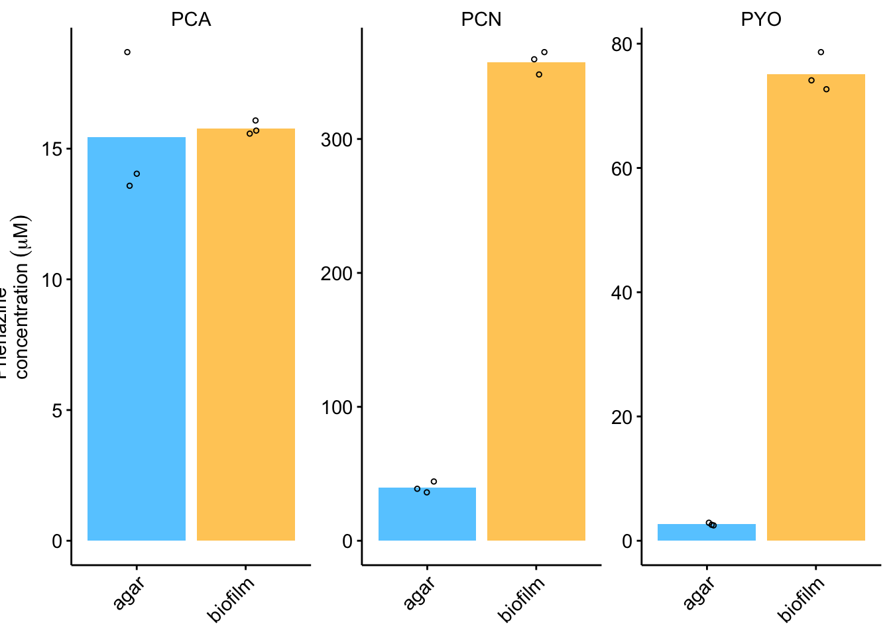
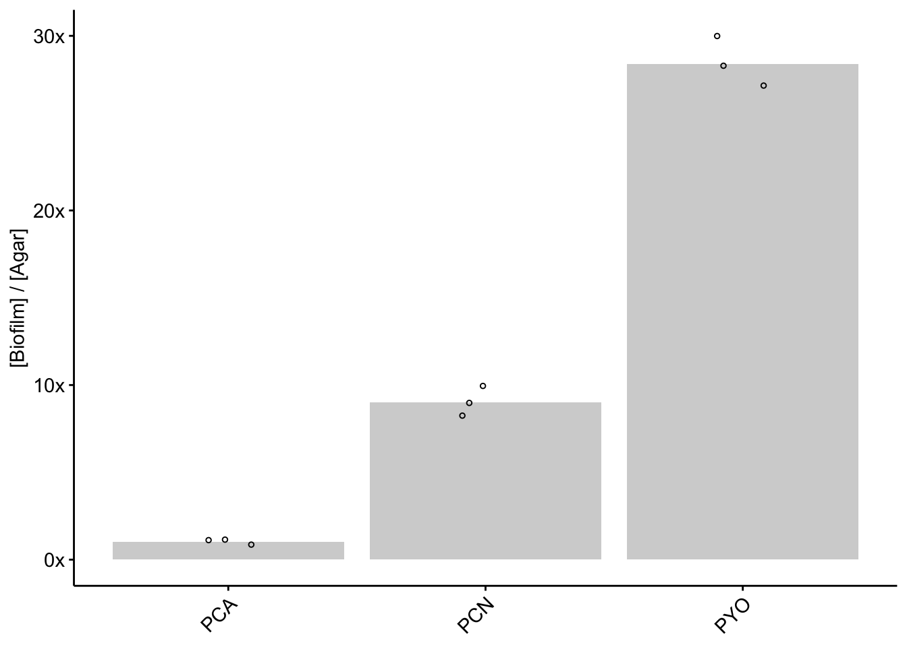
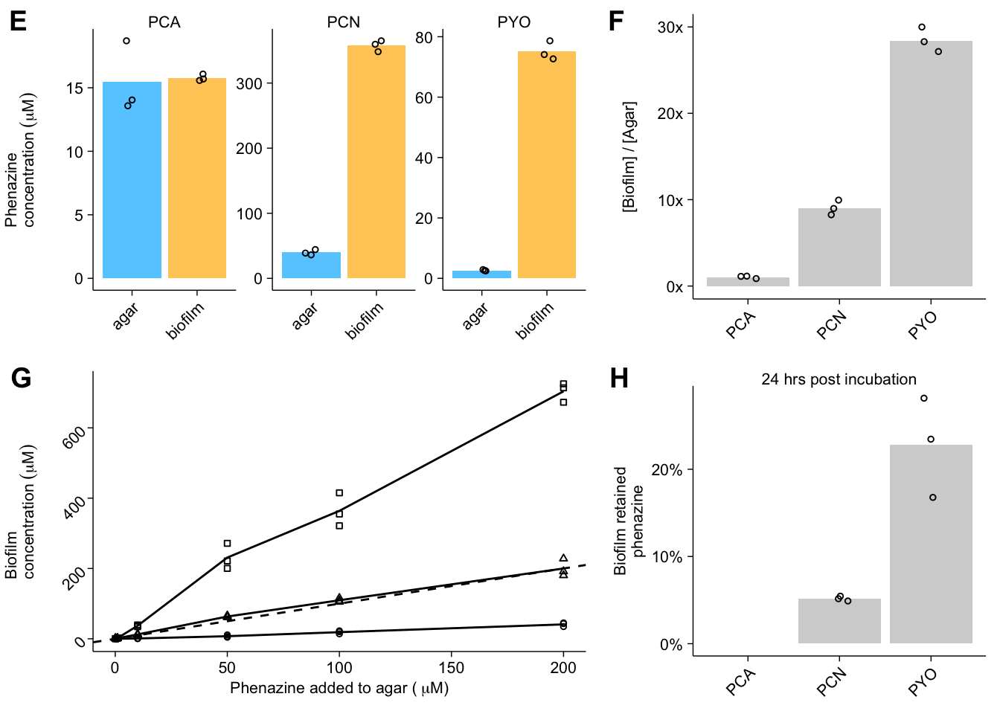

--------

# Notes

Panels A-X of Figure 1 are diagrams and images. The remaining panels were generated in R as shown here. Note all LC-MS data was quantified via absorbance. Chromatogram peaks were integrated in the Waters Empower software and integrations were exported and are contained in the csv files used here.

----

Setup packages and plotting for the notebook:


```r
# Load packages
library(tidyverse)
library(cowplot)
library(kableExtra)

# Code display options
knitr::opts_chunk$set(tidy.opts=list(width.cutoff=60),tidy=FALSE, echo = TRUE, message=FALSE, warning=FALSE, fig.align="center", fig.retina = 2)

# Load plotting tools
source("../../tools/plotting_tools.R")

#Modify the plot theme
theme_set(theme_notebook())
```

-----

# Fig. 1E - Wildtype phenazine concentrations

Read in the data - concentrations quantified from LC (Absorbance) peaks with standard curve.

```r
wt_extracts <- read_csv('../../../data/LC-MS/HPLC_data_colonies_02_16_18.csv')


wt_extracts %>% kable() %>% kable_styling() %>% scroll_box(height = '250px')
```

<div style="border: 1px solid #ddd; padding: 5px; overflow-y: scroll; height:250px; "><table class="table" style="margin-left: auto; margin-right: auto;">
 <thead>
  <tr>
   <th style="text-align:left;"> Name </th>
   <th style="text-align:left;"> strain </th>
   <th style="text-align:left;"> material </th>
   <th style="text-align:right;"> replicate </th>
   <th style="text-align:right;"> RT </th>
   <th style="text-align:right;"> Area </th>
   <th style="text-align:left;"> Channel Name </th>
   <th style="text-align:right;"> Amount </th>
  </tr>
 </thead>
<tbody>
  <tr>
   <td style="text-align:left;"> PYO </td>
   <td style="text-align:left;"> wt </td>
   <td style="text-align:left;"> agar </td>
   <td style="text-align:right;"> 1 </td>
   <td style="text-align:right;"> 6.233 </td>
   <td style="text-align:right;"> 48978 </td>
   <td style="text-align:left;"> 313.0nm </td>
   <td style="text-align:right;"> 2.069 </td>
  </tr>
  <tr>
   <td style="text-align:left;"> PCA </td>
   <td style="text-align:left;"> wt </td>
   <td style="text-align:left;"> agar </td>
   <td style="text-align:right;"> 1 </td>
   <td style="text-align:right;"> 3.726 </td>
   <td style="text-align:right;"> 200697 </td>
   <td style="text-align:left;"> 364.0nm </td>
   <td style="text-align:right;"> 13.352 </td>
  </tr>
  <tr>
   <td style="text-align:left;"> PCN </td>
   <td style="text-align:left;"> wt </td>
   <td style="text-align:left;"> agar </td>
   <td style="text-align:right;"> 1 </td>
   <td style="text-align:right;"> 9.071 </td>
   <td style="text-align:right;"> 478348 </td>
   <td style="text-align:left;"> 364.0nm </td>
   <td style="text-align:right;"> 31.599 </td>
  </tr>
  <tr>
   <td style="text-align:left;"> PYO </td>
   <td style="text-align:left;"> wt </td>
   <td style="text-align:left;"> agar </td>
   <td style="text-align:right;"> 2 </td>
   <td style="text-align:right;"> 6.226 </td>
   <td style="text-align:right;"> 43440 </td>
   <td style="text-align:left;"> 313.0nm </td>
   <td style="text-align:right;"> 1.835 </td>
  </tr>
  <tr>
   <td style="text-align:left;"> PCA </td>
   <td style="text-align:left;"> wt </td>
   <td style="text-align:left;"> agar </td>
   <td style="text-align:right;"> 2 </td>
   <td style="text-align:right;"> 3.685 </td>
   <td style="text-align:right;"> 150747 </td>
   <td style="text-align:left;"> 364.0nm </td>
   <td style="text-align:right;"> 10.029 </td>
  </tr>
  <tr>
   <td style="text-align:left;"> PCN </td>
   <td style="text-align:left;"> wt </td>
   <td style="text-align:left;"> agar </td>
   <td style="text-align:right;"> 2 </td>
   <td style="text-align:right;"> 9.065 </td>
   <td style="text-align:right;"> 419476 </td>
   <td style="text-align:left;"> 364.0nm </td>
   <td style="text-align:right;"> 27.710 </td>
  </tr>
  <tr>
   <td style="text-align:left;"> PYO </td>
   <td style="text-align:left;"> wt </td>
   <td style="text-align:left;"> agar </td>
   <td style="text-align:right;"> 3 </td>
   <td style="text-align:right;"> 6.243 </td>
   <td style="text-align:right;"> 41791 </td>
   <td style="text-align:left;"> 313.0nm </td>
   <td style="text-align:right;"> 1.765 </td>
  </tr>
  <tr>
   <td style="text-align:left;"> PCA </td>
   <td style="text-align:left;"> wt </td>
   <td style="text-align:left;"> agar </td>
   <td style="text-align:right;"> 3 </td>
   <td style="text-align:right;"> 3.678 </td>
   <td style="text-align:right;"> 145807 </td>
   <td style="text-align:left;"> 364.0nm </td>
   <td style="text-align:right;"> 9.700 </td>
  </tr>
  <tr>
   <td style="text-align:left;"> PCN </td>
   <td style="text-align:left;"> wt </td>
   <td style="text-align:left;"> agar </td>
   <td style="text-align:right;"> 3 </td>
   <td style="text-align:right;"> 9.073 </td>
   <td style="text-align:right;"> 390771 </td>
   <td style="text-align:left;"> 364.0nm </td>
   <td style="text-align:right;"> 25.813 </td>
  </tr>
  <tr>
   <td style="text-align:left;"> PYO </td>
   <td style="text-align:left;"> wt </td>
   <td style="text-align:left;"> biofilm </td>
   <td style="text-align:right;"> 1 </td>
   <td style="text-align:right;"> 6.233 </td>
   <td style="text-align:right;"> 144296 </td>
   <td style="text-align:left;"> 313.0nm </td>
   <td style="text-align:right;"> 6.095 </td>
  </tr>
  <tr>
   <td style="text-align:left;"> PCA </td>
   <td style="text-align:left;"> wt </td>
   <td style="text-align:left;"> biofilm </td>
   <td style="text-align:right;"> 1 </td>
   <td style="text-align:right;"> 3.804 </td>
   <td style="text-align:right;"> 18731 </td>
   <td style="text-align:left;"> 364.0nm </td>
   <td style="text-align:right;"> 1.246 </td>
  </tr>
  <tr>
   <td style="text-align:left;"> PCN </td>
   <td style="text-align:left;"> wt </td>
   <td style="text-align:left;"> biofilm </td>
   <td style="text-align:right;"> 1 </td>
   <td style="text-align:right;"> 9.071 </td>
   <td style="text-align:right;"> 428081 </td>
   <td style="text-align:left;"> 364.0nm </td>
   <td style="text-align:right;"> 28.278 </td>
  </tr>
  <tr>
   <td style="text-align:left;"> PYO </td>
   <td style="text-align:left;"> wt </td>
   <td style="text-align:left;"> biofilm </td>
   <td style="text-align:right;"> 2 </td>
   <td style="text-align:right;"> 6.236 </td>
   <td style="text-align:right;"> 133341 </td>
   <td style="text-align:left;"> 313.0nm </td>
   <td style="text-align:right;"> 5.632 </td>
  </tr>
  <tr>
   <td style="text-align:left;"> PCA </td>
   <td style="text-align:left;"> wt </td>
   <td style="text-align:left;"> biofilm </td>
   <td style="text-align:right;"> 2 </td>
   <td style="text-align:right;"> 3.786 </td>
   <td style="text-align:right;"> 18272 </td>
   <td style="text-align:left;"> 364.0nm </td>
   <td style="text-align:right;"> 1.216 </td>
  </tr>
  <tr>
   <td style="text-align:left;"> PCN </td>
   <td style="text-align:left;"> wt </td>
   <td style="text-align:left;"> biofilm </td>
   <td style="text-align:right;"> 2 </td>
   <td style="text-align:right;"> 9.064 </td>
   <td style="text-align:right;"> 408496 </td>
   <td style="text-align:left;"> 364.0nm </td>
   <td style="text-align:right;"> 26.984 </td>
  </tr>
  <tr>
   <td style="text-align:left;"> PYO </td>
   <td style="text-align:left;"> wt </td>
   <td style="text-align:left;"> biofilm </td>
   <td style="text-align:right;"> 3 </td>
   <td style="text-align:right;"> 6.237 </td>
   <td style="text-align:right;"> 135965 </td>
   <td style="text-align:left;"> 313.0nm </td>
   <td style="text-align:right;"> 5.743 </td>
  </tr>
  <tr>
   <td style="text-align:left;"> PCA </td>
   <td style="text-align:left;"> wt </td>
   <td style="text-align:left;"> biofilm </td>
   <td style="text-align:right;"> 3 </td>
   <td style="text-align:right;"> 3.772 </td>
   <td style="text-align:right;"> 18141 </td>
   <td style="text-align:left;"> 364.0nm </td>
   <td style="text-align:right;"> 1.207 </td>
  </tr>
  <tr>
   <td style="text-align:left;"> PCN </td>
   <td style="text-align:left;"> wt </td>
   <td style="text-align:left;"> biofilm </td>
   <td style="text-align:right;"> 3 </td>
   <td style="text-align:right;"> 9.062 </td>
   <td style="text-align:right;"> 421803 </td>
   <td style="text-align:left;"> 364.0nm </td>
   <td style="text-align:right;"> 27.863 </td>
  </tr>
</tbody>
</table></div>


Now we need to convert the concentration (Amount column) into the concentration that existed in the biofilm or the agar, not the sample tube. For the agar, we know that there is 5mL and in this case 2mL of solution was added for extraction. For the biofilm, we estimate that the volume of the colony is about 60uL, and we resuspended it in 800uL. Here, I'll also calculate the means, so we can look at the mean and individual measurements.

```r
# Calculate concentration from Amount. For biofilm: Amount * 800 / 62, for agar: Amount * 7/5
wt_conc <- wt_extracts %>% 
  mutate(phz_conc = ifelse(material=='biofilm', Amount * (800 / 62), Amount * (7 / 5)))

# Calculate the mean concentration for each group - 'Name' is the measured phenazine
# Only assign mean to first observation, because we only need one bar
wt_conc_means <- wt_conc %>% 
  group_by(material, Name) %>% 
  mutate(mean = ifelse(replicate==1, mean(phz_conc), NA)) 
```


Let's plot the data with a fixed scale, so we can see the pattern of phenazine production by the WT cells:

```r
#Plot layout
plot_wt_fixed <- ggplot(wt_conc_means, aes(x = material, fill = material)) + 
  geom_col(aes(y = mean)) + 
  geom_jitter(aes(y = phz_conc), height = 0, width = 0.1, shape = 21) +
  facet_wrap(~Name)

#Plot styling
plot_wt_fixed +
  labs(x = NULL, y = expression("Phenazine concentration" ~ ( mu*M ))) + 
  theme(axis.title.x = element_text(size = 14), line = element_line(color = 'black', size = 0.25)) 
```


And now we'll plot each phenazine on its own Y-axis.


```r
#Plot layout
plot_wt_free <- ggplot(wt_conc_means, aes(x = material)) + 
  geom_col(aes(y = mean, fill = material)) + 
  geom_jitter(aes(y = phz_conc), height = 0, width = 0.1, shape = 21,color = 'black', size = 1) +
  facet_wrap(~Name, scales = 'free')

#Plot styling
plot_wt_free_styled <- plot_wt_free +
  labs(x = NULL, y = expression("Phenazine concentration" ~ ( mu*M ))) + 
  theme(axis.title.x = element_text(size = 14)) + 
  scale_fill_manual(guide = F, values = c("#66CCFF","#FFCC66"))
    
plot_wt_free_styled     
```



---

# Fig. 1F - WT phenazine retention ratio


```r
# Split dataset by material
wt_conc_means_agar <- wt_conc_means %>% 
  filter(material=='agar')

wt_conc_means_biofilm <- wt_conc_means %>% 
  filter(material=='biofilm')

# Join agar and cell observations and calculate retention ratios = biofilm / agar
wt_conc_means_join <- left_join(wt_conc_means_biofilm, wt_conc_means_agar, 
                                by = c('strain','replicate','Name'), 
                                suffix = c('_from_biofilm','_from_agar')) %>% 
  mutate(retention_ratio = phz_conc_from_biofilm / phz_conc_from_agar) %>% 
  mutate(mean_retention_ratio = mean_from_biofilm / mean_from_agar)

# Plot Layout
wt_ret_ratio <- ggplot(wt_conc_means_join ,aes(x=Name,y=retention_ratio))+
  geom_col( aes(y = mean_retention_ratio), fill = 'light gray') +
  geom_jitter(width=0.1,height=0,shape=21,size=1)

# Plot Stlying
wt_ret_ratio_styled <- wt_ret_ratio +
  guides(fill=F) +
  scale_y_continuous(labels = fold_label) + 
  labs(x = NULL, y = "[Biofilm] / [Agar]")

wt_ret_ratio_styled
```



---

# Fig. 1G - ∆phz* phenazine accumlation

Let's first read in the data. This csv contains the data for multiple experiments that were run on the LC-MS on the same day, so let's just look at the dPHZ* colonies.


```r
# Read in only the dPHZstar data, and convert the amount of phenazine added to a numeric
dphz_extracts <- read_csv('../../../data/LC-MS/2018_10_30_HPLC_concentrations_df.csv',comment = "#") %>% 
  filter(strain == 'dPHZstar') %>% 
  mutate(added_phz_num=as.double(str_extract(amount_added,"^[0-9.]+")))

dphz_extracts %>% 
  kable() %>% 
  kable_styling() %>% 
  scroll_box(height = '250px')
```

<div style="border: 1px solid #ddd; padding: 5px; overflow-y: scroll; height:250px; "><table class="table" style="margin-left: auto; margin-right: auto;">
 <thead>
  <tr>
   <th style="text-align:left;"> measured_phenazine </th>
   <th style="text-align:left;"> strain </th>
   <th style="text-align:left;"> amount_added </th>
   <th style="text-align:left;"> added_phenazine </th>
   <th style="text-align:left;"> material </th>
   <th style="text-align:right;"> replicate </th>
   <th style="text-align:right;"> RT </th>
   <th style="text-align:right;"> Area </th>
   <th style="text-align:left;"> Channel Name </th>
   <th style="text-align:right;"> Amount </th>
   <th style="text-align:right;"> calcConc </th>
   <th style="text-align:right;"> added_phz_num </th>
  </tr>
 </thead>
<tbody>
  <tr>
   <td style="text-align:left;"> PCA </td>
   <td style="text-align:left;"> dPHZstar </td>
   <td style="text-align:left;"> 0.1uM </td>
   <td style="text-align:left;"> PCA </td>
   <td style="text-align:left;"> cells </td>
   <td style="text-align:right;"> 1 </td>
   <td style="text-align:right;"> 3.183 </td>
   <td style="text-align:right;"> 61 </td>
   <td style="text-align:left;"> 364.0nm </td>
   <td style="text-align:right;"> 0.004 </td>
   <td style="text-align:right;"> 0.1146667 </td>
   <td style="text-align:right;"> 0.1 </td>
  </tr>
  <tr>
   <td style="text-align:left;"> PCN </td>
   <td style="text-align:left;"> dPHZstar </td>
   <td style="text-align:left;"> 0.1uM </td>
   <td style="text-align:left;"> PCA </td>
   <td style="text-align:left;"> cells </td>
   <td style="text-align:right;"> 1 </td>
   <td style="text-align:right;"> 8.693 </td>
   <td style="text-align:right;"> 653 </td>
   <td style="text-align:left;"> 364.0nm </td>
   <td style="text-align:right;"> 0.043 </td>
   <td style="text-align:right;"> 1.2326667 </td>
   <td style="text-align:right;"> 0.1 </td>
  </tr>
  <tr>
   <td style="text-align:left;"> PYO </td>
   <td style="text-align:left;"> dPHZstar </td>
   <td style="text-align:left;"> 0.1uM </td>
   <td style="text-align:left;"> PCA </td>
   <td style="text-align:left;"> cells </td>
   <td style="text-align:right;"> 1 </td>
   <td style="text-align:right;"> 5.976 </td>
   <td style="text-align:right;"> 20 </td>
   <td style="text-align:left;"> 313.0nm </td>
   <td style="text-align:right;"> 0.001 </td>
   <td style="text-align:right;"> 0.0286667 </td>
   <td style="text-align:right;"> 0.1 </td>
  </tr>
  <tr>
   <td style="text-align:left;"> PCA </td>
   <td style="text-align:left;"> dPHZstar </td>
   <td style="text-align:left;"> 0.1uM </td>
   <td style="text-align:left;"> PCA </td>
   <td style="text-align:left;"> cells </td>
   <td style="text-align:right;"> 2 </td>
   <td style="text-align:right;"> 3.044 </td>
   <td style="text-align:right;"> 52 </td>
   <td style="text-align:left;"> 364.0nm </td>
   <td style="text-align:right;"> 0.003 </td>
   <td style="text-align:right;"> 0.0860000 </td>
   <td style="text-align:right;"> 0.1 </td>
  </tr>
  <tr>
   <td style="text-align:left;"> PCN </td>
   <td style="text-align:left;"> dPHZstar </td>
   <td style="text-align:left;"> 0.1uM </td>
   <td style="text-align:left;"> PCA </td>
   <td style="text-align:left;"> cells </td>
   <td style="text-align:right;"> 2 </td>
   <td style="text-align:right;"> 8.700 </td>
   <td style="text-align:right;"> 744 </td>
   <td style="text-align:left;"> 364.0nm </td>
   <td style="text-align:right;"> 0.049 </td>
   <td style="text-align:right;"> 1.4046667 </td>
   <td style="text-align:right;"> 0.1 </td>
  </tr>
  <tr>
   <td style="text-align:left;"> PCA </td>
   <td style="text-align:left;"> dPHZstar </td>
   <td style="text-align:left;"> 0.1uM </td>
   <td style="text-align:left;"> PCA </td>
   <td style="text-align:left;"> cells </td>
   <td style="text-align:right;"> 3 </td>
   <td style="text-align:right;"> 3.154 </td>
   <td style="text-align:right;"> 55 </td>
   <td style="text-align:left;"> 364.0nm </td>
   <td style="text-align:right;"> 0.004 </td>
   <td style="text-align:right;"> 0.1146667 </td>
   <td style="text-align:right;"> 0.1 </td>
  </tr>
  <tr>
   <td style="text-align:left;"> PCN </td>
   <td style="text-align:left;"> dPHZstar </td>
   <td style="text-align:left;"> 0.1uM </td>
   <td style="text-align:left;"> PCA </td>
   <td style="text-align:left;"> cells </td>
   <td style="text-align:right;"> 3 </td>
   <td style="text-align:right;"> 8.686 </td>
   <td style="text-align:right;"> 756 </td>
   <td style="text-align:left;"> 364.0nm </td>
   <td style="text-align:right;"> 0.050 </td>
   <td style="text-align:right;"> 1.4333333 </td>
   <td style="text-align:right;"> 0.1 </td>
  </tr>
  <tr>
   <td style="text-align:left;"> PCA </td>
   <td style="text-align:left;"> dPHZstar </td>
   <td style="text-align:left;"> 0.1uM </td>
   <td style="text-align:left;"> PCN </td>
   <td style="text-align:left;"> cells </td>
   <td style="text-align:right;"> 1 </td>
   <td style="text-align:right;"> 2.972 </td>
   <td style="text-align:right;"> 56 </td>
   <td style="text-align:left;"> 364.0nm </td>
   <td style="text-align:right;"> 0.004 </td>
   <td style="text-align:right;"> 0.1146667 </td>
   <td style="text-align:right;"> 0.1 </td>
  </tr>
  <tr>
   <td style="text-align:left;"> PCN </td>
   <td style="text-align:left;"> dPHZstar </td>
   <td style="text-align:left;"> 0.1uM </td>
   <td style="text-align:left;"> PCN </td>
   <td style="text-align:left;"> cells </td>
   <td style="text-align:right;"> 1 </td>
   <td style="text-align:right;"> 8.696 </td>
   <td style="text-align:right;"> 880 </td>
   <td style="text-align:left;"> 364.0nm </td>
   <td style="text-align:right;"> 0.058 </td>
   <td style="text-align:right;"> 1.6626667 </td>
   <td style="text-align:right;"> 0.1 </td>
  </tr>
  <tr>
   <td style="text-align:left;"> PYO </td>
   <td style="text-align:left;"> dPHZstar </td>
   <td style="text-align:left;"> 0.1uM </td>
   <td style="text-align:left;"> PCN </td>
   <td style="text-align:left;"> cells </td>
   <td style="text-align:right;"> 1 </td>
   <td style="text-align:right;"> 6.050 </td>
   <td style="text-align:right;"> 20 </td>
   <td style="text-align:left;"> 313.0nm </td>
   <td style="text-align:right;"> 0.001 </td>
   <td style="text-align:right;"> 0.0286667 </td>
   <td style="text-align:right;"> 0.1 </td>
  </tr>
  <tr>
   <td style="text-align:left;"> PCA </td>
   <td style="text-align:left;"> dPHZstar </td>
   <td style="text-align:left;"> 0.1uM </td>
   <td style="text-align:left;"> PCN </td>
   <td style="text-align:left;"> cells </td>
   <td style="text-align:right;"> 2 </td>
   <td style="text-align:right;"> 3.294 </td>
   <td style="text-align:right;"> 70 </td>
   <td style="text-align:left;"> 364.0nm </td>
   <td style="text-align:right;"> 0.005 </td>
   <td style="text-align:right;"> 0.1433333 </td>
   <td style="text-align:right;"> 0.1 </td>
  </tr>
  <tr>
   <td style="text-align:left;"> PCN </td>
   <td style="text-align:left;"> dPHZstar </td>
   <td style="text-align:left;"> 0.1uM </td>
   <td style="text-align:left;"> PCN </td>
   <td style="text-align:left;"> cells </td>
   <td style="text-align:right;"> 2 </td>
   <td style="text-align:right;"> 8.703 </td>
   <td style="text-align:right;"> 562 </td>
   <td style="text-align:left;"> 364.0nm </td>
   <td style="text-align:right;"> 0.037 </td>
   <td style="text-align:right;"> 1.0606667 </td>
   <td style="text-align:right;"> 0.1 </td>
  </tr>
  <tr>
   <td style="text-align:left;"> PYO </td>
   <td style="text-align:left;"> dPHZstar </td>
   <td style="text-align:left;"> 0.1uM </td>
   <td style="text-align:left;"> PCN </td>
   <td style="text-align:left;"> cells </td>
   <td style="text-align:right;"> 2 </td>
   <td style="text-align:right;"> 5.950 </td>
   <td style="text-align:right;"> 21 </td>
   <td style="text-align:left;"> 313.0nm </td>
   <td style="text-align:right;"> 0.001 </td>
   <td style="text-align:right;"> 0.0286667 </td>
   <td style="text-align:right;"> 0.1 </td>
  </tr>
  <tr>
   <td style="text-align:left;"> PCA </td>
   <td style="text-align:left;"> dPHZstar </td>
   <td style="text-align:left;"> 0.1uM </td>
   <td style="text-align:left;"> PCN </td>
   <td style="text-align:left;"> cells </td>
   <td style="text-align:right;"> 3 </td>
   <td style="text-align:right;"> 2.957 </td>
   <td style="text-align:right;"> 39 </td>
   <td style="text-align:left;"> 364.0nm </td>
   <td style="text-align:right;"> 0.003 </td>
   <td style="text-align:right;"> 0.0860000 </td>
   <td style="text-align:right;"> 0.1 </td>
  </tr>
  <tr>
   <td style="text-align:left;"> PCN </td>
   <td style="text-align:left;"> dPHZstar </td>
   <td style="text-align:left;"> 0.1uM </td>
   <td style="text-align:left;"> PCN </td>
   <td style="text-align:left;"> cells </td>
   <td style="text-align:right;"> 3 </td>
   <td style="text-align:right;"> 8.695 </td>
   <td style="text-align:right;"> 487 </td>
   <td style="text-align:left;"> 364.0nm </td>
   <td style="text-align:right;"> 0.032 </td>
   <td style="text-align:right;"> 0.9173333 </td>
   <td style="text-align:right;"> 0.1 </td>
  </tr>
  <tr>
   <td style="text-align:left;"> PYO </td>
   <td style="text-align:left;"> dPHZstar </td>
   <td style="text-align:left;"> 0.1uM </td>
   <td style="text-align:left;"> PCN </td>
   <td style="text-align:left;"> cells </td>
   <td style="text-align:right;"> 3 </td>
   <td style="text-align:right;"> 5.911 </td>
   <td style="text-align:right;"> 27 </td>
   <td style="text-align:left;"> 313.0nm </td>
   <td style="text-align:right;"> 0.001 </td>
   <td style="text-align:right;"> 0.0286667 </td>
   <td style="text-align:right;"> 0.1 </td>
  </tr>
  <tr>
   <td style="text-align:left;"> PCA </td>
   <td style="text-align:left;"> dPHZstar </td>
   <td style="text-align:left;"> 0.1uM </td>
   <td style="text-align:left;"> PYO </td>
   <td style="text-align:left;"> cells </td>
   <td style="text-align:right;"> 1 </td>
   <td style="text-align:right;"> 3.365 </td>
   <td style="text-align:right;"> 66 </td>
   <td style="text-align:left;"> 364.0nm </td>
   <td style="text-align:right;"> 0.004 </td>
   <td style="text-align:right;"> 0.1146667 </td>
   <td style="text-align:right;"> 0.1 </td>
  </tr>
  <tr>
   <td style="text-align:left;"> PCN </td>
   <td style="text-align:left;"> dPHZstar </td>
   <td style="text-align:left;"> 0.1uM </td>
   <td style="text-align:left;"> PYO </td>
   <td style="text-align:left;"> cells </td>
   <td style="text-align:right;"> 1 </td>
   <td style="text-align:right;"> 8.690 </td>
   <td style="text-align:right;"> 682 </td>
   <td style="text-align:left;"> 364.0nm </td>
   <td style="text-align:right;"> 0.045 </td>
   <td style="text-align:right;"> 1.2900000 </td>
   <td style="text-align:right;"> 0.1 </td>
  </tr>
  <tr>
   <td style="text-align:left;"> PCA </td>
   <td style="text-align:left;"> dPHZstar </td>
   <td style="text-align:left;"> 0.1uM </td>
   <td style="text-align:left;"> PYO </td>
   <td style="text-align:left;"> cells </td>
   <td style="text-align:right;"> 2 </td>
   <td style="text-align:right;"> 3.191 </td>
   <td style="text-align:right;"> 90 </td>
   <td style="text-align:left;"> 364.0nm </td>
   <td style="text-align:right;"> 0.006 </td>
   <td style="text-align:right;"> 0.1720000 </td>
   <td style="text-align:right;"> 0.1 </td>
  </tr>
  <tr>
   <td style="text-align:left;"> PCN </td>
   <td style="text-align:left;"> dPHZstar </td>
   <td style="text-align:left;"> 0.1uM </td>
   <td style="text-align:left;"> PYO </td>
   <td style="text-align:left;"> cells </td>
   <td style="text-align:right;"> 2 </td>
   <td style="text-align:right;"> 8.696 </td>
   <td style="text-align:right;"> 414 </td>
   <td style="text-align:left;"> 364.0nm </td>
   <td style="text-align:right;"> 0.027 </td>
   <td style="text-align:right;"> 0.7740000 </td>
   <td style="text-align:right;"> 0.1 </td>
  </tr>
  <tr>
   <td style="text-align:left;"> PYO </td>
   <td style="text-align:left;"> dPHZstar </td>
   <td style="text-align:left;"> 0.1uM </td>
   <td style="text-align:left;"> PYO </td>
   <td style="text-align:left;"> cells </td>
   <td style="text-align:right;"> 2 </td>
   <td style="text-align:right;"> 6.010 </td>
   <td style="text-align:right;"> 448 </td>
   <td style="text-align:left;"> 313.0nm </td>
   <td style="text-align:right;"> 0.014 </td>
   <td style="text-align:right;"> 0.4013333 </td>
   <td style="text-align:right;"> 0.1 </td>
  </tr>
  <tr>
   <td style="text-align:left;"> PCA </td>
   <td style="text-align:left;"> dPHZstar </td>
   <td style="text-align:left;"> 0.1uM </td>
   <td style="text-align:left;"> PYO </td>
   <td style="text-align:left;"> cells </td>
   <td style="text-align:right;"> 3 </td>
   <td style="text-align:right;"> 3.344 </td>
   <td style="text-align:right;"> 50 </td>
   <td style="text-align:left;"> 364.0nm </td>
   <td style="text-align:right;"> 0.003 </td>
   <td style="text-align:right;"> 0.0860000 </td>
   <td style="text-align:right;"> 0.1 </td>
  </tr>
  <tr>
   <td style="text-align:left;"> PCN </td>
   <td style="text-align:left;"> dPHZstar </td>
   <td style="text-align:left;"> 0.1uM </td>
   <td style="text-align:left;"> PYO </td>
   <td style="text-align:left;"> cells </td>
   <td style="text-align:right;"> 3 </td>
   <td style="text-align:right;"> 8.689 </td>
   <td style="text-align:right;"> 1331 </td>
   <td style="text-align:left;"> 364.0nm </td>
   <td style="text-align:right;"> 0.088 </td>
   <td style="text-align:right;"> 2.5226667 </td>
   <td style="text-align:right;"> 0.1 </td>
  </tr>
  <tr>
   <td style="text-align:left;"> PYO </td>
   <td style="text-align:left;"> dPHZstar </td>
   <td style="text-align:left;"> 0.1uM </td>
   <td style="text-align:left;"> PYO </td>
   <td style="text-align:left;"> cells </td>
   <td style="text-align:right;"> 3 </td>
   <td style="text-align:right;"> 6.006 </td>
   <td style="text-align:right;"> 471 </td>
   <td style="text-align:left;"> 313.0nm </td>
   <td style="text-align:right;"> 0.014 </td>
   <td style="text-align:right;"> 0.4013333 </td>
   <td style="text-align:right;"> 0.1 </td>
  </tr>
  <tr>
   <td style="text-align:left;"> PCA </td>
   <td style="text-align:left;"> dPHZstar </td>
   <td style="text-align:left;"> 100uM </td>
   <td style="text-align:left;"> PCA </td>
   <td style="text-align:left;"> cells </td>
   <td style="text-align:right;"> 1 </td>
   <td style="text-align:right;"> 3.203 </td>
   <td style="text-align:right;"> 11969 </td>
   <td style="text-align:left;"> 364.0nm </td>
   <td style="text-align:right;"> 0.786 </td>
   <td style="text-align:right;"> 22.5320000 </td>
   <td style="text-align:right;"> 100.0 </td>
  </tr>
  <tr>
   <td style="text-align:left;"> PCN </td>
   <td style="text-align:left;"> dPHZstar </td>
   <td style="text-align:left;"> 100uM </td>
   <td style="text-align:left;"> PCA </td>
   <td style="text-align:left;"> cells </td>
   <td style="text-align:right;"> 1 </td>
   <td style="text-align:right;"> 8.699 </td>
   <td style="text-align:right;"> 1089 </td>
   <td style="text-align:left;"> 364.0nm </td>
   <td style="text-align:right;"> 0.072 </td>
   <td style="text-align:right;"> 2.0640000 </td>
   <td style="text-align:right;"> 100.0 </td>
  </tr>
  <tr>
   <td style="text-align:left;"> PYO </td>
   <td style="text-align:left;"> dPHZstar </td>
   <td style="text-align:left;"> 100uM </td>
   <td style="text-align:left;"> PCA </td>
   <td style="text-align:left;"> cells </td>
   <td style="text-align:right;"> 1 </td>
   <td style="text-align:right;"> 6.008 </td>
   <td style="text-align:right;"> 22 </td>
   <td style="text-align:left;"> 313.0nm </td>
   <td style="text-align:right;"> 0.001 </td>
   <td style="text-align:right;"> 0.0286667 </td>
   <td style="text-align:right;"> 100.0 </td>
  </tr>
  <tr>
   <td style="text-align:left;"> PCA </td>
   <td style="text-align:left;"> dPHZstar </td>
   <td style="text-align:left;"> 100uM </td>
   <td style="text-align:left;"> PCA </td>
   <td style="text-align:left;"> cells </td>
   <td style="text-align:right;"> 2 </td>
   <td style="text-align:right;"> 3.182 </td>
   <td style="text-align:right;"> 10593 </td>
   <td style="text-align:left;"> 364.0nm </td>
   <td style="text-align:right;"> 0.695 </td>
   <td style="text-align:right;"> 19.9233333 </td>
   <td style="text-align:right;"> 100.0 </td>
  </tr>
  <tr>
   <td style="text-align:left;"> PCN </td>
   <td style="text-align:left;"> dPHZstar </td>
   <td style="text-align:left;"> 100uM </td>
   <td style="text-align:left;"> PCA </td>
   <td style="text-align:left;"> cells </td>
   <td style="text-align:right;"> 2 </td>
   <td style="text-align:right;"> 8.689 </td>
   <td style="text-align:right;"> 752 </td>
   <td style="text-align:left;"> 364.0nm </td>
   <td style="text-align:right;"> 0.050 </td>
   <td style="text-align:right;"> 1.4333333 </td>
   <td style="text-align:right;"> 100.0 </td>
  </tr>
  <tr>
   <td style="text-align:left;"> PYO </td>
   <td style="text-align:left;"> dPHZstar </td>
   <td style="text-align:left;"> 100uM </td>
   <td style="text-align:left;"> PCA </td>
   <td style="text-align:left;"> cells </td>
   <td style="text-align:right;"> 2 </td>
   <td style="text-align:right;"> 5.933 </td>
   <td style="text-align:right;"> 37 </td>
   <td style="text-align:left;"> 313.0nm </td>
   <td style="text-align:right;"> 0.001 </td>
   <td style="text-align:right;"> 0.0286667 </td>
   <td style="text-align:right;"> 100.0 </td>
  </tr>
  <tr>
   <td style="text-align:left;"> PCA </td>
   <td style="text-align:left;"> dPHZstar </td>
   <td style="text-align:left;"> 100uM </td>
   <td style="text-align:left;"> PCA </td>
   <td style="text-align:left;"> cells </td>
   <td style="text-align:right;"> 3 </td>
   <td style="text-align:right;"> 3.183 </td>
   <td style="text-align:right;"> 7457 </td>
   <td style="text-align:left;"> 364.0nm </td>
   <td style="text-align:right;"> 0.490 </td>
   <td style="text-align:right;"> 14.0466667 </td>
   <td style="text-align:right;"> 100.0 </td>
  </tr>
  <tr>
   <td style="text-align:left;"> PCN </td>
   <td style="text-align:left;"> dPHZstar </td>
   <td style="text-align:left;"> 100uM </td>
   <td style="text-align:left;"> PCA </td>
   <td style="text-align:left;"> cells </td>
   <td style="text-align:right;"> 3 </td>
   <td style="text-align:right;"> 8.686 </td>
   <td style="text-align:right;"> 821 </td>
   <td style="text-align:left;"> 364.0nm </td>
   <td style="text-align:right;"> 0.054 </td>
   <td style="text-align:right;"> 1.5480000 </td>
   <td style="text-align:right;"> 100.0 </td>
  </tr>
  <tr>
   <td style="text-align:left;"> PCA </td>
   <td style="text-align:left;"> dPHZstar </td>
   <td style="text-align:left;"> 100uM </td>
   <td style="text-align:left;"> PCN </td>
   <td style="text-align:left;"> cells </td>
   <td style="text-align:right;"> 1 </td>
   <td style="text-align:right;"> 3.434 </td>
   <td style="text-align:right;"> 167 </td>
   <td style="text-align:left;"> 364.0nm </td>
   <td style="text-align:right;"> 0.011 </td>
   <td style="text-align:right;"> 0.3153333 </td>
   <td style="text-align:right;"> 100.0 </td>
  </tr>
  <tr>
   <td style="text-align:left;"> PCN </td>
   <td style="text-align:left;"> dPHZstar </td>
   <td style="text-align:left;"> 100uM </td>
   <td style="text-align:left;"> PCN </td>
   <td style="text-align:left;"> cells </td>
   <td style="text-align:right;"> 1 </td>
   <td style="text-align:right;"> 8.856 </td>
   <td style="text-align:right;"> 55528 </td>
   <td style="text-align:left;"> 364.0nm </td>
   <td style="text-align:right;"> 3.663 </td>
   <td style="text-align:right;"> 105.0060000 </td>
   <td style="text-align:right;"> 100.0 </td>
  </tr>
  <tr>
   <td style="text-align:left;"> PYO </td>
   <td style="text-align:left;"> dPHZstar </td>
   <td style="text-align:left;"> 100uM </td>
   <td style="text-align:left;"> PCN </td>
   <td style="text-align:left;"> cells </td>
   <td style="text-align:right;"> 1 </td>
   <td style="text-align:right;"> 5.962 </td>
   <td style="text-align:right;"> 23 </td>
   <td style="text-align:left;"> 313.0nm </td>
   <td style="text-align:right;"> 0.001 </td>
   <td style="text-align:right;"> 0.0286667 </td>
   <td style="text-align:right;"> 100.0 </td>
  </tr>
  <tr>
   <td style="text-align:left;"> PCA </td>
   <td style="text-align:left;"> dPHZstar </td>
   <td style="text-align:left;"> 100uM </td>
   <td style="text-align:left;"> PCN </td>
   <td style="text-align:left;"> cells </td>
   <td style="text-align:right;"> 2 </td>
   <td style="text-align:right;"> 3.445 </td>
   <td style="text-align:right;"> 162 </td>
   <td style="text-align:left;"> 364.0nm </td>
   <td style="text-align:right;"> 0.011 </td>
   <td style="text-align:right;"> 0.3153333 </td>
   <td style="text-align:right;"> 100.0 </td>
  </tr>
  <tr>
   <td style="text-align:left;"> PCN </td>
   <td style="text-align:left;"> dPHZstar </td>
   <td style="text-align:left;"> 100uM </td>
   <td style="text-align:left;"> PCN </td>
   <td style="text-align:left;"> cells </td>
   <td style="text-align:right;"> 2 </td>
   <td style="text-align:right;"> 8.861 </td>
   <td style="text-align:right;"> 57086 </td>
   <td style="text-align:left;"> 364.0nm </td>
   <td style="text-align:right;"> 3.766 </td>
   <td style="text-align:right;"> 107.9586667 </td>
   <td style="text-align:right;"> 100.0 </td>
  </tr>
  <tr>
   <td style="text-align:left;"> PCA </td>
   <td style="text-align:left;"> dPHZstar </td>
   <td style="text-align:left;"> 100uM </td>
   <td style="text-align:left;"> PCN </td>
   <td style="text-align:left;"> cells </td>
   <td style="text-align:right;"> 3 </td>
   <td style="text-align:right;"> 3.153 </td>
   <td style="text-align:right;"> 69 </td>
   <td style="text-align:left;"> 364.0nm </td>
   <td style="text-align:right;"> 0.005 </td>
   <td style="text-align:right;"> 0.1433333 </td>
   <td style="text-align:right;"> 100.0 </td>
  </tr>
  <tr>
   <td style="text-align:left;"> PCN </td>
   <td style="text-align:left;"> dPHZstar </td>
   <td style="text-align:left;"> 100uM </td>
   <td style="text-align:left;"> PCN </td>
   <td style="text-align:left;"> cells </td>
   <td style="text-align:right;"> 3 </td>
   <td style="text-align:right;"> 8.847 </td>
   <td style="text-align:right;"> 61182 </td>
   <td style="text-align:left;"> 364.0nm </td>
   <td style="text-align:right;"> 4.036 </td>
   <td style="text-align:right;"> 115.6986667 </td>
   <td style="text-align:right;"> 100.0 </td>
  </tr>
  <tr>
   <td style="text-align:left;"> PYO </td>
   <td style="text-align:left;"> dPHZstar </td>
   <td style="text-align:left;"> 100uM </td>
   <td style="text-align:left;"> PCN </td>
   <td style="text-align:left;"> cells </td>
   <td style="text-align:right;"> 3 </td>
   <td style="text-align:right;"> 6.035 </td>
   <td style="text-align:right;"> 27 </td>
   <td style="text-align:left;"> 313.0nm </td>
   <td style="text-align:right;"> 0.001 </td>
   <td style="text-align:right;"> 0.0286667 </td>
   <td style="text-align:right;"> 100.0 </td>
  </tr>
  <tr>
   <td style="text-align:left;"> PCA </td>
   <td style="text-align:left;"> dPHZstar </td>
   <td style="text-align:left;"> 100uM </td>
   <td style="text-align:left;"> PYO </td>
   <td style="text-align:left;"> cells </td>
   <td style="text-align:right;"> 1 </td>
   <td style="text-align:right;"> 3.206 </td>
   <td style="text-align:right;"> 79 </td>
   <td style="text-align:left;"> 364.0nm </td>
   <td style="text-align:right;"> 0.005 </td>
   <td style="text-align:right;"> 0.1433333 </td>
   <td style="text-align:right;"> 100.0 </td>
  </tr>
  <tr>
   <td style="text-align:left;"> PCN </td>
   <td style="text-align:left;"> dPHZstar </td>
   <td style="text-align:left;"> 100uM </td>
   <td style="text-align:left;"> PYO </td>
   <td style="text-align:left;"> cells </td>
   <td style="text-align:right;"> 1 </td>
   <td style="text-align:right;"> 8.695 </td>
   <td style="text-align:right;"> 863 </td>
   <td style="text-align:left;"> 364.0nm </td>
   <td style="text-align:right;"> 0.057 </td>
   <td style="text-align:right;"> 1.6340000 </td>
   <td style="text-align:right;"> 100.0 </td>
  </tr>
  <tr>
   <td style="text-align:left;"> PYO </td>
   <td style="text-align:left;"> dPHZstar </td>
   <td style="text-align:left;"> 100uM </td>
   <td style="text-align:left;"> PYO </td>
   <td style="text-align:left;"> cells </td>
   <td style="text-align:right;"> 1 </td>
   <td style="text-align:right;"> 6.010 </td>
   <td style="text-align:right;"> 470878 </td>
   <td style="text-align:left;"> 313.0nm </td>
   <td style="text-align:right;"> 14.484 </td>
   <td style="text-align:right;"> 415.2080000 </td>
   <td style="text-align:right;"> 100.0 </td>
  </tr>
  <tr>
   <td style="text-align:left;"> PCA </td>
   <td style="text-align:left;"> dPHZstar </td>
   <td style="text-align:left;"> 100uM </td>
   <td style="text-align:left;"> PYO </td>
   <td style="text-align:left;"> cells </td>
   <td style="text-align:right;"> 2 </td>
   <td style="text-align:right;"> 3.447 </td>
   <td style="text-align:right;"> 61 </td>
   <td style="text-align:left;"> 364.0nm </td>
   <td style="text-align:right;"> 0.004 </td>
   <td style="text-align:right;"> 0.1146667 </td>
   <td style="text-align:right;"> 100.0 </td>
  </tr>
  <tr>
   <td style="text-align:left;"> PCN </td>
   <td style="text-align:left;"> dPHZstar </td>
   <td style="text-align:left;"> 100uM </td>
   <td style="text-align:left;"> PYO </td>
   <td style="text-align:left;"> cells </td>
   <td style="text-align:right;"> 2 </td>
   <td style="text-align:right;"> 8.694 </td>
   <td style="text-align:right;"> 977 </td>
   <td style="text-align:left;"> 364.0nm </td>
   <td style="text-align:right;"> 0.064 </td>
   <td style="text-align:right;"> 1.8346667 </td>
   <td style="text-align:right;"> 100.0 </td>
  </tr>
  <tr>
   <td style="text-align:left;"> PYO </td>
   <td style="text-align:left;"> dPHZstar </td>
   <td style="text-align:left;"> 100uM </td>
   <td style="text-align:left;"> PYO </td>
   <td style="text-align:left;"> cells </td>
   <td style="text-align:right;"> 2 </td>
   <td style="text-align:right;"> 6.010 </td>
   <td style="text-align:right;"> 402519 </td>
   <td style="text-align:left;"> 313.0nm </td>
   <td style="text-align:right;"> 12.382 </td>
   <td style="text-align:right;"> 354.9506667 </td>
   <td style="text-align:right;"> 100.0 </td>
  </tr>
  <tr>
   <td style="text-align:left;"> PCA </td>
   <td style="text-align:left;"> dPHZstar </td>
   <td style="text-align:left;"> 100uM </td>
   <td style="text-align:left;"> PYO </td>
   <td style="text-align:left;"> cells </td>
   <td style="text-align:right;"> 3 </td>
   <td style="text-align:right;"> 2.987 </td>
   <td style="text-align:right;"> 95 </td>
   <td style="text-align:left;"> 364.0nm </td>
   <td style="text-align:right;"> 0.006 </td>
   <td style="text-align:right;"> 0.1720000 </td>
   <td style="text-align:right;"> 100.0 </td>
  </tr>
  <tr>
   <td style="text-align:left;"> PCN </td>
   <td style="text-align:left;"> dPHZstar </td>
   <td style="text-align:left;"> 100uM </td>
   <td style="text-align:left;"> PYO </td>
   <td style="text-align:left;"> cells </td>
   <td style="text-align:right;"> 3 </td>
   <td style="text-align:right;"> 8.696 </td>
   <td style="text-align:right;"> 800 </td>
   <td style="text-align:left;"> 364.0nm </td>
   <td style="text-align:right;"> 0.053 </td>
   <td style="text-align:right;"> 1.5193333 </td>
   <td style="text-align:right;"> 100.0 </td>
  </tr>
  <tr>
   <td style="text-align:left;"> PYO </td>
   <td style="text-align:left;"> dPHZstar </td>
   <td style="text-align:left;"> 100uM </td>
   <td style="text-align:left;"> PYO </td>
   <td style="text-align:left;"> cells </td>
   <td style="text-align:right;"> 3 </td>
   <td style="text-align:right;"> 6.005 </td>
   <td style="text-align:right;"> 364574 </td>
   <td style="text-align:left;"> 313.0nm </td>
   <td style="text-align:right;"> 11.214 </td>
   <td style="text-align:right;"> 321.4680000 </td>
   <td style="text-align:right;"> 100.0 </td>
  </tr>
  <tr>
   <td style="text-align:left;"> PCA </td>
   <td style="text-align:left;"> dPHZstar </td>
   <td style="text-align:left;"> 10uM </td>
   <td style="text-align:left;"> PCA </td>
   <td style="text-align:left;"> cells </td>
   <td style="text-align:right;"> 1 </td>
   <td style="text-align:right;"> 3.215 </td>
   <td style="text-align:right;"> 602 </td>
   <td style="text-align:left;"> 364.0nm </td>
   <td style="text-align:right;"> 0.039 </td>
   <td style="text-align:right;"> 1.1180000 </td>
   <td style="text-align:right;"> 10.0 </td>
  </tr>
  <tr>
   <td style="text-align:left;"> PCN </td>
   <td style="text-align:left;"> dPHZstar </td>
   <td style="text-align:left;"> 10uM </td>
   <td style="text-align:left;"> PCA </td>
   <td style="text-align:left;"> cells </td>
   <td style="text-align:right;"> 1 </td>
   <td style="text-align:right;"> 8.699 </td>
   <td style="text-align:right;"> 810 </td>
   <td style="text-align:left;"> 364.0nm </td>
   <td style="text-align:right;"> 0.053 </td>
   <td style="text-align:right;"> 1.5193333 </td>
   <td style="text-align:right;"> 10.0 </td>
  </tr>
  <tr>
   <td style="text-align:left;"> PYO </td>
   <td style="text-align:left;"> dPHZstar </td>
   <td style="text-align:left;"> 10uM </td>
   <td style="text-align:left;"> PCA </td>
   <td style="text-align:left;"> cells </td>
   <td style="text-align:right;"> 1 </td>
   <td style="text-align:right;"> 6.083 </td>
   <td style="text-align:right;"> 23 </td>
   <td style="text-align:left;"> 313.0nm </td>
   <td style="text-align:right;"> 0.001 </td>
   <td style="text-align:right;"> 0.0286667 </td>
   <td style="text-align:right;"> 10.0 </td>
  </tr>
  <tr>
   <td style="text-align:left;"> PCA </td>
   <td style="text-align:left;"> dPHZstar </td>
   <td style="text-align:left;"> 10uM </td>
   <td style="text-align:left;"> PCA </td>
   <td style="text-align:left;"> cells </td>
   <td style="text-align:right;"> 2 </td>
   <td style="text-align:right;"> 3.197 </td>
   <td style="text-align:right;"> 151 </td>
   <td style="text-align:left;"> 364.0nm </td>
   <td style="text-align:right;"> 0.010 </td>
   <td style="text-align:right;"> 0.2866667 </td>
   <td style="text-align:right;"> 10.0 </td>
  </tr>
  <tr>
   <td style="text-align:left;"> PCN </td>
   <td style="text-align:left;"> dPHZstar </td>
   <td style="text-align:left;"> 10uM </td>
   <td style="text-align:left;"> PCA </td>
   <td style="text-align:left;"> cells </td>
   <td style="text-align:right;"> 2 </td>
   <td style="text-align:right;"> 8.691 </td>
   <td style="text-align:right;"> 465 </td>
   <td style="text-align:left;"> 364.0nm </td>
   <td style="text-align:right;"> 0.031 </td>
   <td style="text-align:right;"> 0.8886667 </td>
   <td style="text-align:right;"> 10.0 </td>
  </tr>
  <tr>
   <td style="text-align:left;"> PCA </td>
   <td style="text-align:left;"> dPHZstar </td>
   <td style="text-align:left;"> 10uM </td>
   <td style="text-align:left;"> PCA </td>
   <td style="text-align:left;"> cells </td>
   <td style="text-align:right;"> 3 </td>
   <td style="text-align:right;"> 3.167 </td>
   <td style="text-align:right;"> 767 </td>
   <td style="text-align:left;"> 364.0nm </td>
   <td style="text-align:right;"> 0.050 </td>
   <td style="text-align:right;"> 1.4333333 </td>
   <td style="text-align:right;"> 10.0 </td>
  </tr>
  <tr>
   <td style="text-align:left;"> PCN </td>
   <td style="text-align:left;"> dPHZstar </td>
   <td style="text-align:left;"> 10uM </td>
   <td style="text-align:left;"> PCA </td>
   <td style="text-align:left;"> cells </td>
   <td style="text-align:right;"> 3 </td>
   <td style="text-align:right;"> 8.681 </td>
   <td style="text-align:right;"> 714 </td>
   <td style="text-align:left;"> 364.0nm </td>
   <td style="text-align:right;"> 0.047 </td>
   <td style="text-align:right;"> 1.3473333 </td>
   <td style="text-align:right;"> 10.0 </td>
  </tr>
  <tr>
   <td style="text-align:left;"> PYO </td>
   <td style="text-align:left;"> dPHZstar </td>
   <td style="text-align:left;"> 10uM </td>
   <td style="text-align:left;"> PCA </td>
   <td style="text-align:left;"> cells </td>
   <td style="text-align:right;"> 3 </td>
   <td style="text-align:right;"> 6.058 </td>
   <td style="text-align:right;"> 18 </td>
   <td style="text-align:left;"> 313.0nm </td>
   <td style="text-align:right;"> 0.001 </td>
   <td style="text-align:right;"> 0.0286667 </td>
   <td style="text-align:right;"> 10.0 </td>
  </tr>
  <tr>
   <td style="text-align:left;"> PCA </td>
   <td style="text-align:left;"> dPHZstar </td>
   <td style="text-align:left;"> 10uM </td>
   <td style="text-align:left;"> PCN </td>
   <td style="text-align:left;"> cells </td>
   <td style="text-align:right;"> 1 </td>
   <td style="text-align:right;"> 3.450 </td>
   <td style="text-align:right;"> 69 </td>
   <td style="text-align:left;"> 364.0nm </td>
   <td style="text-align:right;"> 0.005 </td>
   <td style="text-align:right;"> 0.1433333 </td>
   <td style="text-align:right;"> 10.0 </td>
  </tr>
  <tr>
   <td style="text-align:left;"> PCN </td>
   <td style="text-align:left;"> dPHZstar </td>
   <td style="text-align:left;"> 10uM </td>
   <td style="text-align:left;"> PCN </td>
   <td style="text-align:left;"> cells </td>
   <td style="text-align:right;"> 1 </td>
   <td style="text-align:right;"> 8.858 </td>
   <td style="text-align:right;"> 6130 </td>
   <td style="text-align:left;"> 364.0nm </td>
   <td style="text-align:right;"> 0.404 </td>
   <td style="text-align:right;"> 11.5813333 </td>
   <td style="text-align:right;"> 10.0 </td>
  </tr>
  <tr>
   <td style="text-align:left;"> PYO </td>
   <td style="text-align:left;"> dPHZstar </td>
   <td style="text-align:left;"> 10uM </td>
   <td style="text-align:left;"> PCN </td>
   <td style="text-align:left;"> cells </td>
   <td style="text-align:right;"> 1 </td>
   <td style="text-align:right;"> 6.010 </td>
   <td style="text-align:right;"> 33 </td>
   <td style="text-align:left;"> 313.0nm </td>
   <td style="text-align:right;"> 0.001 </td>
   <td style="text-align:right;"> 0.0286667 </td>
   <td style="text-align:right;"> 10.0 </td>
  </tr>
  <tr>
   <td style="text-align:left;"> PCA </td>
   <td style="text-align:left;"> dPHZstar </td>
   <td style="text-align:left;"> 10uM </td>
   <td style="text-align:left;"> PCN </td>
   <td style="text-align:left;"> cells </td>
   <td style="text-align:right;"> 2 </td>
   <td style="text-align:right;"> 3.321 </td>
   <td style="text-align:right;"> 105 </td>
   <td style="text-align:left;"> 364.0nm </td>
   <td style="text-align:right;"> 0.007 </td>
   <td style="text-align:right;"> 0.2006667 </td>
   <td style="text-align:right;"> 10.0 </td>
  </tr>
  <tr>
   <td style="text-align:left;"> PCN </td>
   <td style="text-align:left;"> dPHZstar </td>
   <td style="text-align:left;"> 10uM </td>
   <td style="text-align:left;"> PCN </td>
   <td style="text-align:left;"> cells </td>
   <td style="text-align:right;"> 2 </td>
   <td style="text-align:right;"> 8.864 </td>
   <td style="text-align:right;"> 6627 </td>
   <td style="text-align:left;"> 364.0nm </td>
   <td style="text-align:right;"> 0.437 </td>
   <td style="text-align:right;"> 12.5273333 </td>
   <td style="text-align:right;"> 10.0 </td>
  </tr>
  <tr>
   <td style="text-align:left;"> PCA </td>
   <td style="text-align:left;"> dPHZstar </td>
   <td style="text-align:left;"> 10uM </td>
   <td style="text-align:left;"> PCN </td>
   <td style="text-align:left;"> cells </td>
   <td style="text-align:right;"> 3 </td>
   <td style="text-align:right;"> 3.446 </td>
   <td style="text-align:right;"> 78 </td>
   <td style="text-align:left;"> 364.0nm </td>
   <td style="text-align:right;"> 0.005 </td>
   <td style="text-align:right;"> 0.1433333 </td>
   <td style="text-align:right;"> 10.0 </td>
  </tr>
  <tr>
   <td style="text-align:left;"> PCN </td>
   <td style="text-align:left;"> dPHZstar </td>
   <td style="text-align:left;"> 10uM </td>
   <td style="text-align:left;"> PCN </td>
   <td style="text-align:left;"> cells </td>
   <td style="text-align:right;"> 3 </td>
   <td style="text-align:right;"> 8.837 </td>
   <td style="text-align:right;"> 7021 </td>
   <td style="text-align:left;"> 364.0nm </td>
   <td style="text-align:right;"> 0.463 </td>
   <td style="text-align:right;"> 13.2726667 </td>
   <td style="text-align:right;"> 10.0 </td>
  </tr>
  <tr>
   <td style="text-align:left;"> PYO </td>
   <td style="text-align:left;"> dPHZstar </td>
   <td style="text-align:left;"> 10uM </td>
   <td style="text-align:left;"> PCN </td>
   <td style="text-align:left;"> cells </td>
   <td style="text-align:right;"> 3 </td>
   <td style="text-align:right;"> 5.946 </td>
   <td style="text-align:right;"> 25 </td>
   <td style="text-align:left;"> 313.0nm </td>
   <td style="text-align:right;"> 0.001 </td>
   <td style="text-align:right;"> 0.0286667 </td>
   <td style="text-align:right;"> 10.0 </td>
  </tr>
  <tr>
   <td style="text-align:left;"> PCA </td>
   <td style="text-align:left;"> dPHZstar </td>
   <td style="text-align:left;"> 10uM </td>
   <td style="text-align:left;"> PYO </td>
   <td style="text-align:left;"> cells </td>
   <td style="text-align:right;"> 1 </td>
   <td style="text-align:right;"> 3.206 </td>
   <td style="text-align:right;"> 80 </td>
   <td style="text-align:left;"> 364.0nm </td>
   <td style="text-align:right;"> 0.005 </td>
   <td style="text-align:right;"> 0.1433333 </td>
   <td style="text-align:right;"> 10.0 </td>
  </tr>
  <tr>
   <td style="text-align:left;"> PCN </td>
   <td style="text-align:left;"> dPHZstar </td>
   <td style="text-align:left;"> 10uM </td>
   <td style="text-align:left;"> PYO </td>
   <td style="text-align:left;"> cells </td>
   <td style="text-align:right;"> 1 </td>
   <td style="text-align:right;"> 8.680 </td>
   <td style="text-align:right;"> 377 </td>
   <td style="text-align:left;"> 364.0nm </td>
   <td style="text-align:right;"> 0.025 </td>
   <td style="text-align:right;"> 0.7166667 </td>
   <td style="text-align:right;"> 10.0 </td>
  </tr>
  <tr>
   <td style="text-align:left;"> PYO </td>
   <td style="text-align:left;"> dPHZstar </td>
   <td style="text-align:left;"> 10uM </td>
   <td style="text-align:left;"> PYO </td>
   <td style="text-align:left;"> cells </td>
   <td style="text-align:right;"> 1 </td>
   <td style="text-align:right;"> 6.004 </td>
   <td style="text-align:right;"> 38908 </td>
   <td style="text-align:left;"> 313.0nm </td>
   <td style="text-align:right;"> 1.197 </td>
   <td style="text-align:right;"> 34.3140000 </td>
   <td style="text-align:right;"> 10.0 </td>
  </tr>
  <tr>
   <td style="text-align:left;"> PCA </td>
   <td style="text-align:left;"> dPHZstar </td>
   <td style="text-align:left;"> 10uM </td>
   <td style="text-align:left;"> PYO </td>
   <td style="text-align:left;"> cells </td>
   <td style="text-align:right;"> 2 </td>
   <td style="text-align:right;"> 3.394 </td>
   <td style="text-align:right;"> 76 </td>
   <td style="text-align:left;"> 364.0nm </td>
   <td style="text-align:right;"> 0.005 </td>
   <td style="text-align:right;"> 0.1433333 </td>
   <td style="text-align:right;"> 10.0 </td>
  </tr>
  <tr>
   <td style="text-align:left;"> PCN </td>
   <td style="text-align:left;"> dPHZstar </td>
   <td style="text-align:left;"> 10uM </td>
   <td style="text-align:left;"> PYO </td>
   <td style="text-align:left;"> cells </td>
   <td style="text-align:right;"> 2 </td>
   <td style="text-align:right;"> 8.687 </td>
   <td style="text-align:right;"> 921 </td>
   <td style="text-align:left;"> 364.0nm </td>
   <td style="text-align:right;"> 0.061 </td>
   <td style="text-align:right;"> 1.7486667 </td>
   <td style="text-align:right;"> 10.0 </td>
  </tr>
  <tr>
   <td style="text-align:left;"> PYO </td>
   <td style="text-align:left;"> dPHZstar </td>
   <td style="text-align:left;"> 10uM </td>
   <td style="text-align:left;"> PYO </td>
   <td style="text-align:left;"> cells </td>
   <td style="text-align:right;"> 2 </td>
   <td style="text-align:right;"> 6.012 </td>
   <td style="text-align:right;"> 44695 </td>
   <td style="text-align:left;"> 313.0nm </td>
   <td style="text-align:right;"> 1.375 </td>
   <td style="text-align:right;"> 39.4166667 </td>
   <td style="text-align:right;"> 10.0 </td>
  </tr>
  <tr>
   <td style="text-align:left;"> PCA </td>
   <td style="text-align:left;"> dPHZstar </td>
   <td style="text-align:left;"> 10uM </td>
   <td style="text-align:left;"> PYO </td>
   <td style="text-align:left;"> cells </td>
   <td style="text-align:right;"> 3 </td>
   <td style="text-align:right;"> 3.267 </td>
   <td style="text-align:right;"> 38 </td>
   <td style="text-align:left;"> 364.0nm </td>
   <td style="text-align:right;"> 0.002 </td>
   <td style="text-align:right;"> 0.0573333 </td>
   <td style="text-align:right;"> 10.0 </td>
  </tr>
  <tr>
   <td style="text-align:left;"> PCN </td>
   <td style="text-align:left;"> dPHZstar </td>
   <td style="text-align:left;"> 10uM </td>
   <td style="text-align:left;"> PYO </td>
   <td style="text-align:left;"> cells </td>
   <td style="text-align:right;"> 3 </td>
   <td style="text-align:right;"> 8.693 </td>
   <td style="text-align:right;"> 1124 </td>
   <td style="text-align:left;"> 364.0nm </td>
   <td style="text-align:right;"> 0.074 </td>
   <td style="text-align:right;"> 2.1213333 </td>
   <td style="text-align:right;"> 10.0 </td>
  </tr>
  <tr>
   <td style="text-align:left;"> PYO </td>
   <td style="text-align:left;"> dPHZstar </td>
   <td style="text-align:left;"> 10uM </td>
   <td style="text-align:left;"> PYO </td>
   <td style="text-align:left;"> cells </td>
   <td style="text-align:right;"> 3 </td>
   <td style="text-align:right;"> 6.011 </td>
   <td style="text-align:right;"> 42861 </td>
   <td style="text-align:left;"> 313.0nm </td>
   <td style="text-align:right;"> 1.318 </td>
   <td style="text-align:right;"> 37.7826667 </td>
   <td style="text-align:right;"> 10.0 </td>
  </tr>
  <tr>
   <td style="text-align:left;"> PCA </td>
   <td style="text-align:left;"> dPHZstar </td>
   <td style="text-align:left;"> 1uM </td>
   <td style="text-align:left;"> PCA </td>
   <td style="text-align:left;"> cells </td>
   <td style="text-align:right;"> 1 </td>
   <td style="text-align:right;"> 3.400 </td>
   <td style="text-align:right;"> 62 </td>
   <td style="text-align:left;"> 364.0nm </td>
   <td style="text-align:right;"> 0.004 </td>
   <td style="text-align:right;"> 0.1146667 </td>
   <td style="text-align:right;"> 1.0 </td>
  </tr>
  <tr>
   <td style="text-align:left;"> PCN </td>
   <td style="text-align:left;"> dPHZstar </td>
   <td style="text-align:left;"> 1uM </td>
   <td style="text-align:left;"> PCA </td>
   <td style="text-align:left;"> cells </td>
   <td style="text-align:right;"> 1 </td>
   <td style="text-align:right;"> 8.699 </td>
   <td style="text-align:right;"> 822 </td>
   <td style="text-align:left;"> 364.0nm </td>
   <td style="text-align:right;"> 0.054 </td>
   <td style="text-align:right;"> 1.5480000 </td>
   <td style="text-align:right;"> 1.0 </td>
  </tr>
  <tr>
   <td style="text-align:left;"> PYO </td>
   <td style="text-align:left;"> dPHZstar </td>
   <td style="text-align:left;"> 1uM </td>
   <td style="text-align:left;"> PCA </td>
   <td style="text-align:left;"> cells </td>
   <td style="text-align:right;"> 1 </td>
   <td style="text-align:right;"> 6.056 </td>
   <td style="text-align:right;"> 44 </td>
   <td style="text-align:left;"> 313.0nm </td>
   <td style="text-align:right;"> 0.001 </td>
   <td style="text-align:right;"> 0.0286667 </td>
   <td style="text-align:right;"> 1.0 </td>
  </tr>
  <tr>
   <td style="text-align:left;"> PCA </td>
   <td style="text-align:left;"> dPHZstar </td>
   <td style="text-align:left;"> 1uM </td>
   <td style="text-align:left;"> PCA </td>
   <td style="text-align:left;"> cells </td>
   <td style="text-align:right;"> 2 </td>
   <td style="text-align:right;"> 2.981 </td>
   <td style="text-align:right;"> 69 </td>
   <td style="text-align:left;"> 364.0nm </td>
   <td style="text-align:right;"> 0.005 </td>
   <td style="text-align:right;"> 0.1433333 </td>
   <td style="text-align:right;"> 1.0 </td>
  </tr>
  <tr>
   <td style="text-align:left;"> PCN </td>
   <td style="text-align:left;"> dPHZstar </td>
   <td style="text-align:left;"> 1uM </td>
   <td style="text-align:left;"> PCA </td>
   <td style="text-align:left;"> cells </td>
   <td style="text-align:right;"> 2 </td>
   <td style="text-align:right;"> 8.687 </td>
   <td style="text-align:right;"> 851 </td>
   <td style="text-align:left;"> 364.0nm </td>
   <td style="text-align:right;"> 0.056 </td>
   <td style="text-align:right;"> 1.6053333 </td>
   <td style="text-align:right;"> 1.0 </td>
  </tr>
  <tr>
   <td style="text-align:left;"> PYO </td>
   <td style="text-align:left;"> dPHZstar </td>
   <td style="text-align:left;"> 1uM </td>
   <td style="text-align:left;"> PCA </td>
   <td style="text-align:left;"> cells </td>
   <td style="text-align:right;"> 2 </td>
   <td style="text-align:right;"> 6.039 </td>
   <td style="text-align:right;"> 22 </td>
   <td style="text-align:left;"> 313.0nm </td>
   <td style="text-align:right;"> 0.001 </td>
   <td style="text-align:right;"> 0.0286667 </td>
   <td style="text-align:right;"> 1.0 </td>
  </tr>
  <tr>
   <td style="text-align:left;"> PCA </td>
   <td style="text-align:left;"> dPHZstar </td>
   <td style="text-align:left;"> 1uM </td>
   <td style="text-align:left;"> PCA </td>
   <td style="text-align:left;"> cells </td>
   <td style="text-align:right;"> 3 </td>
   <td style="text-align:right;"> 3.049 </td>
   <td style="text-align:right;"> 61 </td>
   <td style="text-align:left;"> 364.0nm </td>
   <td style="text-align:right;"> 0.004 </td>
   <td style="text-align:right;"> 0.1146667 </td>
   <td style="text-align:right;"> 1.0 </td>
  </tr>
  <tr>
   <td style="text-align:left;"> PCN </td>
   <td style="text-align:left;"> dPHZstar </td>
   <td style="text-align:left;"> 1uM </td>
   <td style="text-align:left;"> PCA </td>
   <td style="text-align:left;"> cells </td>
   <td style="text-align:right;"> 3 </td>
   <td style="text-align:right;"> 8.688 </td>
   <td style="text-align:right;"> 786 </td>
   <td style="text-align:left;"> 364.0nm </td>
   <td style="text-align:right;"> 0.052 </td>
   <td style="text-align:right;"> 1.4906667 </td>
   <td style="text-align:right;"> 1.0 </td>
  </tr>
  <tr>
   <td style="text-align:left;"> PYO </td>
   <td style="text-align:left;"> dPHZstar </td>
   <td style="text-align:left;"> 1uM </td>
   <td style="text-align:left;"> PCA </td>
   <td style="text-align:left;"> cells </td>
   <td style="text-align:right;"> 3 </td>
   <td style="text-align:right;"> 6.095 </td>
   <td style="text-align:right;"> 17 </td>
   <td style="text-align:left;"> 313.0nm </td>
   <td style="text-align:right;"> 0.001 </td>
   <td style="text-align:right;"> 0.0286667 </td>
   <td style="text-align:right;"> 1.0 </td>
  </tr>
  <tr>
   <td style="text-align:left;"> PCA </td>
   <td style="text-align:left;"> dPHZstar </td>
   <td style="text-align:left;"> 1uM </td>
   <td style="text-align:left;"> PCN </td>
   <td style="text-align:left;"> cells </td>
   <td style="text-align:right;"> 1 </td>
   <td style="text-align:right;"> 3.066 </td>
   <td style="text-align:right;"> 46 </td>
   <td style="text-align:left;"> 364.0nm </td>
   <td style="text-align:right;"> 0.003 </td>
   <td style="text-align:right;"> 0.0860000 </td>
   <td style="text-align:right;"> 1.0 </td>
  </tr>
  <tr>
   <td style="text-align:left;"> PCN </td>
   <td style="text-align:left;"> dPHZstar </td>
   <td style="text-align:left;"> 1uM </td>
   <td style="text-align:left;"> PCN </td>
   <td style="text-align:left;"> cells </td>
   <td style="text-align:right;"> 1 </td>
   <td style="text-align:right;"> 8.694 </td>
   <td style="text-align:right;"> 863 </td>
   <td style="text-align:left;"> 364.0nm </td>
   <td style="text-align:right;"> 0.057 </td>
   <td style="text-align:right;"> 1.6340000 </td>
   <td style="text-align:right;"> 1.0 </td>
  </tr>
  <tr>
   <td style="text-align:left;"> PYO </td>
   <td style="text-align:left;"> dPHZstar </td>
   <td style="text-align:left;"> 1uM </td>
   <td style="text-align:left;"> PCN </td>
   <td style="text-align:left;"> cells </td>
   <td style="text-align:right;"> 1 </td>
   <td style="text-align:right;"> 5.903 </td>
   <td style="text-align:right;"> 16 </td>
   <td style="text-align:left;"> 313.0nm </td>
   <td style="text-align:right;"> 0.000 </td>
   <td style="text-align:right;"> 0.0000000 </td>
   <td style="text-align:right;"> 1.0 </td>
  </tr>
  <tr>
   <td style="text-align:left;"> PCA </td>
   <td style="text-align:left;"> dPHZstar </td>
   <td style="text-align:left;"> 1uM </td>
   <td style="text-align:left;"> PCN </td>
   <td style="text-align:left;"> cells </td>
   <td style="text-align:right;"> 2 </td>
   <td style="text-align:right;"> 2.998 </td>
   <td style="text-align:right;"> 72 </td>
   <td style="text-align:left;"> 364.0nm </td>
   <td style="text-align:right;"> 0.005 </td>
   <td style="text-align:right;"> 0.1433333 </td>
   <td style="text-align:right;"> 1.0 </td>
  </tr>
  <tr>
   <td style="text-align:left;"> PCN </td>
   <td style="text-align:left;"> dPHZstar </td>
   <td style="text-align:left;"> 1uM </td>
   <td style="text-align:left;"> PCN </td>
   <td style="text-align:left;"> cells </td>
   <td style="text-align:right;"> 2 </td>
   <td style="text-align:right;"> 8.703 </td>
   <td style="text-align:right;"> 845 </td>
   <td style="text-align:left;"> 364.0nm </td>
   <td style="text-align:right;"> 0.056 </td>
   <td style="text-align:right;"> 1.6053333 </td>
   <td style="text-align:right;"> 1.0 </td>
  </tr>
  <tr>
   <td style="text-align:left;"> PYO </td>
   <td style="text-align:left;"> dPHZstar </td>
   <td style="text-align:left;"> 1uM </td>
   <td style="text-align:left;"> PCN </td>
   <td style="text-align:left;"> cells </td>
   <td style="text-align:right;"> 2 </td>
   <td style="text-align:right;"> 5.985 </td>
   <td style="text-align:right;"> 24 </td>
   <td style="text-align:left;"> 313.0nm </td>
   <td style="text-align:right;"> 0.001 </td>
   <td style="text-align:right;"> 0.0286667 </td>
   <td style="text-align:right;"> 1.0 </td>
  </tr>
  <tr>
   <td style="text-align:left;"> PCA </td>
   <td style="text-align:left;"> dPHZstar </td>
   <td style="text-align:left;"> 1uM </td>
   <td style="text-align:left;"> PCN </td>
   <td style="text-align:left;"> cells </td>
   <td style="text-align:right;"> 3 </td>
   <td style="text-align:right;"> 3.066 </td>
   <td style="text-align:right;"> 69 </td>
   <td style="text-align:left;"> 364.0nm </td>
   <td style="text-align:right;"> 0.004 </td>
   <td style="text-align:right;"> 0.1146667 </td>
   <td style="text-align:right;"> 1.0 </td>
  </tr>
  <tr>
   <td style="text-align:left;"> PCN </td>
   <td style="text-align:left;"> dPHZstar </td>
   <td style="text-align:left;"> 1uM </td>
   <td style="text-align:left;"> PCN </td>
   <td style="text-align:left;"> cells </td>
   <td style="text-align:right;"> 3 </td>
   <td style="text-align:right;"> 8.853 </td>
   <td style="text-align:right;"> 653 </td>
   <td style="text-align:left;"> 364.0nm </td>
   <td style="text-align:right;"> 0.043 </td>
   <td style="text-align:right;"> 1.2326667 </td>
   <td style="text-align:right;"> 1.0 </td>
  </tr>
  <tr>
   <td style="text-align:left;"> PYO </td>
   <td style="text-align:left;"> dPHZstar </td>
   <td style="text-align:left;"> 1uM </td>
   <td style="text-align:left;"> PCN </td>
   <td style="text-align:left;"> cells </td>
   <td style="text-align:right;"> 3 </td>
   <td style="text-align:right;"> 6.048 </td>
   <td style="text-align:right;"> 44 </td>
   <td style="text-align:left;"> 313.0nm </td>
   <td style="text-align:right;"> 0.001 </td>
   <td style="text-align:right;"> 0.0286667 </td>
   <td style="text-align:right;"> 1.0 </td>
  </tr>
  <tr>
   <td style="text-align:left;"> PCA </td>
   <td style="text-align:left;"> dPHZstar </td>
   <td style="text-align:left;"> 1uM </td>
   <td style="text-align:left;"> PYO </td>
   <td style="text-align:left;"> cells </td>
   <td style="text-align:right;"> 1 </td>
   <td style="text-align:right;"> 3.398 </td>
   <td style="text-align:right;"> 52 </td>
   <td style="text-align:left;"> 364.0nm </td>
   <td style="text-align:right;"> 0.003 </td>
   <td style="text-align:right;"> 0.0860000 </td>
   <td style="text-align:right;"> 1.0 </td>
  </tr>
  <tr>
   <td style="text-align:left;"> PCN </td>
   <td style="text-align:left;"> dPHZstar </td>
   <td style="text-align:left;"> 1uM </td>
   <td style="text-align:left;"> PYO </td>
   <td style="text-align:left;"> cells </td>
   <td style="text-align:right;"> 1 </td>
   <td style="text-align:right;"> 8.698 </td>
   <td style="text-align:right;"> 729 </td>
   <td style="text-align:left;"> 364.0nm </td>
   <td style="text-align:right;"> 0.048 </td>
   <td style="text-align:right;"> 1.3760000 </td>
   <td style="text-align:right;"> 1.0 </td>
  </tr>
  <tr>
   <td style="text-align:left;"> PYO </td>
   <td style="text-align:left;"> dPHZstar </td>
   <td style="text-align:left;"> 1uM </td>
   <td style="text-align:left;"> PYO </td>
   <td style="text-align:left;"> cells </td>
   <td style="text-align:right;"> 1 </td>
   <td style="text-align:right;"> 6.012 </td>
   <td style="text-align:right;"> 1991 </td>
   <td style="text-align:left;"> 313.0nm </td>
   <td style="text-align:right;"> 0.061 </td>
   <td style="text-align:right;"> 1.7486667 </td>
   <td style="text-align:right;"> 1.0 </td>
  </tr>
  <tr>
   <td style="text-align:left;"> PCA </td>
   <td style="text-align:left;"> dPHZstar </td>
   <td style="text-align:left;"> 1uM </td>
   <td style="text-align:left;"> PYO </td>
   <td style="text-align:left;"> cells </td>
   <td style="text-align:right;"> 2 </td>
   <td style="text-align:right;"> 3.168 </td>
   <td style="text-align:right;"> 50 </td>
   <td style="text-align:left;"> 364.0nm </td>
   <td style="text-align:right;"> 0.003 </td>
   <td style="text-align:right;"> 0.0860000 </td>
   <td style="text-align:right;"> 1.0 </td>
  </tr>
  <tr>
   <td style="text-align:left;"> PCN </td>
   <td style="text-align:left;"> dPHZstar </td>
   <td style="text-align:left;"> 1uM </td>
   <td style="text-align:left;"> PYO </td>
   <td style="text-align:left;"> cells </td>
   <td style="text-align:right;"> 2 </td>
   <td style="text-align:right;"> 8.691 </td>
   <td style="text-align:right;"> 1344 </td>
   <td style="text-align:left;"> 364.0nm </td>
   <td style="text-align:right;"> 0.089 </td>
   <td style="text-align:right;"> 2.5513333 </td>
   <td style="text-align:right;"> 1.0 </td>
  </tr>
  <tr>
   <td style="text-align:left;"> PYO </td>
   <td style="text-align:left;"> dPHZstar </td>
   <td style="text-align:left;"> 1uM </td>
   <td style="text-align:left;"> PYO </td>
   <td style="text-align:left;"> cells </td>
   <td style="text-align:right;"> 2 </td>
   <td style="text-align:right;"> 6.004 </td>
   <td style="text-align:right;"> 2238 </td>
   <td style="text-align:left;"> 313.0nm </td>
   <td style="text-align:right;"> 0.069 </td>
   <td style="text-align:right;"> 1.9780000 </td>
   <td style="text-align:right;"> 1.0 </td>
  </tr>
  <tr>
   <td style="text-align:left;"> PCA </td>
   <td style="text-align:left;"> dPHZstar </td>
   <td style="text-align:left;"> 1uM </td>
   <td style="text-align:left;"> PYO </td>
   <td style="text-align:left;"> cells </td>
   <td style="text-align:right;"> 3 </td>
   <td style="text-align:right;"> 3.004 </td>
   <td style="text-align:right;"> 115 </td>
   <td style="text-align:left;"> 364.0nm </td>
   <td style="text-align:right;"> 0.008 </td>
   <td style="text-align:right;"> 0.2293333 </td>
   <td style="text-align:right;"> 1.0 </td>
  </tr>
  <tr>
   <td style="text-align:left;"> PCN </td>
   <td style="text-align:left;"> dPHZstar </td>
   <td style="text-align:left;"> 1uM </td>
   <td style="text-align:left;"> PYO </td>
   <td style="text-align:left;"> cells </td>
   <td style="text-align:right;"> 3 </td>
   <td style="text-align:right;"> 8.701 </td>
   <td style="text-align:right;"> 1335 </td>
   <td style="text-align:left;"> 364.0nm </td>
   <td style="text-align:right;"> 0.088 </td>
   <td style="text-align:right;"> 2.5226667 </td>
   <td style="text-align:right;"> 1.0 </td>
  </tr>
  <tr>
   <td style="text-align:left;"> PYO </td>
   <td style="text-align:left;"> dPHZstar </td>
   <td style="text-align:left;"> 1uM </td>
   <td style="text-align:left;"> PYO </td>
   <td style="text-align:left;"> cells </td>
   <td style="text-align:right;"> 3 </td>
   <td style="text-align:right;"> 6.021 </td>
   <td style="text-align:right;"> 2294 </td>
   <td style="text-align:left;"> 313.0nm </td>
   <td style="text-align:right;"> 0.071 </td>
   <td style="text-align:right;"> 2.0353333 </td>
   <td style="text-align:right;"> 1.0 </td>
  </tr>
  <tr>
   <td style="text-align:left;"> PCA </td>
   <td style="text-align:left;"> dPHZstar </td>
   <td style="text-align:left;"> 200uM </td>
   <td style="text-align:left;"> PCA </td>
   <td style="text-align:left;"> cells </td>
   <td style="text-align:right;"> 1 </td>
   <td style="text-align:right;"> 3.185 </td>
   <td style="text-align:right;"> 22915 </td>
   <td style="text-align:left;"> 364.0nm </td>
   <td style="text-align:right;"> 1.504 </td>
   <td style="text-align:right;"> 43.1146667 </td>
   <td style="text-align:right;"> 200.0 </td>
  </tr>
  <tr>
   <td style="text-align:left;"> PCN </td>
   <td style="text-align:left;"> dPHZstar </td>
   <td style="text-align:left;"> 200uM </td>
   <td style="text-align:left;"> PCA </td>
   <td style="text-align:left;"> cells </td>
   <td style="text-align:right;"> 1 </td>
   <td style="text-align:right;"> 8.675 </td>
   <td style="text-align:right;"> 859 </td>
   <td style="text-align:left;"> 364.0nm </td>
   <td style="text-align:right;"> 0.057 </td>
   <td style="text-align:right;"> 1.6340000 </td>
   <td style="text-align:right;"> 200.0 </td>
  </tr>
  <tr>
   <td style="text-align:left;"> PYO </td>
   <td style="text-align:left;"> dPHZstar </td>
   <td style="text-align:left;"> 200uM </td>
   <td style="text-align:left;"> PCA </td>
   <td style="text-align:left;"> cells </td>
   <td style="text-align:right;"> 1 </td>
   <td style="text-align:right;"> 6.027 </td>
   <td style="text-align:right;"> 42 </td>
   <td style="text-align:left;"> 313.0nm </td>
   <td style="text-align:right;"> 0.001 </td>
   <td style="text-align:right;"> 0.0286667 </td>
   <td style="text-align:right;"> 200.0 </td>
  </tr>
  <tr>
   <td style="text-align:left;"> PCA </td>
   <td style="text-align:left;"> dPHZstar </td>
   <td style="text-align:left;"> 200uM </td>
   <td style="text-align:left;"> PCA </td>
   <td style="text-align:left;"> cells </td>
   <td style="text-align:right;"> 2 </td>
   <td style="text-align:right;"> 3.182 </td>
   <td style="text-align:right;"> 24033 </td>
   <td style="text-align:left;"> 364.0nm </td>
   <td style="text-align:right;"> 1.578 </td>
   <td style="text-align:right;"> 45.2360000 </td>
   <td style="text-align:right;"> 200.0 </td>
  </tr>
  <tr>
   <td style="text-align:left;"> PCN </td>
   <td style="text-align:left;"> dPHZstar </td>
   <td style="text-align:left;"> 200uM </td>
   <td style="text-align:left;"> PCA </td>
   <td style="text-align:left;"> cells </td>
   <td style="text-align:right;"> 2 </td>
   <td style="text-align:right;"> 8.684 </td>
   <td style="text-align:right;"> 668 </td>
   <td style="text-align:left;"> 364.0nm </td>
   <td style="text-align:right;"> 0.044 </td>
   <td style="text-align:right;"> 1.2613333 </td>
   <td style="text-align:right;"> 200.0 </td>
  </tr>
  <tr>
   <td style="text-align:left;"> PYO </td>
   <td style="text-align:left;"> dPHZstar </td>
   <td style="text-align:left;"> 200uM </td>
   <td style="text-align:left;"> PCA </td>
   <td style="text-align:left;"> cells </td>
   <td style="text-align:right;"> 2 </td>
   <td style="text-align:right;"> 5.920 </td>
   <td style="text-align:right;"> 24 </td>
   <td style="text-align:left;"> 313.0nm </td>
   <td style="text-align:right;"> 0.001 </td>
   <td style="text-align:right;"> 0.0286667 </td>
   <td style="text-align:right;"> 200.0 </td>
  </tr>
  <tr>
   <td style="text-align:left;"> PCA </td>
   <td style="text-align:left;"> dPHZstar </td>
   <td style="text-align:left;"> 200uM </td>
   <td style="text-align:left;"> PCA </td>
   <td style="text-align:left;"> cells </td>
   <td style="text-align:right;"> 3 </td>
   <td style="text-align:right;"> 3.178 </td>
   <td style="text-align:right;"> 18464 </td>
   <td style="text-align:left;"> 364.0nm </td>
   <td style="text-align:right;"> 1.212 </td>
   <td style="text-align:right;"> 34.7440000 </td>
   <td style="text-align:right;"> 200.0 </td>
  </tr>
  <tr>
   <td style="text-align:left;"> PCN </td>
   <td style="text-align:left;"> dPHZstar </td>
   <td style="text-align:left;"> 200uM </td>
   <td style="text-align:left;"> PCA </td>
   <td style="text-align:left;"> cells </td>
   <td style="text-align:right;"> 3 </td>
   <td style="text-align:right;"> 8.680 </td>
   <td style="text-align:right;"> 928 </td>
   <td style="text-align:left;"> 364.0nm </td>
   <td style="text-align:right;"> 0.061 </td>
   <td style="text-align:right;"> 1.7486667 </td>
   <td style="text-align:right;"> 200.0 </td>
  </tr>
  <tr>
   <td style="text-align:left;"> PCA </td>
   <td style="text-align:left;"> dPHZstar </td>
   <td style="text-align:left;"> 200uM </td>
   <td style="text-align:left;"> PCN </td>
   <td style="text-align:left;"> cells </td>
   <td style="text-align:right;"> 1 </td>
   <td style="text-align:right;"> 3.241 </td>
   <td style="text-align:right;"> 176 </td>
   <td style="text-align:left;"> 364.0nm </td>
   <td style="text-align:right;"> 0.012 </td>
   <td style="text-align:right;"> 0.3440000 </td>
   <td style="text-align:right;"> 200.0 </td>
  </tr>
  <tr>
   <td style="text-align:left;"> PCN </td>
   <td style="text-align:left;"> dPHZstar </td>
   <td style="text-align:left;"> 200uM </td>
   <td style="text-align:left;"> PCN </td>
   <td style="text-align:left;"> cells </td>
   <td style="text-align:right;"> 1 </td>
   <td style="text-align:right;"> 8.663 </td>
   <td style="text-align:right;"> 101344 </td>
   <td style="text-align:left;"> 364.0nm </td>
   <td style="text-align:right;"> 6.685 </td>
   <td style="text-align:right;"> 191.6366667 </td>
   <td style="text-align:right;"> 200.0 </td>
  </tr>
  <tr>
   <td style="text-align:left;"> PYO </td>
   <td style="text-align:left;"> dPHZstar </td>
   <td style="text-align:left;"> 200uM </td>
   <td style="text-align:left;"> PCN </td>
   <td style="text-align:left;"> cells </td>
   <td style="text-align:right;"> 1 </td>
   <td style="text-align:right;"> 6.013 </td>
   <td style="text-align:right;"> 31 </td>
   <td style="text-align:left;"> 313.0nm </td>
   <td style="text-align:right;"> 0.001 </td>
   <td style="text-align:right;"> 0.0286667 </td>
   <td style="text-align:right;"> 200.0 </td>
  </tr>
  <tr>
   <td style="text-align:left;"> PCA </td>
   <td style="text-align:left;"> dPHZstar </td>
   <td style="text-align:left;"> 200uM </td>
   <td style="text-align:left;"> PCN </td>
   <td style="text-align:left;"> cells </td>
   <td style="text-align:right;"> 2 </td>
   <td style="text-align:right;"> 3.137 </td>
   <td style="text-align:right;"> 113 </td>
   <td style="text-align:left;"> 364.0nm </td>
   <td style="text-align:right;"> 0.007 </td>
   <td style="text-align:right;"> 0.2006667 </td>
   <td style="text-align:right;"> 200.0 </td>
  </tr>
  <tr>
   <td style="text-align:left;"> PCN </td>
   <td style="text-align:left;"> dPHZstar </td>
   <td style="text-align:left;"> 200uM </td>
   <td style="text-align:left;"> PCN </td>
   <td style="text-align:left;"> cells </td>
   <td style="text-align:right;"> 2 </td>
   <td style="text-align:right;"> 8.857 </td>
   <td style="text-align:right;"> 95428 </td>
   <td style="text-align:left;"> 364.0nm </td>
   <td style="text-align:right;"> 6.295 </td>
   <td style="text-align:right;"> 180.4566667 </td>
   <td style="text-align:right;"> 200.0 </td>
  </tr>
  <tr>
   <td style="text-align:left;"> PYO </td>
   <td style="text-align:left;"> dPHZstar </td>
   <td style="text-align:left;"> 200uM </td>
   <td style="text-align:left;"> PCN </td>
   <td style="text-align:left;"> cells </td>
   <td style="text-align:right;"> 2 </td>
   <td style="text-align:right;"> 5.946 </td>
   <td style="text-align:right;"> 20 </td>
   <td style="text-align:left;"> 313.0nm </td>
   <td style="text-align:right;"> 0.001 </td>
   <td style="text-align:right;"> 0.0286667 </td>
   <td style="text-align:right;"> 200.0 </td>
  </tr>
  <tr>
   <td style="text-align:left;"> PCA </td>
   <td style="text-align:left;"> dPHZstar </td>
   <td style="text-align:left;"> 200uM </td>
   <td style="text-align:left;"> PCN </td>
   <td style="text-align:left;"> cells </td>
   <td style="text-align:right;"> 3 </td>
   <td style="text-align:right;"> 3.064 </td>
   <td style="text-align:right;"> 127 </td>
   <td style="text-align:left;"> 364.0nm </td>
   <td style="text-align:right;"> 0.008 </td>
   <td style="text-align:right;"> 0.2293333 </td>
   <td style="text-align:right;"> 200.0 </td>
  </tr>
  <tr>
   <td style="text-align:left;"> PCN </td>
   <td style="text-align:left;"> dPHZstar </td>
   <td style="text-align:left;"> 200uM </td>
   <td style="text-align:left;"> PCN </td>
   <td style="text-align:left;"> cells </td>
   <td style="text-align:right;"> 3 </td>
   <td style="text-align:right;"> 8.866 </td>
   <td style="text-align:right;"> 120549 </td>
   <td style="text-align:left;"> 364.0nm </td>
   <td style="text-align:right;"> 7.952 </td>
   <td style="text-align:right;"> 227.9573333 </td>
   <td style="text-align:right;"> 200.0 </td>
  </tr>
  <tr>
   <td style="text-align:left;"> PYO </td>
   <td style="text-align:left;"> dPHZstar </td>
   <td style="text-align:left;"> 200uM </td>
   <td style="text-align:left;"> PCN </td>
   <td style="text-align:left;"> cells </td>
   <td style="text-align:right;"> 3 </td>
   <td style="text-align:right;"> 6.067 </td>
   <td style="text-align:right;"> 26 </td>
   <td style="text-align:left;"> 313.0nm </td>
   <td style="text-align:right;"> 0.001 </td>
   <td style="text-align:right;"> 0.0286667 </td>
   <td style="text-align:right;"> 200.0 </td>
  </tr>
  <tr>
   <td style="text-align:left;"> PCA </td>
   <td style="text-align:left;"> dPHZstar </td>
   <td style="text-align:left;"> 200uM </td>
   <td style="text-align:left;"> PYO </td>
   <td style="text-align:left;"> cells </td>
   <td style="text-align:right;"> 1 </td>
   <td style="text-align:right;"> 3.142 </td>
   <td style="text-align:right;"> 81 </td>
   <td style="text-align:left;"> 364.0nm </td>
   <td style="text-align:right;"> 0.005 </td>
   <td style="text-align:right;"> 0.1433333 </td>
   <td style="text-align:right;"> 200.0 </td>
  </tr>
  <tr>
   <td style="text-align:left;"> PCN </td>
   <td style="text-align:left;"> dPHZstar </td>
   <td style="text-align:left;"> 200uM </td>
   <td style="text-align:left;"> PYO </td>
   <td style="text-align:left;"> cells </td>
   <td style="text-align:right;"> 1 </td>
   <td style="text-align:right;"> 8.692 </td>
   <td style="text-align:right;"> 586 </td>
   <td style="text-align:left;"> 364.0nm </td>
   <td style="text-align:right;"> 0.039 </td>
   <td style="text-align:right;"> 1.1180000 </td>
   <td style="text-align:right;"> 200.0 </td>
  </tr>
  <tr>
   <td style="text-align:left;"> PYO </td>
   <td style="text-align:left;"> dPHZstar </td>
   <td style="text-align:left;"> 200uM </td>
   <td style="text-align:left;"> PYO </td>
   <td style="text-align:left;"> cells </td>
   <td style="text-align:right;"> 1 </td>
   <td style="text-align:right;"> 6.002 </td>
   <td style="text-align:right;"> 822507 </td>
   <td style="text-align:left;"> 313.0nm </td>
   <td style="text-align:right;"> 25.301 </td>
   <td style="text-align:right;"> 725.2953333 </td>
   <td style="text-align:right;"> 200.0 </td>
  </tr>
  <tr>
   <td style="text-align:left;"> PCA </td>
   <td style="text-align:left;"> dPHZstar </td>
   <td style="text-align:left;"> 200uM </td>
   <td style="text-align:left;"> PYO </td>
   <td style="text-align:left;"> cells </td>
   <td style="text-align:right;"> 2 </td>
   <td style="text-align:right;"> 3.173 </td>
   <td style="text-align:right;"> 94 </td>
   <td style="text-align:left;"> 364.0nm </td>
   <td style="text-align:right;"> 0.006 </td>
   <td style="text-align:right;"> 0.1720000 </td>
   <td style="text-align:right;"> 200.0 </td>
  </tr>
  <tr>
   <td style="text-align:left;"> PCN </td>
   <td style="text-align:left;"> dPHZstar </td>
   <td style="text-align:left;"> 200uM </td>
   <td style="text-align:left;"> PYO </td>
   <td style="text-align:left;"> cells </td>
   <td style="text-align:right;"> 2 </td>
   <td style="text-align:right;"> 8.682 </td>
   <td style="text-align:right;"> 603 </td>
   <td style="text-align:left;"> 364.0nm </td>
   <td style="text-align:right;"> 0.040 </td>
   <td style="text-align:right;"> 1.1466667 </td>
   <td style="text-align:right;"> 200.0 </td>
  </tr>
  <tr>
   <td style="text-align:left;"> PYO </td>
   <td style="text-align:left;"> dPHZstar </td>
   <td style="text-align:left;"> 200uM </td>
   <td style="text-align:left;"> PYO </td>
   <td style="text-align:left;"> cells </td>
   <td style="text-align:right;"> 2 </td>
   <td style="text-align:right;"> 5.997 </td>
   <td style="text-align:right;"> 809545 </td>
   <td style="text-align:left;"> 313.0nm </td>
   <td style="text-align:right;"> 24.902 </td>
   <td style="text-align:right;"> 713.8573333 </td>
   <td style="text-align:right;"> 200.0 </td>
  </tr>
  <tr>
   <td style="text-align:left;"> PCA </td>
   <td style="text-align:left;"> dPHZstar </td>
   <td style="text-align:left;"> 200uM </td>
   <td style="text-align:left;"> PYO </td>
   <td style="text-align:left;"> cells </td>
   <td style="text-align:right;"> 3 </td>
   <td style="text-align:right;"> 3.392 </td>
   <td style="text-align:right;"> 78 </td>
   <td style="text-align:left;"> 364.0nm </td>
   <td style="text-align:right;"> 0.005 </td>
   <td style="text-align:right;"> 0.1433333 </td>
   <td style="text-align:right;"> 200.0 </td>
  </tr>
  <tr>
   <td style="text-align:left;"> PCN </td>
   <td style="text-align:left;"> dPHZstar </td>
   <td style="text-align:left;"> 200uM </td>
   <td style="text-align:left;"> PYO </td>
   <td style="text-align:left;"> cells </td>
   <td style="text-align:right;"> 3 </td>
   <td style="text-align:right;"> 8.699 </td>
   <td style="text-align:right;"> 625 </td>
   <td style="text-align:left;"> 364.0nm </td>
   <td style="text-align:right;"> 0.041 </td>
   <td style="text-align:right;"> 1.1753333 </td>
   <td style="text-align:right;"> 200.0 </td>
  </tr>
  <tr>
   <td style="text-align:left;"> PYO </td>
   <td style="text-align:left;"> dPHZstar </td>
   <td style="text-align:left;"> 200uM </td>
   <td style="text-align:left;"> PYO </td>
   <td style="text-align:left;"> cells </td>
   <td style="text-align:right;"> 3 </td>
   <td style="text-align:right;"> 6.001 </td>
   <td style="text-align:right;"> 763048 </td>
   <td style="text-align:left;"> 313.0nm </td>
   <td style="text-align:right;"> 23.472 </td>
   <td style="text-align:right;"> 672.8640000 </td>
   <td style="text-align:right;"> 200.0 </td>
  </tr>
  <tr>
   <td style="text-align:left;"> PCA </td>
   <td style="text-align:left;"> dPHZstar </td>
   <td style="text-align:left;"> 50uM </td>
   <td style="text-align:left;"> PCA </td>
   <td style="text-align:left;"> cells </td>
   <td style="text-align:right;"> 1 </td>
   <td style="text-align:right;"> 3.212 </td>
   <td style="text-align:right;"> 5893 </td>
   <td style="text-align:left;"> 364.0nm </td>
   <td style="text-align:right;"> 0.387 </td>
   <td style="text-align:right;"> 11.0940000 </td>
   <td style="text-align:right;"> 50.0 </td>
  </tr>
  <tr>
   <td style="text-align:left;"> PCN </td>
   <td style="text-align:left;"> dPHZstar </td>
   <td style="text-align:left;"> 50uM </td>
   <td style="text-align:left;"> PCA </td>
   <td style="text-align:left;"> cells </td>
   <td style="text-align:right;"> 1 </td>
   <td style="text-align:right;"> 8.686 </td>
   <td style="text-align:right;"> 915 </td>
   <td style="text-align:left;"> 364.0nm </td>
   <td style="text-align:right;"> 0.060 </td>
   <td style="text-align:right;"> 1.7200000 </td>
   <td style="text-align:right;"> 50.0 </td>
  </tr>
  <tr>
   <td style="text-align:left;"> PYO </td>
   <td style="text-align:left;"> dPHZstar </td>
   <td style="text-align:left;"> 50uM </td>
   <td style="text-align:left;"> PCA </td>
   <td style="text-align:left;"> cells </td>
   <td style="text-align:right;"> 1 </td>
   <td style="text-align:right;"> 5.963 </td>
   <td style="text-align:right;"> 21 </td>
   <td style="text-align:left;"> 313.0nm </td>
   <td style="text-align:right;"> 0.001 </td>
   <td style="text-align:right;"> 0.0286667 </td>
   <td style="text-align:right;"> 50.0 </td>
  </tr>
  <tr>
   <td style="text-align:left;"> PCA </td>
   <td style="text-align:left;"> dPHZstar </td>
   <td style="text-align:left;"> 50uM </td>
   <td style="text-align:left;"> PCA </td>
   <td style="text-align:left;"> cells </td>
   <td style="text-align:right;"> 2 </td>
   <td style="text-align:right;"> 3.190 </td>
   <td style="text-align:right;"> 2312 </td>
   <td style="text-align:left;"> 364.0nm </td>
   <td style="text-align:right;"> 0.152 </td>
   <td style="text-align:right;"> 4.3573333 </td>
   <td style="text-align:right;"> 50.0 </td>
  </tr>
  <tr>
   <td style="text-align:left;"> PCN </td>
   <td style="text-align:left;"> dPHZstar </td>
   <td style="text-align:left;"> 50uM </td>
   <td style="text-align:left;"> PCA </td>
   <td style="text-align:left;"> cells </td>
   <td style="text-align:right;"> 2 </td>
   <td style="text-align:right;"> 8.689 </td>
   <td style="text-align:right;"> 356 </td>
   <td style="text-align:left;"> 364.0nm </td>
   <td style="text-align:right;"> 0.023 </td>
   <td style="text-align:right;"> 0.6593333 </td>
   <td style="text-align:right;"> 50.0 </td>
  </tr>
  <tr>
   <td style="text-align:left;"> PYO </td>
   <td style="text-align:left;"> dPHZstar </td>
   <td style="text-align:left;"> 50uM </td>
   <td style="text-align:left;"> PCA </td>
   <td style="text-align:left;"> cells </td>
   <td style="text-align:right;"> 2 </td>
   <td style="text-align:right;"> 5.930 </td>
   <td style="text-align:right;"> 25 </td>
   <td style="text-align:left;"> 313.0nm </td>
   <td style="text-align:right;"> 0.001 </td>
   <td style="text-align:right;"> 0.0286667 </td>
   <td style="text-align:right;"> 50.0 </td>
  </tr>
  <tr>
   <td style="text-align:left;"> PCA </td>
   <td style="text-align:left;"> dPHZstar </td>
   <td style="text-align:left;"> 50uM </td>
   <td style="text-align:left;"> PCA </td>
   <td style="text-align:left;"> cells </td>
   <td style="text-align:right;"> 3 </td>
   <td style="text-align:right;"> 3.172 </td>
   <td style="text-align:right;"> 3501 </td>
   <td style="text-align:left;"> 364.0nm </td>
   <td style="text-align:right;"> 0.230 </td>
   <td style="text-align:right;"> 6.5933333 </td>
   <td style="text-align:right;"> 50.0 </td>
  </tr>
  <tr>
   <td style="text-align:left;"> PCN </td>
   <td style="text-align:left;"> dPHZstar </td>
   <td style="text-align:left;"> 50uM </td>
   <td style="text-align:left;"> PCA </td>
   <td style="text-align:left;"> cells </td>
   <td style="text-align:right;"> 3 </td>
   <td style="text-align:right;"> 8.692 </td>
   <td style="text-align:right;"> 660 </td>
   <td style="text-align:left;"> 364.0nm </td>
   <td style="text-align:right;"> 0.044 </td>
   <td style="text-align:right;"> 1.2613333 </td>
   <td style="text-align:right;"> 50.0 </td>
  </tr>
  <tr>
   <td style="text-align:left;"> PCA </td>
   <td style="text-align:left;"> dPHZstar </td>
   <td style="text-align:left;"> 50uM </td>
   <td style="text-align:left;"> PCN </td>
   <td style="text-align:left;"> cells </td>
   <td style="text-align:right;"> 1 </td>
   <td style="text-align:right;"> 3.444 </td>
   <td style="text-align:right;"> 191 </td>
   <td style="text-align:left;"> 364.0nm </td>
   <td style="text-align:right;"> 0.013 </td>
   <td style="text-align:right;"> 0.3726667 </td>
   <td style="text-align:right;"> 50.0 </td>
  </tr>
  <tr>
   <td style="text-align:left;"> PCN </td>
   <td style="text-align:left;"> dPHZstar </td>
   <td style="text-align:left;"> 50uM </td>
   <td style="text-align:left;"> PCN </td>
   <td style="text-align:left;"> cells </td>
   <td style="text-align:right;"> 1 </td>
   <td style="text-align:right;"> 8.852 </td>
   <td style="text-align:right;"> 33228 </td>
   <td style="text-align:left;"> 364.0nm </td>
   <td style="text-align:right;"> 2.192 </td>
   <td style="text-align:right;"> 62.8373333 </td>
   <td style="text-align:right;"> 50.0 </td>
  </tr>
  <tr>
   <td style="text-align:left;"> PYO </td>
   <td style="text-align:left;"> dPHZstar </td>
   <td style="text-align:left;"> 50uM </td>
   <td style="text-align:left;"> PCN </td>
   <td style="text-align:left;"> cells </td>
   <td style="text-align:right;"> 1 </td>
   <td style="text-align:right;"> 5.963 </td>
   <td style="text-align:right;"> 29 </td>
   <td style="text-align:left;"> 313.0nm </td>
   <td style="text-align:right;"> 0.001 </td>
   <td style="text-align:right;"> 0.0286667 </td>
   <td style="text-align:right;"> 50.0 </td>
  </tr>
  <tr>
   <td style="text-align:left;"> PCA </td>
   <td style="text-align:left;"> dPHZstar </td>
   <td style="text-align:left;"> 50uM </td>
   <td style="text-align:left;"> PCN </td>
   <td style="text-align:left;"> cells </td>
   <td style="text-align:right;"> 2 </td>
   <td style="text-align:right;"> 3.442 </td>
   <td style="text-align:right;"> 110 </td>
   <td style="text-align:left;"> 364.0nm </td>
   <td style="text-align:right;"> 0.007 </td>
   <td style="text-align:right;"> 0.2006667 </td>
   <td style="text-align:right;"> 50.0 </td>
  </tr>
  <tr>
   <td style="text-align:left;"> PCN </td>
   <td style="text-align:left;"> dPHZstar </td>
   <td style="text-align:left;"> 50uM </td>
   <td style="text-align:left;"> PCN </td>
   <td style="text-align:left;"> cells </td>
   <td style="text-align:right;"> 2 </td>
   <td style="text-align:right;"> 8.853 </td>
   <td style="text-align:right;"> 34817 </td>
   <td style="text-align:left;"> 364.0nm </td>
   <td style="text-align:right;"> 2.297 </td>
   <td style="text-align:right;"> 65.8473333 </td>
   <td style="text-align:right;"> 50.0 </td>
  </tr>
  <tr>
   <td style="text-align:left;"> PYO </td>
   <td style="text-align:left;"> dPHZstar </td>
   <td style="text-align:left;"> 50uM </td>
   <td style="text-align:left;"> PCN </td>
   <td style="text-align:left;"> cells </td>
   <td style="text-align:right;"> 2 </td>
   <td style="text-align:right;"> 5.907 </td>
   <td style="text-align:right;"> 32 </td>
   <td style="text-align:left;"> 313.0nm </td>
   <td style="text-align:right;"> 0.001 </td>
   <td style="text-align:right;"> 0.0286667 </td>
   <td style="text-align:right;"> 50.0 </td>
  </tr>
  <tr>
   <td style="text-align:left;"> PCA </td>
   <td style="text-align:left;"> dPHZstar </td>
   <td style="text-align:left;"> 50uM </td>
   <td style="text-align:left;"> PCN </td>
   <td style="text-align:left;"> cells </td>
   <td style="text-align:right;"> 3 </td>
   <td style="text-align:right;"> 3.444 </td>
   <td style="text-align:right;"> 109 </td>
   <td style="text-align:left;"> 364.0nm </td>
   <td style="text-align:right;"> 0.007 </td>
   <td style="text-align:right;"> 0.2006667 </td>
   <td style="text-align:right;"> 50.0 </td>
  </tr>
  <tr>
   <td style="text-align:left;"> PCN </td>
   <td style="text-align:left;"> dPHZstar </td>
   <td style="text-align:left;"> 50uM </td>
   <td style="text-align:left;"> PCN </td>
   <td style="text-align:left;"> cells </td>
   <td style="text-align:right;"> 3 </td>
   <td style="text-align:right;"> 8.856 </td>
   <td style="text-align:right;"> 32346 </td>
   <td style="text-align:left;"> 364.0nm </td>
   <td style="text-align:right;"> 2.134 </td>
   <td style="text-align:right;"> 61.1746667 </td>
   <td style="text-align:right;"> 50.0 </td>
  </tr>
  <tr>
   <td style="text-align:left;"> PYO </td>
   <td style="text-align:left;"> dPHZstar </td>
   <td style="text-align:left;"> 50uM </td>
   <td style="text-align:left;"> PCN </td>
   <td style="text-align:left;"> cells </td>
   <td style="text-align:right;"> 3 </td>
   <td style="text-align:right;"> 6.071 </td>
   <td style="text-align:right;"> 27 </td>
   <td style="text-align:left;"> 313.0nm </td>
   <td style="text-align:right;"> 0.001 </td>
   <td style="text-align:right;"> 0.0286667 </td>
   <td style="text-align:right;"> 50.0 </td>
  </tr>
  <tr>
   <td style="text-align:left;"> PCA </td>
   <td style="text-align:left;"> dPHZstar </td>
   <td style="text-align:left;"> 50uM </td>
   <td style="text-align:left;"> PYO </td>
   <td style="text-align:left;"> cells </td>
   <td style="text-align:right;"> 1 </td>
   <td style="text-align:right;"> 2.959 </td>
   <td style="text-align:right;"> 114 </td>
   <td style="text-align:left;"> 364.0nm </td>
   <td style="text-align:right;"> 0.007 </td>
   <td style="text-align:right;"> 0.2006667 </td>
   <td style="text-align:right;"> 50.0 </td>
  </tr>
  <tr>
   <td style="text-align:left;"> PCN </td>
   <td style="text-align:left;"> dPHZstar </td>
   <td style="text-align:left;"> 50uM </td>
   <td style="text-align:left;"> PYO </td>
   <td style="text-align:left;"> cells </td>
   <td style="text-align:right;"> 1 </td>
   <td style="text-align:right;"> 8.692 </td>
   <td style="text-align:right;"> 1036 </td>
   <td style="text-align:left;"> 364.0nm </td>
   <td style="text-align:right;"> 0.068 </td>
   <td style="text-align:right;"> 1.9493333 </td>
   <td style="text-align:right;"> 50.0 </td>
  </tr>
  <tr>
   <td style="text-align:left;"> PYO </td>
   <td style="text-align:left;"> dPHZstar </td>
   <td style="text-align:left;"> 50uM </td>
   <td style="text-align:left;"> PYO </td>
   <td style="text-align:left;"> cells </td>
   <td style="text-align:right;"> 1 </td>
   <td style="text-align:right;"> 6.008 </td>
   <td style="text-align:right;"> 251039 </td>
   <td style="text-align:left;"> 313.0nm </td>
   <td style="text-align:right;"> 7.722 </td>
   <td style="text-align:right;"> 221.3640000 </td>
   <td style="text-align:right;"> 50.0 </td>
  </tr>
  <tr>
   <td style="text-align:left;"> PCA </td>
   <td style="text-align:left;"> dPHZstar </td>
   <td style="text-align:left;"> 50uM </td>
   <td style="text-align:left;"> PYO </td>
   <td style="text-align:left;"> cells </td>
   <td style="text-align:right;"> 2 </td>
   <td style="text-align:right;"> 3.014 </td>
   <td style="text-align:right;"> 91 </td>
   <td style="text-align:left;"> 364.0nm </td>
   <td style="text-align:right;"> 0.006 </td>
   <td style="text-align:right;"> 0.1720000 </td>
   <td style="text-align:right;"> 50.0 </td>
  </tr>
  <tr>
   <td style="text-align:left;"> PCN </td>
   <td style="text-align:left;"> dPHZstar </td>
   <td style="text-align:left;"> 50uM </td>
   <td style="text-align:left;"> PYO </td>
   <td style="text-align:left;"> cells </td>
   <td style="text-align:right;"> 2 </td>
   <td style="text-align:right;"> 8.687 </td>
   <td style="text-align:right;"> 365 </td>
   <td style="text-align:left;"> 364.0nm </td>
   <td style="text-align:right;"> 0.024 </td>
   <td style="text-align:right;"> 0.6880000 </td>
   <td style="text-align:right;"> 50.0 </td>
  </tr>
  <tr>
   <td style="text-align:left;"> PYO </td>
   <td style="text-align:left;"> dPHZstar </td>
   <td style="text-align:left;"> 50uM </td>
   <td style="text-align:left;"> PYO </td>
   <td style="text-align:left;"> cells </td>
   <td style="text-align:right;"> 2 </td>
   <td style="text-align:right;"> 6.000 </td>
   <td style="text-align:right;"> 307890 </td>
   <td style="text-align:left;"> 313.0nm </td>
   <td style="text-align:right;"> 9.471 </td>
   <td style="text-align:right;"> 271.5020000 </td>
   <td style="text-align:right;"> 50.0 </td>
  </tr>
  <tr>
   <td style="text-align:left;"> PCA </td>
   <td style="text-align:left;"> dPHZstar </td>
   <td style="text-align:left;"> 50uM </td>
   <td style="text-align:left;"> PYO </td>
   <td style="text-align:left;"> cells </td>
   <td style="text-align:right;"> 3 </td>
   <td style="text-align:right;"> 3.192 </td>
   <td style="text-align:right;"> 71 </td>
   <td style="text-align:left;"> 364.0nm </td>
   <td style="text-align:right;"> 0.005 </td>
   <td style="text-align:right;"> 0.1433333 </td>
   <td style="text-align:right;"> 50.0 </td>
  </tr>
  <tr>
   <td style="text-align:left;"> PCN </td>
   <td style="text-align:left;"> dPHZstar </td>
   <td style="text-align:left;"> 50uM </td>
   <td style="text-align:left;"> PYO </td>
   <td style="text-align:left;"> cells </td>
   <td style="text-align:right;"> 3 </td>
   <td style="text-align:right;"> 8.690 </td>
   <td style="text-align:right;"> 841 </td>
   <td style="text-align:left;"> 364.0nm </td>
   <td style="text-align:right;"> 0.055 </td>
   <td style="text-align:right;"> 1.5766667 </td>
   <td style="text-align:right;"> 50.0 </td>
  </tr>
  <tr>
   <td style="text-align:left;"> PYO </td>
   <td style="text-align:left;"> dPHZstar </td>
   <td style="text-align:left;"> 50uM </td>
   <td style="text-align:left;"> PYO </td>
   <td style="text-align:left;"> cells </td>
   <td style="text-align:right;"> 3 </td>
   <td style="text-align:right;"> 6.002 </td>
   <td style="text-align:right;"> 227059 </td>
   <td style="text-align:left;"> 313.0nm </td>
   <td style="text-align:right;"> 6.984 </td>
   <td style="text-align:right;"> 200.2080000 </td>
   <td style="text-align:right;"> 50.0 </td>
  </tr>
</tbody>
</table></div>

You can see that I've already calculated the biofilm concentrations for this dataset. You can also see that each colony was recorded with the amount of synthetic phenazine added to the agar. Let's calculate means for each group and look at an overview of the measurements.


```r
# Names for facet panels
facet_labels = c(PCA = "PCA added", PCN = "PCN added", PYO = "PYO added")

# Plot layout
plot_dphz_overview <- ggplot(dphz_extracts, aes(x = measured_phenazine, y = calcConc, fill = amount_added)) + 
  geom_jitter(shape = 21, height = 0, width = 0.1, size = 2)+
  facet_wrap(~added_phenazine, scale = 'free', labeller = labeller(added_phenazine = facet_labels))

# Plot styling
plot_dphz_overview +
  scale_fill_viridis(discrete = T, breaks = c('0.1uM','1uM','10uM','50uM','100uM','200uM')) +
  labs(fill = "Amount of\nphenazine added" , 
       x = "Phenazine measured", 
       y = expression("Biofilm concentration" ~ ( mu*M )) )
```


Ok, so we can see that when we add a phenazine to this strain, we only measure significant amounts of that phenazine. Therefore, this mutant is "phenazine inert." There is a little bit of PCN detected, but upon inspection of the chromatograms and MS, it is a persistent background peak that is not actually PCN.

So, let's proceed and just look at the measured phenazines that match the added phenazine, and we'll calculate some means.


```r
# Calculate Means
dphz_extracts_means <- dphz_extracts %>% 
  filter(measured_phenazine==added_phenazine) %>% 
  group_by(measured_phenazine,amount_added) %>% 
  mutate(mean = mean(calcConc))


# Plot layout
plot_dphz_binding <- ggplot(dphz_extracts_means, aes(x=added_phz_num,y=calcConc))+
  geom_line(size=0.5, aes(y=mean,color=measured_phenazine))+
  geom_point(size=1, shape = 21, aes(fill=measured_phenazine))

plot_dphz_binding <- ggplot(dphz_extracts_means, aes(x=added_phz_num,y=calcConc))+
  geom_line(size=0.5, aes(y=mean, group = measured_phenazine))+
  geom_point(size=1, aes(shape=measured_phenazine))

# Plot styling
plot_dphz_binding_styled <- plot_dphz_binding + 
  scale_shape_discrete(solid=F, guide = F)+
  labs(x=expression('Phenazine added to agar ('~mu*"M)"), 
       y = expression("Biofilm concentration" ~ ( mu*M )) ) +
  theme(legend.position = c(0.5, 0.9),
        legend.title = element_blank(),
        legend.background = element_rect(fill=NA))


#coord_fixed(ratio = 0.75)

plot_dphz_binding_styled
```


---

# Fig. 1H - ∆phz* phenazine retention


```r
pdaMan_data <- read_csv("../../../data/LC-MS/dPHZstar_PDAmanual_PHZretention_08_29_18.csv") %>% 
  mutate(calcConc = Amount * 2 *(800 / 62) ) %>% 
  group_by(Condition,Day,measured_phenazine) %>% 
  mutate(mean = ifelse(Rep==1,mean(calcConc),NA))

dphz_ret_pdaMan_plot <- ggplot(pdaMan_data %>% filter(Condition =='PHZ'), aes(x = Day, y = calcConc, )) + 
  geom_col(aes(y = mean,fill = Day))+
  geom_jitter(height = 0, width = 0.1, shape = 21) +
  facet_wrap(~measured_phenazine, scales = 'free') + 
  ylim(0,NA)

#Plot styling
dphz_ret_pdaMan_plot_styled <- dphz_ret_pdaMan_plot +
  labs(x = NULL, y = "Phenazine Concentration") + 
  theme(axis.title.x = element_text(size = 14)) + 
  scale_fill_manual(guide = F, values = c("#66CCFF","#FFCC66")) + 
  scale_x_discrete(breaks = c('D3','D4'), 
                   labels=c("Day 3","Day 4"))

dphz_ret_pdaMan_plot_styled
```


For dPHZ* incubated with individual phenazines


```r
pdaMan_indPhz_plot <- ggplot(pdaMan_data %>% filter(Condition == measured_phenazine), aes(x = Day, y = calcConc )) + 
  geom_col(aes(y = mean), fill='light gray')+
  geom_jitter(height = 0, width = 0.1, shape = 21, size = 1) +
  facet_wrap(~measured_phenazine, scales = 'free') + 
  ylim(0,NA)

#Plot styling
pdaMan_indPhz_plot_styled <- pdaMan_indPhz_plot +
  labs(x = NULL, y = expression("Biofilm concentration" ~ (mu*M ))) + 
  theme(axis.title.x = element_text(size = 14)) + 
  scale_fill_manual(guide = F, values = c("#66CCFF","#FFCC66")) + 
  scale_x_discrete(breaks = c('D3','D4'), labels=c("Day 3","Day 4"))

pdaMan_indPhz_plot_styled
```


```r
df_d3 <- pdaMan_data %>% filter(Condition == measured_phenazine) %>% filter(Day == 'D3') %>% mutate(d3_conc = calcConc) %>% select(measured_phenazine, Rep, d3_conc, )

df_d4 <- pdaMan_data %>% filter(Condition == measured_phenazine) %>% filter(Day == 'D4')%>% mutate(d4_conc = calcConc) %>% select(measured_phenazine, Rep, d4_conc)

df_d3_d4 <- left_join(df_d3, df_d4, by = c('measured_phenazine','Rep')) %>% 
  mutate(percent_retained = d4_conc / d3_conc) %>% 
  group_by(measured_phenazine) %>% 
  mutate(mean = ifelse(Rep == 1, mean(percent_retained), NA))

per_ret_plot <- ggplot(df_d3_d4, aes(x = measured_phenazine, y = percent_retained, )) + 
  geom_col(aes(y = mean), fill='light gray')+
  geom_jitter(height = 0, width = 0.1, shape = 21, size = 1) +
  ylim(0,NA)

#Plot styling
per_ret_plot_styled <- per_ret_plot +
  labs(x = NULL, y = 'Biofilm retained phenazine', title = '24 hrs post incubation') + 
  scale_y_continuous(labels = scales::percent) 

per_ret_plot_styled
```


---

# Create Fig. 1


```r
theme_set(theme_figure())

#top_panel <- plot_grid(plot_wt_free_styled,wt_ret_ratio_styled, ncol = 2, rel_widths = c(1.5,1), scale = 0.95, labels = c('E',"F"), align = 'hv', axis = 'tblr',label_size = 12)

#bottom_panel <- plot_grid(plot_dphz_binding_styled, per_ret_plot_styled, ncol = 2, rel_widths = c(1,1.5), scale = 0.95, labels = c('G',"H"), align = 'hv', axis = 'tblr',label_size = 12)

fig_1 <- plot_grid(plot_wt_free_styled,wt_ret_ratio_styled, plot_dphz_binding_styled, per_ret_plot_styled, 
                   ncol = 2, rel_heights = c(1,1), rel_widths = c(1.5,1), 
                   align = 'hv', axis = 'tblr', scale = 0.95,
                   labels = c('E','F','G','H'))

#fig_1 <- plot_grid(top_panel, bottom_panel, ncol = 1)

fig_1
```




```r
#save_plot("../figures/02_12_19_fig_1_draft_2.pdf", fig_1, base_width = 8.5, base_height = 6)

save_plot("../../../figures/phz2019_Fig_1.pdf", fig_1, base_width = 3.42, base_height = 3)
```


-------


```r
sessionInfo()
```

```
## R version 3.5.2 (2018-12-20)
## Platform: x86_64-apple-darwin15.6.0 (64-bit)
## Running under: macOS Mojave 10.14.6
## 
## Matrix products: default
## BLAS: /Library/Frameworks/R.framework/Versions/3.5/Resources/lib/libRblas.0.dylib
## LAPACK: /Library/Frameworks/R.framework/Versions/3.5/Resources/lib/libRlapack.dylib
## 
## locale:
## [1] en_US.UTF-8/en_US.UTF-8/en_US.UTF-8/C/en_US.UTF-8/en_US.UTF-8
## 
## attached base packages:
## [1] stats     graphics  grDevices utils     datasets  methods   base     
## 
## other attached packages:
##  [1] viridis_0.5.1     viridisLite_0.3.0 kableExtra_1.0.1 
##  [4] cowplot_0.9.4     forcats_0.3.0     stringr_1.3.1    
##  [7] dplyr_0.8.1       purrr_0.2.5       readr_1.3.1      
## [10] tidyr_0.8.2       tibble_2.1.3      ggplot2_3.2.0    
## [13] tidyverse_1.2.1  
## 
## loaded via a namespace (and not attached):
##  [1] tidyselect_0.2.5 xfun_0.7         haven_2.0.0      lattice_0.20-38 
##  [5] colorspace_1.4-0 generics_0.0.2   htmltools_0.3.6  yaml_2.2.0      
##  [9] rlang_0.4.0      pillar_1.3.1     glue_1.3.1       withr_2.1.2     
## [13] modelr_0.1.2     readxl_1.2.0     munsell_0.5.0    gtable_0.2.0    
## [17] cellranger_1.1.0 rvest_0.3.2      evaluate_0.14    labeling_0.3    
## [21] knitr_1.23       highr_0.7        broom_0.5.1      Rcpp_1.0.1      
## [25] scales_1.0.0     backports_1.1.3  webshot_0.5.1    jsonlite_1.6    
## [29] gridExtra_2.3    hms_0.4.2        digest_0.6.18    stringi_1.2.4   
## [33] grid_3.5.2       cli_1.1.0        tools_3.5.2      magrittr_1.5    
## [37] lazyeval_0.2.1   crayon_1.3.4     pkgconfig_2.0.2  xml2_1.2.0      
## [41] lubridate_1.7.4  assertthat_0.2.1 rmarkdown_1.13   httr_1.4.0      
## [45] rstudioapi_0.9.0 R6_2.4.0         nlme_3.1-140     compiler_3.5.2
```
