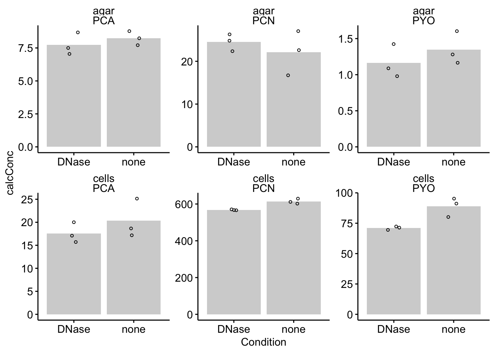
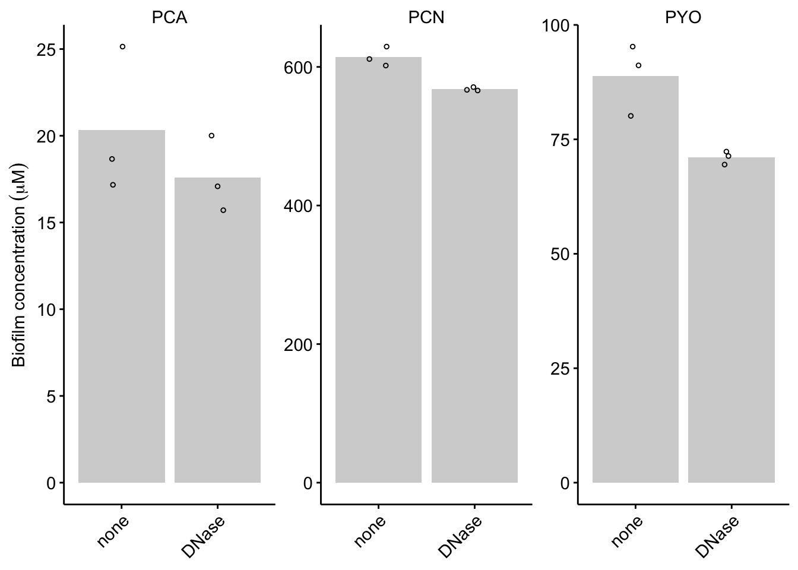
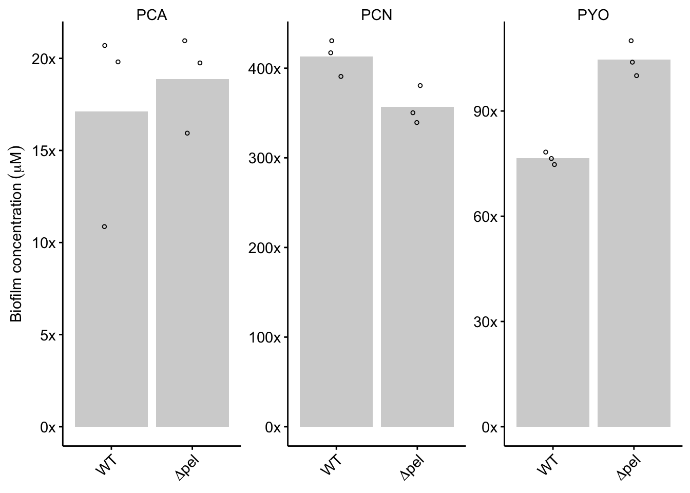
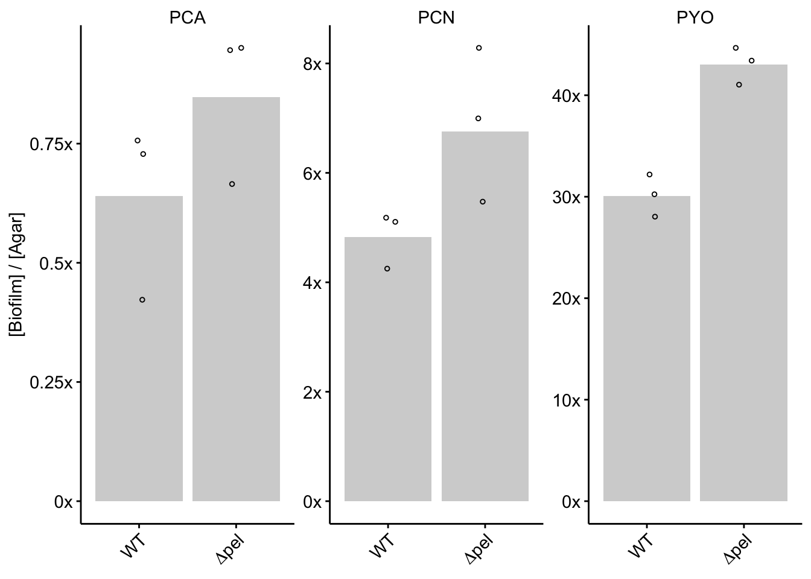
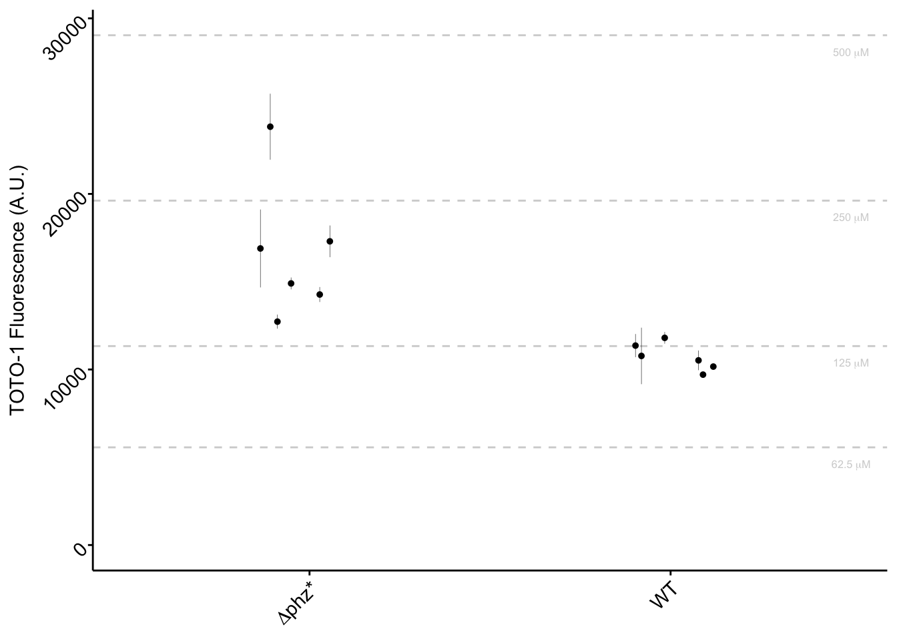
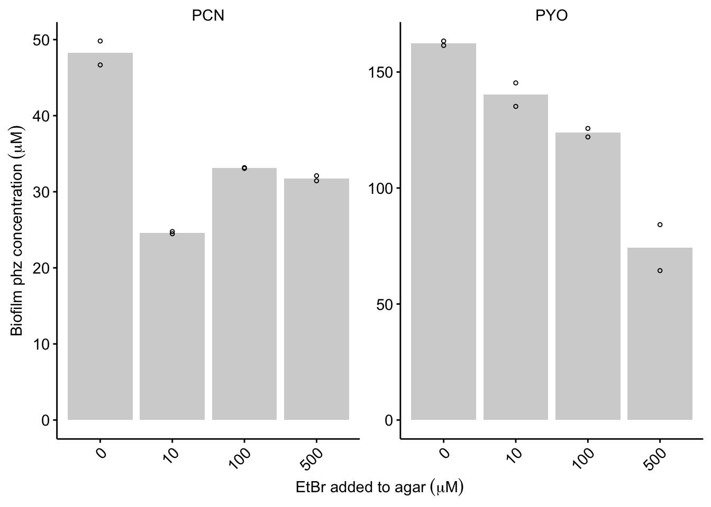

--------

# Notes

Panel A of figure 2 is isothermal titration calorimetry data that was analyzed outside of R. 

----

Setup packages and plotting for the notebook:


```r
# Load packages
library(tidyverse)
library(cowplot)
library(kableExtra)

# Code display options
knitr::opts_chunk$set(tidy.opts=list(width.cutoff=60),tidy=FALSE, echo = TRUE, message=FALSE, warning=FALSE, fig.align="center", fig.retina = 2)

# Load plotting tools
source("../../tools/plotting_tools.R")

# Modify the plot theme 
theme_set(theme_notebook())
```

# Fig. 2B - WT Colony +/- DNase

Let's read in the dnase dataset and look at the table:

```r
dnase_extracts <- read_csv('../../../data/LC-MS/2018_10_08_HPLC_concentrations_df.csv',comment = "#") %>% 
  filter(Strain=='WT' & Day=='D4') %>% 
  group_by(Phenazine,Condition,Material) %>% 
  mutate(mean = ifelse(Replicate==1, mean(calcConc), NA))
  

dnase_extracts %>% 
  kable() %>% 
  kable_styling(bootstrap_options = c("striped", "hover", "condensed", "responsive"), full_width = F) %>% 
  scroll_box(height = '250px')
```

<div style="border: 1px solid #ddd; padding: 5px; overflow-y: scroll; height:250px; "><table class="table table-striped table-hover table-condensed table-responsive" style="width: auto !important; margin-left: auto; margin-right: auto;">
 <thead>
  <tr>
   <th style="text-align:left;"> Phenazine </th>
   <th style="text-align:left;"> Strain </th>
   <th style="text-align:left;"> Condition </th>
   <th style="text-align:right;"> Replicate </th>
   <th style="text-align:left;"> Material </th>
   <th style="text-align:left;"> Day </th>
   <th style="text-align:right;"> RT </th>
   <th style="text-align:right;"> Area </th>
   <th style="text-align:left;"> Channel Name </th>
   <th style="text-align:right;"> Amount </th>
   <th style="text-align:right;"> calcConc </th>
   <th style="text-align:right;"> mean </th>
  </tr>
 </thead>
<tbody>
  <tr>
   <td style="text-align:left;"> PYO </td>
   <td style="text-align:left;"> WT </td>
   <td style="text-align:left;"> DNase </td>
   <td style="text-align:right;"> 1 </td>
   <td style="text-align:left;"> cells </td>
   <td style="text-align:left;"> D4 </td>
   <td style="text-align:right;"> 5.952 </td>
   <td style="text-align:right;"> 78120 </td>
   <td style="text-align:left;"> 313.0nm </td>
   <td style="text-align:right;"> 2.523 </td>
   <td style="text-align:right;"> 72.32600 </td>
   <td style="text-align:right;"> 71.055111 </td>
  </tr>
  <tr>
   <td style="text-align:left;"> PCA </td>
   <td style="text-align:left;"> WT </td>
   <td style="text-align:left;"> DNase </td>
   <td style="text-align:right;"> 1 </td>
   <td style="text-align:left;"> cells </td>
   <td style="text-align:left;"> D4 </td>
   <td style="text-align:right;"> 3.170 </td>
   <td style="text-align:right;"> 10966 </td>
   <td style="text-align:left;"> 364.0nm </td>
   <td style="text-align:right;"> 0.698 </td>
   <td style="text-align:right;"> 20.00933 </td>
   <td style="text-align:right;"> 17.601333 </td>
  </tr>
  <tr>
   <td style="text-align:left;"> PCN </td>
   <td style="text-align:left;"> WT </td>
   <td style="text-align:left;"> DNase </td>
   <td style="text-align:right;"> 1 </td>
   <td style="text-align:left;"> cells </td>
   <td style="text-align:left;"> D4 </td>
   <td style="text-align:right;"> 8.799 </td>
   <td style="text-align:right;"> 283489 </td>
   <td style="text-align:left;"> 364.0nm </td>
   <td style="text-align:right;"> 19.744 </td>
   <td style="text-align:right;"> 565.99467 </td>
   <td style="text-align:right;"> 567.934444 </td>
  </tr>
  <tr>
   <td style="text-align:left;"> PYO </td>
   <td style="text-align:left;"> WT </td>
   <td style="text-align:left;"> DNase </td>
   <td style="text-align:right;"> 1 </td>
   <td style="text-align:left;"> agar </td>
   <td style="text-align:left;"> D4 </td>
   <td style="text-align:right;"> 5.963 </td>
   <td style="text-align:right;"> 13770 </td>
   <td style="text-align:left;"> 313.0nm </td>
   <td style="text-align:right;"> 0.445 </td>
   <td style="text-align:right;"> 1.42400 </td>
   <td style="text-align:right;"> 1.163733 </td>
  </tr>
  <tr>
   <td style="text-align:left;"> PCA </td>
   <td style="text-align:left;"> WT </td>
   <td style="text-align:left;"> DNase </td>
   <td style="text-align:right;"> 1 </td>
   <td style="text-align:left;"> agar </td>
   <td style="text-align:left;"> D4 </td>
   <td style="text-align:right;"> 3.066 </td>
   <td style="text-align:right;"> 42599 </td>
   <td style="text-align:left;"> 364.0nm </td>
   <td style="text-align:right;"> 2.712 </td>
   <td style="text-align:right;"> 8.67840 </td>
   <td style="text-align:right;"> 7.740800 </td>
  </tr>
  <tr>
   <td style="text-align:left;"> PCN </td>
   <td style="text-align:left;"> WT </td>
   <td style="text-align:left;"> DNase </td>
   <td style="text-align:right;"> 1 </td>
   <td style="text-align:left;"> agar </td>
   <td style="text-align:left;"> D4 </td>
   <td style="text-align:right;"> 8.807 </td>
   <td style="text-align:right;"> 117981 </td>
   <td style="text-align:left;"> 364.0nm </td>
   <td style="text-align:right;"> 8.217 </td>
   <td style="text-align:right;"> 26.29440 </td>
   <td style="text-align:right;"> 24.491733 </td>
  </tr>
  <tr>
   <td style="text-align:left;"> PYO </td>
   <td style="text-align:left;"> WT </td>
   <td style="text-align:left;"> DNase </td>
   <td style="text-align:right;"> 2 </td>
   <td style="text-align:left;"> agar </td>
   <td style="text-align:left;"> D4 </td>
   <td style="text-align:right;"> 5.967 </td>
   <td style="text-align:right;"> 9463 </td>
   <td style="text-align:left;"> 313.0nm </td>
   <td style="text-align:right;"> 0.306 </td>
   <td style="text-align:right;"> 0.97920 </td>
   <td style="text-align:right;"> NA </td>
  </tr>
  <tr>
   <td style="text-align:left;"> PCA </td>
   <td style="text-align:left;"> WT </td>
   <td style="text-align:left;"> DNase </td>
   <td style="text-align:right;"> 2 </td>
   <td style="text-align:left;"> agar </td>
   <td style="text-align:left;"> D4 </td>
   <td style="text-align:right;"> 3.065 </td>
   <td style="text-align:right;"> 34587 </td>
   <td style="text-align:left;"> 364.0nm </td>
   <td style="text-align:right;"> 2.202 </td>
   <td style="text-align:right;"> 7.04640 </td>
   <td style="text-align:right;"> NA </td>
  </tr>
  <tr>
   <td style="text-align:left;"> PCN </td>
   <td style="text-align:left;"> WT </td>
   <td style="text-align:left;"> DNase </td>
   <td style="text-align:right;"> 2 </td>
   <td style="text-align:left;"> agar </td>
   <td style="text-align:left;"> D4 </td>
   <td style="text-align:right;"> 8.812 </td>
   <td style="text-align:right;"> 100344 </td>
   <td style="text-align:left;"> 364.0nm </td>
   <td style="text-align:right;"> 6.989 </td>
   <td style="text-align:right;"> 22.36480 </td>
   <td style="text-align:right;"> NA </td>
  </tr>
  <tr>
   <td style="text-align:left;"> PYO </td>
   <td style="text-align:left;"> WT </td>
   <td style="text-align:left;"> DNase </td>
   <td style="text-align:right;"> 3 </td>
   <td style="text-align:left;"> agar </td>
   <td style="text-align:left;"> D4 </td>
   <td style="text-align:right;"> 5.964 </td>
   <td style="text-align:right;"> 10533 </td>
   <td style="text-align:left;"> 313.0nm </td>
   <td style="text-align:right;"> 0.340 </td>
   <td style="text-align:right;"> 1.08800 </td>
   <td style="text-align:right;"> NA </td>
  </tr>
  <tr>
   <td style="text-align:left;"> PCA </td>
   <td style="text-align:left;"> WT </td>
   <td style="text-align:left;"> DNase </td>
   <td style="text-align:right;"> 3 </td>
   <td style="text-align:left;"> agar </td>
   <td style="text-align:left;"> D4 </td>
   <td style="text-align:right;"> 3.105 </td>
   <td style="text-align:right;"> 36801 </td>
   <td style="text-align:left;"> 364.0nm </td>
   <td style="text-align:right;"> 2.343 </td>
   <td style="text-align:right;"> 7.49760 </td>
   <td style="text-align:right;"> NA </td>
  </tr>
  <tr>
   <td style="text-align:left;"> PCN </td>
   <td style="text-align:left;"> WT </td>
   <td style="text-align:left;"> DNase </td>
   <td style="text-align:right;"> 3 </td>
   <td style="text-align:left;"> agar </td>
   <td style="text-align:left;"> D4 </td>
   <td style="text-align:right;"> 8.803 </td>
   <td style="text-align:right;"> 111355 </td>
   <td style="text-align:left;"> 364.0nm </td>
   <td style="text-align:right;"> 7.755 </td>
   <td style="text-align:right;"> 24.81600 </td>
   <td style="text-align:right;"> NA </td>
  </tr>
  <tr>
   <td style="text-align:left;"> PYO </td>
   <td style="text-align:left;"> WT </td>
   <td style="text-align:left;"> none </td>
   <td style="text-align:right;"> 1 </td>
   <td style="text-align:left;"> agar </td>
   <td style="text-align:left;"> D4 </td>
   <td style="text-align:right;"> 5.971 </td>
   <td style="text-align:right;"> 15508 </td>
   <td style="text-align:left;"> 313.0nm </td>
   <td style="text-align:right;"> 0.501 </td>
   <td style="text-align:right;"> 1.60320 </td>
   <td style="text-align:right;"> 1.349333 </td>
  </tr>
  <tr>
   <td style="text-align:left;"> PCA </td>
   <td style="text-align:left;"> WT </td>
   <td style="text-align:left;"> none </td>
   <td style="text-align:right;"> 1 </td>
   <td style="text-align:left;"> agar </td>
   <td style="text-align:left;"> D4 </td>
   <td style="text-align:right;"> 3.054 </td>
   <td style="text-align:right;"> 43066 </td>
   <td style="text-align:left;"> 364.0nm </td>
   <td style="text-align:right;"> 2.742 </td>
   <td style="text-align:right;"> 8.77440 </td>
   <td style="text-align:right;"> 8.238933 </td>
  </tr>
  <tr>
   <td style="text-align:left;"> PCN </td>
   <td style="text-align:left;"> WT </td>
   <td style="text-align:left;"> none </td>
   <td style="text-align:right;"> 1 </td>
   <td style="text-align:left;"> agar </td>
   <td style="text-align:left;"> D4 </td>
   <td style="text-align:right;"> 8.815 </td>
   <td style="text-align:right;"> 75035 </td>
   <td style="text-align:left;"> 364.0nm </td>
   <td style="text-align:right;"> 5.226 </td>
   <td style="text-align:right;"> 16.72320 </td>
   <td style="text-align:right;"> 22.126933 </td>
  </tr>
  <tr>
   <td style="text-align:left;"> PYO </td>
   <td style="text-align:left;"> WT </td>
   <td style="text-align:left;"> none </td>
   <td style="text-align:right;"> 2 </td>
   <td style="text-align:left;"> agar </td>
   <td style="text-align:left;"> D4 </td>
   <td style="text-align:right;"> 5.968 </td>
   <td style="text-align:right;"> 12382 </td>
   <td style="text-align:left;"> 313.0nm </td>
   <td style="text-align:right;"> 0.400 </td>
   <td style="text-align:right;"> 1.28000 </td>
   <td style="text-align:right;"> NA </td>
  </tr>
  <tr>
   <td style="text-align:left;"> PCA </td>
   <td style="text-align:left;"> WT </td>
   <td style="text-align:left;"> none </td>
   <td style="text-align:right;"> 2 </td>
   <td style="text-align:left;"> agar </td>
   <td style="text-align:left;"> D4 </td>
   <td style="text-align:right;"> 3.060 </td>
   <td style="text-align:right;"> 40419 </td>
   <td style="text-align:left;"> 364.0nm </td>
   <td style="text-align:right;"> 2.573 </td>
   <td style="text-align:right;"> 8.23360 </td>
   <td style="text-align:right;"> NA </td>
  </tr>
  <tr>
   <td style="text-align:left;"> PCN </td>
   <td style="text-align:left;"> WT </td>
   <td style="text-align:left;"> none </td>
   <td style="text-align:right;"> 2 </td>
   <td style="text-align:left;"> agar </td>
   <td style="text-align:left;"> D4 </td>
   <td style="text-align:right;"> 8.814 </td>
   <td style="text-align:right;"> 101441 </td>
   <td style="text-align:left;"> 364.0nm </td>
   <td style="text-align:right;"> 7.065 </td>
   <td style="text-align:right;"> 22.60800 </td>
   <td style="text-align:right;"> NA </td>
  </tr>
  <tr>
   <td style="text-align:left;"> PYO </td>
   <td style="text-align:left;"> WT </td>
   <td style="text-align:left;"> none </td>
   <td style="text-align:right;"> 3 </td>
   <td style="text-align:left;"> agar </td>
   <td style="text-align:left;"> D4 </td>
   <td style="text-align:right;"> 5.964 </td>
   <td style="text-align:right;"> 11287 </td>
   <td style="text-align:left;"> 313.0nm </td>
   <td style="text-align:right;"> 0.364 </td>
   <td style="text-align:right;"> 1.16480 </td>
   <td style="text-align:right;"> NA </td>
  </tr>
  <tr>
   <td style="text-align:left;"> PCA </td>
   <td style="text-align:left;"> WT </td>
   <td style="text-align:left;"> none </td>
   <td style="text-align:right;"> 3 </td>
   <td style="text-align:left;"> agar </td>
   <td style="text-align:left;"> D4 </td>
   <td style="text-align:right;"> 3.059 </td>
   <td style="text-align:right;"> 37847 </td>
   <td style="text-align:left;"> 364.0nm </td>
   <td style="text-align:right;"> 2.409 </td>
   <td style="text-align:right;"> 7.70880 </td>
   <td style="text-align:right;"> NA </td>
  </tr>
  <tr>
   <td style="text-align:left;"> PCN </td>
   <td style="text-align:left;"> WT </td>
   <td style="text-align:left;"> none </td>
   <td style="text-align:right;"> 3 </td>
   <td style="text-align:left;"> agar </td>
   <td style="text-align:left;"> D4 </td>
   <td style="text-align:right;"> 8.811 </td>
   <td style="text-align:right;"> 121366 </td>
   <td style="text-align:left;"> 364.0nm </td>
   <td style="text-align:right;"> 8.453 </td>
   <td style="text-align:right;"> 27.04960 </td>
   <td style="text-align:right;"> NA </td>
  </tr>
  <tr>
   <td style="text-align:left;"> PYO </td>
   <td style="text-align:left;"> WT </td>
   <td style="text-align:left;"> DNase </td>
   <td style="text-align:right;"> 2 </td>
   <td style="text-align:left;"> cells </td>
   <td style="text-align:left;"> D4 </td>
   <td style="text-align:right;"> 5.942 </td>
   <td style="text-align:right;"> 75064 </td>
   <td style="text-align:left;"> 313.0nm </td>
   <td style="text-align:right;"> 2.424 </td>
   <td style="text-align:right;"> 69.48800 </td>
   <td style="text-align:right;"> NA </td>
  </tr>
  <tr>
   <td style="text-align:left;"> PCA </td>
   <td style="text-align:left;"> WT </td>
   <td style="text-align:left;"> DNase </td>
   <td style="text-align:right;"> 2 </td>
   <td style="text-align:left;"> cells </td>
   <td style="text-align:left;"> D4 </td>
   <td style="text-align:right;"> 3.132 </td>
   <td style="text-align:right;"> 9362 </td>
   <td style="text-align:left;"> 364.0nm </td>
   <td style="text-align:right;"> 0.596 </td>
   <td style="text-align:right;"> 17.08533 </td>
   <td style="text-align:right;"> NA </td>
  </tr>
  <tr>
   <td style="text-align:left;"> PCN </td>
   <td style="text-align:left;"> WT </td>
   <td style="text-align:left;"> DNase </td>
   <td style="text-align:right;"> 2 </td>
   <td style="text-align:left;"> cells </td>
   <td style="text-align:left;"> D4 </td>
   <td style="text-align:right;"> 8.789 </td>
   <td style="text-align:right;"> 285936 </td>
   <td style="text-align:left;"> 364.0nm </td>
   <td style="text-align:right;"> 19.915 </td>
   <td style="text-align:right;"> 570.89667 </td>
   <td style="text-align:right;"> NA </td>
  </tr>
  <tr>
   <td style="text-align:left;"> PYO </td>
   <td style="text-align:left;"> WT </td>
   <td style="text-align:left;"> DNase </td>
   <td style="text-align:right;"> 3 </td>
   <td style="text-align:left;"> cells </td>
   <td style="text-align:left;"> D4 </td>
   <td style="text-align:right;"> 5.949 </td>
   <td style="text-align:right;"> 77070 </td>
   <td style="text-align:left;"> 313.0nm </td>
   <td style="text-align:right;"> 2.489 </td>
   <td style="text-align:right;"> 71.35133 </td>
   <td style="text-align:right;"> NA </td>
  </tr>
  <tr>
   <td style="text-align:left;"> PCA </td>
   <td style="text-align:left;"> WT </td>
   <td style="text-align:left;"> DNase </td>
   <td style="text-align:right;"> 3 </td>
   <td style="text-align:left;"> cells </td>
   <td style="text-align:left;"> D4 </td>
   <td style="text-align:right;"> 3.119 </td>
   <td style="text-align:right;"> 8611 </td>
   <td style="text-align:left;"> 364.0nm </td>
   <td style="text-align:right;"> 0.548 </td>
   <td style="text-align:right;"> 15.70933 </td>
   <td style="text-align:right;"> NA </td>
  </tr>
  <tr>
   <td style="text-align:left;"> PCN </td>
   <td style="text-align:left;"> WT </td>
   <td style="text-align:left;"> DNase </td>
   <td style="text-align:right;"> 3 </td>
   <td style="text-align:left;"> cells </td>
   <td style="text-align:left;"> D4 </td>
   <td style="text-align:right;"> 8.797 </td>
   <td style="text-align:right;"> 283951 </td>
   <td style="text-align:left;"> 364.0nm </td>
   <td style="text-align:right;"> 19.776 </td>
   <td style="text-align:right;"> 566.91200 </td>
   <td style="text-align:right;"> NA </td>
  </tr>
  <tr>
   <td style="text-align:left;"> PYO </td>
   <td style="text-align:left;"> WT </td>
   <td style="text-align:left;"> none </td>
   <td style="text-align:right;"> 1 </td>
   <td style="text-align:left;"> cells </td>
   <td style="text-align:left;"> D4 </td>
   <td style="text-align:right;"> 5.957 </td>
   <td style="text-align:right;"> 102908 </td>
   <td style="text-align:left;"> 313.0nm </td>
   <td style="text-align:right;"> 3.323 </td>
   <td style="text-align:right;"> 95.25933 </td>
   <td style="text-align:right;"> 88.847556 </td>
  </tr>
  <tr>
   <td style="text-align:left;"> PCA </td>
   <td style="text-align:left;"> WT </td>
   <td style="text-align:left;"> none </td>
   <td style="text-align:right;"> 1 </td>
   <td style="text-align:left;"> cells </td>
   <td style="text-align:left;"> D4 </td>
   <td style="text-align:right;"> 3.113 </td>
   <td style="text-align:right;"> 13782 </td>
   <td style="text-align:left;"> 364.0nm </td>
   <td style="text-align:right;"> 0.877 </td>
   <td style="text-align:right;"> 25.14067 </td>
   <td style="text-align:right;"> 20.324667 </td>
  </tr>
  <tr>
   <td style="text-align:left;"> PCN </td>
   <td style="text-align:left;"> WT </td>
   <td style="text-align:left;"> none </td>
   <td style="text-align:right;"> 1 </td>
   <td style="text-align:left;"> cells </td>
   <td style="text-align:left;"> D4 </td>
   <td style="text-align:right;"> 8.804 </td>
   <td style="text-align:right;"> 306236 </td>
   <td style="text-align:left;"> 364.0nm </td>
   <td style="text-align:right;"> 21.328 </td>
   <td style="text-align:right;"> 611.40267 </td>
   <td style="text-align:right;"> 614.231111 </td>
  </tr>
  <tr>
   <td style="text-align:left;"> PYO </td>
   <td style="text-align:left;"> WT </td>
   <td style="text-align:left;"> none </td>
   <td style="text-align:right;"> 2 </td>
   <td style="text-align:left;"> cells </td>
   <td style="text-align:left;"> D4 </td>
   <td style="text-align:right;"> 5.946 </td>
   <td style="text-align:right;"> 98479 </td>
   <td style="text-align:left;"> 313.0nm </td>
   <td style="text-align:right;"> 3.180 </td>
   <td style="text-align:right;"> 91.16000 </td>
   <td style="text-align:right;"> NA </td>
  </tr>
  <tr>
   <td style="text-align:left;"> PCA </td>
   <td style="text-align:left;"> WT </td>
   <td style="text-align:left;"> none </td>
   <td style="text-align:right;"> 2 </td>
   <td style="text-align:left;"> cells </td>
   <td style="text-align:left;"> D4 </td>
   <td style="text-align:right;"> 3.100 </td>
   <td style="text-align:right;"> 9417 </td>
   <td style="text-align:left;"> 364.0nm </td>
   <td style="text-align:right;"> 0.599 </td>
   <td style="text-align:right;"> 17.17133 </td>
   <td style="text-align:right;"> NA </td>
  </tr>
  <tr>
   <td style="text-align:left;"> PCN </td>
   <td style="text-align:left;"> WT </td>
   <td style="text-align:left;"> none </td>
   <td style="text-align:right;"> 2 </td>
   <td style="text-align:left;"> cells </td>
   <td style="text-align:left;"> D4 </td>
   <td style="text-align:right;"> 8.792 </td>
   <td style="text-align:right;"> 301514 </td>
   <td style="text-align:left;"> 364.0nm </td>
   <td style="text-align:right;"> 20.999 </td>
   <td style="text-align:right;"> 601.97133 </td>
   <td style="text-align:right;"> NA </td>
  </tr>
  <tr>
   <td style="text-align:left;"> PYO </td>
   <td style="text-align:left;"> WT </td>
   <td style="text-align:left;"> none </td>
   <td style="text-align:right;"> 3 </td>
   <td style="text-align:left;"> cells </td>
   <td style="text-align:left;"> D4 </td>
   <td style="text-align:right;"> 5.931 </td>
   <td style="text-align:right;"> 86539 </td>
   <td style="text-align:left;"> 313.0nm </td>
   <td style="text-align:right;"> 2.795 </td>
   <td style="text-align:right;"> 80.12333 </td>
   <td style="text-align:right;"> NA </td>
  </tr>
  <tr>
   <td style="text-align:left;"> PCA </td>
   <td style="text-align:left;"> WT </td>
   <td style="text-align:left;"> none </td>
   <td style="text-align:right;"> 3 </td>
   <td style="text-align:left;"> cells </td>
   <td style="text-align:left;"> D4 </td>
   <td style="text-align:right;"> 3.092 </td>
   <td style="text-align:right;"> 10222 </td>
   <td style="text-align:left;"> 364.0nm </td>
   <td style="text-align:right;"> 0.651 </td>
   <td style="text-align:right;"> 18.66200 </td>
   <td style="text-align:right;"> NA </td>
  </tr>
  <tr>
   <td style="text-align:left;"> PCN </td>
   <td style="text-align:left;"> WT </td>
   <td style="text-align:left;"> none </td>
   <td style="text-align:right;"> 3 </td>
   <td style="text-align:left;"> cells </td>
   <td style="text-align:left;"> D4 </td>
   <td style="text-align:right;"> 8.778 </td>
   <td style="text-align:right;"> 315202 </td>
   <td style="text-align:left;"> 364.0nm </td>
   <td style="text-align:right;"> 21.953 </td>
   <td style="text-align:right;"> 629.31933 </td>
   <td style="text-align:right;"> NA </td>
  </tr>
</tbody>
</table></div>

Now, let's look at an overview of the experiment.


```r
ggplot(dnase_extracts ,aes(x=Condition,y=calcConc))+
  geom_col( aes(y = mean), fill = 'light gray') +
    geom_jitter(width=0.1,height=0,shape=21,size=1)+
    facet_wrap(Material~Phenazine,scales='free')
```


Here you can see that the agar concentrations between the Dnase treated and untreated don't differ meaningfully, but the cell/biofilm concentrations might. This might be because for this experiment the colonies were transferred to a fresh agar plate for only 24hrs as opposed to staying on the same plate for 4 days as with the pel experiment. So, let's ignore the agar concentrations for now. It's also important to note that by calculating a ratio as we did above for pel we do risk amplifying meaningless differences by dividing large numbers by small numbers.

Here's the biofilm only:


```r
# Plot layout
dnase_plot <- ggplot(dnase_extracts %>% filter(Material=='cells') ,aes(x=Condition,y=calcConc))+
  geom_col( aes(y = mean), fill = 'light gray') +
    geom_jitter(width=0.1,height=0,shape=21,size=1)+
    facet_wrap(~Phenazine,scales='free') 

# Plot styling
dnase_plot_styled <- dnase_plot +
  labs(x=NULL, y=expression("Biofilm concentration" ~ (mu*M ))) + 
  scale_x_discrete(limits = c("none",'DNase')) +
  guides(fill = F)

dnase_plot_styled
```



```r
dnase_PYO_none <- dnase_extracts %>% filter(Material=='cells' & Phenazine=='PCA') %>% filter(Condition=='none')

dnase_PYO_dnase <- dnase_extracts %>% filter(Material=='cells' & Phenazine=='PCA') %>% filter(Condition=='DNase')

t.test(x=dnase_PYO_none$calcConc ,y = dnase_PYO_dnase$calcConc, alternative = 'greater')$conf.int[2]
```

```
## [1] Inf
```

```r
dnase_extracts %>% 
  spread(Condition,calcConc) %>% 
  filter(Material=='agar') %>% 
  group_by(Material,Phenazine) %>% 
  summarise(conf_int_low = t.test(none, DNase, alternative = 'less')$conf.int[1],
            conf_int_high = t.test(none, DNase, alternative = 'less')$conf.int[2],
            p_value = t.test(none, DNase, alternative = 'less')$p.value)
```

```
## # A tibble: 3 x 5
## # Groups:   Material [1]
##   Material Phenazine conf_int_low conf_int_high p_value
##   <chr>    <chr>            <dbl>         <dbl>   <dbl>
## 1 agar     PCA               -Inf         1.79    0.778
## 2 agar     PCN               -Inf         5.71    0.261
## 3 agar     PYO               -Inf         0.585   0.811
```

```r
dnase_extracts %>% 
  spread(Condition,calcConc) %>% 
  filter(Material=='cells') %>% 
  group_by(Material,Phenazine) %>% 
  summarise(conf_int_low = t.test(none, DNase, alternative = 'greater')$conf.int[1],
            conf_int_high = t.test(none, DNase, alternative = 'greater')$conf.int[2],
            p_value = t.test(none, DNase, alternative = 'greater')$p.value)
```

```
## # A tibble: 3 x 5
## # Groups:   Material [1]
##   Material Phenazine conf_int_low conf_int_high p_value
##   <chr>    <chr>            <dbl>         <dbl>   <dbl>
## 1 cells    PCA              -3.76           Inf  0.198 
## 2 cells    PCN              23.5            Inf  0.0127
## 3 cells    PYO               4.94           Inf  0.0273
```

# Fig. 2C - ∆pel colony

Let's read in and look at the table of pel data. 

```r
pel_extracts <- read_csv('../../../data/LC-MS/2018_10_30_HPLC_concentrations_df.csv',comment = "#") %>% 
  filter(strain %in% c('WTpar','dPel'))

pel_extracts %>% 
  kable() %>% 
  kable_styling(bootstrap_options = c("striped", "hover", "condensed", "responsive"), full_width = F) %>% 
  scroll_box(height = '250px')
```

<div style="border: 1px solid #ddd; padding: 5px; overflow-y: scroll; height:250px; "><table class="table table-striped table-hover table-condensed table-responsive" style="width: auto !important; margin-left: auto; margin-right: auto;">
 <thead>
  <tr>
   <th style="text-align:left;"> measured_phenazine </th>
   <th style="text-align:left;"> strain </th>
   <th style="text-align:left;"> amount_added </th>
   <th style="text-align:left;"> added_phenazine </th>
   <th style="text-align:left;"> material </th>
   <th style="text-align:right;"> replicate </th>
   <th style="text-align:right;"> RT </th>
   <th style="text-align:right;"> Area </th>
   <th style="text-align:left;"> Channel Name </th>
   <th style="text-align:right;"> Amount </th>
   <th style="text-align:right;"> calcConc </th>
  </tr>
 </thead>
<tbody>
  <tr>
   <td style="text-align:left;"> PCA </td>
   <td style="text-align:left;"> dPel </td>
   <td style="text-align:left;"> NA </td>
   <td style="text-align:left;"> NA </td>
   <td style="text-align:left;"> agar </td>
   <td style="text-align:right;"> 1 </td>
   <td style="text-align:right;"> 3.060 </td>
   <td style="text-align:right;"> 114063 </td>
   <td style="text-align:left;"> 364.0nm </td>
   <td style="text-align:right;"> 7.487 </td>
   <td style="text-align:right;"> 23.95840 </td>
  </tr>
  <tr>
   <td style="text-align:left;"> PCN </td>
   <td style="text-align:left;"> dPel </td>
   <td style="text-align:left;"> NA </td>
   <td style="text-align:left;"> NA </td>
   <td style="text-align:left;"> agar </td>
   <td style="text-align:right;"> 1 </td>
   <td style="text-align:right;"> 8.858 </td>
   <td style="text-align:right;"> 303178 </td>
   <td style="text-align:left;"> 364.0nm </td>
   <td style="text-align:right;"> 19.998 </td>
   <td style="text-align:right;"> 63.99360 </td>
  </tr>
  <tr>
   <td style="text-align:left;"> PYO </td>
   <td style="text-align:left;"> dPel </td>
   <td style="text-align:left;"> NA </td>
   <td style="text-align:left;"> NA </td>
   <td style="text-align:left;"> agar </td>
   <td style="text-align:right;"> 1 </td>
   <td style="text-align:right;"> 6.007 </td>
   <td style="text-align:right;"> 24774 </td>
   <td style="text-align:left;"> 313.0nm </td>
   <td style="text-align:right;"> 0.762 </td>
   <td style="text-align:right;"> 2.43840 </td>
  </tr>
  <tr>
   <td style="text-align:left;"> PCA </td>
   <td style="text-align:left;"> dPel </td>
   <td style="text-align:left;"> NA </td>
   <td style="text-align:left;"> NA </td>
   <td style="text-align:left;"> agar </td>
   <td style="text-align:right;"> 2 </td>
   <td style="text-align:right;"> 3.056 </td>
   <td style="text-align:right;"> 99389 </td>
   <td style="text-align:left;"> 364.0nm </td>
   <td style="text-align:right;"> 6.524 </td>
   <td style="text-align:right;"> 20.87680 </td>
  </tr>
  <tr>
   <td style="text-align:left;"> PCN </td>
   <td style="text-align:left;"> dPel </td>
   <td style="text-align:left;"> NA </td>
   <td style="text-align:left;"> NA </td>
   <td style="text-align:left;"> agar </td>
   <td style="text-align:right;"> 2 </td>
   <td style="text-align:right;"> 8.870 </td>
   <td style="text-align:right;"> 229828 </td>
   <td style="text-align:left;"> 364.0nm </td>
   <td style="text-align:right;"> 15.160 </td>
   <td style="text-align:right;"> 48.51200 </td>
  </tr>
  <tr>
   <td style="text-align:left;"> PYO </td>
   <td style="text-align:left;"> dPel </td>
   <td style="text-align:left;"> NA </td>
   <td style="text-align:left;"> NA </td>
   <td style="text-align:left;"> agar </td>
   <td style="text-align:right;"> 2 </td>
   <td style="text-align:right;"> 6.014 </td>
   <td style="text-align:right;"> 23647 </td>
   <td style="text-align:left;"> 313.0nm </td>
   <td style="text-align:right;"> 0.727 </td>
   <td style="text-align:right;"> 2.32640 </td>
  </tr>
  <tr>
   <td style="text-align:left;"> PCA </td>
   <td style="text-align:left;"> dPel </td>
   <td style="text-align:left;"> NA </td>
   <td style="text-align:left;"> NA </td>
   <td style="text-align:left;"> agar </td>
   <td style="text-align:right;"> 3 </td>
   <td style="text-align:right;"> 3.055 </td>
   <td style="text-align:right;"> 104913 </td>
   <td style="text-align:left;"> 364.0nm </td>
   <td style="text-align:right;"> 6.887 </td>
   <td style="text-align:right;"> 22.03840 </td>
  </tr>
  <tr>
   <td style="text-align:left;"> PCN </td>
   <td style="text-align:left;"> dPel </td>
   <td style="text-align:left;"> NA </td>
   <td style="text-align:left;"> NA </td>
   <td style="text-align:left;"> agar </td>
   <td style="text-align:right;"> 3 </td>
   <td style="text-align:right;"> 8.861 </td>
   <td style="text-align:right;"> 217660 </td>
   <td style="text-align:left;"> 364.0nm </td>
   <td style="text-align:right;"> 14.357 </td>
   <td style="text-align:right;"> 45.94240 </td>
  </tr>
  <tr>
   <td style="text-align:left;"> PYO </td>
   <td style="text-align:left;"> dPel </td>
   <td style="text-align:left;"> NA </td>
   <td style="text-align:left;"> NA </td>
   <td style="text-align:left;"> agar </td>
   <td style="text-align:right;"> 3 </td>
   <td style="text-align:right;"> 6.005 </td>
   <td style="text-align:right;"> 25757 </td>
   <td style="text-align:left;"> 313.0nm </td>
   <td style="text-align:right;"> 0.792 </td>
   <td style="text-align:right;"> 2.53440 </td>
  </tr>
  <tr>
   <td style="text-align:left;"> PCA </td>
   <td style="text-align:left;"> dPel </td>
   <td style="text-align:left;"> NA </td>
   <td style="text-align:left;"> NA </td>
   <td style="text-align:left;"> cells </td>
   <td style="text-align:right;"> 1 </td>
   <td style="text-align:right;"> 3.181 </td>
   <td style="text-align:right;"> 8470 </td>
   <td style="text-align:left;"> 364.0nm </td>
   <td style="text-align:right;"> 0.556 </td>
   <td style="text-align:right;"> 15.93867 </td>
  </tr>
  <tr>
   <td style="text-align:left;"> PCN </td>
   <td style="text-align:left;"> dPel </td>
   <td style="text-align:left;"> NA </td>
   <td style="text-align:left;"> NA </td>
   <td style="text-align:left;"> cells </td>
   <td style="text-align:right;"> 1 </td>
   <td style="text-align:right;"> 8.852 </td>
   <td style="text-align:right;"> 185244 </td>
   <td style="text-align:left;"> 364.0nm </td>
   <td style="text-align:right;"> 12.219 </td>
   <td style="text-align:right;"> 350.27800 </td>
  </tr>
  <tr>
   <td style="text-align:left;"> PYO </td>
   <td style="text-align:left;"> dPel </td>
   <td style="text-align:left;"> NA </td>
   <td style="text-align:left;"> NA </td>
   <td style="text-align:left;"> cells </td>
   <td style="text-align:right;"> 1 </td>
   <td style="text-align:right;"> 6.009 </td>
   <td style="text-align:right;"> 113480 </td>
   <td style="text-align:left;"> 313.0nm </td>
   <td style="text-align:right;"> 3.491 </td>
   <td style="text-align:right;"> 100.07533 </td>
  </tr>
  <tr>
   <td style="text-align:left;"> PCA </td>
   <td style="text-align:left;"> dPel </td>
   <td style="text-align:left;"> NA </td>
   <td style="text-align:left;"> NA </td>
   <td style="text-align:left;"> cells </td>
   <td style="text-align:right;"> 2 </td>
   <td style="text-align:right;"> 3.186 </td>
   <td style="text-align:right;"> 10494 </td>
   <td style="text-align:left;"> 364.0nm </td>
   <td style="text-align:right;"> 0.689 </td>
   <td style="text-align:right;"> 19.75133 </td>
  </tr>
  <tr>
   <td style="text-align:left;"> PCN </td>
   <td style="text-align:left;"> dPel </td>
   <td style="text-align:left;"> NA </td>
   <td style="text-align:left;"> NA </td>
   <td style="text-align:left;"> cells </td>
   <td style="text-align:right;"> 2 </td>
   <td style="text-align:right;"> 8.850 </td>
   <td style="text-align:right;"> 179462 </td>
   <td style="text-align:left;"> 364.0nm </td>
   <td style="text-align:right;"> 11.838 </td>
   <td style="text-align:right;"> 339.35600 </td>
  </tr>
  <tr>
   <td style="text-align:left;"> PYO </td>
   <td style="text-align:left;"> dPel </td>
   <td style="text-align:left;"> NA </td>
   <td style="text-align:left;"> NA </td>
   <td style="text-align:left;"> cells </td>
   <td style="text-align:right;"> 2 </td>
   <td style="text-align:right;"> 6.005 </td>
   <td style="text-align:right;"> 117862 </td>
   <td style="text-align:left;"> 313.0nm </td>
   <td style="text-align:right;"> 3.625 </td>
   <td style="text-align:right;"> 103.91667 </td>
  </tr>
  <tr>
   <td style="text-align:left;"> PCA </td>
   <td style="text-align:left;"> dPel </td>
   <td style="text-align:left;"> NA </td>
   <td style="text-align:left;"> NA </td>
   <td style="text-align:left;"> cells </td>
   <td style="text-align:right;"> 3 </td>
   <td style="text-align:right;"> 3.197 </td>
   <td style="text-align:right;"> 11134 </td>
   <td style="text-align:left;"> 364.0nm </td>
   <td style="text-align:right;"> 0.731 </td>
   <td style="text-align:right;"> 20.95533 </td>
  </tr>
  <tr>
   <td style="text-align:left;"> PCN </td>
   <td style="text-align:left;"> dPel </td>
   <td style="text-align:left;"> NA </td>
   <td style="text-align:left;"> NA </td>
   <td style="text-align:left;"> cells </td>
   <td style="text-align:right;"> 3 </td>
   <td style="text-align:right;"> 8.840 </td>
   <td style="text-align:right;"> 201283 </td>
   <td style="text-align:left;"> 364.0nm </td>
   <td style="text-align:right;"> 13.277 </td>
   <td style="text-align:right;"> 380.60733 </td>
  </tr>
  <tr>
   <td style="text-align:left;"> PYO </td>
   <td style="text-align:left;"> dPel </td>
   <td style="text-align:left;"> NA </td>
   <td style="text-align:left;"> NA </td>
   <td style="text-align:left;"> cells </td>
   <td style="text-align:right;"> 3 </td>
   <td style="text-align:right;"> 5.993 </td>
   <td style="text-align:right;"> 124770 </td>
   <td style="text-align:left;"> 313.0nm </td>
   <td style="text-align:right;"> 3.838 </td>
   <td style="text-align:right;"> 110.02267 </td>
  </tr>
  <tr>
   <td style="text-align:left;"> PCA </td>
   <td style="text-align:left;"> WTpar </td>
   <td style="text-align:left;"> NA </td>
   <td style="text-align:left;"> NA </td>
   <td style="text-align:left;"> cells </td>
   <td style="text-align:right;"> 1 </td>
   <td style="text-align:right;"> 3.234 </td>
   <td style="text-align:right;"> 10524 </td>
   <td style="text-align:left;"> 364.0nm </td>
   <td style="text-align:right;"> 0.691 </td>
   <td style="text-align:right;"> 19.80867 </td>
  </tr>
  <tr>
   <td style="text-align:left;"> PCN </td>
   <td style="text-align:left;"> WTpar </td>
   <td style="text-align:left;"> NA </td>
   <td style="text-align:left;"> NA </td>
   <td style="text-align:left;"> cells </td>
   <td style="text-align:right;"> 1 </td>
   <td style="text-align:right;"> 8.840 </td>
   <td style="text-align:right;"> 227724 </td>
   <td style="text-align:left;"> 364.0nm </td>
   <td style="text-align:right;"> 15.021 </td>
   <td style="text-align:right;"> 430.60200 </td>
  </tr>
  <tr>
   <td style="text-align:left;"> PYO </td>
   <td style="text-align:left;"> WTpar </td>
   <td style="text-align:left;"> NA </td>
   <td style="text-align:left;"> NA </td>
   <td style="text-align:left;"> cells </td>
   <td style="text-align:right;"> 1 </td>
   <td style="text-align:right;"> 5.995 </td>
   <td style="text-align:right;"> 86700 </td>
   <td style="text-align:left;"> 313.0nm </td>
   <td style="text-align:right;"> 2.667 </td>
   <td style="text-align:right;"> 76.45400 </td>
  </tr>
  <tr>
   <td style="text-align:left;"> PCA </td>
   <td style="text-align:left;"> WTpar </td>
   <td style="text-align:left;"> NA </td>
   <td style="text-align:left;"> NA </td>
   <td style="text-align:left;"> cells </td>
   <td style="text-align:right;"> 2 </td>
   <td style="text-align:right;"> 3.222 </td>
   <td style="text-align:right;"> 11003 </td>
   <td style="text-align:left;"> 364.0nm </td>
   <td style="text-align:right;"> 0.722 </td>
   <td style="text-align:right;"> 20.69733 </td>
  </tr>
  <tr>
   <td style="text-align:left;"> PCN </td>
   <td style="text-align:left;"> WTpar </td>
   <td style="text-align:left;"> NA </td>
   <td style="text-align:left;"> NA </td>
   <td style="text-align:left;"> cells </td>
   <td style="text-align:right;"> 2 </td>
   <td style="text-align:right;"> 8.851 </td>
   <td style="text-align:right;"> 206671 </td>
   <td style="text-align:left;"> 364.0nm </td>
   <td style="text-align:right;"> 13.632 </td>
   <td style="text-align:right;"> 390.78400 </td>
  </tr>
  <tr>
   <td style="text-align:left;"> PYO </td>
   <td style="text-align:left;"> WTpar </td>
   <td style="text-align:left;"> NA </td>
   <td style="text-align:left;"> NA </td>
   <td style="text-align:left;"> cells </td>
   <td style="text-align:right;"> 2 </td>
   <td style="text-align:right;"> 6.005 </td>
   <td style="text-align:right;"> 84758 </td>
   <td style="text-align:left;"> 313.0nm </td>
   <td style="text-align:right;"> 2.607 </td>
   <td style="text-align:right;"> 74.73400 </td>
  </tr>
  <tr>
   <td style="text-align:left;"> PCA </td>
   <td style="text-align:left;"> WTpar </td>
   <td style="text-align:left;"> NA </td>
   <td style="text-align:left;"> NA </td>
   <td style="text-align:left;"> cells </td>
   <td style="text-align:right;"> 3 </td>
   <td style="text-align:right;"> 3.178 </td>
   <td style="text-align:right;"> 5777 </td>
   <td style="text-align:left;"> 364.0nm </td>
   <td style="text-align:right;"> 0.379 </td>
   <td style="text-align:right;"> 10.86467 </td>
  </tr>
  <tr>
   <td style="text-align:left;"> PCN </td>
   <td style="text-align:left;"> WTpar </td>
   <td style="text-align:left;"> NA </td>
   <td style="text-align:left;"> NA </td>
   <td style="text-align:left;"> cells </td>
   <td style="text-align:right;"> 3 </td>
   <td style="text-align:right;"> 8.840 </td>
   <td style="text-align:right;"> 220629 </td>
   <td style="text-align:left;"> 364.0nm </td>
   <td style="text-align:right;"> 14.553 </td>
   <td style="text-align:right;"> 417.18600 </td>
  </tr>
  <tr>
   <td style="text-align:left;"> PYO </td>
   <td style="text-align:left;"> WTpar </td>
   <td style="text-align:left;"> NA </td>
   <td style="text-align:left;"> NA </td>
   <td style="text-align:left;"> cells </td>
   <td style="text-align:right;"> 3 </td>
   <td style="text-align:right;"> 5.995 </td>
   <td style="text-align:right;"> 88787 </td>
   <td style="text-align:left;"> 313.0nm </td>
   <td style="text-align:right;"> 2.731 </td>
   <td style="text-align:right;"> 78.28867 </td>
  </tr>
  <tr>
   <td style="text-align:left;"> PCA </td>
   <td style="text-align:left;"> WTpar </td>
   <td style="text-align:left;"> NA </td>
   <td style="text-align:left;"> NA </td>
   <td style="text-align:left;"> agar </td>
   <td style="text-align:right;"> 1 </td>
   <td style="text-align:right;"> 3.056 </td>
   <td style="text-align:right;"> 124641 </td>
   <td style="text-align:left;"> 364.0nm </td>
   <td style="text-align:right;"> 8.182 </td>
   <td style="text-align:right;"> 26.18240 </td>
  </tr>
  <tr>
   <td style="text-align:left;"> PCN </td>
   <td style="text-align:left;"> WTpar </td>
   <td style="text-align:left;"> NA </td>
   <td style="text-align:left;"> NA </td>
   <td style="text-align:left;"> agar </td>
   <td style="text-align:right;"> 1 </td>
   <td style="text-align:right;"> 8.855 </td>
   <td style="text-align:right;"> 393800 </td>
   <td style="text-align:left;"> 364.0nm </td>
   <td style="text-align:right;"> 25.976 </td>
   <td style="text-align:right;"> 83.12320 </td>
  </tr>
  <tr>
   <td style="text-align:left;"> PYO </td>
   <td style="text-align:left;"> WTpar </td>
   <td style="text-align:left;"> NA </td>
   <td style="text-align:left;"> NA </td>
   <td style="text-align:left;"> agar </td>
   <td style="text-align:right;"> 1 </td>
   <td style="text-align:right;"> 6.008 </td>
   <td style="text-align:right;"> 25687 </td>
   <td style="text-align:left;"> 313.0nm </td>
   <td style="text-align:right;"> 0.790 </td>
   <td style="text-align:right;"> 2.52800 </td>
  </tr>
  <tr>
   <td style="text-align:left;"> PCA </td>
   <td style="text-align:left;"> WTpar </td>
   <td style="text-align:left;"> NA </td>
   <td style="text-align:left;"> NA </td>
   <td style="text-align:left;"> agar </td>
   <td style="text-align:right;"> 2 </td>
   <td style="text-align:right;"> 3.043 </td>
   <td style="text-align:right;"> 135302 </td>
   <td style="text-align:left;"> 364.0nm </td>
   <td style="text-align:right;"> 8.882 </td>
   <td style="text-align:right;"> 28.42240 </td>
  </tr>
  <tr>
   <td style="text-align:left;"> PCN </td>
   <td style="text-align:left;"> WTpar </td>
   <td style="text-align:left;"> NA </td>
   <td style="text-align:left;"> NA </td>
   <td style="text-align:left;"> agar </td>
   <td style="text-align:right;"> 2 </td>
   <td style="text-align:right;"> 8.861 </td>
   <td style="text-align:right;"> 435638 </td>
   <td style="text-align:left;"> 364.0nm </td>
   <td style="text-align:right;"> 28.736 </td>
   <td style="text-align:right;"> 91.95520 </td>
  </tr>
  <tr>
   <td style="text-align:left;"> PYO </td>
   <td style="text-align:left;"> WTpar </td>
   <td style="text-align:left;"> NA </td>
   <td style="text-align:left;"> NA </td>
   <td style="text-align:left;"> agar </td>
   <td style="text-align:right;"> 2 </td>
   <td style="text-align:right;"> 6.009 </td>
   <td style="text-align:right;"> 27091 </td>
   <td style="text-align:left;"> 313.0nm </td>
   <td style="text-align:right;"> 0.833 </td>
   <td style="text-align:right;"> 2.66560 </td>
  </tr>
  <tr>
   <td style="text-align:left;"> PCA </td>
   <td style="text-align:left;"> WTpar </td>
   <td style="text-align:left;"> NA </td>
   <td style="text-align:left;"> NA </td>
   <td style="text-align:left;"> agar </td>
   <td style="text-align:right;"> 3 </td>
   <td style="text-align:right;"> 3.040 </td>
   <td style="text-align:right;"> 122418 </td>
   <td style="text-align:left;"> 364.0nm </td>
   <td style="text-align:right;"> 8.036 </td>
   <td style="text-align:right;"> 25.71520 </td>
  </tr>
  <tr>
   <td style="text-align:left;"> PCN </td>
   <td style="text-align:left;"> WTpar </td>
   <td style="text-align:left;"> NA </td>
   <td style="text-align:left;"> NA </td>
   <td style="text-align:left;"> agar </td>
   <td style="text-align:right;"> 3 </td>
   <td style="text-align:right;"> 8.854 </td>
   <td style="text-align:right;"> 387178 </td>
   <td style="text-align:left;"> 364.0nm </td>
   <td style="text-align:right;"> 25.539 </td>
   <td style="text-align:right;"> 81.72480 </td>
  </tr>
  <tr>
   <td style="text-align:left;"> PYO </td>
   <td style="text-align:left;"> WTpar </td>
   <td style="text-align:left;"> NA </td>
   <td style="text-align:left;"> NA </td>
   <td style="text-align:left;"> agar </td>
   <td style="text-align:right;"> 3 </td>
   <td style="text-align:right;"> 6.003 </td>
   <td style="text-align:right;"> 24705 </td>
   <td style="text-align:left;"> 313.0nm </td>
   <td style="text-align:right;"> 0.760 </td>
   <td style="text-align:right;"> 2.43200 </td>
  </tr>
</tbody>
</table></div>

Ok, now let's plot an overview of the dataset. 

```r
pel_extracts_means <- pel_extracts %>% 
  group_by(material, measured_phenazine, strain) %>% 
  mutate(mean = ifelse(replicate==1, mean(calcConc), NA)) 

ggplot(pel_extracts_means ,aes(x=strain,y=calcConc))+
  geom_col( aes(y = mean), fill = 'light gray') +
    geom_jitter(width=0.1,height=0,shape=21,size=2)+
    facet_wrap(material~measured_phenazine,scales='free')+
    scale_x_discrete(breaks = c('dPel','WTpar'), labels=c(expression(Delta*"pel"),"WT")) +
    labs(x='Strain',y=expression("Biofilm concentration" ~ (mu*M )) ) +
    guides(fill=F)
```


```r
pel_extracts %>% 
  spread(strain,calcConc) %>% 
  group_by( material ,measured_phenazine) %>% 
  summarise(conf_int_low = t.test(dPel, WTpar,  alternative = 'two.sided')$conf.int[1],
            conf_int_high = t.test(dPel,WTpar, alternative = 'two.sided')$conf.int[2],
            p_value = t.test( dPel,WTpar, alternative = 'two.sided')$p.value)
```

```
## # A tibble: 6 x 5
## # Groups:   material [2]
##   material measured_phenazine conf_int_low conf_int_high p_value
##   <chr>    <chr>                     <dbl>         <dbl>   <dbl>
## 1 agar     PCA                      -7.90         -1.07  0.0219 
## 2 agar     PCN                     -52.8         -12.8   0.0131 
## 3 agar     PYO                      -0.362         0.144 0.297  
## 4 cells    PCA                      -9.60         13.1   0.650  
## 5 cells    PCN                    -103.           -8.85  0.0301 
## 6 cells    PYO                      17.2          39.2   0.00553
```

```r
# Plot Layout
plot_pel_biofilm <- ggplot(pel_extracts_means %>% filter(material=='cells') ,aes(x=strain,y=calcConc))+
  geom_col( aes(y = mean), fill = 'light gray') +
    geom_jitter(width=0.1,height=0,shape=21,size=1)+
    facet_wrap(~measured_phenazine,scales='free')

# Styling
plot_pel_biofilm_styled <- plot_pel_biofilm +
  scale_x_discrete(breaks = c('WTpar','dPel'), 
                   labels=c("WT",expression(Delta*"pel")), 
                   limits = c('WTpar','dPel')) +
  scale_y_continuous(labels = fold_label)+
  labs(x=NULL, y = expression("Biofilm concentration" ~ (mu*M ))) +
  guides(fill=F) 

plot_pel_biofilm_styled
```


You can see that for each phenazine the concentration differs between the strains for both the cells aka biofilm and the agar. What we actually care about is the retention ratio, so let's calculate and look at that. 


```r
# Split dataset by material
pel_extracts_means_agar <- pel_extracts_means %>% 
  filter(material=='agar')

pel_extracts_means_biofilm <- pel_extracts_means %>% 
  filter(material=='cells')

# Join agar and cell observations and calculate retention ratios = biofilm / agar
pel_extracts_means_join <- left_join(pel_extracts_means_biofilm, 
                                     pel_extracts_means_agar, 
                                     by=c('strain','replicate','measured_phenazine'), 
                                     suffix = c('_from_biofilm','_from_agar') 
                                     ) %>% 
  mutate(retention_ratio = calcConc_from_biofilm / calcConc_from_agar) %>% 
  mutate(mean_retention_ratio = mean_from_biofilm / mean_from_agar)

fold_label <- function(x){
  lab <- paste(x, "x", sep = '')
}

# Plot Layout
plot_pel <- ggplot(pel_extracts_means_join ,aes(x=strain,y=retention_ratio))+
  geom_col( aes(y = mean_retention_ratio), fill = 'light gray') +
    geom_jitter(width=0.1,height=0,shape=21,size=1)+
    facet_wrap(~measured_phenazine,scales='free')

# Styling
plot_pel_styled <- plot_pel +
  scale_x_discrete(breaks = c('WTpar','dPel'), 
                   labels=c("WT",expression(Delta*"pel")), 
                   limits = c('WTpar','dPel')) +
  scale_y_continuous(labels = fold_label)+
  labs(x=NULL, y = '[Biofilm] / [Agar]') +
  guides(fill=F) 

plot_pel_styled
```



```r
pel_extracts_means_join %>% 
  spread(strain,retention_ratio) %>% 
  group_by(measured_phenazine) %>% 
  summarise(conf_int_low = t.test(dPel, WTpar,  alternative = 'greater')$conf.int[1],
            conf_int_high = t.test(dPel,WTpar, alternative = 'greater')$conf.int[2],
            p_value = t.test( dPel,WTpar, alternative = 'greater')$p.value)
```

```
## # A tibble: 3 x 4
##   measured_phenazine conf_int_low conf_int_high  p_value
##   <chr>                     <dbl>         <dbl>    <dbl>
## 1 PCA                     -0.0872           Inf 0.101   
## 2 PCN                     -0.128            Inf 0.0561  
## 3 PYO                      9.45             Inf 0.000692
```


# Fig. 2D - EtBr vs. PHZ in colonies


```r
df_dphz_2 <- read_csv("../../../data/LC-MS/2019_07_23_colony_HPLC_dPHZ_data_2.csv")

df_dphz_2 <- df_dphz_2 %>% 
  mutate(condition_conc = fct_relevel(condition_conc, c('0uM','10uM','100uM','200uM','500uM'))) %>% 
    mutate(condition = fct_relevel(condition, c('PBS','etbr','dmso','pi')))

df_dphz_conc <- df_dphz_2 %>% 
  filter(added_phz == measured_phz) %>% 
  mutate(measured_phz_conc = case_when(
    material == 'cells' ~ (Amount * 2) * (800 / 60),
    material == 'agar' ~ (Amount * 2) * (8 / 5)
  )) %>% 
  group_by(measured_phz, strain, condition, condition_conc) %>% 
  mutate(mean_phz_conc = mean(measured_phz_conc))
```


```r
plot_dphz_etbr <- ggplot(df_dphz_conc %>% filter(condition %in% c('etbr','PBS')), 
       aes(x = condition_conc, y = measured_phz_conc)) + 
  geom_col(data = df_dphz_conc %>% filter(condition %in% c('etbr','PBS') & rep ==1), 
           aes(x = condition_conc, y  = mean_phz_conc), fill = 'light gray') +
  geom_point(shape = 21, size = 1)  + facet_wrap(~measured_phz, scales = 'free') + ylim(0, NA) + 
  labs(x = expression('EtBr added to agar'~(mu*M)), y = expression('Biofilm phz concentration'~(mu*M)))+
  scale_x_discrete(labels = c(0, 10, 100, 500))


#saveRDS(plot_dphz_etbr, "../../../../Figures/2019_09_27_group_meeting/plot_dphz_etbr")

plot_dphz_etbr
```


# Fig. 2E - WT eDNA with TOTO-1

See the processing of this data in this notebook: [link here]


```r
df_stds <- read_csv("../../../data/Spectroscopy/2019_11_22_std_preCTdna.csv") %>%  gather(key = "well", value = "FluorInt", -wavelength) %>% mutate(read = 1)

df_biofilms <- read_csv("../../../data/Spectroscopy/2019_11_22_std_wt_dphz_postCTdna.csv") %>%  gather(key = "well", value = "FluorInt", -wavelength) %>% mutate(read = 2)

df_meta <- read_csv("../../../data/Spectroscopy/2019_11_22_well_metadata.csv")

df_toto <- left_join(bind_rows(df_stds, df_biofilms), df_meta, by = c('well')) %>% filter(wavelength == 535) %>% filter(!(strain == 'std' & read == 2))

df_toto %>% kable() %>% kable_styling(bootstrap_options = 'condensed') %>%
    scroll_box(width = "100%", height = "400px")
```

<div style="border: 1px solid #ddd; padding: 5px; overflow-y: scroll; height:400px; overflow-x: scroll; width:100%; "><table class="table table-condensed" style="margin-left: auto; margin-right: auto;">
 <thead>
  <tr>
   <th style="text-align:right;"> wavelength </th>
   <th style="text-align:left;"> well </th>
   <th style="text-align:right;"> FluorInt </th>
   <th style="text-align:right;"> read </th>
   <th style="text-align:left;"> strain </th>
   <th style="text-align:left;"> toto_added </th>
   <th style="text-align:left;"> ctDNA_added </th>
   <th style="text-align:right;"> well_std_conc </th>
   <th style="text-align:right;"> bio_rep </th>
   <th style="text-align:right;"> tech_rep </th>
  </tr>
 </thead>
<tbody>
  <tr>
   <td style="text-align:right;"> 535 </td>
   <td style="text-align:left;"> A1 </td>
   <td style="text-align:right;"> 55732 </td>
   <td style="text-align:right;"> 1 </td>
   <td style="text-align:left;"> std </td>
   <td style="text-align:left;"> TRUE </td>
   <td style="text-align:left;"> TRUE </td>
   <td style="text-align:right;"> 50.0000000 </td>
   <td style="text-align:right;"> 1 </td>
   <td style="text-align:right;"> 1 </td>
  </tr>
  <tr>
   <td style="text-align:right;"> 535 </td>
   <td style="text-align:left;"> A2 </td>
   <td style="text-align:right;"> 57010 </td>
   <td style="text-align:right;"> 1 </td>
   <td style="text-align:left;"> std </td>
   <td style="text-align:left;"> TRUE </td>
   <td style="text-align:left;"> TRUE </td>
   <td style="text-align:right;"> 25.0000000 </td>
   <td style="text-align:right;"> 1 </td>
   <td style="text-align:right;"> 1 </td>
  </tr>
  <tr>
   <td style="text-align:right;"> 535 </td>
   <td style="text-align:left;"> A3 </td>
   <td style="text-align:right;"> 52506 </td>
   <td style="text-align:right;"> 1 </td>
   <td style="text-align:left;"> std </td>
   <td style="text-align:left;"> TRUE </td>
   <td style="text-align:left;"> TRUE </td>
   <td style="text-align:right;"> 12.5000000 </td>
   <td style="text-align:right;"> 1 </td>
   <td style="text-align:right;"> 1 </td>
  </tr>
  <tr>
   <td style="text-align:right;"> 535 </td>
   <td style="text-align:left;"> A4 </td>
   <td style="text-align:right;"> 43673 </td>
   <td style="text-align:right;"> 1 </td>
   <td style="text-align:left;"> std </td>
   <td style="text-align:left;"> TRUE </td>
   <td style="text-align:left;"> TRUE </td>
   <td style="text-align:right;"> 6.2500000 </td>
   <td style="text-align:right;"> 1 </td>
   <td style="text-align:right;"> 1 </td>
  </tr>
  <tr>
   <td style="text-align:right;"> 535 </td>
   <td style="text-align:left;"> A5 </td>
   <td style="text-align:right;"> 29038 </td>
   <td style="text-align:right;"> 1 </td>
   <td style="text-align:left;"> std </td>
   <td style="text-align:left;"> TRUE </td>
   <td style="text-align:left;"> TRUE </td>
   <td style="text-align:right;"> 3.1250000 </td>
   <td style="text-align:right;"> 1 </td>
   <td style="text-align:right;"> 1 </td>
  </tr>
  <tr>
   <td style="text-align:right;"> 535 </td>
   <td style="text-align:left;"> A6 </td>
   <td style="text-align:right;"> 19617 </td>
   <td style="text-align:right;"> 1 </td>
   <td style="text-align:left;"> std </td>
   <td style="text-align:left;"> TRUE </td>
   <td style="text-align:left;"> TRUE </td>
   <td style="text-align:right;"> 1.5625000 </td>
   <td style="text-align:right;"> 1 </td>
   <td style="text-align:right;"> 1 </td>
  </tr>
  <tr>
   <td style="text-align:right;"> 535 </td>
   <td style="text-align:left;"> A7 </td>
   <td style="text-align:right;"> 11332 </td>
   <td style="text-align:right;"> 1 </td>
   <td style="text-align:left;"> std </td>
   <td style="text-align:left;"> TRUE </td>
   <td style="text-align:left;"> TRUE </td>
   <td style="text-align:right;"> 0.7812500 </td>
   <td style="text-align:right;"> 1 </td>
   <td style="text-align:right;"> 1 </td>
  </tr>
  <tr>
   <td style="text-align:right;"> 535 </td>
   <td style="text-align:left;"> A8 </td>
   <td style="text-align:right;"> 5564 </td>
   <td style="text-align:right;"> 1 </td>
   <td style="text-align:left;"> std </td>
   <td style="text-align:left;"> TRUE </td>
   <td style="text-align:left;"> TRUE </td>
   <td style="text-align:right;"> 0.3906250 </td>
   <td style="text-align:right;"> 1 </td>
   <td style="text-align:right;"> 1 </td>
  </tr>
  <tr>
   <td style="text-align:right;"> 535 </td>
   <td style="text-align:left;"> A9 </td>
   <td style="text-align:right;"> 2778 </td>
   <td style="text-align:right;"> 1 </td>
   <td style="text-align:left;"> std </td>
   <td style="text-align:left;"> TRUE </td>
   <td style="text-align:left;"> TRUE </td>
   <td style="text-align:right;"> 0.1953125 </td>
   <td style="text-align:right;"> 1 </td>
   <td style="text-align:right;"> 1 </td>
  </tr>
  <tr>
   <td style="text-align:right;"> 535 </td>
   <td style="text-align:left;"> A10 </td>
   <td style="text-align:right;"> 1406 </td>
   <td style="text-align:right;"> 1 </td>
   <td style="text-align:left;"> std </td>
   <td style="text-align:left;"> TRUE </td>
   <td style="text-align:left;"> TRUE </td>
   <td style="text-align:right;"> 0.0976562 </td>
   <td style="text-align:right;"> 1 </td>
   <td style="text-align:right;"> 1 </td>
  </tr>
  <tr>
   <td style="text-align:right;"> 535 </td>
   <td style="text-align:left;"> A11 </td>
   <td style="text-align:right;"> 682 </td>
   <td style="text-align:right;"> 1 </td>
   <td style="text-align:left;"> std </td>
   <td style="text-align:left;"> TRUE </td>
   <td style="text-align:left;"> TRUE </td>
   <td style="text-align:right;"> 0.0488281 </td>
   <td style="text-align:right;"> 1 </td>
   <td style="text-align:right;"> 1 </td>
  </tr>
  <tr>
   <td style="text-align:right;"> 535 </td>
   <td style="text-align:left;"> A12 </td>
   <td style="text-align:right;"> 774 </td>
   <td style="text-align:right;"> 1 </td>
   <td style="text-align:left;"> std </td>
   <td style="text-align:left;"> TRUE </td>
   <td style="text-align:left;"> TRUE </td>
   <td style="text-align:right;"> 0.0244141 </td>
   <td style="text-align:right;"> 1 </td>
   <td style="text-align:right;"> 1 </td>
  </tr>
  <tr>
   <td style="text-align:right;"> 535 </td>
   <td style="text-align:left;"> B1 </td>
   <td style="text-align:right;"> 12139 </td>
   <td style="text-align:right;"> 2 </td>
   <td style="text-align:left;"> WT </td>
   <td style="text-align:left;"> TRUE </td>
   <td style="text-align:left;"> TRUE </td>
   <td style="text-align:right;"> NA </td>
   <td style="text-align:right;"> 1 </td>
   <td style="text-align:right;"> 1 </td>
  </tr>
  <tr>
   <td style="text-align:right;"> 535 </td>
   <td style="text-align:left;"> B2 </td>
   <td style="text-align:right;"> 13446 </td>
   <td style="text-align:right;"> 2 </td>
   <td style="text-align:left;"> WT </td>
   <td style="text-align:left;"> TRUE </td>
   <td style="text-align:left;"> TRUE </td>
   <td style="text-align:right;"> NA </td>
   <td style="text-align:right;"> 2 </td>
   <td style="text-align:right;"> 1 </td>
  </tr>
  <tr>
   <td style="text-align:right;"> 535 </td>
   <td style="text-align:left;"> B3 </td>
   <td style="text-align:right;"> 11074 </td>
   <td style="text-align:right;"> 2 </td>
   <td style="text-align:left;"> WT </td>
   <td style="text-align:left;"> TRUE </td>
   <td style="text-align:left;"> TRUE </td>
   <td style="text-align:right;"> NA </td>
   <td style="text-align:right;"> 3 </td>
   <td style="text-align:right;"> 1 </td>
  </tr>
  <tr>
   <td style="text-align:right;"> 535 </td>
   <td style="text-align:left;"> B4 </td>
   <td style="text-align:right;"> 11370 </td>
   <td style="text-align:right;"> 2 </td>
   <td style="text-align:left;"> WT </td>
   <td style="text-align:left;"> TRUE </td>
   <td style="text-align:left;"> TRUE </td>
   <td style="text-align:right;"> NA </td>
   <td style="text-align:right;"> 4 </td>
   <td style="text-align:right;"> 1 </td>
  </tr>
  <tr>
   <td style="text-align:right;"> 535 </td>
   <td style="text-align:left;"> B5 </td>
   <td style="text-align:right;"> 12068 </td>
   <td style="text-align:right;"> 2 </td>
   <td style="text-align:left;"> WT </td>
   <td style="text-align:left;"> TRUE </td>
   <td style="text-align:left;"> TRUE </td>
   <td style="text-align:right;"> NA </td>
   <td style="text-align:right;"> 5 </td>
   <td style="text-align:right;"> 1 </td>
  </tr>
  <tr>
   <td style="text-align:right;"> 535 </td>
   <td style="text-align:left;"> B6 </td>
   <td style="text-align:right;"> 11855 </td>
   <td style="text-align:right;"> 2 </td>
   <td style="text-align:left;"> WT </td>
   <td style="text-align:left;"> TRUE </td>
   <td style="text-align:left;"> TRUE </td>
   <td style="text-align:right;"> NA </td>
   <td style="text-align:right;"> 6 </td>
   <td style="text-align:right;"> 1 </td>
  </tr>
  <tr>
   <td style="text-align:right;"> 535 </td>
   <td style="text-align:left;"> B7 </td>
   <td style="text-align:right;"> 10123 </td>
   <td style="text-align:right;"> 2 </td>
   <td style="text-align:left;"> WT </td>
   <td style="text-align:left;"> TRUE </td>
   <td style="text-align:left;"> FALSE </td>
   <td style="text-align:right;"> NA </td>
   <td style="text-align:right;"> 1 </td>
   <td style="text-align:right;"> 2 </td>
  </tr>
  <tr>
   <td style="text-align:right;"> 535 </td>
   <td style="text-align:left;"> B8 </td>
   <td style="text-align:right;"> 11827 </td>
   <td style="text-align:right;"> 2 </td>
   <td style="text-align:left;"> WT </td>
   <td style="text-align:left;"> TRUE </td>
   <td style="text-align:left;"> FALSE </td>
   <td style="text-align:right;"> NA </td>
   <td style="text-align:right;"> 2 </td>
   <td style="text-align:right;"> 2 </td>
  </tr>
  <tr>
   <td style="text-align:right;"> 535 </td>
   <td style="text-align:left;"> B9 </td>
   <td style="text-align:right;"> 9761 </td>
   <td style="text-align:right;"> 2 </td>
   <td style="text-align:left;"> WT </td>
   <td style="text-align:left;"> TRUE </td>
   <td style="text-align:left;"> FALSE </td>
   <td style="text-align:right;"> NA </td>
   <td style="text-align:right;"> 3 </td>
   <td style="text-align:right;"> 2 </td>
  </tr>
  <tr>
   <td style="text-align:right;"> 535 </td>
   <td style="text-align:left;"> B10 </td>
   <td style="text-align:right;"> 10182 </td>
   <td style="text-align:right;"> 2 </td>
   <td style="text-align:left;"> WT </td>
   <td style="text-align:left;"> TRUE </td>
   <td style="text-align:left;"> FALSE </td>
   <td style="text-align:right;"> NA </td>
   <td style="text-align:right;"> 4 </td>
   <td style="text-align:right;"> 2 </td>
  </tr>
  <tr>
   <td style="text-align:right;"> 535 </td>
   <td style="text-align:left;"> B11 </td>
   <td style="text-align:right;"> 9634 </td>
   <td style="text-align:right;"> 2 </td>
   <td style="text-align:left;"> WT </td>
   <td style="text-align:left;"> TRUE </td>
   <td style="text-align:left;"> FALSE </td>
   <td style="text-align:right;"> NA </td>
   <td style="text-align:right;"> 5 </td>
   <td style="text-align:right;"> 2 </td>
  </tr>
  <tr>
   <td style="text-align:right;"> 535 </td>
   <td style="text-align:left;"> B12 </td>
   <td style="text-align:right;"> 11566 </td>
   <td style="text-align:right;"> 2 </td>
   <td style="text-align:left;"> WT </td>
   <td style="text-align:left;"> TRUE </td>
   <td style="text-align:left;"> FALSE </td>
   <td style="text-align:right;"> NA </td>
   <td style="text-align:right;"> 6 </td>
   <td style="text-align:right;"> 2 </td>
  </tr>
  <tr>
   <td style="text-align:right;"> 535 </td>
   <td style="text-align:left;"> C1 </td>
   <td style="text-align:right;"> 10915 </td>
   <td style="text-align:right;"> 2 </td>
   <td style="text-align:left;"> WT </td>
   <td style="text-align:left;"> TRUE </td>
   <td style="text-align:left;"> FALSE </td>
   <td style="text-align:right;"> NA </td>
   <td style="text-align:right;"> 1 </td>
   <td style="text-align:right;"> 3 </td>
  </tr>
  <tr>
   <td style="text-align:right;"> 535 </td>
   <td style="text-align:left;"> C2 </td>
   <td style="text-align:right;"> 10894 </td>
   <td style="text-align:right;"> 2 </td>
   <td style="text-align:left;"> WT </td>
   <td style="text-align:left;"> TRUE </td>
   <td style="text-align:left;"> FALSE </td>
   <td style="text-align:right;"> NA </td>
   <td style="text-align:right;"> 2 </td>
   <td style="text-align:right;"> 3 </td>
  </tr>
  <tr>
   <td style="text-align:right;"> 535 </td>
   <td style="text-align:left;"> C3 </td>
   <td style="text-align:right;"> 9651 </td>
   <td style="text-align:right;"> 2 </td>
   <td style="text-align:left;"> WT </td>
   <td style="text-align:left;"> TRUE </td>
   <td style="text-align:left;"> FALSE </td>
   <td style="text-align:right;"> NA </td>
   <td style="text-align:right;"> 3 </td>
   <td style="text-align:right;"> 3 </td>
  </tr>
  <tr>
   <td style="text-align:right;"> 535 </td>
   <td style="text-align:left;"> C4 </td>
   <td style="text-align:right;"> 10147 </td>
   <td style="text-align:right;"> 2 </td>
   <td style="text-align:left;"> WT </td>
   <td style="text-align:left;"> TRUE </td>
   <td style="text-align:left;"> FALSE </td>
   <td style="text-align:right;"> NA </td>
   <td style="text-align:right;"> 4 </td>
   <td style="text-align:right;"> 3 </td>
  </tr>
  <tr>
   <td style="text-align:right;"> 535 </td>
   <td style="text-align:left;"> C5 </td>
   <td style="text-align:right;"> 11910 </td>
   <td style="text-align:right;"> 2 </td>
   <td style="text-align:left;"> WT </td>
   <td style="text-align:left;"> TRUE </td>
   <td style="text-align:left;"> FALSE </td>
   <td style="text-align:right;"> NA </td>
   <td style="text-align:right;"> 5 </td>
   <td style="text-align:right;"> 3 </td>
  </tr>
  <tr>
   <td style="text-align:right;"> 535 </td>
   <td style="text-align:left;"> C6 </td>
   <td style="text-align:right;"> 12036 </td>
   <td style="text-align:right;"> 2 </td>
   <td style="text-align:left;"> WT </td>
   <td style="text-align:left;"> TRUE </td>
   <td style="text-align:left;"> FALSE </td>
   <td style="text-align:right;"> NA </td>
   <td style="text-align:right;"> 6 </td>
   <td style="text-align:right;"> 3 </td>
  </tr>
  <tr>
   <td style="text-align:right;"> 535 </td>
   <td style="text-align:left;"> C7 </td>
   <td style="text-align:right;"> 130 </td>
   <td style="text-align:right;"> 2 </td>
   <td style="text-align:left;"> WT </td>
   <td style="text-align:left;"> FALSE </td>
   <td style="text-align:left;"> FALSE </td>
   <td style="text-align:right;"> NA </td>
   <td style="text-align:right;"> 1 </td>
   <td style="text-align:right;"> 4 </td>
  </tr>
  <tr>
   <td style="text-align:right;"> 535 </td>
   <td style="text-align:left;"> C8 </td>
   <td style="text-align:right;"> 190 </td>
   <td style="text-align:right;"> 2 </td>
   <td style="text-align:left;"> WT </td>
   <td style="text-align:left;"> FALSE </td>
   <td style="text-align:left;"> FALSE </td>
   <td style="text-align:right;"> NA </td>
   <td style="text-align:right;"> 2 </td>
   <td style="text-align:right;"> 4 </td>
  </tr>
  <tr>
   <td style="text-align:right;"> 535 </td>
   <td style="text-align:left;"> C9 </td>
   <td style="text-align:right;"> 119 </td>
   <td style="text-align:right;"> 2 </td>
   <td style="text-align:left;"> WT </td>
   <td style="text-align:left;"> FALSE </td>
   <td style="text-align:left;"> FALSE </td>
   <td style="text-align:right;"> NA </td>
   <td style="text-align:right;"> 3 </td>
   <td style="text-align:right;"> 4 </td>
  </tr>
  <tr>
   <td style="text-align:right;"> 535 </td>
   <td style="text-align:left;"> C10 </td>
   <td style="text-align:right;"> 124 </td>
   <td style="text-align:right;"> 2 </td>
   <td style="text-align:left;"> WT </td>
   <td style="text-align:left;"> FALSE </td>
   <td style="text-align:left;"> FALSE </td>
   <td style="text-align:right;"> NA </td>
   <td style="text-align:right;"> 4 </td>
   <td style="text-align:right;"> 4 </td>
  </tr>
  <tr>
   <td style="text-align:right;"> 535 </td>
   <td style="text-align:left;"> C11 </td>
   <td style="text-align:right;"> 144 </td>
   <td style="text-align:right;"> 2 </td>
   <td style="text-align:left;"> WT </td>
   <td style="text-align:left;"> FALSE </td>
   <td style="text-align:left;"> FALSE </td>
   <td style="text-align:right;"> NA </td>
   <td style="text-align:right;"> 5 </td>
   <td style="text-align:right;"> 4 </td>
  </tr>
  <tr>
   <td style="text-align:right;"> 535 </td>
   <td style="text-align:left;"> C12 </td>
   <td style="text-align:right;"> 138 </td>
   <td style="text-align:right;"> 2 </td>
   <td style="text-align:left;"> WT </td>
   <td style="text-align:left;"> FALSE </td>
   <td style="text-align:left;"> FALSE </td>
   <td style="text-align:right;"> NA </td>
   <td style="text-align:right;"> 6 </td>
   <td style="text-align:right;"> 4 </td>
  </tr>
  <tr>
   <td style="text-align:right;"> 535 </td>
   <td style="text-align:left;"> E1 </td>
   <td style="text-align:right;"> 23490 </td>
   <td style="text-align:right;"> 2 </td>
   <td style="text-align:left;"> dPHZ </td>
   <td style="text-align:left;"> TRUE </td>
   <td style="text-align:left;"> TRUE </td>
   <td style="text-align:right;"> NA </td>
   <td style="text-align:right;"> 1 </td>
   <td style="text-align:right;"> 1 </td>
  </tr>
  <tr>
   <td style="text-align:right;"> 535 </td>
   <td style="text-align:left;"> E2 </td>
   <td style="text-align:right;"> 22622 </td>
   <td style="text-align:right;"> 2 </td>
   <td style="text-align:left;"> dPHZ </td>
   <td style="text-align:left;"> TRUE </td>
   <td style="text-align:left;"> TRUE </td>
   <td style="text-align:right;"> NA </td>
   <td style="text-align:right;"> 2 </td>
   <td style="text-align:right;"> 1 </td>
  </tr>
  <tr>
   <td style="text-align:right;"> 535 </td>
   <td style="text-align:left;"> E3 </td>
   <td style="text-align:right;"> 24901 </td>
   <td style="text-align:right;"> 2 </td>
   <td style="text-align:left;"> dPHZ </td>
   <td style="text-align:left;"> TRUE </td>
   <td style="text-align:left;"> TRUE </td>
   <td style="text-align:right;"> NA </td>
   <td style="text-align:right;"> 3 </td>
   <td style="text-align:right;"> 1 </td>
  </tr>
  <tr>
   <td style="text-align:right;"> 535 </td>
   <td style="text-align:left;"> E4 </td>
   <td style="text-align:right;"> 14964 </td>
   <td style="text-align:right;"> 2 </td>
   <td style="text-align:left;"> dPHZ </td>
   <td style="text-align:left;"> TRUE </td>
   <td style="text-align:left;"> TRUE </td>
   <td style="text-align:right;"> NA </td>
   <td style="text-align:right;"> 4 </td>
   <td style="text-align:right;"> 1 </td>
  </tr>
  <tr>
   <td style="text-align:right;"> 535 </td>
   <td style="text-align:left;"> E5 </td>
   <td style="text-align:right;"> 19109 </td>
   <td style="text-align:right;"> 2 </td>
   <td style="text-align:left;"> dPHZ </td>
   <td style="text-align:left;"> TRUE </td>
   <td style="text-align:left;"> TRUE </td>
   <td style="text-align:right;"> NA </td>
   <td style="text-align:right;"> 5 </td>
   <td style="text-align:right;"> 1 </td>
  </tr>
  <tr>
   <td style="text-align:right;"> 535 </td>
   <td style="text-align:left;"> E6 </td>
   <td style="text-align:right;"> 14650 </td>
   <td style="text-align:right;"> 2 </td>
   <td style="text-align:left;"> dPHZ </td>
   <td style="text-align:left;"> TRUE </td>
   <td style="text-align:left;"> TRUE </td>
   <td style="text-align:right;"> NA </td>
   <td style="text-align:right;"> 6 </td>
   <td style="text-align:right;"> 1 </td>
  </tr>
  <tr>
   <td style="text-align:right;"> 535 </td>
   <td style="text-align:left;"> F1 </td>
   <td style="text-align:right;"> 22498 </td>
   <td style="text-align:right;"> 2 </td>
   <td style="text-align:left;"> dPHZ </td>
   <td style="text-align:left;"> TRUE </td>
   <td style="text-align:left;"> FALSE </td>
   <td style="text-align:right;"> NA </td>
   <td style="text-align:right;"> 1 </td>
   <td style="text-align:right;"> 2 </td>
  </tr>
  <tr>
   <td style="text-align:right;"> 535 </td>
   <td style="text-align:left;"> F2 </td>
   <td style="text-align:right;"> 13008 </td>
   <td style="text-align:right;"> 2 </td>
   <td style="text-align:left;"> dPHZ </td>
   <td style="text-align:left;"> TRUE </td>
   <td style="text-align:left;"> FALSE </td>
   <td style="text-align:right;"> NA </td>
   <td style="text-align:right;"> 2 </td>
   <td style="text-align:right;"> 2 </td>
  </tr>
  <tr>
   <td style="text-align:right;"> 535 </td>
   <td style="text-align:left;"> F3 </td>
   <td style="text-align:right;"> 15141 </td>
   <td style="text-align:right;"> 2 </td>
   <td style="text-align:left;"> dPHZ </td>
   <td style="text-align:left;"> TRUE </td>
   <td style="text-align:left;"> FALSE </td>
   <td style="text-align:right;"> NA </td>
   <td style="text-align:right;"> 3 </td>
   <td style="text-align:right;"> 2 </td>
  </tr>
  <tr>
   <td style="text-align:right;"> 535 </td>
   <td style="text-align:left;"> F4 </td>
   <td style="text-align:right;"> 18463 </td>
   <td style="text-align:right;"> 2 </td>
   <td style="text-align:left;"> dPHZ </td>
   <td style="text-align:left;"> TRUE </td>
   <td style="text-align:left;"> FALSE </td>
   <td style="text-align:right;"> NA </td>
   <td style="text-align:right;"> 4 </td>
   <td style="text-align:right;"> 2 </td>
  </tr>
  <tr>
   <td style="text-align:right;"> 535 </td>
   <td style="text-align:left;"> F5 </td>
   <td style="text-align:right;"> 14572 </td>
   <td style="text-align:right;"> 2 </td>
   <td style="text-align:left;"> dPHZ </td>
   <td style="text-align:left;"> TRUE </td>
   <td style="text-align:left;"> FALSE </td>
   <td style="text-align:right;"> NA </td>
   <td style="text-align:right;"> 5 </td>
   <td style="text-align:right;"> 2 </td>
  </tr>
  <tr>
   <td style="text-align:right;"> 535 </td>
   <td style="text-align:left;"> F6 </td>
   <td style="text-align:right;"> 17939 </td>
   <td style="text-align:right;"> 2 </td>
   <td style="text-align:left;"> dPHZ </td>
   <td style="text-align:left;"> TRUE </td>
   <td style="text-align:left;"> FALSE </td>
   <td style="text-align:right;"> NA </td>
   <td style="text-align:right;"> 6 </td>
   <td style="text-align:right;"> 2 </td>
  </tr>
  <tr>
   <td style="text-align:right;"> 535 </td>
   <td style="text-align:left;"> G1 </td>
   <td style="text-align:right;"> 25159 </td>
   <td style="text-align:right;"> 2 </td>
   <td style="text-align:left;"> dPHZ </td>
   <td style="text-align:left;"> TRUE </td>
   <td style="text-align:left;"> FALSE </td>
   <td style="text-align:right;"> NA </td>
   <td style="text-align:right;"> 1 </td>
   <td style="text-align:right;"> 3 </td>
  </tr>
  <tr>
   <td style="text-align:right;"> 535 </td>
   <td style="text-align:left;"> G2 </td>
   <td style="text-align:right;"> 12442 </td>
   <td style="text-align:right;"> 2 </td>
   <td style="text-align:left;"> dPHZ </td>
   <td style="text-align:left;"> TRUE </td>
   <td style="text-align:left;"> FALSE </td>
   <td style="text-align:right;"> NA </td>
   <td style="text-align:right;"> 2 </td>
   <td style="text-align:right;"> 3 </td>
  </tr>
  <tr>
   <td style="text-align:right;"> 535 </td>
   <td style="text-align:left;"> G3 </td>
   <td style="text-align:right;"> 14663 </td>
   <td style="text-align:right;"> 2 </td>
   <td style="text-align:left;"> dPHZ </td>
   <td style="text-align:left;"> TRUE </td>
   <td style="text-align:left;"> FALSE </td>
   <td style="text-align:right;"> NA </td>
   <td style="text-align:right;"> 3 </td>
   <td style="text-align:right;"> 3 </td>
  </tr>
  <tr>
   <td style="text-align:right;"> 535 </td>
   <td style="text-align:left;"> G4 </td>
   <td style="text-align:right;"> 15324 </td>
   <td style="text-align:right;"> 2 </td>
   <td style="text-align:left;"> dPHZ </td>
   <td style="text-align:left;"> TRUE </td>
   <td style="text-align:left;"> FALSE </td>
   <td style="text-align:right;"> NA </td>
   <td style="text-align:right;"> 4 </td>
   <td style="text-align:right;"> 3 </td>
  </tr>
  <tr>
   <td style="text-align:right;"> 535 </td>
   <td style="text-align:left;"> G5 </td>
   <td style="text-align:right;"> 13968 </td>
   <td style="text-align:right;"> 2 </td>
   <td style="text-align:left;"> dPHZ </td>
   <td style="text-align:left;"> TRUE </td>
   <td style="text-align:left;"> FALSE </td>
   <td style="text-align:right;"> NA </td>
   <td style="text-align:right;"> 5 </td>
   <td style="text-align:right;"> 3 </td>
  </tr>
  <tr>
   <td style="text-align:right;"> 535 </td>
   <td style="text-align:left;"> G6 </td>
   <td style="text-align:right;"> 16661 </td>
   <td style="text-align:right;"> 2 </td>
   <td style="text-align:left;"> dPHZ </td>
   <td style="text-align:left;"> TRUE </td>
   <td style="text-align:left;"> FALSE </td>
   <td style="text-align:right;"> NA </td>
   <td style="text-align:right;"> 6 </td>
   <td style="text-align:right;"> 3 </td>
  </tr>
  <tr>
   <td style="text-align:right;"> 535 </td>
   <td style="text-align:left;"> H1 </td>
   <td style="text-align:right;"> 235 </td>
   <td style="text-align:right;"> 2 </td>
   <td style="text-align:left;"> dPHZ </td>
   <td style="text-align:left;"> FALSE </td>
   <td style="text-align:left;"> FALSE </td>
   <td style="text-align:right;"> NA </td>
   <td style="text-align:right;"> 1 </td>
   <td style="text-align:right;"> 4 </td>
  </tr>
  <tr>
   <td style="text-align:right;"> 535 </td>
   <td style="text-align:left;"> H2 </td>
   <td style="text-align:right;"> 164 </td>
   <td style="text-align:right;"> 2 </td>
   <td style="text-align:left;"> dPHZ </td>
   <td style="text-align:left;"> FALSE </td>
   <td style="text-align:left;"> FALSE </td>
   <td style="text-align:right;"> NA </td>
   <td style="text-align:right;"> 2 </td>
   <td style="text-align:right;"> 4 </td>
  </tr>
  <tr>
   <td style="text-align:right;"> 535 </td>
   <td style="text-align:left;"> H3 </td>
   <td style="text-align:right;"> 500 </td>
   <td style="text-align:right;"> 2 </td>
   <td style="text-align:left;"> dPHZ </td>
   <td style="text-align:left;"> FALSE </td>
   <td style="text-align:left;"> FALSE </td>
   <td style="text-align:right;"> NA </td>
   <td style="text-align:right;"> 3 </td>
   <td style="text-align:right;"> 4 </td>
  </tr>
  <tr>
   <td style="text-align:right;"> 535 </td>
   <td style="text-align:left;"> H4 </td>
   <td style="text-align:right;"> 191 </td>
   <td style="text-align:right;"> 2 </td>
   <td style="text-align:left;"> dPHZ </td>
   <td style="text-align:left;"> FALSE </td>
   <td style="text-align:left;"> FALSE </td>
   <td style="text-align:right;"> NA </td>
   <td style="text-align:right;"> 4 </td>
   <td style="text-align:right;"> 4 </td>
  </tr>
  <tr>
   <td style="text-align:right;"> 535 </td>
   <td style="text-align:left;"> H5 </td>
   <td style="text-align:right;"> 208 </td>
   <td style="text-align:right;"> 2 </td>
   <td style="text-align:left;"> dPHZ </td>
   <td style="text-align:left;"> FALSE </td>
   <td style="text-align:left;"> FALSE </td>
   <td style="text-align:right;"> NA </td>
   <td style="text-align:right;"> 5 </td>
   <td style="text-align:right;"> 4 </td>
  </tr>
  <tr>
   <td style="text-align:right;"> 535 </td>
   <td style="text-align:left;"> H6 </td>
   <td style="text-align:right;"> 221 </td>
   <td style="text-align:right;"> 2 </td>
   <td style="text-align:left;"> dPHZ </td>
   <td style="text-align:left;"> FALSE </td>
   <td style="text-align:left;"> FALSE </td>
   <td style="text-align:right;"> NA </td>
   <td style="text-align:right;"> 6 </td>
   <td style="text-align:right;"> 4 </td>
  </tr>
</tbody>
</table></div>


```r
std_levels <- df_toto %>% filter(strain == 'std') %>% filter(FluorInt <30000 & FluorInt >5000) %>% 
  mutate(eDNA_ug_mL = well_std_conc * 4 * 800 / 60) %>% 
  mutate(eDNA_dsDNA_uM = eDNA_ug_mL * 150 / 50) %>% 
  mutate(labels = paste(eDNA_dsDNA_uM, 'mu*M', sep = '~'))

bio_reps <- df_toto %>% filter(strain %in% c('WT','dPHZ') & ctDNA_added == FALSE & toto_added == T) %>% 
  group_by(strain, bio_rep) %>% 
  summarise(mean = mean(FluorInt), sd = sd(FluorInt))

plot_toto <- ggplot(bio_reps, aes(x = strain, y = mean)) +
  geom_hline(yintercept = std_levels$FluorInt, linetype = 2, color = 'light gray', label)+
  geom_pointrange(aes(ymin = mean - sd, ymax = mean + sd), position = position_jitter(width = 0.15, height = 0), size = 0.1) + 
  geom_text(data = std_levels, aes(x = c(2.5,2.5,2.5,2.5), y = FluorInt - 1000, label = labels),parse = T, color = 'light gray', size = (6 * 5 / 14))+
  ylim(0,NA) 

plot_toto_styled <- plot_toto + 
  labs(x = NULL, y = 'TOTO-1 Fluorescence (A.U.)') + 
  scale_x_discrete(breaks = c('dPHZ','WT'), 
                   labels=c(expression(Delta*"phz*"), 'WT')) 

plot_toto_styled
```




# Create Figure


```r
theme_set(theme_figure())

#l_plots <- align_plots(plot_redox + labs(title = NULL), plot_pel_styled, align = 'v', axis = 'l')

#top_panel <- plot_grid(l_plots[[1]], plot_toto, dnase_plot_styled, ncol = 3, rel_widths = c(0.5, 0.5, 1), align = 'h', axis = 'tb', labels = c('B','C','D'), scale = 0.95, label_size = 12)

#bottom_panel <- plot_grid(l_plots[[2]], plot_dphz_etbr, ncol = 2, align = 'h', axis = 'tb', labels = c('E','F'), scale = 0.95) 

#all_right_panels <- plot_grid(top_panel, bottom_panel, ncol = 1, align = 'v', axis = 'lr')


all_right_panels <- plot_grid(dnase_plot_styled, plot_pel_styled, plot_dphz_etbr, plot_toto_styled, ncol = 2, align = 'hv', axis = 'tblr', labels = c('B','C','D','E'), scale = 0.95, label_size = 12)

fig_2 <- plot_grid(NULL, all_right_panels, ncol = 2, rel_widths = c(0.5, 1), labels = c('A',''), label_size = 12)

fig_2
```



```r
save_plot("../../../figures/phz2019_Fig_2.pdf", fig_2, base_width = 7, base_height = 3.5)
```

------


```r
sessionInfo()
```

```
## R version 3.5.2 (2018-12-20)
## Platform: x86_64-apple-darwin15.6.0 (64-bit)
## Running under: macOS Mojave 10.14.6
## 
## Matrix products: default
## BLAS: /Library/Frameworks/R.framework/Versions/3.5/Resources/lib/libRblas.0.dylib
## LAPACK: /Library/Frameworks/R.framework/Versions/3.5/Resources/lib/libRlapack.dylib
## 
## locale:
## [1] en_US.UTF-8/en_US.UTF-8/en_US.UTF-8/C/en_US.UTF-8/en_US.UTF-8
## 
## attached base packages:
## [1] stats     graphics  grDevices utils     datasets  methods   base     
## 
## other attached packages:
##  [1] viridis_0.5.1     viridisLite_0.3.0 kableExtra_1.0.1 
##  [4] cowplot_0.9.4     forcats_0.3.0     stringr_1.3.1    
##  [7] dplyr_0.8.1       purrr_0.2.5       readr_1.3.1      
## [10] tidyr_0.8.2       tibble_2.1.3      ggplot2_3.2.0    
## [13] tidyverse_1.2.1  
## 
## loaded via a namespace (and not attached):
##  [1] tidyselect_0.2.5 xfun_0.7         haven_2.0.0      lattice_0.20-38 
##  [5] colorspace_1.4-0 generics_0.0.2   htmltools_0.3.6  yaml_2.2.0      
##  [9] utf8_1.1.4       rlang_0.4.0      pillar_1.3.1     glue_1.3.1      
## [13] withr_2.1.2      modelr_0.1.2     readxl_1.2.0     munsell_0.5.0   
## [17] gtable_0.2.0     cellranger_1.1.0 rvest_0.3.2      evaluate_0.14   
## [21] labeling_0.3     knitr_1.23       fansi_0.4.0      highr_0.7       
## [25] broom_0.5.1      Rcpp_1.0.1       scales_1.0.0     backports_1.1.3 
## [29] webshot_0.5.1    jsonlite_1.6     gridExtra_2.3    hms_0.4.2       
## [33] digest_0.6.18    stringi_1.2.4    grid_3.5.2       cli_1.1.0       
## [37] tools_3.5.2      magrittr_1.5     lazyeval_0.2.1   crayon_1.3.4    
## [41] pkgconfig_2.0.2  xml2_1.2.0       lubridate_1.7.4  assertthat_0.2.1
## [45] rmarkdown_1.13   httr_1.4.0       rstudioapi_0.9.0 R6_2.4.0        
## [49] nlme_3.1-140     compiler_3.5.2
```
