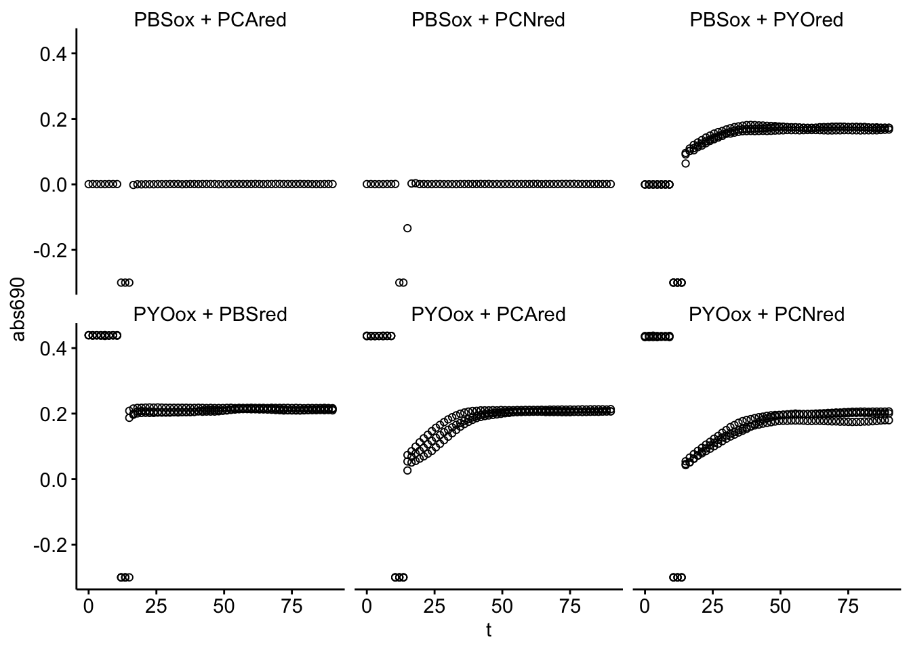
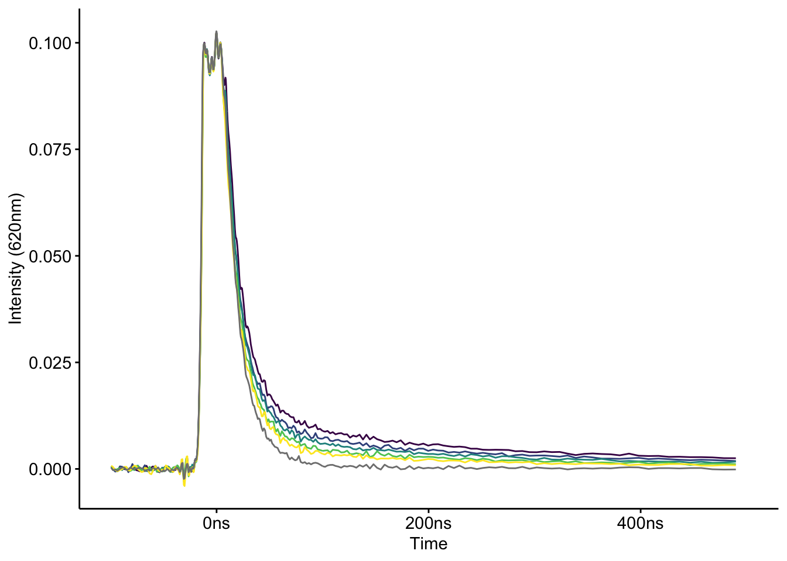
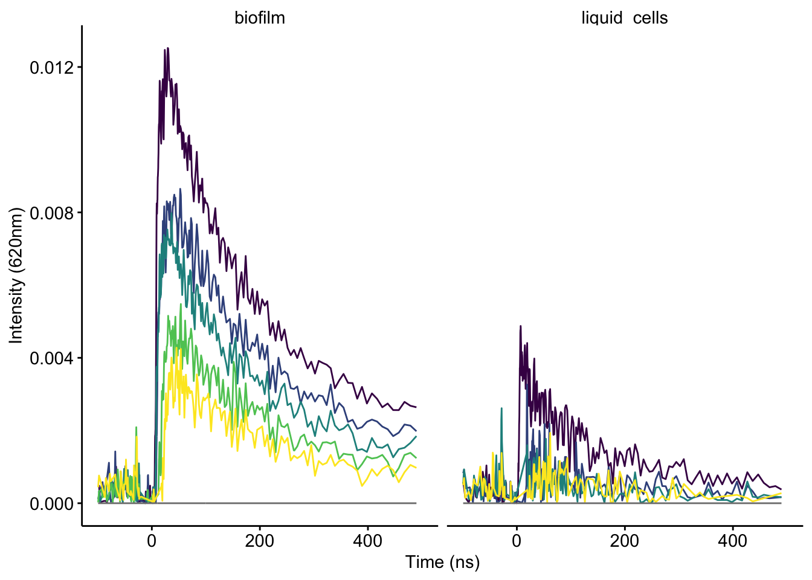

--------

# Notes

Panel A of figure 2 is isothermal titration calorimetry data that was analyzed outside of R. 

----

Setup packages and plotting for the notebook:


```r
# Load packages
library(tidyverse)
library(cowplot)
library(kableExtra)
library(modelr)
library(broom)

# Code display options
knitr::opts_chunk$set(tidy.opts=list(width.cutoff=60),tidy=FALSE, echo = TRUE, message=FALSE, warning=FALSE, fig.align="center", fig.retina = 2)

# Load plotting tools
source("../../tools/plotting_tools.R")

# Modify the plot theme
theme_set(theme_notebook())
```

# Results

Here's the info for each well:

```r
metadata <- read_csv("../../../data/Spectroscopy/2019_10_18_ET_ctDNA_metadata.csv")

metadata %>% kable() %>% kable_styling() %>% scroll_box(height = '400px')
```

<div style="border: 1px solid #ddd; padding: 5px; overflow-y: scroll; height:400px; "><table class="table" style="margin-left: auto; margin-right: auto;">
 <thead>
  <tr>
   <th style="text-align:left;"> well </th>
   <th style="text-align:left;"> red </th>
   <th style="text-align:left;"> ox </th>
   <th style="text-align:left;"> red_ox </th>
   <th style="text-align:left;"> DNA </th>
   <th style="text-align:right;"> rep </th>
   <th style="text-align:left;"> exp </th>
  </tr>
 </thead>
<tbody>
  <tr>
   <td style="text-align:left;"> A1 </td>
   <td style="text-align:left;"> PBS </td>
   <td style="text-align:left;"> PYO </td>
   <td style="text-align:left;"> PBS_PYO </td>
   <td style="text-align:left;"> FALSE </td>
   <td style="text-align:right;"> 1 </td>
   <td style="text-align:left;"> ref </td>
  </tr>
  <tr>
   <td style="text-align:left;"> A2 </td>
   <td style="text-align:left;"> PBS </td>
   <td style="text-align:left;"> PYO </td>
   <td style="text-align:left;"> PBS_PYO </td>
   <td style="text-align:left;"> FALSE </td>
   <td style="text-align:right;"> 2 </td>
   <td style="text-align:left;"> ref </td>
  </tr>
  <tr>
   <td style="text-align:left;"> A3 </td>
   <td style="text-align:left;"> PBS </td>
   <td style="text-align:left;"> PYO </td>
   <td style="text-align:left;"> PBS_PYO </td>
   <td style="text-align:left;"> FALSE </td>
   <td style="text-align:right;"> 3 </td>
   <td style="text-align:left;"> ref </td>
  </tr>
  <tr>
   <td style="text-align:left;"> A4 </td>
   <td style="text-align:left;"> PBS </td>
   <td style="text-align:left;"> PYO </td>
   <td style="text-align:left;"> PBS_PYO </td>
   <td style="text-align:left;"> TRUE </td>
   <td style="text-align:right;"> 1 </td>
   <td style="text-align:left;"> ref </td>
  </tr>
  <tr>
   <td style="text-align:left;"> A5 </td>
   <td style="text-align:left;"> PBS </td>
   <td style="text-align:left;"> PYO </td>
   <td style="text-align:left;"> PBS_PYO </td>
   <td style="text-align:left;"> TRUE </td>
   <td style="text-align:right;"> 2 </td>
   <td style="text-align:left;"> ref </td>
  </tr>
  <tr>
   <td style="text-align:left;"> A6 </td>
   <td style="text-align:left;"> PBS </td>
   <td style="text-align:left;"> PYO </td>
   <td style="text-align:left;"> PBS_PYO </td>
   <td style="text-align:left;"> TRUE </td>
   <td style="text-align:right;"> 3 </td>
   <td style="text-align:left;"> ref </td>
  </tr>
  <tr>
   <td style="text-align:left;"> B1 </td>
   <td style="text-align:left;"> PYO </td>
   <td style="text-align:left;"> PBS </td>
   <td style="text-align:left;"> PYO_PBS </td>
   <td style="text-align:left;"> FALSE </td>
   <td style="text-align:right;"> 1 </td>
   <td style="text-align:left;"> ref </td>
  </tr>
  <tr>
   <td style="text-align:left;"> B2 </td>
   <td style="text-align:left;"> PYO </td>
   <td style="text-align:left;"> PBS </td>
   <td style="text-align:left;"> PYO_PBS </td>
   <td style="text-align:left;"> FALSE </td>
   <td style="text-align:right;"> 2 </td>
   <td style="text-align:left;"> ref </td>
  </tr>
  <tr>
   <td style="text-align:left;"> B3 </td>
   <td style="text-align:left;"> PYO </td>
   <td style="text-align:left;"> PBS </td>
   <td style="text-align:left;"> PYO_PBS </td>
   <td style="text-align:left;"> FALSE </td>
   <td style="text-align:right;"> 3 </td>
   <td style="text-align:left;"> ref </td>
  </tr>
  <tr>
   <td style="text-align:left;"> B4 </td>
   <td style="text-align:left;"> PYO </td>
   <td style="text-align:left;"> PBS </td>
   <td style="text-align:left;"> PYO_PBS </td>
   <td style="text-align:left;"> TRUE </td>
   <td style="text-align:right;"> 1 </td>
   <td style="text-align:left;"> ref </td>
  </tr>
  <tr>
   <td style="text-align:left;"> B5 </td>
   <td style="text-align:left;"> PYO </td>
   <td style="text-align:left;"> PBS </td>
   <td style="text-align:left;"> PYO_PBS </td>
   <td style="text-align:left;"> TRUE </td>
   <td style="text-align:right;"> 2 </td>
   <td style="text-align:left;"> ref </td>
  </tr>
  <tr>
   <td style="text-align:left;"> B6 </td>
   <td style="text-align:left;"> PYO </td>
   <td style="text-align:left;"> PBS </td>
   <td style="text-align:left;"> PYO_PBS </td>
   <td style="text-align:left;"> TRUE </td>
   <td style="text-align:right;"> 3 </td>
   <td style="text-align:left;"> ref </td>
  </tr>
  <tr>
   <td style="text-align:left;"> C1 </td>
   <td style="text-align:left;"> PCA </td>
   <td style="text-align:left;"> PYO </td>
   <td style="text-align:left;"> PCA_PYO </td>
   <td style="text-align:left;"> FALSE </td>
   <td style="text-align:right;"> 1 </td>
   <td style="text-align:left;"> exp </td>
  </tr>
  <tr>
   <td style="text-align:left;"> C2 </td>
   <td style="text-align:left;"> PCA </td>
   <td style="text-align:left;"> PYO </td>
   <td style="text-align:left;"> PCA_PYO </td>
   <td style="text-align:left;"> FALSE </td>
   <td style="text-align:right;"> 2 </td>
   <td style="text-align:left;"> exp </td>
  </tr>
  <tr>
   <td style="text-align:left;"> C3 </td>
   <td style="text-align:left;"> PCA </td>
   <td style="text-align:left;"> PYO </td>
   <td style="text-align:left;"> PCA_PYO </td>
   <td style="text-align:left;"> FALSE </td>
   <td style="text-align:right;"> 3 </td>
   <td style="text-align:left;"> exp </td>
  </tr>
  <tr>
   <td style="text-align:left;"> C4 </td>
   <td style="text-align:left;"> PCA </td>
   <td style="text-align:left;"> PYO </td>
   <td style="text-align:left;"> PCA_PYO </td>
   <td style="text-align:left;"> TRUE </td>
   <td style="text-align:right;"> 1 </td>
   <td style="text-align:left;"> exp </td>
  </tr>
  <tr>
   <td style="text-align:left;"> C5 </td>
   <td style="text-align:left;"> PCA </td>
   <td style="text-align:left;"> PYO </td>
   <td style="text-align:left;"> PCA_PYO </td>
   <td style="text-align:left;"> TRUE </td>
   <td style="text-align:right;"> 2 </td>
   <td style="text-align:left;"> exp </td>
  </tr>
  <tr>
   <td style="text-align:left;"> C6 </td>
   <td style="text-align:left;"> PCA </td>
   <td style="text-align:left;"> PYO </td>
   <td style="text-align:left;"> PCA_PYO </td>
   <td style="text-align:left;"> TRUE </td>
   <td style="text-align:right;"> 3 </td>
   <td style="text-align:left;"> exp </td>
  </tr>
  <tr>
   <td style="text-align:left;"> D1 </td>
   <td style="text-align:left;"> PCN </td>
   <td style="text-align:left;"> PYO </td>
   <td style="text-align:left;"> PCN_PYO </td>
   <td style="text-align:left;"> FALSE </td>
   <td style="text-align:right;"> 1 </td>
   <td style="text-align:left;"> exp </td>
  </tr>
  <tr>
   <td style="text-align:left;"> D2 </td>
   <td style="text-align:left;"> PCN </td>
   <td style="text-align:left;"> PYO </td>
   <td style="text-align:left;"> PCN_PYO </td>
   <td style="text-align:left;"> FALSE </td>
   <td style="text-align:right;"> 2 </td>
   <td style="text-align:left;"> exp </td>
  </tr>
  <tr>
   <td style="text-align:left;"> D3 </td>
   <td style="text-align:left;"> PCN </td>
   <td style="text-align:left;"> PYO </td>
   <td style="text-align:left;"> PCN_PYO </td>
   <td style="text-align:left;"> FALSE </td>
   <td style="text-align:right;"> 3 </td>
   <td style="text-align:left;"> exp </td>
  </tr>
  <tr>
   <td style="text-align:left;"> D4 </td>
   <td style="text-align:left;"> PCN </td>
   <td style="text-align:left;"> PYO </td>
   <td style="text-align:left;"> PCN_PYO </td>
   <td style="text-align:left;"> TRUE </td>
   <td style="text-align:right;"> 1 </td>
   <td style="text-align:left;"> exp </td>
  </tr>
  <tr>
   <td style="text-align:left;"> D5 </td>
   <td style="text-align:left;"> PCN </td>
   <td style="text-align:left;"> PYO </td>
   <td style="text-align:left;"> PCN_PYO </td>
   <td style="text-align:left;"> TRUE </td>
   <td style="text-align:right;"> 2 </td>
   <td style="text-align:left;"> exp </td>
  </tr>
  <tr>
   <td style="text-align:left;"> D6 </td>
   <td style="text-align:left;"> PCN </td>
   <td style="text-align:left;"> PYO </td>
   <td style="text-align:left;"> PCN_PYO </td>
   <td style="text-align:left;"> TRUE </td>
   <td style="text-align:right;"> 3 </td>
   <td style="text-align:left;"> exp </td>
  </tr>
</tbody>
</table></div>

## Abs Spectrum 1

Now let's read in the first absorbance spectra taken for each condition and we'll add the appropriate metadata:

```r
df <- read_csv("../../../data/Spectroscopy/2019_10_18_ET_ctDNA_abs_spectra_1.csv") %>%
    gather(key = 'well', value = 'intensity', -Wavelength)

df_meta <- left_join(df, metadata, by = 'well')

df_meta %>% kable %>% kable_styling() %>% scroll_box(height = '400px')
```

<div style="border: 1px solid #ddd; padding: 5px; overflow-y: scroll; height:400px; "><table class="table" style="margin-left: auto; margin-right: auto;">
 <thead>
  <tr>
   <th style="text-align:right;"> Wavelength </th>
   <th style="text-align:left;"> well </th>
   <th style="text-align:right;"> intensity </th>
   <th style="text-align:left;"> red </th>
   <th style="text-align:left;"> ox </th>
   <th style="text-align:left;"> red_ox </th>
   <th style="text-align:left;"> DNA </th>
   <th style="text-align:right;"> rep </th>
   <th style="text-align:left;"> exp </th>
  </tr>
 </thead>
<tbody>
  <tr>
   <td style="text-align:right;"> 300 </td>
   <td style="text-align:left;"> A1 </td>
   <td style="text-align:right;"> 0.685 </td>
   <td style="text-align:left;"> PBS </td>
   <td style="text-align:left;"> PYO </td>
   <td style="text-align:left;"> PBS_PYO </td>
   <td style="text-align:left;"> FALSE </td>
   <td style="text-align:right;"> 1 </td>
   <td style="text-align:left;"> ref </td>
  </tr>
  <tr>
   <td style="text-align:right;"> 310 </td>
   <td style="text-align:left;"> A1 </td>
   <td style="text-align:right;"> 0.777 </td>
   <td style="text-align:left;"> PBS </td>
   <td style="text-align:left;"> PYO </td>
   <td style="text-align:left;"> PBS_PYO </td>
   <td style="text-align:left;"> FALSE </td>
   <td style="text-align:right;"> 1 </td>
   <td style="text-align:left;"> ref </td>
  </tr>
  <tr>
   <td style="text-align:right;"> 320 </td>
   <td style="text-align:left;"> A1 </td>
   <td style="text-align:right;"> 0.569 </td>
   <td style="text-align:left;"> PBS </td>
   <td style="text-align:left;"> PYO </td>
   <td style="text-align:left;"> PBS_PYO </td>
   <td style="text-align:left;"> FALSE </td>
   <td style="text-align:right;"> 1 </td>
   <td style="text-align:left;"> ref </td>
  </tr>
  <tr>
   <td style="text-align:right;"> 330 </td>
   <td style="text-align:left;"> A1 </td>
   <td style="text-align:right;"> 0.302 </td>
   <td style="text-align:left;"> PBS </td>
   <td style="text-align:left;"> PYO </td>
   <td style="text-align:left;"> PBS_PYO </td>
   <td style="text-align:left;"> FALSE </td>
   <td style="text-align:right;"> 1 </td>
   <td style="text-align:left;"> ref </td>
  </tr>
  <tr>
   <td style="text-align:right;"> 340 </td>
   <td style="text-align:left;"> A1 </td>
   <td style="text-align:right;"> 0.224 </td>
   <td style="text-align:left;"> PBS </td>
   <td style="text-align:left;"> PYO </td>
   <td style="text-align:left;"> PBS_PYO </td>
   <td style="text-align:left;"> FALSE </td>
   <td style="text-align:right;"> 1 </td>
   <td style="text-align:left;"> ref </td>
  </tr>
  <tr>
   <td style="text-align:right;"> 350 </td>
   <td style="text-align:left;"> A1 </td>
   <td style="text-align:right;"> 0.212 </td>
   <td style="text-align:left;"> PBS </td>
   <td style="text-align:left;"> PYO </td>
   <td style="text-align:left;"> PBS_PYO </td>
   <td style="text-align:left;"> FALSE </td>
   <td style="text-align:right;"> 1 </td>
   <td style="text-align:left;"> ref </td>
  </tr>
  <tr>
   <td style="text-align:right;"> 360 </td>
   <td style="text-align:left;"> A1 </td>
   <td style="text-align:right;"> 0.217 </td>
   <td style="text-align:left;"> PBS </td>
   <td style="text-align:left;"> PYO </td>
   <td style="text-align:left;"> PBS_PYO </td>
   <td style="text-align:left;"> FALSE </td>
   <td style="text-align:right;"> 1 </td>
   <td style="text-align:left;"> ref </td>
  </tr>
  <tr>
   <td style="text-align:right;"> 370 </td>
   <td style="text-align:left;"> A1 </td>
   <td style="text-align:right;"> 0.202 </td>
   <td style="text-align:left;"> PBS </td>
   <td style="text-align:left;"> PYO </td>
   <td style="text-align:left;"> PBS_PYO </td>
   <td style="text-align:left;"> FALSE </td>
   <td style="text-align:right;"> 1 </td>
   <td style="text-align:left;"> ref </td>
  </tr>
  <tr>
   <td style="text-align:right;"> 380 </td>
   <td style="text-align:left;"> A1 </td>
   <td style="text-align:right;"> 0.181 </td>
   <td style="text-align:left;"> PBS </td>
   <td style="text-align:left;"> PYO </td>
   <td style="text-align:left;"> PBS_PYO </td>
   <td style="text-align:left;"> FALSE </td>
   <td style="text-align:right;"> 1 </td>
   <td style="text-align:left;"> ref </td>
  </tr>
  <tr>
   <td style="text-align:right;"> 390 </td>
   <td style="text-align:left;"> A1 </td>
   <td style="text-align:right;"> 0.115 </td>
   <td style="text-align:left;"> PBS </td>
   <td style="text-align:left;"> PYO </td>
   <td style="text-align:left;"> PBS_PYO </td>
   <td style="text-align:left;"> FALSE </td>
   <td style="text-align:right;"> 1 </td>
   <td style="text-align:left;"> ref </td>
  </tr>
  <tr>
   <td style="text-align:right;"> 400 </td>
   <td style="text-align:left;"> A1 </td>
   <td style="text-align:right;"> 0.067 </td>
   <td style="text-align:left;"> PBS </td>
   <td style="text-align:left;"> PYO </td>
   <td style="text-align:left;"> PBS_PYO </td>
   <td style="text-align:left;"> FALSE </td>
   <td style="text-align:right;"> 1 </td>
   <td style="text-align:left;"> ref </td>
  </tr>
  <tr>
   <td style="text-align:right;"> 410 </td>
   <td style="text-align:left;"> A1 </td>
   <td style="text-align:right;"> 0.052 </td>
   <td style="text-align:left;"> PBS </td>
   <td style="text-align:left;"> PYO </td>
   <td style="text-align:left;"> PBS_PYO </td>
   <td style="text-align:left;"> FALSE </td>
   <td style="text-align:right;"> 1 </td>
   <td style="text-align:left;"> ref </td>
  </tr>
  <tr>
   <td style="text-align:right;"> 420 </td>
   <td style="text-align:left;"> A1 </td>
   <td style="text-align:right;"> 0.046 </td>
   <td style="text-align:left;"> PBS </td>
   <td style="text-align:left;"> PYO </td>
   <td style="text-align:left;"> PBS_PYO </td>
   <td style="text-align:left;"> FALSE </td>
   <td style="text-align:right;"> 1 </td>
   <td style="text-align:left;"> ref </td>
  </tr>
  <tr>
   <td style="text-align:right;"> 430 </td>
   <td style="text-align:left;"> A1 </td>
   <td style="text-align:right;"> 0.043 </td>
   <td style="text-align:left;"> PBS </td>
   <td style="text-align:left;"> PYO </td>
   <td style="text-align:left;"> PBS_PYO </td>
   <td style="text-align:left;"> FALSE </td>
   <td style="text-align:right;"> 1 </td>
   <td style="text-align:left;"> ref </td>
  </tr>
  <tr>
   <td style="text-align:right;"> 440 </td>
   <td style="text-align:left;"> A1 </td>
   <td style="text-align:right;"> 0.041 </td>
   <td style="text-align:left;"> PBS </td>
   <td style="text-align:left;"> PYO </td>
   <td style="text-align:left;"> PBS_PYO </td>
   <td style="text-align:left;"> FALSE </td>
   <td style="text-align:right;"> 1 </td>
   <td style="text-align:left;"> ref </td>
  </tr>
  <tr>
   <td style="text-align:right;"> 450 </td>
   <td style="text-align:left;"> A1 </td>
   <td style="text-align:right;"> 0.041 </td>
   <td style="text-align:left;"> PBS </td>
   <td style="text-align:left;"> PYO </td>
   <td style="text-align:left;"> PBS_PYO </td>
   <td style="text-align:left;"> FALSE </td>
   <td style="text-align:right;"> 1 </td>
   <td style="text-align:left;"> ref </td>
  </tr>
  <tr>
   <td style="text-align:right;"> 460 </td>
   <td style="text-align:left;"> A1 </td>
   <td style="text-align:right;"> 0.040 </td>
   <td style="text-align:left;"> PBS </td>
   <td style="text-align:left;"> PYO </td>
   <td style="text-align:left;"> PBS_PYO </td>
   <td style="text-align:left;"> FALSE </td>
   <td style="text-align:right;"> 1 </td>
   <td style="text-align:left;"> ref </td>
  </tr>
  <tr>
   <td style="text-align:right;"> 470 </td>
   <td style="text-align:left;"> A1 </td>
   <td style="text-align:right;"> 0.040 </td>
   <td style="text-align:left;"> PBS </td>
   <td style="text-align:left;"> PYO </td>
   <td style="text-align:left;"> PBS_PYO </td>
   <td style="text-align:left;"> FALSE </td>
   <td style="text-align:right;"> 1 </td>
   <td style="text-align:left;"> ref </td>
  </tr>
  <tr>
   <td style="text-align:right;"> 480 </td>
   <td style="text-align:left;"> A1 </td>
   <td style="text-align:right;"> 0.039 </td>
   <td style="text-align:left;"> PBS </td>
   <td style="text-align:left;"> PYO </td>
   <td style="text-align:left;"> PBS_PYO </td>
   <td style="text-align:left;"> FALSE </td>
   <td style="text-align:right;"> 1 </td>
   <td style="text-align:left;"> ref </td>
  </tr>
  <tr>
   <td style="text-align:right;"> 490 </td>
   <td style="text-align:left;"> A1 </td>
   <td style="text-align:right;"> 0.039 </td>
   <td style="text-align:left;"> PBS </td>
   <td style="text-align:left;"> PYO </td>
   <td style="text-align:left;"> PBS_PYO </td>
   <td style="text-align:left;"> FALSE </td>
   <td style="text-align:right;"> 1 </td>
   <td style="text-align:left;"> ref </td>
  </tr>
  <tr>
   <td style="text-align:right;"> 500 </td>
   <td style="text-align:left;"> A1 </td>
   <td style="text-align:right;"> 0.040 </td>
   <td style="text-align:left;"> PBS </td>
   <td style="text-align:left;"> PYO </td>
   <td style="text-align:left;"> PBS_PYO </td>
   <td style="text-align:left;"> FALSE </td>
   <td style="text-align:right;"> 1 </td>
   <td style="text-align:left;"> ref </td>
  </tr>
  <tr>
   <td style="text-align:right;"> 510 </td>
   <td style="text-align:left;"> A1 </td>
   <td style="text-align:right;"> 0.042 </td>
   <td style="text-align:left;"> PBS </td>
   <td style="text-align:left;"> PYO </td>
   <td style="text-align:left;"> PBS_PYO </td>
   <td style="text-align:left;"> FALSE </td>
   <td style="text-align:right;"> 1 </td>
   <td style="text-align:left;"> ref </td>
  </tr>
  <tr>
   <td style="text-align:right;"> 520 </td>
   <td style="text-align:left;"> A1 </td>
   <td style="text-align:right;"> 0.043 </td>
   <td style="text-align:left;"> PBS </td>
   <td style="text-align:left;"> PYO </td>
   <td style="text-align:left;"> PBS_PYO </td>
   <td style="text-align:left;"> FALSE </td>
   <td style="text-align:right;"> 1 </td>
   <td style="text-align:left;"> ref </td>
  </tr>
  <tr>
   <td style="text-align:right;"> 530 </td>
   <td style="text-align:left;"> A1 </td>
   <td style="text-align:right;"> 0.045 </td>
   <td style="text-align:left;"> PBS </td>
   <td style="text-align:left;"> PYO </td>
   <td style="text-align:left;"> PBS_PYO </td>
   <td style="text-align:left;"> FALSE </td>
   <td style="text-align:right;"> 1 </td>
   <td style="text-align:left;"> ref </td>
  </tr>
  <tr>
   <td style="text-align:right;"> 540 </td>
   <td style="text-align:left;"> A1 </td>
   <td style="text-align:right;"> 0.048 </td>
   <td style="text-align:left;"> PBS </td>
   <td style="text-align:left;"> PYO </td>
   <td style="text-align:left;"> PBS_PYO </td>
   <td style="text-align:left;"> FALSE </td>
   <td style="text-align:right;"> 1 </td>
   <td style="text-align:left;"> ref </td>
  </tr>
  <tr>
   <td style="text-align:right;"> 550 </td>
   <td style="text-align:left;"> A1 </td>
   <td style="text-align:right;"> 0.051 </td>
   <td style="text-align:left;"> PBS </td>
   <td style="text-align:left;"> PYO </td>
   <td style="text-align:left;"> PBS_PYO </td>
   <td style="text-align:left;"> FALSE </td>
   <td style="text-align:right;"> 1 </td>
   <td style="text-align:left;"> ref </td>
  </tr>
  <tr>
   <td style="text-align:right;"> 560 </td>
   <td style="text-align:left;"> A1 </td>
   <td style="text-align:right;"> 0.055 </td>
   <td style="text-align:left;"> PBS </td>
   <td style="text-align:left;"> PYO </td>
   <td style="text-align:left;"> PBS_PYO </td>
   <td style="text-align:left;"> FALSE </td>
   <td style="text-align:right;"> 1 </td>
   <td style="text-align:left;"> ref </td>
  </tr>
  <tr>
   <td style="text-align:right;"> 570 </td>
   <td style="text-align:left;"> A1 </td>
   <td style="text-align:right;"> 0.059 </td>
   <td style="text-align:left;"> PBS </td>
   <td style="text-align:left;"> PYO </td>
   <td style="text-align:left;"> PBS_PYO </td>
   <td style="text-align:left;"> FALSE </td>
   <td style="text-align:right;"> 1 </td>
   <td style="text-align:left;"> ref </td>
  </tr>
  <tr>
   <td style="text-align:right;"> 580 </td>
   <td style="text-align:left;"> A1 </td>
   <td style="text-align:right;"> 0.064 </td>
   <td style="text-align:left;"> PBS </td>
   <td style="text-align:left;"> PYO </td>
   <td style="text-align:left;"> PBS_PYO </td>
   <td style="text-align:left;"> FALSE </td>
   <td style="text-align:right;"> 1 </td>
   <td style="text-align:left;"> ref </td>
  </tr>
  <tr>
   <td style="text-align:right;"> 590 </td>
   <td style="text-align:left;"> A1 </td>
   <td style="text-align:right;"> 0.068 </td>
   <td style="text-align:left;"> PBS </td>
   <td style="text-align:left;"> PYO </td>
   <td style="text-align:left;"> PBS_PYO </td>
   <td style="text-align:left;"> FALSE </td>
   <td style="text-align:right;"> 1 </td>
   <td style="text-align:left;"> ref </td>
  </tr>
  <tr>
   <td style="text-align:right;"> 600 </td>
   <td style="text-align:left;"> A1 </td>
   <td style="text-align:right;"> 0.074 </td>
   <td style="text-align:left;"> PBS </td>
   <td style="text-align:left;"> PYO </td>
   <td style="text-align:left;"> PBS_PYO </td>
   <td style="text-align:left;"> FALSE </td>
   <td style="text-align:right;"> 1 </td>
   <td style="text-align:left;"> ref </td>
  </tr>
  <tr>
   <td style="text-align:right;"> 610 </td>
   <td style="text-align:left;"> A1 </td>
   <td style="text-align:right;"> 0.079 </td>
   <td style="text-align:left;"> PBS </td>
   <td style="text-align:left;"> PYO </td>
   <td style="text-align:left;"> PBS_PYO </td>
   <td style="text-align:left;"> FALSE </td>
   <td style="text-align:right;"> 1 </td>
   <td style="text-align:left;"> ref </td>
  </tr>
  <tr>
   <td style="text-align:right;"> 620 </td>
   <td style="text-align:left;"> A1 </td>
   <td style="text-align:right;"> 0.084 </td>
   <td style="text-align:left;"> PBS </td>
   <td style="text-align:left;"> PYO </td>
   <td style="text-align:left;"> PBS_PYO </td>
   <td style="text-align:left;"> FALSE </td>
   <td style="text-align:right;"> 1 </td>
   <td style="text-align:left;"> ref </td>
  </tr>
  <tr>
   <td style="text-align:right;"> 630 </td>
   <td style="text-align:left;"> A1 </td>
   <td style="text-align:right;"> 0.088 </td>
   <td style="text-align:left;"> PBS </td>
   <td style="text-align:left;"> PYO </td>
   <td style="text-align:left;"> PBS_PYO </td>
   <td style="text-align:left;"> FALSE </td>
   <td style="text-align:right;"> 1 </td>
   <td style="text-align:left;"> ref </td>
  </tr>
  <tr>
   <td style="text-align:right;"> 640 </td>
   <td style="text-align:left;"> A1 </td>
   <td style="text-align:right;"> 0.093 </td>
   <td style="text-align:left;"> PBS </td>
   <td style="text-align:left;"> PYO </td>
   <td style="text-align:left;"> PBS_PYO </td>
   <td style="text-align:left;"> FALSE </td>
   <td style="text-align:right;"> 1 </td>
   <td style="text-align:left;"> ref </td>
  </tr>
  <tr>
   <td style="text-align:right;"> 650 </td>
   <td style="text-align:left;"> A1 </td>
   <td style="text-align:right;"> 0.096 </td>
   <td style="text-align:left;"> PBS </td>
   <td style="text-align:left;"> PYO </td>
   <td style="text-align:left;"> PBS_PYO </td>
   <td style="text-align:left;"> FALSE </td>
   <td style="text-align:right;"> 1 </td>
   <td style="text-align:left;"> ref </td>
  </tr>
  <tr>
   <td style="text-align:right;"> 660 </td>
   <td style="text-align:left;"> A1 </td>
   <td style="text-align:right;"> 0.099 </td>
   <td style="text-align:left;"> PBS </td>
   <td style="text-align:left;"> PYO </td>
   <td style="text-align:left;"> PBS_PYO </td>
   <td style="text-align:left;"> FALSE </td>
   <td style="text-align:right;"> 1 </td>
   <td style="text-align:left;"> ref </td>
  </tr>
  <tr>
   <td style="text-align:right;"> 670 </td>
   <td style="text-align:left;"> A1 </td>
   <td style="text-align:right;"> 0.101 </td>
   <td style="text-align:left;"> PBS </td>
   <td style="text-align:left;"> PYO </td>
   <td style="text-align:left;"> PBS_PYO </td>
   <td style="text-align:left;"> FALSE </td>
   <td style="text-align:right;"> 1 </td>
   <td style="text-align:left;"> ref </td>
  </tr>
  <tr>
   <td style="text-align:right;"> 680 </td>
   <td style="text-align:left;"> A1 </td>
   <td style="text-align:right;"> 0.102 </td>
   <td style="text-align:left;"> PBS </td>
   <td style="text-align:left;"> PYO </td>
   <td style="text-align:left;"> PBS_PYO </td>
   <td style="text-align:left;"> FALSE </td>
   <td style="text-align:right;"> 1 </td>
   <td style="text-align:left;"> ref </td>
  </tr>
  <tr>
   <td style="text-align:right;"> 690 </td>
   <td style="text-align:left;"> A1 </td>
   <td style="text-align:right;"> 0.102 </td>
   <td style="text-align:left;"> PBS </td>
   <td style="text-align:left;"> PYO </td>
   <td style="text-align:left;"> PBS_PYO </td>
   <td style="text-align:left;"> FALSE </td>
   <td style="text-align:right;"> 1 </td>
   <td style="text-align:left;"> ref </td>
  </tr>
  <tr>
   <td style="text-align:right;"> 700 </td>
   <td style="text-align:left;"> A1 </td>
   <td style="text-align:right;"> 0.102 </td>
   <td style="text-align:left;"> PBS </td>
   <td style="text-align:left;"> PYO </td>
   <td style="text-align:left;"> PBS_PYO </td>
   <td style="text-align:left;"> FALSE </td>
   <td style="text-align:right;"> 1 </td>
   <td style="text-align:left;"> ref </td>
  </tr>
  <tr>
   <td style="text-align:right;"> 300 </td>
   <td style="text-align:left;"> A2 </td>
   <td style="text-align:right;"> 0.687 </td>
   <td style="text-align:left;"> PBS </td>
   <td style="text-align:left;"> PYO </td>
   <td style="text-align:left;"> PBS_PYO </td>
   <td style="text-align:left;"> FALSE </td>
   <td style="text-align:right;"> 2 </td>
   <td style="text-align:left;"> ref </td>
  </tr>
  <tr>
   <td style="text-align:right;"> 310 </td>
   <td style="text-align:left;"> A2 </td>
   <td style="text-align:right;"> 0.778 </td>
   <td style="text-align:left;"> PBS </td>
   <td style="text-align:left;"> PYO </td>
   <td style="text-align:left;"> PBS_PYO </td>
   <td style="text-align:left;"> FALSE </td>
   <td style="text-align:right;"> 2 </td>
   <td style="text-align:left;"> ref </td>
  </tr>
  <tr>
   <td style="text-align:right;"> 320 </td>
   <td style="text-align:left;"> A2 </td>
   <td style="text-align:right;"> 0.570 </td>
   <td style="text-align:left;"> PBS </td>
   <td style="text-align:left;"> PYO </td>
   <td style="text-align:left;"> PBS_PYO </td>
   <td style="text-align:left;"> FALSE </td>
   <td style="text-align:right;"> 2 </td>
   <td style="text-align:left;"> ref </td>
  </tr>
  <tr>
   <td style="text-align:right;"> 330 </td>
   <td style="text-align:left;"> A2 </td>
   <td style="text-align:right;"> 0.304 </td>
   <td style="text-align:left;"> PBS </td>
   <td style="text-align:left;"> PYO </td>
   <td style="text-align:left;"> PBS_PYO </td>
   <td style="text-align:left;"> FALSE </td>
   <td style="text-align:right;"> 2 </td>
   <td style="text-align:left;"> ref </td>
  </tr>
  <tr>
   <td style="text-align:right;"> 340 </td>
   <td style="text-align:left;"> A2 </td>
   <td style="text-align:right;"> 0.226 </td>
   <td style="text-align:left;"> PBS </td>
   <td style="text-align:left;"> PYO </td>
   <td style="text-align:left;"> PBS_PYO </td>
   <td style="text-align:left;"> FALSE </td>
   <td style="text-align:right;"> 2 </td>
   <td style="text-align:left;"> ref </td>
  </tr>
  <tr>
   <td style="text-align:right;"> 350 </td>
   <td style="text-align:left;"> A2 </td>
   <td style="text-align:right;"> 0.214 </td>
   <td style="text-align:left;"> PBS </td>
   <td style="text-align:left;"> PYO </td>
   <td style="text-align:left;"> PBS_PYO </td>
   <td style="text-align:left;"> FALSE </td>
   <td style="text-align:right;"> 2 </td>
   <td style="text-align:left;"> ref </td>
  </tr>
  <tr>
   <td style="text-align:right;"> 360 </td>
   <td style="text-align:left;"> A2 </td>
   <td style="text-align:right;"> 0.219 </td>
   <td style="text-align:left;"> PBS </td>
   <td style="text-align:left;"> PYO </td>
   <td style="text-align:left;"> PBS_PYO </td>
   <td style="text-align:left;"> FALSE </td>
   <td style="text-align:right;"> 2 </td>
   <td style="text-align:left;"> ref </td>
  </tr>
  <tr>
   <td style="text-align:right;"> 370 </td>
   <td style="text-align:left;"> A2 </td>
   <td style="text-align:right;"> 0.203 </td>
   <td style="text-align:left;"> PBS </td>
   <td style="text-align:left;"> PYO </td>
   <td style="text-align:left;"> PBS_PYO </td>
   <td style="text-align:left;"> FALSE </td>
   <td style="text-align:right;"> 2 </td>
   <td style="text-align:left;"> ref </td>
  </tr>
  <tr>
   <td style="text-align:right;"> 380 </td>
   <td style="text-align:left;"> A2 </td>
   <td style="text-align:right;"> 0.181 </td>
   <td style="text-align:left;"> PBS </td>
   <td style="text-align:left;"> PYO </td>
   <td style="text-align:left;"> PBS_PYO </td>
   <td style="text-align:left;"> FALSE </td>
   <td style="text-align:right;"> 2 </td>
   <td style="text-align:left;"> ref </td>
  </tr>
  <tr>
   <td style="text-align:right;"> 390 </td>
   <td style="text-align:left;"> A2 </td>
   <td style="text-align:right;"> 0.115 </td>
   <td style="text-align:left;"> PBS </td>
   <td style="text-align:left;"> PYO </td>
   <td style="text-align:left;"> PBS_PYO </td>
   <td style="text-align:left;"> FALSE </td>
   <td style="text-align:right;"> 2 </td>
   <td style="text-align:left;"> ref </td>
  </tr>
  <tr>
   <td style="text-align:right;"> 400 </td>
   <td style="text-align:left;"> A2 </td>
   <td style="text-align:right;"> 0.068 </td>
   <td style="text-align:left;"> PBS </td>
   <td style="text-align:left;"> PYO </td>
   <td style="text-align:left;"> PBS_PYO </td>
   <td style="text-align:left;"> FALSE </td>
   <td style="text-align:right;"> 2 </td>
   <td style="text-align:left;"> ref </td>
  </tr>
  <tr>
   <td style="text-align:right;"> 410 </td>
   <td style="text-align:left;"> A2 </td>
   <td style="text-align:right;"> 0.052 </td>
   <td style="text-align:left;"> PBS </td>
   <td style="text-align:left;"> PYO </td>
   <td style="text-align:left;"> PBS_PYO </td>
   <td style="text-align:left;"> FALSE </td>
   <td style="text-align:right;"> 2 </td>
   <td style="text-align:left;"> ref </td>
  </tr>
  <tr>
   <td style="text-align:right;"> 420 </td>
   <td style="text-align:left;"> A2 </td>
   <td style="text-align:right;"> 0.047 </td>
   <td style="text-align:left;"> PBS </td>
   <td style="text-align:left;"> PYO </td>
   <td style="text-align:left;"> PBS_PYO </td>
   <td style="text-align:left;"> FALSE </td>
   <td style="text-align:right;"> 2 </td>
   <td style="text-align:left;"> ref </td>
  </tr>
  <tr>
   <td style="text-align:right;"> 430 </td>
   <td style="text-align:left;"> A2 </td>
   <td style="text-align:right;"> 0.043 </td>
   <td style="text-align:left;"> PBS </td>
   <td style="text-align:left;"> PYO </td>
   <td style="text-align:left;"> PBS_PYO </td>
   <td style="text-align:left;"> FALSE </td>
   <td style="text-align:right;"> 2 </td>
   <td style="text-align:left;"> ref </td>
  </tr>
  <tr>
   <td style="text-align:right;"> 440 </td>
   <td style="text-align:left;"> A2 </td>
   <td style="text-align:right;"> 0.042 </td>
   <td style="text-align:left;"> PBS </td>
   <td style="text-align:left;"> PYO </td>
   <td style="text-align:left;"> PBS_PYO </td>
   <td style="text-align:left;"> FALSE </td>
   <td style="text-align:right;"> 2 </td>
   <td style="text-align:left;"> ref </td>
  </tr>
  <tr>
   <td style="text-align:right;"> 450 </td>
   <td style="text-align:left;"> A2 </td>
   <td style="text-align:right;"> 0.041 </td>
   <td style="text-align:left;"> PBS </td>
   <td style="text-align:left;"> PYO </td>
   <td style="text-align:left;"> PBS_PYO </td>
   <td style="text-align:left;"> FALSE </td>
   <td style="text-align:right;"> 2 </td>
   <td style="text-align:left;"> ref </td>
  </tr>
  <tr>
   <td style="text-align:right;"> 460 </td>
   <td style="text-align:left;"> A2 </td>
   <td style="text-align:right;"> 0.040 </td>
   <td style="text-align:left;"> PBS </td>
   <td style="text-align:left;"> PYO </td>
   <td style="text-align:left;"> PBS_PYO </td>
   <td style="text-align:left;"> FALSE </td>
   <td style="text-align:right;"> 2 </td>
   <td style="text-align:left;"> ref </td>
  </tr>
  <tr>
   <td style="text-align:right;"> 470 </td>
   <td style="text-align:left;"> A2 </td>
   <td style="text-align:right;"> 0.040 </td>
   <td style="text-align:left;"> PBS </td>
   <td style="text-align:left;"> PYO </td>
   <td style="text-align:left;"> PBS_PYO </td>
   <td style="text-align:left;"> FALSE </td>
   <td style="text-align:right;"> 2 </td>
   <td style="text-align:left;"> ref </td>
  </tr>
  <tr>
   <td style="text-align:right;"> 480 </td>
   <td style="text-align:left;"> A2 </td>
   <td style="text-align:right;"> 0.039 </td>
   <td style="text-align:left;"> PBS </td>
   <td style="text-align:left;"> PYO </td>
   <td style="text-align:left;"> PBS_PYO </td>
   <td style="text-align:left;"> FALSE </td>
   <td style="text-align:right;"> 2 </td>
   <td style="text-align:left;"> ref </td>
  </tr>
  <tr>
   <td style="text-align:right;"> 490 </td>
   <td style="text-align:left;"> A2 </td>
   <td style="text-align:right;"> 0.040 </td>
   <td style="text-align:left;"> PBS </td>
   <td style="text-align:left;"> PYO </td>
   <td style="text-align:left;"> PBS_PYO </td>
   <td style="text-align:left;"> FALSE </td>
   <td style="text-align:right;"> 2 </td>
   <td style="text-align:left;"> ref </td>
  </tr>
  <tr>
   <td style="text-align:right;"> 500 </td>
   <td style="text-align:left;"> A2 </td>
   <td style="text-align:right;"> 0.040 </td>
   <td style="text-align:left;"> PBS </td>
   <td style="text-align:left;"> PYO </td>
   <td style="text-align:left;"> PBS_PYO </td>
   <td style="text-align:left;"> FALSE </td>
   <td style="text-align:right;"> 2 </td>
   <td style="text-align:left;"> ref </td>
  </tr>
  <tr>
   <td style="text-align:right;"> 510 </td>
   <td style="text-align:left;"> A2 </td>
   <td style="text-align:right;"> 0.041 </td>
   <td style="text-align:left;"> PBS </td>
   <td style="text-align:left;"> PYO </td>
   <td style="text-align:left;"> PBS_PYO </td>
   <td style="text-align:left;"> FALSE </td>
   <td style="text-align:right;"> 2 </td>
   <td style="text-align:left;"> ref </td>
  </tr>
  <tr>
   <td style="text-align:right;"> 520 </td>
   <td style="text-align:left;"> A2 </td>
   <td style="text-align:right;"> 0.043 </td>
   <td style="text-align:left;"> PBS </td>
   <td style="text-align:left;"> PYO </td>
   <td style="text-align:left;"> PBS_PYO </td>
   <td style="text-align:left;"> FALSE </td>
   <td style="text-align:right;"> 2 </td>
   <td style="text-align:left;"> ref </td>
  </tr>
  <tr>
   <td style="text-align:right;"> 530 </td>
   <td style="text-align:left;"> A2 </td>
   <td style="text-align:right;"> 0.045 </td>
   <td style="text-align:left;"> PBS </td>
   <td style="text-align:left;"> PYO </td>
   <td style="text-align:left;"> PBS_PYO </td>
   <td style="text-align:left;"> FALSE </td>
   <td style="text-align:right;"> 2 </td>
   <td style="text-align:left;"> ref </td>
  </tr>
  <tr>
   <td style="text-align:right;"> 540 </td>
   <td style="text-align:left;"> A2 </td>
   <td style="text-align:right;"> 0.048 </td>
   <td style="text-align:left;"> PBS </td>
   <td style="text-align:left;"> PYO </td>
   <td style="text-align:left;"> PBS_PYO </td>
   <td style="text-align:left;"> FALSE </td>
   <td style="text-align:right;"> 2 </td>
   <td style="text-align:left;"> ref </td>
  </tr>
  <tr>
   <td style="text-align:right;"> 550 </td>
   <td style="text-align:left;"> A2 </td>
   <td style="text-align:right;"> 0.051 </td>
   <td style="text-align:left;"> PBS </td>
   <td style="text-align:left;"> PYO </td>
   <td style="text-align:left;"> PBS_PYO </td>
   <td style="text-align:left;"> FALSE </td>
   <td style="text-align:right;"> 2 </td>
   <td style="text-align:left;"> ref </td>
  </tr>
  <tr>
   <td style="text-align:right;"> 560 </td>
   <td style="text-align:left;"> A2 </td>
   <td style="text-align:right;"> 0.054 </td>
   <td style="text-align:left;"> PBS </td>
   <td style="text-align:left;"> PYO </td>
   <td style="text-align:left;"> PBS_PYO </td>
   <td style="text-align:left;"> FALSE </td>
   <td style="text-align:right;"> 2 </td>
   <td style="text-align:left;"> ref </td>
  </tr>
  <tr>
   <td style="text-align:right;"> 570 </td>
   <td style="text-align:left;"> A2 </td>
   <td style="text-align:right;"> 0.058 </td>
   <td style="text-align:left;"> PBS </td>
   <td style="text-align:left;"> PYO </td>
   <td style="text-align:left;"> PBS_PYO </td>
   <td style="text-align:left;"> FALSE </td>
   <td style="text-align:right;"> 2 </td>
   <td style="text-align:left;"> ref </td>
  </tr>
  <tr>
   <td style="text-align:right;"> 580 </td>
   <td style="text-align:left;"> A2 </td>
   <td style="text-align:right;"> 0.062 </td>
   <td style="text-align:left;"> PBS </td>
   <td style="text-align:left;"> PYO </td>
   <td style="text-align:left;"> PBS_PYO </td>
   <td style="text-align:left;"> FALSE </td>
   <td style="text-align:right;"> 2 </td>
   <td style="text-align:left;"> ref </td>
  </tr>
  <tr>
   <td style="text-align:right;"> 590 </td>
   <td style="text-align:left;"> A2 </td>
   <td style="text-align:right;"> 0.067 </td>
   <td style="text-align:left;"> PBS </td>
   <td style="text-align:left;"> PYO </td>
   <td style="text-align:left;"> PBS_PYO </td>
   <td style="text-align:left;"> FALSE </td>
   <td style="text-align:right;"> 2 </td>
   <td style="text-align:left;"> ref </td>
  </tr>
  <tr>
   <td style="text-align:right;"> 600 </td>
   <td style="text-align:left;"> A2 </td>
   <td style="text-align:right;"> 0.072 </td>
   <td style="text-align:left;"> PBS </td>
   <td style="text-align:left;"> PYO </td>
   <td style="text-align:left;"> PBS_PYO </td>
   <td style="text-align:left;"> FALSE </td>
   <td style="text-align:right;"> 2 </td>
   <td style="text-align:left;"> ref </td>
  </tr>
  <tr>
   <td style="text-align:right;"> 610 </td>
   <td style="text-align:left;"> A2 </td>
   <td style="text-align:right;"> 0.078 </td>
   <td style="text-align:left;"> PBS </td>
   <td style="text-align:left;"> PYO </td>
   <td style="text-align:left;"> PBS_PYO </td>
   <td style="text-align:left;"> FALSE </td>
   <td style="text-align:right;"> 2 </td>
   <td style="text-align:left;"> ref </td>
  </tr>
  <tr>
   <td style="text-align:right;"> 620 </td>
   <td style="text-align:left;"> A2 </td>
   <td style="text-align:right;"> 0.082 </td>
   <td style="text-align:left;"> PBS </td>
   <td style="text-align:left;"> PYO </td>
   <td style="text-align:left;"> PBS_PYO </td>
   <td style="text-align:left;"> FALSE </td>
   <td style="text-align:right;"> 2 </td>
   <td style="text-align:left;"> ref </td>
  </tr>
  <tr>
   <td style="text-align:right;"> 630 </td>
   <td style="text-align:left;"> A2 </td>
   <td style="text-align:right;"> 0.087 </td>
   <td style="text-align:left;"> PBS </td>
   <td style="text-align:left;"> PYO </td>
   <td style="text-align:left;"> PBS_PYO </td>
   <td style="text-align:left;"> FALSE </td>
   <td style="text-align:right;"> 2 </td>
   <td style="text-align:left;"> ref </td>
  </tr>
  <tr>
   <td style="text-align:right;"> 640 </td>
   <td style="text-align:left;"> A2 </td>
   <td style="text-align:right;"> 0.091 </td>
   <td style="text-align:left;"> PBS </td>
   <td style="text-align:left;"> PYO </td>
   <td style="text-align:left;"> PBS_PYO </td>
   <td style="text-align:left;"> FALSE </td>
   <td style="text-align:right;"> 2 </td>
   <td style="text-align:left;"> ref </td>
  </tr>
  <tr>
   <td style="text-align:right;"> 650 </td>
   <td style="text-align:left;"> A2 </td>
   <td style="text-align:right;"> 0.095 </td>
   <td style="text-align:left;"> PBS </td>
   <td style="text-align:left;"> PYO </td>
   <td style="text-align:left;"> PBS_PYO </td>
   <td style="text-align:left;"> FALSE </td>
   <td style="text-align:right;"> 2 </td>
   <td style="text-align:left;"> ref </td>
  </tr>
  <tr>
   <td style="text-align:right;"> 660 </td>
   <td style="text-align:left;"> A2 </td>
   <td style="text-align:right;"> 0.098 </td>
   <td style="text-align:left;"> PBS </td>
   <td style="text-align:left;"> PYO </td>
   <td style="text-align:left;"> PBS_PYO </td>
   <td style="text-align:left;"> FALSE </td>
   <td style="text-align:right;"> 2 </td>
   <td style="text-align:left;"> ref </td>
  </tr>
  <tr>
   <td style="text-align:right;"> 670 </td>
   <td style="text-align:left;"> A2 </td>
   <td style="text-align:right;"> 0.100 </td>
   <td style="text-align:left;"> PBS </td>
   <td style="text-align:left;"> PYO </td>
   <td style="text-align:left;"> PBS_PYO </td>
   <td style="text-align:left;"> FALSE </td>
   <td style="text-align:right;"> 2 </td>
   <td style="text-align:left;"> ref </td>
  </tr>
  <tr>
   <td style="text-align:right;"> 680 </td>
   <td style="text-align:left;"> A2 </td>
   <td style="text-align:right;"> 0.101 </td>
   <td style="text-align:left;"> PBS </td>
   <td style="text-align:left;"> PYO </td>
   <td style="text-align:left;"> PBS_PYO </td>
   <td style="text-align:left;"> FALSE </td>
   <td style="text-align:right;"> 2 </td>
   <td style="text-align:left;"> ref </td>
  </tr>
  <tr>
   <td style="text-align:right;"> 690 </td>
   <td style="text-align:left;"> A2 </td>
   <td style="text-align:right;"> 0.102 </td>
   <td style="text-align:left;"> PBS </td>
   <td style="text-align:left;"> PYO </td>
   <td style="text-align:left;"> PBS_PYO </td>
   <td style="text-align:left;"> FALSE </td>
   <td style="text-align:right;"> 2 </td>
   <td style="text-align:left;"> ref </td>
  </tr>
  <tr>
   <td style="text-align:right;"> 700 </td>
   <td style="text-align:left;"> A2 </td>
   <td style="text-align:right;"> 0.101 </td>
   <td style="text-align:left;"> PBS </td>
   <td style="text-align:left;"> PYO </td>
   <td style="text-align:left;"> PBS_PYO </td>
   <td style="text-align:left;"> FALSE </td>
   <td style="text-align:right;"> 2 </td>
   <td style="text-align:left;"> ref </td>
  </tr>
  <tr>
   <td style="text-align:right;"> 300 </td>
   <td style="text-align:left;"> A3 </td>
   <td style="text-align:right;"> 0.706 </td>
   <td style="text-align:left;"> PBS </td>
   <td style="text-align:left;"> PYO </td>
   <td style="text-align:left;"> PBS_PYO </td>
   <td style="text-align:left;"> FALSE </td>
   <td style="text-align:right;"> 3 </td>
   <td style="text-align:left;"> ref </td>
  </tr>
  <tr>
   <td style="text-align:right;"> 310 </td>
   <td style="text-align:left;"> A3 </td>
   <td style="text-align:right;"> 0.812 </td>
   <td style="text-align:left;"> PBS </td>
   <td style="text-align:left;"> PYO </td>
   <td style="text-align:left;"> PBS_PYO </td>
   <td style="text-align:left;"> FALSE </td>
   <td style="text-align:right;"> 3 </td>
   <td style="text-align:left;"> ref </td>
  </tr>
  <tr>
   <td style="text-align:right;"> 320 </td>
   <td style="text-align:left;"> A3 </td>
   <td style="text-align:right;"> 0.591 </td>
   <td style="text-align:left;"> PBS </td>
   <td style="text-align:left;"> PYO </td>
   <td style="text-align:left;"> PBS_PYO </td>
   <td style="text-align:left;"> FALSE </td>
   <td style="text-align:right;"> 3 </td>
   <td style="text-align:left;"> ref </td>
  </tr>
  <tr>
   <td style="text-align:right;"> 330 </td>
   <td style="text-align:left;"> A3 </td>
   <td style="text-align:right;"> 0.308 </td>
   <td style="text-align:left;"> PBS </td>
   <td style="text-align:left;"> PYO </td>
   <td style="text-align:left;"> PBS_PYO </td>
   <td style="text-align:left;"> FALSE </td>
   <td style="text-align:right;"> 3 </td>
   <td style="text-align:left;"> ref </td>
  </tr>
  <tr>
   <td style="text-align:right;"> 340 </td>
   <td style="text-align:left;"> A3 </td>
   <td style="text-align:right;"> 0.225 </td>
   <td style="text-align:left;"> PBS </td>
   <td style="text-align:left;"> PYO </td>
   <td style="text-align:left;"> PBS_PYO </td>
   <td style="text-align:left;"> FALSE </td>
   <td style="text-align:right;"> 3 </td>
   <td style="text-align:left;"> ref </td>
  </tr>
  <tr>
   <td style="text-align:right;"> 350 </td>
   <td style="text-align:left;"> A3 </td>
   <td style="text-align:right;"> 0.214 </td>
   <td style="text-align:left;"> PBS </td>
   <td style="text-align:left;"> PYO </td>
   <td style="text-align:left;"> PBS_PYO </td>
   <td style="text-align:left;"> FALSE </td>
   <td style="text-align:right;"> 3 </td>
   <td style="text-align:left;"> ref </td>
  </tr>
  <tr>
   <td style="text-align:right;"> 360 </td>
   <td style="text-align:left;"> A3 </td>
   <td style="text-align:right;"> 0.222 </td>
   <td style="text-align:left;"> PBS </td>
   <td style="text-align:left;"> PYO </td>
   <td style="text-align:left;"> PBS_PYO </td>
   <td style="text-align:left;"> FALSE </td>
   <td style="text-align:right;"> 3 </td>
   <td style="text-align:left;"> ref </td>
  </tr>
  <tr>
   <td style="text-align:right;"> 370 </td>
   <td style="text-align:left;"> A3 </td>
   <td style="text-align:right;"> 0.210 </td>
   <td style="text-align:left;"> PBS </td>
   <td style="text-align:left;"> PYO </td>
   <td style="text-align:left;"> PBS_PYO </td>
   <td style="text-align:left;"> FALSE </td>
   <td style="text-align:right;"> 3 </td>
   <td style="text-align:left;"> ref </td>
  </tr>
  <tr>
   <td style="text-align:right;"> 380 </td>
   <td style="text-align:left;"> A3 </td>
   <td style="text-align:right;"> 0.191 </td>
   <td style="text-align:left;"> PBS </td>
   <td style="text-align:left;"> PYO </td>
   <td style="text-align:left;"> PBS_PYO </td>
   <td style="text-align:left;"> FALSE </td>
   <td style="text-align:right;"> 3 </td>
   <td style="text-align:left;"> ref </td>
  </tr>
  <tr>
   <td style="text-align:right;"> 390 </td>
   <td style="text-align:left;"> A3 </td>
   <td style="text-align:right;"> 0.121 </td>
   <td style="text-align:left;"> PBS </td>
   <td style="text-align:left;"> PYO </td>
   <td style="text-align:left;"> PBS_PYO </td>
   <td style="text-align:left;"> FALSE </td>
   <td style="text-align:right;"> 3 </td>
   <td style="text-align:left;"> ref </td>
  </tr>
  <tr>
   <td style="text-align:right;"> 400 </td>
   <td style="text-align:left;"> A3 </td>
   <td style="text-align:right;"> 0.071 </td>
   <td style="text-align:left;"> PBS </td>
   <td style="text-align:left;"> PYO </td>
   <td style="text-align:left;"> PBS_PYO </td>
   <td style="text-align:left;"> FALSE </td>
   <td style="text-align:right;"> 3 </td>
   <td style="text-align:left;"> ref </td>
  </tr>
  <tr>
   <td style="text-align:right;"> 410 </td>
   <td style="text-align:left;"> A3 </td>
   <td style="text-align:right;"> 0.055 </td>
   <td style="text-align:left;"> PBS </td>
   <td style="text-align:left;"> PYO </td>
   <td style="text-align:left;"> PBS_PYO </td>
   <td style="text-align:left;"> FALSE </td>
   <td style="text-align:right;"> 3 </td>
   <td style="text-align:left;"> ref </td>
  </tr>
  <tr>
   <td style="text-align:right;"> 420 </td>
   <td style="text-align:left;"> A3 </td>
   <td style="text-align:right;"> 0.049 </td>
   <td style="text-align:left;"> PBS </td>
   <td style="text-align:left;"> PYO </td>
   <td style="text-align:left;"> PBS_PYO </td>
   <td style="text-align:left;"> FALSE </td>
   <td style="text-align:right;"> 3 </td>
   <td style="text-align:left;"> ref </td>
  </tr>
  <tr>
   <td style="text-align:right;"> 430 </td>
   <td style="text-align:left;"> A3 </td>
   <td style="text-align:right;"> 0.045 </td>
   <td style="text-align:left;"> PBS </td>
   <td style="text-align:left;"> PYO </td>
   <td style="text-align:left;"> PBS_PYO </td>
   <td style="text-align:left;"> FALSE </td>
   <td style="text-align:right;"> 3 </td>
   <td style="text-align:left;"> ref </td>
  </tr>
  <tr>
   <td style="text-align:right;"> 440 </td>
   <td style="text-align:left;"> A3 </td>
   <td style="text-align:right;"> 0.043 </td>
   <td style="text-align:left;"> PBS </td>
   <td style="text-align:left;"> PYO </td>
   <td style="text-align:left;"> PBS_PYO </td>
   <td style="text-align:left;"> FALSE </td>
   <td style="text-align:right;"> 3 </td>
   <td style="text-align:left;"> ref </td>
  </tr>
  <tr>
   <td style="text-align:right;"> 450 </td>
   <td style="text-align:left;"> A3 </td>
   <td style="text-align:right;"> 0.042 </td>
   <td style="text-align:left;"> PBS </td>
   <td style="text-align:left;"> PYO </td>
   <td style="text-align:left;"> PBS_PYO </td>
   <td style="text-align:left;"> FALSE </td>
   <td style="text-align:right;"> 3 </td>
   <td style="text-align:left;"> ref </td>
  </tr>
  <tr>
   <td style="text-align:right;"> 460 </td>
   <td style="text-align:left;"> A3 </td>
   <td style="text-align:right;"> 0.041 </td>
   <td style="text-align:left;"> PBS </td>
   <td style="text-align:left;"> PYO </td>
   <td style="text-align:left;"> PBS_PYO </td>
   <td style="text-align:left;"> FALSE </td>
   <td style="text-align:right;"> 3 </td>
   <td style="text-align:left;"> ref </td>
  </tr>
  <tr>
   <td style="text-align:right;"> 470 </td>
   <td style="text-align:left;"> A3 </td>
   <td style="text-align:right;"> 0.040 </td>
   <td style="text-align:left;"> PBS </td>
   <td style="text-align:left;"> PYO </td>
   <td style="text-align:left;"> PBS_PYO </td>
   <td style="text-align:left;"> FALSE </td>
   <td style="text-align:right;"> 3 </td>
   <td style="text-align:left;"> ref </td>
  </tr>
  <tr>
   <td style="text-align:right;"> 480 </td>
   <td style="text-align:left;"> A3 </td>
   <td style="text-align:right;"> 0.039 </td>
   <td style="text-align:left;"> PBS </td>
   <td style="text-align:left;"> PYO </td>
   <td style="text-align:left;"> PBS_PYO </td>
   <td style="text-align:left;"> FALSE </td>
   <td style="text-align:right;"> 3 </td>
   <td style="text-align:left;"> ref </td>
  </tr>
  <tr>
   <td style="text-align:right;"> 490 </td>
   <td style="text-align:left;"> A3 </td>
   <td style="text-align:right;"> 0.039 </td>
   <td style="text-align:left;"> PBS </td>
   <td style="text-align:left;"> PYO </td>
   <td style="text-align:left;"> PBS_PYO </td>
   <td style="text-align:left;"> FALSE </td>
   <td style="text-align:right;"> 3 </td>
   <td style="text-align:left;"> ref </td>
  </tr>
  <tr>
   <td style="text-align:right;"> 500 </td>
   <td style="text-align:left;"> A3 </td>
   <td style="text-align:right;"> 0.040 </td>
   <td style="text-align:left;"> PBS </td>
   <td style="text-align:left;"> PYO </td>
   <td style="text-align:left;"> PBS_PYO </td>
   <td style="text-align:left;"> FALSE </td>
   <td style="text-align:right;"> 3 </td>
   <td style="text-align:left;"> ref </td>
  </tr>
  <tr>
   <td style="text-align:right;"> 510 </td>
   <td style="text-align:left;"> A3 </td>
   <td style="text-align:right;"> 0.041 </td>
   <td style="text-align:left;"> PBS </td>
   <td style="text-align:left;"> PYO </td>
   <td style="text-align:left;"> PBS_PYO </td>
   <td style="text-align:left;"> FALSE </td>
   <td style="text-align:right;"> 3 </td>
   <td style="text-align:left;"> ref </td>
  </tr>
  <tr>
   <td style="text-align:right;"> 520 </td>
   <td style="text-align:left;"> A3 </td>
   <td style="text-align:right;"> 0.043 </td>
   <td style="text-align:left;"> PBS </td>
   <td style="text-align:left;"> PYO </td>
   <td style="text-align:left;"> PBS_PYO </td>
   <td style="text-align:left;"> FALSE </td>
   <td style="text-align:right;"> 3 </td>
   <td style="text-align:left;"> ref </td>
  </tr>
  <tr>
   <td style="text-align:right;"> 530 </td>
   <td style="text-align:left;"> A3 </td>
   <td style="text-align:right;"> 0.045 </td>
   <td style="text-align:left;"> PBS </td>
   <td style="text-align:left;"> PYO </td>
   <td style="text-align:left;"> PBS_PYO </td>
   <td style="text-align:left;"> FALSE </td>
   <td style="text-align:right;"> 3 </td>
   <td style="text-align:left;"> ref </td>
  </tr>
  <tr>
   <td style="text-align:right;"> 540 </td>
   <td style="text-align:left;"> A3 </td>
   <td style="text-align:right;"> 0.049 </td>
   <td style="text-align:left;"> PBS </td>
   <td style="text-align:left;"> PYO </td>
   <td style="text-align:left;"> PBS_PYO </td>
   <td style="text-align:left;"> FALSE </td>
   <td style="text-align:right;"> 3 </td>
   <td style="text-align:left;"> ref </td>
  </tr>
  <tr>
   <td style="text-align:right;"> 550 </td>
   <td style="text-align:left;"> A3 </td>
   <td style="text-align:right;"> 0.052 </td>
   <td style="text-align:left;"> PBS </td>
   <td style="text-align:left;"> PYO </td>
   <td style="text-align:left;"> PBS_PYO </td>
   <td style="text-align:left;"> FALSE </td>
   <td style="text-align:right;"> 3 </td>
   <td style="text-align:left;"> ref </td>
  </tr>
  <tr>
   <td style="text-align:right;"> 560 </td>
   <td style="text-align:left;"> A3 </td>
   <td style="text-align:right;"> 0.055 </td>
   <td style="text-align:left;"> PBS </td>
   <td style="text-align:left;"> PYO </td>
   <td style="text-align:left;"> PBS_PYO </td>
   <td style="text-align:left;"> FALSE </td>
   <td style="text-align:right;"> 3 </td>
   <td style="text-align:left;"> ref </td>
  </tr>
  <tr>
   <td style="text-align:right;"> 570 </td>
   <td style="text-align:left;"> A3 </td>
   <td style="text-align:right;"> 0.060 </td>
   <td style="text-align:left;"> PBS </td>
   <td style="text-align:left;"> PYO </td>
   <td style="text-align:left;"> PBS_PYO </td>
   <td style="text-align:left;"> FALSE </td>
   <td style="text-align:right;"> 3 </td>
   <td style="text-align:left;"> ref </td>
  </tr>
  <tr>
   <td style="text-align:right;"> 580 </td>
   <td style="text-align:left;"> A3 </td>
   <td style="text-align:right;"> 0.065 </td>
   <td style="text-align:left;"> PBS </td>
   <td style="text-align:left;"> PYO </td>
   <td style="text-align:left;"> PBS_PYO </td>
   <td style="text-align:left;"> FALSE </td>
   <td style="text-align:right;"> 3 </td>
   <td style="text-align:left;"> ref </td>
  </tr>
  <tr>
   <td style="text-align:right;"> 590 </td>
   <td style="text-align:left;"> A3 </td>
   <td style="text-align:right;"> 0.070 </td>
   <td style="text-align:left;"> PBS </td>
   <td style="text-align:left;"> PYO </td>
   <td style="text-align:left;"> PBS_PYO </td>
   <td style="text-align:left;"> FALSE </td>
   <td style="text-align:right;"> 3 </td>
   <td style="text-align:left;"> ref </td>
  </tr>
  <tr>
   <td style="text-align:right;"> 600 </td>
   <td style="text-align:left;"> A3 </td>
   <td style="text-align:right;"> 0.076 </td>
   <td style="text-align:left;"> PBS </td>
   <td style="text-align:left;"> PYO </td>
   <td style="text-align:left;"> PBS_PYO </td>
   <td style="text-align:left;"> FALSE </td>
   <td style="text-align:right;"> 3 </td>
   <td style="text-align:left;"> ref </td>
  </tr>
  <tr>
   <td style="text-align:right;"> 610 </td>
   <td style="text-align:left;"> A3 </td>
   <td style="text-align:right;"> 0.082 </td>
   <td style="text-align:left;"> PBS </td>
   <td style="text-align:left;"> PYO </td>
   <td style="text-align:left;"> PBS_PYO </td>
   <td style="text-align:left;"> FALSE </td>
   <td style="text-align:right;"> 3 </td>
   <td style="text-align:left;"> ref </td>
  </tr>
  <tr>
   <td style="text-align:right;"> 620 </td>
   <td style="text-align:left;"> A3 </td>
   <td style="text-align:right;"> 0.086 </td>
   <td style="text-align:left;"> PBS </td>
   <td style="text-align:left;"> PYO </td>
   <td style="text-align:left;"> PBS_PYO </td>
   <td style="text-align:left;"> FALSE </td>
   <td style="text-align:right;"> 3 </td>
   <td style="text-align:left;"> ref </td>
  </tr>
  <tr>
   <td style="text-align:right;"> 630 </td>
   <td style="text-align:left;"> A3 </td>
   <td style="text-align:right;"> 0.091 </td>
   <td style="text-align:left;"> PBS </td>
   <td style="text-align:left;"> PYO </td>
   <td style="text-align:left;"> PBS_PYO </td>
   <td style="text-align:left;"> FALSE </td>
   <td style="text-align:right;"> 3 </td>
   <td style="text-align:left;"> ref </td>
  </tr>
  <tr>
   <td style="text-align:right;"> 640 </td>
   <td style="text-align:left;"> A3 </td>
   <td style="text-align:right;"> 0.096 </td>
   <td style="text-align:left;"> PBS </td>
   <td style="text-align:left;"> PYO </td>
   <td style="text-align:left;"> PBS_PYO </td>
   <td style="text-align:left;"> FALSE </td>
   <td style="text-align:right;"> 3 </td>
   <td style="text-align:left;"> ref </td>
  </tr>
  <tr>
   <td style="text-align:right;"> 650 </td>
   <td style="text-align:left;"> A3 </td>
   <td style="text-align:right;"> 0.100 </td>
   <td style="text-align:left;"> PBS </td>
   <td style="text-align:left;"> PYO </td>
   <td style="text-align:left;"> PBS_PYO </td>
   <td style="text-align:left;"> FALSE </td>
   <td style="text-align:right;"> 3 </td>
   <td style="text-align:left;"> ref </td>
  </tr>
  <tr>
   <td style="text-align:right;"> 660 </td>
   <td style="text-align:left;"> A3 </td>
   <td style="text-align:right;"> 0.103 </td>
   <td style="text-align:left;"> PBS </td>
   <td style="text-align:left;"> PYO </td>
   <td style="text-align:left;"> PBS_PYO </td>
   <td style="text-align:left;"> FALSE </td>
   <td style="text-align:right;"> 3 </td>
   <td style="text-align:left;"> ref </td>
  </tr>
  <tr>
   <td style="text-align:right;"> 670 </td>
   <td style="text-align:left;"> A3 </td>
   <td style="text-align:right;"> 0.105 </td>
   <td style="text-align:left;"> PBS </td>
   <td style="text-align:left;"> PYO </td>
   <td style="text-align:left;"> PBS_PYO </td>
   <td style="text-align:left;"> FALSE </td>
   <td style="text-align:right;"> 3 </td>
   <td style="text-align:left;"> ref </td>
  </tr>
  <tr>
   <td style="text-align:right;"> 680 </td>
   <td style="text-align:left;"> A3 </td>
   <td style="text-align:right;"> 0.106 </td>
   <td style="text-align:left;"> PBS </td>
   <td style="text-align:left;"> PYO </td>
   <td style="text-align:left;"> PBS_PYO </td>
   <td style="text-align:left;"> FALSE </td>
   <td style="text-align:right;"> 3 </td>
   <td style="text-align:left;"> ref </td>
  </tr>
  <tr>
   <td style="text-align:right;"> 690 </td>
   <td style="text-align:left;"> A3 </td>
   <td style="text-align:right;"> 0.107 </td>
   <td style="text-align:left;"> PBS </td>
   <td style="text-align:left;"> PYO </td>
   <td style="text-align:left;"> PBS_PYO </td>
   <td style="text-align:left;"> FALSE </td>
   <td style="text-align:right;"> 3 </td>
   <td style="text-align:left;"> ref </td>
  </tr>
  <tr>
   <td style="text-align:right;"> 700 </td>
   <td style="text-align:left;"> A3 </td>
   <td style="text-align:right;"> 0.106 </td>
   <td style="text-align:left;"> PBS </td>
   <td style="text-align:left;"> PYO </td>
   <td style="text-align:left;"> PBS_PYO </td>
   <td style="text-align:left;"> FALSE </td>
   <td style="text-align:right;"> 3 </td>
   <td style="text-align:left;"> ref </td>
  </tr>
  <tr>
   <td style="text-align:right;"> 300 </td>
   <td style="text-align:left;"> A4 </td>
   <td style="text-align:right;"> 0.688 </td>
   <td style="text-align:left;"> PBS </td>
   <td style="text-align:left;"> PYO </td>
   <td style="text-align:left;"> PBS_PYO </td>
   <td style="text-align:left;"> TRUE </td>
   <td style="text-align:right;"> 1 </td>
   <td style="text-align:left;"> ref </td>
  </tr>
  <tr>
   <td style="text-align:right;"> 310 </td>
   <td style="text-align:left;"> A4 </td>
   <td style="text-align:right;"> 0.740 </td>
   <td style="text-align:left;"> PBS </td>
   <td style="text-align:left;"> PYO </td>
   <td style="text-align:left;"> PBS_PYO </td>
   <td style="text-align:left;"> TRUE </td>
   <td style="text-align:right;"> 1 </td>
   <td style="text-align:left;"> ref </td>
  </tr>
  <tr>
   <td style="text-align:right;"> 320 </td>
   <td style="text-align:left;"> A4 </td>
   <td style="text-align:right;"> 0.551 </td>
   <td style="text-align:left;"> PBS </td>
   <td style="text-align:left;"> PYO </td>
   <td style="text-align:left;"> PBS_PYO </td>
   <td style="text-align:left;"> TRUE </td>
   <td style="text-align:right;"> 1 </td>
   <td style="text-align:left;"> ref </td>
  </tr>
  <tr>
   <td style="text-align:right;"> 330 </td>
   <td style="text-align:left;"> A4 </td>
   <td style="text-align:right;"> 0.306 </td>
   <td style="text-align:left;"> PBS </td>
   <td style="text-align:left;"> PYO </td>
   <td style="text-align:left;"> PBS_PYO </td>
   <td style="text-align:left;"> TRUE </td>
   <td style="text-align:right;"> 1 </td>
   <td style="text-align:left;"> ref </td>
  </tr>
  <tr>
   <td style="text-align:right;"> 340 </td>
   <td style="text-align:left;"> A4 </td>
   <td style="text-align:right;"> 0.225 </td>
   <td style="text-align:left;"> PBS </td>
   <td style="text-align:left;"> PYO </td>
   <td style="text-align:left;"> PBS_PYO </td>
   <td style="text-align:left;"> TRUE </td>
   <td style="text-align:right;"> 1 </td>
   <td style="text-align:left;"> ref </td>
  </tr>
  <tr>
   <td style="text-align:right;"> 350 </td>
   <td style="text-align:left;"> A4 </td>
   <td style="text-align:right;"> 0.209 </td>
   <td style="text-align:left;"> PBS </td>
   <td style="text-align:left;"> PYO </td>
   <td style="text-align:left;"> PBS_PYO </td>
   <td style="text-align:left;"> TRUE </td>
   <td style="text-align:right;"> 1 </td>
   <td style="text-align:left;"> ref </td>
  </tr>
  <tr>
   <td style="text-align:right;"> 360 </td>
   <td style="text-align:left;"> A4 </td>
   <td style="text-align:right;"> 0.212 </td>
   <td style="text-align:left;"> PBS </td>
   <td style="text-align:left;"> PYO </td>
   <td style="text-align:left;"> PBS_PYO </td>
   <td style="text-align:left;"> TRUE </td>
   <td style="text-align:right;"> 1 </td>
   <td style="text-align:left;"> ref </td>
  </tr>
  <tr>
   <td style="text-align:right;"> 370 </td>
   <td style="text-align:left;"> A4 </td>
   <td style="text-align:right;"> 0.197 </td>
   <td style="text-align:left;"> PBS </td>
   <td style="text-align:left;"> PYO </td>
   <td style="text-align:left;"> PBS_PYO </td>
   <td style="text-align:left;"> TRUE </td>
   <td style="text-align:right;"> 1 </td>
   <td style="text-align:left;"> ref </td>
  </tr>
  <tr>
   <td style="text-align:right;"> 380 </td>
   <td style="text-align:left;"> A4 </td>
   <td style="text-align:right;"> 0.178 </td>
   <td style="text-align:left;"> PBS </td>
   <td style="text-align:left;"> PYO </td>
   <td style="text-align:left;"> PBS_PYO </td>
   <td style="text-align:left;"> TRUE </td>
   <td style="text-align:right;"> 1 </td>
   <td style="text-align:left;"> ref </td>
  </tr>
  <tr>
   <td style="text-align:right;"> 390 </td>
   <td style="text-align:left;"> A4 </td>
   <td style="text-align:right;"> 0.118 </td>
   <td style="text-align:left;"> PBS </td>
   <td style="text-align:left;"> PYO </td>
   <td style="text-align:left;"> PBS_PYO </td>
   <td style="text-align:left;"> TRUE </td>
   <td style="text-align:right;"> 1 </td>
   <td style="text-align:left;"> ref </td>
  </tr>
  <tr>
   <td style="text-align:right;"> 400 </td>
   <td style="text-align:left;"> A4 </td>
   <td style="text-align:right;"> 0.072 </td>
   <td style="text-align:left;"> PBS </td>
   <td style="text-align:left;"> PYO </td>
   <td style="text-align:left;"> PBS_PYO </td>
   <td style="text-align:left;"> TRUE </td>
   <td style="text-align:right;"> 1 </td>
   <td style="text-align:left;"> ref </td>
  </tr>
  <tr>
   <td style="text-align:right;"> 410 </td>
   <td style="text-align:left;"> A4 </td>
   <td style="text-align:right;"> 0.057 </td>
   <td style="text-align:left;"> PBS </td>
   <td style="text-align:left;"> PYO </td>
   <td style="text-align:left;"> PBS_PYO </td>
   <td style="text-align:left;"> TRUE </td>
   <td style="text-align:right;"> 1 </td>
   <td style="text-align:left;"> ref </td>
  </tr>
  <tr>
   <td style="text-align:right;"> 420 </td>
   <td style="text-align:left;"> A4 </td>
   <td style="text-align:right;"> 0.051 </td>
   <td style="text-align:left;"> PBS </td>
   <td style="text-align:left;"> PYO </td>
   <td style="text-align:left;"> PBS_PYO </td>
   <td style="text-align:left;"> TRUE </td>
   <td style="text-align:right;"> 1 </td>
   <td style="text-align:left;"> ref </td>
  </tr>
  <tr>
   <td style="text-align:right;"> 430 </td>
   <td style="text-align:left;"> A4 </td>
   <td style="text-align:right;"> 0.047 </td>
   <td style="text-align:left;"> PBS </td>
   <td style="text-align:left;"> PYO </td>
   <td style="text-align:left;"> PBS_PYO </td>
   <td style="text-align:left;"> TRUE </td>
   <td style="text-align:right;"> 1 </td>
   <td style="text-align:left;"> ref </td>
  </tr>
  <tr>
   <td style="text-align:right;"> 440 </td>
   <td style="text-align:left;"> A4 </td>
   <td style="text-align:right;"> 0.045 </td>
   <td style="text-align:left;"> PBS </td>
   <td style="text-align:left;"> PYO </td>
   <td style="text-align:left;"> PBS_PYO </td>
   <td style="text-align:left;"> TRUE </td>
   <td style="text-align:right;"> 1 </td>
   <td style="text-align:left;"> ref </td>
  </tr>
  <tr>
   <td style="text-align:right;"> 450 </td>
   <td style="text-align:left;"> A4 </td>
   <td style="text-align:right;"> 0.044 </td>
   <td style="text-align:left;"> PBS </td>
   <td style="text-align:left;"> PYO </td>
   <td style="text-align:left;"> PBS_PYO </td>
   <td style="text-align:left;"> TRUE </td>
   <td style="text-align:right;"> 1 </td>
   <td style="text-align:left;"> ref </td>
  </tr>
  <tr>
   <td style="text-align:right;"> 460 </td>
   <td style="text-align:left;"> A4 </td>
   <td style="text-align:right;"> 0.043 </td>
   <td style="text-align:left;"> PBS </td>
   <td style="text-align:left;"> PYO </td>
   <td style="text-align:left;"> PBS_PYO </td>
   <td style="text-align:left;"> TRUE </td>
   <td style="text-align:right;"> 1 </td>
   <td style="text-align:left;"> ref </td>
  </tr>
  <tr>
   <td style="text-align:right;"> 470 </td>
   <td style="text-align:left;"> A4 </td>
   <td style="text-align:right;"> 0.042 </td>
   <td style="text-align:left;"> PBS </td>
   <td style="text-align:left;"> PYO </td>
   <td style="text-align:left;"> PBS_PYO </td>
   <td style="text-align:left;"> TRUE </td>
   <td style="text-align:right;"> 1 </td>
   <td style="text-align:left;"> ref </td>
  </tr>
  <tr>
   <td style="text-align:right;"> 480 </td>
   <td style="text-align:left;"> A4 </td>
   <td style="text-align:right;"> 0.041 </td>
   <td style="text-align:left;"> PBS </td>
   <td style="text-align:left;"> PYO </td>
   <td style="text-align:left;"> PBS_PYO </td>
   <td style="text-align:left;"> TRUE </td>
   <td style="text-align:right;"> 1 </td>
   <td style="text-align:left;"> ref </td>
  </tr>
  <tr>
   <td style="text-align:right;"> 490 </td>
   <td style="text-align:left;"> A4 </td>
   <td style="text-align:right;"> 0.041 </td>
   <td style="text-align:left;"> PBS </td>
   <td style="text-align:left;"> PYO </td>
   <td style="text-align:left;"> PBS_PYO </td>
   <td style="text-align:left;"> TRUE </td>
   <td style="text-align:right;"> 1 </td>
   <td style="text-align:left;"> ref </td>
  </tr>
  <tr>
   <td style="text-align:right;"> 500 </td>
   <td style="text-align:left;"> A4 </td>
   <td style="text-align:right;"> 0.041 </td>
   <td style="text-align:left;"> PBS </td>
   <td style="text-align:left;"> PYO </td>
   <td style="text-align:left;"> PBS_PYO </td>
   <td style="text-align:left;"> TRUE </td>
   <td style="text-align:right;"> 1 </td>
   <td style="text-align:left;"> ref </td>
  </tr>
  <tr>
   <td style="text-align:right;"> 510 </td>
   <td style="text-align:left;"> A4 </td>
   <td style="text-align:right;"> 0.042 </td>
   <td style="text-align:left;"> PBS </td>
   <td style="text-align:left;"> PYO </td>
   <td style="text-align:left;"> PBS_PYO </td>
   <td style="text-align:left;"> TRUE </td>
   <td style="text-align:right;"> 1 </td>
   <td style="text-align:left;"> ref </td>
  </tr>
  <tr>
   <td style="text-align:right;"> 520 </td>
   <td style="text-align:left;"> A4 </td>
   <td style="text-align:right;"> 0.044 </td>
   <td style="text-align:left;"> PBS </td>
   <td style="text-align:left;"> PYO </td>
   <td style="text-align:left;"> PBS_PYO </td>
   <td style="text-align:left;"> TRUE </td>
   <td style="text-align:right;"> 1 </td>
   <td style="text-align:left;"> ref </td>
  </tr>
  <tr>
   <td style="text-align:right;"> 530 </td>
   <td style="text-align:left;"> A4 </td>
   <td style="text-align:right;"> 0.046 </td>
   <td style="text-align:left;"> PBS </td>
   <td style="text-align:left;"> PYO </td>
   <td style="text-align:left;"> PBS_PYO </td>
   <td style="text-align:left;"> TRUE </td>
   <td style="text-align:right;"> 1 </td>
   <td style="text-align:left;"> ref </td>
  </tr>
  <tr>
   <td style="text-align:right;"> 540 </td>
   <td style="text-align:left;"> A4 </td>
   <td style="text-align:right;"> 0.048 </td>
   <td style="text-align:left;"> PBS </td>
   <td style="text-align:left;"> PYO </td>
   <td style="text-align:left;"> PBS_PYO </td>
   <td style="text-align:left;"> TRUE </td>
   <td style="text-align:right;"> 1 </td>
   <td style="text-align:left;"> ref </td>
  </tr>
  <tr>
   <td style="text-align:right;"> 550 </td>
   <td style="text-align:left;"> A4 </td>
   <td style="text-align:right;"> 0.051 </td>
   <td style="text-align:left;"> PBS </td>
   <td style="text-align:left;"> PYO </td>
   <td style="text-align:left;"> PBS_PYO </td>
   <td style="text-align:left;"> TRUE </td>
   <td style="text-align:right;"> 1 </td>
   <td style="text-align:left;"> ref </td>
  </tr>
  <tr>
   <td style="text-align:right;"> 560 </td>
   <td style="text-align:left;"> A4 </td>
   <td style="text-align:right;"> 0.055 </td>
   <td style="text-align:left;"> PBS </td>
   <td style="text-align:left;"> PYO </td>
   <td style="text-align:left;"> PBS_PYO </td>
   <td style="text-align:left;"> TRUE </td>
   <td style="text-align:right;"> 1 </td>
   <td style="text-align:left;"> ref </td>
  </tr>
  <tr>
   <td style="text-align:right;"> 570 </td>
   <td style="text-align:left;"> A4 </td>
   <td style="text-align:right;"> 0.059 </td>
   <td style="text-align:left;"> PBS </td>
   <td style="text-align:left;"> PYO </td>
   <td style="text-align:left;"> PBS_PYO </td>
   <td style="text-align:left;"> TRUE </td>
   <td style="text-align:right;"> 1 </td>
   <td style="text-align:left;"> ref </td>
  </tr>
  <tr>
   <td style="text-align:right;"> 580 </td>
   <td style="text-align:left;"> A4 </td>
   <td style="text-align:right;"> 0.063 </td>
   <td style="text-align:left;"> PBS </td>
   <td style="text-align:left;"> PYO </td>
   <td style="text-align:left;"> PBS_PYO </td>
   <td style="text-align:left;"> TRUE </td>
   <td style="text-align:right;"> 1 </td>
   <td style="text-align:left;"> ref </td>
  </tr>
  <tr>
   <td style="text-align:right;"> 590 </td>
   <td style="text-align:left;"> A4 </td>
   <td style="text-align:right;"> 0.068 </td>
   <td style="text-align:left;"> PBS </td>
   <td style="text-align:left;"> PYO </td>
   <td style="text-align:left;"> PBS_PYO </td>
   <td style="text-align:left;"> TRUE </td>
   <td style="text-align:right;"> 1 </td>
   <td style="text-align:left;"> ref </td>
  </tr>
  <tr>
   <td style="text-align:right;"> 600 </td>
   <td style="text-align:left;"> A4 </td>
   <td style="text-align:right;"> 0.072 </td>
   <td style="text-align:left;"> PBS </td>
   <td style="text-align:left;"> PYO </td>
   <td style="text-align:left;"> PBS_PYO </td>
   <td style="text-align:left;"> TRUE </td>
   <td style="text-align:right;"> 1 </td>
   <td style="text-align:left;"> ref </td>
  </tr>
  <tr>
   <td style="text-align:right;"> 610 </td>
   <td style="text-align:left;"> A4 </td>
   <td style="text-align:right;"> 0.077 </td>
   <td style="text-align:left;"> PBS </td>
   <td style="text-align:left;"> PYO </td>
   <td style="text-align:left;"> PBS_PYO </td>
   <td style="text-align:left;"> TRUE </td>
   <td style="text-align:right;"> 1 </td>
   <td style="text-align:left;"> ref </td>
  </tr>
  <tr>
   <td style="text-align:right;"> 620 </td>
   <td style="text-align:left;"> A4 </td>
   <td style="text-align:right;"> 0.082 </td>
   <td style="text-align:left;"> PBS </td>
   <td style="text-align:left;"> PYO </td>
   <td style="text-align:left;"> PBS_PYO </td>
   <td style="text-align:left;"> TRUE </td>
   <td style="text-align:right;"> 1 </td>
   <td style="text-align:left;"> ref </td>
  </tr>
  <tr>
   <td style="text-align:right;"> 630 </td>
   <td style="text-align:left;"> A4 </td>
   <td style="text-align:right;"> 0.086 </td>
   <td style="text-align:left;"> PBS </td>
   <td style="text-align:left;"> PYO </td>
   <td style="text-align:left;"> PBS_PYO </td>
   <td style="text-align:left;"> TRUE </td>
   <td style="text-align:right;"> 1 </td>
   <td style="text-align:left;"> ref </td>
  </tr>
  <tr>
   <td style="text-align:right;"> 640 </td>
   <td style="text-align:left;"> A4 </td>
   <td style="text-align:right;"> 0.091 </td>
   <td style="text-align:left;"> PBS </td>
   <td style="text-align:left;"> PYO </td>
   <td style="text-align:left;"> PBS_PYO </td>
   <td style="text-align:left;"> TRUE </td>
   <td style="text-align:right;"> 1 </td>
   <td style="text-align:left;"> ref </td>
  </tr>
  <tr>
   <td style="text-align:right;"> 650 </td>
   <td style="text-align:left;"> A4 </td>
   <td style="text-align:right;"> 0.094 </td>
   <td style="text-align:left;"> PBS </td>
   <td style="text-align:left;"> PYO </td>
   <td style="text-align:left;"> PBS_PYO </td>
   <td style="text-align:left;"> TRUE </td>
   <td style="text-align:right;"> 1 </td>
   <td style="text-align:left;"> ref </td>
  </tr>
  <tr>
   <td style="text-align:right;"> 660 </td>
   <td style="text-align:left;"> A4 </td>
   <td style="text-align:right;"> 0.097 </td>
   <td style="text-align:left;"> PBS </td>
   <td style="text-align:left;"> PYO </td>
   <td style="text-align:left;"> PBS_PYO </td>
   <td style="text-align:left;"> TRUE </td>
   <td style="text-align:right;"> 1 </td>
   <td style="text-align:left;"> ref </td>
  </tr>
  <tr>
   <td style="text-align:right;"> 670 </td>
   <td style="text-align:left;"> A4 </td>
   <td style="text-align:right;"> 0.099 </td>
   <td style="text-align:left;"> PBS </td>
   <td style="text-align:left;"> PYO </td>
   <td style="text-align:left;"> PBS_PYO </td>
   <td style="text-align:left;"> TRUE </td>
   <td style="text-align:right;"> 1 </td>
   <td style="text-align:left;"> ref </td>
  </tr>
  <tr>
   <td style="text-align:right;"> 680 </td>
   <td style="text-align:left;"> A4 </td>
   <td style="text-align:right;"> 0.101 </td>
   <td style="text-align:left;"> PBS </td>
   <td style="text-align:left;"> PYO </td>
   <td style="text-align:left;"> PBS_PYO </td>
   <td style="text-align:left;"> TRUE </td>
   <td style="text-align:right;"> 1 </td>
   <td style="text-align:left;"> ref </td>
  </tr>
  <tr>
   <td style="text-align:right;"> 690 </td>
   <td style="text-align:left;"> A4 </td>
   <td style="text-align:right;"> 0.101 </td>
   <td style="text-align:left;"> PBS </td>
   <td style="text-align:left;"> PYO </td>
   <td style="text-align:left;"> PBS_PYO </td>
   <td style="text-align:left;"> TRUE </td>
   <td style="text-align:right;"> 1 </td>
   <td style="text-align:left;"> ref </td>
  </tr>
  <tr>
   <td style="text-align:right;"> 700 </td>
   <td style="text-align:left;"> A4 </td>
   <td style="text-align:right;"> 0.101 </td>
   <td style="text-align:left;"> PBS </td>
   <td style="text-align:left;"> PYO </td>
   <td style="text-align:left;"> PBS_PYO </td>
   <td style="text-align:left;"> TRUE </td>
   <td style="text-align:right;"> 1 </td>
   <td style="text-align:left;"> ref </td>
  </tr>
  <tr>
   <td style="text-align:right;"> 300 </td>
   <td style="text-align:left;"> A5 </td>
   <td style="text-align:right;"> 0.666 </td>
   <td style="text-align:left;"> PBS </td>
   <td style="text-align:left;"> PYO </td>
   <td style="text-align:left;"> PBS_PYO </td>
   <td style="text-align:left;"> TRUE </td>
   <td style="text-align:right;"> 2 </td>
   <td style="text-align:left;"> ref </td>
  </tr>
  <tr>
   <td style="text-align:right;"> 310 </td>
   <td style="text-align:left;"> A5 </td>
   <td style="text-align:right;"> 0.713 </td>
   <td style="text-align:left;"> PBS </td>
   <td style="text-align:left;"> PYO </td>
   <td style="text-align:left;"> PBS_PYO </td>
   <td style="text-align:left;"> TRUE </td>
   <td style="text-align:right;"> 2 </td>
   <td style="text-align:left;"> ref </td>
  </tr>
  <tr>
   <td style="text-align:right;"> 320 </td>
   <td style="text-align:left;"> A5 </td>
   <td style="text-align:right;"> 0.532 </td>
   <td style="text-align:left;"> PBS </td>
   <td style="text-align:left;"> PYO </td>
   <td style="text-align:left;"> PBS_PYO </td>
   <td style="text-align:left;"> TRUE </td>
   <td style="text-align:right;"> 2 </td>
   <td style="text-align:left;"> ref </td>
  </tr>
  <tr>
   <td style="text-align:right;"> 330 </td>
   <td style="text-align:left;"> A5 </td>
   <td style="text-align:right;"> 0.297 </td>
   <td style="text-align:left;"> PBS </td>
   <td style="text-align:left;"> PYO </td>
   <td style="text-align:left;"> PBS_PYO </td>
   <td style="text-align:left;"> TRUE </td>
   <td style="text-align:right;"> 2 </td>
   <td style="text-align:left;"> ref </td>
  </tr>
  <tr>
   <td style="text-align:right;"> 340 </td>
   <td style="text-align:left;"> A5 </td>
   <td style="text-align:right;"> 0.219 </td>
   <td style="text-align:left;"> PBS </td>
   <td style="text-align:left;"> PYO </td>
   <td style="text-align:left;"> PBS_PYO </td>
   <td style="text-align:left;"> TRUE </td>
   <td style="text-align:right;"> 2 </td>
   <td style="text-align:left;"> ref </td>
  </tr>
  <tr>
   <td style="text-align:right;"> 350 </td>
   <td style="text-align:left;"> A5 </td>
   <td style="text-align:right;"> 0.202 </td>
   <td style="text-align:left;"> PBS </td>
   <td style="text-align:left;"> PYO </td>
   <td style="text-align:left;"> PBS_PYO </td>
   <td style="text-align:left;"> TRUE </td>
   <td style="text-align:right;"> 2 </td>
   <td style="text-align:left;"> ref </td>
  </tr>
  <tr>
   <td style="text-align:right;"> 360 </td>
   <td style="text-align:left;"> A5 </td>
   <td style="text-align:right;"> 0.206 </td>
   <td style="text-align:left;"> PBS </td>
   <td style="text-align:left;"> PYO </td>
   <td style="text-align:left;"> PBS_PYO </td>
   <td style="text-align:left;"> TRUE </td>
   <td style="text-align:right;"> 2 </td>
   <td style="text-align:left;"> ref </td>
  </tr>
  <tr>
   <td style="text-align:right;"> 370 </td>
   <td style="text-align:left;"> A5 </td>
   <td style="text-align:right;"> 0.190 </td>
   <td style="text-align:left;"> PBS </td>
   <td style="text-align:left;"> PYO </td>
   <td style="text-align:left;"> PBS_PYO </td>
   <td style="text-align:left;"> TRUE </td>
   <td style="text-align:right;"> 2 </td>
   <td style="text-align:left;"> ref </td>
  </tr>
  <tr>
   <td style="text-align:right;"> 380 </td>
   <td style="text-align:left;"> A5 </td>
   <td style="text-align:right;"> 0.173 </td>
   <td style="text-align:left;"> PBS </td>
   <td style="text-align:left;"> PYO </td>
   <td style="text-align:left;"> PBS_PYO </td>
   <td style="text-align:left;"> TRUE </td>
   <td style="text-align:right;"> 2 </td>
   <td style="text-align:left;"> ref </td>
  </tr>
  <tr>
   <td style="text-align:right;"> 390 </td>
   <td style="text-align:left;"> A5 </td>
   <td style="text-align:right;"> 0.114 </td>
   <td style="text-align:left;"> PBS </td>
   <td style="text-align:left;"> PYO </td>
   <td style="text-align:left;"> PBS_PYO </td>
   <td style="text-align:left;"> TRUE </td>
   <td style="text-align:right;"> 2 </td>
   <td style="text-align:left;"> ref </td>
  </tr>
  <tr>
   <td style="text-align:right;"> 400 </td>
   <td style="text-align:left;"> A5 </td>
   <td style="text-align:right;"> 0.071 </td>
   <td style="text-align:left;"> PBS </td>
   <td style="text-align:left;"> PYO </td>
   <td style="text-align:left;"> PBS_PYO </td>
   <td style="text-align:left;"> TRUE </td>
   <td style="text-align:right;"> 2 </td>
   <td style="text-align:left;"> ref </td>
  </tr>
  <tr>
   <td style="text-align:right;"> 410 </td>
   <td style="text-align:left;"> A5 </td>
   <td style="text-align:right;"> 0.056 </td>
   <td style="text-align:left;"> PBS </td>
   <td style="text-align:left;"> PYO </td>
   <td style="text-align:left;"> PBS_PYO </td>
   <td style="text-align:left;"> TRUE </td>
   <td style="text-align:right;"> 2 </td>
   <td style="text-align:left;"> ref </td>
  </tr>
  <tr>
   <td style="text-align:right;"> 420 </td>
   <td style="text-align:left;"> A5 </td>
   <td style="text-align:right;"> 0.050 </td>
   <td style="text-align:left;"> PBS </td>
   <td style="text-align:left;"> PYO </td>
   <td style="text-align:left;"> PBS_PYO </td>
   <td style="text-align:left;"> TRUE </td>
   <td style="text-align:right;"> 2 </td>
   <td style="text-align:left;"> ref </td>
  </tr>
  <tr>
   <td style="text-align:right;"> 430 </td>
   <td style="text-align:left;"> A5 </td>
   <td style="text-align:right;"> 0.047 </td>
   <td style="text-align:left;"> PBS </td>
   <td style="text-align:left;"> PYO </td>
   <td style="text-align:left;"> PBS_PYO </td>
   <td style="text-align:left;"> TRUE </td>
   <td style="text-align:right;"> 2 </td>
   <td style="text-align:left;"> ref </td>
  </tr>
  <tr>
   <td style="text-align:right;"> 440 </td>
   <td style="text-align:left;"> A5 </td>
   <td style="text-align:right;"> 0.045 </td>
   <td style="text-align:left;"> PBS </td>
   <td style="text-align:left;"> PYO </td>
   <td style="text-align:left;"> PBS_PYO </td>
   <td style="text-align:left;"> TRUE </td>
   <td style="text-align:right;"> 2 </td>
   <td style="text-align:left;"> ref </td>
  </tr>
  <tr>
   <td style="text-align:right;"> 450 </td>
   <td style="text-align:left;"> A5 </td>
   <td style="text-align:right;"> 0.044 </td>
   <td style="text-align:left;"> PBS </td>
   <td style="text-align:left;"> PYO </td>
   <td style="text-align:left;"> PBS_PYO </td>
   <td style="text-align:left;"> TRUE </td>
   <td style="text-align:right;"> 2 </td>
   <td style="text-align:left;"> ref </td>
  </tr>
  <tr>
   <td style="text-align:right;"> 460 </td>
   <td style="text-align:left;"> A5 </td>
   <td style="text-align:right;"> 0.042 </td>
   <td style="text-align:left;"> PBS </td>
   <td style="text-align:left;"> PYO </td>
   <td style="text-align:left;"> PBS_PYO </td>
   <td style="text-align:left;"> TRUE </td>
   <td style="text-align:right;"> 2 </td>
   <td style="text-align:left;"> ref </td>
  </tr>
  <tr>
   <td style="text-align:right;"> 470 </td>
   <td style="text-align:left;"> A5 </td>
   <td style="text-align:right;"> 0.042 </td>
   <td style="text-align:left;"> PBS </td>
   <td style="text-align:left;"> PYO </td>
   <td style="text-align:left;"> PBS_PYO </td>
   <td style="text-align:left;"> TRUE </td>
   <td style="text-align:right;"> 2 </td>
   <td style="text-align:left;"> ref </td>
  </tr>
  <tr>
   <td style="text-align:right;"> 480 </td>
   <td style="text-align:left;"> A5 </td>
   <td style="text-align:right;"> 0.041 </td>
   <td style="text-align:left;"> PBS </td>
   <td style="text-align:left;"> PYO </td>
   <td style="text-align:left;"> PBS_PYO </td>
   <td style="text-align:left;"> TRUE </td>
   <td style="text-align:right;"> 2 </td>
   <td style="text-align:left;"> ref </td>
  </tr>
  <tr>
   <td style="text-align:right;"> 490 </td>
   <td style="text-align:left;"> A5 </td>
   <td style="text-align:right;"> 0.041 </td>
   <td style="text-align:left;"> PBS </td>
   <td style="text-align:left;"> PYO </td>
   <td style="text-align:left;"> PBS_PYO </td>
   <td style="text-align:left;"> TRUE </td>
   <td style="text-align:right;"> 2 </td>
   <td style="text-align:left;"> ref </td>
  </tr>
  <tr>
   <td style="text-align:right;"> 500 </td>
   <td style="text-align:left;"> A5 </td>
   <td style="text-align:right;"> 0.041 </td>
   <td style="text-align:left;"> PBS </td>
   <td style="text-align:left;"> PYO </td>
   <td style="text-align:left;"> PBS_PYO </td>
   <td style="text-align:left;"> TRUE </td>
   <td style="text-align:right;"> 2 </td>
   <td style="text-align:left;"> ref </td>
  </tr>
  <tr>
   <td style="text-align:right;"> 510 </td>
   <td style="text-align:left;"> A5 </td>
   <td style="text-align:right;"> 0.042 </td>
   <td style="text-align:left;"> PBS </td>
   <td style="text-align:left;"> PYO </td>
   <td style="text-align:left;"> PBS_PYO </td>
   <td style="text-align:left;"> TRUE </td>
   <td style="text-align:right;"> 2 </td>
   <td style="text-align:left;"> ref </td>
  </tr>
  <tr>
   <td style="text-align:right;"> 520 </td>
   <td style="text-align:left;"> A5 </td>
   <td style="text-align:right;"> 0.044 </td>
   <td style="text-align:left;"> PBS </td>
   <td style="text-align:left;"> PYO </td>
   <td style="text-align:left;"> PBS_PYO </td>
   <td style="text-align:left;"> TRUE </td>
   <td style="text-align:right;"> 2 </td>
   <td style="text-align:left;"> ref </td>
  </tr>
  <tr>
   <td style="text-align:right;"> 530 </td>
   <td style="text-align:left;"> A5 </td>
   <td style="text-align:right;"> 0.045 </td>
   <td style="text-align:left;"> PBS </td>
   <td style="text-align:left;"> PYO </td>
   <td style="text-align:left;"> PBS_PYO </td>
   <td style="text-align:left;"> TRUE </td>
   <td style="text-align:right;"> 2 </td>
   <td style="text-align:left;"> ref </td>
  </tr>
  <tr>
   <td style="text-align:right;"> 540 </td>
   <td style="text-align:left;"> A5 </td>
   <td style="text-align:right;"> 0.048 </td>
   <td style="text-align:left;"> PBS </td>
   <td style="text-align:left;"> PYO </td>
   <td style="text-align:left;"> PBS_PYO </td>
   <td style="text-align:left;"> TRUE </td>
   <td style="text-align:right;"> 2 </td>
   <td style="text-align:left;"> ref </td>
  </tr>
  <tr>
   <td style="text-align:right;"> 550 </td>
   <td style="text-align:left;"> A5 </td>
   <td style="text-align:right;"> 0.050 </td>
   <td style="text-align:left;"> PBS </td>
   <td style="text-align:left;"> PYO </td>
   <td style="text-align:left;"> PBS_PYO </td>
   <td style="text-align:left;"> TRUE </td>
   <td style="text-align:right;"> 2 </td>
   <td style="text-align:left;"> ref </td>
  </tr>
  <tr>
   <td style="text-align:right;"> 560 </td>
   <td style="text-align:left;"> A5 </td>
   <td style="text-align:right;"> 0.054 </td>
   <td style="text-align:left;"> PBS </td>
   <td style="text-align:left;"> PYO </td>
   <td style="text-align:left;"> PBS_PYO </td>
   <td style="text-align:left;"> TRUE </td>
   <td style="text-align:right;"> 2 </td>
   <td style="text-align:left;"> ref </td>
  </tr>
  <tr>
   <td style="text-align:right;"> 570 </td>
   <td style="text-align:left;"> A5 </td>
   <td style="text-align:right;"> 0.057 </td>
   <td style="text-align:left;"> PBS </td>
   <td style="text-align:left;"> PYO </td>
   <td style="text-align:left;"> PBS_PYO </td>
   <td style="text-align:left;"> TRUE </td>
   <td style="text-align:right;"> 2 </td>
   <td style="text-align:left;"> ref </td>
  </tr>
  <tr>
   <td style="text-align:right;"> 580 </td>
   <td style="text-align:left;"> A5 </td>
   <td style="text-align:right;"> 0.061 </td>
   <td style="text-align:left;"> PBS </td>
   <td style="text-align:left;"> PYO </td>
   <td style="text-align:left;"> PBS_PYO </td>
   <td style="text-align:left;"> TRUE </td>
   <td style="text-align:right;"> 2 </td>
   <td style="text-align:left;"> ref </td>
  </tr>
  <tr>
   <td style="text-align:right;"> 590 </td>
   <td style="text-align:left;"> A5 </td>
   <td style="text-align:right;"> 0.066 </td>
   <td style="text-align:left;"> PBS </td>
   <td style="text-align:left;"> PYO </td>
   <td style="text-align:left;"> PBS_PYO </td>
   <td style="text-align:left;"> TRUE </td>
   <td style="text-align:right;"> 2 </td>
   <td style="text-align:left;"> ref </td>
  </tr>
  <tr>
   <td style="text-align:right;"> 600 </td>
   <td style="text-align:left;"> A5 </td>
   <td style="text-align:right;"> 0.070 </td>
   <td style="text-align:left;"> PBS </td>
   <td style="text-align:left;"> PYO </td>
   <td style="text-align:left;"> PBS_PYO </td>
   <td style="text-align:left;"> TRUE </td>
   <td style="text-align:right;"> 2 </td>
   <td style="text-align:left;"> ref </td>
  </tr>
  <tr>
   <td style="text-align:right;"> 610 </td>
   <td style="text-align:left;"> A5 </td>
   <td style="text-align:right;"> 0.075 </td>
   <td style="text-align:left;"> PBS </td>
   <td style="text-align:left;"> PYO </td>
   <td style="text-align:left;"> PBS_PYO </td>
   <td style="text-align:left;"> TRUE </td>
   <td style="text-align:right;"> 2 </td>
   <td style="text-align:left;"> ref </td>
  </tr>
  <tr>
   <td style="text-align:right;"> 620 </td>
   <td style="text-align:left;"> A5 </td>
   <td style="text-align:right;"> 0.079 </td>
   <td style="text-align:left;"> PBS </td>
   <td style="text-align:left;"> PYO </td>
   <td style="text-align:left;"> PBS_PYO </td>
   <td style="text-align:left;"> TRUE </td>
   <td style="text-align:right;"> 2 </td>
   <td style="text-align:left;"> ref </td>
  </tr>
  <tr>
   <td style="text-align:right;"> 630 </td>
   <td style="text-align:left;"> A5 </td>
   <td style="text-align:right;"> 0.084 </td>
   <td style="text-align:left;"> PBS </td>
   <td style="text-align:left;"> PYO </td>
   <td style="text-align:left;"> PBS_PYO </td>
   <td style="text-align:left;"> TRUE </td>
   <td style="text-align:right;"> 2 </td>
   <td style="text-align:left;"> ref </td>
  </tr>
  <tr>
   <td style="text-align:right;"> 640 </td>
   <td style="text-align:left;"> A5 </td>
   <td style="text-align:right;"> 0.088 </td>
   <td style="text-align:left;"> PBS </td>
   <td style="text-align:left;"> PYO </td>
   <td style="text-align:left;"> PBS_PYO </td>
   <td style="text-align:left;"> TRUE </td>
   <td style="text-align:right;"> 2 </td>
   <td style="text-align:left;"> ref </td>
  </tr>
  <tr>
   <td style="text-align:right;"> 650 </td>
   <td style="text-align:left;"> A5 </td>
   <td style="text-align:right;"> 0.091 </td>
   <td style="text-align:left;"> PBS </td>
   <td style="text-align:left;"> PYO </td>
   <td style="text-align:left;"> PBS_PYO </td>
   <td style="text-align:left;"> TRUE </td>
   <td style="text-align:right;"> 2 </td>
   <td style="text-align:left;"> ref </td>
  </tr>
  <tr>
   <td style="text-align:right;"> 660 </td>
   <td style="text-align:left;"> A5 </td>
   <td style="text-align:right;"> 0.094 </td>
   <td style="text-align:left;"> PBS </td>
   <td style="text-align:left;"> PYO </td>
   <td style="text-align:left;"> PBS_PYO </td>
   <td style="text-align:left;"> TRUE </td>
   <td style="text-align:right;"> 2 </td>
   <td style="text-align:left;"> ref </td>
  </tr>
  <tr>
   <td style="text-align:right;"> 670 </td>
   <td style="text-align:left;"> A5 </td>
   <td style="text-align:right;"> 0.096 </td>
   <td style="text-align:left;"> PBS </td>
   <td style="text-align:left;"> PYO </td>
   <td style="text-align:left;"> PBS_PYO </td>
   <td style="text-align:left;"> TRUE </td>
   <td style="text-align:right;"> 2 </td>
   <td style="text-align:left;"> ref </td>
  </tr>
  <tr>
   <td style="text-align:right;"> 680 </td>
   <td style="text-align:left;"> A5 </td>
   <td style="text-align:right;"> 0.098 </td>
   <td style="text-align:left;"> PBS </td>
   <td style="text-align:left;"> PYO </td>
   <td style="text-align:left;"> PBS_PYO </td>
   <td style="text-align:left;"> TRUE </td>
   <td style="text-align:right;"> 2 </td>
   <td style="text-align:left;"> ref </td>
  </tr>
  <tr>
   <td style="text-align:right;"> 690 </td>
   <td style="text-align:left;"> A5 </td>
   <td style="text-align:right;"> 0.098 </td>
   <td style="text-align:left;"> PBS </td>
   <td style="text-align:left;"> PYO </td>
   <td style="text-align:left;"> PBS_PYO </td>
   <td style="text-align:left;"> TRUE </td>
   <td style="text-align:right;"> 2 </td>
   <td style="text-align:left;"> ref </td>
  </tr>
  <tr>
   <td style="text-align:right;"> 700 </td>
   <td style="text-align:left;"> A5 </td>
   <td style="text-align:right;"> 0.098 </td>
   <td style="text-align:left;"> PBS </td>
   <td style="text-align:left;"> PYO </td>
   <td style="text-align:left;"> PBS_PYO </td>
   <td style="text-align:left;"> TRUE </td>
   <td style="text-align:right;"> 2 </td>
   <td style="text-align:left;"> ref </td>
  </tr>
  <tr>
   <td style="text-align:right;"> 300 </td>
   <td style="text-align:left;"> A6 </td>
   <td style="text-align:right;"> 0.663 </td>
   <td style="text-align:left;"> PBS </td>
   <td style="text-align:left;"> PYO </td>
   <td style="text-align:left;"> PBS_PYO </td>
   <td style="text-align:left;"> TRUE </td>
   <td style="text-align:right;"> 3 </td>
   <td style="text-align:left;"> ref </td>
  </tr>
  <tr>
   <td style="text-align:right;"> 310 </td>
   <td style="text-align:left;"> A6 </td>
   <td style="text-align:right;"> 0.709 </td>
   <td style="text-align:left;"> PBS </td>
   <td style="text-align:left;"> PYO </td>
   <td style="text-align:left;"> PBS_PYO </td>
   <td style="text-align:left;"> TRUE </td>
   <td style="text-align:right;"> 3 </td>
   <td style="text-align:left;"> ref </td>
  </tr>
  <tr>
   <td style="text-align:right;"> 320 </td>
   <td style="text-align:left;"> A6 </td>
   <td style="text-align:right;"> 0.529 </td>
   <td style="text-align:left;"> PBS </td>
   <td style="text-align:left;"> PYO </td>
   <td style="text-align:left;"> PBS_PYO </td>
   <td style="text-align:left;"> TRUE </td>
   <td style="text-align:right;"> 3 </td>
   <td style="text-align:left;"> ref </td>
  </tr>
  <tr>
   <td style="text-align:right;"> 330 </td>
   <td style="text-align:left;"> A6 </td>
   <td style="text-align:right;"> 0.294 </td>
   <td style="text-align:left;"> PBS </td>
   <td style="text-align:left;"> PYO </td>
   <td style="text-align:left;"> PBS_PYO </td>
   <td style="text-align:left;"> TRUE </td>
   <td style="text-align:right;"> 3 </td>
   <td style="text-align:left;"> ref </td>
  </tr>
  <tr>
   <td style="text-align:right;"> 340 </td>
   <td style="text-align:left;"> A6 </td>
   <td style="text-align:right;"> 0.215 </td>
   <td style="text-align:left;"> PBS </td>
   <td style="text-align:left;"> PYO </td>
   <td style="text-align:left;"> PBS_PYO </td>
   <td style="text-align:left;"> TRUE </td>
   <td style="text-align:right;"> 3 </td>
   <td style="text-align:left;"> ref </td>
  </tr>
  <tr>
   <td style="text-align:right;"> 350 </td>
   <td style="text-align:left;"> A6 </td>
   <td style="text-align:right;"> 0.200 </td>
   <td style="text-align:left;"> PBS </td>
   <td style="text-align:left;"> PYO </td>
   <td style="text-align:left;"> PBS_PYO </td>
   <td style="text-align:left;"> TRUE </td>
   <td style="text-align:right;"> 3 </td>
   <td style="text-align:left;"> ref </td>
  </tr>
  <tr>
   <td style="text-align:right;"> 360 </td>
   <td style="text-align:left;"> A6 </td>
   <td style="text-align:right;"> 0.203 </td>
   <td style="text-align:left;"> PBS </td>
   <td style="text-align:left;"> PYO </td>
   <td style="text-align:left;"> PBS_PYO </td>
   <td style="text-align:left;"> TRUE </td>
   <td style="text-align:right;"> 3 </td>
   <td style="text-align:left;"> ref </td>
  </tr>
  <tr>
   <td style="text-align:right;"> 370 </td>
   <td style="text-align:left;"> A6 </td>
   <td style="text-align:right;"> 0.188 </td>
   <td style="text-align:left;"> PBS </td>
   <td style="text-align:left;"> PYO </td>
   <td style="text-align:left;"> PBS_PYO </td>
   <td style="text-align:left;"> TRUE </td>
   <td style="text-align:right;"> 3 </td>
   <td style="text-align:left;"> ref </td>
  </tr>
  <tr>
   <td style="text-align:right;"> 380 </td>
   <td style="text-align:left;"> A6 </td>
   <td style="text-align:right;"> 0.172 </td>
   <td style="text-align:left;"> PBS </td>
   <td style="text-align:left;"> PYO </td>
   <td style="text-align:left;"> PBS_PYO </td>
   <td style="text-align:left;"> TRUE </td>
   <td style="text-align:right;"> 3 </td>
   <td style="text-align:left;"> ref </td>
  </tr>
  <tr>
   <td style="text-align:right;"> 390 </td>
   <td style="text-align:left;"> A6 </td>
   <td style="text-align:right;"> 0.115 </td>
   <td style="text-align:left;"> PBS </td>
   <td style="text-align:left;"> PYO </td>
   <td style="text-align:left;"> PBS_PYO </td>
   <td style="text-align:left;"> TRUE </td>
   <td style="text-align:right;"> 3 </td>
   <td style="text-align:left;"> ref </td>
  </tr>
  <tr>
   <td style="text-align:right;"> 400 </td>
   <td style="text-align:left;"> A6 </td>
   <td style="text-align:right;"> 0.071 </td>
   <td style="text-align:left;"> PBS </td>
   <td style="text-align:left;"> PYO </td>
   <td style="text-align:left;"> PBS_PYO </td>
   <td style="text-align:left;"> TRUE </td>
   <td style="text-align:right;"> 3 </td>
   <td style="text-align:left;"> ref </td>
  </tr>
  <tr>
   <td style="text-align:right;"> 410 </td>
   <td style="text-align:left;"> A6 </td>
   <td style="text-align:right;"> 0.057 </td>
   <td style="text-align:left;"> PBS </td>
   <td style="text-align:left;"> PYO </td>
   <td style="text-align:left;"> PBS_PYO </td>
   <td style="text-align:left;"> TRUE </td>
   <td style="text-align:right;"> 3 </td>
   <td style="text-align:left;"> ref </td>
  </tr>
  <tr>
   <td style="text-align:right;"> 420 </td>
   <td style="text-align:left;"> A6 </td>
   <td style="text-align:right;"> 0.050 </td>
   <td style="text-align:left;"> PBS </td>
   <td style="text-align:left;"> PYO </td>
   <td style="text-align:left;"> PBS_PYO </td>
   <td style="text-align:left;"> TRUE </td>
   <td style="text-align:right;"> 3 </td>
   <td style="text-align:left;"> ref </td>
  </tr>
  <tr>
   <td style="text-align:right;"> 430 </td>
   <td style="text-align:left;"> A6 </td>
   <td style="text-align:right;"> 0.047 </td>
   <td style="text-align:left;"> PBS </td>
   <td style="text-align:left;"> PYO </td>
   <td style="text-align:left;"> PBS_PYO </td>
   <td style="text-align:left;"> TRUE </td>
   <td style="text-align:right;"> 3 </td>
   <td style="text-align:left;"> ref </td>
  </tr>
  <tr>
   <td style="text-align:right;"> 440 </td>
   <td style="text-align:left;"> A6 </td>
   <td style="text-align:right;"> 0.045 </td>
   <td style="text-align:left;"> PBS </td>
   <td style="text-align:left;"> PYO </td>
   <td style="text-align:left;"> PBS_PYO </td>
   <td style="text-align:left;"> TRUE </td>
   <td style="text-align:right;"> 3 </td>
   <td style="text-align:left;"> ref </td>
  </tr>
  <tr>
   <td style="text-align:right;"> 450 </td>
   <td style="text-align:left;"> A6 </td>
   <td style="text-align:right;"> 0.044 </td>
   <td style="text-align:left;"> PBS </td>
   <td style="text-align:left;"> PYO </td>
   <td style="text-align:left;"> PBS_PYO </td>
   <td style="text-align:left;"> TRUE </td>
   <td style="text-align:right;"> 3 </td>
   <td style="text-align:left;"> ref </td>
  </tr>
  <tr>
   <td style="text-align:right;"> 460 </td>
   <td style="text-align:left;"> A6 </td>
   <td style="text-align:right;"> 0.043 </td>
   <td style="text-align:left;"> PBS </td>
   <td style="text-align:left;"> PYO </td>
   <td style="text-align:left;"> PBS_PYO </td>
   <td style="text-align:left;"> TRUE </td>
   <td style="text-align:right;"> 3 </td>
   <td style="text-align:left;"> ref </td>
  </tr>
  <tr>
   <td style="text-align:right;"> 470 </td>
   <td style="text-align:left;"> A6 </td>
   <td style="text-align:right;"> 0.043 </td>
   <td style="text-align:left;"> PBS </td>
   <td style="text-align:left;"> PYO </td>
   <td style="text-align:left;"> PBS_PYO </td>
   <td style="text-align:left;"> TRUE </td>
   <td style="text-align:right;"> 3 </td>
   <td style="text-align:left;"> ref </td>
  </tr>
  <tr>
   <td style="text-align:right;"> 480 </td>
   <td style="text-align:left;"> A6 </td>
   <td style="text-align:right;"> 0.042 </td>
   <td style="text-align:left;"> PBS </td>
   <td style="text-align:left;"> PYO </td>
   <td style="text-align:left;"> PBS_PYO </td>
   <td style="text-align:left;"> TRUE </td>
   <td style="text-align:right;"> 3 </td>
   <td style="text-align:left;"> ref </td>
  </tr>
  <tr>
   <td style="text-align:right;"> 490 </td>
   <td style="text-align:left;"> A6 </td>
   <td style="text-align:right;"> 0.042 </td>
   <td style="text-align:left;"> PBS </td>
   <td style="text-align:left;"> PYO </td>
   <td style="text-align:left;"> PBS_PYO </td>
   <td style="text-align:left;"> TRUE </td>
   <td style="text-align:right;"> 3 </td>
   <td style="text-align:left;"> ref </td>
  </tr>
  <tr>
   <td style="text-align:right;"> 500 </td>
   <td style="text-align:left;"> A6 </td>
   <td style="text-align:right;"> 0.042 </td>
   <td style="text-align:left;"> PBS </td>
   <td style="text-align:left;"> PYO </td>
   <td style="text-align:left;"> PBS_PYO </td>
   <td style="text-align:left;"> TRUE </td>
   <td style="text-align:right;"> 3 </td>
   <td style="text-align:left;"> ref </td>
  </tr>
  <tr>
   <td style="text-align:right;"> 510 </td>
   <td style="text-align:left;"> A6 </td>
   <td style="text-align:right;"> 0.043 </td>
   <td style="text-align:left;"> PBS </td>
   <td style="text-align:left;"> PYO </td>
   <td style="text-align:left;"> PBS_PYO </td>
   <td style="text-align:left;"> TRUE </td>
   <td style="text-align:right;"> 3 </td>
   <td style="text-align:left;"> ref </td>
  </tr>
  <tr>
   <td style="text-align:right;"> 520 </td>
   <td style="text-align:left;"> A6 </td>
   <td style="text-align:right;"> 0.044 </td>
   <td style="text-align:left;"> PBS </td>
   <td style="text-align:left;"> PYO </td>
   <td style="text-align:left;"> PBS_PYO </td>
   <td style="text-align:left;"> TRUE </td>
   <td style="text-align:right;"> 3 </td>
   <td style="text-align:left;"> ref </td>
  </tr>
  <tr>
   <td style="text-align:right;"> 530 </td>
   <td style="text-align:left;"> A6 </td>
   <td style="text-align:right;"> 0.045 </td>
   <td style="text-align:left;"> PBS </td>
   <td style="text-align:left;"> PYO </td>
   <td style="text-align:left;"> PBS_PYO </td>
   <td style="text-align:left;"> TRUE </td>
   <td style="text-align:right;"> 3 </td>
   <td style="text-align:left;"> ref </td>
  </tr>
  <tr>
   <td style="text-align:right;"> 540 </td>
   <td style="text-align:left;"> A6 </td>
   <td style="text-align:right;"> 0.048 </td>
   <td style="text-align:left;"> PBS </td>
   <td style="text-align:left;"> PYO </td>
   <td style="text-align:left;"> PBS_PYO </td>
   <td style="text-align:left;"> TRUE </td>
   <td style="text-align:right;"> 3 </td>
   <td style="text-align:left;"> ref </td>
  </tr>
  <tr>
   <td style="text-align:right;"> 550 </td>
   <td style="text-align:left;"> A6 </td>
   <td style="text-align:right;"> 0.051 </td>
   <td style="text-align:left;"> PBS </td>
   <td style="text-align:left;"> PYO </td>
   <td style="text-align:left;"> PBS_PYO </td>
   <td style="text-align:left;"> TRUE </td>
   <td style="text-align:right;"> 3 </td>
   <td style="text-align:left;"> ref </td>
  </tr>
  <tr>
   <td style="text-align:right;"> 560 </td>
   <td style="text-align:left;"> A6 </td>
   <td style="text-align:right;"> 0.053 </td>
   <td style="text-align:left;"> PBS </td>
   <td style="text-align:left;"> PYO </td>
   <td style="text-align:left;"> PBS_PYO </td>
   <td style="text-align:left;"> TRUE </td>
   <td style="text-align:right;"> 3 </td>
   <td style="text-align:left;"> ref </td>
  </tr>
  <tr>
   <td style="text-align:right;"> 570 </td>
   <td style="text-align:left;"> A6 </td>
   <td style="text-align:right;"> 0.057 </td>
   <td style="text-align:left;"> PBS </td>
   <td style="text-align:left;"> PYO </td>
   <td style="text-align:left;"> PBS_PYO </td>
   <td style="text-align:left;"> TRUE </td>
   <td style="text-align:right;"> 3 </td>
   <td style="text-align:left;"> ref </td>
  </tr>
  <tr>
   <td style="text-align:right;"> 580 </td>
   <td style="text-align:left;"> A6 </td>
   <td style="text-align:right;"> 0.062 </td>
   <td style="text-align:left;"> PBS </td>
   <td style="text-align:left;"> PYO </td>
   <td style="text-align:left;"> PBS_PYO </td>
   <td style="text-align:left;"> TRUE </td>
   <td style="text-align:right;"> 3 </td>
   <td style="text-align:left;"> ref </td>
  </tr>
  <tr>
   <td style="text-align:right;"> 590 </td>
   <td style="text-align:left;"> A6 </td>
   <td style="text-align:right;"> 0.066 </td>
   <td style="text-align:left;"> PBS </td>
   <td style="text-align:left;"> PYO </td>
   <td style="text-align:left;"> PBS_PYO </td>
   <td style="text-align:left;"> TRUE </td>
   <td style="text-align:right;"> 3 </td>
   <td style="text-align:left;"> ref </td>
  </tr>
  <tr>
   <td style="text-align:right;"> 600 </td>
   <td style="text-align:left;"> A6 </td>
   <td style="text-align:right;"> 0.071 </td>
   <td style="text-align:left;"> PBS </td>
   <td style="text-align:left;"> PYO </td>
   <td style="text-align:left;"> PBS_PYO </td>
   <td style="text-align:left;"> TRUE </td>
   <td style="text-align:right;"> 3 </td>
   <td style="text-align:left;"> ref </td>
  </tr>
  <tr>
   <td style="text-align:right;"> 610 </td>
   <td style="text-align:left;"> A6 </td>
   <td style="text-align:right;"> 0.076 </td>
   <td style="text-align:left;"> PBS </td>
   <td style="text-align:left;"> PYO </td>
   <td style="text-align:left;"> PBS_PYO </td>
   <td style="text-align:left;"> TRUE </td>
   <td style="text-align:right;"> 3 </td>
   <td style="text-align:left;"> ref </td>
  </tr>
  <tr>
   <td style="text-align:right;"> 620 </td>
   <td style="text-align:left;"> A6 </td>
   <td style="text-align:right;"> 0.080 </td>
   <td style="text-align:left;"> PBS </td>
   <td style="text-align:left;"> PYO </td>
   <td style="text-align:left;"> PBS_PYO </td>
   <td style="text-align:left;"> TRUE </td>
   <td style="text-align:right;"> 3 </td>
   <td style="text-align:left;"> ref </td>
  </tr>
  <tr>
   <td style="text-align:right;"> 630 </td>
   <td style="text-align:left;"> A6 </td>
   <td style="text-align:right;"> 0.084 </td>
   <td style="text-align:left;"> PBS </td>
   <td style="text-align:left;"> PYO </td>
   <td style="text-align:left;"> PBS_PYO </td>
   <td style="text-align:left;"> TRUE </td>
   <td style="text-align:right;"> 3 </td>
   <td style="text-align:left;"> ref </td>
  </tr>
  <tr>
   <td style="text-align:right;"> 640 </td>
   <td style="text-align:left;"> A6 </td>
   <td style="text-align:right;"> 0.088 </td>
   <td style="text-align:left;"> PBS </td>
   <td style="text-align:left;"> PYO </td>
   <td style="text-align:left;"> PBS_PYO </td>
   <td style="text-align:left;"> TRUE </td>
   <td style="text-align:right;"> 3 </td>
   <td style="text-align:left;"> ref </td>
  </tr>
  <tr>
   <td style="text-align:right;"> 650 </td>
   <td style="text-align:left;"> A6 </td>
   <td style="text-align:right;"> 0.092 </td>
   <td style="text-align:left;"> PBS </td>
   <td style="text-align:left;"> PYO </td>
   <td style="text-align:left;"> PBS_PYO </td>
   <td style="text-align:left;"> TRUE </td>
   <td style="text-align:right;"> 3 </td>
   <td style="text-align:left;"> ref </td>
  </tr>
  <tr>
   <td style="text-align:right;"> 660 </td>
   <td style="text-align:left;"> A6 </td>
   <td style="text-align:right;"> 0.095 </td>
   <td style="text-align:left;"> PBS </td>
   <td style="text-align:left;"> PYO </td>
   <td style="text-align:left;"> PBS_PYO </td>
   <td style="text-align:left;"> TRUE </td>
   <td style="text-align:right;"> 3 </td>
   <td style="text-align:left;"> ref </td>
  </tr>
  <tr>
   <td style="text-align:right;"> 670 </td>
   <td style="text-align:left;"> A6 </td>
   <td style="text-align:right;"> 0.097 </td>
   <td style="text-align:left;"> PBS </td>
   <td style="text-align:left;"> PYO </td>
   <td style="text-align:left;"> PBS_PYO </td>
   <td style="text-align:left;"> TRUE </td>
   <td style="text-align:right;"> 3 </td>
   <td style="text-align:left;"> ref </td>
  </tr>
  <tr>
   <td style="text-align:right;"> 680 </td>
   <td style="text-align:left;"> A6 </td>
   <td style="text-align:right;"> 0.098 </td>
   <td style="text-align:left;"> PBS </td>
   <td style="text-align:left;"> PYO </td>
   <td style="text-align:left;"> PBS_PYO </td>
   <td style="text-align:left;"> TRUE </td>
   <td style="text-align:right;"> 3 </td>
   <td style="text-align:left;"> ref </td>
  </tr>
  <tr>
   <td style="text-align:right;"> 690 </td>
   <td style="text-align:left;"> A6 </td>
   <td style="text-align:right;"> 0.098 </td>
   <td style="text-align:left;"> PBS </td>
   <td style="text-align:left;"> PYO </td>
   <td style="text-align:left;"> PBS_PYO </td>
   <td style="text-align:left;"> TRUE </td>
   <td style="text-align:right;"> 3 </td>
   <td style="text-align:left;"> ref </td>
  </tr>
  <tr>
   <td style="text-align:right;"> 700 </td>
   <td style="text-align:left;"> A6 </td>
   <td style="text-align:right;"> 0.098 </td>
   <td style="text-align:left;"> PBS </td>
   <td style="text-align:left;"> PYO </td>
   <td style="text-align:left;"> PBS_PYO </td>
   <td style="text-align:left;"> TRUE </td>
   <td style="text-align:right;"> 3 </td>
   <td style="text-align:left;"> ref </td>
  </tr>
  <tr>
   <td style="text-align:right;"> 300 </td>
   <td style="text-align:left;"> B1 </td>
   <td style="text-align:right;"> 0.365 </td>
   <td style="text-align:left;"> PYO </td>
   <td style="text-align:left;"> PBS </td>
   <td style="text-align:left;"> PYO_PBS </td>
   <td style="text-align:left;"> FALSE </td>
   <td style="text-align:right;"> 1 </td>
   <td style="text-align:left;"> ref </td>
  </tr>
  <tr>
   <td style="text-align:right;"> 310 </td>
   <td style="text-align:left;"> B1 </td>
   <td style="text-align:right;"> 0.324 </td>
   <td style="text-align:left;"> PYO </td>
   <td style="text-align:left;"> PBS </td>
   <td style="text-align:left;"> PYO_PBS </td>
   <td style="text-align:left;"> FALSE </td>
   <td style="text-align:right;"> 1 </td>
   <td style="text-align:left;"> ref </td>
  </tr>
  <tr>
   <td style="text-align:right;"> 320 </td>
   <td style="text-align:left;"> B1 </td>
   <td style="text-align:right;"> 0.284 </td>
   <td style="text-align:left;"> PYO </td>
   <td style="text-align:left;"> PBS </td>
   <td style="text-align:left;"> PYO_PBS </td>
   <td style="text-align:left;"> FALSE </td>
   <td style="text-align:right;"> 1 </td>
   <td style="text-align:left;"> ref </td>
  </tr>
  <tr>
   <td style="text-align:right;"> 330 </td>
   <td style="text-align:left;"> B1 </td>
   <td style="text-align:right;"> 0.237 </td>
   <td style="text-align:left;"> PYO </td>
   <td style="text-align:left;"> PBS </td>
   <td style="text-align:left;"> PYO_PBS </td>
   <td style="text-align:left;"> FALSE </td>
   <td style="text-align:right;"> 1 </td>
   <td style="text-align:left;"> ref </td>
  </tr>
  <tr>
   <td style="text-align:right;"> 340 </td>
   <td style="text-align:left;"> B1 </td>
   <td style="text-align:right;"> 0.208 </td>
   <td style="text-align:left;"> PYO </td>
   <td style="text-align:left;"> PBS </td>
   <td style="text-align:left;"> PYO_PBS </td>
   <td style="text-align:left;"> FALSE </td>
   <td style="text-align:right;"> 1 </td>
   <td style="text-align:left;"> ref </td>
  </tr>
  <tr>
   <td style="text-align:right;"> 350 </td>
   <td style="text-align:left;"> B1 </td>
   <td style="text-align:right;"> 0.187 </td>
   <td style="text-align:left;"> PYO </td>
   <td style="text-align:left;"> PBS </td>
   <td style="text-align:left;"> PYO_PBS </td>
   <td style="text-align:left;"> FALSE </td>
   <td style="text-align:right;"> 1 </td>
   <td style="text-align:left;"> ref </td>
  </tr>
  <tr>
   <td style="text-align:right;"> 360 </td>
   <td style="text-align:left;"> B1 </td>
   <td style="text-align:right;"> 0.162 </td>
   <td style="text-align:left;"> PYO </td>
   <td style="text-align:left;"> PBS </td>
   <td style="text-align:left;"> PYO_PBS </td>
   <td style="text-align:left;"> FALSE </td>
   <td style="text-align:right;"> 1 </td>
   <td style="text-align:left;"> ref </td>
  </tr>
  <tr>
   <td style="text-align:right;"> 370 </td>
   <td style="text-align:left;"> B1 </td>
   <td style="text-align:right;"> 0.119 </td>
   <td style="text-align:left;"> PYO </td>
   <td style="text-align:left;"> PBS </td>
   <td style="text-align:left;"> PYO_PBS </td>
   <td style="text-align:left;"> FALSE </td>
   <td style="text-align:right;"> 1 </td>
   <td style="text-align:left;"> ref </td>
  </tr>
  <tr>
   <td style="text-align:right;"> 380 </td>
   <td style="text-align:left;"> B1 </td>
   <td style="text-align:right;"> 0.080 </td>
   <td style="text-align:left;"> PYO </td>
   <td style="text-align:left;"> PBS </td>
   <td style="text-align:left;"> PYO_PBS </td>
   <td style="text-align:left;"> FALSE </td>
   <td style="text-align:right;"> 1 </td>
   <td style="text-align:left;"> ref </td>
  </tr>
  <tr>
   <td style="text-align:right;"> 390 </td>
   <td style="text-align:left;"> B1 </td>
   <td style="text-align:right;"> 0.060 </td>
   <td style="text-align:left;"> PYO </td>
   <td style="text-align:left;"> PBS </td>
   <td style="text-align:left;"> PYO_PBS </td>
   <td style="text-align:left;"> FALSE </td>
   <td style="text-align:right;"> 1 </td>
   <td style="text-align:left;"> ref </td>
  </tr>
  <tr>
   <td style="text-align:right;"> 400 </td>
   <td style="text-align:left;"> B1 </td>
   <td style="text-align:right;"> 0.050 </td>
   <td style="text-align:left;"> PYO </td>
   <td style="text-align:left;"> PBS </td>
   <td style="text-align:left;"> PYO_PBS </td>
   <td style="text-align:left;"> FALSE </td>
   <td style="text-align:right;"> 1 </td>
   <td style="text-align:left;"> ref </td>
  </tr>
  <tr>
   <td style="text-align:right;"> 410 </td>
   <td style="text-align:left;"> B1 </td>
   <td style="text-align:right;"> 0.047 </td>
   <td style="text-align:left;"> PYO </td>
   <td style="text-align:left;"> PBS </td>
   <td style="text-align:left;"> PYO_PBS </td>
   <td style="text-align:left;"> FALSE </td>
   <td style="text-align:right;"> 1 </td>
   <td style="text-align:left;"> ref </td>
  </tr>
  <tr>
   <td style="text-align:right;"> 420 </td>
   <td style="text-align:left;"> B1 </td>
   <td style="text-align:right;"> 0.046 </td>
   <td style="text-align:left;"> PYO </td>
   <td style="text-align:left;"> PBS </td>
   <td style="text-align:left;"> PYO_PBS </td>
   <td style="text-align:left;"> FALSE </td>
   <td style="text-align:right;"> 1 </td>
   <td style="text-align:left;"> ref </td>
  </tr>
  <tr>
   <td style="text-align:right;"> 430 </td>
   <td style="text-align:left;"> B1 </td>
   <td style="text-align:right;"> 0.045 </td>
   <td style="text-align:left;"> PYO </td>
   <td style="text-align:left;"> PBS </td>
   <td style="text-align:left;"> PYO_PBS </td>
   <td style="text-align:left;"> FALSE </td>
   <td style="text-align:right;"> 1 </td>
   <td style="text-align:left;"> ref </td>
  </tr>
  <tr>
   <td style="text-align:right;"> 440 </td>
   <td style="text-align:left;"> B1 </td>
   <td style="text-align:right;"> 0.043 </td>
   <td style="text-align:left;"> PYO </td>
   <td style="text-align:left;"> PBS </td>
   <td style="text-align:left;"> PYO_PBS </td>
   <td style="text-align:left;"> FALSE </td>
   <td style="text-align:right;"> 1 </td>
   <td style="text-align:left;"> ref </td>
  </tr>
  <tr>
   <td style="text-align:right;"> 450 </td>
   <td style="text-align:left;"> B1 </td>
   <td style="text-align:right;"> 0.041 </td>
   <td style="text-align:left;"> PYO </td>
   <td style="text-align:left;"> PBS </td>
   <td style="text-align:left;"> PYO_PBS </td>
   <td style="text-align:left;"> FALSE </td>
   <td style="text-align:right;"> 1 </td>
   <td style="text-align:left;"> ref </td>
  </tr>
  <tr>
   <td style="text-align:right;"> 460 </td>
   <td style="text-align:left;"> B1 </td>
   <td style="text-align:right;"> 0.040 </td>
   <td style="text-align:left;"> PYO </td>
   <td style="text-align:left;"> PBS </td>
   <td style="text-align:left;"> PYO_PBS </td>
   <td style="text-align:left;"> FALSE </td>
   <td style="text-align:right;"> 1 </td>
   <td style="text-align:left;"> ref </td>
  </tr>
  <tr>
   <td style="text-align:right;"> 470 </td>
   <td style="text-align:left;"> B1 </td>
   <td style="text-align:right;"> 0.039 </td>
   <td style="text-align:left;"> PYO </td>
   <td style="text-align:left;"> PBS </td>
   <td style="text-align:left;"> PYO_PBS </td>
   <td style="text-align:left;"> FALSE </td>
   <td style="text-align:right;"> 1 </td>
   <td style="text-align:left;"> ref </td>
  </tr>
  <tr>
   <td style="text-align:right;"> 480 </td>
   <td style="text-align:left;"> B1 </td>
   <td style="text-align:right;"> 0.038 </td>
   <td style="text-align:left;"> PYO </td>
   <td style="text-align:left;"> PBS </td>
   <td style="text-align:left;"> PYO_PBS </td>
   <td style="text-align:left;"> FALSE </td>
   <td style="text-align:right;"> 1 </td>
   <td style="text-align:left;"> ref </td>
  </tr>
  <tr>
   <td style="text-align:right;"> 490 </td>
   <td style="text-align:left;"> B1 </td>
   <td style="text-align:right;"> 0.037 </td>
   <td style="text-align:left;"> PYO </td>
   <td style="text-align:left;"> PBS </td>
   <td style="text-align:left;"> PYO_PBS </td>
   <td style="text-align:left;"> FALSE </td>
   <td style="text-align:right;"> 1 </td>
   <td style="text-align:left;"> ref </td>
  </tr>
  <tr>
   <td style="text-align:right;"> 500 </td>
   <td style="text-align:left;"> B1 </td>
   <td style="text-align:right;"> 0.037 </td>
   <td style="text-align:left;"> PYO </td>
   <td style="text-align:left;"> PBS </td>
   <td style="text-align:left;"> PYO_PBS </td>
   <td style="text-align:left;"> FALSE </td>
   <td style="text-align:right;"> 1 </td>
   <td style="text-align:left;"> ref </td>
  </tr>
  <tr>
   <td style="text-align:right;"> 510 </td>
   <td style="text-align:left;"> B1 </td>
   <td style="text-align:right;"> 0.037 </td>
   <td style="text-align:left;"> PYO </td>
   <td style="text-align:left;"> PBS </td>
   <td style="text-align:left;"> PYO_PBS </td>
   <td style="text-align:left;"> FALSE </td>
   <td style="text-align:right;"> 1 </td>
   <td style="text-align:left;"> ref </td>
  </tr>
  <tr>
   <td style="text-align:right;"> 520 </td>
   <td style="text-align:left;"> B1 </td>
   <td style="text-align:right;"> 0.037 </td>
   <td style="text-align:left;"> PYO </td>
   <td style="text-align:left;"> PBS </td>
   <td style="text-align:left;"> PYO_PBS </td>
   <td style="text-align:left;"> FALSE </td>
   <td style="text-align:right;"> 1 </td>
   <td style="text-align:left;"> ref </td>
  </tr>
  <tr>
   <td style="text-align:right;"> 530 </td>
   <td style="text-align:left;"> B1 </td>
   <td style="text-align:right;"> 0.036 </td>
   <td style="text-align:left;"> PYO </td>
   <td style="text-align:left;"> PBS </td>
   <td style="text-align:left;"> PYO_PBS </td>
   <td style="text-align:left;"> FALSE </td>
   <td style="text-align:right;"> 1 </td>
   <td style="text-align:left;"> ref </td>
  </tr>
  <tr>
   <td style="text-align:right;"> 540 </td>
   <td style="text-align:left;"> B1 </td>
   <td style="text-align:right;"> 0.036 </td>
   <td style="text-align:left;"> PYO </td>
   <td style="text-align:left;"> PBS </td>
   <td style="text-align:left;"> PYO_PBS </td>
   <td style="text-align:left;"> FALSE </td>
   <td style="text-align:right;"> 1 </td>
   <td style="text-align:left;"> ref </td>
  </tr>
  <tr>
   <td style="text-align:right;"> 550 </td>
   <td style="text-align:left;"> B1 </td>
   <td style="text-align:right;"> 0.037 </td>
   <td style="text-align:left;"> PYO </td>
   <td style="text-align:left;"> PBS </td>
   <td style="text-align:left;"> PYO_PBS </td>
   <td style="text-align:left;"> FALSE </td>
   <td style="text-align:right;"> 1 </td>
   <td style="text-align:left;"> ref </td>
  </tr>
  <tr>
   <td style="text-align:right;"> 560 </td>
   <td style="text-align:left;"> B1 </td>
   <td style="text-align:right;"> 0.037 </td>
   <td style="text-align:left;"> PYO </td>
   <td style="text-align:left;"> PBS </td>
   <td style="text-align:left;"> PYO_PBS </td>
   <td style="text-align:left;"> FALSE </td>
   <td style="text-align:right;"> 1 </td>
   <td style="text-align:left;"> ref </td>
  </tr>
  <tr>
   <td style="text-align:right;"> 570 </td>
   <td style="text-align:left;"> B1 </td>
   <td style="text-align:right;"> 0.037 </td>
   <td style="text-align:left;"> PYO </td>
   <td style="text-align:left;"> PBS </td>
   <td style="text-align:left;"> PYO_PBS </td>
   <td style="text-align:left;"> FALSE </td>
   <td style="text-align:right;"> 1 </td>
   <td style="text-align:left;"> ref </td>
  </tr>
  <tr>
   <td style="text-align:right;"> 580 </td>
   <td style="text-align:left;"> B1 </td>
   <td style="text-align:right;"> 0.038 </td>
   <td style="text-align:left;"> PYO </td>
   <td style="text-align:left;"> PBS </td>
   <td style="text-align:left;"> PYO_PBS </td>
   <td style="text-align:left;"> FALSE </td>
   <td style="text-align:right;"> 1 </td>
   <td style="text-align:left;"> ref </td>
  </tr>
  <tr>
   <td style="text-align:right;"> 590 </td>
   <td style="text-align:left;"> B1 </td>
   <td style="text-align:right;"> 0.039 </td>
   <td style="text-align:left;"> PYO </td>
   <td style="text-align:left;"> PBS </td>
   <td style="text-align:left;"> PYO_PBS </td>
   <td style="text-align:left;"> FALSE </td>
   <td style="text-align:right;"> 1 </td>
   <td style="text-align:left;"> ref </td>
  </tr>
  <tr>
   <td style="text-align:right;"> 600 </td>
   <td style="text-align:left;"> B1 </td>
   <td style="text-align:right;"> 0.039 </td>
   <td style="text-align:left;"> PYO </td>
   <td style="text-align:left;"> PBS </td>
   <td style="text-align:left;"> PYO_PBS </td>
   <td style="text-align:left;"> FALSE </td>
   <td style="text-align:right;"> 1 </td>
   <td style="text-align:left;"> ref </td>
  </tr>
  <tr>
   <td style="text-align:right;"> 610 </td>
   <td style="text-align:left;"> B1 </td>
   <td style="text-align:right;"> 0.040 </td>
   <td style="text-align:left;"> PYO </td>
   <td style="text-align:left;"> PBS </td>
   <td style="text-align:left;"> PYO_PBS </td>
   <td style="text-align:left;"> FALSE </td>
   <td style="text-align:right;"> 1 </td>
   <td style="text-align:left;"> ref </td>
  </tr>
  <tr>
   <td style="text-align:right;"> 620 </td>
   <td style="text-align:left;"> B1 </td>
   <td style="text-align:right;"> 0.041 </td>
   <td style="text-align:left;"> PYO </td>
   <td style="text-align:left;"> PBS </td>
   <td style="text-align:left;"> PYO_PBS </td>
   <td style="text-align:left;"> FALSE </td>
   <td style="text-align:right;"> 1 </td>
   <td style="text-align:left;"> ref </td>
  </tr>
  <tr>
   <td style="text-align:right;"> 630 </td>
   <td style="text-align:left;"> B1 </td>
   <td style="text-align:right;"> 0.041 </td>
   <td style="text-align:left;"> PYO </td>
   <td style="text-align:left;"> PBS </td>
   <td style="text-align:left;"> PYO_PBS </td>
   <td style="text-align:left;"> FALSE </td>
   <td style="text-align:right;"> 1 </td>
   <td style="text-align:left;"> ref </td>
  </tr>
  <tr>
   <td style="text-align:right;"> 640 </td>
   <td style="text-align:left;"> B1 </td>
   <td style="text-align:right;"> 0.042 </td>
   <td style="text-align:left;"> PYO </td>
   <td style="text-align:left;"> PBS </td>
   <td style="text-align:left;"> PYO_PBS </td>
   <td style="text-align:left;"> FALSE </td>
   <td style="text-align:right;"> 1 </td>
   <td style="text-align:left;"> ref </td>
  </tr>
  <tr>
   <td style="text-align:right;"> 650 </td>
   <td style="text-align:left;"> B1 </td>
   <td style="text-align:right;"> 0.042 </td>
   <td style="text-align:left;"> PYO </td>
   <td style="text-align:left;"> PBS </td>
   <td style="text-align:left;"> PYO_PBS </td>
   <td style="text-align:left;"> FALSE </td>
   <td style="text-align:right;"> 1 </td>
   <td style="text-align:left;"> ref </td>
  </tr>
  <tr>
   <td style="text-align:right;"> 660 </td>
   <td style="text-align:left;"> B1 </td>
   <td style="text-align:right;"> 0.042 </td>
   <td style="text-align:left;"> PYO </td>
   <td style="text-align:left;"> PBS </td>
   <td style="text-align:left;"> PYO_PBS </td>
   <td style="text-align:left;"> FALSE </td>
   <td style="text-align:right;"> 1 </td>
   <td style="text-align:left;"> ref </td>
  </tr>
  <tr>
   <td style="text-align:right;"> 670 </td>
   <td style="text-align:left;"> B1 </td>
   <td style="text-align:right;"> 0.043 </td>
   <td style="text-align:left;"> PYO </td>
   <td style="text-align:left;"> PBS </td>
   <td style="text-align:left;"> PYO_PBS </td>
   <td style="text-align:left;"> FALSE </td>
   <td style="text-align:right;"> 1 </td>
   <td style="text-align:left;"> ref </td>
  </tr>
  <tr>
   <td style="text-align:right;"> 680 </td>
   <td style="text-align:left;"> B1 </td>
   <td style="text-align:right;"> 0.043 </td>
   <td style="text-align:left;"> PYO </td>
   <td style="text-align:left;"> PBS </td>
   <td style="text-align:left;"> PYO_PBS </td>
   <td style="text-align:left;"> FALSE </td>
   <td style="text-align:right;"> 1 </td>
   <td style="text-align:left;"> ref </td>
  </tr>
  <tr>
   <td style="text-align:right;"> 690 </td>
   <td style="text-align:left;"> B1 </td>
   <td style="text-align:right;"> 0.043 </td>
   <td style="text-align:left;"> PYO </td>
   <td style="text-align:left;"> PBS </td>
   <td style="text-align:left;"> PYO_PBS </td>
   <td style="text-align:left;"> FALSE </td>
   <td style="text-align:right;"> 1 </td>
   <td style="text-align:left;"> ref </td>
  </tr>
  <tr>
   <td style="text-align:right;"> 700 </td>
   <td style="text-align:left;"> B1 </td>
   <td style="text-align:right;"> 0.043 </td>
   <td style="text-align:left;"> PYO </td>
   <td style="text-align:left;"> PBS </td>
   <td style="text-align:left;"> PYO_PBS </td>
   <td style="text-align:left;"> FALSE </td>
   <td style="text-align:right;"> 1 </td>
   <td style="text-align:left;"> ref </td>
  </tr>
  <tr>
   <td style="text-align:right;"> 300 </td>
   <td style="text-align:left;"> B2 </td>
   <td style="text-align:right;"> 0.363 </td>
   <td style="text-align:left;"> PYO </td>
   <td style="text-align:left;"> PBS </td>
   <td style="text-align:left;"> PYO_PBS </td>
   <td style="text-align:left;"> FALSE </td>
   <td style="text-align:right;"> 2 </td>
   <td style="text-align:left;"> ref </td>
  </tr>
  <tr>
   <td style="text-align:right;"> 310 </td>
   <td style="text-align:left;"> B2 </td>
   <td style="text-align:right;"> 0.323 </td>
   <td style="text-align:left;"> PYO </td>
   <td style="text-align:left;"> PBS </td>
   <td style="text-align:left;"> PYO_PBS </td>
   <td style="text-align:left;"> FALSE </td>
   <td style="text-align:right;"> 2 </td>
   <td style="text-align:left;"> ref </td>
  </tr>
  <tr>
   <td style="text-align:right;"> 320 </td>
   <td style="text-align:left;"> B2 </td>
   <td style="text-align:right;"> 0.283 </td>
   <td style="text-align:left;"> PYO </td>
   <td style="text-align:left;"> PBS </td>
   <td style="text-align:left;"> PYO_PBS </td>
   <td style="text-align:left;"> FALSE </td>
   <td style="text-align:right;"> 2 </td>
   <td style="text-align:left;"> ref </td>
  </tr>
  <tr>
   <td style="text-align:right;"> 330 </td>
   <td style="text-align:left;"> B2 </td>
   <td style="text-align:right;"> 0.236 </td>
   <td style="text-align:left;"> PYO </td>
   <td style="text-align:left;"> PBS </td>
   <td style="text-align:left;"> PYO_PBS </td>
   <td style="text-align:left;"> FALSE </td>
   <td style="text-align:right;"> 2 </td>
   <td style="text-align:left;"> ref </td>
  </tr>
  <tr>
   <td style="text-align:right;"> 340 </td>
   <td style="text-align:left;"> B2 </td>
   <td style="text-align:right;"> 0.208 </td>
   <td style="text-align:left;"> PYO </td>
   <td style="text-align:left;"> PBS </td>
   <td style="text-align:left;"> PYO_PBS </td>
   <td style="text-align:left;"> FALSE </td>
   <td style="text-align:right;"> 2 </td>
   <td style="text-align:left;"> ref </td>
  </tr>
  <tr>
   <td style="text-align:right;"> 350 </td>
   <td style="text-align:left;"> B2 </td>
   <td style="text-align:right;"> 0.187 </td>
   <td style="text-align:left;"> PYO </td>
   <td style="text-align:left;"> PBS </td>
   <td style="text-align:left;"> PYO_PBS </td>
   <td style="text-align:left;"> FALSE </td>
   <td style="text-align:right;"> 2 </td>
   <td style="text-align:left;"> ref </td>
  </tr>
  <tr>
   <td style="text-align:right;"> 360 </td>
   <td style="text-align:left;"> B2 </td>
   <td style="text-align:right;"> 0.162 </td>
   <td style="text-align:left;"> PYO </td>
   <td style="text-align:left;"> PBS </td>
   <td style="text-align:left;"> PYO_PBS </td>
   <td style="text-align:left;"> FALSE </td>
   <td style="text-align:right;"> 2 </td>
   <td style="text-align:left;"> ref </td>
  </tr>
  <tr>
   <td style="text-align:right;"> 370 </td>
   <td style="text-align:left;"> B2 </td>
   <td style="text-align:right;"> 0.119 </td>
   <td style="text-align:left;"> PYO </td>
   <td style="text-align:left;"> PBS </td>
   <td style="text-align:left;"> PYO_PBS </td>
   <td style="text-align:left;"> FALSE </td>
   <td style="text-align:right;"> 2 </td>
   <td style="text-align:left;"> ref </td>
  </tr>
  <tr>
   <td style="text-align:right;"> 380 </td>
   <td style="text-align:left;"> B2 </td>
   <td style="text-align:right;"> 0.080 </td>
   <td style="text-align:left;"> PYO </td>
   <td style="text-align:left;"> PBS </td>
   <td style="text-align:left;"> PYO_PBS </td>
   <td style="text-align:left;"> FALSE </td>
   <td style="text-align:right;"> 2 </td>
   <td style="text-align:left;"> ref </td>
  </tr>
  <tr>
   <td style="text-align:right;"> 390 </td>
   <td style="text-align:left;"> B2 </td>
   <td style="text-align:right;"> 0.060 </td>
   <td style="text-align:left;"> PYO </td>
   <td style="text-align:left;"> PBS </td>
   <td style="text-align:left;"> PYO_PBS </td>
   <td style="text-align:left;"> FALSE </td>
   <td style="text-align:right;"> 2 </td>
   <td style="text-align:left;"> ref </td>
  </tr>
  <tr>
   <td style="text-align:right;"> 400 </td>
   <td style="text-align:left;"> B2 </td>
   <td style="text-align:right;"> 0.051 </td>
   <td style="text-align:left;"> PYO </td>
   <td style="text-align:left;"> PBS </td>
   <td style="text-align:left;"> PYO_PBS </td>
   <td style="text-align:left;"> FALSE </td>
   <td style="text-align:right;"> 2 </td>
   <td style="text-align:left;"> ref </td>
  </tr>
  <tr>
   <td style="text-align:right;"> 410 </td>
   <td style="text-align:left;"> B2 </td>
   <td style="text-align:right;"> 0.047 </td>
   <td style="text-align:left;"> PYO </td>
   <td style="text-align:left;"> PBS </td>
   <td style="text-align:left;"> PYO_PBS </td>
   <td style="text-align:left;"> FALSE </td>
   <td style="text-align:right;"> 2 </td>
   <td style="text-align:left;"> ref </td>
  </tr>
  <tr>
   <td style="text-align:right;"> 420 </td>
   <td style="text-align:left;"> B2 </td>
   <td style="text-align:right;"> 0.045 </td>
   <td style="text-align:left;"> PYO </td>
   <td style="text-align:left;"> PBS </td>
   <td style="text-align:left;"> PYO_PBS </td>
   <td style="text-align:left;"> FALSE </td>
   <td style="text-align:right;"> 2 </td>
   <td style="text-align:left;"> ref </td>
  </tr>
  <tr>
   <td style="text-align:right;"> 430 </td>
   <td style="text-align:left;"> B2 </td>
   <td style="text-align:right;"> 0.044 </td>
   <td style="text-align:left;"> PYO </td>
   <td style="text-align:left;"> PBS </td>
   <td style="text-align:left;"> PYO_PBS </td>
   <td style="text-align:left;"> FALSE </td>
   <td style="text-align:right;"> 2 </td>
   <td style="text-align:left;"> ref </td>
  </tr>
  <tr>
   <td style="text-align:right;"> 440 </td>
   <td style="text-align:left;"> B2 </td>
   <td style="text-align:right;"> 0.042 </td>
   <td style="text-align:left;"> PYO </td>
   <td style="text-align:left;"> PBS </td>
   <td style="text-align:left;"> PYO_PBS </td>
   <td style="text-align:left;"> FALSE </td>
   <td style="text-align:right;"> 2 </td>
   <td style="text-align:left;"> ref </td>
  </tr>
  <tr>
   <td style="text-align:right;"> 450 </td>
   <td style="text-align:left;"> B2 </td>
   <td style="text-align:right;"> 0.041 </td>
   <td style="text-align:left;"> PYO </td>
   <td style="text-align:left;"> PBS </td>
   <td style="text-align:left;"> PYO_PBS </td>
   <td style="text-align:left;"> FALSE </td>
   <td style="text-align:right;"> 2 </td>
   <td style="text-align:left;"> ref </td>
  </tr>
  <tr>
   <td style="text-align:right;"> 460 </td>
   <td style="text-align:left;"> B2 </td>
   <td style="text-align:right;"> 0.040 </td>
   <td style="text-align:left;"> PYO </td>
   <td style="text-align:left;"> PBS </td>
   <td style="text-align:left;"> PYO_PBS </td>
   <td style="text-align:left;"> FALSE </td>
   <td style="text-align:right;"> 2 </td>
   <td style="text-align:left;"> ref </td>
  </tr>
  <tr>
   <td style="text-align:right;"> 470 </td>
   <td style="text-align:left;"> B2 </td>
   <td style="text-align:right;"> 0.039 </td>
   <td style="text-align:left;"> PYO </td>
   <td style="text-align:left;"> PBS </td>
   <td style="text-align:left;"> PYO_PBS </td>
   <td style="text-align:left;"> FALSE </td>
   <td style="text-align:right;"> 2 </td>
   <td style="text-align:left;"> ref </td>
  </tr>
  <tr>
   <td style="text-align:right;"> 480 </td>
   <td style="text-align:left;"> B2 </td>
   <td style="text-align:right;"> 0.038 </td>
   <td style="text-align:left;"> PYO </td>
   <td style="text-align:left;"> PBS </td>
   <td style="text-align:left;"> PYO_PBS </td>
   <td style="text-align:left;"> FALSE </td>
   <td style="text-align:right;"> 2 </td>
   <td style="text-align:left;"> ref </td>
  </tr>
  <tr>
   <td style="text-align:right;"> 490 </td>
   <td style="text-align:left;"> B2 </td>
   <td style="text-align:right;"> 0.038 </td>
   <td style="text-align:left;"> PYO </td>
   <td style="text-align:left;"> PBS </td>
   <td style="text-align:left;"> PYO_PBS </td>
   <td style="text-align:left;"> FALSE </td>
   <td style="text-align:right;"> 2 </td>
   <td style="text-align:left;"> ref </td>
  </tr>
  <tr>
   <td style="text-align:right;"> 500 </td>
   <td style="text-align:left;"> B2 </td>
   <td style="text-align:right;"> 0.037 </td>
   <td style="text-align:left;"> PYO </td>
   <td style="text-align:left;"> PBS </td>
   <td style="text-align:left;"> PYO_PBS </td>
   <td style="text-align:left;"> FALSE </td>
   <td style="text-align:right;"> 2 </td>
   <td style="text-align:left;"> ref </td>
  </tr>
  <tr>
   <td style="text-align:right;"> 510 </td>
   <td style="text-align:left;"> B2 </td>
   <td style="text-align:right;"> 0.038 </td>
   <td style="text-align:left;"> PYO </td>
   <td style="text-align:left;"> PBS </td>
   <td style="text-align:left;"> PYO_PBS </td>
   <td style="text-align:left;"> FALSE </td>
   <td style="text-align:right;"> 2 </td>
   <td style="text-align:left;"> ref </td>
  </tr>
  <tr>
   <td style="text-align:right;"> 520 </td>
   <td style="text-align:left;"> B2 </td>
   <td style="text-align:right;"> 0.037 </td>
   <td style="text-align:left;"> PYO </td>
   <td style="text-align:left;"> PBS </td>
   <td style="text-align:left;"> PYO_PBS </td>
   <td style="text-align:left;"> FALSE </td>
   <td style="text-align:right;"> 2 </td>
   <td style="text-align:left;"> ref </td>
  </tr>
  <tr>
   <td style="text-align:right;"> 530 </td>
   <td style="text-align:left;"> B2 </td>
   <td style="text-align:right;"> 0.037 </td>
   <td style="text-align:left;"> PYO </td>
   <td style="text-align:left;"> PBS </td>
   <td style="text-align:left;"> PYO_PBS </td>
   <td style="text-align:left;"> FALSE </td>
   <td style="text-align:right;"> 2 </td>
   <td style="text-align:left;"> ref </td>
  </tr>
  <tr>
   <td style="text-align:right;"> 540 </td>
   <td style="text-align:left;"> B2 </td>
   <td style="text-align:right;"> 0.037 </td>
   <td style="text-align:left;"> PYO </td>
   <td style="text-align:left;"> PBS </td>
   <td style="text-align:left;"> PYO_PBS </td>
   <td style="text-align:left;"> FALSE </td>
   <td style="text-align:right;"> 2 </td>
   <td style="text-align:left;"> ref </td>
  </tr>
  <tr>
   <td style="text-align:right;"> 550 </td>
   <td style="text-align:left;"> B2 </td>
   <td style="text-align:right;"> 0.038 </td>
   <td style="text-align:left;"> PYO </td>
   <td style="text-align:left;"> PBS </td>
   <td style="text-align:left;"> PYO_PBS </td>
   <td style="text-align:left;"> FALSE </td>
   <td style="text-align:right;"> 2 </td>
   <td style="text-align:left;"> ref </td>
  </tr>
  <tr>
   <td style="text-align:right;"> 560 </td>
   <td style="text-align:left;"> B2 </td>
   <td style="text-align:right;"> 0.038 </td>
   <td style="text-align:left;"> PYO </td>
   <td style="text-align:left;"> PBS </td>
   <td style="text-align:left;"> PYO_PBS </td>
   <td style="text-align:left;"> FALSE </td>
   <td style="text-align:right;"> 2 </td>
   <td style="text-align:left;"> ref </td>
  </tr>
  <tr>
   <td style="text-align:right;"> 570 </td>
   <td style="text-align:left;"> B2 </td>
   <td style="text-align:right;"> 0.039 </td>
   <td style="text-align:left;"> PYO </td>
   <td style="text-align:left;"> PBS </td>
   <td style="text-align:left;"> PYO_PBS </td>
   <td style="text-align:left;"> FALSE </td>
   <td style="text-align:right;"> 2 </td>
   <td style="text-align:left;"> ref </td>
  </tr>
  <tr>
   <td style="text-align:right;"> 580 </td>
   <td style="text-align:left;"> B2 </td>
   <td style="text-align:right;"> 0.039 </td>
   <td style="text-align:left;"> PYO </td>
   <td style="text-align:left;"> PBS </td>
   <td style="text-align:left;"> PYO_PBS </td>
   <td style="text-align:left;"> FALSE </td>
   <td style="text-align:right;"> 2 </td>
   <td style="text-align:left;"> ref </td>
  </tr>
  <tr>
   <td style="text-align:right;"> 590 </td>
   <td style="text-align:left;"> B2 </td>
   <td style="text-align:right;"> 0.040 </td>
   <td style="text-align:left;"> PYO </td>
   <td style="text-align:left;"> PBS </td>
   <td style="text-align:left;"> PYO_PBS </td>
   <td style="text-align:left;"> FALSE </td>
   <td style="text-align:right;"> 2 </td>
   <td style="text-align:left;"> ref </td>
  </tr>
  <tr>
   <td style="text-align:right;"> 600 </td>
   <td style="text-align:left;"> B2 </td>
   <td style="text-align:right;"> 0.040 </td>
   <td style="text-align:left;"> PYO </td>
   <td style="text-align:left;"> PBS </td>
   <td style="text-align:left;"> PYO_PBS </td>
   <td style="text-align:left;"> FALSE </td>
   <td style="text-align:right;"> 2 </td>
   <td style="text-align:left;"> ref </td>
  </tr>
  <tr>
   <td style="text-align:right;"> 610 </td>
   <td style="text-align:left;"> B2 </td>
   <td style="text-align:right;"> 0.041 </td>
   <td style="text-align:left;"> PYO </td>
   <td style="text-align:left;"> PBS </td>
   <td style="text-align:left;"> PYO_PBS </td>
   <td style="text-align:left;"> FALSE </td>
   <td style="text-align:right;"> 2 </td>
   <td style="text-align:left;"> ref </td>
  </tr>
  <tr>
   <td style="text-align:right;"> 620 </td>
   <td style="text-align:left;"> B2 </td>
   <td style="text-align:right;"> 0.041 </td>
   <td style="text-align:left;"> PYO </td>
   <td style="text-align:left;"> PBS </td>
   <td style="text-align:left;"> PYO_PBS </td>
   <td style="text-align:left;"> FALSE </td>
   <td style="text-align:right;"> 2 </td>
   <td style="text-align:left;"> ref </td>
  </tr>
  <tr>
   <td style="text-align:right;"> 630 </td>
   <td style="text-align:left;"> B2 </td>
   <td style="text-align:right;"> 0.041 </td>
   <td style="text-align:left;"> PYO </td>
   <td style="text-align:left;"> PBS </td>
   <td style="text-align:left;"> PYO_PBS </td>
   <td style="text-align:left;"> FALSE </td>
   <td style="text-align:right;"> 2 </td>
   <td style="text-align:left;"> ref </td>
  </tr>
  <tr>
   <td style="text-align:right;"> 640 </td>
   <td style="text-align:left;"> B2 </td>
   <td style="text-align:right;"> 0.042 </td>
   <td style="text-align:left;"> PYO </td>
   <td style="text-align:left;"> PBS </td>
   <td style="text-align:left;"> PYO_PBS </td>
   <td style="text-align:left;"> FALSE </td>
   <td style="text-align:right;"> 2 </td>
   <td style="text-align:left;"> ref </td>
  </tr>
  <tr>
   <td style="text-align:right;"> 650 </td>
   <td style="text-align:left;"> B2 </td>
   <td style="text-align:right;"> 0.042 </td>
   <td style="text-align:left;"> PYO </td>
   <td style="text-align:left;"> PBS </td>
   <td style="text-align:left;"> PYO_PBS </td>
   <td style="text-align:left;"> FALSE </td>
   <td style="text-align:right;"> 2 </td>
   <td style="text-align:left;"> ref </td>
  </tr>
  <tr>
   <td style="text-align:right;"> 660 </td>
   <td style="text-align:left;"> B2 </td>
   <td style="text-align:right;"> 0.043 </td>
   <td style="text-align:left;"> PYO </td>
   <td style="text-align:left;"> PBS </td>
   <td style="text-align:left;"> PYO_PBS </td>
   <td style="text-align:left;"> FALSE </td>
   <td style="text-align:right;"> 2 </td>
   <td style="text-align:left;"> ref </td>
  </tr>
  <tr>
   <td style="text-align:right;"> 670 </td>
   <td style="text-align:left;"> B2 </td>
   <td style="text-align:right;"> 0.043 </td>
   <td style="text-align:left;"> PYO </td>
   <td style="text-align:left;"> PBS </td>
   <td style="text-align:left;"> PYO_PBS </td>
   <td style="text-align:left;"> FALSE </td>
   <td style="text-align:right;"> 2 </td>
   <td style="text-align:left;"> ref </td>
  </tr>
  <tr>
   <td style="text-align:right;"> 680 </td>
   <td style="text-align:left;"> B2 </td>
   <td style="text-align:right;"> 0.043 </td>
   <td style="text-align:left;"> PYO </td>
   <td style="text-align:left;"> PBS </td>
   <td style="text-align:left;"> PYO_PBS </td>
   <td style="text-align:left;"> FALSE </td>
   <td style="text-align:right;"> 2 </td>
   <td style="text-align:left;"> ref </td>
  </tr>
  <tr>
   <td style="text-align:right;"> 690 </td>
   <td style="text-align:left;"> B2 </td>
   <td style="text-align:right;"> 0.042 </td>
   <td style="text-align:left;"> PYO </td>
   <td style="text-align:left;"> PBS </td>
   <td style="text-align:left;"> PYO_PBS </td>
   <td style="text-align:left;"> FALSE </td>
   <td style="text-align:right;"> 2 </td>
   <td style="text-align:left;"> ref </td>
  </tr>
  <tr>
   <td style="text-align:right;"> 700 </td>
   <td style="text-align:left;"> B2 </td>
   <td style="text-align:right;"> 0.043 </td>
   <td style="text-align:left;"> PYO </td>
   <td style="text-align:left;"> PBS </td>
   <td style="text-align:left;"> PYO_PBS </td>
   <td style="text-align:left;"> FALSE </td>
   <td style="text-align:right;"> 2 </td>
   <td style="text-align:left;"> ref </td>
  </tr>
  <tr>
   <td style="text-align:right;"> 300 </td>
   <td style="text-align:left;"> B3 </td>
   <td style="text-align:right;"> 0.357 </td>
   <td style="text-align:left;"> PYO </td>
   <td style="text-align:left;"> PBS </td>
   <td style="text-align:left;"> PYO_PBS </td>
   <td style="text-align:left;"> FALSE </td>
   <td style="text-align:right;"> 3 </td>
   <td style="text-align:left;"> ref </td>
  </tr>
  <tr>
   <td style="text-align:right;"> 310 </td>
   <td style="text-align:left;"> B3 </td>
   <td style="text-align:right;"> 0.320 </td>
   <td style="text-align:left;"> PYO </td>
   <td style="text-align:left;"> PBS </td>
   <td style="text-align:left;"> PYO_PBS </td>
   <td style="text-align:left;"> FALSE </td>
   <td style="text-align:right;"> 3 </td>
   <td style="text-align:left;"> ref </td>
  </tr>
  <tr>
   <td style="text-align:right;"> 320 </td>
   <td style="text-align:left;"> B3 </td>
   <td style="text-align:right;"> 0.280 </td>
   <td style="text-align:left;"> PYO </td>
   <td style="text-align:left;"> PBS </td>
   <td style="text-align:left;"> PYO_PBS </td>
   <td style="text-align:left;"> FALSE </td>
   <td style="text-align:right;"> 3 </td>
   <td style="text-align:left;"> ref </td>
  </tr>
  <tr>
   <td style="text-align:right;"> 330 </td>
   <td style="text-align:left;"> B3 </td>
   <td style="text-align:right;"> 0.233 </td>
   <td style="text-align:left;"> PYO </td>
   <td style="text-align:left;"> PBS </td>
   <td style="text-align:left;"> PYO_PBS </td>
   <td style="text-align:left;"> FALSE </td>
   <td style="text-align:right;"> 3 </td>
   <td style="text-align:left;"> ref </td>
  </tr>
  <tr>
   <td style="text-align:right;"> 340 </td>
   <td style="text-align:left;"> B3 </td>
   <td style="text-align:right;"> 0.205 </td>
   <td style="text-align:left;"> PYO </td>
   <td style="text-align:left;"> PBS </td>
   <td style="text-align:left;"> PYO_PBS </td>
   <td style="text-align:left;"> FALSE </td>
   <td style="text-align:right;"> 3 </td>
   <td style="text-align:left;"> ref </td>
  </tr>
  <tr>
   <td style="text-align:right;"> 350 </td>
   <td style="text-align:left;"> B3 </td>
   <td style="text-align:right;"> 0.184 </td>
   <td style="text-align:left;"> PYO </td>
   <td style="text-align:left;"> PBS </td>
   <td style="text-align:left;"> PYO_PBS </td>
   <td style="text-align:left;"> FALSE </td>
   <td style="text-align:right;"> 3 </td>
   <td style="text-align:left;"> ref </td>
  </tr>
  <tr>
   <td style="text-align:right;"> 360 </td>
   <td style="text-align:left;"> B3 </td>
   <td style="text-align:right;"> 0.161 </td>
   <td style="text-align:left;"> PYO </td>
   <td style="text-align:left;"> PBS </td>
   <td style="text-align:left;"> PYO_PBS </td>
   <td style="text-align:left;"> FALSE </td>
   <td style="text-align:right;"> 3 </td>
   <td style="text-align:left;"> ref </td>
  </tr>
  <tr>
   <td style="text-align:right;"> 370 </td>
   <td style="text-align:left;"> B3 </td>
   <td style="text-align:right;"> 0.119 </td>
   <td style="text-align:left;"> PYO </td>
   <td style="text-align:left;"> PBS </td>
   <td style="text-align:left;"> PYO_PBS </td>
   <td style="text-align:left;"> FALSE </td>
   <td style="text-align:right;"> 3 </td>
   <td style="text-align:left;"> ref </td>
  </tr>
  <tr>
   <td style="text-align:right;"> 380 </td>
   <td style="text-align:left;"> B3 </td>
   <td style="text-align:right;"> 0.081 </td>
   <td style="text-align:left;"> PYO </td>
   <td style="text-align:left;"> PBS </td>
   <td style="text-align:left;"> PYO_PBS </td>
   <td style="text-align:left;"> FALSE </td>
   <td style="text-align:right;"> 3 </td>
   <td style="text-align:left;"> ref </td>
  </tr>
  <tr>
   <td style="text-align:right;"> 390 </td>
   <td style="text-align:left;"> B3 </td>
   <td style="text-align:right;"> 0.061 </td>
   <td style="text-align:left;"> PYO </td>
   <td style="text-align:left;"> PBS </td>
   <td style="text-align:left;"> PYO_PBS </td>
   <td style="text-align:left;"> FALSE </td>
   <td style="text-align:right;"> 3 </td>
   <td style="text-align:left;"> ref </td>
  </tr>
  <tr>
   <td style="text-align:right;"> 400 </td>
   <td style="text-align:left;"> B3 </td>
   <td style="text-align:right;"> 0.051 </td>
   <td style="text-align:left;"> PYO </td>
   <td style="text-align:left;"> PBS </td>
   <td style="text-align:left;"> PYO_PBS </td>
   <td style="text-align:left;"> FALSE </td>
   <td style="text-align:right;"> 3 </td>
   <td style="text-align:left;"> ref </td>
  </tr>
  <tr>
   <td style="text-align:right;"> 410 </td>
   <td style="text-align:left;"> B3 </td>
   <td style="text-align:right;"> 0.048 </td>
   <td style="text-align:left;"> PYO </td>
   <td style="text-align:left;"> PBS </td>
   <td style="text-align:left;"> PYO_PBS </td>
   <td style="text-align:left;"> FALSE </td>
   <td style="text-align:right;"> 3 </td>
   <td style="text-align:left;"> ref </td>
  </tr>
  <tr>
   <td style="text-align:right;"> 420 </td>
   <td style="text-align:left;"> B3 </td>
   <td style="text-align:right;"> 0.046 </td>
   <td style="text-align:left;"> PYO </td>
   <td style="text-align:left;"> PBS </td>
   <td style="text-align:left;"> PYO_PBS </td>
   <td style="text-align:left;"> FALSE </td>
   <td style="text-align:right;"> 3 </td>
   <td style="text-align:left;"> ref </td>
  </tr>
  <tr>
   <td style="text-align:right;"> 430 </td>
   <td style="text-align:left;"> B3 </td>
   <td style="text-align:right;"> 0.045 </td>
   <td style="text-align:left;"> PYO </td>
   <td style="text-align:left;"> PBS </td>
   <td style="text-align:left;"> PYO_PBS </td>
   <td style="text-align:left;"> FALSE </td>
   <td style="text-align:right;"> 3 </td>
   <td style="text-align:left;"> ref </td>
  </tr>
  <tr>
   <td style="text-align:right;"> 440 </td>
   <td style="text-align:left;"> B3 </td>
   <td style="text-align:right;"> 0.043 </td>
   <td style="text-align:left;"> PYO </td>
   <td style="text-align:left;"> PBS </td>
   <td style="text-align:left;"> PYO_PBS </td>
   <td style="text-align:left;"> FALSE </td>
   <td style="text-align:right;"> 3 </td>
   <td style="text-align:left;"> ref </td>
  </tr>
  <tr>
   <td style="text-align:right;"> 450 </td>
   <td style="text-align:left;"> B3 </td>
   <td style="text-align:right;"> 0.042 </td>
   <td style="text-align:left;"> PYO </td>
   <td style="text-align:left;"> PBS </td>
   <td style="text-align:left;"> PYO_PBS </td>
   <td style="text-align:left;"> FALSE </td>
   <td style="text-align:right;"> 3 </td>
   <td style="text-align:left;"> ref </td>
  </tr>
  <tr>
   <td style="text-align:right;"> 460 </td>
   <td style="text-align:left;"> B3 </td>
   <td style="text-align:right;"> 0.041 </td>
   <td style="text-align:left;"> PYO </td>
   <td style="text-align:left;"> PBS </td>
   <td style="text-align:left;"> PYO_PBS </td>
   <td style="text-align:left;"> FALSE </td>
   <td style="text-align:right;"> 3 </td>
   <td style="text-align:left;"> ref </td>
  </tr>
  <tr>
   <td style="text-align:right;"> 470 </td>
   <td style="text-align:left;"> B3 </td>
   <td style="text-align:right;"> 0.040 </td>
   <td style="text-align:left;"> PYO </td>
   <td style="text-align:left;"> PBS </td>
   <td style="text-align:left;"> PYO_PBS </td>
   <td style="text-align:left;"> FALSE </td>
   <td style="text-align:right;"> 3 </td>
   <td style="text-align:left;"> ref </td>
  </tr>
  <tr>
   <td style="text-align:right;"> 480 </td>
   <td style="text-align:left;"> B3 </td>
   <td style="text-align:right;"> 0.039 </td>
   <td style="text-align:left;"> PYO </td>
   <td style="text-align:left;"> PBS </td>
   <td style="text-align:left;"> PYO_PBS </td>
   <td style="text-align:left;"> FALSE </td>
   <td style="text-align:right;"> 3 </td>
   <td style="text-align:left;"> ref </td>
  </tr>
  <tr>
   <td style="text-align:right;"> 490 </td>
   <td style="text-align:left;"> B3 </td>
   <td style="text-align:right;"> 0.038 </td>
   <td style="text-align:left;"> PYO </td>
   <td style="text-align:left;"> PBS </td>
   <td style="text-align:left;"> PYO_PBS </td>
   <td style="text-align:left;"> FALSE </td>
   <td style="text-align:right;"> 3 </td>
   <td style="text-align:left;"> ref </td>
  </tr>
  <tr>
   <td style="text-align:right;"> 500 </td>
   <td style="text-align:left;"> B3 </td>
   <td style="text-align:right;"> 0.038 </td>
   <td style="text-align:left;"> PYO </td>
   <td style="text-align:left;"> PBS </td>
   <td style="text-align:left;"> PYO_PBS </td>
   <td style="text-align:left;"> FALSE </td>
   <td style="text-align:right;"> 3 </td>
   <td style="text-align:left;"> ref </td>
  </tr>
  <tr>
   <td style="text-align:right;"> 510 </td>
   <td style="text-align:left;"> B3 </td>
   <td style="text-align:right;"> 0.038 </td>
   <td style="text-align:left;"> PYO </td>
   <td style="text-align:left;"> PBS </td>
   <td style="text-align:left;"> PYO_PBS </td>
   <td style="text-align:left;"> FALSE </td>
   <td style="text-align:right;"> 3 </td>
   <td style="text-align:left;"> ref </td>
  </tr>
  <tr>
   <td style="text-align:right;"> 520 </td>
   <td style="text-align:left;"> B3 </td>
   <td style="text-align:right;"> 0.038 </td>
   <td style="text-align:left;"> PYO </td>
   <td style="text-align:left;"> PBS </td>
   <td style="text-align:left;"> PYO_PBS </td>
   <td style="text-align:left;"> FALSE </td>
   <td style="text-align:right;"> 3 </td>
   <td style="text-align:left;"> ref </td>
  </tr>
  <tr>
   <td style="text-align:right;"> 530 </td>
   <td style="text-align:left;"> B3 </td>
   <td style="text-align:right;"> 0.038 </td>
   <td style="text-align:left;"> PYO </td>
   <td style="text-align:left;"> PBS </td>
   <td style="text-align:left;"> PYO_PBS </td>
   <td style="text-align:left;"> FALSE </td>
   <td style="text-align:right;"> 3 </td>
   <td style="text-align:left;"> ref </td>
  </tr>
  <tr>
   <td style="text-align:right;"> 540 </td>
   <td style="text-align:left;"> B3 </td>
   <td style="text-align:right;"> 0.038 </td>
   <td style="text-align:left;"> PYO </td>
   <td style="text-align:left;"> PBS </td>
   <td style="text-align:left;"> PYO_PBS </td>
   <td style="text-align:left;"> FALSE </td>
   <td style="text-align:right;"> 3 </td>
   <td style="text-align:left;"> ref </td>
  </tr>
  <tr>
   <td style="text-align:right;"> 550 </td>
   <td style="text-align:left;"> B3 </td>
   <td style="text-align:right;"> 0.039 </td>
   <td style="text-align:left;"> PYO </td>
   <td style="text-align:left;"> PBS </td>
   <td style="text-align:left;"> PYO_PBS </td>
   <td style="text-align:left;"> FALSE </td>
   <td style="text-align:right;"> 3 </td>
   <td style="text-align:left;"> ref </td>
  </tr>
  <tr>
   <td style="text-align:right;"> 560 </td>
   <td style="text-align:left;"> B3 </td>
   <td style="text-align:right;"> 0.039 </td>
   <td style="text-align:left;"> PYO </td>
   <td style="text-align:left;"> PBS </td>
   <td style="text-align:left;"> PYO_PBS </td>
   <td style="text-align:left;"> FALSE </td>
   <td style="text-align:right;"> 3 </td>
   <td style="text-align:left;"> ref </td>
  </tr>
  <tr>
   <td style="text-align:right;"> 570 </td>
   <td style="text-align:left;"> B3 </td>
   <td style="text-align:right;"> 0.039 </td>
   <td style="text-align:left;"> PYO </td>
   <td style="text-align:left;"> PBS </td>
   <td style="text-align:left;"> PYO_PBS </td>
   <td style="text-align:left;"> FALSE </td>
   <td style="text-align:right;"> 3 </td>
   <td style="text-align:left;"> ref </td>
  </tr>
  <tr>
   <td style="text-align:right;"> 580 </td>
   <td style="text-align:left;"> B3 </td>
   <td style="text-align:right;"> 0.040 </td>
   <td style="text-align:left;"> PYO </td>
   <td style="text-align:left;"> PBS </td>
   <td style="text-align:left;"> PYO_PBS </td>
   <td style="text-align:left;"> FALSE </td>
   <td style="text-align:right;"> 3 </td>
   <td style="text-align:left;"> ref </td>
  </tr>
  <tr>
   <td style="text-align:right;"> 590 </td>
   <td style="text-align:left;"> B3 </td>
   <td style="text-align:right;"> 0.040 </td>
   <td style="text-align:left;"> PYO </td>
   <td style="text-align:left;"> PBS </td>
   <td style="text-align:left;"> PYO_PBS </td>
   <td style="text-align:left;"> FALSE </td>
   <td style="text-align:right;"> 3 </td>
   <td style="text-align:left;"> ref </td>
  </tr>
  <tr>
   <td style="text-align:right;"> 600 </td>
   <td style="text-align:left;"> B3 </td>
   <td style="text-align:right;"> 0.041 </td>
   <td style="text-align:left;"> PYO </td>
   <td style="text-align:left;"> PBS </td>
   <td style="text-align:left;"> PYO_PBS </td>
   <td style="text-align:left;"> FALSE </td>
   <td style="text-align:right;"> 3 </td>
   <td style="text-align:left;"> ref </td>
  </tr>
  <tr>
   <td style="text-align:right;"> 610 </td>
   <td style="text-align:left;"> B3 </td>
   <td style="text-align:right;"> 0.041 </td>
   <td style="text-align:left;"> PYO </td>
   <td style="text-align:left;"> PBS </td>
   <td style="text-align:left;"> PYO_PBS </td>
   <td style="text-align:left;"> FALSE </td>
   <td style="text-align:right;"> 3 </td>
   <td style="text-align:left;"> ref </td>
  </tr>
  <tr>
   <td style="text-align:right;"> 620 </td>
   <td style="text-align:left;"> B3 </td>
   <td style="text-align:right;"> 0.041 </td>
   <td style="text-align:left;"> PYO </td>
   <td style="text-align:left;"> PBS </td>
   <td style="text-align:left;"> PYO_PBS </td>
   <td style="text-align:left;"> FALSE </td>
   <td style="text-align:right;"> 3 </td>
   <td style="text-align:left;"> ref </td>
  </tr>
  <tr>
   <td style="text-align:right;"> 630 </td>
   <td style="text-align:left;"> B3 </td>
   <td style="text-align:right;"> 0.042 </td>
   <td style="text-align:left;"> PYO </td>
   <td style="text-align:left;"> PBS </td>
   <td style="text-align:left;"> PYO_PBS </td>
   <td style="text-align:left;"> FALSE </td>
   <td style="text-align:right;"> 3 </td>
   <td style="text-align:left;"> ref </td>
  </tr>
  <tr>
   <td style="text-align:right;"> 640 </td>
   <td style="text-align:left;"> B3 </td>
   <td style="text-align:right;"> 0.042 </td>
   <td style="text-align:left;"> PYO </td>
   <td style="text-align:left;"> PBS </td>
   <td style="text-align:left;"> PYO_PBS </td>
   <td style="text-align:left;"> FALSE </td>
   <td style="text-align:right;"> 3 </td>
   <td style="text-align:left;"> ref </td>
  </tr>
  <tr>
   <td style="text-align:right;"> 650 </td>
   <td style="text-align:left;"> B3 </td>
   <td style="text-align:right;"> 0.043 </td>
   <td style="text-align:left;"> PYO </td>
   <td style="text-align:left;"> PBS </td>
   <td style="text-align:left;"> PYO_PBS </td>
   <td style="text-align:left;"> FALSE </td>
   <td style="text-align:right;"> 3 </td>
   <td style="text-align:left;"> ref </td>
  </tr>
  <tr>
   <td style="text-align:right;"> 660 </td>
   <td style="text-align:left;"> B3 </td>
   <td style="text-align:right;"> 0.043 </td>
   <td style="text-align:left;"> PYO </td>
   <td style="text-align:left;"> PBS </td>
   <td style="text-align:left;"> PYO_PBS </td>
   <td style="text-align:left;"> FALSE </td>
   <td style="text-align:right;"> 3 </td>
   <td style="text-align:left;"> ref </td>
  </tr>
  <tr>
   <td style="text-align:right;"> 670 </td>
   <td style="text-align:left;"> B3 </td>
   <td style="text-align:right;"> 0.043 </td>
   <td style="text-align:left;"> PYO </td>
   <td style="text-align:left;"> PBS </td>
   <td style="text-align:left;"> PYO_PBS </td>
   <td style="text-align:left;"> FALSE </td>
   <td style="text-align:right;"> 3 </td>
   <td style="text-align:left;"> ref </td>
  </tr>
  <tr>
   <td style="text-align:right;"> 680 </td>
   <td style="text-align:left;"> B3 </td>
   <td style="text-align:right;"> 0.043 </td>
   <td style="text-align:left;"> PYO </td>
   <td style="text-align:left;"> PBS </td>
   <td style="text-align:left;"> PYO_PBS </td>
   <td style="text-align:left;"> FALSE </td>
   <td style="text-align:right;"> 3 </td>
   <td style="text-align:left;"> ref </td>
  </tr>
  <tr>
   <td style="text-align:right;"> 690 </td>
   <td style="text-align:left;"> B3 </td>
   <td style="text-align:right;"> 0.043 </td>
   <td style="text-align:left;"> PYO </td>
   <td style="text-align:left;"> PBS </td>
   <td style="text-align:left;"> PYO_PBS </td>
   <td style="text-align:left;"> FALSE </td>
   <td style="text-align:right;"> 3 </td>
   <td style="text-align:left;"> ref </td>
  </tr>
  <tr>
   <td style="text-align:right;"> 700 </td>
   <td style="text-align:left;"> B3 </td>
   <td style="text-align:right;"> 0.044 </td>
   <td style="text-align:left;"> PYO </td>
   <td style="text-align:left;"> PBS </td>
   <td style="text-align:left;"> PYO_PBS </td>
   <td style="text-align:left;"> FALSE </td>
   <td style="text-align:right;"> 3 </td>
   <td style="text-align:left;"> ref </td>
  </tr>
  <tr>
   <td style="text-align:right;"> 300 </td>
   <td style="text-align:left;"> B4 </td>
   <td style="text-align:right;"> 0.357 </td>
   <td style="text-align:left;"> PYO </td>
   <td style="text-align:left;"> PBS </td>
   <td style="text-align:left;"> PYO_PBS </td>
   <td style="text-align:left;"> TRUE </td>
   <td style="text-align:right;"> 1 </td>
   <td style="text-align:left;"> ref </td>
  </tr>
  <tr>
   <td style="text-align:right;"> 310 </td>
   <td style="text-align:left;"> B4 </td>
   <td style="text-align:right;"> 0.283 </td>
   <td style="text-align:left;"> PYO </td>
   <td style="text-align:left;"> PBS </td>
   <td style="text-align:left;"> PYO_PBS </td>
   <td style="text-align:left;"> TRUE </td>
   <td style="text-align:right;"> 1 </td>
   <td style="text-align:left;"> ref </td>
  </tr>
  <tr>
   <td style="text-align:right;"> 320 </td>
   <td style="text-align:left;"> B4 </td>
   <td style="text-align:right;"> 0.249 </td>
   <td style="text-align:left;"> PYO </td>
   <td style="text-align:left;"> PBS </td>
   <td style="text-align:left;"> PYO_PBS </td>
   <td style="text-align:left;"> TRUE </td>
   <td style="text-align:right;"> 1 </td>
   <td style="text-align:left;"> ref </td>
  </tr>
  <tr>
   <td style="text-align:right;"> 330 </td>
   <td style="text-align:left;"> B4 </td>
   <td style="text-align:right;"> 0.213 </td>
   <td style="text-align:left;"> PYO </td>
   <td style="text-align:left;"> PBS </td>
   <td style="text-align:left;"> PYO_PBS </td>
   <td style="text-align:left;"> TRUE </td>
   <td style="text-align:right;"> 1 </td>
   <td style="text-align:left;"> ref </td>
  </tr>
  <tr>
   <td style="text-align:right;"> 340 </td>
   <td style="text-align:left;"> B4 </td>
   <td style="text-align:right;"> 0.189 </td>
   <td style="text-align:left;"> PYO </td>
   <td style="text-align:left;"> PBS </td>
   <td style="text-align:left;"> PYO_PBS </td>
   <td style="text-align:left;"> TRUE </td>
   <td style="text-align:right;"> 1 </td>
   <td style="text-align:left;"> ref </td>
  </tr>
  <tr>
   <td style="text-align:right;"> 350 </td>
   <td style="text-align:left;"> B4 </td>
   <td style="text-align:right;"> 0.170 </td>
   <td style="text-align:left;"> PYO </td>
   <td style="text-align:left;"> PBS </td>
   <td style="text-align:left;"> PYO_PBS </td>
   <td style="text-align:left;"> TRUE </td>
   <td style="text-align:right;"> 1 </td>
   <td style="text-align:left;"> ref </td>
  </tr>
  <tr>
   <td style="text-align:right;"> 360 </td>
   <td style="text-align:left;"> B4 </td>
   <td style="text-align:right;"> 0.149 </td>
   <td style="text-align:left;"> PYO </td>
   <td style="text-align:left;"> PBS </td>
   <td style="text-align:left;"> PYO_PBS </td>
   <td style="text-align:left;"> TRUE </td>
   <td style="text-align:right;"> 1 </td>
   <td style="text-align:left;"> ref </td>
  </tr>
  <tr>
   <td style="text-align:right;"> 370 </td>
   <td style="text-align:left;"> B4 </td>
   <td style="text-align:right;"> 0.110 </td>
   <td style="text-align:left;"> PYO </td>
   <td style="text-align:left;"> PBS </td>
   <td style="text-align:left;"> PYO_PBS </td>
   <td style="text-align:left;"> TRUE </td>
   <td style="text-align:right;"> 1 </td>
   <td style="text-align:left;"> ref </td>
  </tr>
  <tr>
   <td style="text-align:right;"> 380 </td>
   <td style="text-align:left;"> B4 </td>
   <td style="text-align:right;"> 0.077 </td>
   <td style="text-align:left;"> PYO </td>
   <td style="text-align:left;"> PBS </td>
   <td style="text-align:left;"> PYO_PBS </td>
   <td style="text-align:left;"> TRUE </td>
   <td style="text-align:right;"> 1 </td>
   <td style="text-align:left;"> ref </td>
  </tr>
  <tr>
   <td style="text-align:right;"> 390 </td>
   <td style="text-align:left;"> B4 </td>
   <td style="text-align:right;"> 0.061 </td>
   <td style="text-align:left;"> PYO </td>
   <td style="text-align:left;"> PBS </td>
   <td style="text-align:left;"> PYO_PBS </td>
   <td style="text-align:left;"> TRUE </td>
   <td style="text-align:right;"> 1 </td>
   <td style="text-align:left;"> ref </td>
  </tr>
  <tr>
   <td style="text-align:right;"> 400 </td>
   <td style="text-align:left;"> B4 </td>
   <td style="text-align:right;"> 0.054 </td>
   <td style="text-align:left;"> PYO </td>
   <td style="text-align:left;"> PBS </td>
   <td style="text-align:left;"> PYO_PBS </td>
   <td style="text-align:left;"> TRUE </td>
   <td style="text-align:right;"> 1 </td>
   <td style="text-align:left;"> ref </td>
  </tr>
  <tr>
   <td style="text-align:right;"> 410 </td>
   <td style="text-align:left;"> B4 </td>
   <td style="text-align:right;"> 0.051 </td>
   <td style="text-align:left;"> PYO </td>
   <td style="text-align:left;"> PBS </td>
   <td style="text-align:left;"> PYO_PBS </td>
   <td style="text-align:left;"> TRUE </td>
   <td style="text-align:right;"> 1 </td>
   <td style="text-align:left;"> ref </td>
  </tr>
  <tr>
   <td style="text-align:right;"> 420 </td>
   <td style="text-align:left;"> B4 </td>
   <td style="text-align:right;"> 0.051 </td>
   <td style="text-align:left;"> PYO </td>
   <td style="text-align:left;"> PBS </td>
   <td style="text-align:left;"> PYO_PBS </td>
   <td style="text-align:left;"> TRUE </td>
   <td style="text-align:right;"> 1 </td>
   <td style="text-align:left;"> ref </td>
  </tr>
  <tr>
   <td style="text-align:right;"> 430 </td>
   <td style="text-align:left;"> B4 </td>
   <td style="text-align:right;"> 0.051 </td>
   <td style="text-align:left;"> PYO </td>
   <td style="text-align:left;"> PBS </td>
   <td style="text-align:left;"> PYO_PBS </td>
   <td style="text-align:left;"> TRUE </td>
   <td style="text-align:right;"> 1 </td>
   <td style="text-align:left;"> ref </td>
  </tr>
  <tr>
   <td style="text-align:right;"> 440 </td>
   <td style="text-align:left;"> B4 </td>
   <td style="text-align:right;"> 0.050 </td>
   <td style="text-align:left;"> PYO </td>
   <td style="text-align:left;"> PBS </td>
   <td style="text-align:left;"> PYO_PBS </td>
   <td style="text-align:left;"> TRUE </td>
   <td style="text-align:right;"> 1 </td>
   <td style="text-align:left;"> ref </td>
  </tr>
  <tr>
   <td style="text-align:right;"> 450 </td>
   <td style="text-align:left;"> B4 </td>
   <td style="text-align:right;"> 0.048 </td>
   <td style="text-align:left;"> PYO </td>
   <td style="text-align:left;"> PBS </td>
   <td style="text-align:left;"> PYO_PBS </td>
   <td style="text-align:left;"> TRUE </td>
   <td style="text-align:right;"> 1 </td>
   <td style="text-align:left;"> ref </td>
  </tr>
  <tr>
   <td style="text-align:right;"> 460 </td>
   <td style="text-align:left;"> B4 </td>
   <td style="text-align:right;"> 0.045 </td>
   <td style="text-align:left;"> PYO </td>
   <td style="text-align:left;"> PBS </td>
   <td style="text-align:left;"> PYO_PBS </td>
   <td style="text-align:left;"> TRUE </td>
   <td style="text-align:right;"> 1 </td>
   <td style="text-align:left;"> ref </td>
  </tr>
  <tr>
   <td style="text-align:right;"> 470 </td>
   <td style="text-align:left;"> B4 </td>
   <td style="text-align:right;"> 0.043 </td>
   <td style="text-align:left;"> PYO </td>
   <td style="text-align:left;"> PBS </td>
   <td style="text-align:left;"> PYO_PBS </td>
   <td style="text-align:left;"> TRUE </td>
   <td style="text-align:right;"> 1 </td>
   <td style="text-align:left;"> ref </td>
  </tr>
  <tr>
   <td style="text-align:right;"> 480 </td>
   <td style="text-align:left;"> B4 </td>
   <td style="text-align:right;"> 0.042 </td>
   <td style="text-align:left;"> PYO </td>
   <td style="text-align:left;"> PBS </td>
   <td style="text-align:left;"> PYO_PBS </td>
   <td style="text-align:left;"> TRUE </td>
   <td style="text-align:right;"> 1 </td>
   <td style="text-align:left;"> ref </td>
  </tr>
  <tr>
   <td style="text-align:right;"> 490 </td>
   <td style="text-align:left;"> B4 </td>
   <td style="text-align:right;"> 0.041 </td>
   <td style="text-align:left;"> PYO </td>
   <td style="text-align:left;"> PBS </td>
   <td style="text-align:left;"> PYO_PBS </td>
   <td style="text-align:left;"> TRUE </td>
   <td style="text-align:right;"> 1 </td>
   <td style="text-align:left;"> ref </td>
  </tr>
  <tr>
   <td style="text-align:right;"> 500 </td>
   <td style="text-align:left;"> B4 </td>
   <td style="text-align:right;"> 0.040 </td>
   <td style="text-align:left;"> PYO </td>
   <td style="text-align:left;"> PBS </td>
   <td style="text-align:left;"> PYO_PBS </td>
   <td style="text-align:left;"> TRUE </td>
   <td style="text-align:right;"> 1 </td>
   <td style="text-align:left;"> ref </td>
  </tr>
  <tr>
   <td style="text-align:right;"> 510 </td>
   <td style="text-align:left;"> B4 </td>
   <td style="text-align:right;"> 0.040 </td>
   <td style="text-align:left;"> PYO </td>
   <td style="text-align:left;"> PBS </td>
   <td style="text-align:left;"> PYO_PBS </td>
   <td style="text-align:left;"> TRUE </td>
   <td style="text-align:right;"> 1 </td>
   <td style="text-align:left;"> ref </td>
  </tr>
  <tr>
   <td style="text-align:right;"> 520 </td>
   <td style="text-align:left;"> B4 </td>
   <td style="text-align:right;"> 0.039 </td>
   <td style="text-align:left;"> PYO </td>
   <td style="text-align:left;"> PBS </td>
   <td style="text-align:left;"> PYO_PBS </td>
   <td style="text-align:left;"> TRUE </td>
   <td style="text-align:right;"> 1 </td>
   <td style="text-align:left;"> ref </td>
  </tr>
  <tr>
   <td style="text-align:right;"> 530 </td>
   <td style="text-align:left;"> B4 </td>
   <td style="text-align:right;"> 0.039 </td>
   <td style="text-align:left;"> PYO </td>
   <td style="text-align:left;"> PBS </td>
   <td style="text-align:left;"> PYO_PBS </td>
   <td style="text-align:left;"> TRUE </td>
   <td style="text-align:right;"> 1 </td>
   <td style="text-align:left;"> ref </td>
  </tr>
  <tr>
   <td style="text-align:right;"> 540 </td>
   <td style="text-align:left;"> B4 </td>
   <td style="text-align:right;"> 0.039 </td>
   <td style="text-align:left;"> PYO </td>
   <td style="text-align:left;"> PBS </td>
   <td style="text-align:left;"> PYO_PBS </td>
   <td style="text-align:left;"> TRUE </td>
   <td style="text-align:right;"> 1 </td>
   <td style="text-align:left;"> ref </td>
  </tr>
  <tr>
   <td style="text-align:right;"> 550 </td>
   <td style="text-align:left;"> B4 </td>
   <td style="text-align:right;"> 0.039 </td>
   <td style="text-align:left;"> PYO </td>
   <td style="text-align:left;"> PBS </td>
   <td style="text-align:left;"> PYO_PBS </td>
   <td style="text-align:left;"> TRUE </td>
   <td style="text-align:right;"> 1 </td>
   <td style="text-align:left;"> ref </td>
  </tr>
  <tr>
   <td style="text-align:right;"> 560 </td>
   <td style="text-align:left;"> B4 </td>
   <td style="text-align:right;"> 0.039 </td>
   <td style="text-align:left;"> PYO </td>
   <td style="text-align:left;"> PBS </td>
   <td style="text-align:left;"> PYO_PBS </td>
   <td style="text-align:left;"> TRUE </td>
   <td style="text-align:right;"> 1 </td>
   <td style="text-align:left;"> ref </td>
  </tr>
  <tr>
   <td style="text-align:right;"> 570 </td>
   <td style="text-align:left;"> B4 </td>
   <td style="text-align:right;"> 0.039 </td>
   <td style="text-align:left;"> PYO </td>
   <td style="text-align:left;"> PBS </td>
   <td style="text-align:left;"> PYO_PBS </td>
   <td style="text-align:left;"> TRUE </td>
   <td style="text-align:right;"> 1 </td>
   <td style="text-align:left;"> ref </td>
  </tr>
  <tr>
   <td style="text-align:right;"> 580 </td>
   <td style="text-align:left;"> B4 </td>
   <td style="text-align:right;"> 0.039 </td>
   <td style="text-align:left;"> PYO </td>
   <td style="text-align:left;"> PBS </td>
   <td style="text-align:left;"> PYO_PBS </td>
   <td style="text-align:left;"> TRUE </td>
   <td style="text-align:right;"> 1 </td>
   <td style="text-align:left;"> ref </td>
  </tr>
  <tr>
   <td style="text-align:right;"> 590 </td>
   <td style="text-align:left;"> B4 </td>
   <td style="text-align:right;"> 0.040 </td>
   <td style="text-align:left;"> PYO </td>
   <td style="text-align:left;"> PBS </td>
   <td style="text-align:left;"> PYO_PBS </td>
   <td style="text-align:left;"> TRUE </td>
   <td style="text-align:right;"> 1 </td>
   <td style="text-align:left;"> ref </td>
  </tr>
  <tr>
   <td style="text-align:right;"> 600 </td>
   <td style="text-align:left;"> B4 </td>
   <td style="text-align:right;"> 0.040 </td>
   <td style="text-align:left;"> PYO </td>
   <td style="text-align:left;"> PBS </td>
   <td style="text-align:left;"> PYO_PBS </td>
   <td style="text-align:left;"> TRUE </td>
   <td style="text-align:right;"> 1 </td>
   <td style="text-align:left;"> ref </td>
  </tr>
  <tr>
   <td style="text-align:right;"> 610 </td>
   <td style="text-align:left;"> B4 </td>
   <td style="text-align:right;"> 0.040 </td>
   <td style="text-align:left;"> PYO </td>
   <td style="text-align:left;"> PBS </td>
   <td style="text-align:left;"> PYO_PBS </td>
   <td style="text-align:left;"> TRUE </td>
   <td style="text-align:right;"> 1 </td>
   <td style="text-align:left;"> ref </td>
  </tr>
  <tr>
   <td style="text-align:right;"> 620 </td>
   <td style="text-align:left;"> B4 </td>
   <td style="text-align:right;"> 0.040 </td>
   <td style="text-align:left;"> PYO </td>
   <td style="text-align:left;"> PBS </td>
   <td style="text-align:left;"> PYO_PBS </td>
   <td style="text-align:left;"> TRUE </td>
   <td style="text-align:right;"> 1 </td>
   <td style="text-align:left;"> ref </td>
  </tr>
  <tr>
   <td style="text-align:right;"> 630 </td>
   <td style="text-align:left;"> B4 </td>
   <td style="text-align:right;"> 0.040 </td>
   <td style="text-align:left;"> PYO </td>
   <td style="text-align:left;"> PBS </td>
   <td style="text-align:left;"> PYO_PBS </td>
   <td style="text-align:left;"> TRUE </td>
   <td style="text-align:right;"> 1 </td>
   <td style="text-align:left;"> ref </td>
  </tr>
  <tr>
   <td style="text-align:right;"> 640 </td>
   <td style="text-align:left;"> B4 </td>
   <td style="text-align:right;"> 0.041 </td>
   <td style="text-align:left;"> PYO </td>
   <td style="text-align:left;"> PBS </td>
   <td style="text-align:left;"> PYO_PBS </td>
   <td style="text-align:left;"> TRUE </td>
   <td style="text-align:right;"> 1 </td>
   <td style="text-align:left;"> ref </td>
  </tr>
  <tr>
   <td style="text-align:right;"> 650 </td>
   <td style="text-align:left;"> B4 </td>
   <td style="text-align:right;"> 0.041 </td>
   <td style="text-align:left;"> PYO </td>
   <td style="text-align:left;"> PBS </td>
   <td style="text-align:left;"> PYO_PBS </td>
   <td style="text-align:left;"> TRUE </td>
   <td style="text-align:right;"> 1 </td>
   <td style="text-align:left;"> ref </td>
  </tr>
  <tr>
   <td style="text-align:right;"> 660 </td>
   <td style="text-align:left;"> B4 </td>
   <td style="text-align:right;"> 0.041 </td>
   <td style="text-align:left;"> PYO </td>
   <td style="text-align:left;"> PBS </td>
   <td style="text-align:left;"> PYO_PBS </td>
   <td style="text-align:left;"> TRUE </td>
   <td style="text-align:right;"> 1 </td>
   <td style="text-align:left;"> ref </td>
  </tr>
  <tr>
   <td style="text-align:right;"> 670 </td>
   <td style="text-align:left;"> B4 </td>
   <td style="text-align:right;"> 0.041 </td>
   <td style="text-align:left;"> PYO </td>
   <td style="text-align:left;"> PBS </td>
   <td style="text-align:left;"> PYO_PBS </td>
   <td style="text-align:left;"> TRUE </td>
   <td style="text-align:right;"> 1 </td>
   <td style="text-align:left;"> ref </td>
  </tr>
  <tr>
   <td style="text-align:right;"> 680 </td>
   <td style="text-align:left;"> B4 </td>
   <td style="text-align:right;"> 0.041 </td>
   <td style="text-align:left;"> PYO </td>
   <td style="text-align:left;"> PBS </td>
   <td style="text-align:left;"> PYO_PBS </td>
   <td style="text-align:left;"> TRUE </td>
   <td style="text-align:right;"> 1 </td>
   <td style="text-align:left;"> ref </td>
  </tr>
  <tr>
   <td style="text-align:right;"> 690 </td>
   <td style="text-align:left;"> B4 </td>
   <td style="text-align:right;"> 0.041 </td>
   <td style="text-align:left;"> PYO </td>
   <td style="text-align:left;"> PBS </td>
   <td style="text-align:left;"> PYO_PBS </td>
   <td style="text-align:left;"> TRUE </td>
   <td style="text-align:right;"> 1 </td>
   <td style="text-align:left;"> ref </td>
  </tr>
  <tr>
   <td style="text-align:right;"> 700 </td>
   <td style="text-align:left;"> B4 </td>
   <td style="text-align:right;"> 0.042 </td>
   <td style="text-align:left;"> PYO </td>
   <td style="text-align:left;"> PBS </td>
   <td style="text-align:left;"> PYO_PBS </td>
   <td style="text-align:left;"> TRUE </td>
   <td style="text-align:right;"> 1 </td>
   <td style="text-align:left;"> ref </td>
  </tr>
  <tr>
   <td style="text-align:right;"> 300 </td>
   <td style="text-align:left;"> B5 </td>
   <td style="text-align:right;"> 0.351 </td>
   <td style="text-align:left;"> PYO </td>
   <td style="text-align:left;"> PBS </td>
   <td style="text-align:left;"> PYO_PBS </td>
   <td style="text-align:left;"> TRUE </td>
   <td style="text-align:right;"> 2 </td>
   <td style="text-align:left;"> ref </td>
  </tr>
  <tr>
   <td style="text-align:right;"> 310 </td>
   <td style="text-align:left;"> B5 </td>
   <td style="text-align:right;"> 0.273 </td>
   <td style="text-align:left;"> PYO </td>
   <td style="text-align:left;"> PBS </td>
   <td style="text-align:left;"> PYO_PBS </td>
   <td style="text-align:left;"> TRUE </td>
   <td style="text-align:right;"> 2 </td>
   <td style="text-align:left;"> ref </td>
  </tr>
  <tr>
   <td style="text-align:right;"> 320 </td>
   <td style="text-align:left;"> B5 </td>
   <td style="text-align:right;"> 0.241 </td>
   <td style="text-align:left;"> PYO </td>
   <td style="text-align:left;"> PBS </td>
   <td style="text-align:left;"> PYO_PBS </td>
   <td style="text-align:left;"> TRUE </td>
   <td style="text-align:right;"> 2 </td>
   <td style="text-align:left;"> ref </td>
  </tr>
  <tr>
   <td style="text-align:right;"> 330 </td>
   <td style="text-align:left;"> B5 </td>
   <td style="text-align:right;"> 0.206 </td>
   <td style="text-align:left;"> PYO </td>
   <td style="text-align:left;"> PBS </td>
   <td style="text-align:left;"> PYO_PBS </td>
   <td style="text-align:left;"> TRUE </td>
   <td style="text-align:right;"> 2 </td>
   <td style="text-align:left;"> ref </td>
  </tr>
  <tr>
   <td style="text-align:right;"> 340 </td>
   <td style="text-align:left;"> B5 </td>
   <td style="text-align:right;"> 0.183 </td>
   <td style="text-align:left;"> PYO </td>
   <td style="text-align:left;"> PBS </td>
   <td style="text-align:left;"> PYO_PBS </td>
   <td style="text-align:left;"> TRUE </td>
   <td style="text-align:right;"> 2 </td>
   <td style="text-align:left;"> ref </td>
  </tr>
  <tr>
   <td style="text-align:right;"> 350 </td>
   <td style="text-align:left;"> B5 </td>
   <td style="text-align:right;"> 0.166 </td>
   <td style="text-align:left;"> PYO </td>
   <td style="text-align:left;"> PBS </td>
   <td style="text-align:left;"> PYO_PBS </td>
   <td style="text-align:left;"> TRUE </td>
   <td style="text-align:right;"> 2 </td>
   <td style="text-align:left;"> ref </td>
  </tr>
  <tr>
   <td style="text-align:right;"> 360 </td>
   <td style="text-align:left;"> B5 </td>
   <td style="text-align:right;"> 0.145 </td>
   <td style="text-align:left;"> PYO </td>
   <td style="text-align:left;"> PBS </td>
   <td style="text-align:left;"> PYO_PBS </td>
   <td style="text-align:left;"> TRUE </td>
   <td style="text-align:right;"> 2 </td>
   <td style="text-align:left;"> ref </td>
  </tr>
  <tr>
   <td style="text-align:right;"> 370 </td>
   <td style="text-align:left;"> B5 </td>
   <td style="text-align:right;"> 0.108 </td>
   <td style="text-align:left;"> PYO </td>
   <td style="text-align:left;"> PBS </td>
   <td style="text-align:left;"> PYO_PBS </td>
   <td style="text-align:left;"> TRUE </td>
   <td style="text-align:right;"> 2 </td>
   <td style="text-align:left;"> ref </td>
  </tr>
  <tr>
   <td style="text-align:right;"> 380 </td>
   <td style="text-align:left;"> B5 </td>
   <td style="text-align:right;"> 0.076 </td>
   <td style="text-align:left;"> PYO </td>
   <td style="text-align:left;"> PBS </td>
   <td style="text-align:left;"> PYO_PBS </td>
   <td style="text-align:left;"> TRUE </td>
   <td style="text-align:right;"> 2 </td>
   <td style="text-align:left;"> ref </td>
  </tr>
  <tr>
   <td style="text-align:right;"> 390 </td>
   <td style="text-align:left;"> B5 </td>
   <td style="text-align:right;"> 0.061 </td>
   <td style="text-align:left;"> PYO </td>
   <td style="text-align:left;"> PBS </td>
   <td style="text-align:left;"> PYO_PBS </td>
   <td style="text-align:left;"> TRUE </td>
   <td style="text-align:right;"> 2 </td>
   <td style="text-align:left;"> ref </td>
  </tr>
  <tr>
   <td style="text-align:right;"> 400 </td>
   <td style="text-align:left;"> B5 </td>
   <td style="text-align:right;"> 0.053 </td>
   <td style="text-align:left;"> PYO </td>
   <td style="text-align:left;"> PBS </td>
   <td style="text-align:left;"> PYO_PBS </td>
   <td style="text-align:left;"> TRUE </td>
   <td style="text-align:right;"> 2 </td>
   <td style="text-align:left;"> ref </td>
  </tr>
  <tr>
   <td style="text-align:right;"> 410 </td>
   <td style="text-align:left;"> B5 </td>
   <td style="text-align:right;"> 0.051 </td>
   <td style="text-align:left;"> PYO </td>
   <td style="text-align:left;"> PBS </td>
   <td style="text-align:left;"> PYO_PBS </td>
   <td style="text-align:left;"> TRUE </td>
   <td style="text-align:right;"> 2 </td>
   <td style="text-align:left;"> ref </td>
  </tr>
  <tr>
   <td style="text-align:right;"> 420 </td>
   <td style="text-align:left;"> B5 </td>
   <td style="text-align:right;"> 0.051 </td>
   <td style="text-align:left;"> PYO </td>
   <td style="text-align:left;"> PBS </td>
   <td style="text-align:left;"> PYO_PBS </td>
   <td style="text-align:left;"> TRUE </td>
   <td style="text-align:right;"> 2 </td>
   <td style="text-align:left;"> ref </td>
  </tr>
  <tr>
   <td style="text-align:right;"> 430 </td>
   <td style="text-align:left;"> B5 </td>
   <td style="text-align:right;"> 0.051 </td>
   <td style="text-align:left;"> PYO </td>
   <td style="text-align:left;"> PBS </td>
   <td style="text-align:left;"> PYO_PBS </td>
   <td style="text-align:left;"> TRUE </td>
   <td style="text-align:right;"> 2 </td>
   <td style="text-align:left;"> ref </td>
  </tr>
  <tr>
   <td style="text-align:right;"> 440 </td>
   <td style="text-align:left;"> B5 </td>
   <td style="text-align:right;"> 0.050 </td>
   <td style="text-align:left;"> PYO </td>
   <td style="text-align:left;"> PBS </td>
   <td style="text-align:left;"> PYO_PBS </td>
   <td style="text-align:left;"> TRUE </td>
   <td style="text-align:right;"> 2 </td>
   <td style="text-align:left;"> ref </td>
  </tr>
  <tr>
   <td style="text-align:right;"> 450 </td>
   <td style="text-align:left;"> B5 </td>
   <td style="text-align:right;"> 0.048 </td>
   <td style="text-align:left;"> PYO </td>
   <td style="text-align:left;"> PBS </td>
   <td style="text-align:left;"> PYO_PBS </td>
   <td style="text-align:left;"> TRUE </td>
   <td style="text-align:right;"> 2 </td>
   <td style="text-align:left;"> ref </td>
  </tr>
  <tr>
   <td style="text-align:right;"> 460 </td>
   <td style="text-align:left;"> B5 </td>
   <td style="text-align:right;"> 0.045 </td>
   <td style="text-align:left;"> PYO </td>
   <td style="text-align:left;"> PBS </td>
   <td style="text-align:left;"> PYO_PBS </td>
   <td style="text-align:left;"> TRUE </td>
   <td style="text-align:right;"> 2 </td>
   <td style="text-align:left;"> ref </td>
  </tr>
  <tr>
   <td style="text-align:right;"> 470 </td>
   <td style="text-align:left;"> B5 </td>
   <td style="text-align:right;"> 0.043 </td>
   <td style="text-align:left;"> PYO </td>
   <td style="text-align:left;"> PBS </td>
   <td style="text-align:left;"> PYO_PBS </td>
   <td style="text-align:left;"> TRUE </td>
   <td style="text-align:right;"> 2 </td>
   <td style="text-align:left;"> ref </td>
  </tr>
  <tr>
   <td style="text-align:right;"> 480 </td>
   <td style="text-align:left;"> B5 </td>
   <td style="text-align:right;"> 0.042 </td>
   <td style="text-align:left;"> PYO </td>
   <td style="text-align:left;"> PBS </td>
   <td style="text-align:left;"> PYO_PBS </td>
   <td style="text-align:left;"> TRUE </td>
   <td style="text-align:right;"> 2 </td>
   <td style="text-align:left;"> ref </td>
  </tr>
  <tr>
   <td style="text-align:right;"> 490 </td>
   <td style="text-align:left;"> B5 </td>
   <td style="text-align:right;"> 0.041 </td>
   <td style="text-align:left;"> PYO </td>
   <td style="text-align:left;"> PBS </td>
   <td style="text-align:left;"> PYO_PBS </td>
   <td style="text-align:left;"> TRUE </td>
   <td style="text-align:right;"> 2 </td>
   <td style="text-align:left;"> ref </td>
  </tr>
  <tr>
   <td style="text-align:right;"> 500 </td>
   <td style="text-align:left;"> B5 </td>
   <td style="text-align:right;"> 0.040 </td>
   <td style="text-align:left;"> PYO </td>
   <td style="text-align:left;"> PBS </td>
   <td style="text-align:left;"> PYO_PBS </td>
   <td style="text-align:left;"> TRUE </td>
   <td style="text-align:right;"> 2 </td>
   <td style="text-align:left;"> ref </td>
  </tr>
  <tr>
   <td style="text-align:right;"> 510 </td>
   <td style="text-align:left;"> B5 </td>
   <td style="text-align:right;"> 0.040 </td>
   <td style="text-align:left;"> PYO </td>
   <td style="text-align:left;"> PBS </td>
   <td style="text-align:left;"> PYO_PBS </td>
   <td style="text-align:left;"> TRUE </td>
   <td style="text-align:right;"> 2 </td>
   <td style="text-align:left;"> ref </td>
  </tr>
  <tr>
   <td style="text-align:right;"> 520 </td>
   <td style="text-align:left;"> B5 </td>
   <td style="text-align:right;"> 0.040 </td>
   <td style="text-align:left;"> PYO </td>
   <td style="text-align:left;"> PBS </td>
   <td style="text-align:left;"> PYO_PBS </td>
   <td style="text-align:left;"> TRUE </td>
   <td style="text-align:right;"> 2 </td>
   <td style="text-align:left;"> ref </td>
  </tr>
  <tr>
   <td style="text-align:right;"> 530 </td>
   <td style="text-align:left;"> B5 </td>
   <td style="text-align:right;"> 0.040 </td>
   <td style="text-align:left;"> PYO </td>
   <td style="text-align:left;"> PBS </td>
   <td style="text-align:left;"> PYO_PBS </td>
   <td style="text-align:left;"> TRUE </td>
   <td style="text-align:right;"> 2 </td>
   <td style="text-align:left;"> ref </td>
  </tr>
  <tr>
   <td style="text-align:right;"> 540 </td>
   <td style="text-align:left;"> B5 </td>
   <td style="text-align:right;"> 0.039 </td>
   <td style="text-align:left;"> PYO </td>
   <td style="text-align:left;"> PBS </td>
   <td style="text-align:left;"> PYO_PBS </td>
   <td style="text-align:left;"> TRUE </td>
   <td style="text-align:right;"> 2 </td>
   <td style="text-align:left;"> ref </td>
  </tr>
  <tr>
   <td style="text-align:right;"> 550 </td>
   <td style="text-align:left;"> B5 </td>
   <td style="text-align:right;"> 0.039 </td>
   <td style="text-align:left;"> PYO </td>
   <td style="text-align:left;"> PBS </td>
   <td style="text-align:left;"> PYO_PBS </td>
   <td style="text-align:left;"> TRUE </td>
   <td style="text-align:right;"> 2 </td>
   <td style="text-align:left;"> ref </td>
  </tr>
  <tr>
   <td style="text-align:right;"> 560 </td>
   <td style="text-align:left;"> B5 </td>
   <td style="text-align:right;"> 0.039 </td>
   <td style="text-align:left;"> PYO </td>
   <td style="text-align:left;"> PBS </td>
   <td style="text-align:left;"> PYO_PBS </td>
   <td style="text-align:left;"> TRUE </td>
   <td style="text-align:right;"> 2 </td>
   <td style="text-align:left;"> ref </td>
  </tr>
  <tr>
   <td style="text-align:right;"> 570 </td>
   <td style="text-align:left;"> B5 </td>
   <td style="text-align:right;"> 0.039 </td>
   <td style="text-align:left;"> PYO </td>
   <td style="text-align:left;"> PBS </td>
   <td style="text-align:left;"> PYO_PBS </td>
   <td style="text-align:left;"> TRUE </td>
   <td style="text-align:right;"> 2 </td>
   <td style="text-align:left;"> ref </td>
  </tr>
  <tr>
   <td style="text-align:right;"> 580 </td>
   <td style="text-align:left;"> B5 </td>
   <td style="text-align:right;"> 0.039 </td>
   <td style="text-align:left;"> PYO </td>
   <td style="text-align:left;"> PBS </td>
   <td style="text-align:left;"> PYO_PBS </td>
   <td style="text-align:left;"> TRUE </td>
   <td style="text-align:right;"> 2 </td>
   <td style="text-align:left;"> ref </td>
  </tr>
  <tr>
   <td style="text-align:right;"> 590 </td>
   <td style="text-align:left;"> B5 </td>
   <td style="text-align:right;"> 0.040 </td>
   <td style="text-align:left;"> PYO </td>
   <td style="text-align:left;"> PBS </td>
   <td style="text-align:left;"> PYO_PBS </td>
   <td style="text-align:left;"> TRUE </td>
   <td style="text-align:right;"> 2 </td>
   <td style="text-align:left;"> ref </td>
  </tr>
  <tr>
   <td style="text-align:right;"> 600 </td>
   <td style="text-align:left;"> B5 </td>
   <td style="text-align:right;"> 0.040 </td>
   <td style="text-align:left;"> PYO </td>
   <td style="text-align:left;"> PBS </td>
   <td style="text-align:left;"> PYO_PBS </td>
   <td style="text-align:left;"> TRUE </td>
   <td style="text-align:right;"> 2 </td>
   <td style="text-align:left;"> ref </td>
  </tr>
  <tr>
   <td style="text-align:right;"> 610 </td>
   <td style="text-align:left;"> B5 </td>
   <td style="text-align:right;"> 0.040 </td>
   <td style="text-align:left;"> PYO </td>
   <td style="text-align:left;"> PBS </td>
   <td style="text-align:left;"> PYO_PBS </td>
   <td style="text-align:left;"> TRUE </td>
   <td style="text-align:right;"> 2 </td>
   <td style="text-align:left;"> ref </td>
  </tr>
  <tr>
   <td style="text-align:right;"> 620 </td>
   <td style="text-align:left;"> B5 </td>
   <td style="text-align:right;"> 0.040 </td>
   <td style="text-align:left;"> PYO </td>
   <td style="text-align:left;"> PBS </td>
   <td style="text-align:left;"> PYO_PBS </td>
   <td style="text-align:left;"> TRUE </td>
   <td style="text-align:right;"> 2 </td>
   <td style="text-align:left;"> ref </td>
  </tr>
  <tr>
   <td style="text-align:right;"> 630 </td>
   <td style="text-align:left;"> B5 </td>
   <td style="text-align:right;"> 0.041 </td>
   <td style="text-align:left;"> PYO </td>
   <td style="text-align:left;"> PBS </td>
   <td style="text-align:left;"> PYO_PBS </td>
   <td style="text-align:left;"> TRUE </td>
   <td style="text-align:right;"> 2 </td>
   <td style="text-align:left;"> ref </td>
  </tr>
  <tr>
   <td style="text-align:right;"> 640 </td>
   <td style="text-align:left;"> B5 </td>
   <td style="text-align:right;"> 0.041 </td>
   <td style="text-align:left;"> PYO </td>
   <td style="text-align:left;"> PBS </td>
   <td style="text-align:left;"> PYO_PBS </td>
   <td style="text-align:left;"> TRUE </td>
   <td style="text-align:right;"> 2 </td>
   <td style="text-align:left;"> ref </td>
  </tr>
  <tr>
   <td style="text-align:right;"> 650 </td>
   <td style="text-align:left;"> B5 </td>
   <td style="text-align:right;"> 0.041 </td>
   <td style="text-align:left;"> PYO </td>
   <td style="text-align:left;"> PBS </td>
   <td style="text-align:left;"> PYO_PBS </td>
   <td style="text-align:left;"> TRUE </td>
   <td style="text-align:right;"> 2 </td>
   <td style="text-align:left;"> ref </td>
  </tr>
  <tr>
   <td style="text-align:right;"> 660 </td>
   <td style="text-align:left;"> B5 </td>
   <td style="text-align:right;"> 0.042 </td>
   <td style="text-align:left;"> PYO </td>
   <td style="text-align:left;"> PBS </td>
   <td style="text-align:left;"> PYO_PBS </td>
   <td style="text-align:left;"> TRUE </td>
   <td style="text-align:right;"> 2 </td>
   <td style="text-align:left;"> ref </td>
  </tr>
  <tr>
   <td style="text-align:right;"> 670 </td>
   <td style="text-align:left;"> B5 </td>
   <td style="text-align:right;"> 0.042 </td>
   <td style="text-align:left;"> PYO </td>
   <td style="text-align:left;"> PBS </td>
   <td style="text-align:left;"> PYO_PBS </td>
   <td style="text-align:left;"> TRUE </td>
   <td style="text-align:right;"> 2 </td>
   <td style="text-align:left;"> ref </td>
  </tr>
  <tr>
   <td style="text-align:right;"> 680 </td>
   <td style="text-align:left;"> B5 </td>
   <td style="text-align:right;"> 0.042 </td>
   <td style="text-align:left;"> PYO </td>
   <td style="text-align:left;"> PBS </td>
   <td style="text-align:left;"> PYO_PBS </td>
   <td style="text-align:left;"> TRUE </td>
   <td style="text-align:right;"> 2 </td>
   <td style="text-align:left;"> ref </td>
  </tr>
  <tr>
   <td style="text-align:right;"> 690 </td>
   <td style="text-align:left;"> B5 </td>
   <td style="text-align:right;"> 0.042 </td>
   <td style="text-align:left;"> PYO </td>
   <td style="text-align:left;"> PBS </td>
   <td style="text-align:left;"> PYO_PBS </td>
   <td style="text-align:left;"> TRUE </td>
   <td style="text-align:right;"> 2 </td>
   <td style="text-align:left;"> ref </td>
  </tr>
  <tr>
   <td style="text-align:right;"> 700 </td>
   <td style="text-align:left;"> B5 </td>
   <td style="text-align:right;"> 0.042 </td>
   <td style="text-align:left;"> PYO </td>
   <td style="text-align:left;"> PBS </td>
   <td style="text-align:left;"> PYO_PBS </td>
   <td style="text-align:left;"> TRUE </td>
   <td style="text-align:right;"> 2 </td>
   <td style="text-align:left;"> ref </td>
  </tr>
  <tr>
   <td style="text-align:right;"> 300 </td>
   <td style="text-align:left;"> B6 </td>
   <td style="text-align:right;"> 0.376 </td>
   <td style="text-align:left;"> PYO </td>
   <td style="text-align:left;"> PBS </td>
   <td style="text-align:left;"> PYO_PBS </td>
   <td style="text-align:left;"> TRUE </td>
   <td style="text-align:right;"> 3 </td>
   <td style="text-align:left;"> ref </td>
  </tr>
  <tr>
   <td style="text-align:right;"> 310 </td>
   <td style="text-align:left;"> B6 </td>
   <td style="text-align:right;"> 0.293 </td>
   <td style="text-align:left;"> PYO </td>
   <td style="text-align:left;"> PBS </td>
   <td style="text-align:left;"> PYO_PBS </td>
   <td style="text-align:left;"> TRUE </td>
   <td style="text-align:right;"> 3 </td>
   <td style="text-align:left;"> ref </td>
  </tr>
  <tr>
   <td style="text-align:right;"> 320 </td>
   <td style="text-align:left;"> B6 </td>
   <td style="text-align:right;"> 0.258 </td>
   <td style="text-align:left;"> PYO </td>
   <td style="text-align:left;"> PBS </td>
   <td style="text-align:left;"> PYO_PBS </td>
   <td style="text-align:left;"> TRUE </td>
   <td style="text-align:right;"> 3 </td>
   <td style="text-align:left;"> ref </td>
  </tr>
  <tr>
   <td style="text-align:right;"> 330 </td>
   <td style="text-align:left;"> B6 </td>
   <td style="text-align:right;"> 0.218 </td>
   <td style="text-align:left;"> PYO </td>
   <td style="text-align:left;"> PBS </td>
   <td style="text-align:left;"> PYO_PBS </td>
   <td style="text-align:left;"> TRUE </td>
   <td style="text-align:right;"> 3 </td>
   <td style="text-align:left;"> ref </td>
  </tr>
  <tr>
   <td style="text-align:right;"> 340 </td>
   <td style="text-align:left;"> B6 </td>
   <td style="text-align:right;"> 0.193 </td>
   <td style="text-align:left;"> PYO </td>
   <td style="text-align:left;"> PBS </td>
   <td style="text-align:left;"> PYO_PBS </td>
   <td style="text-align:left;"> TRUE </td>
   <td style="text-align:right;"> 3 </td>
   <td style="text-align:left;"> ref </td>
  </tr>
  <tr>
   <td style="text-align:right;"> 350 </td>
   <td style="text-align:left;"> B6 </td>
   <td style="text-align:right;"> 0.174 </td>
   <td style="text-align:left;"> PYO </td>
   <td style="text-align:left;"> PBS </td>
   <td style="text-align:left;"> PYO_PBS </td>
   <td style="text-align:left;"> TRUE </td>
   <td style="text-align:right;"> 3 </td>
   <td style="text-align:left;"> ref </td>
  </tr>
  <tr>
   <td style="text-align:right;"> 360 </td>
   <td style="text-align:left;"> B6 </td>
   <td style="text-align:right;"> 0.153 </td>
   <td style="text-align:left;"> PYO </td>
   <td style="text-align:left;"> PBS </td>
   <td style="text-align:left;"> PYO_PBS </td>
   <td style="text-align:left;"> TRUE </td>
   <td style="text-align:right;"> 3 </td>
   <td style="text-align:left;"> ref </td>
  </tr>
  <tr>
   <td style="text-align:right;"> 370 </td>
   <td style="text-align:left;"> B6 </td>
   <td style="text-align:right;"> 0.115 </td>
   <td style="text-align:left;"> PYO </td>
   <td style="text-align:left;"> PBS </td>
   <td style="text-align:left;"> PYO_PBS </td>
   <td style="text-align:left;"> TRUE </td>
   <td style="text-align:right;"> 3 </td>
   <td style="text-align:left;"> ref </td>
  </tr>
  <tr>
   <td style="text-align:right;"> 380 </td>
   <td style="text-align:left;"> B6 </td>
   <td style="text-align:right;"> 0.082 </td>
   <td style="text-align:left;"> PYO </td>
   <td style="text-align:left;"> PBS </td>
   <td style="text-align:left;"> PYO_PBS </td>
   <td style="text-align:left;"> TRUE </td>
   <td style="text-align:right;"> 3 </td>
   <td style="text-align:left;"> ref </td>
  </tr>
  <tr>
   <td style="text-align:right;"> 390 </td>
   <td style="text-align:left;"> B6 </td>
   <td style="text-align:right;"> 0.064 </td>
   <td style="text-align:left;"> PYO </td>
   <td style="text-align:left;"> PBS </td>
   <td style="text-align:left;"> PYO_PBS </td>
   <td style="text-align:left;"> TRUE </td>
   <td style="text-align:right;"> 3 </td>
   <td style="text-align:left;"> ref </td>
  </tr>
  <tr>
   <td style="text-align:right;"> 400 </td>
   <td style="text-align:left;"> B6 </td>
   <td style="text-align:right;"> 0.055 </td>
   <td style="text-align:left;"> PYO </td>
   <td style="text-align:left;"> PBS </td>
   <td style="text-align:left;"> PYO_PBS </td>
   <td style="text-align:left;"> TRUE </td>
   <td style="text-align:right;"> 3 </td>
   <td style="text-align:left;"> ref </td>
  </tr>
  <tr>
   <td style="text-align:right;"> 410 </td>
   <td style="text-align:left;"> B6 </td>
   <td style="text-align:right;"> 0.053 </td>
   <td style="text-align:left;"> PYO </td>
   <td style="text-align:left;"> PBS </td>
   <td style="text-align:left;"> PYO_PBS </td>
   <td style="text-align:left;"> TRUE </td>
   <td style="text-align:right;"> 3 </td>
   <td style="text-align:left;"> ref </td>
  </tr>
  <tr>
   <td style="text-align:right;"> 420 </td>
   <td style="text-align:left;"> B6 </td>
   <td style="text-align:right;"> 0.053 </td>
   <td style="text-align:left;"> PYO </td>
   <td style="text-align:left;"> PBS </td>
   <td style="text-align:left;"> PYO_PBS </td>
   <td style="text-align:left;"> TRUE </td>
   <td style="text-align:right;"> 3 </td>
   <td style="text-align:left;"> ref </td>
  </tr>
  <tr>
   <td style="text-align:right;"> 430 </td>
   <td style="text-align:left;"> B6 </td>
   <td style="text-align:right;"> 0.054 </td>
   <td style="text-align:left;"> PYO </td>
   <td style="text-align:left;"> PBS </td>
   <td style="text-align:left;"> PYO_PBS </td>
   <td style="text-align:left;"> TRUE </td>
   <td style="text-align:right;"> 3 </td>
   <td style="text-align:left;"> ref </td>
  </tr>
  <tr>
   <td style="text-align:right;"> 440 </td>
   <td style="text-align:left;"> B6 </td>
   <td style="text-align:right;"> 0.053 </td>
   <td style="text-align:left;"> PYO </td>
   <td style="text-align:left;"> PBS </td>
   <td style="text-align:left;"> PYO_PBS </td>
   <td style="text-align:left;"> TRUE </td>
   <td style="text-align:right;"> 3 </td>
   <td style="text-align:left;"> ref </td>
  </tr>
  <tr>
   <td style="text-align:right;"> 450 </td>
   <td style="text-align:left;"> B6 </td>
   <td style="text-align:right;"> 0.050 </td>
   <td style="text-align:left;"> PYO </td>
   <td style="text-align:left;"> PBS </td>
   <td style="text-align:left;"> PYO_PBS </td>
   <td style="text-align:left;"> TRUE </td>
   <td style="text-align:right;"> 3 </td>
   <td style="text-align:left;"> ref </td>
  </tr>
  <tr>
   <td style="text-align:right;"> 460 </td>
   <td style="text-align:left;"> B6 </td>
   <td style="text-align:right;"> 0.046 </td>
   <td style="text-align:left;"> PYO </td>
   <td style="text-align:left;"> PBS </td>
   <td style="text-align:left;"> PYO_PBS </td>
   <td style="text-align:left;"> TRUE </td>
   <td style="text-align:right;"> 3 </td>
   <td style="text-align:left;"> ref </td>
  </tr>
  <tr>
   <td style="text-align:right;"> 470 </td>
   <td style="text-align:left;"> B6 </td>
   <td style="text-align:right;"> 0.044 </td>
   <td style="text-align:left;"> PYO </td>
   <td style="text-align:left;"> PBS </td>
   <td style="text-align:left;"> PYO_PBS </td>
   <td style="text-align:left;"> TRUE </td>
   <td style="text-align:right;"> 3 </td>
   <td style="text-align:left;"> ref </td>
  </tr>
  <tr>
   <td style="text-align:right;"> 480 </td>
   <td style="text-align:left;"> B6 </td>
   <td style="text-align:right;"> 0.042 </td>
   <td style="text-align:left;"> PYO </td>
   <td style="text-align:left;"> PBS </td>
   <td style="text-align:left;"> PYO_PBS </td>
   <td style="text-align:left;"> TRUE </td>
   <td style="text-align:right;"> 3 </td>
   <td style="text-align:left;"> ref </td>
  </tr>
  <tr>
   <td style="text-align:right;"> 490 </td>
   <td style="text-align:left;"> B6 </td>
   <td style="text-align:right;"> 0.042 </td>
   <td style="text-align:left;"> PYO </td>
   <td style="text-align:left;"> PBS </td>
   <td style="text-align:left;"> PYO_PBS </td>
   <td style="text-align:left;"> TRUE </td>
   <td style="text-align:right;"> 3 </td>
   <td style="text-align:left;"> ref </td>
  </tr>
  <tr>
   <td style="text-align:right;"> 500 </td>
   <td style="text-align:left;"> B6 </td>
   <td style="text-align:right;"> 0.041 </td>
   <td style="text-align:left;"> PYO </td>
   <td style="text-align:left;"> PBS </td>
   <td style="text-align:left;"> PYO_PBS </td>
   <td style="text-align:left;"> TRUE </td>
   <td style="text-align:right;"> 3 </td>
   <td style="text-align:left;"> ref </td>
  </tr>
  <tr>
   <td style="text-align:right;"> 510 </td>
   <td style="text-align:left;"> B6 </td>
   <td style="text-align:right;"> 0.041 </td>
   <td style="text-align:left;"> PYO </td>
   <td style="text-align:left;"> PBS </td>
   <td style="text-align:left;"> PYO_PBS </td>
   <td style="text-align:left;"> TRUE </td>
   <td style="text-align:right;"> 3 </td>
   <td style="text-align:left;"> ref </td>
  </tr>
  <tr>
   <td style="text-align:right;"> 520 </td>
   <td style="text-align:left;"> B6 </td>
   <td style="text-align:right;"> 0.041 </td>
   <td style="text-align:left;"> PYO </td>
   <td style="text-align:left;"> PBS </td>
   <td style="text-align:left;"> PYO_PBS </td>
   <td style="text-align:left;"> TRUE </td>
   <td style="text-align:right;"> 3 </td>
   <td style="text-align:left;"> ref </td>
  </tr>
  <tr>
   <td style="text-align:right;"> 530 </td>
   <td style="text-align:left;"> B6 </td>
   <td style="text-align:right;"> 0.041 </td>
   <td style="text-align:left;"> PYO </td>
   <td style="text-align:left;"> PBS </td>
   <td style="text-align:left;"> PYO_PBS </td>
   <td style="text-align:left;"> TRUE </td>
   <td style="text-align:right;"> 3 </td>
   <td style="text-align:left;"> ref </td>
  </tr>
  <tr>
   <td style="text-align:right;"> 540 </td>
   <td style="text-align:left;"> B6 </td>
   <td style="text-align:right;"> 0.040 </td>
   <td style="text-align:left;"> PYO </td>
   <td style="text-align:left;"> PBS </td>
   <td style="text-align:left;"> PYO_PBS </td>
   <td style="text-align:left;"> TRUE </td>
   <td style="text-align:right;"> 3 </td>
   <td style="text-align:left;"> ref </td>
  </tr>
  <tr>
   <td style="text-align:right;"> 550 </td>
   <td style="text-align:left;"> B6 </td>
   <td style="text-align:right;"> 0.040 </td>
   <td style="text-align:left;"> PYO </td>
   <td style="text-align:left;"> PBS </td>
   <td style="text-align:left;"> PYO_PBS </td>
   <td style="text-align:left;"> TRUE </td>
   <td style="text-align:right;"> 3 </td>
   <td style="text-align:left;"> ref </td>
  </tr>
  <tr>
   <td style="text-align:right;"> 560 </td>
   <td style="text-align:left;"> B6 </td>
   <td style="text-align:right;"> 0.040 </td>
   <td style="text-align:left;"> PYO </td>
   <td style="text-align:left;"> PBS </td>
   <td style="text-align:left;"> PYO_PBS </td>
   <td style="text-align:left;"> TRUE </td>
   <td style="text-align:right;"> 3 </td>
   <td style="text-align:left;"> ref </td>
  </tr>
  <tr>
   <td style="text-align:right;"> 570 </td>
   <td style="text-align:left;"> B6 </td>
   <td style="text-align:right;"> 0.040 </td>
   <td style="text-align:left;"> PYO </td>
   <td style="text-align:left;"> PBS </td>
   <td style="text-align:left;"> PYO_PBS </td>
   <td style="text-align:left;"> TRUE </td>
   <td style="text-align:right;"> 3 </td>
   <td style="text-align:left;"> ref </td>
  </tr>
  <tr>
   <td style="text-align:right;"> 580 </td>
   <td style="text-align:left;"> B6 </td>
   <td style="text-align:right;"> 0.040 </td>
   <td style="text-align:left;"> PYO </td>
   <td style="text-align:left;"> PBS </td>
   <td style="text-align:left;"> PYO_PBS </td>
   <td style="text-align:left;"> TRUE </td>
   <td style="text-align:right;"> 3 </td>
   <td style="text-align:left;"> ref </td>
  </tr>
  <tr>
   <td style="text-align:right;"> 590 </td>
   <td style="text-align:left;"> B6 </td>
   <td style="text-align:right;"> 0.040 </td>
   <td style="text-align:left;"> PYO </td>
   <td style="text-align:left;"> PBS </td>
   <td style="text-align:left;"> PYO_PBS </td>
   <td style="text-align:left;"> TRUE </td>
   <td style="text-align:right;"> 3 </td>
   <td style="text-align:left;"> ref </td>
  </tr>
  <tr>
   <td style="text-align:right;"> 600 </td>
   <td style="text-align:left;"> B6 </td>
   <td style="text-align:right;"> 0.041 </td>
   <td style="text-align:left;"> PYO </td>
   <td style="text-align:left;"> PBS </td>
   <td style="text-align:left;"> PYO_PBS </td>
   <td style="text-align:left;"> TRUE </td>
   <td style="text-align:right;"> 3 </td>
   <td style="text-align:left;"> ref </td>
  </tr>
  <tr>
   <td style="text-align:right;"> 610 </td>
   <td style="text-align:left;"> B6 </td>
   <td style="text-align:right;"> 0.041 </td>
   <td style="text-align:left;"> PYO </td>
   <td style="text-align:left;"> PBS </td>
   <td style="text-align:left;"> PYO_PBS </td>
   <td style="text-align:left;"> TRUE </td>
   <td style="text-align:right;"> 3 </td>
   <td style="text-align:left;"> ref </td>
  </tr>
  <tr>
   <td style="text-align:right;"> 620 </td>
   <td style="text-align:left;"> B6 </td>
   <td style="text-align:right;"> 0.042 </td>
   <td style="text-align:left;"> PYO </td>
   <td style="text-align:left;"> PBS </td>
   <td style="text-align:left;"> PYO_PBS </td>
   <td style="text-align:left;"> TRUE </td>
   <td style="text-align:right;"> 3 </td>
   <td style="text-align:left;"> ref </td>
  </tr>
  <tr>
   <td style="text-align:right;"> 630 </td>
   <td style="text-align:left;"> B6 </td>
   <td style="text-align:right;"> 0.043 </td>
   <td style="text-align:left;"> PYO </td>
   <td style="text-align:left;"> PBS </td>
   <td style="text-align:left;"> PYO_PBS </td>
   <td style="text-align:left;"> TRUE </td>
   <td style="text-align:right;"> 3 </td>
   <td style="text-align:left;"> ref </td>
  </tr>
  <tr>
   <td style="text-align:right;"> 640 </td>
   <td style="text-align:left;"> B6 </td>
   <td style="text-align:right;"> 0.043 </td>
   <td style="text-align:left;"> PYO </td>
   <td style="text-align:left;"> PBS </td>
   <td style="text-align:left;"> PYO_PBS </td>
   <td style="text-align:left;"> TRUE </td>
   <td style="text-align:right;"> 3 </td>
   <td style="text-align:left;"> ref </td>
  </tr>
  <tr>
   <td style="text-align:right;"> 650 </td>
   <td style="text-align:left;"> B6 </td>
   <td style="text-align:right;"> 0.044 </td>
   <td style="text-align:left;"> PYO </td>
   <td style="text-align:left;"> PBS </td>
   <td style="text-align:left;"> PYO_PBS </td>
   <td style="text-align:left;"> TRUE </td>
   <td style="text-align:right;"> 3 </td>
   <td style="text-align:left;"> ref </td>
  </tr>
  <tr>
   <td style="text-align:right;"> 660 </td>
   <td style="text-align:left;"> B6 </td>
   <td style="text-align:right;"> 0.044 </td>
   <td style="text-align:left;"> PYO </td>
   <td style="text-align:left;"> PBS </td>
   <td style="text-align:left;"> PYO_PBS </td>
   <td style="text-align:left;"> TRUE </td>
   <td style="text-align:right;"> 3 </td>
   <td style="text-align:left;"> ref </td>
  </tr>
  <tr>
   <td style="text-align:right;"> 670 </td>
   <td style="text-align:left;"> B6 </td>
   <td style="text-align:right;"> 0.044 </td>
   <td style="text-align:left;"> PYO </td>
   <td style="text-align:left;"> PBS </td>
   <td style="text-align:left;"> PYO_PBS </td>
   <td style="text-align:left;"> TRUE </td>
   <td style="text-align:right;"> 3 </td>
   <td style="text-align:left;"> ref </td>
  </tr>
  <tr>
   <td style="text-align:right;"> 680 </td>
   <td style="text-align:left;"> B6 </td>
   <td style="text-align:right;"> 0.044 </td>
   <td style="text-align:left;"> PYO </td>
   <td style="text-align:left;"> PBS </td>
   <td style="text-align:left;"> PYO_PBS </td>
   <td style="text-align:left;"> TRUE </td>
   <td style="text-align:right;"> 3 </td>
   <td style="text-align:left;"> ref </td>
  </tr>
  <tr>
   <td style="text-align:right;"> 690 </td>
   <td style="text-align:left;"> B6 </td>
   <td style="text-align:right;"> 0.045 </td>
   <td style="text-align:left;"> PYO </td>
   <td style="text-align:left;"> PBS </td>
   <td style="text-align:left;"> PYO_PBS </td>
   <td style="text-align:left;"> TRUE </td>
   <td style="text-align:right;"> 3 </td>
   <td style="text-align:left;"> ref </td>
  </tr>
  <tr>
   <td style="text-align:right;"> 700 </td>
   <td style="text-align:left;"> B6 </td>
   <td style="text-align:right;"> 0.045 </td>
   <td style="text-align:left;"> PYO </td>
   <td style="text-align:left;"> PBS </td>
   <td style="text-align:left;"> PYO_PBS </td>
   <td style="text-align:left;"> TRUE </td>
   <td style="text-align:right;"> 3 </td>
   <td style="text-align:left;"> ref </td>
  </tr>
  <tr>
   <td style="text-align:right;"> 300 </td>
   <td style="text-align:left;"> C1 </td>
   <td style="text-align:right;"> 0.385 </td>
   <td style="text-align:left;"> PCA </td>
   <td style="text-align:left;"> PYO </td>
   <td style="text-align:left;"> PCA_PYO </td>
   <td style="text-align:left;"> FALSE </td>
   <td style="text-align:right;"> 1 </td>
   <td style="text-align:left;"> exp </td>
  </tr>
  <tr>
   <td style="text-align:right;"> 310 </td>
   <td style="text-align:left;"> C1 </td>
   <td style="text-align:right;"> 0.353 </td>
   <td style="text-align:left;"> PCA </td>
   <td style="text-align:left;"> PYO </td>
   <td style="text-align:left;"> PCA_PYO </td>
   <td style="text-align:left;"> FALSE </td>
   <td style="text-align:right;"> 1 </td>
   <td style="text-align:left;"> exp </td>
  </tr>
  <tr>
   <td style="text-align:right;"> 320 </td>
   <td style="text-align:left;"> C1 </td>
   <td style="text-align:right;"> 0.327 </td>
   <td style="text-align:left;"> PCA </td>
   <td style="text-align:left;"> PYO </td>
   <td style="text-align:left;"> PCA_PYO </td>
   <td style="text-align:left;"> FALSE </td>
   <td style="text-align:right;"> 1 </td>
   <td style="text-align:left;"> exp </td>
  </tr>
  <tr>
   <td style="text-align:right;"> 330 </td>
   <td style="text-align:left;"> C1 </td>
   <td style="text-align:right;"> 0.303 </td>
   <td style="text-align:left;"> PCA </td>
   <td style="text-align:left;"> PYO </td>
   <td style="text-align:left;"> PCA_PYO </td>
   <td style="text-align:left;"> FALSE </td>
   <td style="text-align:right;"> 1 </td>
   <td style="text-align:left;"> exp </td>
  </tr>
  <tr>
   <td style="text-align:right;"> 340 </td>
   <td style="text-align:left;"> C1 </td>
   <td style="text-align:right;"> 0.314 </td>
   <td style="text-align:left;"> PCA </td>
   <td style="text-align:left;"> PYO </td>
   <td style="text-align:left;"> PCA_PYO </td>
   <td style="text-align:left;"> FALSE </td>
   <td style="text-align:right;"> 1 </td>
   <td style="text-align:left;"> exp </td>
  </tr>
  <tr>
   <td style="text-align:right;"> 350 </td>
   <td style="text-align:left;"> C1 </td>
   <td style="text-align:right;"> 0.342 </td>
   <td style="text-align:left;"> PCA </td>
   <td style="text-align:left;"> PYO </td>
   <td style="text-align:left;"> PCA_PYO </td>
   <td style="text-align:left;"> FALSE </td>
   <td style="text-align:right;"> 1 </td>
   <td style="text-align:left;"> exp </td>
  </tr>
  <tr>
   <td style="text-align:right;"> 360 </td>
   <td style="text-align:left;"> C1 </td>
   <td style="text-align:right;"> 0.367 </td>
   <td style="text-align:left;"> PCA </td>
   <td style="text-align:left;"> PYO </td>
   <td style="text-align:left;"> PCA_PYO </td>
   <td style="text-align:left;"> FALSE </td>
   <td style="text-align:right;"> 1 </td>
   <td style="text-align:left;"> exp </td>
  </tr>
  <tr>
   <td style="text-align:right;"> 370 </td>
   <td style="text-align:left;"> C1 </td>
   <td style="text-align:right;"> 0.323 </td>
   <td style="text-align:left;"> PCA </td>
   <td style="text-align:left;"> PYO </td>
   <td style="text-align:left;"> PCA_PYO </td>
   <td style="text-align:left;"> FALSE </td>
   <td style="text-align:right;"> 1 </td>
   <td style="text-align:left;"> exp </td>
  </tr>
  <tr>
   <td style="text-align:right;"> 380 </td>
   <td style="text-align:left;"> C1 </td>
   <td style="text-align:right;"> 0.194 </td>
   <td style="text-align:left;"> PCA </td>
   <td style="text-align:left;"> PYO </td>
   <td style="text-align:left;"> PCA_PYO </td>
   <td style="text-align:left;"> FALSE </td>
   <td style="text-align:right;"> 1 </td>
   <td style="text-align:left;"> exp </td>
  </tr>
  <tr>
   <td style="text-align:right;"> 390 </td>
   <td style="text-align:left;"> C1 </td>
   <td style="text-align:right;"> 0.135 </td>
   <td style="text-align:left;"> PCA </td>
   <td style="text-align:left;"> PYO </td>
   <td style="text-align:left;"> PCA_PYO </td>
   <td style="text-align:left;"> FALSE </td>
   <td style="text-align:right;"> 1 </td>
   <td style="text-align:left;"> exp </td>
  </tr>
  <tr>
   <td style="text-align:right;"> 400 </td>
   <td style="text-align:left;"> C1 </td>
   <td style="text-align:right;"> 0.106 </td>
   <td style="text-align:left;"> PCA </td>
   <td style="text-align:left;"> PYO </td>
   <td style="text-align:left;"> PCA_PYO </td>
   <td style="text-align:left;"> FALSE </td>
   <td style="text-align:right;"> 1 </td>
   <td style="text-align:left;"> exp </td>
  </tr>
  <tr>
   <td style="text-align:right;"> 410 </td>
   <td style="text-align:left;"> C1 </td>
   <td style="text-align:right;"> 0.086 </td>
   <td style="text-align:left;"> PCA </td>
   <td style="text-align:left;"> PYO </td>
   <td style="text-align:left;"> PCA_PYO </td>
   <td style="text-align:left;"> FALSE </td>
   <td style="text-align:right;"> 1 </td>
   <td style="text-align:left;"> exp </td>
  </tr>
  <tr>
   <td style="text-align:right;"> 420 </td>
   <td style="text-align:left;"> C1 </td>
   <td style="text-align:right;"> 0.063 </td>
   <td style="text-align:left;"> PCA </td>
   <td style="text-align:left;"> PYO </td>
   <td style="text-align:left;"> PCA_PYO </td>
   <td style="text-align:left;"> FALSE </td>
   <td style="text-align:right;"> 1 </td>
   <td style="text-align:left;"> exp </td>
  </tr>
  <tr>
   <td style="text-align:right;"> 430 </td>
   <td style="text-align:left;"> C1 </td>
   <td style="text-align:right;"> 0.052 </td>
   <td style="text-align:left;"> PCA </td>
   <td style="text-align:left;"> PYO </td>
   <td style="text-align:left;"> PCA_PYO </td>
   <td style="text-align:left;"> FALSE </td>
   <td style="text-align:right;"> 1 </td>
   <td style="text-align:left;"> exp </td>
  </tr>
  <tr>
   <td style="text-align:right;"> 440 </td>
   <td style="text-align:left;"> C1 </td>
   <td style="text-align:right;"> 0.048 </td>
   <td style="text-align:left;"> PCA </td>
   <td style="text-align:left;"> PYO </td>
   <td style="text-align:left;"> PCA_PYO </td>
   <td style="text-align:left;"> FALSE </td>
   <td style="text-align:right;"> 1 </td>
   <td style="text-align:left;"> exp </td>
  </tr>
  <tr>
   <td style="text-align:right;"> 450 </td>
   <td style="text-align:left;"> C1 </td>
   <td style="text-align:right;"> 0.045 </td>
   <td style="text-align:left;"> PCA </td>
   <td style="text-align:left;"> PYO </td>
   <td style="text-align:left;"> PCA_PYO </td>
   <td style="text-align:left;"> FALSE </td>
   <td style="text-align:right;"> 1 </td>
   <td style="text-align:left;"> exp </td>
  </tr>
  <tr>
   <td style="text-align:right;"> 460 </td>
   <td style="text-align:left;"> C1 </td>
   <td style="text-align:right;"> 0.042 </td>
   <td style="text-align:left;"> PCA </td>
   <td style="text-align:left;"> PYO </td>
   <td style="text-align:left;"> PCA_PYO </td>
   <td style="text-align:left;"> FALSE </td>
   <td style="text-align:right;"> 1 </td>
   <td style="text-align:left;"> exp </td>
  </tr>
  <tr>
   <td style="text-align:right;"> 470 </td>
   <td style="text-align:left;"> C1 </td>
   <td style="text-align:right;"> 0.041 </td>
   <td style="text-align:left;"> PCA </td>
   <td style="text-align:left;"> PYO </td>
   <td style="text-align:left;"> PCA_PYO </td>
   <td style="text-align:left;"> FALSE </td>
   <td style="text-align:right;"> 1 </td>
   <td style="text-align:left;"> exp </td>
  </tr>
  <tr>
   <td style="text-align:right;"> 480 </td>
   <td style="text-align:left;"> C1 </td>
   <td style="text-align:right;"> 0.040 </td>
   <td style="text-align:left;"> PCA </td>
   <td style="text-align:left;"> PYO </td>
   <td style="text-align:left;"> PCA_PYO </td>
   <td style="text-align:left;"> FALSE </td>
   <td style="text-align:right;"> 1 </td>
   <td style="text-align:left;"> exp </td>
  </tr>
  <tr>
   <td style="text-align:right;"> 490 </td>
   <td style="text-align:left;"> C1 </td>
   <td style="text-align:right;"> 0.039 </td>
   <td style="text-align:left;"> PCA </td>
   <td style="text-align:left;"> PYO </td>
   <td style="text-align:left;"> PCA_PYO </td>
   <td style="text-align:left;"> FALSE </td>
   <td style="text-align:right;"> 1 </td>
   <td style="text-align:left;"> exp </td>
  </tr>
  <tr>
   <td style="text-align:right;"> 500 </td>
   <td style="text-align:left;"> C1 </td>
   <td style="text-align:right;"> 0.039 </td>
   <td style="text-align:left;"> PCA </td>
   <td style="text-align:left;"> PYO </td>
   <td style="text-align:left;"> PCA_PYO </td>
   <td style="text-align:left;"> FALSE </td>
   <td style="text-align:right;"> 1 </td>
   <td style="text-align:left;"> exp </td>
  </tr>
  <tr>
   <td style="text-align:right;"> 510 </td>
   <td style="text-align:left;"> C1 </td>
   <td style="text-align:right;"> 0.039 </td>
   <td style="text-align:left;"> PCA </td>
   <td style="text-align:left;"> PYO </td>
   <td style="text-align:left;"> PCA_PYO </td>
   <td style="text-align:left;"> FALSE </td>
   <td style="text-align:right;"> 1 </td>
   <td style="text-align:left;"> exp </td>
  </tr>
  <tr>
   <td style="text-align:right;"> 520 </td>
   <td style="text-align:left;"> C1 </td>
   <td style="text-align:right;"> 0.039 </td>
   <td style="text-align:left;"> PCA </td>
   <td style="text-align:left;"> PYO </td>
   <td style="text-align:left;"> PCA_PYO </td>
   <td style="text-align:left;"> FALSE </td>
   <td style="text-align:right;"> 1 </td>
   <td style="text-align:left;"> exp </td>
  </tr>
  <tr>
   <td style="text-align:right;"> 530 </td>
   <td style="text-align:left;"> C1 </td>
   <td style="text-align:right;"> 0.039 </td>
   <td style="text-align:left;"> PCA </td>
   <td style="text-align:left;"> PYO </td>
   <td style="text-align:left;"> PCA_PYO </td>
   <td style="text-align:left;"> FALSE </td>
   <td style="text-align:right;"> 1 </td>
   <td style="text-align:left;"> exp </td>
  </tr>
  <tr>
   <td style="text-align:right;"> 540 </td>
   <td style="text-align:left;"> C1 </td>
   <td style="text-align:right;"> 0.039 </td>
   <td style="text-align:left;"> PCA </td>
   <td style="text-align:left;"> PYO </td>
   <td style="text-align:left;"> PCA_PYO </td>
   <td style="text-align:left;"> FALSE </td>
   <td style="text-align:right;"> 1 </td>
   <td style="text-align:left;"> exp </td>
  </tr>
  <tr>
   <td style="text-align:right;"> 550 </td>
   <td style="text-align:left;"> C1 </td>
   <td style="text-align:right;"> 0.039 </td>
   <td style="text-align:left;"> PCA </td>
   <td style="text-align:left;"> PYO </td>
   <td style="text-align:left;"> PCA_PYO </td>
   <td style="text-align:left;"> FALSE </td>
   <td style="text-align:right;"> 1 </td>
   <td style="text-align:left;"> exp </td>
  </tr>
  <tr>
   <td style="text-align:right;"> 560 </td>
   <td style="text-align:left;"> C1 </td>
   <td style="text-align:right;"> 0.040 </td>
   <td style="text-align:left;"> PCA </td>
   <td style="text-align:left;"> PYO </td>
   <td style="text-align:left;"> PCA_PYO </td>
   <td style="text-align:left;"> FALSE </td>
   <td style="text-align:right;"> 1 </td>
   <td style="text-align:left;"> exp </td>
  </tr>
  <tr>
   <td style="text-align:right;"> 570 </td>
   <td style="text-align:left;"> C1 </td>
   <td style="text-align:right;"> 0.040 </td>
   <td style="text-align:left;"> PCA </td>
   <td style="text-align:left;"> PYO </td>
   <td style="text-align:left;"> PCA_PYO </td>
   <td style="text-align:left;"> FALSE </td>
   <td style="text-align:right;"> 1 </td>
   <td style="text-align:left;"> exp </td>
  </tr>
  <tr>
   <td style="text-align:right;"> 580 </td>
   <td style="text-align:left;"> C1 </td>
   <td style="text-align:right;"> 0.040 </td>
   <td style="text-align:left;"> PCA </td>
   <td style="text-align:left;"> PYO </td>
   <td style="text-align:left;"> PCA_PYO </td>
   <td style="text-align:left;"> FALSE </td>
   <td style="text-align:right;"> 1 </td>
   <td style="text-align:left;"> exp </td>
  </tr>
  <tr>
   <td style="text-align:right;"> 590 </td>
   <td style="text-align:left;"> C1 </td>
   <td style="text-align:right;"> 0.041 </td>
   <td style="text-align:left;"> PCA </td>
   <td style="text-align:left;"> PYO </td>
   <td style="text-align:left;"> PCA_PYO </td>
   <td style="text-align:left;"> FALSE </td>
   <td style="text-align:right;"> 1 </td>
   <td style="text-align:left;"> exp </td>
  </tr>
  <tr>
   <td style="text-align:right;"> 600 </td>
   <td style="text-align:left;"> C1 </td>
   <td style="text-align:right;"> 0.042 </td>
   <td style="text-align:left;"> PCA </td>
   <td style="text-align:left;"> PYO </td>
   <td style="text-align:left;"> PCA_PYO </td>
   <td style="text-align:left;"> FALSE </td>
   <td style="text-align:right;"> 1 </td>
   <td style="text-align:left;"> exp </td>
  </tr>
  <tr>
   <td style="text-align:right;"> 610 </td>
   <td style="text-align:left;"> C1 </td>
   <td style="text-align:right;"> 0.042 </td>
   <td style="text-align:left;"> PCA </td>
   <td style="text-align:left;"> PYO </td>
   <td style="text-align:left;"> PCA_PYO </td>
   <td style="text-align:left;"> FALSE </td>
   <td style="text-align:right;"> 1 </td>
   <td style="text-align:left;"> exp </td>
  </tr>
  <tr>
   <td style="text-align:right;"> 620 </td>
   <td style="text-align:left;"> C1 </td>
   <td style="text-align:right;"> 0.042 </td>
   <td style="text-align:left;"> PCA </td>
   <td style="text-align:left;"> PYO </td>
   <td style="text-align:left;"> PCA_PYO </td>
   <td style="text-align:left;"> FALSE </td>
   <td style="text-align:right;"> 1 </td>
   <td style="text-align:left;"> exp </td>
  </tr>
  <tr>
   <td style="text-align:right;"> 630 </td>
   <td style="text-align:left;"> C1 </td>
   <td style="text-align:right;"> 0.042 </td>
   <td style="text-align:left;"> PCA </td>
   <td style="text-align:left;"> PYO </td>
   <td style="text-align:left;"> PCA_PYO </td>
   <td style="text-align:left;"> FALSE </td>
   <td style="text-align:right;"> 1 </td>
   <td style="text-align:left;"> exp </td>
  </tr>
  <tr>
   <td style="text-align:right;"> 640 </td>
   <td style="text-align:left;"> C1 </td>
   <td style="text-align:right;"> 0.043 </td>
   <td style="text-align:left;"> PCA </td>
   <td style="text-align:left;"> PYO </td>
   <td style="text-align:left;"> PCA_PYO </td>
   <td style="text-align:left;"> FALSE </td>
   <td style="text-align:right;"> 1 </td>
   <td style="text-align:left;"> exp </td>
  </tr>
  <tr>
   <td style="text-align:right;"> 650 </td>
   <td style="text-align:left;"> C1 </td>
   <td style="text-align:right;"> 0.043 </td>
   <td style="text-align:left;"> PCA </td>
   <td style="text-align:left;"> PYO </td>
   <td style="text-align:left;"> PCA_PYO </td>
   <td style="text-align:left;"> FALSE </td>
   <td style="text-align:right;"> 1 </td>
   <td style="text-align:left;"> exp </td>
  </tr>
  <tr>
   <td style="text-align:right;"> 660 </td>
   <td style="text-align:left;"> C1 </td>
   <td style="text-align:right;"> 0.043 </td>
   <td style="text-align:left;"> PCA </td>
   <td style="text-align:left;"> PYO </td>
   <td style="text-align:left;"> PCA_PYO </td>
   <td style="text-align:left;"> FALSE </td>
   <td style="text-align:right;"> 1 </td>
   <td style="text-align:left;"> exp </td>
  </tr>
  <tr>
   <td style="text-align:right;"> 670 </td>
   <td style="text-align:left;"> C1 </td>
   <td style="text-align:right;"> 0.043 </td>
   <td style="text-align:left;"> PCA </td>
   <td style="text-align:left;"> PYO </td>
   <td style="text-align:left;"> PCA_PYO </td>
   <td style="text-align:left;"> FALSE </td>
   <td style="text-align:right;"> 1 </td>
   <td style="text-align:left;"> exp </td>
  </tr>
  <tr>
   <td style="text-align:right;"> 680 </td>
   <td style="text-align:left;"> C1 </td>
   <td style="text-align:right;"> 0.043 </td>
   <td style="text-align:left;"> PCA </td>
   <td style="text-align:left;"> PYO </td>
   <td style="text-align:left;"> PCA_PYO </td>
   <td style="text-align:left;"> FALSE </td>
   <td style="text-align:right;"> 1 </td>
   <td style="text-align:left;"> exp </td>
  </tr>
  <tr>
   <td style="text-align:right;"> 690 </td>
   <td style="text-align:left;"> C1 </td>
   <td style="text-align:right;"> 0.043 </td>
   <td style="text-align:left;"> PCA </td>
   <td style="text-align:left;"> PYO </td>
   <td style="text-align:left;"> PCA_PYO </td>
   <td style="text-align:left;"> FALSE </td>
   <td style="text-align:right;"> 1 </td>
   <td style="text-align:left;"> exp </td>
  </tr>
  <tr>
   <td style="text-align:right;"> 700 </td>
   <td style="text-align:left;"> C1 </td>
   <td style="text-align:right;"> 0.043 </td>
   <td style="text-align:left;"> PCA </td>
   <td style="text-align:left;"> PYO </td>
   <td style="text-align:left;"> PCA_PYO </td>
   <td style="text-align:left;"> FALSE </td>
   <td style="text-align:right;"> 1 </td>
   <td style="text-align:left;"> exp </td>
  </tr>
  <tr>
   <td style="text-align:right;"> 300 </td>
   <td style="text-align:left;"> C2 </td>
   <td style="text-align:right;"> 0.442 </td>
   <td style="text-align:left;"> PCA </td>
   <td style="text-align:left;"> PYO </td>
   <td style="text-align:left;"> PCA_PYO </td>
   <td style="text-align:left;"> FALSE </td>
   <td style="text-align:right;"> 2 </td>
   <td style="text-align:left;"> exp </td>
  </tr>
  <tr>
   <td style="text-align:right;"> 310 </td>
   <td style="text-align:left;"> C2 </td>
   <td style="text-align:right;"> 0.434 </td>
   <td style="text-align:left;"> PCA </td>
   <td style="text-align:left;"> PYO </td>
   <td style="text-align:left;"> PCA_PYO </td>
   <td style="text-align:left;"> FALSE </td>
   <td style="text-align:right;"> 2 </td>
   <td style="text-align:left;"> exp </td>
  </tr>
  <tr>
   <td style="text-align:right;"> 320 </td>
   <td style="text-align:left;"> C2 </td>
   <td style="text-align:right;"> 0.372 </td>
   <td style="text-align:left;"> PCA </td>
   <td style="text-align:left;"> PYO </td>
   <td style="text-align:left;"> PCA_PYO </td>
   <td style="text-align:left;"> FALSE </td>
   <td style="text-align:right;"> 2 </td>
   <td style="text-align:left;"> exp </td>
  </tr>
  <tr>
   <td style="text-align:right;"> 330 </td>
   <td style="text-align:left;"> C2 </td>
   <td style="text-align:right;"> 0.301 </td>
   <td style="text-align:left;"> PCA </td>
   <td style="text-align:left;"> PYO </td>
   <td style="text-align:left;"> PCA_PYO </td>
   <td style="text-align:left;"> FALSE </td>
   <td style="text-align:right;"> 2 </td>
   <td style="text-align:left;"> exp </td>
  </tr>
  <tr>
   <td style="text-align:right;"> 340 </td>
   <td style="text-align:left;"> C2 </td>
   <td style="text-align:right;"> 0.295 </td>
   <td style="text-align:left;"> PCA </td>
   <td style="text-align:left;"> PYO </td>
   <td style="text-align:left;"> PCA_PYO </td>
   <td style="text-align:left;"> FALSE </td>
   <td style="text-align:right;"> 2 </td>
   <td style="text-align:left;"> exp </td>
  </tr>
  <tr>
   <td style="text-align:right;"> 350 </td>
   <td style="text-align:left;"> C2 </td>
   <td style="text-align:right;"> 0.316 </td>
   <td style="text-align:left;"> PCA </td>
   <td style="text-align:left;"> PYO </td>
   <td style="text-align:left;"> PCA_PYO </td>
   <td style="text-align:left;"> FALSE </td>
   <td style="text-align:right;"> 2 </td>
   <td style="text-align:left;"> exp </td>
  </tr>
  <tr>
   <td style="text-align:right;"> 360 </td>
   <td style="text-align:left;"> C2 </td>
   <td style="text-align:right;"> 0.337 </td>
   <td style="text-align:left;"> PCA </td>
   <td style="text-align:left;"> PYO </td>
   <td style="text-align:left;"> PCA_PYO </td>
   <td style="text-align:left;"> FALSE </td>
   <td style="text-align:right;"> 2 </td>
   <td style="text-align:left;"> exp </td>
  </tr>
  <tr>
   <td style="text-align:right;"> 370 </td>
   <td style="text-align:left;"> C2 </td>
   <td style="text-align:right;"> 0.300 </td>
   <td style="text-align:left;"> PCA </td>
   <td style="text-align:left;"> PYO </td>
   <td style="text-align:left;"> PCA_PYO </td>
   <td style="text-align:left;"> FALSE </td>
   <td style="text-align:right;"> 2 </td>
   <td style="text-align:left;"> exp </td>
  </tr>
  <tr>
   <td style="text-align:right;"> 380 </td>
   <td style="text-align:left;"> C2 </td>
   <td style="text-align:right;"> 0.192 </td>
   <td style="text-align:left;"> PCA </td>
   <td style="text-align:left;"> PYO </td>
   <td style="text-align:left;"> PCA_PYO </td>
   <td style="text-align:left;"> FALSE </td>
   <td style="text-align:right;"> 2 </td>
   <td style="text-align:left;"> exp </td>
  </tr>
  <tr>
   <td style="text-align:right;"> 390 </td>
   <td style="text-align:left;"> C2 </td>
   <td style="text-align:right;"> 0.132 </td>
   <td style="text-align:left;"> PCA </td>
   <td style="text-align:left;"> PYO </td>
   <td style="text-align:left;"> PCA_PYO </td>
   <td style="text-align:left;"> FALSE </td>
   <td style="text-align:right;"> 2 </td>
   <td style="text-align:left;"> exp </td>
  </tr>
  <tr>
   <td style="text-align:right;"> 400 </td>
   <td style="text-align:left;"> C2 </td>
   <td style="text-align:right;"> 0.100 </td>
   <td style="text-align:left;"> PCA </td>
   <td style="text-align:left;"> PYO </td>
   <td style="text-align:left;"> PCA_PYO </td>
   <td style="text-align:left;"> FALSE </td>
   <td style="text-align:right;"> 2 </td>
   <td style="text-align:left;"> exp </td>
  </tr>
  <tr>
   <td style="text-align:right;"> 410 </td>
   <td style="text-align:left;"> C2 </td>
   <td style="text-align:right;"> 0.081 </td>
   <td style="text-align:left;"> PCA </td>
   <td style="text-align:left;"> PYO </td>
   <td style="text-align:left;"> PCA_PYO </td>
   <td style="text-align:left;"> FALSE </td>
   <td style="text-align:right;"> 2 </td>
   <td style="text-align:left;"> exp </td>
  </tr>
  <tr>
   <td style="text-align:right;"> 420 </td>
   <td style="text-align:left;"> C2 </td>
   <td style="text-align:right;"> 0.063 </td>
   <td style="text-align:left;"> PCA </td>
   <td style="text-align:left;"> PYO </td>
   <td style="text-align:left;"> PCA_PYO </td>
   <td style="text-align:left;"> FALSE </td>
   <td style="text-align:right;"> 2 </td>
   <td style="text-align:left;"> exp </td>
  </tr>
  <tr>
   <td style="text-align:right;"> 430 </td>
   <td style="text-align:left;"> C2 </td>
   <td style="text-align:right;"> 0.054 </td>
   <td style="text-align:left;"> PCA </td>
   <td style="text-align:left;"> PYO </td>
   <td style="text-align:left;"> PCA_PYO </td>
   <td style="text-align:left;"> FALSE </td>
   <td style="text-align:right;"> 2 </td>
   <td style="text-align:left;"> exp </td>
  </tr>
  <tr>
   <td style="text-align:right;"> 440 </td>
   <td style="text-align:left;"> C2 </td>
   <td style="text-align:right;"> 0.050 </td>
   <td style="text-align:left;"> PCA </td>
   <td style="text-align:left;"> PYO </td>
   <td style="text-align:left;"> PCA_PYO </td>
   <td style="text-align:left;"> FALSE </td>
   <td style="text-align:right;"> 2 </td>
   <td style="text-align:left;"> exp </td>
  </tr>
  <tr>
   <td style="text-align:right;"> 450 </td>
   <td style="text-align:left;"> C2 </td>
   <td style="text-align:right;"> 0.048 </td>
   <td style="text-align:left;"> PCA </td>
   <td style="text-align:left;"> PYO </td>
   <td style="text-align:left;"> PCA_PYO </td>
   <td style="text-align:left;"> FALSE </td>
   <td style="text-align:right;"> 2 </td>
   <td style="text-align:left;"> exp </td>
  </tr>
  <tr>
   <td style="text-align:right;"> 460 </td>
   <td style="text-align:left;"> C2 </td>
   <td style="text-align:right;"> 0.045 </td>
   <td style="text-align:left;"> PCA </td>
   <td style="text-align:left;"> PYO </td>
   <td style="text-align:left;"> PCA_PYO </td>
   <td style="text-align:left;"> FALSE </td>
   <td style="text-align:right;"> 2 </td>
   <td style="text-align:left;"> exp </td>
  </tr>
  <tr>
   <td style="text-align:right;"> 470 </td>
   <td style="text-align:left;"> C2 </td>
   <td style="text-align:right;"> 0.044 </td>
   <td style="text-align:left;"> PCA </td>
   <td style="text-align:left;"> PYO </td>
   <td style="text-align:left;"> PCA_PYO </td>
   <td style="text-align:left;"> FALSE </td>
   <td style="text-align:right;"> 2 </td>
   <td style="text-align:left;"> exp </td>
  </tr>
  <tr>
   <td style="text-align:right;"> 480 </td>
   <td style="text-align:left;"> C2 </td>
   <td style="text-align:right;"> 0.043 </td>
   <td style="text-align:left;"> PCA </td>
   <td style="text-align:left;"> PYO </td>
   <td style="text-align:left;"> PCA_PYO </td>
   <td style="text-align:left;"> FALSE </td>
   <td style="text-align:right;"> 2 </td>
   <td style="text-align:left;"> exp </td>
  </tr>
  <tr>
   <td style="text-align:right;"> 490 </td>
   <td style="text-align:left;"> C2 </td>
   <td style="text-align:right;"> 0.042 </td>
   <td style="text-align:left;"> PCA </td>
   <td style="text-align:left;"> PYO </td>
   <td style="text-align:left;"> PCA_PYO </td>
   <td style="text-align:left;"> FALSE </td>
   <td style="text-align:right;"> 2 </td>
   <td style="text-align:left;"> exp </td>
  </tr>
  <tr>
   <td style="text-align:right;"> 500 </td>
   <td style="text-align:left;"> C2 </td>
   <td style="text-align:right;"> 0.042 </td>
   <td style="text-align:left;"> PCA </td>
   <td style="text-align:left;"> PYO </td>
   <td style="text-align:left;"> PCA_PYO </td>
   <td style="text-align:left;"> FALSE </td>
   <td style="text-align:right;"> 2 </td>
   <td style="text-align:left;"> exp </td>
  </tr>
  <tr>
   <td style="text-align:right;"> 510 </td>
   <td style="text-align:left;"> C2 </td>
   <td style="text-align:right;"> 0.042 </td>
   <td style="text-align:left;"> PCA </td>
   <td style="text-align:left;"> PYO </td>
   <td style="text-align:left;"> PCA_PYO </td>
   <td style="text-align:left;"> FALSE </td>
   <td style="text-align:right;"> 2 </td>
   <td style="text-align:left;"> exp </td>
  </tr>
  <tr>
   <td style="text-align:right;"> 520 </td>
   <td style="text-align:left;"> C2 </td>
   <td style="text-align:right;"> 0.042 </td>
   <td style="text-align:left;"> PCA </td>
   <td style="text-align:left;"> PYO </td>
   <td style="text-align:left;"> PCA_PYO </td>
   <td style="text-align:left;"> FALSE </td>
   <td style="text-align:right;"> 2 </td>
   <td style="text-align:left;"> exp </td>
  </tr>
  <tr>
   <td style="text-align:right;"> 530 </td>
   <td style="text-align:left;"> C2 </td>
   <td style="text-align:right;"> 0.042 </td>
   <td style="text-align:left;"> PCA </td>
   <td style="text-align:left;"> PYO </td>
   <td style="text-align:left;"> PCA_PYO </td>
   <td style="text-align:left;"> FALSE </td>
   <td style="text-align:right;"> 2 </td>
   <td style="text-align:left;"> exp </td>
  </tr>
  <tr>
   <td style="text-align:right;"> 540 </td>
   <td style="text-align:left;"> C2 </td>
   <td style="text-align:right;"> 0.043 </td>
   <td style="text-align:left;"> PCA </td>
   <td style="text-align:left;"> PYO </td>
   <td style="text-align:left;"> PCA_PYO </td>
   <td style="text-align:left;"> FALSE </td>
   <td style="text-align:right;"> 2 </td>
   <td style="text-align:left;"> exp </td>
  </tr>
  <tr>
   <td style="text-align:right;"> 550 </td>
   <td style="text-align:left;"> C2 </td>
   <td style="text-align:right;"> 0.043 </td>
   <td style="text-align:left;"> PCA </td>
   <td style="text-align:left;"> PYO </td>
   <td style="text-align:left;"> PCA_PYO </td>
   <td style="text-align:left;"> FALSE </td>
   <td style="text-align:right;"> 2 </td>
   <td style="text-align:left;"> exp </td>
  </tr>
  <tr>
   <td style="text-align:right;"> 560 </td>
   <td style="text-align:left;"> C2 </td>
   <td style="text-align:right;"> 0.044 </td>
   <td style="text-align:left;"> PCA </td>
   <td style="text-align:left;"> PYO </td>
   <td style="text-align:left;"> PCA_PYO </td>
   <td style="text-align:left;"> FALSE </td>
   <td style="text-align:right;"> 2 </td>
   <td style="text-align:left;"> exp </td>
  </tr>
  <tr>
   <td style="text-align:right;"> 570 </td>
   <td style="text-align:left;"> C2 </td>
   <td style="text-align:right;"> 0.045 </td>
   <td style="text-align:left;"> PCA </td>
   <td style="text-align:left;"> PYO </td>
   <td style="text-align:left;"> PCA_PYO </td>
   <td style="text-align:left;"> FALSE </td>
   <td style="text-align:right;"> 2 </td>
   <td style="text-align:left;"> exp </td>
  </tr>
  <tr>
   <td style="text-align:right;"> 580 </td>
   <td style="text-align:left;"> C2 </td>
   <td style="text-align:right;"> 0.046 </td>
   <td style="text-align:left;"> PCA </td>
   <td style="text-align:left;"> PYO </td>
   <td style="text-align:left;"> PCA_PYO </td>
   <td style="text-align:left;"> FALSE </td>
   <td style="text-align:right;"> 2 </td>
   <td style="text-align:left;"> exp </td>
  </tr>
  <tr>
   <td style="text-align:right;"> 590 </td>
   <td style="text-align:left;"> C2 </td>
   <td style="text-align:right;"> 0.047 </td>
   <td style="text-align:left;"> PCA </td>
   <td style="text-align:left;"> PYO </td>
   <td style="text-align:left;"> PCA_PYO </td>
   <td style="text-align:left;"> FALSE </td>
   <td style="text-align:right;"> 2 </td>
   <td style="text-align:left;"> exp </td>
  </tr>
  <tr>
   <td style="text-align:right;"> 600 </td>
   <td style="text-align:left;"> C2 </td>
   <td style="text-align:right;"> 0.049 </td>
   <td style="text-align:left;"> PCA </td>
   <td style="text-align:left;"> PYO </td>
   <td style="text-align:left;"> PCA_PYO </td>
   <td style="text-align:left;"> FALSE </td>
   <td style="text-align:right;"> 2 </td>
   <td style="text-align:left;"> exp </td>
  </tr>
  <tr>
   <td style="text-align:right;"> 610 </td>
   <td style="text-align:left;"> C2 </td>
   <td style="text-align:right;"> 0.050 </td>
   <td style="text-align:left;"> PCA </td>
   <td style="text-align:left;"> PYO </td>
   <td style="text-align:left;"> PCA_PYO </td>
   <td style="text-align:left;"> FALSE </td>
   <td style="text-align:right;"> 2 </td>
   <td style="text-align:left;"> exp </td>
  </tr>
  <tr>
   <td style="text-align:right;"> 620 </td>
   <td style="text-align:left;"> C2 </td>
   <td style="text-align:right;"> 0.051 </td>
   <td style="text-align:left;"> PCA </td>
   <td style="text-align:left;"> PYO </td>
   <td style="text-align:left;"> PCA_PYO </td>
   <td style="text-align:left;"> FALSE </td>
   <td style="text-align:right;"> 2 </td>
   <td style="text-align:left;"> exp </td>
  </tr>
  <tr>
   <td style="text-align:right;"> 630 </td>
   <td style="text-align:left;"> C2 </td>
   <td style="text-align:right;"> 0.053 </td>
   <td style="text-align:left;"> PCA </td>
   <td style="text-align:left;"> PYO </td>
   <td style="text-align:left;"> PCA_PYO </td>
   <td style="text-align:left;"> FALSE </td>
   <td style="text-align:right;"> 2 </td>
   <td style="text-align:left;"> exp </td>
  </tr>
  <tr>
   <td style="text-align:right;"> 640 </td>
   <td style="text-align:left;"> C2 </td>
   <td style="text-align:right;"> 0.054 </td>
   <td style="text-align:left;"> PCA </td>
   <td style="text-align:left;"> PYO </td>
   <td style="text-align:left;"> PCA_PYO </td>
   <td style="text-align:left;"> FALSE </td>
   <td style="text-align:right;"> 2 </td>
   <td style="text-align:left;"> exp </td>
  </tr>
  <tr>
   <td style="text-align:right;"> 650 </td>
   <td style="text-align:left;"> C2 </td>
   <td style="text-align:right;"> 0.055 </td>
   <td style="text-align:left;"> PCA </td>
   <td style="text-align:left;"> PYO </td>
   <td style="text-align:left;"> PCA_PYO </td>
   <td style="text-align:left;"> FALSE </td>
   <td style="text-align:right;"> 2 </td>
   <td style="text-align:left;"> exp </td>
  </tr>
  <tr>
   <td style="text-align:right;"> 660 </td>
   <td style="text-align:left;"> C2 </td>
   <td style="text-align:right;"> 0.056 </td>
   <td style="text-align:left;"> PCA </td>
   <td style="text-align:left;"> PYO </td>
   <td style="text-align:left;"> PCA_PYO </td>
   <td style="text-align:left;"> FALSE </td>
   <td style="text-align:right;"> 2 </td>
   <td style="text-align:left;"> exp </td>
  </tr>
  <tr>
   <td style="text-align:right;"> 670 </td>
   <td style="text-align:left;"> C2 </td>
   <td style="text-align:right;"> 0.056 </td>
   <td style="text-align:left;"> PCA </td>
   <td style="text-align:left;"> PYO </td>
   <td style="text-align:left;"> PCA_PYO </td>
   <td style="text-align:left;"> FALSE </td>
   <td style="text-align:right;"> 2 </td>
   <td style="text-align:left;"> exp </td>
  </tr>
  <tr>
   <td style="text-align:right;"> 680 </td>
   <td style="text-align:left;"> C2 </td>
   <td style="text-align:right;"> 0.056 </td>
   <td style="text-align:left;"> PCA </td>
   <td style="text-align:left;"> PYO </td>
   <td style="text-align:left;"> PCA_PYO </td>
   <td style="text-align:left;"> FALSE </td>
   <td style="text-align:right;"> 2 </td>
   <td style="text-align:left;"> exp </td>
  </tr>
  <tr>
   <td style="text-align:right;"> 690 </td>
   <td style="text-align:left;"> C2 </td>
   <td style="text-align:right;"> 0.057 </td>
   <td style="text-align:left;"> PCA </td>
   <td style="text-align:left;"> PYO </td>
   <td style="text-align:left;"> PCA_PYO </td>
   <td style="text-align:left;"> FALSE </td>
   <td style="text-align:right;"> 2 </td>
   <td style="text-align:left;"> exp </td>
  </tr>
  <tr>
   <td style="text-align:right;"> 700 </td>
   <td style="text-align:left;"> C2 </td>
   <td style="text-align:right;"> 0.057 </td>
   <td style="text-align:left;"> PCA </td>
   <td style="text-align:left;"> PYO </td>
   <td style="text-align:left;"> PCA_PYO </td>
   <td style="text-align:left;"> FALSE </td>
   <td style="text-align:right;"> 2 </td>
   <td style="text-align:left;"> exp </td>
  </tr>
  <tr>
   <td style="text-align:right;"> 300 </td>
   <td style="text-align:left;"> C3 </td>
   <td style="text-align:right;"> 0.366 </td>
   <td style="text-align:left;"> PCA </td>
   <td style="text-align:left;"> PYO </td>
   <td style="text-align:left;"> PCA_PYO </td>
   <td style="text-align:left;"> FALSE </td>
   <td style="text-align:right;"> 3 </td>
   <td style="text-align:left;"> exp </td>
  </tr>
  <tr>
   <td style="text-align:right;"> 310 </td>
   <td style="text-align:left;"> C3 </td>
   <td style="text-align:right;"> 0.337 </td>
   <td style="text-align:left;"> PCA </td>
   <td style="text-align:left;"> PYO </td>
   <td style="text-align:left;"> PCA_PYO </td>
   <td style="text-align:left;"> FALSE </td>
   <td style="text-align:right;"> 3 </td>
   <td style="text-align:left;"> exp </td>
  </tr>
  <tr>
   <td style="text-align:right;"> 320 </td>
   <td style="text-align:left;"> C3 </td>
   <td style="text-align:right;"> 0.314 </td>
   <td style="text-align:left;"> PCA </td>
   <td style="text-align:left;"> PYO </td>
   <td style="text-align:left;"> PCA_PYO </td>
   <td style="text-align:left;"> FALSE </td>
   <td style="text-align:right;"> 3 </td>
   <td style="text-align:left;"> exp </td>
  </tr>
  <tr>
   <td style="text-align:right;"> 330 </td>
   <td style="text-align:left;"> C3 </td>
   <td style="text-align:right;"> 0.293 </td>
   <td style="text-align:left;"> PCA </td>
   <td style="text-align:left;"> PYO </td>
   <td style="text-align:left;"> PCA_PYO </td>
   <td style="text-align:left;"> FALSE </td>
   <td style="text-align:right;"> 3 </td>
   <td style="text-align:left;"> exp </td>
  </tr>
  <tr>
   <td style="text-align:right;"> 340 </td>
   <td style="text-align:left;"> C3 </td>
   <td style="text-align:right;"> 0.305 </td>
   <td style="text-align:left;"> PCA </td>
   <td style="text-align:left;"> PYO </td>
   <td style="text-align:left;"> PCA_PYO </td>
   <td style="text-align:left;"> FALSE </td>
   <td style="text-align:right;"> 3 </td>
   <td style="text-align:left;"> exp </td>
  </tr>
  <tr>
   <td style="text-align:right;"> 350 </td>
   <td style="text-align:left;"> C3 </td>
   <td style="text-align:right;"> 0.334 </td>
   <td style="text-align:left;"> PCA </td>
   <td style="text-align:left;"> PYO </td>
   <td style="text-align:left;"> PCA_PYO </td>
   <td style="text-align:left;"> FALSE </td>
   <td style="text-align:right;"> 3 </td>
   <td style="text-align:left;"> exp </td>
  </tr>
  <tr>
   <td style="text-align:right;"> 360 </td>
   <td style="text-align:left;"> C3 </td>
   <td style="text-align:right;"> 0.361 </td>
   <td style="text-align:left;"> PCA </td>
   <td style="text-align:left;"> PYO </td>
   <td style="text-align:left;"> PCA_PYO </td>
   <td style="text-align:left;"> FALSE </td>
   <td style="text-align:right;"> 3 </td>
   <td style="text-align:left;"> exp </td>
  </tr>
  <tr>
   <td style="text-align:right;"> 370 </td>
   <td style="text-align:left;"> C3 </td>
   <td style="text-align:right;"> 0.319 </td>
   <td style="text-align:left;"> PCA </td>
   <td style="text-align:left;"> PYO </td>
   <td style="text-align:left;"> PCA_PYO </td>
   <td style="text-align:left;"> FALSE </td>
   <td style="text-align:right;"> 3 </td>
   <td style="text-align:left;"> exp </td>
  </tr>
  <tr>
   <td style="text-align:right;"> 380 </td>
   <td style="text-align:left;"> C3 </td>
   <td style="text-align:right;"> 0.192 </td>
   <td style="text-align:left;"> PCA </td>
   <td style="text-align:left;"> PYO </td>
   <td style="text-align:left;"> PCA_PYO </td>
   <td style="text-align:left;"> FALSE </td>
   <td style="text-align:right;"> 3 </td>
   <td style="text-align:left;"> exp </td>
  </tr>
  <tr>
   <td style="text-align:right;"> 390 </td>
   <td style="text-align:left;"> C3 </td>
   <td style="text-align:right;"> 0.135 </td>
   <td style="text-align:left;"> PCA </td>
   <td style="text-align:left;"> PYO </td>
   <td style="text-align:left;"> PCA_PYO </td>
   <td style="text-align:left;"> FALSE </td>
   <td style="text-align:right;"> 3 </td>
   <td style="text-align:left;"> exp </td>
  </tr>
  <tr>
   <td style="text-align:right;"> 400 </td>
   <td style="text-align:left;"> C3 </td>
   <td style="text-align:right;"> 0.107 </td>
   <td style="text-align:left;"> PCA </td>
   <td style="text-align:left;"> PYO </td>
   <td style="text-align:left;"> PCA_PYO </td>
   <td style="text-align:left;"> FALSE </td>
   <td style="text-align:right;"> 3 </td>
   <td style="text-align:left;"> exp </td>
  </tr>
  <tr>
   <td style="text-align:right;"> 410 </td>
   <td style="text-align:left;"> C3 </td>
   <td style="text-align:right;"> 0.087 </td>
   <td style="text-align:left;"> PCA </td>
   <td style="text-align:left;"> PYO </td>
   <td style="text-align:left;"> PCA_PYO </td>
   <td style="text-align:left;"> FALSE </td>
   <td style="text-align:right;"> 3 </td>
   <td style="text-align:left;"> exp </td>
  </tr>
  <tr>
   <td style="text-align:right;"> 420 </td>
   <td style="text-align:left;"> C3 </td>
   <td style="text-align:right;"> 0.064 </td>
   <td style="text-align:left;"> PCA </td>
   <td style="text-align:left;"> PYO </td>
   <td style="text-align:left;"> PCA_PYO </td>
   <td style="text-align:left;"> FALSE </td>
   <td style="text-align:right;"> 3 </td>
   <td style="text-align:left;"> exp </td>
  </tr>
  <tr>
   <td style="text-align:right;"> 430 </td>
   <td style="text-align:left;"> C3 </td>
   <td style="text-align:right;"> 0.053 </td>
   <td style="text-align:left;"> PCA </td>
   <td style="text-align:left;"> PYO </td>
   <td style="text-align:left;"> PCA_PYO </td>
   <td style="text-align:left;"> FALSE </td>
   <td style="text-align:right;"> 3 </td>
   <td style="text-align:left;"> exp </td>
  </tr>
  <tr>
   <td style="text-align:right;"> 440 </td>
   <td style="text-align:left;"> C3 </td>
   <td style="text-align:right;"> 0.049 </td>
   <td style="text-align:left;"> PCA </td>
   <td style="text-align:left;"> PYO </td>
   <td style="text-align:left;"> PCA_PYO </td>
   <td style="text-align:left;"> FALSE </td>
   <td style="text-align:right;"> 3 </td>
   <td style="text-align:left;"> exp </td>
  </tr>
  <tr>
   <td style="text-align:right;"> 450 </td>
   <td style="text-align:left;"> C3 </td>
   <td style="text-align:right;"> 0.045 </td>
   <td style="text-align:left;"> PCA </td>
   <td style="text-align:left;"> PYO </td>
   <td style="text-align:left;"> PCA_PYO </td>
   <td style="text-align:left;"> FALSE </td>
   <td style="text-align:right;"> 3 </td>
   <td style="text-align:left;"> exp </td>
  </tr>
  <tr>
   <td style="text-align:right;"> 460 </td>
   <td style="text-align:left;"> C3 </td>
   <td style="text-align:right;"> 0.043 </td>
   <td style="text-align:left;"> PCA </td>
   <td style="text-align:left;"> PYO </td>
   <td style="text-align:left;"> PCA_PYO </td>
   <td style="text-align:left;"> FALSE </td>
   <td style="text-align:right;"> 3 </td>
   <td style="text-align:left;"> exp </td>
  </tr>
  <tr>
   <td style="text-align:right;"> 470 </td>
   <td style="text-align:left;"> C3 </td>
   <td style="text-align:right;"> 0.041 </td>
   <td style="text-align:left;"> PCA </td>
   <td style="text-align:left;"> PYO </td>
   <td style="text-align:left;"> PCA_PYO </td>
   <td style="text-align:left;"> FALSE </td>
   <td style="text-align:right;"> 3 </td>
   <td style="text-align:left;"> exp </td>
  </tr>
  <tr>
   <td style="text-align:right;"> 480 </td>
   <td style="text-align:left;"> C3 </td>
   <td style="text-align:right;"> 0.040 </td>
   <td style="text-align:left;"> PCA </td>
   <td style="text-align:left;"> PYO </td>
   <td style="text-align:left;"> PCA_PYO </td>
   <td style="text-align:left;"> FALSE </td>
   <td style="text-align:right;"> 3 </td>
   <td style="text-align:left;"> exp </td>
  </tr>
  <tr>
   <td style="text-align:right;"> 490 </td>
   <td style="text-align:left;"> C3 </td>
   <td style="text-align:right;"> 0.039 </td>
   <td style="text-align:left;"> PCA </td>
   <td style="text-align:left;"> PYO </td>
   <td style="text-align:left;"> PCA_PYO </td>
   <td style="text-align:left;"> FALSE </td>
   <td style="text-align:right;"> 3 </td>
   <td style="text-align:left;"> exp </td>
  </tr>
  <tr>
   <td style="text-align:right;"> 500 </td>
   <td style="text-align:left;"> C3 </td>
   <td style="text-align:right;"> 0.038 </td>
   <td style="text-align:left;"> PCA </td>
   <td style="text-align:left;"> PYO </td>
   <td style="text-align:left;"> PCA_PYO </td>
   <td style="text-align:left;"> FALSE </td>
   <td style="text-align:right;"> 3 </td>
   <td style="text-align:left;"> exp </td>
  </tr>
  <tr>
   <td style="text-align:right;"> 510 </td>
   <td style="text-align:left;"> C3 </td>
   <td style="text-align:right;"> 0.038 </td>
   <td style="text-align:left;"> PCA </td>
   <td style="text-align:left;"> PYO </td>
   <td style="text-align:left;"> PCA_PYO </td>
   <td style="text-align:left;"> FALSE </td>
   <td style="text-align:right;"> 3 </td>
   <td style="text-align:left;"> exp </td>
  </tr>
  <tr>
   <td style="text-align:right;"> 520 </td>
   <td style="text-align:left;"> C3 </td>
   <td style="text-align:right;"> 0.038 </td>
   <td style="text-align:left;"> PCA </td>
   <td style="text-align:left;"> PYO </td>
   <td style="text-align:left;"> PCA_PYO </td>
   <td style="text-align:left;"> FALSE </td>
   <td style="text-align:right;"> 3 </td>
   <td style="text-align:left;"> exp </td>
  </tr>
  <tr>
   <td style="text-align:right;"> 530 </td>
   <td style="text-align:left;"> C3 </td>
   <td style="text-align:right;"> 0.038 </td>
   <td style="text-align:left;"> PCA </td>
   <td style="text-align:left;"> PYO </td>
   <td style="text-align:left;"> PCA_PYO </td>
   <td style="text-align:left;"> FALSE </td>
   <td style="text-align:right;"> 3 </td>
   <td style="text-align:left;"> exp </td>
  </tr>
  <tr>
   <td style="text-align:right;"> 540 </td>
   <td style="text-align:left;"> C3 </td>
   <td style="text-align:right;"> 0.038 </td>
   <td style="text-align:left;"> PCA </td>
   <td style="text-align:left;"> PYO </td>
   <td style="text-align:left;"> PCA_PYO </td>
   <td style="text-align:left;"> FALSE </td>
   <td style="text-align:right;"> 3 </td>
   <td style="text-align:left;"> exp </td>
  </tr>
  <tr>
   <td style="text-align:right;"> 550 </td>
   <td style="text-align:left;"> C3 </td>
   <td style="text-align:right;"> 0.038 </td>
   <td style="text-align:left;"> PCA </td>
   <td style="text-align:left;"> PYO </td>
   <td style="text-align:left;"> PCA_PYO </td>
   <td style="text-align:left;"> FALSE </td>
   <td style="text-align:right;"> 3 </td>
   <td style="text-align:left;"> exp </td>
  </tr>
  <tr>
   <td style="text-align:right;"> 560 </td>
   <td style="text-align:left;"> C3 </td>
   <td style="text-align:right;"> 0.038 </td>
   <td style="text-align:left;"> PCA </td>
   <td style="text-align:left;"> PYO </td>
   <td style="text-align:left;"> PCA_PYO </td>
   <td style="text-align:left;"> FALSE </td>
   <td style="text-align:right;"> 3 </td>
   <td style="text-align:left;"> exp </td>
  </tr>
  <tr>
   <td style="text-align:right;"> 570 </td>
   <td style="text-align:left;"> C3 </td>
   <td style="text-align:right;"> 0.039 </td>
   <td style="text-align:left;"> PCA </td>
   <td style="text-align:left;"> PYO </td>
   <td style="text-align:left;"> PCA_PYO </td>
   <td style="text-align:left;"> FALSE </td>
   <td style="text-align:right;"> 3 </td>
   <td style="text-align:left;"> exp </td>
  </tr>
  <tr>
   <td style="text-align:right;"> 580 </td>
   <td style="text-align:left;"> C3 </td>
   <td style="text-align:right;"> 0.039 </td>
   <td style="text-align:left;"> PCA </td>
   <td style="text-align:left;"> PYO </td>
   <td style="text-align:left;"> PCA_PYO </td>
   <td style="text-align:left;"> FALSE </td>
   <td style="text-align:right;"> 3 </td>
   <td style="text-align:left;"> exp </td>
  </tr>
  <tr>
   <td style="text-align:right;"> 590 </td>
   <td style="text-align:left;"> C3 </td>
   <td style="text-align:right;"> 0.039 </td>
   <td style="text-align:left;"> PCA </td>
   <td style="text-align:left;"> PYO </td>
   <td style="text-align:left;"> PCA_PYO </td>
   <td style="text-align:left;"> FALSE </td>
   <td style="text-align:right;"> 3 </td>
   <td style="text-align:left;"> exp </td>
  </tr>
  <tr>
   <td style="text-align:right;"> 600 </td>
   <td style="text-align:left;"> C3 </td>
   <td style="text-align:right;"> 0.040 </td>
   <td style="text-align:left;"> PCA </td>
   <td style="text-align:left;"> PYO </td>
   <td style="text-align:left;"> PCA_PYO </td>
   <td style="text-align:left;"> FALSE </td>
   <td style="text-align:right;"> 3 </td>
   <td style="text-align:left;"> exp </td>
  </tr>
  <tr>
   <td style="text-align:right;"> 610 </td>
   <td style="text-align:left;"> C3 </td>
   <td style="text-align:right;"> 0.040 </td>
   <td style="text-align:left;"> PCA </td>
   <td style="text-align:left;"> PYO </td>
   <td style="text-align:left;"> PCA_PYO </td>
   <td style="text-align:left;"> FALSE </td>
   <td style="text-align:right;"> 3 </td>
   <td style="text-align:left;"> exp </td>
  </tr>
  <tr>
   <td style="text-align:right;"> 620 </td>
   <td style="text-align:left;"> C3 </td>
   <td style="text-align:right;"> 0.041 </td>
   <td style="text-align:left;"> PCA </td>
   <td style="text-align:left;"> PYO </td>
   <td style="text-align:left;"> PCA_PYO </td>
   <td style="text-align:left;"> FALSE </td>
   <td style="text-align:right;"> 3 </td>
   <td style="text-align:left;"> exp </td>
  </tr>
  <tr>
   <td style="text-align:right;"> 630 </td>
   <td style="text-align:left;"> C3 </td>
   <td style="text-align:right;"> 0.041 </td>
   <td style="text-align:left;"> PCA </td>
   <td style="text-align:left;"> PYO </td>
   <td style="text-align:left;"> PCA_PYO </td>
   <td style="text-align:left;"> FALSE </td>
   <td style="text-align:right;"> 3 </td>
   <td style="text-align:left;"> exp </td>
  </tr>
  <tr>
   <td style="text-align:right;"> 640 </td>
   <td style="text-align:left;"> C3 </td>
   <td style="text-align:right;"> 0.041 </td>
   <td style="text-align:left;"> PCA </td>
   <td style="text-align:left;"> PYO </td>
   <td style="text-align:left;"> PCA_PYO </td>
   <td style="text-align:left;"> FALSE </td>
   <td style="text-align:right;"> 3 </td>
   <td style="text-align:left;"> exp </td>
  </tr>
  <tr>
   <td style="text-align:right;"> 650 </td>
   <td style="text-align:left;"> C3 </td>
   <td style="text-align:right;"> 0.042 </td>
   <td style="text-align:left;"> PCA </td>
   <td style="text-align:left;"> PYO </td>
   <td style="text-align:left;"> PCA_PYO </td>
   <td style="text-align:left;"> FALSE </td>
   <td style="text-align:right;"> 3 </td>
   <td style="text-align:left;"> exp </td>
  </tr>
  <tr>
   <td style="text-align:right;"> 660 </td>
   <td style="text-align:left;"> C3 </td>
   <td style="text-align:right;"> 0.042 </td>
   <td style="text-align:left;"> PCA </td>
   <td style="text-align:left;"> PYO </td>
   <td style="text-align:left;"> PCA_PYO </td>
   <td style="text-align:left;"> FALSE </td>
   <td style="text-align:right;"> 3 </td>
   <td style="text-align:left;"> exp </td>
  </tr>
  <tr>
   <td style="text-align:right;"> 670 </td>
   <td style="text-align:left;"> C3 </td>
   <td style="text-align:right;"> 0.042 </td>
   <td style="text-align:left;"> PCA </td>
   <td style="text-align:left;"> PYO </td>
   <td style="text-align:left;"> PCA_PYO </td>
   <td style="text-align:left;"> FALSE </td>
   <td style="text-align:right;"> 3 </td>
   <td style="text-align:left;"> exp </td>
  </tr>
  <tr>
   <td style="text-align:right;"> 680 </td>
   <td style="text-align:left;"> C3 </td>
   <td style="text-align:right;"> 0.042 </td>
   <td style="text-align:left;"> PCA </td>
   <td style="text-align:left;"> PYO </td>
   <td style="text-align:left;"> PCA_PYO </td>
   <td style="text-align:left;"> FALSE </td>
   <td style="text-align:right;"> 3 </td>
   <td style="text-align:left;"> exp </td>
  </tr>
  <tr>
   <td style="text-align:right;"> 690 </td>
   <td style="text-align:left;"> C3 </td>
   <td style="text-align:right;"> 0.042 </td>
   <td style="text-align:left;"> PCA </td>
   <td style="text-align:left;"> PYO </td>
   <td style="text-align:left;"> PCA_PYO </td>
   <td style="text-align:left;"> FALSE </td>
   <td style="text-align:right;"> 3 </td>
   <td style="text-align:left;"> exp </td>
  </tr>
  <tr>
   <td style="text-align:right;"> 700 </td>
   <td style="text-align:left;"> C3 </td>
   <td style="text-align:right;"> 0.042 </td>
   <td style="text-align:left;"> PCA </td>
   <td style="text-align:left;"> PYO </td>
   <td style="text-align:left;"> PCA_PYO </td>
   <td style="text-align:left;"> FALSE </td>
   <td style="text-align:right;"> 3 </td>
   <td style="text-align:left;"> exp </td>
  </tr>
  <tr>
   <td style="text-align:right;"> 300 </td>
   <td style="text-align:left;"> C4 </td>
   <td style="text-align:right;"> 0.374 </td>
   <td style="text-align:left;"> PCA </td>
   <td style="text-align:left;"> PYO </td>
   <td style="text-align:left;"> PCA_PYO </td>
   <td style="text-align:left;"> TRUE </td>
   <td style="text-align:right;"> 1 </td>
   <td style="text-align:left;"> exp </td>
  </tr>
  <tr>
   <td style="text-align:right;"> 310 </td>
   <td style="text-align:left;"> C4 </td>
   <td style="text-align:right;"> 0.310 </td>
   <td style="text-align:left;"> PCA </td>
   <td style="text-align:left;"> PYO </td>
   <td style="text-align:left;"> PCA_PYO </td>
   <td style="text-align:left;"> TRUE </td>
   <td style="text-align:right;"> 1 </td>
   <td style="text-align:left;"> exp </td>
  </tr>
  <tr>
   <td style="text-align:right;"> 320 </td>
   <td style="text-align:left;"> C4 </td>
   <td style="text-align:right;"> 0.290 </td>
   <td style="text-align:left;"> PCA </td>
   <td style="text-align:left;"> PYO </td>
   <td style="text-align:left;"> PCA_PYO </td>
   <td style="text-align:left;"> TRUE </td>
   <td style="text-align:right;"> 1 </td>
   <td style="text-align:left;"> exp </td>
  </tr>
  <tr>
   <td style="text-align:right;"> 330 </td>
   <td style="text-align:left;"> C4 </td>
   <td style="text-align:right;"> 0.276 </td>
   <td style="text-align:left;"> PCA </td>
   <td style="text-align:left;"> PYO </td>
   <td style="text-align:left;"> PCA_PYO </td>
   <td style="text-align:left;"> TRUE </td>
   <td style="text-align:right;"> 1 </td>
   <td style="text-align:left;"> exp </td>
  </tr>
  <tr>
   <td style="text-align:right;"> 340 </td>
   <td style="text-align:left;"> C4 </td>
   <td style="text-align:right;"> 0.289 </td>
   <td style="text-align:left;"> PCA </td>
   <td style="text-align:left;"> PYO </td>
   <td style="text-align:left;"> PCA_PYO </td>
   <td style="text-align:left;"> TRUE </td>
   <td style="text-align:right;"> 1 </td>
   <td style="text-align:left;"> exp </td>
  </tr>
  <tr>
   <td style="text-align:right;"> 350 </td>
   <td style="text-align:left;"> C4 </td>
   <td style="text-align:right;"> 0.318 </td>
   <td style="text-align:left;"> PCA </td>
   <td style="text-align:left;"> PYO </td>
   <td style="text-align:left;"> PCA_PYO </td>
   <td style="text-align:left;"> TRUE </td>
   <td style="text-align:right;"> 1 </td>
   <td style="text-align:left;"> exp </td>
  </tr>
  <tr>
   <td style="text-align:right;"> 360 </td>
   <td style="text-align:left;"> C4 </td>
   <td style="text-align:right;"> 0.346 </td>
   <td style="text-align:left;"> PCA </td>
   <td style="text-align:left;"> PYO </td>
   <td style="text-align:left;"> PCA_PYO </td>
   <td style="text-align:left;"> TRUE </td>
   <td style="text-align:right;"> 1 </td>
   <td style="text-align:left;"> exp </td>
  </tr>
  <tr>
   <td style="text-align:right;"> 370 </td>
   <td style="text-align:left;"> C4 </td>
   <td style="text-align:right;"> 0.308 </td>
   <td style="text-align:left;"> PCA </td>
   <td style="text-align:left;"> PYO </td>
   <td style="text-align:left;"> PCA_PYO </td>
   <td style="text-align:left;"> TRUE </td>
   <td style="text-align:right;"> 1 </td>
   <td style="text-align:left;"> exp </td>
  </tr>
  <tr>
   <td style="text-align:right;"> 380 </td>
   <td style="text-align:left;"> C4 </td>
   <td style="text-align:right;"> 0.191 </td>
   <td style="text-align:left;"> PCA </td>
   <td style="text-align:left;"> PYO </td>
   <td style="text-align:left;"> PCA_PYO </td>
   <td style="text-align:left;"> TRUE </td>
   <td style="text-align:right;"> 1 </td>
   <td style="text-align:left;"> exp </td>
  </tr>
  <tr>
   <td style="text-align:right;"> 390 </td>
   <td style="text-align:left;"> C4 </td>
   <td style="text-align:right;"> 0.138 </td>
   <td style="text-align:left;"> PCA </td>
   <td style="text-align:left;"> PYO </td>
   <td style="text-align:left;"> PCA_PYO </td>
   <td style="text-align:left;"> TRUE </td>
   <td style="text-align:right;"> 1 </td>
   <td style="text-align:left;"> exp </td>
  </tr>
  <tr>
   <td style="text-align:right;"> 400 </td>
   <td style="text-align:left;"> C4 </td>
   <td style="text-align:right;"> 0.112 </td>
   <td style="text-align:left;"> PCA </td>
   <td style="text-align:left;"> PYO </td>
   <td style="text-align:left;"> PCA_PYO </td>
   <td style="text-align:left;"> TRUE </td>
   <td style="text-align:right;"> 1 </td>
   <td style="text-align:left;"> exp </td>
  </tr>
  <tr>
   <td style="text-align:right;"> 410 </td>
   <td style="text-align:left;"> C4 </td>
   <td style="text-align:right;"> 0.093 </td>
   <td style="text-align:left;"> PCA </td>
   <td style="text-align:left;"> PYO </td>
   <td style="text-align:left;"> PCA_PYO </td>
   <td style="text-align:left;"> TRUE </td>
   <td style="text-align:right;"> 1 </td>
   <td style="text-align:left;"> exp </td>
  </tr>
  <tr>
   <td style="text-align:right;"> 420 </td>
   <td style="text-align:left;"> C4 </td>
   <td style="text-align:right;"> 0.073 </td>
   <td style="text-align:left;"> PCA </td>
   <td style="text-align:left;"> PYO </td>
   <td style="text-align:left;"> PCA_PYO </td>
   <td style="text-align:left;"> TRUE </td>
   <td style="text-align:right;"> 1 </td>
   <td style="text-align:left;"> exp </td>
  </tr>
  <tr>
   <td style="text-align:right;"> 430 </td>
   <td style="text-align:left;"> C4 </td>
   <td style="text-align:right;"> 0.064 </td>
   <td style="text-align:left;"> PCA </td>
   <td style="text-align:left;"> PYO </td>
   <td style="text-align:left;"> PCA_PYO </td>
   <td style="text-align:left;"> TRUE </td>
   <td style="text-align:right;"> 1 </td>
   <td style="text-align:left;"> exp </td>
  </tr>
  <tr>
   <td style="text-align:right;"> 440 </td>
   <td style="text-align:left;"> C4 </td>
   <td style="text-align:right;"> 0.059 </td>
   <td style="text-align:left;"> PCA </td>
   <td style="text-align:left;"> PYO </td>
   <td style="text-align:left;"> PCA_PYO </td>
   <td style="text-align:left;"> TRUE </td>
   <td style="text-align:right;"> 1 </td>
   <td style="text-align:left;"> exp </td>
  </tr>
  <tr>
   <td style="text-align:right;"> 450 </td>
   <td style="text-align:left;"> C4 </td>
   <td style="text-align:right;"> 0.054 </td>
   <td style="text-align:left;"> PCA </td>
   <td style="text-align:left;"> PYO </td>
   <td style="text-align:left;"> PCA_PYO </td>
   <td style="text-align:left;"> TRUE </td>
   <td style="text-align:right;"> 1 </td>
   <td style="text-align:left;"> exp </td>
  </tr>
  <tr>
   <td style="text-align:right;"> 460 </td>
   <td style="text-align:left;"> C4 </td>
   <td style="text-align:right;"> 0.050 </td>
   <td style="text-align:left;"> PCA </td>
   <td style="text-align:left;"> PYO </td>
   <td style="text-align:left;"> PCA_PYO </td>
   <td style="text-align:left;"> TRUE </td>
   <td style="text-align:right;"> 1 </td>
   <td style="text-align:left;"> exp </td>
  </tr>
  <tr>
   <td style="text-align:right;"> 470 </td>
   <td style="text-align:left;"> C4 </td>
   <td style="text-align:right;"> 0.046 </td>
   <td style="text-align:left;"> PCA </td>
   <td style="text-align:left;"> PYO </td>
   <td style="text-align:left;"> PCA_PYO </td>
   <td style="text-align:left;"> TRUE </td>
   <td style="text-align:right;"> 1 </td>
   <td style="text-align:left;"> exp </td>
  </tr>
  <tr>
   <td style="text-align:right;"> 480 </td>
   <td style="text-align:left;"> C4 </td>
   <td style="text-align:right;"> 0.044 </td>
   <td style="text-align:left;"> PCA </td>
   <td style="text-align:left;"> PYO </td>
   <td style="text-align:left;"> PCA_PYO </td>
   <td style="text-align:left;"> TRUE </td>
   <td style="text-align:right;"> 1 </td>
   <td style="text-align:left;"> exp </td>
  </tr>
  <tr>
   <td style="text-align:right;"> 490 </td>
   <td style="text-align:left;"> C4 </td>
   <td style="text-align:right;"> 0.043 </td>
   <td style="text-align:left;"> PCA </td>
   <td style="text-align:left;"> PYO </td>
   <td style="text-align:left;"> PCA_PYO </td>
   <td style="text-align:left;"> TRUE </td>
   <td style="text-align:right;"> 1 </td>
   <td style="text-align:left;"> exp </td>
  </tr>
  <tr>
   <td style="text-align:right;"> 500 </td>
   <td style="text-align:left;"> C4 </td>
   <td style="text-align:right;"> 0.042 </td>
   <td style="text-align:left;"> PCA </td>
   <td style="text-align:left;"> PYO </td>
   <td style="text-align:left;"> PCA_PYO </td>
   <td style="text-align:left;"> TRUE </td>
   <td style="text-align:right;"> 1 </td>
   <td style="text-align:left;"> exp </td>
  </tr>
  <tr>
   <td style="text-align:right;"> 510 </td>
   <td style="text-align:left;"> C4 </td>
   <td style="text-align:right;"> 0.042 </td>
   <td style="text-align:left;"> PCA </td>
   <td style="text-align:left;"> PYO </td>
   <td style="text-align:left;"> PCA_PYO </td>
   <td style="text-align:left;"> TRUE </td>
   <td style="text-align:right;"> 1 </td>
   <td style="text-align:left;"> exp </td>
  </tr>
  <tr>
   <td style="text-align:right;"> 520 </td>
   <td style="text-align:left;"> C4 </td>
   <td style="text-align:right;"> 0.041 </td>
   <td style="text-align:left;"> PCA </td>
   <td style="text-align:left;"> PYO </td>
   <td style="text-align:left;"> PCA_PYO </td>
   <td style="text-align:left;"> TRUE </td>
   <td style="text-align:right;"> 1 </td>
   <td style="text-align:left;"> exp </td>
  </tr>
  <tr>
   <td style="text-align:right;"> 530 </td>
   <td style="text-align:left;"> C4 </td>
   <td style="text-align:right;"> 0.041 </td>
   <td style="text-align:left;"> PCA </td>
   <td style="text-align:left;"> PYO </td>
   <td style="text-align:left;"> PCA_PYO </td>
   <td style="text-align:left;"> TRUE </td>
   <td style="text-align:right;"> 1 </td>
   <td style="text-align:left;"> exp </td>
  </tr>
  <tr>
   <td style="text-align:right;"> 540 </td>
   <td style="text-align:left;"> C4 </td>
   <td style="text-align:right;"> 0.041 </td>
   <td style="text-align:left;"> PCA </td>
   <td style="text-align:left;"> PYO </td>
   <td style="text-align:left;"> PCA_PYO </td>
   <td style="text-align:left;"> TRUE </td>
   <td style="text-align:right;"> 1 </td>
   <td style="text-align:left;"> exp </td>
  </tr>
  <tr>
   <td style="text-align:right;"> 550 </td>
   <td style="text-align:left;"> C4 </td>
   <td style="text-align:right;"> 0.041 </td>
   <td style="text-align:left;"> PCA </td>
   <td style="text-align:left;"> PYO </td>
   <td style="text-align:left;"> PCA_PYO </td>
   <td style="text-align:left;"> TRUE </td>
   <td style="text-align:right;"> 1 </td>
   <td style="text-align:left;"> exp </td>
  </tr>
  <tr>
   <td style="text-align:right;"> 560 </td>
   <td style="text-align:left;"> C4 </td>
   <td style="text-align:right;"> 0.041 </td>
   <td style="text-align:left;"> PCA </td>
   <td style="text-align:left;"> PYO </td>
   <td style="text-align:left;"> PCA_PYO </td>
   <td style="text-align:left;"> TRUE </td>
   <td style="text-align:right;"> 1 </td>
   <td style="text-align:left;"> exp </td>
  </tr>
  <tr>
   <td style="text-align:right;"> 570 </td>
   <td style="text-align:left;"> C4 </td>
   <td style="text-align:right;"> 0.041 </td>
   <td style="text-align:left;"> PCA </td>
   <td style="text-align:left;"> PYO </td>
   <td style="text-align:left;"> PCA_PYO </td>
   <td style="text-align:left;"> TRUE </td>
   <td style="text-align:right;"> 1 </td>
   <td style="text-align:left;"> exp </td>
  </tr>
  <tr>
   <td style="text-align:right;"> 580 </td>
   <td style="text-align:left;"> C4 </td>
   <td style="text-align:right;"> 0.040 </td>
   <td style="text-align:left;"> PCA </td>
   <td style="text-align:left;"> PYO </td>
   <td style="text-align:left;"> PCA_PYO </td>
   <td style="text-align:left;"> TRUE </td>
   <td style="text-align:right;"> 1 </td>
   <td style="text-align:left;"> exp </td>
  </tr>
  <tr>
   <td style="text-align:right;"> 590 </td>
   <td style="text-align:left;"> C4 </td>
   <td style="text-align:right;"> 0.041 </td>
   <td style="text-align:left;"> PCA </td>
   <td style="text-align:left;"> PYO </td>
   <td style="text-align:left;"> PCA_PYO </td>
   <td style="text-align:left;"> TRUE </td>
   <td style="text-align:right;"> 1 </td>
   <td style="text-align:left;"> exp </td>
  </tr>
  <tr>
   <td style="text-align:right;"> 600 </td>
   <td style="text-align:left;"> C4 </td>
   <td style="text-align:right;"> 0.041 </td>
   <td style="text-align:left;"> PCA </td>
   <td style="text-align:left;"> PYO </td>
   <td style="text-align:left;"> PCA_PYO </td>
   <td style="text-align:left;"> TRUE </td>
   <td style="text-align:right;"> 1 </td>
   <td style="text-align:left;"> exp </td>
  </tr>
  <tr>
   <td style="text-align:right;"> 610 </td>
   <td style="text-align:left;"> C4 </td>
   <td style="text-align:right;"> 0.042 </td>
   <td style="text-align:left;"> PCA </td>
   <td style="text-align:left;"> PYO </td>
   <td style="text-align:left;"> PCA_PYO </td>
   <td style="text-align:left;"> TRUE </td>
   <td style="text-align:right;"> 1 </td>
   <td style="text-align:left;"> exp </td>
  </tr>
  <tr>
   <td style="text-align:right;"> 620 </td>
   <td style="text-align:left;"> C4 </td>
   <td style="text-align:right;"> 0.042 </td>
   <td style="text-align:left;"> PCA </td>
   <td style="text-align:left;"> PYO </td>
   <td style="text-align:left;"> PCA_PYO </td>
   <td style="text-align:left;"> TRUE </td>
   <td style="text-align:right;"> 1 </td>
   <td style="text-align:left;"> exp </td>
  </tr>
  <tr>
   <td style="text-align:right;"> 630 </td>
   <td style="text-align:left;"> C4 </td>
   <td style="text-align:right;"> 0.042 </td>
   <td style="text-align:left;"> PCA </td>
   <td style="text-align:left;"> PYO </td>
   <td style="text-align:left;"> PCA_PYO </td>
   <td style="text-align:left;"> TRUE </td>
   <td style="text-align:right;"> 1 </td>
   <td style="text-align:left;"> exp </td>
  </tr>
  <tr>
   <td style="text-align:right;"> 640 </td>
   <td style="text-align:left;"> C4 </td>
   <td style="text-align:right;"> 0.043 </td>
   <td style="text-align:left;"> PCA </td>
   <td style="text-align:left;"> PYO </td>
   <td style="text-align:left;"> PCA_PYO </td>
   <td style="text-align:left;"> TRUE </td>
   <td style="text-align:right;"> 1 </td>
   <td style="text-align:left;"> exp </td>
  </tr>
  <tr>
   <td style="text-align:right;"> 650 </td>
   <td style="text-align:left;"> C4 </td>
   <td style="text-align:right;"> 0.043 </td>
   <td style="text-align:left;"> PCA </td>
   <td style="text-align:left;"> PYO </td>
   <td style="text-align:left;"> PCA_PYO </td>
   <td style="text-align:left;"> TRUE </td>
   <td style="text-align:right;"> 1 </td>
   <td style="text-align:left;"> exp </td>
  </tr>
  <tr>
   <td style="text-align:right;"> 660 </td>
   <td style="text-align:left;"> C4 </td>
   <td style="text-align:right;"> 0.043 </td>
   <td style="text-align:left;"> PCA </td>
   <td style="text-align:left;"> PYO </td>
   <td style="text-align:left;"> PCA_PYO </td>
   <td style="text-align:left;"> TRUE </td>
   <td style="text-align:right;"> 1 </td>
   <td style="text-align:left;"> exp </td>
  </tr>
  <tr>
   <td style="text-align:right;"> 670 </td>
   <td style="text-align:left;"> C4 </td>
   <td style="text-align:right;"> 0.043 </td>
   <td style="text-align:left;"> PCA </td>
   <td style="text-align:left;"> PYO </td>
   <td style="text-align:left;"> PCA_PYO </td>
   <td style="text-align:left;"> TRUE </td>
   <td style="text-align:right;"> 1 </td>
   <td style="text-align:left;"> exp </td>
  </tr>
  <tr>
   <td style="text-align:right;"> 680 </td>
   <td style="text-align:left;"> C4 </td>
   <td style="text-align:right;"> 0.044 </td>
   <td style="text-align:left;"> PCA </td>
   <td style="text-align:left;"> PYO </td>
   <td style="text-align:left;"> PCA_PYO </td>
   <td style="text-align:left;"> TRUE </td>
   <td style="text-align:right;"> 1 </td>
   <td style="text-align:left;"> exp </td>
  </tr>
  <tr>
   <td style="text-align:right;"> 690 </td>
   <td style="text-align:left;"> C4 </td>
   <td style="text-align:right;"> 0.044 </td>
   <td style="text-align:left;"> PCA </td>
   <td style="text-align:left;"> PYO </td>
   <td style="text-align:left;"> PCA_PYO </td>
   <td style="text-align:left;"> TRUE </td>
   <td style="text-align:right;"> 1 </td>
   <td style="text-align:left;"> exp </td>
  </tr>
  <tr>
   <td style="text-align:right;"> 700 </td>
   <td style="text-align:left;"> C4 </td>
   <td style="text-align:right;"> 0.044 </td>
   <td style="text-align:left;"> PCA </td>
   <td style="text-align:left;"> PYO </td>
   <td style="text-align:left;"> PCA_PYO </td>
   <td style="text-align:left;"> TRUE </td>
   <td style="text-align:right;"> 1 </td>
   <td style="text-align:left;"> exp </td>
  </tr>
  <tr>
   <td style="text-align:right;"> 300 </td>
   <td style="text-align:left;"> C5 </td>
   <td style="text-align:right;"> 0.369 </td>
   <td style="text-align:left;"> PCA </td>
   <td style="text-align:left;"> PYO </td>
   <td style="text-align:left;"> PCA_PYO </td>
   <td style="text-align:left;"> TRUE </td>
   <td style="text-align:right;"> 2 </td>
   <td style="text-align:left;"> exp </td>
  </tr>
  <tr>
   <td style="text-align:right;"> 310 </td>
   <td style="text-align:left;"> C5 </td>
   <td style="text-align:right;"> 0.301 </td>
   <td style="text-align:left;"> PCA </td>
   <td style="text-align:left;"> PYO </td>
   <td style="text-align:left;"> PCA_PYO </td>
   <td style="text-align:left;"> TRUE </td>
   <td style="text-align:right;"> 2 </td>
   <td style="text-align:left;"> exp </td>
  </tr>
  <tr>
   <td style="text-align:right;"> 320 </td>
   <td style="text-align:left;"> C5 </td>
   <td style="text-align:right;"> 0.282 </td>
   <td style="text-align:left;"> PCA </td>
   <td style="text-align:left;"> PYO </td>
   <td style="text-align:left;"> PCA_PYO </td>
   <td style="text-align:left;"> TRUE </td>
   <td style="text-align:right;"> 2 </td>
   <td style="text-align:left;"> exp </td>
  </tr>
  <tr>
   <td style="text-align:right;"> 330 </td>
   <td style="text-align:left;"> C5 </td>
   <td style="text-align:right;"> 0.268 </td>
   <td style="text-align:left;"> PCA </td>
   <td style="text-align:left;"> PYO </td>
   <td style="text-align:left;"> PCA_PYO </td>
   <td style="text-align:left;"> TRUE </td>
   <td style="text-align:right;"> 2 </td>
   <td style="text-align:left;"> exp </td>
  </tr>
  <tr>
   <td style="text-align:right;"> 340 </td>
   <td style="text-align:left;"> C5 </td>
   <td style="text-align:right;"> 0.283 </td>
   <td style="text-align:left;"> PCA </td>
   <td style="text-align:left;"> PYO </td>
   <td style="text-align:left;"> PCA_PYO </td>
   <td style="text-align:left;"> TRUE </td>
   <td style="text-align:right;"> 2 </td>
   <td style="text-align:left;"> exp </td>
  </tr>
  <tr>
   <td style="text-align:right;"> 350 </td>
   <td style="text-align:left;"> C5 </td>
   <td style="text-align:right;"> 0.313 </td>
   <td style="text-align:left;"> PCA </td>
   <td style="text-align:left;"> PYO </td>
   <td style="text-align:left;"> PCA_PYO </td>
   <td style="text-align:left;"> TRUE </td>
   <td style="text-align:right;"> 2 </td>
   <td style="text-align:left;"> exp </td>
  </tr>
  <tr>
   <td style="text-align:right;"> 360 </td>
   <td style="text-align:left;"> C5 </td>
   <td style="text-align:right;"> 0.341 </td>
   <td style="text-align:left;"> PCA </td>
   <td style="text-align:left;"> PYO </td>
   <td style="text-align:left;"> PCA_PYO </td>
   <td style="text-align:left;"> TRUE </td>
   <td style="text-align:right;"> 2 </td>
   <td style="text-align:left;"> exp </td>
  </tr>
  <tr>
   <td style="text-align:right;"> 370 </td>
   <td style="text-align:left;"> C5 </td>
   <td style="text-align:right;"> 0.303 </td>
   <td style="text-align:left;"> PCA </td>
   <td style="text-align:left;"> PYO </td>
   <td style="text-align:left;"> PCA_PYO </td>
   <td style="text-align:left;"> TRUE </td>
   <td style="text-align:right;"> 2 </td>
   <td style="text-align:left;"> exp </td>
  </tr>
  <tr>
   <td style="text-align:right;"> 380 </td>
   <td style="text-align:left;"> C5 </td>
   <td style="text-align:right;"> 0.189 </td>
   <td style="text-align:left;"> PCA </td>
   <td style="text-align:left;"> PYO </td>
   <td style="text-align:left;"> PCA_PYO </td>
   <td style="text-align:left;"> TRUE </td>
   <td style="text-align:right;"> 2 </td>
   <td style="text-align:left;"> exp </td>
  </tr>
  <tr>
   <td style="text-align:right;"> 390 </td>
   <td style="text-align:left;"> C5 </td>
   <td style="text-align:right;"> 0.137 </td>
   <td style="text-align:left;"> PCA </td>
   <td style="text-align:left;"> PYO </td>
   <td style="text-align:left;"> PCA_PYO </td>
   <td style="text-align:left;"> TRUE </td>
   <td style="text-align:right;"> 2 </td>
   <td style="text-align:left;"> exp </td>
  </tr>
  <tr>
   <td style="text-align:right;"> 400 </td>
   <td style="text-align:left;"> C5 </td>
   <td style="text-align:right;"> 0.110 </td>
   <td style="text-align:left;"> PCA </td>
   <td style="text-align:left;"> PYO </td>
   <td style="text-align:left;"> PCA_PYO </td>
   <td style="text-align:left;"> TRUE </td>
   <td style="text-align:right;"> 2 </td>
   <td style="text-align:left;"> exp </td>
  </tr>
  <tr>
   <td style="text-align:right;"> 410 </td>
   <td style="text-align:left;"> C5 </td>
   <td style="text-align:right;"> 0.092 </td>
   <td style="text-align:left;"> PCA </td>
   <td style="text-align:left;"> PYO </td>
   <td style="text-align:left;"> PCA_PYO </td>
   <td style="text-align:left;"> TRUE </td>
   <td style="text-align:right;"> 2 </td>
   <td style="text-align:left;"> exp </td>
  </tr>
  <tr>
   <td style="text-align:right;"> 420 </td>
   <td style="text-align:left;"> C5 </td>
   <td style="text-align:right;"> 0.073 </td>
   <td style="text-align:left;"> PCA </td>
   <td style="text-align:left;"> PYO </td>
   <td style="text-align:left;"> PCA_PYO </td>
   <td style="text-align:left;"> TRUE </td>
   <td style="text-align:right;"> 2 </td>
   <td style="text-align:left;"> exp </td>
  </tr>
  <tr>
   <td style="text-align:right;"> 430 </td>
   <td style="text-align:left;"> C5 </td>
   <td style="text-align:right;"> 0.065 </td>
   <td style="text-align:left;"> PCA </td>
   <td style="text-align:left;"> PYO </td>
   <td style="text-align:left;"> PCA_PYO </td>
   <td style="text-align:left;"> TRUE </td>
   <td style="text-align:right;"> 2 </td>
   <td style="text-align:left;"> exp </td>
  </tr>
  <tr>
   <td style="text-align:right;"> 440 </td>
   <td style="text-align:left;"> C5 </td>
   <td style="text-align:right;"> 0.060 </td>
   <td style="text-align:left;"> PCA </td>
   <td style="text-align:left;"> PYO </td>
   <td style="text-align:left;"> PCA_PYO </td>
   <td style="text-align:left;"> TRUE </td>
   <td style="text-align:right;"> 2 </td>
   <td style="text-align:left;"> exp </td>
  </tr>
  <tr>
   <td style="text-align:right;"> 450 </td>
   <td style="text-align:left;"> C5 </td>
   <td style="text-align:right;"> 0.056 </td>
   <td style="text-align:left;"> PCA </td>
   <td style="text-align:left;"> PYO </td>
   <td style="text-align:left;"> PCA_PYO </td>
   <td style="text-align:left;"> TRUE </td>
   <td style="text-align:right;"> 2 </td>
   <td style="text-align:left;"> exp </td>
  </tr>
  <tr>
   <td style="text-align:right;"> 460 </td>
   <td style="text-align:left;"> C5 </td>
   <td style="text-align:right;"> 0.051 </td>
   <td style="text-align:left;"> PCA </td>
   <td style="text-align:left;"> PYO </td>
   <td style="text-align:left;"> PCA_PYO </td>
   <td style="text-align:left;"> TRUE </td>
   <td style="text-align:right;"> 2 </td>
   <td style="text-align:left;"> exp </td>
  </tr>
  <tr>
   <td style="text-align:right;"> 470 </td>
   <td style="text-align:left;"> C5 </td>
   <td style="text-align:right;"> 0.047 </td>
   <td style="text-align:left;"> PCA </td>
   <td style="text-align:left;"> PYO </td>
   <td style="text-align:left;"> PCA_PYO </td>
   <td style="text-align:left;"> TRUE </td>
   <td style="text-align:right;"> 2 </td>
   <td style="text-align:left;"> exp </td>
  </tr>
  <tr>
   <td style="text-align:right;"> 480 </td>
   <td style="text-align:left;"> C5 </td>
   <td style="text-align:right;"> 0.045 </td>
   <td style="text-align:left;"> PCA </td>
   <td style="text-align:left;"> PYO </td>
   <td style="text-align:left;"> PCA_PYO </td>
   <td style="text-align:left;"> TRUE </td>
   <td style="text-align:right;"> 2 </td>
   <td style="text-align:left;"> exp </td>
  </tr>
  <tr>
   <td style="text-align:right;"> 490 </td>
   <td style="text-align:left;"> C5 </td>
   <td style="text-align:right;"> 0.043 </td>
   <td style="text-align:left;"> PCA </td>
   <td style="text-align:left;"> PYO </td>
   <td style="text-align:left;"> PCA_PYO </td>
   <td style="text-align:left;"> TRUE </td>
   <td style="text-align:right;"> 2 </td>
   <td style="text-align:left;"> exp </td>
  </tr>
  <tr>
   <td style="text-align:right;"> 500 </td>
   <td style="text-align:left;"> C5 </td>
   <td style="text-align:right;"> 0.043 </td>
   <td style="text-align:left;"> PCA </td>
   <td style="text-align:left;"> PYO </td>
   <td style="text-align:left;"> PCA_PYO </td>
   <td style="text-align:left;"> TRUE </td>
   <td style="text-align:right;"> 2 </td>
   <td style="text-align:left;"> exp </td>
  </tr>
  <tr>
   <td style="text-align:right;"> 510 </td>
   <td style="text-align:left;"> C5 </td>
   <td style="text-align:right;"> 0.043 </td>
   <td style="text-align:left;"> PCA </td>
   <td style="text-align:left;"> PYO </td>
   <td style="text-align:left;"> PCA_PYO </td>
   <td style="text-align:left;"> TRUE </td>
   <td style="text-align:right;"> 2 </td>
   <td style="text-align:left;"> exp </td>
  </tr>
  <tr>
   <td style="text-align:right;"> 520 </td>
   <td style="text-align:left;"> C5 </td>
   <td style="text-align:right;"> 0.043 </td>
   <td style="text-align:left;"> PCA </td>
   <td style="text-align:left;"> PYO </td>
   <td style="text-align:left;"> PCA_PYO </td>
   <td style="text-align:left;"> TRUE </td>
   <td style="text-align:right;"> 2 </td>
   <td style="text-align:left;"> exp </td>
  </tr>
  <tr>
   <td style="text-align:right;"> 530 </td>
   <td style="text-align:left;"> C5 </td>
   <td style="text-align:right;"> 0.042 </td>
   <td style="text-align:left;"> PCA </td>
   <td style="text-align:left;"> PYO </td>
   <td style="text-align:left;"> PCA_PYO </td>
   <td style="text-align:left;"> TRUE </td>
   <td style="text-align:right;"> 2 </td>
   <td style="text-align:left;"> exp </td>
  </tr>
  <tr>
   <td style="text-align:right;"> 540 </td>
   <td style="text-align:left;"> C5 </td>
   <td style="text-align:right;"> 0.042 </td>
   <td style="text-align:left;"> PCA </td>
   <td style="text-align:left;"> PYO </td>
   <td style="text-align:left;"> PCA_PYO </td>
   <td style="text-align:left;"> TRUE </td>
   <td style="text-align:right;"> 2 </td>
   <td style="text-align:left;"> exp </td>
  </tr>
  <tr>
   <td style="text-align:right;"> 550 </td>
   <td style="text-align:left;"> C5 </td>
   <td style="text-align:right;"> 0.042 </td>
   <td style="text-align:left;"> PCA </td>
   <td style="text-align:left;"> PYO </td>
   <td style="text-align:left;"> PCA_PYO </td>
   <td style="text-align:left;"> TRUE </td>
   <td style="text-align:right;"> 2 </td>
   <td style="text-align:left;"> exp </td>
  </tr>
  <tr>
   <td style="text-align:right;"> 560 </td>
   <td style="text-align:left;"> C5 </td>
   <td style="text-align:right;"> 0.041 </td>
   <td style="text-align:left;"> PCA </td>
   <td style="text-align:left;"> PYO </td>
   <td style="text-align:left;"> PCA_PYO </td>
   <td style="text-align:left;"> TRUE </td>
   <td style="text-align:right;"> 2 </td>
   <td style="text-align:left;"> exp </td>
  </tr>
  <tr>
   <td style="text-align:right;"> 570 </td>
   <td style="text-align:left;"> C5 </td>
   <td style="text-align:right;"> 0.041 </td>
   <td style="text-align:left;"> PCA </td>
   <td style="text-align:left;"> PYO </td>
   <td style="text-align:left;"> PCA_PYO </td>
   <td style="text-align:left;"> TRUE </td>
   <td style="text-align:right;"> 2 </td>
   <td style="text-align:left;"> exp </td>
  </tr>
  <tr>
   <td style="text-align:right;"> 580 </td>
   <td style="text-align:left;"> C5 </td>
   <td style="text-align:right;"> 0.041 </td>
   <td style="text-align:left;"> PCA </td>
   <td style="text-align:left;"> PYO </td>
   <td style="text-align:left;"> PCA_PYO </td>
   <td style="text-align:left;"> TRUE </td>
   <td style="text-align:right;"> 2 </td>
   <td style="text-align:left;"> exp </td>
  </tr>
  <tr>
   <td style="text-align:right;"> 590 </td>
   <td style="text-align:left;"> C5 </td>
   <td style="text-align:right;"> 0.041 </td>
   <td style="text-align:left;"> PCA </td>
   <td style="text-align:left;"> PYO </td>
   <td style="text-align:left;"> PCA_PYO </td>
   <td style="text-align:left;"> TRUE </td>
   <td style="text-align:right;"> 2 </td>
   <td style="text-align:left;"> exp </td>
  </tr>
  <tr>
   <td style="text-align:right;"> 600 </td>
   <td style="text-align:left;"> C5 </td>
   <td style="text-align:right;"> 0.041 </td>
   <td style="text-align:left;"> PCA </td>
   <td style="text-align:left;"> PYO </td>
   <td style="text-align:left;"> PCA_PYO </td>
   <td style="text-align:left;"> TRUE </td>
   <td style="text-align:right;"> 2 </td>
   <td style="text-align:left;"> exp </td>
  </tr>
  <tr>
   <td style="text-align:right;"> 610 </td>
   <td style="text-align:left;"> C5 </td>
   <td style="text-align:right;"> 0.042 </td>
   <td style="text-align:left;"> PCA </td>
   <td style="text-align:left;"> PYO </td>
   <td style="text-align:left;"> PCA_PYO </td>
   <td style="text-align:left;"> TRUE </td>
   <td style="text-align:right;"> 2 </td>
   <td style="text-align:left;"> exp </td>
  </tr>
  <tr>
   <td style="text-align:right;"> 620 </td>
   <td style="text-align:left;"> C5 </td>
   <td style="text-align:right;"> 0.043 </td>
   <td style="text-align:left;"> PCA </td>
   <td style="text-align:left;"> PYO </td>
   <td style="text-align:left;"> PCA_PYO </td>
   <td style="text-align:left;"> TRUE </td>
   <td style="text-align:right;"> 2 </td>
   <td style="text-align:left;"> exp </td>
  </tr>
  <tr>
   <td style="text-align:right;"> 630 </td>
   <td style="text-align:left;"> C5 </td>
   <td style="text-align:right;"> 0.043 </td>
   <td style="text-align:left;"> PCA </td>
   <td style="text-align:left;"> PYO </td>
   <td style="text-align:left;"> PCA_PYO </td>
   <td style="text-align:left;"> TRUE </td>
   <td style="text-align:right;"> 2 </td>
   <td style="text-align:left;"> exp </td>
  </tr>
  <tr>
   <td style="text-align:right;"> 640 </td>
   <td style="text-align:left;"> C5 </td>
   <td style="text-align:right;"> 0.043 </td>
   <td style="text-align:left;"> PCA </td>
   <td style="text-align:left;"> PYO </td>
   <td style="text-align:left;"> PCA_PYO </td>
   <td style="text-align:left;"> TRUE </td>
   <td style="text-align:right;"> 2 </td>
   <td style="text-align:left;"> exp </td>
  </tr>
  <tr>
   <td style="text-align:right;"> 650 </td>
   <td style="text-align:left;"> C5 </td>
   <td style="text-align:right;"> 0.044 </td>
   <td style="text-align:left;"> PCA </td>
   <td style="text-align:left;"> PYO </td>
   <td style="text-align:left;"> PCA_PYO </td>
   <td style="text-align:left;"> TRUE </td>
   <td style="text-align:right;"> 2 </td>
   <td style="text-align:left;"> exp </td>
  </tr>
  <tr>
   <td style="text-align:right;"> 660 </td>
   <td style="text-align:left;"> C5 </td>
   <td style="text-align:right;"> 0.044 </td>
   <td style="text-align:left;"> PCA </td>
   <td style="text-align:left;"> PYO </td>
   <td style="text-align:left;"> PCA_PYO </td>
   <td style="text-align:left;"> TRUE </td>
   <td style="text-align:right;"> 2 </td>
   <td style="text-align:left;"> exp </td>
  </tr>
  <tr>
   <td style="text-align:right;"> 670 </td>
   <td style="text-align:left;"> C5 </td>
   <td style="text-align:right;"> 0.045 </td>
   <td style="text-align:left;"> PCA </td>
   <td style="text-align:left;"> PYO </td>
   <td style="text-align:left;"> PCA_PYO </td>
   <td style="text-align:left;"> TRUE </td>
   <td style="text-align:right;"> 2 </td>
   <td style="text-align:left;"> exp </td>
  </tr>
  <tr>
   <td style="text-align:right;"> 680 </td>
   <td style="text-align:left;"> C5 </td>
   <td style="text-align:right;"> 0.045 </td>
   <td style="text-align:left;"> PCA </td>
   <td style="text-align:left;"> PYO </td>
   <td style="text-align:left;"> PCA_PYO </td>
   <td style="text-align:left;"> TRUE </td>
   <td style="text-align:right;"> 2 </td>
   <td style="text-align:left;"> exp </td>
  </tr>
  <tr>
   <td style="text-align:right;"> 690 </td>
   <td style="text-align:left;"> C5 </td>
   <td style="text-align:right;"> 0.045 </td>
   <td style="text-align:left;"> PCA </td>
   <td style="text-align:left;"> PYO </td>
   <td style="text-align:left;"> PCA_PYO </td>
   <td style="text-align:left;"> TRUE </td>
   <td style="text-align:right;"> 2 </td>
   <td style="text-align:left;"> exp </td>
  </tr>
  <tr>
   <td style="text-align:right;"> 700 </td>
   <td style="text-align:left;"> C5 </td>
   <td style="text-align:right;"> 0.045 </td>
   <td style="text-align:left;"> PCA </td>
   <td style="text-align:left;"> PYO </td>
   <td style="text-align:left;"> PCA_PYO </td>
   <td style="text-align:left;"> TRUE </td>
   <td style="text-align:right;"> 2 </td>
   <td style="text-align:left;"> exp </td>
  </tr>
  <tr>
   <td style="text-align:right;"> 300 </td>
   <td style="text-align:left;"> C6 </td>
   <td style="text-align:right;"> 0.377 </td>
   <td style="text-align:left;"> PCA </td>
   <td style="text-align:left;"> PYO </td>
   <td style="text-align:left;"> PCA_PYO </td>
   <td style="text-align:left;"> TRUE </td>
   <td style="text-align:right;"> 3 </td>
   <td style="text-align:left;"> exp </td>
  </tr>
  <tr>
   <td style="text-align:right;"> 310 </td>
   <td style="text-align:left;"> C6 </td>
   <td style="text-align:right;"> 0.293 </td>
   <td style="text-align:left;"> PCA </td>
   <td style="text-align:left;"> PYO </td>
   <td style="text-align:left;"> PCA_PYO </td>
   <td style="text-align:left;"> TRUE </td>
   <td style="text-align:right;"> 3 </td>
   <td style="text-align:left;"> exp </td>
  </tr>
  <tr>
   <td style="text-align:right;"> 320 </td>
   <td style="text-align:left;"> C6 </td>
   <td style="text-align:right;"> 0.275 </td>
   <td style="text-align:left;"> PCA </td>
   <td style="text-align:left;"> PYO </td>
   <td style="text-align:left;"> PCA_PYO </td>
   <td style="text-align:left;"> TRUE </td>
   <td style="text-align:right;"> 3 </td>
   <td style="text-align:left;"> exp </td>
  </tr>
  <tr>
   <td style="text-align:right;"> 330 </td>
   <td style="text-align:left;"> C6 </td>
   <td style="text-align:right;"> 0.265 </td>
   <td style="text-align:left;"> PCA </td>
   <td style="text-align:left;"> PYO </td>
   <td style="text-align:left;"> PCA_PYO </td>
   <td style="text-align:left;"> TRUE </td>
   <td style="text-align:right;"> 3 </td>
   <td style="text-align:left;"> exp </td>
  </tr>
  <tr>
   <td style="text-align:right;"> 340 </td>
   <td style="text-align:left;"> C6 </td>
   <td style="text-align:right;"> 0.278 </td>
   <td style="text-align:left;"> PCA </td>
   <td style="text-align:left;"> PYO </td>
   <td style="text-align:left;"> PCA_PYO </td>
   <td style="text-align:left;"> TRUE </td>
   <td style="text-align:right;"> 3 </td>
   <td style="text-align:left;"> exp </td>
  </tr>
  <tr>
   <td style="text-align:right;"> 350 </td>
   <td style="text-align:left;"> C6 </td>
   <td style="text-align:right;"> 0.308 </td>
   <td style="text-align:left;"> PCA </td>
   <td style="text-align:left;"> PYO </td>
   <td style="text-align:left;"> PCA_PYO </td>
   <td style="text-align:left;"> TRUE </td>
   <td style="text-align:right;"> 3 </td>
   <td style="text-align:left;"> exp </td>
  </tr>
  <tr>
   <td style="text-align:right;"> 360 </td>
   <td style="text-align:left;"> C6 </td>
   <td style="text-align:right;"> 0.335 </td>
   <td style="text-align:left;"> PCA </td>
   <td style="text-align:left;"> PYO </td>
   <td style="text-align:left;"> PCA_PYO </td>
   <td style="text-align:left;"> TRUE </td>
   <td style="text-align:right;"> 3 </td>
   <td style="text-align:left;"> exp </td>
  </tr>
  <tr>
   <td style="text-align:right;"> 370 </td>
   <td style="text-align:left;"> C6 </td>
   <td style="text-align:right;"> 0.298 </td>
   <td style="text-align:left;"> PCA </td>
   <td style="text-align:left;"> PYO </td>
   <td style="text-align:left;"> PCA_PYO </td>
   <td style="text-align:left;"> TRUE </td>
   <td style="text-align:right;"> 3 </td>
   <td style="text-align:left;"> exp </td>
  </tr>
  <tr>
   <td style="text-align:right;"> 380 </td>
   <td style="text-align:left;"> C6 </td>
   <td style="text-align:right;"> 0.186 </td>
   <td style="text-align:left;"> PCA </td>
   <td style="text-align:left;"> PYO </td>
   <td style="text-align:left;"> PCA_PYO </td>
   <td style="text-align:left;"> TRUE </td>
   <td style="text-align:right;"> 3 </td>
   <td style="text-align:left;"> exp </td>
  </tr>
  <tr>
   <td style="text-align:right;"> 390 </td>
   <td style="text-align:left;"> C6 </td>
   <td style="text-align:right;"> 0.136 </td>
   <td style="text-align:left;"> PCA </td>
   <td style="text-align:left;"> PYO </td>
   <td style="text-align:left;"> PCA_PYO </td>
   <td style="text-align:left;"> TRUE </td>
   <td style="text-align:right;"> 3 </td>
   <td style="text-align:left;"> exp </td>
  </tr>
  <tr>
   <td style="text-align:right;"> 400 </td>
   <td style="text-align:left;"> C6 </td>
   <td style="text-align:right;"> 0.110 </td>
   <td style="text-align:left;"> PCA </td>
   <td style="text-align:left;"> PYO </td>
   <td style="text-align:left;"> PCA_PYO </td>
   <td style="text-align:left;"> TRUE </td>
   <td style="text-align:right;"> 3 </td>
   <td style="text-align:left;"> exp </td>
  </tr>
  <tr>
   <td style="text-align:right;"> 410 </td>
   <td style="text-align:left;"> C6 </td>
   <td style="text-align:right;"> 0.093 </td>
   <td style="text-align:left;"> PCA </td>
   <td style="text-align:left;"> PYO </td>
   <td style="text-align:left;"> PCA_PYO </td>
   <td style="text-align:left;"> TRUE </td>
   <td style="text-align:right;"> 3 </td>
   <td style="text-align:left;"> exp </td>
  </tr>
  <tr>
   <td style="text-align:right;"> 420 </td>
   <td style="text-align:left;"> C6 </td>
   <td style="text-align:right;"> 0.074 </td>
   <td style="text-align:left;"> PCA </td>
   <td style="text-align:left;"> PYO </td>
   <td style="text-align:left;"> PCA_PYO </td>
   <td style="text-align:left;"> TRUE </td>
   <td style="text-align:right;"> 3 </td>
   <td style="text-align:left;"> exp </td>
  </tr>
  <tr>
   <td style="text-align:right;"> 430 </td>
   <td style="text-align:left;"> C6 </td>
   <td style="text-align:right;"> 0.066 </td>
   <td style="text-align:left;"> PCA </td>
   <td style="text-align:left;"> PYO </td>
   <td style="text-align:left;"> PCA_PYO </td>
   <td style="text-align:left;"> TRUE </td>
   <td style="text-align:right;"> 3 </td>
   <td style="text-align:left;"> exp </td>
  </tr>
  <tr>
   <td style="text-align:right;"> 440 </td>
   <td style="text-align:left;"> C6 </td>
   <td style="text-align:right;"> 0.061 </td>
   <td style="text-align:left;"> PCA </td>
   <td style="text-align:left;"> PYO </td>
   <td style="text-align:left;"> PCA_PYO </td>
   <td style="text-align:left;"> TRUE </td>
   <td style="text-align:right;"> 3 </td>
   <td style="text-align:left;"> exp </td>
  </tr>
  <tr>
   <td style="text-align:right;"> 450 </td>
   <td style="text-align:left;"> C6 </td>
   <td style="text-align:right;"> 0.056 </td>
   <td style="text-align:left;"> PCA </td>
   <td style="text-align:left;"> PYO </td>
   <td style="text-align:left;"> PCA_PYO </td>
   <td style="text-align:left;"> TRUE </td>
   <td style="text-align:right;"> 3 </td>
   <td style="text-align:left;"> exp </td>
  </tr>
  <tr>
   <td style="text-align:right;"> 460 </td>
   <td style="text-align:left;"> C6 </td>
   <td style="text-align:right;"> 0.051 </td>
   <td style="text-align:left;"> PCA </td>
   <td style="text-align:left;"> PYO </td>
   <td style="text-align:left;"> PCA_PYO </td>
   <td style="text-align:left;"> TRUE </td>
   <td style="text-align:right;"> 3 </td>
   <td style="text-align:left;"> exp </td>
  </tr>
  <tr>
   <td style="text-align:right;"> 470 </td>
   <td style="text-align:left;"> C6 </td>
   <td style="text-align:right;"> 0.047 </td>
   <td style="text-align:left;"> PCA </td>
   <td style="text-align:left;"> PYO </td>
   <td style="text-align:left;"> PCA_PYO </td>
   <td style="text-align:left;"> TRUE </td>
   <td style="text-align:right;"> 3 </td>
   <td style="text-align:left;"> exp </td>
  </tr>
  <tr>
   <td style="text-align:right;"> 480 </td>
   <td style="text-align:left;"> C6 </td>
   <td style="text-align:right;"> 0.044 </td>
   <td style="text-align:left;"> PCA </td>
   <td style="text-align:left;"> PYO </td>
   <td style="text-align:left;"> PCA_PYO </td>
   <td style="text-align:left;"> TRUE </td>
   <td style="text-align:right;"> 3 </td>
   <td style="text-align:left;"> exp </td>
  </tr>
  <tr>
   <td style="text-align:right;"> 490 </td>
   <td style="text-align:left;"> C6 </td>
   <td style="text-align:right;"> 0.042 </td>
   <td style="text-align:left;"> PCA </td>
   <td style="text-align:left;"> PYO </td>
   <td style="text-align:left;"> PCA_PYO </td>
   <td style="text-align:left;"> TRUE </td>
   <td style="text-align:right;"> 3 </td>
   <td style="text-align:left;"> exp </td>
  </tr>
  <tr>
   <td style="text-align:right;"> 500 </td>
   <td style="text-align:left;"> C6 </td>
   <td style="text-align:right;"> 0.042 </td>
   <td style="text-align:left;"> PCA </td>
   <td style="text-align:left;"> PYO </td>
   <td style="text-align:left;"> PCA_PYO </td>
   <td style="text-align:left;"> TRUE </td>
   <td style="text-align:right;"> 3 </td>
   <td style="text-align:left;"> exp </td>
  </tr>
  <tr>
   <td style="text-align:right;"> 510 </td>
   <td style="text-align:left;"> C6 </td>
   <td style="text-align:right;"> 0.042 </td>
   <td style="text-align:left;"> PCA </td>
   <td style="text-align:left;"> PYO </td>
   <td style="text-align:left;"> PCA_PYO </td>
   <td style="text-align:left;"> TRUE </td>
   <td style="text-align:right;"> 3 </td>
   <td style="text-align:left;"> exp </td>
  </tr>
  <tr>
   <td style="text-align:right;"> 520 </td>
   <td style="text-align:left;"> C6 </td>
   <td style="text-align:right;"> 0.041 </td>
   <td style="text-align:left;"> PCA </td>
   <td style="text-align:left;"> PYO </td>
   <td style="text-align:left;"> PCA_PYO </td>
   <td style="text-align:left;"> TRUE </td>
   <td style="text-align:right;"> 3 </td>
   <td style="text-align:left;"> exp </td>
  </tr>
  <tr>
   <td style="text-align:right;"> 530 </td>
   <td style="text-align:left;"> C6 </td>
   <td style="text-align:right;"> 0.041 </td>
   <td style="text-align:left;"> PCA </td>
   <td style="text-align:left;"> PYO </td>
   <td style="text-align:left;"> PCA_PYO </td>
   <td style="text-align:left;"> TRUE </td>
   <td style="text-align:right;"> 3 </td>
   <td style="text-align:left;"> exp </td>
  </tr>
  <tr>
   <td style="text-align:right;"> 540 </td>
   <td style="text-align:left;"> C6 </td>
   <td style="text-align:right;"> 0.041 </td>
   <td style="text-align:left;"> PCA </td>
   <td style="text-align:left;"> PYO </td>
   <td style="text-align:left;"> PCA_PYO </td>
   <td style="text-align:left;"> TRUE </td>
   <td style="text-align:right;"> 3 </td>
   <td style="text-align:left;"> exp </td>
  </tr>
  <tr>
   <td style="text-align:right;"> 550 </td>
   <td style="text-align:left;"> C6 </td>
   <td style="text-align:right;"> 0.040 </td>
   <td style="text-align:left;"> PCA </td>
   <td style="text-align:left;"> PYO </td>
   <td style="text-align:left;"> PCA_PYO </td>
   <td style="text-align:left;"> TRUE </td>
   <td style="text-align:right;"> 3 </td>
   <td style="text-align:left;"> exp </td>
  </tr>
  <tr>
   <td style="text-align:right;"> 560 </td>
   <td style="text-align:left;"> C6 </td>
   <td style="text-align:right;"> 0.040 </td>
   <td style="text-align:left;"> PCA </td>
   <td style="text-align:left;"> PYO </td>
   <td style="text-align:left;"> PCA_PYO </td>
   <td style="text-align:left;"> TRUE </td>
   <td style="text-align:right;"> 3 </td>
   <td style="text-align:left;"> exp </td>
  </tr>
  <tr>
   <td style="text-align:right;"> 570 </td>
   <td style="text-align:left;"> C6 </td>
   <td style="text-align:right;"> 0.040 </td>
   <td style="text-align:left;"> PCA </td>
   <td style="text-align:left;"> PYO </td>
   <td style="text-align:left;"> PCA_PYO </td>
   <td style="text-align:left;"> TRUE </td>
   <td style="text-align:right;"> 3 </td>
   <td style="text-align:left;"> exp </td>
  </tr>
  <tr>
   <td style="text-align:right;"> 580 </td>
   <td style="text-align:left;"> C6 </td>
   <td style="text-align:right;"> 0.039 </td>
   <td style="text-align:left;"> PCA </td>
   <td style="text-align:left;"> PYO </td>
   <td style="text-align:left;"> PCA_PYO </td>
   <td style="text-align:left;"> TRUE </td>
   <td style="text-align:right;"> 3 </td>
   <td style="text-align:left;"> exp </td>
  </tr>
  <tr>
   <td style="text-align:right;"> 590 </td>
   <td style="text-align:left;"> C6 </td>
   <td style="text-align:right;"> 0.040 </td>
   <td style="text-align:left;"> PCA </td>
   <td style="text-align:left;"> PYO </td>
   <td style="text-align:left;"> PCA_PYO </td>
   <td style="text-align:left;"> TRUE </td>
   <td style="text-align:right;"> 3 </td>
   <td style="text-align:left;"> exp </td>
  </tr>
  <tr>
   <td style="text-align:right;"> 600 </td>
   <td style="text-align:left;"> C6 </td>
   <td style="text-align:right;"> 0.040 </td>
   <td style="text-align:left;"> PCA </td>
   <td style="text-align:left;"> PYO </td>
   <td style="text-align:left;"> PCA_PYO </td>
   <td style="text-align:left;"> TRUE </td>
   <td style="text-align:right;"> 3 </td>
   <td style="text-align:left;"> exp </td>
  </tr>
  <tr>
   <td style="text-align:right;"> 610 </td>
   <td style="text-align:left;"> C6 </td>
   <td style="text-align:right;"> 0.040 </td>
   <td style="text-align:left;"> PCA </td>
   <td style="text-align:left;"> PYO </td>
   <td style="text-align:left;"> PCA_PYO </td>
   <td style="text-align:left;"> TRUE </td>
   <td style="text-align:right;"> 3 </td>
   <td style="text-align:left;"> exp </td>
  </tr>
  <tr>
   <td style="text-align:right;"> 620 </td>
   <td style="text-align:left;"> C6 </td>
   <td style="text-align:right;"> 0.041 </td>
   <td style="text-align:left;"> PCA </td>
   <td style="text-align:left;"> PYO </td>
   <td style="text-align:left;"> PCA_PYO </td>
   <td style="text-align:left;"> TRUE </td>
   <td style="text-align:right;"> 3 </td>
   <td style="text-align:left;"> exp </td>
  </tr>
  <tr>
   <td style="text-align:right;"> 630 </td>
   <td style="text-align:left;"> C6 </td>
   <td style="text-align:right;"> 0.041 </td>
   <td style="text-align:left;"> PCA </td>
   <td style="text-align:left;"> PYO </td>
   <td style="text-align:left;"> PCA_PYO </td>
   <td style="text-align:left;"> TRUE </td>
   <td style="text-align:right;"> 3 </td>
   <td style="text-align:left;"> exp </td>
  </tr>
  <tr>
   <td style="text-align:right;"> 640 </td>
   <td style="text-align:left;"> C6 </td>
   <td style="text-align:right;"> 0.042 </td>
   <td style="text-align:left;"> PCA </td>
   <td style="text-align:left;"> PYO </td>
   <td style="text-align:left;"> PCA_PYO </td>
   <td style="text-align:left;"> TRUE </td>
   <td style="text-align:right;"> 3 </td>
   <td style="text-align:left;"> exp </td>
  </tr>
  <tr>
   <td style="text-align:right;"> 650 </td>
   <td style="text-align:left;"> C6 </td>
   <td style="text-align:right;"> 0.042 </td>
   <td style="text-align:left;"> PCA </td>
   <td style="text-align:left;"> PYO </td>
   <td style="text-align:left;"> PCA_PYO </td>
   <td style="text-align:left;"> TRUE </td>
   <td style="text-align:right;"> 3 </td>
   <td style="text-align:left;"> exp </td>
  </tr>
  <tr>
   <td style="text-align:right;"> 660 </td>
   <td style="text-align:left;"> C6 </td>
   <td style="text-align:right;"> 0.043 </td>
   <td style="text-align:left;"> PCA </td>
   <td style="text-align:left;"> PYO </td>
   <td style="text-align:left;"> PCA_PYO </td>
   <td style="text-align:left;"> TRUE </td>
   <td style="text-align:right;"> 3 </td>
   <td style="text-align:left;"> exp </td>
  </tr>
  <tr>
   <td style="text-align:right;"> 670 </td>
   <td style="text-align:left;"> C6 </td>
   <td style="text-align:right;"> 0.043 </td>
   <td style="text-align:left;"> PCA </td>
   <td style="text-align:left;"> PYO </td>
   <td style="text-align:left;"> PCA_PYO </td>
   <td style="text-align:left;"> TRUE </td>
   <td style="text-align:right;"> 3 </td>
   <td style="text-align:left;"> exp </td>
  </tr>
  <tr>
   <td style="text-align:right;"> 680 </td>
   <td style="text-align:left;"> C6 </td>
   <td style="text-align:right;"> 0.043 </td>
   <td style="text-align:left;"> PCA </td>
   <td style="text-align:left;"> PYO </td>
   <td style="text-align:left;"> PCA_PYO </td>
   <td style="text-align:left;"> TRUE </td>
   <td style="text-align:right;"> 3 </td>
   <td style="text-align:left;"> exp </td>
  </tr>
  <tr>
   <td style="text-align:right;"> 690 </td>
   <td style="text-align:left;"> C6 </td>
   <td style="text-align:right;"> 0.044 </td>
   <td style="text-align:left;"> PCA </td>
   <td style="text-align:left;"> PYO </td>
   <td style="text-align:left;"> PCA_PYO </td>
   <td style="text-align:left;"> TRUE </td>
   <td style="text-align:right;"> 3 </td>
   <td style="text-align:left;"> exp </td>
  </tr>
  <tr>
   <td style="text-align:right;"> 700 </td>
   <td style="text-align:left;"> C6 </td>
   <td style="text-align:right;"> 0.044 </td>
   <td style="text-align:left;"> PCA </td>
   <td style="text-align:left;"> PYO </td>
   <td style="text-align:left;"> PCA_PYO </td>
   <td style="text-align:left;"> TRUE </td>
   <td style="text-align:right;"> 3 </td>
   <td style="text-align:left;"> exp </td>
  </tr>
  <tr>
   <td style="text-align:right;"> 300 </td>
   <td style="text-align:left;"> D1 </td>
   <td style="text-align:right;"> 0.415 </td>
   <td style="text-align:left;"> PCN </td>
   <td style="text-align:left;"> PYO </td>
   <td style="text-align:left;"> PCN_PYO </td>
   <td style="text-align:left;"> FALSE </td>
   <td style="text-align:right;"> 1 </td>
   <td style="text-align:left;"> exp </td>
  </tr>
  <tr>
   <td style="text-align:right;"> 310 </td>
   <td style="text-align:left;"> D1 </td>
   <td style="text-align:right;"> 0.392 </td>
   <td style="text-align:left;"> PCN </td>
   <td style="text-align:left;"> PYO </td>
   <td style="text-align:left;"> PCN_PYO </td>
   <td style="text-align:left;"> FALSE </td>
   <td style="text-align:right;"> 1 </td>
   <td style="text-align:left;"> exp </td>
  </tr>
  <tr>
   <td style="text-align:right;"> 320 </td>
   <td style="text-align:left;"> D1 </td>
   <td style="text-align:right;"> 0.351 </td>
   <td style="text-align:left;"> PCN </td>
   <td style="text-align:left;"> PYO </td>
   <td style="text-align:left;"> PCN_PYO </td>
   <td style="text-align:left;"> FALSE </td>
   <td style="text-align:right;"> 1 </td>
   <td style="text-align:left;"> exp </td>
  </tr>
  <tr>
   <td style="text-align:right;"> 330 </td>
   <td style="text-align:left;"> D1 </td>
   <td style="text-align:right;"> 0.307 </td>
   <td style="text-align:left;"> PCN </td>
   <td style="text-align:left;"> PYO </td>
   <td style="text-align:left;"> PCN_PYO </td>
   <td style="text-align:left;"> FALSE </td>
   <td style="text-align:right;"> 1 </td>
   <td style="text-align:left;"> exp </td>
  </tr>
  <tr>
   <td style="text-align:right;"> 340 </td>
   <td style="text-align:left;"> D1 </td>
   <td style="text-align:right;"> 0.310 </td>
   <td style="text-align:left;"> PCN </td>
   <td style="text-align:left;"> PYO </td>
   <td style="text-align:left;"> PCN_PYO </td>
   <td style="text-align:left;"> FALSE </td>
   <td style="text-align:right;"> 1 </td>
   <td style="text-align:left;"> exp </td>
  </tr>
  <tr>
   <td style="text-align:right;"> 350 </td>
   <td style="text-align:left;"> D1 </td>
   <td style="text-align:right;"> 0.339 </td>
   <td style="text-align:left;"> PCN </td>
   <td style="text-align:left;"> PYO </td>
   <td style="text-align:left;"> PCN_PYO </td>
   <td style="text-align:left;"> FALSE </td>
   <td style="text-align:right;"> 1 </td>
   <td style="text-align:left;"> exp </td>
  </tr>
  <tr>
   <td style="text-align:right;"> 360 </td>
   <td style="text-align:left;"> D1 </td>
   <td style="text-align:right;"> 0.364 </td>
   <td style="text-align:left;"> PCN </td>
   <td style="text-align:left;"> PYO </td>
   <td style="text-align:left;"> PCN_PYO </td>
   <td style="text-align:left;"> FALSE </td>
   <td style="text-align:right;"> 1 </td>
   <td style="text-align:left;"> exp </td>
  </tr>
  <tr>
   <td style="text-align:right;"> 370 </td>
   <td style="text-align:left;"> D1 </td>
   <td style="text-align:right;"> 0.339 </td>
   <td style="text-align:left;"> PCN </td>
   <td style="text-align:left;"> PYO </td>
   <td style="text-align:left;"> PCN_PYO </td>
   <td style="text-align:left;"> FALSE </td>
   <td style="text-align:right;"> 1 </td>
   <td style="text-align:left;"> exp </td>
  </tr>
  <tr>
   <td style="text-align:right;"> 380 </td>
   <td style="text-align:left;"> D1 </td>
   <td style="text-align:right;"> 0.224 </td>
   <td style="text-align:left;"> PCN </td>
   <td style="text-align:left;"> PYO </td>
   <td style="text-align:left;"> PCN_PYO </td>
   <td style="text-align:left;"> FALSE </td>
   <td style="text-align:right;"> 1 </td>
   <td style="text-align:left;"> exp </td>
  </tr>
  <tr>
   <td style="text-align:right;"> 390 </td>
   <td style="text-align:left;"> D1 </td>
   <td style="text-align:right;"> 0.145 </td>
   <td style="text-align:left;"> PCN </td>
   <td style="text-align:left;"> PYO </td>
   <td style="text-align:left;"> PCN_PYO </td>
   <td style="text-align:left;"> FALSE </td>
   <td style="text-align:right;"> 1 </td>
   <td style="text-align:left;"> exp </td>
  </tr>
  <tr>
   <td style="text-align:right;"> 400 </td>
   <td style="text-align:left;"> D1 </td>
   <td style="text-align:right;"> 0.109 </td>
   <td style="text-align:left;"> PCN </td>
   <td style="text-align:left;"> PYO </td>
   <td style="text-align:left;"> PCN_PYO </td>
   <td style="text-align:left;"> FALSE </td>
   <td style="text-align:right;"> 1 </td>
   <td style="text-align:left;"> exp </td>
  </tr>
  <tr>
   <td style="text-align:right;"> 410 </td>
   <td style="text-align:left;"> D1 </td>
   <td style="text-align:right;"> 0.083 </td>
   <td style="text-align:left;"> PCN </td>
   <td style="text-align:left;"> PYO </td>
   <td style="text-align:left;"> PCN_PYO </td>
   <td style="text-align:left;"> FALSE </td>
   <td style="text-align:right;"> 1 </td>
   <td style="text-align:left;"> exp </td>
  </tr>
  <tr>
   <td style="text-align:right;"> 420 </td>
   <td style="text-align:left;"> D1 </td>
   <td style="text-align:right;"> 0.062 </td>
   <td style="text-align:left;"> PCN </td>
   <td style="text-align:left;"> PYO </td>
   <td style="text-align:left;"> PCN_PYO </td>
   <td style="text-align:left;"> FALSE </td>
   <td style="text-align:right;"> 1 </td>
   <td style="text-align:left;"> exp </td>
  </tr>
  <tr>
   <td style="text-align:right;"> 430 </td>
   <td style="text-align:left;"> D1 </td>
   <td style="text-align:right;"> 0.055 </td>
   <td style="text-align:left;"> PCN </td>
   <td style="text-align:left;"> PYO </td>
   <td style="text-align:left;"> PCN_PYO </td>
   <td style="text-align:left;"> FALSE </td>
   <td style="text-align:right;"> 1 </td>
   <td style="text-align:left;"> exp </td>
  </tr>
  <tr>
   <td style="text-align:right;"> 440 </td>
   <td style="text-align:left;"> D1 </td>
   <td style="text-align:right;"> 0.052 </td>
   <td style="text-align:left;"> PCN </td>
   <td style="text-align:left;"> PYO </td>
   <td style="text-align:left;"> PCN_PYO </td>
   <td style="text-align:left;"> FALSE </td>
   <td style="text-align:right;"> 1 </td>
   <td style="text-align:left;"> exp </td>
  </tr>
  <tr>
   <td style="text-align:right;"> 450 </td>
   <td style="text-align:left;"> D1 </td>
   <td style="text-align:right;"> 0.049 </td>
   <td style="text-align:left;"> PCN </td>
   <td style="text-align:left;"> PYO </td>
   <td style="text-align:left;"> PCN_PYO </td>
   <td style="text-align:left;"> FALSE </td>
   <td style="text-align:right;"> 1 </td>
   <td style="text-align:left;"> exp </td>
  </tr>
  <tr>
   <td style="text-align:right;"> 460 </td>
   <td style="text-align:left;"> D1 </td>
   <td style="text-align:right;"> 0.047 </td>
   <td style="text-align:left;"> PCN </td>
   <td style="text-align:left;"> PYO </td>
   <td style="text-align:left;"> PCN_PYO </td>
   <td style="text-align:left;"> FALSE </td>
   <td style="text-align:right;"> 1 </td>
   <td style="text-align:left;"> exp </td>
  </tr>
  <tr>
   <td style="text-align:right;"> 470 </td>
   <td style="text-align:left;"> D1 </td>
   <td style="text-align:right;"> 0.046 </td>
   <td style="text-align:left;"> PCN </td>
   <td style="text-align:left;"> PYO </td>
   <td style="text-align:left;"> PCN_PYO </td>
   <td style="text-align:left;"> FALSE </td>
   <td style="text-align:right;"> 1 </td>
   <td style="text-align:left;"> exp </td>
  </tr>
  <tr>
   <td style="text-align:right;"> 480 </td>
   <td style="text-align:left;"> D1 </td>
   <td style="text-align:right;"> 0.045 </td>
   <td style="text-align:left;"> PCN </td>
   <td style="text-align:left;"> PYO </td>
   <td style="text-align:left;"> PCN_PYO </td>
   <td style="text-align:left;"> FALSE </td>
   <td style="text-align:right;"> 1 </td>
   <td style="text-align:left;"> exp </td>
  </tr>
  <tr>
   <td style="text-align:right;"> 490 </td>
   <td style="text-align:left;"> D1 </td>
   <td style="text-align:right;"> 0.044 </td>
   <td style="text-align:left;"> PCN </td>
   <td style="text-align:left;"> PYO </td>
   <td style="text-align:left;"> PCN_PYO </td>
   <td style="text-align:left;"> FALSE </td>
   <td style="text-align:right;"> 1 </td>
   <td style="text-align:left;"> exp </td>
  </tr>
  <tr>
   <td style="text-align:right;"> 500 </td>
   <td style="text-align:left;"> D1 </td>
   <td style="text-align:right;"> 0.044 </td>
   <td style="text-align:left;"> PCN </td>
   <td style="text-align:left;"> PYO </td>
   <td style="text-align:left;"> PCN_PYO </td>
   <td style="text-align:left;"> FALSE </td>
   <td style="text-align:right;"> 1 </td>
   <td style="text-align:left;"> exp </td>
  </tr>
  <tr>
   <td style="text-align:right;"> 510 </td>
   <td style="text-align:left;"> D1 </td>
   <td style="text-align:right;"> 0.043 </td>
   <td style="text-align:left;"> PCN </td>
   <td style="text-align:left;"> PYO </td>
   <td style="text-align:left;"> PCN_PYO </td>
   <td style="text-align:left;"> FALSE </td>
   <td style="text-align:right;"> 1 </td>
   <td style="text-align:left;"> exp </td>
  </tr>
  <tr>
   <td style="text-align:right;"> 520 </td>
   <td style="text-align:left;"> D1 </td>
   <td style="text-align:right;"> 0.043 </td>
   <td style="text-align:left;"> PCN </td>
   <td style="text-align:left;"> PYO </td>
   <td style="text-align:left;"> PCN_PYO </td>
   <td style="text-align:left;"> FALSE </td>
   <td style="text-align:right;"> 1 </td>
   <td style="text-align:left;"> exp </td>
  </tr>
  <tr>
   <td style="text-align:right;"> 530 </td>
   <td style="text-align:left;"> D1 </td>
   <td style="text-align:right;"> 0.043 </td>
   <td style="text-align:left;"> PCN </td>
   <td style="text-align:left;"> PYO </td>
   <td style="text-align:left;"> PCN_PYO </td>
   <td style="text-align:left;"> FALSE </td>
   <td style="text-align:right;"> 1 </td>
   <td style="text-align:left;"> exp </td>
  </tr>
  <tr>
   <td style="text-align:right;"> 540 </td>
   <td style="text-align:left;"> D1 </td>
   <td style="text-align:right;"> 0.043 </td>
   <td style="text-align:left;"> PCN </td>
   <td style="text-align:left;"> PYO </td>
   <td style="text-align:left;"> PCN_PYO </td>
   <td style="text-align:left;"> FALSE </td>
   <td style="text-align:right;"> 1 </td>
   <td style="text-align:left;"> exp </td>
  </tr>
  <tr>
   <td style="text-align:right;"> 550 </td>
   <td style="text-align:left;"> D1 </td>
   <td style="text-align:right;"> 0.044 </td>
   <td style="text-align:left;"> PCN </td>
   <td style="text-align:left;"> PYO </td>
   <td style="text-align:left;"> PCN_PYO </td>
   <td style="text-align:left;"> FALSE </td>
   <td style="text-align:right;"> 1 </td>
   <td style="text-align:left;"> exp </td>
  </tr>
  <tr>
   <td style="text-align:right;"> 560 </td>
   <td style="text-align:left;"> D1 </td>
   <td style="text-align:right;"> 0.044 </td>
   <td style="text-align:left;"> PCN </td>
   <td style="text-align:left;"> PYO </td>
   <td style="text-align:left;"> PCN_PYO </td>
   <td style="text-align:left;"> FALSE </td>
   <td style="text-align:right;"> 1 </td>
   <td style="text-align:left;"> exp </td>
  </tr>
  <tr>
   <td style="text-align:right;"> 570 </td>
   <td style="text-align:left;"> D1 </td>
   <td style="text-align:right;"> 0.045 </td>
   <td style="text-align:left;"> PCN </td>
   <td style="text-align:left;"> PYO </td>
   <td style="text-align:left;"> PCN_PYO </td>
   <td style="text-align:left;"> FALSE </td>
   <td style="text-align:right;"> 1 </td>
   <td style="text-align:left;"> exp </td>
  </tr>
  <tr>
   <td style="text-align:right;"> 580 </td>
   <td style="text-align:left;"> D1 </td>
   <td style="text-align:right;"> 0.046 </td>
   <td style="text-align:left;"> PCN </td>
   <td style="text-align:left;"> PYO </td>
   <td style="text-align:left;"> PCN_PYO </td>
   <td style="text-align:left;"> FALSE </td>
   <td style="text-align:right;"> 1 </td>
   <td style="text-align:left;"> exp </td>
  </tr>
  <tr>
   <td style="text-align:right;"> 590 </td>
   <td style="text-align:left;"> D1 </td>
   <td style="text-align:right;"> 0.047 </td>
   <td style="text-align:left;"> PCN </td>
   <td style="text-align:left;"> PYO </td>
   <td style="text-align:left;"> PCN_PYO </td>
   <td style="text-align:left;"> FALSE </td>
   <td style="text-align:right;"> 1 </td>
   <td style="text-align:left;"> exp </td>
  </tr>
  <tr>
   <td style="text-align:right;"> 600 </td>
   <td style="text-align:left;"> D1 </td>
   <td style="text-align:right;"> 0.048 </td>
   <td style="text-align:left;"> PCN </td>
   <td style="text-align:left;"> PYO </td>
   <td style="text-align:left;"> PCN_PYO </td>
   <td style="text-align:left;"> FALSE </td>
   <td style="text-align:right;"> 1 </td>
   <td style="text-align:left;"> exp </td>
  </tr>
  <tr>
   <td style="text-align:right;"> 610 </td>
   <td style="text-align:left;"> D1 </td>
   <td style="text-align:right;"> 0.049 </td>
   <td style="text-align:left;"> PCN </td>
   <td style="text-align:left;"> PYO </td>
   <td style="text-align:left;"> PCN_PYO </td>
   <td style="text-align:left;"> FALSE </td>
   <td style="text-align:right;"> 1 </td>
   <td style="text-align:left;"> exp </td>
  </tr>
  <tr>
   <td style="text-align:right;"> 620 </td>
   <td style="text-align:left;"> D1 </td>
   <td style="text-align:right;"> 0.050 </td>
   <td style="text-align:left;"> PCN </td>
   <td style="text-align:left;"> PYO </td>
   <td style="text-align:left;"> PCN_PYO </td>
   <td style="text-align:left;"> FALSE </td>
   <td style="text-align:right;"> 1 </td>
   <td style="text-align:left;"> exp </td>
  </tr>
  <tr>
   <td style="text-align:right;"> 630 </td>
   <td style="text-align:left;"> D1 </td>
   <td style="text-align:right;"> 0.051 </td>
   <td style="text-align:left;"> PCN </td>
   <td style="text-align:left;"> PYO </td>
   <td style="text-align:left;"> PCN_PYO </td>
   <td style="text-align:left;"> FALSE </td>
   <td style="text-align:right;"> 1 </td>
   <td style="text-align:left;"> exp </td>
  </tr>
  <tr>
   <td style="text-align:right;"> 640 </td>
   <td style="text-align:left;"> D1 </td>
   <td style="text-align:right;"> 0.052 </td>
   <td style="text-align:left;"> PCN </td>
   <td style="text-align:left;"> PYO </td>
   <td style="text-align:left;"> PCN_PYO </td>
   <td style="text-align:left;"> FALSE </td>
   <td style="text-align:right;"> 1 </td>
   <td style="text-align:left;"> exp </td>
  </tr>
  <tr>
   <td style="text-align:right;"> 650 </td>
   <td style="text-align:left;"> D1 </td>
   <td style="text-align:right;"> 0.053 </td>
   <td style="text-align:left;"> PCN </td>
   <td style="text-align:left;"> PYO </td>
   <td style="text-align:left;"> PCN_PYO </td>
   <td style="text-align:left;"> FALSE </td>
   <td style="text-align:right;"> 1 </td>
   <td style="text-align:left;"> exp </td>
  </tr>
  <tr>
   <td style="text-align:right;"> 660 </td>
   <td style="text-align:left;"> D1 </td>
   <td style="text-align:right;"> 0.053 </td>
   <td style="text-align:left;"> PCN </td>
   <td style="text-align:left;"> PYO </td>
   <td style="text-align:left;"> PCN_PYO </td>
   <td style="text-align:left;"> FALSE </td>
   <td style="text-align:right;"> 1 </td>
   <td style="text-align:left;"> exp </td>
  </tr>
  <tr>
   <td style="text-align:right;"> 670 </td>
   <td style="text-align:left;"> D1 </td>
   <td style="text-align:right;"> 0.054 </td>
   <td style="text-align:left;"> PCN </td>
   <td style="text-align:left;"> PYO </td>
   <td style="text-align:left;"> PCN_PYO </td>
   <td style="text-align:left;"> FALSE </td>
   <td style="text-align:right;"> 1 </td>
   <td style="text-align:left;"> exp </td>
  </tr>
  <tr>
   <td style="text-align:right;"> 680 </td>
   <td style="text-align:left;"> D1 </td>
   <td style="text-align:right;"> 0.054 </td>
   <td style="text-align:left;"> PCN </td>
   <td style="text-align:left;"> PYO </td>
   <td style="text-align:left;"> PCN_PYO </td>
   <td style="text-align:left;"> FALSE </td>
   <td style="text-align:right;"> 1 </td>
   <td style="text-align:left;"> exp </td>
  </tr>
  <tr>
   <td style="text-align:right;"> 690 </td>
   <td style="text-align:left;"> D1 </td>
   <td style="text-align:right;"> 0.054 </td>
   <td style="text-align:left;"> PCN </td>
   <td style="text-align:left;"> PYO </td>
   <td style="text-align:left;"> PCN_PYO </td>
   <td style="text-align:left;"> FALSE </td>
   <td style="text-align:right;"> 1 </td>
   <td style="text-align:left;"> exp </td>
  </tr>
  <tr>
   <td style="text-align:right;"> 700 </td>
   <td style="text-align:left;"> D1 </td>
   <td style="text-align:right;"> 0.054 </td>
   <td style="text-align:left;"> PCN </td>
   <td style="text-align:left;"> PYO </td>
   <td style="text-align:left;"> PCN_PYO </td>
   <td style="text-align:left;"> FALSE </td>
   <td style="text-align:right;"> 1 </td>
   <td style="text-align:left;"> exp </td>
  </tr>
  <tr>
   <td style="text-align:right;"> 300 </td>
   <td style="text-align:left;"> D2 </td>
   <td style="text-align:right;"> 0.406 </td>
   <td style="text-align:left;"> PCN </td>
   <td style="text-align:left;"> PYO </td>
   <td style="text-align:left;"> PCN_PYO </td>
   <td style="text-align:left;"> FALSE </td>
   <td style="text-align:right;"> 2 </td>
   <td style="text-align:left;"> exp </td>
  </tr>
  <tr>
   <td style="text-align:right;"> 310 </td>
   <td style="text-align:left;"> D2 </td>
   <td style="text-align:right;"> 0.383 </td>
   <td style="text-align:left;"> PCN </td>
   <td style="text-align:left;"> PYO </td>
   <td style="text-align:left;"> PCN_PYO </td>
   <td style="text-align:left;"> FALSE </td>
   <td style="text-align:right;"> 2 </td>
   <td style="text-align:left;"> exp </td>
  </tr>
  <tr>
   <td style="text-align:right;"> 320 </td>
   <td style="text-align:left;"> D2 </td>
   <td style="text-align:right;"> 0.343 </td>
   <td style="text-align:left;"> PCN </td>
   <td style="text-align:left;"> PYO </td>
   <td style="text-align:left;"> PCN_PYO </td>
   <td style="text-align:left;"> FALSE </td>
   <td style="text-align:right;"> 2 </td>
   <td style="text-align:left;"> exp </td>
  </tr>
  <tr>
   <td style="text-align:right;"> 330 </td>
   <td style="text-align:left;"> D2 </td>
   <td style="text-align:right;"> 0.300 </td>
   <td style="text-align:left;"> PCN </td>
   <td style="text-align:left;"> PYO </td>
   <td style="text-align:left;"> PCN_PYO </td>
   <td style="text-align:left;"> FALSE </td>
   <td style="text-align:right;"> 2 </td>
   <td style="text-align:left;"> exp </td>
  </tr>
  <tr>
   <td style="text-align:right;"> 340 </td>
   <td style="text-align:left;"> D2 </td>
   <td style="text-align:right;"> 0.304 </td>
   <td style="text-align:left;"> PCN </td>
   <td style="text-align:left;"> PYO </td>
   <td style="text-align:left;"> PCN_PYO </td>
   <td style="text-align:left;"> FALSE </td>
   <td style="text-align:right;"> 2 </td>
   <td style="text-align:left;"> exp </td>
  </tr>
  <tr>
   <td style="text-align:right;"> 350 </td>
   <td style="text-align:left;"> D2 </td>
   <td style="text-align:right;"> 0.332 </td>
   <td style="text-align:left;"> PCN </td>
   <td style="text-align:left;"> PYO </td>
   <td style="text-align:left;"> PCN_PYO </td>
   <td style="text-align:left;"> FALSE </td>
   <td style="text-align:right;"> 2 </td>
   <td style="text-align:left;"> exp </td>
  </tr>
  <tr>
   <td style="text-align:right;"> 360 </td>
   <td style="text-align:left;"> D2 </td>
   <td style="text-align:right;"> 0.357 </td>
   <td style="text-align:left;"> PCN </td>
   <td style="text-align:left;"> PYO </td>
   <td style="text-align:left;"> PCN_PYO </td>
   <td style="text-align:left;"> FALSE </td>
   <td style="text-align:right;"> 2 </td>
   <td style="text-align:left;"> exp </td>
  </tr>
  <tr>
   <td style="text-align:right;"> 370 </td>
   <td style="text-align:left;"> D2 </td>
   <td style="text-align:right;"> 0.331 </td>
   <td style="text-align:left;"> PCN </td>
   <td style="text-align:left;"> PYO </td>
   <td style="text-align:left;"> PCN_PYO </td>
   <td style="text-align:left;"> FALSE </td>
   <td style="text-align:right;"> 2 </td>
   <td style="text-align:left;"> exp </td>
  </tr>
  <tr>
   <td style="text-align:right;"> 380 </td>
   <td style="text-align:left;"> D2 </td>
   <td style="text-align:right;"> 0.218 </td>
   <td style="text-align:left;"> PCN </td>
   <td style="text-align:left;"> PYO </td>
   <td style="text-align:left;"> PCN_PYO </td>
   <td style="text-align:left;"> FALSE </td>
   <td style="text-align:right;"> 2 </td>
   <td style="text-align:left;"> exp </td>
  </tr>
  <tr>
   <td style="text-align:right;"> 390 </td>
   <td style="text-align:left;"> D2 </td>
   <td style="text-align:right;"> 0.141 </td>
   <td style="text-align:left;"> PCN </td>
   <td style="text-align:left;"> PYO </td>
   <td style="text-align:left;"> PCN_PYO </td>
   <td style="text-align:left;"> FALSE </td>
   <td style="text-align:right;"> 2 </td>
   <td style="text-align:left;"> exp </td>
  </tr>
  <tr>
   <td style="text-align:right;"> 400 </td>
   <td style="text-align:left;"> D2 </td>
   <td style="text-align:right;"> 0.106 </td>
   <td style="text-align:left;"> PCN </td>
   <td style="text-align:left;"> PYO </td>
   <td style="text-align:left;"> PCN_PYO </td>
   <td style="text-align:left;"> FALSE </td>
   <td style="text-align:right;"> 2 </td>
   <td style="text-align:left;"> exp </td>
  </tr>
  <tr>
   <td style="text-align:right;"> 410 </td>
   <td style="text-align:left;"> D2 </td>
   <td style="text-align:right;"> 0.080 </td>
   <td style="text-align:left;"> PCN </td>
   <td style="text-align:left;"> PYO </td>
   <td style="text-align:left;"> PCN_PYO </td>
   <td style="text-align:left;"> FALSE </td>
   <td style="text-align:right;"> 2 </td>
   <td style="text-align:left;"> exp </td>
  </tr>
  <tr>
   <td style="text-align:right;"> 420 </td>
   <td style="text-align:left;"> D2 </td>
   <td style="text-align:right;"> 0.061 </td>
   <td style="text-align:left;"> PCN </td>
   <td style="text-align:left;"> PYO </td>
   <td style="text-align:left;"> PCN_PYO </td>
   <td style="text-align:left;"> FALSE </td>
   <td style="text-align:right;"> 2 </td>
   <td style="text-align:left;"> exp </td>
  </tr>
  <tr>
   <td style="text-align:right;"> 430 </td>
   <td style="text-align:left;"> D2 </td>
   <td style="text-align:right;"> 0.053 </td>
   <td style="text-align:left;"> PCN </td>
   <td style="text-align:left;"> PYO </td>
   <td style="text-align:left;"> PCN_PYO </td>
   <td style="text-align:left;"> FALSE </td>
   <td style="text-align:right;"> 2 </td>
   <td style="text-align:left;"> exp </td>
  </tr>
  <tr>
   <td style="text-align:right;"> 440 </td>
   <td style="text-align:left;"> D2 </td>
   <td style="text-align:right;"> 0.051 </td>
   <td style="text-align:left;"> PCN </td>
   <td style="text-align:left;"> PYO </td>
   <td style="text-align:left;"> PCN_PYO </td>
   <td style="text-align:left;"> FALSE </td>
   <td style="text-align:right;"> 2 </td>
   <td style="text-align:left;"> exp </td>
  </tr>
  <tr>
   <td style="text-align:right;"> 450 </td>
   <td style="text-align:left;"> D2 </td>
   <td style="text-align:right;"> 0.048 </td>
   <td style="text-align:left;"> PCN </td>
   <td style="text-align:left;"> PYO </td>
   <td style="text-align:left;"> PCN_PYO </td>
   <td style="text-align:left;"> FALSE </td>
   <td style="text-align:right;"> 2 </td>
   <td style="text-align:left;"> exp </td>
  </tr>
  <tr>
   <td style="text-align:right;"> 460 </td>
   <td style="text-align:left;"> D2 </td>
   <td style="text-align:right;"> 0.046 </td>
   <td style="text-align:left;"> PCN </td>
   <td style="text-align:left;"> PYO </td>
   <td style="text-align:left;"> PCN_PYO </td>
   <td style="text-align:left;"> FALSE </td>
   <td style="text-align:right;"> 2 </td>
   <td style="text-align:left;"> exp </td>
  </tr>
  <tr>
   <td style="text-align:right;"> 470 </td>
   <td style="text-align:left;"> D2 </td>
   <td style="text-align:right;"> 0.045 </td>
   <td style="text-align:left;"> PCN </td>
   <td style="text-align:left;"> PYO </td>
   <td style="text-align:left;"> PCN_PYO </td>
   <td style="text-align:left;"> FALSE </td>
   <td style="text-align:right;"> 2 </td>
   <td style="text-align:left;"> exp </td>
  </tr>
  <tr>
   <td style="text-align:right;"> 480 </td>
   <td style="text-align:left;"> D2 </td>
   <td style="text-align:right;"> 0.044 </td>
   <td style="text-align:left;"> PCN </td>
   <td style="text-align:left;"> PYO </td>
   <td style="text-align:left;"> PCN_PYO </td>
   <td style="text-align:left;"> FALSE </td>
   <td style="text-align:right;"> 2 </td>
   <td style="text-align:left;"> exp </td>
  </tr>
  <tr>
   <td style="text-align:right;"> 490 </td>
   <td style="text-align:left;"> D2 </td>
   <td style="text-align:right;"> 0.043 </td>
   <td style="text-align:left;"> PCN </td>
   <td style="text-align:left;"> PYO </td>
   <td style="text-align:left;"> PCN_PYO </td>
   <td style="text-align:left;"> FALSE </td>
   <td style="text-align:right;"> 2 </td>
   <td style="text-align:left;"> exp </td>
  </tr>
  <tr>
   <td style="text-align:right;"> 500 </td>
   <td style="text-align:left;"> D2 </td>
   <td style="text-align:right;"> 0.042 </td>
   <td style="text-align:left;"> PCN </td>
   <td style="text-align:left;"> PYO </td>
   <td style="text-align:left;"> PCN_PYO </td>
   <td style="text-align:left;"> FALSE </td>
   <td style="text-align:right;"> 2 </td>
   <td style="text-align:left;"> exp </td>
  </tr>
  <tr>
   <td style="text-align:right;"> 510 </td>
   <td style="text-align:left;"> D2 </td>
   <td style="text-align:right;"> 0.042 </td>
   <td style="text-align:left;"> PCN </td>
   <td style="text-align:left;"> PYO </td>
   <td style="text-align:left;"> PCN_PYO </td>
   <td style="text-align:left;"> FALSE </td>
   <td style="text-align:right;"> 2 </td>
   <td style="text-align:left;"> exp </td>
  </tr>
  <tr>
   <td style="text-align:right;"> 520 </td>
   <td style="text-align:left;"> D2 </td>
   <td style="text-align:right;"> 0.042 </td>
   <td style="text-align:left;"> PCN </td>
   <td style="text-align:left;"> PYO </td>
   <td style="text-align:left;"> PCN_PYO </td>
   <td style="text-align:left;"> FALSE </td>
   <td style="text-align:right;"> 2 </td>
   <td style="text-align:left;"> exp </td>
  </tr>
  <tr>
   <td style="text-align:right;"> 530 </td>
   <td style="text-align:left;"> D2 </td>
   <td style="text-align:right;"> 0.042 </td>
   <td style="text-align:left;"> PCN </td>
   <td style="text-align:left;"> PYO </td>
   <td style="text-align:left;"> PCN_PYO </td>
   <td style="text-align:left;"> FALSE </td>
   <td style="text-align:right;"> 2 </td>
   <td style="text-align:left;"> exp </td>
  </tr>
  <tr>
   <td style="text-align:right;"> 540 </td>
   <td style="text-align:left;"> D2 </td>
   <td style="text-align:right;"> 0.042 </td>
   <td style="text-align:left;"> PCN </td>
   <td style="text-align:left;"> PYO </td>
   <td style="text-align:left;"> PCN_PYO </td>
   <td style="text-align:left;"> FALSE </td>
   <td style="text-align:right;"> 2 </td>
   <td style="text-align:left;"> exp </td>
  </tr>
  <tr>
   <td style="text-align:right;"> 550 </td>
   <td style="text-align:left;"> D2 </td>
   <td style="text-align:right;"> 0.042 </td>
   <td style="text-align:left;"> PCN </td>
   <td style="text-align:left;"> PYO </td>
   <td style="text-align:left;"> PCN_PYO </td>
   <td style="text-align:left;"> FALSE </td>
   <td style="text-align:right;"> 2 </td>
   <td style="text-align:left;"> exp </td>
  </tr>
  <tr>
   <td style="text-align:right;"> 560 </td>
   <td style="text-align:left;"> D2 </td>
   <td style="text-align:right;"> 0.043 </td>
   <td style="text-align:left;"> PCN </td>
   <td style="text-align:left;"> PYO </td>
   <td style="text-align:left;"> PCN_PYO </td>
   <td style="text-align:left;"> FALSE </td>
   <td style="text-align:right;"> 2 </td>
   <td style="text-align:left;"> exp </td>
  </tr>
  <tr>
   <td style="text-align:right;"> 570 </td>
   <td style="text-align:left;"> D2 </td>
   <td style="text-align:right;"> 0.043 </td>
   <td style="text-align:left;"> PCN </td>
   <td style="text-align:left;"> PYO </td>
   <td style="text-align:left;"> PCN_PYO </td>
   <td style="text-align:left;"> FALSE </td>
   <td style="text-align:right;"> 2 </td>
   <td style="text-align:left;"> exp </td>
  </tr>
  <tr>
   <td style="text-align:right;"> 580 </td>
   <td style="text-align:left;"> D2 </td>
   <td style="text-align:right;"> 0.044 </td>
   <td style="text-align:left;"> PCN </td>
   <td style="text-align:left;"> PYO </td>
   <td style="text-align:left;"> PCN_PYO </td>
   <td style="text-align:left;"> FALSE </td>
   <td style="text-align:right;"> 2 </td>
   <td style="text-align:left;"> exp </td>
  </tr>
  <tr>
   <td style="text-align:right;"> 590 </td>
   <td style="text-align:left;"> D2 </td>
   <td style="text-align:right;"> 0.044 </td>
   <td style="text-align:left;"> PCN </td>
   <td style="text-align:left;"> PYO </td>
   <td style="text-align:left;"> PCN_PYO </td>
   <td style="text-align:left;"> FALSE </td>
   <td style="text-align:right;"> 2 </td>
   <td style="text-align:left;"> exp </td>
  </tr>
  <tr>
   <td style="text-align:right;"> 600 </td>
   <td style="text-align:left;"> D2 </td>
   <td style="text-align:right;"> 0.045 </td>
   <td style="text-align:left;"> PCN </td>
   <td style="text-align:left;"> PYO </td>
   <td style="text-align:left;"> PCN_PYO </td>
   <td style="text-align:left;"> FALSE </td>
   <td style="text-align:right;"> 2 </td>
   <td style="text-align:left;"> exp </td>
  </tr>
  <tr>
   <td style="text-align:right;"> 610 </td>
   <td style="text-align:left;"> D2 </td>
   <td style="text-align:right;"> 0.046 </td>
   <td style="text-align:left;"> PCN </td>
   <td style="text-align:left;"> PYO </td>
   <td style="text-align:left;"> PCN_PYO </td>
   <td style="text-align:left;"> FALSE </td>
   <td style="text-align:right;"> 2 </td>
   <td style="text-align:left;"> exp </td>
  </tr>
  <tr>
   <td style="text-align:right;"> 620 </td>
   <td style="text-align:left;"> D2 </td>
   <td style="text-align:right;"> 0.047 </td>
   <td style="text-align:left;"> PCN </td>
   <td style="text-align:left;"> PYO </td>
   <td style="text-align:left;"> PCN_PYO </td>
   <td style="text-align:left;"> FALSE </td>
   <td style="text-align:right;"> 2 </td>
   <td style="text-align:left;"> exp </td>
  </tr>
  <tr>
   <td style="text-align:right;"> 630 </td>
   <td style="text-align:left;"> D2 </td>
   <td style="text-align:right;"> 0.048 </td>
   <td style="text-align:left;"> PCN </td>
   <td style="text-align:left;"> PYO </td>
   <td style="text-align:left;"> PCN_PYO </td>
   <td style="text-align:left;"> FALSE </td>
   <td style="text-align:right;"> 2 </td>
   <td style="text-align:left;"> exp </td>
  </tr>
  <tr>
   <td style="text-align:right;"> 640 </td>
   <td style="text-align:left;"> D2 </td>
   <td style="text-align:right;"> 0.048 </td>
   <td style="text-align:left;"> PCN </td>
   <td style="text-align:left;"> PYO </td>
   <td style="text-align:left;"> PCN_PYO </td>
   <td style="text-align:left;"> FALSE </td>
   <td style="text-align:right;"> 2 </td>
   <td style="text-align:left;"> exp </td>
  </tr>
  <tr>
   <td style="text-align:right;"> 650 </td>
   <td style="text-align:left;"> D2 </td>
   <td style="text-align:right;"> 0.049 </td>
   <td style="text-align:left;"> PCN </td>
   <td style="text-align:left;"> PYO </td>
   <td style="text-align:left;"> PCN_PYO </td>
   <td style="text-align:left;"> FALSE </td>
   <td style="text-align:right;"> 2 </td>
   <td style="text-align:left;"> exp </td>
  </tr>
  <tr>
   <td style="text-align:right;"> 660 </td>
   <td style="text-align:left;"> D2 </td>
   <td style="text-align:right;"> 0.049 </td>
   <td style="text-align:left;"> PCN </td>
   <td style="text-align:left;"> PYO </td>
   <td style="text-align:left;"> PCN_PYO </td>
   <td style="text-align:left;"> FALSE </td>
   <td style="text-align:right;"> 2 </td>
   <td style="text-align:left;"> exp </td>
  </tr>
  <tr>
   <td style="text-align:right;"> 670 </td>
   <td style="text-align:left;"> D2 </td>
   <td style="text-align:right;"> 0.050 </td>
   <td style="text-align:left;"> PCN </td>
   <td style="text-align:left;"> PYO </td>
   <td style="text-align:left;"> PCN_PYO </td>
   <td style="text-align:left;"> FALSE </td>
   <td style="text-align:right;"> 2 </td>
   <td style="text-align:left;"> exp </td>
  </tr>
  <tr>
   <td style="text-align:right;"> 680 </td>
   <td style="text-align:left;"> D2 </td>
   <td style="text-align:right;"> 0.050 </td>
   <td style="text-align:left;"> PCN </td>
   <td style="text-align:left;"> PYO </td>
   <td style="text-align:left;"> PCN_PYO </td>
   <td style="text-align:left;"> FALSE </td>
   <td style="text-align:right;"> 2 </td>
   <td style="text-align:left;"> exp </td>
  </tr>
  <tr>
   <td style="text-align:right;"> 690 </td>
   <td style="text-align:left;"> D2 </td>
   <td style="text-align:right;"> 0.050 </td>
   <td style="text-align:left;"> PCN </td>
   <td style="text-align:left;"> PYO </td>
   <td style="text-align:left;"> PCN_PYO </td>
   <td style="text-align:left;"> FALSE </td>
   <td style="text-align:right;"> 2 </td>
   <td style="text-align:left;"> exp </td>
  </tr>
  <tr>
   <td style="text-align:right;"> 700 </td>
   <td style="text-align:left;"> D2 </td>
   <td style="text-align:right;"> 0.051 </td>
   <td style="text-align:left;"> PCN </td>
   <td style="text-align:left;"> PYO </td>
   <td style="text-align:left;"> PCN_PYO </td>
   <td style="text-align:left;"> FALSE </td>
   <td style="text-align:right;"> 2 </td>
   <td style="text-align:left;"> exp </td>
  </tr>
  <tr>
   <td style="text-align:right;"> 300 </td>
   <td style="text-align:left;"> D3 </td>
   <td style="text-align:right;"> 0.473 </td>
   <td style="text-align:left;"> PCN </td>
   <td style="text-align:left;"> PYO </td>
   <td style="text-align:left;"> PCN_PYO </td>
   <td style="text-align:left;"> FALSE </td>
   <td style="text-align:right;"> 3 </td>
   <td style="text-align:left;"> exp </td>
  </tr>
  <tr>
   <td style="text-align:right;"> 310 </td>
   <td style="text-align:left;"> D3 </td>
   <td style="text-align:right;"> 0.486 </td>
   <td style="text-align:left;"> PCN </td>
   <td style="text-align:left;"> PYO </td>
   <td style="text-align:left;"> PCN_PYO </td>
   <td style="text-align:left;"> FALSE </td>
   <td style="text-align:right;"> 3 </td>
   <td style="text-align:left;"> exp </td>
  </tr>
  <tr>
   <td style="text-align:right;"> 320 </td>
   <td style="text-align:left;"> D3 </td>
   <td style="text-align:right;"> 0.411 </td>
   <td style="text-align:left;"> PCN </td>
   <td style="text-align:left;"> PYO </td>
   <td style="text-align:left;"> PCN_PYO </td>
   <td style="text-align:left;"> FALSE </td>
   <td style="text-align:right;"> 3 </td>
   <td style="text-align:left;"> exp </td>
  </tr>
  <tr>
   <td style="text-align:right;"> 330 </td>
   <td style="text-align:left;"> D3 </td>
   <td style="text-align:right;"> 0.320 </td>
   <td style="text-align:left;"> PCN </td>
   <td style="text-align:left;"> PYO </td>
   <td style="text-align:left;"> PCN_PYO </td>
   <td style="text-align:left;"> FALSE </td>
   <td style="text-align:right;"> 3 </td>
   <td style="text-align:left;"> exp </td>
  </tr>
  <tr>
   <td style="text-align:right;"> 340 </td>
   <td style="text-align:left;"> D3 </td>
   <td style="text-align:right;"> 0.312 </td>
   <td style="text-align:left;"> PCN </td>
   <td style="text-align:left;"> PYO </td>
   <td style="text-align:left;"> PCN_PYO </td>
   <td style="text-align:left;"> FALSE </td>
   <td style="text-align:right;"> 3 </td>
   <td style="text-align:left;"> exp </td>
  </tr>
  <tr>
   <td style="text-align:right;"> 350 </td>
   <td style="text-align:left;"> D3 </td>
   <td style="text-align:right;"> 0.343 </td>
   <td style="text-align:left;"> PCN </td>
   <td style="text-align:left;"> PYO </td>
   <td style="text-align:left;"> PCN_PYO </td>
   <td style="text-align:left;"> FALSE </td>
   <td style="text-align:right;"> 3 </td>
   <td style="text-align:left;"> exp </td>
  </tr>
  <tr>
   <td style="text-align:right;"> 360 </td>
   <td style="text-align:left;"> D3 </td>
   <td style="text-align:right;"> 0.375 </td>
   <td style="text-align:left;"> PCN </td>
   <td style="text-align:left;"> PYO </td>
   <td style="text-align:left;"> PCN_PYO </td>
   <td style="text-align:left;"> FALSE </td>
   <td style="text-align:right;"> 3 </td>
   <td style="text-align:left;"> exp </td>
  </tr>
  <tr>
   <td style="text-align:right;"> 370 </td>
   <td style="text-align:left;"> D3 </td>
   <td style="text-align:right;"> 0.356 </td>
   <td style="text-align:left;"> PCN </td>
   <td style="text-align:left;"> PYO </td>
   <td style="text-align:left;"> PCN_PYO </td>
   <td style="text-align:left;"> FALSE </td>
   <td style="text-align:right;"> 3 </td>
   <td style="text-align:left;"> exp </td>
  </tr>
  <tr>
   <td style="text-align:right;"> 380 </td>
   <td style="text-align:left;"> D3 </td>
   <td style="text-align:right;"> 0.246 </td>
   <td style="text-align:left;"> PCN </td>
   <td style="text-align:left;"> PYO </td>
   <td style="text-align:left;"> PCN_PYO </td>
   <td style="text-align:left;"> FALSE </td>
   <td style="text-align:right;"> 3 </td>
   <td style="text-align:left;"> exp </td>
  </tr>
  <tr>
   <td style="text-align:right;"> 390 </td>
   <td style="text-align:left;"> D3 </td>
   <td style="text-align:right;"> 0.159 </td>
   <td style="text-align:left;"> PCN </td>
   <td style="text-align:left;"> PYO </td>
   <td style="text-align:left;"> PCN_PYO </td>
   <td style="text-align:left;"> FALSE </td>
   <td style="text-align:right;"> 3 </td>
   <td style="text-align:left;"> exp </td>
  </tr>
  <tr>
   <td style="text-align:right;"> 400 </td>
   <td style="text-align:left;"> D3 </td>
   <td style="text-align:right;"> 0.115 </td>
   <td style="text-align:left;"> PCN </td>
   <td style="text-align:left;"> PYO </td>
   <td style="text-align:left;"> PCN_PYO </td>
   <td style="text-align:left;"> FALSE </td>
   <td style="text-align:right;"> 3 </td>
   <td style="text-align:left;"> exp </td>
  </tr>
  <tr>
   <td style="text-align:right;"> 410 </td>
   <td style="text-align:left;"> D3 </td>
   <td style="text-align:right;"> 0.086 </td>
   <td style="text-align:left;"> PCN </td>
   <td style="text-align:left;"> PYO </td>
   <td style="text-align:left;"> PCN_PYO </td>
   <td style="text-align:left;"> FALSE </td>
   <td style="text-align:right;"> 3 </td>
   <td style="text-align:left;"> exp </td>
  </tr>
  <tr>
   <td style="text-align:right;"> 420 </td>
   <td style="text-align:left;"> D3 </td>
   <td style="text-align:right;"> 0.065 </td>
   <td style="text-align:left;"> PCN </td>
   <td style="text-align:left;"> PYO </td>
   <td style="text-align:left;"> PCN_PYO </td>
   <td style="text-align:left;"> FALSE </td>
   <td style="text-align:right;"> 3 </td>
   <td style="text-align:left;"> exp </td>
  </tr>
  <tr>
   <td style="text-align:right;"> 430 </td>
   <td style="text-align:left;"> D3 </td>
   <td style="text-align:right;"> 0.058 </td>
   <td style="text-align:left;"> PCN </td>
   <td style="text-align:left;"> PYO </td>
   <td style="text-align:left;"> PCN_PYO </td>
   <td style="text-align:left;"> FALSE </td>
   <td style="text-align:right;"> 3 </td>
   <td style="text-align:left;"> exp </td>
  </tr>
  <tr>
   <td style="text-align:right;"> 440 </td>
   <td style="text-align:left;"> D3 </td>
   <td style="text-align:right;"> 0.054 </td>
   <td style="text-align:left;"> PCN </td>
   <td style="text-align:left;"> PYO </td>
   <td style="text-align:left;"> PCN_PYO </td>
   <td style="text-align:left;"> FALSE </td>
   <td style="text-align:right;"> 3 </td>
   <td style="text-align:left;"> exp </td>
  </tr>
  <tr>
   <td style="text-align:right;"> 450 </td>
   <td style="text-align:left;"> D3 </td>
   <td style="text-align:right;"> 0.051 </td>
   <td style="text-align:left;"> PCN </td>
   <td style="text-align:left;"> PYO </td>
   <td style="text-align:left;"> PCN_PYO </td>
   <td style="text-align:left;"> FALSE </td>
   <td style="text-align:right;"> 3 </td>
   <td style="text-align:left;"> exp </td>
  </tr>
  <tr>
   <td style="text-align:right;"> 460 </td>
   <td style="text-align:left;"> D3 </td>
   <td style="text-align:right;"> 0.050 </td>
   <td style="text-align:left;"> PCN </td>
   <td style="text-align:left;"> PYO </td>
   <td style="text-align:left;"> PCN_PYO </td>
   <td style="text-align:left;"> FALSE </td>
   <td style="text-align:right;"> 3 </td>
   <td style="text-align:left;"> exp </td>
  </tr>
  <tr>
   <td style="text-align:right;"> 470 </td>
   <td style="text-align:left;"> D3 </td>
   <td style="text-align:right;"> 0.049 </td>
   <td style="text-align:left;"> PCN </td>
   <td style="text-align:left;"> PYO </td>
   <td style="text-align:left;"> PCN_PYO </td>
   <td style="text-align:left;"> FALSE </td>
   <td style="text-align:right;"> 3 </td>
   <td style="text-align:left;"> exp </td>
  </tr>
  <tr>
   <td style="text-align:right;"> 480 </td>
   <td style="text-align:left;"> D3 </td>
   <td style="text-align:right;"> 0.048 </td>
   <td style="text-align:left;"> PCN </td>
   <td style="text-align:left;"> PYO </td>
   <td style="text-align:left;"> PCN_PYO </td>
   <td style="text-align:left;"> FALSE </td>
   <td style="text-align:right;"> 3 </td>
   <td style="text-align:left;"> exp </td>
  </tr>
  <tr>
   <td style="text-align:right;"> 490 </td>
   <td style="text-align:left;"> D3 </td>
   <td style="text-align:right;"> 0.047 </td>
   <td style="text-align:left;"> PCN </td>
   <td style="text-align:left;"> PYO </td>
   <td style="text-align:left;"> PCN_PYO </td>
   <td style="text-align:left;"> FALSE </td>
   <td style="text-align:right;"> 3 </td>
   <td style="text-align:left;"> exp </td>
  </tr>
  <tr>
   <td style="text-align:right;"> 500 </td>
   <td style="text-align:left;"> D3 </td>
   <td style="text-align:right;"> 0.046 </td>
   <td style="text-align:left;"> PCN </td>
   <td style="text-align:left;"> PYO </td>
   <td style="text-align:left;"> PCN_PYO </td>
   <td style="text-align:left;"> FALSE </td>
   <td style="text-align:right;"> 3 </td>
   <td style="text-align:left;"> exp </td>
  </tr>
  <tr>
   <td style="text-align:right;"> 510 </td>
   <td style="text-align:left;"> D3 </td>
   <td style="text-align:right;"> 0.046 </td>
   <td style="text-align:left;"> PCN </td>
   <td style="text-align:left;"> PYO </td>
   <td style="text-align:left;"> PCN_PYO </td>
   <td style="text-align:left;"> FALSE </td>
   <td style="text-align:right;"> 3 </td>
   <td style="text-align:left;"> exp </td>
  </tr>
  <tr>
   <td style="text-align:right;"> 520 </td>
   <td style="text-align:left;"> D3 </td>
   <td style="text-align:right;"> 0.046 </td>
   <td style="text-align:left;"> PCN </td>
   <td style="text-align:left;"> PYO </td>
   <td style="text-align:left;"> PCN_PYO </td>
   <td style="text-align:left;"> FALSE </td>
   <td style="text-align:right;"> 3 </td>
   <td style="text-align:left;"> exp </td>
  </tr>
  <tr>
   <td style="text-align:right;"> 530 </td>
   <td style="text-align:left;"> D3 </td>
   <td style="text-align:right;"> 0.046 </td>
   <td style="text-align:left;"> PCN </td>
   <td style="text-align:left;"> PYO </td>
   <td style="text-align:left;"> PCN_PYO </td>
   <td style="text-align:left;"> FALSE </td>
   <td style="text-align:right;"> 3 </td>
   <td style="text-align:left;"> exp </td>
  </tr>
  <tr>
   <td style="text-align:right;"> 540 </td>
   <td style="text-align:left;"> D3 </td>
   <td style="text-align:right;"> 0.047 </td>
   <td style="text-align:left;"> PCN </td>
   <td style="text-align:left;"> PYO </td>
   <td style="text-align:left;"> PCN_PYO </td>
   <td style="text-align:left;"> FALSE </td>
   <td style="text-align:right;"> 3 </td>
   <td style="text-align:left;"> exp </td>
  </tr>
  <tr>
   <td style="text-align:right;"> 550 </td>
   <td style="text-align:left;"> D3 </td>
   <td style="text-align:right;"> 0.048 </td>
   <td style="text-align:left;"> PCN </td>
   <td style="text-align:left;"> PYO </td>
   <td style="text-align:left;"> PCN_PYO </td>
   <td style="text-align:left;"> FALSE </td>
   <td style="text-align:right;"> 3 </td>
   <td style="text-align:left;"> exp </td>
  </tr>
  <tr>
   <td style="text-align:right;"> 560 </td>
   <td style="text-align:left;"> D3 </td>
   <td style="text-align:right;"> 0.049 </td>
   <td style="text-align:left;"> PCN </td>
   <td style="text-align:left;"> PYO </td>
   <td style="text-align:left;"> PCN_PYO </td>
   <td style="text-align:left;"> FALSE </td>
   <td style="text-align:right;"> 3 </td>
   <td style="text-align:left;"> exp </td>
  </tr>
  <tr>
   <td style="text-align:right;"> 570 </td>
   <td style="text-align:left;"> D3 </td>
   <td style="text-align:right;"> 0.050 </td>
   <td style="text-align:left;"> PCN </td>
   <td style="text-align:left;"> PYO </td>
   <td style="text-align:left;"> PCN_PYO </td>
   <td style="text-align:left;"> FALSE </td>
   <td style="text-align:right;"> 3 </td>
   <td style="text-align:left;"> exp </td>
  </tr>
  <tr>
   <td style="text-align:right;"> 580 </td>
   <td style="text-align:left;"> D3 </td>
   <td style="text-align:right;"> 0.052 </td>
   <td style="text-align:left;"> PCN </td>
   <td style="text-align:left;"> PYO </td>
   <td style="text-align:left;"> PCN_PYO </td>
   <td style="text-align:left;"> FALSE </td>
   <td style="text-align:right;"> 3 </td>
   <td style="text-align:left;"> exp </td>
  </tr>
  <tr>
   <td style="text-align:right;"> 590 </td>
   <td style="text-align:left;"> D3 </td>
   <td style="text-align:right;"> 0.053 </td>
   <td style="text-align:left;"> PCN </td>
   <td style="text-align:left;"> PYO </td>
   <td style="text-align:left;"> PCN_PYO </td>
   <td style="text-align:left;"> FALSE </td>
   <td style="text-align:right;"> 3 </td>
   <td style="text-align:left;"> exp </td>
  </tr>
  <tr>
   <td style="text-align:right;"> 600 </td>
   <td style="text-align:left;"> D3 </td>
   <td style="text-align:right;"> 0.056 </td>
   <td style="text-align:left;"> PCN </td>
   <td style="text-align:left;"> PYO </td>
   <td style="text-align:left;"> PCN_PYO </td>
   <td style="text-align:left;"> FALSE </td>
   <td style="text-align:right;"> 3 </td>
   <td style="text-align:left;"> exp </td>
  </tr>
  <tr>
   <td style="text-align:right;"> 610 </td>
   <td style="text-align:left;"> D3 </td>
   <td style="text-align:right;"> 0.058 </td>
   <td style="text-align:left;"> PCN </td>
   <td style="text-align:left;"> PYO </td>
   <td style="text-align:left;"> PCN_PYO </td>
   <td style="text-align:left;"> FALSE </td>
   <td style="text-align:right;"> 3 </td>
   <td style="text-align:left;"> exp </td>
  </tr>
  <tr>
   <td style="text-align:right;"> 620 </td>
   <td style="text-align:left;"> D3 </td>
   <td style="text-align:right;"> 0.059 </td>
   <td style="text-align:left;"> PCN </td>
   <td style="text-align:left;"> PYO </td>
   <td style="text-align:left;"> PCN_PYO </td>
   <td style="text-align:left;"> FALSE </td>
   <td style="text-align:right;"> 3 </td>
   <td style="text-align:left;"> exp </td>
  </tr>
  <tr>
   <td style="text-align:right;"> 630 </td>
   <td style="text-align:left;"> D3 </td>
   <td style="text-align:right;"> 0.061 </td>
   <td style="text-align:left;"> PCN </td>
   <td style="text-align:left;"> PYO </td>
   <td style="text-align:left;"> PCN_PYO </td>
   <td style="text-align:left;"> FALSE </td>
   <td style="text-align:right;"> 3 </td>
   <td style="text-align:left;"> exp </td>
  </tr>
  <tr>
   <td style="text-align:right;"> 640 </td>
   <td style="text-align:left;"> D3 </td>
   <td style="text-align:right;"> 0.062 </td>
   <td style="text-align:left;"> PCN </td>
   <td style="text-align:left;"> PYO </td>
   <td style="text-align:left;"> PCN_PYO </td>
   <td style="text-align:left;"> FALSE </td>
   <td style="text-align:right;"> 3 </td>
   <td style="text-align:left;"> exp </td>
  </tr>
  <tr>
   <td style="text-align:right;"> 650 </td>
   <td style="text-align:left;"> D3 </td>
   <td style="text-align:right;"> 0.064 </td>
   <td style="text-align:left;"> PCN </td>
   <td style="text-align:left;"> PYO </td>
   <td style="text-align:left;"> PCN_PYO </td>
   <td style="text-align:left;"> FALSE </td>
   <td style="text-align:right;"> 3 </td>
   <td style="text-align:left;"> exp </td>
  </tr>
  <tr>
   <td style="text-align:right;"> 660 </td>
   <td style="text-align:left;"> D3 </td>
   <td style="text-align:right;"> 0.064 </td>
   <td style="text-align:left;"> PCN </td>
   <td style="text-align:left;"> PYO </td>
   <td style="text-align:left;"> PCN_PYO </td>
   <td style="text-align:left;"> FALSE </td>
   <td style="text-align:right;"> 3 </td>
   <td style="text-align:left;"> exp </td>
  </tr>
  <tr>
   <td style="text-align:right;"> 670 </td>
   <td style="text-align:left;"> D3 </td>
   <td style="text-align:right;"> 0.065 </td>
   <td style="text-align:left;"> PCN </td>
   <td style="text-align:left;"> PYO </td>
   <td style="text-align:left;"> PCN_PYO </td>
   <td style="text-align:left;"> FALSE </td>
   <td style="text-align:right;"> 3 </td>
   <td style="text-align:left;"> exp </td>
  </tr>
  <tr>
   <td style="text-align:right;"> 680 </td>
   <td style="text-align:left;"> D3 </td>
   <td style="text-align:right;"> 0.066 </td>
   <td style="text-align:left;"> PCN </td>
   <td style="text-align:left;"> PYO </td>
   <td style="text-align:left;"> PCN_PYO </td>
   <td style="text-align:left;"> FALSE </td>
   <td style="text-align:right;"> 3 </td>
   <td style="text-align:left;"> exp </td>
  </tr>
  <tr>
   <td style="text-align:right;"> 690 </td>
   <td style="text-align:left;"> D3 </td>
   <td style="text-align:right;"> 0.066 </td>
   <td style="text-align:left;"> PCN </td>
   <td style="text-align:left;"> PYO </td>
   <td style="text-align:left;"> PCN_PYO </td>
   <td style="text-align:left;"> FALSE </td>
   <td style="text-align:right;"> 3 </td>
   <td style="text-align:left;"> exp </td>
  </tr>
  <tr>
   <td style="text-align:right;"> 700 </td>
   <td style="text-align:left;"> D3 </td>
   <td style="text-align:right;"> 0.065 </td>
   <td style="text-align:left;"> PCN </td>
   <td style="text-align:left;"> PYO </td>
   <td style="text-align:left;"> PCN_PYO </td>
   <td style="text-align:left;"> FALSE </td>
   <td style="text-align:right;"> 3 </td>
   <td style="text-align:left;"> exp </td>
  </tr>
  <tr>
   <td style="text-align:right;"> 300 </td>
   <td style="text-align:left;"> D4 </td>
   <td style="text-align:right;"> 0.423 </td>
   <td style="text-align:left;"> PCN </td>
   <td style="text-align:left;"> PYO </td>
   <td style="text-align:left;"> PCN_PYO </td>
   <td style="text-align:left;"> TRUE </td>
   <td style="text-align:right;"> 1 </td>
   <td style="text-align:left;"> exp </td>
  </tr>
  <tr>
   <td style="text-align:right;"> 310 </td>
   <td style="text-align:left;"> D4 </td>
   <td style="text-align:right;"> 0.344 </td>
   <td style="text-align:left;"> PCN </td>
   <td style="text-align:left;"> PYO </td>
   <td style="text-align:left;"> PCN_PYO </td>
   <td style="text-align:left;"> TRUE </td>
   <td style="text-align:right;"> 1 </td>
   <td style="text-align:left;"> exp </td>
  </tr>
  <tr>
   <td style="text-align:right;"> 320 </td>
   <td style="text-align:left;"> D4 </td>
   <td style="text-align:right;"> 0.304 </td>
   <td style="text-align:left;"> PCN </td>
   <td style="text-align:left;"> PYO </td>
   <td style="text-align:left;"> PCN_PYO </td>
   <td style="text-align:left;"> TRUE </td>
   <td style="text-align:right;"> 1 </td>
   <td style="text-align:left;"> exp </td>
  </tr>
  <tr>
   <td style="text-align:right;"> 330 </td>
   <td style="text-align:left;"> D4 </td>
   <td style="text-align:right;"> 0.267 </td>
   <td style="text-align:left;"> PCN </td>
   <td style="text-align:left;"> PYO </td>
   <td style="text-align:left;"> PCN_PYO </td>
   <td style="text-align:left;"> TRUE </td>
   <td style="text-align:right;"> 1 </td>
   <td style="text-align:left;"> exp </td>
  </tr>
  <tr>
   <td style="text-align:right;"> 340 </td>
   <td style="text-align:left;"> D4 </td>
   <td style="text-align:right;"> 0.264 </td>
   <td style="text-align:left;"> PCN </td>
   <td style="text-align:left;"> PYO </td>
   <td style="text-align:left;"> PCN_PYO </td>
   <td style="text-align:left;"> TRUE </td>
   <td style="text-align:right;"> 1 </td>
   <td style="text-align:left;"> exp </td>
  </tr>
  <tr>
   <td style="text-align:right;"> 350 </td>
   <td style="text-align:left;"> D4 </td>
   <td style="text-align:right;"> 0.283 </td>
   <td style="text-align:left;"> PCN </td>
   <td style="text-align:left;"> PYO </td>
   <td style="text-align:left;"> PCN_PYO </td>
   <td style="text-align:left;"> TRUE </td>
   <td style="text-align:right;"> 1 </td>
   <td style="text-align:left;"> exp </td>
  </tr>
  <tr>
   <td style="text-align:right;"> 360 </td>
   <td style="text-align:left;"> D4 </td>
   <td style="text-align:right;"> 0.303 </td>
   <td style="text-align:left;"> PCN </td>
   <td style="text-align:left;"> PYO </td>
   <td style="text-align:left;"> PCN_PYO </td>
   <td style="text-align:left;"> TRUE </td>
   <td style="text-align:right;"> 1 </td>
   <td style="text-align:left;"> exp </td>
  </tr>
  <tr>
   <td style="text-align:right;"> 370 </td>
   <td style="text-align:left;"> D4 </td>
   <td style="text-align:right;"> 0.284 </td>
   <td style="text-align:left;"> PCN </td>
   <td style="text-align:left;"> PYO </td>
   <td style="text-align:left;"> PCN_PYO </td>
   <td style="text-align:left;"> TRUE </td>
   <td style="text-align:right;"> 1 </td>
   <td style="text-align:left;"> exp </td>
  </tr>
  <tr>
   <td style="text-align:right;"> 380 </td>
   <td style="text-align:left;"> D4 </td>
   <td style="text-align:right;"> 0.204 </td>
   <td style="text-align:left;"> PCN </td>
   <td style="text-align:left;"> PYO </td>
   <td style="text-align:left;"> PCN_PYO </td>
   <td style="text-align:left;"> TRUE </td>
   <td style="text-align:right;"> 1 </td>
   <td style="text-align:left;"> exp </td>
  </tr>
  <tr>
   <td style="text-align:right;"> 390 </td>
   <td style="text-align:left;"> D4 </td>
   <td style="text-align:right;"> 0.141 </td>
   <td style="text-align:left;"> PCN </td>
   <td style="text-align:left;"> PYO </td>
   <td style="text-align:left;"> PCN_PYO </td>
   <td style="text-align:left;"> TRUE </td>
   <td style="text-align:right;"> 1 </td>
   <td style="text-align:left;"> exp </td>
  </tr>
  <tr>
   <td style="text-align:right;"> 400 </td>
   <td style="text-align:left;"> D4 </td>
   <td style="text-align:right;"> 0.109 </td>
   <td style="text-align:left;"> PCN </td>
   <td style="text-align:left;"> PYO </td>
   <td style="text-align:left;"> PCN_PYO </td>
   <td style="text-align:left;"> TRUE </td>
   <td style="text-align:right;"> 1 </td>
   <td style="text-align:left;"> exp </td>
  </tr>
  <tr>
   <td style="text-align:right;"> 410 </td>
   <td style="text-align:left;"> D4 </td>
   <td style="text-align:right;"> 0.090 </td>
   <td style="text-align:left;"> PCN </td>
   <td style="text-align:left;"> PYO </td>
   <td style="text-align:left;"> PCN_PYO </td>
   <td style="text-align:left;"> TRUE </td>
   <td style="text-align:right;"> 1 </td>
   <td style="text-align:left;"> exp </td>
  </tr>
  <tr>
   <td style="text-align:right;"> 420 </td>
   <td style="text-align:left;"> D4 </td>
   <td style="text-align:right;"> 0.076 </td>
   <td style="text-align:left;"> PCN </td>
   <td style="text-align:left;"> PYO </td>
   <td style="text-align:left;"> PCN_PYO </td>
   <td style="text-align:left;"> TRUE </td>
   <td style="text-align:right;"> 1 </td>
   <td style="text-align:left;"> exp </td>
  </tr>
  <tr>
   <td style="text-align:right;"> 430 </td>
   <td style="text-align:left;"> D4 </td>
   <td style="text-align:right;"> 0.068 </td>
   <td style="text-align:left;"> PCN </td>
   <td style="text-align:left;"> PYO </td>
   <td style="text-align:left;"> PCN_PYO </td>
   <td style="text-align:left;"> TRUE </td>
   <td style="text-align:right;"> 1 </td>
   <td style="text-align:left;"> exp </td>
  </tr>
  <tr>
   <td style="text-align:right;"> 440 </td>
   <td style="text-align:left;"> D4 </td>
   <td style="text-align:right;"> 0.064 </td>
   <td style="text-align:left;"> PCN </td>
   <td style="text-align:left;"> PYO </td>
   <td style="text-align:left;"> PCN_PYO </td>
   <td style="text-align:left;"> TRUE </td>
   <td style="text-align:right;"> 1 </td>
   <td style="text-align:left;"> exp </td>
  </tr>
  <tr>
   <td style="text-align:right;"> 450 </td>
   <td style="text-align:left;"> D4 </td>
   <td style="text-align:right;"> 0.059 </td>
   <td style="text-align:left;"> PCN </td>
   <td style="text-align:left;"> PYO </td>
   <td style="text-align:left;"> PCN_PYO </td>
   <td style="text-align:left;"> TRUE </td>
   <td style="text-align:right;"> 1 </td>
   <td style="text-align:left;"> exp </td>
  </tr>
  <tr>
   <td style="text-align:right;"> 460 </td>
   <td style="text-align:left;"> D4 </td>
   <td style="text-align:right;"> 0.055 </td>
   <td style="text-align:left;"> PCN </td>
   <td style="text-align:left;"> PYO </td>
   <td style="text-align:left;"> PCN_PYO </td>
   <td style="text-align:left;"> TRUE </td>
   <td style="text-align:right;"> 1 </td>
   <td style="text-align:left;"> exp </td>
  </tr>
  <tr>
   <td style="text-align:right;"> 470 </td>
   <td style="text-align:left;"> D4 </td>
   <td style="text-align:right;"> 0.051 </td>
   <td style="text-align:left;"> PCN </td>
   <td style="text-align:left;"> PYO </td>
   <td style="text-align:left;"> PCN_PYO </td>
   <td style="text-align:left;"> TRUE </td>
   <td style="text-align:right;"> 1 </td>
   <td style="text-align:left;"> exp </td>
  </tr>
  <tr>
   <td style="text-align:right;"> 480 </td>
   <td style="text-align:left;"> D4 </td>
   <td style="text-align:right;"> 0.050 </td>
   <td style="text-align:left;"> PCN </td>
   <td style="text-align:left;"> PYO </td>
   <td style="text-align:left;"> PCN_PYO </td>
   <td style="text-align:left;"> TRUE </td>
   <td style="text-align:right;"> 1 </td>
   <td style="text-align:left;"> exp </td>
  </tr>
  <tr>
   <td style="text-align:right;"> 490 </td>
   <td style="text-align:left;"> D4 </td>
   <td style="text-align:right;"> 0.048 </td>
   <td style="text-align:left;"> PCN </td>
   <td style="text-align:left;"> PYO </td>
   <td style="text-align:left;"> PCN_PYO </td>
   <td style="text-align:left;"> TRUE </td>
   <td style="text-align:right;"> 1 </td>
   <td style="text-align:left;"> exp </td>
  </tr>
  <tr>
   <td style="text-align:right;"> 500 </td>
   <td style="text-align:left;"> D4 </td>
   <td style="text-align:right;"> 0.047 </td>
   <td style="text-align:left;"> PCN </td>
   <td style="text-align:left;"> PYO </td>
   <td style="text-align:left;"> PCN_PYO </td>
   <td style="text-align:left;"> TRUE </td>
   <td style="text-align:right;"> 1 </td>
   <td style="text-align:left;"> exp </td>
  </tr>
  <tr>
   <td style="text-align:right;"> 510 </td>
   <td style="text-align:left;"> D4 </td>
   <td style="text-align:right;"> 0.046 </td>
   <td style="text-align:left;"> PCN </td>
   <td style="text-align:left;"> PYO </td>
   <td style="text-align:left;"> PCN_PYO </td>
   <td style="text-align:left;"> TRUE </td>
   <td style="text-align:right;"> 1 </td>
   <td style="text-align:left;"> exp </td>
  </tr>
  <tr>
   <td style="text-align:right;"> 520 </td>
   <td style="text-align:left;"> D4 </td>
   <td style="text-align:right;"> 0.045 </td>
   <td style="text-align:left;"> PCN </td>
   <td style="text-align:left;"> PYO </td>
   <td style="text-align:left;"> PCN_PYO </td>
   <td style="text-align:left;"> TRUE </td>
   <td style="text-align:right;"> 1 </td>
   <td style="text-align:left;"> exp </td>
  </tr>
  <tr>
   <td style="text-align:right;"> 530 </td>
   <td style="text-align:left;"> D4 </td>
   <td style="text-align:right;"> 0.044 </td>
   <td style="text-align:left;"> PCN </td>
   <td style="text-align:left;"> PYO </td>
   <td style="text-align:left;"> PCN_PYO </td>
   <td style="text-align:left;"> TRUE </td>
   <td style="text-align:right;"> 1 </td>
   <td style="text-align:left;"> exp </td>
  </tr>
  <tr>
   <td style="text-align:right;"> 540 </td>
   <td style="text-align:left;"> D4 </td>
   <td style="text-align:right;"> 0.044 </td>
   <td style="text-align:left;"> PCN </td>
   <td style="text-align:left;"> PYO </td>
   <td style="text-align:left;"> PCN_PYO </td>
   <td style="text-align:left;"> TRUE </td>
   <td style="text-align:right;"> 1 </td>
   <td style="text-align:left;"> exp </td>
  </tr>
  <tr>
   <td style="text-align:right;"> 550 </td>
   <td style="text-align:left;"> D4 </td>
   <td style="text-align:right;"> 0.043 </td>
   <td style="text-align:left;"> PCN </td>
   <td style="text-align:left;"> PYO </td>
   <td style="text-align:left;"> PCN_PYO </td>
   <td style="text-align:left;"> TRUE </td>
   <td style="text-align:right;"> 1 </td>
   <td style="text-align:left;"> exp </td>
  </tr>
  <tr>
   <td style="text-align:right;"> 560 </td>
   <td style="text-align:left;"> D4 </td>
   <td style="text-align:right;"> 0.044 </td>
   <td style="text-align:left;"> PCN </td>
   <td style="text-align:left;"> PYO </td>
   <td style="text-align:left;"> PCN_PYO </td>
   <td style="text-align:left;"> TRUE </td>
   <td style="text-align:right;"> 1 </td>
   <td style="text-align:left;"> exp </td>
  </tr>
  <tr>
   <td style="text-align:right;"> 570 </td>
   <td style="text-align:left;"> D4 </td>
   <td style="text-align:right;"> 0.044 </td>
   <td style="text-align:left;"> PCN </td>
   <td style="text-align:left;"> PYO </td>
   <td style="text-align:left;"> PCN_PYO </td>
   <td style="text-align:left;"> TRUE </td>
   <td style="text-align:right;"> 1 </td>
   <td style="text-align:left;"> exp </td>
  </tr>
  <tr>
   <td style="text-align:right;"> 580 </td>
   <td style="text-align:left;"> D4 </td>
   <td style="text-align:right;"> 0.044 </td>
   <td style="text-align:left;"> PCN </td>
   <td style="text-align:left;"> PYO </td>
   <td style="text-align:left;"> PCN_PYO </td>
   <td style="text-align:left;"> TRUE </td>
   <td style="text-align:right;"> 1 </td>
   <td style="text-align:left;"> exp </td>
  </tr>
  <tr>
   <td style="text-align:right;"> 590 </td>
   <td style="text-align:left;"> D4 </td>
   <td style="text-align:right;"> 0.045 </td>
   <td style="text-align:left;"> PCN </td>
   <td style="text-align:left;"> PYO </td>
   <td style="text-align:left;"> PCN_PYO </td>
   <td style="text-align:left;"> TRUE </td>
   <td style="text-align:right;"> 1 </td>
   <td style="text-align:left;"> exp </td>
  </tr>
  <tr>
   <td style="text-align:right;"> 600 </td>
   <td style="text-align:left;"> D4 </td>
   <td style="text-align:right;"> 0.046 </td>
   <td style="text-align:left;"> PCN </td>
   <td style="text-align:left;"> PYO </td>
   <td style="text-align:left;"> PCN_PYO </td>
   <td style="text-align:left;"> TRUE </td>
   <td style="text-align:right;"> 1 </td>
   <td style="text-align:left;"> exp </td>
  </tr>
  <tr>
   <td style="text-align:right;"> 610 </td>
   <td style="text-align:left;"> D4 </td>
   <td style="text-align:right;"> 0.047 </td>
   <td style="text-align:left;"> PCN </td>
   <td style="text-align:left;"> PYO </td>
   <td style="text-align:left;"> PCN_PYO </td>
   <td style="text-align:left;"> TRUE </td>
   <td style="text-align:right;"> 1 </td>
   <td style="text-align:left;"> exp </td>
  </tr>
  <tr>
   <td style="text-align:right;"> 620 </td>
   <td style="text-align:left;"> D4 </td>
   <td style="text-align:right;"> 0.048 </td>
   <td style="text-align:left;"> PCN </td>
   <td style="text-align:left;"> PYO </td>
   <td style="text-align:left;"> PCN_PYO </td>
   <td style="text-align:left;"> TRUE </td>
   <td style="text-align:right;"> 1 </td>
   <td style="text-align:left;"> exp </td>
  </tr>
  <tr>
   <td style="text-align:right;"> 630 </td>
   <td style="text-align:left;"> D4 </td>
   <td style="text-align:right;"> 0.048 </td>
   <td style="text-align:left;"> PCN </td>
   <td style="text-align:left;"> PYO </td>
   <td style="text-align:left;"> PCN_PYO </td>
   <td style="text-align:left;"> TRUE </td>
   <td style="text-align:right;"> 1 </td>
   <td style="text-align:left;"> exp </td>
  </tr>
  <tr>
   <td style="text-align:right;"> 640 </td>
   <td style="text-align:left;"> D4 </td>
   <td style="text-align:right;"> 0.049 </td>
   <td style="text-align:left;"> PCN </td>
   <td style="text-align:left;"> PYO </td>
   <td style="text-align:left;"> PCN_PYO </td>
   <td style="text-align:left;"> TRUE </td>
   <td style="text-align:right;"> 1 </td>
   <td style="text-align:left;"> exp </td>
  </tr>
  <tr>
   <td style="text-align:right;"> 650 </td>
   <td style="text-align:left;"> D4 </td>
   <td style="text-align:right;"> 0.050 </td>
   <td style="text-align:left;"> PCN </td>
   <td style="text-align:left;"> PYO </td>
   <td style="text-align:left;"> PCN_PYO </td>
   <td style="text-align:left;"> TRUE </td>
   <td style="text-align:right;"> 1 </td>
   <td style="text-align:left;"> exp </td>
  </tr>
  <tr>
   <td style="text-align:right;"> 660 </td>
   <td style="text-align:left;"> D4 </td>
   <td style="text-align:right;"> 0.050 </td>
   <td style="text-align:left;"> PCN </td>
   <td style="text-align:left;"> PYO </td>
   <td style="text-align:left;"> PCN_PYO </td>
   <td style="text-align:left;"> TRUE </td>
   <td style="text-align:right;"> 1 </td>
   <td style="text-align:left;"> exp </td>
  </tr>
  <tr>
   <td style="text-align:right;"> 670 </td>
   <td style="text-align:left;"> D4 </td>
   <td style="text-align:right;"> 0.050 </td>
   <td style="text-align:left;"> PCN </td>
   <td style="text-align:left;"> PYO </td>
   <td style="text-align:left;"> PCN_PYO </td>
   <td style="text-align:left;"> TRUE </td>
   <td style="text-align:right;"> 1 </td>
   <td style="text-align:left;"> exp </td>
  </tr>
  <tr>
   <td style="text-align:right;"> 680 </td>
   <td style="text-align:left;"> D4 </td>
   <td style="text-align:right;"> 0.050 </td>
   <td style="text-align:left;"> PCN </td>
   <td style="text-align:left;"> PYO </td>
   <td style="text-align:left;"> PCN_PYO </td>
   <td style="text-align:left;"> TRUE </td>
   <td style="text-align:right;"> 1 </td>
   <td style="text-align:left;"> exp </td>
  </tr>
  <tr>
   <td style="text-align:right;"> 690 </td>
   <td style="text-align:left;"> D4 </td>
   <td style="text-align:right;"> 0.050 </td>
   <td style="text-align:left;"> PCN </td>
   <td style="text-align:left;"> PYO </td>
   <td style="text-align:left;"> PCN_PYO </td>
   <td style="text-align:left;"> TRUE </td>
   <td style="text-align:right;"> 1 </td>
   <td style="text-align:left;"> exp </td>
  </tr>
  <tr>
   <td style="text-align:right;"> 700 </td>
   <td style="text-align:left;"> D4 </td>
   <td style="text-align:right;"> 0.050 </td>
   <td style="text-align:left;"> PCN </td>
   <td style="text-align:left;"> PYO </td>
   <td style="text-align:left;"> PCN_PYO </td>
   <td style="text-align:left;"> TRUE </td>
   <td style="text-align:right;"> 1 </td>
   <td style="text-align:left;"> exp </td>
  </tr>
  <tr>
   <td style="text-align:right;"> 300 </td>
   <td style="text-align:left;"> D5 </td>
   <td style="text-align:right;"> 0.392 </td>
   <td style="text-align:left;"> PCN </td>
   <td style="text-align:left;"> PYO </td>
   <td style="text-align:left;"> PCN_PYO </td>
   <td style="text-align:left;"> TRUE </td>
   <td style="text-align:right;"> 2 </td>
   <td style="text-align:left;"> exp </td>
  </tr>
  <tr>
   <td style="text-align:right;"> 310 </td>
   <td style="text-align:left;"> D5 </td>
   <td style="text-align:right;"> 0.335 </td>
   <td style="text-align:left;"> PCN </td>
   <td style="text-align:left;"> PYO </td>
   <td style="text-align:left;"> PCN_PYO </td>
   <td style="text-align:left;"> TRUE </td>
   <td style="text-align:right;"> 2 </td>
   <td style="text-align:left;"> exp </td>
  </tr>
  <tr>
   <td style="text-align:right;"> 320 </td>
   <td style="text-align:left;"> D5 </td>
   <td style="text-align:right;"> 0.299 </td>
   <td style="text-align:left;"> PCN </td>
   <td style="text-align:left;"> PYO </td>
   <td style="text-align:left;"> PCN_PYO </td>
   <td style="text-align:left;"> TRUE </td>
   <td style="text-align:right;"> 2 </td>
   <td style="text-align:left;"> exp </td>
  </tr>
  <tr>
   <td style="text-align:right;"> 330 </td>
   <td style="text-align:left;"> D5 </td>
   <td style="text-align:right;"> 0.262 </td>
   <td style="text-align:left;"> PCN </td>
   <td style="text-align:left;"> PYO </td>
   <td style="text-align:left;"> PCN_PYO </td>
   <td style="text-align:left;"> TRUE </td>
   <td style="text-align:right;"> 2 </td>
   <td style="text-align:left;"> exp </td>
  </tr>
  <tr>
   <td style="text-align:right;"> 340 </td>
   <td style="text-align:left;"> D5 </td>
   <td style="text-align:right;"> 0.262 </td>
   <td style="text-align:left;"> PCN </td>
   <td style="text-align:left;"> PYO </td>
   <td style="text-align:left;"> PCN_PYO </td>
   <td style="text-align:left;"> TRUE </td>
   <td style="text-align:right;"> 2 </td>
   <td style="text-align:left;"> exp </td>
  </tr>
  <tr>
   <td style="text-align:right;"> 350 </td>
   <td style="text-align:left;"> D5 </td>
   <td style="text-align:right;"> 0.285 </td>
   <td style="text-align:left;"> PCN </td>
   <td style="text-align:left;"> PYO </td>
   <td style="text-align:left;"> PCN_PYO </td>
   <td style="text-align:left;"> TRUE </td>
   <td style="text-align:right;"> 2 </td>
   <td style="text-align:left;"> exp </td>
  </tr>
  <tr>
   <td style="text-align:right;"> 360 </td>
   <td style="text-align:left;"> D5 </td>
   <td style="text-align:right;"> 0.307 </td>
   <td style="text-align:left;"> PCN </td>
   <td style="text-align:left;"> PYO </td>
   <td style="text-align:left;"> PCN_PYO </td>
   <td style="text-align:left;"> TRUE </td>
   <td style="text-align:right;"> 2 </td>
   <td style="text-align:left;"> exp </td>
  </tr>
  <tr>
   <td style="text-align:right;"> 370 </td>
   <td style="text-align:left;"> D5 </td>
   <td style="text-align:right;"> 0.289 </td>
   <td style="text-align:left;"> PCN </td>
   <td style="text-align:left;"> PYO </td>
   <td style="text-align:left;"> PCN_PYO </td>
   <td style="text-align:left;"> TRUE </td>
   <td style="text-align:right;"> 2 </td>
   <td style="text-align:left;"> exp </td>
  </tr>
  <tr>
   <td style="text-align:right;"> 380 </td>
   <td style="text-align:left;"> D5 </td>
   <td style="text-align:right;"> 0.204 </td>
   <td style="text-align:left;"> PCN </td>
   <td style="text-align:left;"> PYO </td>
   <td style="text-align:left;"> PCN_PYO </td>
   <td style="text-align:left;"> TRUE </td>
   <td style="text-align:right;"> 2 </td>
   <td style="text-align:left;"> exp </td>
  </tr>
  <tr>
   <td style="text-align:right;"> 390 </td>
   <td style="text-align:left;"> D5 </td>
   <td style="text-align:right;"> 0.139 </td>
   <td style="text-align:left;"> PCN </td>
   <td style="text-align:left;"> PYO </td>
   <td style="text-align:left;"> PCN_PYO </td>
   <td style="text-align:left;"> TRUE </td>
   <td style="text-align:right;"> 2 </td>
   <td style="text-align:left;"> exp </td>
  </tr>
  <tr>
   <td style="text-align:right;"> 400 </td>
   <td style="text-align:left;"> D5 </td>
   <td style="text-align:right;"> 0.107 </td>
   <td style="text-align:left;"> PCN </td>
   <td style="text-align:left;"> PYO </td>
   <td style="text-align:left;"> PCN_PYO </td>
   <td style="text-align:left;"> TRUE </td>
   <td style="text-align:right;"> 2 </td>
   <td style="text-align:left;"> exp </td>
  </tr>
  <tr>
   <td style="text-align:right;"> 410 </td>
   <td style="text-align:left;"> D5 </td>
   <td style="text-align:right;"> 0.086 </td>
   <td style="text-align:left;"> PCN </td>
   <td style="text-align:left;"> PYO </td>
   <td style="text-align:left;"> PCN_PYO </td>
   <td style="text-align:left;"> TRUE </td>
   <td style="text-align:right;"> 2 </td>
   <td style="text-align:left;"> exp </td>
  </tr>
  <tr>
   <td style="text-align:right;"> 420 </td>
   <td style="text-align:left;"> D5 </td>
   <td style="text-align:right;"> 0.071 </td>
   <td style="text-align:left;"> PCN </td>
   <td style="text-align:left;"> PYO </td>
   <td style="text-align:left;"> PCN_PYO </td>
   <td style="text-align:left;"> TRUE </td>
   <td style="text-align:right;"> 2 </td>
   <td style="text-align:left;"> exp </td>
  </tr>
  <tr>
   <td style="text-align:right;"> 430 </td>
   <td style="text-align:left;"> D5 </td>
   <td style="text-align:right;"> 0.064 </td>
   <td style="text-align:left;"> PCN </td>
   <td style="text-align:left;"> PYO </td>
   <td style="text-align:left;"> PCN_PYO </td>
   <td style="text-align:left;"> TRUE </td>
   <td style="text-align:right;"> 2 </td>
   <td style="text-align:left;"> exp </td>
  </tr>
  <tr>
   <td style="text-align:right;"> 440 </td>
   <td style="text-align:left;"> D5 </td>
   <td style="text-align:right;"> 0.059 </td>
   <td style="text-align:left;"> PCN </td>
   <td style="text-align:left;"> PYO </td>
   <td style="text-align:left;"> PCN_PYO </td>
   <td style="text-align:left;"> TRUE </td>
   <td style="text-align:right;"> 2 </td>
   <td style="text-align:left;"> exp </td>
  </tr>
  <tr>
   <td style="text-align:right;"> 450 </td>
   <td style="text-align:left;"> D5 </td>
   <td style="text-align:right;"> 0.055 </td>
   <td style="text-align:left;"> PCN </td>
   <td style="text-align:left;"> PYO </td>
   <td style="text-align:left;"> PCN_PYO </td>
   <td style="text-align:left;"> TRUE </td>
   <td style="text-align:right;"> 2 </td>
   <td style="text-align:left;"> exp </td>
  </tr>
  <tr>
   <td style="text-align:right;"> 460 </td>
   <td style="text-align:left;"> D5 </td>
   <td style="text-align:right;"> 0.051 </td>
   <td style="text-align:left;"> PCN </td>
   <td style="text-align:left;"> PYO </td>
   <td style="text-align:left;"> PCN_PYO </td>
   <td style="text-align:left;"> TRUE </td>
   <td style="text-align:right;"> 2 </td>
   <td style="text-align:left;"> exp </td>
  </tr>
  <tr>
   <td style="text-align:right;"> 470 </td>
   <td style="text-align:left;"> D5 </td>
   <td style="text-align:right;"> 0.048 </td>
   <td style="text-align:left;"> PCN </td>
   <td style="text-align:left;"> PYO </td>
   <td style="text-align:left;"> PCN_PYO </td>
   <td style="text-align:left;"> TRUE </td>
   <td style="text-align:right;"> 2 </td>
   <td style="text-align:left;"> exp </td>
  </tr>
  <tr>
   <td style="text-align:right;"> 480 </td>
   <td style="text-align:left;"> D5 </td>
   <td style="text-align:right;"> 0.047 </td>
   <td style="text-align:left;"> PCN </td>
   <td style="text-align:left;"> PYO </td>
   <td style="text-align:left;"> PCN_PYO </td>
   <td style="text-align:left;"> TRUE </td>
   <td style="text-align:right;"> 2 </td>
   <td style="text-align:left;"> exp </td>
  </tr>
  <tr>
   <td style="text-align:right;"> 490 </td>
   <td style="text-align:left;"> D5 </td>
   <td style="text-align:right;"> 0.046 </td>
   <td style="text-align:left;"> PCN </td>
   <td style="text-align:left;"> PYO </td>
   <td style="text-align:left;"> PCN_PYO </td>
   <td style="text-align:left;"> TRUE </td>
   <td style="text-align:right;"> 2 </td>
   <td style="text-align:left;"> exp </td>
  </tr>
  <tr>
   <td style="text-align:right;"> 500 </td>
   <td style="text-align:left;"> D5 </td>
   <td style="text-align:right;"> 0.045 </td>
   <td style="text-align:left;"> PCN </td>
   <td style="text-align:left;"> PYO </td>
   <td style="text-align:left;"> PCN_PYO </td>
   <td style="text-align:left;"> TRUE </td>
   <td style="text-align:right;"> 2 </td>
   <td style="text-align:left;"> exp </td>
  </tr>
  <tr>
   <td style="text-align:right;"> 510 </td>
   <td style="text-align:left;"> D5 </td>
   <td style="text-align:right;"> 0.045 </td>
   <td style="text-align:left;"> PCN </td>
   <td style="text-align:left;"> PYO </td>
   <td style="text-align:left;"> PCN_PYO </td>
   <td style="text-align:left;"> TRUE </td>
   <td style="text-align:right;"> 2 </td>
   <td style="text-align:left;"> exp </td>
  </tr>
  <tr>
   <td style="text-align:right;"> 520 </td>
   <td style="text-align:left;"> D5 </td>
   <td style="text-align:right;"> 0.044 </td>
   <td style="text-align:left;"> PCN </td>
   <td style="text-align:left;"> PYO </td>
   <td style="text-align:left;"> PCN_PYO </td>
   <td style="text-align:left;"> TRUE </td>
   <td style="text-align:right;"> 2 </td>
   <td style="text-align:left;"> exp </td>
  </tr>
  <tr>
   <td style="text-align:right;"> 530 </td>
   <td style="text-align:left;"> D5 </td>
   <td style="text-align:right;"> 0.044 </td>
   <td style="text-align:left;"> PCN </td>
   <td style="text-align:left;"> PYO </td>
   <td style="text-align:left;"> PCN_PYO </td>
   <td style="text-align:left;"> TRUE </td>
   <td style="text-align:right;"> 2 </td>
   <td style="text-align:left;"> exp </td>
  </tr>
  <tr>
   <td style="text-align:right;"> 540 </td>
   <td style="text-align:left;"> D5 </td>
   <td style="text-align:right;"> 0.043 </td>
   <td style="text-align:left;"> PCN </td>
   <td style="text-align:left;"> PYO </td>
   <td style="text-align:left;"> PCN_PYO </td>
   <td style="text-align:left;"> TRUE </td>
   <td style="text-align:right;"> 2 </td>
   <td style="text-align:left;"> exp </td>
  </tr>
  <tr>
   <td style="text-align:right;"> 550 </td>
   <td style="text-align:left;"> D5 </td>
   <td style="text-align:right;"> 0.043 </td>
   <td style="text-align:left;"> PCN </td>
   <td style="text-align:left;"> PYO </td>
   <td style="text-align:left;"> PCN_PYO </td>
   <td style="text-align:left;"> TRUE </td>
   <td style="text-align:right;"> 2 </td>
   <td style="text-align:left;"> exp </td>
  </tr>
  <tr>
   <td style="text-align:right;"> 560 </td>
   <td style="text-align:left;"> D5 </td>
   <td style="text-align:right;"> 0.043 </td>
   <td style="text-align:left;"> PCN </td>
   <td style="text-align:left;"> PYO </td>
   <td style="text-align:left;"> PCN_PYO </td>
   <td style="text-align:left;"> TRUE </td>
   <td style="text-align:right;"> 2 </td>
   <td style="text-align:left;"> exp </td>
  </tr>
  <tr>
   <td style="text-align:right;"> 570 </td>
   <td style="text-align:left;"> D5 </td>
   <td style="text-align:right;"> 0.043 </td>
   <td style="text-align:left;"> PCN </td>
   <td style="text-align:left;"> PYO </td>
   <td style="text-align:left;"> PCN_PYO </td>
   <td style="text-align:left;"> TRUE </td>
   <td style="text-align:right;"> 2 </td>
   <td style="text-align:left;"> exp </td>
  </tr>
  <tr>
   <td style="text-align:right;"> 580 </td>
   <td style="text-align:left;"> D5 </td>
   <td style="text-align:right;"> 0.044 </td>
   <td style="text-align:left;"> PCN </td>
   <td style="text-align:left;"> PYO </td>
   <td style="text-align:left;"> PCN_PYO </td>
   <td style="text-align:left;"> TRUE </td>
   <td style="text-align:right;"> 2 </td>
   <td style="text-align:left;"> exp </td>
  </tr>
  <tr>
   <td style="text-align:right;"> 590 </td>
   <td style="text-align:left;"> D5 </td>
   <td style="text-align:right;"> 0.044 </td>
   <td style="text-align:left;"> PCN </td>
   <td style="text-align:left;"> PYO </td>
   <td style="text-align:left;"> PCN_PYO </td>
   <td style="text-align:left;"> TRUE </td>
   <td style="text-align:right;"> 2 </td>
   <td style="text-align:left;"> exp </td>
  </tr>
  <tr>
   <td style="text-align:right;"> 600 </td>
   <td style="text-align:left;"> D5 </td>
   <td style="text-align:right;"> 0.045 </td>
   <td style="text-align:left;"> PCN </td>
   <td style="text-align:left;"> PYO </td>
   <td style="text-align:left;"> PCN_PYO </td>
   <td style="text-align:left;"> TRUE </td>
   <td style="text-align:right;"> 2 </td>
   <td style="text-align:left;"> exp </td>
  </tr>
  <tr>
   <td style="text-align:right;"> 610 </td>
   <td style="text-align:left;"> D5 </td>
   <td style="text-align:right;"> 0.046 </td>
   <td style="text-align:left;"> PCN </td>
   <td style="text-align:left;"> PYO </td>
   <td style="text-align:left;"> PCN_PYO </td>
   <td style="text-align:left;"> TRUE </td>
   <td style="text-align:right;"> 2 </td>
   <td style="text-align:left;"> exp </td>
  </tr>
  <tr>
   <td style="text-align:right;"> 620 </td>
   <td style="text-align:left;"> D5 </td>
   <td style="text-align:right;"> 0.047 </td>
   <td style="text-align:left;"> PCN </td>
   <td style="text-align:left;"> PYO </td>
   <td style="text-align:left;"> PCN_PYO </td>
   <td style="text-align:left;"> TRUE </td>
   <td style="text-align:right;"> 2 </td>
   <td style="text-align:left;"> exp </td>
  </tr>
  <tr>
   <td style="text-align:right;"> 630 </td>
   <td style="text-align:left;"> D5 </td>
   <td style="text-align:right;"> 0.048 </td>
   <td style="text-align:left;"> PCN </td>
   <td style="text-align:left;"> PYO </td>
   <td style="text-align:left;"> PCN_PYO </td>
   <td style="text-align:left;"> TRUE </td>
   <td style="text-align:right;"> 2 </td>
   <td style="text-align:left;"> exp </td>
  </tr>
  <tr>
   <td style="text-align:right;"> 640 </td>
   <td style="text-align:left;"> D5 </td>
   <td style="text-align:right;"> 0.049 </td>
   <td style="text-align:left;"> PCN </td>
   <td style="text-align:left;"> PYO </td>
   <td style="text-align:left;"> PCN_PYO </td>
   <td style="text-align:left;"> TRUE </td>
   <td style="text-align:right;"> 2 </td>
   <td style="text-align:left;"> exp </td>
  </tr>
  <tr>
   <td style="text-align:right;"> 650 </td>
   <td style="text-align:left;"> D5 </td>
   <td style="text-align:right;"> 0.049 </td>
   <td style="text-align:left;"> PCN </td>
   <td style="text-align:left;"> PYO </td>
   <td style="text-align:left;"> PCN_PYO </td>
   <td style="text-align:left;"> TRUE </td>
   <td style="text-align:right;"> 2 </td>
   <td style="text-align:left;"> exp </td>
  </tr>
  <tr>
   <td style="text-align:right;"> 660 </td>
   <td style="text-align:left;"> D5 </td>
   <td style="text-align:right;"> 0.050 </td>
   <td style="text-align:left;"> PCN </td>
   <td style="text-align:left;"> PYO </td>
   <td style="text-align:left;"> PCN_PYO </td>
   <td style="text-align:left;"> TRUE </td>
   <td style="text-align:right;"> 2 </td>
   <td style="text-align:left;"> exp </td>
  </tr>
  <tr>
   <td style="text-align:right;"> 670 </td>
   <td style="text-align:left;"> D5 </td>
   <td style="text-align:right;"> 0.050 </td>
   <td style="text-align:left;"> PCN </td>
   <td style="text-align:left;"> PYO </td>
   <td style="text-align:left;"> PCN_PYO </td>
   <td style="text-align:left;"> TRUE </td>
   <td style="text-align:right;"> 2 </td>
   <td style="text-align:left;"> exp </td>
  </tr>
  <tr>
   <td style="text-align:right;"> 680 </td>
   <td style="text-align:left;"> D5 </td>
   <td style="text-align:right;"> 0.050 </td>
   <td style="text-align:left;"> PCN </td>
   <td style="text-align:left;"> PYO </td>
   <td style="text-align:left;"> PCN_PYO </td>
   <td style="text-align:left;"> TRUE </td>
   <td style="text-align:right;"> 2 </td>
   <td style="text-align:left;"> exp </td>
  </tr>
  <tr>
   <td style="text-align:right;"> 690 </td>
   <td style="text-align:left;"> D5 </td>
   <td style="text-align:right;"> 0.050 </td>
   <td style="text-align:left;"> PCN </td>
   <td style="text-align:left;"> PYO </td>
   <td style="text-align:left;"> PCN_PYO </td>
   <td style="text-align:left;"> TRUE </td>
   <td style="text-align:right;"> 2 </td>
   <td style="text-align:left;"> exp </td>
  </tr>
  <tr>
   <td style="text-align:right;"> 700 </td>
   <td style="text-align:left;"> D5 </td>
   <td style="text-align:right;"> 0.050 </td>
   <td style="text-align:left;"> PCN </td>
   <td style="text-align:left;"> PYO </td>
   <td style="text-align:left;"> PCN_PYO </td>
   <td style="text-align:left;"> TRUE </td>
   <td style="text-align:right;"> 2 </td>
   <td style="text-align:left;"> exp </td>
  </tr>
  <tr>
   <td style="text-align:right;"> 300 </td>
   <td style="text-align:left;"> D6 </td>
   <td style="text-align:right;"> 0.381 </td>
   <td style="text-align:left;"> PCN </td>
   <td style="text-align:left;"> PYO </td>
   <td style="text-align:left;"> PCN_PYO </td>
   <td style="text-align:left;"> TRUE </td>
   <td style="text-align:right;"> 3 </td>
   <td style="text-align:left;"> exp </td>
  </tr>
  <tr>
   <td style="text-align:right;"> 310 </td>
   <td style="text-align:left;"> D6 </td>
   <td style="text-align:right;"> 0.329 </td>
   <td style="text-align:left;"> PCN </td>
   <td style="text-align:left;"> PYO </td>
   <td style="text-align:left;"> PCN_PYO </td>
   <td style="text-align:left;"> TRUE </td>
   <td style="text-align:right;"> 3 </td>
   <td style="text-align:left;"> exp </td>
  </tr>
  <tr>
   <td style="text-align:right;"> 320 </td>
   <td style="text-align:left;"> D6 </td>
   <td style="text-align:right;"> 0.297 </td>
   <td style="text-align:left;"> PCN </td>
   <td style="text-align:left;"> PYO </td>
   <td style="text-align:left;"> PCN_PYO </td>
   <td style="text-align:left;"> TRUE </td>
   <td style="text-align:right;"> 3 </td>
   <td style="text-align:left;"> exp </td>
  </tr>
  <tr>
   <td style="text-align:right;"> 330 </td>
   <td style="text-align:left;"> D6 </td>
   <td style="text-align:right;"> 0.263 </td>
   <td style="text-align:left;"> PCN </td>
   <td style="text-align:left;"> PYO </td>
   <td style="text-align:left;"> PCN_PYO </td>
   <td style="text-align:left;"> TRUE </td>
   <td style="text-align:right;"> 3 </td>
   <td style="text-align:left;"> exp </td>
  </tr>
  <tr>
   <td style="text-align:right;"> 340 </td>
   <td style="text-align:left;"> D6 </td>
   <td style="text-align:right;"> 0.265 </td>
   <td style="text-align:left;"> PCN </td>
   <td style="text-align:left;"> PYO </td>
   <td style="text-align:left;"> PCN_PYO </td>
   <td style="text-align:left;"> TRUE </td>
   <td style="text-align:right;"> 3 </td>
   <td style="text-align:left;"> exp </td>
  </tr>
  <tr>
   <td style="text-align:right;"> 350 </td>
   <td style="text-align:left;"> D6 </td>
   <td style="text-align:right;"> 0.289 </td>
   <td style="text-align:left;"> PCN </td>
   <td style="text-align:left;"> PYO </td>
   <td style="text-align:left;"> PCN_PYO </td>
   <td style="text-align:left;"> TRUE </td>
   <td style="text-align:right;"> 3 </td>
   <td style="text-align:left;"> exp </td>
  </tr>
  <tr>
   <td style="text-align:right;"> 360 </td>
   <td style="text-align:left;"> D6 </td>
   <td style="text-align:right;"> 0.312 </td>
   <td style="text-align:left;"> PCN </td>
   <td style="text-align:left;"> PYO </td>
   <td style="text-align:left;"> PCN_PYO </td>
   <td style="text-align:left;"> TRUE </td>
   <td style="text-align:right;"> 3 </td>
   <td style="text-align:left;"> exp </td>
  </tr>
  <tr>
   <td style="text-align:right;"> 370 </td>
   <td style="text-align:left;"> D6 </td>
   <td style="text-align:right;"> 0.293 </td>
   <td style="text-align:left;"> PCN </td>
   <td style="text-align:left;"> PYO </td>
   <td style="text-align:left;"> PCN_PYO </td>
   <td style="text-align:left;"> TRUE </td>
   <td style="text-align:right;"> 3 </td>
   <td style="text-align:left;"> exp </td>
  </tr>
  <tr>
   <td style="text-align:right;"> 380 </td>
   <td style="text-align:left;"> D6 </td>
   <td style="text-align:right;"> 0.205 </td>
   <td style="text-align:left;"> PCN </td>
   <td style="text-align:left;"> PYO </td>
   <td style="text-align:left;"> PCN_PYO </td>
   <td style="text-align:left;"> TRUE </td>
   <td style="text-align:right;"> 3 </td>
   <td style="text-align:left;"> exp </td>
  </tr>
  <tr>
   <td style="text-align:right;"> 390 </td>
   <td style="text-align:left;"> D6 </td>
   <td style="text-align:right;"> 0.139 </td>
   <td style="text-align:left;"> PCN </td>
   <td style="text-align:left;"> PYO </td>
   <td style="text-align:left;"> PCN_PYO </td>
   <td style="text-align:left;"> TRUE </td>
   <td style="text-align:right;"> 3 </td>
   <td style="text-align:left;"> exp </td>
  </tr>
  <tr>
   <td style="text-align:right;"> 400 </td>
   <td style="text-align:left;"> D6 </td>
   <td style="text-align:right;"> 0.107 </td>
   <td style="text-align:left;"> PCN </td>
   <td style="text-align:left;"> PYO </td>
   <td style="text-align:left;"> PCN_PYO </td>
   <td style="text-align:left;"> TRUE </td>
   <td style="text-align:right;"> 3 </td>
   <td style="text-align:left;"> exp </td>
  </tr>
  <tr>
   <td style="text-align:right;"> 410 </td>
   <td style="text-align:left;"> D6 </td>
   <td style="text-align:right;"> 0.085 </td>
   <td style="text-align:left;"> PCN </td>
   <td style="text-align:left;"> PYO </td>
   <td style="text-align:left;"> PCN_PYO </td>
   <td style="text-align:left;"> TRUE </td>
   <td style="text-align:right;"> 3 </td>
   <td style="text-align:left;"> exp </td>
  </tr>
  <tr>
   <td style="text-align:right;"> 420 </td>
   <td style="text-align:left;"> D6 </td>
   <td style="text-align:right;"> 0.069 </td>
   <td style="text-align:left;"> PCN </td>
   <td style="text-align:left;"> PYO </td>
   <td style="text-align:left;"> PCN_PYO </td>
   <td style="text-align:left;"> TRUE </td>
   <td style="text-align:right;"> 3 </td>
   <td style="text-align:left;"> exp </td>
  </tr>
  <tr>
   <td style="text-align:right;"> 430 </td>
   <td style="text-align:left;"> D6 </td>
   <td style="text-align:right;"> 0.063 </td>
   <td style="text-align:left;"> PCN </td>
   <td style="text-align:left;"> PYO </td>
   <td style="text-align:left;"> PCN_PYO </td>
   <td style="text-align:left;"> TRUE </td>
   <td style="text-align:right;"> 3 </td>
   <td style="text-align:left;"> exp </td>
  </tr>
  <tr>
   <td style="text-align:right;"> 440 </td>
   <td style="text-align:left;"> D6 </td>
   <td style="text-align:right;"> 0.058 </td>
   <td style="text-align:left;"> PCN </td>
   <td style="text-align:left;"> PYO </td>
   <td style="text-align:left;"> PCN_PYO </td>
   <td style="text-align:left;"> TRUE </td>
   <td style="text-align:right;"> 3 </td>
   <td style="text-align:left;"> exp </td>
  </tr>
  <tr>
   <td style="text-align:right;"> 450 </td>
   <td style="text-align:left;"> D6 </td>
   <td style="text-align:right;"> 0.054 </td>
   <td style="text-align:left;"> PCN </td>
   <td style="text-align:left;"> PYO </td>
   <td style="text-align:left;"> PCN_PYO </td>
   <td style="text-align:left;"> TRUE </td>
   <td style="text-align:right;"> 3 </td>
   <td style="text-align:left;"> exp </td>
  </tr>
  <tr>
   <td style="text-align:right;"> 460 </td>
   <td style="text-align:left;"> D6 </td>
   <td style="text-align:right;"> 0.051 </td>
   <td style="text-align:left;"> PCN </td>
   <td style="text-align:left;"> PYO </td>
   <td style="text-align:left;"> PCN_PYO </td>
   <td style="text-align:left;"> TRUE </td>
   <td style="text-align:right;"> 3 </td>
   <td style="text-align:left;"> exp </td>
  </tr>
  <tr>
   <td style="text-align:right;"> 470 </td>
   <td style="text-align:left;"> D6 </td>
   <td style="text-align:right;"> 0.048 </td>
   <td style="text-align:left;"> PCN </td>
   <td style="text-align:left;"> PYO </td>
   <td style="text-align:left;"> PCN_PYO </td>
   <td style="text-align:left;"> TRUE </td>
   <td style="text-align:right;"> 3 </td>
   <td style="text-align:left;"> exp </td>
  </tr>
  <tr>
   <td style="text-align:right;"> 480 </td>
   <td style="text-align:left;"> D6 </td>
   <td style="text-align:right;"> 0.046 </td>
   <td style="text-align:left;"> PCN </td>
   <td style="text-align:left;"> PYO </td>
   <td style="text-align:left;"> PCN_PYO </td>
   <td style="text-align:left;"> TRUE </td>
   <td style="text-align:right;"> 3 </td>
   <td style="text-align:left;"> exp </td>
  </tr>
  <tr>
   <td style="text-align:right;"> 490 </td>
   <td style="text-align:left;"> D6 </td>
   <td style="text-align:right;"> 0.045 </td>
   <td style="text-align:left;"> PCN </td>
   <td style="text-align:left;"> PYO </td>
   <td style="text-align:left;"> PCN_PYO </td>
   <td style="text-align:left;"> TRUE </td>
   <td style="text-align:right;"> 3 </td>
   <td style="text-align:left;"> exp </td>
  </tr>
  <tr>
   <td style="text-align:right;"> 500 </td>
   <td style="text-align:left;"> D6 </td>
   <td style="text-align:right;"> 0.045 </td>
   <td style="text-align:left;"> PCN </td>
   <td style="text-align:left;"> PYO </td>
   <td style="text-align:left;"> PCN_PYO </td>
   <td style="text-align:left;"> TRUE </td>
   <td style="text-align:right;"> 3 </td>
   <td style="text-align:left;"> exp </td>
  </tr>
  <tr>
   <td style="text-align:right;"> 510 </td>
   <td style="text-align:left;"> D6 </td>
   <td style="text-align:right;"> 0.044 </td>
   <td style="text-align:left;"> PCN </td>
   <td style="text-align:left;"> PYO </td>
   <td style="text-align:left;"> PCN_PYO </td>
   <td style="text-align:left;"> TRUE </td>
   <td style="text-align:right;"> 3 </td>
   <td style="text-align:left;"> exp </td>
  </tr>
  <tr>
   <td style="text-align:right;"> 520 </td>
   <td style="text-align:left;"> D6 </td>
   <td style="text-align:right;"> 0.044 </td>
   <td style="text-align:left;"> PCN </td>
   <td style="text-align:left;"> PYO </td>
   <td style="text-align:left;"> PCN_PYO </td>
   <td style="text-align:left;"> TRUE </td>
   <td style="text-align:right;"> 3 </td>
   <td style="text-align:left;"> exp </td>
  </tr>
  <tr>
   <td style="text-align:right;"> 530 </td>
   <td style="text-align:left;"> D6 </td>
   <td style="text-align:right;"> 0.044 </td>
   <td style="text-align:left;"> PCN </td>
   <td style="text-align:left;"> PYO </td>
   <td style="text-align:left;"> PCN_PYO </td>
   <td style="text-align:left;"> TRUE </td>
   <td style="text-align:right;"> 3 </td>
   <td style="text-align:left;"> exp </td>
  </tr>
  <tr>
   <td style="text-align:right;"> 540 </td>
   <td style="text-align:left;"> D6 </td>
   <td style="text-align:right;"> 0.043 </td>
   <td style="text-align:left;"> PCN </td>
   <td style="text-align:left;"> PYO </td>
   <td style="text-align:left;"> PCN_PYO </td>
   <td style="text-align:left;"> TRUE </td>
   <td style="text-align:right;"> 3 </td>
   <td style="text-align:left;"> exp </td>
  </tr>
  <tr>
   <td style="text-align:right;"> 550 </td>
   <td style="text-align:left;"> D6 </td>
   <td style="text-align:right;"> 0.043 </td>
   <td style="text-align:left;"> PCN </td>
   <td style="text-align:left;"> PYO </td>
   <td style="text-align:left;"> PCN_PYO </td>
   <td style="text-align:left;"> TRUE </td>
   <td style="text-align:right;"> 3 </td>
   <td style="text-align:left;"> exp </td>
  </tr>
  <tr>
   <td style="text-align:right;"> 560 </td>
   <td style="text-align:left;"> D6 </td>
   <td style="text-align:right;"> 0.043 </td>
   <td style="text-align:left;"> PCN </td>
   <td style="text-align:left;"> PYO </td>
   <td style="text-align:left;"> PCN_PYO </td>
   <td style="text-align:left;"> TRUE </td>
   <td style="text-align:right;"> 3 </td>
   <td style="text-align:left;"> exp </td>
  </tr>
  <tr>
   <td style="text-align:right;"> 570 </td>
   <td style="text-align:left;"> D6 </td>
   <td style="text-align:right;"> 0.043 </td>
   <td style="text-align:left;"> PCN </td>
   <td style="text-align:left;"> PYO </td>
   <td style="text-align:left;"> PCN_PYO </td>
   <td style="text-align:left;"> TRUE </td>
   <td style="text-align:right;"> 3 </td>
   <td style="text-align:left;"> exp </td>
  </tr>
  <tr>
   <td style="text-align:right;"> 580 </td>
   <td style="text-align:left;"> D6 </td>
   <td style="text-align:right;"> 0.043 </td>
   <td style="text-align:left;"> PCN </td>
   <td style="text-align:left;"> PYO </td>
   <td style="text-align:left;"> PCN_PYO </td>
   <td style="text-align:left;"> TRUE </td>
   <td style="text-align:right;"> 3 </td>
   <td style="text-align:left;"> exp </td>
  </tr>
  <tr>
   <td style="text-align:right;"> 590 </td>
   <td style="text-align:left;"> D6 </td>
   <td style="text-align:right;"> 0.044 </td>
   <td style="text-align:left;"> PCN </td>
   <td style="text-align:left;"> PYO </td>
   <td style="text-align:left;"> PCN_PYO </td>
   <td style="text-align:left;"> TRUE </td>
   <td style="text-align:right;"> 3 </td>
   <td style="text-align:left;"> exp </td>
  </tr>
  <tr>
   <td style="text-align:right;"> 600 </td>
   <td style="text-align:left;"> D6 </td>
   <td style="text-align:right;"> 0.045 </td>
   <td style="text-align:left;"> PCN </td>
   <td style="text-align:left;"> PYO </td>
   <td style="text-align:left;"> PCN_PYO </td>
   <td style="text-align:left;"> TRUE </td>
   <td style="text-align:right;"> 3 </td>
   <td style="text-align:left;"> exp </td>
  </tr>
  <tr>
   <td style="text-align:right;"> 610 </td>
   <td style="text-align:left;"> D6 </td>
   <td style="text-align:right;"> 0.046 </td>
   <td style="text-align:left;"> PCN </td>
   <td style="text-align:left;"> PYO </td>
   <td style="text-align:left;"> PCN_PYO </td>
   <td style="text-align:left;"> TRUE </td>
   <td style="text-align:right;"> 3 </td>
   <td style="text-align:left;"> exp </td>
  </tr>
  <tr>
   <td style="text-align:right;"> 620 </td>
   <td style="text-align:left;"> D6 </td>
   <td style="text-align:right;"> 0.046 </td>
   <td style="text-align:left;"> PCN </td>
   <td style="text-align:left;"> PYO </td>
   <td style="text-align:left;"> PCN_PYO </td>
   <td style="text-align:left;"> TRUE </td>
   <td style="text-align:right;"> 3 </td>
   <td style="text-align:left;"> exp </td>
  </tr>
  <tr>
   <td style="text-align:right;"> 630 </td>
   <td style="text-align:left;"> D6 </td>
   <td style="text-align:right;"> 0.047 </td>
   <td style="text-align:left;"> PCN </td>
   <td style="text-align:left;"> PYO </td>
   <td style="text-align:left;"> PCN_PYO </td>
   <td style="text-align:left;"> TRUE </td>
   <td style="text-align:right;"> 3 </td>
   <td style="text-align:left;"> exp </td>
  </tr>
  <tr>
   <td style="text-align:right;"> 640 </td>
   <td style="text-align:left;"> D6 </td>
   <td style="text-align:right;"> 0.047 </td>
   <td style="text-align:left;"> PCN </td>
   <td style="text-align:left;"> PYO </td>
   <td style="text-align:left;"> PCN_PYO </td>
   <td style="text-align:left;"> TRUE </td>
   <td style="text-align:right;"> 3 </td>
   <td style="text-align:left;"> exp </td>
  </tr>
  <tr>
   <td style="text-align:right;"> 650 </td>
   <td style="text-align:left;"> D6 </td>
   <td style="text-align:right;"> 0.048 </td>
   <td style="text-align:left;"> PCN </td>
   <td style="text-align:left;"> PYO </td>
   <td style="text-align:left;"> PCN_PYO </td>
   <td style="text-align:left;"> TRUE </td>
   <td style="text-align:right;"> 3 </td>
   <td style="text-align:left;"> exp </td>
  </tr>
  <tr>
   <td style="text-align:right;"> 660 </td>
   <td style="text-align:left;"> D6 </td>
   <td style="text-align:right;"> 0.049 </td>
   <td style="text-align:left;"> PCN </td>
   <td style="text-align:left;"> PYO </td>
   <td style="text-align:left;"> PCN_PYO </td>
   <td style="text-align:left;"> TRUE </td>
   <td style="text-align:right;"> 3 </td>
   <td style="text-align:left;"> exp </td>
  </tr>
  <tr>
   <td style="text-align:right;"> 670 </td>
   <td style="text-align:left;"> D6 </td>
   <td style="text-align:right;"> 0.049 </td>
   <td style="text-align:left;"> PCN </td>
   <td style="text-align:left;"> PYO </td>
   <td style="text-align:left;"> PCN_PYO </td>
   <td style="text-align:left;"> TRUE </td>
   <td style="text-align:right;"> 3 </td>
   <td style="text-align:left;"> exp </td>
  </tr>
  <tr>
   <td style="text-align:right;"> 680 </td>
   <td style="text-align:left;"> D6 </td>
   <td style="text-align:right;"> 0.049 </td>
   <td style="text-align:left;"> PCN </td>
   <td style="text-align:left;"> PYO </td>
   <td style="text-align:left;"> PCN_PYO </td>
   <td style="text-align:left;"> TRUE </td>
   <td style="text-align:right;"> 3 </td>
   <td style="text-align:left;"> exp </td>
  </tr>
  <tr>
   <td style="text-align:right;"> 690 </td>
   <td style="text-align:left;"> D6 </td>
   <td style="text-align:right;"> 0.049 </td>
   <td style="text-align:left;"> PCN </td>
   <td style="text-align:left;"> PYO </td>
   <td style="text-align:left;"> PCN_PYO </td>
   <td style="text-align:left;"> TRUE </td>
   <td style="text-align:right;"> 3 </td>
   <td style="text-align:left;"> exp </td>
  </tr>
  <tr>
   <td style="text-align:right;"> 700 </td>
   <td style="text-align:left;"> D6 </td>
   <td style="text-align:right;"> 0.049 </td>
   <td style="text-align:left;"> PCN </td>
   <td style="text-align:left;"> PYO </td>
   <td style="text-align:left;"> PCN_PYO </td>
   <td style="text-align:left;"> TRUE </td>
   <td style="text-align:right;"> 3 </td>
   <td style="text-align:left;"> exp </td>
  </tr>
</tbody>
</table></div>

Let's look at all the data:


```r
#ggplot(df_meta, aes(x = Wavelength, y = intensity, color = red_ox)) + geom_smooth(se = T)

ggplot(df_meta, aes(x = Wavelength, y = intensity, color = red_ox)) + geom_point()
```


This looks pretty much like the past notebook with interphenazine ET. If we look out at 690 for the PYO abs peak it looks like the orange PYOox is higher than all the other conditions. Let's zoom into that region for a closer look:


```r
ggplot(df_meta, aes(x = Wavelength, y = intensity, color = red_ox)) + 
  geom_jitter(shape=21)+coord_cartesian(xlim = c(600,700), ylim = c(0,0.2))
```


Ok, this looks pretty much as we expected. All of the conditions show 690 abs closer to PYOred than PYOox.

Let's try and condense this info into some pointranges:


```r
df_690 <- df_meta %>% group_by(red_ox, Wavelength, DNA) %>% mutate(mean = mean(intensity), sd = sd(intensity))  %>% filter(Wavelength == 690)

ggplot(df_690, aes(x = red_ox, y = intensity, color = DNA )) + 
  geom_jitter(shape = 21, width = 0.1) + 
  geom_pointrange(data = . %>% filter(rep ==1), 
                  aes(y = mean,ymin = mean-sd,ymax = mean+sd), 
                  position = position_jitter(width = 0.1))
```


```r
labels = c('PBS + PYO[ox]','PYO[red] + PBS','PCA[red] + PYO[ox]','PCN[red] + PYO[ox]')


plot_ctDNA_690 <- ggplot(df_690, aes(x = red_ox, y = mean, color = DNA)) +  
  geom_hline(yintercept = 0.033, linetype = 2, color = 'light gray')+
  geom_jitter(aes(y = intensity, shape = DNA),color = 'black', size = 0.5, stroke = 0.2, position = position_jitterdodge(dodge.width = 0.4, jitter.width = 0.1, jitter.height = 0))+
  geom_pointrange(aes(ymin = mean - sd, ymax = mean + sd), position = position_dodge(width = 0.4),size = 0.5, fatten = 0.5) + 
  scale_x_discrete(limits = c('PBS_PYO','PYO_PBS','PCA_PYO','PCN_PYO'), labels = parse(text = labels )) + 
  scale_color_manual(breaks = c(F,T), labels = c('-DNA','+DNA'), values = colorblind_palette)+
  labs(x = NULL, y = 'Absorbance at 690nm', color = NULL) + 
  theme(axis.text.x = element_text(angle = 45, hjust = 1), legend.position = c(0.5,1)) + scale_shape_manual(values = c(21,22))

plot_ctDNA_690
```


Ok these pointranges show mean +/- 2 standard deviations. So it looks like for all of the conditions there's no significant difference +/- ctDNA.

## Abs690 Kinetic

The Spectrum data looks good, let's also take a look at the kinetic data at 690 to see if there's a difference in the reaction rates. First we'll read it in:


```r
df_kin <- read_csv("../../../data/Spectroscopy/2019_10_18_ET_ctDNA_abs_690kinetic_1.csv") %>%
    gather(key = 'well', value = 'intensity', -min)

df_kin_meta <- left_join(df_kin, metadata, by = 'well')

df_kin_meta %>% kable() %>% kable_styling() %>% scroll_box(height = '400px')
```

<div style="border: 1px solid #ddd; padding: 5px; overflow-y: scroll; height:400px; "><table class="table" style="margin-left: auto; margin-right: auto;">
 <thead>
  <tr>
   <th style="text-align:right;"> min </th>
   <th style="text-align:left;"> well </th>
   <th style="text-align:right;"> intensity </th>
   <th style="text-align:left;"> red </th>
   <th style="text-align:left;"> ox </th>
   <th style="text-align:left;"> red_ox </th>
   <th style="text-align:left;"> DNA </th>
   <th style="text-align:right;"> rep </th>
   <th style="text-align:left;"> exp </th>
  </tr>
 </thead>
<tbody>
  <tr>
   <td style="text-align:right;"> 0.10 </td>
   <td style="text-align:left;"> A1 </td>
   <td style="text-align:right;"> 0.103 </td>
   <td style="text-align:left;"> PBS </td>
   <td style="text-align:left;"> PYO </td>
   <td style="text-align:left;"> PBS_PYO </td>
   <td style="text-align:left;"> FALSE </td>
   <td style="text-align:right;"> 1 </td>
   <td style="text-align:left;"> ref </td>
  </tr>
  <tr>
   <td style="text-align:right;"> 0.27 </td>
   <td style="text-align:left;"> A1 </td>
   <td style="text-align:right;"> 0.103 </td>
   <td style="text-align:left;"> PBS </td>
   <td style="text-align:left;"> PYO </td>
   <td style="text-align:left;"> PBS_PYO </td>
   <td style="text-align:left;"> FALSE </td>
   <td style="text-align:right;"> 1 </td>
   <td style="text-align:left;"> ref </td>
  </tr>
  <tr>
   <td style="text-align:right;"> 0.43 </td>
   <td style="text-align:left;"> A1 </td>
   <td style="text-align:right;"> 0.103 </td>
   <td style="text-align:left;"> PBS </td>
   <td style="text-align:left;"> PYO </td>
   <td style="text-align:left;"> PBS_PYO </td>
   <td style="text-align:left;"> FALSE </td>
   <td style="text-align:right;"> 1 </td>
   <td style="text-align:left;"> ref </td>
  </tr>
  <tr>
   <td style="text-align:right;"> 0.60 </td>
   <td style="text-align:left;"> A1 </td>
   <td style="text-align:right;"> 0.103 </td>
   <td style="text-align:left;"> PBS </td>
   <td style="text-align:left;"> PYO </td>
   <td style="text-align:left;"> PBS_PYO </td>
   <td style="text-align:left;"> FALSE </td>
   <td style="text-align:right;"> 1 </td>
   <td style="text-align:left;"> ref </td>
  </tr>
  <tr>
   <td style="text-align:right;"> 0.77 </td>
   <td style="text-align:left;"> A1 </td>
   <td style="text-align:right;"> 0.103 </td>
   <td style="text-align:left;"> PBS </td>
   <td style="text-align:left;"> PYO </td>
   <td style="text-align:left;"> PBS_PYO </td>
   <td style="text-align:left;"> FALSE </td>
   <td style="text-align:right;"> 1 </td>
   <td style="text-align:left;"> ref </td>
  </tr>
  <tr>
   <td style="text-align:right;"> 0.93 </td>
   <td style="text-align:left;"> A1 </td>
   <td style="text-align:right;"> 0.102 </td>
   <td style="text-align:left;"> PBS </td>
   <td style="text-align:left;"> PYO </td>
   <td style="text-align:left;"> PBS_PYO </td>
   <td style="text-align:left;"> FALSE </td>
   <td style="text-align:right;"> 1 </td>
   <td style="text-align:left;"> ref </td>
  </tr>
  <tr>
   <td style="text-align:right;"> 1.10 </td>
   <td style="text-align:left;"> A1 </td>
   <td style="text-align:right;"> 0.103 </td>
   <td style="text-align:left;"> PBS </td>
   <td style="text-align:left;"> PYO </td>
   <td style="text-align:left;"> PBS_PYO </td>
   <td style="text-align:left;"> FALSE </td>
   <td style="text-align:right;"> 1 </td>
   <td style="text-align:left;"> ref </td>
  </tr>
  <tr>
   <td style="text-align:right;"> 1.27 </td>
   <td style="text-align:left;"> A1 </td>
   <td style="text-align:right;"> 0.103 </td>
   <td style="text-align:left;"> PBS </td>
   <td style="text-align:left;"> PYO </td>
   <td style="text-align:left;"> PBS_PYO </td>
   <td style="text-align:left;"> FALSE </td>
   <td style="text-align:right;"> 1 </td>
   <td style="text-align:left;"> ref </td>
  </tr>
  <tr>
   <td style="text-align:right;"> 1.43 </td>
   <td style="text-align:left;"> A1 </td>
   <td style="text-align:right;"> 0.102 </td>
   <td style="text-align:left;"> PBS </td>
   <td style="text-align:left;"> PYO </td>
   <td style="text-align:left;"> PBS_PYO </td>
   <td style="text-align:left;"> FALSE </td>
   <td style="text-align:right;"> 1 </td>
   <td style="text-align:left;"> ref </td>
  </tr>
  <tr>
   <td style="text-align:right;"> 1.60 </td>
   <td style="text-align:left;"> A1 </td>
   <td style="text-align:right;"> 0.103 </td>
   <td style="text-align:left;"> PBS </td>
   <td style="text-align:left;"> PYO </td>
   <td style="text-align:left;"> PBS_PYO </td>
   <td style="text-align:left;"> FALSE </td>
   <td style="text-align:right;"> 1 </td>
   <td style="text-align:left;"> ref </td>
  </tr>
  <tr>
   <td style="text-align:right;"> 0.10 </td>
   <td style="text-align:left;"> A2 </td>
   <td style="text-align:right;"> 0.102 </td>
   <td style="text-align:left;"> PBS </td>
   <td style="text-align:left;"> PYO </td>
   <td style="text-align:left;"> PBS_PYO </td>
   <td style="text-align:left;"> FALSE </td>
   <td style="text-align:right;"> 2 </td>
   <td style="text-align:left;"> ref </td>
  </tr>
  <tr>
   <td style="text-align:right;"> 0.27 </td>
   <td style="text-align:left;"> A2 </td>
   <td style="text-align:right;"> 0.102 </td>
   <td style="text-align:left;"> PBS </td>
   <td style="text-align:left;"> PYO </td>
   <td style="text-align:left;"> PBS_PYO </td>
   <td style="text-align:left;"> FALSE </td>
   <td style="text-align:right;"> 2 </td>
   <td style="text-align:left;"> ref </td>
  </tr>
  <tr>
   <td style="text-align:right;"> 0.43 </td>
   <td style="text-align:left;"> A2 </td>
   <td style="text-align:right;"> 0.102 </td>
   <td style="text-align:left;"> PBS </td>
   <td style="text-align:left;"> PYO </td>
   <td style="text-align:left;"> PBS_PYO </td>
   <td style="text-align:left;"> FALSE </td>
   <td style="text-align:right;"> 2 </td>
   <td style="text-align:left;"> ref </td>
  </tr>
  <tr>
   <td style="text-align:right;"> 0.60 </td>
   <td style="text-align:left;"> A2 </td>
   <td style="text-align:right;"> 0.102 </td>
   <td style="text-align:left;"> PBS </td>
   <td style="text-align:left;"> PYO </td>
   <td style="text-align:left;"> PBS_PYO </td>
   <td style="text-align:left;"> FALSE </td>
   <td style="text-align:right;"> 2 </td>
   <td style="text-align:left;"> ref </td>
  </tr>
  <tr>
   <td style="text-align:right;"> 0.77 </td>
   <td style="text-align:left;"> A2 </td>
   <td style="text-align:right;"> 0.102 </td>
   <td style="text-align:left;"> PBS </td>
   <td style="text-align:left;"> PYO </td>
   <td style="text-align:left;"> PBS_PYO </td>
   <td style="text-align:left;"> FALSE </td>
   <td style="text-align:right;"> 2 </td>
   <td style="text-align:left;"> ref </td>
  </tr>
  <tr>
   <td style="text-align:right;"> 0.93 </td>
   <td style="text-align:left;"> A2 </td>
   <td style="text-align:right;"> 0.102 </td>
   <td style="text-align:left;"> PBS </td>
   <td style="text-align:left;"> PYO </td>
   <td style="text-align:left;"> PBS_PYO </td>
   <td style="text-align:left;"> FALSE </td>
   <td style="text-align:right;"> 2 </td>
   <td style="text-align:left;"> ref </td>
  </tr>
  <tr>
   <td style="text-align:right;"> 1.10 </td>
   <td style="text-align:left;"> A2 </td>
   <td style="text-align:right;"> 0.102 </td>
   <td style="text-align:left;"> PBS </td>
   <td style="text-align:left;"> PYO </td>
   <td style="text-align:left;"> PBS_PYO </td>
   <td style="text-align:left;"> FALSE </td>
   <td style="text-align:right;"> 2 </td>
   <td style="text-align:left;"> ref </td>
  </tr>
  <tr>
   <td style="text-align:right;"> 1.27 </td>
   <td style="text-align:left;"> A2 </td>
   <td style="text-align:right;"> 0.102 </td>
   <td style="text-align:left;"> PBS </td>
   <td style="text-align:left;"> PYO </td>
   <td style="text-align:left;"> PBS_PYO </td>
   <td style="text-align:left;"> FALSE </td>
   <td style="text-align:right;"> 2 </td>
   <td style="text-align:left;"> ref </td>
  </tr>
  <tr>
   <td style="text-align:right;"> 1.43 </td>
   <td style="text-align:left;"> A2 </td>
   <td style="text-align:right;"> 0.102 </td>
   <td style="text-align:left;"> PBS </td>
   <td style="text-align:left;"> PYO </td>
   <td style="text-align:left;"> PBS_PYO </td>
   <td style="text-align:left;"> FALSE </td>
   <td style="text-align:right;"> 2 </td>
   <td style="text-align:left;"> ref </td>
  </tr>
  <tr>
   <td style="text-align:right;"> 1.60 </td>
   <td style="text-align:left;"> A2 </td>
   <td style="text-align:right;"> 0.102 </td>
   <td style="text-align:left;"> PBS </td>
   <td style="text-align:left;"> PYO </td>
   <td style="text-align:left;"> PBS_PYO </td>
   <td style="text-align:left;"> FALSE </td>
   <td style="text-align:right;"> 2 </td>
   <td style="text-align:left;"> ref </td>
  </tr>
  <tr>
   <td style="text-align:right;"> 0.10 </td>
   <td style="text-align:left;"> A3 </td>
   <td style="text-align:right;"> 0.107 </td>
   <td style="text-align:left;"> PBS </td>
   <td style="text-align:left;"> PYO </td>
   <td style="text-align:left;"> PBS_PYO </td>
   <td style="text-align:left;"> FALSE </td>
   <td style="text-align:right;"> 3 </td>
   <td style="text-align:left;"> ref </td>
  </tr>
  <tr>
   <td style="text-align:right;"> 0.27 </td>
   <td style="text-align:left;"> A3 </td>
   <td style="text-align:right;"> 0.107 </td>
   <td style="text-align:left;"> PBS </td>
   <td style="text-align:left;"> PYO </td>
   <td style="text-align:left;"> PBS_PYO </td>
   <td style="text-align:left;"> FALSE </td>
   <td style="text-align:right;"> 3 </td>
   <td style="text-align:left;"> ref </td>
  </tr>
  <tr>
   <td style="text-align:right;"> 0.43 </td>
   <td style="text-align:left;"> A3 </td>
   <td style="text-align:right;"> 0.107 </td>
   <td style="text-align:left;"> PBS </td>
   <td style="text-align:left;"> PYO </td>
   <td style="text-align:left;"> PBS_PYO </td>
   <td style="text-align:left;"> FALSE </td>
   <td style="text-align:right;"> 3 </td>
   <td style="text-align:left;"> ref </td>
  </tr>
  <tr>
   <td style="text-align:right;"> 0.60 </td>
   <td style="text-align:left;"> A3 </td>
   <td style="text-align:right;"> 0.107 </td>
   <td style="text-align:left;"> PBS </td>
   <td style="text-align:left;"> PYO </td>
   <td style="text-align:left;"> PBS_PYO </td>
   <td style="text-align:left;"> FALSE </td>
   <td style="text-align:right;"> 3 </td>
   <td style="text-align:left;"> ref </td>
  </tr>
  <tr>
   <td style="text-align:right;"> 0.77 </td>
   <td style="text-align:left;"> A3 </td>
   <td style="text-align:right;"> 0.106 </td>
   <td style="text-align:left;"> PBS </td>
   <td style="text-align:left;"> PYO </td>
   <td style="text-align:left;"> PBS_PYO </td>
   <td style="text-align:left;"> FALSE </td>
   <td style="text-align:right;"> 3 </td>
   <td style="text-align:left;"> ref </td>
  </tr>
  <tr>
   <td style="text-align:right;"> 0.93 </td>
   <td style="text-align:left;"> A3 </td>
   <td style="text-align:right;"> 0.107 </td>
   <td style="text-align:left;"> PBS </td>
   <td style="text-align:left;"> PYO </td>
   <td style="text-align:left;"> PBS_PYO </td>
   <td style="text-align:left;"> FALSE </td>
   <td style="text-align:right;"> 3 </td>
   <td style="text-align:left;"> ref </td>
  </tr>
  <tr>
   <td style="text-align:right;"> 1.10 </td>
   <td style="text-align:left;"> A3 </td>
   <td style="text-align:right;"> 0.107 </td>
   <td style="text-align:left;"> PBS </td>
   <td style="text-align:left;"> PYO </td>
   <td style="text-align:left;"> PBS_PYO </td>
   <td style="text-align:left;"> FALSE </td>
   <td style="text-align:right;"> 3 </td>
   <td style="text-align:left;"> ref </td>
  </tr>
  <tr>
   <td style="text-align:right;"> 1.27 </td>
   <td style="text-align:left;"> A3 </td>
   <td style="text-align:right;"> 0.107 </td>
   <td style="text-align:left;"> PBS </td>
   <td style="text-align:left;"> PYO </td>
   <td style="text-align:left;"> PBS_PYO </td>
   <td style="text-align:left;"> FALSE </td>
   <td style="text-align:right;"> 3 </td>
   <td style="text-align:left;"> ref </td>
  </tr>
  <tr>
   <td style="text-align:right;"> 1.43 </td>
   <td style="text-align:left;"> A3 </td>
   <td style="text-align:right;"> 0.107 </td>
   <td style="text-align:left;"> PBS </td>
   <td style="text-align:left;"> PYO </td>
   <td style="text-align:left;"> PBS_PYO </td>
   <td style="text-align:left;"> FALSE </td>
   <td style="text-align:right;"> 3 </td>
   <td style="text-align:left;"> ref </td>
  </tr>
  <tr>
   <td style="text-align:right;"> 1.60 </td>
   <td style="text-align:left;"> A3 </td>
   <td style="text-align:right;"> 0.107 </td>
   <td style="text-align:left;"> PBS </td>
   <td style="text-align:left;"> PYO </td>
   <td style="text-align:left;"> PBS_PYO </td>
   <td style="text-align:left;"> FALSE </td>
   <td style="text-align:right;"> 3 </td>
   <td style="text-align:left;"> ref </td>
  </tr>
  <tr>
   <td style="text-align:right;"> 0.10 </td>
   <td style="text-align:left;"> A4 </td>
   <td style="text-align:right;"> 0.100 </td>
   <td style="text-align:left;"> PBS </td>
   <td style="text-align:left;"> PYO </td>
   <td style="text-align:left;"> PBS_PYO </td>
   <td style="text-align:left;"> TRUE </td>
   <td style="text-align:right;"> 1 </td>
   <td style="text-align:left;"> ref </td>
  </tr>
  <tr>
   <td style="text-align:right;"> 0.27 </td>
   <td style="text-align:left;"> A4 </td>
   <td style="text-align:right;"> 0.100 </td>
   <td style="text-align:left;"> PBS </td>
   <td style="text-align:left;"> PYO </td>
   <td style="text-align:left;"> PBS_PYO </td>
   <td style="text-align:left;"> TRUE </td>
   <td style="text-align:right;"> 1 </td>
   <td style="text-align:left;"> ref </td>
  </tr>
  <tr>
   <td style="text-align:right;"> 0.43 </td>
   <td style="text-align:left;"> A4 </td>
   <td style="text-align:right;"> 0.100 </td>
   <td style="text-align:left;"> PBS </td>
   <td style="text-align:left;"> PYO </td>
   <td style="text-align:left;"> PBS_PYO </td>
   <td style="text-align:left;"> TRUE </td>
   <td style="text-align:right;"> 1 </td>
   <td style="text-align:left;"> ref </td>
  </tr>
  <tr>
   <td style="text-align:right;"> 0.60 </td>
   <td style="text-align:left;"> A4 </td>
   <td style="text-align:right;"> 0.100 </td>
   <td style="text-align:left;"> PBS </td>
   <td style="text-align:left;"> PYO </td>
   <td style="text-align:left;"> PBS_PYO </td>
   <td style="text-align:left;"> TRUE </td>
   <td style="text-align:right;"> 1 </td>
   <td style="text-align:left;"> ref </td>
  </tr>
  <tr>
   <td style="text-align:right;"> 0.77 </td>
   <td style="text-align:left;"> A4 </td>
   <td style="text-align:right;"> 0.100 </td>
   <td style="text-align:left;"> PBS </td>
   <td style="text-align:left;"> PYO </td>
   <td style="text-align:left;"> PBS_PYO </td>
   <td style="text-align:left;"> TRUE </td>
   <td style="text-align:right;"> 1 </td>
   <td style="text-align:left;"> ref </td>
  </tr>
  <tr>
   <td style="text-align:right;"> 0.93 </td>
   <td style="text-align:left;"> A4 </td>
   <td style="text-align:right;"> 0.099 </td>
   <td style="text-align:left;"> PBS </td>
   <td style="text-align:left;"> PYO </td>
   <td style="text-align:left;"> PBS_PYO </td>
   <td style="text-align:left;"> TRUE </td>
   <td style="text-align:right;"> 1 </td>
   <td style="text-align:left;"> ref </td>
  </tr>
  <tr>
   <td style="text-align:right;"> 1.10 </td>
   <td style="text-align:left;"> A4 </td>
   <td style="text-align:right;"> 0.100 </td>
   <td style="text-align:left;"> PBS </td>
   <td style="text-align:left;"> PYO </td>
   <td style="text-align:left;"> PBS_PYO </td>
   <td style="text-align:left;"> TRUE </td>
   <td style="text-align:right;"> 1 </td>
   <td style="text-align:left;"> ref </td>
  </tr>
  <tr>
   <td style="text-align:right;"> 1.27 </td>
   <td style="text-align:left;"> A4 </td>
   <td style="text-align:right;"> 0.099 </td>
   <td style="text-align:left;"> PBS </td>
   <td style="text-align:left;"> PYO </td>
   <td style="text-align:left;"> PBS_PYO </td>
   <td style="text-align:left;"> TRUE </td>
   <td style="text-align:right;"> 1 </td>
   <td style="text-align:left;"> ref </td>
  </tr>
  <tr>
   <td style="text-align:right;"> 1.43 </td>
   <td style="text-align:left;"> A4 </td>
   <td style="text-align:right;"> 0.099 </td>
   <td style="text-align:left;"> PBS </td>
   <td style="text-align:left;"> PYO </td>
   <td style="text-align:left;"> PBS_PYO </td>
   <td style="text-align:left;"> TRUE </td>
   <td style="text-align:right;"> 1 </td>
   <td style="text-align:left;"> ref </td>
  </tr>
  <tr>
   <td style="text-align:right;"> 1.60 </td>
   <td style="text-align:left;"> A4 </td>
   <td style="text-align:right;"> 0.099 </td>
   <td style="text-align:left;"> PBS </td>
   <td style="text-align:left;"> PYO </td>
   <td style="text-align:left;"> PBS_PYO </td>
   <td style="text-align:left;"> TRUE </td>
   <td style="text-align:right;"> 1 </td>
   <td style="text-align:left;"> ref </td>
  </tr>
  <tr>
   <td style="text-align:right;"> 0.10 </td>
   <td style="text-align:left;"> A5 </td>
   <td style="text-align:right;"> 0.098 </td>
   <td style="text-align:left;"> PBS </td>
   <td style="text-align:left;"> PYO </td>
   <td style="text-align:left;"> PBS_PYO </td>
   <td style="text-align:left;"> TRUE </td>
   <td style="text-align:right;"> 2 </td>
   <td style="text-align:left;"> ref </td>
  </tr>
  <tr>
   <td style="text-align:right;"> 0.27 </td>
   <td style="text-align:left;"> A5 </td>
   <td style="text-align:right;"> 0.098 </td>
   <td style="text-align:left;"> PBS </td>
   <td style="text-align:left;"> PYO </td>
   <td style="text-align:left;"> PBS_PYO </td>
   <td style="text-align:left;"> TRUE </td>
   <td style="text-align:right;"> 2 </td>
   <td style="text-align:left;"> ref </td>
  </tr>
  <tr>
   <td style="text-align:right;"> 0.43 </td>
   <td style="text-align:left;"> A5 </td>
   <td style="text-align:right;"> 0.099 </td>
   <td style="text-align:left;"> PBS </td>
   <td style="text-align:left;"> PYO </td>
   <td style="text-align:left;"> PBS_PYO </td>
   <td style="text-align:left;"> TRUE </td>
   <td style="text-align:right;"> 2 </td>
   <td style="text-align:left;"> ref </td>
  </tr>
  <tr>
   <td style="text-align:right;"> 0.60 </td>
   <td style="text-align:left;"> A5 </td>
   <td style="text-align:right;"> 0.098 </td>
   <td style="text-align:left;"> PBS </td>
   <td style="text-align:left;"> PYO </td>
   <td style="text-align:left;"> PBS_PYO </td>
   <td style="text-align:left;"> TRUE </td>
   <td style="text-align:right;"> 2 </td>
   <td style="text-align:left;"> ref </td>
  </tr>
  <tr>
   <td style="text-align:right;"> 0.77 </td>
   <td style="text-align:left;"> A5 </td>
   <td style="text-align:right;"> 0.098 </td>
   <td style="text-align:left;"> PBS </td>
   <td style="text-align:left;"> PYO </td>
   <td style="text-align:left;"> PBS_PYO </td>
   <td style="text-align:left;"> TRUE </td>
   <td style="text-align:right;"> 2 </td>
   <td style="text-align:left;"> ref </td>
  </tr>
  <tr>
   <td style="text-align:right;"> 0.93 </td>
   <td style="text-align:left;"> A5 </td>
   <td style="text-align:right;"> 0.098 </td>
   <td style="text-align:left;"> PBS </td>
   <td style="text-align:left;"> PYO </td>
   <td style="text-align:left;"> PBS_PYO </td>
   <td style="text-align:left;"> TRUE </td>
   <td style="text-align:right;"> 2 </td>
   <td style="text-align:left;"> ref </td>
  </tr>
  <tr>
   <td style="text-align:right;"> 1.10 </td>
   <td style="text-align:left;"> A5 </td>
   <td style="text-align:right;"> 0.098 </td>
   <td style="text-align:left;"> PBS </td>
   <td style="text-align:left;"> PYO </td>
   <td style="text-align:left;"> PBS_PYO </td>
   <td style="text-align:left;"> TRUE </td>
   <td style="text-align:right;"> 2 </td>
   <td style="text-align:left;"> ref </td>
  </tr>
  <tr>
   <td style="text-align:right;"> 1.27 </td>
   <td style="text-align:left;"> A5 </td>
   <td style="text-align:right;"> 0.097 </td>
   <td style="text-align:left;"> PBS </td>
   <td style="text-align:left;"> PYO </td>
   <td style="text-align:left;"> PBS_PYO </td>
   <td style="text-align:left;"> TRUE </td>
   <td style="text-align:right;"> 2 </td>
   <td style="text-align:left;"> ref </td>
  </tr>
  <tr>
   <td style="text-align:right;"> 1.43 </td>
   <td style="text-align:left;"> A5 </td>
   <td style="text-align:right;"> 0.098 </td>
   <td style="text-align:left;"> PBS </td>
   <td style="text-align:left;"> PYO </td>
   <td style="text-align:left;"> PBS_PYO </td>
   <td style="text-align:left;"> TRUE </td>
   <td style="text-align:right;"> 2 </td>
   <td style="text-align:left;"> ref </td>
  </tr>
  <tr>
   <td style="text-align:right;"> 1.60 </td>
   <td style="text-align:left;"> A5 </td>
   <td style="text-align:right;"> 0.098 </td>
   <td style="text-align:left;"> PBS </td>
   <td style="text-align:left;"> PYO </td>
   <td style="text-align:left;"> PBS_PYO </td>
   <td style="text-align:left;"> TRUE </td>
   <td style="text-align:right;"> 2 </td>
   <td style="text-align:left;"> ref </td>
  </tr>
  <tr>
   <td style="text-align:right;"> 0.10 </td>
   <td style="text-align:left;"> A6 </td>
   <td style="text-align:right;"> 0.099 </td>
   <td style="text-align:left;"> PBS </td>
   <td style="text-align:left;"> PYO </td>
   <td style="text-align:left;"> PBS_PYO </td>
   <td style="text-align:left;"> TRUE </td>
   <td style="text-align:right;"> 3 </td>
   <td style="text-align:left;"> ref </td>
  </tr>
  <tr>
   <td style="text-align:right;"> 0.27 </td>
   <td style="text-align:left;"> A6 </td>
   <td style="text-align:right;"> 0.099 </td>
   <td style="text-align:left;"> PBS </td>
   <td style="text-align:left;"> PYO </td>
   <td style="text-align:left;"> PBS_PYO </td>
   <td style="text-align:left;"> TRUE </td>
   <td style="text-align:right;"> 3 </td>
   <td style="text-align:left;"> ref </td>
  </tr>
  <tr>
   <td style="text-align:right;"> 0.43 </td>
   <td style="text-align:left;"> A6 </td>
   <td style="text-align:right;"> 0.098 </td>
   <td style="text-align:left;"> PBS </td>
   <td style="text-align:left;"> PYO </td>
   <td style="text-align:left;"> PBS_PYO </td>
   <td style="text-align:left;"> TRUE </td>
   <td style="text-align:right;"> 3 </td>
   <td style="text-align:left;"> ref </td>
  </tr>
  <tr>
   <td style="text-align:right;"> 0.60 </td>
   <td style="text-align:left;"> A6 </td>
   <td style="text-align:right;"> 0.098 </td>
   <td style="text-align:left;"> PBS </td>
   <td style="text-align:left;"> PYO </td>
   <td style="text-align:left;"> PBS_PYO </td>
   <td style="text-align:left;"> TRUE </td>
   <td style="text-align:right;"> 3 </td>
   <td style="text-align:left;"> ref </td>
  </tr>
  <tr>
   <td style="text-align:right;"> 0.77 </td>
   <td style="text-align:left;"> A6 </td>
   <td style="text-align:right;"> 0.098 </td>
   <td style="text-align:left;"> PBS </td>
   <td style="text-align:left;"> PYO </td>
   <td style="text-align:left;"> PBS_PYO </td>
   <td style="text-align:left;"> TRUE </td>
   <td style="text-align:right;"> 3 </td>
   <td style="text-align:left;"> ref </td>
  </tr>
  <tr>
   <td style="text-align:right;"> 0.93 </td>
   <td style="text-align:left;"> A6 </td>
   <td style="text-align:right;"> 0.098 </td>
   <td style="text-align:left;"> PBS </td>
   <td style="text-align:left;"> PYO </td>
   <td style="text-align:left;"> PBS_PYO </td>
   <td style="text-align:left;"> TRUE </td>
   <td style="text-align:right;"> 3 </td>
   <td style="text-align:left;"> ref </td>
  </tr>
  <tr>
   <td style="text-align:right;"> 1.10 </td>
   <td style="text-align:left;"> A6 </td>
   <td style="text-align:right;"> 0.098 </td>
   <td style="text-align:left;"> PBS </td>
   <td style="text-align:left;"> PYO </td>
   <td style="text-align:left;"> PBS_PYO </td>
   <td style="text-align:left;"> TRUE </td>
   <td style="text-align:right;"> 3 </td>
   <td style="text-align:left;"> ref </td>
  </tr>
  <tr>
   <td style="text-align:right;"> 1.27 </td>
   <td style="text-align:left;"> A6 </td>
   <td style="text-align:right;"> 0.098 </td>
   <td style="text-align:left;"> PBS </td>
   <td style="text-align:left;"> PYO </td>
   <td style="text-align:left;"> PBS_PYO </td>
   <td style="text-align:left;"> TRUE </td>
   <td style="text-align:right;"> 3 </td>
   <td style="text-align:left;"> ref </td>
  </tr>
  <tr>
   <td style="text-align:right;"> 1.43 </td>
   <td style="text-align:left;"> A6 </td>
   <td style="text-align:right;"> 0.098 </td>
   <td style="text-align:left;"> PBS </td>
   <td style="text-align:left;"> PYO </td>
   <td style="text-align:left;"> PBS_PYO </td>
   <td style="text-align:left;"> TRUE </td>
   <td style="text-align:right;"> 3 </td>
   <td style="text-align:left;"> ref </td>
  </tr>
  <tr>
   <td style="text-align:right;"> 1.60 </td>
   <td style="text-align:left;"> A6 </td>
   <td style="text-align:right;"> 0.098 </td>
   <td style="text-align:left;"> PBS </td>
   <td style="text-align:left;"> PYO </td>
   <td style="text-align:left;"> PBS_PYO </td>
   <td style="text-align:left;"> TRUE </td>
   <td style="text-align:right;"> 3 </td>
   <td style="text-align:left;"> ref </td>
  </tr>
  <tr>
   <td style="text-align:right;"> 0.10 </td>
   <td style="text-align:left;"> B1 </td>
   <td style="text-align:right;"> 0.043 </td>
   <td style="text-align:left;"> PYO </td>
   <td style="text-align:left;"> PBS </td>
   <td style="text-align:left;"> PYO_PBS </td>
   <td style="text-align:left;"> FALSE </td>
   <td style="text-align:right;"> 1 </td>
   <td style="text-align:left;"> ref </td>
  </tr>
  <tr>
   <td style="text-align:right;"> 0.27 </td>
   <td style="text-align:left;"> B1 </td>
   <td style="text-align:right;"> 0.044 </td>
   <td style="text-align:left;"> PYO </td>
   <td style="text-align:left;"> PBS </td>
   <td style="text-align:left;"> PYO_PBS </td>
   <td style="text-align:left;"> FALSE </td>
   <td style="text-align:right;"> 1 </td>
   <td style="text-align:left;"> ref </td>
  </tr>
  <tr>
   <td style="text-align:right;"> 0.43 </td>
   <td style="text-align:left;"> B1 </td>
   <td style="text-align:right;"> 0.044 </td>
   <td style="text-align:left;"> PYO </td>
   <td style="text-align:left;"> PBS </td>
   <td style="text-align:left;"> PYO_PBS </td>
   <td style="text-align:left;"> FALSE </td>
   <td style="text-align:right;"> 1 </td>
   <td style="text-align:left;"> ref </td>
  </tr>
  <tr>
   <td style="text-align:right;"> 0.60 </td>
   <td style="text-align:left;"> B1 </td>
   <td style="text-align:right;"> 0.044 </td>
   <td style="text-align:left;"> PYO </td>
   <td style="text-align:left;"> PBS </td>
   <td style="text-align:left;"> PYO_PBS </td>
   <td style="text-align:left;"> FALSE </td>
   <td style="text-align:right;"> 1 </td>
   <td style="text-align:left;"> ref </td>
  </tr>
  <tr>
   <td style="text-align:right;"> 0.77 </td>
   <td style="text-align:left;"> B1 </td>
   <td style="text-align:right;"> 0.044 </td>
   <td style="text-align:left;"> PYO </td>
   <td style="text-align:left;"> PBS </td>
   <td style="text-align:left;"> PYO_PBS </td>
   <td style="text-align:left;"> FALSE </td>
   <td style="text-align:right;"> 1 </td>
   <td style="text-align:left;"> ref </td>
  </tr>
  <tr>
   <td style="text-align:right;"> 0.93 </td>
   <td style="text-align:left;"> B1 </td>
   <td style="text-align:right;"> 0.044 </td>
   <td style="text-align:left;"> PYO </td>
   <td style="text-align:left;"> PBS </td>
   <td style="text-align:left;"> PYO_PBS </td>
   <td style="text-align:left;"> FALSE </td>
   <td style="text-align:right;"> 1 </td>
   <td style="text-align:left;"> ref </td>
  </tr>
  <tr>
   <td style="text-align:right;"> 1.10 </td>
   <td style="text-align:left;"> B1 </td>
   <td style="text-align:right;"> 0.044 </td>
   <td style="text-align:left;"> PYO </td>
   <td style="text-align:left;"> PBS </td>
   <td style="text-align:left;"> PYO_PBS </td>
   <td style="text-align:left;"> FALSE </td>
   <td style="text-align:right;"> 1 </td>
   <td style="text-align:left;"> ref </td>
  </tr>
  <tr>
   <td style="text-align:right;"> 1.27 </td>
   <td style="text-align:left;"> B1 </td>
   <td style="text-align:right;"> 0.044 </td>
   <td style="text-align:left;"> PYO </td>
   <td style="text-align:left;"> PBS </td>
   <td style="text-align:left;"> PYO_PBS </td>
   <td style="text-align:left;"> FALSE </td>
   <td style="text-align:right;"> 1 </td>
   <td style="text-align:left;"> ref </td>
  </tr>
  <tr>
   <td style="text-align:right;"> 1.43 </td>
   <td style="text-align:left;"> B1 </td>
   <td style="text-align:right;"> 0.044 </td>
   <td style="text-align:left;"> PYO </td>
   <td style="text-align:left;"> PBS </td>
   <td style="text-align:left;"> PYO_PBS </td>
   <td style="text-align:left;"> FALSE </td>
   <td style="text-align:right;"> 1 </td>
   <td style="text-align:left;"> ref </td>
  </tr>
  <tr>
   <td style="text-align:right;"> 1.60 </td>
   <td style="text-align:left;"> B1 </td>
   <td style="text-align:right;"> 0.044 </td>
   <td style="text-align:left;"> PYO </td>
   <td style="text-align:left;"> PBS </td>
   <td style="text-align:left;"> PYO_PBS </td>
   <td style="text-align:left;"> FALSE </td>
   <td style="text-align:right;"> 1 </td>
   <td style="text-align:left;"> ref </td>
  </tr>
  <tr>
   <td style="text-align:right;"> 0.10 </td>
   <td style="text-align:left;"> B2 </td>
   <td style="text-align:right;"> 0.043 </td>
   <td style="text-align:left;"> PYO </td>
   <td style="text-align:left;"> PBS </td>
   <td style="text-align:left;"> PYO_PBS </td>
   <td style="text-align:left;"> FALSE </td>
   <td style="text-align:right;"> 2 </td>
   <td style="text-align:left;"> ref </td>
  </tr>
  <tr>
   <td style="text-align:right;"> 0.27 </td>
   <td style="text-align:left;"> B2 </td>
   <td style="text-align:right;"> 0.044 </td>
   <td style="text-align:left;"> PYO </td>
   <td style="text-align:left;"> PBS </td>
   <td style="text-align:left;"> PYO_PBS </td>
   <td style="text-align:left;"> FALSE </td>
   <td style="text-align:right;"> 2 </td>
   <td style="text-align:left;"> ref </td>
  </tr>
  <tr>
   <td style="text-align:right;"> 0.43 </td>
   <td style="text-align:left;"> B2 </td>
   <td style="text-align:right;"> 0.043 </td>
   <td style="text-align:left;"> PYO </td>
   <td style="text-align:left;"> PBS </td>
   <td style="text-align:left;"> PYO_PBS </td>
   <td style="text-align:left;"> FALSE </td>
   <td style="text-align:right;"> 2 </td>
   <td style="text-align:left;"> ref </td>
  </tr>
  <tr>
   <td style="text-align:right;"> 0.60 </td>
   <td style="text-align:left;"> B2 </td>
   <td style="text-align:right;"> 0.043 </td>
   <td style="text-align:left;"> PYO </td>
   <td style="text-align:left;"> PBS </td>
   <td style="text-align:left;"> PYO_PBS </td>
   <td style="text-align:left;"> FALSE </td>
   <td style="text-align:right;"> 2 </td>
   <td style="text-align:left;"> ref </td>
  </tr>
  <tr>
   <td style="text-align:right;"> 0.77 </td>
   <td style="text-align:left;"> B2 </td>
   <td style="text-align:right;"> 0.043 </td>
   <td style="text-align:left;"> PYO </td>
   <td style="text-align:left;"> PBS </td>
   <td style="text-align:left;"> PYO_PBS </td>
   <td style="text-align:left;"> FALSE </td>
   <td style="text-align:right;"> 2 </td>
   <td style="text-align:left;"> ref </td>
  </tr>
  <tr>
   <td style="text-align:right;"> 0.93 </td>
   <td style="text-align:left;"> B2 </td>
   <td style="text-align:right;"> 0.043 </td>
   <td style="text-align:left;"> PYO </td>
   <td style="text-align:left;"> PBS </td>
   <td style="text-align:left;"> PYO_PBS </td>
   <td style="text-align:left;"> FALSE </td>
   <td style="text-align:right;"> 2 </td>
   <td style="text-align:left;"> ref </td>
  </tr>
  <tr>
   <td style="text-align:right;"> 1.10 </td>
   <td style="text-align:left;"> B2 </td>
   <td style="text-align:right;"> 0.044 </td>
   <td style="text-align:left;"> PYO </td>
   <td style="text-align:left;"> PBS </td>
   <td style="text-align:left;"> PYO_PBS </td>
   <td style="text-align:left;"> FALSE </td>
   <td style="text-align:right;"> 2 </td>
   <td style="text-align:left;"> ref </td>
  </tr>
  <tr>
   <td style="text-align:right;"> 1.27 </td>
   <td style="text-align:left;"> B2 </td>
   <td style="text-align:right;"> 0.044 </td>
   <td style="text-align:left;"> PYO </td>
   <td style="text-align:left;"> PBS </td>
   <td style="text-align:left;"> PYO_PBS </td>
   <td style="text-align:left;"> FALSE </td>
   <td style="text-align:right;"> 2 </td>
   <td style="text-align:left;"> ref </td>
  </tr>
  <tr>
   <td style="text-align:right;"> 1.43 </td>
   <td style="text-align:left;"> B2 </td>
   <td style="text-align:right;"> 0.043 </td>
   <td style="text-align:left;"> PYO </td>
   <td style="text-align:left;"> PBS </td>
   <td style="text-align:left;"> PYO_PBS </td>
   <td style="text-align:left;"> FALSE </td>
   <td style="text-align:right;"> 2 </td>
   <td style="text-align:left;"> ref </td>
  </tr>
  <tr>
   <td style="text-align:right;"> 1.60 </td>
   <td style="text-align:left;"> B2 </td>
   <td style="text-align:right;"> 0.043 </td>
   <td style="text-align:left;"> PYO </td>
   <td style="text-align:left;"> PBS </td>
   <td style="text-align:left;"> PYO_PBS </td>
   <td style="text-align:left;"> FALSE </td>
   <td style="text-align:right;"> 2 </td>
   <td style="text-align:left;"> ref </td>
  </tr>
  <tr>
   <td style="text-align:right;"> 0.10 </td>
   <td style="text-align:left;"> B3 </td>
   <td style="text-align:right;"> 0.043 </td>
   <td style="text-align:left;"> PYO </td>
   <td style="text-align:left;"> PBS </td>
   <td style="text-align:left;"> PYO_PBS </td>
   <td style="text-align:left;"> FALSE </td>
   <td style="text-align:right;"> 3 </td>
   <td style="text-align:left;"> ref </td>
  </tr>
  <tr>
   <td style="text-align:right;"> 0.27 </td>
   <td style="text-align:left;"> B3 </td>
   <td style="text-align:right;"> 0.044 </td>
   <td style="text-align:left;"> PYO </td>
   <td style="text-align:left;"> PBS </td>
   <td style="text-align:left;"> PYO_PBS </td>
   <td style="text-align:left;"> FALSE </td>
   <td style="text-align:right;"> 3 </td>
   <td style="text-align:left;"> ref </td>
  </tr>
  <tr>
   <td style="text-align:right;"> 0.43 </td>
   <td style="text-align:left;"> B3 </td>
   <td style="text-align:right;"> 0.044 </td>
   <td style="text-align:left;"> PYO </td>
   <td style="text-align:left;"> PBS </td>
   <td style="text-align:left;"> PYO_PBS </td>
   <td style="text-align:left;"> FALSE </td>
   <td style="text-align:right;"> 3 </td>
   <td style="text-align:left;"> ref </td>
  </tr>
  <tr>
   <td style="text-align:right;"> 0.60 </td>
   <td style="text-align:left;"> B3 </td>
   <td style="text-align:right;"> 0.044 </td>
   <td style="text-align:left;"> PYO </td>
   <td style="text-align:left;"> PBS </td>
   <td style="text-align:left;"> PYO_PBS </td>
   <td style="text-align:left;"> FALSE </td>
   <td style="text-align:right;"> 3 </td>
   <td style="text-align:left;"> ref </td>
  </tr>
  <tr>
   <td style="text-align:right;"> 0.77 </td>
   <td style="text-align:left;"> B3 </td>
   <td style="text-align:right;"> 0.044 </td>
   <td style="text-align:left;"> PYO </td>
   <td style="text-align:left;"> PBS </td>
   <td style="text-align:left;"> PYO_PBS </td>
   <td style="text-align:left;"> FALSE </td>
   <td style="text-align:right;"> 3 </td>
   <td style="text-align:left;"> ref </td>
  </tr>
  <tr>
   <td style="text-align:right;"> 0.93 </td>
   <td style="text-align:left;"> B3 </td>
   <td style="text-align:right;"> 0.044 </td>
   <td style="text-align:left;"> PYO </td>
   <td style="text-align:left;"> PBS </td>
   <td style="text-align:left;"> PYO_PBS </td>
   <td style="text-align:left;"> FALSE </td>
   <td style="text-align:right;"> 3 </td>
   <td style="text-align:left;"> ref </td>
  </tr>
  <tr>
   <td style="text-align:right;"> 1.10 </td>
   <td style="text-align:left;"> B3 </td>
   <td style="text-align:right;"> 0.043 </td>
   <td style="text-align:left;"> PYO </td>
   <td style="text-align:left;"> PBS </td>
   <td style="text-align:left;"> PYO_PBS </td>
   <td style="text-align:left;"> FALSE </td>
   <td style="text-align:right;"> 3 </td>
   <td style="text-align:left;"> ref </td>
  </tr>
  <tr>
   <td style="text-align:right;"> 1.27 </td>
   <td style="text-align:left;"> B3 </td>
   <td style="text-align:right;"> 0.044 </td>
   <td style="text-align:left;"> PYO </td>
   <td style="text-align:left;"> PBS </td>
   <td style="text-align:left;"> PYO_PBS </td>
   <td style="text-align:left;"> FALSE </td>
   <td style="text-align:right;"> 3 </td>
   <td style="text-align:left;"> ref </td>
  </tr>
  <tr>
   <td style="text-align:right;"> 1.43 </td>
   <td style="text-align:left;"> B3 </td>
   <td style="text-align:right;"> 0.044 </td>
   <td style="text-align:left;"> PYO </td>
   <td style="text-align:left;"> PBS </td>
   <td style="text-align:left;"> PYO_PBS </td>
   <td style="text-align:left;"> FALSE </td>
   <td style="text-align:right;"> 3 </td>
   <td style="text-align:left;"> ref </td>
  </tr>
  <tr>
   <td style="text-align:right;"> 1.60 </td>
   <td style="text-align:left;"> B3 </td>
   <td style="text-align:right;"> 0.043 </td>
   <td style="text-align:left;"> PYO </td>
   <td style="text-align:left;"> PBS </td>
   <td style="text-align:left;"> PYO_PBS </td>
   <td style="text-align:left;"> FALSE </td>
   <td style="text-align:right;"> 3 </td>
   <td style="text-align:left;"> ref </td>
  </tr>
  <tr>
   <td style="text-align:right;"> 0.10 </td>
   <td style="text-align:left;"> B4 </td>
   <td style="text-align:right;"> 0.040 </td>
   <td style="text-align:left;"> PYO </td>
   <td style="text-align:left;"> PBS </td>
   <td style="text-align:left;"> PYO_PBS </td>
   <td style="text-align:left;"> TRUE </td>
   <td style="text-align:right;"> 1 </td>
   <td style="text-align:left;"> ref </td>
  </tr>
  <tr>
   <td style="text-align:right;"> 0.27 </td>
   <td style="text-align:left;"> B4 </td>
   <td style="text-align:right;"> 0.041 </td>
   <td style="text-align:left;"> PYO </td>
   <td style="text-align:left;"> PBS </td>
   <td style="text-align:left;"> PYO_PBS </td>
   <td style="text-align:left;"> TRUE </td>
   <td style="text-align:right;"> 1 </td>
   <td style="text-align:left;"> ref </td>
  </tr>
  <tr>
   <td style="text-align:right;"> 0.43 </td>
   <td style="text-align:left;"> B4 </td>
   <td style="text-align:right;"> 0.041 </td>
   <td style="text-align:left;"> PYO </td>
   <td style="text-align:left;"> PBS </td>
   <td style="text-align:left;"> PYO_PBS </td>
   <td style="text-align:left;"> TRUE </td>
   <td style="text-align:right;"> 1 </td>
   <td style="text-align:left;"> ref </td>
  </tr>
  <tr>
   <td style="text-align:right;"> 0.60 </td>
   <td style="text-align:left;"> B4 </td>
   <td style="text-align:right;"> 0.041 </td>
   <td style="text-align:left;"> PYO </td>
   <td style="text-align:left;"> PBS </td>
   <td style="text-align:left;"> PYO_PBS </td>
   <td style="text-align:left;"> TRUE </td>
   <td style="text-align:right;"> 1 </td>
   <td style="text-align:left;"> ref </td>
  </tr>
  <tr>
   <td style="text-align:right;"> 0.77 </td>
   <td style="text-align:left;"> B4 </td>
   <td style="text-align:right;"> 0.041 </td>
   <td style="text-align:left;"> PYO </td>
   <td style="text-align:left;"> PBS </td>
   <td style="text-align:left;"> PYO_PBS </td>
   <td style="text-align:left;"> TRUE </td>
   <td style="text-align:right;"> 1 </td>
   <td style="text-align:left;"> ref </td>
  </tr>
  <tr>
   <td style="text-align:right;"> 0.93 </td>
   <td style="text-align:left;"> B4 </td>
   <td style="text-align:right;"> 0.041 </td>
   <td style="text-align:left;"> PYO </td>
   <td style="text-align:left;"> PBS </td>
   <td style="text-align:left;"> PYO_PBS </td>
   <td style="text-align:left;"> TRUE </td>
   <td style="text-align:right;"> 1 </td>
   <td style="text-align:left;"> ref </td>
  </tr>
  <tr>
   <td style="text-align:right;"> 1.10 </td>
   <td style="text-align:left;"> B4 </td>
   <td style="text-align:right;"> 0.041 </td>
   <td style="text-align:left;"> PYO </td>
   <td style="text-align:left;"> PBS </td>
   <td style="text-align:left;"> PYO_PBS </td>
   <td style="text-align:left;"> TRUE </td>
   <td style="text-align:right;"> 1 </td>
   <td style="text-align:left;"> ref </td>
  </tr>
  <tr>
   <td style="text-align:right;"> 1.27 </td>
   <td style="text-align:left;"> B4 </td>
   <td style="text-align:right;"> 0.042 </td>
   <td style="text-align:left;"> PYO </td>
   <td style="text-align:left;"> PBS </td>
   <td style="text-align:left;"> PYO_PBS </td>
   <td style="text-align:left;"> TRUE </td>
   <td style="text-align:right;"> 1 </td>
   <td style="text-align:left;"> ref </td>
  </tr>
  <tr>
   <td style="text-align:right;"> 1.43 </td>
   <td style="text-align:left;"> B4 </td>
   <td style="text-align:right;"> 0.041 </td>
   <td style="text-align:left;"> PYO </td>
   <td style="text-align:left;"> PBS </td>
   <td style="text-align:left;"> PYO_PBS </td>
   <td style="text-align:left;"> TRUE </td>
   <td style="text-align:right;"> 1 </td>
   <td style="text-align:left;"> ref </td>
  </tr>
  <tr>
   <td style="text-align:right;"> 1.60 </td>
   <td style="text-align:left;"> B4 </td>
   <td style="text-align:right;"> 0.042 </td>
   <td style="text-align:left;"> PYO </td>
   <td style="text-align:left;"> PBS </td>
   <td style="text-align:left;"> PYO_PBS </td>
   <td style="text-align:left;"> TRUE </td>
   <td style="text-align:right;"> 1 </td>
   <td style="text-align:left;"> ref </td>
  </tr>
  <tr>
   <td style="text-align:right;"> 0.10 </td>
   <td style="text-align:left;"> B5 </td>
   <td style="text-align:right;"> 0.042 </td>
   <td style="text-align:left;"> PYO </td>
   <td style="text-align:left;"> PBS </td>
   <td style="text-align:left;"> PYO_PBS </td>
   <td style="text-align:left;"> TRUE </td>
   <td style="text-align:right;"> 2 </td>
   <td style="text-align:left;"> ref </td>
  </tr>
  <tr>
   <td style="text-align:right;"> 0.27 </td>
   <td style="text-align:left;"> B5 </td>
   <td style="text-align:right;"> 0.042 </td>
   <td style="text-align:left;"> PYO </td>
   <td style="text-align:left;"> PBS </td>
   <td style="text-align:left;"> PYO_PBS </td>
   <td style="text-align:left;"> TRUE </td>
   <td style="text-align:right;"> 2 </td>
   <td style="text-align:left;"> ref </td>
  </tr>
  <tr>
   <td style="text-align:right;"> 0.43 </td>
   <td style="text-align:left;"> B5 </td>
   <td style="text-align:right;"> 0.042 </td>
   <td style="text-align:left;"> PYO </td>
   <td style="text-align:left;"> PBS </td>
   <td style="text-align:left;"> PYO_PBS </td>
   <td style="text-align:left;"> TRUE </td>
   <td style="text-align:right;"> 2 </td>
   <td style="text-align:left;"> ref </td>
  </tr>
  <tr>
   <td style="text-align:right;"> 0.60 </td>
   <td style="text-align:left;"> B5 </td>
   <td style="text-align:right;"> 0.042 </td>
   <td style="text-align:left;"> PYO </td>
   <td style="text-align:left;"> PBS </td>
   <td style="text-align:left;"> PYO_PBS </td>
   <td style="text-align:left;"> TRUE </td>
   <td style="text-align:right;"> 2 </td>
   <td style="text-align:left;"> ref </td>
  </tr>
  <tr>
   <td style="text-align:right;"> 0.77 </td>
   <td style="text-align:left;"> B5 </td>
   <td style="text-align:right;"> 0.043 </td>
   <td style="text-align:left;"> PYO </td>
   <td style="text-align:left;"> PBS </td>
   <td style="text-align:left;"> PYO_PBS </td>
   <td style="text-align:left;"> TRUE </td>
   <td style="text-align:right;"> 2 </td>
   <td style="text-align:left;"> ref </td>
  </tr>
  <tr>
   <td style="text-align:right;"> 0.93 </td>
   <td style="text-align:left;"> B5 </td>
   <td style="text-align:right;"> 0.042 </td>
   <td style="text-align:left;"> PYO </td>
   <td style="text-align:left;"> PBS </td>
   <td style="text-align:left;"> PYO_PBS </td>
   <td style="text-align:left;"> TRUE </td>
   <td style="text-align:right;"> 2 </td>
   <td style="text-align:left;"> ref </td>
  </tr>
  <tr>
   <td style="text-align:right;"> 1.10 </td>
   <td style="text-align:left;"> B5 </td>
   <td style="text-align:right;"> 0.042 </td>
   <td style="text-align:left;"> PYO </td>
   <td style="text-align:left;"> PBS </td>
   <td style="text-align:left;"> PYO_PBS </td>
   <td style="text-align:left;"> TRUE </td>
   <td style="text-align:right;"> 2 </td>
   <td style="text-align:left;"> ref </td>
  </tr>
  <tr>
   <td style="text-align:right;"> 1.27 </td>
   <td style="text-align:left;"> B5 </td>
   <td style="text-align:right;"> 0.042 </td>
   <td style="text-align:left;"> PYO </td>
   <td style="text-align:left;"> PBS </td>
   <td style="text-align:left;"> PYO_PBS </td>
   <td style="text-align:left;"> TRUE </td>
   <td style="text-align:right;"> 2 </td>
   <td style="text-align:left;"> ref </td>
  </tr>
  <tr>
   <td style="text-align:right;"> 1.43 </td>
   <td style="text-align:left;"> B5 </td>
   <td style="text-align:right;"> 0.043 </td>
   <td style="text-align:left;"> PYO </td>
   <td style="text-align:left;"> PBS </td>
   <td style="text-align:left;"> PYO_PBS </td>
   <td style="text-align:left;"> TRUE </td>
   <td style="text-align:right;"> 2 </td>
   <td style="text-align:left;"> ref </td>
  </tr>
  <tr>
   <td style="text-align:right;"> 1.60 </td>
   <td style="text-align:left;"> B5 </td>
   <td style="text-align:right;"> 0.042 </td>
   <td style="text-align:left;"> PYO </td>
   <td style="text-align:left;"> PBS </td>
   <td style="text-align:left;"> PYO_PBS </td>
   <td style="text-align:left;"> TRUE </td>
   <td style="text-align:right;"> 2 </td>
   <td style="text-align:left;"> ref </td>
  </tr>
  <tr>
   <td style="text-align:right;"> 0.10 </td>
   <td style="text-align:left;"> B6 </td>
   <td style="text-align:right;"> 0.044 </td>
   <td style="text-align:left;"> PYO </td>
   <td style="text-align:left;"> PBS </td>
   <td style="text-align:left;"> PYO_PBS </td>
   <td style="text-align:left;"> TRUE </td>
   <td style="text-align:right;"> 3 </td>
   <td style="text-align:left;"> ref </td>
  </tr>
  <tr>
   <td style="text-align:right;"> 0.27 </td>
   <td style="text-align:left;"> B6 </td>
   <td style="text-align:right;"> 0.044 </td>
   <td style="text-align:left;"> PYO </td>
   <td style="text-align:left;"> PBS </td>
   <td style="text-align:left;"> PYO_PBS </td>
   <td style="text-align:left;"> TRUE </td>
   <td style="text-align:right;"> 3 </td>
   <td style="text-align:left;"> ref </td>
  </tr>
  <tr>
   <td style="text-align:right;"> 0.43 </td>
   <td style="text-align:left;"> B6 </td>
   <td style="text-align:right;"> 0.044 </td>
   <td style="text-align:left;"> PYO </td>
   <td style="text-align:left;"> PBS </td>
   <td style="text-align:left;"> PYO_PBS </td>
   <td style="text-align:left;"> TRUE </td>
   <td style="text-align:right;"> 3 </td>
   <td style="text-align:left;"> ref </td>
  </tr>
  <tr>
   <td style="text-align:right;"> 0.60 </td>
   <td style="text-align:left;"> B6 </td>
   <td style="text-align:right;"> 0.044 </td>
   <td style="text-align:left;"> PYO </td>
   <td style="text-align:left;"> PBS </td>
   <td style="text-align:left;"> PYO_PBS </td>
   <td style="text-align:left;"> TRUE </td>
   <td style="text-align:right;"> 3 </td>
   <td style="text-align:left;"> ref </td>
  </tr>
  <tr>
   <td style="text-align:right;"> 0.77 </td>
   <td style="text-align:left;"> B6 </td>
   <td style="text-align:right;"> 0.044 </td>
   <td style="text-align:left;"> PYO </td>
   <td style="text-align:left;"> PBS </td>
   <td style="text-align:left;"> PYO_PBS </td>
   <td style="text-align:left;"> TRUE </td>
   <td style="text-align:right;"> 3 </td>
   <td style="text-align:left;"> ref </td>
  </tr>
  <tr>
   <td style="text-align:right;"> 0.93 </td>
   <td style="text-align:left;"> B6 </td>
   <td style="text-align:right;"> 0.044 </td>
   <td style="text-align:left;"> PYO </td>
   <td style="text-align:left;"> PBS </td>
   <td style="text-align:left;"> PYO_PBS </td>
   <td style="text-align:left;"> TRUE </td>
   <td style="text-align:right;"> 3 </td>
   <td style="text-align:left;"> ref </td>
  </tr>
  <tr>
   <td style="text-align:right;"> 1.10 </td>
   <td style="text-align:left;"> B6 </td>
   <td style="text-align:right;"> 0.044 </td>
   <td style="text-align:left;"> PYO </td>
   <td style="text-align:left;"> PBS </td>
   <td style="text-align:left;"> PYO_PBS </td>
   <td style="text-align:left;"> TRUE </td>
   <td style="text-align:right;"> 3 </td>
   <td style="text-align:left;"> ref </td>
  </tr>
  <tr>
   <td style="text-align:right;"> 1.27 </td>
   <td style="text-align:left;"> B6 </td>
   <td style="text-align:right;"> 0.044 </td>
   <td style="text-align:left;"> PYO </td>
   <td style="text-align:left;"> PBS </td>
   <td style="text-align:left;"> PYO_PBS </td>
   <td style="text-align:left;"> TRUE </td>
   <td style="text-align:right;"> 3 </td>
   <td style="text-align:left;"> ref </td>
  </tr>
  <tr>
   <td style="text-align:right;"> 1.43 </td>
   <td style="text-align:left;"> B6 </td>
   <td style="text-align:right;"> 0.044 </td>
   <td style="text-align:left;"> PYO </td>
   <td style="text-align:left;"> PBS </td>
   <td style="text-align:left;"> PYO_PBS </td>
   <td style="text-align:left;"> TRUE </td>
   <td style="text-align:right;"> 3 </td>
   <td style="text-align:left;"> ref </td>
  </tr>
  <tr>
   <td style="text-align:right;"> 1.60 </td>
   <td style="text-align:left;"> B6 </td>
   <td style="text-align:right;"> 0.044 </td>
   <td style="text-align:left;"> PYO </td>
   <td style="text-align:left;"> PBS </td>
   <td style="text-align:left;"> PYO_PBS </td>
   <td style="text-align:left;"> TRUE </td>
   <td style="text-align:right;"> 3 </td>
   <td style="text-align:left;"> ref </td>
  </tr>
  <tr>
   <td style="text-align:right;"> 0.10 </td>
   <td style="text-align:left;"> C1 </td>
   <td style="text-align:right;"> 0.044 </td>
   <td style="text-align:left;"> PCA </td>
   <td style="text-align:left;"> PYO </td>
   <td style="text-align:left;"> PCA_PYO </td>
   <td style="text-align:left;"> FALSE </td>
   <td style="text-align:right;"> 1 </td>
   <td style="text-align:left;"> exp </td>
  </tr>
  <tr>
   <td style="text-align:right;"> 0.27 </td>
   <td style="text-align:left;"> C1 </td>
   <td style="text-align:right;"> 0.044 </td>
   <td style="text-align:left;"> PCA </td>
   <td style="text-align:left;"> PYO </td>
   <td style="text-align:left;"> PCA_PYO </td>
   <td style="text-align:left;"> FALSE </td>
   <td style="text-align:right;"> 1 </td>
   <td style="text-align:left;"> exp </td>
  </tr>
  <tr>
   <td style="text-align:right;"> 0.43 </td>
   <td style="text-align:left;"> C1 </td>
   <td style="text-align:right;"> 0.044 </td>
   <td style="text-align:left;"> PCA </td>
   <td style="text-align:left;"> PYO </td>
   <td style="text-align:left;"> PCA_PYO </td>
   <td style="text-align:left;"> FALSE </td>
   <td style="text-align:right;"> 1 </td>
   <td style="text-align:left;"> exp </td>
  </tr>
  <tr>
   <td style="text-align:right;"> 0.60 </td>
   <td style="text-align:left;"> C1 </td>
   <td style="text-align:right;"> 0.045 </td>
   <td style="text-align:left;"> PCA </td>
   <td style="text-align:left;"> PYO </td>
   <td style="text-align:left;"> PCA_PYO </td>
   <td style="text-align:left;"> FALSE </td>
   <td style="text-align:right;"> 1 </td>
   <td style="text-align:left;"> exp </td>
  </tr>
  <tr>
   <td style="text-align:right;"> 0.77 </td>
   <td style="text-align:left;"> C1 </td>
   <td style="text-align:right;"> 0.044 </td>
   <td style="text-align:left;"> PCA </td>
   <td style="text-align:left;"> PYO </td>
   <td style="text-align:left;"> PCA_PYO </td>
   <td style="text-align:left;"> FALSE </td>
   <td style="text-align:right;"> 1 </td>
   <td style="text-align:left;"> exp </td>
  </tr>
  <tr>
   <td style="text-align:right;"> 0.93 </td>
   <td style="text-align:left;"> C1 </td>
   <td style="text-align:right;"> 0.044 </td>
   <td style="text-align:left;"> PCA </td>
   <td style="text-align:left;"> PYO </td>
   <td style="text-align:left;"> PCA_PYO </td>
   <td style="text-align:left;"> FALSE </td>
   <td style="text-align:right;"> 1 </td>
   <td style="text-align:left;"> exp </td>
  </tr>
  <tr>
   <td style="text-align:right;"> 1.10 </td>
   <td style="text-align:left;"> C1 </td>
   <td style="text-align:right;"> 0.045 </td>
   <td style="text-align:left;"> PCA </td>
   <td style="text-align:left;"> PYO </td>
   <td style="text-align:left;"> PCA_PYO </td>
   <td style="text-align:left;"> FALSE </td>
   <td style="text-align:right;"> 1 </td>
   <td style="text-align:left;"> exp </td>
  </tr>
  <tr>
   <td style="text-align:right;"> 1.27 </td>
   <td style="text-align:left;"> C1 </td>
   <td style="text-align:right;"> 0.044 </td>
   <td style="text-align:left;"> PCA </td>
   <td style="text-align:left;"> PYO </td>
   <td style="text-align:left;"> PCA_PYO </td>
   <td style="text-align:left;"> FALSE </td>
   <td style="text-align:right;"> 1 </td>
   <td style="text-align:left;"> exp </td>
  </tr>
  <tr>
   <td style="text-align:right;"> 1.43 </td>
   <td style="text-align:left;"> C1 </td>
   <td style="text-align:right;"> 0.045 </td>
   <td style="text-align:left;"> PCA </td>
   <td style="text-align:left;"> PYO </td>
   <td style="text-align:left;"> PCA_PYO </td>
   <td style="text-align:left;"> FALSE </td>
   <td style="text-align:right;"> 1 </td>
   <td style="text-align:left;"> exp </td>
  </tr>
  <tr>
   <td style="text-align:right;"> 1.60 </td>
   <td style="text-align:left;"> C1 </td>
   <td style="text-align:right;"> 0.045 </td>
   <td style="text-align:left;"> PCA </td>
   <td style="text-align:left;"> PYO </td>
   <td style="text-align:left;"> PCA_PYO </td>
   <td style="text-align:left;"> FALSE </td>
   <td style="text-align:right;"> 1 </td>
   <td style="text-align:left;"> exp </td>
  </tr>
  <tr>
   <td style="text-align:right;"> 0.10 </td>
   <td style="text-align:left;"> C2 </td>
   <td style="text-align:right;"> 0.057 </td>
   <td style="text-align:left;"> PCA </td>
   <td style="text-align:left;"> PYO </td>
   <td style="text-align:left;"> PCA_PYO </td>
   <td style="text-align:left;"> FALSE </td>
   <td style="text-align:right;"> 2 </td>
   <td style="text-align:left;"> exp </td>
  </tr>
  <tr>
   <td style="text-align:right;"> 0.27 </td>
   <td style="text-align:left;"> C2 </td>
   <td style="text-align:right;"> 0.057 </td>
   <td style="text-align:left;"> PCA </td>
   <td style="text-align:left;"> PYO </td>
   <td style="text-align:left;"> PCA_PYO </td>
   <td style="text-align:left;"> FALSE </td>
   <td style="text-align:right;"> 2 </td>
   <td style="text-align:left;"> exp </td>
  </tr>
  <tr>
   <td style="text-align:right;"> 0.43 </td>
   <td style="text-align:left;"> C2 </td>
   <td style="text-align:right;"> 0.057 </td>
   <td style="text-align:left;"> PCA </td>
   <td style="text-align:left;"> PYO </td>
   <td style="text-align:left;"> PCA_PYO </td>
   <td style="text-align:left;"> FALSE </td>
   <td style="text-align:right;"> 2 </td>
   <td style="text-align:left;"> exp </td>
  </tr>
  <tr>
   <td style="text-align:right;"> 0.60 </td>
   <td style="text-align:left;"> C2 </td>
   <td style="text-align:right;"> 0.058 </td>
   <td style="text-align:left;"> PCA </td>
   <td style="text-align:left;"> PYO </td>
   <td style="text-align:left;"> PCA_PYO </td>
   <td style="text-align:left;"> FALSE </td>
   <td style="text-align:right;"> 2 </td>
   <td style="text-align:left;"> exp </td>
  </tr>
  <tr>
   <td style="text-align:right;"> 0.77 </td>
   <td style="text-align:left;"> C2 </td>
   <td style="text-align:right;"> 0.057 </td>
   <td style="text-align:left;"> PCA </td>
   <td style="text-align:left;"> PYO </td>
   <td style="text-align:left;"> PCA_PYO </td>
   <td style="text-align:left;"> FALSE </td>
   <td style="text-align:right;"> 2 </td>
   <td style="text-align:left;"> exp </td>
  </tr>
  <tr>
   <td style="text-align:right;"> 0.93 </td>
   <td style="text-align:left;"> C2 </td>
   <td style="text-align:right;"> 0.058 </td>
   <td style="text-align:left;"> PCA </td>
   <td style="text-align:left;"> PYO </td>
   <td style="text-align:left;"> PCA_PYO </td>
   <td style="text-align:left;"> FALSE </td>
   <td style="text-align:right;"> 2 </td>
   <td style="text-align:left;"> exp </td>
  </tr>
  <tr>
   <td style="text-align:right;"> 1.10 </td>
   <td style="text-align:left;"> C2 </td>
   <td style="text-align:right;"> 0.058 </td>
   <td style="text-align:left;"> PCA </td>
   <td style="text-align:left;"> PYO </td>
   <td style="text-align:left;"> PCA_PYO </td>
   <td style="text-align:left;"> FALSE </td>
   <td style="text-align:right;"> 2 </td>
   <td style="text-align:left;"> exp </td>
  </tr>
  <tr>
   <td style="text-align:right;"> 1.27 </td>
   <td style="text-align:left;"> C2 </td>
   <td style="text-align:right;"> 0.057 </td>
   <td style="text-align:left;"> PCA </td>
   <td style="text-align:left;"> PYO </td>
   <td style="text-align:left;"> PCA_PYO </td>
   <td style="text-align:left;"> FALSE </td>
   <td style="text-align:right;"> 2 </td>
   <td style="text-align:left;"> exp </td>
  </tr>
  <tr>
   <td style="text-align:right;"> 1.43 </td>
   <td style="text-align:left;"> C2 </td>
   <td style="text-align:right;"> 0.058 </td>
   <td style="text-align:left;"> PCA </td>
   <td style="text-align:left;"> PYO </td>
   <td style="text-align:left;"> PCA_PYO </td>
   <td style="text-align:left;"> FALSE </td>
   <td style="text-align:right;"> 2 </td>
   <td style="text-align:left;"> exp </td>
  </tr>
  <tr>
   <td style="text-align:right;"> 1.60 </td>
   <td style="text-align:left;"> C2 </td>
   <td style="text-align:right;"> 0.058 </td>
   <td style="text-align:left;"> PCA </td>
   <td style="text-align:left;"> PYO </td>
   <td style="text-align:left;"> PCA_PYO </td>
   <td style="text-align:left;"> FALSE </td>
   <td style="text-align:right;"> 2 </td>
   <td style="text-align:left;"> exp </td>
  </tr>
  <tr>
   <td style="text-align:right;"> 0.10 </td>
   <td style="text-align:left;"> C3 </td>
   <td style="text-align:right;"> 0.043 </td>
   <td style="text-align:left;"> PCA </td>
   <td style="text-align:left;"> PYO </td>
   <td style="text-align:left;"> PCA_PYO </td>
   <td style="text-align:left;"> FALSE </td>
   <td style="text-align:right;"> 3 </td>
   <td style="text-align:left;"> exp </td>
  </tr>
  <tr>
   <td style="text-align:right;"> 0.27 </td>
   <td style="text-align:left;"> C3 </td>
   <td style="text-align:right;"> 0.042 </td>
   <td style="text-align:left;"> PCA </td>
   <td style="text-align:left;"> PYO </td>
   <td style="text-align:left;"> PCA_PYO </td>
   <td style="text-align:left;"> FALSE </td>
   <td style="text-align:right;"> 3 </td>
   <td style="text-align:left;"> exp </td>
  </tr>
  <tr>
   <td style="text-align:right;"> 0.43 </td>
   <td style="text-align:left;"> C3 </td>
   <td style="text-align:right;"> 0.043 </td>
   <td style="text-align:left;"> PCA </td>
   <td style="text-align:left;"> PYO </td>
   <td style="text-align:left;"> PCA_PYO </td>
   <td style="text-align:left;"> FALSE </td>
   <td style="text-align:right;"> 3 </td>
   <td style="text-align:left;"> exp </td>
  </tr>
  <tr>
   <td style="text-align:right;"> 0.60 </td>
   <td style="text-align:left;"> C3 </td>
   <td style="text-align:right;"> 0.043 </td>
   <td style="text-align:left;"> PCA </td>
   <td style="text-align:left;"> PYO </td>
   <td style="text-align:left;"> PCA_PYO </td>
   <td style="text-align:left;"> FALSE </td>
   <td style="text-align:right;"> 3 </td>
   <td style="text-align:left;"> exp </td>
  </tr>
  <tr>
   <td style="text-align:right;"> 0.77 </td>
   <td style="text-align:left;"> C3 </td>
   <td style="text-align:right;"> 0.043 </td>
   <td style="text-align:left;"> PCA </td>
   <td style="text-align:left;"> PYO </td>
   <td style="text-align:left;"> PCA_PYO </td>
   <td style="text-align:left;"> FALSE </td>
   <td style="text-align:right;"> 3 </td>
   <td style="text-align:left;"> exp </td>
  </tr>
  <tr>
   <td style="text-align:right;"> 0.93 </td>
   <td style="text-align:left;"> C3 </td>
   <td style="text-align:right;"> 0.043 </td>
   <td style="text-align:left;"> PCA </td>
   <td style="text-align:left;"> PYO </td>
   <td style="text-align:left;"> PCA_PYO </td>
   <td style="text-align:left;"> FALSE </td>
   <td style="text-align:right;"> 3 </td>
   <td style="text-align:left;"> exp </td>
  </tr>
  <tr>
   <td style="text-align:right;"> 1.10 </td>
   <td style="text-align:left;"> C3 </td>
   <td style="text-align:right;"> 0.044 </td>
   <td style="text-align:left;"> PCA </td>
   <td style="text-align:left;"> PYO </td>
   <td style="text-align:left;"> PCA_PYO </td>
   <td style="text-align:left;"> FALSE </td>
   <td style="text-align:right;"> 3 </td>
   <td style="text-align:left;"> exp </td>
  </tr>
  <tr>
   <td style="text-align:right;"> 1.27 </td>
   <td style="text-align:left;"> C3 </td>
   <td style="text-align:right;"> 0.043 </td>
   <td style="text-align:left;"> PCA </td>
   <td style="text-align:left;"> PYO </td>
   <td style="text-align:left;"> PCA_PYO </td>
   <td style="text-align:left;"> FALSE </td>
   <td style="text-align:right;"> 3 </td>
   <td style="text-align:left;"> exp </td>
  </tr>
  <tr>
   <td style="text-align:right;"> 1.43 </td>
   <td style="text-align:left;"> C3 </td>
   <td style="text-align:right;"> 0.043 </td>
   <td style="text-align:left;"> PCA </td>
   <td style="text-align:left;"> PYO </td>
   <td style="text-align:left;"> PCA_PYO </td>
   <td style="text-align:left;"> FALSE </td>
   <td style="text-align:right;"> 3 </td>
   <td style="text-align:left;"> exp </td>
  </tr>
  <tr>
   <td style="text-align:right;"> 1.60 </td>
   <td style="text-align:left;"> C3 </td>
   <td style="text-align:right;"> 0.044 </td>
   <td style="text-align:left;"> PCA </td>
   <td style="text-align:left;"> PYO </td>
   <td style="text-align:left;"> PCA_PYO </td>
   <td style="text-align:left;"> FALSE </td>
   <td style="text-align:right;"> 3 </td>
   <td style="text-align:left;"> exp </td>
  </tr>
  <tr>
   <td style="text-align:right;"> 0.10 </td>
   <td style="text-align:left;"> C4 </td>
   <td style="text-align:right;"> 0.045 </td>
   <td style="text-align:left;"> PCA </td>
   <td style="text-align:left;"> PYO </td>
   <td style="text-align:left;"> PCA_PYO </td>
   <td style="text-align:left;"> TRUE </td>
   <td style="text-align:right;"> 1 </td>
   <td style="text-align:left;"> exp </td>
  </tr>
  <tr>
   <td style="text-align:right;"> 0.27 </td>
   <td style="text-align:left;"> C4 </td>
   <td style="text-align:right;"> 0.046 </td>
   <td style="text-align:left;"> PCA </td>
   <td style="text-align:left;"> PYO </td>
   <td style="text-align:left;"> PCA_PYO </td>
   <td style="text-align:left;"> TRUE </td>
   <td style="text-align:right;"> 1 </td>
   <td style="text-align:left;"> exp </td>
  </tr>
  <tr>
   <td style="text-align:right;"> 0.43 </td>
   <td style="text-align:left;"> C4 </td>
   <td style="text-align:right;"> 0.046 </td>
   <td style="text-align:left;"> PCA </td>
   <td style="text-align:left;"> PYO </td>
   <td style="text-align:left;"> PCA_PYO </td>
   <td style="text-align:left;"> TRUE </td>
   <td style="text-align:right;"> 1 </td>
   <td style="text-align:left;"> exp </td>
  </tr>
  <tr>
   <td style="text-align:right;"> 0.60 </td>
   <td style="text-align:left;"> C4 </td>
   <td style="text-align:right;"> 0.046 </td>
   <td style="text-align:left;"> PCA </td>
   <td style="text-align:left;"> PYO </td>
   <td style="text-align:left;"> PCA_PYO </td>
   <td style="text-align:left;"> TRUE </td>
   <td style="text-align:right;"> 1 </td>
   <td style="text-align:left;"> exp </td>
  </tr>
  <tr>
   <td style="text-align:right;"> 0.77 </td>
   <td style="text-align:left;"> C4 </td>
   <td style="text-align:right;"> 0.046 </td>
   <td style="text-align:left;"> PCA </td>
   <td style="text-align:left;"> PYO </td>
   <td style="text-align:left;"> PCA_PYO </td>
   <td style="text-align:left;"> TRUE </td>
   <td style="text-align:right;"> 1 </td>
   <td style="text-align:left;"> exp </td>
  </tr>
  <tr>
   <td style="text-align:right;"> 0.93 </td>
   <td style="text-align:left;"> C4 </td>
   <td style="text-align:right;"> 0.045 </td>
   <td style="text-align:left;"> PCA </td>
   <td style="text-align:left;"> PYO </td>
   <td style="text-align:left;"> PCA_PYO </td>
   <td style="text-align:left;"> TRUE </td>
   <td style="text-align:right;"> 1 </td>
   <td style="text-align:left;"> exp </td>
  </tr>
  <tr>
   <td style="text-align:right;"> 1.10 </td>
   <td style="text-align:left;"> C4 </td>
   <td style="text-align:right;"> 0.046 </td>
   <td style="text-align:left;"> PCA </td>
   <td style="text-align:left;"> PYO </td>
   <td style="text-align:left;"> PCA_PYO </td>
   <td style="text-align:left;"> TRUE </td>
   <td style="text-align:right;"> 1 </td>
   <td style="text-align:left;"> exp </td>
  </tr>
  <tr>
   <td style="text-align:right;"> 1.27 </td>
   <td style="text-align:left;"> C4 </td>
   <td style="text-align:right;"> 0.046 </td>
   <td style="text-align:left;"> PCA </td>
   <td style="text-align:left;"> PYO </td>
   <td style="text-align:left;"> PCA_PYO </td>
   <td style="text-align:left;"> TRUE </td>
   <td style="text-align:right;"> 1 </td>
   <td style="text-align:left;"> exp </td>
  </tr>
  <tr>
   <td style="text-align:right;"> 1.43 </td>
   <td style="text-align:left;"> C4 </td>
   <td style="text-align:right;"> 0.045 </td>
   <td style="text-align:left;"> PCA </td>
   <td style="text-align:left;"> PYO </td>
   <td style="text-align:left;"> PCA_PYO </td>
   <td style="text-align:left;"> TRUE </td>
   <td style="text-align:right;"> 1 </td>
   <td style="text-align:left;"> exp </td>
  </tr>
  <tr>
   <td style="text-align:right;"> 1.60 </td>
   <td style="text-align:left;"> C4 </td>
   <td style="text-align:right;"> 0.046 </td>
   <td style="text-align:left;"> PCA </td>
   <td style="text-align:left;"> PYO </td>
   <td style="text-align:left;"> PCA_PYO </td>
   <td style="text-align:left;"> TRUE </td>
   <td style="text-align:right;"> 1 </td>
   <td style="text-align:left;"> exp </td>
  </tr>
  <tr>
   <td style="text-align:right;"> 0.10 </td>
   <td style="text-align:left;"> C5 </td>
   <td style="text-align:right;"> 0.046 </td>
   <td style="text-align:left;"> PCA </td>
   <td style="text-align:left;"> PYO </td>
   <td style="text-align:left;"> PCA_PYO </td>
   <td style="text-align:left;"> TRUE </td>
   <td style="text-align:right;"> 2 </td>
   <td style="text-align:left;"> exp </td>
  </tr>
  <tr>
   <td style="text-align:right;"> 0.27 </td>
   <td style="text-align:left;"> C5 </td>
   <td style="text-align:right;"> 0.046 </td>
   <td style="text-align:left;"> PCA </td>
   <td style="text-align:left;"> PYO </td>
   <td style="text-align:left;"> PCA_PYO </td>
   <td style="text-align:left;"> TRUE </td>
   <td style="text-align:right;"> 2 </td>
   <td style="text-align:left;"> exp </td>
  </tr>
  <tr>
   <td style="text-align:right;"> 0.43 </td>
   <td style="text-align:left;"> C5 </td>
   <td style="text-align:right;"> 0.047 </td>
   <td style="text-align:left;"> PCA </td>
   <td style="text-align:left;"> PYO </td>
   <td style="text-align:left;"> PCA_PYO </td>
   <td style="text-align:left;"> TRUE </td>
   <td style="text-align:right;"> 2 </td>
   <td style="text-align:left;"> exp </td>
  </tr>
  <tr>
   <td style="text-align:right;"> 0.60 </td>
   <td style="text-align:left;"> C5 </td>
   <td style="text-align:right;"> 0.046 </td>
   <td style="text-align:left;"> PCA </td>
   <td style="text-align:left;"> PYO </td>
   <td style="text-align:left;"> PCA_PYO </td>
   <td style="text-align:left;"> TRUE </td>
   <td style="text-align:right;"> 2 </td>
   <td style="text-align:left;"> exp </td>
  </tr>
  <tr>
   <td style="text-align:right;"> 0.77 </td>
   <td style="text-align:left;"> C5 </td>
   <td style="text-align:right;"> 0.047 </td>
   <td style="text-align:left;"> PCA </td>
   <td style="text-align:left;"> PYO </td>
   <td style="text-align:left;"> PCA_PYO </td>
   <td style="text-align:left;"> TRUE </td>
   <td style="text-align:right;"> 2 </td>
   <td style="text-align:left;"> exp </td>
  </tr>
  <tr>
   <td style="text-align:right;"> 0.93 </td>
   <td style="text-align:left;"> C5 </td>
   <td style="text-align:right;"> 0.047 </td>
   <td style="text-align:left;"> PCA </td>
   <td style="text-align:left;"> PYO </td>
   <td style="text-align:left;"> PCA_PYO </td>
   <td style="text-align:left;"> TRUE </td>
   <td style="text-align:right;"> 2 </td>
   <td style="text-align:left;"> exp </td>
  </tr>
  <tr>
   <td style="text-align:right;"> 1.10 </td>
   <td style="text-align:left;"> C5 </td>
   <td style="text-align:right;"> 0.047 </td>
   <td style="text-align:left;"> PCA </td>
   <td style="text-align:left;"> PYO </td>
   <td style="text-align:left;"> PCA_PYO </td>
   <td style="text-align:left;"> TRUE </td>
   <td style="text-align:right;"> 2 </td>
   <td style="text-align:left;"> exp </td>
  </tr>
  <tr>
   <td style="text-align:right;"> 1.27 </td>
   <td style="text-align:left;"> C5 </td>
   <td style="text-align:right;"> 0.047 </td>
   <td style="text-align:left;"> PCA </td>
   <td style="text-align:left;"> PYO </td>
   <td style="text-align:left;"> PCA_PYO </td>
   <td style="text-align:left;"> TRUE </td>
   <td style="text-align:right;"> 2 </td>
   <td style="text-align:left;"> exp </td>
  </tr>
  <tr>
   <td style="text-align:right;"> 1.43 </td>
   <td style="text-align:left;"> C5 </td>
   <td style="text-align:right;"> 0.047 </td>
   <td style="text-align:left;"> PCA </td>
   <td style="text-align:left;"> PYO </td>
   <td style="text-align:left;"> PCA_PYO </td>
   <td style="text-align:left;"> TRUE </td>
   <td style="text-align:right;"> 2 </td>
   <td style="text-align:left;"> exp </td>
  </tr>
  <tr>
   <td style="text-align:right;"> 1.60 </td>
   <td style="text-align:left;"> C5 </td>
   <td style="text-align:right;"> 0.047 </td>
   <td style="text-align:left;"> PCA </td>
   <td style="text-align:left;"> PYO </td>
   <td style="text-align:left;"> PCA_PYO </td>
   <td style="text-align:left;"> TRUE </td>
   <td style="text-align:right;"> 2 </td>
   <td style="text-align:left;"> exp </td>
  </tr>
  <tr>
   <td style="text-align:right;"> 0.10 </td>
   <td style="text-align:left;"> C6 </td>
   <td style="text-align:right;"> 0.044 </td>
   <td style="text-align:left;"> PCA </td>
   <td style="text-align:left;"> PYO </td>
   <td style="text-align:left;"> PCA_PYO </td>
   <td style="text-align:left;"> TRUE </td>
   <td style="text-align:right;"> 3 </td>
   <td style="text-align:left;"> exp </td>
  </tr>
  <tr>
   <td style="text-align:right;"> 0.27 </td>
   <td style="text-align:left;"> C6 </td>
   <td style="text-align:right;"> 0.044 </td>
   <td style="text-align:left;"> PCA </td>
   <td style="text-align:left;"> PYO </td>
   <td style="text-align:left;"> PCA_PYO </td>
   <td style="text-align:left;"> TRUE </td>
   <td style="text-align:right;"> 3 </td>
   <td style="text-align:left;"> exp </td>
  </tr>
  <tr>
   <td style="text-align:right;"> 0.43 </td>
   <td style="text-align:left;"> C6 </td>
   <td style="text-align:right;"> 0.044 </td>
   <td style="text-align:left;"> PCA </td>
   <td style="text-align:left;"> PYO </td>
   <td style="text-align:left;"> PCA_PYO </td>
   <td style="text-align:left;"> TRUE </td>
   <td style="text-align:right;"> 3 </td>
   <td style="text-align:left;"> exp </td>
  </tr>
  <tr>
   <td style="text-align:right;"> 0.60 </td>
   <td style="text-align:left;"> C6 </td>
   <td style="text-align:right;"> 0.045 </td>
   <td style="text-align:left;"> PCA </td>
   <td style="text-align:left;"> PYO </td>
   <td style="text-align:left;"> PCA_PYO </td>
   <td style="text-align:left;"> TRUE </td>
   <td style="text-align:right;"> 3 </td>
   <td style="text-align:left;"> exp </td>
  </tr>
  <tr>
   <td style="text-align:right;"> 0.77 </td>
   <td style="text-align:left;"> C6 </td>
   <td style="text-align:right;"> 0.045 </td>
   <td style="text-align:left;"> PCA </td>
   <td style="text-align:left;"> PYO </td>
   <td style="text-align:left;"> PCA_PYO </td>
   <td style="text-align:left;"> TRUE </td>
   <td style="text-align:right;"> 3 </td>
   <td style="text-align:left;"> exp </td>
  </tr>
  <tr>
   <td style="text-align:right;"> 0.93 </td>
   <td style="text-align:left;"> C6 </td>
   <td style="text-align:right;"> 0.045 </td>
   <td style="text-align:left;"> PCA </td>
   <td style="text-align:left;"> PYO </td>
   <td style="text-align:left;"> PCA_PYO </td>
   <td style="text-align:left;"> TRUE </td>
   <td style="text-align:right;"> 3 </td>
   <td style="text-align:left;"> exp </td>
  </tr>
  <tr>
   <td style="text-align:right;"> 1.10 </td>
   <td style="text-align:left;"> C6 </td>
   <td style="text-align:right;"> 0.045 </td>
   <td style="text-align:left;"> PCA </td>
   <td style="text-align:left;"> PYO </td>
   <td style="text-align:left;"> PCA_PYO </td>
   <td style="text-align:left;"> TRUE </td>
   <td style="text-align:right;"> 3 </td>
   <td style="text-align:left;"> exp </td>
  </tr>
  <tr>
   <td style="text-align:right;"> 1.27 </td>
   <td style="text-align:left;"> C6 </td>
   <td style="text-align:right;"> 0.045 </td>
   <td style="text-align:left;"> PCA </td>
   <td style="text-align:left;"> PYO </td>
   <td style="text-align:left;"> PCA_PYO </td>
   <td style="text-align:left;"> TRUE </td>
   <td style="text-align:right;"> 3 </td>
   <td style="text-align:left;"> exp </td>
  </tr>
  <tr>
   <td style="text-align:right;"> 1.43 </td>
   <td style="text-align:left;"> C6 </td>
   <td style="text-align:right;"> 0.045 </td>
   <td style="text-align:left;"> PCA </td>
   <td style="text-align:left;"> PYO </td>
   <td style="text-align:left;"> PCA_PYO </td>
   <td style="text-align:left;"> TRUE </td>
   <td style="text-align:right;"> 3 </td>
   <td style="text-align:left;"> exp </td>
  </tr>
  <tr>
   <td style="text-align:right;"> 1.60 </td>
   <td style="text-align:left;"> C6 </td>
   <td style="text-align:right;"> 0.045 </td>
   <td style="text-align:left;"> PCA </td>
   <td style="text-align:left;"> PYO </td>
   <td style="text-align:left;"> PCA_PYO </td>
   <td style="text-align:left;"> TRUE </td>
   <td style="text-align:right;"> 3 </td>
   <td style="text-align:left;"> exp </td>
  </tr>
  <tr>
   <td style="text-align:right;"> 0.10 </td>
   <td style="text-align:left;"> D1 </td>
   <td style="text-align:right;"> 0.056 </td>
   <td style="text-align:left;"> PCN </td>
   <td style="text-align:left;"> PYO </td>
   <td style="text-align:left;"> PCN_PYO </td>
   <td style="text-align:left;"> FALSE </td>
   <td style="text-align:right;"> 1 </td>
   <td style="text-align:left;"> exp </td>
  </tr>
  <tr>
   <td style="text-align:right;"> 0.27 </td>
   <td style="text-align:left;"> D1 </td>
   <td style="text-align:right;"> 0.056 </td>
   <td style="text-align:left;"> PCN </td>
   <td style="text-align:left;"> PYO </td>
   <td style="text-align:left;"> PCN_PYO </td>
   <td style="text-align:left;"> FALSE </td>
   <td style="text-align:right;"> 1 </td>
   <td style="text-align:left;"> exp </td>
  </tr>
  <tr>
   <td style="text-align:right;"> 0.43 </td>
   <td style="text-align:left;"> D1 </td>
   <td style="text-align:right;"> 0.056 </td>
   <td style="text-align:left;"> PCN </td>
   <td style="text-align:left;"> PYO </td>
   <td style="text-align:left;"> PCN_PYO </td>
   <td style="text-align:left;"> FALSE </td>
   <td style="text-align:right;"> 1 </td>
   <td style="text-align:left;"> exp </td>
  </tr>
  <tr>
   <td style="text-align:right;"> 0.60 </td>
   <td style="text-align:left;"> D1 </td>
   <td style="text-align:right;"> 0.056 </td>
   <td style="text-align:left;"> PCN </td>
   <td style="text-align:left;"> PYO </td>
   <td style="text-align:left;"> PCN_PYO </td>
   <td style="text-align:left;"> FALSE </td>
   <td style="text-align:right;"> 1 </td>
   <td style="text-align:left;"> exp </td>
  </tr>
  <tr>
   <td style="text-align:right;"> 0.77 </td>
   <td style="text-align:left;"> D1 </td>
   <td style="text-align:right;"> 0.056 </td>
   <td style="text-align:left;"> PCN </td>
   <td style="text-align:left;"> PYO </td>
   <td style="text-align:left;"> PCN_PYO </td>
   <td style="text-align:left;"> FALSE </td>
   <td style="text-align:right;"> 1 </td>
   <td style="text-align:left;"> exp </td>
  </tr>
  <tr>
   <td style="text-align:right;"> 0.93 </td>
   <td style="text-align:left;"> D1 </td>
   <td style="text-align:right;"> 0.056 </td>
   <td style="text-align:left;"> PCN </td>
   <td style="text-align:left;"> PYO </td>
   <td style="text-align:left;"> PCN_PYO </td>
   <td style="text-align:left;"> FALSE </td>
   <td style="text-align:right;"> 1 </td>
   <td style="text-align:left;"> exp </td>
  </tr>
  <tr>
   <td style="text-align:right;"> 1.10 </td>
   <td style="text-align:left;"> D1 </td>
   <td style="text-align:right;"> 0.056 </td>
   <td style="text-align:left;"> PCN </td>
   <td style="text-align:left;"> PYO </td>
   <td style="text-align:left;"> PCN_PYO </td>
   <td style="text-align:left;"> FALSE </td>
   <td style="text-align:right;"> 1 </td>
   <td style="text-align:left;"> exp </td>
  </tr>
  <tr>
   <td style="text-align:right;"> 1.27 </td>
   <td style="text-align:left;"> D1 </td>
   <td style="text-align:right;"> 0.056 </td>
   <td style="text-align:left;"> PCN </td>
   <td style="text-align:left;"> PYO </td>
   <td style="text-align:left;"> PCN_PYO </td>
   <td style="text-align:left;"> FALSE </td>
   <td style="text-align:right;"> 1 </td>
   <td style="text-align:left;"> exp </td>
  </tr>
  <tr>
   <td style="text-align:right;"> 1.43 </td>
   <td style="text-align:left;"> D1 </td>
   <td style="text-align:right;"> 0.056 </td>
   <td style="text-align:left;"> PCN </td>
   <td style="text-align:left;"> PYO </td>
   <td style="text-align:left;"> PCN_PYO </td>
   <td style="text-align:left;"> FALSE </td>
   <td style="text-align:right;"> 1 </td>
   <td style="text-align:left;"> exp </td>
  </tr>
  <tr>
   <td style="text-align:right;"> 1.60 </td>
   <td style="text-align:left;"> D1 </td>
   <td style="text-align:right;"> 0.056 </td>
   <td style="text-align:left;"> PCN </td>
   <td style="text-align:left;"> PYO </td>
   <td style="text-align:left;"> PCN_PYO </td>
   <td style="text-align:left;"> FALSE </td>
   <td style="text-align:right;"> 1 </td>
   <td style="text-align:left;"> exp </td>
  </tr>
  <tr>
   <td style="text-align:right;"> 0.10 </td>
   <td style="text-align:left;"> D2 </td>
   <td style="text-align:right;"> 0.050 </td>
   <td style="text-align:left;"> PCN </td>
   <td style="text-align:left;"> PYO </td>
   <td style="text-align:left;"> PCN_PYO </td>
   <td style="text-align:left;"> FALSE </td>
   <td style="text-align:right;"> 2 </td>
   <td style="text-align:left;"> exp </td>
  </tr>
  <tr>
   <td style="text-align:right;"> 0.27 </td>
   <td style="text-align:left;"> D2 </td>
   <td style="text-align:right;"> 0.050 </td>
   <td style="text-align:left;"> PCN </td>
   <td style="text-align:left;"> PYO </td>
   <td style="text-align:left;"> PCN_PYO </td>
   <td style="text-align:left;"> FALSE </td>
   <td style="text-align:right;"> 2 </td>
   <td style="text-align:left;"> exp </td>
  </tr>
  <tr>
   <td style="text-align:right;"> 0.43 </td>
   <td style="text-align:left;"> D2 </td>
   <td style="text-align:right;"> 0.050 </td>
   <td style="text-align:left;"> PCN </td>
   <td style="text-align:left;"> PYO </td>
   <td style="text-align:left;"> PCN_PYO </td>
   <td style="text-align:left;"> FALSE </td>
   <td style="text-align:right;"> 2 </td>
   <td style="text-align:left;"> exp </td>
  </tr>
  <tr>
   <td style="text-align:right;"> 0.60 </td>
   <td style="text-align:left;"> D2 </td>
   <td style="text-align:right;"> 0.050 </td>
   <td style="text-align:left;"> PCN </td>
   <td style="text-align:left;"> PYO </td>
   <td style="text-align:left;"> PCN_PYO </td>
   <td style="text-align:left;"> FALSE </td>
   <td style="text-align:right;"> 2 </td>
   <td style="text-align:left;"> exp </td>
  </tr>
  <tr>
   <td style="text-align:right;"> 0.77 </td>
   <td style="text-align:left;"> D2 </td>
   <td style="text-align:right;"> 0.050 </td>
   <td style="text-align:left;"> PCN </td>
   <td style="text-align:left;"> PYO </td>
   <td style="text-align:left;"> PCN_PYO </td>
   <td style="text-align:left;"> FALSE </td>
   <td style="text-align:right;"> 2 </td>
   <td style="text-align:left;"> exp </td>
  </tr>
  <tr>
   <td style="text-align:right;"> 0.93 </td>
   <td style="text-align:left;"> D2 </td>
   <td style="text-align:right;"> 0.051 </td>
   <td style="text-align:left;"> PCN </td>
   <td style="text-align:left;"> PYO </td>
   <td style="text-align:left;"> PCN_PYO </td>
   <td style="text-align:left;"> FALSE </td>
   <td style="text-align:right;"> 2 </td>
   <td style="text-align:left;"> exp </td>
  </tr>
  <tr>
   <td style="text-align:right;"> 1.10 </td>
   <td style="text-align:left;"> D2 </td>
   <td style="text-align:right;"> 0.051 </td>
   <td style="text-align:left;"> PCN </td>
   <td style="text-align:left;"> PYO </td>
   <td style="text-align:left;"> PCN_PYO </td>
   <td style="text-align:left;"> FALSE </td>
   <td style="text-align:right;"> 2 </td>
   <td style="text-align:left;"> exp </td>
  </tr>
  <tr>
   <td style="text-align:right;"> 1.27 </td>
   <td style="text-align:left;"> D2 </td>
   <td style="text-align:right;"> 0.051 </td>
   <td style="text-align:left;"> PCN </td>
   <td style="text-align:left;"> PYO </td>
   <td style="text-align:left;"> PCN_PYO </td>
   <td style="text-align:left;"> FALSE </td>
   <td style="text-align:right;"> 2 </td>
   <td style="text-align:left;"> exp </td>
  </tr>
  <tr>
   <td style="text-align:right;"> 1.43 </td>
   <td style="text-align:left;"> D2 </td>
   <td style="text-align:right;"> 0.051 </td>
   <td style="text-align:left;"> PCN </td>
   <td style="text-align:left;"> PYO </td>
   <td style="text-align:left;"> PCN_PYO </td>
   <td style="text-align:left;"> FALSE </td>
   <td style="text-align:right;"> 2 </td>
   <td style="text-align:left;"> exp </td>
  </tr>
  <tr>
   <td style="text-align:right;"> 1.60 </td>
   <td style="text-align:left;"> D2 </td>
   <td style="text-align:right;"> 0.051 </td>
   <td style="text-align:left;"> PCN </td>
   <td style="text-align:left;"> PYO </td>
   <td style="text-align:left;"> PCN_PYO </td>
   <td style="text-align:left;"> FALSE </td>
   <td style="text-align:right;"> 2 </td>
   <td style="text-align:left;"> exp </td>
  </tr>
  <tr>
   <td style="text-align:right;"> 0.10 </td>
   <td style="text-align:left;"> D3 </td>
   <td style="text-align:right;"> 0.065 </td>
   <td style="text-align:left;"> PCN </td>
   <td style="text-align:left;"> PYO </td>
   <td style="text-align:left;"> PCN_PYO </td>
   <td style="text-align:left;"> FALSE </td>
   <td style="text-align:right;"> 3 </td>
   <td style="text-align:left;"> exp </td>
  </tr>
  <tr>
   <td style="text-align:right;"> 0.27 </td>
   <td style="text-align:left;"> D3 </td>
   <td style="text-align:right;"> 0.064 </td>
   <td style="text-align:left;"> PCN </td>
   <td style="text-align:left;"> PYO </td>
   <td style="text-align:left;"> PCN_PYO </td>
   <td style="text-align:left;"> FALSE </td>
   <td style="text-align:right;"> 3 </td>
   <td style="text-align:left;"> exp </td>
  </tr>
  <tr>
   <td style="text-align:right;"> 0.43 </td>
   <td style="text-align:left;"> D3 </td>
   <td style="text-align:right;"> 0.064 </td>
   <td style="text-align:left;"> PCN </td>
   <td style="text-align:left;"> PYO </td>
   <td style="text-align:left;"> PCN_PYO </td>
   <td style="text-align:left;"> FALSE </td>
   <td style="text-align:right;"> 3 </td>
   <td style="text-align:left;"> exp </td>
  </tr>
  <tr>
   <td style="text-align:right;"> 0.60 </td>
   <td style="text-align:left;"> D3 </td>
   <td style="text-align:right;"> 0.064 </td>
   <td style="text-align:left;"> PCN </td>
   <td style="text-align:left;"> PYO </td>
   <td style="text-align:left;"> PCN_PYO </td>
   <td style="text-align:left;"> FALSE </td>
   <td style="text-align:right;"> 3 </td>
   <td style="text-align:left;"> exp </td>
  </tr>
  <tr>
   <td style="text-align:right;"> 0.77 </td>
   <td style="text-align:left;"> D3 </td>
   <td style="text-align:right;"> 0.064 </td>
   <td style="text-align:left;"> PCN </td>
   <td style="text-align:left;"> PYO </td>
   <td style="text-align:left;"> PCN_PYO </td>
   <td style="text-align:left;"> FALSE </td>
   <td style="text-align:right;"> 3 </td>
   <td style="text-align:left;"> exp </td>
  </tr>
  <tr>
   <td style="text-align:right;"> 0.93 </td>
   <td style="text-align:left;"> D3 </td>
   <td style="text-align:right;"> 0.064 </td>
   <td style="text-align:left;"> PCN </td>
   <td style="text-align:left;"> PYO </td>
   <td style="text-align:left;"> PCN_PYO </td>
   <td style="text-align:left;"> FALSE </td>
   <td style="text-align:right;"> 3 </td>
   <td style="text-align:left;"> exp </td>
  </tr>
  <tr>
   <td style="text-align:right;"> 1.10 </td>
   <td style="text-align:left;"> D3 </td>
   <td style="text-align:right;"> 0.064 </td>
   <td style="text-align:left;"> PCN </td>
   <td style="text-align:left;"> PYO </td>
   <td style="text-align:left;"> PCN_PYO </td>
   <td style="text-align:left;"> FALSE </td>
   <td style="text-align:right;"> 3 </td>
   <td style="text-align:left;"> exp </td>
  </tr>
  <tr>
   <td style="text-align:right;"> 1.27 </td>
   <td style="text-align:left;"> D3 </td>
   <td style="text-align:right;"> 0.064 </td>
   <td style="text-align:left;"> PCN </td>
   <td style="text-align:left;"> PYO </td>
   <td style="text-align:left;"> PCN_PYO </td>
   <td style="text-align:left;"> FALSE </td>
   <td style="text-align:right;"> 3 </td>
   <td style="text-align:left;"> exp </td>
  </tr>
  <tr>
   <td style="text-align:right;"> 1.43 </td>
   <td style="text-align:left;"> D3 </td>
   <td style="text-align:right;"> 0.064 </td>
   <td style="text-align:left;"> PCN </td>
   <td style="text-align:left;"> PYO </td>
   <td style="text-align:left;"> PCN_PYO </td>
   <td style="text-align:left;"> FALSE </td>
   <td style="text-align:right;"> 3 </td>
   <td style="text-align:left;"> exp </td>
  </tr>
  <tr>
   <td style="text-align:right;"> 1.60 </td>
   <td style="text-align:left;"> D3 </td>
   <td style="text-align:right;"> 0.065 </td>
   <td style="text-align:left;"> PCN </td>
   <td style="text-align:left;"> PYO </td>
   <td style="text-align:left;"> PCN_PYO </td>
   <td style="text-align:left;"> FALSE </td>
   <td style="text-align:right;"> 3 </td>
   <td style="text-align:left;"> exp </td>
  </tr>
  <tr>
   <td style="text-align:right;"> 0.10 </td>
   <td style="text-align:left;"> D4 </td>
   <td style="text-align:right;"> 0.049 </td>
   <td style="text-align:left;"> PCN </td>
   <td style="text-align:left;"> PYO </td>
   <td style="text-align:left;"> PCN_PYO </td>
   <td style="text-align:left;"> TRUE </td>
   <td style="text-align:right;"> 1 </td>
   <td style="text-align:left;"> exp </td>
  </tr>
  <tr>
   <td style="text-align:right;"> 0.27 </td>
   <td style="text-align:left;"> D4 </td>
   <td style="text-align:right;"> 0.049 </td>
   <td style="text-align:left;"> PCN </td>
   <td style="text-align:left;"> PYO </td>
   <td style="text-align:left;"> PCN_PYO </td>
   <td style="text-align:left;"> TRUE </td>
   <td style="text-align:right;"> 1 </td>
   <td style="text-align:left;"> exp </td>
  </tr>
  <tr>
   <td style="text-align:right;"> 0.43 </td>
   <td style="text-align:left;"> D4 </td>
   <td style="text-align:right;"> 0.050 </td>
   <td style="text-align:left;"> PCN </td>
   <td style="text-align:left;"> PYO </td>
   <td style="text-align:left;"> PCN_PYO </td>
   <td style="text-align:left;"> TRUE </td>
   <td style="text-align:right;"> 1 </td>
   <td style="text-align:left;"> exp </td>
  </tr>
  <tr>
   <td style="text-align:right;"> 0.60 </td>
   <td style="text-align:left;"> D4 </td>
   <td style="text-align:right;"> 0.050 </td>
   <td style="text-align:left;"> PCN </td>
   <td style="text-align:left;"> PYO </td>
   <td style="text-align:left;"> PCN_PYO </td>
   <td style="text-align:left;"> TRUE </td>
   <td style="text-align:right;"> 1 </td>
   <td style="text-align:left;"> exp </td>
  </tr>
  <tr>
   <td style="text-align:right;"> 0.77 </td>
   <td style="text-align:left;"> D4 </td>
   <td style="text-align:right;"> 0.051 </td>
   <td style="text-align:left;"> PCN </td>
   <td style="text-align:left;"> PYO </td>
   <td style="text-align:left;"> PCN_PYO </td>
   <td style="text-align:left;"> TRUE </td>
   <td style="text-align:right;"> 1 </td>
   <td style="text-align:left;"> exp </td>
  </tr>
  <tr>
   <td style="text-align:right;"> 0.93 </td>
   <td style="text-align:left;"> D4 </td>
   <td style="text-align:right;"> 0.051 </td>
   <td style="text-align:left;"> PCN </td>
   <td style="text-align:left;"> PYO </td>
   <td style="text-align:left;"> PCN_PYO </td>
   <td style="text-align:left;"> TRUE </td>
   <td style="text-align:right;"> 1 </td>
   <td style="text-align:left;"> exp </td>
  </tr>
  <tr>
   <td style="text-align:right;"> 1.10 </td>
   <td style="text-align:left;"> D4 </td>
   <td style="text-align:right;"> 0.051 </td>
   <td style="text-align:left;"> PCN </td>
   <td style="text-align:left;"> PYO </td>
   <td style="text-align:left;"> PCN_PYO </td>
   <td style="text-align:left;"> TRUE </td>
   <td style="text-align:right;"> 1 </td>
   <td style="text-align:left;"> exp </td>
  </tr>
  <tr>
   <td style="text-align:right;"> 1.27 </td>
   <td style="text-align:left;"> D4 </td>
   <td style="text-align:right;"> 0.051 </td>
   <td style="text-align:left;"> PCN </td>
   <td style="text-align:left;"> PYO </td>
   <td style="text-align:left;"> PCN_PYO </td>
   <td style="text-align:left;"> TRUE </td>
   <td style="text-align:right;"> 1 </td>
   <td style="text-align:left;"> exp </td>
  </tr>
  <tr>
   <td style="text-align:right;"> 1.43 </td>
   <td style="text-align:left;"> D4 </td>
   <td style="text-align:right;"> 0.051 </td>
   <td style="text-align:left;"> PCN </td>
   <td style="text-align:left;"> PYO </td>
   <td style="text-align:left;"> PCN_PYO </td>
   <td style="text-align:left;"> TRUE </td>
   <td style="text-align:right;"> 1 </td>
   <td style="text-align:left;"> exp </td>
  </tr>
  <tr>
   <td style="text-align:right;"> 1.60 </td>
   <td style="text-align:left;"> D4 </td>
   <td style="text-align:right;"> 0.052 </td>
   <td style="text-align:left;"> PCN </td>
   <td style="text-align:left;"> PYO </td>
   <td style="text-align:left;"> PCN_PYO </td>
   <td style="text-align:left;"> TRUE </td>
   <td style="text-align:right;"> 1 </td>
   <td style="text-align:left;"> exp </td>
  </tr>
  <tr>
   <td style="text-align:right;"> 0.10 </td>
   <td style="text-align:left;"> D5 </td>
   <td style="text-align:right;"> 0.052 </td>
   <td style="text-align:left;"> PCN </td>
   <td style="text-align:left;"> PYO </td>
   <td style="text-align:left;"> PCN_PYO </td>
   <td style="text-align:left;"> TRUE </td>
   <td style="text-align:right;"> 2 </td>
   <td style="text-align:left;"> exp </td>
  </tr>
  <tr>
   <td style="text-align:right;"> 0.27 </td>
   <td style="text-align:left;"> D5 </td>
   <td style="text-align:right;"> 0.052 </td>
   <td style="text-align:left;"> PCN </td>
   <td style="text-align:left;"> PYO </td>
   <td style="text-align:left;"> PCN_PYO </td>
   <td style="text-align:left;"> TRUE </td>
   <td style="text-align:right;"> 2 </td>
   <td style="text-align:left;"> exp </td>
  </tr>
  <tr>
   <td style="text-align:right;"> 0.43 </td>
   <td style="text-align:left;"> D5 </td>
   <td style="text-align:right;"> 0.052 </td>
   <td style="text-align:left;"> PCN </td>
   <td style="text-align:left;"> PYO </td>
   <td style="text-align:left;"> PCN_PYO </td>
   <td style="text-align:left;"> TRUE </td>
   <td style="text-align:right;"> 2 </td>
   <td style="text-align:left;"> exp </td>
  </tr>
  <tr>
   <td style="text-align:right;"> 0.60 </td>
   <td style="text-align:left;"> D5 </td>
   <td style="text-align:right;"> 0.052 </td>
   <td style="text-align:left;"> PCN </td>
   <td style="text-align:left;"> PYO </td>
   <td style="text-align:left;"> PCN_PYO </td>
   <td style="text-align:left;"> TRUE </td>
   <td style="text-align:right;"> 2 </td>
   <td style="text-align:left;"> exp </td>
  </tr>
  <tr>
   <td style="text-align:right;"> 0.77 </td>
   <td style="text-align:left;"> D5 </td>
   <td style="text-align:right;"> 0.052 </td>
   <td style="text-align:left;"> PCN </td>
   <td style="text-align:left;"> PYO </td>
   <td style="text-align:left;"> PCN_PYO </td>
   <td style="text-align:left;"> TRUE </td>
   <td style="text-align:right;"> 2 </td>
   <td style="text-align:left;"> exp </td>
  </tr>
  <tr>
   <td style="text-align:right;"> 0.93 </td>
   <td style="text-align:left;"> D5 </td>
   <td style="text-align:right;"> 0.052 </td>
   <td style="text-align:left;"> PCN </td>
   <td style="text-align:left;"> PYO </td>
   <td style="text-align:left;"> PCN_PYO </td>
   <td style="text-align:left;"> TRUE </td>
   <td style="text-align:right;"> 2 </td>
   <td style="text-align:left;"> exp </td>
  </tr>
  <tr>
   <td style="text-align:right;"> 1.10 </td>
   <td style="text-align:left;"> D5 </td>
   <td style="text-align:right;"> 0.052 </td>
   <td style="text-align:left;"> PCN </td>
   <td style="text-align:left;"> PYO </td>
   <td style="text-align:left;"> PCN_PYO </td>
   <td style="text-align:left;"> TRUE </td>
   <td style="text-align:right;"> 2 </td>
   <td style="text-align:left;"> exp </td>
  </tr>
  <tr>
   <td style="text-align:right;"> 1.27 </td>
   <td style="text-align:left;"> D5 </td>
   <td style="text-align:right;"> 0.051 </td>
   <td style="text-align:left;"> PCN </td>
   <td style="text-align:left;"> PYO </td>
   <td style="text-align:left;"> PCN_PYO </td>
   <td style="text-align:left;"> TRUE </td>
   <td style="text-align:right;"> 2 </td>
   <td style="text-align:left;"> exp </td>
  </tr>
  <tr>
   <td style="text-align:right;"> 1.43 </td>
   <td style="text-align:left;"> D5 </td>
   <td style="text-align:right;"> 0.051 </td>
   <td style="text-align:left;"> PCN </td>
   <td style="text-align:left;"> PYO </td>
   <td style="text-align:left;"> PCN_PYO </td>
   <td style="text-align:left;"> TRUE </td>
   <td style="text-align:right;"> 2 </td>
   <td style="text-align:left;"> exp </td>
  </tr>
  <tr>
   <td style="text-align:right;"> 1.60 </td>
   <td style="text-align:left;"> D5 </td>
   <td style="text-align:right;"> 0.051 </td>
   <td style="text-align:left;"> PCN </td>
   <td style="text-align:left;"> PYO </td>
   <td style="text-align:left;"> PCN_PYO </td>
   <td style="text-align:left;"> TRUE </td>
   <td style="text-align:right;"> 2 </td>
   <td style="text-align:left;"> exp </td>
  </tr>
  <tr>
   <td style="text-align:right;"> 0.10 </td>
   <td style="text-align:left;"> D6 </td>
   <td style="text-align:right;"> 0.050 </td>
   <td style="text-align:left;"> PCN </td>
   <td style="text-align:left;"> PYO </td>
   <td style="text-align:left;"> PCN_PYO </td>
   <td style="text-align:left;"> TRUE </td>
   <td style="text-align:right;"> 3 </td>
   <td style="text-align:left;"> exp </td>
  </tr>
  <tr>
   <td style="text-align:right;"> 0.27 </td>
   <td style="text-align:left;"> D6 </td>
   <td style="text-align:right;"> 0.050 </td>
   <td style="text-align:left;"> PCN </td>
   <td style="text-align:left;"> PYO </td>
   <td style="text-align:left;"> PCN_PYO </td>
   <td style="text-align:left;"> TRUE </td>
   <td style="text-align:right;"> 3 </td>
   <td style="text-align:left;"> exp </td>
  </tr>
  <tr>
   <td style="text-align:right;"> 0.43 </td>
   <td style="text-align:left;"> D6 </td>
   <td style="text-align:right;"> 0.050 </td>
   <td style="text-align:left;"> PCN </td>
   <td style="text-align:left;"> PYO </td>
   <td style="text-align:left;"> PCN_PYO </td>
   <td style="text-align:left;"> TRUE </td>
   <td style="text-align:right;"> 3 </td>
   <td style="text-align:left;"> exp </td>
  </tr>
  <tr>
   <td style="text-align:right;"> 0.60 </td>
   <td style="text-align:left;"> D6 </td>
   <td style="text-align:right;"> 0.050 </td>
   <td style="text-align:left;"> PCN </td>
   <td style="text-align:left;"> PYO </td>
   <td style="text-align:left;"> PCN_PYO </td>
   <td style="text-align:left;"> TRUE </td>
   <td style="text-align:right;"> 3 </td>
   <td style="text-align:left;"> exp </td>
  </tr>
  <tr>
   <td style="text-align:right;"> 0.77 </td>
   <td style="text-align:left;"> D6 </td>
   <td style="text-align:right;"> 0.050 </td>
   <td style="text-align:left;"> PCN </td>
   <td style="text-align:left;"> PYO </td>
   <td style="text-align:left;"> PCN_PYO </td>
   <td style="text-align:left;"> TRUE </td>
   <td style="text-align:right;"> 3 </td>
   <td style="text-align:left;"> exp </td>
  </tr>
  <tr>
   <td style="text-align:right;"> 0.93 </td>
   <td style="text-align:left;"> D6 </td>
   <td style="text-align:right;"> 0.050 </td>
   <td style="text-align:left;"> PCN </td>
   <td style="text-align:left;"> PYO </td>
   <td style="text-align:left;"> PCN_PYO </td>
   <td style="text-align:left;"> TRUE </td>
   <td style="text-align:right;"> 3 </td>
   <td style="text-align:left;"> exp </td>
  </tr>
  <tr>
   <td style="text-align:right;"> 1.10 </td>
   <td style="text-align:left;"> D6 </td>
   <td style="text-align:right;"> 0.049 </td>
   <td style="text-align:left;"> PCN </td>
   <td style="text-align:left;"> PYO </td>
   <td style="text-align:left;"> PCN_PYO </td>
   <td style="text-align:left;"> TRUE </td>
   <td style="text-align:right;"> 3 </td>
   <td style="text-align:left;"> exp </td>
  </tr>
  <tr>
   <td style="text-align:right;"> 1.27 </td>
   <td style="text-align:left;"> D6 </td>
   <td style="text-align:right;"> 0.049 </td>
   <td style="text-align:left;"> PCN </td>
   <td style="text-align:left;"> PYO </td>
   <td style="text-align:left;"> PCN_PYO </td>
   <td style="text-align:left;"> TRUE </td>
   <td style="text-align:right;"> 3 </td>
   <td style="text-align:left;"> exp </td>
  </tr>
  <tr>
   <td style="text-align:right;"> 1.43 </td>
   <td style="text-align:left;"> D6 </td>
   <td style="text-align:right;"> 0.049 </td>
   <td style="text-align:left;"> PCN </td>
   <td style="text-align:left;"> PYO </td>
   <td style="text-align:left;"> PCN_PYO </td>
   <td style="text-align:left;"> TRUE </td>
   <td style="text-align:right;"> 3 </td>
   <td style="text-align:left;"> exp </td>
  </tr>
  <tr>
   <td style="text-align:right;"> 1.60 </td>
   <td style="text-align:left;"> D6 </td>
   <td style="text-align:right;"> 0.049 </td>
   <td style="text-align:left;"> PCN </td>
   <td style="text-align:left;"> PYO </td>
   <td style="text-align:left;"> PCN_PYO </td>
   <td style="text-align:left;"> TRUE </td>
   <td style="text-align:right;"> 3 </td>
   <td style="text-align:left;"> exp </td>
  </tr>
</tbody>
</table></div>

Now let's look at the values over time (~2min)


```r
ggplot(df_kin_meta, aes(x = min, y = intensity, color = DNA)) + geom_point() + facet_wrap(~red_ox)
```


Ok, the intensity trends we observed with the spectra looks the same here. There are no obvious differences in slope, so I still don't think we can say anything about reaction rates...they all proceed too fast.


```r
theme_set(theme_figure())

fig_3 <- plot_grid(NULL, plot_ctDNA_690, ncol = 2, scale = 0.95, labels = 'AUTO', label_size = 12, rel_widths = c(1,1.5))

fig_3
```



```r
save_plot("../../../figures/phz2019_Fig_3.pdf", fig_3, base_height = 2, base_width = 3.4)
```


```r
source("../../tools/text_file_import.R")
```

Now let's setup the filenames, data columns etc, and we can go ahead and import and view the dataframe:


```r
#divide swv into rep and subrep and then subtract 1 from rep to match with GC
paths <-  dir(path='../../../data/Spectroscopy/phz_ET_vs_o2/', pattern = ".+[csv]$",recursive = T,full.names = T)

filenames <- basename(paths)

data_cols <-  c('t','blank','abs690')

filename_cols = c('year','month','day','PHZox','ox','PHZred','red','rep')

skip_rows=48 # or 48
n_max = 61
  

df <- import_to_df(filenames = filenames, 
                                       file_paths = paths, 
                                       data_cols = data_cols, 
                                       skip_rows = skip_rows, n_max = n_max,
                                       filename_cols = filename_cols,
                                       rep = T, PHZadded = F) %>% 
  mutate(phz_redox = paste(PHZox, ox, ' + ', PHZred, red, sep = ''))

df %>% kable() %>% kable_styling() %>% scroll_box(height = '300px')
```

<div style="border: 1px solid #ddd; padding: 5px; overflow-y: scroll; height:300px; "><table class="table" style="margin-left: auto; margin-right: auto;">
 <thead>
  <tr>
   <th style="text-align:left;"> year </th>
   <th style="text-align:left;"> month </th>
   <th style="text-align:left;"> day </th>
   <th style="text-align:left;"> PHZox </th>
   <th style="text-align:left;"> ox </th>
   <th style="text-align:left;"> PHZred </th>
   <th style="text-align:left;"> red </th>
   <th style="text-align:right;"> rep </th>
   <th style="text-align:right;"> t </th>
   <th style="text-align:left;"> blank </th>
   <th style="text-align:right;"> abs690 </th>
   <th style="text-align:left;"> phz_redox </th>
  </tr>
 </thead>
<tbody>
  <tr>
   <td style="text-align:left;"> 2019 </td>
   <td style="text-align:left;"> 11 </td>
   <td style="text-align:left;"> 13 </td>
   <td style="text-align:left;"> PBS </td>
   <td style="text-align:left;"> ox </td>
   <td style="text-align:left;"> PCA </td>
   <td style="text-align:left;"> red </td>
   <td style="text-align:right;"> 1 </td>
   <td style="text-align:right;"> 0.0 </td>
   <td style="text-align:left;"> NA </td>
   <td style="text-align:right;"> 0.0006 </td>
   <td style="text-align:left;"> PBSox + PCAred </td>
  </tr>
  <tr>
   <td style="text-align:left;"> 2019 </td>
   <td style="text-align:left;"> 11 </td>
   <td style="text-align:left;"> 13 </td>
   <td style="text-align:left;"> PBS </td>
   <td style="text-align:left;"> ox </td>
   <td style="text-align:left;"> PCA </td>
   <td style="text-align:left;"> red </td>
   <td style="text-align:right;"> 1 </td>
   <td style="text-align:right;"> 1.5 </td>
   <td style="text-align:left;"> NA </td>
   <td style="text-align:right;"> 0.0009 </td>
   <td style="text-align:left;"> PBSox + PCAred </td>
  </tr>
  <tr>
   <td style="text-align:left;"> 2019 </td>
   <td style="text-align:left;"> 11 </td>
   <td style="text-align:left;"> 13 </td>
   <td style="text-align:left;"> PBS </td>
   <td style="text-align:left;"> ox </td>
   <td style="text-align:left;"> PCA </td>
   <td style="text-align:left;"> red </td>
   <td style="text-align:right;"> 1 </td>
   <td style="text-align:right;"> 3.0 </td>
   <td style="text-align:left;"> NA </td>
   <td style="text-align:right;"> 0.0006 </td>
   <td style="text-align:left;"> PBSox + PCAred </td>
  </tr>
  <tr>
   <td style="text-align:left;"> 2019 </td>
   <td style="text-align:left;"> 11 </td>
   <td style="text-align:left;"> 13 </td>
   <td style="text-align:left;"> PBS </td>
   <td style="text-align:left;"> ox </td>
   <td style="text-align:left;"> PCA </td>
   <td style="text-align:left;"> red </td>
   <td style="text-align:right;"> 1 </td>
   <td style="text-align:right;"> 4.5 </td>
   <td style="text-align:left;"> NA </td>
   <td style="text-align:right;"> 0.0006 </td>
   <td style="text-align:left;"> PBSox + PCAred </td>
  </tr>
  <tr>
   <td style="text-align:left;"> 2019 </td>
   <td style="text-align:left;"> 11 </td>
   <td style="text-align:left;"> 13 </td>
   <td style="text-align:left;"> PBS </td>
   <td style="text-align:left;"> ox </td>
   <td style="text-align:left;"> PCA </td>
   <td style="text-align:left;"> red </td>
   <td style="text-align:right;"> 1 </td>
   <td style="text-align:right;"> 6.0 </td>
   <td style="text-align:left;"> NA </td>
   <td style="text-align:right;"> 0.0006 </td>
   <td style="text-align:left;"> PBSox + PCAred </td>
  </tr>
  <tr>
   <td style="text-align:left;"> 2019 </td>
   <td style="text-align:left;"> 11 </td>
   <td style="text-align:left;"> 13 </td>
   <td style="text-align:left;"> PBS </td>
   <td style="text-align:left;"> ox </td>
   <td style="text-align:left;"> PCA </td>
   <td style="text-align:left;"> red </td>
   <td style="text-align:right;"> 1 </td>
   <td style="text-align:right;"> 7.5 </td>
   <td style="text-align:left;"> NA </td>
   <td style="text-align:right;"> 0.0009 </td>
   <td style="text-align:left;"> PBSox + PCAred </td>
  </tr>
  <tr>
   <td style="text-align:left;"> 2019 </td>
   <td style="text-align:left;"> 11 </td>
   <td style="text-align:left;"> 13 </td>
   <td style="text-align:left;"> PBS </td>
   <td style="text-align:left;"> ox </td>
   <td style="text-align:left;"> PCA </td>
   <td style="text-align:left;"> red </td>
   <td style="text-align:right;"> 1 </td>
   <td style="text-align:right;"> 9.0 </td>
   <td style="text-align:left;"> NA </td>
   <td style="text-align:right;"> 0.0009 </td>
   <td style="text-align:left;"> PBSox + PCAred </td>
  </tr>
  <tr>
   <td style="text-align:left;"> 2019 </td>
   <td style="text-align:left;"> 11 </td>
   <td style="text-align:left;"> 13 </td>
   <td style="text-align:left;"> PBS </td>
   <td style="text-align:left;"> ox </td>
   <td style="text-align:left;"> PCA </td>
   <td style="text-align:left;"> red </td>
   <td style="text-align:right;"> 1 </td>
   <td style="text-align:right;"> 10.5 </td>
   <td style="text-align:left;"> NA </td>
   <td style="text-align:right;"> 0.0009 </td>
   <td style="text-align:left;"> PBSox + PCAred </td>
  </tr>
  <tr>
   <td style="text-align:left;"> 2019 </td>
   <td style="text-align:left;"> 11 </td>
   <td style="text-align:left;"> 13 </td>
   <td style="text-align:left;"> PBS </td>
   <td style="text-align:left;"> ox </td>
   <td style="text-align:left;"> PCA </td>
   <td style="text-align:left;"> red </td>
   <td style="text-align:right;"> 1 </td>
   <td style="text-align:right;"> 12.0 </td>
   <td style="text-align:left;"> NA </td>
   <td style="text-align:right;"> -0.3000 </td>
   <td style="text-align:left;"> PBSox + PCAred </td>
  </tr>
  <tr>
   <td style="text-align:left;"> 2019 </td>
   <td style="text-align:left;"> 11 </td>
   <td style="text-align:left;"> 13 </td>
   <td style="text-align:left;"> PBS </td>
   <td style="text-align:left;"> ox </td>
   <td style="text-align:left;"> PCA </td>
   <td style="text-align:left;"> red </td>
   <td style="text-align:right;"> 1 </td>
   <td style="text-align:right;"> 13.5 </td>
   <td style="text-align:left;"> NA </td>
   <td style="text-align:right;"> -0.3000 </td>
   <td style="text-align:left;"> PBSox + PCAred </td>
  </tr>
  <tr>
   <td style="text-align:left;"> 2019 </td>
   <td style="text-align:left;"> 11 </td>
   <td style="text-align:left;"> 13 </td>
   <td style="text-align:left;"> PBS </td>
   <td style="text-align:left;"> ox </td>
   <td style="text-align:left;"> PCA </td>
   <td style="text-align:left;"> red </td>
   <td style="text-align:right;"> 1 </td>
   <td style="text-align:right;"> 15.0 </td>
   <td style="text-align:left;"> NA </td>
   <td style="text-align:right;"> -0.3000 </td>
   <td style="text-align:left;"> PBSox + PCAred </td>
  </tr>
  <tr>
   <td style="text-align:left;"> 2019 </td>
   <td style="text-align:left;"> 11 </td>
   <td style="text-align:left;"> 13 </td>
   <td style="text-align:left;"> PBS </td>
   <td style="text-align:left;"> ox </td>
   <td style="text-align:left;"> PCA </td>
   <td style="text-align:left;"> red </td>
   <td style="text-align:right;"> 1 </td>
   <td style="text-align:right;"> 16.5 </td>
   <td style="text-align:left;"> NA </td>
   <td style="text-align:right;"> -0.0017 </td>
   <td style="text-align:left;"> PBSox + PCAred </td>
  </tr>
  <tr>
   <td style="text-align:left;"> 2019 </td>
   <td style="text-align:left;"> 11 </td>
   <td style="text-align:left;"> 13 </td>
   <td style="text-align:left;"> PBS </td>
   <td style="text-align:left;"> ox </td>
   <td style="text-align:left;"> PCA </td>
   <td style="text-align:left;"> red </td>
   <td style="text-align:right;"> 1 </td>
   <td style="text-align:right;"> 18.0 </td>
   <td style="text-align:left;"> NA </td>
   <td style="text-align:right;"> 0.0003 </td>
   <td style="text-align:left;"> PBSox + PCAred </td>
  </tr>
  <tr>
   <td style="text-align:left;"> 2019 </td>
   <td style="text-align:left;"> 11 </td>
   <td style="text-align:left;"> 13 </td>
   <td style="text-align:left;"> PBS </td>
   <td style="text-align:left;"> ox </td>
   <td style="text-align:left;"> PCA </td>
   <td style="text-align:left;"> red </td>
   <td style="text-align:right;"> 1 </td>
   <td style="text-align:right;"> 19.5 </td>
   <td style="text-align:left;"> NA </td>
   <td style="text-align:right;"> 0.0000 </td>
   <td style="text-align:left;"> PBSox + PCAred </td>
  </tr>
  <tr>
   <td style="text-align:left;"> 2019 </td>
   <td style="text-align:left;"> 11 </td>
   <td style="text-align:left;"> 13 </td>
   <td style="text-align:left;"> PBS </td>
   <td style="text-align:left;"> ox </td>
   <td style="text-align:left;"> PCA </td>
   <td style="text-align:left;"> red </td>
   <td style="text-align:right;"> 1 </td>
   <td style="text-align:right;"> 21.0 </td>
   <td style="text-align:left;"> NA </td>
   <td style="text-align:right;"> 0.0003 </td>
   <td style="text-align:left;"> PBSox + PCAred </td>
  </tr>
  <tr>
   <td style="text-align:left;"> 2019 </td>
   <td style="text-align:left;"> 11 </td>
   <td style="text-align:left;"> 13 </td>
   <td style="text-align:left;"> PBS </td>
   <td style="text-align:left;"> ox </td>
   <td style="text-align:left;"> PCA </td>
   <td style="text-align:left;"> red </td>
   <td style="text-align:right;"> 1 </td>
   <td style="text-align:right;"> 22.5 </td>
   <td style="text-align:left;"> NA </td>
   <td style="text-align:right;"> 0.0003 </td>
   <td style="text-align:left;"> PBSox + PCAred </td>
  </tr>
  <tr>
   <td style="text-align:left;"> 2019 </td>
   <td style="text-align:left;"> 11 </td>
   <td style="text-align:left;"> 13 </td>
   <td style="text-align:left;"> PBS </td>
   <td style="text-align:left;"> ox </td>
   <td style="text-align:left;"> PCA </td>
   <td style="text-align:left;"> red </td>
   <td style="text-align:right;"> 1 </td>
   <td style="text-align:right;"> 24.0 </td>
   <td style="text-align:left;"> NA </td>
   <td style="text-align:right;"> 0.0003 </td>
   <td style="text-align:left;"> PBSox + PCAred </td>
  </tr>
  <tr>
   <td style="text-align:left;"> 2019 </td>
   <td style="text-align:left;"> 11 </td>
   <td style="text-align:left;"> 13 </td>
   <td style="text-align:left;"> PBS </td>
   <td style="text-align:left;"> ox </td>
   <td style="text-align:left;"> PCA </td>
   <td style="text-align:left;"> red </td>
   <td style="text-align:right;"> 1 </td>
   <td style="text-align:right;"> 25.5 </td>
   <td style="text-align:left;"> NA </td>
   <td style="text-align:right;"> 0.0006 </td>
   <td style="text-align:left;"> PBSox + PCAred </td>
  </tr>
  <tr>
   <td style="text-align:left;"> 2019 </td>
   <td style="text-align:left;"> 11 </td>
   <td style="text-align:left;"> 13 </td>
   <td style="text-align:left;"> PBS </td>
   <td style="text-align:left;"> ox </td>
   <td style="text-align:left;"> PCA </td>
   <td style="text-align:left;"> red </td>
   <td style="text-align:right;"> 1 </td>
   <td style="text-align:right;"> 27.0 </td>
   <td style="text-align:left;"> NA </td>
   <td style="text-align:right;"> 0.0006 </td>
   <td style="text-align:left;"> PBSox + PCAred </td>
  </tr>
  <tr>
   <td style="text-align:left;"> 2019 </td>
   <td style="text-align:left;"> 11 </td>
   <td style="text-align:left;"> 13 </td>
   <td style="text-align:left;"> PBS </td>
   <td style="text-align:left;"> ox </td>
   <td style="text-align:left;"> PCA </td>
   <td style="text-align:left;"> red </td>
   <td style="text-align:right;"> 1 </td>
   <td style="text-align:right;"> 28.5 </td>
   <td style="text-align:left;"> NA </td>
   <td style="text-align:right;"> 0.0006 </td>
   <td style="text-align:left;"> PBSox + PCAred </td>
  </tr>
  <tr>
   <td style="text-align:left;"> 2019 </td>
   <td style="text-align:left;"> 11 </td>
   <td style="text-align:left;"> 13 </td>
   <td style="text-align:left;"> PBS </td>
   <td style="text-align:left;"> ox </td>
   <td style="text-align:left;"> PCA </td>
   <td style="text-align:left;"> red </td>
   <td style="text-align:right;"> 1 </td>
   <td style="text-align:right;"> 30.0 </td>
   <td style="text-align:left;"> NA </td>
   <td style="text-align:right;"> 0.0009 </td>
   <td style="text-align:left;"> PBSox + PCAred </td>
  </tr>
  <tr>
   <td style="text-align:left;"> 2019 </td>
   <td style="text-align:left;"> 11 </td>
   <td style="text-align:left;"> 13 </td>
   <td style="text-align:left;"> PBS </td>
   <td style="text-align:left;"> ox </td>
   <td style="text-align:left;"> PCA </td>
   <td style="text-align:left;"> red </td>
   <td style="text-align:right;"> 1 </td>
   <td style="text-align:right;"> 31.5 </td>
   <td style="text-align:left;"> NA </td>
   <td style="text-align:right;"> 0.0009 </td>
   <td style="text-align:left;"> PBSox + PCAred </td>
  </tr>
  <tr>
   <td style="text-align:left;"> 2019 </td>
   <td style="text-align:left;"> 11 </td>
   <td style="text-align:left;"> 13 </td>
   <td style="text-align:left;"> PBS </td>
   <td style="text-align:left;"> ox </td>
   <td style="text-align:left;"> PCA </td>
   <td style="text-align:left;"> red </td>
   <td style="text-align:right;"> 1 </td>
   <td style="text-align:right;"> 33.0 </td>
   <td style="text-align:left;"> NA </td>
   <td style="text-align:right;"> 0.0009 </td>
   <td style="text-align:left;"> PBSox + PCAred </td>
  </tr>
  <tr>
   <td style="text-align:left;"> 2019 </td>
   <td style="text-align:left;"> 11 </td>
   <td style="text-align:left;"> 13 </td>
   <td style="text-align:left;"> PBS </td>
   <td style="text-align:left;"> ox </td>
   <td style="text-align:left;"> PCA </td>
   <td style="text-align:left;"> red </td>
   <td style="text-align:right;"> 1 </td>
   <td style="text-align:right;"> 34.5 </td>
   <td style="text-align:left;"> NA </td>
   <td style="text-align:right;"> 0.0003 </td>
   <td style="text-align:left;"> PBSox + PCAred </td>
  </tr>
  <tr>
   <td style="text-align:left;"> 2019 </td>
   <td style="text-align:left;"> 11 </td>
   <td style="text-align:left;"> 13 </td>
   <td style="text-align:left;"> PBS </td>
   <td style="text-align:left;"> ox </td>
   <td style="text-align:left;"> PCA </td>
   <td style="text-align:left;"> red </td>
   <td style="text-align:right;"> 1 </td>
   <td style="text-align:right;"> 36.0 </td>
   <td style="text-align:left;"> NA </td>
   <td style="text-align:right;"> 0.0006 </td>
   <td style="text-align:left;"> PBSox + PCAred </td>
  </tr>
  <tr>
   <td style="text-align:left;"> 2019 </td>
   <td style="text-align:left;"> 11 </td>
   <td style="text-align:left;"> 13 </td>
   <td style="text-align:left;"> PBS </td>
   <td style="text-align:left;"> ox </td>
   <td style="text-align:left;"> PCA </td>
   <td style="text-align:left;"> red </td>
   <td style="text-align:right;"> 1 </td>
   <td style="text-align:right;"> 37.5 </td>
   <td style="text-align:left;"> NA </td>
   <td style="text-align:right;"> 0.0009 </td>
   <td style="text-align:left;"> PBSox + PCAred </td>
  </tr>
  <tr>
   <td style="text-align:left;"> 2019 </td>
   <td style="text-align:left;"> 11 </td>
   <td style="text-align:left;"> 13 </td>
   <td style="text-align:left;"> PBS </td>
   <td style="text-align:left;"> ox </td>
   <td style="text-align:left;"> PCA </td>
   <td style="text-align:left;"> red </td>
   <td style="text-align:right;"> 1 </td>
   <td style="text-align:right;"> 39.0 </td>
   <td style="text-align:left;"> NA </td>
   <td style="text-align:right;"> 0.0009 </td>
   <td style="text-align:left;"> PBSox + PCAred </td>
  </tr>
  <tr>
   <td style="text-align:left;"> 2019 </td>
   <td style="text-align:left;"> 11 </td>
   <td style="text-align:left;"> 13 </td>
   <td style="text-align:left;"> PBS </td>
   <td style="text-align:left;"> ox </td>
   <td style="text-align:left;"> PCA </td>
   <td style="text-align:left;"> red </td>
   <td style="text-align:right;"> 1 </td>
   <td style="text-align:right;"> 40.5 </td>
   <td style="text-align:left;"> NA </td>
   <td style="text-align:right;"> 0.0006 </td>
   <td style="text-align:left;"> PBSox + PCAred </td>
  </tr>
  <tr>
   <td style="text-align:left;"> 2019 </td>
   <td style="text-align:left;"> 11 </td>
   <td style="text-align:left;"> 13 </td>
   <td style="text-align:left;"> PBS </td>
   <td style="text-align:left;"> ox </td>
   <td style="text-align:left;"> PCA </td>
   <td style="text-align:left;"> red </td>
   <td style="text-align:right;"> 1 </td>
   <td style="text-align:right;"> 42.0 </td>
   <td style="text-align:left;"> NA </td>
   <td style="text-align:right;"> 0.0009 </td>
   <td style="text-align:left;"> PBSox + PCAred </td>
  </tr>
  <tr>
   <td style="text-align:left;"> 2019 </td>
   <td style="text-align:left;"> 11 </td>
   <td style="text-align:left;"> 13 </td>
   <td style="text-align:left;"> PBS </td>
   <td style="text-align:left;"> ox </td>
   <td style="text-align:left;"> PCA </td>
   <td style="text-align:left;"> red </td>
   <td style="text-align:right;"> 1 </td>
   <td style="text-align:right;"> 43.5 </td>
   <td style="text-align:left;"> NA </td>
   <td style="text-align:right;"> 0.0009 </td>
   <td style="text-align:left;"> PBSox + PCAred </td>
  </tr>
  <tr>
   <td style="text-align:left;"> 2019 </td>
   <td style="text-align:left;"> 11 </td>
   <td style="text-align:left;"> 13 </td>
   <td style="text-align:left;"> PBS </td>
   <td style="text-align:left;"> ox </td>
   <td style="text-align:left;"> PCA </td>
   <td style="text-align:left;"> red </td>
   <td style="text-align:right;"> 1 </td>
   <td style="text-align:right;"> 45.0 </td>
   <td style="text-align:left;"> NA </td>
   <td style="text-align:right;"> 0.0009 </td>
   <td style="text-align:left;"> PBSox + PCAred </td>
  </tr>
  <tr>
   <td style="text-align:left;"> 2019 </td>
   <td style="text-align:left;"> 11 </td>
   <td style="text-align:left;"> 13 </td>
   <td style="text-align:left;"> PBS </td>
   <td style="text-align:left;"> ox </td>
   <td style="text-align:left;"> PCA </td>
   <td style="text-align:left;"> red </td>
   <td style="text-align:right;"> 1 </td>
   <td style="text-align:right;"> 46.5 </td>
   <td style="text-align:left;"> NA </td>
   <td style="text-align:right;"> 0.0009 </td>
   <td style="text-align:left;"> PBSox + PCAred </td>
  </tr>
  <tr>
   <td style="text-align:left;"> 2019 </td>
   <td style="text-align:left;"> 11 </td>
   <td style="text-align:left;"> 13 </td>
   <td style="text-align:left;"> PBS </td>
   <td style="text-align:left;"> ox </td>
   <td style="text-align:left;"> PCA </td>
   <td style="text-align:left;"> red </td>
   <td style="text-align:right;"> 1 </td>
   <td style="text-align:right;"> 48.0 </td>
   <td style="text-align:left;"> NA </td>
   <td style="text-align:right;"> 0.0003 </td>
   <td style="text-align:left;"> PBSox + PCAred </td>
  </tr>
  <tr>
   <td style="text-align:left;"> 2019 </td>
   <td style="text-align:left;"> 11 </td>
   <td style="text-align:left;"> 13 </td>
   <td style="text-align:left;"> PBS </td>
   <td style="text-align:left;"> ox </td>
   <td style="text-align:left;"> PCA </td>
   <td style="text-align:left;"> red </td>
   <td style="text-align:right;"> 1 </td>
   <td style="text-align:right;"> 49.5 </td>
   <td style="text-align:left;"> NA </td>
   <td style="text-align:right;"> 0.0006 </td>
   <td style="text-align:left;"> PBSox + PCAred </td>
  </tr>
  <tr>
   <td style="text-align:left;"> 2019 </td>
   <td style="text-align:left;"> 11 </td>
   <td style="text-align:left;"> 13 </td>
   <td style="text-align:left;"> PBS </td>
   <td style="text-align:left;"> ox </td>
   <td style="text-align:left;"> PCA </td>
   <td style="text-align:left;"> red </td>
   <td style="text-align:right;"> 1 </td>
   <td style="text-align:right;"> 51.0 </td>
   <td style="text-align:left;"> NA </td>
   <td style="text-align:right;"> 0.0006 </td>
   <td style="text-align:left;"> PBSox + PCAred </td>
  </tr>
  <tr>
   <td style="text-align:left;"> 2019 </td>
   <td style="text-align:left;"> 11 </td>
   <td style="text-align:left;"> 13 </td>
   <td style="text-align:left;"> PBS </td>
   <td style="text-align:left;"> ox </td>
   <td style="text-align:left;"> PCA </td>
   <td style="text-align:left;"> red </td>
   <td style="text-align:right;"> 1 </td>
   <td style="text-align:right;"> 52.5 </td>
   <td style="text-align:left;"> NA </td>
   <td style="text-align:right;"> 0.0009 </td>
   <td style="text-align:left;"> PBSox + PCAred </td>
  </tr>
  <tr>
   <td style="text-align:left;"> 2019 </td>
   <td style="text-align:left;"> 11 </td>
   <td style="text-align:left;"> 13 </td>
   <td style="text-align:left;"> PBS </td>
   <td style="text-align:left;"> ox </td>
   <td style="text-align:left;"> PCA </td>
   <td style="text-align:left;"> red </td>
   <td style="text-align:right;"> 1 </td>
   <td style="text-align:right;"> 54.0 </td>
   <td style="text-align:left;"> NA </td>
   <td style="text-align:right;"> 0.0009 </td>
   <td style="text-align:left;"> PBSox + PCAred </td>
  </tr>
  <tr>
   <td style="text-align:left;"> 2019 </td>
   <td style="text-align:left;"> 11 </td>
   <td style="text-align:left;"> 13 </td>
   <td style="text-align:left;"> PBS </td>
   <td style="text-align:left;"> ox </td>
   <td style="text-align:left;"> PCA </td>
   <td style="text-align:left;"> red </td>
   <td style="text-align:right;"> 1 </td>
   <td style="text-align:right;"> 55.5 </td>
   <td style="text-align:left;"> NA </td>
   <td style="text-align:right;"> 0.0009 </td>
   <td style="text-align:left;"> PBSox + PCAred </td>
  </tr>
  <tr>
   <td style="text-align:left;"> 2019 </td>
   <td style="text-align:left;"> 11 </td>
   <td style="text-align:left;"> 13 </td>
   <td style="text-align:left;"> PBS </td>
   <td style="text-align:left;"> ox </td>
   <td style="text-align:left;"> PCA </td>
   <td style="text-align:left;"> red </td>
   <td style="text-align:right;"> 1 </td>
   <td style="text-align:right;"> 57.0 </td>
   <td style="text-align:left;"> NA </td>
   <td style="text-align:right;"> 0.0009 </td>
   <td style="text-align:left;"> PBSox + PCAred </td>
  </tr>
  <tr>
   <td style="text-align:left;"> 2019 </td>
   <td style="text-align:left;"> 11 </td>
   <td style="text-align:left;"> 13 </td>
   <td style="text-align:left;"> PBS </td>
   <td style="text-align:left;"> ox </td>
   <td style="text-align:left;"> PCA </td>
   <td style="text-align:left;"> red </td>
   <td style="text-align:right;"> 1 </td>
   <td style="text-align:right;"> 58.5 </td>
   <td style="text-align:left;"> NA </td>
   <td style="text-align:right;"> 0.0009 </td>
   <td style="text-align:left;"> PBSox + PCAred </td>
  </tr>
  <tr>
   <td style="text-align:left;"> 2019 </td>
   <td style="text-align:left;"> 11 </td>
   <td style="text-align:left;"> 13 </td>
   <td style="text-align:left;"> PBS </td>
   <td style="text-align:left;"> ox </td>
   <td style="text-align:left;"> PCA </td>
   <td style="text-align:left;"> red </td>
   <td style="text-align:right;"> 1 </td>
   <td style="text-align:right;"> 60.0 </td>
   <td style="text-align:left;"> NA </td>
   <td style="text-align:right;"> 0.0009 </td>
   <td style="text-align:left;"> PBSox + PCAred </td>
  </tr>
  <tr>
   <td style="text-align:left;"> 2019 </td>
   <td style="text-align:left;"> 11 </td>
   <td style="text-align:left;"> 13 </td>
   <td style="text-align:left;"> PBS </td>
   <td style="text-align:left;"> ox </td>
   <td style="text-align:left;"> PCA </td>
   <td style="text-align:left;"> red </td>
   <td style="text-align:right;"> 1 </td>
   <td style="text-align:right;"> 61.5 </td>
   <td style="text-align:left;"> NA </td>
   <td style="text-align:right;"> 0.0012 </td>
   <td style="text-align:left;"> PBSox + PCAred </td>
  </tr>
  <tr>
   <td style="text-align:left;"> 2019 </td>
   <td style="text-align:left;"> 11 </td>
   <td style="text-align:left;"> 13 </td>
   <td style="text-align:left;"> PBS </td>
   <td style="text-align:left;"> ox </td>
   <td style="text-align:left;"> PCA </td>
   <td style="text-align:left;"> red </td>
   <td style="text-align:right;"> 1 </td>
   <td style="text-align:right;"> 63.0 </td>
   <td style="text-align:left;"> NA </td>
   <td style="text-align:right;"> 0.0009 </td>
   <td style="text-align:left;"> PBSox + PCAred </td>
  </tr>
  <tr>
   <td style="text-align:left;"> 2019 </td>
   <td style="text-align:left;"> 11 </td>
   <td style="text-align:left;"> 13 </td>
   <td style="text-align:left;"> PBS </td>
   <td style="text-align:left;"> ox </td>
   <td style="text-align:left;"> PCA </td>
   <td style="text-align:left;"> red </td>
   <td style="text-align:right;"> 1 </td>
   <td style="text-align:right;"> 64.5 </td>
   <td style="text-align:left;"> NA </td>
   <td style="text-align:right;"> 0.0006 </td>
   <td style="text-align:left;"> PBSox + PCAred </td>
  </tr>
  <tr>
   <td style="text-align:left;"> 2019 </td>
   <td style="text-align:left;"> 11 </td>
   <td style="text-align:left;"> 13 </td>
   <td style="text-align:left;"> PBS </td>
   <td style="text-align:left;"> ox </td>
   <td style="text-align:left;"> PCA </td>
   <td style="text-align:left;"> red </td>
   <td style="text-align:right;"> 1 </td>
   <td style="text-align:right;"> 66.0 </td>
   <td style="text-align:left;"> NA </td>
   <td style="text-align:right;"> 0.0009 </td>
   <td style="text-align:left;"> PBSox + PCAred </td>
  </tr>
  <tr>
   <td style="text-align:left;"> 2019 </td>
   <td style="text-align:left;"> 11 </td>
   <td style="text-align:left;"> 13 </td>
   <td style="text-align:left;"> PBS </td>
   <td style="text-align:left;"> ox </td>
   <td style="text-align:left;"> PCA </td>
   <td style="text-align:left;"> red </td>
   <td style="text-align:right;"> 1 </td>
   <td style="text-align:right;"> 67.5 </td>
   <td style="text-align:left;"> NA </td>
   <td style="text-align:right;"> 0.0009 </td>
   <td style="text-align:left;"> PBSox + PCAred </td>
  </tr>
  <tr>
   <td style="text-align:left;"> 2019 </td>
   <td style="text-align:left;"> 11 </td>
   <td style="text-align:left;"> 13 </td>
   <td style="text-align:left;"> PBS </td>
   <td style="text-align:left;"> ox </td>
   <td style="text-align:left;"> PCA </td>
   <td style="text-align:left;"> red </td>
   <td style="text-align:right;"> 1 </td>
   <td style="text-align:right;"> 69.0 </td>
   <td style="text-align:left;"> NA </td>
   <td style="text-align:right;"> 0.0012 </td>
   <td style="text-align:left;"> PBSox + PCAred </td>
  </tr>
  <tr>
   <td style="text-align:left;"> 2019 </td>
   <td style="text-align:left;"> 11 </td>
   <td style="text-align:left;"> 13 </td>
   <td style="text-align:left;"> PBS </td>
   <td style="text-align:left;"> ox </td>
   <td style="text-align:left;"> PCA </td>
   <td style="text-align:left;"> red </td>
   <td style="text-align:right;"> 1 </td>
   <td style="text-align:right;"> 70.5 </td>
   <td style="text-align:left;"> NA </td>
   <td style="text-align:right;"> 0.0012 </td>
   <td style="text-align:left;"> PBSox + PCAred </td>
  </tr>
  <tr>
   <td style="text-align:left;"> 2019 </td>
   <td style="text-align:left;"> 11 </td>
   <td style="text-align:left;"> 13 </td>
   <td style="text-align:left;"> PBS </td>
   <td style="text-align:left;"> ox </td>
   <td style="text-align:left;"> PCA </td>
   <td style="text-align:left;"> red </td>
   <td style="text-align:right;"> 1 </td>
   <td style="text-align:right;"> 72.0 </td>
   <td style="text-align:left;"> NA </td>
   <td style="text-align:right;"> 0.0009 </td>
   <td style="text-align:left;"> PBSox + PCAred </td>
  </tr>
  <tr>
   <td style="text-align:left;"> 2019 </td>
   <td style="text-align:left;"> 11 </td>
   <td style="text-align:left;"> 13 </td>
   <td style="text-align:left;"> PBS </td>
   <td style="text-align:left;"> ox </td>
   <td style="text-align:left;"> PCA </td>
   <td style="text-align:left;"> red </td>
   <td style="text-align:right;"> 1 </td>
   <td style="text-align:right;"> 73.5 </td>
   <td style="text-align:left;"> NA </td>
   <td style="text-align:right;"> 0.0009 </td>
   <td style="text-align:left;"> PBSox + PCAred </td>
  </tr>
  <tr>
   <td style="text-align:left;"> 2019 </td>
   <td style="text-align:left;"> 11 </td>
   <td style="text-align:left;"> 13 </td>
   <td style="text-align:left;"> PBS </td>
   <td style="text-align:left;"> ox </td>
   <td style="text-align:left;"> PCA </td>
   <td style="text-align:left;"> red </td>
   <td style="text-align:right;"> 1 </td>
   <td style="text-align:right;"> 75.0 </td>
   <td style="text-align:left;"> NA </td>
   <td style="text-align:right;"> 0.0009 </td>
   <td style="text-align:left;"> PBSox + PCAred </td>
  </tr>
  <tr>
   <td style="text-align:left;"> 2019 </td>
   <td style="text-align:left;"> 11 </td>
   <td style="text-align:left;"> 13 </td>
   <td style="text-align:left;"> PBS </td>
   <td style="text-align:left;"> ox </td>
   <td style="text-align:left;"> PCA </td>
   <td style="text-align:left;"> red </td>
   <td style="text-align:right;"> 1 </td>
   <td style="text-align:right;"> 76.5 </td>
   <td style="text-align:left;"> NA </td>
   <td style="text-align:right;"> 0.0009 </td>
   <td style="text-align:left;"> PBSox + PCAred </td>
  </tr>
  <tr>
   <td style="text-align:left;"> 2019 </td>
   <td style="text-align:left;"> 11 </td>
   <td style="text-align:left;"> 13 </td>
   <td style="text-align:left;"> PBS </td>
   <td style="text-align:left;"> ox </td>
   <td style="text-align:left;"> PCA </td>
   <td style="text-align:left;"> red </td>
   <td style="text-align:right;"> 1 </td>
   <td style="text-align:right;"> 78.0 </td>
   <td style="text-align:left;"> NA </td>
   <td style="text-align:right;"> 0.0012 </td>
   <td style="text-align:left;"> PBSox + PCAred </td>
  </tr>
  <tr>
   <td style="text-align:left;"> 2019 </td>
   <td style="text-align:left;"> 11 </td>
   <td style="text-align:left;"> 13 </td>
   <td style="text-align:left;"> PBS </td>
   <td style="text-align:left;"> ox </td>
   <td style="text-align:left;"> PCA </td>
   <td style="text-align:left;"> red </td>
   <td style="text-align:right;"> 1 </td>
   <td style="text-align:right;"> 79.5 </td>
   <td style="text-align:left;"> NA </td>
   <td style="text-align:right;"> 0.0009 </td>
   <td style="text-align:left;"> PBSox + PCAred </td>
  </tr>
  <tr>
   <td style="text-align:left;"> 2019 </td>
   <td style="text-align:left;"> 11 </td>
   <td style="text-align:left;"> 13 </td>
   <td style="text-align:left;"> PBS </td>
   <td style="text-align:left;"> ox </td>
   <td style="text-align:left;"> PCA </td>
   <td style="text-align:left;"> red </td>
   <td style="text-align:right;"> 1 </td>
   <td style="text-align:right;"> 81.0 </td>
   <td style="text-align:left;"> NA </td>
   <td style="text-align:right;"> 0.0009 </td>
   <td style="text-align:left;"> PBSox + PCAred </td>
  </tr>
  <tr>
   <td style="text-align:left;"> 2019 </td>
   <td style="text-align:left;"> 11 </td>
   <td style="text-align:left;"> 13 </td>
   <td style="text-align:left;"> PBS </td>
   <td style="text-align:left;"> ox </td>
   <td style="text-align:left;"> PCA </td>
   <td style="text-align:left;"> red </td>
   <td style="text-align:right;"> 1 </td>
   <td style="text-align:right;"> 82.5 </td>
   <td style="text-align:left;"> NA </td>
   <td style="text-align:right;"> 0.0006 </td>
   <td style="text-align:left;"> PBSox + PCAred </td>
  </tr>
  <tr>
   <td style="text-align:left;"> 2019 </td>
   <td style="text-align:left;"> 11 </td>
   <td style="text-align:left;"> 13 </td>
   <td style="text-align:left;"> PBS </td>
   <td style="text-align:left;"> ox </td>
   <td style="text-align:left;"> PCA </td>
   <td style="text-align:left;"> red </td>
   <td style="text-align:right;"> 1 </td>
   <td style="text-align:right;"> 84.0 </td>
   <td style="text-align:left;"> NA </td>
   <td style="text-align:right;"> 0.0006 </td>
   <td style="text-align:left;"> PBSox + PCAred </td>
  </tr>
  <tr>
   <td style="text-align:left;"> 2019 </td>
   <td style="text-align:left;"> 11 </td>
   <td style="text-align:left;"> 13 </td>
   <td style="text-align:left;"> PBS </td>
   <td style="text-align:left;"> ox </td>
   <td style="text-align:left;"> PCA </td>
   <td style="text-align:left;"> red </td>
   <td style="text-align:right;"> 1 </td>
   <td style="text-align:right;"> 85.5 </td>
   <td style="text-align:left;"> NA </td>
   <td style="text-align:right;"> 0.0006 </td>
   <td style="text-align:left;"> PBSox + PCAred </td>
  </tr>
  <tr>
   <td style="text-align:left;"> 2019 </td>
   <td style="text-align:left;"> 11 </td>
   <td style="text-align:left;"> 13 </td>
   <td style="text-align:left;"> PBS </td>
   <td style="text-align:left;"> ox </td>
   <td style="text-align:left;"> PCA </td>
   <td style="text-align:left;"> red </td>
   <td style="text-align:right;"> 1 </td>
   <td style="text-align:right;"> 87.0 </td>
   <td style="text-align:left;"> NA </td>
   <td style="text-align:right;"> 0.0009 </td>
   <td style="text-align:left;"> PBSox + PCAred </td>
  </tr>
  <tr>
   <td style="text-align:left;"> 2019 </td>
   <td style="text-align:left;"> 11 </td>
   <td style="text-align:left;"> 13 </td>
   <td style="text-align:left;"> PBS </td>
   <td style="text-align:left;"> ox </td>
   <td style="text-align:left;"> PCA </td>
   <td style="text-align:left;"> red </td>
   <td style="text-align:right;"> 1 </td>
   <td style="text-align:right;"> 88.5 </td>
   <td style="text-align:left;"> NA </td>
   <td style="text-align:right;"> 0.0009 </td>
   <td style="text-align:left;"> PBSox + PCAred </td>
  </tr>
  <tr>
   <td style="text-align:left;"> 2019 </td>
   <td style="text-align:left;"> 11 </td>
   <td style="text-align:left;"> 13 </td>
   <td style="text-align:left;"> PBS </td>
   <td style="text-align:left;"> ox </td>
   <td style="text-align:left;"> PCA </td>
   <td style="text-align:left;"> red </td>
   <td style="text-align:right;"> 1 </td>
   <td style="text-align:right;"> 90.0 </td>
   <td style="text-align:left;"> NA </td>
   <td style="text-align:right;"> 0.0009 </td>
   <td style="text-align:left;"> PBSox + PCAred </td>
  </tr>
  <tr>
   <td style="text-align:left;"> 2019 </td>
   <td style="text-align:left;"> 11 </td>
   <td style="text-align:left;"> 13 </td>
   <td style="text-align:left;"> PBS </td>
   <td style="text-align:left;"> ox </td>
   <td style="text-align:left;"> PCN </td>
   <td style="text-align:left;"> red </td>
   <td style="text-align:right;"> 1 </td>
   <td style="text-align:right;"> 0.0 </td>
   <td style="text-align:left;"> NA </td>
   <td style="text-align:right;"> 0.0009 </td>
   <td style="text-align:left;"> PBSox + PCNred </td>
  </tr>
  <tr>
   <td style="text-align:left;"> 2019 </td>
   <td style="text-align:left;"> 11 </td>
   <td style="text-align:left;"> 13 </td>
   <td style="text-align:left;"> PBS </td>
   <td style="text-align:left;"> ox </td>
   <td style="text-align:left;"> PCN </td>
   <td style="text-align:left;"> red </td>
   <td style="text-align:right;"> 1 </td>
   <td style="text-align:right;"> 1.5 </td>
   <td style="text-align:left;"> NA </td>
   <td style="text-align:right;"> 0.0009 </td>
   <td style="text-align:left;"> PBSox + PCNred </td>
  </tr>
  <tr>
   <td style="text-align:left;"> 2019 </td>
   <td style="text-align:left;"> 11 </td>
   <td style="text-align:left;"> 13 </td>
   <td style="text-align:left;"> PBS </td>
   <td style="text-align:left;"> ox </td>
   <td style="text-align:left;"> PCN </td>
   <td style="text-align:left;"> red </td>
   <td style="text-align:right;"> 1 </td>
   <td style="text-align:right;"> 3.0 </td>
   <td style="text-align:left;"> NA </td>
   <td style="text-align:right;"> 0.0006 </td>
   <td style="text-align:left;"> PBSox + PCNred </td>
  </tr>
  <tr>
   <td style="text-align:left;"> 2019 </td>
   <td style="text-align:left;"> 11 </td>
   <td style="text-align:left;"> 13 </td>
   <td style="text-align:left;"> PBS </td>
   <td style="text-align:left;"> ox </td>
   <td style="text-align:left;"> PCN </td>
   <td style="text-align:left;"> red </td>
   <td style="text-align:right;"> 1 </td>
   <td style="text-align:right;"> 4.5 </td>
   <td style="text-align:left;"> NA </td>
   <td style="text-align:right;"> 0.0006 </td>
   <td style="text-align:left;"> PBSox + PCNred </td>
  </tr>
  <tr>
   <td style="text-align:left;"> 2019 </td>
   <td style="text-align:left;"> 11 </td>
   <td style="text-align:left;"> 13 </td>
   <td style="text-align:left;"> PBS </td>
   <td style="text-align:left;"> ox </td>
   <td style="text-align:left;"> PCN </td>
   <td style="text-align:left;"> red </td>
   <td style="text-align:right;"> 1 </td>
   <td style="text-align:right;"> 6.0 </td>
   <td style="text-align:left;"> NA </td>
   <td style="text-align:right;"> 0.0006 </td>
   <td style="text-align:left;"> PBSox + PCNred </td>
  </tr>
  <tr>
   <td style="text-align:left;"> 2019 </td>
   <td style="text-align:left;"> 11 </td>
   <td style="text-align:left;"> 13 </td>
   <td style="text-align:left;"> PBS </td>
   <td style="text-align:left;"> ox </td>
   <td style="text-align:left;"> PCN </td>
   <td style="text-align:left;"> red </td>
   <td style="text-align:right;"> 1 </td>
   <td style="text-align:right;"> 7.5 </td>
   <td style="text-align:left;"> NA </td>
   <td style="text-align:right;"> 0.0009 </td>
   <td style="text-align:left;"> PBSox + PCNred </td>
  </tr>
  <tr>
   <td style="text-align:left;"> 2019 </td>
   <td style="text-align:left;"> 11 </td>
   <td style="text-align:left;"> 13 </td>
   <td style="text-align:left;"> PBS </td>
   <td style="text-align:left;"> ox </td>
   <td style="text-align:left;"> PCN </td>
   <td style="text-align:left;"> red </td>
   <td style="text-align:right;"> 1 </td>
   <td style="text-align:right;"> 9.0 </td>
   <td style="text-align:left;"> NA </td>
   <td style="text-align:right;"> 0.0009 </td>
   <td style="text-align:left;"> PBSox + PCNred </td>
  </tr>
  <tr>
   <td style="text-align:left;"> 2019 </td>
   <td style="text-align:left;"> 11 </td>
   <td style="text-align:left;"> 13 </td>
   <td style="text-align:left;"> PBS </td>
   <td style="text-align:left;"> ox </td>
   <td style="text-align:left;"> PCN </td>
   <td style="text-align:left;"> red </td>
   <td style="text-align:right;"> 1 </td>
   <td style="text-align:right;"> 10.5 </td>
   <td style="text-align:left;"> NA </td>
   <td style="text-align:right;"> 0.0012 </td>
   <td style="text-align:left;"> PBSox + PCNred </td>
  </tr>
  <tr>
   <td style="text-align:left;"> 2019 </td>
   <td style="text-align:left;"> 11 </td>
   <td style="text-align:left;"> 13 </td>
   <td style="text-align:left;"> PBS </td>
   <td style="text-align:left;"> ox </td>
   <td style="text-align:left;"> PCN </td>
   <td style="text-align:left;"> red </td>
   <td style="text-align:right;"> 1 </td>
   <td style="text-align:right;"> 12.0 </td>
   <td style="text-align:left;"> NA </td>
   <td style="text-align:right;"> -0.3000 </td>
   <td style="text-align:left;"> PBSox + PCNred </td>
  </tr>
  <tr>
   <td style="text-align:left;"> 2019 </td>
   <td style="text-align:left;"> 11 </td>
   <td style="text-align:left;"> 13 </td>
   <td style="text-align:left;"> PBS </td>
   <td style="text-align:left;"> ox </td>
   <td style="text-align:left;"> PCN </td>
   <td style="text-align:left;"> red </td>
   <td style="text-align:right;"> 1 </td>
   <td style="text-align:right;"> 13.5 </td>
   <td style="text-align:left;"> NA </td>
   <td style="text-align:right;"> -0.3000 </td>
   <td style="text-align:left;"> PBSox + PCNred </td>
  </tr>
  <tr>
   <td style="text-align:left;"> 2019 </td>
   <td style="text-align:left;"> 11 </td>
   <td style="text-align:left;"> 13 </td>
   <td style="text-align:left;"> PBS </td>
   <td style="text-align:left;"> ox </td>
   <td style="text-align:left;"> PCN </td>
   <td style="text-align:left;"> red </td>
   <td style="text-align:right;"> 1 </td>
   <td style="text-align:right;"> 15.0 </td>
   <td style="text-align:left;"> NA </td>
   <td style="text-align:right;"> -0.1339 </td>
   <td style="text-align:left;"> PBSox + PCNred </td>
  </tr>
  <tr>
   <td style="text-align:left;"> 2019 </td>
   <td style="text-align:left;"> 11 </td>
   <td style="text-align:left;"> 13 </td>
   <td style="text-align:left;"> PBS </td>
   <td style="text-align:left;"> ox </td>
   <td style="text-align:left;"> PCN </td>
   <td style="text-align:left;"> red </td>
   <td style="text-align:right;"> 1 </td>
   <td style="text-align:right;"> 16.5 </td>
   <td style="text-align:left;"> NA </td>
   <td style="text-align:right;"> 0.0026 </td>
   <td style="text-align:left;"> PBSox + PCNred </td>
  </tr>
  <tr>
   <td style="text-align:left;"> 2019 </td>
   <td style="text-align:left;"> 11 </td>
   <td style="text-align:left;"> 13 </td>
   <td style="text-align:left;"> PBS </td>
   <td style="text-align:left;"> ox </td>
   <td style="text-align:left;"> PCN </td>
   <td style="text-align:left;"> red </td>
   <td style="text-align:right;"> 1 </td>
   <td style="text-align:right;"> 18.0 </td>
   <td style="text-align:left;"> NA </td>
   <td style="text-align:right;"> 0.0035 </td>
   <td style="text-align:left;"> PBSox + PCNred </td>
  </tr>
  <tr>
   <td style="text-align:left;"> 2019 </td>
   <td style="text-align:left;"> 11 </td>
   <td style="text-align:left;"> 13 </td>
   <td style="text-align:left;"> PBS </td>
   <td style="text-align:left;"> ox </td>
   <td style="text-align:left;"> PCN </td>
   <td style="text-align:left;"> red </td>
   <td style="text-align:right;"> 1 </td>
   <td style="text-align:right;"> 19.5 </td>
   <td style="text-align:left;"> NA </td>
   <td style="text-align:right;"> 0.0009 </td>
   <td style="text-align:left;"> PBSox + PCNred </td>
  </tr>
  <tr>
   <td style="text-align:left;"> 2019 </td>
   <td style="text-align:left;"> 11 </td>
   <td style="text-align:left;"> 13 </td>
   <td style="text-align:left;"> PBS </td>
   <td style="text-align:left;"> ox </td>
   <td style="text-align:left;"> PCN </td>
   <td style="text-align:left;"> red </td>
   <td style="text-align:right;"> 1 </td>
   <td style="text-align:right;"> 21.0 </td>
   <td style="text-align:left;"> NA </td>
   <td style="text-align:right;"> 0.0009 </td>
   <td style="text-align:left;"> PBSox + PCNred </td>
  </tr>
  <tr>
   <td style="text-align:left;"> 2019 </td>
   <td style="text-align:left;"> 11 </td>
   <td style="text-align:left;"> 13 </td>
   <td style="text-align:left;"> PBS </td>
   <td style="text-align:left;"> ox </td>
   <td style="text-align:left;"> PCN </td>
   <td style="text-align:left;"> red </td>
   <td style="text-align:right;"> 1 </td>
   <td style="text-align:right;"> 22.5 </td>
   <td style="text-align:left;"> NA </td>
   <td style="text-align:right;"> 0.0006 </td>
   <td style="text-align:left;"> PBSox + PCNred </td>
  </tr>
  <tr>
   <td style="text-align:left;"> 2019 </td>
   <td style="text-align:left;"> 11 </td>
   <td style="text-align:left;"> 13 </td>
   <td style="text-align:left;"> PBS </td>
   <td style="text-align:left;"> ox </td>
   <td style="text-align:left;"> PCN </td>
   <td style="text-align:left;"> red </td>
   <td style="text-align:right;"> 1 </td>
   <td style="text-align:right;"> 24.0 </td>
   <td style="text-align:left;"> NA </td>
   <td style="text-align:right;"> 0.0006 </td>
   <td style="text-align:left;"> PBSox + PCNred </td>
  </tr>
  <tr>
   <td style="text-align:left;"> 2019 </td>
   <td style="text-align:left;"> 11 </td>
   <td style="text-align:left;"> 13 </td>
   <td style="text-align:left;"> PBS </td>
   <td style="text-align:left;"> ox </td>
   <td style="text-align:left;"> PCN </td>
   <td style="text-align:left;"> red </td>
   <td style="text-align:right;"> 1 </td>
   <td style="text-align:right;"> 25.5 </td>
   <td style="text-align:left;"> NA </td>
   <td style="text-align:right;"> 0.0009 </td>
   <td style="text-align:left;"> PBSox + PCNred </td>
  </tr>
  <tr>
   <td style="text-align:left;"> 2019 </td>
   <td style="text-align:left;"> 11 </td>
   <td style="text-align:left;"> 13 </td>
   <td style="text-align:left;"> PBS </td>
   <td style="text-align:left;"> ox </td>
   <td style="text-align:left;"> PCN </td>
   <td style="text-align:left;"> red </td>
   <td style="text-align:right;"> 1 </td>
   <td style="text-align:right;"> 27.0 </td>
   <td style="text-align:left;"> NA </td>
   <td style="text-align:right;"> 0.0009 </td>
   <td style="text-align:left;"> PBSox + PCNred </td>
  </tr>
  <tr>
   <td style="text-align:left;"> 2019 </td>
   <td style="text-align:left;"> 11 </td>
   <td style="text-align:left;"> 13 </td>
   <td style="text-align:left;"> PBS </td>
   <td style="text-align:left;"> ox </td>
   <td style="text-align:left;"> PCN </td>
   <td style="text-align:left;"> red </td>
   <td style="text-align:right;"> 1 </td>
   <td style="text-align:right;"> 28.5 </td>
   <td style="text-align:left;"> NA </td>
   <td style="text-align:right;"> 0.0006 </td>
   <td style="text-align:left;"> PBSox + PCNred </td>
  </tr>
  <tr>
   <td style="text-align:left;"> 2019 </td>
   <td style="text-align:left;"> 11 </td>
   <td style="text-align:left;"> 13 </td>
   <td style="text-align:left;"> PBS </td>
   <td style="text-align:left;"> ox </td>
   <td style="text-align:left;"> PCN </td>
   <td style="text-align:left;"> red </td>
   <td style="text-align:right;"> 1 </td>
   <td style="text-align:right;"> 30.0 </td>
   <td style="text-align:left;"> NA </td>
   <td style="text-align:right;"> 0.0006 </td>
   <td style="text-align:left;"> PBSox + PCNred </td>
  </tr>
  <tr>
   <td style="text-align:left;"> 2019 </td>
   <td style="text-align:left;"> 11 </td>
   <td style="text-align:left;"> 13 </td>
   <td style="text-align:left;"> PBS </td>
   <td style="text-align:left;"> ox </td>
   <td style="text-align:left;"> PCN </td>
   <td style="text-align:left;"> red </td>
   <td style="text-align:right;"> 1 </td>
   <td style="text-align:right;"> 31.5 </td>
   <td style="text-align:left;"> NA </td>
   <td style="text-align:right;"> 0.0006 </td>
   <td style="text-align:left;"> PBSox + PCNred </td>
  </tr>
  <tr>
   <td style="text-align:left;"> 2019 </td>
   <td style="text-align:left;"> 11 </td>
   <td style="text-align:left;"> 13 </td>
   <td style="text-align:left;"> PBS </td>
   <td style="text-align:left;"> ox </td>
   <td style="text-align:left;"> PCN </td>
   <td style="text-align:left;"> red </td>
   <td style="text-align:right;"> 1 </td>
   <td style="text-align:right;"> 33.0 </td>
   <td style="text-align:left;"> NA </td>
   <td style="text-align:right;"> 0.0006 </td>
   <td style="text-align:left;"> PBSox + PCNred </td>
  </tr>
  <tr>
   <td style="text-align:left;"> 2019 </td>
   <td style="text-align:left;"> 11 </td>
   <td style="text-align:left;"> 13 </td>
   <td style="text-align:left;"> PBS </td>
   <td style="text-align:left;"> ox </td>
   <td style="text-align:left;"> PCN </td>
   <td style="text-align:left;"> red </td>
   <td style="text-align:right;"> 1 </td>
   <td style="text-align:right;"> 34.5 </td>
   <td style="text-align:left;"> NA </td>
   <td style="text-align:right;"> 0.0009 </td>
   <td style="text-align:left;"> PBSox + PCNred </td>
  </tr>
  <tr>
   <td style="text-align:left;"> 2019 </td>
   <td style="text-align:left;"> 11 </td>
   <td style="text-align:left;"> 13 </td>
   <td style="text-align:left;"> PBS </td>
   <td style="text-align:left;"> ox </td>
   <td style="text-align:left;"> PCN </td>
   <td style="text-align:left;"> red </td>
   <td style="text-align:right;"> 1 </td>
   <td style="text-align:right;"> 36.0 </td>
   <td style="text-align:left;"> NA </td>
   <td style="text-align:right;"> 0.0009 </td>
   <td style="text-align:left;"> PBSox + PCNred </td>
  </tr>
  <tr>
   <td style="text-align:left;"> 2019 </td>
   <td style="text-align:left;"> 11 </td>
   <td style="text-align:left;"> 13 </td>
   <td style="text-align:left;"> PBS </td>
   <td style="text-align:left;"> ox </td>
   <td style="text-align:left;"> PCN </td>
   <td style="text-align:left;"> red </td>
   <td style="text-align:right;"> 1 </td>
   <td style="text-align:right;"> 37.5 </td>
   <td style="text-align:left;"> NA </td>
   <td style="text-align:right;"> 0.0009 </td>
   <td style="text-align:left;"> PBSox + PCNred </td>
  </tr>
  <tr>
   <td style="text-align:left;"> 2019 </td>
   <td style="text-align:left;"> 11 </td>
   <td style="text-align:left;"> 13 </td>
   <td style="text-align:left;"> PBS </td>
   <td style="text-align:left;"> ox </td>
   <td style="text-align:left;"> PCN </td>
   <td style="text-align:left;"> red </td>
   <td style="text-align:right;"> 1 </td>
   <td style="text-align:right;"> 39.0 </td>
   <td style="text-align:left;"> NA </td>
   <td style="text-align:right;"> 0.0009 </td>
   <td style="text-align:left;"> PBSox + PCNred </td>
  </tr>
  <tr>
   <td style="text-align:left;"> 2019 </td>
   <td style="text-align:left;"> 11 </td>
   <td style="text-align:left;"> 13 </td>
   <td style="text-align:left;"> PBS </td>
   <td style="text-align:left;"> ox </td>
   <td style="text-align:left;"> PCN </td>
   <td style="text-align:left;"> red </td>
   <td style="text-align:right;"> 1 </td>
   <td style="text-align:right;"> 40.5 </td>
   <td style="text-align:left;"> NA </td>
   <td style="text-align:right;"> 0.0009 </td>
   <td style="text-align:left;"> PBSox + PCNred </td>
  </tr>
  <tr>
   <td style="text-align:left;"> 2019 </td>
   <td style="text-align:left;"> 11 </td>
   <td style="text-align:left;"> 13 </td>
   <td style="text-align:left;"> PBS </td>
   <td style="text-align:left;"> ox </td>
   <td style="text-align:left;"> PCN </td>
   <td style="text-align:left;"> red </td>
   <td style="text-align:right;"> 1 </td>
   <td style="text-align:right;"> 42.0 </td>
   <td style="text-align:left;"> NA </td>
   <td style="text-align:right;"> 0.0012 </td>
   <td style="text-align:left;"> PBSox + PCNred </td>
  </tr>
  <tr>
   <td style="text-align:left;"> 2019 </td>
   <td style="text-align:left;"> 11 </td>
   <td style="text-align:left;"> 13 </td>
   <td style="text-align:left;"> PBS </td>
   <td style="text-align:left;"> ox </td>
   <td style="text-align:left;"> PCN </td>
   <td style="text-align:left;"> red </td>
   <td style="text-align:right;"> 1 </td>
   <td style="text-align:right;"> 43.5 </td>
   <td style="text-align:left;"> NA </td>
   <td style="text-align:right;"> 0.0009 </td>
   <td style="text-align:left;"> PBSox + PCNred </td>
  </tr>
  <tr>
   <td style="text-align:left;"> 2019 </td>
   <td style="text-align:left;"> 11 </td>
   <td style="text-align:left;"> 13 </td>
   <td style="text-align:left;"> PBS </td>
   <td style="text-align:left;"> ox </td>
   <td style="text-align:left;"> PCN </td>
   <td style="text-align:left;"> red </td>
   <td style="text-align:right;"> 1 </td>
   <td style="text-align:right;"> 45.0 </td>
   <td style="text-align:left;"> NA </td>
   <td style="text-align:right;"> 0.0012 </td>
   <td style="text-align:left;"> PBSox + PCNred </td>
  </tr>
  <tr>
   <td style="text-align:left;"> 2019 </td>
   <td style="text-align:left;"> 11 </td>
   <td style="text-align:left;"> 13 </td>
   <td style="text-align:left;"> PBS </td>
   <td style="text-align:left;"> ox </td>
   <td style="text-align:left;"> PCN </td>
   <td style="text-align:left;"> red </td>
   <td style="text-align:right;"> 1 </td>
   <td style="text-align:right;"> 46.5 </td>
   <td style="text-align:left;"> NA </td>
   <td style="text-align:right;"> 0.0006 </td>
   <td style="text-align:left;"> PBSox + PCNred </td>
  </tr>
  <tr>
   <td style="text-align:left;"> 2019 </td>
   <td style="text-align:left;"> 11 </td>
   <td style="text-align:left;"> 13 </td>
   <td style="text-align:left;"> PBS </td>
   <td style="text-align:left;"> ox </td>
   <td style="text-align:left;"> PCN </td>
   <td style="text-align:left;"> red </td>
   <td style="text-align:right;"> 1 </td>
   <td style="text-align:right;"> 48.0 </td>
   <td style="text-align:left;"> NA </td>
   <td style="text-align:right;"> 0.0009 </td>
   <td style="text-align:left;"> PBSox + PCNred </td>
  </tr>
  <tr>
   <td style="text-align:left;"> 2019 </td>
   <td style="text-align:left;"> 11 </td>
   <td style="text-align:left;"> 13 </td>
   <td style="text-align:left;"> PBS </td>
   <td style="text-align:left;"> ox </td>
   <td style="text-align:left;"> PCN </td>
   <td style="text-align:left;"> red </td>
   <td style="text-align:right;"> 1 </td>
   <td style="text-align:right;"> 49.5 </td>
   <td style="text-align:left;"> NA </td>
   <td style="text-align:right;"> 0.0006 </td>
   <td style="text-align:left;"> PBSox + PCNred </td>
  </tr>
  <tr>
   <td style="text-align:left;"> 2019 </td>
   <td style="text-align:left;"> 11 </td>
   <td style="text-align:left;"> 13 </td>
   <td style="text-align:left;"> PBS </td>
   <td style="text-align:left;"> ox </td>
   <td style="text-align:left;"> PCN </td>
   <td style="text-align:left;"> red </td>
   <td style="text-align:right;"> 1 </td>
   <td style="text-align:right;"> 51.0 </td>
   <td style="text-align:left;"> NA </td>
   <td style="text-align:right;"> 0.0009 </td>
   <td style="text-align:left;"> PBSox + PCNred </td>
  </tr>
  <tr>
   <td style="text-align:left;"> 2019 </td>
   <td style="text-align:left;"> 11 </td>
   <td style="text-align:left;"> 13 </td>
   <td style="text-align:left;"> PBS </td>
   <td style="text-align:left;"> ox </td>
   <td style="text-align:left;"> PCN </td>
   <td style="text-align:left;"> red </td>
   <td style="text-align:right;"> 1 </td>
   <td style="text-align:right;"> 52.5 </td>
   <td style="text-align:left;"> NA </td>
   <td style="text-align:right;"> 0.0009 </td>
   <td style="text-align:left;"> PBSox + PCNred </td>
  </tr>
  <tr>
   <td style="text-align:left;"> 2019 </td>
   <td style="text-align:left;"> 11 </td>
   <td style="text-align:left;"> 13 </td>
   <td style="text-align:left;"> PBS </td>
   <td style="text-align:left;"> ox </td>
   <td style="text-align:left;"> PCN </td>
   <td style="text-align:left;"> red </td>
   <td style="text-align:right;"> 1 </td>
   <td style="text-align:right;"> 54.0 </td>
   <td style="text-align:left;"> NA </td>
   <td style="text-align:right;"> 0.0009 </td>
   <td style="text-align:left;"> PBSox + PCNred </td>
  </tr>
  <tr>
   <td style="text-align:left;"> 2019 </td>
   <td style="text-align:left;"> 11 </td>
   <td style="text-align:left;"> 13 </td>
   <td style="text-align:left;"> PBS </td>
   <td style="text-align:left;"> ox </td>
   <td style="text-align:left;"> PCN </td>
   <td style="text-align:left;"> red </td>
   <td style="text-align:right;"> 1 </td>
   <td style="text-align:right;"> 55.5 </td>
   <td style="text-align:left;"> NA </td>
   <td style="text-align:right;"> 0.0009 </td>
   <td style="text-align:left;"> PBSox + PCNred </td>
  </tr>
  <tr>
   <td style="text-align:left;"> 2019 </td>
   <td style="text-align:left;"> 11 </td>
   <td style="text-align:left;"> 13 </td>
   <td style="text-align:left;"> PBS </td>
   <td style="text-align:left;"> ox </td>
   <td style="text-align:left;"> PCN </td>
   <td style="text-align:left;"> red </td>
   <td style="text-align:right;"> 1 </td>
   <td style="text-align:right;"> 57.0 </td>
   <td style="text-align:left;"> NA </td>
   <td style="text-align:right;"> 0.0009 </td>
   <td style="text-align:left;"> PBSox + PCNred </td>
  </tr>
  <tr>
   <td style="text-align:left;"> 2019 </td>
   <td style="text-align:left;"> 11 </td>
   <td style="text-align:left;"> 13 </td>
   <td style="text-align:left;"> PBS </td>
   <td style="text-align:left;"> ox </td>
   <td style="text-align:left;"> PCN </td>
   <td style="text-align:left;"> red </td>
   <td style="text-align:right;"> 1 </td>
   <td style="text-align:right;"> 58.5 </td>
   <td style="text-align:left;"> NA </td>
   <td style="text-align:right;"> 0.0009 </td>
   <td style="text-align:left;"> PBSox + PCNred </td>
  </tr>
  <tr>
   <td style="text-align:left;"> 2019 </td>
   <td style="text-align:left;"> 11 </td>
   <td style="text-align:left;"> 13 </td>
   <td style="text-align:left;"> PBS </td>
   <td style="text-align:left;"> ox </td>
   <td style="text-align:left;"> PCN </td>
   <td style="text-align:left;"> red </td>
   <td style="text-align:right;"> 1 </td>
   <td style="text-align:right;"> 60.0 </td>
   <td style="text-align:left;"> NA </td>
   <td style="text-align:right;"> 0.0009 </td>
   <td style="text-align:left;"> PBSox + PCNred </td>
  </tr>
  <tr>
   <td style="text-align:left;"> 2019 </td>
   <td style="text-align:left;"> 11 </td>
   <td style="text-align:left;"> 13 </td>
   <td style="text-align:left;"> PBS </td>
   <td style="text-align:left;"> ox </td>
   <td style="text-align:left;"> PCN </td>
   <td style="text-align:left;"> red </td>
   <td style="text-align:right;"> 1 </td>
   <td style="text-align:right;"> 61.5 </td>
   <td style="text-align:left;"> NA </td>
   <td style="text-align:right;"> 0.0012 </td>
   <td style="text-align:left;"> PBSox + PCNred </td>
  </tr>
  <tr>
   <td style="text-align:left;"> 2019 </td>
   <td style="text-align:left;"> 11 </td>
   <td style="text-align:left;"> 13 </td>
   <td style="text-align:left;"> PBS </td>
   <td style="text-align:left;"> ox </td>
   <td style="text-align:left;"> PCN </td>
   <td style="text-align:left;"> red </td>
   <td style="text-align:right;"> 1 </td>
   <td style="text-align:right;"> 63.0 </td>
   <td style="text-align:left;"> NA </td>
   <td style="text-align:right;"> 0.0012 </td>
   <td style="text-align:left;"> PBSox + PCNred </td>
  </tr>
  <tr>
   <td style="text-align:left;"> 2019 </td>
   <td style="text-align:left;"> 11 </td>
   <td style="text-align:left;"> 13 </td>
   <td style="text-align:left;"> PBS </td>
   <td style="text-align:left;"> ox </td>
   <td style="text-align:left;"> PCN </td>
   <td style="text-align:left;"> red </td>
   <td style="text-align:right;"> 1 </td>
   <td style="text-align:right;"> 64.5 </td>
   <td style="text-align:left;"> NA </td>
   <td style="text-align:right;"> 0.0006 </td>
   <td style="text-align:left;"> PBSox + PCNred </td>
  </tr>
  <tr>
   <td style="text-align:left;"> 2019 </td>
   <td style="text-align:left;"> 11 </td>
   <td style="text-align:left;"> 13 </td>
   <td style="text-align:left;"> PBS </td>
   <td style="text-align:left;"> ox </td>
   <td style="text-align:left;"> PCN </td>
   <td style="text-align:left;"> red </td>
   <td style="text-align:right;"> 1 </td>
   <td style="text-align:right;"> 66.0 </td>
   <td style="text-align:left;"> NA </td>
   <td style="text-align:right;"> 0.0009 </td>
   <td style="text-align:left;"> PBSox + PCNred </td>
  </tr>
  <tr>
   <td style="text-align:left;"> 2019 </td>
   <td style="text-align:left;"> 11 </td>
   <td style="text-align:left;"> 13 </td>
   <td style="text-align:left;"> PBS </td>
   <td style="text-align:left;"> ox </td>
   <td style="text-align:left;"> PCN </td>
   <td style="text-align:left;"> red </td>
   <td style="text-align:right;"> 1 </td>
   <td style="text-align:right;"> 67.5 </td>
   <td style="text-align:left;"> NA </td>
   <td style="text-align:right;"> 0.0009 </td>
   <td style="text-align:left;"> PBSox + PCNred </td>
  </tr>
  <tr>
   <td style="text-align:left;"> 2019 </td>
   <td style="text-align:left;"> 11 </td>
   <td style="text-align:left;"> 13 </td>
   <td style="text-align:left;"> PBS </td>
   <td style="text-align:left;"> ox </td>
   <td style="text-align:left;"> PCN </td>
   <td style="text-align:left;"> red </td>
   <td style="text-align:right;"> 1 </td>
   <td style="text-align:right;"> 69.0 </td>
   <td style="text-align:left;"> NA </td>
   <td style="text-align:right;"> 0.0009 </td>
   <td style="text-align:left;"> PBSox + PCNred </td>
  </tr>
  <tr>
   <td style="text-align:left;"> 2019 </td>
   <td style="text-align:left;"> 11 </td>
   <td style="text-align:left;"> 13 </td>
   <td style="text-align:left;"> PBS </td>
   <td style="text-align:left;"> ox </td>
   <td style="text-align:left;"> PCN </td>
   <td style="text-align:left;"> red </td>
   <td style="text-align:right;"> 1 </td>
   <td style="text-align:right;"> 70.5 </td>
   <td style="text-align:left;"> NA </td>
   <td style="text-align:right;"> 0.0009 </td>
   <td style="text-align:left;"> PBSox + PCNred </td>
  </tr>
  <tr>
   <td style="text-align:left;"> 2019 </td>
   <td style="text-align:left;"> 11 </td>
   <td style="text-align:left;"> 13 </td>
   <td style="text-align:left;"> PBS </td>
   <td style="text-align:left;"> ox </td>
   <td style="text-align:left;"> PCN </td>
   <td style="text-align:left;"> red </td>
   <td style="text-align:right;"> 1 </td>
   <td style="text-align:right;"> 72.0 </td>
   <td style="text-align:left;"> NA </td>
   <td style="text-align:right;"> 0.0012 </td>
   <td style="text-align:left;"> PBSox + PCNred </td>
  </tr>
  <tr>
   <td style="text-align:left;"> 2019 </td>
   <td style="text-align:left;"> 11 </td>
   <td style="text-align:left;"> 13 </td>
   <td style="text-align:left;"> PBS </td>
   <td style="text-align:left;"> ox </td>
   <td style="text-align:left;"> PCN </td>
   <td style="text-align:left;"> red </td>
   <td style="text-align:right;"> 1 </td>
   <td style="text-align:right;"> 73.5 </td>
   <td style="text-align:left;"> NA </td>
   <td style="text-align:right;"> 0.0012 </td>
   <td style="text-align:left;"> PBSox + PCNred </td>
  </tr>
  <tr>
   <td style="text-align:left;"> 2019 </td>
   <td style="text-align:left;"> 11 </td>
   <td style="text-align:left;"> 13 </td>
   <td style="text-align:left;"> PBS </td>
   <td style="text-align:left;"> ox </td>
   <td style="text-align:left;"> PCN </td>
   <td style="text-align:left;"> red </td>
   <td style="text-align:right;"> 1 </td>
   <td style="text-align:right;"> 75.0 </td>
   <td style="text-align:left;"> NA </td>
   <td style="text-align:right;"> 0.0012 </td>
   <td style="text-align:left;"> PBSox + PCNred </td>
  </tr>
  <tr>
   <td style="text-align:left;"> 2019 </td>
   <td style="text-align:left;"> 11 </td>
   <td style="text-align:left;"> 13 </td>
   <td style="text-align:left;"> PBS </td>
   <td style="text-align:left;"> ox </td>
   <td style="text-align:left;"> PCN </td>
   <td style="text-align:left;"> red </td>
   <td style="text-align:right;"> 1 </td>
   <td style="text-align:right;"> 76.5 </td>
   <td style="text-align:left;"> NA </td>
   <td style="text-align:right;"> 0.0014 </td>
   <td style="text-align:left;"> PBSox + PCNred </td>
  </tr>
  <tr>
   <td style="text-align:left;"> 2019 </td>
   <td style="text-align:left;"> 11 </td>
   <td style="text-align:left;"> 13 </td>
   <td style="text-align:left;"> PBS </td>
   <td style="text-align:left;"> ox </td>
   <td style="text-align:left;"> PCN </td>
   <td style="text-align:left;"> red </td>
   <td style="text-align:right;"> 1 </td>
   <td style="text-align:right;"> 78.0 </td>
   <td style="text-align:left;"> NA </td>
   <td style="text-align:right;"> 0.0009 </td>
   <td style="text-align:left;"> PBSox + PCNred </td>
  </tr>
  <tr>
   <td style="text-align:left;"> 2019 </td>
   <td style="text-align:left;"> 11 </td>
   <td style="text-align:left;"> 13 </td>
   <td style="text-align:left;"> PBS </td>
   <td style="text-align:left;"> ox </td>
   <td style="text-align:left;"> PCN </td>
   <td style="text-align:left;"> red </td>
   <td style="text-align:right;"> 1 </td>
   <td style="text-align:right;"> 79.5 </td>
   <td style="text-align:left;"> NA </td>
   <td style="text-align:right;"> 0.0009 </td>
   <td style="text-align:left;"> PBSox + PCNred </td>
  </tr>
  <tr>
   <td style="text-align:left;"> 2019 </td>
   <td style="text-align:left;"> 11 </td>
   <td style="text-align:left;"> 13 </td>
   <td style="text-align:left;"> PBS </td>
   <td style="text-align:left;"> ox </td>
   <td style="text-align:left;"> PCN </td>
   <td style="text-align:left;"> red </td>
   <td style="text-align:right;"> 1 </td>
   <td style="text-align:right;"> 81.0 </td>
   <td style="text-align:left;"> NA </td>
   <td style="text-align:right;"> 0.0009 </td>
   <td style="text-align:left;"> PBSox + PCNred </td>
  </tr>
  <tr>
   <td style="text-align:left;"> 2019 </td>
   <td style="text-align:left;"> 11 </td>
   <td style="text-align:left;"> 13 </td>
   <td style="text-align:left;"> PBS </td>
   <td style="text-align:left;"> ox </td>
   <td style="text-align:left;"> PCN </td>
   <td style="text-align:left;"> red </td>
   <td style="text-align:right;"> 1 </td>
   <td style="text-align:right;"> 82.5 </td>
   <td style="text-align:left;"> NA </td>
   <td style="text-align:right;"> 0.0009 </td>
   <td style="text-align:left;"> PBSox + PCNred </td>
  </tr>
  <tr>
   <td style="text-align:left;"> 2019 </td>
   <td style="text-align:left;"> 11 </td>
   <td style="text-align:left;"> 13 </td>
   <td style="text-align:left;"> PBS </td>
   <td style="text-align:left;"> ox </td>
   <td style="text-align:left;"> PCN </td>
   <td style="text-align:left;"> red </td>
   <td style="text-align:right;"> 1 </td>
   <td style="text-align:right;"> 84.0 </td>
   <td style="text-align:left;"> NA </td>
   <td style="text-align:right;"> 0.0009 </td>
   <td style="text-align:left;"> PBSox + PCNred </td>
  </tr>
  <tr>
   <td style="text-align:left;"> 2019 </td>
   <td style="text-align:left;"> 11 </td>
   <td style="text-align:left;"> 13 </td>
   <td style="text-align:left;"> PBS </td>
   <td style="text-align:left;"> ox </td>
   <td style="text-align:left;"> PCN </td>
   <td style="text-align:left;"> red </td>
   <td style="text-align:right;"> 1 </td>
   <td style="text-align:right;"> 85.5 </td>
   <td style="text-align:left;"> NA </td>
   <td style="text-align:right;"> 0.0009 </td>
   <td style="text-align:left;"> PBSox + PCNred </td>
  </tr>
  <tr>
   <td style="text-align:left;"> 2019 </td>
   <td style="text-align:left;"> 11 </td>
   <td style="text-align:left;"> 13 </td>
   <td style="text-align:left;"> PBS </td>
   <td style="text-align:left;"> ox </td>
   <td style="text-align:left;"> PCN </td>
   <td style="text-align:left;"> red </td>
   <td style="text-align:right;"> 1 </td>
   <td style="text-align:right;"> 87.0 </td>
   <td style="text-align:left;"> NA </td>
   <td style="text-align:right;"> 0.0009 </td>
   <td style="text-align:left;"> PBSox + PCNred </td>
  </tr>
  <tr>
   <td style="text-align:left;"> 2019 </td>
   <td style="text-align:left;"> 11 </td>
   <td style="text-align:left;"> 13 </td>
   <td style="text-align:left;"> PBS </td>
   <td style="text-align:left;"> ox </td>
   <td style="text-align:left;"> PCN </td>
   <td style="text-align:left;"> red </td>
   <td style="text-align:right;"> 1 </td>
   <td style="text-align:right;"> 88.5 </td>
   <td style="text-align:left;"> NA </td>
   <td style="text-align:right;"> 0.0009 </td>
   <td style="text-align:left;"> PBSox + PCNred </td>
  </tr>
  <tr>
   <td style="text-align:left;"> 2019 </td>
   <td style="text-align:left;"> 11 </td>
   <td style="text-align:left;"> 13 </td>
   <td style="text-align:left;"> PBS </td>
   <td style="text-align:left;"> ox </td>
   <td style="text-align:left;"> PCN </td>
   <td style="text-align:left;"> red </td>
   <td style="text-align:right;"> 1 </td>
   <td style="text-align:right;"> 90.0 </td>
   <td style="text-align:left;"> NA </td>
   <td style="text-align:right;"> 0.0009 </td>
   <td style="text-align:left;"> PBSox + PCNred </td>
  </tr>
  <tr>
   <td style="text-align:left;"> 2019 </td>
   <td style="text-align:left;"> 11 </td>
   <td style="text-align:left;"> 13 </td>
   <td style="text-align:left;"> PBS </td>
   <td style="text-align:left;"> ox </td>
   <td style="text-align:left;"> PYO </td>
   <td style="text-align:left;"> red </td>
   <td style="text-align:right;"> 1 </td>
   <td style="text-align:right;"> 0.0 </td>
   <td style="text-align:left;"> NA </td>
   <td style="text-align:right;"> -0.0003 </td>
   <td style="text-align:left;"> PBSox + PYOred </td>
  </tr>
  <tr>
   <td style="text-align:left;"> 2019 </td>
   <td style="text-align:left;"> 11 </td>
   <td style="text-align:left;"> 13 </td>
   <td style="text-align:left;"> PBS </td>
   <td style="text-align:left;"> ox </td>
   <td style="text-align:left;"> PYO </td>
   <td style="text-align:left;"> red </td>
   <td style="text-align:right;"> 1 </td>
   <td style="text-align:right;"> 1.5 </td>
   <td style="text-align:left;"> NA </td>
   <td style="text-align:right;"> -0.0003 </td>
   <td style="text-align:left;"> PBSox + PYOred </td>
  </tr>
  <tr>
   <td style="text-align:left;"> 2019 </td>
   <td style="text-align:left;"> 11 </td>
   <td style="text-align:left;"> 13 </td>
   <td style="text-align:left;"> PBS </td>
   <td style="text-align:left;"> ox </td>
   <td style="text-align:left;"> PYO </td>
   <td style="text-align:left;"> red </td>
   <td style="text-align:right;"> 1 </td>
   <td style="text-align:right;"> 3.0 </td>
   <td style="text-align:left;"> NA </td>
   <td style="text-align:right;"> -0.0003 </td>
   <td style="text-align:left;"> PBSox + PYOred </td>
  </tr>
  <tr>
   <td style="text-align:left;"> 2019 </td>
   <td style="text-align:left;"> 11 </td>
   <td style="text-align:left;"> 13 </td>
   <td style="text-align:left;"> PBS </td>
   <td style="text-align:left;"> ox </td>
   <td style="text-align:left;"> PYO </td>
   <td style="text-align:left;"> red </td>
   <td style="text-align:right;"> 1 </td>
   <td style="text-align:right;"> 4.5 </td>
   <td style="text-align:left;"> NA </td>
   <td style="text-align:right;"> -0.0003 </td>
   <td style="text-align:left;"> PBSox + PYOred </td>
  </tr>
  <tr>
   <td style="text-align:left;"> 2019 </td>
   <td style="text-align:left;"> 11 </td>
   <td style="text-align:left;"> 13 </td>
   <td style="text-align:left;"> PBS </td>
   <td style="text-align:left;"> ox </td>
   <td style="text-align:left;"> PYO </td>
   <td style="text-align:left;"> red </td>
   <td style="text-align:right;"> 1 </td>
   <td style="text-align:right;"> 6.0 </td>
   <td style="text-align:left;"> NA </td>
   <td style="text-align:right;"> 0.0000 </td>
   <td style="text-align:left;"> PBSox + PYOred </td>
  </tr>
  <tr>
   <td style="text-align:left;"> 2019 </td>
   <td style="text-align:left;"> 11 </td>
   <td style="text-align:left;"> 13 </td>
   <td style="text-align:left;"> PBS </td>
   <td style="text-align:left;"> ox </td>
   <td style="text-align:left;"> PYO </td>
   <td style="text-align:left;"> red </td>
   <td style="text-align:right;"> 1 </td>
   <td style="text-align:right;"> 7.5 </td>
   <td style="text-align:left;"> NA </td>
   <td style="text-align:right;"> -0.0003 </td>
   <td style="text-align:left;"> PBSox + PYOred </td>
  </tr>
  <tr>
   <td style="text-align:left;"> 2019 </td>
   <td style="text-align:left;"> 11 </td>
   <td style="text-align:left;"> 13 </td>
   <td style="text-align:left;"> PBS </td>
   <td style="text-align:left;"> ox </td>
   <td style="text-align:left;"> PYO </td>
   <td style="text-align:left;"> red </td>
   <td style="text-align:right;"> 1 </td>
   <td style="text-align:right;"> 9.0 </td>
   <td style="text-align:left;"> NA </td>
   <td style="text-align:right;"> -0.0003 </td>
   <td style="text-align:left;"> PBSox + PYOred </td>
  </tr>
  <tr>
   <td style="text-align:left;"> 2019 </td>
   <td style="text-align:left;"> 11 </td>
   <td style="text-align:left;"> 13 </td>
   <td style="text-align:left;"> PBS </td>
   <td style="text-align:left;"> ox </td>
   <td style="text-align:left;"> PYO </td>
   <td style="text-align:left;"> red </td>
   <td style="text-align:right;"> 1 </td>
   <td style="text-align:right;"> 10.5 </td>
   <td style="text-align:left;"> NA </td>
   <td style="text-align:right;"> -0.3000 </td>
   <td style="text-align:left;"> PBSox + PYOred </td>
  </tr>
  <tr>
   <td style="text-align:left;"> 2019 </td>
   <td style="text-align:left;"> 11 </td>
   <td style="text-align:left;"> 13 </td>
   <td style="text-align:left;"> PBS </td>
   <td style="text-align:left;"> ox </td>
   <td style="text-align:left;"> PYO </td>
   <td style="text-align:left;"> red </td>
   <td style="text-align:right;"> 1 </td>
   <td style="text-align:right;"> 12.0 </td>
   <td style="text-align:left;"> NA </td>
   <td style="text-align:right;"> -0.3000 </td>
   <td style="text-align:left;"> PBSox + PYOred </td>
  </tr>
  <tr>
   <td style="text-align:left;"> 2019 </td>
   <td style="text-align:left;"> 11 </td>
   <td style="text-align:left;"> 13 </td>
   <td style="text-align:left;"> PBS </td>
   <td style="text-align:left;"> ox </td>
   <td style="text-align:left;"> PYO </td>
   <td style="text-align:left;"> red </td>
   <td style="text-align:right;"> 1 </td>
   <td style="text-align:right;"> 13.5 </td>
   <td style="text-align:left;"> NA </td>
   <td style="text-align:right;"> -0.3000 </td>
   <td style="text-align:left;"> PBSox + PYOred </td>
  </tr>
  <tr>
   <td style="text-align:left;"> 2019 </td>
   <td style="text-align:left;"> 11 </td>
   <td style="text-align:left;"> 13 </td>
   <td style="text-align:left;"> PBS </td>
   <td style="text-align:left;"> ox </td>
   <td style="text-align:left;"> PYO </td>
   <td style="text-align:left;"> red </td>
   <td style="text-align:right;"> 1 </td>
   <td style="text-align:right;"> 15.0 </td>
   <td style="text-align:left;"> NA </td>
   <td style="text-align:right;"> 0.0638 </td>
   <td style="text-align:left;"> PBSox + PYOred </td>
  </tr>
  <tr>
   <td style="text-align:left;"> 2019 </td>
   <td style="text-align:left;"> 11 </td>
   <td style="text-align:left;"> 13 </td>
   <td style="text-align:left;"> PBS </td>
   <td style="text-align:left;"> ox </td>
   <td style="text-align:left;"> PYO </td>
   <td style="text-align:left;"> red </td>
   <td style="text-align:right;"> 1 </td>
   <td style="text-align:right;"> 16.5 </td>
   <td style="text-align:left;"> NA </td>
   <td style="text-align:right;"> 0.1095 </td>
   <td style="text-align:left;"> PBSox + PYOred </td>
  </tr>
  <tr>
   <td style="text-align:left;"> 2019 </td>
   <td style="text-align:left;"> 11 </td>
   <td style="text-align:left;"> 13 </td>
   <td style="text-align:left;"> PBS </td>
   <td style="text-align:left;"> ox </td>
   <td style="text-align:left;"> PYO </td>
   <td style="text-align:left;"> red </td>
   <td style="text-align:right;"> 1 </td>
   <td style="text-align:right;"> 18.0 </td>
   <td style="text-align:left;"> NA </td>
   <td style="text-align:right;"> 0.1207 </td>
   <td style="text-align:left;"> PBSox + PYOred </td>
  </tr>
  <tr>
   <td style="text-align:left;"> 2019 </td>
   <td style="text-align:left;"> 11 </td>
   <td style="text-align:left;"> 13 </td>
   <td style="text-align:left;"> PBS </td>
   <td style="text-align:left;"> ox </td>
   <td style="text-align:left;"> PYO </td>
   <td style="text-align:left;"> red </td>
   <td style="text-align:right;"> 1 </td>
   <td style="text-align:right;"> 19.5 </td>
   <td style="text-align:left;"> NA </td>
   <td style="text-align:right;"> 0.1280 </td>
   <td style="text-align:left;"> PBSox + PYOred </td>
  </tr>
  <tr>
   <td style="text-align:left;"> 2019 </td>
   <td style="text-align:left;"> 11 </td>
   <td style="text-align:left;"> 13 </td>
   <td style="text-align:left;"> PBS </td>
   <td style="text-align:left;"> ox </td>
   <td style="text-align:left;"> PYO </td>
   <td style="text-align:left;"> red </td>
   <td style="text-align:right;"> 1 </td>
   <td style="text-align:right;"> 21.0 </td>
   <td style="text-align:left;"> NA </td>
   <td style="text-align:right;"> 0.1354 </td>
   <td style="text-align:left;"> PBSox + PYOred </td>
  </tr>
  <tr>
   <td style="text-align:left;"> 2019 </td>
   <td style="text-align:left;"> 11 </td>
   <td style="text-align:left;"> 13 </td>
   <td style="text-align:left;"> PBS </td>
   <td style="text-align:left;"> ox </td>
   <td style="text-align:left;"> PYO </td>
   <td style="text-align:left;"> red </td>
   <td style="text-align:right;"> 1 </td>
   <td style="text-align:right;"> 22.5 </td>
   <td style="text-align:left;"> NA </td>
   <td style="text-align:right;"> 0.1430 </td>
   <td style="text-align:left;"> PBSox + PYOred </td>
  </tr>
  <tr>
   <td style="text-align:left;"> 2019 </td>
   <td style="text-align:left;"> 11 </td>
   <td style="text-align:left;"> 13 </td>
   <td style="text-align:left;"> PBS </td>
   <td style="text-align:left;"> ox </td>
   <td style="text-align:left;"> PYO </td>
   <td style="text-align:left;"> red </td>
   <td style="text-align:right;"> 1 </td>
   <td style="text-align:right;"> 24.0 </td>
   <td style="text-align:left;"> NA </td>
   <td style="text-align:right;"> 0.1490 </td>
   <td style="text-align:left;"> PBSox + PYOred </td>
  </tr>
  <tr>
   <td style="text-align:left;"> 2019 </td>
   <td style="text-align:left;"> 11 </td>
   <td style="text-align:left;"> 13 </td>
   <td style="text-align:left;"> PBS </td>
   <td style="text-align:left;"> ox </td>
   <td style="text-align:left;"> PYO </td>
   <td style="text-align:left;"> red </td>
   <td style="text-align:right;"> 1 </td>
   <td style="text-align:right;"> 25.5 </td>
   <td style="text-align:left;"> NA </td>
   <td style="text-align:right;"> 0.1551 </td>
   <td style="text-align:left;"> PBSox + PYOred </td>
  </tr>
  <tr>
   <td style="text-align:left;"> 2019 </td>
   <td style="text-align:left;"> 11 </td>
   <td style="text-align:left;"> 13 </td>
   <td style="text-align:left;"> PBS </td>
   <td style="text-align:left;"> ox </td>
   <td style="text-align:left;"> PYO </td>
   <td style="text-align:left;"> red </td>
   <td style="text-align:right;"> 1 </td>
   <td style="text-align:right;"> 27.0 </td>
   <td style="text-align:left;"> NA </td>
   <td style="text-align:right;"> 0.1597 </td>
   <td style="text-align:left;"> PBSox + PYOred </td>
  </tr>
  <tr>
   <td style="text-align:left;"> 2019 </td>
   <td style="text-align:left;"> 11 </td>
   <td style="text-align:left;"> 13 </td>
   <td style="text-align:left;"> PBS </td>
   <td style="text-align:left;"> ox </td>
   <td style="text-align:left;"> PYO </td>
   <td style="text-align:left;"> red </td>
   <td style="text-align:right;"> 1 </td>
   <td style="text-align:right;"> 28.5 </td>
   <td style="text-align:left;"> NA </td>
   <td style="text-align:right;"> 0.1630 </td>
   <td style="text-align:left;"> PBSox + PYOred </td>
  </tr>
  <tr>
   <td style="text-align:left;"> 2019 </td>
   <td style="text-align:left;"> 11 </td>
   <td style="text-align:left;"> 13 </td>
   <td style="text-align:left;"> PBS </td>
   <td style="text-align:left;"> ox </td>
   <td style="text-align:left;"> PYO </td>
   <td style="text-align:left;"> red </td>
   <td style="text-align:right;"> 1 </td>
   <td style="text-align:right;"> 30.0 </td>
   <td style="text-align:left;"> NA </td>
   <td style="text-align:right;"> 0.1677 </td>
   <td style="text-align:left;"> PBSox + PYOred </td>
  </tr>
  <tr>
   <td style="text-align:left;"> 2019 </td>
   <td style="text-align:left;"> 11 </td>
   <td style="text-align:left;"> 13 </td>
   <td style="text-align:left;"> PBS </td>
   <td style="text-align:left;"> ox </td>
   <td style="text-align:left;"> PYO </td>
   <td style="text-align:left;"> red </td>
   <td style="text-align:right;"> 1 </td>
   <td style="text-align:right;"> 31.5 </td>
   <td style="text-align:left;"> NA </td>
   <td style="text-align:right;"> 0.1715 </td>
   <td style="text-align:left;"> PBSox + PYOred </td>
  </tr>
  <tr>
   <td style="text-align:left;"> 2019 </td>
   <td style="text-align:left;"> 11 </td>
   <td style="text-align:left;"> 13 </td>
   <td style="text-align:left;"> PBS </td>
   <td style="text-align:left;"> ox </td>
   <td style="text-align:left;"> PYO </td>
   <td style="text-align:left;"> red </td>
   <td style="text-align:right;"> 1 </td>
   <td style="text-align:right;"> 33.0 </td>
   <td style="text-align:left;"> NA </td>
   <td style="text-align:right;"> 0.1749 </td>
   <td style="text-align:left;"> PBSox + PYOred </td>
  </tr>
  <tr>
   <td style="text-align:left;"> 2019 </td>
   <td style="text-align:left;"> 11 </td>
   <td style="text-align:left;"> 13 </td>
   <td style="text-align:left;"> PBS </td>
   <td style="text-align:left;"> ox </td>
   <td style="text-align:left;"> PYO </td>
   <td style="text-align:left;"> red </td>
   <td style="text-align:right;"> 1 </td>
   <td style="text-align:right;"> 34.5 </td>
   <td style="text-align:left;"> NA </td>
   <td style="text-align:right;"> 0.1771 </td>
   <td style="text-align:left;"> PBSox + PYOred </td>
  </tr>
  <tr>
   <td style="text-align:left;"> 2019 </td>
   <td style="text-align:left;"> 11 </td>
   <td style="text-align:left;"> 13 </td>
   <td style="text-align:left;"> PBS </td>
   <td style="text-align:left;"> ox </td>
   <td style="text-align:left;"> PYO </td>
   <td style="text-align:left;"> red </td>
   <td style="text-align:right;"> 1 </td>
   <td style="text-align:right;"> 36.0 </td>
   <td style="text-align:left;"> NA </td>
   <td style="text-align:right;"> 0.1793 </td>
   <td style="text-align:left;"> PBSox + PYOred </td>
  </tr>
  <tr>
   <td style="text-align:left;"> 2019 </td>
   <td style="text-align:left;"> 11 </td>
   <td style="text-align:left;"> 13 </td>
   <td style="text-align:left;"> PBS </td>
   <td style="text-align:left;"> ox </td>
   <td style="text-align:left;"> PYO </td>
   <td style="text-align:left;"> red </td>
   <td style="text-align:right;"> 1 </td>
   <td style="text-align:right;"> 37.5 </td>
   <td style="text-align:left;"> NA </td>
   <td style="text-align:right;"> 0.1810 </td>
   <td style="text-align:left;"> PBSox + PYOred </td>
  </tr>
  <tr>
   <td style="text-align:left;"> 2019 </td>
   <td style="text-align:left;"> 11 </td>
   <td style="text-align:left;"> 13 </td>
   <td style="text-align:left;"> PBS </td>
   <td style="text-align:left;"> ox </td>
   <td style="text-align:left;"> PYO </td>
   <td style="text-align:left;"> red </td>
   <td style="text-align:right;"> 1 </td>
   <td style="text-align:right;"> 39.0 </td>
   <td style="text-align:left;"> NA </td>
   <td style="text-align:right;"> 0.1815 </td>
   <td style="text-align:left;"> PBSox + PYOred </td>
  </tr>
  <tr>
   <td style="text-align:left;"> 2019 </td>
   <td style="text-align:left;"> 11 </td>
   <td style="text-align:left;"> 13 </td>
   <td style="text-align:left;"> PBS </td>
   <td style="text-align:left;"> ox </td>
   <td style="text-align:left;"> PYO </td>
   <td style="text-align:left;"> red </td>
   <td style="text-align:right;"> 1 </td>
   <td style="text-align:right;"> 40.5 </td>
   <td style="text-align:left;"> NA </td>
   <td style="text-align:right;"> 0.1810 </td>
   <td style="text-align:left;"> PBSox + PYOred </td>
  </tr>
  <tr>
   <td style="text-align:left;"> 2019 </td>
   <td style="text-align:left;"> 11 </td>
   <td style="text-align:left;"> 13 </td>
   <td style="text-align:left;"> PBS </td>
   <td style="text-align:left;"> ox </td>
   <td style="text-align:left;"> PYO </td>
   <td style="text-align:left;"> red </td>
   <td style="text-align:right;"> 1 </td>
   <td style="text-align:right;"> 42.0 </td>
   <td style="text-align:left;"> NA </td>
   <td style="text-align:right;"> 0.1801 </td>
   <td style="text-align:left;"> PBSox + PYOred </td>
  </tr>
  <tr>
   <td style="text-align:left;"> 2019 </td>
   <td style="text-align:left;"> 11 </td>
   <td style="text-align:left;"> 13 </td>
   <td style="text-align:left;"> PBS </td>
   <td style="text-align:left;"> ox </td>
   <td style="text-align:left;"> PYO </td>
   <td style="text-align:left;"> red </td>
   <td style="text-align:right;"> 1 </td>
   <td style="text-align:right;"> 43.5 </td>
   <td style="text-align:left;"> NA </td>
   <td style="text-align:right;"> 0.1797 </td>
   <td style="text-align:left;"> PBSox + PYOred </td>
  </tr>
  <tr>
   <td style="text-align:left;"> 2019 </td>
   <td style="text-align:left;"> 11 </td>
   <td style="text-align:left;"> 13 </td>
   <td style="text-align:left;"> PBS </td>
   <td style="text-align:left;"> ox </td>
   <td style="text-align:left;"> PYO </td>
   <td style="text-align:left;"> red </td>
   <td style="text-align:right;"> 1 </td>
   <td style="text-align:right;"> 45.0 </td>
   <td style="text-align:left;"> NA </td>
   <td style="text-align:right;"> 0.1788 </td>
   <td style="text-align:left;"> PBSox + PYOred </td>
  </tr>
  <tr>
   <td style="text-align:left;"> 2019 </td>
   <td style="text-align:left;"> 11 </td>
   <td style="text-align:left;"> 13 </td>
   <td style="text-align:left;"> PBS </td>
   <td style="text-align:left;"> ox </td>
   <td style="text-align:left;"> PYO </td>
   <td style="text-align:left;"> red </td>
   <td style="text-align:right;"> 1 </td>
   <td style="text-align:right;"> 46.5 </td>
   <td style="text-align:left;"> NA </td>
   <td style="text-align:right;"> 0.1784 </td>
   <td style="text-align:left;"> PBSox + PYOred </td>
  </tr>
  <tr>
   <td style="text-align:left;"> 2019 </td>
   <td style="text-align:left;"> 11 </td>
   <td style="text-align:left;"> 13 </td>
   <td style="text-align:left;"> PBS </td>
   <td style="text-align:left;"> ox </td>
   <td style="text-align:left;"> PYO </td>
   <td style="text-align:left;"> red </td>
   <td style="text-align:right;"> 1 </td>
   <td style="text-align:right;"> 48.0 </td>
   <td style="text-align:left;"> NA </td>
   <td style="text-align:right;"> 0.1780 </td>
   <td style="text-align:left;"> PBSox + PYOred </td>
  </tr>
  <tr>
   <td style="text-align:left;"> 2019 </td>
   <td style="text-align:left;"> 11 </td>
   <td style="text-align:left;"> 13 </td>
   <td style="text-align:left;"> PBS </td>
   <td style="text-align:left;"> ox </td>
   <td style="text-align:left;"> PYO </td>
   <td style="text-align:left;"> red </td>
   <td style="text-align:right;"> 1 </td>
   <td style="text-align:right;"> 49.5 </td>
   <td style="text-align:left;"> NA </td>
   <td style="text-align:right;"> 0.1767 </td>
   <td style="text-align:left;"> PBSox + PYOred </td>
  </tr>
  <tr>
   <td style="text-align:left;"> 2019 </td>
   <td style="text-align:left;"> 11 </td>
   <td style="text-align:left;"> 13 </td>
   <td style="text-align:left;"> PBS </td>
   <td style="text-align:left;"> ox </td>
   <td style="text-align:left;"> PYO </td>
   <td style="text-align:left;"> red </td>
   <td style="text-align:right;"> 1 </td>
   <td style="text-align:right;"> 51.0 </td>
   <td style="text-align:left;"> NA </td>
   <td style="text-align:right;"> 0.1762 </td>
   <td style="text-align:left;"> PBSox + PYOred </td>
  </tr>
  <tr>
   <td style="text-align:left;"> 2019 </td>
   <td style="text-align:left;"> 11 </td>
   <td style="text-align:left;"> 13 </td>
   <td style="text-align:left;"> PBS </td>
   <td style="text-align:left;"> ox </td>
   <td style="text-align:left;"> PYO </td>
   <td style="text-align:left;"> red </td>
   <td style="text-align:right;"> 1 </td>
   <td style="text-align:right;"> 52.5 </td>
   <td style="text-align:left;"> NA </td>
   <td style="text-align:right;"> 0.1745 </td>
   <td style="text-align:left;"> PBSox + PYOred </td>
  </tr>
  <tr>
   <td style="text-align:left;"> 2019 </td>
   <td style="text-align:left;"> 11 </td>
   <td style="text-align:left;"> 13 </td>
   <td style="text-align:left;"> PBS </td>
   <td style="text-align:left;"> ox </td>
   <td style="text-align:left;"> PYO </td>
   <td style="text-align:left;"> red </td>
   <td style="text-align:right;"> 1 </td>
   <td style="text-align:right;"> 54.0 </td>
   <td style="text-align:left;"> NA </td>
   <td style="text-align:right;"> 0.1737 </td>
   <td style="text-align:left;"> PBSox + PYOred </td>
  </tr>
  <tr>
   <td style="text-align:left;"> 2019 </td>
   <td style="text-align:left;"> 11 </td>
   <td style="text-align:left;"> 13 </td>
   <td style="text-align:left;"> PBS </td>
   <td style="text-align:left;"> ox </td>
   <td style="text-align:left;"> PYO </td>
   <td style="text-align:left;"> red </td>
   <td style="text-align:right;"> 1 </td>
   <td style="text-align:right;"> 55.5 </td>
   <td style="text-align:left;"> NA </td>
   <td style="text-align:right;"> 0.1745 </td>
   <td style="text-align:left;"> PBSox + PYOred </td>
  </tr>
  <tr>
   <td style="text-align:left;"> 2019 </td>
   <td style="text-align:left;"> 11 </td>
   <td style="text-align:left;"> 13 </td>
   <td style="text-align:left;"> PBS </td>
   <td style="text-align:left;"> ox </td>
   <td style="text-align:left;"> PYO </td>
   <td style="text-align:left;"> red </td>
   <td style="text-align:right;"> 1 </td>
   <td style="text-align:right;"> 57.0 </td>
   <td style="text-align:left;"> NA </td>
   <td style="text-align:right;"> 0.1737 </td>
   <td style="text-align:left;"> PBSox + PYOred </td>
  </tr>
  <tr>
   <td style="text-align:left;"> 2019 </td>
   <td style="text-align:left;"> 11 </td>
   <td style="text-align:left;"> 13 </td>
   <td style="text-align:left;"> PBS </td>
   <td style="text-align:left;"> ox </td>
   <td style="text-align:left;"> PYO </td>
   <td style="text-align:left;"> red </td>
   <td style="text-align:right;"> 1 </td>
   <td style="text-align:right;"> 58.5 </td>
   <td style="text-align:left;"> NA </td>
   <td style="text-align:right;"> 0.1732 </td>
   <td style="text-align:left;"> PBSox + PYOred </td>
  </tr>
  <tr>
   <td style="text-align:left;"> 2019 </td>
   <td style="text-align:left;"> 11 </td>
   <td style="text-align:left;"> 13 </td>
   <td style="text-align:left;"> PBS </td>
   <td style="text-align:left;"> ox </td>
   <td style="text-align:left;"> PYO </td>
   <td style="text-align:left;"> red </td>
   <td style="text-align:right;"> 1 </td>
   <td style="text-align:right;"> 60.0 </td>
   <td style="text-align:left;"> NA </td>
   <td style="text-align:right;"> 0.1728 </td>
   <td style="text-align:left;"> PBSox + PYOred </td>
  </tr>
  <tr>
   <td style="text-align:left;"> 2019 </td>
   <td style="text-align:left;"> 11 </td>
   <td style="text-align:left;"> 13 </td>
   <td style="text-align:left;"> PBS </td>
   <td style="text-align:left;"> ox </td>
   <td style="text-align:left;"> PYO </td>
   <td style="text-align:left;"> red </td>
   <td style="text-align:right;"> 1 </td>
   <td style="text-align:right;"> 61.5 </td>
   <td style="text-align:left;"> NA </td>
   <td style="text-align:right;"> 0.1728 </td>
   <td style="text-align:left;"> PBSox + PYOred </td>
  </tr>
  <tr>
   <td style="text-align:left;"> 2019 </td>
   <td style="text-align:left;"> 11 </td>
   <td style="text-align:left;"> 13 </td>
   <td style="text-align:left;"> PBS </td>
   <td style="text-align:left;"> ox </td>
   <td style="text-align:left;"> PYO </td>
   <td style="text-align:left;"> red </td>
   <td style="text-align:right;"> 1 </td>
   <td style="text-align:right;"> 63.0 </td>
   <td style="text-align:left;"> NA </td>
   <td style="text-align:right;"> 0.1728 </td>
   <td style="text-align:left;"> PBSox + PYOred </td>
  </tr>
  <tr>
   <td style="text-align:left;"> 2019 </td>
   <td style="text-align:left;"> 11 </td>
   <td style="text-align:left;"> 13 </td>
   <td style="text-align:left;"> PBS </td>
   <td style="text-align:left;"> ox </td>
   <td style="text-align:left;"> PYO </td>
   <td style="text-align:left;"> red </td>
   <td style="text-align:right;"> 1 </td>
   <td style="text-align:right;"> 64.5 </td>
   <td style="text-align:left;"> NA </td>
   <td style="text-align:right;"> 0.1741 </td>
   <td style="text-align:left;"> PBSox + PYOred </td>
  </tr>
  <tr>
   <td style="text-align:left;"> 2019 </td>
   <td style="text-align:left;"> 11 </td>
   <td style="text-align:left;"> 13 </td>
   <td style="text-align:left;"> PBS </td>
   <td style="text-align:left;"> ox </td>
   <td style="text-align:left;"> PYO </td>
   <td style="text-align:left;"> red </td>
   <td style="text-align:right;"> 1 </td>
   <td style="text-align:right;"> 66.0 </td>
   <td style="text-align:left;"> NA </td>
   <td style="text-align:right;"> 0.1741 </td>
   <td style="text-align:left;"> PBSox + PYOred </td>
  </tr>
  <tr>
   <td style="text-align:left;"> 2019 </td>
   <td style="text-align:left;"> 11 </td>
   <td style="text-align:left;"> 13 </td>
   <td style="text-align:left;"> PBS </td>
   <td style="text-align:left;"> ox </td>
   <td style="text-align:left;"> PYO </td>
   <td style="text-align:left;"> red </td>
   <td style="text-align:right;"> 1 </td>
   <td style="text-align:right;"> 67.5 </td>
   <td style="text-align:left;"> NA </td>
   <td style="text-align:right;"> 0.1745 </td>
   <td style="text-align:left;"> PBSox + PYOred </td>
  </tr>
  <tr>
   <td style="text-align:left;"> 2019 </td>
   <td style="text-align:left;"> 11 </td>
   <td style="text-align:left;"> 13 </td>
   <td style="text-align:left;"> PBS </td>
   <td style="text-align:left;"> ox </td>
   <td style="text-align:left;"> PYO </td>
   <td style="text-align:left;"> red </td>
   <td style="text-align:right;"> 1 </td>
   <td style="text-align:right;"> 69.0 </td>
   <td style="text-align:left;"> NA </td>
   <td style="text-align:right;"> 0.1749 </td>
   <td style="text-align:left;"> PBSox + PYOred </td>
  </tr>
  <tr>
   <td style="text-align:left;"> 2019 </td>
   <td style="text-align:left;"> 11 </td>
   <td style="text-align:left;"> 13 </td>
   <td style="text-align:left;"> PBS </td>
   <td style="text-align:left;"> ox </td>
   <td style="text-align:left;"> PYO </td>
   <td style="text-align:left;"> red </td>
   <td style="text-align:right;"> 1 </td>
   <td style="text-align:right;"> 70.5 </td>
   <td style="text-align:left;"> NA </td>
   <td style="text-align:right;"> 0.1758 </td>
   <td style="text-align:left;"> PBSox + PYOred </td>
  </tr>
  <tr>
   <td style="text-align:left;"> 2019 </td>
   <td style="text-align:left;"> 11 </td>
   <td style="text-align:left;"> 13 </td>
   <td style="text-align:left;"> PBS </td>
   <td style="text-align:left;"> ox </td>
   <td style="text-align:left;"> PYO </td>
   <td style="text-align:left;"> red </td>
   <td style="text-align:right;"> 1 </td>
   <td style="text-align:right;"> 72.0 </td>
   <td style="text-align:left;"> NA </td>
   <td style="text-align:right;"> 0.1762 </td>
   <td style="text-align:left;"> PBSox + PYOred </td>
  </tr>
  <tr>
   <td style="text-align:left;"> 2019 </td>
   <td style="text-align:left;"> 11 </td>
   <td style="text-align:left;"> 13 </td>
   <td style="text-align:left;"> PBS </td>
   <td style="text-align:left;"> ox </td>
   <td style="text-align:left;"> PYO </td>
   <td style="text-align:left;"> red </td>
   <td style="text-align:right;"> 1 </td>
   <td style="text-align:right;"> 73.5 </td>
   <td style="text-align:left;"> NA </td>
   <td style="text-align:right;"> 0.1758 </td>
   <td style="text-align:left;"> PBSox + PYOred </td>
  </tr>
  <tr>
   <td style="text-align:left;"> 2019 </td>
   <td style="text-align:left;"> 11 </td>
   <td style="text-align:left;"> 13 </td>
   <td style="text-align:left;"> PBS </td>
   <td style="text-align:left;"> ox </td>
   <td style="text-align:left;"> PYO </td>
   <td style="text-align:left;"> red </td>
   <td style="text-align:right;"> 1 </td>
   <td style="text-align:right;"> 75.0 </td>
   <td style="text-align:left;"> NA </td>
   <td style="text-align:right;"> 0.1749 </td>
   <td style="text-align:left;"> PBSox + PYOred </td>
  </tr>
  <tr>
   <td style="text-align:left;"> 2019 </td>
   <td style="text-align:left;"> 11 </td>
   <td style="text-align:left;"> 13 </td>
   <td style="text-align:left;"> PBS </td>
   <td style="text-align:left;"> ox </td>
   <td style="text-align:left;"> PYO </td>
   <td style="text-align:left;"> red </td>
   <td style="text-align:right;"> 1 </td>
   <td style="text-align:right;"> 76.5 </td>
   <td style="text-align:left;"> NA </td>
   <td style="text-align:right;"> 0.1754 </td>
   <td style="text-align:left;"> PBSox + PYOred </td>
  </tr>
  <tr>
   <td style="text-align:left;"> 2019 </td>
   <td style="text-align:left;"> 11 </td>
   <td style="text-align:left;"> 13 </td>
   <td style="text-align:left;"> PBS </td>
   <td style="text-align:left;"> ox </td>
   <td style="text-align:left;"> PYO </td>
   <td style="text-align:left;"> red </td>
   <td style="text-align:right;"> 1 </td>
   <td style="text-align:right;"> 78.0 </td>
   <td style="text-align:left;"> NA </td>
   <td style="text-align:right;"> 0.1758 </td>
   <td style="text-align:left;"> PBSox + PYOred </td>
  </tr>
  <tr>
   <td style="text-align:left;"> 2019 </td>
   <td style="text-align:left;"> 11 </td>
   <td style="text-align:left;"> 13 </td>
   <td style="text-align:left;"> PBS </td>
   <td style="text-align:left;"> ox </td>
   <td style="text-align:left;"> PYO </td>
   <td style="text-align:left;"> red </td>
   <td style="text-align:right;"> 1 </td>
   <td style="text-align:right;"> 79.5 </td>
   <td style="text-align:left;"> NA </td>
   <td style="text-align:right;"> 0.1754 </td>
   <td style="text-align:left;"> PBSox + PYOred </td>
  </tr>
  <tr>
   <td style="text-align:left;"> 2019 </td>
   <td style="text-align:left;"> 11 </td>
   <td style="text-align:left;"> 13 </td>
   <td style="text-align:left;"> PBS </td>
   <td style="text-align:left;"> ox </td>
   <td style="text-align:left;"> PYO </td>
   <td style="text-align:left;"> red </td>
   <td style="text-align:right;"> 1 </td>
   <td style="text-align:right;"> 81.0 </td>
   <td style="text-align:left;"> NA </td>
   <td style="text-align:right;"> 0.1754 </td>
   <td style="text-align:left;"> PBSox + PYOred </td>
  </tr>
  <tr>
   <td style="text-align:left;"> 2019 </td>
   <td style="text-align:left;"> 11 </td>
   <td style="text-align:left;"> 13 </td>
   <td style="text-align:left;"> PBS </td>
   <td style="text-align:left;"> ox </td>
   <td style="text-align:left;"> PYO </td>
   <td style="text-align:left;"> red </td>
   <td style="text-align:right;"> 1 </td>
   <td style="text-align:right;"> 82.5 </td>
   <td style="text-align:left;"> NA </td>
   <td style="text-align:right;"> 0.1741 </td>
   <td style="text-align:left;"> PBSox + PYOred </td>
  </tr>
  <tr>
   <td style="text-align:left;"> 2019 </td>
   <td style="text-align:left;"> 11 </td>
   <td style="text-align:left;"> 13 </td>
   <td style="text-align:left;"> PBS </td>
   <td style="text-align:left;"> ox </td>
   <td style="text-align:left;"> PYO </td>
   <td style="text-align:left;"> red </td>
   <td style="text-align:right;"> 1 </td>
   <td style="text-align:right;"> 84.0 </td>
   <td style="text-align:left;"> NA </td>
   <td style="text-align:right;"> 0.1737 </td>
   <td style="text-align:left;"> PBSox + PYOred </td>
  </tr>
  <tr>
   <td style="text-align:left;"> 2019 </td>
   <td style="text-align:left;"> 11 </td>
   <td style="text-align:left;"> 13 </td>
   <td style="text-align:left;"> PBS </td>
   <td style="text-align:left;"> ox </td>
   <td style="text-align:left;"> PYO </td>
   <td style="text-align:left;"> red </td>
   <td style="text-align:right;"> 1 </td>
   <td style="text-align:right;"> 85.5 </td>
   <td style="text-align:left;"> NA </td>
   <td style="text-align:right;"> 0.1741 </td>
   <td style="text-align:left;"> PBSox + PYOred </td>
  </tr>
  <tr>
   <td style="text-align:left;"> 2019 </td>
   <td style="text-align:left;"> 11 </td>
   <td style="text-align:left;"> 13 </td>
   <td style="text-align:left;"> PBS </td>
   <td style="text-align:left;"> ox </td>
   <td style="text-align:left;"> PYO </td>
   <td style="text-align:left;"> red </td>
   <td style="text-align:right;"> 1 </td>
   <td style="text-align:right;"> 87.0 </td>
   <td style="text-align:left;"> NA </td>
   <td style="text-align:right;"> 0.1732 </td>
   <td style="text-align:left;"> PBSox + PYOred </td>
  </tr>
  <tr>
   <td style="text-align:left;"> 2019 </td>
   <td style="text-align:left;"> 11 </td>
   <td style="text-align:left;"> 13 </td>
   <td style="text-align:left;"> PBS </td>
   <td style="text-align:left;"> ox </td>
   <td style="text-align:left;"> PYO </td>
   <td style="text-align:left;"> red </td>
   <td style="text-align:right;"> 1 </td>
   <td style="text-align:right;"> 88.5 </td>
   <td style="text-align:left;"> NA </td>
   <td style="text-align:right;"> 0.1732 </td>
   <td style="text-align:left;"> PBSox + PYOred </td>
  </tr>
  <tr>
   <td style="text-align:left;"> 2019 </td>
   <td style="text-align:left;"> 11 </td>
   <td style="text-align:left;"> 13 </td>
   <td style="text-align:left;"> PBS </td>
   <td style="text-align:left;"> ox </td>
   <td style="text-align:left;"> PYO </td>
   <td style="text-align:left;"> red </td>
   <td style="text-align:right;"> 1 </td>
   <td style="text-align:right;"> 90.0 </td>
   <td style="text-align:left;"> NA </td>
   <td style="text-align:right;"> 0.1728 </td>
   <td style="text-align:left;"> PBSox + PYOred </td>
  </tr>
  <tr>
   <td style="text-align:left;"> 2019 </td>
   <td style="text-align:left;"> 11 </td>
   <td style="text-align:left;"> 13 </td>
   <td style="text-align:left;"> PBS </td>
   <td style="text-align:left;"> ox </td>
   <td style="text-align:left;"> PYO </td>
   <td style="text-align:left;"> red </td>
   <td style="text-align:right;"> 2 </td>
   <td style="text-align:right;"> 0.0 </td>
   <td style="text-align:left;"> NA </td>
   <td style="text-align:right;"> -0.0003 </td>
   <td style="text-align:left;"> PBSox + PYOred </td>
  </tr>
  <tr>
   <td style="text-align:left;"> 2019 </td>
   <td style="text-align:left;"> 11 </td>
   <td style="text-align:left;"> 13 </td>
   <td style="text-align:left;"> PBS </td>
   <td style="text-align:left;"> ox </td>
   <td style="text-align:left;"> PYO </td>
   <td style="text-align:left;"> red </td>
   <td style="text-align:right;"> 2 </td>
   <td style="text-align:right;"> 1.5 </td>
   <td style="text-align:left;"> NA </td>
   <td style="text-align:right;"> -0.0003 </td>
   <td style="text-align:left;"> PBSox + PYOred </td>
  </tr>
  <tr>
   <td style="text-align:left;"> 2019 </td>
   <td style="text-align:left;"> 11 </td>
   <td style="text-align:left;"> 13 </td>
   <td style="text-align:left;"> PBS </td>
   <td style="text-align:left;"> ox </td>
   <td style="text-align:left;"> PYO </td>
   <td style="text-align:left;"> red </td>
   <td style="text-align:right;"> 2 </td>
   <td style="text-align:right;"> 3.0 </td>
   <td style="text-align:left;"> NA </td>
   <td style="text-align:right;"> -0.0003 </td>
   <td style="text-align:left;"> PBSox + PYOred </td>
  </tr>
  <tr>
   <td style="text-align:left;"> 2019 </td>
   <td style="text-align:left;"> 11 </td>
   <td style="text-align:left;"> 13 </td>
   <td style="text-align:left;"> PBS </td>
   <td style="text-align:left;"> ox </td>
   <td style="text-align:left;"> PYO </td>
   <td style="text-align:left;"> red </td>
   <td style="text-align:right;"> 2 </td>
   <td style="text-align:right;"> 4.5 </td>
   <td style="text-align:left;"> NA </td>
   <td style="text-align:right;"> -0.0003 </td>
   <td style="text-align:left;"> PBSox + PYOred </td>
  </tr>
  <tr>
   <td style="text-align:left;"> 2019 </td>
   <td style="text-align:left;"> 11 </td>
   <td style="text-align:left;"> 13 </td>
   <td style="text-align:left;"> PBS </td>
   <td style="text-align:left;"> ox </td>
   <td style="text-align:left;"> PYO </td>
   <td style="text-align:left;"> red </td>
   <td style="text-align:right;"> 2 </td>
   <td style="text-align:right;"> 6.0 </td>
   <td style="text-align:left;"> NA </td>
   <td style="text-align:right;"> -0.0006 </td>
   <td style="text-align:left;"> PBSox + PYOred </td>
  </tr>
  <tr>
   <td style="text-align:left;"> 2019 </td>
   <td style="text-align:left;"> 11 </td>
   <td style="text-align:left;"> 13 </td>
   <td style="text-align:left;"> PBS </td>
   <td style="text-align:left;"> ox </td>
   <td style="text-align:left;"> PYO </td>
   <td style="text-align:left;"> red </td>
   <td style="text-align:right;"> 2 </td>
   <td style="text-align:right;"> 7.5 </td>
   <td style="text-align:left;"> NA </td>
   <td style="text-align:right;"> -0.0003 </td>
   <td style="text-align:left;"> PBSox + PYOred </td>
  </tr>
  <tr>
   <td style="text-align:left;"> 2019 </td>
   <td style="text-align:left;"> 11 </td>
   <td style="text-align:left;"> 13 </td>
   <td style="text-align:left;"> PBS </td>
   <td style="text-align:left;"> ox </td>
   <td style="text-align:left;"> PYO </td>
   <td style="text-align:left;"> red </td>
   <td style="text-align:right;"> 2 </td>
   <td style="text-align:right;"> 9.0 </td>
   <td style="text-align:left;"> NA </td>
   <td style="text-align:right;"> -0.0006 </td>
   <td style="text-align:left;"> PBSox + PYOred </td>
  </tr>
  <tr>
   <td style="text-align:left;"> 2019 </td>
   <td style="text-align:left;"> 11 </td>
   <td style="text-align:left;"> 13 </td>
   <td style="text-align:left;"> PBS </td>
   <td style="text-align:left;"> ox </td>
   <td style="text-align:left;"> PYO </td>
   <td style="text-align:left;"> red </td>
   <td style="text-align:right;"> 2 </td>
   <td style="text-align:right;"> 10.5 </td>
   <td style="text-align:left;"> NA </td>
   <td style="text-align:right;"> -0.3000 </td>
   <td style="text-align:left;"> PBSox + PYOred </td>
  </tr>
  <tr>
   <td style="text-align:left;"> 2019 </td>
   <td style="text-align:left;"> 11 </td>
   <td style="text-align:left;"> 13 </td>
   <td style="text-align:left;"> PBS </td>
   <td style="text-align:left;"> ox </td>
   <td style="text-align:left;"> PYO </td>
   <td style="text-align:left;"> red </td>
   <td style="text-align:right;"> 2 </td>
   <td style="text-align:right;"> 12.0 </td>
   <td style="text-align:left;"> NA </td>
   <td style="text-align:right;"> -0.3000 </td>
   <td style="text-align:left;"> PBSox + PYOred </td>
  </tr>
  <tr>
   <td style="text-align:left;"> 2019 </td>
   <td style="text-align:left;"> 11 </td>
   <td style="text-align:left;"> 13 </td>
   <td style="text-align:left;"> PBS </td>
   <td style="text-align:left;"> ox </td>
   <td style="text-align:left;"> PYO </td>
   <td style="text-align:left;"> red </td>
   <td style="text-align:right;"> 2 </td>
   <td style="text-align:right;"> 13.5 </td>
   <td style="text-align:left;"> NA </td>
   <td style="text-align:right;"> -0.3000 </td>
   <td style="text-align:left;"> PBSox + PYOred </td>
  </tr>
  <tr>
   <td style="text-align:left;"> 2019 </td>
   <td style="text-align:left;"> 11 </td>
   <td style="text-align:left;"> 13 </td>
   <td style="text-align:left;"> PBS </td>
   <td style="text-align:left;"> ox </td>
   <td style="text-align:left;"> PYO </td>
   <td style="text-align:left;"> red </td>
   <td style="text-align:right;"> 2 </td>
   <td style="text-align:right;"> 15.0 </td>
   <td style="text-align:left;"> NA </td>
   <td style="text-align:right;"> 0.0913 </td>
   <td style="text-align:left;"> PBSox + PYOred </td>
  </tr>
  <tr>
   <td style="text-align:left;"> 2019 </td>
   <td style="text-align:left;"> 11 </td>
   <td style="text-align:left;"> 13 </td>
   <td style="text-align:left;"> PBS </td>
   <td style="text-align:left;"> ox </td>
   <td style="text-align:left;"> PYO </td>
   <td style="text-align:left;"> red </td>
   <td style="text-align:right;"> 2 </td>
   <td style="text-align:right;"> 16.5 </td>
   <td style="text-align:left;"> NA </td>
   <td style="text-align:right;"> 0.1018 </td>
   <td style="text-align:left;"> PBSox + PYOred </td>
  </tr>
  <tr>
   <td style="text-align:left;"> 2019 </td>
   <td style="text-align:left;"> 11 </td>
   <td style="text-align:left;"> 13 </td>
   <td style="text-align:left;"> PBS </td>
   <td style="text-align:left;"> ox </td>
   <td style="text-align:left;"> PYO </td>
   <td style="text-align:left;"> red </td>
   <td style="text-align:right;"> 2 </td>
   <td style="text-align:right;"> 18.0 </td>
   <td style="text-align:left;"> NA </td>
   <td style="text-align:right;"> 0.1106 </td>
   <td style="text-align:left;"> PBSox + PYOred </td>
  </tr>
  <tr>
   <td style="text-align:left;"> 2019 </td>
   <td style="text-align:left;"> 11 </td>
   <td style="text-align:left;"> 13 </td>
   <td style="text-align:left;"> PBS </td>
   <td style="text-align:left;"> ox </td>
   <td style="text-align:left;"> PYO </td>
   <td style="text-align:left;"> red </td>
   <td style="text-align:right;"> 2 </td>
   <td style="text-align:right;"> 19.5 </td>
   <td style="text-align:left;"> NA </td>
   <td style="text-align:right;"> 0.1185 </td>
   <td style="text-align:left;"> PBSox + PYOred </td>
  </tr>
  <tr>
   <td style="text-align:left;"> 2019 </td>
   <td style="text-align:left;"> 11 </td>
   <td style="text-align:left;"> 13 </td>
   <td style="text-align:left;"> PBS </td>
   <td style="text-align:left;"> ox </td>
   <td style="text-align:left;"> PYO </td>
   <td style="text-align:left;"> red </td>
   <td style="text-align:right;"> 2 </td>
   <td style="text-align:right;"> 21.0 </td>
   <td style="text-align:left;"> NA </td>
   <td style="text-align:right;"> 0.1249 </td>
   <td style="text-align:left;"> PBSox + PYOred </td>
  </tr>
  <tr>
   <td style="text-align:left;"> 2019 </td>
   <td style="text-align:left;"> 11 </td>
   <td style="text-align:left;"> 13 </td>
   <td style="text-align:left;"> PBS </td>
   <td style="text-align:left;"> ox </td>
   <td style="text-align:left;"> PYO </td>
   <td style="text-align:left;"> red </td>
   <td style="text-align:right;"> 2 </td>
   <td style="text-align:right;"> 22.5 </td>
   <td style="text-align:left;"> NA </td>
   <td style="text-align:right;"> 0.1315 </td>
   <td style="text-align:left;"> PBSox + PYOred </td>
  </tr>
  <tr>
   <td style="text-align:left;"> 2019 </td>
   <td style="text-align:left;"> 11 </td>
   <td style="text-align:left;"> 13 </td>
   <td style="text-align:left;"> PBS </td>
   <td style="text-align:left;"> ox </td>
   <td style="text-align:left;"> PYO </td>
   <td style="text-align:left;"> red </td>
   <td style="text-align:right;"> 2 </td>
   <td style="text-align:right;"> 24.0 </td>
   <td style="text-align:left;"> NA </td>
   <td style="text-align:right;"> 0.1370 </td>
   <td style="text-align:left;"> PBSox + PYOred </td>
  </tr>
  <tr>
   <td style="text-align:left;"> 2019 </td>
   <td style="text-align:left;"> 11 </td>
   <td style="text-align:left;"> 13 </td>
   <td style="text-align:left;"> PBS </td>
   <td style="text-align:left;"> ox </td>
   <td style="text-align:left;"> PYO </td>
   <td style="text-align:left;"> red </td>
   <td style="text-align:right;"> 2 </td>
   <td style="text-align:right;"> 25.5 </td>
   <td style="text-align:left;"> NA </td>
   <td style="text-align:right;"> 0.1426 </td>
   <td style="text-align:left;"> PBSox + PYOred </td>
  </tr>
  <tr>
   <td style="text-align:left;"> 2019 </td>
   <td style="text-align:left;"> 11 </td>
   <td style="text-align:left;"> 13 </td>
   <td style="text-align:left;"> PBS </td>
   <td style="text-align:left;"> ox </td>
   <td style="text-align:left;"> PYO </td>
   <td style="text-align:left;"> red </td>
   <td style="text-align:right;"> 2 </td>
   <td style="text-align:right;"> 27.0 </td>
   <td style="text-align:left;"> NA </td>
   <td style="text-align:right;"> 0.1474 </td>
   <td style="text-align:left;"> PBSox + PYOred </td>
  </tr>
  <tr>
   <td style="text-align:left;"> 2019 </td>
   <td style="text-align:left;"> 11 </td>
   <td style="text-align:left;"> 13 </td>
   <td style="text-align:left;"> PBS </td>
   <td style="text-align:left;"> ox </td>
   <td style="text-align:left;"> PYO </td>
   <td style="text-align:left;"> red </td>
   <td style="text-align:right;"> 2 </td>
   <td style="text-align:right;"> 28.5 </td>
   <td style="text-align:left;"> NA </td>
   <td style="text-align:right;"> 0.1523 </td>
   <td style="text-align:left;"> PBSox + PYOred </td>
  </tr>
  <tr>
   <td style="text-align:left;"> 2019 </td>
   <td style="text-align:left;"> 11 </td>
   <td style="text-align:left;"> 13 </td>
   <td style="text-align:left;"> PBS </td>
   <td style="text-align:left;"> ox </td>
   <td style="text-align:left;"> PYO </td>
   <td style="text-align:left;"> red </td>
   <td style="text-align:right;"> 2 </td>
   <td style="text-align:right;"> 30.0 </td>
   <td style="text-align:left;"> NA </td>
   <td style="text-align:right;"> 0.1564 </td>
   <td style="text-align:left;"> PBSox + PYOred </td>
  </tr>
  <tr>
   <td style="text-align:left;"> 2019 </td>
   <td style="text-align:left;"> 11 </td>
   <td style="text-align:left;"> 13 </td>
   <td style="text-align:left;"> PBS </td>
   <td style="text-align:left;"> ox </td>
   <td style="text-align:left;"> PYO </td>
   <td style="text-align:left;"> red </td>
   <td style="text-align:right;"> 2 </td>
   <td style="text-align:right;"> 31.5 </td>
   <td style="text-align:left;"> NA </td>
   <td style="text-align:right;"> 0.1605 </td>
   <td style="text-align:left;"> PBSox + PYOred </td>
  </tr>
  <tr>
   <td style="text-align:left;"> 2019 </td>
   <td style="text-align:left;"> 11 </td>
   <td style="text-align:left;"> 13 </td>
   <td style="text-align:left;"> PBS </td>
   <td style="text-align:left;"> ox </td>
   <td style="text-align:left;"> PYO </td>
   <td style="text-align:left;"> red </td>
   <td style="text-align:right;"> 2 </td>
   <td style="text-align:right;"> 33.0 </td>
   <td style="text-align:left;"> NA </td>
   <td style="text-align:right;"> 0.1643 </td>
   <td style="text-align:left;"> PBSox + PYOred </td>
  </tr>
  <tr>
   <td style="text-align:left;"> 2019 </td>
   <td style="text-align:left;"> 11 </td>
   <td style="text-align:left;"> 13 </td>
   <td style="text-align:left;"> PBS </td>
   <td style="text-align:left;"> ox </td>
   <td style="text-align:left;"> PYO </td>
   <td style="text-align:left;"> red </td>
   <td style="text-align:right;"> 2 </td>
   <td style="text-align:right;"> 34.5 </td>
   <td style="text-align:left;"> NA </td>
   <td style="text-align:right;"> 0.1673 </td>
   <td style="text-align:left;"> PBSox + PYOred </td>
  </tr>
  <tr>
   <td style="text-align:left;"> 2019 </td>
   <td style="text-align:left;"> 11 </td>
   <td style="text-align:left;"> 13 </td>
   <td style="text-align:left;"> PBS </td>
   <td style="text-align:left;"> ox </td>
   <td style="text-align:left;"> PYO </td>
   <td style="text-align:left;"> red </td>
   <td style="text-align:right;"> 2 </td>
   <td style="text-align:right;"> 36.0 </td>
   <td style="text-align:left;"> NA </td>
   <td style="text-align:right;"> 0.1685 </td>
   <td style="text-align:left;"> PBSox + PYOred </td>
  </tr>
  <tr>
   <td style="text-align:left;"> 2019 </td>
   <td style="text-align:left;"> 11 </td>
   <td style="text-align:left;"> 13 </td>
   <td style="text-align:left;"> PBS </td>
   <td style="text-align:left;"> ox </td>
   <td style="text-align:left;"> PYO </td>
   <td style="text-align:left;"> red </td>
   <td style="text-align:right;"> 2 </td>
   <td style="text-align:right;"> 37.5 </td>
   <td style="text-align:left;"> NA </td>
   <td style="text-align:right;"> 0.1690 </td>
   <td style="text-align:left;"> PBSox + PYOred </td>
  </tr>
  <tr>
   <td style="text-align:left;"> 2019 </td>
   <td style="text-align:left;"> 11 </td>
   <td style="text-align:left;"> 13 </td>
   <td style="text-align:left;"> PBS </td>
   <td style="text-align:left;"> ox </td>
   <td style="text-align:left;"> PYO </td>
   <td style="text-align:left;"> red </td>
   <td style="text-align:right;"> 2 </td>
   <td style="text-align:right;"> 39.0 </td>
   <td style="text-align:left;"> NA </td>
   <td style="text-align:right;"> 0.1698 </td>
   <td style="text-align:left;"> PBSox + PYOred </td>
  </tr>
  <tr>
   <td style="text-align:left;"> 2019 </td>
   <td style="text-align:left;"> 11 </td>
   <td style="text-align:left;"> 13 </td>
   <td style="text-align:left;"> PBS </td>
   <td style="text-align:left;"> ox </td>
   <td style="text-align:left;"> PYO </td>
   <td style="text-align:left;"> red </td>
   <td style="text-align:right;"> 2 </td>
   <td style="text-align:right;"> 40.5 </td>
   <td style="text-align:left;"> NA </td>
   <td style="text-align:right;"> 0.1698 </td>
   <td style="text-align:left;"> PBSox + PYOred </td>
  </tr>
  <tr>
   <td style="text-align:left;"> 2019 </td>
   <td style="text-align:left;"> 11 </td>
   <td style="text-align:left;"> 13 </td>
   <td style="text-align:left;"> PBS </td>
   <td style="text-align:left;"> ox </td>
   <td style="text-align:left;"> PYO </td>
   <td style="text-align:left;"> red </td>
   <td style="text-align:right;"> 2 </td>
   <td style="text-align:right;"> 42.0 </td>
   <td style="text-align:left;"> NA </td>
   <td style="text-align:right;"> 0.1707 </td>
   <td style="text-align:left;"> PBSox + PYOred </td>
  </tr>
  <tr>
   <td style="text-align:left;"> 2019 </td>
   <td style="text-align:left;"> 11 </td>
   <td style="text-align:left;"> 13 </td>
   <td style="text-align:left;"> PBS </td>
   <td style="text-align:left;"> ox </td>
   <td style="text-align:left;"> PYO </td>
   <td style="text-align:left;"> red </td>
   <td style="text-align:right;"> 2 </td>
   <td style="text-align:right;"> 43.5 </td>
   <td style="text-align:left;"> NA </td>
   <td style="text-align:right;"> 0.1707 </td>
   <td style="text-align:left;"> PBSox + PYOred </td>
  </tr>
  <tr>
   <td style="text-align:left;"> 2019 </td>
   <td style="text-align:left;"> 11 </td>
   <td style="text-align:left;"> 13 </td>
   <td style="text-align:left;"> PBS </td>
   <td style="text-align:left;"> ox </td>
   <td style="text-align:left;"> PYO </td>
   <td style="text-align:left;"> red </td>
   <td style="text-align:right;"> 2 </td>
   <td style="text-align:right;"> 45.0 </td>
   <td style="text-align:left;"> NA </td>
   <td style="text-align:right;"> 0.1719 </td>
   <td style="text-align:left;"> PBSox + PYOred </td>
  </tr>
  <tr>
   <td style="text-align:left;"> 2019 </td>
   <td style="text-align:left;"> 11 </td>
   <td style="text-align:left;"> 13 </td>
   <td style="text-align:left;"> PBS </td>
   <td style="text-align:left;"> ox </td>
   <td style="text-align:left;"> PYO </td>
   <td style="text-align:left;"> red </td>
   <td style="text-align:right;"> 2 </td>
   <td style="text-align:right;"> 46.5 </td>
   <td style="text-align:left;"> NA </td>
   <td style="text-align:right;"> 0.1728 </td>
   <td style="text-align:left;"> PBSox + PYOred </td>
  </tr>
  <tr>
   <td style="text-align:left;"> 2019 </td>
   <td style="text-align:left;"> 11 </td>
   <td style="text-align:left;"> 13 </td>
   <td style="text-align:left;"> PBS </td>
   <td style="text-align:left;"> ox </td>
   <td style="text-align:left;"> PYO </td>
   <td style="text-align:left;"> red </td>
   <td style="text-align:right;"> 2 </td>
   <td style="text-align:right;"> 48.0 </td>
   <td style="text-align:left;"> NA </td>
   <td style="text-align:right;"> 0.1741 </td>
   <td style="text-align:left;"> PBSox + PYOred </td>
  </tr>
  <tr>
   <td style="text-align:left;"> 2019 </td>
   <td style="text-align:left;"> 11 </td>
   <td style="text-align:left;"> 13 </td>
   <td style="text-align:left;"> PBS </td>
   <td style="text-align:left;"> ox </td>
   <td style="text-align:left;"> PYO </td>
   <td style="text-align:left;"> red </td>
   <td style="text-align:right;"> 2 </td>
   <td style="text-align:right;"> 49.5 </td>
   <td style="text-align:left;"> NA </td>
   <td style="text-align:right;"> 0.1749 </td>
   <td style="text-align:left;"> PBSox + PYOred </td>
  </tr>
  <tr>
   <td style="text-align:left;"> 2019 </td>
   <td style="text-align:left;"> 11 </td>
   <td style="text-align:left;"> 13 </td>
   <td style="text-align:left;"> PBS </td>
   <td style="text-align:left;"> ox </td>
   <td style="text-align:left;"> PYO </td>
   <td style="text-align:left;"> red </td>
   <td style="text-align:right;"> 2 </td>
   <td style="text-align:right;"> 51.0 </td>
   <td style="text-align:left;"> NA </td>
   <td style="text-align:right;"> 0.1754 </td>
   <td style="text-align:left;"> PBSox + PYOred </td>
  </tr>
  <tr>
   <td style="text-align:left;"> 2019 </td>
   <td style="text-align:left;"> 11 </td>
   <td style="text-align:left;"> 13 </td>
   <td style="text-align:left;"> PBS </td>
   <td style="text-align:left;"> ox </td>
   <td style="text-align:left;"> PYO </td>
   <td style="text-align:left;"> red </td>
   <td style="text-align:right;"> 2 </td>
   <td style="text-align:right;"> 52.5 </td>
   <td style="text-align:left;"> NA </td>
   <td style="text-align:right;"> 0.1749 </td>
   <td style="text-align:left;"> PBSox + PYOred </td>
  </tr>
  <tr>
   <td style="text-align:left;"> 2019 </td>
   <td style="text-align:left;"> 11 </td>
   <td style="text-align:left;"> 13 </td>
   <td style="text-align:left;"> PBS </td>
   <td style="text-align:left;"> ox </td>
   <td style="text-align:left;"> PYO </td>
   <td style="text-align:left;"> red </td>
   <td style="text-align:right;"> 2 </td>
   <td style="text-align:right;"> 54.0 </td>
   <td style="text-align:left;"> NA </td>
   <td style="text-align:right;"> 0.1745 </td>
   <td style="text-align:left;"> PBSox + PYOred </td>
  </tr>
  <tr>
   <td style="text-align:left;"> 2019 </td>
   <td style="text-align:left;"> 11 </td>
   <td style="text-align:left;"> 13 </td>
   <td style="text-align:left;"> PBS </td>
   <td style="text-align:left;"> ox </td>
   <td style="text-align:left;"> PYO </td>
   <td style="text-align:left;"> red </td>
   <td style="text-align:right;"> 2 </td>
   <td style="text-align:right;"> 55.5 </td>
   <td style="text-align:left;"> NA </td>
   <td style="text-align:right;"> 0.1741 </td>
   <td style="text-align:left;"> PBSox + PYOred </td>
  </tr>
  <tr>
   <td style="text-align:left;"> 2019 </td>
   <td style="text-align:left;"> 11 </td>
   <td style="text-align:left;"> 13 </td>
   <td style="text-align:left;"> PBS </td>
   <td style="text-align:left;"> ox </td>
   <td style="text-align:left;"> PYO </td>
   <td style="text-align:left;"> red </td>
   <td style="text-align:right;"> 2 </td>
   <td style="text-align:right;"> 57.0 </td>
   <td style="text-align:left;"> NA </td>
   <td style="text-align:right;"> 0.1732 </td>
   <td style="text-align:left;"> PBSox + PYOred </td>
  </tr>
  <tr>
   <td style="text-align:left;"> 2019 </td>
   <td style="text-align:left;"> 11 </td>
   <td style="text-align:left;"> 13 </td>
   <td style="text-align:left;"> PBS </td>
   <td style="text-align:left;"> ox </td>
   <td style="text-align:left;"> PYO </td>
   <td style="text-align:left;"> red </td>
   <td style="text-align:right;"> 2 </td>
   <td style="text-align:right;"> 58.5 </td>
   <td style="text-align:left;"> NA </td>
   <td style="text-align:right;"> 0.1719 </td>
   <td style="text-align:left;"> PBSox + PYOred </td>
  </tr>
  <tr>
   <td style="text-align:left;"> 2019 </td>
   <td style="text-align:left;"> 11 </td>
   <td style="text-align:left;"> 13 </td>
   <td style="text-align:left;"> PBS </td>
   <td style="text-align:left;"> ox </td>
   <td style="text-align:left;"> PYO </td>
   <td style="text-align:left;"> red </td>
   <td style="text-align:right;"> 2 </td>
   <td style="text-align:right;"> 60.0 </td>
   <td style="text-align:left;"> NA </td>
   <td style="text-align:right;"> 0.1715 </td>
   <td style="text-align:left;"> PBSox + PYOred </td>
  </tr>
  <tr>
   <td style="text-align:left;"> 2019 </td>
   <td style="text-align:left;"> 11 </td>
   <td style="text-align:left;"> 13 </td>
   <td style="text-align:left;"> PBS </td>
   <td style="text-align:left;"> ox </td>
   <td style="text-align:left;"> PYO </td>
   <td style="text-align:left;"> red </td>
   <td style="text-align:right;"> 2 </td>
   <td style="text-align:right;"> 61.5 </td>
   <td style="text-align:left;"> NA </td>
   <td style="text-align:right;"> 0.1715 </td>
   <td style="text-align:left;"> PBSox + PYOred </td>
  </tr>
  <tr>
   <td style="text-align:left;"> 2019 </td>
   <td style="text-align:left;"> 11 </td>
   <td style="text-align:left;"> 13 </td>
   <td style="text-align:left;"> PBS </td>
   <td style="text-align:left;"> ox </td>
   <td style="text-align:left;"> PYO </td>
   <td style="text-align:left;"> red </td>
   <td style="text-align:right;"> 2 </td>
   <td style="text-align:right;"> 63.0 </td>
   <td style="text-align:left;"> NA </td>
   <td style="text-align:right;"> 0.1728 </td>
   <td style="text-align:left;"> PBSox + PYOred </td>
  </tr>
  <tr>
   <td style="text-align:left;"> 2019 </td>
   <td style="text-align:left;"> 11 </td>
   <td style="text-align:left;"> 13 </td>
   <td style="text-align:left;"> PBS </td>
   <td style="text-align:left;"> ox </td>
   <td style="text-align:left;"> PYO </td>
   <td style="text-align:left;"> red </td>
   <td style="text-align:right;"> 2 </td>
   <td style="text-align:right;"> 64.5 </td>
   <td style="text-align:left;"> NA </td>
   <td style="text-align:right;"> 0.1745 </td>
   <td style="text-align:left;"> PBSox + PYOred </td>
  </tr>
  <tr>
   <td style="text-align:left;"> 2019 </td>
   <td style="text-align:left;"> 11 </td>
   <td style="text-align:left;"> 13 </td>
   <td style="text-align:left;"> PBS </td>
   <td style="text-align:left;"> ox </td>
   <td style="text-align:left;"> PYO </td>
   <td style="text-align:left;"> red </td>
   <td style="text-align:right;"> 2 </td>
   <td style="text-align:right;"> 66.0 </td>
   <td style="text-align:left;"> NA </td>
   <td style="text-align:right;"> 0.1749 </td>
   <td style="text-align:left;"> PBSox + PYOred </td>
  </tr>
  <tr>
   <td style="text-align:left;"> 2019 </td>
   <td style="text-align:left;"> 11 </td>
   <td style="text-align:left;"> 13 </td>
   <td style="text-align:left;"> PBS </td>
   <td style="text-align:left;"> ox </td>
   <td style="text-align:left;"> PYO </td>
   <td style="text-align:left;"> red </td>
   <td style="text-align:right;"> 2 </td>
   <td style="text-align:right;"> 67.5 </td>
   <td style="text-align:left;"> NA </td>
   <td style="text-align:right;"> 0.1749 </td>
   <td style="text-align:left;"> PBSox + PYOred </td>
  </tr>
  <tr>
   <td style="text-align:left;"> 2019 </td>
   <td style="text-align:left;"> 11 </td>
   <td style="text-align:left;"> 13 </td>
   <td style="text-align:left;"> PBS </td>
   <td style="text-align:left;"> ox </td>
   <td style="text-align:left;"> PYO </td>
   <td style="text-align:left;"> red </td>
   <td style="text-align:right;"> 2 </td>
   <td style="text-align:right;"> 69.0 </td>
   <td style="text-align:left;"> NA </td>
   <td style="text-align:right;"> 0.1762 </td>
   <td style="text-align:left;"> PBSox + PYOred </td>
  </tr>
  <tr>
   <td style="text-align:left;"> 2019 </td>
   <td style="text-align:left;"> 11 </td>
   <td style="text-align:left;"> 13 </td>
   <td style="text-align:left;"> PBS </td>
   <td style="text-align:left;"> ox </td>
   <td style="text-align:left;"> PYO </td>
   <td style="text-align:left;"> red </td>
   <td style="text-align:right;"> 2 </td>
   <td style="text-align:right;"> 70.5 </td>
   <td style="text-align:left;"> NA </td>
   <td style="text-align:right;"> 0.1762 </td>
   <td style="text-align:left;"> PBSox + PYOred </td>
  </tr>
  <tr>
   <td style="text-align:left;"> 2019 </td>
   <td style="text-align:left;"> 11 </td>
   <td style="text-align:left;"> 13 </td>
   <td style="text-align:left;"> PBS </td>
   <td style="text-align:left;"> ox </td>
   <td style="text-align:left;"> PYO </td>
   <td style="text-align:left;"> red </td>
   <td style="text-align:right;"> 2 </td>
   <td style="text-align:right;"> 72.0 </td>
   <td style="text-align:left;"> NA </td>
   <td style="text-align:right;"> 0.1762 </td>
   <td style="text-align:left;"> PBSox + PYOred </td>
  </tr>
  <tr>
   <td style="text-align:left;"> 2019 </td>
   <td style="text-align:left;"> 11 </td>
   <td style="text-align:left;"> 13 </td>
   <td style="text-align:left;"> PBS </td>
   <td style="text-align:left;"> ox </td>
   <td style="text-align:left;"> PYO </td>
   <td style="text-align:left;"> red </td>
   <td style="text-align:right;"> 2 </td>
   <td style="text-align:right;"> 73.5 </td>
   <td style="text-align:left;"> NA </td>
   <td style="text-align:right;"> 0.1758 </td>
   <td style="text-align:left;"> PBSox + PYOred </td>
  </tr>
  <tr>
   <td style="text-align:left;"> 2019 </td>
   <td style="text-align:left;"> 11 </td>
   <td style="text-align:left;"> 13 </td>
   <td style="text-align:left;"> PBS </td>
   <td style="text-align:left;"> ox </td>
   <td style="text-align:left;"> PYO </td>
   <td style="text-align:left;"> red </td>
   <td style="text-align:right;"> 2 </td>
   <td style="text-align:right;"> 75.0 </td>
   <td style="text-align:left;"> NA </td>
   <td style="text-align:right;"> 0.1749 </td>
   <td style="text-align:left;"> PBSox + PYOred </td>
  </tr>
  <tr>
   <td style="text-align:left;"> 2019 </td>
   <td style="text-align:left;"> 11 </td>
   <td style="text-align:left;"> 13 </td>
   <td style="text-align:left;"> PBS </td>
   <td style="text-align:left;"> ox </td>
   <td style="text-align:left;"> PYO </td>
   <td style="text-align:left;"> red </td>
   <td style="text-align:right;"> 2 </td>
   <td style="text-align:right;"> 76.5 </td>
   <td style="text-align:left;"> NA </td>
   <td style="text-align:right;"> 0.1749 </td>
   <td style="text-align:left;"> PBSox + PYOred </td>
  </tr>
  <tr>
   <td style="text-align:left;"> 2019 </td>
   <td style="text-align:left;"> 11 </td>
   <td style="text-align:left;"> 13 </td>
   <td style="text-align:left;"> PBS </td>
   <td style="text-align:left;"> ox </td>
   <td style="text-align:left;"> PYO </td>
   <td style="text-align:left;"> red </td>
   <td style="text-align:right;"> 2 </td>
   <td style="text-align:right;"> 78.0 </td>
   <td style="text-align:left;"> NA </td>
   <td style="text-align:right;"> 0.1745 </td>
   <td style="text-align:left;"> PBSox + PYOred </td>
  </tr>
  <tr>
   <td style="text-align:left;"> 2019 </td>
   <td style="text-align:left;"> 11 </td>
   <td style="text-align:left;"> 13 </td>
   <td style="text-align:left;"> PBS </td>
   <td style="text-align:left;"> ox </td>
   <td style="text-align:left;"> PYO </td>
   <td style="text-align:left;"> red </td>
   <td style="text-align:right;"> 2 </td>
   <td style="text-align:right;"> 79.5 </td>
   <td style="text-align:left;"> NA </td>
   <td style="text-align:right;"> 0.1737 </td>
   <td style="text-align:left;"> PBSox + PYOred </td>
  </tr>
  <tr>
   <td style="text-align:left;"> 2019 </td>
   <td style="text-align:left;"> 11 </td>
   <td style="text-align:left;"> 13 </td>
   <td style="text-align:left;"> PBS </td>
   <td style="text-align:left;"> ox </td>
   <td style="text-align:left;"> PYO </td>
   <td style="text-align:left;"> red </td>
   <td style="text-align:right;"> 2 </td>
   <td style="text-align:right;"> 81.0 </td>
   <td style="text-align:left;"> NA </td>
   <td style="text-align:right;"> 0.1737 </td>
   <td style="text-align:left;"> PBSox + PYOred </td>
  </tr>
  <tr>
   <td style="text-align:left;"> 2019 </td>
   <td style="text-align:left;"> 11 </td>
   <td style="text-align:left;"> 13 </td>
   <td style="text-align:left;"> PBS </td>
   <td style="text-align:left;"> ox </td>
   <td style="text-align:left;"> PYO </td>
   <td style="text-align:left;"> red </td>
   <td style="text-align:right;"> 2 </td>
   <td style="text-align:right;"> 82.5 </td>
   <td style="text-align:left;"> NA </td>
   <td style="text-align:right;"> 0.1728 </td>
   <td style="text-align:left;"> PBSox + PYOred </td>
  </tr>
  <tr>
   <td style="text-align:left;"> 2019 </td>
   <td style="text-align:left;"> 11 </td>
   <td style="text-align:left;"> 13 </td>
   <td style="text-align:left;"> PBS </td>
   <td style="text-align:left;"> ox </td>
   <td style="text-align:left;"> PYO </td>
   <td style="text-align:left;"> red </td>
   <td style="text-align:right;"> 2 </td>
   <td style="text-align:right;"> 84.0 </td>
   <td style="text-align:left;"> NA </td>
   <td style="text-align:right;"> 0.1728 </td>
   <td style="text-align:left;"> PBSox + PYOred </td>
  </tr>
  <tr>
   <td style="text-align:left;"> 2019 </td>
   <td style="text-align:left;"> 11 </td>
   <td style="text-align:left;"> 13 </td>
   <td style="text-align:left;"> PBS </td>
   <td style="text-align:left;"> ox </td>
   <td style="text-align:left;"> PYO </td>
   <td style="text-align:left;"> red </td>
   <td style="text-align:right;"> 2 </td>
   <td style="text-align:right;"> 85.5 </td>
   <td style="text-align:left;"> NA </td>
   <td style="text-align:right;"> 0.1715 </td>
   <td style="text-align:left;"> PBSox + PYOred </td>
  </tr>
  <tr>
   <td style="text-align:left;"> 2019 </td>
   <td style="text-align:left;"> 11 </td>
   <td style="text-align:left;"> 13 </td>
   <td style="text-align:left;"> PBS </td>
   <td style="text-align:left;"> ox </td>
   <td style="text-align:left;"> PYO </td>
   <td style="text-align:left;"> red </td>
   <td style="text-align:right;"> 2 </td>
   <td style="text-align:right;"> 87.0 </td>
   <td style="text-align:left;"> NA </td>
   <td style="text-align:right;"> 0.1719 </td>
   <td style="text-align:left;"> PBSox + PYOred </td>
  </tr>
  <tr>
   <td style="text-align:left;"> 2019 </td>
   <td style="text-align:left;"> 11 </td>
   <td style="text-align:left;"> 13 </td>
   <td style="text-align:left;"> PBS </td>
   <td style="text-align:left;"> ox </td>
   <td style="text-align:left;"> PYO </td>
   <td style="text-align:left;"> red </td>
   <td style="text-align:right;"> 2 </td>
   <td style="text-align:right;"> 88.5 </td>
   <td style="text-align:left;"> NA </td>
   <td style="text-align:right;"> 0.1724 </td>
   <td style="text-align:left;"> PBSox + PYOred </td>
  </tr>
  <tr>
   <td style="text-align:left;"> 2019 </td>
   <td style="text-align:left;"> 11 </td>
   <td style="text-align:left;"> 13 </td>
   <td style="text-align:left;"> PBS </td>
   <td style="text-align:left;"> ox </td>
   <td style="text-align:left;"> PYO </td>
   <td style="text-align:left;"> red </td>
   <td style="text-align:right;"> 2 </td>
   <td style="text-align:right;"> 90.0 </td>
   <td style="text-align:left;"> NA </td>
   <td style="text-align:right;"> 0.1728 </td>
   <td style="text-align:left;"> PBSox + PYOred </td>
  </tr>
  <tr>
   <td style="text-align:left;"> 2019 </td>
   <td style="text-align:left;"> 11 </td>
   <td style="text-align:left;"> 13 </td>
   <td style="text-align:left;"> PBS </td>
   <td style="text-align:left;"> ox </td>
   <td style="text-align:left;"> PYO </td>
   <td style="text-align:left;"> red </td>
   <td style="text-align:right;"> 3 </td>
   <td style="text-align:right;"> 0.0 </td>
   <td style="text-align:left;"> NA </td>
   <td style="text-align:right;"> -0.0003 </td>
   <td style="text-align:left;"> PBSox + PYOred </td>
  </tr>
  <tr>
   <td style="text-align:left;"> 2019 </td>
   <td style="text-align:left;"> 11 </td>
   <td style="text-align:left;"> 13 </td>
   <td style="text-align:left;"> PBS </td>
   <td style="text-align:left;"> ox </td>
   <td style="text-align:left;"> PYO </td>
   <td style="text-align:left;"> red </td>
   <td style="text-align:right;"> 3 </td>
   <td style="text-align:right;"> 1.5 </td>
   <td style="text-align:left;"> NA </td>
   <td style="text-align:right;"> -0.0003 </td>
   <td style="text-align:left;"> PBSox + PYOred </td>
  </tr>
  <tr>
   <td style="text-align:left;"> 2019 </td>
   <td style="text-align:left;"> 11 </td>
   <td style="text-align:left;"> 13 </td>
   <td style="text-align:left;"> PBS </td>
   <td style="text-align:left;"> ox </td>
   <td style="text-align:left;"> PYO </td>
   <td style="text-align:left;"> red </td>
   <td style="text-align:right;"> 3 </td>
   <td style="text-align:right;"> 3.0 </td>
   <td style="text-align:left;"> NA </td>
   <td style="text-align:right;"> -0.0003 </td>
   <td style="text-align:left;"> PBSox + PYOred </td>
  </tr>
  <tr>
   <td style="text-align:left;"> 2019 </td>
   <td style="text-align:left;"> 11 </td>
   <td style="text-align:left;"> 13 </td>
   <td style="text-align:left;"> PBS </td>
   <td style="text-align:left;"> ox </td>
   <td style="text-align:left;"> PYO </td>
   <td style="text-align:left;"> red </td>
   <td style="text-align:right;"> 3 </td>
   <td style="text-align:right;"> 4.5 </td>
   <td style="text-align:left;"> NA </td>
   <td style="text-align:right;"> -0.0003 </td>
   <td style="text-align:left;"> PBSox + PYOred </td>
  </tr>
  <tr>
   <td style="text-align:left;"> 2019 </td>
   <td style="text-align:left;"> 11 </td>
   <td style="text-align:left;"> 13 </td>
   <td style="text-align:left;"> PBS </td>
   <td style="text-align:left;"> ox </td>
   <td style="text-align:left;"> PYO </td>
   <td style="text-align:left;"> red </td>
   <td style="text-align:right;"> 3 </td>
   <td style="text-align:right;"> 6.0 </td>
   <td style="text-align:left;"> NA </td>
   <td style="text-align:right;"> -0.0003 </td>
   <td style="text-align:left;"> PBSox + PYOred </td>
  </tr>
  <tr>
   <td style="text-align:left;"> 2019 </td>
   <td style="text-align:left;"> 11 </td>
   <td style="text-align:left;"> 13 </td>
   <td style="text-align:left;"> PBS </td>
   <td style="text-align:left;"> ox </td>
   <td style="text-align:left;"> PYO </td>
   <td style="text-align:left;"> red </td>
   <td style="text-align:right;"> 3 </td>
   <td style="text-align:right;"> 7.5 </td>
   <td style="text-align:left;"> NA </td>
   <td style="text-align:right;"> -0.0003 </td>
   <td style="text-align:left;"> PBSox + PYOred </td>
  </tr>
  <tr>
   <td style="text-align:left;"> 2019 </td>
   <td style="text-align:left;"> 11 </td>
   <td style="text-align:left;"> 13 </td>
   <td style="text-align:left;"> PBS </td>
   <td style="text-align:left;"> ox </td>
   <td style="text-align:left;"> PYO </td>
   <td style="text-align:left;"> red </td>
   <td style="text-align:right;"> 3 </td>
   <td style="text-align:right;"> 9.0 </td>
   <td style="text-align:left;"> NA </td>
   <td style="text-align:right;"> -0.0003 </td>
   <td style="text-align:left;"> PBSox + PYOred </td>
  </tr>
  <tr>
   <td style="text-align:left;"> 2019 </td>
   <td style="text-align:left;"> 11 </td>
   <td style="text-align:left;"> 13 </td>
   <td style="text-align:left;"> PBS </td>
   <td style="text-align:left;"> ox </td>
   <td style="text-align:left;"> PYO </td>
   <td style="text-align:left;"> red </td>
   <td style="text-align:right;"> 3 </td>
   <td style="text-align:right;"> 10.5 </td>
   <td style="text-align:left;"> NA </td>
   <td style="text-align:right;"> -0.3000 </td>
   <td style="text-align:left;"> PBSox + PYOred </td>
  </tr>
  <tr>
   <td style="text-align:left;"> 2019 </td>
   <td style="text-align:left;"> 11 </td>
   <td style="text-align:left;"> 13 </td>
   <td style="text-align:left;"> PBS </td>
   <td style="text-align:left;"> ox </td>
   <td style="text-align:left;"> PYO </td>
   <td style="text-align:left;"> red </td>
   <td style="text-align:right;"> 3 </td>
   <td style="text-align:right;"> 12.0 </td>
   <td style="text-align:left;"> NA </td>
   <td style="text-align:right;"> -0.3000 </td>
   <td style="text-align:left;"> PBSox + PYOred </td>
  </tr>
  <tr>
   <td style="text-align:left;"> 2019 </td>
   <td style="text-align:left;"> 11 </td>
   <td style="text-align:left;"> 13 </td>
   <td style="text-align:left;"> PBS </td>
   <td style="text-align:left;"> ox </td>
   <td style="text-align:left;"> PYO </td>
   <td style="text-align:left;"> red </td>
   <td style="text-align:right;"> 3 </td>
   <td style="text-align:right;"> 13.5 </td>
   <td style="text-align:left;"> NA </td>
   <td style="text-align:right;"> -0.3000 </td>
   <td style="text-align:left;"> PBSox + PYOred </td>
  </tr>
  <tr>
   <td style="text-align:left;"> 2019 </td>
   <td style="text-align:left;"> 11 </td>
   <td style="text-align:left;"> 13 </td>
   <td style="text-align:left;"> PBS </td>
   <td style="text-align:left;"> ox </td>
   <td style="text-align:left;"> PYO </td>
   <td style="text-align:left;"> red </td>
   <td style="text-align:right;"> 3 </td>
   <td style="text-align:right;"> 15.0 </td>
   <td style="text-align:left;"> NA </td>
   <td style="text-align:right;"> 0.0960 </td>
   <td style="text-align:left;"> PBSox + PYOred </td>
  </tr>
  <tr>
   <td style="text-align:left;"> 2019 </td>
   <td style="text-align:left;"> 11 </td>
   <td style="text-align:left;"> 13 </td>
   <td style="text-align:left;"> PBS </td>
   <td style="text-align:left;"> ox </td>
   <td style="text-align:left;"> PYO </td>
   <td style="text-align:left;"> red </td>
   <td style="text-align:right;"> 3 </td>
   <td style="text-align:right;"> 16.5 </td>
   <td style="text-align:left;"> NA </td>
   <td style="text-align:right;"> 0.1025 </td>
   <td style="text-align:left;"> PBSox + PYOred </td>
  </tr>
  <tr>
   <td style="text-align:left;"> 2019 </td>
   <td style="text-align:left;"> 11 </td>
   <td style="text-align:left;"> 13 </td>
   <td style="text-align:left;"> PBS </td>
   <td style="text-align:left;"> ox </td>
   <td style="text-align:left;"> PYO </td>
   <td style="text-align:left;"> red </td>
   <td style="text-align:right;"> 3 </td>
   <td style="text-align:right;"> 18.0 </td>
   <td style="text-align:left;"> NA </td>
   <td style="text-align:right;"> 0.1040 </td>
   <td style="text-align:left;"> PBSox + PYOred </td>
  </tr>
  <tr>
   <td style="text-align:left;"> 2019 </td>
   <td style="text-align:left;"> 11 </td>
   <td style="text-align:left;"> 13 </td>
   <td style="text-align:left;"> PBS </td>
   <td style="text-align:left;"> ox </td>
   <td style="text-align:left;"> PYO </td>
   <td style="text-align:left;"> red </td>
   <td style="text-align:right;"> 3 </td>
   <td style="text-align:right;"> 19.5 </td>
   <td style="text-align:left;"> NA </td>
   <td style="text-align:right;"> 0.1136 </td>
   <td style="text-align:left;"> PBSox + PYOred </td>
  </tr>
  <tr>
   <td style="text-align:left;"> 2019 </td>
   <td style="text-align:left;"> 11 </td>
   <td style="text-align:left;"> 13 </td>
   <td style="text-align:left;"> PBS </td>
   <td style="text-align:left;"> ox </td>
   <td style="text-align:left;"> PYO </td>
   <td style="text-align:left;"> red </td>
   <td style="text-align:right;"> 3 </td>
   <td style="text-align:right;"> 21.0 </td>
   <td style="text-align:left;"> NA </td>
   <td style="text-align:right;"> 0.1185 </td>
   <td style="text-align:left;"> PBSox + PYOred </td>
  </tr>
  <tr>
   <td style="text-align:left;"> 2019 </td>
   <td style="text-align:left;"> 11 </td>
   <td style="text-align:left;"> 13 </td>
   <td style="text-align:left;"> PBS </td>
   <td style="text-align:left;"> ox </td>
   <td style="text-align:left;"> PYO </td>
   <td style="text-align:left;"> red </td>
   <td style="text-align:right;"> 3 </td>
   <td style="text-align:right;"> 22.5 </td>
   <td style="text-align:left;"> NA </td>
   <td style="text-align:right;"> 0.1257 </td>
   <td style="text-align:left;"> PBSox + PYOred </td>
  </tr>
  <tr>
   <td style="text-align:left;"> 2019 </td>
   <td style="text-align:left;"> 11 </td>
   <td style="text-align:left;"> 13 </td>
   <td style="text-align:left;"> PBS </td>
   <td style="text-align:left;"> ox </td>
   <td style="text-align:left;"> PYO </td>
   <td style="text-align:left;"> red </td>
   <td style="text-align:right;"> 3 </td>
   <td style="text-align:right;"> 24.0 </td>
   <td style="text-align:left;"> NA </td>
   <td style="text-align:right;"> 0.1327 </td>
   <td style="text-align:left;"> PBSox + PYOred </td>
  </tr>
  <tr>
   <td style="text-align:left;"> 2019 </td>
   <td style="text-align:left;"> 11 </td>
   <td style="text-align:left;"> 13 </td>
   <td style="text-align:left;"> PBS </td>
   <td style="text-align:left;"> ox </td>
   <td style="text-align:left;"> PYO </td>
   <td style="text-align:left;"> red </td>
   <td style="text-align:right;"> 3 </td>
   <td style="text-align:right;"> 25.5 </td>
   <td style="text-align:left;"> NA </td>
   <td style="text-align:right;"> 0.1378 </td>
   <td style="text-align:left;"> PBSox + PYOred </td>
  </tr>
  <tr>
   <td style="text-align:left;"> 2019 </td>
   <td style="text-align:left;"> 11 </td>
   <td style="text-align:left;"> 13 </td>
   <td style="text-align:left;"> PBS </td>
   <td style="text-align:left;"> ox </td>
   <td style="text-align:left;"> PYO </td>
   <td style="text-align:left;"> red </td>
   <td style="text-align:right;"> 3 </td>
   <td style="text-align:right;"> 27.0 </td>
   <td style="text-align:left;"> NA </td>
   <td style="text-align:right;"> 0.1430 </td>
   <td style="text-align:left;"> PBSox + PYOred </td>
  </tr>
  <tr>
   <td style="text-align:left;"> 2019 </td>
   <td style="text-align:left;"> 11 </td>
   <td style="text-align:left;"> 13 </td>
   <td style="text-align:left;"> PBS </td>
   <td style="text-align:left;"> ox </td>
   <td style="text-align:left;"> PYO </td>
   <td style="text-align:left;"> red </td>
   <td style="text-align:right;"> 3 </td>
   <td style="text-align:right;"> 28.5 </td>
   <td style="text-align:left;"> NA </td>
   <td style="text-align:right;"> 0.1478 </td>
   <td style="text-align:left;"> PBSox + PYOred </td>
  </tr>
  <tr>
   <td style="text-align:left;"> 2019 </td>
   <td style="text-align:left;"> 11 </td>
   <td style="text-align:left;"> 13 </td>
   <td style="text-align:left;"> PBS </td>
   <td style="text-align:left;"> ox </td>
   <td style="text-align:left;"> PYO </td>
   <td style="text-align:left;"> red </td>
   <td style="text-align:right;"> 3 </td>
   <td style="text-align:right;"> 30.0 </td>
   <td style="text-align:left;"> NA </td>
   <td style="text-align:right;"> 0.1543 </td>
   <td style="text-align:left;"> PBSox + PYOred </td>
  </tr>
  <tr>
   <td style="text-align:left;"> 2019 </td>
   <td style="text-align:left;"> 11 </td>
   <td style="text-align:left;"> 13 </td>
   <td style="text-align:left;"> PBS </td>
   <td style="text-align:left;"> ox </td>
   <td style="text-align:left;"> PYO </td>
   <td style="text-align:left;"> red </td>
   <td style="text-align:right;"> 3 </td>
   <td style="text-align:right;"> 31.5 </td>
   <td style="text-align:left;"> NA </td>
   <td style="text-align:right;"> 0.1551 </td>
   <td style="text-align:left;"> PBSox + PYOred </td>
  </tr>
  <tr>
   <td style="text-align:left;"> 2019 </td>
   <td style="text-align:left;"> 11 </td>
   <td style="text-align:left;"> 13 </td>
   <td style="text-align:left;"> PBS </td>
   <td style="text-align:left;"> ox </td>
   <td style="text-align:left;"> PYO </td>
   <td style="text-align:left;"> red </td>
   <td style="text-align:right;"> 3 </td>
   <td style="text-align:right;"> 33.0 </td>
   <td style="text-align:left;"> NA </td>
   <td style="text-align:right;"> 0.1580 </td>
   <td style="text-align:left;"> PBSox + PYOred </td>
  </tr>
  <tr>
   <td style="text-align:left;"> 2019 </td>
   <td style="text-align:left;"> 11 </td>
   <td style="text-align:left;"> 13 </td>
   <td style="text-align:left;"> PBS </td>
   <td style="text-align:left;"> ox </td>
   <td style="text-align:left;"> PYO </td>
   <td style="text-align:left;"> red </td>
   <td style="text-align:right;"> 3 </td>
   <td style="text-align:right;"> 34.5 </td>
   <td style="text-align:left;"> NA </td>
   <td style="text-align:right;"> 0.1605 </td>
   <td style="text-align:left;"> PBSox + PYOred </td>
  </tr>
  <tr>
   <td style="text-align:left;"> 2019 </td>
   <td style="text-align:left;"> 11 </td>
   <td style="text-align:left;"> 13 </td>
   <td style="text-align:left;"> PBS </td>
   <td style="text-align:left;"> ox </td>
   <td style="text-align:left;"> PYO </td>
   <td style="text-align:left;"> red </td>
   <td style="text-align:right;"> 3 </td>
   <td style="text-align:right;"> 36.0 </td>
   <td style="text-align:left;"> NA </td>
   <td style="text-align:right;"> 0.1622 </td>
   <td style="text-align:left;"> PBSox + PYOred </td>
  </tr>
  <tr>
   <td style="text-align:left;"> 2019 </td>
   <td style="text-align:left;"> 11 </td>
   <td style="text-align:left;"> 13 </td>
   <td style="text-align:left;"> PBS </td>
   <td style="text-align:left;"> ox </td>
   <td style="text-align:left;"> PYO </td>
   <td style="text-align:left;"> red </td>
   <td style="text-align:right;"> 3 </td>
   <td style="text-align:right;"> 37.5 </td>
   <td style="text-align:left;"> NA </td>
   <td style="text-align:right;"> 0.1626 </td>
   <td style="text-align:left;"> PBSox + PYOred </td>
  </tr>
  <tr>
   <td style="text-align:left;"> 2019 </td>
   <td style="text-align:left;"> 11 </td>
   <td style="text-align:left;"> 13 </td>
   <td style="text-align:left;"> PBS </td>
   <td style="text-align:left;"> ox </td>
   <td style="text-align:left;"> PYO </td>
   <td style="text-align:left;"> red </td>
   <td style="text-align:right;"> 3 </td>
   <td style="text-align:right;"> 39.0 </td>
   <td style="text-align:left;"> NA </td>
   <td style="text-align:right;"> 0.1630 </td>
   <td style="text-align:left;"> PBSox + PYOred </td>
  </tr>
  <tr>
   <td style="text-align:left;"> 2019 </td>
   <td style="text-align:left;"> 11 </td>
   <td style="text-align:left;"> 13 </td>
   <td style="text-align:left;"> PBS </td>
   <td style="text-align:left;"> ox </td>
   <td style="text-align:left;"> PYO </td>
   <td style="text-align:left;"> red </td>
   <td style="text-align:right;"> 3 </td>
   <td style="text-align:right;"> 40.5 </td>
   <td style="text-align:left;"> NA </td>
   <td style="text-align:right;"> 0.1626 </td>
   <td style="text-align:left;"> PBSox + PYOred </td>
  </tr>
  <tr>
   <td style="text-align:left;"> 2019 </td>
   <td style="text-align:left;"> 11 </td>
   <td style="text-align:left;"> 13 </td>
   <td style="text-align:left;"> PBS </td>
   <td style="text-align:left;"> ox </td>
   <td style="text-align:left;"> PYO </td>
   <td style="text-align:left;"> red </td>
   <td style="text-align:right;"> 3 </td>
   <td style="text-align:right;"> 42.0 </td>
   <td style="text-align:left;"> NA </td>
   <td style="text-align:right;"> 0.1630 </td>
   <td style="text-align:left;"> PBSox + PYOred </td>
  </tr>
  <tr>
   <td style="text-align:left;"> 2019 </td>
   <td style="text-align:left;"> 11 </td>
   <td style="text-align:left;"> 13 </td>
   <td style="text-align:left;"> PBS </td>
   <td style="text-align:left;"> ox </td>
   <td style="text-align:left;"> PYO </td>
   <td style="text-align:left;"> red </td>
   <td style="text-align:right;"> 3 </td>
   <td style="text-align:right;"> 43.5 </td>
   <td style="text-align:left;"> NA </td>
   <td style="text-align:right;"> 0.1635 </td>
   <td style="text-align:left;"> PBSox + PYOred </td>
  </tr>
  <tr>
   <td style="text-align:left;"> 2019 </td>
   <td style="text-align:left;"> 11 </td>
   <td style="text-align:left;"> 13 </td>
   <td style="text-align:left;"> PBS </td>
   <td style="text-align:left;"> ox </td>
   <td style="text-align:left;"> PYO </td>
   <td style="text-align:left;"> red </td>
   <td style="text-align:right;"> 3 </td>
   <td style="text-align:right;"> 45.0 </td>
   <td style="text-align:left;"> NA </td>
   <td style="text-align:right;"> 0.1630 </td>
   <td style="text-align:left;"> PBSox + PYOred </td>
  </tr>
  <tr>
   <td style="text-align:left;"> 2019 </td>
   <td style="text-align:left;"> 11 </td>
   <td style="text-align:left;"> 13 </td>
   <td style="text-align:left;"> PBS </td>
   <td style="text-align:left;"> ox </td>
   <td style="text-align:left;"> PYO </td>
   <td style="text-align:left;"> red </td>
   <td style="text-align:right;"> 3 </td>
   <td style="text-align:right;"> 46.5 </td>
   <td style="text-align:left;"> NA </td>
   <td style="text-align:right;"> 0.1635 </td>
   <td style="text-align:left;"> PBSox + PYOred </td>
  </tr>
  <tr>
   <td style="text-align:left;"> 2019 </td>
   <td style="text-align:left;"> 11 </td>
   <td style="text-align:left;"> 13 </td>
   <td style="text-align:left;"> PBS </td>
   <td style="text-align:left;"> ox </td>
   <td style="text-align:left;"> PYO </td>
   <td style="text-align:left;"> red </td>
   <td style="text-align:right;"> 3 </td>
   <td style="text-align:right;"> 48.0 </td>
   <td style="text-align:left;"> NA </td>
   <td style="text-align:right;"> 0.1643 </td>
   <td style="text-align:left;"> PBSox + PYOred </td>
  </tr>
  <tr>
   <td style="text-align:left;"> 2019 </td>
   <td style="text-align:left;"> 11 </td>
   <td style="text-align:left;"> 13 </td>
   <td style="text-align:left;"> PBS </td>
   <td style="text-align:left;"> ox </td>
   <td style="text-align:left;"> PYO </td>
   <td style="text-align:left;"> red </td>
   <td style="text-align:right;"> 3 </td>
   <td style="text-align:right;"> 49.5 </td>
   <td style="text-align:left;"> NA </td>
   <td style="text-align:right;"> 0.1647 </td>
   <td style="text-align:left;"> PBSox + PYOred </td>
  </tr>
  <tr>
   <td style="text-align:left;"> 2019 </td>
   <td style="text-align:left;"> 11 </td>
   <td style="text-align:left;"> 13 </td>
   <td style="text-align:left;"> PBS </td>
   <td style="text-align:left;"> ox </td>
   <td style="text-align:left;"> PYO </td>
   <td style="text-align:left;"> red </td>
   <td style="text-align:right;"> 3 </td>
   <td style="text-align:right;"> 51.0 </td>
   <td style="text-align:left;"> NA </td>
   <td style="text-align:right;"> 0.1651 </td>
   <td style="text-align:left;"> PBSox + PYOred </td>
  </tr>
  <tr>
   <td style="text-align:left;"> 2019 </td>
   <td style="text-align:left;"> 11 </td>
   <td style="text-align:left;"> 13 </td>
   <td style="text-align:left;"> PBS </td>
   <td style="text-align:left;"> ox </td>
   <td style="text-align:left;"> PYO </td>
   <td style="text-align:left;"> red </td>
   <td style="text-align:right;"> 3 </td>
   <td style="text-align:right;"> 52.5 </td>
   <td style="text-align:left;"> NA </td>
   <td style="text-align:right;"> 0.1660 </td>
   <td style="text-align:left;"> PBSox + PYOred </td>
  </tr>
  <tr>
   <td style="text-align:left;"> 2019 </td>
   <td style="text-align:left;"> 11 </td>
   <td style="text-align:left;"> 13 </td>
   <td style="text-align:left;"> PBS </td>
   <td style="text-align:left;"> ox </td>
   <td style="text-align:left;"> PYO </td>
   <td style="text-align:left;"> red </td>
   <td style="text-align:right;"> 3 </td>
   <td style="text-align:right;"> 54.0 </td>
   <td style="text-align:left;"> NA </td>
   <td style="text-align:right;"> 0.1656 </td>
   <td style="text-align:left;"> PBSox + PYOred </td>
  </tr>
  <tr>
   <td style="text-align:left;"> 2019 </td>
   <td style="text-align:left;"> 11 </td>
   <td style="text-align:left;"> 13 </td>
   <td style="text-align:left;"> PBS </td>
   <td style="text-align:left;"> ox </td>
   <td style="text-align:left;"> PYO </td>
   <td style="text-align:left;"> red </td>
   <td style="text-align:right;"> 3 </td>
   <td style="text-align:right;"> 55.5 </td>
   <td style="text-align:left;"> NA </td>
   <td style="text-align:right;"> 0.1656 </td>
   <td style="text-align:left;"> PBSox + PYOred </td>
  </tr>
  <tr>
   <td style="text-align:left;"> 2019 </td>
   <td style="text-align:left;"> 11 </td>
   <td style="text-align:left;"> 13 </td>
   <td style="text-align:left;"> PBS </td>
   <td style="text-align:left;"> ox </td>
   <td style="text-align:left;"> PYO </td>
   <td style="text-align:left;"> red </td>
   <td style="text-align:right;"> 3 </td>
   <td style="text-align:right;"> 57.0 </td>
   <td style="text-align:left;"> NA </td>
   <td style="text-align:right;"> 0.1651 </td>
   <td style="text-align:left;"> PBSox + PYOred </td>
  </tr>
  <tr>
   <td style="text-align:left;"> 2019 </td>
   <td style="text-align:left;"> 11 </td>
   <td style="text-align:left;"> 13 </td>
   <td style="text-align:left;"> PBS </td>
   <td style="text-align:left;"> ox </td>
   <td style="text-align:left;"> PYO </td>
   <td style="text-align:left;"> red </td>
   <td style="text-align:right;"> 3 </td>
   <td style="text-align:right;"> 58.5 </td>
   <td style="text-align:left;"> NA </td>
   <td style="text-align:right;"> 0.1656 </td>
   <td style="text-align:left;"> PBSox + PYOred </td>
  </tr>
  <tr>
   <td style="text-align:left;"> 2019 </td>
   <td style="text-align:left;"> 11 </td>
   <td style="text-align:left;"> 13 </td>
   <td style="text-align:left;"> PBS </td>
   <td style="text-align:left;"> ox </td>
   <td style="text-align:left;"> PYO </td>
   <td style="text-align:left;"> red </td>
   <td style="text-align:right;"> 3 </td>
   <td style="text-align:right;"> 60.0 </td>
   <td style="text-align:left;"> NA </td>
   <td style="text-align:right;"> 0.1660 </td>
   <td style="text-align:left;"> PBSox + PYOred </td>
  </tr>
  <tr>
   <td style="text-align:left;"> 2019 </td>
   <td style="text-align:left;"> 11 </td>
   <td style="text-align:left;"> 13 </td>
   <td style="text-align:left;"> PBS </td>
   <td style="text-align:left;"> ox </td>
   <td style="text-align:left;"> PYO </td>
   <td style="text-align:left;"> red </td>
   <td style="text-align:right;"> 3 </td>
   <td style="text-align:right;"> 61.5 </td>
   <td style="text-align:left;"> NA </td>
   <td style="text-align:right;"> 0.1660 </td>
   <td style="text-align:left;"> PBSox + PYOred </td>
  </tr>
  <tr>
   <td style="text-align:left;"> 2019 </td>
   <td style="text-align:left;"> 11 </td>
   <td style="text-align:left;"> 13 </td>
   <td style="text-align:left;"> PBS </td>
   <td style="text-align:left;"> ox </td>
   <td style="text-align:left;"> PYO </td>
   <td style="text-align:left;"> red </td>
   <td style="text-align:right;"> 3 </td>
   <td style="text-align:right;"> 63.0 </td>
   <td style="text-align:left;"> NA </td>
   <td style="text-align:right;"> 0.1660 </td>
   <td style="text-align:left;"> PBSox + PYOred </td>
  </tr>
  <tr>
   <td style="text-align:left;"> 2019 </td>
   <td style="text-align:left;"> 11 </td>
   <td style="text-align:left;"> 13 </td>
   <td style="text-align:left;"> PBS </td>
   <td style="text-align:left;"> ox </td>
   <td style="text-align:left;"> PYO </td>
   <td style="text-align:left;"> red </td>
   <td style="text-align:right;"> 3 </td>
   <td style="text-align:right;"> 64.5 </td>
   <td style="text-align:left;"> NA </td>
   <td style="text-align:right;"> 0.1656 </td>
   <td style="text-align:left;"> PBSox + PYOred </td>
  </tr>
  <tr>
   <td style="text-align:left;"> 2019 </td>
   <td style="text-align:left;"> 11 </td>
   <td style="text-align:left;"> 13 </td>
   <td style="text-align:left;"> PBS </td>
   <td style="text-align:left;"> ox </td>
   <td style="text-align:left;"> PYO </td>
   <td style="text-align:left;"> red </td>
   <td style="text-align:right;"> 3 </td>
   <td style="text-align:right;"> 66.0 </td>
   <td style="text-align:left;"> NA </td>
   <td style="text-align:right;"> 0.1651 </td>
   <td style="text-align:left;"> PBSox + PYOred </td>
  </tr>
  <tr>
   <td style="text-align:left;"> 2019 </td>
   <td style="text-align:left;"> 11 </td>
   <td style="text-align:left;"> 13 </td>
   <td style="text-align:left;"> PBS </td>
   <td style="text-align:left;"> ox </td>
   <td style="text-align:left;"> PYO </td>
   <td style="text-align:left;"> red </td>
   <td style="text-align:right;"> 3 </td>
   <td style="text-align:right;"> 67.5 </td>
   <td style="text-align:left;"> NA </td>
   <td style="text-align:right;"> 0.1647 </td>
   <td style="text-align:left;"> PBSox + PYOred </td>
  </tr>
  <tr>
   <td style="text-align:left;"> 2019 </td>
   <td style="text-align:left;"> 11 </td>
   <td style="text-align:left;"> 13 </td>
   <td style="text-align:left;"> PBS </td>
   <td style="text-align:left;"> ox </td>
   <td style="text-align:left;"> PYO </td>
   <td style="text-align:left;"> red </td>
   <td style="text-align:right;"> 3 </td>
   <td style="text-align:right;"> 69.0 </td>
   <td style="text-align:left;"> NA </td>
   <td style="text-align:right;"> 0.1647 </td>
   <td style="text-align:left;"> PBSox + PYOred </td>
  </tr>
  <tr>
   <td style="text-align:left;"> 2019 </td>
   <td style="text-align:left;"> 11 </td>
   <td style="text-align:left;"> 13 </td>
   <td style="text-align:left;"> PBS </td>
   <td style="text-align:left;"> ox </td>
   <td style="text-align:left;"> PYO </td>
   <td style="text-align:left;"> red </td>
   <td style="text-align:right;"> 3 </td>
   <td style="text-align:right;"> 70.5 </td>
   <td style="text-align:left;"> NA </td>
   <td style="text-align:right;"> 0.1651 </td>
   <td style="text-align:left;"> PBSox + PYOred </td>
  </tr>
  <tr>
   <td style="text-align:left;"> 2019 </td>
   <td style="text-align:left;"> 11 </td>
   <td style="text-align:left;"> 13 </td>
   <td style="text-align:left;"> PBS </td>
   <td style="text-align:left;"> ox </td>
   <td style="text-align:left;"> PYO </td>
   <td style="text-align:left;"> red </td>
   <td style="text-align:right;"> 3 </td>
   <td style="text-align:right;"> 72.0 </td>
   <td style="text-align:left;"> NA </td>
   <td style="text-align:right;"> 0.1651 </td>
   <td style="text-align:left;"> PBSox + PYOred </td>
  </tr>
  <tr>
   <td style="text-align:left;"> 2019 </td>
   <td style="text-align:left;"> 11 </td>
   <td style="text-align:left;"> 13 </td>
   <td style="text-align:left;"> PBS </td>
   <td style="text-align:left;"> ox </td>
   <td style="text-align:left;"> PYO </td>
   <td style="text-align:left;"> red </td>
   <td style="text-align:right;"> 3 </td>
   <td style="text-align:right;"> 73.5 </td>
   <td style="text-align:left;"> NA </td>
   <td style="text-align:right;"> 0.1656 </td>
   <td style="text-align:left;"> PBSox + PYOred </td>
  </tr>
  <tr>
   <td style="text-align:left;"> 2019 </td>
   <td style="text-align:left;"> 11 </td>
   <td style="text-align:left;"> 13 </td>
   <td style="text-align:left;"> PBS </td>
   <td style="text-align:left;"> ox </td>
   <td style="text-align:left;"> PYO </td>
   <td style="text-align:left;"> red </td>
   <td style="text-align:right;"> 3 </td>
   <td style="text-align:right;"> 75.0 </td>
   <td style="text-align:left;"> NA </td>
   <td style="text-align:right;"> 0.1656 </td>
   <td style="text-align:left;"> PBSox + PYOred </td>
  </tr>
  <tr>
   <td style="text-align:left;"> 2019 </td>
   <td style="text-align:left;"> 11 </td>
   <td style="text-align:left;"> 13 </td>
   <td style="text-align:left;"> PBS </td>
   <td style="text-align:left;"> ox </td>
   <td style="text-align:left;"> PYO </td>
   <td style="text-align:left;"> red </td>
   <td style="text-align:right;"> 3 </td>
   <td style="text-align:right;"> 76.5 </td>
   <td style="text-align:left;"> NA </td>
   <td style="text-align:right;"> 0.1651 </td>
   <td style="text-align:left;"> PBSox + PYOred </td>
  </tr>
  <tr>
   <td style="text-align:left;"> 2019 </td>
   <td style="text-align:left;"> 11 </td>
   <td style="text-align:left;"> 13 </td>
   <td style="text-align:left;"> PBS </td>
   <td style="text-align:left;"> ox </td>
   <td style="text-align:left;"> PYO </td>
   <td style="text-align:left;"> red </td>
   <td style="text-align:right;"> 3 </td>
   <td style="text-align:right;"> 78.0 </td>
   <td style="text-align:left;"> NA </td>
   <td style="text-align:right;"> 0.1651 </td>
   <td style="text-align:left;"> PBSox + PYOred </td>
  </tr>
  <tr>
   <td style="text-align:left;"> 2019 </td>
   <td style="text-align:left;"> 11 </td>
   <td style="text-align:left;"> 13 </td>
   <td style="text-align:left;"> PBS </td>
   <td style="text-align:left;"> ox </td>
   <td style="text-align:left;"> PYO </td>
   <td style="text-align:left;"> red </td>
   <td style="text-align:right;"> 3 </td>
   <td style="text-align:right;"> 79.5 </td>
   <td style="text-align:left;"> NA </td>
   <td style="text-align:right;"> 0.1647 </td>
   <td style="text-align:left;"> PBSox + PYOred </td>
  </tr>
  <tr>
   <td style="text-align:left;"> 2019 </td>
   <td style="text-align:left;"> 11 </td>
   <td style="text-align:left;"> 13 </td>
   <td style="text-align:left;"> PBS </td>
   <td style="text-align:left;"> ox </td>
   <td style="text-align:left;"> PYO </td>
   <td style="text-align:left;"> red </td>
   <td style="text-align:right;"> 3 </td>
   <td style="text-align:right;"> 81.0 </td>
   <td style="text-align:left;"> NA </td>
   <td style="text-align:right;"> 0.1651 </td>
   <td style="text-align:left;"> PBSox + PYOred </td>
  </tr>
  <tr>
   <td style="text-align:left;"> 2019 </td>
   <td style="text-align:left;"> 11 </td>
   <td style="text-align:left;"> 13 </td>
   <td style="text-align:left;"> PBS </td>
   <td style="text-align:left;"> ox </td>
   <td style="text-align:left;"> PYO </td>
   <td style="text-align:left;"> red </td>
   <td style="text-align:right;"> 3 </td>
   <td style="text-align:right;"> 82.5 </td>
   <td style="text-align:left;"> NA </td>
   <td style="text-align:right;"> 0.1651 </td>
   <td style="text-align:left;"> PBSox + PYOred </td>
  </tr>
  <tr>
   <td style="text-align:left;"> 2019 </td>
   <td style="text-align:left;"> 11 </td>
   <td style="text-align:left;"> 13 </td>
   <td style="text-align:left;"> PBS </td>
   <td style="text-align:left;"> ox </td>
   <td style="text-align:left;"> PYO </td>
   <td style="text-align:left;"> red </td>
   <td style="text-align:right;"> 3 </td>
   <td style="text-align:right;"> 84.0 </td>
   <td style="text-align:left;"> NA </td>
   <td style="text-align:right;"> 0.1651 </td>
   <td style="text-align:left;"> PBSox + PYOred </td>
  </tr>
  <tr>
   <td style="text-align:left;"> 2019 </td>
   <td style="text-align:left;"> 11 </td>
   <td style="text-align:left;"> 13 </td>
   <td style="text-align:left;"> PBS </td>
   <td style="text-align:left;"> ox </td>
   <td style="text-align:left;"> PYO </td>
   <td style="text-align:left;"> red </td>
   <td style="text-align:right;"> 3 </td>
   <td style="text-align:right;"> 85.5 </td>
   <td style="text-align:left;"> NA </td>
   <td style="text-align:right;"> 0.1651 </td>
   <td style="text-align:left;"> PBSox + PYOred </td>
  </tr>
  <tr>
   <td style="text-align:left;"> 2019 </td>
   <td style="text-align:left;"> 11 </td>
   <td style="text-align:left;"> 13 </td>
   <td style="text-align:left;"> PBS </td>
   <td style="text-align:left;"> ox </td>
   <td style="text-align:left;"> PYO </td>
   <td style="text-align:left;"> red </td>
   <td style="text-align:right;"> 3 </td>
   <td style="text-align:right;"> 87.0 </td>
   <td style="text-align:left;"> NA </td>
   <td style="text-align:right;"> 0.1660 </td>
   <td style="text-align:left;"> PBSox + PYOred </td>
  </tr>
  <tr>
   <td style="text-align:left;"> 2019 </td>
   <td style="text-align:left;"> 11 </td>
   <td style="text-align:left;"> 13 </td>
   <td style="text-align:left;"> PBS </td>
   <td style="text-align:left;"> ox </td>
   <td style="text-align:left;"> PYO </td>
   <td style="text-align:left;"> red </td>
   <td style="text-align:right;"> 3 </td>
   <td style="text-align:right;"> 88.5 </td>
   <td style="text-align:left;"> NA </td>
   <td style="text-align:right;"> 0.1668 </td>
   <td style="text-align:left;"> PBSox + PYOred </td>
  </tr>
  <tr>
   <td style="text-align:left;"> 2019 </td>
   <td style="text-align:left;"> 11 </td>
   <td style="text-align:left;"> 13 </td>
   <td style="text-align:left;"> PBS </td>
   <td style="text-align:left;"> ox </td>
   <td style="text-align:left;"> PYO </td>
   <td style="text-align:left;"> red </td>
   <td style="text-align:right;"> 3 </td>
   <td style="text-align:right;"> 90.0 </td>
   <td style="text-align:left;"> NA </td>
   <td style="text-align:right;"> 0.1673 </td>
   <td style="text-align:left;"> PBSox + PYOred </td>
  </tr>
  <tr>
   <td style="text-align:left;"> 2019 </td>
   <td style="text-align:left;"> 11 </td>
   <td style="text-align:left;"> 13 </td>
   <td style="text-align:left;"> PYO </td>
   <td style="text-align:left;"> ox </td>
   <td style="text-align:left;"> PBS </td>
   <td style="text-align:left;"> red </td>
   <td style="text-align:right;"> 1 </td>
   <td style="text-align:right;"> 0.0 </td>
   <td style="text-align:left;"> NA </td>
   <td style="text-align:right;"> 0.4396 </td>
   <td style="text-align:left;"> PYOox + PBSred </td>
  </tr>
  <tr>
   <td style="text-align:left;"> 2019 </td>
   <td style="text-align:left;"> 11 </td>
   <td style="text-align:left;"> 13 </td>
   <td style="text-align:left;"> PYO </td>
   <td style="text-align:left;"> ox </td>
   <td style="text-align:left;"> PBS </td>
   <td style="text-align:left;"> red </td>
   <td style="text-align:right;"> 1 </td>
   <td style="text-align:right;"> 1.5 </td>
   <td style="text-align:left;"> NA </td>
   <td style="text-align:right;"> 0.4396 </td>
   <td style="text-align:left;"> PYOox + PBSred </td>
  </tr>
  <tr>
   <td style="text-align:left;"> 2019 </td>
   <td style="text-align:left;"> 11 </td>
   <td style="text-align:left;"> 13 </td>
   <td style="text-align:left;"> PYO </td>
   <td style="text-align:left;"> ox </td>
   <td style="text-align:left;"> PBS </td>
   <td style="text-align:left;"> red </td>
   <td style="text-align:right;"> 1 </td>
   <td style="text-align:right;"> 3.0 </td>
   <td style="text-align:left;"> NA </td>
   <td style="text-align:right;"> 0.4396 </td>
   <td style="text-align:left;"> PYOox + PBSred </td>
  </tr>
  <tr>
   <td style="text-align:left;"> 2019 </td>
   <td style="text-align:left;"> 11 </td>
   <td style="text-align:left;"> 13 </td>
   <td style="text-align:left;"> PYO </td>
   <td style="text-align:left;"> ox </td>
   <td style="text-align:left;"> PBS </td>
   <td style="text-align:left;"> red </td>
   <td style="text-align:right;"> 1 </td>
   <td style="text-align:right;"> 4.5 </td>
   <td style="text-align:left;"> NA </td>
   <td style="text-align:right;"> 0.4396 </td>
   <td style="text-align:left;"> PYOox + PBSred </td>
  </tr>
  <tr>
   <td style="text-align:left;"> 2019 </td>
   <td style="text-align:left;"> 11 </td>
   <td style="text-align:left;"> 13 </td>
   <td style="text-align:left;"> PYO </td>
   <td style="text-align:left;"> ox </td>
   <td style="text-align:left;"> PBS </td>
   <td style="text-align:left;"> red </td>
   <td style="text-align:right;"> 1 </td>
   <td style="text-align:right;"> 6.0 </td>
   <td style="text-align:left;"> NA </td>
   <td style="text-align:right;"> 0.4396 </td>
   <td style="text-align:left;"> PYOox + PBSred </td>
  </tr>
  <tr>
   <td style="text-align:left;"> 2019 </td>
   <td style="text-align:left;"> 11 </td>
   <td style="text-align:left;"> 13 </td>
   <td style="text-align:left;"> PYO </td>
   <td style="text-align:left;"> ox </td>
   <td style="text-align:left;"> PBS </td>
   <td style="text-align:left;"> red </td>
   <td style="text-align:right;"> 1 </td>
   <td style="text-align:right;"> 7.5 </td>
   <td style="text-align:left;"> NA </td>
   <td style="text-align:right;"> 0.4388 </td>
   <td style="text-align:left;"> PYOox + PBSred </td>
  </tr>
  <tr>
   <td style="text-align:left;"> 2019 </td>
   <td style="text-align:left;"> 11 </td>
   <td style="text-align:left;"> 13 </td>
   <td style="text-align:left;"> PYO </td>
   <td style="text-align:left;"> ox </td>
   <td style="text-align:left;"> PBS </td>
   <td style="text-align:left;"> red </td>
   <td style="text-align:right;"> 1 </td>
   <td style="text-align:right;"> 9.0 </td>
   <td style="text-align:left;"> NA </td>
   <td style="text-align:right;"> 0.4396 </td>
   <td style="text-align:left;"> PYOox + PBSred </td>
  </tr>
  <tr>
   <td style="text-align:left;"> 2019 </td>
   <td style="text-align:left;"> 11 </td>
   <td style="text-align:left;"> 13 </td>
   <td style="text-align:left;"> PYO </td>
   <td style="text-align:left;"> ox </td>
   <td style="text-align:left;"> PBS </td>
   <td style="text-align:left;"> red </td>
   <td style="text-align:right;"> 1 </td>
   <td style="text-align:right;"> 10.5 </td>
   <td style="text-align:left;"> NA </td>
   <td style="text-align:right;"> 0.4396 </td>
   <td style="text-align:left;"> PYOox + PBSred </td>
  </tr>
  <tr>
   <td style="text-align:left;"> 2019 </td>
   <td style="text-align:left;"> 11 </td>
   <td style="text-align:left;"> 13 </td>
   <td style="text-align:left;"> PYO </td>
   <td style="text-align:left;"> ox </td>
   <td style="text-align:left;"> PBS </td>
   <td style="text-align:left;"> red </td>
   <td style="text-align:right;"> 1 </td>
   <td style="text-align:right;"> 12.0 </td>
   <td style="text-align:left;"> NA </td>
   <td style="text-align:right;"> -0.3000 </td>
   <td style="text-align:left;"> PYOox + PBSred </td>
  </tr>
  <tr>
   <td style="text-align:left;"> 2019 </td>
   <td style="text-align:left;"> 11 </td>
   <td style="text-align:left;"> 13 </td>
   <td style="text-align:left;"> PYO </td>
   <td style="text-align:left;"> ox </td>
   <td style="text-align:left;"> PBS </td>
   <td style="text-align:left;"> red </td>
   <td style="text-align:right;"> 1 </td>
   <td style="text-align:right;"> 13.5 </td>
   <td style="text-align:left;"> NA </td>
   <td style="text-align:right;"> -0.3000 </td>
   <td style="text-align:left;"> PYOox + PBSred </td>
  </tr>
  <tr>
   <td style="text-align:left;"> 2019 </td>
   <td style="text-align:left;"> 11 </td>
   <td style="text-align:left;"> 13 </td>
   <td style="text-align:left;"> PYO </td>
   <td style="text-align:left;"> ox </td>
   <td style="text-align:left;"> PBS </td>
   <td style="text-align:left;"> red </td>
   <td style="text-align:right;"> 1 </td>
   <td style="text-align:right;"> 15.0 </td>
   <td style="text-align:left;"> NA </td>
   <td style="text-align:right;"> -0.3000 </td>
   <td style="text-align:left;"> PYOox + PBSred </td>
  </tr>
  <tr>
   <td style="text-align:left;"> 2019 </td>
   <td style="text-align:left;"> 11 </td>
   <td style="text-align:left;"> 13 </td>
   <td style="text-align:left;"> PYO </td>
   <td style="text-align:left;"> ox </td>
   <td style="text-align:left;"> PBS </td>
   <td style="text-align:left;"> red </td>
   <td style="text-align:right;"> 1 </td>
   <td style="text-align:right;"> 16.5 </td>
   <td style="text-align:left;"> NA </td>
   <td style="text-align:right;"> 0.1966 </td>
   <td style="text-align:left;"> PYOox + PBSred </td>
  </tr>
  <tr>
   <td style="text-align:left;"> 2019 </td>
   <td style="text-align:left;"> 11 </td>
   <td style="text-align:left;"> 13 </td>
   <td style="text-align:left;"> PYO </td>
   <td style="text-align:left;"> ox </td>
   <td style="text-align:left;"> PBS </td>
   <td style="text-align:left;"> red </td>
   <td style="text-align:right;"> 1 </td>
   <td style="text-align:right;"> 18.0 </td>
   <td style="text-align:left;"> NA </td>
   <td style="text-align:right;"> 0.2067 </td>
   <td style="text-align:left;"> PYOox + PBSred </td>
  </tr>
  <tr>
   <td style="text-align:left;"> 2019 </td>
   <td style="text-align:left;"> 11 </td>
   <td style="text-align:left;"> 13 </td>
   <td style="text-align:left;"> PYO </td>
   <td style="text-align:left;"> ox </td>
   <td style="text-align:left;"> PBS </td>
   <td style="text-align:left;"> red </td>
   <td style="text-align:right;"> 1 </td>
   <td style="text-align:right;"> 19.5 </td>
   <td style="text-align:left;"> NA </td>
   <td style="text-align:right;"> 0.2081 </td>
   <td style="text-align:left;"> PYOox + PBSred </td>
  </tr>
  <tr>
   <td style="text-align:left;"> 2019 </td>
   <td style="text-align:left;"> 11 </td>
   <td style="text-align:left;"> 13 </td>
   <td style="text-align:left;"> PYO </td>
   <td style="text-align:left;"> ox </td>
   <td style="text-align:left;"> PBS </td>
   <td style="text-align:left;"> red </td>
   <td style="text-align:right;"> 1 </td>
   <td style="text-align:right;"> 21.0 </td>
   <td style="text-align:left;"> NA </td>
   <td style="text-align:right;"> 0.2071 </td>
   <td style="text-align:left;"> PYOox + PBSred </td>
  </tr>
  <tr>
   <td style="text-align:left;"> 2019 </td>
   <td style="text-align:left;"> 11 </td>
   <td style="text-align:left;"> 13 </td>
   <td style="text-align:left;"> PYO </td>
   <td style="text-align:left;"> ox </td>
   <td style="text-align:left;"> PBS </td>
   <td style="text-align:left;"> red </td>
   <td style="text-align:right;"> 1 </td>
   <td style="text-align:right;"> 22.5 </td>
   <td style="text-align:left;"> NA </td>
   <td style="text-align:right;"> 0.2067 </td>
   <td style="text-align:left;"> PYOox + PBSred </td>
  </tr>
  <tr>
   <td style="text-align:left;"> 2019 </td>
   <td style="text-align:left;"> 11 </td>
   <td style="text-align:left;"> 13 </td>
   <td style="text-align:left;"> PYO </td>
   <td style="text-align:left;"> ox </td>
   <td style="text-align:left;"> PBS </td>
   <td style="text-align:left;"> red </td>
   <td style="text-align:right;"> 1 </td>
   <td style="text-align:right;"> 24.0 </td>
   <td style="text-align:left;"> NA </td>
   <td style="text-align:right;"> 0.2057 </td>
   <td style="text-align:left;"> PYOox + PBSred </td>
  </tr>
  <tr>
   <td style="text-align:left;"> 2019 </td>
   <td style="text-align:left;"> 11 </td>
   <td style="text-align:left;"> 13 </td>
   <td style="text-align:left;"> PYO </td>
   <td style="text-align:left;"> ox </td>
   <td style="text-align:left;"> PBS </td>
   <td style="text-align:left;"> red </td>
   <td style="text-align:right;"> 1 </td>
   <td style="text-align:right;"> 25.5 </td>
   <td style="text-align:left;"> NA </td>
   <td style="text-align:right;"> 0.2048 </td>
   <td style="text-align:left;"> PYOox + PBSred </td>
  </tr>
  <tr>
   <td style="text-align:left;"> 2019 </td>
   <td style="text-align:left;"> 11 </td>
   <td style="text-align:left;"> 13 </td>
   <td style="text-align:left;"> PYO </td>
   <td style="text-align:left;"> ox </td>
   <td style="text-align:left;"> PBS </td>
   <td style="text-align:left;"> red </td>
   <td style="text-align:right;"> 1 </td>
   <td style="text-align:right;"> 27.0 </td>
   <td style="text-align:left;"> NA </td>
   <td style="text-align:right;"> 0.2048 </td>
   <td style="text-align:left;"> PYOox + PBSred </td>
  </tr>
  <tr>
   <td style="text-align:left;"> 2019 </td>
   <td style="text-align:left;"> 11 </td>
   <td style="text-align:left;"> 13 </td>
   <td style="text-align:left;"> PYO </td>
   <td style="text-align:left;"> ox </td>
   <td style="text-align:left;"> PBS </td>
   <td style="text-align:left;"> red </td>
   <td style="text-align:right;"> 1 </td>
   <td style="text-align:right;"> 28.5 </td>
   <td style="text-align:left;"> NA </td>
   <td style="text-align:right;"> 0.2044 </td>
   <td style="text-align:left;"> PYOox + PBSred </td>
  </tr>
  <tr>
   <td style="text-align:left;"> 2019 </td>
   <td style="text-align:left;"> 11 </td>
   <td style="text-align:left;"> 13 </td>
   <td style="text-align:left;"> PYO </td>
   <td style="text-align:left;"> ox </td>
   <td style="text-align:left;"> PBS </td>
   <td style="text-align:left;"> red </td>
   <td style="text-align:right;"> 1 </td>
   <td style="text-align:right;"> 30.0 </td>
   <td style="text-align:left;"> NA </td>
   <td style="text-align:right;"> 0.2048 </td>
   <td style="text-align:left;"> PYOox + PBSred </td>
  </tr>
  <tr>
   <td style="text-align:left;"> 2019 </td>
   <td style="text-align:left;"> 11 </td>
   <td style="text-align:left;"> 13 </td>
   <td style="text-align:left;"> PYO </td>
   <td style="text-align:left;"> ox </td>
   <td style="text-align:left;"> PBS </td>
   <td style="text-align:left;"> red </td>
   <td style="text-align:right;"> 1 </td>
   <td style="text-align:right;"> 31.5 </td>
   <td style="text-align:left;"> NA </td>
   <td style="text-align:right;"> 0.2053 </td>
   <td style="text-align:left;"> PYOox + PBSred </td>
  </tr>
  <tr>
   <td style="text-align:left;"> 2019 </td>
   <td style="text-align:left;"> 11 </td>
   <td style="text-align:left;"> 13 </td>
   <td style="text-align:left;"> PYO </td>
   <td style="text-align:left;"> ox </td>
   <td style="text-align:left;"> PBS </td>
   <td style="text-align:left;"> red </td>
   <td style="text-align:right;"> 1 </td>
   <td style="text-align:right;"> 33.0 </td>
   <td style="text-align:left;"> NA </td>
   <td style="text-align:right;"> 0.2057 </td>
   <td style="text-align:left;"> PYOox + PBSred </td>
  </tr>
  <tr>
   <td style="text-align:left;"> 2019 </td>
   <td style="text-align:left;"> 11 </td>
   <td style="text-align:left;"> 13 </td>
   <td style="text-align:left;"> PYO </td>
   <td style="text-align:left;"> ox </td>
   <td style="text-align:left;"> PBS </td>
   <td style="text-align:left;"> red </td>
   <td style="text-align:right;"> 1 </td>
   <td style="text-align:right;"> 34.5 </td>
   <td style="text-align:left;"> NA </td>
   <td style="text-align:right;"> 0.2048 </td>
   <td style="text-align:left;"> PYOox + PBSred </td>
  </tr>
  <tr>
   <td style="text-align:left;"> 2019 </td>
   <td style="text-align:left;"> 11 </td>
   <td style="text-align:left;"> 13 </td>
   <td style="text-align:left;"> PYO </td>
   <td style="text-align:left;"> ox </td>
   <td style="text-align:left;"> PBS </td>
   <td style="text-align:left;"> red </td>
   <td style="text-align:right;"> 1 </td>
   <td style="text-align:right;"> 36.0 </td>
   <td style="text-align:left;"> NA </td>
   <td style="text-align:right;"> 0.2044 </td>
   <td style="text-align:left;"> PYOox + PBSred </td>
  </tr>
  <tr>
   <td style="text-align:left;"> 2019 </td>
   <td style="text-align:left;"> 11 </td>
   <td style="text-align:left;"> 13 </td>
   <td style="text-align:left;"> PYO </td>
   <td style="text-align:left;"> ox </td>
   <td style="text-align:left;"> PBS </td>
   <td style="text-align:left;"> red </td>
   <td style="text-align:right;"> 1 </td>
   <td style="text-align:right;"> 37.5 </td>
   <td style="text-align:left;"> NA </td>
   <td style="text-align:right;"> 0.2044 </td>
   <td style="text-align:left;"> PYOox + PBSred </td>
  </tr>
  <tr>
   <td style="text-align:left;"> 2019 </td>
   <td style="text-align:left;"> 11 </td>
   <td style="text-align:left;"> 13 </td>
   <td style="text-align:left;"> PYO </td>
   <td style="text-align:left;"> ox </td>
   <td style="text-align:left;"> PBS </td>
   <td style="text-align:left;"> red </td>
   <td style="text-align:right;"> 1 </td>
   <td style="text-align:right;"> 39.0 </td>
   <td style="text-align:left;"> NA </td>
   <td style="text-align:right;"> 0.2053 </td>
   <td style="text-align:left;"> PYOox + PBSred </td>
  </tr>
  <tr>
   <td style="text-align:left;"> 2019 </td>
   <td style="text-align:left;"> 11 </td>
   <td style="text-align:left;"> 13 </td>
   <td style="text-align:left;"> PYO </td>
   <td style="text-align:left;"> ox </td>
   <td style="text-align:left;"> PBS </td>
   <td style="text-align:left;"> red </td>
   <td style="text-align:right;"> 1 </td>
   <td style="text-align:right;"> 40.5 </td>
   <td style="text-align:left;"> NA </td>
   <td style="text-align:right;"> 0.2076 </td>
   <td style="text-align:left;"> PYOox + PBSred </td>
  </tr>
  <tr>
   <td style="text-align:left;"> 2019 </td>
   <td style="text-align:left;"> 11 </td>
   <td style="text-align:left;"> 13 </td>
   <td style="text-align:left;"> PYO </td>
   <td style="text-align:left;"> ox </td>
   <td style="text-align:left;"> PBS </td>
   <td style="text-align:left;"> red </td>
   <td style="text-align:right;"> 1 </td>
   <td style="text-align:right;"> 42.0 </td>
   <td style="text-align:left;"> NA </td>
   <td style="text-align:right;"> 0.2095 </td>
   <td style="text-align:left;"> PYOox + PBSred </td>
  </tr>
  <tr>
   <td style="text-align:left;"> 2019 </td>
   <td style="text-align:left;"> 11 </td>
   <td style="text-align:left;"> 13 </td>
   <td style="text-align:left;"> PYO </td>
   <td style="text-align:left;"> ox </td>
   <td style="text-align:left;"> PBS </td>
   <td style="text-align:left;"> red </td>
   <td style="text-align:right;"> 1 </td>
   <td style="text-align:right;"> 43.5 </td>
   <td style="text-align:left;"> NA </td>
   <td style="text-align:right;"> 0.2109 </td>
   <td style="text-align:left;"> PYOox + PBSred </td>
  </tr>
  <tr>
   <td style="text-align:left;"> 2019 </td>
   <td style="text-align:left;"> 11 </td>
   <td style="text-align:left;"> 13 </td>
   <td style="text-align:left;"> PYO </td>
   <td style="text-align:left;"> ox </td>
   <td style="text-align:left;"> PBS </td>
   <td style="text-align:left;"> red </td>
   <td style="text-align:right;"> 1 </td>
   <td style="text-align:right;"> 45.0 </td>
   <td style="text-align:left;"> NA </td>
   <td style="text-align:right;"> 0.2113 </td>
   <td style="text-align:left;"> PYOox + PBSred </td>
  </tr>
  <tr>
   <td style="text-align:left;"> 2019 </td>
   <td style="text-align:left;"> 11 </td>
   <td style="text-align:left;"> 13 </td>
   <td style="text-align:left;"> PYO </td>
   <td style="text-align:left;"> ox </td>
   <td style="text-align:left;"> PBS </td>
   <td style="text-align:left;"> red </td>
   <td style="text-align:right;"> 1 </td>
   <td style="text-align:right;"> 46.5 </td>
   <td style="text-align:left;"> NA </td>
   <td style="text-align:right;"> 0.2109 </td>
   <td style="text-align:left;"> PYOox + PBSred </td>
  </tr>
  <tr>
   <td style="text-align:left;"> 2019 </td>
   <td style="text-align:left;"> 11 </td>
   <td style="text-align:left;"> 13 </td>
   <td style="text-align:left;"> PYO </td>
   <td style="text-align:left;"> ox </td>
   <td style="text-align:left;"> PBS </td>
   <td style="text-align:left;"> red </td>
   <td style="text-align:right;"> 1 </td>
   <td style="text-align:right;"> 48.0 </td>
   <td style="text-align:left;"> NA </td>
   <td style="text-align:right;"> 0.2104 </td>
   <td style="text-align:left;"> PYOox + PBSred </td>
  </tr>
  <tr>
   <td style="text-align:left;"> 2019 </td>
   <td style="text-align:left;"> 11 </td>
   <td style="text-align:left;"> 13 </td>
   <td style="text-align:left;"> PYO </td>
   <td style="text-align:left;"> ox </td>
   <td style="text-align:left;"> PBS </td>
   <td style="text-align:left;"> red </td>
   <td style="text-align:right;"> 1 </td>
   <td style="text-align:right;"> 49.5 </td>
   <td style="text-align:left;"> NA </td>
   <td style="text-align:right;"> 0.2099 </td>
   <td style="text-align:left;"> PYOox + PBSred </td>
  </tr>
  <tr>
   <td style="text-align:left;"> 2019 </td>
   <td style="text-align:left;"> 11 </td>
   <td style="text-align:left;"> 13 </td>
   <td style="text-align:left;"> PYO </td>
   <td style="text-align:left;"> ox </td>
   <td style="text-align:left;"> PBS </td>
   <td style="text-align:left;"> red </td>
   <td style="text-align:right;"> 1 </td>
   <td style="text-align:right;"> 51.0 </td>
   <td style="text-align:left;"> NA </td>
   <td style="text-align:right;"> 0.2104 </td>
   <td style="text-align:left;"> PYOox + PBSred </td>
  </tr>
  <tr>
   <td style="text-align:left;"> 2019 </td>
   <td style="text-align:left;"> 11 </td>
   <td style="text-align:left;"> 13 </td>
   <td style="text-align:left;"> PYO </td>
   <td style="text-align:left;"> ox </td>
   <td style="text-align:left;"> PBS </td>
   <td style="text-align:left;"> red </td>
   <td style="text-align:right;"> 1 </td>
   <td style="text-align:right;"> 52.5 </td>
   <td style="text-align:left;"> NA </td>
   <td style="text-align:right;"> 0.2123 </td>
   <td style="text-align:left;"> PYOox + PBSred </td>
  </tr>
  <tr>
   <td style="text-align:left;"> 2019 </td>
   <td style="text-align:left;"> 11 </td>
   <td style="text-align:left;"> 13 </td>
   <td style="text-align:left;"> PYO </td>
   <td style="text-align:left;"> ox </td>
   <td style="text-align:left;"> PBS </td>
   <td style="text-align:left;"> red </td>
   <td style="text-align:right;"> 1 </td>
   <td style="text-align:right;"> 54.0 </td>
   <td style="text-align:left;"> NA </td>
   <td style="text-align:right;"> 0.2151 </td>
   <td style="text-align:left;"> PYOox + PBSred </td>
  </tr>
  <tr>
   <td style="text-align:left;"> 2019 </td>
   <td style="text-align:left;"> 11 </td>
   <td style="text-align:left;"> 13 </td>
   <td style="text-align:left;"> PYO </td>
   <td style="text-align:left;"> ox </td>
   <td style="text-align:left;"> PBS </td>
   <td style="text-align:left;"> red </td>
   <td style="text-align:right;"> 1 </td>
   <td style="text-align:right;"> 55.5 </td>
   <td style="text-align:left;"> NA </td>
   <td style="text-align:right;"> 0.2165 </td>
   <td style="text-align:left;"> PYOox + PBSred </td>
  </tr>
  <tr>
   <td style="text-align:left;"> 2019 </td>
   <td style="text-align:left;"> 11 </td>
   <td style="text-align:left;"> 13 </td>
   <td style="text-align:left;"> PYO </td>
   <td style="text-align:left;"> ox </td>
   <td style="text-align:left;"> PBS </td>
   <td style="text-align:left;"> red </td>
   <td style="text-align:right;"> 1 </td>
   <td style="text-align:right;"> 57.0 </td>
   <td style="text-align:left;"> NA </td>
   <td style="text-align:right;"> 0.2170 </td>
   <td style="text-align:left;"> PYOox + PBSred </td>
  </tr>
  <tr>
   <td style="text-align:left;"> 2019 </td>
   <td style="text-align:left;"> 11 </td>
   <td style="text-align:left;"> 13 </td>
   <td style="text-align:left;"> PYO </td>
   <td style="text-align:left;"> ox </td>
   <td style="text-align:left;"> PBS </td>
   <td style="text-align:left;"> red </td>
   <td style="text-align:right;"> 1 </td>
   <td style="text-align:right;"> 58.5 </td>
   <td style="text-align:left;"> NA </td>
   <td style="text-align:right;"> 0.2156 </td>
   <td style="text-align:left;"> PYOox + PBSred </td>
  </tr>
  <tr>
   <td style="text-align:left;"> 2019 </td>
   <td style="text-align:left;"> 11 </td>
   <td style="text-align:left;"> 13 </td>
   <td style="text-align:left;"> PYO </td>
   <td style="text-align:left;"> ox </td>
   <td style="text-align:left;"> PBS </td>
   <td style="text-align:left;"> red </td>
   <td style="text-align:right;"> 1 </td>
   <td style="text-align:right;"> 60.0 </td>
   <td style="text-align:left;"> NA </td>
   <td style="text-align:right;"> 0.2151 </td>
   <td style="text-align:left;"> PYOox + PBSred </td>
  </tr>
  <tr>
   <td style="text-align:left;"> 2019 </td>
   <td style="text-align:left;"> 11 </td>
   <td style="text-align:left;"> 13 </td>
   <td style="text-align:left;"> PYO </td>
   <td style="text-align:left;"> ox </td>
   <td style="text-align:left;"> PBS </td>
   <td style="text-align:left;"> red </td>
   <td style="text-align:right;"> 1 </td>
   <td style="text-align:right;"> 61.5 </td>
   <td style="text-align:left;"> NA </td>
   <td style="text-align:right;"> 0.2156 </td>
   <td style="text-align:left;"> PYOox + PBSred </td>
  </tr>
  <tr>
   <td style="text-align:left;"> 2019 </td>
   <td style="text-align:left;"> 11 </td>
   <td style="text-align:left;"> 13 </td>
   <td style="text-align:left;"> PYO </td>
   <td style="text-align:left;"> ox </td>
   <td style="text-align:left;"> PBS </td>
   <td style="text-align:left;"> red </td>
   <td style="text-align:right;"> 1 </td>
   <td style="text-align:right;"> 63.0 </td>
   <td style="text-align:left;"> NA </td>
   <td style="text-align:right;"> 0.2156 </td>
   <td style="text-align:left;"> PYOox + PBSred </td>
  </tr>
  <tr>
   <td style="text-align:left;"> 2019 </td>
   <td style="text-align:left;"> 11 </td>
   <td style="text-align:left;"> 13 </td>
   <td style="text-align:left;"> PYO </td>
   <td style="text-align:left;"> ox </td>
   <td style="text-align:left;"> PBS </td>
   <td style="text-align:left;"> red </td>
   <td style="text-align:right;"> 1 </td>
   <td style="text-align:right;"> 64.5 </td>
   <td style="text-align:left;"> NA </td>
   <td style="text-align:right;"> 0.2160 </td>
   <td style="text-align:left;"> PYOox + PBSred </td>
  </tr>
  <tr>
   <td style="text-align:left;"> 2019 </td>
   <td style="text-align:left;"> 11 </td>
   <td style="text-align:left;"> 13 </td>
   <td style="text-align:left;"> PYO </td>
   <td style="text-align:left;"> ox </td>
   <td style="text-align:left;"> PBS </td>
   <td style="text-align:left;"> red </td>
   <td style="text-align:right;"> 1 </td>
   <td style="text-align:right;"> 66.0 </td>
   <td style="text-align:left;"> NA </td>
   <td style="text-align:right;"> 0.2160 </td>
   <td style="text-align:left;"> PYOox + PBSred </td>
  </tr>
  <tr>
   <td style="text-align:left;"> 2019 </td>
   <td style="text-align:left;"> 11 </td>
   <td style="text-align:left;"> 13 </td>
   <td style="text-align:left;"> PYO </td>
   <td style="text-align:left;"> ox </td>
   <td style="text-align:left;"> PBS </td>
   <td style="text-align:left;"> red </td>
   <td style="text-align:right;"> 1 </td>
   <td style="text-align:right;"> 67.5 </td>
   <td style="text-align:left;"> NA </td>
   <td style="text-align:right;"> 0.2151 </td>
   <td style="text-align:left;"> PYOox + PBSred </td>
  </tr>
  <tr>
   <td style="text-align:left;"> 2019 </td>
   <td style="text-align:left;"> 11 </td>
   <td style="text-align:left;"> 13 </td>
   <td style="text-align:left;"> PYO </td>
   <td style="text-align:left;"> ox </td>
   <td style="text-align:left;"> PBS </td>
   <td style="text-align:left;"> red </td>
   <td style="text-align:right;"> 1 </td>
   <td style="text-align:right;"> 69.0 </td>
   <td style="text-align:left;"> NA </td>
   <td style="text-align:right;"> 0.2146 </td>
   <td style="text-align:left;"> PYOox + PBSred </td>
  </tr>
  <tr>
   <td style="text-align:left;"> 2019 </td>
   <td style="text-align:left;"> 11 </td>
   <td style="text-align:left;"> 13 </td>
   <td style="text-align:left;"> PYO </td>
   <td style="text-align:left;"> ox </td>
   <td style="text-align:left;"> PBS </td>
   <td style="text-align:left;"> red </td>
   <td style="text-align:right;"> 1 </td>
   <td style="text-align:right;"> 70.5 </td>
   <td style="text-align:left;"> NA </td>
   <td style="text-align:right;"> 0.2132 </td>
   <td style="text-align:left;"> PYOox + PBSred </td>
  </tr>
  <tr>
   <td style="text-align:left;"> 2019 </td>
   <td style="text-align:left;"> 11 </td>
   <td style="text-align:left;"> 13 </td>
   <td style="text-align:left;"> PYO </td>
   <td style="text-align:left;"> ox </td>
   <td style="text-align:left;"> PBS </td>
   <td style="text-align:left;"> red </td>
   <td style="text-align:right;"> 1 </td>
   <td style="text-align:right;"> 72.0 </td>
   <td style="text-align:left;"> NA </td>
   <td style="text-align:right;"> 0.2123 </td>
   <td style="text-align:left;"> PYOox + PBSred </td>
  </tr>
  <tr>
   <td style="text-align:left;"> 2019 </td>
   <td style="text-align:left;"> 11 </td>
   <td style="text-align:left;"> 13 </td>
   <td style="text-align:left;"> PYO </td>
   <td style="text-align:left;"> ox </td>
   <td style="text-align:left;"> PBS </td>
   <td style="text-align:left;"> red </td>
   <td style="text-align:right;"> 1 </td>
   <td style="text-align:right;"> 73.5 </td>
   <td style="text-align:left;"> NA </td>
   <td style="text-align:right;"> 0.2104 </td>
   <td style="text-align:left;"> PYOox + PBSred </td>
  </tr>
  <tr>
   <td style="text-align:left;"> 2019 </td>
   <td style="text-align:left;"> 11 </td>
   <td style="text-align:left;"> 13 </td>
   <td style="text-align:left;"> PYO </td>
   <td style="text-align:left;"> ox </td>
   <td style="text-align:left;"> PBS </td>
   <td style="text-align:left;"> red </td>
   <td style="text-align:right;"> 1 </td>
   <td style="text-align:right;"> 75.0 </td>
   <td style="text-align:left;"> NA </td>
   <td style="text-align:right;"> 0.2099 </td>
   <td style="text-align:left;"> PYOox + PBSred </td>
  </tr>
  <tr>
   <td style="text-align:left;"> 2019 </td>
   <td style="text-align:left;"> 11 </td>
   <td style="text-align:left;"> 13 </td>
   <td style="text-align:left;"> PYO </td>
   <td style="text-align:left;"> ox </td>
   <td style="text-align:left;"> PBS </td>
   <td style="text-align:left;"> red </td>
   <td style="text-align:right;"> 1 </td>
   <td style="text-align:right;"> 76.5 </td>
   <td style="text-align:left;"> NA </td>
   <td style="text-align:right;"> 0.2095 </td>
   <td style="text-align:left;"> PYOox + PBSred </td>
  </tr>
  <tr>
   <td style="text-align:left;"> 2019 </td>
   <td style="text-align:left;"> 11 </td>
   <td style="text-align:left;"> 13 </td>
   <td style="text-align:left;"> PYO </td>
   <td style="text-align:left;"> ox </td>
   <td style="text-align:left;"> PBS </td>
   <td style="text-align:left;"> red </td>
   <td style="text-align:right;"> 1 </td>
   <td style="text-align:right;"> 78.0 </td>
   <td style="text-align:left;"> NA </td>
   <td style="text-align:right;"> 0.2095 </td>
   <td style="text-align:left;"> PYOox + PBSred </td>
  </tr>
  <tr>
   <td style="text-align:left;"> 2019 </td>
   <td style="text-align:left;"> 11 </td>
   <td style="text-align:left;"> 13 </td>
   <td style="text-align:left;"> PYO </td>
   <td style="text-align:left;"> ox </td>
   <td style="text-align:left;"> PBS </td>
   <td style="text-align:left;"> red </td>
   <td style="text-align:right;"> 1 </td>
   <td style="text-align:right;"> 79.5 </td>
   <td style="text-align:left;"> NA </td>
   <td style="text-align:right;"> 0.2109 </td>
   <td style="text-align:left;"> PYOox + PBSred </td>
  </tr>
  <tr>
   <td style="text-align:left;"> 2019 </td>
   <td style="text-align:left;"> 11 </td>
   <td style="text-align:left;"> 13 </td>
   <td style="text-align:left;"> PYO </td>
   <td style="text-align:left;"> ox </td>
   <td style="text-align:left;"> PBS </td>
   <td style="text-align:left;"> red </td>
   <td style="text-align:right;"> 1 </td>
   <td style="text-align:right;"> 81.0 </td>
   <td style="text-align:left;"> NA </td>
   <td style="text-align:right;"> 0.2113 </td>
   <td style="text-align:left;"> PYOox + PBSred </td>
  </tr>
  <tr>
   <td style="text-align:left;"> 2019 </td>
   <td style="text-align:left;"> 11 </td>
   <td style="text-align:left;"> 13 </td>
   <td style="text-align:left;"> PYO </td>
   <td style="text-align:left;"> ox </td>
   <td style="text-align:left;"> PBS </td>
   <td style="text-align:left;"> red </td>
   <td style="text-align:right;"> 1 </td>
   <td style="text-align:right;"> 82.5 </td>
   <td style="text-align:left;"> NA </td>
   <td style="text-align:right;"> 0.2123 </td>
   <td style="text-align:left;"> PYOox + PBSred </td>
  </tr>
  <tr>
   <td style="text-align:left;"> 2019 </td>
   <td style="text-align:left;"> 11 </td>
   <td style="text-align:left;"> 13 </td>
   <td style="text-align:left;"> PYO </td>
   <td style="text-align:left;"> ox </td>
   <td style="text-align:left;"> PBS </td>
   <td style="text-align:left;"> red </td>
   <td style="text-align:right;"> 1 </td>
   <td style="text-align:right;"> 84.0 </td>
   <td style="text-align:left;"> NA </td>
   <td style="text-align:right;"> 0.2127 </td>
   <td style="text-align:left;"> PYOox + PBSred </td>
  </tr>
  <tr>
   <td style="text-align:left;"> 2019 </td>
   <td style="text-align:left;"> 11 </td>
   <td style="text-align:left;"> 13 </td>
   <td style="text-align:left;"> PYO </td>
   <td style="text-align:left;"> ox </td>
   <td style="text-align:left;"> PBS </td>
   <td style="text-align:left;"> red </td>
   <td style="text-align:right;"> 1 </td>
   <td style="text-align:right;"> 85.5 </td>
   <td style="text-align:left;"> NA </td>
   <td style="text-align:right;"> 0.2132 </td>
   <td style="text-align:left;"> PYOox + PBSred </td>
  </tr>
  <tr>
   <td style="text-align:left;"> 2019 </td>
   <td style="text-align:left;"> 11 </td>
   <td style="text-align:left;"> 13 </td>
   <td style="text-align:left;"> PYO </td>
   <td style="text-align:left;"> ox </td>
   <td style="text-align:left;"> PBS </td>
   <td style="text-align:left;"> red </td>
   <td style="text-align:right;"> 1 </td>
   <td style="text-align:right;"> 87.0 </td>
   <td style="text-align:left;"> NA </td>
   <td style="text-align:right;"> 0.2137 </td>
   <td style="text-align:left;"> PYOox + PBSred </td>
  </tr>
  <tr>
   <td style="text-align:left;"> 2019 </td>
   <td style="text-align:left;"> 11 </td>
   <td style="text-align:left;"> 13 </td>
   <td style="text-align:left;"> PYO </td>
   <td style="text-align:left;"> ox </td>
   <td style="text-align:left;"> PBS </td>
   <td style="text-align:left;"> red </td>
   <td style="text-align:right;"> 1 </td>
   <td style="text-align:right;"> 88.5 </td>
   <td style="text-align:left;"> NA </td>
   <td style="text-align:right;"> 0.2137 </td>
   <td style="text-align:left;"> PYOox + PBSred </td>
  </tr>
  <tr>
   <td style="text-align:left;"> 2019 </td>
   <td style="text-align:left;"> 11 </td>
   <td style="text-align:left;"> 13 </td>
   <td style="text-align:left;"> PYO </td>
   <td style="text-align:left;"> ox </td>
   <td style="text-align:left;"> PBS </td>
   <td style="text-align:left;"> red </td>
   <td style="text-align:right;"> 1 </td>
   <td style="text-align:right;"> 90.0 </td>
   <td style="text-align:left;"> NA </td>
   <td style="text-align:right;"> 0.2137 </td>
   <td style="text-align:left;"> PYOox + PBSred </td>
  </tr>
  <tr>
   <td style="text-align:left;"> 2019 </td>
   <td style="text-align:left;"> 11 </td>
   <td style="text-align:left;"> 13 </td>
   <td style="text-align:left;"> PYO </td>
   <td style="text-align:left;"> ox </td>
   <td style="text-align:left;"> PBS </td>
   <td style="text-align:left;"> red </td>
   <td style="text-align:right;"> 2 </td>
   <td style="text-align:right;"> 0.0 </td>
   <td style="text-align:left;"> NA </td>
   <td style="text-align:right;"> 0.4388 </td>
   <td style="text-align:left;"> PYOox + PBSred </td>
  </tr>
  <tr>
   <td style="text-align:left;"> 2019 </td>
   <td style="text-align:left;"> 11 </td>
   <td style="text-align:left;"> 13 </td>
   <td style="text-align:left;"> PYO </td>
   <td style="text-align:left;"> ox </td>
   <td style="text-align:left;"> PBS </td>
   <td style="text-align:left;"> red </td>
   <td style="text-align:right;"> 2 </td>
   <td style="text-align:right;"> 1.5 </td>
   <td style="text-align:left;"> NA </td>
   <td style="text-align:right;"> 0.4380 </td>
   <td style="text-align:left;"> PYOox + PBSred </td>
  </tr>
  <tr>
   <td style="text-align:left;"> 2019 </td>
   <td style="text-align:left;"> 11 </td>
   <td style="text-align:left;"> 13 </td>
   <td style="text-align:left;"> PYO </td>
   <td style="text-align:left;"> ox </td>
   <td style="text-align:left;"> PBS </td>
   <td style="text-align:left;"> red </td>
   <td style="text-align:right;"> 2 </td>
   <td style="text-align:right;"> 3.0 </td>
   <td style="text-align:left;"> NA </td>
   <td style="text-align:right;"> 0.4388 </td>
   <td style="text-align:left;"> PYOox + PBSred </td>
  </tr>
  <tr>
   <td style="text-align:left;"> 2019 </td>
   <td style="text-align:left;"> 11 </td>
   <td style="text-align:left;"> 13 </td>
   <td style="text-align:left;"> PYO </td>
   <td style="text-align:left;"> ox </td>
   <td style="text-align:left;"> PBS </td>
   <td style="text-align:left;"> red </td>
   <td style="text-align:right;"> 2 </td>
   <td style="text-align:right;"> 4.5 </td>
   <td style="text-align:left;"> NA </td>
   <td style="text-align:right;"> 0.4380 </td>
   <td style="text-align:left;"> PYOox + PBSred </td>
  </tr>
  <tr>
   <td style="text-align:left;"> 2019 </td>
   <td style="text-align:left;"> 11 </td>
   <td style="text-align:left;"> 13 </td>
   <td style="text-align:left;"> PYO </td>
   <td style="text-align:left;"> ox </td>
   <td style="text-align:left;"> PBS </td>
   <td style="text-align:left;"> red </td>
   <td style="text-align:right;"> 2 </td>
   <td style="text-align:right;"> 6.0 </td>
   <td style="text-align:left;"> NA </td>
   <td style="text-align:right;"> 0.4372 </td>
   <td style="text-align:left;"> PYOox + PBSred </td>
  </tr>
  <tr>
   <td style="text-align:left;"> 2019 </td>
   <td style="text-align:left;"> 11 </td>
   <td style="text-align:left;"> 13 </td>
   <td style="text-align:left;"> PYO </td>
   <td style="text-align:left;"> ox </td>
   <td style="text-align:left;"> PBS </td>
   <td style="text-align:left;"> red </td>
   <td style="text-align:right;"> 2 </td>
   <td style="text-align:right;"> 7.5 </td>
   <td style="text-align:left;"> NA </td>
   <td style="text-align:right;"> 0.4380 </td>
   <td style="text-align:left;"> PYOox + PBSred </td>
  </tr>
  <tr>
   <td style="text-align:left;"> 2019 </td>
   <td style="text-align:left;"> 11 </td>
   <td style="text-align:left;"> 13 </td>
   <td style="text-align:left;"> PYO </td>
   <td style="text-align:left;"> ox </td>
   <td style="text-align:left;"> PBS </td>
   <td style="text-align:left;"> red </td>
   <td style="text-align:right;"> 2 </td>
   <td style="text-align:right;"> 9.0 </td>
   <td style="text-align:left;"> NA </td>
   <td style="text-align:right;"> 0.4388 </td>
   <td style="text-align:left;"> PYOox + PBSred </td>
  </tr>
  <tr>
   <td style="text-align:left;"> 2019 </td>
   <td style="text-align:left;"> 11 </td>
   <td style="text-align:left;"> 13 </td>
   <td style="text-align:left;"> PYO </td>
   <td style="text-align:left;"> ox </td>
   <td style="text-align:left;"> PBS </td>
   <td style="text-align:left;"> red </td>
   <td style="text-align:right;"> 2 </td>
   <td style="text-align:right;"> 10.5 </td>
   <td style="text-align:left;"> NA </td>
   <td style="text-align:right;"> 0.4380 </td>
   <td style="text-align:left;"> PYOox + PBSred </td>
  </tr>
  <tr>
   <td style="text-align:left;"> 2019 </td>
   <td style="text-align:left;"> 11 </td>
   <td style="text-align:left;"> 13 </td>
   <td style="text-align:left;"> PYO </td>
   <td style="text-align:left;"> ox </td>
   <td style="text-align:left;"> PBS </td>
   <td style="text-align:left;"> red </td>
   <td style="text-align:right;"> 2 </td>
   <td style="text-align:right;"> 12.0 </td>
   <td style="text-align:left;"> NA </td>
   <td style="text-align:right;"> -0.3000 </td>
   <td style="text-align:left;"> PYOox + PBSred </td>
  </tr>
  <tr>
   <td style="text-align:left;"> 2019 </td>
   <td style="text-align:left;"> 11 </td>
   <td style="text-align:left;"> 13 </td>
   <td style="text-align:left;"> PYO </td>
   <td style="text-align:left;"> ox </td>
   <td style="text-align:left;"> PBS </td>
   <td style="text-align:left;"> red </td>
   <td style="text-align:right;"> 2 </td>
   <td style="text-align:right;"> 13.5 </td>
   <td style="text-align:left;"> NA </td>
   <td style="text-align:right;"> -0.3000 </td>
   <td style="text-align:left;"> PYOox + PBSred </td>
  </tr>
  <tr>
   <td style="text-align:left;"> 2019 </td>
   <td style="text-align:left;"> 11 </td>
   <td style="text-align:left;"> 13 </td>
   <td style="text-align:left;"> PYO </td>
   <td style="text-align:left;"> ox </td>
   <td style="text-align:left;"> PBS </td>
   <td style="text-align:left;"> red </td>
   <td style="text-align:right;"> 2 </td>
   <td style="text-align:right;"> 15.0 </td>
   <td style="text-align:left;"> NA </td>
   <td style="text-align:right;"> 0.2085 </td>
   <td style="text-align:left;"> PYOox + PBSred </td>
  </tr>
  <tr>
   <td style="text-align:left;"> 2019 </td>
   <td style="text-align:left;"> 11 </td>
   <td style="text-align:left;"> 13 </td>
   <td style="text-align:left;"> PYO </td>
   <td style="text-align:left;"> ox </td>
   <td style="text-align:left;"> PBS </td>
   <td style="text-align:left;"> red </td>
   <td style="text-align:right;"> 2 </td>
   <td style="text-align:right;"> 16.5 </td>
   <td style="text-align:left;"> NA </td>
   <td style="text-align:right;"> 0.2156 </td>
   <td style="text-align:left;"> PYOox + PBSred </td>
  </tr>
  <tr>
   <td style="text-align:left;"> 2019 </td>
   <td style="text-align:left;"> 11 </td>
   <td style="text-align:left;"> 13 </td>
   <td style="text-align:left;"> PYO </td>
   <td style="text-align:left;"> ox </td>
   <td style="text-align:left;"> PBS </td>
   <td style="text-align:left;"> red </td>
   <td style="text-align:right;"> 2 </td>
   <td style="text-align:right;"> 18.0 </td>
   <td style="text-align:left;"> NA </td>
   <td style="text-align:right;"> 0.2175 </td>
   <td style="text-align:left;"> PYOox + PBSred </td>
  </tr>
  <tr>
   <td style="text-align:left;"> 2019 </td>
   <td style="text-align:left;"> 11 </td>
   <td style="text-align:left;"> 13 </td>
   <td style="text-align:left;"> PYO </td>
   <td style="text-align:left;"> ox </td>
   <td style="text-align:left;"> PBS </td>
   <td style="text-align:left;"> red </td>
   <td style="text-align:right;"> 2 </td>
   <td style="text-align:right;"> 19.5 </td>
   <td style="text-align:left;"> NA </td>
   <td style="text-align:right;"> 0.2179 </td>
   <td style="text-align:left;"> PYOox + PBSred </td>
  </tr>
  <tr>
   <td style="text-align:left;"> 2019 </td>
   <td style="text-align:left;"> 11 </td>
   <td style="text-align:left;"> 13 </td>
   <td style="text-align:left;"> PYO </td>
   <td style="text-align:left;"> ox </td>
   <td style="text-align:left;"> PBS </td>
   <td style="text-align:left;"> red </td>
   <td style="text-align:right;"> 2 </td>
   <td style="text-align:right;"> 21.0 </td>
   <td style="text-align:left;"> NA </td>
   <td style="text-align:right;"> 0.2184 </td>
   <td style="text-align:left;"> PYOox + PBSred </td>
  </tr>
  <tr>
   <td style="text-align:left;"> 2019 </td>
   <td style="text-align:left;"> 11 </td>
   <td style="text-align:left;"> 13 </td>
   <td style="text-align:left;"> PYO </td>
   <td style="text-align:left;"> ox </td>
   <td style="text-align:left;"> PBS </td>
   <td style="text-align:left;"> red </td>
   <td style="text-align:right;"> 2 </td>
   <td style="text-align:right;"> 22.5 </td>
   <td style="text-align:left;"> NA </td>
   <td style="text-align:right;"> 0.2189 </td>
   <td style="text-align:left;"> PYOox + PBSred </td>
  </tr>
  <tr>
   <td style="text-align:left;"> 2019 </td>
   <td style="text-align:left;"> 11 </td>
   <td style="text-align:left;"> 13 </td>
   <td style="text-align:left;"> PYO </td>
   <td style="text-align:left;"> ox </td>
   <td style="text-align:left;"> PBS </td>
   <td style="text-align:left;"> red </td>
   <td style="text-align:right;"> 2 </td>
   <td style="text-align:right;"> 24.0 </td>
   <td style="text-align:left;"> NA </td>
   <td style="text-align:right;"> 0.2184 </td>
   <td style="text-align:left;"> PYOox + PBSred </td>
  </tr>
  <tr>
   <td style="text-align:left;"> 2019 </td>
   <td style="text-align:left;"> 11 </td>
   <td style="text-align:left;"> 13 </td>
   <td style="text-align:left;"> PYO </td>
   <td style="text-align:left;"> ox </td>
   <td style="text-align:left;"> PBS </td>
   <td style="text-align:left;"> red </td>
   <td style="text-align:right;"> 2 </td>
   <td style="text-align:right;"> 25.5 </td>
   <td style="text-align:left;"> NA </td>
   <td style="text-align:right;"> 0.2189 </td>
   <td style="text-align:left;"> PYOox + PBSred </td>
  </tr>
  <tr>
   <td style="text-align:left;"> 2019 </td>
   <td style="text-align:left;"> 11 </td>
   <td style="text-align:left;"> 13 </td>
   <td style="text-align:left;"> PYO </td>
   <td style="text-align:left;"> ox </td>
   <td style="text-align:left;"> PBS </td>
   <td style="text-align:left;"> red </td>
   <td style="text-align:right;"> 2 </td>
   <td style="text-align:right;"> 27.0 </td>
   <td style="text-align:left;"> NA </td>
   <td style="text-align:right;"> 0.2184 </td>
   <td style="text-align:left;"> PYOox + PBSred </td>
  </tr>
  <tr>
   <td style="text-align:left;"> 2019 </td>
   <td style="text-align:left;"> 11 </td>
   <td style="text-align:left;"> 13 </td>
   <td style="text-align:left;"> PYO </td>
   <td style="text-align:left;"> ox </td>
   <td style="text-align:left;"> PBS </td>
   <td style="text-align:left;"> red </td>
   <td style="text-align:right;"> 2 </td>
   <td style="text-align:right;"> 28.5 </td>
   <td style="text-align:left;"> NA </td>
   <td style="text-align:right;"> 0.2179 </td>
   <td style="text-align:left;"> PYOox + PBSred </td>
  </tr>
  <tr>
   <td style="text-align:left;"> 2019 </td>
   <td style="text-align:left;"> 11 </td>
   <td style="text-align:left;"> 13 </td>
   <td style="text-align:left;"> PYO </td>
   <td style="text-align:left;"> ox </td>
   <td style="text-align:left;"> PBS </td>
   <td style="text-align:left;"> red </td>
   <td style="text-align:right;"> 2 </td>
   <td style="text-align:right;"> 30.0 </td>
   <td style="text-align:left;"> NA </td>
   <td style="text-align:right;"> 0.2179 </td>
   <td style="text-align:left;"> PYOox + PBSred </td>
  </tr>
  <tr>
   <td style="text-align:left;"> 2019 </td>
   <td style="text-align:left;"> 11 </td>
   <td style="text-align:left;"> 13 </td>
   <td style="text-align:left;"> PYO </td>
   <td style="text-align:left;"> ox </td>
   <td style="text-align:left;"> PBS </td>
   <td style="text-align:left;"> red </td>
   <td style="text-align:right;"> 2 </td>
   <td style="text-align:right;"> 31.5 </td>
   <td style="text-align:left;"> NA </td>
   <td style="text-align:right;"> 0.2179 </td>
   <td style="text-align:left;"> PYOox + PBSred </td>
  </tr>
  <tr>
   <td style="text-align:left;"> 2019 </td>
   <td style="text-align:left;"> 11 </td>
   <td style="text-align:left;"> 13 </td>
   <td style="text-align:left;"> PYO </td>
   <td style="text-align:left;"> ox </td>
   <td style="text-align:left;"> PBS </td>
   <td style="text-align:left;"> red </td>
   <td style="text-align:right;"> 2 </td>
   <td style="text-align:right;"> 33.0 </td>
   <td style="text-align:left;"> NA </td>
   <td style="text-align:right;"> 0.2179 </td>
   <td style="text-align:left;"> PYOox + PBSred </td>
  </tr>
  <tr>
   <td style="text-align:left;"> 2019 </td>
   <td style="text-align:left;"> 11 </td>
   <td style="text-align:left;"> 13 </td>
   <td style="text-align:left;"> PYO </td>
   <td style="text-align:left;"> ox </td>
   <td style="text-align:left;"> PBS </td>
   <td style="text-align:left;"> red </td>
   <td style="text-align:right;"> 2 </td>
   <td style="text-align:right;"> 34.5 </td>
   <td style="text-align:left;"> NA </td>
   <td style="text-align:right;"> 0.2179 </td>
   <td style="text-align:left;"> PYOox + PBSred </td>
  </tr>
  <tr>
   <td style="text-align:left;"> 2019 </td>
   <td style="text-align:left;"> 11 </td>
   <td style="text-align:left;"> 13 </td>
   <td style="text-align:left;"> PYO </td>
   <td style="text-align:left;"> ox </td>
   <td style="text-align:left;"> PBS </td>
   <td style="text-align:left;"> red </td>
   <td style="text-align:right;"> 2 </td>
   <td style="text-align:right;"> 36.0 </td>
   <td style="text-align:left;"> NA </td>
   <td style="text-align:right;"> 0.2179 </td>
   <td style="text-align:left;"> PYOox + PBSred </td>
  </tr>
  <tr>
   <td style="text-align:left;"> 2019 </td>
   <td style="text-align:left;"> 11 </td>
   <td style="text-align:left;"> 13 </td>
   <td style="text-align:left;"> PYO </td>
   <td style="text-align:left;"> ox </td>
   <td style="text-align:left;"> PBS </td>
   <td style="text-align:left;"> red </td>
   <td style="text-align:right;"> 2 </td>
   <td style="text-align:right;"> 37.5 </td>
   <td style="text-align:left;"> NA </td>
   <td style="text-align:right;"> 0.2175 </td>
   <td style="text-align:left;"> PYOox + PBSred </td>
  </tr>
  <tr>
   <td style="text-align:left;"> 2019 </td>
   <td style="text-align:left;"> 11 </td>
   <td style="text-align:left;"> 13 </td>
   <td style="text-align:left;"> PYO </td>
   <td style="text-align:left;"> ox </td>
   <td style="text-align:left;"> PBS </td>
   <td style="text-align:left;"> red </td>
   <td style="text-align:right;"> 2 </td>
   <td style="text-align:right;"> 39.0 </td>
   <td style="text-align:left;"> NA </td>
   <td style="text-align:right;"> 0.2175 </td>
   <td style="text-align:left;"> PYOox + PBSred </td>
  </tr>
  <tr>
   <td style="text-align:left;"> 2019 </td>
   <td style="text-align:left;"> 11 </td>
   <td style="text-align:left;"> 13 </td>
   <td style="text-align:left;"> PYO </td>
   <td style="text-align:left;"> ox </td>
   <td style="text-align:left;"> PBS </td>
   <td style="text-align:left;"> red </td>
   <td style="text-align:right;"> 2 </td>
   <td style="text-align:right;"> 40.5 </td>
   <td style="text-align:left;"> NA </td>
   <td style="text-align:right;"> 0.2179 </td>
   <td style="text-align:left;"> PYOox + PBSred </td>
  </tr>
  <tr>
   <td style="text-align:left;"> 2019 </td>
   <td style="text-align:left;"> 11 </td>
   <td style="text-align:left;"> 13 </td>
   <td style="text-align:left;"> PYO </td>
   <td style="text-align:left;"> ox </td>
   <td style="text-align:left;"> PBS </td>
   <td style="text-align:left;"> red </td>
   <td style="text-align:right;"> 2 </td>
   <td style="text-align:right;"> 42.0 </td>
   <td style="text-align:left;"> NA </td>
   <td style="text-align:right;"> 0.2175 </td>
   <td style="text-align:left;"> PYOox + PBSred </td>
  </tr>
  <tr>
   <td style="text-align:left;"> 2019 </td>
   <td style="text-align:left;"> 11 </td>
   <td style="text-align:left;"> 13 </td>
   <td style="text-align:left;"> PYO </td>
   <td style="text-align:left;"> ox </td>
   <td style="text-align:left;"> PBS </td>
   <td style="text-align:left;"> red </td>
   <td style="text-align:right;"> 2 </td>
   <td style="text-align:right;"> 43.5 </td>
   <td style="text-align:left;"> NA </td>
   <td style="text-align:right;"> 0.2170 </td>
   <td style="text-align:left;"> PYOox + PBSred </td>
  </tr>
  <tr>
   <td style="text-align:left;"> 2019 </td>
   <td style="text-align:left;"> 11 </td>
   <td style="text-align:left;"> 13 </td>
   <td style="text-align:left;"> PYO </td>
   <td style="text-align:left;"> ox </td>
   <td style="text-align:left;"> PBS </td>
   <td style="text-align:left;"> red </td>
   <td style="text-align:right;"> 2 </td>
   <td style="text-align:right;"> 45.0 </td>
   <td style="text-align:left;"> NA </td>
   <td style="text-align:right;"> 0.2175 </td>
   <td style="text-align:left;"> PYOox + PBSred </td>
  </tr>
  <tr>
   <td style="text-align:left;"> 2019 </td>
   <td style="text-align:left;"> 11 </td>
   <td style="text-align:left;"> 13 </td>
   <td style="text-align:left;"> PYO </td>
   <td style="text-align:left;"> ox </td>
   <td style="text-align:left;"> PBS </td>
   <td style="text-align:left;"> red </td>
   <td style="text-align:right;"> 2 </td>
   <td style="text-align:right;"> 46.5 </td>
   <td style="text-align:left;"> NA </td>
   <td style="text-align:right;"> 0.2170 </td>
   <td style="text-align:left;"> PYOox + PBSred </td>
  </tr>
  <tr>
   <td style="text-align:left;"> 2019 </td>
   <td style="text-align:left;"> 11 </td>
   <td style="text-align:left;"> 13 </td>
   <td style="text-align:left;"> PYO </td>
   <td style="text-align:left;"> ox </td>
   <td style="text-align:left;"> PBS </td>
   <td style="text-align:left;"> red </td>
   <td style="text-align:right;"> 2 </td>
   <td style="text-align:right;"> 48.0 </td>
   <td style="text-align:left;"> NA </td>
   <td style="text-align:right;"> 0.2170 </td>
   <td style="text-align:left;"> PYOox + PBSred </td>
  </tr>
  <tr>
   <td style="text-align:left;"> 2019 </td>
   <td style="text-align:left;"> 11 </td>
   <td style="text-align:left;"> 13 </td>
   <td style="text-align:left;"> PYO </td>
   <td style="text-align:left;"> ox </td>
   <td style="text-align:left;"> PBS </td>
   <td style="text-align:left;"> red </td>
   <td style="text-align:right;"> 2 </td>
   <td style="text-align:right;"> 49.5 </td>
   <td style="text-align:left;"> NA </td>
   <td style="text-align:right;"> 0.2170 </td>
   <td style="text-align:left;"> PYOox + PBSred </td>
  </tr>
  <tr>
   <td style="text-align:left;"> 2019 </td>
   <td style="text-align:left;"> 11 </td>
   <td style="text-align:left;"> 13 </td>
   <td style="text-align:left;"> PYO </td>
   <td style="text-align:left;"> ox </td>
   <td style="text-align:left;"> PBS </td>
   <td style="text-align:left;"> red </td>
   <td style="text-align:right;"> 2 </td>
   <td style="text-align:right;"> 51.0 </td>
   <td style="text-align:left;"> NA </td>
   <td style="text-align:right;"> 0.2175 </td>
   <td style="text-align:left;"> PYOox + PBSred </td>
  </tr>
  <tr>
   <td style="text-align:left;"> 2019 </td>
   <td style="text-align:left;"> 11 </td>
   <td style="text-align:left;"> 13 </td>
   <td style="text-align:left;"> PYO </td>
   <td style="text-align:left;"> ox </td>
   <td style="text-align:left;"> PBS </td>
   <td style="text-align:left;"> red </td>
   <td style="text-align:right;"> 2 </td>
   <td style="text-align:right;"> 52.5 </td>
   <td style="text-align:left;"> NA </td>
   <td style="text-align:right;"> 0.2179 </td>
   <td style="text-align:left;"> PYOox + PBSred </td>
  </tr>
  <tr>
   <td style="text-align:left;"> 2019 </td>
   <td style="text-align:left;"> 11 </td>
   <td style="text-align:left;"> 13 </td>
   <td style="text-align:left;"> PYO </td>
   <td style="text-align:left;"> ox </td>
   <td style="text-align:left;"> PBS </td>
   <td style="text-align:left;"> red </td>
   <td style="text-align:right;"> 2 </td>
   <td style="text-align:right;"> 54.0 </td>
   <td style="text-align:left;"> NA </td>
   <td style="text-align:right;"> 0.2170 </td>
   <td style="text-align:left;"> PYOox + PBSred </td>
  </tr>
  <tr>
   <td style="text-align:left;"> 2019 </td>
   <td style="text-align:left;"> 11 </td>
   <td style="text-align:left;"> 13 </td>
   <td style="text-align:left;"> PYO </td>
   <td style="text-align:left;"> ox </td>
   <td style="text-align:left;"> PBS </td>
   <td style="text-align:left;"> red </td>
   <td style="text-align:right;"> 2 </td>
   <td style="text-align:right;"> 55.5 </td>
   <td style="text-align:left;"> NA </td>
   <td style="text-align:right;"> 0.2175 </td>
   <td style="text-align:left;"> PYOox + PBSred </td>
  </tr>
  <tr>
   <td style="text-align:left;"> 2019 </td>
   <td style="text-align:left;"> 11 </td>
   <td style="text-align:left;"> 13 </td>
   <td style="text-align:left;"> PYO </td>
   <td style="text-align:left;"> ox </td>
   <td style="text-align:left;"> PBS </td>
   <td style="text-align:left;"> red </td>
   <td style="text-align:right;"> 2 </td>
   <td style="text-align:right;"> 57.0 </td>
   <td style="text-align:left;"> NA </td>
   <td style="text-align:right;"> 0.2170 </td>
   <td style="text-align:left;"> PYOox + PBSred </td>
  </tr>
  <tr>
   <td style="text-align:left;"> 2019 </td>
   <td style="text-align:left;"> 11 </td>
   <td style="text-align:left;"> 13 </td>
   <td style="text-align:left;"> PYO </td>
   <td style="text-align:left;"> ox </td>
   <td style="text-align:left;"> PBS </td>
   <td style="text-align:left;"> red </td>
   <td style="text-align:right;"> 2 </td>
   <td style="text-align:right;"> 58.5 </td>
   <td style="text-align:left;"> NA </td>
   <td style="text-align:right;"> 0.2175 </td>
   <td style="text-align:left;"> PYOox + PBSred </td>
  </tr>
  <tr>
   <td style="text-align:left;"> 2019 </td>
   <td style="text-align:left;"> 11 </td>
   <td style="text-align:left;"> 13 </td>
   <td style="text-align:left;"> PYO </td>
   <td style="text-align:left;"> ox </td>
   <td style="text-align:left;"> PBS </td>
   <td style="text-align:left;"> red </td>
   <td style="text-align:right;"> 2 </td>
   <td style="text-align:right;"> 60.0 </td>
   <td style="text-align:left;"> NA </td>
   <td style="text-align:right;"> 0.2179 </td>
   <td style="text-align:left;"> PYOox + PBSred </td>
  </tr>
  <tr>
   <td style="text-align:left;"> 2019 </td>
   <td style="text-align:left;"> 11 </td>
   <td style="text-align:left;"> 13 </td>
   <td style="text-align:left;"> PYO </td>
   <td style="text-align:left;"> ox </td>
   <td style="text-align:left;"> PBS </td>
   <td style="text-align:left;"> red </td>
   <td style="text-align:right;"> 2 </td>
   <td style="text-align:right;"> 61.5 </td>
   <td style="text-align:left;"> NA </td>
   <td style="text-align:right;"> 0.2175 </td>
   <td style="text-align:left;"> PYOox + PBSred </td>
  </tr>
  <tr>
   <td style="text-align:left;"> 2019 </td>
   <td style="text-align:left;"> 11 </td>
   <td style="text-align:left;"> 13 </td>
   <td style="text-align:left;"> PYO </td>
   <td style="text-align:left;"> ox </td>
   <td style="text-align:left;"> PBS </td>
   <td style="text-align:left;"> red </td>
   <td style="text-align:right;"> 2 </td>
   <td style="text-align:right;"> 63.0 </td>
   <td style="text-align:left;"> NA </td>
   <td style="text-align:right;"> 0.2175 </td>
   <td style="text-align:left;"> PYOox + PBSred </td>
  </tr>
  <tr>
   <td style="text-align:left;"> 2019 </td>
   <td style="text-align:left;"> 11 </td>
   <td style="text-align:left;"> 13 </td>
   <td style="text-align:left;"> PYO </td>
   <td style="text-align:left;"> ox </td>
   <td style="text-align:left;"> PBS </td>
   <td style="text-align:left;"> red </td>
   <td style="text-align:right;"> 2 </td>
   <td style="text-align:right;"> 64.5 </td>
   <td style="text-align:left;"> NA </td>
   <td style="text-align:right;"> 0.2175 </td>
   <td style="text-align:left;"> PYOox + PBSred </td>
  </tr>
  <tr>
   <td style="text-align:left;"> 2019 </td>
   <td style="text-align:left;"> 11 </td>
   <td style="text-align:left;"> 13 </td>
   <td style="text-align:left;"> PYO </td>
   <td style="text-align:left;"> ox </td>
   <td style="text-align:left;"> PBS </td>
   <td style="text-align:left;"> red </td>
   <td style="text-align:right;"> 2 </td>
   <td style="text-align:right;"> 66.0 </td>
   <td style="text-align:left;"> NA </td>
   <td style="text-align:right;"> 0.2170 </td>
   <td style="text-align:left;"> PYOox + PBSred </td>
  </tr>
  <tr>
   <td style="text-align:left;"> 2019 </td>
   <td style="text-align:left;"> 11 </td>
   <td style="text-align:left;"> 13 </td>
   <td style="text-align:left;"> PYO </td>
   <td style="text-align:left;"> ox </td>
   <td style="text-align:left;"> PBS </td>
   <td style="text-align:left;"> red </td>
   <td style="text-align:right;"> 2 </td>
   <td style="text-align:right;"> 67.5 </td>
   <td style="text-align:left;"> NA </td>
   <td style="text-align:right;"> 0.2179 </td>
   <td style="text-align:left;"> PYOox + PBSred </td>
  </tr>
  <tr>
   <td style="text-align:left;"> 2019 </td>
   <td style="text-align:left;"> 11 </td>
   <td style="text-align:left;"> 13 </td>
   <td style="text-align:left;"> PYO </td>
   <td style="text-align:left;"> ox </td>
   <td style="text-align:left;"> PBS </td>
   <td style="text-align:left;"> red </td>
   <td style="text-align:right;"> 2 </td>
   <td style="text-align:right;"> 69.0 </td>
   <td style="text-align:left;"> NA </td>
   <td style="text-align:right;"> 0.2175 </td>
   <td style="text-align:left;"> PYOox + PBSred </td>
  </tr>
  <tr>
   <td style="text-align:left;"> 2019 </td>
   <td style="text-align:left;"> 11 </td>
   <td style="text-align:left;"> 13 </td>
   <td style="text-align:left;"> PYO </td>
   <td style="text-align:left;"> ox </td>
   <td style="text-align:left;"> PBS </td>
   <td style="text-align:left;"> red </td>
   <td style="text-align:right;"> 2 </td>
   <td style="text-align:right;"> 70.5 </td>
   <td style="text-align:left;"> NA </td>
   <td style="text-align:right;"> 0.2175 </td>
   <td style="text-align:left;"> PYOox + PBSred </td>
  </tr>
  <tr>
   <td style="text-align:left;"> 2019 </td>
   <td style="text-align:left;"> 11 </td>
   <td style="text-align:left;"> 13 </td>
   <td style="text-align:left;"> PYO </td>
   <td style="text-align:left;"> ox </td>
   <td style="text-align:left;"> PBS </td>
   <td style="text-align:left;"> red </td>
   <td style="text-align:right;"> 2 </td>
   <td style="text-align:right;"> 72.0 </td>
   <td style="text-align:left;"> NA </td>
   <td style="text-align:right;"> 0.2175 </td>
   <td style="text-align:left;"> PYOox + PBSred </td>
  </tr>
  <tr>
   <td style="text-align:left;"> 2019 </td>
   <td style="text-align:left;"> 11 </td>
   <td style="text-align:left;"> 13 </td>
   <td style="text-align:left;"> PYO </td>
   <td style="text-align:left;"> ox </td>
   <td style="text-align:left;"> PBS </td>
   <td style="text-align:left;"> red </td>
   <td style="text-align:right;"> 2 </td>
   <td style="text-align:right;"> 73.5 </td>
   <td style="text-align:left;"> NA </td>
   <td style="text-align:right;"> 0.2175 </td>
   <td style="text-align:left;"> PYOox + PBSred </td>
  </tr>
  <tr>
   <td style="text-align:left;"> 2019 </td>
   <td style="text-align:left;"> 11 </td>
   <td style="text-align:left;"> 13 </td>
   <td style="text-align:left;"> PYO </td>
   <td style="text-align:left;"> ox </td>
   <td style="text-align:left;"> PBS </td>
   <td style="text-align:left;"> red </td>
   <td style="text-align:right;"> 2 </td>
   <td style="text-align:right;"> 75.0 </td>
   <td style="text-align:left;"> NA </td>
   <td style="text-align:right;"> 0.2170 </td>
   <td style="text-align:left;"> PYOox + PBSred </td>
  </tr>
  <tr>
   <td style="text-align:left;"> 2019 </td>
   <td style="text-align:left;"> 11 </td>
   <td style="text-align:left;"> 13 </td>
   <td style="text-align:left;"> PYO </td>
   <td style="text-align:left;"> ox </td>
   <td style="text-align:left;"> PBS </td>
   <td style="text-align:left;"> red </td>
   <td style="text-align:right;"> 2 </td>
   <td style="text-align:right;"> 76.5 </td>
   <td style="text-align:left;"> NA </td>
   <td style="text-align:right;"> 0.2175 </td>
   <td style="text-align:left;"> PYOox + PBSred </td>
  </tr>
  <tr>
   <td style="text-align:left;"> 2019 </td>
   <td style="text-align:left;"> 11 </td>
   <td style="text-align:left;"> 13 </td>
   <td style="text-align:left;"> PYO </td>
   <td style="text-align:left;"> ox </td>
   <td style="text-align:left;"> PBS </td>
   <td style="text-align:left;"> red </td>
   <td style="text-align:right;"> 2 </td>
   <td style="text-align:right;"> 78.0 </td>
   <td style="text-align:left;"> NA </td>
   <td style="text-align:right;"> 0.2170 </td>
   <td style="text-align:left;"> PYOox + PBSred </td>
  </tr>
  <tr>
   <td style="text-align:left;"> 2019 </td>
   <td style="text-align:left;"> 11 </td>
   <td style="text-align:left;"> 13 </td>
   <td style="text-align:left;"> PYO </td>
   <td style="text-align:left;"> ox </td>
   <td style="text-align:left;"> PBS </td>
   <td style="text-align:left;"> red </td>
   <td style="text-align:right;"> 2 </td>
   <td style="text-align:right;"> 79.5 </td>
   <td style="text-align:left;"> NA </td>
   <td style="text-align:right;"> 0.2165 </td>
   <td style="text-align:left;"> PYOox + PBSred </td>
  </tr>
  <tr>
   <td style="text-align:left;"> 2019 </td>
   <td style="text-align:left;"> 11 </td>
   <td style="text-align:left;"> 13 </td>
   <td style="text-align:left;"> PYO </td>
   <td style="text-align:left;"> ox </td>
   <td style="text-align:left;"> PBS </td>
   <td style="text-align:left;"> red </td>
   <td style="text-align:right;"> 2 </td>
   <td style="text-align:right;"> 81.0 </td>
   <td style="text-align:left;"> NA </td>
   <td style="text-align:right;"> 0.2170 </td>
   <td style="text-align:left;"> PYOox + PBSred </td>
  </tr>
  <tr>
   <td style="text-align:left;"> 2019 </td>
   <td style="text-align:left;"> 11 </td>
   <td style="text-align:left;"> 13 </td>
   <td style="text-align:left;"> PYO </td>
   <td style="text-align:left;"> ox </td>
   <td style="text-align:left;"> PBS </td>
   <td style="text-align:left;"> red </td>
   <td style="text-align:right;"> 2 </td>
   <td style="text-align:right;"> 82.5 </td>
   <td style="text-align:left;"> NA </td>
   <td style="text-align:right;"> 0.2170 </td>
   <td style="text-align:left;"> PYOox + PBSred </td>
  </tr>
  <tr>
   <td style="text-align:left;"> 2019 </td>
   <td style="text-align:left;"> 11 </td>
   <td style="text-align:left;"> 13 </td>
   <td style="text-align:left;"> PYO </td>
   <td style="text-align:left;"> ox </td>
   <td style="text-align:left;"> PBS </td>
   <td style="text-align:left;"> red </td>
   <td style="text-align:right;"> 2 </td>
   <td style="text-align:right;"> 84.0 </td>
   <td style="text-align:left;"> NA </td>
   <td style="text-align:right;"> 0.2170 </td>
   <td style="text-align:left;"> PYOox + PBSred </td>
  </tr>
  <tr>
   <td style="text-align:left;"> 2019 </td>
   <td style="text-align:left;"> 11 </td>
   <td style="text-align:left;"> 13 </td>
   <td style="text-align:left;"> PYO </td>
   <td style="text-align:left;"> ox </td>
   <td style="text-align:left;"> PBS </td>
   <td style="text-align:left;"> red </td>
   <td style="text-align:right;"> 2 </td>
   <td style="text-align:right;"> 85.5 </td>
   <td style="text-align:left;"> NA </td>
   <td style="text-align:right;"> 0.2170 </td>
   <td style="text-align:left;"> PYOox + PBSred </td>
  </tr>
  <tr>
   <td style="text-align:left;"> 2019 </td>
   <td style="text-align:left;"> 11 </td>
   <td style="text-align:left;"> 13 </td>
   <td style="text-align:left;"> PYO </td>
   <td style="text-align:left;"> ox </td>
   <td style="text-align:left;"> PBS </td>
   <td style="text-align:left;"> red </td>
   <td style="text-align:right;"> 2 </td>
   <td style="text-align:right;"> 87.0 </td>
   <td style="text-align:left;"> NA </td>
   <td style="text-align:right;"> 0.2175 </td>
   <td style="text-align:left;"> PYOox + PBSred </td>
  </tr>
  <tr>
   <td style="text-align:left;"> 2019 </td>
   <td style="text-align:left;"> 11 </td>
   <td style="text-align:left;"> 13 </td>
   <td style="text-align:left;"> PYO </td>
   <td style="text-align:left;"> ox </td>
   <td style="text-align:left;"> PBS </td>
   <td style="text-align:left;"> red </td>
   <td style="text-align:right;"> 2 </td>
   <td style="text-align:right;"> 88.5 </td>
   <td style="text-align:left;"> NA </td>
   <td style="text-align:right;"> 0.2170 </td>
   <td style="text-align:left;"> PYOox + PBSred </td>
  </tr>
  <tr>
   <td style="text-align:left;"> 2019 </td>
   <td style="text-align:left;"> 11 </td>
   <td style="text-align:left;"> 13 </td>
   <td style="text-align:left;"> PYO </td>
   <td style="text-align:left;"> ox </td>
   <td style="text-align:left;"> PBS </td>
   <td style="text-align:left;"> red </td>
   <td style="text-align:right;"> 2 </td>
   <td style="text-align:right;"> 90.0 </td>
   <td style="text-align:left;"> NA </td>
   <td style="text-align:right;"> 0.2165 </td>
   <td style="text-align:left;"> PYOox + PBSred </td>
  </tr>
  <tr>
   <td style="text-align:left;"> 2019 </td>
   <td style="text-align:left;"> 11 </td>
   <td style="text-align:left;"> 13 </td>
   <td style="text-align:left;"> PYO </td>
   <td style="text-align:left;"> ox </td>
   <td style="text-align:left;"> PBS </td>
   <td style="text-align:left;"> red </td>
   <td style="text-align:right;"> 3 </td>
   <td style="text-align:right;"> 0.0 </td>
   <td style="text-align:left;"> NA </td>
   <td style="text-align:right;"> 0.4396 </td>
   <td style="text-align:left;"> PYOox + PBSred </td>
  </tr>
  <tr>
   <td style="text-align:left;"> 2019 </td>
   <td style="text-align:left;"> 11 </td>
   <td style="text-align:left;"> 13 </td>
   <td style="text-align:left;"> PYO </td>
   <td style="text-align:left;"> ox </td>
   <td style="text-align:left;"> PBS </td>
   <td style="text-align:left;"> red </td>
   <td style="text-align:right;"> 3 </td>
   <td style="text-align:right;"> 1.5 </td>
   <td style="text-align:left;"> NA </td>
   <td style="text-align:right;"> 0.4388 </td>
   <td style="text-align:left;"> PYOox + PBSred </td>
  </tr>
  <tr>
   <td style="text-align:left;"> 2019 </td>
   <td style="text-align:left;"> 11 </td>
   <td style="text-align:left;"> 13 </td>
   <td style="text-align:left;"> PYO </td>
   <td style="text-align:left;"> ox </td>
   <td style="text-align:left;"> PBS </td>
   <td style="text-align:left;"> red </td>
   <td style="text-align:right;"> 3 </td>
   <td style="text-align:right;"> 3.0 </td>
   <td style="text-align:left;"> NA </td>
   <td style="text-align:right;"> 0.4388 </td>
   <td style="text-align:left;"> PYOox + PBSred </td>
  </tr>
  <tr>
   <td style="text-align:left;"> 2019 </td>
   <td style="text-align:left;"> 11 </td>
   <td style="text-align:left;"> 13 </td>
   <td style="text-align:left;"> PYO </td>
   <td style="text-align:left;"> ox </td>
   <td style="text-align:left;"> PBS </td>
   <td style="text-align:left;"> red </td>
   <td style="text-align:right;"> 3 </td>
   <td style="text-align:right;"> 4.5 </td>
   <td style="text-align:left;"> NA </td>
   <td style="text-align:right;"> 0.4388 </td>
   <td style="text-align:left;"> PYOox + PBSred </td>
  </tr>
  <tr>
   <td style="text-align:left;"> 2019 </td>
   <td style="text-align:left;"> 11 </td>
   <td style="text-align:left;"> 13 </td>
   <td style="text-align:left;"> PYO </td>
   <td style="text-align:left;"> ox </td>
   <td style="text-align:left;"> PBS </td>
   <td style="text-align:left;"> red </td>
   <td style="text-align:right;"> 3 </td>
   <td style="text-align:right;"> 6.0 </td>
   <td style="text-align:left;"> NA </td>
   <td style="text-align:right;"> 0.4396 </td>
   <td style="text-align:left;"> PYOox + PBSred </td>
  </tr>
  <tr>
   <td style="text-align:left;"> 2019 </td>
   <td style="text-align:left;"> 11 </td>
   <td style="text-align:left;"> 13 </td>
   <td style="text-align:left;"> PYO </td>
   <td style="text-align:left;"> ox </td>
   <td style="text-align:left;"> PBS </td>
   <td style="text-align:left;"> red </td>
   <td style="text-align:right;"> 3 </td>
   <td style="text-align:right;"> 7.5 </td>
   <td style="text-align:left;"> NA </td>
   <td style="text-align:right;"> 0.4388 </td>
   <td style="text-align:left;"> PYOox + PBSred </td>
  </tr>
  <tr>
   <td style="text-align:left;"> 2019 </td>
   <td style="text-align:left;"> 11 </td>
   <td style="text-align:left;"> 13 </td>
   <td style="text-align:left;"> PYO </td>
   <td style="text-align:left;"> ox </td>
   <td style="text-align:left;"> PBS </td>
   <td style="text-align:left;"> red </td>
   <td style="text-align:right;"> 3 </td>
   <td style="text-align:right;"> 9.0 </td>
   <td style="text-align:left;"> NA </td>
   <td style="text-align:right;"> 0.4388 </td>
   <td style="text-align:left;"> PYOox + PBSred </td>
  </tr>
  <tr>
   <td style="text-align:left;"> 2019 </td>
   <td style="text-align:left;"> 11 </td>
   <td style="text-align:left;"> 13 </td>
   <td style="text-align:left;"> PYO </td>
   <td style="text-align:left;"> ox </td>
   <td style="text-align:left;"> PBS </td>
   <td style="text-align:left;"> red </td>
   <td style="text-align:right;"> 3 </td>
   <td style="text-align:right;"> 10.5 </td>
   <td style="text-align:left;"> NA </td>
   <td style="text-align:right;"> 0.4388 </td>
   <td style="text-align:left;"> PYOox + PBSred </td>
  </tr>
  <tr>
   <td style="text-align:left;"> 2019 </td>
   <td style="text-align:left;"> 11 </td>
   <td style="text-align:left;"> 13 </td>
   <td style="text-align:left;"> PYO </td>
   <td style="text-align:left;"> ox </td>
   <td style="text-align:left;"> PBS </td>
   <td style="text-align:left;"> red </td>
   <td style="text-align:right;"> 3 </td>
   <td style="text-align:right;"> 12.0 </td>
   <td style="text-align:left;"> NA </td>
   <td style="text-align:right;"> -0.3000 </td>
   <td style="text-align:left;"> PYOox + PBSred </td>
  </tr>
  <tr>
   <td style="text-align:left;"> 2019 </td>
   <td style="text-align:left;"> 11 </td>
   <td style="text-align:left;"> 13 </td>
   <td style="text-align:left;"> PYO </td>
   <td style="text-align:left;"> ox </td>
   <td style="text-align:left;"> PBS </td>
   <td style="text-align:left;"> red </td>
   <td style="text-align:right;"> 3 </td>
   <td style="text-align:right;"> 13.5 </td>
   <td style="text-align:left;"> NA </td>
   <td style="text-align:right;"> -0.3000 </td>
   <td style="text-align:left;"> PYOox + PBSred </td>
  </tr>
  <tr>
   <td style="text-align:left;"> 2019 </td>
   <td style="text-align:left;"> 11 </td>
   <td style="text-align:left;"> 13 </td>
   <td style="text-align:left;"> PYO </td>
   <td style="text-align:left;"> ox </td>
   <td style="text-align:left;"> PBS </td>
   <td style="text-align:left;"> red </td>
   <td style="text-align:right;"> 3 </td>
   <td style="text-align:right;"> 15.0 </td>
   <td style="text-align:left;"> NA </td>
   <td style="text-align:right;"> 0.1872 </td>
   <td style="text-align:left;"> PYOox + PBSred </td>
  </tr>
  <tr>
   <td style="text-align:left;"> 2019 </td>
   <td style="text-align:left;"> 11 </td>
   <td style="text-align:left;"> 13 </td>
   <td style="text-align:left;"> PYO </td>
   <td style="text-align:left;"> ox </td>
   <td style="text-align:left;"> PBS </td>
   <td style="text-align:left;"> red </td>
   <td style="text-align:right;"> 3 </td>
   <td style="text-align:right;"> 16.5 </td>
   <td style="text-align:left;"> NA </td>
   <td style="text-align:right;"> 0.1993 </td>
   <td style="text-align:left;"> PYOox + PBSred </td>
  </tr>
  <tr>
   <td style="text-align:left;"> 2019 </td>
   <td style="text-align:left;"> 11 </td>
   <td style="text-align:left;"> 13 </td>
   <td style="text-align:left;"> PYO </td>
   <td style="text-align:left;"> ox </td>
   <td style="text-align:left;"> PBS </td>
   <td style="text-align:left;"> red </td>
   <td style="text-align:right;"> 3 </td>
   <td style="text-align:right;"> 18.0 </td>
   <td style="text-align:left;"> NA </td>
   <td style="text-align:right;"> 0.2007 </td>
   <td style="text-align:left;"> PYOox + PBSred </td>
  </tr>
  <tr>
   <td style="text-align:left;"> 2019 </td>
   <td style="text-align:left;"> 11 </td>
   <td style="text-align:left;"> 13 </td>
   <td style="text-align:left;"> PYO </td>
   <td style="text-align:left;"> ox </td>
   <td style="text-align:left;"> PBS </td>
   <td style="text-align:left;"> red </td>
   <td style="text-align:right;"> 3 </td>
   <td style="text-align:right;"> 19.5 </td>
   <td style="text-align:left;"> NA </td>
   <td style="text-align:right;"> 0.2021 </td>
   <td style="text-align:left;"> PYOox + PBSred </td>
  </tr>
  <tr>
   <td style="text-align:left;"> 2019 </td>
   <td style="text-align:left;"> 11 </td>
   <td style="text-align:left;"> 13 </td>
   <td style="text-align:left;"> PYO </td>
   <td style="text-align:left;"> ox </td>
   <td style="text-align:left;"> PBS </td>
   <td style="text-align:left;"> red </td>
   <td style="text-align:right;"> 3 </td>
   <td style="text-align:right;"> 21.0 </td>
   <td style="text-align:left;"> NA </td>
   <td style="text-align:right;"> 0.2025 </td>
   <td style="text-align:left;"> PYOox + PBSred </td>
  </tr>
  <tr>
   <td style="text-align:left;"> 2019 </td>
   <td style="text-align:left;"> 11 </td>
   <td style="text-align:left;"> 13 </td>
   <td style="text-align:left;"> PYO </td>
   <td style="text-align:left;"> ox </td>
   <td style="text-align:left;"> PBS </td>
   <td style="text-align:left;"> red </td>
   <td style="text-align:right;"> 3 </td>
   <td style="text-align:right;"> 22.5 </td>
   <td style="text-align:left;"> NA </td>
   <td style="text-align:right;"> 0.2021 </td>
   <td style="text-align:left;"> PYOox + PBSred </td>
  </tr>
  <tr>
   <td style="text-align:left;"> 2019 </td>
   <td style="text-align:left;"> 11 </td>
   <td style="text-align:left;"> 13 </td>
   <td style="text-align:left;"> PYO </td>
   <td style="text-align:left;"> ox </td>
   <td style="text-align:left;"> PBS </td>
   <td style="text-align:left;"> red </td>
   <td style="text-align:right;"> 3 </td>
   <td style="text-align:right;"> 24.0 </td>
   <td style="text-align:left;"> NA </td>
   <td style="text-align:right;"> 0.2021 </td>
   <td style="text-align:left;"> PYOox + PBSred </td>
  </tr>
  <tr>
   <td style="text-align:left;"> 2019 </td>
   <td style="text-align:left;"> 11 </td>
   <td style="text-align:left;"> 13 </td>
   <td style="text-align:left;"> PYO </td>
   <td style="text-align:left;"> ox </td>
   <td style="text-align:left;"> PBS </td>
   <td style="text-align:left;"> red </td>
   <td style="text-align:right;"> 3 </td>
   <td style="text-align:right;"> 25.5 </td>
   <td style="text-align:left;"> NA </td>
   <td style="text-align:right;"> 0.2030 </td>
   <td style="text-align:left;"> PYOox + PBSred </td>
  </tr>
  <tr>
   <td style="text-align:left;"> 2019 </td>
   <td style="text-align:left;"> 11 </td>
   <td style="text-align:left;"> 13 </td>
   <td style="text-align:left;"> PYO </td>
   <td style="text-align:left;"> ox </td>
   <td style="text-align:left;"> PBS </td>
   <td style="text-align:left;"> red </td>
   <td style="text-align:right;"> 3 </td>
   <td style="text-align:right;"> 27.0 </td>
   <td style="text-align:left;"> NA </td>
   <td style="text-align:right;"> 0.2030 </td>
   <td style="text-align:left;"> PYOox + PBSred </td>
  </tr>
  <tr>
   <td style="text-align:left;"> 2019 </td>
   <td style="text-align:left;"> 11 </td>
   <td style="text-align:left;"> 13 </td>
   <td style="text-align:left;"> PYO </td>
   <td style="text-align:left;"> ox </td>
   <td style="text-align:left;"> PBS </td>
   <td style="text-align:left;"> red </td>
   <td style="text-align:right;"> 3 </td>
   <td style="text-align:right;"> 28.5 </td>
   <td style="text-align:left;"> NA </td>
   <td style="text-align:right;"> 0.2030 </td>
   <td style="text-align:left;"> PYOox + PBSred </td>
  </tr>
  <tr>
   <td style="text-align:left;"> 2019 </td>
   <td style="text-align:left;"> 11 </td>
   <td style="text-align:left;"> 13 </td>
   <td style="text-align:left;"> PYO </td>
   <td style="text-align:left;"> ox </td>
   <td style="text-align:left;"> PBS </td>
   <td style="text-align:left;"> red </td>
   <td style="text-align:right;"> 3 </td>
   <td style="text-align:right;"> 30.0 </td>
   <td style="text-align:left;"> NA </td>
   <td style="text-align:right;"> 0.2030 </td>
   <td style="text-align:left;"> PYOox + PBSred </td>
  </tr>
  <tr>
   <td style="text-align:left;"> 2019 </td>
   <td style="text-align:left;"> 11 </td>
   <td style="text-align:left;"> 13 </td>
   <td style="text-align:left;"> PYO </td>
   <td style="text-align:left;"> ox </td>
   <td style="text-align:left;"> PBS </td>
   <td style="text-align:left;"> red </td>
   <td style="text-align:right;"> 3 </td>
   <td style="text-align:right;"> 31.5 </td>
   <td style="text-align:left;"> NA </td>
   <td style="text-align:right;"> 0.2039 </td>
   <td style="text-align:left;"> PYOox + PBSred </td>
  </tr>
  <tr>
   <td style="text-align:left;"> 2019 </td>
   <td style="text-align:left;"> 11 </td>
   <td style="text-align:left;"> 13 </td>
   <td style="text-align:left;"> PYO </td>
   <td style="text-align:left;"> ox </td>
   <td style="text-align:left;"> PBS </td>
   <td style="text-align:left;"> red </td>
   <td style="text-align:right;"> 3 </td>
   <td style="text-align:right;"> 33.0 </td>
   <td style="text-align:left;"> NA </td>
   <td style="text-align:right;"> 0.2034 </td>
   <td style="text-align:left;"> PYOox + PBSred </td>
  </tr>
  <tr>
   <td style="text-align:left;"> 2019 </td>
   <td style="text-align:left;"> 11 </td>
   <td style="text-align:left;"> 13 </td>
   <td style="text-align:left;"> PYO </td>
   <td style="text-align:left;"> ox </td>
   <td style="text-align:left;"> PBS </td>
   <td style="text-align:left;"> red </td>
   <td style="text-align:right;"> 3 </td>
   <td style="text-align:right;"> 34.5 </td>
   <td style="text-align:left;"> NA </td>
   <td style="text-align:right;"> 0.2044 </td>
   <td style="text-align:left;"> PYOox + PBSred </td>
  </tr>
  <tr>
   <td style="text-align:left;"> 2019 </td>
   <td style="text-align:left;"> 11 </td>
   <td style="text-align:left;"> 13 </td>
   <td style="text-align:left;"> PYO </td>
   <td style="text-align:left;"> ox </td>
   <td style="text-align:left;"> PBS </td>
   <td style="text-align:left;"> red </td>
   <td style="text-align:right;"> 3 </td>
   <td style="text-align:right;"> 36.0 </td>
   <td style="text-align:left;"> NA </td>
   <td style="text-align:right;"> 0.2048 </td>
   <td style="text-align:left;"> PYOox + PBSred </td>
  </tr>
  <tr>
   <td style="text-align:left;"> 2019 </td>
   <td style="text-align:left;"> 11 </td>
   <td style="text-align:left;"> 13 </td>
   <td style="text-align:left;"> PYO </td>
   <td style="text-align:left;"> ox </td>
   <td style="text-align:left;"> PBS </td>
   <td style="text-align:left;"> red </td>
   <td style="text-align:right;"> 3 </td>
   <td style="text-align:right;"> 37.5 </td>
   <td style="text-align:left;"> NA </td>
   <td style="text-align:right;"> 0.2053 </td>
   <td style="text-align:left;"> PYOox + PBSred </td>
  </tr>
  <tr>
   <td style="text-align:left;"> 2019 </td>
   <td style="text-align:left;"> 11 </td>
   <td style="text-align:left;"> 13 </td>
   <td style="text-align:left;"> PYO </td>
   <td style="text-align:left;"> ox </td>
   <td style="text-align:left;"> PBS </td>
   <td style="text-align:left;"> red </td>
   <td style="text-align:right;"> 3 </td>
   <td style="text-align:right;"> 39.0 </td>
   <td style="text-align:left;"> NA </td>
   <td style="text-align:right;"> 0.2053 </td>
   <td style="text-align:left;"> PYOox + PBSred </td>
  </tr>
  <tr>
   <td style="text-align:left;"> 2019 </td>
   <td style="text-align:left;"> 11 </td>
   <td style="text-align:left;"> 13 </td>
   <td style="text-align:left;"> PYO </td>
   <td style="text-align:left;"> ox </td>
   <td style="text-align:left;"> PBS </td>
   <td style="text-align:left;"> red </td>
   <td style="text-align:right;"> 3 </td>
   <td style="text-align:right;"> 40.5 </td>
   <td style="text-align:left;"> NA </td>
   <td style="text-align:right;"> 0.2067 </td>
   <td style="text-align:left;"> PYOox + PBSred </td>
  </tr>
  <tr>
   <td style="text-align:left;"> 2019 </td>
   <td style="text-align:left;"> 11 </td>
   <td style="text-align:left;"> 13 </td>
   <td style="text-align:left;"> PYO </td>
   <td style="text-align:left;"> ox </td>
   <td style="text-align:left;"> PBS </td>
   <td style="text-align:left;"> red </td>
   <td style="text-align:right;"> 3 </td>
   <td style="text-align:right;"> 42.0 </td>
   <td style="text-align:left;"> NA </td>
   <td style="text-align:right;"> 0.2057 </td>
   <td style="text-align:left;"> PYOox + PBSred </td>
  </tr>
  <tr>
   <td style="text-align:left;"> 2019 </td>
   <td style="text-align:left;"> 11 </td>
   <td style="text-align:left;"> 13 </td>
   <td style="text-align:left;"> PYO </td>
   <td style="text-align:left;"> ox </td>
   <td style="text-align:left;"> PBS </td>
   <td style="text-align:left;"> red </td>
   <td style="text-align:right;"> 3 </td>
   <td style="text-align:right;"> 43.5 </td>
   <td style="text-align:left;"> NA </td>
   <td style="text-align:right;"> 0.2062 </td>
   <td style="text-align:left;"> PYOox + PBSred </td>
  </tr>
  <tr>
   <td style="text-align:left;"> 2019 </td>
   <td style="text-align:left;"> 11 </td>
   <td style="text-align:left;"> 13 </td>
   <td style="text-align:left;"> PYO </td>
   <td style="text-align:left;"> ox </td>
   <td style="text-align:left;"> PBS </td>
   <td style="text-align:left;"> red </td>
   <td style="text-align:right;"> 3 </td>
   <td style="text-align:right;"> 45.0 </td>
   <td style="text-align:left;"> NA </td>
   <td style="text-align:right;"> 0.2062 </td>
   <td style="text-align:left;"> PYOox + PBSred </td>
  </tr>
  <tr>
   <td style="text-align:left;"> 2019 </td>
   <td style="text-align:left;"> 11 </td>
   <td style="text-align:left;"> 13 </td>
   <td style="text-align:left;"> PYO </td>
   <td style="text-align:left;"> ox </td>
   <td style="text-align:left;"> PBS </td>
   <td style="text-align:left;"> red </td>
   <td style="text-align:right;"> 3 </td>
   <td style="text-align:right;"> 46.5 </td>
   <td style="text-align:left;"> NA </td>
   <td style="text-align:right;"> 0.2062 </td>
   <td style="text-align:left;"> PYOox + PBSred </td>
  </tr>
  <tr>
   <td style="text-align:left;"> 2019 </td>
   <td style="text-align:left;"> 11 </td>
   <td style="text-align:left;"> 13 </td>
   <td style="text-align:left;"> PYO </td>
   <td style="text-align:left;"> ox </td>
   <td style="text-align:left;"> PBS </td>
   <td style="text-align:left;"> red </td>
   <td style="text-align:right;"> 3 </td>
   <td style="text-align:right;"> 48.0 </td>
   <td style="text-align:left;"> NA </td>
   <td style="text-align:right;"> 0.2071 </td>
   <td style="text-align:left;"> PYOox + PBSred </td>
  </tr>
  <tr>
   <td style="text-align:left;"> 2019 </td>
   <td style="text-align:left;"> 11 </td>
   <td style="text-align:left;"> 13 </td>
   <td style="text-align:left;"> PYO </td>
   <td style="text-align:left;"> ox </td>
   <td style="text-align:left;"> PBS </td>
   <td style="text-align:left;"> red </td>
   <td style="text-align:right;"> 3 </td>
   <td style="text-align:right;"> 49.5 </td>
   <td style="text-align:left;"> NA </td>
   <td style="text-align:right;"> 0.2085 </td>
   <td style="text-align:left;"> PYOox + PBSred </td>
  </tr>
  <tr>
   <td style="text-align:left;"> 2019 </td>
   <td style="text-align:left;"> 11 </td>
   <td style="text-align:left;"> 13 </td>
   <td style="text-align:left;"> PYO </td>
   <td style="text-align:left;"> ox </td>
   <td style="text-align:left;"> PBS </td>
   <td style="text-align:left;"> red </td>
   <td style="text-align:right;"> 3 </td>
   <td style="text-align:right;"> 51.0 </td>
   <td style="text-align:left;"> NA </td>
   <td style="text-align:right;"> 0.2095 </td>
   <td style="text-align:left;"> PYOox + PBSred </td>
  </tr>
  <tr>
   <td style="text-align:left;"> 2019 </td>
   <td style="text-align:left;"> 11 </td>
   <td style="text-align:left;"> 13 </td>
   <td style="text-align:left;"> PYO </td>
   <td style="text-align:left;"> ox </td>
   <td style="text-align:left;"> PBS </td>
   <td style="text-align:left;"> red </td>
   <td style="text-align:right;"> 3 </td>
   <td style="text-align:right;"> 52.5 </td>
   <td style="text-align:left;"> NA </td>
   <td style="text-align:right;"> 0.2113 </td>
   <td style="text-align:left;"> PYOox + PBSred </td>
  </tr>
  <tr>
   <td style="text-align:left;"> 2019 </td>
   <td style="text-align:left;"> 11 </td>
   <td style="text-align:left;"> 13 </td>
   <td style="text-align:left;"> PYO </td>
   <td style="text-align:left;"> ox </td>
   <td style="text-align:left;"> PBS </td>
   <td style="text-align:left;"> red </td>
   <td style="text-align:right;"> 3 </td>
   <td style="text-align:right;"> 54.0 </td>
   <td style="text-align:left;"> NA </td>
   <td style="text-align:right;"> 0.2123 </td>
   <td style="text-align:left;"> PYOox + PBSred </td>
  </tr>
  <tr>
   <td style="text-align:left;"> 2019 </td>
   <td style="text-align:left;"> 11 </td>
   <td style="text-align:left;"> 13 </td>
   <td style="text-align:left;"> PYO </td>
   <td style="text-align:left;"> ox </td>
   <td style="text-align:left;"> PBS </td>
   <td style="text-align:left;"> red </td>
   <td style="text-align:right;"> 3 </td>
   <td style="text-align:right;"> 55.5 </td>
   <td style="text-align:left;"> NA </td>
   <td style="text-align:right;"> 0.2132 </td>
   <td style="text-align:left;"> PYOox + PBSred </td>
  </tr>
  <tr>
   <td style="text-align:left;"> 2019 </td>
   <td style="text-align:left;"> 11 </td>
   <td style="text-align:left;"> 13 </td>
   <td style="text-align:left;"> PYO </td>
   <td style="text-align:left;"> ox </td>
   <td style="text-align:left;"> PBS </td>
   <td style="text-align:left;"> red </td>
   <td style="text-align:right;"> 3 </td>
   <td style="text-align:right;"> 57.0 </td>
   <td style="text-align:left;"> NA </td>
   <td style="text-align:right;"> 0.2137 </td>
   <td style="text-align:left;"> PYOox + PBSred </td>
  </tr>
  <tr>
   <td style="text-align:left;"> 2019 </td>
   <td style="text-align:left;"> 11 </td>
   <td style="text-align:left;"> 13 </td>
   <td style="text-align:left;"> PYO </td>
   <td style="text-align:left;"> ox </td>
   <td style="text-align:left;"> PBS </td>
   <td style="text-align:left;"> red </td>
   <td style="text-align:right;"> 3 </td>
   <td style="text-align:right;"> 58.5 </td>
   <td style="text-align:left;"> NA </td>
   <td style="text-align:right;"> 0.2137 </td>
   <td style="text-align:left;"> PYOox + PBSred </td>
  </tr>
  <tr>
   <td style="text-align:left;"> 2019 </td>
   <td style="text-align:left;"> 11 </td>
   <td style="text-align:left;"> 13 </td>
   <td style="text-align:left;"> PYO </td>
   <td style="text-align:left;"> ox </td>
   <td style="text-align:left;"> PBS </td>
   <td style="text-align:left;"> red </td>
   <td style="text-align:right;"> 3 </td>
   <td style="text-align:right;"> 60.0 </td>
   <td style="text-align:left;"> NA </td>
   <td style="text-align:right;"> 0.2132 </td>
   <td style="text-align:left;"> PYOox + PBSred </td>
  </tr>
  <tr>
   <td style="text-align:left;"> 2019 </td>
   <td style="text-align:left;"> 11 </td>
   <td style="text-align:left;"> 13 </td>
   <td style="text-align:left;"> PYO </td>
   <td style="text-align:left;"> ox </td>
   <td style="text-align:left;"> PBS </td>
   <td style="text-align:left;"> red </td>
   <td style="text-align:right;"> 3 </td>
   <td style="text-align:right;"> 61.5 </td>
   <td style="text-align:left;"> NA </td>
   <td style="text-align:right;"> 0.2132 </td>
   <td style="text-align:left;"> PYOox + PBSred </td>
  </tr>
  <tr>
   <td style="text-align:left;"> 2019 </td>
   <td style="text-align:left;"> 11 </td>
   <td style="text-align:left;"> 13 </td>
   <td style="text-align:left;"> PYO </td>
   <td style="text-align:left;"> ox </td>
   <td style="text-align:left;"> PBS </td>
   <td style="text-align:left;"> red </td>
   <td style="text-align:right;"> 3 </td>
   <td style="text-align:right;"> 63.0 </td>
   <td style="text-align:left;"> NA </td>
   <td style="text-align:right;"> 0.2127 </td>
   <td style="text-align:left;"> PYOox + PBSred </td>
  </tr>
  <tr>
   <td style="text-align:left;"> 2019 </td>
   <td style="text-align:left;"> 11 </td>
   <td style="text-align:left;"> 13 </td>
   <td style="text-align:left;"> PYO </td>
   <td style="text-align:left;"> ox </td>
   <td style="text-align:left;"> PBS </td>
   <td style="text-align:left;"> red </td>
   <td style="text-align:right;"> 3 </td>
   <td style="text-align:right;"> 64.5 </td>
   <td style="text-align:left;"> NA </td>
   <td style="text-align:right;"> 0.2127 </td>
   <td style="text-align:left;"> PYOox + PBSred </td>
  </tr>
  <tr>
   <td style="text-align:left;"> 2019 </td>
   <td style="text-align:left;"> 11 </td>
   <td style="text-align:left;"> 13 </td>
   <td style="text-align:left;"> PYO </td>
   <td style="text-align:left;"> ox </td>
   <td style="text-align:left;"> PBS </td>
   <td style="text-align:left;"> red </td>
   <td style="text-align:right;"> 3 </td>
   <td style="text-align:right;"> 66.0 </td>
   <td style="text-align:left;"> NA </td>
   <td style="text-align:right;"> 0.2123 </td>
   <td style="text-align:left;"> PYOox + PBSred </td>
  </tr>
  <tr>
   <td style="text-align:left;"> 2019 </td>
   <td style="text-align:left;"> 11 </td>
   <td style="text-align:left;"> 13 </td>
   <td style="text-align:left;"> PYO </td>
   <td style="text-align:left;"> ox </td>
   <td style="text-align:left;"> PBS </td>
   <td style="text-align:left;"> red </td>
   <td style="text-align:right;"> 3 </td>
   <td style="text-align:right;"> 67.5 </td>
   <td style="text-align:left;"> NA </td>
   <td style="text-align:right;"> 0.2118 </td>
   <td style="text-align:left;"> PYOox + PBSred </td>
  </tr>
  <tr>
   <td style="text-align:left;"> 2019 </td>
   <td style="text-align:left;"> 11 </td>
   <td style="text-align:left;"> 13 </td>
   <td style="text-align:left;"> PYO </td>
   <td style="text-align:left;"> ox </td>
   <td style="text-align:left;"> PBS </td>
   <td style="text-align:left;"> red </td>
   <td style="text-align:right;"> 3 </td>
   <td style="text-align:right;"> 69.0 </td>
   <td style="text-align:left;"> NA </td>
   <td style="text-align:right;"> 0.2109 </td>
   <td style="text-align:left;"> PYOox + PBSred </td>
  </tr>
  <tr>
   <td style="text-align:left;"> 2019 </td>
   <td style="text-align:left;"> 11 </td>
   <td style="text-align:left;"> 13 </td>
   <td style="text-align:left;"> PYO </td>
   <td style="text-align:left;"> ox </td>
   <td style="text-align:left;"> PBS </td>
   <td style="text-align:left;"> red </td>
   <td style="text-align:right;"> 3 </td>
   <td style="text-align:right;"> 70.5 </td>
   <td style="text-align:left;"> NA </td>
   <td style="text-align:right;"> 0.2104 </td>
   <td style="text-align:left;"> PYOox + PBSred </td>
  </tr>
  <tr>
   <td style="text-align:left;"> 2019 </td>
   <td style="text-align:left;"> 11 </td>
   <td style="text-align:left;"> 13 </td>
   <td style="text-align:left;"> PYO </td>
   <td style="text-align:left;"> ox </td>
   <td style="text-align:left;"> PBS </td>
   <td style="text-align:left;"> red </td>
   <td style="text-align:right;"> 3 </td>
   <td style="text-align:right;"> 72.0 </td>
   <td style="text-align:left;"> NA </td>
   <td style="text-align:right;"> 0.2095 </td>
   <td style="text-align:left;"> PYOox + PBSred </td>
  </tr>
  <tr>
   <td style="text-align:left;"> 2019 </td>
   <td style="text-align:left;"> 11 </td>
   <td style="text-align:left;"> 13 </td>
   <td style="text-align:left;"> PYO </td>
   <td style="text-align:left;"> ox </td>
   <td style="text-align:left;"> PBS </td>
   <td style="text-align:left;"> red </td>
   <td style="text-align:right;"> 3 </td>
   <td style="text-align:right;"> 73.5 </td>
   <td style="text-align:left;"> NA </td>
   <td style="text-align:right;"> 0.2099 </td>
   <td style="text-align:left;"> PYOox + PBSred </td>
  </tr>
  <tr>
   <td style="text-align:left;"> 2019 </td>
   <td style="text-align:left;"> 11 </td>
   <td style="text-align:left;"> 13 </td>
   <td style="text-align:left;"> PYO </td>
   <td style="text-align:left;"> ox </td>
   <td style="text-align:left;"> PBS </td>
   <td style="text-align:left;"> red </td>
   <td style="text-align:right;"> 3 </td>
   <td style="text-align:right;"> 75.0 </td>
   <td style="text-align:left;"> NA </td>
   <td style="text-align:right;"> 0.2099 </td>
   <td style="text-align:left;"> PYOox + PBSred </td>
  </tr>
  <tr>
   <td style="text-align:left;"> 2019 </td>
   <td style="text-align:left;"> 11 </td>
   <td style="text-align:left;"> 13 </td>
   <td style="text-align:left;"> PYO </td>
   <td style="text-align:left;"> ox </td>
   <td style="text-align:left;"> PBS </td>
   <td style="text-align:left;"> red </td>
   <td style="text-align:right;"> 3 </td>
   <td style="text-align:right;"> 76.5 </td>
   <td style="text-align:left;"> NA </td>
   <td style="text-align:right;"> 0.2104 </td>
   <td style="text-align:left;"> PYOox + PBSred </td>
  </tr>
  <tr>
   <td style="text-align:left;"> 2019 </td>
   <td style="text-align:left;"> 11 </td>
   <td style="text-align:left;"> 13 </td>
   <td style="text-align:left;"> PYO </td>
   <td style="text-align:left;"> ox </td>
   <td style="text-align:left;"> PBS </td>
   <td style="text-align:left;"> red </td>
   <td style="text-align:right;"> 3 </td>
   <td style="text-align:right;"> 78.0 </td>
   <td style="text-align:left;"> NA </td>
   <td style="text-align:right;"> 0.2099 </td>
   <td style="text-align:left;"> PYOox + PBSred </td>
  </tr>
  <tr>
   <td style="text-align:left;"> 2019 </td>
   <td style="text-align:left;"> 11 </td>
   <td style="text-align:left;"> 13 </td>
   <td style="text-align:left;"> PYO </td>
   <td style="text-align:left;"> ox </td>
   <td style="text-align:left;"> PBS </td>
   <td style="text-align:left;"> red </td>
   <td style="text-align:right;"> 3 </td>
   <td style="text-align:right;"> 79.5 </td>
   <td style="text-align:left;"> NA </td>
   <td style="text-align:right;"> 0.2099 </td>
   <td style="text-align:left;"> PYOox + PBSred </td>
  </tr>
  <tr>
   <td style="text-align:left;"> 2019 </td>
   <td style="text-align:left;"> 11 </td>
   <td style="text-align:left;"> 13 </td>
   <td style="text-align:left;"> PYO </td>
   <td style="text-align:left;"> ox </td>
   <td style="text-align:left;"> PBS </td>
   <td style="text-align:left;"> red </td>
   <td style="text-align:right;"> 3 </td>
   <td style="text-align:right;"> 81.0 </td>
   <td style="text-align:left;"> NA </td>
   <td style="text-align:right;"> 0.2104 </td>
   <td style="text-align:left;"> PYOox + PBSred </td>
  </tr>
  <tr>
   <td style="text-align:left;"> 2019 </td>
   <td style="text-align:left;"> 11 </td>
   <td style="text-align:left;"> 13 </td>
   <td style="text-align:left;"> PYO </td>
   <td style="text-align:left;"> ox </td>
   <td style="text-align:left;"> PBS </td>
   <td style="text-align:left;"> red </td>
   <td style="text-align:right;"> 3 </td>
   <td style="text-align:right;"> 82.5 </td>
   <td style="text-align:left;"> NA </td>
   <td style="text-align:right;"> 0.2104 </td>
   <td style="text-align:left;"> PYOox + PBSred </td>
  </tr>
  <tr>
   <td style="text-align:left;"> 2019 </td>
   <td style="text-align:left;"> 11 </td>
   <td style="text-align:left;"> 13 </td>
   <td style="text-align:left;"> PYO </td>
   <td style="text-align:left;"> ox </td>
   <td style="text-align:left;"> PBS </td>
   <td style="text-align:left;"> red </td>
   <td style="text-align:right;"> 3 </td>
   <td style="text-align:right;"> 84.0 </td>
   <td style="text-align:left;"> NA </td>
   <td style="text-align:right;"> 0.2104 </td>
   <td style="text-align:left;"> PYOox + PBSred </td>
  </tr>
  <tr>
   <td style="text-align:left;"> 2019 </td>
   <td style="text-align:left;"> 11 </td>
   <td style="text-align:left;"> 13 </td>
   <td style="text-align:left;"> PYO </td>
   <td style="text-align:left;"> ox </td>
   <td style="text-align:left;"> PBS </td>
   <td style="text-align:left;"> red </td>
   <td style="text-align:right;"> 3 </td>
   <td style="text-align:right;"> 85.5 </td>
   <td style="text-align:left;"> NA </td>
   <td style="text-align:right;"> 0.2109 </td>
   <td style="text-align:left;"> PYOox + PBSred </td>
  </tr>
  <tr>
   <td style="text-align:left;"> 2019 </td>
   <td style="text-align:left;"> 11 </td>
   <td style="text-align:left;"> 13 </td>
   <td style="text-align:left;"> PYO </td>
   <td style="text-align:left;"> ox </td>
   <td style="text-align:left;"> PBS </td>
   <td style="text-align:left;"> red </td>
   <td style="text-align:right;"> 3 </td>
   <td style="text-align:right;"> 87.0 </td>
   <td style="text-align:left;"> NA </td>
   <td style="text-align:right;"> 0.2104 </td>
   <td style="text-align:left;"> PYOox + PBSred </td>
  </tr>
  <tr>
   <td style="text-align:left;"> 2019 </td>
   <td style="text-align:left;"> 11 </td>
   <td style="text-align:left;"> 13 </td>
   <td style="text-align:left;"> PYO </td>
   <td style="text-align:left;"> ox </td>
   <td style="text-align:left;"> PBS </td>
   <td style="text-align:left;"> red </td>
   <td style="text-align:right;"> 3 </td>
   <td style="text-align:right;"> 88.5 </td>
   <td style="text-align:left;"> NA </td>
   <td style="text-align:right;"> 0.2109 </td>
   <td style="text-align:left;"> PYOox + PBSred </td>
  </tr>
  <tr>
   <td style="text-align:left;"> 2019 </td>
   <td style="text-align:left;"> 11 </td>
   <td style="text-align:left;"> 13 </td>
   <td style="text-align:left;"> PYO </td>
   <td style="text-align:left;"> ox </td>
   <td style="text-align:left;"> PBS </td>
   <td style="text-align:left;"> red </td>
   <td style="text-align:right;"> 3 </td>
   <td style="text-align:right;"> 90.0 </td>
   <td style="text-align:left;"> NA </td>
   <td style="text-align:right;"> 0.2099 </td>
   <td style="text-align:left;"> PYOox + PBSred </td>
  </tr>
  <tr>
   <td style="text-align:left;"> 2019 </td>
   <td style="text-align:left;"> 11 </td>
   <td style="text-align:left;"> 13 </td>
   <td style="text-align:left;"> PYO </td>
   <td style="text-align:left;"> ox </td>
   <td style="text-align:left;"> PCA </td>
   <td style="text-align:left;"> red </td>
   <td style="text-align:right;"> 1 </td>
   <td style="text-align:right;"> 0.0 </td>
   <td style="text-align:left;"> NA </td>
   <td style="text-align:right;"> 0.4372 </td>
   <td style="text-align:left;"> PYOox + PCAred </td>
  </tr>
  <tr>
   <td style="text-align:left;"> 2019 </td>
   <td style="text-align:left;"> 11 </td>
   <td style="text-align:left;"> 13 </td>
   <td style="text-align:left;"> PYO </td>
   <td style="text-align:left;"> ox </td>
   <td style="text-align:left;"> PCA </td>
   <td style="text-align:left;"> red </td>
   <td style="text-align:right;"> 1 </td>
   <td style="text-align:right;"> 1.5 </td>
   <td style="text-align:left;"> NA </td>
   <td style="text-align:right;"> 0.4372 </td>
   <td style="text-align:left;"> PYOox + PCAred </td>
  </tr>
  <tr>
   <td style="text-align:left;"> 2019 </td>
   <td style="text-align:left;"> 11 </td>
   <td style="text-align:left;"> 13 </td>
   <td style="text-align:left;"> PYO </td>
   <td style="text-align:left;"> ox </td>
   <td style="text-align:left;"> PCA </td>
   <td style="text-align:left;"> red </td>
   <td style="text-align:right;"> 1 </td>
   <td style="text-align:right;"> 3.0 </td>
   <td style="text-align:left;"> NA </td>
   <td style="text-align:right;"> 0.4372 </td>
   <td style="text-align:left;"> PYOox + PCAred </td>
  </tr>
  <tr>
   <td style="text-align:left;"> 2019 </td>
   <td style="text-align:left;"> 11 </td>
   <td style="text-align:left;"> 13 </td>
   <td style="text-align:left;"> PYO </td>
   <td style="text-align:left;"> ox </td>
   <td style="text-align:left;"> PCA </td>
   <td style="text-align:left;"> red </td>
   <td style="text-align:right;"> 1 </td>
   <td style="text-align:right;"> 4.5 </td>
   <td style="text-align:left;"> NA </td>
   <td style="text-align:right;"> 0.4372 </td>
   <td style="text-align:left;"> PYOox + PCAred </td>
  </tr>
  <tr>
   <td style="text-align:left;"> 2019 </td>
   <td style="text-align:left;"> 11 </td>
   <td style="text-align:left;"> 13 </td>
   <td style="text-align:left;"> PYO </td>
   <td style="text-align:left;"> ox </td>
   <td style="text-align:left;"> PCA </td>
   <td style="text-align:left;"> red </td>
   <td style="text-align:right;"> 1 </td>
   <td style="text-align:right;"> 6.0 </td>
   <td style="text-align:left;"> NA </td>
   <td style="text-align:right;"> 0.4380 </td>
   <td style="text-align:left;"> PYOox + PCAred </td>
  </tr>
  <tr>
   <td style="text-align:left;"> 2019 </td>
   <td style="text-align:left;"> 11 </td>
   <td style="text-align:left;"> 13 </td>
   <td style="text-align:left;"> PYO </td>
   <td style="text-align:left;"> ox </td>
   <td style="text-align:left;"> PCA </td>
   <td style="text-align:left;"> red </td>
   <td style="text-align:right;"> 1 </td>
   <td style="text-align:right;"> 7.5 </td>
   <td style="text-align:left;"> NA </td>
   <td style="text-align:right;"> 0.4372 </td>
   <td style="text-align:left;"> PYOox + PCAred </td>
  </tr>
  <tr>
   <td style="text-align:left;"> 2019 </td>
   <td style="text-align:left;"> 11 </td>
   <td style="text-align:left;"> 13 </td>
   <td style="text-align:left;"> PYO </td>
   <td style="text-align:left;"> ox </td>
   <td style="text-align:left;"> PCA </td>
   <td style="text-align:left;"> red </td>
   <td style="text-align:right;"> 1 </td>
   <td style="text-align:right;"> 9.0 </td>
   <td style="text-align:left;"> NA </td>
   <td style="text-align:right;"> 0.4372 </td>
   <td style="text-align:left;"> PYOox + PCAred </td>
  </tr>
  <tr>
   <td style="text-align:left;"> 2019 </td>
   <td style="text-align:left;"> 11 </td>
   <td style="text-align:left;"> 13 </td>
   <td style="text-align:left;"> PYO </td>
   <td style="text-align:left;"> ox </td>
   <td style="text-align:left;"> PCA </td>
   <td style="text-align:left;"> red </td>
   <td style="text-align:right;"> 1 </td>
   <td style="text-align:right;"> 10.5 </td>
   <td style="text-align:left;"> NA </td>
   <td style="text-align:right;"> -0.3000 </td>
   <td style="text-align:left;"> PYOox + PCAred </td>
  </tr>
  <tr>
   <td style="text-align:left;"> 2019 </td>
   <td style="text-align:left;"> 11 </td>
   <td style="text-align:left;"> 13 </td>
   <td style="text-align:left;"> PYO </td>
   <td style="text-align:left;"> ox </td>
   <td style="text-align:left;"> PCA </td>
   <td style="text-align:left;"> red </td>
   <td style="text-align:right;"> 1 </td>
   <td style="text-align:right;"> 12.0 </td>
   <td style="text-align:left;"> NA </td>
   <td style="text-align:right;"> -0.3000 </td>
   <td style="text-align:left;"> PYOox + PCAred </td>
  </tr>
  <tr>
   <td style="text-align:left;"> 2019 </td>
   <td style="text-align:left;"> 11 </td>
   <td style="text-align:left;"> 13 </td>
   <td style="text-align:left;"> PYO </td>
   <td style="text-align:left;"> ox </td>
   <td style="text-align:left;"> PCA </td>
   <td style="text-align:left;"> red </td>
   <td style="text-align:right;"> 1 </td>
   <td style="text-align:right;"> 13.5 </td>
   <td style="text-align:left;"> NA </td>
   <td style="text-align:right;"> -0.3000 </td>
   <td style="text-align:left;"> PYOox + PCAred </td>
  </tr>
  <tr>
   <td style="text-align:left;"> 2019 </td>
   <td style="text-align:left;"> 11 </td>
   <td style="text-align:left;"> 13 </td>
   <td style="text-align:left;"> PYO </td>
   <td style="text-align:left;"> ox </td>
   <td style="text-align:left;"> PCA </td>
   <td style="text-align:left;"> red </td>
   <td style="text-align:right;"> 1 </td>
   <td style="text-align:right;"> 15.0 </td>
   <td style="text-align:left;"> NA </td>
   <td style="text-align:right;"> 0.0736 </td>
   <td style="text-align:left;"> PYOox + PCAred </td>
  </tr>
  <tr>
   <td style="text-align:left;"> 2019 </td>
   <td style="text-align:left;"> 11 </td>
   <td style="text-align:left;"> 13 </td>
   <td style="text-align:left;"> PYO </td>
   <td style="text-align:left;"> ox </td>
   <td style="text-align:left;"> PCA </td>
   <td style="text-align:left;"> red </td>
   <td style="text-align:right;"> 1 </td>
   <td style="text-align:right;"> 16.5 </td>
   <td style="text-align:left;"> NA </td>
   <td style="text-align:right;"> 0.0853 </td>
   <td style="text-align:left;"> PYOox + PCAred </td>
  </tr>
  <tr>
   <td style="text-align:left;"> 2019 </td>
   <td style="text-align:left;"> 11 </td>
   <td style="text-align:left;"> 13 </td>
   <td style="text-align:left;"> PYO </td>
   <td style="text-align:left;"> ox </td>
   <td style="text-align:left;"> PCA </td>
   <td style="text-align:left;"> red </td>
   <td style="text-align:right;"> 1 </td>
   <td style="text-align:right;"> 18.0 </td>
   <td style="text-align:left;"> NA </td>
   <td style="text-align:right;"> 0.0992 </td>
   <td style="text-align:left;"> PYOox + PCAred </td>
  </tr>
  <tr>
   <td style="text-align:left;"> 2019 </td>
   <td style="text-align:left;"> 11 </td>
   <td style="text-align:left;"> 13 </td>
   <td style="text-align:left;"> PYO </td>
   <td style="text-align:left;"> ox </td>
   <td style="text-align:left;"> PCA </td>
   <td style="text-align:left;"> red </td>
   <td style="text-align:right;"> 1 </td>
   <td style="text-align:right;"> 19.5 </td>
   <td style="text-align:left;"> NA </td>
   <td style="text-align:right;"> 0.1124 </td>
   <td style="text-align:left;"> PYOox + PCAred </td>
  </tr>
  <tr>
   <td style="text-align:left;"> 2019 </td>
   <td style="text-align:left;"> 11 </td>
   <td style="text-align:left;"> 13 </td>
   <td style="text-align:left;"> PYO </td>
   <td style="text-align:left;"> ox </td>
   <td style="text-align:left;"> PCA </td>
   <td style="text-align:left;"> red </td>
   <td style="text-align:right;"> 1 </td>
   <td style="text-align:right;"> 21.0 </td>
   <td style="text-align:left;"> NA </td>
   <td style="text-align:right;"> 0.1246 </td>
   <td style="text-align:left;"> PYOox + PCAred </td>
  </tr>
  <tr>
   <td style="text-align:left;"> 2019 </td>
   <td style="text-align:left;"> 11 </td>
   <td style="text-align:left;"> 13 </td>
   <td style="text-align:left;"> PYO </td>
   <td style="text-align:left;"> ox </td>
   <td style="text-align:left;"> PCA </td>
   <td style="text-align:left;"> red </td>
   <td style="text-align:right;"> 1 </td>
   <td style="text-align:right;"> 22.5 </td>
   <td style="text-align:left;"> NA </td>
   <td style="text-align:right;"> 0.1354 </td>
   <td style="text-align:left;"> PYOox + PCAred </td>
  </tr>
  <tr>
   <td style="text-align:left;"> 2019 </td>
   <td style="text-align:left;"> 11 </td>
   <td style="text-align:left;"> 13 </td>
   <td style="text-align:left;"> PYO </td>
   <td style="text-align:left;"> ox </td>
   <td style="text-align:left;"> PCA </td>
   <td style="text-align:left;"> red </td>
   <td style="text-align:right;"> 1 </td>
   <td style="text-align:right;"> 24.0 </td>
   <td style="text-align:left;"> NA </td>
   <td style="text-align:right;"> 0.1466 </td>
   <td style="text-align:left;"> PYOox + PCAred </td>
  </tr>
  <tr>
   <td style="text-align:left;"> 2019 </td>
   <td style="text-align:left;"> 11 </td>
   <td style="text-align:left;"> 13 </td>
   <td style="text-align:left;"> PYO </td>
   <td style="text-align:left;"> ox </td>
   <td style="text-align:left;"> PCA </td>
   <td style="text-align:left;"> red </td>
   <td style="text-align:right;"> 1 </td>
   <td style="text-align:right;"> 25.5 </td>
   <td style="text-align:left;"> NA </td>
   <td style="text-align:right;"> 0.1568 </td>
   <td style="text-align:left;"> PYOox + PCAred </td>
  </tr>
  <tr>
   <td style="text-align:left;"> 2019 </td>
   <td style="text-align:left;"> 11 </td>
   <td style="text-align:left;"> 13 </td>
   <td style="text-align:left;"> PYO </td>
   <td style="text-align:left;"> ox </td>
   <td style="text-align:left;"> PCA </td>
   <td style="text-align:left;"> red </td>
   <td style="text-align:right;"> 1 </td>
   <td style="text-align:right;"> 27.0 </td>
   <td style="text-align:left;"> NA </td>
   <td style="text-align:right;"> 0.1656 </td>
   <td style="text-align:left;"> PYOox + PCAred </td>
  </tr>
  <tr>
   <td style="text-align:left;"> 2019 </td>
   <td style="text-align:left;"> 11 </td>
   <td style="text-align:left;"> 13 </td>
   <td style="text-align:left;"> PYO </td>
   <td style="text-align:left;"> ox </td>
   <td style="text-align:left;"> PCA </td>
   <td style="text-align:left;"> red </td>
   <td style="text-align:right;"> 1 </td>
   <td style="text-align:right;"> 28.5 </td>
   <td style="text-align:left;"> NA </td>
   <td style="text-align:right;"> 0.1741 </td>
   <td style="text-align:left;"> PYOox + PCAred </td>
  </tr>
  <tr>
   <td style="text-align:left;"> 2019 </td>
   <td style="text-align:left;"> 11 </td>
   <td style="text-align:left;"> 13 </td>
   <td style="text-align:left;"> PYO </td>
   <td style="text-align:left;"> ox </td>
   <td style="text-align:left;"> PCA </td>
   <td style="text-align:left;"> red </td>
   <td style="text-align:right;"> 1 </td>
   <td style="text-align:right;"> 30.0 </td>
   <td style="text-align:left;"> NA </td>
   <td style="text-align:right;"> 0.1823 </td>
   <td style="text-align:left;"> PYOox + PCAred </td>
  </tr>
  <tr>
   <td style="text-align:left;"> 2019 </td>
   <td style="text-align:left;"> 11 </td>
   <td style="text-align:left;"> 13 </td>
   <td style="text-align:left;"> PYO </td>
   <td style="text-align:left;"> ox </td>
   <td style="text-align:left;"> PCA </td>
   <td style="text-align:left;"> red </td>
   <td style="text-align:right;"> 1 </td>
   <td style="text-align:right;"> 31.5 </td>
   <td style="text-align:left;"> NA </td>
   <td style="text-align:right;"> 0.1890 </td>
   <td style="text-align:left;"> PYOox + PCAred </td>
  </tr>
  <tr>
   <td style="text-align:left;"> 2019 </td>
   <td style="text-align:left;"> 11 </td>
   <td style="text-align:left;"> 13 </td>
   <td style="text-align:left;"> PYO </td>
   <td style="text-align:left;"> ox </td>
   <td style="text-align:left;"> PCA </td>
   <td style="text-align:left;"> red </td>
   <td style="text-align:right;"> 1 </td>
   <td style="text-align:right;"> 33.0 </td>
   <td style="text-align:left;"> NA </td>
   <td style="text-align:right;"> 0.1948 </td>
   <td style="text-align:left;"> PYOox + PCAred </td>
  </tr>
  <tr>
   <td style="text-align:left;"> 2019 </td>
   <td style="text-align:left;"> 11 </td>
   <td style="text-align:left;"> 13 </td>
   <td style="text-align:left;"> PYO </td>
   <td style="text-align:left;"> ox </td>
   <td style="text-align:left;"> PCA </td>
   <td style="text-align:left;"> red </td>
   <td style="text-align:right;"> 1 </td>
   <td style="text-align:right;"> 34.5 </td>
   <td style="text-align:left;"> NA </td>
   <td style="text-align:right;"> 0.1998 </td>
   <td style="text-align:left;"> PYOox + PCAred </td>
  </tr>
  <tr>
   <td style="text-align:left;"> 2019 </td>
   <td style="text-align:left;"> 11 </td>
   <td style="text-align:left;"> 13 </td>
   <td style="text-align:left;"> PYO </td>
   <td style="text-align:left;"> ox </td>
   <td style="text-align:left;"> PCA </td>
   <td style="text-align:left;"> red </td>
   <td style="text-align:right;"> 1 </td>
   <td style="text-align:right;"> 36.0 </td>
   <td style="text-align:left;"> NA </td>
   <td style="text-align:right;"> 0.2034 </td>
   <td style="text-align:left;"> PYOox + PCAred </td>
  </tr>
  <tr>
   <td style="text-align:left;"> 2019 </td>
   <td style="text-align:left;"> 11 </td>
   <td style="text-align:left;"> 13 </td>
   <td style="text-align:left;"> PYO </td>
   <td style="text-align:left;"> ox </td>
   <td style="text-align:left;"> PCA </td>
   <td style="text-align:left;"> red </td>
   <td style="text-align:right;"> 1 </td>
   <td style="text-align:right;"> 37.5 </td>
   <td style="text-align:left;"> NA </td>
   <td style="text-align:right;"> 0.2062 </td>
   <td style="text-align:left;"> PYOox + PCAred </td>
  </tr>
  <tr>
   <td style="text-align:left;"> 2019 </td>
   <td style="text-align:left;"> 11 </td>
   <td style="text-align:left;"> 13 </td>
   <td style="text-align:left;"> PYO </td>
   <td style="text-align:left;"> ox </td>
   <td style="text-align:left;"> PCA </td>
   <td style="text-align:left;"> red </td>
   <td style="text-align:right;"> 1 </td>
   <td style="text-align:right;"> 39.0 </td>
   <td style="text-align:left;"> NA </td>
   <td style="text-align:right;"> 0.2081 </td>
   <td style="text-align:left;"> PYOox + PCAred </td>
  </tr>
  <tr>
   <td style="text-align:left;"> 2019 </td>
   <td style="text-align:left;"> 11 </td>
   <td style="text-align:left;"> 13 </td>
   <td style="text-align:left;"> PYO </td>
   <td style="text-align:left;"> ox </td>
   <td style="text-align:left;"> PCA </td>
   <td style="text-align:left;"> red </td>
   <td style="text-align:right;"> 1 </td>
   <td style="text-align:right;"> 40.5 </td>
   <td style="text-align:left;"> NA </td>
   <td style="text-align:right;"> 0.2085 </td>
   <td style="text-align:left;"> PYOox + PCAred </td>
  </tr>
  <tr>
   <td style="text-align:left;"> 2019 </td>
   <td style="text-align:left;"> 11 </td>
   <td style="text-align:left;"> 13 </td>
   <td style="text-align:left;"> PYO </td>
   <td style="text-align:left;"> ox </td>
   <td style="text-align:left;"> PCA </td>
   <td style="text-align:left;"> red </td>
   <td style="text-align:right;"> 1 </td>
   <td style="text-align:right;"> 42.0 </td>
   <td style="text-align:left;"> NA </td>
   <td style="text-align:right;"> 0.2099 </td>
   <td style="text-align:left;"> PYOox + PCAred </td>
  </tr>
  <tr>
   <td style="text-align:left;"> 2019 </td>
   <td style="text-align:left;"> 11 </td>
   <td style="text-align:left;"> 13 </td>
   <td style="text-align:left;"> PYO </td>
   <td style="text-align:left;"> ox </td>
   <td style="text-align:left;"> PCA </td>
   <td style="text-align:left;"> red </td>
   <td style="text-align:right;"> 1 </td>
   <td style="text-align:right;"> 43.5 </td>
   <td style="text-align:left;"> NA </td>
   <td style="text-align:right;"> 0.2099 </td>
   <td style="text-align:left;"> PYOox + PCAred </td>
  </tr>
  <tr>
   <td style="text-align:left;"> 2019 </td>
   <td style="text-align:left;"> 11 </td>
   <td style="text-align:left;"> 13 </td>
   <td style="text-align:left;"> PYO </td>
   <td style="text-align:left;"> ox </td>
   <td style="text-align:left;"> PCA </td>
   <td style="text-align:left;"> red </td>
   <td style="text-align:right;"> 1 </td>
   <td style="text-align:right;"> 45.0 </td>
   <td style="text-align:left;"> NA </td>
   <td style="text-align:right;"> 0.2099 </td>
   <td style="text-align:left;"> PYOox + PCAred </td>
  </tr>
  <tr>
   <td style="text-align:left;"> 2019 </td>
   <td style="text-align:left;"> 11 </td>
   <td style="text-align:left;"> 13 </td>
   <td style="text-align:left;"> PYO </td>
   <td style="text-align:left;"> ox </td>
   <td style="text-align:left;"> PCA </td>
   <td style="text-align:left;"> red </td>
   <td style="text-align:right;"> 1 </td>
   <td style="text-align:right;"> 46.5 </td>
   <td style="text-align:left;"> NA </td>
   <td style="text-align:right;"> 0.2104 </td>
   <td style="text-align:left;"> PYOox + PCAred </td>
  </tr>
  <tr>
   <td style="text-align:left;"> 2019 </td>
   <td style="text-align:left;"> 11 </td>
   <td style="text-align:left;"> 13 </td>
   <td style="text-align:left;"> PYO </td>
   <td style="text-align:left;"> ox </td>
   <td style="text-align:left;"> PCA </td>
   <td style="text-align:left;"> red </td>
   <td style="text-align:right;"> 1 </td>
   <td style="text-align:right;"> 48.0 </td>
   <td style="text-align:left;"> NA </td>
   <td style="text-align:right;"> 0.2099 </td>
   <td style="text-align:left;"> PYOox + PCAred </td>
  </tr>
  <tr>
   <td style="text-align:left;"> 2019 </td>
   <td style="text-align:left;"> 11 </td>
   <td style="text-align:left;"> 13 </td>
   <td style="text-align:left;"> PYO </td>
   <td style="text-align:left;"> ox </td>
   <td style="text-align:left;"> PCA </td>
   <td style="text-align:left;"> red </td>
   <td style="text-align:right;"> 1 </td>
   <td style="text-align:right;"> 49.5 </td>
   <td style="text-align:left;"> NA </td>
   <td style="text-align:right;"> 0.2109 </td>
   <td style="text-align:left;"> PYOox + PCAred </td>
  </tr>
  <tr>
   <td style="text-align:left;"> 2019 </td>
   <td style="text-align:left;"> 11 </td>
   <td style="text-align:left;"> 13 </td>
   <td style="text-align:left;"> PYO </td>
   <td style="text-align:left;"> ox </td>
   <td style="text-align:left;"> PCA </td>
   <td style="text-align:left;"> red </td>
   <td style="text-align:right;"> 1 </td>
   <td style="text-align:right;"> 51.0 </td>
   <td style="text-align:left;"> NA </td>
   <td style="text-align:right;"> 0.2104 </td>
   <td style="text-align:left;"> PYOox + PCAred </td>
  </tr>
  <tr>
   <td style="text-align:left;"> 2019 </td>
   <td style="text-align:left;"> 11 </td>
   <td style="text-align:left;"> 13 </td>
   <td style="text-align:left;"> PYO </td>
   <td style="text-align:left;"> ox </td>
   <td style="text-align:left;"> PCA </td>
   <td style="text-align:left;"> red </td>
   <td style="text-align:right;"> 1 </td>
   <td style="text-align:right;"> 52.5 </td>
   <td style="text-align:left;"> NA </td>
   <td style="text-align:right;"> 0.2104 </td>
   <td style="text-align:left;"> PYOox + PCAred </td>
  </tr>
  <tr>
   <td style="text-align:left;"> 2019 </td>
   <td style="text-align:left;"> 11 </td>
   <td style="text-align:left;"> 13 </td>
   <td style="text-align:left;"> PYO </td>
   <td style="text-align:left;"> ox </td>
   <td style="text-align:left;"> PCA </td>
   <td style="text-align:left;"> red </td>
   <td style="text-align:right;"> 1 </td>
   <td style="text-align:right;"> 54.0 </td>
   <td style="text-align:left;"> NA </td>
   <td style="text-align:right;"> 0.2104 </td>
   <td style="text-align:left;"> PYOox + PCAred </td>
  </tr>
  <tr>
   <td style="text-align:left;"> 2019 </td>
   <td style="text-align:left;"> 11 </td>
   <td style="text-align:left;"> 13 </td>
   <td style="text-align:left;"> PYO </td>
   <td style="text-align:left;"> ox </td>
   <td style="text-align:left;"> PCA </td>
   <td style="text-align:left;"> red </td>
   <td style="text-align:right;"> 1 </td>
   <td style="text-align:right;"> 55.5 </td>
   <td style="text-align:left;"> NA </td>
   <td style="text-align:right;"> 0.2109 </td>
   <td style="text-align:left;"> PYOox + PCAred </td>
  </tr>
  <tr>
   <td style="text-align:left;"> 2019 </td>
   <td style="text-align:left;"> 11 </td>
   <td style="text-align:left;"> 13 </td>
   <td style="text-align:left;"> PYO </td>
   <td style="text-align:left;"> ox </td>
   <td style="text-align:left;"> PCA </td>
   <td style="text-align:left;"> red </td>
   <td style="text-align:right;"> 1 </td>
   <td style="text-align:right;"> 57.0 </td>
   <td style="text-align:left;"> NA </td>
   <td style="text-align:right;"> 0.2109 </td>
   <td style="text-align:left;"> PYOox + PCAred </td>
  </tr>
  <tr>
   <td style="text-align:left;"> 2019 </td>
   <td style="text-align:left;"> 11 </td>
   <td style="text-align:left;"> 13 </td>
   <td style="text-align:left;"> PYO </td>
   <td style="text-align:left;"> ox </td>
   <td style="text-align:left;"> PCA </td>
   <td style="text-align:left;"> red </td>
   <td style="text-align:right;"> 1 </td>
   <td style="text-align:right;"> 58.5 </td>
   <td style="text-align:left;"> NA </td>
   <td style="text-align:right;"> 0.2113 </td>
   <td style="text-align:left;"> PYOox + PCAred </td>
  </tr>
  <tr>
   <td style="text-align:left;"> 2019 </td>
   <td style="text-align:left;"> 11 </td>
   <td style="text-align:left;"> 13 </td>
   <td style="text-align:left;"> PYO </td>
   <td style="text-align:left;"> ox </td>
   <td style="text-align:left;"> PCA </td>
   <td style="text-align:left;"> red </td>
   <td style="text-align:right;"> 1 </td>
   <td style="text-align:right;"> 60.0 </td>
   <td style="text-align:left;"> NA </td>
   <td style="text-align:right;"> 0.2113 </td>
   <td style="text-align:left;"> PYOox + PCAred </td>
  </tr>
  <tr>
   <td style="text-align:left;"> 2019 </td>
   <td style="text-align:left;"> 11 </td>
   <td style="text-align:left;"> 13 </td>
   <td style="text-align:left;"> PYO </td>
   <td style="text-align:left;"> ox </td>
   <td style="text-align:left;"> PCA </td>
   <td style="text-align:left;"> red </td>
   <td style="text-align:right;"> 1 </td>
   <td style="text-align:right;"> 61.5 </td>
   <td style="text-align:left;"> NA </td>
   <td style="text-align:right;"> 0.2113 </td>
   <td style="text-align:left;"> PYOox + PCAred </td>
  </tr>
  <tr>
   <td style="text-align:left;"> 2019 </td>
   <td style="text-align:left;"> 11 </td>
   <td style="text-align:left;"> 13 </td>
   <td style="text-align:left;"> PYO </td>
   <td style="text-align:left;"> ox </td>
   <td style="text-align:left;"> PCA </td>
   <td style="text-align:left;"> red </td>
   <td style="text-align:right;"> 1 </td>
   <td style="text-align:right;"> 63.0 </td>
   <td style="text-align:left;"> NA </td>
   <td style="text-align:right;"> 0.2113 </td>
   <td style="text-align:left;"> PYOox + PCAred </td>
  </tr>
  <tr>
   <td style="text-align:left;"> 2019 </td>
   <td style="text-align:left;"> 11 </td>
   <td style="text-align:left;"> 13 </td>
   <td style="text-align:left;"> PYO </td>
   <td style="text-align:left;"> ox </td>
   <td style="text-align:left;"> PCA </td>
   <td style="text-align:left;"> red </td>
   <td style="text-align:right;"> 1 </td>
   <td style="text-align:right;"> 64.5 </td>
   <td style="text-align:left;"> NA </td>
   <td style="text-align:right;"> 0.2118 </td>
   <td style="text-align:left;"> PYOox + PCAred </td>
  </tr>
  <tr>
   <td style="text-align:left;"> 2019 </td>
   <td style="text-align:left;"> 11 </td>
   <td style="text-align:left;"> 13 </td>
   <td style="text-align:left;"> PYO </td>
   <td style="text-align:left;"> ox </td>
   <td style="text-align:left;"> PCA </td>
   <td style="text-align:left;"> red </td>
   <td style="text-align:right;"> 1 </td>
   <td style="text-align:right;"> 66.0 </td>
   <td style="text-align:left;"> NA </td>
   <td style="text-align:right;"> 0.2113 </td>
   <td style="text-align:left;"> PYOox + PCAred </td>
  </tr>
  <tr>
   <td style="text-align:left;"> 2019 </td>
   <td style="text-align:left;"> 11 </td>
   <td style="text-align:left;"> 13 </td>
   <td style="text-align:left;"> PYO </td>
   <td style="text-align:left;"> ox </td>
   <td style="text-align:left;"> PCA </td>
   <td style="text-align:left;"> red </td>
   <td style="text-align:right;"> 1 </td>
   <td style="text-align:right;"> 67.5 </td>
   <td style="text-align:left;"> NA </td>
   <td style="text-align:right;"> 0.2123 </td>
   <td style="text-align:left;"> PYOox + PCAred </td>
  </tr>
  <tr>
   <td style="text-align:left;"> 2019 </td>
   <td style="text-align:left;"> 11 </td>
   <td style="text-align:left;"> 13 </td>
   <td style="text-align:left;"> PYO </td>
   <td style="text-align:left;"> ox </td>
   <td style="text-align:left;"> PCA </td>
   <td style="text-align:left;"> red </td>
   <td style="text-align:right;"> 1 </td>
   <td style="text-align:right;"> 69.0 </td>
   <td style="text-align:left;"> NA </td>
   <td style="text-align:right;"> 0.2123 </td>
   <td style="text-align:left;"> PYOox + PCAred </td>
  </tr>
  <tr>
   <td style="text-align:left;"> 2019 </td>
   <td style="text-align:left;"> 11 </td>
   <td style="text-align:left;"> 13 </td>
   <td style="text-align:left;"> PYO </td>
   <td style="text-align:left;"> ox </td>
   <td style="text-align:left;"> PCA </td>
   <td style="text-align:left;"> red </td>
   <td style="text-align:right;"> 1 </td>
   <td style="text-align:right;"> 70.5 </td>
   <td style="text-align:left;"> NA </td>
   <td style="text-align:right;"> 0.2123 </td>
   <td style="text-align:left;"> PYOox + PCAred </td>
  </tr>
  <tr>
   <td style="text-align:left;"> 2019 </td>
   <td style="text-align:left;"> 11 </td>
   <td style="text-align:left;"> 13 </td>
   <td style="text-align:left;"> PYO </td>
   <td style="text-align:left;"> ox </td>
   <td style="text-align:left;"> PCA </td>
   <td style="text-align:left;"> red </td>
   <td style="text-align:right;"> 1 </td>
   <td style="text-align:right;"> 72.0 </td>
   <td style="text-align:left;"> NA </td>
   <td style="text-align:right;"> 0.2127 </td>
   <td style="text-align:left;"> PYOox + PCAred </td>
  </tr>
  <tr>
   <td style="text-align:left;"> 2019 </td>
   <td style="text-align:left;"> 11 </td>
   <td style="text-align:left;"> 13 </td>
   <td style="text-align:left;"> PYO </td>
   <td style="text-align:left;"> ox </td>
   <td style="text-align:left;"> PCA </td>
   <td style="text-align:left;"> red </td>
   <td style="text-align:right;"> 1 </td>
   <td style="text-align:right;"> 73.5 </td>
   <td style="text-align:left;"> NA </td>
   <td style="text-align:right;"> 0.2123 </td>
   <td style="text-align:left;"> PYOox + PCAred </td>
  </tr>
  <tr>
   <td style="text-align:left;"> 2019 </td>
   <td style="text-align:left;"> 11 </td>
   <td style="text-align:left;"> 13 </td>
   <td style="text-align:left;"> PYO </td>
   <td style="text-align:left;"> ox </td>
   <td style="text-align:left;"> PCA </td>
   <td style="text-align:left;"> red </td>
   <td style="text-align:right;"> 1 </td>
   <td style="text-align:right;"> 75.0 </td>
   <td style="text-align:left;"> NA </td>
   <td style="text-align:right;"> 0.2127 </td>
   <td style="text-align:left;"> PYOox + PCAred </td>
  </tr>
  <tr>
   <td style="text-align:left;"> 2019 </td>
   <td style="text-align:left;"> 11 </td>
   <td style="text-align:left;"> 13 </td>
   <td style="text-align:left;"> PYO </td>
   <td style="text-align:left;"> ox </td>
   <td style="text-align:left;"> PCA </td>
   <td style="text-align:left;"> red </td>
   <td style="text-align:right;"> 1 </td>
   <td style="text-align:right;"> 76.5 </td>
   <td style="text-align:left;"> NA </td>
   <td style="text-align:right;"> 0.2123 </td>
   <td style="text-align:left;"> PYOox + PCAred </td>
  </tr>
  <tr>
   <td style="text-align:left;"> 2019 </td>
   <td style="text-align:left;"> 11 </td>
   <td style="text-align:left;"> 13 </td>
   <td style="text-align:left;"> PYO </td>
   <td style="text-align:left;"> ox </td>
   <td style="text-align:left;"> PCA </td>
   <td style="text-align:left;"> red </td>
   <td style="text-align:right;"> 1 </td>
   <td style="text-align:right;"> 78.0 </td>
   <td style="text-align:left;"> NA </td>
   <td style="text-align:right;"> 0.2127 </td>
   <td style="text-align:left;"> PYOox + PCAred </td>
  </tr>
  <tr>
   <td style="text-align:left;"> 2019 </td>
   <td style="text-align:left;"> 11 </td>
   <td style="text-align:left;"> 13 </td>
   <td style="text-align:left;"> PYO </td>
   <td style="text-align:left;"> ox </td>
   <td style="text-align:left;"> PCA </td>
   <td style="text-align:left;"> red </td>
   <td style="text-align:right;"> 1 </td>
   <td style="text-align:right;"> 79.5 </td>
   <td style="text-align:left;"> NA </td>
   <td style="text-align:right;"> 0.2132 </td>
   <td style="text-align:left;"> PYOox + PCAred </td>
  </tr>
  <tr>
   <td style="text-align:left;"> 2019 </td>
   <td style="text-align:left;"> 11 </td>
   <td style="text-align:left;"> 13 </td>
   <td style="text-align:left;"> PYO </td>
   <td style="text-align:left;"> ox </td>
   <td style="text-align:left;"> PCA </td>
   <td style="text-align:left;"> red </td>
   <td style="text-align:right;"> 1 </td>
   <td style="text-align:right;"> 81.0 </td>
   <td style="text-align:left;"> NA </td>
   <td style="text-align:right;"> 0.2127 </td>
   <td style="text-align:left;"> PYOox + PCAred </td>
  </tr>
  <tr>
   <td style="text-align:left;"> 2019 </td>
   <td style="text-align:left;"> 11 </td>
   <td style="text-align:left;"> 13 </td>
   <td style="text-align:left;"> PYO </td>
   <td style="text-align:left;"> ox </td>
   <td style="text-align:left;"> PCA </td>
   <td style="text-align:left;"> red </td>
   <td style="text-align:right;"> 1 </td>
   <td style="text-align:right;"> 82.5 </td>
   <td style="text-align:left;"> NA </td>
   <td style="text-align:right;"> 0.2132 </td>
   <td style="text-align:left;"> PYOox + PCAred </td>
  </tr>
  <tr>
   <td style="text-align:left;"> 2019 </td>
   <td style="text-align:left;"> 11 </td>
   <td style="text-align:left;"> 13 </td>
   <td style="text-align:left;"> PYO </td>
   <td style="text-align:left;"> ox </td>
   <td style="text-align:left;"> PCA </td>
   <td style="text-align:left;"> red </td>
   <td style="text-align:right;"> 1 </td>
   <td style="text-align:right;"> 84.0 </td>
   <td style="text-align:left;"> NA </td>
   <td style="text-align:right;"> 0.2132 </td>
   <td style="text-align:left;"> PYOox + PCAred </td>
  </tr>
  <tr>
   <td style="text-align:left;"> 2019 </td>
   <td style="text-align:left;"> 11 </td>
   <td style="text-align:left;"> 13 </td>
   <td style="text-align:left;"> PYO </td>
   <td style="text-align:left;"> ox </td>
   <td style="text-align:left;"> PCA </td>
   <td style="text-align:left;"> red </td>
   <td style="text-align:right;"> 1 </td>
   <td style="text-align:right;"> 85.5 </td>
   <td style="text-align:left;"> NA </td>
   <td style="text-align:right;"> 0.2132 </td>
   <td style="text-align:left;"> PYOox + PCAred </td>
  </tr>
  <tr>
   <td style="text-align:left;"> 2019 </td>
   <td style="text-align:left;"> 11 </td>
   <td style="text-align:left;"> 13 </td>
   <td style="text-align:left;"> PYO </td>
   <td style="text-align:left;"> ox </td>
   <td style="text-align:left;"> PCA </td>
   <td style="text-align:left;"> red </td>
   <td style="text-align:right;"> 1 </td>
   <td style="text-align:right;"> 87.0 </td>
   <td style="text-align:left;"> NA </td>
   <td style="text-align:right;"> 0.2132 </td>
   <td style="text-align:left;"> PYOox + PCAred </td>
  </tr>
  <tr>
   <td style="text-align:left;"> 2019 </td>
   <td style="text-align:left;"> 11 </td>
   <td style="text-align:left;"> 13 </td>
   <td style="text-align:left;"> PYO </td>
   <td style="text-align:left;"> ox </td>
   <td style="text-align:left;"> PCA </td>
   <td style="text-align:left;"> red </td>
   <td style="text-align:right;"> 1 </td>
   <td style="text-align:right;"> 88.5 </td>
   <td style="text-align:left;"> NA </td>
   <td style="text-align:right;"> 0.2127 </td>
   <td style="text-align:left;"> PYOox + PCAred </td>
  </tr>
  <tr>
   <td style="text-align:left;"> 2019 </td>
   <td style="text-align:left;"> 11 </td>
   <td style="text-align:left;"> 13 </td>
   <td style="text-align:left;"> PYO </td>
   <td style="text-align:left;"> ox </td>
   <td style="text-align:left;"> PCA </td>
   <td style="text-align:left;"> red </td>
   <td style="text-align:right;"> 1 </td>
   <td style="text-align:right;"> 90.0 </td>
   <td style="text-align:left;"> NA </td>
   <td style="text-align:right;"> 0.2137 </td>
   <td style="text-align:left;"> PYOox + PCAred </td>
  </tr>
  <tr>
   <td style="text-align:left;"> 2019 </td>
   <td style="text-align:left;"> 11 </td>
   <td style="text-align:left;"> 13 </td>
   <td style="text-align:left;"> PYO </td>
   <td style="text-align:left;"> ox </td>
   <td style="text-align:left;"> PCA </td>
   <td style="text-align:left;"> red </td>
   <td style="text-align:right;"> 2 </td>
   <td style="text-align:right;"> 0.0 </td>
   <td style="text-align:left;"> NA </td>
   <td style="text-align:right;"> 0.4380 </td>
   <td style="text-align:left;"> PYOox + PCAred </td>
  </tr>
  <tr>
   <td style="text-align:left;"> 2019 </td>
   <td style="text-align:left;"> 11 </td>
   <td style="text-align:left;"> 13 </td>
   <td style="text-align:left;"> PYO </td>
   <td style="text-align:left;"> ox </td>
   <td style="text-align:left;"> PCA </td>
   <td style="text-align:left;"> red </td>
   <td style="text-align:right;"> 2 </td>
   <td style="text-align:right;"> 1.5 </td>
   <td style="text-align:left;"> NA </td>
   <td style="text-align:right;"> 0.4372 </td>
   <td style="text-align:left;"> PYOox + PCAred </td>
  </tr>
  <tr>
   <td style="text-align:left;"> 2019 </td>
   <td style="text-align:left;"> 11 </td>
   <td style="text-align:left;"> 13 </td>
   <td style="text-align:left;"> PYO </td>
   <td style="text-align:left;"> ox </td>
   <td style="text-align:left;"> PCA </td>
   <td style="text-align:left;"> red </td>
   <td style="text-align:right;"> 2 </td>
   <td style="text-align:right;"> 3.0 </td>
   <td style="text-align:left;"> NA </td>
   <td style="text-align:right;"> 0.4372 </td>
   <td style="text-align:left;"> PYOox + PCAred </td>
  </tr>
  <tr>
   <td style="text-align:left;"> 2019 </td>
   <td style="text-align:left;"> 11 </td>
   <td style="text-align:left;"> 13 </td>
   <td style="text-align:left;"> PYO </td>
   <td style="text-align:left;"> ox </td>
   <td style="text-align:left;"> PCA </td>
   <td style="text-align:left;"> red </td>
   <td style="text-align:right;"> 2 </td>
   <td style="text-align:right;"> 4.5 </td>
   <td style="text-align:left;"> NA </td>
   <td style="text-align:right;"> 0.4372 </td>
   <td style="text-align:left;"> PYOox + PCAred </td>
  </tr>
  <tr>
   <td style="text-align:left;"> 2019 </td>
   <td style="text-align:left;"> 11 </td>
   <td style="text-align:left;"> 13 </td>
   <td style="text-align:left;"> PYO </td>
   <td style="text-align:left;"> ox </td>
   <td style="text-align:left;"> PCA </td>
   <td style="text-align:left;"> red </td>
   <td style="text-align:right;"> 2 </td>
   <td style="text-align:right;"> 6.0 </td>
   <td style="text-align:left;"> NA </td>
   <td style="text-align:right;"> 0.4372 </td>
   <td style="text-align:left;"> PYOox + PCAred </td>
  </tr>
  <tr>
   <td style="text-align:left;"> 2019 </td>
   <td style="text-align:left;"> 11 </td>
   <td style="text-align:left;"> 13 </td>
   <td style="text-align:left;"> PYO </td>
   <td style="text-align:left;"> ox </td>
   <td style="text-align:left;"> PCA </td>
   <td style="text-align:left;"> red </td>
   <td style="text-align:right;"> 2 </td>
   <td style="text-align:right;"> 7.5 </td>
   <td style="text-align:left;"> NA </td>
   <td style="text-align:right;"> 0.4380 </td>
   <td style="text-align:left;"> PYOox + PCAred </td>
  </tr>
  <tr>
   <td style="text-align:left;"> 2019 </td>
   <td style="text-align:left;"> 11 </td>
   <td style="text-align:left;"> 13 </td>
   <td style="text-align:left;"> PYO </td>
   <td style="text-align:left;"> ox </td>
   <td style="text-align:left;"> PCA </td>
   <td style="text-align:left;"> red </td>
   <td style="text-align:right;"> 2 </td>
   <td style="text-align:right;"> 9.0 </td>
   <td style="text-align:left;"> NA </td>
   <td style="text-align:right;"> 0.4372 </td>
   <td style="text-align:left;"> PYOox + PCAred </td>
  </tr>
  <tr>
   <td style="text-align:left;"> 2019 </td>
   <td style="text-align:left;"> 11 </td>
   <td style="text-align:left;"> 13 </td>
   <td style="text-align:left;"> PYO </td>
   <td style="text-align:left;"> ox </td>
   <td style="text-align:left;"> PCA </td>
   <td style="text-align:left;"> red </td>
   <td style="text-align:right;"> 2 </td>
   <td style="text-align:right;"> 10.5 </td>
   <td style="text-align:left;"> NA </td>
   <td style="text-align:right;"> -0.3000 </td>
   <td style="text-align:left;"> PYOox + PCAred </td>
  </tr>
  <tr>
   <td style="text-align:left;"> 2019 </td>
   <td style="text-align:left;"> 11 </td>
   <td style="text-align:left;"> 13 </td>
   <td style="text-align:left;"> PYO </td>
   <td style="text-align:left;"> ox </td>
   <td style="text-align:left;"> PCA </td>
   <td style="text-align:left;"> red </td>
   <td style="text-align:right;"> 2 </td>
   <td style="text-align:right;"> 12.0 </td>
   <td style="text-align:left;"> NA </td>
   <td style="text-align:right;"> -0.3000 </td>
   <td style="text-align:left;"> PYOox + PCAred </td>
  </tr>
  <tr>
   <td style="text-align:left;"> 2019 </td>
   <td style="text-align:left;"> 11 </td>
   <td style="text-align:left;"> 13 </td>
   <td style="text-align:left;"> PYO </td>
   <td style="text-align:left;"> ox </td>
   <td style="text-align:left;"> PCA </td>
   <td style="text-align:left;"> red </td>
   <td style="text-align:right;"> 2 </td>
   <td style="text-align:right;"> 13.5 </td>
   <td style="text-align:left;"> NA </td>
   <td style="text-align:right;"> -0.3000 </td>
   <td style="text-align:left;"> PYOox + PCAred </td>
  </tr>
  <tr>
   <td style="text-align:left;"> 2019 </td>
   <td style="text-align:left;"> 11 </td>
   <td style="text-align:left;"> 13 </td>
   <td style="text-align:left;"> PYO </td>
   <td style="text-align:left;"> ox </td>
   <td style="text-align:left;"> PCA </td>
   <td style="text-align:left;"> red </td>
   <td style="text-align:right;"> 2 </td>
   <td style="text-align:right;"> 15.0 </td>
   <td style="text-align:left;"> NA </td>
   <td style="text-align:right;"> 0.0264 </td>
   <td style="text-align:left;"> PYOox + PCAred </td>
  </tr>
  <tr>
   <td style="text-align:left;"> 2019 </td>
   <td style="text-align:left;"> 11 </td>
   <td style="text-align:left;"> 13 </td>
   <td style="text-align:left;"> PYO </td>
   <td style="text-align:left;"> ox </td>
   <td style="text-align:left;"> PCA </td>
   <td style="text-align:left;"> red </td>
   <td style="text-align:right;"> 2 </td>
   <td style="text-align:right;"> 16.5 </td>
   <td style="text-align:left;"> NA </td>
   <td style="text-align:right;"> 0.0506 </td>
   <td style="text-align:left;"> PYOox + PCAred </td>
  </tr>
  <tr>
   <td style="text-align:left;"> 2019 </td>
   <td style="text-align:left;"> 11 </td>
   <td style="text-align:left;"> 13 </td>
   <td style="text-align:left;"> PYO </td>
   <td style="text-align:left;"> ox </td>
   <td style="text-align:left;"> PCA </td>
   <td style="text-align:left;"> red </td>
   <td style="text-align:right;"> 2 </td>
   <td style="text-align:right;"> 18.0 </td>
   <td style="text-align:left;"> NA </td>
   <td style="text-align:right;"> 0.0555 </td>
   <td style="text-align:left;"> PYOox + PCAred </td>
  </tr>
  <tr>
   <td style="text-align:left;"> 2019 </td>
   <td style="text-align:left;"> 11 </td>
   <td style="text-align:left;"> 13 </td>
   <td style="text-align:left;"> PYO </td>
   <td style="text-align:left;"> ox </td>
   <td style="text-align:left;"> PCA </td>
   <td style="text-align:left;"> red </td>
   <td style="text-align:right;"> 2 </td>
   <td style="text-align:right;"> 19.5 </td>
   <td style="text-align:left;"> NA </td>
   <td style="text-align:right;"> 0.0625 </td>
   <td style="text-align:left;"> PYOox + PCAred </td>
  </tr>
  <tr>
   <td style="text-align:left;"> 2019 </td>
   <td style="text-align:left;"> 11 </td>
   <td style="text-align:left;"> 13 </td>
   <td style="text-align:left;"> PYO </td>
   <td style="text-align:left;"> ox </td>
   <td style="text-align:left;"> PCA </td>
   <td style="text-align:left;"> red </td>
   <td style="text-align:right;"> 2 </td>
   <td style="text-align:right;"> 21.0 </td>
   <td style="text-align:left;"> NA </td>
   <td style="text-align:right;"> 0.0695 </td>
   <td style="text-align:left;"> PYOox + PCAred </td>
  </tr>
  <tr>
   <td style="text-align:left;"> 2019 </td>
   <td style="text-align:left;"> 11 </td>
   <td style="text-align:left;"> 13 </td>
   <td style="text-align:left;"> PYO </td>
   <td style="text-align:left;"> ox </td>
   <td style="text-align:left;"> PCA </td>
   <td style="text-align:left;"> red </td>
   <td style="text-align:right;"> 2 </td>
   <td style="text-align:right;"> 22.5 </td>
   <td style="text-align:left;"> NA </td>
   <td style="text-align:right;"> 0.0777 </td>
   <td style="text-align:left;"> PYOox + PCAred </td>
  </tr>
  <tr>
   <td style="text-align:left;"> 2019 </td>
   <td style="text-align:left;"> 11 </td>
   <td style="text-align:left;"> 13 </td>
   <td style="text-align:left;"> PYO </td>
   <td style="text-align:left;"> ox </td>
   <td style="text-align:left;"> PCA </td>
   <td style="text-align:left;"> red </td>
   <td style="text-align:right;"> 2 </td>
   <td style="text-align:right;"> 24.0 </td>
   <td style="text-align:left;"> NA </td>
   <td style="text-align:right;"> 0.0860 </td>
   <td style="text-align:left;"> PYOox + PCAred </td>
  </tr>
  <tr>
   <td style="text-align:left;"> 2019 </td>
   <td style="text-align:left;"> 11 </td>
   <td style="text-align:left;"> 13 </td>
   <td style="text-align:left;"> PYO </td>
   <td style="text-align:left;"> ox </td>
   <td style="text-align:left;"> PCA </td>
   <td style="text-align:left;"> red </td>
   <td style="text-align:right;"> 2 </td>
   <td style="text-align:right;"> 25.5 </td>
   <td style="text-align:left;"> NA </td>
   <td style="text-align:right;"> 0.0971 </td>
   <td style="text-align:left;"> PYOox + PCAred </td>
  </tr>
  <tr>
   <td style="text-align:left;"> 2019 </td>
   <td style="text-align:left;"> 11 </td>
   <td style="text-align:left;"> 13 </td>
   <td style="text-align:left;"> PYO </td>
   <td style="text-align:left;"> ox </td>
   <td style="text-align:left;"> PCA </td>
   <td style="text-align:left;"> red </td>
   <td style="text-align:right;"> 2 </td>
   <td style="text-align:right;"> 27.0 </td>
   <td style="text-align:left;"> NA </td>
   <td style="text-align:right;"> 0.1076 </td>
   <td style="text-align:left;"> PYOox + PCAred </td>
  </tr>
  <tr>
   <td style="text-align:left;"> 2019 </td>
   <td style="text-align:left;"> 11 </td>
   <td style="text-align:left;"> 13 </td>
   <td style="text-align:left;"> PYO </td>
   <td style="text-align:left;"> ox </td>
   <td style="text-align:left;"> PCA </td>
   <td style="text-align:left;"> red </td>
   <td style="text-align:right;"> 2 </td>
   <td style="text-align:right;"> 28.5 </td>
   <td style="text-align:left;"> NA </td>
   <td style="text-align:right;"> 0.1188 </td>
   <td style="text-align:left;"> PYOox + PCAred </td>
  </tr>
  <tr>
   <td style="text-align:left;"> 2019 </td>
   <td style="text-align:left;"> 11 </td>
   <td style="text-align:left;"> 13 </td>
   <td style="text-align:left;"> PYO </td>
   <td style="text-align:left;"> ox </td>
   <td style="text-align:left;"> PCA </td>
   <td style="text-align:left;"> red </td>
   <td style="text-align:right;"> 2 </td>
   <td style="text-align:right;"> 30.0 </td>
   <td style="text-align:left;"> NA </td>
   <td style="text-align:right;"> 0.1296 </td>
   <td style="text-align:left;"> PYOox + PCAred </td>
  </tr>
  <tr>
   <td style="text-align:left;"> 2019 </td>
   <td style="text-align:left;"> 11 </td>
   <td style="text-align:left;"> 13 </td>
   <td style="text-align:left;"> PYO </td>
   <td style="text-align:left;"> ox </td>
   <td style="text-align:left;"> PCA </td>
   <td style="text-align:left;"> red </td>
   <td style="text-align:right;"> 2 </td>
   <td style="text-align:right;"> 31.5 </td>
   <td style="text-align:left;"> NA </td>
   <td style="text-align:right;"> 0.1402 </td>
   <td style="text-align:left;"> PYOox + PCAred </td>
  </tr>
  <tr>
   <td style="text-align:left;"> 2019 </td>
   <td style="text-align:left;"> 11 </td>
   <td style="text-align:left;"> 13 </td>
   <td style="text-align:left;"> PYO </td>
   <td style="text-align:left;"> ox </td>
   <td style="text-align:left;"> PCA </td>
   <td style="text-align:left;"> red </td>
   <td style="text-align:right;"> 2 </td>
   <td style="text-align:right;"> 33.0 </td>
   <td style="text-align:left;"> NA </td>
   <td style="text-align:right;"> 0.1502 </td>
   <td style="text-align:left;"> PYOox + PCAred </td>
  </tr>
  <tr>
   <td style="text-align:left;"> 2019 </td>
   <td style="text-align:left;"> 11 </td>
   <td style="text-align:left;"> 13 </td>
   <td style="text-align:left;"> PYO </td>
   <td style="text-align:left;"> ox </td>
   <td style="text-align:left;"> PCA </td>
   <td style="text-align:left;"> red </td>
   <td style="text-align:right;"> 2 </td>
   <td style="text-align:right;"> 34.5 </td>
   <td style="text-align:left;"> NA </td>
   <td style="text-align:right;"> 0.1601 </td>
   <td style="text-align:left;"> PYOox + PCAred </td>
  </tr>
  <tr>
   <td style="text-align:left;"> 2019 </td>
   <td style="text-align:left;"> 11 </td>
   <td style="text-align:left;"> 13 </td>
   <td style="text-align:left;"> PYO </td>
   <td style="text-align:left;"> ox </td>
   <td style="text-align:left;"> PCA </td>
   <td style="text-align:left;"> red </td>
   <td style="text-align:right;"> 2 </td>
   <td style="text-align:right;"> 36.0 </td>
   <td style="text-align:left;"> NA </td>
   <td style="text-align:right;"> 0.1681 </td>
   <td style="text-align:left;"> PYOox + PCAred </td>
  </tr>
  <tr>
   <td style="text-align:left;"> 2019 </td>
   <td style="text-align:left;"> 11 </td>
   <td style="text-align:left;"> 13 </td>
   <td style="text-align:left;"> PYO </td>
   <td style="text-align:left;"> ox </td>
   <td style="text-align:left;"> PCA </td>
   <td style="text-align:left;"> red </td>
   <td style="text-align:right;"> 2 </td>
   <td style="text-align:right;"> 37.5 </td>
   <td style="text-align:left;"> NA </td>
   <td style="text-align:right;"> 0.1749 </td>
   <td style="text-align:left;"> PYOox + PCAred </td>
  </tr>
  <tr>
   <td style="text-align:left;"> 2019 </td>
   <td style="text-align:left;"> 11 </td>
   <td style="text-align:left;"> 13 </td>
   <td style="text-align:left;"> PYO </td>
   <td style="text-align:left;"> ox </td>
   <td style="text-align:left;"> PCA </td>
   <td style="text-align:left;"> red </td>
   <td style="text-align:right;"> 2 </td>
   <td style="text-align:right;"> 39.0 </td>
   <td style="text-align:left;"> NA </td>
   <td style="text-align:right;"> 0.1810 </td>
   <td style="text-align:left;"> PYOox + PCAred </td>
  </tr>
  <tr>
   <td style="text-align:left;"> 2019 </td>
   <td style="text-align:left;"> 11 </td>
   <td style="text-align:left;"> 13 </td>
   <td style="text-align:left;"> PYO </td>
   <td style="text-align:left;"> ox </td>
   <td style="text-align:left;"> PCA </td>
   <td style="text-align:left;"> red </td>
   <td style="text-align:right;"> 2 </td>
   <td style="text-align:right;"> 40.5 </td>
   <td style="text-align:left;"> NA </td>
   <td style="text-align:right;"> 0.1863 </td>
   <td style="text-align:left;"> PYOox + PCAred </td>
  </tr>
  <tr>
   <td style="text-align:left;"> 2019 </td>
   <td style="text-align:left;"> 11 </td>
   <td style="text-align:left;"> 13 </td>
   <td style="text-align:left;"> PYO </td>
   <td style="text-align:left;"> ox </td>
   <td style="text-align:left;"> PCA </td>
   <td style="text-align:left;"> red </td>
   <td style="text-align:right;"> 2 </td>
   <td style="text-align:right;"> 42.0 </td>
   <td style="text-align:left;"> NA </td>
   <td style="text-align:right;"> 0.1898 </td>
   <td style="text-align:left;"> PYOox + PCAred </td>
  </tr>
  <tr>
   <td style="text-align:left;"> 2019 </td>
   <td style="text-align:left;"> 11 </td>
   <td style="text-align:left;"> 13 </td>
   <td style="text-align:left;"> PYO </td>
   <td style="text-align:left;"> ox </td>
   <td style="text-align:left;"> PCA </td>
   <td style="text-align:left;"> red </td>
   <td style="text-align:right;"> 2 </td>
   <td style="text-align:right;"> 43.5 </td>
   <td style="text-align:left;"> NA </td>
   <td style="text-align:right;"> 0.1925 </td>
   <td style="text-align:left;"> PYOox + PCAred </td>
  </tr>
  <tr>
   <td style="text-align:left;"> 2019 </td>
   <td style="text-align:left;"> 11 </td>
   <td style="text-align:left;"> 13 </td>
   <td style="text-align:left;"> PYO </td>
   <td style="text-align:left;"> ox </td>
   <td style="text-align:left;"> PCA </td>
   <td style="text-align:left;"> red </td>
   <td style="text-align:right;"> 2 </td>
   <td style="text-align:right;"> 45.0 </td>
   <td style="text-align:left;"> NA </td>
   <td style="text-align:right;"> 0.1943 </td>
   <td style="text-align:left;"> PYOox + PCAred </td>
  </tr>
  <tr>
   <td style="text-align:left;"> 2019 </td>
   <td style="text-align:left;"> 11 </td>
   <td style="text-align:left;"> 13 </td>
   <td style="text-align:left;"> PYO </td>
   <td style="text-align:left;"> ox </td>
   <td style="text-align:left;"> PCA </td>
   <td style="text-align:left;"> red </td>
   <td style="text-align:right;"> 2 </td>
   <td style="text-align:right;"> 46.5 </td>
   <td style="text-align:left;"> NA </td>
   <td style="text-align:right;"> 0.1961 </td>
   <td style="text-align:left;"> PYOox + PCAred </td>
  </tr>
  <tr>
   <td style="text-align:left;"> 2019 </td>
   <td style="text-align:left;"> 11 </td>
   <td style="text-align:left;"> 13 </td>
   <td style="text-align:left;"> PYO </td>
   <td style="text-align:left;"> ox </td>
   <td style="text-align:left;"> PCA </td>
   <td style="text-align:left;"> red </td>
   <td style="text-align:right;"> 2 </td>
   <td style="text-align:right;"> 48.0 </td>
   <td style="text-align:left;"> NA </td>
   <td style="text-align:right;"> 0.1975 </td>
   <td style="text-align:left;"> PYOox + PCAred </td>
  </tr>
  <tr>
   <td style="text-align:left;"> 2019 </td>
   <td style="text-align:left;"> 11 </td>
   <td style="text-align:left;"> 13 </td>
   <td style="text-align:left;"> PYO </td>
   <td style="text-align:left;"> ox </td>
   <td style="text-align:left;"> PCA </td>
   <td style="text-align:left;"> red </td>
   <td style="text-align:right;"> 2 </td>
   <td style="text-align:right;"> 49.5 </td>
   <td style="text-align:left;"> NA </td>
   <td style="text-align:right;"> 0.1993 </td>
   <td style="text-align:left;"> PYOox + PCAred </td>
  </tr>
  <tr>
   <td style="text-align:left;"> 2019 </td>
   <td style="text-align:left;"> 11 </td>
   <td style="text-align:left;"> 13 </td>
   <td style="text-align:left;"> PYO </td>
   <td style="text-align:left;"> ox </td>
   <td style="text-align:left;"> PCA </td>
   <td style="text-align:left;"> red </td>
   <td style="text-align:right;"> 2 </td>
   <td style="text-align:right;"> 51.0 </td>
   <td style="text-align:left;"> NA </td>
   <td style="text-align:right;"> 0.2011 </td>
   <td style="text-align:left;"> PYOox + PCAred </td>
  </tr>
  <tr>
   <td style="text-align:left;"> 2019 </td>
   <td style="text-align:left;"> 11 </td>
   <td style="text-align:left;"> 13 </td>
   <td style="text-align:left;"> PYO </td>
   <td style="text-align:left;"> ox </td>
   <td style="text-align:left;"> PCA </td>
   <td style="text-align:left;"> red </td>
   <td style="text-align:right;"> 2 </td>
   <td style="text-align:right;"> 52.5 </td>
   <td style="text-align:left;"> NA </td>
   <td style="text-align:right;"> 0.2021 </td>
   <td style="text-align:left;"> PYOox + PCAred </td>
  </tr>
  <tr>
   <td style="text-align:left;"> 2019 </td>
   <td style="text-align:left;"> 11 </td>
   <td style="text-align:left;"> 13 </td>
   <td style="text-align:left;"> PYO </td>
   <td style="text-align:left;"> ox </td>
   <td style="text-align:left;"> PCA </td>
   <td style="text-align:left;"> red </td>
   <td style="text-align:right;"> 2 </td>
   <td style="text-align:right;"> 54.0 </td>
   <td style="text-align:left;"> NA </td>
   <td style="text-align:right;"> 0.2039 </td>
   <td style="text-align:left;"> PYOox + PCAred </td>
  </tr>
  <tr>
   <td style="text-align:left;"> 2019 </td>
   <td style="text-align:left;"> 11 </td>
   <td style="text-align:left;"> 13 </td>
   <td style="text-align:left;"> PYO </td>
   <td style="text-align:left;"> ox </td>
   <td style="text-align:left;"> PCA </td>
   <td style="text-align:left;"> red </td>
   <td style="text-align:right;"> 2 </td>
   <td style="text-align:right;"> 55.5 </td>
   <td style="text-align:left;"> NA </td>
   <td style="text-align:right;"> 0.2044 </td>
   <td style="text-align:left;"> PYOox + PCAred </td>
  </tr>
  <tr>
   <td style="text-align:left;"> 2019 </td>
   <td style="text-align:left;"> 11 </td>
   <td style="text-align:left;"> 13 </td>
   <td style="text-align:left;"> PYO </td>
   <td style="text-align:left;"> ox </td>
   <td style="text-align:left;"> PCA </td>
   <td style="text-align:left;"> red </td>
   <td style="text-align:right;"> 2 </td>
   <td style="text-align:right;"> 57.0 </td>
   <td style="text-align:left;"> NA </td>
   <td style="text-align:right;"> 0.2048 </td>
   <td style="text-align:left;"> PYOox + PCAred </td>
  </tr>
  <tr>
   <td style="text-align:left;"> 2019 </td>
   <td style="text-align:left;"> 11 </td>
   <td style="text-align:left;"> 13 </td>
   <td style="text-align:left;"> PYO </td>
   <td style="text-align:left;"> ox </td>
   <td style="text-align:left;"> PCA </td>
   <td style="text-align:left;"> red </td>
   <td style="text-align:right;"> 2 </td>
   <td style="text-align:right;"> 58.5 </td>
   <td style="text-align:left;"> NA </td>
   <td style="text-align:right;"> 0.2053 </td>
   <td style="text-align:left;"> PYOox + PCAred </td>
  </tr>
  <tr>
   <td style="text-align:left;"> 2019 </td>
   <td style="text-align:left;"> 11 </td>
   <td style="text-align:left;"> 13 </td>
   <td style="text-align:left;"> PYO </td>
   <td style="text-align:left;"> ox </td>
   <td style="text-align:left;"> PCA </td>
   <td style="text-align:left;"> red </td>
   <td style="text-align:right;"> 2 </td>
   <td style="text-align:right;"> 60.0 </td>
   <td style="text-align:left;"> NA </td>
   <td style="text-align:right;"> 0.2053 </td>
   <td style="text-align:left;"> PYOox + PCAred </td>
  </tr>
  <tr>
   <td style="text-align:left;"> 2019 </td>
   <td style="text-align:left;"> 11 </td>
   <td style="text-align:left;"> 13 </td>
   <td style="text-align:left;"> PYO </td>
   <td style="text-align:left;"> ox </td>
   <td style="text-align:left;"> PCA </td>
   <td style="text-align:left;"> red </td>
   <td style="text-align:right;"> 2 </td>
   <td style="text-align:right;"> 61.5 </td>
   <td style="text-align:left;"> NA </td>
   <td style="text-align:right;"> 0.2057 </td>
   <td style="text-align:left;"> PYOox + PCAred </td>
  </tr>
  <tr>
   <td style="text-align:left;"> 2019 </td>
   <td style="text-align:left;"> 11 </td>
   <td style="text-align:left;"> 13 </td>
   <td style="text-align:left;"> PYO </td>
   <td style="text-align:left;"> ox </td>
   <td style="text-align:left;"> PCA </td>
   <td style="text-align:left;"> red </td>
   <td style="text-align:right;"> 2 </td>
   <td style="text-align:right;"> 63.0 </td>
   <td style="text-align:left;"> NA </td>
   <td style="text-align:right;"> 0.2057 </td>
   <td style="text-align:left;"> PYOox + PCAred </td>
  </tr>
  <tr>
   <td style="text-align:left;"> 2019 </td>
   <td style="text-align:left;"> 11 </td>
   <td style="text-align:left;"> 13 </td>
   <td style="text-align:left;"> PYO </td>
   <td style="text-align:left;"> ox </td>
   <td style="text-align:left;"> PCA </td>
   <td style="text-align:left;"> red </td>
   <td style="text-align:right;"> 2 </td>
   <td style="text-align:right;"> 64.5 </td>
   <td style="text-align:left;"> NA </td>
   <td style="text-align:right;"> 0.2057 </td>
   <td style="text-align:left;"> PYOox + PCAred </td>
  </tr>
  <tr>
   <td style="text-align:left;"> 2019 </td>
   <td style="text-align:left;"> 11 </td>
   <td style="text-align:left;"> 13 </td>
   <td style="text-align:left;"> PYO </td>
   <td style="text-align:left;"> ox </td>
   <td style="text-align:left;"> PCA </td>
   <td style="text-align:left;"> red </td>
   <td style="text-align:right;"> 2 </td>
   <td style="text-align:right;"> 66.0 </td>
   <td style="text-align:left;"> NA </td>
   <td style="text-align:right;"> 0.2048 </td>
   <td style="text-align:left;"> PYOox + PCAred </td>
  </tr>
  <tr>
   <td style="text-align:left;"> 2019 </td>
   <td style="text-align:left;"> 11 </td>
   <td style="text-align:left;"> 13 </td>
   <td style="text-align:left;"> PYO </td>
   <td style="text-align:left;"> ox </td>
   <td style="text-align:left;"> PCA </td>
   <td style="text-align:left;"> red </td>
   <td style="text-align:right;"> 2 </td>
   <td style="text-align:right;"> 67.5 </td>
   <td style="text-align:left;"> NA </td>
   <td style="text-align:right;"> 0.2048 </td>
   <td style="text-align:left;"> PYOox + PCAred </td>
  </tr>
  <tr>
   <td style="text-align:left;"> 2019 </td>
   <td style="text-align:left;"> 11 </td>
   <td style="text-align:left;"> 13 </td>
   <td style="text-align:left;"> PYO </td>
   <td style="text-align:left;"> ox </td>
   <td style="text-align:left;"> PCA </td>
   <td style="text-align:left;"> red </td>
   <td style="text-align:right;"> 2 </td>
   <td style="text-align:right;"> 69.0 </td>
   <td style="text-align:left;"> NA </td>
   <td style="text-align:right;"> 0.2048 </td>
   <td style="text-align:left;"> PYOox + PCAred </td>
  </tr>
  <tr>
   <td style="text-align:left;"> 2019 </td>
   <td style="text-align:left;"> 11 </td>
   <td style="text-align:left;"> 13 </td>
   <td style="text-align:left;"> PYO </td>
   <td style="text-align:left;"> ox </td>
   <td style="text-align:left;"> PCA </td>
   <td style="text-align:left;"> red </td>
   <td style="text-align:right;"> 2 </td>
   <td style="text-align:right;"> 70.5 </td>
   <td style="text-align:left;"> NA </td>
   <td style="text-align:right;"> 0.2048 </td>
   <td style="text-align:left;"> PYOox + PCAred </td>
  </tr>
  <tr>
   <td style="text-align:left;"> 2019 </td>
   <td style="text-align:left;"> 11 </td>
   <td style="text-align:left;"> 13 </td>
   <td style="text-align:left;"> PYO </td>
   <td style="text-align:left;"> ox </td>
   <td style="text-align:left;"> PCA </td>
   <td style="text-align:left;"> red </td>
   <td style="text-align:right;"> 2 </td>
   <td style="text-align:right;"> 72.0 </td>
   <td style="text-align:left;"> NA </td>
   <td style="text-align:right;"> 0.2044 </td>
   <td style="text-align:left;"> PYOox + PCAred </td>
  </tr>
  <tr>
   <td style="text-align:left;"> 2019 </td>
   <td style="text-align:left;"> 11 </td>
   <td style="text-align:left;"> 13 </td>
   <td style="text-align:left;"> PYO </td>
   <td style="text-align:left;"> ox </td>
   <td style="text-align:left;"> PCA </td>
   <td style="text-align:left;"> red </td>
   <td style="text-align:right;"> 2 </td>
   <td style="text-align:right;"> 73.5 </td>
   <td style="text-align:left;"> NA </td>
   <td style="text-align:right;"> 0.2044 </td>
   <td style="text-align:left;"> PYOox + PCAred </td>
  </tr>
  <tr>
   <td style="text-align:left;"> 2019 </td>
   <td style="text-align:left;"> 11 </td>
   <td style="text-align:left;"> 13 </td>
   <td style="text-align:left;"> PYO </td>
   <td style="text-align:left;"> ox </td>
   <td style="text-align:left;"> PCA </td>
   <td style="text-align:left;"> red </td>
   <td style="text-align:right;"> 2 </td>
   <td style="text-align:right;"> 75.0 </td>
   <td style="text-align:left;"> NA </td>
   <td style="text-align:right;"> 0.2044 </td>
   <td style="text-align:left;"> PYOox + PCAred </td>
  </tr>
  <tr>
   <td style="text-align:left;"> 2019 </td>
   <td style="text-align:left;"> 11 </td>
   <td style="text-align:left;"> 13 </td>
   <td style="text-align:left;"> PYO </td>
   <td style="text-align:left;"> ox </td>
   <td style="text-align:left;"> PCA </td>
   <td style="text-align:left;"> red </td>
   <td style="text-align:right;"> 2 </td>
   <td style="text-align:right;"> 76.5 </td>
   <td style="text-align:left;"> NA </td>
   <td style="text-align:right;"> 0.2053 </td>
   <td style="text-align:left;"> PYOox + PCAred </td>
  </tr>
  <tr>
   <td style="text-align:left;"> 2019 </td>
   <td style="text-align:left;"> 11 </td>
   <td style="text-align:left;"> 13 </td>
   <td style="text-align:left;"> PYO </td>
   <td style="text-align:left;"> ox </td>
   <td style="text-align:left;"> PCA </td>
   <td style="text-align:left;"> red </td>
   <td style="text-align:right;"> 2 </td>
   <td style="text-align:right;"> 78.0 </td>
   <td style="text-align:left;"> NA </td>
   <td style="text-align:right;"> 0.2053 </td>
   <td style="text-align:left;"> PYOox + PCAred </td>
  </tr>
  <tr>
   <td style="text-align:left;"> 2019 </td>
   <td style="text-align:left;"> 11 </td>
   <td style="text-align:left;"> 13 </td>
   <td style="text-align:left;"> PYO </td>
   <td style="text-align:left;"> ox </td>
   <td style="text-align:left;"> PCA </td>
   <td style="text-align:left;"> red </td>
   <td style="text-align:right;"> 2 </td>
   <td style="text-align:right;"> 79.5 </td>
   <td style="text-align:left;"> NA </td>
   <td style="text-align:right;"> 0.2053 </td>
   <td style="text-align:left;"> PYOox + PCAred </td>
  </tr>
  <tr>
   <td style="text-align:left;"> 2019 </td>
   <td style="text-align:left;"> 11 </td>
   <td style="text-align:left;"> 13 </td>
   <td style="text-align:left;"> PYO </td>
   <td style="text-align:left;"> ox </td>
   <td style="text-align:left;"> PCA </td>
   <td style="text-align:left;"> red </td>
   <td style="text-align:right;"> 2 </td>
   <td style="text-align:right;"> 81.0 </td>
   <td style="text-align:left;"> NA </td>
   <td style="text-align:right;"> 0.2057 </td>
   <td style="text-align:left;"> PYOox + PCAred </td>
  </tr>
  <tr>
   <td style="text-align:left;"> 2019 </td>
   <td style="text-align:left;"> 11 </td>
   <td style="text-align:left;"> 13 </td>
   <td style="text-align:left;"> PYO </td>
   <td style="text-align:left;"> ox </td>
   <td style="text-align:left;"> PCA </td>
   <td style="text-align:left;"> red </td>
   <td style="text-align:right;"> 2 </td>
   <td style="text-align:right;"> 82.5 </td>
   <td style="text-align:left;"> NA </td>
   <td style="text-align:right;"> 0.2057 </td>
   <td style="text-align:left;"> PYOox + PCAred </td>
  </tr>
  <tr>
   <td style="text-align:left;"> 2019 </td>
   <td style="text-align:left;"> 11 </td>
   <td style="text-align:left;"> 13 </td>
   <td style="text-align:left;"> PYO </td>
   <td style="text-align:left;"> ox </td>
   <td style="text-align:left;"> PCA </td>
   <td style="text-align:left;"> red </td>
   <td style="text-align:right;"> 2 </td>
   <td style="text-align:right;"> 84.0 </td>
   <td style="text-align:left;"> NA </td>
   <td style="text-align:right;"> 0.2062 </td>
   <td style="text-align:left;"> PYOox + PCAred </td>
  </tr>
  <tr>
   <td style="text-align:left;"> 2019 </td>
   <td style="text-align:left;"> 11 </td>
   <td style="text-align:left;"> 13 </td>
   <td style="text-align:left;"> PYO </td>
   <td style="text-align:left;"> ox </td>
   <td style="text-align:left;"> PCA </td>
   <td style="text-align:left;"> red </td>
   <td style="text-align:right;"> 2 </td>
   <td style="text-align:right;"> 85.5 </td>
   <td style="text-align:left;"> NA </td>
   <td style="text-align:right;"> 0.2057 </td>
   <td style="text-align:left;"> PYOox + PCAred </td>
  </tr>
  <tr>
   <td style="text-align:left;"> 2019 </td>
   <td style="text-align:left;"> 11 </td>
   <td style="text-align:left;"> 13 </td>
   <td style="text-align:left;"> PYO </td>
   <td style="text-align:left;"> ox </td>
   <td style="text-align:left;"> PCA </td>
   <td style="text-align:left;"> red </td>
   <td style="text-align:right;"> 2 </td>
   <td style="text-align:right;"> 87.0 </td>
   <td style="text-align:left;"> NA </td>
   <td style="text-align:right;"> 0.2062 </td>
   <td style="text-align:left;"> PYOox + PCAred </td>
  </tr>
  <tr>
   <td style="text-align:left;"> 2019 </td>
   <td style="text-align:left;"> 11 </td>
   <td style="text-align:left;"> 13 </td>
   <td style="text-align:left;"> PYO </td>
   <td style="text-align:left;"> ox </td>
   <td style="text-align:left;"> PCA </td>
   <td style="text-align:left;"> red </td>
   <td style="text-align:right;"> 2 </td>
   <td style="text-align:right;"> 88.5 </td>
   <td style="text-align:left;"> NA </td>
   <td style="text-align:right;"> 0.2067 </td>
   <td style="text-align:left;"> PYOox + PCAred </td>
  </tr>
  <tr>
   <td style="text-align:left;"> 2019 </td>
   <td style="text-align:left;"> 11 </td>
   <td style="text-align:left;"> 13 </td>
   <td style="text-align:left;"> PYO </td>
   <td style="text-align:left;"> ox </td>
   <td style="text-align:left;"> PCA </td>
   <td style="text-align:left;"> red </td>
   <td style="text-align:right;"> 2 </td>
   <td style="text-align:right;"> 90.0 </td>
   <td style="text-align:left;"> NA </td>
   <td style="text-align:right;"> 0.2071 </td>
   <td style="text-align:left;"> PYOox + PCAred </td>
  </tr>
  <tr>
   <td style="text-align:left;"> 2019 </td>
   <td style="text-align:left;"> 11 </td>
   <td style="text-align:left;"> 13 </td>
   <td style="text-align:left;"> PYO </td>
   <td style="text-align:left;"> ox </td>
   <td style="text-align:left;"> PCA </td>
   <td style="text-align:left;"> red </td>
   <td style="text-align:right;"> 3 </td>
   <td style="text-align:right;"> 0.0 </td>
   <td style="text-align:left;"> NA </td>
   <td style="text-align:right;"> 0.4365 </td>
   <td style="text-align:left;"> PYOox + PCAred </td>
  </tr>
  <tr>
   <td style="text-align:left;"> 2019 </td>
   <td style="text-align:left;"> 11 </td>
   <td style="text-align:left;"> 13 </td>
   <td style="text-align:left;"> PYO </td>
   <td style="text-align:left;"> ox </td>
   <td style="text-align:left;"> PCA </td>
   <td style="text-align:left;"> red </td>
   <td style="text-align:right;"> 3 </td>
   <td style="text-align:right;"> 1.5 </td>
   <td style="text-align:left;"> NA </td>
   <td style="text-align:right;"> 0.4365 </td>
   <td style="text-align:left;"> PYOox + PCAred </td>
  </tr>
  <tr>
   <td style="text-align:left;"> 2019 </td>
   <td style="text-align:left;"> 11 </td>
   <td style="text-align:left;"> 13 </td>
   <td style="text-align:left;"> PYO </td>
   <td style="text-align:left;"> ox </td>
   <td style="text-align:left;"> PCA </td>
   <td style="text-align:left;"> red </td>
   <td style="text-align:right;"> 3 </td>
   <td style="text-align:right;"> 3.0 </td>
   <td style="text-align:left;"> NA </td>
   <td style="text-align:right;"> 0.4365 </td>
   <td style="text-align:left;"> PYOox + PCAred </td>
  </tr>
  <tr>
   <td style="text-align:left;"> 2019 </td>
   <td style="text-align:left;"> 11 </td>
   <td style="text-align:left;"> 13 </td>
   <td style="text-align:left;"> PYO </td>
   <td style="text-align:left;"> ox </td>
   <td style="text-align:left;"> PCA </td>
   <td style="text-align:left;"> red </td>
   <td style="text-align:right;"> 3 </td>
   <td style="text-align:right;"> 4.5 </td>
   <td style="text-align:left;"> NA </td>
   <td style="text-align:right;"> 0.4372 </td>
   <td style="text-align:left;"> PYOox + PCAred </td>
  </tr>
  <tr>
   <td style="text-align:left;"> 2019 </td>
   <td style="text-align:left;"> 11 </td>
   <td style="text-align:left;"> 13 </td>
   <td style="text-align:left;"> PYO </td>
   <td style="text-align:left;"> ox </td>
   <td style="text-align:left;"> PCA </td>
   <td style="text-align:left;"> red </td>
   <td style="text-align:right;"> 3 </td>
   <td style="text-align:right;"> 6.0 </td>
   <td style="text-align:left;"> NA </td>
   <td style="text-align:right;"> 0.4365 </td>
   <td style="text-align:left;"> PYOox + PCAred </td>
  </tr>
  <tr>
   <td style="text-align:left;"> 2019 </td>
   <td style="text-align:left;"> 11 </td>
   <td style="text-align:left;"> 13 </td>
   <td style="text-align:left;"> PYO </td>
   <td style="text-align:left;"> ox </td>
   <td style="text-align:left;"> PCA </td>
   <td style="text-align:left;"> red </td>
   <td style="text-align:right;"> 3 </td>
   <td style="text-align:right;"> 7.5 </td>
   <td style="text-align:left;"> NA </td>
   <td style="text-align:right;"> 0.4372 </td>
   <td style="text-align:left;"> PYOox + PCAred </td>
  </tr>
  <tr>
   <td style="text-align:left;"> 2019 </td>
   <td style="text-align:left;"> 11 </td>
   <td style="text-align:left;"> 13 </td>
   <td style="text-align:left;"> PYO </td>
   <td style="text-align:left;"> ox </td>
   <td style="text-align:left;"> PCA </td>
   <td style="text-align:left;"> red </td>
   <td style="text-align:right;"> 3 </td>
   <td style="text-align:right;"> 9.0 </td>
   <td style="text-align:left;"> NA </td>
   <td style="text-align:right;"> 0.4372 </td>
   <td style="text-align:left;"> PYOox + PCAred </td>
  </tr>
  <tr>
   <td style="text-align:left;"> 2019 </td>
   <td style="text-align:left;"> 11 </td>
   <td style="text-align:left;"> 13 </td>
   <td style="text-align:left;"> PYO </td>
   <td style="text-align:left;"> ox </td>
   <td style="text-align:left;"> PCA </td>
   <td style="text-align:left;"> red </td>
   <td style="text-align:right;"> 3 </td>
   <td style="text-align:right;"> 10.5 </td>
   <td style="text-align:left;"> NA </td>
   <td style="text-align:right;"> -0.3000 </td>
   <td style="text-align:left;"> PYOox + PCAred </td>
  </tr>
  <tr>
   <td style="text-align:left;"> 2019 </td>
   <td style="text-align:left;"> 11 </td>
   <td style="text-align:left;"> 13 </td>
   <td style="text-align:left;"> PYO </td>
   <td style="text-align:left;"> ox </td>
   <td style="text-align:left;"> PCA </td>
   <td style="text-align:left;"> red </td>
   <td style="text-align:right;"> 3 </td>
   <td style="text-align:right;"> 12.0 </td>
   <td style="text-align:left;"> NA </td>
   <td style="text-align:right;"> -0.3000 </td>
   <td style="text-align:left;"> PYOox + PCAred </td>
  </tr>
  <tr>
   <td style="text-align:left;"> 2019 </td>
   <td style="text-align:left;"> 11 </td>
   <td style="text-align:left;"> 13 </td>
   <td style="text-align:left;"> PYO </td>
   <td style="text-align:left;"> ox </td>
   <td style="text-align:left;"> PCA </td>
   <td style="text-align:left;"> red </td>
   <td style="text-align:right;"> 3 </td>
   <td style="text-align:right;"> 13.5 </td>
   <td style="text-align:left;"> NA </td>
   <td style="text-align:right;"> -0.3000 </td>
   <td style="text-align:left;"> PYOox + PCAred </td>
  </tr>
  <tr>
   <td style="text-align:left;"> 2019 </td>
   <td style="text-align:left;"> 11 </td>
   <td style="text-align:left;"> 13 </td>
   <td style="text-align:left;"> PYO </td>
   <td style="text-align:left;"> ox </td>
   <td style="text-align:left;"> PCA </td>
   <td style="text-align:left;"> red </td>
   <td style="text-align:right;"> 3 </td>
   <td style="text-align:right;"> 15.0 </td>
   <td style="text-align:left;"> NA </td>
   <td style="text-align:right;"> 0.0539 </td>
   <td style="text-align:left;"> PYOox + PCAred </td>
  </tr>
  <tr>
   <td style="text-align:left;"> 2019 </td>
   <td style="text-align:left;"> 11 </td>
   <td style="text-align:left;"> 13 </td>
   <td style="text-align:left;"> PYO </td>
   <td style="text-align:left;"> ox </td>
   <td style="text-align:left;"> PCA </td>
   <td style="text-align:left;"> red </td>
   <td style="text-align:right;"> 3 </td>
   <td style="text-align:right;"> 16.5 </td>
   <td style="text-align:left;"> NA </td>
   <td style="text-align:right;"> 0.0681 </td>
   <td style="text-align:left;"> PYOox + PCAred </td>
  </tr>
  <tr>
   <td style="text-align:left;"> 2019 </td>
   <td style="text-align:left;"> 11 </td>
   <td style="text-align:left;"> 13 </td>
   <td style="text-align:left;"> PYO </td>
   <td style="text-align:left;"> ox </td>
   <td style="text-align:left;"> PCA </td>
   <td style="text-align:left;"> red </td>
   <td style="text-align:right;"> 3 </td>
   <td style="text-align:right;"> 18.0 </td>
   <td style="text-align:left;"> NA </td>
   <td style="text-align:right;"> 0.0784 </td>
   <td style="text-align:left;"> PYOox + PCAred </td>
  </tr>
  <tr>
   <td style="text-align:left;"> 2019 </td>
   <td style="text-align:left;"> 11 </td>
   <td style="text-align:left;"> 13 </td>
   <td style="text-align:left;"> PYO </td>
   <td style="text-align:left;"> ox </td>
   <td style="text-align:left;"> PCA </td>
   <td style="text-align:left;"> red </td>
   <td style="text-align:right;"> 3 </td>
   <td style="text-align:right;"> 19.5 </td>
   <td style="text-align:left;"> NA </td>
   <td style="text-align:right;"> 0.0864 </td>
   <td style="text-align:left;"> PYOox + PCAred </td>
  </tr>
  <tr>
   <td style="text-align:left;"> 2019 </td>
   <td style="text-align:left;"> 11 </td>
   <td style="text-align:left;"> 13 </td>
   <td style="text-align:left;"> PYO </td>
   <td style="text-align:left;"> ox </td>
   <td style="text-align:left;"> PCA </td>
   <td style="text-align:left;"> red </td>
   <td style="text-align:right;"> 3 </td>
   <td style="text-align:right;"> 21.0 </td>
   <td style="text-align:left;"> NA </td>
   <td style="text-align:right;"> 0.0956 </td>
   <td style="text-align:left;"> PYOox + PCAred </td>
  </tr>
  <tr>
   <td style="text-align:left;"> 2019 </td>
   <td style="text-align:left;"> 11 </td>
   <td style="text-align:left;"> 13 </td>
   <td style="text-align:left;"> PYO </td>
   <td style="text-align:left;"> ox </td>
   <td style="text-align:left;"> PCA </td>
   <td style="text-align:left;"> red </td>
   <td style="text-align:right;"> 3 </td>
   <td style="text-align:right;"> 22.5 </td>
   <td style="text-align:left;"> NA </td>
   <td style="text-align:right;"> 0.1065 </td>
   <td style="text-align:left;"> PYOox + PCAred </td>
  </tr>
  <tr>
   <td style="text-align:left;"> 2019 </td>
   <td style="text-align:left;"> 11 </td>
   <td style="text-align:left;"> 13 </td>
   <td style="text-align:left;"> PYO </td>
   <td style="text-align:left;"> ox </td>
   <td style="text-align:left;"> PCA </td>
   <td style="text-align:left;"> red </td>
   <td style="text-align:right;"> 3 </td>
   <td style="text-align:right;"> 24.0 </td>
   <td style="text-align:left;"> NA </td>
   <td style="text-align:right;"> 0.1166 </td>
   <td style="text-align:left;"> PYOox + PCAred </td>
  </tr>
  <tr>
   <td style="text-align:left;"> 2019 </td>
   <td style="text-align:left;"> 11 </td>
   <td style="text-align:left;"> 13 </td>
   <td style="text-align:left;"> PYO </td>
   <td style="text-align:left;"> ox </td>
   <td style="text-align:left;"> PCA </td>
   <td style="text-align:left;"> red </td>
   <td style="text-align:right;"> 3 </td>
   <td style="text-align:right;"> 25.5 </td>
   <td style="text-align:left;"> NA </td>
   <td style="text-align:right;"> 0.1261 </td>
   <td style="text-align:left;"> PYOox + PCAred </td>
  </tr>
  <tr>
   <td style="text-align:left;"> 2019 </td>
   <td style="text-align:left;"> 11 </td>
   <td style="text-align:left;"> 13 </td>
   <td style="text-align:left;"> PYO </td>
   <td style="text-align:left;"> ox </td>
   <td style="text-align:left;"> PCA </td>
   <td style="text-align:left;"> red </td>
   <td style="text-align:right;"> 3 </td>
   <td style="text-align:right;"> 27.0 </td>
   <td style="text-align:left;"> NA </td>
   <td style="text-align:right;"> 0.1346 </td>
   <td style="text-align:left;"> PYOox + PCAred </td>
  </tr>
  <tr>
   <td style="text-align:left;"> 2019 </td>
   <td style="text-align:left;"> 11 </td>
   <td style="text-align:left;"> 13 </td>
   <td style="text-align:left;"> PYO </td>
   <td style="text-align:left;"> ox </td>
   <td style="text-align:left;"> PCA </td>
   <td style="text-align:left;"> red </td>
   <td style="text-align:right;"> 3 </td>
   <td style="text-align:right;"> 28.5 </td>
   <td style="text-align:left;"> NA </td>
   <td style="text-align:right;"> 0.1434 </td>
   <td style="text-align:left;"> PYOox + PCAred </td>
  </tr>
  <tr>
   <td style="text-align:left;"> 2019 </td>
   <td style="text-align:left;"> 11 </td>
   <td style="text-align:left;"> 13 </td>
   <td style="text-align:left;"> PYO </td>
   <td style="text-align:left;"> ox </td>
   <td style="text-align:left;"> PCA </td>
   <td style="text-align:left;"> red </td>
   <td style="text-align:right;"> 3 </td>
   <td style="text-align:right;"> 30.0 </td>
   <td style="text-align:left;"> NA </td>
   <td style="text-align:right;"> 0.1506 </td>
   <td style="text-align:left;"> PYOox + PCAred </td>
  </tr>
  <tr>
   <td style="text-align:left;"> 2019 </td>
   <td style="text-align:left;"> 11 </td>
   <td style="text-align:left;"> 13 </td>
   <td style="text-align:left;"> PYO </td>
   <td style="text-align:left;"> ox </td>
   <td style="text-align:left;"> PCA </td>
   <td style="text-align:left;"> red </td>
   <td style="text-align:right;"> 3 </td>
   <td style="text-align:right;"> 31.5 </td>
   <td style="text-align:left;"> NA </td>
   <td style="text-align:right;"> 0.1580 </td>
   <td style="text-align:left;"> PYOox + PCAred </td>
  </tr>
  <tr>
   <td style="text-align:left;"> 2019 </td>
   <td style="text-align:left;"> 11 </td>
   <td style="text-align:left;"> 13 </td>
   <td style="text-align:left;"> PYO </td>
   <td style="text-align:left;"> ox </td>
   <td style="text-align:left;"> PCA </td>
   <td style="text-align:left;"> red </td>
   <td style="text-align:right;"> 3 </td>
   <td style="text-align:right;"> 33.0 </td>
   <td style="text-align:left;"> NA </td>
   <td style="text-align:right;"> 0.1656 </td>
   <td style="text-align:left;"> PYOox + PCAred </td>
  </tr>
  <tr>
   <td style="text-align:left;"> 2019 </td>
   <td style="text-align:left;"> 11 </td>
   <td style="text-align:left;"> 13 </td>
   <td style="text-align:left;"> PYO </td>
   <td style="text-align:left;"> ox </td>
   <td style="text-align:left;"> PCA </td>
   <td style="text-align:left;"> red </td>
   <td style="text-align:right;"> 3 </td>
   <td style="text-align:right;"> 34.5 </td>
   <td style="text-align:left;"> NA </td>
   <td style="text-align:right;"> 0.1715 </td>
   <td style="text-align:left;"> PYOox + PCAred </td>
  </tr>
  <tr>
   <td style="text-align:left;"> 2019 </td>
   <td style="text-align:left;"> 11 </td>
   <td style="text-align:left;"> 13 </td>
   <td style="text-align:left;"> PYO </td>
   <td style="text-align:left;"> ox </td>
   <td style="text-align:left;"> PCA </td>
   <td style="text-align:left;"> red </td>
   <td style="text-align:right;"> 3 </td>
   <td style="text-align:right;"> 36.0 </td>
   <td style="text-align:left;"> NA </td>
   <td style="text-align:right;"> 0.1780 </td>
   <td style="text-align:left;"> PYOox + PCAred </td>
  </tr>
  <tr>
   <td style="text-align:left;"> 2019 </td>
   <td style="text-align:left;"> 11 </td>
   <td style="text-align:left;"> 13 </td>
   <td style="text-align:left;"> PYO </td>
   <td style="text-align:left;"> ox </td>
   <td style="text-align:left;"> PCA </td>
   <td style="text-align:left;"> red </td>
   <td style="text-align:right;"> 3 </td>
   <td style="text-align:right;"> 37.5 </td>
   <td style="text-align:left;"> NA </td>
   <td style="text-align:right;"> 0.1832 </td>
   <td style="text-align:left;"> PYOox + PCAred </td>
  </tr>
  <tr>
   <td style="text-align:left;"> 2019 </td>
   <td style="text-align:left;"> 11 </td>
   <td style="text-align:left;"> 13 </td>
   <td style="text-align:left;"> PYO </td>
   <td style="text-align:left;"> ox </td>
   <td style="text-align:left;"> PCA </td>
   <td style="text-align:left;"> red </td>
   <td style="text-align:right;"> 3 </td>
   <td style="text-align:right;"> 39.0 </td>
   <td style="text-align:left;"> NA </td>
   <td style="text-align:right;"> 0.1885 </td>
   <td style="text-align:left;"> PYOox + PCAred </td>
  </tr>
  <tr>
   <td style="text-align:left;"> 2019 </td>
   <td style="text-align:left;"> 11 </td>
   <td style="text-align:left;"> 13 </td>
   <td style="text-align:left;"> PYO </td>
   <td style="text-align:left;"> ox </td>
   <td style="text-align:left;"> PCA </td>
   <td style="text-align:left;"> red </td>
   <td style="text-align:right;"> 3 </td>
   <td style="text-align:right;"> 40.5 </td>
   <td style="text-align:left;"> NA </td>
   <td style="text-align:right;"> 0.1925 </td>
   <td style="text-align:left;"> PYOox + PCAred </td>
  </tr>
  <tr>
   <td style="text-align:left;"> 2019 </td>
   <td style="text-align:left;"> 11 </td>
   <td style="text-align:left;"> 13 </td>
   <td style="text-align:left;"> PYO </td>
   <td style="text-align:left;"> ox </td>
   <td style="text-align:left;"> PCA </td>
   <td style="text-align:left;"> red </td>
   <td style="text-align:right;"> 3 </td>
   <td style="text-align:right;"> 42.0 </td>
   <td style="text-align:left;"> NA </td>
   <td style="text-align:right;"> 0.1961 </td>
   <td style="text-align:left;"> PYOox + PCAred </td>
  </tr>
  <tr>
   <td style="text-align:left;"> 2019 </td>
   <td style="text-align:left;"> 11 </td>
   <td style="text-align:left;"> 13 </td>
   <td style="text-align:left;"> PYO </td>
   <td style="text-align:left;"> ox </td>
   <td style="text-align:left;"> PCA </td>
   <td style="text-align:left;"> red </td>
   <td style="text-align:right;"> 3 </td>
   <td style="text-align:right;"> 43.5 </td>
   <td style="text-align:left;"> NA </td>
   <td style="text-align:right;"> 0.1989 </td>
   <td style="text-align:left;"> PYOox + PCAred </td>
  </tr>
  <tr>
   <td style="text-align:left;"> 2019 </td>
   <td style="text-align:left;"> 11 </td>
   <td style="text-align:left;"> 13 </td>
   <td style="text-align:left;"> PYO </td>
   <td style="text-align:left;"> ox </td>
   <td style="text-align:left;"> PCA </td>
   <td style="text-align:left;"> red </td>
   <td style="text-align:right;"> 3 </td>
   <td style="text-align:right;"> 45.0 </td>
   <td style="text-align:left;"> NA </td>
   <td style="text-align:right;"> 0.2007 </td>
   <td style="text-align:left;"> PYOox + PCAred </td>
  </tr>
  <tr>
   <td style="text-align:left;"> 2019 </td>
   <td style="text-align:left;"> 11 </td>
   <td style="text-align:left;"> 13 </td>
   <td style="text-align:left;"> PYO </td>
   <td style="text-align:left;"> ox </td>
   <td style="text-align:left;"> PCA </td>
   <td style="text-align:left;"> red </td>
   <td style="text-align:right;"> 3 </td>
   <td style="text-align:right;"> 46.5 </td>
   <td style="text-align:left;"> NA </td>
   <td style="text-align:right;"> 0.2021 </td>
   <td style="text-align:left;"> PYOox + PCAred </td>
  </tr>
  <tr>
   <td style="text-align:left;"> 2019 </td>
   <td style="text-align:left;"> 11 </td>
   <td style="text-align:left;"> 13 </td>
   <td style="text-align:left;"> PYO </td>
   <td style="text-align:left;"> ox </td>
   <td style="text-align:left;"> PCA </td>
   <td style="text-align:left;"> red </td>
   <td style="text-align:right;"> 3 </td>
   <td style="text-align:right;"> 48.0 </td>
   <td style="text-align:left;"> NA </td>
   <td style="text-align:right;"> 0.2034 </td>
   <td style="text-align:left;"> PYOox + PCAred </td>
  </tr>
  <tr>
   <td style="text-align:left;"> 2019 </td>
   <td style="text-align:left;"> 11 </td>
   <td style="text-align:left;"> 13 </td>
   <td style="text-align:left;"> PYO </td>
   <td style="text-align:left;"> ox </td>
   <td style="text-align:left;"> PCA </td>
   <td style="text-align:left;"> red </td>
   <td style="text-align:right;"> 3 </td>
   <td style="text-align:right;"> 49.5 </td>
   <td style="text-align:left;"> NA </td>
   <td style="text-align:right;"> 0.2039 </td>
   <td style="text-align:left;"> PYOox + PCAred </td>
  </tr>
  <tr>
   <td style="text-align:left;"> 2019 </td>
   <td style="text-align:left;"> 11 </td>
   <td style="text-align:left;"> 13 </td>
   <td style="text-align:left;"> PYO </td>
   <td style="text-align:left;"> ox </td>
   <td style="text-align:left;"> PCA </td>
   <td style="text-align:left;"> red </td>
   <td style="text-align:right;"> 3 </td>
   <td style="text-align:right;"> 51.0 </td>
   <td style="text-align:left;"> NA </td>
   <td style="text-align:right;"> 0.2044 </td>
   <td style="text-align:left;"> PYOox + PCAred </td>
  </tr>
  <tr>
   <td style="text-align:left;"> 2019 </td>
   <td style="text-align:left;"> 11 </td>
   <td style="text-align:left;"> 13 </td>
   <td style="text-align:left;"> PYO </td>
   <td style="text-align:left;"> ox </td>
   <td style="text-align:left;"> PCA </td>
   <td style="text-align:left;"> red </td>
   <td style="text-align:right;"> 3 </td>
   <td style="text-align:right;"> 52.5 </td>
   <td style="text-align:left;"> NA </td>
   <td style="text-align:right;"> 0.2053 </td>
   <td style="text-align:left;"> PYOox + PCAred </td>
  </tr>
  <tr>
   <td style="text-align:left;"> 2019 </td>
   <td style="text-align:left;"> 11 </td>
   <td style="text-align:left;"> 13 </td>
   <td style="text-align:left;"> PYO </td>
   <td style="text-align:left;"> ox </td>
   <td style="text-align:left;"> PCA </td>
   <td style="text-align:left;"> red </td>
   <td style="text-align:right;"> 3 </td>
   <td style="text-align:right;"> 54.0 </td>
   <td style="text-align:left;"> NA </td>
   <td style="text-align:right;"> 0.2057 </td>
   <td style="text-align:left;"> PYOox + PCAred </td>
  </tr>
  <tr>
   <td style="text-align:left;"> 2019 </td>
   <td style="text-align:left;"> 11 </td>
   <td style="text-align:left;"> 13 </td>
   <td style="text-align:left;"> PYO </td>
   <td style="text-align:left;"> ox </td>
   <td style="text-align:left;"> PCA </td>
   <td style="text-align:left;"> red </td>
   <td style="text-align:right;"> 3 </td>
   <td style="text-align:right;"> 55.5 </td>
   <td style="text-align:left;"> NA </td>
   <td style="text-align:right;"> 0.2062 </td>
   <td style="text-align:left;"> PYOox + PCAred </td>
  </tr>
  <tr>
   <td style="text-align:left;"> 2019 </td>
   <td style="text-align:left;"> 11 </td>
   <td style="text-align:left;"> 13 </td>
   <td style="text-align:left;"> PYO </td>
   <td style="text-align:left;"> ox </td>
   <td style="text-align:left;"> PCA </td>
   <td style="text-align:left;"> red </td>
   <td style="text-align:right;"> 3 </td>
   <td style="text-align:right;"> 57.0 </td>
   <td style="text-align:left;"> NA </td>
   <td style="text-align:right;"> 0.2067 </td>
   <td style="text-align:left;"> PYOox + PCAred </td>
  </tr>
  <tr>
   <td style="text-align:left;"> 2019 </td>
   <td style="text-align:left;"> 11 </td>
   <td style="text-align:left;"> 13 </td>
   <td style="text-align:left;"> PYO </td>
   <td style="text-align:left;"> ox </td>
   <td style="text-align:left;"> PCA </td>
   <td style="text-align:left;"> red </td>
   <td style="text-align:right;"> 3 </td>
   <td style="text-align:right;"> 58.5 </td>
   <td style="text-align:left;"> NA </td>
   <td style="text-align:right;"> 0.2062 </td>
   <td style="text-align:left;"> PYOox + PCAred </td>
  </tr>
  <tr>
   <td style="text-align:left;"> 2019 </td>
   <td style="text-align:left;"> 11 </td>
   <td style="text-align:left;"> 13 </td>
   <td style="text-align:left;"> PYO </td>
   <td style="text-align:left;"> ox </td>
   <td style="text-align:left;"> PCA </td>
   <td style="text-align:left;"> red </td>
   <td style="text-align:right;"> 3 </td>
   <td style="text-align:right;"> 60.0 </td>
   <td style="text-align:left;"> NA </td>
   <td style="text-align:right;"> 0.2062 </td>
   <td style="text-align:left;"> PYOox + PCAred </td>
  </tr>
  <tr>
   <td style="text-align:left;"> 2019 </td>
   <td style="text-align:left;"> 11 </td>
   <td style="text-align:left;"> 13 </td>
   <td style="text-align:left;"> PYO </td>
   <td style="text-align:left;"> ox </td>
   <td style="text-align:left;"> PCA </td>
   <td style="text-align:left;"> red </td>
   <td style="text-align:right;"> 3 </td>
   <td style="text-align:right;"> 61.5 </td>
   <td style="text-align:left;"> NA </td>
   <td style="text-align:right;"> 0.2067 </td>
   <td style="text-align:left;"> PYOox + PCAred </td>
  </tr>
  <tr>
   <td style="text-align:left;"> 2019 </td>
   <td style="text-align:left;"> 11 </td>
   <td style="text-align:left;"> 13 </td>
   <td style="text-align:left;"> PYO </td>
   <td style="text-align:left;"> ox </td>
   <td style="text-align:left;"> PCA </td>
   <td style="text-align:left;"> red </td>
   <td style="text-align:right;"> 3 </td>
   <td style="text-align:right;"> 63.0 </td>
   <td style="text-align:left;"> NA </td>
   <td style="text-align:right;"> 0.2067 </td>
   <td style="text-align:left;"> PYOox + PCAred </td>
  </tr>
  <tr>
   <td style="text-align:left;"> 2019 </td>
   <td style="text-align:left;"> 11 </td>
   <td style="text-align:left;"> 13 </td>
   <td style="text-align:left;"> PYO </td>
   <td style="text-align:left;"> ox </td>
   <td style="text-align:left;"> PCA </td>
   <td style="text-align:left;"> red </td>
   <td style="text-align:right;"> 3 </td>
   <td style="text-align:right;"> 64.5 </td>
   <td style="text-align:left;"> NA </td>
   <td style="text-align:right;"> 0.2071 </td>
   <td style="text-align:left;"> PYOox + PCAred </td>
  </tr>
  <tr>
   <td style="text-align:left;"> 2019 </td>
   <td style="text-align:left;"> 11 </td>
   <td style="text-align:left;"> 13 </td>
   <td style="text-align:left;"> PYO </td>
   <td style="text-align:left;"> ox </td>
   <td style="text-align:left;"> PCA </td>
   <td style="text-align:left;"> red </td>
   <td style="text-align:right;"> 3 </td>
   <td style="text-align:right;"> 66.0 </td>
   <td style="text-align:left;"> NA </td>
   <td style="text-align:right;"> 0.2076 </td>
   <td style="text-align:left;"> PYOox + PCAred </td>
  </tr>
  <tr>
   <td style="text-align:left;"> 2019 </td>
   <td style="text-align:left;"> 11 </td>
   <td style="text-align:left;"> 13 </td>
   <td style="text-align:left;"> PYO </td>
   <td style="text-align:left;"> ox </td>
   <td style="text-align:left;"> PCA </td>
   <td style="text-align:left;"> red </td>
   <td style="text-align:right;"> 3 </td>
   <td style="text-align:right;"> 67.5 </td>
   <td style="text-align:left;"> NA </td>
   <td style="text-align:right;"> 0.2081 </td>
   <td style="text-align:left;"> PYOox + PCAred </td>
  </tr>
  <tr>
   <td style="text-align:left;"> 2019 </td>
   <td style="text-align:left;"> 11 </td>
   <td style="text-align:left;"> 13 </td>
   <td style="text-align:left;"> PYO </td>
   <td style="text-align:left;"> ox </td>
   <td style="text-align:left;"> PCA </td>
   <td style="text-align:left;"> red </td>
   <td style="text-align:right;"> 3 </td>
   <td style="text-align:right;"> 69.0 </td>
   <td style="text-align:left;"> NA </td>
   <td style="text-align:right;"> 0.2076 </td>
   <td style="text-align:left;"> PYOox + PCAred </td>
  </tr>
  <tr>
   <td style="text-align:left;"> 2019 </td>
   <td style="text-align:left;"> 11 </td>
   <td style="text-align:left;"> 13 </td>
   <td style="text-align:left;"> PYO </td>
   <td style="text-align:left;"> ox </td>
   <td style="text-align:left;"> PCA </td>
   <td style="text-align:left;"> red </td>
   <td style="text-align:right;"> 3 </td>
   <td style="text-align:right;"> 70.5 </td>
   <td style="text-align:left;"> NA </td>
   <td style="text-align:right;"> 0.2076 </td>
   <td style="text-align:left;"> PYOox + PCAred </td>
  </tr>
  <tr>
   <td style="text-align:left;"> 2019 </td>
   <td style="text-align:left;"> 11 </td>
   <td style="text-align:left;"> 13 </td>
   <td style="text-align:left;"> PYO </td>
   <td style="text-align:left;"> ox </td>
   <td style="text-align:left;"> PCA </td>
   <td style="text-align:left;"> red </td>
   <td style="text-align:right;"> 3 </td>
   <td style="text-align:right;"> 72.0 </td>
   <td style="text-align:left;"> NA </td>
   <td style="text-align:right;"> 0.2071 </td>
   <td style="text-align:left;"> PYOox + PCAred </td>
  </tr>
  <tr>
   <td style="text-align:left;"> 2019 </td>
   <td style="text-align:left;"> 11 </td>
   <td style="text-align:left;"> 13 </td>
   <td style="text-align:left;"> PYO </td>
   <td style="text-align:left;"> ox </td>
   <td style="text-align:left;"> PCA </td>
   <td style="text-align:left;"> red </td>
   <td style="text-align:right;"> 3 </td>
   <td style="text-align:right;"> 73.5 </td>
   <td style="text-align:left;"> NA </td>
   <td style="text-align:right;"> 0.2071 </td>
   <td style="text-align:left;"> PYOox + PCAred </td>
  </tr>
  <tr>
   <td style="text-align:left;"> 2019 </td>
   <td style="text-align:left;"> 11 </td>
   <td style="text-align:left;"> 13 </td>
   <td style="text-align:left;"> PYO </td>
   <td style="text-align:left;"> ox </td>
   <td style="text-align:left;"> PCA </td>
   <td style="text-align:left;"> red </td>
   <td style="text-align:right;"> 3 </td>
   <td style="text-align:right;"> 75.0 </td>
   <td style="text-align:left;"> NA </td>
   <td style="text-align:right;"> 0.2067 </td>
   <td style="text-align:left;"> PYOox + PCAred </td>
  </tr>
  <tr>
   <td style="text-align:left;"> 2019 </td>
   <td style="text-align:left;"> 11 </td>
   <td style="text-align:left;"> 13 </td>
   <td style="text-align:left;"> PYO </td>
   <td style="text-align:left;"> ox </td>
   <td style="text-align:left;"> PCA </td>
   <td style="text-align:left;"> red </td>
   <td style="text-align:right;"> 3 </td>
   <td style="text-align:right;"> 76.5 </td>
   <td style="text-align:left;"> NA </td>
   <td style="text-align:right;"> 0.2062 </td>
   <td style="text-align:left;"> PYOox + PCAred </td>
  </tr>
  <tr>
   <td style="text-align:left;"> 2019 </td>
   <td style="text-align:left;"> 11 </td>
   <td style="text-align:left;"> 13 </td>
   <td style="text-align:left;"> PYO </td>
   <td style="text-align:left;"> ox </td>
   <td style="text-align:left;"> PCA </td>
   <td style="text-align:left;"> red </td>
   <td style="text-align:right;"> 3 </td>
   <td style="text-align:right;"> 78.0 </td>
   <td style="text-align:left;"> NA </td>
   <td style="text-align:right;"> 0.2057 </td>
   <td style="text-align:left;"> PYOox + PCAred </td>
  </tr>
  <tr>
   <td style="text-align:left;"> 2019 </td>
   <td style="text-align:left;"> 11 </td>
   <td style="text-align:left;"> 13 </td>
   <td style="text-align:left;"> PYO </td>
   <td style="text-align:left;"> ox </td>
   <td style="text-align:left;"> PCA </td>
   <td style="text-align:left;"> red </td>
   <td style="text-align:right;"> 3 </td>
   <td style="text-align:right;"> 79.5 </td>
   <td style="text-align:left;"> NA </td>
   <td style="text-align:right;"> 0.2053 </td>
   <td style="text-align:left;"> PYOox + PCAred </td>
  </tr>
  <tr>
   <td style="text-align:left;"> 2019 </td>
   <td style="text-align:left;"> 11 </td>
   <td style="text-align:left;"> 13 </td>
   <td style="text-align:left;"> PYO </td>
   <td style="text-align:left;"> ox </td>
   <td style="text-align:left;"> PCA </td>
   <td style="text-align:left;"> red </td>
   <td style="text-align:right;"> 3 </td>
   <td style="text-align:right;"> 81.0 </td>
   <td style="text-align:left;"> NA </td>
   <td style="text-align:right;"> 0.2053 </td>
   <td style="text-align:left;"> PYOox + PCAred </td>
  </tr>
  <tr>
   <td style="text-align:left;"> 2019 </td>
   <td style="text-align:left;"> 11 </td>
   <td style="text-align:left;"> 13 </td>
   <td style="text-align:left;"> PYO </td>
   <td style="text-align:left;"> ox </td>
   <td style="text-align:left;"> PCA </td>
   <td style="text-align:left;"> red </td>
   <td style="text-align:right;"> 3 </td>
   <td style="text-align:right;"> 82.5 </td>
   <td style="text-align:left;"> NA </td>
   <td style="text-align:right;"> 0.2057 </td>
   <td style="text-align:left;"> PYOox + PCAred </td>
  </tr>
  <tr>
   <td style="text-align:left;"> 2019 </td>
   <td style="text-align:left;"> 11 </td>
   <td style="text-align:left;"> 13 </td>
   <td style="text-align:left;"> PYO </td>
   <td style="text-align:left;"> ox </td>
   <td style="text-align:left;"> PCA </td>
   <td style="text-align:left;"> red </td>
   <td style="text-align:right;"> 3 </td>
   <td style="text-align:right;"> 84.0 </td>
   <td style="text-align:left;"> NA </td>
   <td style="text-align:right;"> 0.2057 </td>
   <td style="text-align:left;"> PYOox + PCAred </td>
  </tr>
  <tr>
   <td style="text-align:left;"> 2019 </td>
   <td style="text-align:left;"> 11 </td>
   <td style="text-align:left;"> 13 </td>
   <td style="text-align:left;"> PYO </td>
   <td style="text-align:left;"> ox </td>
   <td style="text-align:left;"> PCA </td>
   <td style="text-align:left;"> red </td>
   <td style="text-align:right;"> 3 </td>
   <td style="text-align:right;"> 85.5 </td>
   <td style="text-align:left;"> NA </td>
   <td style="text-align:right;"> 0.2057 </td>
   <td style="text-align:left;"> PYOox + PCAred </td>
  </tr>
  <tr>
   <td style="text-align:left;"> 2019 </td>
   <td style="text-align:left;"> 11 </td>
   <td style="text-align:left;"> 13 </td>
   <td style="text-align:left;"> PYO </td>
   <td style="text-align:left;"> ox </td>
   <td style="text-align:left;"> PCA </td>
   <td style="text-align:left;"> red </td>
   <td style="text-align:right;"> 3 </td>
   <td style="text-align:right;"> 87.0 </td>
   <td style="text-align:left;"> NA </td>
   <td style="text-align:right;"> 0.2067 </td>
   <td style="text-align:left;"> PYOox + PCAred </td>
  </tr>
  <tr>
   <td style="text-align:left;"> 2019 </td>
   <td style="text-align:left;"> 11 </td>
   <td style="text-align:left;"> 13 </td>
   <td style="text-align:left;"> PYO </td>
   <td style="text-align:left;"> ox </td>
   <td style="text-align:left;"> PCA </td>
   <td style="text-align:left;"> red </td>
   <td style="text-align:right;"> 3 </td>
   <td style="text-align:right;"> 88.5 </td>
   <td style="text-align:left;"> NA </td>
   <td style="text-align:right;"> 0.2067 </td>
   <td style="text-align:left;"> PYOox + PCAred </td>
  </tr>
  <tr>
   <td style="text-align:left;"> 2019 </td>
   <td style="text-align:left;"> 11 </td>
   <td style="text-align:left;"> 13 </td>
   <td style="text-align:left;"> PYO </td>
   <td style="text-align:left;"> ox </td>
   <td style="text-align:left;"> PCA </td>
   <td style="text-align:left;"> red </td>
   <td style="text-align:right;"> 3 </td>
   <td style="text-align:right;"> 90.0 </td>
   <td style="text-align:left;"> NA </td>
   <td style="text-align:right;"> 0.2067 </td>
   <td style="text-align:left;"> PYOox + PCAred </td>
  </tr>
  <tr>
   <td style="text-align:left;"> 2019 </td>
   <td style="text-align:left;"> 11 </td>
   <td style="text-align:left;"> 13 </td>
   <td style="text-align:left;"> PYO </td>
   <td style="text-align:left;"> ox </td>
   <td style="text-align:left;"> PCN </td>
   <td style="text-align:left;"> red </td>
   <td style="text-align:right;"> 1 </td>
   <td style="text-align:right;"> 0.0 </td>
   <td style="text-align:left;"> NA </td>
   <td style="text-align:right;"> 0.4365 </td>
   <td style="text-align:left;"> PYOox + PCNred </td>
  </tr>
  <tr>
   <td style="text-align:left;"> 2019 </td>
   <td style="text-align:left;"> 11 </td>
   <td style="text-align:left;"> 13 </td>
   <td style="text-align:left;"> PYO </td>
   <td style="text-align:left;"> ox </td>
   <td style="text-align:left;"> PCN </td>
   <td style="text-align:left;"> red </td>
   <td style="text-align:right;"> 1 </td>
   <td style="text-align:right;"> 1.5 </td>
   <td style="text-align:left;"> NA </td>
   <td style="text-align:right;"> 0.4372 </td>
   <td style="text-align:left;"> PYOox + PCNred </td>
  </tr>
  <tr>
   <td style="text-align:left;"> 2019 </td>
   <td style="text-align:left;"> 11 </td>
   <td style="text-align:left;"> 13 </td>
   <td style="text-align:left;"> PYO </td>
   <td style="text-align:left;"> ox </td>
   <td style="text-align:left;"> PCN </td>
   <td style="text-align:left;"> red </td>
   <td style="text-align:right;"> 1 </td>
   <td style="text-align:right;"> 3.0 </td>
   <td style="text-align:left;"> NA </td>
   <td style="text-align:right;"> 0.4372 </td>
   <td style="text-align:left;"> PYOox + PCNred </td>
  </tr>
  <tr>
   <td style="text-align:left;"> 2019 </td>
   <td style="text-align:left;"> 11 </td>
   <td style="text-align:left;"> 13 </td>
   <td style="text-align:left;"> PYO </td>
   <td style="text-align:left;"> ox </td>
   <td style="text-align:left;"> PCN </td>
   <td style="text-align:left;"> red </td>
   <td style="text-align:right;"> 1 </td>
   <td style="text-align:right;"> 4.5 </td>
   <td style="text-align:left;"> NA </td>
   <td style="text-align:right;"> 0.4365 </td>
   <td style="text-align:left;"> PYOox + PCNred </td>
  </tr>
  <tr>
   <td style="text-align:left;"> 2019 </td>
   <td style="text-align:left;"> 11 </td>
   <td style="text-align:left;"> 13 </td>
   <td style="text-align:left;"> PYO </td>
   <td style="text-align:left;"> ox </td>
   <td style="text-align:left;"> PCN </td>
   <td style="text-align:left;"> red </td>
   <td style="text-align:right;"> 1 </td>
   <td style="text-align:right;"> 6.0 </td>
   <td style="text-align:left;"> NA </td>
   <td style="text-align:right;"> 0.4365 </td>
   <td style="text-align:left;"> PYOox + PCNred </td>
  </tr>
  <tr>
   <td style="text-align:left;"> 2019 </td>
   <td style="text-align:left;"> 11 </td>
   <td style="text-align:left;"> 13 </td>
   <td style="text-align:left;"> PYO </td>
   <td style="text-align:left;"> ox </td>
   <td style="text-align:left;"> PCN </td>
   <td style="text-align:left;"> red </td>
   <td style="text-align:right;"> 1 </td>
   <td style="text-align:right;"> 7.5 </td>
   <td style="text-align:left;"> NA </td>
   <td style="text-align:right;"> 0.4365 </td>
   <td style="text-align:left;"> PYOox + PCNred </td>
  </tr>
  <tr>
   <td style="text-align:left;"> 2019 </td>
   <td style="text-align:left;"> 11 </td>
   <td style="text-align:left;"> 13 </td>
   <td style="text-align:left;"> PYO </td>
   <td style="text-align:left;"> ox </td>
   <td style="text-align:left;"> PCN </td>
   <td style="text-align:left;"> red </td>
   <td style="text-align:right;"> 1 </td>
   <td style="text-align:right;"> 9.0 </td>
   <td style="text-align:left;"> NA </td>
   <td style="text-align:right;"> 0.4365 </td>
   <td style="text-align:left;"> PYOox + PCNred </td>
  </tr>
  <tr>
   <td style="text-align:left;"> 2019 </td>
   <td style="text-align:left;"> 11 </td>
   <td style="text-align:left;"> 13 </td>
   <td style="text-align:left;"> PYO </td>
   <td style="text-align:left;"> ox </td>
   <td style="text-align:left;"> PCN </td>
   <td style="text-align:left;"> red </td>
   <td style="text-align:right;"> 1 </td>
   <td style="text-align:right;"> 10.5 </td>
   <td style="text-align:left;"> NA </td>
   <td style="text-align:right;"> -0.3000 </td>
   <td style="text-align:left;"> PYOox + PCNred </td>
  </tr>
  <tr>
   <td style="text-align:left;"> 2019 </td>
   <td style="text-align:left;"> 11 </td>
   <td style="text-align:left;"> 13 </td>
   <td style="text-align:left;"> PYO </td>
   <td style="text-align:left;"> ox </td>
   <td style="text-align:left;"> PCN </td>
   <td style="text-align:left;"> red </td>
   <td style="text-align:right;"> 1 </td>
   <td style="text-align:right;"> 12.0 </td>
   <td style="text-align:left;"> NA </td>
   <td style="text-align:right;"> -0.3000 </td>
   <td style="text-align:left;"> PYOox + PCNred </td>
  </tr>
  <tr>
   <td style="text-align:left;"> 2019 </td>
   <td style="text-align:left;"> 11 </td>
   <td style="text-align:left;"> 13 </td>
   <td style="text-align:left;"> PYO </td>
   <td style="text-align:left;"> ox </td>
   <td style="text-align:left;"> PCN </td>
   <td style="text-align:left;"> red </td>
   <td style="text-align:right;"> 1 </td>
   <td style="text-align:right;"> 13.5 </td>
   <td style="text-align:left;"> NA </td>
   <td style="text-align:right;"> -0.3000 </td>
   <td style="text-align:left;"> PYOox + PCNred </td>
  </tr>
  <tr>
   <td style="text-align:left;"> 2019 </td>
   <td style="text-align:left;"> 11 </td>
   <td style="text-align:left;"> 13 </td>
   <td style="text-align:left;"> PYO </td>
   <td style="text-align:left;"> ox </td>
   <td style="text-align:left;"> PCN </td>
   <td style="text-align:left;"> red </td>
   <td style="text-align:right;"> 1 </td>
   <td style="text-align:right;"> 15.0 </td>
   <td style="text-align:left;"> NA </td>
   <td style="text-align:right;"> 0.0461 </td>
   <td style="text-align:left;"> PYOox + PCNred </td>
  </tr>
  <tr>
   <td style="text-align:left;"> 2019 </td>
   <td style="text-align:left;"> 11 </td>
   <td style="text-align:left;"> 13 </td>
   <td style="text-align:left;"> PYO </td>
   <td style="text-align:left;"> ox </td>
   <td style="text-align:left;"> PCN </td>
   <td style="text-align:left;"> red </td>
   <td style="text-align:right;"> 1 </td>
   <td style="text-align:right;"> 16.5 </td>
   <td style="text-align:left;"> NA </td>
   <td style="text-align:right;"> 0.0513 </td>
   <td style="text-align:left;"> PYOox + PCNred </td>
  </tr>
  <tr>
   <td style="text-align:left;"> 2019 </td>
   <td style="text-align:left;"> 11 </td>
   <td style="text-align:left;"> 13 </td>
   <td style="text-align:left;"> PYO </td>
   <td style="text-align:left;"> ox </td>
   <td style="text-align:left;"> PCN </td>
   <td style="text-align:left;"> red </td>
   <td style="text-align:right;"> 1 </td>
   <td style="text-align:right;"> 18.0 </td>
   <td style="text-align:left;"> NA </td>
   <td style="text-align:right;"> 0.0618 </td>
   <td style="text-align:left;"> PYOox + PCNred </td>
  </tr>
  <tr>
   <td style="text-align:left;"> 2019 </td>
   <td style="text-align:left;"> 11 </td>
   <td style="text-align:left;"> 13 </td>
   <td style="text-align:left;"> PYO </td>
   <td style="text-align:left;"> ox </td>
   <td style="text-align:left;"> PCN </td>
   <td style="text-align:left;"> red </td>
   <td style="text-align:right;"> 1 </td>
   <td style="text-align:right;"> 19.5 </td>
   <td style="text-align:left;"> NA </td>
   <td style="text-align:right;"> 0.0729 </td>
   <td style="text-align:left;"> PYOox + PCNred </td>
  </tr>
  <tr>
   <td style="text-align:left;"> 2019 </td>
   <td style="text-align:left;"> 11 </td>
   <td style="text-align:left;"> 13 </td>
   <td style="text-align:left;"> PYO </td>
   <td style="text-align:left;"> ox </td>
   <td style="text-align:left;"> PCN </td>
   <td style="text-align:left;"> red </td>
   <td style="text-align:right;"> 1 </td>
   <td style="text-align:right;"> 21.0 </td>
   <td style="text-align:left;"> NA </td>
   <td style="text-align:right;"> 0.0836 </td>
   <td style="text-align:left;"> PYOox + PCNred </td>
  </tr>
  <tr>
   <td style="text-align:left;"> 2019 </td>
   <td style="text-align:left;"> 11 </td>
   <td style="text-align:left;"> 13 </td>
   <td style="text-align:left;"> PYO </td>
   <td style="text-align:left;"> ox </td>
   <td style="text-align:left;"> PCN </td>
   <td style="text-align:left;"> red </td>
   <td style="text-align:right;"> 1 </td>
   <td style="text-align:right;"> 22.5 </td>
   <td style="text-align:left;"> NA </td>
   <td style="text-align:right;"> 0.0935 </td>
   <td style="text-align:left;"> PYOox + PCNred </td>
  </tr>
  <tr>
   <td style="text-align:left;"> 2019 </td>
   <td style="text-align:left;"> 11 </td>
   <td style="text-align:left;"> 13 </td>
   <td style="text-align:left;"> PYO </td>
   <td style="text-align:left;"> ox </td>
   <td style="text-align:left;"> PCN </td>
   <td style="text-align:left;"> red </td>
   <td style="text-align:right;"> 1 </td>
   <td style="text-align:right;"> 24.0 </td>
   <td style="text-align:left;"> NA </td>
   <td style="text-align:right;"> 0.1029 </td>
   <td style="text-align:left;"> PYOox + PCNred </td>
  </tr>
  <tr>
   <td style="text-align:left;"> 2019 </td>
   <td style="text-align:left;"> 11 </td>
   <td style="text-align:left;"> 13 </td>
   <td style="text-align:left;"> PYO </td>
   <td style="text-align:left;"> ox </td>
   <td style="text-align:left;"> PCN </td>
   <td style="text-align:left;"> red </td>
   <td style="text-align:right;"> 1 </td>
   <td style="text-align:right;"> 25.5 </td>
   <td style="text-align:left;"> NA </td>
   <td style="text-align:right;"> 0.1113 </td>
   <td style="text-align:left;"> PYOox + PCNred </td>
  </tr>
  <tr>
   <td style="text-align:left;"> 2019 </td>
   <td style="text-align:left;"> 11 </td>
   <td style="text-align:left;"> 13 </td>
   <td style="text-align:left;"> PYO </td>
   <td style="text-align:left;"> ox </td>
   <td style="text-align:left;"> PCN </td>
   <td style="text-align:left;"> red </td>
   <td style="text-align:right;"> 1 </td>
   <td style="text-align:right;"> 27.0 </td>
   <td style="text-align:left;"> NA </td>
   <td style="text-align:right;"> 0.1196 </td>
   <td style="text-align:left;"> PYOox + PCNred </td>
  </tr>
  <tr>
   <td style="text-align:left;"> 2019 </td>
   <td style="text-align:left;"> 11 </td>
   <td style="text-align:left;"> 13 </td>
   <td style="text-align:left;"> PYO </td>
   <td style="text-align:left;"> ox </td>
   <td style="text-align:left;"> PCN </td>
   <td style="text-align:left;"> red </td>
   <td style="text-align:right;"> 1 </td>
   <td style="text-align:right;"> 28.5 </td>
   <td style="text-align:left;"> NA </td>
   <td style="text-align:right;"> 0.1269 </td>
   <td style="text-align:left;"> PYOox + PCNred </td>
  </tr>
  <tr>
   <td style="text-align:left;"> 2019 </td>
   <td style="text-align:left;"> 11 </td>
   <td style="text-align:left;"> 13 </td>
   <td style="text-align:left;"> PYO </td>
   <td style="text-align:left;"> ox </td>
   <td style="text-align:left;"> PCN </td>
   <td style="text-align:left;"> red </td>
   <td style="text-align:right;"> 1 </td>
   <td style="text-align:right;"> 30.0 </td>
   <td style="text-align:left;"> NA </td>
   <td style="text-align:right;"> 0.1327 </td>
   <td style="text-align:left;"> PYOox + PCNred </td>
  </tr>
  <tr>
   <td style="text-align:left;"> 2019 </td>
   <td style="text-align:left;"> 11 </td>
   <td style="text-align:left;"> 13 </td>
   <td style="text-align:left;"> PYO </td>
   <td style="text-align:left;"> ox </td>
   <td style="text-align:left;"> PCN </td>
   <td style="text-align:left;"> red </td>
   <td style="text-align:right;"> 1 </td>
   <td style="text-align:right;"> 31.5 </td>
   <td style="text-align:left;"> NA </td>
   <td style="text-align:right;"> 0.1390 </td>
   <td style="text-align:left;"> PYOox + PCNred </td>
  </tr>
  <tr>
   <td style="text-align:left;"> 2019 </td>
   <td style="text-align:left;"> 11 </td>
   <td style="text-align:left;"> 13 </td>
   <td style="text-align:left;"> PYO </td>
   <td style="text-align:left;"> ox </td>
   <td style="text-align:left;"> PCN </td>
   <td style="text-align:left;"> red </td>
   <td style="text-align:right;"> 1 </td>
   <td style="text-align:right;"> 33.0 </td>
   <td style="text-align:left;"> NA </td>
   <td style="text-align:right;"> 0.1442 </td>
   <td style="text-align:left;"> PYOox + PCNred </td>
  </tr>
  <tr>
   <td style="text-align:left;"> 2019 </td>
   <td style="text-align:left;"> 11 </td>
   <td style="text-align:left;"> 13 </td>
   <td style="text-align:left;"> PYO </td>
   <td style="text-align:left;"> ox </td>
   <td style="text-align:left;"> PCN </td>
   <td style="text-align:left;"> red </td>
   <td style="text-align:right;"> 1 </td>
   <td style="text-align:right;"> 34.5 </td>
   <td style="text-align:left;"> NA </td>
   <td style="text-align:right;"> 0.1494 </td>
   <td style="text-align:left;"> PYOox + PCNred </td>
  </tr>
  <tr>
   <td style="text-align:left;"> 2019 </td>
   <td style="text-align:left;"> 11 </td>
   <td style="text-align:left;"> 13 </td>
   <td style="text-align:left;"> PYO </td>
   <td style="text-align:left;"> ox </td>
   <td style="text-align:left;"> PCN </td>
   <td style="text-align:left;"> red </td>
   <td style="text-align:right;"> 1 </td>
   <td style="text-align:right;"> 36.0 </td>
   <td style="text-align:left;"> NA </td>
   <td style="text-align:right;"> 0.1539 </td>
   <td style="text-align:left;"> PYOox + PCNred </td>
  </tr>
  <tr>
   <td style="text-align:left;"> 2019 </td>
   <td style="text-align:left;"> 11 </td>
   <td style="text-align:left;"> 13 </td>
   <td style="text-align:left;"> PYO </td>
   <td style="text-align:left;"> ox </td>
   <td style="text-align:left;"> PCN </td>
   <td style="text-align:left;"> red </td>
   <td style="text-align:right;"> 1 </td>
   <td style="text-align:right;"> 37.5 </td>
   <td style="text-align:left;"> NA </td>
   <td style="text-align:right;"> 0.1576 </td>
   <td style="text-align:left;"> PYOox + PCNred </td>
  </tr>
  <tr>
   <td style="text-align:left;"> 2019 </td>
   <td style="text-align:left;"> 11 </td>
   <td style="text-align:left;"> 13 </td>
   <td style="text-align:left;"> PYO </td>
   <td style="text-align:left;"> ox </td>
   <td style="text-align:left;"> PCN </td>
   <td style="text-align:left;"> red </td>
   <td style="text-align:right;"> 1 </td>
   <td style="text-align:right;"> 39.0 </td>
   <td style="text-align:left;"> NA </td>
   <td style="text-align:right;"> 0.1610 </td>
   <td style="text-align:left;"> PYOox + PCNred </td>
  </tr>
  <tr>
   <td style="text-align:left;"> 2019 </td>
   <td style="text-align:left;"> 11 </td>
   <td style="text-align:left;"> 13 </td>
   <td style="text-align:left;"> PYO </td>
   <td style="text-align:left;"> ox </td>
   <td style="text-align:left;"> PCN </td>
   <td style="text-align:left;"> red </td>
   <td style="text-align:right;"> 1 </td>
   <td style="text-align:right;"> 40.5 </td>
   <td style="text-align:left;"> NA </td>
   <td style="text-align:right;"> 0.1639 </td>
   <td style="text-align:left;"> PYOox + PCNred </td>
  </tr>
  <tr>
   <td style="text-align:left;"> 2019 </td>
   <td style="text-align:left;"> 11 </td>
   <td style="text-align:left;"> 13 </td>
   <td style="text-align:left;"> PYO </td>
   <td style="text-align:left;"> ox </td>
   <td style="text-align:left;"> PCN </td>
   <td style="text-align:left;"> red </td>
   <td style="text-align:right;"> 1 </td>
   <td style="text-align:right;"> 42.0 </td>
   <td style="text-align:left;"> NA </td>
   <td style="text-align:right;"> 0.1664 </td>
   <td style="text-align:left;"> PYOox + PCNred </td>
  </tr>
  <tr>
   <td style="text-align:left;"> 2019 </td>
   <td style="text-align:left;"> 11 </td>
   <td style="text-align:left;"> 13 </td>
   <td style="text-align:left;"> PYO </td>
   <td style="text-align:left;"> ox </td>
   <td style="text-align:left;"> PCN </td>
   <td style="text-align:left;"> red </td>
   <td style="text-align:right;"> 1 </td>
   <td style="text-align:right;"> 43.5 </td>
   <td style="text-align:left;"> NA </td>
   <td style="text-align:right;"> 0.1694 </td>
   <td style="text-align:left;"> PYOox + PCNred </td>
  </tr>
  <tr>
   <td style="text-align:left;"> 2019 </td>
   <td style="text-align:left;"> 11 </td>
   <td style="text-align:left;"> 13 </td>
   <td style="text-align:left;"> PYO </td>
   <td style="text-align:left;"> ox </td>
   <td style="text-align:left;"> PCN </td>
   <td style="text-align:left;"> red </td>
   <td style="text-align:right;"> 1 </td>
   <td style="text-align:right;"> 45.0 </td>
   <td style="text-align:left;"> NA </td>
   <td style="text-align:right;"> 0.1715 </td>
   <td style="text-align:left;"> PYOox + PCNred </td>
  </tr>
  <tr>
   <td style="text-align:left;"> 2019 </td>
   <td style="text-align:left;"> 11 </td>
   <td style="text-align:left;"> 13 </td>
   <td style="text-align:left;"> PYO </td>
   <td style="text-align:left;"> ox </td>
   <td style="text-align:left;"> PCN </td>
   <td style="text-align:left;"> red </td>
   <td style="text-align:right;"> 1 </td>
   <td style="text-align:right;"> 46.5 </td>
   <td style="text-align:left;"> NA </td>
   <td style="text-align:right;"> 0.1737 </td>
   <td style="text-align:left;"> PYOox + PCNred </td>
  </tr>
  <tr>
   <td style="text-align:left;"> 2019 </td>
   <td style="text-align:left;"> 11 </td>
   <td style="text-align:left;"> 13 </td>
   <td style="text-align:left;"> PYO </td>
   <td style="text-align:left;"> ox </td>
   <td style="text-align:left;"> PCN </td>
   <td style="text-align:left;"> red </td>
   <td style="text-align:right;"> 1 </td>
   <td style="text-align:right;"> 48.0 </td>
   <td style="text-align:left;"> NA </td>
   <td style="text-align:right;"> 0.1758 </td>
   <td style="text-align:left;"> PYOox + PCNred </td>
  </tr>
  <tr>
   <td style="text-align:left;"> 2019 </td>
   <td style="text-align:left;"> 11 </td>
   <td style="text-align:left;"> 13 </td>
   <td style="text-align:left;"> PYO </td>
   <td style="text-align:left;"> ox </td>
   <td style="text-align:left;"> PCN </td>
   <td style="text-align:left;"> red </td>
   <td style="text-align:right;"> 1 </td>
   <td style="text-align:right;"> 49.5 </td>
   <td style="text-align:left;"> NA </td>
   <td style="text-align:right;"> 0.1775 </td>
   <td style="text-align:left;"> PYOox + PCNred </td>
  </tr>
  <tr>
   <td style="text-align:left;"> 2019 </td>
   <td style="text-align:left;"> 11 </td>
   <td style="text-align:left;"> 13 </td>
   <td style="text-align:left;"> PYO </td>
   <td style="text-align:left;"> ox </td>
   <td style="text-align:left;"> PCN </td>
   <td style="text-align:left;"> red </td>
   <td style="text-align:right;"> 1 </td>
   <td style="text-align:right;"> 51.0 </td>
   <td style="text-align:left;"> NA </td>
   <td style="text-align:right;"> 0.1780 </td>
   <td style="text-align:left;"> PYOox + PCNred </td>
  </tr>
  <tr>
   <td style="text-align:left;"> 2019 </td>
   <td style="text-align:left;"> 11 </td>
   <td style="text-align:left;"> 13 </td>
   <td style="text-align:left;"> PYO </td>
   <td style="text-align:left;"> ox </td>
   <td style="text-align:left;"> PCN </td>
   <td style="text-align:left;"> red </td>
   <td style="text-align:right;"> 1 </td>
   <td style="text-align:right;"> 52.5 </td>
   <td style="text-align:left;"> NA </td>
   <td style="text-align:right;"> 0.1780 </td>
   <td style="text-align:left;"> PYOox + PCNred </td>
  </tr>
  <tr>
   <td style="text-align:left;"> 2019 </td>
   <td style="text-align:left;"> 11 </td>
   <td style="text-align:left;"> 13 </td>
   <td style="text-align:left;"> PYO </td>
   <td style="text-align:left;"> ox </td>
   <td style="text-align:left;"> PCN </td>
   <td style="text-align:left;"> red </td>
   <td style="text-align:right;"> 1 </td>
   <td style="text-align:right;"> 54.0 </td>
   <td style="text-align:left;"> NA </td>
   <td style="text-align:right;"> 0.1788 </td>
   <td style="text-align:left;"> PYOox + PCNred </td>
  </tr>
  <tr>
   <td style="text-align:left;"> 2019 </td>
   <td style="text-align:left;"> 11 </td>
   <td style="text-align:left;"> 13 </td>
   <td style="text-align:left;"> PYO </td>
   <td style="text-align:left;"> ox </td>
   <td style="text-align:left;"> PCN </td>
   <td style="text-align:left;"> red </td>
   <td style="text-align:right;"> 1 </td>
   <td style="text-align:right;"> 55.5 </td>
   <td style="text-align:left;"> NA </td>
   <td style="text-align:right;"> 0.1788 </td>
   <td style="text-align:left;"> PYOox + PCNred </td>
  </tr>
  <tr>
   <td style="text-align:left;"> 2019 </td>
   <td style="text-align:left;"> 11 </td>
   <td style="text-align:left;"> 13 </td>
   <td style="text-align:left;"> PYO </td>
   <td style="text-align:left;"> ox </td>
   <td style="text-align:left;"> PCN </td>
   <td style="text-align:left;"> red </td>
   <td style="text-align:right;"> 1 </td>
   <td style="text-align:right;"> 57.0 </td>
   <td style="text-align:left;"> NA </td>
   <td style="text-align:right;"> 0.1788 </td>
   <td style="text-align:left;"> PYOox + PCNred </td>
  </tr>
  <tr>
   <td style="text-align:left;"> 2019 </td>
   <td style="text-align:left;"> 11 </td>
   <td style="text-align:left;"> 13 </td>
   <td style="text-align:left;"> PYO </td>
   <td style="text-align:left;"> ox </td>
   <td style="text-align:left;"> PCN </td>
   <td style="text-align:left;"> red </td>
   <td style="text-align:right;"> 1 </td>
   <td style="text-align:right;"> 58.5 </td>
   <td style="text-align:left;"> NA </td>
   <td style="text-align:right;"> 0.1784 </td>
   <td style="text-align:left;"> PYOox + PCNred </td>
  </tr>
  <tr>
   <td style="text-align:left;"> 2019 </td>
   <td style="text-align:left;"> 11 </td>
   <td style="text-align:left;"> 13 </td>
   <td style="text-align:left;"> PYO </td>
   <td style="text-align:left;"> ox </td>
   <td style="text-align:left;"> PCN </td>
   <td style="text-align:left;"> red </td>
   <td style="text-align:right;"> 1 </td>
   <td style="text-align:right;"> 60.0 </td>
   <td style="text-align:left;"> NA </td>
   <td style="text-align:right;"> 0.1775 </td>
   <td style="text-align:left;"> PYOox + PCNred </td>
  </tr>
  <tr>
   <td style="text-align:left;"> 2019 </td>
   <td style="text-align:left;"> 11 </td>
   <td style="text-align:left;"> 13 </td>
   <td style="text-align:left;"> PYO </td>
   <td style="text-align:left;"> ox </td>
   <td style="text-align:left;"> PCN </td>
   <td style="text-align:left;"> red </td>
   <td style="text-align:right;"> 1 </td>
   <td style="text-align:right;"> 61.5 </td>
   <td style="text-align:left;"> NA </td>
   <td style="text-align:right;"> 0.1775 </td>
   <td style="text-align:left;"> PYOox + PCNred </td>
  </tr>
  <tr>
   <td style="text-align:left;"> 2019 </td>
   <td style="text-align:left;"> 11 </td>
   <td style="text-align:left;"> 13 </td>
   <td style="text-align:left;"> PYO </td>
   <td style="text-align:left;"> ox </td>
   <td style="text-align:left;"> PCN </td>
   <td style="text-align:left;"> red </td>
   <td style="text-align:right;"> 1 </td>
   <td style="text-align:right;"> 63.0 </td>
   <td style="text-align:left;"> NA </td>
   <td style="text-align:right;"> 0.1780 </td>
   <td style="text-align:left;"> PYOox + PCNred </td>
  </tr>
  <tr>
   <td style="text-align:left;"> 2019 </td>
   <td style="text-align:left;"> 11 </td>
   <td style="text-align:left;"> 13 </td>
   <td style="text-align:left;"> PYO </td>
   <td style="text-align:left;"> ox </td>
   <td style="text-align:left;"> PCN </td>
   <td style="text-align:left;"> red </td>
   <td style="text-align:right;"> 1 </td>
   <td style="text-align:right;"> 64.5 </td>
   <td style="text-align:left;"> NA </td>
   <td style="text-align:right;"> 0.1780 </td>
   <td style="text-align:left;"> PYOox + PCNred </td>
  </tr>
  <tr>
   <td style="text-align:left;"> 2019 </td>
   <td style="text-align:left;"> 11 </td>
   <td style="text-align:left;"> 13 </td>
   <td style="text-align:left;"> PYO </td>
   <td style="text-align:left;"> ox </td>
   <td style="text-align:left;"> PCN </td>
   <td style="text-align:left;"> red </td>
   <td style="text-align:right;"> 1 </td>
   <td style="text-align:right;"> 66.0 </td>
   <td style="text-align:left;"> NA </td>
   <td style="text-align:right;"> 0.1775 </td>
   <td style="text-align:left;"> PYOox + PCNred </td>
  </tr>
  <tr>
   <td style="text-align:left;"> 2019 </td>
   <td style="text-align:left;"> 11 </td>
   <td style="text-align:left;"> 13 </td>
   <td style="text-align:left;"> PYO </td>
   <td style="text-align:left;"> ox </td>
   <td style="text-align:left;"> PCN </td>
   <td style="text-align:left;"> red </td>
   <td style="text-align:right;"> 1 </td>
   <td style="text-align:right;"> 67.5 </td>
   <td style="text-align:left;"> NA </td>
   <td style="text-align:right;"> 0.1767 </td>
   <td style="text-align:left;"> PYOox + PCNred </td>
  </tr>
  <tr>
   <td style="text-align:left;"> 2019 </td>
   <td style="text-align:left;"> 11 </td>
   <td style="text-align:left;"> 13 </td>
   <td style="text-align:left;"> PYO </td>
   <td style="text-align:left;"> ox </td>
   <td style="text-align:left;"> PCN </td>
   <td style="text-align:left;"> red </td>
   <td style="text-align:right;"> 1 </td>
   <td style="text-align:right;"> 69.0 </td>
   <td style="text-align:left;"> NA </td>
   <td style="text-align:right;"> 0.1762 </td>
   <td style="text-align:left;"> PYOox + PCNred </td>
  </tr>
  <tr>
   <td style="text-align:left;"> 2019 </td>
   <td style="text-align:left;"> 11 </td>
   <td style="text-align:left;"> 13 </td>
   <td style="text-align:left;"> PYO </td>
   <td style="text-align:left;"> ox </td>
   <td style="text-align:left;"> PCN </td>
   <td style="text-align:left;"> red </td>
   <td style="text-align:right;"> 1 </td>
   <td style="text-align:right;"> 70.5 </td>
   <td style="text-align:left;"> NA </td>
   <td style="text-align:right;"> 0.1762 </td>
   <td style="text-align:left;"> PYOox + PCNred </td>
  </tr>
  <tr>
   <td style="text-align:left;"> 2019 </td>
   <td style="text-align:left;"> 11 </td>
   <td style="text-align:left;"> 13 </td>
   <td style="text-align:left;"> PYO </td>
   <td style="text-align:left;"> ox </td>
   <td style="text-align:left;"> PCN </td>
   <td style="text-align:left;"> red </td>
   <td style="text-align:right;"> 1 </td>
   <td style="text-align:right;"> 72.0 </td>
   <td style="text-align:left;"> NA </td>
   <td style="text-align:right;"> 0.1754 </td>
   <td style="text-align:left;"> PYOox + PCNred </td>
  </tr>
  <tr>
   <td style="text-align:left;"> 2019 </td>
   <td style="text-align:left;"> 11 </td>
   <td style="text-align:left;"> 13 </td>
   <td style="text-align:left;"> PYO </td>
   <td style="text-align:left;"> ox </td>
   <td style="text-align:left;"> PCN </td>
   <td style="text-align:left;"> red </td>
   <td style="text-align:right;"> 1 </td>
   <td style="text-align:right;"> 73.5 </td>
   <td style="text-align:left;"> NA </td>
   <td style="text-align:right;"> 0.1754 </td>
   <td style="text-align:left;"> PYOox + PCNred </td>
  </tr>
  <tr>
   <td style="text-align:left;"> 2019 </td>
   <td style="text-align:left;"> 11 </td>
   <td style="text-align:left;"> 13 </td>
   <td style="text-align:left;"> PYO </td>
   <td style="text-align:left;"> ox </td>
   <td style="text-align:left;"> PCN </td>
   <td style="text-align:left;"> red </td>
   <td style="text-align:right;"> 1 </td>
   <td style="text-align:right;"> 75.0 </td>
   <td style="text-align:left;"> NA </td>
   <td style="text-align:right;"> 0.1749 </td>
   <td style="text-align:left;"> PYOox + PCNred </td>
  </tr>
  <tr>
   <td style="text-align:left;"> 2019 </td>
   <td style="text-align:left;"> 11 </td>
   <td style="text-align:left;"> 13 </td>
   <td style="text-align:left;"> PYO </td>
   <td style="text-align:left;"> ox </td>
   <td style="text-align:left;"> PCN </td>
   <td style="text-align:left;"> red </td>
   <td style="text-align:right;"> 1 </td>
   <td style="text-align:right;"> 76.5 </td>
   <td style="text-align:left;"> NA </td>
   <td style="text-align:right;"> 0.1745 </td>
   <td style="text-align:left;"> PYOox + PCNred </td>
  </tr>
  <tr>
   <td style="text-align:left;"> 2019 </td>
   <td style="text-align:left;"> 11 </td>
   <td style="text-align:left;"> 13 </td>
   <td style="text-align:left;"> PYO </td>
   <td style="text-align:left;"> ox </td>
   <td style="text-align:left;"> PCN </td>
   <td style="text-align:left;"> red </td>
   <td style="text-align:right;"> 1 </td>
   <td style="text-align:right;"> 78.0 </td>
   <td style="text-align:left;"> NA </td>
   <td style="text-align:right;"> 0.1749 </td>
   <td style="text-align:left;"> PYOox + PCNred </td>
  </tr>
  <tr>
   <td style="text-align:left;"> 2019 </td>
   <td style="text-align:left;"> 11 </td>
   <td style="text-align:left;"> 13 </td>
   <td style="text-align:left;"> PYO </td>
   <td style="text-align:left;"> ox </td>
   <td style="text-align:left;"> PCN </td>
   <td style="text-align:left;"> red </td>
   <td style="text-align:right;"> 1 </td>
   <td style="text-align:right;"> 79.5 </td>
   <td style="text-align:left;"> NA </td>
   <td style="text-align:right;"> 0.1749 </td>
   <td style="text-align:left;"> PYOox + PCNred </td>
  </tr>
  <tr>
   <td style="text-align:left;"> 2019 </td>
   <td style="text-align:left;"> 11 </td>
   <td style="text-align:left;"> 13 </td>
   <td style="text-align:left;"> PYO </td>
   <td style="text-align:left;"> ox </td>
   <td style="text-align:left;"> PCN </td>
   <td style="text-align:left;"> red </td>
   <td style="text-align:right;"> 1 </td>
   <td style="text-align:right;"> 81.0 </td>
   <td style="text-align:left;"> NA </td>
   <td style="text-align:right;"> 0.1758 </td>
   <td style="text-align:left;"> PYOox + PCNred </td>
  </tr>
  <tr>
   <td style="text-align:left;"> 2019 </td>
   <td style="text-align:left;"> 11 </td>
   <td style="text-align:left;"> 13 </td>
   <td style="text-align:left;"> PYO </td>
   <td style="text-align:left;"> ox </td>
   <td style="text-align:left;"> PCN </td>
   <td style="text-align:left;"> red </td>
   <td style="text-align:right;"> 1 </td>
   <td style="text-align:right;"> 82.5 </td>
   <td style="text-align:left;"> NA </td>
   <td style="text-align:right;"> 0.1758 </td>
   <td style="text-align:left;"> PYOox + PCNred </td>
  </tr>
  <tr>
   <td style="text-align:left;"> 2019 </td>
   <td style="text-align:left;"> 11 </td>
   <td style="text-align:left;"> 13 </td>
   <td style="text-align:left;"> PYO </td>
   <td style="text-align:left;"> ox </td>
   <td style="text-align:left;"> PCN </td>
   <td style="text-align:left;"> red </td>
   <td style="text-align:right;"> 1 </td>
   <td style="text-align:right;"> 84.0 </td>
   <td style="text-align:left;"> NA </td>
   <td style="text-align:right;"> 0.1767 </td>
   <td style="text-align:left;"> PYOox + PCNred </td>
  </tr>
  <tr>
   <td style="text-align:left;"> 2019 </td>
   <td style="text-align:left;"> 11 </td>
   <td style="text-align:left;"> 13 </td>
   <td style="text-align:left;"> PYO </td>
   <td style="text-align:left;"> ox </td>
   <td style="text-align:left;"> PCN </td>
   <td style="text-align:left;"> red </td>
   <td style="text-align:right;"> 1 </td>
   <td style="text-align:right;"> 85.5 </td>
   <td style="text-align:left;"> NA </td>
   <td style="text-align:right;"> 0.1775 </td>
   <td style="text-align:left;"> PYOox + PCNred </td>
  </tr>
  <tr>
   <td style="text-align:left;"> 2019 </td>
   <td style="text-align:left;"> 11 </td>
   <td style="text-align:left;"> 13 </td>
   <td style="text-align:left;"> PYO </td>
   <td style="text-align:left;"> ox </td>
   <td style="text-align:left;"> PCN </td>
   <td style="text-align:left;"> red </td>
   <td style="text-align:right;"> 1 </td>
   <td style="text-align:right;"> 87.0 </td>
   <td style="text-align:left;"> NA </td>
   <td style="text-align:right;"> 0.1788 </td>
   <td style="text-align:left;"> PYOox + PCNred </td>
  </tr>
  <tr>
   <td style="text-align:left;"> 2019 </td>
   <td style="text-align:left;"> 11 </td>
   <td style="text-align:left;"> 13 </td>
   <td style="text-align:left;"> PYO </td>
   <td style="text-align:left;"> ox </td>
   <td style="text-align:left;"> PCN </td>
   <td style="text-align:left;"> red </td>
   <td style="text-align:right;"> 1 </td>
   <td style="text-align:right;"> 88.5 </td>
   <td style="text-align:left;"> NA </td>
   <td style="text-align:right;"> 0.1797 </td>
   <td style="text-align:left;"> PYOox + PCNred </td>
  </tr>
  <tr>
   <td style="text-align:left;"> 2019 </td>
   <td style="text-align:left;"> 11 </td>
   <td style="text-align:left;"> 13 </td>
   <td style="text-align:left;"> PYO </td>
   <td style="text-align:left;"> ox </td>
   <td style="text-align:left;"> PCN </td>
   <td style="text-align:left;"> red </td>
   <td style="text-align:right;"> 1 </td>
   <td style="text-align:right;"> 90.0 </td>
   <td style="text-align:left;"> NA </td>
   <td style="text-align:right;"> 0.1797 </td>
   <td style="text-align:left;"> PYOox + PCNred </td>
  </tr>
  <tr>
   <td style="text-align:left;"> 2019 </td>
   <td style="text-align:left;"> 11 </td>
   <td style="text-align:left;"> 13 </td>
   <td style="text-align:left;"> PYO </td>
   <td style="text-align:left;"> ox </td>
   <td style="text-align:left;"> PCN </td>
   <td style="text-align:left;"> red </td>
   <td style="text-align:right;"> 2 </td>
   <td style="text-align:right;"> 0.0 </td>
   <td style="text-align:left;"> NA </td>
   <td style="text-align:right;"> 0.4365 </td>
   <td style="text-align:left;"> PYOox + PCNred </td>
  </tr>
  <tr>
   <td style="text-align:left;"> 2019 </td>
   <td style="text-align:left;"> 11 </td>
   <td style="text-align:left;"> 13 </td>
   <td style="text-align:left;"> PYO </td>
   <td style="text-align:left;"> ox </td>
   <td style="text-align:left;"> PCN </td>
   <td style="text-align:left;"> red </td>
   <td style="text-align:right;"> 2 </td>
   <td style="text-align:right;"> 1.5 </td>
   <td style="text-align:left;"> NA </td>
   <td style="text-align:right;"> 0.4372 </td>
   <td style="text-align:left;"> PYOox + PCNred </td>
  </tr>
  <tr>
   <td style="text-align:left;"> 2019 </td>
   <td style="text-align:left;"> 11 </td>
   <td style="text-align:left;"> 13 </td>
   <td style="text-align:left;"> PYO </td>
   <td style="text-align:left;"> ox </td>
   <td style="text-align:left;"> PCN </td>
   <td style="text-align:left;"> red </td>
   <td style="text-align:right;"> 2 </td>
   <td style="text-align:right;"> 3.0 </td>
   <td style="text-align:left;"> NA </td>
   <td style="text-align:right;"> 0.4380 </td>
   <td style="text-align:left;"> PYOox + PCNred </td>
  </tr>
  <tr>
   <td style="text-align:left;"> 2019 </td>
   <td style="text-align:left;"> 11 </td>
   <td style="text-align:left;"> 13 </td>
   <td style="text-align:left;"> PYO </td>
   <td style="text-align:left;"> ox </td>
   <td style="text-align:left;"> PCN </td>
   <td style="text-align:left;"> red </td>
   <td style="text-align:right;"> 2 </td>
   <td style="text-align:right;"> 4.5 </td>
   <td style="text-align:left;"> NA </td>
   <td style="text-align:right;"> 0.4365 </td>
   <td style="text-align:left;"> PYOox + PCNred </td>
  </tr>
  <tr>
   <td style="text-align:left;"> 2019 </td>
   <td style="text-align:left;"> 11 </td>
   <td style="text-align:left;"> 13 </td>
   <td style="text-align:left;"> PYO </td>
   <td style="text-align:left;"> ox </td>
   <td style="text-align:left;"> PCN </td>
   <td style="text-align:left;"> red </td>
   <td style="text-align:right;"> 2 </td>
   <td style="text-align:right;"> 6.0 </td>
   <td style="text-align:left;"> NA </td>
   <td style="text-align:right;"> 0.4365 </td>
   <td style="text-align:left;"> PYOox + PCNred </td>
  </tr>
  <tr>
   <td style="text-align:left;"> 2019 </td>
   <td style="text-align:left;"> 11 </td>
   <td style="text-align:left;"> 13 </td>
   <td style="text-align:left;"> PYO </td>
   <td style="text-align:left;"> ox </td>
   <td style="text-align:left;"> PCN </td>
   <td style="text-align:left;"> red </td>
   <td style="text-align:right;"> 2 </td>
   <td style="text-align:right;"> 7.5 </td>
   <td style="text-align:left;"> NA </td>
   <td style="text-align:right;"> 0.4365 </td>
   <td style="text-align:left;"> PYOox + PCNred </td>
  </tr>
  <tr>
   <td style="text-align:left;"> 2019 </td>
   <td style="text-align:left;"> 11 </td>
   <td style="text-align:left;"> 13 </td>
   <td style="text-align:left;"> PYO </td>
   <td style="text-align:left;"> ox </td>
   <td style="text-align:left;"> PCN </td>
   <td style="text-align:left;"> red </td>
   <td style="text-align:right;"> 2 </td>
   <td style="text-align:right;"> 9.0 </td>
   <td style="text-align:left;"> NA </td>
   <td style="text-align:right;"> 0.4372 </td>
   <td style="text-align:left;"> PYOox + PCNred </td>
  </tr>
  <tr>
   <td style="text-align:left;"> 2019 </td>
   <td style="text-align:left;"> 11 </td>
   <td style="text-align:left;"> 13 </td>
   <td style="text-align:left;"> PYO </td>
   <td style="text-align:left;"> ox </td>
   <td style="text-align:left;"> PCN </td>
   <td style="text-align:left;"> red </td>
   <td style="text-align:right;"> 2 </td>
   <td style="text-align:right;"> 10.5 </td>
   <td style="text-align:left;"> NA </td>
   <td style="text-align:right;"> -0.3000 </td>
   <td style="text-align:left;"> PYOox + PCNred </td>
  </tr>
  <tr>
   <td style="text-align:left;"> 2019 </td>
   <td style="text-align:left;"> 11 </td>
   <td style="text-align:left;"> 13 </td>
   <td style="text-align:left;"> PYO </td>
   <td style="text-align:left;"> ox </td>
   <td style="text-align:left;"> PCN </td>
   <td style="text-align:left;"> red </td>
   <td style="text-align:right;"> 2 </td>
   <td style="text-align:right;"> 12.0 </td>
   <td style="text-align:left;"> NA </td>
   <td style="text-align:right;"> -0.3000 </td>
   <td style="text-align:left;"> PYOox + PCNred </td>
  </tr>
  <tr>
   <td style="text-align:left;"> 2019 </td>
   <td style="text-align:left;"> 11 </td>
   <td style="text-align:left;"> 13 </td>
   <td style="text-align:left;"> PYO </td>
   <td style="text-align:left;"> ox </td>
   <td style="text-align:left;"> PCN </td>
   <td style="text-align:left;"> red </td>
   <td style="text-align:right;"> 2 </td>
   <td style="text-align:right;"> 13.5 </td>
   <td style="text-align:left;"> NA </td>
   <td style="text-align:right;"> -0.3000 </td>
   <td style="text-align:left;"> PYOox + PCNred </td>
  </tr>
  <tr>
   <td style="text-align:left;"> 2019 </td>
   <td style="text-align:left;"> 11 </td>
   <td style="text-align:left;"> 13 </td>
   <td style="text-align:left;"> PYO </td>
   <td style="text-align:left;"> ox </td>
   <td style="text-align:left;"> PCN </td>
   <td style="text-align:left;"> red </td>
   <td style="text-align:right;"> 2 </td>
   <td style="text-align:right;"> 15.0 </td>
   <td style="text-align:left;"> NA </td>
   <td style="text-align:right;"> 0.0426 </td>
   <td style="text-align:left;"> PYOox + PCNred </td>
  </tr>
  <tr>
   <td style="text-align:left;"> 2019 </td>
   <td style="text-align:left;"> 11 </td>
   <td style="text-align:left;"> 13 </td>
   <td style="text-align:left;"> PYO </td>
   <td style="text-align:left;"> ox </td>
   <td style="text-align:left;"> PCN </td>
   <td style="text-align:left;"> red </td>
   <td style="text-align:right;"> 2 </td>
   <td style="text-align:right;"> 16.5 </td>
   <td style="text-align:left;"> NA </td>
   <td style="text-align:right;"> 0.0513 </td>
   <td style="text-align:left;"> PYOox + PCNred </td>
  </tr>
  <tr>
   <td style="text-align:left;"> 2019 </td>
   <td style="text-align:left;"> 11 </td>
   <td style="text-align:left;"> 13 </td>
   <td style="text-align:left;"> PYO </td>
   <td style="text-align:left;"> ox </td>
   <td style="text-align:left;"> PCN </td>
   <td style="text-align:left;"> red </td>
   <td style="text-align:right;"> 2 </td>
   <td style="text-align:right;"> 18.0 </td>
   <td style="text-align:left;"> NA </td>
   <td style="text-align:right;"> 0.0625 </td>
   <td style="text-align:left;"> PYOox + PCNred </td>
  </tr>
  <tr>
   <td style="text-align:left;"> 2019 </td>
   <td style="text-align:left;"> 11 </td>
   <td style="text-align:left;"> 13 </td>
   <td style="text-align:left;"> PYO </td>
   <td style="text-align:left;"> ox </td>
   <td style="text-align:left;"> PCN </td>
   <td style="text-align:left;"> red </td>
   <td style="text-align:right;"> 2 </td>
   <td style="text-align:right;"> 19.5 </td>
   <td style="text-align:left;"> NA </td>
   <td style="text-align:right;"> 0.0715 </td>
   <td style="text-align:left;"> PYOox + PCNred </td>
  </tr>
  <tr>
   <td style="text-align:left;"> 2019 </td>
   <td style="text-align:left;"> 11 </td>
   <td style="text-align:left;"> 13 </td>
   <td style="text-align:left;"> PYO </td>
   <td style="text-align:left;"> ox </td>
   <td style="text-align:left;"> PCN </td>
   <td style="text-align:left;"> red </td>
   <td style="text-align:right;"> 2 </td>
   <td style="text-align:right;"> 21.0 </td>
   <td style="text-align:left;"> NA </td>
   <td style="text-align:right;"> 0.0787 </td>
   <td style="text-align:left;"> PYOox + PCNred </td>
  </tr>
  <tr>
   <td style="text-align:left;"> 2019 </td>
   <td style="text-align:left;"> 11 </td>
   <td style="text-align:left;"> 13 </td>
   <td style="text-align:left;"> PYO </td>
   <td style="text-align:left;"> ox </td>
   <td style="text-align:left;"> PCN </td>
   <td style="text-align:left;"> red </td>
   <td style="text-align:right;"> 2 </td>
   <td style="text-align:right;"> 22.5 </td>
   <td style="text-align:left;"> NA </td>
   <td style="text-align:right;"> 0.0857 </td>
   <td style="text-align:left;"> PYOox + PCNred </td>
  </tr>
  <tr>
   <td style="text-align:left;"> 2019 </td>
   <td style="text-align:left;"> 11 </td>
   <td style="text-align:left;"> 13 </td>
   <td style="text-align:left;"> PYO </td>
   <td style="text-align:left;"> ox </td>
   <td style="text-align:left;"> PCN </td>
   <td style="text-align:left;"> red </td>
   <td style="text-align:right;"> 2 </td>
   <td style="text-align:right;"> 24.0 </td>
   <td style="text-align:left;"> NA </td>
   <td style="text-align:right;"> 0.0928 </td>
   <td style="text-align:left;"> PYOox + PCNred </td>
  </tr>
  <tr>
   <td style="text-align:left;"> 2019 </td>
   <td style="text-align:left;"> 11 </td>
   <td style="text-align:left;"> 13 </td>
   <td style="text-align:left;"> PYO </td>
   <td style="text-align:left;"> ox </td>
   <td style="text-align:left;"> PCN </td>
   <td style="text-align:left;"> red </td>
   <td style="text-align:right;"> 2 </td>
   <td style="text-align:right;"> 25.5 </td>
   <td style="text-align:left;"> NA </td>
   <td style="text-align:right;"> 0.1003 </td>
   <td style="text-align:left;"> PYOox + PCNred </td>
  </tr>
  <tr>
   <td style="text-align:left;"> 2019 </td>
   <td style="text-align:left;"> 11 </td>
   <td style="text-align:left;"> 13 </td>
   <td style="text-align:left;"> PYO </td>
   <td style="text-align:left;"> ox </td>
   <td style="text-align:left;"> PCN </td>
   <td style="text-align:left;"> red </td>
   <td style="text-align:right;"> 2 </td>
   <td style="text-align:right;"> 27.0 </td>
   <td style="text-align:left;"> NA </td>
   <td style="text-align:right;"> 0.1080 </td>
   <td style="text-align:left;"> PYOox + PCNred </td>
  </tr>
  <tr>
   <td style="text-align:left;"> 2019 </td>
   <td style="text-align:left;"> 11 </td>
   <td style="text-align:left;"> 13 </td>
   <td style="text-align:left;"> PYO </td>
   <td style="text-align:left;"> ox </td>
   <td style="text-align:left;"> PCN </td>
   <td style="text-align:left;"> red </td>
   <td style="text-align:right;"> 2 </td>
   <td style="text-align:right;"> 28.5 </td>
   <td style="text-align:left;"> NA </td>
   <td style="text-align:right;"> 0.1158 </td>
   <td style="text-align:left;"> PYOox + PCNred </td>
  </tr>
  <tr>
   <td style="text-align:left;"> 2019 </td>
   <td style="text-align:left;"> 11 </td>
   <td style="text-align:left;"> 13 </td>
   <td style="text-align:left;"> PYO </td>
   <td style="text-align:left;"> ox </td>
   <td style="text-align:left;"> PCN </td>
   <td style="text-align:left;"> red </td>
   <td style="text-align:right;"> 2 </td>
   <td style="text-align:right;"> 30.0 </td>
   <td style="text-align:left;"> NA </td>
   <td style="text-align:right;"> 0.1234 </td>
   <td style="text-align:left;"> PYOox + PCNred </td>
  </tr>
  <tr>
   <td style="text-align:left;"> 2019 </td>
   <td style="text-align:left;"> 11 </td>
   <td style="text-align:left;"> 13 </td>
   <td style="text-align:left;"> PYO </td>
   <td style="text-align:left;"> ox </td>
   <td style="text-align:left;"> PCN </td>
   <td style="text-align:left;"> red </td>
   <td style="text-align:right;"> 2 </td>
   <td style="text-align:right;"> 31.5 </td>
   <td style="text-align:left;"> NA </td>
   <td style="text-align:right;"> 0.1300 </td>
   <td style="text-align:left;"> PYOox + PCNred </td>
  </tr>
  <tr>
   <td style="text-align:left;"> 2019 </td>
   <td style="text-align:left;"> 11 </td>
   <td style="text-align:left;"> 13 </td>
   <td style="text-align:left;"> PYO </td>
   <td style="text-align:left;"> ox </td>
   <td style="text-align:left;"> PCN </td>
   <td style="text-align:left;"> red </td>
   <td style="text-align:right;"> 2 </td>
   <td style="text-align:right;"> 33.0 </td>
   <td style="text-align:left;"> NA </td>
   <td style="text-align:right;"> 0.1358 </td>
   <td style="text-align:left;"> PYOox + PCNred </td>
  </tr>
  <tr>
   <td style="text-align:left;"> 2019 </td>
   <td style="text-align:left;"> 11 </td>
   <td style="text-align:left;"> 13 </td>
   <td style="text-align:left;"> PYO </td>
   <td style="text-align:left;"> ox </td>
   <td style="text-align:left;"> PCN </td>
   <td style="text-align:left;"> red </td>
   <td style="text-align:right;"> 2 </td>
   <td style="text-align:right;"> 34.5 </td>
   <td style="text-align:left;"> NA </td>
   <td style="text-align:right;"> 0.1422 </td>
   <td style="text-align:left;"> PYOox + PCNred </td>
  </tr>
  <tr>
   <td style="text-align:left;"> 2019 </td>
   <td style="text-align:left;"> 11 </td>
   <td style="text-align:left;"> 13 </td>
   <td style="text-align:left;"> PYO </td>
   <td style="text-align:left;"> ox </td>
   <td style="text-align:left;"> PCN </td>
   <td style="text-align:left;"> red </td>
   <td style="text-align:right;"> 2 </td>
   <td style="text-align:right;"> 36.0 </td>
   <td style="text-align:left;"> NA </td>
   <td style="text-align:right;"> 0.1478 </td>
   <td style="text-align:left;"> PYOox + PCNred </td>
  </tr>
  <tr>
   <td style="text-align:left;"> 2019 </td>
   <td style="text-align:left;"> 11 </td>
   <td style="text-align:left;"> 13 </td>
   <td style="text-align:left;"> PYO </td>
   <td style="text-align:left;"> ox </td>
   <td style="text-align:left;"> PCN </td>
   <td style="text-align:left;"> red </td>
   <td style="text-align:right;"> 2 </td>
   <td style="text-align:right;"> 37.5 </td>
   <td style="text-align:left;"> NA </td>
   <td style="text-align:right;"> 0.1535 </td>
   <td style="text-align:left;"> PYOox + PCNred </td>
  </tr>
  <tr>
   <td style="text-align:left;"> 2019 </td>
   <td style="text-align:left;"> 11 </td>
   <td style="text-align:left;"> 13 </td>
   <td style="text-align:left;"> PYO </td>
   <td style="text-align:left;"> ox </td>
   <td style="text-align:left;"> PCN </td>
   <td style="text-align:left;"> red </td>
   <td style="text-align:right;"> 2 </td>
   <td style="text-align:right;"> 39.0 </td>
   <td style="text-align:left;"> NA </td>
   <td style="text-align:right;"> 0.1601 </td>
   <td style="text-align:left;"> PYOox + PCNred </td>
  </tr>
  <tr>
   <td style="text-align:left;"> 2019 </td>
   <td style="text-align:left;"> 11 </td>
   <td style="text-align:left;"> 13 </td>
   <td style="text-align:left;"> PYO </td>
   <td style="text-align:left;"> ox </td>
   <td style="text-align:left;"> PCN </td>
   <td style="text-align:left;"> red </td>
   <td style="text-align:right;"> 2 </td>
   <td style="text-align:right;"> 40.5 </td>
   <td style="text-align:left;"> NA </td>
   <td style="text-align:right;"> 0.1677 </td>
   <td style="text-align:left;"> PYOox + PCNred </td>
  </tr>
  <tr>
   <td style="text-align:left;"> 2019 </td>
   <td style="text-align:left;"> 11 </td>
   <td style="text-align:left;"> 13 </td>
   <td style="text-align:left;"> PYO </td>
   <td style="text-align:left;"> ox </td>
   <td style="text-align:left;"> PCN </td>
   <td style="text-align:left;"> red </td>
   <td style="text-align:right;"> 2 </td>
   <td style="text-align:right;"> 42.0 </td>
   <td style="text-align:left;"> NA </td>
   <td style="text-align:right;"> 0.1745 </td>
   <td style="text-align:left;"> PYOox + PCNred </td>
  </tr>
  <tr>
   <td style="text-align:left;"> 2019 </td>
   <td style="text-align:left;"> 11 </td>
   <td style="text-align:left;"> 13 </td>
   <td style="text-align:left;"> PYO </td>
   <td style="text-align:left;"> ox </td>
   <td style="text-align:left;"> PCN </td>
   <td style="text-align:left;"> red </td>
   <td style="text-align:right;"> 2 </td>
   <td style="text-align:right;"> 43.5 </td>
   <td style="text-align:left;"> NA </td>
   <td style="text-align:right;"> 0.1810 </td>
   <td style="text-align:left;"> PYOox + PCNred </td>
  </tr>
  <tr>
   <td style="text-align:left;"> 2019 </td>
   <td style="text-align:left;"> 11 </td>
   <td style="text-align:left;"> 13 </td>
   <td style="text-align:left;"> PYO </td>
   <td style="text-align:left;"> ox </td>
   <td style="text-align:left;"> PCN </td>
   <td style="text-align:left;"> red </td>
   <td style="text-align:right;"> 2 </td>
   <td style="text-align:right;"> 45.0 </td>
   <td style="text-align:left;"> NA </td>
   <td style="text-align:right;"> 0.1854 </td>
   <td style="text-align:left;"> PYOox + PCNred </td>
  </tr>
  <tr>
   <td style="text-align:left;"> 2019 </td>
   <td style="text-align:left;"> 11 </td>
   <td style="text-align:left;"> 13 </td>
   <td style="text-align:left;"> PYO </td>
   <td style="text-align:left;"> ox </td>
   <td style="text-align:left;"> PCN </td>
   <td style="text-align:left;"> red </td>
   <td style="text-align:right;"> 2 </td>
   <td style="text-align:right;"> 46.5 </td>
   <td style="text-align:left;"> NA </td>
   <td style="text-align:right;"> 0.1894 </td>
   <td style="text-align:left;"> PYOox + PCNred </td>
  </tr>
  <tr>
   <td style="text-align:left;"> 2019 </td>
   <td style="text-align:left;"> 11 </td>
   <td style="text-align:left;"> 13 </td>
   <td style="text-align:left;"> PYO </td>
   <td style="text-align:left;"> ox </td>
   <td style="text-align:left;"> PCN </td>
   <td style="text-align:left;"> red </td>
   <td style="text-align:right;"> 2 </td>
   <td style="text-align:right;"> 48.0 </td>
   <td style="text-align:left;"> NA </td>
   <td style="text-align:right;"> 0.1925 </td>
   <td style="text-align:left;"> PYOox + PCNred </td>
  </tr>
  <tr>
   <td style="text-align:left;"> 2019 </td>
   <td style="text-align:left;"> 11 </td>
   <td style="text-align:left;"> 13 </td>
   <td style="text-align:left;"> PYO </td>
   <td style="text-align:left;"> ox </td>
   <td style="text-align:left;"> PCN </td>
   <td style="text-align:left;"> red </td>
   <td style="text-align:right;"> 2 </td>
   <td style="text-align:right;"> 49.5 </td>
   <td style="text-align:left;"> NA </td>
   <td style="text-align:right;"> 0.1948 </td>
   <td style="text-align:left;"> PYOox + PCNred </td>
  </tr>
  <tr>
   <td style="text-align:left;"> 2019 </td>
   <td style="text-align:left;"> 11 </td>
   <td style="text-align:left;"> 13 </td>
   <td style="text-align:left;"> PYO </td>
   <td style="text-align:left;"> ox </td>
   <td style="text-align:left;"> PCN </td>
   <td style="text-align:left;"> red </td>
   <td style="text-align:right;"> 2 </td>
   <td style="text-align:right;"> 51.0 </td>
   <td style="text-align:left;"> NA </td>
   <td style="text-align:right;"> 0.1966 </td>
   <td style="text-align:left;"> PYOox + PCNred </td>
  </tr>
  <tr>
   <td style="text-align:left;"> 2019 </td>
   <td style="text-align:left;"> 11 </td>
   <td style="text-align:left;"> 13 </td>
   <td style="text-align:left;"> PYO </td>
   <td style="text-align:left;"> ox </td>
   <td style="text-align:left;"> PCN </td>
   <td style="text-align:left;"> red </td>
   <td style="text-align:right;"> 2 </td>
   <td style="text-align:right;"> 52.5 </td>
   <td style="text-align:left;"> NA </td>
   <td style="text-align:right;"> 0.1979 </td>
   <td style="text-align:left;"> PYOox + PCNred </td>
  </tr>
  <tr>
   <td style="text-align:left;"> 2019 </td>
   <td style="text-align:left;"> 11 </td>
   <td style="text-align:left;"> 13 </td>
   <td style="text-align:left;"> PYO </td>
   <td style="text-align:left;"> ox </td>
   <td style="text-align:left;"> PCN </td>
   <td style="text-align:left;"> red </td>
   <td style="text-align:right;"> 2 </td>
   <td style="text-align:right;"> 54.0 </td>
   <td style="text-align:left;"> NA </td>
   <td style="text-align:right;"> 0.1989 </td>
   <td style="text-align:left;"> PYOox + PCNred </td>
  </tr>
  <tr>
   <td style="text-align:left;"> 2019 </td>
   <td style="text-align:left;"> 11 </td>
   <td style="text-align:left;"> 13 </td>
   <td style="text-align:left;"> PYO </td>
   <td style="text-align:left;"> ox </td>
   <td style="text-align:left;"> PCN </td>
   <td style="text-align:left;"> red </td>
   <td style="text-align:right;"> 2 </td>
   <td style="text-align:right;"> 55.5 </td>
   <td style="text-align:left;"> NA </td>
   <td style="text-align:right;"> 0.2002 </td>
   <td style="text-align:left;"> PYOox + PCNred </td>
  </tr>
  <tr>
   <td style="text-align:left;"> 2019 </td>
   <td style="text-align:left;"> 11 </td>
   <td style="text-align:left;"> 13 </td>
   <td style="text-align:left;"> PYO </td>
   <td style="text-align:left;"> ox </td>
   <td style="text-align:left;"> PCN </td>
   <td style="text-align:left;"> red </td>
   <td style="text-align:right;"> 2 </td>
   <td style="text-align:right;"> 57.0 </td>
   <td style="text-align:left;"> NA </td>
   <td style="text-align:right;"> 0.1993 </td>
   <td style="text-align:left;"> PYOox + PCNred </td>
  </tr>
  <tr>
   <td style="text-align:left;"> 2019 </td>
   <td style="text-align:left;"> 11 </td>
   <td style="text-align:left;"> 13 </td>
   <td style="text-align:left;"> PYO </td>
   <td style="text-align:left;"> ox </td>
   <td style="text-align:left;"> PCN </td>
   <td style="text-align:left;"> red </td>
   <td style="text-align:right;"> 2 </td>
   <td style="text-align:right;"> 58.5 </td>
   <td style="text-align:left;"> NA </td>
   <td style="text-align:right;"> 0.1984 </td>
   <td style="text-align:left;"> PYOox + PCNred </td>
  </tr>
  <tr>
   <td style="text-align:left;"> 2019 </td>
   <td style="text-align:left;"> 11 </td>
   <td style="text-align:left;"> 13 </td>
   <td style="text-align:left;"> PYO </td>
   <td style="text-align:left;"> ox </td>
   <td style="text-align:left;"> PCN </td>
   <td style="text-align:left;"> red </td>
   <td style="text-align:right;"> 2 </td>
   <td style="text-align:right;"> 60.0 </td>
   <td style="text-align:left;"> NA </td>
   <td style="text-align:right;"> 0.1984 </td>
   <td style="text-align:left;"> PYOox + PCNred </td>
  </tr>
  <tr>
   <td style="text-align:left;"> 2019 </td>
   <td style="text-align:left;"> 11 </td>
   <td style="text-align:left;"> 13 </td>
   <td style="text-align:left;"> PYO </td>
   <td style="text-align:left;"> ox </td>
   <td style="text-align:left;"> PCN </td>
   <td style="text-align:left;"> red </td>
   <td style="text-align:right;"> 2 </td>
   <td style="text-align:right;"> 61.5 </td>
   <td style="text-align:left;"> NA </td>
   <td style="text-align:right;"> 0.1984 </td>
   <td style="text-align:left;"> PYOox + PCNred </td>
  </tr>
  <tr>
   <td style="text-align:left;"> 2019 </td>
   <td style="text-align:left;"> 11 </td>
   <td style="text-align:left;"> 13 </td>
   <td style="text-align:left;"> PYO </td>
   <td style="text-align:left;"> ox </td>
   <td style="text-align:left;"> PCN </td>
   <td style="text-align:left;"> red </td>
   <td style="text-align:right;"> 2 </td>
   <td style="text-align:right;"> 63.0 </td>
   <td style="text-align:left;"> NA </td>
   <td style="text-align:right;"> 0.1984 </td>
   <td style="text-align:left;"> PYOox + PCNred </td>
  </tr>
  <tr>
   <td style="text-align:left;"> 2019 </td>
   <td style="text-align:left;"> 11 </td>
   <td style="text-align:left;"> 13 </td>
   <td style="text-align:left;"> PYO </td>
   <td style="text-align:left;"> ox </td>
   <td style="text-align:left;"> PCN </td>
   <td style="text-align:left;"> red </td>
   <td style="text-align:right;"> 2 </td>
   <td style="text-align:right;"> 64.5 </td>
   <td style="text-align:left;"> NA </td>
   <td style="text-align:right;"> 0.1984 </td>
   <td style="text-align:left;"> PYOox + PCNred </td>
  </tr>
  <tr>
   <td style="text-align:left;"> 2019 </td>
   <td style="text-align:left;"> 11 </td>
   <td style="text-align:left;"> 13 </td>
   <td style="text-align:left;"> PYO </td>
   <td style="text-align:left;"> ox </td>
   <td style="text-align:left;"> PCN </td>
   <td style="text-align:left;"> red </td>
   <td style="text-align:right;"> 2 </td>
   <td style="text-align:right;"> 66.0 </td>
   <td style="text-align:left;"> NA </td>
   <td style="text-align:right;"> 0.1993 </td>
   <td style="text-align:left;"> PYOox + PCNred </td>
  </tr>
  <tr>
   <td style="text-align:left;"> 2019 </td>
   <td style="text-align:left;"> 11 </td>
   <td style="text-align:left;"> 13 </td>
   <td style="text-align:left;"> PYO </td>
   <td style="text-align:left;"> ox </td>
   <td style="text-align:left;"> PCN </td>
   <td style="text-align:left;"> red </td>
   <td style="text-align:right;"> 2 </td>
   <td style="text-align:right;"> 67.5 </td>
   <td style="text-align:left;"> NA </td>
   <td style="text-align:right;"> 0.1993 </td>
   <td style="text-align:left;"> PYOox + PCNred </td>
  </tr>
  <tr>
   <td style="text-align:left;"> 2019 </td>
   <td style="text-align:left;"> 11 </td>
   <td style="text-align:left;"> 13 </td>
   <td style="text-align:left;"> PYO </td>
   <td style="text-align:left;"> ox </td>
   <td style="text-align:left;"> PCN </td>
   <td style="text-align:left;"> red </td>
   <td style="text-align:right;"> 2 </td>
   <td style="text-align:right;"> 69.0 </td>
   <td style="text-align:left;"> NA </td>
   <td style="text-align:right;"> 0.1998 </td>
   <td style="text-align:left;"> PYOox + PCNred </td>
  </tr>
  <tr>
   <td style="text-align:left;"> 2019 </td>
   <td style="text-align:left;"> 11 </td>
   <td style="text-align:left;"> 13 </td>
   <td style="text-align:left;"> PYO </td>
   <td style="text-align:left;"> ox </td>
   <td style="text-align:left;"> PCN </td>
   <td style="text-align:left;"> red </td>
   <td style="text-align:right;"> 2 </td>
   <td style="text-align:right;"> 70.5 </td>
   <td style="text-align:left;"> NA </td>
   <td style="text-align:right;"> 0.2007 </td>
   <td style="text-align:left;"> PYOox + PCNred </td>
  </tr>
  <tr>
   <td style="text-align:left;"> 2019 </td>
   <td style="text-align:left;"> 11 </td>
   <td style="text-align:left;"> 13 </td>
   <td style="text-align:left;"> PYO </td>
   <td style="text-align:left;"> ox </td>
   <td style="text-align:left;"> PCN </td>
   <td style="text-align:left;"> red </td>
   <td style="text-align:right;"> 2 </td>
   <td style="text-align:right;"> 72.0 </td>
   <td style="text-align:left;"> NA </td>
   <td style="text-align:right;"> 0.2002 </td>
   <td style="text-align:left;"> PYOox + PCNred </td>
  </tr>
  <tr>
   <td style="text-align:left;"> 2019 </td>
   <td style="text-align:left;"> 11 </td>
   <td style="text-align:left;"> 13 </td>
   <td style="text-align:left;"> PYO </td>
   <td style="text-align:left;"> ox </td>
   <td style="text-align:left;"> PCN </td>
   <td style="text-align:left;"> red </td>
   <td style="text-align:right;"> 2 </td>
   <td style="text-align:right;"> 73.5 </td>
   <td style="text-align:left;"> NA </td>
   <td style="text-align:right;"> 0.2007 </td>
   <td style="text-align:left;"> PYOox + PCNred </td>
  </tr>
  <tr>
   <td style="text-align:left;"> 2019 </td>
   <td style="text-align:left;"> 11 </td>
   <td style="text-align:left;"> 13 </td>
   <td style="text-align:left;"> PYO </td>
   <td style="text-align:left;"> ox </td>
   <td style="text-align:left;"> PCN </td>
   <td style="text-align:left;"> red </td>
   <td style="text-align:right;"> 2 </td>
   <td style="text-align:right;"> 75.0 </td>
   <td style="text-align:left;"> NA </td>
   <td style="text-align:right;"> 0.2011 </td>
   <td style="text-align:left;"> PYOox + PCNred </td>
  </tr>
  <tr>
   <td style="text-align:left;"> 2019 </td>
   <td style="text-align:left;"> 11 </td>
   <td style="text-align:left;"> 13 </td>
   <td style="text-align:left;"> PYO </td>
   <td style="text-align:left;"> ox </td>
   <td style="text-align:left;"> PCN </td>
   <td style="text-align:left;"> red </td>
   <td style="text-align:right;"> 2 </td>
   <td style="text-align:right;"> 76.5 </td>
   <td style="text-align:left;"> NA </td>
   <td style="text-align:right;"> 0.2021 </td>
   <td style="text-align:left;"> PYOox + PCNred </td>
  </tr>
  <tr>
   <td style="text-align:left;"> 2019 </td>
   <td style="text-align:left;"> 11 </td>
   <td style="text-align:left;"> 13 </td>
   <td style="text-align:left;"> PYO </td>
   <td style="text-align:left;"> ox </td>
   <td style="text-align:left;"> PCN </td>
   <td style="text-align:left;"> red </td>
   <td style="text-align:right;"> 2 </td>
   <td style="text-align:right;"> 78.0 </td>
   <td style="text-align:left;"> NA </td>
   <td style="text-align:right;"> 0.2021 </td>
   <td style="text-align:left;"> PYOox + PCNred </td>
  </tr>
  <tr>
   <td style="text-align:left;"> 2019 </td>
   <td style="text-align:left;"> 11 </td>
   <td style="text-align:left;"> 13 </td>
   <td style="text-align:left;"> PYO </td>
   <td style="text-align:left;"> ox </td>
   <td style="text-align:left;"> PCN </td>
   <td style="text-align:left;"> red </td>
   <td style="text-align:right;"> 2 </td>
   <td style="text-align:right;"> 79.5 </td>
   <td style="text-align:left;"> NA </td>
   <td style="text-align:right;"> 0.2025 </td>
   <td style="text-align:left;"> PYOox + PCNred </td>
  </tr>
  <tr>
   <td style="text-align:left;"> 2019 </td>
   <td style="text-align:left;"> 11 </td>
   <td style="text-align:left;"> 13 </td>
   <td style="text-align:left;"> PYO </td>
   <td style="text-align:left;"> ox </td>
   <td style="text-align:left;"> PCN </td>
   <td style="text-align:left;"> red </td>
   <td style="text-align:right;"> 2 </td>
   <td style="text-align:right;"> 81.0 </td>
   <td style="text-align:left;"> NA </td>
   <td style="text-align:right;"> 0.2021 </td>
   <td style="text-align:left;"> PYOox + PCNred </td>
  </tr>
  <tr>
   <td style="text-align:left;"> 2019 </td>
   <td style="text-align:left;"> 11 </td>
   <td style="text-align:left;"> 13 </td>
   <td style="text-align:left;"> PYO </td>
   <td style="text-align:left;"> ox </td>
   <td style="text-align:left;"> PCN </td>
   <td style="text-align:left;"> red </td>
   <td style="text-align:right;"> 2 </td>
   <td style="text-align:right;"> 82.5 </td>
   <td style="text-align:left;"> NA </td>
   <td style="text-align:right;"> 0.2021 </td>
   <td style="text-align:left;"> PYOox + PCNred </td>
  </tr>
  <tr>
   <td style="text-align:left;"> 2019 </td>
   <td style="text-align:left;"> 11 </td>
   <td style="text-align:left;"> 13 </td>
   <td style="text-align:left;"> PYO </td>
   <td style="text-align:left;"> ox </td>
   <td style="text-align:left;"> PCN </td>
   <td style="text-align:left;"> red </td>
   <td style="text-align:right;"> 2 </td>
   <td style="text-align:right;"> 84.0 </td>
   <td style="text-align:left;"> NA </td>
   <td style="text-align:right;"> 0.2007 </td>
   <td style="text-align:left;"> PYOox + PCNred </td>
  </tr>
  <tr>
   <td style="text-align:left;"> 2019 </td>
   <td style="text-align:left;"> 11 </td>
   <td style="text-align:left;"> 13 </td>
   <td style="text-align:left;"> PYO </td>
   <td style="text-align:left;"> ox </td>
   <td style="text-align:left;"> PCN </td>
   <td style="text-align:left;"> red </td>
   <td style="text-align:right;"> 2 </td>
   <td style="text-align:right;"> 85.5 </td>
   <td style="text-align:left;"> NA </td>
   <td style="text-align:right;"> 0.2007 </td>
   <td style="text-align:left;"> PYOox + PCNred </td>
  </tr>
  <tr>
   <td style="text-align:left;"> 2019 </td>
   <td style="text-align:left;"> 11 </td>
   <td style="text-align:left;"> 13 </td>
   <td style="text-align:left;"> PYO </td>
   <td style="text-align:left;"> ox </td>
   <td style="text-align:left;"> PCN </td>
   <td style="text-align:left;"> red </td>
   <td style="text-align:right;"> 2 </td>
   <td style="text-align:right;"> 87.0 </td>
   <td style="text-align:left;"> NA </td>
   <td style="text-align:right;"> 0.2002 </td>
   <td style="text-align:left;"> PYOox + PCNred </td>
  </tr>
  <tr>
   <td style="text-align:left;"> 2019 </td>
   <td style="text-align:left;"> 11 </td>
   <td style="text-align:left;"> 13 </td>
   <td style="text-align:left;"> PYO </td>
   <td style="text-align:left;"> ox </td>
   <td style="text-align:left;"> PCN </td>
   <td style="text-align:left;"> red </td>
   <td style="text-align:right;"> 2 </td>
   <td style="text-align:right;"> 88.5 </td>
   <td style="text-align:left;"> NA </td>
   <td style="text-align:right;"> 0.2002 </td>
   <td style="text-align:left;"> PYOox + PCNred </td>
  </tr>
  <tr>
   <td style="text-align:left;"> 2019 </td>
   <td style="text-align:left;"> 11 </td>
   <td style="text-align:left;"> 13 </td>
   <td style="text-align:left;"> PYO </td>
   <td style="text-align:left;"> ox </td>
   <td style="text-align:left;"> PCN </td>
   <td style="text-align:left;"> red </td>
   <td style="text-align:right;"> 2 </td>
   <td style="text-align:right;"> 90.0 </td>
   <td style="text-align:left;"> NA </td>
   <td style="text-align:right;"> 0.2007 </td>
   <td style="text-align:left;"> PYOox + PCNred </td>
  </tr>
  <tr>
   <td style="text-align:left;"> 2019 </td>
   <td style="text-align:left;"> 11 </td>
   <td style="text-align:left;"> 13 </td>
   <td style="text-align:left;"> PYO </td>
   <td style="text-align:left;"> ox </td>
   <td style="text-align:left;"> PCN </td>
   <td style="text-align:left;"> red </td>
   <td style="text-align:right;"> 3 </td>
   <td style="text-align:right;"> 0.0 </td>
   <td style="text-align:left;"> NA </td>
   <td style="text-align:right;"> 0.4333 </td>
   <td style="text-align:left;"> PYOox + PCNred </td>
  </tr>
  <tr>
   <td style="text-align:left;"> 2019 </td>
   <td style="text-align:left;"> 11 </td>
   <td style="text-align:left;"> 13 </td>
   <td style="text-align:left;"> PYO </td>
   <td style="text-align:left;"> ox </td>
   <td style="text-align:left;"> PCN </td>
   <td style="text-align:left;"> red </td>
   <td style="text-align:right;"> 3 </td>
   <td style="text-align:right;"> 1.5 </td>
   <td style="text-align:left;"> NA </td>
   <td style="text-align:right;"> 0.4333 </td>
   <td style="text-align:left;"> PYOox + PCNred </td>
  </tr>
  <tr>
   <td style="text-align:left;"> 2019 </td>
   <td style="text-align:left;"> 11 </td>
   <td style="text-align:left;"> 13 </td>
   <td style="text-align:left;"> PYO </td>
   <td style="text-align:left;"> ox </td>
   <td style="text-align:left;"> PCN </td>
   <td style="text-align:left;"> red </td>
   <td style="text-align:right;"> 3 </td>
   <td style="text-align:right;"> 3.0 </td>
   <td style="text-align:left;"> NA </td>
   <td style="text-align:right;"> 0.4333 </td>
   <td style="text-align:left;"> PYOox + PCNred </td>
  </tr>
  <tr>
   <td style="text-align:left;"> 2019 </td>
   <td style="text-align:left;"> 11 </td>
   <td style="text-align:left;"> 13 </td>
   <td style="text-align:left;"> PYO </td>
   <td style="text-align:left;"> ox </td>
   <td style="text-align:left;"> PCN </td>
   <td style="text-align:left;"> red </td>
   <td style="text-align:right;"> 3 </td>
   <td style="text-align:right;"> 4.5 </td>
   <td style="text-align:left;"> NA </td>
   <td style="text-align:right;"> 0.4333 </td>
   <td style="text-align:left;"> PYOox + PCNred </td>
  </tr>
  <tr>
   <td style="text-align:left;"> 2019 </td>
   <td style="text-align:left;"> 11 </td>
   <td style="text-align:left;"> 13 </td>
   <td style="text-align:left;"> PYO </td>
   <td style="text-align:left;"> ox </td>
   <td style="text-align:left;"> PCN </td>
   <td style="text-align:left;"> red </td>
   <td style="text-align:right;"> 3 </td>
   <td style="text-align:right;"> 6.0 </td>
   <td style="text-align:left;"> NA </td>
   <td style="text-align:right;"> 0.4341 </td>
   <td style="text-align:left;"> PYOox + PCNred </td>
  </tr>
  <tr>
   <td style="text-align:left;"> 2019 </td>
   <td style="text-align:left;"> 11 </td>
   <td style="text-align:left;"> 13 </td>
   <td style="text-align:left;"> PYO </td>
   <td style="text-align:left;"> ox </td>
   <td style="text-align:left;"> PCN </td>
   <td style="text-align:left;"> red </td>
   <td style="text-align:right;"> 3 </td>
   <td style="text-align:right;"> 7.5 </td>
   <td style="text-align:left;"> NA </td>
   <td style="text-align:right;"> 0.4341 </td>
   <td style="text-align:left;"> PYOox + PCNred </td>
  </tr>
  <tr>
   <td style="text-align:left;"> 2019 </td>
   <td style="text-align:left;"> 11 </td>
   <td style="text-align:left;"> 13 </td>
   <td style="text-align:left;"> PYO </td>
   <td style="text-align:left;"> ox </td>
   <td style="text-align:left;"> PCN </td>
   <td style="text-align:left;"> red </td>
   <td style="text-align:right;"> 3 </td>
   <td style="text-align:right;"> 9.0 </td>
   <td style="text-align:left;"> NA </td>
   <td style="text-align:right;"> 0.4333 </td>
   <td style="text-align:left;"> PYOox + PCNred </td>
  </tr>
  <tr>
   <td style="text-align:left;"> 2019 </td>
   <td style="text-align:left;"> 11 </td>
   <td style="text-align:left;"> 13 </td>
   <td style="text-align:left;"> PYO </td>
   <td style="text-align:left;"> ox </td>
   <td style="text-align:left;"> PCN </td>
   <td style="text-align:left;"> red </td>
   <td style="text-align:right;"> 3 </td>
   <td style="text-align:right;"> 10.5 </td>
   <td style="text-align:left;"> NA </td>
   <td style="text-align:right;"> -0.3000 </td>
   <td style="text-align:left;"> PYOox + PCNred </td>
  </tr>
  <tr>
   <td style="text-align:left;"> 2019 </td>
   <td style="text-align:left;"> 11 </td>
   <td style="text-align:left;"> 13 </td>
   <td style="text-align:left;"> PYO </td>
   <td style="text-align:left;"> ox </td>
   <td style="text-align:left;"> PCN </td>
   <td style="text-align:left;"> red </td>
   <td style="text-align:right;"> 3 </td>
   <td style="text-align:right;"> 12.0 </td>
   <td style="text-align:left;"> NA </td>
   <td style="text-align:right;"> -0.3000 </td>
   <td style="text-align:left;"> PYOox + PCNred </td>
  </tr>
  <tr>
   <td style="text-align:left;"> 2019 </td>
   <td style="text-align:left;"> 11 </td>
   <td style="text-align:left;"> 13 </td>
   <td style="text-align:left;"> PYO </td>
   <td style="text-align:left;"> ox </td>
   <td style="text-align:left;"> PCN </td>
   <td style="text-align:left;"> red </td>
   <td style="text-align:right;"> 3 </td>
   <td style="text-align:right;"> 13.5 </td>
   <td style="text-align:left;"> NA </td>
   <td style="text-align:right;"> -0.3000 </td>
   <td style="text-align:left;"> PYOox + PCNred </td>
  </tr>
  <tr>
   <td style="text-align:left;"> 2019 </td>
   <td style="text-align:left;"> 11 </td>
   <td style="text-align:left;"> 13 </td>
   <td style="text-align:left;"> PYO </td>
   <td style="text-align:left;"> ox </td>
   <td style="text-align:left;"> PCN </td>
   <td style="text-align:left;"> red </td>
   <td style="text-align:right;"> 3 </td>
   <td style="text-align:right;"> 15.0 </td>
   <td style="text-align:left;"> NA </td>
   <td style="text-align:right;"> 0.0545 </td>
   <td style="text-align:left;"> PYOox + PCNred </td>
  </tr>
  <tr>
   <td style="text-align:left;"> 2019 </td>
   <td style="text-align:left;"> 11 </td>
   <td style="text-align:left;"> 13 </td>
   <td style="text-align:left;"> PYO </td>
   <td style="text-align:left;"> ox </td>
   <td style="text-align:left;"> PCN </td>
   <td style="text-align:left;"> red </td>
   <td style="text-align:right;"> 3 </td>
   <td style="text-align:right;"> 16.5 </td>
   <td style="text-align:left;"> NA </td>
   <td style="text-align:right;"> 0.0658 </td>
   <td style="text-align:left;"> PYOox + PCNred </td>
  </tr>
  <tr>
   <td style="text-align:left;"> 2019 </td>
   <td style="text-align:left;"> 11 </td>
   <td style="text-align:left;"> 13 </td>
   <td style="text-align:left;"> PYO </td>
   <td style="text-align:left;"> ox </td>
   <td style="text-align:left;"> PCN </td>
   <td style="text-align:left;"> red </td>
   <td style="text-align:right;"> 3 </td>
   <td style="text-align:right;"> 18.0 </td>
   <td style="text-align:left;"> NA </td>
   <td style="text-align:right;"> 0.0763 </td>
   <td style="text-align:left;"> PYOox + PCNred </td>
  </tr>
  <tr>
   <td style="text-align:left;"> 2019 </td>
   <td style="text-align:left;"> 11 </td>
   <td style="text-align:left;"> 13 </td>
   <td style="text-align:left;"> PYO </td>
   <td style="text-align:left;"> ox </td>
   <td style="text-align:left;"> PCN </td>
   <td style="text-align:left;"> red </td>
   <td style="text-align:right;"> 3 </td>
   <td style="text-align:right;"> 19.5 </td>
   <td style="text-align:left;"> NA </td>
   <td style="text-align:right;"> 0.0864 </td>
   <td style="text-align:left;"> PYOox + PCNred </td>
  </tr>
  <tr>
   <td style="text-align:left;"> 2019 </td>
   <td style="text-align:left;"> 11 </td>
   <td style="text-align:left;"> 13 </td>
   <td style="text-align:left;"> PYO </td>
   <td style="text-align:left;"> ox </td>
   <td style="text-align:left;"> PCN </td>
   <td style="text-align:left;"> red </td>
   <td style="text-align:right;"> 3 </td>
   <td style="text-align:right;"> 21.0 </td>
   <td style="text-align:left;"> NA </td>
   <td style="text-align:right;"> 0.0956 </td>
   <td style="text-align:left;"> PYOox + PCNred </td>
  </tr>
  <tr>
   <td style="text-align:left;"> 2019 </td>
   <td style="text-align:left;"> 11 </td>
   <td style="text-align:left;"> 13 </td>
   <td style="text-align:left;"> PYO </td>
   <td style="text-align:left;"> ox </td>
   <td style="text-align:left;"> PCN </td>
   <td style="text-align:left;"> red </td>
   <td style="text-align:right;"> 3 </td>
   <td style="text-align:right;"> 22.5 </td>
   <td style="text-align:left;"> NA </td>
   <td style="text-align:right;"> 0.1054 </td>
   <td style="text-align:left;"> PYOox + PCNred </td>
  </tr>
  <tr>
   <td style="text-align:left;"> 2019 </td>
   <td style="text-align:left;"> 11 </td>
   <td style="text-align:left;"> 13 </td>
   <td style="text-align:left;"> PYO </td>
   <td style="text-align:left;"> ox </td>
   <td style="text-align:left;"> PCN </td>
   <td style="text-align:left;"> red </td>
   <td style="text-align:right;"> 3 </td>
   <td style="text-align:right;"> 24.0 </td>
   <td style="text-align:left;"> NA </td>
   <td style="text-align:right;"> 0.1139 </td>
   <td style="text-align:left;"> PYOox + PCNred </td>
  </tr>
  <tr>
   <td style="text-align:left;"> 2019 </td>
   <td style="text-align:left;"> 11 </td>
   <td style="text-align:left;"> 13 </td>
   <td style="text-align:left;"> PYO </td>
   <td style="text-align:left;"> ox </td>
   <td style="text-align:left;"> PCN </td>
   <td style="text-align:left;"> red </td>
   <td style="text-align:right;"> 3 </td>
   <td style="text-align:right;"> 25.5 </td>
   <td style="text-align:left;"> NA </td>
   <td style="text-align:right;"> 0.1234 </td>
   <td style="text-align:left;"> PYOox + PCNred </td>
  </tr>
  <tr>
   <td style="text-align:left;"> 2019 </td>
   <td style="text-align:left;"> 11 </td>
   <td style="text-align:left;"> 13 </td>
   <td style="text-align:left;"> PYO </td>
   <td style="text-align:left;"> ox </td>
   <td style="text-align:left;"> PCN </td>
   <td style="text-align:left;"> red </td>
   <td style="text-align:right;"> 3 </td>
   <td style="text-align:right;"> 27.0 </td>
   <td style="text-align:left;"> NA </td>
   <td style="text-align:right;"> 0.1319 </td>
   <td style="text-align:left;"> PYOox + PCNred </td>
  </tr>
  <tr>
   <td style="text-align:left;"> 2019 </td>
   <td style="text-align:left;"> 11 </td>
   <td style="text-align:left;"> 13 </td>
   <td style="text-align:left;"> PYO </td>
   <td style="text-align:left;"> ox </td>
   <td style="text-align:left;"> PCN </td>
   <td style="text-align:left;"> red </td>
   <td style="text-align:right;"> 3 </td>
   <td style="text-align:right;"> 28.5 </td>
   <td style="text-align:left;"> NA </td>
   <td style="text-align:right;"> 0.1414 </td>
   <td style="text-align:left;"> PYOox + PCNred </td>
  </tr>
  <tr>
   <td style="text-align:left;"> 2019 </td>
   <td style="text-align:left;"> 11 </td>
   <td style="text-align:left;"> 13 </td>
   <td style="text-align:left;"> PYO </td>
   <td style="text-align:left;"> ox </td>
   <td style="text-align:left;"> PCN </td>
   <td style="text-align:left;"> red </td>
   <td style="text-align:right;"> 3 </td>
   <td style="text-align:right;"> 30.0 </td>
   <td style="text-align:left;"> NA </td>
   <td style="text-align:right;"> 0.1498 </td>
   <td style="text-align:left;"> PYOox + PCNred </td>
  </tr>
  <tr>
   <td style="text-align:left;"> 2019 </td>
   <td style="text-align:left;"> 11 </td>
   <td style="text-align:left;"> 13 </td>
   <td style="text-align:left;"> PYO </td>
   <td style="text-align:left;"> ox </td>
   <td style="text-align:left;"> PCN </td>
   <td style="text-align:left;"> red </td>
   <td style="text-align:right;"> 3 </td>
   <td style="text-align:right;"> 31.5 </td>
   <td style="text-align:left;"> NA </td>
   <td style="text-align:right;"> 0.1589 </td>
   <td style="text-align:left;"> PYOox + PCNred </td>
  </tr>
  <tr>
   <td style="text-align:left;"> 2019 </td>
   <td style="text-align:left;"> 11 </td>
   <td style="text-align:left;"> 13 </td>
   <td style="text-align:left;"> PYO </td>
   <td style="text-align:left;"> ox </td>
   <td style="text-align:left;"> PCN </td>
   <td style="text-align:left;"> red </td>
   <td style="text-align:right;"> 3 </td>
   <td style="text-align:right;"> 33.0 </td>
   <td style="text-align:left;"> NA </td>
   <td style="text-align:right;"> 0.1651 </td>
   <td style="text-align:left;"> PYOox + PCNred </td>
  </tr>
  <tr>
   <td style="text-align:left;"> 2019 </td>
   <td style="text-align:left;"> 11 </td>
   <td style="text-align:left;"> 13 </td>
   <td style="text-align:left;"> PYO </td>
   <td style="text-align:left;"> ox </td>
   <td style="text-align:left;"> PCN </td>
   <td style="text-align:left;"> red </td>
   <td style="text-align:right;"> 3 </td>
   <td style="text-align:right;"> 34.5 </td>
   <td style="text-align:left;"> NA </td>
   <td style="text-align:right;"> 0.1719 </td>
   <td style="text-align:left;"> PYOox + PCNred </td>
  </tr>
  <tr>
   <td style="text-align:left;"> 2019 </td>
   <td style="text-align:left;"> 11 </td>
   <td style="text-align:left;"> 13 </td>
   <td style="text-align:left;"> PYO </td>
   <td style="text-align:left;"> ox </td>
   <td style="text-align:left;"> PCN </td>
   <td style="text-align:left;"> red </td>
   <td style="text-align:right;"> 3 </td>
   <td style="text-align:right;"> 36.0 </td>
   <td style="text-align:left;"> NA </td>
   <td style="text-align:right;"> 0.1771 </td>
   <td style="text-align:left;"> PYOox + PCNred </td>
  </tr>
  <tr>
   <td style="text-align:left;"> 2019 </td>
   <td style="text-align:left;"> 11 </td>
   <td style="text-align:left;"> 13 </td>
   <td style="text-align:left;"> PYO </td>
   <td style="text-align:left;"> ox </td>
   <td style="text-align:left;"> PCN </td>
   <td style="text-align:left;"> red </td>
   <td style="text-align:right;"> 3 </td>
   <td style="text-align:right;"> 37.5 </td>
   <td style="text-align:left;"> NA </td>
   <td style="text-align:right;"> 0.1806 </td>
   <td style="text-align:left;"> PYOox + PCNred </td>
  </tr>
  <tr>
   <td style="text-align:left;"> 2019 </td>
   <td style="text-align:left;"> 11 </td>
   <td style="text-align:left;"> 13 </td>
   <td style="text-align:left;"> PYO </td>
   <td style="text-align:left;"> ox </td>
   <td style="text-align:left;"> PCN </td>
   <td style="text-align:left;"> red </td>
   <td style="text-align:right;"> 3 </td>
   <td style="text-align:right;"> 39.0 </td>
   <td style="text-align:left;"> NA </td>
   <td style="text-align:right;"> 0.1832 </td>
   <td style="text-align:left;"> PYOox + PCNred </td>
  </tr>
  <tr>
   <td style="text-align:left;"> 2019 </td>
   <td style="text-align:left;"> 11 </td>
   <td style="text-align:left;"> 13 </td>
   <td style="text-align:left;"> PYO </td>
   <td style="text-align:left;"> ox </td>
   <td style="text-align:left;"> PCN </td>
   <td style="text-align:left;"> red </td>
   <td style="text-align:right;"> 3 </td>
   <td style="text-align:right;"> 40.5 </td>
   <td style="text-align:left;"> NA </td>
   <td style="text-align:right;"> 0.1863 </td>
   <td style="text-align:left;"> PYOox + PCNred </td>
  </tr>
  <tr>
   <td style="text-align:left;"> 2019 </td>
   <td style="text-align:left;"> 11 </td>
   <td style="text-align:left;"> 13 </td>
   <td style="text-align:left;"> PYO </td>
   <td style="text-align:left;"> ox </td>
   <td style="text-align:left;"> PCN </td>
   <td style="text-align:left;"> red </td>
   <td style="text-align:right;"> 3 </td>
   <td style="text-align:right;"> 42.0 </td>
   <td style="text-align:left;"> NA </td>
   <td style="text-align:right;"> 0.1890 </td>
   <td style="text-align:left;"> PYOox + PCNred </td>
  </tr>
  <tr>
   <td style="text-align:left;"> 2019 </td>
   <td style="text-align:left;"> 11 </td>
   <td style="text-align:left;"> 13 </td>
   <td style="text-align:left;"> PYO </td>
   <td style="text-align:left;"> ox </td>
   <td style="text-align:left;"> PCN </td>
   <td style="text-align:left;"> red </td>
   <td style="text-align:right;"> 3 </td>
   <td style="text-align:right;"> 43.5 </td>
   <td style="text-align:left;"> NA </td>
   <td style="text-align:right;"> 0.1907 </td>
   <td style="text-align:left;"> PYOox + PCNred </td>
  </tr>
  <tr>
   <td style="text-align:left;"> 2019 </td>
   <td style="text-align:left;"> 11 </td>
   <td style="text-align:left;"> 13 </td>
   <td style="text-align:left;"> PYO </td>
   <td style="text-align:left;"> ox </td>
   <td style="text-align:left;"> PCN </td>
   <td style="text-align:left;"> red </td>
   <td style="text-align:right;"> 3 </td>
   <td style="text-align:right;"> 45.0 </td>
   <td style="text-align:left;"> NA </td>
   <td style="text-align:right;"> 0.1934 </td>
   <td style="text-align:left;"> PYOox + PCNred </td>
  </tr>
  <tr>
   <td style="text-align:left;"> 2019 </td>
   <td style="text-align:left;"> 11 </td>
   <td style="text-align:left;"> 13 </td>
   <td style="text-align:left;"> PYO </td>
   <td style="text-align:left;"> ox </td>
   <td style="text-align:left;"> PCN </td>
   <td style="text-align:left;"> red </td>
   <td style="text-align:right;"> 3 </td>
   <td style="text-align:right;"> 46.5 </td>
   <td style="text-align:left;"> NA </td>
   <td style="text-align:right;"> 0.1948 </td>
   <td style="text-align:left;"> PYOox + PCNred </td>
  </tr>
  <tr>
   <td style="text-align:left;"> 2019 </td>
   <td style="text-align:left;"> 11 </td>
   <td style="text-align:left;"> 13 </td>
   <td style="text-align:left;"> PYO </td>
   <td style="text-align:left;"> ox </td>
   <td style="text-align:left;"> PCN </td>
   <td style="text-align:left;"> red </td>
   <td style="text-align:right;"> 3 </td>
   <td style="text-align:right;"> 48.0 </td>
   <td style="text-align:left;"> NA </td>
   <td style="text-align:right;"> 0.1957 </td>
   <td style="text-align:left;"> PYOox + PCNred </td>
  </tr>
  <tr>
   <td style="text-align:left;"> 2019 </td>
   <td style="text-align:left;"> 11 </td>
   <td style="text-align:left;"> 13 </td>
   <td style="text-align:left;"> PYO </td>
   <td style="text-align:left;"> ox </td>
   <td style="text-align:left;"> PCN </td>
   <td style="text-align:left;"> red </td>
   <td style="text-align:right;"> 3 </td>
   <td style="text-align:right;"> 49.5 </td>
   <td style="text-align:left;"> NA </td>
   <td style="text-align:right;"> 0.1961 </td>
   <td style="text-align:left;"> PYOox + PCNred </td>
  </tr>
  <tr>
   <td style="text-align:left;"> 2019 </td>
   <td style="text-align:left;"> 11 </td>
   <td style="text-align:left;"> 13 </td>
   <td style="text-align:left;"> PYO </td>
   <td style="text-align:left;"> ox </td>
   <td style="text-align:left;"> PCN </td>
   <td style="text-align:left;"> red </td>
   <td style="text-align:right;"> 3 </td>
   <td style="text-align:right;"> 51.0 </td>
   <td style="text-align:left;"> NA </td>
   <td style="text-align:right;"> 0.1966 </td>
   <td style="text-align:left;"> PYOox + PCNred </td>
  </tr>
  <tr>
   <td style="text-align:left;"> 2019 </td>
   <td style="text-align:left;"> 11 </td>
   <td style="text-align:left;"> 13 </td>
   <td style="text-align:left;"> PYO </td>
   <td style="text-align:left;"> ox </td>
   <td style="text-align:left;"> PCN </td>
   <td style="text-align:left;"> red </td>
   <td style="text-align:right;"> 3 </td>
   <td style="text-align:right;"> 52.5 </td>
   <td style="text-align:left;"> NA </td>
   <td style="text-align:right;"> 0.1970 </td>
   <td style="text-align:left;"> PYOox + PCNred </td>
  </tr>
  <tr>
   <td style="text-align:left;"> 2019 </td>
   <td style="text-align:left;"> 11 </td>
   <td style="text-align:left;"> 13 </td>
   <td style="text-align:left;"> PYO </td>
   <td style="text-align:left;"> ox </td>
   <td style="text-align:left;"> PCN </td>
   <td style="text-align:left;"> red </td>
   <td style="text-align:right;"> 3 </td>
   <td style="text-align:right;"> 54.0 </td>
   <td style="text-align:left;"> NA </td>
   <td style="text-align:right;"> 0.1970 </td>
   <td style="text-align:left;"> PYOox + PCNred </td>
  </tr>
  <tr>
   <td style="text-align:left;"> 2019 </td>
   <td style="text-align:left;"> 11 </td>
   <td style="text-align:left;"> 13 </td>
   <td style="text-align:left;"> PYO </td>
   <td style="text-align:left;"> ox </td>
   <td style="text-align:left;"> PCN </td>
   <td style="text-align:left;"> red </td>
   <td style="text-align:right;"> 3 </td>
   <td style="text-align:right;"> 55.5 </td>
   <td style="text-align:left;"> NA </td>
   <td style="text-align:right;"> 0.1975 </td>
   <td style="text-align:left;"> PYOox + PCNred </td>
  </tr>
  <tr>
   <td style="text-align:left;"> 2019 </td>
   <td style="text-align:left;"> 11 </td>
   <td style="text-align:left;"> 13 </td>
   <td style="text-align:left;"> PYO </td>
   <td style="text-align:left;"> ox </td>
   <td style="text-align:left;"> PCN </td>
   <td style="text-align:left;"> red </td>
   <td style="text-align:right;"> 3 </td>
   <td style="text-align:right;"> 57.0 </td>
   <td style="text-align:left;"> NA </td>
   <td style="text-align:right;"> 0.1975 </td>
   <td style="text-align:left;"> PYOox + PCNred </td>
  </tr>
  <tr>
   <td style="text-align:left;"> 2019 </td>
   <td style="text-align:left;"> 11 </td>
   <td style="text-align:left;"> 13 </td>
   <td style="text-align:left;"> PYO </td>
   <td style="text-align:left;"> ox </td>
   <td style="text-align:left;"> PCN </td>
   <td style="text-align:left;"> red </td>
   <td style="text-align:right;"> 3 </td>
   <td style="text-align:right;"> 58.5 </td>
   <td style="text-align:left;"> NA </td>
   <td style="text-align:right;"> 0.1984 </td>
   <td style="text-align:left;"> PYOox + PCNred </td>
  </tr>
  <tr>
   <td style="text-align:left;"> 2019 </td>
   <td style="text-align:left;"> 11 </td>
   <td style="text-align:left;"> 13 </td>
   <td style="text-align:left;"> PYO </td>
   <td style="text-align:left;"> ox </td>
   <td style="text-align:left;"> PCN </td>
   <td style="text-align:left;"> red </td>
   <td style="text-align:right;"> 3 </td>
   <td style="text-align:right;"> 60.0 </td>
   <td style="text-align:left;"> NA </td>
   <td style="text-align:right;"> 0.1989 </td>
   <td style="text-align:left;"> PYOox + PCNred </td>
  </tr>
  <tr>
   <td style="text-align:left;"> 2019 </td>
   <td style="text-align:left;"> 11 </td>
   <td style="text-align:left;"> 13 </td>
   <td style="text-align:left;"> PYO </td>
   <td style="text-align:left;"> ox </td>
   <td style="text-align:left;"> PCN </td>
   <td style="text-align:left;"> red </td>
   <td style="text-align:right;"> 3 </td>
   <td style="text-align:right;"> 61.5 </td>
   <td style="text-align:left;"> NA </td>
   <td style="text-align:right;"> 0.1993 </td>
   <td style="text-align:left;"> PYOox + PCNred </td>
  </tr>
  <tr>
   <td style="text-align:left;"> 2019 </td>
   <td style="text-align:left;"> 11 </td>
   <td style="text-align:left;"> 13 </td>
   <td style="text-align:left;"> PYO </td>
   <td style="text-align:left;"> ox </td>
   <td style="text-align:left;"> PCN </td>
   <td style="text-align:left;"> red </td>
   <td style="text-align:right;"> 3 </td>
   <td style="text-align:right;"> 63.0 </td>
   <td style="text-align:left;"> NA </td>
   <td style="text-align:right;"> 0.2002 </td>
   <td style="text-align:left;"> PYOox + PCNred </td>
  </tr>
  <tr>
   <td style="text-align:left;"> 2019 </td>
   <td style="text-align:left;"> 11 </td>
   <td style="text-align:left;"> 13 </td>
   <td style="text-align:left;"> PYO </td>
   <td style="text-align:left;"> ox </td>
   <td style="text-align:left;"> PCN </td>
   <td style="text-align:left;"> red </td>
   <td style="text-align:right;"> 3 </td>
   <td style="text-align:right;"> 64.5 </td>
   <td style="text-align:left;"> NA </td>
   <td style="text-align:right;"> 0.2007 </td>
   <td style="text-align:left;"> PYOox + PCNred </td>
  </tr>
  <tr>
   <td style="text-align:left;"> 2019 </td>
   <td style="text-align:left;"> 11 </td>
   <td style="text-align:left;"> 13 </td>
   <td style="text-align:left;"> PYO </td>
   <td style="text-align:left;"> ox </td>
   <td style="text-align:left;"> PCN </td>
   <td style="text-align:left;"> red </td>
   <td style="text-align:right;"> 3 </td>
   <td style="text-align:right;"> 66.0 </td>
   <td style="text-align:left;"> NA </td>
   <td style="text-align:right;"> 0.2011 </td>
   <td style="text-align:left;"> PYOox + PCNred </td>
  </tr>
  <tr>
   <td style="text-align:left;"> 2019 </td>
   <td style="text-align:left;"> 11 </td>
   <td style="text-align:left;"> 13 </td>
   <td style="text-align:left;"> PYO </td>
   <td style="text-align:left;"> ox </td>
   <td style="text-align:left;"> PCN </td>
   <td style="text-align:left;"> red </td>
   <td style="text-align:right;"> 3 </td>
   <td style="text-align:right;"> 67.5 </td>
   <td style="text-align:left;"> NA </td>
   <td style="text-align:right;"> 0.2021 </td>
   <td style="text-align:left;"> PYOox + PCNred </td>
  </tr>
  <tr>
   <td style="text-align:left;"> 2019 </td>
   <td style="text-align:left;"> 11 </td>
   <td style="text-align:left;"> 13 </td>
   <td style="text-align:left;"> PYO </td>
   <td style="text-align:left;"> ox </td>
   <td style="text-align:left;"> PCN </td>
   <td style="text-align:left;"> red </td>
   <td style="text-align:right;"> 3 </td>
   <td style="text-align:right;"> 69.0 </td>
   <td style="text-align:left;"> NA </td>
   <td style="text-align:right;"> 0.2025 </td>
   <td style="text-align:left;"> PYOox + PCNred </td>
  </tr>
  <tr>
   <td style="text-align:left;"> 2019 </td>
   <td style="text-align:left;"> 11 </td>
   <td style="text-align:left;"> 13 </td>
   <td style="text-align:left;"> PYO </td>
   <td style="text-align:left;"> ox </td>
   <td style="text-align:left;"> PCN </td>
   <td style="text-align:left;"> red </td>
   <td style="text-align:right;"> 3 </td>
   <td style="text-align:right;"> 70.5 </td>
   <td style="text-align:left;"> NA </td>
   <td style="text-align:right;"> 0.2034 </td>
   <td style="text-align:left;"> PYOox + PCNred </td>
  </tr>
  <tr>
   <td style="text-align:left;"> 2019 </td>
   <td style="text-align:left;"> 11 </td>
   <td style="text-align:left;"> 13 </td>
   <td style="text-align:left;"> PYO </td>
   <td style="text-align:left;"> ox </td>
   <td style="text-align:left;"> PCN </td>
   <td style="text-align:left;"> red </td>
   <td style="text-align:right;"> 3 </td>
   <td style="text-align:right;"> 72.0 </td>
   <td style="text-align:left;"> NA </td>
   <td style="text-align:right;"> 0.2034 </td>
   <td style="text-align:left;"> PYOox + PCNred </td>
  </tr>
  <tr>
   <td style="text-align:left;"> 2019 </td>
   <td style="text-align:left;"> 11 </td>
   <td style="text-align:left;"> 13 </td>
   <td style="text-align:left;"> PYO </td>
   <td style="text-align:left;"> ox </td>
   <td style="text-align:left;"> PCN </td>
   <td style="text-align:left;"> red </td>
   <td style="text-align:right;"> 3 </td>
   <td style="text-align:right;"> 73.5 </td>
   <td style="text-align:left;"> NA </td>
   <td style="text-align:right;"> 0.2044 </td>
   <td style="text-align:left;"> PYOox + PCNred </td>
  </tr>
  <tr>
   <td style="text-align:left;"> 2019 </td>
   <td style="text-align:left;"> 11 </td>
   <td style="text-align:left;"> 13 </td>
   <td style="text-align:left;"> PYO </td>
   <td style="text-align:left;"> ox </td>
   <td style="text-align:left;"> PCN </td>
   <td style="text-align:left;"> red </td>
   <td style="text-align:right;"> 3 </td>
   <td style="text-align:right;"> 75.0 </td>
   <td style="text-align:left;"> NA </td>
   <td style="text-align:right;"> 0.2048 </td>
   <td style="text-align:left;"> PYOox + PCNred </td>
  </tr>
  <tr>
   <td style="text-align:left;"> 2019 </td>
   <td style="text-align:left;"> 11 </td>
   <td style="text-align:left;"> 13 </td>
   <td style="text-align:left;"> PYO </td>
   <td style="text-align:left;"> ox </td>
   <td style="text-align:left;"> PCN </td>
   <td style="text-align:left;"> red </td>
   <td style="text-align:right;"> 3 </td>
   <td style="text-align:right;"> 76.5 </td>
   <td style="text-align:left;"> NA </td>
   <td style="text-align:right;"> 0.2057 </td>
   <td style="text-align:left;"> PYOox + PCNred </td>
  </tr>
  <tr>
   <td style="text-align:left;"> 2019 </td>
   <td style="text-align:left;"> 11 </td>
   <td style="text-align:left;"> 13 </td>
   <td style="text-align:left;"> PYO </td>
   <td style="text-align:left;"> ox </td>
   <td style="text-align:left;"> PCN </td>
   <td style="text-align:left;"> red </td>
   <td style="text-align:right;"> 3 </td>
   <td style="text-align:right;"> 78.0 </td>
   <td style="text-align:left;"> NA </td>
   <td style="text-align:right;"> 0.2057 </td>
   <td style="text-align:left;"> PYOox + PCNred </td>
  </tr>
  <tr>
   <td style="text-align:left;"> 2019 </td>
   <td style="text-align:left;"> 11 </td>
   <td style="text-align:left;"> 13 </td>
   <td style="text-align:left;"> PYO </td>
   <td style="text-align:left;"> ox </td>
   <td style="text-align:left;"> PCN </td>
   <td style="text-align:left;"> red </td>
   <td style="text-align:right;"> 3 </td>
   <td style="text-align:right;"> 79.5 </td>
   <td style="text-align:left;"> NA </td>
   <td style="text-align:right;"> 0.2062 </td>
   <td style="text-align:left;"> PYOox + PCNred </td>
  </tr>
  <tr>
   <td style="text-align:left;"> 2019 </td>
   <td style="text-align:left;"> 11 </td>
   <td style="text-align:left;"> 13 </td>
   <td style="text-align:left;"> PYO </td>
   <td style="text-align:left;"> ox </td>
   <td style="text-align:left;"> PCN </td>
   <td style="text-align:left;"> red </td>
   <td style="text-align:right;"> 3 </td>
   <td style="text-align:right;"> 81.0 </td>
   <td style="text-align:left;"> NA </td>
   <td style="text-align:right;"> 0.2062 </td>
   <td style="text-align:left;"> PYOox + PCNred </td>
  </tr>
  <tr>
   <td style="text-align:left;"> 2019 </td>
   <td style="text-align:left;"> 11 </td>
   <td style="text-align:left;"> 13 </td>
   <td style="text-align:left;"> PYO </td>
   <td style="text-align:left;"> ox </td>
   <td style="text-align:left;"> PCN </td>
   <td style="text-align:left;"> red </td>
   <td style="text-align:right;"> 3 </td>
   <td style="text-align:right;"> 82.5 </td>
   <td style="text-align:left;"> NA </td>
   <td style="text-align:right;"> 0.2057 </td>
   <td style="text-align:left;"> PYOox + PCNred </td>
  </tr>
  <tr>
   <td style="text-align:left;"> 2019 </td>
   <td style="text-align:left;"> 11 </td>
   <td style="text-align:left;"> 13 </td>
   <td style="text-align:left;"> PYO </td>
   <td style="text-align:left;"> ox </td>
   <td style="text-align:left;"> PCN </td>
   <td style="text-align:left;"> red </td>
   <td style="text-align:right;"> 3 </td>
   <td style="text-align:right;"> 84.0 </td>
   <td style="text-align:left;"> NA </td>
   <td style="text-align:right;"> 0.2062 </td>
   <td style="text-align:left;"> PYOox + PCNred </td>
  </tr>
  <tr>
   <td style="text-align:left;"> 2019 </td>
   <td style="text-align:left;"> 11 </td>
   <td style="text-align:left;"> 13 </td>
   <td style="text-align:left;"> PYO </td>
   <td style="text-align:left;"> ox </td>
   <td style="text-align:left;"> PCN </td>
   <td style="text-align:left;"> red </td>
   <td style="text-align:right;"> 3 </td>
   <td style="text-align:right;"> 85.5 </td>
   <td style="text-align:left;"> NA </td>
   <td style="text-align:right;"> 0.2062 </td>
   <td style="text-align:left;"> PYOox + PCNred </td>
  </tr>
  <tr>
   <td style="text-align:left;"> 2019 </td>
   <td style="text-align:left;"> 11 </td>
   <td style="text-align:left;"> 13 </td>
   <td style="text-align:left;"> PYO </td>
   <td style="text-align:left;"> ox </td>
   <td style="text-align:left;"> PCN </td>
   <td style="text-align:left;"> red </td>
   <td style="text-align:right;"> 3 </td>
   <td style="text-align:right;"> 87.0 </td>
   <td style="text-align:left;"> NA </td>
   <td style="text-align:right;"> 0.2062 </td>
   <td style="text-align:left;"> PYOox + PCNred </td>
  </tr>
  <tr>
   <td style="text-align:left;"> 2019 </td>
   <td style="text-align:left;"> 11 </td>
   <td style="text-align:left;"> 13 </td>
   <td style="text-align:left;"> PYO </td>
   <td style="text-align:left;"> ox </td>
   <td style="text-align:left;"> PCN </td>
   <td style="text-align:left;"> red </td>
   <td style="text-align:right;"> 3 </td>
   <td style="text-align:right;"> 88.5 </td>
   <td style="text-align:left;"> NA </td>
   <td style="text-align:right;"> 0.2062 </td>
   <td style="text-align:left;"> PYOox + PCNred </td>
  </tr>
  <tr>
   <td style="text-align:left;"> 2019 </td>
   <td style="text-align:left;"> 11 </td>
   <td style="text-align:left;"> 13 </td>
   <td style="text-align:left;"> PYO </td>
   <td style="text-align:left;"> ox </td>
   <td style="text-align:left;"> PCN </td>
   <td style="text-align:left;"> red </td>
   <td style="text-align:right;"> 3 </td>
   <td style="text-align:right;"> 90.0 </td>
   <td style="text-align:left;"> NA </td>
   <td style="text-align:right;"> 0.2067 </td>
   <td style="text-align:left;"> PYOox + PCNred </td>
  </tr>
</tbody>
</table></div>
<br>


```r
ggplot(df, aes(x = t, y = abs690)) + geom_point(shape = 21) + facet_wrap(~phz_redox)
```


```r
plot_phzET_o2 <- ggplot(df %>% filter(abs690>-0.01), aes(x = t-15, y = abs690, color = phz_redox)) + 
  geom_point(data = . %>% filter(!(phz_redox %in% c('PBSox + PCAred', 'PBSox + PCNred'))),shape = 21, alpha = 0.5, size = 0.5) + 
  geom_smooth(data = . %>% filter(abs690>0.01 & abs690<0.4) %>% filter(!(phz_redox %in% c('PBSox + PCAred', 'PBSox + PCNred'))), size = 0.5) + 
  geom_line(data = . %>% filter(phz_redox %in% c('PBSox + PCAred', 'PBSox + PCNred') & t >11), aes(group = phz_redox), color = 'light gray', linetype = 2)+
  scale_color_manual(values = c('gray', "#56B4E9","#E69F00", "#000000")) +  labs(x = 'Time (sec)',y = 'Absorbance at 690nm') +  theme(legend.position = c(0.5, 0.8))

plot_phzET_o2
```


------

# Adding DNA CT to same figure

-----

# Panel E - MM Discrimination

This data is electrochemical and contains the third/final sweep of an electrode with two different DNA monolayers.

```r
df_noO2 <- read_csv('../../../data/Electrochemistry/DNA_modified_electrode_noO2.csv',comment = "#") %>% 
  mutate(Construct=fct_relevel(Construct,'wm','mm'))

df_noO2 %>% 
  kable() %>% 
  kable_styling(bootstrap_options = c("striped", "hover", "condensed", "responsive"), full_width = F) %>% 
  scroll_box(height = '250px')
```

<div style="border: 1px solid #ddd; padding: 5px; overflow-y: scroll; height:250px; "><table class="table table-striped table-hover table-condensed table-responsive" style="width: auto !important; margin-left: auto; margin-right: auto;">
 <thead>
  <tr>
   <th style="text-align:right;"> E </th>
   <th style="text-align:right;"> Current </th>
   <th style="text-align:left;"> Construct </th>
  </tr>
 </thead>
<tbody>
  <tr>
   <td style="text-align:right;"> -0.050 </td>
   <td style="text-align:right;"> 0 </td>
   <td style="text-align:left;"> mm </td>
  </tr>
  <tr>
   <td style="text-align:right;"> -0.051 </td>
   <td style="text-align:right;"> 0 </td>
   <td style="text-align:left;"> mm </td>
  </tr>
  <tr>
   <td style="text-align:right;"> -0.052 </td>
   <td style="text-align:right;"> 0 </td>
   <td style="text-align:left;"> mm </td>
  </tr>
  <tr>
   <td style="text-align:right;"> -0.053 </td>
   <td style="text-align:right;"> 0 </td>
   <td style="text-align:left;"> mm </td>
  </tr>
  <tr>
   <td style="text-align:right;"> -0.054 </td>
   <td style="text-align:right;"> 0 </td>
   <td style="text-align:left;"> mm </td>
  </tr>
  <tr>
   <td style="text-align:right;"> -0.055 </td>
   <td style="text-align:right;"> 0 </td>
   <td style="text-align:left;"> mm </td>
  </tr>
  <tr>
   <td style="text-align:right;"> -0.056 </td>
   <td style="text-align:right;"> 0 </td>
   <td style="text-align:left;"> mm </td>
  </tr>
  <tr>
   <td style="text-align:right;"> -0.057 </td>
   <td style="text-align:right;"> 0 </td>
   <td style="text-align:left;"> mm </td>
  </tr>
  <tr>
   <td style="text-align:right;"> -0.058 </td>
   <td style="text-align:right;"> 0 </td>
   <td style="text-align:left;"> mm </td>
  </tr>
  <tr>
   <td style="text-align:right;"> -0.059 </td>
   <td style="text-align:right;"> 0 </td>
   <td style="text-align:left;"> mm </td>
  </tr>
  <tr>
   <td style="text-align:right;"> -0.060 </td>
   <td style="text-align:right;"> 0 </td>
   <td style="text-align:left;"> mm </td>
  </tr>
  <tr>
   <td style="text-align:right;"> -0.061 </td>
   <td style="text-align:right;"> 0 </td>
   <td style="text-align:left;"> mm </td>
  </tr>
  <tr>
   <td style="text-align:right;"> -0.062 </td>
   <td style="text-align:right;"> 0 </td>
   <td style="text-align:left;"> mm </td>
  </tr>
  <tr>
   <td style="text-align:right;"> -0.063 </td>
   <td style="text-align:right;"> 0 </td>
   <td style="text-align:left;"> mm </td>
  </tr>
  <tr>
   <td style="text-align:right;"> -0.064 </td>
   <td style="text-align:right;"> 0 </td>
   <td style="text-align:left;"> mm </td>
  </tr>
  <tr>
   <td style="text-align:right;"> -0.065 </td>
   <td style="text-align:right;"> 0 </td>
   <td style="text-align:left;"> mm </td>
  </tr>
  <tr>
   <td style="text-align:right;"> -0.066 </td>
   <td style="text-align:right;"> 0 </td>
   <td style="text-align:left;"> mm </td>
  </tr>
  <tr>
   <td style="text-align:right;"> -0.067 </td>
   <td style="text-align:right;"> 0 </td>
   <td style="text-align:left;"> mm </td>
  </tr>
  <tr>
   <td style="text-align:right;"> -0.068 </td>
   <td style="text-align:right;"> 0 </td>
   <td style="text-align:left;"> mm </td>
  </tr>
  <tr>
   <td style="text-align:right;"> -0.069 </td>
   <td style="text-align:right;"> 0 </td>
   <td style="text-align:left;"> mm </td>
  </tr>
  <tr>
   <td style="text-align:right;"> -0.070 </td>
   <td style="text-align:right;"> 0 </td>
   <td style="text-align:left;"> mm </td>
  </tr>
  <tr>
   <td style="text-align:right;"> -0.071 </td>
   <td style="text-align:right;"> 0 </td>
   <td style="text-align:left;"> mm </td>
  </tr>
  <tr>
   <td style="text-align:right;"> -0.072 </td>
   <td style="text-align:right;"> 0 </td>
   <td style="text-align:left;"> mm </td>
  </tr>
  <tr>
   <td style="text-align:right;"> -0.073 </td>
   <td style="text-align:right;"> 0 </td>
   <td style="text-align:left;"> mm </td>
  </tr>
  <tr>
   <td style="text-align:right;"> -0.074 </td>
   <td style="text-align:right;"> 0 </td>
   <td style="text-align:left;"> mm </td>
  </tr>
  <tr>
   <td style="text-align:right;"> -0.075 </td>
   <td style="text-align:right;"> 0 </td>
   <td style="text-align:left;"> mm </td>
  </tr>
  <tr>
   <td style="text-align:right;"> -0.076 </td>
   <td style="text-align:right;"> 0 </td>
   <td style="text-align:left;"> mm </td>
  </tr>
  <tr>
   <td style="text-align:right;"> -0.077 </td>
   <td style="text-align:right;"> 0 </td>
   <td style="text-align:left;"> mm </td>
  </tr>
  <tr>
   <td style="text-align:right;"> -0.078 </td>
   <td style="text-align:right;"> 0 </td>
   <td style="text-align:left;"> mm </td>
  </tr>
  <tr>
   <td style="text-align:right;"> -0.079 </td>
   <td style="text-align:right;"> 0 </td>
   <td style="text-align:left;"> mm </td>
  </tr>
  <tr>
   <td style="text-align:right;"> -0.080 </td>
   <td style="text-align:right;"> 0 </td>
   <td style="text-align:left;"> mm </td>
  </tr>
  <tr>
   <td style="text-align:right;"> -0.081 </td>
   <td style="text-align:right;"> 0 </td>
   <td style="text-align:left;"> mm </td>
  </tr>
  <tr>
   <td style="text-align:right;"> -0.082 </td>
   <td style="text-align:right;"> 0 </td>
   <td style="text-align:left;"> mm </td>
  </tr>
  <tr>
   <td style="text-align:right;"> -0.083 </td>
   <td style="text-align:right;"> 0 </td>
   <td style="text-align:left;"> mm </td>
  </tr>
  <tr>
   <td style="text-align:right;"> -0.084 </td>
   <td style="text-align:right;"> 0 </td>
   <td style="text-align:left;"> mm </td>
  </tr>
  <tr>
   <td style="text-align:right;"> -0.085 </td>
   <td style="text-align:right;"> 0 </td>
   <td style="text-align:left;"> mm </td>
  </tr>
  <tr>
   <td style="text-align:right;"> -0.086 </td>
   <td style="text-align:right;"> 0 </td>
   <td style="text-align:left;"> mm </td>
  </tr>
  <tr>
   <td style="text-align:right;"> -0.087 </td>
   <td style="text-align:right;"> 0 </td>
   <td style="text-align:left;"> mm </td>
  </tr>
  <tr>
   <td style="text-align:right;"> -0.088 </td>
   <td style="text-align:right;"> 0 </td>
   <td style="text-align:left;"> mm </td>
  </tr>
  <tr>
   <td style="text-align:right;"> -0.089 </td>
   <td style="text-align:right;"> 0 </td>
   <td style="text-align:left;"> mm </td>
  </tr>
  <tr>
   <td style="text-align:right;"> -0.090 </td>
   <td style="text-align:right;"> 0 </td>
   <td style="text-align:left;"> mm </td>
  </tr>
  <tr>
   <td style="text-align:right;"> -0.091 </td>
   <td style="text-align:right;"> 0 </td>
   <td style="text-align:left;"> mm </td>
  </tr>
  <tr>
   <td style="text-align:right;"> -0.092 </td>
   <td style="text-align:right;"> 0 </td>
   <td style="text-align:left;"> mm </td>
  </tr>
  <tr>
   <td style="text-align:right;"> -0.093 </td>
   <td style="text-align:right;"> 0 </td>
   <td style="text-align:left;"> mm </td>
  </tr>
  <tr>
   <td style="text-align:right;"> -0.094 </td>
   <td style="text-align:right;"> 0 </td>
   <td style="text-align:left;"> mm </td>
  </tr>
  <tr>
   <td style="text-align:right;"> -0.095 </td>
   <td style="text-align:right;"> 0 </td>
   <td style="text-align:left;"> mm </td>
  </tr>
  <tr>
   <td style="text-align:right;"> -0.096 </td>
   <td style="text-align:right;"> 0 </td>
   <td style="text-align:left;"> mm </td>
  </tr>
  <tr>
   <td style="text-align:right;"> -0.097 </td>
   <td style="text-align:right;"> 0 </td>
   <td style="text-align:left;"> mm </td>
  </tr>
  <tr>
   <td style="text-align:right;"> -0.098 </td>
   <td style="text-align:right;"> 0 </td>
   <td style="text-align:left;"> mm </td>
  </tr>
  <tr>
   <td style="text-align:right;"> -0.099 </td>
   <td style="text-align:right;"> 0 </td>
   <td style="text-align:left;"> mm </td>
  </tr>
  <tr>
   <td style="text-align:right;"> -0.100 </td>
   <td style="text-align:right;"> 0 </td>
   <td style="text-align:left;"> mm </td>
  </tr>
  <tr>
   <td style="text-align:right;"> -0.101 </td>
   <td style="text-align:right;"> 0 </td>
   <td style="text-align:left;"> mm </td>
  </tr>
  <tr>
   <td style="text-align:right;"> -0.102 </td>
   <td style="text-align:right;"> 0 </td>
   <td style="text-align:left;"> mm </td>
  </tr>
  <tr>
   <td style="text-align:right;"> -0.103 </td>
   <td style="text-align:right;"> 0 </td>
   <td style="text-align:left;"> mm </td>
  </tr>
  <tr>
   <td style="text-align:right;"> -0.104 </td>
   <td style="text-align:right;"> 0 </td>
   <td style="text-align:left;"> mm </td>
  </tr>
  <tr>
   <td style="text-align:right;"> -0.105 </td>
   <td style="text-align:right;"> 0 </td>
   <td style="text-align:left;"> mm </td>
  </tr>
  <tr>
   <td style="text-align:right;"> -0.106 </td>
   <td style="text-align:right;"> 0 </td>
   <td style="text-align:left;"> mm </td>
  </tr>
  <tr>
   <td style="text-align:right;"> -0.107 </td>
   <td style="text-align:right;"> 0 </td>
   <td style="text-align:left;"> mm </td>
  </tr>
  <tr>
   <td style="text-align:right;"> -0.108 </td>
   <td style="text-align:right;"> 0 </td>
   <td style="text-align:left;"> mm </td>
  </tr>
  <tr>
   <td style="text-align:right;"> -0.109 </td>
   <td style="text-align:right;"> 0 </td>
   <td style="text-align:left;"> mm </td>
  </tr>
  <tr>
   <td style="text-align:right;"> -0.110 </td>
   <td style="text-align:right;"> 0 </td>
   <td style="text-align:left;"> mm </td>
  </tr>
  <tr>
   <td style="text-align:right;"> -0.111 </td>
   <td style="text-align:right;"> 0 </td>
   <td style="text-align:left;"> mm </td>
  </tr>
  <tr>
   <td style="text-align:right;"> -0.112 </td>
   <td style="text-align:right;"> 0 </td>
   <td style="text-align:left;"> mm </td>
  </tr>
  <tr>
   <td style="text-align:right;"> -0.113 </td>
   <td style="text-align:right;"> 0 </td>
   <td style="text-align:left;"> mm </td>
  </tr>
  <tr>
   <td style="text-align:right;"> -0.114 </td>
   <td style="text-align:right;"> 0 </td>
   <td style="text-align:left;"> mm </td>
  </tr>
  <tr>
   <td style="text-align:right;"> -0.115 </td>
   <td style="text-align:right;"> 0 </td>
   <td style="text-align:left;"> mm </td>
  </tr>
  <tr>
   <td style="text-align:right;"> -0.116 </td>
   <td style="text-align:right;"> 0 </td>
   <td style="text-align:left;"> mm </td>
  </tr>
  <tr>
   <td style="text-align:right;"> -0.117 </td>
   <td style="text-align:right;"> 0 </td>
   <td style="text-align:left;"> mm </td>
  </tr>
  <tr>
   <td style="text-align:right;"> -0.118 </td>
   <td style="text-align:right;"> 0 </td>
   <td style="text-align:left;"> mm </td>
  </tr>
  <tr>
   <td style="text-align:right;"> -0.119 </td>
   <td style="text-align:right;"> 0 </td>
   <td style="text-align:left;"> mm </td>
  </tr>
  <tr>
   <td style="text-align:right;"> -0.120 </td>
   <td style="text-align:right;"> 0 </td>
   <td style="text-align:left;"> mm </td>
  </tr>
  <tr>
   <td style="text-align:right;"> -0.121 </td>
   <td style="text-align:right;"> 0 </td>
   <td style="text-align:left;"> mm </td>
  </tr>
  <tr>
   <td style="text-align:right;"> -0.122 </td>
   <td style="text-align:right;"> 0 </td>
   <td style="text-align:left;"> mm </td>
  </tr>
  <tr>
   <td style="text-align:right;"> -0.123 </td>
   <td style="text-align:right;"> 0 </td>
   <td style="text-align:left;"> mm </td>
  </tr>
  <tr>
   <td style="text-align:right;"> -0.124 </td>
   <td style="text-align:right;"> 0 </td>
   <td style="text-align:left;"> mm </td>
  </tr>
  <tr>
   <td style="text-align:right;"> -0.125 </td>
   <td style="text-align:right;"> 0 </td>
   <td style="text-align:left;"> mm </td>
  </tr>
  <tr>
   <td style="text-align:right;"> -0.126 </td>
   <td style="text-align:right;"> 0 </td>
   <td style="text-align:left;"> mm </td>
  </tr>
  <tr>
   <td style="text-align:right;"> -0.127 </td>
   <td style="text-align:right;"> 0 </td>
   <td style="text-align:left;"> mm </td>
  </tr>
  <tr>
   <td style="text-align:right;"> -0.128 </td>
   <td style="text-align:right;"> 0 </td>
   <td style="text-align:left;"> mm </td>
  </tr>
  <tr>
   <td style="text-align:right;"> -0.129 </td>
   <td style="text-align:right;"> 0 </td>
   <td style="text-align:left;"> mm </td>
  </tr>
  <tr>
   <td style="text-align:right;"> -0.130 </td>
   <td style="text-align:right;"> 0 </td>
   <td style="text-align:left;"> mm </td>
  </tr>
  <tr>
   <td style="text-align:right;"> -0.131 </td>
   <td style="text-align:right;"> 0 </td>
   <td style="text-align:left;"> mm </td>
  </tr>
  <tr>
   <td style="text-align:right;"> -0.132 </td>
   <td style="text-align:right;"> 0 </td>
   <td style="text-align:left;"> mm </td>
  </tr>
  <tr>
   <td style="text-align:right;"> -0.133 </td>
   <td style="text-align:right;"> 0 </td>
   <td style="text-align:left;"> mm </td>
  </tr>
  <tr>
   <td style="text-align:right;"> -0.134 </td>
   <td style="text-align:right;"> 0 </td>
   <td style="text-align:left;"> mm </td>
  </tr>
  <tr>
   <td style="text-align:right;"> -0.135 </td>
   <td style="text-align:right;"> 0 </td>
   <td style="text-align:left;"> mm </td>
  </tr>
  <tr>
   <td style="text-align:right;"> -0.136 </td>
   <td style="text-align:right;"> 0 </td>
   <td style="text-align:left;"> mm </td>
  </tr>
  <tr>
   <td style="text-align:right;"> -0.137 </td>
   <td style="text-align:right;"> 0 </td>
   <td style="text-align:left;"> mm </td>
  </tr>
  <tr>
   <td style="text-align:right;"> -0.138 </td>
   <td style="text-align:right;"> 0 </td>
   <td style="text-align:left;"> mm </td>
  </tr>
  <tr>
   <td style="text-align:right;"> -0.139 </td>
   <td style="text-align:right;"> 0 </td>
   <td style="text-align:left;"> mm </td>
  </tr>
  <tr>
   <td style="text-align:right;"> -0.140 </td>
   <td style="text-align:right;"> 0 </td>
   <td style="text-align:left;"> mm </td>
  </tr>
  <tr>
   <td style="text-align:right;"> -0.141 </td>
   <td style="text-align:right;"> 0 </td>
   <td style="text-align:left;"> mm </td>
  </tr>
  <tr>
   <td style="text-align:right;"> -0.142 </td>
   <td style="text-align:right;"> 0 </td>
   <td style="text-align:left;"> mm </td>
  </tr>
  <tr>
   <td style="text-align:right;"> -0.143 </td>
   <td style="text-align:right;"> 0 </td>
   <td style="text-align:left;"> mm </td>
  </tr>
  <tr>
   <td style="text-align:right;"> -0.144 </td>
   <td style="text-align:right;"> 0 </td>
   <td style="text-align:left;"> mm </td>
  </tr>
  <tr>
   <td style="text-align:right;"> -0.145 </td>
   <td style="text-align:right;"> 0 </td>
   <td style="text-align:left;"> mm </td>
  </tr>
  <tr>
   <td style="text-align:right;"> -0.146 </td>
   <td style="text-align:right;"> 0 </td>
   <td style="text-align:left;"> mm </td>
  </tr>
  <tr>
   <td style="text-align:right;"> -0.147 </td>
   <td style="text-align:right;"> 0 </td>
   <td style="text-align:left;"> mm </td>
  </tr>
  <tr>
   <td style="text-align:right;"> -0.148 </td>
   <td style="text-align:right;"> 0 </td>
   <td style="text-align:left;"> mm </td>
  </tr>
  <tr>
   <td style="text-align:right;"> -0.149 </td>
   <td style="text-align:right;"> 0 </td>
   <td style="text-align:left;"> mm </td>
  </tr>
  <tr>
   <td style="text-align:right;"> -0.150 </td>
   <td style="text-align:right;"> 0 </td>
   <td style="text-align:left;"> mm </td>
  </tr>
  <tr>
   <td style="text-align:right;"> -0.151 </td>
   <td style="text-align:right;"> 0 </td>
   <td style="text-align:left;"> mm </td>
  </tr>
  <tr>
   <td style="text-align:right;"> -0.152 </td>
   <td style="text-align:right;"> 0 </td>
   <td style="text-align:left;"> mm </td>
  </tr>
  <tr>
   <td style="text-align:right;"> -0.153 </td>
   <td style="text-align:right;"> 0 </td>
   <td style="text-align:left;"> mm </td>
  </tr>
  <tr>
   <td style="text-align:right;"> -0.154 </td>
   <td style="text-align:right;"> 0 </td>
   <td style="text-align:left;"> mm </td>
  </tr>
  <tr>
   <td style="text-align:right;"> -0.155 </td>
   <td style="text-align:right;"> 0 </td>
   <td style="text-align:left;"> mm </td>
  </tr>
  <tr>
   <td style="text-align:right;"> -0.156 </td>
   <td style="text-align:right;"> 0 </td>
   <td style="text-align:left;"> mm </td>
  </tr>
  <tr>
   <td style="text-align:right;"> -0.157 </td>
   <td style="text-align:right;"> 0 </td>
   <td style="text-align:left;"> mm </td>
  </tr>
  <tr>
   <td style="text-align:right;"> -0.158 </td>
   <td style="text-align:right;"> 0 </td>
   <td style="text-align:left;"> mm </td>
  </tr>
  <tr>
   <td style="text-align:right;"> -0.159 </td>
   <td style="text-align:right;"> 0 </td>
   <td style="text-align:left;"> mm </td>
  </tr>
  <tr>
   <td style="text-align:right;"> -0.160 </td>
   <td style="text-align:right;"> 0 </td>
   <td style="text-align:left;"> mm </td>
  </tr>
  <tr>
   <td style="text-align:right;"> -0.161 </td>
   <td style="text-align:right;"> 0 </td>
   <td style="text-align:left;"> mm </td>
  </tr>
  <tr>
   <td style="text-align:right;"> -0.162 </td>
   <td style="text-align:right;"> 0 </td>
   <td style="text-align:left;"> mm </td>
  </tr>
  <tr>
   <td style="text-align:right;"> -0.163 </td>
   <td style="text-align:right;"> 0 </td>
   <td style="text-align:left;"> mm </td>
  </tr>
  <tr>
   <td style="text-align:right;"> -0.164 </td>
   <td style="text-align:right;"> 0 </td>
   <td style="text-align:left;"> mm </td>
  </tr>
  <tr>
   <td style="text-align:right;"> -0.165 </td>
   <td style="text-align:right;"> 0 </td>
   <td style="text-align:left;"> mm </td>
  </tr>
  <tr>
   <td style="text-align:right;"> -0.166 </td>
   <td style="text-align:right;"> 0 </td>
   <td style="text-align:left;"> mm </td>
  </tr>
  <tr>
   <td style="text-align:right;"> -0.167 </td>
   <td style="text-align:right;"> 0 </td>
   <td style="text-align:left;"> mm </td>
  </tr>
  <tr>
   <td style="text-align:right;"> -0.168 </td>
   <td style="text-align:right;"> 0 </td>
   <td style="text-align:left;"> mm </td>
  </tr>
  <tr>
   <td style="text-align:right;"> -0.169 </td>
   <td style="text-align:right;"> 0 </td>
   <td style="text-align:left;"> mm </td>
  </tr>
  <tr>
   <td style="text-align:right;"> -0.170 </td>
   <td style="text-align:right;"> 0 </td>
   <td style="text-align:left;"> mm </td>
  </tr>
  <tr>
   <td style="text-align:right;"> -0.171 </td>
   <td style="text-align:right;"> 0 </td>
   <td style="text-align:left;"> mm </td>
  </tr>
  <tr>
   <td style="text-align:right;"> -0.172 </td>
   <td style="text-align:right;"> 0 </td>
   <td style="text-align:left;"> mm </td>
  </tr>
  <tr>
   <td style="text-align:right;"> -0.173 </td>
   <td style="text-align:right;"> 0 </td>
   <td style="text-align:left;"> mm </td>
  </tr>
  <tr>
   <td style="text-align:right;"> -0.174 </td>
   <td style="text-align:right;"> 0 </td>
   <td style="text-align:left;"> mm </td>
  </tr>
  <tr>
   <td style="text-align:right;"> -0.175 </td>
   <td style="text-align:right;"> 0 </td>
   <td style="text-align:left;"> mm </td>
  </tr>
  <tr>
   <td style="text-align:right;"> -0.176 </td>
   <td style="text-align:right;"> 0 </td>
   <td style="text-align:left;"> mm </td>
  </tr>
  <tr>
   <td style="text-align:right;"> -0.177 </td>
   <td style="text-align:right;"> 0 </td>
   <td style="text-align:left;"> mm </td>
  </tr>
  <tr>
   <td style="text-align:right;"> -0.178 </td>
   <td style="text-align:right;"> 0 </td>
   <td style="text-align:left;"> mm </td>
  </tr>
  <tr>
   <td style="text-align:right;"> -0.179 </td>
   <td style="text-align:right;"> 0 </td>
   <td style="text-align:left;"> mm </td>
  </tr>
  <tr>
   <td style="text-align:right;"> -0.180 </td>
   <td style="text-align:right;"> 0 </td>
   <td style="text-align:left;"> mm </td>
  </tr>
  <tr>
   <td style="text-align:right;"> -0.181 </td>
   <td style="text-align:right;"> 0 </td>
   <td style="text-align:left;"> mm </td>
  </tr>
  <tr>
   <td style="text-align:right;"> -0.182 </td>
   <td style="text-align:right;"> 0 </td>
   <td style="text-align:left;"> mm </td>
  </tr>
  <tr>
   <td style="text-align:right;"> -0.183 </td>
   <td style="text-align:right;"> 0 </td>
   <td style="text-align:left;"> mm </td>
  </tr>
  <tr>
   <td style="text-align:right;"> -0.184 </td>
   <td style="text-align:right;"> 0 </td>
   <td style="text-align:left;"> mm </td>
  </tr>
  <tr>
   <td style="text-align:right;"> -0.185 </td>
   <td style="text-align:right;"> 0 </td>
   <td style="text-align:left;"> mm </td>
  </tr>
  <tr>
   <td style="text-align:right;"> -0.186 </td>
   <td style="text-align:right;"> 0 </td>
   <td style="text-align:left;"> mm </td>
  </tr>
  <tr>
   <td style="text-align:right;"> -0.187 </td>
   <td style="text-align:right;"> 0 </td>
   <td style="text-align:left;"> mm </td>
  </tr>
  <tr>
   <td style="text-align:right;"> -0.188 </td>
   <td style="text-align:right;"> 0 </td>
   <td style="text-align:left;"> mm </td>
  </tr>
  <tr>
   <td style="text-align:right;"> -0.189 </td>
   <td style="text-align:right;"> 0 </td>
   <td style="text-align:left;"> mm </td>
  </tr>
  <tr>
   <td style="text-align:right;"> -0.190 </td>
   <td style="text-align:right;"> 0 </td>
   <td style="text-align:left;"> mm </td>
  </tr>
  <tr>
   <td style="text-align:right;"> -0.191 </td>
   <td style="text-align:right;"> 0 </td>
   <td style="text-align:left;"> mm </td>
  </tr>
  <tr>
   <td style="text-align:right;"> -0.192 </td>
   <td style="text-align:right;"> 0 </td>
   <td style="text-align:left;"> mm </td>
  </tr>
  <tr>
   <td style="text-align:right;"> -0.193 </td>
   <td style="text-align:right;"> 0 </td>
   <td style="text-align:left;"> mm </td>
  </tr>
  <tr>
   <td style="text-align:right;"> -0.194 </td>
   <td style="text-align:right;"> 0 </td>
   <td style="text-align:left;"> mm </td>
  </tr>
  <tr>
   <td style="text-align:right;"> -0.195 </td>
   <td style="text-align:right;"> 0 </td>
   <td style="text-align:left;"> mm </td>
  </tr>
  <tr>
   <td style="text-align:right;"> -0.196 </td>
   <td style="text-align:right;"> 0 </td>
   <td style="text-align:left;"> mm </td>
  </tr>
  <tr>
   <td style="text-align:right;"> -0.197 </td>
   <td style="text-align:right;"> 0 </td>
   <td style="text-align:left;"> mm </td>
  </tr>
  <tr>
   <td style="text-align:right;"> -0.198 </td>
   <td style="text-align:right;"> 0 </td>
   <td style="text-align:left;"> mm </td>
  </tr>
  <tr>
   <td style="text-align:right;"> -0.199 </td>
   <td style="text-align:right;"> 0 </td>
   <td style="text-align:left;"> mm </td>
  </tr>
  <tr>
   <td style="text-align:right;"> -0.200 </td>
   <td style="text-align:right;"> 0 </td>
   <td style="text-align:left;"> mm </td>
  </tr>
  <tr>
   <td style="text-align:right;"> -0.201 </td>
   <td style="text-align:right;"> 0 </td>
   <td style="text-align:left;"> mm </td>
  </tr>
  <tr>
   <td style="text-align:right;"> -0.202 </td>
   <td style="text-align:right;"> 0 </td>
   <td style="text-align:left;"> mm </td>
  </tr>
  <tr>
   <td style="text-align:right;"> -0.203 </td>
   <td style="text-align:right;"> 0 </td>
   <td style="text-align:left;"> mm </td>
  </tr>
  <tr>
   <td style="text-align:right;"> -0.204 </td>
   <td style="text-align:right;"> 0 </td>
   <td style="text-align:left;"> mm </td>
  </tr>
  <tr>
   <td style="text-align:right;"> -0.205 </td>
   <td style="text-align:right;"> 0 </td>
   <td style="text-align:left;"> mm </td>
  </tr>
  <tr>
   <td style="text-align:right;"> -0.206 </td>
   <td style="text-align:right;"> 0 </td>
   <td style="text-align:left;"> mm </td>
  </tr>
  <tr>
   <td style="text-align:right;"> -0.207 </td>
   <td style="text-align:right;"> 0 </td>
   <td style="text-align:left;"> mm </td>
  </tr>
  <tr>
   <td style="text-align:right;"> -0.208 </td>
   <td style="text-align:right;"> 0 </td>
   <td style="text-align:left;"> mm </td>
  </tr>
  <tr>
   <td style="text-align:right;"> -0.209 </td>
   <td style="text-align:right;"> 0 </td>
   <td style="text-align:left;"> mm </td>
  </tr>
  <tr>
   <td style="text-align:right;"> -0.210 </td>
   <td style="text-align:right;"> 0 </td>
   <td style="text-align:left;"> mm </td>
  </tr>
  <tr>
   <td style="text-align:right;"> -0.211 </td>
   <td style="text-align:right;"> 0 </td>
   <td style="text-align:left;"> mm </td>
  </tr>
  <tr>
   <td style="text-align:right;"> -0.212 </td>
   <td style="text-align:right;"> 0 </td>
   <td style="text-align:left;"> mm </td>
  </tr>
  <tr>
   <td style="text-align:right;"> -0.213 </td>
   <td style="text-align:right;"> 0 </td>
   <td style="text-align:left;"> mm </td>
  </tr>
  <tr>
   <td style="text-align:right;"> -0.214 </td>
   <td style="text-align:right;"> 0 </td>
   <td style="text-align:left;"> mm </td>
  </tr>
  <tr>
   <td style="text-align:right;"> -0.215 </td>
   <td style="text-align:right;"> 0 </td>
   <td style="text-align:left;"> mm </td>
  </tr>
  <tr>
   <td style="text-align:right;"> -0.216 </td>
   <td style="text-align:right;"> 0 </td>
   <td style="text-align:left;"> mm </td>
  </tr>
  <tr>
   <td style="text-align:right;"> -0.217 </td>
   <td style="text-align:right;"> 0 </td>
   <td style="text-align:left;"> mm </td>
  </tr>
  <tr>
   <td style="text-align:right;"> -0.218 </td>
   <td style="text-align:right;"> 0 </td>
   <td style="text-align:left;"> mm </td>
  </tr>
  <tr>
   <td style="text-align:right;"> -0.219 </td>
   <td style="text-align:right;"> 0 </td>
   <td style="text-align:left;"> mm </td>
  </tr>
  <tr>
   <td style="text-align:right;"> -0.220 </td>
   <td style="text-align:right;"> 0 </td>
   <td style="text-align:left;"> mm </td>
  </tr>
  <tr>
   <td style="text-align:right;"> -0.221 </td>
   <td style="text-align:right;"> 0 </td>
   <td style="text-align:left;"> mm </td>
  </tr>
  <tr>
   <td style="text-align:right;"> -0.222 </td>
   <td style="text-align:right;"> 0 </td>
   <td style="text-align:left;"> mm </td>
  </tr>
  <tr>
   <td style="text-align:right;"> -0.223 </td>
   <td style="text-align:right;"> 0 </td>
   <td style="text-align:left;"> mm </td>
  </tr>
  <tr>
   <td style="text-align:right;"> -0.224 </td>
   <td style="text-align:right;"> 0 </td>
   <td style="text-align:left;"> mm </td>
  </tr>
  <tr>
   <td style="text-align:right;"> -0.225 </td>
   <td style="text-align:right;"> 0 </td>
   <td style="text-align:left;"> mm </td>
  </tr>
  <tr>
   <td style="text-align:right;"> -0.226 </td>
   <td style="text-align:right;"> 0 </td>
   <td style="text-align:left;"> mm </td>
  </tr>
  <tr>
   <td style="text-align:right;"> -0.227 </td>
   <td style="text-align:right;"> 0 </td>
   <td style="text-align:left;"> mm </td>
  </tr>
  <tr>
   <td style="text-align:right;"> -0.228 </td>
   <td style="text-align:right;"> 0 </td>
   <td style="text-align:left;"> mm </td>
  </tr>
  <tr>
   <td style="text-align:right;"> -0.229 </td>
   <td style="text-align:right;"> 0 </td>
   <td style="text-align:left;"> mm </td>
  </tr>
  <tr>
   <td style="text-align:right;"> -0.230 </td>
   <td style="text-align:right;"> 0 </td>
   <td style="text-align:left;"> mm </td>
  </tr>
  <tr>
   <td style="text-align:right;"> -0.231 </td>
   <td style="text-align:right;"> 0 </td>
   <td style="text-align:left;"> mm </td>
  </tr>
  <tr>
   <td style="text-align:right;"> -0.232 </td>
   <td style="text-align:right;"> 0 </td>
   <td style="text-align:left;"> mm </td>
  </tr>
  <tr>
   <td style="text-align:right;"> -0.233 </td>
   <td style="text-align:right;"> 0 </td>
   <td style="text-align:left;"> mm </td>
  </tr>
  <tr>
   <td style="text-align:right;"> -0.234 </td>
   <td style="text-align:right;"> 0 </td>
   <td style="text-align:left;"> mm </td>
  </tr>
  <tr>
   <td style="text-align:right;"> -0.235 </td>
   <td style="text-align:right;"> 0 </td>
   <td style="text-align:left;"> mm </td>
  </tr>
  <tr>
   <td style="text-align:right;"> -0.236 </td>
   <td style="text-align:right;"> 0 </td>
   <td style="text-align:left;"> mm </td>
  </tr>
  <tr>
   <td style="text-align:right;"> -0.237 </td>
   <td style="text-align:right;"> 0 </td>
   <td style="text-align:left;"> mm </td>
  </tr>
  <tr>
   <td style="text-align:right;"> -0.238 </td>
   <td style="text-align:right;"> 0 </td>
   <td style="text-align:left;"> mm </td>
  </tr>
  <tr>
   <td style="text-align:right;"> -0.239 </td>
   <td style="text-align:right;"> 0 </td>
   <td style="text-align:left;"> mm </td>
  </tr>
  <tr>
   <td style="text-align:right;"> -0.240 </td>
   <td style="text-align:right;"> 0 </td>
   <td style="text-align:left;"> mm </td>
  </tr>
  <tr>
   <td style="text-align:right;"> -0.241 </td>
   <td style="text-align:right;"> 0 </td>
   <td style="text-align:left;"> mm </td>
  </tr>
  <tr>
   <td style="text-align:right;"> -0.242 </td>
   <td style="text-align:right;"> 0 </td>
   <td style="text-align:left;"> mm </td>
  </tr>
  <tr>
   <td style="text-align:right;"> -0.243 </td>
   <td style="text-align:right;"> 0 </td>
   <td style="text-align:left;"> mm </td>
  </tr>
  <tr>
   <td style="text-align:right;"> -0.244 </td>
   <td style="text-align:right;"> 0 </td>
   <td style="text-align:left;"> mm </td>
  </tr>
  <tr>
   <td style="text-align:right;"> -0.245 </td>
   <td style="text-align:right;"> 0 </td>
   <td style="text-align:left;"> mm </td>
  </tr>
  <tr>
   <td style="text-align:right;"> -0.246 </td>
   <td style="text-align:right;"> 0 </td>
   <td style="text-align:left;"> mm </td>
  </tr>
  <tr>
   <td style="text-align:right;"> -0.247 </td>
   <td style="text-align:right;"> 0 </td>
   <td style="text-align:left;"> mm </td>
  </tr>
  <tr>
   <td style="text-align:right;"> -0.248 </td>
   <td style="text-align:right;"> 0 </td>
   <td style="text-align:left;"> mm </td>
  </tr>
  <tr>
   <td style="text-align:right;"> -0.249 </td>
   <td style="text-align:right;"> 0 </td>
   <td style="text-align:left;"> mm </td>
  </tr>
  <tr>
   <td style="text-align:right;"> -0.250 </td>
   <td style="text-align:right;"> 0 </td>
   <td style="text-align:left;"> mm </td>
  </tr>
  <tr>
   <td style="text-align:right;"> -0.251 </td>
   <td style="text-align:right;"> 0 </td>
   <td style="text-align:left;"> mm </td>
  </tr>
  <tr>
   <td style="text-align:right;"> -0.252 </td>
   <td style="text-align:right;"> 0 </td>
   <td style="text-align:left;"> mm </td>
  </tr>
  <tr>
   <td style="text-align:right;"> -0.253 </td>
   <td style="text-align:right;"> 0 </td>
   <td style="text-align:left;"> mm </td>
  </tr>
  <tr>
   <td style="text-align:right;"> -0.254 </td>
   <td style="text-align:right;"> 0 </td>
   <td style="text-align:left;"> mm </td>
  </tr>
  <tr>
   <td style="text-align:right;"> -0.255 </td>
   <td style="text-align:right;"> 0 </td>
   <td style="text-align:left;"> mm </td>
  </tr>
  <tr>
   <td style="text-align:right;"> -0.256 </td>
   <td style="text-align:right;"> 0 </td>
   <td style="text-align:left;"> mm </td>
  </tr>
  <tr>
   <td style="text-align:right;"> -0.257 </td>
   <td style="text-align:right;"> 0 </td>
   <td style="text-align:left;"> mm </td>
  </tr>
  <tr>
   <td style="text-align:right;"> -0.258 </td>
   <td style="text-align:right;"> 0 </td>
   <td style="text-align:left;"> mm </td>
  </tr>
  <tr>
   <td style="text-align:right;"> -0.259 </td>
   <td style="text-align:right;"> 0 </td>
   <td style="text-align:left;"> mm </td>
  </tr>
  <tr>
   <td style="text-align:right;"> -0.260 </td>
   <td style="text-align:right;"> 0 </td>
   <td style="text-align:left;"> mm </td>
  </tr>
  <tr>
   <td style="text-align:right;"> -0.261 </td>
   <td style="text-align:right;"> 0 </td>
   <td style="text-align:left;"> mm </td>
  </tr>
  <tr>
   <td style="text-align:right;"> -0.262 </td>
   <td style="text-align:right;"> 0 </td>
   <td style="text-align:left;"> mm </td>
  </tr>
  <tr>
   <td style="text-align:right;"> -0.263 </td>
   <td style="text-align:right;"> 0 </td>
   <td style="text-align:left;"> mm </td>
  </tr>
  <tr>
   <td style="text-align:right;"> -0.264 </td>
   <td style="text-align:right;"> 0 </td>
   <td style="text-align:left;"> mm </td>
  </tr>
  <tr>
   <td style="text-align:right;"> -0.265 </td>
   <td style="text-align:right;"> 0 </td>
   <td style="text-align:left;"> mm </td>
  </tr>
  <tr>
   <td style="text-align:right;"> -0.266 </td>
   <td style="text-align:right;"> 0 </td>
   <td style="text-align:left;"> mm </td>
  </tr>
  <tr>
   <td style="text-align:right;"> -0.267 </td>
   <td style="text-align:right;"> 0 </td>
   <td style="text-align:left;"> mm </td>
  </tr>
  <tr>
   <td style="text-align:right;"> -0.268 </td>
   <td style="text-align:right;"> 0 </td>
   <td style="text-align:left;"> mm </td>
  </tr>
  <tr>
   <td style="text-align:right;"> -0.269 </td>
   <td style="text-align:right;"> 0 </td>
   <td style="text-align:left;"> mm </td>
  </tr>
  <tr>
   <td style="text-align:right;"> -0.270 </td>
   <td style="text-align:right;"> 0 </td>
   <td style="text-align:left;"> mm </td>
  </tr>
  <tr>
   <td style="text-align:right;"> -0.271 </td>
   <td style="text-align:right;"> 0 </td>
   <td style="text-align:left;"> mm </td>
  </tr>
  <tr>
   <td style="text-align:right;"> -0.272 </td>
   <td style="text-align:right;"> 0 </td>
   <td style="text-align:left;"> mm </td>
  </tr>
  <tr>
   <td style="text-align:right;"> -0.273 </td>
   <td style="text-align:right;"> 0 </td>
   <td style="text-align:left;"> mm </td>
  </tr>
  <tr>
   <td style="text-align:right;"> -0.274 </td>
   <td style="text-align:right;"> 0 </td>
   <td style="text-align:left;"> mm </td>
  </tr>
  <tr>
   <td style="text-align:right;"> -0.275 </td>
   <td style="text-align:right;"> 0 </td>
   <td style="text-align:left;"> mm </td>
  </tr>
  <tr>
   <td style="text-align:right;"> -0.276 </td>
   <td style="text-align:right;"> 0 </td>
   <td style="text-align:left;"> mm </td>
  </tr>
  <tr>
   <td style="text-align:right;"> -0.277 </td>
   <td style="text-align:right;"> 0 </td>
   <td style="text-align:left;"> mm </td>
  </tr>
  <tr>
   <td style="text-align:right;"> -0.278 </td>
   <td style="text-align:right;"> 0 </td>
   <td style="text-align:left;"> mm </td>
  </tr>
  <tr>
   <td style="text-align:right;"> -0.279 </td>
   <td style="text-align:right;"> 0 </td>
   <td style="text-align:left;"> mm </td>
  </tr>
  <tr>
   <td style="text-align:right;"> -0.280 </td>
   <td style="text-align:right;"> 0 </td>
   <td style="text-align:left;"> mm </td>
  </tr>
  <tr>
   <td style="text-align:right;"> -0.281 </td>
   <td style="text-align:right;"> 0 </td>
   <td style="text-align:left;"> mm </td>
  </tr>
  <tr>
   <td style="text-align:right;"> -0.282 </td>
   <td style="text-align:right;"> 0 </td>
   <td style="text-align:left;"> mm </td>
  </tr>
  <tr>
   <td style="text-align:right;"> -0.283 </td>
   <td style="text-align:right;"> 0 </td>
   <td style="text-align:left;"> mm </td>
  </tr>
  <tr>
   <td style="text-align:right;"> -0.284 </td>
   <td style="text-align:right;"> 0 </td>
   <td style="text-align:left;"> mm </td>
  </tr>
  <tr>
   <td style="text-align:right;"> -0.285 </td>
   <td style="text-align:right;"> 0 </td>
   <td style="text-align:left;"> mm </td>
  </tr>
  <tr>
   <td style="text-align:right;"> -0.286 </td>
   <td style="text-align:right;"> 0 </td>
   <td style="text-align:left;"> mm </td>
  </tr>
  <tr>
   <td style="text-align:right;"> -0.287 </td>
   <td style="text-align:right;"> 0 </td>
   <td style="text-align:left;"> mm </td>
  </tr>
  <tr>
   <td style="text-align:right;"> -0.288 </td>
   <td style="text-align:right;"> 0 </td>
   <td style="text-align:left;"> mm </td>
  </tr>
  <tr>
   <td style="text-align:right;"> -0.289 </td>
   <td style="text-align:right;"> 0 </td>
   <td style="text-align:left;"> mm </td>
  </tr>
  <tr>
   <td style="text-align:right;"> -0.290 </td>
   <td style="text-align:right;"> 0 </td>
   <td style="text-align:left;"> mm </td>
  </tr>
  <tr>
   <td style="text-align:right;"> -0.291 </td>
   <td style="text-align:right;"> 0 </td>
   <td style="text-align:left;"> mm </td>
  </tr>
  <tr>
   <td style="text-align:right;"> -0.292 </td>
   <td style="text-align:right;"> 0 </td>
   <td style="text-align:left;"> mm </td>
  </tr>
  <tr>
   <td style="text-align:right;"> -0.293 </td>
   <td style="text-align:right;"> 0 </td>
   <td style="text-align:left;"> mm </td>
  </tr>
  <tr>
   <td style="text-align:right;"> -0.294 </td>
   <td style="text-align:right;"> 0 </td>
   <td style="text-align:left;"> mm </td>
  </tr>
  <tr>
   <td style="text-align:right;"> -0.295 </td>
   <td style="text-align:right;"> 0 </td>
   <td style="text-align:left;"> mm </td>
  </tr>
  <tr>
   <td style="text-align:right;"> -0.296 </td>
   <td style="text-align:right;"> 0 </td>
   <td style="text-align:left;"> mm </td>
  </tr>
  <tr>
   <td style="text-align:right;"> -0.297 </td>
   <td style="text-align:right;"> 0 </td>
   <td style="text-align:left;"> mm </td>
  </tr>
  <tr>
   <td style="text-align:right;"> -0.298 </td>
   <td style="text-align:right;"> 0 </td>
   <td style="text-align:left;"> mm </td>
  </tr>
  <tr>
   <td style="text-align:right;"> -0.299 </td>
   <td style="text-align:right;"> 0 </td>
   <td style="text-align:left;"> mm </td>
  </tr>
  <tr>
   <td style="text-align:right;"> -0.300 </td>
   <td style="text-align:right;"> 0 </td>
   <td style="text-align:left;"> mm </td>
  </tr>
  <tr>
   <td style="text-align:right;"> -0.301 </td>
   <td style="text-align:right;"> 0 </td>
   <td style="text-align:left;"> mm </td>
  </tr>
  <tr>
   <td style="text-align:right;"> -0.302 </td>
   <td style="text-align:right;"> 0 </td>
   <td style="text-align:left;"> mm </td>
  </tr>
  <tr>
   <td style="text-align:right;"> -0.303 </td>
   <td style="text-align:right;"> 0 </td>
   <td style="text-align:left;"> mm </td>
  </tr>
  <tr>
   <td style="text-align:right;"> -0.304 </td>
   <td style="text-align:right;"> 0 </td>
   <td style="text-align:left;"> mm </td>
  </tr>
  <tr>
   <td style="text-align:right;"> -0.305 </td>
   <td style="text-align:right;"> 0 </td>
   <td style="text-align:left;"> mm </td>
  </tr>
  <tr>
   <td style="text-align:right;"> -0.306 </td>
   <td style="text-align:right;"> 0 </td>
   <td style="text-align:left;"> mm </td>
  </tr>
  <tr>
   <td style="text-align:right;"> -0.307 </td>
   <td style="text-align:right;"> 0 </td>
   <td style="text-align:left;"> mm </td>
  </tr>
  <tr>
   <td style="text-align:right;"> -0.308 </td>
   <td style="text-align:right;"> 0 </td>
   <td style="text-align:left;"> mm </td>
  </tr>
  <tr>
   <td style="text-align:right;"> -0.309 </td>
   <td style="text-align:right;"> 0 </td>
   <td style="text-align:left;"> mm </td>
  </tr>
  <tr>
   <td style="text-align:right;"> -0.310 </td>
   <td style="text-align:right;"> 0 </td>
   <td style="text-align:left;"> mm </td>
  </tr>
  <tr>
   <td style="text-align:right;"> -0.311 </td>
   <td style="text-align:right;"> 0 </td>
   <td style="text-align:left;"> mm </td>
  </tr>
  <tr>
   <td style="text-align:right;"> -0.312 </td>
   <td style="text-align:right;"> 0 </td>
   <td style="text-align:left;"> mm </td>
  </tr>
  <tr>
   <td style="text-align:right;"> -0.313 </td>
   <td style="text-align:right;"> 0 </td>
   <td style="text-align:left;"> mm </td>
  </tr>
  <tr>
   <td style="text-align:right;"> -0.314 </td>
   <td style="text-align:right;"> 0 </td>
   <td style="text-align:left;"> mm </td>
  </tr>
  <tr>
   <td style="text-align:right;"> -0.315 </td>
   <td style="text-align:right;"> 0 </td>
   <td style="text-align:left;"> mm </td>
  </tr>
  <tr>
   <td style="text-align:right;"> -0.316 </td>
   <td style="text-align:right;"> 0 </td>
   <td style="text-align:left;"> mm </td>
  </tr>
  <tr>
   <td style="text-align:right;"> -0.317 </td>
   <td style="text-align:right;"> 0 </td>
   <td style="text-align:left;"> mm </td>
  </tr>
  <tr>
   <td style="text-align:right;"> -0.318 </td>
   <td style="text-align:right;"> 0 </td>
   <td style="text-align:left;"> mm </td>
  </tr>
  <tr>
   <td style="text-align:right;"> -0.319 </td>
   <td style="text-align:right;"> 0 </td>
   <td style="text-align:left;"> mm </td>
  </tr>
  <tr>
   <td style="text-align:right;"> -0.320 </td>
   <td style="text-align:right;"> 0 </td>
   <td style="text-align:left;"> mm </td>
  </tr>
  <tr>
   <td style="text-align:right;"> -0.321 </td>
   <td style="text-align:right;"> 0 </td>
   <td style="text-align:left;"> mm </td>
  </tr>
  <tr>
   <td style="text-align:right;"> -0.322 </td>
   <td style="text-align:right;"> 0 </td>
   <td style="text-align:left;"> mm </td>
  </tr>
  <tr>
   <td style="text-align:right;"> -0.323 </td>
   <td style="text-align:right;"> 0 </td>
   <td style="text-align:left;"> mm </td>
  </tr>
  <tr>
   <td style="text-align:right;"> -0.324 </td>
   <td style="text-align:right;"> 0 </td>
   <td style="text-align:left;"> mm </td>
  </tr>
  <tr>
   <td style="text-align:right;"> -0.325 </td>
   <td style="text-align:right;"> 0 </td>
   <td style="text-align:left;"> mm </td>
  </tr>
  <tr>
   <td style="text-align:right;"> -0.326 </td>
   <td style="text-align:right;"> 0 </td>
   <td style="text-align:left;"> mm </td>
  </tr>
  <tr>
   <td style="text-align:right;"> -0.327 </td>
   <td style="text-align:right;"> 0 </td>
   <td style="text-align:left;"> mm </td>
  </tr>
  <tr>
   <td style="text-align:right;"> -0.328 </td>
   <td style="text-align:right;"> 0 </td>
   <td style="text-align:left;"> mm </td>
  </tr>
  <tr>
   <td style="text-align:right;"> -0.329 </td>
   <td style="text-align:right;"> 0 </td>
   <td style="text-align:left;"> mm </td>
  </tr>
  <tr>
   <td style="text-align:right;"> -0.330 </td>
   <td style="text-align:right;"> 0 </td>
   <td style="text-align:left;"> mm </td>
  </tr>
  <tr>
   <td style="text-align:right;"> -0.331 </td>
   <td style="text-align:right;"> 0 </td>
   <td style="text-align:left;"> mm </td>
  </tr>
  <tr>
   <td style="text-align:right;"> -0.332 </td>
   <td style="text-align:right;"> 0 </td>
   <td style="text-align:left;"> mm </td>
  </tr>
  <tr>
   <td style="text-align:right;"> -0.333 </td>
   <td style="text-align:right;"> 0 </td>
   <td style="text-align:left;"> mm </td>
  </tr>
  <tr>
   <td style="text-align:right;"> -0.334 </td>
   <td style="text-align:right;"> 0 </td>
   <td style="text-align:left;"> mm </td>
  </tr>
  <tr>
   <td style="text-align:right;"> -0.335 </td>
   <td style="text-align:right;"> 0 </td>
   <td style="text-align:left;"> mm </td>
  </tr>
  <tr>
   <td style="text-align:right;"> -0.336 </td>
   <td style="text-align:right;"> 0 </td>
   <td style="text-align:left;"> mm </td>
  </tr>
  <tr>
   <td style="text-align:right;"> -0.337 </td>
   <td style="text-align:right;"> 0 </td>
   <td style="text-align:left;"> mm </td>
  </tr>
  <tr>
   <td style="text-align:right;"> -0.338 </td>
   <td style="text-align:right;"> 0 </td>
   <td style="text-align:left;"> mm </td>
  </tr>
  <tr>
   <td style="text-align:right;"> -0.339 </td>
   <td style="text-align:right;"> 0 </td>
   <td style="text-align:left;"> mm </td>
  </tr>
  <tr>
   <td style="text-align:right;"> -0.340 </td>
   <td style="text-align:right;"> 0 </td>
   <td style="text-align:left;"> mm </td>
  </tr>
  <tr>
   <td style="text-align:right;"> -0.341 </td>
   <td style="text-align:right;"> 0 </td>
   <td style="text-align:left;"> mm </td>
  </tr>
  <tr>
   <td style="text-align:right;"> -0.342 </td>
   <td style="text-align:right;"> 0 </td>
   <td style="text-align:left;"> mm </td>
  </tr>
  <tr>
   <td style="text-align:right;"> -0.343 </td>
   <td style="text-align:right;"> 0 </td>
   <td style="text-align:left;"> mm </td>
  </tr>
  <tr>
   <td style="text-align:right;"> -0.344 </td>
   <td style="text-align:right;"> 0 </td>
   <td style="text-align:left;"> mm </td>
  </tr>
  <tr>
   <td style="text-align:right;"> -0.345 </td>
   <td style="text-align:right;"> 0 </td>
   <td style="text-align:left;"> mm </td>
  </tr>
  <tr>
   <td style="text-align:right;"> -0.346 </td>
   <td style="text-align:right;"> 0 </td>
   <td style="text-align:left;"> mm </td>
  </tr>
  <tr>
   <td style="text-align:right;"> -0.347 </td>
   <td style="text-align:right;"> 0 </td>
   <td style="text-align:left;"> mm </td>
  </tr>
  <tr>
   <td style="text-align:right;"> -0.348 </td>
   <td style="text-align:right;"> 0 </td>
   <td style="text-align:left;"> mm </td>
  </tr>
  <tr>
   <td style="text-align:right;"> -0.349 </td>
   <td style="text-align:right;"> 0 </td>
   <td style="text-align:left;"> mm </td>
  </tr>
  <tr>
   <td style="text-align:right;"> -0.350 </td>
   <td style="text-align:right;"> 0 </td>
   <td style="text-align:left;"> mm </td>
  </tr>
  <tr>
   <td style="text-align:right;"> -0.351 </td>
   <td style="text-align:right;"> 0 </td>
   <td style="text-align:left;"> mm </td>
  </tr>
  <tr>
   <td style="text-align:right;"> -0.352 </td>
   <td style="text-align:right;"> 0 </td>
   <td style="text-align:left;"> mm </td>
  </tr>
  <tr>
   <td style="text-align:right;"> -0.353 </td>
   <td style="text-align:right;"> 0 </td>
   <td style="text-align:left;"> mm </td>
  </tr>
  <tr>
   <td style="text-align:right;"> -0.354 </td>
   <td style="text-align:right;"> 0 </td>
   <td style="text-align:left;"> mm </td>
  </tr>
  <tr>
   <td style="text-align:right;"> -0.355 </td>
   <td style="text-align:right;"> 0 </td>
   <td style="text-align:left;"> mm </td>
  </tr>
  <tr>
   <td style="text-align:right;"> -0.356 </td>
   <td style="text-align:right;"> 0 </td>
   <td style="text-align:left;"> mm </td>
  </tr>
  <tr>
   <td style="text-align:right;"> -0.357 </td>
   <td style="text-align:right;"> 0 </td>
   <td style="text-align:left;"> mm </td>
  </tr>
  <tr>
   <td style="text-align:right;"> -0.358 </td>
   <td style="text-align:right;"> 0 </td>
   <td style="text-align:left;"> mm </td>
  </tr>
  <tr>
   <td style="text-align:right;"> -0.359 </td>
   <td style="text-align:right;"> 0 </td>
   <td style="text-align:left;"> mm </td>
  </tr>
  <tr>
   <td style="text-align:right;"> -0.360 </td>
   <td style="text-align:right;"> 0 </td>
   <td style="text-align:left;"> mm </td>
  </tr>
  <tr>
   <td style="text-align:right;"> -0.361 </td>
   <td style="text-align:right;"> 0 </td>
   <td style="text-align:left;"> mm </td>
  </tr>
  <tr>
   <td style="text-align:right;"> -0.362 </td>
   <td style="text-align:right;"> 0 </td>
   <td style="text-align:left;"> mm </td>
  </tr>
  <tr>
   <td style="text-align:right;"> -0.363 </td>
   <td style="text-align:right;"> 0 </td>
   <td style="text-align:left;"> mm </td>
  </tr>
  <tr>
   <td style="text-align:right;"> -0.364 </td>
   <td style="text-align:right;"> 0 </td>
   <td style="text-align:left;"> mm </td>
  </tr>
  <tr>
   <td style="text-align:right;"> -0.365 </td>
   <td style="text-align:right;"> 0 </td>
   <td style="text-align:left;"> mm </td>
  </tr>
  <tr>
   <td style="text-align:right;"> -0.366 </td>
   <td style="text-align:right;"> 0 </td>
   <td style="text-align:left;"> mm </td>
  </tr>
  <tr>
   <td style="text-align:right;"> -0.367 </td>
   <td style="text-align:right;"> 0 </td>
   <td style="text-align:left;"> mm </td>
  </tr>
  <tr>
   <td style="text-align:right;"> -0.368 </td>
   <td style="text-align:right;"> 0 </td>
   <td style="text-align:left;"> mm </td>
  </tr>
  <tr>
   <td style="text-align:right;"> -0.369 </td>
   <td style="text-align:right;"> 0 </td>
   <td style="text-align:left;"> mm </td>
  </tr>
  <tr>
   <td style="text-align:right;"> -0.370 </td>
   <td style="text-align:right;"> 0 </td>
   <td style="text-align:left;"> mm </td>
  </tr>
  <tr>
   <td style="text-align:right;"> -0.371 </td>
   <td style="text-align:right;"> 0 </td>
   <td style="text-align:left;"> mm </td>
  </tr>
  <tr>
   <td style="text-align:right;"> -0.372 </td>
   <td style="text-align:right;"> 0 </td>
   <td style="text-align:left;"> mm </td>
  </tr>
  <tr>
   <td style="text-align:right;"> -0.373 </td>
   <td style="text-align:right;"> 0 </td>
   <td style="text-align:left;"> mm </td>
  </tr>
  <tr>
   <td style="text-align:right;"> -0.374 </td>
   <td style="text-align:right;"> 0 </td>
   <td style="text-align:left;"> mm </td>
  </tr>
  <tr>
   <td style="text-align:right;"> -0.375 </td>
   <td style="text-align:right;"> 0 </td>
   <td style="text-align:left;"> mm </td>
  </tr>
  <tr>
   <td style="text-align:right;"> -0.376 </td>
   <td style="text-align:right;"> 0 </td>
   <td style="text-align:left;"> mm </td>
  </tr>
  <tr>
   <td style="text-align:right;"> -0.377 </td>
   <td style="text-align:right;"> 0 </td>
   <td style="text-align:left;"> mm </td>
  </tr>
  <tr>
   <td style="text-align:right;"> -0.378 </td>
   <td style="text-align:right;"> 0 </td>
   <td style="text-align:left;"> mm </td>
  </tr>
  <tr>
   <td style="text-align:right;"> -0.379 </td>
   <td style="text-align:right;"> 0 </td>
   <td style="text-align:left;"> mm </td>
  </tr>
  <tr>
   <td style="text-align:right;"> -0.380 </td>
   <td style="text-align:right;"> 0 </td>
   <td style="text-align:left;"> mm </td>
  </tr>
  <tr>
   <td style="text-align:right;"> -0.381 </td>
   <td style="text-align:right;"> 0 </td>
   <td style="text-align:left;"> mm </td>
  </tr>
  <tr>
   <td style="text-align:right;"> -0.382 </td>
   <td style="text-align:right;"> 0 </td>
   <td style="text-align:left;"> mm </td>
  </tr>
  <tr>
   <td style="text-align:right;"> -0.383 </td>
   <td style="text-align:right;"> 0 </td>
   <td style="text-align:left;"> mm </td>
  </tr>
  <tr>
   <td style="text-align:right;"> -0.384 </td>
   <td style="text-align:right;"> 0 </td>
   <td style="text-align:left;"> mm </td>
  </tr>
  <tr>
   <td style="text-align:right;"> -0.385 </td>
   <td style="text-align:right;"> 0 </td>
   <td style="text-align:left;"> mm </td>
  </tr>
  <tr>
   <td style="text-align:right;"> -0.386 </td>
   <td style="text-align:right;"> 0 </td>
   <td style="text-align:left;"> mm </td>
  </tr>
  <tr>
   <td style="text-align:right;"> -0.387 </td>
   <td style="text-align:right;"> 0 </td>
   <td style="text-align:left;"> mm </td>
  </tr>
  <tr>
   <td style="text-align:right;"> -0.388 </td>
   <td style="text-align:right;"> 0 </td>
   <td style="text-align:left;"> mm </td>
  </tr>
  <tr>
   <td style="text-align:right;"> -0.389 </td>
   <td style="text-align:right;"> 0 </td>
   <td style="text-align:left;"> mm </td>
  </tr>
  <tr>
   <td style="text-align:right;"> -0.390 </td>
   <td style="text-align:right;"> 0 </td>
   <td style="text-align:left;"> mm </td>
  </tr>
  <tr>
   <td style="text-align:right;"> -0.391 </td>
   <td style="text-align:right;"> 0 </td>
   <td style="text-align:left;"> mm </td>
  </tr>
  <tr>
   <td style="text-align:right;"> -0.392 </td>
   <td style="text-align:right;"> 0 </td>
   <td style="text-align:left;"> mm </td>
  </tr>
  <tr>
   <td style="text-align:right;"> -0.393 </td>
   <td style="text-align:right;"> 0 </td>
   <td style="text-align:left;"> mm </td>
  </tr>
  <tr>
   <td style="text-align:right;"> -0.394 </td>
   <td style="text-align:right;"> 0 </td>
   <td style="text-align:left;"> mm </td>
  </tr>
  <tr>
   <td style="text-align:right;"> -0.395 </td>
   <td style="text-align:right;"> 0 </td>
   <td style="text-align:left;"> mm </td>
  </tr>
  <tr>
   <td style="text-align:right;"> -0.396 </td>
   <td style="text-align:right;"> 0 </td>
   <td style="text-align:left;"> mm </td>
  </tr>
  <tr>
   <td style="text-align:right;"> -0.397 </td>
   <td style="text-align:right;"> 0 </td>
   <td style="text-align:left;"> mm </td>
  </tr>
  <tr>
   <td style="text-align:right;"> -0.398 </td>
   <td style="text-align:right;"> 0 </td>
   <td style="text-align:left;"> mm </td>
  </tr>
  <tr>
   <td style="text-align:right;"> -0.399 </td>
   <td style="text-align:right;"> 0 </td>
   <td style="text-align:left;"> mm </td>
  </tr>
  <tr>
   <td style="text-align:right;"> -0.400 </td>
   <td style="text-align:right;"> 0 </td>
   <td style="text-align:left;"> mm </td>
  </tr>
  <tr>
   <td style="text-align:right;"> -0.401 </td>
   <td style="text-align:right;"> 0 </td>
   <td style="text-align:left;"> mm </td>
  </tr>
  <tr>
   <td style="text-align:right;"> -0.402 </td>
   <td style="text-align:right;"> 0 </td>
   <td style="text-align:left;"> mm </td>
  </tr>
  <tr>
   <td style="text-align:right;"> -0.403 </td>
   <td style="text-align:right;"> 0 </td>
   <td style="text-align:left;"> mm </td>
  </tr>
  <tr>
   <td style="text-align:right;"> -0.404 </td>
   <td style="text-align:right;"> 0 </td>
   <td style="text-align:left;"> mm </td>
  </tr>
  <tr>
   <td style="text-align:right;"> -0.405 </td>
   <td style="text-align:right;"> 0 </td>
   <td style="text-align:left;"> mm </td>
  </tr>
  <tr>
   <td style="text-align:right;"> -0.406 </td>
   <td style="text-align:right;"> 0 </td>
   <td style="text-align:left;"> mm </td>
  </tr>
  <tr>
   <td style="text-align:right;"> -0.407 </td>
   <td style="text-align:right;"> 0 </td>
   <td style="text-align:left;"> mm </td>
  </tr>
  <tr>
   <td style="text-align:right;"> -0.408 </td>
   <td style="text-align:right;"> 0 </td>
   <td style="text-align:left;"> mm </td>
  </tr>
  <tr>
   <td style="text-align:right;"> -0.409 </td>
   <td style="text-align:right;"> 0 </td>
   <td style="text-align:left;"> mm </td>
  </tr>
  <tr>
   <td style="text-align:right;"> -0.410 </td>
   <td style="text-align:right;"> 0 </td>
   <td style="text-align:left;"> mm </td>
  </tr>
  <tr>
   <td style="text-align:right;"> -0.411 </td>
   <td style="text-align:right;"> 0 </td>
   <td style="text-align:left;"> mm </td>
  </tr>
  <tr>
   <td style="text-align:right;"> -0.412 </td>
   <td style="text-align:right;"> 0 </td>
   <td style="text-align:left;"> mm </td>
  </tr>
  <tr>
   <td style="text-align:right;"> -0.413 </td>
   <td style="text-align:right;"> 0 </td>
   <td style="text-align:left;"> mm </td>
  </tr>
  <tr>
   <td style="text-align:right;"> -0.414 </td>
   <td style="text-align:right;"> 0 </td>
   <td style="text-align:left;"> mm </td>
  </tr>
  <tr>
   <td style="text-align:right;"> -0.415 </td>
   <td style="text-align:right;"> 0 </td>
   <td style="text-align:left;"> mm </td>
  </tr>
  <tr>
   <td style="text-align:right;"> -0.416 </td>
   <td style="text-align:right;"> 0 </td>
   <td style="text-align:left;"> mm </td>
  </tr>
  <tr>
   <td style="text-align:right;"> -0.417 </td>
   <td style="text-align:right;"> 0 </td>
   <td style="text-align:left;"> mm </td>
  </tr>
  <tr>
   <td style="text-align:right;"> -0.418 </td>
   <td style="text-align:right;"> 0 </td>
   <td style="text-align:left;"> mm </td>
  </tr>
  <tr>
   <td style="text-align:right;"> -0.419 </td>
   <td style="text-align:right;"> 0 </td>
   <td style="text-align:left;"> mm </td>
  </tr>
  <tr>
   <td style="text-align:right;"> -0.420 </td>
   <td style="text-align:right;"> 0 </td>
   <td style="text-align:left;"> mm </td>
  </tr>
  <tr>
   <td style="text-align:right;"> -0.421 </td>
   <td style="text-align:right;"> 0 </td>
   <td style="text-align:left;"> mm </td>
  </tr>
  <tr>
   <td style="text-align:right;"> -0.422 </td>
   <td style="text-align:right;"> 0 </td>
   <td style="text-align:left;"> mm </td>
  </tr>
  <tr>
   <td style="text-align:right;"> -0.423 </td>
   <td style="text-align:right;"> 0 </td>
   <td style="text-align:left;"> mm </td>
  </tr>
  <tr>
   <td style="text-align:right;"> -0.424 </td>
   <td style="text-align:right;"> 0 </td>
   <td style="text-align:left;"> mm </td>
  </tr>
  <tr>
   <td style="text-align:right;"> -0.425 </td>
   <td style="text-align:right;"> 0 </td>
   <td style="text-align:left;"> mm </td>
  </tr>
  <tr>
   <td style="text-align:right;"> -0.426 </td>
   <td style="text-align:right;"> 0 </td>
   <td style="text-align:left;"> mm </td>
  </tr>
  <tr>
   <td style="text-align:right;"> -0.427 </td>
   <td style="text-align:right;"> 0 </td>
   <td style="text-align:left;"> mm </td>
  </tr>
  <tr>
   <td style="text-align:right;"> -0.428 </td>
   <td style="text-align:right;"> 0 </td>
   <td style="text-align:left;"> mm </td>
  </tr>
  <tr>
   <td style="text-align:right;"> -0.429 </td>
   <td style="text-align:right;"> 0 </td>
   <td style="text-align:left;"> mm </td>
  </tr>
  <tr>
   <td style="text-align:right;"> -0.430 </td>
   <td style="text-align:right;"> 0 </td>
   <td style="text-align:left;"> mm </td>
  </tr>
  <tr>
   <td style="text-align:right;"> -0.431 </td>
   <td style="text-align:right;"> 0 </td>
   <td style="text-align:left;"> mm </td>
  </tr>
  <tr>
   <td style="text-align:right;"> -0.432 </td>
   <td style="text-align:right;"> 0 </td>
   <td style="text-align:left;"> mm </td>
  </tr>
  <tr>
   <td style="text-align:right;"> -0.433 </td>
   <td style="text-align:right;"> 0 </td>
   <td style="text-align:left;"> mm </td>
  </tr>
  <tr>
   <td style="text-align:right;"> -0.434 </td>
   <td style="text-align:right;"> 0 </td>
   <td style="text-align:left;"> mm </td>
  </tr>
  <tr>
   <td style="text-align:right;"> -0.435 </td>
   <td style="text-align:right;"> 0 </td>
   <td style="text-align:left;"> mm </td>
  </tr>
  <tr>
   <td style="text-align:right;"> -0.436 </td>
   <td style="text-align:right;"> 0 </td>
   <td style="text-align:left;"> mm </td>
  </tr>
  <tr>
   <td style="text-align:right;"> -0.437 </td>
   <td style="text-align:right;"> 0 </td>
   <td style="text-align:left;"> mm </td>
  </tr>
  <tr>
   <td style="text-align:right;"> -0.438 </td>
   <td style="text-align:right;"> 0 </td>
   <td style="text-align:left;"> mm </td>
  </tr>
  <tr>
   <td style="text-align:right;"> -0.439 </td>
   <td style="text-align:right;"> 0 </td>
   <td style="text-align:left;"> mm </td>
  </tr>
  <tr>
   <td style="text-align:right;"> -0.440 </td>
   <td style="text-align:right;"> 0 </td>
   <td style="text-align:left;"> mm </td>
  </tr>
  <tr>
   <td style="text-align:right;"> -0.441 </td>
   <td style="text-align:right;"> 0 </td>
   <td style="text-align:left;"> mm </td>
  </tr>
  <tr>
   <td style="text-align:right;"> -0.442 </td>
   <td style="text-align:right;"> 0 </td>
   <td style="text-align:left;"> mm </td>
  </tr>
  <tr>
   <td style="text-align:right;"> -0.443 </td>
   <td style="text-align:right;"> 0 </td>
   <td style="text-align:left;"> mm </td>
  </tr>
  <tr>
   <td style="text-align:right;"> -0.444 </td>
   <td style="text-align:right;"> 0 </td>
   <td style="text-align:left;"> mm </td>
  </tr>
  <tr>
   <td style="text-align:right;"> -0.445 </td>
   <td style="text-align:right;"> 0 </td>
   <td style="text-align:left;"> mm </td>
  </tr>
  <tr>
   <td style="text-align:right;"> -0.446 </td>
   <td style="text-align:right;"> 0 </td>
   <td style="text-align:left;"> mm </td>
  </tr>
  <tr>
   <td style="text-align:right;"> -0.447 </td>
   <td style="text-align:right;"> 0 </td>
   <td style="text-align:left;"> mm </td>
  </tr>
  <tr>
   <td style="text-align:right;"> -0.448 </td>
   <td style="text-align:right;"> 0 </td>
   <td style="text-align:left;"> mm </td>
  </tr>
  <tr>
   <td style="text-align:right;"> -0.449 </td>
   <td style="text-align:right;"> 0 </td>
   <td style="text-align:left;"> mm </td>
  </tr>
  <tr>
   <td style="text-align:right;"> -0.450 </td>
   <td style="text-align:right;"> 0 </td>
   <td style="text-align:left;"> mm </td>
  </tr>
  <tr>
   <td style="text-align:right;"> -0.449 </td>
   <td style="text-align:right;"> 0 </td>
   <td style="text-align:left;"> mm </td>
  </tr>
  <tr>
   <td style="text-align:right;"> -0.448 </td>
   <td style="text-align:right;"> 0 </td>
   <td style="text-align:left;"> mm </td>
  </tr>
  <tr>
   <td style="text-align:right;"> -0.447 </td>
   <td style="text-align:right;"> 0 </td>
   <td style="text-align:left;"> mm </td>
  </tr>
  <tr>
   <td style="text-align:right;"> -0.446 </td>
   <td style="text-align:right;"> 0 </td>
   <td style="text-align:left;"> mm </td>
  </tr>
  <tr>
   <td style="text-align:right;"> -0.445 </td>
   <td style="text-align:right;"> 0 </td>
   <td style="text-align:left;"> mm </td>
  </tr>
  <tr>
   <td style="text-align:right;"> -0.444 </td>
   <td style="text-align:right;"> 0 </td>
   <td style="text-align:left;"> mm </td>
  </tr>
  <tr>
   <td style="text-align:right;"> -0.443 </td>
   <td style="text-align:right;"> 0 </td>
   <td style="text-align:left;"> mm </td>
  </tr>
  <tr>
   <td style="text-align:right;"> -0.442 </td>
   <td style="text-align:right;"> 0 </td>
   <td style="text-align:left;"> mm </td>
  </tr>
  <tr>
   <td style="text-align:right;"> -0.441 </td>
   <td style="text-align:right;"> 0 </td>
   <td style="text-align:left;"> mm </td>
  </tr>
  <tr>
   <td style="text-align:right;"> -0.440 </td>
   <td style="text-align:right;"> 0 </td>
   <td style="text-align:left;"> mm </td>
  </tr>
  <tr>
   <td style="text-align:right;"> -0.439 </td>
   <td style="text-align:right;"> 0 </td>
   <td style="text-align:left;"> mm </td>
  </tr>
  <tr>
   <td style="text-align:right;"> -0.438 </td>
   <td style="text-align:right;"> 0 </td>
   <td style="text-align:left;"> mm </td>
  </tr>
  <tr>
   <td style="text-align:right;"> -0.437 </td>
   <td style="text-align:right;"> 0 </td>
   <td style="text-align:left;"> mm </td>
  </tr>
  <tr>
   <td style="text-align:right;"> -0.436 </td>
   <td style="text-align:right;"> 0 </td>
   <td style="text-align:left;"> mm </td>
  </tr>
  <tr>
   <td style="text-align:right;"> -0.435 </td>
   <td style="text-align:right;"> 0 </td>
   <td style="text-align:left;"> mm </td>
  </tr>
  <tr>
   <td style="text-align:right;"> -0.434 </td>
   <td style="text-align:right;"> 0 </td>
   <td style="text-align:left;"> mm </td>
  </tr>
  <tr>
   <td style="text-align:right;"> -0.433 </td>
   <td style="text-align:right;"> 0 </td>
   <td style="text-align:left;"> mm </td>
  </tr>
  <tr>
   <td style="text-align:right;"> -0.432 </td>
   <td style="text-align:right;"> 0 </td>
   <td style="text-align:left;"> mm </td>
  </tr>
  <tr>
   <td style="text-align:right;"> -0.431 </td>
   <td style="text-align:right;"> 0 </td>
   <td style="text-align:left;"> mm </td>
  </tr>
  <tr>
   <td style="text-align:right;"> -0.430 </td>
   <td style="text-align:right;"> 0 </td>
   <td style="text-align:left;"> mm </td>
  </tr>
  <tr>
   <td style="text-align:right;"> -0.429 </td>
   <td style="text-align:right;"> 0 </td>
   <td style="text-align:left;"> mm </td>
  </tr>
  <tr>
   <td style="text-align:right;"> -0.428 </td>
   <td style="text-align:right;"> 0 </td>
   <td style="text-align:left;"> mm </td>
  </tr>
  <tr>
   <td style="text-align:right;"> -0.427 </td>
   <td style="text-align:right;"> 0 </td>
   <td style="text-align:left;"> mm </td>
  </tr>
  <tr>
   <td style="text-align:right;"> -0.426 </td>
   <td style="text-align:right;"> 0 </td>
   <td style="text-align:left;"> mm </td>
  </tr>
  <tr>
   <td style="text-align:right;"> -0.425 </td>
   <td style="text-align:right;"> 0 </td>
   <td style="text-align:left;"> mm </td>
  </tr>
  <tr>
   <td style="text-align:right;"> -0.424 </td>
   <td style="text-align:right;"> 0 </td>
   <td style="text-align:left;"> mm </td>
  </tr>
  <tr>
   <td style="text-align:right;"> -0.423 </td>
   <td style="text-align:right;"> 0 </td>
   <td style="text-align:left;"> mm </td>
  </tr>
  <tr>
   <td style="text-align:right;"> -0.422 </td>
   <td style="text-align:right;"> 0 </td>
   <td style="text-align:left;"> mm </td>
  </tr>
  <tr>
   <td style="text-align:right;"> -0.421 </td>
   <td style="text-align:right;"> 0 </td>
   <td style="text-align:left;"> mm </td>
  </tr>
  <tr>
   <td style="text-align:right;"> -0.420 </td>
   <td style="text-align:right;"> 0 </td>
   <td style="text-align:left;"> mm </td>
  </tr>
  <tr>
   <td style="text-align:right;"> -0.419 </td>
   <td style="text-align:right;"> 0 </td>
   <td style="text-align:left;"> mm </td>
  </tr>
  <tr>
   <td style="text-align:right;"> -0.418 </td>
   <td style="text-align:right;"> 0 </td>
   <td style="text-align:left;"> mm </td>
  </tr>
  <tr>
   <td style="text-align:right;"> -0.417 </td>
   <td style="text-align:right;"> 0 </td>
   <td style="text-align:left;"> mm </td>
  </tr>
  <tr>
   <td style="text-align:right;"> -0.416 </td>
   <td style="text-align:right;"> 0 </td>
   <td style="text-align:left;"> mm </td>
  </tr>
  <tr>
   <td style="text-align:right;"> -0.415 </td>
   <td style="text-align:right;"> 0 </td>
   <td style="text-align:left;"> mm </td>
  </tr>
  <tr>
   <td style="text-align:right;"> -0.414 </td>
   <td style="text-align:right;"> 0 </td>
   <td style="text-align:left;"> mm </td>
  </tr>
  <tr>
   <td style="text-align:right;"> -0.413 </td>
   <td style="text-align:right;"> 0 </td>
   <td style="text-align:left;"> mm </td>
  </tr>
  <tr>
   <td style="text-align:right;"> -0.412 </td>
   <td style="text-align:right;"> 0 </td>
   <td style="text-align:left;"> mm </td>
  </tr>
  <tr>
   <td style="text-align:right;"> -0.411 </td>
   <td style="text-align:right;"> 0 </td>
   <td style="text-align:left;"> mm </td>
  </tr>
  <tr>
   <td style="text-align:right;"> -0.410 </td>
   <td style="text-align:right;"> 0 </td>
   <td style="text-align:left;"> mm </td>
  </tr>
  <tr>
   <td style="text-align:right;"> -0.409 </td>
   <td style="text-align:right;"> 0 </td>
   <td style="text-align:left;"> mm </td>
  </tr>
  <tr>
   <td style="text-align:right;"> -0.408 </td>
   <td style="text-align:right;"> 0 </td>
   <td style="text-align:left;"> mm </td>
  </tr>
  <tr>
   <td style="text-align:right;"> -0.407 </td>
   <td style="text-align:right;"> 0 </td>
   <td style="text-align:left;"> mm </td>
  </tr>
  <tr>
   <td style="text-align:right;"> -0.406 </td>
   <td style="text-align:right;"> 0 </td>
   <td style="text-align:left;"> mm </td>
  </tr>
  <tr>
   <td style="text-align:right;"> -0.405 </td>
   <td style="text-align:right;"> 0 </td>
   <td style="text-align:left;"> mm </td>
  </tr>
  <tr>
   <td style="text-align:right;"> -0.404 </td>
   <td style="text-align:right;"> 0 </td>
   <td style="text-align:left;"> mm </td>
  </tr>
  <tr>
   <td style="text-align:right;"> -0.403 </td>
   <td style="text-align:right;"> 0 </td>
   <td style="text-align:left;"> mm </td>
  </tr>
  <tr>
   <td style="text-align:right;"> -0.402 </td>
   <td style="text-align:right;"> 0 </td>
   <td style="text-align:left;"> mm </td>
  </tr>
  <tr>
   <td style="text-align:right;"> -0.401 </td>
   <td style="text-align:right;"> 0 </td>
   <td style="text-align:left;"> mm </td>
  </tr>
  <tr>
   <td style="text-align:right;"> -0.400 </td>
   <td style="text-align:right;"> 0 </td>
   <td style="text-align:left;"> mm </td>
  </tr>
  <tr>
   <td style="text-align:right;"> -0.399 </td>
   <td style="text-align:right;"> 0 </td>
   <td style="text-align:left;"> mm </td>
  </tr>
  <tr>
   <td style="text-align:right;"> -0.398 </td>
   <td style="text-align:right;"> 0 </td>
   <td style="text-align:left;"> mm </td>
  </tr>
  <tr>
   <td style="text-align:right;"> -0.397 </td>
   <td style="text-align:right;"> 0 </td>
   <td style="text-align:left;"> mm </td>
  </tr>
  <tr>
   <td style="text-align:right;"> -0.396 </td>
   <td style="text-align:right;"> 0 </td>
   <td style="text-align:left;"> mm </td>
  </tr>
  <tr>
   <td style="text-align:right;"> -0.395 </td>
   <td style="text-align:right;"> 0 </td>
   <td style="text-align:left;"> mm </td>
  </tr>
  <tr>
   <td style="text-align:right;"> -0.394 </td>
   <td style="text-align:right;"> 0 </td>
   <td style="text-align:left;"> mm </td>
  </tr>
  <tr>
   <td style="text-align:right;"> -0.393 </td>
   <td style="text-align:right;"> 0 </td>
   <td style="text-align:left;"> mm </td>
  </tr>
  <tr>
   <td style="text-align:right;"> -0.392 </td>
   <td style="text-align:right;"> 0 </td>
   <td style="text-align:left;"> mm </td>
  </tr>
  <tr>
   <td style="text-align:right;"> -0.391 </td>
   <td style="text-align:right;"> 0 </td>
   <td style="text-align:left;"> mm </td>
  </tr>
  <tr>
   <td style="text-align:right;"> -0.390 </td>
   <td style="text-align:right;"> 0 </td>
   <td style="text-align:left;"> mm </td>
  </tr>
  <tr>
   <td style="text-align:right;"> -0.389 </td>
   <td style="text-align:right;"> 0 </td>
   <td style="text-align:left;"> mm </td>
  </tr>
  <tr>
   <td style="text-align:right;"> -0.388 </td>
   <td style="text-align:right;"> 0 </td>
   <td style="text-align:left;"> mm </td>
  </tr>
  <tr>
   <td style="text-align:right;"> -0.387 </td>
   <td style="text-align:right;"> 0 </td>
   <td style="text-align:left;"> mm </td>
  </tr>
  <tr>
   <td style="text-align:right;"> -0.386 </td>
   <td style="text-align:right;"> 0 </td>
   <td style="text-align:left;"> mm </td>
  </tr>
  <tr>
   <td style="text-align:right;"> -0.385 </td>
   <td style="text-align:right;"> 0 </td>
   <td style="text-align:left;"> mm </td>
  </tr>
  <tr>
   <td style="text-align:right;"> -0.384 </td>
   <td style="text-align:right;"> 0 </td>
   <td style="text-align:left;"> mm </td>
  </tr>
  <tr>
   <td style="text-align:right;"> -0.383 </td>
   <td style="text-align:right;"> 0 </td>
   <td style="text-align:left;"> mm </td>
  </tr>
  <tr>
   <td style="text-align:right;"> -0.382 </td>
   <td style="text-align:right;"> 0 </td>
   <td style="text-align:left;"> mm </td>
  </tr>
  <tr>
   <td style="text-align:right;"> -0.381 </td>
   <td style="text-align:right;"> 0 </td>
   <td style="text-align:left;"> mm </td>
  </tr>
  <tr>
   <td style="text-align:right;"> -0.380 </td>
   <td style="text-align:right;"> 0 </td>
   <td style="text-align:left;"> mm </td>
  </tr>
  <tr>
   <td style="text-align:right;"> -0.379 </td>
   <td style="text-align:right;"> 0 </td>
   <td style="text-align:left;"> mm </td>
  </tr>
  <tr>
   <td style="text-align:right;"> -0.378 </td>
   <td style="text-align:right;"> 0 </td>
   <td style="text-align:left;"> mm </td>
  </tr>
  <tr>
   <td style="text-align:right;"> -0.377 </td>
   <td style="text-align:right;"> 0 </td>
   <td style="text-align:left;"> mm </td>
  </tr>
  <tr>
   <td style="text-align:right;"> -0.376 </td>
   <td style="text-align:right;"> 0 </td>
   <td style="text-align:left;"> mm </td>
  </tr>
  <tr>
   <td style="text-align:right;"> -0.375 </td>
   <td style="text-align:right;"> 0 </td>
   <td style="text-align:left;"> mm </td>
  </tr>
  <tr>
   <td style="text-align:right;"> -0.374 </td>
   <td style="text-align:right;"> 0 </td>
   <td style="text-align:left;"> mm </td>
  </tr>
  <tr>
   <td style="text-align:right;"> -0.373 </td>
   <td style="text-align:right;"> 0 </td>
   <td style="text-align:left;"> mm </td>
  </tr>
  <tr>
   <td style="text-align:right;"> -0.372 </td>
   <td style="text-align:right;"> 0 </td>
   <td style="text-align:left;"> mm </td>
  </tr>
  <tr>
   <td style="text-align:right;"> -0.371 </td>
   <td style="text-align:right;"> 0 </td>
   <td style="text-align:left;"> mm </td>
  </tr>
  <tr>
   <td style="text-align:right;"> -0.370 </td>
   <td style="text-align:right;"> 0 </td>
   <td style="text-align:left;"> mm </td>
  </tr>
  <tr>
   <td style="text-align:right;"> -0.369 </td>
   <td style="text-align:right;"> 0 </td>
   <td style="text-align:left;"> mm </td>
  </tr>
  <tr>
   <td style="text-align:right;"> -0.368 </td>
   <td style="text-align:right;"> 0 </td>
   <td style="text-align:left;"> mm </td>
  </tr>
  <tr>
   <td style="text-align:right;"> -0.367 </td>
   <td style="text-align:right;"> 0 </td>
   <td style="text-align:left;"> mm </td>
  </tr>
  <tr>
   <td style="text-align:right;"> -0.366 </td>
   <td style="text-align:right;"> 0 </td>
   <td style="text-align:left;"> mm </td>
  </tr>
  <tr>
   <td style="text-align:right;"> -0.365 </td>
   <td style="text-align:right;"> 0 </td>
   <td style="text-align:left;"> mm </td>
  </tr>
  <tr>
   <td style="text-align:right;"> -0.364 </td>
   <td style="text-align:right;"> 0 </td>
   <td style="text-align:left;"> mm </td>
  </tr>
  <tr>
   <td style="text-align:right;"> -0.363 </td>
   <td style="text-align:right;"> 0 </td>
   <td style="text-align:left;"> mm </td>
  </tr>
  <tr>
   <td style="text-align:right;"> -0.362 </td>
   <td style="text-align:right;"> 0 </td>
   <td style="text-align:left;"> mm </td>
  </tr>
  <tr>
   <td style="text-align:right;"> -0.361 </td>
   <td style="text-align:right;"> 0 </td>
   <td style="text-align:left;"> mm </td>
  </tr>
  <tr>
   <td style="text-align:right;"> -0.360 </td>
   <td style="text-align:right;"> 0 </td>
   <td style="text-align:left;"> mm </td>
  </tr>
  <tr>
   <td style="text-align:right;"> -0.359 </td>
   <td style="text-align:right;"> 0 </td>
   <td style="text-align:left;"> mm </td>
  </tr>
  <tr>
   <td style="text-align:right;"> -0.358 </td>
   <td style="text-align:right;"> 0 </td>
   <td style="text-align:left;"> mm </td>
  </tr>
  <tr>
   <td style="text-align:right;"> -0.357 </td>
   <td style="text-align:right;"> 0 </td>
   <td style="text-align:left;"> mm </td>
  </tr>
  <tr>
   <td style="text-align:right;"> -0.356 </td>
   <td style="text-align:right;"> 0 </td>
   <td style="text-align:left;"> mm </td>
  </tr>
  <tr>
   <td style="text-align:right;"> -0.355 </td>
   <td style="text-align:right;"> 0 </td>
   <td style="text-align:left;"> mm </td>
  </tr>
  <tr>
   <td style="text-align:right;"> -0.354 </td>
   <td style="text-align:right;"> 0 </td>
   <td style="text-align:left;"> mm </td>
  </tr>
  <tr>
   <td style="text-align:right;"> -0.353 </td>
   <td style="text-align:right;"> 0 </td>
   <td style="text-align:left;"> mm </td>
  </tr>
  <tr>
   <td style="text-align:right;"> -0.352 </td>
   <td style="text-align:right;"> 0 </td>
   <td style="text-align:left;"> mm </td>
  </tr>
  <tr>
   <td style="text-align:right;"> -0.351 </td>
   <td style="text-align:right;"> 0 </td>
   <td style="text-align:left;"> mm </td>
  </tr>
  <tr>
   <td style="text-align:right;"> -0.350 </td>
   <td style="text-align:right;"> 0 </td>
   <td style="text-align:left;"> mm </td>
  </tr>
  <tr>
   <td style="text-align:right;"> -0.349 </td>
   <td style="text-align:right;"> 0 </td>
   <td style="text-align:left;"> mm </td>
  </tr>
  <tr>
   <td style="text-align:right;"> -0.348 </td>
   <td style="text-align:right;"> 0 </td>
   <td style="text-align:left;"> mm </td>
  </tr>
  <tr>
   <td style="text-align:right;"> -0.347 </td>
   <td style="text-align:right;"> 0 </td>
   <td style="text-align:left;"> mm </td>
  </tr>
  <tr>
   <td style="text-align:right;"> -0.346 </td>
   <td style="text-align:right;"> 0 </td>
   <td style="text-align:left;"> mm </td>
  </tr>
  <tr>
   <td style="text-align:right;"> -0.345 </td>
   <td style="text-align:right;"> 0 </td>
   <td style="text-align:left;"> mm </td>
  </tr>
  <tr>
   <td style="text-align:right;"> -0.344 </td>
   <td style="text-align:right;"> 0 </td>
   <td style="text-align:left;"> mm </td>
  </tr>
  <tr>
   <td style="text-align:right;"> -0.343 </td>
   <td style="text-align:right;"> 0 </td>
   <td style="text-align:left;"> mm </td>
  </tr>
  <tr>
   <td style="text-align:right;"> -0.342 </td>
   <td style="text-align:right;"> 0 </td>
   <td style="text-align:left;"> mm </td>
  </tr>
  <tr>
   <td style="text-align:right;"> -0.341 </td>
   <td style="text-align:right;"> 0 </td>
   <td style="text-align:left;"> mm </td>
  </tr>
  <tr>
   <td style="text-align:right;"> -0.340 </td>
   <td style="text-align:right;"> 0 </td>
   <td style="text-align:left;"> mm </td>
  </tr>
  <tr>
   <td style="text-align:right;"> -0.339 </td>
   <td style="text-align:right;"> 0 </td>
   <td style="text-align:left;"> mm </td>
  </tr>
  <tr>
   <td style="text-align:right;"> -0.338 </td>
   <td style="text-align:right;"> 0 </td>
   <td style="text-align:left;"> mm </td>
  </tr>
  <tr>
   <td style="text-align:right;"> -0.337 </td>
   <td style="text-align:right;"> 0 </td>
   <td style="text-align:left;"> mm </td>
  </tr>
  <tr>
   <td style="text-align:right;"> -0.336 </td>
   <td style="text-align:right;"> 0 </td>
   <td style="text-align:left;"> mm </td>
  </tr>
  <tr>
   <td style="text-align:right;"> -0.335 </td>
   <td style="text-align:right;"> 0 </td>
   <td style="text-align:left;"> mm </td>
  </tr>
  <tr>
   <td style="text-align:right;"> -0.334 </td>
   <td style="text-align:right;"> 0 </td>
   <td style="text-align:left;"> mm </td>
  </tr>
  <tr>
   <td style="text-align:right;"> -0.333 </td>
   <td style="text-align:right;"> 0 </td>
   <td style="text-align:left;"> mm </td>
  </tr>
  <tr>
   <td style="text-align:right;"> -0.332 </td>
   <td style="text-align:right;"> 0 </td>
   <td style="text-align:left;"> mm </td>
  </tr>
  <tr>
   <td style="text-align:right;"> -0.331 </td>
   <td style="text-align:right;"> 0 </td>
   <td style="text-align:left;"> mm </td>
  </tr>
  <tr>
   <td style="text-align:right;"> -0.330 </td>
   <td style="text-align:right;"> 0 </td>
   <td style="text-align:left;"> mm </td>
  </tr>
  <tr>
   <td style="text-align:right;"> -0.329 </td>
   <td style="text-align:right;"> 0 </td>
   <td style="text-align:left;"> mm </td>
  </tr>
  <tr>
   <td style="text-align:right;"> -0.328 </td>
   <td style="text-align:right;"> 0 </td>
   <td style="text-align:left;"> mm </td>
  </tr>
  <tr>
   <td style="text-align:right;"> -0.327 </td>
   <td style="text-align:right;"> 0 </td>
   <td style="text-align:left;"> mm </td>
  </tr>
  <tr>
   <td style="text-align:right;"> -0.326 </td>
   <td style="text-align:right;"> 0 </td>
   <td style="text-align:left;"> mm </td>
  </tr>
  <tr>
   <td style="text-align:right;"> -0.325 </td>
   <td style="text-align:right;"> 0 </td>
   <td style="text-align:left;"> mm </td>
  </tr>
  <tr>
   <td style="text-align:right;"> -0.324 </td>
   <td style="text-align:right;"> 0 </td>
   <td style="text-align:left;"> mm </td>
  </tr>
  <tr>
   <td style="text-align:right;"> -0.323 </td>
   <td style="text-align:right;"> 0 </td>
   <td style="text-align:left;"> mm </td>
  </tr>
  <tr>
   <td style="text-align:right;"> -0.322 </td>
   <td style="text-align:right;"> 0 </td>
   <td style="text-align:left;"> mm </td>
  </tr>
  <tr>
   <td style="text-align:right;"> -0.321 </td>
   <td style="text-align:right;"> 0 </td>
   <td style="text-align:left;"> mm </td>
  </tr>
  <tr>
   <td style="text-align:right;"> -0.320 </td>
   <td style="text-align:right;"> 0 </td>
   <td style="text-align:left;"> mm </td>
  </tr>
  <tr>
   <td style="text-align:right;"> -0.319 </td>
   <td style="text-align:right;"> 0 </td>
   <td style="text-align:left;"> mm </td>
  </tr>
  <tr>
   <td style="text-align:right;"> -0.318 </td>
   <td style="text-align:right;"> 0 </td>
   <td style="text-align:left;"> mm </td>
  </tr>
  <tr>
   <td style="text-align:right;"> -0.317 </td>
   <td style="text-align:right;"> 0 </td>
   <td style="text-align:left;"> mm </td>
  </tr>
  <tr>
   <td style="text-align:right;"> -0.316 </td>
   <td style="text-align:right;"> 0 </td>
   <td style="text-align:left;"> mm </td>
  </tr>
  <tr>
   <td style="text-align:right;"> -0.315 </td>
   <td style="text-align:right;"> 0 </td>
   <td style="text-align:left;"> mm </td>
  </tr>
  <tr>
   <td style="text-align:right;"> -0.314 </td>
   <td style="text-align:right;"> 0 </td>
   <td style="text-align:left;"> mm </td>
  </tr>
  <tr>
   <td style="text-align:right;"> -0.313 </td>
   <td style="text-align:right;"> 0 </td>
   <td style="text-align:left;"> mm </td>
  </tr>
  <tr>
   <td style="text-align:right;"> -0.312 </td>
   <td style="text-align:right;"> 0 </td>
   <td style="text-align:left;"> mm </td>
  </tr>
  <tr>
   <td style="text-align:right;"> -0.311 </td>
   <td style="text-align:right;"> 0 </td>
   <td style="text-align:left;"> mm </td>
  </tr>
  <tr>
   <td style="text-align:right;"> -0.310 </td>
   <td style="text-align:right;"> 0 </td>
   <td style="text-align:left;"> mm </td>
  </tr>
  <tr>
   <td style="text-align:right;"> -0.309 </td>
   <td style="text-align:right;"> 0 </td>
   <td style="text-align:left;"> mm </td>
  </tr>
  <tr>
   <td style="text-align:right;"> -0.308 </td>
   <td style="text-align:right;"> 0 </td>
   <td style="text-align:left;"> mm </td>
  </tr>
  <tr>
   <td style="text-align:right;"> -0.307 </td>
   <td style="text-align:right;"> 0 </td>
   <td style="text-align:left;"> mm </td>
  </tr>
  <tr>
   <td style="text-align:right;"> -0.306 </td>
   <td style="text-align:right;"> 0 </td>
   <td style="text-align:left;"> mm </td>
  </tr>
  <tr>
   <td style="text-align:right;"> -0.305 </td>
   <td style="text-align:right;"> 0 </td>
   <td style="text-align:left;"> mm </td>
  </tr>
  <tr>
   <td style="text-align:right;"> -0.304 </td>
   <td style="text-align:right;"> 0 </td>
   <td style="text-align:left;"> mm </td>
  </tr>
  <tr>
   <td style="text-align:right;"> -0.303 </td>
   <td style="text-align:right;"> 0 </td>
   <td style="text-align:left;"> mm </td>
  </tr>
  <tr>
   <td style="text-align:right;"> -0.302 </td>
   <td style="text-align:right;"> 0 </td>
   <td style="text-align:left;"> mm </td>
  </tr>
  <tr>
   <td style="text-align:right;"> -0.301 </td>
   <td style="text-align:right;"> 0 </td>
   <td style="text-align:left;"> mm </td>
  </tr>
  <tr>
   <td style="text-align:right;"> -0.300 </td>
   <td style="text-align:right;"> 0 </td>
   <td style="text-align:left;"> mm </td>
  </tr>
  <tr>
   <td style="text-align:right;"> -0.299 </td>
   <td style="text-align:right;"> 0 </td>
   <td style="text-align:left;"> mm </td>
  </tr>
  <tr>
   <td style="text-align:right;"> -0.298 </td>
   <td style="text-align:right;"> 0 </td>
   <td style="text-align:left;"> mm </td>
  </tr>
  <tr>
   <td style="text-align:right;"> -0.297 </td>
   <td style="text-align:right;"> 0 </td>
   <td style="text-align:left;"> mm </td>
  </tr>
  <tr>
   <td style="text-align:right;"> -0.296 </td>
   <td style="text-align:right;"> 0 </td>
   <td style="text-align:left;"> mm </td>
  </tr>
  <tr>
   <td style="text-align:right;"> -0.295 </td>
   <td style="text-align:right;"> 0 </td>
   <td style="text-align:left;"> mm </td>
  </tr>
  <tr>
   <td style="text-align:right;"> -0.294 </td>
   <td style="text-align:right;"> 0 </td>
   <td style="text-align:left;"> mm </td>
  </tr>
  <tr>
   <td style="text-align:right;"> -0.293 </td>
   <td style="text-align:right;"> 0 </td>
   <td style="text-align:left;"> mm </td>
  </tr>
  <tr>
   <td style="text-align:right;"> -0.292 </td>
   <td style="text-align:right;"> 0 </td>
   <td style="text-align:left;"> mm </td>
  </tr>
  <tr>
   <td style="text-align:right;"> -0.291 </td>
   <td style="text-align:right;"> 0 </td>
   <td style="text-align:left;"> mm </td>
  </tr>
  <tr>
   <td style="text-align:right;"> -0.290 </td>
   <td style="text-align:right;"> 0 </td>
   <td style="text-align:left;"> mm </td>
  </tr>
  <tr>
   <td style="text-align:right;"> -0.289 </td>
   <td style="text-align:right;"> 0 </td>
   <td style="text-align:left;"> mm </td>
  </tr>
  <tr>
   <td style="text-align:right;"> -0.288 </td>
   <td style="text-align:right;"> 0 </td>
   <td style="text-align:left;"> mm </td>
  </tr>
  <tr>
   <td style="text-align:right;"> -0.287 </td>
   <td style="text-align:right;"> 0 </td>
   <td style="text-align:left;"> mm </td>
  </tr>
  <tr>
   <td style="text-align:right;"> -0.286 </td>
   <td style="text-align:right;"> 0 </td>
   <td style="text-align:left;"> mm </td>
  </tr>
  <tr>
   <td style="text-align:right;"> -0.285 </td>
   <td style="text-align:right;"> 0 </td>
   <td style="text-align:left;"> mm </td>
  </tr>
  <tr>
   <td style="text-align:right;"> -0.284 </td>
   <td style="text-align:right;"> 0 </td>
   <td style="text-align:left;"> mm </td>
  </tr>
  <tr>
   <td style="text-align:right;"> -0.283 </td>
   <td style="text-align:right;"> 0 </td>
   <td style="text-align:left;"> mm </td>
  </tr>
  <tr>
   <td style="text-align:right;"> -0.282 </td>
   <td style="text-align:right;"> 0 </td>
   <td style="text-align:left;"> mm </td>
  </tr>
  <tr>
   <td style="text-align:right;"> -0.281 </td>
   <td style="text-align:right;"> 0 </td>
   <td style="text-align:left;"> mm </td>
  </tr>
  <tr>
   <td style="text-align:right;"> -0.280 </td>
   <td style="text-align:right;"> 0 </td>
   <td style="text-align:left;"> mm </td>
  </tr>
  <tr>
   <td style="text-align:right;"> -0.279 </td>
   <td style="text-align:right;"> 0 </td>
   <td style="text-align:left;"> mm </td>
  </tr>
  <tr>
   <td style="text-align:right;"> -0.278 </td>
   <td style="text-align:right;"> 0 </td>
   <td style="text-align:left;"> mm </td>
  </tr>
  <tr>
   <td style="text-align:right;"> -0.277 </td>
   <td style="text-align:right;"> 0 </td>
   <td style="text-align:left;"> mm </td>
  </tr>
  <tr>
   <td style="text-align:right;"> -0.276 </td>
   <td style="text-align:right;"> 0 </td>
   <td style="text-align:left;"> mm </td>
  </tr>
  <tr>
   <td style="text-align:right;"> -0.275 </td>
   <td style="text-align:right;"> 0 </td>
   <td style="text-align:left;"> mm </td>
  </tr>
  <tr>
   <td style="text-align:right;"> -0.274 </td>
   <td style="text-align:right;"> 0 </td>
   <td style="text-align:left;"> mm </td>
  </tr>
  <tr>
   <td style="text-align:right;"> -0.273 </td>
   <td style="text-align:right;"> 0 </td>
   <td style="text-align:left;"> mm </td>
  </tr>
  <tr>
   <td style="text-align:right;"> -0.272 </td>
   <td style="text-align:right;"> 0 </td>
   <td style="text-align:left;"> mm </td>
  </tr>
  <tr>
   <td style="text-align:right;"> -0.271 </td>
   <td style="text-align:right;"> 0 </td>
   <td style="text-align:left;"> mm </td>
  </tr>
  <tr>
   <td style="text-align:right;"> -0.270 </td>
   <td style="text-align:right;"> 0 </td>
   <td style="text-align:left;"> mm </td>
  </tr>
  <tr>
   <td style="text-align:right;"> -0.269 </td>
   <td style="text-align:right;"> 0 </td>
   <td style="text-align:left;"> mm </td>
  </tr>
  <tr>
   <td style="text-align:right;"> -0.268 </td>
   <td style="text-align:right;"> 0 </td>
   <td style="text-align:left;"> mm </td>
  </tr>
  <tr>
   <td style="text-align:right;"> -0.267 </td>
   <td style="text-align:right;"> 0 </td>
   <td style="text-align:left;"> mm </td>
  </tr>
  <tr>
   <td style="text-align:right;"> -0.266 </td>
   <td style="text-align:right;"> 0 </td>
   <td style="text-align:left;"> mm </td>
  </tr>
  <tr>
   <td style="text-align:right;"> -0.265 </td>
   <td style="text-align:right;"> 0 </td>
   <td style="text-align:left;"> mm </td>
  </tr>
  <tr>
   <td style="text-align:right;"> -0.264 </td>
   <td style="text-align:right;"> 0 </td>
   <td style="text-align:left;"> mm </td>
  </tr>
  <tr>
   <td style="text-align:right;"> -0.263 </td>
   <td style="text-align:right;"> 0 </td>
   <td style="text-align:left;"> mm </td>
  </tr>
  <tr>
   <td style="text-align:right;"> -0.262 </td>
   <td style="text-align:right;"> 0 </td>
   <td style="text-align:left;"> mm </td>
  </tr>
  <tr>
   <td style="text-align:right;"> -0.261 </td>
   <td style="text-align:right;"> 0 </td>
   <td style="text-align:left;"> mm </td>
  </tr>
  <tr>
   <td style="text-align:right;"> -0.260 </td>
   <td style="text-align:right;"> 0 </td>
   <td style="text-align:left;"> mm </td>
  </tr>
  <tr>
   <td style="text-align:right;"> -0.259 </td>
   <td style="text-align:right;"> 0 </td>
   <td style="text-align:left;"> mm </td>
  </tr>
  <tr>
   <td style="text-align:right;"> -0.258 </td>
   <td style="text-align:right;"> 0 </td>
   <td style="text-align:left;"> mm </td>
  </tr>
  <tr>
   <td style="text-align:right;"> -0.257 </td>
   <td style="text-align:right;"> 0 </td>
   <td style="text-align:left;"> mm </td>
  </tr>
  <tr>
   <td style="text-align:right;"> -0.256 </td>
   <td style="text-align:right;"> 0 </td>
   <td style="text-align:left;"> mm </td>
  </tr>
  <tr>
   <td style="text-align:right;"> -0.255 </td>
   <td style="text-align:right;"> 0 </td>
   <td style="text-align:left;"> mm </td>
  </tr>
  <tr>
   <td style="text-align:right;"> -0.254 </td>
   <td style="text-align:right;"> 0 </td>
   <td style="text-align:left;"> mm </td>
  </tr>
  <tr>
   <td style="text-align:right;"> -0.253 </td>
   <td style="text-align:right;"> 0 </td>
   <td style="text-align:left;"> mm </td>
  </tr>
  <tr>
   <td style="text-align:right;"> -0.252 </td>
   <td style="text-align:right;"> 0 </td>
   <td style="text-align:left;"> mm </td>
  </tr>
  <tr>
   <td style="text-align:right;"> -0.251 </td>
   <td style="text-align:right;"> 0 </td>
   <td style="text-align:left;"> mm </td>
  </tr>
  <tr>
   <td style="text-align:right;"> -0.250 </td>
   <td style="text-align:right;"> 0 </td>
   <td style="text-align:left;"> mm </td>
  </tr>
  <tr>
   <td style="text-align:right;"> -0.249 </td>
   <td style="text-align:right;"> 0 </td>
   <td style="text-align:left;"> mm </td>
  </tr>
  <tr>
   <td style="text-align:right;"> -0.248 </td>
   <td style="text-align:right;"> 0 </td>
   <td style="text-align:left;"> mm </td>
  </tr>
  <tr>
   <td style="text-align:right;"> -0.247 </td>
   <td style="text-align:right;"> 0 </td>
   <td style="text-align:left;"> mm </td>
  </tr>
  <tr>
   <td style="text-align:right;"> -0.246 </td>
   <td style="text-align:right;"> 0 </td>
   <td style="text-align:left;"> mm </td>
  </tr>
  <tr>
   <td style="text-align:right;"> -0.245 </td>
   <td style="text-align:right;"> 0 </td>
   <td style="text-align:left;"> mm </td>
  </tr>
  <tr>
   <td style="text-align:right;"> -0.244 </td>
   <td style="text-align:right;"> 0 </td>
   <td style="text-align:left;"> mm </td>
  </tr>
  <tr>
   <td style="text-align:right;"> -0.243 </td>
   <td style="text-align:right;"> 0 </td>
   <td style="text-align:left;"> mm </td>
  </tr>
  <tr>
   <td style="text-align:right;"> -0.242 </td>
   <td style="text-align:right;"> 0 </td>
   <td style="text-align:left;"> mm </td>
  </tr>
  <tr>
   <td style="text-align:right;"> -0.241 </td>
   <td style="text-align:right;"> 0 </td>
   <td style="text-align:left;"> mm </td>
  </tr>
  <tr>
   <td style="text-align:right;"> -0.240 </td>
   <td style="text-align:right;"> 0 </td>
   <td style="text-align:left;"> mm </td>
  </tr>
  <tr>
   <td style="text-align:right;"> -0.239 </td>
   <td style="text-align:right;"> 0 </td>
   <td style="text-align:left;"> mm </td>
  </tr>
  <tr>
   <td style="text-align:right;"> -0.238 </td>
   <td style="text-align:right;"> 0 </td>
   <td style="text-align:left;"> mm </td>
  </tr>
  <tr>
   <td style="text-align:right;"> -0.237 </td>
   <td style="text-align:right;"> 0 </td>
   <td style="text-align:left;"> mm </td>
  </tr>
  <tr>
   <td style="text-align:right;"> -0.236 </td>
   <td style="text-align:right;"> 0 </td>
   <td style="text-align:left;"> mm </td>
  </tr>
  <tr>
   <td style="text-align:right;"> -0.235 </td>
   <td style="text-align:right;"> 0 </td>
   <td style="text-align:left;"> mm </td>
  </tr>
  <tr>
   <td style="text-align:right;"> -0.234 </td>
   <td style="text-align:right;"> 0 </td>
   <td style="text-align:left;"> mm </td>
  </tr>
  <tr>
   <td style="text-align:right;"> -0.233 </td>
   <td style="text-align:right;"> 0 </td>
   <td style="text-align:left;"> mm </td>
  </tr>
  <tr>
   <td style="text-align:right;"> -0.232 </td>
   <td style="text-align:right;"> 0 </td>
   <td style="text-align:left;"> mm </td>
  </tr>
  <tr>
   <td style="text-align:right;"> -0.231 </td>
   <td style="text-align:right;"> 0 </td>
   <td style="text-align:left;"> mm </td>
  </tr>
  <tr>
   <td style="text-align:right;"> -0.230 </td>
   <td style="text-align:right;"> 0 </td>
   <td style="text-align:left;"> mm </td>
  </tr>
  <tr>
   <td style="text-align:right;"> -0.229 </td>
   <td style="text-align:right;"> 0 </td>
   <td style="text-align:left;"> mm </td>
  </tr>
  <tr>
   <td style="text-align:right;"> -0.228 </td>
   <td style="text-align:right;"> 0 </td>
   <td style="text-align:left;"> mm </td>
  </tr>
  <tr>
   <td style="text-align:right;"> -0.227 </td>
   <td style="text-align:right;"> 0 </td>
   <td style="text-align:left;"> mm </td>
  </tr>
  <tr>
   <td style="text-align:right;"> -0.226 </td>
   <td style="text-align:right;"> 0 </td>
   <td style="text-align:left;"> mm </td>
  </tr>
  <tr>
   <td style="text-align:right;"> -0.225 </td>
   <td style="text-align:right;"> 0 </td>
   <td style="text-align:left;"> mm </td>
  </tr>
  <tr>
   <td style="text-align:right;"> -0.224 </td>
   <td style="text-align:right;"> 0 </td>
   <td style="text-align:left;"> mm </td>
  </tr>
  <tr>
   <td style="text-align:right;"> -0.223 </td>
   <td style="text-align:right;"> 0 </td>
   <td style="text-align:left;"> mm </td>
  </tr>
  <tr>
   <td style="text-align:right;"> -0.222 </td>
   <td style="text-align:right;"> 0 </td>
   <td style="text-align:left;"> mm </td>
  </tr>
  <tr>
   <td style="text-align:right;"> -0.221 </td>
   <td style="text-align:right;"> 0 </td>
   <td style="text-align:left;"> mm </td>
  </tr>
  <tr>
   <td style="text-align:right;"> -0.220 </td>
   <td style="text-align:right;"> 0 </td>
   <td style="text-align:left;"> mm </td>
  </tr>
  <tr>
   <td style="text-align:right;"> -0.219 </td>
   <td style="text-align:right;"> 0 </td>
   <td style="text-align:left;"> mm </td>
  </tr>
  <tr>
   <td style="text-align:right;"> -0.218 </td>
   <td style="text-align:right;"> 0 </td>
   <td style="text-align:left;"> mm </td>
  </tr>
  <tr>
   <td style="text-align:right;"> -0.217 </td>
   <td style="text-align:right;"> 0 </td>
   <td style="text-align:left;"> mm </td>
  </tr>
  <tr>
   <td style="text-align:right;"> -0.216 </td>
   <td style="text-align:right;"> 0 </td>
   <td style="text-align:left;"> mm </td>
  </tr>
  <tr>
   <td style="text-align:right;"> -0.215 </td>
   <td style="text-align:right;"> 0 </td>
   <td style="text-align:left;"> mm </td>
  </tr>
  <tr>
   <td style="text-align:right;"> -0.214 </td>
   <td style="text-align:right;"> 0 </td>
   <td style="text-align:left;"> mm </td>
  </tr>
  <tr>
   <td style="text-align:right;"> -0.213 </td>
   <td style="text-align:right;"> 0 </td>
   <td style="text-align:left;"> mm </td>
  </tr>
  <tr>
   <td style="text-align:right;"> -0.212 </td>
   <td style="text-align:right;"> 0 </td>
   <td style="text-align:left;"> mm </td>
  </tr>
  <tr>
   <td style="text-align:right;"> -0.211 </td>
   <td style="text-align:right;"> 0 </td>
   <td style="text-align:left;"> mm </td>
  </tr>
  <tr>
   <td style="text-align:right;"> -0.210 </td>
   <td style="text-align:right;"> 0 </td>
   <td style="text-align:left;"> mm </td>
  </tr>
  <tr>
   <td style="text-align:right;"> -0.209 </td>
   <td style="text-align:right;"> 0 </td>
   <td style="text-align:left;"> mm </td>
  </tr>
  <tr>
   <td style="text-align:right;"> -0.208 </td>
   <td style="text-align:right;"> 0 </td>
   <td style="text-align:left;"> mm </td>
  </tr>
  <tr>
   <td style="text-align:right;"> -0.207 </td>
   <td style="text-align:right;"> 0 </td>
   <td style="text-align:left;"> mm </td>
  </tr>
  <tr>
   <td style="text-align:right;"> -0.206 </td>
   <td style="text-align:right;"> 0 </td>
   <td style="text-align:left;"> mm </td>
  </tr>
  <tr>
   <td style="text-align:right;"> -0.205 </td>
   <td style="text-align:right;"> 0 </td>
   <td style="text-align:left;"> mm </td>
  </tr>
  <tr>
   <td style="text-align:right;"> -0.204 </td>
   <td style="text-align:right;"> 0 </td>
   <td style="text-align:left;"> mm </td>
  </tr>
  <tr>
   <td style="text-align:right;"> -0.203 </td>
   <td style="text-align:right;"> 0 </td>
   <td style="text-align:left;"> mm </td>
  </tr>
  <tr>
   <td style="text-align:right;"> -0.202 </td>
   <td style="text-align:right;"> 0 </td>
   <td style="text-align:left;"> mm </td>
  </tr>
  <tr>
   <td style="text-align:right;"> -0.201 </td>
   <td style="text-align:right;"> 0 </td>
   <td style="text-align:left;"> mm </td>
  </tr>
  <tr>
   <td style="text-align:right;"> -0.200 </td>
   <td style="text-align:right;"> 0 </td>
   <td style="text-align:left;"> mm </td>
  </tr>
  <tr>
   <td style="text-align:right;"> -0.199 </td>
   <td style="text-align:right;"> 0 </td>
   <td style="text-align:left;"> mm </td>
  </tr>
  <tr>
   <td style="text-align:right;"> -0.198 </td>
   <td style="text-align:right;"> 0 </td>
   <td style="text-align:left;"> mm </td>
  </tr>
  <tr>
   <td style="text-align:right;"> -0.197 </td>
   <td style="text-align:right;"> 0 </td>
   <td style="text-align:left;"> mm </td>
  </tr>
  <tr>
   <td style="text-align:right;"> -0.196 </td>
   <td style="text-align:right;"> 0 </td>
   <td style="text-align:left;"> mm </td>
  </tr>
  <tr>
   <td style="text-align:right;"> -0.195 </td>
   <td style="text-align:right;"> 0 </td>
   <td style="text-align:left;"> mm </td>
  </tr>
  <tr>
   <td style="text-align:right;"> -0.194 </td>
   <td style="text-align:right;"> 0 </td>
   <td style="text-align:left;"> mm </td>
  </tr>
  <tr>
   <td style="text-align:right;"> -0.193 </td>
   <td style="text-align:right;"> 0 </td>
   <td style="text-align:left;"> mm </td>
  </tr>
  <tr>
   <td style="text-align:right;"> -0.192 </td>
   <td style="text-align:right;"> 0 </td>
   <td style="text-align:left;"> mm </td>
  </tr>
  <tr>
   <td style="text-align:right;"> -0.191 </td>
   <td style="text-align:right;"> 0 </td>
   <td style="text-align:left;"> mm </td>
  </tr>
  <tr>
   <td style="text-align:right;"> -0.190 </td>
   <td style="text-align:right;"> 0 </td>
   <td style="text-align:left;"> mm </td>
  </tr>
  <tr>
   <td style="text-align:right;"> -0.189 </td>
   <td style="text-align:right;"> 0 </td>
   <td style="text-align:left;"> mm </td>
  </tr>
  <tr>
   <td style="text-align:right;"> -0.188 </td>
   <td style="text-align:right;"> 0 </td>
   <td style="text-align:left;"> mm </td>
  </tr>
  <tr>
   <td style="text-align:right;"> -0.187 </td>
   <td style="text-align:right;"> 0 </td>
   <td style="text-align:left;"> mm </td>
  </tr>
  <tr>
   <td style="text-align:right;"> -0.186 </td>
   <td style="text-align:right;"> 0 </td>
   <td style="text-align:left;"> mm </td>
  </tr>
  <tr>
   <td style="text-align:right;"> -0.185 </td>
   <td style="text-align:right;"> 0 </td>
   <td style="text-align:left;"> mm </td>
  </tr>
  <tr>
   <td style="text-align:right;"> -0.184 </td>
   <td style="text-align:right;"> 0 </td>
   <td style="text-align:left;"> mm </td>
  </tr>
  <tr>
   <td style="text-align:right;"> -0.183 </td>
   <td style="text-align:right;"> 0 </td>
   <td style="text-align:left;"> mm </td>
  </tr>
  <tr>
   <td style="text-align:right;"> -0.182 </td>
   <td style="text-align:right;"> 0 </td>
   <td style="text-align:left;"> mm </td>
  </tr>
  <tr>
   <td style="text-align:right;"> -0.181 </td>
   <td style="text-align:right;"> 0 </td>
   <td style="text-align:left;"> mm </td>
  </tr>
  <tr>
   <td style="text-align:right;"> -0.180 </td>
   <td style="text-align:right;"> 0 </td>
   <td style="text-align:left;"> mm </td>
  </tr>
  <tr>
   <td style="text-align:right;"> -0.179 </td>
   <td style="text-align:right;"> 0 </td>
   <td style="text-align:left;"> mm </td>
  </tr>
  <tr>
   <td style="text-align:right;"> -0.178 </td>
   <td style="text-align:right;"> 0 </td>
   <td style="text-align:left;"> mm </td>
  </tr>
  <tr>
   <td style="text-align:right;"> -0.177 </td>
   <td style="text-align:right;"> 0 </td>
   <td style="text-align:left;"> mm </td>
  </tr>
  <tr>
   <td style="text-align:right;"> -0.176 </td>
   <td style="text-align:right;"> 0 </td>
   <td style="text-align:left;"> mm </td>
  </tr>
  <tr>
   <td style="text-align:right;"> -0.175 </td>
   <td style="text-align:right;"> 0 </td>
   <td style="text-align:left;"> mm </td>
  </tr>
  <tr>
   <td style="text-align:right;"> -0.174 </td>
   <td style="text-align:right;"> 0 </td>
   <td style="text-align:left;"> mm </td>
  </tr>
  <tr>
   <td style="text-align:right;"> -0.173 </td>
   <td style="text-align:right;"> 0 </td>
   <td style="text-align:left;"> mm </td>
  </tr>
  <tr>
   <td style="text-align:right;"> -0.172 </td>
   <td style="text-align:right;"> 0 </td>
   <td style="text-align:left;"> mm </td>
  </tr>
  <tr>
   <td style="text-align:right;"> -0.171 </td>
   <td style="text-align:right;"> 0 </td>
   <td style="text-align:left;"> mm </td>
  </tr>
  <tr>
   <td style="text-align:right;"> -0.170 </td>
   <td style="text-align:right;"> 0 </td>
   <td style="text-align:left;"> mm </td>
  </tr>
  <tr>
   <td style="text-align:right;"> -0.169 </td>
   <td style="text-align:right;"> 0 </td>
   <td style="text-align:left;"> mm </td>
  </tr>
  <tr>
   <td style="text-align:right;"> -0.168 </td>
   <td style="text-align:right;"> 0 </td>
   <td style="text-align:left;"> mm </td>
  </tr>
  <tr>
   <td style="text-align:right;"> -0.167 </td>
   <td style="text-align:right;"> 0 </td>
   <td style="text-align:left;"> mm </td>
  </tr>
  <tr>
   <td style="text-align:right;"> -0.166 </td>
   <td style="text-align:right;"> 0 </td>
   <td style="text-align:left;"> mm </td>
  </tr>
  <tr>
   <td style="text-align:right;"> -0.165 </td>
   <td style="text-align:right;"> 0 </td>
   <td style="text-align:left;"> mm </td>
  </tr>
  <tr>
   <td style="text-align:right;"> -0.164 </td>
   <td style="text-align:right;"> 0 </td>
   <td style="text-align:left;"> mm </td>
  </tr>
  <tr>
   <td style="text-align:right;"> -0.163 </td>
   <td style="text-align:right;"> 0 </td>
   <td style="text-align:left;"> mm </td>
  </tr>
  <tr>
   <td style="text-align:right;"> -0.162 </td>
   <td style="text-align:right;"> 0 </td>
   <td style="text-align:left;"> mm </td>
  </tr>
  <tr>
   <td style="text-align:right;"> -0.161 </td>
   <td style="text-align:right;"> 0 </td>
   <td style="text-align:left;"> mm </td>
  </tr>
  <tr>
   <td style="text-align:right;"> -0.160 </td>
   <td style="text-align:right;"> 0 </td>
   <td style="text-align:left;"> mm </td>
  </tr>
  <tr>
   <td style="text-align:right;"> -0.159 </td>
   <td style="text-align:right;"> 0 </td>
   <td style="text-align:left;"> mm </td>
  </tr>
  <tr>
   <td style="text-align:right;"> -0.158 </td>
   <td style="text-align:right;"> 0 </td>
   <td style="text-align:left;"> mm </td>
  </tr>
  <tr>
   <td style="text-align:right;"> -0.157 </td>
   <td style="text-align:right;"> 0 </td>
   <td style="text-align:left;"> mm </td>
  </tr>
  <tr>
   <td style="text-align:right;"> -0.156 </td>
   <td style="text-align:right;"> 0 </td>
   <td style="text-align:left;"> mm </td>
  </tr>
  <tr>
   <td style="text-align:right;"> -0.155 </td>
   <td style="text-align:right;"> 0 </td>
   <td style="text-align:left;"> mm </td>
  </tr>
  <tr>
   <td style="text-align:right;"> -0.154 </td>
   <td style="text-align:right;"> 0 </td>
   <td style="text-align:left;"> mm </td>
  </tr>
  <tr>
   <td style="text-align:right;"> -0.153 </td>
   <td style="text-align:right;"> 0 </td>
   <td style="text-align:left;"> mm </td>
  </tr>
  <tr>
   <td style="text-align:right;"> -0.152 </td>
   <td style="text-align:right;"> 0 </td>
   <td style="text-align:left;"> mm </td>
  </tr>
  <tr>
   <td style="text-align:right;"> -0.151 </td>
   <td style="text-align:right;"> 0 </td>
   <td style="text-align:left;"> mm </td>
  </tr>
  <tr>
   <td style="text-align:right;"> -0.150 </td>
   <td style="text-align:right;"> 0 </td>
   <td style="text-align:left;"> mm </td>
  </tr>
  <tr>
   <td style="text-align:right;"> -0.149 </td>
   <td style="text-align:right;"> 0 </td>
   <td style="text-align:left;"> mm </td>
  </tr>
  <tr>
   <td style="text-align:right;"> -0.148 </td>
   <td style="text-align:right;"> 0 </td>
   <td style="text-align:left;"> mm </td>
  </tr>
  <tr>
   <td style="text-align:right;"> -0.147 </td>
   <td style="text-align:right;"> 0 </td>
   <td style="text-align:left;"> mm </td>
  </tr>
  <tr>
   <td style="text-align:right;"> -0.146 </td>
   <td style="text-align:right;"> 0 </td>
   <td style="text-align:left;"> mm </td>
  </tr>
  <tr>
   <td style="text-align:right;"> -0.145 </td>
   <td style="text-align:right;"> 0 </td>
   <td style="text-align:left;"> mm </td>
  </tr>
  <tr>
   <td style="text-align:right;"> -0.144 </td>
   <td style="text-align:right;"> 0 </td>
   <td style="text-align:left;"> mm </td>
  </tr>
  <tr>
   <td style="text-align:right;"> -0.143 </td>
   <td style="text-align:right;"> 0 </td>
   <td style="text-align:left;"> mm </td>
  </tr>
  <tr>
   <td style="text-align:right;"> -0.142 </td>
   <td style="text-align:right;"> 0 </td>
   <td style="text-align:left;"> mm </td>
  </tr>
  <tr>
   <td style="text-align:right;"> -0.141 </td>
   <td style="text-align:right;"> 0 </td>
   <td style="text-align:left;"> mm </td>
  </tr>
  <tr>
   <td style="text-align:right;"> -0.140 </td>
   <td style="text-align:right;"> 0 </td>
   <td style="text-align:left;"> mm </td>
  </tr>
  <tr>
   <td style="text-align:right;"> -0.139 </td>
   <td style="text-align:right;"> 0 </td>
   <td style="text-align:left;"> mm </td>
  </tr>
  <tr>
   <td style="text-align:right;"> -0.138 </td>
   <td style="text-align:right;"> 0 </td>
   <td style="text-align:left;"> mm </td>
  </tr>
  <tr>
   <td style="text-align:right;"> -0.137 </td>
   <td style="text-align:right;"> 0 </td>
   <td style="text-align:left;"> mm </td>
  </tr>
  <tr>
   <td style="text-align:right;"> -0.136 </td>
   <td style="text-align:right;"> 0 </td>
   <td style="text-align:left;"> mm </td>
  </tr>
  <tr>
   <td style="text-align:right;"> -0.135 </td>
   <td style="text-align:right;"> 0 </td>
   <td style="text-align:left;"> mm </td>
  </tr>
  <tr>
   <td style="text-align:right;"> -0.134 </td>
   <td style="text-align:right;"> 0 </td>
   <td style="text-align:left;"> mm </td>
  </tr>
  <tr>
   <td style="text-align:right;"> -0.133 </td>
   <td style="text-align:right;"> 0 </td>
   <td style="text-align:left;"> mm </td>
  </tr>
  <tr>
   <td style="text-align:right;"> -0.132 </td>
   <td style="text-align:right;"> 0 </td>
   <td style="text-align:left;"> mm </td>
  </tr>
  <tr>
   <td style="text-align:right;"> -0.131 </td>
   <td style="text-align:right;"> 0 </td>
   <td style="text-align:left;"> mm </td>
  </tr>
  <tr>
   <td style="text-align:right;"> -0.130 </td>
   <td style="text-align:right;"> 0 </td>
   <td style="text-align:left;"> mm </td>
  </tr>
  <tr>
   <td style="text-align:right;"> -0.129 </td>
   <td style="text-align:right;"> 0 </td>
   <td style="text-align:left;"> mm </td>
  </tr>
  <tr>
   <td style="text-align:right;"> -0.128 </td>
   <td style="text-align:right;"> 0 </td>
   <td style="text-align:left;"> mm </td>
  </tr>
  <tr>
   <td style="text-align:right;"> -0.127 </td>
   <td style="text-align:right;"> 0 </td>
   <td style="text-align:left;"> mm </td>
  </tr>
  <tr>
   <td style="text-align:right;"> -0.126 </td>
   <td style="text-align:right;"> 0 </td>
   <td style="text-align:left;"> mm </td>
  </tr>
  <tr>
   <td style="text-align:right;"> -0.125 </td>
   <td style="text-align:right;"> 0 </td>
   <td style="text-align:left;"> mm </td>
  </tr>
  <tr>
   <td style="text-align:right;"> -0.124 </td>
   <td style="text-align:right;"> 0 </td>
   <td style="text-align:left;"> mm </td>
  </tr>
  <tr>
   <td style="text-align:right;"> -0.123 </td>
   <td style="text-align:right;"> 0 </td>
   <td style="text-align:left;"> mm </td>
  </tr>
  <tr>
   <td style="text-align:right;"> -0.122 </td>
   <td style="text-align:right;"> 0 </td>
   <td style="text-align:left;"> mm </td>
  </tr>
  <tr>
   <td style="text-align:right;"> -0.121 </td>
   <td style="text-align:right;"> 0 </td>
   <td style="text-align:left;"> mm </td>
  </tr>
  <tr>
   <td style="text-align:right;"> -0.120 </td>
   <td style="text-align:right;"> 0 </td>
   <td style="text-align:left;"> mm </td>
  </tr>
  <tr>
   <td style="text-align:right;"> -0.119 </td>
   <td style="text-align:right;"> 0 </td>
   <td style="text-align:left;"> mm </td>
  </tr>
  <tr>
   <td style="text-align:right;"> -0.118 </td>
   <td style="text-align:right;"> 0 </td>
   <td style="text-align:left;"> mm </td>
  </tr>
  <tr>
   <td style="text-align:right;"> -0.117 </td>
   <td style="text-align:right;"> 0 </td>
   <td style="text-align:left;"> mm </td>
  </tr>
  <tr>
   <td style="text-align:right;"> -0.116 </td>
   <td style="text-align:right;"> 0 </td>
   <td style="text-align:left;"> mm </td>
  </tr>
  <tr>
   <td style="text-align:right;"> -0.115 </td>
   <td style="text-align:right;"> 0 </td>
   <td style="text-align:left;"> mm </td>
  </tr>
  <tr>
   <td style="text-align:right;"> -0.114 </td>
   <td style="text-align:right;"> 0 </td>
   <td style="text-align:left;"> mm </td>
  </tr>
  <tr>
   <td style="text-align:right;"> -0.113 </td>
   <td style="text-align:right;"> 0 </td>
   <td style="text-align:left;"> mm </td>
  </tr>
  <tr>
   <td style="text-align:right;"> -0.112 </td>
   <td style="text-align:right;"> 0 </td>
   <td style="text-align:left;"> mm </td>
  </tr>
  <tr>
   <td style="text-align:right;"> -0.111 </td>
   <td style="text-align:right;"> 0 </td>
   <td style="text-align:left;"> mm </td>
  </tr>
  <tr>
   <td style="text-align:right;"> -0.110 </td>
   <td style="text-align:right;"> 0 </td>
   <td style="text-align:left;"> mm </td>
  </tr>
  <tr>
   <td style="text-align:right;"> -0.109 </td>
   <td style="text-align:right;"> 0 </td>
   <td style="text-align:left;"> mm </td>
  </tr>
  <tr>
   <td style="text-align:right;"> -0.108 </td>
   <td style="text-align:right;"> 0 </td>
   <td style="text-align:left;"> mm </td>
  </tr>
  <tr>
   <td style="text-align:right;"> -0.107 </td>
   <td style="text-align:right;"> 0 </td>
   <td style="text-align:left;"> mm </td>
  </tr>
  <tr>
   <td style="text-align:right;"> -0.106 </td>
   <td style="text-align:right;"> 0 </td>
   <td style="text-align:left;"> mm </td>
  </tr>
  <tr>
   <td style="text-align:right;"> -0.105 </td>
   <td style="text-align:right;"> 0 </td>
   <td style="text-align:left;"> mm </td>
  </tr>
  <tr>
   <td style="text-align:right;"> -0.104 </td>
   <td style="text-align:right;"> 0 </td>
   <td style="text-align:left;"> mm </td>
  </tr>
  <tr>
   <td style="text-align:right;"> -0.103 </td>
   <td style="text-align:right;"> 0 </td>
   <td style="text-align:left;"> mm </td>
  </tr>
  <tr>
   <td style="text-align:right;"> -0.102 </td>
   <td style="text-align:right;"> 0 </td>
   <td style="text-align:left;"> mm </td>
  </tr>
  <tr>
   <td style="text-align:right;"> -0.101 </td>
   <td style="text-align:right;"> 0 </td>
   <td style="text-align:left;"> mm </td>
  </tr>
  <tr>
   <td style="text-align:right;"> -0.100 </td>
   <td style="text-align:right;"> 0 </td>
   <td style="text-align:left;"> mm </td>
  </tr>
  <tr>
   <td style="text-align:right;"> -0.099 </td>
   <td style="text-align:right;"> 0 </td>
   <td style="text-align:left;"> mm </td>
  </tr>
  <tr>
   <td style="text-align:right;"> -0.098 </td>
   <td style="text-align:right;"> 0 </td>
   <td style="text-align:left;"> mm </td>
  </tr>
  <tr>
   <td style="text-align:right;"> -0.097 </td>
   <td style="text-align:right;"> 0 </td>
   <td style="text-align:left;"> mm </td>
  </tr>
  <tr>
   <td style="text-align:right;"> -0.096 </td>
   <td style="text-align:right;"> 0 </td>
   <td style="text-align:left;"> mm </td>
  </tr>
  <tr>
   <td style="text-align:right;"> -0.095 </td>
   <td style="text-align:right;"> 0 </td>
   <td style="text-align:left;"> mm </td>
  </tr>
  <tr>
   <td style="text-align:right;"> -0.094 </td>
   <td style="text-align:right;"> 0 </td>
   <td style="text-align:left;"> mm </td>
  </tr>
  <tr>
   <td style="text-align:right;"> -0.093 </td>
   <td style="text-align:right;"> 0 </td>
   <td style="text-align:left;"> mm </td>
  </tr>
  <tr>
   <td style="text-align:right;"> -0.092 </td>
   <td style="text-align:right;"> 0 </td>
   <td style="text-align:left;"> mm </td>
  </tr>
  <tr>
   <td style="text-align:right;"> -0.091 </td>
   <td style="text-align:right;"> 0 </td>
   <td style="text-align:left;"> mm </td>
  </tr>
  <tr>
   <td style="text-align:right;"> -0.090 </td>
   <td style="text-align:right;"> 0 </td>
   <td style="text-align:left;"> mm </td>
  </tr>
  <tr>
   <td style="text-align:right;"> -0.089 </td>
   <td style="text-align:right;"> 0 </td>
   <td style="text-align:left;"> mm </td>
  </tr>
  <tr>
   <td style="text-align:right;"> -0.088 </td>
   <td style="text-align:right;"> 0 </td>
   <td style="text-align:left;"> mm </td>
  </tr>
  <tr>
   <td style="text-align:right;"> -0.087 </td>
   <td style="text-align:right;"> 0 </td>
   <td style="text-align:left;"> mm </td>
  </tr>
  <tr>
   <td style="text-align:right;"> -0.086 </td>
   <td style="text-align:right;"> 0 </td>
   <td style="text-align:left;"> mm </td>
  </tr>
  <tr>
   <td style="text-align:right;"> -0.085 </td>
   <td style="text-align:right;"> 0 </td>
   <td style="text-align:left;"> mm </td>
  </tr>
  <tr>
   <td style="text-align:right;"> -0.084 </td>
   <td style="text-align:right;"> 0 </td>
   <td style="text-align:left;"> mm </td>
  </tr>
  <tr>
   <td style="text-align:right;"> -0.083 </td>
   <td style="text-align:right;"> 0 </td>
   <td style="text-align:left;"> mm </td>
  </tr>
  <tr>
   <td style="text-align:right;"> -0.082 </td>
   <td style="text-align:right;"> 0 </td>
   <td style="text-align:left;"> mm </td>
  </tr>
  <tr>
   <td style="text-align:right;"> -0.081 </td>
   <td style="text-align:right;"> 0 </td>
   <td style="text-align:left;"> mm </td>
  </tr>
  <tr>
   <td style="text-align:right;"> -0.080 </td>
   <td style="text-align:right;"> 0 </td>
   <td style="text-align:left;"> mm </td>
  </tr>
  <tr>
   <td style="text-align:right;"> -0.079 </td>
   <td style="text-align:right;"> 0 </td>
   <td style="text-align:left;"> mm </td>
  </tr>
  <tr>
   <td style="text-align:right;"> -0.078 </td>
   <td style="text-align:right;"> 0 </td>
   <td style="text-align:left;"> mm </td>
  </tr>
  <tr>
   <td style="text-align:right;"> -0.077 </td>
   <td style="text-align:right;"> 0 </td>
   <td style="text-align:left;"> mm </td>
  </tr>
  <tr>
   <td style="text-align:right;"> -0.076 </td>
   <td style="text-align:right;"> 0 </td>
   <td style="text-align:left;"> mm </td>
  </tr>
  <tr>
   <td style="text-align:right;"> -0.075 </td>
   <td style="text-align:right;"> 0 </td>
   <td style="text-align:left;"> mm </td>
  </tr>
  <tr>
   <td style="text-align:right;"> -0.074 </td>
   <td style="text-align:right;"> 0 </td>
   <td style="text-align:left;"> mm </td>
  </tr>
  <tr>
   <td style="text-align:right;"> -0.073 </td>
   <td style="text-align:right;"> 0 </td>
   <td style="text-align:left;"> mm </td>
  </tr>
  <tr>
   <td style="text-align:right;"> -0.072 </td>
   <td style="text-align:right;"> 0 </td>
   <td style="text-align:left;"> mm </td>
  </tr>
  <tr>
   <td style="text-align:right;"> -0.071 </td>
   <td style="text-align:right;"> 0 </td>
   <td style="text-align:left;"> mm </td>
  </tr>
  <tr>
   <td style="text-align:right;"> -0.070 </td>
   <td style="text-align:right;"> 0 </td>
   <td style="text-align:left;"> mm </td>
  </tr>
  <tr>
   <td style="text-align:right;"> -0.069 </td>
   <td style="text-align:right;"> 0 </td>
   <td style="text-align:left;"> mm </td>
  </tr>
  <tr>
   <td style="text-align:right;"> -0.068 </td>
   <td style="text-align:right;"> 0 </td>
   <td style="text-align:left;"> mm </td>
  </tr>
  <tr>
   <td style="text-align:right;"> -0.067 </td>
   <td style="text-align:right;"> 0 </td>
   <td style="text-align:left;"> mm </td>
  </tr>
  <tr>
   <td style="text-align:right;"> -0.066 </td>
   <td style="text-align:right;"> 0 </td>
   <td style="text-align:left;"> mm </td>
  </tr>
  <tr>
   <td style="text-align:right;"> -0.065 </td>
   <td style="text-align:right;"> 0 </td>
   <td style="text-align:left;"> mm </td>
  </tr>
  <tr>
   <td style="text-align:right;"> -0.064 </td>
   <td style="text-align:right;"> 0 </td>
   <td style="text-align:left;"> mm </td>
  </tr>
  <tr>
   <td style="text-align:right;"> -0.063 </td>
   <td style="text-align:right;"> 0 </td>
   <td style="text-align:left;"> mm </td>
  </tr>
  <tr>
   <td style="text-align:right;"> -0.062 </td>
   <td style="text-align:right;"> 0 </td>
   <td style="text-align:left;"> mm </td>
  </tr>
  <tr>
   <td style="text-align:right;"> -0.061 </td>
   <td style="text-align:right;"> 0 </td>
   <td style="text-align:left;"> mm </td>
  </tr>
  <tr>
   <td style="text-align:right;"> -0.060 </td>
   <td style="text-align:right;"> 0 </td>
   <td style="text-align:left;"> mm </td>
  </tr>
  <tr>
   <td style="text-align:right;"> -0.059 </td>
   <td style="text-align:right;"> 0 </td>
   <td style="text-align:left;"> mm </td>
  </tr>
  <tr>
   <td style="text-align:right;"> -0.058 </td>
   <td style="text-align:right;"> 0 </td>
   <td style="text-align:left;"> mm </td>
  </tr>
  <tr>
   <td style="text-align:right;"> -0.057 </td>
   <td style="text-align:right;"> 0 </td>
   <td style="text-align:left;"> mm </td>
  </tr>
  <tr>
   <td style="text-align:right;"> -0.056 </td>
   <td style="text-align:right;"> 0 </td>
   <td style="text-align:left;"> mm </td>
  </tr>
  <tr>
   <td style="text-align:right;"> -0.055 </td>
   <td style="text-align:right;"> 0 </td>
   <td style="text-align:left;"> mm </td>
  </tr>
  <tr>
   <td style="text-align:right;"> -0.054 </td>
   <td style="text-align:right;"> 0 </td>
   <td style="text-align:left;"> mm </td>
  </tr>
  <tr>
   <td style="text-align:right;"> -0.053 </td>
   <td style="text-align:right;"> 0 </td>
   <td style="text-align:left;"> mm </td>
  </tr>
  <tr>
   <td style="text-align:right;"> -0.052 </td>
   <td style="text-align:right;"> 0 </td>
   <td style="text-align:left;"> mm </td>
  </tr>
  <tr>
   <td style="text-align:right;"> -0.051 </td>
   <td style="text-align:right;"> 0 </td>
   <td style="text-align:left;"> mm </td>
  </tr>
  <tr>
   <td style="text-align:right;"> -0.050 </td>
   <td style="text-align:right;"> 0 </td>
   <td style="text-align:left;"> wm </td>
  </tr>
  <tr>
   <td style="text-align:right;"> -0.051 </td>
   <td style="text-align:right;"> 0 </td>
   <td style="text-align:left;"> wm </td>
  </tr>
  <tr>
   <td style="text-align:right;"> -0.052 </td>
   <td style="text-align:right;"> 0 </td>
   <td style="text-align:left;"> wm </td>
  </tr>
  <tr>
   <td style="text-align:right;"> -0.053 </td>
   <td style="text-align:right;"> 0 </td>
   <td style="text-align:left;"> wm </td>
  </tr>
  <tr>
   <td style="text-align:right;"> -0.054 </td>
   <td style="text-align:right;"> 0 </td>
   <td style="text-align:left;"> wm </td>
  </tr>
  <tr>
   <td style="text-align:right;"> -0.055 </td>
   <td style="text-align:right;"> 0 </td>
   <td style="text-align:left;"> wm </td>
  </tr>
  <tr>
   <td style="text-align:right;"> -0.056 </td>
   <td style="text-align:right;"> 0 </td>
   <td style="text-align:left;"> wm </td>
  </tr>
  <tr>
   <td style="text-align:right;"> -0.057 </td>
   <td style="text-align:right;"> 0 </td>
   <td style="text-align:left;"> wm </td>
  </tr>
  <tr>
   <td style="text-align:right;"> -0.058 </td>
   <td style="text-align:right;"> 0 </td>
   <td style="text-align:left;"> wm </td>
  </tr>
  <tr>
   <td style="text-align:right;"> -0.059 </td>
   <td style="text-align:right;"> 0 </td>
   <td style="text-align:left;"> wm </td>
  </tr>
  <tr>
   <td style="text-align:right;"> -0.060 </td>
   <td style="text-align:right;"> 0 </td>
   <td style="text-align:left;"> wm </td>
  </tr>
  <tr>
   <td style="text-align:right;"> -0.061 </td>
   <td style="text-align:right;"> 0 </td>
   <td style="text-align:left;"> wm </td>
  </tr>
  <tr>
   <td style="text-align:right;"> -0.062 </td>
   <td style="text-align:right;"> 0 </td>
   <td style="text-align:left;"> wm </td>
  </tr>
  <tr>
   <td style="text-align:right;"> -0.063 </td>
   <td style="text-align:right;"> 0 </td>
   <td style="text-align:left;"> wm </td>
  </tr>
  <tr>
   <td style="text-align:right;"> -0.064 </td>
   <td style="text-align:right;"> 0 </td>
   <td style="text-align:left;"> wm </td>
  </tr>
  <tr>
   <td style="text-align:right;"> -0.065 </td>
   <td style="text-align:right;"> 0 </td>
   <td style="text-align:left;"> wm </td>
  </tr>
  <tr>
   <td style="text-align:right;"> -0.066 </td>
   <td style="text-align:right;"> 0 </td>
   <td style="text-align:left;"> wm </td>
  </tr>
  <tr>
   <td style="text-align:right;"> -0.067 </td>
   <td style="text-align:right;"> 0 </td>
   <td style="text-align:left;"> wm </td>
  </tr>
  <tr>
   <td style="text-align:right;"> -0.068 </td>
   <td style="text-align:right;"> 0 </td>
   <td style="text-align:left;"> wm </td>
  </tr>
  <tr>
   <td style="text-align:right;"> -0.069 </td>
   <td style="text-align:right;"> 0 </td>
   <td style="text-align:left;"> wm </td>
  </tr>
  <tr>
   <td style="text-align:right;"> -0.070 </td>
   <td style="text-align:right;"> 0 </td>
   <td style="text-align:left;"> wm </td>
  </tr>
  <tr>
   <td style="text-align:right;"> -0.071 </td>
   <td style="text-align:right;"> 0 </td>
   <td style="text-align:left;"> wm </td>
  </tr>
  <tr>
   <td style="text-align:right;"> -0.072 </td>
   <td style="text-align:right;"> 0 </td>
   <td style="text-align:left;"> wm </td>
  </tr>
  <tr>
   <td style="text-align:right;"> -0.073 </td>
   <td style="text-align:right;"> 0 </td>
   <td style="text-align:left;"> wm </td>
  </tr>
  <tr>
   <td style="text-align:right;"> -0.074 </td>
   <td style="text-align:right;"> 0 </td>
   <td style="text-align:left;"> wm </td>
  </tr>
  <tr>
   <td style="text-align:right;"> -0.075 </td>
   <td style="text-align:right;"> 0 </td>
   <td style="text-align:left;"> wm </td>
  </tr>
  <tr>
   <td style="text-align:right;"> -0.076 </td>
   <td style="text-align:right;"> 0 </td>
   <td style="text-align:left;"> wm </td>
  </tr>
  <tr>
   <td style="text-align:right;"> -0.077 </td>
   <td style="text-align:right;"> 0 </td>
   <td style="text-align:left;"> wm </td>
  </tr>
  <tr>
   <td style="text-align:right;"> -0.078 </td>
   <td style="text-align:right;"> 0 </td>
   <td style="text-align:left;"> wm </td>
  </tr>
  <tr>
   <td style="text-align:right;"> -0.079 </td>
   <td style="text-align:right;"> 0 </td>
   <td style="text-align:left;"> wm </td>
  </tr>
  <tr>
   <td style="text-align:right;"> -0.080 </td>
   <td style="text-align:right;"> 0 </td>
   <td style="text-align:left;"> wm </td>
  </tr>
  <tr>
   <td style="text-align:right;"> -0.081 </td>
   <td style="text-align:right;"> 0 </td>
   <td style="text-align:left;"> wm </td>
  </tr>
  <tr>
   <td style="text-align:right;"> -0.082 </td>
   <td style="text-align:right;"> 0 </td>
   <td style="text-align:left;"> wm </td>
  </tr>
  <tr>
   <td style="text-align:right;"> -0.083 </td>
   <td style="text-align:right;"> 0 </td>
   <td style="text-align:left;"> wm </td>
  </tr>
  <tr>
   <td style="text-align:right;"> -0.084 </td>
   <td style="text-align:right;"> 0 </td>
   <td style="text-align:left;"> wm </td>
  </tr>
  <tr>
   <td style="text-align:right;"> -0.085 </td>
   <td style="text-align:right;"> 0 </td>
   <td style="text-align:left;"> wm </td>
  </tr>
  <tr>
   <td style="text-align:right;"> -0.086 </td>
   <td style="text-align:right;"> 0 </td>
   <td style="text-align:left;"> wm </td>
  </tr>
  <tr>
   <td style="text-align:right;"> -0.087 </td>
   <td style="text-align:right;"> 0 </td>
   <td style="text-align:left;"> wm </td>
  </tr>
  <tr>
   <td style="text-align:right;"> -0.088 </td>
   <td style="text-align:right;"> 0 </td>
   <td style="text-align:left;"> wm </td>
  </tr>
  <tr>
   <td style="text-align:right;"> -0.089 </td>
   <td style="text-align:right;"> 0 </td>
   <td style="text-align:left;"> wm </td>
  </tr>
  <tr>
   <td style="text-align:right;"> -0.090 </td>
   <td style="text-align:right;"> 0 </td>
   <td style="text-align:left;"> wm </td>
  </tr>
  <tr>
   <td style="text-align:right;"> -0.091 </td>
   <td style="text-align:right;"> 0 </td>
   <td style="text-align:left;"> wm </td>
  </tr>
  <tr>
   <td style="text-align:right;"> -0.092 </td>
   <td style="text-align:right;"> 0 </td>
   <td style="text-align:left;"> wm </td>
  </tr>
  <tr>
   <td style="text-align:right;"> -0.093 </td>
   <td style="text-align:right;"> 0 </td>
   <td style="text-align:left;"> wm </td>
  </tr>
  <tr>
   <td style="text-align:right;"> -0.094 </td>
   <td style="text-align:right;"> 0 </td>
   <td style="text-align:left;"> wm </td>
  </tr>
  <tr>
   <td style="text-align:right;"> -0.095 </td>
   <td style="text-align:right;"> 0 </td>
   <td style="text-align:left;"> wm </td>
  </tr>
  <tr>
   <td style="text-align:right;"> -0.096 </td>
   <td style="text-align:right;"> 0 </td>
   <td style="text-align:left;"> wm </td>
  </tr>
  <tr>
   <td style="text-align:right;"> -0.097 </td>
   <td style="text-align:right;"> 0 </td>
   <td style="text-align:left;"> wm </td>
  </tr>
  <tr>
   <td style="text-align:right;"> -0.098 </td>
   <td style="text-align:right;"> 0 </td>
   <td style="text-align:left;"> wm </td>
  </tr>
  <tr>
   <td style="text-align:right;"> -0.099 </td>
   <td style="text-align:right;"> 0 </td>
   <td style="text-align:left;"> wm </td>
  </tr>
  <tr>
   <td style="text-align:right;"> -0.100 </td>
   <td style="text-align:right;"> 0 </td>
   <td style="text-align:left;"> wm </td>
  </tr>
  <tr>
   <td style="text-align:right;"> -0.101 </td>
   <td style="text-align:right;"> 0 </td>
   <td style="text-align:left;"> wm </td>
  </tr>
  <tr>
   <td style="text-align:right;"> -0.102 </td>
   <td style="text-align:right;"> 0 </td>
   <td style="text-align:left;"> wm </td>
  </tr>
  <tr>
   <td style="text-align:right;"> -0.103 </td>
   <td style="text-align:right;"> 0 </td>
   <td style="text-align:left;"> wm </td>
  </tr>
  <tr>
   <td style="text-align:right;"> -0.104 </td>
   <td style="text-align:right;"> 0 </td>
   <td style="text-align:left;"> wm </td>
  </tr>
  <tr>
   <td style="text-align:right;"> -0.105 </td>
   <td style="text-align:right;"> 0 </td>
   <td style="text-align:left;"> wm </td>
  </tr>
  <tr>
   <td style="text-align:right;"> -0.106 </td>
   <td style="text-align:right;"> 0 </td>
   <td style="text-align:left;"> wm </td>
  </tr>
  <tr>
   <td style="text-align:right;"> -0.107 </td>
   <td style="text-align:right;"> 0 </td>
   <td style="text-align:left;"> wm </td>
  </tr>
  <tr>
   <td style="text-align:right;"> -0.108 </td>
   <td style="text-align:right;"> 0 </td>
   <td style="text-align:left;"> wm </td>
  </tr>
  <tr>
   <td style="text-align:right;"> -0.109 </td>
   <td style="text-align:right;"> 0 </td>
   <td style="text-align:left;"> wm </td>
  </tr>
  <tr>
   <td style="text-align:right;"> -0.110 </td>
   <td style="text-align:right;"> 0 </td>
   <td style="text-align:left;"> wm </td>
  </tr>
  <tr>
   <td style="text-align:right;"> -0.111 </td>
   <td style="text-align:right;"> 0 </td>
   <td style="text-align:left;"> wm </td>
  </tr>
  <tr>
   <td style="text-align:right;"> -0.112 </td>
   <td style="text-align:right;"> 0 </td>
   <td style="text-align:left;"> wm </td>
  </tr>
  <tr>
   <td style="text-align:right;"> -0.113 </td>
   <td style="text-align:right;"> 0 </td>
   <td style="text-align:left;"> wm </td>
  </tr>
  <tr>
   <td style="text-align:right;"> -0.114 </td>
   <td style="text-align:right;"> 0 </td>
   <td style="text-align:left;"> wm </td>
  </tr>
  <tr>
   <td style="text-align:right;"> -0.115 </td>
   <td style="text-align:right;"> 0 </td>
   <td style="text-align:left;"> wm </td>
  </tr>
  <tr>
   <td style="text-align:right;"> -0.116 </td>
   <td style="text-align:right;"> 0 </td>
   <td style="text-align:left;"> wm </td>
  </tr>
  <tr>
   <td style="text-align:right;"> -0.117 </td>
   <td style="text-align:right;"> 0 </td>
   <td style="text-align:left;"> wm </td>
  </tr>
  <tr>
   <td style="text-align:right;"> -0.118 </td>
   <td style="text-align:right;"> 0 </td>
   <td style="text-align:left;"> wm </td>
  </tr>
  <tr>
   <td style="text-align:right;"> -0.119 </td>
   <td style="text-align:right;"> 0 </td>
   <td style="text-align:left;"> wm </td>
  </tr>
  <tr>
   <td style="text-align:right;"> -0.120 </td>
   <td style="text-align:right;"> 0 </td>
   <td style="text-align:left;"> wm </td>
  </tr>
  <tr>
   <td style="text-align:right;"> -0.121 </td>
   <td style="text-align:right;"> 0 </td>
   <td style="text-align:left;"> wm </td>
  </tr>
  <tr>
   <td style="text-align:right;"> -0.122 </td>
   <td style="text-align:right;"> 0 </td>
   <td style="text-align:left;"> wm </td>
  </tr>
  <tr>
   <td style="text-align:right;"> -0.123 </td>
   <td style="text-align:right;"> 0 </td>
   <td style="text-align:left;"> wm </td>
  </tr>
  <tr>
   <td style="text-align:right;"> -0.124 </td>
   <td style="text-align:right;"> 0 </td>
   <td style="text-align:left;"> wm </td>
  </tr>
  <tr>
   <td style="text-align:right;"> -0.125 </td>
   <td style="text-align:right;"> 0 </td>
   <td style="text-align:left;"> wm </td>
  </tr>
  <tr>
   <td style="text-align:right;"> -0.126 </td>
   <td style="text-align:right;"> 0 </td>
   <td style="text-align:left;"> wm </td>
  </tr>
  <tr>
   <td style="text-align:right;"> -0.127 </td>
   <td style="text-align:right;"> 0 </td>
   <td style="text-align:left;"> wm </td>
  </tr>
  <tr>
   <td style="text-align:right;"> -0.128 </td>
   <td style="text-align:right;"> 0 </td>
   <td style="text-align:left;"> wm </td>
  </tr>
  <tr>
   <td style="text-align:right;"> -0.129 </td>
   <td style="text-align:right;"> 0 </td>
   <td style="text-align:left;"> wm </td>
  </tr>
  <tr>
   <td style="text-align:right;"> -0.130 </td>
   <td style="text-align:right;"> 0 </td>
   <td style="text-align:left;"> wm </td>
  </tr>
  <tr>
   <td style="text-align:right;"> -0.131 </td>
   <td style="text-align:right;"> 0 </td>
   <td style="text-align:left;"> wm </td>
  </tr>
  <tr>
   <td style="text-align:right;"> -0.132 </td>
   <td style="text-align:right;"> 0 </td>
   <td style="text-align:left;"> wm </td>
  </tr>
  <tr>
   <td style="text-align:right;"> -0.133 </td>
   <td style="text-align:right;"> 0 </td>
   <td style="text-align:left;"> wm </td>
  </tr>
  <tr>
   <td style="text-align:right;"> -0.134 </td>
   <td style="text-align:right;"> 0 </td>
   <td style="text-align:left;"> wm </td>
  </tr>
  <tr>
   <td style="text-align:right;"> -0.135 </td>
   <td style="text-align:right;"> 0 </td>
   <td style="text-align:left;"> wm </td>
  </tr>
  <tr>
   <td style="text-align:right;"> -0.136 </td>
   <td style="text-align:right;"> 0 </td>
   <td style="text-align:left;"> wm </td>
  </tr>
  <tr>
   <td style="text-align:right;"> -0.137 </td>
   <td style="text-align:right;"> 0 </td>
   <td style="text-align:left;"> wm </td>
  </tr>
  <tr>
   <td style="text-align:right;"> -0.138 </td>
   <td style="text-align:right;"> 0 </td>
   <td style="text-align:left;"> wm </td>
  </tr>
  <tr>
   <td style="text-align:right;"> -0.139 </td>
   <td style="text-align:right;"> 0 </td>
   <td style="text-align:left;"> wm </td>
  </tr>
  <tr>
   <td style="text-align:right;"> -0.140 </td>
   <td style="text-align:right;"> 0 </td>
   <td style="text-align:left;"> wm </td>
  </tr>
  <tr>
   <td style="text-align:right;"> -0.141 </td>
   <td style="text-align:right;"> 0 </td>
   <td style="text-align:left;"> wm </td>
  </tr>
  <tr>
   <td style="text-align:right;"> -0.142 </td>
   <td style="text-align:right;"> 0 </td>
   <td style="text-align:left;"> wm </td>
  </tr>
  <tr>
   <td style="text-align:right;"> -0.143 </td>
   <td style="text-align:right;"> 0 </td>
   <td style="text-align:left;"> wm </td>
  </tr>
  <tr>
   <td style="text-align:right;"> -0.144 </td>
   <td style="text-align:right;"> 0 </td>
   <td style="text-align:left;"> wm </td>
  </tr>
  <tr>
   <td style="text-align:right;"> -0.145 </td>
   <td style="text-align:right;"> 0 </td>
   <td style="text-align:left;"> wm </td>
  </tr>
  <tr>
   <td style="text-align:right;"> -0.146 </td>
   <td style="text-align:right;"> 0 </td>
   <td style="text-align:left;"> wm </td>
  </tr>
  <tr>
   <td style="text-align:right;"> -0.147 </td>
   <td style="text-align:right;"> 0 </td>
   <td style="text-align:left;"> wm </td>
  </tr>
  <tr>
   <td style="text-align:right;"> -0.148 </td>
   <td style="text-align:right;"> 0 </td>
   <td style="text-align:left;"> wm </td>
  </tr>
  <tr>
   <td style="text-align:right;"> -0.149 </td>
   <td style="text-align:right;"> 0 </td>
   <td style="text-align:left;"> wm </td>
  </tr>
  <tr>
   <td style="text-align:right;"> -0.150 </td>
   <td style="text-align:right;"> 0 </td>
   <td style="text-align:left;"> wm </td>
  </tr>
  <tr>
   <td style="text-align:right;"> -0.151 </td>
   <td style="text-align:right;"> 0 </td>
   <td style="text-align:left;"> wm </td>
  </tr>
  <tr>
   <td style="text-align:right;"> -0.152 </td>
   <td style="text-align:right;"> 0 </td>
   <td style="text-align:left;"> wm </td>
  </tr>
  <tr>
   <td style="text-align:right;"> -0.153 </td>
   <td style="text-align:right;"> 0 </td>
   <td style="text-align:left;"> wm </td>
  </tr>
  <tr>
   <td style="text-align:right;"> -0.154 </td>
   <td style="text-align:right;"> 0 </td>
   <td style="text-align:left;"> wm </td>
  </tr>
  <tr>
   <td style="text-align:right;"> -0.155 </td>
   <td style="text-align:right;"> 0 </td>
   <td style="text-align:left;"> wm </td>
  </tr>
  <tr>
   <td style="text-align:right;"> -0.156 </td>
   <td style="text-align:right;"> 0 </td>
   <td style="text-align:left;"> wm </td>
  </tr>
  <tr>
   <td style="text-align:right;"> -0.157 </td>
   <td style="text-align:right;"> 0 </td>
   <td style="text-align:left;"> wm </td>
  </tr>
  <tr>
   <td style="text-align:right;"> -0.158 </td>
   <td style="text-align:right;"> 0 </td>
   <td style="text-align:left;"> wm </td>
  </tr>
  <tr>
   <td style="text-align:right;"> -0.159 </td>
   <td style="text-align:right;"> 0 </td>
   <td style="text-align:left;"> wm </td>
  </tr>
  <tr>
   <td style="text-align:right;"> -0.160 </td>
   <td style="text-align:right;"> 0 </td>
   <td style="text-align:left;"> wm </td>
  </tr>
  <tr>
   <td style="text-align:right;"> -0.161 </td>
   <td style="text-align:right;"> 0 </td>
   <td style="text-align:left;"> wm </td>
  </tr>
  <tr>
   <td style="text-align:right;"> -0.162 </td>
   <td style="text-align:right;"> 0 </td>
   <td style="text-align:left;"> wm </td>
  </tr>
  <tr>
   <td style="text-align:right;"> -0.163 </td>
   <td style="text-align:right;"> 0 </td>
   <td style="text-align:left;"> wm </td>
  </tr>
  <tr>
   <td style="text-align:right;"> -0.164 </td>
   <td style="text-align:right;"> 0 </td>
   <td style="text-align:left;"> wm </td>
  </tr>
  <tr>
   <td style="text-align:right;"> -0.165 </td>
   <td style="text-align:right;"> 0 </td>
   <td style="text-align:left;"> wm </td>
  </tr>
  <tr>
   <td style="text-align:right;"> -0.166 </td>
   <td style="text-align:right;"> 0 </td>
   <td style="text-align:left;"> wm </td>
  </tr>
  <tr>
   <td style="text-align:right;"> -0.167 </td>
   <td style="text-align:right;"> 0 </td>
   <td style="text-align:left;"> wm </td>
  </tr>
  <tr>
   <td style="text-align:right;"> -0.168 </td>
   <td style="text-align:right;"> 0 </td>
   <td style="text-align:left;"> wm </td>
  </tr>
  <tr>
   <td style="text-align:right;"> -0.169 </td>
   <td style="text-align:right;"> 0 </td>
   <td style="text-align:left;"> wm </td>
  </tr>
  <tr>
   <td style="text-align:right;"> -0.170 </td>
   <td style="text-align:right;"> 0 </td>
   <td style="text-align:left;"> wm </td>
  </tr>
  <tr>
   <td style="text-align:right;"> -0.171 </td>
   <td style="text-align:right;"> 0 </td>
   <td style="text-align:left;"> wm </td>
  </tr>
  <tr>
   <td style="text-align:right;"> -0.172 </td>
   <td style="text-align:right;"> 0 </td>
   <td style="text-align:left;"> wm </td>
  </tr>
  <tr>
   <td style="text-align:right;"> -0.173 </td>
   <td style="text-align:right;"> 0 </td>
   <td style="text-align:left;"> wm </td>
  </tr>
  <tr>
   <td style="text-align:right;"> -0.174 </td>
   <td style="text-align:right;"> 0 </td>
   <td style="text-align:left;"> wm </td>
  </tr>
  <tr>
   <td style="text-align:right;"> -0.175 </td>
   <td style="text-align:right;"> 0 </td>
   <td style="text-align:left;"> wm </td>
  </tr>
  <tr>
   <td style="text-align:right;"> -0.176 </td>
   <td style="text-align:right;"> 0 </td>
   <td style="text-align:left;"> wm </td>
  </tr>
  <tr>
   <td style="text-align:right;"> -0.177 </td>
   <td style="text-align:right;"> 0 </td>
   <td style="text-align:left;"> wm </td>
  </tr>
  <tr>
   <td style="text-align:right;"> -0.178 </td>
   <td style="text-align:right;"> 0 </td>
   <td style="text-align:left;"> wm </td>
  </tr>
  <tr>
   <td style="text-align:right;"> -0.179 </td>
   <td style="text-align:right;"> 0 </td>
   <td style="text-align:left;"> wm </td>
  </tr>
  <tr>
   <td style="text-align:right;"> -0.180 </td>
   <td style="text-align:right;"> 0 </td>
   <td style="text-align:left;"> wm </td>
  </tr>
  <tr>
   <td style="text-align:right;"> -0.181 </td>
   <td style="text-align:right;"> 0 </td>
   <td style="text-align:left;"> wm </td>
  </tr>
  <tr>
   <td style="text-align:right;"> -0.182 </td>
   <td style="text-align:right;"> 0 </td>
   <td style="text-align:left;"> wm </td>
  </tr>
  <tr>
   <td style="text-align:right;"> -0.183 </td>
   <td style="text-align:right;"> 0 </td>
   <td style="text-align:left;"> wm </td>
  </tr>
  <tr>
   <td style="text-align:right;"> -0.184 </td>
   <td style="text-align:right;"> 0 </td>
   <td style="text-align:left;"> wm </td>
  </tr>
  <tr>
   <td style="text-align:right;"> -0.185 </td>
   <td style="text-align:right;"> 0 </td>
   <td style="text-align:left;"> wm </td>
  </tr>
  <tr>
   <td style="text-align:right;"> -0.186 </td>
   <td style="text-align:right;"> 0 </td>
   <td style="text-align:left;"> wm </td>
  </tr>
  <tr>
   <td style="text-align:right;"> -0.187 </td>
   <td style="text-align:right;"> 0 </td>
   <td style="text-align:left;"> wm </td>
  </tr>
  <tr>
   <td style="text-align:right;"> -0.188 </td>
   <td style="text-align:right;"> 0 </td>
   <td style="text-align:left;"> wm </td>
  </tr>
  <tr>
   <td style="text-align:right;"> -0.189 </td>
   <td style="text-align:right;"> 0 </td>
   <td style="text-align:left;"> wm </td>
  </tr>
  <tr>
   <td style="text-align:right;"> -0.190 </td>
   <td style="text-align:right;"> 0 </td>
   <td style="text-align:left;"> wm </td>
  </tr>
  <tr>
   <td style="text-align:right;"> -0.191 </td>
   <td style="text-align:right;"> 0 </td>
   <td style="text-align:left;"> wm </td>
  </tr>
  <tr>
   <td style="text-align:right;"> -0.192 </td>
   <td style="text-align:right;"> 0 </td>
   <td style="text-align:left;"> wm </td>
  </tr>
  <tr>
   <td style="text-align:right;"> -0.193 </td>
   <td style="text-align:right;"> 0 </td>
   <td style="text-align:left;"> wm </td>
  </tr>
  <tr>
   <td style="text-align:right;"> -0.194 </td>
   <td style="text-align:right;"> 0 </td>
   <td style="text-align:left;"> wm </td>
  </tr>
  <tr>
   <td style="text-align:right;"> -0.195 </td>
   <td style="text-align:right;"> 0 </td>
   <td style="text-align:left;"> wm </td>
  </tr>
  <tr>
   <td style="text-align:right;"> -0.196 </td>
   <td style="text-align:right;"> 0 </td>
   <td style="text-align:left;"> wm </td>
  </tr>
  <tr>
   <td style="text-align:right;"> -0.197 </td>
   <td style="text-align:right;"> 0 </td>
   <td style="text-align:left;"> wm </td>
  </tr>
  <tr>
   <td style="text-align:right;"> -0.198 </td>
   <td style="text-align:right;"> 0 </td>
   <td style="text-align:left;"> wm </td>
  </tr>
  <tr>
   <td style="text-align:right;"> -0.199 </td>
   <td style="text-align:right;"> 0 </td>
   <td style="text-align:left;"> wm </td>
  </tr>
  <tr>
   <td style="text-align:right;"> -0.200 </td>
   <td style="text-align:right;"> 0 </td>
   <td style="text-align:left;"> wm </td>
  </tr>
  <tr>
   <td style="text-align:right;"> -0.201 </td>
   <td style="text-align:right;"> 0 </td>
   <td style="text-align:left;"> wm </td>
  </tr>
  <tr>
   <td style="text-align:right;"> -0.202 </td>
   <td style="text-align:right;"> 0 </td>
   <td style="text-align:left;"> wm </td>
  </tr>
  <tr>
   <td style="text-align:right;"> -0.203 </td>
   <td style="text-align:right;"> 0 </td>
   <td style="text-align:left;"> wm </td>
  </tr>
  <tr>
   <td style="text-align:right;"> -0.204 </td>
   <td style="text-align:right;"> 0 </td>
   <td style="text-align:left;"> wm </td>
  </tr>
  <tr>
   <td style="text-align:right;"> -0.205 </td>
   <td style="text-align:right;"> 0 </td>
   <td style="text-align:left;"> wm </td>
  </tr>
  <tr>
   <td style="text-align:right;"> -0.206 </td>
   <td style="text-align:right;"> 0 </td>
   <td style="text-align:left;"> wm </td>
  </tr>
  <tr>
   <td style="text-align:right;"> -0.207 </td>
   <td style="text-align:right;"> 0 </td>
   <td style="text-align:left;"> wm </td>
  </tr>
  <tr>
   <td style="text-align:right;"> -0.208 </td>
   <td style="text-align:right;"> 0 </td>
   <td style="text-align:left;"> wm </td>
  </tr>
  <tr>
   <td style="text-align:right;"> -0.209 </td>
   <td style="text-align:right;"> 0 </td>
   <td style="text-align:left;"> wm </td>
  </tr>
  <tr>
   <td style="text-align:right;"> -0.210 </td>
   <td style="text-align:right;"> 0 </td>
   <td style="text-align:left;"> wm </td>
  </tr>
  <tr>
   <td style="text-align:right;"> -0.211 </td>
   <td style="text-align:right;"> 0 </td>
   <td style="text-align:left;"> wm </td>
  </tr>
  <tr>
   <td style="text-align:right;"> -0.212 </td>
   <td style="text-align:right;"> 0 </td>
   <td style="text-align:left;"> wm </td>
  </tr>
  <tr>
   <td style="text-align:right;"> -0.213 </td>
   <td style="text-align:right;"> 0 </td>
   <td style="text-align:left;"> wm </td>
  </tr>
  <tr>
   <td style="text-align:right;"> -0.214 </td>
   <td style="text-align:right;"> 0 </td>
   <td style="text-align:left;"> wm </td>
  </tr>
  <tr>
   <td style="text-align:right;"> -0.215 </td>
   <td style="text-align:right;"> 0 </td>
   <td style="text-align:left;"> wm </td>
  </tr>
  <tr>
   <td style="text-align:right;"> -0.216 </td>
   <td style="text-align:right;"> 0 </td>
   <td style="text-align:left;"> wm </td>
  </tr>
  <tr>
   <td style="text-align:right;"> -0.217 </td>
   <td style="text-align:right;"> 0 </td>
   <td style="text-align:left;"> wm </td>
  </tr>
  <tr>
   <td style="text-align:right;"> -0.218 </td>
   <td style="text-align:right;"> 0 </td>
   <td style="text-align:left;"> wm </td>
  </tr>
  <tr>
   <td style="text-align:right;"> -0.219 </td>
   <td style="text-align:right;"> 0 </td>
   <td style="text-align:left;"> wm </td>
  </tr>
  <tr>
   <td style="text-align:right;"> -0.220 </td>
   <td style="text-align:right;"> 0 </td>
   <td style="text-align:left;"> wm </td>
  </tr>
  <tr>
   <td style="text-align:right;"> -0.221 </td>
   <td style="text-align:right;"> 0 </td>
   <td style="text-align:left;"> wm </td>
  </tr>
  <tr>
   <td style="text-align:right;"> -0.222 </td>
   <td style="text-align:right;"> 0 </td>
   <td style="text-align:left;"> wm </td>
  </tr>
  <tr>
   <td style="text-align:right;"> -0.223 </td>
   <td style="text-align:right;"> 0 </td>
   <td style="text-align:left;"> wm </td>
  </tr>
  <tr>
   <td style="text-align:right;"> -0.224 </td>
   <td style="text-align:right;"> 0 </td>
   <td style="text-align:left;"> wm </td>
  </tr>
  <tr>
   <td style="text-align:right;"> -0.225 </td>
   <td style="text-align:right;"> 0 </td>
   <td style="text-align:left;"> wm </td>
  </tr>
  <tr>
   <td style="text-align:right;"> -0.226 </td>
   <td style="text-align:right;"> 0 </td>
   <td style="text-align:left;"> wm </td>
  </tr>
  <tr>
   <td style="text-align:right;"> -0.227 </td>
   <td style="text-align:right;"> 0 </td>
   <td style="text-align:left;"> wm </td>
  </tr>
  <tr>
   <td style="text-align:right;"> -0.228 </td>
   <td style="text-align:right;"> 0 </td>
   <td style="text-align:left;"> wm </td>
  </tr>
  <tr>
   <td style="text-align:right;"> -0.229 </td>
   <td style="text-align:right;"> 0 </td>
   <td style="text-align:left;"> wm </td>
  </tr>
  <tr>
   <td style="text-align:right;"> -0.230 </td>
   <td style="text-align:right;"> 0 </td>
   <td style="text-align:left;"> wm </td>
  </tr>
  <tr>
   <td style="text-align:right;"> -0.231 </td>
   <td style="text-align:right;"> 0 </td>
   <td style="text-align:left;"> wm </td>
  </tr>
  <tr>
   <td style="text-align:right;"> -0.232 </td>
   <td style="text-align:right;"> 0 </td>
   <td style="text-align:left;"> wm </td>
  </tr>
  <tr>
   <td style="text-align:right;"> -0.233 </td>
   <td style="text-align:right;"> 0 </td>
   <td style="text-align:left;"> wm </td>
  </tr>
  <tr>
   <td style="text-align:right;"> -0.234 </td>
   <td style="text-align:right;"> 0 </td>
   <td style="text-align:left;"> wm </td>
  </tr>
  <tr>
   <td style="text-align:right;"> -0.235 </td>
   <td style="text-align:right;"> 0 </td>
   <td style="text-align:left;"> wm </td>
  </tr>
  <tr>
   <td style="text-align:right;"> -0.236 </td>
   <td style="text-align:right;"> 0 </td>
   <td style="text-align:left;"> wm </td>
  </tr>
  <tr>
   <td style="text-align:right;"> -0.237 </td>
   <td style="text-align:right;"> 0 </td>
   <td style="text-align:left;"> wm </td>
  </tr>
  <tr>
   <td style="text-align:right;"> -0.238 </td>
   <td style="text-align:right;"> 0 </td>
   <td style="text-align:left;"> wm </td>
  </tr>
  <tr>
   <td style="text-align:right;"> -0.239 </td>
   <td style="text-align:right;"> 0 </td>
   <td style="text-align:left;"> wm </td>
  </tr>
  <tr>
   <td style="text-align:right;"> -0.240 </td>
   <td style="text-align:right;"> 0 </td>
   <td style="text-align:left;"> wm </td>
  </tr>
  <tr>
   <td style="text-align:right;"> -0.241 </td>
   <td style="text-align:right;"> 0 </td>
   <td style="text-align:left;"> wm </td>
  </tr>
  <tr>
   <td style="text-align:right;"> -0.242 </td>
   <td style="text-align:right;"> 0 </td>
   <td style="text-align:left;"> wm </td>
  </tr>
  <tr>
   <td style="text-align:right;"> -0.243 </td>
   <td style="text-align:right;"> 0 </td>
   <td style="text-align:left;"> wm </td>
  </tr>
  <tr>
   <td style="text-align:right;"> -0.244 </td>
   <td style="text-align:right;"> 0 </td>
   <td style="text-align:left;"> wm </td>
  </tr>
  <tr>
   <td style="text-align:right;"> -0.245 </td>
   <td style="text-align:right;"> 0 </td>
   <td style="text-align:left;"> wm </td>
  </tr>
  <tr>
   <td style="text-align:right;"> -0.246 </td>
   <td style="text-align:right;"> 0 </td>
   <td style="text-align:left;"> wm </td>
  </tr>
  <tr>
   <td style="text-align:right;"> -0.247 </td>
   <td style="text-align:right;"> 0 </td>
   <td style="text-align:left;"> wm </td>
  </tr>
  <tr>
   <td style="text-align:right;"> -0.248 </td>
   <td style="text-align:right;"> 0 </td>
   <td style="text-align:left;"> wm </td>
  </tr>
  <tr>
   <td style="text-align:right;"> -0.249 </td>
   <td style="text-align:right;"> 0 </td>
   <td style="text-align:left;"> wm </td>
  </tr>
  <tr>
   <td style="text-align:right;"> -0.250 </td>
   <td style="text-align:right;"> 0 </td>
   <td style="text-align:left;"> wm </td>
  </tr>
  <tr>
   <td style="text-align:right;"> -0.251 </td>
   <td style="text-align:right;"> 0 </td>
   <td style="text-align:left;"> wm </td>
  </tr>
  <tr>
   <td style="text-align:right;"> -0.252 </td>
   <td style="text-align:right;"> 0 </td>
   <td style="text-align:left;"> wm </td>
  </tr>
  <tr>
   <td style="text-align:right;"> -0.253 </td>
   <td style="text-align:right;"> 0 </td>
   <td style="text-align:left;"> wm </td>
  </tr>
  <tr>
   <td style="text-align:right;"> -0.254 </td>
   <td style="text-align:right;"> 0 </td>
   <td style="text-align:left;"> wm </td>
  </tr>
  <tr>
   <td style="text-align:right;"> -0.255 </td>
   <td style="text-align:right;"> 0 </td>
   <td style="text-align:left;"> wm </td>
  </tr>
  <tr>
   <td style="text-align:right;"> -0.256 </td>
   <td style="text-align:right;"> 0 </td>
   <td style="text-align:left;"> wm </td>
  </tr>
  <tr>
   <td style="text-align:right;"> -0.257 </td>
   <td style="text-align:right;"> 0 </td>
   <td style="text-align:left;"> wm </td>
  </tr>
  <tr>
   <td style="text-align:right;"> -0.258 </td>
   <td style="text-align:right;"> 0 </td>
   <td style="text-align:left;"> wm </td>
  </tr>
  <tr>
   <td style="text-align:right;"> -0.259 </td>
   <td style="text-align:right;"> 0 </td>
   <td style="text-align:left;"> wm </td>
  </tr>
  <tr>
   <td style="text-align:right;"> -0.260 </td>
   <td style="text-align:right;"> 0 </td>
   <td style="text-align:left;"> wm </td>
  </tr>
  <tr>
   <td style="text-align:right;"> -0.261 </td>
   <td style="text-align:right;"> 0 </td>
   <td style="text-align:left;"> wm </td>
  </tr>
  <tr>
   <td style="text-align:right;"> -0.262 </td>
   <td style="text-align:right;"> 0 </td>
   <td style="text-align:left;"> wm </td>
  </tr>
  <tr>
   <td style="text-align:right;"> -0.263 </td>
   <td style="text-align:right;"> 0 </td>
   <td style="text-align:left;"> wm </td>
  </tr>
  <tr>
   <td style="text-align:right;"> -0.264 </td>
   <td style="text-align:right;"> 0 </td>
   <td style="text-align:left;"> wm </td>
  </tr>
  <tr>
   <td style="text-align:right;"> -0.265 </td>
   <td style="text-align:right;"> 0 </td>
   <td style="text-align:left;"> wm </td>
  </tr>
  <tr>
   <td style="text-align:right;"> -0.266 </td>
   <td style="text-align:right;"> 0 </td>
   <td style="text-align:left;"> wm </td>
  </tr>
  <tr>
   <td style="text-align:right;"> -0.267 </td>
   <td style="text-align:right;"> 0 </td>
   <td style="text-align:left;"> wm </td>
  </tr>
  <tr>
   <td style="text-align:right;"> -0.268 </td>
   <td style="text-align:right;"> 0 </td>
   <td style="text-align:left;"> wm </td>
  </tr>
  <tr>
   <td style="text-align:right;"> -0.269 </td>
   <td style="text-align:right;"> 0 </td>
   <td style="text-align:left;"> wm </td>
  </tr>
  <tr>
   <td style="text-align:right;"> -0.270 </td>
   <td style="text-align:right;"> 0 </td>
   <td style="text-align:left;"> wm </td>
  </tr>
  <tr>
   <td style="text-align:right;"> -0.271 </td>
   <td style="text-align:right;"> 0 </td>
   <td style="text-align:left;"> wm </td>
  </tr>
  <tr>
   <td style="text-align:right;"> -0.272 </td>
   <td style="text-align:right;"> 0 </td>
   <td style="text-align:left;"> wm </td>
  </tr>
  <tr>
   <td style="text-align:right;"> -0.273 </td>
   <td style="text-align:right;"> 0 </td>
   <td style="text-align:left;"> wm </td>
  </tr>
  <tr>
   <td style="text-align:right;"> -0.274 </td>
   <td style="text-align:right;"> 0 </td>
   <td style="text-align:left;"> wm </td>
  </tr>
  <tr>
   <td style="text-align:right;"> -0.275 </td>
   <td style="text-align:right;"> 0 </td>
   <td style="text-align:left;"> wm </td>
  </tr>
  <tr>
   <td style="text-align:right;"> -0.276 </td>
   <td style="text-align:right;"> 0 </td>
   <td style="text-align:left;"> wm </td>
  </tr>
  <tr>
   <td style="text-align:right;"> -0.277 </td>
   <td style="text-align:right;"> 0 </td>
   <td style="text-align:left;"> wm </td>
  </tr>
  <tr>
   <td style="text-align:right;"> -0.278 </td>
   <td style="text-align:right;"> 0 </td>
   <td style="text-align:left;"> wm </td>
  </tr>
  <tr>
   <td style="text-align:right;"> -0.279 </td>
   <td style="text-align:right;"> 0 </td>
   <td style="text-align:left;"> wm </td>
  </tr>
  <tr>
   <td style="text-align:right;"> -0.280 </td>
   <td style="text-align:right;"> 0 </td>
   <td style="text-align:left;"> wm </td>
  </tr>
  <tr>
   <td style="text-align:right;"> -0.281 </td>
   <td style="text-align:right;"> 0 </td>
   <td style="text-align:left;"> wm </td>
  </tr>
  <tr>
   <td style="text-align:right;"> -0.282 </td>
   <td style="text-align:right;"> 0 </td>
   <td style="text-align:left;"> wm </td>
  </tr>
  <tr>
   <td style="text-align:right;"> -0.283 </td>
   <td style="text-align:right;"> 0 </td>
   <td style="text-align:left;"> wm </td>
  </tr>
  <tr>
   <td style="text-align:right;"> -0.284 </td>
   <td style="text-align:right;"> 0 </td>
   <td style="text-align:left;"> wm </td>
  </tr>
  <tr>
   <td style="text-align:right;"> -0.285 </td>
   <td style="text-align:right;"> 0 </td>
   <td style="text-align:left;"> wm </td>
  </tr>
  <tr>
   <td style="text-align:right;"> -0.286 </td>
   <td style="text-align:right;"> 0 </td>
   <td style="text-align:left;"> wm </td>
  </tr>
  <tr>
   <td style="text-align:right;"> -0.287 </td>
   <td style="text-align:right;"> 0 </td>
   <td style="text-align:left;"> wm </td>
  </tr>
  <tr>
   <td style="text-align:right;"> -0.288 </td>
   <td style="text-align:right;"> 0 </td>
   <td style="text-align:left;"> wm </td>
  </tr>
  <tr>
   <td style="text-align:right;"> -0.289 </td>
   <td style="text-align:right;"> 0 </td>
   <td style="text-align:left;"> wm </td>
  </tr>
  <tr>
   <td style="text-align:right;"> -0.290 </td>
   <td style="text-align:right;"> 0 </td>
   <td style="text-align:left;"> wm </td>
  </tr>
  <tr>
   <td style="text-align:right;"> -0.291 </td>
   <td style="text-align:right;"> 0 </td>
   <td style="text-align:left;"> wm </td>
  </tr>
  <tr>
   <td style="text-align:right;"> -0.292 </td>
   <td style="text-align:right;"> 0 </td>
   <td style="text-align:left;"> wm </td>
  </tr>
  <tr>
   <td style="text-align:right;"> -0.293 </td>
   <td style="text-align:right;"> 0 </td>
   <td style="text-align:left;"> wm </td>
  </tr>
  <tr>
   <td style="text-align:right;"> -0.294 </td>
   <td style="text-align:right;"> 0 </td>
   <td style="text-align:left;"> wm </td>
  </tr>
  <tr>
   <td style="text-align:right;"> -0.295 </td>
   <td style="text-align:right;"> 0 </td>
   <td style="text-align:left;"> wm </td>
  </tr>
  <tr>
   <td style="text-align:right;"> -0.296 </td>
   <td style="text-align:right;"> 0 </td>
   <td style="text-align:left;"> wm </td>
  </tr>
  <tr>
   <td style="text-align:right;"> -0.297 </td>
   <td style="text-align:right;"> 0 </td>
   <td style="text-align:left;"> wm </td>
  </tr>
  <tr>
   <td style="text-align:right;"> -0.298 </td>
   <td style="text-align:right;"> 0 </td>
   <td style="text-align:left;"> wm </td>
  </tr>
  <tr>
   <td style="text-align:right;"> -0.299 </td>
   <td style="text-align:right;"> 0 </td>
   <td style="text-align:left;"> wm </td>
  </tr>
  <tr>
   <td style="text-align:right;"> -0.300 </td>
   <td style="text-align:right;"> 0 </td>
   <td style="text-align:left;"> wm </td>
  </tr>
  <tr>
   <td style="text-align:right;"> -0.301 </td>
   <td style="text-align:right;"> 0 </td>
   <td style="text-align:left;"> wm </td>
  </tr>
  <tr>
   <td style="text-align:right;"> -0.302 </td>
   <td style="text-align:right;"> 0 </td>
   <td style="text-align:left;"> wm </td>
  </tr>
  <tr>
   <td style="text-align:right;"> -0.303 </td>
   <td style="text-align:right;"> 0 </td>
   <td style="text-align:left;"> wm </td>
  </tr>
  <tr>
   <td style="text-align:right;"> -0.304 </td>
   <td style="text-align:right;"> 0 </td>
   <td style="text-align:left;"> wm </td>
  </tr>
  <tr>
   <td style="text-align:right;"> -0.305 </td>
   <td style="text-align:right;"> 0 </td>
   <td style="text-align:left;"> wm </td>
  </tr>
  <tr>
   <td style="text-align:right;"> -0.306 </td>
   <td style="text-align:right;"> 0 </td>
   <td style="text-align:left;"> wm </td>
  </tr>
  <tr>
   <td style="text-align:right;"> -0.307 </td>
   <td style="text-align:right;"> 0 </td>
   <td style="text-align:left;"> wm </td>
  </tr>
  <tr>
   <td style="text-align:right;"> -0.308 </td>
   <td style="text-align:right;"> 0 </td>
   <td style="text-align:left;"> wm </td>
  </tr>
  <tr>
   <td style="text-align:right;"> -0.309 </td>
   <td style="text-align:right;"> 0 </td>
   <td style="text-align:left;"> wm </td>
  </tr>
  <tr>
   <td style="text-align:right;"> -0.310 </td>
   <td style="text-align:right;"> 0 </td>
   <td style="text-align:left;"> wm </td>
  </tr>
  <tr>
   <td style="text-align:right;"> -0.311 </td>
   <td style="text-align:right;"> 0 </td>
   <td style="text-align:left;"> wm </td>
  </tr>
  <tr>
   <td style="text-align:right;"> -0.312 </td>
   <td style="text-align:right;"> 0 </td>
   <td style="text-align:left;"> wm </td>
  </tr>
  <tr>
   <td style="text-align:right;"> -0.313 </td>
   <td style="text-align:right;"> 0 </td>
   <td style="text-align:left;"> wm </td>
  </tr>
  <tr>
   <td style="text-align:right;"> -0.314 </td>
   <td style="text-align:right;"> 0 </td>
   <td style="text-align:left;"> wm </td>
  </tr>
  <tr>
   <td style="text-align:right;"> -0.315 </td>
   <td style="text-align:right;"> 0 </td>
   <td style="text-align:left;"> wm </td>
  </tr>
  <tr>
   <td style="text-align:right;"> -0.316 </td>
   <td style="text-align:right;"> 0 </td>
   <td style="text-align:left;"> wm </td>
  </tr>
  <tr>
   <td style="text-align:right;"> -0.317 </td>
   <td style="text-align:right;"> 0 </td>
   <td style="text-align:left;"> wm </td>
  </tr>
  <tr>
   <td style="text-align:right;"> -0.318 </td>
   <td style="text-align:right;"> 0 </td>
   <td style="text-align:left;"> wm </td>
  </tr>
  <tr>
   <td style="text-align:right;"> -0.319 </td>
   <td style="text-align:right;"> 0 </td>
   <td style="text-align:left;"> wm </td>
  </tr>
  <tr>
   <td style="text-align:right;"> -0.320 </td>
   <td style="text-align:right;"> 0 </td>
   <td style="text-align:left;"> wm </td>
  </tr>
  <tr>
   <td style="text-align:right;"> -0.321 </td>
   <td style="text-align:right;"> 0 </td>
   <td style="text-align:left;"> wm </td>
  </tr>
  <tr>
   <td style="text-align:right;"> -0.322 </td>
   <td style="text-align:right;"> 0 </td>
   <td style="text-align:left;"> wm </td>
  </tr>
  <tr>
   <td style="text-align:right;"> -0.323 </td>
   <td style="text-align:right;"> 0 </td>
   <td style="text-align:left;"> wm </td>
  </tr>
  <tr>
   <td style="text-align:right;"> -0.324 </td>
   <td style="text-align:right;"> 0 </td>
   <td style="text-align:left;"> wm </td>
  </tr>
  <tr>
   <td style="text-align:right;"> -0.325 </td>
   <td style="text-align:right;"> 0 </td>
   <td style="text-align:left;"> wm </td>
  </tr>
  <tr>
   <td style="text-align:right;"> -0.326 </td>
   <td style="text-align:right;"> 0 </td>
   <td style="text-align:left;"> wm </td>
  </tr>
  <tr>
   <td style="text-align:right;"> -0.327 </td>
   <td style="text-align:right;"> 0 </td>
   <td style="text-align:left;"> wm </td>
  </tr>
  <tr>
   <td style="text-align:right;"> -0.328 </td>
   <td style="text-align:right;"> 0 </td>
   <td style="text-align:left;"> wm </td>
  </tr>
  <tr>
   <td style="text-align:right;"> -0.329 </td>
   <td style="text-align:right;"> 0 </td>
   <td style="text-align:left;"> wm </td>
  </tr>
  <tr>
   <td style="text-align:right;"> -0.330 </td>
   <td style="text-align:right;"> 0 </td>
   <td style="text-align:left;"> wm </td>
  </tr>
  <tr>
   <td style="text-align:right;"> -0.331 </td>
   <td style="text-align:right;"> 0 </td>
   <td style="text-align:left;"> wm </td>
  </tr>
  <tr>
   <td style="text-align:right;"> -0.332 </td>
   <td style="text-align:right;"> 0 </td>
   <td style="text-align:left;"> wm </td>
  </tr>
  <tr>
   <td style="text-align:right;"> -0.333 </td>
   <td style="text-align:right;"> 0 </td>
   <td style="text-align:left;"> wm </td>
  </tr>
  <tr>
   <td style="text-align:right;"> -0.334 </td>
   <td style="text-align:right;"> 0 </td>
   <td style="text-align:left;"> wm </td>
  </tr>
  <tr>
   <td style="text-align:right;"> -0.335 </td>
   <td style="text-align:right;"> 0 </td>
   <td style="text-align:left;"> wm </td>
  </tr>
  <tr>
   <td style="text-align:right;"> -0.336 </td>
   <td style="text-align:right;"> 0 </td>
   <td style="text-align:left;"> wm </td>
  </tr>
  <tr>
   <td style="text-align:right;"> -0.337 </td>
   <td style="text-align:right;"> 0 </td>
   <td style="text-align:left;"> wm </td>
  </tr>
  <tr>
   <td style="text-align:right;"> -0.338 </td>
   <td style="text-align:right;"> 0 </td>
   <td style="text-align:left;"> wm </td>
  </tr>
  <tr>
   <td style="text-align:right;"> -0.339 </td>
   <td style="text-align:right;"> 0 </td>
   <td style="text-align:left;"> wm </td>
  </tr>
  <tr>
   <td style="text-align:right;"> -0.340 </td>
   <td style="text-align:right;"> 0 </td>
   <td style="text-align:left;"> wm </td>
  </tr>
  <tr>
   <td style="text-align:right;"> -0.341 </td>
   <td style="text-align:right;"> 0 </td>
   <td style="text-align:left;"> wm </td>
  </tr>
  <tr>
   <td style="text-align:right;"> -0.342 </td>
   <td style="text-align:right;"> 0 </td>
   <td style="text-align:left;"> wm </td>
  </tr>
  <tr>
   <td style="text-align:right;"> -0.343 </td>
   <td style="text-align:right;"> 0 </td>
   <td style="text-align:left;"> wm </td>
  </tr>
  <tr>
   <td style="text-align:right;"> -0.344 </td>
   <td style="text-align:right;"> 0 </td>
   <td style="text-align:left;"> wm </td>
  </tr>
  <tr>
   <td style="text-align:right;"> -0.345 </td>
   <td style="text-align:right;"> 0 </td>
   <td style="text-align:left;"> wm </td>
  </tr>
  <tr>
   <td style="text-align:right;"> -0.346 </td>
   <td style="text-align:right;"> 0 </td>
   <td style="text-align:left;"> wm </td>
  </tr>
  <tr>
   <td style="text-align:right;"> -0.347 </td>
   <td style="text-align:right;"> 0 </td>
   <td style="text-align:left;"> wm </td>
  </tr>
  <tr>
   <td style="text-align:right;"> -0.348 </td>
   <td style="text-align:right;"> 0 </td>
   <td style="text-align:left;"> wm </td>
  </tr>
  <tr>
   <td style="text-align:right;"> -0.349 </td>
   <td style="text-align:right;"> 0 </td>
   <td style="text-align:left;"> wm </td>
  </tr>
  <tr>
   <td style="text-align:right;"> -0.350 </td>
   <td style="text-align:right;"> 0 </td>
   <td style="text-align:left;"> wm </td>
  </tr>
  <tr>
   <td style="text-align:right;"> -0.351 </td>
   <td style="text-align:right;"> 0 </td>
   <td style="text-align:left;"> wm </td>
  </tr>
  <tr>
   <td style="text-align:right;"> -0.352 </td>
   <td style="text-align:right;"> 0 </td>
   <td style="text-align:left;"> wm </td>
  </tr>
  <tr>
   <td style="text-align:right;"> -0.353 </td>
   <td style="text-align:right;"> 0 </td>
   <td style="text-align:left;"> wm </td>
  </tr>
  <tr>
   <td style="text-align:right;"> -0.354 </td>
   <td style="text-align:right;"> 0 </td>
   <td style="text-align:left;"> wm </td>
  </tr>
  <tr>
   <td style="text-align:right;"> -0.355 </td>
   <td style="text-align:right;"> 0 </td>
   <td style="text-align:left;"> wm </td>
  </tr>
  <tr>
   <td style="text-align:right;"> -0.356 </td>
   <td style="text-align:right;"> 0 </td>
   <td style="text-align:left;"> wm </td>
  </tr>
  <tr>
   <td style="text-align:right;"> -0.357 </td>
   <td style="text-align:right;"> 0 </td>
   <td style="text-align:left;"> wm </td>
  </tr>
  <tr>
   <td style="text-align:right;"> -0.358 </td>
   <td style="text-align:right;"> 0 </td>
   <td style="text-align:left;"> wm </td>
  </tr>
  <tr>
   <td style="text-align:right;"> -0.359 </td>
   <td style="text-align:right;"> 0 </td>
   <td style="text-align:left;"> wm </td>
  </tr>
  <tr>
   <td style="text-align:right;"> -0.360 </td>
   <td style="text-align:right;"> 0 </td>
   <td style="text-align:left;"> wm </td>
  </tr>
  <tr>
   <td style="text-align:right;"> -0.361 </td>
   <td style="text-align:right;"> 0 </td>
   <td style="text-align:left;"> wm </td>
  </tr>
  <tr>
   <td style="text-align:right;"> -0.362 </td>
   <td style="text-align:right;"> 0 </td>
   <td style="text-align:left;"> wm </td>
  </tr>
  <tr>
   <td style="text-align:right;"> -0.363 </td>
   <td style="text-align:right;"> 0 </td>
   <td style="text-align:left;"> wm </td>
  </tr>
  <tr>
   <td style="text-align:right;"> -0.364 </td>
   <td style="text-align:right;"> 0 </td>
   <td style="text-align:left;"> wm </td>
  </tr>
  <tr>
   <td style="text-align:right;"> -0.365 </td>
   <td style="text-align:right;"> 0 </td>
   <td style="text-align:left;"> wm </td>
  </tr>
  <tr>
   <td style="text-align:right;"> -0.366 </td>
   <td style="text-align:right;"> 0 </td>
   <td style="text-align:left;"> wm </td>
  </tr>
  <tr>
   <td style="text-align:right;"> -0.367 </td>
   <td style="text-align:right;"> 0 </td>
   <td style="text-align:left;"> wm </td>
  </tr>
  <tr>
   <td style="text-align:right;"> -0.368 </td>
   <td style="text-align:right;"> 0 </td>
   <td style="text-align:left;"> wm </td>
  </tr>
  <tr>
   <td style="text-align:right;"> -0.369 </td>
   <td style="text-align:right;"> 0 </td>
   <td style="text-align:left;"> wm </td>
  </tr>
  <tr>
   <td style="text-align:right;"> -0.370 </td>
   <td style="text-align:right;"> 0 </td>
   <td style="text-align:left;"> wm </td>
  </tr>
  <tr>
   <td style="text-align:right;"> -0.371 </td>
   <td style="text-align:right;"> 0 </td>
   <td style="text-align:left;"> wm </td>
  </tr>
  <tr>
   <td style="text-align:right;"> -0.372 </td>
   <td style="text-align:right;"> 0 </td>
   <td style="text-align:left;"> wm </td>
  </tr>
  <tr>
   <td style="text-align:right;"> -0.373 </td>
   <td style="text-align:right;"> 0 </td>
   <td style="text-align:left;"> wm </td>
  </tr>
  <tr>
   <td style="text-align:right;"> -0.374 </td>
   <td style="text-align:right;"> 0 </td>
   <td style="text-align:left;"> wm </td>
  </tr>
  <tr>
   <td style="text-align:right;"> -0.375 </td>
   <td style="text-align:right;"> 0 </td>
   <td style="text-align:left;"> wm </td>
  </tr>
  <tr>
   <td style="text-align:right;"> -0.376 </td>
   <td style="text-align:right;"> 0 </td>
   <td style="text-align:left;"> wm </td>
  </tr>
  <tr>
   <td style="text-align:right;"> -0.377 </td>
   <td style="text-align:right;"> 0 </td>
   <td style="text-align:left;"> wm </td>
  </tr>
  <tr>
   <td style="text-align:right;"> -0.378 </td>
   <td style="text-align:right;"> 0 </td>
   <td style="text-align:left;"> wm </td>
  </tr>
  <tr>
   <td style="text-align:right;"> -0.379 </td>
   <td style="text-align:right;"> 0 </td>
   <td style="text-align:left;"> wm </td>
  </tr>
  <tr>
   <td style="text-align:right;"> -0.380 </td>
   <td style="text-align:right;"> 0 </td>
   <td style="text-align:left;"> wm </td>
  </tr>
  <tr>
   <td style="text-align:right;"> -0.381 </td>
   <td style="text-align:right;"> 0 </td>
   <td style="text-align:left;"> wm </td>
  </tr>
  <tr>
   <td style="text-align:right;"> -0.382 </td>
   <td style="text-align:right;"> 0 </td>
   <td style="text-align:left;"> wm </td>
  </tr>
  <tr>
   <td style="text-align:right;"> -0.383 </td>
   <td style="text-align:right;"> 0 </td>
   <td style="text-align:left;"> wm </td>
  </tr>
  <tr>
   <td style="text-align:right;"> -0.384 </td>
   <td style="text-align:right;"> 0 </td>
   <td style="text-align:left;"> wm </td>
  </tr>
  <tr>
   <td style="text-align:right;"> -0.385 </td>
   <td style="text-align:right;"> 0 </td>
   <td style="text-align:left;"> wm </td>
  </tr>
  <tr>
   <td style="text-align:right;"> -0.386 </td>
   <td style="text-align:right;"> 0 </td>
   <td style="text-align:left;"> wm </td>
  </tr>
  <tr>
   <td style="text-align:right;"> -0.387 </td>
   <td style="text-align:right;"> 0 </td>
   <td style="text-align:left;"> wm </td>
  </tr>
  <tr>
   <td style="text-align:right;"> -0.388 </td>
   <td style="text-align:right;"> 0 </td>
   <td style="text-align:left;"> wm </td>
  </tr>
  <tr>
   <td style="text-align:right;"> -0.389 </td>
   <td style="text-align:right;"> 0 </td>
   <td style="text-align:left;"> wm </td>
  </tr>
  <tr>
   <td style="text-align:right;"> -0.390 </td>
   <td style="text-align:right;"> 0 </td>
   <td style="text-align:left;"> wm </td>
  </tr>
  <tr>
   <td style="text-align:right;"> -0.391 </td>
   <td style="text-align:right;"> 0 </td>
   <td style="text-align:left;"> wm </td>
  </tr>
  <tr>
   <td style="text-align:right;"> -0.392 </td>
   <td style="text-align:right;"> 0 </td>
   <td style="text-align:left;"> wm </td>
  </tr>
  <tr>
   <td style="text-align:right;"> -0.393 </td>
   <td style="text-align:right;"> 0 </td>
   <td style="text-align:left;"> wm </td>
  </tr>
  <tr>
   <td style="text-align:right;"> -0.394 </td>
   <td style="text-align:right;"> 0 </td>
   <td style="text-align:left;"> wm </td>
  </tr>
  <tr>
   <td style="text-align:right;"> -0.395 </td>
   <td style="text-align:right;"> 0 </td>
   <td style="text-align:left;"> wm </td>
  </tr>
  <tr>
   <td style="text-align:right;"> -0.396 </td>
   <td style="text-align:right;"> 0 </td>
   <td style="text-align:left;"> wm </td>
  </tr>
  <tr>
   <td style="text-align:right;"> -0.397 </td>
   <td style="text-align:right;"> 0 </td>
   <td style="text-align:left;"> wm </td>
  </tr>
  <tr>
   <td style="text-align:right;"> -0.398 </td>
   <td style="text-align:right;"> 0 </td>
   <td style="text-align:left;"> wm </td>
  </tr>
  <tr>
   <td style="text-align:right;"> -0.399 </td>
   <td style="text-align:right;"> 0 </td>
   <td style="text-align:left;"> wm </td>
  </tr>
  <tr>
   <td style="text-align:right;"> -0.400 </td>
   <td style="text-align:right;"> 0 </td>
   <td style="text-align:left;"> wm </td>
  </tr>
  <tr>
   <td style="text-align:right;"> -0.401 </td>
   <td style="text-align:right;"> 0 </td>
   <td style="text-align:left;"> wm </td>
  </tr>
  <tr>
   <td style="text-align:right;"> -0.402 </td>
   <td style="text-align:right;"> 0 </td>
   <td style="text-align:left;"> wm </td>
  </tr>
  <tr>
   <td style="text-align:right;"> -0.403 </td>
   <td style="text-align:right;"> 0 </td>
   <td style="text-align:left;"> wm </td>
  </tr>
  <tr>
   <td style="text-align:right;"> -0.404 </td>
   <td style="text-align:right;"> 0 </td>
   <td style="text-align:left;"> wm </td>
  </tr>
  <tr>
   <td style="text-align:right;"> -0.405 </td>
   <td style="text-align:right;"> 0 </td>
   <td style="text-align:left;"> wm </td>
  </tr>
  <tr>
   <td style="text-align:right;"> -0.406 </td>
   <td style="text-align:right;"> 0 </td>
   <td style="text-align:left;"> wm </td>
  </tr>
  <tr>
   <td style="text-align:right;"> -0.407 </td>
   <td style="text-align:right;"> 0 </td>
   <td style="text-align:left;"> wm </td>
  </tr>
  <tr>
   <td style="text-align:right;"> -0.408 </td>
   <td style="text-align:right;"> 0 </td>
   <td style="text-align:left;"> wm </td>
  </tr>
  <tr>
   <td style="text-align:right;"> -0.409 </td>
   <td style="text-align:right;"> 0 </td>
   <td style="text-align:left;"> wm </td>
  </tr>
  <tr>
   <td style="text-align:right;"> -0.410 </td>
   <td style="text-align:right;"> 0 </td>
   <td style="text-align:left;"> wm </td>
  </tr>
  <tr>
   <td style="text-align:right;"> -0.411 </td>
   <td style="text-align:right;"> 0 </td>
   <td style="text-align:left;"> wm </td>
  </tr>
  <tr>
   <td style="text-align:right;"> -0.412 </td>
   <td style="text-align:right;"> 0 </td>
   <td style="text-align:left;"> wm </td>
  </tr>
  <tr>
   <td style="text-align:right;"> -0.413 </td>
   <td style="text-align:right;"> 0 </td>
   <td style="text-align:left;"> wm </td>
  </tr>
  <tr>
   <td style="text-align:right;"> -0.414 </td>
   <td style="text-align:right;"> 0 </td>
   <td style="text-align:left;"> wm </td>
  </tr>
  <tr>
   <td style="text-align:right;"> -0.415 </td>
   <td style="text-align:right;"> 0 </td>
   <td style="text-align:left;"> wm </td>
  </tr>
  <tr>
   <td style="text-align:right;"> -0.416 </td>
   <td style="text-align:right;"> 0 </td>
   <td style="text-align:left;"> wm </td>
  </tr>
  <tr>
   <td style="text-align:right;"> -0.417 </td>
   <td style="text-align:right;"> 0 </td>
   <td style="text-align:left;"> wm </td>
  </tr>
  <tr>
   <td style="text-align:right;"> -0.418 </td>
   <td style="text-align:right;"> 0 </td>
   <td style="text-align:left;"> wm </td>
  </tr>
  <tr>
   <td style="text-align:right;"> -0.419 </td>
   <td style="text-align:right;"> 0 </td>
   <td style="text-align:left;"> wm </td>
  </tr>
  <tr>
   <td style="text-align:right;"> -0.420 </td>
   <td style="text-align:right;"> 0 </td>
   <td style="text-align:left;"> wm </td>
  </tr>
  <tr>
   <td style="text-align:right;"> -0.421 </td>
   <td style="text-align:right;"> 0 </td>
   <td style="text-align:left;"> wm </td>
  </tr>
  <tr>
   <td style="text-align:right;"> -0.422 </td>
   <td style="text-align:right;"> 0 </td>
   <td style="text-align:left;"> wm </td>
  </tr>
  <tr>
   <td style="text-align:right;"> -0.423 </td>
   <td style="text-align:right;"> 0 </td>
   <td style="text-align:left;"> wm </td>
  </tr>
  <tr>
   <td style="text-align:right;"> -0.424 </td>
   <td style="text-align:right;"> 0 </td>
   <td style="text-align:left;"> wm </td>
  </tr>
  <tr>
   <td style="text-align:right;"> -0.425 </td>
   <td style="text-align:right;"> 0 </td>
   <td style="text-align:left;"> wm </td>
  </tr>
  <tr>
   <td style="text-align:right;"> -0.426 </td>
   <td style="text-align:right;"> 0 </td>
   <td style="text-align:left;"> wm </td>
  </tr>
  <tr>
   <td style="text-align:right;"> -0.427 </td>
   <td style="text-align:right;"> 0 </td>
   <td style="text-align:left;"> wm </td>
  </tr>
  <tr>
   <td style="text-align:right;"> -0.428 </td>
   <td style="text-align:right;"> 0 </td>
   <td style="text-align:left;"> wm </td>
  </tr>
  <tr>
   <td style="text-align:right;"> -0.429 </td>
   <td style="text-align:right;"> 0 </td>
   <td style="text-align:left;"> wm </td>
  </tr>
  <tr>
   <td style="text-align:right;"> -0.430 </td>
   <td style="text-align:right;"> 0 </td>
   <td style="text-align:left;"> wm </td>
  </tr>
  <tr>
   <td style="text-align:right;"> -0.431 </td>
   <td style="text-align:right;"> 0 </td>
   <td style="text-align:left;"> wm </td>
  </tr>
  <tr>
   <td style="text-align:right;"> -0.432 </td>
   <td style="text-align:right;"> 0 </td>
   <td style="text-align:left;"> wm </td>
  </tr>
  <tr>
   <td style="text-align:right;"> -0.433 </td>
   <td style="text-align:right;"> 0 </td>
   <td style="text-align:left;"> wm </td>
  </tr>
  <tr>
   <td style="text-align:right;"> -0.434 </td>
   <td style="text-align:right;"> 0 </td>
   <td style="text-align:left;"> wm </td>
  </tr>
  <tr>
   <td style="text-align:right;"> -0.435 </td>
   <td style="text-align:right;"> 0 </td>
   <td style="text-align:left;"> wm </td>
  </tr>
  <tr>
   <td style="text-align:right;"> -0.436 </td>
   <td style="text-align:right;"> 0 </td>
   <td style="text-align:left;"> wm </td>
  </tr>
  <tr>
   <td style="text-align:right;"> -0.437 </td>
   <td style="text-align:right;"> 0 </td>
   <td style="text-align:left;"> wm </td>
  </tr>
  <tr>
   <td style="text-align:right;"> -0.438 </td>
   <td style="text-align:right;"> 0 </td>
   <td style="text-align:left;"> wm </td>
  </tr>
  <tr>
   <td style="text-align:right;"> -0.439 </td>
   <td style="text-align:right;"> 0 </td>
   <td style="text-align:left;"> wm </td>
  </tr>
  <tr>
   <td style="text-align:right;"> -0.440 </td>
   <td style="text-align:right;"> 0 </td>
   <td style="text-align:left;"> wm </td>
  </tr>
  <tr>
   <td style="text-align:right;"> -0.441 </td>
   <td style="text-align:right;"> 0 </td>
   <td style="text-align:left;"> wm </td>
  </tr>
  <tr>
   <td style="text-align:right;"> -0.442 </td>
   <td style="text-align:right;"> 0 </td>
   <td style="text-align:left;"> wm </td>
  </tr>
  <tr>
   <td style="text-align:right;"> -0.443 </td>
   <td style="text-align:right;"> 0 </td>
   <td style="text-align:left;"> wm </td>
  </tr>
  <tr>
   <td style="text-align:right;"> -0.444 </td>
   <td style="text-align:right;"> 0 </td>
   <td style="text-align:left;"> wm </td>
  </tr>
  <tr>
   <td style="text-align:right;"> -0.445 </td>
   <td style="text-align:right;"> 0 </td>
   <td style="text-align:left;"> wm </td>
  </tr>
  <tr>
   <td style="text-align:right;"> -0.446 </td>
   <td style="text-align:right;"> 0 </td>
   <td style="text-align:left;"> wm </td>
  </tr>
  <tr>
   <td style="text-align:right;"> -0.447 </td>
   <td style="text-align:right;"> 0 </td>
   <td style="text-align:left;"> wm </td>
  </tr>
  <tr>
   <td style="text-align:right;"> -0.448 </td>
   <td style="text-align:right;"> 0 </td>
   <td style="text-align:left;"> wm </td>
  </tr>
  <tr>
   <td style="text-align:right;"> -0.449 </td>
   <td style="text-align:right;"> 0 </td>
   <td style="text-align:left;"> wm </td>
  </tr>
  <tr>
   <td style="text-align:right;"> -0.450 </td>
   <td style="text-align:right;"> 0 </td>
   <td style="text-align:left;"> wm </td>
  </tr>
  <tr>
   <td style="text-align:right;"> -0.449 </td>
   <td style="text-align:right;"> 0 </td>
   <td style="text-align:left;"> wm </td>
  </tr>
  <tr>
   <td style="text-align:right;"> -0.448 </td>
   <td style="text-align:right;"> 0 </td>
   <td style="text-align:left;"> wm </td>
  </tr>
  <tr>
   <td style="text-align:right;"> -0.447 </td>
   <td style="text-align:right;"> 0 </td>
   <td style="text-align:left;"> wm </td>
  </tr>
  <tr>
   <td style="text-align:right;"> -0.446 </td>
   <td style="text-align:right;"> 0 </td>
   <td style="text-align:left;"> wm </td>
  </tr>
  <tr>
   <td style="text-align:right;"> -0.445 </td>
   <td style="text-align:right;"> 0 </td>
   <td style="text-align:left;"> wm </td>
  </tr>
  <tr>
   <td style="text-align:right;"> -0.444 </td>
   <td style="text-align:right;"> 0 </td>
   <td style="text-align:left;"> wm </td>
  </tr>
  <tr>
   <td style="text-align:right;"> -0.443 </td>
   <td style="text-align:right;"> 0 </td>
   <td style="text-align:left;"> wm </td>
  </tr>
  <tr>
   <td style="text-align:right;"> -0.442 </td>
   <td style="text-align:right;"> 0 </td>
   <td style="text-align:left;"> wm </td>
  </tr>
  <tr>
   <td style="text-align:right;"> -0.441 </td>
   <td style="text-align:right;"> 0 </td>
   <td style="text-align:left;"> wm </td>
  </tr>
  <tr>
   <td style="text-align:right;"> -0.440 </td>
   <td style="text-align:right;"> 0 </td>
   <td style="text-align:left;"> wm </td>
  </tr>
  <tr>
   <td style="text-align:right;"> -0.439 </td>
   <td style="text-align:right;"> 0 </td>
   <td style="text-align:left;"> wm </td>
  </tr>
  <tr>
   <td style="text-align:right;"> -0.438 </td>
   <td style="text-align:right;"> 0 </td>
   <td style="text-align:left;"> wm </td>
  </tr>
  <tr>
   <td style="text-align:right;"> -0.437 </td>
   <td style="text-align:right;"> 0 </td>
   <td style="text-align:left;"> wm </td>
  </tr>
  <tr>
   <td style="text-align:right;"> -0.436 </td>
   <td style="text-align:right;"> 0 </td>
   <td style="text-align:left;"> wm </td>
  </tr>
  <tr>
   <td style="text-align:right;"> -0.435 </td>
   <td style="text-align:right;"> 0 </td>
   <td style="text-align:left;"> wm </td>
  </tr>
  <tr>
   <td style="text-align:right;"> -0.434 </td>
   <td style="text-align:right;"> 0 </td>
   <td style="text-align:left;"> wm </td>
  </tr>
  <tr>
   <td style="text-align:right;"> -0.433 </td>
   <td style="text-align:right;"> 0 </td>
   <td style="text-align:left;"> wm </td>
  </tr>
  <tr>
   <td style="text-align:right;"> -0.432 </td>
   <td style="text-align:right;"> 0 </td>
   <td style="text-align:left;"> wm </td>
  </tr>
  <tr>
   <td style="text-align:right;"> -0.431 </td>
   <td style="text-align:right;"> 0 </td>
   <td style="text-align:left;"> wm </td>
  </tr>
  <tr>
   <td style="text-align:right;"> -0.430 </td>
   <td style="text-align:right;"> 0 </td>
   <td style="text-align:left;"> wm </td>
  </tr>
  <tr>
   <td style="text-align:right;"> -0.429 </td>
   <td style="text-align:right;"> 0 </td>
   <td style="text-align:left;"> wm </td>
  </tr>
  <tr>
   <td style="text-align:right;"> -0.428 </td>
   <td style="text-align:right;"> 0 </td>
   <td style="text-align:left;"> wm </td>
  </tr>
  <tr>
   <td style="text-align:right;"> -0.427 </td>
   <td style="text-align:right;"> 0 </td>
   <td style="text-align:left;"> wm </td>
  </tr>
  <tr>
   <td style="text-align:right;"> -0.426 </td>
   <td style="text-align:right;"> 0 </td>
   <td style="text-align:left;"> wm </td>
  </tr>
  <tr>
   <td style="text-align:right;"> -0.425 </td>
   <td style="text-align:right;"> 0 </td>
   <td style="text-align:left;"> wm </td>
  </tr>
  <tr>
   <td style="text-align:right;"> -0.424 </td>
   <td style="text-align:right;"> 0 </td>
   <td style="text-align:left;"> wm </td>
  </tr>
  <tr>
   <td style="text-align:right;"> -0.423 </td>
   <td style="text-align:right;"> 0 </td>
   <td style="text-align:left;"> wm </td>
  </tr>
  <tr>
   <td style="text-align:right;"> -0.422 </td>
   <td style="text-align:right;"> 0 </td>
   <td style="text-align:left;"> wm </td>
  </tr>
  <tr>
   <td style="text-align:right;"> -0.421 </td>
   <td style="text-align:right;"> 0 </td>
   <td style="text-align:left;"> wm </td>
  </tr>
  <tr>
   <td style="text-align:right;"> -0.420 </td>
   <td style="text-align:right;"> 0 </td>
   <td style="text-align:left;"> wm </td>
  </tr>
  <tr>
   <td style="text-align:right;"> -0.419 </td>
   <td style="text-align:right;"> 0 </td>
   <td style="text-align:left;"> wm </td>
  </tr>
  <tr>
   <td style="text-align:right;"> -0.418 </td>
   <td style="text-align:right;"> 0 </td>
   <td style="text-align:left;"> wm </td>
  </tr>
  <tr>
   <td style="text-align:right;"> -0.417 </td>
   <td style="text-align:right;"> 0 </td>
   <td style="text-align:left;"> wm </td>
  </tr>
  <tr>
   <td style="text-align:right;"> -0.416 </td>
   <td style="text-align:right;"> 0 </td>
   <td style="text-align:left;"> wm </td>
  </tr>
  <tr>
   <td style="text-align:right;"> -0.415 </td>
   <td style="text-align:right;"> 0 </td>
   <td style="text-align:left;"> wm </td>
  </tr>
  <tr>
   <td style="text-align:right;"> -0.414 </td>
   <td style="text-align:right;"> 0 </td>
   <td style="text-align:left;"> wm </td>
  </tr>
  <tr>
   <td style="text-align:right;"> -0.413 </td>
   <td style="text-align:right;"> 0 </td>
   <td style="text-align:left;"> wm </td>
  </tr>
  <tr>
   <td style="text-align:right;"> -0.412 </td>
   <td style="text-align:right;"> 0 </td>
   <td style="text-align:left;"> wm </td>
  </tr>
  <tr>
   <td style="text-align:right;"> -0.411 </td>
   <td style="text-align:right;"> 0 </td>
   <td style="text-align:left;"> wm </td>
  </tr>
  <tr>
   <td style="text-align:right;"> -0.410 </td>
   <td style="text-align:right;"> 0 </td>
   <td style="text-align:left;"> wm </td>
  </tr>
  <tr>
   <td style="text-align:right;"> -0.409 </td>
   <td style="text-align:right;"> 0 </td>
   <td style="text-align:left;"> wm </td>
  </tr>
  <tr>
   <td style="text-align:right;"> -0.408 </td>
   <td style="text-align:right;"> 0 </td>
   <td style="text-align:left;"> wm </td>
  </tr>
  <tr>
   <td style="text-align:right;"> -0.407 </td>
   <td style="text-align:right;"> 0 </td>
   <td style="text-align:left;"> wm </td>
  </tr>
  <tr>
   <td style="text-align:right;"> -0.406 </td>
   <td style="text-align:right;"> 0 </td>
   <td style="text-align:left;"> wm </td>
  </tr>
  <tr>
   <td style="text-align:right;"> -0.405 </td>
   <td style="text-align:right;"> 0 </td>
   <td style="text-align:left;"> wm </td>
  </tr>
  <tr>
   <td style="text-align:right;"> -0.404 </td>
   <td style="text-align:right;"> 0 </td>
   <td style="text-align:left;"> wm </td>
  </tr>
  <tr>
   <td style="text-align:right;"> -0.403 </td>
   <td style="text-align:right;"> 0 </td>
   <td style="text-align:left;"> wm </td>
  </tr>
  <tr>
   <td style="text-align:right;"> -0.402 </td>
   <td style="text-align:right;"> 0 </td>
   <td style="text-align:left;"> wm </td>
  </tr>
  <tr>
   <td style="text-align:right;"> -0.401 </td>
   <td style="text-align:right;"> 0 </td>
   <td style="text-align:left;"> wm </td>
  </tr>
  <tr>
   <td style="text-align:right;"> -0.400 </td>
   <td style="text-align:right;"> 0 </td>
   <td style="text-align:left;"> wm </td>
  </tr>
  <tr>
   <td style="text-align:right;"> -0.399 </td>
   <td style="text-align:right;"> 0 </td>
   <td style="text-align:left;"> wm </td>
  </tr>
  <tr>
   <td style="text-align:right;"> -0.398 </td>
   <td style="text-align:right;"> 0 </td>
   <td style="text-align:left;"> wm </td>
  </tr>
  <tr>
   <td style="text-align:right;"> -0.397 </td>
   <td style="text-align:right;"> 0 </td>
   <td style="text-align:left;"> wm </td>
  </tr>
  <tr>
   <td style="text-align:right;"> -0.396 </td>
   <td style="text-align:right;"> 0 </td>
   <td style="text-align:left;"> wm </td>
  </tr>
  <tr>
   <td style="text-align:right;"> -0.395 </td>
   <td style="text-align:right;"> 0 </td>
   <td style="text-align:left;"> wm </td>
  </tr>
  <tr>
   <td style="text-align:right;"> -0.394 </td>
   <td style="text-align:right;"> 0 </td>
   <td style="text-align:left;"> wm </td>
  </tr>
  <tr>
   <td style="text-align:right;"> -0.393 </td>
   <td style="text-align:right;"> 0 </td>
   <td style="text-align:left;"> wm </td>
  </tr>
  <tr>
   <td style="text-align:right;"> -0.392 </td>
   <td style="text-align:right;"> 0 </td>
   <td style="text-align:left;"> wm </td>
  </tr>
  <tr>
   <td style="text-align:right;"> -0.391 </td>
   <td style="text-align:right;"> 0 </td>
   <td style="text-align:left;"> wm </td>
  </tr>
  <tr>
   <td style="text-align:right;"> -0.390 </td>
   <td style="text-align:right;"> 0 </td>
   <td style="text-align:left;"> wm </td>
  </tr>
  <tr>
   <td style="text-align:right;"> -0.389 </td>
   <td style="text-align:right;"> 0 </td>
   <td style="text-align:left;"> wm </td>
  </tr>
  <tr>
   <td style="text-align:right;"> -0.388 </td>
   <td style="text-align:right;"> 0 </td>
   <td style="text-align:left;"> wm </td>
  </tr>
  <tr>
   <td style="text-align:right;"> -0.387 </td>
   <td style="text-align:right;"> 0 </td>
   <td style="text-align:left;"> wm </td>
  </tr>
  <tr>
   <td style="text-align:right;"> -0.386 </td>
   <td style="text-align:right;"> 0 </td>
   <td style="text-align:left;"> wm </td>
  </tr>
  <tr>
   <td style="text-align:right;"> -0.385 </td>
   <td style="text-align:right;"> 0 </td>
   <td style="text-align:left;"> wm </td>
  </tr>
  <tr>
   <td style="text-align:right;"> -0.384 </td>
   <td style="text-align:right;"> 0 </td>
   <td style="text-align:left;"> wm </td>
  </tr>
  <tr>
   <td style="text-align:right;"> -0.383 </td>
   <td style="text-align:right;"> 0 </td>
   <td style="text-align:left;"> wm </td>
  </tr>
  <tr>
   <td style="text-align:right;"> -0.382 </td>
   <td style="text-align:right;"> 0 </td>
   <td style="text-align:left;"> wm </td>
  </tr>
  <tr>
   <td style="text-align:right;"> -0.381 </td>
   <td style="text-align:right;"> 0 </td>
   <td style="text-align:left;"> wm </td>
  </tr>
  <tr>
   <td style="text-align:right;"> -0.380 </td>
   <td style="text-align:right;"> 0 </td>
   <td style="text-align:left;"> wm </td>
  </tr>
  <tr>
   <td style="text-align:right;"> -0.379 </td>
   <td style="text-align:right;"> 0 </td>
   <td style="text-align:left;"> wm </td>
  </tr>
  <tr>
   <td style="text-align:right;"> -0.378 </td>
   <td style="text-align:right;"> 0 </td>
   <td style="text-align:left;"> wm </td>
  </tr>
  <tr>
   <td style="text-align:right;"> -0.377 </td>
   <td style="text-align:right;"> 0 </td>
   <td style="text-align:left;"> wm </td>
  </tr>
  <tr>
   <td style="text-align:right;"> -0.376 </td>
   <td style="text-align:right;"> 0 </td>
   <td style="text-align:left;"> wm </td>
  </tr>
  <tr>
   <td style="text-align:right;"> -0.375 </td>
   <td style="text-align:right;"> 0 </td>
   <td style="text-align:left;"> wm </td>
  </tr>
  <tr>
   <td style="text-align:right;"> -0.374 </td>
   <td style="text-align:right;"> 0 </td>
   <td style="text-align:left;"> wm </td>
  </tr>
  <tr>
   <td style="text-align:right;"> -0.373 </td>
   <td style="text-align:right;"> 0 </td>
   <td style="text-align:left;"> wm </td>
  </tr>
  <tr>
   <td style="text-align:right;"> -0.372 </td>
   <td style="text-align:right;"> 0 </td>
   <td style="text-align:left;"> wm </td>
  </tr>
  <tr>
   <td style="text-align:right;"> -0.371 </td>
   <td style="text-align:right;"> 0 </td>
   <td style="text-align:left;"> wm </td>
  </tr>
  <tr>
   <td style="text-align:right;"> -0.370 </td>
   <td style="text-align:right;"> 0 </td>
   <td style="text-align:left;"> wm </td>
  </tr>
  <tr>
   <td style="text-align:right;"> -0.369 </td>
   <td style="text-align:right;"> 0 </td>
   <td style="text-align:left;"> wm </td>
  </tr>
  <tr>
   <td style="text-align:right;"> -0.368 </td>
   <td style="text-align:right;"> 0 </td>
   <td style="text-align:left;"> wm </td>
  </tr>
  <tr>
   <td style="text-align:right;"> -0.367 </td>
   <td style="text-align:right;"> 0 </td>
   <td style="text-align:left;"> wm </td>
  </tr>
  <tr>
   <td style="text-align:right;"> -0.366 </td>
   <td style="text-align:right;"> 0 </td>
   <td style="text-align:left;"> wm </td>
  </tr>
  <tr>
   <td style="text-align:right;"> -0.365 </td>
   <td style="text-align:right;"> 0 </td>
   <td style="text-align:left;"> wm </td>
  </tr>
  <tr>
   <td style="text-align:right;"> -0.364 </td>
   <td style="text-align:right;"> 0 </td>
   <td style="text-align:left;"> wm </td>
  </tr>
  <tr>
   <td style="text-align:right;"> -0.363 </td>
   <td style="text-align:right;"> 0 </td>
   <td style="text-align:left;"> wm </td>
  </tr>
  <tr>
   <td style="text-align:right;"> -0.362 </td>
   <td style="text-align:right;"> 0 </td>
   <td style="text-align:left;"> wm </td>
  </tr>
  <tr>
   <td style="text-align:right;"> -0.361 </td>
   <td style="text-align:right;"> 0 </td>
   <td style="text-align:left;"> wm </td>
  </tr>
  <tr>
   <td style="text-align:right;"> -0.360 </td>
   <td style="text-align:right;"> 0 </td>
   <td style="text-align:left;"> wm </td>
  </tr>
  <tr>
   <td style="text-align:right;"> -0.359 </td>
   <td style="text-align:right;"> 0 </td>
   <td style="text-align:left;"> wm </td>
  </tr>
  <tr>
   <td style="text-align:right;"> -0.358 </td>
   <td style="text-align:right;"> 0 </td>
   <td style="text-align:left;"> wm </td>
  </tr>
  <tr>
   <td style="text-align:right;"> -0.357 </td>
   <td style="text-align:right;"> 0 </td>
   <td style="text-align:left;"> wm </td>
  </tr>
  <tr>
   <td style="text-align:right;"> -0.356 </td>
   <td style="text-align:right;"> 0 </td>
   <td style="text-align:left;"> wm </td>
  </tr>
  <tr>
   <td style="text-align:right;"> -0.355 </td>
   <td style="text-align:right;"> 0 </td>
   <td style="text-align:left;"> wm </td>
  </tr>
  <tr>
   <td style="text-align:right;"> -0.354 </td>
   <td style="text-align:right;"> 0 </td>
   <td style="text-align:left;"> wm </td>
  </tr>
  <tr>
   <td style="text-align:right;"> -0.353 </td>
   <td style="text-align:right;"> 0 </td>
   <td style="text-align:left;"> wm </td>
  </tr>
  <tr>
   <td style="text-align:right;"> -0.352 </td>
   <td style="text-align:right;"> 0 </td>
   <td style="text-align:left;"> wm </td>
  </tr>
  <tr>
   <td style="text-align:right;"> -0.351 </td>
   <td style="text-align:right;"> 0 </td>
   <td style="text-align:left;"> wm </td>
  </tr>
  <tr>
   <td style="text-align:right;"> -0.350 </td>
   <td style="text-align:right;"> 0 </td>
   <td style="text-align:left;"> wm </td>
  </tr>
  <tr>
   <td style="text-align:right;"> -0.349 </td>
   <td style="text-align:right;"> 0 </td>
   <td style="text-align:left;"> wm </td>
  </tr>
  <tr>
   <td style="text-align:right;"> -0.348 </td>
   <td style="text-align:right;"> 0 </td>
   <td style="text-align:left;"> wm </td>
  </tr>
  <tr>
   <td style="text-align:right;"> -0.347 </td>
   <td style="text-align:right;"> 0 </td>
   <td style="text-align:left;"> wm </td>
  </tr>
  <tr>
   <td style="text-align:right;"> -0.346 </td>
   <td style="text-align:right;"> 0 </td>
   <td style="text-align:left;"> wm </td>
  </tr>
  <tr>
   <td style="text-align:right;"> -0.345 </td>
   <td style="text-align:right;"> 0 </td>
   <td style="text-align:left;"> wm </td>
  </tr>
  <tr>
   <td style="text-align:right;"> -0.344 </td>
   <td style="text-align:right;"> 0 </td>
   <td style="text-align:left;"> wm </td>
  </tr>
  <tr>
   <td style="text-align:right;"> -0.343 </td>
   <td style="text-align:right;"> 0 </td>
   <td style="text-align:left;"> wm </td>
  </tr>
  <tr>
   <td style="text-align:right;"> -0.342 </td>
   <td style="text-align:right;"> 0 </td>
   <td style="text-align:left;"> wm </td>
  </tr>
  <tr>
   <td style="text-align:right;"> -0.341 </td>
   <td style="text-align:right;"> 0 </td>
   <td style="text-align:left;"> wm </td>
  </tr>
  <tr>
   <td style="text-align:right;"> -0.340 </td>
   <td style="text-align:right;"> 0 </td>
   <td style="text-align:left;"> wm </td>
  </tr>
  <tr>
   <td style="text-align:right;"> -0.339 </td>
   <td style="text-align:right;"> 0 </td>
   <td style="text-align:left;"> wm </td>
  </tr>
  <tr>
   <td style="text-align:right;"> -0.338 </td>
   <td style="text-align:right;"> 0 </td>
   <td style="text-align:left;"> wm </td>
  </tr>
  <tr>
   <td style="text-align:right;"> -0.337 </td>
   <td style="text-align:right;"> 0 </td>
   <td style="text-align:left;"> wm </td>
  </tr>
  <tr>
   <td style="text-align:right;"> -0.336 </td>
   <td style="text-align:right;"> 0 </td>
   <td style="text-align:left;"> wm </td>
  </tr>
  <tr>
   <td style="text-align:right;"> -0.335 </td>
   <td style="text-align:right;"> 0 </td>
   <td style="text-align:left;"> wm </td>
  </tr>
  <tr>
   <td style="text-align:right;"> -0.334 </td>
   <td style="text-align:right;"> 0 </td>
   <td style="text-align:left;"> wm </td>
  </tr>
  <tr>
   <td style="text-align:right;"> -0.333 </td>
   <td style="text-align:right;"> 0 </td>
   <td style="text-align:left;"> wm </td>
  </tr>
  <tr>
   <td style="text-align:right;"> -0.332 </td>
   <td style="text-align:right;"> 0 </td>
   <td style="text-align:left;"> wm </td>
  </tr>
  <tr>
   <td style="text-align:right;"> -0.331 </td>
   <td style="text-align:right;"> 0 </td>
   <td style="text-align:left;"> wm </td>
  </tr>
  <tr>
   <td style="text-align:right;"> -0.330 </td>
   <td style="text-align:right;"> 0 </td>
   <td style="text-align:left;"> wm </td>
  </tr>
  <tr>
   <td style="text-align:right;"> -0.329 </td>
   <td style="text-align:right;"> 0 </td>
   <td style="text-align:left;"> wm </td>
  </tr>
  <tr>
   <td style="text-align:right;"> -0.328 </td>
   <td style="text-align:right;"> 0 </td>
   <td style="text-align:left;"> wm </td>
  </tr>
  <tr>
   <td style="text-align:right;"> -0.327 </td>
   <td style="text-align:right;"> 0 </td>
   <td style="text-align:left;"> wm </td>
  </tr>
  <tr>
   <td style="text-align:right;"> -0.326 </td>
   <td style="text-align:right;"> 0 </td>
   <td style="text-align:left;"> wm </td>
  </tr>
  <tr>
   <td style="text-align:right;"> -0.325 </td>
   <td style="text-align:right;"> 0 </td>
   <td style="text-align:left;"> wm </td>
  </tr>
  <tr>
   <td style="text-align:right;"> -0.324 </td>
   <td style="text-align:right;"> 0 </td>
   <td style="text-align:left;"> wm </td>
  </tr>
  <tr>
   <td style="text-align:right;"> -0.323 </td>
   <td style="text-align:right;"> 0 </td>
   <td style="text-align:left;"> wm </td>
  </tr>
  <tr>
   <td style="text-align:right;"> -0.322 </td>
   <td style="text-align:right;"> 0 </td>
   <td style="text-align:left;"> wm </td>
  </tr>
  <tr>
   <td style="text-align:right;"> -0.321 </td>
   <td style="text-align:right;"> 0 </td>
   <td style="text-align:left;"> wm </td>
  </tr>
  <tr>
   <td style="text-align:right;"> -0.320 </td>
   <td style="text-align:right;"> 0 </td>
   <td style="text-align:left;"> wm </td>
  </tr>
  <tr>
   <td style="text-align:right;"> -0.319 </td>
   <td style="text-align:right;"> 0 </td>
   <td style="text-align:left;"> wm </td>
  </tr>
  <tr>
   <td style="text-align:right;"> -0.318 </td>
   <td style="text-align:right;"> 0 </td>
   <td style="text-align:left;"> wm </td>
  </tr>
  <tr>
   <td style="text-align:right;"> -0.317 </td>
   <td style="text-align:right;"> 0 </td>
   <td style="text-align:left;"> wm </td>
  </tr>
  <tr>
   <td style="text-align:right;"> -0.316 </td>
   <td style="text-align:right;"> 0 </td>
   <td style="text-align:left;"> wm </td>
  </tr>
  <tr>
   <td style="text-align:right;"> -0.315 </td>
   <td style="text-align:right;"> 0 </td>
   <td style="text-align:left;"> wm </td>
  </tr>
  <tr>
   <td style="text-align:right;"> -0.314 </td>
   <td style="text-align:right;"> 0 </td>
   <td style="text-align:left;"> wm </td>
  </tr>
  <tr>
   <td style="text-align:right;"> -0.313 </td>
   <td style="text-align:right;"> 0 </td>
   <td style="text-align:left;"> wm </td>
  </tr>
  <tr>
   <td style="text-align:right;"> -0.312 </td>
   <td style="text-align:right;"> 0 </td>
   <td style="text-align:left;"> wm </td>
  </tr>
  <tr>
   <td style="text-align:right;"> -0.311 </td>
   <td style="text-align:right;"> 0 </td>
   <td style="text-align:left;"> wm </td>
  </tr>
  <tr>
   <td style="text-align:right;"> -0.310 </td>
   <td style="text-align:right;"> 0 </td>
   <td style="text-align:left;"> wm </td>
  </tr>
  <tr>
   <td style="text-align:right;"> -0.309 </td>
   <td style="text-align:right;"> 0 </td>
   <td style="text-align:left;"> wm </td>
  </tr>
  <tr>
   <td style="text-align:right;"> -0.308 </td>
   <td style="text-align:right;"> 0 </td>
   <td style="text-align:left;"> wm </td>
  </tr>
  <tr>
   <td style="text-align:right;"> -0.307 </td>
   <td style="text-align:right;"> 0 </td>
   <td style="text-align:left;"> wm </td>
  </tr>
  <tr>
   <td style="text-align:right;"> -0.306 </td>
   <td style="text-align:right;"> 0 </td>
   <td style="text-align:left;"> wm </td>
  </tr>
  <tr>
   <td style="text-align:right;"> -0.305 </td>
   <td style="text-align:right;"> 0 </td>
   <td style="text-align:left;"> wm </td>
  </tr>
  <tr>
   <td style="text-align:right;"> -0.304 </td>
   <td style="text-align:right;"> 0 </td>
   <td style="text-align:left;"> wm </td>
  </tr>
  <tr>
   <td style="text-align:right;"> -0.303 </td>
   <td style="text-align:right;"> 0 </td>
   <td style="text-align:left;"> wm </td>
  </tr>
  <tr>
   <td style="text-align:right;"> -0.302 </td>
   <td style="text-align:right;"> 0 </td>
   <td style="text-align:left;"> wm </td>
  </tr>
  <tr>
   <td style="text-align:right;"> -0.301 </td>
   <td style="text-align:right;"> 0 </td>
   <td style="text-align:left;"> wm </td>
  </tr>
  <tr>
   <td style="text-align:right;"> -0.300 </td>
   <td style="text-align:right;"> 0 </td>
   <td style="text-align:left;"> wm </td>
  </tr>
  <tr>
   <td style="text-align:right;"> -0.299 </td>
   <td style="text-align:right;"> 0 </td>
   <td style="text-align:left;"> wm </td>
  </tr>
  <tr>
   <td style="text-align:right;"> -0.298 </td>
   <td style="text-align:right;"> 0 </td>
   <td style="text-align:left;"> wm </td>
  </tr>
  <tr>
   <td style="text-align:right;"> -0.297 </td>
   <td style="text-align:right;"> 0 </td>
   <td style="text-align:left;"> wm </td>
  </tr>
  <tr>
   <td style="text-align:right;"> -0.296 </td>
   <td style="text-align:right;"> 0 </td>
   <td style="text-align:left;"> wm </td>
  </tr>
  <tr>
   <td style="text-align:right;"> -0.295 </td>
   <td style="text-align:right;"> 0 </td>
   <td style="text-align:left;"> wm </td>
  </tr>
  <tr>
   <td style="text-align:right;"> -0.294 </td>
   <td style="text-align:right;"> 0 </td>
   <td style="text-align:left;"> wm </td>
  </tr>
  <tr>
   <td style="text-align:right;"> -0.293 </td>
   <td style="text-align:right;"> 0 </td>
   <td style="text-align:left;"> wm </td>
  </tr>
  <tr>
   <td style="text-align:right;"> -0.292 </td>
   <td style="text-align:right;"> 0 </td>
   <td style="text-align:left;"> wm </td>
  </tr>
  <tr>
   <td style="text-align:right;"> -0.291 </td>
   <td style="text-align:right;"> 0 </td>
   <td style="text-align:left;"> wm </td>
  </tr>
  <tr>
   <td style="text-align:right;"> -0.290 </td>
   <td style="text-align:right;"> 0 </td>
   <td style="text-align:left;"> wm </td>
  </tr>
  <tr>
   <td style="text-align:right;"> -0.289 </td>
   <td style="text-align:right;"> 0 </td>
   <td style="text-align:left;"> wm </td>
  </tr>
  <tr>
   <td style="text-align:right;"> -0.288 </td>
   <td style="text-align:right;"> 0 </td>
   <td style="text-align:left;"> wm </td>
  </tr>
  <tr>
   <td style="text-align:right;"> -0.287 </td>
   <td style="text-align:right;"> 0 </td>
   <td style="text-align:left;"> wm </td>
  </tr>
  <tr>
   <td style="text-align:right;"> -0.286 </td>
   <td style="text-align:right;"> 0 </td>
   <td style="text-align:left;"> wm </td>
  </tr>
  <tr>
   <td style="text-align:right;"> -0.285 </td>
   <td style="text-align:right;"> 0 </td>
   <td style="text-align:left;"> wm </td>
  </tr>
  <tr>
   <td style="text-align:right;"> -0.284 </td>
   <td style="text-align:right;"> 0 </td>
   <td style="text-align:left;"> wm </td>
  </tr>
  <tr>
   <td style="text-align:right;"> -0.283 </td>
   <td style="text-align:right;"> 0 </td>
   <td style="text-align:left;"> wm </td>
  </tr>
  <tr>
   <td style="text-align:right;"> -0.282 </td>
   <td style="text-align:right;"> 0 </td>
   <td style="text-align:left;"> wm </td>
  </tr>
  <tr>
   <td style="text-align:right;"> -0.281 </td>
   <td style="text-align:right;"> 0 </td>
   <td style="text-align:left;"> wm </td>
  </tr>
  <tr>
   <td style="text-align:right;"> -0.280 </td>
   <td style="text-align:right;"> 0 </td>
   <td style="text-align:left;"> wm </td>
  </tr>
  <tr>
   <td style="text-align:right;"> -0.279 </td>
   <td style="text-align:right;"> 0 </td>
   <td style="text-align:left;"> wm </td>
  </tr>
  <tr>
   <td style="text-align:right;"> -0.278 </td>
   <td style="text-align:right;"> 0 </td>
   <td style="text-align:left;"> wm </td>
  </tr>
  <tr>
   <td style="text-align:right;"> -0.277 </td>
   <td style="text-align:right;"> 0 </td>
   <td style="text-align:left;"> wm </td>
  </tr>
  <tr>
   <td style="text-align:right;"> -0.276 </td>
   <td style="text-align:right;"> 0 </td>
   <td style="text-align:left;"> wm </td>
  </tr>
  <tr>
   <td style="text-align:right;"> -0.275 </td>
   <td style="text-align:right;"> 0 </td>
   <td style="text-align:left;"> wm </td>
  </tr>
  <tr>
   <td style="text-align:right;"> -0.274 </td>
   <td style="text-align:right;"> 0 </td>
   <td style="text-align:left;"> wm </td>
  </tr>
  <tr>
   <td style="text-align:right;"> -0.273 </td>
   <td style="text-align:right;"> 0 </td>
   <td style="text-align:left;"> wm </td>
  </tr>
  <tr>
   <td style="text-align:right;"> -0.272 </td>
   <td style="text-align:right;"> 0 </td>
   <td style="text-align:left;"> wm </td>
  </tr>
  <tr>
   <td style="text-align:right;"> -0.271 </td>
   <td style="text-align:right;"> 0 </td>
   <td style="text-align:left;"> wm </td>
  </tr>
  <tr>
   <td style="text-align:right;"> -0.270 </td>
   <td style="text-align:right;"> 0 </td>
   <td style="text-align:left;"> wm </td>
  </tr>
  <tr>
   <td style="text-align:right;"> -0.269 </td>
   <td style="text-align:right;"> 0 </td>
   <td style="text-align:left;"> wm </td>
  </tr>
  <tr>
   <td style="text-align:right;"> -0.268 </td>
   <td style="text-align:right;"> 0 </td>
   <td style="text-align:left;"> wm </td>
  </tr>
  <tr>
   <td style="text-align:right;"> -0.267 </td>
   <td style="text-align:right;"> 0 </td>
   <td style="text-align:left;"> wm </td>
  </tr>
  <tr>
   <td style="text-align:right;"> -0.266 </td>
   <td style="text-align:right;"> 0 </td>
   <td style="text-align:left;"> wm </td>
  </tr>
  <tr>
   <td style="text-align:right;"> -0.265 </td>
   <td style="text-align:right;"> 0 </td>
   <td style="text-align:left;"> wm </td>
  </tr>
  <tr>
   <td style="text-align:right;"> -0.264 </td>
   <td style="text-align:right;"> 0 </td>
   <td style="text-align:left;"> wm </td>
  </tr>
  <tr>
   <td style="text-align:right;"> -0.263 </td>
   <td style="text-align:right;"> 0 </td>
   <td style="text-align:left;"> wm </td>
  </tr>
  <tr>
   <td style="text-align:right;"> -0.262 </td>
   <td style="text-align:right;"> 0 </td>
   <td style="text-align:left;"> wm </td>
  </tr>
  <tr>
   <td style="text-align:right;"> -0.261 </td>
   <td style="text-align:right;"> 0 </td>
   <td style="text-align:left;"> wm </td>
  </tr>
  <tr>
   <td style="text-align:right;"> -0.260 </td>
   <td style="text-align:right;"> 0 </td>
   <td style="text-align:left;"> wm </td>
  </tr>
  <tr>
   <td style="text-align:right;"> -0.259 </td>
   <td style="text-align:right;"> 0 </td>
   <td style="text-align:left;"> wm </td>
  </tr>
  <tr>
   <td style="text-align:right;"> -0.258 </td>
   <td style="text-align:right;"> 0 </td>
   <td style="text-align:left;"> wm </td>
  </tr>
  <tr>
   <td style="text-align:right;"> -0.257 </td>
   <td style="text-align:right;"> 0 </td>
   <td style="text-align:left;"> wm </td>
  </tr>
  <tr>
   <td style="text-align:right;"> -0.256 </td>
   <td style="text-align:right;"> 0 </td>
   <td style="text-align:left;"> wm </td>
  </tr>
  <tr>
   <td style="text-align:right;"> -0.255 </td>
   <td style="text-align:right;"> 0 </td>
   <td style="text-align:left;"> wm </td>
  </tr>
  <tr>
   <td style="text-align:right;"> -0.254 </td>
   <td style="text-align:right;"> 0 </td>
   <td style="text-align:left;"> wm </td>
  </tr>
  <tr>
   <td style="text-align:right;"> -0.253 </td>
   <td style="text-align:right;"> 0 </td>
   <td style="text-align:left;"> wm </td>
  </tr>
  <tr>
   <td style="text-align:right;"> -0.252 </td>
   <td style="text-align:right;"> 0 </td>
   <td style="text-align:left;"> wm </td>
  </tr>
  <tr>
   <td style="text-align:right;"> -0.251 </td>
   <td style="text-align:right;"> 0 </td>
   <td style="text-align:left;"> wm </td>
  </tr>
  <tr>
   <td style="text-align:right;"> -0.250 </td>
   <td style="text-align:right;"> 0 </td>
   <td style="text-align:left;"> wm </td>
  </tr>
  <tr>
   <td style="text-align:right;"> -0.249 </td>
   <td style="text-align:right;"> 0 </td>
   <td style="text-align:left;"> wm </td>
  </tr>
  <tr>
   <td style="text-align:right;"> -0.248 </td>
   <td style="text-align:right;"> 0 </td>
   <td style="text-align:left;"> wm </td>
  </tr>
  <tr>
   <td style="text-align:right;"> -0.247 </td>
   <td style="text-align:right;"> 0 </td>
   <td style="text-align:left;"> wm </td>
  </tr>
  <tr>
   <td style="text-align:right;"> -0.246 </td>
   <td style="text-align:right;"> 0 </td>
   <td style="text-align:left;"> wm </td>
  </tr>
  <tr>
   <td style="text-align:right;"> -0.245 </td>
   <td style="text-align:right;"> 0 </td>
   <td style="text-align:left;"> wm </td>
  </tr>
  <tr>
   <td style="text-align:right;"> -0.244 </td>
   <td style="text-align:right;"> 0 </td>
   <td style="text-align:left;"> wm </td>
  </tr>
  <tr>
   <td style="text-align:right;"> -0.243 </td>
   <td style="text-align:right;"> 0 </td>
   <td style="text-align:left;"> wm </td>
  </tr>
  <tr>
   <td style="text-align:right;"> -0.242 </td>
   <td style="text-align:right;"> 0 </td>
   <td style="text-align:left;"> wm </td>
  </tr>
  <tr>
   <td style="text-align:right;"> -0.241 </td>
   <td style="text-align:right;"> 0 </td>
   <td style="text-align:left;"> wm </td>
  </tr>
  <tr>
   <td style="text-align:right;"> -0.240 </td>
   <td style="text-align:right;"> 0 </td>
   <td style="text-align:left;"> wm </td>
  </tr>
  <tr>
   <td style="text-align:right;"> -0.239 </td>
   <td style="text-align:right;"> 0 </td>
   <td style="text-align:left;"> wm </td>
  </tr>
  <tr>
   <td style="text-align:right;"> -0.238 </td>
   <td style="text-align:right;"> 0 </td>
   <td style="text-align:left;"> wm </td>
  </tr>
  <tr>
   <td style="text-align:right;"> -0.237 </td>
   <td style="text-align:right;"> 0 </td>
   <td style="text-align:left;"> wm </td>
  </tr>
  <tr>
   <td style="text-align:right;"> -0.236 </td>
   <td style="text-align:right;"> 0 </td>
   <td style="text-align:left;"> wm </td>
  </tr>
  <tr>
   <td style="text-align:right;"> -0.235 </td>
   <td style="text-align:right;"> 0 </td>
   <td style="text-align:left;"> wm </td>
  </tr>
  <tr>
   <td style="text-align:right;"> -0.234 </td>
   <td style="text-align:right;"> 0 </td>
   <td style="text-align:left;"> wm </td>
  </tr>
  <tr>
   <td style="text-align:right;"> -0.233 </td>
   <td style="text-align:right;"> 0 </td>
   <td style="text-align:left;"> wm </td>
  </tr>
  <tr>
   <td style="text-align:right;"> -0.232 </td>
   <td style="text-align:right;"> 0 </td>
   <td style="text-align:left;"> wm </td>
  </tr>
  <tr>
   <td style="text-align:right;"> -0.231 </td>
   <td style="text-align:right;"> 0 </td>
   <td style="text-align:left;"> wm </td>
  </tr>
  <tr>
   <td style="text-align:right;"> -0.230 </td>
   <td style="text-align:right;"> 0 </td>
   <td style="text-align:left;"> wm </td>
  </tr>
  <tr>
   <td style="text-align:right;"> -0.229 </td>
   <td style="text-align:right;"> 0 </td>
   <td style="text-align:left;"> wm </td>
  </tr>
  <tr>
   <td style="text-align:right;"> -0.228 </td>
   <td style="text-align:right;"> 0 </td>
   <td style="text-align:left;"> wm </td>
  </tr>
  <tr>
   <td style="text-align:right;"> -0.227 </td>
   <td style="text-align:right;"> 0 </td>
   <td style="text-align:left;"> wm </td>
  </tr>
  <tr>
   <td style="text-align:right;"> -0.226 </td>
   <td style="text-align:right;"> 0 </td>
   <td style="text-align:left;"> wm </td>
  </tr>
  <tr>
   <td style="text-align:right;"> -0.225 </td>
   <td style="text-align:right;"> 0 </td>
   <td style="text-align:left;"> wm </td>
  </tr>
  <tr>
   <td style="text-align:right;"> -0.224 </td>
   <td style="text-align:right;"> 0 </td>
   <td style="text-align:left;"> wm </td>
  </tr>
  <tr>
   <td style="text-align:right;"> -0.223 </td>
   <td style="text-align:right;"> 0 </td>
   <td style="text-align:left;"> wm </td>
  </tr>
  <tr>
   <td style="text-align:right;"> -0.222 </td>
   <td style="text-align:right;"> 0 </td>
   <td style="text-align:left;"> wm </td>
  </tr>
  <tr>
   <td style="text-align:right;"> -0.221 </td>
   <td style="text-align:right;"> 0 </td>
   <td style="text-align:left;"> wm </td>
  </tr>
  <tr>
   <td style="text-align:right;"> -0.220 </td>
   <td style="text-align:right;"> 0 </td>
   <td style="text-align:left;"> wm </td>
  </tr>
  <tr>
   <td style="text-align:right;"> -0.219 </td>
   <td style="text-align:right;"> 0 </td>
   <td style="text-align:left;"> wm </td>
  </tr>
  <tr>
   <td style="text-align:right;"> -0.218 </td>
   <td style="text-align:right;"> 0 </td>
   <td style="text-align:left;"> wm </td>
  </tr>
  <tr>
   <td style="text-align:right;"> -0.217 </td>
   <td style="text-align:right;"> 0 </td>
   <td style="text-align:left;"> wm </td>
  </tr>
  <tr>
   <td style="text-align:right;"> -0.216 </td>
   <td style="text-align:right;"> 0 </td>
   <td style="text-align:left;"> wm </td>
  </tr>
  <tr>
   <td style="text-align:right;"> -0.215 </td>
   <td style="text-align:right;"> 0 </td>
   <td style="text-align:left;"> wm </td>
  </tr>
  <tr>
   <td style="text-align:right;"> -0.214 </td>
   <td style="text-align:right;"> 0 </td>
   <td style="text-align:left;"> wm </td>
  </tr>
  <tr>
   <td style="text-align:right;"> -0.213 </td>
   <td style="text-align:right;"> 0 </td>
   <td style="text-align:left;"> wm </td>
  </tr>
  <tr>
   <td style="text-align:right;"> -0.212 </td>
   <td style="text-align:right;"> 0 </td>
   <td style="text-align:left;"> wm </td>
  </tr>
  <tr>
   <td style="text-align:right;"> -0.211 </td>
   <td style="text-align:right;"> 0 </td>
   <td style="text-align:left;"> wm </td>
  </tr>
  <tr>
   <td style="text-align:right;"> -0.210 </td>
   <td style="text-align:right;"> 0 </td>
   <td style="text-align:left;"> wm </td>
  </tr>
  <tr>
   <td style="text-align:right;"> -0.209 </td>
   <td style="text-align:right;"> 0 </td>
   <td style="text-align:left;"> wm </td>
  </tr>
  <tr>
   <td style="text-align:right;"> -0.208 </td>
   <td style="text-align:right;"> 0 </td>
   <td style="text-align:left;"> wm </td>
  </tr>
  <tr>
   <td style="text-align:right;"> -0.207 </td>
   <td style="text-align:right;"> 0 </td>
   <td style="text-align:left;"> wm </td>
  </tr>
  <tr>
   <td style="text-align:right;"> -0.206 </td>
   <td style="text-align:right;"> 0 </td>
   <td style="text-align:left;"> wm </td>
  </tr>
  <tr>
   <td style="text-align:right;"> -0.205 </td>
   <td style="text-align:right;"> 0 </td>
   <td style="text-align:left;"> wm </td>
  </tr>
  <tr>
   <td style="text-align:right;"> -0.204 </td>
   <td style="text-align:right;"> 0 </td>
   <td style="text-align:left;"> wm </td>
  </tr>
  <tr>
   <td style="text-align:right;"> -0.203 </td>
   <td style="text-align:right;"> 0 </td>
   <td style="text-align:left;"> wm </td>
  </tr>
  <tr>
   <td style="text-align:right;"> -0.202 </td>
   <td style="text-align:right;"> 0 </td>
   <td style="text-align:left;"> wm </td>
  </tr>
  <tr>
   <td style="text-align:right;"> -0.201 </td>
   <td style="text-align:right;"> 0 </td>
   <td style="text-align:left;"> wm </td>
  </tr>
  <tr>
   <td style="text-align:right;"> -0.200 </td>
   <td style="text-align:right;"> 0 </td>
   <td style="text-align:left;"> wm </td>
  </tr>
  <tr>
   <td style="text-align:right;"> -0.199 </td>
   <td style="text-align:right;"> 0 </td>
   <td style="text-align:left;"> wm </td>
  </tr>
  <tr>
   <td style="text-align:right;"> -0.198 </td>
   <td style="text-align:right;"> 0 </td>
   <td style="text-align:left;"> wm </td>
  </tr>
  <tr>
   <td style="text-align:right;"> -0.197 </td>
   <td style="text-align:right;"> 0 </td>
   <td style="text-align:left;"> wm </td>
  </tr>
  <tr>
   <td style="text-align:right;"> -0.196 </td>
   <td style="text-align:right;"> 0 </td>
   <td style="text-align:left;"> wm </td>
  </tr>
  <tr>
   <td style="text-align:right;"> -0.195 </td>
   <td style="text-align:right;"> 0 </td>
   <td style="text-align:left;"> wm </td>
  </tr>
  <tr>
   <td style="text-align:right;"> -0.194 </td>
   <td style="text-align:right;"> 0 </td>
   <td style="text-align:left;"> wm </td>
  </tr>
  <tr>
   <td style="text-align:right;"> -0.193 </td>
   <td style="text-align:right;"> 0 </td>
   <td style="text-align:left;"> wm </td>
  </tr>
  <tr>
   <td style="text-align:right;"> -0.192 </td>
   <td style="text-align:right;"> 0 </td>
   <td style="text-align:left;"> wm </td>
  </tr>
  <tr>
   <td style="text-align:right;"> -0.191 </td>
   <td style="text-align:right;"> 0 </td>
   <td style="text-align:left;"> wm </td>
  </tr>
  <tr>
   <td style="text-align:right;"> -0.190 </td>
   <td style="text-align:right;"> 0 </td>
   <td style="text-align:left;"> wm </td>
  </tr>
  <tr>
   <td style="text-align:right;"> -0.189 </td>
   <td style="text-align:right;"> 0 </td>
   <td style="text-align:left;"> wm </td>
  </tr>
  <tr>
   <td style="text-align:right;"> -0.188 </td>
   <td style="text-align:right;"> 0 </td>
   <td style="text-align:left;"> wm </td>
  </tr>
  <tr>
   <td style="text-align:right;"> -0.187 </td>
   <td style="text-align:right;"> 0 </td>
   <td style="text-align:left;"> wm </td>
  </tr>
  <tr>
   <td style="text-align:right;"> -0.186 </td>
   <td style="text-align:right;"> 0 </td>
   <td style="text-align:left;"> wm </td>
  </tr>
  <tr>
   <td style="text-align:right;"> -0.185 </td>
   <td style="text-align:right;"> 0 </td>
   <td style="text-align:left;"> wm </td>
  </tr>
  <tr>
   <td style="text-align:right;"> -0.184 </td>
   <td style="text-align:right;"> 0 </td>
   <td style="text-align:left;"> wm </td>
  </tr>
  <tr>
   <td style="text-align:right;"> -0.183 </td>
   <td style="text-align:right;"> 0 </td>
   <td style="text-align:left;"> wm </td>
  </tr>
  <tr>
   <td style="text-align:right;"> -0.182 </td>
   <td style="text-align:right;"> 0 </td>
   <td style="text-align:left;"> wm </td>
  </tr>
  <tr>
   <td style="text-align:right;"> -0.181 </td>
   <td style="text-align:right;"> 0 </td>
   <td style="text-align:left;"> wm </td>
  </tr>
  <tr>
   <td style="text-align:right;"> -0.180 </td>
   <td style="text-align:right;"> 0 </td>
   <td style="text-align:left;"> wm </td>
  </tr>
  <tr>
   <td style="text-align:right;"> -0.179 </td>
   <td style="text-align:right;"> 0 </td>
   <td style="text-align:left;"> wm </td>
  </tr>
  <tr>
   <td style="text-align:right;"> -0.178 </td>
   <td style="text-align:right;"> 0 </td>
   <td style="text-align:left;"> wm </td>
  </tr>
  <tr>
   <td style="text-align:right;"> -0.177 </td>
   <td style="text-align:right;"> 0 </td>
   <td style="text-align:left;"> wm </td>
  </tr>
  <tr>
   <td style="text-align:right;"> -0.176 </td>
   <td style="text-align:right;"> 0 </td>
   <td style="text-align:left;"> wm </td>
  </tr>
  <tr>
   <td style="text-align:right;"> -0.175 </td>
   <td style="text-align:right;"> 0 </td>
   <td style="text-align:left;"> wm </td>
  </tr>
  <tr>
   <td style="text-align:right;"> -0.174 </td>
   <td style="text-align:right;"> 0 </td>
   <td style="text-align:left;"> wm </td>
  </tr>
  <tr>
   <td style="text-align:right;"> -0.173 </td>
   <td style="text-align:right;"> 0 </td>
   <td style="text-align:left;"> wm </td>
  </tr>
  <tr>
   <td style="text-align:right;"> -0.172 </td>
   <td style="text-align:right;"> 0 </td>
   <td style="text-align:left;"> wm </td>
  </tr>
  <tr>
   <td style="text-align:right;"> -0.171 </td>
   <td style="text-align:right;"> 0 </td>
   <td style="text-align:left;"> wm </td>
  </tr>
  <tr>
   <td style="text-align:right;"> -0.170 </td>
   <td style="text-align:right;"> 0 </td>
   <td style="text-align:left;"> wm </td>
  </tr>
  <tr>
   <td style="text-align:right;"> -0.169 </td>
   <td style="text-align:right;"> 0 </td>
   <td style="text-align:left;"> wm </td>
  </tr>
  <tr>
   <td style="text-align:right;"> -0.168 </td>
   <td style="text-align:right;"> 0 </td>
   <td style="text-align:left;"> wm </td>
  </tr>
  <tr>
   <td style="text-align:right;"> -0.167 </td>
   <td style="text-align:right;"> 0 </td>
   <td style="text-align:left;"> wm </td>
  </tr>
  <tr>
   <td style="text-align:right;"> -0.166 </td>
   <td style="text-align:right;"> 0 </td>
   <td style="text-align:left;"> wm </td>
  </tr>
  <tr>
   <td style="text-align:right;"> -0.165 </td>
   <td style="text-align:right;"> 0 </td>
   <td style="text-align:left;"> wm </td>
  </tr>
  <tr>
   <td style="text-align:right;"> -0.164 </td>
   <td style="text-align:right;"> 0 </td>
   <td style="text-align:left;"> wm </td>
  </tr>
  <tr>
   <td style="text-align:right;"> -0.163 </td>
   <td style="text-align:right;"> 0 </td>
   <td style="text-align:left;"> wm </td>
  </tr>
  <tr>
   <td style="text-align:right;"> -0.162 </td>
   <td style="text-align:right;"> 0 </td>
   <td style="text-align:left;"> wm </td>
  </tr>
  <tr>
   <td style="text-align:right;"> -0.161 </td>
   <td style="text-align:right;"> 0 </td>
   <td style="text-align:left;"> wm </td>
  </tr>
  <tr>
   <td style="text-align:right;"> -0.160 </td>
   <td style="text-align:right;"> 0 </td>
   <td style="text-align:left;"> wm </td>
  </tr>
  <tr>
   <td style="text-align:right;"> -0.159 </td>
   <td style="text-align:right;"> 0 </td>
   <td style="text-align:left;"> wm </td>
  </tr>
  <tr>
   <td style="text-align:right;"> -0.158 </td>
   <td style="text-align:right;"> 0 </td>
   <td style="text-align:left;"> wm </td>
  </tr>
  <tr>
   <td style="text-align:right;"> -0.157 </td>
   <td style="text-align:right;"> 0 </td>
   <td style="text-align:left;"> wm </td>
  </tr>
  <tr>
   <td style="text-align:right;"> -0.156 </td>
   <td style="text-align:right;"> 0 </td>
   <td style="text-align:left;"> wm </td>
  </tr>
  <tr>
   <td style="text-align:right;"> -0.155 </td>
   <td style="text-align:right;"> 0 </td>
   <td style="text-align:left;"> wm </td>
  </tr>
  <tr>
   <td style="text-align:right;"> -0.154 </td>
   <td style="text-align:right;"> 0 </td>
   <td style="text-align:left;"> wm </td>
  </tr>
  <tr>
   <td style="text-align:right;"> -0.153 </td>
   <td style="text-align:right;"> 0 </td>
   <td style="text-align:left;"> wm </td>
  </tr>
  <tr>
   <td style="text-align:right;"> -0.152 </td>
   <td style="text-align:right;"> 0 </td>
   <td style="text-align:left;"> wm </td>
  </tr>
  <tr>
   <td style="text-align:right;"> -0.151 </td>
   <td style="text-align:right;"> 0 </td>
   <td style="text-align:left;"> wm </td>
  </tr>
  <tr>
   <td style="text-align:right;"> -0.150 </td>
   <td style="text-align:right;"> 0 </td>
   <td style="text-align:left;"> wm </td>
  </tr>
  <tr>
   <td style="text-align:right;"> -0.149 </td>
   <td style="text-align:right;"> 0 </td>
   <td style="text-align:left;"> wm </td>
  </tr>
  <tr>
   <td style="text-align:right;"> -0.148 </td>
   <td style="text-align:right;"> 0 </td>
   <td style="text-align:left;"> wm </td>
  </tr>
  <tr>
   <td style="text-align:right;"> -0.147 </td>
   <td style="text-align:right;"> 0 </td>
   <td style="text-align:left;"> wm </td>
  </tr>
  <tr>
   <td style="text-align:right;"> -0.146 </td>
   <td style="text-align:right;"> 0 </td>
   <td style="text-align:left;"> wm </td>
  </tr>
  <tr>
   <td style="text-align:right;"> -0.145 </td>
   <td style="text-align:right;"> 0 </td>
   <td style="text-align:left;"> wm </td>
  </tr>
  <tr>
   <td style="text-align:right;"> -0.144 </td>
   <td style="text-align:right;"> 0 </td>
   <td style="text-align:left;"> wm </td>
  </tr>
  <tr>
   <td style="text-align:right;"> -0.143 </td>
   <td style="text-align:right;"> 0 </td>
   <td style="text-align:left;"> wm </td>
  </tr>
  <tr>
   <td style="text-align:right;"> -0.142 </td>
   <td style="text-align:right;"> 0 </td>
   <td style="text-align:left;"> wm </td>
  </tr>
  <tr>
   <td style="text-align:right;"> -0.141 </td>
   <td style="text-align:right;"> 0 </td>
   <td style="text-align:left;"> wm </td>
  </tr>
  <tr>
   <td style="text-align:right;"> -0.140 </td>
   <td style="text-align:right;"> 0 </td>
   <td style="text-align:left;"> wm </td>
  </tr>
  <tr>
   <td style="text-align:right;"> -0.139 </td>
   <td style="text-align:right;"> 0 </td>
   <td style="text-align:left;"> wm </td>
  </tr>
  <tr>
   <td style="text-align:right;"> -0.138 </td>
   <td style="text-align:right;"> 0 </td>
   <td style="text-align:left;"> wm </td>
  </tr>
  <tr>
   <td style="text-align:right;"> -0.137 </td>
   <td style="text-align:right;"> 0 </td>
   <td style="text-align:left;"> wm </td>
  </tr>
  <tr>
   <td style="text-align:right;"> -0.136 </td>
   <td style="text-align:right;"> 0 </td>
   <td style="text-align:left;"> wm </td>
  </tr>
  <tr>
   <td style="text-align:right;"> -0.135 </td>
   <td style="text-align:right;"> 0 </td>
   <td style="text-align:left;"> wm </td>
  </tr>
  <tr>
   <td style="text-align:right;"> -0.134 </td>
   <td style="text-align:right;"> 0 </td>
   <td style="text-align:left;"> wm </td>
  </tr>
  <tr>
   <td style="text-align:right;"> -0.133 </td>
   <td style="text-align:right;"> 0 </td>
   <td style="text-align:left;"> wm </td>
  </tr>
  <tr>
   <td style="text-align:right;"> -0.132 </td>
   <td style="text-align:right;"> 0 </td>
   <td style="text-align:left;"> wm </td>
  </tr>
  <tr>
   <td style="text-align:right;"> -0.131 </td>
   <td style="text-align:right;"> 0 </td>
   <td style="text-align:left;"> wm </td>
  </tr>
  <tr>
   <td style="text-align:right;"> -0.130 </td>
   <td style="text-align:right;"> 0 </td>
   <td style="text-align:left;"> wm </td>
  </tr>
  <tr>
   <td style="text-align:right;"> -0.129 </td>
   <td style="text-align:right;"> 0 </td>
   <td style="text-align:left;"> wm </td>
  </tr>
  <tr>
   <td style="text-align:right;"> -0.128 </td>
   <td style="text-align:right;"> 0 </td>
   <td style="text-align:left;"> wm </td>
  </tr>
  <tr>
   <td style="text-align:right;"> -0.127 </td>
   <td style="text-align:right;"> 0 </td>
   <td style="text-align:left;"> wm </td>
  </tr>
  <tr>
   <td style="text-align:right;"> -0.126 </td>
   <td style="text-align:right;"> 0 </td>
   <td style="text-align:left;"> wm </td>
  </tr>
  <tr>
   <td style="text-align:right;"> -0.125 </td>
   <td style="text-align:right;"> 0 </td>
   <td style="text-align:left;"> wm </td>
  </tr>
  <tr>
   <td style="text-align:right;"> -0.124 </td>
   <td style="text-align:right;"> 0 </td>
   <td style="text-align:left;"> wm </td>
  </tr>
  <tr>
   <td style="text-align:right;"> -0.123 </td>
   <td style="text-align:right;"> 0 </td>
   <td style="text-align:left;"> wm </td>
  </tr>
  <tr>
   <td style="text-align:right;"> -0.122 </td>
   <td style="text-align:right;"> 0 </td>
   <td style="text-align:left;"> wm </td>
  </tr>
  <tr>
   <td style="text-align:right;"> -0.121 </td>
   <td style="text-align:right;"> 0 </td>
   <td style="text-align:left;"> wm </td>
  </tr>
  <tr>
   <td style="text-align:right;"> -0.120 </td>
   <td style="text-align:right;"> 0 </td>
   <td style="text-align:left;"> wm </td>
  </tr>
  <tr>
   <td style="text-align:right;"> -0.119 </td>
   <td style="text-align:right;"> 0 </td>
   <td style="text-align:left;"> wm </td>
  </tr>
  <tr>
   <td style="text-align:right;"> -0.118 </td>
   <td style="text-align:right;"> 0 </td>
   <td style="text-align:left;"> wm </td>
  </tr>
  <tr>
   <td style="text-align:right;"> -0.117 </td>
   <td style="text-align:right;"> 0 </td>
   <td style="text-align:left;"> wm </td>
  </tr>
  <tr>
   <td style="text-align:right;"> -0.116 </td>
   <td style="text-align:right;"> 0 </td>
   <td style="text-align:left;"> wm </td>
  </tr>
  <tr>
   <td style="text-align:right;"> -0.115 </td>
   <td style="text-align:right;"> 0 </td>
   <td style="text-align:left;"> wm </td>
  </tr>
  <tr>
   <td style="text-align:right;"> -0.114 </td>
   <td style="text-align:right;"> 0 </td>
   <td style="text-align:left;"> wm </td>
  </tr>
  <tr>
   <td style="text-align:right;"> -0.113 </td>
   <td style="text-align:right;"> 0 </td>
   <td style="text-align:left;"> wm </td>
  </tr>
  <tr>
   <td style="text-align:right;"> -0.112 </td>
   <td style="text-align:right;"> 0 </td>
   <td style="text-align:left;"> wm </td>
  </tr>
  <tr>
   <td style="text-align:right;"> -0.111 </td>
   <td style="text-align:right;"> 0 </td>
   <td style="text-align:left;"> wm </td>
  </tr>
  <tr>
   <td style="text-align:right;"> -0.110 </td>
   <td style="text-align:right;"> 0 </td>
   <td style="text-align:left;"> wm </td>
  </tr>
  <tr>
   <td style="text-align:right;"> -0.109 </td>
   <td style="text-align:right;"> 0 </td>
   <td style="text-align:left;"> wm </td>
  </tr>
  <tr>
   <td style="text-align:right;"> -0.108 </td>
   <td style="text-align:right;"> 0 </td>
   <td style="text-align:left;"> wm </td>
  </tr>
  <tr>
   <td style="text-align:right;"> -0.107 </td>
   <td style="text-align:right;"> 0 </td>
   <td style="text-align:left;"> wm </td>
  </tr>
  <tr>
   <td style="text-align:right;"> -0.106 </td>
   <td style="text-align:right;"> 0 </td>
   <td style="text-align:left;"> wm </td>
  </tr>
  <tr>
   <td style="text-align:right;"> -0.105 </td>
   <td style="text-align:right;"> 0 </td>
   <td style="text-align:left;"> wm </td>
  </tr>
  <tr>
   <td style="text-align:right;"> -0.104 </td>
   <td style="text-align:right;"> 0 </td>
   <td style="text-align:left;"> wm </td>
  </tr>
  <tr>
   <td style="text-align:right;"> -0.103 </td>
   <td style="text-align:right;"> 0 </td>
   <td style="text-align:left;"> wm </td>
  </tr>
  <tr>
   <td style="text-align:right;"> -0.102 </td>
   <td style="text-align:right;"> 0 </td>
   <td style="text-align:left;"> wm </td>
  </tr>
  <tr>
   <td style="text-align:right;"> -0.101 </td>
   <td style="text-align:right;"> 0 </td>
   <td style="text-align:left;"> wm </td>
  </tr>
  <tr>
   <td style="text-align:right;"> -0.100 </td>
   <td style="text-align:right;"> 0 </td>
   <td style="text-align:left;"> wm </td>
  </tr>
  <tr>
   <td style="text-align:right;"> -0.099 </td>
   <td style="text-align:right;"> 0 </td>
   <td style="text-align:left;"> wm </td>
  </tr>
  <tr>
   <td style="text-align:right;"> -0.098 </td>
   <td style="text-align:right;"> 0 </td>
   <td style="text-align:left;"> wm </td>
  </tr>
  <tr>
   <td style="text-align:right;"> -0.097 </td>
   <td style="text-align:right;"> 0 </td>
   <td style="text-align:left;"> wm </td>
  </tr>
  <tr>
   <td style="text-align:right;"> -0.096 </td>
   <td style="text-align:right;"> 0 </td>
   <td style="text-align:left;"> wm </td>
  </tr>
  <tr>
   <td style="text-align:right;"> -0.095 </td>
   <td style="text-align:right;"> 0 </td>
   <td style="text-align:left;"> wm </td>
  </tr>
  <tr>
   <td style="text-align:right;"> -0.094 </td>
   <td style="text-align:right;"> 0 </td>
   <td style="text-align:left;"> wm </td>
  </tr>
  <tr>
   <td style="text-align:right;"> -0.093 </td>
   <td style="text-align:right;"> 0 </td>
   <td style="text-align:left;"> wm </td>
  </tr>
  <tr>
   <td style="text-align:right;"> -0.092 </td>
   <td style="text-align:right;"> 0 </td>
   <td style="text-align:left;"> wm </td>
  </tr>
  <tr>
   <td style="text-align:right;"> -0.091 </td>
   <td style="text-align:right;"> 0 </td>
   <td style="text-align:left;"> wm </td>
  </tr>
  <tr>
   <td style="text-align:right;"> -0.090 </td>
   <td style="text-align:right;"> 0 </td>
   <td style="text-align:left;"> wm </td>
  </tr>
  <tr>
   <td style="text-align:right;"> -0.089 </td>
   <td style="text-align:right;"> 0 </td>
   <td style="text-align:left;"> wm </td>
  </tr>
  <tr>
   <td style="text-align:right;"> -0.088 </td>
   <td style="text-align:right;"> 0 </td>
   <td style="text-align:left;"> wm </td>
  </tr>
  <tr>
   <td style="text-align:right;"> -0.087 </td>
   <td style="text-align:right;"> 0 </td>
   <td style="text-align:left;"> wm </td>
  </tr>
  <tr>
   <td style="text-align:right;"> -0.086 </td>
   <td style="text-align:right;"> 0 </td>
   <td style="text-align:left;"> wm </td>
  </tr>
  <tr>
   <td style="text-align:right;"> -0.085 </td>
   <td style="text-align:right;"> 0 </td>
   <td style="text-align:left;"> wm </td>
  </tr>
  <tr>
   <td style="text-align:right;"> -0.084 </td>
   <td style="text-align:right;"> 0 </td>
   <td style="text-align:left;"> wm </td>
  </tr>
  <tr>
   <td style="text-align:right;"> -0.083 </td>
   <td style="text-align:right;"> 0 </td>
   <td style="text-align:left;"> wm </td>
  </tr>
  <tr>
   <td style="text-align:right;"> -0.082 </td>
   <td style="text-align:right;"> 0 </td>
   <td style="text-align:left;"> wm </td>
  </tr>
  <tr>
   <td style="text-align:right;"> -0.081 </td>
   <td style="text-align:right;"> 0 </td>
   <td style="text-align:left;"> wm </td>
  </tr>
  <tr>
   <td style="text-align:right;"> -0.080 </td>
   <td style="text-align:right;"> 0 </td>
   <td style="text-align:left;"> wm </td>
  </tr>
  <tr>
   <td style="text-align:right;"> -0.079 </td>
   <td style="text-align:right;"> 0 </td>
   <td style="text-align:left;"> wm </td>
  </tr>
  <tr>
   <td style="text-align:right;"> -0.078 </td>
   <td style="text-align:right;"> 0 </td>
   <td style="text-align:left;"> wm </td>
  </tr>
  <tr>
   <td style="text-align:right;"> -0.077 </td>
   <td style="text-align:right;"> 0 </td>
   <td style="text-align:left;"> wm </td>
  </tr>
  <tr>
   <td style="text-align:right;"> -0.076 </td>
   <td style="text-align:right;"> 0 </td>
   <td style="text-align:left;"> wm </td>
  </tr>
  <tr>
   <td style="text-align:right;"> -0.075 </td>
   <td style="text-align:right;"> 0 </td>
   <td style="text-align:left;"> wm </td>
  </tr>
  <tr>
   <td style="text-align:right;"> -0.074 </td>
   <td style="text-align:right;"> 0 </td>
   <td style="text-align:left;"> wm </td>
  </tr>
  <tr>
   <td style="text-align:right;"> -0.073 </td>
   <td style="text-align:right;"> 0 </td>
   <td style="text-align:left;"> wm </td>
  </tr>
  <tr>
   <td style="text-align:right;"> -0.072 </td>
   <td style="text-align:right;"> 0 </td>
   <td style="text-align:left;"> wm </td>
  </tr>
  <tr>
   <td style="text-align:right;"> -0.071 </td>
   <td style="text-align:right;"> 0 </td>
   <td style="text-align:left;"> wm </td>
  </tr>
  <tr>
   <td style="text-align:right;"> -0.070 </td>
   <td style="text-align:right;"> 0 </td>
   <td style="text-align:left;"> wm </td>
  </tr>
  <tr>
   <td style="text-align:right;"> -0.069 </td>
   <td style="text-align:right;"> 0 </td>
   <td style="text-align:left;"> wm </td>
  </tr>
  <tr>
   <td style="text-align:right;"> -0.068 </td>
   <td style="text-align:right;"> 0 </td>
   <td style="text-align:left;"> wm </td>
  </tr>
  <tr>
   <td style="text-align:right;"> -0.067 </td>
   <td style="text-align:right;"> 0 </td>
   <td style="text-align:left;"> wm </td>
  </tr>
  <tr>
   <td style="text-align:right;"> -0.066 </td>
   <td style="text-align:right;"> 0 </td>
   <td style="text-align:left;"> wm </td>
  </tr>
  <tr>
   <td style="text-align:right;"> -0.065 </td>
   <td style="text-align:right;"> 0 </td>
   <td style="text-align:left;"> wm </td>
  </tr>
  <tr>
   <td style="text-align:right;"> -0.064 </td>
   <td style="text-align:right;"> 0 </td>
   <td style="text-align:left;"> wm </td>
  </tr>
  <tr>
   <td style="text-align:right;"> -0.063 </td>
   <td style="text-align:right;"> 0 </td>
   <td style="text-align:left;"> wm </td>
  </tr>
  <tr>
   <td style="text-align:right;"> -0.062 </td>
   <td style="text-align:right;"> 0 </td>
   <td style="text-align:left;"> wm </td>
  </tr>
  <tr>
   <td style="text-align:right;"> -0.061 </td>
   <td style="text-align:right;"> 0 </td>
   <td style="text-align:left;"> wm </td>
  </tr>
  <tr>
   <td style="text-align:right;"> -0.060 </td>
   <td style="text-align:right;"> 0 </td>
   <td style="text-align:left;"> wm </td>
  </tr>
  <tr>
   <td style="text-align:right;"> -0.059 </td>
   <td style="text-align:right;"> 0 </td>
   <td style="text-align:left;"> wm </td>
  </tr>
  <tr>
   <td style="text-align:right;"> -0.058 </td>
   <td style="text-align:right;"> 0 </td>
   <td style="text-align:left;"> wm </td>
  </tr>
  <tr>
   <td style="text-align:right;"> -0.057 </td>
   <td style="text-align:right;"> 0 </td>
   <td style="text-align:left;"> wm </td>
  </tr>
  <tr>
   <td style="text-align:right;"> -0.056 </td>
   <td style="text-align:right;"> 0 </td>
   <td style="text-align:left;"> wm </td>
  </tr>
  <tr>
   <td style="text-align:right;"> -0.055 </td>
   <td style="text-align:right;"> 0 </td>
   <td style="text-align:left;"> wm </td>
  </tr>
  <tr>
   <td style="text-align:right;"> -0.054 </td>
   <td style="text-align:right;"> 0 </td>
   <td style="text-align:left;"> wm </td>
  </tr>
  <tr>
   <td style="text-align:right;"> -0.053 </td>
   <td style="text-align:right;"> 0 </td>
   <td style="text-align:left;"> wm </td>
  </tr>
  <tr>
   <td style="text-align:right;"> -0.052 </td>
   <td style="text-align:right;"> 0 </td>
   <td style="text-align:left;"> wm </td>
  </tr>
  <tr>
   <td style="text-align:right;"> -0.051 </td>
   <td style="text-align:right;"> 0 </td>
   <td style="text-align:left;"> wm </td>
  </tr>
</tbody>
</table></div>

Let's make the figure:

```r
plot_dnaCT_noO2 <- ggplot(df_noO2,aes(x=E,y=Current, color = Construct))+
  geom_path()

plot_dnaCT_noO2_styled <- plot_dnaCT_noO2 +
  scale_x_reverse(labels = mV_label)+
  scale_y_continuous(labels = nA_label)+
  scale_color_manual(breaks = c('wm','mm'), labels=c("Well matched DNA","Mismatched DNA"), values = c("#66CCFF","#FFCC66")) +
  labs(x='E (mV vs. Ag/AgCl)',y='Current (nA)')+
  theme(legend.position = c(0.3, 0.8),
        legend.title = element_blank(),
        legend.background = element_rect(fill=NA))

plot_dnaCT_noO2_styled
```




# Panel F - DNA CT Catalytic


```r
df_wO2 <- read_csv('../../../data/Electrochemistry/DNA_modified_electrode_wO2.csv',comment = "#") %>% 
  mutate(Condition=paste(Construct,Aerobic,PCN,sep='_')) %>% 
  mutate(Condition=fct_relevel(Condition,"wm_TRUE_TRUE","mm_TRUE_TRUE","wm_TRUE_FALSE"))

df_wO2 %>% 
  kable() %>% 
  kable_styling(bootstrap_options = c("striped", "hover", "condensed", "responsive"), full_width = F) %>% 
  scroll_box(height = '250px')
```

<div style="border: 1px solid #ddd; padding: 5px; overflow-y: scroll; height:250px; "><table class="table table-striped table-hover table-condensed table-responsive" style="width: auto !important; margin-left: auto; margin-right: auto;">
 <thead>
  <tr>
   <th style="text-align:right;"> E </th>
   <th style="text-align:right;"> Current </th>
   <th style="text-align:left;"> Construct </th>
   <th style="text-align:left;"> Aerobic </th>
   <th style="text-align:left;"> PCN </th>
   <th style="text-align:left;"> Condition </th>
  </tr>
 </thead>
<tbody>
  <tr>
   <td style="text-align:right;"> -0.050 </td>
   <td style="text-align:right;"> 0e+00 </td>
   <td style="text-align:left;"> wm </td>
   <td style="text-align:left;"> TRUE </td>
   <td style="text-align:left;"> TRUE </td>
   <td style="text-align:left;"> wm_TRUE_TRUE </td>
  </tr>
  <tr>
   <td style="text-align:right;"> -0.051 </td>
   <td style="text-align:right;"> 0e+00 </td>
   <td style="text-align:left;"> wm </td>
   <td style="text-align:left;"> TRUE </td>
   <td style="text-align:left;"> TRUE </td>
   <td style="text-align:left;"> wm_TRUE_TRUE </td>
  </tr>
  <tr>
   <td style="text-align:right;"> -0.052 </td>
   <td style="text-align:right;"> 0e+00 </td>
   <td style="text-align:left;"> wm </td>
   <td style="text-align:left;"> TRUE </td>
   <td style="text-align:left;"> TRUE </td>
   <td style="text-align:left;"> wm_TRUE_TRUE </td>
  </tr>
  <tr>
   <td style="text-align:right;"> -0.053 </td>
   <td style="text-align:right;"> 0e+00 </td>
   <td style="text-align:left;"> wm </td>
   <td style="text-align:left;"> TRUE </td>
   <td style="text-align:left;"> TRUE </td>
   <td style="text-align:left;"> wm_TRUE_TRUE </td>
  </tr>
  <tr>
   <td style="text-align:right;"> -0.054 </td>
   <td style="text-align:right;"> 0e+00 </td>
   <td style="text-align:left;"> wm </td>
   <td style="text-align:left;"> TRUE </td>
   <td style="text-align:left;"> TRUE </td>
   <td style="text-align:left;"> wm_TRUE_TRUE </td>
  </tr>
  <tr>
   <td style="text-align:right;"> -0.055 </td>
   <td style="text-align:right;"> 0e+00 </td>
   <td style="text-align:left;"> wm </td>
   <td style="text-align:left;"> TRUE </td>
   <td style="text-align:left;"> TRUE </td>
   <td style="text-align:left;"> wm_TRUE_TRUE </td>
  </tr>
  <tr>
   <td style="text-align:right;"> -0.056 </td>
   <td style="text-align:right;"> 0e+00 </td>
   <td style="text-align:left;"> wm </td>
   <td style="text-align:left;"> TRUE </td>
   <td style="text-align:left;"> TRUE </td>
   <td style="text-align:left;"> wm_TRUE_TRUE </td>
  </tr>
  <tr>
   <td style="text-align:right;"> -0.057 </td>
   <td style="text-align:right;"> 0e+00 </td>
   <td style="text-align:left;"> wm </td>
   <td style="text-align:left;"> TRUE </td>
   <td style="text-align:left;"> TRUE </td>
   <td style="text-align:left;"> wm_TRUE_TRUE </td>
  </tr>
  <tr>
   <td style="text-align:right;"> -0.058 </td>
   <td style="text-align:right;"> 0e+00 </td>
   <td style="text-align:left;"> wm </td>
   <td style="text-align:left;"> TRUE </td>
   <td style="text-align:left;"> TRUE </td>
   <td style="text-align:left;"> wm_TRUE_TRUE </td>
  </tr>
  <tr>
   <td style="text-align:right;"> -0.059 </td>
   <td style="text-align:right;"> 0e+00 </td>
   <td style="text-align:left;"> wm </td>
   <td style="text-align:left;"> TRUE </td>
   <td style="text-align:left;"> TRUE </td>
   <td style="text-align:left;"> wm_TRUE_TRUE </td>
  </tr>
  <tr>
   <td style="text-align:right;"> -0.060 </td>
   <td style="text-align:right;"> 0e+00 </td>
   <td style="text-align:left;"> wm </td>
   <td style="text-align:left;"> TRUE </td>
   <td style="text-align:left;"> TRUE </td>
   <td style="text-align:left;"> wm_TRUE_TRUE </td>
  </tr>
  <tr>
   <td style="text-align:right;"> -0.061 </td>
   <td style="text-align:right;"> 0e+00 </td>
   <td style="text-align:left;"> wm </td>
   <td style="text-align:left;"> TRUE </td>
   <td style="text-align:left;"> TRUE </td>
   <td style="text-align:left;"> wm_TRUE_TRUE </td>
  </tr>
  <tr>
   <td style="text-align:right;"> -0.062 </td>
   <td style="text-align:right;"> 0e+00 </td>
   <td style="text-align:left;"> wm </td>
   <td style="text-align:left;"> TRUE </td>
   <td style="text-align:left;"> TRUE </td>
   <td style="text-align:left;"> wm_TRUE_TRUE </td>
  </tr>
  <tr>
   <td style="text-align:right;"> -0.063 </td>
   <td style="text-align:right;"> 0e+00 </td>
   <td style="text-align:left;"> wm </td>
   <td style="text-align:left;"> TRUE </td>
   <td style="text-align:left;"> TRUE </td>
   <td style="text-align:left;"> wm_TRUE_TRUE </td>
  </tr>
  <tr>
   <td style="text-align:right;"> -0.064 </td>
   <td style="text-align:right;"> 0e+00 </td>
   <td style="text-align:left;"> wm </td>
   <td style="text-align:left;"> TRUE </td>
   <td style="text-align:left;"> TRUE </td>
   <td style="text-align:left;"> wm_TRUE_TRUE </td>
  </tr>
  <tr>
   <td style="text-align:right;"> -0.065 </td>
   <td style="text-align:right;"> 0e+00 </td>
   <td style="text-align:left;"> wm </td>
   <td style="text-align:left;"> TRUE </td>
   <td style="text-align:left;"> TRUE </td>
   <td style="text-align:left;"> wm_TRUE_TRUE </td>
  </tr>
  <tr>
   <td style="text-align:right;"> -0.066 </td>
   <td style="text-align:right;"> 0e+00 </td>
   <td style="text-align:left;"> wm </td>
   <td style="text-align:left;"> TRUE </td>
   <td style="text-align:left;"> TRUE </td>
   <td style="text-align:left;"> wm_TRUE_TRUE </td>
  </tr>
  <tr>
   <td style="text-align:right;"> -0.067 </td>
   <td style="text-align:right;"> 0e+00 </td>
   <td style="text-align:left;"> wm </td>
   <td style="text-align:left;"> TRUE </td>
   <td style="text-align:left;"> TRUE </td>
   <td style="text-align:left;"> wm_TRUE_TRUE </td>
  </tr>
  <tr>
   <td style="text-align:right;"> -0.068 </td>
   <td style="text-align:right;"> 0e+00 </td>
   <td style="text-align:left;"> wm </td>
   <td style="text-align:left;"> TRUE </td>
   <td style="text-align:left;"> TRUE </td>
   <td style="text-align:left;"> wm_TRUE_TRUE </td>
  </tr>
  <tr>
   <td style="text-align:right;"> -0.069 </td>
   <td style="text-align:right;"> 0e+00 </td>
   <td style="text-align:left;"> wm </td>
   <td style="text-align:left;"> TRUE </td>
   <td style="text-align:left;"> TRUE </td>
   <td style="text-align:left;"> wm_TRUE_TRUE </td>
  </tr>
  <tr>
   <td style="text-align:right;"> -0.070 </td>
   <td style="text-align:right;"> 0e+00 </td>
   <td style="text-align:left;"> wm </td>
   <td style="text-align:left;"> TRUE </td>
   <td style="text-align:left;"> TRUE </td>
   <td style="text-align:left;"> wm_TRUE_TRUE </td>
  </tr>
  <tr>
   <td style="text-align:right;"> -0.071 </td>
   <td style="text-align:right;"> 0e+00 </td>
   <td style="text-align:left;"> wm </td>
   <td style="text-align:left;"> TRUE </td>
   <td style="text-align:left;"> TRUE </td>
   <td style="text-align:left;"> wm_TRUE_TRUE </td>
  </tr>
  <tr>
   <td style="text-align:right;"> -0.072 </td>
   <td style="text-align:right;"> 0e+00 </td>
   <td style="text-align:left;"> wm </td>
   <td style="text-align:left;"> TRUE </td>
   <td style="text-align:left;"> TRUE </td>
   <td style="text-align:left;"> wm_TRUE_TRUE </td>
  </tr>
  <tr>
   <td style="text-align:right;"> -0.073 </td>
   <td style="text-align:right;"> 0e+00 </td>
   <td style="text-align:left;"> wm </td>
   <td style="text-align:left;"> TRUE </td>
   <td style="text-align:left;"> TRUE </td>
   <td style="text-align:left;"> wm_TRUE_TRUE </td>
  </tr>
  <tr>
   <td style="text-align:right;"> -0.074 </td>
   <td style="text-align:right;"> 0e+00 </td>
   <td style="text-align:left;"> wm </td>
   <td style="text-align:left;"> TRUE </td>
   <td style="text-align:left;"> TRUE </td>
   <td style="text-align:left;"> wm_TRUE_TRUE </td>
  </tr>
  <tr>
   <td style="text-align:right;"> -0.075 </td>
   <td style="text-align:right;"> 0e+00 </td>
   <td style="text-align:left;"> wm </td>
   <td style="text-align:left;"> TRUE </td>
   <td style="text-align:left;"> TRUE </td>
   <td style="text-align:left;"> wm_TRUE_TRUE </td>
  </tr>
  <tr>
   <td style="text-align:right;"> -0.076 </td>
   <td style="text-align:right;"> 0e+00 </td>
   <td style="text-align:left;"> wm </td>
   <td style="text-align:left;"> TRUE </td>
   <td style="text-align:left;"> TRUE </td>
   <td style="text-align:left;"> wm_TRUE_TRUE </td>
  </tr>
  <tr>
   <td style="text-align:right;"> -0.077 </td>
   <td style="text-align:right;"> 0e+00 </td>
   <td style="text-align:left;"> wm </td>
   <td style="text-align:left;"> TRUE </td>
   <td style="text-align:left;"> TRUE </td>
   <td style="text-align:left;"> wm_TRUE_TRUE </td>
  </tr>
  <tr>
   <td style="text-align:right;"> -0.078 </td>
   <td style="text-align:right;"> 0e+00 </td>
   <td style="text-align:left;"> wm </td>
   <td style="text-align:left;"> TRUE </td>
   <td style="text-align:left;"> TRUE </td>
   <td style="text-align:left;"> wm_TRUE_TRUE </td>
  </tr>
  <tr>
   <td style="text-align:right;"> -0.079 </td>
   <td style="text-align:right;"> 0e+00 </td>
   <td style="text-align:left;"> wm </td>
   <td style="text-align:left;"> TRUE </td>
   <td style="text-align:left;"> TRUE </td>
   <td style="text-align:left;"> wm_TRUE_TRUE </td>
  </tr>
  <tr>
   <td style="text-align:right;"> -0.080 </td>
   <td style="text-align:right;"> 0e+00 </td>
   <td style="text-align:left;"> wm </td>
   <td style="text-align:left;"> TRUE </td>
   <td style="text-align:left;"> TRUE </td>
   <td style="text-align:left;"> wm_TRUE_TRUE </td>
  </tr>
  <tr>
   <td style="text-align:right;"> -0.081 </td>
   <td style="text-align:right;"> 0e+00 </td>
   <td style="text-align:left;"> wm </td>
   <td style="text-align:left;"> TRUE </td>
   <td style="text-align:left;"> TRUE </td>
   <td style="text-align:left;"> wm_TRUE_TRUE </td>
  </tr>
  <tr>
   <td style="text-align:right;"> -0.082 </td>
   <td style="text-align:right;"> 0e+00 </td>
   <td style="text-align:left;"> wm </td>
   <td style="text-align:left;"> TRUE </td>
   <td style="text-align:left;"> TRUE </td>
   <td style="text-align:left;"> wm_TRUE_TRUE </td>
  </tr>
  <tr>
   <td style="text-align:right;"> -0.083 </td>
   <td style="text-align:right;"> 0e+00 </td>
   <td style="text-align:left;"> wm </td>
   <td style="text-align:left;"> TRUE </td>
   <td style="text-align:left;"> TRUE </td>
   <td style="text-align:left;"> wm_TRUE_TRUE </td>
  </tr>
  <tr>
   <td style="text-align:right;"> -0.084 </td>
   <td style="text-align:right;"> 0e+00 </td>
   <td style="text-align:left;"> wm </td>
   <td style="text-align:left;"> TRUE </td>
   <td style="text-align:left;"> TRUE </td>
   <td style="text-align:left;"> wm_TRUE_TRUE </td>
  </tr>
  <tr>
   <td style="text-align:right;"> -0.085 </td>
   <td style="text-align:right;"> 0e+00 </td>
   <td style="text-align:left;"> wm </td>
   <td style="text-align:left;"> TRUE </td>
   <td style="text-align:left;"> TRUE </td>
   <td style="text-align:left;"> wm_TRUE_TRUE </td>
  </tr>
  <tr>
   <td style="text-align:right;"> -0.086 </td>
   <td style="text-align:right;"> 0e+00 </td>
   <td style="text-align:left;"> wm </td>
   <td style="text-align:left;"> TRUE </td>
   <td style="text-align:left;"> TRUE </td>
   <td style="text-align:left;"> wm_TRUE_TRUE </td>
  </tr>
  <tr>
   <td style="text-align:right;"> -0.087 </td>
   <td style="text-align:right;"> 0e+00 </td>
   <td style="text-align:left;"> wm </td>
   <td style="text-align:left;"> TRUE </td>
   <td style="text-align:left;"> TRUE </td>
   <td style="text-align:left;"> wm_TRUE_TRUE </td>
  </tr>
  <tr>
   <td style="text-align:right;"> -0.088 </td>
   <td style="text-align:right;"> 0e+00 </td>
   <td style="text-align:left;"> wm </td>
   <td style="text-align:left;"> TRUE </td>
   <td style="text-align:left;"> TRUE </td>
   <td style="text-align:left;"> wm_TRUE_TRUE </td>
  </tr>
  <tr>
   <td style="text-align:right;"> -0.089 </td>
   <td style="text-align:right;"> 0e+00 </td>
   <td style="text-align:left;"> wm </td>
   <td style="text-align:left;"> TRUE </td>
   <td style="text-align:left;"> TRUE </td>
   <td style="text-align:left;"> wm_TRUE_TRUE </td>
  </tr>
  <tr>
   <td style="text-align:right;"> -0.090 </td>
   <td style="text-align:right;"> 0e+00 </td>
   <td style="text-align:left;"> wm </td>
   <td style="text-align:left;"> TRUE </td>
   <td style="text-align:left;"> TRUE </td>
   <td style="text-align:left;"> wm_TRUE_TRUE </td>
  </tr>
  <tr>
   <td style="text-align:right;"> -0.091 </td>
   <td style="text-align:right;"> 0e+00 </td>
   <td style="text-align:left;"> wm </td>
   <td style="text-align:left;"> TRUE </td>
   <td style="text-align:left;"> TRUE </td>
   <td style="text-align:left;"> wm_TRUE_TRUE </td>
  </tr>
  <tr>
   <td style="text-align:right;"> -0.092 </td>
   <td style="text-align:right;"> 0e+00 </td>
   <td style="text-align:left;"> wm </td>
   <td style="text-align:left;"> TRUE </td>
   <td style="text-align:left;"> TRUE </td>
   <td style="text-align:left;"> wm_TRUE_TRUE </td>
  </tr>
  <tr>
   <td style="text-align:right;"> -0.093 </td>
   <td style="text-align:right;"> 0e+00 </td>
   <td style="text-align:left;"> wm </td>
   <td style="text-align:left;"> TRUE </td>
   <td style="text-align:left;"> TRUE </td>
   <td style="text-align:left;"> wm_TRUE_TRUE </td>
  </tr>
  <tr>
   <td style="text-align:right;"> -0.094 </td>
   <td style="text-align:right;"> 0e+00 </td>
   <td style="text-align:left;"> wm </td>
   <td style="text-align:left;"> TRUE </td>
   <td style="text-align:left;"> TRUE </td>
   <td style="text-align:left;"> wm_TRUE_TRUE </td>
  </tr>
  <tr>
   <td style="text-align:right;"> -0.095 </td>
   <td style="text-align:right;"> 0e+00 </td>
   <td style="text-align:left;"> wm </td>
   <td style="text-align:left;"> TRUE </td>
   <td style="text-align:left;"> TRUE </td>
   <td style="text-align:left;"> wm_TRUE_TRUE </td>
  </tr>
  <tr>
   <td style="text-align:right;"> -0.096 </td>
   <td style="text-align:right;"> 0e+00 </td>
   <td style="text-align:left;"> wm </td>
   <td style="text-align:left;"> TRUE </td>
   <td style="text-align:left;"> TRUE </td>
   <td style="text-align:left;"> wm_TRUE_TRUE </td>
  </tr>
  <tr>
   <td style="text-align:right;"> -0.097 </td>
   <td style="text-align:right;"> 0e+00 </td>
   <td style="text-align:left;"> wm </td>
   <td style="text-align:left;"> TRUE </td>
   <td style="text-align:left;"> TRUE </td>
   <td style="text-align:left;"> wm_TRUE_TRUE </td>
  </tr>
  <tr>
   <td style="text-align:right;"> -0.098 </td>
   <td style="text-align:right;"> 0e+00 </td>
   <td style="text-align:left;"> wm </td>
   <td style="text-align:left;"> TRUE </td>
   <td style="text-align:left;"> TRUE </td>
   <td style="text-align:left;"> wm_TRUE_TRUE </td>
  </tr>
  <tr>
   <td style="text-align:right;"> -0.099 </td>
   <td style="text-align:right;"> 0e+00 </td>
   <td style="text-align:left;"> wm </td>
   <td style="text-align:left;"> TRUE </td>
   <td style="text-align:left;"> TRUE </td>
   <td style="text-align:left;"> wm_TRUE_TRUE </td>
  </tr>
  <tr>
   <td style="text-align:right;"> -0.100 </td>
   <td style="text-align:right;"> 0e+00 </td>
   <td style="text-align:left;"> wm </td>
   <td style="text-align:left;"> TRUE </td>
   <td style="text-align:left;"> TRUE </td>
   <td style="text-align:left;"> wm_TRUE_TRUE </td>
  </tr>
  <tr>
   <td style="text-align:right;"> -0.101 </td>
   <td style="text-align:right;"> 0e+00 </td>
   <td style="text-align:left;"> wm </td>
   <td style="text-align:left;"> TRUE </td>
   <td style="text-align:left;"> TRUE </td>
   <td style="text-align:left;"> wm_TRUE_TRUE </td>
  </tr>
  <tr>
   <td style="text-align:right;"> -0.102 </td>
   <td style="text-align:right;"> 0e+00 </td>
   <td style="text-align:left;"> wm </td>
   <td style="text-align:left;"> TRUE </td>
   <td style="text-align:left;"> TRUE </td>
   <td style="text-align:left;"> wm_TRUE_TRUE </td>
  </tr>
  <tr>
   <td style="text-align:right;"> -0.103 </td>
   <td style="text-align:right;"> 0e+00 </td>
   <td style="text-align:left;"> wm </td>
   <td style="text-align:left;"> TRUE </td>
   <td style="text-align:left;"> TRUE </td>
   <td style="text-align:left;"> wm_TRUE_TRUE </td>
  </tr>
  <tr>
   <td style="text-align:right;"> -0.104 </td>
   <td style="text-align:right;"> 0e+00 </td>
   <td style="text-align:left;"> wm </td>
   <td style="text-align:left;"> TRUE </td>
   <td style="text-align:left;"> TRUE </td>
   <td style="text-align:left;"> wm_TRUE_TRUE </td>
  </tr>
  <tr>
   <td style="text-align:right;"> -0.105 </td>
   <td style="text-align:right;"> 0e+00 </td>
   <td style="text-align:left;"> wm </td>
   <td style="text-align:left;"> TRUE </td>
   <td style="text-align:left;"> TRUE </td>
   <td style="text-align:left;"> wm_TRUE_TRUE </td>
  </tr>
  <tr>
   <td style="text-align:right;"> -0.106 </td>
   <td style="text-align:right;"> 0e+00 </td>
   <td style="text-align:left;"> wm </td>
   <td style="text-align:left;"> TRUE </td>
   <td style="text-align:left;"> TRUE </td>
   <td style="text-align:left;"> wm_TRUE_TRUE </td>
  </tr>
  <tr>
   <td style="text-align:right;"> -0.107 </td>
   <td style="text-align:right;"> 0e+00 </td>
   <td style="text-align:left;"> wm </td>
   <td style="text-align:left;"> TRUE </td>
   <td style="text-align:left;"> TRUE </td>
   <td style="text-align:left;"> wm_TRUE_TRUE </td>
  </tr>
  <tr>
   <td style="text-align:right;"> -0.108 </td>
   <td style="text-align:right;"> 0e+00 </td>
   <td style="text-align:left;"> wm </td>
   <td style="text-align:left;"> TRUE </td>
   <td style="text-align:left;"> TRUE </td>
   <td style="text-align:left;"> wm_TRUE_TRUE </td>
  </tr>
  <tr>
   <td style="text-align:right;"> -0.109 </td>
   <td style="text-align:right;"> 0e+00 </td>
   <td style="text-align:left;"> wm </td>
   <td style="text-align:left;"> TRUE </td>
   <td style="text-align:left;"> TRUE </td>
   <td style="text-align:left;"> wm_TRUE_TRUE </td>
  </tr>
  <tr>
   <td style="text-align:right;"> -0.110 </td>
   <td style="text-align:right;"> 0e+00 </td>
   <td style="text-align:left;"> wm </td>
   <td style="text-align:left;"> TRUE </td>
   <td style="text-align:left;"> TRUE </td>
   <td style="text-align:left;"> wm_TRUE_TRUE </td>
  </tr>
  <tr>
   <td style="text-align:right;"> -0.111 </td>
   <td style="text-align:right;"> 0e+00 </td>
   <td style="text-align:left;"> wm </td>
   <td style="text-align:left;"> TRUE </td>
   <td style="text-align:left;"> TRUE </td>
   <td style="text-align:left;"> wm_TRUE_TRUE </td>
  </tr>
  <tr>
   <td style="text-align:right;"> -0.112 </td>
   <td style="text-align:right;"> 0e+00 </td>
   <td style="text-align:left;"> wm </td>
   <td style="text-align:left;"> TRUE </td>
   <td style="text-align:left;"> TRUE </td>
   <td style="text-align:left;"> wm_TRUE_TRUE </td>
  </tr>
  <tr>
   <td style="text-align:right;"> -0.113 </td>
   <td style="text-align:right;"> 0e+00 </td>
   <td style="text-align:left;"> wm </td>
   <td style="text-align:left;"> TRUE </td>
   <td style="text-align:left;"> TRUE </td>
   <td style="text-align:left;"> wm_TRUE_TRUE </td>
  </tr>
  <tr>
   <td style="text-align:right;"> -0.114 </td>
   <td style="text-align:right;"> 0e+00 </td>
   <td style="text-align:left;"> wm </td>
   <td style="text-align:left;"> TRUE </td>
   <td style="text-align:left;"> TRUE </td>
   <td style="text-align:left;"> wm_TRUE_TRUE </td>
  </tr>
  <tr>
   <td style="text-align:right;"> -0.115 </td>
   <td style="text-align:right;"> 0e+00 </td>
   <td style="text-align:left;"> wm </td>
   <td style="text-align:left;"> TRUE </td>
   <td style="text-align:left;"> TRUE </td>
   <td style="text-align:left;"> wm_TRUE_TRUE </td>
  </tr>
  <tr>
   <td style="text-align:right;"> -0.116 </td>
   <td style="text-align:right;"> 0e+00 </td>
   <td style="text-align:left;"> wm </td>
   <td style="text-align:left;"> TRUE </td>
   <td style="text-align:left;"> TRUE </td>
   <td style="text-align:left;"> wm_TRUE_TRUE </td>
  </tr>
  <tr>
   <td style="text-align:right;"> -0.117 </td>
   <td style="text-align:right;"> 0e+00 </td>
   <td style="text-align:left;"> wm </td>
   <td style="text-align:left;"> TRUE </td>
   <td style="text-align:left;"> TRUE </td>
   <td style="text-align:left;"> wm_TRUE_TRUE </td>
  </tr>
  <tr>
   <td style="text-align:right;"> -0.118 </td>
   <td style="text-align:right;"> 0e+00 </td>
   <td style="text-align:left;"> wm </td>
   <td style="text-align:left;"> TRUE </td>
   <td style="text-align:left;"> TRUE </td>
   <td style="text-align:left;"> wm_TRUE_TRUE </td>
  </tr>
  <tr>
   <td style="text-align:right;"> -0.119 </td>
   <td style="text-align:right;"> 0e+00 </td>
   <td style="text-align:left;"> wm </td>
   <td style="text-align:left;"> TRUE </td>
   <td style="text-align:left;"> TRUE </td>
   <td style="text-align:left;"> wm_TRUE_TRUE </td>
  </tr>
  <tr>
   <td style="text-align:right;"> -0.120 </td>
   <td style="text-align:right;"> 0e+00 </td>
   <td style="text-align:left;"> wm </td>
   <td style="text-align:left;"> TRUE </td>
   <td style="text-align:left;"> TRUE </td>
   <td style="text-align:left;"> wm_TRUE_TRUE </td>
  </tr>
  <tr>
   <td style="text-align:right;"> -0.121 </td>
   <td style="text-align:right;"> 0e+00 </td>
   <td style="text-align:left;"> wm </td>
   <td style="text-align:left;"> TRUE </td>
   <td style="text-align:left;"> TRUE </td>
   <td style="text-align:left;"> wm_TRUE_TRUE </td>
  </tr>
  <tr>
   <td style="text-align:right;"> -0.122 </td>
   <td style="text-align:right;"> 0e+00 </td>
   <td style="text-align:left;"> wm </td>
   <td style="text-align:left;"> TRUE </td>
   <td style="text-align:left;"> TRUE </td>
   <td style="text-align:left;"> wm_TRUE_TRUE </td>
  </tr>
  <tr>
   <td style="text-align:right;"> -0.123 </td>
   <td style="text-align:right;"> 0e+00 </td>
   <td style="text-align:left;"> wm </td>
   <td style="text-align:left;"> TRUE </td>
   <td style="text-align:left;"> TRUE </td>
   <td style="text-align:left;"> wm_TRUE_TRUE </td>
  </tr>
  <tr>
   <td style="text-align:right;"> -0.124 </td>
   <td style="text-align:right;"> 0e+00 </td>
   <td style="text-align:left;"> wm </td>
   <td style="text-align:left;"> TRUE </td>
   <td style="text-align:left;"> TRUE </td>
   <td style="text-align:left;"> wm_TRUE_TRUE </td>
  </tr>
  <tr>
   <td style="text-align:right;"> -0.125 </td>
   <td style="text-align:right;"> 0e+00 </td>
   <td style="text-align:left;"> wm </td>
   <td style="text-align:left;"> TRUE </td>
   <td style="text-align:left;"> TRUE </td>
   <td style="text-align:left;"> wm_TRUE_TRUE </td>
  </tr>
  <tr>
   <td style="text-align:right;"> -0.126 </td>
   <td style="text-align:right;"> 0e+00 </td>
   <td style="text-align:left;"> wm </td>
   <td style="text-align:left;"> TRUE </td>
   <td style="text-align:left;"> TRUE </td>
   <td style="text-align:left;"> wm_TRUE_TRUE </td>
  </tr>
  <tr>
   <td style="text-align:right;"> -0.127 </td>
   <td style="text-align:right;"> 0e+00 </td>
   <td style="text-align:left;"> wm </td>
   <td style="text-align:left;"> TRUE </td>
   <td style="text-align:left;"> TRUE </td>
   <td style="text-align:left;"> wm_TRUE_TRUE </td>
  </tr>
  <tr>
   <td style="text-align:right;"> -0.128 </td>
   <td style="text-align:right;"> 0e+00 </td>
   <td style="text-align:left;"> wm </td>
   <td style="text-align:left;"> TRUE </td>
   <td style="text-align:left;"> TRUE </td>
   <td style="text-align:left;"> wm_TRUE_TRUE </td>
  </tr>
  <tr>
   <td style="text-align:right;"> -0.129 </td>
   <td style="text-align:right;"> 0e+00 </td>
   <td style="text-align:left;"> wm </td>
   <td style="text-align:left;"> TRUE </td>
   <td style="text-align:left;"> TRUE </td>
   <td style="text-align:left;"> wm_TRUE_TRUE </td>
  </tr>
  <tr>
   <td style="text-align:right;"> -0.130 </td>
   <td style="text-align:right;"> 0e+00 </td>
   <td style="text-align:left;"> wm </td>
   <td style="text-align:left;"> TRUE </td>
   <td style="text-align:left;"> TRUE </td>
   <td style="text-align:left;"> wm_TRUE_TRUE </td>
  </tr>
  <tr>
   <td style="text-align:right;"> -0.131 </td>
   <td style="text-align:right;"> 0e+00 </td>
   <td style="text-align:left;"> wm </td>
   <td style="text-align:left;"> TRUE </td>
   <td style="text-align:left;"> TRUE </td>
   <td style="text-align:left;"> wm_TRUE_TRUE </td>
  </tr>
  <tr>
   <td style="text-align:right;"> -0.132 </td>
   <td style="text-align:right;"> 0e+00 </td>
   <td style="text-align:left;"> wm </td>
   <td style="text-align:left;"> TRUE </td>
   <td style="text-align:left;"> TRUE </td>
   <td style="text-align:left;"> wm_TRUE_TRUE </td>
  </tr>
  <tr>
   <td style="text-align:right;"> -0.133 </td>
   <td style="text-align:right;"> 0e+00 </td>
   <td style="text-align:left;"> wm </td>
   <td style="text-align:left;"> TRUE </td>
   <td style="text-align:left;"> TRUE </td>
   <td style="text-align:left;"> wm_TRUE_TRUE </td>
  </tr>
  <tr>
   <td style="text-align:right;"> -0.134 </td>
   <td style="text-align:right;"> 0e+00 </td>
   <td style="text-align:left;"> wm </td>
   <td style="text-align:left;"> TRUE </td>
   <td style="text-align:left;"> TRUE </td>
   <td style="text-align:left;"> wm_TRUE_TRUE </td>
  </tr>
  <tr>
   <td style="text-align:right;"> -0.135 </td>
   <td style="text-align:right;"> 0e+00 </td>
   <td style="text-align:left;"> wm </td>
   <td style="text-align:left;"> TRUE </td>
   <td style="text-align:left;"> TRUE </td>
   <td style="text-align:left;"> wm_TRUE_TRUE </td>
  </tr>
  <tr>
   <td style="text-align:right;"> -0.136 </td>
   <td style="text-align:right;"> 0e+00 </td>
   <td style="text-align:left;"> wm </td>
   <td style="text-align:left;"> TRUE </td>
   <td style="text-align:left;"> TRUE </td>
   <td style="text-align:left;"> wm_TRUE_TRUE </td>
  </tr>
  <tr>
   <td style="text-align:right;"> -0.137 </td>
   <td style="text-align:right;"> 0e+00 </td>
   <td style="text-align:left;"> wm </td>
   <td style="text-align:left;"> TRUE </td>
   <td style="text-align:left;"> TRUE </td>
   <td style="text-align:left;"> wm_TRUE_TRUE </td>
  </tr>
  <tr>
   <td style="text-align:right;"> -0.138 </td>
   <td style="text-align:right;"> 0e+00 </td>
   <td style="text-align:left;"> wm </td>
   <td style="text-align:left;"> TRUE </td>
   <td style="text-align:left;"> TRUE </td>
   <td style="text-align:left;"> wm_TRUE_TRUE </td>
  </tr>
  <tr>
   <td style="text-align:right;"> -0.139 </td>
   <td style="text-align:right;"> 0e+00 </td>
   <td style="text-align:left;"> wm </td>
   <td style="text-align:left;"> TRUE </td>
   <td style="text-align:left;"> TRUE </td>
   <td style="text-align:left;"> wm_TRUE_TRUE </td>
  </tr>
  <tr>
   <td style="text-align:right;"> -0.140 </td>
   <td style="text-align:right;"> 0e+00 </td>
   <td style="text-align:left;"> wm </td>
   <td style="text-align:left;"> TRUE </td>
   <td style="text-align:left;"> TRUE </td>
   <td style="text-align:left;"> wm_TRUE_TRUE </td>
  </tr>
  <tr>
   <td style="text-align:right;"> -0.141 </td>
   <td style="text-align:right;"> 0e+00 </td>
   <td style="text-align:left;"> wm </td>
   <td style="text-align:left;"> TRUE </td>
   <td style="text-align:left;"> TRUE </td>
   <td style="text-align:left;"> wm_TRUE_TRUE </td>
  </tr>
  <tr>
   <td style="text-align:right;"> -0.142 </td>
   <td style="text-align:right;"> 0e+00 </td>
   <td style="text-align:left;"> wm </td>
   <td style="text-align:left;"> TRUE </td>
   <td style="text-align:left;"> TRUE </td>
   <td style="text-align:left;"> wm_TRUE_TRUE </td>
  </tr>
  <tr>
   <td style="text-align:right;"> -0.143 </td>
   <td style="text-align:right;"> 0e+00 </td>
   <td style="text-align:left;"> wm </td>
   <td style="text-align:left;"> TRUE </td>
   <td style="text-align:left;"> TRUE </td>
   <td style="text-align:left;"> wm_TRUE_TRUE </td>
  </tr>
  <tr>
   <td style="text-align:right;"> -0.144 </td>
   <td style="text-align:right;"> 0e+00 </td>
   <td style="text-align:left;"> wm </td>
   <td style="text-align:left;"> TRUE </td>
   <td style="text-align:left;"> TRUE </td>
   <td style="text-align:left;"> wm_TRUE_TRUE </td>
  </tr>
  <tr>
   <td style="text-align:right;"> -0.145 </td>
   <td style="text-align:right;"> 0e+00 </td>
   <td style="text-align:left;"> wm </td>
   <td style="text-align:left;"> TRUE </td>
   <td style="text-align:left;"> TRUE </td>
   <td style="text-align:left;"> wm_TRUE_TRUE </td>
  </tr>
  <tr>
   <td style="text-align:right;"> -0.146 </td>
   <td style="text-align:right;"> 0e+00 </td>
   <td style="text-align:left;"> wm </td>
   <td style="text-align:left;"> TRUE </td>
   <td style="text-align:left;"> TRUE </td>
   <td style="text-align:left;"> wm_TRUE_TRUE </td>
  </tr>
  <tr>
   <td style="text-align:right;"> -0.147 </td>
   <td style="text-align:right;"> 0e+00 </td>
   <td style="text-align:left;"> wm </td>
   <td style="text-align:left;"> TRUE </td>
   <td style="text-align:left;"> TRUE </td>
   <td style="text-align:left;"> wm_TRUE_TRUE </td>
  </tr>
  <tr>
   <td style="text-align:right;"> -0.148 </td>
   <td style="text-align:right;"> 0e+00 </td>
   <td style="text-align:left;"> wm </td>
   <td style="text-align:left;"> TRUE </td>
   <td style="text-align:left;"> TRUE </td>
   <td style="text-align:left;"> wm_TRUE_TRUE </td>
  </tr>
  <tr>
   <td style="text-align:right;"> -0.149 </td>
   <td style="text-align:right;"> 0e+00 </td>
   <td style="text-align:left;"> wm </td>
   <td style="text-align:left;"> TRUE </td>
   <td style="text-align:left;"> TRUE </td>
   <td style="text-align:left;"> wm_TRUE_TRUE </td>
  </tr>
  <tr>
   <td style="text-align:right;"> -0.150 </td>
   <td style="text-align:right;"> 0e+00 </td>
   <td style="text-align:left;"> wm </td>
   <td style="text-align:left;"> TRUE </td>
   <td style="text-align:left;"> TRUE </td>
   <td style="text-align:left;"> wm_TRUE_TRUE </td>
  </tr>
  <tr>
   <td style="text-align:right;"> -0.151 </td>
   <td style="text-align:right;"> 0e+00 </td>
   <td style="text-align:left;"> wm </td>
   <td style="text-align:left;"> TRUE </td>
   <td style="text-align:left;"> TRUE </td>
   <td style="text-align:left;"> wm_TRUE_TRUE </td>
  </tr>
  <tr>
   <td style="text-align:right;"> -0.152 </td>
   <td style="text-align:right;"> 0e+00 </td>
   <td style="text-align:left;"> wm </td>
   <td style="text-align:left;"> TRUE </td>
   <td style="text-align:left;"> TRUE </td>
   <td style="text-align:left;"> wm_TRUE_TRUE </td>
  </tr>
  <tr>
   <td style="text-align:right;"> -0.153 </td>
   <td style="text-align:right;"> 0e+00 </td>
   <td style="text-align:left;"> wm </td>
   <td style="text-align:left;"> TRUE </td>
   <td style="text-align:left;"> TRUE </td>
   <td style="text-align:left;"> wm_TRUE_TRUE </td>
  </tr>
  <tr>
   <td style="text-align:right;"> -0.154 </td>
   <td style="text-align:right;"> 0e+00 </td>
   <td style="text-align:left;"> wm </td>
   <td style="text-align:left;"> TRUE </td>
   <td style="text-align:left;"> TRUE </td>
   <td style="text-align:left;"> wm_TRUE_TRUE </td>
  </tr>
  <tr>
   <td style="text-align:right;"> -0.155 </td>
   <td style="text-align:right;"> 0e+00 </td>
   <td style="text-align:left;"> wm </td>
   <td style="text-align:left;"> TRUE </td>
   <td style="text-align:left;"> TRUE </td>
   <td style="text-align:left;"> wm_TRUE_TRUE </td>
  </tr>
  <tr>
   <td style="text-align:right;"> -0.156 </td>
   <td style="text-align:right;"> 0e+00 </td>
   <td style="text-align:left;"> wm </td>
   <td style="text-align:left;"> TRUE </td>
   <td style="text-align:left;"> TRUE </td>
   <td style="text-align:left;"> wm_TRUE_TRUE </td>
  </tr>
  <tr>
   <td style="text-align:right;"> -0.157 </td>
   <td style="text-align:right;"> 0e+00 </td>
   <td style="text-align:left;"> wm </td>
   <td style="text-align:left;"> TRUE </td>
   <td style="text-align:left;"> TRUE </td>
   <td style="text-align:left;"> wm_TRUE_TRUE </td>
  </tr>
  <tr>
   <td style="text-align:right;"> -0.158 </td>
   <td style="text-align:right;"> 0e+00 </td>
   <td style="text-align:left;"> wm </td>
   <td style="text-align:left;"> TRUE </td>
   <td style="text-align:left;"> TRUE </td>
   <td style="text-align:left;"> wm_TRUE_TRUE </td>
  </tr>
  <tr>
   <td style="text-align:right;"> -0.159 </td>
   <td style="text-align:right;"> 0e+00 </td>
   <td style="text-align:left;"> wm </td>
   <td style="text-align:left;"> TRUE </td>
   <td style="text-align:left;"> TRUE </td>
   <td style="text-align:left;"> wm_TRUE_TRUE </td>
  </tr>
  <tr>
   <td style="text-align:right;"> -0.160 </td>
   <td style="text-align:right;"> 0e+00 </td>
   <td style="text-align:left;"> wm </td>
   <td style="text-align:left;"> TRUE </td>
   <td style="text-align:left;"> TRUE </td>
   <td style="text-align:left;"> wm_TRUE_TRUE </td>
  </tr>
  <tr>
   <td style="text-align:right;"> -0.161 </td>
   <td style="text-align:right;"> 0e+00 </td>
   <td style="text-align:left;"> wm </td>
   <td style="text-align:left;"> TRUE </td>
   <td style="text-align:left;"> TRUE </td>
   <td style="text-align:left;"> wm_TRUE_TRUE </td>
  </tr>
  <tr>
   <td style="text-align:right;"> -0.162 </td>
   <td style="text-align:right;"> 0e+00 </td>
   <td style="text-align:left;"> wm </td>
   <td style="text-align:left;"> TRUE </td>
   <td style="text-align:left;"> TRUE </td>
   <td style="text-align:left;"> wm_TRUE_TRUE </td>
  </tr>
  <tr>
   <td style="text-align:right;"> -0.163 </td>
   <td style="text-align:right;"> 0e+00 </td>
   <td style="text-align:left;"> wm </td>
   <td style="text-align:left;"> TRUE </td>
   <td style="text-align:left;"> TRUE </td>
   <td style="text-align:left;"> wm_TRUE_TRUE </td>
  </tr>
  <tr>
   <td style="text-align:right;"> -0.164 </td>
   <td style="text-align:right;"> 0e+00 </td>
   <td style="text-align:left;"> wm </td>
   <td style="text-align:left;"> TRUE </td>
   <td style="text-align:left;"> TRUE </td>
   <td style="text-align:left;"> wm_TRUE_TRUE </td>
  </tr>
  <tr>
   <td style="text-align:right;"> -0.165 </td>
   <td style="text-align:right;"> 0e+00 </td>
   <td style="text-align:left;"> wm </td>
   <td style="text-align:left;"> TRUE </td>
   <td style="text-align:left;"> TRUE </td>
   <td style="text-align:left;"> wm_TRUE_TRUE </td>
  </tr>
  <tr>
   <td style="text-align:right;"> -0.166 </td>
   <td style="text-align:right;"> 0e+00 </td>
   <td style="text-align:left;"> wm </td>
   <td style="text-align:left;"> TRUE </td>
   <td style="text-align:left;"> TRUE </td>
   <td style="text-align:left;"> wm_TRUE_TRUE </td>
  </tr>
  <tr>
   <td style="text-align:right;"> -0.167 </td>
   <td style="text-align:right;"> 0e+00 </td>
   <td style="text-align:left;"> wm </td>
   <td style="text-align:left;"> TRUE </td>
   <td style="text-align:left;"> TRUE </td>
   <td style="text-align:left;"> wm_TRUE_TRUE </td>
  </tr>
  <tr>
   <td style="text-align:right;"> -0.168 </td>
   <td style="text-align:right;"> 0e+00 </td>
   <td style="text-align:left;"> wm </td>
   <td style="text-align:left;"> TRUE </td>
   <td style="text-align:left;"> TRUE </td>
   <td style="text-align:left;"> wm_TRUE_TRUE </td>
  </tr>
  <tr>
   <td style="text-align:right;"> -0.169 </td>
   <td style="text-align:right;"> 0e+00 </td>
   <td style="text-align:left;"> wm </td>
   <td style="text-align:left;"> TRUE </td>
   <td style="text-align:left;"> TRUE </td>
   <td style="text-align:left;"> wm_TRUE_TRUE </td>
  </tr>
  <tr>
   <td style="text-align:right;"> -0.170 </td>
   <td style="text-align:right;"> 0e+00 </td>
   <td style="text-align:left;"> wm </td>
   <td style="text-align:left;"> TRUE </td>
   <td style="text-align:left;"> TRUE </td>
   <td style="text-align:left;"> wm_TRUE_TRUE </td>
  </tr>
  <tr>
   <td style="text-align:right;"> -0.171 </td>
   <td style="text-align:right;"> 0e+00 </td>
   <td style="text-align:left;"> wm </td>
   <td style="text-align:left;"> TRUE </td>
   <td style="text-align:left;"> TRUE </td>
   <td style="text-align:left;"> wm_TRUE_TRUE </td>
  </tr>
  <tr>
   <td style="text-align:right;"> -0.172 </td>
   <td style="text-align:right;"> 0e+00 </td>
   <td style="text-align:left;"> wm </td>
   <td style="text-align:left;"> TRUE </td>
   <td style="text-align:left;"> TRUE </td>
   <td style="text-align:left;"> wm_TRUE_TRUE </td>
  </tr>
  <tr>
   <td style="text-align:right;"> -0.173 </td>
   <td style="text-align:right;"> 0e+00 </td>
   <td style="text-align:left;"> wm </td>
   <td style="text-align:left;"> TRUE </td>
   <td style="text-align:left;"> TRUE </td>
   <td style="text-align:left;"> wm_TRUE_TRUE </td>
  </tr>
  <tr>
   <td style="text-align:right;"> -0.174 </td>
   <td style="text-align:right;"> 0e+00 </td>
   <td style="text-align:left;"> wm </td>
   <td style="text-align:left;"> TRUE </td>
   <td style="text-align:left;"> TRUE </td>
   <td style="text-align:left;"> wm_TRUE_TRUE </td>
  </tr>
  <tr>
   <td style="text-align:right;"> -0.175 </td>
   <td style="text-align:right;"> 0e+00 </td>
   <td style="text-align:left;"> wm </td>
   <td style="text-align:left;"> TRUE </td>
   <td style="text-align:left;"> TRUE </td>
   <td style="text-align:left;"> wm_TRUE_TRUE </td>
  </tr>
  <tr>
   <td style="text-align:right;"> -0.176 </td>
   <td style="text-align:right;"> 0e+00 </td>
   <td style="text-align:left;"> wm </td>
   <td style="text-align:left;"> TRUE </td>
   <td style="text-align:left;"> TRUE </td>
   <td style="text-align:left;"> wm_TRUE_TRUE </td>
  </tr>
  <tr>
   <td style="text-align:right;"> -0.177 </td>
   <td style="text-align:right;"> 0e+00 </td>
   <td style="text-align:left;"> wm </td>
   <td style="text-align:left;"> TRUE </td>
   <td style="text-align:left;"> TRUE </td>
   <td style="text-align:left;"> wm_TRUE_TRUE </td>
  </tr>
  <tr>
   <td style="text-align:right;"> -0.178 </td>
   <td style="text-align:right;"> 0e+00 </td>
   <td style="text-align:left;"> wm </td>
   <td style="text-align:left;"> TRUE </td>
   <td style="text-align:left;"> TRUE </td>
   <td style="text-align:left;"> wm_TRUE_TRUE </td>
  </tr>
  <tr>
   <td style="text-align:right;"> -0.179 </td>
   <td style="text-align:right;"> 0e+00 </td>
   <td style="text-align:left;"> wm </td>
   <td style="text-align:left;"> TRUE </td>
   <td style="text-align:left;"> TRUE </td>
   <td style="text-align:left;"> wm_TRUE_TRUE </td>
  </tr>
  <tr>
   <td style="text-align:right;"> -0.180 </td>
   <td style="text-align:right;"> 0e+00 </td>
   <td style="text-align:left;"> wm </td>
   <td style="text-align:left;"> TRUE </td>
   <td style="text-align:left;"> TRUE </td>
   <td style="text-align:left;"> wm_TRUE_TRUE </td>
  </tr>
  <tr>
   <td style="text-align:right;"> -0.181 </td>
   <td style="text-align:right;"> 0e+00 </td>
   <td style="text-align:left;"> wm </td>
   <td style="text-align:left;"> TRUE </td>
   <td style="text-align:left;"> TRUE </td>
   <td style="text-align:left;"> wm_TRUE_TRUE </td>
  </tr>
  <tr>
   <td style="text-align:right;"> -0.182 </td>
   <td style="text-align:right;"> 0e+00 </td>
   <td style="text-align:left;"> wm </td>
   <td style="text-align:left;"> TRUE </td>
   <td style="text-align:left;"> TRUE </td>
   <td style="text-align:left;"> wm_TRUE_TRUE </td>
  </tr>
  <tr>
   <td style="text-align:right;"> -0.183 </td>
   <td style="text-align:right;"> 0e+00 </td>
   <td style="text-align:left;"> wm </td>
   <td style="text-align:left;"> TRUE </td>
   <td style="text-align:left;"> TRUE </td>
   <td style="text-align:left;"> wm_TRUE_TRUE </td>
  </tr>
  <tr>
   <td style="text-align:right;"> -0.184 </td>
   <td style="text-align:right;"> 0e+00 </td>
   <td style="text-align:left;"> wm </td>
   <td style="text-align:left;"> TRUE </td>
   <td style="text-align:left;"> TRUE </td>
   <td style="text-align:left;"> wm_TRUE_TRUE </td>
  </tr>
  <tr>
   <td style="text-align:right;"> -0.185 </td>
   <td style="text-align:right;"> 0e+00 </td>
   <td style="text-align:left;"> wm </td>
   <td style="text-align:left;"> TRUE </td>
   <td style="text-align:left;"> TRUE </td>
   <td style="text-align:left;"> wm_TRUE_TRUE </td>
  </tr>
  <tr>
   <td style="text-align:right;"> -0.186 </td>
   <td style="text-align:right;"> 0e+00 </td>
   <td style="text-align:left;"> wm </td>
   <td style="text-align:left;"> TRUE </td>
   <td style="text-align:left;"> TRUE </td>
   <td style="text-align:left;"> wm_TRUE_TRUE </td>
  </tr>
  <tr>
   <td style="text-align:right;"> -0.187 </td>
   <td style="text-align:right;"> 0e+00 </td>
   <td style="text-align:left;"> wm </td>
   <td style="text-align:left;"> TRUE </td>
   <td style="text-align:left;"> TRUE </td>
   <td style="text-align:left;"> wm_TRUE_TRUE </td>
  </tr>
  <tr>
   <td style="text-align:right;"> -0.188 </td>
   <td style="text-align:right;"> 0e+00 </td>
   <td style="text-align:left;"> wm </td>
   <td style="text-align:left;"> TRUE </td>
   <td style="text-align:left;"> TRUE </td>
   <td style="text-align:left;"> wm_TRUE_TRUE </td>
  </tr>
  <tr>
   <td style="text-align:right;"> -0.189 </td>
   <td style="text-align:right;"> 0e+00 </td>
   <td style="text-align:left;"> wm </td>
   <td style="text-align:left;"> TRUE </td>
   <td style="text-align:left;"> TRUE </td>
   <td style="text-align:left;"> wm_TRUE_TRUE </td>
  </tr>
  <tr>
   <td style="text-align:right;"> -0.190 </td>
   <td style="text-align:right;"> 0e+00 </td>
   <td style="text-align:left;"> wm </td>
   <td style="text-align:left;"> TRUE </td>
   <td style="text-align:left;"> TRUE </td>
   <td style="text-align:left;"> wm_TRUE_TRUE </td>
  </tr>
  <tr>
   <td style="text-align:right;"> -0.191 </td>
   <td style="text-align:right;"> 0e+00 </td>
   <td style="text-align:left;"> wm </td>
   <td style="text-align:left;"> TRUE </td>
   <td style="text-align:left;"> TRUE </td>
   <td style="text-align:left;"> wm_TRUE_TRUE </td>
  </tr>
  <tr>
   <td style="text-align:right;"> -0.192 </td>
   <td style="text-align:right;"> 0e+00 </td>
   <td style="text-align:left;"> wm </td>
   <td style="text-align:left;"> TRUE </td>
   <td style="text-align:left;"> TRUE </td>
   <td style="text-align:left;"> wm_TRUE_TRUE </td>
  </tr>
  <tr>
   <td style="text-align:right;"> -0.193 </td>
   <td style="text-align:right;"> 0e+00 </td>
   <td style="text-align:left;"> wm </td>
   <td style="text-align:left;"> TRUE </td>
   <td style="text-align:left;"> TRUE </td>
   <td style="text-align:left;"> wm_TRUE_TRUE </td>
  </tr>
  <tr>
   <td style="text-align:right;"> -0.194 </td>
   <td style="text-align:right;"> 0e+00 </td>
   <td style="text-align:left;"> wm </td>
   <td style="text-align:left;"> TRUE </td>
   <td style="text-align:left;"> TRUE </td>
   <td style="text-align:left;"> wm_TRUE_TRUE </td>
  </tr>
  <tr>
   <td style="text-align:right;"> -0.195 </td>
   <td style="text-align:right;"> 0e+00 </td>
   <td style="text-align:left;"> wm </td>
   <td style="text-align:left;"> TRUE </td>
   <td style="text-align:left;"> TRUE </td>
   <td style="text-align:left;"> wm_TRUE_TRUE </td>
  </tr>
  <tr>
   <td style="text-align:right;"> -0.196 </td>
   <td style="text-align:right;"> 0e+00 </td>
   <td style="text-align:left;"> wm </td>
   <td style="text-align:left;"> TRUE </td>
   <td style="text-align:left;"> TRUE </td>
   <td style="text-align:left;"> wm_TRUE_TRUE </td>
  </tr>
  <tr>
   <td style="text-align:right;"> -0.197 </td>
   <td style="text-align:right;"> 0e+00 </td>
   <td style="text-align:left;"> wm </td>
   <td style="text-align:left;"> TRUE </td>
   <td style="text-align:left;"> TRUE </td>
   <td style="text-align:left;"> wm_TRUE_TRUE </td>
  </tr>
  <tr>
   <td style="text-align:right;"> -0.198 </td>
   <td style="text-align:right;"> 0e+00 </td>
   <td style="text-align:left;"> wm </td>
   <td style="text-align:left;"> TRUE </td>
   <td style="text-align:left;"> TRUE </td>
   <td style="text-align:left;"> wm_TRUE_TRUE </td>
  </tr>
  <tr>
   <td style="text-align:right;"> -0.199 </td>
   <td style="text-align:right;"> 0e+00 </td>
   <td style="text-align:left;"> wm </td>
   <td style="text-align:left;"> TRUE </td>
   <td style="text-align:left;"> TRUE </td>
   <td style="text-align:left;"> wm_TRUE_TRUE </td>
  </tr>
  <tr>
   <td style="text-align:right;"> -0.200 </td>
   <td style="text-align:right;"> 0e+00 </td>
   <td style="text-align:left;"> wm </td>
   <td style="text-align:left;"> TRUE </td>
   <td style="text-align:left;"> TRUE </td>
   <td style="text-align:left;"> wm_TRUE_TRUE </td>
  </tr>
  <tr>
   <td style="text-align:right;"> -0.201 </td>
   <td style="text-align:right;"> 0e+00 </td>
   <td style="text-align:left;"> wm </td>
   <td style="text-align:left;"> TRUE </td>
   <td style="text-align:left;"> TRUE </td>
   <td style="text-align:left;"> wm_TRUE_TRUE </td>
  </tr>
  <tr>
   <td style="text-align:right;"> -0.202 </td>
   <td style="text-align:right;"> 0e+00 </td>
   <td style="text-align:left;"> wm </td>
   <td style="text-align:left;"> TRUE </td>
   <td style="text-align:left;"> TRUE </td>
   <td style="text-align:left;"> wm_TRUE_TRUE </td>
  </tr>
  <tr>
   <td style="text-align:right;"> -0.203 </td>
   <td style="text-align:right;"> 0e+00 </td>
   <td style="text-align:left;"> wm </td>
   <td style="text-align:left;"> TRUE </td>
   <td style="text-align:left;"> TRUE </td>
   <td style="text-align:left;"> wm_TRUE_TRUE </td>
  </tr>
  <tr>
   <td style="text-align:right;"> -0.204 </td>
   <td style="text-align:right;"> 0e+00 </td>
   <td style="text-align:left;"> wm </td>
   <td style="text-align:left;"> TRUE </td>
   <td style="text-align:left;"> TRUE </td>
   <td style="text-align:left;"> wm_TRUE_TRUE </td>
  </tr>
  <tr>
   <td style="text-align:right;"> -0.205 </td>
   <td style="text-align:right;"> 0e+00 </td>
   <td style="text-align:left;"> wm </td>
   <td style="text-align:left;"> TRUE </td>
   <td style="text-align:left;"> TRUE </td>
   <td style="text-align:left;"> wm_TRUE_TRUE </td>
  </tr>
  <tr>
   <td style="text-align:right;"> -0.206 </td>
   <td style="text-align:right;"> 0e+00 </td>
   <td style="text-align:left;"> wm </td>
   <td style="text-align:left;"> TRUE </td>
   <td style="text-align:left;"> TRUE </td>
   <td style="text-align:left;"> wm_TRUE_TRUE </td>
  </tr>
  <tr>
   <td style="text-align:right;"> -0.207 </td>
   <td style="text-align:right;"> 0e+00 </td>
   <td style="text-align:left;"> wm </td>
   <td style="text-align:left;"> TRUE </td>
   <td style="text-align:left;"> TRUE </td>
   <td style="text-align:left;"> wm_TRUE_TRUE </td>
  </tr>
  <tr>
   <td style="text-align:right;"> -0.208 </td>
   <td style="text-align:right;"> 0e+00 </td>
   <td style="text-align:left;"> wm </td>
   <td style="text-align:left;"> TRUE </td>
   <td style="text-align:left;"> TRUE </td>
   <td style="text-align:left;"> wm_TRUE_TRUE </td>
  </tr>
  <tr>
   <td style="text-align:right;"> -0.209 </td>
   <td style="text-align:right;"> 0e+00 </td>
   <td style="text-align:left;"> wm </td>
   <td style="text-align:left;"> TRUE </td>
   <td style="text-align:left;"> TRUE </td>
   <td style="text-align:left;"> wm_TRUE_TRUE </td>
  </tr>
  <tr>
   <td style="text-align:right;"> -0.210 </td>
   <td style="text-align:right;"> 0e+00 </td>
   <td style="text-align:left;"> wm </td>
   <td style="text-align:left;"> TRUE </td>
   <td style="text-align:left;"> TRUE </td>
   <td style="text-align:left;"> wm_TRUE_TRUE </td>
  </tr>
  <tr>
   <td style="text-align:right;"> -0.211 </td>
   <td style="text-align:right;"> 0e+00 </td>
   <td style="text-align:left;"> wm </td>
   <td style="text-align:left;"> TRUE </td>
   <td style="text-align:left;"> TRUE </td>
   <td style="text-align:left;"> wm_TRUE_TRUE </td>
  </tr>
  <tr>
   <td style="text-align:right;"> -0.212 </td>
   <td style="text-align:right;"> 0e+00 </td>
   <td style="text-align:left;"> wm </td>
   <td style="text-align:left;"> TRUE </td>
   <td style="text-align:left;"> TRUE </td>
   <td style="text-align:left;"> wm_TRUE_TRUE </td>
  </tr>
  <tr>
   <td style="text-align:right;"> -0.213 </td>
   <td style="text-align:right;"> 0e+00 </td>
   <td style="text-align:left;"> wm </td>
   <td style="text-align:left;"> TRUE </td>
   <td style="text-align:left;"> TRUE </td>
   <td style="text-align:left;"> wm_TRUE_TRUE </td>
  </tr>
  <tr>
   <td style="text-align:right;"> -0.214 </td>
   <td style="text-align:right;"> 0e+00 </td>
   <td style="text-align:left;"> wm </td>
   <td style="text-align:left;"> TRUE </td>
   <td style="text-align:left;"> TRUE </td>
   <td style="text-align:left;"> wm_TRUE_TRUE </td>
  </tr>
  <tr>
   <td style="text-align:right;"> -0.215 </td>
   <td style="text-align:right;"> 0e+00 </td>
   <td style="text-align:left;"> wm </td>
   <td style="text-align:left;"> TRUE </td>
   <td style="text-align:left;"> TRUE </td>
   <td style="text-align:left;"> wm_TRUE_TRUE </td>
  </tr>
  <tr>
   <td style="text-align:right;"> -0.216 </td>
   <td style="text-align:right;"> 0e+00 </td>
   <td style="text-align:left;"> wm </td>
   <td style="text-align:left;"> TRUE </td>
   <td style="text-align:left;"> TRUE </td>
   <td style="text-align:left;"> wm_TRUE_TRUE </td>
  </tr>
  <tr>
   <td style="text-align:right;"> -0.217 </td>
   <td style="text-align:right;"> 0e+00 </td>
   <td style="text-align:left;"> wm </td>
   <td style="text-align:left;"> TRUE </td>
   <td style="text-align:left;"> TRUE </td>
   <td style="text-align:left;"> wm_TRUE_TRUE </td>
  </tr>
  <tr>
   <td style="text-align:right;"> -0.218 </td>
   <td style="text-align:right;"> 0e+00 </td>
   <td style="text-align:left;"> wm </td>
   <td style="text-align:left;"> TRUE </td>
   <td style="text-align:left;"> TRUE </td>
   <td style="text-align:left;"> wm_TRUE_TRUE </td>
  </tr>
  <tr>
   <td style="text-align:right;"> -0.219 </td>
   <td style="text-align:right;"> 0e+00 </td>
   <td style="text-align:left;"> wm </td>
   <td style="text-align:left;"> TRUE </td>
   <td style="text-align:left;"> TRUE </td>
   <td style="text-align:left;"> wm_TRUE_TRUE </td>
  </tr>
  <tr>
   <td style="text-align:right;"> -0.220 </td>
   <td style="text-align:right;"> 0e+00 </td>
   <td style="text-align:left;"> wm </td>
   <td style="text-align:left;"> TRUE </td>
   <td style="text-align:left;"> TRUE </td>
   <td style="text-align:left;"> wm_TRUE_TRUE </td>
  </tr>
  <tr>
   <td style="text-align:right;"> -0.221 </td>
   <td style="text-align:right;"> 0e+00 </td>
   <td style="text-align:left;"> wm </td>
   <td style="text-align:left;"> TRUE </td>
   <td style="text-align:left;"> TRUE </td>
   <td style="text-align:left;"> wm_TRUE_TRUE </td>
  </tr>
  <tr>
   <td style="text-align:right;"> -0.222 </td>
   <td style="text-align:right;"> 0e+00 </td>
   <td style="text-align:left;"> wm </td>
   <td style="text-align:left;"> TRUE </td>
   <td style="text-align:left;"> TRUE </td>
   <td style="text-align:left;"> wm_TRUE_TRUE </td>
  </tr>
  <tr>
   <td style="text-align:right;"> -0.223 </td>
   <td style="text-align:right;"> 0e+00 </td>
   <td style="text-align:left;"> wm </td>
   <td style="text-align:left;"> TRUE </td>
   <td style="text-align:left;"> TRUE </td>
   <td style="text-align:left;"> wm_TRUE_TRUE </td>
  </tr>
  <tr>
   <td style="text-align:right;"> -0.224 </td>
   <td style="text-align:right;"> 0e+00 </td>
   <td style="text-align:left;"> wm </td>
   <td style="text-align:left;"> TRUE </td>
   <td style="text-align:left;"> TRUE </td>
   <td style="text-align:left;"> wm_TRUE_TRUE </td>
  </tr>
  <tr>
   <td style="text-align:right;"> -0.225 </td>
   <td style="text-align:right;"> 0e+00 </td>
   <td style="text-align:left;"> wm </td>
   <td style="text-align:left;"> TRUE </td>
   <td style="text-align:left;"> TRUE </td>
   <td style="text-align:left;"> wm_TRUE_TRUE </td>
  </tr>
  <tr>
   <td style="text-align:right;"> -0.226 </td>
   <td style="text-align:right;"> 0e+00 </td>
   <td style="text-align:left;"> wm </td>
   <td style="text-align:left;"> TRUE </td>
   <td style="text-align:left;"> TRUE </td>
   <td style="text-align:left;"> wm_TRUE_TRUE </td>
  </tr>
  <tr>
   <td style="text-align:right;"> -0.227 </td>
   <td style="text-align:right;"> 0e+00 </td>
   <td style="text-align:left;"> wm </td>
   <td style="text-align:left;"> TRUE </td>
   <td style="text-align:left;"> TRUE </td>
   <td style="text-align:left;"> wm_TRUE_TRUE </td>
  </tr>
  <tr>
   <td style="text-align:right;"> -0.228 </td>
   <td style="text-align:right;"> 0e+00 </td>
   <td style="text-align:left;"> wm </td>
   <td style="text-align:left;"> TRUE </td>
   <td style="text-align:left;"> TRUE </td>
   <td style="text-align:left;"> wm_TRUE_TRUE </td>
  </tr>
  <tr>
   <td style="text-align:right;"> -0.229 </td>
   <td style="text-align:right;"> 0e+00 </td>
   <td style="text-align:left;"> wm </td>
   <td style="text-align:left;"> TRUE </td>
   <td style="text-align:left;"> TRUE </td>
   <td style="text-align:left;"> wm_TRUE_TRUE </td>
  </tr>
  <tr>
   <td style="text-align:right;"> -0.230 </td>
   <td style="text-align:right;"> 0e+00 </td>
   <td style="text-align:left;"> wm </td>
   <td style="text-align:left;"> TRUE </td>
   <td style="text-align:left;"> TRUE </td>
   <td style="text-align:left;"> wm_TRUE_TRUE </td>
  </tr>
  <tr>
   <td style="text-align:right;"> -0.231 </td>
   <td style="text-align:right;"> 0e+00 </td>
   <td style="text-align:left;"> wm </td>
   <td style="text-align:left;"> TRUE </td>
   <td style="text-align:left;"> TRUE </td>
   <td style="text-align:left;"> wm_TRUE_TRUE </td>
  </tr>
  <tr>
   <td style="text-align:right;"> -0.232 </td>
   <td style="text-align:right;"> 0e+00 </td>
   <td style="text-align:left;"> wm </td>
   <td style="text-align:left;"> TRUE </td>
   <td style="text-align:left;"> TRUE </td>
   <td style="text-align:left;"> wm_TRUE_TRUE </td>
  </tr>
  <tr>
   <td style="text-align:right;"> -0.233 </td>
   <td style="text-align:right;"> 0e+00 </td>
   <td style="text-align:left;"> wm </td>
   <td style="text-align:left;"> TRUE </td>
   <td style="text-align:left;"> TRUE </td>
   <td style="text-align:left;"> wm_TRUE_TRUE </td>
  </tr>
  <tr>
   <td style="text-align:right;"> -0.234 </td>
   <td style="text-align:right;"> 0e+00 </td>
   <td style="text-align:left;"> wm </td>
   <td style="text-align:left;"> TRUE </td>
   <td style="text-align:left;"> TRUE </td>
   <td style="text-align:left;"> wm_TRUE_TRUE </td>
  </tr>
  <tr>
   <td style="text-align:right;"> -0.235 </td>
   <td style="text-align:right;"> 0e+00 </td>
   <td style="text-align:left;"> wm </td>
   <td style="text-align:left;"> TRUE </td>
   <td style="text-align:left;"> TRUE </td>
   <td style="text-align:left;"> wm_TRUE_TRUE </td>
  </tr>
  <tr>
   <td style="text-align:right;"> -0.236 </td>
   <td style="text-align:right;"> 0e+00 </td>
   <td style="text-align:left;"> wm </td>
   <td style="text-align:left;"> TRUE </td>
   <td style="text-align:left;"> TRUE </td>
   <td style="text-align:left;"> wm_TRUE_TRUE </td>
  </tr>
  <tr>
   <td style="text-align:right;"> -0.237 </td>
   <td style="text-align:right;"> 0e+00 </td>
   <td style="text-align:left;"> wm </td>
   <td style="text-align:left;"> TRUE </td>
   <td style="text-align:left;"> TRUE </td>
   <td style="text-align:left;"> wm_TRUE_TRUE </td>
  </tr>
  <tr>
   <td style="text-align:right;"> -0.238 </td>
   <td style="text-align:right;"> 0e+00 </td>
   <td style="text-align:left;"> wm </td>
   <td style="text-align:left;"> TRUE </td>
   <td style="text-align:left;"> TRUE </td>
   <td style="text-align:left;"> wm_TRUE_TRUE </td>
  </tr>
  <tr>
   <td style="text-align:right;"> -0.239 </td>
   <td style="text-align:right;"> 0e+00 </td>
   <td style="text-align:left;"> wm </td>
   <td style="text-align:left;"> TRUE </td>
   <td style="text-align:left;"> TRUE </td>
   <td style="text-align:left;"> wm_TRUE_TRUE </td>
  </tr>
  <tr>
   <td style="text-align:right;"> -0.240 </td>
   <td style="text-align:right;"> 0e+00 </td>
   <td style="text-align:left;"> wm </td>
   <td style="text-align:left;"> TRUE </td>
   <td style="text-align:left;"> TRUE </td>
   <td style="text-align:left;"> wm_TRUE_TRUE </td>
  </tr>
  <tr>
   <td style="text-align:right;"> -0.241 </td>
   <td style="text-align:right;"> 0e+00 </td>
   <td style="text-align:left;"> wm </td>
   <td style="text-align:left;"> TRUE </td>
   <td style="text-align:left;"> TRUE </td>
   <td style="text-align:left;"> wm_TRUE_TRUE </td>
  </tr>
  <tr>
   <td style="text-align:right;"> -0.242 </td>
   <td style="text-align:right;"> 0e+00 </td>
   <td style="text-align:left;"> wm </td>
   <td style="text-align:left;"> TRUE </td>
   <td style="text-align:left;"> TRUE </td>
   <td style="text-align:left;"> wm_TRUE_TRUE </td>
  </tr>
  <tr>
   <td style="text-align:right;"> -0.243 </td>
   <td style="text-align:right;"> 0e+00 </td>
   <td style="text-align:left;"> wm </td>
   <td style="text-align:left;"> TRUE </td>
   <td style="text-align:left;"> TRUE </td>
   <td style="text-align:left;"> wm_TRUE_TRUE </td>
  </tr>
  <tr>
   <td style="text-align:right;"> -0.244 </td>
   <td style="text-align:right;"> 0e+00 </td>
   <td style="text-align:left;"> wm </td>
   <td style="text-align:left;"> TRUE </td>
   <td style="text-align:left;"> TRUE </td>
   <td style="text-align:left;"> wm_TRUE_TRUE </td>
  </tr>
  <tr>
   <td style="text-align:right;"> -0.245 </td>
   <td style="text-align:right;"> 0e+00 </td>
   <td style="text-align:left;"> wm </td>
   <td style="text-align:left;"> TRUE </td>
   <td style="text-align:left;"> TRUE </td>
   <td style="text-align:left;"> wm_TRUE_TRUE </td>
  </tr>
  <tr>
   <td style="text-align:right;"> -0.246 </td>
   <td style="text-align:right;"> 0e+00 </td>
   <td style="text-align:left;"> wm </td>
   <td style="text-align:left;"> TRUE </td>
   <td style="text-align:left;"> TRUE </td>
   <td style="text-align:left;"> wm_TRUE_TRUE </td>
  </tr>
  <tr>
   <td style="text-align:right;"> -0.247 </td>
   <td style="text-align:right;"> 0e+00 </td>
   <td style="text-align:left;"> wm </td>
   <td style="text-align:left;"> TRUE </td>
   <td style="text-align:left;"> TRUE </td>
   <td style="text-align:left;"> wm_TRUE_TRUE </td>
  </tr>
  <tr>
   <td style="text-align:right;"> -0.248 </td>
   <td style="text-align:right;"> 0e+00 </td>
   <td style="text-align:left;"> wm </td>
   <td style="text-align:left;"> TRUE </td>
   <td style="text-align:left;"> TRUE </td>
   <td style="text-align:left;"> wm_TRUE_TRUE </td>
  </tr>
  <tr>
   <td style="text-align:right;"> -0.249 </td>
   <td style="text-align:right;"> 0e+00 </td>
   <td style="text-align:left;"> wm </td>
   <td style="text-align:left;"> TRUE </td>
   <td style="text-align:left;"> TRUE </td>
   <td style="text-align:left;"> wm_TRUE_TRUE </td>
  </tr>
  <tr>
   <td style="text-align:right;"> -0.250 </td>
   <td style="text-align:right;"> 0e+00 </td>
   <td style="text-align:left;"> wm </td>
   <td style="text-align:left;"> TRUE </td>
   <td style="text-align:left;"> TRUE </td>
   <td style="text-align:left;"> wm_TRUE_TRUE </td>
  </tr>
  <tr>
   <td style="text-align:right;"> -0.251 </td>
   <td style="text-align:right;"> 0e+00 </td>
   <td style="text-align:left;"> wm </td>
   <td style="text-align:left;"> TRUE </td>
   <td style="text-align:left;"> TRUE </td>
   <td style="text-align:left;"> wm_TRUE_TRUE </td>
  </tr>
  <tr>
   <td style="text-align:right;"> -0.252 </td>
   <td style="text-align:right;"> 0e+00 </td>
   <td style="text-align:left;"> wm </td>
   <td style="text-align:left;"> TRUE </td>
   <td style="text-align:left;"> TRUE </td>
   <td style="text-align:left;"> wm_TRUE_TRUE </td>
  </tr>
  <tr>
   <td style="text-align:right;"> -0.253 </td>
   <td style="text-align:right;"> 0e+00 </td>
   <td style="text-align:left;"> wm </td>
   <td style="text-align:left;"> TRUE </td>
   <td style="text-align:left;"> TRUE </td>
   <td style="text-align:left;"> wm_TRUE_TRUE </td>
  </tr>
  <tr>
   <td style="text-align:right;"> -0.254 </td>
   <td style="text-align:right;"> 0e+00 </td>
   <td style="text-align:left;"> wm </td>
   <td style="text-align:left;"> TRUE </td>
   <td style="text-align:left;"> TRUE </td>
   <td style="text-align:left;"> wm_TRUE_TRUE </td>
  </tr>
  <tr>
   <td style="text-align:right;"> -0.255 </td>
   <td style="text-align:right;"> 0e+00 </td>
   <td style="text-align:left;"> wm </td>
   <td style="text-align:left;"> TRUE </td>
   <td style="text-align:left;"> TRUE </td>
   <td style="text-align:left;"> wm_TRUE_TRUE </td>
  </tr>
  <tr>
   <td style="text-align:right;"> -0.256 </td>
   <td style="text-align:right;"> 0e+00 </td>
   <td style="text-align:left;"> wm </td>
   <td style="text-align:left;"> TRUE </td>
   <td style="text-align:left;"> TRUE </td>
   <td style="text-align:left;"> wm_TRUE_TRUE </td>
  </tr>
  <tr>
   <td style="text-align:right;"> -0.257 </td>
   <td style="text-align:right;"> 0e+00 </td>
   <td style="text-align:left;"> wm </td>
   <td style="text-align:left;"> TRUE </td>
   <td style="text-align:left;"> TRUE </td>
   <td style="text-align:left;"> wm_TRUE_TRUE </td>
  </tr>
  <tr>
   <td style="text-align:right;"> -0.258 </td>
   <td style="text-align:right;"> 0e+00 </td>
   <td style="text-align:left;"> wm </td>
   <td style="text-align:left;"> TRUE </td>
   <td style="text-align:left;"> TRUE </td>
   <td style="text-align:left;"> wm_TRUE_TRUE </td>
  </tr>
  <tr>
   <td style="text-align:right;"> -0.259 </td>
   <td style="text-align:right;"> 0e+00 </td>
   <td style="text-align:left;"> wm </td>
   <td style="text-align:left;"> TRUE </td>
   <td style="text-align:left;"> TRUE </td>
   <td style="text-align:left;"> wm_TRUE_TRUE </td>
  </tr>
  <tr>
   <td style="text-align:right;"> -0.260 </td>
   <td style="text-align:right;"> 0e+00 </td>
   <td style="text-align:left;"> wm </td>
   <td style="text-align:left;"> TRUE </td>
   <td style="text-align:left;"> TRUE </td>
   <td style="text-align:left;"> wm_TRUE_TRUE </td>
  </tr>
  <tr>
   <td style="text-align:right;"> -0.261 </td>
   <td style="text-align:right;"> 0e+00 </td>
   <td style="text-align:left;"> wm </td>
   <td style="text-align:left;"> TRUE </td>
   <td style="text-align:left;"> TRUE </td>
   <td style="text-align:left;"> wm_TRUE_TRUE </td>
  </tr>
  <tr>
   <td style="text-align:right;"> -0.262 </td>
   <td style="text-align:right;"> 0e+00 </td>
   <td style="text-align:left;"> wm </td>
   <td style="text-align:left;"> TRUE </td>
   <td style="text-align:left;"> TRUE </td>
   <td style="text-align:left;"> wm_TRUE_TRUE </td>
  </tr>
  <tr>
   <td style="text-align:right;"> -0.263 </td>
   <td style="text-align:right;"> 0e+00 </td>
   <td style="text-align:left;"> wm </td>
   <td style="text-align:left;"> TRUE </td>
   <td style="text-align:left;"> TRUE </td>
   <td style="text-align:left;"> wm_TRUE_TRUE </td>
  </tr>
  <tr>
   <td style="text-align:right;"> -0.264 </td>
   <td style="text-align:right;"> 0e+00 </td>
   <td style="text-align:left;"> wm </td>
   <td style="text-align:left;"> TRUE </td>
   <td style="text-align:left;"> TRUE </td>
   <td style="text-align:left;"> wm_TRUE_TRUE </td>
  </tr>
  <tr>
   <td style="text-align:right;"> -0.265 </td>
   <td style="text-align:right;"> 0e+00 </td>
   <td style="text-align:left;"> wm </td>
   <td style="text-align:left;"> TRUE </td>
   <td style="text-align:left;"> TRUE </td>
   <td style="text-align:left;"> wm_TRUE_TRUE </td>
  </tr>
  <tr>
   <td style="text-align:right;"> -0.266 </td>
   <td style="text-align:right;"> 0e+00 </td>
   <td style="text-align:left;"> wm </td>
   <td style="text-align:left;"> TRUE </td>
   <td style="text-align:left;"> TRUE </td>
   <td style="text-align:left;"> wm_TRUE_TRUE </td>
  </tr>
  <tr>
   <td style="text-align:right;"> -0.267 </td>
   <td style="text-align:right;"> 0e+00 </td>
   <td style="text-align:left;"> wm </td>
   <td style="text-align:left;"> TRUE </td>
   <td style="text-align:left;"> TRUE </td>
   <td style="text-align:left;"> wm_TRUE_TRUE </td>
  </tr>
  <tr>
   <td style="text-align:right;"> -0.268 </td>
   <td style="text-align:right;"> 0e+00 </td>
   <td style="text-align:left;"> wm </td>
   <td style="text-align:left;"> TRUE </td>
   <td style="text-align:left;"> TRUE </td>
   <td style="text-align:left;"> wm_TRUE_TRUE </td>
  </tr>
  <tr>
   <td style="text-align:right;"> -0.269 </td>
   <td style="text-align:right;"> 0e+00 </td>
   <td style="text-align:left;"> wm </td>
   <td style="text-align:left;"> TRUE </td>
   <td style="text-align:left;"> TRUE </td>
   <td style="text-align:left;"> wm_TRUE_TRUE </td>
  </tr>
  <tr>
   <td style="text-align:right;"> -0.270 </td>
   <td style="text-align:right;"> 0e+00 </td>
   <td style="text-align:left;"> wm </td>
   <td style="text-align:left;"> TRUE </td>
   <td style="text-align:left;"> TRUE </td>
   <td style="text-align:left;"> wm_TRUE_TRUE </td>
  </tr>
  <tr>
   <td style="text-align:right;"> -0.271 </td>
   <td style="text-align:right;"> 0e+00 </td>
   <td style="text-align:left;"> wm </td>
   <td style="text-align:left;"> TRUE </td>
   <td style="text-align:left;"> TRUE </td>
   <td style="text-align:left;"> wm_TRUE_TRUE </td>
  </tr>
  <tr>
   <td style="text-align:right;"> -0.272 </td>
   <td style="text-align:right;"> 0e+00 </td>
   <td style="text-align:left;"> wm </td>
   <td style="text-align:left;"> TRUE </td>
   <td style="text-align:left;"> TRUE </td>
   <td style="text-align:left;"> wm_TRUE_TRUE </td>
  </tr>
  <tr>
   <td style="text-align:right;"> -0.273 </td>
   <td style="text-align:right;"> 0e+00 </td>
   <td style="text-align:left;"> wm </td>
   <td style="text-align:left;"> TRUE </td>
   <td style="text-align:left;"> TRUE </td>
   <td style="text-align:left;"> wm_TRUE_TRUE </td>
  </tr>
  <tr>
   <td style="text-align:right;"> -0.274 </td>
   <td style="text-align:right;"> 0e+00 </td>
   <td style="text-align:left;"> wm </td>
   <td style="text-align:left;"> TRUE </td>
   <td style="text-align:left;"> TRUE </td>
   <td style="text-align:left;"> wm_TRUE_TRUE </td>
  </tr>
  <tr>
   <td style="text-align:right;"> -0.275 </td>
   <td style="text-align:right;"> 0e+00 </td>
   <td style="text-align:left;"> wm </td>
   <td style="text-align:left;"> TRUE </td>
   <td style="text-align:left;"> TRUE </td>
   <td style="text-align:left;"> wm_TRUE_TRUE </td>
  </tr>
  <tr>
   <td style="text-align:right;"> -0.276 </td>
   <td style="text-align:right;"> 0e+00 </td>
   <td style="text-align:left;"> wm </td>
   <td style="text-align:left;"> TRUE </td>
   <td style="text-align:left;"> TRUE </td>
   <td style="text-align:left;"> wm_TRUE_TRUE </td>
  </tr>
  <tr>
   <td style="text-align:right;"> -0.277 </td>
   <td style="text-align:right;"> 0e+00 </td>
   <td style="text-align:left;"> wm </td>
   <td style="text-align:left;"> TRUE </td>
   <td style="text-align:left;"> TRUE </td>
   <td style="text-align:left;"> wm_TRUE_TRUE </td>
  </tr>
  <tr>
   <td style="text-align:right;"> -0.278 </td>
   <td style="text-align:right;"> 0e+00 </td>
   <td style="text-align:left;"> wm </td>
   <td style="text-align:left;"> TRUE </td>
   <td style="text-align:left;"> TRUE </td>
   <td style="text-align:left;"> wm_TRUE_TRUE </td>
  </tr>
  <tr>
   <td style="text-align:right;"> -0.279 </td>
   <td style="text-align:right;"> 0e+00 </td>
   <td style="text-align:left;"> wm </td>
   <td style="text-align:left;"> TRUE </td>
   <td style="text-align:left;"> TRUE </td>
   <td style="text-align:left;"> wm_TRUE_TRUE </td>
  </tr>
  <tr>
   <td style="text-align:right;"> -0.280 </td>
   <td style="text-align:right;"> 0e+00 </td>
   <td style="text-align:left;"> wm </td>
   <td style="text-align:left;"> TRUE </td>
   <td style="text-align:left;"> TRUE </td>
   <td style="text-align:left;"> wm_TRUE_TRUE </td>
  </tr>
  <tr>
   <td style="text-align:right;"> -0.281 </td>
   <td style="text-align:right;"> 0e+00 </td>
   <td style="text-align:left;"> wm </td>
   <td style="text-align:left;"> TRUE </td>
   <td style="text-align:left;"> TRUE </td>
   <td style="text-align:left;"> wm_TRUE_TRUE </td>
  </tr>
  <tr>
   <td style="text-align:right;"> -0.282 </td>
   <td style="text-align:right;"> 0e+00 </td>
   <td style="text-align:left;"> wm </td>
   <td style="text-align:left;"> TRUE </td>
   <td style="text-align:left;"> TRUE </td>
   <td style="text-align:left;"> wm_TRUE_TRUE </td>
  </tr>
  <tr>
   <td style="text-align:right;"> -0.283 </td>
   <td style="text-align:right;"> 0e+00 </td>
   <td style="text-align:left;"> wm </td>
   <td style="text-align:left;"> TRUE </td>
   <td style="text-align:left;"> TRUE </td>
   <td style="text-align:left;"> wm_TRUE_TRUE </td>
  </tr>
  <tr>
   <td style="text-align:right;"> -0.284 </td>
   <td style="text-align:right;"> 0e+00 </td>
   <td style="text-align:left;"> wm </td>
   <td style="text-align:left;"> TRUE </td>
   <td style="text-align:left;"> TRUE </td>
   <td style="text-align:left;"> wm_TRUE_TRUE </td>
  </tr>
  <tr>
   <td style="text-align:right;"> -0.285 </td>
   <td style="text-align:right;"> 0e+00 </td>
   <td style="text-align:left;"> wm </td>
   <td style="text-align:left;"> TRUE </td>
   <td style="text-align:left;"> TRUE </td>
   <td style="text-align:left;"> wm_TRUE_TRUE </td>
  </tr>
  <tr>
   <td style="text-align:right;"> -0.286 </td>
   <td style="text-align:right;"> 0e+00 </td>
   <td style="text-align:left;"> wm </td>
   <td style="text-align:left;"> TRUE </td>
   <td style="text-align:left;"> TRUE </td>
   <td style="text-align:left;"> wm_TRUE_TRUE </td>
  </tr>
  <tr>
   <td style="text-align:right;"> -0.287 </td>
   <td style="text-align:right;"> 0e+00 </td>
   <td style="text-align:left;"> wm </td>
   <td style="text-align:left;"> TRUE </td>
   <td style="text-align:left;"> TRUE </td>
   <td style="text-align:left;"> wm_TRUE_TRUE </td>
  </tr>
  <tr>
   <td style="text-align:right;"> -0.288 </td>
   <td style="text-align:right;"> 0e+00 </td>
   <td style="text-align:left;"> wm </td>
   <td style="text-align:left;"> TRUE </td>
   <td style="text-align:left;"> TRUE </td>
   <td style="text-align:left;"> wm_TRUE_TRUE </td>
  </tr>
  <tr>
   <td style="text-align:right;"> -0.289 </td>
   <td style="text-align:right;"> 0e+00 </td>
   <td style="text-align:left;"> wm </td>
   <td style="text-align:left;"> TRUE </td>
   <td style="text-align:left;"> TRUE </td>
   <td style="text-align:left;"> wm_TRUE_TRUE </td>
  </tr>
  <tr>
   <td style="text-align:right;"> -0.290 </td>
   <td style="text-align:right;"> 0e+00 </td>
   <td style="text-align:left;"> wm </td>
   <td style="text-align:left;"> TRUE </td>
   <td style="text-align:left;"> TRUE </td>
   <td style="text-align:left;"> wm_TRUE_TRUE </td>
  </tr>
  <tr>
   <td style="text-align:right;"> -0.291 </td>
   <td style="text-align:right;"> 0e+00 </td>
   <td style="text-align:left;"> wm </td>
   <td style="text-align:left;"> TRUE </td>
   <td style="text-align:left;"> TRUE </td>
   <td style="text-align:left;"> wm_TRUE_TRUE </td>
  </tr>
  <tr>
   <td style="text-align:right;"> -0.292 </td>
   <td style="text-align:right;"> 0e+00 </td>
   <td style="text-align:left;"> wm </td>
   <td style="text-align:left;"> TRUE </td>
   <td style="text-align:left;"> TRUE </td>
   <td style="text-align:left;"> wm_TRUE_TRUE </td>
  </tr>
  <tr>
   <td style="text-align:right;"> -0.293 </td>
   <td style="text-align:right;"> 0e+00 </td>
   <td style="text-align:left;"> wm </td>
   <td style="text-align:left;"> TRUE </td>
   <td style="text-align:left;"> TRUE </td>
   <td style="text-align:left;"> wm_TRUE_TRUE </td>
  </tr>
  <tr>
   <td style="text-align:right;"> -0.294 </td>
   <td style="text-align:right;"> 1e-07 </td>
   <td style="text-align:left;"> wm </td>
   <td style="text-align:left;"> TRUE </td>
   <td style="text-align:left;"> TRUE </td>
   <td style="text-align:left;"> wm_TRUE_TRUE </td>
  </tr>
  <tr>
   <td style="text-align:right;"> -0.295 </td>
   <td style="text-align:right;"> 1e-07 </td>
   <td style="text-align:left;"> wm </td>
   <td style="text-align:left;"> TRUE </td>
   <td style="text-align:left;"> TRUE </td>
   <td style="text-align:left;"> wm_TRUE_TRUE </td>
  </tr>
  <tr>
   <td style="text-align:right;"> -0.296 </td>
   <td style="text-align:right;"> 1e-07 </td>
   <td style="text-align:left;"> wm </td>
   <td style="text-align:left;"> TRUE </td>
   <td style="text-align:left;"> TRUE </td>
   <td style="text-align:left;"> wm_TRUE_TRUE </td>
  </tr>
  <tr>
   <td style="text-align:right;"> -0.297 </td>
   <td style="text-align:right;"> 1e-07 </td>
   <td style="text-align:left;"> wm </td>
   <td style="text-align:left;"> TRUE </td>
   <td style="text-align:left;"> TRUE </td>
   <td style="text-align:left;"> wm_TRUE_TRUE </td>
  </tr>
  <tr>
   <td style="text-align:right;"> -0.298 </td>
   <td style="text-align:right;"> 1e-07 </td>
   <td style="text-align:left;"> wm </td>
   <td style="text-align:left;"> TRUE </td>
   <td style="text-align:left;"> TRUE </td>
   <td style="text-align:left;"> wm_TRUE_TRUE </td>
  </tr>
  <tr>
   <td style="text-align:right;"> -0.299 </td>
   <td style="text-align:right;"> 1e-07 </td>
   <td style="text-align:left;"> wm </td>
   <td style="text-align:left;"> TRUE </td>
   <td style="text-align:left;"> TRUE </td>
   <td style="text-align:left;"> wm_TRUE_TRUE </td>
  </tr>
  <tr>
   <td style="text-align:right;"> -0.300 </td>
   <td style="text-align:right;"> 1e-07 </td>
   <td style="text-align:left;"> wm </td>
   <td style="text-align:left;"> TRUE </td>
   <td style="text-align:left;"> TRUE </td>
   <td style="text-align:left;"> wm_TRUE_TRUE </td>
  </tr>
  <tr>
   <td style="text-align:right;"> -0.301 </td>
   <td style="text-align:right;"> 1e-07 </td>
   <td style="text-align:left;"> wm </td>
   <td style="text-align:left;"> TRUE </td>
   <td style="text-align:left;"> TRUE </td>
   <td style="text-align:left;"> wm_TRUE_TRUE </td>
  </tr>
  <tr>
   <td style="text-align:right;"> -0.302 </td>
   <td style="text-align:right;"> 1e-07 </td>
   <td style="text-align:left;"> wm </td>
   <td style="text-align:left;"> TRUE </td>
   <td style="text-align:left;"> TRUE </td>
   <td style="text-align:left;"> wm_TRUE_TRUE </td>
  </tr>
  <tr>
   <td style="text-align:right;"> -0.303 </td>
   <td style="text-align:right;"> 1e-07 </td>
   <td style="text-align:left;"> wm </td>
   <td style="text-align:left;"> TRUE </td>
   <td style="text-align:left;"> TRUE </td>
   <td style="text-align:left;"> wm_TRUE_TRUE </td>
  </tr>
  <tr>
   <td style="text-align:right;"> -0.304 </td>
   <td style="text-align:right;"> 1e-07 </td>
   <td style="text-align:left;"> wm </td>
   <td style="text-align:left;"> TRUE </td>
   <td style="text-align:left;"> TRUE </td>
   <td style="text-align:left;"> wm_TRUE_TRUE </td>
  </tr>
  <tr>
   <td style="text-align:right;"> -0.305 </td>
   <td style="text-align:right;"> 1e-07 </td>
   <td style="text-align:left;"> wm </td>
   <td style="text-align:left;"> TRUE </td>
   <td style="text-align:left;"> TRUE </td>
   <td style="text-align:left;"> wm_TRUE_TRUE </td>
  </tr>
  <tr>
   <td style="text-align:right;"> -0.306 </td>
   <td style="text-align:right;"> 1e-07 </td>
   <td style="text-align:left;"> wm </td>
   <td style="text-align:left;"> TRUE </td>
   <td style="text-align:left;"> TRUE </td>
   <td style="text-align:left;"> wm_TRUE_TRUE </td>
  </tr>
  <tr>
   <td style="text-align:right;"> -0.307 </td>
   <td style="text-align:right;"> 1e-07 </td>
   <td style="text-align:left;"> wm </td>
   <td style="text-align:left;"> TRUE </td>
   <td style="text-align:left;"> TRUE </td>
   <td style="text-align:left;"> wm_TRUE_TRUE </td>
  </tr>
  <tr>
   <td style="text-align:right;"> -0.308 </td>
   <td style="text-align:right;"> 1e-07 </td>
   <td style="text-align:left;"> wm </td>
   <td style="text-align:left;"> TRUE </td>
   <td style="text-align:left;"> TRUE </td>
   <td style="text-align:left;"> wm_TRUE_TRUE </td>
  </tr>
  <tr>
   <td style="text-align:right;"> -0.309 </td>
   <td style="text-align:right;"> 1e-07 </td>
   <td style="text-align:left;"> wm </td>
   <td style="text-align:left;"> TRUE </td>
   <td style="text-align:left;"> TRUE </td>
   <td style="text-align:left;"> wm_TRUE_TRUE </td>
  </tr>
  <tr>
   <td style="text-align:right;"> -0.310 </td>
   <td style="text-align:right;"> 1e-07 </td>
   <td style="text-align:left;"> wm </td>
   <td style="text-align:left;"> TRUE </td>
   <td style="text-align:left;"> TRUE </td>
   <td style="text-align:left;"> wm_TRUE_TRUE </td>
  </tr>
  <tr>
   <td style="text-align:right;"> -0.311 </td>
   <td style="text-align:right;"> 1e-07 </td>
   <td style="text-align:left;"> wm </td>
   <td style="text-align:left;"> TRUE </td>
   <td style="text-align:left;"> TRUE </td>
   <td style="text-align:left;"> wm_TRUE_TRUE </td>
  </tr>
  <tr>
   <td style="text-align:right;"> -0.312 </td>
   <td style="text-align:right;"> 1e-07 </td>
   <td style="text-align:left;"> wm </td>
   <td style="text-align:left;"> TRUE </td>
   <td style="text-align:left;"> TRUE </td>
   <td style="text-align:left;"> wm_TRUE_TRUE </td>
  </tr>
  <tr>
   <td style="text-align:right;"> -0.313 </td>
   <td style="text-align:right;"> 1e-07 </td>
   <td style="text-align:left;"> wm </td>
   <td style="text-align:left;"> TRUE </td>
   <td style="text-align:left;"> TRUE </td>
   <td style="text-align:left;"> wm_TRUE_TRUE </td>
  </tr>
  <tr>
   <td style="text-align:right;"> -0.314 </td>
   <td style="text-align:right;"> 1e-07 </td>
   <td style="text-align:left;"> wm </td>
   <td style="text-align:left;"> TRUE </td>
   <td style="text-align:left;"> TRUE </td>
   <td style="text-align:left;"> wm_TRUE_TRUE </td>
  </tr>
  <tr>
   <td style="text-align:right;"> -0.315 </td>
   <td style="text-align:right;"> 1e-07 </td>
   <td style="text-align:left;"> wm </td>
   <td style="text-align:left;"> TRUE </td>
   <td style="text-align:left;"> TRUE </td>
   <td style="text-align:left;"> wm_TRUE_TRUE </td>
  </tr>
  <tr>
   <td style="text-align:right;"> -0.316 </td>
   <td style="text-align:right;"> 1e-07 </td>
   <td style="text-align:left;"> wm </td>
   <td style="text-align:left;"> TRUE </td>
   <td style="text-align:left;"> TRUE </td>
   <td style="text-align:left;"> wm_TRUE_TRUE </td>
  </tr>
  <tr>
   <td style="text-align:right;"> -0.317 </td>
   <td style="text-align:right;"> 1e-07 </td>
   <td style="text-align:left;"> wm </td>
   <td style="text-align:left;"> TRUE </td>
   <td style="text-align:left;"> TRUE </td>
   <td style="text-align:left;"> wm_TRUE_TRUE </td>
  </tr>
  <tr>
   <td style="text-align:right;"> -0.318 </td>
   <td style="text-align:right;"> 1e-07 </td>
   <td style="text-align:left;"> wm </td>
   <td style="text-align:left;"> TRUE </td>
   <td style="text-align:left;"> TRUE </td>
   <td style="text-align:left;"> wm_TRUE_TRUE </td>
  </tr>
  <tr>
   <td style="text-align:right;"> -0.319 </td>
   <td style="text-align:right;"> 1e-07 </td>
   <td style="text-align:left;"> wm </td>
   <td style="text-align:left;"> TRUE </td>
   <td style="text-align:left;"> TRUE </td>
   <td style="text-align:left;"> wm_TRUE_TRUE </td>
  </tr>
  <tr>
   <td style="text-align:right;"> -0.320 </td>
   <td style="text-align:right;"> 1e-07 </td>
   <td style="text-align:left;"> wm </td>
   <td style="text-align:left;"> TRUE </td>
   <td style="text-align:left;"> TRUE </td>
   <td style="text-align:left;"> wm_TRUE_TRUE </td>
  </tr>
  <tr>
   <td style="text-align:right;"> -0.321 </td>
   <td style="text-align:right;"> 1e-07 </td>
   <td style="text-align:left;"> wm </td>
   <td style="text-align:left;"> TRUE </td>
   <td style="text-align:left;"> TRUE </td>
   <td style="text-align:left;"> wm_TRUE_TRUE </td>
  </tr>
  <tr>
   <td style="text-align:right;"> -0.322 </td>
   <td style="text-align:right;"> 1e-07 </td>
   <td style="text-align:left;"> wm </td>
   <td style="text-align:left;"> TRUE </td>
   <td style="text-align:left;"> TRUE </td>
   <td style="text-align:left;"> wm_TRUE_TRUE </td>
  </tr>
  <tr>
   <td style="text-align:right;"> -0.323 </td>
   <td style="text-align:right;"> 1e-07 </td>
   <td style="text-align:left;"> wm </td>
   <td style="text-align:left;"> TRUE </td>
   <td style="text-align:left;"> TRUE </td>
   <td style="text-align:left;"> wm_TRUE_TRUE </td>
  </tr>
  <tr>
   <td style="text-align:right;"> -0.324 </td>
   <td style="text-align:right;"> 1e-07 </td>
   <td style="text-align:left;"> wm </td>
   <td style="text-align:left;"> TRUE </td>
   <td style="text-align:left;"> TRUE </td>
   <td style="text-align:left;"> wm_TRUE_TRUE </td>
  </tr>
  <tr>
   <td style="text-align:right;"> -0.325 </td>
   <td style="text-align:right;"> 1e-07 </td>
   <td style="text-align:left;"> wm </td>
   <td style="text-align:left;"> TRUE </td>
   <td style="text-align:left;"> TRUE </td>
   <td style="text-align:left;"> wm_TRUE_TRUE </td>
  </tr>
  <tr>
   <td style="text-align:right;"> -0.326 </td>
   <td style="text-align:right;"> 1e-07 </td>
   <td style="text-align:left;"> wm </td>
   <td style="text-align:left;"> TRUE </td>
   <td style="text-align:left;"> TRUE </td>
   <td style="text-align:left;"> wm_TRUE_TRUE </td>
  </tr>
  <tr>
   <td style="text-align:right;"> -0.327 </td>
   <td style="text-align:right;"> 1e-07 </td>
   <td style="text-align:left;"> wm </td>
   <td style="text-align:left;"> TRUE </td>
   <td style="text-align:left;"> TRUE </td>
   <td style="text-align:left;"> wm_TRUE_TRUE </td>
  </tr>
  <tr>
   <td style="text-align:right;"> -0.328 </td>
   <td style="text-align:right;"> 1e-07 </td>
   <td style="text-align:left;"> wm </td>
   <td style="text-align:left;"> TRUE </td>
   <td style="text-align:left;"> TRUE </td>
   <td style="text-align:left;"> wm_TRUE_TRUE </td>
  </tr>
  <tr>
   <td style="text-align:right;"> -0.329 </td>
   <td style="text-align:right;"> 1e-07 </td>
   <td style="text-align:left;"> wm </td>
   <td style="text-align:left;"> TRUE </td>
   <td style="text-align:left;"> TRUE </td>
   <td style="text-align:left;"> wm_TRUE_TRUE </td>
  </tr>
  <tr>
   <td style="text-align:right;"> -0.330 </td>
   <td style="text-align:right;"> 1e-07 </td>
   <td style="text-align:left;"> wm </td>
   <td style="text-align:left;"> TRUE </td>
   <td style="text-align:left;"> TRUE </td>
   <td style="text-align:left;"> wm_TRUE_TRUE </td>
  </tr>
  <tr>
   <td style="text-align:right;"> -0.331 </td>
   <td style="text-align:right;"> 1e-07 </td>
   <td style="text-align:left;"> wm </td>
   <td style="text-align:left;"> TRUE </td>
   <td style="text-align:left;"> TRUE </td>
   <td style="text-align:left;"> wm_TRUE_TRUE </td>
  </tr>
  <tr>
   <td style="text-align:right;"> -0.332 </td>
   <td style="text-align:right;"> 1e-07 </td>
   <td style="text-align:left;"> wm </td>
   <td style="text-align:left;"> TRUE </td>
   <td style="text-align:left;"> TRUE </td>
   <td style="text-align:left;"> wm_TRUE_TRUE </td>
  </tr>
  <tr>
   <td style="text-align:right;"> -0.333 </td>
   <td style="text-align:right;"> 1e-07 </td>
   <td style="text-align:left;"> wm </td>
   <td style="text-align:left;"> TRUE </td>
   <td style="text-align:left;"> TRUE </td>
   <td style="text-align:left;"> wm_TRUE_TRUE </td>
  </tr>
  <tr>
   <td style="text-align:right;"> -0.334 </td>
   <td style="text-align:right;"> 1e-07 </td>
   <td style="text-align:left;"> wm </td>
   <td style="text-align:left;"> TRUE </td>
   <td style="text-align:left;"> TRUE </td>
   <td style="text-align:left;"> wm_TRUE_TRUE </td>
  </tr>
  <tr>
   <td style="text-align:right;"> -0.335 </td>
   <td style="text-align:right;"> 1e-07 </td>
   <td style="text-align:left;"> wm </td>
   <td style="text-align:left;"> TRUE </td>
   <td style="text-align:left;"> TRUE </td>
   <td style="text-align:left;"> wm_TRUE_TRUE </td>
  </tr>
  <tr>
   <td style="text-align:right;"> -0.336 </td>
   <td style="text-align:right;"> 1e-07 </td>
   <td style="text-align:left;"> wm </td>
   <td style="text-align:left;"> TRUE </td>
   <td style="text-align:left;"> TRUE </td>
   <td style="text-align:left;"> wm_TRUE_TRUE </td>
  </tr>
  <tr>
   <td style="text-align:right;"> -0.337 </td>
   <td style="text-align:right;"> 1e-07 </td>
   <td style="text-align:left;"> wm </td>
   <td style="text-align:left;"> TRUE </td>
   <td style="text-align:left;"> TRUE </td>
   <td style="text-align:left;"> wm_TRUE_TRUE </td>
  </tr>
  <tr>
   <td style="text-align:right;"> -0.338 </td>
   <td style="text-align:right;"> 1e-07 </td>
   <td style="text-align:left;"> wm </td>
   <td style="text-align:left;"> TRUE </td>
   <td style="text-align:left;"> TRUE </td>
   <td style="text-align:left;"> wm_TRUE_TRUE </td>
  </tr>
  <tr>
   <td style="text-align:right;"> -0.339 </td>
   <td style="text-align:right;"> 1e-07 </td>
   <td style="text-align:left;"> wm </td>
   <td style="text-align:left;"> TRUE </td>
   <td style="text-align:left;"> TRUE </td>
   <td style="text-align:left;"> wm_TRUE_TRUE </td>
  </tr>
  <tr>
   <td style="text-align:right;"> -0.340 </td>
   <td style="text-align:right;"> 1e-07 </td>
   <td style="text-align:left;"> wm </td>
   <td style="text-align:left;"> TRUE </td>
   <td style="text-align:left;"> TRUE </td>
   <td style="text-align:left;"> wm_TRUE_TRUE </td>
  </tr>
  <tr>
   <td style="text-align:right;"> -0.341 </td>
   <td style="text-align:right;"> 1e-07 </td>
   <td style="text-align:left;"> wm </td>
   <td style="text-align:left;"> TRUE </td>
   <td style="text-align:left;"> TRUE </td>
   <td style="text-align:left;"> wm_TRUE_TRUE </td>
  </tr>
  <tr>
   <td style="text-align:right;"> -0.342 </td>
   <td style="text-align:right;"> 1e-07 </td>
   <td style="text-align:left;"> wm </td>
   <td style="text-align:left;"> TRUE </td>
   <td style="text-align:left;"> TRUE </td>
   <td style="text-align:left;"> wm_TRUE_TRUE </td>
  </tr>
  <tr>
   <td style="text-align:right;"> -0.343 </td>
   <td style="text-align:right;"> 1e-07 </td>
   <td style="text-align:left;"> wm </td>
   <td style="text-align:left;"> TRUE </td>
   <td style="text-align:left;"> TRUE </td>
   <td style="text-align:left;"> wm_TRUE_TRUE </td>
  </tr>
  <tr>
   <td style="text-align:right;"> -0.344 </td>
   <td style="text-align:right;"> 1e-07 </td>
   <td style="text-align:left;"> wm </td>
   <td style="text-align:left;"> TRUE </td>
   <td style="text-align:left;"> TRUE </td>
   <td style="text-align:left;"> wm_TRUE_TRUE </td>
  </tr>
  <tr>
   <td style="text-align:right;"> -0.345 </td>
   <td style="text-align:right;"> 1e-07 </td>
   <td style="text-align:left;"> wm </td>
   <td style="text-align:left;"> TRUE </td>
   <td style="text-align:left;"> TRUE </td>
   <td style="text-align:left;"> wm_TRUE_TRUE </td>
  </tr>
  <tr>
   <td style="text-align:right;"> -0.346 </td>
   <td style="text-align:right;"> 1e-07 </td>
   <td style="text-align:left;"> wm </td>
   <td style="text-align:left;"> TRUE </td>
   <td style="text-align:left;"> TRUE </td>
   <td style="text-align:left;"> wm_TRUE_TRUE </td>
  </tr>
  <tr>
   <td style="text-align:right;"> -0.347 </td>
   <td style="text-align:right;"> 1e-07 </td>
   <td style="text-align:left;"> wm </td>
   <td style="text-align:left;"> TRUE </td>
   <td style="text-align:left;"> TRUE </td>
   <td style="text-align:left;"> wm_TRUE_TRUE </td>
  </tr>
  <tr>
   <td style="text-align:right;"> -0.348 </td>
   <td style="text-align:right;"> 1e-07 </td>
   <td style="text-align:left;"> wm </td>
   <td style="text-align:left;"> TRUE </td>
   <td style="text-align:left;"> TRUE </td>
   <td style="text-align:left;"> wm_TRUE_TRUE </td>
  </tr>
  <tr>
   <td style="text-align:right;"> -0.349 </td>
   <td style="text-align:right;"> 1e-07 </td>
   <td style="text-align:left;"> wm </td>
   <td style="text-align:left;"> TRUE </td>
   <td style="text-align:left;"> TRUE </td>
   <td style="text-align:left;"> wm_TRUE_TRUE </td>
  </tr>
  <tr>
   <td style="text-align:right;"> -0.350 </td>
   <td style="text-align:right;"> 1e-07 </td>
   <td style="text-align:left;"> wm </td>
   <td style="text-align:left;"> TRUE </td>
   <td style="text-align:left;"> TRUE </td>
   <td style="text-align:left;"> wm_TRUE_TRUE </td>
  </tr>
  <tr>
   <td style="text-align:right;"> -0.351 </td>
   <td style="text-align:right;"> 1e-07 </td>
   <td style="text-align:left;"> wm </td>
   <td style="text-align:left;"> TRUE </td>
   <td style="text-align:left;"> TRUE </td>
   <td style="text-align:left;"> wm_TRUE_TRUE </td>
  </tr>
  <tr>
   <td style="text-align:right;"> -0.352 </td>
   <td style="text-align:right;"> 1e-07 </td>
   <td style="text-align:left;"> wm </td>
   <td style="text-align:left;"> TRUE </td>
   <td style="text-align:left;"> TRUE </td>
   <td style="text-align:left;"> wm_TRUE_TRUE </td>
  </tr>
  <tr>
   <td style="text-align:right;"> -0.353 </td>
   <td style="text-align:right;"> 1e-07 </td>
   <td style="text-align:left;"> wm </td>
   <td style="text-align:left;"> TRUE </td>
   <td style="text-align:left;"> TRUE </td>
   <td style="text-align:left;"> wm_TRUE_TRUE </td>
  </tr>
  <tr>
   <td style="text-align:right;"> -0.354 </td>
   <td style="text-align:right;"> 2e-07 </td>
   <td style="text-align:left;"> wm </td>
   <td style="text-align:left;"> TRUE </td>
   <td style="text-align:left;"> TRUE </td>
   <td style="text-align:left;"> wm_TRUE_TRUE </td>
  </tr>
  <tr>
   <td style="text-align:right;"> -0.355 </td>
   <td style="text-align:right;"> 2e-07 </td>
   <td style="text-align:left;"> wm </td>
   <td style="text-align:left;"> TRUE </td>
   <td style="text-align:left;"> TRUE </td>
   <td style="text-align:left;"> wm_TRUE_TRUE </td>
  </tr>
  <tr>
   <td style="text-align:right;"> -0.356 </td>
   <td style="text-align:right;"> 2e-07 </td>
   <td style="text-align:left;"> wm </td>
   <td style="text-align:left;"> TRUE </td>
   <td style="text-align:left;"> TRUE </td>
   <td style="text-align:left;"> wm_TRUE_TRUE </td>
  </tr>
  <tr>
   <td style="text-align:right;"> -0.357 </td>
   <td style="text-align:right;"> 2e-07 </td>
   <td style="text-align:left;"> wm </td>
   <td style="text-align:left;"> TRUE </td>
   <td style="text-align:left;"> TRUE </td>
   <td style="text-align:left;"> wm_TRUE_TRUE </td>
  </tr>
  <tr>
   <td style="text-align:right;"> -0.358 </td>
   <td style="text-align:right;"> 2e-07 </td>
   <td style="text-align:left;"> wm </td>
   <td style="text-align:left;"> TRUE </td>
   <td style="text-align:left;"> TRUE </td>
   <td style="text-align:left;"> wm_TRUE_TRUE </td>
  </tr>
  <tr>
   <td style="text-align:right;"> -0.359 </td>
   <td style="text-align:right;"> 2e-07 </td>
   <td style="text-align:left;"> wm </td>
   <td style="text-align:left;"> TRUE </td>
   <td style="text-align:left;"> TRUE </td>
   <td style="text-align:left;"> wm_TRUE_TRUE </td>
  </tr>
  <tr>
   <td style="text-align:right;"> -0.360 </td>
   <td style="text-align:right;"> 2e-07 </td>
   <td style="text-align:left;"> wm </td>
   <td style="text-align:left;"> TRUE </td>
   <td style="text-align:left;"> TRUE </td>
   <td style="text-align:left;"> wm_TRUE_TRUE </td>
  </tr>
  <tr>
   <td style="text-align:right;"> -0.361 </td>
   <td style="text-align:right;"> 2e-07 </td>
   <td style="text-align:left;"> wm </td>
   <td style="text-align:left;"> TRUE </td>
   <td style="text-align:left;"> TRUE </td>
   <td style="text-align:left;"> wm_TRUE_TRUE </td>
  </tr>
  <tr>
   <td style="text-align:right;"> -0.362 </td>
   <td style="text-align:right;"> 2e-07 </td>
   <td style="text-align:left;"> wm </td>
   <td style="text-align:left;"> TRUE </td>
   <td style="text-align:left;"> TRUE </td>
   <td style="text-align:left;"> wm_TRUE_TRUE </td>
  </tr>
  <tr>
   <td style="text-align:right;"> -0.363 </td>
   <td style="text-align:right;"> 2e-07 </td>
   <td style="text-align:left;"> wm </td>
   <td style="text-align:left;"> TRUE </td>
   <td style="text-align:left;"> TRUE </td>
   <td style="text-align:left;"> wm_TRUE_TRUE </td>
  </tr>
  <tr>
   <td style="text-align:right;"> -0.364 </td>
   <td style="text-align:right;"> 2e-07 </td>
   <td style="text-align:left;"> wm </td>
   <td style="text-align:left;"> TRUE </td>
   <td style="text-align:left;"> TRUE </td>
   <td style="text-align:left;"> wm_TRUE_TRUE </td>
  </tr>
  <tr>
   <td style="text-align:right;"> -0.365 </td>
   <td style="text-align:right;"> 2e-07 </td>
   <td style="text-align:left;"> wm </td>
   <td style="text-align:left;"> TRUE </td>
   <td style="text-align:left;"> TRUE </td>
   <td style="text-align:left;"> wm_TRUE_TRUE </td>
  </tr>
  <tr>
   <td style="text-align:right;"> -0.366 </td>
   <td style="text-align:right;"> 2e-07 </td>
   <td style="text-align:left;"> wm </td>
   <td style="text-align:left;"> TRUE </td>
   <td style="text-align:left;"> TRUE </td>
   <td style="text-align:left;"> wm_TRUE_TRUE </td>
  </tr>
  <tr>
   <td style="text-align:right;"> -0.367 </td>
   <td style="text-align:right;"> 2e-07 </td>
   <td style="text-align:left;"> wm </td>
   <td style="text-align:left;"> TRUE </td>
   <td style="text-align:left;"> TRUE </td>
   <td style="text-align:left;"> wm_TRUE_TRUE </td>
  </tr>
  <tr>
   <td style="text-align:right;"> -0.368 </td>
   <td style="text-align:right;"> 2e-07 </td>
   <td style="text-align:left;"> wm </td>
   <td style="text-align:left;"> TRUE </td>
   <td style="text-align:left;"> TRUE </td>
   <td style="text-align:left;"> wm_TRUE_TRUE </td>
  </tr>
  <tr>
   <td style="text-align:right;"> -0.369 </td>
   <td style="text-align:right;"> 2e-07 </td>
   <td style="text-align:left;"> wm </td>
   <td style="text-align:left;"> TRUE </td>
   <td style="text-align:left;"> TRUE </td>
   <td style="text-align:left;"> wm_TRUE_TRUE </td>
  </tr>
  <tr>
   <td style="text-align:right;"> -0.370 </td>
   <td style="text-align:right;"> 2e-07 </td>
   <td style="text-align:left;"> wm </td>
   <td style="text-align:left;"> TRUE </td>
   <td style="text-align:left;"> TRUE </td>
   <td style="text-align:left;"> wm_TRUE_TRUE </td>
  </tr>
  <tr>
   <td style="text-align:right;"> -0.371 </td>
   <td style="text-align:right;"> 2e-07 </td>
   <td style="text-align:left;"> wm </td>
   <td style="text-align:left;"> TRUE </td>
   <td style="text-align:left;"> TRUE </td>
   <td style="text-align:left;"> wm_TRUE_TRUE </td>
  </tr>
  <tr>
   <td style="text-align:right;"> -0.372 </td>
   <td style="text-align:right;"> 2e-07 </td>
   <td style="text-align:left;"> wm </td>
   <td style="text-align:left;"> TRUE </td>
   <td style="text-align:left;"> TRUE </td>
   <td style="text-align:left;"> wm_TRUE_TRUE </td>
  </tr>
  <tr>
   <td style="text-align:right;"> -0.373 </td>
   <td style="text-align:right;"> 2e-07 </td>
   <td style="text-align:left;"> wm </td>
   <td style="text-align:left;"> TRUE </td>
   <td style="text-align:left;"> TRUE </td>
   <td style="text-align:left;"> wm_TRUE_TRUE </td>
  </tr>
  <tr>
   <td style="text-align:right;"> -0.374 </td>
   <td style="text-align:right;"> 2e-07 </td>
   <td style="text-align:left;"> wm </td>
   <td style="text-align:left;"> TRUE </td>
   <td style="text-align:left;"> TRUE </td>
   <td style="text-align:left;"> wm_TRUE_TRUE </td>
  </tr>
  <tr>
   <td style="text-align:right;"> -0.375 </td>
   <td style="text-align:right;"> 2e-07 </td>
   <td style="text-align:left;"> wm </td>
   <td style="text-align:left;"> TRUE </td>
   <td style="text-align:left;"> TRUE </td>
   <td style="text-align:left;"> wm_TRUE_TRUE </td>
  </tr>
  <tr>
   <td style="text-align:right;"> -0.376 </td>
   <td style="text-align:right;"> 2e-07 </td>
   <td style="text-align:left;"> wm </td>
   <td style="text-align:left;"> TRUE </td>
   <td style="text-align:left;"> TRUE </td>
   <td style="text-align:left;"> wm_TRUE_TRUE </td>
  </tr>
  <tr>
   <td style="text-align:right;"> -0.377 </td>
   <td style="text-align:right;"> 2e-07 </td>
   <td style="text-align:left;"> wm </td>
   <td style="text-align:left;"> TRUE </td>
   <td style="text-align:left;"> TRUE </td>
   <td style="text-align:left;"> wm_TRUE_TRUE </td>
  </tr>
  <tr>
   <td style="text-align:right;"> -0.378 </td>
   <td style="text-align:right;"> 2e-07 </td>
   <td style="text-align:left;"> wm </td>
   <td style="text-align:left;"> TRUE </td>
   <td style="text-align:left;"> TRUE </td>
   <td style="text-align:left;"> wm_TRUE_TRUE </td>
  </tr>
  <tr>
   <td style="text-align:right;"> -0.379 </td>
   <td style="text-align:right;"> 2e-07 </td>
   <td style="text-align:left;"> wm </td>
   <td style="text-align:left;"> TRUE </td>
   <td style="text-align:left;"> TRUE </td>
   <td style="text-align:left;"> wm_TRUE_TRUE </td>
  </tr>
  <tr>
   <td style="text-align:right;"> -0.380 </td>
   <td style="text-align:right;"> 2e-07 </td>
   <td style="text-align:left;"> wm </td>
   <td style="text-align:left;"> TRUE </td>
   <td style="text-align:left;"> TRUE </td>
   <td style="text-align:left;"> wm_TRUE_TRUE </td>
  </tr>
  <tr>
   <td style="text-align:right;"> -0.381 </td>
   <td style="text-align:right;"> 2e-07 </td>
   <td style="text-align:left;"> wm </td>
   <td style="text-align:left;"> TRUE </td>
   <td style="text-align:left;"> TRUE </td>
   <td style="text-align:left;"> wm_TRUE_TRUE </td>
  </tr>
  <tr>
   <td style="text-align:right;"> -0.382 </td>
   <td style="text-align:right;"> 2e-07 </td>
   <td style="text-align:left;"> wm </td>
   <td style="text-align:left;"> TRUE </td>
   <td style="text-align:left;"> TRUE </td>
   <td style="text-align:left;"> wm_TRUE_TRUE </td>
  </tr>
  <tr>
   <td style="text-align:right;"> -0.383 </td>
   <td style="text-align:right;"> 2e-07 </td>
   <td style="text-align:left;"> wm </td>
   <td style="text-align:left;"> TRUE </td>
   <td style="text-align:left;"> TRUE </td>
   <td style="text-align:left;"> wm_TRUE_TRUE </td>
  </tr>
  <tr>
   <td style="text-align:right;"> -0.384 </td>
   <td style="text-align:right;"> 3e-07 </td>
   <td style="text-align:left;"> wm </td>
   <td style="text-align:left;"> TRUE </td>
   <td style="text-align:left;"> TRUE </td>
   <td style="text-align:left;"> wm_TRUE_TRUE </td>
  </tr>
  <tr>
   <td style="text-align:right;"> -0.385 </td>
   <td style="text-align:right;"> 3e-07 </td>
   <td style="text-align:left;"> wm </td>
   <td style="text-align:left;"> TRUE </td>
   <td style="text-align:left;"> TRUE </td>
   <td style="text-align:left;"> wm_TRUE_TRUE </td>
  </tr>
  <tr>
   <td style="text-align:right;"> -0.386 </td>
   <td style="text-align:right;"> 3e-07 </td>
   <td style="text-align:left;"> wm </td>
   <td style="text-align:left;"> TRUE </td>
   <td style="text-align:left;"> TRUE </td>
   <td style="text-align:left;"> wm_TRUE_TRUE </td>
  </tr>
  <tr>
   <td style="text-align:right;"> -0.387 </td>
   <td style="text-align:right;"> 3e-07 </td>
   <td style="text-align:left;"> wm </td>
   <td style="text-align:left;"> TRUE </td>
   <td style="text-align:left;"> TRUE </td>
   <td style="text-align:left;"> wm_TRUE_TRUE </td>
  </tr>
  <tr>
   <td style="text-align:right;"> -0.388 </td>
   <td style="text-align:right;"> 3e-07 </td>
   <td style="text-align:left;"> wm </td>
   <td style="text-align:left;"> TRUE </td>
   <td style="text-align:left;"> TRUE </td>
   <td style="text-align:left;"> wm_TRUE_TRUE </td>
  </tr>
  <tr>
   <td style="text-align:right;"> -0.389 </td>
   <td style="text-align:right;"> 3e-07 </td>
   <td style="text-align:left;"> wm </td>
   <td style="text-align:left;"> TRUE </td>
   <td style="text-align:left;"> TRUE </td>
   <td style="text-align:left;"> wm_TRUE_TRUE </td>
  </tr>
  <tr>
   <td style="text-align:right;"> -0.390 </td>
   <td style="text-align:right;"> 3e-07 </td>
   <td style="text-align:left;"> wm </td>
   <td style="text-align:left;"> TRUE </td>
   <td style="text-align:left;"> TRUE </td>
   <td style="text-align:left;"> wm_TRUE_TRUE </td>
  </tr>
  <tr>
   <td style="text-align:right;"> -0.391 </td>
   <td style="text-align:right;"> 3e-07 </td>
   <td style="text-align:left;"> wm </td>
   <td style="text-align:left;"> TRUE </td>
   <td style="text-align:left;"> TRUE </td>
   <td style="text-align:left;"> wm_TRUE_TRUE </td>
  </tr>
  <tr>
   <td style="text-align:right;"> -0.392 </td>
   <td style="text-align:right;"> 3e-07 </td>
   <td style="text-align:left;"> wm </td>
   <td style="text-align:left;"> TRUE </td>
   <td style="text-align:left;"> TRUE </td>
   <td style="text-align:left;"> wm_TRUE_TRUE </td>
  </tr>
  <tr>
   <td style="text-align:right;"> -0.393 </td>
   <td style="text-align:right;"> 3e-07 </td>
   <td style="text-align:left;"> wm </td>
   <td style="text-align:left;"> TRUE </td>
   <td style="text-align:left;"> TRUE </td>
   <td style="text-align:left;"> wm_TRUE_TRUE </td>
  </tr>
  <tr>
   <td style="text-align:right;"> -0.394 </td>
   <td style="text-align:right;"> 3e-07 </td>
   <td style="text-align:left;"> wm </td>
   <td style="text-align:left;"> TRUE </td>
   <td style="text-align:left;"> TRUE </td>
   <td style="text-align:left;"> wm_TRUE_TRUE </td>
  </tr>
  <tr>
   <td style="text-align:right;"> -0.395 </td>
   <td style="text-align:right;"> 3e-07 </td>
   <td style="text-align:left;"> wm </td>
   <td style="text-align:left;"> TRUE </td>
   <td style="text-align:left;"> TRUE </td>
   <td style="text-align:left;"> wm_TRUE_TRUE </td>
  </tr>
  <tr>
   <td style="text-align:right;"> -0.396 </td>
   <td style="text-align:right;"> 3e-07 </td>
   <td style="text-align:left;"> wm </td>
   <td style="text-align:left;"> TRUE </td>
   <td style="text-align:left;"> TRUE </td>
   <td style="text-align:left;"> wm_TRUE_TRUE </td>
  </tr>
  <tr>
   <td style="text-align:right;"> -0.397 </td>
   <td style="text-align:right;"> 3e-07 </td>
   <td style="text-align:left;"> wm </td>
   <td style="text-align:left;"> TRUE </td>
   <td style="text-align:left;"> TRUE </td>
   <td style="text-align:left;"> wm_TRUE_TRUE </td>
  </tr>
  <tr>
   <td style="text-align:right;"> -0.398 </td>
   <td style="text-align:right;"> 3e-07 </td>
   <td style="text-align:left;"> wm </td>
   <td style="text-align:left;"> TRUE </td>
   <td style="text-align:left;"> TRUE </td>
   <td style="text-align:left;"> wm_TRUE_TRUE </td>
  </tr>
  <tr>
   <td style="text-align:right;"> -0.399 </td>
   <td style="text-align:right;"> 3e-07 </td>
   <td style="text-align:left;"> wm </td>
   <td style="text-align:left;"> TRUE </td>
   <td style="text-align:left;"> TRUE </td>
   <td style="text-align:left;"> wm_TRUE_TRUE </td>
  </tr>
  <tr>
   <td style="text-align:right;"> -0.400 </td>
   <td style="text-align:right;"> 3e-07 </td>
   <td style="text-align:left;"> wm </td>
   <td style="text-align:left;"> TRUE </td>
   <td style="text-align:left;"> TRUE </td>
   <td style="text-align:left;"> wm_TRUE_TRUE </td>
  </tr>
  <tr>
   <td style="text-align:right;"> -0.401 </td>
   <td style="text-align:right;"> 3e-07 </td>
   <td style="text-align:left;"> wm </td>
   <td style="text-align:left;"> TRUE </td>
   <td style="text-align:left;"> TRUE </td>
   <td style="text-align:left;"> wm_TRUE_TRUE </td>
  </tr>
  <tr>
   <td style="text-align:right;"> -0.402 </td>
   <td style="text-align:right;"> 3e-07 </td>
   <td style="text-align:left;"> wm </td>
   <td style="text-align:left;"> TRUE </td>
   <td style="text-align:left;"> TRUE </td>
   <td style="text-align:left;"> wm_TRUE_TRUE </td>
  </tr>
  <tr>
   <td style="text-align:right;"> -0.403 </td>
   <td style="text-align:right;"> 3e-07 </td>
   <td style="text-align:left;"> wm </td>
   <td style="text-align:left;"> TRUE </td>
   <td style="text-align:left;"> TRUE </td>
   <td style="text-align:left;"> wm_TRUE_TRUE </td>
  </tr>
  <tr>
   <td style="text-align:right;"> -0.404 </td>
   <td style="text-align:right;"> 3e-07 </td>
   <td style="text-align:left;"> wm </td>
   <td style="text-align:left;"> TRUE </td>
   <td style="text-align:left;"> TRUE </td>
   <td style="text-align:left;"> wm_TRUE_TRUE </td>
  </tr>
  <tr>
   <td style="text-align:right;"> -0.405 </td>
   <td style="text-align:right;"> 4e-07 </td>
   <td style="text-align:left;"> wm </td>
   <td style="text-align:left;"> TRUE </td>
   <td style="text-align:left;"> TRUE </td>
   <td style="text-align:left;"> wm_TRUE_TRUE </td>
  </tr>
  <tr>
   <td style="text-align:right;"> -0.406 </td>
   <td style="text-align:right;"> 4e-07 </td>
   <td style="text-align:left;"> wm </td>
   <td style="text-align:left;"> TRUE </td>
   <td style="text-align:left;"> TRUE </td>
   <td style="text-align:left;"> wm_TRUE_TRUE </td>
  </tr>
  <tr>
   <td style="text-align:right;"> -0.407 </td>
   <td style="text-align:right;"> 4e-07 </td>
   <td style="text-align:left;"> wm </td>
   <td style="text-align:left;"> TRUE </td>
   <td style="text-align:left;"> TRUE </td>
   <td style="text-align:left;"> wm_TRUE_TRUE </td>
  </tr>
  <tr>
   <td style="text-align:right;"> -0.408 </td>
   <td style="text-align:right;"> 4e-07 </td>
   <td style="text-align:left;"> wm </td>
   <td style="text-align:left;"> TRUE </td>
   <td style="text-align:left;"> TRUE </td>
   <td style="text-align:left;"> wm_TRUE_TRUE </td>
  </tr>
  <tr>
   <td style="text-align:right;"> -0.409 </td>
   <td style="text-align:right;"> 4e-07 </td>
   <td style="text-align:left;"> wm </td>
   <td style="text-align:left;"> TRUE </td>
   <td style="text-align:left;"> TRUE </td>
   <td style="text-align:left;"> wm_TRUE_TRUE </td>
  </tr>
  <tr>
   <td style="text-align:right;"> -0.410 </td>
   <td style="text-align:right;"> 4e-07 </td>
   <td style="text-align:left;"> wm </td>
   <td style="text-align:left;"> TRUE </td>
   <td style="text-align:left;"> TRUE </td>
   <td style="text-align:left;"> wm_TRUE_TRUE </td>
  </tr>
  <tr>
   <td style="text-align:right;"> -0.411 </td>
   <td style="text-align:right;"> 4e-07 </td>
   <td style="text-align:left;"> wm </td>
   <td style="text-align:left;"> TRUE </td>
   <td style="text-align:left;"> TRUE </td>
   <td style="text-align:left;"> wm_TRUE_TRUE </td>
  </tr>
  <tr>
   <td style="text-align:right;"> -0.412 </td>
   <td style="text-align:right;"> 4e-07 </td>
   <td style="text-align:left;"> wm </td>
   <td style="text-align:left;"> TRUE </td>
   <td style="text-align:left;"> TRUE </td>
   <td style="text-align:left;"> wm_TRUE_TRUE </td>
  </tr>
  <tr>
   <td style="text-align:right;"> -0.413 </td>
   <td style="text-align:right;"> 4e-07 </td>
   <td style="text-align:left;"> wm </td>
   <td style="text-align:left;"> TRUE </td>
   <td style="text-align:left;"> TRUE </td>
   <td style="text-align:left;"> wm_TRUE_TRUE </td>
  </tr>
  <tr>
   <td style="text-align:right;"> -0.414 </td>
   <td style="text-align:right;"> 4e-07 </td>
   <td style="text-align:left;"> wm </td>
   <td style="text-align:left;"> TRUE </td>
   <td style="text-align:left;"> TRUE </td>
   <td style="text-align:left;"> wm_TRUE_TRUE </td>
  </tr>
  <tr>
   <td style="text-align:right;"> -0.415 </td>
   <td style="text-align:right;"> 4e-07 </td>
   <td style="text-align:left;"> wm </td>
   <td style="text-align:left;"> TRUE </td>
   <td style="text-align:left;"> TRUE </td>
   <td style="text-align:left;"> wm_TRUE_TRUE </td>
  </tr>
  <tr>
   <td style="text-align:right;"> -0.416 </td>
   <td style="text-align:right;"> 4e-07 </td>
   <td style="text-align:left;"> wm </td>
   <td style="text-align:left;"> TRUE </td>
   <td style="text-align:left;"> TRUE </td>
   <td style="text-align:left;"> wm_TRUE_TRUE </td>
  </tr>
  <tr>
   <td style="text-align:right;"> -0.417 </td>
   <td style="text-align:right;"> 4e-07 </td>
   <td style="text-align:left;"> wm </td>
   <td style="text-align:left;"> TRUE </td>
   <td style="text-align:left;"> TRUE </td>
   <td style="text-align:left;"> wm_TRUE_TRUE </td>
  </tr>
  <tr>
   <td style="text-align:right;"> -0.418 </td>
   <td style="text-align:right;"> 4e-07 </td>
   <td style="text-align:left;"> wm </td>
   <td style="text-align:left;"> TRUE </td>
   <td style="text-align:left;"> TRUE </td>
   <td style="text-align:left;"> wm_TRUE_TRUE </td>
  </tr>
  <tr>
   <td style="text-align:right;"> -0.419 </td>
   <td style="text-align:right;"> 4e-07 </td>
   <td style="text-align:left;"> wm </td>
   <td style="text-align:left;"> TRUE </td>
   <td style="text-align:left;"> TRUE </td>
   <td style="text-align:left;"> wm_TRUE_TRUE </td>
  </tr>
  <tr>
   <td style="text-align:right;"> -0.420 </td>
   <td style="text-align:right;"> 4e-07 </td>
   <td style="text-align:left;"> wm </td>
   <td style="text-align:left;"> TRUE </td>
   <td style="text-align:left;"> TRUE </td>
   <td style="text-align:left;"> wm_TRUE_TRUE </td>
  </tr>
  <tr>
   <td style="text-align:right;"> -0.421 </td>
   <td style="text-align:right;"> 4e-07 </td>
   <td style="text-align:left;"> wm </td>
   <td style="text-align:left;"> TRUE </td>
   <td style="text-align:left;"> TRUE </td>
   <td style="text-align:left;"> wm_TRUE_TRUE </td>
  </tr>
  <tr>
   <td style="text-align:right;"> -0.422 </td>
   <td style="text-align:right;"> 4e-07 </td>
   <td style="text-align:left;"> wm </td>
   <td style="text-align:left;"> TRUE </td>
   <td style="text-align:left;"> TRUE </td>
   <td style="text-align:left;"> wm_TRUE_TRUE </td>
  </tr>
  <tr>
   <td style="text-align:right;"> -0.423 </td>
   <td style="text-align:right;"> 5e-07 </td>
   <td style="text-align:left;"> wm </td>
   <td style="text-align:left;"> TRUE </td>
   <td style="text-align:left;"> TRUE </td>
   <td style="text-align:left;"> wm_TRUE_TRUE </td>
  </tr>
  <tr>
   <td style="text-align:right;"> -0.424 </td>
   <td style="text-align:right;"> 5e-07 </td>
   <td style="text-align:left;"> wm </td>
   <td style="text-align:left;"> TRUE </td>
   <td style="text-align:left;"> TRUE </td>
   <td style="text-align:left;"> wm_TRUE_TRUE </td>
  </tr>
  <tr>
   <td style="text-align:right;"> -0.425 </td>
   <td style="text-align:right;"> 5e-07 </td>
   <td style="text-align:left;"> wm </td>
   <td style="text-align:left;"> TRUE </td>
   <td style="text-align:left;"> TRUE </td>
   <td style="text-align:left;"> wm_TRUE_TRUE </td>
  </tr>
  <tr>
   <td style="text-align:right;"> -0.426 </td>
   <td style="text-align:right;"> 5e-07 </td>
   <td style="text-align:left;"> wm </td>
   <td style="text-align:left;"> TRUE </td>
   <td style="text-align:left;"> TRUE </td>
   <td style="text-align:left;"> wm_TRUE_TRUE </td>
  </tr>
  <tr>
   <td style="text-align:right;"> -0.427 </td>
   <td style="text-align:right;"> 5e-07 </td>
   <td style="text-align:left;"> wm </td>
   <td style="text-align:left;"> TRUE </td>
   <td style="text-align:left;"> TRUE </td>
   <td style="text-align:left;"> wm_TRUE_TRUE </td>
  </tr>
  <tr>
   <td style="text-align:right;"> -0.428 </td>
   <td style="text-align:right;"> 5e-07 </td>
   <td style="text-align:left;"> wm </td>
   <td style="text-align:left;"> TRUE </td>
   <td style="text-align:left;"> TRUE </td>
   <td style="text-align:left;"> wm_TRUE_TRUE </td>
  </tr>
  <tr>
   <td style="text-align:right;"> -0.429 </td>
   <td style="text-align:right;"> 5e-07 </td>
   <td style="text-align:left;"> wm </td>
   <td style="text-align:left;"> TRUE </td>
   <td style="text-align:left;"> TRUE </td>
   <td style="text-align:left;"> wm_TRUE_TRUE </td>
  </tr>
  <tr>
   <td style="text-align:right;"> -0.430 </td>
   <td style="text-align:right;"> 5e-07 </td>
   <td style="text-align:left;"> wm </td>
   <td style="text-align:left;"> TRUE </td>
   <td style="text-align:left;"> TRUE </td>
   <td style="text-align:left;"> wm_TRUE_TRUE </td>
  </tr>
  <tr>
   <td style="text-align:right;"> -0.431 </td>
   <td style="text-align:right;"> 5e-07 </td>
   <td style="text-align:left;"> wm </td>
   <td style="text-align:left;"> TRUE </td>
   <td style="text-align:left;"> TRUE </td>
   <td style="text-align:left;"> wm_TRUE_TRUE </td>
  </tr>
  <tr>
   <td style="text-align:right;"> -0.432 </td>
   <td style="text-align:right;"> 5e-07 </td>
   <td style="text-align:left;"> wm </td>
   <td style="text-align:left;"> TRUE </td>
   <td style="text-align:left;"> TRUE </td>
   <td style="text-align:left;"> wm_TRUE_TRUE </td>
  </tr>
  <tr>
   <td style="text-align:right;"> -0.433 </td>
   <td style="text-align:right;"> 5e-07 </td>
   <td style="text-align:left;"> wm </td>
   <td style="text-align:left;"> TRUE </td>
   <td style="text-align:left;"> TRUE </td>
   <td style="text-align:left;"> wm_TRUE_TRUE </td>
  </tr>
  <tr>
   <td style="text-align:right;"> -0.434 </td>
   <td style="text-align:right;"> 5e-07 </td>
   <td style="text-align:left;"> wm </td>
   <td style="text-align:left;"> TRUE </td>
   <td style="text-align:left;"> TRUE </td>
   <td style="text-align:left;"> wm_TRUE_TRUE </td>
  </tr>
  <tr>
   <td style="text-align:right;"> -0.435 </td>
   <td style="text-align:right;"> 5e-07 </td>
   <td style="text-align:left;"> wm </td>
   <td style="text-align:left;"> TRUE </td>
   <td style="text-align:left;"> TRUE </td>
   <td style="text-align:left;"> wm_TRUE_TRUE </td>
  </tr>
  <tr>
   <td style="text-align:right;"> -0.436 </td>
   <td style="text-align:right;"> 5e-07 </td>
   <td style="text-align:left;"> wm </td>
   <td style="text-align:left;"> TRUE </td>
   <td style="text-align:left;"> TRUE </td>
   <td style="text-align:left;"> wm_TRUE_TRUE </td>
  </tr>
  <tr>
   <td style="text-align:right;"> -0.437 </td>
   <td style="text-align:right;"> 5e-07 </td>
   <td style="text-align:left;"> wm </td>
   <td style="text-align:left;"> TRUE </td>
   <td style="text-align:left;"> TRUE </td>
   <td style="text-align:left;"> wm_TRUE_TRUE </td>
  </tr>
  <tr>
   <td style="text-align:right;"> -0.438 </td>
   <td style="text-align:right;"> 6e-07 </td>
   <td style="text-align:left;"> wm </td>
   <td style="text-align:left;"> TRUE </td>
   <td style="text-align:left;"> TRUE </td>
   <td style="text-align:left;"> wm_TRUE_TRUE </td>
  </tr>
  <tr>
   <td style="text-align:right;"> -0.439 </td>
   <td style="text-align:right;"> 6e-07 </td>
   <td style="text-align:left;"> wm </td>
   <td style="text-align:left;"> TRUE </td>
   <td style="text-align:left;"> TRUE </td>
   <td style="text-align:left;"> wm_TRUE_TRUE </td>
  </tr>
  <tr>
   <td style="text-align:right;"> -0.440 </td>
   <td style="text-align:right;"> 6e-07 </td>
   <td style="text-align:left;"> wm </td>
   <td style="text-align:left;"> TRUE </td>
   <td style="text-align:left;"> TRUE </td>
   <td style="text-align:left;"> wm_TRUE_TRUE </td>
  </tr>
  <tr>
   <td style="text-align:right;"> -0.441 </td>
   <td style="text-align:right;"> 6e-07 </td>
   <td style="text-align:left;"> wm </td>
   <td style="text-align:left;"> TRUE </td>
   <td style="text-align:left;"> TRUE </td>
   <td style="text-align:left;"> wm_TRUE_TRUE </td>
  </tr>
  <tr>
   <td style="text-align:right;"> -0.442 </td>
   <td style="text-align:right;"> 6e-07 </td>
   <td style="text-align:left;"> wm </td>
   <td style="text-align:left;"> TRUE </td>
   <td style="text-align:left;"> TRUE </td>
   <td style="text-align:left;"> wm_TRUE_TRUE </td>
  </tr>
  <tr>
   <td style="text-align:right;"> -0.443 </td>
   <td style="text-align:right;"> 6e-07 </td>
   <td style="text-align:left;"> wm </td>
   <td style="text-align:left;"> TRUE </td>
   <td style="text-align:left;"> TRUE </td>
   <td style="text-align:left;"> wm_TRUE_TRUE </td>
  </tr>
  <tr>
   <td style="text-align:right;"> -0.444 </td>
   <td style="text-align:right;"> 6e-07 </td>
   <td style="text-align:left;"> wm </td>
   <td style="text-align:left;"> TRUE </td>
   <td style="text-align:left;"> TRUE </td>
   <td style="text-align:left;"> wm_TRUE_TRUE </td>
  </tr>
  <tr>
   <td style="text-align:right;"> -0.445 </td>
   <td style="text-align:right;"> 6e-07 </td>
   <td style="text-align:left;"> wm </td>
   <td style="text-align:left;"> TRUE </td>
   <td style="text-align:left;"> TRUE </td>
   <td style="text-align:left;"> wm_TRUE_TRUE </td>
  </tr>
  <tr>
   <td style="text-align:right;"> -0.446 </td>
   <td style="text-align:right;"> 6e-07 </td>
   <td style="text-align:left;"> wm </td>
   <td style="text-align:left;"> TRUE </td>
   <td style="text-align:left;"> TRUE </td>
   <td style="text-align:left;"> wm_TRUE_TRUE </td>
  </tr>
  <tr>
   <td style="text-align:right;"> -0.447 </td>
   <td style="text-align:right;"> 6e-07 </td>
   <td style="text-align:left;"> wm </td>
   <td style="text-align:left;"> TRUE </td>
   <td style="text-align:left;"> TRUE </td>
   <td style="text-align:left;"> wm_TRUE_TRUE </td>
  </tr>
  <tr>
   <td style="text-align:right;"> -0.448 </td>
   <td style="text-align:right;"> 6e-07 </td>
   <td style="text-align:left;"> wm </td>
   <td style="text-align:left;"> TRUE </td>
   <td style="text-align:left;"> TRUE </td>
   <td style="text-align:left;"> wm_TRUE_TRUE </td>
  </tr>
  <tr>
   <td style="text-align:right;"> -0.449 </td>
   <td style="text-align:right;"> 6e-07 </td>
   <td style="text-align:left;"> wm </td>
   <td style="text-align:left;"> TRUE </td>
   <td style="text-align:left;"> TRUE </td>
   <td style="text-align:left;"> wm_TRUE_TRUE </td>
  </tr>
  <tr>
   <td style="text-align:right;"> -0.450 </td>
   <td style="text-align:right;"> 6e-07 </td>
   <td style="text-align:left;"> wm </td>
   <td style="text-align:left;"> TRUE </td>
   <td style="text-align:left;"> TRUE </td>
   <td style="text-align:left;"> wm_TRUE_TRUE </td>
  </tr>
  <tr>
   <td style="text-align:right;"> -0.449 </td>
   <td style="text-align:right;"> 6e-07 </td>
   <td style="text-align:left;"> wm </td>
   <td style="text-align:left;"> TRUE </td>
   <td style="text-align:left;"> TRUE </td>
   <td style="text-align:left;"> wm_TRUE_TRUE </td>
  </tr>
  <tr>
   <td style="text-align:right;"> -0.448 </td>
   <td style="text-align:right;"> 6e-07 </td>
   <td style="text-align:left;"> wm </td>
   <td style="text-align:left;"> TRUE </td>
   <td style="text-align:left;"> TRUE </td>
   <td style="text-align:left;"> wm_TRUE_TRUE </td>
  </tr>
  <tr>
   <td style="text-align:right;"> -0.447 </td>
   <td style="text-align:right;"> 6e-07 </td>
   <td style="text-align:left;"> wm </td>
   <td style="text-align:left;"> TRUE </td>
   <td style="text-align:left;"> TRUE </td>
   <td style="text-align:left;"> wm_TRUE_TRUE </td>
  </tr>
  <tr>
   <td style="text-align:right;"> -0.446 </td>
   <td style="text-align:right;"> 6e-07 </td>
   <td style="text-align:left;"> wm </td>
   <td style="text-align:left;"> TRUE </td>
   <td style="text-align:left;"> TRUE </td>
   <td style="text-align:left;"> wm_TRUE_TRUE </td>
  </tr>
  <tr>
   <td style="text-align:right;"> -0.445 </td>
   <td style="text-align:right;"> 6e-07 </td>
   <td style="text-align:left;"> wm </td>
   <td style="text-align:left;"> TRUE </td>
   <td style="text-align:left;"> TRUE </td>
   <td style="text-align:left;"> wm_TRUE_TRUE </td>
  </tr>
  <tr>
   <td style="text-align:right;"> -0.444 </td>
   <td style="text-align:right;"> 6e-07 </td>
   <td style="text-align:left;"> wm </td>
   <td style="text-align:left;"> TRUE </td>
   <td style="text-align:left;"> TRUE </td>
   <td style="text-align:left;"> wm_TRUE_TRUE </td>
  </tr>
  <tr>
   <td style="text-align:right;"> -0.443 </td>
   <td style="text-align:right;"> 6e-07 </td>
   <td style="text-align:left;"> wm </td>
   <td style="text-align:left;"> TRUE </td>
   <td style="text-align:left;"> TRUE </td>
   <td style="text-align:left;"> wm_TRUE_TRUE </td>
  </tr>
  <tr>
   <td style="text-align:right;"> -0.442 </td>
   <td style="text-align:right;"> 6e-07 </td>
   <td style="text-align:left;"> wm </td>
   <td style="text-align:left;"> TRUE </td>
   <td style="text-align:left;"> TRUE </td>
   <td style="text-align:left;"> wm_TRUE_TRUE </td>
  </tr>
  <tr>
   <td style="text-align:right;"> -0.441 </td>
   <td style="text-align:right;"> 6e-07 </td>
   <td style="text-align:left;"> wm </td>
   <td style="text-align:left;"> TRUE </td>
   <td style="text-align:left;"> TRUE </td>
   <td style="text-align:left;"> wm_TRUE_TRUE </td>
  </tr>
  <tr>
   <td style="text-align:right;"> -0.440 </td>
   <td style="text-align:right;"> 5e-07 </td>
   <td style="text-align:left;"> wm </td>
   <td style="text-align:left;"> TRUE </td>
   <td style="text-align:left;"> TRUE </td>
   <td style="text-align:left;"> wm_TRUE_TRUE </td>
  </tr>
  <tr>
   <td style="text-align:right;"> -0.439 </td>
   <td style="text-align:right;"> 5e-07 </td>
   <td style="text-align:left;"> wm </td>
   <td style="text-align:left;"> TRUE </td>
   <td style="text-align:left;"> TRUE </td>
   <td style="text-align:left;"> wm_TRUE_TRUE </td>
  </tr>
  <tr>
   <td style="text-align:right;"> -0.438 </td>
   <td style="text-align:right;"> 5e-07 </td>
   <td style="text-align:left;"> wm </td>
   <td style="text-align:left;"> TRUE </td>
   <td style="text-align:left;"> TRUE </td>
   <td style="text-align:left;"> wm_TRUE_TRUE </td>
  </tr>
  <tr>
   <td style="text-align:right;"> -0.437 </td>
   <td style="text-align:right;"> 5e-07 </td>
   <td style="text-align:left;"> wm </td>
   <td style="text-align:left;"> TRUE </td>
   <td style="text-align:left;"> TRUE </td>
   <td style="text-align:left;"> wm_TRUE_TRUE </td>
  </tr>
  <tr>
   <td style="text-align:right;"> -0.436 </td>
   <td style="text-align:right;"> 5e-07 </td>
   <td style="text-align:left;"> wm </td>
   <td style="text-align:left;"> TRUE </td>
   <td style="text-align:left;"> TRUE </td>
   <td style="text-align:left;"> wm_TRUE_TRUE </td>
  </tr>
  <tr>
   <td style="text-align:right;"> -0.435 </td>
   <td style="text-align:right;"> 5e-07 </td>
   <td style="text-align:left;"> wm </td>
   <td style="text-align:left;"> TRUE </td>
   <td style="text-align:left;"> TRUE </td>
   <td style="text-align:left;"> wm_TRUE_TRUE </td>
  </tr>
  <tr>
   <td style="text-align:right;"> -0.434 </td>
   <td style="text-align:right;"> 5e-07 </td>
   <td style="text-align:left;"> wm </td>
   <td style="text-align:left;"> TRUE </td>
   <td style="text-align:left;"> TRUE </td>
   <td style="text-align:left;"> wm_TRUE_TRUE </td>
  </tr>
  <tr>
   <td style="text-align:right;"> -0.433 </td>
   <td style="text-align:right;"> 5e-07 </td>
   <td style="text-align:left;"> wm </td>
   <td style="text-align:left;"> TRUE </td>
   <td style="text-align:left;"> TRUE </td>
   <td style="text-align:left;"> wm_TRUE_TRUE </td>
  </tr>
  <tr>
   <td style="text-align:right;"> -0.432 </td>
   <td style="text-align:right;"> 5e-07 </td>
   <td style="text-align:left;"> wm </td>
   <td style="text-align:left;"> TRUE </td>
   <td style="text-align:left;"> TRUE </td>
   <td style="text-align:left;"> wm_TRUE_TRUE </td>
  </tr>
  <tr>
   <td style="text-align:right;"> -0.431 </td>
   <td style="text-align:right;"> 5e-07 </td>
   <td style="text-align:left;"> wm </td>
   <td style="text-align:left;"> TRUE </td>
   <td style="text-align:left;"> TRUE </td>
   <td style="text-align:left;"> wm_TRUE_TRUE </td>
  </tr>
  <tr>
   <td style="text-align:right;"> -0.430 </td>
   <td style="text-align:right;"> 5e-07 </td>
   <td style="text-align:left;"> wm </td>
   <td style="text-align:left;"> TRUE </td>
   <td style="text-align:left;"> TRUE </td>
   <td style="text-align:left;"> wm_TRUE_TRUE </td>
  </tr>
  <tr>
   <td style="text-align:right;"> -0.429 </td>
   <td style="text-align:right;"> 5e-07 </td>
   <td style="text-align:left;"> wm </td>
   <td style="text-align:left;"> TRUE </td>
   <td style="text-align:left;"> TRUE </td>
   <td style="text-align:left;"> wm_TRUE_TRUE </td>
  </tr>
  <tr>
   <td style="text-align:right;"> -0.428 </td>
   <td style="text-align:right;"> 5e-07 </td>
   <td style="text-align:left;"> wm </td>
   <td style="text-align:left;"> TRUE </td>
   <td style="text-align:left;"> TRUE </td>
   <td style="text-align:left;"> wm_TRUE_TRUE </td>
  </tr>
  <tr>
   <td style="text-align:right;"> -0.427 </td>
   <td style="text-align:right;"> 5e-07 </td>
   <td style="text-align:left;"> wm </td>
   <td style="text-align:left;"> TRUE </td>
   <td style="text-align:left;"> TRUE </td>
   <td style="text-align:left;"> wm_TRUE_TRUE </td>
  </tr>
  <tr>
   <td style="text-align:right;"> -0.426 </td>
   <td style="text-align:right;"> 4e-07 </td>
   <td style="text-align:left;"> wm </td>
   <td style="text-align:left;"> TRUE </td>
   <td style="text-align:left;"> TRUE </td>
   <td style="text-align:left;"> wm_TRUE_TRUE </td>
  </tr>
  <tr>
   <td style="text-align:right;"> -0.425 </td>
   <td style="text-align:right;"> 4e-07 </td>
   <td style="text-align:left;"> wm </td>
   <td style="text-align:left;"> TRUE </td>
   <td style="text-align:left;"> TRUE </td>
   <td style="text-align:left;"> wm_TRUE_TRUE </td>
  </tr>
  <tr>
   <td style="text-align:right;"> -0.424 </td>
   <td style="text-align:right;"> 4e-07 </td>
   <td style="text-align:left;"> wm </td>
   <td style="text-align:left;"> TRUE </td>
   <td style="text-align:left;"> TRUE </td>
   <td style="text-align:left;"> wm_TRUE_TRUE </td>
  </tr>
  <tr>
   <td style="text-align:right;"> -0.423 </td>
   <td style="text-align:right;"> 4e-07 </td>
   <td style="text-align:left;"> wm </td>
   <td style="text-align:left;"> TRUE </td>
   <td style="text-align:left;"> TRUE </td>
   <td style="text-align:left;"> wm_TRUE_TRUE </td>
  </tr>
  <tr>
   <td style="text-align:right;"> -0.422 </td>
   <td style="text-align:right;"> 4e-07 </td>
   <td style="text-align:left;"> wm </td>
   <td style="text-align:left;"> TRUE </td>
   <td style="text-align:left;"> TRUE </td>
   <td style="text-align:left;"> wm_TRUE_TRUE </td>
  </tr>
  <tr>
   <td style="text-align:right;"> -0.421 </td>
   <td style="text-align:right;"> 4e-07 </td>
   <td style="text-align:left;"> wm </td>
   <td style="text-align:left;"> TRUE </td>
   <td style="text-align:left;"> TRUE </td>
   <td style="text-align:left;"> wm_TRUE_TRUE </td>
  </tr>
  <tr>
   <td style="text-align:right;"> -0.420 </td>
   <td style="text-align:right;"> 4e-07 </td>
   <td style="text-align:left;"> wm </td>
   <td style="text-align:left;"> TRUE </td>
   <td style="text-align:left;"> TRUE </td>
   <td style="text-align:left;"> wm_TRUE_TRUE </td>
  </tr>
  <tr>
   <td style="text-align:right;"> -0.419 </td>
   <td style="text-align:right;"> 4e-07 </td>
   <td style="text-align:left;"> wm </td>
   <td style="text-align:left;"> TRUE </td>
   <td style="text-align:left;"> TRUE </td>
   <td style="text-align:left;"> wm_TRUE_TRUE </td>
  </tr>
  <tr>
   <td style="text-align:right;"> -0.418 </td>
   <td style="text-align:right;"> 4e-07 </td>
   <td style="text-align:left;"> wm </td>
   <td style="text-align:left;"> TRUE </td>
   <td style="text-align:left;"> TRUE </td>
   <td style="text-align:left;"> wm_TRUE_TRUE </td>
  </tr>
  <tr>
   <td style="text-align:right;"> -0.417 </td>
   <td style="text-align:right;"> 4e-07 </td>
   <td style="text-align:left;"> wm </td>
   <td style="text-align:left;"> TRUE </td>
   <td style="text-align:left;"> TRUE </td>
   <td style="text-align:left;"> wm_TRUE_TRUE </td>
  </tr>
  <tr>
   <td style="text-align:right;"> -0.416 </td>
   <td style="text-align:right;"> 4e-07 </td>
   <td style="text-align:left;"> wm </td>
   <td style="text-align:left;"> TRUE </td>
   <td style="text-align:left;"> TRUE </td>
   <td style="text-align:left;"> wm_TRUE_TRUE </td>
  </tr>
  <tr>
   <td style="text-align:right;"> -0.415 </td>
   <td style="text-align:right;"> 4e-07 </td>
   <td style="text-align:left;"> wm </td>
   <td style="text-align:left;"> TRUE </td>
   <td style="text-align:left;"> TRUE </td>
   <td style="text-align:left;"> wm_TRUE_TRUE </td>
  </tr>
  <tr>
   <td style="text-align:right;"> -0.414 </td>
   <td style="text-align:right;"> 4e-07 </td>
   <td style="text-align:left;"> wm </td>
   <td style="text-align:left;"> TRUE </td>
   <td style="text-align:left;"> TRUE </td>
   <td style="text-align:left;"> wm_TRUE_TRUE </td>
  </tr>
  <tr>
   <td style="text-align:right;"> -0.413 </td>
   <td style="text-align:right;"> 4e-07 </td>
   <td style="text-align:left;"> wm </td>
   <td style="text-align:left;"> TRUE </td>
   <td style="text-align:left;"> TRUE </td>
   <td style="text-align:left;"> wm_TRUE_TRUE </td>
  </tr>
  <tr>
   <td style="text-align:right;"> -0.412 </td>
   <td style="text-align:right;"> 4e-07 </td>
   <td style="text-align:left;"> wm </td>
   <td style="text-align:left;"> TRUE </td>
   <td style="text-align:left;"> TRUE </td>
   <td style="text-align:left;"> wm_TRUE_TRUE </td>
  </tr>
  <tr>
   <td style="text-align:right;"> -0.411 </td>
   <td style="text-align:right;"> 4e-07 </td>
   <td style="text-align:left;"> wm </td>
   <td style="text-align:left;"> TRUE </td>
   <td style="text-align:left;"> TRUE </td>
   <td style="text-align:left;"> wm_TRUE_TRUE </td>
  </tr>
  <tr>
   <td style="text-align:right;"> -0.410 </td>
   <td style="text-align:right;"> 4e-07 </td>
   <td style="text-align:left;"> wm </td>
   <td style="text-align:left;"> TRUE </td>
   <td style="text-align:left;"> TRUE </td>
   <td style="text-align:left;"> wm_TRUE_TRUE </td>
  </tr>
  <tr>
   <td style="text-align:right;"> -0.409 </td>
   <td style="text-align:right;"> 3e-07 </td>
   <td style="text-align:left;"> wm </td>
   <td style="text-align:left;"> TRUE </td>
   <td style="text-align:left;"> TRUE </td>
   <td style="text-align:left;"> wm_TRUE_TRUE </td>
  </tr>
  <tr>
   <td style="text-align:right;"> -0.408 </td>
   <td style="text-align:right;"> 3e-07 </td>
   <td style="text-align:left;"> wm </td>
   <td style="text-align:left;"> TRUE </td>
   <td style="text-align:left;"> TRUE </td>
   <td style="text-align:left;"> wm_TRUE_TRUE </td>
  </tr>
  <tr>
   <td style="text-align:right;"> -0.407 </td>
   <td style="text-align:right;"> 3e-07 </td>
   <td style="text-align:left;"> wm </td>
   <td style="text-align:left;"> TRUE </td>
   <td style="text-align:left;"> TRUE </td>
   <td style="text-align:left;"> wm_TRUE_TRUE </td>
  </tr>
  <tr>
   <td style="text-align:right;"> -0.406 </td>
   <td style="text-align:right;"> 3e-07 </td>
   <td style="text-align:left;"> wm </td>
   <td style="text-align:left;"> TRUE </td>
   <td style="text-align:left;"> TRUE </td>
   <td style="text-align:left;"> wm_TRUE_TRUE </td>
  </tr>
  <tr>
   <td style="text-align:right;"> -0.405 </td>
   <td style="text-align:right;"> 3e-07 </td>
   <td style="text-align:left;"> wm </td>
   <td style="text-align:left;"> TRUE </td>
   <td style="text-align:left;"> TRUE </td>
   <td style="text-align:left;"> wm_TRUE_TRUE </td>
  </tr>
  <tr>
   <td style="text-align:right;"> -0.404 </td>
   <td style="text-align:right;"> 3e-07 </td>
   <td style="text-align:left;"> wm </td>
   <td style="text-align:left;"> TRUE </td>
   <td style="text-align:left;"> TRUE </td>
   <td style="text-align:left;"> wm_TRUE_TRUE </td>
  </tr>
  <tr>
   <td style="text-align:right;"> -0.403 </td>
   <td style="text-align:right;"> 3e-07 </td>
   <td style="text-align:left;"> wm </td>
   <td style="text-align:left;"> TRUE </td>
   <td style="text-align:left;"> TRUE </td>
   <td style="text-align:left;"> wm_TRUE_TRUE </td>
  </tr>
  <tr>
   <td style="text-align:right;"> -0.402 </td>
   <td style="text-align:right;"> 3e-07 </td>
   <td style="text-align:left;"> wm </td>
   <td style="text-align:left;"> TRUE </td>
   <td style="text-align:left;"> TRUE </td>
   <td style="text-align:left;"> wm_TRUE_TRUE </td>
  </tr>
  <tr>
   <td style="text-align:right;"> -0.401 </td>
   <td style="text-align:right;"> 3e-07 </td>
   <td style="text-align:left;"> wm </td>
   <td style="text-align:left;"> TRUE </td>
   <td style="text-align:left;"> TRUE </td>
   <td style="text-align:left;"> wm_TRUE_TRUE </td>
  </tr>
  <tr>
   <td style="text-align:right;"> -0.400 </td>
   <td style="text-align:right;"> 3e-07 </td>
   <td style="text-align:left;"> wm </td>
   <td style="text-align:left;"> TRUE </td>
   <td style="text-align:left;"> TRUE </td>
   <td style="text-align:left;"> wm_TRUE_TRUE </td>
  </tr>
  <tr>
   <td style="text-align:right;"> -0.399 </td>
   <td style="text-align:right;"> 3e-07 </td>
   <td style="text-align:left;"> wm </td>
   <td style="text-align:left;"> TRUE </td>
   <td style="text-align:left;"> TRUE </td>
   <td style="text-align:left;"> wm_TRUE_TRUE </td>
  </tr>
  <tr>
   <td style="text-align:right;"> -0.398 </td>
   <td style="text-align:right;"> 3e-07 </td>
   <td style="text-align:left;"> wm </td>
   <td style="text-align:left;"> TRUE </td>
   <td style="text-align:left;"> TRUE </td>
   <td style="text-align:left;"> wm_TRUE_TRUE </td>
  </tr>
  <tr>
   <td style="text-align:right;"> -0.397 </td>
   <td style="text-align:right;"> 3e-07 </td>
   <td style="text-align:left;"> wm </td>
   <td style="text-align:left;"> TRUE </td>
   <td style="text-align:left;"> TRUE </td>
   <td style="text-align:left;"> wm_TRUE_TRUE </td>
  </tr>
  <tr>
   <td style="text-align:right;"> -0.396 </td>
   <td style="text-align:right;"> 3e-07 </td>
   <td style="text-align:left;"> wm </td>
   <td style="text-align:left;"> TRUE </td>
   <td style="text-align:left;"> TRUE </td>
   <td style="text-align:left;"> wm_TRUE_TRUE </td>
  </tr>
  <tr>
   <td style="text-align:right;"> -0.395 </td>
   <td style="text-align:right;"> 3e-07 </td>
   <td style="text-align:left;"> wm </td>
   <td style="text-align:left;"> TRUE </td>
   <td style="text-align:left;"> TRUE </td>
   <td style="text-align:left;"> wm_TRUE_TRUE </td>
  </tr>
  <tr>
   <td style="text-align:right;"> -0.394 </td>
   <td style="text-align:right;"> 3e-07 </td>
   <td style="text-align:left;"> wm </td>
   <td style="text-align:left;"> TRUE </td>
   <td style="text-align:left;"> TRUE </td>
   <td style="text-align:left;"> wm_TRUE_TRUE </td>
  </tr>
  <tr>
   <td style="text-align:right;"> -0.393 </td>
   <td style="text-align:right;"> 3e-07 </td>
   <td style="text-align:left;"> wm </td>
   <td style="text-align:left;"> TRUE </td>
   <td style="text-align:left;"> TRUE </td>
   <td style="text-align:left;"> wm_TRUE_TRUE </td>
  </tr>
  <tr>
   <td style="text-align:right;"> -0.392 </td>
   <td style="text-align:right;"> 3e-07 </td>
   <td style="text-align:left;"> wm </td>
   <td style="text-align:left;"> TRUE </td>
   <td style="text-align:left;"> TRUE </td>
   <td style="text-align:left;"> wm_TRUE_TRUE </td>
  </tr>
  <tr>
   <td style="text-align:right;"> -0.391 </td>
   <td style="text-align:right;"> 3e-07 </td>
   <td style="text-align:left;"> wm </td>
   <td style="text-align:left;"> TRUE </td>
   <td style="text-align:left;"> TRUE </td>
   <td style="text-align:left;"> wm_TRUE_TRUE </td>
  </tr>
  <tr>
   <td style="text-align:right;"> -0.390 </td>
   <td style="text-align:right;"> 3e-07 </td>
   <td style="text-align:left;"> wm </td>
   <td style="text-align:left;"> TRUE </td>
   <td style="text-align:left;"> TRUE </td>
   <td style="text-align:left;"> wm_TRUE_TRUE </td>
  </tr>
  <tr>
   <td style="text-align:right;"> -0.389 </td>
   <td style="text-align:right;"> 2e-07 </td>
   <td style="text-align:left;"> wm </td>
   <td style="text-align:left;"> TRUE </td>
   <td style="text-align:left;"> TRUE </td>
   <td style="text-align:left;"> wm_TRUE_TRUE </td>
  </tr>
  <tr>
   <td style="text-align:right;"> -0.388 </td>
   <td style="text-align:right;"> 2e-07 </td>
   <td style="text-align:left;"> wm </td>
   <td style="text-align:left;"> TRUE </td>
   <td style="text-align:left;"> TRUE </td>
   <td style="text-align:left;"> wm_TRUE_TRUE </td>
  </tr>
  <tr>
   <td style="text-align:right;"> -0.387 </td>
   <td style="text-align:right;"> 2e-07 </td>
   <td style="text-align:left;"> wm </td>
   <td style="text-align:left;"> TRUE </td>
   <td style="text-align:left;"> TRUE </td>
   <td style="text-align:left;"> wm_TRUE_TRUE </td>
  </tr>
  <tr>
   <td style="text-align:right;"> -0.386 </td>
   <td style="text-align:right;"> 2e-07 </td>
   <td style="text-align:left;"> wm </td>
   <td style="text-align:left;"> TRUE </td>
   <td style="text-align:left;"> TRUE </td>
   <td style="text-align:left;"> wm_TRUE_TRUE </td>
  </tr>
  <tr>
   <td style="text-align:right;"> -0.385 </td>
   <td style="text-align:right;"> 2e-07 </td>
   <td style="text-align:left;"> wm </td>
   <td style="text-align:left;"> TRUE </td>
   <td style="text-align:left;"> TRUE </td>
   <td style="text-align:left;"> wm_TRUE_TRUE </td>
  </tr>
  <tr>
   <td style="text-align:right;"> -0.384 </td>
   <td style="text-align:right;"> 2e-07 </td>
   <td style="text-align:left;"> wm </td>
   <td style="text-align:left;"> TRUE </td>
   <td style="text-align:left;"> TRUE </td>
   <td style="text-align:left;"> wm_TRUE_TRUE </td>
  </tr>
  <tr>
   <td style="text-align:right;"> -0.383 </td>
   <td style="text-align:right;"> 2e-07 </td>
   <td style="text-align:left;"> wm </td>
   <td style="text-align:left;"> TRUE </td>
   <td style="text-align:left;"> TRUE </td>
   <td style="text-align:left;"> wm_TRUE_TRUE </td>
  </tr>
  <tr>
   <td style="text-align:right;"> -0.382 </td>
   <td style="text-align:right;"> 2e-07 </td>
   <td style="text-align:left;"> wm </td>
   <td style="text-align:left;"> TRUE </td>
   <td style="text-align:left;"> TRUE </td>
   <td style="text-align:left;"> wm_TRUE_TRUE </td>
  </tr>
  <tr>
   <td style="text-align:right;"> -0.381 </td>
   <td style="text-align:right;"> 2e-07 </td>
   <td style="text-align:left;"> wm </td>
   <td style="text-align:left;"> TRUE </td>
   <td style="text-align:left;"> TRUE </td>
   <td style="text-align:left;"> wm_TRUE_TRUE </td>
  </tr>
  <tr>
   <td style="text-align:right;"> -0.380 </td>
   <td style="text-align:right;"> 2e-07 </td>
   <td style="text-align:left;"> wm </td>
   <td style="text-align:left;"> TRUE </td>
   <td style="text-align:left;"> TRUE </td>
   <td style="text-align:left;"> wm_TRUE_TRUE </td>
  </tr>
  <tr>
   <td style="text-align:right;"> -0.379 </td>
   <td style="text-align:right;"> 2e-07 </td>
   <td style="text-align:left;"> wm </td>
   <td style="text-align:left;"> TRUE </td>
   <td style="text-align:left;"> TRUE </td>
   <td style="text-align:left;"> wm_TRUE_TRUE </td>
  </tr>
  <tr>
   <td style="text-align:right;"> -0.378 </td>
   <td style="text-align:right;"> 2e-07 </td>
   <td style="text-align:left;"> wm </td>
   <td style="text-align:left;"> TRUE </td>
   <td style="text-align:left;"> TRUE </td>
   <td style="text-align:left;"> wm_TRUE_TRUE </td>
  </tr>
  <tr>
   <td style="text-align:right;"> -0.377 </td>
   <td style="text-align:right;"> 2e-07 </td>
   <td style="text-align:left;"> wm </td>
   <td style="text-align:left;"> TRUE </td>
   <td style="text-align:left;"> TRUE </td>
   <td style="text-align:left;"> wm_TRUE_TRUE </td>
  </tr>
  <tr>
   <td style="text-align:right;"> -0.376 </td>
   <td style="text-align:right;"> 2e-07 </td>
   <td style="text-align:left;"> wm </td>
   <td style="text-align:left;"> TRUE </td>
   <td style="text-align:left;"> TRUE </td>
   <td style="text-align:left;"> wm_TRUE_TRUE </td>
  </tr>
  <tr>
   <td style="text-align:right;"> -0.375 </td>
   <td style="text-align:right;"> 2e-07 </td>
   <td style="text-align:left;"> wm </td>
   <td style="text-align:left;"> TRUE </td>
   <td style="text-align:left;"> TRUE </td>
   <td style="text-align:left;"> wm_TRUE_TRUE </td>
  </tr>
  <tr>
   <td style="text-align:right;"> -0.374 </td>
   <td style="text-align:right;"> 2e-07 </td>
   <td style="text-align:left;"> wm </td>
   <td style="text-align:left;"> TRUE </td>
   <td style="text-align:left;"> TRUE </td>
   <td style="text-align:left;"> wm_TRUE_TRUE </td>
  </tr>
  <tr>
   <td style="text-align:right;"> -0.373 </td>
   <td style="text-align:right;"> 2e-07 </td>
   <td style="text-align:left;"> wm </td>
   <td style="text-align:left;"> TRUE </td>
   <td style="text-align:left;"> TRUE </td>
   <td style="text-align:left;"> wm_TRUE_TRUE </td>
  </tr>
  <tr>
   <td style="text-align:right;"> -0.372 </td>
   <td style="text-align:right;"> 2e-07 </td>
   <td style="text-align:left;"> wm </td>
   <td style="text-align:left;"> TRUE </td>
   <td style="text-align:left;"> TRUE </td>
   <td style="text-align:left;"> wm_TRUE_TRUE </td>
  </tr>
  <tr>
   <td style="text-align:right;"> -0.371 </td>
   <td style="text-align:right;"> 2e-07 </td>
   <td style="text-align:left;"> wm </td>
   <td style="text-align:left;"> TRUE </td>
   <td style="text-align:left;"> TRUE </td>
   <td style="text-align:left;"> wm_TRUE_TRUE </td>
  </tr>
  <tr>
   <td style="text-align:right;"> -0.370 </td>
   <td style="text-align:right;"> 2e-07 </td>
   <td style="text-align:left;"> wm </td>
   <td style="text-align:left;"> TRUE </td>
   <td style="text-align:left;"> TRUE </td>
   <td style="text-align:left;"> wm_TRUE_TRUE </td>
  </tr>
  <tr>
   <td style="text-align:right;"> -0.369 </td>
   <td style="text-align:right;"> 2e-07 </td>
   <td style="text-align:left;"> wm </td>
   <td style="text-align:left;"> TRUE </td>
   <td style="text-align:left;"> TRUE </td>
   <td style="text-align:left;"> wm_TRUE_TRUE </td>
  </tr>
  <tr>
   <td style="text-align:right;"> -0.368 </td>
   <td style="text-align:right;"> 2e-07 </td>
   <td style="text-align:left;"> wm </td>
   <td style="text-align:left;"> TRUE </td>
   <td style="text-align:left;"> TRUE </td>
   <td style="text-align:left;"> wm_TRUE_TRUE </td>
  </tr>
  <tr>
   <td style="text-align:right;"> -0.367 </td>
   <td style="text-align:right;"> 2e-07 </td>
   <td style="text-align:left;"> wm </td>
   <td style="text-align:left;"> TRUE </td>
   <td style="text-align:left;"> TRUE </td>
   <td style="text-align:left;"> wm_TRUE_TRUE </td>
  </tr>
  <tr>
   <td style="text-align:right;"> -0.366 </td>
   <td style="text-align:right;"> 2e-07 </td>
   <td style="text-align:left;"> wm </td>
   <td style="text-align:left;"> TRUE </td>
   <td style="text-align:left;"> TRUE </td>
   <td style="text-align:left;"> wm_TRUE_TRUE </td>
  </tr>
  <tr>
   <td style="text-align:right;"> -0.365 </td>
   <td style="text-align:right;"> 2e-07 </td>
   <td style="text-align:left;"> wm </td>
   <td style="text-align:left;"> TRUE </td>
   <td style="text-align:left;"> TRUE </td>
   <td style="text-align:left;"> wm_TRUE_TRUE </td>
  </tr>
  <tr>
   <td style="text-align:right;"> -0.364 </td>
   <td style="text-align:right;"> 2e-07 </td>
   <td style="text-align:left;"> wm </td>
   <td style="text-align:left;"> TRUE </td>
   <td style="text-align:left;"> TRUE </td>
   <td style="text-align:left;"> wm_TRUE_TRUE </td>
  </tr>
  <tr>
   <td style="text-align:right;"> -0.363 </td>
   <td style="text-align:right;"> 2e-07 </td>
   <td style="text-align:left;"> wm </td>
   <td style="text-align:left;"> TRUE </td>
   <td style="text-align:left;"> TRUE </td>
   <td style="text-align:left;"> wm_TRUE_TRUE </td>
  </tr>
  <tr>
   <td style="text-align:right;"> -0.362 </td>
   <td style="text-align:right;"> 2e-07 </td>
   <td style="text-align:left;"> wm </td>
   <td style="text-align:left;"> TRUE </td>
   <td style="text-align:left;"> TRUE </td>
   <td style="text-align:left;"> wm_TRUE_TRUE </td>
  </tr>
  <tr>
   <td style="text-align:right;"> -0.361 </td>
   <td style="text-align:right;"> 2e-07 </td>
   <td style="text-align:left;"> wm </td>
   <td style="text-align:left;"> TRUE </td>
   <td style="text-align:left;"> TRUE </td>
   <td style="text-align:left;"> wm_TRUE_TRUE </td>
  </tr>
  <tr>
   <td style="text-align:right;"> -0.360 </td>
   <td style="text-align:right;"> 1e-07 </td>
   <td style="text-align:left;"> wm </td>
   <td style="text-align:left;"> TRUE </td>
   <td style="text-align:left;"> TRUE </td>
   <td style="text-align:left;"> wm_TRUE_TRUE </td>
  </tr>
  <tr>
   <td style="text-align:right;"> -0.359 </td>
   <td style="text-align:right;"> 1e-07 </td>
   <td style="text-align:left;"> wm </td>
   <td style="text-align:left;"> TRUE </td>
   <td style="text-align:left;"> TRUE </td>
   <td style="text-align:left;"> wm_TRUE_TRUE </td>
  </tr>
  <tr>
   <td style="text-align:right;"> -0.358 </td>
   <td style="text-align:right;"> 1e-07 </td>
   <td style="text-align:left;"> wm </td>
   <td style="text-align:left;"> TRUE </td>
   <td style="text-align:left;"> TRUE </td>
   <td style="text-align:left;"> wm_TRUE_TRUE </td>
  </tr>
  <tr>
   <td style="text-align:right;"> -0.357 </td>
   <td style="text-align:right;"> 1e-07 </td>
   <td style="text-align:left;"> wm </td>
   <td style="text-align:left;"> TRUE </td>
   <td style="text-align:left;"> TRUE </td>
   <td style="text-align:left;"> wm_TRUE_TRUE </td>
  </tr>
  <tr>
   <td style="text-align:right;"> -0.356 </td>
   <td style="text-align:right;"> 1e-07 </td>
   <td style="text-align:left;"> wm </td>
   <td style="text-align:left;"> TRUE </td>
   <td style="text-align:left;"> TRUE </td>
   <td style="text-align:left;"> wm_TRUE_TRUE </td>
  </tr>
  <tr>
   <td style="text-align:right;"> -0.355 </td>
   <td style="text-align:right;"> 1e-07 </td>
   <td style="text-align:left;"> wm </td>
   <td style="text-align:left;"> TRUE </td>
   <td style="text-align:left;"> TRUE </td>
   <td style="text-align:left;"> wm_TRUE_TRUE </td>
  </tr>
  <tr>
   <td style="text-align:right;"> -0.354 </td>
   <td style="text-align:right;"> 1e-07 </td>
   <td style="text-align:left;"> wm </td>
   <td style="text-align:left;"> TRUE </td>
   <td style="text-align:left;"> TRUE </td>
   <td style="text-align:left;"> wm_TRUE_TRUE </td>
  </tr>
  <tr>
   <td style="text-align:right;"> -0.353 </td>
   <td style="text-align:right;"> 1e-07 </td>
   <td style="text-align:left;"> wm </td>
   <td style="text-align:left;"> TRUE </td>
   <td style="text-align:left;"> TRUE </td>
   <td style="text-align:left;"> wm_TRUE_TRUE </td>
  </tr>
  <tr>
   <td style="text-align:right;"> -0.352 </td>
   <td style="text-align:right;"> 1e-07 </td>
   <td style="text-align:left;"> wm </td>
   <td style="text-align:left;"> TRUE </td>
   <td style="text-align:left;"> TRUE </td>
   <td style="text-align:left;"> wm_TRUE_TRUE </td>
  </tr>
  <tr>
   <td style="text-align:right;"> -0.351 </td>
   <td style="text-align:right;"> 1e-07 </td>
   <td style="text-align:left;"> wm </td>
   <td style="text-align:left;"> TRUE </td>
   <td style="text-align:left;"> TRUE </td>
   <td style="text-align:left;"> wm_TRUE_TRUE </td>
  </tr>
  <tr>
   <td style="text-align:right;"> -0.350 </td>
   <td style="text-align:right;"> 1e-07 </td>
   <td style="text-align:left;"> wm </td>
   <td style="text-align:left;"> TRUE </td>
   <td style="text-align:left;"> TRUE </td>
   <td style="text-align:left;"> wm_TRUE_TRUE </td>
  </tr>
  <tr>
   <td style="text-align:right;"> -0.349 </td>
   <td style="text-align:right;"> 1e-07 </td>
   <td style="text-align:left;"> wm </td>
   <td style="text-align:left;"> TRUE </td>
   <td style="text-align:left;"> TRUE </td>
   <td style="text-align:left;"> wm_TRUE_TRUE </td>
  </tr>
  <tr>
   <td style="text-align:right;"> -0.348 </td>
   <td style="text-align:right;"> 1e-07 </td>
   <td style="text-align:left;"> wm </td>
   <td style="text-align:left;"> TRUE </td>
   <td style="text-align:left;"> TRUE </td>
   <td style="text-align:left;"> wm_TRUE_TRUE </td>
  </tr>
  <tr>
   <td style="text-align:right;"> -0.347 </td>
   <td style="text-align:right;"> 1e-07 </td>
   <td style="text-align:left;"> wm </td>
   <td style="text-align:left;"> TRUE </td>
   <td style="text-align:left;"> TRUE </td>
   <td style="text-align:left;"> wm_TRUE_TRUE </td>
  </tr>
  <tr>
   <td style="text-align:right;"> -0.346 </td>
   <td style="text-align:right;"> 1e-07 </td>
   <td style="text-align:left;"> wm </td>
   <td style="text-align:left;"> TRUE </td>
   <td style="text-align:left;"> TRUE </td>
   <td style="text-align:left;"> wm_TRUE_TRUE </td>
  </tr>
  <tr>
   <td style="text-align:right;"> -0.345 </td>
   <td style="text-align:right;"> 1e-07 </td>
   <td style="text-align:left;"> wm </td>
   <td style="text-align:left;"> TRUE </td>
   <td style="text-align:left;"> TRUE </td>
   <td style="text-align:left;"> wm_TRUE_TRUE </td>
  </tr>
  <tr>
   <td style="text-align:right;"> -0.344 </td>
   <td style="text-align:right;"> 1e-07 </td>
   <td style="text-align:left;"> wm </td>
   <td style="text-align:left;"> TRUE </td>
   <td style="text-align:left;"> TRUE </td>
   <td style="text-align:left;"> wm_TRUE_TRUE </td>
  </tr>
  <tr>
   <td style="text-align:right;"> -0.343 </td>
   <td style="text-align:right;"> 1e-07 </td>
   <td style="text-align:left;"> wm </td>
   <td style="text-align:left;"> TRUE </td>
   <td style="text-align:left;"> TRUE </td>
   <td style="text-align:left;"> wm_TRUE_TRUE </td>
  </tr>
  <tr>
   <td style="text-align:right;"> -0.342 </td>
   <td style="text-align:right;"> 1e-07 </td>
   <td style="text-align:left;"> wm </td>
   <td style="text-align:left;"> TRUE </td>
   <td style="text-align:left;"> TRUE </td>
   <td style="text-align:left;"> wm_TRUE_TRUE </td>
  </tr>
  <tr>
   <td style="text-align:right;"> -0.341 </td>
   <td style="text-align:right;"> 1e-07 </td>
   <td style="text-align:left;"> wm </td>
   <td style="text-align:left;"> TRUE </td>
   <td style="text-align:left;"> TRUE </td>
   <td style="text-align:left;"> wm_TRUE_TRUE </td>
  </tr>
  <tr>
   <td style="text-align:right;"> -0.340 </td>
   <td style="text-align:right;"> 1e-07 </td>
   <td style="text-align:left;"> wm </td>
   <td style="text-align:left;"> TRUE </td>
   <td style="text-align:left;"> TRUE </td>
   <td style="text-align:left;"> wm_TRUE_TRUE </td>
  </tr>
  <tr>
   <td style="text-align:right;"> -0.339 </td>
   <td style="text-align:right;"> 1e-07 </td>
   <td style="text-align:left;"> wm </td>
   <td style="text-align:left;"> TRUE </td>
   <td style="text-align:left;"> TRUE </td>
   <td style="text-align:left;"> wm_TRUE_TRUE </td>
  </tr>
  <tr>
   <td style="text-align:right;"> -0.338 </td>
   <td style="text-align:right;"> 1e-07 </td>
   <td style="text-align:left;"> wm </td>
   <td style="text-align:left;"> TRUE </td>
   <td style="text-align:left;"> TRUE </td>
   <td style="text-align:left;"> wm_TRUE_TRUE </td>
  </tr>
  <tr>
   <td style="text-align:right;"> -0.337 </td>
   <td style="text-align:right;"> 1e-07 </td>
   <td style="text-align:left;"> wm </td>
   <td style="text-align:left;"> TRUE </td>
   <td style="text-align:left;"> TRUE </td>
   <td style="text-align:left;"> wm_TRUE_TRUE </td>
  </tr>
  <tr>
   <td style="text-align:right;"> -0.336 </td>
   <td style="text-align:right;"> 1e-07 </td>
   <td style="text-align:left;"> wm </td>
   <td style="text-align:left;"> TRUE </td>
   <td style="text-align:left;"> TRUE </td>
   <td style="text-align:left;"> wm_TRUE_TRUE </td>
  </tr>
  <tr>
   <td style="text-align:right;"> -0.335 </td>
   <td style="text-align:right;"> 1e-07 </td>
   <td style="text-align:left;"> wm </td>
   <td style="text-align:left;"> TRUE </td>
   <td style="text-align:left;"> TRUE </td>
   <td style="text-align:left;"> wm_TRUE_TRUE </td>
  </tr>
  <tr>
   <td style="text-align:right;"> -0.334 </td>
   <td style="text-align:right;"> 1e-07 </td>
   <td style="text-align:left;"> wm </td>
   <td style="text-align:left;"> TRUE </td>
   <td style="text-align:left;"> TRUE </td>
   <td style="text-align:left;"> wm_TRUE_TRUE </td>
  </tr>
  <tr>
   <td style="text-align:right;"> -0.333 </td>
   <td style="text-align:right;"> 1e-07 </td>
   <td style="text-align:left;"> wm </td>
   <td style="text-align:left;"> TRUE </td>
   <td style="text-align:left;"> TRUE </td>
   <td style="text-align:left;"> wm_TRUE_TRUE </td>
  </tr>
  <tr>
   <td style="text-align:right;"> -0.332 </td>
   <td style="text-align:right;"> 1e-07 </td>
   <td style="text-align:left;"> wm </td>
   <td style="text-align:left;"> TRUE </td>
   <td style="text-align:left;"> TRUE </td>
   <td style="text-align:left;"> wm_TRUE_TRUE </td>
  </tr>
  <tr>
   <td style="text-align:right;"> -0.331 </td>
   <td style="text-align:right;"> 1e-07 </td>
   <td style="text-align:left;"> wm </td>
   <td style="text-align:left;"> TRUE </td>
   <td style="text-align:left;"> TRUE </td>
   <td style="text-align:left;"> wm_TRUE_TRUE </td>
  </tr>
  <tr>
   <td style="text-align:right;"> -0.330 </td>
   <td style="text-align:right;"> 1e-07 </td>
   <td style="text-align:left;"> wm </td>
   <td style="text-align:left;"> TRUE </td>
   <td style="text-align:left;"> TRUE </td>
   <td style="text-align:left;"> wm_TRUE_TRUE </td>
  </tr>
  <tr>
   <td style="text-align:right;"> -0.329 </td>
   <td style="text-align:right;"> 1e-07 </td>
   <td style="text-align:left;"> wm </td>
   <td style="text-align:left;"> TRUE </td>
   <td style="text-align:left;"> TRUE </td>
   <td style="text-align:left;"> wm_TRUE_TRUE </td>
  </tr>
  <tr>
   <td style="text-align:right;"> -0.328 </td>
   <td style="text-align:right;"> 1e-07 </td>
   <td style="text-align:left;"> wm </td>
   <td style="text-align:left;"> TRUE </td>
   <td style="text-align:left;"> TRUE </td>
   <td style="text-align:left;"> wm_TRUE_TRUE </td>
  </tr>
  <tr>
   <td style="text-align:right;"> -0.327 </td>
   <td style="text-align:right;"> 1e-07 </td>
   <td style="text-align:left;"> wm </td>
   <td style="text-align:left;"> TRUE </td>
   <td style="text-align:left;"> TRUE </td>
   <td style="text-align:left;"> wm_TRUE_TRUE </td>
  </tr>
  <tr>
   <td style="text-align:right;"> -0.326 </td>
   <td style="text-align:right;"> 1e-07 </td>
   <td style="text-align:left;"> wm </td>
   <td style="text-align:left;"> TRUE </td>
   <td style="text-align:left;"> TRUE </td>
   <td style="text-align:left;"> wm_TRUE_TRUE </td>
  </tr>
  <tr>
   <td style="text-align:right;"> -0.325 </td>
   <td style="text-align:right;"> 1e-07 </td>
   <td style="text-align:left;"> wm </td>
   <td style="text-align:left;"> TRUE </td>
   <td style="text-align:left;"> TRUE </td>
   <td style="text-align:left;"> wm_TRUE_TRUE </td>
  </tr>
  <tr>
   <td style="text-align:right;"> -0.324 </td>
   <td style="text-align:right;"> 1e-07 </td>
   <td style="text-align:left;"> wm </td>
   <td style="text-align:left;"> TRUE </td>
   <td style="text-align:left;"> TRUE </td>
   <td style="text-align:left;"> wm_TRUE_TRUE </td>
  </tr>
  <tr>
   <td style="text-align:right;"> -0.323 </td>
   <td style="text-align:right;"> 1e-07 </td>
   <td style="text-align:left;"> wm </td>
   <td style="text-align:left;"> TRUE </td>
   <td style="text-align:left;"> TRUE </td>
   <td style="text-align:left;"> wm_TRUE_TRUE </td>
  </tr>
  <tr>
   <td style="text-align:right;"> -0.322 </td>
   <td style="text-align:right;"> 1e-07 </td>
   <td style="text-align:left;"> wm </td>
   <td style="text-align:left;"> TRUE </td>
   <td style="text-align:left;"> TRUE </td>
   <td style="text-align:left;"> wm_TRUE_TRUE </td>
  </tr>
  <tr>
   <td style="text-align:right;"> -0.321 </td>
   <td style="text-align:right;"> 1e-07 </td>
   <td style="text-align:left;"> wm </td>
   <td style="text-align:left;"> TRUE </td>
   <td style="text-align:left;"> TRUE </td>
   <td style="text-align:left;"> wm_TRUE_TRUE </td>
  </tr>
  <tr>
   <td style="text-align:right;"> -0.320 </td>
   <td style="text-align:right;"> 1e-07 </td>
   <td style="text-align:left;"> wm </td>
   <td style="text-align:left;"> TRUE </td>
   <td style="text-align:left;"> TRUE </td>
   <td style="text-align:left;"> wm_TRUE_TRUE </td>
  </tr>
  <tr>
   <td style="text-align:right;"> -0.319 </td>
   <td style="text-align:right;"> 1e-07 </td>
   <td style="text-align:left;"> wm </td>
   <td style="text-align:left;"> TRUE </td>
   <td style="text-align:left;"> TRUE </td>
   <td style="text-align:left;"> wm_TRUE_TRUE </td>
  </tr>
  <tr>
   <td style="text-align:right;"> -0.318 </td>
   <td style="text-align:right;"> 1e-07 </td>
   <td style="text-align:left;"> wm </td>
   <td style="text-align:left;"> TRUE </td>
   <td style="text-align:left;"> TRUE </td>
   <td style="text-align:left;"> wm_TRUE_TRUE </td>
  </tr>
  <tr>
   <td style="text-align:right;"> -0.317 </td>
   <td style="text-align:right;"> 1e-07 </td>
   <td style="text-align:left;"> wm </td>
   <td style="text-align:left;"> TRUE </td>
   <td style="text-align:left;"> TRUE </td>
   <td style="text-align:left;"> wm_TRUE_TRUE </td>
  </tr>
  <tr>
   <td style="text-align:right;"> -0.316 </td>
   <td style="text-align:right;"> 1e-07 </td>
   <td style="text-align:left;"> wm </td>
   <td style="text-align:left;"> TRUE </td>
   <td style="text-align:left;"> TRUE </td>
   <td style="text-align:left;"> wm_TRUE_TRUE </td>
  </tr>
  <tr>
   <td style="text-align:right;"> -0.315 </td>
   <td style="text-align:right;"> 1e-07 </td>
   <td style="text-align:left;"> wm </td>
   <td style="text-align:left;"> TRUE </td>
   <td style="text-align:left;"> TRUE </td>
   <td style="text-align:left;"> wm_TRUE_TRUE </td>
  </tr>
  <tr>
   <td style="text-align:right;"> -0.314 </td>
   <td style="text-align:right;"> 1e-07 </td>
   <td style="text-align:left;"> wm </td>
   <td style="text-align:left;"> TRUE </td>
   <td style="text-align:left;"> TRUE </td>
   <td style="text-align:left;"> wm_TRUE_TRUE </td>
  </tr>
  <tr>
   <td style="text-align:right;"> -0.313 </td>
   <td style="text-align:right;"> 0e+00 </td>
   <td style="text-align:left;"> wm </td>
   <td style="text-align:left;"> TRUE </td>
   <td style="text-align:left;"> TRUE </td>
   <td style="text-align:left;"> wm_TRUE_TRUE </td>
  </tr>
  <tr>
   <td style="text-align:right;"> -0.312 </td>
   <td style="text-align:right;"> 0e+00 </td>
   <td style="text-align:left;"> wm </td>
   <td style="text-align:left;"> TRUE </td>
   <td style="text-align:left;"> TRUE </td>
   <td style="text-align:left;"> wm_TRUE_TRUE </td>
  </tr>
  <tr>
   <td style="text-align:right;"> -0.311 </td>
   <td style="text-align:right;"> 0e+00 </td>
   <td style="text-align:left;"> wm </td>
   <td style="text-align:left;"> TRUE </td>
   <td style="text-align:left;"> TRUE </td>
   <td style="text-align:left;"> wm_TRUE_TRUE </td>
  </tr>
  <tr>
   <td style="text-align:right;"> -0.310 </td>
   <td style="text-align:right;"> 0e+00 </td>
   <td style="text-align:left;"> wm </td>
   <td style="text-align:left;"> TRUE </td>
   <td style="text-align:left;"> TRUE </td>
   <td style="text-align:left;"> wm_TRUE_TRUE </td>
  </tr>
  <tr>
   <td style="text-align:right;"> -0.309 </td>
   <td style="text-align:right;"> 0e+00 </td>
   <td style="text-align:left;"> wm </td>
   <td style="text-align:left;"> TRUE </td>
   <td style="text-align:left;"> TRUE </td>
   <td style="text-align:left;"> wm_TRUE_TRUE </td>
  </tr>
  <tr>
   <td style="text-align:right;"> -0.308 </td>
   <td style="text-align:right;"> 0e+00 </td>
   <td style="text-align:left;"> wm </td>
   <td style="text-align:left;"> TRUE </td>
   <td style="text-align:left;"> TRUE </td>
   <td style="text-align:left;"> wm_TRUE_TRUE </td>
  </tr>
  <tr>
   <td style="text-align:right;"> -0.307 </td>
   <td style="text-align:right;"> 0e+00 </td>
   <td style="text-align:left;"> wm </td>
   <td style="text-align:left;"> TRUE </td>
   <td style="text-align:left;"> TRUE </td>
   <td style="text-align:left;"> wm_TRUE_TRUE </td>
  </tr>
  <tr>
   <td style="text-align:right;"> -0.306 </td>
   <td style="text-align:right;"> 0e+00 </td>
   <td style="text-align:left;"> wm </td>
   <td style="text-align:left;"> TRUE </td>
   <td style="text-align:left;"> TRUE </td>
   <td style="text-align:left;"> wm_TRUE_TRUE </td>
  </tr>
  <tr>
   <td style="text-align:right;"> -0.305 </td>
   <td style="text-align:right;"> 0e+00 </td>
   <td style="text-align:left;"> wm </td>
   <td style="text-align:left;"> TRUE </td>
   <td style="text-align:left;"> TRUE </td>
   <td style="text-align:left;"> wm_TRUE_TRUE </td>
  </tr>
  <tr>
   <td style="text-align:right;"> -0.304 </td>
   <td style="text-align:right;"> 0e+00 </td>
   <td style="text-align:left;"> wm </td>
   <td style="text-align:left;"> TRUE </td>
   <td style="text-align:left;"> TRUE </td>
   <td style="text-align:left;"> wm_TRUE_TRUE </td>
  </tr>
  <tr>
   <td style="text-align:right;"> -0.303 </td>
   <td style="text-align:right;"> 0e+00 </td>
   <td style="text-align:left;"> wm </td>
   <td style="text-align:left;"> TRUE </td>
   <td style="text-align:left;"> TRUE </td>
   <td style="text-align:left;"> wm_TRUE_TRUE </td>
  </tr>
  <tr>
   <td style="text-align:right;"> -0.302 </td>
   <td style="text-align:right;"> 0e+00 </td>
   <td style="text-align:left;"> wm </td>
   <td style="text-align:left;"> TRUE </td>
   <td style="text-align:left;"> TRUE </td>
   <td style="text-align:left;"> wm_TRUE_TRUE </td>
  </tr>
  <tr>
   <td style="text-align:right;"> -0.301 </td>
   <td style="text-align:right;"> 0e+00 </td>
   <td style="text-align:left;"> wm </td>
   <td style="text-align:left;"> TRUE </td>
   <td style="text-align:left;"> TRUE </td>
   <td style="text-align:left;"> wm_TRUE_TRUE </td>
  </tr>
  <tr>
   <td style="text-align:right;"> -0.300 </td>
   <td style="text-align:right;"> 0e+00 </td>
   <td style="text-align:left;"> wm </td>
   <td style="text-align:left;"> TRUE </td>
   <td style="text-align:left;"> TRUE </td>
   <td style="text-align:left;"> wm_TRUE_TRUE </td>
  </tr>
  <tr>
   <td style="text-align:right;"> -0.299 </td>
   <td style="text-align:right;"> 0e+00 </td>
   <td style="text-align:left;"> wm </td>
   <td style="text-align:left;"> TRUE </td>
   <td style="text-align:left;"> TRUE </td>
   <td style="text-align:left;"> wm_TRUE_TRUE </td>
  </tr>
  <tr>
   <td style="text-align:right;"> -0.298 </td>
   <td style="text-align:right;"> 0e+00 </td>
   <td style="text-align:left;"> wm </td>
   <td style="text-align:left;"> TRUE </td>
   <td style="text-align:left;"> TRUE </td>
   <td style="text-align:left;"> wm_TRUE_TRUE </td>
  </tr>
  <tr>
   <td style="text-align:right;"> -0.297 </td>
   <td style="text-align:right;"> 0e+00 </td>
   <td style="text-align:left;"> wm </td>
   <td style="text-align:left;"> TRUE </td>
   <td style="text-align:left;"> TRUE </td>
   <td style="text-align:left;"> wm_TRUE_TRUE </td>
  </tr>
  <tr>
   <td style="text-align:right;"> -0.296 </td>
   <td style="text-align:right;"> 0e+00 </td>
   <td style="text-align:left;"> wm </td>
   <td style="text-align:left;"> TRUE </td>
   <td style="text-align:left;"> TRUE </td>
   <td style="text-align:left;"> wm_TRUE_TRUE </td>
  </tr>
  <tr>
   <td style="text-align:right;"> -0.295 </td>
   <td style="text-align:right;"> 0e+00 </td>
   <td style="text-align:left;"> wm </td>
   <td style="text-align:left;"> TRUE </td>
   <td style="text-align:left;"> TRUE </td>
   <td style="text-align:left;"> wm_TRUE_TRUE </td>
  </tr>
  <tr>
   <td style="text-align:right;"> -0.294 </td>
   <td style="text-align:right;"> 0e+00 </td>
   <td style="text-align:left;"> wm </td>
   <td style="text-align:left;"> TRUE </td>
   <td style="text-align:left;"> TRUE </td>
   <td style="text-align:left;"> wm_TRUE_TRUE </td>
  </tr>
  <tr>
   <td style="text-align:right;"> -0.293 </td>
   <td style="text-align:right;"> 0e+00 </td>
   <td style="text-align:left;"> wm </td>
   <td style="text-align:left;"> TRUE </td>
   <td style="text-align:left;"> TRUE </td>
   <td style="text-align:left;"> wm_TRUE_TRUE </td>
  </tr>
  <tr>
   <td style="text-align:right;"> -0.292 </td>
   <td style="text-align:right;"> 0e+00 </td>
   <td style="text-align:left;"> wm </td>
   <td style="text-align:left;"> TRUE </td>
   <td style="text-align:left;"> TRUE </td>
   <td style="text-align:left;"> wm_TRUE_TRUE </td>
  </tr>
  <tr>
   <td style="text-align:right;"> -0.291 </td>
   <td style="text-align:right;"> 0e+00 </td>
   <td style="text-align:left;"> wm </td>
   <td style="text-align:left;"> TRUE </td>
   <td style="text-align:left;"> TRUE </td>
   <td style="text-align:left;"> wm_TRUE_TRUE </td>
  </tr>
  <tr>
   <td style="text-align:right;"> -0.290 </td>
   <td style="text-align:right;"> 0e+00 </td>
   <td style="text-align:left;"> wm </td>
   <td style="text-align:left;"> TRUE </td>
   <td style="text-align:left;"> TRUE </td>
   <td style="text-align:left;"> wm_TRUE_TRUE </td>
  </tr>
  <tr>
   <td style="text-align:right;"> -0.289 </td>
   <td style="text-align:right;"> 0e+00 </td>
   <td style="text-align:left;"> wm </td>
   <td style="text-align:left;"> TRUE </td>
   <td style="text-align:left;"> TRUE </td>
   <td style="text-align:left;"> wm_TRUE_TRUE </td>
  </tr>
  <tr>
   <td style="text-align:right;"> -0.288 </td>
   <td style="text-align:right;"> 0e+00 </td>
   <td style="text-align:left;"> wm </td>
   <td style="text-align:left;"> TRUE </td>
   <td style="text-align:left;"> TRUE </td>
   <td style="text-align:left;"> wm_TRUE_TRUE </td>
  </tr>
  <tr>
   <td style="text-align:right;"> -0.287 </td>
   <td style="text-align:right;"> 0e+00 </td>
   <td style="text-align:left;"> wm </td>
   <td style="text-align:left;"> TRUE </td>
   <td style="text-align:left;"> TRUE </td>
   <td style="text-align:left;"> wm_TRUE_TRUE </td>
  </tr>
  <tr>
   <td style="text-align:right;"> -0.286 </td>
   <td style="text-align:right;"> 0e+00 </td>
   <td style="text-align:left;"> wm </td>
   <td style="text-align:left;"> TRUE </td>
   <td style="text-align:left;"> TRUE </td>
   <td style="text-align:left;"> wm_TRUE_TRUE </td>
  </tr>
  <tr>
   <td style="text-align:right;"> -0.285 </td>
   <td style="text-align:right;"> 0e+00 </td>
   <td style="text-align:left;"> wm </td>
   <td style="text-align:left;"> TRUE </td>
   <td style="text-align:left;"> TRUE </td>
   <td style="text-align:left;"> wm_TRUE_TRUE </td>
  </tr>
  <tr>
   <td style="text-align:right;"> -0.284 </td>
   <td style="text-align:right;"> 0e+00 </td>
   <td style="text-align:left;"> wm </td>
   <td style="text-align:left;"> TRUE </td>
   <td style="text-align:left;"> TRUE </td>
   <td style="text-align:left;"> wm_TRUE_TRUE </td>
  </tr>
  <tr>
   <td style="text-align:right;"> -0.283 </td>
   <td style="text-align:right;"> 0e+00 </td>
   <td style="text-align:left;"> wm </td>
   <td style="text-align:left;"> TRUE </td>
   <td style="text-align:left;"> TRUE </td>
   <td style="text-align:left;"> wm_TRUE_TRUE </td>
  </tr>
  <tr>
   <td style="text-align:right;"> -0.282 </td>
   <td style="text-align:right;"> 0e+00 </td>
   <td style="text-align:left;"> wm </td>
   <td style="text-align:left;"> TRUE </td>
   <td style="text-align:left;"> TRUE </td>
   <td style="text-align:left;"> wm_TRUE_TRUE </td>
  </tr>
  <tr>
   <td style="text-align:right;"> -0.281 </td>
   <td style="text-align:right;"> 0e+00 </td>
   <td style="text-align:left;"> wm </td>
   <td style="text-align:left;"> TRUE </td>
   <td style="text-align:left;"> TRUE </td>
   <td style="text-align:left;"> wm_TRUE_TRUE </td>
  </tr>
  <tr>
   <td style="text-align:right;"> -0.280 </td>
   <td style="text-align:right;"> 0e+00 </td>
   <td style="text-align:left;"> wm </td>
   <td style="text-align:left;"> TRUE </td>
   <td style="text-align:left;"> TRUE </td>
   <td style="text-align:left;"> wm_TRUE_TRUE </td>
  </tr>
  <tr>
   <td style="text-align:right;"> -0.279 </td>
   <td style="text-align:right;"> 0e+00 </td>
   <td style="text-align:left;"> wm </td>
   <td style="text-align:left;"> TRUE </td>
   <td style="text-align:left;"> TRUE </td>
   <td style="text-align:left;"> wm_TRUE_TRUE </td>
  </tr>
  <tr>
   <td style="text-align:right;"> -0.278 </td>
   <td style="text-align:right;"> 0e+00 </td>
   <td style="text-align:left;"> wm </td>
   <td style="text-align:left;"> TRUE </td>
   <td style="text-align:left;"> TRUE </td>
   <td style="text-align:left;"> wm_TRUE_TRUE </td>
  </tr>
  <tr>
   <td style="text-align:right;"> -0.277 </td>
   <td style="text-align:right;"> 0e+00 </td>
   <td style="text-align:left;"> wm </td>
   <td style="text-align:left;"> TRUE </td>
   <td style="text-align:left;"> TRUE </td>
   <td style="text-align:left;"> wm_TRUE_TRUE </td>
  </tr>
  <tr>
   <td style="text-align:right;"> -0.276 </td>
   <td style="text-align:right;"> 0e+00 </td>
   <td style="text-align:left;"> wm </td>
   <td style="text-align:left;"> TRUE </td>
   <td style="text-align:left;"> TRUE </td>
   <td style="text-align:left;"> wm_TRUE_TRUE </td>
  </tr>
  <tr>
   <td style="text-align:right;"> -0.275 </td>
   <td style="text-align:right;"> 0e+00 </td>
   <td style="text-align:left;"> wm </td>
   <td style="text-align:left;"> TRUE </td>
   <td style="text-align:left;"> TRUE </td>
   <td style="text-align:left;"> wm_TRUE_TRUE </td>
  </tr>
  <tr>
   <td style="text-align:right;"> -0.274 </td>
   <td style="text-align:right;"> 0e+00 </td>
   <td style="text-align:left;"> wm </td>
   <td style="text-align:left;"> TRUE </td>
   <td style="text-align:left;"> TRUE </td>
   <td style="text-align:left;"> wm_TRUE_TRUE </td>
  </tr>
  <tr>
   <td style="text-align:right;"> -0.273 </td>
   <td style="text-align:right;"> 0e+00 </td>
   <td style="text-align:left;"> wm </td>
   <td style="text-align:left;"> TRUE </td>
   <td style="text-align:left;"> TRUE </td>
   <td style="text-align:left;"> wm_TRUE_TRUE </td>
  </tr>
  <tr>
   <td style="text-align:right;"> -0.272 </td>
   <td style="text-align:right;"> 0e+00 </td>
   <td style="text-align:left;"> wm </td>
   <td style="text-align:left;"> TRUE </td>
   <td style="text-align:left;"> TRUE </td>
   <td style="text-align:left;"> wm_TRUE_TRUE </td>
  </tr>
  <tr>
   <td style="text-align:right;"> -0.271 </td>
   <td style="text-align:right;"> 0e+00 </td>
   <td style="text-align:left;"> wm </td>
   <td style="text-align:left;"> TRUE </td>
   <td style="text-align:left;"> TRUE </td>
   <td style="text-align:left;"> wm_TRUE_TRUE </td>
  </tr>
  <tr>
   <td style="text-align:right;"> -0.270 </td>
   <td style="text-align:right;"> 0e+00 </td>
   <td style="text-align:left;"> wm </td>
   <td style="text-align:left;"> TRUE </td>
   <td style="text-align:left;"> TRUE </td>
   <td style="text-align:left;"> wm_TRUE_TRUE </td>
  </tr>
  <tr>
   <td style="text-align:right;"> -0.269 </td>
   <td style="text-align:right;"> 0e+00 </td>
   <td style="text-align:left;"> wm </td>
   <td style="text-align:left;"> TRUE </td>
   <td style="text-align:left;"> TRUE </td>
   <td style="text-align:left;"> wm_TRUE_TRUE </td>
  </tr>
  <tr>
   <td style="text-align:right;"> -0.268 </td>
   <td style="text-align:right;"> 0e+00 </td>
   <td style="text-align:left;"> wm </td>
   <td style="text-align:left;"> TRUE </td>
   <td style="text-align:left;"> TRUE </td>
   <td style="text-align:left;"> wm_TRUE_TRUE </td>
  </tr>
  <tr>
   <td style="text-align:right;"> -0.267 </td>
   <td style="text-align:right;"> 0e+00 </td>
   <td style="text-align:left;"> wm </td>
   <td style="text-align:left;"> TRUE </td>
   <td style="text-align:left;"> TRUE </td>
   <td style="text-align:left;"> wm_TRUE_TRUE </td>
  </tr>
  <tr>
   <td style="text-align:right;"> -0.266 </td>
   <td style="text-align:right;"> 0e+00 </td>
   <td style="text-align:left;"> wm </td>
   <td style="text-align:left;"> TRUE </td>
   <td style="text-align:left;"> TRUE </td>
   <td style="text-align:left;"> wm_TRUE_TRUE </td>
  </tr>
  <tr>
   <td style="text-align:right;"> -0.265 </td>
   <td style="text-align:right;"> 0e+00 </td>
   <td style="text-align:left;"> wm </td>
   <td style="text-align:left;"> TRUE </td>
   <td style="text-align:left;"> TRUE </td>
   <td style="text-align:left;"> wm_TRUE_TRUE </td>
  </tr>
  <tr>
   <td style="text-align:right;"> -0.264 </td>
   <td style="text-align:right;"> 0e+00 </td>
   <td style="text-align:left;"> wm </td>
   <td style="text-align:left;"> TRUE </td>
   <td style="text-align:left;"> TRUE </td>
   <td style="text-align:left;"> wm_TRUE_TRUE </td>
  </tr>
  <tr>
   <td style="text-align:right;"> -0.263 </td>
   <td style="text-align:right;"> 0e+00 </td>
   <td style="text-align:left;"> wm </td>
   <td style="text-align:left;"> TRUE </td>
   <td style="text-align:left;"> TRUE </td>
   <td style="text-align:left;"> wm_TRUE_TRUE </td>
  </tr>
  <tr>
   <td style="text-align:right;"> -0.262 </td>
   <td style="text-align:right;"> 0e+00 </td>
   <td style="text-align:left;"> wm </td>
   <td style="text-align:left;"> TRUE </td>
   <td style="text-align:left;"> TRUE </td>
   <td style="text-align:left;"> wm_TRUE_TRUE </td>
  </tr>
  <tr>
   <td style="text-align:right;"> -0.261 </td>
   <td style="text-align:right;"> 0e+00 </td>
   <td style="text-align:left;"> wm </td>
   <td style="text-align:left;"> TRUE </td>
   <td style="text-align:left;"> TRUE </td>
   <td style="text-align:left;"> wm_TRUE_TRUE </td>
  </tr>
  <tr>
   <td style="text-align:right;"> -0.260 </td>
   <td style="text-align:right;"> 0e+00 </td>
   <td style="text-align:left;"> wm </td>
   <td style="text-align:left;"> TRUE </td>
   <td style="text-align:left;"> TRUE </td>
   <td style="text-align:left;"> wm_TRUE_TRUE </td>
  </tr>
  <tr>
   <td style="text-align:right;"> -0.259 </td>
   <td style="text-align:right;"> 0e+00 </td>
   <td style="text-align:left;"> wm </td>
   <td style="text-align:left;"> TRUE </td>
   <td style="text-align:left;"> TRUE </td>
   <td style="text-align:left;"> wm_TRUE_TRUE </td>
  </tr>
  <tr>
   <td style="text-align:right;"> -0.258 </td>
   <td style="text-align:right;"> 0e+00 </td>
   <td style="text-align:left;"> wm </td>
   <td style="text-align:left;"> TRUE </td>
   <td style="text-align:left;"> TRUE </td>
   <td style="text-align:left;"> wm_TRUE_TRUE </td>
  </tr>
  <tr>
   <td style="text-align:right;"> -0.257 </td>
   <td style="text-align:right;"> 0e+00 </td>
   <td style="text-align:left;"> wm </td>
   <td style="text-align:left;"> TRUE </td>
   <td style="text-align:left;"> TRUE </td>
   <td style="text-align:left;"> wm_TRUE_TRUE </td>
  </tr>
  <tr>
   <td style="text-align:right;"> -0.256 </td>
   <td style="text-align:right;"> 0e+00 </td>
   <td style="text-align:left;"> wm </td>
   <td style="text-align:left;"> TRUE </td>
   <td style="text-align:left;"> TRUE </td>
   <td style="text-align:left;"> wm_TRUE_TRUE </td>
  </tr>
  <tr>
   <td style="text-align:right;"> -0.255 </td>
   <td style="text-align:right;"> 0e+00 </td>
   <td style="text-align:left;"> wm </td>
   <td style="text-align:left;"> TRUE </td>
   <td style="text-align:left;"> TRUE </td>
   <td style="text-align:left;"> wm_TRUE_TRUE </td>
  </tr>
  <tr>
   <td style="text-align:right;"> -0.254 </td>
   <td style="text-align:right;"> 0e+00 </td>
   <td style="text-align:left;"> wm </td>
   <td style="text-align:left;"> TRUE </td>
   <td style="text-align:left;"> TRUE </td>
   <td style="text-align:left;"> wm_TRUE_TRUE </td>
  </tr>
  <tr>
   <td style="text-align:right;"> -0.253 </td>
   <td style="text-align:right;"> 0e+00 </td>
   <td style="text-align:left;"> wm </td>
   <td style="text-align:left;"> TRUE </td>
   <td style="text-align:left;"> TRUE </td>
   <td style="text-align:left;"> wm_TRUE_TRUE </td>
  </tr>
  <tr>
   <td style="text-align:right;"> -0.252 </td>
   <td style="text-align:right;"> 0e+00 </td>
   <td style="text-align:left;"> wm </td>
   <td style="text-align:left;"> TRUE </td>
   <td style="text-align:left;"> TRUE </td>
   <td style="text-align:left;"> wm_TRUE_TRUE </td>
  </tr>
  <tr>
   <td style="text-align:right;"> -0.251 </td>
   <td style="text-align:right;"> 0e+00 </td>
   <td style="text-align:left;"> wm </td>
   <td style="text-align:left;"> TRUE </td>
   <td style="text-align:left;"> TRUE </td>
   <td style="text-align:left;"> wm_TRUE_TRUE </td>
  </tr>
  <tr>
   <td style="text-align:right;"> -0.250 </td>
   <td style="text-align:right;"> 0e+00 </td>
   <td style="text-align:left;"> wm </td>
   <td style="text-align:left;"> TRUE </td>
   <td style="text-align:left;"> TRUE </td>
   <td style="text-align:left;"> wm_TRUE_TRUE </td>
  </tr>
  <tr>
   <td style="text-align:right;"> -0.249 </td>
   <td style="text-align:right;"> 0e+00 </td>
   <td style="text-align:left;"> wm </td>
   <td style="text-align:left;"> TRUE </td>
   <td style="text-align:left;"> TRUE </td>
   <td style="text-align:left;"> wm_TRUE_TRUE </td>
  </tr>
  <tr>
   <td style="text-align:right;"> -0.248 </td>
   <td style="text-align:right;"> 0e+00 </td>
   <td style="text-align:left;"> wm </td>
   <td style="text-align:left;"> TRUE </td>
   <td style="text-align:left;"> TRUE </td>
   <td style="text-align:left;"> wm_TRUE_TRUE </td>
  </tr>
  <tr>
   <td style="text-align:right;"> -0.247 </td>
   <td style="text-align:right;"> 0e+00 </td>
   <td style="text-align:left;"> wm </td>
   <td style="text-align:left;"> TRUE </td>
   <td style="text-align:left;"> TRUE </td>
   <td style="text-align:left;"> wm_TRUE_TRUE </td>
  </tr>
  <tr>
   <td style="text-align:right;"> -0.246 </td>
   <td style="text-align:right;"> 0e+00 </td>
   <td style="text-align:left;"> wm </td>
   <td style="text-align:left;"> TRUE </td>
   <td style="text-align:left;"> TRUE </td>
   <td style="text-align:left;"> wm_TRUE_TRUE </td>
  </tr>
  <tr>
   <td style="text-align:right;"> -0.245 </td>
   <td style="text-align:right;"> 0e+00 </td>
   <td style="text-align:left;"> wm </td>
   <td style="text-align:left;"> TRUE </td>
   <td style="text-align:left;"> TRUE </td>
   <td style="text-align:left;"> wm_TRUE_TRUE </td>
  </tr>
  <tr>
   <td style="text-align:right;"> -0.244 </td>
   <td style="text-align:right;"> 0e+00 </td>
   <td style="text-align:left;"> wm </td>
   <td style="text-align:left;"> TRUE </td>
   <td style="text-align:left;"> TRUE </td>
   <td style="text-align:left;"> wm_TRUE_TRUE </td>
  </tr>
  <tr>
   <td style="text-align:right;"> -0.243 </td>
   <td style="text-align:right;"> 0e+00 </td>
   <td style="text-align:left;"> wm </td>
   <td style="text-align:left;"> TRUE </td>
   <td style="text-align:left;"> TRUE </td>
   <td style="text-align:left;"> wm_TRUE_TRUE </td>
  </tr>
  <tr>
   <td style="text-align:right;"> -0.242 </td>
   <td style="text-align:right;"> 0e+00 </td>
   <td style="text-align:left;"> wm </td>
   <td style="text-align:left;"> TRUE </td>
   <td style="text-align:left;"> TRUE </td>
   <td style="text-align:left;"> wm_TRUE_TRUE </td>
  </tr>
  <tr>
   <td style="text-align:right;"> -0.241 </td>
   <td style="text-align:right;"> 0e+00 </td>
   <td style="text-align:left;"> wm </td>
   <td style="text-align:left;"> TRUE </td>
   <td style="text-align:left;"> TRUE </td>
   <td style="text-align:left;"> wm_TRUE_TRUE </td>
  </tr>
  <tr>
   <td style="text-align:right;"> -0.240 </td>
   <td style="text-align:right;"> 0e+00 </td>
   <td style="text-align:left;"> wm </td>
   <td style="text-align:left;"> TRUE </td>
   <td style="text-align:left;"> TRUE </td>
   <td style="text-align:left;"> wm_TRUE_TRUE </td>
  </tr>
  <tr>
   <td style="text-align:right;"> -0.239 </td>
   <td style="text-align:right;"> 0e+00 </td>
   <td style="text-align:left;"> wm </td>
   <td style="text-align:left;"> TRUE </td>
   <td style="text-align:left;"> TRUE </td>
   <td style="text-align:left;"> wm_TRUE_TRUE </td>
  </tr>
  <tr>
   <td style="text-align:right;"> -0.238 </td>
   <td style="text-align:right;"> 0e+00 </td>
   <td style="text-align:left;"> wm </td>
   <td style="text-align:left;"> TRUE </td>
   <td style="text-align:left;"> TRUE </td>
   <td style="text-align:left;"> wm_TRUE_TRUE </td>
  </tr>
  <tr>
   <td style="text-align:right;"> -0.237 </td>
   <td style="text-align:right;"> 0e+00 </td>
   <td style="text-align:left;"> wm </td>
   <td style="text-align:left;"> TRUE </td>
   <td style="text-align:left;"> TRUE </td>
   <td style="text-align:left;"> wm_TRUE_TRUE </td>
  </tr>
  <tr>
   <td style="text-align:right;"> -0.236 </td>
   <td style="text-align:right;"> 0e+00 </td>
   <td style="text-align:left;"> wm </td>
   <td style="text-align:left;"> TRUE </td>
   <td style="text-align:left;"> TRUE </td>
   <td style="text-align:left;"> wm_TRUE_TRUE </td>
  </tr>
  <tr>
   <td style="text-align:right;"> -0.235 </td>
   <td style="text-align:right;"> 0e+00 </td>
   <td style="text-align:left;"> wm </td>
   <td style="text-align:left;"> TRUE </td>
   <td style="text-align:left;"> TRUE </td>
   <td style="text-align:left;"> wm_TRUE_TRUE </td>
  </tr>
  <tr>
   <td style="text-align:right;"> -0.234 </td>
   <td style="text-align:right;"> 0e+00 </td>
   <td style="text-align:left;"> wm </td>
   <td style="text-align:left;"> TRUE </td>
   <td style="text-align:left;"> TRUE </td>
   <td style="text-align:left;"> wm_TRUE_TRUE </td>
  </tr>
  <tr>
   <td style="text-align:right;"> -0.233 </td>
   <td style="text-align:right;"> 0e+00 </td>
   <td style="text-align:left;"> wm </td>
   <td style="text-align:left;"> TRUE </td>
   <td style="text-align:left;"> TRUE </td>
   <td style="text-align:left;"> wm_TRUE_TRUE </td>
  </tr>
  <tr>
   <td style="text-align:right;"> -0.232 </td>
   <td style="text-align:right;"> 0e+00 </td>
   <td style="text-align:left;"> wm </td>
   <td style="text-align:left;"> TRUE </td>
   <td style="text-align:left;"> TRUE </td>
   <td style="text-align:left;"> wm_TRUE_TRUE </td>
  </tr>
  <tr>
   <td style="text-align:right;"> -0.231 </td>
   <td style="text-align:right;"> 0e+00 </td>
   <td style="text-align:left;"> wm </td>
   <td style="text-align:left;"> TRUE </td>
   <td style="text-align:left;"> TRUE </td>
   <td style="text-align:left;"> wm_TRUE_TRUE </td>
  </tr>
  <tr>
   <td style="text-align:right;"> -0.230 </td>
   <td style="text-align:right;"> 0e+00 </td>
   <td style="text-align:left;"> wm </td>
   <td style="text-align:left;"> TRUE </td>
   <td style="text-align:left;"> TRUE </td>
   <td style="text-align:left;"> wm_TRUE_TRUE </td>
  </tr>
  <tr>
   <td style="text-align:right;"> -0.229 </td>
   <td style="text-align:right;"> 0e+00 </td>
   <td style="text-align:left;"> wm </td>
   <td style="text-align:left;"> TRUE </td>
   <td style="text-align:left;"> TRUE </td>
   <td style="text-align:left;"> wm_TRUE_TRUE </td>
  </tr>
  <tr>
   <td style="text-align:right;"> -0.228 </td>
   <td style="text-align:right;"> 0e+00 </td>
   <td style="text-align:left;"> wm </td>
   <td style="text-align:left;"> TRUE </td>
   <td style="text-align:left;"> TRUE </td>
   <td style="text-align:left;"> wm_TRUE_TRUE </td>
  </tr>
  <tr>
   <td style="text-align:right;"> -0.227 </td>
   <td style="text-align:right;"> 0e+00 </td>
   <td style="text-align:left;"> wm </td>
   <td style="text-align:left;"> TRUE </td>
   <td style="text-align:left;"> TRUE </td>
   <td style="text-align:left;"> wm_TRUE_TRUE </td>
  </tr>
  <tr>
   <td style="text-align:right;"> -0.226 </td>
   <td style="text-align:right;"> 0e+00 </td>
   <td style="text-align:left;"> wm </td>
   <td style="text-align:left;"> TRUE </td>
   <td style="text-align:left;"> TRUE </td>
   <td style="text-align:left;"> wm_TRUE_TRUE </td>
  </tr>
  <tr>
   <td style="text-align:right;"> -0.225 </td>
   <td style="text-align:right;"> 0e+00 </td>
   <td style="text-align:left;"> wm </td>
   <td style="text-align:left;"> TRUE </td>
   <td style="text-align:left;"> TRUE </td>
   <td style="text-align:left;"> wm_TRUE_TRUE </td>
  </tr>
  <tr>
   <td style="text-align:right;"> -0.224 </td>
   <td style="text-align:right;"> 0e+00 </td>
   <td style="text-align:left;"> wm </td>
   <td style="text-align:left;"> TRUE </td>
   <td style="text-align:left;"> TRUE </td>
   <td style="text-align:left;"> wm_TRUE_TRUE </td>
  </tr>
  <tr>
   <td style="text-align:right;"> -0.223 </td>
   <td style="text-align:right;"> 0e+00 </td>
   <td style="text-align:left;"> wm </td>
   <td style="text-align:left;"> TRUE </td>
   <td style="text-align:left;"> TRUE </td>
   <td style="text-align:left;"> wm_TRUE_TRUE </td>
  </tr>
  <tr>
   <td style="text-align:right;"> -0.222 </td>
   <td style="text-align:right;"> 0e+00 </td>
   <td style="text-align:left;"> wm </td>
   <td style="text-align:left;"> TRUE </td>
   <td style="text-align:left;"> TRUE </td>
   <td style="text-align:left;"> wm_TRUE_TRUE </td>
  </tr>
  <tr>
   <td style="text-align:right;"> -0.221 </td>
   <td style="text-align:right;"> 0e+00 </td>
   <td style="text-align:left;"> wm </td>
   <td style="text-align:left;"> TRUE </td>
   <td style="text-align:left;"> TRUE </td>
   <td style="text-align:left;"> wm_TRUE_TRUE </td>
  </tr>
  <tr>
   <td style="text-align:right;"> -0.220 </td>
   <td style="text-align:right;"> 0e+00 </td>
   <td style="text-align:left;"> wm </td>
   <td style="text-align:left;"> TRUE </td>
   <td style="text-align:left;"> TRUE </td>
   <td style="text-align:left;"> wm_TRUE_TRUE </td>
  </tr>
  <tr>
   <td style="text-align:right;"> -0.219 </td>
   <td style="text-align:right;"> 0e+00 </td>
   <td style="text-align:left;"> wm </td>
   <td style="text-align:left;"> TRUE </td>
   <td style="text-align:left;"> TRUE </td>
   <td style="text-align:left;"> wm_TRUE_TRUE </td>
  </tr>
  <tr>
   <td style="text-align:right;"> -0.218 </td>
   <td style="text-align:right;"> 0e+00 </td>
   <td style="text-align:left;"> wm </td>
   <td style="text-align:left;"> TRUE </td>
   <td style="text-align:left;"> TRUE </td>
   <td style="text-align:left;"> wm_TRUE_TRUE </td>
  </tr>
  <tr>
   <td style="text-align:right;"> -0.217 </td>
   <td style="text-align:right;"> 0e+00 </td>
   <td style="text-align:left;"> wm </td>
   <td style="text-align:left;"> TRUE </td>
   <td style="text-align:left;"> TRUE </td>
   <td style="text-align:left;"> wm_TRUE_TRUE </td>
  </tr>
  <tr>
   <td style="text-align:right;"> -0.216 </td>
   <td style="text-align:right;"> 0e+00 </td>
   <td style="text-align:left;"> wm </td>
   <td style="text-align:left;"> TRUE </td>
   <td style="text-align:left;"> TRUE </td>
   <td style="text-align:left;"> wm_TRUE_TRUE </td>
  </tr>
  <tr>
   <td style="text-align:right;"> -0.215 </td>
   <td style="text-align:right;"> 0e+00 </td>
   <td style="text-align:left;"> wm </td>
   <td style="text-align:left;"> TRUE </td>
   <td style="text-align:left;"> TRUE </td>
   <td style="text-align:left;"> wm_TRUE_TRUE </td>
  </tr>
  <tr>
   <td style="text-align:right;"> -0.214 </td>
   <td style="text-align:right;"> 0e+00 </td>
   <td style="text-align:left;"> wm </td>
   <td style="text-align:left;"> TRUE </td>
   <td style="text-align:left;"> TRUE </td>
   <td style="text-align:left;"> wm_TRUE_TRUE </td>
  </tr>
  <tr>
   <td style="text-align:right;"> -0.213 </td>
   <td style="text-align:right;"> 0e+00 </td>
   <td style="text-align:left;"> wm </td>
   <td style="text-align:left;"> TRUE </td>
   <td style="text-align:left;"> TRUE </td>
   <td style="text-align:left;"> wm_TRUE_TRUE </td>
  </tr>
  <tr>
   <td style="text-align:right;"> -0.212 </td>
   <td style="text-align:right;"> 0e+00 </td>
   <td style="text-align:left;"> wm </td>
   <td style="text-align:left;"> TRUE </td>
   <td style="text-align:left;"> TRUE </td>
   <td style="text-align:left;"> wm_TRUE_TRUE </td>
  </tr>
  <tr>
   <td style="text-align:right;"> -0.211 </td>
   <td style="text-align:right;"> 0e+00 </td>
   <td style="text-align:left;"> wm </td>
   <td style="text-align:left;"> TRUE </td>
   <td style="text-align:left;"> TRUE </td>
   <td style="text-align:left;"> wm_TRUE_TRUE </td>
  </tr>
  <tr>
   <td style="text-align:right;"> -0.210 </td>
   <td style="text-align:right;"> 0e+00 </td>
   <td style="text-align:left;"> wm </td>
   <td style="text-align:left;"> TRUE </td>
   <td style="text-align:left;"> TRUE </td>
   <td style="text-align:left;"> wm_TRUE_TRUE </td>
  </tr>
  <tr>
   <td style="text-align:right;"> -0.209 </td>
   <td style="text-align:right;"> 0e+00 </td>
   <td style="text-align:left;"> wm </td>
   <td style="text-align:left;"> TRUE </td>
   <td style="text-align:left;"> TRUE </td>
   <td style="text-align:left;"> wm_TRUE_TRUE </td>
  </tr>
  <tr>
   <td style="text-align:right;"> -0.208 </td>
   <td style="text-align:right;"> 0e+00 </td>
   <td style="text-align:left;"> wm </td>
   <td style="text-align:left;"> TRUE </td>
   <td style="text-align:left;"> TRUE </td>
   <td style="text-align:left;"> wm_TRUE_TRUE </td>
  </tr>
  <tr>
   <td style="text-align:right;"> -0.207 </td>
   <td style="text-align:right;"> 0e+00 </td>
   <td style="text-align:left;"> wm </td>
   <td style="text-align:left;"> TRUE </td>
   <td style="text-align:left;"> TRUE </td>
   <td style="text-align:left;"> wm_TRUE_TRUE </td>
  </tr>
  <tr>
   <td style="text-align:right;"> -0.206 </td>
   <td style="text-align:right;"> 0e+00 </td>
   <td style="text-align:left;"> wm </td>
   <td style="text-align:left;"> TRUE </td>
   <td style="text-align:left;"> TRUE </td>
   <td style="text-align:left;"> wm_TRUE_TRUE </td>
  </tr>
  <tr>
   <td style="text-align:right;"> -0.205 </td>
   <td style="text-align:right;"> 0e+00 </td>
   <td style="text-align:left;"> wm </td>
   <td style="text-align:left;"> TRUE </td>
   <td style="text-align:left;"> TRUE </td>
   <td style="text-align:left;"> wm_TRUE_TRUE </td>
  </tr>
  <tr>
   <td style="text-align:right;"> -0.204 </td>
   <td style="text-align:right;"> 0e+00 </td>
   <td style="text-align:left;"> wm </td>
   <td style="text-align:left;"> TRUE </td>
   <td style="text-align:left;"> TRUE </td>
   <td style="text-align:left;"> wm_TRUE_TRUE </td>
  </tr>
  <tr>
   <td style="text-align:right;"> -0.203 </td>
   <td style="text-align:right;"> 0e+00 </td>
   <td style="text-align:left;"> wm </td>
   <td style="text-align:left;"> TRUE </td>
   <td style="text-align:left;"> TRUE </td>
   <td style="text-align:left;"> wm_TRUE_TRUE </td>
  </tr>
  <tr>
   <td style="text-align:right;"> -0.202 </td>
   <td style="text-align:right;"> 0e+00 </td>
   <td style="text-align:left;"> wm </td>
   <td style="text-align:left;"> TRUE </td>
   <td style="text-align:left;"> TRUE </td>
   <td style="text-align:left;"> wm_TRUE_TRUE </td>
  </tr>
  <tr>
   <td style="text-align:right;"> -0.201 </td>
   <td style="text-align:right;"> 0e+00 </td>
   <td style="text-align:left;"> wm </td>
   <td style="text-align:left;"> TRUE </td>
   <td style="text-align:left;"> TRUE </td>
   <td style="text-align:left;"> wm_TRUE_TRUE </td>
  </tr>
  <tr>
   <td style="text-align:right;"> -0.200 </td>
   <td style="text-align:right;"> 0e+00 </td>
   <td style="text-align:left;"> wm </td>
   <td style="text-align:left;"> TRUE </td>
   <td style="text-align:left;"> TRUE </td>
   <td style="text-align:left;"> wm_TRUE_TRUE </td>
  </tr>
  <tr>
   <td style="text-align:right;"> -0.199 </td>
   <td style="text-align:right;"> 0e+00 </td>
   <td style="text-align:left;"> wm </td>
   <td style="text-align:left;"> TRUE </td>
   <td style="text-align:left;"> TRUE </td>
   <td style="text-align:left;"> wm_TRUE_TRUE </td>
  </tr>
  <tr>
   <td style="text-align:right;"> -0.198 </td>
   <td style="text-align:right;"> 0e+00 </td>
   <td style="text-align:left;"> wm </td>
   <td style="text-align:left;"> TRUE </td>
   <td style="text-align:left;"> TRUE </td>
   <td style="text-align:left;"> wm_TRUE_TRUE </td>
  </tr>
  <tr>
   <td style="text-align:right;"> -0.197 </td>
   <td style="text-align:right;"> 0e+00 </td>
   <td style="text-align:left;"> wm </td>
   <td style="text-align:left;"> TRUE </td>
   <td style="text-align:left;"> TRUE </td>
   <td style="text-align:left;"> wm_TRUE_TRUE </td>
  </tr>
  <tr>
   <td style="text-align:right;"> -0.196 </td>
   <td style="text-align:right;"> 0e+00 </td>
   <td style="text-align:left;"> wm </td>
   <td style="text-align:left;"> TRUE </td>
   <td style="text-align:left;"> TRUE </td>
   <td style="text-align:left;"> wm_TRUE_TRUE </td>
  </tr>
  <tr>
   <td style="text-align:right;"> -0.195 </td>
   <td style="text-align:right;"> 0e+00 </td>
   <td style="text-align:left;"> wm </td>
   <td style="text-align:left;"> TRUE </td>
   <td style="text-align:left;"> TRUE </td>
   <td style="text-align:left;"> wm_TRUE_TRUE </td>
  </tr>
  <tr>
   <td style="text-align:right;"> -0.194 </td>
   <td style="text-align:right;"> 0e+00 </td>
   <td style="text-align:left;"> wm </td>
   <td style="text-align:left;"> TRUE </td>
   <td style="text-align:left;"> TRUE </td>
   <td style="text-align:left;"> wm_TRUE_TRUE </td>
  </tr>
  <tr>
   <td style="text-align:right;"> -0.193 </td>
   <td style="text-align:right;"> 0e+00 </td>
   <td style="text-align:left;"> wm </td>
   <td style="text-align:left;"> TRUE </td>
   <td style="text-align:left;"> TRUE </td>
   <td style="text-align:left;"> wm_TRUE_TRUE </td>
  </tr>
  <tr>
   <td style="text-align:right;"> -0.192 </td>
   <td style="text-align:right;"> 0e+00 </td>
   <td style="text-align:left;"> wm </td>
   <td style="text-align:left;"> TRUE </td>
   <td style="text-align:left;"> TRUE </td>
   <td style="text-align:left;"> wm_TRUE_TRUE </td>
  </tr>
  <tr>
   <td style="text-align:right;"> -0.191 </td>
   <td style="text-align:right;"> 0e+00 </td>
   <td style="text-align:left;"> wm </td>
   <td style="text-align:left;"> TRUE </td>
   <td style="text-align:left;"> TRUE </td>
   <td style="text-align:left;"> wm_TRUE_TRUE </td>
  </tr>
  <tr>
   <td style="text-align:right;"> -0.190 </td>
   <td style="text-align:right;"> 0e+00 </td>
   <td style="text-align:left;"> wm </td>
   <td style="text-align:left;"> TRUE </td>
   <td style="text-align:left;"> TRUE </td>
   <td style="text-align:left;"> wm_TRUE_TRUE </td>
  </tr>
  <tr>
   <td style="text-align:right;"> -0.189 </td>
   <td style="text-align:right;"> 0e+00 </td>
   <td style="text-align:left;"> wm </td>
   <td style="text-align:left;"> TRUE </td>
   <td style="text-align:left;"> TRUE </td>
   <td style="text-align:left;"> wm_TRUE_TRUE </td>
  </tr>
  <tr>
   <td style="text-align:right;"> -0.188 </td>
   <td style="text-align:right;"> 0e+00 </td>
   <td style="text-align:left;"> wm </td>
   <td style="text-align:left;"> TRUE </td>
   <td style="text-align:left;"> TRUE </td>
   <td style="text-align:left;"> wm_TRUE_TRUE </td>
  </tr>
  <tr>
   <td style="text-align:right;"> -0.187 </td>
   <td style="text-align:right;"> 0e+00 </td>
   <td style="text-align:left;"> wm </td>
   <td style="text-align:left;"> TRUE </td>
   <td style="text-align:left;"> TRUE </td>
   <td style="text-align:left;"> wm_TRUE_TRUE </td>
  </tr>
  <tr>
   <td style="text-align:right;"> -0.186 </td>
   <td style="text-align:right;"> 0e+00 </td>
   <td style="text-align:left;"> wm </td>
   <td style="text-align:left;"> TRUE </td>
   <td style="text-align:left;"> TRUE </td>
   <td style="text-align:left;"> wm_TRUE_TRUE </td>
  </tr>
  <tr>
   <td style="text-align:right;"> -0.185 </td>
   <td style="text-align:right;"> 0e+00 </td>
   <td style="text-align:left;"> wm </td>
   <td style="text-align:left;"> TRUE </td>
   <td style="text-align:left;"> TRUE </td>
   <td style="text-align:left;"> wm_TRUE_TRUE </td>
  </tr>
  <tr>
   <td style="text-align:right;"> -0.184 </td>
   <td style="text-align:right;"> 0e+00 </td>
   <td style="text-align:left;"> wm </td>
   <td style="text-align:left;"> TRUE </td>
   <td style="text-align:left;"> TRUE </td>
   <td style="text-align:left;"> wm_TRUE_TRUE </td>
  </tr>
  <tr>
   <td style="text-align:right;"> -0.183 </td>
   <td style="text-align:right;"> 0e+00 </td>
   <td style="text-align:left;"> wm </td>
   <td style="text-align:left;"> TRUE </td>
   <td style="text-align:left;"> TRUE </td>
   <td style="text-align:left;"> wm_TRUE_TRUE </td>
  </tr>
  <tr>
   <td style="text-align:right;"> -0.182 </td>
   <td style="text-align:right;"> 0e+00 </td>
   <td style="text-align:left;"> wm </td>
   <td style="text-align:left;"> TRUE </td>
   <td style="text-align:left;"> TRUE </td>
   <td style="text-align:left;"> wm_TRUE_TRUE </td>
  </tr>
  <tr>
   <td style="text-align:right;"> -0.181 </td>
   <td style="text-align:right;"> 0e+00 </td>
   <td style="text-align:left;"> wm </td>
   <td style="text-align:left;"> TRUE </td>
   <td style="text-align:left;"> TRUE </td>
   <td style="text-align:left;"> wm_TRUE_TRUE </td>
  </tr>
  <tr>
   <td style="text-align:right;"> -0.180 </td>
   <td style="text-align:right;"> 0e+00 </td>
   <td style="text-align:left;"> wm </td>
   <td style="text-align:left;"> TRUE </td>
   <td style="text-align:left;"> TRUE </td>
   <td style="text-align:left;"> wm_TRUE_TRUE </td>
  </tr>
  <tr>
   <td style="text-align:right;"> -0.179 </td>
   <td style="text-align:right;"> 0e+00 </td>
   <td style="text-align:left;"> wm </td>
   <td style="text-align:left;"> TRUE </td>
   <td style="text-align:left;"> TRUE </td>
   <td style="text-align:left;"> wm_TRUE_TRUE </td>
  </tr>
  <tr>
   <td style="text-align:right;"> -0.178 </td>
   <td style="text-align:right;"> 0e+00 </td>
   <td style="text-align:left;"> wm </td>
   <td style="text-align:left;"> TRUE </td>
   <td style="text-align:left;"> TRUE </td>
   <td style="text-align:left;"> wm_TRUE_TRUE </td>
  </tr>
  <tr>
   <td style="text-align:right;"> -0.177 </td>
   <td style="text-align:right;"> 0e+00 </td>
   <td style="text-align:left;"> wm </td>
   <td style="text-align:left;"> TRUE </td>
   <td style="text-align:left;"> TRUE </td>
   <td style="text-align:left;"> wm_TRUE_TRUE </td>
  </tr>
  <tr>
   <td style="text-align:right;"> -0.176 </td>
   <td style="text-align:right;"> 0e+00 </td>
   <td style="text-align:left;"> wm </td>
   <td style="text-align:left;"> TRUE </td>
   <td style="text-align:left;"> TRUE </td>
   <td style="text-align:left;"> wm_TRUE_TRUE </td>
  </tr>
  <tr>
   <td style="text-align:right;"> -0.175 </td>
   <td style="text-align:right;"> 0e+00 </td>
   <td style="text-align:left;"> wm </td>
   <td style="text-align:left;"> TRUE </td>
   <td style="text-align:left;"> TRUE </td>
   <td style="text-align:left;"> wm_TRUE_TRUE </td>
  </tr>
  <tr>
   <td style="text-align:right;"> -0.174 </td>
   <td style="text-align:right;"> 0e+00 </td>
   <td style="text-align:left;"> wm </td>
   <td style="text-align:left;"> TRUE </td>
   <td style="text-align:left;"> TRUE </td>
   <td style="text-align:left;"> wm_TRUE_TRUE </td>
  </tr>
  <tr>
   <td style="text-align:right;"> -0.173 </td>
   <td style="text-align:right;"> 0e+00 </td>
   <td style="text-align:left;"> wm </td>
   <td style="text-align:left;"> TRUE </td>
   <td style="text-align:left;"> TRUE </td>
   <td style="text-align:left;"> wm_TRUE_TRUE </td>
  </tr>
  <tr>
   <td style="text-align:right;"> -0.172 </td>
   <td style="text-align:right;"> 0e+00 </td>
   <td style="text-align:left;"> wm </td>
   <td style="text-align:left;"> TRUE </td>
   <td style="text-align:left;"> TRUE </td>
   <td style="text-align:left;"> wm_TRUE_TRUE </td>
  </tr>
  <tr>
   <td style="text-align:right;"> -0.171 </td>
   <td style="text-align:right;"> 0e+00 </td>
   <td style="text-align:left;"> wm </td>
   <td style="text-align:left;"> TRUE </td>
   <td style="text-align:left;"> TRUE </td>
   <td style="text-align:left;"> wm_TRUE_TRUE </td>
  </tr>
  <tr>
   <td style="text-align:right;"> -0.170 </td>
   <td style="text-align:right;"> 0e+00 </td>
   <td style="text-align:left;"> wm </td>
   <td style="text-align:left;"> TRUE </td>
   <td style="text-align:left;"> TRUE </td>
   <td style="text-align:left;"> wm_TRUE_TRUE </td>
  </tr>
  <tr>
   <td style="text-align:right;"> -0.169 </td>
   <td style="text-align:right;"> 0e+00 </td>
   <td style="text-align:left;"> wm </td>
   <td style="text-align:left;"> TRUE </td>
   <td style="text-align:left;"> TRUE </td>
   <td style="text-align:left;"> wm_TRUE_TRUE </td>
  </tr>
  <tr>
   <td style="text-align:right;"> -0.168 </td>
   <td style="text-align:right;"> 0e+00 </td>
   <td style="text-align:left;"> wm </td>
   <td style="text-align:left;"> TRUE </td>
   <td style="text-align:left;"> TRUE </td>
   <td style="text-align:left;"> wm_TRUE_TRUE </td>
  </tr>
  <tr>
   <td style="text-align:right;"> -0.167 </td>
   <td style="text-align:right;"> 0e+00 </td>
   <td style="text-align:left;"> wm </td>
   <td style="text-align:left;"> TRUE </td>
   <td style="text-align:left;"> TRUE </td>
   <td style="text-align:left;"> wm_TRUE_TRUE </td>
  </tr>
  <tr>
   <td style="text-align:right;"> -0.166 </td>
   <td style="text-align:right;"> 0e+00 </td>
   <td style="text-align:left;"> wm </td>
   <td style="text-align:left;"> TRUE </td>
   <td style="text-align:left;"> TRUE </td>
   <td style="text-align:left;"> wm_TRUE_TRUE </td>
  </tr>
  <tr>
   <td style="text-align:right;"> -0.165 </td>
   <td style="text-align:right;"> 0e+00 </td>
   <td style="text-align:left;"> wm </td>
   <td style="text-align:left;"> TRUE </td>
   <td style="text-align:left;"> TRUE </td>
   <td style="text-align:left;"> wm_TRUE_TRUE </td>
  </tr>
  <tr>
   <td style="text-align:right;"> -0.164 </td>
   <td style="text-align:right;"> 0e+00 </td>
   <td style="text-align:left;"> wm </td>
   <td style="text-align:left;"> TRUE </td>
   <td style="text-align:left;"> TRUE </td>
   <td style="text-align:left;"> wm_TRUE_TRUE </td>
  </tr>
  <tr>
   <td style="text-align:right;"> -0.163 </td>
   <td style="text-align:right;"> 0e+00 </td>
   <td style="text-align:left;"> wm </td>
   <td style="text-align:left;"> TRUE </td>
   <td style="text-align:left;"> TRUE </td>
   <td style="text-align:left;"> wm_TRUE_TRUE </td>
  </tr>
  <tr>
   <td style="text-align:right;"> -0.162 </td>
   <td style="text-align:right;"> 0e+00 </td>
   <td style="text-align:left;"> wm </td>
   <td style="text-align:left;"> TRUE </td>
   <td style="text-align:left;"> TRUE </td>
   <td style="text-align:left;"> wm_TRUE_TRUE </td>
  </tr>
  <tr>
   <td style="text-align:right;"> -0.161 </td>
   <td style="text-align:right;"> 0e+00 </td>
   <td style="text-align:left;"> wm </td>
   <td style="text-align:left;"> TRUE </td>
   <td style="text-align:left;"> TRUE </td>
   <td style="text-align:left;"> wm_TRUE_TRUE </td>
  </tr>
  <tr>
   <td style="text-align:right;"> -0.160 </td>
   <td style="text-align:right;"> 0e+00 </td>
   <td style="text-align:left;"> wm </td>
   <td style="text-align:left;"> TRUE </td>
   <td style="text-align:left;"> TRUE </td>
   <td style="text-align:left;"> wm_TRUE_TRUE </td>
  </tr>
  <tr>
   <td style="text-align:right;"> -0.159 </td>
   <td style="text-align:right;"> 0e+00 </td>
   <td style="text-align:left;"> wm </td>
   <td style="text-align:left;"> TRUE </td>
   <td style="text-align:left;"> TRUE </td>
   <td style="text-align:left;"> wm_TRUE_TRUE </td>
  </tr>
  <tr>
   <td style="text-align:right;"> -0.158 </td>
   <td style="text-align:right;"> 0e+00 </td>
   <td style="text-align:left;"> wm </td>
   <td style="text-align:left;"> TRUE </td>
   <td style="text-align:left;"> TRUE </td>
   <td style="text-align:left;"> wm_TRUE_TRUE </td>
  </tr>
  <tr>
   <td style="text-align:right;"> -0.157 </td>
   <td style="text-align:right;"> 0e+00 </td>
   <td style="text-align:left;"> wm </td>
   <td style="text-align:left;"> TRUE </td>
   <td style="text-align:left;"> TRUE </td>
   <td style="text-align:left;"> wm_TRUE_TRUE </td>
  </tr>
  <tr>
   <td style="text-align:right;"> -0.156 </td>
   <td style="text-align:right;"> 0e+00 </td>
   <td style="text-align:left;"> wm </td>
   <td style="text-align:left;"> TRUE </td>
   <td style="text-align:left;"> TRUE </td>
   <td style="text-align:left;"> wm_TRUE_TRUE </td>
  </tr>
  <tr>
   <td style="text-align:right;"> -0.155 </td>
   <td style="text-align:right;"> 0e+00 </td>
   <td style="text-align:left;"> wm </td>
   <td style="text-align:left;"> TRUE </td>
   <td style="text-align:left;"> TRUE </td>
   <td style="text-align:left;"> wm_TRUE_TRUE </td>
  </tr>
  <tr>
   <td style="text-align:right;"> -0.154 </td>
   <td style="text-align:right;"> 0e+00 </td>
   <td style="text-align:left;"> wm </td>
   <td style="text-align:left;"> TRUE </td>
   <td style="text-align:left;"> TRUE </td>
   <td style="text-align:left;"> wm_TRUE_TRUE </td>
  </tr>
  <tr>
   <td style="text-align:right;"> -0.153 </td>
   <td style="text-align:right;"> 0e+00 </td>
   <td style="text-align:left;"> wm </td>
   <td style="text-align:left;"> TRUE </td>
   <td style="text-align:left;"> TRUE </td>
   <td style="text-align:left;"> wm_TRUE_TRUE </td>
  </tr>
  <tr>
   <td style="text-align:right;"> -0.152 </td>
   <td style="text-align:right;"> 0e+00 </td>
   <td style="text-align:left;"> wm </td>
   <td style="text-align:left;"> TRUE </td>
   <td style="text-align:left;"> TRUE </td>
   <td style="text-align:left;"> wm_TRUE_TRUE </td>
  </tr>
  <tr>
   <td style="text-align:right;"> -0.151 </td>
   <td style="text-align:right;"> 0e+00 </td>
   <td style="text-align:left;"> wm </td>
   <td style="text-align:left;"> TRUE </td>
   <td style="text-align:left;"> TRUE </td>
   <td style="text-align:left;"> wm_TRUE_TRUE </td>
  </tr>
  <tr>
   <td style="text-align:right;"> -0.150 </td>
   <td style="text-align:right;"> 0e+00 </td>
   <td style="text-align:left;"> wm </td>
   <td style="text-align:left;"> TRUE </td>
   <td style="text-align:left;"> TRUE </td>
   <td style="text-align:left;"> wm_TRUE_TRUE </td>
  </tr>
  <tr>
   <td style="text-align:right;"> -0.149 </td>
   <td style="text-align:right;"> 0e+00 </td>
   <td style="text-align:left;"> wm </td>
   <td style="text-align:left;"> TRUE </td>
   <td style="text-align:left;"> TRUE </td>
   <td style="text-align:left;"> wm_TRUE_TRUE </td>
  </tr>
  <tr>
   <td style="text-align:right;"> -0.148 </td>
   <td style="text-align:right;"> 0e+00 </td>
   <td style="text-align:left;"> wm </td>
   <td style="text-align:left;"> TRUE </td>
   <td style="text-align:left;"> TRUE </td>
   <td style="text-align:left;"> wm_TRUE_TRUE </td>
  </tr>
  <tr>
   <td style="text-align:right;"> -0.147 </td>
   <td style="text-align:right;"> 0e+00 </td>
   <td style="text-align:left;"> wm </td>
   <td style="text-align:left;"> TRUE </td>
   <td style="text-align:left;"> TRUE </td>
   <td style="text-align:left;"> wm_TRUE_TRUE </td>
  </tr>
  <tr>
   <td style="text-align:right;"> -0.146 </td>
   <td style="text-align:right;"> 0e+00 </td>
   <td style="text-align:left;"> wm </td>
   <td style="text-align:left;"> TRUE </td>
   <td style="text-align:left;"> TRUE </td>
   <td style="text-align:left;"> wm_TRUE_TRUE </td>
  </tr>
  <tr>
   <td style="text-align:right;"> -0.145 </td>
   <td style="text-align:right;"> 0e+00 </td>
   <td style="text-align:left;"> wm </td>
   <td style="text-align:left;"> TRUE </td>
   <td style="text-align:left;"> TRUE </td>
   <td style="text-align:left;"> wm_TRUE_TRUE </td>
  </tr>
  <tr>
   <td style="text-align:right;"> -0.144 </td>
   <td style="text-align:right;"> 0e+00 </td>
   <td style="text-align:left;"> wm </td>
   <td style="text-align:left;"> TRUE </td>
   <td style="text-align:left;"> TRUE </td>
   <td style="text-align:left;"> wm_TRUE_TRUE </td>
  </tr>
  <tr>
   <td style="text-align:right;"> -0.143 </td>
   <td style="text-align:right;"> 0e+00 </td>
   <td style="text-align:left;"> wm </td>
   <td style="text-align:left;"> TRUE </td>
   <td style="text-align:left;"> TRUE </td>
   <td style="text-align:left;"> wm_TRUE_TRUE </td>
  </tr>
  <tr>
   <td style="text-align:right;"> -0.142 </td>
   <td style="text-align:right;"> 0e+00 </td>
   <td style="text-align:left;"> wm </td>
   <td style="text-align:left;"> TRUE </td>
   <td style="text-align:left;"> TRUE </td>
   <td style="text-align:left;"> wm_TRUE_TRUE </td>
  </tr>
  <tr>
   <td style="text-align:right;"> -0.141 </td>
   <td style="text-align:right;"> 0e+00 </td>
   <td style="text-align:left;"> wm </td>
   <td style="text-align:left;"> TRUE </td>
   <td style="text-align:left;"> TRUE </td>
   <td style="text-align:left;"> wm_TRUE_TRUE </td>
  </tr>
  <tr>
   <td style="text-align:right;"> -0.140 </td>
   <td style="text-align:right;"> 0e+00 </td>
   <td style="text-align:left;"> wm </td>
   <td style="text-align:left;"> TRUE </td>
   <td style="text-align:left;"> TRUE </td>
   <td style="text-align:left;"> wm_TRUE_TRUE </td>
  </tr>
  <tr>
   <td style="text-align:right;"> -0.139 </td>
   <td style="text-align:right;"> 0e+00 </td>
   <td style="text-align:left;"> wm </td>
   <td style="text-align:left;"> TRUE </td>
   <td style="text-align:left;"> TRUE </td>
   <td style="text-align:left;"> wm_TRUE_TRUE </td>
  </tr>
  <tr>
   <td style="text-align:right;"> -0.138 </td>
   <td style="text-align:right;"> 0e+00 </td>
   <td style="text-align:left;"> wm </td>
   <td style="text-align:left;"> TRUE </td>
   <td style="text-align:left;"> TRUE </td>
   <td style="text-align:left;"> wm_TRUE_TRUE </td>
  </tr>
  <tr>
   <td style="text-align:right;"> -0.137 </td>
   <td style="text-align:right;"> 0e+00 </td>
   <td style="text-align:left;"> wm </td>
   <td style="text-align:left;"> TRUE </td>
   <td style="text-align:left;"> TRUE </td>
   <td style="text-align:left;"> wm_TRUE_TRUE </td>
  </tr>
  <tr>
   <td style="text-align:right;"> -0.136 </td>
   <td style="text-align:right;"> 0e+00 </td>
   <td style="text-align:left;"> wm </td>
   <td style="text-align:left;"> TRUE </td>
   <td style="text-align:left;"> TRUE </td>
   <td style="text-align:left;"> wm_TRUE_TRUE </td>
  </tr>
  <tr>
   <td style="text-align:right;"> -0.135 </td>
   <td style="text-align:right;"> 0e+00 </td>
   <td style="text-align:left;"> wm </td>
   <td style="text-align:left;"> TRUE </td>
   <td style="text-align:left;"> TRUE </td>
   <td style="text-align:left;"> wm_TRUE_TRUE </td>
  </tr>
  <tr>
   <td style="text-align:right;"> -0.134 </td>
   <td style="text-align:right;"> 0e+00 </td>
   <td style="text-align:left;"> wm </td>
   <td style="text-align:left;"> TRUE </td>
   <td style="text-align:left;"> TRUE </td>
   <td style="text-align:left;"> wm_TRUE_TRUE </td>
  </tr>
  <tr>
   <td style="text-align:right;"> -0.133 </td>
   <td style="text-align:right;"> 0e+00 </td>
   <td style="text-align:left;"> wm </td>
   <td style="text-align:left;"> TRUE </td>
   <td style="text-align:left;"> TRUE </td>
   <td style="text-align:left;"> wm_TRUE_TRUE </td>
  </tr>
  <tr>
   <td style="text-align:right;"> -0.132 </td>
   <td style="text-align:right;"> 0e+00 </td>
   <td style="text-align:left;"> wm </td>
   <td style="text-align:left;"> TRUE </td>
   <td style="text-align:left;"> TRUE </td>
   <td style="text-align:left;"> wm_TRUE_TRUE </td>
  </tr>
  <tr>
   <td style="text-align:right;"> -0.131 </td>
   <td style="text-align:right;"> 0e+00 </td>
   <td style="text-align:left;"> wm </td>
   <td style="text-align:left;"> TRUE </td>
   <td style="text-align:left;"> TRUE </td>
   <td style="text-align:left;"> wm_TRUE_TRUE </td>
  </tr>
  <tr>
   <td style="text-align:right;"> -0.130 </td>
   <td style="text-align:right;"> 0e+00 </td>
   <td style="text-align:left;"> wm </td>
   <td style="text-align:left;"> TRUE </td>
   <td style="text-align:left;"> TRUE </td>
   <td style="text-align:left;"> wm_TRUE_TRUE </td>
  </tr>
  <tr>
   <td style="text-align:right;"> -0.129 </td>
   <td style="text-align:right;"> 0e+00 </td>
   <td style="text-align:left;"> wm </td>
   <td style="text-align:left;"> TRUE </td>
   <td style="text-align:left;"> TRUE </td>
   <td style="text-align:left;"> wm_TRUE_TRUE </td>
  </tr>
  <tr>
   <td style="text-align:right;"> -0.128 </td>
   <td style="text-align:right;"> 0e+00 </td>
   <td style="text-align:left;"> wm </td>
   <td style="text-align:left;"> TRUE </td>
   <td style="text-align:left;"> TRUE </td>
   <td style="text-align:left;"> wm_TRUE_TRUE </td>
  </tr>
  <tr>
   <td style="text-align:right;"> -0.127 </td>
   <td style="text-align:right;"> 0e+00 </td>
   <td style="text-align:left;"> wm </td>
   <td style="text-align:left;"> TRUE </td>
   <td style="text-align:left;"> TRUE </td>
   <td style="text-align:left;"> wm_TRUE_TRUE </td>
  </tr>
  <tr>
   <td style="text-align:right;"> -0.126 </td>
   <td style="text-align:right;"> 0e+00 </td>
   <td style="text-align:left;"> wm </td>
   <td style="text-align:left;"> TRUE </td>
   <td style="text-align:left;"> TRUE </td>
   <td style="text-align:left;"> wm_TRUE_TRUE </td>
  </tr>
  <tr>
   <td style="text-align:right;"> -0.125 </td>
   <td style="text-align:right;"> 0e+00 </td>
   <td style="text-align:left;"> wm </td>
   <td style="text-align:left;"> TRUE </td>
   <td style="text-align:left;"> TRUE </td>
   <td style="text-align:left;"> wm_TRUE_TRUE </td>
  </tr>
  <tr>
   <td style="text-align:right;"> -0.124 </td>
   <td style="text-align:right;"> 0e+00 </td>
   <td style="text-align:left;"> wm </td>
   <td style="text-align:left;"> TRUE </td>
   <td style="text-align:left;"> TRUE </td>
   <td style="text-align:left;"> wm_TRUE_TRUE </td>
  </tr>
  <tr>
   <td style="text-align:right;"> -0.123 </td>
   <td style="text-align:right;"> 0e+00 </td>
   <td style="text-align:left;"> wm </td>
   <td style="text-align:left;"> TRUE </td>
   <td style="text-align:left;"> TRUE </td>
   <td style="text-align:left;"> wm_TRUE_TRUE </td>
  </tr>
  <tr>
   <td style="text-align:right;"> -0.122 </td>
   <td style="text-align:right;"> 0e+00 </td>
   <td style="text-align:left;"> wm </td>
   <td style="text-align:left;"> TRUE </td>
   <td style="text-align:left;"> TRUE </td>
   <td style="text-align:left;"> wm_TRUE_TRUE </td>
  </tr>
  <tr>
   <td style="text-align:right;"> -0.121 </td>
   <td style="text-align:right;"> 0e+00 </td>
   <td style="text-align:left;"> wm </td>
   <td style="text-align:left;"> TRUE </td>
   <td style="text-align:left;"> TRUE </td>
   <td style="text-align:left;"> wm_TRUE_TRUE </td>
  </tr>
  <tr>
   <td style="text-align:right;"> -0.120 </td>
   <td style="text-align:right;"> 0e+00 </td>
   <td style="text-align:left;"> wm </td>
   <td style="text-align:left;"> TRUE </td>
   <td style="text-align:left;"> TRUE </td>
   <td style="text-align:left;"> wm_TRUE_TRUE </td>
  </tr>
  <tr>
   <td style="text-align:right;"> -0.119 </td>
   <td style="text-align:right;"> 0e+00 </td>
   <td style="text-align:left;"> wm </td>
   <td style="text-align:left;"> TRUE </td>
   <td style="text-align:left;"> TRUE </td>
   <td style="text-align:left;"> wm_TRUE_TRUE </td>
  </tr>
  <tr>
   <td style="text-align:right;"> -0.118 </td>
   <td style="text-align:right;"> 0e+00 </td>
   <td style="text-align:left;"> wm </td>
   <td style="text-align:left;"> TRUE </td>
   <td style="text-align:left;"> TRUE </td>
   <td style="text-align:left;"> wm_TRUE_TRUE </td>
  </tr>
  <tr>
   <td style="text-align:right;"> -0.117 </td>
   <td style="text-align:right;"> 0e+00 </td>
   <td style="text-align:left;"> wm </td>
   <td style="text-align:left;"> TRUE </td>
   <td style="text-align:left;"> TRUE </td>
   <td style="text-align:left;"> wm_TRUE_TRUE </td>
  </tr>
  <tr>
   <td style="text-align:right;"> -0.116 </td>
   <td style="text-align:right;"> 0e+00 </td>
   <td style="text-align:left;"> wm </td>
   <td style="text-align:left;"> TRUE </td>
   <td style="text-align:left;"> TRUE </td>
   <td style="text-align:left;"> wm_TRUE_TRUE </td>
  </tr>
  <tr>
   <td style="text-align:right;"> -0.115 </td>
   <td style="text-align:right;"> 0e+00 </td>
   <td style="text-align:left;"> wm </td>
   <td style="text-align:left;"> TRUE </td>
   <td style="text-align:left;"> TRUE </td>
   <td style="text-align:left;"> wm_TRUE_TRUE </td>
  </tr>
  <tr>
   <td style="text-align:right;"> -0.114 </td>
   <td style="text-align:right;"> 0e+00 </td>
   <td style="text-align:left;"> wm </td>
   <td style="text-align:left;"> TRUE </td>
   <td style="text-align:left;"> TRUE </td>
   <td style="text-align:left;"> wm_TRUE_TRUE </td>
  </tr>
  <tr>
   <td style="text-align:right;"> -0.113 </td>
   <td style="text-align:right;"> 0e+00 </td>
   <td style="text-align:left;"> wm </td>
   <td style="text-align:left;"> TRUE </td>
   <td style="text-align:left;"> TRUE </td>
   <td style="text-align:left;"> wm_TRUE_TRUE </td>
  </tr>
  <tr>
   <td style="text-align:right;"> -0.112 </td>
   <td style="text-align:right;"> 0e+00 </td>
   <td style="text-align:left;"> wm </td>
   <td style="text-align:left;"> TRUE </td>
   <td style="text-align:left;"> TRUE </td>
   <td style="text-align:left;"> wm_TRUE_TRUE </td>
  </tr>
  <tr>
   <td style="text-align:right;"> -0.111 </td>
   <td style="text-align:right;"> 0e+00 </td>
   <td style="text-align:left;"> wm </td>
   <td style="text-align:left;"> TRUE </td>
   <td style="text-align:left;"> TRUE </td>
   <td style="text-align:left;"> wm_TRUE_TRUE </td>
  </tr>
  <tr>
   <td style="text-align:right;"> -0.110 </td>
   <td style="text-align:right;"> 0e+00 </td>
   <td style="text-align:left;"> wm </td>
   <td style="text-align:left;"> TRUE </td>
   <td style="text-align:left;"> TRUE </td>
   <td style="text-align:left;"> wm_TRUE_TRUE </td>
  </tr>
  <tr>
   <td style="text-align:right;"> -0.109 </td>
   <td style="text-align:right;"> 0e+00 </td>
   <td style="text-align:left;"> wm </td>
   <td style="text-align:left;"> TRUE </td>
   <td style="text-align:left;"> TRUE </td>
   <td style="text-align:left;"> wm_TRUE_TRUE </td>
  </tr>
  <tr>
   <td style="text-align:right;"> -0.108 </td>
   <td style="text-align:right;"> 0e+00 </td>
   <td style="text-align:left;"> wm </td>
   <td style="text-align:left;"> TRUE </td>
   <td style="text-align:left;"> TRUE </td>
   <td style="text-align:left;"> wm_TRUE_TRUE </td>
  </tr>
  <tr>
   <td style="text-align:right;"> -0.107 </td>
   <td style="text-align:right;"> 0e+00 </td>
   <td style="text-align:left;"> wm </td>
   <td style="text-align:left;"> TRUE </td>
   <td style="text-align:left;"> TRUE </td>
   <td style="text-align:left;"> wm_TRUE_TRUE </td>
  </tr>
  <tr>
   <td style="text-align:right;"> -0.106 </td>
   <td style="text-align:right;"> 0e+00 </td>
   <td style="text-align:left;"> wm </td>
   <td style="text-align:left;"> TRUE </td>
   <td style="text-align:left;"> TRUE </td>
   <td style="text-align:left;"> wm_TRUE_TRUE </td>
  </tr>
  <tr>
   <td style="text-align:right;"> -0.105 </td>
   <td style="text-align:right;"> 0e+00 </td>
   <td style="text-align:left;"> wm </td>
   <td style="text-align:left;"> TRUE </td>
   <td style="text-align:left;"> TRUE </td>
   <td style="text-align:left;"> wm_TRUE_TRUE </td>
  </tr>
  <tr>
   <td style="text-align:right;"> -0.104 </td>
   <td style="text-align:right;"> 0e+00 </td>
   <td style="text-align:left;"> wm </td>
   <td style="text-align:left;"> TRUE </td>
   <td style="text-align:left;"> TRUE </td>
   <td style="text-align:left;"> wm_TRUE_TRUE </td>
  </tr>
  <tr>
   <td style="text-align:right;"> -0.103 </td>
   <td style="text-align:right;"> 0e+00 </td>
   <td style="text-align:left;"> wm </td>
   <td style="text-align:left;"> TRUE </td>
   <td style="text-align:left;"> TRUE </td>
   <td style="text-align:left;"> wm_TRUE_TRUE </td>
  </tr>
  <tr>
   <td style="text-align:right;"> -0.102 </td>
   <td style="text-align:right;"> 0e+00 </td>
   <td style="text-align:left;"> wm </td>
   <td style="text-align:left;"> TRUE </td>
   <td style="text-align:left;"> TRUE </td>
   <td style="text-align:left;"> wm_TRUE_TRUE </td>
  </tr>
  <tr>
   <td style="text-align:right;"> -0.101 </td>
   <td style="text-align:right;"> 0e+00 </td>
   <td style="text-align:left;"> wm </td>
   <td style="text-align:left;"> TRUE </td>
   <td style="text-align:left;"> TRUE </td>
   <td style="text-align:left;"> wm_TRUE_TRUE </td>
  </tr>
  <tr>
   <td style="text-align:right;"> -0.100 </td>
   <td style="text-align:right;"> 0e+00 </td>
   <td style="text-align:left;"> wm </td>
   <td style="text-align:left;"> TRUE </td>
   <td style="text-align:left;"> TRUE </td>
   <td style="text-align:left;"> wm_TRUE_TRUE </td>
  </tr>
  <tr>
   <td style="text-align:right;"> -0.099 </td>
   <td style="text-align:right;"> 0e+00 </td>
   <td style="text-align:left;"> wm </td>
   <td style="text-align:left;"> TRUE </td>
   <td style="text-align:left;"> TRUE </td>
   <td style="text-align:left;"> wm_TRUE_TRUE </td>
  </tr>
  <tr>
   <td style="text-align:right;"> -0.098 </td>
   <td style="text-align:right;"> 0e+00 </td>
   <td style="text-align:left;"> wm </td>
   <td style="text-align:left;"> TRUE </td>
   <td style="text-align:left;"> TRUE </td>
   <td style="text-align:left;"> wm_TRUE_TRUE </td>
  </tr>
  <tr>
   <td style="text-align:right;"> -0.097 </td>
   <td style="text-align:right;"> 0e+00 </td>
   <td style="text-align:left;"> wm </td>
   <td style="text-align:left;"> TRUE </td>
   <td style="text-align:left;"> TRUE </td>
   <td style="text-align:left;"> wm_TRUE_TRUE </td>
  </tr>
  <tr>
   <td style="text-align:right;"> -0.096 </td>
   <td style="text-align:right;"> 0e+00 </td>
   <td style="text-align:left;"> wm </td>
   <td style="text-align:left;"> TRUE </td>
   <td style="text-align:left;"> TRUE </td>
   <td style="text-align:left;"> wm_TRUE_TRUE </td>
  </tr>
  <tr>
   <td style="text-align:right;"> -0.095 </td>
   <td style="text-align:right;"> 0e+00 </td>
   <td style="text-align:left;"> wm </td>
   <td style="text-align:left;"> TRUE </td>
   <td style="text-align:left;"> TRUE </td>
   <td style="text-align:left;"> wm_TRUE_TRUE </td>
  </tr>
  <tr>
   <td style="text-align:right;"> -0.094 </td>
   <td style="text-align:right;"> 0e+00 </td>
   <td style="text-align:left;"> wm </td>
   <td style="text-align:left;"> TRUE </td>
   <td style="text-align:left;"> TRUE </td>
   <td style="text-align:left;"> wm_TRUE_TRUE </td>
  </tr>
  <tr>
   <td style="text-align:right;"> -0.093 </td>
   <td style="text-align:right;"> 0e+00 </td>
   <td style="text-align:left;"> wm </td>
   <td style="text-align:left;"> TRUE </td>
   <td style="text-align:left;"> TRUE </td>
   <td style="text-align:left;"> wm_TRUE_TRUE </td>
  </tr>
  <tr>
   <td style="text-align:right;"> -0.092 </td>
   <td style="text-align:right;"> 0e+00 </td>
   <td style="text-align:left;"> wm </td>
   <td style="text-align:left;"> TRUE </td>
   <td style="text-align:left;"> TRUE </td>
   <td style="text-align:left;"> wm_TRUE_TRUE </td>
  </tr>
  <tr>
   <td style="text-align:right;"> -0.091 </td>
   <td style="text-align:right;"> 0e+00 </td>
   <td style="text-align:left;"> wm </td>
   <td style="text-align:left;"> TRUE </td>
   <td style="text-align:left;"> TRUE </td>
   <td style="text-align:left;"> wm_TRUE_TRUE </td>
  </tr>
  <tr>
   <td style="text-align:right;"> -0.090 </td>
   <td style="text-align:right;"> 0e+00 </td>
   <td style="text-align:left;"> wm </td>
   <td style="text-align:left;"> TRUE </td>
   <td style="text-align:left;"> TRUE </td>
   <td style="text-align:left;"> wm_TRUE_TRUE </td>
  </tr>
  <tr>
   <td style="text-align:right;"> -0.089 </td>
   <td style="text-align:right;"> 0e+00 </td>
   <td style="text-align:left;"> wm </td>
   <td style="text-align:left;"> TRUE </td>
   <td style="text-align:left;"> TRUE </td>
   <td style="text-align:left;"> wm_TRUE_TRUE </td>
  </tr>
  <tr>
   <td style="text-align:right;"> -0.088 </td>
   <td style="text-align:right;"> 0e+00 </td>
   <td style="text-align:left;"> wm </td>
   <td style="text-align:left;"> TRUE </td>
   <td style="text-align:left;"> TRUE </td>
   <td style="text-align:left;"> wm_TRUE_TRUE </td>
  </tr>
  <tr>
   <td style="text-align:right;"> -0.087 </td>
   <td style="text-align:right;"> 0e+00 </td>
   <td style="text-align:left;"> wm </td>
   <td style="text-align:left;"> TRUE </td>
   <td style="text-align:left;"> TRUE </td>
   <td style="text-align:left;"> wm_TRUE_TRUE </td>
  </tr>
  <tr>
   <td style="text-align:right;"> -0.086 </td>
   <td style="text-align:right;"> 0e+00 </td>
   <td style="text-align:left;"> wm </td>
   <td style="text-align:left;"> TRUE </td>
   <td style="text-align:left;"> TRUE </td>
   <td style="text-align:left;"> wm_TRUE_TRUE </td>
  </tr>
  <tr>
   <td style="text-align:right;"> -0.085 </td>
   <td style="text-align:right;"> 0e+00 </td>
   <td style="text-align:left;"> wm </td>
   <td style="text-align:left;"> TRUE </td>
   <td style="text-align:left;"> TRUE </td>
   <td style="text-align:left;"> wm_TRUE_TRUE </td>
  </tr>
  <tr>
   <td style="text-align:right;"> -0.084 </td>
   <td style="text-align:right;"> 0e+00 </td>
   <td style="text-align:left;"> wm </td>
   <td style="text-align:left;"> TRUE </td>
   <td style="text-align:left;"> TRUE </td>
   <td style="text-align:left;"> wm_TRUE_TRUE </td>
  </tr>
  <tr>
   <td style="text-align:right;"> -0.083 </td>
   <td style="text-align:right;"> 0e+00 </td>
   <td style="text-align:left;"> wm </td>
   <td style="text-align:left;"> TRUE </td>
   <td style="text-align:left;"> TRUE </td>
   <td style="text-align:left;"> wm_TRUE_TRUE </td>
  </tr>
  <tr>
   <td style="text-align:right;"> -0.082 </td>
   <td style="text-align:right;"> 0e+00 </td>
   <td style="text-align:left;"> wm </td>
   <td style="text-align:left;"> TRUE </td>
   <td style="text-align:left;"> TRUE </td>
   <td style="text-align:left;"> wm_TRUE_TRUE </td>
  </tr>
  <tr>
   <td style="text-align:right;"> -0.081 </td>
   <td style="text-align:right;"> 0e+00 </td>
   <td style="text-align:left;"> wm </td>
   <td style="text-align:left;"> TRUE </td>
   <td style="text-align:left;"> TRUE </td>
   <td style="text-align:left;"> wm_TRUE_TRUE </td>
  </tr>
  <tr>
   <td style="text-align:right;"> -0.080 </td>
   <td style="text-align:right;"> 0e+00 </td>
   <td style="text-align:left;"> wm </td>
   <td style="text-align:left;"> TRUE </td>
   <td style="text-align:left;"> TRUE </td>
   <td style="text-align:left;"> wm_TRUE_TRUE </td>
  </tr>
  <tr>
   <td style="text-align:right;"> -0.079 </td>
   <td style="text-align:right;"> 0e+00 </td>
   <td style="text-align:left;"> wm </td>
   <td style="text-align:left;"> TRUE </td>
   <td style="text-align:left;"> TRUE </td>
   <td style="text-align:left;"> wm_TRUE_TRUE </td>
  </tr>
  <tr>
   <td style="text-align:right;"> -0.078 </td>
   <td style="text-align:right;"> 0e+00 </td>
   <td style="text-align:left;"> wm </td>
   <td style="text-align:left;"> TRUE </td>
   <td style="text-align:left;"> TRUE </td>
   <td style="text-align:left;"> wm_TRUE_TRUE </td>
  </tr>
  <tr>
   <td style="text-align:right;"> -0.077 </td>
   <td style="text-align:right;"> 0e+00 </td>
   <td style="text-align:left;"> wm </td>
   <td style="text-align:left;"> TRUE </td>
   <td style="text-align:left;"> TRUE </td>
   <td style="text-align:left;"> wm_TRUE_TRUE </td>
  </tr>
  <tr>
   <td style="text-align:right;"> -0.076 </td>
   <td style="text-align:right;"> 0e+00 </td>
   <td style="text-align:left;"> wm </td>
   <td style="text-align:left;"> TRUE </td>
   <td style="text-align:left;"> TRUE </td>
   <td style="text-align:left;"> wm_TRUE_TRUE </td>
  </tr>
  <tr>
   <td style="text-align:right;"> -0.075 </td>
   <td style="text-align:right;"> 0e+00 </td>
   <td style="text-align:left;"> wm </td>
   <td style="text-align:left;"> TRUE </td>
   <td style="text-align:left;"> TRUE </td>
   <td style="text-align:left;"> wm_TRUE_TRUE </td>
  </tr>
  <tr>
   <td style="text-align:right;"> -0.074 </td>
   <td style="text-align:right;"> 0e+00 </td>
   <td style="text-align:left;"> wm </td>
   <td style="text-align:left;"> TRUE </td>
   <td style="text-align:left;"> TRUE </td>
   <td style="text-align:left;"> wm_TRUE_TRUE </td>
  </tr>
  <tr>
   <td style="text-align:right;"> -0.073 </td>
   <td style="text-align:right;"> 0e+00 </td>
   <td style="text-align:left;"> wm </td>
   <td style="text-align:left;"> TRUE </td>
   <td style="text-align:left;"> TRUE </td>
   <td style="text-align:left;"> wm_TRUE_TRUE </td>
  </tr>
  <tr>
   <td style="text-align:right;"> -0.072 </td>
   <td style="text-align:right;"> 0e+00 </td>
   <td style="text-align:left;"> wm </td>
   <td style="text-align:left;"> TRUE </td>
   <td style="text-align:left;"> TRUE </td>
   <td style="text-align:left;"> wm_TRUE_TRUE </td>
  </tr>
  <tr>
   <td style="text-align:right;"> -0.071 </td>
   <td style="text-align:right;"> 0e+00 </td>
   <td style="text-align:left;"> wm </td>
   <td style="text-align:left;"> TRUE </td>
   <td style="text-align:left;"> TRUE </td>
   <td style="text-align:left;"> wm_TRUE_TRUE </td>
  </tr>
  <tr>
   <td style="text-align:right;"> -0.070 </td>
   <td style="text-align:right;"> 0e+00 </td>
   <td style="text-align:left;"> wm </td>
   <td style="text-align:left;"> TRUE </td>
   <td style="text-align:left;"> TRUE </td>
   <td style="text-align:left;"> wm_TRUE_TRUE </td>
  </tr>
  <tr>
   <td style="text-align:right;"> -0.069 </td>
   <td style="text-align:right;"> 0e+00 </td>
   <td style="text-align:left;"> wm </td>
   <td style="text-align:left;"> TRUE </td>
   <td style="text-align:left;"> TRUE </td>
   <td style="text-align:left;"> wm_TRUE_TRUE </td>
  </tr>
  <tr>
   <td style="text-align:right;"> -0.068 </td>
   <td style="text-align:right;"> 0e+00 </td>
   <td style="text-align:left;"> wm </td>
   <td style="text-align:left;"> TRUE </td>
   <td style="text-align:left;"> TRUE </td>
   <td style="text-align:left;"> wm_TRUE_TRUE </td>
  </tr>
  <tr>
   <td style="text-align:right;"> -0.067 </td>
   <td style="text-align:right;"> 0e+00 </td>
   <td style="text-align:left;"> wm </td>
   <td style="text-align:left;"> TRUE </td>
   <td style="text-align:left;"> TRUE </td>
   <td style="text-align:left;"> wm_TRUE_TRUE </td>
  </tr>
  <tr>
   <td style="text-align:right;"> -0.066 </td>
   <td style="text-align:right;"> 0e+00 </td>
   <td style="text-align:left;"> wm </td>
   <td style="text-align:left;"> TRUE </td>
   <td style="text-align:left;"> TRUE </td>
   <td style="text-align:left;"> wm_TRUE_TRUE </td>
  </tr>
  <tr>
   <td style="text-align:right;"> -0.065 </td>
   <td style="text-align:right;"> 0e+00 </td>
   <td style="text-align:left;"> wm </td>
   <td style="text-align:left;"> TRUE </td>
   <td style="text-align:left;"> TRUE </td>
   <td style="text-align:left;"> wm_TRUE_TRUE </td>
  </tr>
  <tr>
   <td style="text-align:right;"> -0.064 </td>
   <td style="text-align:right;"> 0e+00 </td>
   <td style="text-align:left;"> wm </td>
   <td style="text-align:left;"> TRUE </td>
   <td style="text-align:left;"> TRUE </td>
   <td style="text-align:left;"> wm_TRUE_TRUE </td>
  </tr>
  <tr>
   <td style="text-align:right;"> -0.063 </td>
   <td style="text-align:right;"> 0e+00 </td>
   <td style="text-align:left;"> wm </td>
   <td style="text-align:left;"> TRUE </td>
   <td style="text-align:left;"> TRUE </td>
   <td style="text-align:left;"> wm_TRUE_TRUE </td>
  </tr>
  <tr>
   <td style="text-align:right;"> -0.062 </td>
   <td style="text-align:right;"> 0e+00 </td>
   <td style="text-align:left;"> wm </td>
   <td style="text-align:left;"> TRUE </td>
   <td style="text-align:left;"> TRUE </td>
   <td style="text-align:left;"> wm_TRUE_TRUE </td>
  </tr>
  <tr>
   <td style="text-align:right;"> -0.061 </td>
   <td style="text-align:right;"> 0e+00 </td>
   <td style="text-align:left;"> wm </td>
   <td style="text-align:left;"> TRUE </td>
   <td style="text-align:left;"> TRUE </td>
   <td style="text-align:left;"> wm_TRUE_TRUE </td>
  </tr>
  <tr>
   <td style="text-align:right;"> -0.060 </td>
   <td style="text-align:right;"> 0e+00 </td>
   <td style="text-align:left;"> wm </td>
   <td style="text-align:left;"> TRUE </td>
   <td style="text-align:left;"> TRUE </td>
   <td style="text-align:left;"> wm_TRUE_TRUE </td>
  </tr>
  <tr>
   <td style="text-align:right;"> -0.059 </td>
   <td style="text-align:right;"> 0e+00 </td>
   <td style="text-align:left;"> wm </td>
   <td style="text-align:left;"> TRUE </td>
   <td style="text-align:left;"> TRUE </td>
   <td style="text-align:left;"> wm_TRUE_TRUE </td>
  </tr>
  <tr>
   <td style="text-align:right;"> -0.058 </td>
   <td style="text-align:right;"> 0e+00 </td>
   <td style="text-align:left;"> wm </td>
   <td style="text-align:left;"> TRUE </td>
   <td style="text-align:left;"> TRUE </td>
   <td style="text-align:left;"> wm_TRUE_TRUE </td>
  </tr>
  <tr>
   <td style="text-align:right;"> -0.057 </td>
   <td style="text-align:right;"> 0e+00 </td>
   <td style="text-align:left;"> wm </td>
   <td style="text-align:left;"> TRUE </td>
   <td style="text-align:left;"> TRUE </td>
   <td style="text-align:left;"> wm_TRUE_TRUE </td>
  </tr>
  <tr>
   <td style="text-align:right;"> -0.056 </td>
   <td style="text-align:right;"> 0e+00 </td>
   <td style="text-align:left;"> wm </td>
   <td style="text-align:left;"> TRUE </td>
   <td style="text-align:left;"> TRUE </td>
   <td style="text-align:left;"> wm_TRUE_TRUE </td>
  </tr>
  <tr>
   <td style="text-align:right;"> -0.055 </td>
   <td style="text-align:right;"> 0e+00 </td>
   <td style="text-align:left;"> wm </td>
   <td style="text-align:left;"> TRUE </td>
   <td style="text-align:left;"> TRUE </td>
   <td style="text-align:left;"> wm_TRUE_TRUE </td>
  </tr>
  <tr>
   <td style="text-align:right;"> -0.054 </td>
   <td style="text-align:right;"> 0e+00 </td>
   <td style="text-align:left;"> wm </td>
   <td style="text-align:left;"> TRUE </td>
   <td style="text-align:left;"> TRUE </td>
   <td style="text-align:left;"> wm_TRUE_TRUE </td>
  </tr>
  <tr>
   <td style="text-align:right;"> -0.053 </td>
   <td style="text-align:right;"> 0e+00 </td>
   <td style="text-align:left;"> wm </td>
   <td style="text-align:left;"> TRUE </td>
   <td style="text-align:left;"> TRUE </td>
   <td style="text-align:left;"> wm_TRUE_TRUE </td>
  </tr>
  <tr>
   <td style="text-align:right;"> -0.052 </td>
   <td style="text-align:right;"> 0e+00 </td>
   <td style="text-align:left;"> wm </td>
   <td style="text-align:left;"> TRUE </td>
   <td style="text-align:left;"> TRUE </td>
   <td style="text-align:left;"> wm_TRUE_TRUE </td>
  </tr>
  <tr>
   <td style="text-align:right;"> -0.051 </td>
   <td style="text-align:right;"> 0e+00 </td>
   <td style="text-align:left;"> wm </td>
   <td style="text-align:left;"> TRUE </td>
   <td style="text-align:left;"> TRUE </td>
   <td style="text-align:left;"> wm_TRUE_TRUE </td>
  </tr>
  <tr>
   <td style="text-align:right;"> -0.050 </td>
   <td style="text-align:right;"> 0e+00 </td>
   <td style="text-align:left;"> mm </td>
   <td style="text-align:left;"> TRUE </td>
   <td style="text-align:left;"> TRUE </td>
   <td style="text-align:left;"> mm_TRUE_TRUE </td>
  </tr>
  <tr>
   <td style="text-align:right;"> -0.051 </td>
   <td style="text-align:right;"> 0e+00 </td>
   <td style="text-align:left;"> mm </td>
   <td style="text-align:left;"> TRUE </td>
   <td style="text-align:left;"> TRUE </td>
   <td style="text-align:left;"> mm_TRUE_TRUE </td>
  </tr>
  <tr>
   <td style="text-align:right;"> -0.052 </td>
   <td style="text-align:right;"> 0e+00 </td>
   <td style="text-align:left;"> mm </td>
   <td style="text-align:left;"> TRUE </td>
   <td style="text-align:left;"> TRUE </td>
   <td style="text-align:left;"> mm_TRUE_TRUE </td>
  </tr>
  <tr>
   <td style="text-align:right;"> -0.053 </td>
   <td style="text-align:right;"> 0e+00 </td>
   <td style="text-align:left;"> mm </td>
   <td style="text-align:left;"> TRUE </td>
   <td style="text-align:left;"> TRUE </td>
   <td style="text-align:left;"> mm_TRUE_TRUE </td>
  </tr>
  <tr>
   <td style="text-align:right;"> -0.054 </td>
   <td style="text-align:right;"> 0e+00 </td>
   <td style="text-align:left;"> mm </td>
   <td style="text-align:left;"> TRUE </td>
   <td style="text-align:left;"> TRUE </td>
   <td style="text-align:left;"> mm_TRUE_TRUE </td>
  </tr>
  <tr>
   <td style="text-align:right;"> -0.055 </td>
   <td style="text-align:right;"> 0e+00 </td>
   <td style="text-align:left;"> mm </td>
   <td style="text-align:left;"> TRUE </td>
   <td style="text-align:left;"> TRUE </td>
   <td style="text-align:left;"> mm_TRUE_TRUE </td>
  </tr>
  <tr>
   <td style="text-align:right;"> -0.056 </td>
   <td style="text-align:right;"> 0e+00 </td>
   <td style="text-align:left;"> mm </td>
   <td style="text-align:left;"> TRUE </td>
   <td style="text-align:left;"> TRUE </td>
   <td style="text-align:left;"> mm_TRUE_TRUE </td>
  </tr>
  <tr>
   <td style="text-align:right;"> -0.057 </td>
   <td style="text-align:right;"> 0e+00 </td>
   <td style="text-align:left;"> mm </td>
   <td style="text-align:left;"> TRUE </td>
   <td style="text-align:left;"> TRUE </td>
   <td style="text-align:left;"> mm_TRUE_TRUE </td>
  </tr>
  <tr>
   <td style="text-align:right;"> -0.058 </td>
   <td style="text-align:right;"> 0e+00 </td>
   <td style="text-align:left;"> mm </td>
   <td style="text-align:left;"> TRUE </td>
   <td style="text-align:left;"> TRUE </td>
   <td style="text-align:left;"> mm_TRUE_TRUE </td>
  </tr>
  <tr>
   <td style="text-align:right;"> -0.059 </td>
   <td style="text-align:right;"> 0e+00 </td>
   <td style="text-align:left;"> mm </td>
   <td style="text-align:left;"> TRUE </td>
   <td style="text-align:left;"> TRUE </td>
   <td style="text-align:left;"> mm_TRUE_TRUE </td>
  </tr>
  <tr>
   <td style="text-align:right;"> -0.060 </td>
   <td style="text-align:right;"> 0e+00 </td>
   <td style="text-align:left;"> mm </td>
   <td style="text-align:left;"> TRUE </td>
   <td style="text-align:left;"> TRUE </td>
   <td style="text-align:left;"> mm_TRUE_TRUE </td>
  </tr>
  <tr>
   <td style="text-align:right;"> -0.061 </td>
   <td style="text-align:right;"> 0e+00 </td>
   <td style="text-align:left;"> mm </td>
   <td style="text-align:left;"> TRUE </td>
   <td style="text-align:left;"> TRUE </td>
   <td style="text-align:left;"> mm_TRUE_TRUE </td>
  </tr>
  <tr>
   <td style="text-align:right;"> -0.062 </td>
   <td style="text-align:right;"> 0e+00 </td>
   <td style="text-align:left;"> mm </td>
   <td style="text-align:left;"> TRUE </td>
   <td style="text-align:left;"> TRUE </td>
   <td style="text-align:left;"> mm_TRUE_TRUE </td>
  </tr>
  <tr>
   <td style="text-align:right;"> -0.063 </td>
   <td style="text-align:right;"> 0e+00 </td>
   <td style="text-align:left;"> mm </td>
   <td style="text-align:left;"> TRUE </td>
   <td style="text-align:left;"> TRUE </td>
   <td style="text-align:left;"> mm_TRUE_TRUE </td>
  </tr>
  <tr>
   <td style="text-align:right;"> -0.064 </td>
   <td style="text-align:right;"> 0e+00 </td>
   <td style="text-align:left;"> mm </td>
   <td style="text-align:left;"> TRUE </td>
   <td style="text-align:left;"> TRUE </td>
   <td style="text-align:left;"> mm_TRUE_TRUE </td>
  </tr>
  <tr>
   <td style="text-align:right;"> -0.065 </td>
   <td style="text-align:right;"> 0e+00 </td>
   <td style="text-align:left;"> mm </td>
   <td style="text-align:left;"> TRUE </td>
   <td style="text-align:left;"> TRUE </td>
   <td style="text-align:left;"> mm_TRUE_TRUE </td>
  </tr>
  <tr>
   <td style="text-align:right;"> -0.066 </td>
   <td style="text-align:right;"> 0e+00 </td>
   <td style="text-align:left;"> mm </td>
   <td style="text-align:left;"> TRUE </td>
   <td style="text-align:left;"> TRUE </td>
   <td style="text-align:left;"> mm_TRUE_TRUE </td>
  </tr>
  <tr>
   <td style="text-align:right;"> -0.067 </td>
   <td style="text-align:right;"> 0e+00 </td>
   <td style="text-align:left;"> mm </td>
   <td style="text-align:left;"> TRUE </td>
   <td style="text-align:left;"> TRUE </td>
   <td style="text-align:left;"> mm_TRUE_TRUE </td>
  </tr>
  <tr>
   <td style="text-align:right;"> -0.068 </td>
   <td style="text-align:right;"> 0e+00 </td>
   <td style="text-align:left;"> mm </td>
   <td style="text-align:left;"> TRUE </td>
   <td style="text-align:left;"> TRUE </td>
   <td style="text-align:left;"> mm_TRUE_TRUE </td>
  </tr>
  <tr>
   <td style="text-align:right;"> -0.069 </td>
   <td style="text-align:right;"> 0e+00 </td>
   <td style="text-align:left;"> mm </td>
   <td style="text-align:left;"> TRUE </td>
   <td style="text-align:left;"> TRUE </td>
   <td style="text-align:left;"> mm_TRUE_TRUE </td>
  </tr>
  <tr>
   <td style="text-align:right;"> -0.070 </td>
   <td style="text-align:right;"> 0e+00 </td>
   <td style="text-align:left;"> mm </td>
   <td style="text-align:left;"> TRUE </td>
   <td style="text-align:left;"> TRUE </td>
   <td style="text-align:left;"> mm_TRUE_TRUE </td>
  </tr>
  <tr>
   <td style="text-align:right;"> -0.071 </td>
   <td style="text-align:right;"> 0e+00 </td>
   <td style="text-align:left;"> mm </td>
   <td style="text-align:left;"> TRUE </td>
   <td style="text-align:left;"> TRUE </td>
   <td style="text-align:left;"> mm_TRUE_TRUE </td>
  </tr>
  <tr>
   <td style="text-align:right;"> -0.072 </td>
   <td style="text-align:right;"> 0e+00 </td>
   <td style="text-align:left;"> mm </td>
   <td style="text-align:left;"> TRUE </td>
   <td style="text-align:left;"> TRUE </td>
   <td style="text-align:left;"> mm_TRUE_TRUE </td>
  </tr>
  <tr>
   <td style="text-align:right;"> -0.073 </td>
   <td style="text-align:right;"> 0e+00 </td>
   <td style="text-align:left;"> mm </td>
   <td style="text-align:left;"> TRUE </td>
   <td style="text-align:left;"> TRUE </td>
   <td style="text-align:left;"> mm_TRUE_TRUE </td>
  </tr>
  <tr>
   <td style="text-align:right;"> -0.074 </td>
   <td style="text-align:right;"> 0e+00 </td>
   <td style="text-align:left;"> mm </td>
   <td style="text-align:left;"> TRUE </td>
   <td style="text-align:left;"> TRUE </td>
   <td style="text-align:left;"> mm_TRUE_TRUE </td>
  </tr>
  <tr>
   <td style="text-align:right;"> -0.075 </td>
   <td style="text-align:right;"> 0e+00 </td>
   <td style="text-align:left;"> mm </td>
   <td style="text-align:left;"> TRUE </td>
   <td style="text-align:left;"> TRUE </td>
   <td style="text-align:left;"> mm_TRUE_TRUE </td>
  </tr>
  <tr>
   <td style="text-align:right;"> -0.076 </td>
   <td style="text-align:right;"> 0e+00 </td>
   <td style="text-align:left;"> mm </td>
   <td style="text-align:left;"> TRUE </td>
   <td style="text-align:left;"> TRUE </td>
   <td style="text-align:left;"> mm_TRUE_TRUE </td>
  </tr>
  <tr>
   <td style="text-align:right;"> -0.077 </td>
   <td style="text-align:right;"> 0e+00 </td>
   <td style="text-align:left;"> mm </td>
   <td style="text-align:left;"> TRUE </td>
   <td style="text-align:left;"> TRUE </td>
   <td style="text-align:left;"> mm_TRUE_TRUE </td>
  </tr>
  <tr>
   <td style="text-align:right;"> -0.078 </td>
   <td style="text-align:right;"> 0e+00 </td>
   <td style="text-align:left;"> mm </td>
   <td style="text-align:left;"> TRUE </td>
   <td style="text-align:left;"> TRUE </td>
   <td style="text-align:left;"> mm_TRUE_TRUE </td>
  </tr>
  <tr>
   <td style="text-align:right;"> -0.079 </td>
   <td style="text-align:right;"> 0e+00 </td>
   <td style="text-align:left;"> mm </td>
   <td style="text-align:left;"> TRUE </td>
   <td style="text-align:left;"> TRUE </td>
   <td style="text-align:left;"> mm_TRUE_TRUE </td>
  </tr>
  <tr>
   <td style="text-align:right;"> -0.080 </td>
   <td style="text-align:right;"> 0e+00 </td>
   <td style="text-align:left;"> mm </td>
   <td style="text-align:left;"> TRUE </td>
   <td style="text-align:left;"> TRUE </td>
   <td style="text-align:left;"> mm_TRUE_TRUE </td>
  </tr>
  <tr>
   <td style="text-align:right;"> -0.081 </td>
   <td style="text-align:right;"> 0e+00 </td>
   <td style="text-align:left;"> mm </td>
   <td style="text-align:left;"> TRUE </td>
   <td style="text-align:left;"> TRUE </td>
   <td style="text-align:left;"> mm_TRUE_TRUE </td>
  </tr>
  <tr>
   <td style="text-align:right;"> -0.082 </td>
   <td style="text-align:right;"> 0e+00 </td>
   <td style="text-align:left;"> mm </td>
   <td style="text-align:left;"> TRUE </td>
   <td style="text-align:left;"> TRUE </td>
   <td style="text-align:left;"> mm_TRUE_TRUE </td>
  </tr>
  <tr>
   <td style="text-align:right;"> -0.083 </td>
   <td style="text-align:right;"> 0e+00 </td>
   <td style="text-align:left;"> mm </td>
   <td style="text-align:left;"> TRUE </td>
   <td style="text-align:left;"> TRUE </td>
   <td style="text-align:left;"> mm_TRUE_TRUE </td>
  </tr>
  <tr>
   <td style="text-align:right;"> -0.084 </td>
   <td style="text-align:right;"> 0e+00 </td>
   <td style="text-align:left;"> mm </td>
   <td style="text-align:left;"> TRUE </td>
   <td style="text-align:left;"> TRUE </td>
   <td style="text-align:left;"> mm_TRUE_TRUE </td>
  </tr>
  <tr>
   <td style="text-align:right;"> -0.085 </td>
   <td style="text-align:right;"> 0e+00 </td>
   <td style="text-align:left;"> mm </td>
   <td style="text-align:left;"> TRUE </td>
   <td style="text-align:left;"> TRUE </td>
   <td style="text-align:left;"> mm_TRUE_TRUE </td>
  </tr>
  <tr>
   <td style="text-align:right;"> -0.086 </td>
   <td style="text-align:right;"> 0e+00 </td>
   <td style="text-align:left;"> mm </td>
   <td style="text-align:left;"> TRUE </td>
   <td style="text-align:left;"> TRUE </td>
   <td style="text-align:left;"> mm_TRUE_TRUE </td>
  </tr>
  <tr>
   <td style="text-align:right;"> -0.087 </td>
   <td style="text-align:right;"> 0e+00 </td>
   <td style="text-align:left;"> mm </td>
   <td style="text-align:left;"> TRUE </td>
   <td style="text-align:left;"> TRUE </td>
   <td style="text-align:left;"> mm_TRUE_TRUE </td>
  </tr>
  <tr>
   <td style="text-align:right;"> -0.088 </td>
   <td style="text-align:right;"> 0e+00 </td>
   <td style="text-align:left;"> mm </td>
   <td style="text-align:left;"> TRUE </td>
   <td style="text-align:left;"> TRUE </td>
   <td style="text-align:left;"> mm_TRUE_TRUE </td>
  </tr>
  <tr>
   <td style="text-align:right;"> -0.089 </td>
   <td style="text-align:right;"> 0e+00 </td>
   <td style="text-align:left;"> mm </td>
   <td style="text-align:left;"> TRUE </td>
   <td style="text-align:left;"> TRUE </td>
   <td style="text-align:left;"> mm_TRUE_TRUE </td>
  </tr>
  <tr>
   <td style="text-align:right;"> -0.090 </td>
   <td style="text-align:right;"> 0e+00 </td>
   <td style="text-align:left;"> mm </td>
   <td style="text-align:left;"> TRUE </td>
   <td style="text-align:left;"> TRUE </td>
   <td style="text-align:left;"> mm_TRUE_TRUE </td>
  </tr>
  <tr>
   <td style="text-align:right;"> -0.091 </td>
   <td style="text-align:right;"> 0e+00 </td>
   <td style="text-align:left;"> mm </td>
   <td style="text-align:left;"> TRUE </td>
   <td style="text-align:left;"> TRUE </td>
   <td style="text-align:left;"> mm_TRUE_TRUE </td>
  </tr>
  <tr>
   <td style="text-align:right;"> -0.092 </td>
   <td style="text-align:right;"> 0e+00 </td>
   <td style="text-align:left;"> mm </td>
   <td style="text-align:left;"> TRUE </td>
   <td style="text-align:left;"> TRUE </td>
   <td style="text-align:left;"> mm_TRUE_TRUE </td>
  </tr>
  <tr>
   <td style="text-align:right;"> -0.093 </td>
   <td style="text-align:right;"> 0e+00 </td>
   <td style="text-align:left;"> mm </td>
   <td style="text-align:left;"> TRUE </td>
   <td style="text-align:left;"> TRUE </td>
   <td style="text-align:left;"> mm_TRUE_TRUE </td>
  </tr>
  <tr>
   <td style="text-align:right;"> -0.094 </td>
   <td style="text-align:right;"> 0e+00 </td>
   <td style="text-align:left;"> mm </td>
   <td style="text-align:left;"> TRUE </td>
   <td style="text-align:left;"> TRUE </td>
   <td style="text-align:left;"> mm_TRUE_TRUE </td>
  </tr>
  <tr>
   <td style="text-align:right;"> -0.095 </td>
   <td style="text-align:right;"> 0e+00 </td>
   <td style="text-align:left;"> mm </td>
   <td style="text-align:left;"> TRUE </td>
   <td style="text-align:left;"> TRUE </td>
   <td style="text-align:left;"> mm_TRUE_TRUE </td>
  </tr>
  <tr>
   <td style="text-align:right;"> -0.096 </td>
   <td style="text-align:right;"> 0e+00 </td>
   <td style="text-align:left;"> mm </td>
   <td style="text-align:left;"> TRUE </td>
   <td style="text-align:left;"> TRUE </td>
   <td style="text-align:left;"> mm_TRUE_TRUE </td>
  </tr>
  <tr>
   <td style="text-align:right;"> -0.097 </td>
   <td style="text-align:right;"> 0e+00 </td>
   <td style="text-align:left;"> mm </td>
   <td style="text-align:left;"> TRUE </td>
   <td style="text-align:left;"> TRUE </td>
   <td style="text-align:left;"> mm_TRUE_TRUE </td>
  </tr>
  <tr>
   <td style="text-align:right;"> -0.098 </td>
   <td style="text-align:right;"> 0e+00 </td>
   <td style="text-align:left;"> mm </td>
   <td style="text-align:left;"> TRUE </td>
   <td style="text-align:left;"> TRUE </td>
   <td style="text-align:left;"> mm_TRUE_TRUE </td>
  </tr>
  <tr>
   <td style="text-align:right;"> -0.099 </td>
   <td style="text-align:right;"> 0e+00 </td>
   <td style="text-align:left;"> mm </td>
   <td style="text-align:left;"> TRUE </td>
   <td style="text-align:left;"> TRUE </td>
   <td style="text-align:left;"> mm_TRUE_TRUE </td>
  </tr>
  <tr>
   <td style="text-align:right;"> -0.100 </td>
   <td style="text-align:right;"> 0e+00 </td>
   <td style="text-align:left;"> mm </td>
   <td style="text-align:left;"> TRUE </td>
   <td style="text-align:left;"> TRUE </td>
   <td style="text-align:left;"> mm_TRUE_TRUE </td>
  </tr>
  <tr>
   <td style="text-align:right;"> -0.101 </td>
   <td style="text-align:right;"> 0e+00 </td>
   <td style="text-align:left;"> mm </td>
   <td style="text-align:left;"> TRUE </td>
   <td style="text-align:left;"> TRUE </td>
   <td style="text-align:left;"> mm_TRUE_TRUE </td>
  </tr>
  <tr>
   <td style="text-align:right;"> -0.102 </td>
   <td style="text-align:right;"> 0e+00 </td>
   <td style="text-align:left;"> mm </td>
   <td style="text-align:left;"> TRUE </td>
   <td style="text-align:left;"> TRUE </td>
   <td style="text-align:left;"> mm_TRUE_TRUE </td>
  </tr>
  <tr>
   <td style="text-align:right;"> -0.103 </td>
   <td style="text-align:right;"> 0e+00 </td>
   <td style="text-align:left;"> mm </td>
   <td style="text-align:left;"> TRUE </td>
   <td style="text-align:left;"> TRUE </td>
   <td style="text-align:left;"> mm_TRUE_TRUE </td>
  </tr>
  <tr>
   <td style="text-align:right;"> -0.104 </td>
   <td style="text-align:right;"> 0e+00 </td>
   <td style="text-align:left;"> mm </td>
   <td style="text-align:left;"> TRUE </td>
   <td style="text-align:left;"> TRUE </td>
   <td style="text-align:left;"> mm_TRUE_TRUE </td>
  </tr>
  <tr>
   <td style="text-align:right;"> -0.105 </td>
   <td style="text-align:right;"> 0e+00 </td>
   <td style="text-align:left;"> mm </td>
   <td style="text-align:left;"> TRUE </td>
   <td style="text-align:left;"> TRUE </td>
   <td style="text-align:left;"> mm_TRUE_TRUE </td>
  </tr>
  <tr>
   <td style="text-align:right;"> -0.106 </td>
   <td style="text-align:right;"> 0e+00 </td>
   <td style="text-align:left;"> mm </td>
   <td style="text-align:left;"> TRUE </td>
   <td style="text-align:left;"> TRUE </td>
   <td style="text-align:left;"> mm_TRUE_TRUE </td>
  </tr>
  <tr>
   <td style="text-align:right;"> -0.107 </td>
   <td style="text-align:right;"> 0e+00 </td>
   <td style="text-align:left;"> mm </td>
   <td style="text-align:left;"> TRUE </td>
   <td style="text-align:left;"> TRUE </td>
   <td style="text-align:left;"> mm_TRUE_TRUE </td>
  </tr>
  <tr>
   <td style="text-align:right;"> -0.108 </td>
   <td style="text-align:right;"> 0e+00 </td>
   <td style="text-align:left;"> mm </td>
   <td style="text-align:left;"> TRUE </td>
   <td style="text-align:left;"> TRUE </td>
   <td style="text-align:left;"> mm_TRUE_TRUE </td>
  </tr>
  <tr>
   <td style="text-align:right;"> -0.109 </td>
   <td style="text-align:right;"> 0e+00 </td>
   <td style="text-align:left;"> mm </td>
   <td style="text-align:left;"> TRUE </td>
   <td style="text-align:left;"> TRUE </td>
   <td style="text-align:left;"> mm_TRUE_TRUE </td>
  </tr>
  <tr>
   <td style="text-align:right;"> -0.110 </td>
   <td style="text-align:right;"> 0e+00 </td>
   <td style="text-align:left;"> mm </td>
   <td style="text-align:left;"> TRUE </td>
   <td style="text-align:left;"> TRUE </td>
   <td style="text-align:left;"> mm_TRUE_TRUE </td>
  </tr>
  <tr>
   <td style="text-align:right;"> -0.111 </td>
   <td style="text-align:right;"> 0e+00 </td>
   <td style="text-align:left;"> mm </td>
   <td style="text-align:left;"> TRUE </td>
   <td style="text-align:left;"> TRUE </td>
   <td style="text-align:left;"> mm_TRUE_TRUE </td>
  </tr>
  <tr>
   <td style="text-align:right;"> -0.112 </td>
   <td style="text-align:right;"> 0e+00 </td>
   <td style="text-align:left;"> mm </td>
   <td style="text-align:left;"> TRUE </td>
   <td style="text-align:left;"> TRUE </td>
   <td style="text-align:left;"> mm_TRUE_TRUE </td>
  </tr>
  <tr>
   <td style="text-align:right;"> -0.113 </td>
   <td style="text-align:right;"> 0e+00 </td>
   <td style="text-align:left;"> mm </td>
   <td style="text-align:left;"> TRUE </td>
   <td style="text-align:left;"> TRUE </td>
   <td style="text-align:left;"> mm_TRUE_TRUE </td>
  </tr>
  <tr>
   <td style="text-align:right;"> -0.114 </td>
   <td style="text-align:right;"> 0e+00 </td>
   <td style="text-align:left;"> mm </td>
   <td style="text-align:left;"> TRUE </td>
   <td style="text-align:left;"> TRUE </td>
   <td style="text-align:left;"> mm_TRUE_TRUE </td>
  </tr>
  <tr>
   <td style="text-align:right;"> -0.115 </td>
   <td style="text-align:right;"> 0e+00 </td>
   <td style="text-align:left;"> mm </td>
   <td style="text-align:left;"> TRUE </td>
   <td style="text-align:left;"> TRUE </td>
   <td style="text-align:left;"> mm_TRUE_TRUE </td>
  </tr>
  <tr>
   <td style="text-align:right;"> -0.116 </td>
   <td style="text-align:right;"> 0e+00 </td>
   <td style="text-align:left;"> mm </td>
   <td style="text-align:left;"> TRUE </td>
   <td style="text-align:left;"> TRUE </td>
   <td style="text-align:left;"> mm_TRUE_TRUE </td>
  </tr>
  <tr>
   <td style="text-align:right;"> -0.117 </td>
   <td style="text-align:right;"> 0e+00 </td>
   <td style="text-align:left;"> mm </td>
   <td style="text-align:left;"> TRUE </td>
   <td style="text-align:left;"> TRUE </td>
   <td style="text-align:left;"> mm_TRUE_TRUE </td>
  </tr>
  <tr>
   <td style="text-align:right;"> -0.118 </td>
   <td style="text-align:right;"> 0e+00 </td>
   <td style="text-align:left;"> mm </td>
   <td style="text-align:left;"> TRUE </td>
   <td style="text-align:left;"> TRUE </td>
   <td style="text-align:left;"> mm_TRUE_TRUE </td>
  </tr>
  <tr>
   <td style="text-align:right;"> -0.119 </td>
   <td style="text-align:right;"> 0e+00 </td>
   <td style="text-align:left;"> mm </td>
   <td style="text-align:left;"> TRUE </td>
   <td style="text-align:left;"> TRUE </td>
   <td style="text-align:left;"> mm_TRUE_TRUE </td>
  </tr>
  <tr>
   <td style="text-align:right;"> -0.120 </td>
   <td style="text-align:right;"> 0e+00 </td>
   <td style="text-align:left;"> mm </td>
   <td style="text-align:left;"> TRUE </td>
   <td style="text-align:left;"> TRUE </td>
   <td style="text-align:left;"> mm_TRUE_TRUE </td>
  </tr>
  <tr>
   <td style="text-align:right;"> -0.121 </td>
   <td style="text-align:right;"> 0e+00 </td>
   <td style="text-align:left;"> mm </td>
   <td style="text-align:left;"> TRUE </td>
   <td style="text-align:left;"> TRUE </td>
   <td style="text-align:left;"> mm_TRUE_TRUE </td>
  </tr>
  <tr>
   <td style="text-align:right;"> -0.122 </td>
   <td style="text-align:right;"> 0e+00 </td>
   <td style="text-align:left;"> mm </td>
   <td style="text-align:left;"> TRUE </td>
   <td style="text-align:left;"> TRUE </td>
   <td style="text-align:left;"> mm_TRUE_TRUE </td>
  </tr>
  <tr>
   <td style="text-align:right;"> -0.123 </td>
   <td style="text-align:right;"> 0e+00 </td>
   <td style="text-align:left;"> mm </td>
   <td style="text-align:left;"> TRUE </td>
   <td style="text-align:left;"> TRUE </td>
   <td style="text-align:left;"> mm_TRUE_TRUE </td>
  </tr>
  <tr>
   <td style="text-align:right;"> -0.124 </td>
   <td style="text-align:right;"> 0e+00 </td>
   <td style="text-align:left;"> mm </td>
   <td style="text-align:left;"> TRUE </td>
   <td style="text-align:left;"> TRUE </td>
   <td style="text-align:left;"> mm_TRUE_TRUE </td>
  </tr>
  <tr>
   <td style="text-align:right;"> -0.125 </td>
   <td style="text-align:right;"> 0e+00 </td>
   <td style="text-align:left;"> mm </td>
   <td style="text-align:left;"> TRUE </td>
   <td style="text-align:left;"> TRUE </td>
   <td style="text-align:left;"> mm_TRUE_TRUE </td>
  </tr>
  <tr>
   <td style="text-align:right;"> -0.126 </td>
   <td style="text-align:right;"> 0e+00 </td>
   <td style="text-align:left;"> mm </td>
   <td style="text-align:left;"> TRUE </td>
   <td style="text-align:left;"> TRUE </td>
   <td style="text-align:left;"> mm_TRUE_TRUE </td>
  </tr>
  <tr>
   <td style="text-align:right;"> -0.127 </td>
   <td style="text-align:right;"> 0e+00 </td>
   <td style="text-align:left;"> mm </td>
   <td style="text-align:left;"> TRUE </td>
   <td style="text-align:left;"> TRUE </td>
   <td style="text-align:left;"> mm_TRUE_TRUE </td>
  </tr>
  <tr>
   <td style="text-align:right;"> -0.128 </td>
   <td style="text-align:right;"> 0e+00 </td>
   <td style="text-align:left;"> mm </td>
   <td style="text-align:left;"> TRUE </td>
   <td style="text-align:left;"> TRUE </td>
   <td style="text-align:left;"> mm_TRUE_TRUE </td>
  </tr>
  <tr>
   <td style="text-align:right;"> -0.129 </td>
   <td style="text-align:right;"> 0e+00 </td>
   <td style="text-align:left;"> mm </td>
   <td style="text-align:left;"> TRUE </td>
   <td style="text-align:left;"> TRUE </td>
   <td style="text-align:left;"> mm_TRUE_TRUE </td>
  </tr>
  <tr>
   <td style="text-align:right;"> -0.130 </td>
   <td style="text-align:right;"> 0e+00 </td>
   <td style="text-align:left;"> mm </td>
   <td style="text-align:left;"> TRUE </td>
   <td style="text-align:left;"> TRUE </td>
   <td style="text-align:left;"> mm_TRUE_TRUE </td>
  </tr>
  <tr>
   <td style="text-align:right;"> -0.131 </td>
   <td style="text-align:right;"> 0e+00 </td>
   <td style="text-align:left;"> mm </td>
   <td style="text-align:left;"> TRUE </td>
   <td style="text-align:left;"> TRUE </td>
   <td style="text-align:left;"> mm_TRUE_TRUE </td>
  </tr>
  <tr>
   <td style="text-align:right;"> -0.132 </td>
   <td style="text-align:right;"> 0e+00 </td>
   <td style="text-align:left;"> mm </td>
   <td style="text-align:left;"> TRUE </td>
   <td style="text-align:left;"> TRUE </td>
   <td style="text-align:left;"> mm_TRUE_TRUE </td>
  </tr>
  <tr>
   <td style="text-align:right;"> -0.133 </td>
   <td style="text-align:right;"> 0e+00 </td>
   <td style="text-align:left;"> mm </td>
   <td style="text-align:left;"> TRUE </td>
   <td style="text-align:left;"> TRUE </td>
   <td style="text-align:left;"> mm_TRUE_TRUE </td>
  </tr>
  <tr>
   <td style="text-align:right;"> -0.134 </td>
   <td style="text-align:right;"> 0e+00 </td>
   <td style="text-align:left;"> mm </td>
   <td style="text-align:left;"> TRUE </td>
   <td style="text-align:left;"> TRUE </td>
   <td style="text-align:left;"> mm_TRUE_TRUE </td>
  </tr>
  <tr>
   <td style="text-align:right;"> -0.135 </td>
   <td style="text-align:right;"> 0e+00 </td>
   <td style="text-align:left;"> mm </td>
   <td style="text-align:left;"> TRUE </td>
   <td style="text-align:left;"> TRUE </td>
   <td style="text-align:left;"> mm_TRUE_TRUE </td>
  </tr>
  <tr>
   <td style="text-align:right;"> -0.136 </td>
   <td style="text-align:right;"> 0e+00 </td>
   <td style="text-align:left;"> mm </td>
   <td style="text-align:left;"> TRUE </td>
   <td style="text-align:left;"> TRUE </td>
   <td style="text-align:left;"> mm_TRUE_TRUE </td>
  </tr>
  <tr>
   <td style="text-align:right;"> -0.137 </td>
   <td style="text-align:right;"> 0e+00 </td>
   <td style="text-align:left;"> mm </td>
   <td style="text-align:left;"> TRUE </td>
   <td style="text-align:left;"> TRUE </td>
   <td style="text-align:left;"> mm_TRUE_TRUE </td>
  </tr>
  <tr>
   <td style="text-align:right;"> -0.138 </td>
   <td style="text-align:right;"> 0e+00 </td>
   <td style="text-align:left;"> mm </td>
   <td style="text-align:left;"> TRUE </td>
   <td style="text-align:left;"> TRUE </td>
   <td style="text-align:left;"> mm_TRUE_TRUE </td>
  </tr>
  <tr>
   <td style="text-align:right;"> -0.139 </td>
   <td style="text-align:right;"> 0e+00 </td>
   <td style="text-align:left;"> mm </td>
   <td style="text-align:left;"> TRUE </td>
   <td style="text-align:left;"> TRUE </td>
   <td style="text-align:left;"> mm_TRUE_TRUE </td>
  </tr>
  <tr>
   <td style="text-align:right;"> -0.140 </td>
   <td style="text-align:right;"> 0e+00 </td>
   <td style="text-align:left;"> mm </td>
   <td style="text-align:left;"> TRUE </td>
   <td style="text-align:left;"> TRUE </td>
   <td style="text-align:left;"> mm_TRUE_TRUE </td>
  </tr>
  <tr>
   <td style="text-align:right;"> -0.141 </td>
   <td style="text-align:right;"> 0e+00 </td>
   <td style="text-align:left;"> mm </td>
   <td style="text-align:left;"> TRUE </td>
   <td style="text-align:left;"> TRUE </td>
   <td style="text-align:left;"> mm_TRUE_TRUE </td>
  </tr>
  <tr>
   <td style="text-align:right;"> -0.142 </td>
   <td style="text-align:right;"> 0e+00 </td>
   <td style="text-align:left;"> mm </td>
   <td style="text-align:left;"> TRUE </td>
   <td style="text-align:left;"> TRUE </td>
   <td style="text-align:left;"> mm_TRUE_TRUE </td>
  </tr>
  <tr>
   <td style="text-align:right;"> -0.143 </td>
   <td style="text-align:right;"> 0e+00 </td>
   <td style="text-align:left;"> mm </td>
   <td style="text-align:left;"> TRUE </td>
   <td style="text-align:left;"> TRUE </td>
   <td style="text-align:left;"> mm_TRUE_TRUE </td>
  </tr>
  <tr>
   <td style="text-align:right;"> -0.144 </td>
   <td style="text-align:right;"> 0e+00 </td>
   <td style="text-align:left;"> mm </td>
   <td style="text-align:left;"> TRUE </td>
   <td style="text-align:left;"> TRUE </td>
   <td style="text-align:left;"> mm_TRUE_TRUE </td>
  </tr>
  <tr>
   <td style="text-align:right;"> -0.145 </td>
   <td style="text-align:right;"> 0e+00 </td>
   <td style="text-align:left;"> mm </td>
   <td style="text-align:left;"> TRUE </td>
   <td style="text-align:left;"> TRUE </td>
   <td style="text-align:left;"> mm_TRUE_TRUE </td>
  </tr>
  <tr>
   <td style="text-align:right;"> -0.146 </td>
   <td style="text-align:right;"> 0e+00 </td>
   <td style="text-align:left;"> mm </td>
   <td style="text-align:left;"> TRUE </td>
   <td style="text-align:left;"> TRUE </td>
   <td style="text-align:left;"> mm_TRUE_TRUE </td>
  </tr>
  <tr>
   <td style="text-align:right;"> -0.147 </td>
   <td style="text-align:right;"> 0e+00 </td>
   <td style="text-align:left;"> mm </td>
   <td style="text-align:left;"> TRUE </td>
   <td style="text-align:left;"> TRUE </td>
   <td style="text-align:left;"> mm_TRUE_TRUE </td>
  </tr>
  <tr>
   <td style="text-align:right;"> -0.148 </td>
   <td style="text-align:right;"> 0e+00 </td>
   <td style="text-align:left;"> mm </td>
   <td style="text-align:left;"> TRUE </td>
   <td style="text-align:left;"> TRUE </td>
   <td style="text-align:left;"> mm_TRUE_TRUE </td>
  </tr>
  <tr>
   <td style="text-align:right;"> -0.149 </td>
   <td style="text-align:right;"> 0e+00 </td>
   <td style="text-align:left;"> mm </td>
   <td style="text-align:left;"> TRUE </td>
   <td style="text-align:left;"> TRUE </td>
   <td style="text-align:left;"> mm_TRUE_TRUE </td>
  </tr>
  <tr>
   <td style="text-align:right;"> -0.150 </td>
   <td style="text-align:right;"> 0e+00 </td>
   <td style="text-align:left;"> mm </td>
   <td style="text-align:left;"> TRUE </td>
   <td style="text-align:left;"> TRUE </td>
   <td style="text-align:left;"> mm_TRUE_TRUE </td>
  </tr>
  <tr>
   <td style="text-align:right;"> -0.151 </td>
   <td style="text-align:right;"> 0e+00 </td>
   <td style="text-align:left;"> mm </td>
   <td style="text-align:left;"> TRUE </td>
   <td style="text-align:left;"> TRUE </td>
   <td style="text-align:left;"> mm_TRUE_TRUE </td>
  </tr>
  <tr>
   <td style="text-align:right;"> -0.152 </td>
   <td style="text-align:right;"> 0e+00 </td>
   <td style="text-align:left;"> mm </td>
   <td style="text-align:left;"> TRUE </td>
   <td style="text-align:left;"> TRUE </td>
   <td style="text-align:left;"> mm_TRUE_TRUE </td>
  </tr>
  <tr>
   <td style="text-align:right;"> -0.153 </td>
   <td style="text-align:right;"> 0e+00 </td>
   <td style="text-align:left;"> mm </td>
   <td style="text-align:left;"> TRUE </td>
   <td style="text-align:left;"> TRUE </td>
   <td style="text-align:left;"> mm_TRUE_TRUE </td>
  </tr>
  <tr>
   <td style="text-align:right;"> -0.154 </td>
   <td style="text-align:right;"> 0e+00 </td>
   <td style="text-align:left;"> mm </td>
   <td style="text-align:left;"> TRUE </td>
   <td style="text-align:left;"> TRUE </td>
   <td style="text-align:left;"> mm_TRUE_TRUE </td>
  </tr>
  <tr>
   <td style="text-align:right;"> -0.155 </td>
   <td style="text-align:right;"> 0e+00 </td>
   <td style="text-align:left;"> mm </td>
   <td style="text-align:left;"> TRUE </td>
   <td style="text-align:left;"> TRUE </td>
   <td style="text-align:left;"> mm_TRUE_TRUE </td>
  </tr>
  <tr>
   <td style="text-align:right;"> -0.156 </td>
   <td style="text-align:right;"> 0e+00 </td>
   <td style="text-align:left;"> mm </td>
   <td style="text-align:left;"> TRUE </td>
   <td style="text-align:left;"> TRUE </td>
   <td style="text-align:left;"> mm_TRUE_TRUE </td>
  </tr>
  <tr>
   <td style="text-align:right;"> -0.157 </td>
   <td style="text-align:right;"> 0e+00 </td>
   <td style="text-align:left;"> mm </td>
   <td style="text-align:left;"> TRUE </td>
   <td style="text-align:left;"> TRUE </td>
   <td style="text-align:left;"> mm_TRUE_TRUE </td>
  </tr>
  <tr>
   <td style="text-align:right;"> -0.158 </td>
   <td style="text-align:right;"> 0e+00 </td>
   <td style="text-align:left;"> mm </td>
   <td style="text-align:left;"> TRUE </td>
   <td style="text-align:left;"> TRUE </td>
   <td style="text-align:left;"> mm_TRUE_TRUE </td>
  </tr>
  <tr>
   <td style="text-align:right;"> -0.159 </td>
   <td style="text-align:right;"> 0e+00 </td>
   <td style="text-align:left;"> mm </td>
   <td style="text-align:left;"> TRUE </td>
   <td style="text-align:left;"> TRUE </td>
   <td style="text-align:left;"> mm_TRUE_TRUE </td>
  </tr>
  <tr>
   <td style="text-align:right;"> -0.160 </td>
   <td style="text-align:right;"> 0e+00 </td>
   <td style="text-align:left;"> mm </td>
   <td style="text-align:left;"> TRUE </td>
   <td style="text-align:left;"> TRUE </td>
   <td style="text-align:left;"> mm_TRUE_TRUE </td>
  </tr>
  <tr>
   <td style="text-align:right;"> -0.161 </td>
   <td style="text-align:right;"> 0e+00 </td>
   <td style="text-align:left;"> mm </td>
   <td style="text-align:left;"> TRUE </td>
   <td style="text-align:left;"> TRUE </td>
   <td style="text-align:left;"> mm_TRUE_TRUE </td>
  </tr>
  <tr>
   <td style="text-align:right;"> -0.162 </td>
   <td style="text-align:right;"> 0e+00 </td>
   <td style="text-align:left;"> mm </td>
   <td style="text-align:left;"> TRUE </td>
   <td style="text-align:left;"> TRUE </td>
   <td style="text-align:left;"> mm_TRUE_TRUE </td>
  </tr>
  <tr>
   <td style="text-align:right;"> -0.163 </td>
   <td style="text-align:right;"> 0e+00 </td>
   <td style="text-align:left;"> mm </td>
   <td style="text-align:left;"> TRUE </td>
   <td style="text-align:left;"> TRUE </td>
   <td style="text-align:left;"> mm_TRUE_TRUE </td>
  </tr>
  <tr>
   <td style="text-align:right;"> -0.164 </td>
   <td style="text-align:right;"> 0e+00 </td>
   <td style="text-align:left;"> mm </td>
   <td style="text-align:left;"> TRUE </td>
   <td style="text-align:left;"> TRUE </td>
   <td style="text-align:left;"> mm_TRUE_TRUE </td>
  </tr>
  <tr>
   <td style="text-align:right;"> -0.165 </td>
   <td style="text-align:right;"> 0e+00 </td>
   <td style="text-align:left;"> mm </td>
   <td style="text-align:left;"> TRUE </td>
   <td style="text-align:left;"> TRUE </td>
   <td style="text-align:left;"> mm_TRUE_TRUE </td>
  </tr>
  <tr>
   <td style="text-align:right;"> -0.166 </td>
   <td style="text-align:right;"> 0e+00 </td>
   <td style="text-align:left;"> mm </td>
   <td style="text-align:left;"> TRUE </td>
   <td style="text-align:left;"> TRUE </td>
   <td style="text-align:left;"> mm_TRUE_TRUE </td>
  </tr>
  <tr>
   <td style="text-align:right;"> -0.167 </td>
   <td style="text-align:right;"> 0e+00 </td>
   <td style="text-align:left;"> mm </td>
   <td style="text-align:left;"> TRUE </td>
   <td style="text-align:left;"> TRUE </td>
   <td style="text-align:left;"> mm_TRUE_TRUE </td>
  </tr>
  <tr>
   <td style="text-align:right;"> -0.168 </td>
   <td style="text-align:right;"> 0e+00 </td>
   <td style="text-align:left;"> mm </td>
   <td style="text-align:left;"> TRUE </td>
   <td style="text-align:left;"> TRUE </td>
   <td style="text-align:left;"> mm_TRUE_TRUE </td>
  </tr>
  <tr>
   <td style="text-align:right;"> -0.169 </td>
   <td style="text-align:right;"> 0e+00 </td>
   <td style="text-align:left;"> mm </td>
   <td style="text-align:left;"> TRUE </td>
   <td style="text-align:left;"> TRUE </td>
   <td style="text-align:left;"> mm_TRUE_TRUE </td>
  </tr>
  <tr>
   <td style="text-align:right;"> -0.170 </td>
   <td style="text-align:right;"> 0e+00 </td>
   <td style="text-align:left;"> mm </td>
   <td style="text-align:left;"> TRUE </td>
   <td style="text-align:left;"> TRUE </td>
   <td style="text-align:left;"> mm_TRUE_TRUE </td>
  </tr>
  <tr>
   <td style="text-align:right;"> -0.171 </td>
   <td style="text-align:right;"> 0e+00 </td>
   <td style="text-align:left;"> mm </td>
   <td style="text-align:left;"> TRUE </td>
   <td style="text-align:left;"> TRUE </td>
   <td style="text-align:left;"> mm_TRUE_TRUE </td>
  </tr>
  <tr>
   <td style="text-align:right;"> -0.172 </td>
   <td style="text-align:right;"> 0e+00 </td>
   <td style="text-align:left;"> mm </td>
   <td style="text-align:left;"> TRUE </td>
   <td style="text-align:left;"> TRUE </td>
   <td style="text-align:left;"> mm_TRUE_TRUE </td>
  </tr>
  <tr>
   <td style="text-align:right;"> -0.173 </td>
   <td style="text-align:right;"> 0e+00 </td>
   <td style="text-align:left;"> mm </td>
   <td style="text-align:left;"> TRUE </td>
   <td style="text-align:left;"> TRUE </td>
   <td style="text-align:left;"> mm_TRUE_TRUE </td>
  </tr>
  <tr>
   <td style="text-align:right;"> -0.174 </td>
   <td style="text-align:right;"> 0e+00 </td>
   <td style="text-align:left;"> mm </td>
   <td style="text-align:left;"> TRUE </td>
   <td style="text-align:left;"> TRUE </td>
   <td style="text-align:left;"> mm_TRUE_TRUE </td>
  </tr>
  <tr>
   <td style="text-align:right;"> -0.175 </td>
   <td style="text-align:right;"> 0e+00 </td>
   <td style="text-align:left;"> mm </td>
   <td style="text-align:left;"> TRUE </td>
   <td style="text-align:left;"> TRUE </td>
   <td style="text-align:left;"> mm_TRUE_TRUE </td>
  </tr>
  <tr>
   <td style="text-align:right;"> -0.176 </td>
   <td style="text-align:right;"> 0e+00 </td>
   <td style="text-align:left;"> mm </td>
   <td style="text-align:left;"> TRUE </td>
   <td style="text-align:left;"> TRUE </td>
   <td style="text-align:left;"> mm_TRUE_TRUE </td>
  </tr>
  <tr>
   <td style="text-align:right;"> -0.177 </td>
   <td style="text-align:right;"> 0e+00 </td>
   <td style="text-align:left;"> mm </td>
   <td style="text-align:left;"> TRUE </td>
   <td style="text-align:left;"> TRUE </td>
   <td style="text-align:left;"> mm_TRUE_TRUE </td>
  </tr>
  <tr>
   <td style="text-align:right;"> -0.178 </td>
   <td style="text-align:right;"> 0e+00 </td>
   <td style="text-align:left;"> mm </td>
   <td style="text-align:left;"> TRUE </td>
   <td style="text-align:left;"> TRUE </td>
   <td style="text-align:left;"> mm_TRUE_TRUE </td>
  </tr>
  <tr>
   <td style="text-align:right;"> -0.179 </td>
   <td style="text-align:right;"> 0e+00 </td>
   <td style="text-align:left;"> mm </td>
   <td style="text-align:left;"> TRUE </td>
   <td style="text-align:left;"> TRUE </td>
   <td style="text-align:left;"> mm_TRUE_TRUE </td>
  </tr>
  <tr>
   <td style="text-align:right;"> -0.180 </td>
   <td style="text-align:right;"> 0e+00 </td>
   <td style="text-align:left;"> mm </td>
   <td style="text-align:left;"> TRUE </td>
   <td style="text-align:left;"> TRUE </td>
   <td style="text-align:left;"> mm_TRUE_TRUE </td>
  </tr>
  <tr>
   <td style="text-align:right;"> -0.181 </td>
   <td style="text-align:right;"> 0e+00 </td>
   <td style="text-align:left;"> mm </td>
   <td style="text-align:left;"> TRUE </td>
   <td style="text-align:left;"> TRUE </td>
   <td style="text-align:left;"> mm_TRUE_TRUE </td>
  </tr>
  <tr>
   <td style="text-align:right;"> -0.182 </td>
   <td style="text-align:right;"> 0e+00 </td>
   <td style="text-align:left;"> mm </td>
   <td style="text-align:left;"> TRUE </td>
   <td style="text-align:left;"> TRUE </td>
   <td style="text-align:left;"> mm_TRUE_TRUE </td>
  </tr>
  <tr>
   <td style="text-align:right;"> -0.183 </td>
   <td style="text-align:right;"> 0e+00 </td>
   <td style="text-align:left;"> mm </td>
   <td style="text-align:left;"> TRUE </td>
   <td style="text-align:left;"> TRUE </td>
   <td style="text-align:left;"> mm_TRUE_TRUE </td>
  </tr>
  <tr>
   <td style="text-align:right;"> -0.184 </td>
   <td style="text-align:right;"> 0e+00 </td>
   <td style="text-align:left;"> mm </td>
   <td style="text-align:left;"> TRUE </td>
   <td style="text-align:left;"> TRUE </td>
   <td style="text-align:left;"> mm_TRUE_TRUE </td>
  </tr>
  <tr>
   <td style="text-align:right;"> -0.185 </td>
   <td style="text-align:right;"> 0e+00 </td>
   <td style="text-align:left;"> mm </td>
   <td style="text-align:left;"> TRUE </td>
   <td style="text-align:left;"> TRUE </td>
   <td style="text-align:left;"> mm_TRUE_TRUE </td>
  </tr>
  <tr>
   <td style="text-align:right;"> -0.186 </td>
   <td style="text-align:right;"> 0e+00 </td>
   <td style="text-align:left;"> mm </td>
   <td style="text-align:left;"> TRUE </td>
   <td style="text-align:left;"> TRUE </td>
   <td style="text-align:left;"> mm_TRUE_TRUE </td>
  </tr>
  <tr>
   <td style="text-align:right;"> -0.187 </td>
   <td style="text-align:right;"> 0e+00 </td>
   <td style="text-align:left;"> mm </td>
   <td style="text-align:left;"> TRUE </td>
   <td style="text-align:left;"> TRUE </td>
   <td style="text-align:left;"> mm_TRUE_TRUE </td>
  </tr>
  <tr>
   <td style="text-align:right;"> -0.188 </td>
   <td style="text-align:right;"> 0e+00 </td>
   <td style="text-align:left;"> mm </td>
   <td style="text-align:left;"> TRUE </td>
   <td style="text-align:left;"> TRUE </td>
   <td style="text-align:left;"> mm_TRUE_TRUE </td>
  </tr>
  <tr>
   <td style="text-align:right;"> -0.189 </td>
   <td style="text-align:right;"> 0e+00 </td>
   <td style="text-align:left;"> mm </td>
   <td style="text-align:left;"> TRUE </td>
   <td style="text-align:left;"> TRUE </td>
   <td style="text-align:left;"> mm_TRUE_TRUE </td>
  </tr>
  <tr>
   <td style="text-align:right;"> -0.190 </td>
   <td style="text-align:right;"> 0e+00 </td>
   <td style="text-align:left;"> mm </td>
   <td style="text-align:left;"> TRUE </td>
   <td style="text-align:left;"> TRUE </td>
   <td style="text-align:left;"> mm_TRUE_TRUE </td>
  </tr>
  <tr>
   <td style="text-align:right;"> -0.191 </td>
   <td style="text-align:right;"> 0e+00 </td>
   <td style="text-align:left;"> mm </td>
   <td style="text-align:left;"> TRUE </td>
   <td style="text-align:left;"> TRUE </td>
   <td style="text-align:left;"> mm_TRUE_TRUE </td>
  </tr>
  <tr>
   <td style="text-align:right;"> -0.192 </td>
   <td style="text-align:right;"> 0e+00 </td>
   <td style="text-align:left;"> mm </td>
   <td style="text-align:left;"> TRUE </td>
   <td style="text-align:left;"> TRUE </td>
   <td style="text-align:left;"> mm_TRUE_TRUE </td>
  </tr>
  <tr>
   <td style="text-align:right;"> -0.193 </td>
   <td style="text-align:right;"> 0e+00 </td>
   <td style="text-align:left;"> mm </td>
   <td style="text-align:left;"> TRUE </td>
   <td style="text-align:left;"> TRUE </td>
   <td style="text-align:left;"> mm_TRUE_TRUE </td>
  </tr>
  <tr>
   <td style="text-align:right;"> -0.194 </td>
   <td style="text-align:right;"> 0e+00 </td>
   <td style="text-align:left;"> mm </td>
   <td style="text-align:left;"> TRUE </td>
   <td style="text-align:left;"> TRUE </td>
   <td style="text-align:left;"> mm_TRUE_TRUE </td>
  </tr>
  <tr>
   <td style="text-align:right;"> -0.195 </td>
   <td style="text-align:right;"> 0e+00 </td>
   <td style="text-align:left;"> mm </td>
   <td style="text-align:left;"> TRUE </td>
   <td style="text-align:left;"> TRUE </td>
   <td style="text-align:left;"> mm_TRUE_TRUE </td>
  </tr>
  <tr>
   <td style="text-align:right;"> -0.196 </td>
   <td style="text-align:right;"> 0e+00 </td>
   <td style="text-align:left;"> mm </td>
   <td style="text-align:left;"> TRUE </td>
   <td style="text-align:left;"> TRUE </td>
   <td style="text-align:left;"> mm_TRUE_TRUE </td>
  </tr>
  <tr>
   <td style="text-align:right;"> -0.197 </td>
   <td style="text-align:right;"> 0e+00 </td>
   <td style="text-align:left;"> mm </td>
   <td style="text-align:left;"> TRUE </td>
   <td style="text-align:left;"> TRUE </td>
   <td style="text-align:left;"> mm_TRUE_TRUE </td>
  </tr>
  <tr>
   <td style="text-align:right;"> -0.198 </td>
   <td style="text-align:right;"> 0e+00 </td>
   <td style="text-align:left;"> mm </td>
   <td style="text-align:left;"> TRUE </td>
   <td style="text-align:left;"> TRUE </td>
   <td style="text-align:left;"> mm_TRUE_TRUE </td>
  </tr>
  <tr>
   <td style="text-align:right;"> -0.199 </td>
   <td style="text-align:right;"> 0e+00 </td>
   <td style="text-align:left;"> mm </td>
   <td style="text-align:left;"> TRUE </td>
   <td style="text-align:left;"> TRUE </td>
   <td style="text-align:left;"> mm_TRUE_TRUE </td>
  </tr>
  <tr>
   <td style="text-align:right;"> -0.200 </td>
   <td style="text-align:right;"> 0e+00 </td>
   <td style="text-align:left;"> mm </td>
   <td style="text-align:left;"> TRUE </td>
   <td style="text-align:left;"> TRUE </td>
   <td style="text-align:left;"> mm_TRUE_TRUE </td>
  </tr>
  <tr>
   <td style="text-align:right;"> -0.201 </td>
   <td style="text-align:right;"> 0e+00 </td>
   <td style="text-align:left;"> mm </td>
   <td style="text-align:left;"> TRUE </td>
   <td style="text-align:left;"> TRUE </td>
   <td style="text-align:left;"> mm_TRUE_TRUE </td>
  </tr>
  <tr>
   <td style="text-align:right;"> -0.202 </td>
   <td style="text-align:right;"> 0e+00 </td>
   <td style="text-align:left;"> mm </td>
   <td style="text-align:left;"> TRUE </td>
   <td style="text-align:left;"> TRUE </td>
   <td style="text-align:left;"> mm_TRUE_TRUE </td>
  </tr>
  <tr>
   <td style="text-align:right;"> -0.203 </td>
   <td style="text-align:right;"> 0e+00 </td>
   <td style="text-align:left;"> mm </td>
   <td style="text-align:left;"> TRUE </td>
   <td style="text-align:left;"> TRUE </td>
   <td style="text-align:left;"> mm_TRUE_TRUE </td>
  </tr>
  <tr>
   <td style="text-align:right;"> -0.204 </td>
   <td style="text-align:right;"> 0e+00 </td>
   <td style="text-align:left;"> mm </td>
   <td style="text-align:left;"> TRUE </td>
   <td style="text-align:left;"> TRUE </td>
   <td style="text-align:left;"> mm_TRUE_TRUE </td>
  </tr>
  <tr>
   <td style="text-align:right;"> -0.205 </td>
   <td style="text-align:right;"> 0e+00 </td>
   <td style="text-align:left;"> mm </td>
   <td style="text-align:left;"> TRUE </td>
   <td style="text-align:left;"> TRUE </td>
   <td style="text-align:left;"> mm_TRUE_TRUE </td>
  </tr>
  <tr>
   <td style="text-align:right;"> -0.206 </td>
   <td style="text-align:right;"> 0e+00 </td>
   <td style="text-align:left;"> mm </td>
   <td style="text-align:left;"> TRUE </td>
   <td style="text-align:left;"> TRUE </td>
   <td style="text-align:left;"> mm_TRUE_TRUE </td>
  </tr>
  <tr>
   <td style="text-align:right;"> -0.207 </td>
   <td style="text-align:right;"> 0e+00 </td>
   <td style="text-align:left;"> mm </td>
   <td style="text-align:left;"> TRUE </td>
   <td style="text-align:left;"> TRUE </td>
   <td style="text-align:left;"> mm_TRUE_TRUE </td>
  </tr>
  <tr>
   <td style="text-align:right;"> -0.208 </td>
   <td style="text-align:right;"> 0e+00 </td>
   <td style="text-align:left;"> mm </td>
   <td style="text-align:left;"> TRUE </td>
   <td style="text-align:left;"> TRUE </td>
   <td style="text-align:left;"> mm_TRUE_TRUE </td>
  </tr>
  <tr>
   <td style="text-align:right;"> -0.209 </td>
   <td style="text-align:right;"> 0e+00 </td>
   <td style="text-align:left;"> mm </td>
   <td style="text-align:left;"> TRUE </td>
   <td style="text-align:left;"> TRUE </td>
   <td style="text-align:left;"> mm_TRUE_TRUE </td>
  </tr>
  <tr>
   <td style="text-align:right;"> -0.210 </td>
   <td style="text-align:right;"> 0e+00 </td>
   <td style="text-align:left;"> mm </td>
   <td style="text-align:left;"> TRUE </td>
   <td style="text-align:left;"> TRUE </td>
   <td style="text-align:left;"> mm_TRUE_TRUE </td>
  </tr>
  <tr>
   <td style="text-align:right;"> -0.211 </td>
   <td style="text-align:right;"> 0e+00 </td>
   <td style="text-align:left;"> mm </td>
   <td style="text-align:left;"> TRUE </td>
   <td style="text-align:left;"> TRUE </td>
   <td style="text-align:left;"> mm_TRUE_TRUE </td>
  </tr>
  <tr>
   <td style="text-align:right;"> -0.212 </td>
   <td style="text-align:right;"> 0e+00 </td>
   <td style="text-align:left;"> mm </td>
   <td style="text-align:left;"> TRUE </td>
   <td style="text-align:left;"> TRUE </td>
   <td style="text-align:left;"> mm_TRUE_TRUE </td>
  </tr>
  <tr>
   <td style="text-align:right;"> -0.213 </td>
   <td style="text-align:right;"> 0e+00 </td>
   <td style="text-align:left;"> mm </td>
   <td style="text-align:left;"> TRUE </td>
   <td style="text-align:left;"> TRUE </td>
   <td style="text-align:left;"> mm_TRUE_TRUE </td>
  </tr>
  <tr>
   <td style="text-align:right;"> -0.214 </td>
   <td style="text-align:right;"> 0e+00 </td>
   <td style="text-align:left;"> mm </td>
   <td style="text-align:left;"> TRUE </td>
   <td style="text-align:left;"> TRUE </td>
   <td style="text-align:left;"> mm_TRUE_TRUE </td>
  </tr>
  <tr>
   <td style="text-align:right;"> -0.215 </td>
   <td style="text-align:right;"> 0e+00 </td>
   <td style="text-align:left;"> mm </td>
   <td style="text-align:left;"> TRUE </td>
   <td style="text-align:left;"> TRUE </td>
   <td style="text-align:left;"> mm_TRUE_TRUE </td>
  </tr>
  <tr>
   <td style="text-align:right;"> -0.216 </td>
   <td style="text-align:right;"> 0e+00 </td>
   <td style="text-align:left;"> mm </td>
   <td style="text-align:left;"> TRUE </td>
   <td style="text-align:left;"> TRUE </td>
   <td style="text-align:left;"> mm_TRUE_TRUE </td>
  </tr>
  <tr>
   <td style="text-align:right;"> -0.217 </td>
   <td style="text-align:right;"> 0e+00 </td>
   <td style="text-align:left;"> mm </td>
   <td style="text-align:left;"> TRUE </td>
   <td style="text-align:left;"> TRUE </td>
   <td style="text-align:left;"> mm_TRUE_TRUE </td>
  </tr>
  <tr>
   <td style="text-align:right;"> -0.218 </td>
   <td style="text-align:right;"> 0e+00 </td>
   <td style="text-align:left;"> mm </td>
   <td style="text-align:left;"> TRUE </td>
   <td style="text-align:left;"> TRUE </td>
   <td style="text-align:left;"> mm_TRUE_TRUE </td>
  </tr>
  <tr>
   <td style="text-align:right;"> -0.219 </td>
   <td style="text-align:right;"> 0e+00 </td>
   <td style="text-align:left;"> mm </td>
   <td style="text-align:left;"> TRUE </td>
   <td style="text-align:left;"> TRUE </td>
   <td style="text-align:left;"> mm_TRUE_TRUE </td>
  </tr>
  <tr>
   <td style="text-align:right;"> -0.220 </td>
   <td style="text-align:right;"> 0e+00 </td>
   <td style="text-align:left;"> mm </td>
   <td style="text-align:left;"> TRUE </td>
   <td style="text-align:left;"> TRUE </td>
   <td style="text-align:left;"> mm_TRUE_TRUE </td>
  </tr>
  <tr>
   <td style="text-align:right;"> -0.221 </td>
   <td style="text-align:right;"> 0e+00 </td>
   <td style="text-align:left;"> mm </td>
   <td style="text-align:left;"> TRUE </td>
   <td style="text-align:left;"> TRUE </td>
   <td style="text-align:left;"> mm_TRUE_TRUE </td>
  </tr>
  <tr>
   <td style="text-align:right;"> -0.222 </td>
   <td style="text-align:right;"> 0e+00 </td>
   <td style="text-align:left;"> mm </td>
   <td style="text-align:left;"> TRUE </td>
   <td style="text-align:left;"> TRUE </td>
   <td style="text-align:left;"> mm_TRUE_TRUE </td>
  </tr>
  <tr>
   <td style="text-align:right;"> -0.223 </td>
   <td style="text-align:right;"> 0e+00 </td>
   <td style="text-align:left;"> mm </td>
   <td style="text-align:left;"> TRUE </td>
   <td style="text-align:left;"> TRUE </td>
   <td style="text-align:left;"> mm_TRUE_TRUE </td>
  </tr>
  <tr>
   <td style="text-align:right;"> -0.224 </td>
   <td style="text-align:right;"> 0e+00 </td>
   <td style="text-align:left;"> mm </td>
   <td style="text-align:left;"> TRUE </td>
   <td style="text-align:left;"> TRUE </td>
   <td style="text-align:left;"> mm_TRUE_TRUE </td>
  </tr>
  <tr>
   <td style="text-align:right;"> -0.225 </td>
   <td style="text-align:right;"> 0e+00 </td>
   <td style="text-align:left;"> mm </td>
   <td style="text-align:left;"> TRUE </td>
   <td style="text-align:left;"> TRUE </td>
   <td style="text-align:left;"> mm_TRUE_TRUE </td>
  </tr>
  <tr>
   <td style="text-align:right;"> -0.226 </td>
   <td style="text-align:right;"> 0e+00 </td>
   <td style="text-align:left;"> mm </td>
   <td style="text-align:left;"> TRUE </td>
   <td style="text-align:left;"> TRUE </td>
   <td style="text-align:left;"> mm_TRUE_TRUE </td>
  </tr>
  <tr>
   <td style="text-align:right;"> -0.227 </td>
   <td style="text-align:right;"> 0e+00 </td>
   <td style="text-align:left;"> mm </td>
   <td style="text-align:left;"> TRUE </td>
   <td style="text-align:left;"> TRUE </td>
   <td style="text-align:left;"> mm_TRUE_TRUE </td>
  </tr>
  <tr>
   <td style="text-align:right;"> -0.228 </td>
   <td style="text-align:right;"> 0e+00 </td>
   <td style="text-align:left;"> mm </td>
   <td style="text-align:left;"> TRUE </td>
   <td style="text-align:left;"> TRUE </td>
   <td style="text-align:left;"> mm_TRUE_TRUE </td>
  </tr>
  <tr>
   <td style="text-align:right;"> -0.229 </td>
   <td style="text-align:right;"> 0e+00 </td>
   <td style="text-align:left;"> mm </td>
   <td style="text-align:left;"> TRUE </td>
   <td style="text-align:left;"> TRUE </td>
   <td style="text-align:left;"> mm_TRUE_TRUE </td>
  </tr>
  <tr>
   <td style="text-align:right;"> -0.230 </td>
   <td style="text-align:right;"> 0e+00 </td>
   <td style="text-align:left;"> mm </td>
   <td style="text-align:left;"> TRUE </td>
   <td style="text-align:left;"> TRUE </td>
   <td style="text-align:left;"> mm_TRUE_TRUE </td>
  </tr>
  <tr>
   <td style="text-align:right;"> -0.231 </td>
   <td style="text-align:right;"> 0e+00 </td>
   <td style="text-align:left;"> mm </td>
   <td style="text-align:left;"> TRUE </td>
   <td style="text-align:left;"> TRUE </td>
   <td style="text-align:left;"> mm_TRUE_TRUE </td>
  </tr>
  <tr>
   <td style="text-align:right;"> -0.232 </td>
   <td style="text-align:right;"> 0e+00 </td>
   <td style="text-align:left;"> mm </td>
   <td style="text-align:left;"> TRUE </td>
   <td style="text-align:left;"> TRUE </td>
   <td style="text-align:left;"> mm_TRUE_TRUE </td>
  </tr>
  <tr>
   <td style="text-align:right;"> -0.233 </td>
   <td style="text-align:right;"> 0e+00 </td>
   <td style="text-align:left;"> mm </td>
   <td style="text-align:left;"> TRUE </td>
   <td style="text-align:left;"> TRUE </td>
   <td style="text-align:left;"> mm_TRUE_TRUE </td>
  </tr>
  <tr>
   <td style="text-align:right;"> -0.234 </td>
   <td style="text-align:right;"> 0e+00 </td>
   <td style="text-align:left;"> mm </td>
   <td style="text-align:left;"> TRUE </td>
   <td style="text-align:left;"> TRUE </td>
   <td style="text-align:left;"> mm_TRUE_TRUE </td>
  </tr>
  <tr>
   <td style="text-align:right;"> -0.235 </td>
   <td style="text-align:right;"> 0e+00 </td>
   <td style="text-align:left;"> mm </td>
   <td style="text-align:left;"> TRUE </td>
   <td style="text-align:left;"> TRUE </td>
   <td style="text-align:left;"> mm_TRUE_TRUE </td>
  </tr>
  <tr>
   <td style="text-align:right;"> -0.236 </td>
   <td style="text-align:right;"> 0e+00 </td>
   <td style="text-align:left;"> mm </td>
   <td style="text-align:left;"> TRUE </td>
   <td style="text-align:left;"> TRUE </td>
   <td style="text-align:left;"> mm_TRUE_TRUE </td>
  </tr>
  <tr>
   <td style="text-align:right;"> -0.237 </td>
   <td style="text-align:right;"> 0e+00 </td>
   <td style="text-align:left;"> mm </td>
   <td style="text-align:left;"> TRUE </td>
   <td style="text-align:left;"> TRUE </td>
   <td style="text-align:left;"> mm_TRUE_TRUE </td>
  </tr>
  <tr>
   <td style="text-align:right;"> -0.238 </td>
   <td style="text-align:right;"> 0e+00 </td>
   <td style="text-align:left;"> mm </td>
   <td style="text-align:left;"> TRUE </td>
   <td style="text-align:left;"> TRUE </td>
   <td style="text-align:left;"> mm_TRUE_TRUE </td>
  </tr>
  <tr>
   <td style="text-align:right;"> -0.239 </td>
   <td style="text-align:right;"> 0e+00 </td>
   <td style="text-align:left;"> mm </td>
   <td style="text-align:left;"> TRUE </td>
   <td style="text-align:left;"> TRUE </td>
   <td style="text-align:left;"> mm_TRUE_TRUE </td>
  </tr>
  <tr>
   <td style="text-align:right;"> -0.240 </td>
   <td style="text-align:right;"> 0e+00 </td>
   <td style="text-align:left;"> mm </td>
   <td style="text-align:left;"> TRUE </td>
   <td style="text-align:left;"> TRUE </td>
   <td style="text-align:left;"> mm_TRUE_TRUE </td>
  </tr>
  <tr>
   <td style="text-align:right;"> -0.241 </td>
   <td style="text-align:right;"> 0e+00 </td>
   <td style="text-align:left;"> mm </td>
   <td style="text-align:left;"> TRUE </td>
   <td style="text-align:left;"> TRUE </td>
   <td style="text-align:left;"> mm_TRUE_TRUE </td>
  </tr>
  <tr>
   <td style="text-align:right;"> -0.242 </td>
   <td style="text-align:right;"> 0e+00 </td>
   <td style="text-align:left;"> mm </td>
   <td style="text-align:left;"> TRUE </td>
   <td style="text-align:left;"> TRUE </td>
   <td style="text-align:left;"> mm_TRUE_TRUE </td>
  </tr>
  <tr>
   <td style="text-align:right;"> -0.243 </td>
   <td style="text-align:right;"> 0e+00 </td>
   <td style="text-align:left;"> mm </td>
   <td style="text-align:left;"> TRUE </td>
   <td style="text-align:left;"> TRUE </td>
   <td style="text-align:left;"> mm_TRUE_TRUE </td>
  </tr>
  <tr>
   <td style="text-align:right;"> -0.244 </td>
   <td style="text-align:right;"> 0e+00 </td>
   <td style="text-align:left;"> mm </td>
   <td style="text-align:left;"> TRUE </td>
   <td style="text-align:left;"> TRUE </td>
   <td style="text-align:left;"> mm_TRUE_TRUE </td>
  </tr>
  <tr>
   <td style="text-align:right;"> -0.245 </td>
   <td style="text-align:right;"> 0e+00 </td>
   <td style="text-align:left;"> mm </td>
   <td style="text-align:left;"> TRUE </td>
   <td style="text-align:left;"> TRUE </td>
   <td style="text-align:left;"> mm_TRUE_TRUE </td>
  </tr>
  <tr>
   <td style="text-align:right;"> -0.246 </td>
   <td style="text-align:right;"> 0e+00 </td>
   <td style="text-align:left;"> mm </td>
   <td style="text-align:left;"> TRUE </td>
   <td style="text-align:left;"> TRUE </td>
   <td style="text-align:left;"> mm_TRUE_TRUE </td>
  </tr>
  <tr>
   <td style="text-align:right;"> -0.247 </td>
   <td style="text-align:right;"> 0e+00 </td>
   <td style="text-align:left;"> mm </td>
   <td style="text-align:left;"> TRUE </td>
   <td style="text-align:left;"> TRUE </td>
   <td style="text-align:left;"> mm_TRUE_TRUE </td>
  </tr>
  <tr>
   <td style="text-align:right;"> -0.248 </td>
   <td style="text-align:right;"> 0e+00 </td>
   <td style="text-align:left;"> mm </td>
   <td style="text-align:left;"> TRUE </td>
   <td style="text-align:left;"> TRUE </td>
   <td style="text-align:left;"> mm_TRUE_TRUE </td>
  </tr>
  <tr>
   <td style="text-align:right;"> -0.249 </td>
   <td style="text-align:right;"> 0e+00 </td>
   <td style="text-align:left;"> mm </td>
   <td style="text-align:left;"> TRUE </td>
   <td style="text-align:left;"> TRUE </td>
   <td style="text-align:left;"> mm_TRUE_TRUE </td>
  </tr>
  <tr>
   <td style="text-align:right;"> -0.250 </td>
   <td style="text-align:right;"> 0e+00 </td>
   <td style="text-align:left;"> mm </td>
   <td style="text-align:left;"> TRUE </td>
   <td style="text-align:left;"> TRUE </td>
   <td style="text-align:left;"> mm_TRUE_TRUE </td>
  </tr>
  <tr>
   <td style="text-align:right;"> -0.251 </td>
   <td style="text-align:right;"> 0e+00 </td>
   <td style="text-align:left;"> mm </td>
   <td style="text-align:left;"> TRUE </td>
   <td style="text-align:left;"> TRUE </td>
   <td style="text-align:left;"> mm_TRUE_TRUE </td>
  </tr>
  <tr>
   <td style="text-align:right;"> -0.252 </td>
   <td style="text-align:right;"> 0e+00 </td>
   <td style="text-align:left;"> mm </td>
   <td style="text-align:left;"> TRUE </td>
   <td style="text-align:left;"> TRUE </td>
   <td style="text-align:left;"> mm_TRUE_TRUE </td>
  </tr>
  <tr>
   <td style="text-align:right;"> -0.253 </td>
   <td style="text-align:right;"> 0e+00 </td>
   <td style="text-align:left;"> mm </td>
   <td style="text-align:left;"> TRUE </td>
   <td style="text-align:left;"> TRUE </td>
   <td style="text-align:left;"> mm_TRUE_TRUE </td>
  </tr>
  <tr>
   <td style="text-align:right;"> -0.254 </td>
   <td style="text-align:right;"> 0e+00 </td>
   <td style="text-align:left;"> mm </td>
   <td style="text-align:left;"> TRUE </td>
   <td style="text-align:left;"> TRUE </td>
   <td style="text-align:left;"> mm_TRUE_TRUE </td>
  </tr>
  <tr>
   <td style="text-align:right;"> -0.255 </td>
   <td style="text-align:right;"> 0e+00 </td>
   <td style="text-align:left;"> mm </td>
   <td style="text-align:left;"> TRUE </td>
   <td style="text-align:left;"> TRUE </td>
   <td style="text-align:left;"> mm_TRUE_TRUE </td>
  </tr>
  <tr>
   <td style="text-align:right;"> -0.256 </td>
   <td style="text-align:right;"> 0e+00 </td>
   <td style="text-align:left;"> mm </td>
   <td style="text-align:left;"> TRUE </td>
   <td style="text-align:left;"> TRUE </td>
   <td style="text-align:left;"> mm_TRUE_TRUE </td>
  </tr>
  <tr>
   <td style="text-align:right;"> -0.257 </td>
   <td style="text-align:right;"> 0e+00 </td>
   <td style="text-align:left;"> mm </td>
   <td style="text-align:left;"> TRUE </td>
   <td style="text-align:left;"> TRUE </td>
   <td style="text-align:left;"> mm_TRUE_TRUE </td>
  </tr>
  <tr>
   <td style="text-align:right;"> -0.258 </td>
   <td style="text-align:right;"> 0e+00 </td>
   <td style="text-align:left;"> mm </td>
   <td style="text-align:left;"> TRUE </td>
   <td style="text-align:left;"> TRUE </td>
   <td style="text-align:left;"> mm_TRUE_TRUE </td>
  </tr>
  <tr>
   <td style="text-align:right;"> -0.259 </td>
   <td style="text-align:right;"> 0e+00 </td>
   <td style="text-align:left;"> mm </td>
   <td style="text-align:left;"> TRUE </td>
   <td style="text-align:left;"> TRUE </td>
   <td style="text-align:left;"> mm_TRUE_TRUE </td>
  </tr>
  <tr>
   <td style="text-align:right;"> -0.260 </td>
   <td style="text-align:right;"> 0e+00 </td>
   <td style="text-align:left;"> mm </td>
   <td style="text-align:left;"> TRUE </td>
   <td style="text-align:left;"> TRUE </td>
   <td style="text-align:left;"> mm_TRUE_TRUE </td>
  </tr>
  <tr>
   <td style="text-align:right;"> -0.261 </td>
   <td style="text-align:right;"> 0e+00 </td>
   <td style="text-align:left;"> mm </td>
   <td style="text-align:left;"> TRUE </td>
   <td style="text-align:left;"> TRUE </td>
   <td style="text-align:left;"> mm_TRUE_TRUE </td>
  </tr>
  <tr>
   <td style="text-align:right;"> -0.262 </td>
   <td style="text-align:right;"> 0e+00 </td>
   <td style="text-align:left;"> mm </td>
   <td style="text-align:left;"> TRUE </td>
   <td style="text-align:left;"> TRUE </td>
   <td style="text-align:left;"> mm_TRUE_TRUE </td>
  </tr>
  <tr>
   <td style="text-align:right;"> -0.263 </td>
   <td style="text-align:right;"> 0e+00 </td>
   <td style="text-align:left;"> mm </td>
   <td style="text-align:left;"> TRUE </td>
   <td style="text-align:left;"> TRUE </td>
   <td style="text-align:left;"> mm_TRUE_TRUE </td>
  </tr>
  <tr>
   <td style="text-align:right;"> -0.264 </td>
   <td style="text-align:right;"> 0e+00 </td>
   <td style="text-align:left;"> mm </td>
   <td style="text-align:left;"> TRUE </td>
   <td style="text-align:left;"> TRUE </td>
   <td style="text-align:left;"> mm_TRUE_TRUE </td>
  </tr>
  <tr>
   <td style="text-align:right;"> -0.265 </td>
   <td style="text-align:right;"> 0e+00 </td>
   <td style="text-align:left;"> mm </td>
   <td style="text-align:left;"> TRUE </td>
   <td style="text-align:left;"> TRUE </td>
   <td style="text-align:left;"> mm_TRUE_TRUE </td>
  </tr>
  <tr>
   <td style="text-align:right;"> -0.266 </td>
   <td style="text-align:right;"> 0e+00 </td>
   <td style="text-align:left;"> mm </td>
   <td style="text-align:left;"> TRUE </td>
   <td style="text-align:left;"> TRUE </td>
   <td style="text-align:left;"> mm_TRUE_TRUE </td>
  </tr>
  <tr>
   <td style="text-align:right;"> -0.267 </td>
   <td style="text-align:right;"> 0e+00 </td>
   <td style="text-align:left;"> mm </td>
   <td style="text-align:left;"> TRUE </td>
   <td style="text-align:left;"> TRUE </td>
   <td style="text-align:left;"> mm_TRUE_TRUE </td>
  </tr>
  <tr>
   <td style="text-align:right;"> -0.268 </td>
   <td style="text-align:right;"> 0e+00 </td>
   <td style="text-align:left;"> mm </td>
   <td style="text-align:left;"> TRUE </td>
   <td style="text-align:left;"> TRUE </td>
   <td style="text-align:left;"> mm_TRUE_TRUE </td>
  </tr>
  <tr>
   <td style="text-align:right;"> -0.269 </td>
   <td style="text-align:right;"> 0e+00 </td>
   <td style="text-align:left;"> mm </td>
   <td style="text-align:left;"> TRUE </td>
   <td style="text-align:left;"> TRUE </td>
   <td style="text-align:left;"> mm_TRUE_TRUE </td>
  </tr>
  <tr>
   <td style="text-align:right;"> -0.270 </td>
   <td style="text-align:right;"> 0e+00 </td>
   <td style="text-align:left;"> mm </td>
   <td style="text-align:left;"> TRUE </td>
   <td style="text-align:left;"> TRUE </td>
   <td style="text-align:left;"> mm_TRUE_TRUE </td>
  </tr>
  <tr>
   <td style="text-align:right;"> -0.271 </td>
   <td style="text-align:right;"> 0e+00 </td>
   <td style="text-align:left;"> mm </td>
   <td style="text-align:left;"> TRUE </td>
   <td style="text-align:left;"> TRUE </td>
   <td style="text-align:left;"> mm_TRUE_TRUE </td>
  </tr>
  <tr>
   <td style="text-align:right;"> -0.272 </td>
   <td style="text-align:right;"> 0e+00 </td>
   <td style="text-align:left;"> mm </td>
   <td style="text-align:left;"> TRUE </td>
   <td style="text-align:left;"> TRUE </td>
   <td style="text-align:left;"> mm_TRUE_TRUE </td>
  </tr>
  <tr>
   <td style="text-align:right;"> -0.273 </td>
   <td style="text-align:right;"> 0e+00 </td>
   <td style="text-align:left;"> mm </td>
   <td style="text-align:left;"> TRUE </td>
   <td style="text-align:left;"> TRUE </td>
   <td style="text-align:left;"> mm_TRUE_TRUE </td>
  </tr>
  <tr>
   <td style="text-align:right;"> -0.274 </td>
   <td style="text-align:right;"> 0e+00 </td>
   <td style="text-align:left;"> mm </td>
   <td style="text-align:left;"> TRUE </td>
   <td style="text-align:left;"> TRUE </td>
   <td style="text-align:left;"> mm_TRUE_TRUE </td>
  </tr>
  <tr>
   <td style="text-align:right;"> -0.275 </td>
   <td style="text-align:right;"> 0e+00 </td>
   <td style="text-align:left;"> mm </td>
   <td style="text-align:left;"> TRUE </td>
   <td style="text-align:left;"> TRUE </td>
   <td style="text-align:left;"> mm_TRUE_TRUE </td>
  </tr>
  <tr>
   <td style="text-align:right;"> -0.276 </td>
   <td style="text-align:right;"> 0e+00 </td>
   <td style="text-align:left;"> mm </td>
   <td style="text-align:left;"> TRUE </td>
   <td style="text-align:left;"> TRUE </td>
   <td style="text-align:left;"> mm_TRUE_TRUE </td>
  </tr>
  <tr>
   <td style="text-align:right;"> -0.277 </td>
   <td style="text-align:right;"> 0e+00 </td>
   <td style="text-align:left;"> mm </td>
   <td style="text-align:left;"> TRUE </td>
   <td style="text-align:left;"> TRUE </td>
   <td style="text-align:left;"> mm_TRUE_TRUE </td>
  </tr>
  <tr>
   <td style="text-align:right;"> -0.278 </td>
   <td style="text-align:right;"> 0e+00 </td>
   <td style="text-align:left;"> mm </td>
   <td style="text-align:left;"> TRUE </td>
   <td style="text-align:left;"> TRUE </td>
   <td style="text-align:left;"> mm_TRUE_TRUE </td>
  </tr>
  <tr>
   <td style="text-align:right;"> -0.279 </td>
   <td style="text-align:right;"> 0e+00 </td>
   <td style="text-align:left;"> mm </td>
   <td style="text-align:left;"> TRUE </td>
   <td style="text-align:left;"> TRUE </td>
   <td style="text-align:left;"> mm_TRUE_TRUE </td>
  </tr>
  <tr>
   <td style="text-align:right;"> -0.280 </td>
   <td style="text-align:right;"> 0e+00 </td>
   <td style="text-align:left;"> mm </td>
   <td style="text-align:left;"> TRUE </td>
   <td style="text-align:left;"> TRUE </td>
   <td style="text-align:left;"> mm_TRUE_TRUE </td>
  </tr>
  <tr>
   <td style="text-align:right;"> -0.281 </td>
   <td style="text-align:right;"> 0e+00 </td>
   <td style="text-align:left;"> mm </td>
   <td style="text-align:left;"> TRUE </td>
   <td style="text-align:left;"> TRUE </td>
   <td style="text-align:left;"> mm_TRUE_TRUE </td>
  </tr>
  <tr>
   <td style="text-align:right;"> -0.282 </td>
   <td style="text-align:right;"> 0e+00 </td>
   <td style="text-align:left;"> mm </td>
   <td style="text-align:left;"> TRUE </td>
   <td style="text-align:left;"> TRUE </td>
   <td style="text-align:left;"> mm_TRUE_TRUE </td>
  </tr>
  <tr>
   <td style="text-align:right;"> -0.283 </td>
   <td style="text-align:right;"> 0e+00 </td>
   <td style="text-align:left;"> mm </td>
   <td style="text-align:left;"> TRUE </td>
   <td style="text-align:left;"> TRUE </td>
   <td style="text-align:left;"> mm_TRUE_TRUE </td>
  </tr>
  <tr>
   <td style="text-align:right;"> -0.284 </td>
   <td style="text-align:right;"> 0e+00 </td>
   <td style="text-align:left;"> mm </td>
   <td style="text-align:left;"> TRUE </td>
   <td style="text-align:left;"> TRUE </td>
   <td style="text-align:left;"> mm_TRUE_TRUE </td>
  </tr>
  <tr>
   <td style="text-align:right;"> -0.285 </td>
   <td style="text-align:right;"> 0e+00 </td>
   <td style="text-align:left;"> mm </td>
   <td style="text-align:left;"> TRUE </td>
   <td style="text-align:left;"> TRUE </td>
   <td style="text-align:left;"> mm_TRUE_TRUE </td>
  </tr>
  <tr>
   <td style="text-align:right;"> -0.286 </td>
   <td style="text-align:right;"> 0e+00 </td>
   <td style="text-align:left;"> mm </td>
   <td style="text-align:left;"> TRUE </td>
   <td style="text-align:left;"> TRUE </td>
   <td style="text-align:left;"> mm_TRUE_TRUE </td>
  </tr>
  <tr>
   <td style="text-align:right;"> -0.287 </td>
   <td style="text-align:right;"> 0e+00 </td>
   <td style="text-align:left;"> mm </td>
   <td style="text-align:left;"> TRUE </td>
   <td style="text-align:left;"> TRUE </td>
   <td style="text-align:left;"> mm_TRUE_TRUE </td>
  </tr>
  <tr>
   <td style="text-align:right;"> -0.288 </td>
   <td style="text-align:right;"> 0e+00 </td>
   <td style="text-align:left;"> mm </td>
   <td style="text-align:left;"> TRUE </td>
   <td style="text-align:left;"> TRUE </td>
   <td style="text-align:left;"> mm_TRUE_TRUE </td>
  </tr>
  <tr>
   <td style="text-align:right;"> -0.289 </td>
   <td style="text-align:right;"> 0e+00 </td>
   <td style="text-align:left;"> mm </td>
   <td style="text-align:left;"> TRUE </td>
   <td style="text-align:left;"> TRUE </td>
   <td style="text-align:left;"> mm_TRUE_TRUE </td>
  </tr>
  <tr>
   <td style="text-align:right;"> -0.290 </td>
   <td style="text-align:right;"> 0e+00 </td>
   <td style="text-align:left;"> mm </td>
   <td style="text-align:left;"> TRUE </td>
   <td style="text-align:left;"> TRUE </td>
   <td style="text-align:left;"> mm_TRUE_TRUE </td>
  </tr>
  <tr>
   <td style="text-align:right;"> -0.291 </td>
   <td style="text-align:right;"> 0e+00 </td>
   <td style="text-align:left;"> mm </td>
   <td style="text-align:left;"> TRUE </td>
   <td style="text-align:left;"> TRUE </td>
   <td style="text-align:left;"> mm_TRUE_TRUE </td>
  </tr>
  <tr>
   <td style="text-align:right;"> -0.292 </td>
   <td style="text-align:right;"> 0e+00 </td>
   <td style="text-align:left;"> mm </td>
   <td style="text-align:left;"> TRUE </td>
   <td style="text-align:left;"> TRUE </td>
   <td style="text-align:left;"> mm_TRUE_TRUE </td>
  </tr>
  <tr>
   <td style="text-align:right;"> -0.293 </td>
   <td style="text-align:right;"> 0e+00 </td>
   <td style="text-align:left;"> mm </td>
   <td style="text-align:left;"> TRUE </td>
   <td style="text-align:left;"> TRUE </td>
   <td style="text-align:left;"> mm_TRUE_TRUE </td>
  </tr>
  <tr>
   <td style="text-align:right;"> -0.294 </td>
   <td style="text-align:right;"> 0e+00 </td>
   <td style="text-align:left;"> mm </td>
   <td style="text-align:left;"> TRUE </td>
   <td style="text-align:left;"> TRUE </td>
   <td style="text-align:left;"> mm_TRUE_TRUE </td>
  </tr>
  <tr>
   <td style="text-align:right;"> -0.295 </td>
   <td style="text-align:right;"> 0e+00 </td>
   <td style="text-align:left;"> mm </td>
   <td style="text-align:left;"> TRUE </td>
   <td style="text-align:left;"> TRUE </td>
   <td style="text-align:left;"> mm_TRUE_TRUE </td>
  </tr>
  <tr>
   <td style="text-align:right;"> -0.296 </td>
   <td style="text-align:right;"> 0e+00 </td>
   <td style="text-align:left;"> mm </td>
   <td style="text-align:left;"> TRUE </td>
   <td style="text-align:left;"> TRUE </td>
   <td style="text-align:left;"> mm_TRUE_TRUE </td>
  </tr>
  <tr>
   <td style="text-align:right;"> -0.297 </td>
   <td style="text-align:right;"> 0e+00 </td>
   <td style="text-align:left;"> mm </td>
   <td style="text-align:left;"> TRUE </td>
   <td style="text-align:left;"> TRUE </td>
   <td style="text-align:left;"> mm_TRUE_TRUE </td>
  </tr>
  <tr>
   <td style="text-align:right;"> -0.298 </td>
   <td style="text-align:right;"> 0e+00 </td>
   <td style="text-align:left;"> mm </td>
   <td style="text-align:left;"> TRUE </td>
   <td style="text-align:left;"> TRUE </td>
   <td style="text-align:left;"> mm_TRUE_TRUE </td>
  </tr>
  <tr>
   <td style="text-align:right;"> -0.299 </td>
   <td style="text-align:right;"> 0e+00 </td>
   <td style="text-align:left;"> mm </td>
   <td style="text-align:left;"> TRUE </td>
   <td style="text-align:left;"> TRUE </td>
   <td style="text-align:left;"> mm_TRUE_TRUE </td>
  </tr>
  <tr>
   <td style="text-align:right;"> -0.300 </td>
   <td style="text-align:right;"> 0e+00 </td>
   <td style="text-align:left;"> mm </td>
   <td style="text-align:left;"> TRUE </td>
   <td style="text-align:left;"> TRUE </td>
   <td style="text-align:left;"> mm_TRUE_TRUE </td>
  </tr>
  <tr>
   <td style="text-align:right;"> -0.301 </td>
   <td style="text-align:right;"> 0e+00 </td>
   <td style="text-align:left;"> mm </td>
   <td style="text-align:left;"> TRUE </td>
   <td style="text-align:left;"> TRUE </td>
   <td style="text-align:left;"> mm_TRUE_TRUE </td>
  </tr>
  <tr>
   <td style="text-align:right;"> -0.302 </td>
   <td style="text-align:right;"> 0e+00 </td>
   <td style="text-align:left;"> mm </td>
   <td style="text-align:left;"> TRUE </td>
   <td style="text-align:left;"> TRUE </td>
   <td style="text-align:left;"> mm_TRUE_TRUE </td>
  </tr>
  <tr>
   <td style="text-align:right;"> -0.303 </td>
   <td style="text-align:right;"> 0e+00 </td>
   <td style="text-align:left;"> mm </td>
   <td style="text-align:left;"> TRUE </td>
   <td style="text-align:left;"> TRUE </td>
   <td style="text-align:left;"> mm_TRUE_TRUE </td>
  </tr>
  <tr>
   <td style="text-align:right;"> -0.304 </td>
   <td style="text-align:right;"> 0e+00 </td>
   <td style="text-align:left;"> mm </td>
   <td style="text-align:left;"> TRUE </td>
   <td style="text-align:left;"> TRUE </td>
   <td style="text-align:left;"> mm_TRUE_TRUE </td>
  </tr>
  <tr>
   <td style="text-align:right;"> -0.305 </td>
   <td style="text-align:right;"> 0e+00 </td>
   <td style="text-align:left;"> mm </td>
   <td style="text-align:left;"> TRUE </td>
   <td style="text-align:left;"> TRUE </td>
   <td style="text-align:left;"> mm_TRUE_TRUE </td>
  </tr>
  <tr>
   <td style="text-align:right;"> -0.306 </td>
   <td style="text-align:right;"> 0e+00 </td>
   <td style="text-align:left;"> mm </td>
   <td style="text-align:left;"> TRUE </td>
   <td style="text-align:left;"> TRUE </td>
   <td style="text-align:left;"> mm_TRUE_TRUE </td>
  </tr>
  <tr>
   <td style="text-align:right;"> -0.307 </td>
   <td style="text-align:right;"> 0e+00 </td>
   <td style="text-align:left;"> mm </td>
   <td style="text-align:left;"> TRUE </td>
   <td style="text-align:left;"> TRUE </td>
   <td style="text-align:left;"> mm_TRUE_TRUE </td>
  </tr>
  <tr>
   <td style="text-align:right;"> -0.308 </td>
   <td style="text-align:right;"> 0e+00 </td>
   <td style="text-align:left;"> mm </td>
   <td style="text-align:left;"> TRUE </td>
   <td style="text-align:left;"> TRUE </td>
   <td style="text-align:left;"> mm_TRUE_TRUE </td>
  </tr>
  <tr>
   <td style="text-align:right;"> -0.309 </td>
   <td style="text-align:right;"> 0e+00 </td>
   <td style="text-align:left;"> mm </td>
   <td style="text-align:left;"> TRUE </td>
   <td style="text-align:left;"> TRUE </td>
   <td style="text-align:left;"> mm_TRUE_TRUE </td>
  </tr>
  <tr>
   <td style="text-align:right;"> -0.310 </td>
   <td style="text-align:right;"> 0e+00 </td>
   <td style="text-align:left;"> mm </td>
   <td style="text-align:left;"> TRUE </td>
   <td style="text-align:left;"> TRUE </td>
   <td style="text-align:left;"> mm_TRUE_TRUE </td>
  </tr>
  <tr>
   <td style="text-align:right;"> -0.311 </td>
   <td style="text-align:right;"> 0e+00 </td>
   <td style="text-align:left;"> mm </td>
   <td style="text-align:left;"> TRUE </td>
   <td style="text-align:left;"> TRUE </td>
   <td style="text-align:left;"> mm_TRUE_TRUE </td>
  </tr>
  <tr>
   <td style="text-align:right;"> -0.312 </td>
   <td style="text-align:right;"> 0e+00 </td>
   <td style="text-align:left;"> mm </td>
   <td style="text-align:left;"> TRUE </td>
   <td style="text-align:left;"> TRUE </td>
   <td style="text-align:left;"> mm_TRUE_TRUE </td>
  </tr>
  <tr>
   <td style="text-align:right;"> -0.313 </td>
   <td style="text-align:right;"> 0e+00 </td>
   <td style="text-align:left;"> mm </td>
   <td style="text-align:left;"> TRUE </td>
   <td style="text-align:left;"> TRUE </td>
   <td style="text-align:left;"> mm_TRUE_TRUE </td>
  </tr>
  <tr>
   <td style="text-align:right;"> -0.314 </td>
   <td style="text-align:right;"> 0e+00 </td>
   <td style="text-align:left;"> mm </td>
   <td style="text-align:left;"> TRUE </td>
   <td style="text-align:left;"> TRUE </td>
   <td style="text-align:left;"> mm_TRUE_TRUE </td>
  </tr>
  <tr>
   <td style="text-align:right;"> -0.315 </td>
   <td style="text-align:right;"> 0e+00 </td>
   <td style="text-align:left;"> mm </td>
   <td style="text-align:left;"> TRUE </td>
   <td style="text-align:left;"> TRUE </td>
   <td style="text-align:left;"> mm_TRUE_TRUE </td>
  </tr>
  <tr>
   <td style="text-align:right;"> -0.316 </td>
   <td style="text-align:right;"> 0e+00 </td>
   <td style="text-align:left;"> mm </td>
   <td style="text-align:left;"> TRUE </td>
   <td style="text-align:left;"> TRUE </td>
   <td style="text-align:left;"> mm_TRUE_TRUE </td>
  </tr>
  <tr>
   <td style="text-align:right;"> -0.317 </td>
   <td style="text-align:right;"> 0e+00 </td>
   <td style="text-align:left;"> mm </td>
   <td style="text-align:left;"> TRUE </td>
   <td style="text-align:left;"> TRUE </td>
   <td style="text-align:left;"> mm_TRUE_TRUE </td>
  </tr>
  <tr>
   <td style="text-align:right;"> -0.318 </td>
   <td style="text-align:right;"> 0e+00 </td>
   <td style="text-align:left;"> mm </td>
   <td style="text-align:left;"> TRUE </td>
   <td style="text-align:left;"> TRUE </td>
   <td style="text-align:left;"> mm_TRUE_TRUE </td>
  </tr>
  <tr>
   <td style="text-align:right;"> -0.319 </td>
   <td style="text-align:right;"> 0e+00 </td>
   <td style="text-align:left;"> mm </td>
   <td style="text-align:left;"> TRUE </td>
   <td style="text-align:left;"> TRUE </td>
   <td style="text-align:left;"> mm_TRUE_TRUE </td>
  </tr>
  <tr>
   <td style="text-align:right;"> -0.320 </td>
   <td style="text-align:right;"> 0e+00 </td>
   <td style="text-align:left;"> mm </td>
   <td style="text-align:left;"> TRUE </td>
   <td style="text-align:left;"> TRUE </td>
   <td style="text-align:left;"> mm_TRUE_TRUE </td>
  </tr>
  <tr>
   <td style="text-align:right;"> -0.321 </td>
   <td style="text-align:right;"> 0e+00 </td>
   <td style="text-align:left;"> mm </td>
   <td style="text-align:left;"> TRUE </td>
   <td style="text-align:left;"> TRUE </td>
   <td style="text-align:left;"> mm_TRUE_TRUE </td>
  </tr>
  <tr>
   <td style="text-align:right;"> -0.322 </td>
   <td style="text-align:right;"> 0e+00 </td>
   <td style="text-align:left;"> mm </td>
   <td style="text-align:left;"> TRUE </td>
   <td style="text-align:left;"> TRUE </td>
   <td style="text-align:left;"> mm_TRUE_TRUE </td>
  </tr>
  <tr>
   <td style="text-align:right;"> -0.323 </td>
   <td style="text-align:right;"> 0e+00 </td>
   <td style="text-align:left;"> mm </td>
   <td style="text-align:left;"> TRUE </td>
   <td style="text-align:left;"> TRUE </td>
   <td style="text-align:left;"> mm_TRUE_TRUE </td>
  </tr>
  <tr>
   <td style="text-align:right;"> -0.324 </td>
   <td style="text-align:right;"> 0e+00 </td>
   <td style="text-align:left;"> mm </td>
   <td style="text-align:left;"> TRUE </td>
   <td style="text-align:left;"> TRUE </td>
   <td style="text-align:left;"> mm_TRUE_TRUE </td>
  </tr>
  <tr>
   <td style="text-align:right;"> -0.325 </td>
   <td style="text-align:right;"> 0e+00 </td>
   <td style="text-align:left;"> mm </td>
   <td style="text-align:left;"> TRUE </td>
   <td style="text-align:left;"> TRUE </td>
   <td style="text-align:left;"> mm_TRUE_TRUE </td>
  </tr>
  <tr>
   <td style="text-align:right;"> -0.326 </td>
   <td style="text-align:right;"> 0e+00 </td>
   <td style="text-align:left;"> mm </td>
   <td style="text-align:left;"> TRUE </td>
   <td style="text-align:left;"> TRUE </td>
   <td style="text-align:left;"> mm_TRUE_TRUE </td>
  </tr>
  <tr>
   <td style="text-align:right;"> -0.327 </td>
   <td style="text-align:right;"> 0e+00 </td>
   <td style="text-align:left;"> mm </td>
   <td style="text-align:left;"> TRUE </td>
   <td style="text-align:left;"> TRUE </td>
   <td style="text-align:left;"> mm_TRUE_TRUE </td>
  </tr>
  <tr>
   <td style="text-align:right;"> -0.328 </td>
   <td style="text-align:right;"> 0e+00 </td>
   <td style="text-align:left;"> mm </td>
   <td style="text-align:left;"> TRUE </td>
   <td style="text-align:left;"> TRUE </td>
   <td style="text-align:left;"> mm_TRUE_TRUE </td>
  </tr>
  <tr>
   <td style="text-align:right;"> -0.329 </td>
   <td style="text-align:right;"> 0e+00 </td>
   <td style="text-align:left;"> mm </td>
   <td style="text-align:left;"> TRUE </td>
   <td style="text-align:left;"> TRUE </td>
   <td style="text-align:left;"> mm_TRUE_TRUE </td>
  </tr>
  <tr>
   <td style="text-align:right;"> -0.330 </td>
   <td style="text-align:right;"> 0e+00 </td>
   <td style="text-align:left;"> mm </td>
   <td style="text-align:left;"> TRUE </td>
   <td style="text-align:left;"> TRUE </td>
   <td style="text-align:left;"> mm_TRUE_TRUE </td>
  </tr>
  <tr>
   <td style="text-align:right;"> -0.331 </td>
   <td style="text-align:right;"> 0e+00 </td>
   <td style="text-align:left;"> mm </td>
   <td style="text-align:left;"> TRUE </td>
   <td style="text-align:left;"> TRUE </td>
   <td style="text-align:left;"> mm_TRUE_TRUE </td>
  </tr>
  <tr>
   <td style="text-align:right;"> -0.332 </td>
   <td style="text-align:right;"> 0e+00 </td>
   <td style="text-align:left;"> mm </td>
   <td style="text-align:left;"> TRUE </td>
   <td style="text-align:left;"> TRUE </td>
   <td style="text-align:left;"> mm_TRUE_TRUE </td>
  </tr>
  <tr>
   <td style="text-align:right;"> -0.333 </td>
   <td style="text-align:right;"> 0e+00 </td>
   <td style="text-align:left;"> mm </td>
   <td style="text-align:left;"> TRUE </td>
   <td style="text-align:left;"> TRUE </td>
   <td style="text-align:left;"> mm_TRUE_TRUE </td>
  </tr>
  <tr>
   <td style="text-align:right;"> -0.334 </td>
   <td style="text-align:right;"> 0e+00 </td>
   <td style="text-align:left;"> mm </td>
   <td style="text-align:left;"> TRUE </td>
   <td style="text-align:left;"> TRUE </td>
   <td style="text-align:left;"> mm_TRUE_TRUE </td>
  </tr>
  <tr>
   <td style="text-align:right;"> -0.335 </td>
   <td style="text-align:right;"> 0e+00 </td>
   <td style="text-align:left;"> mm </td>
   <td style="text-align:left;"> TRUE </td>
   <td style="text-align:left;"> TRUE </td>
   <td style="text-align:left;"> mm_TRUE_TRUE </td>
  </tr>
  <tr>
   <td style="text-align:right;"> -0.336 </td>
   <td style="text-align:right;"> 0e+00 </td>
   <td style="text-align:left;"> mm </td>
   <td style="text-align:left;"> TRUE </td>
   <td style="text-align:left;"> TRUE </td>
   <td style="text-align:left;"> mm_TRUE_TRUE </td>
  </tr>
  <tr>
   <td style="text-align:right;"> -0.337 </td>
   <td style="text-align:right;"> 0e+00 </td>
   <td style="text-align:left;"> mm </td>
   <td style="text-align:left;"> TRUE </td>
   <td style="text-align:left;"> TRUE </td>
   <td style="text-align:left;"> mm_TRUE_TRUE </td>
  </tr>
  <tr>
   <td style="text-align:right;"> -0.338 </td>
   <td style="text-align:right;"> 0e+00 </td>
   <td style="text-align:left;"> mm </td>
   <td style="text-align:left;"> TRUE </td>
   <td style="text-align:left;"> TRUE </td>
   <td style="text-align:left;"> mm_TRUE_TRUE </td>
  </tr>
  <tr>
   <td style="text-align:right;"> -0.339 </td>
   <td style="text-align:right;"> 0e+00 </td>
   <td style="text-align:left;"> mm </td>
   <td style="text-align:left;"> TRUE </td>
   <td style="text-align:left;"> TRUE </td>
   <td style="text-align:left;"> mm_TRUE_TRUE </td>
  </tr>
  <tr>
   <td style="text-align:right;"> -0.340 </td>
   <td style="text-align:right;"> 0e+00 </td>
   <td style="text-align:left;"> mm </td>
   <td style="text-align:left;"> TRUE </td>
   <td style="text-align:left;"> TRUE </td>
   <td style="text-align:left;"> mm_TRUE_TRUE </td>
  </tr>
  <tr>
   <td style="text-align:right;"> -0.341 </td>
   <td style="text-align:right;"> 0e+00 </td>
   <td style="text-align:left;"> mm </td>
   <td style="text-align:left;"> TRUE </td>
   <td style="text-align:left;"> TRUE </td>
   <td style="text-align:left;"> mm_TRUE_TRUE </td>
  </tr>
  <tr>
   <td style="text-align:right;"> -0.342 </td>
   <td style="text-align:right;"> 0e+00 </td>
   <td style="text-align:left;"> mm </td>
   <td style="text-align:left;"> TRUE </td>
   <td style="text-align:left;"> TRUE </td>
   <td style="text-align:left;"> mm_TRUE_TRUE </td>
  </tr>
  <tr>
   <td style="text-align:right;"> -0.343 </td>
   <td style="text-align:right;"> 0e+00 </td>
   <td style="text-align:left;"> mm </td>
   <td style="text-align:left;"> TRUE </td>
   <td style="text-align:left;"> TRUE </td>
   <td style="text-align:left;"> mm_TRUE_TRUE </td>
  </tr>
  <tr>
   <td style="text-align:right;"> -0.344 </td>
   <td style="text-align:right;"> 0e+00 </td>
   <td style="text-align:left;"> mm </td>
   <td style="text-align:left;"> TRUE </td>
   <td style="text-align:left;"> TRUE </td>
   <td style="text-align:left;"> mm_TRUE_TRUE </td>
  </tr>
  <tr>
   <td style="text-align:right;"> -0.345 </td>
   <td style="text-align:right;"> 0e+00 </td>
   <td style="text-align:left;"> mm </td>
   <td style="text-align:left;"> TRUE </td>
   <td style="text-align:left;"> TRUE </td>
   <td style="text-align:left;"> mm_TRUE_TRUE </td>
  </tr>
  <tr>
   <td style="text-align:right;"> -0.346 </td>
   <td style="text-align:right;"> 0e+00 </td>
   <td style="text-align:left;"> mm </td>
   <td style="text-align:left;"> TRUE </td>
   <td style="text-align:left;"> TRUE </td>
   <td style="text-align:left;"> mm_TRUE_TRUE </td>
  </tr>
  <tr>
   <td style="text-align:right;"> -0.347 </td>
   <td style="text-align:right;"> 0e+00 </td>
   <td style="text-align:left;"> mm </td>
   <td style="text-align:left;"> TRUE </td>
   <td style="text-align:left;"> TRUE </td>
   <td style="text-align:left;"> mm_TRUE_TRUE </td>
  </tr>
  <tr>
   <td style="text-align:right;"> -0.348 </td>
   <td style="text-align:right;"> 0e+00 </td>
   <td style="text-align:left;"> mm </td>
   <td style="text-align:left;"> TRUE </td>
   <td style="text-align:left;"> TRUE </td>
   <td style="text-align:left;"> mm_TRUE_TRUE </td>
  </tr>
  <tr>
   <td style="text-align:right;"> -0.349 </td>
   <td style="text-align:right;"> 0e+00 </td>
   <td style="text-align:left;"> mm </td>
   <td style="text-align:left;"> TRUE </td>
   <td style="text-align:left;"> TRUE </td>
   <td style="text-align:left;"> mm_TRUE_TRUE </td>
  </tr>
  <tr>
   <td style="text-align:right;"> -0.350 </td>
   <td style="text-align:right;"> 0e+00 </td>
   <td style="text-align:left;"> mm </td>
   <td style="text-align:left;"> TRUE </td>
   <td style="text-align:left;"> TRUE </td>
   <td style="text-align:left;"> mm_TRUE_TRUE </td>
  </tr>
  <tr>
   <td style="text-align:right;"> -0.351 </td>
   <td style="text-align:right;"> 1e-07 </td>
   <td style="text-align:left;"> mm </td>
   <td style="text-align:left;"> TRUE </td>
   <td style="text-align:left;"> TRUE </td>
   <td style="text-align:left;"> mm_TRUE_TRUE </td>
  </tr>
  <tr>
   <td style="text-align:right;"> -0.352 </td>
   <td style="text-align:right;"> 1e-07 </td>
   <td style="text-align:left;"> mm </td>
   <td style="text-align:left;"> TRUE </td>
   <td style="text-align:left;"> TRUE </td>
   <td style="text-align:left;"> mm_TRUE_TRUE </td>
  </tr>
  <tr>
   <td style="text-align:right;"> -0.353 </td>
   <td style="text-align:right;"> 1e-07 </td>
   <td style="text-align:left;"> mm </td>
   <td style="text-align:left;"> TRUE </td>
   <td style="text-align:left;"> TRUE </td>
   <td style="text-align:left;"> mm_TRUE_TRUE </td>
  </tr>
  <tr>
   <td style="text-align:right;"> -0.354 </td>
   <td style="text-align:right;"> 1e-07 </td>
   <td style="text-align:left;"> mm </td>
   <td style="text-align:left;"> TRUE </td>
   <td style="text-align:left;"> TRUE </td>
   <td style="text-align:left;"> mm_TRUE_TRUE </td>
  </tr>
  <tr>
   <td style="text-align:right;"> -0.355 </td>
   <td style="text-align:right;"> 1e-07 </td>
   <td style="text-align:left;"> mm </td>
   <td style="text-align:left;"> TRUE </td>
   <td style="text-align:left;"> TRUE </td>
   <td style="text-align:left;"> mm_TRUE_TRUE </td>
  </tr>
  <tr>
   <td style="text-align:right;"> -0.356 </td>
   <td style="text-align:right;"> 1e-07 </td>
   <td style="text-align:left;"> mm </td>
   <td style="text-align:left;"> TRUE </td>
   <td style="text-align:left;"> TRUE </td>
   <td style="text-align:left;"> mm_TRUE_TRUE </td>
  </tr>
  <tr>
   <td style="text-align:right;"> -0.357 </td>
   <td style="text-align:right;"> 1e-07 </td>
   <td style="text-align:left;"> mm </td>
   <td style="text-align:left;"> TRUE </td>
   <td style="text-align:left;"> TRUE </td>
   <td style="text-align:left;"> mm_TRUE_TRUE </td>
  </tr>
  <tr>
   <td style="text-align:right;"> -0.358 </td>
   <td style="text-align:right;"> 1e-07 </td>
   <td style="text-align:left;"> mm </td>
   <td style="text-align:left;"> TRUE </td>
   <td style="text-align:left;"> TRUE </td>
   <td style="text-align:left;"> mm_TRUE_TRUE </td>
  </tr>
  <tr>
   <td style="text-align:right;"> -0.359 </td>
   <td style="text-align:right;"> 1e-07 </td>
   <td style="text-align:left;"> mm </td>
   <td style="text-align:left;"> TRUE </td>
   <td style="text-align:left;"> TRUE </td>
   <td style="text-align:left;"> mm_TRUE_TRUE </td>
  </tr>
  <tr>
   <td style="text-align:right;"> -0.360 </td>
   <td style="text-align:right;"> 1e-07 </td>
   <td style="text-align:left;"> mm </td>
   <td style="text-align:left;"> TRUE </td>
   <td style="text-align:left;"> TRUE </td>
   <td style="text-align:left;"> mm_TRUE_TRUE </td>
  </tr>
  <tr>
   <td style="text-align:right;"> -0.361 </td>
   <td style="text-align:right;"> 1e-07 </td>
   <td style="text-align:left;"> mm </td>
   <td style="text-align:left;"> TRUE </td>
   <td style="text-align:left;"> TRUE </td>
   <td style="text-align:left;"> mm_TRUE_TRUE </td>
  </tr>
  <tr>
   <td style="text-align:right;"> -0.362 </td>
   <td style="text-align:right;"> 1e-07 </td>
   <td style="text-align:left;"> mm </td>
   <td style="text-align:left;"> TRUE </td>
   <td style="text-align:left;"> TRUE </td>
   <td style="text-align:left;"> mm_TRUE_TRUE </td>
  </tr>
  <tr>
   <td style="text-align:right;"> -0.363 </td>
   <td style="text-align:right;"> 1e-07 </td>
   <td style="text-align:left;"> mm </td>
   <td style="text-align:left;"> TRUE </td>
   <td style="text-align:left;"> TRUE </td>
   <td style="text-align:left;"> mm_TRUE_TRUE </td>
  </tr>
  <tr>
   <td style="text-align:right;"> -0.364 </td>
   <td style="text-align:right;"> 1e-07 </td>
   <td style="text-align:left;"> mm </td>
   <td style="text-align:left;"> TRUE </td>
   <td style="text-align:left;"> TRUE </td>
   <td style="text-align:left;"> mm_TRUE_TRUE </td>
  </tr>
  <tr>
   <td style="text-align:right;"> -0.365 </td>
   <td style="text-align:right;"> 1e-07 </td>
   <td style="text-align:left;"> mm </td>
   <td style="text-align:left;"> TRUE </td>
   <td style="text-align:left;"> TRUE </td>
   <td style="text-align:left;"> mm_TRUE_TRUE </td>
  </tr>
  <tr>
   <td style="text-align:right;"> -0.366 </td>
   <td style="text-align:right;"> 1e-07 </td>
   <td style="text-align:left;"> mm </td>
   <td style="text-align:left;"> TRUE </td>
   <td style="text-align:left;"> TRUE </td>
   <td style="text-align:left;"> mm_TRUE_TRUE </td>
  </tr>
  <tr>
   <td style="text-align:right;"> -0.367 </td>
   <td style="text-align:right;"> 1e-07 </td>
   <td style="text-align:left;"> mm </td>
   <td style="text-align:left;"> TRUE </td>
   <td style="text-align:left;"> TRUE </td>
   <td style="text-align:left;"> mm_TRUE_TRUE </td>
  </tr>
  <tr>
   <td style="text-align:right;"> -0.368 </td>
   <td style="text-align:right;"> 1e-07 </td>
   <td style="text-align:left;"> mm </td>
   <td style="text-align:left;"> TRUE </td>
   <td style="text-align:left;"> TRUE </td>
   <td style="text-align:left;"> mm_TRUE_TRUE </td>
  </tr>
  <tr>
   <td style="text-align:right;"> -0.369 </td>
   <td style="text-align:right;"> 1e-07 </td>
   <td style="text-align:left;"> mm </td>
   <td style="text-align:left;"> TRUE </td>
   <td style="text-align:left;"> TRUE </td>
   <td style="text-align:left;"> mm_TRUE_TRUE </td>
  </tr>
  <tr>
   <td style="text-align:right;"> -0.370 </td>
   <td style="text-align:right;"> 1e-07 </td>
   <td style="text-align:left;"> mm </td>
   <td style="text-align:left;"> TRUE </td>
   <td style="text-align:left;"> TRUE </td>
   <td style="text-align:left;"> mm_TRUE_TRUE </td>
  </tr>
  <tr>
   <td style="text-align:right;"> -0.371 </td>
   <td style="text-align:right;"> 1e-07 </td>
   <td style="text-align:left;"> mm </td>
   <td style="text-align:left;"> TRUE </td>
   <td style="text-align:left;"> TRUE </td>
   <td style="text-align:left;"> mm_TRUE_TRUE </td>
  </tr>
  <tr>
   <td style="text-align:right;"> -0.372 </td>
   <td style="text-align:right;"> 1e-07 </td>
   <td style="text-align:left;"> mm </td>
   <td style="text-align:left;"> TRUE </td>
   <td style="text-align:left;"> TRUE </td>
   <td style="text-align:left;"> mm_TRUE_TRUE </td>
  </tr>
  <tr>
   <td style="text-align:right;"> -0.373 </td>
   <td style="text-align:right;"> 1e-07 </td>
   <td style="text-align:left;"> mm </td>
   <td style="text-align:left;"> TRUE </td>
   <td style="text-align:left;"> TRUE </td>
   <td style="text-align:left;"> mm_TRUE_TRUE </td>
  </tr>
  <tr>
   <td style="text-align:right;"> -0.374 </td>
   <td style="text-align:right;"> 1e-07 </td>
   <td style="text-align:left;"> mm </td>
   <td style="text-align:left;"> TRUE </td>
   <td style="text-align:left;"> TRUE </td>
   <td style="text-align:left;"> mm_TRUE_TRUE </td>
  </tr>
  <tr>
   <td style="text-align:right;"> -0.375 </td>
   <td style="text-align:right;"> 1e-07 </td>
   <td style="text-align:left;"> mm </td>
   <td style="text-align:left;"> TRUE </td>
   <td style="text-align:left;"> TRUE </td>
   <td style="text-align:left;"> mm_TRUE_TRUE </td>
  </tr>
  <tr>
   <td style="text-align:right;"> -0.376 </td>
   <td style="text-align:right;"> 1e-07 </td>
   <td style="text-align:left;"> mm </td>
   <td style="text-align:left;"> TRUE </td>
   <td style="text-align:left;"> TRUE </td>
   <td style="text-align:left;"> mm_TRUE_TRUE </td>
  </tr>
  <tr>
   <td style="text-align:right;"> -0.377 </td>
   <td style="text-align:right;"> 1e-07 </td>
   <td style="text-align:left;"> mm </td>
   <td style="text-align:left;"> TRUE </td>
   <td style="text-align:left;"> TRUE </td>
   <td style="text-align:left;"> mm_TRUE_TRUE </td>
  </tr>
  <tr>
   <td style="text-align:right;"> -0.378 </td>
   <td style="text-align:right;"> 1e-07 </td>
   <td style="text-align:left;"> mm </td>
   <td style="text-align:left;"> TRUE </td>
   <td style="text-align:left;"> TRUE </td>
   <td style="text-align:left;"> mm_TRUE_TRUE </td>
  </tr>
  <tr>
   <td style="text-align:right;"> -0.379 </td>
   <td style="text-align:right;"> 1e-07 </td>
   <td style="text-align:left;"> mm </td>
   <td style="text-align:left;"> TRUE </td>
   <td style="text-align:left;"> TRUE </td>
   <td style="text-align:left;"> mm_TRUE_TRUE </td>
  </tr>
  <tr>
   <td style="text-align:right;"> -0.380 </td>
   <td style="text-align:right;"> 1e-07 </td>
   <td style="text-align:left;"> mm </td>
   <td style="text-align:left;"> TRUE </td>
   <td style="text-align:left;"> TRUE </td>
   <td style="text-align:left;"> mm_TRUE_TRUE </td>
  </tr>
  <tr>
   <td style="text-align:right;"> -0.381 </td>
   <td style="text-align:right;"> 1e-07 </td>
   <td style="text-align:left;"> mm </td>
   <td style="text-align:left;"> TRUE </td>
   <td style="text-align:left;"> TRUE </td>
   <td style="text-align:left;"> mm_TRUE_TRUE </td>
  </tr>
  <tr>
   <td style="text-align:right;"> -0.382 </td>
   <td style="text-align:right;"> 1e-07 </td>
   <td style="text-align:left;"> mm </td>
   <td style="text-align:left;"> TRUE </td>
   <td style="text-align:left;"> TRUE </td>
   <td style="text-align:left;"> mm_TRUE_TRUE </td>
  </tr>
  <tr>
   <td style="text-align:right;"> -0.383 </td>
   <td style="text-align:right;"> 1e-07 </td>
   <td style="text-align:left;"> mm </td>
   <td style="text-align:left;"> TRUE </td>
   <td style="text-align:left;"> TRUE </td>
   <td style="text-align:left;"> mm_TRUE_TRUE </td>
  </tr>
  <tr>
   <td style="text-align:right;"> -0.384 </td>
   <td style="text-align:right;"> 1e-07 </td>
   <td style="text-align:left;"> mm </td>
   <td style="text-align:left;"> TRUE </td>
   <td style="text-align:left;"> TRUE </td>
   <td style="text-align:left;"> mm_TRUE_TRUE </td>
  </tr>
  <tr>
   <td style="text-align:right;"> -0.385 </td>
   <td style="text-align:right;"> 1e-07 </td>
   <td style="text-align:left;"> mm </td>
   <td style="text-align:left;"> TRUE </td>
   <td style="text-align:left;"> TRUE </td>
   <td style="text-align:left;"> mm_TRUE_TRUE </td>
  </tr>
  <tr>
   <td style="text-align:right;"> -0.386 </td>
   <td style="text-align:right;"> 1e-07 </td>
   <td style="text-align:left;"> mm </td>
   <td style="text-align:left;"> TRUE </td>
   <td style="text-align:left;"> TRUE </td>
   <td style="text-align:left;"> mm_TRUE_TRUE </td>
  </tr>
  <tr>
   <td style="text-align:right;"> -0.387 </td>
   <td style="text-align:right;"> 1e-07 </td>
   <td style="text-align:left;"> mm </td>
   <td style="text-align:left;"> TRUE </td>
   <td style="text-align:left;"> TRUE </td>
   <td style="text-align:left;"> mm_TRUE_TRUE </td>
  </tr>
  <tr>
   <td style="text-align:right;"> -0.388 </td>
   <td style="text-align:right;"> 1e-07 </td>
   <td style="text-align:left;"> mm </td>
   <td style="text-align:left;"> TRUE </td>
   <td style="text-align:left;"> TRUE </td>
   <td style="text-align:left;"> mm_TRUE_TRUE </td>
  </tr>
  <tr>
   <td style="text-align:right;"> -0.389 </td>
   <td style="text-align:right;"> 1e-07 </td>
   <td style="text-align:left;"> mm </td>
   <td style="text-align:left;"> TRUE </td>
   <td style="text-align:left;"> TRUE </td>
   <td style="text-align:left;"> mm_TRUE_TRUE </td>
  </tr>
  <tr>
   <td style="text-align:right;"> -0.390 </td>
   <td style="text-align:right;"> 1e-07 </td>
   <td style="text-align:left;"> mm </td>
   <td style="text-align:left;"> TRUE </td>
   <td style="text-align:left;"> TRUE </td>
   <td style="text-align:left;"> mm_TRUE_TRUE </td>
  </tr>
  <tr>
   <td style="text-align:right;"> -0.391 </td>
   <td style="text-align:right;"> 1e-07 </td>
   <td style="text-align:left;"> mm </td>
   <td style="text-align:left;"> TRUE </td>
   <td style="text-align:left;"> TRUE </td>
   <td style="text-align:left;"> mm_TRUE_TRUE </td>
  </tr>
  <tr>
   <td style="text-align:right;"> -0.392 </td>
   <td style="text-align:right;"> 1e-07 </td>
   <td style="text-align:left;"> mm </td>
   <td style="text-align:left;"> TRUE </td>
   <td style="text-align:left;"> TRUE </td>
   <td style="text-align:left;"> mm_TRUE_TRUE </td>
  </tr>
  <tr>
   <td style="text-align:right;"> -0.393 </td>
   <td style="text-align:right;"> 1e-07 </td>
   <td style="text-align:left;"> mm </td>
   <td style="text-align:left;"> TRUE </td>
   <td style="text-align:left;"> TRUE </td>
   <td style="text-align:left;"> mm_TRUE_TRUE </td>
  </tr>
  <tr>
   <td style="text-align:right;"> -0.394 </td>
   <td style="text-align:right;"> 1e-07 </td>
   <td style="text-align:left;"> mm </td>
   <td style="text-align:left;"> TRUE </td>
   <td style="text-align:left;"> TRUE </td>
   <td style="text-align:left;"> mm_TRUE_TRUE </td>
  </tr>
  <tr>
   <td style="text-align:right;"> -0.395 </td>
   <td style="text-align:right;"> 1e-07 </td>
   <td style="text-align:left;"> mm </td>
   <td style="text-align:left;"> TRUE </td>
   <td style="text-align:left;"> TRUE </td>
   <td style="text-align:left;"> mm_TRUE_TRUE </td>
  </tr>
  <tr>
   <td style="text-align:right;"> -0.396 </td>
   <td style="text-align:right;"> 1e-07 </td>
   <td style="text-align:left;"> mm </td>
   <td style="text-align:left;"> TRUE </td>
   <td style="text-align:left;"> TRUE </td>
   <td style="text-align:left;"> mm_TRUE_TRUE </td>
  </tr>
  <tr>
   <td style="text-align:right;"> -0.397 </td>
   <td style="text-align:right;"> 1e-07 </td>
   <td style="text-align:left;"> mm </td>
   <td style="text-align:left;"> TRUE </td>
   <td style="text-align:left;"> TRUE </td>
   <td style="text-align:left;"> mm_TRUE_TRUE </td>
  </tr>
  <tr>
   <td style="text-align:right;"> -0.398 </td>
   <td style="text-align:right;"> 1e-07 </td>
   <td style="text-align:left;"> mm </td>
   <td style="text-align:left;"> TRUE </td>
   <td style="text-align:left;"> TRUE </td>
   <td style="text-align:left;"> mm_TRUE_TRUE </td>
  </tr>
  <tr>
   <td style="text-align:right;"> -0.399 </td>
   <td style="text-align:right;"> 1e-07 </td>
   <td style="text-align:left;"> mm </td>
   <td style="text-align:left;"> TRUE </td>
   <td style="text-align:left;"> TRUE </td>
   <td style="text-align:left;"> mm_TRUE_TRUE </td>
  </tr>
  <tr>
   <td style="text-align:right;"> -0.400 </td>
   <td style="text-align:right;"> 1e-07 </td>
   <td style="text-align:left;"> mm </td>
   <td style="text-align:left;"> TRUE </td>
   <td style="text-align:left;"> TRUE </td>
   <td style="text-align:left;"> mm_TRUE_TRUE </td>
  </tr>
  <tr>
   <td style="text-align:right;"> -0.401 </td>
   <td style="text-align:right;"> 1e-07 </td>
   <td style="text-align:left;"> mm </td>
   <td style="text-align:left;"> TRUE </td>
   <td style="text-align:left;"> TRUE </td>
   <td style="text-align:left;"> mm_TRUE_TRUE </td>
  </tr>
  <tr>
   <td style="text-align:right;"> -0.402 </td>
   <td style="text-align:right;"> 1e-07 </td>
   <td style="text-align:left;"> mm </td>
   <td style="text-align:left;"> TRUE </td>
   <td style="text-align:left;"> TRUE </td>
   <td style="text-align:left;"> mm_TRUE_TRUE </td>
  </tr>
  <tr>
   <td style="text-align:right;"> -0.403 </td>
   <td style="text-align:right;"> 1e-07 </td>
   <td style="text-align:left;"> mm </td>
   <td style="text-align:left;"> TRUE </td>
   <td style="text-align:left;"> TRUE </td>
   <td style="text-align:left;"> mm_TRUE_TRUE </td>
  </tr>
  <tr>
   <td style="text-align:right;"> -0.404 </td>
   <td style="text-align:right;"> 1e-07 </td>
   <td style="text-align:left;"> mm </td>
   <td style="text-align:left;"> TRUE </td>
   <td style="text-align:left;"> TRUE </td>
   <td style="text-align:left;"> mm_TRUE_TRUE </td>
  </tr>
  <tr>
   <td style="text-align:right;"> -0.405 </td>
   <td style="text-align:right;"> 1e-07 </td>
   <td style="text-align:left;"> mm </td>
   <td style="text-align:left;"> TRUE </td>
   <td style="text-align:left;"> TRUE </td>
   <td style="text-align:left;"> mm_TRUE_TRUE </td>
  </tr>
  <tr>
   <td style="text-align:right;"> -0.406 </td>
   <td style="text-align:right;"> 1e-07 </td>
   <td style="text-align:left;"> mm </td>
   <td style="text-align:left;"> TRUE </td>
   <td style="text-align:left;"> TRUE </td>
   <td style="text-align:left;"> mm_TRUE_TRUE </td>
  </tr>
  <tr>
   <td style="text-align:right;"> -0.407 </td>
   <td style="text-align:right;"> 1e-07 </td>
   <td style="text-align:left;"> mm </td>
   <td style="text-align:left;"> TRUE </td>
   <td style="text-align:left;"> TRUE </td>
   <td style="text-align:left;"> mm_TRUE_TRUE </td>
  </tr>
  <tr>
   <td style="text-align:right;"> -0.408 </td>
   <td style="text-align:right;"> 1e-07 </td>
   <td style="text-align:left;"> mm </td>
   <td style="text-align:left;"> TRUE </td>
   <td style="text-align:left;"> TRUE </td>
   <td style="text-align:left;"> mm_TRUE_TRUE </td>
  </tr>
  <tr>
   <td style="text-align:right;"> -0.409 </td>
   <td style="text-align:right;"> 1e-07 </td>
   <td style="text-align:left;"> mm </td>
   <td style="text-align:left;"> TRUE </td>
   <td style="text-align:left;"> TRUE </td>
   <td style="text-align:left;"> mm_TRUE_TRUE </td>
  </tr>
  <tr>
   <td style="text-align:right;"> -0.410 </td>
   <td style="text-align:right;"> 1e-07 </td>
   <td style="text-align:left;"> mm </td>
   <td style="text-align:left;"> TRUE </td>
   <td style="text-align:left;"> TRUE </td>
   <td style="text-align:left;"> mm_TRUE_TRUE </td>
  </tr>
  <tr>
   <td style="text-align:right;"> -0.411 </td>
   <td style="text-align:right;"> 1e-07 </td>
   <td style="text-align:left;"> mm </td>
   <td style="text-align:left;"> TRUE </td>
   <td style="text-align:left;"> TRUE </td>
   <td style="text-align:left;"> mm_TRUE_TRUE </td>
  </tr>
  <tr>
   <td style="text-align:right;"> -0.412 </td>
   <td style="text-align:right;"> 1e-07 </td>
   <td style="text-align:left;"> mm </td>
   <td style="text-align:left;"> TRUE </td>
   <td style="text-align:left;"> TRUE </td>
   <td style="text-align:left;"> mm_TRUE_TRUE </td>
  </tr>
  <tr>
   <td style="text-align:right;"> -0.413 </td>
   <td style="text-align:right;"> 1e-07 </td>
   <td style="text-align:left;"> mm </td>
   <td style="text-align:left;"> TRUE </td>
   <td style="text-align:left;"> TRUE </td>
   <td style="text-align:left;"> mm_TRUE_TRUE </td>
  </tr>
  <tr>
   <td style="text-align:right;"> -0.414 </td>
   <td style="text-align:right;"> 1e-07 </td>
   <td style="text-align:left;"> mm </td>
   <td style="text-align:left;"> TRUE </td>
   <td style="text-align:left;"> TRUE </td>
   <td style="text-align:left;"> mm_TRUE_TRUE </td>
  </tr>
  <tr>
   <td style="text-align:right;"> -0.415 </td>
   <td style="text-align:right;"> 1e-07 </td>
   <td style="text-align:left;"> mm </td>
   <td style="text-align:left;"> TRUE </td>
   <td style="text-align:left;"> TRUE </td>
   <td style="text-align:left;"> mm_TRUE_TRUE </td>
  </tr>
  <tr>
   <td style="text-align:right;"> -0.416 </td>
   <td style="text-align:right;"> 1e-07 </td>
   <td style="text-align:left;"> mm </td>
   <td style="text-align:left;"> TRUE </td>
   <td style="text-align:left;"> TRUE </td>
   <td style="text-align:left;"> mm_TRUE_TRUE </td>
  </tr>
  <tr>
   <td style="text-align:right;"> -0.417 </td>
   <td style="text-align:right;"> 1e-07 </td>
   <td style="text-align:left;"> mm </td>
   <td style="text-align:left;"> TRUE </td>
   <td style="text-align:left;"> TRUE </td>
   <td style="text-align:left;"> mm_TRUE_TRUE </td>
  </tr>
  <tr>
   <td style="text-align:right;"> -0.418 </td>
   <td style="text-align:right;"> 1e-07 </td>
   <td style="text-align:left;"> mm </td>
   <td style="text-align:left;"> TRUE </td>
   <td style="text-align:left;"> TRUE </td>
   <td style="text-align:left;"> mm_TRUE_TRUE </td>
  </tr>
  <tr>
   <td style="text-align:right;"> -0.419 </td>
   <td style="text-align:right;"> 1e-07 </td>
   <td style="text-align:left;"> mm </td>
   <td style="text-align:left;"> TRUE </td>
   <td style="text-align:left;"> TRUE </td>
   <td style="text-align:left;"> mm_TRUE_TRUE </td>
  </tr>
  <tr>
   <td style="text-align:right;"> -0.420 </td>
   <td style="text-align:right;"> 2e-07 </td>
   <td style="text-align:left;"> mm </td>
   <td style="text-align:left;"> TRUE </td>
   <td style="text-align:left;"> TRUE </td>
   <td style="text-align:left;"> mm_TRUE_TRUE </td>
  </tr>
  <tr>
   <td style="text-align:right;"> -0.421 </td>
   <td style="text-align:right;"> 2e-07 </td>
   <td style="text-align:left;"> mm </td>
   <td style="text-align:left;"> TRUE </td>
   <td style="text-align:left;"> TRUE </td>
   <td style="text-align:left;"> mm_TRUE_TRUE </td>
  </tr>
  <tr>
   <td style="text-align:right;"> -0.422 </td>
   <td style="text-align:right;"> 2e-07 </td>
   <td style="text-align:left;"> mm </td>
   <td style="text-align:left;"> TRUE </td>
   <td style="text-align:left;"> TRUE </td>
   <td style="text-align:left;"> mm_TRUE_TRUE </td>
  </tr>
  <tr>
   <td style="text-align:right;"> -0.423 </td>
   <td style="text-align:right;"> 2e-07 </td>
   <td style="text-align:left;"> mm </td>
   <td style="text-align:left;"> TRUE </td>
   <td style="text-align:left;"> TRUE </td>
   <td style="text-align:left;"> mm_TRUE_TRUE </td>
  </tr>
  <tr>
   <td style="text-align:right;"> -0.424 </td>
   <td style="text-align:right;"> 2e-07 </td>
   <td style="text-align:left;"> mm </td>
   <td style="text-align:left;"> TRUE </td>
   <td style="text-align:left;"> TRUE </td>
   <td style="text-align:left;"> mm_TRUE_TRUE </td>
  </tr>
  <tr>
   <td style="text-align:right;"> -0.425 </td>
   <td style="text-align:right;"> 2e-07 </td>
   <td style="text-align:left;"> mm </td>
   <td style="text-align:left;"> TRUE </td>
   <td style="text-align:left;"> TRUE </td>
   <td style="text-align:left;"> mm_TRUE_TRUE </td>
  </tr>
  <tr>
   <td style="text-align:right;"> -0.426 </td>
   <td style="text-align:right;"> 2e-07 </td>
   <td style="text-align:left;"> mm </td>
   <td style="text-align:left;"> TRUE </td>
   <td style="text-align:left;"> TRUE </td>
   <td style="text-align:left;"> mm_TRUE_TRUE </td>
  </tr>
  <tr>
   <td style="text-align:right;"> -0.427 </td>
   <td style="text-align:right;"> 2e-07 </td>
   <td style="text-align:left;"> mm </td>
   <td style="text-align:left;"> TRUE </td>
   <td style="text-align:left;"> TRUE </td>
   <td style="text-align:left;"> mm_TRUE_TRUE </td>
  </tr>
  <tr>
   <td style="text-align:right;"> -0.428 </td>
   <td style="text-align:right;"> 2e-07 </td>
   <td style="text-align:left;"> mm </td>
   <td style="text-align:left;"> TRUE </td>
   <td style="text-align:left;"> TRUE </td>
   <td style="text-align:left;"> mm_TRUE_TRUE </td>
  </tr>
  <tr>
   <td style="text-align:right;"> -0.429 </td>
   <td style="text-align:right;"> 2e-07 </td>
   <td style="text-align:left;"> mm </td>
   <td style="text-align:left;"> TRUE </td>
   <td style="text-align:left;"> TRUE </td>
   <td style="text-align:left;"> mm_TRUE_TRUE </td>
  </tr>
  <tr>
   <td style="text-align:right;"> -0.430 </td>
   <td style="text-align:right;"> 2e-07 </td>
   <td style="text-align:left;"> mm </td>
   <td style="text-align:left;"> TRUE </td>
   <td style="text-align:left;"> TRUE </td>
   <td style="text-align:left;"> mm_TRUE_TRUE </td>
  </tr>
  <tr>
   <td style="text-align:right;"> -0.431 </td>
   <td style="text-align:right;"> 2e-07 </td>
   <td style="text-align:left;"> mm </td>
   <td style="text-align:left;"> TRUE </td>
   <td style="text-align:left;"> TRUE </td>
   <td style="text-align:left;"> mm_TRUE_TRUE </td>
  </tr>
  <tr>
   <td style="text-align:right;"> -0.432 </td>
   <td style="text-align:right;"> 2e-07 </td>
   <td style="text-align:left;"> mm </td>
   <td style="text-align:left;"> TRUE </td>
   <td style="text-align:left;"> TRUE </td>
   <td style="text-align:left;"> mm_TRUE_TRUE </td>
  </tr>
  <tr>
   <td style="text-align:right;"> -0.433 </td>
   <td style="text-align:right;"> 2e-07 </td>
   <td style="text-align:left;"> mm </td>
   <td style="text-align:left;"> TRUE </td>
   <td style="text-align:left;"> TRUE </td>
   <td style="text-align:left;"> mm_TRUE_TRUE </td>
  </tr>
  <tr>
   <td style="text-align:right;"> -0.434 </td>
   <td style="text-align:right;"> 2e-07 </td>
   <td style="text-align:left;"> mm </td>
   <td style="text-align:left;"> TRUE </td>
   <td style="text-align:left;"> TRUE </td>
   <td style="text-align:left;"> mm_TRUE_TRUE </td>
  </tr>
  <tr>
   <td style="text-align:right;"> -0.435 </td>
   <td style="text-align:right;"> 2e-07 </td>
   <td style="text-align:left;"> mm </td>
   <td style="text-align:left;"> TRUE </td>
   <td style="text-align:left;"> TRUE </td>
   <td style="text-align:left;"> mm_TRUE_TRUE </td>
  </tr>
  <tr>
   <td style="text-align:right;"> -0.436 </td>
   <td style="text-align:right;"> 2e-07 </td>
   <td style="text-align:left;"> mm </td>
   <td style="text-align:left;"> TRUE </td>
   <td style="text-align:left;"> TRUE </td>
   <td style="text-align:left;"> mm_TRUE_TRUE </td>
  </tr>
  <tr>
   <td style="text-align:right;"> -0.437 </td>
   <td style="text-align:right;"> 2e-07 </td>
   <td style="text-align:left;"> mm </td>
   <td style="text-align:left;"> TRUE </td>
   <td style="text-align:left;"> TRUE </td>
   <td style="text-align:left;"> mm_TRUE_TRUE </td>
  </tr>
  <tr>
   <td style="text-align:right;"> -0.438 </td>
   <td style="text-align:right;"> 2e-07 </td>
   <td style="text-align:left;"> mm </td>
   <td style="text-align:left;"> TRUE </td>
   <td style="text-align:left;"> TRUE </td>
   <td style="text-align:left;"> mm_TRUE_TRUE </td>
  </tr>
  <tr>
   <td style="text-align:right;"> -0.439 </td>
   <td style="text-align:right;"> 2e-07 </td>
   <td style="text-align:left;"> mm </td>
   <td style="text-align:left;"> TRUE </td>
   <td style="text-align:left;"> TRUE </td>
   <td style="text-align:left;"> mm_TRUE_TRUE </td>
  </tr>
  <tr>
   <td style="text-align:right;"> -0.440 </td>
   <td style="text-align:right;"> 2e-07 </td>
   <td style="text-align:left;"> mm </td>
   <td style="text-align:left;"> TRUE </td>
   <td style="text-align:left;"> TRUE </td>
   <td style="text-align:left;"> mm_TRUE_TRUE </td>
  </tr>
  <tr>
   <td style="text-align:right;"> -0.441 </td>
   <td style="text-align:right;"> 2e-07 </td>
   <td style="text-align:left;"> mm </td>
   <td style="text-align:left;"> TRUE </td>
   <td style="text-align:left;"> TRUE </td>
   <td style="text-align:left;"> mm_TRUE_TRUE </td>
  </tr>
  <tr>
   <td style="text-align:right;"> -0.442 </td>
   <td style="text-align:right;"> 2e-07 </td>
   <td style="text-align:left;"> mm </td>
   <td style="text-align:left;"> TRUE </td>
   <td style="text-align:left;"> TRUE </td>
   <td style="text-align:left;"> mm_TRUE_TRUE </td>
  </tr>
  <tr>
   <td style="text-align:right;"> -0.443 </td>
   <td style="text-align:right;"> 2e-07 </td>
   <td style="text-align:left;"> mm </td>
   <td style="text-align:left;"> TRUE </td>
   <td style="text-align:left;"> TRUE </td>
   <td style="text-align:left;"> mm_TRUE_TRUE </td>
  </tr>
  <tr>
   <td style="text-align:right;"> -0.444 </td>
   <td style="text-align:right;"> 2e-07 </td>
   <td style="text-align:left;"> mm </td>
   <td style="text-align:left;"> TRUE </td>
   <td style="text-align:left;"> TRUE </td>
   <td style="text-align:left;"> mm_TRUE_TRUE </td>
  </tr>
  <tr>
   <td style="text-align:right;"> -0.445 </td>
   <td style="text-align:right;"> 2e-07 </td>
   <td style="text-align:left;"> mm </td>
   <td style="text-align:left;"> TRUE </td>
   <td style="text-align:left;"> TRUE </td>
   <td style="text-align:left;"> mm_TRUE_TRUE </td>
  </tr>
  <tr>
   <td style="text-align:right;"> -0.446 </td>
   <td style="text-align:right;"> 2e-07 </td>
   <td style="text-align:left;"> mm </td>
   <td style="text-align:left;"> TRUE </td>
   <td style="text-align:left;"> TRUE </td>
   <td style="text-align:left;"> mm_TRUE_TRUE </td>
  </tr>
  <tr>
   <td style="text-align:right;"> -0.447 </td>
   <td style="text-align:right;"> 2e-07 </td>
   <td style="text-align:left;"> mm </td>
   <td style="text-align:left;"> TRUE </td>
   <td style="text-align:left;"> TRUE </td>
   <td style="text-align:left;"> mm_TRUE_TRUE </td>
  </tr>
  <tr>
   <td style="text-align:right;"> -0.448 </td>
   <td style="text-align:right;"> 2e-07 </td>
   <td style="text-align:left;"> mm </td>
   <td style="text-align:left;"> TRUE </td>
   <td style="text-align:left;"> TRUE </td>
   <td style="text-align:left;"> mm_TRUE_TRUE </td>
  </tr>
  <tr>
   <td style="text-align:right;"> -0.449 </td>
   <td style="text-align:right;"> 2e-07 </td>
   <td style="text-align:left;"> mm </td>
   <td style="text-align:left;"> TRUE </td>
   <td style="text-align:left;"> TRUE </td>
   <td style="text-align:left;"> mm_TRUE_TRUE </td>
  </tr>
  <tr>
   <td style="text-align:right;"> -0.450 </td>
   <td style="text-align:right;"> 2e-07 </td>
   <td style="text-align:left;"> mm </td>
   <td style="text-align:left;"> TRUE </td>
   <td style="text-align:left;"> TRUE </td>
   <td style="text-align:left;"> mm_TRUE_TRUE </td>
  </tr>
  <tr>
   <td style="text-align:right;"> -0.449 </td>
   <td style="text-align:right;"> 2e-07 </td>
   <td style="text-align:left;"> mm </td>
   <td style="text-align:left;"> TRUE </td>
   <td style="text-align:left;"> TRUE </td>
   <td style="text-align:left;"> mm_TRUE_TRUE </td>
  </tr>
  <tr>
   <td style="text-align:right;"> -0.448 </td>
   <td style="text-align:right;"> 2e-07 </td>
   <td style="text-align:left;"> mm </td>
   <td style="text-align:left;"> TRUE </td>
   <td style="text-align:left;"> TRUE </td>
   <td style="text-align:left;"> mm_TRUE_TRUE </td>
  </tr>
  <tr>
   <td style="text-align:right;"> -0.447 </td>
   <td style="text-align:right;"> 2e-07 </td>
   <td style="text-align:left;"> mm </td>
   <td style="text-align:left;"> TRUE </td>
   <td style="text-align:left;"> TRUE </td>
   <td style="text-align:left;"> mm_TRUE_TRUE </td>
  </tr>
  <tr>
   <td style="text-align:right;"> -0.446 </td>
   <td style="text-align:right;"> 2e-07 </td>
   <td style="text-align:left;"> mm </td>
   <td style="text-align:left;"> TRUE </td>
   <td style="text-align:left;"> TRUE </td>
   <td style="text-align:left;"> mm_TRUE_TRUE </td>
  </tr>
  <tr>
   <td style="text-align:right;"> -0.445 </td>
   <td style="text-align:right;"> 2e-07 </td>
   <td style="text-align:left;"> mm </td>
   <td style="text-align:left;"> TRUE </td>
   <td style="text-align:left;"> TRUE </td>
   <td style="text-align:left;"> mm_TRUE_TRUE </td>
  </tr>
  <tr>
   <td style="text-align:right;"> -0.444 </td>
   <td style="text-align:right;"> 2e-07 </td>
   <td style="text-align:left;"> mm </td>
   <td style="text-align:left;"> TRUE </td>
   <td style="text-align:left;"> TRUE </td>
   <td style="text-align:left;"> mm_TRUE_TRUE </td>
  </tr>
  <tr>
   <td style="text-align:right;"> -0.443 </td>
   <td style="text-align:right;"> 2e-07 </td>
   <td style="text-align:left;"> mm </td>
   <td style="text-align:left;"> TRUE </td>
   <td style="text-align:left;"> TRUE </td>
   <td style="text-align:left;"> mm_TRUE_TRUE </td>
  </tr>
  <tr>
   <td style="text-align:right;"> -0.442 </td>
   <td style="text-align:right;"> 2e-07 </td>
   <td style="text-align:left;"> mm </td>
   <td style="text-align:left;"> TRUE </td>
   <td style="text-align:left;"> TRUE </td>
   <td style="text-align:left;"> mm_TRUE_TRUE </td>
  </tr>
  <tr>
   <td style="text-align:right;"> -0.441 </td>
   <td style="text-align:right;"> 2e-07 </td>
   <td style="text-align:left;"> mm </td>
   <td style="text-align:left;"> TRUE </td>
   <td style="text-align:left;"> TRUE </td>
   <td style="text-align:left;"> mm_TRUE_TRUE </td>
  </tr>
  <tr>
   <td style="text-align:right;"> -0.440 </td>
   <td style="text-align:right;"> 2e-07 </td>
   <td style="text-align:left;"> mm </td>
   <td style="text-align:left;"> TRUE </td>
   <td style="text-align:left;"> TRUE </td>
   <td style="text-align:left;"> mm_TRUE_TRUE </td>
  </tr>
  <tr>
   <td style="text-align:right;"> -0.439 </td>
   <td style="text-align:right;"> 2e-07 </td>
   <td style="text-align:left;"> mm </td>
   <td style="text-align:left;"> TRUE </td>
   <td style="text-align:left;"> TRUE </td>
   <td style="text-align:left;"> mm_TRUE_TRUE </td>
  </tr>
  <tr>
   <td style="text-align:right;"> -0.438 </td>
   <td style="text-align:right;"> 2e-07 </td>
   <td style="text-align:left;"> mm </td>
   <td style="text-align:left;"> TRUE </td>
   <td style="text-align:left;"> TRUE </td>
   <td style="text-align:left;"> mm_TRUE_TRUE </td>
  </tr>
  <tr>
   <td style="text-align:right;"> -0.437 </td>
   <td style="text-align:right;"> 2e-07 </td>
   <td style="text-align:left;"> mm </td>
   <td style="text-align:left;"> TRUE </td>
   <td style="text-align:left;"> TRUE </td>
   <td style="text-align:left;"> mm_TRUE_TRUE </td>
  </tr>
  <tr>
   <td style="text-align:right;"> -0.436 </td>
   <td style="text-align:right;"> 2e-07 </td>
   <td style="text-align:left;"> mm </td>
   <td style="text-align:left;"> TRUE </td>
   <td style="text-align:left;"> TRUE </td>
   <td style="text-align:left;"> mm_TRUE_TRUE </td>
  </tr>
  <tr>
   <td style="text-align:right;"> -0.435 </td>
   <td style="text-align:right;"> 2e-07 </td>
   <td style="text-align:left;"> mm </td>
   <td style="text-align:left;"> TRUE </td>
   <td style="text-align:left;"> TRUE </td>
   <td style="text-align:left;"> mm_TRUE_TRUE </td>
  </tr>
  <tr>
   <td style="text-align:right;"> -0.434 </td>
   <td style="text-align:right;"> 2e-07 </td>
   <td style="text-align:left;"> mm </td>
   <td style="text-align:left;"> TRUE </td>
   <td style="text-align:left;"> TRUE </td>
   <td style="text-align:left;"> mm_TRUE_TRUE </td>
  </tr>
  <tr>
   <td style="text-align:right;"> -0.433 </td>
   <td style="text-align:right;"> 2e-07 </td>
   <td style="text-align:left;"> mm </td>
   <td style="text-align:left;"> TRUE </td>
   <td style="text-align:left;"> TRUE </td>
   <td style="text-align:left;"> mm_TRUE_TRUE </td>
  </tr>
  <tr>
   <td style="text-align:right;"> -0.432 </td>
   <td style="text-align:right;"> 2e-07 </td>
   <td style="text-align:left;"> mm </td>
   <td style="text-align:left;"> TRUE </td>
   <td style="text-align:left;"> TRUE </td>
   <td style="text-align:left;"> mm_TRUE_TRUE </td>
  </tr>
  <tr>
   <td style="text-align:right;"> -0.431 </td>
   <td style="text-align:right;"> 2e-07 </td>
   <td style="text-align:left;"> mm </td>
   <td style="text-align:left;"> TRUE </td>
   <td style="text-align:left;"> TRUE </td>
   <td style="text-align:left;"> mm_TRUE_TRUE </td>
  </tr>
  <tr>
   <td style="text-align:right;"> -0.430 </td>
   <td style="text-align:right;"> 2e-07 </td>
   <td style="text-align:left;"> mm </td>
   <td style="text-align:left;"> TRUE </td>
   <td style="text-align:left;"> TRUE </td>
   <td style="text-align:left;"> mm_TRUE_TRUE </td>
  </tr>
  <tr>
   <td style="text-align:right;"> -0.429 </td>
   <td style="text-align:right;"> 2e-07 </td>
   <td style="text-align:left;"> mm </td>
   <td style="text-align:left;"> TRUE </td>
   <td style="text-align:left;"> TRUE </td>
   <td style="text-align:left;"> mm_TRUE_TRUE </td>
  </tr>
  <tr>
   <td style="text-align:right;"> -0.428 </td>
   <td style="text-align:right;"> 1e-07 </td>
   <td style="text-align:left;"> mm </td>
   <td style="text-align:left;"> TRUE </td>
   <td style="text-align:left;"> TRUE </td>
   <td style="text-align:left;"> mm_TRUE_TRUE </td>
  </tr>
  <tr>
   <td style="text-align:right;"> -0.427 </td>
   <td style="text-align:right;"> 1e-07 </td>
   <td style="text-align:left;"> mm </td>
   <td style="text-align:left;"> TRUE </td>
   <td style="text-align:left;"> TRUE </td>
   <td style="text-align:left;"> mm_TRUE_TRUE </td>
  </tr>
  <tr>
   <td style="text-align:right;"> -0.426 </td>
   <td style="text-align:right;"> 1e-07 </td>
   <td style="text-align:left;"> mm </td>
   <td style="text-align:left;"> TRUE </td>
   <td style="text-align:left;"> TRUE </td>
   <td style="text-align:left;"> mm_TRUE_TRUE </td>
  </tr>
  <tr>
   <td style="text-align:right;"> -0.425 </td>
   <td style="text-align:right;"> 1e-07 </td>
   <td style="text-align:left;"> mm </td>
   <td style="text-align:left;"> TRUE </td>
   <td style="text-align:left;"> TRUE </td>
   <td style="text-align:left;"> mm_TRUE_TRUE </td>
  </tr>
  <tr>
   <td style="text-align:right;"> -0.424 </td>
   <td style="text-align:right;"> 1e-07 </td>
   <td style="text-align:left;"> mm </td>
   <td style="text-align:left;"> TRUE </td>
   <td style="text-align:left;"> TRUE </td>
   <td style="text-align:left;"> mm_TRUE_TRUE </td>
  </tr>
  <tr>
   <td style="text-align:right;"> -0.423 </td>
   <td style="text-align:right;"> 1e-07 </td>
   <td style="text-align:left;"> mm </td>
   <td style="text-align:left;"> TRUE </td>
   <td style="text-align:left;"> TRUE </td>
   <td style="text-align:left;"> mm_TRUE_TRUE </td>
  </tr>
  <tr>
   <td style="text-align:right;"> -0.422 </td>
   <td style="text-align:right;"> 1e-07 </td>
   <td style="text-align:left;"> mm </td>
   <td style="text-align:left;"> TRUE </td>
   <td style="text-align:left;"> TRUE </td>
   <td style="text-align:left;"> mm_TRUE_TRUE </td>
  </tr>
  <tr>
   <td style="text-align:right;"> -0.421 </td>
   <td style="text-align:right;"> 1e-07 </td>
   <td style="text-align:left;"> mm </td>
   <td style="text-align:left;"> TRUE </td>
   <td style="text-align:left;"> TRUE </td>
   <td style="text-align:left;"> mm_TRUE_TRUE </td>
  </tr>
  <tr>
   <td style="text-align:right;"> -0.420 </td>
   <td style="text-align:right;"> 1e-07 </td>
   <td style="text-align:left;"> mm </td>
   <td style="text-align:left;"> TRUE </td>
   <td style="text-align:left;"> TRUE </td>
   <td style="text-align:left;"> mm_TRUE_TRUE </td>
  </tr>
  <tr>
   <td style="text-align:right;"> -0.419 </td>
   <td style="text-align:right;"> 1e-07 </td>
   <td style="text-align:left;"> mm </td>
   <td style="text-align:left;"> TRUE </td>
   <td style="text-align:left;"> TRUE </td>
   <td style="text-align:left;"> mm_TRUE_TRUE </td>
  </tr>
  <tr>
   <td style="text-align:right;"> -0.418 </td>
   <td style="text-align:right;"> 1e-07 </td>
   <td style="text-align:left;"> mm </td>
   <td style="text-align:left;"> TRUE </td>
   <td style="text-align:left;"> TRUE </td>
   <td style="text-align:left;"> mm_TRUE_TRUE </td>
  </tr>
  <tr>
   <td style="text-align:right;"> -0.417 </td>
   <td style="text-align:right;"> 1e-07 </td>
   <td style="text-align:left;"> mm </td>
   <td style="text-align:left;"> TRUE </td>
   <td style="text-align:left;"> TRUE </td>
   <td style="text-align:left;"> mm_TRUE_TRUE </td>
  </tr>
  <tr>
   <td style="text-align:right;"> -0.416 </td>
   <td style="text-align:right;"> 1e-07 </td>
   <td style="text-align:left;"> mm </td>
   <td style="text-align:left;"> TRUE </td>
   <td style="text-align:left;"> TRUE </td>
   <td style="text-align:left;"> mm_TRUE_TRUE </td>
  </tr>
  <tr>
   <td style="text-align:right;"> -0.415 </td>
   <td style="text-align:right;"> 1e-07 </td>
   <td style="text-align:left;"> mm </td>
   <td style="text-align:left;"> TRUE </td>
   <td style="text-align:left;"> TRUE </td>
   <td style="text-align:left;"> mm_TRUE_TRUE </td>
  </tr>
  <tr>
   <td style="text-align:right;"> -0.414 </td>
   <td style="text-align:right;"> 1e-07 </td>
   <td style="text-align:left;"> mm </td>
   <td style="text-align:left;"> TRUE </td>
   <td style="text-align:left;"> TRUE </td>
   <td style="text-align:left;"> mm_TRUE_TRUE </td>
  </tr>
  <tr>
   <td style="text-align:right;"> -0.413 </td>
   <td style="text-align:right;"> 1e-07 </td>
   <td style="text-align:left;"> mm </td>
   <td style="text-align:left;"> TRUE </td>
   <td style="text-align:left;"> TRUE </td>
   <td style="text-align:left;"> mm_TRUE_TRUE </td>
  </tr>
  <tr>
   <td style="text-align:right;"> -0.412 </td>
   <td style="text-align:right;"> 1e-07 </td>
   <td style="text-align:left;"> mm </td>
   <td style="text-align:left;"> TRUE </td>
   <td style="text-align:left;"> TRUE </td>
   <td style="text-align:left;"> mm_TRUE_TRUE </td>
  </tr>
  <tr>
   <td style="text-align:right;"> -0.411 </td>
   <td style="text-align:right;"> 1e-07 </td>
   <td style="text-align:left;"> mm </td>
   <td style="text-align:left;"> TRUE </td>
   <td style="text-align:left;"> TRUE </td>
   <td style="text-align:left;"> mm_TRUE_TRUE </td>
  </tr>
  <tr>
   <td style="text-align:right;"> -0.410 </td>
   <td style="text-align:right;"> 1e-07 </td>
   <td style="text-align:left;"> mm </td>
   <td style="text-align:left;"> TRUE </td>
   <td style="text-align:left;"> TRUE </td>
   <td style="text-align:left;"> mm_TRUE_TRUE </td>
  </tr>
  <tr>
   <td style="text-align:right;"> -0.409 </td>
   <td style="text-align:right;"> 1e-07 </td>
   <td style="text-align:left;"> mm </td>
   <td style="text-align:left;"> TRUE </td>
   <td style="text-align:left;"> TRUE </td>
   <td style="text-align:left;"> mm_TRUE_TRUE </td>
  </tr>
  <tr>
   <td style="text-align:right;"> -0.408 </td>
   <td style="text-align:right;"> 1e-07 </td>
   <td style="text-align:left;"> mm </td>
   <td style="text-align:left;"> TRUE </td>
   <td style="text-align:left;"> TRUE </td>
   <td style="text-align:left;"> mm_TRUE_TRUE </td>
  </tr>
  <tr>
   <td style="text-align:right;"> -0.407 </td>
   <td style="text-align:right;"> 1e-07 </td>
   <td style="text-align:left;"> mm </td>
   <td style="text-align:left;"> TRUE </td>
   <td style="text-align:left;"> TRUE </td>
   <td style="text-align:left;"> mm_TRUE_TRUE </td>
  </tr>
  <tr>
   <td style="text-align:right;"> -0.406 </td>
   <td style="text-align:right;"> 1e-07 </td>
   <td style="text-align:left;"> mm </td>
   <td style="text-align:left;"> TRUE </td>
   <td style="text-align:left;"> TRUE </td>
   <td style="text-align:left;"> mm_TRUE_TRUE </td>
  </tr>
  <tr>
   <td style="text-align:right;"> -0.405 </td>
   <td style="text-align:right;"> 1e-07 </td>
   <td style="text-align:left;"> mm </td>
   <td style="text-align:left;"> TRUE </td>
   <td style="text-align:left;"> TRUE </td>
   <td style="text-align:left;"> mm_TRUE_TRUE </td>
  </tr>
  <tr>
   <td style="text-align:right;"> -0.404 </td>
   <td style="text-align:right;"> 1e-07 </td>
   <td style="text-align:left;"> mm </td>
   <td style="text-align:left;"> TRUE </td>
   <td style="text-align:left;"> TRUE </td>
   <td style="text-align:left;"> mm_TRUE_TRUE </td>
  </tr>
  <tr>
   <td style="text-align:right;"> -0.403 </td>
   <td style="text-align:right;"> 1e-07 </td>
   <td style="text-align:left;"> mm </td>
   <td style="text-align:left;"> TRUE </td>
   <td style="text-align:left;"> TRUE </td>
   <td style="text-align:left;"> mm_TRUE_TRUE </td>
  </tr>
  <tr>
   <td style="text-align:right;"> -0.402 </td>
   <td style="text-align:right;"> 1e-07 </td>
   <td style="text-align:left;"> mm </td>
   <td style="text-align:left;"> TRUE </td>
   <td style="text-align:left;"> TRUE </td>
   <td style="text-align:left;"> mm_TRUE_TRUE </td>
  </tr>
  <tr>
   <td style="text-align:right;"> -0.401 </td>
   <td style="text-align:right;"> 1e-07 </td>
   <td style="text-align:left;"> mm </td>
   <td style="text-align:left;"> TRUE </td>
   <td style="text-align:left;"> TRUE </td>
   <td style="text-align:left;"> mm_TRUE_TRUE </td>
  </tr>
  <tr>
   <td style="text-align:right;"> -0.400 </td>
   <td style="text-align:right;"> 1e-07 </td>
   <td style="text-align:left;"> mm </td>
   <td style="text-align:left;"> TRUE </td>
   <td style="text-align:left;"> TRUE </td>
   <td style="text-align:left;"> mm_TRUE_TRUE </td>
  </tr>
  <tr>
   <td style="text-align:right;"> -0.399 </td>
   <td style="text-align:right;"> 1e-07 </td>
   <td style="text-align:left;"> mm </td>
   <td style="text-align:left;"> TRUE </td>
   <td style="text-align:left;"> TRUE </td>
   <td style="text-align:left;"> mm_TRUE_TRUE </td>
  </tr>
  <tr>
   <td style="text-align:right;"> -0.398 </td>
   <td style="text-align:right;"> 1e-07 </td>
   <td style="text-align:left;"> mm </td>
   <td style="text-align:left;"> TRUE </td>
   <td style="text-align:left;"> TRUE </td>
   <td style="text-align:left;"> mm_TRUE_TRUE </td>
  </tr>
  <tr>
   <td style="text-align:right;"> -0.397 </td>
   <td style="text-align:right;"> 1e-07 </td>
   <td style="text-align:left;"> mm </td>
   <td style="text-align:left;"> TRUE </td>
   <td style="text-align:left;"> TRUE </td>
   <td style="text-align:left;"> mm_TRUE_TRUE </td>
  </tr>
  <tr>
   <td style="text-align:right;"> -0.396 </td>
   <td style="text-align:right;"> 1e-07 </td>
   <td style="text-align:left;"> mm </td>
   <td style="text-align:left;"> TRUE </td>
   <td style="text-align:left;"> TRUE </td>
   <td style="text-align:left;"> mm_TRUE_TRUE </td>
  </tr>
  <tr>
   <td style="text-align:right;"> -0.395 </td>
   <td style="text-align:right;"> 1e-07 </td>
   <td style="text-align:left;"> mm </td>
   <td style="text-align:left;"> TRUE </td>
   <td style="text-align:left;"> TRUE </td>
   <td style="text-align:left;"> mm_TRUE_TRUE </td>
  </tr>
  <tr>
   <td style="text-align:right;"> -0.394 </td>
   <td style="text-align:right;"> 1e-07 </td>
   <td style="text-align:left;"> mm </td>
   <td style="text-align:left;"> TRUE </td>
   <td style="text-align:left;"> TRUE </td>
   <td style="text-align:left;"> mm_TRUE_TRUE </td>
  </tr>
  <tr>
   <td style="text-align:right;"> -0.393 </td>
   <td style="text-align:right;"> 1e-07 </td>
   <td style="text-align:left;"> mm </td>
   <td style="text-align:left;"> TRUE </td>
   <td style="text-align:left;"> TRUE </td>
   <td style="text-align:left;"> mm_TRUE_TRUE </td>
  </tr>
  <tr>
   <td style="text-align:right;"> -0.392 </td>
   <td style="text-align:right;"> 1e-07 </td>
   <td style="text-align:left;"> mm </td>
   <td style="text-align:left;"> TRUE </td>
   <td style="text-align:left;"> TRUE </td>
   <td style="text-align:left;"> mm_TRUE_TRUE </td>
  </tr>
  <tr>
   <td style="text-align:right;"> -0.391 </td>
   <td style="text-align:right;"> 1e-07 </td>
   <td style="text-align:left;"> mm </td>
   <td style="text-align:left;"> TRUE </td>
   <td style="text-align:left;"> TRUE </td>
   <td style="text-align:left;"> mm_TRUE_TRUE </td>
  </tr>
  <tr>
   <td style="text-align:right;"> -0.390 </td>
   <td style="text-align:right;"> 1e-07 </td>
   <td style="text-align:left;"> mm </td>
   <td style="text-align:left;"> TRUE </td>
   <td style="text-align:left;"> TRUE </td>
   <td style="text-align:left;"> mm_TRUE_TRUE </td>
  </tr>
  <tr>
   <td style="text-align:right;"> -0.389 </td>
   <td style="text-align:right;"> 1e-07 </td>
   <td style="text-align:left;"> mm </td>
   <td style="text-align:left;"> TRUE </td>
   <td style="text-align:left;"> TRUE </td>
   <td style="text-align:left;"> mm_TRUE_TRUE </td>
  </tr>
  <tr>
   <td style="text-align:right;"> -0.388 </td>
   <td style="text-align:right;"> 1e-07 </td>
   <td style="text-align:left;"> mm </td>
   <td style="text-align:left;"> TRUE </td>
   <td style="text-align:left;"> TRUE </td>
   <td style="text-align:left;"> mm_TRUE_TRUE </td>
  </tr>
  <tr>
   <td style="text-align:right;"> -0.387 </td>
   <td style="text-align:right;"> 1e-07 </td>
   <td style="text-align:left;"> mm </td>
   <td style="text-align:left;"> TRUE </td>
   <td style="text-align:left;"> TRUE </td>
   <td style="text-align:left;"> mm_TRUE_TRUE </td>
  </tr>
  <tr>
   <td style="text-align:right;"> -0.386 </td>
   <td style="text-align:right;"> 1e-07 </td>
   <td style="text-align:left;"> mm </td>
   <td style="text-align:left;"> TRUE </td>
   <td style="text-align:left;"> TRUE </td>
   <td style="text-align:left;"> mm_TRUE_TRUE </td>
  </tr>
  <tr>
   <td style="text-align:right;"> -0.385 </td>
   <td style="text-align:right;"> 1e-07 </td>
   <td style="text-align:left;"> mm </td>
   <td style="text-align:left;"> TRUE </td>
   <td style="text-align:left;"> TRUE </td>
   <td style="text-align:left;"> mm_TRUE_TRUE </td>
  </tr>
  <tr>
   <td style="text-align:right;"> -0.384 </td>
   <td style="text-align:right;"> 1e-07 </td>
   <td style="text-align:left;"> mm </td>
   <td style="text-align:left;"> TRUE </td>
   <td style="text-align:left;"> TRUE </td>
   <td style="text-align:left;"> mm_TRUE_TRUE </td>
  </tr>
  <tr>
   <td style="text-align:right;"> -0.383 </td>
   <td style="text-align:right;"> 1e-07 </td>
   <td style="text-align:left;"> mm </td>
   <td style="text-align:left;"> TRUE </td>
   <td style="text-align:left;"> TRUE </td>
   <td style="text-align:left;"> mm_TRUE_TRUE </td>
  </tr>
  <tr>
   <td style="text-align:right;"> -0.382 </td>
   <td style="text-align:right;"> 1e-07 </td>
   <td style="text-align:left;"> mm </td>
   <td style="text-align:left;"> TRUE </td>
   <td style="text-align:left;"> TRUE </td>
   <td style="text-align:left;"> mm_TRUE_TRUE </td>
  </tr>
  <tr>
   <td style="text-align:right;"> -0.381 </td>
   <td style="text-align:right;"> 1e-07 </td>
   <td style="text-align:left;"> mm </td>
   <td style="text-align:left;"> TRUE </td>
   <td style="text-align:left;"> TRUE </td>
   <td style="text-align:left;"> mm_TRUE_TRUE </td>
  </tr>
  <tr>
   <td style="text-align:right;"> -0.380 </td>
   <td style="text-align:right;"> 1e-07 </td>
   <td style="text-align:left;"> mm </td>
   <td style="text-align:left;"> TRUE </td>
   <td style="text-align:left;"> TRUE </td>
   <td style="text-align:left;"> mm_TRUE_TRUE </td>
  </tr>
  <tr>
   <td style="text-align:right;"> -0.379 </td>
   <td style="text-align:right;"> 1e-07 </td>
   <td style="text-align:left;"> mm </td>
   <td style="text-align:left;"> TRUE </td>
   <td style="text-align:left;"> TRUE </td>
   <td style="text-align:left;"> mm_TRUE_TRUE </td>
  </tr>
  <tr>
   <td style="text-align:right;"> -0.378 </td>
   <td style="text-align:right;"> 1e-07 </td>
   <td style="text-align:left;"> mm </td>
   <td style="text-align:left;"> TRUE </td>
   <td style="text-align:left;"> TRUE </td>
   <td style="text-align:left;"> mm_TRUE_TRUE </td>
  </tr>
  <tr>
   <td style="text-align:right;"> -0.377 </td>
   <td style="text-align:right;"> 1e-07 </td>
   <td style="text-align:left;"> mm </td>
   <td style="text-align:left;"> TRUE </td>
   <td style="text-align:left;"> TRUE </td>
   <td style="text-align:left;"> mm_TRUE_TRUE </td>
  </tr>
  <tr>
   <td style="text-align:right;"> -0.376 </td>
   <td style="text-align:right;"> 1e-07 </td>
   <td style="text-align:left;"> mm </td>
   <td style="text-align:left;"> TRUE </td>
   <td style="text-align:left;"> TRUE </td>
   <td style="text-align:left;"> mm_TRUE_TRUE </td>
  </tr>
  <tr>
   <td style="text-align:right;"> -0.375 </td>
   <td style="text-align:right;"> 0e+00 </td>
   <td style="text-align:left;"> mm </td>
   <td style="text-align:left;"> TRUE </td>
   <td style="text-align:left;"> TRUE </td>
   <td style="text-align:left;"> mm_TRUE_TRUE </td>
  </tr>
  <tr>
   <td style="text-align:right;"> -0.374 </td>
   <td style="text-align:right;"> 0e+00 </td>
   <td style="text-align:left;"> mm </td>
   <td style="text-align:left;"> TRUE </td>
   <td style="text-align:left;"> TRUE </td>
   <td style="text-align:left;"> mm_TRUE_TRUE </td>
  </tr>
  <tr>
   <td style="text-align:right;"> -0.373 </td>
   <td style="text-align:right;"> 0e+00 </td>
   <td style="text-align:left;"> mm </td>
   <td style="text-align:left;"> TRUE </td>
   <td style="text-align:left;"> TRUE </td>
   <td style="text-align:left;"> mm_TRUE_TRUE </td>
  </tr>
  <tr>
   <td style="text-align:right;"> -0.372 </td>
   <td style="text-align:right;"> 0e+00 </td>
   <td style="text-align:left;"> mm </td>
   <td style="text-align:left;"> TRUE </td>
   <td style="text-align:left;"> TRUE </td>
   <td style="text-align:left;"> mm_TRUE_TRUE </td>
  </tr>
  <tr>
   <td style="text-align:right;"> -0.371 </td>
   <td style="text-align:right;"> 0e+00 </td>
   <td style="text-align:left;"> mm </td>
   <td style="text-align:left;"> TRUE </td>
   <td style="text-align:left;"> TRUE </td>
   <td style="text-align:left;"> mm_TRUE_TRUE </td>
  </tr>
  <tr>
   <td style="text-align:right;"> -0.370 </td>
   <td style="text-align:right;"> 0e+00 </td>
   <td style="text-align:left;"> mm </td>
   <td style="text-align:left;"> TRUE </td>
   <td style="text-align:left;"> TRUE </td>
   <td style="text-align:left;"> mm_TRUE_TRUE </td>
  </tr>
  <tr>
   <td style="text-align:right;"> -0.369 </td>
   <td style="text-align:right;"> 0e+00 </td>
   <td style="text-align:left;"> mm </td>
   <td style="text-align:left;"> TRUE </td>
   <td style="text-align:left;"> TRUE </td>
   <td style="text-align:left;"> mm_TRUE_TRUE </td>
  </tr>
  <tr>
   <td style="text-align:right;"> -0.368 </td>
   <td style="text-align:right;"> 0e+00 </td>
   <td style="text-align:left;"> mm </td>
   <td style="text-align:left;"> TRUE </td>
   <td style="text-align:left;"> TRUE </td>
   <td style="text-align:left;"> mm_TRUE_TRUE </td>
  </tr>
  <tr>
   <td style="text-align:right;"> -0.367 </td>
   <td style="text-align:right;"> 0e+00 </td>
   <td style="text-align:left;"> mm </td>
   <td style="text-align:left;"> TRUE </td>
   <td style="text-align:left;"> TRUE </td>
   <td style="text-align:left;"> mm_TRUE_TRUE </td>
  </tr>
  <tr>
   <td style="text-align:right;"> -0.366 </td>
   <td style="text-align:right;"> 0e+00 </td>
   <td style="text-align:left;"> mm </td>
   <td style="text-align:left;"> TRUE </td>
   <td style="text-align:left;"> TRUE </td>
   <td style="text-align:left;"> mm_TRUE_TRUE </td>
  </tr>
  <tr>
   <td style="text-align:right;"> -0.365 </td>
   <td style="text-align:right;"> 0e+00 </td>
   <td style="text-align:left;"> mm </td>
   <td style="text-align:left;"> TRUE </td>
   <td style="text-align:left;"> TRUE </td>
   <td style="text-align:left;"> mm_TRUE_TRUE </td>
  </tr>
  <tr>
   <td style="text-align:right;"> -0.364 </td>
   <td style="text-align:right;"> 0e+00 </td>
   <td style="text-align:left;"> mm </td>
   <td style="text-align:left;"> TRUE </td>
   <td style="text-align:left;"> TRUE </td>
   <td style="text-align:left;"> mm_TRUE_TRUE </td>
  </tr>
  <tr>
   <td style="text-align:right;"> -0.363 </td>
   <td style="text-align:right;"> 0e+00 </td>
   <td style="text-align:left;"> mm </td>
   <td style="text-align:left;"> TRUE </td>
   <td style="text-align:left;"> TRUE </td>
   <td style="text-align:left;"> mm_TRUE_TRUE </td>
  </tr>
  <tr>
   <td style="text-align:right;"> -0.362 </td>
   <td style="text-align:right;"> 0e+00 </td>
   <td style="text-align:left;"> mm </td>
   <td style="text-align:left;"> TRUE </td>
   <td style="text-align:left;"> TRUE </td>
   <td style="text-align:left;"> mm_TRUE_TRUE </td>
  </tr>
  <tr>
   <td style="text-align:right;"> -0.361 </td>
   <td style="text-align:right;"> 0e+00 </td>
   <td style="text-align:left;"> mm </td>
   <td style="text-align:left;"> TRUE </td>
   <td style="text-align:left;"> TRUE </td>
   <td style="text-align:left;"> mm_TRUE_TRUE </td>
  </tr>
  <tr>
   <td style="text-align:right;"> -0.360 </td>
   <td style="text-align:right;"> 0e+00 </td>
   <td style="text-align:left;"> mm </td>
   <td style="text-align:left;"> TRUE </td>
   <td style="text-align:left;"> TRUE </td>
   <td style="text-align:left;"> mm_TRUE_TRUE </td>
  </tr>
  <tr>
   <td style="text-align:right;"> -0.359 </td>
   <td style="text-align:right;"> 0e+00 </td>
   <td style="text-align:left;"> mm </td>
   <td style="text-align:left;"> TRUE </td>
   <td style="text-align:left;"> TRUE </td>
   <td style="text-align:left;"> mm_TRUE_TRUE </td>
  </tr>
  <tr>
   <td style="text-align:right;"> -0.358 </td>
   <td style="text-align:right;"> 0e+00 </td>
   <td style="text-align:left;"> mm </td>
   <td style="text-align:left;"> TRUE </td>
   <td style="text-align:left;"> TRUE </td>
   <td style="text-align:left;"> mm_TRUE_TRUE </td>
  </tr>
  <tr>
   <td style="text-align:right;"> -0.357 </td>
   <td style="text-align:right;"> 0e+00 </td>
   <td style="text-align:left;"> mm </td>
   <td style="text-align:left;"> TRUE </td>
   <td style="text-align:left;"> TRUE </td>
   <td style="text-align:left;"> mm_TRUE_TRUE </td>
  </tr>
  <tr>
   <td style="text-align:right;"> -0.356 </td>
   <td style="text-align:right;"> 0e+00 </td>
   <td style="text-align:left;"> mm </td>
   <td style="text-align:left;"> TRUE </td>
   <td style="text-align:left;"> TRUE </td>
   <td style="text-align:left;"> mm_TRUE_TRUE </td>
  </tr>
  <tr>
   <td style="text-align:right;"> -0.355 </td>
   <td style="text-align:right;"> 0e+00 </td>
   <td style="text-align:left;"> mm </td>
   <td style="text-align:left;"> TRUE </td>
   <td style="text-align:left;"> TRUE </td>
   <td style="text-align:left;"> mm_TRUE_TRUE </td>
  </tr>
  <tr>
   <td style="text-align:right;"> -0.354 </td>
   <td style="text-align:right;"> 0e+00 </td>
   <td style="text-align:left;"> mm </td>
   <td style="text-align:left;"> TRUE </td>
   <td style="text-align:left;"> TRUE </td>
   <td style="text-align:left;"> mm_TRUE_TRUE </td>
  </tr>
  <tr>
   <td style="text-align:right;"> -0.353 </td>
   <td style="text-align:right;"> 0e+00 </td>
   <td style="text-align:left;"> mm </td>
   <td style="text-align:left;"> TRUE </td>
   <td style="text-align:left;"> TRUE </td>
   <td style="text-align:left;"> mm_TRUE_TRUE </td>
  </tr>
  <tr>
   <td style="text-align:right;"> -0.352 </td>
   <td style="text-align:right;"> 0e+00 </td>
   <td style="text-align:left;"> mm </td>
   <td style="text-align:left;"> TRUE </td>
   <td style="text-align:left;"> TRUE </td>
   <td style="text-align:left;"> mm_TRUE_TRUE </td>
  </tr>
  <tr>
   <td style="text-align:right;"> -0.351 </td>
   <td style="text-align:right;"> 0e+00 </td>
   <td style="text-align:left;"> mm </td>
   <td style="text-align:left;"> TRUE </td>
   <td style="text-align:left;"> TRUE </td>
   <td style="text-align:left;"> mm_TRUE_TRUE </td>
  </tr>
  <tr>
   <td style="text-align:right;"> -0.350 </td>
   <td style="text-align:right;"> 0e+00 </td>
   <td style="text-align:left;"> mm </td>
   <td style="text-align:left;"> TRUE </td>
   <td style="text-align:left;"> TRUE </td>
   <td style="text-align:left;"> mm_TRUE_TRUE </td>
  </tr>
  <tr>
   <td style="text-align:right;"> -0.349 </td>
   <td style="text-align:right;"> 0e+00 </td>
   <td style="text-align:left;"> mm </td>
   <td style="text-align:left;"> TRUE </td>
   <td style="text-align:left;"> TRUE </td>
   <td style="text-align:left;"> mm_TRUE_TRUE </td>
  </tr>
  <tr>
   <td style="text-align:right;"> -0.348 </td>
   <td style="text-align:right;"> 0e+00 </td>
   <td style="text-align:left;"> mm </td>
   <td style="text-align:left;"> TRUE </td>
   <td style="text-align:left;"> TRUE </td>
   <td style="text-align:left;"> mm_TRUE_TRUE </td>
  </tr>
  <tr>
   <td style="text-align:right;"> -0.347 </td>
   <td style="text-align:right;"> 0e+00 </td>
   <td style="text-align:left;"> mm </td>
   <td style="text-align:left;"> TRUE </td>
   <td style="text-align:left;"> TRUE </td>
   <td style="text-align:left;"> mm_TRUE_TRUE </td>
  </tr>
  <tr>
   <td style="text-align:right;"> -0.346 </td>
   <td style="text-align:right;"> 0e+00 </td>
   <td style="text-align:left;"> mm </td>
   <td style="text-align:left;"> TRUE </td>
   <td style="text-align:left;"> TRUE </td>
   <td style="text-align:left;"> mm_TRUE_TRUE </td>
  </tr>
  <tr>
   <td style="text-align:right;"> -0.345 </td>
   <td style="text-align:right;"> 0e+00 </td>
   <td style="text-align:left;"> mm </td>
   <td style="text-align:left;"> TRUE </td>
   <td style="text-align:left;"> TRUE </td>
   <td style="text-align:left;"> mm_TRUE_TRUE </td>
  </tr>
  <tr>
   <td style="text-align:right;"> -0.344 </td>
   <td style="text-align:right;"> 0e+00 </td>
   <td style="text-align:left;"> mm </td>
   <td style="text-align:left;"> TRUE </td>
   <td style="text-align:left;"> TRUE </td>
   <td style="text-align:left;"> mm_TRUE_TRUE </td>
  </tr>
  <tr>
   <td style="text-align:right;"> -0.343 </td>
   <td style="text-align:right;"> 0e+00 </td>
   <td style="text-align:left;"> mm </td>
   <td style="text-align:left;"> TRUE </td>
   <td style="text-align:left;"> TRUE </td>
   <td style="text-align:left;"> mm_TRUE_TRUE </td>
  </tr>
  <tr>
   <td style="text-align:right;"> -0.342 </td>
   <td style="text-align:right;"> 0e+00 </td>
   <td style="text-align:left;"> mm </td>
   <td style="text-align:left;"> TRUE </td>
   <td style="text-align:left;"> TRUE </td>
   <td style="text-align:left;"> mm_TRUE_TRUE </td>
  </tr>
  <tr>
   <td style="text-align:right;"> -0.341 </td>
   <td style="text-align:right;"> 0e+00 </td>
   <td style="text-align:left;"> mm </td>
   <td style="text-align:left;"> TRUE </td>
   <td style="text-align:left;"> TRUE </td>
   <td style="text-align:left;"> mm_TRUE_TRUE </td>
  </tr>
  <tr>
   <td style="text-align:right;"> -0.340 </td>
   <td style="text-align:right;"> 0e+00 </td>
   <td style="text-align:left;"> mm </td>
   <td style="text-align:left;"> TRUE </td>
   <td style="text-align:left;"> TRUE </td>
   <td style="text-align:left;"> mm_TRUE_TRUE </td>
  </tr>
  <tr>
   <td style="text-align:right;"> -0.339 </td>
   <td style="text-align:right;"> 0e+00 </td>
   <td style="text-align:left;"> mm </td>
   <td style="text-align:left;"> TRUE </td>
   <td style="text-align:left;"> TRUE </td>
   <td style="text-align:left;"> mm_TRUE_TRUE </td>
  </tr>
  <tr>
   <td style="text-align:right;"> -0.338 </td>
   <td style="text-align:right;"> 0e+00 </td>
   <td style="text-align:left;"> mm </td>
   <td style="text-align:left;"> TRUE </td>
   <td style="text-align:left;"> TRUE </td>
   <td style="text-align:left;"> mm_TRUE_TRUE </td>
  </tr>
  <tr>
   <td style="text-align:right;"> -0.337 </td>
   <td style="text-align:right;"> 0e+00 </td>
   <td style="text-align:left;"> mm </td>
   <td style="text-align:left;"> TRUE </td>
   <td style="text-align:left;"> TRUE </td>
   <td style="text-align:left;"> mm_TRUE_TRUE </td>
  </tr>
  <tr>
   <td style="text-align:right;"> -0.336 </td>
   <td style="text-align:right;"> 0e+00 </td>
   <td style="text-align:left;"> mm </td>
   <td style="text-align:left;"> TRUE </td>
   <td style="text-align:left;"> TRUE </td>
   <td style="text-align:left;"> mm_TRUE_TRUE </td>
  </tr>
  <tr>
   <td style="text-align:right;"> -0.335 </td>
   <td style="text-align:right;"> 0e+00 </td>
   <td style="text-align:left;"> mm </td>
   <td style="text-align:left;"> TRUE </td>
   <td style="text-align:left;"> TRUE </td>
   <td style="text-align:left;"> mm_TRUE_TRUE </td>
  </tr>
  <tr>
   <td style="text-align:right;"> -0.334 </td>
   <td style="text-align:right;"> 0e+00 </td>
   <td style="text-align:left;"> mm </td>
   <td style="text-align:left;"> TRUE </td>
   <td style="text-align:left;"> TRUE </td>
   <td style="text-align:left;"> mm_TRUE_TRUE </td>
  </tr>
  <tr>
   <td style="text-align:right;"> -0.333 </td>
   <td style="text-align:right;"> 0e+00 </td>
   <td style="text-align:left;"> mm </td>
   <td style="text-align:left;"> TRUE </td>
   <td style="text-align:left;"> TRUE </td>
   <td style="text-align:left;"> mm_TRUE_TRUE </td>
  </tr>
  <tr>
   <td style="text-align:right;"> -0.332 </td>
   <td style="text-align:right;"> 0e+00 </td>
   <td style="text-align:left;"> mm </td>
   <td style="text-align:left;"> TRUE </td>
   <td style="text-align:left;"> TRUE </td>
   <td style="text-align:left;"> mm_TRUE_TRUE </td>
  </tr>
  <tr>
   <td style="text-align:right;"> -0.331 </td>
   <td style="text-align:right;"> 0e+00 </td>
   <td style="text-align:left;"> mm </td>
   <td style="text-align:left;"> TRUE </td>
   <td style="text-align:left;"> TRUE </td>
   <td style="text-align:left;"> mm_TRUE_TRUE </td>
  </tr>
  <tr>
   <td style="text-align:right;"> -0.330 </td>
   <td style="text-align:right;"> 0e+00 </td>
   <td style="text-align:left;"> mm </td>
   <td style="text-align:left;"> TRUE </td>
   <td style="text-align:left;"> TRUE </td>
   <td style="text-align:left;"> mm_TRUE_TRUE </td>
  </tr>
  <tr>
   <td style="text-align:right;"> -0.329 </td>
   <td style="text-align:right;"> 0e+00 </td>
   <td style="text-align:left;"> mm </td>
   <td style="text-align:left;"> TRUE </td>
   <td style="text-align:left;"> TRUE </td>
   <td style="text-align:left;"> mm_TRUE_TRUE </td>
  </tr>
  <tr>
   <td style="text-align:right;"> -0.328 </td>
   <td style="text-align:right;"> 0e+00 </td>
   <td style="text-align:left;"> mm </td>
   <td style="text-align:left;"> TRUE </td>
   <td style="text-align:left;"> TRUE </td>
   <td style="text-align:left;"> mm_TRUE_TRUE </td>
  </tr>
  <tr>
   <td style="text-align:right;"> -0.327 </td>
   <td style="text-align:right;"> 0e+00 </td>
   <td style="text-align:left;"> mm </td>
   <td style="text-align:left;"> TRUE </td>
   <td style="text-align:left;"> TRUE </td>
   <td style="text-align:left;"> mm_TRUE_TRUE </td>
  </tr>
  <tr>
   <td style="text-align:right;"> -0.326 </td>
   <td style="text-align:right;"> 0e+00 </td>
   <td style="text-align:left;"> mm </td>
   <td style="text-align:left;"> TRUE </td>
   <td style="text-align:left;"> TRUE </td>
   <td style="text-align:left;"> mm_TRUE_TRUE </td>
  </tr>
  <tr>
   <td style="text-align:right;"> -0.325 </td>
   <td style="text-align:right;"> 0e+00 </td>
   <td style="text-align:left;"> mm </td>
   <td style="text-align:left;"> TRUE </td>
   <td style="text-align:left;"> TRUE </td>
   <td style="text-align:left;"> mm_TRUE_TRUE </td>
  </tr>
  <tr>
   <td style="text-align:right;"> -0.324 </td>
   <td style="text-align:right;"> 0e+00 </td>
   <td style="text-align:left;"> mm </td>
   <td style="text-align:left;"> TRUE </td>
   <td style="text-align:left;"> TRUE </td>
   <td style="text-align:left;"> mm_TRUE_TRUE </td>
  </tr>
  <tr>
   <td style="text-align:right;"> -0.323 </td>
   <td style="text-align:right;"> 0e+00 </td>
   <td style="text-align:left;"> mm </td>
   <td style="text-align:left;"> TRUE </td>
   <td style="text-align:left;"> TRUE </td>
   <td style="text-align:left;"> mm_TRUE_TRUE </td>
  </tr>
  <tr>
   <td style="text-align:right;"> -0.322 </td>
   <td style="text-align:right;"> 0e+00 </td>
   <td style="text-align:left;"> mm </td>
   <td style="text-align:left;"> TRUE </td>
   <td style="text-align:left;"> TRUE </td>
   <td style="text-align:left;"> mm_TRUE_TRUE </td>
  </tr>
  <tr>
   <td style="text-align:right;"> -0.321 </td>
   <td style="text-align:right;"> 0e+00 </td>
   <td style="text-align:left;"> mm </td>
   <td style="text-align:left;"> TRUE </td>
   <td style="text-align:left;"> TRUE </td>
   <td style="text-align:left;"> mm_TRUE_TRUE </td>
  </tr>
  <tr>
   <td style="text-align:right;"> -0.320 </td>
   <td style="text-align:right;"> 0e+00 </td>
   <td style="text-align:left;"> mm </td>
   <td style="text-align:left;"> TRUE </td>
   <td style="text-align:left;"> TRUE </td>
   <td style="text-align:left;"> mm_TRUE_TRUE </td>
  </tr>
  <tr>
   <td style="text-align:right;"> -0.319 </td>
   <td style="text-align:right;"> 0e+00 </td>
   <td style="text-align:left;"> mm </td>
   <td style="text-align:left;"> TRUE </td>
   <td style="text-align:left;"> TRUE </td>
   <td style="text-align:left;"> mm_TRUE_TRUE </td>
  </tr>
  <tr>
   <td style="text-align:right;"> -0.318 </td>
   <td style="text-align:right;"> 0e+00 </td>
   <td style="text-align:left;"> mm </td>
   <td style="text-align:left;"> TRUE </td>
   <td style="text-align:left;"> TRUE </td>
   <td style="text-align:left;"> mm_TRUE_TRUE </td>
  </tr>
  <tr>
   <td style="text-align:right;"> -0.317 </td>
   <td style="text-align:right;"> 0e+00 </td>
   <td style="text-align:left;"> mm </td>
   <td style="text-align:left;"> TRUE </td>
   <td style="text-align:left;"> TRUE </td>
   <td style="text-align:left;"> mm_TRUE_TRUE </td>
  </tr>
  <tr>
   <td style="text-align:right;"> -0.316 </td>
   <td style="text-align:right;"> 0e+00 </td>
   <td style="text-align:left;"> mm </td>
   <td style="text-align:left;"> TRUE </td>
   <td style="text-align:left;"> TRUE </td>
   <td style="text-align:left;"> mm_TRUE_TRUE </td>
  </tr>
  <tr>
   <td style="text-align:right;"> -0.315 </td>
   <td style="text-align:right;"> 0e+00 </td>
   <td style="text-align:left;"> mm </td>
   <td style="text-align:left;"> TRUE </td>
   <td style="text-align:left;"> TRUE </td>
   <td style="text-align:left;"> mm_TRUE_TRUE </td>
  </tr>
  <tr>
   <td style="text-align:right;"> -0.314 </td>
   <td style="text-align:right;"> 0e+00 </td>
   <td style="text-align:left;"> mm </td>
   <td style="text-align:left;"> TRUE </td>
   <td style="text-align:left;"> TRUE </td>
   <td style="text-align:left;"> mm_TRUE_TRUE </td>
  </tr>
  <tr>
   <td style="text-align:right;"> -0.313 </td>
   <td style="text-align:right;"> 0e+00 </td>
   <td style="text-align:left;"> mm </td>
   <td style="text-align:left;"> TRUE </td>
   <td style="text-align:left;"> TRUE </td>
   <td style="text-align:left;"> mm_TRUE_TRUE </td>
  </tr>
  <tr>
   <td style="text-align:right;"> -0.312 </td>
   <td style="text-align:right;"> 0e+00 </td>
   <td style="text-align:left;"> mm </td>
   <td style="text-align:left;"> TRUE </td>
   <td style="text-align:left;"> TRUE </td>
   <td style="text-align:left;"> mm_TRUE_TRUE </td>
  </tr>
  <tr>
   <td style="text-align:right;"> -0.311 </td>
   <td style="text-align:right;"> 0e+00 </td>
   <td style="text-align:left;"> mm </td>
   <td style="text-align:left;"> TRUE </td>
   <td style="text-align:left;"> TRUE </td>
   <td style="text-align:left;"> mm_TRUE_TRUE </td>
  </tr>
  <tr>
   <td style="text-align:right;"> -0.310 </td>
   <td style="text-align:right;"> 0e+00 </td>
   <td style="text-align:left;"> mm </td>
   <td style="text-align:left;"> TRUE </td>
   <td style="text-align:left;"> TRUE </td>
   <td style="text-align:left;"> mm_TRUE_TRUE </td>
  </tr>
  <tr>
   <td style="text-align:right;"> -0.309 </td>
   <td style="text-align:right;"> 0e+00 </td>
   <td style="text-align:left;"> mm </td>
   <td style="text-align:left;"> TRUE </td>
   <td style="text-align:left;"> TRUE </td>
   <td style="text-align:left;"> mm_TRUE_TRUE </td>
  </tr>
  <tr>
   <td style="text-align:right;"> -0.308 </td>
   <td style="text-align:right;"> 0e+00 </td>
   <td style="text-align:left;"> mm </td>
   <td style="text-align:left;"> TRUE </td>
   <td style="text-align:left;"> TRUE </td>
   <td style="text-align:left;"> mm_TRUE_TRUE </td>
  </tr>
  <tr>
   <td style="text-align:right;"> -0.307 </td>
   <td style="text-align:right;"> 0e+00 </td>
   <td style="text-align:left;"> mm </td>
   <td style="text-align:left;"> TRUE </td>
   <td style="text-align:left;"> TRUE </td>
   <td style="text-align:left;"> mm_TRUE_TRUE </td>
  </tr>
  <tr>
   <td style="text-align:right;"> -0.306 </td>
   <td style="text-align:right;"> 0e+00 </td>
   <td style="text-align:left;"> mm </td>
   <td style="text-align:left;"> TRUE </td>
   <td style="text-align:left;"> TRUE </td>
   <td style="text-align:left;"> mm_TRUE_TRUE </td>
  </tr>
  <tr>
   <td style="text-align:right;"> -0.305 </td>
   <td style="text-align:right;"> 0e+00 </td>
   <td style="text-align:left;"> mm </td>
   <td style="text-align:left;"> TRUE </td>
   <td style="text-align:left;"> TRUE </td>
   <td style="text-align:left;"> mm_TRUE_TRUE </td>
  </tr>
  <tr>
   <td style="text-align:right;"> -0.304 </td>
   <td style="text-align:right;"> 0e+00 </td>
   <td style="text-align:left;"> mm </td>
   <td style="text-align:left;"> TRUE </td>
   <td style="text-align:left;"> TRUE </td>
   <td style="text-align:left;"> mm_TRUE_TRUE </td>
  </tr>
  <tr>
   <td style="text-align:right;"> -0.303 </td>
   <td style="text-align:right;"> 0e+00 </td>
   <td style="text-align:left;"> mm </td>
   <td style="text-align:left;"> TRUE </td>
   <td style="text-align:left;"> TRUE </td>
   <td style="text-align:left;"> mm_TRUE_TRUE </td>
  </tr>
  <tr>
   <td style="text-align:right;"> -0.302 </td>
   <td style="text-align:right;"> 0e+00 </td>
   <td style="text-align:left;"> mm </td>
   <td style="text-align:left;"> TRUE </td>
   <td style="text-align:left;"> TRUE </td>
   <td style="text-align:left;"> mm_TRUE_TRUE </td>
  </tr>
  <tr>
   <td style="text-align:right;"> -0.301 </td>
   <td style="text-align:right;"> 0e+00 </td>
   <td style="text-align:left;"> mm </td>
   <td style="text-align:left;"> TRUE </td>
   <td style="text-align:left;"> TRUE </td>
   <td style="text-align:left;"> mm_TRUE_TRUE </td>
  </tr>
  <tr>
   <td style="text-align:right;"> -0.300 </td>
   <td style="text-align:right;"> 0e+00 </td>
   <td style="text-align:left;"> mm </td>
   <td style="text-align:left;"> TRUE </td>
   <td style="text-align:left;"> TRUE </td>
   <td style="text-align:left;"> mm_TRUE_TRUE </td>
  </tr>
  <tr>
   <td style="text-align:right;"> -0.299 </td>
   <td style="text-align:right;"> 0e+00 </td>
   <td style="text-align:left;"> mm </td>
   <td style="text-align:left;"> TRUE </td>
   <td style="text-align:left;"> TRUE </td>
   <td style="text-align:left;"> mm_TRUE_TRUE </td>
  </tr>
  <tr>
   <td style="text-align:right;"> -0.298 </td>
   <td style="text-align:right;"> 0e+00 </td>
   <td style="text-align:left;"> mm </td>
   <td style="text-align:left;"> TRUE </td>
   <td style="text-align:left;"> TRUE </td>
   <td style="text-align:left;"> mm_TRUE_TRUE </td>
  </tr>
  <tr>
   <td style="text-align:right;"> -0.297 </td>
   <td style="text-align:right;"> 0e+00 </td>
   <td style="text-align:left;"> mm </td>
   <td style="text-align:left;"> TRUE </td>
   <td style="text-align:left;"> TRUE </td>
   <td style="text-align:left;"> mm_TRUE_TRUE </td>
  </tr>
  <tr>
   <td style="text-align:right;"> -0.296 </td>
   <td style="text-align:right;"> 0e+00 </td>
   <td style="text-align:left;"> mm </td>
   <td style="text-align:left;"> TRUE </td>
   <td style="text-align:left;"> TRUE </td>
   <td style="text-align:left;"> mm_TRUE_TRUE </td>
  </tr>
  <tr>
   <td style="text-align:right;"> -0.295 </td>
   <td style="text-align:right;"> 0e+00 </td>
   <td style="text-align:left;"> mm </td>
   <td style="text-align:left;"> TRUE </td>
   <td style="text-align:left;"> TRUE </td>
   <td style="text-align:left;"> mm_TRUE_TRUE </td>
  </tr>
  <tr>
   <td style="text-align:right;"> -0.294 </td>
   <td style="text-align:right;"> 0e+00 </td>
   <td style="text-align:left;"> mm </td>
   <td style="text-align:left;"> TRUE </td>
   <td style="text-align:left;"> TRUE </td>
   <td style="text-align:left;"> mm_TRUE_TRUE </td>
  </tr>
  <tr>
   <td style="text-align:right;"> -0.293 </td>
   <td style="text-align:right;"> 0e+00 </td>
   <td style="text-align:left;"> mm </td>
   <td style="text-align:left;"> TRUE </td>
   <td style="text-align:left;"> TRUE </td>
   <td style="text-align:left;"> mm_TRUE_TRUE </td>
  </tr>
  <tr>
   <td style="text-align:right;"> -0.292 </td>
   <td style="text-align:right;"> 0e+00 </td>
   <td style="text-align:left;"> mm </td>
   <td style="text-align:left;"> TRUE </td>
   <td style="text-align:left;"> TRUE </td>
   <td style="text-align:left;"> mm_TRUE_TRUE </td>
  </tr>
  <tr>
   <td style="text-align:right;"> -0.291 </td>
   <td style="text-align:right;"> 0e+00 </td>
   <td style="text-align:left;"> mm </td>
   <td style="text-align:left;"> TRUE </td>
   <td style="text-align:left;"> TRUE </td>
   <td style="text-align:left;"> mm_TRUE_TRUE </td>
  </tr>
  <tr>
   <td style="text-align:right;"> -0.290 </td>
   <td style="text-align:right;"> 0e+00 </td>
   <td style="text-align:left;"> mm </td>
   <td style="text-align:left;"> TRUE </td>
   <td style="text-align:left;"> TRUE </td>
   <td style="text-align:left;"> mm_TRUE_TRUE </td>
  </tr>
  <tr>
   <td style="text-align:right;"> -0.289 </td>
   <td style="text-align:right;"> 0e+00 </td>
   <td style="text-align:left;"> mm </td>
   <td style="text-align:left;"> TRUE </td>
   <td style="text-align:left;"> TRUE </td>
   <td style="text-align:left;"> mm_TRUE_TRUE </td>
  </tr>
  <tr>
   <td style="text-align:right;"> -0.288 </td>
   <td style="text-align:right;"> 0e+00 </td>
   <td style="text-align:left;"> mm </td>
   <td style="text-align:left;"> TRUE </td>
   <td style="text-align:left;"> TRUE </td>
   <td style="text-align:left;"> mm_TRUE_TRUE </td>
  </tr>
  <tr>
   <td style="text-align:right;"> -0.287 </td>
   <td style="text-align:right;"> 0e+00 </td>
   <td style="text-align:left;"> mm </td>
   <td style="text-align:left;"> TRUE </td>
   <td style="text-align:left;"> TRUE </td>
   <td style="text-align:left;"> mm_TRUE_TRUE </td>
  </tr>
  <tr>
   <td style="text-align:right;"> -0.286 </td>
   <td style="text-align:right;"> 0e+00 </td>
   <td style="text-align:left;"> mm </td>
   <td style="text-align:left;"> TRUE </td>
   <td style="text-align:left;"> TRUE </td>
   <td style="text-align:left;"> mm_TRUE_TRUE </td>
  </tr>
  <tr>
   <td style="text-align:right;"> -0.285 </td>
   <td style="text-align:right;"> 0e+00 </td>
   <td style="text-align:left;"> mm </td>
   <td style="text-align:left;"> TRUE </td>
   <td style="text-align:left;"> TRUE </td>
   <td style="text-align:left;"> mm_TRUE_TRUE </td>
  </tr>
  <tr>
   <td style="text-align:right;"> -0.284 </td>
   <td style="text-align:right;"> 0e+00 </td>
   <td style="text-align:left;"> mm </td>
   <td style="text-align:left;"> TRUE </td>
   <td style="text-align:left;"> TRUE </td>
   <td style="text-align:left;"> mm_TRUE_TRUE </td>
  </tr>
  <tr>
   <td style="text-align:right;"> -0.283 </td>
   <td style="text-align:right;"> 0e+00 </td>
   <td style="text-align:left;"> mm </td>
   <td style="text-align:left;"> TRUE </td>
   <td style="text-align:left;"> TRUE </td>
   <td style="text-align:left;"> mm_TRUE_TRUE </td>
  </tr>
  <tr>
   <td style="text-align:right;"> -0.282 </td>
   <td style="text-align:right;"> 0e+00 </td>
   <td style="text-align:left;"> mm </td>
   <td style="text-align:left;"> TRUE </td>
   <td style="text-align:left;"> TRUE </td>
   <td style="text-align:left;"> mm_TRUE_TRUE </td>
  </tr>
  <tr>
   <td style="text-align:right;"> -0.281 </td>
   <td style="text-align:right;"> 0e+00 </td>
   <td style="text-align:left;"> mm </td>
   <td style="text-align:left;"> TRUE </td>
   <td style="text-align:left;"> TRUE </td>
   <td style="text-align:left;"> mm_TRUE_TRUE </td>
  </tr>
  <tr>
   <td style="text-align:right;"> -0.280 </td>
   <td style="text-align:right;"> 0e+00 </td>
   <td style="text-align:left;"> mm </td>
   <td style="text-align:left;"> TRUE </td>
   <td style="text-align:left;"> TRUE </td>
   <td style="text-align:left;"> mm_TRUE_TRUE </td>
  </tr>
  <tr>
   <td style="text-align:right;"> -0.279 </td>
   <td style="text-align:right;"> 0e+00 </td>
   <td style="text-align:left;"> mm </td>
   <td style="text-align:left;"> TRUE </td>
   <td style="text-align:left;"> TRUE </td>
   <td style="text-align:left;"> mm_TRUE_TRUE </td>
  </tr>
  <tr>
   <td style="text-align:right;"> -0.278 </td>
   <td style="text-align:right;"> 0e+00 </td>
   <td style="text-align:left;"> mm </td>
   <td style="text-align:left;"> TRUE </td>
   <td style="text-align:left;"> TRUE </td>
   <td style="text-align:left;"> mm_TRUE_TRUE </td>
  </tr>
  <tr>
   <td style="text-align:right;"> -0.277 </td>
   <td style="text-align:right;"> 0e+00 </td>
   <td style="text-align:left;"> mm </td>
   <td style="text-align:left;"> TRUE </td>
   <td style="text-align:left;"> TRUE </td>
   <td style="text-align:left;"> mm_TRUE_TRUE </td>
  </tr>
  <tr>
   <td style="text-align:right;"> -0.276 </td>
   <td style="text-align:right;"> 0e+00 </td>
   <td style="text-align:left;"> mm </td>
   <td style="text-align:left;"> TRUE </td>
   <td style="text-align:left;"> TRUE </td>
   <td style="text-align:left;"> mm_TRUE_TRUE </td>
  </tr>
  <tr>
   <td style="text-align:right;"> -0.275 </td>
   <td style="text-align:right;"> 0e+00 </td>
   <td style="text-align:left;"> mm </td>
   <td style="text-align:left;"> TRUE </td>
   <td style="text-align:left;"> TRUE </td>
   <td style="text-align:left;"> mm_TRUE_TRUE </td>
  </tr>
  <tr>
   <td style="text-align:right;"> -0.274 </td>
   <td style="text-align:right;"> 0e+00 </td>
   <td style="text-align:left;"> mm </td>
   <td style="text-align:left;"> TRUE </td>
   <td style="text-align:left;"> TRUE </td>
   <td style="text-align:left;"> mm_TRUE_TRUE </td>
  </tr>
  <tr>
   <td style="text-align:right;"> -0.273 </td>
   <td style="text-align:right;"> 0e+00 </td>
   <td style="text-align:left;"> mm </td>
   <td style="text-align:left;"> TRUE </td>
   <td style="text-align:left;"> TRUE </td>
   <td style="text-align:left;"> mm_TRUE_TRUE </td>
  </tr>
  <tr>
   <td style="text-align:right;"> -0.272 </td>
   <td style="text-align:right;"> 0e+00 </td>
   <td style="text-align:left;"> mm </td>
   <td style="text-align:left;"> TRUE </td>
   <td style="text-align:left;"> TRUE </td>
   <td style="text-align:left;"> mm_TRUE_TRUE </td>
  </tr>
  <tr>
   <td style="text-align:right;"> -0.271 </td>
   <td style="text-align:right;"> 0e+00 </td>
   <td style="text-align:left;"> mm </td>
   <td style="text-align:left;"> TRUE </td>
   <td style="text-align:left;"> TRUE </td>
   <td style="text-align:left;"> mm_TRUE_TRUE </td>
  </tr>
  <tr>
   <td style="text-align:right;"> -0.270 </td>
   <td style="text-align:right;"> 0e+00 </td>
   <td style="text-align:left;"> mm </td>
   <td style="text-align:left;"> TRUE </td>
   <td style="text-align:left;"> TRUE </td>
   <td style="text-align:left;"> mm_TRUE_TRUE </td>
  </tr>
  <tr>
   <td style="text-align:right;"> -0.269 </td>
   <td style="text-align:right;"> 0e+00 </td>
   <td style="text-align:left;"> mm </td>
   <td style="text-align:left;"> TRUE </td>
   <td style="text-align:left;"> TRUE </td>
   <td style="text-align:left;"> mm_TRUE_TRUE </td>
  </tr>
  <tr>
   <td style="text-align:right;"> -0.268 </td>
   <td style="text-align:right;"> 0e+00 </td>
   <td style="text-align:left;"> mm </td>
   <td style="text-align:left;"> TRUE </td>
   <td style="text-align:left;"> TRUE </td>
   <td style="text-align:left;"> mm_TRUE_TRUE </td>
  </tr>
  <tr>
   <td style="text-align:right;"> -0.267 </td>
   <td style="text-align:right;"> 0e+00 </td>
   <td style="text-align:left;"> mm </td>
   <td style="text-align:left;"> TRUE </td>
   <td style="text-align:left;"> TRUE </td>
   <td style="text-align:left;"> mm_TRUE_TRUE </td>
  </tr>
  <tr>
   <td style="text-align:right;"> -0.266 </td>
   <td style="text-align:right;"> 0e+00 </td>
   <td style="text-align:left;"> mm </td>
   <td style="text-align:left;"> TRUE </td>
   <td style="text-align:left;"> TRUE </td>
   <td style="text-align:left;"> mm_TRUE_TRUE </td>
  </tr>
  <tr>
   <td style="text-align:right;"> -0.265 </td>
   <td style="text-align:right;"> 0e+00 </td>
   <td style="text-align:left;"> mm </td>
   <td style="text-align:left;"> TRUE </td>
   <td style="text-align:left;"> TRUE </td>
   <td style="text-align:left;"> mm_TRUE_TRUE </td>
  </tr>
  <tr>
   <td style="text-align:right;"> -0.264 </td>
   <td style="text-align:right;"> 0e+00 </td>
   <td style="text-align:left;"> mm </td>
   <td style="text-align:left;"> TRUE </td>
   <td style="text-align:left;"> TRUE </td>
   <td style="text-align:left;"> mm_TRUE_TRUE </td>
  </tr>
  <tr>
   <td style="text-align:right;"> -0.263 </td>
   <td style="text-align:right;"> 0e+00 </td>
   <td style="text-align:left;"> mm </td>
   <td style="text-align:left;"> TRUE </td>
   <td style="text-align:left;"> TRUE </td>
   <td style="text-align:left;"> mm_TRUE_TRUE </td>
  </tr>
  <tr>
   <td style="text-align:right;"> -0.262 </td>
   <td style="text-align:right;"> 0e+00 </td>
   <td style="text-align:left;"> mm </td>
   <td style="text-align:left;"> TRUE </td>
   <td style="text-align:left;"> TRUE </td>
   <td style="text-align:left;"> mm_TRUE_TRUE </td>
  </tr>
  <tr>
   <td style="text-align:right;"> -0.261 </td>
   <td style="text-align:right;"> 0e+00 </td>
   <td style="text-align:left;"> mm </td>
   <td style="text-align:left;"> TRUE </td>
   <td style="text-align:left;"> TRUE </td>
   <td style="text-align:left;"> mm_TRUE_TRUE </td>
  </tr>
  <tr>
   <td style="text-align:right;"> -0.260 </td>
   <td style="text-align:right;"> 0e+00 </td>
   <td style="text-align:left;"> mm </td>
   <td style="text-align:left;"> TRUE </td>
   <td style="text-align:left;"> TRUE </td>
   <td style="text-align:left;"> mm_TRUE_TRUE </td>
  </tr>
  <tr>
   <td style="text-align:right;"> -0.259 </td>
   <td style="text-align:right;"> 0e+00 </td>
   <td style="text-align:left;"> mm </td>
   <td style="text-align:left;"> TRUE </td>
   <td style="text-align:left;"> TRUE </td>
   <td style="text-align:left;"> mm_TRUE_TRUE </td>
  </tr>
  <tr>
   <td style="text-align:right;"> -0.258 </td>
   <td style="text-align:right;"> 0e+00 </td>
   <td style="text-align:left;"> mm </td>
   <td style="text-align:left;"> TRUE </td>
   <td style="text-align:left;"> TRUE </td>
   <td style="text-align:left;"> mm_TRUE_TRUE </td>
  </tr>
  <tr>
   <td style="text-align:right;"> -0.257 </td>
   <td style="text-align:right;"> 0e+00 </td>
   <td style="text-align:left;"> mm </td>
   <td style="text-align:left;"> TRUE </td>
   <td style="text-align:left;"> TRUE </td>
   <td style="text-align:left;"> mm_TRUE_TRUE </td>
  </tr>
  <tr>
   <td style="text-align:right;"> -0.256 </td>
   <td style="text-align:right;"> 0e+00 </td>
   <td style="text-align:left;"> mm </td>
   <td style="text-align:left;"> TRUE </td>
   <td style="text-align:left;"> TRUE </td>
   <td style="text-align:left;"> mm_TRUE_TRUE </td>
  </tr>
  <tr>
   <td style="text-align:right;"> -0.255 </td>
   <td style="text-align:right;"> 0e+00 </td>
   <td style="text-align:left;"> mm </td>
   <td style="text-align:left;"> TRUE </td>
   <td style="text-align:left;"> TRUE </td>
   <td style="text-align:left;"> mm_TRUE_TRUE </td>
  </tr>
  <tr>
   <td style="text-align:right;"> -0.254 </td>
   <td style="text-align:right;"> 0e+00 </td>
   <td style="text-align:left;"> mm </td>
   <td style="text-align:left;"> TRUE </td>
   <td style="text-align:left;"> TRUE </td>
   <td style="text-align:left;"> mm_TRUE_TRUE </td>
  </tr>
  <tr>
   <td style="text-align:right;"> -0.253 </td>
   <td style="text-align:right;"> 0e+00 </td>
   <td style="text-align:left;"> mm </td>
   <td style="text-align:left;"> TRUE </td>
   <td style="text-align:left;"> TRUE </td>
   <td style="text-align:left;"> mm_TRUE_TRUE </td>
  </tr>
  <tr>
   <td style="text-align:right;"> -0.252 </td>
   <td style="text-align:right;"> 0e+00 </td>
   <td style="text-align:left;"> mm </td>
   <td style="text-align:left;"> TRUE </td>
   <td style="text-align:left;"> TRUE </td>
   <td style="text-align:left;"> mm_TRUE_TRUE </td>
  </tr>
  <tr>
   <td style="text-align:right;"> -0.251 </td>
   <td style="text-align:right;"> 0e+00 </td>
   <td style="text-align:left;"> mm </td>
   <td style="text-align:left;"> TRUE </td>
   <td style="text-align:left;"> TRUE </td>
   <td style="text-align:left;"> mm_TRUE_TRUE </td>
  </tr>
  <tr>
   <td style="text-align:right;"> -0.250 </td>
   <td style="text-align:right;"> 0e+00 </td>
   <td style="text-align:left;"> mm </td>
   <td style="text-align:left;"> TRUE </td>
   <td style="text-align:left;"> TRUE </td>
   <td style="text-align:left;"> mm_TRUE_TRUE </td>
  </tr>
  <tr>
   <td style="text-align:right;"> -0.249 </td>
   <td style="text-align:right;"> 0e+00 </td>
   <td style="text-align:left;"> mm </td>
   <td style="text-align:left;"> TRUE </td>
   <td style="text-align:left;"> TRUE </td>
   <td style="text-align:left;"> mm_TRUE_TRUE </td>
  </tr>
  <tr>
   <td style="text-align:right;"> -0.248 </td>
   <td style="text-align:right;"> 0e+00 </td>
   <td style="text-align:left;"> mm </td>
   <td style="text-align:left;"> TRUE </td>
   <td style="text-align:left;"> TRUE </td>
   <td style="text-align:left;"> mm_TRUE_TRUE </td>
  </tr>
  <tr>
   <td style="text-align:right;"> -0.247 </td>
   <td style="text-align:right;"> 0e+00 </td>
   <td style="text-align:left;"> mm </td>
   <td style="text-align:left;"> TRUE </td>
   <td style="text-align:left;"> TRUE </td>
   <td style="text-align:left;"> mm_TRUE_TRUE </td>
  </tr>
  <tr>
   <td style="text-align:right;"> -0.246 </td>
   <td style="text-align:right;"> 0e+00 </td>
   <td style="text-align:left;"> mm </td>
   <td style="text-align:left;"> TRUE </td>
   <td style="text-align:left;"> TRUE </td>
   <td style="text-align:left;"> mm_TRUE_TRUE </td>
  </tr>
  <tr>
   <td style="text-align:right;"> -0.245 </td>
   <td style="text-align:right;"> 0e+00 </td>
   <td style="text-align:left;"> mm </td>
   <td style="text-align:left;"> TRUE </td>
   <td style="text-align:left;"> TRUE </td>
   <td style="text-align:left;"> mm_TRUE_TRUE </td>
  </tr>
  <tr>
   <td style="text-align:right;"> -0.244 </td>
   <td style="text-align:right;"> 0e+00 </td>
   <td style="text-align:left;"> mm </td>
   <td style="text-align:left;"> TRUE </td>
   <td style="text-align:left;"> TRUE </td>
   <td style="text-align:left;"> mm_TRUE_TRUE </td>
  </tr>
  <tr>
   <td style="text-align:right;"> -0.243 </td>
   <td style="text-align:right;"> 0e+00 </td>
   <td style="text-align:left;"> mm </td>
   <td style="text-align:left;"> TRUE </td>
   <td style="text-align:left;"> TRUE </td>
   <td style="text-align:left;"> mm_TRUE_TRUE </td>
  </tr>
  <tr>
   <td style="text-align:right;"> -0.242 </td>
   <td style="text-align:right;"> 0e+00 </td>
   <td style="text-align:left;"> mm </td>
   <td style="text-align:left;"> TRUE </td>
   <td style="text-align:left;"> TRUE </td>
   <td style="text-align:left;"> mm_TRUE_TRUE </td>
  </tr>
  <tr>
   <td style="text-align:right;"> -0.241 </td>
   <td style="text-align:right;"> 0e+00 </td>
   <td style="text-align:left;"> mm </td>
   <td style="text-align:left;"> TRUE </td>
   <td style="text-align:left;"> TRUE </td>
   <td style="text-align:left;"> mm_TRUE_TRUE </td>
  </tr>
  <tr>
   <td style="text-align:right;"> -0.240 </td>
   <td style="text-align:right;"> 0e+00 </td>
   <td style="text-align:left;"> mm </td>
   <td style="text-align:left;"> TRUE </td>
   <td style="text-align:left;"> TRUE </td>
   <td style="text-align:left;"> mm_TRUE_TRUE </td>
  </tr>
  <tr>
   <td style="text-align:right;"> -0.239 </td>
   <td style="text-align:right;"> 0e+00 </td>
   <td style="text-align:left;"> mm </td>
   <td style="text-align:left;"> TRUE </td>
   <td style="text-align:left;"> TRUE </td>
   <td style="text-align:left;"> mm_TRUE_TRUE </td>
  </tr>
  <tr>
   <td style="text-align:right;"> -0.238 </td>
   <td style="text-align:right;"> 0e+00 </td>
   <td style="text-align:left;"> mm </td>
   <td style="text-align:left;"> TRUE </td>
   <td style="text-align:left;"> TRUE </td>
   <td style="text-align:left;"> mm_TRUE_TRUE </td>
  </tr>
  <tr>
   <td style="text-align:right;"> -0.237 </td>
   <td style="text-align:right;"> 0e+00 </td>
   <td style="text-align:left;"> mm </td>
   <td style="text-align:left;"> TRUE </td>
   <td style="text-align:left;"> TRUE </td>
   <td style="text-align:left;"> mm_TRUE_TRUE </td>
  </tr>
  <tr>
   <td style="text-align:right;"> -0.236 </td>
   <td style="text-align:right;"> 0e+00 </td>
   <td style="text-align:left;"> mm </td>
   <td style="text-align:left;"> TRUE </td>
   <td style="text-align:left;"> TRUE </td>
   <td style="text-align:left;"> mm_TRUE_TRUE </td>
  </tr>
  <tr>
   <td style="text-align:right;"> -0.235 </td>
   <td style="text-align:right;"> 0e+00 </td>
   <td style="text-align:left;"> mm </td>
   <td style="text-align:left;"> TRUE </td>
   <td style="text-align:left;"> TRUE </td>
   <td style="text-align:left;"> mm_TRUE_TRUE </td>
  </tr>
  <tr>
   <td style="text-align:right;"> -0.234 </td>
   <td style="text-align:right;"> 0e+00 </td>
   <td style="text-align:left;"> mm </td>
   <td style="text-align:left;"> TRUE </td>
   <td style="text-align:left;"> TRUE </td>
   <td style="text-align:left;"> mm_TRUE_TRUE </td>
  </tr>
  <tr>
   <td style="text-align:right;"> -0.233 </td>
   <td style="text-align:right;"> 0e+00 </td>
   <td style="text-align:left;"> mm </td>
   <td style="text-align:left;"> TRUE </td>
   <td style="text-align:left;"> TRUE </td>
   <td style="text-align:left;"> mm_TRUE_TRUE </td>
  </tr>
  <tr>
   <td style="text-align:right;"> -0.232 </td>
   <td style="text-align:right;"> 0e+00 </td>
   <td style="text-align:left;"> mm </td>
   <td style="text-align:left;"> TRUE </td>
   <td style="text-align:left;"> TRUE </td>
   <td style="text-align:left;"> mm_TRUE_TRUE </td>
  </tr>
  <tr>
   <td style="text-align:right;"> -0.231 </td>
   <td style="text-align:right;"> 0e+00 </td>
   <td style="text-align:left;"> mm </td>
   <td style="text-align:left;"> TRUE </td>
   <td style="text-align:left;"> TRUE </td>
   <td style="text-align:left;"> mm_TRUE_TRUE </td>
  </tr>
  <tr>
   <td style="text-align:right;"> -0.230 </td>
   <td style="text-align:right;"> 0e+00 </td>
   <td style="text-align:left;"> mm </td>
   <td style="text-align:left;"> TRUE </td>
   <td style="text-align:left;"> TRUE </td>
   <td style="text-align:left;"> mm_TRUE_TRUE </td>
  </tr>
  <tr>
   <td style="text-align:right;"> -0.229 </td>
   <td style="text-align:right;"> 0e+00 </td>
   <td style="text-align:left;"> mm </td>
   <td style="text-align:left;"> TRUE </td>
   <td style="text-align:left;"> TRUE </td>
   <td style="text-align:left;"> mm_TRUE_TRUE </td>
  </tr>
  <tr>
   <td style="text-align:right;"> -0.228 </td>
   <td style="text-align:right;"> 0e+00 </td>
   <td style="text-align:left;"> mm </td>
   <td style="text-align:left;"> TRUE </td>
   <td style="text-align:left;"> TRUE </td>
   <td style="text-align:left;"> mm_TRUE_TRUE </td>
  </tr>
  <tr>
   <td style="text-align:right;"> -0.227 </td>
   <td style="text-align:right;"> 0e+00 </td>
   <td style="text-align:left;"> mm </td>
   <td style="text-align:left;"> TRUE </td>
   <td style="text-align:left;"> TRUE </td>
   <td style="text-align:left;"> mm_TRUE_TRUE </td>
  </tr>
  <tr>
   <td style="text-align:right;"> -0.226 </td>
   <td style="text-align:right;"> 0e+00 </td>
   <td style="text-align:left;"> mm </td>
   <td style="text-align:left;"> TRUE </td>
   <td style="text-align:left;"> TRUE </td>
   <td style="text-align:left;"> mm_TRUE_TRUE </td>
  </tr>
  <tr>
   <td style="text-align:right;"> -0.225 </td>
   <td style="text-align:right;"> 0e+00 </td>
   <td style="text-align:left;"> mm </td>
   <td style="text-align:left;"> TRUE </td>
   <td style="text-align:left;"> TRUE </td>
   <td style="text-align:left;"> mm_TRUE_TRUE </td>
  </tr>
  <tr>
   <td style="text-align:right;"> -0.224 </td>
   <td style="text-align:right;"> 0e+00 </td>
   <td style="text-align:left;"> mm </td>
   <td style="text-align:left;"> TRUE </td>
   <td style="text-align:left;"> TRUE </td>
   <td style="text-align:left;"> mm_TRUE_TRUE </td>
  </tr>
  <tr>
   <td style="text-align:right;"> -0.223 </td>
   <td style="text-align:right;"> 0e+00 </td>
   <td style="text-align:left;"> mm </td>
   <td style="text-align:left;"> TRUE </td>
   <td style="text-align:left;"> TRUE </td>
   <td style="text-align:left;"> mm_TRUE_TRUE </td>
  </tr>
  <tr>
   <td style="text-align:right;"> -0.222 </td>
   <td style="text-align:right;"> 0e+00 </td>
   <td style="text-align:left;"> mm </td>
   <td style="text-align:left;"> TRUE </td>
   <td style="text-align:left;"> TRUE </td>
   <td style="text-align:left;"> mm_TRUE_TRUE </td>
  </tr>
  <tr>
   <td style="text-align:right;"> -0.221 </td>
   <td style="text-align:right;"> 0e+00 </td>
   <td style="text-align:left;"> mm </td>
   <td style="text-align:left;"> TRUE </td>
   <td style="text-align:left;"> TRUE </td>
   <td style="text-align:left;"> mm_TRUE_TRUE </td>
  </tr>
  <tr>
   <td style="text-align:right;"> -0.220 </td>
   <td style="text-align:right;"> 0e+00 </td>
   <td style="text-align:left;"> mm </td>
   <td style="text-align:left;"> TRUE </td>
   <td style="text-align:left;"> TRUE </td>
   <td style="text-align:left;"> mm_TRUE_TRUE </td>
  </tr>
  <tr>
   <td style="text-align:right;"> -0.219 </td>
   <td style="text-align:right;"> 0e+00 </td>
   <td style="text-align:left;"> mm </td>
   <td style="text-align:left;"> TRUE </td>
   <td style="text-align:left;"> TRUE </td>
   <td style="text-align:left;"> mm_TRUE_TRUE </td>
  </tr>
  <tr>
   <td style="text-align:right;"> -0.218 </td>
   <td style="text-align:right;"> 0e+00 </td>
   <td style="text-align:left;"> mm </td>
   <td style="text-align:left;"> TRUE </td>
   <td style="text-align:left;"> TRUE </td>
   <td style="text-align:left;"> mm_TRUE_TRUE </td>
  </tr>
  <tr>
   <td style="text-align:right;"> -0.217 </td>
   <td style="text-align:right;"> 0e+00 </td>
   <td style="text-align:left;"> mm </td>
   <td style="text-align:left;"> TRUE </td>
   <td style="text-align:left;"> TRUE </td>
   <td style="text-align:left;"> mm_TRUE_TRUE </td>
  </tr>
  <tr>
   <td style="text-align:right;"> -0.216 </td>
   <td style="text-align:right;"> 0e+00 </td>
   <td style="text-align:left;"> mm </td>
   <td style="text-align:left;"> TRUE </td>
   <td style="text-align:left;"> TRUE </td>
   <td style="text-align:left;"> mm_TRUE_TRUE </td>
  </tr>
  <tr>
   <td style="text-align:right;"> -0.215 </td>
   <td style="text-align:right;"> 0e+00 </td>
   <td style="text-align:left;"> mm </td>
   <td style="text-align:left;"> TRUE </td>
   <td style="text-align:left;"> TRUE </td>
   <td style="text-align:left;"> mm_TRUE_TRUE </td>
  </tr>
  <tr>
   <td style="text-align:right;"> -0.214 </td>
   <td style="text-align:right;"> 0e+00 </td>
   <td style="text-align:left;"> mm </td>
   <td style="text-align:left;"> TRUE </td>
   <td style="text-align:left;"> TRUE </td>
   <td style="text-align:left;"> mm_TRUE_TRUE </td>
  </tr>
  <tr>
   <td style="text-align:right;"> -0.213 </td>
   <td style="text-align:right;"> 0e+00 </td>
   <td style="text-align:left;"> mm </td>
   <td style="text-align:left;"> TRUE </td>
   <td style="text-align:left;"> TRUE </td>
   <td style="text-align:left;"> mm_TRUE_TRUE </td>
  </tr>
  <tr>
   <td style="text-align:right;"> -0.212 </td>
   <td style="text-align:right;"> 0e+00 </td>
   <td style="text-align:left;"> mm </td>
   <td style="text-align:left;"> TRUE </td>
   <td style="text-align:left;"> TRUE </td>
   <td style="text-align:left;"> mm_TRUE_TRUE </td>
  </tr>
  <tr>
   <td style="text-align:right;"> -0.211 </td>
   <td style="text-align:right;"> 0e+00 </td>
   <td style="text-align:left;"> mm </td>
   <td style="text-align:left;"> TRUE </td>
   <td style="text-align:left;"> TRUE </td>
   <td style="text-align:left;"> mm_TRUE_TRUE </td>
  </tr>
  <tr>
   <td style="text-align:right;"> -0.210 </td>
   <td style="text-align:right;"> 0e+00 </td>
   <td style="text-align:left;"> mm </td>
   <td style="text-align:left;"> TRUE </td>
   <td style="text-align:left;"> TRUE </td>
   <td style="text-align:left;"> mm_TRUE_TRUE </td>
  </tr>
  <tr>
   <td style="text-align:right;"> -0.209 </td>
   <td style="text-align:right;"> 0e+00 </td>
   <td style="text-align:left;"> mm </td>
   <td style="text-align:left;"> TRUE </td>
   <td style="text-align:left;"> TRUE </td>
   <td style="text-align:left;"> mm_TRUE_TRUE </td>
  </tr>
  <tr>
   <td style="text-align:right;"> -0.208 </td>
   <td style="text-align:right;"> 0e+00 </td>
   <td style="text-align:left;"> mm </td>
   <td style="text-align:left;"> TRUE </td>
   <td style="text-align:left;"> TRUE </td>
   <td style="text-align:left;"> mm_TRUE_TRUE </td>
  </tr>
  <tr>
   <td style="text-align:right;"> -0.207 </td>
   <td style="text-align:right;"> 0e+00 </td>
   <td style="text-align:left;"> mm </td>
   <td style="text-align:left;"> TRUE </td>
   <td style="text-align:left;"> TRUE </td>
   <td style="text-align:left;"> mm_TRUE_TRUE </td>
  </tr>
  <tr>
   <td style="text-align:right;"> -0.206 </td>
   <td style="text-align:right;"> 0e+00 </td>
   <td style="text-align:left;"> mm </td>
   <td style="text-align:left;"> TRUE </td>
   <td style="text-align:left;"> TRUE </td>
   <td style="text-align:left;"> mm_TRUE_TRUE </td>
  </tr>
  <tr>
   <td style="text-align:right;"> -0.205 </td>
   <td style="text-align:right;"> 0e+00 </td>
   <td style="text-align:left;"> mm </td>
   <td style="text-align:left;"> TRUE </td>
   <td style="text-align:left;"> TRUE </td>
   <td style="text-align:left;"> mm_TRUE_TRUE </td>
  </tr>
  <tr>
   <td style="text-align:right;"> -0.204 </td>
   <td style="text-align:right;"> 0e+00 </td>
   <td style="text-align:left;"> mm </td>
   <td style="text-align:left;"> TRUE </td>
   <td style="text-align:left;"> TRUE </td>
   <td style="text-align:left;"> mm_TRUE_TRUE </td>
  </tr>
  <tr>
   <td style="text-align:right;"> -0.203 </td>
   <td style="text-align:right;"> 0e+00 </td>
   <td style="text-align:left;"> mm </td>
   <td style="text-align:left;"> TRUE </td>
   <td style="text-align:left;"> TRUE </td>
   <td style="text-align:left;"> mm_TRUE_TRUE </td>
  </tr>
  <tr>
   <td style="text-align:right;"> -0.202 </td>
   <td style="text-align:right;"> 0e+00 </td>
   <td style="text-align:left;"> mm </td>
   <td style="text-align:left;"> TRUE </td>
   <td style="text-align:left;"> TRUE </td>
   <td style="text-align:left;"> mm_TRUE_TRUE </td>
  </tr>
  <tr>
   <td style="text-align:right;"> -0.201 </td>
   <td style="text-align:right;"> 0e+00 </td>
   <td style="text-align:left;"> mm </td>
   <td style="text-align:left;"> TRUE </td>
   <td style="text-align:left;"> TRUE </td>
   <td style="text-align:left;"> mm_TRUE_TRUE </td>
  </tr>
  <tr>
   <td style="text-align:right;"> -0.200 </td>
   <td style="text-align:right;"> 0e+00 </td>
   <td style="text-align:left;"> mm </td>
   <td style="text-align:left;"> TRUE </td>
   <td style="text-align:left;"> TRUE </td>
   <td style="text-align:left;"> mm_TRUE_TRUE </td>
  </tr>
  <tr>
   <td style="text-align:right;"> -0.199 </td>
   <td style="text-align:right;"> 0e+00 </td>
   <td style="text-align:left;"> mm </td>
   <td style="text-align:left;"> TRUE </td>
   <td style="text-align:left;"> TRUE </td>
   <td style="text-align:left;"> mm_TRUE_TRUE </td>
  </tr>
  <tr>
   <td style="text-align:right;"> -0.198 </td>
   <td style="text-align:right;"> 0e+00 </td>
   <td style="text-align:left;"> mm </td>
   <td style="text-align:left;"> TRUE </td>
   <td style="text-align:left;"> TRUE </td>
   <td style="text-align:left;"> mm_TRUE_TRUE </td>
  </tr>
  <tr>
   <td style="text-align:right;"> -0.197 </td>
   <td style="text-align:right;"> 0e+00 </td>
   <td style="text-align:left;"> mm </td>
   <td style="text-align:left;"> TRUE </td>
   <td style="text-align:left;"> TRUE </td>
   <td style="text-align:left;"> mm_TRUE_TRUE </td>
  </tr>
  <tr>
   <td style="text-align:right;"> -0.196 </td>
   <td style="text-align:right;"> 0e+00 </td>
   <td style="text-align:left;"> mm </td>
   <td style="text-align:left;"> TRUE </td>
   <td style="text-align:left;"> TRUE </td>
   <td style="text-align:left;"> mm_TRUE_TRUE </td>
  </tr>
  <tr>
   <td style="text-align:right;"> -0.195 </td>
   <td style="text-align:right;"> 0e+00 </td>
   <td style="text-align:left;"> mm </td>
   <td style="text-align:left;"> TRUE </td>
   <td style="text-align:left;"> TRUE </td>
   <td style="text-align:left;"> mm_TRUE_TRUE </td>
  </tr>
  <tr>
   <td style="text-align:right;"> -0.194 </td>
   <td style="text-align:right;"> 0e+00 </td>
   <td style="text-align:left;"> mm </td>
   <td style="text-align:left;"> TRUE </td>
   <td style="text-align:left;"> TRUE </td>
   <td style="text-align:left;"> mm_TRUE_TRUE </td>
  </tr>
  <tr>
   <td style="text-align:right;"> -0.193 </td>
   <td style="text-align:right;"> 0e+00 </td>
   <td style="text-align:left;"> mm </td>
   <td style="text-align:left;"> TRUE </td>
   <td style="text-align:left;"> TRUE </td>
   <td style="text-align:left;"> mm_TRUE_TRUE </td>
  </tr>
  <tr>
   <td style="text-align:right;"> -0.192 </td>
   <td style="text-align:right;"> 0e+00 </td>
   <td style="text-align:left;"> mm </td>
   <td style="text-align:left;"> TRUE </td>
   <td style="text-align:left;"> TRUE </td>
   <td style="text-align:left;"> mm_TRUE_TRUE </td>
  </tr>
  <tr>
   <td style="text-align:right;"> -0.191 </td>
   <td style="text-align:right;"> 0e+00 </td>
   <td style="text-align:left;"> mm </td>
   <td style="text-align:left;"> TRUE </td>
   <td style="text-align:left;"> TRUE </td>
   <td style="text-align:left;"> mm_TRUE_TRUE </td>
  </tr>
  <tr>
   <td style="text-align:right;"> -0.190 </td>
   <td style="text-align:right;"> 0e+00 </td>
   <td style="text-align:left;"> mm </td>
   <td style="text-align:left;"> TRUE </td>
   <td style="text-align:left;"> TRUE </td>
   <td style="text-align:left;"> mm_TRUE_TRUE </td>
  </tr>
  <tr>
   <td style="text-align:right;"> -0.189 </td>
   <td style="text-align:right;"> 0e+00 </td>
   <td style="text-align:left;"> mm </td>
   <td style="text-align:left;"> TRUE </td>
   <td style="text-align:left;"> TRUE </td>
   <td style="text-align:left;"> mm_TRUE_TRUE </td>
  </tr>
  <tr>
   <td style="text-align:right;"> -0.188 </td>
   <td style="text-align:right;"> 0e+00 </td>
   <td style="text-align:left;"> mm </td>
   <td style="text-align:left;"> TRUE </td>
   <td style="text-align:left;"> TRUE </td>
   <td style="text-align:left;"> mm_TRUE_TRUE </td>
  </tr>
  <tr>
   <td style="text-align:right;"> -0.187 </td>
   <td style="text-align:right;"> 0e+00 </td>
   <td style="text-align:left;"> mm </td>
   <td style="text-align:left;"> TRUE </td>
   <td style="text-align:left;"> TRUE </td>
   <td style="text-align:left;"> mm_TRUE_TRUE </td>
  </tr>
  <tr>
   <td style="text-align:right;"> -0.186 </td>
   <td style="text-align:right;"> 0e+00 </td>
   <td style="text-align:left;"> mm </td>
   <td style="text-align:left;"> TRUE </td>
   <td style="text-align:left;"> TRUE </td>
   <td style="text-align:left;"> mm_TRUE_TRUE </td>
  </tr>
  <tr>
   <td style="text-align:right;"> -0.185 </td>
   <td style="text-align:right;"> 0e+00 </td>
   <td style="text-align:left;"> mm </td>
   <td style="text-align:left;"> TRUE </td>
   <td style="text-align:left;"> TRUE </td>
   <td style="text-align:left;"> mm_TRUE_TRUE </td>
  </tr>
  <tr>
   <td style="text-align:right;"> -0.184 </td>
   <td style="text-align:right;"> 0e+00 </td>
   <td style="text-align:left;"> mm </td>
   <td style="text-align:left;"> TRUE </td>
   <td style="text-align:left;"> TRUE </td>
   <td style="text-align:left;"> mm_TRUE_TRUE </td>
  </tr>
  <tr>
   <td style="text-align:right;"> -0.183 </td>
   <td style="text-align:right;"> 0e+00 </td>
   <td style="text-align:left;"> mm </td>
   <td style="text-align:left;"> TRUE </td>
   <td style="text-align:left;"> TRUE </td>
   <td style="text-align:left;"> mm_TRUE_TRUE </td>
  </tr>
  <tr>
   <td style="text-align:right;"> -0.182 </td>
   <td style="text-align:right;"> 0e+00 </td>
   <td style="text-align:left;"> mm </td>
   <td style="text-align:left;"> TRUE </td>
   <td style="text-align:left;"> TRUE </td>
   <td style="text-align:left;"> mm_TRUE_TRUE </td>
  </tr>
  <tr>
   <td style="text-align:right;"> -0.181 </td>
   <td style="text-align:right;"> 0e+00 </td>
   <td style="text-align:left;"> mm </td>
   <td style="text-align:left;"> TRUE </td>
   <td style="text-align:left;"> TRUE </td>
   <td style="text-align:left;"> mm_TRUE_TRUE </td>
  </tr>
  <tr>
   <td style="text-align:right;"> -0.180 </td>
   <td style="text-align:right;"> 0e+00 </td>
   <td style="text-align:left;"> mm </td>
   <td style="text-align:left;"> TRUE </td>
   <td style="text-align:left;"> TRUE </td>
   <td style="text-align:left;"> mm_TRUE_TRUE </td>
  </tr>
  <tr>
   <td style="text-align:right;"> -0.179 </td>
   <td style="text-align:right;"> 0e+00 </td>
   <td style="text-align:left;"> mm </td>
   <td style="text-align:left;"> TRUE </td>
   <td style="text-align:left;"> TRUE </td>
   <td style="text-align:left;"> mm_TRUE_TRUE </td>
  </tr>
  <tr>
   <td style="text-align:right;"> -0.178 </td>
   <td style="text-align:right;"> 0e+00 </td>
   <td style="text-align:left;"> mm </td>
   <td style="text-align:left;"> TRUE </td>
   <td style="text-align:left;"> TRUE </td>
   <td style="text-align:left;"> mm_TRUE_TRUE </td>
  </tr>
  <tr>
   <td style="text-align:right;"> -0.177 </td>
   <td style="text-align:right;"> 0e+00 </td>
   <td style="text-align:left;"> mm </td>
   <td style="text-align:left;"> TRUE </td>
   <td style="text-align:left;"> TRUE </td>
   <td style="text-align:left;"> mm_TRUE_TRUE </td>
  </tr>
  <tr>
   <td style="text-align:right;"> -0.176 </td>
   <td style="text-align:right;"> 0e+00 </td>
   <td style="text-align:left;"> mm </td>
   <td style="text-align:left;"> TRUE </td>
   <td style="text-align:left;"> TRUE </td>
   <td style="text-align:left;"> mm_TRUE_TRUE </td>
  </tr>
  <tr>
   <td style="text-align:right;"> -0.175 </td>
   <td style="text-align:right;"> 0e+00 </td>
   <td style="text-align:left;"> mm </td>
   <td style="text-align:left;"> TRUE </td>
   <td style="text-align:left;"> TRUE </td>
   <td style="text-align:left;"> mm_TRUE_TRUE </td>
  </tr>
  <tr>
   <td style="text-align:right;"> -0.174 </td>
   <td style="text-align:right;"> 0e+00 </td>
   <td style="text-align:left;"> mm </td>
   <td style="text-align:left;"> TRUE </td>
   <td style="text-align:left;"> TRUE </td>
   <td style="text-align:left;"> mm_TRUE_TRUE </td>
  </tr>
  <tr>
   <td style="text-align:right;"> -0.173 </td>
   <td style="text-align:right;"> 0e+00 </td>
   <td style="text-align:left;"> mm </td>
   <td style="text-align:left;"> TRUE </td>
   <td style="text-align:left;"> TRUE </td>
   <td style="text-align:left;"> mm_TRUE_TRUE </td>
  </tr>
  <tr>
   <td style="text-align:right;"> -0.172 </td>
   <td style="text-align:right;"> 0e+00 </td>
   <td style="text-align:left;"> mm </td>
   <td style="text-align:left;"> TRUE </td>
   <td style="text-align:left;"> TRUE </td>
   <td style="text-align:left;"> mm_TRUE_TRUE </td>
  </tr>
  <tr>
   <td style="text-align:right;"> -0.171 </td>
   <td style="text-align:right;"> 0e+00 </td>
   <td style="text-align:left;"> mm </td>
   <td style="text-align:left;"> TRUE </td>
   <td style="text-align:left;"> TRUE </td>
   <td style="text-align:left;"> mm_TRUE_TRUE </td>
  </tr>
  <tr>
   <td style="text-align:right;"> -0.170 </td>
   <td style="text-align:right;"> 0e+00 </td>
   <td style="text-align:left;"> mm </td>
   <td style="text-align:left;"> TRUE </td>
   <td style="text-align:left;"> TRUE </td>
   <td style="text-align:left;"> mm_TRUE_TRUE </td>
  </tr>
  <tr>
   <td style="text-align:right;"> -0.169 </td>
   <td style="text-align:right;"> 0e+00 </td>
   <td style="text-align:left;"> mm </td>
   <td style="text-align:left;"> TRUE </td>
   <td style="text-align:left;"> TRUE </td>
   <td style="text-align:left;"> mm_TRUE_TRUE </td>
  </tr>
  <tr>
   <td style="text-align:right;"> -0.168 </td>
   <td style="text-align:right;"> 0e+00 </td>
   <td style="text-align:left;"> mm </td>
   <td style="text-align:left;"> TRUE </td>
   <td style="text-align:left;"> TRUE </td>
   <td style="text-align:left;"> mm_TRUE_TRUE </td>
  </tr>
  <tr>
   <td style="text-align:right;"> -0.167 </td>
   <td style="text-align:right;"> 0e+00 </td>
   <td style="text-align:left;"> mm </td>
   <td style="text-align:left;"> TRUE </td>
   <td style="text-align:left;"> TRUE </td>
   <td style="text-align:left;"> mm_TRUE_TRUE </td>
  </tr>
  <tr>
   <td style="text-align:right;"> -0.166 </td>
   <td style="text-align:right;"> 0e+00 </td>
   <td style="text-align:left;"> mm </td>
   <td style="text-align:left;"> TRUE </td>
   <td style="text-align:left;"> TRUE </td>
   <td style="text-align:left;"> mm_TRUE_TRUE </td>
  </tr>
  <tr>
   <td style="text-align:right;"> -0.165 </td>
   <td style="text-align:right;"> 0e+00 </td>
   <td style="text-align:left;"> mm </td>
   <td style="text-align:left;"> TRUE </td>
   <td style="text-align:left;"> TRUE </td>
   <td style="text-align:left;"> mm_TRUE_TRUE </td>
  </tr>
  <tr>
   <td style="text-align:right;"> -0.164 </td>
   <td style="text-align:right;"> 0e+00 </td>
   <td style="text-align:left;"> mm </td>
   <td style="text-align:left;"> TRUE </td>
   <td style="text-align:left;"> TRUE </td>
   <td style="text-align:left;"> mm_TRUE_TRUE </td>
  </tr>
  <tr>
   <td style="text-align:right;"> -0.163 </td>
   <td style="text-align:right;"> 0e+00 </td>
   <td style="text-align:left;"> mm </td>
   <td style="text-align:left;"> TRUE </td>
   <td style="text-align:left;"> TRUE </td>
   <td style="text-align:left;"> mm_TRUE_TRUE </td>
  </tr>
  <tr>
   <td style="text-align:right;"> -0.162 </td>
   <td style="text-align:right;"> 0e+00 </td>
   <td style="text-align:left;"> mm </td>
   <td style="text-align:left;"> TRUE </td>
   <td style="text-align:left;"> TRUE </td>
   <td style="text-align:left;"> mm_TRUE_TRUE </td>
  </tr>
  <tr>
   <td style="text-align:right;"> -0.161 </td>
   <td style="text-align:right;"> 0e+00 </td>
   <td style="text-align:left;"> mm </td>
   <td style="text-align:left;"> TRUE </td>
   <td style="text-align:left;"> TRUE </td>
   <td style="text-align:left;"> mm_TRUE_TRUE </td>
  </tr>
  <tr>
   <td style="text-align:right;"> -0.160 </td>
   <td style="text-align:right;"> 0e+00 </td>
   <td style="text-align:left;"> mm </td>
   <td style="text-align:left;"> TRUE </td>
   <td style="text-align:left;"> TRUE </td>
   <td style="text-align:left;"> mm_TRUE_TRUE </td>
  </tr>
  <tr>
   <td style="text-align:right;"> -0.159 </td>
   <td style="text-align:right;"> 0e+00 </td>
   <td style="text-align:left;"> mm </td>
   <td style="text-align:left;"> TRUE </td>
   <td style="text-align:left;"> TRUE </td>
   <td style="text-align:left;"> mm_TRUE_TRUE </td>
  </tr>
  <tr>
   <td style="text-align:right;"> -0.158 </td>
   <td style="text-align:right;"> 0e+00 </td>
   <td style="text-align:left;"> mm </td>
   <td style="text-align:left;"> TRUE </td>
   <td style="text-align:left;"> TRUE </td>
   <td style="text-align:left;"> mm_TRUE_TRUE </td>
  </tr>
  <tr>
   <td style="text-align:right;"> -0.157 </td>
   <td style="text-align:right;"> 0e+00 </td>
   <td style="text-align:left;"> mm </td>
   <td style="text-align:left;"> TRUE </td>
   <td style="text-align:left;"> TRUE </td>
   <td style="text-align:left;"> mm_TRUE_TRUE </td>
  </tr>
  <tr>
   <td style="text-align:right;"> -0.156 </td>
   <td style="text-align:right;"> 0e+00 </td>
   <td style="text-align:left;"> mm </td>
   <td style="text-align:left;"> TRUE </td>
   <td style="text-align:left;"> TRUE </td>
   <td style="text-align:left;"> mm_TRUE_TRUE </td>
  </tr>
  <tr>
   <td style="text-align:right;"> -0.155 </td>
   <td style="text-align:right;"> 0e+00 </td>
   <td style="text-align:left;"> mm </td>
   <td style="text-align:left;"> TRUE </td>
   <td style="text-align:left;"> TRUE </td>
   <td style="text-align:left;"> mm_TRUE_TRUE </td>
  </tr>
  <tr>
   <td style="text-align:right;"> -0.154 </td>
   <td style="text-align:right;"> 0e+00 </td>
   <td style="text-align:left;"> mm </td>
   <td style="text-align:left;"> TRUE </td>
   <td style="text-align:left;"> TRUE </td>
   <td style="text-align:left;"> mm_TRUE_TRUE </td>
  </tr>
  <tr>
   <td style="text-align:right;"> -0.153 </td>
   <td style="text-align:right;"> 0e+00 </td>
   <td style="text-align:left;"> mm </td>
   <td style="text-align:left;"> TRUE </td>
   <td style="text-align:left;"> TRUE </td>
   <td style="text-align:left;"> mm_TRUE_TRUE </td>
  </tr>
  <tr>
   <td style="text-align:right;"> -0.152 </td>
   <td style="text-align:right;"> 0e+00 </td>
   <td style="text-align:left;"> mm </td>
   <td style="text-align:left;"> TRUE </td>
   <td style="text-align:left;"> TRUE </td>
   <td style="text-align:left;"> mm_TRUE_TRUE </td>
  </tr>
  <tr>
   <td style="text-align:right;"> -0.151 </td>
   <td style="text-align:right;"> 0e+00 </td>
   <td style="text-align:left;"> mm </td>
   <td style="text-align:left;"> TRUE </td>
   <td style="text-align:left;"> TRUE </td>
   <td style="text-align:left;"> mm_TRUE_TRUE </td>
  </tr>
  <tr>
   <td style="text-align:right;"> -0.150 </td>
   <td style="text-align:right;"> 0e+00 </td>
   <td style="text-align:left;"> mm </td>
   <td style="text-align:left;"> TRUE </td>
   <td style="text-align:left;"> TRUE </td>
   <td style="text-align:left;"> mm_TRUE_TRUE </td>
  </tr>
  <tr>
   <td style="text-align:right;"> -0.149 </td>
   <td style="text-align:right;"> 0e+00 </td>
   <td style="text-align:left;"> mm </td>
   <td style="text-align:left;"> TRUE </td>
   <td style="text-align:left;"> TRUE </td>
   <td style="text-align:left;"> mm_TRUE_TRUE </td>
  </tr>
  <tr>
   <td style="text-align:right;"> -0.148 </td>
   <td style="text-align:right;"> 0e+00 </td>
   <td style="text-align:left;"> mm </td>
   <td style="text-align:left;"> TRUE </td>
   <td style="text-align:left;"> TRUE </td>
   <td style="text-align:left;"> mm_TRUE_TRUE </td>
  </tr>
  <tr>
   <td style="text-align:right;"> -0.147 </td>
   <td style="text-align:right;"> 0e+00 </td>
   <td style="text-align:left;"> mm </td>
   <td style="text-align:left;"> TRUE </td>
   <td style="text-align:left;"> TRUE </td>
   <td style="text-align:left;"> mm_TRUE_TRUE </td>
  </tr>
  <tr>
   <td style="text-align:right;"> -0.146 </td>
   <td style="text-align:right;"> 0e+00 </td>
   <td style="text-align:left;"> mm </td>
   <td style="text-align:left;"> TRUE </td>
   <td style="text-align:left;"> TRUE </td>
   <td style="text-align:left;"> mm_TRUE_TRUE </td>
  </tr>
  <tr>
   <td style="text-align:right;"> -0.145 </td>
   <td style="text-align:right;"> 0e+00 </td>
   <td style="text-align:left;"> mm </td>
   <td style="text-align:left;"> TRUE </td>
   <td style="text-align:left;"> TRUE </td>
   <td style="text-align:left;"> mm_TRUE_TRUE </td>
  </tr>
  <tr>
   <td style="text-align:right;"> -0.144 </td>
   <td style="text-align:right;"> 0e+00 </td>
   <td style="text-align:left;"> mm </td>
   <td style="text-align:left;"> TRUE </td>
   <td style="text-align:left;"> TRUE </td>
   <td style="text-align:left;"> mm_TRUE_TRUE </td>
  </tr>
  <tr>
   <td style="text-align:right;"> -0.143 </td>
   <td style="text-align:right;"> 0e+00 </td>
   <td style="text-align:left;"> mm </td>
   <td style="text-align:left;"> TRUE </td>
   <td style="text-align:left;"> TRUE </td>
   <td style="text-align:left;"> mm_TRUE_TRUE </td>
  </tr>
  <tr>
   <td style="text-align:right;"> -0.142 </td>
   <td style="text-align:right;"> 0e+00 </td>
   <td style="text-align:left;"> mm </td>
   <td style="text-align:left;"> TRUE </td>
   <td style="text-align:left;"> TRUE </td>
   <td style="text-align:left;"> mm_TRUE_TRUE </td>
  </tr>
  <tr>
   <td style="text-align:right;"> -0.141 </td>
   <td style="text-align:right;"> 0e+00 </td>
   <td style="text-align:left;"> mm </td>
   <td style="text-align:left;"> TRUE </td>
   <td style="text-align:left;"> TRUE </td>
   <td style="text-align:left;"> mm_TRUE_TRUE </td>
  </tr>
  <tr>
   <td style="text-align:right;"> -0.140 </td>
   <td style="text-align:right;"> 0e+00 </td>
   <td style="text-align:left;"> mm </td>
   <td style="text-align:left;"> TRUE </td>
   <td style="text-align:left;"> TRUE </td>
   <td style="text-align:left;"> mm_TRUE_TRUE </td>
  </tr>
  <tr>
   <td style="text-align:right;"> -0.139 </td>
   <td style="text-align:right;"> 0e+00 </td>
   <td style="text-align:left;"> mm </td>
   <td style="text-align:left;"> TRUE </td>
   <td style="text-align:left;"> TRUE </td>
   <td style="text-align:left;"> mm_TRUE_TRUE </td>
  </tr>
  <tr>
   <td style="text-align:right;"> -0.138 </td>
   <td style="text-align:right;"> 0e+00 </td>
   <td style="text-align:left;"> mm </td>
   <td style="text-align:left;"> TRUE </td>
   <td style="text-align:left;"> TRUE </td>
   <td style="text-align:left;"> mm_TRUE_TRUE </td>
  </tr>
  <tr>
   <td style="text-align:right;"> -0.137 </td>
   <td style="text-align:right;"> 0e+00 </td>
   <td style="text-align:left;"> mm </td>
   <td style="text-align:left;"> TRUE </td>
   <td style="text-align:left;"> TRUE </td>
   <td style="text-align:left;"> mm_TRUE_TRUE </td>
  </tr>
  <tr>
   <td style="text-align:right;"> -0.136 </td>
   <td style="text-align:right;"> 0e+00 </td>
   <td style="text-align:left;"> mm </td>
   <td style="text-align:left;"> TRUE </td>
   <td style="text-align:left;"> TRUE </td>
   <td style="text-align:left;"> mm_TRUE_TRUE </td>
  </tr>
  <tr>
   <td style="text-align:right;"> -0.135 </td>
   <td style="text-align:right;"> 0e+00 </td>
   <td style="text-align:left;"> mm </td>
   <td style="text-align:left;"> TRUE </td>
   <td style="text-align:left;"> TRUE </td>
   <td style="text-align:left;"> mm_TRUE_TRUE </td>
  </tr>
  <tr>
   <td style="text-align:right;"> -0.134 </td>
   <td style="text-align:right;"> 0e+00 </td>
   <td style="text-align:left;"> mm </td>
   <td style="text-align:left;"> TRUE </td>
   <td style="text-align:left;"> TRUE </td>
   <td style="text-align:left;"> mm_TRUE_TRUE </td>
  </tr>
  <tr>
   <td style="text-align:right;"> -0.133 </td>
   <td style="text-align:right;"> 0e+00 </td>
   <td style="text-align:left;"> mm </td>
   <td style="text-align:left;"> TRUE </td>
   <td style="text-align:left;"> TRUE </td>
   <td style="text-align:left;"> mm_TRUE_TRUE </td>
  </tr>
  <tr>
   <td style="text-align:right;"> -0.132 </td>
   <td style="text-align:right;"> 0e+00 </td>
   <td style="text-align:left;"> mm </td>
   <td style="text-align:left;"> TRUE </td>
   <td style="text-align:left;"> TRUE </td>
   <td style="text-align:left;"> mm_TRUE_TRUE </td>
  </tr>
  <tr>
   <td style="text-align:right;"> -0.131 </td>
   <td style="text-align:right;"> 0e+00 </td>
   <td style="text-align:left;"> mm </td>
   <td style="text-align:left;"> TRUE </td>
   <td style="text-align:left;"> TRUE </td>
   <td style="text-align:left;"> mm_TRUE_TRUE </td>
  </tr>
  <tr>
   <td style="text-align:right;"> -0.130 </td>
   <td style="text-align:right;"> 0e+00 </td>
   <td style="text-align:left;"> mm </td>
   <td style="text-align:left;"> TRUE </td>
   <td style="text-align:left;"> TRUE </td>
   <td style="text-align:left;"> mm_TRUE_TRUE </td>
  </tr>
  <tr>
   <td style="text-align:right;"> -0.129 </td>
   <td style="text-align:right;"> 0e+00 </td>
   <td style="text-align:left;"> mm </td>
   <td style="text-align:left;"> TRUE </td>
   <td style="text-align:left;"> TRUE </td>
   <td style="text-align:left;"> mm_TRUE_TRUE </td>
  </tr>
  <tr>
   <td style="text-align:right;"> -0.128 </td>
   <td style="text-align:right;"> 0e+00 </td>
   <td style="text-align:left;"> mm </td>
   <td style="text-align:left;"> TRUE </td>
   <td style="text-align:left;"> TRUE </td>
   <td style="text-align:left;"> mm_TRUE_TRUE </td>
  </tr>
  <tr>
   <td style="text-align:right;"> -0.127 </td>
   <td style="text-align:right;"> 0e+00 </td>
   <td style="text-align:left;"> mm </td>
   <td style="text-align:left;"> TRUE </td>
   <td style="text-align:left;"> TRUE </td>
   <td style="text-align:left;"> mm_TRUE_TRUE </td>
  </tr>
  <tr>
   <td style="text-align:right;"> -0.126 </td>
   <td style="text-align:right;"> 0e+00 </td>
   <td style="text-align:left;"> mm </td>
   <td style="text-align:left;"> TRUE </td>
   <td style="text-align:left;"> TRUE </td>
   <td style="text-align:left;"> mm_TRUE_TRUE </td>
  </tr>
  <tr>
   <td style="text-align:right;"> -0.125 </td>
   <td style="text-align:right;"> 0e+00 </td>
   <td style="text-align:left;"> mm </td>
   <td style="text-align:left;"> TRUE </td>
   <td style="text-align:left;"> TRUE </td>
   <td style="text-align:left;"> mm_TRUE_TRUE </td>
  </tr>
  <tr>
   <td style="text-align:right;"> -0.124 </td>
   <td style="text-align:right;"> 0e+00 </td>
   <td style="text-align:left;"> mm </td>
   <td style="text-align:left;"> TRUE </td>
   <td style="text-align:left;"> TRUE </td>
   <td style="text-align:left;"> mm_TRUE_TRUE </td>
  </tr>
  <tr>
   <td style="text-align:right;"> -0.123 </td>
   <td style="text-align:right;"> 0e+00 </td>
   <td style="text-align:left;"> mm </td>
   <td style="text-align:left;"> TRUE </td>
   <td style="text-align:left;"> TRUE </td>
   <td style="text-align:left;"> mm_TRUE_TRUE </td>
  </tr>
  <tr>
   <td style="text-align:right;"> -0.122 </td>
   <td style="text-align:right;"> 0e+00 </td>
   <td style="text-align:left;"> mm </td>
   <td style="text-align:left;"> TRUE </td>
   <td style="text-align:left;"> TRUE </td>
   <td style="text-align:left;"> mm_TRUE_TRUE </td>
  </tr>
  <tr>
   <td style="text-align:right;"> -0.121 </td>
   <td style="text-align:right;"> 0e+00 </td>
   <td style="text-align:left;"> mm </td>
   <td style="text-align:left;"> TRUE </td>
   <td style="text-align:left;"> TRUE </td>
   <td style="text-align:left;"> mm_TRUE_TRUE </td>
  </tr>
  <tr>
   <td style="text-align:right;"> -0.120 </td>
   <td style="text-align:right;"> 0e+00 </td>
   <td style="text-align:left;"> mm </td>
   <td style="text-align:left;"> TRUE </td>
   <td style="text-align:left;"> TRUE </td>
   <td style="text-align:left;"> mm_TRUE_TRUE </td>
  </tr>
  <tr>
   <td style="text-align:right;"> -0.119 </td>
   <td style="text-align:right;"> 0e+00 </td>
   <td style="text-align:left;"> mm </td>
   <td style="text-align:left;"> TRUE </td>
   <td style="text-align:left;"> TRUE </td>
   <td style="text-align:left;"> mm_TRUE_TRUE </td>
  </tr>
  <tr>
   <td style="text-align:right;"> -0.118 </td>
   <td style="text-align:right;"> 0e+00 </td>
   <td style="text-align:left;"> mm </td>
   <td style="text-align:left;"> TRUE </td>
   <td style="text-align:left;"> TRUE </td>
   <td style="text-align:left;"> mm_TRUE_TRUE </td>
  </tr>
  <tr>
   <td style="text-align:right;"> -0.117 </td>
   <td style="text-align:right;"> 0e+00 </td>
   <td style="text-align:left;"> mm </td>
   <td style="text-align:left;"> TRUE </td>
   <td style="text-align:left;"> TRUE </td>
   <td style="text-align:left;"> mm_TRUE_TRUE </td>
  </tr>
  <tr>
   <td style="text-align:right;"> -0.116 </td>
   <td style="text-align:right;"> 0e+00 </td>
   <td style="text-align:left;"> mm </td>
   <td style="text-align:left;"> TRUE </td>
   <td style="text-align:left;"> TRUE </td>
   <td style="text-align:left;"> mm_TRUE_TRUE </td>
  </tr>
  <tr>
   <td style="text-align:right;"> -0.115 </td>
   <td style="text-align:right;"> 0e+00 </td>
   <td style="text-align:left;"> mm </td>
   <td style="text-align:left;"> TRUE </td>
   <td style="text-align:left;"> TRUE </td>
   <td style="text-align:left;"> mm_TRUE_TRUE </td>
  </tr>
  <tr>
   <td style="text-align:right;"> -0.114 </td>
   <td style="text-align:right;"> 0e+00 </td>
   <td style="text-align:left;"> mm </td>
   <td style="text-align:left;"> TRUE </td>
   <td style="text-align:left;"> TRUE </td>
   <td style="text-align:left;"> mm_TRUE_TRUE </td>
  </tr>
  <tr>
   <td style="text-align:right;"> -0.113 </td>
   <td style="text-align:right;"> 0e+00 </td>
   <td style="text-align:left;"> mm </td>
   <td style="text-align:left;"> TRUE </td>
   <td style="text-align:left;"> TRUE </td>
   <td style="text-align:left;"> mm_TRUE_TRUE </td>
  </tr>
  <tr>
   <td style="text-align:right;"> -0.112 </td>
   <td style="text-align:right;"> 0e+00 </td>
   <td style="text-align:left;"> mm </td>
   <td style="text-align:left;"> TRUE </td>
   <td style="text-align:left;"> TRUE </td>
   <td style="text-align:left;"> mm_TRUE_TRUE </td>
  </tr>
  <tr>
   <td style="text-align:right;"> -0.111 </td>
   <td style="text-align:right;"> 0e+00 </td>
   <td style="text-align:left;"> mm </td>
   <td style="text-align:left;"> TRUE </td>
   <td style="text-align:left;"> TRUE </td>
   <td style="text-align:left;"> mm_TRUE_TRUE </td>
  </tr>
  <tr>
   <td style="text-align:right;"> -0.110 </td>
   <td style="text-align:right;"> 0e+00 </td>
   <td style="text-align:left;"> mm </td>
   <td style="text-align:left;"> TRUE </td>
   <td style="text-align:left;"> TRUE </td>
   <td style="text-align:left;"> mm_TRUE_TRUE </td>
  </tr>
  <tr>
   <td style="text-align:right;"> -0.109 </td>
   <td style="text-align:right;"> 0e+00 </td>
   <td style="text-align:left;"> mm </td>
   <td style="text-align:left;"> TRUE </td>
   <td style="text-align:left;"> TRUE </td>
   <td style="text-align:left;"> mm_TRUE_TRUE </td>
  </tr>
  <tr>
   <td style="text-align:right;"> -0.108 </td>
   <td style="text-align:right;"> 0e+00 </td>
   <td style="text-align:left;"> mm </td>
   <td style="text-align:left;"> TRUE </td>
   <td style="text-align:left;"> TRUE </td>
   <td style="text-align:left;"> mm_TRUE_TRUE </td>
  </tr>
  <tr>
   <td style="text-align:right;"> -0.107 </td>
   <td style="text-align:right;"> 0e+00 </td>
   <td style="text-align:left;"> mm </td>
   <td style="text-align:left;"> TRUE </td>
   <td style="text-align:left;"> TRUE </td>
   <td style="text-align:left;"> mm_TRUE_TRUE </td>
  </tr>
  <tr>
   <td style="text-align:right;"> -0.106 </td>
   <td style="text-align:right;"> 0e+00 </td>
   <td style="text-align:left;"> mm </td>
   <td style="text-align:left;"> TRUE </td>
   <td style="text-align:left;"> TRUE </td>
   <td style="text-align:left;"> mm_TRUE_TRUE </td>
  </tr>
  <tr>
   <td style="text-align:right;"> -0.105 </td>
   <td style="text-align:right;"> 0e+00 </td>
   <td style="text-align:left;"> mm </td>
   <td style="text-align:left;"> TRUE </td>
   <td style="text-align:left;"> TRUE </td>
   <td style="text-align:left;"> mm_TRUE_TRUE </td>
  </tr>
  <tr>
   <td style="text-align:right;"> -0.104 </td>
   <td style="text-align:right;"> 0e+00 </td>
   <td style="text-align:left;"> mm </td>
   <td style="text-align:left;"> TRUE </td>
   <td style="text-align:left;"> TRUE </td>
   <td style="text-align:left;"> mm_TRUE_TRUE </td>
  </tr>
  <tr>
   <td style="text-align:right;"> -0.103 </td>
   <td style="text-align:right;"> 0e+00 </td>
   <td style="text-align:left;"> mm </td>
   <td style="text-align:left;"> TRUE </td>
   <td style="text-align:left;"> TRUE </td>
   <td style="text-align:left;"> mm_TRUE_TRUE </td>
  </tr>
  <tr>
   <td style="text-align:right;"> -0.102 </td>
   <td style="text-align:right;"> 0e+00 </td>
   <td style="text-align:left;"> mm </td>
   <td style="text-align:left;"> TRUE </td>
   <td style="text-align:left;"> TRUE </td>
   <td style="text-align:left;"> mm_TRUE_TRUE </td>
  </tr>
  <tr>
   <td style="text-align:right;"> -0.101 </td>
   <td style="text-align:right;"> 0e+00 </td>
   <td style="text-align:left;"> mm </td>
   <td style="text-align:left;"> TRUE </td>
   <td style="text-align:left;"> TRUE </td>
   <td style="text-align:left;"> mm_TRUE_TRUE </td>
  </tr>
  <tr>
   <td style="text-align:right;"> -0.100 </td>
   <td style="text-align:right;"> 0e+00 </td>
   <td style="text-align:left;"> mm </td>
   <td style="text-align:left;"> TRUE </td>
   <td style="text-align:left;"> TRUE </td>
   <td style="text-align:left;"> mm_TRUE_TRUE </td>
  </tr>
  <tr>
   <td style="text-align:right;"> -0.099 </td>
   <td style="text-align:right;"> 0e+00 </td>
   <td style="text-align:left;"> mm </td>
   <td style="text-align:left;"> TRUE </td>
   <td style="text-align:left;"> TRUE </td>
   <td style="text-align:left;"> mm_TRUE_TRUE </td>
  </tr>
  <tr>
   <td style="text-align:right;"> -0.098 </td>
   <td style="text-align:right;"> 0e+00 </td>
   <td style="text-align:left;"> mm </td>
   <td style="text-align:left;"> TRUE </td>
   <td style="text-align:left;"> TRUE </td>
   <td style="text-align:left;"> mm_TRUE_TRUE </td>
  </tr>
  <tr>
   <td style="text-align:right;"> -0.097 </td>
   <td style="text-align:right;"> 0e+00 </td>
   <td style="text-align:left;"> mm </td>
   <td style="text-align:left;"> TRUE </td>
   <td style="text-align:left;"> TRUE </td>
   <td style="text-align:left;"> mm_TRUE_TRUE </td>
  </tr>
  <tr>
   <td style="text-align:right;"> -0.096 </td>
   <td style="text-align:right;"> 0e+00 </td>
   <td style="text-align:left;"> mm </td>
   <td style="text-align:left;"> TRUE </td>
   <td style="text-align:left;"> TRUE </td>
   <td style="text-align:left;"> mm_TRUE_TRUE </td>
  </tr>
  <tr>
   <td style="text-align:right;"> -0.095 </td>
   <td style="text-align:right;"> 0e+00 </td>
   <td style="text-align:left;"> mm </td>
   <td style="text-align:left;"> TRUE </td>
   <td style="text-align:left;"> TRUE </td>
   <td style="text-align:left;"> mm_TRUE_TRUE </td>
  </tr>
  <tr>
   <td style="text-align:right;"> -0.094 </td>
   <td style="text-align:right;"> 0e+00 </td>
   <td style="text-align:left;"> mm </td>
   <td style="text-align:left;"> TRUE </td>
   <td style="text-align:left;"> TRUE </td>
   <td style="text-align:left;"> mm_TRUE_TRUE </td>
  </tr>
  <tr>
   <td style="text-align:right;"> -0.093 </td>
   <td style="text-align:right;"> 0e+00 </td>
   <td style="text-align:left;"> mm </td>
   <td style="text-align:left;"> TRUE </td>
   <td style="text-align:left;"> TRUE </td>
   <td style="text-align:left;"> mm_TRUE_TRUE </td>
  </tr>
  <tr>
   <td style="text-align:right;"> -0.092 </td>
   <td style="text-align:right;"> 0e+00 </td>
   <td style="text-align:left;"> mm </td>
   <td style="text-align:left;"> TRUE </td>
   <td style="text-align:left;"> TRUE </td>
   <td style="text-align:left;"> mm_TRUE_TRUE </td>
  </tr>
  <tr>
   <td style="text-align:right;"> -0.091 </td>
   <td style="text-align:right;"> 0e+00 </td>
   <td style="text-align:left;"> mm </td>
   <td style="text-align:left;"> TRUE </td>
   <td style="text-align:left;"> TRUE </td>
   <td style="text-align:left;"> mm_TRUE_TRUE </td>
  </tr>
  <tr>
   <td style="text-align:right;"> -0.090 </td>
   <td style="text-align:right;"> 0e+00 </td>
   <td style="text-align:left;"> mm </td>
   <td style="text-align:left;"> TRUE </td>
   <td style="text-align:left;"> TRUE </td>
   <td style="text-align:left;"> mm_TRUE_TRUE </td>
  </tr>
  <tr>
   <td style="text-align:right;"> -0.089 </td>
   <td style="text-align:right;"> 0e+00 </td>
   <td style="text-align:left;"> mm </td>
   <td style="text-align:left;"> TRUE </td>
   <td style="text-align:left;"> TRUE </td>
   <td style="text-align:left;"> mm_TRUE_TRUE </td>
  </tr>
  <tr>
   <td style="text-align:right;"> -0.088 </td>
   <td style="text-align:right;"> 0e+00 </td>
   <td style="text-align:left;"> mm </td>
   <td style="text-align:left;"> TRUE </td>
   <td style="text-align:left;"> TRUE </td>
   <td style="text-align:left;"> mm_TRUE_TRUE </td>
  </tr>
  <tr>
   <td style="text-align:right;"> -0.087 </td>
   <td style="text-align:right;"> 0e+00 </td>
   <td style="text-align:left;"> mm </td>
   <td style="text-align:left;"> TRUE </td>
   <td style="text-align:left;"> TRUE </td>
   <td style="text-align:left;"> mm_TRUE_TRUE </td>
  </tr>
  <tr>
   <td style="text-align:right;"> -0.086 </td>
   <td style="text-align:right;"> 0e+00 </td>
   <td style="text-align:left;"> mm </td>
   <td style="text-align:left;"> TRUE </td>
   <td style="text-align:left;"> TRUE </td>
   <td style="text-align:left;"> mm_TRUE_TRUE </td>
  </tr>
  <tr>
   <td style="text-align:right;"> -0.085 </td>
   <td style="text-align:right;"> 0e+00 </td>
   <td style="text-align:left;"> mm </td>
   <td style="text-align:left;"> TRUE </td>
   <td style="text-align:left;"> TRUE </td>
   <td style="text-align:left;"> mm_TRUE_TRUE </td>
  </tr>
  <tr>
   <td style="text-align:right;"> -0.084 </td>
   <td style="text-align:right;"> 0e+00 </td>
   <td style="text-align:left;"> mm </td>
   <td style="text-align:left;"> TRUE </td>
   <td style="text-align:left;"> TRUE </td>
   <td style="text-align:left;"> mm_TRUE_TRUE </td>
  </tr>
  <tr>
   <td style="text-align:right;"> -0.083 </td>
   <td style="text-align:right;"> 0e+00 </td>
   <td style="text-align:left;"> mm </td>
   <td style="text-align:left;"> TRUE </td>
   <td style="text-align:left;"> TRUE </td>
   <td style="text-align:left;"> mm_TRUE_TRUE </td>
  </tr>
  <tr>
   <td style="text-align:right;"> -0.082 </td>
   <td style="text-align:right;"> 0e+00 </td>
   <td style="text-align:left;"> mm </td>
   <td style="text-align:left;"> TRUE </td>
   <td style="text-align:left;"> TRUE </td>
   <td style="text-align:left;"> mm_TRUE_TRUE </td>
  </tr>
  <tr>
   <td style="text-align:right;"> -0.081 </td>
   <td style="text-align:right;"> 0e+00 </td>
   <td style="text-align:left;"> mm </td>
   <td style="text-align:left;"> TRUE </td>
   <td style="text-align:left;"> TRUE </td>
   <td style="text-align:left;"> mm_TRUE_TRUE </td>
  </tr>
  <tr>
   <td style="text-align:right;"> -0.080 </td>
   <td style="text-align:right;"> 0e+00 </td>
   <td style="text-align:left;"> mm </td>
   <td style="text-align:left;"> TRUE </td>
   <td style="text-align:left;"> TRUE </td>
   <td style="text-align:left;"> mm_TRUE_TRUE </td>
  </tr>
  <tr>
   <td style="text-align:right;"> -0.079 </td>
   <td style="text-align:right;"> 0e+00 </td>
   <td style="text-align:left;"> mm </td>
   <td style="text-align:left;"> TRUE </td>
   <td style="text-align:left;"> TRUE </td>
   <td style="text-align:left;"> mm_TRUE_TRUE </td>
  </tr>
  <tr>
   <td style="text-align:right;"> -0.078 </td>
   <td style="text-align:right;"> 0e+00 </td>
   <td style="text-align:left;"> mm </td>
   <td style="text-align:left;"> TRUE </td>
   <td style="text-align:left;"> TRUE </td>
   <td style="text-align:left;"> mm_TRUE_TRUE </td>
  </tr>
  <tr>
   <td style="text-align:right;"> -0.077 </td>
   <td style="text-align:right;"> 0e+00 </td>
   <td style="text-align:left;"> mm </td>
   <td style="text-align:left;"> TRUE </td>
   <td style="text-align:left;"> TRUE </td>
   <td style="text-align:left;"> mm_TRUE_TRUE </td>
  </tr>
  <tr>
   <td style="text-align:right;"> -0.076 </td>
   <td style="text-align:right;"> 0e+00 </td>
   <td style="text-align:left;"> mm </td>
   <td style="text-align:left;"> TRUE </td>
   <td style="text-align:left;"> TRUE </td>
   <td style="text-align:left;"> mm_TRUE_TRUE </td>
  </tr>
  <tr>
   <td style="text-align:right;"> -0.075 </td>
   <td style="text-align:right;"> 0e+00 </td>
   <td style="text-align:left;"> mm </td>
   <td style="text-align:left;"> TRUE </td>
   <td style="text-align:left;"> TRUE </td>
   <td style="text-align:left;"> mm_TRUE_TRUE </td>
  </tr>
  <tr>
   <td style="text-align:right;"> -0.074 </td>
   <td style="text-align:right;"> 0e+00 </td>
   <td style="text-align:left;"> mm </td>
   <td style="text-align:left;"> TRUE </td>
   <td style="text-align:left;"> TRUE </td>
   <td style="text-align:left;"> mm_TRUE_TRUE </td>
  </tr>
  <tr>
   <td style="text-align:right;"> -0.073 </td>
   <td style="text-align:right;"> 0e+00 </td>
   <td style="text-align:left;"> mm </td>
   <td style="text-align:left;"> TRUE </td>
   <td style="text-align:left;"> TRUE </td>
   <td style="text-align:left;"> mm_TRUE_TRUE </td>
  </tr>
  <tr>
   <td style="text-align:right;"> -0.072 </td>
   <td style="text-align:right;"> 0e+00 </td>
   <td style="text-align:left;"> mm </td>
   <td style="text-align:left;"> TRUE </td>
   <td style="text-align:left;"> TRUE </td>
   <td style="text-align:left;"> mm_TRUE_TRUE </td>
  </tr>
  <tr>
   <td style="text-align:right;"> -0.071 </td>
   <td style="text-align:right;"> 0e+00 </td>
   <td style="text-align:left;"> mm </td>
   <td style="text-align:left;"> TRUE </td>
   <td style="text-align:left;"> TRUE </td>
   <td style="text-align:left;"> mm_TRUE_TRUE </td>
  </tr>
  <tr>
   <td style="text-align:right;"> -0.070 </td>
   <td style="text-align:right;"> 0e+00 </td>
   <td style="text-align:left;"> mm </td>
   <td style="text-align:left;"> TRUE </td>
   <td style="text-align:left;"> TRUE </td>
   <td style="text-align:left;"> mm_TRUE_TRUE </td>
  </tr>
  <tr>
   <td style="text-align:right;"> -0.069 </td>
   <td style="text-align:right;"> 0e+00 </td>
   <td style="text-align:left;"> mm </td>
   <td style="text-align:left;"> TRUE </td>
   <td style="text-align:left;"> TRUE </td>
   <td style="text-align:left;"> mm_TRUE_TRUE </td>
  </tr>
  <tr>
   <td style="text-align:right;"> -0.068 </td>
   <td style="text-align:right;"> 0e+00 </td>
   <td style="text-align:left;"> mm </td>
   <td style="text-align:left;"> TRUE </td>
   <td style="text-align:left;"> TRUE </td>
   <td style="text-align:left;"> mm_TRUE_TRUE </td>
  </tr>
  <tr>
   <td style="text-align:right;"> -0.067 </td>
   <td style="text-align:right;"> 0e+00 </td>
   <td style="text-align:left;"> mm </td>
   <td style="text-align:left;"> TRUE </td>
   <td style="text-align:left;"> TRUE </td>
   <td style="text-align:left;"> mm_TRUE_TRUE </td>
  </tr>
  <tr>
   <td style="text-align:right;"> -0.066 </td>
   <td style="text-align:right;"> 0e+00 </td>
   <td style="text-align:left;"> mm </td>
   <td style="text-align:left;"> TRUE </td>
   <td style="text-align:left;"> TRUE </td>
   <td style="text-align:left;"> mm_TRUE_TRUE </td>
  </tr>
  <tr>
   <td style="text-align:right;"> -0.065 </td>
   <td style="text-align:right;"> 0e+00 </td>
   <td style="text-align:left;"> mm </td>
   <td style="text-align:left;"> TRUE </td>
   <td style="text-align:left;"> TRUE </td>
   <td style="text-align:left;"> mm_TRUE_TRUE </td>
  </tr>
  <tr>
   <td style="text-align:right;"> -0.064 </td>
   <td style="text-align:right;"> 0e+00 </td>
   <td style="text-align:left;"> mm </td>
   <td style="text-align:left;"> TRUE </td>
   <td style="text-align:left;"> TRUE </td>
   <td style="text-align:left;"> mm_TRUE_TRUE </td>
  </tr>
  <tr>
   <td style="text-align:right;"> -0.063 </td>
   <td style="text-align:right;"> 0e+00 </td>
   <td style="text-align:left;"> mm </td>
   <td style="text-align:left;"> TRUE </td>
   <td style="text-align:left;"> TRUE </td>
   <td style="text-align:left;"> mm_TRUE_TRUE </td>
  </tr>
  <tr>
   <td style="text-align:right;"> -0.062 </td>
   <td style="text-align:right;"> 0e+00 </td>
   <td style="text-align:left;"> mm </td>
   <td style="text-align:left;"> TRUE </td>
   <td style="text-align:left;"> TRUE </td>
   <td style="text-align:left;"> mm_TRUE_TRUE </td>
  </tr>
  <tr>
   <td style="text-align:right;"> -0.061 </td>
   <td style="text-align:right;"> 0e+00 </td>
   <td style="text-align:left;"> mm </td>
   <td style="text-align:left;"> TRUE </td>
   <td style="text-align:left;"> TRUE </td>
   <td style="text-align:left;"> mm_TRUE_TRUE </td>
  </tr>
  <tr>
   <td style="text-align:right;"> -0.060 </td>
   <td style="text-align:right;"> 0e+00 </td>
   <td style="text-align:left;"> mm </td>
   <td style="text-align:left;"> TRUE </td>
   <td style="text-align:left;"> TRUE </td>
   <td style="text-align:left;"> mm_TRUE_TRUE </td>
  </tr>
  <tr>
   <td style="text-align:right;"> -0.059 </td>
   <td style="text-align:right;"> 0e+00 </td>
   <td style="text-align:left;"> mm </td>
   <td style="text-align:left;"> TRUE </td>
   <td style="text-align:left;"> TRUE </td>
   <td style="text-align:left;"> mm_TRUE_TRUE </td>
  </tr>
  <tr>
   <td style="text-align:right;"> -0.058 </td>
   <td style="text-align:right;"> 0e+00 </td>
   <td style="text-align:left;"> mm </td>
   <td style="text-align:left;"> TRUE </td>
   <td style="text-align:left;"> TRUE </td>
   <td style="text-align:left;"> mm_TRUE_TRUE </td>
  </tr>
  <tr>
   <td style="text-align:right;"> -0.057 </td>
   <td style="text-align:right;"> 0e+00 </td>
   <td style="text-align:left;"> mm </td>
   <td style="text-align:left;"> TRUE </td>
   <td style="text-align:left;"> TRUE </td>
   <td style="text-align:left;"> mm_TRUE_TRUE </td>
  </tr>
  <tr>
   <td style="text-align:right;"> -0.056 </td>
   <td style="text-align:right;"> 0e+00 </td>
   <td style="text-align:left;"> mm </td>
   <td style="text-align:left;"> TRUE </td>
   <td style="text-align:left;"> TRUE </td>
   <td style="text-align:left;"> mm_TRUE_TRUE </td>
  </tr>
  <tr>
   <td style="text-align:right;"> -0.055 </td>
   <td style="text-align:right;"> 0e+00 </td>
   <td style="text-align:left;"> mm </td>
   <td style="text-align:left;"> TRUE </td>
   <td style="text-align:left;"> TRUE </td>
   <td style="text-align:left;"> mm_TRUE_TRUE </td>
  </tr>
  <tr>
   <td style="text-align:right;"> -0.054 </td>
   <td style="text-align:right;"> 0e+00 </td>
   <td style="text-align:left;"> mm </td>
   <td style="text-align:left;"> TRUE </td>
   <td style="text-align:left;"> TRUE </td>
   <td style="text-align:left;"> mm_TRUE_TRUE </td>
  </tr>
  <tr>
   <td style="text-align:right;"> -0.053 </td>
   <td style="text-align:right;"> 0e+00 </td>
   <td style="text-align:left;"> mm </td>
   <td style="text-align:left;"> TRUE </td>
   <td style="text-align:left;"> TRUE </td>
   <td style="text-align:left;"> mm_TRUE_TRUE </td>
  </tr>
  <tr>
   <td style="text-align:right;"> -0.052 </td>
   <td style="text-align:right;"> 0e+00 </td>
   <td style="text-align:left;"> mm </td>
   <td style="text-align:left;"> TRUE </td>
   <td style="text-align:left;"> TRUE </td>
   <td style="text-align:left;"> mm_TRUE_TRUE </td>
  </tr>
  <tr>
   <td style="text-align:right;"> -0.051 </td>
   <td style="text-align:right;"> 0e+00 </td>
   <td style="text-align:left;"> mm </td>
   <td style="text-align:left;"> TRUE </td>
   <td style="text-align:left;"> TRUE </td>
   <td style="text-align:left;"> mm_TRUE_TRUE </td>
  </tr>
  <tr>
   <td style="text-align:right;"> -0.050 </td>
   <td style="text-align:right;"> 0e+00 </td>
   <td style="text-align:left;"> wm </td>
   <td style="text-align:left;"> FALSE </td>
   <td style="text-align:left;"> TRUE </td>
   <td style="text-align:left;"> wm_FALSE_TRUE </td>
  </tr>
  <tr>
   <td style="text-align:right;"> -0.051 </td>
   <td style="text-align:right;"> 0e+00 </td>
   <td style="text-align:left;"> wm </td>
   <td style="text-align:left;"> FALSE </td>
   <td style="text-align:left;"> TRUE </td>
   <td style="text-align:left;"> wm_FALSE_TRUE </td>
  </tr>
  <tr>
   <td style="text-align:right;"> -0.052 </td>
   <td style="text-align:right;"> 0e+00 </td>
   <td style="text-align:left;"> wm </td>
   <td style="text-align:left;"> FALSE </td>
   <td style="text-align:left;"> TRUE </td>
   <td style="text-align:left;"> wm_FALSE_TRUE </td>
  </tr>
  <tr>
   <td style="text-align:right;"> -0.053 </td>
   <td style="text-align:right;"> 0e+00 </td>
   <td style="text-align:left;"> wm </td>
   <td style="text-align:left;"> FALSE </td>
   <td style="text-align:left;"> TRUE </td>
   <td style="text-align:left;"> wm_FALSE_TRUE </td>
  </tr>
  <tr>
   <td style="text-align:right;"> -0.054 </td>
   <td style="text-align:right;"> 0e+00 </td>
   <td style="text-align:left;"> wm </td>
   <td style="text-align:left;"> FALSE </td>
   <td style="text-align:left;"> TRUE </td>
   <td style="text-align:left;"> wm_FALSE_TRUE </td>
  </tr>
  <tr>
   <td style="text-align:right;"> -0.055 </td>
   <td style="text-align:right;"> 0e+00 </td>
   <td style="text-align:left;"> wm </td>
   <td style="text-align:left;"> FALSE </td>
   <td style="text-align:left;"> TRUE </td>
   <td style="text-align:left;"> wm_FALSE_TRUE </td>
  </tr>
  <tr>
   <td style="text-align:right;"> -0.056 </td>
   <td style="text-align:right;"> 0e+00 </td>
   <td style="text-align:left;"> wm </td>
   <td style="text-align:left;"> FALSE </td>
   <td style="text-align:left;"> TRUE </td>
   <td style="text-align:left;"> wm_FALSE_TRUE </td>
  </tr>
  <tr>
   <td style="text-align:right;"> -0.057 </td>
   <td style="text-align:right;"> 0e+00 </td>
   <td style="text-align:left;"> wm </td>
   <td style="text-align:left;"> FALSE </td>
   <td style="text-align:left;"> TRUE </td>
   <td style="text-align:left;"> wm_FALSE_TRUE </td>
  </tr>
  <tr>
   <td style="text-align:right;"> -0.058 </td>
   <td style="text-align:right;"> 0e+00 </td>
   <td style="text-align:left;"> wm </td>
   <td style="text-align:left;"> FALSE </td>
   <td style="text-align:left;"> TRUE </td>
   <td style="text-align:left;"> wm_FALSE_TRUE </td>
  </tr>
  <tr>
   <td style="text-align:right;"> -0.059 </td>
   <td style="text-align:right;"> 0e+00 </td>
   <td style="text-align:left;"> wm </td>
   <td style="text-align:left;"> FALSE </td>
   <td style="text-align:left;"> TRUE </td>
   <td style="text-align:left;"> wm_FALSE_TRUE </td>
  </tr>
  <tr>
   <td style="text-align:right;"> -0.060 </td>
   <td style="text-align:right;"> 0e+00 </td>
   <td style="text-align:left;"> wm </td>
   <td style="text-align:left;"> FALSE </td>
   <td style="text-align:left;"> TRUE </td>
   <td style="text-align:left;"> wm_FALSE_TRUE </td>
  </tr>
  <tr>
   <td style="text-align:right;"> -0.061 </td>
   <td style="text-align:right;"> 0e+00 </td>
   <td style="text-align:left;"> wm </td>
   <td style="text-align:left;"> FALSE </td>
   <td style="text-align:left;"> TRUE </td>
   <td style="text-align:left;"> wm_FALSE_TRUE </td>
  </tr>
  <tr>
   <td style="text-align:right;"> -0.062 </td>
   <td style="text-align:right;"> 0e+00 </td>
   <td style="text-align:left;"> wm </td>
   <td style="text-align:left;"> FALSE </td>
   <td style="text-align:left;"> TRUE </td>
   <td style="text-align:left;"> wm_FALSE_TRUE </td>
  </tr>
  <tr>
   <td style="text-align:right;"> -0.063 </td>
   <td style="text-align:right;"> 0e+00 </td>
   <td style="text-align:left;"> wm </td>
   <td style="text-align:left;"> FALSE </td>
   <td style="text-align:left;"> TRUE </td>
   <td style="text-align:left;"> wm_FALSE_TRUE </td>
  </tr>
  <tr>
   <td style="text-align:right;"> -0.064 </td>
   <td style="text-align:right;"> 0e+00 </td>
   <td style="text-align:left;"> wm </td>
   <td style="text-align:left;"> FALSE </td>
   <td style="text-align:left;"> TRUE </td>
   <td style="text-align:left;"> wm_FALSE_TRUE </td>
  </tr>
  <tr>
   <td style="text-align:right;"> -0.065 </td>
   <td style="text-align:right;"> 0e+00 </td>
   <td style="text-align:left;"> wm </td>
   <td style="text-align:left;"> FALSE </td>
   <td style="text-align:left;"> TRUE </td>
   <td style="text-align:left;"> wm_FALSE_TRUE </td>
  </tr>
  <tr>
   <td style="text-align:right;"> -0.066 </td>
   <td style="text-align:right;"> 0e+00 </td>
   <td style="text-align:left;"> wm </td>
   <td style="text-align:left;"> FALSE </td>
   <td style="text-align:left;"> TRUE </td>
   <td style="text-align:left;"> wm_FALSE_TRUE </td>
  </tr>
  <tr>
   <td style="text-align:right;"> -0.067 </td>
   <td style="text-align:right;"> 0e+00 </td>
   <td style="text-align:left;"> wm </td>
   <td style="text-align:left;"> FALSE </td>
   <td style="text-align:left;"> TRUE </td>
   <td style="text-align:left;"> wm_FALSE_TRUE </td>
  </tr>
  <tr>
   <td style="text-align:right;"> -0.068 </td>
   <td style="text-align:right;"> 0e+00 </td>
   <td style="text-align:left;"> wm </td>
   <td style="text-align:left;"> FALSE </td>
   <td style="text-align:left;"> TRUE </td>
   <td style="text-align:left;"> wm_FALSE_TRUE </td>
  </tr>
  <tr>
   <td style="text-align:right;"> -0.069 </td>
   <td style="text-align:right;"> 0e+00 </td>
   <td style="text-align:left;"> wm </td>
   <td style="text-align:left;"> FALSE </td>
   <td style="text-align:left;"> TRUE </td>
   <td style="text-align:left;"> wm_FALSE_TRUE </td>
  </tr>
  <tr>
   <td style="text-align:right;"> -0.070 </td>
   <td style="text-align:right;"> 0e+00 </td>
   <td style="text-align:left;"> wm </td>
   <td style="text-align:left;"> FALSE </td>
   <td style="text-align:left;"> TRUE </td>
   <td style="text-align:left;"> wm_FALSE_TRUE </td>
  </tr>
  <tr>
   <td style="text-align:right;"> -0.071 </td>
   <td style="text-align:right;"> 0e+00 </td>
   <td style="text-align:left;"> wm </td>
   <td style="text-align:left;"> FALSE </td>
   <td style="text-align:left;"> TRUE </td>
   <td style="text-align:left;"> wm_FALSE_TRUE </td>
  </tr>
  <tr>
   <td style="text-align:right;"> -0.072 </td>
   <td style="text-align:right;"> 0e+00 </td>
   <td style="text-align:left;"> wm </td>
   <td style="text-align:left;"> FALSE </td>
   <td style="text-align:left;"> TRUE </td>
   <td style="text-align:left;"> wm_FALSE_TRUE </td>
  </tr>
  <tr>
   <td style="text-align:right;"> -0.073 </td>
   <td style="text-align:right;"> 0e+00 </td>
   <td style="text-align:left;"> wm </td>
   <td style="text-align:left;"> FALSE </td>
   <td style="text-align:left;"> TRUE </td>
   <td style="text-align:left;"> wm_FALSE_TRUE </td>
  </tr>
  <tr>
   <td style="text-align:right;"> -0.074 </td>
   <td style="text-align:right;"> 0e+00 </td>
   <td style="text-align:left;"> wm </td>
   <td style="text-align:left;"> FALSE </td>
   <td style="text-align:left;"> TRUE </td>
   <td style="text-align:left;"> wm_FALSE_TRUE </td>
  </tr>
  <tr>
   <td style="text-align:right;"> -0.075 </td>
   <td style="text-align:right;"> 0e+00 </td>
   <td style="text-align:left;"> wm </td>
   <td style="text-align:left;"> FALSE </td>
   <td style="text-align:left;"> TRUE </td>
   <td style="text-align:left;"> wm_FALSE_TRUE </td>
  </tr>
  <tr>
   <td style="text-align:right;"> -0.076 </td>
   <td style="text-align:right;"> 0e+00 </td>
   <td style="text-align:left;"> wm </td>
   <td style="text-align:left;"> FALSE </td>
   <td style="text-align:left;"> TRUE </td>
   <td style="text-align:left;"> wm_FALSE_TRUE </td>
  </tr>
  <tr>
   <td style="text-align:right;"> -0.077 </td>
   <td style="text-align:right;"> 0e+00 </td>
   <td style="text-align:left;"> wm </td>
   <td style="text-align:left;"> FALSE </td>
   <td style="text-align:left;"> TRUE </td>
   <td style="text-align:left;"> wm_FALSE_TRUE </td>
  </tr>
  <tr>
   <td style="text-align:right;"> -0.078 </td>
   <td style="text-align:right;"> 0e+00 </td>
   <td style="text-align:left;"> wm </td>
   <td style="text-align:left;"> FALSE </td>
   <td style="text-align:left;"> TRUE </td>
   <td style="text-align:left;"> wm_FALSE_TRUE </td>
  </tr>
  <tr>
   <td style="text-align:right;"> -0.079 </td>
   <td style="text-align:right;"> 0e+00 </td>
   <td style="text-align:left;"> wm </td>
   <td style="text-align:left;"> FALSE </td>
   <td style="text-align:left;"> TRUE </td>
   <td style="text-align:left;"> wm_FALSE_TRUE </td>
  </tr>
  <tr>
   <td style="text-align:right;"> -0.080 </td>
   <td style="text-align:right;"> 0e+00 </td>
   <td style="text-align:left;"> wm </td>
   <td style="text-align:left;"> FALSE </td>
   <td style="text-align:left;"> TRUE </td>
   <td style="text-align:left;"> wm_FALSE_TRUE </td>
  </tr>
  <tr>
   <td style="text-align:right;"> -0.081 </td>
   <td style="text-align:right;"> 0e+00 </td>
   <td style="text-align:left;"> wm </td>
   <td style="text-align:left;"> FALSE </td>
   <td style="text-align:left;"> TRUE </td>
   <td style="text-align:left;"> wm_FALSE_TRUE </td>
  </tr>
  <tr>
   <td style="text-align:right;"> -0.082 </td>
   <td style="text-align:right;"> 0e+00 </td>
   <td style="text-align:left;"> wm </td>
   <td style="text-align:left;"> FALSE </td>
   <td style="text-align:left;"> TRUE </td>
   <td style="text-align:left;"> wm_FALSE_TRUE </td>
  </tr>
  <tr>
   <td style="text-align:right;"> -0.083 </td>
   <td style="text-align:right;"> 0e+00 </td>
   <td style="text-align:left;"> wm </td>
   <td style="text-align:left;"> FALSE </td>
   <td style="text-align:left;"> TRUE </td>
   <td style="text-align:left;"> wm_FALSE_TRUE </td>
  </tr>
  <tr>
   <td style="text-align:right;"> -0.084 </td>
   <td style="text-align:right;"> 0e+00 </td>
   <td style="text-align:left;"> wm </td>
   <td style="text-align:left;"> FALSE </td>
   <td style="text-align:left;"> TRUE </td>
   <td style="text-align:left;"> wm_FALSE_TRUE </td>
  </tr>
  <tr>
   <td style="text-align:right;"> -0.085 </td>
   <td style="text-align:right;"> 0e+00 </td>
   <td style="text-align:left;"> wm </td>
   <td style="text-align:left;"> FALSE </td>
   <td style="text-align:left;"> TRUE </td>
   <td style="text-align:left;"> wm_FALSE_TRUE </td>
  </tr>
  <tr>
   <td style="text-align:right;"> -0.086 </td>
   <td style="text-align:right;"> 0e+00 </td>
   <td style="text-align:left;"> wm </td>
   <td style="text-align:left;"> FALSE </td>
   <td style="text-align:left;"> TRUE </td>
   <td style="text-align:left;"> wm_FALSE_TRUE </td>
  </tr>
  <tr>
   <td style="text-align:right;"> -0.087 </td>
   <td style="text-align:right;"> 0e+00 </td>
   <td style="text-align:left;"> wm </td>
   <td style="text-align:left;"> FALSE </td>
   <td style="text-align:left;"> TRUE </td>
   <td style="text-align:left;"> wm_FALSE_TRUE </td>
  </tr>
  <tr>
   <td style="text-align:right;"> -0.088 </td>
   <td style="text-align:right;"> 0e+00 </td>
   <td style="text-align:left;"> wm </td>
   <td style="text-align:left;"> FALSE </td>
   <td style="text-align:left;"> TRUE </td>
   <td style="text-align:left;"> wm_FALSE_TRUE </td>
  </tr>
  <tr>
   <td style="text-align:right;"> -0.089 </td>
   <td style="text-align:right;"> 0e+00 </td>
   <td style="text-align:left;"> wm </td>
   <td style="text-align:left;"> FALSE </td>
   <td style="text-align:left;"> TRUE </td>
   <td style="text-align:left;"> wm_FALSE_TRUE </td>
  </tr>
  <tr>
   <td style="text-align:right;"> -0.090 </td>
   <td style="text-align:right;"> 0e+00 </td>
   <td style="text-align:left;"> wm </td>
   <td style="text-align:left;"> FALSE </td>
   <td style="text-align:left;"> TRUE </td>
   <td style="text-align:left;"> wm_FALSE_TRUE </td>
  </tr>
  <tr>
   <td style="text-align:right;"> -0.091 </td>
   <td style="text-align:right;"> 0e+00 </td>
   <td style="text-align:left;"> wm </td>
   <td style="text-align:left;"> FALSE </td>
   <td style="text-align:left;"> TRUE </td>
   <td style="text-align:left;"> wm_FALSE_TRUE </td>
  </tr>
  <tr>
   <td style="text-align:right;"> -0.092 </td>
   <td style="text-align:right;"> 0e+00 </td>
   <td style="text-align:left;"> wm </td>
   <td style="text-align:left;"> FALSE </td>
   <td style="text-align:left;"> TRUE </td>
   <td style="text-align:left;"> wm_FALSE_TRUE </td>
  </tr>
  <tr>
   <td style="text-align:right;"> -0.093 </td>
   <td style="text-align:right;"> 0e+00 </td>
   <td style="text-align:left;"> wm </td>
   <td style="text-align:left;"> FALSE </td>
   <td style="text-align:left;"> TRUE </td>
   <td style="text-align:left;"> wm_FALSE_TRUE </td>
  </tr>
  <tr>
   <td style="text-align:right;"> -0.094 </td>
   <td style="text-align:right;"> 0e+00 </td>
   <td style="text-align:left;"> wm </td>
   <td style="text-align:left;"> FALSE </td>
   <td style="text-align:left;"> TRUE </td>
   <td style="text-align:left;"> wm_FALSE_TRUE </td>
  </tr>
  <tr>
   <td style="text-align:right;"> -0.095 </td>
   <td style="text-align:right;"> 0e+00 </td>
   <td style="text-align:left;"> wm </td>
   <td style="text-align:left;"> FALSE </td>
   <td style="text-align:left;"> TRUE </td>
   <td style="text-align:left;"> wm_FALSE_TRUE </td>
  </tr>
  <tr>
   <td style="text-align:right;"> -0.096 </td>
   <td style="text-align:right;"> 0e+00 </td>
   <td style="text-align:left;"> wm </td>
   <td style="text-align:left;"> FALSE </td>
   <td style="text-align:left;"> TRUE </td>
   <td style="text-align:left;"> wm_FALSE_TRUE </td>
  </tr>
  <tr>
   <td style="text-align:right;"> -0.097 </td>
   <td style="text-align:right;"> 0e+00 </td>
   <td style="text-align:left;"> wm </td>
   <td style="text-align:left;"> FALSE </td>
   <td style="text-align:left;"> TRUE </td>
   <td style="text-align:left;"> wm_FALSE_TRUE </td>
  </tr>
  <tr>
   <td style="text-align:right;"> -0.098 </td>
   <td style="text-align:right;"> 0e+00 </td>
   <td style="text-align:left;"> wm </td>
   <td style="text-align:left;"> FALSE </td>
   <td style="text-align:left;"> TRUE </td>
   <td style="text-align:left;"> wm_FALSE_TRUE </td>
  </tr>
  <tr>
   <td style="text-align:right;"> -0.099 </td>
   <td style="text-align:right;"> 0e+00 </td>
   <td style="text-align:left;"> wm </td>
   <td style="text-align:left;"> FALSE </td>
   <td style="text-align:left;"> TRUE </td>
   <td style="text-align:left;"> wm_FALSE_TRUE </td>
  </tr>
  <tr>
   <td style="text-align:right;"> -0.100 </td>
   <td style="text-align:right;"> 0e+00 </td>
   <td style="text-align:left;"> wm </td>
   <td style="text-align:left;"> FALSE </td>
   <td style="text-align:left;"> TRUE </td>
   <td style="text-align:left;"> wm_FALSE_TRUE </td>
  </tr>
  <tr>
   <td style="text-align:right;"> -0.101 </td>
   <td style="text-align:right;"> 0e+00 </td>
   <td style="text-align:left;"> wm </td>
   <td style="text-align:left;"> FALSE </td>
   <td style="text-align:left;"> TRUE </td>
   <td style="text-align:left;"> wm_FALSE_TRUE </td>
  </tr>
  <tr>
   <td style="text-align:right;"> -0.102 </td>
   <td style="text-align:right;"> 0e+00 </td>
   <td style="text-align:left;"> wm </td>
   <td style="text-align:left;"> FALSE </td>
   <td style="text-align:left;"> TRUE </td>
   <td style="text-align:left;"> wm_FALSE_TRUE </td>
  </tr>
  <tr>
   <td style="text-align:right;"> -0.103 </td>
   <td style="text-align:right;"> 0e+00 </td>
   <td style="text-align:left;"> wm </td>
   <td style="text-align:left;"> FALSE </td>
   <td style="text-align:left;"> TRUE </td>
   <td style="text-align:left;"> wm_FALSE_TRUE </td>
  </tr>
  <tr>
   <td style="text-align:right;"> -0.104 </td>
   <td style="text-align:right;"> 0e+00 </td>
   <td style="text-align:left;"> wm </td>
   <td style="text-align:left;"> FALSE </td>
   <td style="text-align:left;"> TRUE </td>
   <td style="text-align:left;"> wm_FALSE_TRUE </td>
  </tr>
  <tr>
   <td style="text-align:right;"> -0.105 </td>
   <td style="text-align:right;"> 0e+00 </td>
   <td style="text-align:left;"> wm </td>
   <td style="text-align:left;"> FALSE </td>
   <td style="text-align:left;"> TRUE </td>
   <td style="text-align:left;"> wm_FALSE_TRUE </td>
  </tr>
  <tr>
   <td style="text-align:right;"> -0.106 </td>
   <td style="text-align:right;"> 0e+00 </td>
   <td style="text-align:left;"> wm </td>
   <td style="text-align:left;"> FALSE </td>
   <td style="text-align:left;"> TRUE </td>
   <td style="text-align:left;"> wm_FALSE_TRUE </td>
  </tr>
  <tr>
   <td style="text-align:right;"> -0.107 </td>
   <td style="text-align:right;"> 0e+00 </td>
   <td style="text-align:left;"> wm </td>
   <td style="text-align:left;"> FALSE </td>
   <td style="text-align:left;"> TRUE </td>
   <td style="text-align:left;"> wm_FALSE_TRUE </td>
  </tr>
  <tr>
   <td style="text-align:right;"> -0.108 </td>
   <td style="text-align:right;"> 0e+00 </td>
   <td style="text-align:left;"> wm </td>
   <td style="text-align:left;"> FALSE </td>
   <td style="text-align:left;"> TRUE </td>
   <td style="text-align:left;"> wm_FALSE_TRUE </td>
  </tr>
  <tr>
   <td style="text-align:right;"> -0.109 </td>
   <td style="text-align:right;"> 0e+00 </td>
   <td style="text-align:left;"> wm </td>
   <td style="text-align:left;"> FALSE </td>
   <td style="text-align:left;"> TRUE </td>
   <td style="text-align:left;"> wm_FALSE_TRUE </td>
  </tr>
  <tr>
   <td style="text-align:right;"> -0.110 </td>
   <td style="text-align:right;"> 0e+00 </td>
   <td style="text-align:left;"> wm </td>
   <td style="text-align:left;"> FALSE </td>
   <td style="text-align:left;"> TRUE </td>
   <td style="text-align:left;"> wm_FALSE_TRUE </td>
  </tr>
  <tr>
   <td style="text-align:right;"> -0.111 </td>
   <td style="text-align:right;"> 0e+00 </td>
   <td style="text-align:left;"> wm </td>
   <td style="text-align:left;"> FALSE </td>
   <td style="text-align:left;"> TRUE </td>
   <td style="text-align:left;"> wm_FALSE_TRUE </td>
  </tr>
  <tr>
   <td style="text-align:right;"> -0.112 </td>
   <td style="text-align:right;"> 0e+00 </td>
   <td style="text-align:left;"> wm </td>
   <td style="text-align:left;"> FALSE </td>
   <td style="text-align:left;"> TRUE </td>
   <td style="text-align:left;"> wm_FALSE_TRUE </td>
  </tr>
  <tr>
   <td style="text-align:right;"> -0.113 </td>
   <td style="text-align:right;"> 0e+00 </td>
   <td style="text-align:left;"> wm </td>
   <td style="text-align:left;"> FALSE </td>
   <td style="text-align:left;"> TRUE </td>
   <td style="text-align:left;"> wm_FALSE_TRUE </td>
  </tr>
  <tr>
   <td style="text-align:right;"> -0.114 </td>
   <td style="text-align:right;"> 0e+00 </td>
   <td style="text-align:left;"> wm </td>
   <td style="text-align:left;"> FALSE </td>
   <td style="text-align:left;"> TRUE </td>
   <td style="text-align:left;"> wm_FALSE_TRUE </td>
  </tr>
  <tr>
   <td style="text-align:right;"> -0.115 </td>
   <td style="text-align:right;"> 0e+00 </td>
   <td style="text-align:left;"> wm </td>
   <td style="text-align:left;"> FALSE </td>
   <td style="text-align:left;"> TRUE </td>
   <td style="text-align:left;"> wm_FALSE_TRUE </td>
  </tr>
  <tr>
   <td style="text-align:right;"> -0.116 </td>
   <td style="text-align:right;"> 0e+00 </td>
   <td style="text-align:left;"> wm </td>
   <td style="text-align:left;"> FALSE </td>
   <td style="text-align:left;"> TRUE </td>
   <td style="text-align:left;"> wm_FALSE_TRUE </td>
  </tr>
  <tr>
   <td style="text-align:right;"> -0.117 </td>
   <td style="text-align:right;"> 0e+00 </td>
   <td style="text-align:left;"> wm </td>
   <td style="text-align:left;"> FALSE </td>
   <td style="text-align:left;"> TRUE </td>
   <td style="text-align:left;"> wm_FALSE_TRUE </td>
  </tr>
  <tr>
   <td style="text-align:right;"> -0.118 </td>
   <td style="text-align:right;"> 0e+00 </td>
   <td style="text-align:left;"> wm </td>
   <td style="text-align:left;"> FALSE </td>
   <td style="text-align:left;"> TRUE </td>
   <td style="text-align:left;"> wm_FALSE_TRUE </td>
  </tr>
  <tr>
   <td style="text-align:right;"> -0.119 </td>
   <td style="text-align:right;"> 0e+00 </td>
   <td style="text-align:left;"> wm </td>
   <td style="text-align:left;"> FALSE </td>
   <td style="text-align:left;"> TRUE </td>
   <td style="text-align:left;"> wm_FALSE_TRUE </td>
  </tr>
  <tr>
   <td style="text-align:right;"> -0.120 </td>
   <td style="text-align:right;"> 0e+00 </td>
   <td style="text-align:left;"> wm </td>
   <td style="text-align:left;"> FALSE </td>
   <td style="text-align:left;"> TRUE </td>
   <td style="text-align:left;"> wm_FALSE_TRUE </td>
  </tr>
  <tr>
   <td style="text-align:right;"> -0.121 </td>
   <td style="text-align:right;"> 0e+00 </td>
   <td style="text-align:left;"> wm </td>
   <td style="text-align:left;"> FALSE </td>
   <td style="text-align:left;"> TRUE </td>
   <td style="text-align:left;"> wm_FALSE_TRUE </td>
  </tr>
  <tr>
   <td style="text-align:right;"> -0.122 </td>
   <td style="text-align:right;"> 0e+00 </td>
   <td style="text-align:left;"> wm </td>
   <td style="text-align:left;"> FALSE </td>
   <td style="text-align:left;"> TRUE </td>
   <td style="text-align:left;"> wm_FALSE_TRUE </td>
  </tr>
  <tr>
   <td style="text-align:right;"> -0.123 </td>
   <td style="text-align:right;"> 0e+00 </td>
   <td style="text-align:left;"> wm </td>
   <td style="text-align:left;"> FALSE </td>
   <td style="text-align:left;"> TRUE </td>
   <td style="text-align:left;"> wm_FALSE_TRUE </td>
  </tr>
  <tr>
   <td style="text-align:right;"> -0.124 </td>
   <td style="text-align:right;"> 0e+00 </td>
   <td style="text-align:left;"> wm </td>
   <td style="text-align:left;"> FALSE </td>
   <td style="text-align:left;"> TRUE </td>
   <td style="text-align:left;"> wm_FALSE_TRUE </td>
  </tr>
  <tr>
   <td style="text-align:right;"> -0.125 </td>
   <td style="text-align:right;"> 0e+00 </td>
   <td style="text-align:left;"> wm </td>
   <td style="text-align:left;"> FALSE </td>
   <td style="text-align:left;"> TRUE </td>
   <td style="text-align:left;"> wm_FALSE_TRUE </td>
  </tr>
  <tr>
   <td style="text-align:right;"> -0.126 </td>
   <td style="text-align:right;"> 0e+00 </td>
   <td style="text-align:left;"> wm </td>
   <td style="text-align:left;"> FALSE </td>
   <td style="text-align:left;"> TRUE </td>
   <td style="text-align:left;"> wm_FALSE_TRUE </td>
  </tr>
  <tr>
   <td style="text-align:right;"> -0.127 </td>
   <td style="text-align:right;"> 0e+00 </td>
   <td style="text-align:left;"> wm </td>
   <td style="text-align:left;"> FALSE </td>
   <td style="text-align:left;"> TRUE </td>
   <td style="text-align:left;"> wm_FALSE_TRUE </td>
  </tr>
  <tr>
   <td style="text-align:right;"> -0.128 </td>
   <td style="text-align:right;"> 0e+00 </td>
   <td style="text-align:left;"> wm </td>
   <td style="text-align:left;"> FALSE </td>
   <td style="text-align:left;"> TRUE </td>
   <td style="text-align:left;"> wm_FALSE_TRUE </td>
  </tr>
  <tr>
   <td style="text-align:right;"> -0.129 </td>
   <td style="text-align:right;"> 0e+00 </td>
   <td style="text-align:left;"> wm </td>
   <td style="text-align:left;"> FALSE </td>
   <td style="text-align:left;"> TRUE </td>
   <td style="text-align:left;"> wm_FALSE_TRUE </td>
  </tr>
  <tr>
   <td style="text-align:right;"> -0.130 </td>
   <td style="text-align:right;"> 0e+00 </td>
   <td style="text-align:left;"> wm </td>
   <td style="text-align:left;"> FALSE </td>
   <td style="text-align:left;"> TRUE </td>
   <td style="text-align:left;"> wm_FALSE_TRUE </td>
  </tr>
  <tr>
   <td style="text-align:right;"> -0.131 </td>
   <td style="text-align:right;"> 0e+00 </td>
   <td style="text-align:left;"> wm </td>
   <td style="text-align:left;"> FALSE </td>
   <td style="text-align:left;"> TRUE </td>
   <td style="text-align:left;"> wm_FALSE_TRUE </td>
  </tr>
  <tr>
   <td style="text-align:right;"> -0.132 </td>
   <td style="text-align:right;"> 0e+00 </td>
   <td style="text-align:left;"> wm </td>
   <td style="text-align:left;"> FALSE </td>
   <td style="text-align:left;"> TRUE </td>
   <td style="text-align:left;"> wm_FALSE_TRUE </td>
  </tr>
  <tr>
   <td style="text-align:right;"> -0.133 </td>
   <td style="text-align:right;"> 0e+00 </td>
   <td style="text-align:left;"> wm </td>
   <td style="text-align:left;"> FALSE </td>
   <td style="text-align:left;"> TRUE </td>
   <td style="text-align:left;"> wm_FALSE_TRUE </td>
  </tr>
  <tr>
   <td style="text-align:right;"> -0.134 </td>
   <td style="text-align:right;"> 0e+00 </td>
   <td style="text-align:left;"> wm </td>
   <td style="text-align:left;"> FALSE </td>
   <td style="text-align:left;"> TRUE </td>
   <td style="text-align:left;"> wm_FALSE_TRUE </td>
  </tr>
  <tr>
   <td style="text-align:right;"> -0.135 </td>
   <td style="text-align:right;"> 0e+00 </td>
   <td style="text-align:left;"> wm </td>
   <td style="text-align:left;"> FALSE </td>
   <td style="text-align:left;"> TRUE </td>
   <td style="text-align:left;"> wm_FALSE_TRUE </td>
  </tr>
  <tr>
   <td style="text-align:right;"> -0.136 </td>
   <td style="text-align:right;"> 0e+00 </td>
   <td style="text-align:left;"> wm </td>
   <td style="text-align:left;"> FALSE </td>
   <td style="text-align:left;"> TRUE </td>
   <td style="text-align:left;"> wm_FALSE_TRUE </td>
  </tr>
  <tr>
   <td style="text-align:right;"> -0.137 </td>
   <td style="text-align:right;"> 0e+00 </td>
   <td style="text-align:left;"> wm </td>
   <td style="text-align:left;"> FALSE </td>
   <td style="text-align:left;"> TRUE </td>
   <td style="text-align:left;"> wm_FALSE_TRUE </td>
  </tr>
  <tr>
   <td style="text-align:right;"> -0.138 </td>
   <td style="text-align:right;"> 0e+00 </td>
   <td style="text-align:left;"> wm </td>
   <td style="text-align:left;"> FALSE </td>
   <td style="text-align:left;"> TRUE </td>
   <td style="text-align:left;"> wm_FALSE_TRUE </td>
  </tr>
  <tr>
   <td style="text-align:right;"> -0.139 </td>
   <td style="text-align:right;"> 0e+00 </td>
   <td style="text-align:left;"> wm </td>
   <td style="text-align:left;"> FALSE </td>
   <td style="text-align:left;"> TRUE </td>
   <td style="text-align:left;"> wm_FALSE_TRUE </td>
  </tr>
  <tr>
   <td style="text-align:right;"> -0.140 </td>
   <td style="text-align:right;"> 0e+00 </td>
   <td style="text-align:left;"> wm </td>
   <td style="text-align:left;"> FALSE </td>
   <td style="text-align:left;"> TRUE </td>
   <td style="text-align:left;"> wm_FALSE_TRUE </td>
  </tr>
  <tr>
   <td style="text-align:right;"> -0.141 </td>
   <td style="text-align:right;"> 0e+00 </td>
   <td style="text-align:left;"> wm </td>
   <td style="text-align:left;"> FALSE </td>
   <td style="text-align:left;"> TRUE </td>
   <td style="text-align:left;"> wm_FALSE_TRUE </td>
  </tr>
  <tr>
   <td style="text-align:right;"> -0.142 </td>
   <td style="text-align:right;"> 0e+00 </td>
   <td style="text-align:left;"> wm </td>
   <td style="text-align:left;"> FALSE </td>
   <td style="text-align:left;"> TRUE </td>
   <td style="text-align:left;"> wm_FALSE_TRUE </td>
  </tr>
  <tr>
   <td style="text-align:right;"> -0.143 </td>
   <td style="text-align:right;"> 0e+00 </td>
   <td style="text-align:left;"> wm </td>
   <td style="text-align:left;"> FALSE </td>
   <td style="text-align:left;"> TRUE </td>
   <td style="text-align:left;"> wm_FALSE_TRUE </td>
  </tr>
  <tr>
   <td style="text-align:right;"> -0.144 </td>
   <td style="text-align:right;"> 0e+00 </td>
   <td style="text-align:left;"> wm </td>
   <td style="text-align:left;"> FALSE </td>
   <td style="text-align:left;"> TRUE </td>
   <td style="text-align:left;"> wm_FALSE_TRUE </td>
  </tr>
  <tr>
   <td style="text-align:right;"> -0.145 </td>
   <td style="text-align:right;"> 0e+00 </td>
   <td style="text-align:left;"> wm </td>
   <td style="text-align:left;"> FALSE </td>
   <td style="text-align:left;"> TRUE </td>
   <td style="text-align:left;"> wm_FALSE_TRUE </td>
  </tr>
  <tr>
   <td style="text-align:right;"> -0.146 </td>
   <td style="text-align:right;"> 0e+00 </td>
   <td style="text-align:left;"> wm </td>
   <td style="text-align:left;"> FALSE </td>
   <td style="text-align:left;"> TRUE </td>
   <td style="text-align:left;"> wm_FALSE_TRUE </td>
  </tr>
  <tr>
   <td style="text-align:right;"> -0.147 </td>
   <td style="text-align:right;"> 0e+00 </td>
   <td style="text-align:left;"> wm </td>
   <td style="text-align:left;"> FALSE </td>
   <td style="text-align:left;"> TRUE </td>
   <td style="text-align:left;"> wm_FALSE_TRUE </td>
  </tr>
  <tr>
   <td style="text-align:right;"> -0.148 </td>
   <td style="text-align:right;"> 0e+00 </td>
   <td style="text-align:left;"> wm </td>
   <td style="text-align:left;"> FALSE </td>
   <td style="text-align:left;"> TRUE </td>
   <td style="text-align:left;"> wm_FALSE_TRUE </td>
  </tr>
  <tr>
   <td style="text-align:right;"> -0.149 </td>
   <td style="text-align:right;"> 0e+00 </td>
   <td style="text-align:left;"> wm </td>
   <td style="text-align:left;"> FALSE </td>
   <td style="text-align:left;"> TRUE </td>
   <td style="text-align:left;"> wm_FALSE_TRUE </td>
  </tr>
  <tr>
   <td style="text-align:right;"> -0.150 </td>
   <td style="text-align:right;"> 0e+00 </td>
   <td style="text-align:left;"> wm </td>
   <td style="text-align:left;"> FALSE </td>
   <td style="text-align:left;"> TRUE </td>
   <td style="text-align:left;"> wm_FALSE_TRUE </td>
  </tr>
  <tr>
   <td style="text-align:right;"> -0.151 </td>
   <td style="text-align:right;"> 0e+00 </td>
   <td style="text-align:left;"> wm </td>
   <td style="text-align:left;"> FALSE </td>
   <td style="text-align:left;"> TRUE </td>
   <td style="text-align:left;"> wm_FALSE_TRUE </td>
  </tr>
  <tr>
   <td style="text-align:right;"> -0.152 </td>
   <td style="text-align:right;"> 0e+00 </td>
   <td style="text-align:left;"> wm </td>
   <td style="text-align:left;"> FALSE </td>
   <td style="text-align:left;"> TRUE </td>
   <td style="text-align:left;"> wm_FALSE_TRUE </td>
  </tr>
  <tr>
   <td style="text-align:right;"> -0.153 </td>
   <td style="text-align:right;"> 0e+00 </td>
   <td style="text-align:left;"> wm </td>
   <td style="text-align:left;"> FALSE </td>
   <td style="text-align:left;"> TRUE </td>
   <td style="text-align:left;"> wm_FALSE_TRUE </td>
  </tr>
  <tr>
   <td style="text-align:right;"> -0.154 </td>
   <td style="text-align:right;"> 0e+00 </td>
   <td style="text-align:left;"> wm </td>
   <td style="text-align:left;"> FALSE </td>
   <td style="text-align:left;"> TRUE </td>
   <td style="text-align:left;"> wm_FALSE_TRUE </td>
  </tr>
  <tr>
   <td style="text-align:right;"> -0.155 </td>
   <td style="text-align:right;"> 0e+00 </td>
   <td style="text-align:left;"> wm </td>
   <td style="text-align:left;"> FALSE </td>
   <td style="text-align:left;"> TRUE </td>
   <td style="text-align:left;"> wm_FALSE_TRUE </td>
  </tr>
  <tr>
   <td style="text-align:right;"> -0.156 </td>
   <td style="text-align:right;"> 0e+00 </td>
   <td style="text-align:left;"> wm </td>
   <td style="text-align:left;"> FALSE </td>
   <td style="text-align:left;"> TRUE </td>
   <td style="text-align:left;"> wm_FALSE_TRUE </td>
  </tr>
  <tr>
   <td style="text-align:right;"> -0.157 </td>
   <td style="text-align:right;"> 0e+00 </td>
   <td style="text-align:left;"> wm </td>
   <td style="text-align:left;"> FALSE </td>
   <td style="text-align:left;"> TRUE </td>
   <td style="text-align:left;"> wm_FALSE_TRUE </td>
  </tr>
  <tr>
   <td style="text-align:right;"> -0.158 </td>
   <td style="text-align:right;"> 0e+00 </td>
   <td style="text-align:left;"> wm </td>
   <td style="text-align:left;"> FALSE </td>
   <td style="text-align:left;"> TRUE </td>
   <td style="text-align:left;"> wm_FALSE_TRUE </td>
  </tr>
  <tr>
   <td style="text-align:right;"> -0.159 </td>
   <td style="text-align:right;"> 0e+00 </td>
   <td style="text-align:left;"> wm </td>
   <td style="text-align:left;"> FALSE </td>
   <td style="text-align:left;"> TRUE </td>
   <td style="text-align:left;"> wm_FALSE_TRUE </td>
  </tr>
  <tr>
   <td style="text-align:right;"> -0.160 </td>
   <td style="text-align:right;"> 0e+00 </td>
   <td style="text-align:left;"> wm </td>
   <td style="text-align:left;"> FALSE </td>
   <td style="text-align:left;"> TRUE </td>
   <td style="text-align:left;"> wm_FALSE_TRUE </td>
  </tr>
  <tr>
   <td style="text-align:right;"> -0.161 </td>
   <td style="text-align:right;"> 0e+00 </td>
   <td style="text-align:left;"> wm </td>
   <td style="text-align:left;"> FALSE </td>
   <td style="text-align:left;"> TRUE </td>
   <td style="text-align:left;"> wm_FALSE_TRUE </td>
  </tr>
  <tr>
   <td style="text-align:right;"> -0.162 </td>
   <td style="text-align:right;"> 0e+00 </td>
   <td style="text-align:left;"> wm </td>
   <td style="text-align:left;"> FALSE </td>
   <td style="text-align:left;"> TRUE </td>
   <td style="text-align:left;"> wm_FALSE_TRUE </td>
  </tr>
  <tr>
   <td style="text-align:right;"> -0.163 </td>
   <td style="text-align:right;"> 0e+00 </td>
   <td style="text-align:left;"> wm </td>
   <td style="text-align:left;"> FALSE </td>
   <td style="text-align:left;"> TRUE </td>
   <td style="text-align:left;"> wm_FALSE_TRUE </td>
  </tr>
  <tr>
   <td style="text-align:right;"> -0.164 </td>
   <td style="text-align:right;"> 0e+00 </td>
   <td style="text-align:left;"> wm </td>
   <td style="text-align:left;"> FALSE </td>
   <td style="text-align:left;"> TRUE </td>
   <td style="text-align:left;"> wm_FALSE_TRUE </td>
  </tr>
  <tr>
   <td style="text-align:right;"> -0.165 </td>
   <td style="text-align:right;"> 0e+00 </td>
   <td style="text-align:left;"> wm </td>
   <td style="text-align:left;"> FALSE </td>
   <td style="text-align:left;"> TRUE </td>
   <td style="text-align:left;"> wm_FALSE_TRUE </td>
  </tr>
  <tr>
   <td style="text-align:right;"> -0.166 </td>
   <td style="text-align:right;"> 0e+00 </td>
   <td style="text-align:left;"> wm </td>
   <td style="text-align:left;"> FALSE </td>
   <td style="text-align:left;"> TRUE </td>
   <td style="text-align:left;"> wm_FALSE_TRUE </td>
  </tr>
  <tr>
   <td style="text-align:right;"> -0.167 </td>
   <td style="text-align:right;"> 0e+00 </td>
   <td style="text-align:left;"> wm </td>
   <td style="text-align:left;"> FALSE </td>
   <td style="text-align:left;"> TRUE </td>
   <td style="text-align:left;"> wm_FALSE_TRUE </td>
  </tr>
  <tr>
   <td style="text-align:right;"> -0.168 </td>
   <td style="text-align:right;"> 0e+00 </td>
   <td style="text-align:left;"> wm </td>
   <td style="text-align:left;"> FALSE </td>
   <td style="text-align:left;"> TRUE </td>
   <td style="text-align:left;"> wm_FALSE_TRUE </td>
  </tr>
  <tr>
   <td style="text-align:right;"> -0.169 </td>
   <td style="text-align:right;"> 0e+00 </td>
   <td style="text-align:left;"> wm </td>
   <td style="text-align:left;"> FALSE </td>
   <td style="text-align:left;"> TRUE </td>
   <td style="text-align:left;"> wm_FALSE_TRUE </td>
  </tr>
  <tr>
   <td style="text-align:right;"> -0.170 </td>
   <td style="text-align:right;"> 0e+00 </td>
   <td style="text-align:left;"> wm </td>
   <td style="text-align:left;"> FALSE </td>
   <td style="text-align:left;"> TRUE </td>
   <td style="text-align:left;"> wm_FALSE_TRUE </td>
  </tr>
  <tr>
   <td style="text-align:right;"> -0.171 </td>
   <td style="text-align:right;"> 0e+00 </td>
   <td style="text-align:left;"> wm </td>
   <td style="text-align:left;"> FALSE </td>
   <td style="text-align:left;"> TRUE </td>
   <td style="text-align:left;"> wm_FALSE_TRUE </td>
  </tr>
  <tr>
   <td style="text-align:right;"> -0.172 </td>
   <td style="text-align:right;"> 0e+00 </td>
   <td style="text-align:left;"> wm </td>
   <td style="text-align:left;"> FALSE </td>
   <td style="text-align:left;"> TRUE </td>
   <td style="text-align:left;"> wm_FALSE_TRUE </td>
  </tr>
  <tr>
   <td style="text-align:right;"> -0.173 </td>
   <td style="text-align:right;"> 0e+00 </td>
   <td style="text-align:left;"> wm </td>
   <td style="text-align:left;"> FALSE </td>
   <td style="text-align:left;"> TRUE </td>
   <td style="text-align:left;"> wm_FALSE_TRUE </td>
  </tr>
  <tr>
   <td style="text-align:right;"> -0.174 </td>
   <td style="text-align:right;"> 0e+00 </td>
   <td style="text-align:left;"> wm </td>
   <td style="text-align:left;"> FALSE </td>
   <td style="text-align:left;"> TRUE </td>
   <td style="text-align:left;"> wm_FALSE_TRUE </td>
  </tr>
  <tr>
   <td style="text-align:right;"> -0.175 </td>
   <td style="text-align:right;"> 0e+00 </td>
   <td style="text-align:left;"> wm </td>
   <td style="text-align:left;"> FALSE </td>
   <td style="text-align:left;"> TRUE </td>
   <td style="text-align:left;"> wm_FALSE_TRUE </td>
  </tr>
  <tr>
   <td style="text-align:right;"> -0.176 </td>
   <td style="text-align:right;"> 0e+00 </td>
   <td style="text-align:left;"> wm </td>
   <td style="text-align:left;"> FALSE </td>
   <td style="text-align:left;"> TRUE </td>
   <td style="text-align:left;"> wm_FALSE_TRUE </td>
  </tr>
  <tr>
   <td style="text-align:right;"> -0.177 </td>
   <td style="text-align:right;"> 0e+00 </td>
   <td style="text-align:left;"> wm </td>
   <td style="text-align:left;"> FALSE </td>
   <td style="text-align:left;"> TRUE </td>
   <td style="text-align:left;"> wm_FALSE_TRUE </td>
  </tr>
  <tr>
   <td style="text-align:right;"> -0.178 </td>
   <td style="text-align:right;"> 0e+00 </td>
   <td style="text-align:left;"> wm </td>
   <td style="text-align:left;"> FALSE </td>
   <td style="text-align:left;"> TRUE </td>
   <td style="text-align:left;"> wm_FALSE_TRUE </td>
  </tr>
  <tr>
   <td style="text-align:right;"> -0.179 </td>
   <td style="text-align:right;"> 0e+00 </td>
   <td style="text-align:left;"> wm </td>
   <td style="text-align:left;"> FALSE </td>
   <td style="text-align:left;"> TRUE </td>
   <td style="text-align:left;"> wm_FALSE_TRUE </td>
  </tr>
  <tr>
   <td style="text-align:right;"> -0.180 </td>
   <td style="text-align:right;"> 0e+00 </td>
   <td style="text-align:left;"> wm </td>
   <td style="text-align:left;"> FALSE </td>
   <td style="text-align:left;"> TRUE </td>
   <td style="text-align:left;"> wm_FALSE_TRUE </td>
  </tr>
  <tr>
   <td style="text-align:right;"> -0.181 </td>
   <td style="text-align:right;"> 0e+00 </td>
   <td style="text-align:left;"> wm </td>
   <td style="text-align:left;"> FALSE </td>
   <td style="text-align:left;"> TRUE </td>
   <td style="text-align:left;"> wm_FALSE_TRUE </td>
  </tr>
  <tr>
   <td style="text-align:right;"> -0.182 </td>
   <td style="text-align:right;"> 0e+00 </td>
   <td style="text-align:left;"> wm </td>
   <td style="text-align:left;"> FALSE </td>
   <td style="text-align:left;"> TRUE </td>
   <td style="text-align:left;"> wm_FALSE_TRUE </td>
  </tr>
  <tr>
   <td style="text-align:right;"> -0.183 </td>
   <td style="text-align:right;"> 0e+00 </td>
   <td style="text-align:left;"> wm </td>
   <td style="text-align:left;"> FALSE </td>
   <td style="text-align:left;"> TRUE </td>
   <td style="text-align:left;"> wm_FALSE_TRUE </td>
  </tr>
  <tr>
   <td style="text-align:right;"> -0.184 </td>
   <td style="text-align:right;"> 0e+00 </td>
   <td style="text-align:left;"> wm </td>
   <td style="text-align:left;"> FALSE </td>
   <td style="text-align:left;"> TRUE </td>
   <td style="text-align:left;"> wm_FALSE_TRUE </td>
  </tr>
  <tr>
   <td style="text-align:right;"> -0.185 </td>
   <td style="text-align:right;"> 0e+00 </td>
   <td style="text-align:left;"> wm </td>
   <td style="text-align:left;"> FALSE </td>
   <td style="text-align:left;"> TRUE </td>
   <td style="text-align:left;"> wm_FALSE_TRUE </td>
  </tr>
  <tr>
   <td style="text-align:right;"> -0.186 </td>
   <td style="text-align:right;"> 0e+00 </td>
   <td style="text-align:left;"> wm </td>
   <td style="text-align:left;"> FALSE </td>
   <td style="text-align:left;"> TRUE </td>
   <td style="text-align:left;"> wm_FALSE_TRUE </td>
  </tr>
  <tr>
   <td style="text-align:right;"> -0.187 </td>
   <td style="text-align:right;"> 0e+00 </td>
   <td style="text-align:left;"> wm </td>
   <td style="text-align:left;"> FALSE </td>
   <td style="text-align:left;"> TRUE </td>
   <td style="text-align:left;"> wm_FALSE_TRUE </td>
  </tr>
  <tr>
   <td style="text-align:right;"> -0.188 </td>
   <td style="text-align:right;"> 0e+00 </td>
   <td style="text-align:left;"> wm </td>
   <td style="text-align:left;"> FALSE </td>
   <td style="text-align:left;"> TRUE </td>
   <td style="text-align:left;"> wm_FALSE_TRUE </td>
  </tr>
  <tr>
   <td style="text-align:right;"> -0.189 </td>
   <td style="text-align:right;"> 0e+00 </td>
   <td style="text-align:left;"> wm </td>
   <td style="text-align:left;"> FALSE </td>
   <td style="text-align:left;"> TRUE </td>
   <td style="text-align:left;"> wm_FALSE_TRUE </td>
  </tr>
  <tr>
   <td style="text-align:right;"> -0.190 </td>
   <td style="text-align:right;"> 0e+00 </td>
   <td style="text-align:left;"> wm </td>
   <td style="text-align:left;"> FALSE </td>
   <td style="text-align:left;"> TRUE </td>
   <td style="text-align:left;"> wm_FALSE_TRUE </td>
  </tr>
  <tr>
   <td style="text-align:right;"> -0.191 </td>
   <td style="text-align:right;"> 0e+00 </td>
   <td style="text-align:left;"> wm </td>
   <td style="text-align:left;"> FALSE </td>
   <td style="text-align:left;"> TRUE </td>
   <td style="text-align:left;"> wm_FALSE_TRUE </td>
  </tr>
  <tr>
   <td style="text-align:right;"> -0.192 </td>
   <td style="text-align:right;"> 0e+00 </td>
   <td style="text-align:left;"> wm </td>
   <td style="text-align:left;"> FALSE </td>
   <td style="text-align:left;"> TRUE </td>
   <td style="text-align:left;"> wm_FALSE_TRUE </td>
  </tr>
  <tr>
   <td style="text-align:right;"> -0.193 </td>
   <td style="text-align:right;"> 0e+00 </td>
   <td style="text-align:left;"> wm </td>
   <td style="text-align:left;"> FALSE </td>
   <td style="text-align:left;"> TRUE </td>
   <td style="text-align:left;"> wm_FALSE_TRUE </td>
  </tr>
  <tr>
   <td style="text-align:right;"> -0.194 </td>
   <td style="text-align:right;"> 0e+00 </td>
   <td style="text-align:left;"> wm </td>
   <td style="text-align:left;"> FALSE </td>
   <td style="text-align:left;"> TRUE </td>
   <td style="text-align:left;"> wm_FALSE_TRUE </td>
  </tr>
  <tr>
   <td style="text-align:right;"> -0.195 </td>
   <td style="text-align:right;"> 0e+00 </td>
   <td style="text-align:left;"> wm </td>
   <td style="text-align:left;"> FALSE </td>
   <td style="text-align:left;"> TRUE </td>
   <td style="text-align:left;"> wm_FALSE_TRUE </td>
  </tr>
  <tr>
   <td style="text-align:right;"> -0.196 </td>
   <td style="text-align:right;"> 0e+00 </td>
   <td style="text-align:left;"> wm </td>
   <td style="text-align:left;"> FALSE </td>
   <td style="text-align:left;"> TRUE </td>
   <td style="text-align:left;"> wm_FALSE_TRUE </td>
  </tr>
  <tr>
   <td style="text-align:right;"> -0.197 </td>
   <td style="text-align:right;"> 0e+00 </td>
   <td style="text-align:left;"> wm </td>
   <td style="text-align:left;"> FALSE </td>
   <td style="text-align:left;"> TRUE </td>
   <td style="text-align:left;"> wm_FALSE_TRUE </td>
  </tr>
  <tr>
   <td style="text-align:right;"> -0.198 </td>
   <td style="text-align:right;"> 0e+00 </td>
   <td style="text-align:left;"> wm </td>
   <td style="text-align:left;"> FALSE </td>
   <td style="text-align:left;"> TRUE </td>
   <td style="text-align:left;"> wm_FALSE_TRUE </td>
  </tr>
  <tr>
   <td style="text-align:right;"> -0.199 </td>
   <td style="text-align:right;"> 0e+00 </td>
   <td style="text-align:left;"> wm </td>
   <td style="text-align:left;"> FALSE </td>
   <td style="text-align:left;"> TRUE </td>
   <td style="text-align:left;"> wm_FALSE_TRUE </td>
  </tr>
  <tr>
   <td style="text-align:right;"> -0.200 </td>
   <td style="text-align:right;"> 0e+00 </td>
   <td style="text-align:left;"> wm </td>
   <td style="text-align:left;"> FALSE </td>
   <td style="text-align:left;"> TRUE </td>
   <td style="text-align:left;"> wm_FALSE_TRUE </td>
  </tr>
  <tr>
   <td style="text-align:right;"> -0.201 </td>
   <td style="text-align:right;"> 0e+00 </td>
   <td style="text-align:left;"> wm </td>
   <td style="text-align:left;"> FALSE </td>
   <td style="text-align:left;"> TRUE </td>
   <td style="text-align:left;"> wm_FALSE_TRUE </td>
  </tr>
  <tr>
   <td style="text-align:right;"> -0.202 </td>
   <td style="text-align:right;"> 0e+00 </td>
   <td style="text-align:left;"> wm </td>
   <td style="text-align:left;"> FALSE </td>
   <td style="text-align:left;"> TRUE </td>
   <td style="text-align:left;"> wm_FALSE_TRUE </td>
  </tr>
  <tr>
   <td style="text-align:right;"> -0.203 </td>
   <td style="text-align:right;"> 0e+00 </td>
   <td style="text-align:left;"> wm </td>
   <td style="text-align:left;"> FALSE </td>
   <td style="text-align:left;"> TRUE </td>
   <td style="text-align:left;"> wm_FALSE_TRUE </td>
  </tr>
  <tr>
   <td style="text-align:right;"> -0.204 </td>
   <td style="text-align:right;"> 0e+00 </td>
   <td style="text-align:left;"> wm </td>
   <td style="text-align:left;"> FALSE </td>
   <td style="text-align:left;"> TRUE </td>
   <td style="text-align:left;"> wm_FALSE_TRUE </td>
  </tr>
  <tr>
   <td style="text-align:right;"> -0.205 </td>
   <td style="text-align:right;"> 0e+00 </td>
   <td style="text-align:left;"> wm </td>
   <td style="text-align:left;"> FALSE </td>
   <td style="text-align:left;"> TRUE </td>
   <td style="text-align:left;"> wm_FALSE_TRUE </td>
  </tr>
  <tr>
   <td style="text-align:right;"> -0.206 </td>
   <td style="text-align:right;"> 0e+00 </td>
   <td style="text-align:left;"> wm </td>
   <td style="text-align:left;"> FALSE </td>
   <td style="text-align:left;"> TRUE </td>
   <td style="text-align:left;"> wm_FALSE_TRUE </td>
  </tr>
  <tr>
   <td style="text-align:right;"> -0.207 </td>
   <td style="text-align:right;"> 0e+00 </td>
   <td style="text-align:left;"> wm </td>
   <td style="text-align:left;"> FALSE </td>
   <td style="text-align:left;"> TRUE </td>
   <td style="text-align:left;"> wm_FALSE_TRUE </td>
  </tr>
  <tr>
   <td style="text-align:right;"> -0.208 </td>
   <td style="text-align:right;"> 0e+00 </td>
   <td style="text-align:left;"> wm </td>
   <td style="text-align:left;"> FALSE </td>
   <td style="text-align:left;"> TRUE </td>
   <td style="text-align:left;"> wm_FALSE_TRUE </td>
  </tr>
  <tr>
   <td style="text-align:right;"> -0.209 </td>
   <td style="text-align:right;"> 0e+00 </td>
   <td style="text-align:left;"> wm </td>
   <td style="text-align:left;"> FALSE </td>
   <td style="text-align:left;"> TRUE </td>
   <td style="text-align:left;"> wm_FALSE_TRUE </td>
  </tr>
  <tr>
   <td style="text-align:right;"> -0.210 </td>
   <td style="text-align:right;"> 0e+00 </td>
   <td style="text-align:left;"> wm </td>
   <td style="text-align:left;"> FALSE </td>
   <td style="text-align:left;"> TRUE </td>
   <td style="text-align:left;"> wm_FALSE_TRUE </td>
  </tr>
  <tr>
   <td style="text-align:right;"> -0.211 </td>
   <td style="text-align:right;"> 0e+00 </td>
   <td style="text-align:left;"> wm </td>
   <td style="text-align:left;"> FALSE </td>
   <td style="text-align:left;"> TRUE </td>
   <td style="text-align:left;"> wm_FALSE_TRUE </td>
  </tr>
  <tr>
   <td style="text-align:right;"> -0.212 </td>
   <td style="text-align:right;"> 0e+00 </td>
   <td style="text-align:left;"> wm </td>
   <td style="text-align:left;"> FALSE </td>
   <td style="text-align:left;"> TRUE </td>
   <td style="text-align:left;"> wm_FALSE_TRUE </td>
  </tr>
  <tr>
   <td style="text-align:right;"> -0.213 </td>
   <td style="text-align:right;"> 0e+00 </td>
   <td style="text-align:left;"> wm </td>
   <td style="text-align:left;"> FALSE </td>
   <td style="text-align:left;"> TRUE </td>
   <td style="text-align:left;"> wm_FALSE_TRUE </td>
  </tr>
  <tr>
   <td style="text-align:right;"> -0.214 </td>
   <td style="text-align:right;"> 0e+00 </td>
   <td style="text-align:left;"> wm </td>
   <td style="text-align:left;"> FALSE </td>
   <td style="text-align:left;"> TRUE </td>
   <td style="text-align:left;"> wm_FALSE_TRUE </td>
  </tr>
  <tr>
   <td style="text-align:right;"> -0.215 </td>
   <td style="text-align:right;"> 0e+00 </td>
   <td style="text-align:left;"> wm </td>
   <td style="text-align:left;"> FALSE </td>
   <td style="text-align:left;"> TRUE </td>
   <td style="text-align:left;"> wm_FALSE_TRUE </td>
  </tr>
  <tr>
   <td style="text-align:right;"> -0.216 </td>
   <td style="text-align:right;"> 0e+00 </td>
   <td style="text-align:left;"> wm </td>
   <td style="text-align:left;"> FALSE </td>
   <td style="text-align:left;"> TRUE </td>
   <td style="text-align:left;"> wm_FALSE_TRUE </td>
  </tr>
  <tr>
   <td style="text-align:right;"> -0.217 </td>
   <td style="text-align:right;"> 0e+00 </td>
   <td style="text-align:left;"> wm </td>
   <td style="text-align:left;"> FALSE </td>
   <td style="text-align:left;"> TRUE </td>
   <td style="text-align:left;"> wm_FALSE_TRUE </td>
  </tr>
  <tr>
   <td style="text-align:right;"> -0.218 </td>
   <td style="text-align:right;"> 0e+00 </td>
   <td style="text-align:left;"> wm </td>
   <td style="text-align:left;"> FALSE </td>
   <td style="text-align:left;"> TRUE </td>
   <td style="text-align:left;"> wm_FALSE_TRUE </td>
  </tr>
  <tr>
   <td style="text-align:right;"> -0.219 </td>
   <td style="text-align:right;"> 0e+00 </td>
   <td style="text-align:left;"> wm </td>
   <td style="text-align:left;"> FALSE </td>
   <td style="text-align:left;"> TRUE </td>
   <td style="text-align:left;"> wm_FALSE_TRUE </td>
  </tr>
  <tr>
   <td style="text-align:right;"> -0.220 </td>
   <td style="text-align:right;"> 0e+00 </td>
   <td style="text-align:left;"> wm </td>
   <td style="text-align:left;"> FALSE </td>
   <td style="text-align:left;"> TRUE </td>
   <td style="text-align:left;"> wm_FALSE_TRUE </td>
  </tr>
  <tr>
   <td style="text-align:right;"> -0.221 </td>
   <td style="text-align:right;"> 0e+00 </td>
   <td style="text-align:left;"> wm </td>
   <td style="text-align:left;"> FALSE </td>
   <td style="text-align:left;"> TRUE </td>
   <td style="text-align:left;"> wm_FALSE_TRUE </td>
  </tr>
  <tr>
   <td style="text-align:right;"> -0.222 </td>
   <td style="text-align:right;"> 0e+00 </td>
   <td style="text-align:left;"> wm </td>
   <td style="text-align:left;"> FALSE </td>
   <td style="text-align:left;"> TRUE </td>
   <td style="text-align:left;"> wm_FALSE_TRUE </td>
  </tr>
  <tr>
   <td style="text-align:right;"> -0.223 </td>
   <td style="text-align:right;"> 0e+00 </td>
   <td style="text-align:left;"> wm </td>
   <td style="text-align:left;"> FALSE </td>
   <td style="text-align:left;"> TRUE </td>
   <td style="text-align:left;"> wm_FALSE_TRUE </td>
  </tr>
  <tr>
   <td style="text-align:right;"> -0.224 </td>
   <td style="text-align:right;"> 0e+00 </td>
   <td style="text-align:left;"> wm </td>
   <td style="text-align:left;"> FALSE </td>
   <td style="text-align:left;"> TRUE </td>
   <td style="text-align:left;"> wm_FALSE_TRUE </td>
  </tr>
  <tr>
   <td style="text-align:right;"> -0.225 </td>
   <td style="text-align:right;"> 0e+00 </td>
   <td style="text-align:left;"> wm </td>
   <td style="text-align:left;"> FALSE </td>
   <td style="text-align:left;"> TRUE </td>
   <td style="text-align:left;"> wm_FALSE_TRUE </td>
  </tr>
  <tr>
   <td style="text-align:right;"> -0.226 </td>
   <td style="text-align:right;"> 0e+00 </td>
   <td style="text-align:left;"> wm </td>
   <td style="text-align:left;"> FALSE </td>
   <td style="text-align:left;"> TRUE </td>
   <td style="text-align:left;"> wm_FALSE_TRUE </td>
  </tr>
  <tr>
   <td style="text-align:right;"> -0.227 </td>
   <td style="text-align:right;"> 0e+00 </td>
   <td style="text-align:left;"> wm </td>
   <td style="text-align:left;"> FALSE </td>
   <td style="text-align:left;"> TRUE </td>
   <td style="text-align:left;"> wm_FALSE_TRUE </td>
  </tr>
  <tr>
   <td style="text-align:right;"> -0.228 </td>
   <td style="text-align:right;"> 0e+00 </td>
   <td style="text-align:left;"> wm </td>
   <td style="text-align:left;"> FALSE </td>
   <td style="text-align:left;"> TRUE </td>
   <td style="text-align:left;"> wm_FALSE_TRUE </td>
  </tr>
  <tr>
   <td style="text-align:right;"> -0.229 </td>
   <td style="text-align:right;"> 0e+00 </td>
   <td style="text-align:left;"> wm </td>
   <td style="text-align:left;"> FALSE </td>
   <td style="text-align:left;"> TRUE </td>
   <td style="text-align:left;"> wm_FALSE_TRUE </td>
  </tr>
  <tr>
   <td style="text-align:right;"> -0.230 </td>
   <td style="text-align:right;"> 0e+00 </td>
   <td style="text-align:left;"> wm </td>
   <td style="text-align:left;"> FALSE </td>
   <td style="text-align:left;"> TRUE </td>
   <td style="text-align:left;"> wm_FALSE_TRUE </td>
  </tr>
  <tr>
   <td style="text-align:right;"> -0.231 </td>
   <td style="text-align:right;"> 0e+00 </td>
   <td style="text-align:left;"> wm </td>
   <td style="text-align:left;"> FALSE </td>
   <td style="text-align:left;"> TRUE </td>
   <td style="text-align:left;"> wm_FALSE_TRUE </td>
  </tr>
  <tr>
   <td style="text-align:right;"> -0.232 </td>
   <td style="text-align:right;"> 0e+00 </td>
   <td style="text-align:left;"> wm </td>
   <td style="text-align:left;"> FALSE </td>
   <td style="text-align:left;"> TRUE </td>
   <td style="text-align:left;"> wm_FALSE_TRUE </td>
  </tr>
  <tr>
   <td style="text-align:right;"> -0.233 </td>
   <td style="text-align:right;"> 0e+00 </td>
   <td style="text-align:left;"> wm </td>
   <td style="text-align:left;"> FALSE </td>
   <td style="text-align:left;"> TRUE </td>
   <td style="text-align:left;"> wm_FALSE_TRUE </td>
  </tr>
  <tr>
   <td style="text-align:right;"> -0.234 </td>
   <td style="text-align:right;"> 0e+00 </td>
   <td style="text-align:left;"> wm </td>
   <td style="text-align:left;"> FALSE </td>
   <td style="text-align:left;"> TRUE </td>
   <td style="text-align:left;"> wm_FALSE_TRUE </td>
  </tr>
  <tr>
   <td style="text-align:right;"> -0.235 </td>
   <td style="text-align:right;"> 0e+00 </td>
   <td style="text-align:left;"> wm </td>
   <td style="text-align:left;"> FALSE </td>
   <td style="text-align:left;"> TRUE </td>
   <td style="text-align:left;"> wm_FALSE_TRUE </td>
  </tr>
  <tr>
   <td style="text-align:right;"> -0.236 </td>
   <td style="text-align:right;"> 0e+00 </td>
   <td style="text-align:left;"> wm </td>
   <td style="text-align:left;"> FALSE </td>
   <td style="text-align:left;"> TRUE </td>
   <td style="text-align:left;"> wm_FALSE_TRUE </td>
  </tr>
  <tr>
   <td style="text-align:right;"> -0.237 </td>
   <td style="text-align:right;"> 0e+00 </td>
   <td style="text-align:left;"> wm </td>
   <td style="text-align:left;"> FALSE </td>
   <td style="text-align:left;"> TRUE </td>
   <td style="text-align:left;"> wm_FALSE_TRUE </td>
  </tr>
  <tr>
   <td style="text-align:right;"> -0.238 </td>
   <td style="text-align:right;"> 0e+00 </td>
   <td style="text-align:left;"> wm </td>
   <td style="text-align:left;"> FALSE </td>
   <td style="text-align:left;"> TRUE </td>
   <td style="text-align:left;"> wm_FALSE_TRUE </td>
  </tr>
  <tr>
   <td style="text-align:right;"> -0.239 </td>
   <td style="text-align:right;"> 0e+00 </td>
   <td style="text-align:left;"> wm </td>
   <td style="text-align:left;"> FALSE </td>
   <td style="text-align:left;"> TRUE </td>
   <td style="text-align:left;"> wm_FALSE_TRUE </td>
  </tr>
  <tr>
   <td style="text-align:right;"> -0.240 </td>
   <td style="text-align:right;"> 0e+00 </td>
   <td style="text-align:left;"> wm </td>
   <td style="text-align:left;"> FALSE </td>
   <td style="text-align:left;"> TRUE </td>
   <td style="text-align:left;"> wm_FALSE_TRUE </td>
  </tr>
  <tr>
   <td style="text-align:right;"> -0.241 </td>
   <td style="text-align:right;"> 0e+00 </td>
   <td style="text-align:left;"> wm </td>
   <td style="text-align:left;"> FALSE </td>
   <td style="text-align:left;"> TRUE </td>
   <td style="text-align:left;"> wm_FALSE_TRUE </td>
  </tr>
  <tr>
   <td style="text-align:right;"> -0.242 </td>
   <td style="text-align:right;"> 0e+00 </td>
   <td style="text-align:left;"> wm </td>
   <td style="text-align:left;"> FALSE </td>
   <td style="text-align:left;"> TRUE </td>
   <td style="text-align:left;"> wm_FALSE_TRUE </td>
  </tr>
  <tr>
   <td style="text-align:right;"> -0.243 </td>
   <td style="text-align:right;"> 0e+00 </td>
   <td style="text-align:left;"> wm </td>
   <td style="text-align:left;"> FALSE </td>
   <td style="text-align:left;"> TRUE </td>
   <td style="text-align:left;"> wm_FALSE_TRUE </td>
  </tr>
  <tr>
   <td style="text-align:right;"> -0.244 </td>
   <td style="text-align:right;"> 0e+00 </td>
   <td style="text-align:left;"> wm </td>
   <td style="text-align:left;"> FALSE </td>
   <td style="text-align:left;"> TRUE </td>
   <td style="text-align:left;"> wm_FALSE_TRUE </td>
  </tr>
  <tr>
   <td style="text-align:right;"> -0.245 </td>
   <td style="text-align:right;"> 0e+00 </td>
   <td style="text-align:left;"> wm </td>
   <td style="text-align:left;"> FALSE </td>
   <td style="text-align:left;"> TRUE </td>
   <td style="text-align:left;"> wm_FALSE_TRUE </td>
  </tr>
  <tr>
   <td style="text-align:right;"> -0.246 </td>
   <td style="text-align:right;"> 0e+00 </td>
   <td style="text-align:left;"> wm </td>
   <td style="text-align:left;"> FALSE </td>
   <td style="text-align:left;"> TRUE </td>
   <td style="text-align:left;"> wm_FALSE_TRUE </td>
  </tr>
  <tr>
   <td style="text-align:right;"> -0.247 </td>
   <td style="text-align:right;"> 0e+00 </td>
   <td style="text-align:left;"> wm </td>
   <td style="text-align:left;"> FALSE </td>
   <td style="text-align:left;"> TRUE </td>
   <td style="text-align:left;"> wm_FALSE_TRUE </td>
  </tr>
  <tr>
   <td style="text-align:right;"> -0.248 </td>
   <td style="text-align:right;"> 0e+00 </td>
   <td style="text-align:left;"> wm </td>
   <td style="text-align:left;"> FALSE </td>
   <td style="text-align:left;"> TRUE </td>
   <td style="text-align:left;"> wm_FALSE_TRUE </td>
  </tr>
  <tr>
   <td style="text-align:right;"> -0.249 </td>
   <td style="text-align:right;"> 0e+00 </td>
   <td style="text-align:left;"> wm </td>
   <td style="text-align:left;"> FALSE </td>
   <td style="text-align:left;"> TRUE </td>
   <td style="text-align:left;"> wm_FALSE_TRUE </td>
  </tr>
  <tr>
   <td style="text-align:right;"> -0.250 </td>
   <td style="text-align:right;"> 0e+00 </td>
   <td style="text-align:left;"> wm </td>
   <td style="text-align:left;"> FALSE </td>
   <td style="text-align:left;"> TRUE </td>
   <td style="text-align:left;"> wm_FALSE_TRUE </td>
  </tr>
  <tr>
   <td style="text-align:right;"> -0.251 </td>
   <td style="text-align:right;"> 0e+00 </td>
   <td style="text-align:left;"> wm </td>
   <td style="text-align:left;"> FALSE </td>
   <td style="text-align:left;"> TRUE </td>
   <td style="text-align:left;"> wm_FALSE_TRUE </td>
  </tr>
  <tr>
   <td style="text-align:right;"> -0.252 </td>
   <td style="text-align:right;"> 0e+00 </td>
   <td style="text-align:left;"> wm </td>
   <td style="text-align:left;"> FALSE </td>
   <td style="text-align:left;"> TRUE </td>
   <td style="text-align:left;"> wm_FALSE_TRUE </td>
  </tr>
  <tr>
   <td style="text-align:right;"> -0.253 </td>
   <td style="text-align:right;"> 0e+00 </td>
   <td style="text-align:left;"> wm </td>
   <td style="text-align:left;"> FALSE </td>
   <td style="text-align:left;"> TRUE </td>
   <td style="text-align:left;"> wm_FALSE_TRUE </td>
  </tr>
  <tr>
   <td style="text-align:right;"> -0.254 </td>
   <td style="text-align:right;"> 0e+00 </td>
   <td style="text-align:left;"> wm </td>
   <td style="text-align:left;"> FALSE </td>
   <td style="text-align:left;"> TRUE </td>
   <td style="text-align:left;"> wm_FALSE_TRUE </td>
  </tr>
  <tr>
   <td style="text-align:right;"> -0.255 </td>
   <td style="text-align:right;"> 0e+00 </td>
   <td style="text-align:left;"> wm </td>
   <td style="text-align:left;"> FALSE </td>
   <td style="text-align:left;"> TRUE </td>
   <td style="text-align:left;"> wm_FALSE_TRUE </td>
  </tr>
  <tr>
   <td style="text-align:right;"> -0.256 </td>
   <td style="text-align:right;"> 0e+00 </td>
   <td style="text-align:left;"> wm </td>
   <td style="text-align:left;"> FALSE </td>
   <td style="text-align:left;"> TRUE </td>
   <td style="text-align:left;"> wm_FALSE_TRUE </td>
  </tr>
  <tr>
   <td style="text-align:right;"> -0.257 </td>
   <td style="text-align:right;"> 0e+00 </td>
   <td style="text-align:left;"> wm </td>
   <td style="text-align:left;"> FALSE </td>
   <td style="text-align:left;"> TRUE </td>
   <td style="text-align:left;"> wm_FALSE_TRUE </td>
  </tr>
  <tr>
   <td style="text-align:right;"> -0.258 </td>
   <td style="text-align:right;"> 0e+00 </td>
   <td style="text-align:left;"> wm </td>
   <td style="text-align:left;"> FALSE </td>
   <td style="text-align:left;"> TRUE </td>
   <td style="text-align:left;"> wm_FALSE_TRUE </td>
  </tr>
  <tr>
   <td style="text-align:right;"> -0.259 </td>
   <td style="text-align:right;"> 0e+00 </td>
   <td style="text-align:left;"> wm </td>
   <td style="text-align:left;"> FALSE </td>
   <td style="text-align:left;"> TRUE </td>
   <td style="text-align:left;"> wm_FALSE_TRUE </td>
  </tr>
  <tr>
   <td style="text-align:right;"> -0.260 </td>
   <td style="text-align:right;"> 0e+00 </td>
   <td style="text-align:left;"> wm </td>
   <td style="text-align:left;"> FALSE </td>
   <td style="text-align:left;"> TRUE </td>
   <td style="text-align:left;"> wm_FALSE_TRUE </td>
  </tr>
  <tr>
   <td style="text-align:right;"> -0.261 </td>
   <td style="text-align:right;"> 0e+00 </td>
   <td style="text-align:left;"> wm </td>
   <td style="text-align:left;"> FALSE </td>
   <td style="text-align:left;"> TRUE </td>
   <td style="text-align:left;"> wm_FALSE_TRUE </td>
  </tr>
  <tr>
   <td style="text-align:right;"> -0.262 </td>
   <td style="text-align:right;"> 0e+00 </td>
   <td style="text-align:left;"> wm </td>
   <td style="text-align:left;"> FALSE </td>
   <td style="text-align:left;"> TRUE </td>
   <td style="text-align:left;"> wm_FALSE_TRUE </td>
  </tr>
  <tr>
   <td style="text-align:right;"> -0.263 </td>
   <td style="text-align:right;"> 0e+00 </td>
   <td style="text-align:left;"> wm </td>
   <td style="text-align:left;"> FALSE </td>
   <td style="text-align:left;"> TRUE </td>
   <td style="text-align:left;"> wm_FALSE_TRUE </td>
  </tr>
  <tr>
   <td style="text-align:right;"> -0.264 </td>
   <td style="text-align:right;"> 0e+00 </td>
   <td style="text-align:left;"> wm </td>
   <td style="text-align:left;"> FALSE </td>
   <td style="text-align:left;"> TRUE </td>
   <td style="text-align:left;"> wm_FALSE_TRUE </td>
  </tr>
  <tr>
   <td style="text-align:right;"> -0.265 </td>
   <td style="text-align:right;"> 0e+00 </td>
   <td style="text-align:left;"> wm </td>
   <td style="text-align:left;"> FALSE </td>
   <td style="text-align:left;"> TRUE </td>
   <td style="text-align:left;"> wm_FALSE_TRUE </td>
  </tr>
  <tr>
   <td style="text-align:right;"> -0.266 </td>
   <td style="text-align:right;"> 0e+00 </td>
   <td style="text-align:left;"> wm </td>
   <td style="text-align:left;"> FALSE </td>
   <td style="text-align:left;"> TRUE </td>
   <td style="text-align:left;"> wm_FALSE_TRUE </td>
  </tr>
  <tr>
   <td style="text-align:right;"> -0.267 </td>
   <td style="text-align:right;"> 0e+00 </td>
   <td style="text-align:left;"> wm </td>
   <td style="text-align:left;"> FALSE </td>
   <td style="text-align:left;"> TRUE </td>
   <td style="text-align:left;"> wm_FALSE_TRUE </td>
  </tr>
  <tr>
   <td style="text-align:right;"> -0.268 </td>
   <td style="text-align:right;"> 0e+00 </td>
   <td style="text-align:left;"> wm </td>
   <td style="text-align:left;"> FALSE </td>
   <td style="text-align:left;"> TRUE </td>
   <td style="text-align:left;"> wm_FALSE_TRUE </td>
  </tr>
  <tr>
   <td style="text-align:right;"> -0.269 </td>
   <td style="text-align:right;"> 0e+00 </td>
   <td style="text-align:left;"> wm </td>
   <td style="text-align:left;"> FALSE </td>
   <td style="text-align:left;"> TRUE </td>
   <td style="text-align:left;"> wm_FALSE_TRUE </td>
  </tr>
  <tr>
   <td style="text-align:right;"> -0.270 </td>
   <td style="text-align:right;"> 0e+00 </td>
   <td style="text-align:left;"> wm </td>
   <td style="text-align:left;"> FALSE </td>
   <td style="text-align:left;"> TRUE </td>
   <td style="text-align:left;"> wm_FALSE_TRUE </td>
  </tr>
  <tr>
   <td style="text-align:right;"> -0.271 </td>
   <td style="text-align:right;"> 0e+00 </td>
   <td style="text-align:left;"> wm </td>
   <td style="text-align:left;"> FALSE </td>
   <td style="text-align:left;"> TRUE </td>
   <td style="text-align:left;"> wm_FALSE_TRUE </td>
  </tr>
  <tr>
   <td style="text-align:right;"> -0.272 </td>
   <td style="text-align:right;"> 0e+00 </td>
   <td style="text-align:left;"> wm </td>
   <td style="text-align:left;"> FALSE </td>
   <td style="text-align:left;"> TRUE </td>
   <td style="text-align:left;"> wm_FALSE_TRUE </td>
  </tr>
  <tr>
   <td style="text-align:right;"> -0.273 </td>
   <td style="text-align:right;"> 0e+00 </td>
   <td style="text-align:left;"> wm </td>
   <td style="text-align:left;"> FALSE </td>
   <td style="text-align:left;"> TRUE </td>
   <td style="text-align:left;"> wm_FALSE_TRUE </td>
  </tr>
  <tr>
   <td style="text-align:right;"> -0.274 </td>
   <td style="text-align:right;"> 0e+00 </td>
   <td style="text-align:left;"> wm </td>
   <td style="text-align:left;"> FALSE </td>
   <td style="text-align:left;"> TRUE </td>
   <td style="text-align:left;"> wm_FALSE_TRUE </td>
  </tr>
  <tr>
   <td style="text-align:right;"> -0.275 </td>
   <td style="text-align:right;"> 0e+00 </td>
   <td style="text-align:left;"> wm </td>
   <td style="text-align:left;"> FALSE </td>
   <td style="text-align:left;"> TRUE </td>
   <td style="text-align:left;"> wm_FALSE_TRUE </td>
  </tr>
  <tr>
   <td style="text-align:right;"> -0.276 </td>
   <td style="text-align:right;"> 0e+00 </td>
   <td style="text-align:left;"> wm </td>
   <td style="text-align:left;"> FALSE </td>
   <td style="text-align:left;"> TRUE </td>
   <td style="text-align:left;"> wm_FALSE_TRUE </td>
  </tr>
  <tr>
   <td style="text-align:right;"> -0.277 </td>
   <td style="text-align:right;"> 0e+00 </td>
   <td style="text-align:left;"> wm </td>
   <td style="text-align:left;"> FALSE </td>
   <td style="text-align:left;"> TRUE </td>
   <td style="text-align:left;"> wm_FALSE_TRUE </td>
  </tr>
  <tr>
   <td style="text-align:right;"> -0.278 </td>
   <td style="text-align:right;"> 0e+00 </td>
   <td style="text-align:left;"> wm </td>
   <td style="text-align:left;"> FALSE </td>
   <td style="text-align:left;"> TRUE </td>
   <td style="text-align:left;"> wm_FALSE_TRUE </td>
  </tr>
  <tr>
   <td style="text-align:right;"> -0.279 </td>
   <td style="text-align:right;"> 0e+00 </td>
   <td style="text-align:left;"> wm </td>
   <td style="text-align:left;"> FALSE </td>
   <td style="text-align:left;"> TRUE </td>
   <td style="text-align:left;"> wm_FALSE_TRUE </td>
  </tr>
  <tr>
   <td style="text-align:right;"> -0.280 </td>
   <td style="text-align:right;"> 0e+00 </td>
   <td style="text-align:left;"> wm </td>
   <td style="text-align:left;"> FALSE </td>
   <td style="text-align:left;"> TRUE </td>
   <td style="text-align:left;"> wm_FALSE_TRUE </td>
  </tr>
  <tr>
   <td style="text-align:right;"> -0.281 </td>
   <td style="text-align:right;"> 0e+00 </td>
   <td style="text-align:left;"> wm </td>
   <td style="text-align:left;"> FALSE </td>
   <td style="text-align:left;"> TRUE </td>
   <td style="text-align:left;"> wm_FALSE_TRUE </td>
  </tr>
  <tr>
   <td style="text-align:right;"> -0.282 </td>
   <td style="text-align:right;"> 0e+00 </td>
   <td style="text-align:left;"> wm </td>
   <td style="text-align:left;"> FALSE </td>
   <td style="text-align:left;"> TRUE </td>
   <td style="text-align:left;"> wm_FALSE_TRUE </td>
  </tr>
  <tr>
   <td style="text-align:right;"> -0.283 </td>
   <td style="text-align:right;"> 0e+00 </td>
   <td style="text-align:left;"> wm </td>
   <td style="text-align:left;"> FALSE </td>
   <td style="text-align:left;"> TRUE </td>
   <td style="text-align:left;"> wm_FALSE_TRUE </td>
  </tr>
  <tr>
   <td style="text-align:right;"> -0.284 </td>
   <td style="text-align:right;"> 0e+00 </td>
   <td style="text-align:left;"> wm </td>
   <td style="text-align:left;"> FALSE </td>
   <td style="text-align:left;"> TRUE </td>
   <td style="text-align:left;"> wm_FALSE_TRUE </td>
  </tr>
  <tr>
   <td style="text-align:right;"> -0.285 </td>
   <td style="text-align:right;"> 0e+00 </td>
   <td style="text-align:left;"> wm </td>
   <td style="text-align:left;"> FALSE </td>
   <td style="text-align:left;"> TRUE </td>
   <td style="text-align:left;"> wm_FALSE_TRUE </td>
  </tr>
  <tr>
   <td style="text-align:right;"> -0.286 </td>
   <td style="text-align:right;"> 0e+00 </td>
   <td style="text-align:left;"> wm </td>
   <td style="text-align:left;"> FALSE </td>
   <td style="text-align:left;"> TRUE </td>
   <td style="text-align:left;"> wm_FALSE_TRUE </td>
  </tr>
  <tr>
   <td style="text-align:right;"> -0.287 </td>
   <td style="text-align:right;"> 0e+00 </td>
   <td style="text-align:left;"> wm </td>
   <td style="text-align:left;"> FALSE </td>
   <td style="text-align:left;"> TRUE </td>
   <td style="text-align:left;"> wm_FALSE_TRUE </td>
  </tr>
  <tr>
   <td style="text-align:right;"> -0.288 </td>
   <td style="text-align:right;"> 0e+00 </td>
   <td style="text-align:left;"> wm </td>
   <td style="text-align:left;"> FALSE </td>
   <td style="text-align:left;"> TRUE </td>
   <td style="text-align:left;"> wm_FALSE_TRUE </td>
  </tr>
  <tr>
   <td style="text-align:right;"> -0.289 </td>
   <td style="text-align:right;"> 0e+00 </td>
   <td style="text-align:left;"> wm </td>
   <td style="text-align:left;"> FALSE </td>
   <td style="text-align:left;"> TRUE </td>
   <td style="text-align:left;"> wm_FALSE_TRUE </td>
  </tr>
  <tr>
   <td style="text-align:right;"> -0.290 </td>
   <td style="text-align:right;"> 0e+00 </td>
   <td style="text-align:left;"> wm </td>
   <td style="text-align:left;"> FALSE </td>
   <td style="text-align:left;"> TRUE </td>
   <td style="text-align:left;"> wm_FALSE_TRUE </td>
  </tr>
  <tr>
   <td style="text-align:right;"> -0.291 </td>
   <td style="text-align:right;"> 0e+00 </td>
   <td style="text-align:left;"> wm </td>
   <td style="text-align:left;"> FALSE </td>
   <td style="text-align:left;"> TRUE </td>
   <td style="text-align:left;"> wm_FALSE_TRUE </td>
  </tr>
  <tr>
   <td style="text-align:right;"> -0.292 </td>
   <td style="text-align:right;"> 0e+00 </td>
   <td style="text-align:left;"> wm </td>
   <td style="text-align:left;"> FALSE </td>
   <td style="text-align:left;"> TRUE </td>
   <td style="text-align:left;"> wm_FALSE_TRUE </td>
  </tr>
  <tr>
   <td style="text-align:right;"> -0.293 </td>
   <td style="text-align:right;"> 0e+00 </td>
   <td style="text-align:left;"> wm </td>
   <td style="text-align:left;"> FALSE </td>
   <td style="text-align:left;"> TRUE </td>
   <td style="text-align:left;"> wm_FALSE_TRUE </td>
  </tr>
  <tr>
   <td style="text-align:right;"> -0.294 </td>
   <td style="text-align:right;"> 0e+00 </td>
   <td style="text-align:left;"> wm </td>
   <td style="text-align:left;"> FALSE </td>
   <td style="text-align:left;"> TRUE </td>
   <td style="text-align:left;"> wm_FALSE_TRUE </td>
  </tr>
  <tr>
   <td style="text-align:right;"> -0.295 </td>
   <td style="text-align:right;"> 0e+00 </td>
   <td style="text-align:left;"> wm </td>
   <td style="text-align:left;"> FALSE </td>
   <td style="text-align:left;"> TRUE </td>
   <td style="text-align:left;"> wm_FALSE_TRUE </td>
  </tr>
  <tr>
   <td style="text-align:right;"> -0.296 </td>
   <td style="text-align:right;"> 0e+00 </td>
   <td style="text-align:left;"> wm </td>
   <td style="text-align:left;"> FALSE </td>
   <td style="text-align:left;"> TRUE </td>
   <td style="text-align:left;"> wm_FALSE_TRUE </td>
  </tr>
  <tr>
   <td style="text-align:right;"> -0.297 </td>
   <td style="text-align:right;"> 0e+00 </td>
   <td style="text-align:left;"> wm </td>
   <td style="text-align:left;"> FALSE </td>
   <td style="text-align:left;"> TRUE </td>
   <td style="text-align:left;"> wm_FALSE_TRUE </td>
  </tr>
  <tr>
   <td style="text-align:right;"> -0.298 </td>
   <td style="text-align:right;"> 0e+00 </td>
   <td style="text-align:left;"> wm </td>
   <td style="text-align:left;"> FALSE </td>
   <td style="text-align:left;"> TRUE </td>
   <td style="text-align:left;"> wm_FALSE_TRUE </td>
  </tr>
  <tr>
   <td style="text-align:right;"> -0.299 </td>
   <td style="text-align:right;"> 0e+00 </td>
   <td style="text-align:left;"> wm </td>
   <td style="text-align:left;"> FALSE </td>
   <td style="text-align:left;"> TRUE </td>
   <td style="text-align:left;"> wm_FALSE_TRUE </td>
  </tr>
  <tr>
   <td style="text-align:right;"> -0.300 </td>
   <td style="text-align:right;"> 0e+00 </td>
   <td style="text-align:left;"> wm </td>
   <td style="text-align:left;"> FALSE </td>
   <td style="text-align:left;"> TRUE </td>
   <td style="text-align:left;"> wm_FALSE_TRUE </td>
  </tr>
  <tr>
   <td style="text-align:right;"> -0.301 </td>
   <td style="text-align:right;"> 0e+00 </td>
   <td style="text-align:left;"> wm </td>
   <td style="text-align:left;"> FALSE </td>
   <td style="text-align:left;"> TRUE </td>
   <td style="text-align:left;"> wm_FALSE_TRUE </td>
  </tr>
  <tr>
   <td style="text-align:right;"> -0.302 </td>
   <td style="text-align:right;"> 0e+00 </td>
   <td style="text-align:left;"> wm </td>
   <td style="text-align:left;"> FALSE </td>
   <td style="text-align:left;"> TRUE </td>
   <td style="text-align:left;"> wm_FALSE_TRUE </td>
  </tr>
  <tr>
   <td style="text-align:right;"> -0.303 </td>
   <td style="text-align:right;"> 0e+00 </td>
   <td style="text-align:left;"> wm </td>
   <td style="text-align:left;"> FALSE </td>
   <td style="text-align:left;"> TRUE </td>
   <td style="text-align:left;"> wm_FALSE_TRUE </td>
  </tr>
  <tr>
   <td style="text-align:right;"> -0.304 </td>
   <td style="text-align:right;"> 0e+00 </td>
   <td style="text-align:left;"> wm </td>
   <td style="text-align:left;"> FALSE </td>
   <td style="text-align:left;"> TRUE </td>
   <td style="text-align:left;"> wm_FALSE_TRUE </td>
  </tr>
  <tr>
   <td style="text-align:right;"> -0.305 </td>
   <td style="text-align:right;"> 0e+00 </td>
   <td style="text-align:left;"> wm </td>
   <td style="text-align:left;"> FALSE </td>
   <td style="text-align:left;"> TRUE </td>
   <td style="text-align:left;"> wm_FALSE_TRUE </td>
  </tr>
  <tr>
   <td style="text-align:right;"> -0.306 </td>
   <td style="text-align:right;"> 0e+00 </td>
   <td style="text-align:left;"> wm </td>
   <td style="text-align:left;"> FALSE </td>
   <td style="text-align:left;"> TRUE </td>
   <td style="text-align:left;"> wm_FALSE_TRUE </td>
  </tr>
  <tr>
   <td style="text-align:right;"> -0.307 </td>
   <td style="text-align:right;"> 0e+00 </td>
   <td style="text-align:left;"> wm </td>
   <td style="text-align:left;"> FALSE </td>
   <td style="text-align:left;"> TRUE </td>
   <td style="text-align:left;"> wm_FALSE_TRUE </td>
  </tr>
  <tr>
   <td style="text-align:right;"> -0.308 </td>
   <td style="text-align:right;"> 0e+00 </td>
   <td style="text-align:left;"> wm </td>
   <td style="text-align:left;"> FALSE </td>
   <td style="text-align:left;"> TRUE </td>
   <td style="text-align:left;"> wm_FALSE_TRUE </td>
  </tr>
  <tr>
   <td style="text-align:right;"> -0.309 </td>
   <td style="text-align:right;"> 0e+00 </td>
   <td style="text-align:left;"> wm </td>
   <td style="text-align:left;"> FALSE </td>
   <td style="text-align:left;"> TRUE </td>
   <td style="text-align:left;"> wm_FALSE_TRUE </td>
  </tr>
  <tr>
   <td style="text-align:right;"> -0.310 </td>
   <td style="text-align:right;"> 0e+00 </td>
   <td style="text-align:left;"> wm </td>
   <td style="text-align:left;"> FALSE </td>
   <td style="text-align:left;"> TRUE </td>
   <td style="text-align:left;"> wm_FALSE_TRUE </td>
  </tr>
  <tr>
   <td style="text-align:right;"> -0.311 </td>
   <td style="text-align:right;"> 0e+00 </td>
   <td style="text-align:left;"> wm </td>
   <td style="text-align:left;"> FALSE </td>
   <td style="text-align:left;"> TRUE </td>
   <td style="text-align:left;"> wm_FALSE_TRUE </td>
  </tr>
  <tr>
   <td style="text-align:right;"> -0.312 </td>
   <td style="text-align:right;"> 0e+00 </td>
   <td style="text-align:left;"> wm </td>
   <td style="text-align:left;"> FALSE </td>
   <td style="text-align:left;"> TRUE </td>
   <td style="text-align:left;"> wm_FALSE_TRUE </td>
  </tr>
  <tr>
   <td style="text-align:right;"> -0.313 </td>
   <td style="text-align:right;"> 0e+00 </td>
   <td style="text-align:left;"> wm </td>
   <td style="text-align:left;"> FALSE </td>
   <td style="text-align:left;"> TRUE </td>
   <td style="text-align:left;"> wm_FALSE_TRUE </td>
  </tr>
  <tr>
   <td style="text-align:right;"> -0.314 </td>
   <td style="text-align:right;"> 0e+00 </td>
   <td style="text-align:left;"> wm </td>
   <td style="text-align:left;"> FALSE </td>
   <td style="text-align:left;"> TRUE </td>
   <td style="text-align:left;"> wm_FALSE_TRUE </td>
  </tr>
  <tr>
   <td style="text-align:right;"> -0.315 </td>
   <td style="text-align:right;"> 0e+00 </td>
   <td style="text-align:left;"> wm </td>
   <td style="text-align:left;"> FALSE </td>
   <td style="text-align:left;"> TRUE </td>
   <td style="text-align:left;"> wm_FALSE_TRUE </td>
  </tr>
  <tr>
   <td style="text-align:right;"> -0.316 </td>
   <td style="text-align:right;"> 0e+00 </td>
   <td style="text-align:left;"> wm </td>
   <td style="text-align:left;"> FALSE </td>
   <td style="text-align:left;"> TRUE </td>
   <td style="text-align:left;"> wm_FALSE_TRUE </td>
  </tr>
  <tr>
   <td style="text-align:right;"> -0.317 </td>
   <td style="text-align:right;"> 0e+00 </td>
   <td style="text-align:left;"> wm </td>
   <td style="text-align:left;"> FALSE </td>
   <td style="text-align:left;"> TRUE </td>
   <td style="text-align:left;"> wm_FALSE_TRUE </td>
  </tr>
  <tr>
   <td style="text-align:right;"> -0.318 </td>
   <td style="text-align:right;"> 0e+00 </td>
   <td style="text-align:left;"> wm </td>
   <td style="text-align:left;"> FALSE </td>
   <td style="text-align:left;"> TRUE </td>
   <td style="text-align:left;"> wm_FALSE_TRUE </td>
  </tr>
  <tr>
   <td style="text-align:right;"> -0.319 </td>
   <td style="text-align:right;"> 0e+00 </td>
   <td style="text-align:left;"> wm </td>
   <td style="text-align:left;"> FALSE </td>
   <td style="text-align:left;"> TRUE </td>
   <td style="text-align:left;"> wm_FALSE_TRUE </td>
  </tr>
  <tr>
   <td style="text-align:right;"> -0.320 </td>
   <td style="text-align:right;"> 0e+00 </td>
   <td style="text-align:left;"> wm </td>
   <td style="text-align:left;"> FALSE </td>
   <td style="text-align:left;"> TRUE </td>
   <td style="text-align:left;"> wm_FALSE_TRUE </td>
  </tr>
  <tr>
   <td style="text-align:right;"> -0.321 </td>
   <td style="text-align:right;"> 0e+00 </td>
   <td style="text-align:left;"> wm </td>
   <td style="text-align:left;"> FALSE </td>
   <td style="text-align:left;"> TRUE </td>
   <td style="text-align:left;"> wm_FALSE_TRUE </td>
  </tr>
  <tr>
   <td style="text-align:right;"> -0.322 </td>
   <td style="text-align:right;"> 0e+00 </td>
   <td style="text-align:left;"> wm </td>
   <td style="text-align:left;"> FALSE </td>
   <td style="text-align:left;"> TRUE </td>
   <td style="text-align:left;"> wm_FALSE_TRUE </td>
  </tr>
  <tr>
   <td style="text-align:right;"> -0.323 </td>
   <td style="text-align:right;"> 0e+00 </td>
   <td style="text-align:left;"> wm </td>
   <td style="text-align:left;"> FALSE </td>
   <td style="text-align:left;"> TRUE </td>
   <td style="text-align:left;"> wm_FALSE_TRUE </td>
  </tr>
  <tr>
   <td style="text-align:right;"> -0.324 </td>
   <td style="text-align:right;"> 0e+00 </td>
   <td style="text-align:left;"> wm </td>
   <td style="text-align:left;"> FALSE </td>
   <td style="text-align:left;"> TRUE </td>
   <td style="text-align:left;"> wm_FALSE_TRUE </td>
  </tr>
  <tr>
   <td style="text-align:right;"> -0.325 </td>
   <td style="text-align:right;"> 0e+00 </td>
   <td style="text-align:left;"> wm </td>
   <td style="text-align:left;"> FALSE </td>
   <td style="text-align:left;"> TRUE </td>
   <td style="text-align:left;"> wm_FALSE_TRUE </td>
  </tr>
  <tr>
   <td style="text-align:right;"> -0.326 </td>
   <td style="text-align:right;"> 0e+00 </td>
   <td style="text-align:left;"> wm </td>
   <td style="text-align:left;"> FALSE </td>
   <td style="text-align:left;"> TRUE </td>
   <td style="text-align:left;"> wm_FALSE_TRUE </td>
  </tr>
  <tr>
   <td style="text-align:right;"> -0.327 </td>
   <td style="text-align:right;"> 0e+00 </td>
   <td style="text-align:left;"> wm </td>
   <td style="text-align:left;"> FALSE </td>
   <td style="text-align:left;"> TRUE </td>
   <td style="text-align:left;"> wm_FALSE_TRUE </td>
  </tr>
  <tr>
   <td style="text-align:right;"> -0.328 </td>
   <td style="text-align:right;"> 0e+00 </td>
   <td style="text-align:left;"> wm </td>
   <td style="text-align:left;"> FALSE </td>
   <td style="text-align:left;"> TRUE </td>
   <td style="text-align:left;"> wm_FALSE_TRUE </td>
  </tr>
  <tr>
   <td style="text-align:right;"> -0.329 </td>
   <td style="text-align:right;"> 0e+00 </td>
   <td style="text-align:left;"> wm </td>
   <td style="text-align:left;"> FALSE </td>
   <td style="text-align:left;"> TRUE </td>
   <td style="text-align:left;"> wm_FALSE_TRUE </td>
  </tr>
  <tr>
   <td style="text-align:right;"> -0.330 </td>
   <td style="text-align:right;"> 0e+00 </td>
   <td style="text-align:left;"> wm </td>
   <td style="text-align:left;"> FALSE </td>
   <td style="text-align:left;"> TRUE </td>
   <td style="text-align:left;"> wm_FALSE_TRUE </td>
  </tr>
  <tr>
   <td style="text-align:right;"> -0.331 </td>
   <td style="text-align:right;"> 0e+00 </td>
   <td style="text-align:left;"> wm </td>
   <td style="text-align:left;"> FALSE </td>
   <td style="text-align:left;"> TRUE </td>
   <td style="text-align:left;"> wm_FALSE_TRUE </td>
  </tr>
  <tr>
   <td style="text-align:right;"> -0.332 </td>
   <td style="text-align:right;"> 0e+00 </td>
   <td style="text-align:left;"> wm </td>
   <td style="text-align:left;"> FALSE </td>
   <td style="text-align:left;"> TRUE </td>
   <td style="text-align:left;"> wm_FALSE_TRUE </td>
  </tr>
  <tr>
   <td style="text-align:right;"> -0.333 </td>
   <td style="text-align:right;"> 0e+00 </td>
   <td style="text-align:left;"> wm </td>
   <td style="text-align:left;"> FALSE </td>
   <td style="text-align:left;"> TRUE </td>
   <td style="text-align:left;"> wm_FALSE_TRUE </td>
  </tr>
  <tr>
   <td style="text-align:right;"> -0.334 </td>
   <td style="text-align:right;"> 0e+00 </td>
   <td style="text-align:left;"> wm </td>
   <td style="text-align:left;"> FALSE </td>
   <td style="text-align:left;"> TRUE </td>
   <td style="text-align:left;"> wm_FALSE_TRUE </td>
  </tr>
  <tr>
   <td style="text-align:right;"> -0.335 </td>
   <td style="text-align:right;"> 0e+00 </td>
   <td style="text-align:left;"> wm </td>
   <td style="text-align:left;"> FALSE </td>
   <td style="text-align:left;"> TRUE </td>
   <td style="text-align:left;"> wm_FALSE_TRUE </td>
  </tr>
  <tr>
   <td style="text-align:right;"> -0.336 </td>
   <td style="text-align:right;"> 0e+00 </td>
   <td style="text-align:left;"> wm </td>
   <td style="text-align:left;"> FALSE </td>
   <td style="text-align:left;"> TRUE </td>
   <td style="text-align:left;"> wm_FALSE_TRUE </td>
  </tr>
  <tr>
   <td style="text-align:right;"> -0.337 </td>
   <td style="text-align:right;"> 0e+00 </td>
   <td style="text-align:left;"> wm </td>
   <td style="text-align:left;"> FALSE </td>
   <td style="text-align:left;"> TRUE </td>
   <td style="text-align:left;"> wm_FALSE_TRUE </td>
  </tr>
  <tr>
   <td style="text-align:right;"> -0.338 </td>
   <td style="text-align:right;"> 0e+00 </td>
   <td style="text-align:left;"> wm </td>
   <td style="text-align:left;"> FALSE </td>
   <td style="text-align:left;"> TRUE </td>
   <td style="text-align:left;"> wm_FALSE_TRUE </td>
  </tr>
  <tr>
   <td style="text-align:right;"> -0.339 </td>
   <td style="text-align:right;"> 0e+00 </td>
   <td style="text-align:left;"> wm </td>
   <td style="text-align:left;"> FALSE </td>
   <td style="text-align:left;"> TRUE </td>
   <td style="text-align:left;"> wm_FALSE_TRUE </td>
  </tr>
  <tr>
   <td style="text-align:right;"> -0.340 </td>
   <td style="text-align:right;"> 0e+00 </td>
   <td style="text-align:left;"> wm </td>
   <td style="text-align:left;"> FALSE </td>
   <td style="text-align:left;"> TRUE </td>
   <td style="text-align:left;"> wm_FALSE_TRUE </td>
  </tr>
  <tr>
   <td style="text-align:right;"> -0.341 </td>
   <td style="text-align:right;"> 0e+00 </td>
   <td style="text-align:left;"> wm </td>
   <td style="text-align:left;"> FALSE </td>
   <td style="text-align:left;"> TRUE </td>
   <td style="text-align:left;"> wm_FALSE_TRUE </td>
  </tr>
  <tr>
   <td style="text-align:right;"> -0.342 </td>
   <td style="text-align:right;"> 0e+00 </td>
   <td style="text-align:left;"> wm </td>
   <td style="text-align:left;"> FALSE </td>
   <td style="text-align:left;"> TRUE </td>
   <td style="text-align:left;"> wm_FALSE_TRUE </td>
  </tr>
  <tr>
   <td style="text-align:right;"> -0.343 </td>
   <td style="text-align:right;"> 0e+00 </td>
   <td style="text-align:left;"> wm </td>
   <td style="text-align:left;"> FALSE </td>
   <td style="text-align:left;"> TRUE </td>
   <td style="text-align:left;"> wm_FALSE_TRUE </td>
  </tr>
  <tr>
   <td style="text-align:right;"> -0.344 </td>
   <td style="text-align:right;"> 0e+00 </td>
   <td style="text-align:left;"> wm </td>
   <td style="text-align:left;"> FALSE </td>
   <td style="text-align:left;"> TRUE </td>
   <td style="text-align:left;"> wm_FALSE_TRUE </td>
  </tr>
  <tr>
   <td style="text-align:right;"> -0.345 </td>
   <td style="text-align:right;"> 0e+00 </td>
   <td style="text-align:left;"> wm </td>
   <td style="text-align:left;"> FALSE </td>
   <td style="text-align:left;"> TRUE </td>
   <td style="text-align:left;"> wm_FALSE_TRUE </td>
  </tr>
  <tr>
   <td style="text-align:right;"> -0.346 </td>
   <td style="text-align:right;"> 0e+00 </td>
   <td style="text-align:left;"> wm </td>
   <td style="text-align:left;"> FALSE </td>
   <td style="text-align:left;"> TRUE </td>
   <td style="text-align:left;"> wm_FALSE_TRUE </td>
  </tr>
  <tr>
   <td style="text-align:right;"> -0.347 </td>
   <td style="text-align:right;"> 0e+00 </td>
   <td style="text-align:left;"> wm </td>
   <td style="text-align:left;"> FALSE </td>
   <td style="text-align:left;"> TRUE </td>
   <td style="text-align:left;"> wm_FALSE_TRUE </td>
  </tr>
  <tr>
   <td style="text-align:right;"> -0.348 </td>
   <td style="text-align:right;"> 0e+00 </td>
   <td style="text-align:left;"> wm </td>
   <td style="text-align:left;"> FALSE </td>
   <td style="text-align:left;"> TRUE </td>
   <td style="text-align:left;"> wm_FALSE_TRUE </td>
  </tr>
  <tr>
   <td style="text-align:right;"> -0.349 </td>
   <td style="text-align:right;"> 0e+00 </td>
   <td style="text-align:left;"> wm </td>
   <td style="text-align:left;"> FALSE </td>
   <td style="text-align:left;"> TRUE </td>
   <td style="text-align:left;"> wm_FALSE_TRUE </td>
  </tr>
  <tr>
   <td style="text-align:right;"> -0.350 </td>
   <td style="text-align:right;"> 0e+00 </td>
   <td style="text-align:left;"> wm </td>
   <td style="text-align:left;"> FALSE </td>
   <td style="text-align:left;"> TRUE </td>
   <td style="text-align:left;"> wm_FALSE_TRUE </td>
  </tr>
  <tr>
   <td style="text-align:right;"> -0.351 </td>
   <td style="text-align:right;"> 0e+00 </td>
   <td style="text-align:left;"> wm </td>
   <td style="text-align:left;"> FALSE </td>
   <td style="text-align:left;"> TRUE </td>
   <td style="text-align:left;"> wm_FALSE_TRUE </td>
  </tr>
  <tr>
   <td style="text-align:right;"> -0.352 </td>
   <td style="text-align:right;"> 0e+00 </td>
   <td style="text-align:left;"> wm </td>
   <td style="text-align:left;"> FALSE </td>
   <td style="text-align:left;"> TRUE </td>
   <td style="text-align:left;"> wm_FALSE_TRUE </td>
  </tr>
  <tr>
   <td style="text-align:right;"> -0.353 </td>
   <td style="text-align:right;"> 0e+00 </td>
   <td style="text-align:left;"> wm </td>
   <td style="text-align:left;"> FALSE </td>
   <td style="text-align:left;"> TRUE </td>
   <td style="text-align:left;"> wm_FALSE_TRUE </td>
  </tr>
  <tr>
   <td style="text-align:right;"> -0.354 </td>
   <td style="text-align:right;"> 0e+00 </td>
   <td style="text-align:left;"> wm </td>
   <td style="text-align:left;"> FALSE </td>
   <td style="text-align:left;"> TRUE </td>
   <td style="text-align:left;"> wm_FALSE_TRUE </td>
  </tr>
  <tr>
   <td style="text-align:right;"> -0.355 </td>
   <td style="text-align:right;"> 0e+00 </td>
   <td style="text-align:left;"> wm </td>
   <td style="text-align:left;"> FALSE </td>
   <td style="text-align:left;"> TRUE </td>
   <td style="text-align:left;"> wm_FALSE_TRUE </td>
  </tr>
  <tr>
   <td style="text-align:right;"> -0.356 </td>
   <td style="text-align:right;"> 0e+00 </td>
   <td style="text-align:left;"> wm </td>
   <td style="text-align:left;"> FALSE </td>
   <td style="text-align:left;"> TRUE </td>
   <td style="text-align:left;"> wm_FALSE_TRUE </td>
  </tr>
  <tr>
   <td style="text-align:right;"> -0.357 </td>
   <td style="text-align:right;"> 0e+00 </td>
   <td style="text-align:left;"> wm </td>
   <td style="text-align:left;"> FALSE </td>
   <td style="text-align:left;"> TRUE </td>
   <td style="text-align:left;"> wm_FALSE_TRUE </td>
  </tr>
  <tr>
   <td style="text-align:right;"> -0.358 </td>
   <td style="text-align:right;"> 0e+00 </td>
   <td style="text-align:left;"> wm </td>
   <td style="text-align:left;"> FALSE </td>
   <td style="text-align:left;"> TRUE </td>
   <td style="text-align:left;"> wm_FALSE_TRUE </td>
  </tr>
  <tr>
   <td style="text-align:right;"> -0.359 </td>
   <td style="text-align:right;"> 0e+00 </td>
   <td style="text-align:left;"> wm </td>
   <td style="text-align:left;"> FALSE </td>
   <td style="text-align:left;"> TRUE </td>
   <td style="text-align:left;"> wm_FALSE_TRUE </td>
  </tr>
  <tr>
   <td style="text-align:right;"> -0.360 </td>
   <td style="text-align:right;"> 0e+00 </td>
   <td style="text-align:left;"> wm </td>
   <td style="text-align:left;"> FALSE </td>
   <td style="text-align:left;"> TRUE </td>
   <td style="text-align:left;"> wm_FALSE_TRUE </td>
  </tr>
  <tr>
   <td style="text-align:right;"> -0.361 </td>
   <td style="text-align:right;"> 0e+00 </td>
   <td style="text-align:left;"> wm </td>
   <td style="text-align:left;"> FALSE </td>
   <td style="text-align:left;"> TRUE </td>
   <td style="text-align:left;"> wm_FALSE_TRUE </td>
  </tr>
  <tr>
   <td style="text-align:right;"> -0.362 </td>
   <td style="text-align:right;"> 0e+00 </td>
   <td style="text-align:left;"> wm </td>
   <td style="text-align:left;"> FALSE </td>
   <td style="text-align:left;"> TRUE </td>
   <td style="text-align:left;"> wm_FALSE_TRUE </td>
  </tr>
  <tr>
   <td style="text-align:right;"> -0.363 </td>
   <td style="text-align:right;"> 0e+00 </td>
   <td style="text-align:left;"> wm </td>
   <td style="text-align:left;"> FALSE </td>
   <td style="text-align:left;"> TRUE </td>
   <td style="text-align:left;"> wm_FALSE_TRUE </td>
  </tr>
  <tr>
   <td style="text-align:right;"> -0.364 </td>
   <td style="text-align:right;"> 0e+00 </td>
   <td style="text-align:left;"> wm </td>
   <td style="text-align:left;"> FALSE </td>
   <td style="text-align:left;"> TRUE </td>
   <td style="text-align:left;"> wm_FALSE_TRUE </td>
  </tr>
  <tr>
   <td style="text-align:right;"> -0.365 </td>
   <td style="text-align:right;"> 0e+00 </td>
   <td style="text-align:left;"> wm </td>
   <td style="text-align:left;"> FALSE </td>
   <td style="text-align:left;"> TRUE </td>
   <td style="text-align:left;"> wm_FALSE_TRUE </td>
  </tr>
  <tr>
   <td style="text-align:right;"> -0.366 </td>
   <td style="text-align:right;"> 0e+00 </td>
   <td style="text-align:left;"> wm </td>
   <td style="text-align:left;"> FALSE </td>
   <td style="text-align:left;"> TRUE </td>
   <td style="text-align:left;"> wm_FALSE_TRUE </td>
  </tr>
  <tr>
   <td style="text-align:right;"> -0.367 </td>
   <td style="text-align:right;"> 0e+00 </td>
   <td style="text-align:left;"> wm </td>
   <td style="text-align:left;"> FALSE </td>
   <td style="text-align:left;"> TRUE </td>
   <td style="text-align:left;"> wm_FALSE_TRUE </td>
  </tr>
  <tr>
   <td style="text-align:right;"> -0.368 </td>
   <td style="text-align:right;"> 0e+00 </td>
   <td style="text-align:left;"> wm </td>
   <td style="text-align:left;"> FALSE </td>
   <td style="text-align:left;"> TRUE </td>
   <td style="text-align:left;"> wm_FALSE_TRUE </td>
  </tr>
  <tr>
   <td style="text-align:right;"> -0.369 </td>
   <td style="text-align:right;"> 0e+00 </td>
   <td style="text-align:left;"> wm </td>
   <td style="text-align:left;"> FALSE </td>
   <td style="text-align:left;"> TRUE </td>
   <td style="text-align:left;"> wm_FALSE_TRUE </td>
  </tr>
  <tr>
   <td style="text-align:right;"> -0.370 </td>
   <td style="text-align:right;"> 0e+00 </td>
   <td style="text-align:left;"> wm </td>
   <td style="text-align:left;"> FALSE </td>
   <td style="text-align:left;"> TRUE </td>
   <td style="text-align:left;"> wm_FALSE_TRUE </td>
  </tr>
  <tr>
   <td style="text-align:right;"> -0.371 </td>
   <td style="text-align:right;"> 0e+00 </td>
   <td style="text-align:left;"> wm </td>
   <td style="text-align:left;"> FALSE </td>
   <td style="text-align:left;"> TRUE </td>
   <td style="text-align:left;"> wm_FALSE_TRUE </td>
  </tr>
  <tr>
   <td style="text-align:right;"> -0.372 </td>
   <td style="text-align:right;"> 0e+00 </td>
   <td style="text-align:left;"> wm </td>
   <td style="text-align:left;"> FALSE </td>
   <td style="text-align:left;"> TRUE </td>
   <td style="text-align:left;"> wm_FALSE_TRUE </td>
  </tr>
  <tr>
   <td style="text-align:right;"> -0.373 </td>
   <td style="text-align:right;"> 0e+00 </td>
   <td style="text-align:left;"> wm </td>
   <td style="text-align:left;"> FALSE </td>
   <td style="text-align:left;"> TRUE </td>
   <td style="text-align:left;"> wm_FALSE_TRUE </td>
  </tr>
  <tr>
   <td style="text-align:right;"> -0.374 </td>
   <td style="text-align:right;"> 0e+00 </td>
   <td style="text-align:left;"> wm </td>
   <td style="text-align:left;"> FALSE </td>
   <td style="text-align:left;"> TRUE </td>
   <td style="text-align:left;"> wm_FALSE_TRUE </td>
  </tr>
  <tr>
   <td style="text-align:right;"> -0.375 </td>
   <td style="text-align:right;"> 0e+00 </td>
   <td style="text-align:left;"> wm </td>
   <td style="text-align:left;"> FALSE </td>
   <td style="text-align:left;"> TRUE </td>
   <td style="text-align:left;"> wm_FALSE_TRUE </td>
  </tr>
  <tr>
   <td style="text-align:right;"> -0.376 </td>
   <td style="text-align:right;"> 0e+00 </td>
   <td style="text-align:left;"> wm </td>
   <td style="text-align:left;"> FALSE </td>
   <td style="text-align:left;"> TRUE </td>
   <td style="text-align:left;"> wm_FALSE_TRUE </td>
  </tr>
  <tr>
   <td style="text-align:right;"> -0.377 </td>
   <td style="text-align:right;"> 0e+00 </td>
   <td style="text-align:left;"> wm </td>
   <td style="text-align:left;"> FALSE </td>
   <td style="text-align:left;"> TRUE </td>
   <td style="text-align:left;"> wm_FALSE_TRUE </td>
  </tr>
  <tr>
   <td style="text-align:right;"> -0.378 </td>
   <td style="text-align:right;"> 0e+00 </td>
   <td style="text-align:left;"> wm </td>
   <td style="text-align:left;"> FALSE </td>
   <td style="text-align:left;"> TRUE </td>
   <td style="text-align:left;"> wm_FALSE_TRUE </td>
  </tr>
  <tr>
   <td style="text-align:right;"> -0.379 </td>
   <td style="text-align:right;"> 0e+00 </td>
   <td style="text-align:left;"> wm </td>
   <td style="text-align:left;"> FALSE </td>
   <td style="text-align:left;"> TRUE </td>
   <td style="text-align:left;"> wm_FALSE_TRUE </td>
  </tr>
  <tr>
   <td style="text-align:right;"> -0.380 </td>
   <td style="text-align:right;"> 0e+00 </td>
   <td style="text-align:left;"> wm </td>
   <td style="text-align:left;"> FALSE </td>
   <td style="text-align:left;"> TRUE </td>
   <td style="text-align:left;"> wm_FALSE_TRUE </td>
  </tr>
  <tr>
   <td style="text-align:right;"> -0.381 </td>
   <td style="text-align:right;"> 0e+00 </td>
   <td style="text-align:left;"> wm </td>
   <td style="text-align:left;"> FALSE </td>
   <td style="text-align:left;"> TRUE </td>
   <td style="text-align:left;"> wm_FALSE_TRUE </td>
  </tr>
  <tr>
   <td style="text-align:right;"> -0.382 </td>
   <td style="text-align:right;"> 0e+00 </td>
   <td style="text-align:left;"> wm </td>
   <td style="text-align:left;"> FALSE </td>
   <td style="text-align:left;"> TRUE </td>
   <td style="text-align:left;"> wm_FALSE_TRUE </td>
  </tr>
  <tr>
   <td style="text-align:right;"> -0.383 </td>
   <td style="text-align:right;"> 0e+00 </td>
   <td style="text-align:left;"> wm </td>
   <td style="text-align:left;"> FALSE </td>
   <td style="text-align:left;"> TRUE </td>
   <td style="text-align:left;"> wm_FALSE_TRUE </td>
  </tr>
  <tr>
   <td style="text-align:right;"> -0.384 </td>
   <td style="text-align:right;"> 0e+00 </td>
   <td style="text-align:left;"> wm </td>
   <td style="text-align:left;"> FALSE </td>
   <td style="text-align:left;"> TRUE </td>
   <td style="text-align:left;"> wm_FALSE_TRUE </td>
  </tr>
  <tr>
   <td style="text-align:right;"> -0.385 </td>
   <td style="text-align:right;"> 0e+00 </td>
   <td style="text-align:left;"> wm </td>
   <td style="text-align:left;"> FALSE </td>
   <td style="text-align:left;"> TRUE </td>
   <td style="text-align:left;"> wm_FALSE_TRUE </td>
  </tr>
  <tr>
   <td style="text-align:right;"> -0.386 </td>
   <td style="text-align:right;"> 0e+00 </td>
   <td style="text-align:left;"> wm </td>
   <td style="text-align:left;"> FALSE </td>
   <td style="text-align:left;"> TRUE </td>
   <td style="text-align:left;"> wm_FALSE_TRUE </td>
  </tr>
  <tr>
   <td style="text-align:right;"> -0.387 </td>
   <td style="text-align:right;"> 0e+00 </td>
   <td style="text-align:left;"> wm </td>
   <td style="text-align:left;"> FALSE </td>
   <td style="text-align:left;"> TRUE </td>
   <td style="text-align:left;"> wm_FALSE_TRUE </td>
  </tr>
  <tr>
   <td style="text-align:right;"> -0.388 </td>
   <td style="text-align:right;"> 0e+00 </td>
   <td style="text-align:left;"> wm </td>
   <td style="text-align:left;"> FALSE </td>
   <td style="text-align:left;"> TRUE </td>
   <td style="text-align:left;"> wm_FALSE_TRUE </td>
  </tr>
  <tr>
   <td style="text-align:right;"> -0.389 </td>
   <td style="text-align:right;"> 0e+00 </td>
   <td style="text-align:left;"> wm </td>
   <td style="text-align:left;"> FALSE </td>
   <td style="text-align:left;"> TRUE </td>
   <td style="text-align:left;"> wm_FALSE_TRUE </td>
  </tr>
  <tr>
   <td style="text-align:right;"> -0.390 </td>
   <td style="text-align:right;"> 0e+00 </td>
   <td style="text-align:left;"> wm </td>
   <td style="text-align:left;"> FALSE </td>
   <td style="text-align:left;"> TRUE </td>
   <td style="text-align:left;"> wm_FALSE_TRUE </td>
  </tr>
  <tr>
   <td style="text-align:right;"> -0.391 </td>
   <td style="text-align:right;"> 0e+00 </td>
   <td style="text-align:left;"> wm </td>
   <td style="text-align:left;"> FALSE </td>
   <td style="text-align:left;"> TRUE </td>
   <td style="text-align:left;"> wm_FALSE_TRUE </td>
  </tr>
  <tr>
   <td style="text-align:right;"> -0.392 </td>
   <td style="text-align:right;"> 0e+00 </td>
   <td style="text-align:left;"> wm </td>
   <td style="text-align:left;"> FALSE </td>
   <td style="text-align:left;"> TRUE </td>
   <td style="text-align:left;"> wm_FALSE_TRUE </td>
  </tr>
  <tr>
   <td style="text-align:right;"> -0.393 </td>
   <td style="text-align:right;"> 0e+00 </td>
   <td style="text-align:left;"> wm </td>
   <td style="text-align:left;"> FALSE </td>
   <td style="text-align:left;"> TRUE </td>
   <td style="text-align:left;"> wm_FALSE_TRUE </td>
  </tr>
  <tr>
   <td style="text-align:right;"> -0.394 </td>
   <td style="text-align:right;"> 0e+00 </td>
   <td style="text-align:left;"> wm </td>
   <td style="text-align:left;"> FALSE </td>
   <td style="text-align:left;"> TRUE </td>
   <td style="text-align:left;"> wm_FALSE_TRUE </td>
  </tr>
  <tr>
   <td style="text-align:right;"> -0.395 </td>
   <td style="text-align:right;"> 0e+00 </td>
   <td style="text-align:left;"> wm </td>
   <td style="text-align:left;"> FALSE </td>
   <td style="text-align:left;"> TRUE </td>
   <td style="text-align:left;"> wm_FALSE_TRUE </td>
  </tr>
  <tr>
   <td style="text-align:right;"> -0.396 </td>
   <td style="text-align:right;"> 0e+00 </td>
   <td style="text-align:left;"> wm </td>
   <td style="text-align:left;"> FALSE </td>
   <td style="text-align:left;"> TRUE </td>
   <td style="text-align:left;"> wm_FALSE_TRUE </td>
  </tr>
  <tr>
   <td style="text-align:right;"> -0.397 </td>
   <td style="text-align:right;"> 0e+00 </td>
   <td style="text-align:left;"> wm </td>
   <td style="text-align:left;"> FALSE </td>
   <td style="text-align:left;"> TRUE </td>
   <td style="text-align:left;"> wm_FALSE_TRUE </td>
  </tr>
  <tr>
   <td style="text-align:right;"> -0.398 </td>
   <td style="text-align:right;"> 1e-07 </td>
   <td style="text-align:left;"> wm </td>
   <td style="text-align:left;"> FALSE </td>
   <td style="text-align:left;"> TRUE </td>
   <td style="text-align:left;"> wm_FALSE_TRUE </td>
  </tr>
  <tr>
   <td style="text-align:right;"> -0.399 </td>
   <td style="text-align:right;"> 1e-07 </td>
   <td style="text-align:left;"> wm </td>
   <td style="text-align:left;"> FALSE </td>
   <td style="text-align:left;"> TRUE </td>
   <td style="text-align:left;"> wm_FALSE_TRUE </td>
  </tr>
  <tr>
   <td style="text-align:right;"> -0.400 </td>
   <td style="text-align:right;"> 1e-07 </td>
   <td style="text-align:left;"> wm </td>
   <td style="text-align:left;"> FALSE </td>
   <td style="text-align:left;"> TRUE </td>
   <td style="text-align:left;"> wm_FALSE_TRUE </td>
  </tr>
  <tr>
   <td style="text-align:right;"> -0.401 </td>
   <td style="text-align:right;"> 1e-07 </td>
   <td style="text-align:left;"> wm </td>
   <td style="text-align:left;"> FALSE </td>
   <td style="text-align:left;"> TRUE </td>
   <td style="text-align:left;"> wm_FALSE_TRUE </td>
  </tr>
  <tr>
   <td style="text-align:right;"> -0.402 </td>
   <td style="text-align:right;"> 1e-07 </td>
   <td style="text-align:left;"> wm </td>
   <td style="text-align:left;"> FALSE </td>
   <td style="text-align:left;"> TRUE </td>
   <td style="text-align:left;"> wm_FALSE_TRUE </td>
  </tr>
  <tr>
   <td style="text-align:right;"> -0.403 </td>
   <td style="text-align:right;"> 1e-07 </td>
   <td style="text-align:left;"> wm </td>
   <td style="text-align:left;"> FALSE </td>
   <td style="text-align:left;"> TRUE </td>
   <td style="text-align:left;"> wm_FALSE_TRUE </td>
  </tr>
  <tr>
   <td style="text-align:right;"> -0.404 </td>
   <td style="text-align:right;"> 1e-07 </td>
   <td style="text-align:left;"> wm </td>
   <td style="text-align:left;"> FALSE </td>
   <td style="text-align:left;"> TRUE </td>
   <td style="text-align:left;"> wm_FALSE_TRUE </td>
  </tr>
  <tr>
   <td style="text-align:right;"> -0.405 </td>
   <td style="text-align:right;"> 1e-07 </td>
   <td style="text-align:left;"> wm </td>
   <td style="text-align:left;"> FALSE </td>
   <td style="text-align:left;"> TRUE </td>
   <td style="text-align:left;"> wm_FALSE_TRUE </td>
  </tr>
  <tr>
   <td style="text-align:right;"> -0.406 </td>
   <td style="text-align:right;"> 1e-07 </td>
   <td style="text-align:left;"> wm </td>
   <td style="text-align:left;"> FALSE </td>
   <td style="text-align:left;"> TRUE </td>
   <td style="text-align:left;"> wm_FALSE_TRUE </td>
  </tr>
  <tr>
   <td style="text-align:right;"> -0.407 </td>
   <td style="text-align:right;"> 1e-07 </td>
   <td style="text-align:left;"> wm </td>
   <td style="text-align:left;"> FALSE </td>
   <td style="text-align:left;"> TRUE </td>
   <td style="text-align:left;"> wm_FALSE_TRUE </td>
  </tr>
  <tr>
   <td style="text-align:right;"> -0.408 </td>
   <td style="text-align:right;"> 1e-07 </td>
   <td style="text-align:left;"> wm </td>
   <td style="text-align:left;"> FALSE </td>
   <td style="text-align:left;"> TRUE </td>
   <td style="text-align:left;"> wm_FALSE_TRUE </td>
  </tr>
  <tr>
   <td style="text-align:right;"> -0.409 </td>
   <td style="text-align:right;"> 1e-07 </td>
   <td style="text-align:left;"> wm </td>
   <td style="text-align:left;"> FALSE </td>
   <td style="text-align:left;"> TRUE </td>
   <td style="text-align:left;"> wm_FALSE_TRUE </td>
  </tr>
  <tr>
   <td style="text-align:right;"> -0.410 </td>
   <td style="text-align:right;"> 1e-07 </td>
   <td style="text-align:left;"> wm </td>
   <td style="text-align:left;"> FALSE </td>
   <td style="text-align:left;"> TRUE </td>
   <td style="text-align:left;"> wm_FALSE_TRUE </td>
  </tr>
  <tr>
   <td style="text-align:right;"> -0.411 </td>
   <td style="text-align:right;"> 1e-07 </td>
   <td style="text-align:left;"> wm </td>
   <td style="text-align:left;"> FALSE </td>
   <td style="text-align:left;"> TRUE </td>
   <td style="text-align:left;"> wm_FALSE_TRUE </td>
  </tr>
  <tr>
   <td style="text-align:right;"> -0.412 </td>
   <td style="text-align:right;"> 1e-07 </td>
   <td style="text-align:left;"> wm </td>
   <td style="text-align:left;"> FALSE </td>
   <td style="text-align:left;"> TRUE </td>
   <td style="text-align:left;"> wm_FALSE_TRUE </td>
  </tr>
  <tr>
   <td style="text-align:right;"> -0.413 </td>
   <td style="text-align:right;"> 1e-07 </td>
   <td style="text-align:left;"> wm </td>
   <td style="text-align:left;"> FALSE </td>
   <td style="text-align:left;"> TRUE </td>
   <td style="text-align:left;"> wm_FALSE_TRUE </td>
  </tr>
  <tr>
   <td style="text-align:right;"> -0.414 </td>
   <td style="text-align:right;"> 1e-07 </td>
   <td style="text-align:left;"> wm </td>
   <td style="text-align:left;"> FALSE </td>
   <td style="text-align:left;"> TRUE </td>
   <td style="text-align:left;"> wm_FALSE_TRUE </td>
  </tr>
  <tr>
   <td style="text-align:right;"> -0.415 </td>
   <td style="text-align:right;"> 1e-07 </td>
   <td style="text-align:left;"> wm </td>
   <td style="text-align:left;"> FALSE </td>
   <td style="text-align:left;"> TRUE </td>
   <td style="text-align:left;"> wm_FALSE_TRUE </td>
  </tr>
  <tr>
   <td style="text-align:right;"> -0.416 </td>
   <td style="text-align:right;"> 1e-07 </td>
   <td style="text-align:left;"> wm </td>
   <td style="text-align:left;"> FALSE </td>
   <td style="text-align:left;"> TRUE </td>
   <td style="text-align:left;"> wm_FALSE_TRUE </td>
  </tr>
  <tr>
   <td style="text-align:right;"> -0.417 </td>
   <td style="text-align:right;"> 1e-07 </td>
   <td style="text-align:left;"> wm </td>
   <td style="text-align:left;"> FALSE </td>
   <td style="text-align:left;"> TRUE </td>
   <td style="text-align:left;"> wm_FALSE_TRUE </td>
  </tr>
  <tr>
   <td style="text-align:right;"> -0.418 </td>
   <td style="text-align:right;"> 1e-07 </td>
   <td style="text-align:left;"> wm </td>
   <td style="text-align:left;"> FALSE </td>
   <td style="text-align:left;"> TRUE </td>
   <td style="text-align:left;"> wm_FALSE_TRUE </td>
  </tr>
  <tr>
   <td style="text-align:right;"> -0.419 </td>
   <td style="text-align:right;"> 1e-07 </td>
   <td style="text-align:left;"> wm </td>
   <td style="text-align:left;"> FALSE </td>
   <td style="text-align:left;"> TRUE </td>
   <td style="text-align:left;"> wm_FALSE_TRUE </td>
  </tr>
  <tr>
   <td style="text-align:right;"> -0.420 </td>
   <td style="text-align:right;"> 1e-07 </td>
   <td style="text-align:left;"> wm </td>
   <td style="text-align:left;"> FALSE </td>
   <td style="text-align:left;"> TRUE </td>
   <td style="text-align:left;"> wm_FALSE_TRUE </td>
  </tr>
  <tr>
   <td style="text-align:right;"> -0.421 </td>
   <td style="text-align:right;"> 1e-07 </td>
   <td style="text-align:left;"> wm </td>
   <td style="text-align:left;"> FALSE </td>
   <td style="text-align:left;"> TRUE </td>
   <td style="text-align:left;"> wm_FALSE_TRUE </td>
  </tr>
  <tr>
   <td style="text-align:right;"> -0.422 </td>
   <td style="text-align:right;"> 1e-07 </td>
   <td style="text-align:left;"> wm </td>
   <td style="text-align:left;"> FALSE </td>
   <td style="text-align:left;"> TRUE </td>
   <td style="text-align:left;"> wm_FALSE_TRUE </td>
  </tr>
  <tr>
   <td style="text-align:right;"> -0.423 </td>
   <td style="text-align:right;"> 1e-07 </td>
   <td style="text-align:left;"> wm </td>
   <td style="text-align:left;"> FALSE </td>
   <td style="text-align:left;"> TRUE </td>
   <td style="text-align:left;"> wm_FALSE_TRUE </td>
  </tr>
  <tr>
   <td style="text-align:right;"> -0.424 </td>
   <td style="text-align:right;"> 1e-07 </td>
   <td style="text-align:left;"> wm </td>
   <td style="text-align:left;"> FALSE </td>
   <td style="text-align:left;"> TRUE </td>
   <td style="text-align:left;"> wm_FALSE_TRUE </td>
  </tr>
  <tr>
   <td style="text-align:right;"> -0.425 </td>
   <td style="text-align:right;"> 1e-07 </td>
   <td style="text-align:left;"> wm </td>
   <td style="text-align:left;"> FALSE </td>
   <td style="text-align:left;"> TRUE </td>
   <td style="text-align:left;"> wm_FALSE_TRUE </td>
  </tr>
  <tr>
   <td style="text-align:right;"> -0.426 </td>
   <td style="text-align:right;"> 1e-07 </td>
   <td style="text-align:left;"> wm </td>
   <td style="text-align:left;"> FALSE </td>
   <td style="text-align:left;"> TRUE </td>
   <td style="text-align:left;"> wm_FALSE_TRUE </td>
  </tr>
  <tr>
   <td style="text-align:right;"> -0.427 </td>
   <td style="text-align:right;"> 1e-07 </td>
   <td style="text-align:left;"> wm </td>
   <td style="text-align:left;"> FALSE </td>
   <td style="text-align:left;"> TRUE </td>
   <td style="text-align:left;"> wm_FALSE_TRUE </td>
  </tr>
  <tr>
   <td style="text-align:right;"> -0.428 </td>
   <td style="text-align:right;"> 1e-07 </td>
   <td style="text-align:left;"> wm </td>
   <td style="text-align:left;"> FALSE </td>
   <td style="text-align:left;"> TRUE </td>
   <td style="text-align:left;"> wm_FALSE_TRUE </td>
  </tr>
  <tr>
   <td style="text-align:right;"> -0.429 </td>
   <td style="text-align:right;"> 1e-07 </td>
   <td style="text-align:left;"> wm </td>
   <td style="text-align:left;"> FALSE </td>
   <td style="text-align:left;"> TRUE </td>
   <td style="text-align:left;"> wm_FALSE_TRUE </td>
  </tr>
  <tr>
   <td style="text-align:right;"> -0.430 </td>
   <td style="text-align:right;"> 1e-07 </td>
   <td style="text-align:left;"> wm </td>
   <td style="text-align:left;"> FALSE </td>
   <td style="text-align:left;"> TRUE </td>
   <td style="text-align:left;"> wm_FALSE_TRUE </td>
  </tr>
  <tr>
   <td style="text-align:right;"> -0.431 </td>
   <td style="text-align:right;"> 1e-07 </td>
   <td style="text-align:left;"> wm </td>
   <td style="text-align:left;"> FALSE </td>
   <td style="text-align:left;"> TRUE </td>
   <td style="text-align:left;"> wm_FALSE_TRUE </td>
  </tr>
  <tr>
   <td style="text-align:right;"> -0.432 </td>
   <td style="text-align:right;"> 1e-07 </td>
   <td style="text-align:left;"> wm </td>
   <td style="text-align:left;"> FALSE </td>
   <td style="text-align:left;"> TRUE </td>
   <td style="text-align:left;"> wm_FALSE_TRUE </td>
  </tr>
  <tr>
   <td style="text-align:right;"> -0.433 </td>
   <td style="text-align:right;"> 1e-07 </td>
   <td style="text-align:left;"> wm </td>
   <td style="text-align:left;"> FALSE </td>
   <td style="text-align:left;"> TRUE </td>
   <td style="text-align:left;"> wm_FALSE_TRUE </td>
  </tr>
  <tr>
   <td style="text-align:right;"> -0.434 </td>
   <td style="text-align:right;"> 1e-07 </td>
   <td style="text-align:left;"> wm </td>
   <td style="text-align:left;"> FALSE </td>
   <td style="text-align:left;"> TRUE </td>
   <td style="text-align:left;"> wm_FALSE_TRUE </td>
  </tr>
  <tr>
   <td style="text-align:right;"> -0.435 </td>
   <td style="text-align:right;"> 1e-07 </td>
   <td style="text-align:left;"> wm </td>
   <td style="text-align:left;"> FALSE </td>
   <td style="text-align:left;"> TRUE </td>
   <td style="text-align:left;"> wm_FALSE_TRUE </td>
  </tr>
  <tr>
   <td style="text-align:right;"> -0.436 </td>
   <td style="text-align:right;"> 1e-07 </td>
   <td style="text-align:left;"> wm </td>
   <td style="text-align:left;"> FALSE </td>
   <td style="text-align:left;"> TRUE </td>
   <td style="text-align:left;"> wm_FALSE_TRUE </td>
  </tr>
  <tr>
   <td style="text-align:right;"> -0.437 </td>
   <td style="text-align:right;"> 1e-07 </td>
   <td style="text-align:left;"> wm </td>
   <td style="text-align:left;"> FALSE </td>
   <td style="text-align:left;"> TRUE </td>
   <td style="text-align:left;"> wm_FALSE_TRUE </td>
  </tr>
  <tr>
   <td style="text-align:right;"> -0.438 </td>
   <td style="text-align:right;"> 1e-07 </td>
   <td style="text-align:left;"> wm </td>
   <td style="text-align:left;"> FALSE </td>
   <td style="text-align:left;"> TRUE </td>
   <td style="text-align:left;"> wm_FALSE_TRUE </td>
  </tr>
  <tr>
   <td style="text-align:right;"> -0.439 </td>
   <td style="text-align:right;"> 1e-07 </td>
   <td style="text-align:left;"> wm </td>
   <td style="text-align:left;"> FALSE </td>
   <td style="text-align:left;"> TRUE </td>
   <td style="text-align:left;"> wm_FALSE_TRUE </td>
  </tr>
  <tr>
   <td style="text-align:right;"> -0.440 </td>
   <td style="text-align:right;"> 1e-07 </td>
   <td style="text-align:left;"> wm </td>
   <td style="text-align:left;"> FALSE </td>
   <td style="text-align:left;"> TRUE </td>
   <td style="text-align:left;"> wm_FALSE_TRUE </td>
  </tr>
  <tr>
   <td style="text-align:right;"> -0.441 </td>
   <td style="text-align:right;"> 1e-07 </td>
   <td style="text-align:left;"> wm </td>
   <td style="text-align:left;"> FALSE </td>
   <td style="text-align:left;"> TRUE </td>
   <td style="text-align:left;"> wm_FALSE_TRUE </td>
  </tr>
  <tr>
   <td style="text-align:right;"> -0.442 </td>
   <td style="text-align:right;"> 1e-07 </td>
   <td style="text-align:left;"> wm </td>
   <td style="text-align:left;"> FALSE </td>
   <td style="text-align:left;"> TRUE </td>
   <td style="text-align:left;"> wm_FALSE_TRUE </td>
  </tr>
  <tr>
   <td style="text-align:right;"> -0.443 </td>
   <td style="text-align:right;"> 1e-07 </td>
   <td style="text-align:left;"> wm </td>
   <td style="text-align:left;"> FALSE </td>
   <td style="text-align:left;"> TRUE </td>
   <td style="text-align:left;"> wm_FALSE_TRUE </td>
  </tr>
  <tr>
   <td style="text-align:right;"> -0.444 </td>
   <td style="text-align:right;"> 1e-07 </td>
   <td style="text-align:left;"> wm </td>
   <td style="text-align:left;"> FALSE </td>
   <td style="text-align:left;"> TRUE </td>
   <td style="text-align:left;"> wm_FALSE_TRUE </td>
  </tr>
  <tr>
   <td style="text-align:right;"> -0.445 </td>
   <td style="text-align:right;"> 1e-07 </td>
   <td style="text-align:left;"> wm </td>
   <td style="text-align:left;"> FALSE </td>
   <td style="text-align:left;"> TRUE </td>
   <td style="text-align:left;"> wm_FALSE_TRUE </td>
  </tr>
  <tr>
   <td style="text-align:right;"> -0.446 </td>
   <td style="text-align:right;"> 1e-07 </td>
   <td style="text-align:left;"> wm </td>
   <td style="text-align:left;"> FALSE </td>
   <td style="text-align:left;"> TRUE </td>
   <td style="text-align:left;"> wm_FALSE_TRUE </td>
  </tr>
  <tr>
   <td style="text-align:right;"> -0.447 </td>
   <td style="text-align:right;"> 1e-07 </td>
   <td style="text-align:left;"> wm </td>
   <td style="text-align:left;"> FALSE </td>
   <td style="text-align:left;"> TRUE </td>
   <td style="text-align:left;"> wm_FALSE_TRUE </td>
  </tr>
  <tr>
   <td style="text-align:right;"> -0.448 </td>
   <td style="text-align:right;"> 1e-07 </td>
   <td style="text-align:left;"> wm </td>
   <td style="text-align:left;"> FALSE </td>
   <td style="text-align:left;"> TRUE </td>
   <td style="text-align:left;"> wm_FALSE_TRUE </td>
  </tr>
  <tr>
   <td style="text-align:right;"> -0.449 </td>
   <td style="text-align:right;"> 1e-07 </td>
   <td style="text-align:left;"> wm </td>
   <td style="text-align:left;"> FALSE </td>
   <td style="text-align:left;"> TRUE </td>
   <td style="text-align:left;"> wm_FALSE_TRUE </td>
  </tr>
  <tr>
   <td style="text-align:right;"> -0.450 </td>
   <td style="text-align:right;"> 0e+00 </td>
   <td style="text-align:left;"> wm </td>
   <td style="text-align:left;"> FALSE </td>
   <td style="text-align:left;"> TRUE </td>
   <td style="text-align:left;"> wm_FALSE_TRUE </td>
  </tr>
  <tr>
   <td style="text-align:right;"> -0.449 </td>
   <td style="text-align:right;"> 0e+00 </td>
   <td style="text-align:left;"> wm </td>
   <td style="text-align:left;"> FALSE </td>
   <td style="text-align:left;"> TRUE </td>
   <td style="text-align:left;"> wm_FALSE_TRUE </td>
  </tr>
  <tr>
   <td style="text-align:right;"> -0.448 </td>
   <td style="text-align:right;"> 0e+00 </td>
   <td style="text-align:left;"> wm </td>
   <td style="text-align:left;"> FALSE </td>
   <td style="text-align:left;"> TRUE </td>
   <td style="text-align:left;"> wm_FALSE_TRUE </td>
  </tr>
  <tr>
   <td style="text-align:right;"> -0.447 </td>
   <td style="text-align:right;"> 0e+00 </td>
   <td style="text-align:left;"> wm </td>
   <td style="text-align:left;"> FALSE </td>
   <td style="text-align:left;"> TRUE </td>
   <td style="text-align:left;"> wm_FALSE_TRUE </td>
  </tr>
  <tr>
   <td style="text-align:right;"> -0.446 </td>
   <td style="text-align:right;"> 0e+00 </td>
   <td style="text-align:left;"> wm </td>
   <td style="text-align:left;"> FALSE </td>
   <td style="text-align:left;"> TRUE </td>
   <td style="text-align:left;"> wm_FALSE_TRUE </td>
  </tr>
  <tr>
   <td style="text-align:right;"> -0.445 </td>
   <td style="text-align:right;"> 0e+00 </td>
   <td style="text-align:left;"> wm </td>
   <td style="text-align:left;"> FALSE </td>
   <td style="text-align:left;"> TRUE </td>
   <td style="text-align:left;"> wm_FALSE_TRUE </td>
  </tr>
  <tr>
   <td style="text-align:right;"> -0.444 </td>
   <td style="text-align:right;"> 0e+00 </td>
   <td style="text-align:left;"> wm </td>
   <td style="text-align:left;"> FALSE </td>
   <td style="text-align:left;"> TRUE </td>
   <td style="text-align:left;"> wm_FALSE_TRUE </td>
  </tr>
  <tr>
   <td style="text-align:right;"> -0.443 </td>
   <td style="text-align:right;"> 0e+00 </td>
   <td style="text-align:left;"> wm </td>
   <td style="text-align:left;"> FALSE </td>
   <td style="text-align:left;"> TRUE </td>
   <td style="text-align:left;"> wm_FALSE_TRUE </td>
  </tr>
  <tr>
   <td style="text-align:right;"> -0.442 </td>
   <td style="text-align:right;"> 0e+00 </td>
   <td style="text-align:left;"> wm </td>
   <td style="text-align:left;"> FALSE </td>
   <td style="text-align:left;"> TRUE </td>
   <td style="text-align:left;"> wm_FALSE_TRUE </td>
  </tr>
  <tr>
   <td style="text-align:right;"> -0.441 </td>
   <td style="text-align:right;"> 0e+00 </td>
   <td style="text-align:left;"> wm </td>
   <td style="text-align:left;"> FALSE </td>
   <td style="text-align:left;"> TRUE </td>
   <td style="text-align:left;"> wm_FALSE_TRUE </td>
  </tr>
  <tr>
   <td style="text-align:right;"> -0.440 </td>
   <td style="text-align:right;"> 0e+00 </td>
   <td style="text-align:left;"> wm </td>
   <td style="text-align:left;"> FALSE </td>
   <td style="text-align:left;"> TRUE </td>
   <td style="text-align:left;"> wm_FALSE_TRUE </td>
  </tr>
  <tr>
   <td style="text-align:right;"> -0.439 </td>
   <td style="text-align:right;"> 0e+00 </td>
   <td style="text-align:left;"> wm </td>
   <td style="text-align:left;"> FALSE </td>
   <td style="text-align:left;"> TRUE </td>
   <td style="text-align:left;"> wm_FALSE_TRUE </td>
  </tr>
  <tr>
   <td style="text-align:right;"> -0.438 </td>
   <td style="text-align:right;"> 0e+00 </td>
   <td style="text-align:left;"> wm </td>
   <td style="text-align:left;"> FALSE </td>
   <td style="text-align:left;"> TRUE </td>
   <td style="text-align:left;"> wm_FALSE_TRUE </td>
  </tr>
  <tr>
   <td style="text-align:right;"> -0.437 </td>
   <td style="text-align:right;"> 0e+00 </td>
   <td style="text-align:left;"> wm </td>
   <td style="text-align:left;"> FALSE </td>
   <td style="text-align:left;"> TRUE </td>
   <td style="text-align:left;"> wm_FALSE_TRUE </td>
  </tr>
  <tr>
   <td style="text-align:right;"> -0.436 </td>
   <td style="text-align:right;"> 0e+00 </td>
   <td style="text-align:left;"> wm </td>
   <td style="text-align:left;"> FALSE </td>
   <td style="text-align:left;"> TRUE </td>
   <td style="text-align:left;"> wm_FALSE_TRUE </td>
  </tr>
  <tr>
   <td style="text-align:right;"> -0.435 </td>
   <td style="text-align:right;"> 0e+00 </td>
   <td style="text-align:left;"> wm </td>
   <td style="text-align:left;"> FALSE </td>
   <td style="text-align:left;"> TRUE </td>
   <td style="text-align:left;"> wm_FALSE_TRUE </td>
  </tr>
  <tr>
   <td style="text-align:right;"> -0.434 </td>
   <td style="text-align:right;"> 0e+00 </td>
   <td style="text-align:left;"> wm </td>
   <td style="text-align:left;"> FALSE </td>
   <td style="text-align:left;"> TRUE </td>
   <td style="text-align:left;"> wm_FALSE_TRUE </td>
  </tr>
  <tr>
   <td style="text-align:right;"> -0.433 </td>
   <td style="text-align:right;"> 0e+00 </td>
   <td style="text-align:left;"> wm </td>
   <td style="text-align:left;"> FALSE </td>
   <td style="text-align:left;"> TRUE </td>
   <td style="text-align:left;"> wm_FALSE_TRUE </td>
  </tr>
  <tr>
   <td style="text-align:right;"> -0.432 </td>
   <td style="text-align:right;"> 0e+00 </td>
   <td style="text-align:left;"> wm </td>
   <td style="text-align:left;"> FALSE </td>
   <td style="text-align:left;"> TRUE </td>
   <td style="text-align:left;"> wm_FALSE_TRUE </td>
  </tr>
  <tr>
   <td style="text-align:right;"> -0.431 </td>
   <td style="text-align:right;"> 0e+00 </td>
   <td style="text-align:left;"> wm </td>
   <td style="text-align:left;"> FALSE </td>
   <td style="text-align:left;"> TRUE </td>
   <td style="text-align:left;"> wm_FALSE_TRUE </td>
  </tr>
  <tr>
   <td style="text-align:right;"> -0.430 </td>
   <td style="text-align:right;"> 0e+00 </td>
   <td style="text-align:left;"> wm </td>
   <td style="text-align:left;"> FALSE </td>
   <td style="text-align:left;"> TRUE </td>
   <td style="text-align:left;"> wm_FALSE_TRUE </td>
  </tr>
  <tr>
   <td style="text-align:right;"> -0.429 </td>
   <td style="text-align:right;"> 0e+00 </td>
   <td style="text-align:left;"> wm </td>
   <td style="text-align:left;"> FALSE </td>
   <td style="text-align:left;"> TRUE </td>
   <td style="text-align:left;"> wm_FALSE_TRUE </td>
  </tr>
  <tr>
   <td style="text-align:right;"> -0.428 </td>
   <td style="text-align:right;"> 0e+00 </td>
   <td style="text-align:left;"> wm </td>
   <td style="text-align:left;"> FALSE </td>
   <td style="text-align:left;"> TRUE </td>
   <td style="text-align:left;"> wm_FALSE_TRUE </td>
  </tr>
  <tr>
   <td style="text-align:right;"> -0.427 </td>
   <td style="text-align:right;"> 0e+00 </td>
   <td style="text-align:left;"> wm </td>
   <td style="text-align:left;"> FALSE </td>
   <td style="text-align:left;"> TRUE </td>
   <td style="text-align:left;"> wm_FALSE_TRUE </td>
  </tr>
  <tr>
   <td style="text-align:right;"> -0.426 </td>
   <td style="text-align:right;"> 0e+00 </td>
   <td style="text-align:left;"> wm </td>
   <td style="text-align:left;"> FALSE </td>
   <td style="text-align:left;"> TRUE </td>
   <td style="text-align:left;"> wm_FALSE_TRUE </td>
  </tr>
  <tr>
   <td style="text-align:right;"> -0.425 </td>
   <td style="text-align:right;"> 0e+00 </td>
   <td style="text-align:left;"> wm </td>
   <td style="text-align:left;"> FALSE </td>
   <td style="text-align:left;"> TRUE </td>
   <td style="text-align:left;"> wm_FALSE_TRUE </td>
  </tr>
  <tr>
   <td style="text-align:right;"> -0.424 </td>
   <td style="text-align:right;"> 0e+00 </td>
   <td style="text-align:left;"> wm </td>
   <td style="text-align:left;"> FALSE </td>
   <td style="text-align:left;"> TRUE </td>
   <td style="text-align:left;"> wm_FALSE_TRUE </td>
  </tr>
  <tr>
   <td style="text-align:right;"> -0.423 </td>
   <td style="text-align:right;"> 0e+00 </td>
   <td style="text-align:left;"> wm </td>
   <td style="text-align:left;"> FALSE </td>
   <td style="text-align:left;"> TRUE </td>
   <td style="text-align:left;"> wm_FALSE_TRUE </td>
  </tr>
  <tr>
   <td style="text-align:right;"> -0.422 </td>
   <td style="text-align:right;"> 0e+00 </td>
   <td style="text-align:left;"> wm </td>
   <td style="text-align:left;"> FALSE </td>
   <td style="text-align:left;"> TRUE </td>
   <td style="text-align:left;"> wm_FALSE_TRUE </td>
  </tr>
  <tr>
   <td style="text-align:right;"> -0.421 </td>
   <td style="text-align:right;"> 0e+00 </td>
   <td style="text-align:left;"> wm </td>
   <td style="text-align:left;"> FALSE </td>
   <td style="text-align:left;"> TRUE </td>
   <td style="text-align:left;"> wm_FALSE_TRUE </td>
  </tr>
  <tr>
   <td style="text-align:right;"> -0.420 </td>
   <td style="text-align:right;"> 0e+00 </td>
   <td style="text-align:left;"> wm </td>
   <td style="text-align:left;"> FALSE </td>
   <td style="text-align:left;"> TRUE </td>
   <td style="text-align:left;"> wm_FALSE_TRUE </td>
  </tr>
  <tr>
   <td style="text-align:right;"> -0.419 </td>
   <td style="text-align:right;"> 0e+00 </td>
   <td style="text-align:left;"> wm </td>
   <td style="text-align:left;"> FALSE </td>
   <td style="text-align:left;"> TRUE </td>
   <td style="text-align:left;"> wm_FALSE_TRUE </td>
  </tr>
  <tr>
   <td style="text-align:right;"> -0.418 </td>
   <td style="text-align:right;"> 0e+00 </td>
   <td style="text-align:left;"> wm </td>
   <td style="text-align:left;"> FALSE </td>
   <td style="text-align:left;"> TRUE </td>
   <td style="text-align:left;"> wm_FALSE_TRUE </td>
  </tr>
  <tr>
   <td style="text-align:right;"> -0.417 </td>
   <td style="text-align:right;"> 0e+00 </td>
   <td style="text-align:left;"> wm </td>
   <td style="text-align:left;"> FALSE </td>
   <td style="text-align:left;"> TRUE </td>
   <td style="text-align:left;"> wm_FALSE_TRUE </td>
  </tr>
  <tr>
   <td style="text-align:right;"> -0.416 </td>
   <td style="text-align:right;"> 0e+00 </td>
   <td style="text-align:left;"> wm </td>
   <td style="text-align:left;"> FALSE </td>
   <td style="text-align:left;"> TRUE </td>
   <td style="text-align:left;"> wm_FALSE_TRUE </td>
  </tr>
  <tr>
   <td style="text-align:right;"> -0.415 </td>
   <td style="text-align:right;"> 0e+00 </td>
   <td style="text-align:left;"> wm </td>
   <td style="text-align:left;"> FALSE </td>
   <td style="text-align:left;"> TRUE </td>
   <td style="text-align:left;"> wm_FALSE_TRUE </td>
  </tr>
  <tr>
   <td style="text-align:right;"> -0.414 </td>
   <td style="text-align:right;"> 0e+00 </td>
   <td style="text-align:left;"> wm </td>
   <td style="text-align:left;"> FALSE </td>
   <td style="text-align:left;"> TRUE </td>
   <td style="text-align:left;"> wm_FALSE_TRUE </td>
  </tr>
  <tr>
   <td style="text-align:right;"> -0.413 </td>
   <td style="text-align:right;"> 0e+00 </td>
   <td style="text-align:left;"> wm </td>
   <td style="text-align:left;"> FALSE </td>
   <td style="text-align:left;"> TRUE </td>
   <td style="text-align:left;"> wm_FALSE_TRUE </td>
  </tr>
  <tr>
   <td style="text-align:right;"> -0.412 </td>
   <td style="text-align:right;"> 0e+00 </td>
   <td style="text-align:left;"> wm </td>
   <td style="text-align:left;"> FALSE </td>
   <td style="text-align:left;"> TRUE </td>
   <td style="text-align:left;"> wm_FALSE_TRUE </td>
  </tr>
  <tr>
   <td style="text-align:right;"> -0.411 </td>
   <td style="text-align:right;"> 0e+00 </td>
   <td style="text-align:left;"> wm </td>
   <td style="text-align:left;"> FALSE </td>
   <td style="text-align:left;"> TRUE </td>
   <td style="text-align:left;"> wm_FALSE_TRUE </td>
  </tr>
  <tr>
   <td style="text-align:right;"> -0.410 </td>
   <td style="text-align:right;"> 0e+00 </td>
   <td style="text-align:left;"> wm </td>
   <td style="text-align:left;"> FALSE </td>
   <td style="text-align:left;"> TRUE </td>
   <td style="text-align:left;"> wm_FALSE_TRUE </td>
  </tr>
  <tr>
   <td style="text-align:right;"> -0.409 </td>
   <td style="text-align:right;"> 0e+00 </td>
   <td style="text-align:left;"> wm </td>
   <td style="text-align:left;"> FALSE </td>
   <td style="text-align:left;"> TRUE </td>
   <td style="text-align:left;"> wm_FALSE_TRUE </td>
  </tr>
  <tr>
   <td style="text-align:right;"> -0.408 </td>
   <td style="text-align:right;"> 0e+00 </td>
   <td style="text-align:left;"> wm </td>
   <td style="text-align:left;"> FALSE </td>
   <td style="text-align:left;"> TRUE </td>
   <td style="text-align:left;"> wm_FALSE_TRUE </td>
  </tr>
  <tr>
   <td style="text-align:right;"> -0.407 </td>
   <td style="text-align:right;"> 0e+00 </td>
   <td style="text-align:left;"> wm </td>
   <td style="text-align:left;"> FALSE </td>
   <td style="text-align:left;"> TRUE </td>
   <td style="text-align:left;"> wm_FALSE_TRUE </td>
  </tr>
  <tr>
   <td style="text-align:right;"> -0.406 </td>
   <td style="text-align:right;"> 0e+00 </td>
   <td style="text-align:left;"> wm </td>
   <td style="text-align:left;"> FALSE </td>
   <td style="text-align:left;"> TRUE </td>
   <td style="text-align:left;"> wm_FALSE_TRUE </td>
  </tr>
  <tr>
   <td style="text-align:right;"> -0.405 </td>
   <td style="text-align:right;"> 0e+00 </td>
   <td style="text-align:left;"> wm </td>
   <td style="text-align:left;"> FALSE </td>
   <td style="text-align:left;"> TRUE </td>
   <td style="text-align:left;"> wm_FALSE_TRUE </td>
  </tr>
  <tr>
   <td style="text-align:right;"> -0.404 </td>
   <td style="text-align:right;"> 0e+00 </td>
   <td style="text-align:left;"> wm </td>
   <td style="text-align:left;"> FALSE </td>
   <td style="text-align:left;"> TRUE </td>
   <td style="text-align:left;"> wm_FALSE_TRUE </td>
  </tr>
  <tr>
   <td style="text-align:right;"> -0.403 </td>
   <td style="text-align:right;"> 0e+00 </td>
   <td style="text-align:left;"> wm </td>
   <td style="text-align:left;"> FALSE </td>
   <td style="text-align:left;"> TRUE </td>
   <td style="text-align:left;"> wm_FALSE_TRUE </td>
  </tr>
  <tr>
   <td style="text-align:right;"> -0.402 </td>
   <td style="text-align:right;"> 0e+00 </td>
   <td style="text-align:left;"> wm </td>
   <td style="text-align:left;"> FALSE </td>
   <td style="text-align:left;"> TRUE </td>
   <td style="text-align:left;"> wm_FALSE_TRUE </td>
  </tr>
  <tr>
   <td style="text-align:right;"> -0.401 </td>
   <td style="text-align:right;"> 0e+00 </td>
   <td style="text-align:left;"> wm </td>
   <td style="text-align:left;"> FALSE </td>
   <td style="text-align:left;"> TRUE </td>
   <td style="text-align:left;"> wm_FALSE_TRUE </td>
  </tr>
  <tr>
   <td style="text-align:right;"> -0.400 </td>
   <td style="text-align:right;"> 0e+00 </td>
   <td style="text-align:left;"> wm </td>
   <td style="text-align:left;"> FALSE </td>
   <td style="text-align:left;"> TRUE </td>
   <td style="text-align:left;"> wm_FALSE_TRUE </td>
  </tr>
  <tr>
   <td style="text-align:right;"> -0.399 </td>
   <td style="text-align:right;"> 0e+00 </td>
   <td style="text-align:left;"> wm </td>
   <td style="text-align:left;"> FALSE </td>
   <td style="text-align:left;"> TRUE </td>
   <td style="text-align:left;"> wm_FALSE_TRUE </td>
  </tr>
  <tr>
   <td style="text-align:right;"> -0.398 </td>
   <td style="text-align:right;"> 0e+00 </td>
   <td style="text-align:left;"> wm </td>
   <td style="text-align:left;"> FALSE </td>
   <td style="text-align:left;"> TRUE </td>
   <td style="text-align:left;"> wm_FALSE_TRUE </td>
  </tr>
  <tr>
   <td style="text-align:right;"> -0.397 </td>
   <td style="text-align:right;"> 0e+00 </td>
   <td style="text-align:left;"> wm </td>
   <td style="text-align:left;"> FALSE </td>
   <td style="text-align:left;"> TRUE </td>
   <td style="text-align:left;"> wm_FALSE_TRUE </td>
  </tr>
  <tr>
   <td style="text-align:right;"> -0.396 </td>
   <td style="text-align:right;"> 0e+00 </td>
   <td style="text-align:left;"> wm </td>
   <td style="text-align:left;"> FALSE </td>
   <td style="text-align:left;"> TRUE </td>
   <td style="text-align:left;"> wm_FALSE_TRUE </td>
  </tr>
  <tr>
   <td style="text-align:right;"> -0.395 </td>
   <td style="text-align:right;"> 0e+00 </td>
   <td style="text-align:left;"> wm </td>
   <td style="text-align:left;"> FALSE </td>
   <td style="text-align:left;"> TRUE </td>
   <td style="text-align:left;"> wm_FALSE_TRUE </td>
  </tr>
  <tr>
   <td style="text-align:right;"> -0.394 </td>
   <td style="text-align:right;"> 0e+00 </td>
   <td style="text-align:left;"> wm </td>
   <td style="text-align:left;"> FALSE </td>
   <td style="text-align:left;"> TRUE </td>
   <td style="text-align:left;"> wm_FALSE_TRUE </td>
  </tr>
  <tr>
   <td style="text-align:right;"> -0.393 </td>
   <td style="text-align:right;"> 0e+00 </td>
   <td style="text-align:left;"> wm </td>
   <td style="text-align:left;"> FALSE </td>
   <td style="text-align:left;"> TRUE </td>
   <td style="text-align:left;"> wm_FALSE_TRUE </td>
  </tr>
  <tr>
   <td style="text-align:right;"> -0.392 </td>
   <td style="text-align:right;"> 0e+00 </td>
   <td style="text-align:left;"> wm </td>
   <td style="text-align:left;"> FALSE </td>
   <td style="text-align:left;"> TRUE </td>
   <td style="text-align:left;"> wm_FALSE_TRUE </td>
  </tr>
  <tr>
   <td style="text-align:right;"> -0.391 </td>
   <td style="text-align:right;"> 0e+00 </td>
   <td style="text-align:left;"> wm </td>
   <td style="text-align:left;"> FALSE </td>
   <td style="text-align:left;"> TRUE </td>
   <td style="text-align:left;"> wm_FALSE_TRUE </td>
  </tr>
  <tr>
   <td style="text-align:right;"> -0.390 </td>
   <td style="text-align:right;"> 0e+00 </td>
   <td style="text-align:left;"> wm </td>
   <td style="text-align:left;"> FALSE </td>
   <td style="text-align:left;"> TRUE </td>
   <td style="text-align:left;"> wm_FALSE_TRUE </td>
  </tr>
  <tr>
   <td style="text-align:right;"> -0.389 </td>
   <td style="text-align:right;"> 0e+00 </td>
   <td style="text-align:left;"> wm </td>
   <td style="text-align:left;"> FALSE </td>
   <td style="text-align:left;"> TRUE </td>
   <td style="text-align:left;"> wm_FALSE_TRUE </td>
  </tr>
  <tr>
   <td style="text-align:right;"> -0.388 </td>
   <td style="text-align:right;"> 0e+00 </td>
   <td style="text-align:left;"> wm </td>
   <td style="text-align:left;"> FALSE </td>
   <td style="text-align:left;"> TRUE </td>
   <td style="text-align:left;"> wm_FALSE_TRUE </td>
  </tr>
  <tr>
   <td style="text-align:right;"> -0.387 </td>
   <td style="text-align:right;"> 0e+00 </td>
   <td style="text-align:left;"> wm </td>
   <td style="text-align:left;"> FALSE </td>
   <td style="text-align:left;"> TRUE </td>
   <td style="text-align:left;"> wm_FALSE_TRUE </td>
  </tr>
  <tr>
   <td style="text-align:right;"> -0.386 </td>
   <td style="text-align:right;"> 0e+00 </td>
   <td style="text-align:left;"> wm </td>
   <td style="text-align:left;"> FALSE </td>
   <td style="text-align:left;"> TRUE </td>
   <td style="text-align:left;"> wm_FALSE_TRUE </td>
  </tr>
  <tr>
   <td style="text-align:right;"> -0.385 </td>
   <td style="text-align:right;"> 0e+00 </td>
   <td style="text-align:left;"> wm </td>
   <td style="text-align:left;"> FALSE </td>
   <td style="text-align:left;"> TRUE </td>
   <td style="text-align:left;"> wm_FALSE_TRUE </td>
  </tr>
  <tr>
   <td style="text-align:right;"> -0.384 </td>
   <td style="text-align:right;"> 0e+00 </td>
   <td style="text-align:left;"> wm </td>
   <td style="text-align:left;"> FALSE </td>
   <td style="text-align:left;"> TRUE </td>
   <td style="text-align:left;"> wm_FALSE_TRUE </td>
  </tr>
  <tr>
   <td style="text-align:right;"> -0.383 </td>
   <td style="text-align:right;"> 0e+00 </td>
   <td style="text-align:left;"> wm </td>
   <td style="text-align:left;"> FALSE </td>
   <td style="text-align:left;"> TRUE </td>
   <td style="text-align:left;"> wm_FALSE_TRUE </td>
  </tr>
  <tr>
   <td style="text-align:right;"> -0.382 </td>
   <td style="text-align:right;"> 0e+00 </td>
   <td style="text-align:left;"> wm </td>
   <td style="text-align:left;"> FALSE </td>
   <td style="text-align:left;"> TRUE </td>
   <td style="text-align:left;"> wm_FALSE_TRUE </td>
  </tr>
  <tr>
   <td style="text-align:right;"> -0.381 </td>
   <td style="text-align:right;"> 0e+00 </td>
   <td style="text-align:left;"> wm </td>
   <td style="text-align:left;"> FALSE </td>
   <td style="text-align:left;"> TRUE </td>
   <td style="text-align:left;"> wm_FALSE_TRUE </td>
  </tr>
  <tr>
   <td style="text-align:right;"> -0.380 </td>
   <td style="text-align:right;"> 0e+00 </td>
   <td style="text-align:left;"> wm </td>
   <td style="text-align:left;"> FALSE </td>
   <td style="text-align:left;"> TRUE </td>
   <td style="text-align:left;"> wm_FALSE_TRUE </td>
  </tr>
  <tr>
   <td style="text-align:right;"> -0.379 </td>
   <td style="text-align:right;"> 0e+00 </td>
   <td style="text-align:left;"> wm </td>
   <td style="text-align:left;"> FALSE </td>
   <td style="text-align:left;"> TRUE </td>
   <td style="text-align:left;"> wm_FALSE_TRUE </td>
  </tr>
  <tr>
   <td style="text-align:right;"> -0.378 </td>
   <td style="text-align:right;"> 0e+00 </td>
   <td style="text-align:left;"> wm </td>
   <td style="text-align:left;"> FALSE </td>
   <td style="text-align:left;"> TRUE </td>
   <td style="text-align:left;"> wm_FALSE_TRUE </td>
  </tr>
  <tr>
   <td style="text-align:right;"> -0.377 </td>
   <td style="text-align:right;"> 0e+00 </td>
   <td style="text-align:left;"> wm </td>
   <td style="text-align:left;"> FALSE </td>
   <td style="text-align:left;"> TRUE </td>
   <td style="text-align:left;"> wm_FALSE_TRUE </td>
  </tr>
  <tr>
   <td style="text-align:right;"> -0.376 </td>
   <td style="text-align:right;"> 0e+00 </td>
   <td style="text-align:left;"> wm </td>
   <td style="text-align:left;"> FALSE </td>
   <td style="text-align:left;"> TRUE </td>
   <td style="text-align:left;"> wm_FALSE_TRUE </td>
  </tr>
  <tr>
   <td style="text-align:right;"> -0.375 </td>
   <td style="text-align:right;"> 0e+00 </td>
   <td style="text-align:left;"> wm </td>
   <td style="text-align:left;"> FALSE </td>
   <td style="text-align:left;"> TRUE </td>
   <td style="text-align:left;"> wm_FALSE_TRUE </td>
  </tr>
  <tr>
   <td style="text-align:right;"> -0.374 </td>
   <td style="text-align:right;"> 0e+00 </td>
   <td style="text-align:left;"> wm </td>
   <td style="text-align:left;"> FALSE </td>
   <td style="text-align:left;"> TRUE </td>
   <td style="text-align:left;"> wm_FALSE_TRUE </td>
  </tr>
  <tr>
   <td style="text-align:right;"> -0.373 </td>
   <td style="text-align:right;"> 0e+00 </td>
   <td style="text-align:left;"> wm </td>
   <td style="text-align:left;"> FALSE </td>
   <td style="text-align:left;"> TRUE </td>
   <td style="text-align:left;"> wm_FALSE_TRUE </td>
  </tr>
  <tr>
   <td style="text-align:right;"> -0.372 </td>
   <td style="text-align:right;"> 0e+00 </td>
   <td style="text-align:left;"> wm </td>
   <td style="text-align:left;"> FALSE </td>
   <td style="text-align:left;"> TRUE </td>
   <td style="text-align:left;"> wm_FALSE_TRUE </td>
  </tr>
  <tr>
   <td style="text-align:right;"> -0.371 </td>
   <td style="text-align:right;"> 0e+00 </td>
   <td style="text-align:left;"> wm </td>
   <td style="text-align:left;"> FALSE </td>
   <td style="text-align:left;"> TRUE </td>
   <td style="text-align:left;"> wm_FALSE_TRUE </td>
  </tr>
  <tr>
   <td style="text-align:right;"> -0.370 </td>
   <td style="text-align:right;"> 0e+00 </td>
   <td style="text-align:left;"> wm </td>
   <td style="text-align:left;"> FALSE </td>
   <td style="text-align:left;"> TRUE </td>
   <td style="text-align:left;"> wm_FALSE_TRUE </td>
  </tr>
  <tr>
   <td style="text-align:right;"> -0.369 </td>
   <td style="text-align:right;"> 0e+00 </td>
   <td style="text-align:left;"> wm </td>
   <td style="text-align:left;"> FALSE </td>
   <td style="text-align:left;"> TRUE </td>
   <td style="text-align:left;"> wm_FALSE_TRUE </td>
  </tr>
  <tr>
   <td style="text-align:right;"> -0.368 </td>
   <td style="text-align:right;"> 0e+00 </td>
   <td style="text-align:left;"> wm </td>
   <td style="text-align:left;"> FALSE </td>
   <td style="text-align:left;"> TRUE </td>
   <td style="text-align:left;"> wm_FALSE_TRUE </td>
  </tr>
  <tr>
   <td style="text-align:right;"> -0.367 </td>
   <td style="text-align:right;"> 0e+00 </td>
   <td style="text-align:left;"> wm </td>
   <td style="text-align:left;"> FALSE </td>
   <td style="text-align:left;"> TRUE </td>
   <td style="text-align:left;"> wm_FALSE_TRUE </td>
  </tr>
  <tr>
   <td style="text-align:right;"> -0.366 </td>
   <td style="text-align:right;"> 0e+00 </td>
   <td style="text-align:left;"> wm </td>
   <td style="text-align:left;"> FALSE </td>
   <td style="text-align:left;"> TRUE </td>
   <td style="text-align:left;"> wm_FALSE_TRUE </td>
  </tr>
  <tr>
   <td style="text-align:right;"> -0.365 </td>
   <td style="text-align:right;"> 0e+00 </td>
   <td style="text-align:left;"> wm </td>
   <td style="text-align:left;"> FALSE </td>
   <td style="text-align:left;"> TRUE </td>
   <td style="text-align:left;"> wm_FALSE_TRUE </td>
  </tr>
  <tr>
   <td style="text-align:right;"> -0.364 </td>
   <td style="text-align:right;"> 0e+00 </td>
   <td style="text-align:left;"> wm </td>
   <td style="text-align:left;"> FALSE </td>
   <td style="text-align:left;"> TRUE </td>
   <td style="text-align:left;"> wm_FALSE_TRUE </td>
  </tr>
  <tr>
   <td style="text-align:right;"> -0.363 </td>
   <td style="text-align:right;"> 0e+00 </td>
   <td style="text-align:left;"> wm </td>
   <td style="text-align:left;"> FALSE </td>
   <td style="text-align:left;"> TRUE </td>
   <td style="text-align:left;"> wm_FALSE_TRUE </td>
  </tr>
  <tr>
   <td style="text-align:right;"> -0.362 </td>
   <td style="text-align:right;"> 0e+00 </td>
   <td style="text-align:left;"> wm </td>
   <td style="text-align:left;"> FALSE </td>
   <td style="text-align:left;"> TRUE </td>
   <td style="text-align:left;"> wm_FALSE_TRUE </td>
  </tr>
  <tr>
   <td style="text-align:right;"> -0.361 </td>
   <td style="text-align:right;"> 0e+00 </td>
   <td style="text-align:left;"> wm </td>
   <td style="text-align:left;"> FALSE </td>
   <td style="text-align:left;"> TRUE </td>
   <td style="text-align:left;"> wm_FALSE_TRUE </td>
  </tr>
  <tr>
   <td style="text-align:right;"> -0.360 </td>
   <td style="text-align:right;"> 0e+00 </td>
   <td style="text-align:left;"> wm </td>
   <td style="text-align:left;"> FALSE </td>
   <td style="text-align:left;"> TRUE </td>
   <td style="text-align:left;"> wm_FALSE_TRUE </td>
  </tr>
  <tr>
   <td style="text-align:right;"> -0.359 </td>
   <td style="text-align:right;"> 0e+00 </td>
   <td style="text-align:left;"> wm </td>
   <td style="text-align:left;"> FALSE </td>
   <td style="text-align:left;"> TRUE </td>
   <td style="text-align:left;"> wm_FALSE_TRUE </td>
  </tr>
  <tr>
   <td style="text-align:right;"> -0.358 </td>
   <td style="text-align:right;"> 0e+00 </td>
   <td style="text-align:left;"> wm </td>
   <td style="text-align:left;"> FALSE </td>
   <td style="text-align:left;"> TRUE </td>
   <td style="text-align:left;"> wm_FALSE_TRUE </td>
  </tr>
  <tr>
   <td style="text-align:right;"> -0.357 </td>
   <td style="text-align:right;"> 0e+00 </td>
   <td style="text-align:left;"> wm </td>
   <td style="text-align:left;"> FALSE </td>
   <td style="text-align:left;"> TRUE </td>
   <td style="text-align:left;"> wm_FALSE_TRUE </td>
  </tr>
  <tr>
   <td style="text-align:right;"> -0.356 </td>
   <td style="text-align:right;"> 0e+00 </td>
   <td style="text-align:left;"> wm </td>
   <td style="text-align:left;"> FALSE </td>
   <td style="text-align:left;"> TRUE </td>
   <td style="text-align:left;"> wm_FALSE_TRUE </td>
  </tr>
  <tr>
   <td style="text-align:right;"> -0.355 </td>
   <td style="text-align:right;"> 0e+00 </td>
   <td style="text-align:left;"> wm </td>
   <td style="text-align:left;"> FALSE </td>
   <td style="text-align:left;"> TRUE </td>
   <td style="text-align:left;"> wm_FALSE_TRUE </td>
  </tr>
  <tr>
   <td style="text-align:right;"> -0.354 </td>
   <td style="text-align:right;"> 0e+00 </td>
   <td style="text-align:left;"> wm </td>
   <td style="text-align:left;"> FALSE </td>
   <td style="text-align:left;"> TRUE </td>
   <td style="text-align:left;"> wm_FALSE_TRUE </td>
  </tr>
  <tr>
   <td style="text-align:right;"> -0.353 </td>
   <td style="text-align:right;"> 0e+00 </td>
   <td style="text-align:left;"> wm </td>
   <td style="text-align:left;"> FALSE </td>
   <td style="text-align:left;"> TRUE </td>
   <td style="text-align:left;"> wm_FALSE_TRUE </td>
  </tr>
  <tr>
   <td style="text-align:right;"> -0.352 </td>
   <td style="text-align:right;"> 0e+00 </td>
   <td style="text-align:left;"> wm </td>
   <td style="text-align:left;"> FALSE </td>
   <td style="text-align:left;"> TRUE </td>
   <td style="text-align:left;"> wm_FALSE_TRUE </td>
  </tr>
  <tr>
   <td style="text-align:right;"> -0.351 </td>
   <td style="text-align:right;"> 0e+00 </td>
   <td style="text-align:left;"> wm </td>
   <td style="text-align:left;"> FALSE </td>
   <td style="text-align:left;"> TRUE </td>
   <td style="text-align:left;"> wm_FALSE_TRUE </td>
  </tr>
  <tr>
   <td style="text-align:right;"> -0.350 </td>
   <td style="text-align:right;"> 0e+00 </td>
   <td style="text-align:left;"> wm </td>
   <td style="text-align:left;"> FALSE </td>
   <td style="text-align:left;"> TRUE </td>
   <td style="text-align:left;"> wm_FALSE_TRUE </td>
  </tr>
  <tr>
   <td style="text-align:right;"> -0.349 </td>
   <td style="text-align:right;"> 0e+00 </td>
   <td style="text-align:left;"> wm </td>
   <td style="text-align:left;"> FALSE </td>
   <td style="text-align:left;"> TRUE </td>
   <td style="text-align:left;"> wm_FALSE_TRUE </td>
  </tr>
  <tr>
   <td style="text-align:right;"> -0.348 </td>
   <td style="text-align:right;"> 0e+00 </td>
   <td style="text-align:left;"> wm </td>
   <td style="text-align:left;"> FALSE </td>
   <td style="text-align:left;"> TRUE </td>
   <td style="text-align:left;"> wm_FALSE_TRUE </td>
  </tr>
  <tr>
   <td style="text-align:right;"> -0.347 </td>
   <td style="text-align:right;"> 0e+00 </td>
   <td style="text-align:left;"> wm </td>
   <td style="text-align:left;"> FALSE </td>
   <td style="text-align:left;"> TRUE </td>
   <td style="text-align:left;"> wm_FALSE_TRUE </td>
  </tr>
  <tr>
   <td style="text-align:right;"> -0.346 </td>
   <td style="text-align:right;"> 0e+00 </td>
   <td style="text-align:left;"> wm </td>
   <td style="text-align:left;"> FALSE </td>
   <td style="text-align:left;"> TRUE </td>
   <td style="text-align:left;"> wm_FALSE_TRUE </td>
  </tr>
  <tr>
   <td style="text-align:right;"> -0.345 </td>
   <td style="text-align:right;"> 0e+00 </td>
   <td style="text-align:left;"> wm </td>
   <td style="text-align:left;"> FALSE </td>
   <td style="text-align:left;"> TRUE </td>
   <td style="text-align:left;"> wm_FALSE_TRUE </td>
  </tr>
  <tr>
   <td style="text-align:right;"> -0.344 </td>
   <td style="text-align:right;"> 0e+00 </td>
   <td style="text-align:left;"> wm </td>
   <td style="text-align:left;"> FALSE </td>
   <td style="text-align:left;"> TRUE </td>
   <td style="text-align:left;"> wm_FALSE_TRUE </td>
  </tr>
  <tr>
   <td style="text-align:right;"> -0.343 </td>
   <td style="text-align:right;"> 0e+00 </td>
   <td style="text-align:left;"> wm </td>
   <td style="text-align:left;"> FALSE </td>
   <td style="text-align:left;"> TRUE </td>
   <td style="text-align:left;"> wm_FALSE_TRUE </td>
  </tr>
  <tr>
   <td style="text-align:right;"> -0.342 </td>
   <td style="text-align:right;"> 0e+00 </td>
   <td style="text-align:left;"> wm </td>
   <td style="text-align:left;"> FALSE </td>
   <td style="text-align:left;"> TRUE </td>
   <td style="text-align:left;"> wm_FALSE_TRUE </td>
  </tr>
  <tr>
   <td style="text-align:right;"> -0.341 </td>
   <td style="text-align:right;"> 0e+00 </td>
   <td style="text-align:left;"> wm </td>
   <td style="text-align:left;"> FALSE </td>
   <td style="text-align:left;"> TRUE </td>
   <td style="text-align:left;"> wm_FALSE_TRUE </td>
  </tr>
  <tr>
   <td style="text-align:right;"> -0.340 </td>
   <td style="text-align:right;"> 0e+00 </td>
   <td style="text-align:left;"> wm </td>
   <td style="text-align:left;"> FALSE </td>
   <td style="text-align:left;"> TRUE </td>
   <td style="text-align:left;"> wm_FALSE_TRUE </td>
  </tr>
  <tr>
   <td style="text-align:right;"> -0.339 </td>
   <td style="text-align:right;"> 0e+00 </td>
   <td style="text-align:left;"> wm </td>
   <td style="text-align:left;"> FALSE </td>
   <td style="text-align:left;"> TRUE </td>
   <td style="text-align:left;"> wm_FALSE_TRUE </td>
  </tr>
  <tr>
   <td style="text-align:right;"> -0.338 </td>
   <td style="text-align:right;"> 0e+00 </td>
   <td style="text-align:left;"> wm </td>
   <td style="text-align:left;"> FALSE </td>
   <td style="text-align:left;"> TRUE </td>
   <td style="text-align:left;"> wm_FALSE_TRUE </td>
  </tr>
  <tr>
   <td style="text-align:right;"> -0.337 </td>
   <td style="text-align:right;"> 0e+00 </td>
   <td style="text-align:left;"> wm </td>
   <td style="text-align:left;"> FALSE </td>
   <td style="text-align:left;"> TRUE </td>
   <td style="text-align:left;"> wm_FALSE_TRUE </td>
  </tr>
  <tr>
   <td style="text-align:right;"> -0.336 </td>
   <td style="text-align:right;"> 0e+00 </td>
   <td style="text-align:left;"> wm </td>
   <td style="text-align:left;"> FALSE </td>
   <td style="text-align:left;"> TRUE </td>
   <td style="text-align:left;"> wm_FALSE_TRUE </td>
  </tr>
  <tr>
   <td style="text-align:right;"> -0.335 </td>
   <td style="text-align:right;"> 0e+00 </td>
   <td style="text-align:left;"> wm </td>
   <td style="text-align:left;"> FALSE </td>
   <td style="text-align:left;"> TRUE </td>
   <td style="text-align:left;"> wm_FALSE_TRUE </td>
  </tr>
  <tr>
   <td style="text-align:right;"> -0.334 </td>
   <td style="text-align:right;"> 0e+00 </td>
   <td style="text-align:left;"> wm </td>
   <td style="text-align:left;"> FALSE </td>
   <td style="text-align:left;"> TRUE </td>
   <td style="text-align:left;"> wm_FALSE_TRUE </td>
  </tr>
  <tr>
   <td style="text-align:right;"> -0.333 </td>
   <td style="text-align:right;"> 0e+00 </td>
   <td style="text-align:left;"> wm </td>
   <td style="text-align:left;"> FALSE </td>
   <td style="text-align:left;"> TRUE </td>
   <td style="text-align:left;"> wm_FALSE_TRUE </td>
  </tr>
  <tr>
   <td style="text-align:right;"> -0.332 </td>
   <td style="text-align:right;"> 0e+00 </td>
   <td style="text-align:left;"> wm </td>
   <td style="text-align:left;"> FALSE </td>
   <td style="text-align:left;"> TRUE </td>
   <td style="text-align:left;"> wm_FALSE_TRUE </td>
  </tr>
  <tr>
   <td style="text-align:right;"> -0.331 </td>
   <td style="text-align:right;"> 0e+00 </td>
   <td style="text-align:left;"> wm </td>
   <td style="text-align:left;"> FALSE </td>
   <td style="text-align:left;"> TRUE </td>
   <td style="text-align:left;"> wm_FALSE_TRUE </td>
  </tr>
  <tr>
   <td style="text-align:right;"> -0.330 </td>
   <td style="text-align:right;"> 0e+00 </td>
   <td style="text-align:left;"> wm </td>
   <td style="text-align:left;"> FALSE </td>
   <td style="text-align:left;"> TRUE </td>
   <td style="text-align:left;"> wm_FALSE_TRUE </td>
  </tr>
  <tr>
   <td style="text-align:right;"> -0.329 </td>
   <td style="text-align:right;"> 0e+00 </td>
   <td style="text-align:left;"> wm </td>
   <td style="text-align:left;"> FALSE </td>
   <td style="text-align:left;"> TRUE </td>
   <td style="text-align:left;"> wm_FALSE_TRUE </td>
  </tr>
  <tr>
   <td style="text-align:right;"> -0.328 </td>
   <td style="text-align:right;"> 0e+00 </td>
   <td style="text-align:left;"> wm </td>
   <td style="text-align:left;"> FALSE </td>
   <td style="text-align:left;"> TRUE </td>
   <td style="text-align:left;"> wm_FALSE_TRUE </td>
  </tr>
  <tr>
   <td style="text-align:right;"> -0.327 </td>
   <td style="text-align:right;"> 0e+00 </td>
   <td style="text-align:left;"> wm </td>
   <td style="text-align:left;"> FALSE </td>
   <td style="text-align:left;"> TRUE </td>
   <td style="text-align:left;"> wm_FALSE_TRUE </td>
  </tr>
  <tr>
   <td style="text-align:right;"> -0.326 </td>
   <td style="text-align:right;"> 0e+00 </td>
   <td style="text-align:left;"> wm </td>
   <td style="text-align:left;"> FALSE </td>
   <td style="text-align:left;"> TRUE </td>
   <td style="text-align:left;"> wm_FALSE_TRUE </td>
  </tr>
  <tr>
   <td style="text-align:right;"> -0.325 </td>
   <td style="text-align:right;"> 0e+00 </td>
   <td style="text-align:left;"> wm </td>
   <td style="text-align:left;"> FALSE </td>
   <td style="text-align:left;"> TRUE </td>
   <td style="text-align:left;"> wm_FALSE_TRUE </td>
  </tr>
  <tr>
   <td style="text-align:right;"> -0.324 </td>
   <td style="text-align:right;"> 0e+00 </td>
   <td style="text-align:left;"> wm </td>
   <td style="text-align:left;"> FALSE </td>
   <td style="text-align:left;"> TRUE </td>
   <td style="text-align:left;"> wm_FALSE_TRUE </td>
  </tr>
  <tr>
   <td style="text-align:right;"> -0.323 </td>
   <td style="text-align:right;"> 0e+00 </td>
   <td style="text-align:left;"> wm </td>
   <td style="text-align:left;"> FALSE </td>
   <td style="text-align:left;"> TRUE </td>
   <td style="text-align:left;"> wm_FALSE_TRUE </td>
  </tr>
  <tr>
   <td style="text-align:right;"> -0.322 </td>
   <td style="text-align:right;"> 0e+00 </td>
   <td style="text-align:left;"> wm </td>
   <td style="text-align:left;"> FALSE </td>
   <td style="text-align:left;"> TRUE </td>
   <td style="text-align:left;"> wm_FALSE_TRUE </td>
  </tr>
  <tr>
   <td style="text-align:right;"> -0.321 </td>
   <td style="text-align:right;"> 0e+00 </td>
   <td style="text-align:left;"> wm </td>
   <td style="text-align:left;"> FALSE </td>
   <td style="text-align:left;"> TRUE </td>
   <td style="text-align:left;"> wm_FALSE_TRUE </td>
  </tr>
  <tr>
   <td style="text-align:right;"> -0.320 </td>
   <td style="text-align:right;"> 0e+00 </td>
   <td style="text-align:left;"> wm </td>
   <td style="text-align:left;"> FALSE </td>
   <td style="text-align:left;"> TRUE </td>
   <td style="text-align:left;"> wm_FALSE_TRUE </td>
  </tr>
  <tr>
   <td style="text-align:right;"> -0.319 </td>
   <td style="text-align:right;"> 0e+00 </td>
   <td style="text-align:left;"> wm </td>
   <td style="text-align:left;"> FALSE </td>
   <td style="text-align:left;"> TRUE </td>
   <td style="text-align:left;"> wm_FALSE_TRUE </td>
  </tr>
  <tr>
   <td style="text-align:right;"> -0.318 </td>
   <td style="text-align:right;"> 0e+00 </td>
   <td style="text-align:left;"> wm </td>
   <td style="text-align:left;"> FALSE </td>
   <td style="text-align:left;"> TRUE </td>
   <td style="text-align:left;"> wm_FALSE_TRUE </td>
  </tr>
  <tr>
   <td style="text-align:right;"> -0.317 </td>
   <td style="text-align:right;"> 0e+00 </td>
   <td style="text-align:left;"> wm </td>
   <td style="text-align:left;"> FALSE </td>
   <td style="text-align:left;"> TRUE </td>
   <td style="text-align:left;"> wm_FALSE_TRUE </td>
  </tr>
  <tr>
   <td style="text-align:right;"> -0.316 </td>
   <td style="text-align:right;"> 0e+00 </td>
   <td style="text-align:left;"> wm </td>
   <td style="text-align:left;"> FALSE </td>
   <td style="text-align:left;"> TRUE </td>
   <td style="text-align:left;"> wm_FALSE_TRUE </td>
  </tr>
  <tr>
   <td style="text-align:right;"> -0.315 </td>
   <td style="text-align:right;"> 0e+00 </td>
   <td style="text-align:left;"> wm </td>
   <td style="text-align:left;"> FALSE </td>
   <td style="text-align:left;"> TRUE </td>
   <td style="text-align:left;"> wm_FALSE_TRUE </td>
  </tr>
  <tr>
   <td style="text-align:right;"> -0.314 </td>
   <td style="text-align:right;"> 0e+00 </td>
   <td style="text-align:left;"> wm </td>
   <td style="text-align:left;"> FALSE </td>
   <td style="text-align:left;"> TRUE </td>
   <td style="text-align:left;"> wm_FALSE_TRUE </td>
  </tr>
  <tr>
   <td style="text-align:right;"> -0.313 </td>
   <td style="text-align:right;"> 0e+00 </td>
   <td style="text-align:left;"> wm </td>
   <td style="text-align:left;"> FALSE </td>
   <td style="text-align:left;"> TRUE </td>
   <td style="text-align:left;"> wm_FALSE_TRUE </td>
  </tr>
  <tr>
   <td style="text-align:right;"> -0.312 </td>
   <td style="text-align:right;"> 0e+00 </td>
   <td style="text-align:left;"> wm </td>
   <td style="text-align:left;"> FALSE </td>
   <td style="text-align:left;"> TRUE </td>
   <td style="text-align:left;"> wm_FALSE_TRUE </td>
  </tr>
  <tr>
   <td style="text-align:right;"> -0.311 </td>
   <td style="text-align:right;"> 0e+00 </td>
   <td style="text-align:left;"> wm </td>
   <td style="text-align:left;"> FALSE </td>
   <td style="text-align:left;"> TRUE </td>
   <td style="text-align:left;"> wm_FALSE_TRUE </td>
  </tr>
  <tr>
   <td style="text-align:right;"> -0.310 </td>
   <td style="text-align:right;"> 0e+00 </td>
   <td style="text-align:left;"> wm </td>
   <td style="text-align:left;"> FALSE </td>
   <td style="text-align:left;"> TRUE </td>
   <td style="text-align:left;"> wm_FALSE_TRUE </td>
  </tr>
  <tr>
   <td style="text-align:right;"> -0.309 </td>
   <td style="text-align:right;"> 0e+00 </td>
   <td style="text-align:left;"> wm </td>
   <td style="text-align:left;"> FALSE </td>
   <td style="text-align:left;"> TRUE </td>
   <td style="text-align:left;"> wm_FALSE_TRUE </td>
  </tr>
  <tr>
   <td style="text-align:right;"> -0.308 </td>
   <td style="text-align:right;"> 0e+00 </td>
   <td style="text-align:left;"> wm </td>
   <td style="text-align:left;"> FALSE </td>
   <td style="text-align:left;"> TRUE </td>
   <td style="text-align:left;"> wm_FALSE_TRUE </td>
  </tr>
  <tr>
   <td style="text-align:right;"> -0.307 </td>
   <td style="text-align:right;"> 0e+00 </td>
   <td style="text-align:left;"> wm </td>
   <td style="text-align:left;"> FALSE </td>
   <td style="text-align:left;"> TRUE </td>
   <td style="text-align:left;"> wm_FALSE_TRUE </td>
  </tr>
  <tr>
   <td style="text-align:right;"> -0.306 </td>
   <td style="text-align:right;"> 0e+00 </td>
   <td style="text-align:left;"> wm </td>
   <td style="text-align:left;"> FALSE </td>
   <td style="text-align:left;"> TRUE </td>
   <td style="text-align:left;"> wm_FALSE_TRUE </td>
  </tr>
  <tr>
   <td style="text-align:right;"> -0.305 </td>
   <td style="text-align:right;"> 0e+00 </td>
   <td style="text-align:left;"> wm </td>
   <td style="text-align:left;"> FALSE </td>
   <td style="text-align:left;"> TRUE </td>
   <td style="text-align:left;"> wm_FALSE_TRUE </td>
  </tr>
  <tr>
   <td style="text-align:right;"> -0.304 </td>
   <td style="text-align:right;"> 0e+00 </td>
   <td style="text-align:left;"> wm </td>
   <td style="text-align:left;"> FALSE </td>
   <td style="text-align:left;"> TRUE </td>
   <td style="text-align:left;"> wm_FALSE_TRUE </td>
  </tr>
  <tr>
   <td style="text-align:right;"> -0.303 </td>
   <td style="text-align:right;"> 0e+00 </td>
   <td style="text-align:left;"> wm </td>
   <td style="text-align:left;"> FALSE </td>
   <td style="text-align:left;"> TRUE </td>
   <td style="text-align:left;"> wm_FALSE_TRUE </td>
  </tr>
  <tr>
   <td style="text-align:right;"> -0.302 </td>
   <td style="text-align:right;"> 0e+00 </td>
   <td style="text-align:left;"> wm </td>
   <td style="text-align:left;"> FALSE </td>
   <td style="text-align:left;"> TRUE </td>
   <td style="text-align:left;"> wm_FALSE_TRUE </td>
  </tr>
  <tr>
   <td style="text-align:right;"> -0.301 </td>
   <td style="text-align:right;"> 0e+00 </td>
   <td style="text-align:left;"> wm </td>
   <td style="text-align:left;"> FALSE </td>
   <td style="text-align:left;"> TRUE </td>
   <td style="text-align:left;"> wm_FALSE_TRUE </td>
  </tr>
  <tr>
   <td style="text-align:right;"> -0.300 </td>
   <td style="text-align:right;"> 0e+00 </td>
   <td style="text-align:left;"> wm </td>
   <td style="text-align:left;"> FALSE </td>
   <td style="text-align:left;"> TRUE </td>
   <td style="text-align:left;"> wm_FALSE_TRUE </td>
  </tr>
  <tr>
   <td style="text-align:right;"> -0.299 </td>
   <td style="text-align:right;"> 0e+00 </td>
   <td style="text-align:left;"> wm </td>
   <td style="text-align:left;"> FALSE </td>
   <td style="text-align:left;"> TRUE </td>
   <td style="text-align:left;"> wm_FALSE_TRUE </td>
  </tr>
  <tr>
   <td style="text-align:right;"> -0.298 </td>
   <td style="text-align:right;"> 0e+00 </td>
   <td style="text-align:left;"> wm </td>
   <td style="text-align:left;"> FALSE </td>
   <td style="text-align:left;"> TRUE </td>
   <td style="text-align:left;"> wm_FALSE_TRUE </td>
  </tr>
  <tr>
   <td style="text-align:right;"> -0.297 </td>
   <td style="text-align:right;"> 0e+00 </td>
   <td style="text-align:left;"> wm </td>
   <td style="text-align:left;"> FALSE </td>
   <td style="text-align:left;"> TRUE </td>
   <td style="text-align:left;"> wm_FALSE_TRUE </td>
  </tr>
  <tr>
   <td style="text-align:right;"> -0.296 </td>
   <td style="text-align:right;"> 0e+00 </td>
   <td style="text-align:left;"> wm </td>
   <td style="text-align:left;"> FALSE </td>
   <td style="text-align:left;"> TRUE </td>
   <td style="text-align:left;"> wm_FALSE_TRUE </td>
  </tr>
  <tr>
   <td style="text-align:right;"> -0.295 </td>
   <td style="text-align:right;"> 0e+00 </td>
   <td style="text-align:left;"> wm </td>
   <td style="text-align:left;"> FALSE </td>
   <td style="text-align:left;"> TRUE </td>
   <td style="text-align:left;"> wm_FALSE_TRUE </td>
  </tr>
  <tr>
   <td style="text-align:right;"> -0.294 </td>
   <td style="text-align:right;"> 0e+00 </td>
   <td style="text-align:left;"> wm </td>
   <td style="text-align:left;"> FALSE </td>
   <td style="text-align:left;"> TRUE </td>
   <td style="text-align:left;"> wm_FALSE_TRUE </td>
  </tr>
  <tr>
   <td style="text-align:right;"> -0.293 </td>
   <td style="text-align:right;"> 0e+00 </td>
   <td style="text-align:left;"> wm </td>
   <td style="text-align:left;"> FALSE </td>
   <td style="text-align:left;"> TRUE </td>
   <td style="text-align:left;"> wm_FALSE_TRUE </td>
  </tr>
  <tr>
   <td style="text-align:right;"> -0.292 </td>
   <td style="text-align:right;"> 0e+00 </td>
   <td style="text-align:left;"> wm </td>
   <td style="text-align:left;"> FALSE </td>
   <td style="text-align:left;"> TRUE </td>
   <td style="text-align:left;"> wm_FALSE_TRUE </td>
  </tr>
  <tr>
   <td style="text-align:right;"> -0.291 </td>
   <td style="text-align:right;"> 0e+00 </td>
   <td style="text-align:left;"> wm </td>
   <td style="text-align:left;"> FALSE </td>
   <td style="text-align:left;"> TRUE </td>
   <td style="text-align:left;"> wm_FALSE_TRUE </td>
  </tr>
  <tr>
   <td style="text-align:right;"> -0.290 </td>
   <td style="text-align:right;"> 0e+00 </td>
   <td style="text-align:left;"> wm </td>
   <td style="text-align:left;"> FALSE </td>
   <td style="text-align:left;"> TRUE </td>
   <td style="text-align:left;"> wm_FALSE_TRUE </td>
  </tr>
  <tr>
   <td style="text-align:right;"> -0.289 </td>
   <td style="text-align:right;"> 0e+00 </td>
   <td style="text-align:left;"> wm </td>
   <td style="text-align:left;"> FALSE </td>
   <td style="text-align:left;"> TRUE </td>
   <td style="text-align:left;"> wm_FALSE_TRUE </td>
  </tr>
  <tr>
   <td style="text-align:right;"> -0.288 </td>
   <td style="text-align:right;"> 0e+00 </td>
   <td style="text-align:left;"> wm </td>
   <td style="text-align:left;"> FALSE </td>
   <td style="text-align:left;"> TRUE </td>
   <td style="text-align:left;"> wm_FALSE_TRUE </td>
  </tr>
  <tr>
   <td style="text-align:right;"> -0.287 </td>
   <td style="text-align:right;"> 0e+00 </td>
   <td style="text-align:left;"> wm </td>
   <td style="text-align:left;"> FALSE </td>
   <td style="text-align:left;"> TRUE </td>
   <td style="text-align:left;"> wm_FALSE_TRUE </td>
  </tr>
  <tr>
   <td style="text-align:right;"> -0.286 </td>
   <td style="text-align:right;"> 0e+00 </td>
   <td style="text-align:left;"> wm </td>
   <td style="text-align:left;"> FALSE </td>
   <td style="text-align:left;"> TRUE </td>
   <td style="text-align:left;"> wm_FALSE_TRUE </td>
  </tr>
  <tr>
   <td style="text-align:right;"> -0.285 </td>
   <td style="text-align:right;"> 0e+00 </td>
   <td style="text-align:left;"> wm </td>
   <td style="text-align:left;"> FALSE </td>
   <td style="text-align:left;"> TRUE </td>
   <td style="text-align:left;"> wm_FALSE_TRUE </td>
  </tr>
  <tr>
   <td style="text-align:right;"> -0.284 </td>
   <td style="text-align:right;"> 0e+00 </td>
   <td style="text-align:left;"> wm </td>
   <td style="text-align:left;"> FALSE </td>
   <td style="text-align:left;"> TRUE </td>
   <td style="text-align:left;"> wm_FALSE_TRUE </td>
  </tr>
  <tr>
   <td style="text-align:right;"> -0.283 </td>
   <td style="text-align:right;"> 0e+00 </td>
   <td style="text-align:left;"> wm </td>
   <td style="text-align:left;"> FALSE </td>
   <td style="text-align:left;"> TRUE </td>
   <td style="text-align:left;"> wm_FALSE_TRUE </td>
  </tr>
  <tr>
   <td style="text-align:right;"> -0.282 </td>
   <td style="text-align:right;"> 0e+00 </td>
   <td style="text-align:left;"> wm </td>
   <td style="text-align:left;"> FALSE </td>
   <td style="text-align:left;"> TRUE </td>
   <td style="text-align:left;"> wm_FALSE_TRUE </td>
  </tr>
  <tr>
   <td style="text-align:right;"> -0.281 </td>
   <td style="text-align:right;"> 0e+00 </td>
   <td style="text-align:left;"> wm </td>
   <td style="text-align:left;"> FALSE </td>
   <td style="text-align:left;"> TRUE </td>
   <td style="text-align:left;"> wm_FALSE_TRUE </td>
  </tr>
  <tr>
   <td style="text-align:right;"> -0.280 </td>
   <td style="text-align:right;"> 0e+00 </td>
   <td style="text-align:left;"> wm </td>
   <td style="text-align:left;"> FALSE </td>
   <td style="text-align:left;"> TRUE </td>
   <td style="text-align:left;"> wm_FALSE_TRUE </td>
  </tr>
  <tr>
   <td style="text-align:right;"> -0.279 </td>
   <td style="text-align:right;"> 0e+00 </td>
   <td style="text-align:left;"> wm </td>
   <td style="text-align:left;"> FALSE </td>
   <td style="text-align:left;"> TRUE </td>
   <td style="text-align:left;"> wm_FALSE_TRUE </td>
  </tr>
  <tr>
   <td style="text-align:right;"> -0.278 </td>
   <td style="text-align:right;"> 0e+00 </td>
   <td style="text-align:left;"> wm </td>
   <td style="text-align:left;"> FALSE </td>
   <td style="text-align:left;"> TRUE </td>
   <td style="text-align:left;"> wm_FALSE_TRUE </td>
  </tr>
  <tr>
   <td style="text-align:right;"> -0.277 </td>
   <td style="text-align:right;"> 0e+00 </td>
   <td style="text-align:left;"> wm </td>
   <td style="text-align:left;"> FALSE </td>
   <td style="text-align:left;"> TRUE </td>
   <td style="text-align:left;"> wm_FALSE_TRUE </td>
  </tr>
  <tr>
   <td style="text-align:right;"> -0.276 </td>
   <td style="text-align:right;"> 0e+00 </td>
   <td style="text-align:left;"> wm </td>
   <td style="text-align:left;"> FALSE </td>
   <td style="text-align:left;"> TRUE </td>
   <td style="text-align:left;"> wm_FALSE_TRUE </td>
  </tr>
  <tr>
   <td style="text-align:right;"> -0.275 </td>
   <td style="text-align:right;"> 0e+00 </td>
   <td style="text-align:left;"> wm </td>
   <td style="text-align:left;"> FALSE </td>
   <td style="text-align:left;"> TRUE </td>
   <td style="text-align:left;"> wm_FALSE_TRUE </td>
  </tr>
  <tr>
   <td style="text-align:right;"> -0.274 </td>
   <td style="text-align:right;"> 0e+00 </td>
   <td style="text-align:left;"> wm </td>
   <td style="text-align:left;"> FALSE </td>
   <td style="text-align:left;"> TRUE </td>
   <td style="text-align:left;"> wm_FALSE_TRUE </td>
  </tr>
  <tr>
   <td style="text-align:right;"> -0.273 </td>
   <td style="text-align:right;"> 0e+00 </td>
   <td style="text-align:left;"> wm </td>
   <td style="text-align:left;"> FALSE </td>
   <td style="text-align:left;"> TRUE </td>
   <td style="text-align:left;"> wm_FALSE_TRUE </td>
  </tr>
  <tr>
   <td style="text-align:right;"> -0.272 </td>
   <td style="text-align:right;"> 0e+00 </td>
   <td style="text-align:left;"> wm </td>
   <td style="text-align:left;"> FALSE </td>
   <td style="text-align:left;"> TRUE </td>
   <td style="text-align:left;"> wm_FALSE_TRUE </td>
  </tr>
  <tr>
   <td style="text-align:right;"> -0.271 </td>
   <td style="text-align:right;"> 0e+00 </td>
   <td style="text-align:left;"> wm </td>
   <td style="text-align:left;"> FALSE </td>
   <td style="text-align:left;"> TRUE </td>
   <td style="text-align:left;"> wm_FALSE_TRUE </td>
  </tr>
  <tr>
   <td style="text-align:right;"> -0.270 </td>
   <td style="text-align:right;"> 0e+00 </td>
   <td style="text-align:left;"> wm </td>
   <td style="text-align:left;"> FALSE </td>
   <td style="text-align:left;"> TRUE </td>
   <td style="text-align:left;"> wm_FALSE_TRUE </td>
  </tr>
  <tr>
   <td style="text-align:right;"> -0.269 </td>
   <td style="text-align:right;"> 0e+00 </td>
   <td style="text-align:left;"> wm </td>
   <td style="text-align:left;"> FALSE </td>
   <td style="text-align:left;"> TRUE </td>
   <td style="text-align:left;"> wm_FALSE_TRUE </td>
  </tr>
  <tr>
   <td style="text-align:right;"> -0.268 </td>
   <td style="text-align:right;"> 0e+00 </td>
   <td style="text-align:left;"> wm </td>
   <td style="text-align:left;"> FALSE </td>
   <td style="text-align:left;"> TRUE </td>
   <td style="text-align:left;"> wm_FALSE_TRUE </td>
  </tr>
  <tr>
   <td style="text-align:right;"> -0.267 </td>
   <td style="text-align:right;"> 0e+00 </td>
   <td style="text-align:left;"> wm </td>
   <td style="text-align:left;"> FALSE </td>
   <td style="text-align:left;"> TRUE </td>
   <td style="text-align:left;"> wm_FALSE_TRUE </td>
  </tr>
  <tr>
   <td style="text-align:right;"> -0.266 </td>
   <td style="text-align:right;"> 0e+00 </td>
   <td style="text-align:left;"> wm </td>
   <td style="text-align:left;"> FALSE </td>
   <td style="text-align:left;"> TRUE </td>
   <td style="text-align:left;"> wm_FALSE_TRUE </td>
  </tr>
  <tr>
   <td style="text-align:right;"> -0.265 </td>
   <td style="text-align:right;"> 0e+00 </td>
   <td style="text-align:left;"> wm </td>
   <td style="text-align:left;"> FALSE </td>
   <td style="text-align:left;"> TRUE </td>
   <td style="text-align:left;"> wm_FALSE_TRUE </td>
  </tr>
  <tr>
   <td style="text-align:right;"> -0.264 </td>
   <td style="text-align:right;"> 0e+00 </td>
   <td style="text-align:left;"> wm </td>
   <td style="text-align:left;"> FALSE </td>
   <td style="text-align:left;"> TRUE </td>
   <td style="text-align:left;"> wm_FALSE_TRUE </td>
  </tr>
  <tr>
   <td style="text-align:right;"> -0.263 </td>
   <td style="text-align:right;"> 0e+00 </td>
   <td style="text-align:left;"> wm </td>
   <td style="text-align:left;"> FALSE </td>
   <td style="text-align:left;"> TRUE </td>
   <td style="text-align:left;"> wm_FALSE_TRUE </td>
  </tr>
  <tr>
   <td style="text-align:right;"> -0.262 </td>
   <td style="text-align:right;"> 0e+00 </td>
   <td style="text-align:left;"> wm </td>
   <td style="text-align:left;"> FALSE </td>
   <td style="text-align:left;"> TRUE </td>
   <td style="text-align:left;"> wm_FALSE_TRUE </td>
  </tr>
  <tr>
   <td style="text-align:right;"> -0.261 </td>
   <td style="text-align:right;"> 0e+00 </td>
   <td style="text-align:left;"> wm </td>
   <td style="text-align:left;"> FALSE </td>
   <td style="text-align:left;"> TRUE </td>
   <td style="text-align:left;"> wm_FALSE_TRUE </td>
  </tr>
  <tr>
   <td style="text-align:right;"> -0.260 </td>
   <td style="text-align:right;"> 0e+00 </td>
   <td style="text-align:left;"> wm </td>
   <td style="text-align:left;"> FALSE </td>
   <td style="text-align:left;"> TRUE </td>
   <td style="text-align:left;"> wm_FALSE_TRUE </td>
  </tr>
  <tr>
   <td style="text-align:right;"> -0.259 </td>
   <td style="text-align:right;"> 0e+00 </td>
   <td style="text-align:left;"> wm </td>
   <td style="text-align:left;"> FALSE </td>
   <td style="text-align:left;"> TRUE </td>
   <td style="text-align:left;"> wm_FALSE_TRUE </td>
  </tr>
  <tr>
   <td style="text-align:right;"> -0.258 </td>
   <td style="text-align:right;"> 0e+00 </td>
   <td style="text-align:left;"> wm </td>
   <td style="text-align:left;"> FALSE </td>
   <td style="text-align:left;"> TRUE </td>
   <td style="text-align:left;"> wm_FALSE_TRUE </td>
  </tr>
  <tr>
   <td style="text-align:right;"> -0.257 </td>
   <td style="text-align:right;"> 0e+00 </td>
   <td style="text-align:left;"> wm </td>
   <td style="text-align:left;"> FALSE </td>
   <td style="text-align:left;"> TRUE </td>
   <td style="text-align:left;"> wm_FALSE_TRUE </td>
  </tr>
  <tr>
   <td style="text-align:right;"> -0.256 </td>
   <td style="text-align:right;"> 0e+00 </td>
   <td style="text-align:left;"> wm </td>
   <td style="text-align:left;"> FALSE </td>
   <td style="text-align:left;"> TRUE </td>
   <td style="text-align:left;"> wm_FALSE_TRUE </td>
  </tr>
  <tr>
   <td style="text-align:right;"> -0.255 </td>
   <td style="text-align:right;"> 0e+00 </td>
   <td style="text-align:left;"> wm </td>
   <td style="text-align:left;"> FALSE </td>
   <td style="text-align:left;"> TRUE </td>
   <td style="text-align:left;"> wm_FALSE_TRUE </td>
  </tr>
  <tr>
   <td style="text-align:right;"> -0.254 </td>
   <td style="text-align:right;"> 0e+00 </td>
   <td style="text-align:left;"> wm </td>
   <td style="text-align:left;"> FALSE </td>
   <td style="text-align:left;"> TRUE </td>
   <td style="text-align:left;"> wm_FALSE_TRUE </td>
  </tr>
  <tr>
   <td style="text-align:right;"> -0.253 </td>
   <td style="text-align:right;"> 0e+00 </td>
   <td style="text-align:left;"> wm </td>
   <td style="text-align:left;"> FALSE </td>
   <td style="text-align:left;"> TRUE </td>
   <td style="text-align:left;"> wm_FALSE_TRUE </td>
  </tr>
  <tr>
   <td style="text-align:right;"> -0.252 </td>
   <td style="text-align:right;"> 0e+00 </td>
   <td style="text-align:left;"> wm </td>
   <td style="text-align:left;"> FALSE </td>
   <td style="text-align:left;"> TRUE </td>
   <td style="text-align:left;"> wm_FALSE_TRUE </td>
  </tr>
  <tr>
   <td style="text-align:right;"> -0.251 </td>
   <td style="text-align:right;"> 0e+00 </td>
   <td style="text-align:left;"> wm </td>
   <td style="text-align:left;"> FALSE </td>
   <td style="text-align:left;"> TRUE </td>
   <td style="text-align:left;"> wm_FALSE_TRUE </td>
  </tr>
  <tr>
   <td style="text-align:right;"> -0.250 </td>
   <td style="text-align:right;"> 0e+00 </td>
   <td style="text-align:left;"> wm </td>
   <td style="text-align:left;"> FALSE </td>
   <td style="text-align:left;"> TRUE </td>
   <td style="text-align:left;"> wm_FALSE_TRUE </td>
  </tr>
  <tr>
   <td style="text-align:right;"> -0.249 </td>
   <td style="text-align:right;"> 0e+00 </td>
   <td style="text-align:left;"> wm </td>
   <td style="text-align:left;"> FALSE </td>
   <td style="text-align:left;"> TRUE </td>
   <td style="text-align:left;"> wm_FALSE_TRUE </td>
  </tr>
  <tr>
   <td style="text-align:right;"> -0.248 </td>
   <td style="text-align:right;"> 0e+00 </td>
   <td style="text-align:left;"> wm </td>
   <td style="text-align:left;"> FALSE </td>
   <td style="text-align:left;"> TRUE </td>
   <td style="text-align:left;"> wm_FALSE_TRUE </td>
  </tr>
  <tr>
   <td style="text-align:right;"> -0.247 </td>
   <td style="text-align:right;"> 0e+00 </td>
   <td style="text-align:left;"> wm </td>
   <td style="text-align:left;"> FALSE </td>
   <td style="text-align:left;"> TRUE </td>
   <td style="text-align:left;"> wm_FALSE_TRUE </td>
  </tr>
  <tr>
   <td style="text-align:right;"> -0.246 </td>
   <td style="text-align:right;"> 0e+00 </td>
   <td style="text-align:left;"> wm </td>
   <td style="text-align:left;"> FALSE </td>
   <td style="text-align:left;"> TRUE </td>
   <td style="text-align:left;"> wm_FALSE_TRUE </td>
  </tr>
  <tr>
   <td style="text-align:right;"> -0.245 </td>
   <td style="text-align:right;"> 0e+00 </td>
   <td style="text-align:left;"> wm </td>
   <td style="text-align:left;"> FALSE </td>
   <td style="text-align:left;"> TRUE </td>
   <td style="text-align:left;"> wm_FALSE_TRUE </td>
  </tr>
  <tr>
   <td style="text-align:right;"> -0.244 </td>
   <td style="text-align:right;"> 0e+00 </td>
   <td style="text-align:left;"> wm </td>
   <td style="text-align:left;"> FALSE </td>
   <td style="text-align:left;"> TRUE </td>
   <td style="text-align:left;"> wm_FALSE_TRUE </td>
  </tr>
  <tr>
   <td style="text-align:right;"> -0.243 </td>
   <td style="text-align:right;"> 0e+00 </td>
   <td style="text-align:left;"> wm </td>
   <td style="text-align:left;"> FALSE </td>
   <td style="text-align:left;"> TRUE </td>
   <td style="text-align:left;"> wm_FALSE_TRUE </td>
  </tr>
  <tr>
   <td style="text-align:right;"> -0.242 </td>
   <td style="text-align:right;"> 0e+00 </td>
   <td style="text-align:left;"> wm </td>
   <td style="text-align:left;"> FALSE </td>
   <td style="text-align:left;"> TRUE </td>
   <td style="text-align:left;"> wm_FALSE_TRUE </td>
  </tr>
  <tr>
   <td style="text-align:right;"> -0.241 </td>
   <td style="text-align:right;"> 0e+00 </td>
   <td style="text-align:left;"> wm </td>
   <td style="text-align:left;"> FALSE </td>
   <td style="text-align:left;"> TRUE </td>
   <td style="text-align:left;"> wm_FALSE_TRUE </td>
  </tr>
  <tr>
   <td style="text-align:right;"> -0.240 </td>
   <td style="text-align:right;"> 0e+00 </td>
   <td style="text-align:left;"> wm </td>
   <td style="text-align:left;"> FALSE </td>
   <td style="text-align:left;"> TRUE </td>
   <td style="text-align:left;"> wm_FALSE_TRUE </td>
  </tr>
  <tr>
   <td style="text-align:right;"> -0.239 </td>
   <td style="text-align:right;"> 0e+00 </td>
   <td style="text-align:left;"> wm </td>
   <td style="text-align:left;"> FALSE </td>
   <td style="text-align:left;"> TRUE </td>
   <td style="text-align:left;"> wm_FALSE_TRUE </td>
  </tr>
  <tr>
   <td style="text-align:right;"> -0.238 </td>
   <td style="text-align:right;"> 0e+00 </td>
   <td style="text-align:left;"> wm </td>
   <td style="text-align:left;"> FALSE </td>
   <td style="text-align:left;"> TRUE </td>
   <td style="text-align:left;"> wm_FALSE_TRUE </td>
  </tr>
  <tr>
   <td style="text-align:right;"> -0.237 </td>
   <td style="text-align:right;"> 0e+00 </td>
   <td style="text-align:left;"> wm </td>
   <td style="text-align:left;"> FALSE </td>
   <td style="text-align:left;"> TRUE </td>
   <td style="text-align:left;"> wm_FALSE_TRUE </td>
  </tr>
  <tr>
   <td style="text-align:right;"> -0.236 </td>
   <td style="text-align:right;"> 0e+00 </td>
   <td style="text-align:left;"> wm </td>
   <td style="text-align:left;"> FALSE </td>
   <td style="text-align:left;"> TRUE </td>
   <td style="text-align:left;"> wm_FALSE_TRUE </td>
  </tr>
  <tr>
   <td style="text-align:right;"> -0.235 </td>
   <td style="text-align:right;"> 0e+00 </td>
   <td style="text-align:left;"> wm </td>
   <td style="text-align:left;"> FALSE </td>
   <td style="text-align:left;"> TRUE </td>
   <td style="text-align:left;"> wm_FALSE_TRUE </td>
  </tr>
  <tr>
   <td style="text-align:right;"> -0.234 </td>
   <td style="text-align:right;"> 0e+00 </td>
   <td style="text-align:left;"> wm </td>
   <td style="text-align:left;"> FALSE </td>
   <td style="text-align:left;"> TRUE </td>
   <td style="text-align:left;"> wm_FALSE_TRUE </td>
  </tr>
  <tr>
   <td style="text-align:right;"> -0.233 </td>
   <td style="text-align:right;"> 0e+00 </td>
   <td style="text-align:left;"> wm </td>
   <td style="text-align:left;"> FALSE </td>
   <td style="text-align:left;"> TRUE </td>
   <td style="text-align:left;"> wm_FALSE_TRUE </td>
  </tr>
  <tr>
   <td style="text-align:right;"> -0.232 </td>
   <td style="text-align:right;"> 0e+00 </td>
   <td style="text-align:left;"> wm </td>
   <td style="text-align:left;"> FALSE </td>
   <td style="text-align:left;"> TRUE </td>
   <td style="text-align:left;"> wm_FALSE_TRUE </td>
  </tr>
  <tr>
   <td style="text-align:right;"> -0.231 </td>
   <td style="text-align:right;"> 0e+00 </td>
   <td style="text-align:left;"> wm </td>
   <td style="text-align:left;"> FALSE </td>
   <td style="text-align:left;"> TRUE </td>
   <td style="text-align:left;"> wm_FALSE_TRUE </td>
  </tr>
  <tr>
   <td style="text-align:right;"> -0.230 </td>
   <td style="text-align:right;"> 0e+00 </td>
   <td style="text-align:left;"> wm </td>
   <td style="text-align:left;"> FALSE </td>
   <td style="text-align:left;"> TRUE </td>
   <td style="text-align:left;"> wm_FALSE_TRUE </td>
  </tr>
  <tr>
   <td style="text-align:right;"> -0.229 </td>
   <td style="text-align:right;"> 0e+00 </td>
   <td style="text-align:left;"> wm </td>
   <td style="text-align:left;"> FALSE </td>
   <td style="text-align:left;"> TRUE </td>
   <td style="text-align:left;"> wm_FALSE_TRUE </td>
  </tr>
  <tr>
   <td style="text-align:right;"> -0.228 </td>
   <td style="text-align:right;"> 0e+00 </td>
   <td style="text-align:left;"> wm </td>
   <td style="text-align:left;"> FALSE </td>
   <td style="text-align:left;"> TRUE </td>
   <td style="text-align:left;"> wm_FALSE_TRUE </td>
  </tr>
  <tr>
   <td style="text-align:right;"> -0.227 </td>
   <td style="text-align:right;"> 0e+00 </td>
   <td style="text-align:left;"> wm </td>
   <td style="text-align:left;"> FALSE </td>
   <td style="text-align:left;"> TRUE </td>
   <td style="text-align:left;"> wm_FALSE_TRUE </td>
  </tr>
  <tr>
   <td style="text-align:right;"> -0.226 </td>
   <td style="text-align:right;"> 0e+00 </td>
   <td style="text-align:left;"> wm </td>
   <td style="text-align:left;"> FALSE </td>
   <td style="text-align:left;"> TRUE </td>
   <td style="text-align:left;"> wm_FALSE_TRUE </td>
  </tr>
  <tr>
   <td style="text-align:right;"> -0.225 </td>
   <td style="text-align:right;"> 0e+00 </td>
   <td style="text-align:left;"> wm </td>
   <td style="text-align:left;"> FALSE </td>
   <td style="text-align:left;"> TRUE </td>
   <td style="text-align:left;"> wm_FALSE_TRUE </td>
  </tr>
  <tr>
   <td style="text-align:right;"> -0.224 </td>
   <td style="text-align:right;"> 0e+00 </td>
   <td style="text-align:left;"> wm </td>
   <td style="text-align:left;"> FALSE </td>
   <td style="text-align:left;"> TRUE </td>
   <td style="text-align:left;"> wm_FALSE_TRUE </td>
  </tr>
  <tr>
   <td style="text-align:right;"> -0.223 </td>
   <td style="text-align:right;"> 0e+00 </td>
   <td style="text-align:left;"> wm </td>
   <td style="text-align:left;"> FALSE </td>
   <td style="text-align:left;"> TRUE </td>
   <td style="text-align:left;"> wm_FALSE_TRUE </td>
  </tr>
  <tr>
   <td style="text-align:right;"> -0.222 </td>
   <td style="text-align:right;"> 0e+00 </td>
   <td style="text-align:left;"> wm </td>
   <td style="text-align:left;"> FALSE </td>
   <td style="text-align:left;"> TRUE </td>
   <td style="text-align:left;"> wm_FALSE_TRUE </td>
  </tr>
  <tr>
   <td style="text-align:right;"> -0.221 </td>
   <td style="text-align:right;"> 0e+00 </td>
   <td style="text-align:left;"> wm </td>
   <td style="text-align:left;"> FALSE </td>
   <td style="text-align:left;"> TRUE </td>
   <td style="text-align:left;"> wm_FALSE_TRUE </td>
  </tr>
  <tr>
   <td style="text-align:right;"> -0.220 </td>
   <td style="text-align:right;"> 0e+00 </td>
   <td style="text-align:left;"> wm </td>
   <td style="text-align:left;"> FALSE </td>
   <td style="text-align:left;"> TRUE </td>
   <td style="text-align:left;"> wm_FALSE_TRUE </td>
  </tr>
  <tr>
   <td style="text-align:right;"> -0.219 </td>
   <td style="text-align:right;"> 0e+00 </td>
   <td style="text-align:left;"> wm </td>
   <td style="text-align:left;"> FALSE </td>
   <td style="text-align:left;"> TRUE </td>
   <td style="text-align:left;"> wm_FALSE_TRUE </td>
  </tr>
  <tr>
   <td style="text-align:right;"> -0.218 </td>
   <td style="text-align:right;"> 0e+00 </td>
   <td style="text-align:left;"> wm </td>
   <td style="text-align:left;"> FALSE </td>
   <td style="text-align:left;"> TRUE </td>
   <td style="text-align:left;"> wm_FALSE_TRUE </td>
  </tr>
  <tr>
   <td style="text-align:right;"> -0.217 </td>
   <td style="text-align:right;"> 0e+00 </td>
   <td style="text-align:left;"> wm </td>
   <td style="text-align:left;"> FALSE </td>
   <td style="text-align:left;"> TRUE </td>
   <td style="text-align:left;"> wm_FALSE_TRUE </td>
  </tr>
  <tr>
   <td style="text-align:right;"> -0.216 </td>
   <td style="text-align:right;"> 0e+00 </td>
   <td style="text-align:left;"> wm </td>
   <td style="text-align:left;"> FALSE </td>
   <td style="text-align:left;"> TRUE </td>
   <td style="text-align:left;"> wm_FALSE_TRUE </td>
  </tr>
  <tr>
   <td style="text-align:right;"> -0.215 </td>
   <td style="text-align:right;"> 0e+00 </td>
   <td style="text-align:left;"> wm </td>
   <td style="text-align:left;"> FALSE </td>
   <td style="text-align:left;"> TRUE </td>
   <td style="text-align:left;"> wm_FALSE_TRUE </td>
  </tr>
  <tr>
   <td style="text-align:right;"> -0.214 </td>
   <td style="text-align:right;"> 0e+00 </td>
   <td style="text-align:left;"> wm </td>
   <td style="text-align:left;"> FALSE </td>
   <td style="text-align:left;"> TRUE </td>
   <td style="text-align:left;"> wm_FALSE_TRUE </td>
  </tr>
  <tr>
   <td style="text-align:right;"> -0.213 </td>
   <td style="text-align:right;"> 0e+00 </td>
   <td style="text-align:left;"> wm </td>
   <td style="text-align:left;"> FALSE </td>
   <td style="text-align:left;"> TRUE </td>
   <td style="text-align:left;"> wm_FALSE_TRUE </td>
  </tr>
  <tr>
   <td style="text-align:right;"> -0.212 </td>
   <td style="text-align:right;"> 0e+00 </td>
   <td style="text-align:left;"> wm </td>
   <td style="text-align:left;"> FALSE </td>
   <td style="text-align:left;"> TRUE </td>
   <td style="text-align:left;"> wm_FALSE_TRUE </td>
  </tr>
  <tr>
   <td style="text-align:right;"> -0.211 </td>
   <td style="text-align:right;"> 0e+00 </td>
   <td style="text-align:left;"> wm </td>
   <td style="text-align:left;"> FALSE </td>
   <td style="text-align:left;"> TRUE </td>
   <td style="text-align:left;"> wm_FALSE_TRUE </td>
  </tr>
  <tr>
   <td style="text-align:right;"> -0.210 </td>
   <td style="text-align:right;"> 0e+00 </td>
   <td style="text-align:left;"> wm </td>
   <td style="text-align:left;"> FALSE </td>
   <td style="text-align:left;"> TRUE </td>
   <td style="text-align:left;"> wm_FALSE_TRUE </td>
  </tr>
  <tr>
   <td style="text-align:right;"> -0.209 </td>
   <td style="text-align:right;"> 0e+00 </td>
   <td style="text-align:left;"> wm </td>
   <td style="text-align:left;"> FALSE </td>
   <td style="text-align:left;"> TRUE </td>
   <td style="text-align:left;"> wm_FALSE_TRUE </td>
  </tr>
  <tr>
   <td style="text-align:right;"> -0.208 </td>
   <td style="text-align:right;"> 0e+00 </td>
   <td style="text-align:left;"> wm </td>
   <td style="text-align:left;"> FALSE </td>
   <td style="text-align:left;"> TRUE </td>
   <td style="text-align:left;"> wm_FALSE_TRUE </td>
  </tr>
  <tr>
   <td style="text-align:right;"> -0.207 </td>
   <td style="text-align:right;"> 0e+00 </td>
   <td style="text-align:left;"> wm </td>
   <td style="text-align:left;"> FALSE </td>
   <td style="text-align:left;"> TRUE </td>
   <td style="text-align:left;"> wm_FALSE_TRUE </td>
  </tr>
  <tr>
   <td style="text-align:right;"> -0.206 </td>
   <td style="text-align:right;"> 0e+00 </td>
   <td style="text-align:left;"> wm </td>
   <td style="text-align:left;"> FALSE </td>
   <td style="text-align:left;"> TRUE </td>
   <td style="text-align:left;"> wm_FALSE_TRUE </td>
  </tr>
  <tr>
   <td style="text-align:right;"> -0.205 </td>
   <td style="text-align:right;"> 0e+00 </td>
   <td style="text-align:left;"> wm </td>
   <td style="text-align:left;"> FALSE </td>
   <td style="text-align:left;"> TRUE </td>
   <td style="text-align:left;"> wm_FALSE_TRUE </td>
  </tr>
  <tr>
   <td style="text-align:right;"> -0.204 </td>
   <td style="text-align:right;"> 0e+00 </td>
   <td style="text-align:left;"> wm </td>
   <td style="text-align:left;"> FALSE </td>
   <td style="text-align:left;"> TRUE </td>
   <td style="text-align:left;"> wm_FALSE_TRUE </td>
  </tr>
  <tr>
   <td style="text-align:right;"> -0.203 </td>
   <td style="text-align:right;"> 0e+00 </td>
   <td style="text-align:left;"> wm </td>
   <td style="text-align:left;"> FALSE </td>
   <td style="text-align:left;"> TRUE </td>
   <td style="text-align:left;"> wm_FALSE_TRUE </td>
  </tr>
  <tr>
   <td style="text-align:right;"> -0.202 </td>
   <td style="text-align:right;"> 0e+00 </td>
   <td style="text-align:left;"> wm </td>
   <td style="text-align:left;"> FALSE </td>
   <td style="text-align:left;"> TRUE </td>
   <td style="text-align:left;"> wm_FALSE_TRUE </td>
  </tr>
  <tr>
   <td style="text-align:right;"> -0.201 </td>
   <td style="text-align:right;"> 0e+00 </td>
   <td style="text-align:left;"> wm </td>
   <td style="text-align:left;"> FALSE </td>
   <td style="text-align:left;"> TRUE </td>
   <td style="text-align:left;"> wm_FALSE_TRUE </td>
  </tr>
  <tr>
   <td style="text-align:right;"> -0.200 </td>
   <td style="text-align:right;"> 0e+00 </td>
   <td style="text-align:left;"> wm </td>
   <td style="text-align:left;"> FALSE </td>
   <td style="text-align:left;"> TRUE </td>
   <td style="text-align:left;"> wm_FALSE_TRUE </td>
  </tr>
  <tr>
   <td style="text-align:right;"> -0.199 </td>
   <td style="text-align:right;"> 0e+00 </td>
   <td style="text-align:left;"> wm </td>
   <td style="text-align:left;"> FALSE </td>
   <td style="text-align:left;"> TRUE </td>
   <td style="text-align:left;"> wm_FALSE_TRUE </td>
  </tr>
  <tr>
   <td style="text-align:right;"> -0.198 </td>
   <td style="text-align:right;"> 0e+00 </td>
   <td style="text-align:left;"> wm </td>
   <td style="text-align:left;"> FALSE </td>
   <td style="text-align:left;"> TRUE </td>
   <td style="text-align:left;"> wm_FALSE_TRUE </td>
  </tr>
  <tr>
   <td style="text-align:right;"> -0.197 </td>
   <td style="text-align:right;"> 0e+00 </td>
   <td style="text-align:left;"> wm </td>
   <td style="text-align:left;"> FALSE </td>
   <td style="text-align:left;"> TRUE </td>
   <td style="text-align:left;"> wm_FALSE_TRUE </td>
  </tr>
  <tr>
   <td style="text-align:right;"> -0.196 </td>
   <td style="text-align:right;"> 0e+00 </td>
   <td style="text-align:left;"> wm </td>
   <td style="text-align:left;"> FALSE </td>
   <td style="text-align:left;"> TRUE </td>
   <td style="text-align:left;"> wm_FALSE_TRUE </td>
  </tr>
  <tr>
   <td style="text-align:right;"> -0.195 </td>
   <td style="text-align:right;"> 0e+00 </td>
   <td style="text-align:left;"> wm </td>
   <td style="text-align:left;"> FALSE </td>
   <td style="text-align:left;"> TRUE </td>
   <td style="text-align:left;"> wm_FALSE_TRUE </td>
  </tr>
  <tr>
   <td style="text-align:right;"> -0.194 </td>
   <td style="text-align:right;"> 0e+00 </td>
   <td style="text-align:left;"> wm </td>
   <td style="text-align:left;"> FALSE </td>
   <td style="text-align:left;"> TRUE </td>
   <td style="text-align:left;"> wm_FALSE_TRUE </td>
  </tr>
  <tr>
   <td style="text-align:right;"> -0.193 </td>
   <td style="text-align:right;"> 0e+00 </td>
   <td style="text-align:left;"> wm </td>
   <td style="text-align:left;"> FALSE </td>
   <td style="text-align:left;"> TRUE </td>
   <td style="text-align:left;"> wm_FALSE_TRUE </td>
  </tr>
  <tr>
   <td style="text-align:right;"> -0.192 </td>
   <td style="text-align:right;"> 0e+00 </td>
   <td style="text-align:left;"> wm </td>
   <td style="text-align:left;"> FALSE </td>
   <td style="text-align:left;"> TRUE </td>
   <td style="text-align:left;"> wm_FALSE_TRUE </td>
  </tr>
  <tr>
   <td style="text-align:right;"> -0.191 </td>
   <td style="text-align:right;"> 0e+00 </td>
   <td style="text-align:left;"> wm </td>
   <td style="text-align:left;"> FALSE </td>
   <td style="text-align:left;"> TRUE </td>
   <td style="text-align:left;"> wm_FALSE_TRUE </td>
  </tr>
  <tr>
   <td style="text-align:right;"> -0.190 </td>
   <td style="text-align:right;"> 0e+00 </td>
   <td style="text-align:left;"> wm </td>
   <td style="text-align:left;"> FALSE </td>
   <td style="text-align:left;"> TRUE </td>
   <td style="text-align:left;"> wm_FALSE_TRUE </td>
  </tr>
  <tr>
   <td style="text-align:right;"> -0.189 </td>
   <td style="text-align:right;"> 0e+00 </td>
   <td style="text-align:left;"> wm </td>
   <td style="text-align:left;"> FALSE </td>
   <td style="text-align:left;"> TRUE </td>
   <td style="text-align:left;"> wm_FALSE_TRUE </td>
  </tr>
  <tr>
   <td style="text-align:right;"> -0.188 </td>
   <td style="text-align:right;"> 0e+00 </td>
   <td style="text-align:left;"> wm </td>
   <td style="text-align:left;"> FALSE </td>
   <td style="text-align:left;"> TRUE </td>
   <td style="text-align:left;"> wm_FALSE_TRUE </td>
  </tr>
  <tr>
   <td style="text-align:right;"> -0.187 </td>
   <td style="text-align:right;"> 0e+00 </td>
   <td style="text-align:left;"> wm </td>
   <td style="text-align:left;"> FALSE </td>
   <td style="text-align:left;"> TRUE </td>
   <td style="text-align:left;"> wm_FALSE_TRUE </td>
  </tr>
  <tr>
   <td style="text-align:right;"> -0.186 </td>
   <td style="text-align:right;"> 0e+00 </td>
   <td style="text-align:left;"> wm </td>
   <td style="text-align:left;"> FALSE </td>
   <td style="text-align:left;"> TRUE </td>
   <td style="text-align:left;"> wm_FALSE_TRUE </td>
  </tr>
  <tr>
   <td style="text-align:right;"> -0.185 </td>
   <td style="text-align:right;"> 0e+00 </td>
   <td style="text-align:left;"> wm </td>
   <td style="text-align:left;"> FALSE </td>
   <td style="text-align:left;"> TRUE </td>
   <td style="text-align:left;"> wm_FALSE_TRUE </td>
  </tr>
  <tr>
   <td style="text-align:right;"> -0.184 </td>
   <td style="text-align:right;"> 0e+00 </td>
   <td style="text-align:left;"> wm </td>
   <td style="text-align:left;"> FALSE </td>
   <td style="text-align:left;"> TRUE </td>
   <td style="text-align:left;"> wm_FALSE_TRUE </td>
  </tr>
  <tr>
   <td style="text-align:right;"> -0.183 </td>
   <td style="text-align:right;"> 0e+00 </td>
   <td style="text-align:left;"> wm </td>
   <td style="text-align:left;"> FALSE </td>
   <td style="text-align:left;"> TRUE </td>
   <td style="text-align:left;"> wm_FALSE_TRUE </td>
  </tr>
  <tr>
   <td style="text-align:right;"> -0.182 </td>
   <td style="text-align:right;"> 0e+00 </td>
   <td style="text-align:left;"> wm </td>
   <td style="text-align:left;"> FALSE </td>
   <td style="text-align:left;"> TRUE </td>
   <td style="text-align:left;"> wm_FALSE_TRUE </td>
  </tr>
  <tr>
   <td style="text-align:right;"> -0.181 </td>
   <td style="text-align:right;"> 0e+00 </td>
   <td style="text-align:left;"> wm </td>
   <td style="text-align:left;"> FALSE </td>
   <td style="text-align:left;"> TRUE </td>
   <td style="text-align:left;"> wm_FALSE_TRUE </td>
  </tr>
  <tr>
   <td style="text-align:right;"> -0.180 </td>
   <td style="text-align:right;"> 0e+00 </td>
   <td style="text-align:left;"> wm </td>
   <td style="text-align:left;"> FALSE </td>
   <td style="text-align:left;"> TRUE </td>
   <td style="text-align:left;"> wm_FALSE_TRUE </td>
  </tr>
  <tr>
   <td style="text-align:right;"> -0.179 </td>
   <td style="text-align:right;"> 0e+00 </td>
   <td style="text-align:left;"> wm </td>
   <td style="text-align:left;"> FALSE </td>
   <td style="text-align:left;"> TRUE </td>
   <td style="text-align:left;"> wm_FALSE_TRUE </td>
  </tr>
  <tr>
   <td style="text-align:right;"> -0.178 </td>
   <td style="text-align:right;"> 0e+00 </td>
   <td style="text-align:left;"> wm </td>
   <td style="text-align:left;"> FALSE </td>
   <td style="text-align:left;"> TRUE </td>
   <td style="text-align:left;"> wm_FALSE_TRUE </td>
  </tr>
  <tr>
   <td style="text-align:right;"> -0.177 </td>
   <td style="text-align:right;"> 0e+00 </td>
   <td style="text-align:left;"> wm </td>
   <td style="text-align:left;"> FALSE </td>
   <td style="text-align:left;"> TRUE </td>
   <td style="text-align:left;"> wm_FALSE_TRUE </td>
  </tr>
  <tr>
   <td style="text-align:right;"> -0.176 </td>
   <td style="text-align:right;"> 0e+00 </td>
   <td style="text-align:left;"> wm </td>
   <td style="text-align:left;"> FALSE </td>
   <td style="text-align:left;"> TRUE </td>
   <td style="text-align:left;"> wm_FALSE_TRUE </td>
  </tr>
  <tr>
   <td style="text-align:right;"> -0.175 </td>
   <td style="text-align:right;"> 0e+00 </td>
   <td style="text-align:left;"> wm </td>
   <td style="text-align:left;"> FALSE </td>
   <td style="text-align:left;"> TRUE </td>
   <td style="text-align:left;"> wm_FALSE_TRUE </td>
  </tr>
  <tr>
   <td style="text-align:right;"> -0.174 </td>
   <td style="text-align:right;"> 0e+00 </td>
   <td style="text-align:left;"> wm </td>
   <td style="text-align:left;"> FALSE </td>
   <td style="text-align:left;"> TRUE </td>
   <td style="text-align:left;"> wm_FALSE_TRUE </td>
  </tr>
  <tr>
   <td style="text-align:right;"> -0.173 </td>
   <td style="text-align:right;"> 0e+00 </td>
   <td style="text-align:left;"> wm </td>
   <td style="text-align:left;"> FALSE </td>
   <td style="text-align:left;"> TRUE </td>
   <td style="text-align:left;"> wm_FALSE_TRUE </td>
  </tr>
  <tr>
   <td style="text-align:right;"> -0.172 </td>
   <td style="text-align:right;"> 0e+00 </td>
   <td style="text-align:left;"> wm </td>
   <td style="text-align:left;"> FALSE </td>
   <td style="text-align:left;"> TRUE </td>
   <td style="text-align:left;"> wm_FALSE_TRUE </td>
  </tr>
  <tr>
   <td style="text-align:right;"> -0.171 </td>
   <td style="text-align:right;"> 0e+00 </td>
   <td style="text-align:left;"> wm </td>
   <td style="text-align:left;"> FALSE </td>
   <td style="text-align:left;"> TRUE </td>
   <td style="text-align:left;"> wm_FALSE_TRUE </td>
  </tr>
  <tr>
   <td style="text-align:right;"> -0.170 </td>
   <td style="text-align:right;"> 0e+00 </td>
   <td style="text-align:left;"> wm </td>
   <td style="text-align:left;"> FALSE </td>
   <td style="text-align:left;"> TRUE </td>
   <td style="text-align:left;"> wm_FALSE_TRUE </td>
  </tr>
  <tr>
   <td style="text-align:right;"> -0.169 </td>
   <td style="text-align:right;"> 0e+00 </td>
   <td style="text-align:left;"> wm </td>
   <td style="text-align:left;"> FALSE </td>
   <td style="text-align:left;"> TRUE </td>
   <td style="text-align:left;"> wm_FALSE_TRUE </td>
  </tr>
  <tr>
   <td style="text-align:right;"> -0.168 </td>
   <td style="text-align:right;"> 0e+00 </td>
   <td style="text-align:left;"> wm </td>
   <td style="text-align:left;"> FALSE </td>
   <td style="text-align:left;"> TRUE </td>
   <td style="text-align:left;"> wm_FALSE_TRUE </td>
  </tr>
  <tr>
   <td style="text-align:right;"> -0.167 </td>
   <td style="text-align:right;"> 0e+00 </td>
   <td style="text-align:left;"> wm </td>
   <td style="text-align:left;"> FALSE </td>
   <td style="text-align:left;"> TRUE </td>
   <td style="text-align:left;"> wm_FALSE_TRUE </td>
  </tr>
  <tr>
   <td style="text-align:right;"> -0.166 </td>
   <td style="text-align:right;"> 0e+00 </td>
   <td style="text-align:left;"> wm </td>
   <td style="text-align:left;"> FALSE </td>
   <td style="text-align:left;"> TRUE </td>
   <td style="text-align:left;"> wm_FALSE_TRUE </td>
  </tr>
  <tr>
   <td style="text-align:right;"> -0.165 </td>
   <td style="text-align:right;"> 0e+00 </td>
   <td style="text-align:left;"> wm </td>
   <td style="text-align:left;"> FALSE </td>
   <td style="text-align:left;"> TRUE </td>
   <td style="text-align:left;"> wm_FALSE_TRUE </td>
  </tr>
  <tr>
   <td style="text-align:right;"> -0.164 </td>
   <td style="text-align:right;"> 0e+00 </td>
   <td style="text-align:left;"> wm </td>
   <td style="text-align:left;"> FALSE </td>
   <td style="text-align:left;"> TRUE </td>
   <td style="text-align:left;"> wm_FALSE_TRUE </td>
  </tr>
  <tr>
   <td style="text-align:right;"> -0.163 </td>
   <td style="text-align:right;"> 0e+00 </td>
   <td style="text-align:left;"> wm </td>
   <td style="text-align:left;"> FALSE </td>
   <td style="text-align:left;"> TRUE </td>
   <td style="text-align:left;"> wm_FALSE_TRUE </td>
  </tr>
  <tr>
   <td style="text-align:right;"> -0.162 </td>
   <td style="text-align:right;"> 0e+00 </td>
   <td style="text-align:left;"> wm </td>
   <td style="text-align:left;"> FALSE </td>
   <td style="text-align:left;"> TRUE </td>
   <td style="text-align:left;"> wm_FALSE_TRUE </td>
  </tr>
  <tr>
   <td style="text-align:right;"> -0.161 </td>
   <td style="text-align:right;"> 0e+00 </td>
   <td style="text-align:left;"> wm </td>
   <td style="text-align:left;"> FALSE </td>
   <td style="text-align:left;"> TRUE </td>
   <td style="text-align:left;"> wm_FALSE_TRUE </td>
  </tr>
  <tr>
   <td style="text-align:right;"> -0.160 </td>
   <td style="text-align:right;"> 0e+00 </td>
   <td style="text-align:left;"> wm </td>
   <td style="text-align:left;"> FALSE </td>
   <td style="text-align:left;"> TRUE </td>
   <td style="text-align:left;"> wm_FALSE_TRUE </td>
  </tr>
  <tr>
   <td style="text-align:right;"> -0.159 </td>
   <td style="text-align:right;"> 0e+00 </td>
   <td style="text-align:left;"> wm </td>
   <td style="text-align:left;"> FALSE </td>
   <td style="text-align:left;"> TRUE </td>
   <td style="text-align:left;"> wm_FALSE_TRUE </td>
  </tr>
  <tr>
   <td style="text-align:right;"> -0.158 </td>
   <td style="text-align:right;"> 0e+00 </td>
   <td style="text-align:left;"> wm </td>
   <td style="text-align:left;"> FALSE </td>
   <td style="text-align:left;"> TRUE </td>
   <td style="text-align:left;"> wm_FALSE_TRUE </td>
  </tr>
  <tr>
   <td style="text-align:right;"> -0.157 </td>
   <td style="text-align:right;"> 0e+00 </td>
   <td style="text-align:left;"> wm </td>
   <td style="text-align:left;"> FALSE </td>
   <td style="text-align:left;"> TRUE </td>
   <td style="text-align:left;"> wm_FALSE_TRUE </td>
  </tr>
  <tr>
   <td style="text-align:right;"> -0.156 </td>
   <td style="text-align:right;"> 0e+00 </td>
   <td style="text-align:left;"> wm </td>
   <td style="text-align:left;"> FALSE </td>
   <td style="text-align:left;"> TRUE </td>
   <td style="text-align:left;"> wm_FALSE_TRUE </td>
  </tr>
  <tr>
   <td style="text-align:right;"> -0.155 </td>
   <td style="text-align:right;"> 0e+00 </td>
   <td style="text-align:left;"> wm </td>
   <td style="text-align:left;"> FALSE </td>
   <td style="text-align:left;"> TRUE </td>
   <td style="text-align:left;"> wm_FALSE_TRUE </td>
  </tr>
  <tr>
   <td style="text-align:right;"> -0.154 </td>
   <td style="text-align:right;"> 0e+00 </td>
   <td style="text-align:left;"> wm </td>
   <td style="text-align:left;"> FALSE </td>
   <td style="text-align:left;"> TRUE </td>
   <td style="text-align:left;"> wm_FALSE_TRUE </td>
  </tr>
  <tr>
   <td style="text-align:right;"> -0.153 </td>
   <td style="text-align:right;"> 0e+00 </td>
   <td style="text-align:left;"> wm </td>
   <td style="text-align:left;"> FALSE </td>
   <td style="text-align:left;"> TRUE </td>
   <td style="text-align:left;"> wm_FALSE_TRUE </td>
  </tr>
  <tr>
   <td style="text-align:right;"> -0.152 </td>
   <td style="text-align:right;"> 0e+00 </td>
   <td style="text-align:left;"> wm </td>
   <td style="text-align:left;"> FALSE </td>
   <td style="text-align:left;"> TRUE </td>
   <td style="text-align:left;"> wm_FALSE_TRUE </td>
  </tr>
  <tr>
   <td style="text-align:right;"> -0.151 </td>
   <td style="text-align:right;"> 0e+00 </td>
   <td style="text-align:left;"> wm </td>
   <td style="text-align:left;"> FALSE </td>
   <td style="text-align:left;"> TRUE </td>
   <td style="text-align:left;"> wm_FALSE_TRUE </td>
  </tr>
  <tr>
   <td style="text-align:right;"> -0.150 </td>
   <td style="text-align:right;"> 0e+00 </td>
   <td style="text-align:left;"> wm </td>
   <td style="text-align:left;"> FALSE </td>
   <td style="text-align:left;"> TRUE </td>
   <td style="text-align:left;"> wm_FALSE_TRUE </td>
  </tr>
  <tr>
   <td style="text-align:right;"> -0.149 </td>
   <td style="text-align:right;"> 0e+00 </td>
   <td style="text-align:left;"> wm </td>
   <td style="text-align:left;"> FALSE </td>
   <td style="text-align:left;"> TRUE </td>
   <td style="text-align:left;"> wm_FALSE_TRUE </td>
  </tr>
  <tr>
   <td style="text-align:right;"> -0.148 </td>
   <td style="text-align:right;"> 0e+00 </td>
   <td style="text-align:left;"> wm </td>
   <td style="text-align:left;"> FALSE </td>
   <td style="text-align:left;"> TRUE </td>
   <td style="text-align:left;"> wm_FALSE_TRUE </td>
  </tr>
  <tr>
   <td style="text-align:right;"> -0.147 </td>
   <td style="text-align:right;"> 0e+00 </td>
   <td style="text-align:left;"> wm </td>
   <td style="text-align:left;"> FALSE </td>
   <td style="text-align:left;"> TRUE </td>
   <td style="text-align:left;"> wm_FALSE_TRUE </td>
  </tr>
  <tr>
   <td style="text-align:right;"> -0.146 </td>
   <td style="text-align:right;"> 0e+00 </td>
   <td style="text-align:left;"> wm </td>
   <td style="text-align:left;"> FALSE </td>
   <td style="text-align:left;"> TRUE </td>
   <td style="text-align:left;"> wm_FALSE_TRUE </td>
  </tr>
  <tr>
   <td style="text-align:right;"> -0.145 </td>
   <td style="text-align:right;"> 0e+00 </td>
   <td style="text-align:left;"> wm </td>
   <td style="text-align:left;"> FALSE </td>
   <td style="text-align:left;"> TRUE </td>
   <td style="text-align:left;"> wm_FALSE_TRUE </td>
  </tr>
  <tr>
   <td style="text-align:right;"> -0.144 </td>
   <td style="text-align:right;"> 0e+00 </td>
   <td style="text-align:left;"> wm </td>
   <td style="text-align:left;"> FALSE </td>
   <td style="text-align:left;"> TRUE </td>
   <td style="text-align:left;"> wm_FALSE_TRUE </td>
  </tr>
  <tr>
   <td style="text-align:right;"> -0.143 </td>
   <td style="text-align:right;"> 0e+00 </td>
   <td style="text-align:left;"> wm </td>
   <td style="text-align:left;"> FALSE </td>
   <td style="text-align:left;"> TRUE </td>
   <td style="text-align:left;"> wm_FALSE_TRUE </td>
  </tr>
  <tr>
   <td style="text-align:right;"> -0.142 </td>
   <td style="text-align:right;"> 0e+00 </td>
   <td style="text-align:left;"> wm </td>
   <td style="text-align:left;"> FALSE </td>
   <td style="text-align:left;"> TRUE </td>
   <td style="text-align:left;"> wm_FALSE_TRUE </td>
  </tr>
  <tr>
   <td style="text-align:right;"> -0.141 </td>
   <td style="text-align:right;"> 0e+00 </td>
   <td style="text-align:left;"> wm </td>
   <td style="text-align:left;"> FALSE </td>
   <td style="text-align:left;"> TRUE </td>
   <td style="text-align:left;"> wm_FALSE_TRUE </td>
  </tr>
  <tr>
   <td style="text-align:right;"> -0.140 </td>
   <td style="text-align:right;"> 0e+00 </td>
   <td style="text-align:left;"> wm </td>
   <td style="text-align:left;"> FALSE </td>
   <td style="text-align:left;"> TRUE </td>
   <td style="text-align:left;"> wm_FALSE_TRUE </td>
  </tr>
  <tr>
   <td style="text-align:right;"> -0.139 </td>
   <td style="text-align:right;"> 0e+00 </td>
   <td style="text-align:left;"> wm </td>
   <td style="text-align:left;"> FALSE </td>
   <td style="text-align:left;"> TRUE </td>
   <td style="text-align:left;"> wm_FALSE_TRUE </td>
  </tr>
  <tr>
   <td style="text-align:right;"> -0.138 </td>
   <td style="text-align:right;"> 0e+00 </td>
   <td style="text-align:left;"> wm </td>
   <td style="text-align:left;"> FALSE </td>
   <td style="text-align:left;"> TRUE </td>
   <td style="text-align:left;"> wm_FALSE_TRUE </td>
  </tr>
  <tr>
   <td style="text-align:right;"> -0.137 </td>
   <td style="text-align:right;"> 0e+00 </td>
   <td style="text-align:left;"> wm </td>
   <td style="text-align:left;"> FALSE </td>
   <td style="text-align:left;"> TRUE </td>
   <td style="text-align:left;"> wm_FALSE_TRUE </td>
  </tr>
  <tr>
   <td style="text-align:right;"> -0.136 </td>
   <td style="text-align:right;"> 0e+00 </td>
   <td style="text-align:left;"> wm </td>
   <td style="text-align:left;"> FALSE </td>
   <td style="text-align:left;"> TRUE </td>
   <td style="text-align:left;"> wm_FALSE_TRUE </td>
  </tr>
  <tr>
   <td style="text-align:right;"> -0.135 </td>
   <td style="text-align:right;"> 0e+00 </td>
   <td style="text-align:left;"> wm </td>
   <td style="text-align:left;"> FALSE </td>
   <td style="text-align:left;"> TRUE </td>
   <td style="text-align:left;"> wm_FALSE_TRUE </td>
  </tr>
  <tr>
   <td style="text-align:right;"> -0.134 </td>
   <td style="text-align:right;"> 0e+00 </td>
   <td style="text-align:left;"> wm </td>
   <td style="text-align:left;"> FALSE </td>
   <td style="text-align:left;"> TRUE </td>
   <td style="text-align:left;"> wm_FALSE_TRUE </td>
  </tr>
  <tr>
   <td style="text-align:right;"> -0.133 </td>
   <td style="text-align:right;"> 0e+00 </td>
   <td style="text-align:left;"> wm </td>
   <td style="text-align:left;"> FALSE </td>
   <td style="text-align:left;"> TRUE </td>
   <td style="text-align:left;"> wm_FALSE_TRUE </td>
  </tr>
  <tr>
   <td style="text-align:right;"> -0.132 </td>
   <td style="text-align:right;"> 0e+00 </td>
   <td style="text-align:left;"> wm </td>
   <td style="text-align:left;"> FALSE </td>
   <td style="text-align:left;"> TRUE </td>
   <td style="text-align:left;"> wm_FALSE_TRUE </td>
  </tr>
  <tr>
   <td style="text-align:right;"> -0.131 </td>
   <td style="text-align:right;"> 0e+00 </td>
   <td style="text-align:left;"> wm </td>
   <td style="text-align:left;"> FALSE </td>
   <td style="text-align:left;"> TRUE </td>
   <td style="text-align:left;"> wm_FALSE_TRUE </td>
  </tr>
  <tr>
   <td style="text-align:right;"> -0.130 </td>
   <td style="text-align:right;"> 0e+00 </td>
   <td style="text-align:left;"> wm </td>
   <td style="text-align:left;"> FALSE </td>
   <td style="text-align:left;"> TRUE </td>
   <td style="text-align:left;"> wm_FALSE_TRUE </td>
  </tr>
  <tr>
   <td style="text-align:right;"> -0.129 </td>
   <td style="text-align:right;"> 0e+00 </td>
   <td style="text-align:left;"> wm </td>
   <td style="text-align:left;"> FALSE </td>
   <td style="text-align:left;"> TRUE </td>
   <td style="text-align:left;"> wm_FALSE_TRUE </td>
  </tr>
  <tr>
   <td style="text-align:right;"> -0.128 </td>
   <td style="text-align:right;"> 0e+00 </td>
   <td style="text-align:left;"> wm </td>
   <td style="text-align:left;"> FALSE </td>
   <td style="text-align:left;"> TRUE </td>
   <td style="text-align:left;"> wm_FALSE_TRUE </td>
  </tr>
  <tr>
   <td style="text-align:right;"> -0.127 </td>
   <td style="text-align:right;"> 0e+00 </td>
   <td style="text-align:left;"> wm </td>
   <td style="text-align:left;"> FALSE </td>
   <td style="text-align:left;"> TRUE </td>
   <td style="text-align:left;"> wm_FALSE_TRUE </td>
  </tr>
  <tr>
   <td style="text-align:right;"> -0.126 </td>
   <td style="text-align:right;"> 0e+00 </td>
   <td style="text-align:left;"> wm </td>
   <td style="text-align:left;"> FALSE </td>
   <td style="text-align:left;"> TRUE </td>
   <td style="text-align:left;"> wm_FALSE_TRUE </td>
  </tr>
  <tr>
   <td style="text-align:right;"> -0.125 </td>
   <td style="text-align:right;"> 0e+00 </td>
   <td style="text-align:left;"> wm </td>
   <td style="text-align:left;"> FALSE </td>
   <td style="text-align:left;"> TRUE </td>
   <td style="text-align:left;"> wm_FALSE_TRUE </td>
  </tr>
  <tr>
   <td style="text-align:right;"> -0.124 </td>
   <td style="text-align:right;"> 0e+00 </td>
   <td style="text-align:left;"> wm </td>
   <td style="text-align:left;"> FALSE </td>
   <td style="text-align:left;"> TRUE </td>
   <td style="text-align:left;"> wm_FALSE_TRUE </td>
  </tr>
  <tr>
   <td style="text-align:right;"> -0.123 </td>
   <td style="text-align:right;"> 0e+00 </td>
   <td style="text-align:left;"> wm </td>
   <td style="text-align:left;"> FALSE </td>
   <td style="text-align:left;"> TRUE </td>
   <td style="text-align:left;"> wm_FALSE_TRUE </td>
  </tr>
  <tr>
   <td style="text-align:right;"> -0.122 </td>
   <td style="text-align:right;"> 0e+00 </td>
   <td style="text-align:left;"> wm </td>
   <td style="text-align:left;"> FALSE </td>
   <td style="text-align:left;"> TRUE </td>
   <td style="text-align:left;"> wm_FALSE_TRUE </td>
  </tr>
  <tr>
   <td style="text-align:right;"> -0.121 </td>
   <td style="text-align:right;"> 0e+00 </td>
   <td style="text-align:left;"> wm </td>
   <td style="text-align:left;"> FALSE </td>
   <td style="text-align:left;"> TRUE </td>
   <td style="text-align:left;"> wm_FALSE_TRUE </td>
  </tr>
  <tr>
   <td style="text-align:right;"> -0.120 </td>
   <td style="text-align:right;"> 0e+00 </td>
   <td style="text-align:left;"> wm </td>
   <td style="text-align:left;"> FALSE </td>
   <td style="text-align:left;"> TRUE </td>
   <td style="text-align:left;"> wm_FALSE_TRUE </td>
  </tr>
  <tr>
   <td style="text-align:right;"> -0.119 </td>
   <td style="text-align:right;"> 0e+00 </td>
   <td style="text-align:left;"> wm </td>
   <td style="text-align:left;"> FALSE </td>
   <td style="text-align:left;"> TRUE </td>
   <td style="text-align:left;"> wm_FALSE_TRUE </td>
  </tr>
  <tr>
   <td style="text-align:right;"> -0.118 </td>
   <td style="text-align:right;"> 0e+00 </td>
   <td style="text-align:left;"> wm </td>
   <td style="text-align:left;"> FALSE </td>
   <td style="text-align:left;"> TRUE </td>
   <td style="text-align:left;"> wm_FALSE_TRUE </td>
  </tr>
  <tr>
   <td style="text-align:right;"> -0.117 </td>
   <td style="text-align:right;"> 0e+00 </td>
   <td style="text-align:left;"> wm </td>
   <td style="text-align:left;"> FALSE </td>
   <td style="text-align:left;"> TRUE </td>
   <td style="text-align:left;"> wm_FALSE_TRUE </td>
  </tr>
  <tr>
   <td style="text-align:right;"> -0.116 </td>
   <td style="text-align:right;"> 0e+00 </td>
   <td style="text-align:left;"> wm </td>
   <td style="text-align:left;"> FALSE </td>
   <td style="text-align:left;"> TRUE </td>
   <td style="text-align:left;"> wm_FALSE_TRUE </td>
  </tr>
  <tr>
   <td style="text-align:right;"> -0.115 </td>
   <td style="text-align:right;"> 0e+00 </td>
   <td style="text-align:left;"> wm </td>
   <td style="text-align:left;"> FALSE </td>
   <td style="text-align:left;"> TRUE </td>
   <td style="text-align:left;"> wm_FALSE_TRUE </td>
  </tr>
  <tr>
   <td style="text-align:right;"> -0.114 </td>
   <td style="text-align:right;"> 0e+00 </td>
   <td style="text-align:left;"> wm </td>
   <td style="text-align:left;"> FALSE </td>
   <td style="text-align:left;"> TRUE </td>
   <td style="text-align:left;"> wm_FALSE_TRUE </td>
  </tr>
  <tr>
   <td style="text-align:right;"> -0.113 </td>
   <td style="text-align:right;"> 0e+00 </td>
   <td style="text-align:left;"> wm </td>
   <td style="text-align:left;"> FALSE </td>
   <td style="text-align:left;"> TRUE </td>
   <td style="text-align:left;"> wm_FALSE_TRUE </td>
  </tr>
  <tr>
   <td style="text-align:right;"> -0.112 </td>
   <td style="text-align:right;"> 0e+00 </td>
   <td style="text-align:left;"> wm </td>
   <td style="text-align:left;"> FALSE </td>
   <td style="text-align:left;"> TRUE </td>
   <td style="text-align:left;"> wm_FALSE_TRUE </td>
  </tr>
  <tr>
   <td style="text-align:right;"> -0.111 </td>
   <td style="text-align:right;"> 0e+00 </td>
   <td style="text-align:left;"> wm </td>
   <td style="text-align:left;"> FALSE </td>
   <td style="text-align:left;"> TRUE </td>
   <td style="text-align:left;"> wm_FALSE_TRUE </td>
  </tr>
  <tr>
   <td style="text-align:right;"> -0.110 </td>
   <td style="text-align:right;"> 0e+00 </td>
   <td style="text-align:left;"> wm </td>
   <td style="text-align:left;"> FALSE </td>
   <td style="text-align:left;"> TRUE </td>
   <td style="text-align:left;"> wm_FALSE_TRUE </td>
  </tr>
  <tr>
   <td style="text-align:right;"> -0.109 </td>
   <td style="text-align:right;"> 0e+00 </td>
   <td style="text-align:left;"> wm </td>
   <td style="text-align:left;"> FALSE </td>
   <td style="text-align:left;"> TRUE </td>
   <td style="text-align:left;"> wm_FALSE_TRUE </td>
  </tr>
  <tr>
   <td style="text-align:right;"> -0.108 </td>
   <td style="text-align:right;"> 0e+00 </td>
   <td style="text-align:left;"> wm </td>
   <td style="text-align:left;"> FALSE </td>
   <td style="text-align:left;"> TRUE </td>
   <td style="text-align:left;"> wm_FALSE_TRUE </td>
  </tr>
  <tr>
   <td style="text-align:right;"> -0.107 </td>
   <td style="text-align:right;"> 0e+00 </td>
   <td style="text-align:left;"> wm </td>
   <td style="text-align:left;"> FALSE </td>
   <td style="text-align:left;"> TRUE </td>
   <td style="text-align:left;"> wm_FALSE_TRUE </td>
  </tr>
  <tr>
   <td style="text-align:right;"> -0.106 </td>
   <td style="text-align:right;"> 0e+00 </td>
   <td style="text-align:left;"> wm </td>
   <td style="text-align:left;"> FALSE </td>
   <td style="text-align:left;"> TRUE </td>
   <td style="text-align:left;"> wm_FALSE_TRUE </td>
  </tr>
  <tr>
   <td style="text-align:right;"> -0.105 </td>
   <td style="text-align:right;"> 0e+00 </td>
   <td style="text-align:left;"> wm </td>
   <td style="text-align:left;"> FALSE </td>
   <td style="text-align:left;"> TRUE </td>
   <td style="text-align:left;"> wm_FALSE_TRUE </td>
  </tr>
  <tr>
   <td style="text-align:right;"> -0.104 </td>
   <td style="text-align:right;"> 0e+00 </td>
   <td style="text-align:left;"> wm </td>
   <td style="text-align:left;"> FALSE </td>
   <td style="text-align:left;"> TRUE </td>
   <td style="text-align:left;"> wm_FALSE_TRUE </td>
  </tr>
  <tr>
   <td style="text-align:right;"> -0.103 </td>
   <td style="text-align:right;"> 0e+00 </td>
   <td style="text-align:left;"> wm </td>
   <td style="text-align:left;"> FALSE </td>
   <td style="text-align:left;"> TRUE </td>
   <td style="text-align:left;"> wm_FALSE_TRUE </td>
  </tr>
  <tr>
   <td style="text-align:right;"> -0.102 </td>
   <td style="text-align:right;"> 0e+00 </td>
   <td style="text-align:left;"> wm </td>
   <td style="text-align:left;"> FALSE </td>
   <td style="text-align:left;"> TRUE </td>
   <td style="text-align:left;"> wm_FALSE_TRUE </td>
  </tr>
  <tr>
   <td style="text-align:right;"> -0.101 </td>
   <td style="text-align:right;"> 0e+00 </td>
   <td style="text-align:left;"> wm </td>
   <td style="text-align:left;"> FALSE </td>
   <td style="text-align:left;"> TRUE </td>
   <td style="text-align:left;"> wm_FALSE_TRUE </td>
  </tr>
  <tr>
   <td style="text-align:right;"> -0.100 </td>
   <td style="text-align:right;"> 0e+00 </td>
   <td style="text-align:left;"> wm </td>
   <td style="text-align:left;"> FALSE </td>
   <td style="text-align:left;"> TRUE </td>
   <td style="text-align:left;"> wm_FALSE_TRUE </td>
  </tr>
  <tr>
   <td style="text-align:right;"> -0.099 </td>
   <td style="text-align:right;"> 0e+00 </td>
   <td style="text-align:left;"> wm </td>
   <td style="text-align:left;"> FALSE </td>
   <td style="text-align:left;"> TRUE </td>
   <td style="text-align:left;"> wm_FALSE_TRUE </td>
  </tr>
  <tr>
   <td style="text-align:right;"> -0.098 </td>
   <td style="text-align:right;"> 0e+00 </td>
   <td style="text-align:left;"> wm </td>
   <td style="text-align:left;"> FALSE </td>
   <td style="text-align:left;"> TRUE </td>
   <td style="text-align:left;"> wm_FALSE_TRUE </td>
  </tr>
  <tr>
   <td style="text-align:right;"> -0.097 </td>
   <td style="text-align:right;"> 0e+00 </td>
   <td style="text-align:left;"> wm </td>
   <td style="text-align:left;"> FALSE </td>
   <td style="text-align:left;"> TRUE </td>
   <td style="text-align:left;"> wm_FALSE_TRUE </td>
  </tr>
  <tr>
   <td style="text-align:right;"> -0.096 </td>
   <td style="text-align:right;"> 0e+00 </td>
   <td style="text-align:left;"> wm </td>
   <td style="text-align:left;"> FALSE </td>
   <td style="text-align:left;"> TRUE </td>
   <td style="text-align:left;"> wm_FALSE_TRUE </td>
  </tr>
  <tr>
   <td style="text-align:right;"> -0.095 </td>
   <td style="text-align:right;"> 0e+00 </td>
   <td style="text-align:left;"> wm </td>
   <td style="text-align:left;"> FALSE </td>
   <td style="text-align:left;"> TRUE </td>
   <td style="text-align:left;"> wm_FALSE_TRUE </td>
  </tr>
  <tr>
   <td style="text-align:right;"> -0.094 </td>
   <td style="text-align:right;"> 0e+00 </td>
   <td style="text-align:left;"> wm </td>
   <td style="text-align:left;"> FALSE </td>
   <td style="text-align:left;"> TRUE </td>
   <td style="text-align:left;"> wm_FALSE_TRUE </td>
  </tr>
  <tr>
   <td style="text-align:right;"> -0.093 </td>
   <td style="text-align:right;"> 0e+00 </td>
   <td style="text-align:left;"> wm </td>
   <td style="text-align:left;"> FALSE </td>
   <td style="text-align:left;"> TRUE </td>
   <td style="text-align:left;"> wm_FALSE_TRUE </td>
  </tr>
  <tr>
   <td style="text-align:right;"> -0.092 </td>
   <td style="text-align:right;"> 0e+00 </td>
   <td style="text-align:left;"> wm </td>
   <td style="text-align:left;"> FALSE </td>
   <td style="text-align:left;"> TRUE </td>
   <td style="text-align:left;"> wm_FALSE_TRUE </td>
  </tr>
  <tr>
   <td style="text-align:right;"> -0.091 </td>
   <td style="text-align:right;"> 0e+00 </td>
   <td style="text-align:left;"> wm </td>
   <td style="text-align:left;"> FALSE </td>
   <td style="text-align:left;"> TRUE </td>
   <td style="text-align:left;"> wm_FALSE_TRUE </td>
  </tr>
  <tr>
   <td style="text-align:right;"> -0.090 </td>
   <td style="text-align:right;"> 0e+00 </td>
   <td style="text-align:left;"> wm </td>
   <td style="text-align:left;"> FALSE </td>
   <td style="text-align:left;"> TRUE </td>
   <td style="text-align:left;"> wm_FALSE_TRUE </td>
  </tr>
  <tr>
   <td style="text-align:right;"> -0.089 </td>
   <td style="text-align:right;"> 0e+00 </td>
   <td style="text-align:left;"> wm </td>
   <td style="text-align:left;"> FALSE </td>
   <td style="text-align:left;"> TRUE </td>
   <td style="text-align:left;"> wm_FALSE_TRUE </td>
  </tr>
  <tr>
   <td style="text-align:right;"> -0.088 </td>
   <td style="text-align:right;"> 0e+00 </td>
   <td style="text-align:left;"> wm </td>
   <td style="text-align:left;"> FALSE </td>
   <td style="text-align:left;"> TRUE </td>
   <td style="text-align:left;"> wm_FALSE_TRUE </td>
  </tr>
  <tr>
   <td style="text-align:right;"> -0.087 </td>
   <td style="text-align:right;"> 0e+00 </td>
   <td style="text-align:left;"> wm </td>
   <td style="text-align:left;"> FALSE </td>
   <td style="text-align:left;"> TRUE </td>
   <td style="text-align:left;"> wm_FALSE_TRUE </td>
  </tr>
  <tr>
   <td style="text-align:right;"> -0.086 </td>
   <td style="text-align:right;"> 0e+00 </td>
   <td style="text-align:left;"> wm </td>
   <td style="text-align:left;"> FALSE </td>
   <td style="text-align:left;"> TRUE </td>
   <td style="text-align:left;"> wm_FALSE_TRUE </td>
  </tr>
  <tr>
   <td style="text-align:right;"> -0.085 </td>
   <td style="text-align:right;"> 0e+00 </td>
   <td style="text-align:left;"> wm </td>
   <td style="text-align:left;"> FALSE </td>
   <td style="text-align:left;"> TRUE </td>
   <td style="text-align:left;"> wm_FALSE_TRUE </td>
  </tr>
  <tr>
   <td style="text-align:right;"> -0.084 </td>
   <td style="text-align:right;"> 0e+00 </td>
   <td style="text-align:left;"> wm </td>
   <td style="text-align:left;"> FALSE </td>
   <td style="text-align:left;"> TRUE </td>
   <td style="text-align:left;"> wm_FALSE_TRUE </td>
  </tr>
  <tr>
   <td style="text-align:right;"> -0.083 </td>
   <td style="text-align:right;"> 0e+00 </td>
   <td style="text-align:left;"> wm </td>
   <td style="text-align:left;"> FALSE </td>
   <td style="text-align:left;"> TRUE </td>
   <td style="text-align:left;"> wm_FALSE_TRUE </td>
  </tr>
  <tr>
   <td style="text-align:right;"> -0.082 </td>
   <td style="text-align:right;"> 0e+00 </td>
   <td style="text-align:left;"> wm </td>
   <td style="text-align:left;"> FALSE </td>
   <td style="text-align:left;"> TRUE </td>
   <td style="text-align:left;"> wm_FALSE_TRUE </td>
  </tr>
  <tr>
   <td style="text-align:right;"> -0.081 </td>
   <td style="text-align:right;"> 0e+00 </td>
   <td style="text-align:left;"> wm </td>
   <td style="text-align:left;"> FALSE </td>
   <td style="text-align:left;"> TRUE </td>
   <td style="text-align:left;"> wm_FALSE_TRUE </td>
  </tr>
  <tr>
   <td style="text-align:right;"> -0.080 </td>
   <td style="text-align:right;"> 0e+00 </td>
   <td style="text-align:left;"> wm </td>
   <td style="text-align:left;"> FALSE </td>
   <td style="text-align:left;"> TRUE </td>
   <td style="text-align:left;"> wm_FALSE_TRUE </td>
  </tr>
  <tr>
   <td style="text-align:right;"> -0.079 </td>
   <td style="text-align:right;"> 0e+00 </td>
   <td style="text-align:left;"> wm </td>
   <td style="text-align:left;"> FALSE </td>
   <td style="text-align:left;"> TRUE </td>
   <td style="text-align:left;"> wm_FALSE_TRUE </td>
  </tr>
  <tr>
   <td style="text-align:right;"> -0.078 </td>
   <td style="text-align:right;"> 0e+00 </td>
   <td style="text-align:left;"> wm </td>
   <td style="text-align:left;"> FALSE </td>
   <td style="text-align:left;"> TRUE </td>
   <td style="text-align:left;"> wm_FALSE_TRUE </td>
  </tr>
  <tr>
   <td style="text-align:right;"> -0.077 </td>
   <td style="text-align:right;"> 0e+00 </td>
   <td style="text-align:left;"> wm </td>
   <td style="text-align:left;"> FALSE </td>
   <td style="text-align:left;"> TRUE </td>
   <td style="text-align:left;"> wm_FALSE_TRUE </td>
  </tr>
  <tr>
   <td style="text-align:right;"> -0.076 </td>
   <td style="text-align:right;"> 0e+00 </td>
   <td style="text-align:left;"> wm </td>
   <td style="text-align:left;"> FALSE </td>
   <td style="text-align:left;"> TRUE </td>
   <td style="text-align:left;"> wm_FALSE_TRUE </td>
  </tr>
  <tr>
   <td style="text-align:right;"> -0.075 </td>
   <td style="text-align:right;"> 0e+00 </td>
   <td style="text-align:left;"> wm </td>
   <td style="text-align:left;"> FALSE </td>
   <td style="text-align:left;"> TRUE </td>
   <td style="text-align:left;"> wm_FALSE_TRUE </td>
  </tr>
  <tr>
   <td style="text-align:right;"> -0.074 </td>
   <td style="text-align:right;"> 0e+00 </td>
   <td style="text-align:left;"> wm </td>
   <td style="text-align:left;"> FALSE </td>
   <td style="text-align:left;"> TRUE </td>
   <td style="text-align:left;"> wm_FALSE_TRUE </td>
  </tr>
  <tr>
   <td style="text-align:right;"> -0.073 </td>
   <td style="text-align:right;"> 0e+00 </td>
   <td style="text-align:left;"> wm </td>
   <td style="text-align:left;"> FALSE </td>
   <td style="text-align:left;"> TRUE </td>
   <td style="text-align:left;"> wm_FALSE_TRUE </td>
  </tr>
  <tr>
   <td style="text-align:right;"> -0.072 </td>
   <td style="text-align:right;"> 0e+00 </td>
   <td style="text-align:left;"> wm </td>
   <td style="text-align:left;"> FALSE </td>
   <td style="text-align:left;"> TRUE </td>
   <td style="text-align:left;"> wm_FALSE_TRUE </td>
  </tr>
  <tr>
   <td style="text-align:right;"> -0.071 </td>
   <td style="text-align:right;"> 0e+00 </td>
   <td style="text-align:left;"> wm </td>
   <td style="text-align:left;"> FALSE </td>
   <td style="text-align:left;"> TRUE </td>
   <td style="text-align:left;"> wm_FALSE_TRUE </td>
  </tr>
  <tr>
   <td style="text-align:right;"> -0.070 </td>
   <td style="text-align:right;"> 0e+00 </td>
   <td style="text-align:left;"> wm </td>
   <td style="text-align:left;"> FALSE </td>
   <td style="text-align:left;"> TRUE </td>
   <td style="text-align:left;"> wm_FALSE_TRUE </td>
  </tr>
  <tr>
   <td style="text-align:right;"> -0.069 </td>
   <td style="text-align:right;"> 0e+00 </td>
   <td style="text-align:left;"> wm </td>
   <td style="text-align:left;"> FALSE </td>
   <td style="text-align:left;"> TRUE </td>
   <td style="text-align:left;"> wm_FALSE_TRUE </td>
  </tr>
  <tr>
   <td style="text-align:right;"> -0.068 </td>
   <td style="text-align:right;"> 0e+00 </td>
   <td style="text-align:left;"> wm </td>
   <td style="text-align:left;"> FALSE </td>
   <td style="text-align:left;"> TRUE </td>
   <td style="text-align:left;"> wm_FALSE_TRUE </td>
  </tr>
  <tr>
   <td style="text-align:right;"> -0.067 </td>
   <td style="text-align:right;"> 0e+00 </td>
   <td style="text-align:left;"> wm </td>
   <td style="text-align:left;"> FALSE </td>
   <td style="text-align:left;"> TRUE </td>
   <td style="text-align:left;"> wm_FALSE_TRUE </td>
  </tr>
  <tr>
   <td style="text-align:right;"> -0.066 </td>
   <td style="text-align:right;"> 0e+00 </td>
   <td style="text-align:left;"> wm </td>
   <td style="text-align:left;"> FALSE </td>
   <td style="text-align:left;"> TRUE </td>
   <td style="text-align:left;"> wm_FALSE_TRUE </td>
  </tr>
  <tr>
   <td style="text-align:right;"> -0.065 </td>
   <td style="text-align:right;"> 0e+00 </td>
   <td style="text-align:left;"> wm </td>
   <td style="text-align:left;"> FALSE </td>
   <td style="text-align:left;"> TRUE </td>
   <td style="text-align:left;"> wm_FALSE_TRUE </td>
  </tr>
  <tr>
   <td style="text-align:right;"> -0.064 </td>
   <td style="text-align:right;"> 0e+00 </td>
   <td style="text-align:left;"> wm </td>
   <td style="text-align:left;"> FALSE </td>
   <td style="text-align:left;"> TRUE </td>
   <td style="text-align:left;"> wm_FALSE_TRUE </td>
  </tr>
  <tr>
   <td style="text-align:right;"> -0.063 </td>
   <td style="text-align:right;"> 0e+00 </td>
   <td style="text-align:left;"> wm </td>
   <td style="text-align:left;"> FALSE </td>
   <td style="text-align:left;"> TRUE </td>
   <td style="text-align:left;"> wm_FALSE_TRUE </td>
  </tr>
  <tr>
   <td style="text-align:right;"> -0.062 </td>
   <td style="text-align:right;"> 0e+00 </td>
   <td style="text-align:left;"> wm </td>
   <td style="text-align:left;"> FALSE </td>
   <td style="text-align:left;"> TRUE </td>
   <td style="text-align:left;"> wm_FALSE_TRUE </td>
  </tr>
  <tr>
   <td style="text-align:right;"> -0.061 </td>
   <td style="text-align:right;"> 0e+00 </td>
   <td style="text-align:left;"> wm </td>
   <td style="text-align:left;"> FALSE </td>
   <td style="text-align:left;"> TRUE </td>
   <td style="text-align:left;"> wm_FALSE_TRUE </td>
  </tr>
  <tr>
   <td style="text-align:right;"> -0.060 </td>
   <td style="text-align:right;"> 0e+00 </td>
   <td style="text-align:left;"> wm </td>
   <td style="text-align:left;"> FALSE </td>
   <td style="text-align:left;"> TRUE </td>
   <td style="text-align:left;"> wm_FALSE_TRUE </td>
  </tr>
  <tr>
   <td style="text-align:right;"> -0.059 </td>
   <td style="text-align:right;"> 0e+00 </td>
   <td style="text-align:left;"> wm </td>
   <td style="text-align:left;"> FALSE </td>
   <td style="text-align:left;"> TRUE </td>
   <td style="text-align:left;"> wm_FALSE_TRUE </td>
  </tr>
  <tr>
   <td style="text-align:right;"> -0.058 </td>
   <td style="text-align:right;"> 0e+00 </td>
   <td style="text-align:left;"> wm </td>
   <td style="text-align:left;"> FALSE </td>
   <td style="text-align:left;"> TRUE </td>
   <td style="text-align:left;"> wm_FALSE_TRUE </td>
  </tr>
  <tr>
   <td style="text-align:right;"> -0.057 </td>
   <td style="text-align:right;"> 0e+00 </td>
   <td style="text-align:left;"> wm </td>
   <td style="text-align:left;"> FALSE </td>
   <td style="text-align:left;"> TRUE </td>
   <td style="text-align:left;"> wm_FALSE_TRUE </td>
  </tr>
  <tr>
   <td style="text-align:right;"> -0.056 </td>
   <td style="text-align:right;"> 0e+00 </td>
   <td style="text-align:left;"> wm </td>
   <td style="text-align:left;"> FALSE </td>
   <td style="text-align:left;"> TRUE </td>
   <td style="text-align:left;"> wm_FALSE_TRUE </td>
  </tr>
  <tr>
   <td style="text-align:right;"> -0.055 </td>
   <td style="text-align:right;"> 0e+00 </td>
   <td style="text-align:left;"> wm </td>
   <td style="text-align:left;"> FALSE </td>
   <td style="text-align:left;"> TRUE </td>
   <td style="text-align:left;"> wm_FALSE_TRUE </td>
  </tr>
  <tr>
   <td style="text-align:right;"> -0.054 </td>
   <td style="text-align:right;"> 0e+00 </td>
   <td style="text-align:left;"> wm </td>
   <td style="text-align:left;"> FALSE </td>
   <td style="text-align:left;"> TRUE </td>
   <td style="text-align:left;"> wm_FALSE_TRUE </td>
  </tr>
  <tr>
   <td style="text-align:right;"> -0.053 </td>
   <td style="text-align:right;"> 0e+00 </td>
   <td style="text-align:left;"> wm </td>
   <td style="text-align:left;"> FALSE </td>
   <td style="text-align:left;"> TRUE </td>
   <td style="text-align:left;"> wm_FALSE_TRUE </td>
  </tr>
  <tr>
   <td style="text-align:right;"> -0.052 </td>
   <td style="text-align:right;"> 0e+00 </td>
   <td style="text-align:left;"> wm </td>
   <td style="text-align:left;"> FALSE </td>
   <td style="text-align:left;"> TRUE </td>
   <td style="text-align:left;"> wm_FALSE_TRUE </td>
  </tr>
  <tr>
   <td style="text-align:right;"> -0.051 </td>
   <td style="text-align:right;"> 0e+00 </td>
   <td style="text-align:left;"> wm </td>
   <td style="text-align:left;"> FALSE </td>
   <td style="text-align:left;"> TRUE </td>
   <td style="text-align:left;"> wm_FALSE_TRUE </td>
  </tr>
  <tr>
   <td style="text-align:right;"> -0.050 </td>
   <td style="text-align:right;"> 0e+00 </td>
   <td style="text-align:left;"> wm </td>
   <td style="text-align:left;"> TRUE </td>
   <td style="text-align:left;"> FALSE </td>
   <td style="text-align:left;"> wm_TRUE_FALSE </td>
  </tr>
  <tr>
   <td style="text-align:right;"> -0.051 </td>
   <td style="text-align:right;"> 0e+00 </td>
   <td style="text-align:left;"> wm </td>
   <td style="text-align:left;"> TRUE </td>
   <td style="text-align:left;"> FALSE </td>
   <td style="text-align:left;"> wm_TRUE_FALSE </td>
  </tr>
  <tr>
   <td style="text-align:right;"> -0.052 </td>
   <td style="text-align:right;"> 0e+00 </td>
   <td style="text-align:left;"> wm </td>
   <td style="text-align:left;"> TRUE </td>
   <td style="text-align:left;"> FALSE </td>
   <td style="text-align:left;"> wm_TRUE_FALSE </td>
  </tr>
  <tr>
   <td style="text-align:right;"> -0.053 </td>
   <td style="text-align:right;"> 0e+00 </td>
   <td style="text-align:left;"> wm </td>
   <td style="text-align:left;"> TRUE </td>
   <td style="text-align:left;"> FALSE </td>
   <td style="text-align:left;"> wm_TRUE_FALSE </td>
  </tr>
  <tr>
   <td style="text-align:right;"> -0.054 </td>
   <td style="text-align:right;"> 0e+00 </td>
   <td style="text-align:left;"> wm </td>
   <td style="text-align:left;"> TRUE </td>
   <td style="text-align:left;"> FALSE </td>
   <td style="text-align:left;"> wm_TRUE_FALSE </td>
  </tr>
  <tr>
   <td style="text-align:right;"> -0.055 </td>
   <td style="text-align:right;"> 0e+00 </td>
   <td style="text-align:left;"> wm </td>
   <td style="text-align:left;"> TRUE </td>
   <td style="text-align:left;"> FALSE </td>
   <td style="text-align:left;"> wm_TRUE_FALSE </td>
  </tr>
  <tr>
   <td style="text-align:right;"> -0.056 </td>
   <td style="text-align:right;"> 0e+00 </td>
   <td style="text-align:left;"> wm </td>
   <td style="text-align:left;"> TRUE </td>
   <td style="text-align:left;"> FALSE </td>
   <td style="text-align:left;"> wm_TRUE_FALSE </td>
  </tr>
  <tr>
   <td style="text-align:right;"> -0.057 </td>
   <td style="text-align:right;"> 0e+00 </td>
   <td style="text-align:left;"> wm </td>
   <td style="text-align:left;"> TRUE </td>
   <td style="text-align:left;"> FALSE </td>
   <td style="text-align:left;"> wm_TRUE_FALSE </td>
  </tr>
  <tr>
   <td style="text-align:right;"> -0.058 </td>
   <td style="text-align:right;"> 0e+00 </td>
   <td style="text-align:left;"> wm </td>
   <td style="text-align:left;"> TRUE </td>
   <td style="text-align:left;"> FALSE </td>
   <td style="text-align:left;"> wm_TRUE_FALSE </td>
  </tr>
  <tr>
   <td style="text-align:right;"> -0.059 </td>
   <td style="text-align:right;"> 0e+00 </td>
   <td style="text-align:left;"> wm </td>
   <td style="text-align:left;"> TRUE </td>
   <td style="text-align:left;"> FALSE </td>
   <td style="text-align:left;"> wm_TRUE_FALSE </td>
  </tr>
  <tr>
   <td style="text-align:right;"> -0.060 </td>
   <td style="text-align:right;"> 0e+00 </td>
   <td style="text-align:left;"> wm </td>
   <td style="text-align:left;"> TRUE </td>
   <td style="text-align:left;"> FALSE </td>
   <td style="text-align:left;"> wm_TRUE_FALSE </td>
  </tr>
  <tr>
   <td style="text-align:right;"> -0.061 </td>
   <td style="text-align:right;"> 0e+00 </td>
   <td style="text-align:left;"> wm </td>
   <td style="text-align:left;"> TRUE </td>
   <td style="text-align:left;"> FALSE </td>
   <td style="text-align:left;"> wm_TRUE_FALSE </td>
  </tr>
  <tr>
   <td style="text-align:right;"> -0.062 </td>
   <td style="text-align:right;"> 0e+00 </td>
   <td style="text-align:left;"> wm </td>
   <td style="text-align:left;"> TRUE </td>
   <td style="text-align:left;"> FALSE </td>
   <td style="text-align:left;"> wm_TRUE_FALSE </td>
  </tr>
  <tr>
   <td style="text-align:right;"> -0.063 </td>
   <td style="text-align:right;"> 0e+00 </td>
   <td style="text-align:left;"> wm </td>
   <td style="text-align:left;"> TRUE </td>
   <td style="text-align:left;"> FALSE </td>
   <td style="text-align:left;"> wm_TRUE_FALSE </td>
  </tr>
  <tr>
   <td style="text-align:right;"> -0.064 </td>
   <td style="text-align:right;"> 0e+00 </td>
   <td style="text-align:left;"> wm </td>
   <td style="text-align:left;"> TRUE </td>
   <td style="text-align:left;"> FALSE </td>
   <td style="text-align:left;"> wm_TRUE_FALSE </td>
  </tr>
  <tr>
   <td style="text-align:right;"> -0.065 </td>
   <td style="text-align:right;"> 0e+00 </td>
   <td style="text-align:left;"> wm </td>
   <td style="text-align:left;"> TRUE </td>
   <td style="text-align:left;"> FALSE </td>
   <td style="text-align:left;"> wm_TRUE_FALSE </td>
  </tr>
  <tr>
   <td style="text-align:right;"> -0.066 </td>
   <td style="text-align:right;"> 0e+00 </td>
   <td style="text-align:left;"> wm </td>
   <td style="text-align:left;"> TRUE </td>
   <td style="text-align:left;"> FALSE </td>
   <td style="text-align:left;"> wm_TRUE_FALSE </td>
  </tr>
  <tr>
   <td style="text-align:right;"> -0.067 </td>
   <td style="text-align:right;"> 0e+00 </td>
   <td style="text-align:left;"> wm </td>
   <td style="text-align:left;"> TRUE </td>
   <td style="text-align:left;"> FALSE </td>
   <td style="text-align:left;"> wm_TRUE_FALSE </td>
  </tr>
  <tr>
   <td style="text-align:right;"> -0.068 </td>
   <td style="text-align:right;"> 0e+00 </td>
   <td style="text-align:left;"> wm </td>
   <td style="text-align:left;"> TRUE </td>
   <td style="text-align:left;"> FALSE </td>
   <td style="text-align:left;"> wm_TRUE_FALSE </td>
  </tr>
  <tr>
   <td style="text-align:right;"> -0.069 </td>
   <td style="text-align:right;"> 0e+00 </td>
   <td style="text-align:left;"> wm </td>
   <td style="text-align:left;"> TRUE </td>
   <td style="text-align:left;"> FALSE </td>
   <td style="text-align:left;"> wm_TRUE_FALSE </td>
  </tr>
  <tr>
   <td style="text-align:right;"> -0.070 </td>
   <td style="text-align:right;"> 0e+00 </td>
   <td style="text-align:left;"> wm </td>
   <td style="text-align:left;"> TRUE </td>
   <td style="text-align:left;"> FALSE </td>
   <td style="text-align:left;"> wm_TRUE_FALSE </td>
  </tr>
  <tr>
   <td style="text-align:right;"> -0.071 </td>
   <td style="text-align:right;"> 0e+00 </td>
   <td style="text-align:left;"> wm </td>
   <td style="text-align:left;"> TRUE </td>
   <td style="text-align:left;"> FALSE </td>
   <td style="text-align:left;"> wm_TRUE_FALSE </td>
  </tr>
  <tr>
   <td style="text-align:right;"> -0.072 </td>
   <td style="text-align:right;"> 0e+00 </td>
   <td style="text-align:left;"> wm </td>
   <td style="text-align:left;"> TRUE </td>
   <td style="text-align:left;"> FALSE </td>
   <td style="text-align:left;"> wm_TRUE_FALSE </td>
  </tr>
  <tr>
   <td style="text-align:right;"> -0.073 </td>
   <td style="text-align:right;"> 0e+00 </td>
   <td style="text-align:left;"> wm </td>
   <td style="text-align:left;"> TRUE </td>
   <td style="text-align:left;"> FALSE </td>
   <td style="text-align:left;"> wm_TRUE_FALSE </td>
  </tr>
  <tr>
   <td style="text-align:right;"> -0.074 </td>
   <td style="text-align:right;"> 0e+00 </td>
   <td style="text-align:left;"> wm </td>
   <td style="text-align:left;"> TRUE </td>
   <td style="text-align:left;"> FALSE </td>
   <td style="text-align:left;"> wm_TRUE_FALSE </td>
  </tr>
  <tr>
   <td style="text-align:right;"> -0.075 </td>
   <td style="text-align:right;"> 0e+00 </td>
   <td style="text-align:left;"> wm </td>
   <td style="text-align:left;"> TRUE </td>
   <td style="text-align:left;"> FALSE </td>
   <td style="text-align:left;"> wm_TRUE_FALSE </td>
  </tr>
  <tr>
   <td style="text-align:right;"> -0.076 </td>
   <td style="text-align:right;"> 0e+00 </td>
   <td style="text-align:left;"> wm </td>
   <td style="text-align:left;"> TRUE </td>
   <td style="text-align:left;"> FALSE </td>
   <td style="text-align:left;"> wm_TRUE_FALSE </td>
  </tr>
  <tr>
   <td style="text-align:right;"> -0.077 </td>
   <td style="text-align:right;"> 0e+00 </td>
   <td style="text-align:left;"> wm </td>
   <td style="text-align:left;"> TRUE </td>
   <td style="text-align:left;"> FALSE </td>
   <td style="text-align:left;"> wm_TRUE_FALSE </td>
  </tr>
  <tr>
   <td style="text-align:right;"> -0.078 </td>
   <td style="text-align:right;"> 0e+00 </td>
   <td style="text-align:left;"> wm </td>
   <td style="text-align:left;"> TRUE </td>
   <td style="text-align:left;"> FALSE </td>
   <td style="text-align:left;"> wm_TRUE_FALSE </td>
  </tr>
  <tr>
   <td style="text-align:right;"> -0.079 </td>
   <td style="text-align:right;"> 0e+00 </td>
   <td style="text-align:left;"> wm </td>
   <td style="text-align:left;"> TRUE </td>
   <td style="text-align:left;"> FALSE </td>
   <td style="text-align:left;"> wm_TRUE_FALSE </td>
  </tr>
  <tr>
   <td style="text-align:right;"> -0.080 </td>
   <td style="text-align:right;"> 0e+00 </td>
   <td style="text-align:left;"> wm </td>
   <td style="text-align:left;"> TRUE </td>
   <td style="text-align:left;"> FALSE </td>
   <td style="text-align:left;"> wm_TRUE_FALSE </td>
  </tr>
  <tr>
   <td style="text-align:right;"> -0.081 </td>
   <td style="text-align:right;"> 0e+00 </td>
   <td style="text-align:left;"> wm </td>
   <td style="text-align:left;"> TRUE </td>
   <td style="text-align:left;"> FALSE </td>
   <td style="text-align:left;"> wm_TRUE_FALSE </td>
  </tr>
  <tr>
   <td style="text-align:right;"> -0.082 </td>
   <td style="text-align:right;"> 0e+00 </td>
   <td style="text-align:left;"> wm </td>
   <td style="text-align:left;"> TRUE </td>
   <td style="text-align:left;"> FALSE </td>
   <td style="text-align:left;"> wm_TRUE_FALSE </td>
  </tr>
  <tr>
   <td style="text-align:right;"> -0.083 </td>
   <td style="text-align:right;"> 0e+00 </td>
   <td style="text-align:left;"> wm </td>
   <td style="text-align:left;"> TRUE </td>
   <td style="text-align:left;"> FALSE </td>
   <td style="text-align:left;"> wm_TRUE_FALSE </td>
  </tr>
  <tr>
   <td style="text-align:right;"> -0.084 </td>
   <td style="text-align:right;"> 0e+00 </td>
   <td style="text-align:left;"> wm </td>
   <td style="text-align:left;"> TRUE </td>
   <td style="text-align:left;"> FALSE </td>
   <td style="text-align:left;"> wm_TRUE_FALSE </td>
  </tr>
  <tr>
   <td style="text-align:right;"> -0.085 </td>
   <td style="text-align:right;"> 0e+00 </td>
   <td style="text-align:left;"> wm </td>
   <td style="text-align:left;"> TRUE </td>
   <td style="text-align:left;"> FALSE </td>
   <td style="text-align:left;"> wm_TRUE_FALSE </td>
  </tr>
  <tr>
   <td style="text-align:right;"> -0.086 </td>
   <td style="text-align:right;"> 0e+00 </td>
   <td style="text-align:left;"> wm </td>
   <td style="text-align:left;"> TRUE </td>
   <td style="text-align:left;"> FALSE </td>
   <td style="text-align:left;"> wm_TRUE_FALSE </td>
  </tr>
  <tr>
   <td style="text-align:right;"> -0.087 </td>
   <td style="text-align:right;"> 0e+00 </td>
   <td style="text-align:left;"> wm </td>
   <td style="text-align:left;"> TRUE </td>
   <td style="text-align:left;"> FALSE </td>
   <td style="text-align:left;"> wm_TRUE_FALSE </td>
  </tr>
  <tr>
   <td style="text-align:right;"> -0.088 </td>
   <td style="text-align:right;"> 0e+00 </td>
   <td style="text-align:left;"> wm </td>
   <td style="text-align:left;"> TRUE </td>
   <td style="text-align:left;"> FALSE </td>
   <td style="text-align:left;"> wm_TRUE_FALSE </td>
  </tr>
  <tr>
   <td style="text-align:right;"> -0.089 </td>
   <td style="text-align:right;"> 0e+00 </td>
   <td style="text-align:left;"> wm </td>
   <td style="text-align:left;"> TRUE </td>
   <td style="text-align:left;"> FALSE </td>
   <td style="text-align:left;"> wm_TRUE_FALSE </td>
  </tr>
  <tr>
   <td style="text-align:right;"> -0.090 </td>
   <td style="text-align:right;"> 0e+00 </td>
   <td style="text-align:left;"> wm </td>
   <td style="text-align:left;"> TRUE </td>
   <td style="text-align:left;"> FALSE </td>
   <td style="text-align:left;"> wm_TRUE_FALSE </td>
  </tr>
  <tr>
   <td style="text-align:right;"> -0.091 </td>
   <td style="text-align:right;"> 0e+00 </td>
   <td style="text-align:left;"> wm </td>
   <td style="text-align:left;"> TRUE </td>
   <td style="text-align:left;"> FALSE </td>
   <td style="text-align:left;"> wm_TRUE_FALSE </td>
  </tr>
  <tr>
   <td style="text-align:right;"> -0.092 </td>
   <td style="text-align:right;"> 0e+00 </td>
   <td style="text-align:left;"> wm </td>
   <td style="text-align:left;"> TRUE </td>
   <td style="text-align:left;"> FALSE </td>
   <td style="text-align:left;"> wm_TRUE_FALSE </td>
  </tr>
  <tr>
   <td style="text-align:right;"> -0.093 </td>
   <td style="text-align:right;"> 0e+00 </td>
   <td style="text-align:left;"> wm </td>
   <td style="text-align:left;"> TRUE </td>
   <td style="text-align:left;"> FALSE </td>
   <td style="text-align:left;"> wm_TRUE_FALSE </td>
  </tr>
  <tr>
   <td style="text-align:right;"> -0.094 </td>
   <td style="text-align:right;"> 0e+00 </td>
   <td style="text-align:left;"> wm </td>
   <td style="text-align:left;"> TRUE </td>
   <td style="text-align:left;"> FALSE </td>
   <td style="text-align:left;"> wm_TRUE_FALSE </td>
  </tr>
  <tr>
   <td style="text-align:right;"> -0.095 </td>
   <td style="text-align:right;"> 0e+00 </td>
   <td style="text-align:left;"> wm </td>
   <td style="text-align:left;"> TRUE </td>
   <td style="text-align:left;"> FALSE </td>
   <td style="text-align:left;"> wm_TRUE_FALSE </td>
  </tr>
  <tr>
   <td style="text-align:right;"> -0.096 </td>
   <td style="text-align:right;"> 0e+00 </td>
   <td style="text-align:left;"> wm </td>
   <td style="text-align:left;"> TRUE </td>
   <td style="text-align:left;"> FALSE </td>
   <td style="text-align:left;"> wm_TRUE_FALSE </td>
  </tr>
  <tr>
   <td style="text-align:right;"> -0.097 </td>
   <td style="text-align:right;"> 0e+00 </td>
   <td style="text-align:left;"> wm </td>
   <td style="text-align:left;"> TRUE </td>
   <td style="text-align:left;"> FALSE </td>
   <td style="text-align:left;"> wm_TRUE_FALSE </td>
  </tr>
  <tr>
   <td style="text-align:right;"> -0.098 </td>
   <td style="text-align:right;"> 0e+00 </td>
   <td style="text-align:left;"> wm </td>
   <td style="text-align:left;"> TRUE </td>
   <td style="text-align:left;"> FALSE </td>
   <td style="text-align:left;"> wm_TRUE_FALSE </td>
  </tr>
  <tr>
   <td style="text-align:right;"> -0.099 </td>
   <td style="text-align:right;"> 0e+00 </td>
   <td style="text-align:left;"> wm </td>
   <td style="text-align:left;"> TRUE </td>
   <td style="text-align:left;"> FALSE </td>
   <td style="text-align:left;"> wm_TRUE_FALSE </td>
  </tr>
  <tr>
   <td style="text-align:right;"> -0.100 </td>
   <td style="text-align:right;"> 0e+00 </td>
   <td style="text-align:left;"> wm </td>
   <td style="text-align:left;"> TRUE </td>
   <td style="text-align:left;"> FALSE </td>
   <td style="text-align:left;"> wm_TRUE_FALSE </td>
  </tr>
  <tr>
   <td style="text-align:right;"> -0.101 </td>
   <td style="text-align:right;"> 0e+00 </td>
   <td style="text-align:left;"> wm </td>
   <td style="text-align:left;"> TRUE </td>
   <td style="text-align:left;"> FALSE </td>
   <td style="text-align:left;"> wm_TRUE_FALSE </td>
  </tr>
  <tr>
   <td style="text-align:right;"> -0.102 </td>
   <td style="text-align:right;"> 0e+00 </td>
   <td style="text-align:left;"> wm </td>
   <td style="text-align:left;"> TRUE </td>
   <td style="text-align:left;"> FALSE </td>
   <td style="text-align:left;"> wm_TRUE_FALSE </td>
  </tr>
  <tr>
   <td style="text-align:right;"> -0.103 </td>
   <td style="text-align:right;"> 0e+00 </td>
   <td style="text-align:left;"> wm </td>
   <td style="text-align:left;"> TRUE </td>
   <td style="text-align:left;"> FALSE </td>
   <td style="text-align:left;"> wm_TRUE_FALSE </td>
  </tr>
  <tr>
   <td style="text-align:right;"> -0.104 </td>
   <td style="text-align:right;"> 0e+00 </td>
   <td style="text-align:left;"> wm </td>
   <td style="text-align:left;"> TRUE </td>
   <td style="text-align:left;"> FALSE </td>
   <td style="text-align:left;"> wm_TRUE_FALSE </td>
  </tr>
  <tr>
   <td style="text-align:right;"> -0.105 </td>
   <td style="text-align:right;"> 0e+00 </td>
   <td style="text-align:left;"> wm </td>
   <td style="text-align:left;"> TRUE </td>
   <td style="text-align:left;"> FALSE </td>
   <td style="text-align:left;"> wm_TRUE_FALSE </td>
  </tr>
  <tr>
   <td style="text-align:right;"> -0.106 </td>
   <td style="text-align:right;"> 0e+00 </td>
   <td style="text-align:left;"> wm </td>
   <td style="text-align:left;"> TRUE </td>
   <td style="text-align:left;"> FALSE </td>
   <td style="text-align:left;"> wm_TRUE_FALSE </td>
  </tr>
  <tr>
   <td style="text-align:right;"> -0.107 </td>
   <td style="text-align:right;"> 0e+00 </td>
   <td style="text-align:left;"> wm </td>
   <td style="text-align:left;"> TRUE </td>
   <td style="text-align:left;"> FALSE </td>
   <td style="text-align:left;"> wm_TRUE_FALSE </td>
  </tr>
  <tr>
   <td style="text-align:right;"> -0.108 </td>
   <td style="text-align:right;"> 0e+00 </td>
   <td style="text-align:left;"> wm </td>
   <td style="text-align:left;"> TRUE </td>
   <td style="text-align:left;"> FALSE </td>
   <td style="text-align:left;"> wm_TRUE_FALSE </td>
  </tr>
  <tr>
   <td style="text-align:right;"> -0.109 </td>
   <td style="text-align:right;"> 0e+00 </td>
   <td style="text-align:left;"> wm </td>
   <td style="text-align:left;"> TRUE </td>
   <td style="text-align:left;"> FALSE </td>
   <td style="text-align:left;"> wm_TRUE_FALSE </td>
  </tr>
  <tr>
   <td style="text-align:right;"> -0.110 </td>
   <td style="text-align:right;"> 0e+00 </td>
   <td style="text-align:left;"> wm </td>
   <td style="text-align:left;"> TRUE </td>
   <td style="text-align:left;"> FALSE </td>
   <td style="text-align:left;"> wm_TRUE_FALSE </td>
  </tr>
  <tr>
   <td style="text-align:right;"> -0.111 </td>
   <td style="text-align:right;"> 0e+00 </td>
   <td style="text-align:left;"> wm </td>
   <td style="text-align:left;"> TRUE </td>
   <td style="text-align:left;"> FALSE </td>
   <td style="text-align:left;"> wm_TRUE_FALSE </td>
  </tr>
  <tr>
   <td style="text-align:right;"> -0.112 </td>
   <td style="text-align:right;"> 0e+00 </td>
   <td style="text-align:left;"> wm </td>
   <td style="text-align:left;"> TRUE </td>
   <td style="text-align:left;"> FALSE </td>
   <td style="text-align:left;"> wm_TRUE_FALSE </td>
  </tr>
  <tr>
   <td style="text-align:right;"> -0.113 </td>
   <td style="text-align:right;"> 0e+00 </td>
   <td style="text-align:left;"> wm </td>
   <td style="text-align:left;"> TRUE </td>
   <td style="text-align:left;"> FALSE </td>
   <td style="text-align:left;"> wm_TRUE_FALSE </td>
  </tr>
  <tr>
   <td style="text-align:right;"> -0.114 </td>
   <td style="text-align:right;"> 0e+00 </td>
   <td style="text-align:left;"> wm </td>
   <td style="text-align:left;"> TRUE </td>
   <td style="text-align:left;"> FALSE </td>
   <td style="text-align:left;"> wm_TRUE_FALSE </td>
  </tr>
  <tr>
   <td style="text-align:right;"> -0.115 </td>
   <td style="text-align:right;"> 0e+00 </td>
   <td style="text-align:left;"> wm </td>
   <td style="text-align:left;"> TRUE </td>
   <td style="text-align:left;"> FALSE </td>
   <td style="text-align:left;"> wm_TRUE_FALSE </td>
  </tr>
  <tr>
   <td style="text-align:right;"> -0.116 </td>
   <td style="text-align:right;"> 0e+00 </td>
   <td style="text-align:left;"> wm </td>
   <td style="text-align:left;"> TRUE </td>
   <td style="text-align:left;"> FALSE </td>
   <td style="text-align:left;"> wm_TRUE_FALSE </td>
  </tr>
  <tr>
   <td style="text-align:right;"> -0.117 </td>
   <td style="text-align:right;"> 0e+00 </td>
   <td style="text-align:left;"> wm </td>
   <td style="text-align:left;"> TRUE </td>
   <td style="text-align:left;"> FALSE </td>
   <td style="text-align:left;"> wm_TRUE_FALSE </td>
  </tr>
  <tr>
   <td style="text-align:right;"> -0.118 </td>
   <td style="text-align:right;"> 0e+00 </td>
   <td style="text-align:left;"> wm </td>
   <td style="text-align:left;"> TRUE </td>
   <td style="text-align:left;"> FALSE </td>
   <td style="text-align:left;"> wm_TRUE_FALSE </td>
  </tr>
  <tr>
   <td style="text-align:right;"> -0.119 </td>
   <td style="text-align:right;"> 0e+00 </td>
   <td style="text-align:left;"> wm </td>
   <td style="text-align:left;"> TRUE </td>
   <td style="text-align:left;"> FALSE </td>
   <td style="text-align:left;"> wm_TRUE_FALSE </td>
  </tr>
  <tr>
   <td style="text-align:right;"> -0.120 </td>
   <td style="text-align:right;"> 0e+00 </td>
   <td style="text-align:left;"> wm </td>
   <td style="text-align:left;"> TRUE </td>
   <td style="text-align:left;"> FALSE </td>
   <td style="text-align:left;"> wm_TRUE_FALSE </td>
  </tr>
  <tr>
   <td style="text-align:right;"> -0.121 </td>
   <td style="text-align:right;"> 0e+00 </td>
   <td style="text-align:left;"> wm </td>
   <td style="text-align:left;"> TRUE </td>
   <td style="text-align:left;"> FALSE </td>
   <td style="text-align:left;"> wm_TRUE_FALSE </td>
  </tr>
  <tr>
   <td style="text-align:right;"> -0.122 </td>
   <td style="text-align:right;"> 0e+00 </td>
   <td style="text-align:left;"> wm </td>
   <td style="text-align:left;"> TRUE </td>
   <td style="text-align:left;"> FALSE </td>
   <td style="text-align:left;"> wm_TRUE_FALSE </td>
  </tr>
  <tr>
   <td style="text-align:right;"> -0.123 </td>
   <td style="text-align:right;"> 0e+00 </td>
   <td style="text-align:left;"> wm </td>
   <td style="text-align:left;"> TRUE </td>
   <td style="text-align:left;"> FALSE </td>
   <td style="text-align:left;"> wm_TRUE_FALSE </td>
  </tr>
  <tr>
   <td style="text-align:right;"> -0.124 </td>
   <td style="text-align:right;"> 0e+00 </td>
   <td style="text-align:left;"> wm </td>
   <td style="text-align:left;"> TRUE </td>
   <td style="text-align:left;"> FALSE </td>
   <td style="text-align:left;"> wm_TRUE_FALSE </td>
  </tr>
  <tr>
   <td style="text-align:right;"> -0.125 </td>
   <td style="text-align:right;"> 0e+00 </td>
   <td style="text-align:left;"> wm </td>
   <td style="text-align:left;"> TRUE </td>
   <td style="text-align:left;"> FALSE </td>
   <td style="text-align:left;"> wm_TRUE_FALSE </td>
  </tr>
  <tr>
   <td style="text-align:right;"> -0.126 </td>
   <td style="text-align:right;"> 0e+00 </td>
   <td style="text-align:left;"> wm </td>
   <td style="text-align:left;"> TRUE </td>
   <td style="text-align:left;"> FALSE </td>
   <td style="text-align:left;"> wm_TRUE_FALSE </td>
  </tr>
  <tr>
   <td style="text-align:right;"> -0.127 </td>
   <td style="text-align:right;"> 0e+00 </td>
   <td style="text-align:left;"> wm </td>
   <td style="text-align:left;"> TRUE </td>
   <td style="text-align:left;"> FALSE </td>
   <td style="text-align:left;"> wm_TRUE_FALSE </td>
  </tr>
  <tr>
   <td style="text-align:right;"> -0.128 </td>
   <td style="text-align:right;"> 0e+00 </td>
   <td style="text-align:left;"> wm </td>
   <td style="text-align:left;"> TRUE </td>
   <td style="text-align:left;"> FALSE </td>
   <td style="text-align:left;"> wm_TRUE_FALSE </td>
  </tr>
  <tr>
   <td style="text-align:right;"> -0.129 </td>
   <td style="text-align:right;"> 0e+00 </td>
   <td style="text-align:left;"> wm </td>
   <td style="text-align:left;"> TRUE </td>
   <td style="text-align:left;"> FALSE </td>
   <td style="text-align:left;"> wm_TRUE_FALSE </td>
  </tr>
  <tr>
   <td style="text-align:right;"> -0.130 </td>
   <td style="text-align:right;"> 0e+00 </td>
   <td style="text-align:left;"> wm </td>
   <td style="text-align:left;"> TRUE </td>
   <td style="text-align:left;"> FALSE </td>
   <td style="text-align:left;"> wm_TRUE_FALSE </td>
  </tr>
  <tr>
   <td style="text-align:right;"> -0.131 </td>
   <td style="text-align:right;"> 0e+00 </td>
   <td style="text-align:left;"> wm </td>
   <td style="text-align:left;"> TRUE </td>
   <td style="text-align:left;"> FALSE </td>
   <td style="text-align:left;"> wm_TRUE_FALSE </td>
  </tr>
  <tr>
   <td style="text-align:right;"> -0.132 </td>
   <td style="text-align:right;"> 0e+00 </td>
   <td style="text-align:left;"> wm </td>
   <td style="text-align:left;"> TRUE </td>
   <td style="text-align:left;"> FALSE </td>
   <td style="text-align:left;"> wm_TRUE_FALSE </td>
  </tr>
  <tr>
   <td style="text-align:right;"> -0.133 </td>
   <td style="text-align:right;"> 0e+00 </td>
   <td style="text-align:left;"> wm </td>
   <td style="text-align:left;"> TRUE </td>
   <td style="text-align:left;"> FALSE </td>
   <td style="text-align:left;"> wm_TRUE_FALSE </td>
  </tr>
  <tr>
   <td style="text-align:right;"> -0.134 </td>
   <td style="text-align:right;"> 0e+00 </td>
   <td style="text-align:left;"> wm </td>
   <td style="text-align:left;"> TRUE </td>
   <td style="text-align:left;"> FALSE </td>
   <td style="text-align:left;"> wm_TRUE_FALSE </td>
  </tr>
  <tr>
   <td style="text-align:right;"> -0.135 </td>
   <td style="text-align:right;"> 0e+00 </td>
   <td style="text-align:left;"> wm </td>
   <td style="text-align:left;"> TRUE </td>
   <td style="text-align:left;"> FALSE </td>
   <td style="text-align:left;"> wm_TRUE_FALSE </td>
  </tr>
  <tr>
   <td style="text-align:right;"> -0.136 </td>
   <td style="text-align:right;"> 0e+00 </td>
   <td style="text-align:left;"> wm </td>
   <td style="text-align:left;"> TRUE </td>
   <td style="text-align:left;"> FALSE </td>
   <td style="text-align:left;"> wm_TRUE_FALSE </td>
  </tr>
  <tr>
   <td style="text-align:right;"> -0.137 </td>
   <td style="text-align:right;"> 0e+00 </td>
   <td style="text-align:left;"> wm </td>
   <td style="text-align:left;"> TRUE </td>
   <td style="text-align:left;"> FALSE </td>
   <td style="text-align:left;"> wm_TRUE_FALSE </td>
  </tr>
  <tr>
   <td style="text-align:right;"> -0.138 </td>
   <td style="text-align:right;"> 0e+00 </td>
   <td style="text-align:left;"> wm </td>
   <td style="text-align:left;"> TRUE </td>
   <td style="text-align:left;"> FALSE </td>
   <td style="text-align:left;"> wm_TRUE_FALSE </td>
  </tr>
  <tr>
   <td style="text-align:right;"> -0.139 </td>
   <td style="text-align:right;"> 0e+00 </td>
   <td style="text-align:left;"> wm </td>
   <td style="text-align:left;"> TRUE </td>
   <td style="text-align:left;"> FALSE </td>
   <td style="text-align:left;"> wm_TRUE_FALSE </td>
  </tr>
  <tr>
   <td style="text-align:right;"> -0.140 </td>
   <td style="text-align:right;"> 0e+00 </td>
   <td style="text-align:left;"> wm </td>
   <td style="text-align:left;"> TRUE </td>
   <td style="text-align:left;"> FALSE </td>
   <td style="text-align:left;"> wm_TRUE_FALSE </td>
  </tr>
  <tr>
   <td style="text-align:right;"> -0.141 </td>
   <td style="text-align:right;"> 0e+00 </td>
   <td style="text-align:left;"> wm </td>
   <td style="text-align:left;"> TRUE </td>
   <td style="text-align:left;"> FALSE </td>
   <td style="text-align:left;"> wm_TRUE_FALSE </td>
  </tr>
  <tr>
   <td style="text-align:right;"> -0.142 </td>
   <td style="text-align:right;"> 0e+00 </td>
   <td style="text-align:left;"> wm </td>
   <td style="text-align:left;"> TRUE </td>
   <td style="text-align:left;"> FALSE </td>
   <td style="text-align:left;"> wm_TRUE_FALSE </td>
  </tr>
  <tr>
   <td style="text-align:right;"> -0.143 </td>
   <td style="text-align:right;"> 0e+00 </td>
   <td style="text-align:left;"> wm </td>
   <td style="text-align:left;"> TRUE </td>
   <td style="text-align:left;"> FALSE </td>
   <td style="text-align:left;"> wm_TRUE_FALSE </td>
  </tr>
  <tr>
   <td style="text-align:right;"> -0.144 </td>
   <td style="text-align:right;"> 0e+00 </td>
   <td style="text-align:left;"> wm </td>
   <td style="text-align:left;"> TRUE </td>
   <td style="text-align:left;"> FALSE </td>
   <td style="text-align:left;"> wm_TRUE_FALSE </td>
  </tr>
  <tr>
   <td style="text-align:right;"> -0.145 </td>
   <td style="text-align:right;"> 0e+00 </td>
   <td style="text-align:left;"> wm </td>
   <td style="text-align:left;"> TRUE </td>
   <td style="text-align:left;"> FALSE </td>
   <td style="text-align:left;"> wm_TRUE_FALSE </td>
  </tr>
  <tr>
   <td style="text-align:right;"> -0.146 </td>
   <td style="text-align:right;"> 0e+00 </td>
   <td style="text-align:left;"> wm </td>
   <td style="text-align:left;"> TRUE </td>
   <td style="text-align:left;"> FALSE </td>
   <td style="text-align:left;"> wm_TRUE_FALSE </td>
  </tr>
  <tr>
   <td style="text-align:right;"> -0.147 </td>
   <td style="text-align:right;"> 0e+00 </td>
   <td style="text-align:left;"> wm </td>
   <td style="text-align:left;"> TRUE </td>
   <td style="text-align:left;"> FALSE </td>
   <td style="text-align:left;"> wm_TRUE_FALSE </td>
  </tr>
  <tr>
   <td style="text-align:right;"> -0.148 </td>
   <td style="text-align:right;"> 0e+00 </td>
   <td style="text-align:left;"> wm </td>
   <td style="text-align:left;"> TRUE </td>
   <td style="text-align:left;"> FALSE </td>
   <td style="text-align:left;"> wm_TRUE_FALSE </td>
  </tr>
  <tr>
   <td style="text-align:right;"> -0.149 </td>
   <td style="text-align:right;"> 0e+00 </td>
   <td style="text-align:left;"> wm </td>
   <td style="text-align:left;"> TRUE </td>
   <td style="text-align:left;"> FALSE </td>
   <td style="text-align:left;"> wm_TRUE_FALSE </td>
  </tr>
  <tr>
   <td style="text-align:right;"> -0.150 </td>
   <td style="text-align:right;"> 0e+00 </td>
   <td style="text-align:left;"> wm </td>
   <td style="text-align:left;"> TRUE </td>
   <td style="text-align:left;"> FALSE </td>
   <td style="text-align:left;"> wm_TRUE_FALSE </td>
  </tr>
  <tr>
   <td style="text-align:right;"> -0.151 </td>
   <td style="text-align:right;"> 0e+00 </td>
   <td style="text-align:left;"> wm </td>
   <td style="text-align:left;"> TRUE </td>
   <td style="text-align:left;"> FALSE </td>
   <td style="text-align:left;"> wm_TRUE_FALSE </td>
  </tr>
  <tr>
   <td style="text-align:right;"> -0.152 </td>
   <td style="text-align:right;"> 0e+00 </td>
   <td style="text-align:left;"> wm </td>
   <td style="text-align:left;"> TRUE </td>
   <td style="text-align:left;"> FALSE </td>
   <td style="text-align:left;"> wm_TRUE_FALSE </td>
  </tr>
  <tr>
   <td style="text-align:right;"> -0.153 </td>
   <td style="text-align:right;"> 0e+00 </td>
   <td style="text-align:left;"> wm </td>
   <td style="text-align:left;"> TRUE </td>
   <td style="text-align:left;"> FALSE </td>
   <td style="text-align:left;"> wm_TRUE_FALSE </td>
  </tr>
  <tr>
   <td style="text-align:right;"> -0.154 </td>
   <td style="text-align:right;"> 0e+00 </td>
   <td style="text-align:left;"> wm </td>
   <td style="text-align:left;"> TRUE </td>
   <td style="text-align:left;"> FALSE </td>
   <td style="text-align:left;"> wm_TRUE_FALSE </td>
  </tr>
  <tr>
   <td style="text-align:right;"> -0.155 </td>
   <td style="text-align:right;"> 0e+00 </td>
   <td style="text-align:left;"> wm </td>
   <td style="text-align:left;"> TRUE </td>
   <td style="text-align:left;"> FALSE </td>
   <td style="text-align:left;"> wm_TRUE_FALSE </td>
  </tr>
  <tr>
   <td style="text-align:right;"> -0.156 </td>
   <td style="text-align:right;"> 0e+00 </td>
   <td style="text-align:left;"> wm </td>
   <td style="text-align:left;"> TRUE </td>
   <td style="text-align:left;"> FALSE </td>
   <td style="text-align:left;"> wm_TRUE_FALSE </td>
  </tr>
  <tr>
   <td style="text-align:right;"> -0.157 </td>
   <td style="text-align:right;"> 0e+00 </td>
   <td style="text-align:left;"> wm </td>
   <td style="text-align:left;"> TRUE </td>
   <td style="text-align:left;"> FALSE </td>
   <td style="text-align:left;"> wm_TRUE_FALSE </td>
  </tr>
  <tr>
   <td style="text-align:right;"> -0.158 </td>
   <td style="text-align:right;"> 0e+00 </td>
   <td style="text-align:left;"> wm </td>
   <td style="text-align:left;"> TRUE </td>
   <td style="text-align:left;"> FALSE </td>
   <td style="text-align:left;"> wm_TRUE_FALSE </td>
  </tr>
  <tr>
   <td style="text-align:right;"> -0.159 </td>
   <td style="text-align:right;"> 0e+00 </td>
   <td style="text-align:left;"> wm </td>
   <td style="text-align:left;"> TRUE </td>
   <td style="text-align:left;"> FALSE </td>
   <td style="text-align:left;"> wm_TRUE_FALSE </td>
  </tr>
  <tr>
   <td style="text-align:right;"> -0.160 </td>
   <td style="text-align:right;"> 0e+00 </td>
   <td style="text-align:left;"> wm </td>
   <td style="text-align:left;"> TRUE </td>
   <td style="text-align:left;"> FALSE </td>
   <td style="text-align:left;"> wm_TRUE_FALSE </td>
  </tr>
  <tr>
   <td style="text-align:right;"> -0.161 </td>
   <td style="text-align:right;"> 0e+00 </td>
   <td style="text-align:left;"> wm </td>
   <td style="text-align:left;"> TRUE </td>
   <td style="text-align:left;"> FALSE </td>
   <td style="text-align:left;"> wm_TRUE_FALSE </td>
  </tr>
  <tr>
   <td style="text-align:right;"> -0.162 </td>
   <td style="text-align:right;"> 0e+00 </td>
   <td style="text-align:left;"> wm </td>
   <td style="text-align:left;"> TRUE </td>
   <td style="text-align:left;"> FALSE </td>
   <td style="text-align:left;"> wm_TRUE_FALSE </td>
  </tr>
  <tr>
   <td style="text-align:right;"> -0.163 </td>
   <td style="text-align:right;"> 0e+00 </td>
   <td style="text-align:left;"> wm </td>
   <td style="text-align:left;"> TRUE </td>
   <td style="text-align:left;"> FALSE </td>
   <td style="text-align:left;"> wm_TRUE_FALSE </td>
  </tr>
  <tr>
   <td style="text-align:right;"> -0.164 </td>
   <td style="text-align:right;"> 0e+00 </td>
   <td style="text-align:left;"> wm </td>
   <td style="text-align:left;"> TRUE </td>
   <td style="text-align:left;"> FALSE </td>
   <td style="text-align:left;"> wm_TRUE_FALSE </td>
  </tr>
  <tr>
   <td style="text-align:right;"> -0.165 </td>
   <td style="text-align:right;"> 0e+00 </td>
   <td style="text-align:left;"> wm </td>
   <td style="text-align:left;"> TRUE </td>
   <td style="text-align:left;"> FALSE </td>
   <td style="text-align:left;"> wm_TRUE_FALSE </td>
  </tr>
  <tr>
   <td style="text-align:right;"> -0.166 </td>
   <td style="text-align:right;"> 0e+00 </td>
   <td style="text-align:left;"> wm </td>
   <td style="text-align:left;"> TRUE </td>
   <td style="text-align:left;"> FALSE </td>
   <td style="text-align:left;"> wm_TRUE_FALSE </td>
  </tr>
  <tr>
   <td style="text-align:right;"> -0.167 </td>
   <td style="text-align:right;"> 0e+00 </td>
   <td style="text-align:left;"> wm </td>
   <td style="text-align:left;"> TRUE </td>
   <td style="text-align:left;"> FALSE </td>
   <td style="text-align:left;"> wm_TRUE_FALSE </td>
  </tr>
  <tr>
   <td style="text-align:right;"> -0.168 </td>
   <td style="text-align:right;"> 0e+00 </td>
   <td style="text-align:left;"> wm </td>
   <td style="text-align:left;"> TRUE </td>
   <td style="text-align:left;"> FALSE </td>
   <td style="text-align:left;"> wm_TRUE_FALSE </td>
  </tr>
  <tr>
   <td style="text-align:right;"> -0.169 </td>
   <td style="text-align:right;"> 0e+00 </td>
   <td style="text-align:left;"> wm </td>
   <td style="text-align:left;"> TRUE </td>
   <td style="text-align:left;"> FALSE </td>
   <td style="text-align:left;"> wm_TRUE_FALSE </td>
  </tr>
  <tr>
   <td style="text-align:right;"> -0.170 </td>
   <td style="text-align:right;"> 0e+00 </td>
   <td style="text-align:left;"> wm </td>
   <td style="text-align:left;"> TRUE </td>
   <td style="text-align:left;"> FALSE </td>
   <td style="text-align:left;"> wm_TRUE_FALSE </td>
  </tr>
  <tr>
   <td style="text-align:right;"> -0.171 </td>
   <td style="text-align:right;"> 0e+00 </td>
   <td style="text-align:left;"> wm </td>
   <td style="text-align:left;"> TRUE </td>
   <td style="text-align:left;"> FALSE </td>
   <td style="text-align:left;"> wm_TRUE_FALSE </td>
  </tr>
  <tr>
   <td style="text-align:right;"> -0.172 </td>
   <td style="text-align:right;"> 0e+00 </td>
   <td style="text-align:left;"> wm </td>
   <td style="text-align:left;"> TRUE </td>
   <td style="text-align:left;"> FALSE </td>
   <td style="text-align:left;"> wm_TRUE_FALSE </td>
  </tr>
  <tr>
   <td style="text-align:right;"> -0.173 </td>
   <td style="text-align:right;"> 0e+00 </td>
   <td style="text-align:left;"> wm </td>
   <td style="text-align:left;"> TRUE </td>
   <td style="text-align:left;"> FALSE </td>
   <td style="text-align:left;"> wm_TRUE_FALSE </td>
  </tr>
  <tr>
   <td style="text-align:right;"> -0.174 </td>
   <td style="text-align:right;"> 0e+00 </td>
   <td style="text-align:left;"> wm </td>
   <td style="text-align:left;"> TRUE </td>
   <td style="text-align:left;"> FALSE </td>
   <td style="text-align:left;"> wm_TRUE_FALSE </td>
  </tr>
  <tr>
   <td style="text-align:right;"> -0.175 </td>
   <td style="text-align:right;"> 0e+00 </td>
   <td style="text-align:left;"> wm </td>
   <td style="text-align:left;"> TRUE </td>
   <td style="text-align:left;"> FALSE </td>
   <td style="text-align:left;"> wm_TRUE_FALSE </td>
  </tr>
  <tr>
   <td style="text-align:right;"> -0.176 </td>
   <td style="text-align:right;"> 0e+00 </td>
   <td style="text-align:left;"> wm </td>
   <td style="text-align:left;"> TRUE </td>
   <td style="text-align:left;"> FALSE </td>
   <td style="text-align:left;"> wm_TRUE_FALSE </td>
  </tr>
  <tr>
   <td style="text-align:right;"> -0.177 </td>
   <td style="text-align:right;"> 0e+00 </td>
   <td style="text-align:left;"> wm </td>
   <td style="text-align:left;"> TRUE </td>
   <td style="text-align:left;"> FALSE </td>
   <td style="text-align:left;"> wm_TRUE_FALSE </td>
  </tr>
  <tr>
   <td style="text-align:right;"> -0.178 </td>
   <td style="text-align:right;"> 0e+00 </td>
   <td style="text-align:left;"> wm </td>
   <td style="text-align:left;"> TRUE </td>
   <td style="text-align:left;"> FALSE </td>
   <td style="text-align:left;"> wm_TRUE_FALSE </td>
  </tr>
  <tr>
   <td style="text-align:right;"> -0.179 </td>
   <td style="text-align:right;"> 0e+00 </td>
   <td style="text-align:left;"> wm </td>
   <td style="text-align:left;"> TRUE </td>
   <td style="text-align:left;"> FALSE </td>
   <td style="text-align:left;"> wm_TRUE_FALSE </td>
  </tr>
  <tr>
   <td style="text-align:right;"> -0.180 </td>
   <td style="text-align:right;"> 0e+00 </td>
   <td style="text-align:left;"> wm </td>
   <td style="text-align:left;"> TRUE </td>
   <td style="text-align:left;"> FALSE </td>
   <td style="text-align:left;"> wm_TRUE_FALSE </td>
  </tr>
  <tr>
   <td style="text-align:right;"> -0.181 </td>
   <td style="text-align:right;"> 0e+00 </td>
   <td style="text-align:left;"> wm </td>
   <td style="text-align:left;"> TRUE </td>
   <td style="text-align:left;"> FALSE </td>
   <td style="text-align:left;"> wm_TRUE_FALSE </td>
  </tr>
  <tr>
   <td style="text-align:right;"> -0.182 </td>
   <td style="text-align:right;"> 0e+00 </td>
   <td style="text-align:left;"> wm </td>
   <td style="text-align:left;"> TRUE </td>
   <td style="text-align:left;"> FALSE </td>
   <td style="text-align:left;"> wm_TRUE_FALSE </td>
  </tr>
  <tr>
   <td style="text-align:right;"> -0.183 </td>
   <td style="text-align:right;"> 0e+00 </td>
   <td style="text-align:left;"> wm </td>
   <td style="text-align:left;"> TRUE </td>
   <td style="text-align:left;"> FALSE </td>
   <td style="text-align:left;"> wm_TRUE_FALSE </td>
  </tr>
  <tr>
   <td style="text-align:right;"> -0.184 </td>
   <td style="text-align:right;"> 0e+00 </td>
   <td style="text-align:left;"> wm </td>
   <td style="text-align:left;"> TRUE </td>
   <td style="text-align:left;"> FALSE </td>
   <td style="text-align:left;"> wm_TRUE_FALSE </td>
  </tr>
  <tr>
   <td style="text-align:right;"> -0.185 </td>
   <td style="text-align:right;"> 0e+00 </td>
   <td style="text-align:left;"> wm </td>
   <td style="text-align:left;"> TRUE </td>
   <td style="text-align:left;"> FALSE </td>
   <td style="text-align:left;"> wm_TRUE_FALSE </td>
  </tr>
  <tr>
   <td style="text-align:right;"> -0.186 </td>
   <td style="text-align:right;"> 0e+00 </td>
   <td style="text-align:left;"> wm </td>
   <td style="text-align:left;"> TRUE </td>
   <td style="text-align:left;"> FALSE </td>
   <td style="text-align:left;"> wm_TRUE_FALSE </td>
  </tr>
  <tr>
   <td style="text-align:right;"> -0.187 </td>
   <td style="text-align:right;"> 0e+00 </td>
   <td style="text-align:left;"> wm </td>
   <td style="text-align:left;"> TRUE </td>
   <td style="text-align:left;"> FALSE </td>
   <td style="text-align:left;"> wm_TRUE_FALSE </td>
  </tr>
  <tr>
   <td style="text-align:right;"> -0.188 </td>
   <td style="text-align:right;"> 0e+00 </td>
   <td style="text-align:left;"> wm </td>
   <td style="text-align:left;"> TRUE </td>
   <td style="text-align:left;"> FALSE </td>
   <td style="text-align:left;"> wm_TRUE_FALSE </td>
  </tr>
  <tr>
   <td style="text-align:right;"> -0.189 </td>
   <td style="text-align:right;"> 0e+00 </td>
   <td style="text-align:left;"> wm </td>
   <td style="text-align:left;"> TRUE </td>
   <td style="text-align:left;"> FALSE </td>
   <td style="text-align:left;"> wm_TRUE_FALSE </td>
  </tr>
  <tr>
   <td style="text-align:right;"> -0.190 </td>
   <td style="text-align:right;"> 0e+00 </td>
   <td style="text-align:left;"> wm </td>
   <td style="text-align:left;"> TRUE </td>
   <td style="text-align:left;"> FALSE </td>
   <td style="text-align:left;"> wm_TRUE_FALSE </td>
  </tr>
  <tr>
   <td style="text-align:right;"> -0.191 </td>
   <td style="text-align:right;"> 0e+00 </td>
   <td style="text-align:left;"> wm </td>
   <td style="text-align:left;"> TRUE </td>
   <td style="text-align:left;"> FALSE </td>
   <td style="text-align:left;"> wm_TRUE_FALSE </td>
  </tr>
  <tr>
   <td style="text-align:right;"> -0.192 </td>
   <td style="text-align:right;"> 0e+00 </td>
   <td style="text-align:left;"> wm </td>
   <td style="text-align:left;"> TRUE </td>
   <td style="text-align:left;"> FALSE </td>
   <td style="text-align:left;"> wm_TRUE_FALSE </td>
  </tr>
  <tr>
   <td style="text-align:right;"> -0.193 </td>
   <td style="text-align:right;"> 0e+00 </td>
   <td style="text-align:left;"> wm </td>
   <td style="text-align:left;"> TRUE </td>
   <td style="text-align:left;"> FALSE </td>
   <td style="text-align:left;"> wm_TRUE_FALSE </td>
  </tr>
  <tr>
   <td style="text-align:right;"> -0.194 </td>
   <td style="text-align:right;"> 0e+00 </td>
   <td style="text-align:left;"> wm </td>
   <td style="text-align:left;"> TRUE </td>
   <td style="text-align:left;"> FALSE </td>
   <td style="text-align:left;"> wm_TRUE_FALSE </td>
  </tr>
  <tr>
   <td style="text-align:right;"> -0.195 </td>
   <td style="text-align:right;"> 0e+00 </td>
   <td style="text-align:left;"> wm </td>
   <td style="text-align:left;"> TRUE </td>
   <td style="text-align:left;"> FALSE </td>
   <td style="text-align:left;"> wm_TRUE_FALSE </td>
  </tr>
  <tr>
   <td style="text-align:right;"> -0.196 </td>
   <td style="text-align:right;"> 0e+00 </td>
   <td style="text-align:left;"> wm </td>
   <td style="text-align:left;"> TRUE </td>
   <td style="text-align:left;"> FALSE </td>
   <td style="text-align:left;"> wm_TRUE_FALSE </td>
  </tr>
  <tr>
   <td style="text-align:right;"> -0.197 </td>
   <td style="text-align:right;"> 0e+00 </td>
   <td style="text-align:left;"> wm </td>
   <td style="text-align:left;"> TRUE </td>
   <td style="text-align:left;"> FALSE </td>
   <td style="text-align:left;"> wm_TRUE_FALSE </td>
  </tr>
  <tr>
   <td style="text-align:right;"> -0.198 </td>
   <td style="text-align:right;"> 0e+00 </td>
   <td style="text-align:left;"> wm </td>
   <td style="text-align:left;"> TRUE </td>
   <td style="text-align:left;"> FALSE </td>
   <td style="text-align:left;"> wm_TRUE_FALSE </td>
  </tr>
  <tr>
   <td style="text-align:right;"> -0.199 </td>
   <td style="text-align:right;"> 0e+00 </td>
   <td style="text-align:left;"> wm </td>
   <td style="text-align:left;"> TRUE </td>
   <td style="text-align:left;"> FALSE </td>
   <td style="text-align:left;"> wm_TRUE_FALSE </td>
  </tr>
  <tr>
   <td style="text-align:right;"> -0.200 </td>
   <td style="text-align:right;"> 0e+00 </td>
   <td style="text-align:left;"> wm </td>
   <td style="text-align:left;"> TRUE </td>
   <td style="text-align:left;"> FALSE </td>
   <td style="text-align:left;"> wm_TRUE_FALSE </td>
  </tr>
  <tr>
   <td style="text-align:right;"> -0.201 </td>
   <td style="text-align:right;"> 0e+00 </td>
   <td style="text-align:left;"> wm </td>
   <td style="text-align:left;"> TRUE </td>
   <td style="text-align:left;"> FALSE </td>
   <td style="text-align:left;"> wm_TRUE_FALSE </td>
  </tr>
  <tr>
   <td style="text-align:right;"> -0.202 </td>
   <td style="text-align:right;"> 0e+00 </td>
   <td style="text-align:left;"> wm </td>
   <td style="text-align:left;"> TRUE </td>
   <td style="text-align:left;"> FALSE </td>
   <td style="text-align:left;"> wm_TRUE_FALSE </td>
  </tr>
  <tr>
   <td style="text-align:right;"> -0.203 </td>
   <td style="text-align:right;"> 0e+00 </td>
   <td style="text-align:left;"> wm </td>
   <td style="text-align:left;"> TRUE </td>
   <td style="text-align:left;"> FALSE </td>
   <td style="text-align:left;"> wm_TRUE_FALSE </td>
  </tr>
  <tr>
   <td style="text-align:right;"> -0.204 </td>
   <td style="text-align:right;"> 0e+00 </td>
   <td style="text-align:left;"> wm </td>
   <td style="text-align:left;"> TRUE </td>
   <td style="text-align:left;"> FALSE </td>
   <td style="text-align:left;"> wm_TRUE_FALSE </td>
  </tr>
  <tr>
   <td style="text-align:right;"> -0.205 </td>
   <td style="text-align:right;"> 0e+00 </td>
   <td style="text-align:left;"> wm </td>
   <td style="text-align:left;"> TRUE </td>
   <td style="text-align:left;"> FALSE </td>
   <td style="text-align:left;"> wm_TRUE_FALSE </td>
  </tr>
  <tr>
   <td style="text-align:right;"> -0.206 </td>
   <td style="text-align:right;"> 0e+00 </td>
   <td style="text-align:left;"> wm </td>
   <td style="text-align:left;"> TRUE </td>
   <td style="text-align:left;"> FALSE </td>
   <td style="text-align:left;"> wm_TRUE_FALSE </td>
  </tr>
  <tr>
   <td style="text-align:right;"> -0.207 </td>
   <td style="text-align:right;"> 0e+00 </td>
   <td style="text-align:left;"> wm </td>
   <td style="text-align:left;"> TRUE </td>
   <td style="text-align:left;"> FALSE </td>
   <td style="text-align:left;"> wm_TRUE_FALSE </td>
  </tr>
  <tr>
   <td style="text-align:right;"> -0.208 </td>
   <td style="text-align:right;"> 0e+00 </td>
   <td style="text-align:left;"> wm </td>
   <td style="text-align:left;"> TRUE </td>
   <td style="text-align:left;"> FALSE </td>
   <td style="text-align:left;"> wm_TRUE_FALSE </td>
  </tr>
  <tr>
   <td style="text-align:right;"> -0.209 </td>
   <td style="text-align:right;"> 0e+00 </td>
   <td style="text-align:left;"> wm </td>
   <td style="text-align:left;"> TRUE </td>
   <td style="text-align:left;"> FALSE </td>
   <td style="text-align:left;"> wm_TRUE_FALSE </td>
  </tr>
  <tr>
   <td style="text-align:right;"> -0.210 </td>
   <td style="text-align:right;"> 0e+00 </td>
   <td style="text-align:left;"> wm </td>
   <td style="text-align:left;"> TRUE </td>
   <td style="text-align:left;"> FALSE </td>
   <td style="text-align:left;"> wm_TRUE_FALSE </td>
  </tr>
  <tr>
   <td style="text-align:right;"> -0.211 </td>
   <td style="text-align:right;"> 0e+00 </td>
   <td style="text-align:left;"> wm </td>
   <td style="text-align:left;"> TRUE </td>
   <td style="text-align:left;"> FALSE </td>
   <td style="text-align:left;"> wm_TRUE_FALSE </td>
  </tr>
  <tr>
   <td style="text-align:right;"> -0.212 </td>
   <td style="text-align:right;"> 0e+00 </td>
   <td style="text-align:left;"> wm </td>
   <td style="text-align:left;"> TRUE </td>
   <td style="text-align:left;"> FALSE </td>
   <td style="text-align:left;"> wm_TRUE_FALSE </td>
  </tr>
  <tr>
   <td style="text-align:right;"> -0.213 </td>
   <td style="text-align:right;"> 0e+00 </td>
   <td style="text-align:left;"> wm </td>
   <td style="text-align:left;"> TRUE </td>
   <td style="text-align:left;"> FALSE </td>
   <td style="text-align:left;"> wm_TRUE_FALSE </td>
  </tr>
  <tr>
   <td style="text-align:right;"> -0.214 </td>
   <td style="text-align:right;"> 0e+00 </td>
   <td style="text-align:left;"> wm </td>
   <td style="text-align:left;"> TRUE </td>
   <td style="text-align:left;"> FALSE </td>
   <td style="text-align:left;"> wm_TRUE_FALSE </td>
  </tr>
  <tr>
   <td style="text-align:right;"> -0.215 </td>
   <td style="text-align:right;"> 0e+00 </td>
   <td style="text-align:left;"> wm </td>
   <td style="text-align:left;"> TRUE </td>
   <td style="text-align:left;"> FALSE </td>
   <td style="text-align:left;"> wm_TRUE_FALSE </td>
  </tr>
  <tr>
   <td style="text-align:right;"> -0.216 </td>
   <td style="text-align:right;"> 0e+00 </td>
   <td style="text-align:left;"> wm </td>
   <td style="text-align:left;"> TRUE </td>
   <td style="text-align:left;"> FALSE </td>
   <td style="text-align:left;"> wm_TRUE_FALSE </td>
  </tr>
  <tr>
   <td style="text-align:right;"> -0.217 </td>
   <td style="text-align:right;"> 0e+00 </td>
   <td style="text-align:left;"> wm </td>
   <td style="text-align:left;"> TRUE </td>
   <td style="text-align:left;"> FALSE </td>
   <td style="text-align:left;"> wm_TRUE_FALSE </td>
  </tr>
  <tr>
   <td style="text-align:right;"> -0.218 </td>
   <td style="text-align:right;"> 0e+00 </td>
   <td style="text-align:left;"> wm </td>
   <td style="text-align:left;"> TRUE </td>
   <td style="text-align:left;"> FALSE </td>
   <td style="text-align:left;"> wm_TRUE_FALSE </td>
  </tr>
  <tr>
   <td style="text-align:right;"> -0.219 </td>
   <td style="text-align:right;"> 0e+00 </td>
   <td style="text-align:left;"> wm </td>
   <td style="text-align:left;"> TRUE </td>
   <td style="text-align:left;"> FALSE </td>
   <td style="text-align:left;"> wm_TRUE_FALSE </td>
  </tr>
  <tr>
   <td style="text-align:right;"> -0.220 </td>
   <td style="text-align:right;"> 0e+00 </td>
   <td style="text-align:left;"> wm </td>
   <td style="text-align:left;"> TRUE </td>
   <td style="text-align:left;"> FALSE </td>
   <td style="text-align:left;"> wm_TRUE_FALSE </td>
  </tr>
  <tr>
   <td style="text-align:right;"> -0.221 </td>
   <td style="text-align:right;"> 0e+00 </td>
   <td style="text-align:left;"> wm </td>
   <td style="text-align:left;"> TRUE </td>
   <td style="text-align:left;"> FALSE </td>
   <td style="text-align:left;"> wm_TRUE_FALSE </td>
  </tr>
  <tr>
   <td style="text-align:right;"> -0.222 </td>
   <td style="text-align:right;"> 0e+00 </td>
   <td style="text-align:left;"> wm </td>
   <td style="text-align:left;"> TRUE </td>
   <td style="text-align:left;"> FALSE </td>
   <td style="text-align:left;"> wm_TRUE_FALSE </td>
  </tr>
  <tr>
   <td style="text-align:right;"> -0.223 </td>
   <td style="text-align:right;"> 0e+00 </td>
   <td style="text-align:left;"> wm </td>
   <td style="text-align:left;"> TRUE </td>
   <td style="text-align:left;"> FALSE </td>
   <td style="text-align:left;"> wm_TRUE_FALSE </td>
  </tr>
  <tr>
   <td style="text-align:right;"> -0.224 </td>
   <td style="text-align:right;"> 0e+00 </td>
   <td style="text-align:left;"> wm </td>
   <td style="text-align:left;"> TRUE </td>
   <td style="text-align:left;"> FALSE </td>
   <td style="text-align:left;"> wm_TRUE_FALSE </td>
  </tr>
  <tr>
   <td style="text-align:right;"> -0.225 </td>
   <td style="text-align:right;"> 0e+00 </td>
   <td style="text-align:left;"> wm </td>
   <td style="text-align:left;"> TRUE </td>
   <td style="text-align:left;"> FALSE </td>
   <td style="text-align:left;"> wm_TRUE_FALSE </td>
  </tr>
  <tr>
   <td style="text-align:right;"> -0.226 </td>
   <td style="text-align:right;"> 0e+00 </td>
   <td style="text-align:left;"> wm </td>
   <td style="text-align:left;"> TRUE </td>
   <td style="text-align:left;"> FALSE </td>
   <td style="text-align:left;"> wm_TRUE_FALSE </td>
  </tr>
  <tr>
   <td style="text-align:right;"> -0.227 </td>
   <td style="text-align:right;"> 0e+00 </td>
   <td style="text-align:left;"> wm </td>
   <td style="text-align:left;"> TRUE </td>
   <td style="text-align:left;"> FALSE </td>
   <td style="text-align:left;"> wm_TRUE_FALSE </td>
  </tr>
  <tr>
   <td style="text-align:right;"> -0.228 </td>
   <td style="text-align:right;"> 0e+00 </td>
   <td style="text-align:left;"> wm </td>
   <td style="text-align:left;"> TRUE </td>
   <td style="text-align:left;"> FALSE </td>
   <td style="text-align:left;"> wm_TRUE_FALSE </td>
  </tr>
  <tr>
   <td style="text-align:right;"> -0.229 </td>
   <td style="text-align:right;"> 0e+00 </td>
   <td style="text-align:left;"> wm </td>
   <td style="text-align:left;"> TRUE </td>
   <td style="text-align:left;"> FALSE </td>
   <td style="text-align:left;"> wm_TRUE_FALSE </td>
  </tr>
  <tr>
   <td style="text-align:right;"> -0.230 </td>
   <td style="text-align:right;"> 0e+00 </td>
   <td style="text-align:left;"> wm </td>
   <td style="text-align:left;"> TRUE </td>
   <td style="text-align:left;"> FALSE </td>
   <td style="text-align:left;"> wm_TRUE_FALSE </td>
  </tr>
  <tr>
   <td style="text-align:right;"> -0.231 </td>
   <td style="text-align:right;"> 0e+00 </td>
   <td style="text-align:left;"> wm </td>
   <td style="text-align:left;"> TRUE </td>
   <td style="text-align:left;"> FALSE </td>
   <td style="text-align:left;"> wm_TRUE_FALSE </td>
  </tr>
  <tr>
   <td style="text-align:right;"> -0.232 </td>
   <td style="text-align:right;"> 0e+00 </td>
   <td style="text-align:left;"> wm </td>
   <td style="text-align:left;"> TRUE </td>
   <td style="text-align:left;"> FALSE </td>
   <td style="text-align:left;"> wm_TRUE_FALSE </td>
  </tr>
  <tr>
   <td style="text-align:right;"> -0.233 </td>
   <td style="text-align:right;"> 0e+00 </td>
   <td style="text-align:left;"> wm </td>
   <td style="text-align:left;"> TRUE </td>
   <td style="text-align:left;"> FALSE </td>
   <td style="text-align:left;"> wm_TRUE_FALSE </td>
  </tr>
  <tr>
   <td style="text-align:right;"> -0.234 </td>
   <td style="text-align:right;"> 0e+00 </td>
   <td style="text-align:left;"> wm </td>
   <td style="text-align:left;"> TRUE </td>
   <td style="text-align:left;"> FALSE </td>
   <td style="text-align:left;"> wm_TRUE_FALSE </td>
  </tr>
  <tr>
   <td style="text-align:right;"> -0.235 </td>
   <td style="text-align:right;"> 0e+00 </td>
   <td style="text-align:left;"> wm </td>
   <td style="text-align:left;"> TRUE </td>
   <td style="text-align:left;"> FALSE </td>
   <td style="text-align:left;"> wm_TRUE_FALSE </td>
  </tr>
  <tr>
   <td style="text-align:right;"> -0.236 </td>
   <td style="text-align:right;"> 0e+00 </td>
   <td style="text-align:left;"> wm </td>
   <td style="text-align:left;"> TRUE </td>
   <td style="text-align:left;"> FALSE </td>
   <td style="text-align:left;"> wm_TRUE_FALSE </td>
  </tr>
  <tr>
   <td style="text-align:right;"> -0.237 </td>
   <td style="text-align:right;"> 0e+00 </td>
   <td style="text-align:left;"> wm </td>
   <td style="text-align:left;"> TRUE </td>
   <td style="text-align:left;"> FALSE </td>
   <td style="text-align:left;"> wm_TRUE_FALSE </td>
  </tr>
  <tr>
   <td style="text-align:right;"> -0.238 </td>
   <td style="text-align:right;"> 0e+00 </td>
   <td style="text-align:left;"> wm </td>
   <td style="text-align:left;"> TRUE </td>
   <td style="text-align:left;"> FALSE </td>
   <td style="text-align:left;"> wm_TRUE_FALSE </td>
  </tr>
  <tr>
   <td style="text-align:right;"> -0.239 </td>
   <td style="text-align:right;"> 0e+00 </td>
   <td style="text-align:left;"> wm </td>
   <td style="text-align:left;"> TRUE </td>
   <td style="text-align:left;"> FALSE </td>
   <td style="text-align:left;"> wm_TRUE_FALSE </td>
  </tr>
  <tr>
   <td style="text-align:right;"> -0.240 </td>
   <td style="text-align:right;"> 0e+00 </td>
   <td style="text-align:left;"> wm </td>
   <td style="text-align:left;"> TRUE </td>
   <td style="text-align:left;"> FALSE </td>
   <td style="text-align:left;"> wm_TRUE_FALSE </td>
  </tr>
  <tr>
   <td style="text-align:right;"> -0.241 </td>
   <td style="text-align:right;"> 0e+00 </td>
   <td style="text-align:left;"> wm </td>
   <td style="text-align:left;"> TRUE </td>
   <td style="text-align:left;"> FALSE </td>
   <td style="text-align:left;"> wm_TRUE_FALSE </td>
  </tr>
  <tr>
   <td style="text-align:right;"> -0.242 </td>
   <td style="text-align:right;"> 0e+00 </td>
   <td style="text-align:left;"> wm </td>
   <td style="text-align:left;"> TRUE </td>
   <td style="text-align:left;"> FALSE </td>
   <td style="text-align:left;"> wm_TRUE_FALSE </td>
  </tr>
  <tr>
   <td style="text-align:right;"> -0.243 </td>
   <td style="text-align:right;"> 0e+00 </td>
   <td style="text-align:left;"> wm </td>
   <td style="text-align:left;"> TRUE </td>
   <td style="text-align:left;"> FALSE </td>
   <td style="text-align:left;"> wm_TRUE_FALSE </td>
  </tr>
  <tr>
   <td style="text-align:right;"> -0.244 </td>
   <td style="text-align:right;"> 0e+00 </td>
   <td style="text-align:left;"> wm </td>
   <td style="text-align:left;"> TRUE </td>
   <td style="text-align:left;"> FALSE </td>
   <td style="text-align:left;"> wm_TRUE_FALSE </td>
  </tr>
  <tr>
   <td style="text-align:right;"> -0.245 </td>
   <td style="text-align:right;"> 0e+00 </td>
   <td style="text-align:left;"> wm </td>
   <td style="text-align:left;"> TRUE </td>
   <td style="text-align:left;"> FALSE </td>
   <td style="text-align:left;"> wm_TRUE_FALSE </td>
  </tr>
  <tr>
   <td style="text-align:right;"> -0.246 </td>
   <td style="text-align:right;"> 0e+00 </td>
   <td style="text-align:left;"> wm </td>
   <td style="text-align:left;"> TRUE </td>
   <td style="text-align:left;"> FALSE </td>
   <td style="text-align:left;"> wm_TRUE_FALSE </td>
  </tr>
  <tr>
   <td style="text-align:right;"> -0.247 </td>
   <td style="text-align:right;"> 0e+00 </td>
   <td style="text-align:left;"> wm </td>
   <td style="text-align:left;"> TRUE </td>
   <td style="text-align:left;"> FALSE </td>
   <td style="text-align:left;"> wm_TRUE_FALSE </td>
  </tr>
  <tr>
   <td style="text-align:right;"> -0.248 </td>
   <td style="text-align:right;"> 0e+00 </td>
   <td style="text-align:left;"> wm </td>
   <td style="text-align:left;"> TRUE </td>
   <td style="text-align:left;"> FALSE </td>
   <td style="text-align:left;"> wm_TRUE_FALSE </td>
  </tr>
  <tr>
   <td style="text-align:right;"> -0.249 </td>
   <td style="text-align:right;"> 0e+00 </td>
   <td style="text-align:left;"> wm </td>
   <td style="text-align:left;"> TRUE </td>
   <td style="text-align:left;"> FALSE </td>
   <td style="text-align:left;"> wm_TRUE_FALSE </td>
  </tr>
  <tr>
   <td style="text-align:right;"> -0.250 </td>
   <td style="text-align:right;"> 0e+00 </td>
   <td style="text-align:left;"> wm </td>
   <td style="text-align:left;"> TRUE </td>
   <td style="text-align:left;"> FALSE </td>
   <td style="text-align:left;"> wm_TRUE_FALSE </td>
  </tr>
  <tr>
   <td style="text-align:right;"> -0.251 </td>
   <td style="text-align:right;"> 0e+00 </td>
   <td style="text-align:left;"> wm </td>
   <td style="text-align:left;"> TRUE </td>
   <td style="text-align:left;"> FALSE </td>
   <td style="text-align:left;"> wm_TRUE_FALSE </td>
  </tr>
  <tr>
   <td style="text-align:right;"> -0.252 </td>
   <td style="text-align:right;"> 0e+00 </td>
   <td style="text-align:left;"> wm </td>
   <td style="text-align:left;"> TRUE </td>
   <td style="text-align:left;"> FALSE </td>
   <td style="text-align:left;"> wm_TRUE_FALSE </td>
  </tr>
  <tr>
   <td style="text-align:right;"> -0.253 </td>
   <td style="text-align:right;"> 0e+00 </td>
   <td style="text-align:left;"> wm </td>
   <td style="text-align:left;"> TRUE </td>
   <td style="text-align:left;"> FALSE </td>
   <td style="text-align:left;"> wm_TRUE_FALSE </td>
  </tr>
  <tr>
   <td style="text-align:right;"> -0.254 </td>
   <td style="text-align:right;"> 0e+00 </td>
   <td style="text-align:left;"> wm </td>
   <td style="text-align:left;"> TRUE </td>
   <td style="text-align:left;"> FALSE </td>
   <td style="text-align:left;"> wm_TRUE_FALSE </td>
  </tr>
  <tr>
   <td style="text-align:right;"> -0.255 </td>
   <td style="text-align:right;"> 0e+00 </td>
   <td style="text-align:left;"> wm </td>
   <td style="text-align:left;"> TRUE </td>
   <td style="text-align:left;"> FALSE </td>
   <td style="text-align:left;"> wm_TRUE_FALSE </td>
  </tr>
  <tr>
   <td style="text-align:right;"> -0.256 </td>
   <td style="text-align:right;"> 0e+00 </td>
   <td style="text-align:left;"> wm </td>
   <td style="text-align:left;"> TRUE </td>
   <td style="text-align:left;"> FALSE </td>
   <td style="text-align:left;"> wm_TRUE_FALSE </td>
  </tr>
  <tr>
   <td style="text-align:right;"> -0.257 </td>
   <td style="text-align:right;"> 0e+00 </td>
   <td style="text-align:left;"> wm </td>
   <td style="text-align:left;"> TRUE </td>
   <td style="text-align:left;"> FALSE </td>
   <td style="text-align:left;"> wm_TRUE_FALSE </td>
  </tr>
  <tr>
   <td style="text-align:right;"> -0.258 </td>
   <td style="text-align:right;"> 0e+00 </td>
   <td style="text-align:left;"> wm </td>
   <td style="text-align:left;"> TRUE </td>
   <td style="text-align:left;"> FALSE </td>
   <td style="text-align:left;"> wm_TRUE_FALSE </td>
  </tr>
  <tr>
   <td style="text-align:right;"> -0.259 </td>
   <td style="text-align:right;"> 0e+00 </td>
   <td style="text-align:left;"> wm </td>
   <td style="text-align:left;"> TRUE </td>
   <td style="text-align:left;"> FALSE </td>
   <td style="text-align:left;"> wm_TRUE_FALSE </td>
  </tr>
  <tr>
   <td style="text-align:right;"> -0.260 </td>
   <td style="text-align:right;"> 0e+00 </td>
   <td style="text-align:left;"> wm </td>
   <td style="text-align:left;"> TRUE </td>
   <td style="text-align:left;"> FALSE </td>
   <td style="text-align:left;"> wm_TRUE_FALSE </td>
  </tr>
  <tr>
   <td style="text-align:right;"> -0.261 </td>
   <td style="text-align:right;"> 0e+00 </td>
   <td style="text-align:left;"> wm </td>
   <td style="text-align:left;"> TRUE </td>
   <td style="text-align:left;"> FALSE </td>
   <td style="text-align:left;"> wm_TRUE_FALSE </td>
  </tr>
  <tr>
   <td style="text-align:right;"> -0.262 </td>
   <td style="text-align:right;"> 0e+00 </td>
   <td style="text-align:left;"> wm </td>
   <td style="text-align:left;"> TRUE </td>
   <td style="text-align:left;"> FALSE </td>
   <td style="text-align:left;"> wm_TRUE_FALSE </td>
  </tr>
  <tr>
   <td style="text-align:right;"> -0.263 </td>
   <td style="text-align:right;"> 0e+00 </td>
   <td style="text-align:left;"> wm </td>
   <td style="text-align:left;"> TRUE </td>
   <td style="text-align:left;"> FALSE </td>
   <td style="text-align:left;"> wm_TRUE_FALSE </td>
  </tr>
  <tr>
   <td style="text-align:right;"> -0.264 </td>
   <td style="text-align:right;"> 0e+00 </td>
   <td style="text-align:left;"> wm </td>
   <td style="text-align:left;"> TRUE </td>
   <td style="text-align:left;"> FALSE </td>
   <td style="text-align:left;"> wm_TRUE_FALSE </td>
  </tr>
  <tr>
   <td style="text-align:right;"> -0.265 </td>
   <td style="text-align:right;"> 0e+00 </td>
   <td style="text-align:left;"> wm </td>
   <td style="text-align:left;"> TRUE </td>
   <td style="text-align:left;"> FALSE </td>
   <td style="text-align:left;"> wm_TRUE_FALSE </td>
  </tr>
  <tr>
   <td style="text-align:right;"> -0.266 </td>
   <td style="text-align:right;"> 0e+00 </td>
   <td style="text-align:left;"> wm </td>
   <td style="text-align:left;"> TRUE </td>
   <td style="text-align:left;"> FALSE </td>
   <td style="text-align:left;"> wm_TRUE_FALSE </td>
  </tr>
  <tr>
   <td style="text-align:right;"> -0.267 </td>
   <td style="text-align:right;"> 0e+00 </td>
   <td style="text-align:left;"> wm </td>
   <td style="text-align:left;"> TRUE </td>
   <td style="text-align:left;"> FALSE </td>
   <td style="text-align:left;"> wm_TRUE_FALSE </td>
  </tr>
  <tr>
   <td style="text-align:right;"> -0.268 </td>
   <td style="text-align:right;"> 0e+00 </td>
   <td style="text-align:left;"> wm </td>
   <td style="text-align:left;"> TRUE </td>
   <td style="text-align:left;"> FALSE </td>
   <td style="text-align:left;"> wm_TRUE_FALSE </td>
  </tr>
  <tr>
   <td style="text-align:right;"> -0.269 </td>
   <td style="text-align:right;"> 0e+00 </td>
   <td style="text-align:left;"> wm </td>
   <td style="text-align:left;"> TRUE </td>
   <td style="text-align:left;"> FALSE </td>
   <td style="text-align:left;"> wm_TRUE_FALSE </td>
  </tr>
  <tr>
   <td style="text-align:right;"> -0.270 </td>
   <td style="text-align:right;"> 0e+00 </td>
   <td style="text-align:left;"> wm </td>
   <td style="text-align:left;"> TRUE </td>
   <td style="text-align:left;"> FALSE </td>
   <td style="text-align:left;"> wm_TRUE_FALSE </td>
  </tr>
  <tr>
   <td style="text-align:right;"> -0.271 </td>
   <td style="text-align:right;"> 0e+00 </td>
   <td style="text-align:left;"> wm </td>
   <td style="text-align:left;"> TRUE </td>
   <td style="text-align:left;"> FALSE </td>
   <td style="text-align:left;"> wm_TRUE_FALSE </td>
  </tr>
  <tr>
   <td style="text-align:right;"> -0.272 </td>
   <td style="text-align:right;"> 0e+00 </td>
   <td style="text-align:left;"> wm </td>
   <td style="text-align:left;"> TRUE </td>
   <td style="text-align:left;"> FALSE </td>
   <td style="text-align:left;"> wm_TRUE_FALSE </td>
  </tr>
  <tr>
   <td style="text-align:right;"> -0.273 </td>
   <td style="text-align:right;"> 0e+00 </td>
   <td style="text-align:left;"> wm </td>
   <td style="text-align:left;"> TRUE </td>
   <td style="text-align:left;"> FALSE </td>
   <td style="text-align:left;"> wm_TRUE_FALSE </td>
  </tr>
  <tr>
   <td style="text-align:right;"> -0.274 </td>
   <td style="text-align:right;"> 0e+00 </td>
   <td style="text-align:left;"> wm </td>
   <td style="text-align:left;"> TRUE </td>
   <td style="text-align:left;"> FALSE </td>
   <td style="text-align:left;"> wm_TRUE_FALSE </td>
  </tr>
  <tr>
   <td style="text-align:right;"> -0.275 </td>
   <td style="text-align:right;"> 0e+00 </td>
   <td style="text-align:left;"> wm </td>
   <td style="text-align:left;"> TRUE </td>
   <td style="text-align:left;"> FALSE </td>
   <td style="text-align:left;"> wm_TRUE_FALSE </td>
  </tr>
  <tr>
   <td style="text-align:right;"> -0.276 </td>
   <td style="text-align:right;"> 0e+00 </td>
   <td style="text-align:left;"> wm </td>
   <td style="text-align:left;"> TRUE </td>
   <td style="text-align:left;"> FALSE </td>
   <td style="text-align:left;"> wm_TRUE_FALSE </td>
  </tr>
  <tr>
   <td style="text-align:right;"> -0.277 </td>
   <td style="text-align:right;"> 0e+00 </td>
   <td style="text-align:left;"> wm </td>
   <td style="text-align:left;"> TRUE </td>
   <td style="text-align:left;"> FALSE </td>
   <td style="text-align:left;"> wm_TRUE_FALSE </td>
  </tr>
  <tr>
   <td style="text-align:right;"> -0.278 </td>
   <td style="text-align:right;"> 0e+00 </td>
   <td style="text-align:left;"> wm </td>
   <td style="text-align:left;"> TRUE </td>
   <td style="text-align:left;"> FALSE </td>
   <td style="text-align:left;"> wm_TRUE_FALSE </td>
  </tr>
  <tr>
   <td style="text-align:right;"> -0.279 </td>
   <td style="text-align:right;"> 0e+00 </td>
   <td style="text-align:left;"> wm </td>
   <td style="text-align:left;"> TRUE </td>
   <td style="text-align:left;"> FALSE </td>
   <td style="text-align:left;"> wm_TRUE_FALSE </td>
  </tr>
  <tr>
   <td style="text-align:right;"> -0.280 </td>
   <td style="text-align:right;"> 0e+00 </td>
   <td style="text-align:left;"> wm </td>
   <td style="text-align:left;"> TRUE </td>
   <td style="text-align:left;"> FALSE </td>
   <td style="text-align:left;"> wm_TRUE_FALSE </td>
  </tr>
  <tr>
   <td style="text-align:right;"> -0.281 </td>
   <td style="text-align:right;"> 0e+00 </td>
   <td style="text-align:left;"> wm </td>
   <td style="text-align:left;"> TRUE </td>
   <td style="text-align:left;"> FALSE </td>
   <td style="text-align:left;"> wm_TRUE_FALSE </td>
  </tr>
  <tr>
   <td style="text-align:right;"> -0.282 </td>
   <td style="text-align:right;"> 0e+00 </td>
   <td style="text-align:left;"> wm </td>
   <td style="text-align:left;"> TRUE </td>
   <td style="text-align:left;"> FALSE </td>
   <td style="text-align:left;"> wm_TRUE_FALSE </td>
  </tr>
  <tr>
   <td style="text-align:right;"> -0.283 </td>
   <td style="text-align:right;"> 0e+00 </td>
   <td style="text-align:left;"> wm </td>
   <td style="text-align:left;"> TRUE </td>
   <td style="text-align:left;"> FALSE </td>
   <td style="text-align:left;"> wm_TRUE_FALSE </td>
  </tr>
  <tr>
   <td style="text-align:right;"> -0.284 </td>
   <td style="text-align:right;"> 0e+00 </td>
   <td style="text-align:left;"> wm </td>
   <td style="text-align:left;"> TRUE </td>
   <td style="text-align:left;"> FALSE </td>
   <td style="text-align:left;"> wm_TRUE_FALSE </td>
  </tr>
  <tr>
   <td style="text-align:right;"> -0.285 </td>
   <td style="text-align:right;"> 0e+00 </td>
   <td style="text-align:left;"> wm </td>
   <td style="text-align:left;"> TRUE </td>
   <td style="text-align:left;"> FALSE </td>
   <td style="text-align:left;"> wm_TRUE_FALSE </td>
  </tr>
  <tr>
   <td style="text-align:right;"> -0.286 </td>
   <td style="text-align:right;"> 0e+00 </td>
   <td style="text-align:left;"> wm </td>
   <td style="text-align:left;"> TRUE </td>
   <td style="text-align:left;"> FALSE </td>
   <td style="text-align:left;"> wm_TRUE_FALSE </td>
  </tr>
  <tr>
   <td style="text-align:right;"> -0.287 </td>
   <td style="text-align:right;"> 0e+00 </td>
   <td style="text-align:left;"> wm </td>
   <td style="text-align:left;"> TRUE </td>
   <td style="text-align:left;"> FALSE </td>
   <td style="text-align:left;"> wm_TRUE_FALSE </td>
  </tr>
  <tr>
   <td style="text-align:right;"> -0.288 </td>
   <td style="text-align:right;"> 0e+00 </td>
   <td style="text-align:left;"> wm </td>
   <td style="text-align:left;"> TRUE </td>
   <td style="text-align:left;"> FALSE </td>
   <td style="text-align:left;"> wm_TRUE_FALSE </td>
  </tr>
  <tr>
   <td style="text-align:right;"> -0.289 </td>
   <td style="text-align:right;"> 0e+00 </td>
   <td style="text-align:left;"> wm </td>
   <td style="text-align:left;"> TRUE </td>
   <td style="text-align:left;"> FALSE </td>
   <td style="text-align:left;"> wm_TRUE_FALSE </td>
  </tr>
  <tr>
   <td style="text-align:right;"> -0.290 </td>
   <td style="text-align:right;"> 0e+00 </td>
   <td style="text-align:left;"> wm </td>
   <td style="text-align:left;"> TRUE </td>
   <td style="text-align:left;"> FALSE </td>
   <td style="text-align:left;"> wm_TRUE_FALSE </td>
  </tr>
  <tr>
   <td style="text-align:right;"> -0.291 </td>
   <td style="text-align:right;"> 0e+00 </td>
   <td style="text-align:left;"> wm </td>
   <td style="text-align:left;"> TRUE </td>
   <td style="text-align:left;"> FALSE </td>
   <td style="text-align:left;"> wm_TRUE_FALSE </td>
  </tr>
  <tr>
   <td style="text-align:right;"> -0.292 </td>
   <td style="text-align:right;"> 0e+00 </td>
   <td style="text-align:left;"> wm </td>
   <td style="text-align:left;"> TRUE </td>
   <td style="text-align:left;"> FALSE </td>
   <td style="text-align:left;"> wm_TRUE_FALSE </td>
  </tr>
  <tr>
   <td style="text-align:right;"> -0.293 </td>
   <td style="text-align:right;"> 0e+00 </td>
   <td style="text-align:left;"> wm </td>
   <td style="text-align:left;"> TRUE </td>
   <td style="text-align:left;"> FALSE </td>
   <td style="text-align:left;"> wm_TRUE_FALSE </td>
  </tr>
  <tr>
   <td style="text-align:right;"> -0.294 </td>
   <td style="text-align:right;"> 0e+00 </td>
   <td style="text-align:left;"> wm </td>
   <td style="text-align:left;"> TRUE </td>
   <td style="text-align:left;"> FALSE </td>
   <td style="text-align:left;"> wm_TRUE_FALSE </td>
  </tr>
  <tr>
   <td style="text-align:right;"> -0.295 </td>
   <td style="text-align:right;"> 0e+00 </td>
   <td style="text-align:left;"> wm </td>
   <td style="text-align:left;"> TRUE </td>
   <td style="text-align:left;"> FALSE </td>
   <td style="text-align:left;"> wm_TRUE_FALSE </td>
  </tr>
  <tr>
   <td style="text-align:right;"> -0.296 </td>
   <td style="text-align:right;"> 0e+00 </td>
   <td style="text-align:left;"> wm </td>
   <td style="text-align:left;"> TRUE </td>
   <td style="text-align:left;"> FALSE </td>
   <td style="text-align:left;"> wm_TRUE_FALSE </td>
  </tr>
  <tr>
   <td style="text-align:right;"> -0.297 </td>
   <td style="text-align:right;"> 0e+00 </td>
   <td style="text-align:left;"> wm </td>
   <td style="text-align:left;"> TRUE </td>
   <td style="text-align:left;"> FALSE </td>
   <td style="text-align:left;"> wm_TRUE_FALSE </td>
  </tr>
  <tr>
   <td style="text-align:right;"> -0.298 </td>
   <td style="text-align:right;"> 0e+00 </td>
   <td style="text-align:left;"> wm </td>
   <td style="text-align:left;"> TRUE </td>
   <td style="text-align:left;"> FALSE </td>
   <td style="text-align:left;"> wm_TRUE_FALSE </td>
  </tr>
  <tr>
   <td style="text-align:right;"> -0.299 </td>
   <td style="text-align:right;"> 0e+00 </td>
   <td style="text-align:left;"> wm </td>
   <td style="text-align:left;"> TRUE </td>
   <td style="text-align:left;"> FALSE </td>
   <td style="text-align:left;"> wm_TRUE_FALSE </td>
  </tr>
  <tr>
   <td style="text-align:right;"> -0.300 </td>
   <td style="text-align:right;"> 0e+00 </td>
   <td style="text-align:left;"> wm </td>
   <td style="text-align:left;"> TRUE </td>
   <td style="text-align:left;"> FALSE </td>
   <td style="text-align:left;"> wm_TRUE_FALSE </td>
  </tr>
  <tr>
   <td style="text-align:right;"> -0.301 </td>
   <td style="text-align:right;"> 0e+00 </td>
   <td style="text-align:left;"> wm </td>
   <td style="text-align:left;"> TRUE </td>
   <td style="text-align:left;"> FALSE </td>
   <td style="text-align:left;"> wm_TRUE_FALSE </td>
  </tr>
  <tr>
   <td style="text-align:right;"> -0.302 </td>
   <td style="text-align:right;"> 0e+00 </td>
   <td style="text-align:left;"> wm </td>
   <td style="text-align:left;"> TRUE </td>
   <td style="text-align:left;"> FALSE </td>
   <td style="text-align:left;"> wm_TRUE_FALSE </td>
  </tr>
  <tr>
   <td style="text-align:right;"> -0.303 </td>
   <td style="text-align:right;"> 0e+00 </td>
   <td style="text-align:left;"> wm </td>
   <td style="text-align:left;"> TRUE </td>
   <td style="text-align:left;"> FALSE </td>
   <td style="text-align:left;"> wm_TRUE_FALSE </td>
  </tr>
  <tr>
   <td style="text-align:right;"> -0.304 </td>
   <td style="text-align:right;"> 0e+00 </td>
   <td style="text-align:left;"> wm </td>
   <td style="text-align:left;"> TRUE </td>
   <td style="text-align:left;"> FALSE </td>
   <td style="text-align:left;"> wm_TRUE_FALSE </td>
  </tr>
  <tr>
   <td style="text-align:right;"> -0.305 </td>
   <td style="text-align:right;"> 0e+00 </td>
   <td style="text-align:left;"> wm </td>
   <td style="text-align:left;"> TRUE </td>
   <td style="text-align:left;"> FALSE </td>
   <td style="text-align:left;"> wm_TRUE_FALSE </td>
  </tr>
  <tr>
   <td style="text-align:right;"> -0.306 </td>
   <td style="text-align:right;"> 0e+00 </td>
   <td style="text-align:left;"> wm </td>
   <td style="text-align:left;"> TRUE </td>
   <td style="text-align:left;"> FALSE </td>
   <td style="text-align:left;"> wm_TRUE_FALSE </td>
  </tr>
  <tr>
   <td style="text-align:right;"> -0.307 </td>
   <td style="text-align:right;"> 0e+00 </td>
   <td style="text-align:left;"> wm </td>
   <td style="text-align:left;"> TRUE </td>
   <td style="text-align:left;"> FALSE </td>
   <td style="text-align:left;"> wm_TRUE_FALSE </td>
  </tr>
  <tr>
   <td style="text-align:right;"> -0.308 </td>
   <td style="text-align:right;"> 0e+00 </td>
   <td style="text-align:left;"> wm </td>
   <td style="text-align:left;"> TRUE </td>
   <td style="text-align:left;"> FALSE </td>
   <td style="text-align:left;"> wm_TRUE_FALSE </td>
  </tr>
  <tr>
   <td style="text-align:right;"> -0.309 </td>
   <td style="text-align:right;"> 0e+00 </td>
   <td style="text-align:left;"> wm </td>
   <td style="text-align:left;"> TRUE </td>
   <td style="text-align:left;"> FALSE </td>
   <td style="text-align:left;"> wm_TRUE_FALSE </td>
  </tr>
  <tr>
   <td style="text-align:right;"> -0.310 </td>
   <td style="text-align:right;"> 0e+00 </td>
   <td style="text-align:left;"> wm </td>
   <td style="text-align:left;"> TRUE </td>
   <td style="text-align:left;"> FALSE </td>
   <td style="text-align:left;"> wm_TRUE_FALSE </td>
  </tr>
  <tr>
   <td style="text-align:right;"> -0.311 </td>
   <td style="text-align:right;"> 0e+00 </td>
   <td style="text-align:left;"> wm </td>
   <td style="text-align:left;"> TRUE </td>
   <td style="text-align:left;"> FALSE </td>
   <td style="text-align:left;"> wm_TRUE_FALSE </td>
  </tr>
  <tr>
   <td style="text-align:right;"> -0.312 </td>
   <td style="text-align:right;"> 0e+00 </td>
   <td style="text-align:left;"> wm </td>
   <td style="text-align:left;"> TRUE </td>
   <td style="text-align:left;"> FALSE </td>
   <td style="text-align:left;"> wm_TRUE_FALSE </td>
  </tr>
  <tr>
   <td style="text-align:right;"> -0.313 </td>
   <td style="text-align:right;"> 0e+00 </td>
   <td style="text-align:left;"> wm </td>
   <td style="text-align:left;"> TRUE </td>
   <td style="text-align:left;"> FALSE </td>
   <td style="text-align:left;"> wm_TRUE_FALSE </td>
  </tr>
  <tr>
   <td style="text-align:right;"> -0.314 </td>
   <td style="text-align:right;"> 0e+00 </td>
   <td style="text-align:left;"> wm </td>
   <td style="text-align:left;"> TRUE </td>
   <td style="text-align:left;"> FALSE </td>
   <td style="text-align:left;"> wm_TRUE_FALSE </td>
  </tr>
  <tr>
   <td style="text-align:right;"> -0.315 </td>
   <td style="text-align:right;"> 0e+00 </td>
   <td style="text-align:left;"> wm </td>
   <td style="text-align:left;"> TRUE </td>
   <td style="text-align:left;"> FALSE </td>
   <td style="text-align:left;"> wm_TRUE_FALSE </td>
  </tr>
  <tr>
   <td style="text-align:right;"> -0.316 </td>
   <td style="text-align:right;"> 0e+00 </td>
   <td style="text-align:left;"> wm </td>
   <td style="text-align:left;"> TRUE </td>
   <td style="text-align:left;"> FALSE </td>
   <td style="text-align:left;"> wm_TRUE_FALSE </td>
  </tr>
  <tr>
   <td style="text-align:right;"> -0.317 </td>
   <td style="text-align:right;"> 0e+00 </td>
   <td style="text-align:left;"> wm </td>
   <td style="text-align:left;"> TRUE </td>
   <td style="text-align:left;"> FALSE </td>
   <td style="text-align:left;"> wm_TRUE_FALSE </td>
  </tr>
  <tr>
   <td style="text-align:right;"> -0.318 </td>
   <td style="text-align:right;"> 0e+00 </td>
   <td style="text-align:left;"> wm </td>
   <td style="text-align:left;"> TRUE </td>
   <td style="text-align:left;"> FALSE </td>
   <td style="text-align:left;"> wm_TRUE_FALSE </td>
  </tr>
  <tr>
   <td style="text-align:right;"> -0.319 </td>
   <td style="text-align:right;"> 0e+00 </td>
   <td style="text-align:left;"> wm </td>
   <td style="text-align:left;"> TRUE </td>
   <td style="text-align:left;"> FALSE </td>
   <td style="text-align:left;"> wm_TRUE_FALSE </td>
  </tr>
  <tr>
   <td style="text-align:right;"> -0.320 </td>
   <td style="text-align:right;"> 0e+00 </td>
   <td style="text-align:left;"> wm </td>
   <td style="text-align:left;"> TRUE </td>
   <td style="text-align:left;"> FALSE </td>
   <td style="text-align:left;"> wm_TRUE_FALSE </td>
  </tr>
  <tr>
   <td style="text-align:right;"> -0.321 </td>
   <td style="text-align:right;"> 0e+00 </td>
   <td style="text-align:left;"> wm </td>
   <td style="text-align:left;"> TRUE </td>
   <td style="text-align:left;"> FALSE </td>
   <td style="text-align:left;"> wm_TRUE_FALSE </td>
  </tr>
  <tr>
   <td style="text-align:right;"> -0.322 </td>
   <td style="text-align:right;"> 0e+00 </td>
   <td style="text-align:left;"> wm </td>
   <td style="text-align:left;"> TRUE </td>
   <td style="text-align:left;"> FALSE </td>
   <td style="text-align:left;"> wm_TRUE_FALSE </td>
  </tr>
  <tr>
   <td style="text-align:right;"> -0.323 </td>
   <td style="text-align:right;"> 0e+00 </td>
   <td style="text-align:left;"> wm </td>
   <td style="text-align:left;"> TRUE </td>
   <td style="text-align:left;"> FALSE </td>
   <td style="text-align:left;"> wm_TRUE_FALSE </td>
  </tr>
  <tr>
   <td style="text-align:right;"> -0.324 </td>
   <td style="text-align:right;"> 0e+00 </td>
   <td style="text-align:left;"> wm </td>
   <td style="text-align:left;"> TRUE </td>
   <td style="text-align:left;"> FALSE </td>
   <td style="text-align:left;"> wm_TRUE_FALSE </td>
  </tr>
  <tr>
   <td style="text-align:right;"> -0.325 </td>
   <td style="text-align:right;"> 0e+00 </td>
   <td style="text-align:left;"> wm </td>
   <td style="text-align:left;"> TRUE </td>
   <td style="text-align:left;"> FALSE </td>
   <td style="text-align:left;"> wm_TRUE_FALSE </td>
  </tr>
  <tr>
   <td style="text-align:right;"> -0.326 </td>
   <td style="text-align:right;"> 0e+00 </td>
   <td style="text-align:left;"> wm </td>
   <td style="text-align:left;"> TRUE </td>
   <td style="text-align:left;"> FALSE </td>
   <td style="text-align:left;"> wm_TRUE_FALSE </td>
  </tr>
  <tr>
   <td style="text-align:right;"> -0.327 </td>
   <td style="text-align:right;"> 0e+00 </td>
   <td style="text-align:left;"> wm </td>
   <td style="text-align:left;"> TRUE </td>
   <td style="text-align:left;"> FALSE </td>
   <td style="text-align:left;"> wm_TRUE_FALSE </td>
  </tr>
  <tr>
   <td style="text-align:right;"> -0.328 </td>
   <td style="text-align:right;"> 0e+00 </td>
   <td style="text-align:left;"> wm </td>
   <td style="text-align:left;"> TRUE </td>
   <td style="text-align:left;"> FALSE </td>
   <td style="text-align:left;"> wm_TRUE_FALSE </td>
  </tr>
  <tr>
   <td style="text-align:right;"> -0.329 </td>
   <td style="text-align:right;"> 0e+00 </td>
   <td style="text-align:left;"> wm </td>
   <td style="text-align:left;"> TRUE </td>
   <td style="text-align:left;"> FALSE </td>
   <td style="text-align:left;"> wm_TRUE_FALSE </td>
  </tr>
  <tr>
   <td style="text-align:right;"> -0.330 </td>
   <td style="text-align:right;"> 0e+00 </td>
   <td style="text-align:left;"> wm </td>
   <td style="text-align:left;"> TRUE </td>
   <td style="text-align:left;"> FALSE </td>
   <td style="text-align:left;"> wm_TRUE_FALSE </td>
  </tr>
  <tr>
   <td style="text-align:right;"> -0.331 </td>
   <td style="text-align:right;"> 0e+00 </td>
   <td style="text-align:left;"> wm </td>
   <td style="text-align:left;"> TRUE </td>
   <td style="text-align:left;"> FALSE </td>
   <td style="text-align:left;"> wm_TRUE_FALSE </td>
  </tr>
  <tr>
   <td style="text-align:right;"> -0.332 </td>
   <td style="text-align:right;"> 0e+00 </td>
   <td style="text-align:left;"> wm </td>
   <td style="text-align:left;"> TRUE </td>
   <td style="text-align:left;"> FALSE </td>
   <td style="text-align:left;"> wm_TRUE_FALSE </td>
  </tr>
  <tr>
   <td style="text-align:right;"> -0.333 </td>
   <td style="text-align:right;"> 0e+00 </td>
   <td style="text-align:left;"> wm </td>
   <td style="text-align:left;"> TRUE </td>
   <td style="text-align:left;"> FALSE </td>
   <td style="text-align:left;"> wm_TRUE_FALSE </td>
  </tr>
  <tr>
   <td style="text-align:right;"> -0.334 </td>
   <td style="text-align:right;"> 0e+00 </td>
   <td style="text-align:left;"> wm </td>
   <td style="text-align:left;"> TRUE </td>
   <td style="text-align:left;"> FALSE </td>
   <td style="text-align:left;"> wm_TRUE_FALSE </td>
  </tr>
  <tr>
   <td style="text-align:right;"> -0.335 </td>
   <td style="text-align:right;"> 0e+00 </td>
   <td style="text-align:left;"> wm </td>
   <td style="text-align:left;"> TRUE </td>
   <td style="text-align:left;"> FALSE </td>
   <td style="text-align:left;"> wm_TRUE_FALSE </td>
  </tr>
  <tr>
   <td style="text-align:right;"> -0.336 </td>
   <td style="text-align:right;"> 0e+00 </td>
   <td style="text-align:left;"> wm </td>
   <td style="text-align:left;"> TRUE </td>
   <td style="text-align:left;"> FALSE </td>
   <td style="text-align:left;"> wm_TRUE_FALSE </td>
  </tr>
  <tr>
   <td style="text-align:right;"> -0.337 </td>
   <td style="text-align:right;"> 0e+00 </td>
   <td style="text-align:left;"> wm </td>
   <td style="text-align:left;"> TRUE </td>
   <td style="text-align:left;"> FALSE </td>
   <td style="text-align:left;"> wm_TRUE_FALSE </td>
  </tr>
  <tr>
   <td style="text-align:right;"> -0.338 </td>
   <td style="text-align:right;"> 0e+00 </td>
   <td style="text-align:left;"> wm </td>
   <td style="text-align:left;"> TRUE </td>
   <td style="text-align:left;"> FALSE </td>
   <td style="text-align:left;"> wm_TRUE_FALSE </td>
  </tr>
  <tr>
   <td style="text-align:right;"> -0.339 </td>
   <td style="text-align:right;"> 0e+00 </td>
   <td style="text-align:left;"> wm </td>
   <td style="text-align:left;"> TRUE </td>
   <td style="text-align:left;"> FALSE </td>
   <td style="text-align:left;"> wm_TRUE_FALSE </td>
  </tr>
  <tr>
   <td style="text-align:right;"> -0.340 </td>
   <td style="text-align:right;"> 0e+00 </td>
   <td style="text-align:left;"> wm </td>
   <td style="text-align:left;"> TRUE </td>
   <td style="text-align:left;"> FALSE </td>
   <td style="text-align:left;"> wm_TRUE_FALSE </td>
  </tr>
  <tr>
   <td style="text-align:right;"> -0.341 </td>
   <td style="text-align:right;"> 0e+00 </td>
   <td style="text-align:left;"> wm </td>
   <td style="text-align:left;"> TRUE </td>
   <td style="text-align:left;"> FALSE </td>
   <td style="text-align:left;"> wm_TRUE_FALSE </td>
  </tr>
  <tr>
   <td style="text-align:right;"> -0.342 </td>
   <td style="text-align:right;"> 0e+00 </td>
   <td style="text-align:left;"> wm </td>
   <td style="text-align:left;"> TRUE </td>
   <td style="text-align:left;"> FALSE </td>
   <td style="text-align:left;"> wm_TRUE_FALSE </td>
  </tr>
  <tr>
   <td style="text-align:right;"> -0.343 </td>
   <td style="text-align:right;"> 0e+00 </td>
   <td style="text-align:left;"> wm </td>
   <td style="text-align:left;"> TRUE </td>
   <td style="text-align:left;"> FALSE </td>
   <td style="text-align:left;"> wm_TRUE_FALSE </td>
  </tr>
  <tr>
   <td style="text-align:right;"> -0.344 </td>
   <td style="text-align:right;"> 0e+00 </td>
   <td style="text-align:left;"> wm </td>
   <td style="text-align:left;"> TRUE </td>
   <td style="text-align:left;"> FALSE </td>
   <td style="text-align:left;"> wm_TRUE_FALSE </td>
  </tr>
  <tr>
   <td style="text-align:right;"> -0.345 </td>
   <td style="text-align:right;"> 0e+00 </td>
   <td style="text-align:left;"> wm </td>
   <td style="text-align:left;"> TRUE </td>
   <td style="text-align:left;"> FALSE </td>
   <td style="text-align:left;"> wm_TRUE_FALSE </td>
  </tr>
  <tr>
   <td style="text-align:right;"> -0.346 </td>
   <td style="text-align:right;"> 0e+00 </td>
   <td style="text-align:left;"> wm </td>
   <td style="text-align:left;"> TRUE </td>
   <td style="text-align:left;"> FALSE </td>
   <td style="text-align:left;"> wm_TRUE_FALSE </td>
  </tr>
  <tr>
   <td style="text-align:right;"> -0.347 </td>
   <td style="text-align:right;"> 0e+00 </td>
   <td style="text-align:left;"> wm </td>
   <td style="text-align:left;"> TRUE </td>
   <td style="text-align:left;"> FALSE </td>
   <td style="text-align:left;"> wm_TRUE_FALSE </td>
  </tr>
  <tr>
   <td style="text-align:right;"> -0.348 </td>
   <td style="text-align:right;"> 0e+00 </td>
   <td style="text-align:left;"> wm </td>
   <td style="text-align:left;"> TRUE </td>
   <td style="text-align:left;"> FALSE </td>
   <td style="text-align:left;"> wm_TRUE_FALSE </td>
  </tr>
  <tr>
   <td style="text-align:right;"> -0.349 </td>
   <td style="text-align:right;"> 0e+00 </td>
   <td style="text-align:left;"> wm </td>
   <td style="text-align:left;"> TRUE </td>
   <td style="text-align:left;"> FALSE </td>
   <td style="text-align:left;"> wm_TRUE_FALSE </td>
  </tr>
  <tr>
   <td style="text-align:right;"> -0.350 </td>
   <td style="text-align:right;"> 0e+00 </td>
   <td style="text-align:left;"> wm </td>
   <td style="text-align:left;"> TRUE </td>
   <td style="text-align:left;"> FALSE </td>
   <td style="text-align:left;"> wm_TRUE_FALSE </td>
  </tr>
  <tr>
   <td style="text-align:right;"> -0.351 </td>
   <td style="text-align:right;"> 0e+00 </td>
   <td style="text-align:left;"> wm </td>
   <td style="text-align:left;"> TRUE </td>
   <td style="text-align:left;"> FALSE </td>
   <td style="text-align:left;"> wm_TRUE_FALSE </td>
  </tr>
  <tr>
   <td style="text-align:right;"> -0.352 </td>
   <td style="text-align:right;"> 0e+00 </td>
   <td style="text-align:left;"> wm </td>
   <td style="text-align:left;"> TRUE </td>
   <td style="text-align:left;"> FALSE </td>
   <td style="text-align:left;"> wm_TRUE_FALSE </td>
  </tr>
  <tr>
   <td style="text-align:right;"> -0.353 </td>
   <td style="text-align:right;"> 0e+00 </td>
   <td style="text-align:left;"> wm </td>
   <td style="text-align:left;"> TRUE </td>
   <td style="text-align:left;"> FALSE </td>
   <td style="text-align:left;"> wm_TRUE_FALSE </td>
  </tr>
  <tr>
   <td style="text-align:right;"> -0.354 </td>
   <td style="text-align:right;"> 0e+00 </td>
   <td style="text-align:left;"> wm </td>
   <td style="text-align:left;"> TRUE </td>
   <td style="text-align:left;"> FALSE </td>
   <td style="text-align:left;"> wm_TRUE_FALSE </td>
  </tr>
  <tr>
   <td style="text-align:right;"> -0.355 </td>
   <td style="text-align:right;"> 0e+00 </td>
   <td style="text-align:left;"> wm </td>
   <td style="text-align:left;"> TRUE </td>
   <td style="text-align:left;"> FALSE </td>
   <td style="text-align:left;"> wm_TRUE_FALSE </td>
  </tr>
  <tr>
   <td style="text-align:right;"> -0.356 </td>
   <td style="text-align:right;"> 0e+00 </td>
   <td style="text-align:left;"> wm </td>
   <td style="text-align:left;"> TRUE </td>
   <td style="text-align:left;"> FALSE </td>
   <td style="text-align:left;"> wm_TRUE_FALSE </td>
  </tr>
  <tr>
   <td style="text-align:right;"> -0.357 </td>
   <td style="text-align:right;"> 0e+00 </td>
   <td style="text-align:left;"> wm </td>
   <td style="text-align:left;"> TRUE </td>
   <td style="text-align:left;"> FALSE </td>
   <td style="text-align:left;"> wm_TRUE_FALSE </td>
  </tr>
  <tr>
   <td style="text-align:right;"> -0.358 </td>
   <td style="text-align:right;"> 0e+00 </td>
   <td style="text-align:left;"> wm </td>
   <td style="text-align:left;"> TRUE </td>
   <td style="text-align:left;"> FALSE </td>
   <td style="text-align:left;"> wm_TRUE_FALSE </td>
  </tr>
  <tr>
   <td style="text-align:right;"> -0.359 </td>
   <td style="text-align:right;"> 0e+00 </td>
   <td style="text-align:left;"> wm </td>
   <td style="text-align:left;"> TRUE </td>
   <td style="text-align:left;"> FALSE </td>
   <td style="text-align:left;"> wm_TRUE_FALSE </td>
  </tr>
  <tr>
   <td style="text-align:right;"> -0.360 </td>
   <td style="text-align:right;"> 0e+00 </td>
   <td style="text-align:left;"> wm </td>
   <td style="text-align:left;"> TRUE </td>
   <td style="text-align:left;"> FALSE </td>
   <td style="text-align:left;"> wm_TRUE_FALSE </td>
  </tr>
  <tr>
   <td style="text-align:right;"> -0.361 </td>
   <td style="text-align:right;"> 0e+00 </td>
   <td style="text-align:left;"> wm </td>
   <td style="text-align:left;"> TRUE </td>
   <td style="text-align:left;"> FALSE </td>
   <td style="text-align:left;"> wm_TRUE_FALSE </td>
  </tr>
  <tr>
   <td style="text-align:right;"> -0.362 </td>
   <td style="text-align:right;"> 0e+00 </td>
   <td style="text-align:left;"> wm </td>
   <td style="text-align:left;"> TRUE </td>
   <td style="text-align:left;"> FALSE </td>
   <td style="text-align:left;"> wm_TRUE_FALSE </td>
  </tr>
  <tr>
   <td style="text-align:right;"> -0.363 </td>
   <td style="text-align:right;"> 0e+00 </td>
   <td style="text-align:left;"> wm </td>
   <td style="text-align:left;"> TRUE </td>
   <td style="text-align:left;"> FALSE </td>
   <td style="text-align:left;"> wm_TRUE_FALSE </td>
  </tr>
  <tr>
   <td style="text-align:right;"> -0.364 </td>
   <td style="text-align:right;"> 0e+00 </td>
   <td style="text-align:left;"> wm </td>
   <td style="text-align:left;"> TRUE </td>
   <td style="text-align:left;"> FALSE </td>
   <td style="text-align:left;"> wm_TRUE_FALSE </td>
  </tr>
  <tr>
   <td style="text-align:right;"> -0.365 </td>
   <td style="text-align:right;"> 0e+00 </td>
   <td style="text-align:left;"> wm </td>
   <td style="text-align:left;"> TRUE </td>
   <td style="text-align:left;"> FALSE </td>
   <td style="text-align:left;"> wm_TRUE_FALSE </td>
  </tr>
  <tr>
   <td style="text-align:right;"> -0.366 </td>
   <td style="text-align:right;"> 0e+00 </td>
   <td style="text-align:left;"> wm </td>
   <td style="text-align:left;"> TRUE </td>
   <td style="text-align:left;"> FALSE </td>
   <td style="text-align:left;"> wm_TRUE_FALSE </td>
  </tr>
  <tr>
   <td style="text-align:right;"> -0.367 </td>
   <td style="text-align:right;"> 0e+00 </td>
   <td style="text-align:left;"> wm </td>
   <td style="text-align:left;"> TRUE </td>
   <td style="text-align:left;"> FALSE </td>
   <td style="text-align:left;"> wm_TRUE_FALSE </td>
  </tr>
  <tr>
   <td style="text-align:right;"> -0.368 </td>
   <td style="text-align:right;"> 0e+00 </td>
   <td style="text-align:left;"> wm </td>
   <td style="text-align:left;"> TRUE </td>
   <td style="text-align:left;"> FALSE </td>
   <td style="text-align:left;"> wm_TRUE_FALSE </td>
  </tr>
  <tr>
   <td style="text-align:right;"> -0.369 </td>
   <td style="text-align:right;"> 0e+00 </td>
   <td style="text-align:left;"> wm </td>
   <td style="text-align:left;"> TRUE </td>
   <td style="text-align:left;"> FALSE </td>
   <td style="text-align:left;"> wm_TRUE_FALSE </td>
  </tr>
  <tr>
   <td style="text-align:right;"> -0.370 </td>
   <td style="text-align:right;"> 0e+00 </td>
   <td style="text-align:left;"> wm </td>
   <td style="text-align:left;"> TRUE </td>
   <td style="text-align:left;"> FALSE </td>
   <td style="text-align:left;"> wm_TRUE_FALSE </td>
  </tr>
  <tr>
   <td style="text-align:right;"> -0.371 </td>
   <td style="text-align:right;"> 0e+00 </td>
   <td style="text-align:left;"> wm </td>
   <td style="text-align:left;"> TRUE </td>
   <td style="text-align:left;"> FALSE </td>
   <td style="text-align:left;"> wm_TRUE_FALSE </td>
  </tr>
  <tr>
   <td style="text-align:right;"> -0.372 </td>
   <td style="text-align:right;"> 0e+00 </td>
   <td style="text-align:left;"> wm </td>
   <td style="text-align:left;"> TRUE </td>
   <td style="text-align:left;"> FALSE </td>
   <td style="text-align:left;"> wm_TRUE_FALSE </td>
  </tr>
  <tr>
   <td style="text-align:right;"> -0.373 </td>
   <td style="text-align:right;"> 0e+00 </td>
   <td style="text-align:left;"> wm </td>
   <td style="text-align:left;"> TRUE </td>
   <td style="text-align:left;"> FALSE </td>
   <td style="text-align:left;"> wm_TRUE_FALSE </td>
  </tr>
  <tr>
   <td style="text-align:right;"> -0.374 </td>
   <td style="text-align:right;"> 0e+00 </td>
   <td style="text-align:left;"> wm </td>
   <td style="text-align:left;"> TRUE </td>
   <td style="text-align:left;"> FALSE </td>
   <td style="text-align:left;"> wm_TRUE_FALSE </td>
  </tr>
  <tr>
   <td style="text-align:right;"> -0.375 </td>
   <td style="text-align:right;"> 0e+00 </td>
   <td style="text-align:left;"> wm </td>
   <td style="text-align:left;"> TRUE </td>
   <td style="text-align:left;"> FALSE </td>
   <td style="text-align:left;"> wm_TRUE_FALSE </td>
  </tr>
  <tr>
   <td style="text-align:right;"> -0.376 </td>
   <td style="text-align:right;"> 0e+00 </td>
   <td style="text-align:left;"> wm </td>
   <td style="text-align:left;"> TRUE </td>
   <td style="text-align:left;"> FALSE </td>
   <td style="text-align:left;"> wm_TRUE_FALSE </td>
  </tr>
  <tr>
   <td style="text-align:right;"> -0.377 </td>
   <td style="text-align:right;"> 0e+00 </td>
   <td style="text-align:left;"> wm </td>
   <td style="text-align:left;"> TRUE </td>
   <td style="text-align:left;"> FALSE </td>
   <td style="text-align:left;"> wm_TRUE_FALSE </td>
  </tr>
  <tr>
   <td style="text-align:right;"> -0.378 </td>
   <td style="text-align:right;"> 0e+00 </td>
   <td style="text-align:left;"> wm </td>
   <td style="text-align:left;"> TRUE </td>
   <td style="text-align:left;"> FALSE </td>
   <td style="text-align:left;"> wm_TRUE_FALSE </td>
  </tr>
  <tr>
   <td style="text-align:right;"> -0.379 </td>
   <td style="text-align:right;"> 0e+00 </td>
   <td style="text-align:left;"> wm </td>
   <td style="text-align:left;"> TRUE </td>
   <td style="text-align:left;"> FALSE </td>
   <td style="text-align:left;"> wm_TRUE_FALSE </td>
  </tr>
  <tr>
   <td style="text-align:right;"> -0.380 </td>
   <td style="text-align:right;"> 0e+00 </td>
   <td style="text-align:left;"> wm </td>
   <td style="text-align:left;"> TRUE </td>
   <td style="text-align:left;"> FALSE </td>
   <td style="text-align:left;"> wm_TRUE_FALSE </td>
  </tr>
  <tr>
   <td style="text-align:right;"> -0.381 </td>
   <td style="text-align:right;"> 0e+00 </td>
   <td style="text-align:left;"> wm </td>
   <td style="text-align:left;"> TRUE </td>
   <td style="text-align:left;"> FALSE </td>
   <td style="text-align:left;"> wm_TRUE_FALSE </td>
  </tr>
  <tr>
   <td style="text-align:right;"> -0.382 </td>
   <td style="text-align:right;"> 0e+00 </td>
   <td style="text-align:left;"> wm </td>
   <td style="text-align:left;"> TRUE </td>
   <td style="text-align:left;"> FALSE </td>
   <td style="text-align:left;"> wm_TRUE_FALSE </td>
  </tr>
  <tr>
   <td style="text-align:right;"> -0.383 </td>
   <td style="text-align:right;"> 0e+00 </td>
   <td style="text-align:left;"> wm </td>
   <td style="text-align:left;"> TRUE </td>
   <td style="text-align:left;"> FALSE </td>
   <td style="text-align:left;"> wm_TRUE_FALSE </td>
  </tr>
  <tr>
   <td style="text-align:right;"> -0.384 </td>
   <td style="text-align:right;"> 0e+00 </td>
   <td style="text-align:left;"> wm </td>
   <td style="text-align:left;"> TRUE </td>
   <td style="text-align:left;"> FALSE </td>
   <td style="text-align:left;"> wm_TRUE_FALSE </td>
  </tr>
  <tr>
   <td style="text-align:right;"> -0.385 </td>
   <td style="text-align:right;"> 0e+00 </td>
   <td style="text-align:left;"> wm </td>
   <td style="text-align:left;"> TRUE </td>
   <td style="text-align:left;"> FALSE </td>
   <td style="text-align:left;"> wm_TRUE_FALSE </td>
  </tr>
  <tr>
   <td style="text-align:right;"> -0.386 </td>
   <td style="text-align:right;"> 0e+00 </td>
   <td style="text-align:left;"> wm </td>
   <td style="text-align:left;"> TRUE </td>
   <td style="text-align:left;"> FALSE </td>
   <td style="text-align:left;"> wm_TRUE_FALSE </td>
  </tr>
  <tr>
   <td style="text-align:right;"> -0.387 </td>
   <td style="text-align:right;"> 0e+00 </td>
   <td style="text-align:left;"> wm </td>
   <td style="text-align:left;"> TRUE </td>
   <td style="text-align:left;"> FALSE </td>
   <td style="text-align:left;"> wm_TRUE_FALSE </td>
  </tr>
  <tr>
   <td style="text-align:right;"> -0.388 </td>
   <td style="text-align:right;"> 0e+00 </td>
   <td style="text-align:left;"> wm </td>
   <td style="text-align:left;"> TRUE </td>
   <td style="text-align:left;"> FALSE </td>
   <td style="text-align:left;"> wm_TRUE_FALSE </td>
  </tr>
  <tr>
   <td style="text-align:right;"> -0.389 </td>
   <td style="text-align:right;"> 0e+00 </td>
   <td style="text-align:left;"> wm </td>
   <td style="text-align:left;"> TRUE </td>
   <td style="text-align:left;"> FALSE </td>
   <td style="text-align:left;"> wm_TRUE_FALSE </td>
  </tr>
  <tr>
   <td style="text-align:right;"> -0.390 </td>
   <td style="text-align:right;"> 0e+00 </td>
   <td style="text-align:left;"> wm </td>
   <td style="text-align:left;"> TRUE </td>
   <td style="text-align:left;"> FALSE </td>
   <td style="text-align:left;"> wm_TRUE_FALSE </td>
  </tr>
  <tr>
   <td style="text-align:right;"> -0.391 </td>
   <td style="text-align:right;"> 0e+00 </td>
   <td style="text-align:left;"> wm </td>
   <td style="text-align:left;"> TRUE </td>
   <td style="text-align:left;"> FALSE </td>
   <td style="text-align:left;"> wm_TRUE_FALSE </td>
  </tr>
  <tr>
   <td style="text-align:right;"> -0.392 </td>
   <td style="text-align:right;"> 0e+00 </td>
   <td style="text-align:left;"> wm </td>
   <td style="text-align:left;"> TRUE </td>
   <td style="text-align:left;"> FALSE </td>
   <td style="text-align:left;"> wm_TRUE_FALSE </td>
  </tr>
  <tr>
   <td style="text-align:right;"> -0.393 </td>
   <td style="text-align:right;"> 0e+00 </td>
   <td style="text-align:left;"> wm </td>
   <td style="text-align:left;"> TRUE </td>
   <td style="text-align:left;"> FALSE </td>
   <td style="text-align:left;"> wm_TRUE_FALSE </td>
  </tr>
  <tr>
   <td style="text-align:right;"> -0.394 </td>
   <td style="text-align:right;"> 0e+00 </td>
   <td style="text-align:left;"> wm </td>
   <td style="text-align:left;"> TRUE </td>
   <td style="text-align:left;"> FALSE </td>
   <td style="text-align:left;"> wm_TRUE_FALSE </td>
  </tr>
  <tr>
   <td style="text-align:right;"> -0.395 </td>
   <td style="text-align:right;"> 0e+00 </td>
   <td style="text-align:left;"> wm </td>
   <td style="text-align:left;"> TRUE </td>
   <td style="text-align:left;"> FALSE </td>
   <td style="text-align:left;"> wm_TRUE_FALSE </td>
  </tr>
  <tr>
   <td style="text-align:right;"> -0.396 </td>
   <td style="text-align:right;"> 0e+00 </td>
   <td style="text-align:left;"> wm </td>
   <td style="text-align:left;"> TRUE </td>
   <td style="text-align:left;"> FALSE </td>
   <td style="text-align:left;"> wm_TRUE_FALSE </td>
  </tr>
  <tr>
   <td style="text-align:right;"> -0.397 </td>
   <td style="text-align:right;"> 0e+00 </td>
   <td style="text-align:left;"> wm </td>
   <td style="text-align:left;"> TRUE </td>
   <td style="text-align:left;"> FALSE </td>
   <td style="text-align:left;"> wm_TRUE_FALSE </td>
  </tr>
  <tr>
   <td style="text-align:right;"> -0.398 </td>
   <td style="text-align:right;"> 0e+00 </td>
   <td style="text-align:left;"> wm </td>
   <td style="text-align:left;"> TRUE </td>
   <td style="text-align:left;"> FALSE </td>
   <td style="text-align:left;"> wm_TRUE_FALSE </td>
  </tr>
  <tr>
   <td style="text-align:right;"> -0.399 </td>
   <td style="text-align:right;"> 0e+00 </td>
   <td style="text-align:left;"> wm </td>
   <td style="text-align:left;"> TRUE </td>
   <td style="text-align:left;"> FALSE </td>
   <td style="text-align:left;"> wm_TRUE_FALSE </td>
  </tr>
  <tr>
   <td style="text-align:right;"> -0.400 </td>
   <td style="text-align:right;"> 0e+00 </td>
   <td style="text-align:left;"> wm </td>
   <td style="text-align:left;"> TRUE </td>
   <td style="text-align:left;"> FALSE </td>
   <td style="text-align:left;"> wm_TRUE_FALSE </td>
  </tr>
  <tr>
   <td style="text-align:right;"> -0.401 </td>
   <td style="text-align:right;"> 0e+00 </td>
   <td style="text-align:left;"> wm </td>
   <td style="text-align:left;"> TRUE </td>
   <td style="text-align:left;"> FALSE </td>
   <td style="text-align:left;"> wm_TRUE_FALSE </td>
  </tr>
  <tr>
   <td style="text-align:right;"> -0.402 </td>
   <td style="text-align:right;"> 0e+00 </td>
   <td style="text-align:left;"> wm </td>
   <td style="text-align:left;"> TRUE </td>
   <td style="text-align:left;"> FALSE </td>
   <td style="text-align:left;"> wm_TRUE_FALSE </td>
  </tr>
  <tr>
   <td style="text-align:right;"> -0.403 </td>
   <td style="text-align:right;"> 0e+00 </td>
   <td style="text-align:left;"> wm </td>
   <td style="text-align:left;"> TRUE </td>
   <td style="text-align:left;"> FALSE </td>
   <td style="text-align:left;"> wm_TRUE_FALSE </td>
  </tr>
  <tr>
   <td style="text-align:right;"> -0.404 </td>
   <td style="text-align:right;"> 0e+00 </td>
   <td style="text-align:left;"> wm </td>
   <td style="text-align:left;"> TRUE </td>
   <td style="text-align:left;"> FALSE </td>
   <td style="text-align:left;"> wm_TRUE_FALSE </td>
  </tr>
  <tr>
   <td style="text-align:right;"> -0.405 </td>
   <td style="text-align:right;"> 0e+00 </td>
   <td style="text-align:left;"> wm </td>
   <td style="text-align:left;"> TRUE </td>
   <td style="text-align:left;"> FALSE </td>
   <td style="text-align:left;"> wm_TRUE_FALSE </td>
  </tr>
  <tr>
   <td style="text-align:right;"> -0.406 </td>
   <td style="text-align:right;"> 0e+00 </td>
   <td style="text-align:left;"> wm </td>
   <td style="text-align:left;"> TRUE </td>
   <td style="text-align:left;"> FALSE </td>
   <td style="text-align:left;"> wm_TRUE_FALSE </td>
  </tr>
  <tr>
   <td style="text-align:right;"> -0.407 </td>
   <td style="text-align:right;"> 0e+00 </td>
   <td style="text-align:left;"> wm </td>
   <td style="text-align:left;"> TRUE </td>
   <td style="text-align:left;"> FALSE </td>
   <td style="text-align:left;"> wm_TRUE_FALSE </td>
  </tr>
  <tr>
   <td style="text-align:right;"> -0.408 </td>
   <td style="text-align:right;"> 0e+00 </td>
   <td style="text-align:left;"> wm </td>
   <td style="text-align:left;"> TRUE </td>
   <td style="text-align:left;"> FALSE </td>
   <td style="text-align:left;"> wm_TRUE_FALSE </td>
  </tr>
  <tr>
   <td style="text-align:right;"> -0.409 </td>
   <td style="text-align:right;"> 0e+00 </td>
   <td style="text-align:left;"> wm </td>
   <td style="text-align:left;"> TRUE </td>
   <td style="text-align:left;"> FALSE </td>
   <td style="text-align:left;"> wm_TRUE_FALSE </td>
  </tr>
  <tr>
   <td style="text-align:right;"> -0.410 </td>
   <td style="text-align:right;"> 0e+00 </td>
   <td style="text-align:left;"> wm </td>
   <td style="text-align:left;"> TRUE </td>
   <td style="text-align:left;"> FALSE </td>
   <td style="text-align:left;"> wm_TRUE_FALSE </td>
  </tr>
  <tr>
   <td style="text-align:right;"> -0.411 </td>
   <td style="text-align:right;"> 0e+00 </td>
   <td style="text-align:left;"> wm </td>
   <td style="text-align:left;"> TRUE </td>
   <td style="text-align:left;"> FALSE </td>
   <td style="text-align:left;"> wm_TRUE_FALSE </td>
  </tr>
  <tr>
   <td style="text-align:right;"> -0.412 </td>
   <td style="text-align:right;"> 0e+00 </td>
   <td style="text-align:left;"> wm </td>
   <td style="text-align:left;"> TRUE </td>
   <td style="text-align:left;"> FALSE </td>
   <td style="text-align:left;"> wm_TRUE_FALSE </td>
  </tr>
  <tr>
   <td style="text-align:right;"> -0.413 </td>
   <td style="text-align:right;"> 0e+00 </td>
   <td style="text-align:left;"> wm </td>
   <td style="text-align:left;"> TRUE </td>
   <td style="text-align:left;"> FALSE </td>
   <td style="text-align:left;"> wm_TRUE_FALSE </td>
  </tr>
  <tr>
   <td style="text-align:right;"> -0.414 </td>
   <td style="text-align:right;"> 0e+00 </td>
   <td style="text-align:left;"> wm </td>
   <td style="text-align:left;"> TRUE </td>
   <td style="text-align:left;"> FALSE </td>
   <td style="text-align:left;"> wm_TRUE_FALSE </td>
  </tr>
  <tr>
   <td style="text-align:right;"> -0.415 </td>
   <td style="text-align:right;"> 0e+00 </td>
   <td style="text-align:left;"> wm </td>
   <td style="text-align:left;"> TRUE </td>
   <td style="text-align:left;"> FALSE </td>
   <td style="text-align:left;"> wm_TRUE_FALSE </td>
  </tr>
  <tr>
   <td style="text-align:right;"> -0.416 </td>
   <td style="text-align:right;"> 0e+00 </td>
   <td style="text-align:left;"> wm </td>
   <td style="text-align:left;"> TRUE </td>
   <td style="text-align:left;"> FALSE </td>
   <td style="text-align:left;"> wm_TRUE_FALSE </td>
  </tr>
  <tr>
   <td style="text-align:right;"> -0.417 </td>
   <td style="text-align:right;"> 0e+00 </td>
   <td style="text-align:left;"> wm </td>
   <td style="text-align:left;"> TRUE </td>
   <td style="text-align:left;"> FALSE </td>
   <td style="text-align:left;"> wm_TRUE_FALSE </td>
  </tr>
  <tr>
   <td style="text-align:right;"> -0.418 </td>
   <td style="text-align:right;"> 0e+00 </td>
   <td style="text-align:left;"> wm </td>
   <td style="text-align:left;"> TRUE </td>
   <td style="text-align:left;"> FALSE </td>
   <td style="text-align:left;"> wm_TRUE_FALSE </td>
  </tr>
  <tr>
   <td style="text-align:right;"> -0.419 </td>
   <td style="text-align:right;"> 0e+00 </td>
   <td style="text-align:left;"> wm </td>
   <td style="text-align:left;"> TRUE </td>
   <td style="text-align:left;"> FALSE </td>
   <td style="text-align:left;"> wm_TRUE_FALSE </td>
  </tr>
  <tr>
   <td style="text-align:right;"> -0.420 </td>
   <td style="text-align:right;"> 0e+00 </td>
   <td style="text-align:left;"> wm </td>
   <td style="text-align:left;"> TRUE </td>
   <td style="text-align:left;"> FALSE </td>
   <td style="text-align:left;"> wm_TRUE_FALSE </td>
  </tr>
  <tr>
   <td style="text-align:right;"> -0.421 </td>
   <td style="text-align:right;"> 0e+00 </td>
   <td style="text-align:left;"> wm </td>
   <td style="text-align:left;"> TRUE </td>
   <td style="text-align:left;"> FALSE </td>
   <td style="text-align:left;"> wm_TRUE_FALSE </td>
  </tr>
  <tr>
   <td style="text-align:right;"> -0.422 </td>
   <td style="text-align:right;"> 0e+00 </td>
   <td style="text-align:left;"> wm </td>
   <td style="text-align:left;"> TRUE </td>
   <td style="text-align:left;"> FALSE </td>
   <td style="text-align:left;"> wm_TRUE_FALSE </td>
  </tr>
  <tr>
   <td style="text-align:right;"> -0.423 </td>
   <td style="text-align:right;"> 0e+00 </td>
   <td style="text-align:left;"> wm </td>
   <td style="text-align:left;"> TRUE </td>
   <td style="text-align:left;"> FALSE </td>
   <td style="text-align:left;"> wm_TRUE_FALSE </td>
  </tr>
  <tr>
   <td style="text-align:right;"> -0.424 </td>
   <td style="text-align:right;"> 0e+00 </td>
   <td style="text-align:left;"> wm </td>
   <td style="text-align:left;"> TRUE </td>
   <td style="text-align:left;"> FALSE </td>
   <td style="text-align:left;"> wm_TRUE_FALSE </td>
  </tr>
  <tr>
   <td style="text-align:right;"> -0.425 </td>
   <td style="text-align:right;"> 0e+00 </td>
   <td style="text-align:left;"> wm </td>
   <td style="text-align:left;"> TRUE </td>
   <td style="text-align:left;"> FALSE </td>
   <td style="text-align:left;"> wm_TRUE_FALSE </td>
  </tr>
  <tr>
   <td style="text-align:right;"> -0.426 </td>
   <td style="text-align:right;"> 0e+00 </td>
   <td style="text-align:left;"> wm </td>
   <td style="text-align:left;"> TRUE </td>
   <td style="text-align:left;"> FALSE </td>
   <td style="text-align:left;"> wm_TRUE_FALSE </td>
  </tr>
  <tr>
   <td style="text-align:right;"> -0.427 </td>
   <td style="text-align:right;"> 0e+00 </td>
   <td style="text-align:left;"> wm </td>
   <td style="text-align:left;"> TRUE </td>
   <td style="text-align:left;"> FALSE </td>
   <td style="text-align:left;"> wm_TRUE_FALSE </td>
  </tr>
  <tr>
   <td style="text-align:right;"> -0.428 </td>
   <td style="text-align:right;"> 0e+00 </td>
   <td style="text-align:left;"> wm </td>
   <td style="text-align:left;"> TRUE </td>
   <td style="text-align:left;"> FALSE </td>
   <td style="text-align:left;"> wm_TRUE_FALSE </td>
  </tr>
  <tr>
   <td style="text-align:right;"> -0.429 </td>
   <td style="text-align:right;"> 0e+00 </td>
   <td style="text-align:left;"> wm </td>
   <td style="text-align:left;"> TRUE </td>
   <td style="text-align:left;"> FALSE </td>
   <td style="text-align:left;"> wm_TRUE_FALSE </td>
  </tr>
  <tr>
   <td style="text-align:right;"> -0.430 </td>
   <td style="text-align:right;"> 0e+00 </td>
   <td style="text-align:left;"> wm </td>
   <td style="text-align:left;"> TRUE </td>
   <td style="text-align:left;"> FALSE </td>
   <td style="text-align:left;"> wm_TRUE_FALSE </td>
  </tr>
  <tr>
   <td style="text-align:right;"> -0.431 </td>
   <td style="text-align:right;"> 0e+00 </td>
   <td style="text-align:left;"> wm </td>
   <td style="text-align:left;"> TRUE </td>
   <td style="text-align:left;"> FALSE </td>
   <td style="text-align:left;"> wm_TRUE_FALSE </td>
  </tr>
  <tr>
   <td style="text-align:right;"> -0.432 </td>
   <td style="text-align:right;"> 0e+00 </td>
   <td style="text-align:left;"> wm </td>
   <td style="text-align:left;"> TRUE </td>
   <td style="text-align:left;"> FALSE </td>
   <td style="text-align:left;"> wm_TRUE_FALSE </td>
  </tr>
  <tr>
   <td style="text-align:right;"> -0.433 </td>
   <td style="text-align:right;"> 0e+00 </td>
   <td style="text-align:left;"> wm </td>
   <td style="text-align:left;"> TRUE </td>
   <td style="text-align:left;"> FALSE </td>
   <td style="text-align:left;"> wm_TRUE_FALSE </td>
  </tr>
  <tr>
   <td style="text-align:right;"> -0.434 </td>
   <td style="text-align:right;"> 0e+00 </td>
   <td style="text-align:left;"> wm </td>
   <td style="text-align:left;"> TRUE </td>
   <td style="text-align:left;"> FALSE </td>
   <td style="text-align:left;"> wm_TRUE_FALSE </td>
  </tr>
  <tr>
   <td style="text-align:right;"> -0.435 </td>
   <td style="text-align:right;"> 0e+00 </td>
   <td style="text-align:left;"> wm </td>
   <td style="text-align:left;"> TRUE </td>
   <td style="text-align:left;"> FALSE </td>
   <td style="text-align:left;"> wm_TRUE_FALSE </td>
  </tr>
  <tr>
   <td style="text-align:right;"> -0.436 </td>
   <td style="text-align:right;"> 0e+00 </td>
   <td style="text-align:left;"> wm </td>
   <td style="text-align:left;"> TRUE </td>
   <td style="text-align:left;"> FALSE </td>
   <td style="text-align:left;"> wm_TRUE_FALSE </td>
  </tr>
  <tr>
   <td style="text-align:right;"> -0.437 </td>
   <td style="text-align:right;"> 0e+00 </td>
   <td style="text-align:left;"> wm </td>
   <td style="text-align:left;"> TRUE </td>
   <td style="text-align:left;"> FALSE </td>
   <td style="text-align:left;"> wm_TRUE_FALSE </td>
  </tr>
  <tr>
   <td style="text-align:right;"> -0.438 </td>
   <td style="text-align:right;"> 0e+00 </td>
   <td style="text-align:left;"> wm </td>
   <td style="text-align:left;"> TRUE </td>
   <td style="text-align:left;"> FALSE </td>
   <td style="text-align:left;"> wm_TRUE_FALSE </td>
  </tr>
  <tr>
   <td style="text-align:right;"> -0.439 </td>
   <td style="text-align:right;"> 0e+00 </td>
   <td style="text-align:left;"> wm </td>
   <td style="text-align:left;"> TRUE </td>
   <td style="text-align:left;"> FALSE </td>
   <td style="text-align:left;"> wm_TRUE_FALSE </td>
  </tr>
  <tr>
   <td style="text-align:right;"> -0.440 </td>
   <td style="text-align:right;"> 0e+00 </td>
   <td style="text-align:left;"> wm </td>
   <td style="text-align:left;"> TRUE </td>
   <td style="text-align:left;"> FALSE </td>
   <td style="text-align:left;"> wm_TRUE_FALSE </td>
  </tr>
  <tr>
   <td style="text-align:right;"> -0.441 </td>
   <td style="text-align:right;"> 0e+00 </td>
   <td style="text-align:left;"> wm </td>
   <td style="text-align:left;"> TRUE </td>
   <td style="text-align:left;"> FALSE </td>
   <td style="text-align:left;"> wm_TRUE_FALSE </td>
  </tr>
  <tr>
   <td style="text-align:right;"> -0.442 </td>
   <td style="text-align:right;"> 0e+00 </td>
   <td style="text-align:left;"> wm </td>
   <td style="text-align:left;"> TRUE </td>
   <td style="text-align:left;"> FALSE </td>
   <td style="text-align:left;"> wm_TRUE_FALSE </td>
  </tr>
  <tr>
   <td style="text-align:right;"> -0.443 </td>
   <td style="text-align:right;"> 0e+00 </td>
   <td style="text-align:left;"> wm </td>
   <td style="text-align:left;"> TRUE </td>
   <td style="text-align:left;"> FALSE </td>
   <td style="text-align:left;"> wm_TRUE_FALSE </td>
  </tr>
  <tr>
   <td style="text-align:right;"> -0.444 </td>
   <td style="text-align:right;"> 0e+00 </td>
   <td style="text-align:left;"> wm </td>
   <td style="text-align:left;"> TRUE </td>
   <td style="text-align:left;"> FALSE </td>
   <td style="text-align:left;"> wm_TRUE_FALSE </td>
  </tr>
  <tr>
   <td style="text-align:right;"> -0.445 </td>
   <td style="text-align:right;"> 0e+00 </td>
   <td style="text-align:left;"> wm </td>
   <td style="text-align:left;"> TRUE </td>
   <td style="text-align:left;"> FALSE </td>
   <td style="text-align:left;"> wm_TRUE_FALSE </td>
  </tr>
  <tr>
   <td style="text-align:right;"> -0.446 </td>
   <td style="text-align:right;"> 0e+00 </td>
   <td style="text-align:left;"> wm </td>
   <td style="text-align:left;"> TRUE </td>
   <td style="text-align:left;"> FALSE </td>
   <td style="text-align:left;"> wm_TRUE_FALSE </td>
  </tr>
  <tr>
   <td style="text-align:right;"> -0.447 </td>
   <td style="text-align:right;"> 0e+00 </td>
   <td style="text-align:left;"> wm </td>
   <td style="text-align:left;"> TRUE </td>
   <td style="text-align:left;"> FALSE </td>
   <td style="text-align:left;"> wm_TRUE_FALSE </td>
  </tr>
  <tr>
   <td style="text-align:right;"> -0.448 </td>
   <td style="text-align:right;"> 0e+00 </td>
   <td style="text-align:left;"> wm </td>
   <td style="text-align:left;"> TRUE </td>
   <td style="text-align:left;"> FALSE </td>
   <td style="text-align:left;"> wm_TRUE_FALSE </td>
  </tr>
  <tr>
   <td style="text-align:right;"> -0.449 </td>
   <td style="text-align:right;"> 0e+00 </td>
   <td style="text-align:left;"> wm </td>
   <td style="text-align:left;"> TRUE </td>
   <td style="text-align:left;"> FALSE </td>
   <td style="text-align:left;"> wm_TRUE_FALSE </td>
  </tr>
  <tr>
   <td style="text-align:right;"> -0.450 </td>
   <td style="text-align:right;"> 0e+00 </td>
   <td style="text-align:left;"> wm </td>
   <td style="text-align:left;"> TRUE </td>
   <td style="text-align:left;"> FALSE </td>
   <td style="text-align:left;"> wm_TRUE_FALSE </td>
  </tr>
  <tr>
   <td style="text-align:right;"> -0.449 </td>
   <td style="text-align:right;"> 0e+00 </td>
   <td style="text-align:left;"> wm </td>
   <td style="text-align:left;"> TRUE </td>
   <td style="text-align:left;"> FALSE </td>
   <td style="text-align:left;"> wm_TRUE_FALSE </td>
  </tr>
  <tr>
   <td style="text-align:right;"> -0.448 </td>
   <td style="text-align:right;"> 0e+00 </td>
   <td style="text-align:left;"> wm </td>
   <td style="text-align:left;"> TRUE </td>
   <td style="text-align:left;"> FALSE </td>
   <td style="text-align:left;"> wm_TRUE_FALSE </td>
  </tr>
  <tr>
   <td style="text-align:right;"> -0.447 </td>
   <td style="text-align:right;"> 0e+00 </td>
   <td style="text-align:left;"> wm </td>
   <td style="text-align:left;"> TRUE </td>
   <td style="text-align:left;"> FALSE </td>
   <td style="text-align:left;"> wm_TRUE_FALSE </td>
  </tr>
  <tr>
   <td style="text-align:right;"> -0.446 </td>
   <td style="text-align:right;"> 0e+00 </td>
   <td style="text-align:left;"> wm </td>
   <td style="text-align:left;"> TRUE </td>
   <td style="text-align:left;"> FALSE </td>
   <td style="text-align:left;"> wm_TRUE_FALSE </td>
  </tr>
  <tr>
   <td style="text-align:right;"> -0.445 </td>
   <td style="text-align:right;"> 0e+00 </td>
   <td style="text-align:left;"> wm </td>
   <td style="text-align:left;"> TRUE </td>
   <td style="text-align:left;"> FALSE </td>
   <td style="text-align:left;"> wm_TRUE_FALSE </td>
  </tr>
  <tr>
   <td style="text-align:right;"> -0.444 </td>
   <td style="text-align:right;"> 0e+00 </td>
   <td style="text-align:left;"> wm </td>
   <td style="text-align:left;"> TRUE </td>
   <td style="text-align:left;"> FALSE </td>
   <td style="text-align:left;"> wm_TRUE_FALSE </td>
  </tr>
  <tr>
   <td style="text-align:right;"> -0.443 </td>
   <td style="text-align:right;"> 0e+00 </td>
   <td style="text-align:left;"> wm </td>
   <td style="text-align:left;"> TRUE </td>
   <td style="text-align:left;"> FALSE </td>
   <td style="text-align:left;"> wm_TRUE_FALSE </td>
  </tr>
  <tr>
   <td style="text-align:right;"> -0.442 </td>
   <td style="text-align:right;"> 0e+00 </td>
   <td style="text-align:left;"> wm </td>
   <td style="text-align:left;"> TRUE </td>
   <td style="text-align:left;"> FALSE </td>
   <td style="text-align:left;"> wm_TRUE_FALSE </td>
  </tr>
  <tr>
   <td style="text-align:right;"> -0.441 </td>
   <td style="text-align:right;"> 0e+00 </td>
   <td style="text-align:left;"> wm </td>
   <td style="text-align:left;"> TRUE </td>
   <td style="text-align:left;"> FALSE </td>
   <td style="text-align:left;"> wm_TRUE_FALSE </td>
  </tr>
  <tr>
   <td style="text-align:right;"> -0.440 </td>
   <td style="text-align:right;"> 0e+00 </td>
   <td style="text-align:left;"> wm </td>
   <td style="text-align:left;"> TRUE </td>
   <td style="text-align:left;"> FALSE </td>
   <td style="text-align:left;"> wm_TRUE_FALSE </td>
  </tr>
  <tr>
   <td style="text-align:right;"> -0.439 </td>
   <td style="text-align:right;"> 0e+00 </td>
   <td style="text-align:left;"> wm </td>
   <td style="text-align:left;"> TRUE </td>
   <td style="text-align:left;"> FALSE </td>
   <td style="text-align:left;"> wm_TRUE_FALSE </td>
  </tr>
  <tr>
   <td style="text-align:right;"> -0.438 </td>
   <td style="text-align:right;"> 0e+00 </td>
   <td style="text-align:left;"> wm </td>
   <td style="text-align:left;"> TRUE </td>
   <td style="text-align:left;"> FALSE </td>
   <td style="text-align:left;"> wm_TRUE_FALSE </td>
  </tr>
  <tr>
   <td style="text-align:right;"> -0.437 </td>
   <td style="text-align:right;"> 0e+00 </td>
   <td style="text-align:left;"> wm </td>
   <td style="text-align:left;"> TRUE </td>
   <td style="text-align:left;"> FALSE </td>
   <td style="text-align:left;"> wm_TRUE_FALSE </td>
  </tr>
  <tr>
   <td style="text-align:right;"> -0.436 </td>
   <td style="text-align:right;"> 0e+00 </td>
   <td style="text-align:left;"> wm </td>
   <td style="text-align:left;"> TRUE </td>
   <td style="text-align:left;"> FALSE </td>
   <td style="text-align:left;"> wm_TRUE_FALSE </td>
  </tr>
  <tr>
   <td style="text-align:right;"> -0.435 </td>
   <td style="text-align:right;"> 0e+00 </td>
   <td style="text-align:left;"> wm </td>
   <td style="text-align:left;"> TRUE </td>
   <td style="text-align:left;"> FALSE </td>
   <td style="text-align:left;"> wm_TRUE_FALSE </td>
  </tr>
  <tr>
   <td style="text-align:right;"> -0.434 </td>
   <td style="text-align:right;"> 0e+00 </td>
   <td style="text-align:left;"> wm </td>
   <td style="text-align:left;"> TRUE </td>
   <td style="text-align:left;"> FALSE </td>
   <td style="text-align:left;"> wm_TRUE_FALSE </td>
  </tr>
  <tr>
   <td style="text-align:right;"> -0.433 </td>
   <td style="text-align:right;"> 0e+00 </td>
   <td style="text-align:left;"> wm </td>
   <td style="text-align:left;"> TRUE </td>
   <td style="text-align:left;"> FALSE </td>
   <td style="text-align:left;"> wm_TRUE_FALSE </td>
  </tr>
  <tr>
   <td style="text-align:right;"> -0.432 </td>
   <td style="text-align:right;"> 0e+00 </td>
   <td style="text-align:left;"> wm </td>
   <td style="text-align:left;"> TRUE </td>
   <td style="text-align:left;"> FALSE </td>
   <td style="text-align:left;"> wm_TRUE_FALSE </td>
  </tr>
  <tr>
   <td style="text-align:right;"> -0.431 </td>
   <td style="text-align:right;"> 0e+00 </td>
   <td style="text-align:left;"> wm </td>
   <td style="text-align:left;"> TRUE </td>
   <td style="text-align:left;"> FALSE </td>
   <td style="text-align:left;"> wm_TRUE_FALSE </td>
  </tr>
  <tr>
   <td style="text-align:right;"> -0.430 </td>
   <td style="text-align:right;"> 0e+00 </td>
   <td style="text-align:left;"> wm </td>
   <td style="text-align:left;"> TRUE </td>
   <td style="text-align:left;"> FALSE </td>
   <td style="text-align:left;"> wm_TRUE_FALSE </td>
  </tr>
  <tr>
   <td style="text-align:right;"> -0.429 </td>
   <td style="text-align:right;"> 0e+00 </td>
   <td style="text-align:left;"> wm </td>
   <td style="text-align:left;"> TRUE </td>
   <td style="text-align:left;"> FALSE </td>
   <td style="text-align:left;"> wm_TRUE_FALSE </td>
  </tr>
  <tr>
   <td style="text-align:right;"> -0.428 </td>
   <td style="text-align:right;"> 0e+00 </td>
   <td style="text-align:left;"> wm </td>
   <td style="text-align:left;"> TRUE </td>
   <td style="text-align:left;"> FALSE </td>
   <td style="text-align:left;"> wm_TRUE_FALSE </td>
  </tr>
  <tr>
   <td style="text-align:right;"> -0.427 </td>
   <td style="text-align:right;"> 0e+00 </td>
   <td style="text-align:left;"> wm </td>
   <td style="text-align:left;"> TRUE </td>
   <td style="text-align:left;"> FALSE </td>
   <td style="text-align:left;"> wm_TRUE_FALSE </td>
  </tr>
  <tr>
   <td style="text-align:right;"> -0.426 </td>
   <td style="text-align:right;"> 0e+00 </td>
   <td style="text-align:left;"> wm </td>
   <td style="text-align:left;"> TRUE </td>
   <td style="text-align:left;"> FALSE </td>
   <td style="text-align:left;"> wm_TRUE_FALSE </td>
  </tr>
  <tr>
   <td style="text-align:right;"> -0.425 </td>
   <td style="text-align:right;"> 0e+00 </td>
   <td style="text-align:left;"> wm </td>
   <td style="text-align:left;"> TRUE </td>
   <td style="text-align:left;"> FALSE </td>
   <td style="text-align:left;"> wm_TRUE_FALSE </td>
  </tr>
  <tr>
   <td style="text-align:right;"> -0.424 </td>
   <td style="text-align:right;"> 0e+00 </td>
   <td style="text-align:left;"> wm </td>
   <td style="text-align:left;"> TRUE </td>
   <td style="text-align:left;"> FALSE </td>
   <td style="text-align:left;"> wm_TRUE_FALSE </td>
  </tr>
  <tr>
   <td style="text-align:right;"> -0.423 </td>
   <td style="text-align:right;"> 0e+00 </td>
   <td style="text-align:left;"> wm </td>
   <td style="text-align:left;"> TRUE </td>
   <td style="text-align:left;"> FALSE </td>
   <td style="text-align:left;"> wm_TRUE_FALSE </td>
  </tr>
  <tr>
   <td style="text-align:right;"> -0.422 </td>
   <td style="text-align:right;"> 0e+00 </td>
   <td style="text-align:left;"> wm </td>
   <td style="text-align:left;"> TRUE </td>
   <td style="text-align:left;"> FALSE </td>
   <td style="text-align:left;"> wm_TRUE_FALSE </td>
  </tr>
  <tr>
   <td style="text-align:right;"> -0.421 </td>
   <td style="text-align:right;"> 0e+00 </td>
   <td style="text-align:left;"> wm </td>
   <td style="text-align:left;"> TRUE </td>
   <td style="text-align:left;"> FALSE </td>
   <td style="text-align:left;"> wm_TRUE_FALSE </td>
  </tr>
  <tr>
   <td style="text-align:right;"> -0.420 </td>
   <td style="text-align:right;"> 0e+00 </td>
   <td style="text-align:left;"> wm </td>
   <td style="text-align:left;"> TRUE </td>
   <td style="text-align:left;"> FALSE </td>
   <td style="text-align:left;"> wm_TRUE_FALSE </td>
  </tr>
  <tr>
   <td style="text-align:right;"> -0.419 </td>
   <td style="text-align:right;"> 0e+00 </td>
   <td style="text-align:left;"> wm </td>
   <td style="text-align:left;"> TRUE </td>
   <td style="text-align:left;"> FALSE </td>
   <td style="text-align:left;"> wm_TRUE_FALSE </td>
  </tr>
  <tr>
   <td style="text-align:right;"> -0.418 </td>
   <td style="text-align:right;"> 0e+00 </td>
   <td style="text-align:left;"> wm </td>
   <td style="text-align:left;"> TRUE </td>
   <td style="text-align:left;"> FALSE </td>
   <td style="text-align:left;"> wm_TRUE_FALSE </td>
  </tr>
  <tr>
   <td style="text-align:right;"> -0.417 </td>
   <td style="text-align:right;"> 0e+00 </td>
   <td style="text-align:left;"> wm </td>
   <td style="text-align:left;"> TRUE </td>
   <td style="text-align:left;"> FALSE </td>
   <td style="text-align:left;"> wm_TRUE_FALSE </td>
  </tr>
  <tr>
   <td style="text-align:right;"> -0.416 </td>
   <td style="text-align:right;"> 0e+00 </td>
   <td style="text-align:left;"> wm </td>
   <td style="text-align:left;"> TRUE </td>
   <td style="text-align:left;"> FALSE </td>
   <td style="text-align:left;"> wm_TRUE_FALSE </td>
  </tr>
  <tr>
   <td style="text-align:right;"> -0.415 </td>
   <td style="text-align:right;"> 0e+00 </td>
   <td style="text-align:left;"> wm </td>
   <td style="text-align:left;"> TRUE </td>
   <td style="text-align:left;"> FALSE </td>
   <td style="text-align:left;"> wm_TRUE_FALSE </td>
  </tr>
  <tr>
   <td style="text-align:right;"> -0.414 </td>
   <td style="text-align:right;"> 0e+00 </td>
   <td style="text-align:left;"> wm </td>
   <td style="text-align:left;"> TRUE </td>
   <td style="text-align:left;"> FALSE </td>
   <td style="text-align:left;"> wm_TRUE_FALSE </td>
  </tr>
  <tr>
   <td style="text-align:right;"> -0.413 </td>
   <td style="text-align:right;"> 0e+00 </td>
   <td style="text-align:left;"> wm </td>
   <td style="text-align:left;"> TRUE </td>
   <td style="text-align:left;"> FALSE </td>
   <td style="text-align:left;"> wm_TRUE_FALSE </td>
  </tr>
  <tr>
   <td style="text-align:right;"> -0.412 </td>
   <td style="text-align:right;"> 0e+00 </td>
   <td style="text-align:left;"> wm </td>
   <td style="text-align:left;"> TRUE </td>
   <td style="text-align:left;"> FALSE </td>
   <td style="text-align:left;"> wm_TRUE_FALSE </td>
  </tr>
  <tr>
   <td style="text-align:right;"> -0.411 </td>
   <td style="text-align:right;"> 0e+00 </td>
   <td style="text-align:left;"> wm </td>
   <td style="text-align:left;"> TRUE </td>
   <td style="text-align:left;"> FALSE </td>
   <td style="text-align:left;"> wm_TRUE_FALSE </td>
  </tr>
  <tr>
   <td style="text-align:right;"> -0.410 </td>
   <td style="text-align:right;"> 0e+00 </td>
   <td style="text-align:left;"> wm </td>
   <td style="text-align:left;"> TRUE </td>
   <td style="text-align:left;"> FALSE </td>
   <td style="text-align:left;"> wm_TRUE_FALSE </td>
  </tr>
  <tr>
   <td style="text-align:right;"> -0.409 </td>
   <td style="text-align:right;"> 0e+00 </td>
   <td style="text-align:left;"> wm </td>
   <td style="text-align:left;"> TRUE </td>
   <td style="text-align:left;"> FALSE </td>
   <td style="text-align:left;"> wm_TRUE_FALSE </td>
  </tr>
  <tr>
   <td style="text-align:right;"> -0.408 </td>
   <td style="text-align:right;"> 0e+00 </td>
   <td style="text-align:left;"> wm </td>
   <td style="text-align:left;"> TRUE </td>
   <td style="text-align:left;"> FALSE </td>
   <td style="text-align:left;"> wm_TRUE_FALSE </td>
  </tr>
  <tr>
   <td style="text-align:right;"> -0.407 </td>
   <td style="text-align:right;"> 0e+00 </td>
   <td style="text-align:left;"> wm </td>
   <td style="text-align:left;"> TRUE </td>
   <td style="text-align:left;"> FALSE </td>
   <td style="text-align:left;"> wm_TRUE_FALSE </td>
  </tr>
  <tr>
   <td style="text-align:right;"> -0.406 </td>
   <td style="text-align:right;"> 0e+00 </td>
   <td style="text-align:left;"> wm </td>
   <td style="text-align:left;"> TRUE </td>
   <td style="text-align:left;"> FALSE </td>
   <td style="text-align:left;"> wm_TRUE_FALSE </td>
  </tr>
  <tr>
   <td style="text-align:right;"> -0.405 </td>
   <td style="text-align:right;"> 0e+00 </td>
   <td style="text-align:left;"> wm </td>
   <td style="text-align:left;"> TRUE </td>
   <td style="text-align:left;"> FALSE </td>
   <td style="text-align:left;"> wm_TRUE_FALSE </td>
  </tr>
  <tr>
   <td style="text-align:right;"> -0.404 </td>
   <td style="text-align:right;"> 0e+00 </td>
   <td style="text-align:left;"> wm </td>
   <td style="text-align:left;"> TRUE </td>
   <td style="text-align:left;"> FALSE </td>
   <td style="text-align:left;"> wm_TRUE_FALSE </td>
  </tr>
  <tr>
   <td style="text-align:right;"> -0.403 </td>
   <td style="text-align:right;"> 0e+00 </td>
   <td style="text-align:left;"> wm </td>
   <td style="text-align:left;"> TRUE </td>
   <td style="text-align:left;"> FALSE </td>
   <td style="text-align:left;"> wm_TRUE_FALSE </td>
  </tr>
  <tr>
   <td style="text-align:right;"> -0.402 </td>
   <td style="text-align:right;"> 0e+00 </td>
   <td style="text-align:left;"> wm </td>
   <td style="text-align:left;"> TRUE </td>
   <td style="text-align:left;"> FALSE </td>
   <td style="text-align:left;"> wm_TRUE_FALSE </td>
  </tr>
  <tr>
   <td style="text-align:right;"> -0.401 </td>
   <td style="text-align:right;"> 0e+00 </td>
   <td style="text-align:left;"> wm </td>
   <td style="text-align:left;"> TRUE </td>
   <td style="text-align:left;"> FALSE </td>
   <td style="text-align:left;"> wm_TRUE_FALSE </td>
  </tr>
  <tr>
   <td style="text-align:right;"> -0.400 </td>
   <td style="text-align:right;"> 0e+00 </td>
   <td style="text-align:left;"> wm </td>
   <td style="text-align:left;"> TRUE </td>
   <td style="text-align:left;"> FALSE </td>
   <td style="text-align:left;"> wm_TRUE_FALSE </td>
  </tr>
  <tr>
   <td style="text-align:right;"> -0.399 </td>
   <td style="text-align:right;"> 0e+00 </td>
   <td style="text-align:left;"> wm </td>
   <td style="text-align:left;"> TRUE </td>
   <td style="text-align:left;"> FALSE </td>
   <td style="text-align:left;"> wm_TRUE_FALSE </td>
  </tr>
  <tr>
   <td style="text-align:right;"> -0.398 </td>
   <td style="text-align:right;"> 0e+00 </td>
   <td style="text-align:left;"> wm </td>
   <td style="text-align:left;"> TRUE </td>
   <td style="text-align:left;"> FALSE </td>
   <td style="text-align:left;"> wm_TRUE_FALSE </td>
  </tr>
  <tr>
   <td style="text-align:right;"> -0.397 </td>
   <td style="text-align:right;"> 0e+00 </td>
   <td style="text-align:left;"> wm </td>
   <td style="text-align:left;"> TRUE </td>
   <td style="text-align:left;"> FALSE </td>
   <td style="text-align:left;"> wm_TRUE_FALSE </td>
  </tr>
  <tr>
   <td style="text-align:right;"> -0.396 </td>
   <td style="text-align:right;"> 0e+00 </td>
   <td style="text-align:left;"> wm </td>
   <td style="text-align:left;"> TRUE </td>
   <td style="text-align:left;"> FALSE </td>
   <td style="text-align:left;"> wm_TRUE_FALSE </td>
  </tr>
  <tr>
   <td style="text-align:right;"> -0.395 </td>
   <td style="text-align:right;"> 0e+00 </td>
   <td style="text-align:left;"> wm </td>
   <td style="text-align:left;"> TRUE </td>
   <td style="text-align:left;"> FALSE </td>
   <td style="text-align:left;"> wm_TRUE_FALSE </td>
  </tr>
  <tr>
   <td style="text-align:right;"> -0.394 </td>
   <td style="text-align:right;"> 0e+00 </td>
   <td style="text-align:left;"> wm </td>
   <td style="text-align:left;"> TRUE </td>
   <td style="text-align:left;"> FALSE </td>
   <td style="text-align:left;"> wm_TRUE_FALSE </td>
  </tr>
  <tr>
   <td style="text-align:right;"> -0.393 </td>
   <td style="text-align:right;"> 0e+00 </td>
   <td style="text-align:left;"> wm </td>
   <td style="text-align:left;"> TRUE </td>
   <td style="text-align:left;"> FALSE </td>
   <td style="text-align:left;"> wm_TRUE_FALSE </td>
  </tr>
  <tr>
   <td style="text-align:right;"> -0.392 </td>
   <td style="text-align:right;"> 0e+00 </td>
   <td style="text-align:left;"> wm </td>
   <td style="text-align:left;"> TRUE </td>
   <td style="text-align:left;"> FALSE </td>
   <td style="text-align:left;"> wm_TRUE_FALSE </td>
  </tr>
  <tr>
   <td style="text-align:right;"> -0.391 </td>
   <td style="text-align:right;"> 0e+00 </td>
   <td style="text-align:left;"> wm </td>
   <td style="text-align:left;"> TRUE </td>
   <td style="text-align:left;"> FALSE </td>
   <td style="text-align:left;"> wm_TRUE_FALSE </td>
  </tr>
  <tr>
   <td style="text-align:right;"> -0.390 </td>
   <td style="text-align:right;"> 0e+00 </td>
   <td style="text-align:left;"> wm </td>
   <td style="text-align:left;"> TRUE </td>
   <td style="text-align:left;"> FALSE </td>
   <td style="text-align:left;"> wm_TRUE_FALSE </td>
  </tr>
  <tr>
   <td style="text-align:right;"> -0.389 </td>
   <td style="text-align:right;"> 0e+00 </td>
   <td style="text-align:left;"> wm </td>
   <td style="text-align:left;"> TRUE </td>
   <td style="text-align:left;"> FALSE </td>
   <td style="text-align:left;"> wm_TRUE_FALSE </td>
  </tr>
  <tr>
   <td style="text-align:right;"> -0.388 </td>
   <td style="text-align:right;"> 0e+00 </td>
   <td style="text-align:left;"> wm </td>
   <td style="text-align:left;"> TRUE </td>
   <td style="text-align:left;"> FALSE </td>
   <td style="text-align:left;"> wm_TRUE_FALSE </td>
  </tr>
  <tr>
   <td style="text-align:right;"> -0.387 </td>
   <td style="text-align:right;"> 0e+00 </td>
   <td style="text-align:left;"> wm </td>
   <td style="text-align:left;"> TRUE </td>
   <td style="text-align:left;"> FALSE </td>
   <td style="text-align:left;"> wm_TRUE_FALSE </td>
  </tr>
  <tr>
   <td style="text-align:right;"> -0.386 </td>
   <td style="text-align:right;"> 0e+00 </td>
   <td style="text-align:left;"> wm </td>
   <td style="text-align:left;"> TRUE </td>
   <td style="text-align:left;"> FALSE </td>
   <td style="text-align:left;"> wm_TRUE_FALSE </td>
  </tr>
  <tr>
   <td style="text-align:right;"> -0.385 </td>
   <td style="text-align:right;"> 0e+00 </td>
   <td style="text-align:left;"> wm </td>
   <td style="text-align:left;"> TRUE </td>
   <td style="text-align:left;"> FALSE </td>
   <td style="text-align:left;"> wm_TRUE_FALSE </td>
  </tr>
  <tr>
   <td style="text-align:right;"> -0.384 </td>
   <td style="text-align:right;"> 0e+00 </td>
   <td style="text-align:left;"> wm </td>
   <td style="text-align:left;"> TRUE </td>
   <td style="text-align:left;"> FALSE </td>
   <td style="text-align:left;"> wm_TRUE_FALSE </td>
  </tr>
  <tr>
   <td style="text-align:right;"> -0.383 </td>
   <td style="text-align:right;"> 0e+00 </td>
   <td style="text-align:left;"> wm </td>
   <td style="text-align:left;"> TRUE </td>
   <td style="text-align:left;"> FALSE </td>
   <td style="text-align:left;"> wm_TRUE_FALSE </td>
  </tr>
  <tr>
   <td style="text-align:right;"> -0.382 </td>
   <td style="text-align:right;"> 0e+00 </td>
   <td style="text-align:left;"> wm </td>
   <td style="text-align:left;"> TRUE </td>
   <td style="text-align:left;"> FALSE </td>
   <td style="text-align:left;"> wm_TRUE_FALSE </td>
  </tr>
  <tr>
   <td style="text-align:right;"> -0.381 </td>
   <td style="text-align:right;"> 0e+00 </td>
   <td style="text-align:left;"> wm </td>
   <td style="text-align:left;"> TRUE </td>
   <td style="text-align:left;"> FALSE </td>
   <td style="text-align:left;"> wm_TRUE_FALSE </td>
  </tr>
  <tr>
   <td style="text-align:right;"> -0.380 </td>
   <td style="text-align:right;"> 0e+00 </td>
   <td style="text-align:left;"> wm </td>
   <td style="text-align:left;"> TRUE </td>
   <td style="text-align:left;"> FALSE </td>
   <td style="text-align:left;"> wm_TRUE_FALSE </td>
  </tr>
  <tr>
   <td style="text-align:right;"> -0.379 </td>
   <td style="text-align:right;"> 0e+00 </td>
   <td style="text-align:left;"> wm </td>
   <td style="text-align:left;"> TRUE </td>
   <td style="text-align:left;"> FALSE </td>
   <td style="text-align:left;"> wm_TRUE_FALSE </td>
  </tr>
  <tr>
   <td style="text-align:right;"> -0.378 </td>
   <td style="text-align:right;"> 0e+00 </td>
   <td style="text-align:left;"> wm </td>
   <td style="text-align:left;"> TRUE </td>
   <td style="text-align:left;"> FALSE </td>
   <td style="text-align:left;"> wm_TRUE_FALSE </td>
  </tr>
  <tr>
   <td style="text-align:right;"> -0.377 </td>
   <td style="text-align:right;"> 0e+00 </td>
   <td style="text-align:left;"> wm </td>
   <td style="text-align:left;"> TRUE </td>
   <td style="text-align:left;"> FALSE </td>
   <td style="text-align:left;"> wm_TRUE_FALSE </td>
  </tr>
  <tr>
   <td style="text-align:right;"> -0.376 </td>
   <td style="text-align:right;"> 0e+00 </td>
   <td style="text-align:left;"> wm </td>
   <td style="text-align:left;"> TRUE </td>
   <td style="text-align:left;"> FALSE </td>
   <td style="text-align:left;"> wm_TRUE_FALSE </td>
  </tr>
  <tr>
   <td style="text-align:right;"> -0.375 </td>
   <td style="text-align:right;"> 0e+00 </td>
   <td style="text-align:left;"> wm </td>
   <td style="text-align:left;"> TRUE </td>
   <td style="text-align:left;"> FALSE </td>
   <td style="text-align:left;"> wm_TRUE_FALSE </td>
  </tr>
  <tr>
   <td style="text-align:right;"> -0.374 </td>
   <td style="text-align:right;"> 0e+00 </td>
   <td style="text-align:left;"> wm </td>
   <td style="text-align:left;"> TRUE </td>
   <td style="text-align:left;"> FALSE </td>
   <td style="text-align:left;"> wm_TRUE_FALSE </td>
  </tr>
  <tr>
   <td style="text-align:right;"> -0.373 </td>
   <td style="text-align:right;"> 0e+00 </td>
   <td style="text-align:left;"> wm </td>
   <td style="text-align:left;"> TRUE </td>
   <td style="text-align:left;"> FALSE </td>
   <td style="text-align:left;"> wm_TRUE_FALSE </td>
  </tr>
  <tr>
   <td style="text-align:right;"> -0.372 </td>
   <td style="text-align:right;"> 0e+00 </td>
   <td style="text-align:left;"> wm </td>
   <td style="text-align:left;"> TRUE </td>
   <td style="text-align:left;"> FALSE </td>
   <td style="text-align:left;"> wm_TRUE_FALSE </td>
  </tr>
  <tr>
   <td style="text-align:right;"> -0.371 </td>
   <td style="text-align:right;"> 0e+00 </td>
   <td style="text-align:left;"> wm </td>
   <td style="text-align:left;"> TRUE </td>
   <td style="text-align:left;"> FALSE </td>
   <td style="text-align:left;"> wm_TRUE_FALSE </td>
  </tr>
  <tr>
   <td style="text-align:right;"> -0.370 </td>
   <td style="text-align:right;"> 0e+00 </td>
   <td style="text-align:left;"> wm </td>
   <td style="text-align:left;"> TRUE </td>
   <td style="text-align:left;"> FALSE </td>
   <td style="text-align:left;"> wm_TRUE_FALSE </td>
  </tr>
  <tr>
   <td style="text-align:right;"> -0.369 </td>
   <td style="text-align:right;"> 0e+00 </td>
   <td style="text-align:left;"> wm </td>
   <td style="text-align:left;"> TRUE </td>
   <td style="text-align:left;"> FALSE </td>
   <td style="text-align:left;"> wm_TRUE_FALSE </td>
  </tr>
  <tr>
   <td style="text-align:right;"> -0.368 </td>
   <td style="text-align:right;"> 0e+00 </td>
   <td style="text-align:left;"> wm </td>
   <td style="text-align:left;"> TRUE </td>
   <td style="text-align:left;"> FALSE </td>
   <td style="text-align:left;"> wm_TRUE_FALSE </td>
  </tr>
  <tr>
   <td style="text-align:right;"> -0.367 </td>
   <td style="text-align:right;"> 0e+00 </td>
   <td style="text-align:left;"> wm </td>
   <td style="text-align:left;"> TRUE </td>
   <td style="text-align:left;"> FALSE </td>
   <td style="text-align:left;"> wm_TRUE_FALSE </td>
  </tr>
  <tr>
   <td style="text-align:right;"> -0.366 </td>
   <td style="text-align:right;"> 0e+00 </td>
   <td style="text-align:left;"> wm </td>
   <td style="text-align:left;"> TRUE </td>
   <td style="text-align:left;"> FALSE </td>
   <td style="text-align:left;"> wm_TRUE_FALSE </td>
  </tr>
  <tr>
   <td style="text-align:right;"> -0.365 </td>
   <td style="text-align:right;"> 0e+00 </td>
   <td style="text-align:left;"> wm </td>
   <td style="text-align:left;"> TRUE </td>
   <td style="text-align:left;"> FALSE </td>
   <td style="text-align:left;"> wm_TRUE_FALSE </td>
  </tr>
  <tr>
   <td style="text-align:right;"> -0.364 </td>
   <td style="text-align:right;"> 0e+00 </td>
   <td style="text-align:left;"> wm </td>
   <td style="text-align:left;"> TRUE </td>
   <td style="text-align:left;"> FALSE </td>
   <td style="text-align:left;"> wm_TRUE_FALSE </td>
  </tr>
  <tr>
   <td style="text-align:right;"> -0.363 </td>
   <td style="text-align:right;"> 0e+00 </td>
   <td style="text-align:left;"> wm </td>
   <td style="text-align:left;"> TRUE </td>
   <td style="text-align:left;"> FALSE </td>
   <td style="text-align:left;"> wm_TRUE_FALSE </td>
  </tr>
  <tr>
   <td style="text-align:right;"> -0.362 </td>
   <td style="text-align:right;"> 0e+00 </td>
   <td style="text-align:left;"> wm </td>
   <td style="text-align:left;"> TRUE </td>
   <td style="text-align:left;"> FALSE </td>
   <td style="text-align:left;"> wm_TRUE_FALSE </td>
  </tr>
  <tr>
   <td style="text-align:right;"> -0.361 </td>
   <td style="text-align:right;"> 0e+00 </td>
   <td style="text-align:left;"> wm </td>
   <td style="text-align:left;"> TRUE </td>
   <td style="text-align:left;"> FALSE </td>
   <td style="text-align:left;"> wm_TRUE_FALSE </td>
  </tr>
  <tr>
   <td style="text-align:right;"> -0.360 </td>
   <td style="text-align:right;"> 0e+00 </td>
   <td style="text-align:left;"> wm </td>
   <td style="text-align:left;"> TRUE </td>
   <td style="text-align:left;"> FALSE </td>
   <td style="text-align:left;"> wm_TRUE_FALSE </td>
  </tr>
  <tr>
   <td style="text-align:right;"> -0.359 </td>
   <td style="text-align:right;"> 0e+00 </td>
   <td style="text-align:left;"> wm </td>
   <td style="text-align:left;"> TRUE </td>
   <td style="text-align:left;"> FALSE </td>
   <td style="text-align:left;"> wm_TRUE_FALSE </td>
  </tr>
  <tr>
   <td style="text-align:right;"> -0.358 </td>
   <td style="text-align:right;"> 0e+00 </td>
   <td style="text-align:left;"> wm </td>
   <td style="text-align:left;"> TRUE </td>
   <td style="text-align:left;"> FALSE </td>
   <td style="text-align:left;"> wm_TRUE_FALSE </td>
  </tr>
  <tr>
   <td style="text-align:right;"> -0.357 </td>
   <td style="text-align:right;"> 0e+00 </td>
   <td style="text-align:left;"> wm </td>
   <td style="text-align:left;"> TRUE </td>
   <td style="text-align:left;"> FALSE </td>
   <td style="text-align:left;"> wm_TRUE_FALSE </td>
  </tr>
  <tr>
   <td style="text-align:right;"> -0.356 </td>
   <td style="text-align:right;"> 0e+00 </td>
   <td style="text-align:left;"> wm </td>
   <td style="text-align:left;"> TRUE </td>
   <td style="text-align:left;"> FALSE </td>
   <td style="text-align:left;"> wm_TRUE_FALSE </td>
  </tr>
  <tr>
   <td style="text-align:right;"> -0.355 </td>
   <td style="text-align:right;"> 0e+00 </td>
   <td style="text-align:left;"> wm </td>
   <td style="text-align:left;"> TRUE </td>
   <td style="text-align:left;"> FALSE </td>
   <td style="text-align:left;"> wm_TRUE_FALSE </td>
  </tr>
  <tr>
   <td style="text-align:right;"> -0.354 </td>
   <td style="text-align:right;"> 0e+00 </td>
   <td style="text-align:left;"> wm </td>
   <td style="text-align:left;"> TRUE </td>
   <td style="text-align:left;"> FALSE </td>
   <td style="text-align:left;"> wm_TRUE_FALSE </td>
  </tr>
  <tr>
   <td style="text-align:right;"> -0.353 </td>
   <td style="text-align:right;"> 0e+00 </td>
   <td style="text-align:left;"> wm </td>
   <td style="text-align:left;"> TRUE </td>
   <td style="text-align:left;"> FALSE </td>
   <td style="text-align:left;"> wm_TRUE_FALSE </td>
  </tr>
  <tr>
   <td style="text-align:right;"> -0.352 </td>
   <td style="text-align:right;"> 0e+00 </td>
   <td style="text-align:left;"> wm </td>
   <td style="text-align:left;"> TRUE </td>
   <td style="text-align:left;"> FALSE </td>
   <td style="text-align:left;"> wm_TRUE_FALSE </td>
  </tr>
  <tr>
   <td style="text-align:right;"> -0.351 </td>
   <td style="text-align:right;"> 0e+00 </td>
   <td style="text-align:left;"> wm </td>
   <td style="text-align:left;"> TRUE </td>
   <td style="text-align:left;"> FALSE </td>
   <td style="text-align:left;"> wm_TRUE_FALSE </td>
  </tr>
  <tr>
   <td style="text-align:right;"> -0.350 </td>
   <td style="text-align:right;"> 0e+00 </td>
   <td style="text-align:left;"> wm </td>
   <td style="text-align:left;"> TRUE </td>
   <td style="text-align:left;"> FALSE </td>
   <td style="text-align:left;"> wm_TRUE_FALSE </td>
  </tr>
  <tr>
   <td style="text-align:right;"> -0.349 </td>
   <td style="text-align:right;"> 0e+00 </td>
   <td style="text-align:left;"> wm </td>
   <td style="text-align:left;"> TRUE </td>
   <td style="text-align:left;"> FALSE </td>
   <td style="text-align:left;"> wm_TRUE_FALSE </td>
  </tr>
  <tr>
   <td style="text-align:right;"> -0.348 </td>
   <td style="text-align:right;"> 0e+00 </td>
   <td style="text-align:left;"> wm </td>
   <td style="text-align:left;"> TRUE </td>
   <td style="text-align:left;"> FALSE </td>
   <td style="text-align:left;"> wm_TRUE_FALSE </td>
  </tr>
  <tr>
   <td style="text-align:right;"> -0.347 </td>
   <td style="text-align:right;"> 0e+00 </td>
   <td style="text-align:left;"> wm </td>
   <td style="text-align:left;"> TRUE </td>
   <td style="text-align:left;"> FALSE </td>
   <td style="text-align:left;"> wm_TRUE_FALSE </td>
  </tr>
  <tr>
   <td style="text-align:right;"> -0.346 </td>
   <td style="text-align:right;"> 0e+00 </td>
   <td style="text-align:left;"> wm </td>
   <td style="text-align:left;"> TRUE </td>
   <td style="text-align:left;"> FALSE </td>
   <td style="text-align:left;"> wm_TRUE_FALSE </td>
  </tr>
  <tr>
   <td style="text-align:right;"> -0.345 </td>
   <td style="text-align:right;"> 0e+00 </td>
   <td style="text-align:left;"> wm </td>
   <td style="text-align:left;"> TRUE </td>
   <td style="text-align:left;"> FALSE </td>
   <td style="text-align:left;"> wm_TRUE_FALSE </td>
  </tr>
  <tr>
   <td style="text-align:right;"> -0.344 </td>
   <td style="text-align:right;"> 0e+00 </td>
   <td style="text-align:left;"> wm </td>
   <td style="text-align:left;"> TRUE </td>
   <td style="text-align:left;"> FALSE </td>
   <td style="text-align:left;"> wm_TRUE_FALSE </td>
  </tr>
  <tr>
   <td style="text-align:right;"> -0.343 </td>
   <td style="text-align:right;"> 0e+00 </td>
   <td style="text-align:left;"> wm </td>
   <td style="text-align:left;"> TRUE </td>
   <td style="text-align:left;"> FALSE </td>
   <td style="text-align:left;"> wm_TRUE_FALSE </td>
  </tr>
  <tr>
   <td style="text-align:right;"> -0.342 </td>
   <td style="text-align:right;"> 0e+00 </td>
   <td style="text-align:left;"> wm </td>
   <td style="text-align:left;"> TRUE </td>
   <td style="text-align:left;"> FALSE </td>
   <td style="text-align:left;"> wm_TRUE_FALSE </td>
  </tr>
  <tr>
   <td style="text-align:right;"> -0.341 </td>
   <td style="text-align:right;"> 0e+00 </td>
   <td style="text-align:left;"> wm </td>
   <td style="text-align:left;"> TRUE </td>
   <td style="text-align:left;"> FALSE </td>
   <td style="text-align:left;"> wm_TRUE_FALSE </td>
  </tr>
  <tr>
   <td style="text-align:right;"> -0.340 </td>
   <td style="text-align:right;"> 0e+00 </td>
   <td style="text-align:left;"> wm </td>
   <td style="text-align:left;"> TRUE </td>
   <td style="text-align:left;"> FALSE </td>
   <td style="text-align:left;"> wm_TRUE_FALSE </td>
  </tr>
  <tr>
   <td style="text-align:right;"> -0.339 </td>
   <td style="text-align:right;"> 0e+00 </td>
   <td style="text-align:left;"> wm </td>
   <td style="text-align:left;"> TRUE </td>
   <td style="text-align:left;"> FALSE </td>
   <td style="text-align:left;"> wm_TRUE_FALSE </td>
  </tr>
  <tr>
   <td style="text-align:right;"> -0.338 </td>
   <td style="text-align:right;"> 0e+00 </td>
   <td style="text-align:left;"> wm </td>
   <td style="text-align:left;"> TRUE </td>
   <td style="text-align:left;"> FALSE </td>
   <td style="text-align:left;"> wm_TRUE_FALSE </td>
  </tr>
  <tr>
   <td style="text-align:right;"> -0.337 </td>
   <td style="text-align:right;"> 0e+00 </td>
   <td style="text-align:left;"> wm </td>
   <td style="text-align:left;"> TRUE </td>
   <td style="text-align:left;"> FALSE </td>
   <td style="text-align:left;"> wm_TRUE_FALSE </td>
  </tr>
  <tr>
   <td style="text-align:right;"> -0.336 </td>
   <td style="text-align:right;"> 0e+00 </td>
   <td style="text-align:left;"> wm </td>
   <td style="text-align:left;"> TRUE </td>
   <td style="text-align:left;"> FALSE </td>
   <td style="text-align:left;"> wm_TRUE_FALSE </td>
  </tr>
  <tr>
   <td style="text-align:right;"> -0.335 </td>
   <td style="text-align:right;"> 0e+00 </td>
   <td style="text-align:left;"> wm </td>
   <td style="text-align:left;"> TRUE </td>
   <td style="text-align:left;"> FALSE </td>
   <td style="text-align:left;"> wm_TRUE_FALSE </td>
  </tr>
  <tr>
   <td style="text-align:right;"> -0.334 </td>
   <td style="text-align:right;"> 0e+00 </td>
   <td style="text-align:left;"> wm </td>
   <td style="text-align:left;"> TRUE </td>
   <td style="text-align:left;"> FALSE </td>
   <td style="text-align:left;"> wm_TRUE_FALSE </td>
  </tr>
  <tr>
   <td style="text-align:right;"> -0.333 </td>
   <td style="text-align:right;"> 0e+00 </td>
   <td style="text-align:left;"> wm </td>
   <td style="text-align:left;"> TRUE </td>
   <td style="text-align:left;"> FALSE </td>
   <td style="text-align:left;"> wm_TRUE_FALSE </td>
  </tr>
  <tr>
   <td style="text-align:right;"> -0.332 </td>
   <td style="text-align:right;"> 0e+00 </td>
   <td style="text-align:left;"> wm </td>
   <td style="text-align:left;"> TRUE </td>
   <td style="text-align:left;"> FALSE </td>
   <td style="text-align:left;"> wm_TRUE_FALSE </td>
  </tr>
  <tr>
   <td style="text-align:right;"> -0.331 </td>
   <td style="text-align:right;"> 0e+00 </td>
   <td style="text-align:left;"> wm </td>
   <td style="text-align:left;"> TRUE </td>
   <td style="text-align:left;"> FALSE </td>
   <td style="text-align:left;"> wm_TRUE_FALSE </td>
  </tr>
  <tr>
   <td style="text-align:right;"> -0.330 </td>
   <td style="text-align:right;"> 0e+00 </td>
   <td style="text-align:left;"> wm </td>
   <td style="text-align:left;"> TRUE </td>
   <td style="text-align:left;"> FALSE </td>
   <td style="text-align:left;"> wm_TRUE_FALSE </td>
  </tr>
  <tr>
   <td style="text-align:right;"> -0.329 </td>
   <td style="text-align:right;"> 0e+00 </td>
   <td style="text-align:left;"> wm </td>
   <td style="text-align:left;"> TRUE </td>
   <td style="text-align:left;"> FALSE </td>
   <td style="text-align:left;"> wm_TRUE_FALSE </td>
  </tr>
  <tr>
   <td style="text-align:right;"> -0.328 </td>
   <td style="text-align:right;"> 0e+00 </td>
   <td style="text-align:left;"> wm </td>
   <td style="text-align:left;"> TRUE </td>
   <td style="text-align:left;"> FALSE </td>
   <td style="text-align:left;"> wm_TRUE_FALSE </td>
  </tr>
  <tr>
   <td style="text-align:right;"> -0.327 </td>
   <td style="text-align:right;"> 0e+00 </td>
   <td style="text-align:left;"> wm </td>
   <td style="text-align:left;"> TRUE </td>
   <td style="text-align:left;"> FALSE </td>
   <td style="text-align:left;"> wm_TRUE_FALSE </td>
  </tr>
  <tr>
   <td style="text-align:right;"> -0.326 </td>
   <td style="text-align:right;"> 0e+00 </td>
   <td style="text-align:left;"> wm </td>
   <td style="text-align:left;"> TRUE </td>
   <td style="text-align:left;"> FALSE </td>
   <td style="text-align:left;"> wm_TRUE_FALSE </td>
  </tr>
  <tr>
   <td style="text-align:right;"> -0.325 </td>
   <td style="text-align:right;"> 0e+00 </td>
   <td style="text-align:left;"> wm </td>
   <td style="text-align:left;"> TRUE </td>
   <td style="text-align:left;"> FALSE </td>
   <td style="text-align:left;"> wm_TRUE_FALSE </td>
  </tr>
  <tr>
   <td style="text-align:right;"> -0.324 </td>
   <td style="text-align:right;"> 0e+00 </td>
   <td style="text-align:left;"> wm </td>
   <td style="text-align:left;"> TRUE </td>
   <td style="text-align:left;"> FALSE </td>
   <td style="text-align:left;"> wm_TRUE_FALSE </td>
  </tr>
  <tr>
   <td style="text-align:right;"> -0.323 </td>
   <td style="text-align:right;"> 0e+00 </td>
   <td style="text-align:left;"> wm </td>
   <td style="text-align:left;"> TRUE </td>
   <td style="text-align:left;"> FALSE </td>
   <td style="text-align:left;"> wm_TRUE_FALSE </td>
  </tr>
  <tr>
   <td style="text-align:right;"> -0.322 </td>
   <td style="text-align:right;"> 0e+00 </td>
   <td style="text-align:left;"> wm </td>
   <td style="text-align:left;"> TRUE </td>
   <td style="text-align:left;"> FALSE </td>
   <td style="text-align:left;"> wm_TRUE_FALSE </td>
  </tr>
  <tr>
   <td style="text-align:right;"> -0.321 </td>
   <td style="text-align:right;"> 0e+00 </td>
   <td style="text-align:left;"> wm </td>
   <td style="text-align:left;"> TRUE </td>
   <td style="text-align:left;"> FALSE </td>
   <td style="text-align:left;"> wm_TRUE_FALSE </td>
  </tr>
  <tr>
   <td style="text-align:right;"> -0.320 </td>
   <td style="text-align:right;"> 0e+00 </td>
   <td style="text-align:left;"> wm </td>
   <td style="text-align:left;"> TRUE </td>
   <td style="text-align:left;"> FALSE </td>
   <td style="text-align:left;"> wm_TRUE_FALSE </td>
  </tr>
  <tr>
   <td style="text-align:right;"> -0.319 </td>
   <td style="text-align:right;"> 0e+00 </td>
   <td style="text-align:left;"> wm </td>
   <td style="text-align:left;"> TRUE </td>
   <td style="text-align:left;"> FALSE </td>
   <td style="text-align:left;"> wm_TRUE_FALSE </td>
  </tr>
  <tr>
   <td style="text-align:right;"> -0.318 </td>
   <td style="text-align:right;"> 0e+00 </td>
   <td style="text-align:left;"> wm </td>
   <td style="text-align:left;"> TRUE </td>
   <td style="text-align:left;"> FALSE </td>
   <td style="text-align:left;"> wm_TRUE_FALSE </td>
  </tr>
  <tr>
   <td style="text-align:right;"> -0.317 </td>
   <td style="text-align:right;"> 0e+00 </td>
   <td style="text-align:left;"> wm </td>
   <td style="text-align:left;"> TRUE </td>
   <td style="text-align:left;"> FALSE </td>
   <td style="text-align:left;"> wm_TRUE_FALSE </td>
  </tr>
  <tr>
   <td style="text-align:right;"> -0.316 </td>
   <td style="text-align:right;"> 0e+00 </td>
   <td style="text-align:left;"> wm </td>
   <td style="text-align:left;"> TRUE </td>
   <td style="text-align:left;"> FALSE </td>
   <td style="text-align:left;"> wm_TRUE_FALSE </td>
  </tr>
  <tr>
   <td style="text-align:right;"> -0.315 </td>
   <td style="text-align:right;"> 0e+00 </td>
   <td style="text-align:left;"> wm </td>
   <td style="text-align:left;"> TRUE </td>
   <td style="text-align:left;"> FALSE </td>
   <td style="text-align:left;"> wm_TRUE_FALSE </td>
  </tr>
  <tr>
   <td style="text-align:right;"> -0.314 </td>
   <td style="text-align:right;"> 0e+00 </td>
   <td style="text-align:left;"> wm </td>
   <td style="text-align:left;"> TRUE </td>
   <td style="text-align:left;"> FALSE </td>
   <td style="text-align:left;"> wm_TRUE_FALSE </td>
  </tr>
  <tr>
   <td style="text-align:right;"> -0.313 </td>
   <td style="text-align:right;"> 0e+00 </td>
   <td style="text-align:left;"> wm </td>
   <td style="text-align:left;"> TRUE </td>
   <td style="text-align:left;"> FALSE </td>
   <td style="text-align:left;"> wm_TRUE_FALSE </td>
  </tr>
  <tr>
   <td style="text-align:right;"> -0.312 </td>
   <td style="text-align:right;"> 0e+00 </td>
   <td style="text-align:left;"> wm </td>
   <td style="text-align:left;"> TRUE </td>
   <td style="text-align:left;"> FALSE </td>
   <td style="text-align:left;"> wm_TRUE_FALSE </td>
  </tr>
  <tr>
   <td style="text-align:right;"> -0.311 </td>
   <td style="text-align:right;"> 0e+00 </td>
   <td style="text-align:left;"> wm </td>
   <td style="text-align:left;"> TRUE </td>
   <td style="text-align:left;"> FALSE </td>
   <td style="text-align:left;"> wm_TRUE_FALSE </td>
  </tr>
  <tr>
   <td style="text-align:right;"> -0.310 </td>
   <td style="text-align:right;"> 0e+00 </td>
   <td style="text-align:left;"> wm </td>
   <td style="text-align:left;"> TRUE </td>
   <td style="text-align:left;"> FALSE </td>
   <td style="text-align:left;"> wm_TRUE_FALSE </td>
  </tr>
  <tr>
   <td style="text-align:right;"> -0.309 </td>
   <td style="text-align:right;"> 0e+00 </td>
   <td style="text-align:left;"> wm </td>
   <td style="text-align:left;"> TRUE </td>
   <td style="text-align:left;"> FALSE </td>
   <td style="text-align:left;"> wm_TRUE_FALSE </td>
  </tr>
  <tr>
   <td style="text-align:right;"> -0.308 </td>
   <td style="text-align:right;"> 0e+00 </td>
   <td style="text-align:left;"> wm </td>
   <td style="text-align:left;"> TRUE </td>
   <td style="text-align:left;"> FALSE </td>
   <td style="text-align:left;"> wm_TRUE_FALSE </td>
  </tr>
  <tr>
   <td style="text-align:right;"> -0.307 </td>
   <td style="text-align:right;"> 0e+00 </td>
   <td style="text-align:left;"> wm </td>
   <td style="text-align:left;"> TRUE </td>
   <td style="text-align:left;"> FALSE </td>
   <td style="text-align:left;"> wm_TRUE_FALSE </td>
  </tr>
  <tr>
   <td style="text-align:right;"> -0.306 </td>
   <td style="text-align:right;"> 0e+00 </td>
   <td style="text-align:left;"> wm </td>
   <td style="text-align:left;"> TRUE </td>
   <td style="text-align:left;"> FALSE </td>
   <td style="text-align:left;"> wm_TRUE_FALSE </td>
  </tr>
  <tr>
   <td style="text-align:right;"> -0.305 </td>
   <td style="text-align:right;"> 0e+00 </td>
   <td style="text-align:left;"> wm </td>
   <td style="text-align:left;"> TRUE </td>
   <td style="text-align:left;"> FALSE </td>
   <td style="text-align:left;"> wm_TRUE_FALSE </td>
  </tr>
  <tr>
   <td style="text-align:right;"> -0.304 </td>
   <td style="text-align:right;"> 0e+00 </td>
   <td style="text-align:left;"> wm </td>
   <td style="text-align:left;"> TRUE </td>
   <td style="text-align:left;"> FALSE </td>
   <td style="text-align:left;"> wm_TRUE_FALSE </td>
  </tr>
  <tr>
   <td style="text-align:right;"> -0.303 </td>
   <td style="text-align:right;"> 0e+00 </td>
   <td style="text-align:left;"> wm </td>
   <td style="text-align:left;"> TRUE </td>
   <td style="text-align:left;"> FALSE </td>
   <td style="text-align:left;"> wm_TRUE_FALSE </td>
  </tr>
  <tr>
   <td style="text-align:right;"> -0.302 </td>
   <td style="text-align:right;"> 0e+00 </td>
   <td style="text-align:left;"> wm </td>
   <td style="text-align:left;"> TRUE </td>
   <td style="text-align:left;"> FALSE </td>
   <td style="text-align:left;"> wm_TRUE_FALSE </td>
  </tr>
  <tr>
   <td style="text-align:right;"> -0.301 </td>
   <td style="text-align:right;"> 0e+00 </td>
   <td style="text-align:left;"> wm </td>
   <td style="text-align:left;"> TRUE </td>
   <td style="text-align:left;"> FALSE </td>
   <td style="text-align:left;"> wm_TRUE_FALSE </td>
  </tr>
  <tr>
   <td style="text-align:right;"> -0.300 </td>
   <td style="text-align:right;"> 0e+00 </td>
   <td style="text-align:left;"> wm </td>
   <td style="text-align:left;"> TRUE </td>
   <td style="text-align:left;"> FALSE </td>
   <td style="text-align:left;"> wm_TRUE_FALSE </td>
  </tr>
  <tr>
   <td style="text-align:right;"> -0.299 </td>
   <td style="text-align:right;"> 0e+00 </td>
   <td style="text-align:left;"> wm </td>
   <td style="text-align:left;"> TRUE </td>
   <td style="text-align:left;"> FALSE </td>
   <td style="text-align:left;"> wm_TRUE_FALSE </td>
  </tr>
  <tr>
   <td style="text-align:right;"> -0.298 </td>
   <td style="text-align:right;"> 0e+00 </td>
   <td style="text-align:left;"> wm </td>
   <td style="text-align:left;"> TRUE </td>
   <td style="text-align:left;"> FALSE </td>
   <td style="text-align:left;"> wm_TRUE_FALSE </td>
  </tr>
  <tr>
   <td style="text-align:right;"> -0.297 </td>
   <td style="text-align:right;"> 0e+00 </td>
   <td style="text-align:left;"> wm </td>
   <td style="text-align:left;"> TRUE </td>
   <td style="text-align:left;"> FALSE </td>
   <td style="text-align:left;"> wm_TRUE_FALSE </td>
  </tr>
  <tr>
   <td style="text-align:right;"> -0.296 </td>
   <td style="text-align:right;"> 0e+00 </td>
   <td style="text-align:left;"> wm </td>
   <td style="text-align:left;"> TRUE </td>
   <td style="text-align:left;"> FALSE </td>
   <td style="text-align:left;"> wm_TRUE_FALSE </td>
  </tr>
  <tr>
   <td style="text-align:right;"> -0.295 </td>
   <td style="text-align:right;"> 0e+00 </td>
   <td style="text-align:left;"> wm </td>
   <td style="text-align:left;"> TRUE </td>
   <td style="text-align:left;"> FALSE </td>
   <td style="text-align:left;"> wm_TRUE_FALSE </td>
  </tr>
  <tr>
   <td style="text-align:right;"> -0.294 </td>
   <td style="text-align:right;"> 0e+00 </td>
   <td style="text-align:left;"> wm </td>
   <td style="text-align:left;"> TRUE </td>
   <td style="text-align:left;"> FALSE </td>
   <td style="text-align:left;"> wm_TRUE_FALSE </td>
  </tr>
  <tr>
   <td style="text-align:right;"> -0.293 </td>
   <td style="text-align:right;"> 0e+00 </td>
   <td style="text-align:left;"> wm </td>
   <td style="text-align:left;"> TRUE </td>
   <td style="text-align:left;"> FALSE </td>
   <td style="text-align:left;"> wm_TRUE_FALSE </td>
  </tr>
  <tr>
   <td style="text-align:right;"> -0.292 </td>
   <td style="text-align:right;"> 0e+00 </td>
   <td style="text-align:left;"> wm </td>
   <td style="text-align:left;"> TRUE </td>
   <td style="text-align:left;"> FALSE </td>
   <td style="text-align:left;"> wm_TRUE_FALSE </td>
  </tr>
  <tr>
   <td style="text-align:right;"> -0.291 </td>
   <td style="text-align:right;"> 0e+00 </td>
   <td style="text-align:left;"> wm </td>
   <td style="text-align:left;"> TRUE </td>
   <td style="text-align:left;"> FALSE </td>
   <td style="text-align:left;"> wm_TRUE_FALSE </td>
  </tr>
  <tr>
   <td style="text-align:right;"> -0.290 </td>
   <td style="text-align:right;"> 0e+00 </td>
   <td style="text-align:left;"> wm </td>
   <td style="text-align:left;"> TRUE </td>
   <td style="text-align:left;"> FALSE </td>
   <td style="text-align:left;"> wm_TRUE_FALSE </td>
  </tr>
  <tr>
   <td style="text-align:right;"> -0.289 </td>
   <td style="text-align:right;"> 0e+00 </td>
   <td style="text-align:left;"> wm </td>
   <td style="text-align:left;"> TRUE </td>
   <td style="text-align:left;"> FALSE </td>
   <td style="text-align:left;"> wm_TRUE_FALSE </td>
  </tr>
  <tr>
   <td style="text-align:right;"> -0.288 </td>
   <td style="text-align:right;"> 0e+00 </td>
   <td style="text-align:left;"> wm </td>
   <td style="text-align:left;"> TRUE </td>
   <td style="text-align:left;"> FALSE </td>
   <td style="text-align:left;"> wm_TRUE_FALSE </td>
  </tr>
  <tr>
   <td style="text-align:right;"> -0.287 </td>
   <td style="text-align:right;"> 0e+00 </td>
   <td style="text-align:left;"> wm </td>
   <td style="text-align:left;"> TRUE </td>
   <td style="text-align:left;"> FALSE </td>
   <td style="text-align:left;"> wm_TRUE_FALSE </td>
  </tr>
  <tr>
   <td style="text-align:right;"> -0.286 </td>
   <td style="text-align:right;"> 0e+00 </td>
   <td style="text-align:left;"> wm </td>
   <td style="text-align:left;"> TRUE </td>
   <td style="text-align:left;"> FALSE </td>
   <td style="text-align:left;"> wm_TRUE_FALSE </td>
  </tr>
  <tr>
   <td style="text-align:right;"> -0.285 </td>
   <td style="text-align:right;"> 0e+00 </td>
   <td style="text-align:left;"> wm </td>
   <td style="text-align:left;"> TRUE </td>
   <td style="text-align:left;"> FALSE </td>
   <td style="text-align:left;"> wm_TRUE_FALSE </td>
  </tr>
  <tr>
   <td style="text-align:right;"> -0.284 </td>
   <td style="text-align:right;"> 0e+00 </td>
   <td style="text-align:left;"> wm </td>
   <td style="text-align:left;"> TRUE </td>
   <td style="text-align:left;"> FALSE </td>
   <td style="text-align:left;"> wm_TRUE_FALSE </td>
  </tr>
  <tr>
   <td style="text-align:right;"> -0.283 </td>
   <td style="text-align:right;"> 0e+00 </td>
   <td style="text-align:left;"> wm </td>
   <td style="text-align:left;"> TRUE </td>
   <td style="text-align:left;"> FALSE </td>
   <td style="text-align:left;"> wm_TRUE_FALSE </td>
  </tr>
  <tr>
   <td style="text-align:right;"> -0.282 </td>
   <td style="text-align:right;"> 0e+00 </td>
   <td style="text-align:left;"> wm </td>
   <td style="text-align:left;"> TRUE </td>
   <td style="text-align:left;"> FALSE </td>
   <td style="text-align:left;"> wm_TRUE_FALSE </td>
  </tr>
  <tr>
   <td style="text-align:right;"> -0.281 </td>
   <td style="text-align:right;"> 0e+00 </td>
   <td style="text-align:left;"> wm </td>
   <td style="text-align:left;"> TRUE </td>
   <td style="text-align:left;"> FALSE </td>
   <td style="text-align:left;"> wm_TRUE_FALSE </td>
  </tr>
  <tr>
   <td style="text-align:right;"> -0.280 </td>
   <td style="text-align:right;"> 0e+00 </td>
   <td style="text-align:left;"> wm </td>
   <td style="text-align:left;"> TRUE </td>
   <td style="text-align:left;"> FALSE </td>
   <td style="text-align:left;"> wm_TRUE_FALSE </td>
  </tr>
  <tr>
   <td style="text-align:right;"> -0.279 </td>
   <td style="text-align:right;"> 0e+00 </td>
   <td style="text-align:left;"> wm </td>
   <td style="text-align:left;"> TRUE </td>
   <td style="text-align:left;"> FALSE </td>
   <td style="text-align:left;"> wm_TRUE_FALSE </td>
  </tr>
  <tr>
   <td style="text-align:right;"> -0.278 </td>
   <td style="text-align:right;"> 0e+00 </td>
   <td style="text-align:left;"> wm </td>
   <td style="text-align:left;"> TRUE </td>
   <td style="text-align:left;"> FALSE </td>
   <td style="text-align:left;"> wm_TRUE_FALSE </td>
  </tr>
  <tr>
   <td style="text-align:right;"> -0.277 </td>
   <td style="text-align:right;"> 0e+00 </td>
   <td style="text-align:left;"> wm </td>
   <td style="text-align:left;"> TRUE </td>
   <td style="text-align:left;"> FALSE </td>
   <td style="text-align:left;"> wm_TRUE_FALSE </td>
  </tr>
  <tr>
   <td style="text-align:right;"> -0.276 </td>
   <td style="text-align:right;"> 0e+00 </td>
   <td style="text-align:left;"> wm </td>
   <td style="text-align:left;"> TRUE </td>
   <td style="text-align:left;"> FALSE </td>
   <td style="text-align:left;"> wm_TRUE_FALSE </td>
  </tr>
  <tr>
   <td style="text-align:right;"> -0.275 </td>
   <td style="text-align:right;"> 0e+00 </td>
   <td style="text-align:left;"> wm </td>
   <td style="text-align:left;"> TRUE </td>
   <td style="text-align:left;"> FALSE </td>
   <td style="text-align:left;"> wm_TRUE_FALSE </td>
  </tr>
  <tr>
   <td style="text-align:right;"> -0.274 </td>
   <td style="text-align:right;"> 0e+00 </td>
   <td style="text-align:left;"> wm </td>
   <td style="text-align:left;"> TRUE </td>
   <td style="text-align:left;"> FALSE </td>
   <td style="text-align:left;"> wm_TRUE_FALSE </td>
  </tr>
  <tr>
   <td style="text-align:right;"> -0.273 </td>
   <td style="text-align:right;"> 0e+00 </td>
   <td style="text-align:left;"> wm </td>
   <td style="text-align:left;"> TRUE </td>
   <td style="text-align:left;"> FALSE </td>
   <td style="text-align:left;"> wm_TRUE_FALSE </td>
  </tr>
  <tr>
   <td style="text-align:right;"> -0.272 </td>
   <td style="text-align:right;"> 0e+00 </td>
   <td style="text-align:left;"> wm </td>
   <td style="text-align:left;"> TRUE </td>
   <td style="text-align:left;"> FALSE </td>
   <td style="text-align:left;"> wm_TRUE_FALSE </td>
  </tr>
  <tr>
   <td style="text-align:right;"> -0.271 </td>
   <td style="text-align:right;"> 0e+00 </td>
   <td style="text-align:left;"> wm </td>
   <td style="text-align:left;"> TRUE </td>
   <td style="text-align:left;"> FALSE </td>
   <td style="text-align:left;"> wm_TRUE_FALSE </td>
  </tr>
  <tr>
   <td style="text-align:right;"> -0.270 </td>
   <td style="text-align:right;"> 0e+00 </td>
   <td style="text-align:left;"> wm </td>
   <td style="text-align:left;"> TRUE </td>
   <td style="text-align:left;"> FALSE </td>
   <td style="text-align:left;"> wm_TRUE_FALSE </td>
  </tr>
  <tr>
   <td style="text-align:right;"> -0.269 </td>
   <td style="text-align:right;"> 0e+00 </td>
   <td style="text-align:left;"> wm </td>
   <td style="text-align:left;"> TRUE </td>
   <td style="text-align:left;"> FALSE </td>
   <td style="text-align:left;"> wm_TRUE_FALSE </td>
  </tr>
  <tr>
   <td style="text-align:right;"> -0.268 </td>
   <td style="text-align:right;"> 0e+00 </td>
   <td style="text-align:left;"> wm </td>
   <td style="text-align:left;"> TRUE </td>
   <td style="text-align:left;"> FALSE </td>
   <td style="text-align:left;"> wm_TRUE_FALSE </td>
  </tr>
  <tr>
   <td style="text-align:right;"> -0.267 </td>
   <td style="text-align:right;"> 0e+00 </td>
   <td style="text-align:left;"> wm </td>
   <td style="text-align:left;"> TRUE </td>
   <td style="text-align:left;"> FALSE </td>
   <td style="text-align:left;"> wm_TRUE_FALSE </td>
  </tr>
  <tr>
   <td style="text-align:right;"> -0.266 </td>
   <td style="text-align:right;"> 0e+00 </td>
   <td style="text-align:left;"> wm </td>
   <td style="text-align:left;"> TRUE </td>
   <td style="text-align:left;"> FALSE </td>
   <td style="text-align:left;"> wm_TRUE_FALSE </td>
  </tr>
  <tr>
   <td style="text-align:right;"> -0.265 </td>
   <td style="text-align:right;"> 0e+00 </td>
   <td style="text-align:left;"> wm </td>
   <td style="text-align:left;"> TRUE </td>
   <td style="text-align:left;"> FALSE </td>
   <td style="text-align:left;"> wm_TRUE_FALSE </td>
  </tr>
  <tr>
   <td style="text-align:right;"> -0.264 </td>
   <td style="text-align:right;"> 0e+00 </td>
   <td style="text-align:left;"> wm </td>
   <td style="text-align:left;"> TRUE </td>
   <td style="text-align:left;"> FALSE </td>
   <td style="text-align:left;"> wm_TRUE_FALSE </td>
  </tr>
  <tr>
   <td style="text-align:right;"> -0.263 </td>
   <td style="text-align:right;"> 0e+00 </td>
   <td style="text-align:left;"> wm </td>
   <td style="text-align:left;"> TRUE </td>
   <td style="text-align:left;"> FALSE </td>
   <td style="text-align:left;"> wm_TRUE_FALSE </td>
  </tr>
  <tr>
   <td style="text-align:right;"> -0.262 </td>
   <td style="text-align:right;"> 0e+00 </td>
   <td style="text-align:left;"> wm </td>
   <td style="text-align:left;"> TRUE </td>
   <td style="text-align:left;"> FALSE </td>
   <td style="text-align:left;"> wm_TRUE_FALSE </td>
  </tr>
  <tr>
   <td style="text-align:right;"> -0.261 </td>
   <td style="text-align:right;"> 0e+00 </td>
   <td style="text-align:left;"> wm </td>
   <td style="text-align:left;"> TRUE </td>
   <td style="text-align:left;"> FALSE </td>
   <td style="text-align:left;"> wm_TRUE_FALSE </td>
  </tr>
  <tr>
   <td style="text-align:right;"> -0.260 </td>
   <td style="text-align:right;"> 0e+00 </td>
   <td style="text-align:left;"> wm </td>
   <td style="text-align:left;"> TRUE </td>
   <td style="text-align:left;"> FALSE </td>
   <td style="text-align:left;"> wm_TRUE_FALSE </td>
  </tr>
  <tr>
   <td style="text-align:right;"> -0.259 </td>
   <td style="text-align:right;"> 0e+00 </td>
   <td style="text-align:left;"> wm </td>
   <td style="text-align:left;"> TRUE </td>
   <td style="text-align:left;"> FALSE </td>
   <td style="text-align:left;"> wm_TRUE_FALSE </td>
  </tr>
  <tr>
   <td style="text-align:right;"> -0.258 </td>
   <td style="text-align:right;"> 0e+00 </td>
   <td style="text-align:left;"> wm </td>
   <td style="text-align:left;"> TRUE </td>
   <td style="text-align:left;"> FALSE </td>
   <td style="text-align:left;"> wm_TRUE_FALSE </td>
  </tr>
  <tr>
   <td style="text-align:right;"> -0.257 </td>
   <td style="text-align:right;"> 0e+00 </td>
   <td style="text-align:left;"> wm </td>
   <td style="text-align:left;"> TRUE </td>
   <td style="text-align:left;"> FALSE </td>
   <td style="text-align:left;"> wm_TRUE_FALSE </td>
  </tr>
  <tr>
   <td style="text-align:right;"> -0.256 </td>
   <td style="text-align:right;"> 0e+00 </td>
   <td style="text-align:left;"> wm </td>
   <td style="text-align:left;"> TRUE </td>
   <td style="text-align:left;"> FALSE </td>
   <td style="text-align:left;"> wm_TRUE_FALSE </td>
  </tr>
  <tr>
   <td style="text-align:right;"> -0.255 </td>
   <td style="text-align:right;"> 0e+00 </td>
   <td style="text-align:left;"> wm </td>
   <td style="text-align:left;"> TRUE </td>
   <td style="text-align:left;"> FALSE </td>
   <td style="text-align:left;"> wm_TRUE_FALSE </td>
  </tr>
  <tr>
   <td style="text-align:right;"> -0.254 </td>
   <td style="text-align:right;"> 0e+00 </td>
   <td style="text-align:left;"> wm </td>
   <td style="text-align:left;"> TRUE </td>
   <td style="text-align:left;"> FALSE </td>
   <td style="text-align:left;"> wm_TRUE_FALSE </td>
  </tr>
  <tr>
   <td style="text-align:right;"> -0.253 </td>
   <td style="text-align:right;"> 0e+00 </td>
   <td style="text-align:left;"> wm </td>
   <td style="text-align:left;"> TRUE </td>
   <td style="text-align:left;"> FALSE </td>
   <td style="text-align:left;"> wm_TRUE_FALSE </td>
  </tr>
  <tr>
   <td style="text-align:right;"> -0.252 </td>
   <td style="text-align:right;"> 0e+00 </td>
   <td style="text-align:left;"> wm </td>
   <td style="text-align:left;"> TRUE </td>
   <td style="text-align:left;"> FALSE </td>
   <td style="text-align:left;"> wm_TRUE_FALSE </td>
  </tr>
  <tr>
   <td style="text-align:right;"> -0.251 </td>
   <td style="text-align:right;"> 0e+00 </td>
   <td style="text-align:left;"> wm </td>
   <td style="text-align:left;"> TRUE </td>
   <td style="text-align:left;"> FALSE </td>
   <td style="text-align:left;"> wm_TRUE_FALSE </td>
  </tr>
  <tr>
   <td style="text-align:right;"> -0.250 </td>
   <td style="text-align:right;"> 0e+00 </td>
   <td style="text-align:left;"> wm </td>
   <td style="text-align:left;"> TRUE </td>
   <td style="text-align:left;"> FALSE </td>
   <td style="text-align:left;"> wm_TRUE_FALSE </td>
  </tr>
  <tr>
   <td style="text-align:right;"> -0.249 </td>
   <td style="text-align:right;"> 0e+00 </td>
   <td style="text-align:left;"> wm </td>
   <td style="text-align:left;"> TRUE </td>
   <td style="text-align:left;"> FALSE </td>
   <td style="text-align:left;"> wm_TRUE_FALSE </td>
  </tr>
  <tr>
   <td style="text-align:right;"> -0.248 </td>
   <td style="text-align:right;"> 0e+00 </td>
   <td style="text-align:left;"> wm </td>
   <td style="text-align:left;"> TRUE </td>
   <td style="text-align:left;"> FALSE </td>
   <td style="text-align:left;"> wm_TRUE_FALSE </td>
  </tr>
  <tr>
   <td style="text-align:right;"> -0.247 </td>
   <td style="text-align:right;"> 0e+00 </td>
   <td style="text-align:left;"> wm </td>
   <td style="text-align:left;"> TRUE </td>
   <td style="text-align:left;"> FALSE </td>
   <td style="text-align:left;"> wm_TRUE_FALSE </td>
  </tr>
  <tr>
   <td style="text-align:right;"> -0.246 </td>
   <td style="text-align:right;"> 0e+00 </td>
   <td style="text-align:left;"> wm </td>
   <td style="text-align:left;"> TRUE </td>
   <td style="text-align:left;"> FALSE </td>
   <td style="text-align:left;"> wm_TRUE_FALSE </td>
  </tr>
  <tr>
   <td style="text-align:right;"> -0.245 </td>
   <td style="text-align:right;"> 0e+00 </td>
   <td style="text-align:left;"> wm </td>
   <td style="text-align:left;"> TRUE </td>
   <td style="text-align:left;"> FALSE </td>
   <td style="text-align:left;"> wm_TRUE_FALSE </td>
  </tr>
  <tr>
   <td style="text-align:right;"> -0.244 </td>
   <td style="text-align:right;"> 0e+00 </td>
   <td style="text-align:left;"> wm </td>
   <td style="text-align:left;"> TRUE </td>
   <td style="text-align:left;"> FALSE </td>
   <td style="text-align:left;"> wm_TRUE_FALSE </td>
  </tr>
  <tr>
   <td style="text-align:right;"> -0.243 </td>
   <td style="text-align:right;"> 0e+00 </td>
   <td style="text-align:left;"> wm </td>
   <td style="text-align:left;"> TRUE </td>
   <td style="text-align:left;"> FALSE </td>
   <td style="text-align:left;"> wm_TRUE_FALSE </td>
  </tr>
  <tr>
   <td style="text-align:right;"> -0.242 </td>
   <td style="text-align:right;"> 0e+00 </td>
   <td style="text-align:left;"> wm </td>
   <td style="text-align:left;"> TRUE </td>
   <td style="text-align:left;"> FALSE </td>
   <td style="text-align:left;"> wm_TRUE_FALSE </td>
  </tr>
  <tr>
   <td style="text-align:right;"> -0.241 </td>
   <td style="text-align:right;"> 0e+00 </td>
   <td style="text-align:left;"> wm </td>
   <td style="text-align:left;"> TRUE </td>
   <td style="text-align:left;"> FALSE </td>
   <td style="text-align:left;"> wm_TRUE_FALSE </td>
  </tr>
  <tr>
   <td style="text-align:right;"> -0.240 </td>
   <td style="text-align:right;"> 0e+00 </td>
   <td style="text-align:left;"> wm </td>
   <td style="text-align:left;"> TRUE </td>
   <td style="text-align:left;"> FALSE </td>
   <td style="text-align:left;"> wm_TRUE_FALSE </td>
  </tr>
  <tr>
   <td style="text-align:right;"> -0.239 </td>
   <td style="text-align:right;"> 0e+00 </td>
   <td style="text-align:left;"> wm </td>
   <td style="text-align:left;"> TRUE </td>
   <td style="text-align:left;"> FALSE </td>
   <td style="text-align:left;"> wm_TRUE_FALSE </td>
  </tr>
  <tr>
   <td style="text-align:right;"> -0.238 </td>
   <td style="text-align:right;"> 0e+00 </td>
   <td style="text-align:left;"> wm </td>
   <td style="text-align:left;"> TRUE </td>
   <td style="text-align:left;"> FALSE </td>
   <td style="text-align:left;"> wm_TRUE_FALSE </td>
  </tr>
  <tr>
   <td style="text-align:right;"> -0.237 </td>
   <td style="text-align:right;"> 0e+00 </td>
   <td style="text-align:left;"> wm </td>
   <td style="text-align:left;"> TRUE </td>
   <td style="text-align:left;"> FALSE </td>
   <td style="text-align:left;"> wm_TRUE_FALSE </td>
  </tr>
  <tr>
   <td style="text-align:right;"> -0.236 </td>
   <td style="text-align:right;"> 0e+00 </td>
   <td style="text-align:left;"> wm </td>
   <td style="text-align:left;"> TRUE </td>
   <td style="text-align:left;"> FALSE </td>
   <td style="text-align:left;"> wm_TRUE_FALSE </td>
  </tr>
  <tr>
   <td style="text-align:right;"> -0.235 </td>
   <td style="text-align:right;"> 0e+00 </td>
   <td style="text-align:left;"> wm </td>
   <td style="text-align:left;"> TRUE </td>
   <td style="text-align:left;"> FALSE </td>
   <td style="text-align:left;"> wm_TRUE_FALSE </td>
  </tr>
  <tr>
   <td style="text-align:right;"> -0.234 </td>
   <td style="text-align:right;"> 0e+00 </td>
   <td style="text-align:left;"> wm </td>
   <td style="text-align:left;"> TRUE </td>
   <td style="text-align:left;"> FALSE </td>
   <td style="text-align:left;"> wm_TRUE_FALSE </td>
  </tr>
  <tr>
   <td style="text-align:right;"> -0.233 </td>
   <td style="text-align:right;"> 0e+00 </td>
   <td style="text-align:left;"> wm </td>
   <td style="text-align:left;"> TRUE </td>
   <td style="text-align:left;"> FALSE </td>
   <td style="text-align:left;"> wm_TRUE_FALSE </td>
  </tr>
  <tr>
   <td style="text-align:right;"> -0.232 </td>
   <td style="text-align:right;"> 0e+00 </td>
   <td style="text-align:left;"> wm </td>
   <td style="text-align:left;"> TRUE </td>
   <td style="text-align:left;"> FALSE </td>
   <td style="text-align:left;"> wm_TRUE_FALSE </td>
  </tr>
  <tr>
   <td style="text-align:right;"> -0.231 </td>
   <td style="text-align:right;"> 0e+00 </td>
   <td style="text-align:left;"> wm </td>
   <td style="text-align:left;"> TRUE </td>
   <td style="text-align:left;"> FALSE </td>
   <td style="text-align:left;"> wm_TRUE_FALSE </td>
  </tr>
  <tr>
   <td style="text-align:right;"> -0.230 </td>
   <td style="text-align:right;"> 0e+00 </td>
   <td style="text-align:left;"> wm </td>
   <td style="text-align:left;"> TRUE </td>
   <td style="text-align:left;"> FALSE </td>
   <td style="text-align:left;"> wm_TRUE_FALSE </td>
  </tr>
  <tr>
   <td style="text-align:right;"> -0.229 </td>
   <td style="text-align:right;"> 0e+00 </td>
   <td style="text-align:left;"> wm </td>
   <td style="text-align:left;"> TRUE </td>
   <td style="text-align:left;"> FALSE </td>
   <td style="text-align:left;"> wm_TRUE_FALSE </td>
  </tr>
  <tr>
   <td style="text-align:right;"> -0.228 </td>
   <td style="text-align:right;"> 0e+00 </td>
   <td style="text-align:left;"> wm </td>
   <td style="text-align:left;"> TRUE </td>
   <td style="text-align:left;"> FALSE </td>
   <td style="text-align:left;"> wm_TRUE_FALSE </td>
  </tr>
  <tr>
   <td style="text-align:right;"> -0.227 </td>
   <td style="text-align:right;"> 0e+00 </td>
   <td style="text-align:left;"> wm </td>
   <td style="text-align:left;"> TRUE </td>
   <td style="text-align:left;"> FALSE </td>
   <td style="text-align:left;"> wm_TRUE_FALSE </td>
  </tr>
  <tr>
   <td style="text-align:right;"> -0.226 </td>
   <td style="text-align:right;"> 0e+00 </td>
   <td style="text-align:left;"> wm </td>
   <td style="text-align:left;"> TRUE </td>
   <td style="text-align:left;"> FALSE </td>
   <td style="text-align:left;"> wm_TRUE_FALSE </td>
  </tr>
  <tr>
   <td style="text-align:right;"> -0.225 </td>
   <td style="text-align:right;"> 0e+00 </td>
   <td style="text-align:left;"> wm </td>
   <td style="text-align:left;"> TRUE </td>
   <td style="text-align:left;"> FALSE </td>
   <td style="text-align:left;"> wm_TRUE_FALSE </td>
  </tr>
  <tr>
   <td style="text-align:right;"> -0.224 </td>
   <td style="text-align:right;"> 0e+00 </td>
   <td style="text-align:left;"> wm </td>
   <td style="text-align:left;"> TRUE </td>
   <td style="text-align:left;"> FALSE </td>
   <td style="text-align:left;"> wm_TRUE_FALSE </td>
  </tr>
  <tr>
   <td style="text-align:right;"> -0.223 </td>
   <td style="text-align:right;"> 0e+00 </td>
   <td style="text-align:left;"> wm </td>
   <td style="text-align:left;"> TRUE </td>
   <td style="text-align:left;"> FALSE </td>
   <td style="text-align:left;"> wm_TRUE_FALSE </td>
  </tr>
  <tr>
   <td style="text-align:right;"> -0.222 </td>
   <td style="text-align:right;"> 0e+00 </td>
   <td style="text-align:left;"> wm </td>
   <td style="text-align:left;"> TRUE </td>
   <td style="text-align:left;"> FALSE </td>
   <td style="text-align:left;"> wm_TRUE_FALSE </td>
  </tr>
  <tr>
   <td style="text-align:right;"> -0.221 </td>
   <td style="text-align:right;"> 0e+00 </td>
   <td style="text-align:left;"> wm </td>
   <td style="text-align:left;"> TRUE </td>
   <td style="text-align:left;"> FALSE </td>
   <td style="text-align:left;"> wm_TRUE_FALSE </td>
  </tr>
  <tr>
   <td style="text-align:right;"> -0.220 </td>
   <td style="text-align:right;"> 0e+00 </td>
   <td style="text-align:left;"> wm </td>
   <td style="text-align:left;"> TRUE </td>
   <td style="text-align:left;"> FALSE </td>
   <td style="text-align:left;"> wm_TRUE_FALSE </td>
  </tr>
  <tr>
   <td style="text-align:right;"> -0.219 </td>
   <td style="text-align:right;"> 0e+00 </td>
   <td style="text-align:left;"> wm </td>
   <td style="text-align:left;"> TRUE </td>
   <td style="text-align:left;"> FALSE </td>
   <td style="text-align:left;"> wm_TRUE_FALSE </td>
  </tr>
  <tr>
   <td style="text-align:right;"> -0.218 </td>
   <td style="text-align:right;"> 0e+00 </td>
   <td style="text-align:left;"> wm </td>
   <td style="text-align:left;"> TRUE </td>
   <td style="text-align:left;"> FALSE </td>
   <td style="text-align:left;"> wm_TRUE_FALSE </td>
  </tr>
  <tr>
   <td style="text-align:right;"> -0.217 </td>
   <td style="text-align:right;"> 0e+00 </td>
   <td style="text-align:left;"> wm </td>
   <td style="text-align:left;"> TRUE </td>
   <td style="text-align:left;"> FALSE </td>
   <td style="text-align:left;"> wm_TRUE_FALSE </td>
  </tr>
  <tr>
   <td style="text-align:right;"> -0.216 </td>
   <td style="text-align:right;"> 0e+00 </td>
   <td style="text-align:left;"> wm </td>
   <td style="text-align:left;"> TRUE </td>
   <td style="text-align:left;"> FALSE </td>
   <td style="text-align:left;"> wm_TRUE_FALSE </td>
  </tr>
  <tr>
   <td style="text-align:right;"> -0.215 </td>
   <td style="text-align:right;"> 0e+00 </td>
   <td style="text-align:left;"> wm </td>
   <td style="text-align:left;"> TRUE </td>
   <td style="text-align:left;"> FALSE </td>
   <td style="text-align:left;"> wm_TRUE_FALSE </td>
  </tr>
  <tr>
   <td style="text-align:right;"> -0.214 </td>
   <td style="text-align:right;"> 0e+00 </td>
   <td style="text-align:left;"> wm </td>
   <td style="text-align:left;"> TRUE </td>
   <td style="text-align:left;"> FALSE </td>
   <td style="text-align:left;"> wm_TRUE_FALSE </td>
  </tr>
  <tr>
   <td style="text-align:right;"> -0.213 </td>
   <td style="text-align:right;"> 0e+00 </td>
   <td style="text-align:left;"> wm </td>
   <td style="text-align:left;"> TRUE </td>
   <td style="text-align:left;"> FALSE </td>
   <td style="text-align:left;"> wm_TRUE_FALSE </td>
  </tr>
  <tr>
   <td style="text-align:right;"> -0.212 </td>
   <td style="text-align:right;"> 0e+00 </td>
   <td style="text-align:left;"> wm </td>
   <td style="text-align:left;"> TRUE </td>
   <td style="text-align:left;"> FALSE </td>
   <td style="text-align:left;"> wm_TRUE_FALSE </td>
  </tr>
  <tr>
   <td style="text-align:right;"> -0.211 </td>
   <td style="text-align:right;"> 0e+00 </td>
   <td style="text-align:left;"> wm </td>
   <td style="text-align:left;"> TRUE </td>
   <td style="text-align:left;"> FALSE </td>
   <td style="text-align:left;"> wm_TRUE_FALSE </td>
  </tr>
  <tr>
   <td style="text-align:right;"> -0.210 </td>
   <td style="text-align:right;"> 0e+00 </td>
   <td style="text-align:left;"> wm </td>
   <td style="text-align:left;"> TRUE </td>
   <td style="text-align:left;"> FALSE </td>
   <td style="text-align:left;"> wm_TRUE_FALSE </td>
  </tr>
  <tr>
   <td style="text-align:right;"> -0.209 </td>
   <td style="text-align:right;"> 0e+00 </td>
   <td style="text-align:left;"> wm </td>
   <td style="text-align:left;"> TRUE </td>
   <td style="text-align:left;"> FALSE </td>
   <td style="text-align:left;"> wm_TRUE_FALSE </td>
  </tr>
  <tr>
   <td style="text-align:right;"> -0.208 </td>
   <td style="text-align:right;"> 0e+00 </td>
   <td style="text-align:left;"> wm </td>
   <td style="text-align:left;"> TRUE </td>
   <td style="text-align:left;"> FALSE </td>
   <td style="text-align:left;"> wm_TRUE_FALSE </td>
  </tr>
  <tr>
   <td style="text-align:right;"> -0.207 </td>
   <td style="text-align:right;"> 0e+00 </td>
   <td style="text-align:left;"> wm </td>
   <td style="text-align:left;"> TRUE </td>
   <td style="text-align:left;"> FALSE </td>
   <td style="text-align:left;"> wm_TRUE_FALSE </td>
  </tr>
  <tr>
   <td style="text-align:right;"> -0.206 </td>
   <td style="text-align:right;"> 0e+00 </td>
   <td style="text-align:left;"> wm </td>
   <td style="text-align:left;"> TRUE </td>
   <td style="text-align:left;"> FALSE </td>
   <td style="text-align:left;"> wm_TRUE_FALSE </td>
  </tr>
  <tr>
   <td style="text-align:right;"> -0.205 </td>
   <td style="text-align:right;"> 0e+00 </td>
   <td style="text-align:left;"> wm </td>
   <td style="text-align:left;"> TRUE </td>
   <td style="text-align:left;"> FALSE </td>
   <td style="text-align:left;"> wm_TRUE_FALSE </td>
  </tr>
  <tr>
   <td style="text-align:right;"> -0.204 </td>
   <td style="text-align:right;"> 0e+00 </td>
   <td style="text-align:left;"> wm </td>
   <td style="text-align:left;"> TRUE </td>
   <td style="text-align:left;"> FALSE </td>
   <td style="text-align:left;"> wm_TRUE_FALSE </td>
  </tr>
  <tr>
   <td style="text-align:right;"> -0.203 </td>
   <td style="text-align:right;"> 0e+00 </td>
   <td style="text-align:left;"> wm </td>
   <td style="text-align:left;"> TRUE </td>
   <td style="text-align:left;"> FALSE </td>
   <td style="text-align:left;"> wm_TRUE_FALSE </td>
  </tr>
  <tr>
   <td style="text-align:right;"> -0.202 </td>
   <td style="text-align:right;"> 0e+00 </td>
   <td style="text-align:left;"> wm </td>
   <td style="text-align:left;"> TRUE </td>
   <td style="text-align:left;"> FALSE </td>
   <td style="text-align:left;"> wm_TRUE_FALSE </td>
  </tr>
  <tr>
   <td style="text-align:right;"> -0.201 </td>
   <td style="text-align:right;"> 0e+00 </td>
   <td style="text-align:left;"> wm </td>
   <td style="text-align:left;"> TRUE </td>
   <td style="text-align:left;"> FALSE </td>
   <td style="text-align:left;"> wm_TRUE_FALSE </td>
  </tr>
  <tr>
   <td style="text-align:right;"> -0.200 </td>
   <td style="text-align:right;"> 0e+00 </td>
   <td style="text-align:left;"> wm </td>
   <td style="text-align:left;"> TRUE </td>
   <td style="text-align:left;"> FALSE </td>
   <td style="text-align:left;"> wm_TRUE_FALSE </td>
  </tr>
  <tr>
   <td style="text-align:right;"> -0.199 </td>
   <td style="text-align:right;"> 0e+00 </td>
   <td style="text-align:left;"> wm </td>
   <td style="text-align:left;"> TRUE </td>
   <td style="text-align:left;"> FALSE </td>
   <td style="text-align:left;"> wm_TRUE_FALSE </td>
  </tr>
  <tr>
   <td style="text-align:right;"> -0.198 </td>
   <td style="text-align:right;"> 0e+00 </td>
   <td style="text-align:left;"> wm </td>
   <td style="text-align:left;"> TRUE </td>
   <td style="text-align:left;"> FALSE </td>
   <td style="text-align:left;"> wm_TRUE_FALSE </td>
  </tr>
  <tr>
   <td style="text-align:right;"> -0.197 </td>
   <td style="text-align:right;"> 0e+00 </td>
   <td style="text-align:left;"> wm </td>
   <td style="text-align:left;"> TRUE </td>
   <td style="text-align:left;"> FALSE </td>
   <td style="text-align:left;"> wm_TRUE_FALSE </td>
  </tr>
  <tr>
   <td style="text-align:right;"> -0.196 </td>
   <td style="text-align:right;"> 0e+00 </td>
   <td style="text-align:left;"> wm </td>
   <td style="text-align:left;"> TRUE </td>
   <td style="text-align:left;"> FALSE </td>
   <td style="text-align:left;"> wm_TRUE_FALSE </td>
  </tr>
  <tr>
   <td style="text-align:right;"> -0.195 </td>
   <td style="text-align:right;"> 0e+00 </td>
   <td style="text-align:left;"> wm </td>
   <td style="text-align:left;"> TRUE </td>
   <td style="text-align:left;"> FALSE </td>
   <td style="text-align:left;"> wm_TRUE_FALSE </td>
  </tr>
  <tr>
   <td style="text-align:right;"> -0.194 </td>
   <td style="text-align:right;"> 0e+00 </td>
   <td style="text-align:left;"> wm </td>
   <td style="text-align:left;"> TRUE </td>
   <td style="text-align:left;"> FALSE </td>
   <td style="text-align:left;"> wm_TRUE_FALSE </td>
  </tr>
  <tr>
   <td style="text-align:right;"> -0.193 </td>
   <td style="text-align:right;"> 0e+00 </td>
   <td style="text-align:left;"> wm </td>
   <td style="text-align:left;"> TRUE </td>
   <td style="text-align:left;"> FALSE </td>
   <td style="text-align:left;"> wm_TRUE_FALSE </td>
  </tr>
  <tr>
   <td style="text-align:right;"> -0.192 </td>
   <td style="text-align:right;"> 0e+00 </td>
   <td style="text-align:left;"> wm </td>
   <td style="text-align:left;"> TRUE </td>
   <td style="text-align:left;"> FALSE </td>
   <td style="text-align:left;"> wm_TRUE_FALSE </td>
  </tr>
  <tr>
   <td style="text-align:right;"> -0.191 </td>
   <td style="text-align:right;"> 0e+00 </td>
   <td style="text-align:left;"> wm </td>
   <td style="text-align:left;"> TRUE </td>
   <td style="text-align:left;"> FALSE </td>
   <td style="text-align:left;"> wm_TRUE_FALSE </td>
  </tr>
  <tr>
   <td style="text-align:right;"> -0.190 </td>
   <td style="text-align:right;"> 0e+00 </td>
   <td style="text-align:left;"> wm </td>
   <td style="text-align:left;"> TRUE </td>
   <td style="text-align:left;"> FALSE </td>
   <td style="text-align:left;"> wm_TRUE_FALSE </td>
  </tr>
  <tr>
   <td style="text-align:right;"> -0.189 </td>
   <td style="text-align:right;"> 0e+00 </td>
   <td style="text-align:left;"> wm </td>
   <td style="text-align:left;"> TRUE </td>
   <td style="text-align:left;"> FALSE </td>
   <td style="text-align:left;"> wm_TRUE_FALSE </td>
  </tr>
  <tr>
   <td style="text-align:right;"> -0.188 </td>
   <td style="text-align:right;"> 0e+00 </td>
   <td style="text-align:left;"> wm </td>
   <td style="text-align:left;"> TRUE </td>
   <td style="text-align:left;"> FALSE </td>
   <td style="text-align:left;"> wm_TRUE_FALSE </td>
  </tr>
  <tr>
   <td style="text-align:right;"> -0.187 </td>
   <td style="text-align:right;"> 0e+00 </td>
   <td style="text-align:left;"> wm </td>
   <td style="text-align:left;"> TRUE </td>
   <td style="text-align:left;"> FALSE </td>
   <td style="text-align:left;"> wm_TRUE_FALSE </td>
  </tr>
  <tr>
   <td style="text-align:right;"> -0.186 </td>
   <td style="text-align:right;"> 0e+00 </td>
   <td style="text-align:left;"> wm </td>
   <td style="text-align:left;"> TRUE </td>
   <td style="text-align:left;"> FALSE </td>
   <td style="text-align:left;"> wm_TRUE_FALSE </td>
  </tr>
  <tr>
   <td style="text-align:right;"> -0.185 </td>
   <td style="text-align:right;"> 0e+00 </td>
   <td style="text-align:left;"> wm </td>
   <td style="text-align:left;"> TRUE </td>
   <td style="text-align:left;"> FALSE </td>
   <td style="text-align:left;"> wm_TRUE_FALSE </td>
  </tr>
  <tr>
   <td style="text-align:right;"> -0.184 </td>
   <td style="text-align:right;"> 0e+00 </td>
   <td style="text-align:left;"> wm </td>
   <td style="text-align:left;"> TRUE </td>
   <td style="text-align:left;"> FALSE </td>
   <td style="text-align:left;"> wm_TRUE_FALSE </td>
  </tr>
  <tr>
   <td style="text-align:right;"> -0.183 </td>
   <td style="text-align:right;"> 0e+00 </td>
   <td style="text-align:left;"> wm </td>
   <td style="text-align:left;"> TRUE </td>
   <td style="text-align:left;"> FALSE </td>
   <td style="text-align:left;"> wm_TRUE_FALSE </td>
  </tr>
  <tr>
   <td style="text-align:right;"> -0.182 </td>
   <td style="text-align:right;"> 0e+00 </td>
   <td style="text-align:left;"> wm </td>
   <td style="text-align:left;"> TRUE </td>
   <td style="text-align:left;"> FALSE </td>
   <td style="text-align:left;"> wm_TRUE_FALSE </td>
  </tr>
  <tr>
   <td style="text-align:right;"> -0.181 </td>
   <td style="text-align:right;"> 0e+00 </td>
   <td style="text-align:left;"> wm </td>
   <td style="text-align:left;"> TRUE </td>
   <td style="text-align:left;"> FALSE </td>
   <td style="text-align:left;"> wm_TRUE_FALSE </td>
  </tr>
  <tr>
   <td style="text-align:right;"> -0.180 </td>
   <td style="text-align:right;"> 0e+00 </td>
   <td style="text-align:left;"> wm </td>
   <td style="text-align:left;"> TRUE </td>
   <td style="text-align:left;"> FALSE </td>
   <td style="text-align:left;"> wm_TRUE_FALSE </td>
  </tr>
  <tr>
   <td style="text-align:right;"> -0.179 </td>
   <td style="text-align:right;"> 0e+00 </td>
   <td style="text-align:left;"> wm </td>
   <td style="text-align:left;"> TRUE </td>
   <td style="text-align:left;"> FALSE </td>
   <td style="text-align:left;"> wm_TRUE_FALSE </td>
  </tr>
  <tr>
   <td style="text-align:right;"> -0.178 </td>
   <td style="text-align:right;"> 0e+00 </td>
   <td style="text-align:left;"> wm </td>
   <td style="text-align:left;"> TRUE </td>
   <td style="text-align:left;"> FALSE </td>
   <td style="text-align:left;"> wm_TRUE_FALSE </td>
  </tr>
  <tr>
   <td style="text-align:right;"> -0.177 </td>
   <td style="text-align:right;"> 0e+00 </td>
   <td style="text-align:left;"> wm </td>
   <td style="text-align:left;"> TRUE </td>
   <td style="text-align:left;"> FALSE </td>
   <td style="text-align:left;"> wm_TRUE_FALSE </td>
  </tr>
  <tr>
   <td style="text-align:right;"> -0.176 </td>
   <td style="text-align:right;"> 0e+00 </td>
   <td style="text-align:left;"> wm </td>
   <td style="text-align:left;"> TRUE </td>
   <td style="text-align:left;"> FALSE </td>
   <td style="text-align:left;"> wm_TRUE_FALSE </td>
  </tr>
  <tr>
   <td style="text-align:right;"> -0.175 </td>
   <td style="text-align:right;"> 0e+00 </td>
   <td style="text-align:left;"> wm </td>
   <td style="text-align:left;"> TRUE </td>
   <td style="text-align:left;"> FALSE </td>
   <td style="text-align:left;"> wm_TRUE_FALSE </td>
  </tr>
  <tr>
   <td style="text-align:right;"> -0.174 </td>
   <td style="text-align:right;"> 0e+00 </td>
   <td style="text-align:left;"> wm </td>
   <td style="text-align:left;"> TRUE </td>
   <td style="text-align:left;"> FALSE </td>
   <td style="text-align:left;"> wm_TRUE_FALSE </td>
  </tr>
  <tr>
   <td style="text-align:right;"> -0.173 </td>
   <td style="text-align:right;"> 0e+00 </td>
   <td style="text-align:left;"> wm </td>
   <td style="text-align:left;"> TRUE </td>
   <td style="text-align:left;"> FALSE </td>
   <td style="text-align:left;"> wm_TRUE_FALSE </td>
  </tr>
  <tr>
   <td style="text-align:right;"> -0.172 </td>
   <td style="text-align:right;"> 0e+00 </td>
   <td style="text-align:left;"> wm </td>
   <td style="text-align:left;"> TRUE </td>
   <td style="text-align:left;"> FALSE </td>
   <td style="text-align:left;"> wm_TRUE_FALSE </td>
  </tr>
  <tr>
   <td style="text-align:right;"> -0.171 </td>
   <td style="text-align:right;"> 0e+00 </td>
   <td style="text-align:left;"> wm </td>
   <td style="text-align:left;"> TRUE </td>
   <td style="text-align:left;"> FALSE </td>
   <td style="text-align:left;"> wm_TRUE_FALSE </td>
  </tr>
  <tr>
   <td style="text-align:right;"> -0.170 </td>
   <td style="text-align:right;"> 0e+00 </td>
   <td style="text-align:left;"> wm </td>
   <td style="text-align:left;"> TRUE </td>
   <td style="text-align:left;"> FALSE </td>
   <td style="text-align:left;"> wm_TRUE_FALSE </td>
  </tr>
  <tr>
   <td style="text-align:right;"> -0.169 </td>
   <td style="text-align:right;"> 0e+00 </td>
   <td style="text-align:left;"> wm </td>
   <td style="text-align:left;"> TRUE </td>
   <td style="text-align:left;"> FALSE </td>
   <td style="text-align:left;"> wm_TRUE_FALSE </td>
  </tr>
  <tr>
   <td style="text-align:right;"> -0.168 </td>
   <td style="text-align:right;"> 0e+00 </td>
   <td style="text-align:left;"> wm </td>
   <td style="text-align:left;"> TRUE </td>
   <td style="text-align:left;"> FALSE </td>
   <td style="text-align:left;"> wm_TRUE_FALSE </td>
  </tr>
  <tr>
   <td style="text-align:right;"> -0.167 </td>
   <td style="text-align:right;"> 0e+00 </td>
   <td style="text-align:left;"> wm </td>
   <td style="text-align:left;"> TRUE </td>
   <td style="text-align:left;"> FALSE </td>
   <td style="text-align:left;"> wm_TRUE_FALSE </td>
  </tr>
  <tr>
   <td style="text-align:right;"> -0.166 </td>
   <td style="text-align:right;"> 0e+00 </td>
   <td style="text-align:left;"> wm </td>
   <td style="text-align:left;"> TRUE </td>
   <td style="text-align:left;"> FALSE </td>
   <td style="text-align:left;"> wm_TRUE_FALSE </td>
  </tr>
  <tr>
   <td style="text-align:right;"> -0.165 </td>
   <td style="text-align:right;"> 0e+00 </td>
   <td style="text-align:left;"> wm </td>
   <td style="text-align:left;"> TRUE </td>
   <td style="text-align:left;"> FALSE </td>
   <td style="text-align:left;"> wm_TRUE_FALSE </td>
  </tr>
  <tr>
   <td style="text-align:right;"> -0.164 </td>
   <td style="text-align:right;"> 0e+00 </td>
   <td style="text-align:left;"> wm </td>
   <td style="text-align:left;"> TRUE </td>
   <td style="text-align:left;"> FALSE </td>
   <td style="text-align:left;"> wm_TRUE_FALSE </td>
  </tr>
  <tr>
   <td style="text-align:right;"> -0.163 </td>
   <td style="text-align:right;"> 0e+00 </td>
   <td style="text-align:left;"> wm </td>
   <td style="text-align:left;"> TRUE </td>
   <td style="text-align:left;"> FALSE </td>
   <td style="text-align:left;"> wm_TRUE_FALSE </td>
  </tr>
  <tr>
   <td style="text-align:right;"> -0.162 </td>
   <td style="text-align:right;"> 0e+00 </td>
   <td style="text-align:left;"> wm </td>
   <td style="text-align:left;"> TRUE </td>
   <td style="text-align:left;"> FALSE </td>
   <td style="text-align:left;"> wm_TRUE_FALSE </td>
  </tr>
  <tr>
   <td style="text-align:right;"> -0.161 </td>
   <td style="text-align:right;"> 0e+00 </td>
   <td style="text-align:left;"> wm </td>
   <td style="text-align:left;"> TRUE </td>
   <td style="text-align:left;"> FALSE </td>
   <td style="text-align:left;"> wm_TRUE_FALSE </td>
  </tr>
  <tr>
   <td style="text-align:right;"> -0.160 </td>
   <td style="text-align:right;"> 0e+00 </td>
   <td style="text-align:left;"> wm </td>
   <td style="text-align:left;"> TRUE </td>
   <td style="text-align:left;"> FALSE </td>
   <td style="text-align:left;"> wm_TRUE_FALSE </td>
  </tr>
  <tr>
   <td style="text-align:right;"> -0.159 </td>
   <td style="text-align:right;"> 0e+00 </td>
   <td style="text-align:left;"> wm </td>
   <td style="text-align:left;"> TRUE </td>
   <td style="text-align:left;"> FALSE </td>
   <td style="text-align:left;"> wm_TRUE_FALSE </td>
  </tr>
  <tr>
   <td style="text-align:right;"> -0.158 </td>
   <td style="text-align:right;"> 0e+00 </td>
   <td style="text-align:left;"> wm </td>
   <td style="text-align:left;"> TRUE </td>
   <td style="text-align:left;"> FALSE </td>
   <td style="text-align:left;"> wm_TRUE_FALSE </td>
  </tr>
  <tr>
   <td style="text-align:right;"> -0.157 </td>
   <td style="text-align:right;"> 0e+00 </td>
   <td style="text-align:left;"> wm </td>
   <td style="text-align:left;"> TRUE </td>
   <td style="text-align:left;"> FALSE </td>
   <td style="text-align:left;"> wm_TRUE_FALSE </td>
  </tr>
  <tr>
   <td style="text-align:right;"> -0.156 </td>
   <td style="text-align:right;"> 0e+00 </td>
   <td style="text-align:left;"> wm </td>
   <td style="text-align:left;"> TRUE </td>
   <td style="text-align:left;"> FALSE </td>
   <td style="text-align:left;"> wm_TRUE_FALSE </td>
  </tr>
  <tr>
   <td style="text-align:right;"> -0.155 </td>
   <td style="text-align:right;"> 0e+00 </td>
   <td style="text-align:left;"> wm </td>
   <td style="text-align:left;"> TRUE </td>
   <td style="text-align:left;"> FALSE </td>
   <td style="text-align:left;"> wm_TRUE_FALSE </td>
  </tr>
  <tr>
   <td style="text-align:right;"> -0.154 </td>
   <td style="text-align:right;"> 0e+00 </td>
   <td style="text-align:left;"> wm </td>
   <td style="text-align:left;"> TRUE </td>
   <td style="text-align:left;"> FALSE </td>
   <td style="text-align:left;"> wm_TRUE_FALSE </td>
  </tr>
  <tr>
   <td style="text-align:right;"> -0.153 </td>
   <td style="text-align:right;"> 0e+00 </td>
   <td style="text-align:left;"> wm </td>
   <td style="text-align:left;"> TRUE </td>
   <td style="text-align:left;"> FALSE </td>
   <td style="text-align:left;"> wm_TRUE_FALSE </td>
  </tr>
  <tr>
   <td style="text-align:right;"> -0.152 </td>
   <td style="text-align:right;"> 0e+00 </td>
   <td style="text-align:left;"> wm </td>
   <td style="text-align:left;"> TRUE </td>
   <td style="text-align:left;"> FALSE </td>
   <td style="text-align:left;"> wm_TRUE_FALSE </td>
  </tr>
  <tr>
   <td style="text-align:right;"> -0.151 </td>
   <td style="text-align:right;"> 0e+00 </td>
   <td style="text-align:left;"> wm </td>
   <td style="text-align:left;"> TRUE </td>
   <td style="text-align:left;"> FALSE </td>
   <td style="text-align:left;"> wm_TRUE_FALSE </td>
  </tr>
  <tr>
   <td style="text-align:right;"> -0.150 </td>
   <td style="text-align:right;"> 0e+00 </td>
   <td style="text-align:left;"> wm </td>
   <td style="text-align:left;"> TRUE </td>
   <td style="text-align:left;"> FALSE </td>
   <td style="text-align:left;"> wm_TRUE_FALSE </td>
  </tr>
  <tr>
   <td style="text-align:right;"> -0.149 </td>
   <td style="text-align:right;"> 0e+00 </td>
   <td style="text-align:left;"> wm </td>
   <td style="text-align:left;"> TRUE </td>
   <td style="text-align:left;"> FALSE </td>
   <td style="text-align:left;"> wm_TRUE_FALSE </td>
  </tr>
  <tr>
   <td style="text-align:right;"> -0.148 </td>
   <td style="text-align:right;"> 0e+00 </td>
   <td style="text-align:left;"> wm </td>
   <td style="text-align:left;"> TRUE </td>
   <td style="text-align:left;"> FALSE </td>
   <td style="text-align:left;"> wm_TRUE_FALSE </td>
  </tr>
  <tr>
   <td style="text-align:right;"> -0.147 </td>
   <td style="text-align:right;"> 0e+00 </td>
   <td style="text-align:left;"> wm </td>
   <td style="text-align:left;"> TRUE </td>
   <td style="text-align:left;"> FALSE </td>
   <td style="text-align:left;"> wm_TRUE_FALSE </td>
  </tr>
  <tr>
   <td style="text-align:right;"> -0.146 </td>
   <td style="text-align:right;"> 0e+00 </td>
   <td style="text-align:left;"> wm </td>
   <td style="text-align:left;"> TRUE </td>
   <td style="text-align:left;"> FALSE </td>
   <td style="text-align:left;"> wm_TRUE_FALSE </td>
  </tr>
  <tr>
   <td style="text-align:right;"> -0.145 </td>
   <td style="text-align:right;"> 0e+00 </td>
   <td style="text-align:left;"> wm </td>
   <td style="text-align:left;"> TRUE </td>
   <td style="text-align:left;"> FALSE </td>
   <td style="text-align:left;"> wm_TRUE_FALSE </td>
  </tr>
  <tr>
   <td style="text-align:right;"> -0.144 </td>
   <td style="text-align:right;"> 0e+00 </td>
   <td style="text-align:left;"> wm </td>
   <td style="text-align:left;"> TRUE </td>
   <td style="text-align:left;"> FALSE </td>
   <td style="text-align:left;"> wm_TRUE_FALSE </td>
  </tr>
  <tr>
   <td style="text-align:right;"> -0.143 </td>
   <td style="text-align:right;"> 0e+00 </td>
   <td style="text-align:left;"> wm </td>
   <td style="text-align:left;"> TRUE </td>
   <td style="text-align:left;"> FALSE </td>
   <td style="text-align:left;"> wm_TRUE_FALSE </td>
  </tr>
  <tr>
   <td style="text-align:right;"> -0.142 </td>
   <td style="text-align:right;"> 0e+00 </td>
   <td style="text-align:left;"> wm </td>
   <td style="text-align:left;"> TRUE </td>
   <td style="text-align:left;"> FALSE </td>
   <td style="text-align:left;"> wm_TRUE_FALSE </td>
  </tr>
  <tr>
   <td style="text-align:right;"> -0.141 </td>
   <td style="text-align:right;"> 0e+00 </td>
   <td style="text-align:left;"> wm </td>
   <td style="text-align:left;"> TRUE </td>
   <td style="text-align:left;"> FALSE </td>
   <td style="text-align:left;"> wm_TRUE_FALSE </td>
  </tr>
  <tr>
   <td style="text-align:right;"> -0.140 </td>
   <td style="text-align:right;"> 0e+00 </td>
   <td style="text-align:left;"> wm </td>
   <td style="text-align:left;"> TRUE </td>
   <td style="text-align:left;"> FALSE </td>
   <td style="text-align:left;"> wm_TRUE_FALSE </td>
  </tr>
  <tr>
   <td style="text-align:right;"> -0.139 </td>
   <td style="text-align:right;"> 0e+00 </td>
   <td style="text-align:left;"> wm </td>
   <td style="text-align:left;"> TRUE </td>
   <td style="text-align:left;"> FALSE </td>
   <td style="text-align:left;"> wm_TRUE_FALSE </td>
  </tr>
  <tr>
   <td style="text-align:right;"> -0.138 </td>
   <td style="text-align:right;"> 0e+00 </td>
   <td style="text-align:left;"> wm </td>
   <td style="text-align:left;"> TRUE </td>
   <td style="text-align:left;"> FALSE </td>
   <td style="text-align:left;"> wm_TRUE_FALSE </td>
  </tr>
  <tr>
   <td style="text-align:right;"> -0.137 </td>
   <td style="text-align:right;"> 0e+00 </td>
   <td style="text-align:left;"> wm </td>
   <td style="text-align:left;"> TRUE </td>
   <td style="text-align:left;"> FALSE </td>
   <td style="text-align:left;"> wm_TRUE_FALSE </td>
  </tr>
  <tr>
   <td style="text-align:right;"> -0.136 </td>
   <td style="text-align:right;"> 0e+00 </td>
   <td style="text-align:left;"> wm </td>
   <td style="text-align:left;"> TRUE </td>
   <td style="text-align:left;"> FALSE </td>
   <td style="text-align:left;"> wm_TRUE_FALSE </td>
  </tr>
  <tr>
   <td style="text-align:right;"> -0.135 </td>
   <td style="text-align:right;"> 0e+00 </td>
   <td style="text-align:left;"> wm </td>
   <td style="text-align:left;"> TRUE </td>
   <td style="text-align:left;"> FALSE </td>
   <td style="text-align:left;"> wm_TRUE_FALSE </td>
  </tr>
  <tr>
   <td style="text-align:right;"> -0.134 </td>
   <td style="text-align:right;"> 0e+00 </td>
   <td style="text-align:left;"> wm </td>
   <td style="text-align:left;"> TRUE </td>
   <td style="text-align:left;"> FALSE </td>
   <td style="text-align:left;"> wm_TRUE_FALSE </td>
  </tr>
  <tr>
   <td style="text-align:right;"> -0.133 </td>
   <td style="text-align:right;"> 0e+00 </td>
   <td style="text-align:left;"> wm </td>
   <td style="text-align:left;"> TRUE </td>
   <td style="text-align:left;"> FALSE </td>
   <td style="text-align:left;"> wm_TRUE_FALSE </td>
  </tr>
  <tr>
   <td style="text-align:right;"> -0.132 </td>
   <td style="text-align:right;"> 0e+00 </td>
   <td style="text-align:left;"> wm </td>
   <td style="text-align:left;"> TRUE </td>
   <td style="text-align:left;"> FALSE </td>
   <td style="text-align:left;"> wm_TRUE_FALSE </td>
  </tr>
  <tr>
   <td style="text-align:right;"> -0.131 </td>
   <td style="text-align:right;"> 0e+00 </td>
   <td style="text-align:left;"> wm </td>
   <td style="text-align:left;"> TRUE </td>
   <td style="text-align:left;"> FALSE </td>
   <td style="text-align:left;"> wm_TRUE_FALSE </td>
  </tr>
  <tr>
   <td style="text-align:right;"> -0.130 </td>
   <td style="text-align:right;"> 0e+00 </td>
   <td style="text-align:left;"> wm </td>
   <td style="text-align:left;"> TRUE </td>
   <td style="text-align:left;"> FALSE </td>
   <td style="text-align:left;"> wm_TRUE_FALSE </td>
  </tr>
  <tr>
   <td style="text-align:right;"> -0.129 </td>
   <td style="text-align:right;"> 0e+00 </td>
   <td style="text-align:left;"> wm </td>
   <td style="text-align:left;"> TRUE </td>
   <td style="text-align:left;"> FALSE </td>
   <td style="text-align:left;"> wm_TRUE_FALSE </td>
  </tr>
  <tr>
   <td style="text-align:right;"> -0.128 </td>
   <td style="text-align:right;"> 0e+00 </td>
   <td style="text-align:left;"> wm </td>
   <td style="text-align:left;"> TRUE </td>
   <td style="text-align:left;"> FALSE </td>
   <td style="text-align:left;"> wm_TRUE_FALSE </td>
  </tr>
  <tr>
   <td style="text-align:right;"> -0.127 </td>
   <td style="text-align:right;"> 0e+00 </td>
   <td style="text-align:left;"> wm </td>
   <td style="text-align:left;"> TRUE </td>
   <td style="text-align:left;"> FALSE </td>
   <td style="text-align:left;"> wm_TRUE_FALSE </td>
  </tr>
  <tr>
   <td style="text-align:right;"> -0.126 </td>
   <td style="text-align:right;"> 0e+00 </td>
   <td style="text-align:left;"> wm </td>
   <td style="text-align:left;"> TRUE </td>
   <td style="text-align:left;"> FALSE </td>
   <td style="text-align:left;"> wm_TRUE_FALSE </td>
  </tr>
  <tr>
   <td style="text-align:right;"> -0.125 </td>
   <td style="text-align:right;"> 0e+00 </td>
   <td style="text-align:left;"> wm </td>
   <td style="text-align:left;"> TRUE </td>
   <td style="text-align:left;"> FALSE </td>
   <td style="text-align:left;"> wm_TRUE_FALSE </td>
  </tr>
  <tr>
   <td style="text-align:right;"> -0.124 </td>
   <td style="text-align:right;"> 0e+00 </td>
   <td style="text-align:left;"> wm </td>
   <td style="text-align:left;"> TRUE </td>
   <td style="text-align:left;"> FALSE </td>
   <td style="text-align:left;"> wm_TRUE_FALSE </td>
  </tr>
  <tr>
   <td style="text-align:right;"> -0.123 </td>
   <td style="text-align:right;"> 0e+00 </td>
   <td style="text-align:left;"> wm </td>
   <td style="text-align:left;"> TRUE </td>
   <td style="text-align:left;"> FALSE </td>
   <td style="text-align:left;"> wm_TRUE_FALSE </td>
  </tr>
  <tr>
   <td style="text-align:right;"> -0.122 </td>
   <td style="text-align:right;"> 0e+00 </td>
   <td style="text-align:left;"> wm </td>
   <td style="text-align:left;"> TRUE </td>
   <td style="text-align:left;"> FALSE </td>
   <td style="text-align:left;"> wm_TRUE_FALSE </td>
  </tr>
  <tr>
   <td style="text-align:right;"> -0.121 </td>
   <td style="text-align:right;"> 0e+00 </td>
   <td style="text-align:left;"> wm </td>
   <td style="text-align:left;"> TRUE </td>
   <td style="text-align:left;"> FALSE </td>
   <td style="text-align:left;"> wm_TRUE_FALSE </td>
  </tr>
  <tr>
   <td style="text-align:right;"> -0.120 </td>
   <td style="text-align:right;"> 0e+00 </td>
   <td style="text-align:left;"> wm </td>
   <td style="text-align:left;"> TRUE </td>
   <td style="text-align:left;"> FALSE </td>
   <td style="text-align:left;"> wm_TRUE_FALSE </td>
  </tr>
  <tr>
   <td style="text-align:right;"> -0.119 </td>
   <td style="text-align:right;"> 0e+00 </td>
   <td style="text-align:left;"> wm </td>
   <td style="text-align:left;"> TRUE </td>
   <td style="text-align:left;"> FALSE </td>
   <td style="text-align:left;"> wm_TRUE_FALSE </td>
  </tr>
  <tr>
   <td style="text-align:right;"> -0.118 </td>
   <td style="text-align:right;"> 0e+00 </td>
   <td style="text-align:left;"> wm </td>
   <td style="text-align:left;"> TRUE </td>
   <td style="text-align:left;"> FALSE </td>
   <td style="text-align:left;"> wm_TRUE_FALSE </td>
  </tr>
  <tr>
   <td style="text-align:right;"> -0.117 </td>
   <td style="text-align:right;"> 0e+00 </td>
   <td style="text-align:left;"> wm </td>
   <td style="text-align:left;"> TRUE </td>
   <td style="text-align:left;"> FALSE </td>
   <td style="text-align:left;"> wm_TRUE_FALSE </td>
  </tr>
  <tr>
   <td style="text-align:right;"> -0.116 </td>
   <td style="text-align:right;"> 0e+00 </td>
   <td style="text-align:left;"> wm </td>
   <td style="text-align:left;"> TRUE </td>
   <td style="text-align:left;"> FALSE </td>
   <td style="text-align:left;"> wm_TRUE_FALSE </td>
  </tr>
  <tr>
   <td style="text-align:right;"> -0.115 </td>
   <td style="text-align:right;"> 0e+00 </td>
   <td style="text-align:left;"> wm </td>
   <td style="text-align:left;"> TRUE </td>
   <td style="text-align:left;"> FALSE </td>
   <td style="text-align:left;"> wm_TRUE_FALSE </td>
  </tr>
  <tr>
   <td style="text-align:right;"> -0.114 </td>
   <td style="text-align:right;"> 0e+00 </td>
   <td style="text-align:left;"> wm </td>
   <td style="text-align:left;"> TRUE </td>
   <td style="text-align:left;"> FALSE </td>
   <td style="text-align:left;"> wm_TRUE_FALSE </td>
  </tr>
  <tr>
   <td style="text-align:right;"> -0.113 </td>
   <td style="text-align:right;"> 0e+00 </td>
   <td style="text-align:left;"> wm </td>
   <td style="text-align:left;"> TRUE </td>
   <td style="text-align:left;"> FALSE </td>
   <td style="text-align:left;"> wm_TRUE_FALSE </td>
  </tr>
  <tr>
   <td style="text-align:right;"> -0.112 </td>
   <td style="text-align:right;"> 0e+00 </td>
   <td style="text-align:left;"> wm </td>
   <td style="text-align:left;"> TRUE </td>
   <td style="text-align:left;"> FALSE </td>
   <td style="text-align:left;"> wm_TRUE_FALSE </td>
  </tr>
  <tr>
   <td style="text-align:right;"> -0.111 </td>
   <td style="text-align:right;"> 0e+00 </td>
   <td style="text-align:left;"> wm </td>
   <td style="text-align:left;"> TRUE </td>
   <td style="text-align:left;"> FALSE </td>
   <td style="text-align:left;"> wm_TRUE_FALSE </td>
  </tr>
  <tr>
   <td style="text-align:right;"> -0.110 </td>
   <td style="text-align:right;"> 0e+00 </td>
   <td style="text-align:left;"> wm </td>
   <td style="text-align:left;"> TRUE </td>
   <td style="text-align:left;"> FALSE </td>
   <td style="text-align:left;"> wm_TRUE_FALSE </td>
  </tr>
  <tr>
   <td style="text-align:right;"> -0.109 </td>
   <td style="text-align:right;"> 0e+00 </td>
   <td style="text-align:left;"> wm </td>
   <td style="text-align:left;"> TRUE </td>
   <td style="text-align:left;"> FALSE </td>
   <td style="text-align:left;"> wm_TRUE_FALSE </td>
  </tr>
  <tr>
   <td style="text-align:right;"> -0.108 </td>
   <td style="text-align:right;"> 0e+00 </td>
   <td style="text-align:left;"> wm </td>
   <td style="text-align:left;"> TRUE </td>
   <td style="text-align:left;"> FALSE </td>
   <td style="text-align:left;"> wm_TRUE_FALSE </td>
  </tr>
  <tr>
   <td style="text-align:right;"> -0.107 </td>
   <td style="text-align:right;"> 0e+00 </td>
   <td style="text-align:left;"> wm </td>
   <td style="text-align:left;"> TRUE </td>
   <td style="text-align:left;"> FALSE </td>
   <td style="text-align:left;"> wm_TRUE_FALSE </td>
  </tr>
  <tr>
   <td style="text-align:right;"> -0.106 </td>
   <td style="text-align:right;"> 0e+00 </td>
   <td style="text-align:left;"> wm </td>
   <td style="text-align:left;"> TRUE </td>
   <td style="text-align:left;"> FALSE </td>
   <td style="text-align:left;"> wm_TRUE_FALSE </td>
  </tr>
  <tr>
   <td style="text-align:right;"> -0.105 </td>
   <td style="text-align:right;"> 0e+00 </td>
   <td style="text-align:left;"> wm </td>
   <td style="text-align:left;"> TRUE </td>
   <td style="text-align:left;"> FALSE </td>
   <td style="text-align:left;"> wm_TRUE_FALSE </td>
  </tr>
  <tr>
   <td style="text-align:right;"> -0.104 </td>
   <td style="text-align:right;"> 0e+00 </td>
   <td style="text-align:left;"> wm </td>
   <td style="text-align:left;"> TRUE </td>
   <td style="text-align:left;"> FALSE </td>
   <td style="text-align:left;"> wm_TRUE_FALSE </td>
  </tr>
  <tr>
   <td style="text-align:right;"> -0.103 </td>
   <td style="text-align:right;"> 0e+00 </td>
   <td style="text-align:left;"> wm </td>
   <td style="text-align:left;"> TRUE </td>
   <td style="text-align:left;"> FALSE </td>
   <td style="text-align:left;"> wm_TRUE_FALSE </td>
  </tr>
  <tr>
   <td style="text-align:right;"> -0.102 </td>
   <td style="text-align:right;"> 0e+00 </td>
   <td style="text-align:left;"> wm </td>
   <td style="text-align:left;"> TRUE </td>
   <td style="text-align:left;"> FALSE </td>
   <td style="text-align:left;"> wm_TRUE_FALSE </td>
  </tr>
  <tr>
   <td style="text-align:right;"> -0.101 </td>
   <td style="text-align:right;"> 0e+00 </td>
   <td style="text-align:left;"> wm </td>
   <td style="text-align:left;"> TRUE </td>
   <td style="text-align:left;"> FALSE </td>
   <td style="text-align:left;"> wm_TRUE_FALSE </td>
  </tr>
  <tr>
   <td style="text-align:right;"> -0.100 </td>
   <td style="text-align:right;"> 0e+00 </td>
   <td style="text-align:left;"> wm </td>
   <td style="text-align:left;"> TRUE </td>
   <td style="text-align:left;"> FALSE </td>
   <td style="text-align:left;"> wm_TRUE_FALSE </td>
  </tr>
  <tr>
   <td style="text-align:right;"> -0.099 </td>
   <td style="text-align:right;"> 0e+00 </td>
   <td style="text-align:left;"> wm </td>
   <td style="text-align:left;"> TRUE </td>
   <td style="text-align:left;"> FALSE </td>
   <td style="text-align:left;"> wm_TRUE_FALSE </td>
  </tr>
  <tr>
   <td style="text-align:right;"> -0.098 </td>
   <td style="text-align:right;"> 0e+00 </td>
   <td style="text-align:left;"> wm </td>
   <td style="text-align:left;"> TRUE </td>
   <td style="text-align:left;"> FALSE </td>
   <td style="text-align:left;"> wm_TRUE_FALSE </td>
  </tr>
  <tr>
   <td style="text-align:right;"> -0.097 </td>
   <td style="text-align:right;"> 0e+00 </td>
   <td style="text-align:left;"> wm </td>
   <td style="text-align:left;"> TRUE </td>
   <td style="text-align:left;"> FALSE </td>
   <td style="text-align:left;"> wm_TRUE_FALSE </td>
  </tr>
  <tr>
   <td style="text-align:right;"> -0.096 </td>
   <td style="text-align:right;"> 0e+00 </td>
   <td style="text-align:left;"> wm </td>
   <td style="text-align:left;"> TRUE </td>
   <td style="text-align:left;"> FALSE </td>
   <td style="text-align:left;"> wm_TRUE_FALSE </td>
  </tr>
  <tr>
   <td style="text-align:right;"> -0.095 </td>
   <td style="text-align:right;"> 0e+00 </td>
   <td style="text-align:left;"> wm </td>
   <td style="text-align:left;"> TRUE </td>
   <td style="text-align:left;"> FALSE </td>
   <td style="text-align:left;"> wm_TRUE_FALSE </td>
  </tr>
  <tr>
   <td style="text-align:right;"> -0.094 </td>
   <td style="text-align:right;"> 0e+00 </td>
   <td style="text-align:left;"> wm </td>
   <td style="text-align:left;"> TRUE </td>
   <td style="text-align:left;"> FALSE </td>
   <td style="text-align:left;"> wm_TRUE_FALSE </td>
  </tr>
  <tr>
   <td style="text-align:right;"> -0.093 </td>
   <td style="text-align:right;"> 0e+00 </td>
   <td style="text-align:left;"> wm </td>
   <td style="text-align:left;"> TRUE </td>
   <td style="text-align:left;"> FALSE </td>
   <td style="text-align:left;"> wm_TRUE_FALSE </td>
  </tr>
  <tr>
   <td style="text-align:right;"> -0.092 </td>
   <td style="text-align:right;"> 0e+00 </td>
   <td style="text-align:left;"> wm </td>
   <td style="text-align:left;"> TRUE </td>
   <td style="text-align:left;"> FALSE </td>
   <td style="text-align:left;"> wm_TRUE_FALSE </td>
  </tr>
  <tr>
   <td style="text-align:right;"> -0.091 </td>
   <td style="text-align:right;"> 0e+00 </td>
   <td style="text-align:left;"> wm </td>
   <td style="text-align:left;"> TRUE </td>
   <td style="text-align:left;"> FALSE </td>
   <td style="text-align:left;"> wm_TRUE_FALSE </td>
  </tr>
  <tr>
   <td style="text-align:right;"> -0.090 </td>
   <td style="text-align:right;"> 0e+00 </td>
   <td style="text-align:left;"> wm </td>
   <td style="text-align:left;"> TRUE </td>
   <td style="text-align:left;"> FALSE </td>
   <td style="text-align:left;"> wm_TRUE_FALSE </td>
  </tr>
  <tr>
   <td style="text-align:right;"> -0.089 </td>
   <td style="text-align:right;"> 0e+00 </td>
   <td style="text-align:left;"> wm </td>
   <td style="text-align:left;"> TRUE </td>
   <td style="text-align:left;"> FALSE </td>
   <td style="text-align:left;"> wm_TRUE_FALSE </td>
  </tr>
  <tr>
   <td style="text-align:right;"> -0.088 </td>
   <td style="text-align:right;"> 0e+00 </td>
   <td style="text-align:left;"> wm </td>
   <td style="text-align:left;"> TRUE </td>
   <td style="text-align:left;"> FALSE </td>
   <td style="text-align:left;"> wm_TRUE_FALSE </td>
  </tr>
  <tr>
   <td style="text-align:right;"> -0.087 </td>
   <td style="text-align:right;"> 0e+00 </td>
   <td style="text-align:left;"> wm </td>
   <td style="text-align:left;"> TRUE </td>
   <td style="text-align:left;"> FALSE </td>
   <td style="text-align:left;"> wm_TRUE_FALSE </td>
  </tr>
  <tr>
   <td style="text-align:right;"> -0.086 </td>
   <td style="text-align:right;"> 0e+00 </td>
   <td style="text-align:left;"> wm </td>
   <td style="text-align:left;"> TRUE </td>
   <td style="text-align:left;"> FALSE </td>
   <td style="text-align:left;"> wm_TRUE_FALSE </td>
  </tr>
  <tr>
   <td style="text-align:right;"> -0.085 </td>
   <td style="text-align:right;"> 0e+00 </td>
   <td style="text-align:left;"> wm </td>
   <td style="text-align:left;"> TRUE </td>
   <td style="text-align:left;"> FALSE </td>
   <td style="text-align:left;"> wm_TRUE_FALSE </td>
  </tr>
  <tr>
   <td style="text-align:right;"> -0.084 </td>
   <td style="text-align:right;"> 0e+00 </td>
   <td style="text-align:left;"> wm </td>
   <td style="text-align:left;"> TRUE </td>
   <td style="text-align:left;"> FALSE </td>
   <td style="text-align:left;"> wm_TRUE_FALSE </td>
  </tr>
  <tr>
   <td style="text-align:right;"> -0.083 </td>
   <td style="text-align:right;"> 0e+00 </td>
   <td style="text-align:left;"> wm </td>
   <td style="text-align:left;"> TRUE </td>
   <td style="text-align:left;"> FALSE </td>
   <td style="text-align:left;"> wm_TRUE_FALSE </td>
  </tr>
  <tr>
   <td style="text-align:right;"> -0.082 </td>
   <td style="text-align:right;"> 0e+00 </td>
   <td style="text-align:left;"> wm </td>
   <td style="text-align:left;"> TRUE </td>
   <td style="text-align:left;"> FALSE </td>
   <td style="text-align:left;"> wm_TRUE_FALSE </td>
  </tr>
  <tr>
   <td style="text-align:right;"> -0.081 </td>
   <td style="text-align:right;"> 0e+00 </td>
   <td style="text-align:left;"> wm </td>
   <td style="text-align:left;"> TRUE </td>
   <td style="text-align:left;"> FALSE </td>
   <td style="text-align:left;"> wm_TRUE_FALSE </td>
  </tr>
  <tr>
   <td style="text-align:right;"> -0.080 </td>
   <td style="text-align:right;"> 0e+00 </td>
   <td style="text-align:left;"> wm </td>
   <td style="text-align:left;"> TRUE </td>
   <td style="text-align:left;"> FALSE </td>
   <td style="text-align:left;"> wm_TRUE_FALSE </td>
  </tr>
  <tr>
   <td style="text-align:right;"> -0.079 </td>
   <td style="text-align:right;"> 0e+00 </td>
   <td style="text-align:left;"> wm </td>
   <td style="text-align:left;"> TRUE </td>
   <td style="text-align:left;"> FALSE </td>
   <td style="text-align:left;"> wm_TRUE_FALSE </td>
  </tr>
  <tr>
   <td style="text-align:right;"> -0.078 </td>
   <td style="text-align:right;"> 0e+00 </td>
   <td style="text-align:left;"> wm </td>
   <td style="text-align:left;"> TRUE </td>
   <td style="text-align:left;"> FALSE </td>
   <td style="text-align:left;"> wm_TRUE_FALSE </td>
  </tr>
  <tr>
   <td style="text-align:right;"> -0.077 </td>
   <td style="text-align:right;"> 0e+00 </td>
   <td style="text-align:left;"> wm </td>
   <td style="text-align:left;"> TRUE </td>
   <td style="text-align:left;"> FALSE </td>
   <td style="text-align:left;"> wm_TRUE_FALSE </td>
  </tr>
  <tr>
   <td style="text-align:right;"> -0.076 </td>
   <td style="text-align:right;"> 0e+00 </td>
   <td style="text-align:left;"> wm </td>
   <td style="text-align:left;"> TRUE </td>
   <td style="text-align:left;"> FALSE </td>
   <td style="text-align:left;"> wm_TRUE_FALSE </td>
  </tr>
  <tr>
   <td style="text-align:right;"> -0.075 </td>
   <td style="text-align:right;"> 0e+00 </td>
   <td style="text-align:left;"> wm </td>
   <td style="text-align:left;"> TRUE </td>
   <td style="text-align:left;"> FALSE </td>
   <td style="text-align:left;"> wm_TRUE_FALSE </td>
  </tr>
  <tr>
   <td style="text-align:right;"> -0.074 </td>
   <td style="text-align:right;"> 0e+00 </td>
   <td style="text-align:left;"> wm </td>
   <td style="text-align:left;"> TRUE </td>
   <td style="text-align:left;"> FALSE </td>
   <td style="text-align:left;"> wm_TRUE_FALSE </td>
  </tr>
  <tr>
   <td style="text-align:right;"> -0.073 </td>
   <td style="text-align:right;"> 0e+00 </td>
   <td style="text-align:left;"> wm </td>
   <td style="text-align:left;"> TRUE </td>
   <td style="text-align:left;"> FALSE </td>
   <td style="text-align:left;"> wm_TRUE_FALSE </td>
  </tr>
  <tr>
   <td style="text-align:right;"> -0.072 </td>
   <td style="text-align:right;"> 0e+00 </td>
   <td style="text-align:left;"> wm </td>
   <td style="text-align:left;"> TRUE </td>
   <td style="text-align:left;"> FALSE </td>
   <td style="text-align:left;"> wm_TRUE_FALSE </td>
  </tr>
  <tr>
   <td style="text-align:right;"> -0.071 </td>
   <td style="text-align:right;"> 0e+00 </td>
   <td style="text-align:left;"> wm </td>
   <td style="text-align:left;"> TRUE </td>
   <td style="text-align:left;"> FALSE </td>
   <td style="text-align:left;"> wm_TRUE_FALSE </td>
  </tr>
  <tr>
   <td style="text-align:right;"> -0.070 </td>
   <td style="text-align:right;"> 0e+00 </td>
   <td style="text-align:left;"> wm </td>
   <td style="text-align:left;"> TRUE </td>
   <td style="text-align:left;"> FALSE </td>
   <td style="text-align:left;"> wm_TRUE_FALSE </td>
  </tr>
  <tr>
   <td style="text-align:right;"> -0.069 </td>
   <td style="text-align:right;"> 0e+00 </td>
   <td style="text-align:left;"> wm </td>
   <td style="text-align:left;"> TRUE </td>
   <td style="text-align:left;"> FALSE </td>
   <td style="text-align:left;"> wm_TRUE_FALSE </td>
  </tr>
  <tr>
   <td style="text-align:right;"> -0.068 </td>
   <td style="text-align:right;"> 0e+00 </td>
   <td style="text-align:left;"> wm </td>
   <td style="text-align:left;"> TRUE </td>
   <td style="text-align:left;"> FALSE </td>
   <td style="text-align:left;"> wm_TRUE_FALSE </td>
  </tr>
  <tr>
   <td style="text-align:right;"> -0.067 </td>
   <td style="text-align:right;"> 0e+00 </td>
   <td style="text-align:left;"> wm </td>
   <td style="text-align:left;"> TRUE </td>
   <td style="text-align:left;"> FALSE </td>
   <td style="text-align:left;"> wm_TRUE_FALSE </td>
  </tr>
  <tr>
   <td style="text-align:right;"> -0.066 </td>
   <td style="text-align:right;"> 0e+00 </td>
   <td style="text-align:left;"> wm </td>
   <td style="text-align:left;"> TRUE </td>
   <td style="text-align:left;"> FALSE </td>
   <td style="text-align:left;"> wm_TRUE_FALSE </td>
  </tr>
  <tr>
   <td style="text-align:right;"> -0.065 </td>
   <td style="text-align:right;"> 0e+00 </td>
   <td style="text-align:left;"> wm </td>
   <td style="text-align:left;"> TRUE </td>
   <td style="text-align:left;"> FALSE </td>
   <td style="text-align:left;"> wm_TRUE_FALSE </td>
  </tr>
  <tr>
   <td style="text-align:right;"> -0.064 </td>
   <td style="text-align:right;"> 0e+00 </td>
   <td style="text-align:left;"> wm </td>
   <td style="text-align:left;"> TRUE </td>
   <td style="text-align:left;"> FALSE </td>
   <td style="text-align:left;"> wm_TRUE_FALSE </td>
  </tr>
  <tr>
   <td style="text-align:right;"> -0.063 </td>
   <td style="text-align:right;"> 0e+00 </td>
   <td style="text-align:left;"> wm </td>
   <td style="text-align:left;"> TRUE </td>
   <td style="text-align:left;"> FALSE </td>
   <td style="text-align:left;"> wm_TRUE_FALSE </td>
  </tr>
  <tr>
   <td style="text-align:right;"> -0.062 </td>
   <td style="text-align:right;"> 0e+00 </td>
   <td style="text-align:left;"> wm </td>
   <td style="text-align:left;"> TRUE </td>
   <td style="text-align:left;"> FALSE </td>
   <td style="text-align:left;"> wm_TRUE_FALSE </td>
  </tr>
  <tr>
   <td style="text-align:right;"> -0.061 </td>
   <td style="text-align:right;"> 0e+00 </td>
   <td style="text-align:left;"> wm </td>
   <td style="text-align:left;"> TRUE </td>
   <td style="text-align:left;"> FALSE </td>
   <td style="text-align:left;"> wm_TRUE_FALSE </td>
  </tr>
  <tr>
   <td style="text-align:right;"> -0.060 </td>
   <td style="text-align:right;"> 0e+00 </td>
   <td style="text-align:left;"> wm </td>
   <td style="text-align:left;"> TRUE </td>
   <td style="text-align:left;"> FALSE </td>
   <td style="text-align:left;"> wm_TRUE_FALSE </td>
  </tr>
  <tr>
   <td style="text-align:right;"> -0.059 </td>
   <td style="text-align:right;"> 0e+00 </td>
   <td style="text-align:left;"> wm </td>
   <td style="text-align:left;"> TRUE </td>
   <td style="text-align:left;"> FALSE </td>
   <td style="text-align:left;"> wm_TRUE_FALSE </td>
  </tr>
  <tr>
   <td style="text-align:right;"> -0.058 </td>
   <td style="text-align:right;"> 0e+00 </td>
   <td style="text-align:left;"> wm </td>
   <td style="text-align:left;"> TRUE </td>
   <td style="text-align:left;"> FALSE </td>
   <td style="text-align:left;"> wm_TRUE_FALSE </td>
  </tr>
  <tr>
   <td style="text-align:right;"> -0.057 </td>
   <td style="text-align:right;"> 0e+00 </td>
   <td style="text-align:left;"> wm </td>
   <td style="text-align:left;"> TRUE </td>
   <td style="text-align:left;"> FALSE </td>
   <td style="text-align:left;"> wm_TRUE_FALSE </td>
  </tr>
  <tr>
   <td style="text-align:right;"> -0.056 </td>
   <td style="text-align:right;"> 0e+00 </td>
   <td style="text-align:left;"> wm </td>
   <td style="text-align:left;"> TRUE </td>
   <td style="text-align:left;"> FALSE </td>
   <td style="text-align:left;"> wm_TRUE_FALSE </td>
  </tr>
  <tr>
   <td style="text-align:right;"> -0.055 </td>
   <td style="text-align:right;"> 0e+00 </td>
   <td style="text-align:left;"> wm </td>
   <td style="text-align:left;"> TRUE </td>
   <td style="text-align:left;"> FALSE </td>
   <td style="text-align:left;"> wm_TRUE_FALSE </td>
  </tr>
  <tr>
   <td style="text-align:right;"> -0.054 </td>
   <td style="text-align:right;"> 0e+00 </td>
   <td style="text-align:left;"> wm </td>
   <td style="text-align:left;"> TRUE </td>
   <td style="text-align:left;"> FALSE </td>
   <td style="text-align:left;"> wm_TRUE_FALSE </td>
  </tr>
  <tr>
   <td style="text-align:right;"> -0.053 </td>
   <td style="text-align:right;"> 0e+00 </td>
   <td style="text-align:left;"> wm </td>
   <td style="text-align:left;"> TRUE </td>
   <td style="text-align:left;"> FALSE </td>
   <td style="text-align:left;"> wm_TRUE_FALSE </td>
  </tr>
  <tr>
   <td style="text-align:right;"> -0.052 </td>
   <td style="text-align:right;"> 0e+00 </td>
   <td style="text-align:left;"> wm </td>
   <td style="text-align:left;"> TRUE </td>
   <td style="text-align:left;"> FALSE </td>
   <td style="text-align:left;"> wm_TRUE_FALSE </td>
  </tr>
  <tr>
   <td style="text-align:right;"> -0.051 </td>
   <td style="text-align:right;"> 0e+00 </td>
   <td style="text-align:left;"> wm </td>
   <td style="text-align:left;"> TRUE </td>
   <td style="text-align:left;"> FALSE </td>
   <td style="text-align:left;"> wm_TRUE_FALSE </td>
  </tr>
</tbody>
</table></div>


```r
plot_dnaCT_wO2 <- ggplot(df_wO2 %>% filter(Aerobic==T),aes(x = E, y = Current, color = Condition))+
  geom_path()

plot_dnaCT_wO2_styled <- plot_dnaCT_wO2 +
  scale_x_reverse(labels = mV_label)+
  scale_y_continuous(labels = nA_label)+
  scale_color_manual(
    breaks = c('wm_TRUE_TRUE','mm_TRUE_TRUE','wm_TRUE_FALSE'), values = c("#66CCFF","#FFCC66","gray"),
    labels=c(expression("wmDNA"+"PCN"+O[2]),expression("mmDNA"+"PCN"+O[2]),expression("wmDNA"-"PCN"+O[2]))
    ) +
  labs(x='E (mV vs. Ag/AgCl)',y='Current (nA)')+
  theme(
    legend.position = c(0.3, 0.8),
    legend.title = element_blank(),
    legend.background = element_rect(fill=NA))

plot_dnaCT_wO2_styled
```


# Spectroscopy


```r
df_spec <- read_csv("../../../data/Spectroscopy/2019_08_29_spectroscopy_RuRh_dphz.csv") %>% filter(exp_num == 2)

df_spec <- df_spec %>% 
  mutate(min = ifelse(ruphen_conc==0,intensity, NA)) %>% 
  group_by(time) %>% 
  mutate(bg = min(min, na.rm = T)) %>% 
  mutate(bg_sub = intensity - bg)

plot_raw_spec <- ggplot(df_spec %>% filter(run <= 6), aes(x = time, y = intensity, color = quencher_eq, group = quencher_eq)) + 
  geom_path() + 
  scale_x_continuous(limits = c(NA, 5e-7), labels = ns_label) +
  labs(x = 'Time', y = 'Intensity (620nm)', color = 'Quencher\nEquivalents') + 
  guides(color = F)
  
plot_raw_spec
```



```r
df_liq <- read_csv("../../../data/Spectroscopy/2019_08_29_spectroscopy_RuRh_dphz.csv") %>% filter(exp_num == 7)

plot_liq_spec <- ggplot(df_liq %>% filter(run <= 6), aes(x = time, y = intensity, color = quencher_eq, group = quencher_eq)) + 
  geom_path() + 
  scale_x_continuous(limits = c(NA, 5e-7), labels = ns_label) + 
  labs(x = 'Time', y = 'Intensity (620nm)', color = 'Quencher\nEquivalents') + guides(color = F)

plot_liq_spec
```


```r
ggplot(df_spec %>% filter(run %in% 2:6) %>% filter(time>30e-9), aes(x = time, y = bg_sub, color = quencher_eq, group = quencher_eq)) + geom_path()
```


```r
df_fac <- bind_rows(df_spec, df_liq)

labels <- c('2' = "biofilm", '7' = "liquid")

df_fac$exp_num <- factor(df_fac$exp_num, levels = c('7','2'))

plot_fac <- ggplot(df_fac %>% filter(run <= 6), aes(x = time, y = intensity, color = quencher_eq, group = quencher_eq)) + 
  geom_path() + 
  scale_x_continuous(limits = c(NA, 5e-7), labels = nA_label) + 
  labs(x = 'Time (ns)', y = 'Intensity (620nm)', color = 'Quencher\nEquivalents') + guides(color = F) + facet_wrap(~exp_num, labeller=labeller(exp_num = labels), scale = 'free')

plot_fac
```


```r
df_spec_fit <- df_spec %>% 
  filter(run %in% 2:6) %>% 
  filter(time>30e-9) %>% 
  filter(bg_sub>0) %>% 
  group_by(run, quencher_eq) %>% 
  nest()

fit_biexp_bg_sub <- function(df){
  
  A1 = 0.02; lrc1 = 16.5; A2 = 0.02; lrc2 = 15.7
  
  mod <- nls(bg_sub~SSbiexp(time, A1, lrc1, A2, lrc2), data = df)
  
  mod
}

df_spec_models <- df_spec_fit %>% 
  mutate(models = map(data, fit_biexp_bg_sub)) 

df_spec_preds <- df_spec_models %>% 
  mutate(preds = map2(data, models, add_predictions)) %>% 
  unnest(preds)

df_spec_ests <- df_spec_models %>% 
  mutate(ests = map(models, tidy)) %>% 
  unnest(ests)


df_spec_preds %>% head()
```

```
## # A tibble: 6 x 18
##     run quencher_eq  date   rep compressed    time intensity material
##   <dbl>       <dbl> <dbl> <dbl> <chr>        <dbl>     <dbl> <chr>   
## 1     2           0 82919    14 compresse… 3.02e-8    0.0326 biofilm 
## 2     2           0 82919    14 compresse… 3.09e-8    0.0319 biofilm 
## 3     2           0 82919    14 compresse… 3.16e-8    0.0306 biofilm 
## 4     2           0 82919    14 compresse… 3.23e-8    0.0292 biofilm 
## 5     2           0 82919    14 compresse… 3.31e-8    0.0282 biofilm 
## 6     2           0 82919    14 compresse… 3.39e-8    0.0271 biofilm 
## # … with 10 more variables: material_id <dbl>, ruphen_conc <dbl>,
## #   quencher_conc <dbl>, quencher_id <chr>, comment <lgl>, exp_num <dbl>,
## #   min <dbl>, bg_sub <dbl>, bg <dbl>, pred <dbl>
```

Exponential decay, parameterized with half-life.

$$ N(t) = N_0 2^{-t / t_h} $$ 

```r
### for testing what single exponential looks like. 

df_spec_fit <- df_spec %>% 
  filter(run %in% 2:6) %>% 
  filter(time>30e-9) %>% 
  filter(bg_sub>0) %>% 
  group_by(run, quencher_eq) %>% 
  nest()

fit_exp_bg_sub <- function(df){
  
  A1 = 0.02; lrc1 = 16.5; A2 = 0.02; lrc2 = 15.7
  
  mod <- nls(bg_sub~A*2^(-time / half_life), start = c(A = 0.02, half_life = 2e-7),data = df)
  
  mod
}

df_spec_models <- df_spec_fit %>% 
  mutate(models = map(data, fit_exp_bg_sub)) 

df_spec_preds <- df_spec_models %>% 
  mutate(preds = map2(data, models, add_predictions)) %>% 
  unnest(preds)

df_spec_ests <- df_spec_models %>% 
  mutate(ests = map(models, tidy)) %>% 
  unnest(ests)


df_spec_preds %>% head()
```


```r
#write_csv(df_exp_2_ests, "2019_09_27_spectroscopy_fits_bg_sub.csv")

write_csv(df_spec_ests, "phz2019_dna_ct_spec_biexp_fits.csv")

df_spec_ests %>% kable() %>% kable_styling() %>% scroll_box(height = '400px')
```

<div style="border: 1px solid #ddd; padding: 5px; overflow-y: scroll; height:400px; "><table class="table" style="margin-left: auto; margin-right: auto;">
 <thead>
  <tr>
   <th style="text-align:right;"> run </th>
   <th style="text-align:right;"> quencher_eq </th>
   <th style="text-align:left;"> term </th>
   <th style="text-align:right;"> estimate </th>
   <th style="text-align:right;"> std.error </th>
   <th style="text-align:right;"> statistic </th>
   <th style="text-align:right;"> p.value </th>
  </tr>
 </thead>
<tbody>
  <tr>
   <td style="text-align:right;"> 2 </td>
   <td style="text-align:right;"> 0 </td>
   <td style="text-align:left;"> A1 </td>
   <td style="text-align:right;"> 0.0092110 </td>
   <td style="text-align:right;"> 0.0003426 </td>
   <td style="text-align:right;"> 26.8869292 </td>
   <td style="text-align:right;"> 0.0000000 </td>
  </tr>
  <tr>
   <td style="text-align:right;"> 2 </td>
   <td style="text-align:right;"> 0 </td>
   <td style="text-align:left;"> lrc1 </td>
   <td style="text-align:right;"> 15.9348777 </td>
   <td style="text-align:right;"> 0.0584107 </td>
   <td style="text-align:right;"> 272.8075111 </td>
   <td style="text-align:right;"> 0.0000000 </td>
  </tr>
  <tr>
   <td style="text-align:right;"> 2 </td>
   <td style="text-align:right;"> 0 </td>
   <td style="text-align:left;"> A2 </td>
   <td style="text-align:right;"> 0.0048765 </td>
   <td style="text-align:right;"> 0.0004044 </td>
   <td style="text-align:right;"> 12.0571865 </td>
   <td style="text-align:right;"> 0.0000000 </td>
  </tr>
  <tr>
   <td style="text-align:right;"> 2 </td>
   <td style="text-align:right;"> 0 </td>
   <td style="text-align:left;"> lrc2 </td>
   <td style="text-align:right;"> 14.2497196 </td>
   <td style="text-align:right;"> 0.0737069 </td>
   <td style="text-align:right;"> 193.3295969 </td>
   <td style="text-align:right;"> 0.0000000 </td>
  </tr>
  <tr>
   <td style="text-align:right;"> 3 </td>
   <td style="text-align:right;"> 1 </td>
   <td style="text-align:left;"> A1 </td>
   <td style="text-align:right;"> 0.0073517 </td>
   <td style="text-align:right;"> 0.0004783 </td>
   <td style="text-align:right;"> 15.3710656 </td>
   <td style="text-align:right;"> 0.0000000 </td>
  </tr>
  <tr>
   <td style="text-align:right;"> 3 </td>
   <td style="text-align:right;"> 1 </td>
   <td style="text-align:left;"> lrc1 </td>
   <td style="text-align:right;"> 15.5619976 </td>
   <td style="text-align:right;"> 0.0845175 </td>
   <td style="text-align:right;"> 184.1275886 </td>
   <td style="text-align:right;"> 0.0000000 </td>
  </tr>
  <tr>
   <td style="text-align:right;"> 3 </td>
   <td style="text-align:right;"> 1 </td>
   <td style="text-align:left;"> A2 </td>
   <td style="text-align:right;"> 0.0022718 </td>
   <td style="text-align:right;"> 0.0005358 </td>
   <td style="text-align:right;"> 4.2401565 </td>
   <td style="text-align:right;"> 0.0000360 </td>
  </tr>
  <tr>
   <td style="text-align:right;"> 3 </td>
   <td style="text-align:right;"> 1 </td>
   <td style="text-align:left;"> lrc2 </td>
   <td style="text-align:right;"> 13.8915239 </td>
   <td style="text-align:right;"> 0.2207858 </td>
   <td style="text-align:right;"> 62.9185497 </td>
   <td style="text-align:right;"> 0.0000000 </td>
  </tr>
  <tr>
   <td style="text-align:right;"> 4 </td>
   <td style="text-align:right;"> 2 </td>
   <td style="text-align:left;"> A1 </td>
   <td style="text-align:right;"> 0.0058417 </td>
   <td style="text-align:right;"> 0.0004261 </td>
   <td style="text-align:right;"> 13.7087156 </td>
   <td style="text-align:right;"> 0.0000000 </td>
  </tr>
  <tr>
   <td style="text-align:right;"> 4 </td>
   <td style="text-align:right;"> 2 </td>
   <td style="text-align:left;"> lrc1 </td>
   <td style="text-align:right;"> 15.8999347 </td>
   <td style="text-align:right;"> 0.0987993 </td>
   <td style="text-align:right;"> 160.9316547 </td>
   <td style="text-align:right;"> 0.0000000 </td>
  </tr>
  <tr>
   <td style="text-align:right;"> 4 </td>
   <td style="text-align:right;"> 2 </td>
   <td style="text-align:left;"> A2 </td>
   <td style="text-align:right;"> 0.0029464 </td>
   <td style="text-align:right;"> 0.0004918 </td>
   <td style="text-align:right;"> 5.9910895 </td>
   <td style="text-align:right;"> 0.0000000 </td>
  </tr>
  <tr>
   <td style="text-align:right;"> 4 </td>
   <td style="text-align:right;"> 2 </td>
   <td style="text-align:left;"> lrc2 </td>
   <td style="text-align:right;"> 14.3541744 </td>
   <td style="text-align:right;"> 0.1332418 </td>
   <td style="text-align:right;"> 107.7302878 </td>
   <td style="text-align:right;"> 0.0000000 </td>
  </tr>
  <tr>
   <td style="text-align:right;"> 5 </td>
   <td style="text-align:right;"> 3 </td>
   <td style="text-align:left;"> A1 </td>
   <td style="text-align:right;"> 0.0042328 </td>
   <td style="text-align:right;"> 0.0009684 </td>
   <td style="text-align:right;"> 4.3708623 </td>
   <td style="text-align:right;"> 0.0000214 </td>
  </tr>
  <tr>
   <td style="text-align:right;"> 5 </td>
   <td style="text-align:right;"> 3 </td>
   <td style="text-align:left;"> lrc1 </td>
   <td style="text-align:right;"> 15.5142715 </td>
   <td style="text-align:right;"> 0.1981633 </td>
   <td style="text-align:right;"> 78.2903209 </td>
   <td style="text-align:right;"> 0.0000000 </td>
  </tr>
  <tr>
   <td style="text-align:right;"> 5 </td>
   <td style="text-align:right;"> 3 </td>
   <td style="text-align:left;"> A2 </td>
   <td style="text-align:right;"> 0.0013619 </td>
   <td style="text-align:right;"> 0.0010316 </td>
   <td style="text-align:right;"> 1.3201415 </td>
   <td style="text-align:right;"> 0.1885419 </td>
  </tr>
  <tr>
   <td style="text-align:right;"> 5 </td>
   <td style="text-align:right;"> 3 </td>
   <td style="text-align:left;"> lrc2 </td>
   <td style="text-align:right;"> 14.2522064 </td>
   <td style="text-align:right;"> 0.4972909 </td>
   <td style="text-align:right;"> 28.6596991 </td>
   <td style="text-align:right;"> 0.0000000 </td>
  </tr>
  <tr>
   <td style="text-align:right;"> 6 </td>
   <td style="text-align:right;"> 4 </td>
   <td style="text-align:left;"> A1 </td>
   <td style="text-align:right;"> 0.0033175 </td>
   <td style="text-align:right;"> 0.0009200 </td>
   <td style="text-align:right;"> 3.6057691 </td>
   <td style="text-align:right;"> 0.0004075 </td>
  </tr>
  <tr>
   <td style="text-align:right;"> 6 </td>
   <td style="text-align:right;"> 4 </td>
   <td style="text-align:left;"> lrc1 </td>
   <td style="text-align:right;"> 15.3772077 </td>
   <td style="text-align:right;"> 0.2375158 </td>
   <td style="text-align:right;"> 64.7418385 </td>
   <td style="text-align:right;"> 0.0000000 </td>
  </tr>
  <tr>
   <td style="text-align:right;"> 6 </td>
   <td style="text-align:right;"> 4 </td>
   <td style="text-align:left;"> A2 </td>
   <td style="text-align:right;"> 0.0006894 </td>
   <td style="text-align:right;"> 0.0009738 </td>
   <td style="text-align:right;"> 0.7078826 </td>
   <td style="text-align:right;"> 0.4799763 </td>
  </tr>
  <tr>
   <td style="text-align:right;"> 6 </td>
   <td style="text-align:right;"> 4 </td>
   <td style="text-align:left;"> lrc2 </td>
   <td style="text-align:right;"> 14.0786001 </td>
   <td style="text-align:right;"> 0.9841458 </td>
   <td style="text-align:right;"> 14.3054004 </td>
   <td style="text-align:right;"> 0.0000000 </td>
  </tr>
</tbody>
</table></div>


```r
ggplot(df_spec_preds, aes(x = time, group = run, color = quencher_eq)) + geom_path(aes(y = pred), color = 'black') + geom_point(aes(y = bg_sub),alpha = 0.2, shape = 21) +xlim(0,5e-7) + facet_wrap(~quencher_eq)
```


```r
plot_bg_spec <- ggplot(df_spec %>% filter(run %in% 1:6), aes(x = time, group = run, color = quencher_eq)) + 
  geom_point( aes(y = bg_sub),alpha = 0.2, shape = 21, size = 0.5) + 
  geom_path(data = df_spec_preds,aes(y = pred)) + scale_x_continuous(limits = c(NA,1e-6), labels = nA_label, name = 'Time (ns)') + 
  ylim(-0.001, NA) + labs(y = 'Background subtracted - Intensity (620nm)', color = 'Quencher\nequivalents')+
  guides(color = guide_colorbar(barwidth = 0.5, barheight = 2.5)) + theme(legend.position = c(0.75,0.75))

plot_bg_spec
```


```r
background_ests <- df_spec_ests %>% filter(is.na(quencher_eq))

#background_ests

ggplot(df_spec_ests, aes(x = quencher_eq, y = estimate)) + 
  geom_hline(data = background_ests, aes(yintercept = estimate), linetype = 2, color = 'light gray') + 
  geom_pointrange(aes(ymin = estimate - 2*std.error, ymax = estimate + 2*std.error)) +
  facet_wrap(~term, scales = 'free')
```


```r
df_spec_tau <- df_spec_ests %>% filter(term %in% c('lrc1','lrc2')) %>% mutate(tau = 1/exp(estimate)) %>% mutate(tau_low = 1/exp(estimate + 2*std.error), tau_high = 1/exp(estimate - 2*std.error))


background_spec_tau <- df_spec_tau %>% filter(is.na(quencher_eq))

#background_ests

plot_spec_tau <- ggplot(df_spec_tau, aes(x = quencher_eq, y = tau)) + 
  geom_hline(data = background_spec_tau, aes(yintercept = tau), linetype = 1, color = 'light gray') + 
  geom_pointrange(aes(ymin = tau_low, ymax = tau_high)) +
  facet_wrap(~term, scales = 'free', labeller = labeller(term = c(lrc1 = 'Component 1', lrc2 = 'Component 2'))) + 
  scale_y_continuous(labels = ns_label, limits = c(0,NA))

plot_spec_tau
```


```r
theme_set(theme_figure())

#fig_4 <- plot_grid(plot_dnaCT_noO2_styled, plot_dnaCT_noO2_styled, plot_dnaCT_wO2_styled,
#          plot_fac, plot_fac, plot_bg_spec, 
#          ncol = 3, scale = 0.95, align = 'hv', axis = 'tblr', labels = 'AUTO', label_size = 12)

#fig_4

#save_plot("../../../figures/phz2019_Fig_4.pdf", fig_4, base_height = 4, base_width = 7)
```


```r
fig_3 <- plot_grid(plot_ctDNA_690, plot_ctDNA_690, plot_phzET_o2,
                   plot_dnaCT_noO2_styled, plot_dnaCT_noO2_styled, plot_dnaCT_wO2_styled,
          plot_fac, plot_fac, plot_bg_spec, 
          ncol = 3, scale = 0.95, align = 'hv', axis = 'tlr', labels = 'AUTO', label_size = 12)

fig_3
```


```r
save_plot("../../../figures/phz2019_Fig_3.pdf", fig_3, base_height = 6, base_width = 7)
```

-----


```r
sessionInfo()
```

```
## R version 3.5.2 (2018-12-20)
## Platform: x86_64-apple-darwin15.6.0 (64-bit)
## Running under: macOS Mojave 10.14.6
## 
## Matrix products: default
## BLAS: /Library/Frameworks/R.framework/Versions/3.5/Resources/lib/libRblas.0.dylib
## LAPACK: /Library/Frameworks/R.framework/Versions/3.5/Resources/lib/libRlapack.dylib
## 
## locale:
## [1] en_US.UTF-8/en_US.UTF-8/en_US.UTF-8/C/en_US.UTF-8/en_US.UTF-8
## 
## attached base packages:
## [1] stats     graphics  grDevices utils     datasets  methods   base     
## 
## other attached packages:
##  [1] viridis_0.5.1     viridisLite_0.3.0 broom_0.5.1      
##  [4] modelr_0.1.2      kableExtra_1.0.1  cowplot_0.9.4    
##  [7] forcats_0.3.0     stringr_1.3.1     dplyr_0.8.1      
## [10] purrr_0.2.5       readr_1.3.1       tidyr_0.8.2      
## [13] tibble_2.1.3      ggplot2_3.2.0     tidyverse_1.2.1  
## 
## loaded via a namespace (and not attached):
##  [1] tidyselect_0.2.5 xfun_0.7         haven_2.0.0      lattice_0.20-38 
##  [5] colorspace_1.4-0 generics_0.0.2   htmltools_0.3.6  yaml_2.2.0      
##  [9] utf8_1.1.4       rlang_0.4.0      pillar_1.3.1     glue_1.3.1      
## [13] withr_2.1.2      readxl_1.2.0     munsell_0.5.0    gtable_0.2.0    
## [17] cellranger_1.1.0 rvest_0.3.2      evaluate_0.14    labeling_0.3    
## [21] knitr_1.23       fansi_0.4.0      highr_0.7        Rcpp_1.0.1      
## [25] scales_1.0.0     backports_1.1.3  webshot_0.5.1    jsonlite_1.6    
## [29] gridExtra_2.3    hms_0.4.2        digest_0.6.18    stringi_1.2.4   
## [33] grid_3.5.2       cli_1.1.0        tools_3.5.2      magrittr_1.5    
## [37] lazyeval_0.2.1   crayon_1.3.4     pkgconfig_2.0.2  xml2_1.2.0      
## [41] lubridate_1.7.4  assertthat_0.2.1 rmarkdown_1.13   httr_1.4.0      
## [45] rstudioapi_0.9.0 R6_2.4.0         nlme_3.1-140     compiler_3.5.2
```
