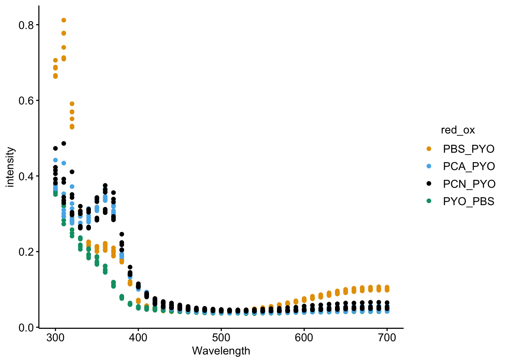
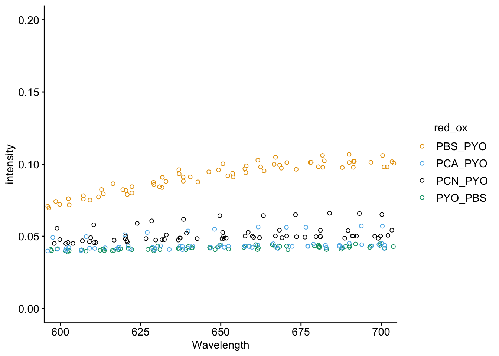
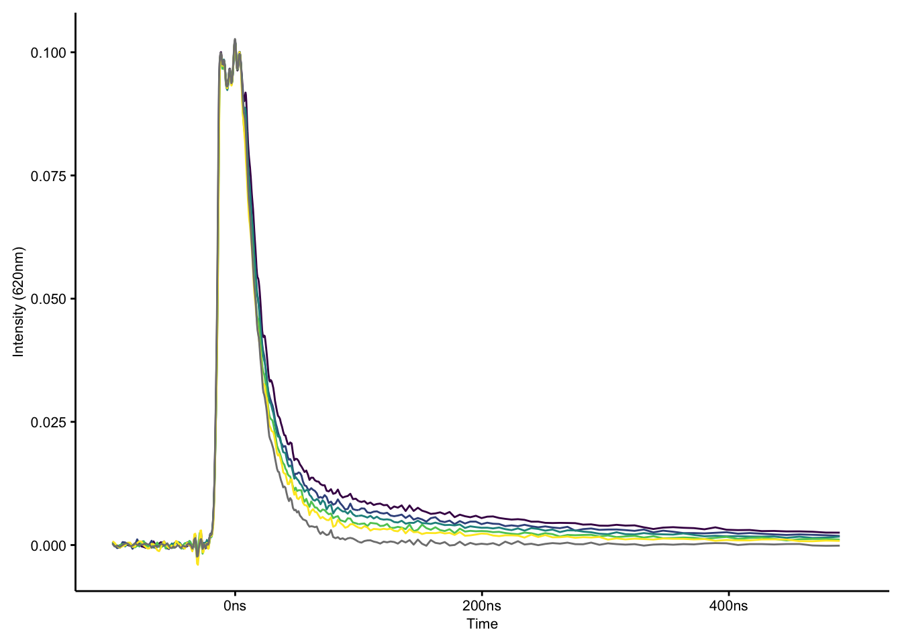
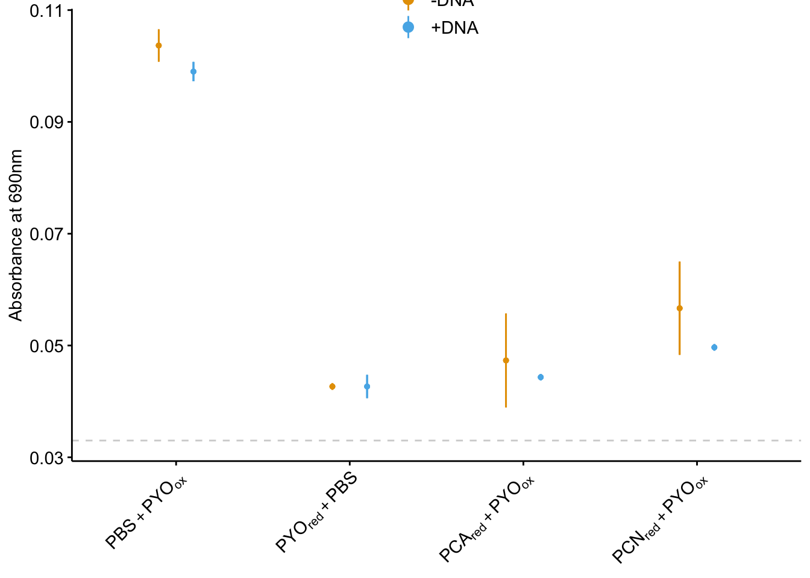
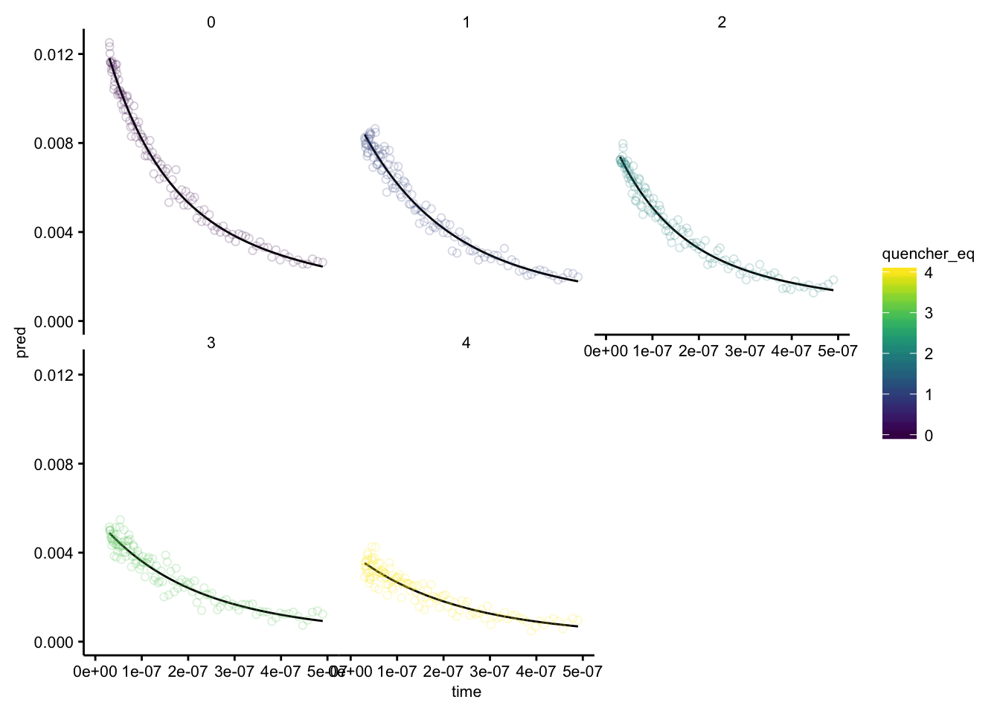
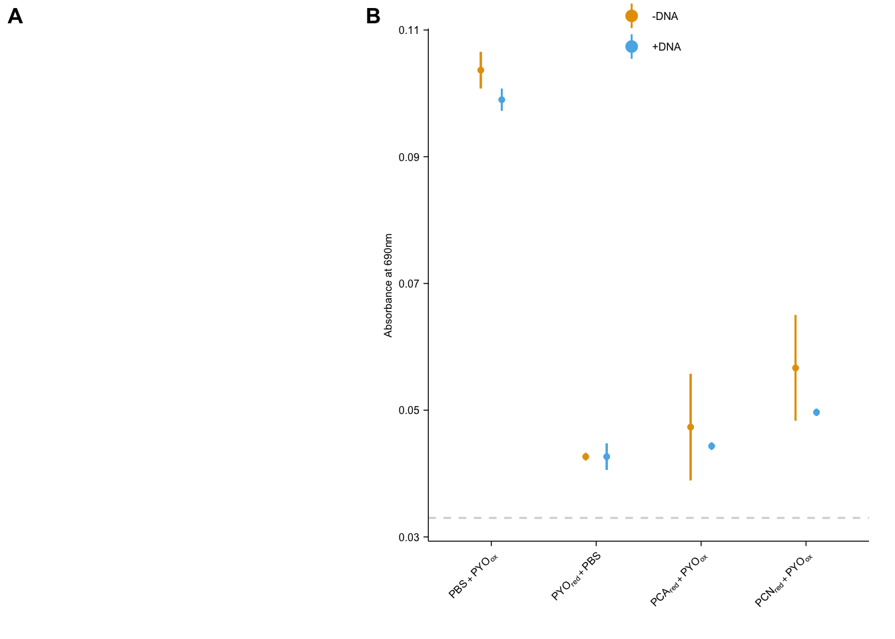

--------

# Notes

Panel A of figure 2 is isothermal titration calorimetry data that was analyzed outside of R. 

----

Setup packages and plotting for the notebook:


```r
# Load packages
library(tidyverse)
library(cowplot)
library(kableExtra)
library(modelr)
library(broom)

# Code display options
knitr::opts_chunk$set(tidy.opts=list(width.cutoff=60),tidy=FALSE, echo = TRUE, message=FALSE, warning=FALSE, fig.align="center", fig.retina = 2)

# Load plotting tools
source("../../tools/plotting_tools.R")

# Modify the plot theme
theme_set(theme_notebook())
```

# Results

Here's the info for each well:

```r
metadata <- read_csv("../../../data/Spectroscopy/2019_10_18_ET_ctDNA_metadata.csv")

metadata %>% kable() %>% kable_styling() %>% scroll_box(height = '400px')
```

<div style="border: 1px solid #ddd; padding: 5px; overflow-y: scroll; height:400px; "><table class="table" style="margin-left: auto; margin-right: auto;">
 <thead>
  <tr>
   <th style="text-align:left;"> well </th>
   <th style="text-align:left;"> red </th>
   <th style="text-align:left;"> ox </th>
   <th style="text-align:left;"> red_ox </th>
   <th style="text-align:left;"> DNA </th>
   <th style="text-align:right;"> rep </th>
   <th style="text-align:left;"> exp </th>
  </tr>
 </thead>
<tbody>
  <tr>
   <td style="text-align:left;"> A1 </td>
   <td style="text-align:left;"> PBS </td>
   <td style="text-align:left;"> PYO </td>
   <td style="text-align:left;"> PBS_PYO </td>
   <td style="text-align:left;"> FALSE </td>
   <td style="text-align:right;"> 1 </td>
   <td style="text-align:left;"> ref </td>
  </tr>
  <tr>
   <td style="text-align:left;"> A2 </td>
   <td style="text-align:left;"> PBS </td>
   <td style="text-align:left;"> PYO </td>
   <td style="text-align:left;"> PBS_PYO </td>
   <td style="text-align:left;"> FALSE </td>
   <td style="text-align:right;"> 2 </td>
   <td style="text-align:left;"> ref </td>
  </tr>
  <tr>
   <td style="text-align:left;"> A3 </td>
   <td style="text-align:left;"> PBS </td>
   <td style="text-align:left;"> PYO </td>
   <td style="text-align:left;"> PBS_PYO </td>
   <td style="text-align:left;"> FALSE </td>
   <td style="text-align:right;"> 3 </td>
   <td style="text-align:left;"> ref </td>
  </tr>
  <tr>
   <td style="text-align:left;"> A4 </td>
   <td style="text-align:left;"> PBS </td>
   <td style="text-align:left;"> PYO </td>
   <td style="text-align:left;"> PBS_PYO </td>
   <td style="text-align:left;"> TRUE </td>
   <td style="text-align:right;"> 1 </td>
   <td style="text-align:left;"> ref </td>
  </tr>
  <tr>
   <td style="text-align:left;"> A5 </td>
   <td style="text-align:left;"> PBS </td>
   <td style="text-align:left;"> PYO </td>
   <td style="text-align:left;"> PBS_PYO </td>
   <td style="text-align:left;"> TRUE </td>
   <td style="text-align:right;"> 2 </td>
   <td style="text-align:left;"> ref </td>
  </tr>
  <tr>
   <td style="text-align:left;"> A6 </td>
   <td style="text-align:left;"> PBS </td>
   <td style="text-align:left;"> PYO </td>
   <td style="text-align:left;"> PBS_PYO </td>
   <td style="text-align:left;"> TRUE </td>
   <td style="text-align:right;"> 3 </td>
   <td style="text-align:left;"> ref </td>
  </tr>
  <tr>
   <td style="text-align:left;"> B1 </td>
   <td style="text-align:left;"> PYO </td>
   <td style="text-align:left;"> PBS </td>
   <td style="text-align:left;"> PYO_PBS </td>
   <td style="text-align:left;"> FALSE </td>
   <td style="text-align:right;"> 1 </td>
   <td style="text-align:left;"> ref </td>
  </tr>
  <tr>
   <td style="text-align:left;"> B2 </td>
   <td style="text-align:left;"> PYO </td>
   <td style="text-align:left;"> PBS </td>
   <td style="text-align:left;"> PYO_PBS </td>
   <td style="text-align:left;"> FALSE </td>
   <td style="text-align:right;"> 2 </td>
   <td style="text-align:left;"> ref </td>
  </tr>
  <tr>
   <td style="text-align:left;"> B3 </td>
   <td style="text-align:left;"> PYO </td>
   <td style="text-align:left;"> PBS </td>
   <td style="text-align:left;"> PYO_PBS </td>
   <td style="text-align:left;"> FALSE </td>
   <td style="text-align:right;"> 3 </td>
   <td style="text-align:left;"> ref </td>
  </tr>
  <tr>
   <td style="text-align:left;"> B4 </td>
   <td style="text-align:left;"> PYO </td>
   <td style="text-align:left;"> PBS </td>
   <td style="text-align:left;"> PYO_PBS </td>
   <td style="text-align:left;"> TRUE </td>
   <td style="text-align:right;"> 1 </td>
   <td style="text-align:left;"> ref </td>
  </tr>
  <tr>
   <td style="text-align:left;"> B5 </td>
   <td style="text-align:left;"> PYO </td>
   <td style="text-align:left;"> PBS </td>
   <td style="text-align:left;"> PYO_PBS </td>
   <td style="text-align:left;"> TRUE </td>
   <td style="text-align:right;"> 2 </td>
   <td style="text-align:left;"> ref </td>
  </tr>
  <tr>
   <td style="text-align:left;"> B6 </td>
   <td style="text-align:left;"> PYO </td>
   <td style="text-align:left;"> PBS </td>
   <td style="text-align:left;"> PYO_PBS </td>
   <td style="text-align:left;"> TRUE </td>
   <td style="text-align:right;"> 3 </td>
   <td style="text-align:left;"> ref </td>
  </tr>
  <tr>
   <td style="text-align:left;"> C1 </td>
   <td style="text-align:left;"> PCA </td>
   <td style="text-align:left;"> PYO </td>
   <td style="text-align:left;"> PCA_PYO </td>
   <td style="text-align:left;"> FALSE </td>
   <td style="text-align:right;"> 1 </td>
   <td style="text-align:left;"> exp </td>
  </tr>
  <tr>
   <td style="text-align:left;"> C2 </td>
   <td style="text-align:left;"> PCA </td>
   <td style="text-align:left;"> PYO </td>
   <td style="text-align:left;"> PCA_PYO </td>
   <td style="text-align:left;"> FALSE </td>
   <td style="text-align:right;"> 2 </td>
   <td style="text-align:left;"> exp </td>
  </tr>
  <tr>
   <td style="text-align:left;"> C3 </td>
   <td style="text-align:left;"> PCA </td>
   <td style="text-align:left;"> PYO </td>
   <td style="text-align:left;"> PCA_PYO </td>
   <td style="text-align:left;"> FALSE </td>
   <td style="text-align:right;"> 3 </td>
   <td style="text-align:left;"> exp </td>
  </tr>
  <tr>
   <td style="text-align:left;"> C4 </td>
   <td style="text-align:left;"> PCA </td>
   <td style="text-align:left;"> PYO </td>
   <td style="text-align:left;"> PCA_PYO </td>
   <td style="text-align:left;"> TRUE </td>
   <td style="text-align:right;"> 1 </td>
   <td style="text-align:left;"> exp </td>
  </tr>
  <tr>
   <td style="text-align:left;"> C5 </td>
   <td style="text-align:left;"> PCA </td>
   <td style="text-align:left;"> PYO </td>
   <td style="text-align:left;"> PCA_PYO </td>
   <td style="text-align:left;"> TRUE </td>
   <td style="text-align:right;"> 2 </td>
   <td style="text-align:left;"> exp </td>
  </tr>
  <tr>
   <td style="text-align:left;"> C6 </td>
   <td style="text-align:left;"> PCA </td>
   <td style="text-align:left;"> PYO </td>
   <td style="text-align:left;"> PCA_PYO </td>
   <td style="text-align:left;"> TRUE </td>
   <td style="text-align:right;"> 3 </td>
   <td style="text-align:left;"> exp </td>
  </tr>
  <tr>
   <td style="text-align:left;"> D1 </td>
   <td style="text-align:left;"> PCN </td>
   <td style="text-align:left;"> PYO </td>
   <td style="text-align:left;"> PCN_PYO </td>
   <td style="text-align:left;"> FALSE </td>
   <td style="text-align:right;"> 1 </td>
   <td style="text-align:left;"> exp </td>
  </tr>
  <tr>
   <td style="text-align:left;"> D2 </td>
   <td style="text-align:left;"> PCN </td>
   <td style="text-align:left;"> PYO </td>
   <td style="text-align:left;"> PCN_PYO </td>
   <td style="text-align:left;"> FALSE </td>
   <td style="text-align:right;"> 2 </td>
   <td style="text-align:left;"> exp </td>
  </tr>
  <tr>
   <td style="text-align:left;"> D3 </td>
   <td style="text-align:left;"> PCN </td>
   <td style="text-align:left;"> PYO </td>
   <td style="text-align:left;"> PCN_PYO </td>
   <td style="text-align:left;"> FALSE </td>
   <td style="text-align:right;"> 3 </td>
   <td style="text-align:left;"> exp </td>
  </tr>
  <tr>
   <td style="text-align:left;"> D4 </td>
   <td style="text-align:left;"> PCN </td>
   <td style="text-align:left;"> PYO </td>
   <td style="text-align:left;"> PCN_PYO </td>
   <td style="text-align:left;"> TRUE </td>
   <td style="text-align:right;"> 1 </td>
   <td style="text-align:left;"> exp </td>
  </tr>
  <tr>
   <td style="text-align:left;"> D5 </td>
   <td style="text-align:left;"> PCN </td>
   <td style="text-align:left;"> PYO </td>
   <td style="text-align:left;"> PCN_PYO </td>
   <td style="text-align:left;"> TRUE </td>
   <td style="text-align:right;"> 2 </td>
   <td style="text-align:left;"> exp </td>
  </tr>
  <tr>
   <td style="text-align:left;"> D6 </td>
   <td style="text-align:left;"> PCN </td>
   <td style="text-align:left;"> PYO </td>
   <td style="text-align:left;"> PCN_PYO </td>
   <td style="text-align:left;"> TRUE </td>
   <td style="text-align:right;"> 3 </td>
   <td style="text-align:left;"> exp </td>
  </tr>
</tbody>
</table></div>

## Abs Spectrum 1

Now let's read in the first absorbance spectra taken for each condition and we'll add the appropriate metadata:

```r
df <- read_csv("../../../data/Spectroscopy/2019_10_18_ET_ctDNA_abs_spectra_1.csv") %>%
    gather(key = 'well', value = 'intensity', -Wavelength)

df_meta <- left_join(df, metadata, by = 'well')

df_meta %>% kable %>% kable_styling() %>% scroll_box(height = '400px')
```

<div style="border: 1px solid #ddd; padding: 5px; overflow-y: scroll; height:400px; "><table class="table" style="margin-left: auto; margin-right: auto;">
 <thead>
  <tr>
   <th style="text-align:right;"> Wavelength </th>
   <th style="text-align:left;"> well </th>
   <th style="text-align:right;"> intensity </th>
   <th style="text-align:left;"> red </th>
   <th style="text-align:left;"> ox </th>
   <th style="text-align:left;"> red_ox </th>
   <th style="text-align:left;"> DNA </th>
   <th style="text-align:right;"> rep </th>
   <th style="text-align:left;"> exp </th>
  </tr>
 </thead>
<tbody>
  <tr>
   <td style="text-align:right;"> 300 </td>
   <td style="text-align:left;"> A1 </td>
   <td style="text-align:right;"> 0.685 </td>
   <td style="text-align:left;"> PBS </td>
   <td style="text-align:left;"> PYO </td>
   <td style="text-align:left;"> PBS_PYO </td>
   <td style="text-align:left;"> FALSE </td>
   <td style="text-align:right;"> 1 </td>
   <td style="text-align:left;"> ref </td>
  </tr>
  <tr>
   <td style="text-align:right;"> 310 </td>
   <td style="text-align:left;"> A1 </td>
   <td style="text-align:right;"> 0.777 </td>
   <td style="text-align:left;"> PBS </td>
   <td style="text-align:left;"> PYO </td>
   <td style="text-align:left;"> PBS_PYO </td>
   <td style="text-align:left;"> FALSE </td>
   <td style="text-align:right;"> 1 </td>
   <td style="text-align:left;"> ref </td>
  </tr>
  <tr>
   <td style="text-align:right;"> 320 </td>
   <td style="text-align:left;"> A1 </td>
   <td style="text-align:right;"> 0.569 </td>
   <td style="text-align:left;"> PBS </td>
   <td style="text-align:left;"> PYO </td>
   <td style="text-align:left;"> PBS_PYO </td>
   <td style="text-align:left;"> FALSE </td>
   <td style="text-align:right;"> 1 </td>
   <td style="text-align:left;"> ref </td>
  </tr>
  <tr>
   <td style="text-align:right;"> 330 </td>
   <td style="text-align:left;"> A1 </td>
   <td style="text-align:right;"> 0.302 </td>
   <td style="text-align:left;"> PBS </td>
   <td style="text-align:left;"> PYO </td>
   <td style="text-align:left;"> PBS_PYO </td>
   <td style="text-align:left;"> FALSE </td>
   <td style="text-align:right;"> 1 </td>
   <td style="text-align:left;"> ref </td>
  </tr>
  <tr>
   <td style="text-align:right;"> 340 </td>
   <td style="text-align:left;"> A1 </td>
   <td style="text-align:right;"> 0.224 </td>
   <td style="text-align:left;"> PBS </td>
   <td style="text-align:left;"> PYO </td>
   <td style="text-align:left;"> PBS_PYO </td>
   <td style="text-align:left;"> FALSE </td>
   <td style="text-align:right;"> 1 </td>
   <td style="text-align:left;"> ref </td>
  </tr>
  <tr>
   <td style="text-align:right;"> 350 </td>
   <td style="text-align:left;"> A1 </td>
   <td style="text-align:right;"> 0.212 </td>
   <td style="text-align:left;"> PBS </td>
   <td style="text-align:left;"> PYO </td>
   <td style="text-align:left;"> PBS_PYO </td>
   <td style="text-align:left;"> FALSE </td>
   <td style="text-align:right;"> 1 </td>
   <td style="text-align:left;"> ref </td>
  </tr>
  <tr>
   <td style="text-align:right;"> 360 </td>
   <td style="text-align:left;"> A1 </td>
   <td style="text-align:right;"> 0.217 </td>
   <td style="text-align:left;"> PBS </td>
   <td style="text-align:left;"> PYO </td>
   <td style="text-align:left;"> PBS_PYO </td>
   <td style="text-align:left;"> FALSE </td>
   <td style="text-align:right;"> 1 </td>
   <td style="text-align:left;"> ref </td>
  </tr>
  <tr>
   <td style="text-align:right;"> 370 </td>
   <td style="text-align:left;"> A1 </td>
   <td style="text-align:right;"> 0.202 </td>
   <td style="text-align:left;"> PBS </td>
   <td style="text-align:left;"> PYO </td>
   <td style="text-align:left;"> PBS_PYO </td>
   <td style="text-align:left;"> FALSE </td>
   <td style="text-align:right;"> 1 </td>
   <td style="text-align:left;"> ref </td>
  </tr>
  <tr>
   <td style="text-align:right;"> 380 </td>
   <td style="text-align:left;"> A1 </td>
   <td style="text-align:right;"> 0.181 </td>
   <td style="text-align:left;"> PBS </td>
   <td style="text-align:left;"> PYO </td>
   <td style="text-align:left;"> PBS_PYO </td>
   <td style="text-align:left;"> FALSE </td>
   <td style="text-align:right;"> 1 </td>
   <td style="text-align:left;"> ref </td>
  </tr>
  <tr>
   <td style="text-align:right;"> 390 </td>
   <td style="text-align:left;"> A1 </td>
   <td style="text-align:right;"> 0.115 </td>
   <td style="text-align:left;"> PBS </td>
   <td style="text-align:left;"> PYO </td>
   <td style="text-align:left;"> PBS_PYO </td>
   <td style="text-align:left;"> FALSE </td>
   <td style="text-align:right;"> 1 </td>
   <td style="text-align:left;"> ref </td>
  </tr>
  <tr>
   <td style="text-align:right;"> 400 </td>
   <td style="text-align:left;"> A1 </td>
   <td style="text-align:right;"> 0.067 </td>
   <td style="text-align:left;"> PBS </td>
   <td style="text-align:left;"> PYO </td>
   <td style="text-align:left;"> PBS_PYO </td>
   <td style="text-align:left;"> FALSE </td>
   <td style="text-align:right;"> 1 </td>
   <td style="text-align:left;"> ref </td>
  </tr>
  <tr>
   <td style="text-align:right;"> 410 </td>
   <td style="text-align:left;"> A1 </td>
   <td style="text-align:right;"> 0.052 </td>
   <td style="text-align:left;"> PBS </td>
   <td style="text-align:left;"> PYO </td>
   <td style="text-align:left;"> PBS_PYO </td>
   <td style="text-align:left;"> FALSE </td>
   <td style="text-align:right;"> 1 </td>
   <td style="text-align:left;"> ref </td>
  </tr>
  <tr>
   <td style="text-align:right;"> 420 </td>
   <td style="text-align:left;"> A1 </td>
   <td style="text-align:right;"> 0.046 </td>
   <td style="text-align:left;"> PBS </td>
   <td style="text-align:left;"> PYO </td>
   <td style="text-align:left;"> PBS_PYO </td>
   <td style="text-align:left;"> FALSE </td>
   <td style="text-align:right;"> 1 </td>
   <td style="text-align:left;"> ref </td>
  </tr>
  <tr>
   <td style="text-align:right;"> 430 </td>
   <td style="text-align:left;"> A1 </td>
   <td style="text-align:right;"> 0.043 </td>
   <td style="text-align:left;"> PBS </td>
   <td style="text-align:left;"> PYO </td>
   <td style="text-align:left;"> PBS_PYO </td>
   <td style="text-align:left;"> FALSE </td>
   <td style="text-align:right;"> 1 </td>
   <td style="text-align:left;"> ref </td>
  </tr>
  <tr>
   <td style="text-align:right;"> 440 </td>
   <td style="text-align:left;"> A1 </td>
   <td style="text-align:right;"> 0.041 </td>
   <td style="text-align:left;"> PBS </td>
   <td style="text-align:left;"> PYO </td>
   <td style="text-align:left;"> PBS_PYO </td>
   <td style="text-align:left;"> FALSE </td>
   <td style="text-align:right;"> 1 </td>
   <td style="text-align:left;"> ref </td>
  </tr>
  <tr>
   <td style="text-align:right;"> 450 </td>
   <td style="text-align:left;"> A1 </td>
   <td style="text-align:right;"> 0.041 </td>
   <td style="text-align:left;"> PBS </td>
   <td style="text-align:left;"> PYO </td>
   <td style="text-align:left;"> PBS_PYO </td>
   <td style="text-align:left;"> FALSE </td>
   <td style="text-align:right;"> 1 </td>
   <td style="text-align:left;"> ref </td>
  </tr>
  <tr>
   <td style="text-align:right;"> 460 </td>
   <td style="text-align:left;"> A1 </td>
   <td style="text-align:right;"> 0.040 </td>
   <td style="text-align:left;"> PBS </td>
   <td style="text-align:left;"> PYO </td>
   <td style="text-align:left;"> PBS_PYO </td>
   <td style="text-align:left;"> FALSE </td>
   <td style="text-align:right;"> 1 </td>
   <td style="text-align:left;"> ref </td>
  </tr>
  <tr>
   <td style="text-align:right;"> 470 </td>
   <td style="text-align:left;"> A1 </td>
   <td style="text-align:right;"> 0.040 </td>
   <td style="text-align:left;"> PBS </td>
   <td style="text-align:left;"> PYO </td>
   <td style="text-align:left;"> PBS_PYO </td>
   <td style="text-align:left;"> FALSE </td>
   <td style="text-align:right;"> 1 </td>
   <td style="text-align:left;"> ref </td>
  </tr>
  <tr>
   <td style="text-align:right;"> 480 </td>
   <td style="text-align:left;"> A1 </td>
   <td style="text-align:right;"> 0.039 </td>
   <td style="text-align:left;"> PBS </td>
   <td style="text-align:left;"> PYO </td>
   <td style="text-align:left;"> PBS_PYO </td>
   <td style="text-align:left;"> FALSE </td>
   <td style="text-align:right;"> 1 </td>
   <td style="text-align:left;"> ref </td>
  </tr>
  <tr>
   <td style="text-align:right;"> 490 </td>
   <td style="text-align:left;"> A1 </td>
   <td style="text-align:right;"> 0.039 </td>
   <td style="text-align:left;"> PBS </td>
   <td style="text-align:left;"> PYO </td>
   <td style="text-align:left;"> PBS_PYO </td>
   <td style="text-align:left;"> FALSE </td>
   <td style="text-align:right;"> 1 </td>
   <td style="text-align:left;"> ref </td>
  </tr>
  <tr>
   <td style="text-align:right;"> 500 </td>
   <td style="text-align:left;"> A1 </td>
   <td style="text-align:right;"> 0.040 </td>
   <td style="text-align:left;"> PBS </td>
   <td style="text-align:left;"> PYO </td>
   <td style="text-align:left;"> PBS_PYO </td>
   <td style="text-align:left;"> FALSE </td>
   <td style="text-align:right;"> 1 </td>
   <td style="text-align:left;"> ref </td>
  </tr>
  <tr>
   <td style="text-align:right;"> 510 </td>
   <td style="text-align:left;"> A1 </td>
   <td style="text-align:right;"> 0.042 </td>
   <td style="text-align:left;"> PBS </td>
   <td style="text-align:left;"> PYO </td>
   <td style="text-align:left;"> PBS_PYO </td>
   <td style="text-align:left;"> FALSE </td>
   <td style="text-align:right;"> 1 </td>
   <td style="text-align:left;"> ref </td>
  </tr>
  <tr>
   <td style="text-align:right;"> 520 </td>
   <td style="text-align:left;"> A1 </td>
   <td style="text-align:right;"> 0.043 </td>
   <td style="text-align:left;"> PBS </td>
   <td style="text-align:left;"> PYO </td>
   <td style="text-align:left;"> PBS_PYO </td>
   <td style="text-align:left;"> FALSE </td>
   <td style="text-align:right;"> 1 </td>
   <td style="text-align:left;"> ref </td>
  </tr>
  <tr>
   <td style="text-align:right;"> 530 </td>
   <td style="text-align:left;"> A1 </td>
   <td style="text-align:right;"> 0.045 </td>
   <td style="text-align:left;"> PBS </td>
   <td style="text-align:left;"> PYO </td>
   <td style="text-align:left;"> PBS_PYO </td>
   <td style="text-align:left;"> FALSE </td>
   <td style="text-align:right;"> 1 </td>
   <td style="text-align:left;"> ref </td>
  </tr>
  <tr>
   <td style="text-align:right;"> 540 </td>
   <td style="text-align:left;"> A1 </td>
   <td style="text-align:right;"> 0.048 </td>
   <td style="text-align:left;"> PBS </td>
   <td style="text-align:left;"> PYO </td>
   <td style="text-align:left;"> PBS_PYO </td>
   <td style="text-align:left;"> FALSE </td>
   <td style="text-align:right;"> 1 </td>
   <td style="text-align:left;"> ref </td>
  </tr>
  <tr>
   <td style="text-align:right;"> 550 </td>
   <td style="text-align:left;"> A1 </td>
   <td style="text-align:right;"> 0.051 </td>
   <td style="text-align:left;"> PBS </td>
   <td style="text-align:left;"> PYO </td>
   <td style="text-align:left;"> PBS_PYO </td>
   <td style="text-align:left;"> FALSE </td>
   <td style="text-align:right;"> 1 </td>
   <td style="text-align:left;"> ref </td>
  </tr>
  <tr>
   <td style="text-align:right;"> 560 </td>
   <td style="text-align:left;"> A1 </td>
   <td style="text-align:right;"> 0.055 </td>
   <td style="text-align:left;"> PBS </td>
   <td style="text-align:left;"> PYO </td>
   <td style="text-align:left;"> PBS_PYO </td>
   <td style="text-align:left;"> FALSE </td>
   <td style="text-align:right;"> 1 </td>
   <td style="text-align:left;"> ref </td>
  </tr>
  <tr>
   <td style="text-align:right;"> 570 </td>
   <td style="text-align:left;"> A1 </td>
   <td style="text-align:right;"> 0.059 </td>
   <td style="text-align:left;"> PBS </td>
   <td style="text-align:left;"> PYO </td>
   <td style="text-align:left;"> PBS_PYO </td>
   <td style="text-align:left;"> FALSE </td>
   <td style="text-align:right;"> 1 </td>
   <td style="text-align:left;"> ref </td>
  </tr>
  <tr>
   <td style="text-align:right;"> 580 </td>
   <td style="text-align:left;"> A1 </td>
   <td style="text-align:right;"> 0.064 </td>
   <td style="text-align:left;"> PBS </td>
   <td style="text-align:left;"> PYO </td>
   <td style="text-align:left;"> PBS_PYO </td>
   <td style="text-align:left;"> FALSE </td>
   <td style="text-align:right;"> 1 </td>
   <td style="text-align:left;"> ref </td>
  </tr>
  <tr>
   <td style="text-align:right;"> 590 </td>
   <td style="text-align:left;"> A1 </td>
   <td style="text-align:right;"> 0.068 </td>
   <td style="text-align:left;"> PBS </td>
   <td style="text-align:left;"> PYO </td>
   <td style="text-align:left;"> PBS_PYO </td>
   <td style="text-align:left;"> FALSE </td>
   <td style="text-align:right;"> 1 </td>
   <td style="text-align:left;"> ref </td>
  </tr>
  <tr>
   <td style="text-align:right;"> 600 </td>
   <td style="text-align:left;"> A1 </td>
   <td style="text-align:right;"> 0.074 </td>
   <td style="text-align:left;"> PBS </td>
   <td style="text-align:left;"> PYO </td>
   <td style="text-align:left;"> PBS_PYO </td>
   <td style="text-align:left;"> FALSE </td>
   <td style="text-align:right;"> 1 </td>
   <td style="text-align:left;"> ref </td>
  </tr>
  <tr>
   <td style="text-align:right;"> 610 </td>
   <td style="text-align:left;"> A1 </td>
   <td style="text-align:right;"> 0.079 </td>
   <td style="text-align:left;"> PBS </td>
   <td style="text-align:left;"> PYO </td>
   <td style="text-align:left;"> PBS_PYO </td>
   <td style="text-align:left;"> FALSE </td>
   <td style="text-align:right;"> 1 </td>
   <td style="text-align:left;"> ref </td>
  </tr>
  <tr>
   <td style="text-align:right;"> 620 </td>
   <td style="text-align:left;"> A1 </td>
   <td style="text-align:right;"> 0.084 </td>
   <td style="text-align:left;"> PBS </td>
   <td style="text-align:left;"> PYO </td>
   <td style="text-align:left;"> PBS_PYO </td>
   <td style="text-align:left;"> FALSE </td>
   <td style="text-align:right;"> 1 </td>
   <td style="text-align:left;"> ref </td>
  </tr>
  <tr>
   <td style="text-align:right;"> 630 </td>
   <td style="text-align:left;"> A1 </td>
   <td style="text-align:right;"> 0.088 </td>
   <td style="text-align:left;"> PBS </td>
   <td style="text-align:left;"> PYO </td>
   <td style="text-align:left;"> PBS_PYO </td>
   <td style="text-align:left;"> FALSE </td>
   <td style="text-align:right;"> 1 </td>
   <td style="text-align:left;"> ref </td>
  </tr>
  <tr>
   <td style="text-align:right;"> 640 </td>
   <td style="text-align:left;"> A1 </td>
   <td style="text-align:right;"> 0.093 </td>
   <td style="text-align:left;"> PBS </td>
   <td style="text-align:left;"> PYO </td>
   <td style="text-align:left;"> PBS_PYO </td>
   <td style="text-align:left;"> FALSE </td>
   <td style="text-align:right;"> 1 </td>
   <td style="text-align:left;"> ref </td>
  </tr>
  <tr>
   <td style="text-align:right;"> 650 </td>
   <td style="text-align:left;"> A1 </td>
   <td style="text-align:right;"> 0.096 </td>
   <td style="text-align:left;"> PBS </td>
   <td style="text-align:left;"> PYO </td>
   <td style="text-align:left;"> PBS_PYO </td>
   <td style="text-align:left;"> FALSE </td>
   <td style="text-align:right;"> 1 </td>
   <td style="text-align:left;"> ref </td>
  </tr>
  <tr>
   <td style="text-align:right;"> 660 </td>
   <td style="text-align:left;"> A1 </td>
   <td style="text-align:right;"> 0.099 </td>
   <td style="text-align:left;"> PBS </td>
   <td style="text-align:left;"> PYO </td>
   <td style="text-align:left;"> PBS_PYO </td>
   <td style="text-align:left;"> FALSE </td>
   <td style="text-align:right;"> 1 </td>
   <td style="text-align:left;"> ref </td>
  </tr>
  <tr>
   <td style="text-align:right;"> 670 </td>
   <td style="text-align:left;"> A1 </td>
   <td style="text-align:right;"> 0.101 </td>
   <td style="text-align:left;"> PBS </td>
   <td style="text-align:left;"> PYO </td>
   <td style="text-align:left;"> PBS_PYO </td>
   <td style="text-align:left;"> FALSE </td>
   <td style="text-align:right;"> 1 </td>
   <td style="text-align:left;"> ref </td>
  </tr>
  <tr>
   <td style="text-align:right;"> 680 </td>
   <td style="text-align:left;"> A1 </td>
   <td style="text-align:right;"> 0.102 </td>
   <td style="text-align:left;"> PBS </td>
   <td style="text-align:left;"> PYO </td>
   <td style="text-align:left;"> PBS_PYO </td>
   <td style="text-align:left;"> FALSE </td>
   <td style="text-align:right;"> 1 </td>
   <td style="text-align:left;"> ref </td>
  </tr>
  <tr>
   <td style="text-align:right;"> 690 </td>
   <td style="text-align:left;"> A1 </td>
   <td style="text-align:right;"> 0.102 </td>
   <td style="text-align:left;"> PBS </td>
   <td style="text-align:left;"> PYO </td>
   <td style="text-align:left;"> PBS_PYO </td>
   <td style="text-align:left;"> FALSE </td>
   <td style="text-align:right;"> 1 </td>
   <td style="text-align:left;"> ref </td>
  </tr>
  <tr>
   <td style="text-align:right;"> 700 </td>
   <td style="text-align:left;"> A1 </td>
   <td style="text-align:right;"> 0.102 </td>
   <td style="text-align:left;"> PBS </td>
   <td style="text-align:left;"> PYO </td>
   <td style="text-align:left;"> PBS_PYO </td>
   <td style="text-align:left;"> FALSE </td>
   <td style="text-align:right;"> 1 </td>
   <td style="text-align:left;"> ref </td>
  </tr>
  <tr>
   <td style="text-align:right;"> 300 </td>
   <td style="text-align:left;"> A2 </td>
   <td style="text-align:right;"> 0.687 </td>
   <td style="text-align:left;"> PBS </td>
   <td style="text-align:left;"> PYO </td>
   <td style="text-align:left;"> PBS_PYO </td>
   <td style="text-align:left;"> FALSE </td>
   <td style="text-align:right;"> 2 </td>
   <td style="text-align:left;"> ref </td>
  </tr>
  <tr>
   <td style="text-align:right;"> 310 </td>
   <td style="text-align:left;"> A2 </td>
   <td style="text-align:right;"> 0.778 </td>
   <td style="text-align:left;"> PBS </td>
   <td style="text-align:left;"> PYO </td>
   <td style="text-align:left;"> PBS_PYO </td>
   <td style="text-align:left;"> FALSE </td>
   <td style="text-align:right;"> 2 </td>
   <td style="text-align:left;"> ref </td>
  </tr>
  <tr>
   <td style="text-align:right;"> 320 </td>
   <td style="text-align:left;"> A2 </td>
   <td style="text-align:right;"> 0.570 </td>
   <td style="text-align:left;"> PBS </td>
   <td style="text-align:left;"> PYO </td>
   <td style="text-align:left;"> PBS_PYO </td>
   <td style="text-align:left;"> FALSE </td>
   <td style="text-align:right;"> 2 </td>
   <td style="text-align:left;"> ref </td>
  </tr>
  <tr>
   <td style="text-align:right;"> 330 </td>
   <td style="text-align:left;"> A2 </td>
   <td style="text-align:right;"> 0.304 </td>
   <td style="text-align:left;"> PBS </td>
   <td style="text-align:left;"> PYO </td>
   <td style="text-align:left;"> PBS_PYO </td>
   <td style="text-align:left;"> FALSE </td>
   <td style="text-align:right;"> 2 </td>
   <td style="text-align:left;"> ref </td>
  </tr>
  <tr>
   <td style="text-align:right;"> 340 </td>
   <td style="text-align:left;"> A2 </td>
   <td style="text-align:right;"> 0.226 </td>
   <td style="text-align:left;"> PBS </td>
   <td style="text-align:left;"> PYO </td>
   <td style="text-align:left;"> PBS_PYO </td>
   <td style="text-align:left;"> FALSE </td>
   <td style="text-align:right;"> 2 </td>
   <td style="text-align:left;"> ref </td>
  </tr>
  <tr>
   <td style="text-align:right;"> 350 </td>
   <td style="text-align:left;"> A2 </td>
   <td style="text-align:right;"> 0.214 </td>
   <td style="text-align:left;"> PBS </td>
   <td style="text-align:left;"> PYO </td>
   <td style="text-align:left;"> PBS_PYO </td>
   <td style="text-align:left;"> FALSE </td>
   <td style="text-align:right;"> 2 </td>
   <td style="text-align:left;"> ref </td>
  </tr>
  <tr>
   <td style="text-align:right;"> 360 </td>
   <td style="text-align:left;"> A2 </td>
   <td style="text-align:right;"> 0.219 </td>
   <td style="text-align:left;"> PBS </td>
   <td style="text-align:left;"> PYO </td>
   <td style="text-align:left;"> PBS_PYO </td>
   <td style="text-align:left;"> FALSE </td>
   <td style="text-align:right;"> 2 </td>
   <td style="text-align:left;"> ref </td>
  </tr>
  <tr>
   <td style="text-align:right;"> 370 </td>
   <td style="text-align:left;"> A2 </td>
   <td style="text-align:right;"> 0.203 </td>
   <td style="text-align:left;"> PBS </td>
   <td style="text-align:left;"> PYO </td>
   <td style="text-align:left;"> PBS_PYO </td>
   <td style="text-align:left;"> FALSE </td>
   <td style="text-align:right;"> 2 </td>
   <td style="text-align:left;"> ref </td>
  </tr>
  <tr>
   <td style="text-align:right;"> 380 </td>
   <td style="text-align:left;"> A2 </td>
   <td style="text-align:right;"> 0.181 </td>
   <td style="text-align:left;"> PBS </td>
   <td style="text-align:left;"> PYO </td>
   <td style="text-align:left;"> PBS_PYO </td>
   <td style="text-align:left;"> FALSE </td>
   <td style="text-align:right;"> 2 </td>
   <td style="text-align:left;"> ref </td>
  </tr>
  <tr>
   <td style="text-align:right;"> 390 </td>
   <td style="text-align:left;"> A2 </td>
   <td style="text-align:right;"> 0.115 </td>
   <td style="text-align:left;"> PBS </td>
   <td style="text-align:left;"> PYO </td>
   <td style="text-align:left;"> PBS_PYO </td>
   <td style="text-align:left;"> FALSE </td>
   <td style="text-align:right;"> 2 </td>
   <td style="text-align:left;"> ref </td>
  </tr>
  <tr>
   <td style="text-align:right;"> 400 </td>
   <td style="text-align:left;"> A2 </td>
   <td style="text-align:right;"> 0.068 </td>
   <td style="text-align:left;"> PBS </td>
   <td style="text-align:left;"> PYO </td>
   <td style="text-align:left;"> PBS_PYO </td>
   <td style="text-align:left;"> FALSE </td>
   <td style="text-align:right;"> 2 </td>
   <td style="text-align:left;"> ref </td>
  </tr>
  <tr>
   <td style="text-align:right;"> 410 </td>
   <td style="text-align:left;"> A2 </td>
   <td style="text-align:right;"> 0.052 </td>
   <td style="text-align:left;"> PBS </td>
   <td style="text-align:left;"> PYO </td>
   <td style="text-align:left;"> PBS_PYO </td>
   <td style="text-align:left;"> FALSE </td>
   <td style="text-align:right;"> 2 </td>
   <td style="text-align:left;"> ref </td>
  </tr>
  <tr>
   <td style="text-align:right;"> 420 </td>
   <td style="text-align:left;"> A2 </td>
   <td style="text-align:right;"> 0.047 </td>
   <td style="text-align:left;"> PBS </td>
   <td style="text-align:left;"> PYO </td>
   <td style="text-align:left;"> PBS_PYO </td>
   <td style="text-align:left;"> FALSE </td>
   <td style="text-align:right;"> 2 </td>
   <td style="text-align:left;"> ref </td>
  </tr>
  <tr>
   <td style="text-align:right;"> 430 </td>
   <td style="text-align:left;"> A2 </td>
   <td style="text-align:right;"> 0.043 </td>
   <td style="text-align:left;"> PBS </td>
   <td style="text-align:left;"> PYO </td>
   <td style="text-align:left;"> PBS_PYO </td>
   <td style="text-align:left;"> FALSE </td>
   <td style="text-align:right;"> 2 </td>
   <td style="text-align:left;"> ref </td>
  </tr>
  <tr>
   <td style="text-align:right;"> 440 </td>
   <td style="text-align:left;"> A2 </td>
   <td style="text-align:right;"> 0.042 </td>
   <td style="text-align:left;"> PBS </td>
   <td style="text-align:left;"> PYO </td>
   <td style="text-align:left;"> PBS_PYO </td>
   <td style="text-align:left;"> FALSE </td>
   <td style="text-align:right;"> 2 </td>
   <td style="text-align:left;"> ref </td>
  </tr>
  <tr>
   <td style="text-align:right;"> 450 </td>
   <td style="text-align:left;"> A2 </td>
   <td style="text-align:right;"> 0.041 </td>
   <td style="text-align:left;"> PBS </td>
   <td style="text-align:left;"> PYO </td>
   <td style="text-align:left;"> PBS_PYO </td>
   <td style="text-align:left;"> FALSE </td>
   <td style="text-align:right;"> 2 </td>
   <td style="text-align:left;"> ref </td>
  </tr>
  <tr>
   <td style="text-align:right;"> 460 </td>
   <td style="text-align:left;"> A2 </td>
   <td style="text-align:right;"> 0.040 </td>
   <td style="text-align:left;"> PBS </td>
   <td style="text-align:left;"> PYO </td>
   <td style="text-align:left;"> PBS_PYO </td>
   <td style="text-align:left;"> FALSE </td>
   <td style="text-align:right;"> 2 </td>
   <td style="text-align:left;"> ref </td>
  </tr>
  <tr>
   <td style="text-align:right;"> 470 </td>
   <td style="text-align:left;"> A2 </td>
   <td style="text-align:right;"> 0.040 </td>
   <td style="text-align:left;"> PBS </td>
   <td style="text-align:left;"> PYO </td>
   <td style="text-align:left;"> PBS_PYO </td>
   <td style="text-align:left;"> FALSE </td>
   <td style="text-align:right;"> 2 </td>
   <td style="text-align:left;"> ref </td>
  </tr>
  <tr>
   <td style="text-align:right;"> 480 </td>
   <td style="text-align:left;"> A2 </td>
   <td style="text-align:right;"> 0.039 </td>
   <td style="text-align:left;"> PBS </td>
   <td style="text-align:left;"> PYO </td>
   <td style="text-align:left;"> PBS_PYO </td>
   <td style="text-align:left;"> FALSE </td>
   <td style="text-align:right;"> 2 </td>
   <td style="text-align:left;"> ref </td>
  </tr>
  <tr>
   <td style="text-align:right;"> 490 </td>
   <td style="text-align:left;"> A2 </td>
   <td style="text-align:right;"> 0.040 </td>
   <td style="text-align:left;"> PBS </td>
   <td style="text-align:left;"> PYO </td>
   <td style="text-align:left;"> PBS_PYO </td>
   <td style="text-align:left;"> FALSE </td>
   <td style="text-align:right;"> 2 </td>
   <td style="text-align:left;"> ref </td>
  </tr>
  <tr>
   <td style="text-align:right;"> 500 </td>
   <td style="text-align:left;"> A2 </td>
   <td style="text-align:right;"> 0.040 </td>
   <td style="text-align:left;"> PBS </td>
   <td style="text-align:left;"> PYO </td>
   <td style="text-align:left;"> PBS_PYO </td>
   <td style="text-align:left;"> FALSE </td>
   <td style="text-align:right;"> 2 </td>
   <td style="text-align:left;"> ref </td>
  </tr>
  <tr>
   <td style="text-align:right;"> 510 </td>
   <td style="text-align:left;"> A2 </td>
   <td style="text-align:right;"> 0.041 </td>
   <td style="text-align:left;"> PBS </td>
   <td style="text-align:left;"> PYO </td>
   <td style="text-align:left;"> PBS_PYO </td>
   <td style="text-align:left;"> FALSE </td>
   <td style="text-align:right;"> 2 </td>
   <td style="text-align:left;"> ref </td>
  </tr>
  <tr>
   <td style="text-align:right;"> 520 </td>
   <td style="text-align:left;"> A2 </td>
   <td style="text-align:right;"> 0.043 </td>
   <td style="text-align:left;"> PBS </td>
   <td style="text-align:left;"> PYO </td>
   <td style="text-align:left;"> PBS_PYO </td>
   <td style="text-align:left;"> FALSE </td>
   <td style="text-align:right;"> 2 </td>
   <td style="text-align:left;"> ref </td>
  </tr>
  <tr>
   <td style="text-align:right;"> 530 </td>
   <td style="text-align:left;"> A2 </td>
   <td style="text-align:right;"> 0.045 </td>
   <td style="text-align:left;"> PBS </td>
   <td style="text-align:left;"> PYO </td>
   <td style="text-align:left;"> PBS_PYO </td>
   <td style="text-align:left;"> FALSE </td>
   <td style="text-align:right;"> 2 </td>
   <td style="text-align:left;"> ref </td>
  </tr>
  <tr>
   <td style="text-align:right;"> 540 </td>
   <td style="text-align:left;"> A2 </td>
   <td style="text-align:right;"> 0.048 </td>
   <td style="text-align:left;"> PBS </td>
   <td style="text-align:left;"> PYO </td>
   <td style="text-align:left;"> PBS_PYO </td>
   <td style="text-align:left;"> FALSE </td>
   <td style="text-align:right;"> 2 </td>
   <td style="text-align:left;"> ref </td>
  </tr>
  <tr>
   <td style="text-align:right;"> 550 </td>
   <td style="text-align:left;"> A2 </td>
   <td style="text-align:right;"> 0.051 </td>
   <td style="text-align:left;"> PBS </td>
   <td style="text-align:left;"> PYO </td>
   <td style="text-align:left;"> PBS_PYO </td>
   <td style="text-align:left;"> FALSE </td>
   <td style="text-align:right;"> 2 </td>
   <td style="text-align:left;"> ref </td>
  </tr>
  <tr>
   <td style="text-align:right;"> 560 </td>
   <td style="text-align:left;"> A2 </td>
   <td style="text-align:right;"> 0.054 </td>
   <td style="text-align:left;"> PBS </td>
   <td style="text-align:left;"> PYO </td>
   <td style="text-align:left;"> PBS_PYO </td>
   <td style="text-align:left;"> FALSE </td>
   <td style="text-align:right;"> 2 </td>
   <td style="text-align:left;"> ref </td>
  </tr>
  <tr>
   <td style="text-align:right;"> 570 </td>
   <td style="text-align:left;"> A2 </td>
   <td style="text-align:right;"> 0.058 </td>
   <td style="text-align:left;"> PBS </td>
   <td style="text-align:left;"> PYO </td>
   <td style="text-align:left;"> PBS_PYO </td>
   <td style="text-align:left;"> FALSE </td>
   <td style="text-align:right;"> 2 </td>
   <td style="text-align:left;"> ref </td>
  </tr>
  <tr>
   <td style="text-align:right;"> 580 </td>
   <td style="text-align:left;"> A2 </td>
   <td style="text-align:right;"> 0.062 </td>
   <td style="text-align:left;"> PBS </td>
   <td style="text-align:left;"> PYO </td>
   <td style="text-align:left;"> PBS_PYO </td>
   <td style="text-align:left;"> FALSE </td>
   <td style="text-align:right;"> 2 </td>
   <td style="text-align:left;"> ref </td>
  </tr>
  <tr>
   <td style="text-align:right;"> 590 </td>
   <td style="text-align:left;"> A2 </td>
   <td style="text-align:right;"> 0.067 </td>
   <td style="text-align:left;"> PBS </td>
   <td style="text-align:left;"> PYO </td>
   <td style="text-align:left;"> PBS_PYO </td>
   <td style="text-align:left;"> FALSE </td>
   <td style="text-align:right;"> 2 </td>
   <td style="text-align:left;"> ref </td>
  </tr>
  <tr>
   <td style="text-align:right;"> 600 </td>
   <td style="text-align:left;"> A2 </td>
   <td style="text-align:right;"> 0.072 </td>
   <td style="text-align:left;"> PBS </td>
   <td style="text-align:left;"> PYO </td>
   <td style="text-align:left;"> PBS_PYO </td>
   <td style="text-align:left;"> FALSE </td>
   <td style="text-align:right;"> 2 </td>
   <td style="text-align:left;"> ref </td>
  </tr>
  <tr>
   <td style="text-align:right;"> 610 </td>
   <td style="text-align:left;"> A2 </td>
   <td style="text-align:right;"> 0.078 </td>
   <td style="text-align:left;"> PBS </td>
   <td style="text-align:left;"> PYO </td>
   <td style="text-align:left;"> PBS_PYO </td>
   <td style="text-align:left;"> FALSE </td>
   <td style="text-align:right;"> 2 </td>
   <td style="text-align:left;"> ref </td>
  </tr>
  <tr>
   <td style="text-align:right;"> 620 </td>
   <td style="text-align:left;"> A2 </td>
   <td style="text-align:right;"> 0.082 </td>
   <td style="text-align:left;"> PBS </td>
   <td style="text-align:left;"> PYO </td>
   <td style="text-align:left;"> PBS_PYO </td>
   <td style="text-align:left;"> FALSE </td>
   <td style="text-align:right;"> 2 </td>
   <td style="text-align:left;"> ref </td>
  </tr>
  <tr>
   <td style="text-align:right;"> 630 </td>
   <td style="text-align:left;"> A2 </td>
   <td style="text-align:right;"> 0.087 </td>
   <td style="text-align:left;"> PBS </td>
   <td style="text-align:left;"> PYO </td>
   <td style="text-align:left;"> PBS_PYO </td>
   <td style="text-align:left;"> FALSE </td>
   <td style="text-align:right;"> 2 </td>
   <td style="text-align:left;"> ref </td>
  </tr>
  <tr>
   <td style="text-align:right;"> 640 </td>
   <td style="text-align:left;"> A2 </td>
   <td style="text-align:right;"> 0.091 </td>
   <td style="text-align:left;"> PBS </td>
   <td style="text-align:left;"> PYO </td>
   <td style="text-align:left;"> PBS_PYO </td>
   <td style="text-align:left;"> FALSE </td>
   <td style="text-align:right;"> 2 </td>
   <td style="text-align:left;"> ref </td>
  </tr>
  <tr>
   <td style="text-align:right;"> 650 </td>
   <td style="text-align:left;"> A2 </td>
   <td style="text-align:right;"> 0.095 </td>
   <td style="text-align:left;"> PBS </td>
   <td style="text-align:left;"> PYO </td>
   <td style="text-align:left;"> PBS_PYO </td>
   <td style="text-align:left;"> FALSE </td>
   <td style="text-align:right;"> 2 </td>
   <td style="text-align:left;"> ref </td>
  </tr>
  <tr>
   <td style="text-align:right;"> 660 </td>
   <td style="text-align:left;"> A2 </td>
   <td style="text-align:right;"> 0.098 </td>
   <td style="text-align:left;"> PBS </td>
   <td style="text-align:left;"> PYO </td>
   <td style="text-align:left;"> PBS_PYO </td>
   <td style="text-align:left;"> FALSE </td>
   <td style="text-align:right;"> 2 </td>
   <td style="text-align:left;"> ref </td>
  </tr>
  <tr>
   <td style="text-align:right;"> 670 </td>
   <td style="text-align:left;"> A2 </td>
   <td style="text-align:right;"> 0.100 </td>
   <td style="text-align:left;"> PBS </td>
   <td style="text-align:left;"> PYO </td>
   <td style="text-align:left;"> PBS_PYO </td>
   <td style="text-align:left;"> FALSE </td>
   <td style="text-align:right;"> 2 </td>
   <td style="text-align:left;"> ref </td>
  </tr>
  <tr>
   <td style="text-align:right;"> 680 </td>
   <td style="text-align:left;"> A2 </td>
   <td style="text-align:right;"> 0.101 </td>
   <td style="text-align:left;"> PBS </td>
   <td style="text-align:left;"> PYO </td>
   <td style="text-align:left;"> PBS_PYO </td>
   <td style="text-align:left;"> FALSE </td>
   <td style="text-align:right;"> 2 </td>
   <td style="text-align:left;"> ref </td>
  </tr>
  <tr>
   <td style="text-align:right;"> 690 </td>
   <td style="text-align:left;"> A2 </td>
   <td style="text-align:right;"> 0.102 </td>
   <td style="text-align:left;"> PBS </td>
   <td style="text-align:left;"> PYO </td>
   <td style="text-align:left;"> PBS_PYO </td>
   <td style="text-align:left;"> FALSE </td>
   <td style="text-align:right;"> 2 </td>
   <td style="text-align:left;"> ref </td>
  </tr>
  <tr>
   <td style="text-align:right;"> 700 </td>
   <td style="text-align:left;"> A2 </td>
   <td style="text-align:right;"> 0.101 </td>
   <td style="text-align:left;"> PBS </td>
   <td style="text-align:left;"> PYO </td>
   <td style="text-align:left;"> PBS_PYO </td>
   <td style="text-align:left;"> FALSE </td>
   <td style="text-align:right;"> 2 </td>
   <td style="text-align:left;"> ref </td>
  </tr>
  <tr>
   <td style="text-align:right;"> 300 </td>
   <td style="text-align:left;"> A3 </td>
   <td style="text-align:right;"> 0.706 </td>
   <td style="text-align:left;"> PBS </td>
   <td style="text-align:left;"> PYO </td>
   <td style="text-align:left;"> PBS_PYO </td>
   <td style="text-align:left;"> FALSE </td>
   <td style="text-align:right;"> 3 </td>
   <td style="text-align:left;"> ref </td>
  </tr>
  <tr>
   <td style="text-align:right;"> 310 </td>
   <td style="text-align:left;"> A3 </td>
   <td style="text-align:right;"> 0.812 </td>
   <td style="text-align:left;"> PBS </td>
   <td style="text-align:left;"> PYO </td>
   <td style="text-align:left;"> PBS_PYO </td>
   <td style="text-align:left;"> FALSE </td>
   <td style="text-align:right;"> 3 </td>
   <td style="text-align:left;"> ref </td>
  </tr>
  <tr>
   <td style="text-align:right;"> 320 </td>
   <td style="text-align:left;"> A3 </td>
   <td style="text-align:right;"> 0.591 </td>
   <td style="text-align:left;"> PBS </td>
   <td style="text-align:left;"> PYO </td>
   <td style="text-align:left;"> PBS_PYO </td>
   <td style="text-align:left;"> FALSE </td>
   <td style="text-align:right;"> 3 </td>
   <td style="text-align:left;"> ref </td>
  </tr>
  <tr>
   <td style="text-align:right;"> 330 </td>
   <td style="text-align:left;"> A3 </td>
   <td style="text-align:right;"> 0.308 </td>
   <td style="text-align:left;"> PBS </td>
   <td style="text-align:left;"> PYO </td>
   <td style="text-align:left;"> PBS_PYO </td>
   <td style="text-align:left;"> FALSE </td>
   <td style="text-align:right;"> 3 </td>
   <td style="text-align:left;"> ref </td>
  </tr>
  <tr>
   <td style="text-align:right;"> 340 </td>
   <td style="text-align:left;"> A3 </td>
   <td style="text-align:right;"> 0.225 </td>
   <td style="text-align:left;"> PBS </td>
   <td style="text-align:left;"> PYO </td>
   <td style="text-align:left;"> PBS_PYO </td>
   <td style="text-align:left;"> FALSE </td>
   <td style="text-align:right;"> 3 </td>
   <td style="text-align:left;"> ref </td>
  </tr>
  <tr>
   <td style="text-align:right;"> 350 </td>
   <td style="text-align:left;"> A3 </td>
   <td style="text-align:right;"> 0.214 </td>
   <td style="text-align:left;"> PBS </td>
   <td style="text-align:left;"> PYO </td>
   <td style="text-align:left;"> PBS_PYO </td>
   <td style="text-align:left;"> FALSE </td>
   <td style="text-align:right;"> 3 </td>
   <td style="text-align:left;"> ref </td>
  </tr>
  <tr>
   <td style="text-align:right;"> 360 </td>
   <td style="text-align:left;"> A3 </td>
   <td style="text-align:right;"> 0.222 </td>
   <td style="text-align:left;"> PBS </td>
   <td style="text-align:left;"> PYO </td>
   <td style="text-align:left;"> PBS_PYO </td>
   <td style="text-align:left;"> FALSE </td>
   <td style="text-align:right;"> 3 </td>
   <td style="text-align:left;"> ref </td>
  </tr>
  <tr>
   <td style="text-align:right;"> 370 </td>
   <td style="text-align:left;"> A3 </td>
   <td style="text-align:right;"> 0.210 </td>
   <td style="text-align:left;"> PBS </td>
   <td style="text-align:left;"> PYO </td>
   <td style="text-align:left;"> PBS_PYO </td>
   <td style="text-align:left;"> FALSE </td>
   <td style="text-align:right;"> 3 </td>
   <td style="text-align:left;"> ref </td>
  </tr>
  <tr>
   <td style="text-align:right;"> 380 </td>
   <td style="text-align:left;"> A3 </td>
   <td style="text-align:right;"> 0.191 </td>
   <td style="text-align:left;"> PBS </td>
   <td style="text-align:left;"> PYO </td>
   <td style="text-align:left;"> PBS_PYO </td>
   <td style="text-align:left;"> FALSE </td>
   <td style="text-align:right;"> 3 </td>
   <td style="text-align:left;"> ref </td>
  </tr>
  <tr>
   <td style="text-align:right;"> 390 </td>
   <td style="text-align:left;"> A3 </td>
   <td style="text-align:right;"> 0.121 </td>
   <td style="text-align:left;"> PBS </td>
   <td style="text-align:left;"> PYO </td>
   <td style="text-align:left;"> PBS_PYO </td>
   <td style="text-align:left;"> FALSE </td>
   <td style="text-align:right;"> 3 </td>
   <td style="text-align:left;"> ref </td>
  </tr>
  <tr>
   <td style="text-align:right;"> 400 </td>
   <td style="text-align:left;"> A3 </td>
   <td style="text-align:right;"> 0.071 </td>
   <td style="text-align:left;"> PBS </td>
   <td style="text-align:left;"> PYO </td>
   <td style="text-align:left;"> PBS_PYO </td>
   <td style="text-align:left;"> FALSE </td>
   <td style="text-align:right;"> 3 </td>
   <td style="text-align:left;"> ref </td>
  </tr>
  <tr>
   <td style="text-align:right;"> 410 </td>
   <td style="text-align:left;"> A3 </td>
   <td style="text-align:right;"> 0.055 </td>
   <td style="text-align:left;"> PBS </td>
   <td style="text-align:left;"> PYO </td>
   <td style="text-align:left;"> PBS_PYO </td>
   <td style="text-align:left;"> FALSE </td>
   <td style="text-align:right;"> 3 </td>
   <td style="text-align:left;"> ref </td>
  </tr>
  <tr>
   <td style="text-align:right;"> 420 </td>
   <td style="text-align:left;"> A3 </td>
   <td style="text-align:right;"> 0.049 </td>
   <td style="text-align:left;"> PBS </td>
   <td style="text-align:left;"> PYO </td>
   <td style="text-align:left;"> PBS_PYO </td>
   <td style="text-align:left;"> FALSE </td>
   <td style="text-align:right;"> 3 </td>
   <td style="text-align:left;"> ref </td>
  </tr>
  <tr>
   <td style="text-align:right;"> 430 </td>
   <td style="text-align:left;"> A3 </td>
   <td style="text-align:right;"> 0.045 </td>
   <td style="text-align:left;"> PBS </td>
   <td style="text-align:left;"> PYO </td>
   <td style="text-align:left;"> PBS_PYO </td>
   <td style="text-align:left;"> FALSE </td>
   <td style="text-align:right;"> 3 </td>
   <td style="text-align:left;"> ref </td>
  </tr>
  <tr>
   <td style="text-align:right;"> 440 </td>
   <td style="text-align:left;"> A3 </td>
   <td style="text-align:right;"> 0.043 </td>
   <td style="text-align:left;"> PBS </td>
   <td style="text-align:left;"> PYO </td>
   <td style="text-align:left;"> PBS_PYO </td>
   <td style="text-align:left;"> FALSE </td>
   <td style="text-align:right;"> 3 </td>
   <td style="text-align:left;"> ref </td>
  </tr>
  <tr>
   <td style="text-align:right;"> 450 </td>
   <td style="text-align:left;"> A3 </td>
   <td style="text-align:right;"> 0.042 </td>
   <td style="text-align:left;"> PBS </td>
   <td style="text-align:left;"> PYO </td>
   <td style="text-align:left;"> PBS_PYO </td>
   <td style="text-align:left;"> FALSE </td>
   <td style="text-align:right;"> 3 </td>
   <td style="text-align:left;"> ref </td>
  </tr>
  <tr>
   <td style="text-align:right;"> 460 </td>
   <td style="text-align:left;"> A3 </td>
   <td style="text-align:right;"> 0.041 </td>
   <td style="text-align:left;"> PBS </td>
   <td style="text-align:left;"> PYO </td>
   <td style="text-align:left;"> PBS_PYO </td>
   <td style="text-align:left;"> FALSE </td>
   <td style="text-align:right;"> 3 </td>
   <td style="text-align:left;"> ref </td>
  </tr>
  <tr>
   <td style="text-align:right;"> 470 </td>
   <td style="text-align:left;"> A3 </td>
   <td style="text-align:right;"> 0.040 </td>
   <td style="text-align:left;"> PBS </td>
   <td style="text-align:left;"> PYO </td>
   <td style="text-align:left;"> PBS_PYO </td>
   <td style="text-align:left;"> FALSE </td>
   <td style="text-align:right;"> 3 </td>
   <td style="text-align:left;"> ref </td>
  </tr>
  <tr>
   <td style="text-align:right;"> 480 </td>
   <td style="text-align:left;"> A3 </td>
   <td style="text-align:right;"> 0.039 </td>
   <td style="text-align:left;"> PBS </td>
   <td style="text-align:left;"> PYO </td>
   <td style="text-align:left;"> PBS_PYO </td>
   <td style="text-align:left;"> FALSE </td>
   <td style="text-align:right;"> 3 </td>
   <td style="text-align:left;"> ref </td>
  </tr>
  <tr>
   <td style="text-align:right;"> 490 </td>
   <td style="text-align:left;"> A3 </td>
   <td style="text-align:right;"> 0.039 </td>
   <td style="text-align:left;"> PBS </td>
   <td style="text-align:left;"> PYO </td>
   <td style="text-align:left;"> PBS_PYO </td>
   <td style="text-align:left;"> FALSE </td>
   <td style="text-align:right;"> 3 </td>
   <td style="text-align:left;"> ref </td>
  </tr>
  <tr>
   <td style="text-align:right;"> 500 </td>
   <td style="text-align:left;"> A3 </td>
   <td style="text-align:right;"> 0.040 </td>
   <td style="text-align:left;"> PBS </td>
   <td style="text-align:left;"> PYO </td>
   <td style="text-align:left;"> PBS_PYO </td>
   <td style="text-align:left;"> FALSE </td>
   <td style="text-align:right;"> 3 </td>
   <td style="text-align:left;"> ref </td>
  </tr>
  <tr>
   <td style="text-align:right;"> 510 </td>
   <td style="text-align:left;"> A3 </td>
   <td style="text-align:right;"> 0.041 </td>
   <td style="text-align:left;"> PBS </td>
   <td style="text-align:left;"> PYO </td>
   <td style="text-align:left;"> PBS_PYO </td>
   <td style="text-align:left;"> FALSE </td>
   <td style="text-align:right;"> 3 </td>
   <td style="text-align:left;"> ref </td>
  </tr>
  <tr>
   <td style="text-align:right;"> 520 </td>
   <td style="text-align:left;"> A3 </td>
   <td style="text-align:right;"> 0.043 </td>
   <td style="text-align:left;"> PBS </td>
   <td style="text-align:left;"> PYO </td>
   <td style="text-align:left;"> PBS_PYO </td>
   <td style="text-align:left;"> FALSE </td>
   <td style="text-align:right;"> 3 </td>
   <td style="text-align:left;"> ref </td>
  </tr>
  <tr>
   <td style="text-align:right;"> 530 </td>
   <td style="text-align:left;"> A3 </td>
   <td style="text-align:right;"> 0.045 </td>
   <td style="text-align:left;"> PBS </td>
   <td style="text-align:left;"> PYO </td>
   <td style="text-align:left;"> PBS_PYO </td>
   <td style="text-align:left;"> FALSE </td>
   <td style="text-align:right;"> 3 </td>
   <td style="text-align:left;"> ref </td>
  </tr>
  <tr>
   <td style="text-align:right;"> 540 </td>
   <td style="text-align:left;"> A3 </td>
   <td style="text-align:right;"> 0.049 </td>
   <td style="text-align:left;"> PBS </td>
   <td style="text-align:left;"> PYO </td>
   <td style="text-align:left;"> PBS_PYO </td>
   <td style="text-align:left;"> FALSE </td>
   <td style="text-align:right;"> 3 </td>
   <td style="text-align:left;"> ref </td>
  </tr>
  <tr>
   <td style="text-align:right;"> 550 </td>
   <td style="text-align:left;"> A3 </td>
   <td style="text-align:right;"> 0.052 </td>
   <td style="text-align:left;"> PBS </td>
   <td style="text-align:left;"> PYO </td>
   <td style="text-align:left;"> PBS_PYO </td>
   <td style="text-align:left;"> FALSE </td>
   <td style="text-align:right;"> 3 </td>
   <td style="text-align:left;"> ref </td>
  </tr>
  <tr>
   <td style="text-align:right;"> 560 </td>
   <td style="text-align:left;"> A3 </td>
   <td style="text-align:right;"> 0.055 </td>
   <td style="text-align:left;"> PBS </td>
   <td style="text-align:left;"> PYO </td>
   <td style="text-align:left;"> PBS_PYO </td>
   <td style="text-align:left;"> FALSE </td>
   <td style="text-align:right;"> 3 </td>
   <td style="text-align:left;"> ref </td>
  </tr>
  <tr>
   <td style="text-align:right;"> 570 </td>
   <td style="text-align:left;"> A3 </td>
   <td style="text-align:right;"> 0.060 </td>
   <td style="text-align:left;"> PBS </td>
   <td style="text-align:left;"> PYO </td>
   <td style="text-align:left;"> PBS_PYO </td>
   <td style="text-align:left;"> FALSE </td>
   <td style="text-align:right;"> 3 </td>
   <td style="text-align:left;"> ref </td>
  </tr>
  <tr>
   <td style="text-align:right;"> 580 </td>
   <td style="text-align:left;"> A3 </td>
   <td style="text-align:right;"> 0.065 </td>
   <td style="text-align:left;"> PBS </td>
   <td style="text-align:left;"> PYO </td>
   <td style="text-align:left;"> PBS_PYO </td>
   <td style="text-align:left;"> FALSE </td>
   <td style="text-align:right;"> 3 </td>
   <td style="text-align:left;"> ref </td>
  </tr>
  <tr>
   <td style="text-align:right;"> 590 </td>
   <td style="text-align:left;"> A3 </td>
   <td style="text-align:right;"> 0.070 </td>
   <td style="text-align:left;"> PBS </td>
   <td style="text-align:left;"> PYO </td>
   <td style="text-align:left;"> PBS_PYO </td>
   <td style="text-align:left;"> FALSE </td>
   <td style="text-align:right;"> 3 </td>
   <td style="text-align:left;"> ref </td>
  </tr>
  <tr>
   <td style="text-align:right;"> 600 </td>
   <td style="text-align:left;"> A3 </td>
   <td style="text-align:right;"> 0.076 </td>
   <td style="text-align:left;"> PBS </td>
   <td style="text-align:left;"> PYO </td>
   <td style="text-align:left;"> PBS_PYO </td>
   <td style="text-align:left;"> FALSE </td>
   <td style="text-align:right;"> 3 </td>
   <td style="text-align:left;"> ref </td>
  </tr>
  <tr>
   <td style="text-align:right;"> 610 </td>
   <td style="text-align:left;"> A3 </td>
   <td style="text-align:right;"> 0.082 </td>
   <td style="text-align:left;"> PBS </td>
   <td style="text-align:left;"> PYO </td>
   <td style="text-align:left;"> PBS_PYO </td>
   <td style="text-align:left;"> FALSE </td>
   <td style="text-align:right;"> 3 </td>
   <td style="text-align:left;"> ref </td>
  </tr>
  <tr>
   <td style="text-align:right;"> 620 </td>
   <td style="text-align:left;"> A3 </td>
   <td style="text-align:right;"> 0.086 </td>
   <td style="text-align:left;"> PBS </td>
   <td style="text-align:left;"> PYO </td>
   <td style="text-align:left;"> PBS_PYO </td>
   <td style="text-align:left;"> FALSE </td>
   <td style="text-align:right;"> 3 </td>
   <td style="text-align:left;"> ref </td>
  </tr>
  <tr>
   <td style="text-align:right;"> 630 </td>
   <td style="text-align:left;"> A3 </td>
   <td style="text-align:right;"> 0.091 </td>
   <td style="text-align:left;"> PBS </td>
   <td style="text-align:left;"> PYO </td>
   <td style="text-align:left;"> PBS_PYO </td>
   <td style="text-align:left;"> FALSE </td>
   <td style="text-align:right;"> 3 </td>
   <td style="text-align:left;"> ref </td>
  </tr>
  <tr>
   <td style="text-align:right;"> 640 </td>
   <td style="text-align:left;"> A3 </td>
   <td style="text-align:right;"> 0.096 </td>
   <td style="text-align:left;"> PBS </td>
   <td style="text-align:left;"> PYO </td>
   <td style="text-align:left;"> PBS_PYO </td>
   <td style="text-align:left;"> FALSE </td>
   <td style="text-align:right;"> 3 </td>
   <td style="text-align:left;"> ref </td>
  </tr>
  <tr>
   <td style="text-align:right;"> 650 </td>
   <td style="text-align:left;"> A3 </td>
   <td style="text-align:right;"> 0.100 </td>
   <td style="text-align:left;"> PBS </td>
   <td style="text-align:left;"> PYO </td>
   <td style="text-align:left;"> PBS_PYO </td>
   <td style="text-align:left;"> FALSE </td>
   <td style="text-align:right;"> 3 </td>
   <td style="text-align:left;"> ref </td>
  </tr>
  <tr>
   <td style="text-align:right;"> 660 </td>
   <td style="text-align:left;"> A3 </td>
   <td style="text-align:right;"> 0.103 </td>
   <td style="text-align:left;"> PBS </td>
   <td style="text-align:left;"> PYO </td>
   <td style="text-align:left;"> PBS_PYO </td>
   <td style="text-align:left;"> FALSE </td>
   <td style="text-align:right;"> 3 </td>
   <td style="text-align:left;"> ref </td>
  </tr>
  <tr>
   <td style="text-align:right;"> 670 </td>
   <td style="text-align:left;"> A3 </td>
   <td style="text-align:right;"> 0.105 </td>
   <td style="text-align:left;"> PBS </td>
   <td style="text-align:left;"> PYO </td>
   <td style="text-align:left;"> PBS_PYO </td>
   <td style="text-align:left;"> FALSE </td>
   <td style="text-align:right;"> 3 </td>
   <td style="text-align:left;"> ref </td>
  </tr>
  <tr>
   <td style="text-align:right;"> 680 </td>
   <td style="text-align:left;"> A3 </td>
   <td style="text-align:right;"> 0.106 </td>
   <td style="text-align:left;"> PBS </td>
   <td style="text-align:left;"> PYO </td>
   <td style="text-align:left;"> PBS_PYO </td>
   <td style="text-align:left;"> FALSE </td>
   <td style="text-align:right;"> 3 </td>
   <td style="text-align:left;"> ref </td>
  </tr>
  <tr>
   <td style="text-align:right;"> 690 </td>
   <td style="text-align:left;"> A3 </td>
   <td style="text-align:right;"> 0.107 </td>
   <td style="text-align:left;"> PBS </td>
   <td style="text-align:left;"> PYO </td>
   <td style="text-align:left;"> PBS_PYO </td>
   <td style="text-align:left;"> FALSE </td>
   <td style="text-align:right;"> 3 </td>
   <td style="text-align:left;"> ref </td>
  </tr>
  <tr>
   <td style="text-align:right;"> 700 </td>
   <td style="text-align:left;"> A3 </td>
   <td style="text-align:right;"> 0.106 </td>
   <td style="text-align:left;"> PBS </td>
   <td style="text-align:left;"> PYO </td>
   <td style="text-align:left;"> PBS_PYO </td>
   <td style="text-align:left;"> FALSE </td>
   <td style="text-align:right;"> 3 </td>
   <td style="text-align:left;"> ref </td>
  </tr>
  <tr>
   <td style="text-align:right;"> 300 </td>
   <td style="text-align:left;"> A4 </td>
   <td style="text-align:right;"> 0.688 </td>
   <td style="text-align:left;"> PBS </td>
   <td style="text-align:left;"> PYO </td>
   <td style="text-align:left;"> PBS_PYO </td>
   <td style="text-align:left;"> TRUE </td>
   <td style="text-align:right;"> 1 </td>
   <td style="text-align:left;"> ref </td>
  </tr>
  <tr>
   <td style="text-align:right;"> 310 </td>
   <td style="text-align:left;"> A4 </td>
   <td style="text-align:right;"> 0.740 </td>
   <td style="text-align:left;"> PBS </td>
   <td style="text-align:left;"> PYO </td>
   <td style="text-align:left;"> PBS_PYO </td>
   <td style="text-align:left;"> TRUE </td>
   <td style="text-align:right;"> 1 </td>
   <td style="text-align:left;"> ref </td>
  </tr>
  <tr>
   <td style="text-align:right;"> 320 </td>
   <td style="text-align:left;"> A4 </td>
   <td style="text-align:right;"> 0.551 </td>
   <td style="text-align:left;"> PBS </td>
   <td style="text-align:left;"> PYO </td>
   <td style="text-align:left;"> PBS_PYO </td>
   <td style="text-align:left;"> TRUE </td>
   <td style="text-align:right;"> 1 </td>
   <td style="text-align:left;"> ref </td>
  </tr>
  <tr>
   <td style="text-align:right;"> 330 </td>
   <td style="text-align:left;"> A4 </td>
   <td style="text-align:right;"> 0.306 </td>
   <td style="text-align:left;"> PBS </td>
   <td style="text-align:left;"> PYO </td>
   <td style="text-align:left;"> PBS_PYO </td>
   <td style="text-align:left;"> TRUE </td>
   <td style="text-align:right;"> 1 </td>
   <td style="text-align:left;"> ref </td>
  </tr>
  <tr>
   <td style="text-align:right;"> 340 </td>
   <td style="text-align:left;"> A4 </td>
   <td style="text-align:right;"> 0.225 </td>
   <td style="text-align:left;"> PBS </td>
   <td style="text-align:left;"> PYO </td>
   <td style="text-align:left;"> PBS_PYO </td>
   <td style="text-align:left;"> TRUE </td>
   <td style="text-align:right;"> 1 </td>
   <td style="text-align:left;"> ref </td>
  </tr>
  <tr>
   <td style="text-align:right;"> 350 </td>
   <td style="text-align:left;"> A4 </td>
   <td style="text-align:right;"> 0.209 </td>
   <td style="text-align:left;"> PBS </td>
   <td style="text-align:left;"> PYO </td>
   <td style="text-align:left;"> PBS_PYO </td>
   <td style="text-align:left;"> TRUE </td>
   <td style="text-align:right;"> 1 </td>
   <td style="text-align:left;"> ref </td>
  </tr>
  <tr>
   <td style="text-align:right;"> 360 </td>
   <td style="text-align:left;"> A4 </td>
   <td style="text-align:right;"> 0.212 </td>
   <td style="text-align:left;"> PBS </td>
   <td style="text-align:left;"> PYO </td>
   <td style="text-align:left;"> PBS_PYO </td>
   <td style="text-align:left;"> TRUE </td>
   <td style="text-align:right;"> 1 </td>
   <td style="text-align:left;"> ref </td>
  </tr>
  <tr>
   <td style="text-align:right;"> 370 </td>
   <td style="text-align:left;"> A4 </td>
   <td style="text-align:right;"> 0.197 </td>
   <td style="text-align:left;"> PBS </td>
   <td style="text-align:left;"> PYO </td>
   <td style="text-align:left;"> PBS_PYO </td>
   <td style="text-align:left;"> TRUE </td>
   <td style="text-align:right;"> 1 </td>
   <td style="text-align:left;"> ref </td>
  </tr>
  <tr>
   <td style="text-align:right;"> 380 </td>
   <td style="text-align:left;"> A4 </td>
   <td style="text-align:right;"> 0.178 </td>
   <td style="text-align:left;"> PBS </td>
   <td style="text-align:left;"> PYO </td>
   <td style="text-align:left;"> PBS_PYO </td>
   <td style="text-align:left;"> TRUE </td>
   <td style="text-align:right;"> 1 </td>
   <td style="text-align:left;"> ref </td>
  </tr>
  <tr>
   <td style="text-align:right;"> 390 </td>
   <td style="text-align:left;"> A4 </td>
   <td style="text-align:right;"> 0.118 </td>
   <td style="text-align:left;"> PBS </td>
   <td style="text-align:left;"> PYO </td>
   <td style="text-align:left;"> PBS_PYO </td>
   <td style="text-align:left;"> TRUE </td>
   <td style="text-align:right;"> 1 </td>
   <td style="text-align:left;"> ref </td>
  </tr>
  <tr>
   <td style="text-align:right;"> 400 </td>
   <td style="text-align:left;"> A4 </td>
   <td style="text-align:right;"> 0.072 </td>
   <td style="text-align:left;"> PBS </td>
   <td style="text-align:left;"> PYO </td>
   <td style="text-align:left;"> PBS_PYO </td>
   <td style="text-align:left;"> TRUE </td>
   <td style="text-align:right;"> 1 </td>
   <td style="text-align:left;"> ref </td>
  </tr>
  <tr>
   <td style="text-align:right;"> 410 </td>
   <td style="text-align:left;"> A4 </td>
   <td style="text-align:right;"> 0.057 </td>
   <td style="text-align:left;"> PBS </td>
   <td style="text-align:left;"> PYO </td>
   <td style="text-align:left;"> PBS_PYO </td>
   <td style="text-align:left;"> TRUE </td>
   <td style="text-align:right;"> 1 </td>
   <td style="text-align:left;"> ref </td>
  </tr>
  <tr>
   <td style="text-align:right;"> 420 </td>
   <td style="text-align:left;"> A4 </td>
   <td style="text-align:right;"> 0.051 </td>
   <td style="text-align:left;"> PBS </td>
   <td style="text-align:left;"> PYO </td>
   <td style="text-align:left;"> PBS_PYO </td>
   <td style="text-align:left;"> TRUE </td>
   <td style="text-align:right;"> 1 </td>
   <td style="text-align:left;"> ref </td>
  </tr>
  <tr>
   <td style="text-align:right;"> 430 </td>
   <td style="text-align:left;"> A4 </td>
   <td style="text-align:right;"> 0.047 </td>
   <td style="text-align:left;"> PBS </td>
   <td style="text-align:left;"> PYO </td>
   <td style="text-align:left;"> PBS_PYO </td>
   <td style="text-align:left;"> TRUE </td>
   <td style="text-align:right;"> 1 </td>
   <td style="text-align:left;"> ref </td>
  </tr>
  <tr>
   <td style="text-align:right;"> 440 </td>
   <td style="text-align:left;"> A4 </td>
   <td style="text-align:right;"> 0.045 </td>
   <td style="text-align:left;"> PBS </td>
   <td style="text-align:left;"> PYO </td>
   <td style="text-align:left;"> PBS_PYO </td>
   <td style="text-align:left;"> TRUE </td>
   <td style="text-align:right;"> 1 </td>
   <td style="text-align:left;"> ref </td>
  </tr>
  <tr>
   <td style="text-align:right;"> 450 </td>
   <td style="text-align:left;"> A4 </td>
   <td style="text-align:right;"> 0.044 </td>
   <td style="text-align:left;"> PBS </td>
   <td style="text-align:left;"> PYO </td>
   <td style="text-align:left;"> PBS_PYO </td>
   <td style="text-align:left;"> TRUE </td>
   <td style="text-align:right;"> 1 </td>
   <td style="text-align:left;"> ref </td>
  </tr>
  <tr>
   <td style="text-align:right;"> 460 </td>
   <td style="text-align:left;"> A4 </td>
   <td style="text-align:right;"> 0.043 </td>
   <td style="text-align:left;"> PBS </td>
   <td style="text-align:left;"> PYO </td>
   <td style="text-align:left;"> PBS_PYO </td>
   <td style="text-align:left;"> TRUE </td>
   <td style="text-align:right;"> 1 </td>
   <td style="text-align:left;"> ref </td>
  </tr>
  <tr>
   <td style="text-align:right;"> 470 </td>
   <td style="text-align:left;"> A4 </td>
   <td style="text-align:right;"> 0.042 </td>
   <td style="text-align:left;"> PBS </td>
   <td style="text-align:left;"> PYO </td>
   <td style="text-align:left;"> PBS_PYO </td>
   <td style="text-align:left;"> TRUE </td>
   <td style="text-align:right;"> 1 </td>
   <td style="text-align:left;"> ref </td>
  </tr>
  <tr>
   <td style="text-align:right;"> 480 </td>
   <td style="text-align:left;"> A4 </td>
   <td style="text-align:right;"> 0.041 </td>
   <td style="text-align:left;"> PBS </td>
   <td style="text-align:left;"> PYO </td>
   <td style="text-align:left;"> PBS_PYO </td>
   <td style="text-align:left;"> TRUE </td>
   <td style="text-align:right;"> 1 </td>
   <td style="text-align:left;"> ref </td>
  </tr>
  <tr>
   <td style="text-align:right;"> 490 </td>
   <td style="text-align:left;"> A4 </td>
   <td style="text-align:right;"> 0.041 </td>
   <td style="text-align:left;"> PBS </td>
   <td style="text-align:left;"> PYO </td>
   <td style="text-align:left;"> PBS_PYO </td>
   <td style="text-align:left;"> TRUE </td>
   <td style="text-align:right;"> 1 </td>
   <td style="text-align:left;"> ref </td>
  </tr>
  <tr>
   <td style="text-align:right;"> 500 </td>
   <td style="text-align:left;"> A4 </td>
   <td style="text-align:right;"> 0.041 </td>
   <td style="text-align:left;"> PBS </td>
   <td style="text-align:left;"> PYO </td>
   <td style="text-align:left;"> PBS_PYO </td>
   <td style="text-align:left;"> TRUE </td>
   <td style="text-align:right;"> 1 </td>
   <td style="text-align:left;"> ref </td>
  </tr>
  <tr>
   <td style="text-align:right;"> 510 </td>
   <td style="text-align:left;"> A4 </td>
   <td style="text-align:right;"> 0.042 </td>
   <td style="text-align:left;"> PBS </td>
   <td style="text-align:left;"> PYO </td>
   <td style="text-align:left;"> PBS_PYO </td>
   <td style="text-align:left;"> TRUE </td>
   <td style="text-align:right;"> 1 </td>
   <td style="text-align:left;"> ref </td>
  </tr>
  <tr>
   <td style="text-align:right;"> 520 </td>
   <td style="text-align:left;"> A4 </td>
   <td style="text-align:right;"> 0.044 </td>
   <td style="text-align:left;"> PBS </td>
   <td style="text-align:left;"> PYO </td>
   <td style="text-align:left;"> PBS_PYO </td>
   <td style="text-align:left;"> TRUE </td>
   <td style="text-align:right;"> 1 </td>
   <td style="text-align:left;"> ref </td>
  </tr>
  <tr>
   <td style="text-align:right;"> 530 </td>
   <td style="text-align:left;"> A4 </td>
   <td style="text-align:right;"> 0.046 </td>
   <td style="text-align:left;"> PBS </td>
   <td style="text-align:left;"> PYO </td>
   <td style="text-align:left;"> PBS_PYO </td>
   <td style="text-align:left;"> TRUE </td>
   <td style="text-align:right;"> 1 </td>
   <td style="text-align:left;"> ref </td>
  </tr>
  <tr>
   <td style="text-align:right;"> 540 </td>
   <td style="text-align:left;"> A4 </td>
   <td style="text-align:right;"> 0.048 </td>
   <td style="text-align:left;"> PBS </td>
   <td style="text-align:left;"> PYO </td>
   <td style="text-align:left;"> PBS_PYO </td>
   <td style="text-align:left;"> TRUE </td>
   <td style="text-align:right;"> 1 </td>
   <td style="text-align:left;"> ref </td>
  </tr>
  <tr>
   <td style="text-align:right;"> 550 </td>
   <td style="text-align:left;"> A4 </td>
   <td style="text-align:right;"> 0.051 </td>
   <td style="text-align:left;"> PBS </td>
   <td style="text-align:left;"> PYO </td>
   <td style="text-align:left;"> PBS_PYO </td>
   <td style="text-align:left;"> TRUE </td>
   <td style="text-align:right;"> 1 </td>
   <td style="text-align:left;"> ref </td>
  </tr>
  <tr>
   <td style="text-align:right;"> 560 </td>
   <td style="text-align:left;"> A4 </td>
   <td style="text-align:right;"> 0.055 </td>
   <td style="text-align:left;"> PBS </td>
   <td style="text-align:left;"> PYO </td>
   <td style="text-align:left;"> PBS_PYO </td>
   <td style="text-align:left;"> TRUE </td>
   <td style="text-align:right;"> 1 </td>
   <td style="text-align:left;"> ref </td>
  </tr>
  <tr>
   <td style="text-align:right;"> 570 </td>
   <td style="text-align:left;"> A4 </td>
   <td style="text-align:right;"> 0.059 </td>
   <td style="text-align:left;"> PBS </td>
   <td style="text-align:left;"> PYO </td>
   <td style="text-align:left;"> PBS_PYO </td>
   <td style="text-align:left;"> TRUE </td>
   <td style="text-align:right;"> 1 </td>
   <td style="text-align:left;"> ref </td>
  </tr>
  <tr>
   <td style="text-align:right;"> 580 </td>
   <td style="text-align:left;"> A4 </td>
   <td style="text-align:right;"> 0.063 </td>
   <td style="text-align:left;"> PBS </td>
   <td style="text-align:left;"> PYO </td>
   <td style="text-align:left;"> PBS_PYO </td>
   <td style="text-align:left;"> TRUE </td>
   <td style="text-align:right;"> 1 </td>
   <td style="text-align:left;"> ref </td>
  </tr>
  <tr>
   <td style="text-align:right;"> 590 </td>
   <td style="text-align:left;"> A4 </td>
   <td style="text-align:right;"> 0.068 </td>
   <td style="text-align:left;"> PBS </td>
   <td style="text-align:left;"> PYO </td>
   <td style="text-align:left;"> PBS_PYO </td>
   <td style="text-align:left;"> TRUE </td>
   <td style="text-align:right;"> 1 </td>
   <td style="text-align:left;"> ref </td>
  </tr>
  <tr>
   <td style="text-align:right;"> 600 </td>
   <td style="text-align:left;"> A4 </td>
   <td style="text-align:right;"> 0.072 </td>
   <td style="text-align:left;"> PBS </td>
   <td style="text-align:left;"> PYO </td>
   <td style="text-align:left;"> PBS_PYO </td>
   <td style="text-align:left;"> TRUE </td>
   <td style="text-align:right;"> 1 </td>
   <td style="text-align:left;"> ref </td>
  </tr>
  <tr>
   <td style="text-align:right;"> 610 </td>
   <td style="text-align:left;"> A4 </td>
   <td style="text-align:right;"> 0.077 </td>
   <td style="text-align:left;"> PBS </td>
   <td style="text-align:left;"> PYO </td>
   <td style="text-align:left;"> PBS_PYO </td>
   <td style="text-align:left;"> TRUE </td>
   <td style="text-align:right;"> 1 </td>
   <td style="text-align:left;"> ref </td>
  </tr>
  <tr>
   <td style="text-align:right;"> 620 </td>
   <td style="text-align:left;"> A4 </td>
   <td style="text-align:right;"> 0.082 </td>
   <td style="text-align:left;"> PBS </td>
   <td style="text-align:left;"> PYO </td>
   <td style="text-align:left;"> PBS_PYO </td>
   <td style="text-align:left;"> TRUE </td>
   <td style="text-align:right;"> 1 </td>
   <td style="text-align:left;"> ref </td>
  </tr>
  <tr>
   <td style="text-align:right;"> 630 </td>
   <td style="text-align:left;"> A4 </td>
   <td style="text-align:right;"> 0.086 </td>
   <td style="text-align:left;"> PBS </td>
   <td style="text-align:left;"> PYO </td>
   <td style="text-align:left;"> PBS_PYO </td>
   <td style="text-align:left;"> TRUE </td>
   <td style="text-align:right;"> 1 </td>
   <td style="text-align:left;"> ref </td>
  </tr>
  <tr>
   <td style="text-align:right;"> 640 </td>
   <td style="text-align:left;"> A4 </td>
   <td style="text-align:right;"> 0.091 </td>
   <td style="text-align:left;"> PBS </td>
   <td style="text-align:left;"> PYO </td>
   <td style="text-align:left;"> PBS_PYO </td>
   <td style="text-align:left;"> TRUE </td>
   <td style="text-align:right;"> 1 </td>
   <td style="text-align:left;"> ref </td>
  </tr>
  <tr>
   <td style="text-align:right;"> 650 </td>
   <td style="text-align:left;"> A4 </td>
   <td style="text-align:right;"> 0.094 </td>
   <td style="text-align:left;"> PBS </td>
   <td style="text-align:left;"> PYO </td>
   <td style="text-align:left;"> PBS_PYO </td>
   <td style="text-align:left;"> TRUE </td>
   <td style="text-align:right;"> 1 </td>
   <td style="text-align:left;"> ref </td>
  </tr>
  <tr>
   <td style="text-align:right;"> 660 </td>
   <td style="text-align:left;"> A4 </td>
   <td style="text-align:right;"> 0.097 </td>
   <td style="text-align:left;"> PBS </td>
   <td style="text-align:left;"> PYO </td>
   <td style="text-align:left;"> PBS_PYO </td>
   <td style="text-align:left;"> TRUE </td>
   <td style="text-align:right;"> 1 </td>
   <td style="text-align:left;"> ref </td>
  </tr>
  <tr>
   <td style="text-align:right;"> 670 </td>
   <td style="text-align:left;"> A4 </td>
   <td style="text-align:right;"> 0.099 </td>
   <td style="text-align:left;"> PBS </td>
   <td style="text-align:left;"> PYO </td>
   <td style="text-align:left;"> PBS_PYO </td>
   <td style="text-align:left;"> TRUE </td>
   <td style="text-align:right;"> 1 </td>
   <td style="text-align:left;"> ref </td>
  </tr>
  <tr>
   <td style="text-align:right;"> 680 </td>
   <td style="text-align:left;"> A4 </td>
   <td style="text-align:right;"> 0.101 </td>
   <td style="text-align:left;"> PBS </td>
   <td style="text-align:left;"> PYO </td>
   <td style="text-align:left;"> PBS_PYO </td>
   <td style="text-align:left;"> TRUE </td>
   <td style="text-align:right;"> 1 </td>
   <td style="text-align:left;"> ref </td>
  </tr>
  <tr>
   <td style="text-align:right;"> 690 </td>
   <td style="text-align:left;"> A4 </td>
   <td style="text-align:right;"> 0.101 </td>
   <td style="text-align:left;"> PBS </td>
   <td style="text-align:left;"> PYO </td>
   <td style="text-align:left;"> PBS_PYO </td>
   <td style="text-align:left;"> TRUE </td>
   <td style="text-align:right;"> 1 </td>
   <td style="text-align:left;"> ref </td>
  </tr>
  <tr>
   <td style="text-align:right;"> 700 </td>
   <td style="text-align:left;"> A4 </td>
   <td style="text-align:right;"> 0.101 </td>
   <td style="text-align:left;"> PBS </td>
   <td style="text-align:left;"> PYO </td>
   <td style="text-align:left;"> PBS_PYO </td>
   <td style="text-align:left;"> TRUE </td>
   <td style="text-align:right;"> 1 </td>
   <td style="text-align:left;"> ref </td>
  </tr>
  <tr>
   <td style="text-align:right;"> 300 </td>
   <td style="text-align:left;"> A5 </td>
   <td style="text-align:right;"> 0.666 </td>
   <td style="text-align:left;"> PBS </td>
   <td style="text-align:left;"> PYO </td>
   <td style="text-align:left;"> PBS_PYO </td>
   <td style="text-align:left;"> TRUE </td>
   <td style="text-align:right;"> 2 </td>
   <td style="text-align:left;"> ref </td>
  </tr>
  <tr>
   <td style="text-align:right;"> 310 </td>
   <td style="text-align:left;"> A5 </td>
   <td style="text-align:right;"> 0.713 </td>
   <td style="text-align:left;"> PBS </td>
   <td style="text-align:left;"> PYO </td>
   <td style="text-align:left;"> PBS_PYO </td>
   <td style="text-align:left;"> TRUE </td>
   <td style="text-align:right;"> 2 </td>
   <td style="text-align:left;"> ref </td>
  </tr>
  <tr>
   <td style="text-align:right;"> 320 </td>
   <td style="text-align:left;"> A5 </td>
   <td style="text-align:right;"> 0.532 </td>
   <td style="text-align:left;"> PBS </td>
   <td style="text-align:left;"> PYO </td>
   <td style="text-align:left;"> PBS_PYO </td>
   <td style="text-align:left;"> TRUE </td>
   <td style="text-align:right;"> 2 </td>
   <td style="text-align:left;"> ref </td>
  </tr>
  <tr>
   <td style="text-align:right;"> 330 </td>
   <td style="text-align:left;"> A5 </td>
   <td style="text-align:right;"> 0.297 </td>
   <td style="text-align:left;"> PBS </td>
   <td style="text-align:left;"> PYO </td>
   <td style="text-align:left;"> PBS_PYO </td>
   <td style="text-align:left;"> TRUE </td>
   <td style="text-align:right;"> 2 </td>
   <td style="text-align:left;"> ref </td>
  </tr>
  <tr>
   <td style="text-align:right;"> 340 </td>
   <td style="text-align:left;"> A5 </td>
   <td style="text-align:right;"> 0.219 </td>
   <td style="text-align:left;"> PBS </td>
   <td style="text-align:left;"> PYO </td>
   <td style="text-align:left;"> PBS_PYO </td>
   <td style="text-align:left;"> TRUE </td>
   <td style="text-align:right;"> 2 </td>
   <td style="text-align:left;"> ref </td>
  </tr>
  <tr>
   <td style="text-align:right;"> 350 </td>
   <td style="text-align:left;"> A5 </td>
   <td style="text-align:right;"> 0.202 </td>
   <td style="text-align:left;"> PBS </td>
   <td style="text-align:left;"> PYO </td>
   <td style="text-align:left;"> PBS_PYO </td>
   <td style="text-align:left;"> TRUE </td>
   <td style="text-align:right;"> 2 </td>
   <td style="text-align:left;"> ref </td>
  </tr>
  <tr>
   <td style="text-align:right;"> 360 </td>
   <td style="text-align:left;"> A5 </td>
   <td style="text-align:right;"> 0.206 </td>
   <td style="text-align:left;"> PBS </td>
   <td style="text-align:left;"> PYO </td>
   <td style="text-align:left;"> PBS_PYO </td>
   <td style="text-align:left;"> TRUE </td>
   <td style="text-align:right;"> 2 </td>
   <td style="text-align:left;"> ref </td>
  </tr>
  <tr>
   <td style="text-align:right;"> 370 </td>
   <td style="text-align:left;"> A5 </td>
   <td style="text-align:right;"> 0.190 </td>
   <td style="text-align:left;"> PBS </td>
   <td style="text-align:left;"> PYO </td>
   <td style="text-align:left;"> PBS_PYO </td>
   <td style="text-align:left;"> TRUE </td>
   <td style="text-align:right;"> 2 </td>
   <td style="text-align:left;"> ref </td>
  </tr>
  <tr>
   <td style="text-align:right;"> 380 </td>
   <td style="text-align:left;"> A5 </td>
   <td style="text-align:right;"> 0.173 </td>
   <td style="text-align:left;"> PBS </td>
   <td style="text-align:left;"> PYO </td>
   <td style="text-align:left;"> PBS_PYO </td>
   <td style="text-align:left;"> TRUE </td>
   <td style="text-align:right;"> 2 </td>
   <td style="text-align:left;"> ref </td>
  </tr>
  <tr>
   <td style="text-align:right;"> 390 </td>
   <td style="text-align:left;"> A5 </td>
   <td style="text-align:right;"> 0.114 </td>
   <td style="text-align:left;"> PBS </td>
   <td style="text-align:left;"> PYO </td>
   <td style="text-align:left;"> PBS_PYO </td>
   <td style="text-align:left;"> TRUE </td>
   <td style="text-align:right;"> 2 </td>
   <td style="text-align:left;"> ref </td>
  </tr>
  <tr>
   <td style="text-align:right;"> 400 </td>
   <td style="text-align:left;"> A5 </td>
   <td style="text-align:right;"> 0.071 </td>
   <td style="text-align:left;"> PBS </td>
   <td style="text-align:left;"> PYO </td>
   <td style="text-align:left;"> PBS_PYO </td>
   <td style="text-align:left;"> TRUE </td>
   <td style="text-align:right;"> 2 </td>
   <td style="text-align:left;"> ref </td>
  </tr>
  <tr>
   <td style="text-align:right;"> 410 </td>
   <td style="text-align:left;"> A5 </td>
   <td style="text-align:right;"> 0.056 </td>
   <td style="text-align:left;"> PBS </td>
   <td style="text-align:left;"> PYO </td>
   <td style="text-align:left;"> PBS_PYO </td>
   <td style="text-align:left;"> TRUE </td>
   <td style="text-align:right;"> 2 </td>
   <td style="text-align:left;"> ref </td>
  </tr>
  <tr>
   <td style="text-align:right;"> 420 </td>
   <td style="text-align:left;"> A5 </td>
   <td style="text-align:right;"> 0.050 </td>
   <td style="text-align:left;"> PBS </td>
   <td style="text-align:left;"> PYO </td>
   <td style="text-align:left;"> PBS_PYO </td>
   <td style="text-align:left;"> TRUE </td>
   <td style="text-align:right;"> 2 </td>
   <td style="text-align:left;"> ref </td>
  </tr>
  <tr>
   <td style="text-align:right;"> 430 </td>
   <td style="text-align:left;"> A5 </td>
   <td style="text-align:right;"> 0.047 </td>
   <td style="text-align:left;"> PBS </td>
   <td style="text-align:left;"> PYO </td>
   <td style="text-align:left;"> PBS_PYO </td>
   <td style="text-align:left;"> TRUE </td>
   <td style="text-align:right;"> 2 </td>
   <td style="text-align:left;"> ref </td>
  </tr>
  <tr>
   <td style="text-align:right;"> 440 </td>
   <td style="text-align:left;"> A5 </td>
   <td style="text-align:right;"> 0.045 </td>
   <td style="text-align:left;"> PBS </td>
   <td style="text-align:left;"> PYO </td>
   <td style="text-align:left;"> PBS_PYO </td>
   <td style="text-align:left;"> TRUE </td>
   <td style="text-align:right;"> 2 </td>
   <td style="text-align:left;"> ref </td>
  </tr>
  <tr>
   <td style="text-align:right;"> 450 </td>
   <td style="text-align:left;"> A5 </td>
   <td style="text-align:right;"> 0.044 </td>
   <td style="text-align:left;"> PBS </td>
   <td style="text-align:left;"> PYO </td>
   <td style="text-align:left;"> PBS_PYO </td>
   <td style="text-align:left;"> TRUE </td>
   <td style="text-align:right;"> 2 </td>
   <td style="text-align:left;"> ref </td>
  </tr>
  <tr>
   <td style="text-align:right;"> 460 </td>
   <td style="text-align:left;"> A5 </td>
   <td style="text-align:right;"> 0.042 </td>
   <td style="text-align:left;"> PBS </td>
   <td style="text-align:left;"> PYO </td>
   <td style="text-align:left;"> PBS_PYO </td>
   <td style="text-align:left;"> TRUE </td>
   <td style="text-align:right;"> 2 </td>
   <td style="text-align:left;"> ref </td>
  </tr>
  <tr>
   <td style="text-align:right;"> 470 </td>
   <td style="text-align:left;"> A5 </td>
   <td style="text-align:right;"> 0.042 </td>
   <td style="text-align:left;"> PBS </td>
   <td style="text-align:left;"> PYO </td>
   <td style="text-align:left;"> PBS_PYO </td>
   <td style="text-align:left;"> TRUE </td>
   <td style="text-align:right;"> 2 </td>
   <td style="text-align:left;"> ref </td>
  </tr>
  <tr>
   <td style="text-align:right;"> 480 </td>
   <td style="text-align:left;"> A5 </td>
   <td style="text-align:right;"> 0.041 </td>
   <td style="text-align:left;"> PBS </td>
   <td style="text-align:left;"> PYO </td>
   <td style="text-align:left;"> PBS_PYO </td>
   <td style="text-align:left;"> TRUE </td>
   <td style="text-align:right;"> 2 </td>
   <td style="text-align:left;"> ref </td>
  </tr>
  <tr>
   <td style="text-align:right;"> 490 </td>
   <td style="text-align:left;"> A5 </td>
   <td style="text-align:right;"> 0.041 </td>
   <td style="text-align:left;"> PBS </td>
   <td style="text-align:left;"> PYO </td>
   <td style="text-align:left;"> PBS_PYO </td>
   <td style="text-align:left;"> TRUE </td>
   <td style="text-align:right;"> 2 </td>
   <td style="text-align:left;"> ref </td>
  </tr>
  <tr>
   <td style="text-align:right;"> 500 </td>
   <td style="text-align:left;"> A5 </td>
   <td style="text-align:right;"> 0.041 </td>
   <td style="text-align:left;"> PBS </td>
   <td style="text-align:left;"> PYO </td>
   <td style="text-align:left;"> PBS_PYO </td>
   <td style="text-align:left;"> TRUE </td>
   <td style="text-align:right;"> 2 </td>
   <td style="text-align:left;"> ref </td>
  </tr>
  <tr>
   <td style="text-align:right;"> 510 </td>
   <td style="text-align:left;"> A5 </td>
   <td style="text-align:right;"> 0.042 </td>
   <td style="text-align:left;"> PBS </td>
   <td style="text-align:left;"> PYO </td>
   <td style="text-align:left;"> PBS_PYO </td>
   <td style="text-align:left;"> TRUE </td>
   <td style="text-align:right;"> 2 </td>
   <td style="text-align:left;"> ref </td>
  </tr>
  <tr>
   <td style="text-align:right;"> 520 </td>
   <td style="text-align:left;"> A5 </td>
   <td style="text-align:right;"> 0.044 </td>
   <td style="text-align:left;"> PBS </td>
   <td style="text-align:left;"> PYO </td>
   <td style="text-align:left;"> PBS_PYO </td>
   <td style="text-align:left;"> TRUE </td>
   <td style="text-align:right;"> 2 </td>
   <td style="text-align:left;"> ref </td>
  </tr>
  <tr>
   <td style="text-align:right;"> 530 </td>
   <td style="text-align:left;"> A5 </td>
   <td style="text-align:right;"> 0.045 </td>
   <td style="text-align:left;"> PBS </td>
   <td style="text-align:left;"> PYO </td>
   <td style="text-align:left;"> PBS_PYO </td>
   <td style="text-align:left;"> TRUE </td>
   <td style="text-align:right;"> 2 </td>
   <td style="text-align:left;"> ref </td>
  </tr>
  <tr>
   <td style="text-align:right;"> 540 </td>
   <td style="text-align:left;"> A5 </td>
   <td style="text-align:right;"> 0.048 </td>
   <td style="text-align:left;"> PBS </td>
   <td style="text-align:left;"> PYO </td>
   <td style="text-align:left;"> PBS_PYO </td>
   <td style="text-align:left;"> TRUE </td>
   <td style="text-align:right;"> 2 </td>
   <td style="text-align:left;"> ref </td>
  </tr>
  <tr>
   <td style="text-align:right;"> 550 </td>
   <td style="text-align:left;"> A5 </td>
   <td style="text-align:right;"> 0.050 </td>
   <td style="text-align:left;"> PBS </td>
   <td style="text-align:left;"> PYO </td>
   <td style="text-align:left;"> PBS_PYO </td>
   <td style="text-align:left;"> TRUE </td>
   <td style="text-align:right;"> 2 </td>
   <td style="text-align:left;"> ref </td>
  </tr>
  <tr>
   <td style="text-align:right;"> 560 </td>
   <td style="text-align:left;"> A5 </td>
   <td style="text-align:right;"> 0.054 </td>
   <td style="text-align:left;"> PBS </td>
   <td style="text-align:left;"> PYO </td>
   <td style="text-align:left;"> PBS_PYO </td>
   <td style="text-align:left;"> TRUE </td>
   <td style="text-align:right;"> 2 </td>
   <td style="text-align:left;"> ref </td>
  </tr>
  <tr>
   <td style="text-align:right;"> 570 </td>
   <td style="text-align:left;"> A5 </td>
   <td style="text-align:right;"> 0.057 </td>
   <td style="text-align:left;"> PBS </td>
   <td style="text-align:left;"> PYO </td>
   <td style="text-align:left;"> PBS_PYO </td>
   <td style="text-align:left;"> TRUE </td>
   <td style="text-align:right;"> 2 </td>
   <td style="text-align:left;"> ref </td>
  </tr>
  <tr>
   <td style="text-align:right;"> 580 </td>
   <td style="text-align:left;"> A5 </td>
   <td style="text-align:right;"> 0.061 </td>
   <td style="text-align:left;"> PBS </td>
   <td style="text-align:left;"> PYO </td>
   <td style="text-align:left;"> PBS_PYO </td>
   <td style="text-align:left;"> TRUE </td>
   <td style="text-align:right;"> 2 </td>
   <td style="text-align:left;"> ref </td>
  </tr>
  <tr>
   <td style="text-align:right;"> 590 </td>
   <td style="text-align:left;"> A5 </td>
   <td style="text-align:right;"> 0.066 </td>
   <td style="text-align:left;"> PBS </td>
   <td style="text-align:left;"> PYO </td>
   <td style="text-align:left;"> PBS_PYO </td>
   <td style="text-align:left;"> TRUE </td>
   <td style="text-align:right;"> 2 </td>
   <td style="text-align:left;"> ref </td>
  </tr>
  <tr>
   <td style="text-align:right;"> 600 </td>
   <td style="text-align:left;"> A5 </td>
   <td style="text-align:right;"> 0.070 </td>
   <td style="text-align:left;"> PBS </td>
   <td style="text-align:left;"> PYO </td>
   <td style="text-align:left;"> PBS_PYO </td>
   <td style="text-align:left;"> TRUE </td>
   <td style="text-align:right;"> 2 </td>
   <td style="text-align:left;"> ref </td>
  </tr>
  <tr>
   <td style="text-align:right;"> 610 </td>
   <td style="text-align:left;"> A5 </td>
   <td style="text-align:right;"> 0.075 </td>
   <td style="text-align:left;"> PBS </td>
   <td style="text-align:left;"> PYO </td>
   <td style="text-align:left;"> PBS_PYO </td>
   <td style="text-align:left;"> TRUE </td>
   <td style="text-align:right;"> 2 </td>
   <td style="text-align:left;"> ref </td>
  </tr>
  <tr>
   <td style="text-align:right;"> 620 </td>
   <td style="text-align:left;"> A5 </td>
   <td style="text-align:right;"> 0.079 </td>
   <td style="text-align:left;"> PBS </td>
   <td style="text-align:left;"> PYO </td>
   <td style="text-align:left;"> PBS_PYO </td>
   <td style="text-align:left;"> TRUE </td>
   <td style="text-align:right;"> 2 </td>
   <td style="text-align:left;"> ref </td>
  </tr>
  <tr>
   <td style="text-align:right;"> 630 </td>
   <td style="text-align:left;"> A5 </td>
   <td style="text-align:right;"> 0.084 </td>
   <td style="text-align:left;"> PBS </td>
   <td style="text-align:left;"> PYO </td>
   <td style="text-align:left;"> PBS_PYO </td>
   <td style="text-align:left;"> TRUE </td>
   <td style="text-align:right;"> 2 </td>
   <td style="text-align:left;"> ref </td>
  </tr>
  <tr>
   <td style="text-align:right;"> 640 </td>
   <td style="text-align:left;"> A5 </td>
   <td style="text-align:right;"> 0.088 </td>
   <td style="text-align:left;"> PBS </td>
   <td style="text-align:left;"> PYO </td>
   <td style="text-align:left;"> PBS_PYO </td>
   <td style="text-align:left;"> TRUE </td>
   <td style="text-align:right;"> 2 </td>
   <td style="text-align:left;"> ref </td>
  </tr>
  <tr>
   <td style="text-align:right;"> 650 </td>
   <td style="text-align:left;"> A5 </td>
   <td style="text-align:right;"> 0.091 </td>
   <td style="text-align:left;"> PBS </td>
   <td style="text-align:left;"> PYO </td>
   <td style="text-align:left;"> PBS_PYO </td>
   <td style="text-align:left;"> TRUE </td>
   <td style="text-align:right;"> 2 </td>
   <td style="text-align:left;"> ref </td>
  </tr>
  <tr>
   <td style="text-align:right;"> 660 </td>
   <td style="text-align:left;"> A5 </td>
   <td style="text-align:right;"> 0.094 </td>
   <td style="text-align:left;"> PBS </td>
   <td style="text-align:left;"> PYO </td>
   <td style="text-align:left;"> PBS_PYO </td>
   <td style="text-align:left;"> TRUE </td>
   <td style="text-align:right;"> 2 </td>
   <td style="text-align:left;"> ref </td>
  </tr>
  <tr>
   <td style="text-align:right;"> 670 </td>
   <td style="text-align:left;"> A5 </td>
   <td style="text-align:right;"> 0.096 </td>
   <td style="text-align:left;"> PBS </td>
   <td style="text-align:left;"> PYO </td>
   <td style="text-align:left;"> PBS_PYO </td>
   <td style="text-align:left;"> TRUE </td>
   <td style="text-align:right;"> 2 </td>
   <td style="text-align:left;"> ref </td>
  </tr>
  <tr>
   <td style="text-align:right;"> 680 </td>
   <td style="text-align:left;"> A5 </td>
   <td style="text-align:right;"> 0.098 </td>
   <td style="text-align:left;"> PBS </td>
   <td style="text-align:left;"> PYO </td>
   <td style="text-align:left;"> PBS_PYO </td>
   <td style="text-align:left;"> TRUE </td>
   <td style="text-align:right;"> 2 </td>
   <td style="text-align:left;"> ref </td>
  </tr>
  <tr>
   <td style="text-align:right;"> 690 </td>
   <td style="text-align:left;"> A5 </td>
   <td style="text-align:right;"> 0.098 </td>
   <td style="text-align:left;"> PBS </td>
   <td style="text-align:left;"> PYO </td>
   <td style="text-align:left;"> PBS_PYO </td>
   <td style="text-align:left;"> TRUE </td>
   <td style="text-align:right;"> 2 </td>
   <td style="text-align:left;"> ref </td>
  </tr>
  <tr>
   <td style="text-align:right;"> 700 </td>
   <td style="text-align:left;"> A5 </td>
   <td style="text-align:right;"> 0.098 </td>
   <td style="text-align:left;"> PBS </td>
   <td style="text-align:left;"> PYO </td>
   <td style="text-align:left;"> PBS_PYO </td>
   <td style="text-align:left;"> TRUE </td>
   <td style="text-align:right;"> 2 </td>
   <td style="text-align:left;"> ref </td>
  </tr>
  <tr>
   <td style="text-align:right;"> 300 </td>
   <td style="text-align:left;"> A6 </td>
   <td style="text-align:right;"> 0.663 </td>
   <td style="text-align:left;"> PBS </td>
   <td style="text-align:left;"> PYO </td>
   <td style="text-align:left;"> PBS_PYO </td>
   <td style="text-align:left;"> TRUE </td>
   <td style="text-align:right;"> 3 </td>
   <td style="text-align:left;"> ref </td>
  </tr>
  <tr>
   <td style="text-align:right;"> 310 </td>
   <td style="text-align:left;"> A6 </td>
   <td style="text-align:right;"> 0.709 </td>
   <td style="text-align:left;"> PBS </td>
   <td style="text-align:left;"> PYO </td>
   <td style="text-align:left;"> PBS_PYO </td>
   <td style="text-align:left;"> TRUE </td>
   <td style="text-align:right;"> 3 </td>
   <td style="text-align:left;"> ref </td>
  </tr>
  <tr>
   <td style="text-align:right;"> 320 </td>
   <td style="text-align:left;"> A6 </td>
   <td style="text-align:right;"> 0.529 </td>
   <td style="text-align:left;"> PBS </td>
   <td style="text-align:left;"> PYO </td>
   <td style="text-align:left;"> PBS_PYO </td>
   <td style="text-align:left;"> TRUE </td>
   <td style="text-align:right;"> 3 </td>
   <td style="text-align:left;"> ref </td>
  </tr>
  <tr>
   <td style="text-align:right;"> 330 </td>
   <td style="text-align:left;"> A6 </td>
   <td style="text-align:right;"> 0.294 </td>
   <td style="text-align:left;"> PBS </td>
   <td style="text-align:left;"> PYO </td>
   <td style="text-align:left;"> PBS_PYO </td>
   <td style="text-align:left;"> TRUE </td>
   <td style="text-align:right;"> 3 </td>
   <td style="text-align:left;"> ref </td>
  </tr>
  <tr>
   <td style="text-align:right;"> 340 </td>
   <td style="text-align:left;"> A6 </td>
   <td style="text-align:right;"> 0.215 </td>
   <td style="text-align:left;"> PBS </td>
   <td style="text-align:left;"> PYO </td>
   <td style="text-align:left;"> PBS_PYO </td>
   <td style="text-align:left;"> TRUE </td>
   <td style="text-align:right;"> 3 </td>
   <td style="text-align:left;"> ref </td>
  </tr>
  <tr>
   <td style="text-align:right;"> 350 </td>
   <td style="text-align:left;"> A6 </td>
   <td style="text-align:right;"> 0.200 </td>
   <td style="text-align:left;"> PBS </td>
   <td style="text-align:left;"> PYO </td>
   <td style="text-align:left;"> PBS_PYO </td>
   <td style="text-align:left;"> TRUE </td>
   <td style="text-align:right;"> 3 </td>
   <td style="text-align:left;"> ref </td>
  </tr>
  <tr>
   <td style="text-align:right;"> 360 </td>
   <td style="text-align:left;"> A6 </td>
   <td style="text-align:right;"> 0.203 </td>
   <td style="text-align:left;"> PBS </td>
   <td style="text-align:left;"> PYO </td>
   <td style="text-align:left;"> PBS_PYO </td>
   <td style="text-align:left;"> TRUE </td>
   <td style="text-align:right;"> 3 </td>
   <td style="text-align:left;"> ref </td>
  </tr>
  <tr>
   <td style="text-align:right;"> 370 </td>
   <td style="text-align:left;"> A6 </td>
   <td style="text-align:right;"> 0.188 </td>
   <td style="text-align:left;"> PBS </td>
   <td style="text-align:left;"> PYO </td>
   <td style="text-align:left;"> PBS_PYO </td>
   <td style="text-align:left;"> TRUE </td>
   <td style="text-align:right;"> 3 </td>
   <td style="text-align:left;"> ref </td>
  </tr>
  <tr>
   <td style="text-align:right;"> 380 </td>
   <td style="text-align:left;"> A6 </td>
   <td style="text-align:right;"> 0.172 </td>
   <td style="text-align:left;"> PBS </td>
   <td style="text-align:left;"> PYO </td>
   <td style="text-align:left;"> PBS_PYO </td>
   <td style="text-align:left;"> TRUE </td>
   <td style="text-align:right;"> 3 </td>
   <td style="text-align:left;"> ref </td>
  </tr>
  <tr>
   <td style="text-align:right;"> 390 </td>
   <td style="text-align:left;"> A6 </td>
   <td style="text-align:right;"> 0.115 </td>
   <td style="text-align:left;"> PBS </td>
   <td style="text-align:left;"> PYO </td>
   <td style="text-align:left;"> PBS_PYO </td>
   <td style="text-align:left;"> TRUE </td>
   <td style="text-align:right;"> 3 </td>
   <td style="text-align:left;"> ref </td>
  </tr>
  <tr>
   <td style="text-align:right;"> 400 </td>
   <td style="text-align:left;"> A6 </td>
   <td style="text-align:right;"> 0.071 </td>
   <td style="text-align:left;"> PBS </td>
   <td style="text-align:left;"> PYO </td>
   <td style="text-align:left;"> PBS_PYO </td>
   <td style="text-align:left;"> TRUE </td>
   <td style="text-align:right;"> 3 </td>
   <td style="text-align:left;"> ref </td>
  </tr>
  <tr>
   <td style="text-align:right;"> 410 </td>
   <td style="text-align:left;"> A6 </td>
   <td style="text-align:right;"> 0.057 </td>
   <td style="text-align:left;"> PBS </td>
   <td style="text-align:left;"> PYO </td>
   <td style="text-align:left;"> PBS_PYO </td>
   <td style="text-align:left;"> TRUE </td>
   <td style="text-align:right;"> 3 </td>
   <td style="text-align:left;"> ref </td>
  </tr>
  <tr>
   <td style="text-align:right;"> 420 </td>
   <td style="text-align:left;"> A6 </td>
   <td style="text-align:right;"> 0.050 </td>
   <td style="text-align:left;"> PBS </td>
   <td style="text-align:left;"> PYO </td>
   <td style="text-align:left;"> PBS_PYO </td>
   <td style="text-align:left;"> TRUE </td>
   <td style="text-align:right;"> 3 </td>
   <td style="text-align:left;"> ref </td>
  </tr>
  <tr>
   <td style="text-align:right;"> 430 </td>
   <td style="text-align:left;"> A6 </td>
   <td style="text-align:right;"> 0.047 </td>
   <td style="text-align:left;"> PBS </td>
   <td style="text-align:left;"> PYO </td>
   <td style="text-align:left;"> PBS_PYO </td>
   <td style="text-align:left;"> TRUE </td>
   <td style="text-align:right;"> 3 </td>
   <td style="text-align:left;"> ref </td>
  </tr>
  <tr>
   <td style="text-align:right;"> 440 </td>
   <td style="text-align:left;"> A6 </td>
   <td style="text-align:right;"> 0.045 </td>
   <td style="text-align:left;"> PBS </td>
   <td style="text-align:left;"> PYO </td>
   <td style="text-align:left;"> PBS_PYO </td>
   <td style="text-align:left;"> TRUE </td>
   <td style="text-align:right;"> 3 </td>
   <td style="text-align:left;"> ref </td>
  </tr>
  <tr>
   <td style="text-align:right;"> 450 </td>
   <td style="text-align:left;"> A6 </td>
   <td style="text-align:right;"> 0.044 </td>
   <td style="text-align:left;"> PBS </td>
   <td style="text-align:left;"> PYO </td>
   <td style="text-align:left;"> PBS_PYO </td>
   <td style="text-align:left;"> TRUE </td>
   <td style="text-align:right;"> 3 </td>
   <td style="text-align:left;"> ref </td>
  </tr>
  <tr>
   <td style="text-align:right;"> 460 </td>
   <td style="text-align:left;"> A6 </td>
   <td style="text-align:right;"> 0.043 </td>
   <td style="text-align:left;"> PBS </td>
   <td style="text-align:left;"> PYO </td>
   <td style="text-align:left;"> PBS_PYO </td>
   <td style="text-align:left;"> TRUE </td>
   <td style="text-align:right;"> 3 </td>
   <td style="text-align:left;"> ref </td>
  </tr>
  <tr>
   <td style="text-align:right;"> 470 </td>
   <td style="text-align:left;"> A6 </td>
   <td style="text-align:right;"> 0.043 </td>
   <td style="text-align:left;"> PBS </td>
   <td style="text-align:left;"> PYO </td>
   <td style="text-align:left;"> PBS_PYO </td>
   <td style="text-align:left;"> TRUE </td>
   <td style="text-align:right;"> 3 </td>
   <td style="text-align:left;"> ref </td>
  </tr>
  <tr>
   <td style="text-align:right;"> 480 </td>
   <td style="text-align:left;"> A6 </td>
   <td style="text-align:right;"> 0.042 </td>
   <td style="text-align:left;"> PBS </td>
   <td style="text-align:left;"> PYO </td>
   <td style="text-align:left;"> PBS_PYO </td>
   <td style="text-align:left;"> TRUE </td>
   <td style="text-align:right;"> 3 </td>
   <td style="text-align:left;"> ref </td>
  </tr>
  <tr>
   <td style="text-align:right;"> 490 </td>
   <td style="text-align:left;"> A6 </td>
   <td style="text-align:right;"> 0.042 </td>
   <td style="text-align:left;"> PBS </td>
   <td style="text-align:left;"> PYO </td>
   <td style="text-align:left;"> PBS_PYO </td>
   <td style="text-align:left;"> TRUE </td>
   <td style="text-align:right;"> 3 </td>
   <td style="text-align:left;"> ref </td>
  </tr>
  <tr>
   <td style="text-align:right;"> 500 </td>
   <td style="text-align:left;"> A6 </td>
   <td style="text-align:right;"> 0.042 </td>
   <td style="text-align:left;"> PBS </td>
   <td style="text-align:left;"> PYO </td>
   <td style="text-align:left;"> PBS_PYO </td>
   <td style="text-align:left;"> TRUE </td>
   <td style="text-align:right;"> 3 </td>
   <td style="text-align:left;"> ref </td>
  </tr>
  <tr>
   <td style="text-align:right;"> 510 </td>
   <td style="text-align:left;"> A6 </td>
   <td style="text-align:right;"> 0.043 </td>
   <td style="text-align:left;"> PBS </td>
   <td style="text-align:left;"> PYO </td>
   <td style="text-align:left;"> PBS_PYO </td>
   <td style="text-align:left;"> TRUE </td>
   <td style="text-align:right;"> 3 </td>
   <td style="text-align:left;"> ref </td>
  </tr>
  <tr>
   <td style="text-align:right;"> 520 </td>
   <td style="text-align:left;"> A6 </td>
   <td style="text-align:right;"> 0.044 </td>
   <td style="text-align:left;"> PBS </td>
   <td style="text-align:left;"> PYO </td>
   <td style="text-align:left;"> PBS_PYO </td>
   <td style="text-align:left;"> TRUE </td>
   <td style="text-align:right;"> 3 </td>
   <td style="text-align:left;"> ref </td>
  </tr>
  <tr>
   <td style="text-align:right;"> 530 </td>
   <td style="text-align:left;"> A6 </td>
   <td style="text-align:right;"> 0.045 </td>
   <td style="text-align:left;"> PBS </td>
   <td style="text-align:left;"> PYO </td>
   <td style="text-align:left;"> PBS_PYO </td>
   <td style="text-align:left;"> TRUE </td>
   <td style="text-align:right;"> 3 </td>
   <td style="text-align:left;"> ref </td>
  </tr>
  <tr>
   <td style="text-align:right;"> 540 </td>
   <td style="text-align:left;"> A6 </td>
   <td style="text-align:right;"> 0.048 </td>
   <td style="text-align:left;"> PBS </td>
   <td style="text-align:left;"> PYO </td>
   <td style="text-align:left;"> PBS_PYO </td>
   <td style="text-align:left;"> TRUE </td>
   <td style="text-align:right;"> 3 </td>
   <td style="text-align:left;"> ref </td>
  </tr>
  <tr>
   <td style="text-align:right;"> 550 </td>
   <td style="text-align:left;"> A6 </td>
   <td style="text-align:right;"> 0.051 </td>
   <td style="text-align:left;"> PBS </td>
   <td style="text-align:left;"> PYO </td>
   <td style="text-align:left;"> PBS_PYO </td>
   <td style="text-align:left;"> TRUE </td>
   <td style="text-align:right;"> 3 </td>
   <td style="text-align:left;"> ref </td>
  </tr>
  <tr>
   <td style="text-align:right;"> 560 </td>
   <td style="text-align:left;"> A6 </td>
   <td style="text-align:right;"> 0.053 </td>
   <td style="text-align:left;"> PBS </td>
   <td style="text-align:left;"> PYO </td>
   <td style="text-align:left;"> PBS_PYO </td>
   <td style="text-align:left;"> TRUE </td>
   <td style="text-align:right;"> 3 </td>
   <td style="text-align:left;"> ref </td>
  </tr>
  <tr>
   <td style="text-align:right;"> 570 </td>
   <td style="text-align:left;"> A6 </td>
   <td style="text-align:right;"> 0.057 </td>
   <td style="text-align:left;"> PBS </td>
   <td style="text-align:left;"> PYO </td>
   <td style="text-align:left;"> PBS_PYO </td>
   <td style="text-align:left;"> TRUE </td>
   <td style="text-align:right;"> 3 </td>
   <td style="text-align:left;"> ref </td>
  </tr>
  <tr>
   <td style="text-align:right;"> 580 </td>
   <td style="text-align:left;"> A6 </td>
   <td style="text-align:right;"> 0.062 </td>
   <td style="text-align:left;"> PBS </td>
   <td style="text-align:left;"> PYO </td>
   <td style="text-align:left;"> PBS_PYO </td>
   <td style="text-align:left;"> TRUE </td>
   <td style="text-align:right;"> 3 </td>
   <td style="text-align:left;"> ref </td>
  </tr>
  <tr>
   <td style="text-align:right;"> 590 </td>
   <td style="text-align:left;"> A6 </td>
   <td style="text-align:right;"> 0.066 </td>
   <td style="text-align:left;"> PBS </td>
   <td style="text-align:left;"> PYO </td>
   <td style="text-align:left;"> PBS_PYO </td>
   <td style="text-align:left;"> TRUE </td>
   <td style="text-align:right;"> 3 </td>
   <td style="text-align:left;"> ref </td>
  </tr>
  <tr>
   <td style="text-align:right;"> 600 </td>
   <td style="text-align:left;"> A6 </td>
   <td style="text-align:right;"> 0.071 </td>
   <td style="text-align:left;"> PBS </td>
   <td style="text-align:left;"> PYO </td>
   <td style="text-align:left;"> PBS_PYO </td>
   <td style="text-align:left;"> TRUE </td>
   <td style="text-align:right;"> 3 </td>
   <td style="text-align:left;"> ref </td>
  </tr>
  <tr>
   <td style="text-align:right;"> 610 </td>
   <td style="text-align:left;"> A6 </td>
   <td style="text-align:right;"> 0.076 </td>
   <td style="text-align:left;"> PBS </td>
   <td style="text-align:left;"> PYO </td>
   <td style="text-align:left;"> PBS_PYO </td>
   <td style="text-align:left;"> TRUE </td>
   <td style="text-align:right;"> 3 </td>
   <td style="text-align:left;"> ref </td>
  </tr>
  <tr>
   <td style="text-align:right;"> 620 </td>
   <td style="text-align:left;"> A6 </td>
   <td style="text-align:right;"> 0.080 </td>
   <td style="text-align:left;"> PBS </td>
   <td style="text-align:left;"> PYO </td>
   <td style="text-align:left;"> PBS_PYO </td>
   <td style="text-align:left;"> TRUE </td>
   <td style="text-align:right;"> 3 </td>
   <td style="text-align:left;"> ref </td>
  </tr>
  <tr>
   <td style="text-align:right;"> 630 </td>
   <td style="text-align:left;"> A6 </td>
   <td style="text-align:right;"> 0.084 </td>
   <td style="text-align:left;"> PBS </td>
   <td style="text-align:left;"> PYO </td>
   <td style="text-align:left;"> PBS_PYO </td>
   <td style="text-align:left;"> TRUE </td>
   <td style="text-align:right;"> 3 </td>
   <td style="text-align:left;"> ref </td>
  </tr>
  <tr>
   <td style="text-align:right;"> 640 </td>
   <td style="text-align:left;"> A6 </td>
   <td style="text-align:right;"> 0.088 </td>
   <td style="text-align:left;"> PBS </td>
   <td style="text-align:left;"> PYO </td>
   <td style="text-align:left;"> PBS_PYO </td>
   <td style="text-align:left;"> TRUE </td>
   <td style="text-align:right;"> 3 </td>
   <td style="text-align:left;"> ref </td>
  </tr>
  <tr>
   <td style="text-align:right;"> 650 </td>
   <td style="text-align:left;"> A6 </td>
   <td style="text-align:right;"> 0.092 </td>
   <td style="text-align:left;"> PBS </td>
   <td style="text-align:left;"> PYO </td>
   <td style="text-align:left;"> PBS_PYO </td>
   <td style="text-align:left;"> TRUE </td>
   <td style="text-align:right;"> 3 </td>
   <td style="text-align:left;"> ref </td>
  </tr>
  <tr>
   <td style="text-align:right;"> 660 </td>
   <td style="text-align:left;"> A6 </td>
   <td style="text-align:right;"> 0.095 </td>
   <td style="text-align:left;"> PBS </td>
   <td style="text-align:left;"> PYO </td>
   <td style="text-align:left;"> PBS_PYO </td>
   <td style="text-align:left;"> TRUE </td>
   <td style="text-align:right;"> 3 </td>
   <td style="text-align:left;"> ref </td>
  </tr>
  <tr>
   <td style="text-align:right;"> 670 </td>
   <td style="text-align:left;"> A6 </td>
   <td style="text-align:right;"> 0.097 </td>
   <td style="text-align:left;"> PBS </td>
   <td style="text-align:left;"> PYO </td>
   <td style="text-align:left;"> PBS_PYO </td>
   <td style="text-align:left;"> TRUE </td>
   <td style="text-align:right;"> 3 </td>
   <td style="text-align:left;"> ref </td>
  </tr>
  <tr>
   <td style="text-align:right;"> 680 </td>
   <td style="text-align:left;"> A6 </td>
   <td style="text-align:right;"> 0.098 </td>
   <td style="text-align:left;"> PBS </td>
   <td style="text-align:left;"> PYO </td>
   <td style="text-align:left;"> PBS_PYO </td>
   <td style="text-align:left;"> TRUE </td>
   <td style="text-align:right;"> 3 </td>
   <td style="text-align:left;"> ref </td>
  </tr>
  <tr>
   <td style="text-align:right;"> 690 </td>
   <td style="text-align:left;"> A6 </td>
   <td style="text-align:right;"> 0.098 </td>
   <td style="text-align:left;"> PBS </td>
   <td style="text-align:left;"> PYO </td>
   <td style="text-align:left;"> PBS_PYO </td>
   <td style="text-align:left;"> TRUE </td>
   <td style="text-align:right;"> 3 </td>
   <td style="text-align:left;"> ref </td>
  </tr>
  <tr>
   <td style="text-align:right;"> 700 </td>
   <td style="text-align:left;"> A6 </td>
   <td style="text-align:right;"> 0.098 </td>
   <td style="text-align:left;"> PBS </td>
   <td style="text-align:left;"> PYO </td>
   <td style="text-align:left;"> PBS_PYO </td>
   <td style="text-align:left;"> TRUE </td>
   <td style="text-align:right;"> 3 </td>
   <td style="text-align:left;"> ref </td>
  </tr>
  <tr>
   <td style="text-align:right;"> 300 </td>
   <td style="text-align:left;"> B1 </td>
   <td style="text-align:right;"> 0.365 </td>
   <td style="text-align:left;"> PYO </td>
   <td style="text-align:left;"> PBS </td>
   <td style="text-align:left;"> PYO_PBS </td>
   <td style="text-align:left;"> FALSE </td>
   <td style="text-align:right;"> 1 </td>
   <td style="text-align:left;"> ref </td>
  </tr>
  <tr>
   <td style="text-align:right;"> 310 </td>
   <td style="text-align:left;"> B1 </td>
   <td style="text-align:right;"> 0.324 </td>
   <td style="text-align:left;"> PYO </td>
   <td style="text-align:left;"> PBS </td>
   <td style="text-align:left;"> PYO_PBS </td>
   <td style="text-align:left;"> FALSE </td>
   <td style="text-align:right;"> 1 </td>
   <td style="text-align:left;"> ref </td>
  </tr>
  <tr>
   <td style="text-align:right;"> 320 </td>
   <td style="text-align:left;"> B1 </td>
   <td style="text-align:right;"> 0.284 </td>
   <td style="text-align:left;"> PYO </td>
   <td style="text-align:left;"> PBS </td>
   <td style="text-align:left;"> PYO_PBS </td>
   <td style="text-align:left;"> FALSE </td>
   <td style="text-align:right;"> 1 </td>
   <td style="text-align:left;"> ref </td>
  </tr>
  <tr>
   <td style="text-align:right;"> 330 </td>
   <td style="text-align:left;"> B1 </td>
   <td style="text-align:right;"> 0.237 </td>
   <td style="text-align:left;"> PYO </td>
   <td style="text-align:left;"> PBS </td>
   <td style="text-align:left;"> PYO_PBS </td>
   <td style="text-align:left;"> FALSE </td>
   <td style="text-align:right;"> 1 </td>
   <td style="text-align:left;"> ref </td>
  </tr>
  <tr>
   <td style="text-align:right;"> 340 </td>
   <td style="text-align:left;"> B1 </td>
   <td style="text-align:right;"> 0.208 </td>
   <td style="text-align:left;"> PYO </td>
   <td style="text-align:left;"> PBS </td>
   <td style="text-align:left;"> PYO_PBS </td>
   <td style="text-align:left;"> FALSE </td>
   <td style="text-align:right;"> 1 </td>
   <td style="text-align:left;"> ref </td>
  </tr>
  <tr>
   <td style="text-align:right;"> 350 </td>
   <td style="text-align:left;"> B1 </td>
   <td style="text-align:right;"> 0.187 </td>
   <td style="text-align:left;"> PYO </td>
   <td style="text-align:left;"> PBS </td>
   <td style="text-align:left;"> PYO_PBS </td>
   <td style="text-align:left;"> FALSE </td>
   <td style="text-align:right;"> 1 </td>
   <td style="text-align:left;"> ref </td>
  </tr>
  <tr>
   <td style="text-align:right;"> 360 </td>
   <td style="text-align:left;"> B1 </td>
   <td style="text-align:right;"> 0.162 </td>
   <td style="text-align:left;"> PYO </td>
   <td style="text-align:left;"> PBS </td>
   <td style="text-align:left;"> PYO_PBS </td>
   <td style="text-align:left;"> FALSE </td>
   <td style="text-align:right;"> 1 </td>
   <td style="text-align:left;"> ref </td>
  </tr>
  <tr>
   <td style="text-align:right;"> 370 </td>
   <td style="text-align:left;"> B1 </td>
   <td style="text-align:right;"> 0.119 </td>
   <td style="text-align:left;"> PYO </td>
   <td style="text-align:left;"> PBS </td>
   <td style="text-align:left;"> PYO_PBS </td>
   <td style="text-align:left;"> FALSE </td>
   <td style="text-align:right;"> 1 </td>
   <td style="text-align:left;"> ref </td>
  </tr>
  <tr>
   <td style="text-align:right;"> 380 </td>
   <td style="text-align:left;"> B1 </td>
   <td style="text-align:right;"> 0.080 </td>
   <td style="text-align:left;"> PYO </td>
   <td style="text-align:left;"> PBS </td>
   <td style="text-align:left;"> PYO_PBS </td>
   <td style="text-align:left;"> FALSE </td>
   <td style="text-align:right;"> 1 </td>
   <td style="text-align:left;"> ref </td>
  </tr>
  <tr>
   <td style="text-align:right;"> 390 </td>
   <td style="text-align:left;"> B1 </td>
   <td style="text-align:right;"> 0.060 </td>
   <td style="text-align:left;"> PYO </td>
   <td style="text-align:left;"> PBS </td>
   <td style="text-align:left;"> PYO_PBS </td>
   <td style="text-align:left;"> FALSE </td>
   <td style="text-align:right;"> 1 </td>
   <td style="text-align:left;"> ref </td>
  </tr>
  <tr>
   <td style="text-align:right;"> 400 </td>
   <td style="text-align:left;"> B1 </td>
   <td style="text-align:right;"> 0.050 </td>
   <td style="text-align:left;"> PYO </td>
   <td style="text-align:left;"> PBS </td>
   <td style="text-align:left;"> PYO_PBS </td>
   <td style="text-align:left;"> FALSE </td>
   <td style="text-align:right;"> 1 </td>
   <td style="text-align:left;"> ref </td>
  </tr>
  <tr>
   <td style="text-align:right;"> 410 </td>
   <td style="text-align:left;"> B1 </td>
   <td style="text-align:right;"> 0.047 </td>
   <td style="text-align:left;"> PYO </td>
   <td style="text-align:left;"> PBS </td>
   <td style="text-align:left;"> PYO_PBS </td>
   <td style="text-align:left;"> FALSE </td>
   <td style="text-align:right;"> 1 </td>
   <td style="text-align:left;"> ref </td>
  </tr>
  <tr>
   <td style="text-align:right;"> 420 </td>
   <td style="text-align:left;"> B1 </td>
   <td style="text-align:right;"> 0.046 </td>
   <td style="text-align:left;"> PYO </td>
   <td style="text-align:left;"> PBS </td>
   <td style="text-align:left;"> PYO_PBS </td>
   <td style="text-align:left;"> FALSE </td>
   <td style="text-align:right;"> 1 </td>
   <td style="text-align:left;"> ref </td>
  </tr>
  <tr>
   <td style="text-align:right;"> 430 </td>
   <td style="text-align:left;"> B1 </td>
   <td style="text-align:right;"> 0.045 </td>
   <td style="text-align:left;"> PYO </td>
   <td style="text-align:left;"> PBS </td>
   <td style="text-align:left;"> PYO_PBS </td>
   <td style="text-align:left;"> FALSE </td>
   <td style="text-align:right;"> 1 </td>
   <td style="text-align:left;"> ref </td>
  </tr>
  <tr>
   <td style="text-align:right;"> 440 </td>
   <td style="text-align:left;"> B1 </td>
   <td style="text-align:right;"> 0.043 </td>
   <td style="text-align:left;"> PYO </td>
   <td style="text-align:left;"> PBS </td>
   <td style="text-align:left;"> PYO_PBS </td>
   <td style="text-align:left;"> FALSE </td>
   <td style="text-align:right;"> 1 </td>
   <td style="text-align:left;"> ref </td>
  </tr>
  <tr>
   <td style="text-align:right;"> 450 </td>
   <td style="text-align:left;"> B1 </td>
   <td style="text-align:right;"> 0.041 </td>
   <td style="text-align:left;"> PYO </td>
   <td style="text-align:left;"> PBS </td>
   <td style="text-align:left;"> PYO_PBS </td>
   <td style="text-align:left;"> FALSE </td>
   <td style="text-align:right;"> 1 </td>
   <td style="text-align:left;"> ref </td>
  </tr>
  <tr>
   <td style="text-align:right;"> 460 </td>
   <td style="text-align:left;"> B1 </td>
   <td style="text-align:right;"> 0.040 </td>
   <td style="text-align:left;"> PYO </td>
   <td style="text-align:left;"> PBS </td>
   <td style="text-align:left;"> PYO_PBS </td>
   <td style="text-align:left;"> FALSE </td>
   <td style="text-align:right;"> 1 </td>
   <td style="text-align:left;"> ref </td>
  </tr>
  <tr>
   <td style="text-align:right;"> 470 </td>
   <td style="text-align:left;"> B1 </td>
   <td style="text-align:right;"> 0.039 </td>
   <td style="text-align:left;"> PYO </td>
   <td style="text-align:left;"> PBS </td>
   <td style="text-align:left;"> PYO_PBS </td>
   <td style="text-align:left;"> FALSE </td>
   <td style="text-align:right;"> 1 </td>
   <td style="text-align:left;"> ref </td>
  </tr>
  <tr>
   <td style="text-align:right;"> 480 </td>
   <td style="text-align:left;"> B1 </td>
   <td style="text-align:right;"> 0.038 </td>
   <td style="text-align:left;"> PYO </td>
   <td style="text-align:left;"> PBS </td>
   <td style="text-align:left;"> PYO_PBS </td>
   <td style="text-align:left;"> FALSE </td>
   <td style="text-align:right;"> 1 </td>
   <td style="text-align:left;"> ref </td>
  </tr>
  <tr>
   <td style="text-align:right;"> 490 </td>
   <td style="text-align:left;"> B1 </td>
   <td style="text-align:right;"> 0.037 </td>
   <td style="text-align:left;"> PYO </td>
   <td style="text-align:left;"> PBS </td>
   <td style="text-align:left;"> PYO_PBS </td>
   <td style="text-align:left;"> FALSE </td>
   <td style="text-align:right;"> 1 </td>
   <td style="text-align:left;"> ref </td>
  </tr>
  <tr>
   <td style="text-align:right;"> 500 </td>
   <td style="text-align:left;"> B1 </td>
   <td style="text-align:right;"> 0.037 </td>
   <td style="text-align:left;"> PYO </td>
   <td style="text-align:left;"> PBS </td>
   <td style="text-align:left;"> PYO_PBS </td>
   <td style="text-align:left;"> FALSE </td>
   <td style="text-align:right;"> 1 </td>
   <td style="text-align:left;"> ref </td>
  </tr>
  <tr>
   <td style="text-align:right;"> 510 </td>
   <td style="text-align:left;"> B1 </td>
   <td style="text-align:right;"> 0.037 </td>
   <td style="text-align:left;"> PYO </td>
   <td style="text-align:left;"> PBS </td>
   <td style="text-align:left;"> PYO_PBS </td>
   <td style="text-align:left;"> FALSE </td>
   <td style="text-align:right;"> 1 </td>
   <td style="text-align:left;"> ref </td>
  </tr>
  <tr>
   <td style="text-align:right;"> 520 </td>
   <td style="text-align:left;"> B1 </td>
   <td style="text-align:right;"> 0.037 </td>
   <td style="text-align:left;"> PYO </td>
   <td style="text-align:left;"> PBS </td>
   <td style="text-align:left;"> PYO_PBS </td>
   <td style="text-align:left;"> FALSE </td>
   <td style="text-align:right;"> 1 </td>
   <td style="text-align:left;"> ref </td>
  </tr>
  <tr>
   <td style="text-align:right;"> 530 </td>
   <td style="text-align:left;"> B1 </td>
   <td style="text-align:right;"> 0.036 </td>
   <td style="text-align:left;"> PYO </td>
   <td style="text-align:left;"> PBS </td>
   <td style="text-align:left;"> PYO_PBS </td>
   <td style="text-align:left;"> FALSE </td>
   <td style="text-align:right;"> 1 </td>
   <td style="text-align:left;"> ref </td>
  </tr>
  <tr>
   <td style="text-align:right;"> 540 </td>
   <td style="text-align:left;"> B1 </td>
   <td style="text-align:right;"> 0.036 </td>
   <td style="text-align:left;"> PYO </td>
   <td style="text-align:left;"> PBS </td>
   <td style="text-align:left;"> PYO_PBS </td>
   <td style="text-align:left;"> FALSE </td>
   <td style="text-align:right;"> 1 </td>
   <td style="text-align:left;"> ref </td>
  </tr>
  <tr>
   <td style="text-align:right;"> 550 </td>
   <td style="text-align:left;"> B1 </td>
   <td style="text-align:right;"> 0.037 </td>
   <td style="text-align:left;"> PYO </td>
   <td style="text-align:left;"> PBS </td>
   <td style="text-align:left;"> PYO_PBS </td>
   <td style="text-align:left;"> FALSE </td>
   <td style="text-align:right;"> 1 </td>
   <td style="text-align:left;"> ref </td>
  </tr>
  <tr>
   <td style="text-align:right;"> 560 </td>
   <td style="text-align:left;"> B1 </td>
   <td style="text-align:right;"> 0.037 </td>
   <td style="text-align:left;"> PYO </td>
   <td style="text-align:left;"> PBS </td>
   <td style="text-align:left;"> PYO_PBS </td>
   <td style="text-align:left;"> FALSE </td>
   <td style="text-align:right;"> 1 </td>
   <td style="text-align:left;"> ref </td>
  </tr>
  <tr>
   <td style="text-align:right;"> 570 </td>
   <td style="text-align:left;"> B1 </td>
   <td style="text-align:right;"> 0.037 </td>
   <td style="text-align:left;"> PYO </td>
   <td style="text-align:left;"> PBS </td>
   <td style="text-align:left;"> PYO_PBS </td>
   <td style="text-align:left;"> FALSE </td>
   <td style="text-align:right;"> 1 </td>
   <td style="text-align:left;"> ref </td>
  </tr>
  <tr>
   <td style="text-align:right;"> 580 </td>
   <td style="text-align:left;"> B1 </td>
   <td style="text-align:right;"> 0.038 </td>
   <td style="text-align:left;"> PYO </td>
   <td style="text-align:left;"> PBS </td>
   <td style="text-align:left;"> PYO_PBS </td>
   <td style="text-align:left;"> FALSE </td>
   <td style="text-align:right;"> 1 </td>
   <td style="text-align:left;"> ref </td>
  </tr>
  <tr>
   <td style="text-align:right;"> 590 </td>
   <td style="text-align:left;"> B1 </td>
   <td style="text-align:right;"> 0.039 </td>
   <td style="text-align:left;"> PYO </td>
   <td style="text-align:left;"> PBS </td>
   <td style="text-align:left;"> PYO_PBS </td>
   <td style="text-align:left;"> FALSE </td>
   <td style="text-align:right;"> 1 </td>
   <td style="text-align:left;"> ref </td>
  </tr>
  <tr>
   <td style="text-align:right;"> 600 </td>
   <td style="text-align:left;"> B1 </td>
   <td style="text-align:right;"> 0.039 </td>
   <td style="text-align:left;"> PYO </td>
   <td style="text-align:left;"> PBS </td>
   <td style="text-align:left;"> PYO_PBS </td>
   <td style="text-align:left;"> FALSE </td>
   <td style="text-align:right;"> 1 </td>
   <td style="text-align:left;"> ref </td>
  </tr>
  <tr>
   <td style="text-align:right;"> 610 </td>
   <td style="text-align:left;"> B1 </td>
   <td style="text-align:right;"> 0.040 </td>
   <td style="text-align:left;"> PYO </td>
   <td style="text-align:left;"> PBS </td>
   <td style="text-align:left;"> PYO_PBS </td>
   <td style="text-align:left;"> FALSE </td>
   <td style="text-align:right;"> 1 </td>
   <td style="text-align:left;"> ref </td>
  </tr>
  <tr>
   <td style="text-align:right;"> 620 </td>
   <td style="text-align:left;"> B1 </td>
   <td style="text-align:right;"> 0.041 </td>
   <td style="text-align:left;"> PYO </td>
   <td style="text-align:left;"> PBS </td>
   <td style="text-align:left;"> PYO_PBS </td>
   <td style="text-align:left;"> FALSE </td>
   <td style="text-align:right;"> 1 </td>
   <td style="text-align:left;"> ref </td>
  </tr>
  <tr>
   <td style="text-align:right;"> 630 </td>
   <td style="text-align:left;"> B1 </td>
   <td style="text-align:right;"> 0.041 </td>
   <td style="text-align:left;"> PYO </td>
   <td style="text-align:left;"> PBS </td>
   <td style="text-align:left;"> PYO_PBS </td>
   <td style="text-align:left;"> FALSE </td>
   <td style="text-align:right;"> 1 </td>
   <td style="text-align:left;"> ref </td>
  </tr>
  <tr>
   <td style="text-align:right;"> 640 </td>
   <td style="text-align:left;"> B1 </td>
   <td style="text-align:right;"> 0.042 </td>
   <td style="text-align:left;"> PYO </td>
   <td style="text-align:left;"> PBS </td>
   <td style="text-align:left;"> PYO_PBS </td>
   <td style="text-align:left;"> FALSE </td>
   <td style="text-align:right;"> 1 </td>
   <td style="text-align:left;"> ref </td>
  </tr>
  <tr>
   <td style="text-align:right;"> 650 </td>
   <td style="text-align:left;"> B1 </td>
   <td style="text-align:right;"> 0.042 </td>
   <td style="text-align:left;"> PYO </td>
   <td style="text-align:left;"> PBS </td>
   <td style="text-align:left;"> PYO_PBS </td>
   <td style="text-align:left;"> FALSE </td>
   <td style="text-align:right;"> 1 </td>
   <td style="text-align:left;"> ref </td>
  </tr>
  <tr>
   <td style="text-align:right;"> 660 </td>
   <td style="text-align:left;"> B1 </td>
   <td style="text-align:right;"> 0.042 </td>
   <td style="text-align:left;"> PYO </td>
   <td style="text-align:left;"> PBS </td>
   <td style="text-align:left;"> PYO_PBS </td>
   <td style="text-align:left;"> FALSE </td>
   <td style="text-align:right;"> 1 </td>
   <td style="text-align:left;"> ref </td>
  </tr>
  <tr>
   <td style="text-align:right;"> 670 </td>
   <td style="text-align:left;"> B1 </td>
   <td style="text-align:right;"> 0.043 </td>
   <td style="text-align:left;"> PYO </td>
   <td style="text-align:left;"> PBS </td>
   <td style="text-align:left;"> PYO_PBS </td>
   <td style="text-align:left;"> FALSE </td>
   <td style="text-align:right;"> 1 </td>
   <td style="text-align:left;"> ref </td>
  </tr>
  <tr>
   <td style="text-align:right;"> 680 </td>
   <td style="text-align:left;"> B1 </td>
   <td style="text-align:right;"> 0.043 </td>
   <td style="text-align:left;"> PYO </td>
   <td style="text-align:left;"> PBS </td>
   <td style="text-align:left;"> PYO_PBS </td>
   <td style="text-align:left;"> FALSE </td>
   <td style="text-align:right;"> 1 </td>
   <td style="text-align:left;"> ref </td>
  </tr>
  <tr>
   <td style="text-align:right;"> 690 </td>
   <td style="text-align:left;"> B1 </td>
   <td style="text-align:right;"> 0.043 </td>
   <td style="text-align:left;"> PYO </td>
   <td style="text-align:left;"> PBS </td>
   <td style="text-align:left;"> PYO_PBS </td>
   <td style="text-align:left;"> FALSE </td>
   <td style="text-align:right;"> 1 </td>
   <td style="text-align:left;"> ref </td>
  </tr>
  <tr>
   <td style="text-align:right;"> 700 </td>
   <td style="text-align:left;"> B1 </td>
   <td style="text-align:right;"> 0.043 </td>
   <td style="text-align:left;"> PYO </td>
   <td style="text-align:left;"> PBS </td>
   <td style="text-align:left;"> PYO_PBS </td>
   <td style="text-align:left;"> FALSE </td>
   <td style="text-align:right;"> 1 </td>
   <td style="text-align:left;"> ref </td>
  </tr>
  <tr>
   <td style="text-align:right;"> 300 </td>
   <td style="text-align:left;"> B2 </td>
   <td style="text-align:right;"> 0.363 </td>
   <td style="text-align:left;"> PYO </td>
   <td style="text-align:left;"> PBS </td>
   <td style="text-align:left;"> PYO_PBS </td>
   <td style="text-align:left;"> FALSE </td>
   <td style="text-align:right;"> 2 </td>
   <td style="text-align:left;"> ref </td>
  </tr>
  <tr>
   <td style="text-align:right;"> 310 </td>
   <td style="text-align:left;"> B2 </td>
   <td style="text-align:right;"> 0.323 </td>
   <td style="text-align:left;"> PYO </td>
   <td style="text-align:left;"> PBS </td>
   <td style="text-align:left;"> PYO_PBS </td>
   <td style="text-align:left;"> FALSE </td>
   <td style="text-align:right;"> 2 </td>
   <td style="text-align:left;"> ref </td>
  </tr>
  <tr>
   <td style="text-align:right;"> 320 </td>
   <td style="text-align:left;"> B2 </td>
   <td style="text-align:right;"> 0.283 </td>
   <td style="text-align:left;"> PYO </td>
   <td style="text-align:left;"> PBS </td>
   <td style="text-align:left;"> PYO_PBS </td>
   <td style="text-align:left;"> FALSE </td>
   <td style="text-align:right;"> 2 </td>
   <td style="text-align:left;"> ref </td>
  </tr>
  <tr>
   <td style="text-align:right;"> 330 </td>
   <td style="text-align:left;"> B2 </td>
   <td style="text-align:right;"> 0.236 </td>
   <td style="text-align:left;"> PYO </td>
   <td style="text-align:left;"> PBS </td>
   <td style="text-align:left;"> PYO_PBS </td>
   <td style="text-align:left;"> FALSE </td>
   <td style="text-align:right;"> 2 </td>
   <td style="text-align:left;"> ref </td>
  </tr>
  <tr>
   <td style="text-align:right;"> 340 </td>
   <td style="text-align:left;"> B2 </td>
   <td style="text-align:right;"> 0.208 </td>
   <td style="text-align:left;"> PYO </td>
   <td style="text-align:left;"> PBS </td>
   <td style="text-align:left;"> PYO_PBS </td>
   <td style="text-align:left;"> FALSE </td>
   <td style="text-align:right;"> 2 </td>
   <td style="text-align:left;"> ref </td>
  </tr>
  <tr>
   <td style="text-align:right;"> 350 </td>
   <td style="text-align:left;"> B2 </td>
   <td style="text-align:right;"> 0.187 </td>
   <td style="text-align:left;"> PYO </td>
   <td style="text-align:left;"> PBS </td>
   <td style="text-align:left;"> PYO_PBS </td>
   <td style="text-align:left;"> FALSE </td>
   <td style="text-align:right;"> 2 </td>
   <td style="text-align:left;"> ref </td>
  </tr>
  <tr>
   <td style="text-align:right;"> 360 </td>
   <td style="text-align:left;"> B2 </td>
   <td style="text-align:right;"> 0.162 </td>
   <td style="text-align:left;"> PYO </td>
   <td style="text-align:left;"> PBS </td>
   <td style="text-align:left;"> PYO_PBS </td>
   <td style="text-align:left;"> FALSE </td>
   <td style="text-align:right;"> 2 </td>
   <td style="text-align:left;"> ref </td>
  </tr>
  <tr>
   <td style="text-align:right;"> 370 </td>
   <td style="text-align:left;"> B2 </td>
   <td style="text-align:right;"> 0.119 </td>
   <td style="text-align:left;"> PYO </td>
   <td style="text-align:left;"> PBS </td>
   <td style="text-align:left;"> PYO_PBS </td>
   <td style="text-align:left;"> FALSE </td>
   <td style="text-align:right;"> 2 </td>
   <td style="text-align:left;"> ref </td>
  </tr>
  <tr>
   <td style="text-align:right;"> 380 </td>
   <td style="text-align:left;"> B2 </td>
   <td style="text-align:right;"> 0.080 </td>
   <td style="text-align:left;"> PYO </td>
   <td style="text-align:left;"> PBS </td>
   <td style="text-align:left;"> PYO_PBS </td>
   <td style="text-align:left;"> FALSE </td>
   <td style="text-align:right;"> 2 </td>
   <td style="text-align:left;"> ref </td>
  </tr>
  <tr>
   <td style="text-align:right;"> 390 </td>
   <td style="text-align:left;"> B2 </td>
   <td style="text-align:right;"> 0.060 </td>
   <td style="text-align:left;"> PYO </td>
   <td style="text-align:left;"> PBS </td>
   <td style="text-align:left;"> PYO_PBS </td>
   <td style="text-align:left;"> FALSE </td>
   <td style="text-align:right;"> 2 </td>
   <td style="text-align:left;"> ref </td>
  </tr>
  <tr>
   <td style="text-align:right;"> 400 </td>
   <td style="text-align:left;"> B2 </td>
   <td style="text-align:right;"> 0.051 </td>
   <td style="text-align:left;"> PYO </td>
   <td style="text-align:left;"> PBS </td>
   <td style="text-align:left;"> PYO_PBS </td>
   <td style="text-align:left;"> FALSE </td>
   <td style="text-align:right;"> 2 </td>
   <td style="text-align:left;"> ref </td>
  </tr>
  <tr>
   <td style="text-align:right;"> 410 </td>
   <td style="text-align:left;"> B2 </td>
   <td style="text-align:right;"> 0.047 </td>
   <td style="text-align:left;"> PYO </td>
   <td style="text-align:left;"> PBS </td>
   <td style="text-align:left;"> PYO_PBS </td>
   <td style="text-align:left;"> FALSE </td>
   <td style="text-align:right;"> 2 </td>
   <td style="text-align:left;"> ref </td>
  </tr>
  <tr>
   <td style="text-align:right;"> 420 </td>
   <td style="text-align:left;"> B2 </td>
   <td style="text-align:right;"> 0.045 </td>
   <td style="text-align:left;"> PYO </td>
   <td style="text-align:left;"> PBS </td>
   <td style="text-align:left;"> PYO_PBS </td>
   <td style="text-align:left;"> FALSE </td>
   <td style="text-align:right;"> 2 </td>
   <td style="text-align:left;"> ref </td>
  </tr>
  <tr>
   <td style="text-align:right;"> 430 </td>
   <td style="text-align:left;"> B2 </td>
   <td style="text-align:right;"> 0.044 </td>
   <td style="text-align:left;"> PYO </td>
   <td style="text-align:left;"> PBS </td>
   <td style="text-align:left;"> PYO_PBS </td>
   <td style="text-align:left;"> FALSE </td>
   <td style="text-align:right;"> 2 </td>
   <td style="text-align:left;"> ref </td>
  </tr>
  <tr>
   <td style="text-align:right;"> 440 </td>
   <td style="text-align:left;"> B2 </td>
   <td style="text-align:right;"> 0.042 </td>
   <td style="text-align:left;"> PYO </td>
   <td style="text-align:left;"> PBS </td>
   <td style="text-align:left;"> PYO_PBS </td>
   <td style="text-align:left;"> FALSE </td>
   <td style="text-align:right;"> 2 </td>
   <td style="text-align:left;"> ref </td>
  </tr>
  <tr>
   <td style="text-align:right;"> 450 </td>
   <td style="text-align:left;"> B2 </td>
   <td style="text-align:right;"> 0.041 </td>
   <td style="text-align:left;"> PYO </td>
   <td style="text-align:left;"> PBS </td>
   <td style="text-align:left;"> PYO_PBS </td>
   <td style="text-align:left;"> FALSE </td>
   <td style="text-align:right;"> 2 </td>
   <td style="text-align:left;"> ref </td>
  </tr>
  <tr>
   <td style="text-align:right;"> 460 </td>
   <td style="text-align:left;"> B2 </td>
   <td style="text-align:right;"> 0.040 </td>
   <td style="text-align:left;"> PYO </td>
   <td style="text-align:left;"> PBS </td>
   <td style="text-align:left;"> PYO_PBS </td>
   <td style="text-align:left;"> FALSE </td>
   <td style="text-align:right;"> 2 </td>
   <td style="text-align:left;"> ref </td>
  </tr>
  <tr>
   <td style="text-align:right;"> 470 </td>
   <td style="text-align:left;"> B2 </td>
   <td style="text-align:right;"> 0.039 </td>
   <td style="text-align:left;"> PYO </td>
   <td style="text-align:left;"> PBS </td>
   <td style="text-align:left;"> PYO_PBS </td>
   <td style="text-align:left;"> FALSE </td>
   <td style="text-align:right;"> 2 </td>
   <td style="text-align:left;"> ref </td>
  </tr>
  <tr>
   <td style="text-align:right;"> 480 </td>
   <td style="text-align:left;"> B2 </td>
   <td style="text-align:right;"> 0.038 </td>
   <td style="text-align:left;"> PYO </td>
   <td style="text-align:left;"> PBS </td>
   <td style="text-align:left;"> PYO_PBS </td>
   <td style="text-align:left;"> FALSE </td>
   <td style="text-align:right;"> 2 </td>
   <td style="text-align:left;"> ref </td>
  </tr>
  <tr>
   <td style="text-align:right;"> 490 </td>
   <td style="text-align:left;"> B2 </td>
   <td style="text-align:right;"> 0.038 </td>
   <td style="text-align:left;"> PYO </td>
   <td style="text-align:left;"> PBS </td>
   <td style="text-align:left;"> PYO_PBS </td>
   <td style="text-align:left;"> FALSE </td>
   <td style="text-align:right;"> 2 </td>
   <td style="text-align:left;"> ref </td>
  </tr>
  <tr>
   <td style="text-align:right;"> 500 </td>
   <td style="text-align:left;"> B2 </td>
   <td style="text-align:right;"> 0.037 </td>
   <td style="text-align:left;"> PYO </td>
   <td style="text-align:left;"> PBS </td>
   <td style="text-align:left;"> PYO_PBS </td>
   <td style="text-align:left;"> FALSE </td>
   <td style="text-align:right;"> 2 </td>
   <td style="text-align:left;"> ref </td>
  </tr>
  <tr>
   <td style="text-align:right;"> 510 </td>
   <td style="text-align:left;"> B2 </td>
   <td style="text-align:right;"> 0.038 </td>
   <td style="text-align:left;"> PYO </td>
   <td style="text-align:left;"> PBS </td>
   <td style="text-align:left;"> PYO_PBS </td>
   <td style="text-align:left;"> FALSE </td>
   <td style="text-align:right;"> 2 </td>
   <td style="text-align:left;"> ref </td>
  </tr>
  <tr>
   <td style="text-align:right;"> 520 </td>
   <td style="text-align:left;"> B2 </td>
   <td style="text-align:right;"> 0.037 </td>
   <td style="text-align:left;"> PYO </td>
   <td style="text-align:left;"> PBS </td>
   <td style="text-align:left;"> PYO_PBS </td>
   <td style="text-align:left;"> FALSE </td>
   <td style="text-align:right;"> 2 </td>
   <td style="text-align:left;"> ref </td>
  </tr>
  <tr>
   <td style="text-align:right;"> 530 </td>
   <td style="text-align:left;"> B2 </td>
   <td style="text-align:right;"> 0.037 </td>
   <td style="text-align:left;"> PYO </td>
   <td style="text-align:left;"> PBS </td>
   <td style="text-align:left;"> PYO_PBS </td>
   <td style="text-align:left;"> FALSE </td>
   <td style="text-align:right;"> 2 </td>
   <td style="text-align:left;"> ref </td>
  </tr>
  <tr>
   <td style="text-align:right;"> 540 </td>
   <td style="text-align:left;"> B2 </td>
   <td style="text-align:right;"> 0.037 </td>
   <td style="text-align:left;"> PYO </td>
   <td style="text-align:left;"> PBS </td>
   <td style="text-align:left;"> PYO_PBS </td>
   <td style="text-align:left;"> FALSE </td>
   <td style="text-align:right;"> 2 </td>
   <td style="text-align:left;"> ref </td>
  </tr>
  <tr>
   <td style="text-align:right;"> 550 </td>
   <td style="text-align:left;"> B2 </td>
   <td style="text-align:right;"> 0.038 </td>
   <td style="text-align:left;"> PYO </td>
   <td style="text-align:left;"> PBS </td>
   <td style="text-align:left;"> PYO_PBS </td>
   <td style="text-align:left;"> FALSE </td>
   <td style="text-align:right;"> 2 </td>
   <td style="text-align:left;"> ref </td>
  </tr>
  <tr>
   <td style="text-align:right;"> 560 </td>
   <td style="text-align:left;"> B2 </td>
   <td style="text-align:right;"> 0.038 </td>
   <td style="text-align:left;"> PYO </td>
   <td style="text-align:left;"> PBS </td>
   <td style="text-align:left;"> PYO_PBS </td>
   <td style="text-align:left;"> FALSE </td>
   <td style="text-align:right;"> 2 </td>
   <td style="text-align:left;"> ref </td>
  </tr>
  <tr>
   <td style="text-align:right;"> 570 </td>
   <td style="text-align:left;"> B2 </td>
   <td style="text-align:right;"> 0.039 </td>
   <td style="text-align:left;"> PYO </td>
   <td style="text-align:left;"> PBS </td>
   <td style="text-align:left;"> PYO_PBS </td>
   <td style="text-align:left;"> FALSE </td>
   <td style="text-align:right;"> 2 </td>
   <td style="text-align:left;"> ref </td>
  </tr>
  <tr>
   <td style="text-align:right;"> 580 </td>
   <td style="text-align:left;"> B2 </td>
   <td style="text-align:right;"> 0.039 </td>
   <td style="text-align:left;"> PYO </td>
   <td style="text-align:left;"> PBS </td>
   <td style="text-align:left;"> PYO_PBS </td>
   <td style="text-align:left;"> FALSE </td>
   <td style="text-align:right;"> 2 </td>
   <td style="text-align:left;"> ref </td>
  </tr>
  <tr>
   <td style="text-align:right;"> 590 </td>
   <td style="text-align:left;"> B2 </td>
   <td style="text-align:right;"> 0.040 </td>
   <td style="text-align:left;"> PYO </td>
   <td style="text-align:left;"> PBS </td>
   <td style="text-align:left;"> PYO_PBS </td>
   <td style="text-align:left;"> FALSE </td>
   <td style="text-align:right;"> 2 </td>
   <td style="text-align:left;"> ref </td>
  </tr>
  <tr>
   <td style="text-align:right;"> 600 </td>
   <td style="text-align:left;"> B2 </td>
   <td style="text-align:right;"> 0.040 </td>
   <td style="text-align:left;"> PYO </td>
   <td style="text-align:left;"> PBS </td>
   <td style="text-align:left;"> PYO_PBS </td>
   <td style="text-align:left;"> FALSE </td>
   <td style="text-align:right;"> 2 </td>
   <td style="text-align:left;"> ref </td>
  </tr>
  <tr>
   <td style="text-align:right;"> 610 </td>
   <td style="text-align:left;"> B2 </td>
   <td style="text-align:right;"> 0.041 </td>
   <td style="text-align:left;"> PYO </td>
   <td style="text-align:left;"> PBS </td>
   <td style="text-align:left;"> PYO_PBS </td>
   <td style="text-align:left;"> FALSE </td>
   <td style="text-align:right;"> 2 </td>
   <td style="text-align:left;"> ref </td>
  </tr>
  <tr>
   <td style="text-align:right;"> 620 </td>
   <td style="text-align:left;"> B2 </td>
   <td style="text-align:right;"> 0.041 </td>
   <td style="text-align:left;"> PYO </td>
   <td style="text-align:left;"> PBS </td>
   <td style="text-align:left;"> PYO_PBS </td>
   <td style="text-align:left;"> FALSE </td>
   <td style="text-align:right;"> 2 </td>
   <td style="text-align:left;"> ref </td>
  </tr>
  <tr>
   <td style="text-align:right;"> 630 </td>
   <td style="text-align:left;"> B2 </td>
   <td style="text-align:right;"> 0.041 </td>
   <td style="text-align:left;"> PYO </td>
   <td style="text-align:left;"> PBS </td>
   <td style="text-align:left;"> PYO_PBS </td>
   <td style="text-align:left;"> FALSE </td>
   <td style="text-align:right;"> 2 </td>
   <td style="text-align:left;"> ref </td>
  </tr>
  <tr>
   <td style="text-align:right;"> 640 </td>
   <td style="text-align:left;"> B2 </td>
   <td style="text-align:right;"> 0.042 </td>
   <td style="text-align:left;"> PYO </td>
   <td style="text-align:left;"> PBS </td>
   <td style="text-align:left;"> PYO_PBS </td>
   <td style="text-align:left;"> FALSE </td>
   <td style="text-align:right;"> 2 </td>
   <td style="text-align:left;"> ref </td>
  </tr>
  <tr>
   <td style="text-align:right;"> 650 </td>
   <td style="text-align:left;"> B2 </td>
   <td style="text-align:right;"> 0.042 </td>
   <td style="text-align:left;"> PYO </td>
   <td style="text-align:left;"> PBS </td>
   <td style="text-align:left;"> PYO_PBS </td>
   <td style="text-align:left;"> FALSE </td>
   <td style="text-align:right;"> 2 </td>
   <td style="text-align:left;"> ref </td>
  </tr>
  <tr>
   <td style="text-align:right;"> 660 </td>
   <td style="text-align:left;"> B2 </td>
   <td style="text-align:right;"> 0.043 </td>
   <td style="text-align:left;"> PYO </td>
   <td style="text-align:left;"> PBS </td>
   <td style="text-align:left;"> PYO_PBS </td>
   <td style="text-align:left;"> FALSE </td>
   <td style="text-align:right;"> 2 </td>
   <td style="text-align:left;"> ref </td>
  </tr>
  <tr>
   <td style="text-align:right;"> 670 </td>
   <td style="text-align:left;"> B2 </td>
   <td style="text-align:right;"> 0.043 </td>
   <td style="text-align:left;"> PYO </td>
   <td style="text-align:left;"> PBS </td>
   <td style="text-align:left;"> PYO_PBS </td>
   <td style="text-align:left;"> FALSE </td>
   <td style="text-align:right;"> 2 </td>
   <td style="text-align:left;"> ref </td>
  </tr>
  <tr>
   <td style="text-align:right;"> 680 </td>
   <td style="text-align:left;"> B2 </td>
   <td style="text-align:right;"> 0.043 </td>
   <td style="text-align:left;"> PYO </td>
   <td style="text-align:left;"> PBS </td>
   <td style="text-align:left;"> PYO_PBS </td>
   <td style="text-align:left;"> FALSE </td>
   <td style="text-align:right;"> 2 </td>
   <td style="text-align:left;"> ref </td>
  </tr>
  <tr>
   <td style="text-align:right;"> 690 </td>
   <td style="text-align:left;"> B2 </td>
   <td style="text-align:right;"> 0.042 </td>
   <td style="text-align:left;"> PYO </td>
   <td style="text-align:left;"> PBS </td>
   <td style="text-align:left;"> PYO_PBS </td>
   <td style="text-align:left;"> FALSE </td>
   <td style="text-align:right;"> 2 </td>
   <td style="text-align:left;"> ref </td>
  </tr>
  <tr>
   <td style="text-align:right;"> 700 </td>
   <td style="text-align:left;"> B2 </td>
   <td style="text-align:right;"> 0.043 </td>
   <td style="text-align:left;"> PYO </td>
   <td style="text-align:left;"> PBS </td>
   <td style="text-align:left;"> PYO_PBS </td>
   <td style="text-align:left;"> FALSE </td>
   <td style="text-align:right;"> 2 </td>
   <td style="text-align:left;"> ref </td>
  </tr>
  <tr>
   <td style="text-align:right;"> 300 </td>
   <td style="text-align:left;"> B3 </td>
   <td style="text-align:right;"> 0.357 </td>
   <td style="text-align:left;"> PYO </td>
   <td style="text-align:left;"> PBS </td>
   <td style="text-align:left;"> PYO_PBS </td>
   <td style="text-align:left;"> FALSE </td>
   <td style="text-align:right;"> 3 </td>
   <td style="text-align:left;"> ref </td>
  </tr>
  <tr>
   <td style="text-align:right;"> 310 </td>
   <td style="text-align:left;"> B3 </td>
   <td style="text-align:right;"> 0.320 </td>
   <td style="text-align:left;"> PYO </td>
   <td style="text-align:left;"> PBS </td>
   <td style="text-align:left;"> PYO_PBS </td>
   <td style="text-align:left;"> FALSE </td>
   <td style="text-align:right;"> 3 </td>
   <td style="text-align:left;"> ref </td>
  </tr>
  <tr>
   <td style="text-align:right;"> 320 </td>
   <td style="text-align:left;"> B3 </td>
   <td style="text-align:right;"> 0.280 </td>
   <td style="text-align:left;"> PYO </td>
   <td style="text-align:left;"> PBS </td>
   <td style="text-align:left;"> PYO_PBS </td>
   <td style="text-align:left;"> FALSE </td>
   <td style="text-align:right;"> 3 </td>
   <td style="text-align:left;"> ref </td>
  </tr>
  <tr>
   <td style="text-align:right;"> 330 </td>
   <td style="text-align:left;"> B3 </td>
   <td style="text-align:right;"> 0.233 </td>
   <td style="text-align:left;"> PYO </td>
   <td style="text-align:left;"> PBS </td>
   <td style="text-align:left;"> PYO_PBS </td>
   <td style="text-align:left;"> FALSE </td>
   <td style="text-align:right;"> 3 </td>
   <td style="text-align:left;"> ref </td>
  </tr>
  <tr>
   <td style="text-align:right;"> 340 </td>
   <td style="text-align:left;"> B3 </td>
   <td style="text-align:right;"> 0.205 </td>
   <td style="text-align:left;"> PYO </td>
   <td style="text-align:left;"> PBS </td>
   <td style="text-align:left;"> PYO_PBS </td>
   <td style="text-align:left;"> FALSE </td>
   <td style="text-align:right;"> 3 </td>
   <td style="text-align:left;"> ref </td>
  </tr>
  <tr>
   <td style="text-align:right;"> 350 </td>
   <td style="text-align:left;"> B3 </td>
   <td style="text-align:right;"> 0.184 </td>
   <td style="text-align:left;"> PYO </td>
   <td style="text-align:left;"> PBS </td>
   <td style="text-align:left;"> PYO_PBS </td>
   <td style="text-align:left;"> FALSE </td>
   <td style="text-align:right;"> 3 </td>
   <td style="text-align:left;"> ref </td>
  </tr>
  <tr>
   <td style="text-align:right;"> 360 </td>
   <td style="text-align:left;"> B3 </td>
   <td style="text-align:right;"> 0.161 </td>
   <td style="text-align:left;"> PYO </td>
   <td style="text-align:left;"> PBS </td>
   <td style="text-align:left;"> PYO_PBS </td>
   <td style="text-align:left;"> FALSE </td>
   <td style="text-align:right;"> 3 </td>
   <td style="text-align:left;"> ref </td>
  </tr>
  <tr>
   <td style="text-align:right;"> 370 </td>
   <td style="text-align:left;"> B3 </td>
   <td style="text-align:right;"> 0.119 </td>
   <td style="text-align:left;"> PYO </td>
   <td style="text-align:left;"> PBS </td>
   <td style="text-align:left;"> PYO_PBS </td>
   <td style="text-align:left;"> FALSE </td>
   <td style="text-align:right;"> 3 </td>
   <td style="text-align:left;"> ref </td>
  </tr>
  <tr>
   <td style="text-align:right;"> 380 </td>
   <td style="text-align:left;"> B3 </td>
   <td style="text-align:right;"> 0.081 </td>
   <td style="text-align:left;"> PYO </td>
   <td style="text-align:left;"> PBS </td>
   <td style="text-align:left;"> PYO_PBS </td>
   <td style="text-align:left;"> FALSE </td>
   <td style="text-align:right;"> 3 </td>
   <td style="text-align:left;"> ref </td>
  </tr>
  <tr>
   <td style="text-align:right;"> 390 </td>
   <td style="text-align:left;"> B3 </td>
   <td style="text-align:right;"> 0.061 </td>
   <td style="text-align:left;"> PYO </td>
   <td style="text-align:left;"> PBS </td>
   <td style="text-align:left;"> PYO_PBS </td>
   <td style="text-align:left;"> FALSE </td>
   <td style="text-align:right;"> 3 </td>
   <td style="text-align:left;"> ref </td>
  </tr>
  <tr>
   <td style="text-align:right;"> 400 </td>
   <td style="text-align:left;"> B3 </td>
   <td style="text-align:right;"> 0.051 </td>
   <td style="text-align:left;"> PYO </td>
   <td style="text-align:left;"> PBS </td>
   <td style="text-align:left;"> PYO_PBS </td>
   <td style="text-align:left;"> FALSE </td>
   <td style="text-align:right;"> 3 </td>
   <td style="text-align:left;"> ref </td>
  </tr>
  <tr>
   <td style="text-align:right;"> 410 </td>
   <td style="text-align:left;"> B3 </td>
   <td style="text-align:right;"> 0.048 </td>
   <td style="text-align:left;"> PYO </td>
   <td style="text-align:left;"> PBS </td>
   <td style="text-align:left;"> PYO_PBS </td>
   <td style="text-align:left;"> FALSE </td>
   <td style="text-align:right;"> 3 </td>
   <td style="text-align:left;"> ref </td>
  </tr>
  <tr>
   <td style="text-align:right;"> 420 </td>
   <td style="text-align:left;"> B3 </td>
   <td style="text-align:right;"> 0.046 </td>
   <td style="text-align:left;"> PYO </td>
   <td style="text-align:left;"> PBS </td>
   <td style="text-align:left;"> PYO_PBS </td>
   <td style="text-align:left;"> FALSE </td>
   <td style="text-align:right;"> 3 </td>
   <td style="text-align:left;"> ref </td>
  </tr>
  <tr>
   <td style="text-align:right;"> 430 </td>
   <td style="text-align:left;"> B3 </td>
   <td style="text-align:right;"> 0.045 </td>
   <td style="text-align:left;"> PYO </td>
   <td style="text-align:left;"> PBS </td>
   <td style="text-align:left;"> PYO_PBS </td>
   <td style="text-align:left;"> FALSE </td>
   <td style="text-align:right;"> 3 </td>
   <td style="text-align:left;"> ref </td>
  </tr>
  <tr>
   <td style="text-align:right;"> 440 </td>
   <td style="text-align:left;"> B3 </td>
   <td style="text-align:right;"> 0.043 </td>
   <td style="text-align:left;"> PYO </td>
   <td style="text-align:left;"> PBS </td>
   <td style="text-align:left;"> PYO_PBS </td>
   <td style="text-align:left;"> FALSE </td>
   <td style="text-align:right;"> 3 </td>
   <td style="text-align:left;"> ref </td>
  </tr>
  <tr>
   <td style="text-align:right;"> 450 </td>
   <td style="text-align:left;"> B3 </td>
   <td style="text-align:right;"> 0.042 </td>
   <td style="text-align:left;"> PYO </td>
   <td style="text-align:left;"> PBS </td>
   <td style="text-align:left;"> PYO_PBS </td>
   <td style="text-align:left;"> FALSE </td>
   <td style="text-align:right;"> 3 </td>
   <td style="text-align:left;"> ref </td>
  </tr>
  <tr>
   <td style="text-align:right;"> 460 </td>
   <td style="text-align:left;"> B3 </td>
   <td style="text-align:right;"> 0.041 </td>
   <td style="text-align:left;"> PYO </td>
   <td style="text-align:left;"> PBS </td>
   <td style="text-align:left;"> PYO_PBS </td>
   <td style="text-align:left;"> FALSE </td>
   <td style="text-align:right;"> 3 </td>
   <td style="text-align:left;"> ref </td>
  </tr>
  <tr>
   <td style="text-align:right;"> 470 </td>
   <td style="text-align:left;"> B3 </td>
   <td style="text-align:right;"> 0.040 </td>
   <td style="text-align:left;"> PYO </td>
   <td style="text-align:left;"> PBS </td>
   <td style="text-align:left;"> PYO_PBS </td>
   <td style="text-align:left;"> FALSE </td>
   <td style="text-align:right;"> 3 </td>
   <td style="text-align:left;"> ref </td>
  </tr>
  <tr>
   <td style="text-align:right;"> 480 </td>
   <td style="text-align:left;"> B3 </td>
   <td style="text-align:right;"> 0.039 </td>
   <td style="text-align:left;"> PYO </td>
   <td style="text-align:left;"> PBS </td>
   <td style="text-align:left;"> PYO_PBS </td>
   <td style="text-align:left;"> FALSE </td>
   <td style="text-align:right;"> 3 </td>
   <td style="text-align:left;"> ref </td>
  </tr>
  <tr>
   <td style="text-align:right;"> 490 </td>
   <td style="text-align:left;"> B3 </td>
   <td style="text-align:right;"> 0.038 </td>
   <td style="text-align:left;"> PYO </td>
   <td style="text-align:left;"> PBS </td>
   <td style="text-align:left;"> PYO_PBS </td>
   <td style="text-align:left;"> FALSE </td>
   <td style="text-align:right;"> 3 </td>
   <td style="text-align:left;"> ref </td>
  </tr>
  <tr>
   <td style="text-align:right;"> 500 </td>
   <td style="text-align:left;"> B3 </td>
   <td style="text-align:right;"> 0.038 </td>
   <td style="text-align:left;"> PYO </td>
   <td style="text-align:left;"> PBS </td>
   <td style="text-align:left;"> PYO_PBS </td>
   <td style="text-align:left;"> FALSE </td>
   <td style="text-align:right;"> 3 </td>
   <td style="text-align:left;"> ref </td>
  </tr>
  <tr>
   <td style="text-align:right;"> 510 </td>
   <td style="text-align:left;"> B3 </td>
   <td style="text-align:right;"> 0.038 </td>
   <td style="text-align:left;"> PYO </td>
   <td style="text-align:left;"> PBS </td>
   <td style="text-align:left;"> PYO_PBS </td>
   <td style="text-align:left;"> FALSE </td>
   <td style="text-align:right;"> 3 </td>
   <td style="text-align:left;"> ref </td>
  </tr>
  <tr>
   <td style="text-align:right;"> 520 </td>
   <td style="text-align:left;"> B3 </td>
   <td style="text-align:right;"> 0.038 </td>
   <td style="text-align:left;"> PYO </td>
   <td style="text-align:left;"> PBS </td>
   <td style="text-align:left;"> PYO_PBS </td>
   <td style="text-align:left;"> FALSE </td>
   <td style="text-align:right;"> 3 </td>
   <td style="text-align:left;"> ref </td>
  </tr>
  <tr>
   <td style="text-align:right;"> 530 </td>
   <td style="text-align:left;"> B3 </td>
   <td style="text-align:right;"> 0.038 </td>
   <td style="text-align:left;"> PYO </td>
   <td style="text-align:left;"> PBS </td>
   <td style="text-align:left;"> PYO_PBS </td>
   <td style="text-align:left;"> FALSE </td>
   <td style="text-align:right;"> 3 </td>
   <td style="text-align:left;"> ref </td>
  </tr>
  <tr>
   <td style="text-align:right;"> 540 </td>
   <td style="text-align:left;"> B3 </td>
   <td style="text-align:right;"> 0.038 </td>
   <td style="text-align:left;"> PYO </td>
   <td style="text-align:left;"> PBS </td>
   <td style="text-align:left;"> PYO_PBS </td>
   <td style="text-align:left;"> FALSE </td>
   <td style="text-align:right;"> 3 </td>
   <td style="text-align:left;"> ref </td>
  </tr>
  <tr>
   <td style="text-align:right;"> 550 </td>
   <td style="text-align:left;"> B3 </td>
   <td style="text-align:right;"> 0.039 </td>
   <td style="text-align:left;"> PYO </td>
   <td style="text-align:left;"> PBS </td>
   <td style="text-align:left;"> PYO_PBS </td>
   <td style="text-align:left;"> FALSE </td>
   <td style="text-align:right;"> 3 </td>
   <td style="text-align:left;"> ref </td>
  </tr>
  <tr>
   <td style="text-align:right;"> 560 </td>
   <td style="text-align:left;"> B3 </td>
   <td style="text-align:right;"> 0.039 </td>
   <td style="text-align:left;"> PYO </td>
   <td style="text-align:left;"> PBS </td>
   <td style="text-align:left;"> PYO_PBS </td>
   <td style="text-align:left;"> FALSE </td>
   <td style="text-align:right;"> 3 </td>
   <td style="text-align:left;"> ref </td>
  </tr>
  <tr>
   <td style="text-align:right;"> 570 </td>
   <td style="text-align:left;"> B3 </td>
   <td style="text-align:right;"> 0.039 </td>
   <td style="text-align:left;"> PYO </td>
   <td style="text-align:left;"> PBS </td>
   <td style="text-align:left;"> PYO_PBS </td>
   <td style="text-align:left;"> FALSE </td>
   <td style="text-align:right;"> 3 </td>
   <td style="text-align:left;"> ref </td>
  </tr>
  <tr>
   <td style="text-align:right;"> 580 </td>
   <td style="text-align:left;"> B3 </td>
   <td style="text-align:right;"> 0.040 </td>
   <td style="text-align:left;"> PYO </td>
   <td style="text-align:left;"> PBS </td>
   <td style="text-align:left;"> PYO_PBS </td>
   <td style="text-align:left;"> FALSE </td>
   <td style="text-align:right;"> 3 </td>
   <td style="text-align:left;"> ref </td>
  </tr>
  <tr>
   <td style="text-align:right;"> 590 </td>
   <td style="text-align:left;"> B3 </td>
   <td style="text-align:right;"> 0.040 </td>
   <td style="text-align:left;"> PYO </td>
   <td style="text-align:left;"> PBS </td>
   <td style="text-align:left;"> PYO_PBS </td>
   <td style="text-align:left;"> FALSE </td>
   <td style="text-align:right;"> 3 </td>
   <td style="text-align:left;"> ref </td>
  </tr>
  <tr>
   <td style="text-align:right;"> 600 </td>
   <td style="text-align:left;"> B3 </td>
   <td style="text-align:right;"> 0.041 </td>
   <td style="text-align:left;"> PYO </td>
   <td style="text-align:left;"> PBS </td>
   <td style="text-align:left;"> PYO_PBS </td>
   <td style="text-align:left;"> FALSE </td>
   <td style="text-align:right;"> 3 </td>
   <td style="text-align:left;"> ref </td>
  </tr>
  <tr>
   <td style="text-align:right;"> 610 </td>
   <td style="text-align:left;"> B3 </td>
   <td style="text-align:right;"> 0.041 </td>
   <td style="text-align:left;"> PYO </td>
   <td style="text-align:left;"> PBS </td>
   <td style="text-align:left;"> PYO_PBS </td>
   <td style="text-align:left;"> FALSE </td>
   <td style="text-align:right;"> 3 </td>
   <td style="text-align:left;"> ref </td>
  </tr>
  <tr>
   <td style="text-align:right;"> 620 </td>
   <td style="text-align:left;"> B3 </td>
   <td style="text-align:right;"> 0.041 </td>
   <td style="text-align:left;"> PYO </td>
   <td style="text-align:left;"> PBS </td>
   <td style="text-align:left;"> PYO_PBS </td>
   <td style="text-align:left;"> FALSE </td>
   <td style="text-align:right;"> 3 </td>
   <td style="text-align:left;"> ref </td>
  </tr>
  <tr>
   <td style="text-align:right;"> 630 </td>
   <td style="text-align:left;"> B3 </td>
   <td style="text-align:right;"> 0.042 </td>
   <td style="text-align:left;"> PYO </td>
   <td style="text-align:left;"> PBS </td>
   <td style="text-align:left;"> PYO_PBS </td>
   <td style="text-align:left;"> FALSE </td>
   <td style="text-align:right;"> 3 </td>
   <td style="text-align:left;"> ref </td>
  </tr>
  <tr>
   <td style="text-align:right;"> 640 </td>
   <td style="text-align:left;"> B3 </td>
   <td style="text-align:right;"> 0.042 </td>
   <td style="text-align:left;"> PYO </td>
   <td style="text-align:left;"> PBS </td>
   <td style="text-align:left;"> PYO_PBS </td>
   <td style="text-align:left;"> FALSE </td>
   <td style="text-align:right;"> 3 </td>
   <td style="text-align:left;"> ref </td>
  </tr>
  <tr>
   <td style="text-align:right;"> 650 </td>
   <td style="text-align:left;"> B3 </td>
   <td style="text-align:right;"> 0.043 </td>
   <td style="text-align:left;"> PYO </td>
   <td style="text-align:left;"> PBS </td>
   <td style="text-align:left;"> PYO_PBS </td>
   <td style="text-align:left;"> FALSE </td>
   <td style="text-align:right;"> 3 </td>
   <td style="text-align:left;"> ref </td>
  </tr>
  <tr>
   <td style="text-align:right;"> 660 </td>
   <td style="text-align:left;"> B3 </td>
   <td style="text-align:right;"> 0.043 </td>
   <td style="text-align:left;"> PYO </td>
   <td style="text-align:left;"> PBS </td>
   <td style="text-align:left;"> PYO_PBS </td>
   <td style="text-align:left;"> FALSE </td>
   <td style="text-align:right;"> 3 </td>
   <td style="text-align:left;"> ref </td>
  </tr>
  <tr>
   <td style="text-align:right;"> 670 </td>
   <td style="text-align:left;"> B3 </td>
   <td style="text-align:right;"> 0.043 </td>
   <td style="text-align:left;"> PYO </td>
   <td style="text-align:left;"> PBS </td>
   <td style="text-align:left;"> PYO_PBS </td>
   <td style="text-align:left;"> FALSE </td>
   <td style="text-align:right;"> 3 </td>
   <td style="text-align:left;"> ref </td>
  </tr>
  <tr>
   <td style="text-align:right;"> 680 </td>
   <td style="text-align:left;"> B3 </td>
   <td style="text-align:right;"> 0.043 </td>
   <td style="text-align:left;"> PYO </td>
   <td style="text-align:left;"> PBS </td>
   <td style="text-align:left;"> PYO_PBS </td>
   <td style="text-align:left;"> FALSE </td>
   <td style="text-align:right;"> 3 </td>
   <td style="text-align:left;"> ref </td>
  </tr>
  <tr>
   <td style="text-align:right;"> 690 </td>
   <td style="text-align:left;"> B3 </td>
   <td style="text-align:right;"> 0.043 </td>
   <td style="text-align:left;"> PYO </td>
   <td style="text-align:left;"> PBS </td>
   <td style="text-align:left;"> PYO_PBS </td>
   <td style="text-align:left;"> FALSE </td>
   <td style="text-align:right;"> 3 </td>
   <td style="text-align:left;"> ref </td>
  </tr>
  <tr>
   <td style="text-align:right;"> 700 </td>
   <td style="text-align:left;"> B3 </td>
   <td style="text-align:right;"> 0.044 </td>
   <td style="text-align:left;"> PYO </td>
   <td style="text-align:left;"> PBS </td>
   <td style="text-align:left;"> PYO_PBS </td>
   <td style="text-align:left;"> FALSE </td>
   <td style="text-align:right;"> 3 </td>
   <td style="text-align:left;"> ref </td>
  </tr>
  <tr>
   <td style="text-align:right;"> 300 </td>
   <td style="text-align:left;"> B4 </td>
   <td style="text-align:right;"> 0.357 </td>
   <td style="text-align:left;"> PYO </td>
   <td style="text-align:left;"> PBS </td>
   <td style="text-align:left;"> PYO_PBS </td>
   <td style="text-align:left;"> TRUE </td>
   <td style="text-align:right;"> 1 </td>
   <td style="text-align:left;"> ref </td>
  </tr>
  <tr>
   <td style="text-align:right;"> 310 </td>
   <td style="text-align:left;"> B4 </td>
   <td style="text-align:right;"> 0.283 </td>
   <td style="text-align:left;"> PYO </td>
   <td style="text-align:left;"> PBS </td>
   <td style="text-align:left;"> PYO_PBS </td>
   <td style="text-align:left;"> TRUE </td>
   <td style="text-align:right;"> 1 </td>
   <td style="text-align:left;"> ref </td>
  </tr>
  <tr>
   <td style="text-align:right;"> 320 </td>
   <td style="text-align:left;"> B4 </td>
   <td style="text-align:right;"> 0.249 </td>
   <td style="text-align:left;"> PYO </td>
   <td style="text-align:left;"> PBS </td>
   <td style="text-align:left;"> PYO_PBS </td>
   <td style="text-align:left;"> TRUE </td>
   <td style="text-align:right;"> 1 </td>
   <td style="text-align:left;"> ref </td>
  </tr>
  <tr>
   <td style="text-align:right;"> 330 </td>
   <td style="text-align:left;"> B4 </td>
   <td style="text-align:right;"> 0.213 </td>
   <td style="text-align:left;"> PYO </td>
   <td style="text-align:left;"> PBS </td>
   <td style="text-align:left;"> PYO_PBS </td>
   <td style="text-align:left;"> TRUE </td>
   <td style="text-align:right;"> 1 </td>
   <td style="text-align:left;"> ref </td>
  </tr>
  <tr>
   <td style="text-align:right;"> 340 </td>
   <td style="text-align:left;"> B4 </td>
   <td style="text-align:right;"> 0.189 </td>
   <td style="text-align:left;"> PYO </td>
   <td style="text-align:left;"> PBS </td>
   <td style="text-align:left;"> PYO_PBS </td>
   <td style="text-align:left;"> TRUE </td>
   <td style="text-align:right;"> 1 </td>
   <td style="text-align:left;"> ref </td>
  </tr>
  <tr>
   <td style="text-align:right;"> 350 </td>
   <td style="text-align:left;"> B4 </td>
   <td style="text-align:right;"> 0.170 </td>
   <td style="text-align:left;"> PYO </td>
   <td style="text-align:left;"> PBS </td>
   <td style="text-align:left;"> PYO_PBS </td>
   <td style="text-align:left;"> TRUE </td>
   <td style="text-align:right;"> 1 </td>
   <td style="text-align:left;"> ref </td>
  </tr>
  <tr>
   <td style="text-align:right;"> 360 </td>
   <td style="text-align:left;"> B4 </td>
   <td style="text-align:right;"> 0.149 </td>
   <td style="text-align:left;"> PYO </td>
   <td style="text-align:left;"> PBS </td>
   <td style="text-align:left;"> PYO_PBS </td>
   <td style="text-align:left;"> TRUE </td>
   <td style="text-align:right;"> 1 </td>
   <td style="text-align:left;"> ref </td>
  </tr>
  <tr>
   <td style="text-align:right;"> 370 </td>
   <td style="text-align:left;"> B4 </td>
   <td style="text-align:right;"> 0.110 </td>
   <td style="text-align:left;"> PYO </td>
   <td style="text-align:left;"> PBS </td>
   <td style="text-align:left;"> PYO_PBS </td>
   <td style="text-align:left;"> TRUE </td>
   <td style="text-align:right;"> 1 </td>
   <td style="text-align:left;"> ref </td>
  </tr>
  <tr>
   <td style="text-align:right;"> 380 </td>
   <td style="text-align:left;"> B4 </td>
   <td style="text-align:right;"> 0.077 </td>
   <td style="text-align:left;"> PYO </td>
   <td style="text-align:left;"> PBS </td>
   <td style="text-align:left;"> PYO_PBS </td>
   <td style="text-align:left;"> TRUE </td>
   <td style="text-align:right;"> 1 </td>
   <td style="text-align:left;"> ref </td>
  </tr>
  <tr>
   <td style="text-align:right;"> 390 </td>
   <td style="text-align:left;"> B4 </td>
   <td style="text-align:right;"> 0.061 </td>
   <td style="text-align:left;"> PYO </td>
   <td style="text-align:left;"> PBS </td>
   <td style="text-align:left;"> PYO_PBS </td>
   <td style="text-align:left;"> TRUE </td>
   <td style="text-align:right;"> 1 </td>
   <td style="text-align:left;"> ref </td>
  </tr>
  <tr>
   <td style="text-align:right;"> 400 </td>
   <td style="text-align:left;"> B4 </td>
   <td style="text-align:right;"> 0.054 </td>
   <td style="text-align:left;"> PYO </td>
   <td style="text-align:left;"> PBS </td>
   <td style="text-align:left;"> PYO_PBS </td>
   <td style="text-align:left;"> TRUE </td>
   <td style="text-align:right;"> 1 </td>
   <td style="text-align:left;"> ref </td>
  </tr>
  <tr>
   <td style="text-align:right;"> 410 </td>
   <td style="text-align:left;"> B4 </td>
   <td style="text-align:right;"> 0.051 </td>
   <td style="text-align:left;"> PYO </td>
   <td style="text-align:left;"> PBS </td>
   <td style="text-align:left;"> PYO_PBS </td>
   <td style="text-align:left;"> TRUE </td>
   <td style="text-align:right;"> 1 </td>
   <td style="text-align:left;"> ref </td>
  </tr>
  <tr>
   <td style="text-align:right;"> 420 </td>
   <td style="text-align:left;"> B4 </td>
   <td style="text-align:right;"> 0.051 </td>
   <td style="text-align:left;"> PYO </td>
   <td style="text-align:left;"> PBS </td>
   <td style="text-align:left;"> PYO_PBS </td>
   <td style="text-align:left;"> TRUE </td>
   <td style="text-align:right;"> 1 </td>
   <td style="text-align:left;"> ref </td>
  </tr>
  <tr>
   <td style="text-align:right;"> 430 </td>
   <td style="text-align:left;"> B4 </td>
   <td style="text-align:right;"> 0.051 </td>
   <td style="text-align:left;"> PYO </td>
   <td style="text-align:left;"> PBS </td>
   <td style="text-align:left;"> PYO_PBS </td>
   <td style="text-align:left;"> TRUE </td>
   <td style="text-align:right;"> 1 </td>
   <td style="text-align:left;"> ref </td>
  </tr>
  <tr>
   <td style="text-align:right;"> 440 </td>
   <td style="text-align:left;"> B4 </td>
   <td style="text-align:right;"> 0.050 </td>
   <td style="text-align:left;"> PYO </td>
   <td style="text-align:left;"> PBS </td>
   <td style="text-align:left;"> PYO_PBS </td>
   <td style="text-align:left;"> TRUE </td>
   <td style="text-align:right;"> 1 </td>
   <td style="text-align:left;"> ref </td>
  </tr>
  <tr>
   <td style="text-align:right;"> 450 </td>
   <td style="text-align:left;"> B4 </td>
   <td style="text-align:right;"> 0.048 </td>
   <td style="text-align:left;"> PYO </td>
   <td style="text-align:left;"> PBS </td>
   <td style="text-align:left;"> PYO_PBS </td>
   <td style="text-align:left;"> TRUE </td>
   <td style="text-align:right;"> 1 </td>
   <td style="text-align:left;"> ref </td>
  </tr>
  <tr>
   <td style="text-align:right;"> 460 </td>
   <td style="text-align:left;"> B4 </td>
   <td style="text-align:right;"> 0.045 </td>
   <td style="text-align:left;"> PYO </td>
   <td style="text-align:left;"> PBS </td>
   <td style="text-align:left;"> PYO_PBS </td>
   <td style="text-align:left;"> TRUE </td>
   <td style="text-align:right;"> 1 </td>
   <td style="text-align:left;"> ref </td>
  </tr>
  <tr>
   <td style="text-align:right;"> 470 </td>
   <td style="text-align:left;"> B4 </td>
   <td style="text-align:right;"> 0.043 </td>
   <td style="text-align:left;"> PYO </td>
   <td style="text-align:left;"> PBS </td>
   <td style="text-align:left;"> PYO_PBS </td>
   <td style="text-align:left;"> TRUE </td>
   <td style="text-align:right;"> 1 </td>
   <td style="text-align:left;"> ref </td>
  </tr>
  <tr>
   <td style="text-align:right;"> 480 </td>
   <td style="text-align:left;"> B4 </td>
   <td style="text-align:right;"> 0.042 </td>
   <td style="text-align:left;"> PYO </td>
   <td style="text-align:left;"> PBS </td>
   <td style="text-align:left;"> PYO_PBS </td>
   <td style="text-align:left;"> TRUE </td>
   <td style="text-align:right;"> 1 </td>
   <td style="text-align:left;"> ref </td>
  </tr>
  <tr>
   <td style="text-align:right;"> 490 </td>
   <td style="text-align:left;"> B4 </td>
   <td style="text-align:right;"> 0.041 </td>
   <td style="text-align:left;"> PYO </td>
   <td style="text-align:left;"> PBS </td>
   <td style="text-align:left;"> PYO_PBS </td>
   <td style="text-align:left;"> TRUE </td>
   <td style="text-align:right;"> 1 </td>
   <td style="text-align:left;"> ref </td>
  </tr>
  <tr>
   <td style="text-align:right;"> 500 </td>
   <td style="text-align:left;"> B4 </td>
   <td style="text-align:right;"> 0.040 </td>
   <td style="text-align:left;"> PYO </td>
   <td style="text-align:left;"> PBS </td>
   <td style="text-align:left;"> PYO_PBS </td>
   <td style="text-align:left;"> TRUE </td>
   <td style="text-align:right;"> 1 </td>
   <td style="text-align:left;"> ref </td>
  </tr>
  <tr>
   <td style="text-align:right;"> 510 </td>
   <td style="text-align:left;"> B4 </td>
   <td style="text-align:right;"> 0.040 </td>
   <td style="text-align:left;"> PYO </td>
   <td style="text-align:left;"> PBS </td>
   <td style="text-align:left;"> PYO_PBS </td>
   <td style="text-align:left;"> TRUE </td>
   <td style="text-align:right;"> 1 </td>
   <td style="text-align:left;"> ref </td>
  </tr>
  <tr>
   <td style="text-align:right;"> 520 </td>
   <td style="text-align:left;"> B4 </td>
   <td style="text-align:right;"> 0.039 </td>
   <td style="text-align:left;"> PYO </td>
   <td style="text-align:left;"> PBS </td>
   <td style="text-align:left;"> PYO_PBS </td>
   <td style="text-align:left;"> TRUE </td>
   <td style="text-align:right;"> 1 </td>
   <td style="text-align:left;"> ref </td>
  </tr>
  <tr>
   <td style="text-align:right;"> 530 </td>
   <td style="text-align:left;"> B4 </td>
   <td style="text-align:right;"> 0.039 </td>
   <td style="text-align:left;"> PYO </td>
   <td style="text-align:left;"> PBS </td>
   <td style="text-align:left;"> PYO_PBS </td>
   <td style="text-align:left;"> TRUE </td>
   <td style="text-align:right;"> 1 </td>
   <td style="text-align:left;"> ref </td>
  </tr>
  <tr>
   <td style="text-align:right;"> 540 </td>
   <td style="text-align:left;"> B4 </td>
   <td style="text-align:right;"> 0.039 </td>
   <td style="text-align:left;"> PYO </td>
   <td style="text-align:left;"> PBS </td>
   <td style="text-align:left;"> PYO_PBS </td>
   <td style="text-align:left;"> TRUE </td>
   <td style="text-align:right;"> 1 </td>
   <td style="text-align:left;"> ref </td>
  </tr>
  <tr>
   <td style="text-align:right;"> 550 </td>
   <td style="text-align:left;"> B4 </td>
   <td style="text-align:right;"> 0.039 </td>
   <td style="text-align:left;"> PYO </td>
   <td style="text-align:left;"> PBS </td>
   <td style="text-align:left;"> PYO_PBS </td>
   <td style="text-align:left;"> TRUE </td>
   <td style="text-align:right;"> 1 </td>
   <td style="text-align:left;"> ref </td>
  </tr>
  <tr>
   <td style="text-align:right;"> 560 </td>
   <td style="text-align:left;"> B4 </td>
   <td style="text-align:right;"> 0.039 </td>
   <td style="text-align:left;"> PYO </td>
   <td style="text-align:left;"> PBS </td>
   <td style="text-align:left;"> PYO_PBS </td>
   <td style="text-align:left;"> TRUE </td>
   <td style="text-align:right;"> 1 </td>
   <td style="text-align:left;"> ref </td>
  </tr>
  <tr>
   <td style="text-align:right;"> 570 </td>
   <td style="text-align:left;"> B4 </td>
   <td style="text-align:right;"> 0.039 </td>
   <td style="text-align:left;"> PYO </td>
   <td style="text-align:left;"> PBS </td>
   <td style="text-align:left;"> PYO_PBS </td>
   <td style="text-align:left;"> TRUE </td>
   <td style="text-align:right;"> 1 </td>
   <td style="text-align:left;"> ref </td>
  </tr>
  <tr>
   <td style="text-align:right;"> 580 </td>
   <td style="text-align:left;"> B4 </td>
   <td style="text-align:right;"> 0.039 </td>
   <td style="text-align:left;"> PYO </td>
   <td style="text-align:left;"> PBS </td>
   <td style="text-align:left;"> PYO_PBS </td>
   <td style="text-align:left;"> TRUE </td>
   <td style="text-align:right;"> 1 </td>
   <td style="text-align:left;"> ref </td>
  </tr>
  <tr>
   <td style="text-align:right;"> 590 </td>
   <td style="text-align:left;"> B4 </td>
   <td style="text-align:right;"> 0.040 </td>
   <td style="text-align:left;"> PYO </td>
   <td style="text-align:left;"> PBS </td>
   <td style="text-align:left;"> PYO_PBS </td>
   <td style="text-align:left;"> TRUE </td>
   <td style="text-align:right;"> 1 </td>
   <td style="text-align:left;"> ref </td>
  </tr>
  <tr>
   <td style="text-align:right;"> 600 </td>
   <td style="text-align:left;"> B4 </td>
   <td style="text-align:right;"> 0.040 </td>
   <td style="text-align:left;"> PYO </td>
   <td style="text-align:left;"> PBS </td>
   <td style="text-align:left;"> PYO_PBS </td>
   <td style="text-align:left;"> TRUE </td>
   <td style="text-align:right;"> 1 </td>
   <td style="text-align:left;"> ref </td>
  </tr>
  <tr>
   <td style="text-align:right;"> 610 </td>
   <td style="text-align:left;"> B4 </td>
   <td style="text-align:right;"> 0.040 </td>
   <td style="text-align:left;"> PYO </td>
   <td style="text-align:left;"> PBS </td>
   <td style="text-align:left;"> PYO_PBS </td>
   <td style="text-align:left;"> TRUE </td>
   <td style="text-align:right;"> 1 </td>
   <td style="text-align:left;"> ref </td>
  </tr>
  <tr>
   <td style="text-align:right;"> 620 </td>
   <td style="text-align:left;"> B4 </td>
   <td style="text-align:right;"> 0.040 </td>
   <td style="text-align:left;"> PYO </td>
   <td style="text-align:left;"> PBS </td>
   <td style="text-align:left;"> PYO_PBS </td>
   <td style="text-align:left;"> TRUE </td>
   <td style="text-align:right;"> 1 </td>
   <td style="text-align:left;"> ref </td>
  </tr>
  <tr>
   <td style="text-align:right;"> 630 </td>
   <td style="text-align:left;"> B4 </td>
   <td style="text-align:right;"> 0.040 </td>
   <td style="text-align:left;"> PYO </td>
   <td style="text-align:left;"> PBS </td>
   <td style="text-align:left;"> PYO_PBS </td>
   <td style="text-align:left;"> TRUE </td>
   <td style="text-align:right;"> 1 </td>
   <td style="text-align:left;"> ref </td>
  </tr>
  <tr>
   <td style="text-align:right;"> 640 </td>
   <td style="text-align:left;"> B4 </td>
   <td style="text-align:right;"> 0.041 </td>
   <td style="text-align:left;"> PYO </td>
   <td style="text-align:left;"> PBS </td>
   <td style="text-align:left;"> PYO_PBS </td>
   <td style="text-align:left;"> TRUE </td>
   <td style="text-align:right;"> 1 </td>
   <td style="text-align:left;"> ref </td>
  </tr>
  <tr>
   <td style="text-align:right;"> 650 </td>
   <td style="text-align:left;"> B4 </td>
   <td style="text-align:right;"> 0.041 </td>
   <td style="text-align:left;"> PYO </td>
   <td style="text-align:left;"> PBS </td>
   <td style="text-align:left;"> PYO_PBS </td>
   <td style="text-align:left;"> TRUE </td>
   <td style="text-align:right;"> 1 </td>
   <td style="text-align:left;"> ref </td>
  </tr>
  <tr>
   <td style="text-align:right;"> 660 </td>
   <td style="text-align:left;"> B4 </td>
   <td style="text-align:right;"> 0.041 </td>
   <td style="text-align:left;"> PYO </td>
   <td style="text-align:left;"> PBS </td>
   <td style="text-align:left;"> PYO_PBS </td>
   <td style="text-align:left;"> TRUE </td>
   <td style="text-align:right;"> 1 </td>
   <td style="text-align:left;"> ref </td>
  </tr>
  <tr>
   <td style="text-align:right;"> 670 </td>
   <td style="text-align:left;"> B4 </td>
   <td style="text-align:right;"> 0.041 </td>
   <td style="text-align:left;"> PYO </td>
   <td style="text-align:left;"> PBS </td>
   <td style="text-align:left;"> PYO_PBS </td>
   <td style="text-align:left;"> TRUE </td>
   <td style="text-align:right;"> 1 </td>
   <td style="text-align:left;"> ref </td>
  </tr>
  <tr>
   <td style="text-align:right;"> 680 </td>
   <td style="text-align:left;"> B4 </td>
   <td style="text-align:right;"> 0.041 </td>
   <td style="text-align:left;"> PYO </td>
   <td style="text-align:left;"> PBS </td>
   <td style="text-align:left;"> PYO_PBS </td>
   <td style="text-align:left;"> TRUE </td>
   <td style="text-align:right;"> 1 </td>
   <td style="text-align:left;"> ref </td>
  </tr>
  <tr>
   <td style="text-align:right;"> 690 </td>
   <td style="text-align:left;"> B4 </td>
   <td style="text-align:right;"> 0.041 </td>
   <td style="text-align:left;"> PYO </td>
   <td style="text-align:left;"> PBS </td>
   <td style="text-align:left;"> PYO_PBS </td>
   <td style="text-align:left;"> TRUE </td>
   <td style="text-align:right;"> 1 </td>
   <td style="text-align:left;"> ref </td>
  </tr>
  <tr>
   <td style="text-align:right;"> 700 </td>
   <td style="text-align:left;"> B4 </td>
   <td style="text-align:right;"> 0.042 </td>
   <td style="text-align:left;"> PYO </td>
   <td style="text-align:left;"> PBS </td>
   <td style="text-align:left;"> PYO_PBS </td>
   <td style="text-align:left;"> TRUE </td>
   <td style="text-align:right;"> 1 </td>
   <td style="text-align:left;"> ref </td>
  </tr>
  <tr>
   <td style="text-align:right;"> 300 </td>
   <td style="text-align:left;"> B5 </td>
   <td style="text-align:right;"> 0.351 </td>
   <td style="text-align:left;"> PYO </td>
   <td style="text-align:left;"> PBS </td>
   <td style="text-align:left;"> PYO_PBS </td>
   <td style="text-align:left;"> TRUE </td>
   <td style="text-align:right;"> 2 </td>
   <td style="text-align:left;"> ref </td>
  </tr>
  <tr>
   <td style="text-align:right;"> 310 </td>
   <td style="text-align:left;"> B5 </td>
   <td style="text-align:right;"> 0.273 </td>
   <td style="text-align:left;"> PYO </td>
   <td style="text-align:left;"> PBS </td>
   <td style="text-align:left;"> PYO_PBS </td>
   <td style="text-align:left;"> TRUE </td>
   <td style="text-align:right;"> 2 </td>
   <td style="text-align:left;"> ref </td>
  </tr>
  <tr>
   <td style="text-align:right;"> 320 </td>
   <td style="text-align:left;"> B5 </td>
   <td style="text-align:right;"> 0.241 </td>
   <td style="text-align:left;"> PYO </td>
   <td style="text-align:left;"> PBS </td>
   <td style="text-align:left;"> PYO_PBS </td>
   <td style="text-align:left;"> TRUE </td>
   <td style="text-align:right;"> 2 </td>
   <td style="text-align:left;"> ref </td>
  </tr>
  <tr>
   <td style="text-align:right;"> 330 </td>
   <td style="text-align:left;"> B5 </td>
   <td style="text-align:right;"> 0.206 </td>
   <td style="text-align:left;"> PYO </td>
   <td style="text-align:left;"> PBS </td>
   <td style="text-align:left;"> PYO_PBS </td>
   <td style="text-align:left;"> TRUE </td>
   <td style="text-align:right;"> 2 </td>
   <td style="text-align:left;"> ref </td>
  </tr>
  <tr>
   <td style="text-align:right;"> 340 </td>
   <td style="text-align:left;"> B5 </td>
   <td style="text-align:right;"> 0.183 </td>
   <td style="text-align:left;"> PYO </td>
   <td style="text-align:left;"> PBS </td>
   <td style="text-align:left;"> PYO_PBS </td>
   <td style="text-align:left;"> TRUE </td>
   <td style="text-align:right;"> 2 </td>
   <td style="text-align:left;"> ref </td>
  </tr>
  <tr>
   <td style="text-align:right;"> 350 </td>
   <td style="text-align:left;"> B5 </td>
   <td style="text-align:right;"> 0.166 </td>
   <td style="text-align:left;"> PYO </td>
   <td style="text-align:left;"> PBS </td>
   <td style="text-align:left;"> PYO_PBS </td>
   <td style="text-align:left;"> TRUE </td>
   <td style="text-align:right;"> 2 </td>
   <td style="text-align:left;"> ref </td>
  </tr>
  <tr>
   <td style="text-align:right;"> 360 </td>
   <td style="text-align:left;"> B5 </td>
   <td style="text-align:right;"> 0.145 </td>
   <td style="text-align:left;"> PYO </td>
   <td style="text-align:left;"> PBS </td>
   <td style="text-align:left;"> PYO_PBS </td>
   <td style="text-align:left;"> TRUE </td>
   <td style="text-align:right;"> 2 </td>
   <td style="text-align:left;"> ref </td>
  </tr>
  <tr>
   <td style="text-align:right;"> 370 </td>
   <td style="text-align:left;"> B5 </td>
   <td style="text-align:right;"> 0.108 </td>
   <td style="text-align:left;"> PYO </td>
   <td style="text-align:left;"> PBS </td>
   <td style="text-align:left;"> PYO_PBS </td>
   <td style="text-align:left;"> TRUE </td>
   <td style="text-align:right;"> 2 </td>
   <td style="text-align:left;"> ref </td>
  </tr>
  <tr>
   <td style="text-align:right;"> 380 </td>
   <td style="text-align:left;"> B5 </td>
   <td style="text-align:right;"> 0.076 </td>
   <td style="text-align:left;"> PYO </td>
   <td style="text-align:left;"> PBS </td>
   <td style="text-align:left;"> PYO_PBS </td>
   <td style="text-align:left;"> TRUE </td>
   <td style="text-align:right;"> 2 </td>
   <td style="text-align:left;"> ref </td>
  </tr>
  <tr>
   <td style="text-align:right;"> 390 </td>
   <td style="text-align:left;"> B5 </td>
   <td style="text-align:right;"> 0.061 </td>
   <td style="text-align:left;"> PYO </td>
   <td style="text-align:left;"> PBS </td>
   <td style="text-align:left;"> PYO_PBS </td>
   <td style="text-align:left;"> TRUE </td>
   <td style="text-align:right;"> 2 </td>
   <td style="text-align:left;"> ref </td>
  </tr>
  <tr>
   <td style="text-align:right;"> 400 </td>
   <td style="text-align:left;"> B5 </td>
   <td style="text-align:right;"> 0.053 </td>
   <td style="text-align:left;"> PYO </td>
   <td style="text-align:left;"> PBS </td>
   <td style="text-align:left;"> PYO_PBS </td>
   <td style="text-align:left;"> TRUE </td>
   <td style="text-align:right;"> 2 </td>
   <td style="text-align:left;"> ref </td>
  </tr>
  <tr>
   <td style="text-align:right;"> 410 </td>
   <td style="text-align:left;"> B5 </td>
   <td style="text-align:right;"> 0.051 </td>
   <td style="text-align:left;"> PYO </td>
   <td style="text-align:left;"> PBS </td>
   <td style="text-align:left;"> PYO_PBS </td>
   <td style="text-align:left;"> TRUE </td>
   <td style="text-align:right;"> 2 </td>
   <td style="text-align:left;"> ref </td>
  </tr>
  <tr>
   <td style="text-align:right;"> 420 </td>
   <td style="text-align:left;"> B5 </td>
   <td style="text-align:right;"> 0.051 </td>
   <td style="text-align:left;"> PYO </td>
   <td style="text-align:left;"> PBS </td>
   <td style="text-align:left;"> PYO_PBS </td>
   <td style="text-align:left;"> TRUE </td>
   <td style="text-align:right;"> 2 </td>
   <td style="text-align:left;"> ref </td>
  </tr>
  <tr>
   <td style="text-align:right;"> 430 </td>
   <td style="text-align:left;"> B5 </td>
   <td style="text-align:right;"> 0.051 </td>
   <td style="text-align:left;"> PYO </td>
   <td style="text-align:left;"> PBS </td>
   <td style="text-align:left;"> PYO_PBS </td>
   <td style="text-align:left;"> TRUE </td>
   <td style="text-align:right;"> 2 </td>
   <td style="text-align:left;"> ref </td>
  </tr>
  <tr>
   <td style="text-align:right;"> 440 </td>
   <td style="text-align:left;"> B5 </td>
   <td style="text-align:right;"> 0.050 </td>
   <td style="text-align:left;"> PYO </td>
   <td style="text-align:left;"> PBS </td>
   <td style="text-align:left;"> PYO_PBS </td>
   <td style="text-align:left;"> TRUE </td>
   <td style="text-align:right;"> 2 </td>
   <td style="text-align:left;"> ref </td>
  </tr>
  <tr>
   <td style="text-align:right;"> 450 </td>
   <td style="text-align:left;"> B5 </td>
   <td style="text-align:right;"> 0.048 </td>
   <td style="text-align:left;"> PYO </td>
   <td style="text-align:left;"> PBS </td>
   <td style="text-align:left;"> PYO_PBS </td>
   <td style="text-align:left;"> TRUE </td>
   <td style="text-align:right;"> 2 </td>
   <td style="text-align:left;"> ref </td>
  </tr>
  <tr>
   <td style="text-align:right;"> 460 </td>
   <td style="text-align:left;"> B5 </td>
   <td style="text-align:right;"> 0.045 </td>
   <td style="text-align:left;"> PYO </td>
   <td style="text-align:left;"> PBS </td>
   <td style="text-align:left;"> PYO_PBS </td>
   <td style="text-align:left;"> TRUE </td>
   <td style="text-align:right;"> 2 </td>
   <td style="text-align:left;"> ref </td>
  </tr>
  <tr>
   <td style="text-align:right;"> 470 </td>
   <td style="text-align:left;"> B5 </td>
   <td style="text-align:right;"> 0.043 </td>
   <td style="text-align:left;"> PYO </td>
   <td style="text-align:left;"> PBS </td>
   <td style="text-align:left;"> PYO_PBS </td>
   <td style="text-align:left;"> TRUE </td>
   <td style="text-align:right;"> 2 </td>
   <td style="text-align:left;"> ref </td>
  </tr>
  <tr>
   <td style="text-align:right;"> 480 </td>
   <td style="text-align:left;"> B5 </td>
   <td style="text-align:right;"> 0.042 </td>
   <td style="text-align:left;"> PYO </td>
   <td style="text-align:left;"> PBS </td>
   <td style="text-align:left;"> PYO_PBS </td>
   <td style="text-align:left;"> TRUE </td>
   <td style="text-align:right;"> 2 </td>
   <td style="text-align:left;"> ref </td>
  </tr>
  <tr>
   <td style="text-align:right;"> 490 </td>
   <td style="text-align:left;"> B5 </td>
   <td style="text-align:right;"> 0.041 </td>
   <td style="text-align:left;"> PYO </td>
   <td style="text-align:left;"> PBS </td>
   <td style="text-align:left;"> PYO_PBS </td>
   <td style="text-align:left;"> TRUE </td>
   <td style="text-align:right;"> 2 </td>
   <td style="text-align:left;"> ref </td>
  </tr>
  <tr>
   <td style="text-align:right;"> 500 </td>
   <td style="text-align:left;"> B5 </td>
   <td style="text-align:right;"> 0.040 </td>
   <td style="text-align:left;"> PYO </td>
   <td style="text-align:left;"> PBS </td>
   <td style="text-align:left;"> PYO_PBS </td>
   <td style="text-align:left;"> TRUE </td>
   <td style="text-align:right;"> 2 </td>
   <td style="text-align:left;"> ref </td>
  </tr>
  <tr>
   <td style="text-align:right;"> 510 </td>
   <td style="text-align:left;"> B5 </td>
   <td style="text-align:right;"> 0.040 </td>
   <td style="text-align:left;"> PYO </td>
   <td style="text-align:left;"> PBS </td>
   <td style="text-align:left;"> PYO_PBS </td>
   <td style="text-align:left;"> TRUE </td>
   <td style="text-align:right;"> 2 </td>
   <td style="text-align:left;"> ref </td>
  </tr>
  <tr>
   <td style="text-align:right;"> 520 </td>
   <td style="text-align:left;"> B5 </td>
   <td style="text-align:right;"> 0.040 </td>
   <td style="text-align:left;"> PYO </td>
   <td style="text-align:left;"> PBS </td>
   <td style="text-align:left;"> PYO_PBS </td>
   <td style="text-align:left;"> TRUE </td>
   <td style="text-align:right;"> 2 </td>
   <td style="text-align:left;"> ref </td>
  </tr>
  <tr>
   <td style="text-align:right;"> 530 </td>
   <td style="text-align:left;"> B5 </td>
   <td style="text-align:right;"> 0.040 </td>
   <td style="text-align:left;"> PYO </td>
   <td style="text-align:left;"> PBS </td>
   <td style="text-align:left;"> PYO_PBS </td>
   <td style="text-align:left;"> TRUE </td>
   <td style="text-align:right;"> 2 </td>
   <td style="text-align:left;"> ref </td>
  </tr>
  <tr>
   <td style="text-align:right;"> 540 </td>
   <td style="text-align:left;"> B5 </td>
   <td style="text-align:right;"> 0.039 </td>
   <td style="text-align:left;"> PYO </td>
   <td style="text-align:left;"> PBS </td>
   <td style="text-align:left;"> PYO_PBS </td>
   <td style="text-align:left;"> TRUE </td>
   <td style="text-align:right;"> 2 </td>
   <td style="text-align:left;"> ref </td>
  </tr>
  <tr>
   <td style="text-align:right;"> 550 </td>
   <td style="text-align:left;"> B5 </td>
   <td style="text-align:right;"> 0.039 </td>
   <td style="text-align:left;"> PYO </td>
   <td style="text-align:left;"> PBS </td>
   <td style="text-align:left;"> PYO_PBS </td>
   <td style="text-align:left;"> TRUE </td>
   <td style="text-align:right;"> 2 </td>
   <td style="text-align:left;"> ref </td>
  </tr>
  <tr>
   <td style="text-align:right;"> 560 </td>
   <td style="text-align:left;"> B5 </td>
   <td style="text-align:right;"> 0.039 </td>
   <td style="text-align:left;"> PYO </td>
   <td style="text-align:left;"> PBS </td>
   <td style="text-align:left;"> PYO_PBS </td>
   <td style="text-align:left;"> TRUE </td>
   <td style="text-align:right;"> 2 </td>
   <td style="text-align:left;"> ref </td>
  </tr>
  <tr>
   <td style="text-align:right;"> 570 </td>
   <td style="text-align:left;"> B5 </td>
   <td style="text-align:right;"> 0.039 </td>
   <td style="text-align:left;"> PYO </td>
   <td style="text-align:left;"> PBS </td>
   <td style="text-align:left;"> PYO_PBS </td>
   <td style="text-align:left;"> TRUE </td>
   <td style="text-align:right;"> 2 </td>
   <td style="text-align:left;"> ref </td>
  </tr>
  <tr>
   <td style="text-align:right;"> 580 </td>
   <td style="text-align:left;"> B5 </td>
   <td style="text-align:right;"> 0.039 </td>
   <td style="text-align:left;"> PYO </td>
   <td style="text-align:left;"> PBS </td>
   <td style="text-align:left;"> PYO_PBS </td>
   <td style="text-align:left;"> TRUE </td>
   <td style="text-align:right;"> 2 </td>
   <td style="text-align:left;"> ref </td>
  </tr>
  <tr>
   <td style="text-align:right;"> 590 </td>
   <td style="text-align:left;"> B5 </td>
   <td style="text-align:right;"> 0.040 </td>
   <td style="text-align:left;"> PYO </td>
   <td style="text-align:left;"> PBS </td>
   <td style="text-align:left;"> PYO_PBS </td>
   <td style="text-align:left;"> TRUE </td>
   <td style="text-align:right;"> 2 </td>
   <td style="text-align:left;"> ref </td>
  </tr>
  <tr>
   <td style="text-align:right;"> 600 </td>
   <td style="text-align:left;"> B5 </td>
   <td style="text-align:right;"> 0.040 </td>
   <td style="text-align:left;"> PYO </td>
   <td style="text-align:left;"> PBS </td>
   <td style="text-align:left;"> PYO_PBS </td>
   <td style="text-align:left;"> TRUE </td>
   <td style="text-align:right;"> 2 </td>
   <td style="text-align:left;"> ref </td>
  </tr>
  <tr>
   <td style="text-align:right;"> 610 </td>
   <td style="text-align:left;"> B5 </td>
   <td style="text-align:right;"> 0.040 </td>
   <td style="text-align:left;"> PYO </td>
   <td style="text-align:left;"> PBS </td>
   <td style="text-align:left;"> PYO_PBS </td>
   <td style="text-align:left;"> TRUE </td>
   <td style="text-align:right;"> 2 </td>
   <td style="text-align:left;"> ref </td>
  </tr>
  <tr>
   <td style="text-align:right;"> 620 </td>
   <td style="text-align:left;"> B5 </td>
   <td style="text-align:right;"> 0.040 </td>
   <td style="text-align:left;"> PYO </td>
   <td style="text-align:left;"> PBS </td>
   <td style="text-align:left;"> PYO_PBS </td>
   <td style="text-align:left;"> TRUE </td>
   <td style="text-align:right;"> 2 </td>
   <td style="text-align:left;"> ref </td>
  </tr>
  <tr>
   <td style="text-align:right;"> 630 </td>
   <td style="text-align:left;"> B5 </td>
   <td style="text-align:right;"> 0.041 </td>
   <td style="text-align:left;"> PYO </td>
   <td style="text-align:left;"> PBS </td>
   <td style="text-align:left;"> PYO_PBS </td>
   <td style="text-align:left;"> TRUE </td>
   <td style="text-align:right;"> 2 </td>
   <td style="text-align:left;"> ref </td>
  </tr>
  <tr>
   <td style="text-align:right;"> 640 </td>
   <td style="text-align:left;"> B5 </td>
   <td style="text-align:right;"> 0.041 </td>
   <td style="text-align:left;"> PYO </td>
   <td style="text-align:left;"> PBS </td>
   <td style="text-align:left;"> PYO_PBS </td>
   <td style="text-align:left;"> TRUE </td>
   <td style="text-align:right;"> 2 </td>
   <td style="text-align:left;"> ref </td>
  </tr>
  <tr>
   <td style="text-align:right;"> 650 </td>
   <td style="text-align:left;"> B5 </td>
   <td style="text-align:right;"> 0.041 </td>
   <td style="text-align:left;"> PYO </td>
   <td style="text-align:left;"> PBS </td>
   <td style="text-align:left;"> PYO_PBS </td>
   <td style="text-align:left;"> TRUE </td>
   <td style="text-align:right;"> 2 </td>
   <td style="text-align:left;"> ref </td>
  </tr>
  <tr>
   <td style="text-align:right;"> 660 </td>
   <td style="text-align:left;"> B5 </td>
   <td style="text-align:right;"> 0.042 </td>
   <td style="text-align:left;"> PYO </td>
   <td style="text-align:left;"> PBS </td>
   <td style="text-align:left;"> PYO_PBS </td>
   <td style="text-align:left;"> TRUE </td>
   <td style="text-align:right;"> 2 </td>
   <td style="text-align:left;"> ref </td>
  </tr>
  <tr>
   <td style="text-align:right;"> 670 </td>
   <td style="text-align:left;"> B5 </td>
   <td style="text-align:right;"> 0.042 </td>
   <td style="text-align:left;"> PYO </td>
   <td style="text-align:left;"> PBS </td>
   <td style="text-align:left;"> PYO_PBS </td>
   <td style="text-align:left;"> TRUE </td>
   <td style="text-align:right;"> 2 </td>
   <td style="text-align:left;"> ref </td>
  </tr>
  <tr>
   <td style="text-align:right;"> 680 </td>
   <td style="text-align:left;"> B5 </td>
   <td style="text-align:right;"> 0.042 </td>
   <td style="text-align:left;"> PYO </td>
   <td style="text-align:left;"> PBS </td>
   <td style="text-align:left;"> PYO_PBS </td>
   <td style="text-align:left;"> TRUE </td>
   <td style="text-align:right;"> 2 </td>
   <td style="text-align:left;"> ref </td>
  </tr>
  <tr>
   <td style="text-align:right;"> 690 </td>
   <td style="text-align:left;"> B5 </td>
   <td style="text-align:right;"> 0.042 </td>
   <td style="text-align:left;"> PYO </td>
   <td style="text-align:left;"> PBS </td>
   <td style="text-align:left;"> PYO_PBS </td>
   <td style="text-align:left;"> TRUE </td>
   <td style="text-align:right;"> 2 </td>
   <td style="text-align:left;"> ref </td>
  </tr>
  <tr>
   <td style="text-align:right;"> 700 </td>
   <td style="text-align:left;"> B5 </td>
   <td style="text-align:right;"> 0.042 </td>
   <td style="text-align:left;"> PYO </td>
   <td style="text-align:left;"> PBS </td>
   <td style="text-align:left;"> PYO_PBS </td>
   <td style="text-align:left;"> TRUE </td>
   <td style="text-align:right;"> 2 </td>
   <td style="text-align:left;"> ref </td>
  </tr>
  <tr>
   <td style="text-align:right;"> 300 </td>
   <td style="text-align:left;"> B6 </td>
   <td style="text-align:right;"> 0.376 </td>
   <td style="text-align:left;"> PYO </td>
   <td style="text-align:left;"> PBS </td>
   <td style="text-align:left;"> PYO_PBS </td>
   <td style="text-align:left;"> TRUE </td>
   <td style="text-align:right;"> 3 </td>
   <td style="text-align:left;"> ref </td>
  </tr>
  <tr>
   <td style="text-align:right;"> 310 </td>
   <td style="text-align:left;"> B6 </td>
   <td style="text-align:right;"> 0.293 </td>
   <td style="text-align:left;"> PYO </td>
   <td style="text-align:left;"> PBS </td>
   <td style="text-align:left;"> PYO_PBS </td>
   <td style="text-align:left;"> TRUE </td>
   <td style="text-align:right;"> 3 </td>
   <td style="text-align:left;"> ref </td>
  </tr>
  <tr>
   <td style="text-align:right;"> 320 </td>
   <td style="text-align:left;"> B6 </td>
   <td style="text-align:right;"> 0.258 </td>
   <td style="text-align:left;"> PYO </td>
   <td style="text-align:left;"> PBS </td>
   <td style="text-align:left;"> PYO_PBS </td>
   <td style="text-align:left;"> TRUE </td>
   <td style="text-align:right;"> 3 </td>
   <td style="text-align:left;"> ref </td>
  </tr>
  <tr>
   <td style="text-align:right;"> 330 </td>
   <td style="text-align:left;"> B6 </td>
   <td style="text-align:right;"> 0.218 </td>
   <td style="text-align:left;"> PYO </td>
   <td style="text-align:left;"> PBS </td>
   <td style="text-align:left;"> PYO_PBS </td>
   <td style="text-align:left;"> TRUE </td>
   <td style="text-align:right;"> 3 </td>
   <td style="text-align:left;"> ref </td>
  </tr>
  <tr>
   <td style="text-align:right;"> 340 </td>
   <td style="text-align:left;"> B6 </td>
   <td style="text-align:right;"> 0.193 </td>
   <td style="text-align:left;"> PYO </td>
   <td style="text-align:left;"> PBS </td>
   <td style="text-align:left;"> PYO_PBS </td>
   <td style="text-align:left;"> TRUE </td>
   <td style="text-align:right;"> 3 </td>
   <td style="text-align:left;"> ref </td>
  </tr>
  <tr>
   <td style="text-align:right;"> 350 </td>
   <td style="text-align:left;"> B6 </td>
   <td style="text-align:right;"> 0.174 </td>
   <td style="text-align:left;"> PYO </td>
   <td style="text-align:left;"> PBS </td>
   <td style="text-align:left;"> PYO_PBS </td>
   <td style="text-align:left;"> TRUE </td>
   <td style="text-align:right;"> 3 </td>
   <td style="text-align:left;"> ref </td>
  </tr>
  <tr>
   <td style="text-align:right;"> 360 </td>
   <td style="text-align:left;"> B6 </td>
   <td style="text-align:right;"> 0.153 </td>
   <td style="text-align:left;"> PYO </td>
   <td style="text-align:left;"> PBS </td>
   <td style="text-align:left;"> PYO_PBS </td>
   <td style="text-align:left;"> TRUE </td>
   <td style="text-align:right;"> 3 </td>
   <td style="text-align:left;"> ref </td>
  </tr>
  <tr>
   <td style="text-align:right;"> 370 </td>
   <td style="text-align:left;"> B6 </td>
   <td style="text-align:right;"> 0.115 </td>
   <td style="text-align:left;"> PYO </td>
   <td style="text-align:left;"> PBS </td>
   <td style="text-align:left;"> PYO_PBS </td>
   <td style="text-align:left;"> TRUE </td>
   <td style="text-align:right;"> 3 </td>
   <td style="text-align:left;"> ref </td>
  </tr>
  <tr>
   <td style="text-align:right;"> 380 </td>
   <td style="text-align:left;"> B6 </td>
   <td style="text-align:right;"> 0.082 </td>
   <td style="text-align:left;"> PYO </td>
   <td style="text-align:left;"> PBS </td>
   <td style="text-align:left;"> PYO_PBS </td>
   <td style="text-align:left;"> TRUE </td>
   <td style="text-align:right;"> 3 </td>
   <td style="text-align:left;"> ref </td>
  </tr>
  <tr>
   <td style="text-align:right;"> 390 </td>
   <td style="text-align:left;"> B6 </td>
   <td style="text-align:right;"> 0.064 </td>
   <td style="text-align:left;"> PYO </td>
   <td style="text-align:left;"> PBS </td>
   <td style="text-align:left;"> PYO_PBS </td>
   <td style="text-align:left;"> TRUE </td>
   <td style="text-align:right;"> 3 </td>
   <td style="text-align:left;"> ref </td>
  </tr>
  <tr>
   <td style="text-align:right;"> 400 </td>
   <td style="text-align:left;"> B6 </td>
   <td style="text-align:right;"> 0.055 </td>
   <td style="text-align:left;"> PYO </td>
   <td style="text-align:left;"> PBS </td>
   <td style="text-align:left;"> PYO_PBS </td>
   <td style="text-align:left;"> TRUE </td>
   <td style="text-align:right;"> 3 </td>
   <td style="text-align:left;"> ref </td>
  </tr>
  <tr>
   <td style="text-align:right;"> 410 </td>
   <td style="text-align:left;"> B6 </td>
   <td style="text-align:right;"> 0.053 </td>
   <td style="text-align:left;"> PYO </td>
   <td style="text-align:left;"> PBS </td>
   <td style="text-align:left;"> PYO_PBS </td>
   <td style="text-align:left;"> TRUE </td>
   <td style="text-align:right;"> 3 </td>
   <td style="text-align:left;"> ref </td>
  </tr>
  <tr>
   <td style="text-align:right;"> 420 </td>
   <td style="text-align:left;"> B6 </td>
   <td style="text-align:right;"> 0.053 </td>
   <td style="text-align:left;"> PYO </td>
   <td style="text-align:left;"> PBS </td>
   <td style="text-align:left;"> PYO_PBS </td>
   <td style="text-align:left;"> TRUE </td>
   <td style="text-align:right;"> 3 </td>
   <td style="text-align:left;"> ref </td>
  </tr>
  <tr>
   <td style="text-align:right;"> 430 </td>
   <td style="text-align:left;"> B6 </td>
   <td style="text-align:right;"> 0.054 </td>
   <td style="text-align:left;"> PYO </td>
   <td style="text-align:left;"> PBS </td>
   <td style="text-align:left;"> PYO_PBS </td>
   <td style="text-align:left;"> TRUE </td>
   <td style="text-align:right;"> 3 </td>
   <td style="text-align:left;"> ref </td>
  </tr>
  <tr>
   <td style="text-align:right;"> 440 </td>
   <td style="text-align:left;"> B6 </td>
   <td style="text-align:right;"> 0.053 </td>
   <td style="text-align:left;"> PYO </td>
   <td style="text-align:left;"> PBS </td>
   <td style="text-align:left;"> PYO_PBS </td>
   <td style="text-align:left;"> TRUE </td>
   <td style="text-align:right;"> 3 </td>
   <td style="text-align:left;"> ref </td>
  </tr>
  <tr>
   <td style="text-align:right;"> 450 </td>
   <td style="text-align:left;"> B6 </td>
   <td style="text-align:right;"> 0.050 </td>
   <td style="text-align:left;"> PYO </td>
   <td style="text-align:left;"> PBS </td>
   <td style="text-align:left;"> PYO_PBS </td>
   <td style="text-align:left;"> TRUE </td>
   <td style="text-align:right;"> 3 </td>
   <td style="text-align:left;"> ref </td>
  </tr>
  <tr>
   <td style="text-align:right;"> 460 </td>
   <td style="text-align:left;"> B6 </td>
   <td style="text-align:right;"> 0.046 </td>
   <td style="text-align:left;"> PYO </td>
   <td style="text-align:left;"> PBS </td>
   <td style="text-align:left;"> PYO_PBS </td>
   <td style="text-align:left;"> TRUE </td>
   <td style="text-align:right;"> 3 </td>
   <td style="text-align:left;"> ref </td>
  </tr>
  <tr>
   <td style="text-align:right;"> 470 </td>
   <td style="text-align:left;"> B6 </td>
   <td style="text-align:right;"> 0.044 </td>
   <td style="text-align:left;"> PYO </td>
   <td style="text-align:left;"> PBS </td>
   <td style="text-align:left;"> PYO_PBS </td>
   <td style="text-align:left;"> TRUE </td>
   <td style="text-align:right;"> 3 </td>
   <td style="text-align:left;"> ref </td>
  </tr>
  <tr>
   <td style="text-align:right;"> 480 </td>
   <td style="text-align:left;"> B6 </td>
   <td style="text-align:right;"> 0.042 </td>
   <td style="text-align:left;"> PYO </td>
   <td style="text-align:left;"> PBS </td>
   <td style="text-align:left;"> PYO_PBS </td>
   <td style="text-align:left;"> TRUE </td>
   <td style="text-align:right;"> 3 </td>
   <td style="text-align:left;"> ref </td>
  </tr>
  <tr>
   <td style="text-align:right;"> 490 </td>
   <td style="text-align:left;"> B6 </td>
   <td style="text-align:right;"> 0.042 </td>
   <td style="text-align:left;"> PYO </td>
   <td style="text-align:left;"> PBS </td>
   <td style="text-align:left;"> PYO_PBS </td>
   <td style="text-align:left;"> TRUE </td>
   <td style="text-align:right;"> 3 </td>
   <td style="text-align:left;"> ref </td>
  </tr>
  <tr>
   <td style="text-align:right;"> 500 </td>
   <td style="text-align:left;"> B6 </td>
   <td style="text-align:right;"> 0.041 </td>
   <td style="text-align:left;"> PYO </td>
   <td style="text-align:left;"> PBS </td>
   <td style="text-align:left;"> PYO_PBS </td>
   <td style="text-align:left;"> TRUE </td>
   <td style="text-align:right;"> 3 </td>
   <td style="text-align:left;"> ref </td>
  </tr>
  <tr>
   <td style="text-align:right;"> 510 </td>
   <td style="text-align:left;"> B6 </td>
   <td style="text-align:right;"> 0.041 </td>
   <td style="text-align:left;"> PYO </td>
   <td style="text-align:left;"> PBS </td>
   <td style="text-align:left;"> PYO_PBS </td>
   <td style="text-align:left;"> TRUE </td>
   <td style="text-align:right;"> 3 </td>
   <td style="text-align:left;"> ref </td>
  </tr>
  <tr>
   <td style="text-align:right;"> 520 </td>
   <td style="text-align:left;"> B6 </td>
   <td style="text-align:right;"> 0.041 </td>
   <td style="text-align:left;"> PYO </td>
   <td style="text-align:left;"> PBS </td>
   <td style="text-align:left;"> PYO_PBS </td>
   <td style="text-align:left;"> TRUE </td>
   <td style="text-align:right;"> 3 </td>
   <td style="text-align:left;"> ref </td>
  </tr>
  <tr>
   <td style="text-align:right;"> 530 </td>
   <td style="text-align:left;"> B6 </td>
   <td style="text-align:right;"> 0.041 </td>
   <td style="text-align:left;"> PYO </td>
   <td style="text-align:left;"> PBS </td>
   <td style="text-align:left;"> PYO_PBS </td>
   <td style="text-align:left;"> TRUE </td>
   <td style="text-align:right;"> 3 </td>
   <td style="text-align:left;"> ref </td>
  </tr>
  <tr>
   <td style="text-align:right;"> 540 </td>
   <td style="text-align:left;"> B6 </td>
   <td style="text-align:right;"> 0.040 </td>
   <td style="text-align:left;"> PYO </td>
   <td style="text-align:left;"> PBS </td>
   <td style="text-align:left;"> PYO_PBS </td>
   <td style="text-align:left;"> TRUE </td>
   <td style="text-align:right;"> 3 </td>
   <td style="text-align:left;"> ref </td>
  </tr>
  <tr>
   <td style="text-align:right;"> 550 </td>
   <td style="text-align:left;"> B6 </td>
   <td style="text-align:right;"> 0.040 </td>
   <td style="text-align:left;"> PYO </td>
   <td style="text-align:left;"> PBS </td>
   <td style="text-align:left;"> PYO_PBS </td>
   <td style="text-align:left;"> TRUE </td>
   <td style="text-align:right;"> 3 </td>
   <td style="text-align:left;"> ref </td>
  </tr>
  <tr>
   <td style="text-align:right;"> 560 </td>
   <td style="text-align:left;"> B6 </td>
   <td style="text-align:right;"> 0.040 </td>
   <td style="text-align:left;"> PYO </td>
   <td style="text-align:left;"> PBS </td>
   <td style="text-align:left;"> PYO_PBS </td>
   <td style="text-align:left;"> TRUE </td>
   <td style="text-align:right;"> 3 </td>
   <td style="text-align:left;"> ref </td>
  </tr>
  <tr>
   <td style="text-align:right;"> 570 </td>
   <td style="text-align:left;"> B6 </td>
   <td style="text-align:right;"> 0.040 </td>
   <td style="text-align:left;"> PYO </td>
   <td style="text-align:left;"> PBS </td>
   <td style="text-align:left;"> PYO_PBS </td>
   <td style="text-align:left;"> TRUE </td>
   <td style="text-align:right;"> 3 </td>
   <td style="text-align:left;"> ref </td>
  </tr>
  <tr>
   <td style="text-align:right;"> 580 </td>
   <td style="text-align:left;"> B6 </td>
   <td style="text-align:right;"> 0.040 </td>
   <td style="text-align:left;"> PYO </td>
   <td style="text-align:left;"> PBS </td>
   <td style="text-align:left;"> PYO_PBS </td>
   <td style="text-align:left;"> TRUE </td>
   <td style="text-align:right;"> 3 </td>
   <td style="text-align:left;"> ref </td>
  </tr>
  <tr>
   <td style="text-align:right;"> 590 </td>
   <td style="text-align:left;"> B6 </td>
   <td style="text-align:right;"> 0.040 </td>
   <td style="text-align:left;"> PYO </td>
   <td style="text-align:left;"> PBS </td>
   <td style="text-align:left;"> PYO_PBS </td>
   <td style="text-align:left;"> TRUE </td>
   <td style="text-align:right;"> 3 </td>
   <td style="text-align:left;"> ref </td>
  </tr>
  <tr>
   <td style="text-align:right;"> 600 </td>
   <td style="text-align:left;"> B6 </td>
   <td style="text-align:right;"> 0.041 </td>
   <td style="text-align:left;"> PYO </td>
   <td style="text-align:left;"> PBS </td>
   <td style="text-align:left;"> PYO_PBS </td>
   <td style="text-align:left;"> TRUE </td>
   <td style="text-align:right;"> 3 </td>
   <td style="text-align:left;"> ref </td>
  </tr>
  <tr>
   <td style="text-align:right;"> 610 </td>
   <td style="text-align:left;"> B6 </td>
   <td style="text-align:right;"> 0.041 </td>
   <td style="text-align:left;"> PYO </td>
   <td style="text-align:left;"> PBS </td>
   <td style="text-align:left;"> PYO_PBS </td>
   <td style="text-align:left;"> TRUE </td>
   <td style="text-align:right;"> 3 </td>
   <td style="text-align:left;"> ref </td>
  </tr>
  <tr>
   <td style="text-align:right;"> 620 </td>
   <td style="text-align:left;"> B6 </td>
   <td style="text-align:right;"> 0.042 </td>
   <td style="text-align:left;"> PYO </td>
   <td style="text-align:left;"> PBS </td>
   <td style="text-align:left;"> PYO_PBS </td>
   <td style="text-align:left;"> TRUE </td>
   <td style="text-align:right;"> 3 </td>
   <td style="text-align:left;"> ref </td>
  </tr>
  <tr>
   <td style="text-align:right;"> 630 </td>
   <td style="text-align:left;"> B6 </td>
   <td style="text-align:right;"> 0.043 </td>
   <td style="text-align:left;"> PYO </td>
   <td style="text-align:left;"> PBS </td>
   <td style="text-align:left;"> PYO_PBS </td>
   <td style="text-align:left;"> TRUE </td>
   <td style="text-align:right;"> 3 </td>
   <td style="text-align:left;"> ref </td>
  </tr>
  <tr>
   <td style="text-align:right;"> 640 </td>
   <td style="text-align:left;"> B6 </td>
   <td style="text-align:right;"> 0.043 </td>
   <td style="text-align:left;"> PYO </td>
   <td style="text-align:left;"> PBS </td>
   <td style="text-align:left;"> PYO_PBS </td>
   <td style="text-align:left;"> TRUE </td>
   <td style="text-align:right;"> 3 </td>
   <td style="text-align:left;"> ref </td>
  </tr>
  <tr>
   <td style="text-align:right;"> 650 </td>
   <td style="text-align:left;"> B6 </td>
   <td style="text-align:right;"> 0.044 </td>
   <td style="text-align:left;"> PYO </td>
   <td style="text-align:left;"> PBS </td>
   <td style="text-align:left;"> PYO_PBS </td>
   <td style="text-align:left;"> TRUE </td>
   <td style="text-align:right;"> 3 </td>
   <td style="text-align:left;"> ref </td>
  </tr>
  <tr>
   <td style="text-align:right;"> 660 </td>
   <td style="text-align:left;"> B6 </td>
   <td style="text-align:right;"> 0.044 </td>
   <td style="text-align:left;"> PYO </td>
   <td style="text-align:left;"> PBS </td>
   <td style="text-align:left;"> PYO_PBS </td>
   <td style="text-align:left;"> TRUE </td>
   <td style="text-align:right;"> 3 </td>
   <td style="text-align:left;"> ref </td>
  </tr>
  <tr>
   <td style="text-align:right;"> 670 </td>
   <td style="text-align:left;"> B6 </td>
   <td style="text-align:right;"> 0.044 </td>
   <td style="text-align:left;"> PYO </td>
   <td style="text-align:left;"> PBS </td>
   <td style="text-align:left;"> PYO_PBS </td>
   <td style="text-align:left;"> TRUE </td>
   <td style="text-align:right;"> 3 </td>
   <td style="text-align:left;"> ref </td>
  </tr>
  <tr>
   <td style="text-align:right;"> 680 </td>
   <td style="text-align:left;"> B6 </td>
   <td style="text-align:right;"> 0.044 </td>
   <td style="text-align:left;"> PYO </td>
   <td style="text-align:left;"> PBS </td>
   <td style="text-align:left;"> PYO_PBS </td>
   <td style="text-align:left;"> TRUE </td>
   <td style="text-align:right;"> 3 </td>
   <td style="text-align:left;"> ref </td>
  </tr>
  <tr>
   <td style="text-align:right;"> 690 </td>
   <td style="text-align:left;"> B6 </td>
   <td style="text-align:right;"> 0.045 </td>
   <td style="text-align:left;"> PYO </td>
   <td style="text-align:left;"> PBS </td>
   <td style="text-align:left;"> PYO_PBS </td>
   <td style="text-align:left;"> TRUE </td>
   <td style="text-align:right;"> 3 </td>
   <td style="text-align:left;"> ref </td>
  </tr>
  <tr>
   <td style="text-align:right;"> 700 </td>
   <td style="text-align:left;"> B6 </td>
   <td style="text-align:right;"> 0.045 </td>
   <td style="text-align:left;"> PYO </td>
   <td style="text-align:left;"> PBS </td>
   <td style="text-align:left;"> PYO_PBS </td>
   <td style="text-align:left;"> TRUE </td>
   <td style="text-align:right;"> 3 </td>
   <td style="text-align:left;"> ref </td>
  </tr>
  <tr>
   <td style="text-align:right;"> 300 </td>
   <td style="text-align:left;"> C1 </td>
   <td style="text-align:right;"> 0.385 </td>
   <td style="text-align:left;"> PCA </td>
   <td style="text-align:left;"> PYO </td>
   <td style="text-align:left;"> PCA_PYO </td>
   <td style="text-align:left;"> FALSE </td>
   <td style="text-align:right;"> 1 </td>
   <td style="text-align:left;"> exp </td>
  </tr>
  <tr>
   <td style="text-align:right;"> 310 </td>
   <td style="text-align:left;"> C1 </td>
   <td style="text-align:right;"> 0.353 </td>
   <td style="text-align:left;"> PCA </td>
   <td style="text-align:left;"> PYO </td>
   <td style="text-align:left;"> PCA_PYO </td>
   <td style="text-align:left;"> FALSE </td>
   <td style="text-align:right;"> 1 </td>
   <td style="text-align:left;"> exp </td>
  </tr>
  <tr>
   <td style="text-align:right;"> 320 </td>
   <td style="text-align:left;"> C1 </td>
   <td style="text-align:right;"> 0.327 </td>
   <td style="text-align:left;"> PCA </td>
   <td style="text-align:left;"> PYO </td>
   <td style="text-align:left;"> PCA_PYO </td>
   <td style="text-align:left;"> FALSE </td>
   <td style="text-align:right;"> 1 </td>
   <td style="text-align:left;"> exp </td>
  </tr>
  <tr>
   <td style="text-align:right;"> 330 </td>
   <td style="text-align:left;"> C1 </td>
   <td style="text-align:right;"> 0.303 </td>
   <td style="text-align:left;"> PCA </td>
   <td style="text-align:left;"> PYO </td>
   <td style="text-align:left;"> PCA_PYO </td>
   <td style="text-align:left;"> FALSE </td>
   <td style="text-align:right;"> 1 </td>
   <td style="text-align:left;"> exp </td>
  </tr>
  <tr>
   <td style="text-align:right;"> 340 </td>
   <td style="text-align:left;"> C1 </td>
   <td style="text-align:right;"> 0.314 </td>
   <td style="text-align:left;"> PCA </td>
   <td style="text-align:left;"> PYO </td>
   <td style="text-align:left;"> PCA_PYO </td>
   <td style="text-align:left;"> FALSE </td>
   <td style="text-align:right;"> 1 </td>
   <td style="text-align:left;"> exp </td>
  </tr>
  <tr>
   <td style="text-align:right;"> 350 </td>
   <td style="text-align:left;"> C1 </td>
   <td style="text-align:right;"> 0.342 </td>
   <td style="text-align:left;"> PCA </td>
   <td style="text-align:left;"> PYO </td>
   <td style="text-align:left;"> PCA_PYO </td>
   <td style="text-align:left;"> FALSE </td>
   <td style="text-align:right;"> 1 </td>
   <td style="text-align:left;"> exp </td>
  </tr>
  <tr>
   <td style="text-align:right;"> 360 </td>
   <td style="text-align:left;"> C1 </td>
   <td style="text-align:right;"> 0.367 </td>
   <td style="text-align:left;"> PCA </td>
   <td style="text-align:left;"> PYO </td>
   <td style="text-align:left;"> PCA_PYO </td>
   <td style="text-align:left;"> FALSE </td>
   <td style="text-align:right;"> 1 </td>
   <td style="text-align:left;"> exp </td>
  </tr>
  <tr>
   <td style="text-align:right;"> 370 </td>
   <td style="text-align:left;"> C1 </td>
   <td style="text-align:right;"> 0.323 </td>
   <td style="text-align:left;"> PCA </td>
   <td style="text-align:left;"> PYO </td>
   <td style="text-align:left;"> PCA_PYO </td>
   <td style="text-align:left;"> FALSE </td>
   <td style="text-align:right;"> 1 </td>
   <td style="text-align:left;"> exp </td>
  </tr>
  <tr>
   <td style="text-align:right;"> 380 </td>
   <td style="text-align:left;"> C1 </td>
   <td style="text-align:right;"> 0.194 </td>
   <td style="text-align:left;"> PCA </td>
   <td style="text-align:left;"> PYO </td>
   <td style="text-align:left;"> PCA_PYO </td>
   <td style="text-align:left;"> FALSE </td>
   <td style="text-align:right;"> 1 </td>
   <td style="text-align:left;"> exp </td>
  </tr>
  <tr>
   <td style="text-align:right;"> 390 </td>
   <td style="text-align:left;"> C1 </td>
   <td style="text-align:right;"> 0.135 </td>
   <td style="text-align:left;"> PCA </td>
   <td style="text-align:left;"> PYO </td>
   <td style="text-align:left;"> PCA_PYO </td>
   <td style="text-align:left;"> FALSE </td>
   <td style="text-align:right;"> 1 </td>
   <td style="text-align:left;"> exp </td>
  </tr>
  <tr>
   <td style="text-align:right;"> 400 </td>
   <td style="text-align:left;"> C1 </td>
   <td style="text-align:right;"> 0.106 </td>
   <td style="text-align:left;"> PCA </td>
   <td style="text-align:left;"> PYO </td>
   <td style="text-align:left;"> PCA_PYO </td>
   <td style="text-align:left;"> FALSE </td>
   <td style="text-align:right;"> 1 </td>
   <td style="text-align:left;"> exp </td>
  </tr>
  <tr>
   <td style="text-align:right;"> 410 </td>
   <td style="text-align:left;"> C1 </td>
   <td style="text-align:right;"> 0.086 </td>
   <td style="text-align:left;"> PCA </td>
   <td style="text-align:left;"> PYO </td>
   <td style="text-align:left;"> PCA_PYO </td>
   <td style="text-align:left;"> FALSE </td>
   <td style="text-align:right;"> 1 </td>
   <td style="text-align:left;"> exp </td>
  </tr>
  <tr>
   <td style="text-align:right;"> 420 </td>
   <td style="text-align:left;"> C1 </td>
   <td style="text-align:right;"> 0.063 </td>
   <td style="text-align:left;"> PCA </td>
   <td style="text-align:left;"> PYO </td>
   <td style="text-align:left;"> PCA_PYO </td>
   <td style="text-align:left;"> FALSE </td>
   <td style="text-align:right;"> 1 </td>
   <td style="text-align:left;"> exp </td>
  </tr>
  <tr>
   <td style="text-align:right;"> 430 </td>
   <td style="text-align:left;"> C1 </td>
   <td style="text-align:right;"> 0.052 </td>
   <td style="text-align:left;"> PCA </td>
   <td style="text-align:left;"> PYO </td>
   <td style="text-align:left;"> PCA_PYO </td>
   <td style="text-align:left;"> FALSE </td>
   <td style="text-align:right;"> 1 </td>
   <td style="text-align:left;"> exp </td>
  </tr>
  <tr>
   <td style="text-align:right;"> 440 </td>
   <td style="text-align:left;"> C1 </td>
   <td style="text-align:right;"> 0.048 </td>
   <td style="text-align:left;"> PCA </td>
   <td style="text-align:left;"> PYO </td>
   <td style="text-align:left;"> PCA_PYO </td>
   <td style="text-align:left;"> FALSE </td>
   <td style="text-align:right;"> 1 </td>
   <td style="text-align:left;"> exp </td>
  </tr>
  <tr>
   <td style="text-align:right;"> 450 </td>
   <td style="text-align:left;"> C1 </td>
   <td style="text-align:right;"> 0.045 </td>
   <td style="text-align:left;"> PCA </td>
   <td style="text-align:left;"> PYO </td>
   <td style="text-align:left;"> PCA_PYO </td>
   <td style="text-align:left;"> FALSE </td>
   <td style="text-align:right;"> 1 </td>
   <td style="text-align:left;"> exp </td>
  </tr>
  <tr>
   <td style="text-align:right;"> 460 </td>
   <td style="text-align:left;"> C1 </td>
   <td style="text-align:right;"> 0.042 </td>
   <td style="text-align:left;"> PCA </td>
   <td style="text-align:left;"> PYO </td>
   <td style="text-align:left;"> PCA_PYO </td>
   <td style="text-align:left;"> FALSE </td>
   <td style="text-align:right;"> 1 </td>
   <td style="text-align:left;"> exp </td>
  </tr>
  <tr>
   <td style="text-align:right;"> 470 </td>
   <td style="text-align:left;"> C1 </td>
   <td style="text-align:right;"> 0.041 </td>
   <td style="text-align:left;"> PCA </td>
   <td style="text-align:left;"> PYO </td>
   <td style="text-align:left;"> PCA_PYO </td>
   <td style="text-align:left;"> FALSE </td>
   <td style="text-align:right;"> 1 </td>
   <td style="text-align:left;"> exp </td>
  </tr>
  <tr>
   <td style="text-align:right;"> 480 </td>
   <td style="text-align:left;"> C1 </td>
   <td style="text-align:right;"> 0.040 </td>
   <td style="text-align:left;"> PCA </td>
   <td style="text-align:left;"> PYO </td>
   <td style="text-align:left;"> PCA_PYO </td>
   <td style="text-align:left;"> FALSE </td>
   <td style="text-align:right;"> 1 </td>
   <td style="text-align:left;"> exp </td>
  </tr>
  <tr>
   <td style="text-align:right;"> 490 </td>
   <td style="text-align:left;"> C1 </td>
   <td style="text-align:right;"> 0.039 </td>
   <td style="text-align:left;"> PCA </td>
   <td style="text-align:left;"> PYO </td>
   <td style="text-align:left;"> PCA_PYO </td>
   <td style="text-align:left;"> FALSE </td>
   <td style="text-align:right;"> 1 </td>
   <td style="text-align:left;"> exp </td>
  </tr>
  <tr>
   <td style="text-align:right;"> 500 </td>
   <td style="text-align:left;"> C1 </td>
   <td style="text-align:right;"> 0.039 </td>
   <td style="text-align:left;"> PCA </td>
   <td style="text-align:left;"> PYO </td>
   <td style="text-align:left;"> PCA_PYO </td>
   <td style="text-align:left;"> FALSE </td>
   <td style="text-align:right;"> 1 </td>
   <td style="text-align:left;"> exp </td>
  </tr>
  <tr>
   <td style="text-align:right;"> 510 </td>
   <td style="text-align:left;"> C1 </td>
   <td style="text-align:right;"> 0.039 </td>
   <td style="text-align:left;"> PCA </td>
   <td style="text-align:left;"> PYO </td>
   <td style="text-align:left;"> PCA_PYO </td>
   <td style="text-align:left;"> FALSE </td>
   <td style="text-align:right;"> 1 </td>
   <td style="text-align:left;"> exp </td>
  </tr>
  <tr>
   <td style="text-align:right;"> 520 </td>
   <td style="text-align:left;"> C1 </td>
   <td style="text-align:right;"> 0.039 </td>
   <td style="text-align:left;"> PCA </td>
   <td style="text-align:left;"> PYO </td>
   <td style="text-align:left;"> PCA_PYO </td>
   <td style="text-align:left;"> FALSE </td>
   <td style="text-align:right;"> 1 </td>
   <td style="text-align:left;"> exp </td>
  </tr>
  <tr>
   <td style="text-align:right;"> 530 </td>
   <td style="text-align:left;"> C1 </td>
   <td style="text-align:right;"> 0.039 </td>
   <td style="text-align:left;"> PCA </td>
   <td style="text-align:left;"> PYO </td>
   <td style="text-align:left;"> PCA_PYO </td>
   <td style="text-align:left;"> FALSE </td>
   <td style="text-align:right;"> 1 </td>
   <td style="text-align:left;"> exp </td>
  </tr>
  <tr>
   <td style="text-align:right;"> 540 </td>
   <td style="text-align:left;"> C1 </td>
   <td style="text-align:right;"> 0.039 </td>
   <td style="text-align:left;"> PCA </td>
   <td style="text-align:left;"> PYO </td>
   <td style="text-align:left;"> PCA_PYO </td>
   <td style="text-align:left;"> FALSE </td>
   <td style="text-align:right;"> 1 </td>
   <td style="text-align:left;"> exp </td>
  </tr>
  <tr>
   <td style="text-align:right;"> 550 </td>
   <td style="text-align:left;"> C1 </td>
   <td style="text-align:right;"> 0.039 </td>
   <td style="text-align:left;"> PCA </td>
   <td style="text-align:left;"> PYO </td>
   <td style="text-align:left;"> PCA_PYO </td>
   <td style="text-align:left;"> FALSE </td>
   <td style="text-align:right;"> 1 </td>
   <td style="text-align:left;"> exp </td>
  </tr>
  <tr>
   <td style="text-align:right;"> 560 </td>
   <td style="text-align:left;"> C1 </td>
   <td style="text-align:right;"> 0.040 </td>
   <td style="text-align:left;"> PCA </td>
   <td style="text-align:left;"> PYO </td>
   <td style="text-align:left;"> PCA_PYO </td>
   <td style="text-align:left;"> FALSE </td>
   <td style="text-align:right;"> 1 </td>
   <td style="text-align:left;"> exp </td>
  </tr>
  <tr>
   <td style="text-align:right;"> 570 </td>
   <td style="text-align:left;"> C1 </td>
   <td style="text-align:right;"> 0.040 </td>
   <td style="text-align:left;"> PCA </td>
   <td style="text-align:left;"> PYO </td>
   <td style="text-align:left;"> PCA_PYO </td>
   <td style="text-align:left;"> FALSE </td>
   <td style="text-align:right;"> 1 </td>
   <td style="text-align:left;"> exp </td>
  </tr>
  <tr>
   <td style="text-align:right;"> 580 </td>
   <td style="text-align:left;"> C1 </td>
   <td style="text-align:right;"> 0.040 </td>
   <td style="text-align:left;"> PCA </td>
   <td style="text-align:left;"> PYO </td>
   <td style="text-align:left;"> PCA_PYO </td>
   <td style="text-align:left;"> FALSE </td>
   <td style="text-align:right;"> 1 </td>
   <td style="text-align:left;"> exp </td>
  </tr>
  <tr>
   <td style="text-align:right;"> 590 </td>
   <td style="text-align:left;"> C1 </td>
   <td style="text-align:right;"> 0.041 </td>
   <td style="text-align:left;"> PCA </td>
   <td style="text-align:left;"> PYO </td>
   <td style="text-align:left;"> PCA_PYO </td>
   <td style="text-align:left;"> FALSE </td>
   <td style="text-align:right;"> 1 </td>
   <td style="text-align:left;"> exp </td>
  </tr>
  <tr>
   <td style="text-align:right;"> 600 </td>
   <td style="text-align:left;"> C1 </td>
   <td style="text-align:right;"> 0.042 </td>
   <td style="text-align:left;"> PCA </td>
   <td style="text-align:left;"> PYO </td>
   <td style="text-align:left;"> PCA_PYO </td>
   <td style="text-align:left;"> FALSE </td>
   <td style="text-align:right;"> 1 </td>
   <td style="text-align:left;"> exp </td>
  </tr>
  <tr>
   <td style="text-align:right;"> 610 </td>
   <td style="text-align:left;"> C1 </td>
   <td style="text-align:right;"> 0.042 </td>
   <td style="text-align:left;"> PCA </td>
   <td style="text-align:left;"> PYO </td>
   <td style="text-align:left;"> PCA_PYO </td>
   <td style="text-align:left;"> FALSE </td>
   <td style="text-align:right;"> 1 </td>
   <td style="text-align:left;"> exp </td>
  </tr>
  <tr>
   <td style="text-align:right;"> 620 </td>
   <td style="text-align:left;"> C1 </td>
   <td style="text-align:right;"> 0.042 </td>
   <td style="text-align:left;"> PCA </td>
   <td style="text-align:left;"> PYO </td>
   <td style="text-align:left;"> PCA_PYO </td>
   <td style="text-align:left;"> FALSE </td>
   <td style="text-align:right;"> 1 </td>
   <td style="text-align:left;"> exp </td>
  </tr>
  <tr>
   <td style="text-align:right;"> 630 </td>
   <td style="text-align:left;"> C1 </td>
   <td style="text-align:right;"> 0.042 </td>
   <td style="text-align:left;"> PCA </td>
   <td style="text-align:left;"> PYO </td>
   <td style="text-align:left;"> PCA_PYO </td>
   <td style="text-align:left;"> FALSE </td>
   <td style="text-align:right;"> 1 </td>
   <td style="text-align:left;"> exp </td>
  </tr>
  <tr>
   <td style="text-align:right;"> 640 </td>
   <td style="text-align:left;"> C1 </td>
   <td style="text-align:right;"> 0.043 </td>
   <td style="text-align:left;"> PCA </td>
   <td style="text-align:left;"> PYO </td>
   <td style="text-align:left;"> PCA_PYO </td>
   <td style="text-align:left;"> FALSE </td>
   <td style="text-align:right;"> 1 </td>
   <td style="text-align:left;"> exp </td>
  </tr>
  <tr>
   <td style="text-align:right;"> 650 </td>
   <td style="text-align:left;"> C1 </td>
   <td style="text-align:right;"> 0.043 </td>
   <td style="text-align:left;"> PCA </td>
   <td style="text-align:left;"> PYO </td>
   <td style="text-align:left;"> PCA_PYO </td>
   <td style="text-align:left;"> FALSE </td>
   <td style="text-align:right;"> 1 </td>
   <td style="text-align:left;"> exp </td>
  </tr>
  <tr>
   <td style="text-align:right;"> 660 </td>
   <td style="text-align:left;"> C1 </td>
   <td style="text-align:right;"> 0.043 </td>
   <td style="text-align:left;"> PCA </td>
   <td style="text-align:left;"> PYO </td>
   <td style="text-align:left;"> PCA_PYO </td>
   <td style="text-align:left;"> FALSE </td>
   <td style="text-align:right;"> 1 </td>
   <td style="text-align:left;"> exp </td>
  </tr>
  <tr>
   <td style="text-align:right;"> 670 </td>
   <td style="text-align:left;"> C1 </td>
   <td style="text-align:right;"> 0.043 </td>
   <td style="text-align:left;"> PCA </td>
   <td style="text-align:left;"> PYO </td>
   <td style="text-align:left;"> PCA_PYO </td>
   <td style="text-align:left;"> FALSE </td>
   <td style="text-align:right;"> 1 </td>
   <td style="text-align:left;"> exp </td>
  </tr>
  <tr>
   <td style="text-align:right;"> 680 </td>
   <td style="text-align:left;"> C1 </td>
   <td style="text-align:right;"> 0.043 </td>
   <td style="text-align:left;"> PCA </td>
   <td style="text-align:left;"> PYO </td>
   <td style="text-align:left;"> PCA_PYO </td>
   <td style="text-align:left;"> FALSE </td>
   <td style="text-align:right;"> 1 </td>
   <td style="text-align:left;"> exp </td>
  </tr>
  <tr>
   <td style="text-align:right;"> 690 </td>
   <td style="text-align:left;"> C1 </td>
   <td style="text-align:right;"> 0.043 </td>
   <td style="text-align:left;"> PCA </td>
   <td style="text-align:left;"> PYO </td>
   <td style="text-align:left;"> PCA_PYO </td>
   <td style="text-align:left;"> FALSE </td>
   <td style="text-align:right;"> 1 </td>
   <td style="text-align:left;"> exp </td>
  </tr>
  <tr>
   <td style="text-align:right;"> 700 </td>
   <td style="text-align:left;"> C1 </td>
   <td style="text-align:right;"> 0.043 </td>
   <td style="text-align:left;"> PCA </td>
   <td style="text-align:left;"> PYO </td>
   <td style="text-align:left;"> PCA_PYO </td>
   <td style="text-align:left;"> FALSE </td>
   <td style="text-align:right;"> 1 </td>
   <td style="text-align:left;"> exp </td>
  </tr>
  <tr>
   <td style="text-align:right;"> 300 </td>
   <td style="text-align:left;"> C2 </td>
   <td style="text-align:right;"> 0.442 </td>
   <td style="text-align:left;"> PCA </td>
   <td style="text-align:left;"> PYO </td>
   <td style="text-align:left;"> PCA_PYO </td>
   <td style="text-align:left;"> FALSE </td>
   <td style="text-align:right;"> 2 </td>
   <td style="text-align:left;"> exp </td>
  </tr>
  <tr>
   <td style="text-align:right;"> 310 </td>
   <td style="text-align:left;"> C2 </td>
   <td style="text-align:right;"> 0.434 </td>
   <td style="text-align:left;"> PCA </td>
   <td style="text-align:left;"> PYO </td>
   <td style="text-align:left;"> PCA_PYO </td>
   <td style="text-align:left;"> FALSE </td>
   <td style="text-align:right;"> 2 </td>
   <td style="text-align:left;"> exp </td>
  </tr>
  <tr>
   <td style="text-align:right;"> 320 </td>
   <td style="text-align:left;"> C2 </td>
   <td style="text-align:right;"> 0.372 </td>
   <td style="text-align:left;"> PCA </td>
   <td style="text-align:left;"> PYO </td>
   <td style="text-align:left;"> PCA_PYO </td>
   <td style="text-align:left;"> FALSE </td>
   <td style="text-align:right;"> 2 </td>
   <td style="text-align:left;"> exp </td>
  </tr>
  <tr>
   <td style="text-align:right;"> 330 </td>
   <td style="text-align:left;"> C2 </td>
   <td style="text-align:right;"> 0.301 </td>
   <td style="text-align:left;"> PCA </td>
   <td style="text-align:left;"> PYO </td>
   <td style="text-align:left;"> PCA_PYO </td>
   <td style="text-align:left;"> FALSE </td>
   <td style="text-align:right;"> 2 </td>
   <td style="text-align:left;"> exp </td>
  </tr>
  <tr>
   <td style="text-align:right;"> 340 </td>
   <td style="text-align:left;"> C2 </td>
   <td style="text-align:right;"> 0.295 </td>
   <td style="text-align:left;"> PCA </td>
   <td style="text-align:left;"> PYO </td>
   <td style="text-align:left;"> PCA_PYO </td>
   <td style="text-align:left;"> FALSE </td>
   <td style="text-align:right;"> 2 </td>
   <td style="text-align:left;"> exp </td>
  </tr>
  <tr>
   <td style="text-align:right;"> 350 </td>
   <td style="text-align:left;"> C2 </td>
   <td style="text-align:right;"> 0.316 </td>
   <td style="text-align:left;"> PCA </td>
   <td style="text-align:left;"> PYO </td>
   <td style="text-align:left;"> PCA_PYO </td>
   <td style="text-align:left;"> FALSE </td>
   <td style="text-align:right;"> 2 </td>
   <td style="text-align:left;"> exp </td>
  </tr>
  <tr>
   <td style="text-align:right;"> 360 </td>
   <td style="text-align:left;"> C2 </td>
   <td style="text-align:right;"> 0.337 </td>
   <td style="text-align:left;"> PCA </td>
   <td style="text-align:left;"> PYO </td>
   <td style="text-align:left;"> PCA_PYO </td>
   <td style="text-align:left;"> FALSE </td>
   <td style="text-align:right;"> 2 </td>
   <td style="text-align:left;"> exp </td>
  </tr>
  <tr>
   <td style="text-align:right;"> 370 </td>
   <td style="text-align:left;"> C2 </td>
   <td style="text-align:right;"> 0.300 </td>
   <td style="text-align:left;"> PCA </td>
   <td style="text-align:left;"> PYO </td>
   <td style="text-align:left;"> PCA_PYO </td>
   <td style="text-align:left;"> FALSE </td>
   <td style="text-align:right;"> 2 </td>
   <td style="text-align:left;"> exp </td>
  </tr>
  <tr>
   <td style="text-align:right;"> 380 </td>
   <td style="text-align:left;"> C2 </td>
   <td style="text-align:right;"> 0.192 </td>
   <td style="text-align:left;"> PCA </td>
   <td style="text-align:left;"> PYO </td>
   <td style="text-align:left;"> PCA_PYO </td>
   <td style="text-align:left;"> FALSE </td>
   <td style="text-align:right;"> 2 </td>
   <td style="text-align:left;"> exp </td>
  </tr>
  <tr>
   <td style="text-align:right;"> 390 </td>
   <td style="text-align:left;"> C2 </td>
   <td style="text-align:right;"> 0.132 </td>
   <td style="text-align:left;"> PCA </td>
   <td style="text-align:left;"> PYO </td>
   <td style="text-align:left;"> PCA_PYO </td>
   <td style="text-align:left;"> FALSE </td>
   <td style="text-align:right;"> 2 </td>
   <td style="text-align:left;"> exp </td>
  </tr>
  <tr>
   <td style="text-align:right;"> 400 </td>
   <td style="text-align:left;"> C2 </td>
   <td style="text-align:right;"> 0.100 </td>
   <td style="text-align:left;"> PCA </td>
   <td style="text-align:left;"> PYO </td>
   <td style="text-align:left;"> PCA_PYO </td>
   <td style="text-align:left;"> FALSE </td>
   <td style="text-align:right;"> 2 </td>
   <td style="text-align:left;"> exp </td>
  </tr>
  <tr>
   <td style="text-align:right;"> 410 </td>
   <td style="text-align:left;"> C2 </td>
   <td style="text-align:right;"> 0.081 </td>
   <td style="text-align:left;"> PCA </td>
   <td style="text-align:left;"> PYO </td>
   <td style="text-align:left;"> PCA_PYO </td>
   <td style="text-align:left;"> FALSE </td>
   <td style="text-align:right;"> 2 </td>
   <td style="text-align:left;"> exp </td>
  </tr>
  <tr>
   <td style="text-align:right;"> 420 </td>
   <td style="text-align:left;"> C2 </td>
   <td style="text-align:right;"> 0.063 </td>
   <td style="text-align:left;"> PCA </td>
   <td style="text-align:left;"> PYO </td>
   <td style="text-align:left;"> PCA_PYO </td>
   <td style="text-align:left;"> FALSE </td>
   <td style="text-align:right;"> 2 </td>
   <td style="text-align:left;"> exp </td>
  </tr>
  <tr>
   <td style="text-align:right;"> 430 </td>
   <td style="text-align:left;"> C2 </td>
   <td style="text-align:right;"> 0.054 </td>
   <td style="text-align:left;"> PCA </td>
   <td style="text-align:left;"> PYO </td>
   <td style="text-align:left;"> PCA_PYO </td>
   <td style="text-align:left;"> FALSE </td>
   <td style="text-align:right;"> 2 </td>
   <td style="text-align:left;"> exp </td>
  </tr>
  <tr>
   <td style="text-align:right;"> 440 </td>
   <td style="text-align:left;"> C2 </td>
   <td style="text-align:right;"> 0.050 </td>
   <td style="text-align:left;"> PCA </td>
   <td style="text-align:left;"> PYO </td>
   <td style="text-align:left;"> PCA_PYO </td>
   <td style="text-align:left;"> FALSE </td>
   <td style="text-align:right;"> 2 </td>
   <td style="text-align:left;"> exp </td>
  </tr>
  <tr>
   <td style="text-align:right;"> 450 </td>
   <td style="text-align:left;"> C2 </td>
   <td style="text-align:right;"> 0.048 </td>
   <td style="text-align:left;"> PCA </td>
   <td style="text-align:left;"> PYO </td>
   <td style="text-align:left;"> PCA_PYO </td>
   <td style="text-align:left;"> FALSE </td>
   <td style="text-align:right;"> 2 </td>
   <td style="text-align:left;"> exp </td>
  </tr>
  <tr>
   <td style="text-align:right;"> 460 </td>
   <td style="text-align:left;"> C2 </td>
   <td style="text-align:right;"> 0.045 </td>
   <td style="text-align:left;"> PCA </td>
   <td style="text-align:left;"> PYO </td>
   <td style="text-align:left;"> PCA_PYO </td>
   <td style="text-align:left;"> FALSE </td>
   <td style="text-align:right;"> 2 </td>
   <td style="text-align:left;"> exp </td>
  </tr>
  <tr>
   <td style="text-align:right;"> 470 </td>
   <td style="text-align:left;"> C2 </td>
   <td style="text-align:right;"> 0.044 </td>
   <td style="text-align:left;"> PCA </td>
   <td style="text-align:left;"> PYO </td>
   <td style="text-align:left;"> PCA_PYO </td>
   <td style="text-align:left;"> FALSE </td>
   <td style="text-align:right;"> 2 </td>
   <td style="text-align:left;"> exp </td>
  </tr>
  <tr>
   <td style="text-align:right;"> 480 </td>
   <td style="text-align:left;"> C2 </td>
   <td style="text-align:right;"> 0.043 </td>
   <td style="text-align:left;"> PCA </td>
   <td style="text-align:left;"> PYO </td>
   <td style="text-align:left;"> PCA_PYO </td>
   <td style="text-align:left;"> FALSE </td>
   <td style="text-align:right;"> 2 </td>
   <td style="text-align:left;"> exp </td>
  </tr>
  <tr>
   <td style="text-align:right;"> 490 </td>
   <td style="text-align:left;"> C2 </td>
   <td style="text-align:right;"> 0.042 </td>
   <td style="text-align:left;"> PCA </td>
   <td style="text-align:left;"> PYO </td>
   <td style="text-align:left;"> PCA_PYO </td>
   <td style="text-align:left;"> FALSE </td>
   <td style="text-align:right;"> 2 </td>
   <td style="text-align:left;"> exp </td>
  </tr>
  <tr>
   <td style="text-align:right;"> 500 </td>
   <td style="text-align:left;"> C2 </td>
   <td style="text-align:right;"> 0.042 </td>
   <td style="text-align:left;"> PCA </td>
   <td style="text-align:left;"> PYO </td>
   <td style="text-align:left;"> PCA_PYO </td>
   <td style="text-align:left;"> FALSE </td>
   <td style="text-align:right;"> 2 </td>
   <td style="text-align:left;"> exp </td>
  </tr>
  <tr>
   <td style="text-align:right;"> 510 </td>
   <td style="text-align:left;"> C2 </td>
   <td style="text-align:right;"> 0.042 </td>
   <td style="text-align:left;"> PCA </td>
   <td style="text-align:left;"> PYO </td>
   <td style="text-align:left;"> PCA_PYO </td>
   <td style="text-align:left;"> FALSE </td>
   <td style="text-align:right;"> 2 </td>
   <td style="text-align:left;"> exp </td>
  </tr>
  <tr>
   <td style="text-align:right;"> 520 </td>
   <td style="text-align:left;"> C2 </td>
   <td style="text-align:right;"> 0.042 </td>
   <td style="text-align:left;"> PCA </td>
   <td style="text-align:left;"> PYO </td>
   <td style="text-align:left;"> PCA_PYO </td>
   <td style="text-align:left;"> FALSE </td>
   <td style="text-align:right;"> 2 </td>
   <td style="text-align:left;"> exp </td>
  </tr>
  <tr>
   <td style="text-align:right;"> 530 </td>
   <td style="text-align:left;"> C2 </td>
   <td style="text-align:right;"> 0.042 </td>
   <td style="text-align:left;"> PCA </td>
   <td style="text-align:left;"> PYO </td>
   <td style="text-align:left;"> PCA_PYO </td>
   <td style="text-align:left;"> FALSE </td>
   <td style="text-align:right;"> 2 </td>
   <td style="text-align:left;"> exp </td>
  </tr>
  <tr>
   <td style="text-align:right;"> 540 </td>
   <td style="text-align:left;"> C2 </td>
   <td style="text-align:right;"> 0.043 </td>
   <td style="text-align:left;"> PCA </td>
   <td style="text-align:left;"> PYO </td>
   <td style="text-align:left;"> PCA_PYO </td>
   <td style="text-align:left;"> FALSE </td>
   <td style="text-align:right;"> 2 </td>
   <td style="text-align:left;"> exp </td>
  </tr>
  <tr>
   <td style="text-align:right;"> 550 </td>
   <td style="text-align:left;"> C2 </td>
   <td style="text-align:right;"> 0.043 </td>
   <td style="text-align:left;"> PCA </td>
   <td style="text-align:left;"> PYO </td>
   <td style="text-align:left;"> PCA_PYO </td>
   <td style="text-align:left;"> FALSE </td>
   <td style="text-align:right;"> 2 </td>
   <td style="text-align:left;"> exp </td>
  </tr>
  <tr>
   <td style="text-align:right;"> 560 </td>
   <td style="text-align:left;"> C2 </td>
   <td style="text-align:right;"> 0.044 </td>
   <td style="text-align:left;"> PCA </td>
   <td style="text-align:left;"> PYO </td>
   <td style="text-align:left;"> PCA_PYO </td>
   <td style="text-align:left;"> FALSE </td>
   <td style="text-align:right;"> 2 </td>
   <td style="text-align:left;"> exp </td>
  </tr>
  <tr>
   <td style="text-align:right;"> 570 </td>
   <td style="text-align:left;"> C2 </td>
   <td style="text-align:right;"> 0.045 </td>
   <td style="text-align:left;"> PCA </td>
   <td style="text-align:left;"> PYO </td>
   <td style="text-align:left;"> PCA_PYO </td>
   <td style="text-align:left;"> FALSE </td>
   <td style="text-align:right;"> 2 </td>
   <td style="text-align:left;"> exp </td>
  </tr>
  <tr>
   <td style="text-align:right;"> 580 </td>
   <td style="text-align:left;"> C2 </td>
   <td style="text-align:right;"> 0.046 </td>
   <td style="text-align:left;"> PCA </td>
   <td style="text-align:left;"> PYO </td>
   <td style="text-align:left;"> PCA_PYO </td>
   <td style="text-align:left;"> FALSE </td>
   <td style="text-align:right;"> 2 </td>
   <td style="text-align:left;"> exp </td>
  </tr>
  <tr>
   <td style="text-align:right;"> 590 </td>
   <td style="text-align:left;"> C2 </td>
   <td style="text-align:right;"> 0.047 </td>
   <td style="text-align:left;"> PCA </td>
   <td style="text-align:left;"> PYO </td>
   <td style="text-align:left;"> PCA_PYO </td>
   <td style="text-align:left;"> FALSE </td>
   <td style="text-align:right;"> 2 </td>
   <td style="text-align:left;"> exp </td>
  </tr>
  <tr>
   <td style="text-align:right;"> 600 </td>
   <td style="text-align:left;"> C2 </td>
   <td style="text-align:right;"> 0.049 </td>
   <td style="text-align:left;"> PCA </td>
   <td style="text-align:left;"> PYO </td>
   <td style="text-align:left;"> PCA_PYO </td>
   <td style="text-align:left;"> FALSE </td>
   <td style="text-align:right;"> 2 </td>
   <td style="text-align:left;"> exp </td>
  </tr>
  <tr>
   <td style="text-align:right;"> 610 </td>
   <td style="text-align:left;"> C2 </td>
   <td style="text-align:right;"> 0.050 </td>
   <td style="text-align:left;"> PCA </td>
   <td style="text-align:left;"> PYO </td>
   <td style="text-align:left;"> PCA_PYO </td>
   <td style="text-align:left;"> FALSE </td>
   <td style="text-align:right;"> 2 </td>
   <td style="text-align:left;"> exp </td>
  </tr>
  <tr>
   <td style="text-align:right;"> 620 </td>
   <td style="text-align:left;"> C2 </td>
   <td style="text-align:right;"> 0.051 </td>
   <td style="text-align:left;"> PCA </td>
   <td style="text-align:left;"> PYO </td>
   <td style="text-align:left;"> PCA_PYO </td>
   <td style="text-align:left;"> FALSE </td>
   <td style="text-align:right;"> 2 </td>
   <td style="text-align:left;"> exp </td>
  </tr>
  <tr>
   <td style="text-align:right;"> 630 </td>
   <td style="text-align:left;"> C2 </td>
   <td style="text-align:right;"> 0.053 </td>
   <td style="text-align:left;"> PCA </td>
   <td style="text-align:left;"> PYO </td>
   <td style="text-align:left;"> PCA_PYO </td>
   <td style="text-align:left;"> FALSE </td>
   <td style="text-align:right;"> 2 </td>
   <td style="text-align:left;"> exp </td>
  </tr>
  <tr>
   <td style="text-align:right;"> 640 </td>
   <td style="text-align:left;"> C2 </td>
   <td style="text-align:right;"> 0.054 </td>
   <td style="text-align:left;"> PCA </td>
   <td style="text-align:left;"> PYO </td>
   <td style="text-align:left;"> PCA_PYO </td>
   <td style="text-align:left;"> FALSE </td>
   <td style="text-align:right;"> 2 </td>
   <td style="text-align:left;"> exp </td>
  </tr>
  <tr>
   <td style="text-align:right;"> 650 </td>
   <td style="text-align:left;"> C2 </td>
   <td style="text-align:right;"> 0.055 </td>
   <td style="text-align:left;"> PCA </td>
   <td style="text-align:left;"> PYO </td>
   <td style="text-align:left;"> PCA_PYO </td>
   <td style="text-align:left;"> FALSE </td>
   <td style="text-align:right;"> 2 </td>
   <td style="text-align:left;"> exp </td>
  </tr>
  <tr>
   <td style="text-align:right;"> 660 </td>
   <td style="text-align:left;"> C2 </td>
   <td style="text-align:right;"> 0.056 </td>
   <td style="text-align:left;"> PCA </td>
   <td style="text-align:left;"> PYO </td>
   <td style="text-align:left;"> PCA_PYO </td>
   <td style="text-align:left;"> FALSE </td>
   <td style="text-align:right;"> 2 </td>
   <td style="text-align:left;"> exp </td>
  </tr>
  <tr>
   <td style="text-align:right;"> 670 </td>
   <td style="text-align:left;"> C2 </td>
   <td style="text-align:right;"> 0.056 </td>
   <td style="text-align:left;"> PCA </td>
   <td style="text-align:left;"> PYO </td>
   <td style="text-align:left;"> PCA_PYO </td>
   <td style="text-align:left;"> FALSE </td>
   <td style="text-align:right;"> 2 </td>
   <td style="text-align:left;"> exp </td>
  </tr>
  <tr>
   <td style="text-align:right;"> 680 </td>
   <td style="text-align:left;"> C2 </td>
   <td style="text-align:right;"> 0.056 </td>
   <td style="text-align:left;"> PCA </td>
   <td style="text-align:left;"> PYO </td>
   <td style="text-align:left;"> PCA_PYO </td>
   <td style="text-align:left;"> FALSE </td>
   <td style="text-align:right;"> 2 </td>
   <td style="text-align:left;"> exp </td>
  </tr>
  <tr>
   <td style="text-align:right;"> 690 </td>
   <td style="text-align:left;"> C2 </td>
   <td style="text-align:right;"> 0.057 </td>
   <td style="text-align:left;"> PCA </td>
   <td style="text-align:left;"> PYO </td>
   <td style="text-align:left;"> PCA_PYO </td>
   <td style="text-align:left;"> FALSE </td>
   <td style="text-align:right;"> 2 </td>
   <td style="text-align:left;"> exp </td>
  </tr>
  <tr>
   <td style="text-align:right;"> 700 </td>
   <td style="text-align:left;"> C2 </td>
   <td style="text-align:right;"> 0.057 </td>
   <td style="text-align:left;"> PCA </td>
   <td style="text-align:left;"> PYO </td>
   <td style="text-align:left;"> PCA_PYO </td>
   <td style="text-align:left;"> FALSE </td>
   <td style="text-align:right;"> 2 </td>
   <td style="text-align:left;"> exp </td>
  </tr>
  <tr>
   <td style="text-align:right;"> 300 </td>
   <td style="text-align:left;"> C3 </td>
   <td style="text-align:right;"> 0.366 </td>
   <td style="text-align:left;"> PCA </td>
   <td style="text-align:left;"> PYO </td>
   <td style="text-align:left;"> PCA_PYO </td>
   <td style="text-align:left;"> FALSE </td>
   <td style="text-align:right;"> 3 </td>
   <td style="text-align:left;"> exp </td>
  </tr>
  <tr>
   <td style="text-align:right;"> 310 </td>
   <td style="text-align:left;"> C3 </td>
   <td style="text-align:right;"> 0.337 </td>
   <td style="text-align:left;"> PCA </td>
   <td style="text-align:left;"> PYO </td>
   <td style="text-align:left;"> PCA_PYO </td>
   <td style="text-align:left;"> FALSE </td>
   <td style="text-align:right;"> 3 </td>
   <td style="text-align:left;"> exp </td>
  </tr>
  <tr>
   <td style="text-align:right;"> 320 </td>
   <td style="text-align:left;"> C3 </td>
   <td style="text-align:right;"> 0.314 </td>
   <td style="text-align:left;"> PCA </td>
   <td style="text-align:left;"> PYO </td>
   <td style="text-align:left;"> PCA_PYO </td>
   <td style="text-align:left;"> FALSE </td>
   <td style="text-align:right;"> 3 </td>
   <td style="text-align:left;"> exp </td>
  </tr>
  <tr>
   <td style="text-align:right;"> 330 </td>
   <td style="text-align:left;"> C3 </td>
   <td style="text-align:right;"> 0.293 </td>
   <td style="text-align:left;"> PCA </td>
   <td style="text-align:left;"> PYO </td>
   <td style="text-align:left;"> PCA_PYO </td>
   <td style="text-align:left;"> FALSE </td>
   <td style="text-align:right;"> 3 </td>
   <td style="text-align:left;"> exp </td>
  </tr>
  <tr>
   <td style="text-align:right;"> 340 </td>
   <td style="text-align:left;"> C3 </td>
   <td style="text-align:right;"> 0.305 </td>
   <td style="text-align:left;"> PCA </td>
   <td style="text-align:left;"> PYO </td>
   <td style="text-align:left;"> PCA_PYO </td>
   <td style="text-align:left;"> FALSE </td>
   <td style="text-align:right;"> 3 </td>
   <td style="text-align:left;"> exp </td>
  </tr>
  <tr>
   <td style="text-align:right;"> 350 </td>
   <td style="text-align:left;"> C3 </td>
   <td style="text-align:right;"> 0.334 </td>
   <td style="text-align:left;"> PCA </td>
   <td style="text-align:left;"> PYO </td>
   <td style="text-align:left;"> PCA_PYO </td>
   <td style="text-align:left;"> FALSE </td>
   <td style="text-align:right;"> 3 </td>
   <td style="text-align:left;"> exp </td>
  </tr>
  <tr>
   <td style="text-align:right;"> 360 </td>
   <td style="text-align:left;"> C3 </td>
   <td style="text-align:right;"> 0.361 </td>
   <td style="text-align:left;"> PCA </td>
   <td style="text-align:left;"> PYO </td>
   <td style="text-align:left;"> PCA_PYO </td>
   <td style="text-align:left;"> FALSE </td>
   <td style="text-align:right;"> 3 </td>
   <td style="text-align:left;"> exp </td>
  </tr>
  <tr>
   <td style="text-align:right;"> 370 </td>
   <td style="text-align:left;"> C3 </td>
   <td style="text-align:right;"> 0.319 </td>
   <td style="text-align:left;"> PCA </td>
   <td style="text-align:left;"> PYO </td>
   <td style="text-align:left;"> PCA_PYO </td>
   <td style="text-align:left;"> FALSE </td>
   <td style="text-align:right;"> 3 </td>
   <td style="text-align:left;"> exp </td>
  </tr>
  <tr>
   <td style="text-align:right;"> 380 </td>
   <td style="text-align:left;"> C3 </td>
   <td style="text-align:right;"> 0.192 </td>
   <td style="text-align:left;"> PCA </td>
   <td style="text-align:left;"> PYO </td>
   <td style="text-align:left;"> PCA_PYO </td>
   <td style="text-align:left;"> FALSE </td>
   <td style="text-align:right;"> 3 </td>
   <td style="text-align:left;"> exp </td>
  </tr>
  <tr>
   <td style="text-align:right;"> 390 </td>
   <td style="text-align:left;"> C3 </td>
   <td style="text-align:right;"> 0.135 </td>
   <td style="text-align:left;"> PCA </td>
   <td style="text-align:left;"> PYO </td>
   <td style="text-align:left;"> PCA_PYO </td>
   <td style="text-align:left;"> FALSE </td>
   <td style="text-align:right;"> 3 </td>
   <td style="text-align:left;"> exp </td>
  </tr>
  <tr>
   <td style="text-align:right;"> 400 </td>
   <td style="text-align:left;"> C3 </td>
   <td style="text-align:right;"> 0.107 </td>
   <td style="text-align:left;"> PCA </td>
   <td style="text-align:left;"> PYO </td>
   <td style="text-align:left;"> PCA_PYO </td>
   <td style="text-align:left;"> FALSE </td>
   <td style="text-align:right;"> 3 </td>
   <td style="text-align:left;"> exp </td>
  </tr>
  <tr>
   <td style="text-align:right;"> 410 </td>
   <td style="text-align:left;"> C3 </td>
   <td style="text-align:right;"> 0.087 </td>
   <td style="text-align:left;"> PCA </td>
   <td style="text-align:left;"> PYO </td>
   <td style="text-align:left;"> PCA_PYO </td>
   <td style="text-align:left;"> FALSE </td>
   <td style="text-align:right;"> 3 </td>
   <td style="text-align:left;"> exp </td>
  </tr>
  <tr>
   <td style="text-align:right;"> 420 </td>
   <td style="text-align:left;"> C3 </td>
   <td style="text-align:right;"> 0.064 </td>
   <td style="text-align:left;"> PCA </td>
   <td style="text-align:left;"> PYO </td>
   <td style="text-align:left;"> PCA_PYO </td>
   <td style="text-align:left;"> FALSE </td>
   <td style="text-align:right;"> 3 </td>
   <td style="text-align:left;"> exp </td>
  </tr>
  <tr>
   <td style="text-align:right;"> 430 </td>
   <td style="text-align:left;"> C3 </td>
   <td style="text-align:right;"> 0.053 </td>
   <td style="text-align:left;"> PCA </td>
   <td style="text-align:left;"> PYO </td>
   <td style="text-align:left;"> PCA_PYO </td>
   <td style="text-align:left;"> FALSE </td>
   <td style="text-align:right;"> 3 </td>
   <td style="text-align:left;"> exp </td>
  </tr>
  <tr>
   <td style="text-align:right;"> 440 </td>
   <td style="text-align:left;"> C3 </td>
   <td style="text-align:right;"> 0.049 </td>
   <td style="text-align:left;"> PCA </td>
   <td style="text-align:left;"> PYO </td>
   <td style="text-align:left;"> PCA_PYO </td>
   <td style="text-align:left;"> FALSE </td>
   <td style="text-align:right;"> 3 </td>
   <td style="text-align:left;"> exp </td>
  </tr>
  <tr>
   <td style="text-align:right;"> 450 </td>
   <td style="text-align:left;"> C3 </td>
   <td style="text-align:right;"> 0.045 </td>
   <td style="text-align:left;"> PCA </td>
   <td style="text-align:left;"> PYO </td>
   <td style="text-align:left;"> PCA_PYO </td>
   <td style="text-align:left;"> FALSE </td>
   <td style="text-align:right;"> 3 </td>
   <td style="text-align:left;"> exp </td>
  </tr>
  <tr>
   <td style="text-align:right;"> 460 </td>
   <td style="text-align:left;"> C3 </td>
   <td style="text-align:right;"> 0.043 </td>
   <td style="text-align:left;"> PCA </td>
   <td style="text-align:left;"> PYO </td>
   <td style="text-align:left;"> PCA_PYO </td>
   <td style="text-align:left;"> FALSE </td>
   <td style="text-align:right;"> 3 </td>
   <td style="text-align:left;"> exp </td>
  </tr>
  <tr>
   <td style="text-align:right;"> 470 </td>
   <td style="text-align:left;"> C3 </td>
   <td style="text-align:right;"> 0.041 </td>
   <td style="text-align:left;"> PCA </td>
   <td style="text-align:left;"> PYO </td>
   <td style="text-align:left;"> PCA_PYO </td>
   <td style="text-align:left;"> FALSE </td>
   <td style="text-align:right;"> 3 </td>
   <td style="text-align:left;"> exp </td>
  </tr>
  <tr>
   <td style="text-align:right;"> 480 </td>
   <td style="text-align:left;"> C3 </td>
   <td style="text-align:right;"> 0.040 </td>
   <td style="text-align:left;"> PCA </td>
   <td style="text-align:left;"> PYO </td>
   <td style="text-align:left;"> PCA_PYO </td>
   <td style="text-align:left;"> FALSE </td>
   <td style="text-align:right;"> 3 </td>
   <td style="text-align:left;"> exp </td>
  </tr>
  <tr>
   <td style="text-align:right;"> 490 </td>
   <td style="text-align:left;"> C3 </td>
   <td style="text-align:right;"> 0.039 </td>
   <td style="text-align:left;"> PCA </td>
   <td style="text-align:left;"> PYO </td>
   <td style="text-align:left;"> PCA_PYO </td>
   <td style="text-align:left;"> FALSE </td>
   <td style="text-align:right;"> 3 </td>
   <td style="text-align:left;"> exp </td>
  </tr>
  <tr>
   <td style="text-align:right;"> 500 </td>
   <td style="text-align:left;"> C3 </td>
   <td style="text-align:right;"> 0.038 </td>
   <td style="text-align:left;"> PCA </td>
   <td style="text-align:left;"> PYO </td>
   <td style="text-align:left;"> PCA_PYO </td>
   <td style="text-align:left;"> FALSE </td>
   <td style="text-align:right;"> 3 </td>
   <td style="text-align:left;"> exp </td>
  </tr>
  <tr>
   <td style="text-align:right;"> 510 </td>
   <td style="text-align:left;"> C3 </td>
   <td style="text-align:right;"> 0.038 </td>
   <td style="text-align:left;"> PCA </td>
   <td style="text-align:left;"> PYO </td>
   <td style="text-align:left;"> PCA_PYO </td>
   <td style="text-align:left;"> FALSE </td>
   <td style="text-align:right;"> 3 </td>
   <td style="text-align:left;"> exp </td>
  </tr>
  <tr>
   <td style="text-align:right;"> 520 </td>
   <td style="text-align:left;"> C3 </td>
   <td style="text-align:right;"> 0.038 </td>
   <td style="text-align:left;"> PCA </td>
   <td style="text-align:left;"> PYO </td>
   <td style="text-align:left;"> PCA_PYO </td>
   <td style="text-align:left;"> FALSE </td>
   <td style="text-align:right;"> 3 </td>
   <td style="text-align:left;"> exp </td>
  </tr>
  <tr>
   <td style="text-align:right;"> 530 </td>
   <td style="text-align:left;"> C3 </td>
   <td style="text-align:right;"> 0.038 </td>
   <td style="text-align:left;"> PCA </td>
   <td style="text-align:left;"> PYO </td>
   <td style="text-align:left;"> PCA_PYO </td>
   <td style="text-align:left;"> FALSE </td>
   <td style="text-align:right;"> 3 </td>
   <td style="text-align:left;"> exp </td>
  </tr>
  <tr>
   <td style="text-align:right;"> 540 </td>
   <td style="text-align:left;"> C3 </td>
   <td style="text-align:right;"> 0.038 </td>
   <td style="text-align:left;"> PCA </td>
   <td style="text-align:left;"> PYO </td>
   <td style="text-align:left;"> PCA_PYO </td>
   <td style="text-align:left;"> FALSE </td>
   <td style="text-align:right;"> 3 </td>
   <td style="text-align:left;"> exp </td>
  </tr>
  <tr>
   <td style="text-align:right;"> 550 </td>
   <td style="text-align:left;"> C3 </td>
   <td style="text-align:right;"> 0.038 </td>
   <td style="text-align:left;"> PCA </td>
   <td style="text-align:left;"> PYO </td>
   <td style="text-align:left;"> PCA_PYO </td>
   <td style="text-align:left;"> FALSE </td>
   <td style="text-align:right;"> 3 </td>
   <td style="text-align:left;"> exp </td>
  </tr>
  <tr>
   <td style="text-align:right;"> 560 </td>
   <td style="text-align:left;"> C3 </td>
   <td style="text-align:right;"> 0.038 </td>
   <td style="text-align:left;"> PCA </td>
   <td style="text-align:left;"> PYO </td>
   <td style="text-align:left;"> PCA_PYO </td>
   <td style="text-align:left;"> FALSE </td>
   <td style="text-align:right;"> 3 </td>
   <td style="text-align:left;"> exp </td>
  </tr>
  <tr>
   <td style="text-align:right;"> 570 </td>
   <td style="text-align:left;"> C3 </td>
   <td style="text-align:right;"> 0.039 </td>
   <td style="text-align:left;"> PCA </td>
   <td style="text-align:left;"> PYO </td>
   <td style="text-align:left;"> PCA_PYO </td>
   <td style="text-align:left;"> FALSE </td>
   <td style="text-align:right;"> 3 </td>
   <td style="text-align:left;"> exp </td>
  </tr>
  <tr>
   <td style="text-align:right;"> 580 </td>
   <td style="text-align:left;"> C3 </td>
   <td style="text-align:right;"> 0.039 </td>
   <td style="text-align:left;"> PCA </td>
   <td style="text-align:left;"> PYO </td>
   <td style="text-align:left;"> PCA_PYO </td>
   <td style="text-align:left;"> FALSE </td>
   <td style="text-align:right;"> 3 </td>
   <td style="text-align:left;"> exp </td>
  </tr>
  <tr>
   <td style="text-align:right;"> 590 </td>
   <td style="text-align:left;"> C3 </td>
   <td style="text-align:right;"> 0.039 </td>
   <td style="text-align:left;"> PCA </td>
   <td style="text-align:left;"> PYO </td>
   <td style="text-align:left;"> PCA_PYO </td>
   <td style="text-align:left;"> FALSE </td>
   <td style="text-align:right;"> 3 </td>
   <td style="text-align:left;"> exp </td>
  </tr>
  <tr>
   <td style="text-align:right;"> 600 </td>
   <td style="text-align:left;"> C3 </td>
   <td style="text-align:right;"> 0.040 </td>
   <td style="text-align:left;"> PCA </td>
   <td style="text-align:left;"> PYO </td>
   <td style="text-align:left;"> PCA_PYO </td>
   <td style="text-align:left;"> FALSE </td>
   <td style="text-align:right;"> 3 </td>
   <td style="text-align:left;"> exp </td>
  </tr>
  <tr>
   <td style="text-align:right;"> 610 </td>
   <td style="text-align:left;"> C3 </td>
   <td style="text-align:right;"> 0.040 </td>
   <td style="text-align:left;"> PCA </td>
   <td style="text-align:left;"> PYO </td>
   <td style="text-align:left;"> PCA_PYO </td>
   <td style="text-align:left;"> FALSE </td>
   <td style="text-align:right;"> 3 </td>
   <td style="text-align:left;"> exp </td>
  </tr>
  <tr>
   <td style="text-align:right;"> 620 </td>
   <td style="text-align:left;"> C3 </td>
   <td style="text-align:right;"> 0.041 </td>
   <td style="text-align:left;"> PCA </td>
   <td style="text-align:left;"> PYO </td>
   <td style="text-align:left;"> PCA_PYO </td>
   <td style="text-align:left;"> FALSE </td>
   <td style="text-align:right;"> 3 </td>
   <td style="text-align:left;"> exp </td>
  </tr>
  <tr>
   <td style="text-align:right;"> 630 </td>
   <td style="text-align:left;"> C3 </td>
   <td style="text-align:right;"> 0.041 </td>
   <td style="text-align:left;"> PCA </td>
   <td style="text-align:left;"> PYO </td>
   <td style="text-align:left;"> PCA_PYO </td>
   <td style="text-align:left;"> FALSE </td>
   <td style="text-align:right;"> 3 </td>
   <td style="text-align:left;"> exp </td>
  </tr>
  <tr>
   <td style="text-align:right;"> 640 </td>
   <td style="text-align:left;"> C3 </td>
   <td style="text-align:right;"> 0.041 </td>
   <td style="text-align:left;"> PCA </td>
   <td style="text-align:left;"> PYO </td>
   <td style="text-align:left;"> PCA_PYO </td>
   <td style="text-align:left;"> FALSE </td>
   <td style="text-align:right;"> 3 </td>
   <td style="text-align:left;"> exp </td>
  </tr>
  <tr>
   <td style="text-align:right;"> 650 </td>
   <td style="text-align:left;"> C3 </td>
   <td style="text-align:right;"> 0.042 </td>
   <td style="text-align:left;"> PCA </td>
   <td style="text-align:left;"> PYO </td>
   <td style="text-align:left;"> PCA_PYO </td>
   <td style="text-align:left;"> FALSE </td>
   <td style="text-align:right;"> 3 </td>
   <td style="text-align:left;"> exp </td>
  </tr>
  <tr>
   <td style="text-align:right;"> 660 </td>
   <td style="text-align:left;"> C3 </td>
   <td style="text-align:right;"> 0.042 </td>
   <td style="text-align:left;"> PCA </td>
   <td style="text-align:left;"> PYO </td>
   <td style="text-align:left;"> PCA_PYO </td>
   <td style="text-align:left;"> FALSE </td>
   <td style="text-align:right;"> 3 </td>
   <td style="text-align:left;"> exp </td>
  </tr>
  <tr>
   <td style="text-align:right;"> 670 </td>
   <td style="text-align:left;"> C3 </td>
   <td style="text-align:right;"> 0.042 </td>
   <td style="text-align:left;"> PCA </td>
   <td style="text-align:left;"> PYO </td>
   <td style="text-align:left;"> PCA_PYO </td>
   <td style="text-align:left;"> FALSE </td>
   <td style="text-align:right;"> 3 </td>
   <td style="text-align:left;"> exp </td>
  </tr>
  <tr>
   <td style="text-align:right;"> 680 </td>
   <td style="text-align:left;"> C3 </td>
   <td style="text-align:right;"> 0.042 </td>
   <td style="text-align:left;"> PCA </td>
   <td style="text-align:left;"> PYO </td>
   <td style="text-align:left;"> PCA_PYO </td>
   <td style="text-align:left;"> FALSE </td>
   <td style="text-align:right;"> 3 </td>
   <td style="text-align:left;"> exp </td>
  </tr>
  <tr>
   <td style="text-align:right;"> 690 </td>
   <td style="text-align:left;"> C3 </td>
   <td style="text-align:right;"> 0.042 </td>
   <td style="text-align:left;"> PCA </td>
   <td style="text-align:left;"> PYO </td>
   <td style="text-align:left;"> PCA_PYO </td>
   <td style="text-align:left;"> FALSE </td>
   <td style="text-align:right;"> 3 </td>
   <td style="text-align:left;"> exp </td>
  </tr>
  <tr>
   <td style="text-align:right;"> 700 </td>
   <td style="text-align:left;"> C3 </td>
   <td style="text-align:right;"> 0.042 </td>
   <td style="text-align:left;"> PCA </td>
   <td style="text-align:left;"> PYO </td>
   <td style="text-align:left;"> PCA_PYO </td>
   <td style="text-align:left;"> FALSE </td>
   <td style="text-align:right;"> 3 </td>
   <td style="text-align:left;"> exp </td>
  </tr>
  <tr>
   <td style="text-align:right;"> 300 </td>
   <td style="text-align:left;"> C4 </td>
   <td style="text-align:right;"> 0.374 </td>
   <td style="text-align:left;"> PCA </td>
   <td style="text-align:left;"> PYO </td>
   <td style="text-align:left;"> PCA_PYO </td>
   <td style="text-align:left;"> TRUE </td>
   <td style="text-align:right;"> 1 </td>
   <td style="text-align:left;"> exp </td>
  </tr>
  <tr>
   <td style="text-align:right;"> 310 </td>
   <td style="text-align:left;"> C4 </td>
   <td style="text-align:right;"> 0.310 </td>
   <td style="text-align:left;"> PCA </td>
   <td style="text-align:left;"> PYO </td>
   <td style="text-align:left;"> PCA_PYO </td>
   <td style="text-align:left;"> TRUE </td>
   <td style="text-align:right;"> 1 </td>
   <td style="text-align:left;"> exp </td>
  </tr>
  <tr>
   <td style="text-align:right;"> 320 </td>
   <td style="text-align:left;"> C4 </td>
   <td style="text-align:right;"> 0.290 </td>
   <td style="text-align:left;"> PCA </td>
   <td style="text-align:left;"> PYO </td>
   <td style="text-align:left;"> PCA_PYO </td>
   <td style="text-align:left;"> TRUE </td>
   <td style="text-align:right;"> 1 </td>
   <td style="text-align:left;"> exp </td>
  </tr>
  <tr>
   <td style="text-align:right;"> 330 </td>
   <td style="text-align:left;"> C4 </td>
   <td style="text-align:right;"> 0.276 </td>
   <td style="text-align:left;"> PCA </td>
   <td style="text-align:left;"> PYO </td>
   <td style="text-align:left;"> PCA_PYO </td>
   <td style="text-align:left;"> TRUE </td>
   <td style="text-align:right;"> 1 </td>
   <td style="text-align:left;"> exp </td>
  </tr>
  <tr>
   <td style="text-align:right;"> 340 </td>
   <td style="text-align:left;"> C4 </td>
   <td style="text-align:right;"> 0.289 </td>
   <td style="text-align:left;"> PCA </td>
   <td style="text-align:left;"> PYO </td>
   <td style="text-align:left;"> PCA_PYO </td>
   <td style="text-align:left;"> TRUE </td>
   <td style="text-align:right;"> 1 </td>
   <td style="text-align:left;"> exp </td>
  </tr>
  <tr>
   <td style="text-align:right;"> 350 </td>
   <td style="text-align:left;"> C4 </td>
   <td style="text-align:right;"> 0.318 </td>
   <td style="text-align:left;"> PCA </td>
   <td style="text-align:left;"> PYO </td>
   <td style="text-align:left;"> PCA_PYO </td>
   <td style="text-align:left;"> TRUE </td>
   <td style="text-align:right;"> 1 </td>
   <td style="text-align:left;"> exp </td>
  </tr>
  <tr>
   <td style="text-align:right;"> 360 </td>
   <td style="text-align:left;"> C4 </td>
   <td style="text-align:right;"> 0.346 </td>
   <td style="text-align:left;"> PCA </td>
   <td style="text-align:left;"> PYO </td>
   <td style="text-align:left;"> PCA_PYO </td>
   <td style="text-align:left;"> TRUE </td>
   <td style="text-align:right;"> 1 </td>
   <td style="text-align:left;"> exp </td>
  </tr>
  <tr>
   <td style="text-align:right;"> 370 </td>
   <td style="text-align:left;"> C4 </td>
   <td style="text-align:right;"> 0.308 </td>
   <td style="text-align:left;"> PCA </td>
   <td style="text-align:left;"> PYO </td>
   <td style="text-align:left;"> PCA_PYO </td>
   <td style="text-align:left;"> TRUE </td>
   <td style="text-align:right;"> 1 </td>
   <td style="text-align:left;"> exp </td>
  </tr>
  <tr>
   <td style="text-align:right;"> 380 </td>
   <td style="text-align:left;"> C4 </td>
   <td style="text-align:right;"> 0.191 </td>
   <td style="text-align:left;"> PCA </td>
   <td style="text-align:left;"> PYO </td>
   <td style="text-align:left;"> PCA_PYO </td>
   <td style="text-align:left;"> TRUE </td>
   <td style="text-align:right;"> 1 </td>
   <td style="text-align:left;"> exp </td>
  </tr>
  <tr>
   <td style="text-align:right;"> 390 </td>
   <td style="text-align:left;"> C4 </td>
   <td style="text-align:right;"> 0.138 </td>
   <td style="text-align:left;"> PCA </td>
   <td style="text-align:left;"> PYO </td>
   <td style="text-align:left;"> PCA_PYO </td>
   <td style="text-align:left;"> TRUE </td>
   <td style="text-align:right;"> 1 </td>
   <td style="text-align:left;"> exp </td>
  </tr>
  <tr>
   <td style="text-align:right;"> 400 </td>
   <td style="text-align:left;"> C4 </td>
   <td style="text-align:right;"> 0.112 </td>
   <td style="text-align:left;"> PCA </td>
   <td style="text-align:left;"> PYO </td>
   <td style="text-align:left;"> PCA_PYO </td>
   <td style="text-align:left;"> TRUE </td>
   <td style="text-align:right;"> 1 </td>
   <td style="text-align:left;"> exp </td>
  </tr>
  <tr>
   <td style="text-align:right;"> 410 </td>
   <td style="text-align:left;"> C4 </td>
   <td style="text-align:right;"> 0.093 </td>
   <td style="text-align:left;"> PCA </td>
   <td style="text-align:left;"> PYO </td>
   <td style="text-align:left;"> PCA_PYO </td>
   <td style="text-align:left;"> TRUE </td>
   <td style="text-align:right;"> 1 </td>
   <td style="text-align:left;"> exp </td>
  </tr>
  <tr>
   <td style="text-align:right;"> 420 </td>
   <td style="text-align:left;"> C4 </td>
   <td style="text-align:right;"> 0.073 </td>
   <td style="text-align:left;"> PCA </td>
   <td style="text-align:left;"> PYO </td>
   <td style="text-align:left;"> PCA_PYO </td>
   <td style="text-align:left;"> TRUE </td>
   <td style="text-align:right;"> 1 </td>
   <td style="text-align:left;"> exp </td>
  </tr>
  <tr>
   <td style="text-align:right;"> 430 </td>
   <td style="text-align:left;"> C4 </td>
   <td style="text-align:right;"> 0.064 </td>
   <td style="text-align:left;"> PCA </td>
   <td style="text-align:left;"> PYO </td>
   <td style="text-align:left;"> PCA_PYO </td>
   <td style="text-align:left;"> TRUE </td>
   <td style="text-align:right;"> 1 </td>
   <td style="text-align:left;"> exp </td>
  </tr>
  <tr>
   <td style="text-align:right;"> 440 </td>
   <td style="text-align:left;"> C4 </td>
   <td style="text-align:right;"> 0.059 </td>
   <td style="text-align:left;"> PCA </td>
   <td style="text-align:left;"> PYO </td>
   <td style="text-align:left;"> PCA_PYO </td>
   <td style="text-align:left;"> TRUE </td>
   <td style="text-align:right;"> 1 </td>
   <td style="text-align:left;"> exp </td>
  </tr>
  <tr>
   <td style="text-align:right;"> 450 </td>
   <td style="text-align:left;"> C4 </td>
   <td style="text-align:right;"> 0.054 </td>
   <td style="text-align:left;"> PCA </td>
   <td style="text-align:left;"> PYO </td>
   <td style="text-align:left;"> PCA_PYO </td>
   <td style="text-align:left;"> TRUE </td>
   <td style="text-align:right;"> 1 </td>
   <td style="text-align:left;"> exp </td>
  </tr>
  <tr>
   <td style="text-align:right;"> 460 </td>
   <td style="text-align:left;"> C4 </td>
   <td style="text-align:right;"> 0.050 </td>
   <td style="text-align:left;"> PCA </td>
   <td style="text-align:left;"> PYO </td>
   <td style="text-align:left;"> PCA_PYO </td>
   <td style="text-align:left;"> TRUE </td>
   <td style="text-align:right;"> 1 </td>
   <td style="text-align:left;"> exp </td>
  </tr>
  <tr>
   <td style="text-align:right;"> 470 </td>
   <td style="text-align:left;"> C4 </td>
   <td style="text-align:right;"> 0.046 </td>
   <td style="text-align:left;"> PCA </td>
   <td style="text-align:left;"> PYO </td>
   <td style="text-align:left;"> PCA_PYO </td>
   <td style="text-align:left;"> TRUE </td>
   <td style="text-align:right;"> 1 </td>
   <td style="text-align:left;"> exp </td>
  </tr>
  <tr>
   <td style="text-align:right;"> 480 </td>
   <td style="text-align:left;"> C4 </td>
   <td style="text-align:right;"> 0.044 </td>
   <td style="text-align:left;"> PCA </td>
   <td style="text-align:left;"> PYO </td>
   <td style="text-align:left;"> PCA_PYO </td>
   <td style="text-align:left;"> TRUE </td>
   <td style="text-align:right;"> 1 </td>
   <td style="text-align:left;"> exp </td>
  </tr>
  <tr>
   <td style="text-align:right;"> 490 </td>
   <td style="text-align:left;"> C4 </td>
   <td style="text-align:right;"> 0.043 </td>
   <td style="text-align:left;"> PCA </td>
   <td style="text-align:left;"> PYO </td>
   <td style="text-align:left;"> PCA_PYO </td>
   <td style="text-align:left;"> TRUE </td>
   <td style="text-align:right;"> 1 </td>
   <td style="text-align:left;"> exp </td>
  </tr>
  <tr>
   <td style="text-align:right;"> 500 </td>
   <td style="text-align:left;"> C4 </td>
   <td style="text-align:right;"> 0.042 </td>
   <td style="text-align:left;"> PCA </td>
   <td style="text-align:left;"> PYO </td>
   <td style="text-align:left;"> PCA_PYO </td>
   <td style="text-align:left;"> TRUE </td>
   <td style="text-align:right;"> 1 </td>
   <td style="text-align:left;"> exp </td>
  </tr>
  <tr>
   <td style="text-align:right;"> 510 </td>
   <td style="text-align:left;"> C4 </td>
   <td style="text-align:right;"> 0.042 </td>
   <td style="text-align:left;"> PCA </td>
   <td style="text-align:left;"> PYO </td>
   <td style="text-align:left;"> PCA_PYO </td>
   <td style="text-align:left;"> TRUE </td>
   <td style="text-align:right;"> 1 </td>
   <td style="text-align:left;"> exp </td>
  </tr>
  <tr>
   <td style="text-align:right;"> 520 </td>
   <td style="text-align:left;"> C4 </td>
   <td style="text-align:right;"> 0.041 </td>
   <td style="text-align:left;"> PCA </td>
   <td style="text-align:left;"> PYO </td>
   <td style="text-align:left;"> PCA_PYO </td>
   <td style="text-align:left;"> TRUE </td>
   <td style="text-align:right;"> 1 </td>
   <td style="text-align:left;"> exp </td>
  </tr>
  <tr>
   <td style="text-align:right;"> 530 </td>
   <td style="text-align:left;"> C4 </td>
   <td style="text-align:right;"> 0.041 </td>
   <td style="text-align:left;"> PCA </td>
   <td style="text-align:left;"> PYO </td>
   <td style="text-align:left;"> PCA_PYO </td>
   <td style="text-align:left;"> TRUE </td>
   <td style="text-align:right;"> 1 </td>
   <td style="text-align:left;"> exp </td>
  </tr>
  <tr>
   <td style="text-align:right;"> 540 </td>
   <td style="text-align:left;"> C4 </td>
   <td style="text-align:right;"> 0.041 </td>
   <td style="text-align:left;"> PCA </td>
   <td style="text-align:left;"> PYO </td>
   <td style="text-align:left;"> PCA_PYO </td>
   <td style="text-align:left;"> TRUE </td>
   <td style="text-align:right;"> 1 </td>
   <td style="text-align:left;"> exp </td>
  </tr>
  <tr>
   <td style="text-align:right;"> 550 </td>
   <td style="text-align:left;"> C4 </td>
   <td style="text-align:right;"> 0.041 </td>
   <td style="text-align:left;"> PCA </td>
   <td style="text-align:left;"> PYO </td>
   <td style="text-align:left;"> PCA_PYO </td>
   <td style="text-align:left;"> TRUE </td>
   <td style="text-align:right;"> 1 </td>
   <td style="text-align:left;"> exp </td>
  </tr>
  <tr>
   <td style="text-align:right;"> 560 </td>
   <td style="text-align:left;"> C4 </td>
   <td style="text-align:right;"> 0.041 </td>
   <td style="text-align:left;"> PCA </td>
   <td style="text-align:left;"> PYO </td>
   <td style="text-align:left;"> PCA_PYO </td>
   <td style="text-align:left;"> TRUE </td>
   <td style="text-align:right;"> 1 </td>
   <td style="text-align:left;"> exp </td>
  </tr>
  <tr>
   <td style="text-align:right;"> 570 </td>
   <td style="text-align:left;"> C4 </td>
   <td style="text-align:right;"> 0.041 </td>
   <td style="text-align:left;"> PCA </td>
   <td style="text-align:left;"> PYO </td>
   <td style="text-align:left;"> PCA_PYO </td>
   <td style="text-align:left;"> TRUE </td>
   <td style="text-align:right;"> 1 </td>
   <td style="text-align:left;"> exp </td>
  </tr>
  <tr>
   <td style="text-align:right;"> 580 </td>
   <td style="text-align:left;"> C4 </td>
   <td style="text-align:right;"> 0.040 </td>
   <td style="text-align:left;"> PCA </td>
   <td style="text-align:left;"> PYO </td>
   <td style="text-align:left;"> PCA_PYO </td>
   <td style="text-align:left;"> TRUE </td>
   <td style="text-align:right;"> 1 </td>
   <td style="text-align:left;"> exp </td>
  </tr>
  <tr>
   <td style="text-align:right;"> 590 </td>
   <td style="text-align:left;"> C4 </td>
   <td style="text-align:right;"> 0.041 </td>
   <td style="text-align:left;"> PCA </td>
   <td style="text-align:left;"> PYO </td>
   <td style="text-align:left;"> PCA_PYO </td>
   <td style="text-align:left;"> TRUE </td>
   <td style="text-align:right;"> 1 </td>
   <td style="text-align:left;"> exp </td>
  </tr>
  <tr>
   <td style="text-align:right;"> 600 </td>
   <td style="text-align:left;"> C4 </td>
   <td style="text-align:right;"> 0.041 </td>
   <td style="text-align:left;"> PCA </td>
   <td style="text-align:left;"> PYO </td>
   <td style="text-align:left;"> PCA_PYO </td>
   <td style="text-align:left;"> TRUE </td>
   <td style="text-align:right;"> 1 </td>
   <td style="text-align:left;"> exp </td>
  </tr>
  <tr>
   <td style="text-align:right;"> 610 </td>
   <td style="text-align:left;"> C4 </td>
   <td style="text-align:right;"> 0.042 </td>
   <td style="text-align:left;"> PCA </td>
   <td style="text-align:left;"> PYO </td>
   <td style="text-align:left;"> PCA_PYO </td>
   <td style="text-align:left;"> TRUE </td>
   <td style="text-align:right;"> 1 </td>
   <td style="text-align:left;"> exp </td>
  </tr>
  <tr>
   <td style="text-align:right;"> 620 </td>
   <td style="text-align:left;"> C4 </td>
   <td style="text-align:right;"> 0.042 </td>
   <td style="text-align:left;"> PCA </td>
   <td style="text-align:left;"> PYO </td>
   <td style="text-align:left;"> PCA_PYO </td>
   <td style="text-align:left;"> TRUE </td>
   <td style="text-align:right;"> 1 </td>
   <td style="text-align:left;"> exp </td>
  </tr>
  <tr>
   <td style="text-align:right;"> 630 </td>
   <td style="text-align:left;"> C4 </td>
   <td style="text-align:right;"> 0.042 </td>
   <td style="text-align:left;"> PCA </td>
   <td style="text-align:left;"> PYO </td>
   <td style="text-align:left;"> PCA_PYO </td>
   <td style="text-align:left;"> TRUE </td>
   <td style="text-align:right;"> 1 </td>
   <td style="text-align:left;"> exp </td>
  </tr>
  <tr>
   <td style="text-align:right;"> 640 </td>
   <td style="text-align:left;"> C4 </td>
   <td style="text-align:right;"> 0.043 </td>
   <td style="text-align:left;"> PCA </td>
   <td style="text-align:left;"> PYO </td>
   <td style="text-align:left;"> PCA_PYO </td>
   <td style="text-align:left;"> TRUE </td>
   <td style="text-align:right;"> 1 </td>
   <td style="text-align:left;"> exp </td>
  </tr>
  <tr>
   <td style="text-align:right;"> 650 </td>
   <td style="text-align:left;"> C4 </td>
   <td style="text-align:right;"> 0.043 </td>
   <td style="text-align:left;"> PCA </td>
   <td style="text-align:left;"> PYO </td>
   <td style="text-align:left;"> PCA_PYO </td>
   <td style="text-align:left;"> TRUE </td>
   <td style="text-align:right;"> 1 </td>
   <td style="text-align:left;"> exp </td>
  </tr>
  <tr>
   <td style="text-align:right;"> 660 </td>
   <td style="text-align:left;"> C4 </td>
   <td style="text-align:right;"> 0.043 </td>
   <td style="text-align:left;"> PCA </td>
   <td style="text-align:left;"> PYO </td>
   <td style="text-align:left;"> PCA_PYO </td>
   <td style="text-align:left;"> TRUE </td>
   <td style="text-align:right;"> 1 </td>
   <td style="text-align:left;"> exp </td>
  </tr>
  <tr>
   <td style="text-align:right;"> 670 </td>
   <td style="text-align:left;"> C4 </td>
   <td style="text-align:right;"> 0.043 </td>
   <td style="text-align:left;"> PCA </td>
   <td style="text-align:left;"> PYO </td>
   <td style="text-align:left;"> PCA_PYO </td>
   <td style="text-align:left;"> TRUE </td>
   <td style="text-align:right;"> 1 </td>
   <td style="text-align:left;"> exp </td>
  </tr>
  <tr>
   <td style="text-align:right;"> 680 </td>
   <td style="text-align:left;"> C4 </td>
   <td style="text-align:right;"> 0.044 </td>
   <td style="text-align:left;"> PCA </td>
   <td style="text-align:left;"> PYO </td>
   <td style="text-align:left;"> PCA_PYO </td>
   <td style="text-align:left;"> TRUE </td>
   <td style="text-align:right;"> 1 </td>
   <td style="text-align:left;"> exp </td>
  </tr>
  <tr>
   <td style="text-align:right;"> 690 </td>
   <td style="text-align:left;"> C4 </td>
   <td style="text-align:right;"> 0.044 </td>
   <td style="text-align:left;"> PCA </td>
   <td style="text-align:left;"> PYO </td>
   <td style="text-align:left;"> PCA_PYO </td>
   <td style="text-align:left;"> TRUE </td>
   <td style="text-align:right;"> 1 </td>
   <td style="text-align:left;"> exp </td>
  </tr>
  <tr>
   <td style="text-align:right;"> 700 </td>
   <td style="text-align:left;"> C4 </td>
   <td style="text-align:right;"> 0.044 </td>
   <td style="text-align:left;"> PCA </td>
   <td style="text-align:left;"> PYO </td>
   <td style="text-align:left;"> PCA_PYO </td>
   <td style="text-align:left;"> TRUE </td>
   <td style="text-align:right;"> 1 </td>
   <td style="text-align:left;"> exp </td>
  </tr>
  <tr>
   <td style="text-align:right;"> 300 </td>
   <td style="text-align:left;"> C5 </td>
   <td style="text-align:right;"> 0.369 </td>
   <td style="text-align:left;"> PCA </td>
   <td style="text-align:left;"> PYO </td>
   <td style="text-align:left;"> PCA_PYO </td>
   <td style="text-align:left;"> TRUE </td>
   <td style="text-align:right;"> 2 </td>
   <td style="text-align:left;"> exp </td>
  </tr>
  <tr>
   <td style="text-align:right;"> 310 </td>
   <td style="text-align:left;"> C5 </td>
   <td style="text-align:right;"> 0.301 </td>
   <td style="text-align:left;"> PCA </td>
   <td style="text-align:left;"> PYO </td>
   <td style="text-align:left;"> PCA_PYO </td>
   <td style="text-align:left;"> TRUE </td>
   <td style="text-align:right;"> 2 </td>
   <td style="text-align:left;"> exp </td>
  </tr>
  <tr>
   <td style="text-align:right;"> 320 </td>
   <td style="text-align:left;"> C5 </td>
   <td style="text-align:right;"> 0.282 </td>
   <td style="text-align:left;"> PCA </td>
   <td style="text-align:left;"> PYO </td>
   <td style="text-align:left;"> PCA_PYO </td>
   <td style="text-align:left;"> TRUE </td>
   <td style="text-align:right;"> 2 </td>
   <td style="text-align:left;"> exp </td>
  </tr>
  <tr>
   <td style="text-align:right;"> 330 </td>
   <td style="text-align:left;"> C5 </td>
   <td style="text-align:right;"> 0.268 </td>
   <td style="text-align:left;"> PCA </td>
   <td style="text-align:left;"> PYO </td>
   <td style="text-align:left;"> PCA_PYO </td>
   <td style="text-align:left;"> TRUE </td>
   <td style="text-align:right;"> 2 </td>
   <td style="text-align:left;"> exp </td>
  </tr>
  <tr>
   <td style="text-align:right;"> 340 </td>
   <td style="text-align:left;"> C5 </td>
   <td style="text-align:right;"> 0.283 </td>
   <td style="text-align:left;"> PCA </td>
   <td style="text-align:left;"> PYO </td>
   <td style="text-align:left;"> PCA_PYO </td>
   <td style="text-align:left;"> TRUE </td>
   <td style="text-align:right;"> 2 </td>
   <td style="text-align:left;"> exp </td>
  </tr>
  <tr>
   <td style="text-align:right;"> 350 </td>
   <td style="text-align:left;"> C5 </td>
   <td style="text-align:right;"> 0.313 </td>
   <td style="text-align:left;"> PCA </td>
   <td style="text-align:left;"> PYO </td>
   <td style="text-align:left;"> PCA_PYO </td>
   <td style="text-align:left;"> TRUE </td>
   <td style="text-align:right;"> 2 </td>
   <td style="text-align:left;"> exp </td>
  </tr>
  <tr>
   <td style="text-align:right;"> 360 </td>
   <td style="text-align:left;"> C5 </td>
   <td style="text-align:right;"> 0.341 </td>
   <td style="text-align:left;"> PCA </td>
   <td style="text-align:left;"> PYO </td>
   <td style="text-align:left;"> PCA_PYO </td>
   <td style="text-align:left;"> TRUE </td>
   <td style="text-align:right;"> 2 </td>
   <td style="text-align:left;"> exp </td>
  </tr>
  <tr>
   <td style="text-align:right;"> 370 </td>
   <td style="text-align:left;"> C5 </td>
   <td style="text-align:right;"> 0.303 </td>
   <td style="text-align:left;"> PCA </td>
   <td style="text-align:left;"> PYO </td>
   <td style="text-align:left;"> PCA_PYO </td>
   <td style="text-align:left;"> TRUE </td>
   <td style="text-align:right;"> 2 </td>
   <td style="text-align:left;"> exp </td>
  </tr>
  <tr>
   <td style="text-align:right;"> 380 </td>
   <td style="text-align:left;"> C5 </td>
   <td style="text-align:right;"> 0.189 </td>
   <td style="text-align:left;"> PCA </td>
   <td style="text-align:left;"> PYO </td>
   <td style="text-align:left;"> PCA_PYO </td>
   <td style="text-align:left;"> TRUE </td>
   <td style="text-align:right;"> 2 </td>
   <td style="text-align:left;"> exp </td>
  </tr>
  <tr>
   <td style="text-align:right;"> 390 </td>
   <td style="text-align:left;"> C5 </td>
   <td style="text-align:right;"> 0.137 </td>
   <td style="text-align:left;"> PCA </td>
   <td style="text-align:left;"> PYO </td>
   <td style="text-align:left;"> PCA_PYO </td>
   <td style="text-align:left;"> TRUE </td>
   <td style="text-align:right;"> 2 </td>
   <td style="text-align:left;"> exp </td>
  </tr>
  <tr>
   <td style="text-align:right;"> 400 </td>
   <td style="text-align:left;"> C5 </td>
   <td style="text-align:right;"> 0.110 </td>
   <td style="text-align:left;"> PCA </td>
   <td style="text-align:left;"> PYO </td>
   <td style="text-align:left;"> PCA_PYO </td>
   <td style="text-align:left;"> TRUE </td>
   <td style="text-align:right;"> 2 </td>
   <td style="text-align:left;"> exp </td>
  </tr>
  <tr>
   <td style="text-align:right;"> 410 </td>
   <td style="text-align:left;"> C5 </td>
   <td style="text-align:right;"> 0.092 </td>
   <td style="text-align:left;"> PCA </td>
   <td style="text-align:left;"> PYO </td>
   <td style="text-align:left;"> PCA_PYO </td>
   <td style="text-align:left;"> TRUE </td>
   <td style="text-align:right;"> 2 </td>
   <td style="text-align:left;"> exp </td>
  </tr>
  <tr>
   <td style="text-align:right;"> 420 </td>
   <td style="text-align:left;"> C5 </td>
   <td style="text-align:right;"> 0.073 </td>
   <td style="text-align:left;"> PCA </td>
   <td style="text-align:left;"> PYO </td>
   <td style="text-align:left;"> PCA_PYO </td>
   <td style="text-align:left;"> TRUE </td>
   <td style="text-align:right;"> 2 </td>
   <td style="text-align:left;"> exp </td>
  </tr>
  <tr>
   <td style="text-align:right;"> 430 </td>
   <td style="text-align:left;"> C5 </td>
   <td style="text-align:right;"> 0.065 </td>
   <td style="text-align:left;"> PCA </td>
   <td style="text-align:left;"> PYO </td>
   <td style="text-align:left;"> PCA_PYO </td>
   <td style="text-align:left;"> TRUE </td>
   <td style="text-align:right;"> 2 </td>
   <td style="text-align:left;"> exp </td>
  </tr>
  <tr>
   <td style="text-align:right;"> 440 </td>
   <td style="text-align:left;"> C5 </td>
   <td style="text-align:right;"> 0.060 </td>
   <td style="text-align:left;"> PCA </td>
   <td style="text-align:left;"> PYO </td>
   <td style="text-align:left;"> PCA_PYO </td>
   <td style="text-align:left;"> TRUE </td>
   <td style="text-align:right;"> 2 </td>
   <td style="text-align:left;"> exp </td>
  </tr>
  <tr>
   <td style="text-align:right;"> 450 </td>
   <td style="text-align:left;"> C5 </td>
   <td style="text-align:right;"> 0.056 </td>
   <td style="text-align:left;"> PCA </td>
   <td style="text-align:left;"> PYO </td>
   <td style="text-align:left;"> PCA_PYO </td>
   <td style="text-align:left;"> TRUE </td>
   <td style="text-align:right;"> 2 </td>
   <td style="text-align:left;"> exp </td>
  </tr>
  <tr>
   <td style="text-align:right;"> 460 </td>
   <td style="text-align:left;"> C5 </td>
   <td style="text-align:right;"> 0.051 </td>
   <td style="text-align:left;"> PCA </td>
   <td style="text-align:left;"> PYO </td>
   <td style="text-align:left;"> PCA_PYO </td>
   <td style="text-align:left;"> TRUE </td>
   <td style="text-align:right;"> 2 </td>
   <td style="text-align:left;"> exp </td>
  </tr>
  <tr>
   <td style="text-align:right;"> 470 </td>
   <td style="text-align:left;"> C5 </td>
   <td style="text-align:right;"> 0.047 </td>
   <td style="text-align:left;"> PCA </td>
   <td style="text-align:left;"> PYO </td>
   <td style="text-align:left;"> PCA_PYO </td>
   <td style="text-align:left;"> TRUE </td>
   <td style="text-align:right;"> 2 </td>
   <td style="text-align:left;"> exp </td>
  </tr>
  <tr>
   <td style="text-align:right;"> 480 </td>
   <td style="text-align:left;"> C5 </td>
   <td style="text-align:right;"> 0.045 </td>
   <td style="text-align:left;"> PCA </td>
   <td style="text-align:left;"> PYO </td>
   <td style="text-align:left;"> PCA_PYO </td>
   <td style="text-align:left;"> TRUE </td>
   <td style="text-align:right;"> 2 </td>
   <td style="text-align:left;"> exp </td>
  </tr>
  <tr>
   <td style="text-align:right;"> 490 </td>
   <td style="text-align:left;"> C5 </td>
   <td style="text-align:right;"> 0.043 </td>
   <td style="text-align:left;"> PCA </td>
   <td style="text-align:left;"> PYO </td>
   <td style="text-align:left;"> PCA_PYO </td>
   <td style="text-align:left;"> TRUE </td>
   <td style="text-align:right;"> 2 </td>
   <td style="text-align:left;"> exp </td>
  </tr>
  <tr>
   <td style="text-align:right;"> 500 </td>
   <td style="text-align:left;"> C5 </td>
   <td style="text-align:right;"> 0.043 </td>
   <td style="text-align:left;"> PCA </td>
   <td style="text-align:left;"> PYO </td>
   <td style="text-align:left;"> PCA_PYO </td>
   <td style="text-align:left;"> TRUE </td>
   <td style="text-align:right;"> 2 </td>
   <td style="text-align:left;"> exp </td>
  </tr>
  <tr>
   <td style="text-align:right;"> 510 </td>
   <td style="text-align:left;"> C5 </td>
   <td style="text-align:right;"> 0.043 </td>
   <td style="text-align:left;"> PCA </td>
   <td style="text-align:left;"> PYO </td>
   <td style="text-align:left;"> PCA_PYO </td>
   <td style="text-align:left;"> TRUE </td>
   <td style="text-align:right;"> 2 </td>
   <td style="text-align:left;"> exp </td>
  </tr>
  <tr>
   <td style="text-align:right;"> 520 </td>
   <td style="text-align:left;"> C5 </td>
   <td style="text-align:right;"> 0.043 </td>
   <td style="text-align:left;"> PCA </td>
   <td style="text-align:left;"> PYO </td>
   <td style="text-align:left;"> PCA_PYO </td>
   <td style="text-align:left;"> TRUE </td>
   <td style="text-align:right;"> 2 </td>
   <td style="text-align:left;"> exp </td>
  </tr>
  <tr>
   <td style="text-align:right;"> 530 </td>
   <td style="text-align:left;"> C5 </td>
   <td style="text-align:right;"> 0.042 </td>
   <td style="text-align:left;"> PCA </td>
   <td style="text-align:left;"> PYO </td>
   <td style="text-align:left;"> PCA_PYO </td>
   <td style="text-align:left;"> TRUE </td>
   <td style="text-align:right;"> 2 </td>
   <td style="text-align:left;"> exp </td>
  </tr>
  <tr>
   <td style="text-align:right;"> 540 </td>
   <td style="text-align:left;"> C5 </td>
   <td style="text-align:right;"> 0.042 </td>
   <td style="text-align:left;"> PCA </td>
   <td style="text-align:left;"> PYO </td>
   <td style="text-align:left;"> PCA_PYO </td>
   <td style="text-align:left;"> TRUE </td>
   <td style="text-align:right;"> 2 </td>
   <td style="text-align:left;"> exp </td>
  </tr>
  <tr>
   <td style="text-align:right;"> 550 </td>
   <td style="text-align:left;"> C5 </td>
   <td style="text-align:right;"> 0.042 </td>
   <td style="text-align:left;"> PCA </td>
   <td style="text-align:left;"> PYO </td>
   <td style="text-align:left;"> PCA_PYO </td>
   <td style="text-align:left;"> TRUE </td>
   <td style="text-align:right;"> 2 </td>
   <td style="text-align:left;"> exp </td>
  </tr>
  <tr>
   <td style="text-align:right;"> 560 </td>
   <td style="text-align:left;"> C5 </td>
   <td style="text-align:right;"> 0.041 </td>
   <td style="text-align:left;"> PCA </td>
   <td style="text-align:left;"> PYO </td>
   <td style="text-align:left;"> PCA_PYO </td>
   <td style="text-align:left;"> TRUE </td>
   <td style="text-align:right;"> 2 </td>
   <td style="text-align:left;"> exp </td>
  </tr>
  <tr>
   <td style="text-align:right;"> 570 </td>
   <td style="text-align:left;"> C5 </td>
   <td style="text-align:right;"> 0.041 </td>
   <td style="text-align:left;"> PCA </td>
   <td style="text-align:left;"> PYO </td>
   <td style="text-align:left;"> PCA_PYO </td>
   <td style="text-align:left;"> TRUE </td>
   <td style="text-align:right;"> 2 </td>
   <td style="text-align:left;"> exp </td>
  </tr>
  <tr>
   <td style="text-align:right;"> 580 </td>
   <td style="text-align:left;"> C5 </td>
   <td style="text-align:right;"> 0.041 </td>
   <td style="text-align:left;"> PCA </td>
   <td style="text-align:left;"> PYO </td>
   <td style="text-align:left;"> PCA_PYO </td>
   <td style="text-align:left;"> TRUE </td>
   <td style="text-align:right;"> 2 </td>
   <td style="text-align:left;"> exp </td>
  </tr>
  <tr>
   <td style="text-align:right;"> 590 </td>
   <td style="text-align:left;"> C5 </td>
   <td style="text-align:right;"> 0.041 </td>
   <td style="text-align:left;"> PCA </td>
   <td style="text-align:left;"> PYO </td>
   <td style="text-align:left;"> PCA_PYO </td>
   <td style="text-align:left;"> TRUE </td>
   <td style="text-align:right;"> 2 </td>
   <td style="text-align:left;"> exp </td>
  </tr>
  <tr>
   <td style="text-align:right;"> 600 </td>
   <td style="text-align:left;"> C5 </td>
   <td style="text-align:right;"> 0.041 </td>
   <td style="text-align:left;"> PCA </td>
   <td style="text-align:left;"> PYO </td>
   <td style="text-align:left;"> PCA_PYO </td>
   <td style="text-align:left;"> TRUE </td>
   <td style="text-align:right;"> 2 </td>
   <td style="text-align:left;"> exp </td>
  </tr>
  <tr>
   <td style="text-align:right;"> 610 </td>
   <td style="text-align:left;"> C5 </td>
   <td style="text-align:right;"> 0.042 </td>
   <td style="text-align:left;"> PCA </td>
   <td style="text-align:left;"> PYO </td>
   <td style="text-align:left;"> PCA_PYO </td>
   <td style="text-align:left;"> TRUE </td>
   <td style="text-align:right;"> 2 </td>
   <td style="text-align:left;"> exp </td>
  </tr>
  <tr>
   <td style="text-align:right;"> 620 </td>
   <td style="text-align:left;"> C5 </td>
   <td style="text-align:right;"> 0.043 </td>
   <td style="text-align:left;"> PCA </td>
   <td style="text-align:left;"> PYO </td>
   <td style="text-align:left;"> PCA_PYO </td>
   <td style="text-align:left;"> TRUE </td>
   <td style="text-align:right;"> 2 </td>
   <td style="text-align:left;"> exp </td>
  </tr>
  <tr>
   <td style="text-align:right;"> 630 </td>
   <td style="text-align:left;"> C5 </td>
   <td style="text-align:right;"> 0.043 </td>
   <td style="text-align:left;"> PCA </td>
   <td style="text-align:left;"> PYO </td>
   <td style="text-align:left;"> PCA_PYO </td>
   <td style="text-align:left;"> TRUE </td>
   <td style="text-align:right;"> 2 </td>
   <td style="text-align:left;"> exp </td>
  </tr>
  <tr>
   <td style="text-align:right;"> 640 </td>
   <td style="text-align:left;"> C5 </td>
   <td style="text-align:right;"> 0.043 </td>
   <td style="text-align:left;"> PCA </td>
   <td style="text-align:left;"> PYO </td>
   <td style="text-align:left;"> PCA_PYO </td>
   <td style="text-align:left;"> TRUE </td>
   <td style="text-align:right;"> 2 </td>
   <td style="text-align:left;"> exp </td>
  </tr>
  <tr>
   <td style="text-align:right;"> 650 </td>
   <td style="text-align:left;"> C5 </td>
   <td style="text-align:right;"> 0.044 </td>
   <td style="text-align:left;"> PCA </td>
   <td style="text-align:left;"> PYO </td>
   <td style="text-align:left;"> PCA_PYO </td>
   <td style="text-align:left;"> TRUE </td>
   <td style="text-align:right;"> 2 </td>
   <td style="text-align:left;"> exp </td>
  </tr>
  <tr>
   <td style="text-align:right;"> 660 </td>
   <td style="text-align:left;"> C5 </td>
   <td style="text-align:right;"> 0.044 </td>
   <td style="text-align:left;"> PCA </td>
   <td style="text-align:left;"> PYO </td>
   <td style="text-align:left;"> PCA_PYO </td>
   <td style="text-align:left;"> TRUE </td>
   <td style="text-align:right;"> 2 </td>
   <td style="text-align:left;"> exp </td>
  </tr>
  <tr>
   <td style="text-align:right;"> 670 </td>
   <td style="text-align:left;"> C5 </td>
   <td style="text-align:right;"> 0.045 </td>
   <td style="text-align:left;"> PCA </td>
   <td style="text-align:left;"> PYO </td>
   <td style="text-align:left;"> PCA_PYO </td>
   <td style="text-align:left;"> TRUE </td>
   <td style="text-align:right;"> 2 </td>
   <td style="text-align:left;"> exp </td>
  </tr>
  <tr>
   <td style="text-align:right;"> 680 </td>
   <td style="text-align:left;"> C5 </td>
   <td style="text-align:right;"> 0.045 </td>
   <td style="text-align:left;"> PCA </td>
   <td style="text-align:left;"> PYO </td>
   <td style="text-align:left;"> PCA_PYO </td>
   <td style="text-align:left;"> TRUE </td>
   <td style="text-align:right;"> 2 </td>
   <td style="text-align:left;"> exp </td>
  </tr>
  <tr>
   <td style="text-align:right;"> 690 </td>
   <td style="text-align:left;"> C5 </td>
   <td style="text-align:right;"> 0.045 </td>
   <td style="text-align:left;"> PCA </td>
   <td style="text-align:left;"> PYO </td>
   <td style="text-align:left;"> PCA_PYO </td>
   <td style="text-align:left;"> TRUE </td>
   <td style="text-align:right;"> 2 </td>
   <td style="text-align:left;"> exp </td>
  </tr>
  <tr>
   <td style="text-align:right;"> 700 </td>
   <td style="text-align:left;"> C5 </td>
   <td style="text-align:right;"> 0.045 </td>
   <td style="text-align:left;"> PCA </td>
   <td style="text-align:left;"> PYO </td>
   <td style="text-align:left;"> PCA_PYO </td>
   <td style="text-align:left;"> TRUE </td>
   <td style="text-align:right;"> 2 </td>
   <td style="text-align:left;"> exp </td>
  </tr>
  <tr>
   <td style="text-align:right;"> 300 </td>
   <td style="text-align:left;"> C6 </td>
   <td style="text-align:right;"> 0.377 </td>
   <td style="text-align:left;"> PCA </td>
   <td style="text-align:left;"> PYO </td>
   <td style="text-align:left;"> PCA_PYO </td>
   <td style="text-align:left;"> TRUE </td>
   <td style="text-align:right;"> 3 </td>
   <td style="text-align:left;"> exp </td>
  </tr>
  <tr>
   <td style="text-align:right;"> 310 </td>
   <td style="text-align:left;"> C6 </td>
   <td style="text-align:right;"> 0.293 </td>
   <td style="text-align:left;"> PCA </td>
   <td style="text-align:left;"> PYO </td>
   <td style="text-align:left;"> PCA_PYO </td>
   <td style="text-align:left;"> TRUE </td>
   <td style="text-align:right;"> 3 </td>
   <td style="text-align:left;"> exp </td>
  </tr>
  <tr>
   <td style="text-align:right;"> 320 </td>
   <td style="text-align:left;"> C6 </td>
   <td style="text-align:right;"> 0.275 </td>
   <td style="text-align:left;"> PCA </td>
   <td style="text-align:left;"> PYO </td>
   <td style="text-align:left;"> PCA_PYO </td>
   <td style="text-align:left;"> TRUE </td>
   <td style="text-align:right;"> 3 </td>
   <td style="text-align:left;"> exp </td>
  </tr>
  <tr>
   <td style="text-align:right;"> 330 </td>
   <td style="text-align:left;"> C6 </td>
   <td style="text-align:right;"> 0.265 </td>
   <td style="text-align:left;"> PCA </td>
   <td style="text-align:left;"> PYO </td>
   <td style="text-align:left;"> PCA_PYO </td>
   <td style="text-align:left;"> TRUE </td>
   <td style="text-align:right;"> 3 </td>
   <td style="text-align:left;"> exp </td>
  </tr>
  <tr>
   <td style="text-align:right;"> 340 </td>
   <td style="text-align:left;"> C6 </td>
   <td style="text-align:right;"> 0.278 </td>
   <td style="text-align:left;"> PCA </td>
   <td style="text-align:left;"> PYO </td>
   <td style="text-align:left;"> PCA_PYO </td>
   <td style="text-align:left;"> TRUE </td>
   <td style="text-align:right;"> 3 </td>
   <td style="text-align:left;"> exp </td>
  </tr>
  <tr>
   <td style="text-align:right;"> 350 </td>
   <td style="text-align:left;"> C6 </td>
   <td style="text-align:right;"> 0.308 </td>
   <td style="text-align:left;"> PCA </td>
   <td style="text-align:left;"> PYO </td>
   <td style="text-align:left;"> PCA_PYO </td>
   <td style="text-align:left;"> TRUE </td>
   <td style="text-align:right;"> 3 </td>
   <td style="text-align:left;"> exp </td>
  </tr>
  <tr>
   <td style="text-align:right;"> 360 </td>
   <td style="text-align:left;"> C6 </td>
   <td style="text-align:right;"> 0.335 </td>
   <td style="text-align:left;"> PCA </td>
   <td style="text-align:left;"> PYO </td>
   <td style="text-align:left;"> PCA_PYO </td>
   <td style="text-align:left;"> TRUE </td>
   <td style="text-align:right;"> 3 </td>
   <td style="text-align:left;"> exp </td>
  </tr>
  <tr>
   <td style="text-align:right;"> 370 </td>
   <td style="text-align:left;"> C6 </td>
   <td style="text-align:right;"> 0.298 </td>
   <td style="text-align:left;"> PCA </td>
   <td style="text-align:left;"> PYO </td>
   <td style="text-align:left;"> PCA_PYO </td>
   <td style="text-align:left;"> TRUE </td>
   <td style="text-align:right;"> 3 </td>
   <td style="text-align:left;"> exp </td>
  </tr>
  <tr>
   <td style="text-align:right;"> 380 </td>
   <td style="text-align:left;"> C6 </td>
   <td style="text-align:right;"> 0.186 </td>
   <td style="text-align:left;"> PCA </td>
   <td style="text-align:left;"> PYO </td>
   <td style="text-align:left;"> PCA_PYO </td>
   <td style="text-align:left;"> TRUE </td>
   <td style="text-align:right;"> 3 </td>
   <td style="text-align:left;"> exp </td>
  </tr>
  <tr>
   <td style="text-align:right;"> 390 </td>
   <td style="text-align:left;"> C6 </td>
   <td style="text-align:right;"> 0.136 </td>
   <td style="text-align:left;"> PCA </td>
   <td style="text-align:left;"> PYO </td>
   <td style="text-align:left;"> PCA_PYO </td>
   <td style="text-align:left;"> TRUE </td>
   <td style="text-align:right;"> 3 </td>
   <td style="text-align:left;"> exp </td>
  </tr>
  <tr>
   <td style="text-align:right;"> 400 </td>
   <td style="text-align:left;"> C6 </td>
   <td style="text-align:right;"> 0.110 </td>
   <td style="text-align:left;"> PCA </td>
   <td style="text-align:left;"> PYO </td>
   <td style="text-align:left;"> PCA_PYO </td>
   <td style="text-align:left;"> TRUE </td>
   <td style="text-align:right;"> 3 </td>
   <td style="text-align:left;"> exp </td>
  </tr>
  <tr>
   <td style="text-align:right;"> 410 </td>
   <td style="text-align:left;"> C6 </td>
   <td style="text-align:right;"> 0.093 </td>
   <td style="text-align:left;"> PCA </td>
   <td style="text-align:left;"> PYO </td>
   <td style="text-align:left;"> PCA_PYO </td>
   <td style="text-align:left;"> TRUE </td>
   <td style="text-align:right;"> 3 </td>
   <td style="text-align:left;"> exp </td>
  </tr>
  <tr>
   <td style="text-align:right;"> 420 </td>
   <td style="text-align:left;"> C6 </td>
   <td style="text-align:right;"> 0.074 </td>
   <td style="text-align:left;"> PCA </td>
   <td style="text-align:left;"> PYO </td>
   <td style="text-align:left;"> PCA_PYO </td>
   <td style="text-align:left;"> TRUE </td>
   <td style="text-align:right;"> 3 </td>
   <td style="text-align:left;"> exp </td>
  </tr>
  <tr>
   <td style="text-align:right;"> 430 </td>
   <td style="text-align:left;"> C6 </td>
   <td style="text-align:right;"> 0.066 </td>
   <td style="text-align:left;"> PCA </td>
   <td style="text-align:left;"> PYO </td>
   <td style="text-align:left;"> PCA_PYO </td>
   <td style="text-align:left;"> TRUE </td>
   <td style="text-align:right;"> 3 </td>
   <td style="text-align:left;"> exp </td>
  </tr>
  <tr>
   <td style="text-align:right;"> 440 </td>
   <td style="text-align:left;"> C6 </td>
   <td style="text-align:right;"> 0.061 </td>
   <td style="text-align:left;"> PCA </td>
   <td style="text-align:left;"> PYO </td>
   <td style="text-align:left;"> PCA_PYO </td>
   <td style="text-align:left;"> TRUE </td>
   <td style="text-align:right;"> 3 </td>
   <td style="text-align:left;"> exp </td>
  </tr>
  <tr>
   <td style="text-align:right;"> 450 </td>
   <td style="text-align:left;"> C6 </td>
   <td style="text-align:right;"> 0.056 </td>
   <td style="text-align:left;"> PCA </td>
   <td style="text-align:left;"> PYO </td>
   <td style="text-align:left;"> PCA_PYO </td>
   <td style="text-align:left;"> TRUE </td>
   <td style="text-align:right;"> 3 </td>
   <td style="text-align:left;"> exp </td>
  </tr>
  <tr>
   <td style="text-align:right;"> 460 </td>
   <td style="text-align:left;"> C6 </td>
   <td style="text-align:right;"> 0.051 </td>
   <td style="text-align:left;"> PCA </td>
   <td style="text-align:left;"> PYO </td>
   <td style="text-align:left;"> PCA_PYO </td>
   <td style="text-align:left;"> TRUE </td>
   <td style="text-align:right;"> 3 </td>
   <td style="text-align:left;"> exp </td>
  </tr>
  <tr>
   <td style="text-align:right;"> 470 </td>
   <td style="text-align:left;"> C6 </td>
   <td style="text-align:right;"> 0.047 </td>
   <td style="text-align:left;"> PCA </td>
   <td style="text-align:left;"> PYO </td>
   <td style="text-align:left;"> PCA_PYO </td>
   <td style="text-align:left;"> TRUE </td>
   <td style="text-align:right;"> 3 </td>
   <td style="text-align:left;"> exp </td>
  </tr>
  <tr>
   <td style="text-align:right;"> 480 </td>
   <td style="text-align:left;"> C6 </td>
   <td style="text-align:right;"> 0.044 </td>
   <td style="text-align:left;"> PCA </td>
   <td style="text-align:left;"> PYO </td>
   <td style="text-align:left;"> PCA_PYO </td>
   <td style="text-align:left;"> TRUE </td>
   <td style="text-align:right;"> 3 </td>
   <td style="text-align:left;"> exp </td>
  </tr>
  <tr>
   <td style="text-align:right;"> 490 </td>
   <td style="text-align:left;"> C6 </td>
   <td style="text-align:right;"> 0.042 </td>
   <td style="text-align:left;"> PCA </td>
   <td style="text-align:left;"> PYO </td>
   <td style="text-align:left;"> PCA_PYO </td>
   <td style="text-align:left;"> TRUE </td>
   <td style="text-align:right;"> 3 </td>
   <td style="text-align:left;"> exp </td>
  </tr>
  <tr>
   <td style="text-align:right;"> 500 </td>
   <td style="text-align:left;"> C6 </td>
   <td style="text-align:right;"> 0.042 </td>
   <td style="text-align:left;"> PCA </td>
   <td style="text-align:left;"> PYO </td>
   <td style="text-align:left;"> PCA_PYO </td>
   <td style="text-align:left;"> TRUE </td>
   <td style="text-align:right;"> 3 </td>
   <td style="text-align:left;"> exp </td>
  </tr>
  <tr>
   <td style="text-align:right;"> 510 </td>
   <td style="text-align:left;"> C6 </td>
   <td style="text-align:right;"> 0.042 </td>
   <td style="text-align:left;"> PCA </td>
   <td style="text-align:left;"> PYO </td>
   <td style="text-align:left;"> PCA_PYO </td>
   <td style="text-align:left;"> TRUE </td>
   <td style="text-align:right;"> 3 </td>
   <td style="text-align:left;"> exp </td>
  </tr>
  <tr>
   <td style="text-align:right;"> 520 </td>
   <td style="text-align:left;"> C6 </td>
   <td style="text-align:right;"> 0.041 </td>
   <td style="text-align:left;"> PCA </td>
   <td style="text-align:left;"> PYO </td>
   <td style="text-align:left;"> PCA_PYO </td>
   <td style="text-align:left;"> TRUE </td>
   <td style="text-align:right;"> 3 </td>
   <td style="text-align:left;"> exp </td>
  </tr>
  <tr>
   <td style="text-align:right;"> 530 </td>
   <td style="text-align:left;"> C6 </td>
   <td style="text-align:right;"> 0.041 </td>
   <td style="text-align:left;"> PCA </td>
   <td style="text-align:left;"> PYO </td>
   <td style="text-align:left;"> PCA_PYO </td>
   <td style="text-align:left;"> TRUE </td>
   <td style="text-align:right;"> 3 </td>
   <td style="text-align:left;"> exp </td>
  </tr>
  <tr>
   <td style="text-align:right;"> 540 </td>
   <td style="text-align:left;"> C6 </td>
   <td style="text-align:right;"> 0.041 </td>
   <td style="text-align:left;"> PCA </td>
   <td style="text-align:left;"> PYO </td>
   <td style="text-align:left;"> PCA_PYO </td>
   <td style="text-align:left;"> TRUE </td>
   <td style="text-align:right;"> 3 </td>
   <td style="text-align:left;"> exp </td>
  </tr>
  <tr>
   <td style="text-align:right;"> 550 </td>
   <td style="text-align:left;"> C6 </td>
   <td style="text-align:right;"> 0.040 </td>
   <td style="text-align:left;"> PCA </td>
   <td style="text-align:left;"> PYO </td>
   <td style="text-align:left;"> PCA_PYO </td>
   <td style="text-align:left;"> TRUE </td>
   <td style="text-align:right;"> 3 </td>
   <td style="text-align:left;"> exp </td>
  </tr>
  <tr>
   <td style="text-align:right;"> 560 </td>
   <td style="text-align:left;"> C6 </td>
   <td style="text-align:right;"> 0.040 </td>
   <td style="text-align:left;"> PCA </td>
   <td style="text-align:left;"> PYO </td>
   <td style="text-align:left;"> PCA_PYO </td>
   <td style="text-align:left;"> TRUE </td>
   <td style="text-align:right;"> 3 </td>
   <td style="text-align:left;"> exp </td>
  </tr>
  <tr>
   <td style="text-align:right;"> 570 </td>
   <td style="text-align:left;"> C6 </td>
   <td style="text-align:right;"> 0.040 </td>
   <td style="text-align:left;"> PCA </td>
   <td style="text-align:left;"> PYO </td>
   <td style="text-align:left;"> PCA_PYO </td>
   <td style="text-align:left;"> TRUE </td>
   <td style="text-align:right;"> 3 </td>
   <td style="text-align:left;"> exp </td>
  </tr>
  <tr>
   <td style="text-align:right;"> 580 </td>
   <td style="text-align:left;"> C6 </td>
   <td style="text-align:right;"> 0.039 </td>
   <td style="text-align:left;"> PCA </td>
   <td style="text-align:left;"> PYO </td>
   <td style="text-align:left;"> PCA_PYO </td>
   <td style="text-align:left;"> TRUE </td>
   <td style="text-align:right;"> 3 </td>
   <td style="text-align:left;"> exp </td>
  </tr>
  <tr>
   <td style="text-align:right;"> 590 </td>
   <td style="text-align:left;"> C6 </td>
   <td style="text-align:right;"> 0.040 </td>
   <td style="text-align:left;"> PCA </td>
   <td style="text-align:left;"> PYO </td>
   <td style="text-align:left;"> PCA_PYO </td>
   <td style="text-align:left;"> TRUE </td>
   <td style="text-align:right;"> 3 </td>
   <td style="text-align:left;"> exp </td>
  </tr>
  <tr>
   <td style="text-align:right;"> 600 </td>
   <td style="text-align:left;"> C6 </td>
   <td style="text-align:right;"> 0.040 </td>
   <td style="text-align:left;"> PCA </td>
   <td style="text-align:left;"> PYO </td>
   <td style="text-align:left;"> PCA_PYO </td>
   <td style="text-align:left;"> TRUE </td>
   <td style="text-align:right;"> 3 </td>
   <td style="text-align:left;"> exp </td>
  </tr>
  <tr>
   <td style="text-align:right;"> 610 </td>
   <td style="text-align:left;"> C6 </td>
   <td style="text-align:right;"> 0.040 </td>
   <td style="text-align:left;"> PCA </td>
   <td style="text-align:left;"> PYO </td>
   <td style="text-align:left;"> PCA_PYO </td>
   <td style="text-align:left;"> TRUE </td>
   <td style="text-align:right;"> 3 </td>
   <td style="text-align:left;"> exp </td>
  </tr>
  <tr>
   <td style="text-align:right;"> 620 </td>
   <td style="text-align:left;"> C6 </td>
   <td style="text-align:right;"> 0.041 </td>
   <td style="text-align:left;"> PCA </td>
   <td style="text-align:left;"> PYO </td>
   <td style="text-align:left;"> PCA_PYO </td>
   <td style="text-align:left;"> TRUE </td>
   <td style="text-align:right;"> 3 </td>
   <td style="text-align:left;"> exp </td>
  </tr>
  <tr>
   <td style="text-align:right;"> 630 </td>
   <td style="text-align:left;"> C6 </td>
   <td style="text-align:right;"> 0.041 </td>
   <td style="text-align:left;"> PCA </td>
   <td style="text-align:left;"> PYO </td>
   <td style="text-align:left;"> PCA_PYO </td>
   <td style="text-align:left;"> TRUE </td>
   <td style="text-align:right;"> 3 </td>
   <td style="text-align:left;"> exp </td>
  </tr>
  <tr>
   <td style="text-align:right;"> 640 </td>
   <td style="text-align:left;"> C6 </td>
   <td style="text-align:right;"> 0.042 </td>
   <td style="text-align:left;"> PCA </td>
   <td style="text-align:left;"> PYO </td>
   <td style="text-align:left;"> PCA_PYO </td>
   <td style="text-align:left;"> TRUE </td>
   <td style="text-align:right;"> 3 </td>
   <td style="text-align:left;"> exp </td>
  </tr>
  <tr>
   <td style="text-align:right;"> 650 </td>
   <td style="text-align:left;"> C6 </td>
   <td style="text-align:right;"> 0.042 </td>
   <td style="text-align:left;"> PCA </td>
   <td style="text-align:left;"> PYO </td>
   <td style="text-align:left;"> PCA_PYO </td>
   <td style="text-align:left;"> TRUE </td>
   <td style="text-align:right;"> 3 </td>
   <td style="text-align:left;"> exp </td>
  </tr>
  <tr>
   <td style="text-align:right;"> 660 </td>
   <td style="text-align:left;"> C6 </td>
   <td style="text-align:right;"> 0.043 </td>
   <td style="text-align:left;"> PCA </td>
   <td style="text-align:left;"> PYO </td>
   <td style="text-align:left;"> PCA_PYO </td>
   <td style="text-align:left;"> TRUE </td>
   <td style="text-align:right;"> 3 </td>
   <td style="text-align:left;"> exp </td>
  </tr>
  <tr>
   <td style="text-align:right;"> 670 </td>
   <td style="text-align:left;"> C6 </td>
   <td style="text-align:right;"> 0.043 </td>
   <td style="text-align:left;"> PCA </td>
   <td style="text-align:left;"> PYO </td>
   <td style="text-align:left;"> PCA_PYO </td>
   <td style="text-align:left;"> TRUE </td>
   <td style="text-align:right;"> 3 </td>
   <td style="text-align:left;"> exp </td>
  </tr>
  <tr>
   <td style="text-align:right;"> 680 </td>
   <td style="text-align:left;"> C6 </td>
   <td style="text-align:right;"> 0.043 </td>
   <td style="text-align:left;"> PCA </td>
   <td style="text-align:left;"> PYO </td>
   <td style="text-align:left;"> PCA_PYO </td>
   <td style="text-align:left;"> TRUE </td>
   <td style="text-align:right;"> 3 </td>
   <td style="text-align:left;"> exp </td>
  </tr>
  <tr>
   <td style="text-align:right;"> 690 </td>
   <td style="text-align:left;"> C6 </td>
   <td style="text-align:right;"> 0.044 </td>
   <td style="text-align:left;"> PCA </td>
   <td style="text-align:left;"> PYO </td>
   <td style="text-align:left;"> PCA_PYO </td>
   <td style="text-align:left;"> TRUE </td>
   <td style="text-align:right;"> 3 </td>
   <td style="text-align:left;"> exp </td>
  </tr>
  <tr>
   <td style="text-align:right;"> 700 </td>
   <td style="text-align:left;"> C6 </td>
   <td style="text-align:right;"> 0.044 </td>
   <td style="text-align:left;"> PCA </td>
   <td style="text-align:left;"> PYO </td>
   <td style="text-align:left;"> PCA_PYO </td>
   <td style="text-align:left;"> TRUE </td>
   <td style="text-align:right;"> 3 </td>
   <td style="text-align:left;"> exp </td>
  </tr>
  <tr>
   <td style="text-align:right;"> 300 </td>
   <td style="text-align:left;"> D1 </td>
   <td style="text-align:right;"> 0.415 </td>
   <td style="text-align:left;"> PCN </td>
   <td style="text-align:left;"> PYO </td>
   <td style="text-align:left;"> PCN_PYO </td>
   <td style="text-align:left;"> FALSE </td>
   <td style="text-align:right;"> 1 </td>
   <td style="text-align:left;"> exp </td>
  </tr>
  <tr>
   <td style="text-align:right;"> 310 </td>
   <td style="text-align:left;"> D1 </td>
   <td style="text-align:right;"> 0.392 </td>
   <td style="text-align:left;"> PCN </td>
   <td style="text-align:left;"> PYO </td>
   <td style="text-align:left;"> PCN_PYO </td>
   <td style="text-align:left;"> FALSE </td>
   <td style="text-align:right;"> 1 </td>
   <td style="text-align:left;"> exp </td>
  </tr>
  <tr>
   <td style="text-align:right;"> 320 </td>
   <td style="text-align:left;"> D1 </td>
   <td style="text-align:right;"> 0.351 </td>
   <td style="text-align:left;"> PCN </td>
   <td style="text-align:left;"> PYO </td>
   <td style="text-align:left;"> PCN_PYO </td>
   <td style="text-align:left;"> FALSE </td>
   <td style="text-align:right;"> 1 </td>
   <td style="text-align:left;"> exp </td>
  </tr>
  <tr>
   <td style="text-align:right;"> 330 </td>
   <td style="text-align:left;"> D1 </td>
   <td style="text-align:right;"> 0.307 </td>
   <td style="text-align:left;"> PCN </td>
   <td style="text-align:left;"> PYO </td>
   <td style="text-align:left;"> PCN_PYO </td>
   <td style="text-align:left;"> FALSE </td>
   <td style="text-align:right;"> 1 </td>
   <td style="text-align:left;"> exp </td>
  </tr>
  <tr>
   <td style="text-align:right;"> 340 </td>
   <td style="text-align:left;"> D1 </td>
   <td style="text-align:right;"> 0.310 </td>
   <td style="text-align:left;"> PCN </td>
   <td style="text-align:left;"> PYO </td>
   <td style="text-align:left;"> PCN_PYO </td>
   <td style="text-align:left;"> FALSE </td>
   <td style="text-align:right;"> 1 </td>
   <td style="text-align:left;"> exp </td>
  </tr>
  <tr>
   <td style="text-align:right;"> 350 </td>
   <td style="text-align:left;"> D1 </td>
   <td style="text-align:right;"> 0.339 </td>
   <td style="text-align:left;"> PCN </td>
   <td style="text-align:left;"> PYO </td>
   <td style="text-align:left;"> PCN_PYO </td>
   <td style="text-align:left;"> FALSE </td>
   <td style="text-align:right;"> 1 </td>
   <td style="text-align:left;"> exp </td>
  </tr>
  <tr>
   <td style="text-align:right;"> 360 </td>
   <td style="text-align:left;"> D1 </td>
   <td style="text-align:right;"> 0.364 </td>
   <td style="text-align:left;"> PCN </td>
   <td style="text-align:left;"> PYO </td>
   <td style="text-align:left;"> PCN_PYO </td>
   <td style="text-align:left;"> FALSE </td>
   <td style="text-align:right;"> 1 </td>
   <td style="text-align:left;"> exp </td>
  </tr>
  <tr>
   <td style="text-align:right;"> 370 </td>
   <td style="text-align:left;"> D1 </td>
   <td style="text-align:right;"> 0.339 </td>
   <td style="text-align:left;"> PCN </td>
   <td style="text-align:left;"> PYO </td>
   <td style="text-align:left;"> PCN_PYO </td>
   <td style="text-align:left;"> FALSE </td>
   <td style="text-align:right;"> 1 </td>
   <td style="text-align:left;"> exp </td>
  </tr>
  <tr>
   <td style="text-align:right;"> 380 </td>
   <td style="text-align:left;"> D1 </td>
   <td style="text-align:right;"> 0.224 </td>
   <td style="text-align:left;"> PCN </td>
   <td style="text-align:left;"> PYO </td>
   <td style="text-align:left;"> PCN_PYO </td>
   <td style="text-align:left;"> FALSE </td>
   <td style="text-align:right;"> 1 </td>
   <td style="text-align:left;"> exp </td>
  </tr>
  <tr>
   <td style="text-align:right;"> 390 </td>
   <td style="text-align:left;"> D1 </td>
   <td style="text-align:right;"> 0.145 </td>
   <td style="text-align:left;"> PCN </td>
   <td style="text-align:left;"> PYO </td>
   <td style="text-align:left;"> PCN_PYO </td>
   <td style="text-align:left;"> FALSE </td>
   <td style="text-align:right;"> 1 </td>
   <td style="text-align:left;"> exp </td>
  </tr>
  <tr>
   <td style="text-align:right;"> 400 </td>
   <td style="text-align:left;"> D1 </td>
   <td style="text-align:right;"> 0.109 </td>
   <td style="text-align:left;"> PCN </td>
   <td style="text-align:left;"> PYO </td>
   <td style="text-align:left;"> PCN_PYO </td>
   <td style="text-align:left;"> FALSE </td>
   <td style="text-align:right;"> 1 </td>
   <td style="text-align:left;"> exp </td>
  </tr>
  <tr>
   <td style="text-align:right;"> 410 </td>
   <td style="text-align:left;"> D1 </td>
   <td style="text-align:right;"> 0.083 </td>
   <td style="text-align:left;"> PCN </td>
   <td style="text-align:left;"> PYO </td>
   <td style="text-align:left;"> PCN_PYO </td>
   <td style="text-align:left;"> FALSE </td>
   <td style="text-align:right;"> 1 </td>
   <td style="text-align:left;"> exp </td>
  </tr>
  <tr>
   <td style="text-align:right;"> 420 </td>
   <td style="text-align:left;"> D1 </td>
   <td style="text-align:right;"> 0.062 </td>
   <td style="text-align:left;"> PCN </td>
   <td style="text-align:left;"> PYO </td>
   <td style="text-align:left;"> PCN_PYO </td>
   <td style="text-align:left;"> FALSE </td>
   <td style="text-align:right;"> 1 </td>
   <td style="text-align:left;"> exp </td>
  </tr>
  <tr>
   <td style="text-align:right;"> 430 </td>
   <td style="text-align:left;"> D1 </td>
   <td style="text-align:right;"> 0.055 </td>
   <td style="text-align:left;"> PCN </td>
   <td style="text-align:left;"> PYO </td>
   <td style="text-align:left;"> PCN_PYO </td>
   <td style="text-align:left;"> FALSE </td>
   <td style="text-align:right;"> 1 </td>
   <td style="text-align:left;"> exp </td>
  </tr>
  <tr>
   <td style="text-align:right;"> 440 </td>
   <td style="text-align:left;"> D1 </td>
   <td style="text-align:right;"> 0.052 </td>
   <td style="text-align:left;"> PCN </td>
   <td style="text-align:left;"> PYO </td>
   <td style="text-align:left;"> PCN_PYO </td>
   <td style="text-align:left;"> FALSE </td>
   <td style="text-align:right;"> 1 </td>
   <td style="text-align:left;"> exp </td>
  </tr>
  <tr>
   <td style="text-align:right;"> 450 </td>
   <td style="text-align:left;"> D1 </td>
   <td style="text-align:right;"> 0.049 </td>
   <td style="text-align:left;"> PCN </td>
   <td style="text-align:left;"> PYO </td>
   <td style="text-align:left;"> PCN_PYO </td>
   <td style="text-align:left;"> FALSE </td>
   <td style="text-align:right;"> 1 </td>
   <td style="text-align:left;"> exp </td>
  </tr>
  <tr>
   <td style="text-align:right;"> 460 </td>
   <td style="text-align:left;"> D1 </td>
   <td style="text-align:right;"> 0.047 </td>
   <td style="text-align:left;"> PCN </td>
   <td style="text-align:left;"> PYO </td>
   <td style="text-align:left;"> PCN_PYO </td>
   <td style="text-align:left;"> FALSE </td>
   <td style="text-align:right;"> 1 </td>
   <td style="text-align:left;"> exp </td>
  </tr>
  <tr>
   <td style="text-align:right;"> 470 </td>
   <td style="text-align:left;"> D1 </td>
   <td style="text-align:right;"> 0.046 </td>
   <td style="text-align:left;"> PCN </td>
   <td style="text-align:left;"> PYO </td>
   <td style="text-align:left;"> PCN_PYO </td>
   <td style="text-align:left;"> FALSE </td>
   <td style="text-align:right;"> 1 </td>
   <td style="text-align:left;"> exp </td>
  </tr>
  <tr>
   <td style="text-align:right;"> 480 </td>
   <td style="text-align:left;"> D1 </td>
   <td style="text-align:right;"> 0.045 </td>
   <td style="text-align:left;"> PCN </td>
   <td style="text-align:left;"> PYO </td>
   <td style="text-align:left;"> PCN_PYO </td>
   <td style="text-align:left;"> FALSE </td>
   <td style="text-align:right;"> 1 </td>
   <td style="text-align:left;"> exp </td>
  </tr>
  <tr>
   <td style="text-align:right;"> 490 </td>
   <td style="text-align:left;"> D1 </td>
   <td style="text-align:right;"> 0.044 </td>
   <td style="text-align:left;"> PCN </td>
   <td style="text-align:left;"> PYO </td>
   <td style="text-align:left;"> PCN_PYO </td>
   <td style="text-align:left;"> FALSE </td>
   <td style="text-align:right;"> 1 </td>
   <td style="text-align:left;"> exp </td>
  </tr>
  <tr>
   <td style="text-align:right;"> 500 </td>
   <td style="text-align:left;"> D1 </td>
   <td style="text-align:right;"> 0.044 </td>
   <td style="text-align:left;"> PCN </td>
   <td style="text-align:left;"> PYO </td>
   <td style="text-align:left;"> PCN_PYO </td>
   <td style="text-align:left;"> FALSE </td>
   <td style="text-align:right;"> 1 </td>
   <td style="text-align:left;"> exp </td>
  </tr>
  <tr>
   <td style="text-align:right;"> 510 </td>
   <td style="text-align:left;"> D1 </td>
   <td style="text-align:right;"> 0.043 </td>
   <td style="text-align:left;"> PCN </td>
   <td style="text-align:left;"> PYO </td>
   <td style="text-align:left;"> PCN_PYO </td>
   <td style="text-align:left;"> FALSE </td>
   <td style="text-align:right;"> 1 </td>
   <td style="text-align:left;"> exp </td>
  </tr>
  <tr>
   <td style="text-align:right;"> 520 </td>
   <td style="text-align:left;"> D1 </td>
   <td style="text-align:right;"> 0.043 </td>
   <td style="text-align:left;"> PCN </td>
   <td style="text-align:left;"> PYO </td>
   <td style="text-align:left;"> PCN_PYO </td>
   <td style="text-align:left;"> FALSE </td>
   <td style="text-align:right;"> 1 </td>
   <td style="text-align:left;"> exp </td>
  </tr>
  <tr>
   <td style="text-align:right;"> 530 </td>
   <td style="text-align:left;"> D1 </td>
   <td style="text-align:right;"> 0.043 </td>
   <td style="text-align:left;"> PCN </td>
   <td style="text-align:left;"> PYO </td>
   <td style="text-align:left;"> PCN_PYO </td>
   <td style="text-align:left;"> FALSE </td>
   <td style="text-align:right;"> 1 </td>
   <td style="text-align:left;"> exp </td>
  </tr>
  <tr>
   <td style="text-align:right;"> 540 </td>
   <td style="text-align:left;"> D1 </td>
   <td style="text-align:right;"> 0.043 </td>
   <td style="text-align:left;"> PCN </td>
   <td style="text-align:left;"> PYO </td>
   <td style="text-align:left;"> PCN_PYO </td>
   <td style="text-align:left;"> FALSE </td>
   <td style="text-align:right;"> 1 </td>
   <td style="text-align:left;"> exp </td>
  </tr>
  <tr>
   <td style="text-align:right;"> 550 </td>
   <td style="text-align:left;"> D1 </td>
   <td style="text-align:right;"> 0.044 </td>
   <td style="text-align:left;"> PCN </td>
   <td style="text-align:left;"> PYO </td>
   <td style="text-align:left;"> PCN_PYO </td>
   <td style="text-align:left;"> FALSE </td>
   <td style="text-align:right;"> 1 </td>
   <td style="text-align:left;"> exp </td>
  </tr>
  <tr>
   <td style="text-align:right;"> 560 </td>
   <td style="text-align:left;"> D1 </td>
   <td style="text-align:right;"> 0.044 </td>
   <td style="text-align:left;"> PCN </td>
   <td style="text-align:left;"> PYO </td>
   <td style="text-align:left;"> PCN_PYO </td>
   <td style="text-align:left;"> FALSE </td>
   <td style="text-align:right;"> 1 </td>
   <td style="text-align:left;"> exp </td>
  </tr>
  <tr>
   <td style="text-align:right;"> 570 </td>
   <td style="text-align:left;"> D1 </td>
   <td style="text-align:right;"> 0.045 </td>
   <td style="text-align:left;"> PCN </td>
   <td style="text-align:left;"> PYO </td>
   <td style="text-align:left;"> PCN_PYO </td>
   <td style="text-align:left;"> FALSE </td>
   <td style="text-align:right;"> 1 </td>
   <td style="text-align:left;"> exp </td>
  </tr>
  <tr>
   <td style="text-align:right;"> 580 </td>
   <td style="text-align:left;"> D1 </td>
   <td style="text-align:right;"> 0.046 </td>
   <td style="text-align:left;"> PCN </td>
   <td style="text-align:left;"> PYO </td>
   <td style="text-align:left;"> PCN_PYO </td>
   <td style="text-align:left;"> FALSE </td>
   <td style="text-align:right;"> 1 </td>
   <td style="text-align:left;"> exp </td>
  </tr>
  <tr>
   <td style="text-align:right;"> 590 </td>
   <td style="text-align:left;"> D1 </td>
   <td style="text-align:right;"> 0.047 </td>
   <td style="text-align:left;"> PCN </td>
   <td style="text-align:left;"> PYO </td>
   <td style="text-align:left;"> PCN_PYO </td>
   <td style="text-align:left;"> FALSE </td>
   <td style="text-align:right;"> 1 </td>
   <td style="text-align:left;"> exp </td>
  </tr>
  <tr>
   <td style="text-align:right;"> 600 </td>
   <td style="text-align:left;"> D1 </td>
   <td style="text-align:right;"> 0.048 </td>
   <td style="text-align:left;"> PCN </td>
   <td style="text-align:left;"> PYO </td>
   <td style="text-align:left;"> PCN_PYO </td>
   <td style="text-align:left;"> FALSE </td>
   <td style="text-align:right;"> 1 </td>
   <td style="text-align:left;"> exp </td>
  </tr>
  <tr>
   <td style="text-align:right;"> 610 </td>
   <td style="text-align:left;"> D1 </td>
   <td style="text-align:right;"> 0.049 </td>
   <td style="text-align:left;"> PCN </td>
   <td style="text-align:left;"> PYO </td>
   <td style="text-align:left;"> PCN_PYO </td>
   <td style="text-align:left;"> FALSE </td>
   <td style="text-align:right;"> 1 </td>
   <td style="text-align:left;"> exp </td>
  </tr>
  <tr>
   <td style="text-align:right;"> 620 </td>
   <td style="text-align:left;"> D1 </td>
   <td style="text-align:right;"> 0.050 </td>
   <td style="text-align:left;"> PCN </td>
   <td style="text-align:left;"> PYO </td>
   <td style="text-align:left;"> PCN_PYO </td>
   <td style="text-align:left;"> FALSE </td>
   <td style="text-align:right;"> 1 </td>
   <td style="text-align:left;"> exp </td>
  </tr>
  <tr>
   <td style="text-align:right;"> 630 </td>
   <td style="text-align:left;"> D1 </td>
   <td style="text-align:right;"> 0.051 </td>
   <td style="text-align:left;"> PCN </td>
   <td style="text-align:left;"> PYO </td>
   <td style="text-align:left;"> PCN_PYO </td>
   <td style="text-align:left;"> FALSE </td>
   <td style="text-align:right;"> 1 </td>
   <td style="text-align:left;"> exp </td>
  </tr>
  <tr>
   <td style="text-align:right;"> 640 </td>
   <td style="text-align:left;"> D1 </td>
   <td style="text-align:right;"> 0.052 </td>
   <td style="text-align:left;"> PCN </td>
   <td style="text-align:left;"> PYO </td>
   <td style="text-align:left;"> PCN_PYO </td>
   <td style="text-align:left;"> FALSE </td>
   <td style="text-align:right;"> 1 </td>
   <td style="text-align:left;"> exp </td>
  </tr>
  <tr>
   <td style="text-align:right;"> 650 </td>
   <td style="text-align:left;"> D1 </td>
   <td style="text-align:right;"> 0.053 </td>
   <td style="text-align:left;"> PCN </td>
   <td style="text-align:left;"> PYO </td>
   <td style="text-align:left;"> PCN_PYO </td>
   <td style="text-align:left;"> FALSE </td>
   <td style="text-align:right;"> 1 </td>
   <td style="text-align:left;"> exp </td>
  </tr>
  <tr>
   <td style="text-align:right;"> 660 </td>
   <td style="text-align:left;"> D1 </td>
   <td style="text-align:right;"> 0.053 </td>
   <td style="text-align:left;"> PCN </td>
   <td style="text-align:left;"> PYO </td>
   <td style="text-align:left;"> PCN_PYO </td>
   <td style="text-align:left;"> FALSE </td>
   <td style="text-align:right;"> 1 </td>
   <td style="text-align:left;"> exp </td>
  </tr>
  <tr>
   <td style="text-align:right;"> 670 </td>
   <td style="text-align:left;"> D1 </td>
   <td style="text-align:right;"> 0.054 </td>
   <td style="text-align:left;"> PCN </td>
   <td style="text-align:left;"> PYO </td>
   <td style="text-align:left;"> PCN_PYO </td>
   <td style="text-align:left;"> FALSE </td>
   <td style="text-align:right;"> 1 </td>
   <td style="text-align:left;"> exp </td>
  </tr>
  <tr>
   <td style="text-align:right;"> 680 </td>
   <td style="text-align:left;"> D1 </td>
   <td style="text-align:right;"> 0.054 </td>
   <td style="text-align:left;"> PCN </td>
   <td style="text-align:left;"> PYO </td>
   <td style="text-align:left;"> PCN_PYO </td>
   <td style="text-align:left;"> FALSE </td>
   <td style="text-align:right;"> 1 </td>
   <td style="text-align:left;"> exp </td>
  </tr>
  <tr>
   <td style="text-align:right;"> 690 </td>
   <td style="text-align:left;"> D1 </td>
   <td style="text-align:right;"> 0.054 </td>
   <td style="text-align:left;"> PCN </td>
   <td style="text-align:left;"> PYO </td>
   <td style="text-align:left;"> PCN_PYO </td>
   <td style="text-align:left;"> FALSE </td>
   <td style="text-align:right;"> 1 </td>
   <td style="text-align:left;"> exp </td>
  </tr>
  <tr>
   <td style="text-align:right;"> 700 </td>
   <td style="text-align:left;"> D1 </td>
   <td style="text-align:right;"> 0.054 </td>
   <td style="text-align:left;"> PCN </td>
   <td style="text-align:left;"> PYO </td>
   <td style="text-align:left;"> PCN_PYO </td>
   <td style="text-align:left;"> FALSE </td>
   <td style="text-align:right;"> 1 </td>
   <td style="text-align:left;"> exp </td>
  </tr>
  <tr>
   <td style="text-align:right;"> 300 </td>
   <td style="text-align:left;"> D2 </td>
   <td style="text-align:right;"> 0.406 </td>
   <td style="text-align:left;"> PCN </td>
   <td style="text-align:left;"> PYO </td>
   <td style="text-align:left;"> PCN_PYO </td>
   <td style="text-align:left;"> FALSE </td>
   <td style="text-align:right;"> 2 </td>
   <td style="text-align:left;"> exp </td>
  </tr>
  <tr>
   <td style="text-align:right;"> 310 </td>
   <td style="text-align:left;"> D2 </td>
   <td style="text-align:right;"> 0.383 </td>
   <td style="text-align:left;"> PCN </td>
   <td style="text-align:left;"> PYO </td>
   <td style="text-align:left;"> PCN_PYO </td>
   <td style="text-align:left;"> FALSE </td>
   <td style="text-align:right;"> 2 </td>
   <td style="text-align:left;"> exp </td>
  </tr>
  <tr>
   <td style="text-align:right;"> 320 </td>
   <td style="text-align:left;"> D2 </td>
   <td style="text-align:right;"> 0.343 </td>
   <td style="text-align:left;"> PCN </td>
   <td style="text-align:left;"> PYO </td>
   <td style="text-align:left;"> PCN_PYO </td>
   <td style="text-align:left;"> FALSE </td>
   <td style="text-align:right;"> 2 </td>
   <td style="text-align:left;"> exp </td>
  </tr>
  <tr>
   <td style="text-align:right;"> 330 </td>
   <td style="text-align:left;"> D2 </td>
   <td style="text-align:right;"> 0.300 </td>
   <td style="text-align:left;"> PCN </td>
   <td style="text-align:left;"> PYO </td>
   <td style="text-align:left;"> PCN_PYO </td>
   <td style="text-align:left;"> FALSE </td>
   <td style="text-align:right;"> 2 </td>
   <td style="text-align:left;"> exp </td>
  </tr>
  <tr>
   <td style="text-align:right;"> 340 </td>
   <td style="text-align:left;"> D2 </td>
   <td style="text-align:right;"> 0.304 </td>
   <td style="text-align:left;"> PCN </td>
   <td style="text-align:left;"> PYO </td>
   <td style="text-align:left;"> PCN_PYO </td>
   <td style="text-align:left;"> FALSE </td>
   <td style="text-align:right;"> 2 </td>
   <td style="text-align:left;"> exp </td>
  </tr>
  <tr>
   <td style="text-align:right;"> 350 </td>
   <td style="text-align:left;"> D2 </td>
   <td style="text-align:right;"> 0.332 </td>
   <td style="text-align:left;"> PCN </td>
   <td style="text-align:left;"> PYO </td>
   <td style="text-align:left;"> PCN_PYO </td>
   <td style="text-align:left;"> FALSE </td>
   <td style="text-align:right;"> 2 </td>
   <td style="text-align:left;"> exp </td>
  </tr>
  <tr>
   <td style="text-align:right;"> 360 </td>
   <td style="text-align:left;"> D2 </td>
   <td style="text-align:right;"> 0.357 </td>
   <td style="text-align:left;"> PCN </td>
   <td style="text-align:left;"> PYO </td>
   <td style="text-align:left;"> PCN_PYO </td>
   <td style="text-align:left;"> FALSE </td>
   <td style="text-align:right;"> 2 </td>
   <td style="text-align:left;"> exp </td>
  </tr>
  <tr>
   <td style="text-align:right;"> 370 </td>
   <td style="text-align:left;"> D2 </td>
   <td style="text-align:right;"> 0.331 </td>
   <td style="text-align:left;"> PCN </td>
   <td style="text-align:left;"> PYO </td>
   <td style="text-align:left;"> PCN_PYO </td>
   <td style="text-align:left;"> FALSE </td>
   <td style="text-align:right;"> 2 </td>
   <td style="text-align:left;"> exp </td>
  </tr>
  <tr>
   <td style="text-align:right;"> 380 </td>
   <td style="text-align:left;"> D2 </td>
   <td style="text-align:right;"> 0.218 </td>
   <td style="text-align:left;"> PCN </td>
   <td style="text-align:left;"> PYO </td>
   <td style="text-align:left;"> PCN_PYO </td>
   <td style="text-align:left;"> FALSE </td>
   <td style="text-align:right;"> 2 </td>
   <td style="text-align:left;"> exp </td>
  </tr>
  <tr>
   <td style="text-align:right;"> 390 </td>
   <td style="text-align:left;"> D2 </td>
   <td style="text-align:right;"> 0.141 </td>
   <td style="text-align:left;"> PCN </td>
   <td style="text-align:left;"> PYO </td>
   <td style="text-align:left;"> PCN_PYO </td>
   <td style="text-align:left;"> FALSE </td>
   <td style="text-align:right;"> 2 </td>
   <td style="text-align:left;"> exp </td>
  </tr>
  <tr>
   <td style="text-align:right;"> 400 </td>
   <td style="text-align:left;"> D2 </td>
   <td style="text-align:right;"> 0.106 </td>
   <td style="text-align:left;"> PCN </td>
   <td style="text-align:left;"> PYO </td>
   <td style="text-align:left;"> PCN_PYO </td>
   <td style="text-align:left;"> FALSE </td>
   <td style="text-align:right;"> 2 </td>
   <td style="text-align:left;"> exp </td>
  </tr>
  <tr>
   <td style="text-align:right;"> 410 </td>
   <td style="text-align:left;"> D2 </td>
   <td style="text-align:right;"> 0.080 </td>
   <td style="text-align:left;"> PCN </td>
   <td style="text-align:left;"> PYO </td>
   <td style="text-align:left;"> PCN_PYO </td>
   <td style="text-align:left;"> FALSE </td>
   <td style="text-align:right;"> 2 </td>
   <td style="text-align:left;"> exp </td>
  </tr>
  <tr>
   <td style="text-align:right;"> 420 </td>
   <td style="text-align:left;"> D2 </td>
   <td style="text-align:right;"> 0.061 </td>
   <td style="text-align:left;"> PCN </td>
   <td style="text-align:left;"> PYO </td>
   <td style="text-align:left;"> PCN_PYO </td>
   <td style="text-align:left;"> FALSE </td>
   <td style="text-align:right;"> 2 </td>
   <td style="text-align:left;"> exp </td>
  </tr>
  <tr>
   <td style="text-align:right;"> 430 </td>
   <td style="text-align:left;"> D2 </td>
   <td style="text-align:right;"> 0.053 </td>
   <td style="text-align:left;"> PCN </td>
   <td style="text-align:left;"> PYO </td>
   <td style="text-align:left;"> PCN_PYO </td>
   <td style="text-align:left;"> FALSE </td>
   <td style="text-align:right;"> 2 </td>
   <td style="text-align:left;"> exp </td>
  </tr>
  <tr>
   <td style="text-align:right;"> 440 </td>
   <td style="text-align:left;"> D2 </td>
   <td style="text-align:right;"> 0.051 </td>
   <td style="text-align:left;"> PCN </td>
   <td style="text-align:left;"> PYO </td>
   <td style="text-align:left;"> PCN_PYO </td>
   <td style="text-align:left;"> FALSE </td>
   <td style="text-align:right;"> 2 </td>
   <td style="text-align:left;"> exp </td>
  </tr>
  <tr>
   <td style="text-align:right;"> 450 </td>
   <td style="text-align:left;"> D2 </td>
   <td style="text-align:right;"> 0.048 </td>
   <td style="text-align:left;"> PCN </td>
   <td style="text-align:left;"> PYO </td>
   <td style="text-align:left;"> PCN_PYO </td>
   <td style="text-align:left;"> FALSE </td>
   <td style="text-align:right;"> 2 </td>
   <td style="text-align:left;"> exp </td>
  </tr>
  <tr>
   <td style="text-align:right;"> 460 </td>
   <td style="text-align:left;"> D2 </td>
   <td style="text-align:right;"> 0.046 </td>
   <td style="text-align:left;"> PCN </td>
   <td style="text-align:left;"> PYO </td>
   <td style="text-align:left;"> PCN_PYO </td>
   <td style="text-align:left;"> FALSE </td>
   <td style="text-align:right;"> 2 </td>
   <td style="text-align:left;"> exp </td>
  </tr>
  <tr>
   <td style="text-align:right;"> 470 </td>
   <td style="text-align:left;"> D2 </td>
   <td style="text-align:right;"> 0.045 </td>
   <td style="text-align:left;"> PCN </td>
   <td style="text-align:left;"> PYO </td>
   <td style="text-align:left;"> PCN_PYO </td>
   <td style="text-align:left;"> FALSE </td>
   <td style="text-align:right;"> 2 </td>
   <td style="text-align:left;"> exp </td>
  </tr>
  <tr>
   <td style="text-align:right;"> 480 </td>
   <td style="text-align:left;"> D2 </td>
   <td style="text-align:right;"> 0.044 </td>
   <td style="text-align:left;"> PCN </td>
   <td style="text-align:left;"> PYO </td>
   <td style="text-align:left;"> PCN_PYO </td>
   <td style="text-align:left;"> FALSE </td>
   <td style="text-align:right;"> 2 </td>
   <td style="text-align:left;"> exp </td>
  </tr>
  <tr>
   <td style="text-align:right;"> 490 </td>
   <td style="text-align:left;"> D2 </td>
   <td style="text-align:right;"> 0.043 </td>
   <td style="text-align:left;"> PCN </td>
   <td style="text-align:left;"> PYO </td>
   <td style="text-align:left;"> PCN_PYO </td>
   <td style="text-align:left;"> FALSE </td>
   <td style="text-align:right;"> 2 </td>
   <td style="text-align:left;"> exp </td>
  </tr>
  <tr>
   <td style="text-align:right;"> 500 </td>
   <td style="text-align:left;"> D2 </td>
   <td style="text-align:right;"> 0.042 </td>
   <td style="text-align:left;"> PCN </td>
   <td style="text-align:left;"> PYO </td>
   <td style="text-align:left;"> PCN_PYO </td>
   <td style="text-align:left;"> FALSE </td>
   <td style="text-align:right;"> 2 </td>
   <td style="text-align:left;"> exp </td>
  </tr>
  <tr>
   <td style="text-align:right;"> 510 </td>
   <td style="text-align:left;"> D2 </td>
   <td style="text-align:right;"> 0.042 </td>
   <td style="text-align:left;"> PCN </td>
   <td style="text-align:left;"> PYO </td>
   <td style="text-align:left;"> PCN_PYO </td>
   <td style="text-align:left;"> FALSE </td>
   <td style="text-align:right;"> 2 </td>
   <td style="text-align:left;"> exp </td>
  </tr>
  <tr>
   <td style="text-align:right;"> 520 </td>
   <td style="text-align:left;"> D2 </td>
   <td style="text-align:right;"> 0.042 </td>
   <td style="text-align:left;"> PCN </td>
   <td style="text-align:left;"> PYO </td>
   <td style="text-align:left;"> PCN_PYO </td>
   <td style="text-align:left;"> FALSE </td>
   <td style="text-align:right;"> 2 </td>
   <td style="text-align:left;"> exp </td>
  </tr>
  <tr>
   <td style="text-align:right;"> 530 </td>
   <td style="text-align:left;"> D2 </td>
   <td style="text-align:right;"> 0.042 </td>
   <td style="text-align:left;"> PCN </td>
   <td style="text-align:left;"> PYO </td>
   <td style="text-align:left;"> PCN_PYO </td>
   <td style="text-align:left;"> FALSE </td>
   <td style="text-align:right;"> 2 </td>
   <td style="text-align:left;"> exp </td>
  </tr>
  <tr>
   <td style="text-align:right;"> 540 </td>
   <td style="text-align:left;"> D2 </td>
   <td style="text-align:right;"> 0.042 </td>
   <td style="text-align:left;"> PCN </td>
   <td style="text-align:left;"> PYO </td>
   <td style="text-align:left;"> PCN_PYO </td>
   <td style="text-align:left;"> FALSE </td>
   <td style="text-align:right;"> 2 </td>
   <td style="text-align:left;"> exp </td>
  </tr>
  <tr>
   <td style="text-align:right;"> 550 </td>
   <td style="text-align:left;"> D2 </td>
   <td style="text-align:right;"> 0.042 </td>
   <td style="text-align:left;"> PCN </td>
   <td style="text-align:left;"> PYO </td>
   <td style="text-align:left;"> PCN_PYO </td>
   <td style="text-align:left;"> FALSE </td>
   <td style="text-align:right;"> 2 </td>
   <td style="text-align:left;"> exp </td>
  </tr>
  <tr>
   <td style="text-align:right;"> 560 </td>
   <td style="text-align:left;"> D2 </td>
   <td style="text-align:right;"> 0.043 </td>
   <td style="text-align:left;"> PCN </td>
   <td style="text-align:left;"> PYO </td>
   <td style="text-align:left;"> PCN_PYO </td>
   <td style="text-align:left;"> FALSE </td>
   <td style="text-align:right;"> 2 </td>
   <td style="text-align:left;"> exp </td>
  </tr>
  <tr>
   <td style="text-align:right;"> 570 </td>
   <td style="text-align:left;"> D2 </td>
   <td style="text-align:right;"> 0.043 </td>
   <td style="text-align:left;"> PCN </td>
   <td style="text-align:left;"> PYO </td>
   <td style="text-align:left;"> PCN_PYO </td>
   <td style="text-align:left;"> FALSE </td>
   <td style="text-align:right;"> 2 </td>
   <td style="text-align:left;"> exp </td>
  </tr>
  <tr>
   <td style="text-align:right;"> 580 </td>
   <td style="text-align:left;"> D2 </td>
   <td style="text-align:right;"> 0.044 </td>
   <td style="text-align:left;"> PCN </td>
   <td style="text-align:left;"> PYO </td>
   <td style="text-align:left;"> PCN_PYO </td>
   <td style="text-align:left;"> FALSE </td>
   <td style="text-align:right;"> 2 </td>
   <td style="text-align:left;"> exp </td>
  </tr>
  <tr>
   <td style="text-align:right;"> 590 </td>
   <td style="text-align:left;"> D2 </td>
   <td style="text-align:right;"> 0.044 </td>
   <td style="text-align:left;"> PCN </td>
   <td style="text-align:left;"> PYO </td>
   <td style="text-align:left;"> PCN_PYO </td>
   <td style="text-align:left;"> FALSE </td>
   <td style="text-align:right;"> 2 </td>
   <td style="text-align:left;"> exp </td>
  </tr>
  <tr>
   <td style="text-align:right;"> 600 </td>
   <td style="text-align:left;"> D2 </td>
   <td style="text-align:right;"> 0.045 </td>
   <td style="text-align:left;"> PCN </td>
   <td style="text-align:left;"> PYO </td>
   <td style="text-align:left;"> PCN_PYO </td>
   <td style="text-align:left;"> FALSE </td>
   <td style="text-align:right;"> 2 </td>
   <td style="text-align:left;"> exp </td>
  </tr>
  <tr>
   <td style="text-align:right;"> 610 </td>
   <td style="text-align:left;"> D2 </td>
   <td style="text-align:right;"> 0.046 </td>
   <td style="text-align:left;"> PCN </td>
   <td style="text-align:left;"> PYO </td>
   <td style="text-align:left;"> PCN_PYO </td>
   <td style="text-align:left;"> FALSE </td>
   <td style="text-align:right;"> 2 </td>
   <td style="text-align:left;"> exp </td>
  </tr>
  <tr>
   <td style="text-align:right;"> 620 </td>
   <td style="text-align:left;"> D2 </td>
   <td style="text-align:right;"> 0.047 </td>
   <td style="text-align:left;"> PCN </td>
   <td style="text-align:left;"> PYO </td>
   <td style="text-align:left;"> PCN_PYO </td>
   <td style="text-align:left;"> FALSE </td>
   <td style="text-align:right;"> 2 </td>
   <td style="text-align:left;"> exp </td>
  </tr>
  <tr>
   <td style="text-align:right;"> 630 </td>
   <td style="text-align:left;"> D2 </td>
   <td style="text-align:right;"> 0.048 </td>
   <td style="text-align:left;"> PCN </td>
   <td style="text-align:left;"> PYO </td>
   <td style="text-align:left;"> PCN_PYO </td>
   <td style="text-align:left;"> FALSE </td>
   <td style="text-align:right;"> 2 </td>
   <td style="text-align:left;"> exp </td>
  </tr>
  <tr>
   <td style="text-align:right;"> 640 </td>
   <td style="text-align:left;"> D2 </td>
   <td style="text-align:right;"> 0.048 </td>
   <td style="text-align:left;"> PCN </td>
   <td style="text-align:left;"> PYO </td>
   <td style="text-align:left;"> PCN_PYO </td>
   <td style="text-align:left;"> FALSE </td>
   <td style="text-align:right;"> 2 </td>
   <td style="text-align:left;"> exp </td>
  </tr>
  <tr>
   <td style="text-align:right;"> 650 </td>
   <td style="text-align:left;"> D2 </td>
   <td style="text-align:right;"> 0.049 </td>
   <td style="text-align:left;"> PCN </td>
   <td style="text-align:left;"> PYO </td>
   <td style="text-align:left;"> PCN_PYO </td>
   <td style="text-align:left;"> FALSE </td>
   <td style="text-align:right;"> 2 </td>
   <td style="text-align:left;"> exp </td>
  </tr>
  <tr>
   <td style="text-align:right;"> 660 </td>
   <td style="text-align:left;"> D2 </td>
   <td style="text-align:right;"> 0.049 </td>
   <td style="text-align:left;"> PCN </td>
   <td style="text-align:left;"> PYO </td>
   <td style="text-align:left;"> PCN_PYO </td>
   <td style="text-align:left;"> FALSE </td>
   <td style="text-align:right;"> 2 </td>
   <td style="text-align:left;"> exp </td>
  </tr>
  <tr>
   <td style="text-align:right;"> 670 </td>
   <td style="text-align:left;"> D2 </td>
   <td style="text-align:right;"> 0.050 </td>
   <td style="text-align:left;"> PCN </td>
   <td style="text-align:left;"> PYO </td>
   <td style="text-align:left;"> PCN_PYO </td>
   <td style="text-align:left;"> FALSE </td>
   <td style="text-align:right;"> 2 </td>
   <td style="text-align:left;"> exp </td>
  </tr>
  <tr>
   <td style="text-align:right;"> 680 </td>
   <td style="text-align:left;"> D2 </td>
   <td style="text-align:right;"> 0.050 </td>
   <td style="text-align:left;"> PCN </td>
   <td style="text-align:left;"> PYO </td>
   <td style="text-align:left;"> PCN_PYO </td>
   <td style="text-align:left;"> FALSE </td>
   <td style="text-align:right;"> 2 </td>
   <td style="text-align:left;"> exp </td>
  </tr>
  <tr>
   <td style="text-align:right;"> 690 </td>
   <td style="text-align:left;"> D2 </td>
   <td style="text-align:right;"> 0.050 </td>
   <td style="text-align:left;"> PCN </td>
   <td style="text-align:left;"> PYO </td>
   <td style="text-align:left;"> PCN_PYO </td>
   <td style="text-align:left;"> FALSE </td>
   <td style="text-align:right;"> 2 </td>
   <td style="text-align:left;"> exp </td>
  </tr>
  <tr>
   <td style="text-align:right;"> 700 </td>
   <td style="text-align:left;"> D2 </td>
   <td style="text-align:right;"> 0.051 </td>
   <td style="text-align:left;"> PCN </td>
   <td style="text-align:left;"> PYO </td>
   <td style="text-align:left;"> PCN_PYO </td>
   <td style="text-align:left;"> FALSE </td>
   <td style="text-align:right;"> 2 </td>
   <td style="text-align:left;"> exp </td>
  </tr>
  <tr>
   <td style="text-align:right;"> 300 </td>
   <td style="text-align:left;"> D3 </td>
   <td style="text-align:right;"> 0.473 </td>
   <td style="text-align:left;"> PCN </td>
   <td style="text-align:left;"> PYO </td>
   <td style="text-align:left;"> PCN_PYO </td>
   <td style="text-align:left;"> FALSE </td>
   <td style="text-align:right;"> 3 </td>
   <td style="text-align:left;"> exp </td>
  </tr>
  <tr>
   <td style="text-align:right;"> 310 </td>
   <td style="text-align:left;"> D3 </td>
   <td style="text-align:right;"> 0.486 </td>
   <td style="text-align:left;"> PCN </td>
   <td style="text-align:left;"> PYO </td>
   <td style="text-align:left;"> PCN_PYO </td>
   <td style="text-align:left;"> FALSE </td>
   <td style="text-align:right;"> 3 </td>
   <td style="text-align:left;"> exp </td>
  </tr>
  <tr>
   <td style="text-align:right;"> 320 </td>
   <td style="text-align:left;"> D3 </td>
   <td style="text-align:right;"> 0.411 </td>
   <td style="text-align:left;"> PCN </td>
   <td style="text-align:left;"> PYO </td>
   <td style="text-align:left;"> PCN_PYO </td>
   <td style="text-align:left;"> FALSE </td>
   <td style="text-align:right;"> 3 </td>
   <td style="text-align:left;"> exp </td>
  </tr>
  <tr>
   <td style="text-align:right;"> 330 </td>
   <td style="text-align:left;"> D3 </td>
   <td style="text-align:right;"> 0.320 </td>
   <td style="text-align:left;"> PCN </td>
   <td style="text-align:left;"> PYO </td>
   <td style="text-align:left;"> PCN_PYO </td>
   <td style="text-align:left;"> FALSE </td>
   <td style="text-align:right;"> 3 </td>
   <td style="text-align:left;"> exp </td>
  </tr>
  <tr>
   <td style="text-align:right;"> 340 </td>
   <td style="text-align:left;"> D3 </td>
   <td style="text-align:right;"> 0.312 </td>
   <td style="text-align:left;"> PCN </td>
   <td style="text-align:left;"> PYO </td>
   <td style="text-align:left;"> PCN_PYO </td>
   <td style="text-align:left;"> FALSE </td>
   <td style="text-align:right;"> 3 </td>
   <td style="text-align:left;"> exp </td>
  </tr>
  <tr>
   <td style="text-align:right;"> 350 </td>
   <td style="text-align:left;"> D3 </td>
   <td style="text-align:right;"> 0.343 </td>
   <td style="text-align:left;"> PCN </td>
   <td style="text-align:left;"> PYO </td>
   <td style="text-align:left;"> PCN_PYO </td>
   <td style="text-align:left;"> FALSE </td>
   <td style="text-align:right;"> 3 </td>
   <td style="text-align:left;"> exp </td>
  </tr>
  <tr>
   <td style="text-align:right;"> 360 </td>
   <td style="text-align:left;"> D3 </td>
   <td style="text-align:right;"> 0.375 </td>
   <td style="text-align:left;"> PCN </td>
   <td style="text-align:left;"> PYO </td>
   <td style="text-align:left;"> PCN_PYO </td>
   <td style="text-align:left;"> FALSE </td>
   <td style="text-align:right;"> 3 </td>
   <td style="text-align:left;"> exp </td>
  </tr>
  <tr>
   <td style="text-align:right;"> 370 </td>
   <td style="text-align:left;"> D3 </td>
   <td style="text-align:right;"> 0.356 </td>
   <td style="text-align:left;"> PCN </td>
   <td style="text-align:left;"> PYO </td>
   <td style="text-align:left;"> PCN_PYO </td>
   <td style="text-align:left;"> FALSE </td>
   <td style="text-align:right;"> 3 </td>
   <td style="text-align:left;"> exp </td>
  </tr>
  <tr>
   <td style="text-align:right;"> 380 </td>
   <td style="text-align:left;"> D3 </td>
   <td style="text-align:right;"> 0.246 </td>
   <td style="text-align:left;"> PCN </td>
   <td style="text-align:left;"> PYO </td>
   <td style="text-align:left;"> PCN_PYO </td>
   <td style="text-align:left;"> FALSE </td>
   <td style="text-align:right;"> 3 </td>
   <td style="text-align:left;"> exp </td>
  </tr>
  <tr>
   <td style="text-align:right;"> 390 </td>
   <td style="text-align:left;"> D3 </td>
   <td style="text-align:right;"> 0.159 </td>
   <td style="text-align:left;"> PCN </td>
   <td style="text-align:left;"> PYO </td>
   <td style="text-align:left;"> PCN_PYO </td>
   <td style="text-align:left;"> FALSE </td>
   <td style="text-align:right;"> 3 </td>
   <td style="text-align:left;"> exp </td>
  </tr>
  <tr>
   <td style="text-align:right;"> 400 </td>
   <td style="text-align:left;"> D3 </td>
   <td style="text-align:right;"> 0.115 </td>
   <td style="text-align:left;"> PCN </td>
   <td style="text-align:left;"> PYO </td>
   <td style="text-align:left;"> PCN_PYO </td>
   <td style="text-align:left;"> FALSE </td>
   <td style="text-align:right;"> 3 </td>
   <td style="text-align:left;"> exp </td>
  </tr>
  <tr>
   <td style="text-align:right;"> 410 </td>
   <td style="text-align:left;"> D3 </td>
   <td style="text-align:right;"> 0.086 </td>
   <td style="text-align:left;"> PCN </td>
   <td style="text-align:left;"> PYO </td>
   <td style="text-align:left;"> PCN_PYO </td>
   <td style="text-align:left;"> FALSE </td>
   <td style="text-align:right;"> 3 </td>
   <td style="text-align:left;"> exp </td>
  </tr>
  <tr>
   <td style="text-align:right;"> 420 </td>
   <td style="text-align:left;"> D3 </td>
   <td style="text-align:right;"> 0.065 </td>
   <td style="text-align:left;"> PCN </td>
   <td style="text-align:left;"> PYO </td>
   <td style="text-align:left;"> PCN_PYO </td>
   <td style="text-align:left;"> FALSE </td>
   <td style="text-align:right;"> 3 </td>
   <td style="text-align:left;"> exp </td>
  </tr>
  <tr>
   <td style="text-align:right;"> 430 </td>
   <td style="text-align:left;"> D3 </td>
   <td style="text-align:right;"> 0.058 </td>
   <td style="text-align:left;"> PCN </td>
   <td style="text-align:left;"> PYO </td>
   <td style="text-align:left;"> PCN_PYO </td>
   <td style="text-align:left;"> FALSE </td>
   <td style="text-align:right;"> 3 </td>
   <td style="text-align:left;"> exp </td>
  </tr>
  <tr>
   <td style="text-align:right;"> 440 </td>
   <td style="text-align:left;"> D3 </td>
   <td style="text-align:right;"> 0.054 </td>
   <td style="text-align:left;"> PCN </td>
   <td style="text-align:left;"> PYO </td>
   <td style="text-align:left;"> PCN_PYO </td>
   <td style="text-align:left;"> FALSE </td>
   <td style="text-align:right;"> 3 </td>
   <td style="text-align:left;"> exp </td>
  </tr>
  <tr>
   <td style="text-align:right;"> 450 </td>
   <td style="text-align:left;"> D3 </td>
   <td style="text-align:right;"> 0.051 </td>
   <td style="text-align:left;"> PCN </td>
   <td style="text-align:left;"> PYO </td>
   <td style="text-align:left;"> PCN_PYO </td>
   <td style="text-align:left;"> FALSE </td>
   <td style="text-align:right;"> 3 </td>
   <td style="text-align:left;"> exp </td>
  </tr>
  <tr>
   <td style="text-align:right;"> 460 </td>
   <td style="text-align:left;"> D3 </td>
   <td style="text-align:right;"> 0.050 </td>
   <td style="text-align:left;"> PCN </td>
   <td style="text-align:left;"> PYO </td>
   <td style="text-align:left;"> PCN_PYO </td>
   <td style="text-align:left;"> FALSE </td>
   <td style="text-align:right;"> 3 </td>
   <td style="text-align:left;"> exp </td>
  </tr>
  <tr>
   <td style="text-align:right;"> 470 </td>
   <td style="text-align:left;"> D3 </td>
   <td style="text-align:right;"> 0.049 </td>
   <td style="text-align:left;"> PCN </td>
   <td style="text-align:left;"> PYO </td>
   <td style="text-align:left;"> PCN_PYO </td>
   <td style="text-align:left;"> FALSE </td>
   <td style="text-align:right;"> 3 </td>
   <td style="text-align:left;"> exp </td>
  </tr>
  <tr>
   <td style="text-align:right;"> 480 </td>
   <td style="text-align:left;"> D3 </td>
   <td style="text-align:right;"> 0.048 </td>
   <td style="text-align:left;"> PCN </td>
   <td style="text-align:left;"> PYO </td>
   <td style="text-align:left;"> PCN_PYO </td>
   <td style="text-align:left;"> FALSE </td>
   <td style="text-align:right;"> 3 </td>
   <td style="text-align:left;"> exp </td>
  </tr>
  <tr>
   <td style="text-align:right;"> 490 </td>
   <td style="text-align:left;"> D3 </td>
   <td style="text-align:right;"> 0.047 </td>
   <td style="text-align:left;"> PCN </td>
   <td style="text-align:left;"> PYO </td>
   <td style="text-align:left;"> PCN_PYO </td>
   <td style="text-align:left;"> FALSE </td>
   <td style="text-align:right;"> 3 </td>
   <td style="text-align:left;"> exp </td>
  </tr>
  <tr>
   <td style="text-align:right;"> 500 </td>
   <td style="text-align:left;"> D3 </td>
   <td style="text-align:right;"> 0.046 </td>
   <td style="text-align:left;"> PCN </td>
   <td style="text-align:left;"> PYO </td>
   <td style="text-align:left;"> PCN_PYO </td>
   <td style="text-align:left;"> FALSE </td>
   <td style="text-align:right;"> 3 </td>
   <td style="text-align:left;"> exp </td>
  </tr>
  <tr>
   <td style="text-align:right;"> 510 </td>
   <td style="text-align:left;"> D3 </td>
   <td style="text-align:right;"> 0.046 </td>
   <td style="text-align:left;"> PCN </td>
   <td style="text-align:left;"> PYO </td>
   <td style="text-align:left;"> PCN_PYO </td>
   <td style="text-align:left;"> FALSE </td>
   <td style="text-align:right;"> 3 </td>
   <td style="text-align:left;"> exp </td>
  </tr>
  <tr>
   <td style="text-align:right;"> 520 </td>
   <td style="text-align:left;"> D3 </td>
   <td style="text-align:right;"> 0.046 </td>
   <td style="text-align:left;"> PCN </td>
   <td style="text-align:left;"> PYO </td>
   <td style="text-align:left;"> PCN_PYO </td>
   <td style="text-align:left;"> FALSE </td>
   <td style="text-align:right;"> 3 </td>
   <td style="text-align:left;"> exp </td>
  </tr>
  <tr>
   <td style="text-align:right;"> 530 </td>
   <td style="text-align:left;"> D3 </td>
   <td style="text-align:right;"> 0.046 </td>
   <td style="text-align:left;"> PCN </td>
   <td style="text-align:left;"> PYO </td>
   <td style="text-align:left;"> PCN_PYO </td>
   <td style="text-align:left;"> FALSE </td>
   <td style="text-align:right;"> 3 </td>
   <td style="text-align:left;"> exp </td>
  </tr>
  <tr>
   <td style="text-align:right;"> 540 </td>
   <td style="text-align:left;"> D3 </td>
   <td style="text-align:right;"> 0.047 </td>
   <td style="text-align:left;"> PCN </td>
   <td style="text-align:left;"> PYO </td>
   <td style="text-align:left;"> PCN_PYO </td>
   <td style="text-align:left;"> FALSE </td>
   <td style="text-align:right;"> 3 </td>
   <td style="text-align:left;"> exp </td>
  </tr>
  <tr>
   <td style="text-align:right;"> 550 </td>
   <td style="text-align:left;"> D3 </td>
   <td style="text-align:right;"> 0.048 </td>
   <td style="text-align:left;"> PCN </td>
   <td style="text-align:left;"> PYO </td>
   <td style="text-align:left;"> PCN_PYO </td>
   <td style="text-align:left;"> FALSE </td>
   <td style="text-align:right;"> 3 </td>
   <td style="text-align:left;"> exp </td>
  </tr>
  <tr>
   <td style="text-align:right;"> 560 </td>
   <td style="text-align:left;"> D3 </td>
   <td style="text-align:right;"> 0.049 </td>
   <td style="text-align:left;"> PCN </td>
   <td style="text-align:left;"> PYO </td>
   <td style="text-align:left;"> PCN_PYO </td>
   <td style="text-align:left;"> FALSE </td>
   <td style="text-align:right;"> 3 </td>
   <td style="text-align:left;"> exp </td>
  </tr>
  <tr>
   <td style="text-align:right;"> 570 </td>
   <td style="text-align:left;"> D3 </td>
   <td style="text-align:right;"> 0.050 </td>
   <td style="text-align:left;"> PCN </td>
   <td style="text-align:left;"> PYO </td>
   <td style="text-align:left;"> PCN_PYO </td>
   <td style="text-align:left;"> FALSE </td>
   <td style="text-align:right;"> 3 </td>
   <td style="text-align:left;"> exp </td>
  </tr>
  <tr>
   <td style="text-align:right;"> 580 </td>
   <td style="text-align:left;"> D3 </td>
   <td style="text-align:right;"> 0.052 </td>
   <td style="text-align:left;"> PCN </td>
   <td style="text-align:left;"> PYO </td>
   <td style="text-align:left;"> PCN_PYO </td>
   <td style="text-align:left;"> FALSE </td>
   <td style="text-align:right;"> 3 </td>
   <td style="text-align:left;"> exp </td>
  </tr>
  <tr>
   <td style="text-align:right;"> 590 </td>
   <td style="text-align:left;"> D3 </td>
   <td style="text-align:right;"> 0.053 </td>
   <td style="text-align:left;"> PCN </td>
   <td style="text-align:left;"> PYO </td>
   <td style="text-align:left;"> PCN_PYO </td>
   <td style="text-align:left;"> FALSE </td>
   <td style="text-align:right;"> 3 </td>
   <td style="text-align:left;"> exp </td>
  </tr>
  <tr>
   <td style="text-align:right;"> 600 </td>
   <td style="text-align:left;"> D3 </td>
   <td style="text-align:right;"> 0.056 </td>
   <td style="text-align:left;"> PCN </td>
   <td style="text-align:left;"> PYO </td>
   <td style="text-align:left;"> PCN_PYO </td>
   <td style="text-align:left;"> FALSE </td>
   <td style="text-align:right;"> 3 </td>
   <td style="text-align:left;"> exp </td>
  </tr>
  <tr>
   <td style="text-align:right;"> 610 </td>
   <td style="text-align:left;"> D3 </td>
   <td style="text-align:right;"> 0.058 </td>
   <td style="text-align:left;"> PCN </td>
   <td style="text-align:left;"> PYO </td>
   <td style="text-align:left;"> PCN_PYO </td>
   <td style="text-align:left;"> FALSE </td>
   <td style="text-align:right;"> 3 </td>
   <td style="text-align:left;"> exp </td>
  </tr>
  <tr>
   <td style="text-align:right;"> 620 </td>
   <td style="text-align:left;"> D3 </td>
   <td style="text-align:right;"> 0.059 </td>
   <td style="text-align:left;"> PCN </td>
   <td style="text-align:left;"> PYO </td>
   <td style="text-align:left;"> PCN_PYO </td>
   <td style="text-align:left;"> FALSE </td>
   <td style="text-align:right;"> 3 </td>
   <td style="text-align:left;"> exp </td>
  </tr>
  <tr>
   <td style="text-align:right;"> 630 </td>
   <td style="text-align:left;"> D3 </td>
   <td style="text-align:right;"> 0.061 </td>
   <td style="text-align:left;"> PCN </td>
   <td style="text-align:left;"> PYO </td>
   <td style="text-align:left;"> PCN_PYO </td>
   <td style="text-align:left;"> FALSE </td>
   <td style="text-align:right;"> 3 </td>
   <td style="text-align:left;"> exp </td>
  </tr>
  <tr>
   <td style="text-align:right;"> 640 </td>
   <td style="text-align:left;"> D3 </td>
   <td style="text-align:right;"> 0.062 </td>
   <td style="text-align:left;"> PCN </td>
   <td style="text-align:left;"> PYO </td>
   <td style="text-align:left;"> PCN_PYO </td>
   <td style="text-align:left;"> FALSE </td>
   <td style="text-align:right;"> 3 </td>
   <td style="text-align:left;"> exp </td>
  </tr>
  <tr>
   <td style="text-align:right;"> 650 </td>
   <td style="text-align:left;"> D3 </td>
   <td style="text-align:right;"> 0.064 </td>
   <td style="text-align:left;"> PCN </td>
   <td style="text-align:left;"> PYO </td>
   <td style="text-align:left;"> PCN_PYO </td>
   <td style="text-align:left;"> FALSE </td>
   <td style="text-align:right;"> 3 </td>
   <td style="text-align:left;"> exp </td>
  </tr>
  <tr>
   <td style="text-align:right;"> 660 </td>
   <td style="text-align:left;"> D3 </td>
   <td style="text-align:right;"> 0.064 </td>
   <td style="text-align:left;"> PCN </td>
   <td style="text-align:left;"> PYO </td>
   <td style="text-align:left;"> PCN_PYO </td>
   <td style="text-align:left;"> FALSE </td>
   <td style="text-align:right;"> 3 </td>
   <td style="text-align:left;"> exp </td>
  </tr>
  <tr>
   <td style="text-align:right;"> 670 </td>
   <td style="text-align:left;"> D3 </td>
   <td style="text-align:right;"> 0.065 </td>
   <td style="text-align:left;"> PCN </td>
   <td style="text-align:left;"> PYO </td>
   <td style="text-align:left;"> PCN_PYO </td>
   <td style="text-align:left;"> FALSE </td>
   <td style="text-align:right;"> 3 </td>
   <td style="text-align:left;"> exp </td>
  </tr>
  <tr>
   <td style="text-align:right;"> 680 </td>
   <td style="text-align:left;"> D3 </td>
   <td style="text-align:right;"> 0.066 </td>
   <td style="text-align:left;"> PCN </td>
   <td style="text-align:left;"> PYO </td>
   <td style="text-align:left;"> PCN_PYO </td>
   <td style="text-align:left;"> FALSE </td>
   <td style="text-align:right;"> 3 </td>
   <td style="text-align:left;"> exp </td>
  </tr>
  <tr>
   <td style="text-align:right;"> 690 </td>
   <td style="text-align:left;"> D3 </td>
   <td style="text-align:right;"> 0.066 </td>
   <td style="text-align:left;"> PCN </td>
   <td style="text-align:left;"> PYO </td>
   <td style="text-align:left;"> PCN_PYO </td>
   <td style="text-align:left;"> FALSE </td>
   <td style="text-align:right;"> 3 </td>
   <td style="text-align:left;"> exp </td>
  </tr>
  <tr>
   <td style="text-align:right;"> 700 </td>
   <td style="text-align:left;"> D3 </td>
   <td style="text-align:right;"> 0.065 </td>
   <td style="text-align:left;"> PCN </td>
   <td style="text-align:left;"> PYO </td>
   <td style="text-align:left;"> PCN_PYO </td>
   <td style="text-align:left;"> FALSE </td>
   <td style="text-align:right;"> 3 </td>
   <td style="text-align:left;"> exp </td>
  </tr>
  <tr>
   <td style="text-align:right;"> 300 </td>
   <td style="text-align:left;"> D4 </td>
   <td style="text-align:right;"> 0.423 </td>
   <td style="text-align:left;"> PCN </td>
   <td style="text-align:left;"> PYO </td>
   <td style="text-align:left;"> PCN_PYO </td>
   <td style="text-align:left;"> TRUE </td>
   <td style="text-align:right;"> 1 </td>
   <td style="text-align:left;"> exp </td>
  </tr>
  <tr>
   <td style="text-align:right;"> 310 </td>
   <td style="text-align:left;"> D4 </td>
   <td style="text-align:right;"> 0.344 </td>
   <td style="text-align:left;"> PCN </td>
   <td style="text-align:left;"> PYO </td>
   <td style="text-align:left;"> PCN_PYO </td>
   <td style="text-align:left;"> TRUE </td>
   <td style="text-align:right;"> 1 </td>
   <td style="text-align:left;"> exp </td>
  </tr>
  <tr>
   <td style="text-align:right;"> 320 </td>
   <td style="text-align:left;"> D4 </td>
   <td style="text-align:right;"> 0.304 </td>
   <td style="text-align:left;"> PCN </td>
   <td style="text-align:left;"> PYO </td>
   <td style="text-align:left;"> PCN_PYO </td>
   <td style="text-align:left;"> TRUE </td>
   <td style="text-align:right;"> 1 </td>
   <td style="text-align:left;"> exp </td>
  </tr>
  <tr>
   <td style="text-align:right;"> 330 </td>
   <td style="text-align:left;"> D4 </td>
   <td style="text-align:right;"> 0.267 </td>
   <td style="text-align:left;"> PCN </td>
   <td style="text-align:left;"> PYO </td>
   <td style="text-align:left;"> PCN_PYO </td>
   <td style="text-align:left;"> TRUE </td>
   <td style="text-align:right;"> 1 </td>
   <td style="text-align:left;"> exp </td>
  </tr>
  <tr>
   <td style="text-align:right;"> 340 </td>
   <td style="text-align:left;"> D4 </td>
   <td style="text-align:right;"> 0.264 </td>
   <td style="text-align:left;"> PCN </td>
   <td style="text-align:left;"> PYO </td>
   <td style="text-align:left;"> PCN_PYO </td>
   <td style="text-align:left;"> TRUE </td>
   <td style="text-align:right;"> 1 </td>
   <td style="text-align:left;"> exp </td>
  </tr>
  <tr>
   <td style="text-align:right;"> 350 </td>
   <td style="text-align:left;"> D4 </td>
   <td style="text-align:right;"> 0.283 </td>
   <td style="text-align:left;"> PCN </td>
   <td style="text-align:left;"> PYO </td>
   <td style="text-align:left;"> PCN_PYO </td>
   <td style="text-align:left;"> TRUE </td>
   <td style="text-align:right;"> 1 </td>
   <td style="text-align:left;"> exp </td>
  </tr>
  <tr>
   <td style="text-align:right;"> 360 </td>
   <td style="text-align:left;"> D4 </td>
   <td style="text-align:right;"> 0.303 </td>
   <td style="text-align:left;"> PCN </td>
   <td style="text-align:left;"> PYO </td>
   <td style="text-align:left;"> PCN_PYO </td>
   <td style="text-align:left;"> TRUE </td>
   <td style="text-align:right;"> 1 </td>
   <td style="text-align:left;"> exp </td>
  </tr>
  <tr>
   <td style="text-align:right;"> 370 </td>
   <td style="text-align:left;"> D4 </td>
   <td style="text-align:right;"> 0.284 </td>
   <td style="text-align:left;"> PCN </td>
   <td style="text-align:left;"> PYO </td>
   <td style="text-align:left;"> PCN_PYO </td>
   <td style="text-align:left;"> TRUE </td>
   <td style="text-align:right;"> 1 </td>
   <td style="text-align:left;"> exp </td>
  </tr>
  <tr>
   <td style="text-align:right;"> 380 </td>
   <td style="text-align:left;"> D4 </td>
   <td style="text-align:right;"> 0.204 </td>
   <td style="text-align:left;"> PCN </td>
   <td style="text-align:left;"> PYO </td>
   <td style="text-align:left;"> PCN_PYO </td>
   <td style="text-align:left;"> TRUE </td>
   <td style="text-align:right;"> 1 </td>
   <td style="text-align:left;"> exp </td>
  </tr>
  <tr>
   <td style="text-align:right;"> 390 </td>
   <td style="text-align:left;"> D4 </td>
   <td style="text-align:right;"> 0.141 </td>
   <td style="text-align:left;"> PCN </td>
   <td style="text-align:left;"> PYO </td>
   <td style="text-align:left;"> PCN_PYO </td>
   <td style="text-align:left;"> TRUE </td>
   <td style="text-align:right;"> 1 </td>
   <td style="text-align:left;"> exp </td>
  </tr>
  <tr>
   <td style="text-align:right;"> 400 </td>
   <td style="text-align:left;"> D4 </td>
   <td style="text-align:right;"> 0.109 </td>
   <td style="text-align:left;"> PCN </td>
   <td style="text-align:left;"> PYO </td>
   <td style="text-align:left;"> PCN_PYO </td>
   <td style="text-align:left;"> TRUE </td>
   <td style="text-align:right;"> 1 </td>
   <td style="text-align:left;"> exp </td>
  </tr>
  <tr>
   <td style="text-align:right;"> 410 </td>
   <td style="text-align:left;"> D4 </td>
   <td style="text-align:right;"> 0.090 </td>
   <td style="text-align:left;"> PCN </td>
   <td style="text-align:left;"> PYO </td>
   <td style="text-align:left;"> PCN_PYO </td>
   <td style="text-align:left;"> TRUE </td>
   <td style="text-align:right;"> 1 </td>
   <td style="text-align:left;"> exp </td>
  </tr>
  <tr>
   <td style="text-align:right;"> 420 </td>
   <td style="text-align:left;"> D4 </td>
   <td style="text-align:right;"> 0.076 </td>
   <td style="text-align:left;"> PCN </td>
   <td style="text-align:left;"> PYO </td>
   <td style="text-align:left;"> PCN_PYO </td>
   <td style="text-align:left;"> TRUE </td>
   <td style="text-align:right;"> 1 </td>
   <td style="text-align:left;"> exp </td>
  </tr>
  <tr>
   <td style="text-align:right;"> 430 </td>
   <td style="text-align:left;"> D4 </td>
   <td style="text-align:right;"> 0.068 </td>
   <td style="text-align:left;"> PCN </td>
   <td style="text-align:left;"> PYO </td>
   <td style="text-align:left;"> PCN_PYO </td>
   <td style="text-align:left;"> TRUE </td>
   <td style="text-align:right;"> 1 </td>
   <td style="text-align:left;"> exp </td>
  </tr>
  <tr>
   <td style="text-align:right;"> 440 </td>
   <td style="text-align:left;"> D4 </td>
   <td style="text-align:right;"> 0.064 </td>
   <td style="text-align:left;"> PCN </td>
   <td style="text-align:left;"> PYO </td>
   <td style="text-align:left;"> PCN_PYO </td>
   <td style="text-align:left;"> TRUE </td>
   <td style="text-align:right;"> 1 </td>
   <td style="text-align:left;"> exp </td>
  </tr>
  <tr>
   <td style="text-align:right;"> 450 </td>
   <td style="text-align:left;"> D4 </td>
   <td style="text-align:right;"> 0.059 </td>
   <td style="text-align:left;"> PCN </td>
   <td style="text-align:left;"> PYO </td>
   <td style="text-align:left;"> PCN_PYO </td>
   <td style="text-align:left;"> TRUE </td>
   <td style="text-align:right;"> 1 </td>
   <td style="text-align:left;"> exp </td>
  </tr>
  <tr>
   <td style="text-align:right;"> 460 </td>
   <td style="text-align:left;"> D4 </td>
   <td style="text-align:right;"> 0.055 </td>
   <td style="text-align:left;"> PCN </td>
   <td style="text-align:left;"> PYO </td>
   <td style="text-align:left;"> PCN_PYO </td>
   <td style="text-align:left;"> TRUE </td>
   <td style="text-align:right;"> 1 </td>
   <td style="text-align:left;"> exp </td>
  </tr>
  <tr>
   <td style="text-align:right;"> 470 </td>
   <td style="text-align:left;"> D4 </td>
   <td style="text-align:right;"> 0.051 </td>
   <td style="text-align:left;"> PCN </td>
   <td style="text-align:left;"> PYO </td>
   <td style="text-align:left;"> PCN_PYO </td>
   <td style="text-align:left;"> TRUE </td>
   <td style="text-align:right;"> 1 </td>
   <td style="text-align:left;"> exp </td>
  </tr>
  <tr>
   <td style="text-align:right;"> 480 </td>
   <td style="text-align:left;"> D4 </td>
   <td style="text-align:right;"> 0.050 </td>
   <td style="text-align:left;"> PCN </td>
   <td style="text-align:left;"> PYO </td>
   <td style="text-align:left;"> PCN_PYO </td>
   <td style="text-align:left;"> TRUE </td>
   <td style="text-align:right;"> 1 </td>
   <td style="text-align:left;"> exp </td>
  </tr>
  <tr>
   <td style="text-align:right;"> 490 </td>
   <td style="text-align:left;"> D4 </td>
   <td style="text-align:right;"> 0.048 </td>
   <td style="text-align:left;"> PCN </td>
   <td style="text-align:left;"> PYO </td>
   <td style="text-align:left;"> PCN_PYO </td>
   <td style="text-align:left;"> TRUE </td>
   <td style="text-align:right;"> 1 </td>
   <td style="text-align:left;"> exp </td>
  </tr>
  <tr>
   <td style="text-align:right;"> 500 </td>
   <td style="text-align:left;"> D4 </td>
   <td style="text-align:right;"> 0.047 </td>
   <td style="text-align:left;"> PCN </td>
   <td style="text-align:left;"> PYO </td>
   <td style="text-align:left;"> PCN_PYO </td>
   <td style="text-align:left;"> TRUE </td>
   <td style="text-align:right;"> 1 </td>
   <td style="text-align:left;"> exp </td>
  </tr>
  <tr>
   <td style="text-align:right;"> 510 </td>
   <td style="text-align:left;"> D4 </td>
   <td style="text-align:right;"> 0.046 </td>
   <td style="text-align:left;"> PCN </td>
   <td style="text-align:left;"> PYO </td>
   <td style="text-align:left;"> PCN_PYO </td>
   <td style="text-align:left;"> TRUE </td>
   <td style="text-align:right;"> 1 </td>
   <td style="text-align:left;"> exp </td>
  </tr>
  <tr>
   <td style="text-align:right;"> 520 </td>
   <td style="text-align:left;"> D4 </td>
   <td style="text-align:right;"> 0.045 </td>
   <td style="text-align:left;"> PCN </td>
   <td style="text-align:left;"> PYO </td>
   <td style="text-align:left;"> PCN_PYO </td>
   <td style="text-align:left;"> TRUE </td>
   <td style="text-align:right;"> 1 </td>
   <td style="text-align:left;"> exp </td>
  </tr>
  <tr>
   <td style="text-align:right;"> 530 </td>
   <td style="text-align:left;"> D4 </td>
   <td style="text-align:right;"> 0.044 </td>
   <td style="text-align:left;"> PCN </td>
   <td style="text-align:left;"> PYO </td>
   <td style="text-align:left;"> PCN_PYO </td>
   <td style="text-align:left;"> TRUE </td>
   <td style="text-align:right;"> 1 </td>
   <td style="text-align:left;"> exp </td>
  </tr>
  <tr>
   <td style="text-align:right;"> 540 </td>
   <td style="text-align:left;"> D4 </td>
   <td style="text-align:right;"> 0.044 </td>
   <td style="text-align:left;"> PCN </td>
   <td style="text-align:left;"> PYO </td>
   <td style="text-align:left;"> PCN_PYO </td>
   <td style="text-align:left;"> TRUE </td>
   <td style="text-align:right;"> 1 </td>
   <td style="text-align:left;"> exp </td>
  </tr>
  <tr>
   <td style="text-align:right;"> 550 </td>
   <td style="text-align:left;"> D4 </td>
   <td style="text-align:right;"> 0.043 </td>
   <td style="text-align:left;"> PCN </td>
   <td style="text-align:left;"> PYO </td>
   <td style="text-align:left;"> PCN_PYO </td>
   <td style="text-align:left;"> TRUE </td>
   <td style="text-align:right;"> 1 </td>
   <td style="text-align:left;"> exp </td>
  </tr>
  <tr>
   <td style="text-align:right;"> 560 </td>
   <td style="text-align:left;"> D4 </td>
   <td style="text-align:right;"> 0.044 </td>
   <td style="text-align:left;"> PCN </td>
   <td style="text-align:left;"> PYO </td>
   <td style="text-align:left;"> PCN_PYO </td>
   <td style="text-align:left;"> TRUE </td>
   <td style="text-align:right;"> 1 </td>
   <td style="text-align:left;"> exp </td>
  </tr>
  <tr>
   <td style="text-align:right;"> 570 </td>
   <td style="text-align:left;"> D4 </td>
   <td style="text-align:right;"> 0.044 </td>
   <td style="text-align:left;"> PCN </td>
   <td style="text-align:left;"> PYO </td>
   <td style="text-align:left;"> PCN_PYO </td>
   <td style="text-align:left;"> TRUE </td>
   <td style="text-align:right;"> 1 </td>
   <td style="text-align:left;"> exp </td>
  </tr>
  <tr>
   <td style="text-align:right;"> 580 </td>
   <td style="text-align:left;"> D4 </td>
   <td style="text-align:right;"> 0.044 </td>
   <td style="text-align:left;"> PCN </td>
   <td style="text-align:left;"> PYO </td>
   <td style="text-align:left;"> PCN_PYO </td>
   <td style="text-align:left;"> TRUE </td>
   <td style="text-align:right;"> 1 </td>
   <td style="text-align:left;"> exp </td>
  </tr>
  <tr>
   <td style="text-align:right;"> 590 </td>
   <td style="text-align:left;"> D4 </td>
   <td style="text-align:right;"> 0.045 </td>
   <td style="text-align:left;"> PCN </td>
   <td style="text-align:left;"> PYO </td>
   <td style="text-align:left;"> PCN_PYO </td>
   <td style="text-align:left;"> TRUE </td>
   <td style="text-align:right;"> 1 </td>
   <td style="text-align:left;"> exp </td>
  </tr>
  <tr>
   <td style="text-align:right;"> 600 </td>
   <td style="text-align:left;"> D4 </td>
   <td style="text-align:right;"> 0.046 </td>
   <td style="text-align:left;"> PCN </td>
   <td style="text-align:left;"> PYO </td>
   <td style="text-align:left;"> PCN_PYO </td>
   <td style="text-align:left;"> TRUE </td>
   <td style="text-align:right;"> 1 </td>
   <td style="text-align:left;"> exp </td>
  </tr>
  <tr>
   <td style="text-align:right;"> 610 </td>
   <td style="text-align:left;"> D4 </td>
   <td style="text-align:right;"> 0.047 </td>
   <td style="text-align:left;"> PCN </td>
   <td style="text-align:left;"> PYO </td>
   <td style="text-align:left;"> PCN_PYO </td>
   <td style="text-align:left;"> TRUE </td>
   <td style="text-align:right;"> 1 </td>
   <td style="text-align:left;"> exp </td>
  </tr>
  <tr>
   <td style="text-align:right;"> 620 </td>
   <td style="text-align:left;"> D4 </td>
   <td style="text-align:right;"> 0.048 </td>
   <td style="text-align:left;"> PCN </td>
   <td style="text-align:left;"> PYO </td>
   <td style="text-align:left;"> PCN_PYO </td>
   <td style="text-align:left;"> TRUE </td>
   <td style="text-align:right;"> 1 </td>
   <td style="text-align:left;"> exp </td>
  </tr>
  <tr>
   <td style="text-align:right;"> 630 </td>
   <td style="text-align:left;"> D4 </td>
   <td style="text-align:right;"> 0.048 </td>
   <td style="text-align:left;"> PCN </td>
   <td style="text-align:left;"> PYO </td>
   <td style="text-align:left;"> PCN_PYO </td>
   <td style="text-align:left;"> TRUE </td>
   <td style="text-align:right;"> 1 </td>
   <td style="text-align:left;"> exp </td>
  </tr>
  <tr>
   <td style="text-align:right;"> 640 </td>
   <td style="text-align:left;"> D4 </td>
   <td style="text-align:right;"> 0.049 </td>
   <td style="text-align:left;"> PCN </td>
   <td style="text-align:left;"> PYO </td>
   <td style="text-align:left;"> PCN_PYO </td>
   <td style="text-align:left;"> TRUE </td>
   <td style="text-align:right;"> 1 </td>
   <td style="text-align:left;"> exp </td>
  </tr>
  <tr>
   <td style="text-align:right;"> 650 </td>
   <td style="text-align:left;"> D4 </td>
   <td style="text-align:right;"> 0.050 </td>
   <td style="text-align:left;"> PCN </td>
   <td style="text-align:left;"> PYO </td>
   <td style="text-align:left;"> PCN_PYO </td>
   <td style="text-align:left;"> TRUE </td>
   <td style="text-align:right;"> 1 </td>
   <td style="text-align:left;"> exp </td>
  </tr>
  <tr>
   <td style="text-align:right;"> 660 </td>
   <td style="text-align:left;"> D4 </td>
   <td style="text-align:right;"> 0.050 </td>
   <td style="text-align:left;"> PCN </td>
   <td style="text-align:left;"> PYO </td>
   <td style="text-align:left;"> PCN_PYO </td>
   <td style="text-align:left;"> TRUE </td>
   <td style="text-align:right;"> 1 </td>
   <td style="text-align:left;"> exp </td>
  </tr>
  <tr>
   <td style="text-align:right;"> 670 </td>
   <td style="text-align:left;"> D4 </td>
   <td style="text-align:right;"> 0.050 </td>
   <td style="text-align:left;"> PCN </td>
   <td style="text-align:left;"> PYO </td>
   <td style="text-align:left;"> PCN_PYO </td>
   <td style="text-align:left;"> TRUE </td>
   <td style="text-align:right;"> 1 </td>
   <td style="text-align:left;"> exp </td>
  </tr>
  <tr>
   <td style="text-align:right;"> 680 </td>
   <td style="text-align:left;"> D4 </td>
   <td style="text-align:right;"> 0.050 </td>
   <td style="text-align:left;"> PCN </td>
   <td style="text-align:left;"> PYO </td>
   <td style="text-align:left;"> PCN_PYO </td>
   <td style="text-align:left;"> TRUE </td>
   <td style="text-align:right;"> 1 </td>
   <td style="text-align:left;"> exp </td>
  </tr>
  <tr>
   <td style="text-align:right;"> 690 </td>
   <td style="text-align:left;"> D4 </td>
   <td style="text-align:right;"> 0.050 </td>
   <td style="text-align:left;"> PCN </td>
   <td style="text-align:left;"> PYO </td>
   <td style="text-align:left;"> PCN_PYO </td>
   <td style="text-align:left;"> TRUE </td>
   <td style="text-align:right;"> 1 </td>
   <td style="text-align:left;"> exp </td>
  </tr>
  <tr>
   <td style="text-align:right;"> 700 </td>
   <td style="text-align:left;"> D4 </td>
   <td style="text-align:right;"> 0.050 </td>
   <td style="text-align:left;"> PCN </td>
   <td style="text-align:left;"> PYO </td>
   <td style="text-align:left;"> PCN_PYO </td>
   <td style="text-align:left;"> TRUE </td>
   <td style="text-align:right;"> 1 </td>
   <td style="text-align:left;"> exp </td>
  </tr>
  <tr>
   <td style="text-align:right;"> 300 </td>
   <td style="text-align:left;"> D5 </td>
   <td style="text-align:right;"> 0.392 </td>
   <td style="text-align:left;"> PCN </td>
   <td style="text-align:left;"> PYO </td>
   <td style="text-align:left;"> PCN_PYO </td>
   <td style="text-align:left;"> TRUE </td>
   <td style="text-align:right;"> 2 </td>
   <td style="text-align:left;"> exp </td>
  </tr>
  <tr>
   <td style="text-align:right;"> 310 </td>
   <td style="text-align:left;"> D5 </td>
   <td style="text-align:right;"> 0.335 </td>
   <td style="text-align:left;"> PCN </td>
   <td style="text-align:left;"> PYO </td>
   <td style="text-align:left;"> PCN_PYO </td>
   <td style="text-align:left;"> TRUE </td>
   <td style="text-align:right;"> 2 </td>
   <td style="text-align:left;"> exp </td>
  </tr>
  <tr>
   <td style="text-align:right;"> 320 </td>
   <td style="text-align:left;"> D5 </td>
   <td style="text-align:right;"> 0.299 </td>
   <td style="text-align:left;"> PCN </td>
   <td style="text-align:left;"> PYO </td>
   <td style="text-align:left;"> PCN_PYO </td>
   <td style="text-align:left;"> TRUE </td>
   <td style="text-align:right;"> 2 </td>
   <td style="text-align:left;"> exp </td>
  </tr>
  <tr>
   <td style="text-align:right;"> 330 </td>
   <td style="text-align:left;"> D5 </td>
   <td style="text-align:right;"> 0.262 </td>
   <td style="text-align:left;"> PCN </td>
   <td style="text-align:left;"> PYO </td>
   <td style="text-align:left;"> PCN_PYO </td>
   <td style="text-align:left;"> TRUE </td>
   <td style="text-align:right;"> 2 </td>
   <td style="text-align:left;"> exp </td>
  </tr>
  <tr>
   <td style="text-align:right;"> 340 </td>
   <td style="text-align:left;"> D5 </td>
   <td style="text-align:right;"> 0.262 </td>
   <td style="text-align:left;"> PCN </td>
   <td style="text-align:left;"> PYO </td>
   <td style="text-align:left;"> PCN_PYO </td>
   <td style="text-align:left;"> TRUE </td>
   <td style="text-align:right;"> 2 </td>
   <td style="text-align:left;"> exp </td>
  </tr>
  <tr>
   <td style="text-align:right;"> 350 </td>
   <td style="text-align:left;"> D5 </td>
   <td style="text-align:right;"> 0.285 </td>
   <td style="text-align:left;"> PCN </td>
   <td style="text-align:left;"> PYO </td>
   <td style="text-align:left;"> PCN_PYO </td>
   <td style="text-align:left;"> TRUE </td>
   <td style="text-align:right;"> 2 </td>
   <td style="text-align:left;"> exp </td>
  </tr>
  <tr>
   <td style="text-align:right;"> 360 </td>
   <td style="text-align:left;"> D5 </td>
   <td style="text-align:right;"> 0.307 </td>
   <td style="text-align:left;"> PCN </td>
   <td style="text-align:left;"> PYO </td>
   <td style="text-align:left;"> PCN_PYO </td>
   <td style="text-align:left;"> TRUE </td>
   <td style="text-align:right;"> 2 </td>
   <td style="text-align:left;"> exp </td>
  </tr>
  <tr>
   <td style="text-align:right;"> 370 </td>
   <td style="text-align:left;"> D5 </td>
   <td style="text-align:right;"> 0.289 </td>
   <td style="text-align:left;"> PCN </td>
   <td style="text-align:left;"> PYO </td>
   <td style="text-align:left;"> PCN_PYO </td>
   <td style="text-align:left;"> TRUE </td>
   <td style="text-align:right;"> 2 </td>
   <td style="text-align:left;"> exp </td>
  </tr>
  <tr>
   <td style="text-align:right;"> 380 </td>
   <td style="text-align:left;"> D5 </td>
   <td style="text-align:right;"> 0.204 </td>
   <td style="text-align:left;"> PCN </td>
   <td style="text-align:left;"> PYO </td>
   <td style="text-align:left;"> PCN_PYO </td>
   <td style="text-align:left;"> TRUE </td>
   <td style="text-align:right;"> 2 </td>
   <td style="text-align:left;"> exp </td>
  </tr>
  <tr>
   <td style="text-align:right;"> 390 </td>
   <td style="text-align:left;"> D5 </td>
   <td style="text-align:right;"> 0.139 </td>
   <td style="text-align:left;"> PCN </td>
   <td style="text-align:left;"> PYO </td>
   <td style="text-align:left;"> PCN_PYO </td>
   <td style="text-align:left;"> TRUE </td>
   <td style="text-align:right;"> 2 </td>
   <td style="text-align:left;"> exp </td>
  </tr>
  <tr>
   <td style="text-align:right;"> 400 </td>
   <td style="text-align:left;"> D5 </td>
   <td style="text-align:right;"> 0.107 </td>
   <td style="text-align:left;"> PCN </td>
   <td style="text-align:left;"> PYO </td>
   <td style="text-align:left;"> PCN_PYO </td>
   <td style="text-align:left;"> TRUE </td>
   <td style="text-align:right;"> 2 </td>
   <td style="text-align:left;"> exp </td>
  </tr>
  <tr>
   <td style="text-align:right;"> 410 </td>
   <td style="text-align:left;"> D5 </td>
   <td style="text-align:right;"> 0.086 </td>
   <td style="text-align:left;"> PCN </td>
   <td style="text-align:left;"> PYO </td>
   <td style="text-align:left;"> PCN_PYO </td>
   <td style="text-align:left;"> TRUE </td>
   <td style="text-align:right;"> 2 </td>
   <td style="text-align:left;"> exp </td>
  </tr>
  <tr>
   <td style="text-align:right;"> 420 </td>
   <td style="text-align:left;"> D5 </td>
   <td style="text-align:right;"> 0.071 </td>
   <td style="text-align:left;"> PCN </td>
   <td style="text-align:left;"> PYO </td>
   <td style="text-align:left;"> PCN_PYO </td>
   <td style="text-align:left;"> TRUE </td>
   <td style="text-align:right;"> 2 </td>
   <td style="text-align:left;"> exp </td>
  </tr>
  <tr>
   <td style="text-align:right;"> 430 </td>
   <td style="text-align:left;"> D5 </td>
   <td style="text-align:right;"> 0.064 </td>
   <td style="text-align:left;"> PCN </td>
   <td style="text-align:left;"> PYO </td>
   <td style="text-align:left;"> PCN_PYO </td>
   <td style="text-align:left;"> TRUE </td>
   <td style="text-align:right;"> 2 </td>
   <td style="text-align:left;"> exp </td>
  </tr>
  <tr>
   <td style="text-align:right;"> 440 </td>
   <td style="text-align:left;"> D5 </td>
   <td style="text-align:right;"> 0.059 </td>
   <td style="text-align:left;"> PCN </td>
   <td style="text-align:left;"> PYO </td>
   <td style="text-align:left;"> PCN_PYO </td>
   <td style="text-align:left;"> TRUE </td>
   <td style="text-align:right;"> 2 </td>
   <td style="text-align:left;"> exp </td>
  </tr>
  <tr>
   <td style="text-align:right;"> 450 </td>
   <td style="text-align:left;"> D5 </td>
   <td style="text-align:right;"> 0.055 </td>
   <td style="text-align:left;"> PCN </td>
   <td style="text-align:left;"> PYO </td>
   <td style="text-align:left;"> PCN_PYO </td>
   <td style="text-align:left;"> TRUE </td>
   <td style="text-align:right;"> 2 </td>
   <td style="text-align:left;"> exp </td>
  </tr>
  <tr>
   <td style="text-align:right;"> 460 </td>
   <td style="text-align:left;"> D5 </td>
   <td style="text-align:right;"> 0.051 </td>
   <td style="text-align:left;"> PCN </td>
   <td style="text-align:left;"> PYO </td>
   <td style="text-align:left;"> PCN_PYO </td>
   <td style="text-align:left;"> TRUE </td>
   <td style="text-align:right;"> 2 </td>
   <td style="text-align:left;"> exp </td>
  </tr>
  <tr>
   <td style="text-align:right;"> 470 </td>
   <td style="text-align:left;"> D5 </td>
   <td style="text-align:right;"> 0.048 </td>
   <td style="text-align:left;"> PCN </td>
   <td style="text-align:left;"> PYO </td>
   <td style="text-align:left;"> PCN_PYO </td>
   <td style="text-align:left;"> TRUE </td>
   <td style="text-align:right;"> 2 </td>
   <td style="text-align:left;"> exp </td>
  </tr>
  <tr>
   <td style="text-align:right;"> 480 </td>
   <td style="text-align:left;"> D5 </td>
   <td style="text-align:right;"> 0.047 </td>
   <td style="text-align:left;"> PCN </td>
   <td style="text-align:left;"> PYO </td>
   <td style="text-align:left;"> PCN_PYO </td>
   <td style="text-align:left;"> TRUE </td>
   <td style="text-align:right;"> 2 </td>
   <td style="text-align:left;"> exp </td>
  </tr>
  <tr>
   <td style="text-align:right;"> 490 </td>
   <td style="text-align:left;"> D5 </td>
   <td style="text-align:right;"> 0.046 </td>
   <td style="text-align:left;"> PCN </td>
   <td style="text-align:left;"> PYO </td>
   <td style="text-align:left;"> PCN_PYO </td>
   <td style="text-align:left;"> TRUE </td>
   <td style="text-align:right;"> 2 </td>
   <td style="text-align:left;"> exp </td>
  </tr>
  <tr>
   <td style="text-align:right;"> 500 </td>
   <td style="text-align:left;"> D5 </td>
   <td style="text-align:right;"> 0.045 </td>
   <td style="text-align:left;"> PCN </td>
   <td style="text-align:left;"> PYO </td>
   <td style="text-align:left;"> PCN_PYO </td>
   <td style="text-align:left;"> TRUE </td>
   <td style="text-align:right;"> 2 </td>
   <td style="text-align:left;"> exp </td>
  </tr>
  <tr>
   <td style="text-align:right;"> 510 </td>
   <td style="text-align:left;"> D5 </td>
   <td style="text-align:right;"> 0.045 </td>
   <td style="text-align:left;"> PCN </td>
   <td style="text-align:left;"> PYO </td>
   <td style="text-align:left;"> PCN_PYO </td>
   <td style="text-align:left;"> TRUE </td>
   <td style="text-align:right;"> 2 </td>
   <td style="text-align:left;"> exp </td>
  </tr>
  <tr>
   <td style="text-align:right;"> 520 </td>
   <td style="text-align:left;"> D5 </td>
   <td style="text-align:right;"> 0.044 </td>
   <td style="text-align:left;"> PCN </td>
   <td style="text-align:left;"> PYO </td>
   <td style="text-align:left;"> PCN_PYO </td>
   <td style="text-align:left;"> TRUE </td>
   <td style="text-align:right;"> 2 </td>
   <td style="text-align:left;"> exp </td>
  </tr>
  <tr>
   <td style="text-align:right;"> 530 </td>
   <td style="text-align:left;"> D5 </td>
   <td style="text-align:right;"> 0.044 </td>
   <td style="text-align:left;"> PCN </td>
   <td style="text-align:left;"> PYO </td>
   <td style="text-align:left;"> PCN_PYO </td>
   <td style="text-align:left;"> TRUE </td>
   <td style="text-align:right;"> 2 </td>
   <td style="text-align:left;"> exp </td>
  </tr>
  <tr>
   <td style="text-align:right;"> 540 </td>
   <td style="text-align:left;"> D5 </td>
   <td style="text-align:right;"> 0.043 </td>
   <td style="text-align:left;"> PCN </td>
   <td style="text-align:left;"> PYO </td>
   <td style="text-align:left;"> PCN_PYO </td>
   <td style="text-align:left;"> TRUE </td>
   <td style="text-align:right;"> 2 </td>
   <td style="text-align:left;"> exp </td>
  </tr>
  <tr>
   <td style="text-align:right;"> 550 </td>
   <td style="text-align:left;"> D5 </td>
   <td style="text-align:right;"> 0.043 </td>
   <td style="text-align:left;"> PCN </td>
   <td style="text-align:left;"> PYO </td>
   <td style="text-align:left;"> PCN_PYO </td>
   <td style="text-align:left;"> TRUE </td>
   <td style="text-align:right;"> 2 </td>
   <td style="text-align:left;"> exp </td>
  </tr>
  <tr>
   <td style="text-align:right;"> 560 </td>
   <td style="text-align:left;"> D5 </td>
   <td style="text-align:right;"> 0.043 </td>
   <td style="text-align:left;"> PCN </td>
   <td style="text-align:left;"> PYO </td>
   <td style="text-align:left;"> PCN_PYO </td>
   <td style="text-align:left;"> TRUE </td>
   <td style="text-align:right;"> 2 </td>
   <td style="text-align:left;"> exp </td>
  </tr>
  <tr>
   <td style="text-align:right;"> 570 </td>
   <td style="text-align:left;"> D5 </td>
   <td style="text-align:right;"> 0.043 </td>
   <td style="text-align:left;"> PCN </td>
   <td style="text-align:left;"> PYO </td>
   <td style="text-align:left;"> PCN_PYO </td>
   <td style="text-align:left;"> TRUE </td>
   <td style="text-align:right;"> 2 </td>
   <td style="text-align:left;"> exp </td>
  </tr>
  <tr>
   <td style="text-align:right;"> 580 </td>
   <td style="text-align:left;"> D5 </td>
   <td style="text-align:right;"> 0.044 </td>
   <td style="text-align:left;"> PCN </td>
   <td style="text-align:left;"> PYO </td>
   <td style="text-align:left;"> PCN_PYO </td>
   <td style="text-align:left;"> TRUE </td>
   <td style="text-align:right;"> 2 </td>
   <td style="text-align:left;"> exp </td>
  </tr>
  <tr>
   <td style="text-align:right;"> 590 </td>
   <td style="text-align:left;"> D5 </td>
   <td style="text-align:right;"> 0.044 </td>
   <td style="text-align:left;"> PCN </td>
   <td style="text-align:left;"> PYO </td>
   <td style="text-align:left;"> PCN_PYO </td>
   <td style="text-align:left;"> TRUE </td>
   <td style="text-align:right;"> 2 </td>
   <td style="text-align:left;"> exp </td>
  </tr>
  <tr>
   <td style="text-align:right;"> 600 </td>
   <td style="text-align:left;"> D5 </td>
   <td style="text-align:right;"> 0.045 </td>
   <td style="text-align:left;"> PCN </td>
   <td style="text-align:left;"> PYO </td>
   <td style="text-align:left;"> PCN_PYO </td>
   <td style="text-align:left;"> TRUE </td>
   <td style="text-align:right;"> 2 </td>
   <td style="text-align:left;"> exp </td>
  </tr>
  <tr>
   <td style="text-align:right;"> 610 </td>
   <td style="text-align:left;"> D5 </td>
   <td style="text-align:right;"> 0.046 </td>
   <td style="text-align:left;"> PCN </td>
   <td style="text-align:left;"> PYO </td>
   <td style="text-align:left;"> PCN_PYO </td>
   <td style="text-align:left;"> TRUE </td>
   <td style="text-align:right;"> 2 </td>
   <td style="text-align:left;"> exp </td>
  </tr>
  <tr>
   <td style="text-align:right;"> 620 </td>
   <td style="text-align:left;"> D5 </td>
   <td style="text-align:right;"> 0.047 </td>
   <td style="text-align:left;"> PCN </td>
   <td style="text-align:left;"> PYO </td>
   <td style="text-align:left;"> PCN_PYO </td>
   <td style="text-align:left;"> TRUE </td>
   <td style="text-align:right;"> 2 </td>
   <td style="text-align:left;"> exp </td>
  </tr>
  <tr>
   <td style="text-align:right;"> 630 </td>
   <td style="text-align:left;"> D5 </td>
   <td style="text-align:right;"> 0.048 </td>
   <td style="text-align:left;"> PCN </td>
   <td style="text-align:left;"> PYO </td>
   <td style="text-align:left;"> PCN_PYO </td>
   <td style="text-align:left;"> TRUE </td>
   <td style="text-align:right;"> 2 </td>
   <td style="text-align:left;"> exp </td>
  </tr>
  <tr>
   <td style="text-align:right;"> 640 </td>
   <td style="text-align:left;"> D5 </td>
   <td style="text-align:right;"> 0.049 </td>
   <td style="text-align:left;"> PCN </td>
   <td style="text-align:left;"> PYO </td>
   <td style="text-align:left;"> PCN_PYO </td>
   <td style="text-align:left;"> TRUE </td>
   <td style="text-align:right;"> 2 </td>
   <td style="text-align:left;"> exp </td>
  </tr>
  <tr>
   <td style="text-align:right;"> 650 </td>
   <td style="text-align:left;"> D5 </td>
   <td style="text-align:right;"> 0.049 </td>
   <td style="text-align:left;"> PCN </td>
   <td style="text-align:left;"> PYO </td>
   <td style="text-align:left;"> PCN_PYO </td>
   <td style="text-align:left;"> TRUE </td>
   <td style="text-align:right;"> 2 </td>
   <td style="text-align:left;"> exp </td>
  </tr>
  <tr>
   <td style="text-align:right;"> 660 </td>
   <td style="text-align:left;"> D5 </td>
   <td style="text-align:right;"> 0.050 </td>
   <td style="text-align:left;"> PCN </td>
   <td style="text-align:left;"> PYO </td>
   <td style="text-align:left;"> PCN_PYO </td>
   <td style="text-align:left;"> TRUE </td>
   <td style="text-align:right;"> 2 </td>
   <td style="text-align:left;"> exp </td>
  </tr>
  <tr>
   <td style="text-align:right;"> 670 </td>
   <td style="text-align:left;"> D5 </td>
   <td style="text-align:right;"> 0.050 </td>
   <td style="text-align:left;"> PCN </td>
   <td style="text-align:left;"> PYO </td>
   <td style="text-align:left;"> PCN_PYO </td>
   <td style="text-align:left;"> TRUE </td>
   <td style="text-align:right;"> 2 </td>
   <td style="text-align:left;"> exp </td>
  </tr>
  <tr>
   <td style="text-align:right;"> 680 </td>
   <td style="text-align:left;"> D5 </td>
   <td style="text-align:right;"> 0.050 </td>
   <td style="text-align:left;"> PCN </td>
   <td style="text-align:left;"> PYO </td>
   <td style="text-align:left;"> PCN_PYO </td>
   <td style="text-align:left;"> TRUE </td>
   <td style="text-align:right;"> 2 </td>
   <td style="text-align:left;"> exp </td>
  </tr>
  <tr>
   <td style="text-align:right;"> 690 </td>
   <td style="text-align:left;"> D5 </td>
   <td style="text-align:right;"> 0.050 </td>
   <td style="text-align:left;"> PCN </td>
   <td style="text-align:left;"> PYO </td>
   <td style="text-align:left;"> PCN_PYO </td>
   <td style="text-align:left;"> TRUE </td>
   <td style="text-align:right;"> 2 </td>
   <td style="text-align:left;"> exp </td>
  </tr>
  <tr>
   <td style="text-align:right;"> 700 </td>
   <td style="text-align:left;"> D5 </td>
   <td style="text-align:right;"> 0.050 </td>
   <td style="text-align:left;"> PCN </td>
   <td style="text-align:left;"> PYO </td>
   <td style="text-align:left;"> PCN_PYO </td>
   <td style="text-align:left;"> TRUE </td>
   <td style="text-align:right;"> 2 </td>
   <td style="text-align:left;"> exp </td>
  </tr>
  <tr>
   <td style="text-align:right;"> 300 </td>
   <td style="text-align:left;"> D6 </td>
   <td style="text-align:right;"> 0.381 </td>
   <td style="text-align:left;"> PCN </td>
   <td style="text-align:left;"> PYO </td>
   <td style="text-align:left;"> PCN_PYO </td>
   <td style="text-align:left;"> TRUE </td>
   <td style="text-align:right;"> 3 </td>
   <td style="text-align:left;"> exp </td>
  </tr>
  <tr>
   <td style="text-align:right;"> 310 </td>
   <td style="text-align:left;"> D6 </td>
   <td style="text-align:right;"> 0.329 </td>
   <td style="text-align:left;"> PCN </td>
   <td style="text-align:left;"> PYO </td>
   <td style="text-align:left;"> PCN_PYO </td>
   <td style="text-align:left;"> TRUE </td>
   <td style="text-align:right;"> 3 </td>
   <td style="text-align:left;"> exp </td>
  </tr>
  <tr>
   <td style="text-align:right;"> 320 </td>
   <td style="text-align:left;"> D6 </td>
   <td style="text-align:right;"> 0.297 </td>
   <td style="text-align:left;"> PCN </td>
   <td style="text-align:left;"> PYO </td>
   <td style="text-align:left;"> PCN_PYO </td>
   <td style="text-align:left;"> TRUE </td>
   <td style="text-align:right;"> 3 </td>
   <td style="text-align:left;"> exp </td>
  </tr>
  <tr>
   <td style="text-align:right;"> 330 </td>
   <td style="text-align:left;"> D6 </td>
   <td style="text-align:right;"> 0.263 </td>
   <td style="text-align:left;"> PCN </td>
   <td style="text-align:left;"> PYO </td>
   <td style="text-align:left;"> PCN_PYO </td>
   <td style="text-align:left;"> TRUE </td>
   <td style="text-align:right;"> 3 </td>
   <td style="text-align:left;"> exp </td>
  </tr>
  <tr>
   <td style="text-align:right;"> 340 </td>
   <td style="text-align:left;"> D6 </td>
   <td style="text-align:right;"> 0.265 </td>
   <td style="text-align:left;"> PCN </td>
   <td style="text-align:left;"> PYO </td>
   <td style="text-align:left;"> PCN_PYO </td>
   <td style="text-align:left;"> TRUE </td>
   <td style="text-align:right;"> 3 </td>
   <td style="text-align:left;"> exp </td>
  </tr>
  <tr>
   <td style="text-align:right;"> 350 </td>
   <td style="text-align:left;"> D6 </td>
   <td style="text-align:right;"> 0.289 </td>
   <td style="text-align:left;"> PCN </td>
   <td style="text-align:left;"> PYO </td>
   <td style="text-align:left;"> PCN_PYO </td>
   <td style="text-align:left;"> TRUE </td>
   <td style="text-align:right;"> 3 </td>
   <td style="text-align:left;"> exp </td>
  </tr>
  <tr>
   <td style="text-align:right;"> 360 </td>
   <td style="text-align:left;"> D6 </td>
   <td style="text-align:right;"> 0.312 </td>
   <td style="text-align:left;"> PCN </td>
   <td style="text-align:left;"> PYO </td>
   <td style="text-align:left;"> PCN_PYO </td>
   <td style="text-align:left;"> TRUE </td>
   <td style="text-align:right;"> 3 </td>
   <td style="text-align:left;"> exp </td>
  </tr>
  <tr>
   <td style="text-align:right;"> 370 </td>
   <td style="text-align:left;"> D6 </td>
   <td style="text-align:right;"> 0.293 </td>
   <td style="text-align:left;"> PCN </td>
   <td style="text-align:left;"> PYO </td>
   <td style="text-align:left;"> PCN_PYO </td>
   <td style="text-align:left;"> TRUE </td>
   <td style="text-align:right;"> 3 </td>
   <td style="text-align:left;"> exp </td>
  </tr>
  <tr>
   <td style="text-align:right;"> 380 </td>
   <td style="text-align:left;"> D6 </td>
   <td style="text-align:right;"> 0.205 </td>
   <td style="text-align:left;"> PCN </td>
   <td style="text-align:left;"> PYO </td>
   <td style="text-align:left;"> PCN_PYO </td>
   <td style="text-align:left;"> TRUE </td>
   <td style="text-align:right;"> 3 </td>
   <td style="text-align:left;"> exp </td>
  </tr>
  <tr>
   <td style="text-align:right;"> 390 </td>
   <td style="text-align:left;"> D6 </td>
   <td style="text-align:right;"> 0.139 </td>
   <td style="text-align:left;"> PCN </td>
   <td style="text-align:left;"> PYO </td>
   <td style="text-align:left;"> PCN_PYO </td>
   <td style="text-align:left;"> TRUE </td>
   <td style="text-align:right;"> 3 </td>
   <td style="text-align:left;"> exp </td>
  </tr>
  <tr>
   <td style="text-align:right;"> 400 </td>
   <td style="text-align:left;"> D6 </td>
   <td style="text-align:right;"> 0.107 </td>
   <td style="text-align:left;"> PCN </td>
   <td style="text-align:left;"> PYO </td>
   <td style="text-align:left;"> PCN_PYO </td>
   <td style="text-align:left;"> TRUE </td>
   <td style="text-align:right;"> 3 </td>
   <td style="text-align:left;"> exp </td>
  </tr>
  <tr>
   <td style="text-align:right;"> 410 </td>
   <td style="text-align:left;"> D6 </td>
   <td style="text-align:right;"> 0.085 </td>
   <td style="text-align:left;"> PCN </td>
   <td style="text-align:left;"> PYO </td>
   <td style="text-align:left;"> PCN_PYO </td>
   <td style="text-align:left;"> TRUE </td>
   <td style="text-align:right;"> 3 </td>
   <td style="text-align:left;"> exp </td>
  </tr>
  <tr>
   <td style="text-align:right;"> 420 </td>
   <td style="text-align:left;"> D6 </td>
   <td style="text-align:right;"> 0.069 </td>
   <td style="text-align:left;"> PCN </td>
   <td style="text-align:left;"> PYO </td>
   <td style="text-align:left;"> PCN_PYO </td>
   <td style="text-align:left;"> TRUE </td>
   <td style="text-align:right;"> 3 </td>
   <td style="text-align:left;"> exp </td>
  </tr>
  <tr>
   <td style="text-align:right;"> 430 </td>
   <td style="text-align:left;"> D6 </td>
   <td style="text-align:right;"> 0.063 </td>
   <td style="text-align:left;"> PCN </td>
   <td style="text-align:left;"> PYO </td>
   <td style="text-align:left;"> PCN_PYO </td>
   <td style="text-align:left;"> TRUE </td>
   <td style="text-align:right;"> 3 </td>
   <td style="text-align:left;"> exp </td>
  </tr>
  <tr>
   <td style="text-align:right;"> 440 </td>
   <td style="text-align:left;"> D6 </td>
   <td style="text-align:right;"> 0.058 </td>
   <td style="text-align:left;"> PCN </td>
   <td style="text-align:left;"> PYO </td>
   <td style="text-align:left;"> PCN_PYO </td>
   <td style="text-align:left;"> TRUE </td>
   <td style="text-align:right;"> 3 </td>
   <td style="text-align:left;"> exp </td>
  </tr>
  <tr>
   <td style="text-align:right;"> 450 </td>
   <td style="text-align:left;"> D6 </td>
   <td style="text-align:right;"> 0.054 </td>
   <td style="text-align:left;"> PCN </td>
   <td style="text-align:left;"> PYO </td>
   <td style="text-align:left;"> PCN_PYO </td>
   <td style="text-align:left;"> TRUE </td>
   <td style="text-align:right;"> 3 </td>
   <td style="text-align:left;"> exp </td>
  </tr>
  <tr>
   <td style="text-align:right;"> 460 </td>
   <td style="text-align:left;"> D6 </td>
   <td style="text-align:right;"> 0.051 </td>
   <td style="text-align:left;"> PCN </td>
   <td style="text-align:left;"> PYO </td>
   <td style="text-align:left;"> PCN_PYO </td>
   <td style="text-align:left;"> TRUE </td>
   <td style="text-align:right;"> 3 </td>
   <td style="text-align:left;"> exp </td>
  </tr>
  <tr>
   <td style="text-align:right;"> 470 </td>
   <td style="text-align:left;"> D6 </td>
   <td style="text-align:right;"> 0.048 </td>
   <td style="text-align:left;"> PCN </td>
   <td style="text-align:left;"> PYO </td>
   <td style="text-align:left;"> PCN_PYO </td>
   <td style="text-align:left;"> TRUE </td>
   <td style="text-align:right;"> 3 </td>
   <td style="text-align:left;"> exp </td>
  </tr>
  <tr>
   <td style="text-align:right;"> 480 </td>
   <td style="text-align:left;"> D6 </td>
   <td style="text-align:right;"> 0.046 </td>
   <td style="text-align:left;"> PCN </td>
   <td style="text-align:left;"> PYO </td>
   <td style="text-align:left;"> PCN_PYO </td>
   <td style="text-align:left;"> TRUE </td>
   <td style="text-align:right;"> 3 </td>
   <td style="text-align:left;"> exp </td>
  </tr>
  <tr>
   <td style="text-align:right;"> 490 </td>
   <td style="text-align:left;"> D6 </td>
   <td style="text-align:right;"> 0.045 </td>
   <td style="text-align:left;"> PCN </td>
   <td style="text-align:left;"> PYO </td>
   <td style="text-align:left;"> PCN_PYO </td>
   <td style="text-align:left;"> TRUE </td>
   <td style="text-align:right;"> 3 </td>
   <td style="text-align:left;"> exp </td>
  </tr>
  <tr>
   <td style="text-align:right;"> 500 </td>
   <td style="text-align:left;"> D6 </td>
   <td style="text-align:right;"> 0.045 </td>
   <td style="text-align:left;"> PCN </td>
   <td style="text-align:left;"> PYO </td>
   <td style="text-align:left;"> PCN_PYO </td>
   <td style="text-align:left;"> TRUE </td>
   <td style="text-align:right;"> 3 </td>
   <td style="text-align:left;"> exp </td>
  </tr>
  <tr>
   <td style="text-align:right;"> 510 </td>
   <td style="text-align:left;"> D6 </td>
   <td style="text-align:right;"> 0.044 </td>
   <td style="text-align:left;"> PCN </td>
   <td style="text-align:left;"> PYO </td>
   <td style="text-align:left;"> PCN_PYO </td>
   <td style="text-align:left;"> TRUE </td>
   <td style="text-align:right;"> 3 </td>
   <td style="text-align:left;"> exp </td>
  </tr>
  <tr>
   <td style="text-align:right;"> 520 </td>
   <td style="text-align:left;"> D6 </td>
   <td style="text-align:right;"> 0.044 </td>
   <td style="text-align:left;"> PCN </td>
   <td style="text-align:left;"> PYO </td>
   <td style="text-align:left;"> PCN_PYO </td>
   <td style="text-align:left;"> TRUE </td>
   <td style="text-align:right;"> 3 </td>
   <td style="text-align:left;"> exp </td>
  </tr>
  <tr>
   <td style="text-align:right;"> 530 </td>
   <td style="text-align:left;"> D6 </td>
   <td style="text-align:right;"> 0.044 </td>
   <td style="text-align:left;"> PCN </td>
   <td style="text-align:left;"> PYO </td>
   <td style="text-align:left;"> PCN_PYO </td>
   <td style="text-align:left;"> TRUE </td>
   <td style="text-align:right;"> 3 </td>
   <td style="text-align:left;"> exp </td>
  </tr>
  <tr>
   <td style="text-align:right;"> 540 </td>
   <td style="text-align:left;"> D6 </td>
   <td style="text-align:right;"> 0.043 </td>
   <td style="text-align:left;"> PCN </td>
   <td style="text-align:left;"> PYO </td>
   <td style="text-align:left;"> PCN_PYO </td>
   <td style="text-align:left;"> TRUE </td>
   <td style="text-align:right;"> 3 </td>
   <td style="text-align:left;"> exp </td>
  </tr>
  <tr>
   <td style="text-align:right;"> 550 </td>
   <td style="text-align:left;"> D6 </td>
   <td style="text-align:right;"> 0.043 </td>
   <td style="text-align:left;"> PCN </td>
   <td style="text-align:left;"> PYO </td>
   <td style="text-align:left;"> PCN_PYO </td>
   <td style="text-align:left;"> TRUE </td>
   <td style="text-align:right;"> 3 </td>
   <td style="text-align:left;"> exp </td>
  </tr>
  <tr>
   <td style="text-align:right;"> 560 </td>
   <td style="text-align:left;"> D6 </td>
   <td style="text-align:right;"> 0.043 </td>
   <td style="text-align:left;"> PCN </td>
   <td style="text-align:left;"> PYO </td>
   <td style="text-align:left;"> PCN_PYO </td>
   <td style="text-align:left;"> TRUE </td>
   <td style="text-align:right;"> 3 </td>
   <td style="text-align:left;"> exp </td>
  </tr>
  <tr>
   <td style="text-align:right;"> 570 </td>
   <td style="text-align:left;"> D6 </td>
   <td style="text-align:right;"> 0.043 </td>
   <td style="text-align:left;"> PCN </td>
   <td style="text-align:left;"> PYO </td>
   <td style="text-align:left;"> PCN_PYO </td>
   <td style="text-align:left;"> TRUE </td>
   <td style="text-align:right;"> 3 </td>
   <td style="text-align:left;"> exp </td>
  </tr>
  <tr>
   <td style="text-align:right;"> 580 </td>
   <td style="text-align:left;"> D6 </td>
   <td style="text-align:right;"> 0.043 </td>
   <td style="text-align:left;"> PCN </td>
   <td style="text-align:left;"> PYO </td>
   <td style="text-align:left;"> PCN_PYO </td>
   <td style="text-align:left;"> TRUE </td>
   <td style="text-align:right;"> 3 </td>
   <td style="text-align:left;"> exp </td>
  </tr>
  <tr>
   <td style="text-align:right;"> 590 </td>
   <td style="text-align:left;"> D6 </td>
   <td style="text-align:right;"> 0.044 </td>
   <td style="text-align:left;"> PCN </td>
   <td style="text-align:left;"> PYO </td>
   <td style="text-align:left;"> PCN_PYO </td>
   <td style="text-align:left;"> TRUE </td>
   <td style="text-align:right;"> 3 </td>
   <td style="text-align:left;"> exp </td>
  </tr>
  <tr>
   <td style="text-align:right;"> 600 </td>
   <td style="text-align:left;"> D6 </td>
   <td style="text-align:right;"> 0.045 </td>
   <td style="text-align:left;"> PCN </td>
   <td style="text-align:left;"> PYO </td>
   <td style="text-align:left;"> PCN_PYO </td>
   <td style="text-align:left;"> TRUE </td>
   <td style="text-align:right;"> 3 </td>
   <td style="text-align:left;"> exp </td>
  </tr>
  <tr>
   <td style="text-align:right;"> 610 </td>
   <td style="text-align:left;"> D6 </td>
   <td style="text-align:right;"> 0.046 </td>
   <td style="text-align:left;"> PCN </td>
   <td style="text-align:left;"> PYO </td>
   <td style="text-align:left;"> PCN_PYO </td>
   <td style="text-align:left;"> TRUE </td>
   <td style="text-align:right;"> 3 </td>
   <td style="text-align:left;"> exp </td>
  </tr>
  <tr>
   <td style="text-align:right;"> 620 </td>
   <td style="text-align:left;"> D6 </td>
   <td style="text-align:right;"> 0.046 </td>
   <td style="text-align:left;"> PCN </td>
   <td style="text-align:left;"> PYO </td>
   <td style="text-align:left;"> PCN_PYO </td>
   <td style="text-align:left;"> TRUE </td>
   <td style="text-align:right;"> 3 </td>
   <td style="text-align:left;"> exp </td>
  </tr>
  <tr>
   <td style="text-align:right;"> 630 </td>
   <td style="text-align:left;"> D6 </td>
   <td style="text-align:right;"> 0.047 </td>
   <td style="text-align:left;"> PCN </td>
   <td style="text-align:left;"> PYO </td>
   <td style="text-align:left;"> PCN_PYO </td>
   <td style="text-align:left;"> TRUE </td>
   <td style="text-align:right;"> 3 </td>
   <td style="text-align:left;"> exp </td>
  </tr>
  <tr>
   <td style="text-align:right;"> 640 </td>
   <td style="text-align:left;"> D6 </td>
   <td style="text-align:right;"> 0.047 </td>
   <td style="text-align:left;"> PCN </td>
   <td style="text-align:left;"> PYO </td>
   <td style="text-align:left;"> PCN_PYO </td>
   <td style="text-align:left;"> TRUE </td>
   <td style="text-align:right;"> 3 </td>
   <td style="text-align:left;"> exp </td>
  </tr>
  <tr>
   <td style="text-align:right;"> 650 </td>
   <td style="text-align:left;"> D6 </td>
   <td style="text-align:right;"> 0.048 </td>
   <td style="text-align:left;"> PCN </td>
   <td style="text-align:left;"> PYO </td>
   <td style="text-align:left;"> PCN_PYO </td>
   <td style="text-align:left;"> TRUE </td>
   <td style="text-align:right;"> 3 </td>
   <td style="text-align:left;"> exp </td>
  </tr>
  <tr>
   <td style="text-align:right;"> 660 </td>
   <td style="text-align:left;"> D6 </td>
   <td style="text-align:right;"> 0.049 </td>
   <td style="text-align:left;"> PCN </td>
   <td style="text-align:left;"> PYO </td>
   <td style="text-align:left;"> PCN_PYO </td>
   <td style="text-align:left;"> TRUE </td>
   <td style="text-align:right;"> 3 </td>
   <td style="text-align:left;"> exp </td>
  </tr>
  <tr>
   <td style="text-align:right;"> 670 </td>
   <td style="text-align:left;"> D6 </td>
   <td style="text-align:right;"> 0.049 </td>
   <td style="text-align:left;"> PCN </td>
   <td style="text-align:left;"> PYO </td>
   <td style="text-align:left;"> PCN_PYO </td>
   <td style="text-align:left;"> TRUE </td>
   <td style="text-align:right;"> 3 </td>
   <td style="text-align:left;"> exp </td>
  </tr>
  <tr>
   <td style="text-align:right;"> 680 </td>
   <td style="text-align:left;"> D6 </td>
   <td style="text-align:right;"> 0.049 </td>
   <td style="text-align:left;"> PCN </td>
   <td style="text-align:left;"> PYO </td>
   <td style="text-align:left;"> PCN_PYO </td>
   <td style="text-align:left;"> TRUE </td>
   <td style="text-align:right;"> 3 </td>
   <td style="text-align:left;"> exp </td>
  </tr>
  <tr>
   <td style="text-align:right;"> 690 </td>
   <td style="text-align:left;"> D6 </td>
   <td style="text-align:right;"> 0.049 </td>
   <td style="text-align:left;"> PCN </td>
   <td style="text-align:left;"> PYO </td>
   <td style="text-align:left;"> PCN_PYO </td>
   <td style="text-align:left;"> TRUE </td>
   <td style="text-align:right;"> 3 </td>
   <td style="text-align:left;"> exp </td>
  </tr>
  <tr>
   <td style="text-align:right;"> 700 </td>
   <td style="text-align:left;"> D6 </td>
   <td style="text-align:right;"> 0.049 </td>
   <td style="text-align:left;"> PCN </td>
   <td style="text-align:left;"> PYO </td>
   <td style="text-align:left;"> PCN_PYO </td>
   <td style="text-align:left;"> TRUE </td>
   <td style="text-align:right;"> 3 </td>
   <td style="text-align:left;"> exp </td>
  </tr>
</tbody>
</table></div>

Let's look at all the data:


```r
#ggplot(df_meta, aes(x = Wavelength, y = intensity, color = red_ox)) + geom_smooth(se = T)

ggplot(df_meta, aes(x = Wavelength, y = intensity, color = red_ox)) + geom_point()
```



This looks pretty much like the past notebook with interphenazine ET. If we look out at 690 for the PYO abs peak it looks like the orange PYOox is higher than all the other conditions. Let's zoom into that region for a closer look:


```r
ggplot(df_meta, aes(x = Wavelength, y = intensity, color = red_ox)) + 
  geom_jitter(shape=21)+coord_cartesian(xlim = c(600,700), ylim = c(0,0.2))
```



Ok, this looks pretty much as we expected. All of the conditions show 690 abs closer to PYOred than PYOox.

Let's try and condense this info into some pointranges:


```r
df_690 <- df_meta %>% group_by(red_ox, Wavelength, DNA) %>% mutate(mean = mean(intensity), sd = sd(intensity))  %>% filter(Wavelength == 690)

ggplot(df_690, aes(x = red_ox, y = intensity, color = DNA )) + 
  geom_jitter(shape = 21, width = 0.1) + 
  geom_pointrange(data = . %>% filter(rep ==1), 
                  aes(y = mean,ymin = mean-sd,ymax = mean+sd), 
                  position = position_jitter(width = 0.1))
```




```r
labels = labels = c('PBS + PYO[ox]','PYO[red] + PBS','PCA[red] + PYO[ox]','PCN[red] + PYO[ox]')


plot_ctDNA_690 <- ggplot(df_690, aes(x = red_ox, y = mean, color = DNA)) +  
  geom_hline(yintercept = 0.033, linetype = 2, color = 'light gray')+
  geom_pointrange(aes(ymin = mean - sd, ymax = mean + sd), position = position_dodge(width = 0.4), size = 0.5, fatten = 0.75) + 
  scale_x_discrete(limits = c('PBS_PYO','PYO_PBS','PCA_PYO','PCN_PYO'), labels = parse(text = labels )) + 
  scale_color_manual(breaks = c(F,T), labels = c('-DNA','+DNA'), values = colorblind_palette)+
  labs(x = NULL, y = 'Absorbance at 690nm', color = NULL) + 
  theme(axis.text.x = element_text(angle = 45, hjust = 1), legend.position = c(0.5,1))

plot_ctDNA_690
```



Ok these pointranges show mean +/- 2 standard deviations. So it looks like for all of the conditions there's no significant difference +/- ctDNA.

## Abs690 Kinetic

The Spectrum data looks good, let's also take a look at the kinetic data at 690 to see if there's a difference in the reaction rates. First we'll read it in:


```r
df_kin <- read_csv("../../../data/Spectroscopy/2019_10_18_ET_ctDNA_abs_690kinetic_1.csv") %>%
    gather(key = 'well', value = 'intensity', -min)

df_kin_meta <- left_join(df_kin, metadata, by = 'well')

df_kin_meta %>% kable() %>% kable_styling() %>% scroll_box(height = '400px')
```

<div style="border: 1px solid #ddd; padding: 5px; overflow-y: scroll; height:400px; "><table class="table" style="margin-left: auto; margin-right: auto;">
 <thead>
  <tr>
   <th style="text-align:right;"> min </th>
   <th style="text-align:left;"> well </th>
   <th style="text-align:right;"> intensity </th>
   <th style="text-align:left;"> red </th>
   <th style="text-align:left;"> ox </th>
   <th style="text-align:left;"> red_ox </th>
   <th style="text-align:left;"> DNA </th>
   <th style="text-align:right;"> rep </th>
   <th style="text-align:left;"> exp </th>
  </tr>
 </thead>
<tbody>
  <tr>
   <td style="text-align:right;"> 0.10 </td>
   <td style="text-align:left;"> A1 </td>
   <td style="text-align:right;"> 0.103 </td>
   <td style="text-align:left;"> PBS </td>
   <td style="text-align:left;"> PYO </td>
   <td style="text-align:left;"> PBS_PYO </td>
   <td style="text-align:left;"> FALSE </td>
   <td style="text-align:right;"> 1 </td>
   <td style="text-align:left;"> ref </td>
  </tr>
  <tr>
   <td style="text-align:right;"> 0.27 </td>
   <td style="text-align:left;"> A1 </td>
   <td style="text-align:right;"> 0.103 </td>
   <td style="text-align:left;"> PBS </td>
   <td style="text-align:left;"> PYO </td>
   <td style="text-align:left;"> PBS_PYO </td>
   <td style="text-align:left;"> FALSE </td>
   <td style="text-align:right;"> 1 </td>
   <td style="text-align:left;"> ref </td>
  </tr>
  <tr>
   <td style="text-align:right;"> 0.43 </td>
   <td style="text-align:left;"> A1 </td>
   <td style="text-align:right;"> 0.103 </td>
   <td style="text-align:left;"> PBS </td>
   <td style="text-align:left;"> PYO </td>
   <td style="text-align:left;"> PBS_PYO </td>
   <td style="text-align:left;"> FALSE </td>
   <td style="text-align:right;"> 1 </td>
   <td style="text-align:left;"> ref </td>
  </tr>
  <tr>
   <td style="text-align:right;"> 0.60 </td>
   <td style="text-align:left;"> A1 </td>
   <td style="text-align:right;"> 0.103 </td>
   <td style="text-align:left;"> PBS </td>
   <td style="text-align:left;"> PYO </td>
   <td style="text-align:left;"> PBS_PYO </td>
   <td style="text-align:left;"> FALSE </td>
   <td style="text-align:right;"> 1 </td>
   <td style="text-align:left;"> ref </td>
  </tr>
  <tr>
   <td style="text-align:right;"> 0.77 </td>
   <td style="text-align:left;"> A1 </td>
   <td style="text-align:right;"> 0.103 </td>
   <td style="text-align:left;"> PBS </td>
   <td style="text-align:left;"> PYO </td>
   <td style="text-align:left;"> PBS_PYO </td>
   <td style="text-align:left;"> FALSE </td>
   <td style="text-align:right;"> 1 </td>
   <td style="text-align:left;"> ref </td>
  </tr>
  <tr>
   <td style="text-align:right;"> 0.93 </td>
   <td style="text-align:left;"> A1 </td>
   <td style="text-align:right;"> 0.102 </td>
   <td style="text-align:left;"> PBS </td>
   <td style="text-align:left;"> PYO </td>
   <td style="text-align:left;"> PBS_PYO </td>
   <td style="text-align:left;"> FALSE </td>
   <td style="text-align:right;"> 1 </td>
   <td style="text-align:left;"> ref </td>
  </tr>
  <tr>
   <td style="text-align:right;"> 1.10 </td>
   <td style="text-align:left;"> A1 </td>
   <td style="text-align:right;"> 0.103 </td>
   <td style="text-align:left;"> PBS </td>
   <td style="text-align:left;"> PYO </td>
   <td style="text-align:left;"> PBS_PYO </td>
   <td style="text-align:left;"> FALSE </td>
   <td style="text-align:right;"> 1 </td>
   <td style="text-align:left;"> ref </td>
  </tr>
  <tr>
   <td style="text-align:right;"> 1.27 </td>
   <td style="text-align:left;"> A1 </td>
   <td style="text-align:right;"> 0.103 </td>
   <td style="text-align:left;"> PBS </td>
   <td style="text-align:left;"> PYO </td>
   <td style="text-align:left;"> PBS_PYO </td>
   <td style="text-align:left;"> FALSE </td>
   <td style="text-align:right;"> 1 </td>
   <td style="text-align:left;"> ref </td>
  </tr>
  <tr>
   <td style="text-align:right;"> 1.43 </td>
   <td style="text-align:left;"> A1 </td>
   <td style="text-align:right;"> 0.102 </td>
   <td style="text-align:left;"> PBS </td>
   <td style="text-align:left;"> PYO </td>
   <td style="text-align:left;"> PBS_PYO </td>
   <td style="text-align:left;"> FALSE </td>
   <td style="text-align:right;"> 1 </td>
   <td style="text-align:left;"> ref </td>
  </tr>
  <tr>
   <td style="text-align:right;"> 1.60 </td>
   <td style="text-align:left;"> A1 </td>
   <td style="text-align:right;"> 0.103 </td>
   <td style="text-align:left;"> PBS </td>
   <td style="text-align:left;"> PYO </td>
   <td style="text-align:left;"> PBS_PYO </td>
   <td style="text-align:left;"> FALSE </td>
   <td style="text-align:right;"> 1 </td>
   <td style="text-align:left;"> ref </td>
  </tr>
  <tr>
   <td style="text-align:right;"> 0.10 </td>
   <td style="text-align:left;"> A2 </td>
   <td style="text-align:right;"> 0.102 </td>
   <td style="text-align:left;"> PBS </td>
   <td style="text-align:left;"> PYO </td>
   <td style="text-align:left;"> PBS_PYO </td>
   <td style="text-align:left;"> FALSE </td>
   <td style="text-align:right;"> 2 </td>
   <td style="text-align:left;"> ref </td>
  </tr>
  <tr>
   <td style="text-align:right;"> 0.27 </td>
   <td style="text-align:left;"> A2 </td>
   <td style="text-align:right;"> 0.102 </td>
   <td style="text-align:left;"> PBS </td>
   <td style="text-align:left;"> PYO </td>
   <td style="text-align:left;"> PBS_PYO </td>
   <td style="text-align:left;"> FALSE </td>
   <td style="text-align:right;"> 2 </td>
   <td style="text-align:left;"> ref </td>
  </tr>
  <tr>
   <td style="text-align:right;"> 0.43 </td>
   <td style="text-align:left;"> A2 </td>
   <td style="text-align:right;"> 0.102 </td>
   <td style="text-align:left;"> PBS </td>
   <td style="text-align:left;"> PYO </td>
   <td style="text-align:left;"> PBS_PYO </td>
   <td style="text-align:left;"> FALSE </td>
   <td style="text-align:right;"> 2 </td>
   <td style="text-align:left;"> ref </td>
  </tr>
  <tr>
   <td style="text-align:right;"> 0.60 </td>
   <td style="text-align:left;"> A2 </td>
   <td style="text-align:right;"> 0.102 </td>
   <td style="text-align:left;"> PBS </td>
   <td style="text-align:left;"> PYO </td>
   <td style="text-align:left;"> PBS_PYO </td>
   <td style="text-align:left;"> FALSE </td>
   <td style="text-align:right;"> 2 </td>
   <td style="text-align:left;"> ref </td>
  </tr>
  <tr>
   <td style="text-align:right;"> 0.77 </td>
   <td style="text-align:left;"> A2 </td>
   <td style="text-align:right;"> 0.102 </td>
   <td style="text-align:left;"> PBS </td>
   <td style="text-align:left;"> PYO </td>
   <td style="text-align:left;"> PBS_PYO </td>
   <td style="text-align:left;"> FALSE </td>
   <td style="text-align:right;"> 2 </td>
   <td style="text-align:left;"> ref </td>
  </tr>
  <tr>
   <td style="text-align:right;"> 0.93 </td>
   <td style="text-align:left;"> A2 </td>
   <td style="text-align:right;"> 0.102 </td>
   <td style="text-align:left;"> PBS </td>
   <td style="text-align:left;"> PYO </td>
   <td style="text-align:left;"> PBS_PYO </td>
   <td style="text-align:left;"> FALSE </td>
   <td style="text-align:right;"> 2 </td>
   <td style="text-align:left;"> ref </td>
  </tr>
  <tr>
   <td style="text-align:right;"> 1.10 </td>
   <td style="text-align:left;"> A2 </td>
   <td style="text-align:right;"> 0.102 </td>
   <td style="text-align:left;"> PBS </td>
   <td style="text-align:left;"> PYO </td>
   <td style="text-align:left;"> PBS_PYO </td>
   <td style="text-align:left;"> FALSE </td>
   <td style="text-align:right;"> 2 </td>
   <td style="text-align:left;"> ref </td>
  </tr>
  <tr>
   <td style="text-align:right;"> 1.27 </td>
   <td style="text-align:left;"> A2 </td>
   <td style="text-align:right;"> 0.102 </td>
   <td style="text-align:left;"> PBS </td>
   <td style="text-align:left;"> PYO </td>
   <td style="text-align:left;"> PBS_PYO </td>
   <td style="text-align:left;"> FALSE </td>
   <td style="text-align:right;"> 2 </td>
   <td style="text-align:left;"> ref </td>
  </tr>
  <tr>
   <td style="text-align:right;"> 1.43 </td>
   <td style="text-align:left;"> A2 </td>
   <td style="text-align:right;"> 0.102 </td>
   <td style="text-align:left;"> PBS </td>
   <td style="text-align:left;"> PYO </td>
   <td style="text-align:left;"> PBS_PYO </td>
   <td style="text-align:left;"> FALSE </td>
   <td style="text-align:right;"> 2 </td>
   <td style="text-align:left;"> ref </td>
  </tr>
  <tr>
   <td style="text-align:right;"> 1.60 </td>
   <td style="text-align:left;"> A2 </td>
   <td style="text-align:right;"> 0.102 </td>
   <td style="text-align:left;"> PBS </td>
   <td style="text-align:left;"> PYO </td>
   <td style="text-align:left;"> PBS_PYO </td>
   <td style="text-align:left;"> FALSE </td>
   <td style="text-align:right;"> 2 </td>
   <td style="text-align:left;"> ref </td>
  </tr>
  <tr>
   <td style="text-align:right;"> 0.10 </td>
   <td style="text-align:left;"> A3 </td>
   <td style="text-align:right;"> 0.107 </td>
   <td style="text-align:left;"> PBS </td>
   <td style="text-align:left;"> PYO </td>
   <td style="text-align:left;"> PBS_PYO </td>
   <td style="text-align:left;"> FALSE </td>
   <td style="text-align:right;"> 3 </td>
   <td style="text-align:left;"> ref </td>
  </tr>
  <tr>
   <td style="text-align:right;"> 0.27 </td>
   <td style="text-align:left;"> A3 </td>
   <td style="text-align:right;"> 0.107 </td>
   <td style="text-align:left;"> PBS </td>
   <td style="text-align:left;"> PYO </td>
   <td style="text-align:left;"> PBS_PYO </td>
   <td style="text-align:left;"> FALSE </td>
   <td style="text-align:right;"> 3 </td>
   <td style="text-align:left;"> ref </td>
  </tr>
  <tr>
   <td style="text-align:right;"> 0.43 </td>
   <td style="text-align:left;"> A3 </td>
   <td style="text-align:right;"> 0.107 </td>
   <td style="text-align:left;"> PBS </td>
   <td style="text-align:left;"> PYO </td>
   <td style="text-align:left;"> PBS_PYO </td>
   <td style="text-align:left;"> FALSE </td>
   <td style="text-align:right;"> 3 </td>
   <td style="text-align:left;"> ref </td>
  </tr>
  <tr>
   <td style="text-align:right;"> 0.60 </td>
   <td style="text-align:left;"> A3 </td>
   <td style="text-align:right;"> 0.107 </td>
   <td style="text-align:left;"> PBS </td>
   <td style="text-align:left;"> PYO </td>
   <td style="text-align:left;"> PBS_PYO </td>
   <td style="text-align:left;"> FALSE </td>
   <td style="text-align:right;"> 3 </td>
   <td style="text-align:left;"> ref </td>
  </tr>
  <tr>
   <td style="text-align:right;"> 0.77 </td>
   <td style="text-align:left;"> A3 </td>
   <td style="text-align:right;"> 0.106 </td>
   <td style="text-align:left;"> PBS </td>
   <td style="text-align:left;"> PYO </td>
   <td style="text-align:left;"> PBS_PYO </td>
   <td style="text-align:left;"> FALSE </td>
   <td style="text-align:right;"> 3 </td>
   <td style="text-align:left;"> ref </td>
  </tr>
  <tr>
   <td style="text-align:right;"> 0.93 </td>
   <td style="text-align:left;"> A3 </td>
   <td style="text-align:right;"> 0.107 </td>
   <td style="text-align:left;"> PBS </td>
   <td style="text-align:left;"> PYO </td>
   <td style="text-align:left;"> PBS_PYO </td>
   <td style="text-align:left;"> FALSE </td>
   <td style="text-align:right;"> 3 </td>
   <td style="text-align:left;"> ref </td>
  </tr>
  <tr>
   <td style="text-align:right;"> 1.10 </td>
   <td style="text-align:left;"> A3 </td>
   <td style="text-align:right;"> 0.107 </td>
   <td style="text-align:left;"> PBS </td>
   <td style="text-align:left;"> PYO </td>
   <td style="text-align:left;"> PBS_PYO </td>
   <td style="text-align:left;"> FALSE </td>
   <td style="text-align:right;"> 3 </td>
   <td style="text-align:left;"> ref </td>
  </tr>
  <tr>
   <td style="text-align:right;"> 1.27 </td>
   <td style="text-align:left;"> A3 </td>
   <td style="text-align:right;"> 0.107 </td>
   <td style="text-align:left;"> PBS </td>
   <td style="text-align:left;"> PYO </td>
   <td style="text-align:left;"> PBS_PYO </td>
   <td style="text-align:left;"> FALSE </td>
   <td style="text-align:right;"> 3 </td>
   <td style="text-align:left;"> ref </td>
  </tr>
  <tr>
   <td style="text-align:right;"> 1.43 </td>
   <td style="text-align:left;"> A3 </td>
   <td style="text-align:right;"> 0.107 </td>
   <td style="text-align:left;"> PBS </td>
   <td style="text-align:left;"> PYO </td>
   <td style="text-align:left;"> PBS_PYO </td>
   <td style="text-align:left;"> FALSE </td>
   <td style="text-align:right;"> 3 </td>
   <td style="text-align:left;"> ref </td>
  </tr>
  <tr>
   <td style="text-align:right;"> 1.60 </td>
   <td style="text-align:left;"> A3 </td>
   <td style="text-align:right;"> 0.107 </td>
   <td style="text-align:left;"> PBS </td>
   <td style="text-align:left;"> PYO </td>
   <td style="text-align:left;"> PBS_PYO </td>
   <td style="text-align:left;"> FALSE </td>
   <td style="text-align:right;"> 3 </td>
   <td style="text-align:left;"> ref </td>
  </tr>
  <tr>
   <td style="text-align:right;"> 0.10 </td>
   <td style="text-align:left;"> A4 </td>
   <td style="text-align:right;"> 0.100 </td>
   <td style="text-align:left;"> PBS </td>
   <td style="text-align:left;"> PYO </td>
   <td style="text-align:left;"> PBS_PYO </td>
   <td style="text-align:left;"> TRUE </td>
   <td style="text-align:right;"> 1 </td>
   <td style="text-align:left;"> ref </td>
  </tr>
  <tr>
   <td style="text-align:right;"> 0.27 </td>
   <td style="text-align:left;"> A4 </td>
   <td style="text-align:right;"> 0.100 </td>
   <td style="text-align:left;"> PBS </td>
   <td style="text-align:left;"> PYO </td>
   <td style="text-align:left;"> PBS_PYO </td>
   <td style="text-align:left;"> TRUE </td>
   <td style="text-align:right;"> 1 </td>
   <td style="text-align:left;"> ref </td>
  </tr>
  <tr>
   <td style="text-align:right;"> 0.43 </td>
   <td style="text-align:left;"> A4 </td>
   <td style="text-align:right;"> 0.100 </td>
   <td style="text-align:left;"> PBS </td>
   <td style="text-align:left;"> PYO </td>
   <td style="text-align:left;"> PBS_PYO </td>
   <td style="text-align:left;"> TRUE </td>
   <td style="text-align:right;"> 1 </td>
   <td style="text-align:left;"> ref </td>
  </tr>
  <tr>
   <td style="text-align:right;"> 0.60 </td>
   <td style="text-align:left;"> A4 </td>
   <td style="text-align:right;"> 0.100 </td>
   <td style="text-align:left;"> PBS </td>
   <td style="text-align:left;"> PYO </td>
   <td style="text-align:left;"> PBS_PYO </td>
   <td style="text-align:left;"> TRUE </td>
   <td style="text-align:right;"> 1 </td>
   <td style="text-align:left;"> ref </td>
  </tr>
  <tr>
   <td style="text-align:right;"> 0.77 </td>
   <td style="text-align:left;"> A4 </td>
   <td style="text-align:right;"> 0.100 </td>
   <td style="text-align:left;"> PBS </td>
   <td style="text-align:left;"> PYO </td>
   <td style="text-align:left;"> PBS_PYO </td>
   <td style="text-align:left;"> TRUE </td>
   <td style="text-align:right;"> 1 </td>
   <td style="text-align:left;"> ref </td>
  </tr>
  <tr>
   <td style="text-align:right;"> 0.93 </td>
   <td style="text-align:left;"> A4 </td>
   <td style="text-align:right;"> 0.099 </td>
   <td style="text-align:left;"> PBS </td>
   <td style="text-align:left;"> PYO </td>
   <td style="text-align:left;"> PBS_PYO </td>
   <td style="text-align:left;"> TRUE </td>
   <td style="text-align:right;"> 1 </td>
   <td style="text-align:left;"> ref </td>
  </tr>
  <tr>
   <td style="text-align:right;"> 1.10 </td>
   <td style="text-align:left;"> A4 </td>
   <td style="text-align:right;"> 0.100 </td>
   <td style="text-align:left;"> PBS </td>
   <td style="text-align:left;"> PYO </td>
   <td style="text-align:left;"> PBS_PYO </td>
   <td style="text-align:left;"> TRUE </td>
   <td style="text-align:right;"> 1 </td>
   <td style="text-align:left;"> ref </td>
  </tr>
  <tr>
   <td style="text-align:right;"> 1.27 </td>
   <td style="text-align:left;"> A4 </td>
   <td style="text-align:right;"> 0.099 </td>
   <td style="text-align:left;"> PBS </td>
   <td style="text-align:left;"> PYO </td>
   <td style="text-align:left;"> PBS_PYO </td>
   <td style="text-align:left;"> TRUE </td>
   <td style="text-align:right;"> 1 </td>
   <td style="text-align:left;"> ref </td>
  </tr>
  <tr>
   <td style="text-align:right;"> 1.43 </td>
   <td style="text-align:left;"> A4 </td>
   <td style="text-align:right;"> 0.099 </td>
   <td style="text-align:left;"> PBS </td>
   <td style="text-align:left;"> PYO </td>
   <td style="text-align:left;"> PBS_PYO </td>
   <td style="text-align:left;"> TRUE </td>
   <td style="text-align:right;"> 1 </td>
   <td style="text-align:left;"> ref </td>
  </tr>
  <tr>
   <td style="text-align:right;"> 1.60 </td>
   <td style="text-align:left;"> A4 </td>
   <td style="text-align:right;"> 0.099 </td>
   <td style="text-align:left;"> PBS </td>
   <td style="text-align:left;"> PYO </td>
   <td style="text-align:left;"> PBS_PYO </td>
   <td style="text-align:left;"> TRUE </td>
   <td style="text-align:right;"> 1 </td>
   <td style="text-align:left;"> ref </td>
  </tr>
  <tr>
   <td style="text-align:right;"> 0.10 </td>
   <td style="text-align:left;"> A5 </td>
   <td style="text-align:right;"> 0.098 </td>
   <td style="text-align:left;"> PBS </td>
   <td style="text-align:left;"> PYO </td>
   <td style="text-align:left;"> PBS_PYO </td>
   <td style="text-align:left;"> TRUE </td>
   <td style="text-align:right;"> 2 </td>
   <td style="text-align:left;"> ref </td>
  </tr>
  <tr>
   <td style="text-align:right;"> 0.27 </td>
   <td style="text-align:left;"> A5 </td>
   <td style="text-align:right;"> 0.098 </td>
   <td style="text-align:left;"> PBS </td>
   <td style="text-align:left;"> PYO </td>
   <td style="text-align:left;"> PBS_PYO </td>
   <td style="text-align:left;"> TRUE </td>
   <td style="text-align:right;"> 2 </td>
   <td style="text-align:left;"> ref </td>
  </tr>
  <tr>
   <td style="text-align:right;"> 0.43 </td>
   <td style="text-align:left;"> A5 </td>
   <td style="text-align:right;"> 0.099 </td>
   <td style="text-align:left;"> PBS </td>
   <td style="text-align:left;"> PYO </td>
   <td style="text-align:left;"> PBS_PYO </td>
   <td style="text-align:left;"> TRUE </td>
   <td style="text-align:right;"> 2 </td>
   <td style="text-align:left;"> ref </td>
  </tr>
  <tr>
   <td style="text-align:right;"> 0.60 </td>
   <td style="text-align:left;"> A5 </td>
   <td style="text-align:right;"> 0.098 </td>
   <td style="text-align:left;"> PBS </td>
   <td style="text-align:left;"> PYO </td>
   <td style="text-align:left;"> PBS_PYO </td>
   <td style="text-align:left;"> TRUE </td>
   <td style="text-align:right;"> 2 </td>
   <td style="text-align:left;"> ref </td>
  </tr>
  <tr>
   <td style="text-align:right;"> 0.77 </td>
   <td style="text-align:left;"> A5 </td>
   <td style="text-align:right;"> 0.098 </td>
   <td style="text-align:left;"> PBS </td>
   <td style="text-align:left;"> PYO </td>
   <td style="text-align:left;"> PBS_PYO </td>
   <td style="text-align:left;"> TRUE </td>
   <td style="text-align:right;"> 2 </td>
   <td style="text-align:left;"> ref </td>
  </tr>
  <tr>
   <td style="text-align:right;"> 0.93 </td>
   <td style="text-align:left;"> A5 </td>
   <td style="text-align:right;"> 0.098 </td>
   <td style="text-align:left;"> PBS </td>
   <td style="text-align:left;"> PYO </td>
   <td style="text-align:left;"> PBS_PYO </td>
   <td style="text-align:left;"> TRUE </td>
   <td style="text-align:right;"> 2 </td>
   <td style="text-align:left;"> ref </td>
  </tr>
  <tr>
   <td style="text-align:right;"> 1.10 </td>
   <td style="text-align:left;"> A5 </td>
   <td style="text-align:right;"> 0.098 </td>
   <td style="text-align:left;"> PBS </td>
   <td style="text-align:left;"> PYO </td>
   <td style="text-align:left;"> PBS_PYO </td>
   <td style="text-align:left;"> TRUE </td>
   <td style="text-align:right;"> 2 </td>
   <td style="text-align:left;"> ref </td>
  </tr>
  <tr>
   <td style="text-align:right;"> 1.27 </td>
   <td style="text-align:left;"> A5 </td>
   <td style="text-align:right;"> 0.097 </td>
   <td style="text-align:left;"> PBS </td>
   <td style="text-align:left;"> PYO </td>
   <td style="text-align:left;"> PBS_PYO </td>
   <td style="text-align:left;"> TRUE </td>
   <td style="text-align:right;"> 2 </td>
   <td style="text-align:left;"> ref </td>
  </tr>
  <tr>
   <td style="text-align:right;"> 1.43 </td>
   <td style="text-align:left;"> A5 </td>
   <td style="text-align:right;"> 0.098 </td>
   <td style="text-align:left;"> PBS </td>
   <td style="text-align:left;"> PYO </td>
   <td style="text-align:left;"> PBS_PYO </td>
   <td style="text-align:left;"> TRUE </td>
   <td style="text-align:right;"> 2 </td>
   <td style="text-align:left;"> ref </td>
  </tr>
  <tr>
   <td style="text-align:right;"> 1.60 </td>
   <td style="text-align:left;"> A5 </td>
   <td style="text-align:right;"> 0.098 </td>
   <td style="text-align:left;"> PBS </td>
   <td style="text-align:left;"> PYO </td>
   <td style="text-align:left;"> PBS_PYO </td>
   <td style="text-align:left;"> TRUE </td>
   <td style="text-align:right;"> 2 </td>
   <td style="text-align:left;"> ref </td>
  </tr>
  <tr>
   <td style="text-align:right;"> 0.10 </td>
   <td style="text-align:left;"> A6 </td>
   <td style="text-align:right;"> 0.099 </td>
   <td style="text-align:left;"> PBS </td>
   <td style="text-align:left;"> PYO </td>
   <td style="text-align:left;"> PBS_PYO </td>
   <td style="text-align:left;"> TRUE </td>
   <td style="text-align:right;"> 3 </td>
   <td style="text-align:left;"> ref </td>
  </tr>
  <tr>
   <td style="text-align:right;"> 0.27 </td>
   <td style="text-align:left;"> A6 </td>
   <td style="text-align:right;"> 0.099 </td>
   <td style="text-align:left;"> PBS </td>
   <td style="text-align:left;"> PYO </td>
   <td style="text-align:left;"> PBS_PYO </td>
   <td style="text-align:left;"> TRUE </td>
   <td style="text-align:right;"> 3 </td>
   <td style="text-align:left;"> ref </td>
  </tr>
  <tr>
   <td style="text-align:right;"> 0.43 </td>
   <td style="text-align:left;"> A6 </td>
   <td style="text-align:right;"> 0.098 </td>
   <td style="text-align:left;"> PBS </td>
   <td style="text-align:left;"> PYO </td>
   <td style="text-align:left;"> PBS_PYO </td>
   <td style="text-align:left;"> TRUE </td>
   <td style="text-align:right;"> 3 </td>
   <td style="text-align:left;"> ref </td>
  </tr>
  <tr>
   <td style="text-align:right;"> 0.60 </td>
   <td style="text-align:left;"> A6 </td>
   <td style="text-align:right;"> 0.098 </td>
   <td style="text-align:left;"> PBS </td>
   <td style="text-align:left;"> PYO </td>
   <td style="text-align:left;"> PBS_PYO </td>
   <td style="text-align:left;"> TRUE </td>
   <td style="text-align:right;"> 3 </td>
   <td style="text-align:left;"> ref </td>
  </tr>
  <tr>
   <td style="text-align:right;"> 0.77 </td>
   <td style="text-align:left;"> A6 </td>
   <td style="text-align:right;"> 0.098 </td>
   <td style="text-align:left;"> PBS </td>
   <td style="text-align:left;"> PYO </td>
   <td style="text-align:left;"> PBS_PYO </td>
   <td style="text-align:left;"> TRUE </td>
   <td style="text-align:right;"> 3 </td>
   <td style="text-align:left;"> ref </td>
  </tr>
  <tr>
   <td style="text-align:right;"> 0.93 </td>
   <td style="text-align:left;"> A6 </td>
   <td style="text-align:right;"> 0.098 </td>
   <td style="text-align:left;"> PBS </td>
   <td style="text-align:left;"> PYO </td>
   <td style="text-align:left;"> PBS_PYO </td>
   <td style="text-align:left;"> TRUE </td>
   <td style="text-align:right;"> 3 </td>
   <td style="text-align:left;"> ref </td>
  </tr>
  <tr>
   <td style="text-align:right;"> 1.10 </td>
   <td style="text-align:left;"> A6 </td>
   <td style="text-align:right;"> 0.098 </td>
   <td style="text-align:left;"> PBS </td>
   <td style="text-align:left;"> PYO </td>
   <td style="text-align:left;"> PBS_PYO </td>
   <td style="text-align:left;"> TRUE </td>
   <td style="text-align:right;"> 3 </td>
   <td style="text-align:left;"> ref </td>
  </tr>
  <tr>
   <td style="text-align:right;"> 1.27 </td>
   <td style="text-align:left;"> A6 </td>
   <td style="text-align:right;"> 0.098 </td>
   <td style="text-align:left;"> PBS </td>
   <td style="text-align:left;"> PYO </td>
   <td style="text-align:left;"> PBS_PYO </td>
   <td style="text-align:left;"> TRUE </td>
   <td style="text-align:right;"> 3 </td>
   <td style="text-align:left;"> ref </td>
  </tr>
  <tr>
   <td style="text-align:right;"> 1.43 </td>
   <td style="text-align:left;"> A6 </td>
   <td style="text-align:right;"> 0.098 </td>
   <td style="text-align:left;"> PBS </td>
   <td style="text-align:left;"> PYO </td>
   <td style="text-align:left;"> PBS_PYO </td>
   <td style="text-align:left;"> TRUE </td>
   <td style="text-align:right;"> 3 </td>
   <td style="text-align:left;"> ref </td>
  </tr>
  <tr>
   <td style="text-align:right;"> 1.60 </td>
   <td style="text-align:left;"> A6 </td>
   <td style="text-align:right;"> 0.098 </td>
   <td style="text-align:left;"> PBS </td>
   <td style="text-align:left;"> PYO </td>
   <td style="text-align:left;"> PBS_PYO </td>
   <td style="text-align:left;"> TRUE </td>
   <td style="text-align:right;"> 3 </td>
   <td style="text-align:left;"> ref </td>
  </tr>
  <tr>
   <td style="text-align:right;"> 0.10 </td>
   <td style="text-align:left;"> B1 </td>
   <td style="text-align:right;"> 0.043 </td>
   <td style="text-align:left;"> PYO </td>
   <td style="text-align:left;"> PBS </td>
   <td style="text-align:left;"> PYO_PBS </td>
   <td style="text-align:left;"> FALSE </td>
   <td style="text-align:right;"> 1 </td>
   <td style="text-align:left;"> ref </td>
  </tr>
  <tr>
   <td style="text-align:right;"> 0.27 </td>
   <td style="text-align:left;"> B1 </td>
   <td style="text-align:right;"> 0.044 </td>
   <td style="text-align:left;"> PYO </td>
   <td style="text-align:left;"> PBS </td>
   <td style="text-align:left;"> PYO_PBS </td>
   <td style="text-align:left;"> FALSE </td>
   <td style="text-align:right;"> 1 </td>
   <td style="text-align:left;"> ref </td>
  </tr>
  <tr>
   <td style="text-align:right;"> 0.43 </td>
   <td style="text-align:left;"> B1 </td>
   <td style="text-align:right;"> 0.044 </td>
   <td style="text-align:left;"> PYO </td>
   <td style="text-align:left;"> PBS </td>
   <td style="text-align:left;"> PYO_PBS </td>
   <td style="text-align:left;"> FALSE </td>
   <td style="text-align:right;"> 1 </td>
   <td style="text-align:left;"> ref </td>
  </tr>
  <tr>
   <td style="text-align:right;"> 0.60 </td>
   <td style="text-align:left;"> B1 </td>
   <td style="text-align:right;"> 0.044 </td>
   <td style="text-align:left;"> PYO </td>
   <td style="text-align:left;"> PBS </td>
   <td style="text-align:left;"> PYO_PBS </td>
   <td style="text-align:left;"> FALSE </td>
   <td style="text-align:right;"> 1 </td>
   <td style="text-align:left;"> ref </td>
  </tr>
  <tr>
   <td style="text-align:right;"> 0.77 </td>
   <td style="text-align:left;"> B1 </td>
   <td style="text-align:right;"> 0.044 </td>
   <td style="text-align:left;"> PYO </td>
   <td style="text-align:left;"> PBS </td>
   <td style="text-align:left;"> PYO_PBS </td>
   <td style="text-align:left;"> FALSE </td>
   <td style="text-align:right;"> 1 </td>
   <td style="text-align:left;"> ref </td>
  </tr>
  <tr>
   <td style="text-align:right;"> 0.93 </td>
   <td style="text-align:left;"> B1 </td>
   <td style="text-align:right;"> 0.044 </td>
   <td style="text-align:left;"> PYO </td>
   <td style="text-align:left;"> PBS </td>
   <td style="text-align:left;"> PYO_PBS </td>
   <td style="text-align:left;"> FALSE </td>
   <td style="text-align:right;"> 1 </td>
   <td style="text-align:left;"> ref </td>
  </tr>
  <tr>
   <td style="text-align:right;"> 1.10 </td>
   <td style="text-align:left;"> B1 </td>
   <td style="text-align:right;"> 0.044 </td>
   <td style="text-align:left;"> PYO </td>
   <td style="text-align:left;"> PBS </td>
   <td style="text-align:left;"> PYO_PBS </td>
   <td style="text-align:left;"> FALSE </td>
   <td style="text-align:right;"> 1 </td>
   <td style="text-align:left;"> ref </td>
  </tr>
  <tr>
   <td style="text-align:right;"> 1.27 </td>
   <td style="text-align:left;"> B1 </td>
   <td style="text-align:right;"> 0.044 </td>
   <td style="text-align:left;"> PYO </td>
   <td style="text-align:left;"> PBS </td>
   <td style="text-align:left;"> PYO_PBS </td>
   <td style="text-align:left;"> FALSE </td>
   <td style="text-align:right;"> 1 </td>
   <td style="text-align:left;"> ref </td>
  </tr>
  <tr>
   <td style="text-align:right;"> 1.43 </td>
   <td style="text-align:left;"> B1 </td>
   <td style="text-align:right;"> 0.044 </td>
   <td style="text-align:left;"> PYO </td>
   <td style="text-align:left;"> PBS </td>
   <td style="text-align:left;"> PYO_PBS </td>
   <td style="text-align:left;"> FALSE </td>
   <td style="text-align:right;"> 1 </td>
   <td style="text-align:left;"> ref </td>
  </tr>
  <tr>
   <td style="text-align:right;"> 1.60 </td>
   <td style="text-align:left;"> B1 </td>
   <td style="text-align:right;"> 0.044 </td>
   <td style="text-align:left;"> PYO </td>
   <td style="text-align:left;"> PBS </td>
   <td style="text-align:left;"> PYO_PBS </td>
   <td style="text-align:left;"> FALSE </td>
   <td style="text-align:right;"> 1 </td>
   <td style="text-align:left;"> ref </td>
  </tr>
  <tr>
   <td style="text-align:right;"> 0.10 </td>
   <td style="text-align:left;"> B2 </td>
   <td style="text-align:right;"> 0.043 </td>
   <td style="text-align:left;"> PYO </td>
   <td style="text-align:left;"> PBS </td>
   <td style="text-align:left;"> PYO_PBS </td>
   <td style="text-align:left;"> FALSE </td>
   <td style="text-align:right;"> 2 </td>
   <td style="text-align:left;"> ref </td>
  </tr>
  <tr>
   <td style="text-align:right;"> 0.27 </td>
   <td style="text-align:left;"> B2 </td>
   <td style="text-align:right;"> 0.044 </td>
   <td style="text-align:left;"> PYO </td>
   <td style="text-align:left;"> PBS </td>
   <td style="text-align:left;"> PYO_PBS </td>
   <td style="text-align:left;"> FALSE </td>
   <td style="text-align:right;"> 2 </td>
   <td style="text-align:left;"> ref </td>
  </tr>
  <tr>
   <td style="text-align:right;"> 0.43 </td>
   <td style="text-align:left;"> B2 </td>
   <td style="text-align:right;"> 0.043 </td>
   <td style="text-align:left;"> PYO </td>
   <td style="text-align:left;"> PBS </td>
   <td style="text-align:left;"> PYO_PBS </td>
   <td style="text-align:left;"> FALSE </td>
   <td style="text-align:right;"> 2 </td>
   <td style="text-align:left;"> ref </td>
  </tr>
  <tr>
   <td style="text-align:right;"> 0.60 </td>
   <td style="text-align:left;"> B2 </td>
   <td style="text-align:right;"> 0.043 </td>
   <td style="text-align:left;"> PYO </td>
   <td style="text-align:left;"> PBS </td>
   <td style="text-align:left;"> PYO_PBS </td>
   <td style="text-align:left;"> FALSE </td>
   <td style="text-align:right;"> 2 </td>
   <td style="text-align:left;"> ref </td>
  </tr>
  <tr>
   <td style="text-align:right;"> 0.77 </td>
   <td style="text-align:left;"> B2 </td>
   <td style="text-align:right;"> 0.043 </td>
   <td style="text-align:left;"> PYO </td>
   <td style="text-align:left;"> PBS </td>
   <td style="text-align:left;"> PYO_PBS </td>
   <td style="text-align:left;"> FALSE </td>
   <td style="text-align:right;"> 2 </td>
   <td style="text-align:left;"> ref </td>
  </tr>
  <tr>
   <td style="text-align:right;"> 0.93 </td>
   <td style="text-align:left;"> B2 </td>
   <td style="text-align:right;"> 0.043 </td>
   <td style="text-align:left;"> PYO </td>
   <td style="text-align:left;"> PBS </td>
   <td style="text-align:left;"> PYO_PBS </td>
   <td style="text-align:left;"> FALSE </td>
   <td style="text-align:right;"> 2 </td>
   <td style="text-align:left;"> ref </td>
  </tr>
  <tr>
   <td style="text-align:right;"> 1.10 </td>
   <td style="text-align:left;"> B2 </td>
   <td style="text-align:right;"> 0.044 </td>
   <td style="text-align:left;"> PYO </td>
   <td style="text-align:left;"> PBS </td>
   <td style="text-align:left;"> PYO_PBS </td>
   <td style="text-align:left;"> FALSE </td>
   <td style="text-align:right;"> 2 </td>
   <td style="text-align:left;"> ref </td>
  </tr>
  <tr>
   <td style="text-align:right;"> 1.27 </td>
   <td style="text-align:left;"> B2 </td>
   <td style="text-align:right;"> 0.044 </td>
   <td style="text-align:left;"> PYO </td>
   <td style="text-align:left;"> PBS </td>
   <td style="text-align:left;"> PYO_PBS </td>
   <td style="text-align:left;"> FALSE </td>
   <td style="text-align:right;"> 2 </td>
   <td style="text-align:left;"> ref </td>
  </tr>
  <tr>
   <td style="text-align:right;"> 1.43 </td>
   <td style="text-align:left;"> B2 </td>
   <td style="text-align:right;"> 0.043 </td>
   <td style="text-align:left;"> PYO </td>
   <td style="text-align:left;"> PBS </td>
   <td style="text-align:left;"> PYO_PBS </td>
   <td style="text-align:left;"> FALSE </td>
   <td style="text-align:right;"> 2 </td>
   <td style="text-align:left;"> ref </td>
  </tr>
  <tr>
   <td style="text-align:right;"> 1.60 </td>
   <td style="text-align:left;"> B2 </td>
   <td style="text-align:right;"> 0.043 </td>
   <td style="text-align:left;"> PYO </td>
   <td style="text-align:left;"> PBS </td>
   <td style="text-align:left;"> PYO_PBS </td>
   <td style="text-align:left;"> FALSE </td>
   <td style="text-align:right;"> 2 </td>
   <td style="text-align:left;"> ref </td>
  </tr>
  <tr>
   <td style="text-align:right;"> 0.10 </td>
   <td style="text-align:left;"> B3 </td>
   <td style="text-align:right;"> 0.043 </td>
   <td style="text-align:left;"> PYO </td>
   <td style="text-align:left;"> PBS </td>
   <td style="text-align:left;"> PYO_PBS </td>
   <td style="text-align:left;"> FALSE </td>
   <td style="text-align:right;"> 3 </td>
   <td style="text-align:left;"> ref </td>
  </tr>
  <tr>
   <td style="text-align:right;"> 0.27 </td>
   <td style="text-align:left;"> B3 </td>
   <td style="text-align:right;"> 0.044 </td>
   <td style="text-align:left;"> PYO </td>
   <td style="text-align:left;"> PBS </td>
   <td style="text-align:left;"> PYO_PBS </td>
   <td style="text-align:left;"> FALSE </td>
   <td style="text-align:right;"> 3 </td>
   <td style="text-align:left;"> ref </td>
  </tr>
  <tr>
   <td style="text-align:right;"> 0.43 </td>
   <td style="text-align:left;"> B3 </td>
   <td style="text-align:right;"> 0.044 </td>
   <td style="text-align:left;"> PYO </td>
   <td style="text-align:left;"> PBS </td>
   <td style="text-align:left;"> PYO_PBS </td>
   <td style="text-align:left;"> FALSE </td>
   <td style="text-align:right;"> 3 </td>
   <td style="text-align:left;"> ref </td>
  </tr>
  <tr>
   <td style="text-align:right;"> 0.60 </td>
   <td style="text-align:left;"> B3 </td>
   <td style="text-align:right;"> 0.044 </td>
   <td style="text-align:left;"> PYO </td>
   <td style="text-align:left;"> PBS </td>
   <td style="text-align:left;"> PYO_PBS </td>
   <td style="text-align:left;"> FALSE </td>
   <td style="text-align:right;"> 3 </td>
   <td style="text-align:left;"> ref </td>
  </tr>
  <tr>
   <td style="text-align:right;"> 0.77 </td>
   <td style="text-align:left;"> B3 </td>
   <td style="text-align:right;"> 0.044 </td>
   <td style="text-align:left;"> PYO </td>
   <td style="text-align:left;"> PBS </td>
   <td style="text-align:left;"> PYO_PBS </td>
   <td style="text-align:left;"> FALSE </td>
   <td style="text-align:right;"> 3 </td>
   <td style="text-align:left;"> ref </td>
  </tr>
  <tr>
   <td style="text-align:right;"> 0.93 </td>
   <td style="text-align:left;"> B3 </td>
   <td style="text-align:right;"> 0.044 </td>
   <td style="text-align:left;"> PYO </td>
   <td style="text-align:left;"> PBS </td>
   <td style="text-align:left;"> PYO_PBS </td>
   <td style="text-align:left;"> FALSE </td>
   <td style="text-align:right;"> 3 </td>
   <td style="text-align:left;"> ref </td>
  </tr>
  <tr>
   <td style="text-align:right;"> 1.10 </td>
   <td style="text-align:left;"> B3 </td>
   <td style="text-align:right;"> 0.043 </td>
   <td style="text-align:left;"> PYO </td>
   <td style="text-align:left;"> PBS </td>
   <td style="text-align:left;"> PYO_PBS </td>
   <td style="text-align:left;"> FALSE </td>
   <td style="text-align:right;"> 3 </td>
   <td style="text-align:left;"> ref </td>
  </tr>
  <tr>
   <td style="text-align:right;"> 1.27 </td>
   <td style="text-align:left;"> B3 </td>
   <td style="text-align:right;"> 0.044 </td>
   <td style="text-align:left;"> PYO </td>
   <td style="text-align:left;"> PBS </td>
   <td style="text-align:left;"> PYO_PBS </td>
   <td style="text-align:left;"> FALSE </td>
   <td style="text-align:right;"> 3 </td>
   <td style="text-align:left;"> ref </td>
  </tr>
  <tr>
   <td style="text-align:right;"> 1.43 </td>
   <td style="text-align:left;"> B3 </td>
   <td style="text-align:right;"> 0.044 </td>
   <td style="text-align:left;"> PYO </td>
   <td style="text-align:left;"> PBS </td>
   <td style="text-align:left;"> PYO_PBS </td>
   <td style="text-align:left;"> FALSE </td>
   <td style="text-align:right;"> 3 </td>
   <td style="text-align:left;"> ref </td>
  </tr>
  <tr>
   <td style="text-align:right;"> 1.60 </td>
   <td style="text-align:left;"> B3 </td>
   <td style="text-align:right;"> 0.043 </td>
   <td style="text-align:left;"> PYO </td>
   <td style="text-align:left;"> PBS </td>
   <td style="text-align:left;"> PYO_PBS </td>
   <td style="text-align:left;"> FALSE </td>
   <td style="text-align:right;"> 3 </td>
   <td style="text-align:left;"> ref </td>
  </tr>
  <tr>
   <td style="text-align:right;"> 0.10 </td>
   <td style="text-align:left;"> B4 </td>
   <td style="text-align:right;"> 0.040 </td>
   <td style="text-align:left;"> PYO </td>
   <td style="text-align:left;"> PBS </td>
   <td style="text-align:left;"> PYO_PBS </td>
   <td style="text-align:left;"> TRUE </td>
   <td style="text-align:right;"> 1 </td>
   <td style="text-align:left;"> ref </td>
  </tr>
  <tr>
   <td style="text-align:right;"> 0.27 </td>
   <td style="text-align:left;"> B4 </td>
   <td style="text-align:right;"> 0.041 </td>
   <td style="text-align:left;"> PYO </td>
   <td style="text-align:left;"> PBS </td>
   <td style="text-align:left;"> PYO_PBS </td>
   <td style="text-align:left;"> TRUE </td>
   <td style="text-align:right;"> 1 </td>
   <td style="text-align:left;"> ref </td>
  </tr>
  <tr>
   <td style="text-align:right;"> 0.43 </td>
   <td style="text-align:left;"> B4 </td>
   <td style="text-align:right;"> 0.041 </td>
   <td style="text-align:left;"> PYO </td>
   <td style="text-align:left;"> PBS </td>
   <td style="text-align:left;"> PYO_PBS </td>
   <td style="text-align:left;"> TRUE </td>
   <td style="text-align:right;"> 1 </td>
   <td style="text-align:left;"> ref </td>
  </tr>
  <tr>
   <td style="text-align:right;"> 0.60 </td>
   <td style="text-align:left;"> B4 </td>
   <td style="text-align:right;"> 0.041 </td>
   <td style="text-align:left;"> PYO </td>
   <td style="text-align:left;"> PBS </td>
   <td style="text-align:left;"> PYO_PBS </td>
   <td style="text-align:left;"> TRUE </td>
   <td style="text-align:right;"> 1 </td>
   <td style="text-align:left;"> ref </td>
  </tr>
  <tr>
   <td style="text-align:right;"> 0.77 </td>
   <td style="text-align:left;"> B4 </td>
   <td style="text-align:right;"> 0.041 </td>
   <td style="text-align:left;"> PYO </td>
   <td style="text-align:left;"> PBS </td>
   <td style="text-align:left;"> PYO_PBS </td>
   <td style="text-align:left;"> TRUE </td>
   <td style="text-align:right;"> 1 </td>
   <td style="text-align:left;"> ref </td>
  </tr>
  <tr>
   <td style="text-align:right;"> 0.93 </td>
   <td style="text-align:left;"> B4 </td>
   <td style="text-align:right;"> 0.041 </td>
   <td style="text-align:left;"> PYO </td>
   <td style="text-align:left;"> PBS </td>
   <td style="text-align:left;"> PYO_PBS </td>
   <td style="text-align:left;"> TRUE </td>
   <td style="text-align:right;"> 1 </td>
   <td style="text-align:left;"> ref </td>
  </tr>
  <tr>
   <td style="text-align:right;"> 1.10 </td>
   <td style="text-align:left;"> B4 </td>
   <td style="text-align:right;"> 0.041 </td>
   <td style="text-align:left;"> PYO </td>
   <td style="text-align:left;"> PBS </td>
   <td style="text-align:left;"> PYO_PBS </td>
   <td style="text-align:left;"> TRUE </td>
   <td style="text-align:right;"> 1 </td>
   <td style="text-align:left;"> ref </td>
  </tr>
  <tr>
   <td style="text-align:right;"> 1.27 </td>
   <td style="text-align:left;"> B4 </td>
   <td style="text-align:right;"> 0.042 </td>
   <td style="text-align:left;"> PYO </td>
   <td style="text-align:left;"> PBS </td>
   <td style="text-align:left;"> PYO_PBS </td>
   <td style="text-align:left;"> TRUE </td>
   <td style="text-align:right;"> 1 </td>
   <td style="text-align:left;"> ref </td>
  </tr>
  <tr>
   <td style="text-align:right;"> 1.43 </td>
   <td style="text-align:left;"> B4 </td>
   <td style="text-align:right;"> 0.041 </td>
   <td style="text-align:left;"> PYO </td>
   <td style="text-align:left;"> PBS </td>
   <td style="text-align:left;"> PYO_PBS </td>
   <td style="text-align:left;"> TRUE </td>
   <td style="text-align:right;"> 1 </td>
   <td style="text-align:left;"> ref </td>
  </tr>
  <tr>
   <td style="text-align:right;"> 1.60 </td>
   <td style="text-align:left;"> B4 </td>
   <td style="text-align:right;"> 0.042 </td>
   <td style="text-align:left;"> PYO </td>
   <td style="text-align:left;"> PBS </td>
   <td style="text-align:left;"> PYO_PBS </td>
   <td style="text-align:left;"> TRUE </td>
   <td style="text-align:right;"> 1 </td>
   <td style="text-align:left;"> ref </td>
  </tr>
  <tr>
   <td style="text-align:right;"> 0.10 </td>
   <td style="text-align:left;"> B5 </td>
   <td style="text-align:right;"> 0.042 </td>
   <td style="text-align:left;"> PYO </td>
   <td style="text-align:left;"> PBS </td>
   <td style="text-align:left;"> PYO_PBS </td>
   <td style="text-align:left;"> TRUE </td>
   <td style="text-align:right;"> 2 </td>
   <td style="text-align:left;"> ref </td>
  </tr>
  <tr>
   <td style="text-align:right;"> 0.27 </td>
   <td style="text-align:left;"> B5 </td>
   <td style="text-align:right;"> 0.042 </td>
   <td style="text-align:left;"> PYO </td>
   <td style="text-align:left;"> PBS </td>
   <td style="text-align:left;"> PYO_PBS </td>
   <td style="text-align:left;"> TRUE </td>
   <td style="text-align:right;"> 2 </td>
   <td style="text-align:left;"> ref </td>
  </tr>
  <tr>
   <td style="text-align:right;"> 0.43 </td>
   <td style="text-align:left;"> B5 </td>
   <td style="text-align:right;"> 0.042 </td>
   <td style="text-align:left;"> PYO </td>
   <td style="text-align:left;"> PBS </td>
   <td style="text-align:left;"> PYO_PBS </td>
   <td style="text-align:left;"> TRUE </td>
   <td style="text-align:right;"> 2 </td>
   <td style="text-align:left;"> ref </td>
  </tr>
  <tr>
   <td style="text-align:right;"> 0.60 </td>
   <td style="text-align:left;"> B5 </td>
   <td style="text-align:right;"> 0.042 </td>
   <td style="text-align:left;"> PYO </td>
   <td style="text-align:left;"> PBS </td>
   <td style="text-align:left;"> PYO_PBS </td>
   <td style="text-align:left;"> TRUE </td>
   <td style="text-align:right;"> 2 </td>
   <td style="text-align:left;"> ref </td>
  </tr>
  <tr>
   <td style="text-align:right;"> 0.77 </td>
   <td style="text-align:left;"> B5 </td>
   <td style="text-align:right;"> 0.043 </td>
   <td style="text-align:left;"> PYO </td>
   <td style="text-align:left;"> PBS </td>
   <td style="text-align:left;"> PYO_PBS </td>
   <td style="text-align:left;"> TRUE </td>
   <td style="text-align:right;"> 2 </td>
   <td style="text-align:left;"> ref </td>
  </tr>
  <tr>
   <td style="text-align:right;"> 0.93 </td>
   <td style="text-align:left;"> B5 </td>
   <td style="text-align:right;"> 0.042 </td>
   <td style="text-align:left;"> PYO </td>
   <td style="text-align:left;"> PBS </td>
   <td style="text-align:left;"> PYO_PBS </td>
   <td style="text-align:left;"> TRUE </td>
   <td style="text-align:right;"> 2 </td>
   <td style="text-align:left;"> ref </td>
  </tr>
  <tr>
   <td style="text-align:right;"> 1.10 </td>
   <td style="text-align:left;"> B5 </td>
   <td style="text-align:right;"> 0.042 </td>
   <td style="text-align:left;"> PYO </td>
   <td style="text-align:left;"> PBS </td>
   <td style="text-align:left;"> PYO_PBS </td>
   <td style="text-align:left;"> TRUE </td>
   <td style="text-align:right;"> 2 </td>
   <td style="text-align:left;"> ref </td>
  </tr>
  <tr>
   <td style="text-align:right;"> 1.27 </td>
   <td style="text-align:left;"> B5 </td>
   <td style="text-align:right;"> 0.042 </td>
   <td style="text-align:left;"> PYO </td>
   <td style="text-align:left;"> PBS </td>
   <td style="text-align:left;"> PYO_PBS </td>
   <td style="text-align:left;"> TRUE </td>
   <td style="text-align:right;"> 2 </td>
   <td style="text-align:left;"> ref </td>
  </tr>
  <tr>
   <td style="text-align:right;"> 1.43 </td>
   <td style="text-align:left;"> B5 </td>
   <td style="text-align:right;"> 0.043 </td>
   <td style="text-align:left;"> PYO </td>
   <td style="text-align:left;"> PBS </td>
   <td style="text-align:left;"> PYO_PBS </td>
   <td style="text-align:left;"> TRUE </td>
   <td style="text-align:right;"> 2 </td>
   <td style="text-align:left;"> ref </td>
  </tr>
  <tr>
   <td style="text-align:right;"> 1.60 </td>
   <td style="text-align:left;"> B5 </td>
   <td style="text-align:right;"> 0.042 </td>
   <td style="text-align:left;"> PYO </td>
   <td style="text-align:left;"> PBS </td>
   <td style="text-align:left;"> PYO_PBS </td>
   <td style="text-align:left;"> TRUE </td>
   <td style="text-align:right;"> 2 </td>
   <td style="text-align:left;"> ref </td>
  </tr>
  <tr>
   <td style="text-align:right;"> 0.10 </td>
   <td style="text-align:left;"> B6 </td>
   <td style="text-align:right;"> 0.044 </td>
   <td style="text-align:left;"> PYO </td>
   <td style="text-align:left;"> PBS </td>
   <td style="text-align:left;"> PYO_PBS </td>
   <td style="text-align:left;"> TRUE </td>
   <td style="text-align:right;"> 3 </td>
   <td style="text-align:left;"> ref </td>
  </tr>
  <tr>
   <td style="text-align:right;"> 0.27 </td>
   <td style="text-align:left;"> B6 </td>
   <td style="text-align:right;"> 0.044 </td>
   <td style="text-align:left;"> PYO </td>
   <td style="text-align:left;"> PBS </td>
   <td style="text-align:left;"> PYO_PBS </td>
   <td style="text-align:left;"> TRUE </td>
   <td style="text-align:right;"> 3 </td>
   <td style="text-align:left;"> ref </td>
  </tr>
  <tr>
   <td style="text-align:right;"> 0.43 </td>
   <td style="text-align:left;"> B6 </td>
   <td style="text-align:right;"> 0.044 </td>
   <td style="text-align:left;"> PYO </td>
   <td style="text-align:left;"> PBS </td>
   <td style="text-align:left;"> PYO_PBS </td>
   <td style="text-align:left;"> TRUE </td>
   <td style="text-align:right;"> 3 </td>
   <td style="text-align:left;"> ref </td>
  </tr>
  <tr>
   <td style="text-align:right;"> 0.60 </td>
   <td style="text-align:left;"> B6 </td>
   <td style="text-align:right;"> 0.044 </td>
   <td style="text-align:left;"> PYO </td>
   <td style="text-align:left;"> PBS </td>
   <td style="text-align:left;"> PYO_PBS </td>
   <td style="text-align:left;"> TRUE </td>
   <td style="text-align:right;"> 3 </td>
   <td style="text-align:left;"> ref </td>
  </tr>
  <tr>
   <td style="text-align:right;"> 0.77 </td>
   <td style="text-align:left;"> B6 </td>
   <td style="text-align:right;"> 0.044 </td>
   <td style="text-align:left;"> PYO </td>
   <td style="text-align:left;"> PBS </td>
   <td style="text-align:left;"> PYO_PBS </td>
   <td style="text-align:left;"> TRUE </td>
   <td style="text-align:right;"> 3 </td>
   <td style="text-align:left;"> ref </td>
  </tr>
  <tr>
   <td style="text-align:right;"> 0.93 </td>
   <td style="text-align:left;"> B6 </td>
   <td style="text-align:right;"> 0.044 </td>
   <td style="text-align:left;"> PYO </td>
   <td style="text-align:left;"> PBS </td>
   <td style="text-align:left;"> PYO_PBS </td>
   <td style="text-align:left;"> TRUE </td>
   <td style="text-align:right;"> 3 </td>
   <td style="text-align:left;"> ref </td>
  </tr>
  <tr>
   <td style="text-align:right;"> 1.10 </td>
   <td style="text-align:left;"> B6 </td>
   <td style="text-align:right;"> 0.044 </td>
   <td style="text-align:left;"> PYO </td>
   <td style="text-align:left;"> PBS </td>
   <td style="text-align:left;"> PYO_PBS </td>
   <td style="text-align:left;"> TRUE </td>
   <td style="text-align:right;"> 3 </td>
   <td style="text-align:left;"> ref </td>
  </tr>
  <tr>
   <td style="text-align:right;"> 1.27 </td>
   <td style="text-align:left;"> B6 </td>
   <td style="text-align:right;"> 0.044 </td>
   <td style="text-align:left;"> PYO </td>
   <td style="text-align:left;"> PBS </td>
   <td style="text-align:left;"> PYO_PBS </td>
   <td style="text-align:left;"> TRUE </td>
   <td style="text-align:right;"> 3 </td>
   <td style="text-align:left;"> ref </td>
  </tr>
  <tr>
   <td style="text-align:right;"> 1.43 </td>
   <td style="text-align:left;"> B6 </td>
   <td style="text-align:right;"> 0.044 </td>
   <td style="text-align:left;"> PYO </td>
   <td style="text-align:left;"> PBS </td>
   <td style="text-align:left;"> PYO_PBS </td>
   <td style="text-align:left;"> TRUE </td>
   <td style="text-align:right;"> 3 </td>
   <td style="text-align:left;"> ref </td>
  </tr>
  <tr>
   <td style="text-align:right;"> 1.60 </td>
   <td style="text-align:left;"> B6 </td>
   <td style="text-align:right;"> 0.044 </td>
   <td style="text-align:left;"> PYO </td>
   <td style="text-align:left;"> PBS </td>
   <td style="text-align:left;"> PYO_PBS </td>
   <td style="text-align:left;"> TRUE </td>
   <td style="text-align:right;"> 3 </td>
   <td style="text-align:left;"> ref </td>
  </tr>
  <tr>
   <td style="text-align:right;"> 0.10 </td>
   <td style="text-align:left;"> C1 </td>
   <td style="text-align:right;"> 0.044 </td>
   <td style="text-align:left;"> PCA </td>
   <td style="text-align:left;"> PYO </td>
   <td style="text-align:left;"> PCA_PYO </td>
   <td style="text-align:left;"> FALSE </td>
   <td style="text-align:right;"> 1 </td>
   <td style="text-align:left;"> exp </td>
  </tr>
  <tr>
   <td style="text-align:right;"> 0.27 </td>
   <td style="text-align:left;"> C1 </td>
   <td style="text-align:right;"> 0.044 </td>
   <td style="text-align:left;"> PCA </td>
   <td style="text-align:left;"> PYO </td>
   <td style="text-align:left;"> PCA_PYO </td>
   <td style="text-align:left;"> FALSE </td>
   <td style="text-align:right;"> 1 </td>
   <td style="text-align:left;"> exp </td>
  </tr>
  <tr>
   <td style="text-align:right;"> 0.43 </td>
   <td style="text-align:left;"> C1 </td>
   <td style="text-align:right;"> 0.044 </td>
   <td style="text-align:left;"> PCA </td>
   <td style="text-align:left;"> PYO </td>
   <td style="text-align:left;"> PCA_PYO </td>
   <td style="text-align:left;"> FALSE </td>
   <td style="text-align:right;"> 1 </td>
   <td style="text-align:left;"> exp </td>
  </tr>
  <tr>
   <td style="text-align:right;"> 0.60 </td>
   <td style="text-align:left;"> C1 </td>
   <td style="text-align:right;"> 0.045 </td>
   <td style="text-align:left;"> PCA </td>
   <td style="text-align:left;"> PYO </td>
   <td style="text-align:left;"> PCA_PYO </td>
   <td style="text-align:left;"> FALSE </td>
   <td style="text-align:right;"> 1 </td>
   <td style="text-align:left;"> exp </td>
  </tr>
  <tr>
   <td style="text-align:right;"> 0.77 </td>
   <td style="text-align:left;"> C1 </td>
   <td style="text-align:right;"> 0.044 </td>
   <td style="text-align:left;"> PCA </td>
   <td style="text-align:left;"> PYO </td>
   <td style="text-align:left;"> PCA_PYO </td>
   <td style="text-align:left;"> FALSE </td>
   <td style="text-align:right;"> 1 </td>
   <td style="text-align:left;"> exp </td>
  </tr>
  <tr>
   <td style="text-align:right;"> 0.93 </td>
   <td style="text-align:left;"> C1 </td>
   <td style="text-align:right;"> 0.044 </td>
   <td style="text-align:left;"> PCA </td>
   <td style="text-align:left;"> PYO </td>
   <td style="text-align:left;"> PCA_PYO </td>
   <td style="text-align:left;"> FALSE </td>
   <td style="text-align:right;"> 1 </td>
   <td style="text-align:left;"> exp </td>
  </tr>
  <tr>
   <td style="text-align:right;"> 1.10 </td>
   <td style="text-align:left;"> C1 </td>
   <td style="text-align:right;"> 0.045 </td>
   <td style="text-align:left;"> PCA </td>
   <td style="text-align:left;"> PYO </td>
   <td style="text-align:left;"> PCA_PYO </td>
   <td style="text-align:left;"> FALSE </td>
   <td style="text-align:right;"> 1 </td>
   <td style="text-align:left;"> exp </td>
  </tr>
  <tr>
   <td style="text-align:right;"> 1.27 </td>
   <td style="text-align:left;"> C1 </td>
   <td style="text-align:right;"> 0.044 </td>
   <td style="text-align:left;"> PCA </td>
   <td style="text-align:left;"> PYO </td>
   <td style="text-align:left;"> PCA_PYO </td>
   <td style="text-align:left;"> FALSE </td>
   <td style="text-align:right;"> 1 </td>
   <td style="text-align:left;"> exp </td>
  </tr>
  <tr>
   <td style="text-align:right;"> 1.43 </td>
   <td style="text-align:left;"> C1 </td>
   <td style="text-align:right;"> 0.045 </td>
   <td style="text-align:left;"> PCA </td>
   <td style="text-align:left;"> PYO </td>
   <td style="text-align:left;"> PCA_PYO </td>
   <td style="text-align:left;"> FALSE </td>
   <td style="text-align:right;"> 1 </td>
   <td style="text-align:left;"> exp </td>
  </tr>
  <tr>
   <td style="text-align:right;"> 1.60 </td>
   <td style="text-align:left;"> C1 </td>
   <td style="text-align:right;"> 0.045 </td>
   <td style="text-align:left;"> PCA </td>
   <td style="text-align:left;"> PYO </td>
   <td style="text-align:left;"> PCA_PYO </td>
   <td style="text-align:left;"> FALSE </td>
   <td style="text-align:right;"> 1 </td>
   <td style="text-align:left;"> exp </td>
  </tr>
  <tr>
   <td style="text-align:right;"> 0.10 </td>
   <td style="text-align:left;"> C2 </td>
   <td style="text-align:right;"> 0.057 </td>
   <td style="text-align:left;"> PCA </td>
   <td style="text-align:left;"> PYO </td>
   <td style="text-align:left;"> PCA_PYO </td>
   <td style="text-align:left;"> FALSE </td>
   <td style="text-align:right;"> 2 </td>
   <td style="text-align:left;"> exp </td>
  </tr>
  <tr>
   <td style="text-align:right;"> 0.27 </td>
   <td style="text-align:left;"> C2 </td>
   <td style="text-align:right;"> 0.057 </td>
   <td style="text-align:left;"> PCA </td>
   <td style="text-align:left;"> PYO </td>
   <td style="text-align:left;"> PCA_PYO </td>
   <td style="text-align:left;"> FALSE </td>
   <td style="text-align:right;"> 2 </td>
   <td style="text-align:left;"> exp </td>
  </tr>
  <tr>
   <td style="text-align:right;"> 0.43 </td>
   <td style="text-align:left;"> C2 </td>
   <td style="text-align:right;"> 0.057 </td>
   <td style="text-align:left;"> PCA </td>
   <td style="text-align:left;"> PYO </td>
   <td style="text-align:left;"> PCA_PYO </td>
   <td style="text-align:left;"> FALSE </td>
   <td style="text-align:right;"> 2 </td>
   <td style="text-align:left;"> exp </td>
  </tr>
  <tr>
   <td style="text-align:right;"> 0.60 </td>
   <td style="text-align:left;"> C2 </td>
   <td style="text-align:right;"> 0.058 </td>
   <td style="text-align:left;"> PCA </td>
   <td style="text-align:left;"> PYO </td>
   <td style="text-align:left;"> PCA_PYO </td>
   <td style="text-align:left;"> FALSE </td>
   <td style="text-align:right;"> 2 </td>
   <td style="text-align:left;"> exp </td>
  </tr>
  <tr>
   <td style="text-align:right;"> 0.77 </td>
   <td style="text-align:left;"> C2 </td>
   <td style="text-align:right;"> 0.057 </td>
   <td style="text-align:left;"> PCA </td>
   <td style="text-align:left;"> PYO </td>
   <td style="text-align:left;"> PCA_PYO </td>
   <td style="text-align:left;"> FALSE </td>
   <td style="text-align:right;"> 2 </td>
   <td style="text-align:left;"> exp </td>
  </tr>
  <tr>
   <td style="text-align:right;"> 0.93 </td>
   <td style="text-align:left;"> C2 </td>
   <td style="text-align:right;"> 0.058 </td>
   <td style="text-align:left;"> PCA </td>
   <td style="text-align:left;"> PYO </td>
   <td style="text-align:left;"> PCA_PYO </td>
   <td style="text-align:left;"> FALSE </td>
   <td style="text-align:right;"> 2 </td>
   <td style="text-align:left;"> exp </td>
  </tr>
  <tr>
   <td style="text-align:right;"> 1.10 </td>
   <td style="text-align:left;"> C2 </td>
   <td style="text-align:right;"> 0.058 </td>
   <td style="text-align:left;"> PCA </td>
   <td style="text-align:left;"> PYO </td>
   <td style="text-align:left;"> PCA_PYO </td>
   <td style="text-align:left;"> FALSE </td>
   <td style="text-align:right;"> 2 </td>
   <td style="text-align:left;"> exp </td>
  </tr>
  <tr>
   <td style="text-align:right;"> 1.27 </td>
   <td style="text-align:left;"> C2 </td>
   <td style="text-align:right;"> 0.057 </td>
   <td style="text-align:left;"> PCA </td>
   <td style="text-align:left;"> PYO </td>
   <td style="text-align:left;"> PCA_PYO </td>
   <td style="text-align:left;"> FALSE </td>
   <td style="text-align:right;"> 2 </td>
   <td style="text-align:left;"> exp </td>
  </tr>
  <tr>
   <td style="text-align:right;"> 1.43 </td>
   <td style="text-align:left;"> C2 </td>
   <td style="text-align:right;"> 0.058 </td>
   <td style="text-align:left;"> PCA </td>
   <td style="text-align:left;"> PYO </td>
   <td style="text-align:left;"> PCA_PYO </td>
   <td style="text-align:left;"> FALSE </td>
   <td style="text-align:right;"> 2 </td>
   <td style="text-align:left;"> exp </td>
  </tr>
  <tr>
   <td style="text-align:right;"> 1.60 </td>
   <td style="text-align:left;"> C2 </td>
   <td style="text-align:right;"> 0.058 </td>
   <td style="text-align:left;"> PCA </td>
   <td style="text-align:left;"> PYO </td>
   <td style="text-align:left;"> PCA_PYO </td>
   <td style="text-align:left;"> FALSE </td>
   <td style="text-align:right;"> 2 </td>
   <td style="text-align:left;"> exp </td>
  </tr>
  <tr>
   <td style="text-align:right;"> 0.10 </td>
   <td style="text-align:left;"> C3 </td>
   <td style="text-align:right;"> 0.043 </td>
   <td style="text-align:left;"> PCA </td>
   <td style="text-align:left;"> PYO </td>
   <td style="text-align:left;"> PCA_PYO </td>
   <td style="text-align:left;"> FALSE </td>
   <td style="text-align:right;"> 3 </td>
   <td style="text-align:left;"> exp </td>
  </tr>
  <tr>
   <td style="text-align:right;"> 0.27 </td>
   <td style="text-align:left;"> C3 </td>
   <td style="text-align:right;"> 0.042 </td>
   <td style="text-align:left;"> PCA </td>
   <td style="text-align:left;"> PYO </td>
   <td style="text-align:left;"> PCA_PYO </td>
   <td style="text-align:left;"> FALSE </td>
   <td style="text-align:right;"> 3 </td>
   <td style="text-align:left;"> exp </td>
  </tr>
  <tr>
   <td style="text-align:right;"> 0.43 </td>
   <td style="text-align:left;"> C3 </td>
   <td style="text-align:right;"> 0.043 </td>
   <td style="text-align:left;"> PCA </td>
   <td style="text-align:left;"> PYO </td>
   <td style="text-align:left;"> PCA_PYO </td>
   <td style="text-align:left;"> FALSE </td>
   <td style="text-align:right;"> 3 </td>
   <td style="text-align:left;"> exp </td>
  </tr>
  <tr>
   <td style="text-align:right;"> 0.60 </td>
   <td style="text-align:left;"> C3 </td>
   <td style="text-align:right;"> 0.043 </td>
   <td style="text-align:left;"> PCA </td>
   <td style="text-align:left;"> PYO </td>
   <td style="text-align:left;"> PCA_PYO </td>
   <td style="text-align:left;"> FALSE </td>
   <td style="text-align:right;"> 3 </td>
   <td style="text-align:left;"> exp </td>
  </tr>
  <tr>
   <td style="text-align:right;"> 0.77 </td>
   <td style="text-align:left;"> C3 </td>
   <td style="text-align:right;"> 0.043 </td>
   <td style="text-align:left;"> PCA </td>
   <td style="text-align:left;"> PYO </td>
   <td style="text-align:left;"> PCA_PYO </td>
   <td style="text-align:left;"> FALSE </td>
   <td style="text-align:right;"> 3 </td>
   <td style="text-align:left;"> exp </td>
  </tr>
  <tr>
   <td style="text-align:right;"> 0.93 </td>
   <td style="text-align:left;"> C3 </td>
   <td style="text-align:right;"> 0.043 </td>
   <td style="text-align:left;"> PCA </td>
   <td style="text-align:left;"> PYO </td>
   <td style="text-align:left;"> PCA_PYO </td>
   <td style="text-align:left;"> FALSE </td>
   <td style="text-align:right;"> 3 </td>
   <td style="text-align:left;"> exp </td>
  </tr>
  <tr>
   <td style="text-align:right;"> 1.10 </td>
   <td style="text-align:left;"> C3 </td>
   <td style="text-align:right;"> 0.044 </td>
   <td style="text-align:left;"> PCA </td>
   <td style="text-align:left;"> PYO </td>
   <td style="text-align:left;"> PCA_PYO </td>
   <td style="text-align:left;"> FALSE </td>
   <td style="text-align:right;"> 3 </td>
   <td style="text-align:left;"> exp </td>
  </tr>
  <tr>
   <td style="text-align:right;"> 1.27 </td>
   <td style="text-align:left;"> C3 </td>
   <td style="text-align:right;"> 0.043 </td>
   <td style="text-align:left;"> PCA </td>
   <td style="text-align:left;"> PYO </td>
   <td style="text-align:left;"> PCA_PYO </td>
   <td style="text-align:left;"> FALSE </td>
   <td style="text-align:right;"> 3 </td>
   <td style="text-align:left;"> exp </td>
  </tr>
  <tr>
   <td style="text-align:right;"> 1.43 </td>
   <td style="text-align:left;"> C3 </td>
   <td style="text-align:right;"> 0.043 </td>
   <td style="text-align:left;"> PCA </td>
   <td style="text-align:left;"> PYO </td>
   <td style="text-align:left;"> PCA_PYO </td>
   <td style="text-align:left;"> FALSE </td>
   <td style="text-align:right;"> 3 </td>
   <td style="text-align:left;"> exp </td>
  </tr>
  <tr>
   <td style="text-align:right;"> 1.60 </td>
   <td style="text-align:left;"> C3 </td>
   <td style="text-align:right;"> 0.044 </td>
   <td style="text-align:left;"> PCA </td>
   <td style="text-align:left;"> PYO </td>
   <td style="text-align:left;"> PCA_PYO </td>
   <td style="text-align:left;"> FALSE </td>
   <td style="text-align:right;"> 3 </td>
   <td style="text-align:left;"> exp </td>
  </tr>
  <tr>
   <td style="text-align:right;"> 0.10 </td>
   <td style="text-align:left;"> C4 </td>
   <td style="text-align:right;"> 0.045 </td>
   <td style="text-align:left;"> PCA </td>
   <td style="text-align:left;"> PYO </td>
   <td style="text-align:left;"> PCA_PYO </td>
   <td style="text-align:left;"> TRUE </td>
   <td style="text-align:right;"> 1 </td>
   <td style="text-align:left;"> exp </td>
  </tr>
  <tr>
   <td style="text-align:right;"> 0.27 </td>
   <td style="text-align:left;"> C4 </td>
   <td style="text-align:right;"> 0.046 </td>
   <td style="text-align:left;"> PCA </td>
   <td style="text-align:left;"> PYO </td>
   <td style="text-align:left;"> PCA_PYO </td>
   <td style="text-align:left;"> TRUE </td>
   <td style="text-align:right;"> 1 </td>
   <td style="text-align:left;"> exp </td>
  </tr>
  <tr>
   <td style="text-align:right;"> 0.43 </td>
   <td style="text-align:left;"> C4 </td>
   <td style="text-align:right;"> 0.046 </td>
   <td style="text-align:left;"> PCA </td>
   <td style="text-align:left;"> PYO </td>
   <td style="text-align:left;"> PCA_PYO </td>
   <td style="text-align:left;"> TRUE </td>
   <td style="text-align:right;"> 1 </td>
   <td style="text-align:left;"> exp </td>
  </tr>
  <tr>
   <td style="text-align:right;"> 0.60 </td>
   <td style="text-align:left;"> C4 </td>
   <td style="text-align:right;"> 0.046 </td>
   <td style="text-align:left;"> PCA </td>
   <td style="text-align:left;"> PYO </td>
   <td style="text-align:left;"> PCA_PYO </td>
   <td style="text-align:left;"> TRUE </td>
   <td style="text-align:right;"> 1 </td>
   <td style="text-align:left;"> exp </td>
  </tr>
  <tr>
   <td style="text-align:right;"> 0.77 </td>
   <td style="text-align:left;"> C4 </td>
   <td style="text-align:right;"> 0.046 </td>
   <td style="text-align:left;"> PCA </td>
   <td style="text-align:left;"> PYO </td>
   <td style="text-align:left;"> PCA_PYO </td>
   <td style="text-align:left;"> TRUE </td>
   <td style="text-align:right;"> 1 </td>
   <td style="text-align:left;"> exp </td>
  </tr>
  <tr>
   <td style="text-align:right;"> 0.93 </td>
   <td style="text-align:left;"> C4 </td>
   <td style="text-align:right;"> 0.045 </td>
   <td style="text-align:left;"> PCA </td>
   <td style="text-align:left;"> PYO </td>
   <td style="text-align:left;"> PCA_PYO </td>
   <td style="text-align:left;"> TRUE </td>
   <td style="text-align:right;"> 1 </td>
   <td style="text-align:left;"> exp </td>
  </tr>
  <tr>
   <td style="text-align:right;"> 1.10 </td>
   <td style="text-align:left;"> C4 </td>
   <td style="text-align:right;"> 0.046 </td>
   <td style="text-align:left;"> PCA </td>
   <td style="text-align:left;"> PYO </td>
   <td style="text-align:left;"> PCA_PYO </td>
   <td style="text-align:left;"> TRUE </td>
   <td style="text-align:right;"> 1 </td>
   <td style="text-align:left;"> exp </td>
  </tr>
  <tr>
   <td style="text-align:right;"> 1.27 </td>
   <td style="text-align:left;"> C4 </td>
   <td style="text-align:right;"> 0.046 </td>
   <td style="text-align:left;"> PCA </td>
   <td style="text-align:left;"> PYO </td>
   <td style="text-align:left;"> PCA_PYO </td>
   <td style="text-align:left;"> TRUE </td>
   <td style="text-align:right;"> 1 </td>
   <td style="text-align:left;"> exp </td>
  </tr>
  <tr>
   <td style="text-align:right;"> 1.43 </td>
   <td style="text-align:left;"> C4 </td>
   <td style="text-align:right;"> 0.045 </td>
   <td style="text-align:left;"> PCA </td>
   <td style="text-align:left;"> PYO </td>
   <td style="text-align:left;"> PCA_PYO </td>
   <td style="text-align:left;"> TRUE </td>
   <td style="text-align:right;"> 1 </td>
   <td style="text-align:left;"> exp </td>
  </tr>
  <tr>
   <td style="text-align:right;"> 1.60 </td>
   <td style="text-align:left;"> C4 </td>
   <td style="text-align:right;"> 0.046 </td>
   <td style="text-align:left;"> PCA </td>
   <td style="text-align:left;"> PYO </td>
   <td style="text-align:left;"> PCA_PYO </td>
   <td style="text-align:left;"> TRUE </td>
   <td style="text-align:right;"> 1 </td>
   <td style="text-align:left;"> exp </td>
  </tr>
  <tr>
   <td style="text-align:right;"> 0.10 </td>
   <td style="text-align:left;"> C5 </td>
   <td style="text-align:right;"> 0.046 </td>
   <td style="text-align:left;"> PCA </td>
   <td style="text-align:left;"> PYO </td>
   <td style="text-align:left;"> PCA_PYO </td>
   <td style="text-align:left;"> TRUE </td>
   <td style="text-align:right;"> 2 </td>
   <td style="text-align:left;"> exp </td>
  </tr>
  <tr>
   <td style="text-align:right;"> 0.27 </td>
   <td style="text-align:left;"> C5 </td>
   <td style="text-align:right;"> 0.046 </td>
   <td style="text-align:left;"> PCA </td>
   <td style="text-align:left;"> PYO </td>
   <td style="text-align:left;"> PCA_PYO </td>
   <td style="text-align:left;"> TRUE </td>
   <td style="text-align:right;"> 2 </td>
   <td style="text-align:left;"> exp </td>
  </tr>
  <tr>
   <td style="text-align:right;"> 0.43 </td>
   <td style="text-align:left;"> C5 </td>
   <td style="text-align:right;"> 0.047 </td>
   <td style="text-align:left;"> PCA </td>
   <td style="text-align:left;"> PYO </td>
   <td style="text-align:left;"> PCA_PYO </td>
   <td style="text-align:left;"> TRUE </td>
   <td style="text-align:right;"> 2 </td>
   <td style="text-align:left;"> exp </td>
  </tr>
  <tr>
   <td style="text-align:right;"> 0.60 </td>
   <td style="text-align:left;"> C5 </td>
   <td style="text-align:right;"> 0.046 </td>
   <td style="text-align:left;"> PCA </td>
   <td style="text-align:left;"> PYO </td>
   <td style="text-align:left;"> PCA_PYO </td>
   <td style="text-align:left;"> TRUE </td>
   <td style="text-align:right;"> 2 </td>
   <td style="text-align:left;"> exp </td>
  </tr>
  <tr>
   <td style="text-align:right;"> 0.77 </td>
   <td style="text-align:left;"> C5 </td>
   <td style="text-align:right;"> 0.047 </td>
   <td style="text-align:left;"> PCA </td>
   <td style="text-align:left;"> PYO </td>
   <td style="text-align:left;"> PCA_PYO </td>
   <td style="text-align:left;"> TRUE </td>
   <td style="text-align:right;"> 2 </td>
   <td style="text-align:left;"> exp </td>
  </tr>
  <tr>
   <td style="text-align:right;"> 0.93 </td>
   <td style="text-align:left;"> C5 </td>
   <td style="text-align:right;"> 0.047 </td>
   <td style="text-align:left;"> PCA </td>
   <td style="text-align:left;"> PYO </td>
   <td style="text-align:left;"> PCA_PYO </td>
   <td style="text-align:left;"> TRUE </td>
   <td style="text-align:right;"> 2 </td>
   <td style="text-align:left;"> exp </td>
  </tr>
  <tr>
   <td style="text-align:right;"> 1.10 </td>
   <td style="text-align:left;"> C5 </td>
   <td style="text-align:right;"> 0.047 </td>
   <td style="text-align:left;"> PCA </td>
   <td style="text-align:left;"> PYO </td>
   <td style="text-align:left;"> PCA_PYO </td>
   <td style="text-align:left;"> TRUE </td>
   <td style="text-align:right;"> 2 </td>
   <td style="text-align:left;"> exp </td>
  </tr>
  <tr>
   <td style="text-align:right;"> 1.27 </td>
   <td style="text-align:left;"> C5 </td>
   <td style="text-align:right;"> 0.047 </td>
   <td style="text-align:left;"> PCA </td>
   <td style="text-align:left;"> PYO </td>
   <td style="text-align:left;"> PCA_PYO </td>
   <td style="text-align:left;"> TRUE </td>
   <td style="text-align:right;"> 2 </td>
   <td style="text-align:left;"> exp </td>
  </tr>
  <tr>
   <td style="text-align:right;"> 1.43 </td>
   <td style="text-align:left;"> C5 </td>
   <td style="text-align:right;"> 0.047 </td>
   <td style="text-align:left;"> PCA </td>
   <td style="text-align:left;"> PYO </td>
   <td style="text-align:left;"> PCA_PYO </td>
   <td style="text-align:left;"> TRUE </td>
   <td style="text-align:right;"> 2 </td>
   <td style="text-align:left;"> exp </td>
  </tr>
  <tr>
   <td style="text-align:right;"> 1.60 </td>
   <td style="text-align:left;"> C5 </td>
   <td style="text-align:right;"> 0.047 </td>
   <td style="text-align:left;"> PCA </td>
   <td style="text-align:left;"> PYO </td>
   <td style="text-align:left;"> PCA_PYO </td>
   <td style="text-align:left;"> TRUE </td>
   <td style="text-align:right;"> 2 </td>
   <td style="text-align:left;"> exp </td>
  </tr>
  <tr>
   <td style="text-align:right;"> 0.10 </td>
   <td style="text-align:left;"> C6 </td>
   <td style="text-align:right;"> 0.044 </td>
   <td style="text-align:left;"> PCA </td>
   <td style="text-align:left;"> PYO </td>
   <td style="text-align:left;"> PCA_PYO </td>
   <td style="text-align:left;"> TRUE </td>
   <td style="text-align:right;"> 3 </td>
   <td style="text-align:left;"> exp </td>
  </tr>
  <tr>
   <td style="text-align:right;"> 0.27 </td>
   <td style="text-align:left;"> C6 </td>
   <td style="text-align:right;"> 0.044 </td>
   <td style="text-align:left;"> PCA </td>
   <td style="text-align:left;"> PYO </td>
   <td style="text-align:left;"> PCA_PYO </td>
   <td style="text-align:left;"> TRUE </td>
   <td style="text-align:right;"> 3 </td>
   <td style="text-align:left;"> exp </td>
  </tr>
  <tr>
   <td style="text-align:right;"> 0.43 </td>
   <td style="text-align:left;"> C6 </td>
   <td style="text-align:right;"> 0.044 </td>
   <td style="text-align:left;"> PCA </td>
   <td style="text-align:left;"> PYO </td>
   <td style="text-align:left;"> PCA_PYO </td>
   <td style="text-align:left;"> TRUE </td>
   <td style="text-align:right;"> 3 </td>
   <td style="text-align:left;"> exp </td>
  </tr>
  <tr>
   <td style="text-align:right;"> 0.60 </td>
   <td style="text-align:left;"> C6 </td>
   <td style="text-align:right;"> 0.045 </td>
   <td style="text-align:left;"> PCA </td>
   <td style="text-align:left;"> PYO </td>
   <td style="text-align:left;"> PCA_PYO </td>
   <td style="text-align:left;"> TRUE </td>
   <td style="text-align:right;"> 3 </td>
   <td style="text-align:left;"> exp </td>
  </tr>
  <tr>
   <td style="text-align:right;"> 0.77 </td>
   <td style="text-align:left;"> C6 </td>
   <td style="text-align:right;"> 0.045 </td>
   <td style="text-align:left;"> PCA </td>
   <td style="text-align:left;"> PYO </td>
   <td style="text-align:left;"> PCA_PYO </td>
   <td style="text-align:left;"> TRUE </td>
   <td style="text-align:right;"> 3 </td>
   <td style="text-align:left;"> exp </td>
  </tr>
  <tr>
   <td style="text-align:right;"> 0.93 </td>
   <td style="text-align:left;"> C6 </td>
   <td style="text-align:right;"> 0.045 </td>
   <td style="text-align:left;"> PCA </td>
   <td style="text-align:left;"> PYO </td>
   <td style="text-align:left;"> PCA_PYO </td>
   <td style="text-align:left;"> TRUE </td>
   <td style="text-align:right;"> 3 </td>
   <td style="text-align:left;"> exp </td>
  </tr>
  <tr>
   <td style="text-align:right;"> 1.10 </td>
   <td style="text-align:left;"> C6 </td>
   <td style="text-align:right;"> 0.045 </td>
   <td style="text-align:left;"> PCA </td>
   <td style="text-align:left;"> PYO </td>
   <td style="text-align:left;"> PCA_PYO </td>
   <td style="text-align:left;"> TRUE </td>
   <td style="text-align:right;"> 3 </td>
   <td style="text-align:left;"> exp </td>
  </tr>
  <tr>
   <td style="text-align:right;"> 1.27 </td>
   <td style="text-align:left;"> C6 </td>
   <td style="text-align:right;"> 0.045 </td>
   <td style="text-align:left;"> PCA </td>
   <td style="text-align:left;"> PYO </td>
   <td style="text-align:left;"> PCA_PYO </td>
   <td style="text-align:left;"> TRUE </td>
   <td style="text-align:right;"> 3 </td>
   <td style="text-align:left;"> exp </td>
  </tr>
  <tr>
   <td style="text-align:right;"> 1.43 </td>
   <td style="text-align:left;"> C6 </td>
   <td style="text-align:right;"> 0.045 </td>
   <td style="text-align:left;"> PCA </td>
   <td style="text-align:left;"> PYO </td>
   <td style="text-align:left;"> PCA_PYO </td>
   <td style="text-align:left;"> TRUE </td>
   <td style="text-align:right;"> 3 </td>
   <td style="text-align:left;"> exp </td>
  </tr>
  <tr>
   <td style="text-align:right;"> 1.60 </td>
   <td style="text-align:left;"> C6 </td>
   <td style="text-align:right;"> 0.045 </td>
   <td style="text-align:left;"> PCA </td>
   <td style="text-align:left;"> PYO </td>
   <td style="text-align:left;"> PCA_PYO </td>
   <td style="text-align:left;"> TRUE </td>
   <td style="text-align:right;"> 3 </td>
   <td style="text-align:left;"> exp </td>
  </tr>
  <tr>
   <td style="text-align:right;"> 0.10 </td>
   <td style="text-align:left;"> D1 </td>
   <td style="text-align:right;"> 0.056 </td>
   <td style="text-align:left;"> PCN </td>
   <td style="text-align:left;"> PYO </td>
   <td style="text-align:left;"> PCN_PYO </td>
   <td style="text-align:left;"> FALSE </td>
   <td style="text-align:right;"> 1 </td>
   <td style="text-align:left;"> exp </td>
  </tr>
  <tr>
   <td style="text-align:right;"> 0.27 </td>
   <td style="text-align:left;"> D1 </td>
   <td style="text-align:right;"> 0.056 </td>
   <td style="text-align:left;"> PCN </td>
   <td style="text-align:left;"> PYO </td>
   <td style="text-align:left;"> PCN_PYO </td>
   <td style="text-align:left;"> FALSE </td>
   <td style="text-align:right;"> 1 </td>
   <td style="text-align:left;"> exp </td>
  </tr>
  <tr>
   <td style="text-align:right;"> 0.43 </td>
   <td style="text-align:left;"> D1 </td>
   <td style="text-align:right;"> 0.056 </td>
   <td style="text-align:left;"> PCN </td>
   <td style="text-align:left;"> PYO </td>
   <td style="text-align:left;"> PCN_PYO </td>
   <td style="text-align:left;"> FALSE </td>
   <td style="text-align:right;"> 1 </td>
   <td style="text-align:left;"> exp </td>
  </tr>
  <tr>
   <td style="text-align:right;"> 0.60 </td>
   <td style="text-align:left;"> D1 </td>
   <td style="text-align:right;"> 0.056 </td>
   <td style="text-align:left;"> PCN </td>
   <td style="text-align:left;"> PYO </td>
   <td style="text-align:left;"> PCN_PYO </td>
   <td style="text-align:left;"> FALSE </td>
   <td style="text-align:right;"> 1 </td>
   <td style="text-align:left;"> exp </td>
  </tr>
  <tr>
   <td style="text-align:right;"> 0.77 </td>
   <td style="text-align:left;"> D1 </td>
   <td style="text-align:right;"> 0.056 </td>
   <td style="text-align:left;"> PCN </td>
   <td style="text-align:left;"> PYO </td>
   <td style="text-align:left;"> PCN_PYO </td>
   <td style="text-align:left;"> FALSE </td>
   <td style="text-align:right;"> 1 </td>
   <td style="text-align:left;"> exp </td>
  </tr>
  <tr>
   <td style="text-align:right;"> 0.93 </td>
   <td style="text-align:left;"> D1 </td>
   <td style="text-align:right;"> 0.056 </td>
   <td style="text-align:left;"> PCN </td>
   <td style="text-align:left;"> PYO </td>
   <td style="text-align:left;"> PCN_PYO </td>
   <td style="text-align:left;"> FALSE </td>
   <td style="text-align:right;"> 1 </td>
   <td style="text-align:left;"> exp </td>
  </tr>
  <tr>
   <td style="text-align:right;"> 1.10 </td>
   <td style="text-align:left;"> D1 </td>
   <td style="text-align:right;"> 0.056 </td>
   <td style="text-align:left;"> PCN </td>
   <td style="text-align:left;"> PYO </td>
   <td style="text-align:left;"> PCN_PYO </td>
   <td style="text-align:left;"> FALSE </td>
   <td style="text-align:right;"> 1 </td>
   <td style="text-align:left;"> exp </td>
  </tr>
  <tr>
   <td style="text-align:right;"> 1.27 </td>
   <td style="text-align:left;"> D1 </td>
   <td style="text-align:right;"> 0.056 </td>
   <td style="text-align:left;"> PCN </td>
   <td style="text-align:left;"> PYO </td>
   <td style="text-align:left;"> PCN_PYO </td>
   <td style="text-align:left;"> FALSE </td>
   <td style="text-align:right;"> 1 </td>
   <td style="text-align:left;"> exp </td>
  </tr>
  <tr>
   <td style="text-align:right;"> 1.43 </td>
   <td style="text-align:left;"> D1 </td>
   <td style="text-align:right;"> 0.056 </td>
   <td style="text-align:left;"> PCN </td>
   <td style="text-align:left;"> PYO </td>
   <td style="text-align:left;"> PCN_PYO </td>
   <td style="text-align:left;"> FALSE </td>
   <td style="text-align:right;"> 1 </td>
   <td style="text-align:left;"> exp </td>
  </tr>
  <tr>
   <td style="text-align:right;"> 1.60 </td>
   <td style="text-align:left;"> D1 </td>
   <td style="text-align:right;"> 0.056 </td>
   <td style="text-align:left;"> PCN </td>
   <td style="text-align:left;"> PYO </td>
   <td style="text-align:left;"> PCN_PYO </td>
   <td style="text-align:left;"> FALSE </td>
   <td style="text-align:right;"> 1 </td>
   <td style="text-align:left;"> exp </td>
  </tr>
  <tr>
   <td style="text-align:right;"> 0.10 </td>
   <td style="text-align:left;"> D2 </td>
   <td style="text-align:right;"> 0.050 </td>
   <td style="text-align:left;"> PCN </td>
   <td style="text-align:left;"> PYO </td>
   <td style="text-align:left;"> PCN_PYO </td>
   <td style="text-align:left;"> FALSE </td>
   <td style="text-align:right;"> 2 </td>
   <td style="text-align:left;"> exp </td>
  </tr>
  <tr>
   <td style="text-align:right;"> 0.27 </td>
   <td style="text-align:left;"> D2 </td>
   <td style="text-align:right;"> 0.050 </td>
   <td style="text-align:left;"> PCN </td>
   <td style="text-align:left;"> PYO </td>
   <td style="text-align:left;"> PCN_PYO </td>
   <td style="text-align:left;"> FALSE </td>
   <td style="text-align:right;"> 2 </td>
   <td style="text-align:left;"> exp </td>
  </tr>
  <tr>
   <td style="text-align:right;"> 0.43 </td>
   <td style="text-align:left;"> D2 </td>
   <td style="text-align:right;"> 0.050 </td>
   <td style="text-align:left;"> PCN </td>
   <td style="text-align:left;"> PYO </td>
   <td style="text-align:left;"> PCN_PYO </td>
   <td style="text-align:left;"> FALSE </td>
   <td style="text-align:right;"> 2 </td>
   <td style="text-align:left;"> exp </td>
  </tr>
  <tr>
   <td style="text-align:right;"> 0.60 </td>
   <td style="text-align:left;"> D2 </td>
   <td style="text-align:right;"> 0.050 </td>
   <td style="text-align:left;"> PCN </td>
   <td style="text-align:left;"> PYO </td>
   <td style="text-align:left;"> PCN_PYO </td>
   <td style="text-align:left;"> FALSE </td>
   <td style="text-align:right;"> 2 </td>
   <td style="text-align:left;"> exp </td>
  </tr>
  <tr>
   <td style="text-align:right;"> 0.77 </td>
   <td style="text-align:left;"> D2 </td>
   <td style="text-align:right;"> 0.050 </td>
   <td style="text-align:left;"> PCN </td>
   <td style="text-align:left;"> PYO </td>
   <td style="text-align:left;"> PCN_PYO </td>
   <td style="text-align:left;"> FALSE </td>
   <td style="text-align:right;"> 2 </td>
   <td style="text-align:left;"> exp </td>
  </tr>
  <tr>
   <td style="text-align:right;"> 0.93 </td>
   <td style="text-align:left;"> D2 </td>
   <td style="text-align:right;"> 0.051 </td>
   <td style="text-align:left;"> PCN </td>
   <td style="text-align:left;"> PYO </td>
   <td style="text-align:left;"> PCN_PYO </td>
   <td style="text-align:left;"> FALSE </td>
   <td style="text-align:right;"> 2 </td>
   <td style="text-align:left;"> exp </td>
  </tr>
  <tr>
   <td style="text-align:right;"> 1.10 </td>
   <td style="text-align:left;"> D2 </td>
   <td style="text-align:right;"> 0.051 </td>
   <td style="text-align:left;"> PCN </td>
   <td style="text-align:left;"> PYO </td>
   <td style="text-align:left;"> PCN_PYO </td>
   <td style="text-align:left;"> FALSE </td>
   <td style="text-align:right;"> 2 </td>
   <td style="text-align:left;"> exp </td>
  </tr>
  <tr>
   <td style="text-align:right;"> 1.27 </td>
   <td style="text-align:left;"> D2 </td>
   <td style="text-align:right;"> 0.051 </td>
   <td style="text-align:left;"> PCN </td>
   <td style="text-align:left;"> PYO </td>
   <td style="text-align:left;"> PCN_PYO </td>
   <td style="text-align:left;"> FALSE </td>
   <td style="text-align:right;"> 2 </td>
   <td style="text-align:left;"> exp </td>
  </tr>
  <tr>
   <td style="text-align:right;"> 1.43 </td>
   <td style="text-align:left;"> D2 </td>
   <td style="text-align:right;"> 0.051 </td>
   <td style="text-align:left;"> PCN </td>
   <td style="text-align:left;"> PYO </td>
   <td style="text-align:left;"> PCN_PYO </td>
   <td style="text-align:left;"> FALSE </td>
   <td style="text-align:right;"> 2 </td>
   <td style="text-align:left;"> exp </td>
  </tr>
  <tr>
   <td style="text-align:right;"> 1.60 </td>
   <td style="text-align:left;"> D2 </td>
   <td style="text-align:right;"> 0.051 </td>
   <td style="text-align:left;"> PCN </td>
   <td style="text-align:left;"> PYO </td>
   <td style="text-align:left;"> PCN_PYO </td>
   <td style="text-align:left;"> FALSE </td>
   <td style="text-align:right;"> 2 </td>
   <td style="text-align:left;"> exp </td>
  </tr>
  <tr>
   <td style="text-align:right;"> 0.10 </td>
   <td style="text-align:left;"> D3 </td>
   <td style="text-align:right;"> 0.065 </td>
   <td style="text-align:left;"> PCN </td>
   <td style="text-align:left;"> PYO </td>
   <td style="text-align:left;"> PCN_PYO </td>
   <td style="text-align:left;"> FALSE </td>
   <td style="text-align:right;"> 3 </td>
   <td style="text-align:left;"> exp </td>
  </tr>
  <tr>
   <td style="text-align:right;"> 0.27 </td>
   <td style="text-align:left;"> D3 </td>
   <td style="text-align:right;"> 0.064 </td>
   <td style="text-align:left;"> PCN </td>
   <td style="text-align:left;"> PYO </td>
   <td style="text-align:left;"> PCN_PYO </td>
   <td style="text-align:left;"> FALSE </td>
   <td style="text-align:right;"> 3 </td>
   <td style="text-align:left;"> exp </td>
  </tr>
  <tr>
   <td style="text-align:right;"> 0.43 </td>
   <td style="text-align:left;"> D3 </td>
   <td style="text-align:right;"> 0.064 </td>
   <td style="text-align:left;"> PCN </td>
   <td style="text-align:left;"> PYO </td>
   <td style="text-align:left;"> PCN_PYO </td>
   <td style="text-align:left;"> FALSE </td>
   <td style="text-align:right;"> 3 </td>
   <td style="text-align:left;"> exp </td>
  </tr>
  <tr>
   <td style="text-align:right;"> 0.60 </td>
   <td style="text-align:left;"> D3 </td>
   <td style="text-align:right;"> 0.064 </td>
   <td style="text-align:left;"> PCN </td>
   <td style="text-align:left;"> PYO </td>
   <td style="text-align:left;"> PCN_PYO </td>
   <td style="text-align:left;"> FALSE </td>
   <td style="text-align:right;"> 3 </td>
   <td style="text-align:left;"> exp </td>
  </tr>
  <tr>
   <td style="text-align:right;"> 0.77 </td>
   <td style="text-align:left;"> D3 </td>
   <td style="text-align:right;"> 0.064 </td>
   <td style="text-align:left;"> PCN </td>
   <td style="text-align:left;"> PYO </td>
   <td style="text-align:left;"> PCN_PYO </td>
   <td style="text-align:left;"> FALSE </td>
   <td style="text-align:right;"> 3 </td>
   <td style="text-align:left;"> exp </td>
  </tr>
  <tr>
   <td style="text-align:right;"> 0.93 </td>
   <td style="text-align:left;"> D3 </td>
   <td style="text-align:right;"> 0.064 </td>
   <td style="text-align:left;"> PCN </td>
   <td style="text-align:left;"> PYO </td>
   <td style="text-align:left;"> PCN_PYO </td>
   <td style="text-align:left;"> FALSE </td>
   <td style="text-align:right;"> 3 </td>
   <td style="text-align:left;"> exp </td>
  </tr>
  <tr>
   <td style="text-align:right;"> 1.10 </td>
   <td style="text-align:left;"> D3 </td>
   <td style="text-align:right;"> 0.064 </td>
   <td style="text-align:left;"> PCN </td>
   <td style="text-align:left;"> PYO </td>
   <td style="text-align:left;"> PCN_PYO </td>
   <td style="text-align:left;"> FALSE </td>
   <td style="text-align:right;"> 3 </td>
   <td style="text-align:left;"> exp </td>
  </tr>
  <tr>
   <td style="text-align:right;"> 1.27 </td>
   <td style="text-align:left;"> D3 </td>
   <td style="text-align:right;"> 0.064 </td>
   <td style="text-align:left;"> PCN </td>
   <td style="text-align:left;"> PYO </td>
   <td style="text-align:left;"> PCN_PYO </td>
   <td style="text-align:left;"> FALSE </td>
   <td style="text-align:right;"> 3 </td>
   <td style="text-align:left;"> exp </td>
  </tr>
  <tr>
   <td style="text-align:right;"> 1.43 </td>
   <td style="text-align:left;"> D3 </td>
   <td style="text-align:right;"> 0.064 </td>
   <td style="text-align:left;"> PCN </td>
   <td style="text-align:left;"> PYO </td>
   <td style="text-align:left;"> PCN_PYO </td>
   <td style="text-align:left;"> FALSE </td>
   <td style="text-align:right;"> 3 </td>
   <td style="text-align:left;"> exp </td>
  </tr>
  <tr>
   <td style="text-align:right;"> 1.60 </td>
   <td style="text-align:left;"> D3 </td>
   <td style="text-align:right;"> 0.065 </td>
   <td style="text-align:left;"> PCN </td>
   <td style="text-align:left;"> PYO </td>
   <td style="text-align:left;"> PCN_PYO </td>
   <td style="text-align:left;"> FALSE </td>
   <td style="text-align:right;"> 3 </td>
   <td style="text-align:left;"> exp </td>
  </tr>
  <tr>
   <td style="text-align:right;"> 0.10 </td>
   <td style="text-align:left;"> D4 </td>
   <td style="text-align:right;"> 0.049 </td>
   <td style="text-align:left;"> PCN </td>
   <td style="text-align:left;"> PYO </td>
   <td style="text-align:left;"> PCN_PYO </td>
   <td style="text-align:left;"> TRUE </td>
   <td style="text-align:right;"> 1 </td>
   <td style="text-align:left;"> exp </td>
  </tr>
  <tr>
   <td style="text-align:right;"> 0.27 </td>
   <td style="text-align:left;"> D4 </td>
   <td style="text-align:right;"> 0.049 </td>
   <td style="text-align:left;"> PCN </td>
   <td style="text-align:left;"> PYO </td>
   <td style="text-align:left;"> PCN_PYO </td>
   <td style="text-align:left;"> TRUE </td>
   <td style="text-align:right;"> 1 </td>
   <td style="text-align:left;"> exp </td>
  </tr>
  <tr>
   <td style="text-align:right;"> 0.43 </td>
   <td style="text-align:left;"> D4 </td>
   <td style="text-align:right;"> 0.050 </td>
   <td style="text-align:left;"> PCN </td>
   <td style="text-align:left;"> PYO </td>
   <td style="text-align:left;"> PCN_PYO </td>
   <td style="text-align:left;"> TRUE </td>
   <td style="text-align:right;"> 1 </td>
   <td style="text-align:left;"> exp </td>
  </tr>
  <tr>
   <td style="text-align:right;"> 0.60 </td>
   <td style="text-align:left;"> D4 </td>
   <td style="text-align:right;"> 0.050 </td>
   <td style="text-align:left;"> PCN </td>
   <td style="text-align:left;"> PYO </td>
   <td style="text-align:left;"> PCN_PYO </td>
   <td style="text-align:left;"> TRUE </td>
   <td style="text-align:right;"> 1 </td>
   <td style="text-align:left;"> exp </td>
  </tr>
  <tr>
   <td style="text-align:right;"> 0.77 </td>
   <td style="text-align:left;"> D4 </td>
   <td style="text-align:right;"> 0.051 </td>
   <td style="text-align:left;"> PCN </td>
   <td style="text-align:left;"> PYO </td>
   <td style="text-align:left;"> PCN_PYO </td>
   <td style="text-align:left;"> TRUE </td>
   <td style="text-align:right;"> 1 </td>
   <td style="text-align:left;"> exp </td>
  </tr>
  <tr>
   <td style="text-align:right;"> 0.93 </td>
   <td style="text-align:left;"> D4 </td>
   <td style="text-align:right;"> 0.051 </td>
   <td style="text-align:left;"> PCN </td>
   <td style="text-align:left;"> PYO </td>
   <td style="text-align:left;"> PCN_PYO </td>
   <td style="text-align:left;"> TRUE </td>
   <td style="text-align:right;"> 1 </td>
   <td style="text-align:left;"> exp </td>
  </tr>
  <tr>
   <td style="text-align:right;"> 1.10 </td>
   <td style="text-align:left;"> D4 </td>
   <td style="text-align:right;"> 0.051 </td>
   <td style="text-align:left;"> PCN </td>
   <td style="text-align:left;"> PYO </td>
   <td style="text-align:left;"> PCN_PYO </td>
   <td style="text-align:left;"> TRUE </td>
   <td style="text-align:right;"> 1 </td>
   <td style="text-align:left;"> exp </td>
  </tr>
  <tr>
   <td style="text-align:right;"> 1.27 </td>
   <td style="text-align:left;"> D4 </td>
   <td style="text-align:right;"> 0.051 </td>
   <td style="text-align:left;"> PCN </td>
   <td style="text-align:left;"> PYO </td>
   <td style="text-align:left;"> PCN_PYO </td>
   <td style="text-align:left;"> TRUE </td>
   <td style="text-align:right;"> 1 </td>
   <td style="text-align:left;"> exp </td>
  </tr>
  <tr>
   <td style="text-align:right;"> 1.43 </td>
   <td style="text-align:left;"> D4 </td>
   <td style="text-align:right;"> 0.051 </td>
   <td style="text-align:left;"> PCN </td>
   <td style="text-align:left;"> PYO </td>
   <td style="text-align:left;"> PCN_PYO </td>
   <td style="text-align:left;"> TRUE </td>
   <td style="text-align:right;"> 1 </td>
   <td style="text-align:left;"> exp </td>
  </tr>
  <tr>
   <td style="text-align:right;"> 1.60 </td>
   <td style="text-align:left;"> D4 </td>
   <td style="text-align:right;"> 0.052 </td>
   <td style="text-align:left;"> PCN </td>
   <td style="text-align:left;"> PYO </td>
   <td style="text-align:left;"> PCN_PYO </td>
   <td style="text-align:left;"> TRUE </td>
   <td style="text-align:right;"> 1 </td>
   <td style="text-align:left;"> exp </td>
  </tr>
  <tr>
   <td style="text-align:right;"> 0.10 </td>
   <td style="text-align:left;"> D5 </td>
   <td style="text-align:right;"> 0.052 </td>
   <td style="text-align:left;"> PCN </td>
   <td style="text-align:left;"> PYO </td>
   <td style="text-align:left;"> PCN_PYO </td>
   <td style="text-align:left;"> TRUE </td>
   <td style="text-align:right;"> 2 </td>
   <td style="text-align:left;"> exp </td>
  </tr>
  <tr>
   <td style="text-align:right;"> 0.27 </td>
   <td style="text-align:left;"> D5 </td>
   <td style="text-align:right;"> 0.052 </td>
   <td style="text-align:left;"> PCN </td>
   <td style="text-align:left;"> PYO </td>
   <td style="text-align:left;"> PCN_PYO </td>
   <td style="text-align:left;"> TRUE </td>
   <td style="text-align:right;"> 2 </td>
   <td style="text-align:left;"> exp </td>
  </tr>
  <tr>
   <td style="text-align:right;"> 0.43 </td>
   <td style="text-align:left;"> D5 </td>
   <td style="text-align:right;"> 0.052 </td>
   <td style="text-align:left;"> PCN </td>
   <td style="text-align:left;"> PYO </td>
   <td style="text-align:left;"> PCN_PYO </td>
   <td style="text-align:left;"> TRUE </td>
   <td style="text-align:right;"> 2 </td>
   <td style="text-align:left;"> exp </td>
  </tr>
  <tr>
   <td style="text-align:right;"> 0.60 </td>
   <td style="text-align:left;"> D5 </td>
   <td style="text-align:right;"> 0.052 </td>
   <td style="text-align:left;"> PCN </td>
   <td style="text-align:left;"> PYO </td>
   <td style="text-align:left;"> PCN_PYO </td>
   <td style="text-align:left;"> TRUE </td>
   <td style="text-align:right;"> 2 </td>
   <td style="text-align:left;"> exp </td>
  </tr>
  <tr>
   <td style="text-align:right;"> 0.77 </td>
   <td style="text-align:left;"> D5 </td>
   <td style="text-align:right;"> 0.052 </td>
   <td style="text-align:left;"> PCN </td>
   <td style="text-align:left;"> PYO </td>
   <td style="text-align:left;"> PCN_PYO </td>
   <td style="text-align:left;"> TRUE </td>
   <td style="text-align:right;"> 2 </td>
   <td style="text-align:left;"> exp </td>
  </tr>
  <tr>
   <td style="text-align:right;"> 0.93 </td>
   <td style="text-align:left;"> D5 </td>
   <td style="text-align:right;"> 0.052 </td>
   <td style="text-align:left;"> PCN </td>
   <td style="text-align:left;"> PYO </td>
   <td style="text-align:left;"> PCN_PYO </td>
   <td style="text-align:left;"> TRUE </td>
   <td style="text-align:right;"> 2 </td>
   <td style="text-align:left;"> exp </td>
  </tr>
  <tr>
   <td style="text-align:right;"> 1.10 </td>
   <td style="text-align:left;"> D5 </td>
   <td style="text-align:right;"> 0.052 </td>
   <td style="text-align:left;"> PCN </td>
   <td style="text-align:left;"> PYO </td>
   <td style="text-align:left;"> PCN_PYO </td>
   <td style="text-align:left;"> TRUE </td>
   <td style="text-align:right;"> 2 </td>
   <td style="text-align:left;"> exp </td>
  </tr>
  <tr>
   <td style="text-align:right;"> 1.27 </td>
   <td style="text-align:left;"> D5 </td>
   <td style="text-align:right;"> 0.051 </td>
   <td style="text-align:left;"> PCN </td>
   <td style="text-align:left;"> PYO </td>
   <td style="text-align:left;"> PCN_PYO </td>
   <td style="text-align:left;"> TRUE </td>
   <td style="text-align:right;"> 2 </td>
   <td style="text-align:left;"> exp </td>
  </tr>
  <tr>
   <td style="text-align:right;"> 1.43 </td>
   <td style="text-align:left;"> D5 </td>
   <td style="text-align:right;"> 0.051 </td>
   <td style="text-align:left;"> PCN </td>
   <td style="text-align:left;"> PYO </td>
   <td style="text-align:left;"> PCN_PYO </td>
   <td style="text-align:left;"> TRUE </td>
   <td style="text-align:right;"> 2 </td>
   <td style="text-align:left;"> exp </td>
  </tr>
  <tr>
   <td style="text-align:right;"> 1.60 </td>
   <td style="text-align:left;"> D5 </td>
   <td style="text-align:right;"> 0.051 </td>
   <td style="text-align:left;"> PCN </td>
   <td style="text-align:left;"> PYO </td>
   <td style="text-align:left;"> PCN_PYO </td>
   <td style="text-align:left;"> TRUE </td>
   <td style="text-align:right;"> 2 </td>
   <td style="text-align:left;"> exp </td>
  </tr>
  <tr>
   <td style="text-align:right;"> 0.10 </td>
   <td style="text-align:left;"> D6 </td>
   <td style="text-align:right;"> 0.050 </td>
   <td style="text-align:left;"> PCN </td>
   <td style="text-align:left;"> PYO </td>
   <td style="text-align:left;"> PCN_PYO </td>
   <td style="text-align:left;"> TRUE </td>
   <td style="text-align:right;"> 3 </td>
   <td style="text-align:left;"> exp </td>
  </tr>
  <tr>
   <td style="text-align:right;"> 0.27 </td>
   <td style="text-align:left;"> D6 </td>
   <td style="text-align:right;"> 0.050 </td>
   <td style="text-align:left;"> PCN </td>
   <td style="text-align:left;"> PYO </td>
   <td style="text-align:left;"> PCN_PYO </td>
   <td style="text-align:left;"> TRUE </td>
   <td style="text-align:right;"> 3 </td>
   <td style="text-align:left;"> exp </td>
  </tr>
  <tr>
   <td style="text-align:right;"> 0.43 </td>
   <td style="text-align:left;"> D6 </td>
   <td style="text-align:right;"> 0.050 </td>
   <td style="text-align:left;"> PCN </td>
   <td style="text-align:left;"> PYO </td>
   <td style="text-align:left;"> PCN_PYO </td>
   <td style="text-align:left;"> TRUE </td>
   <td style="text-align:right;"> 3 </td>
   <td style="text-align:left;"> exp </td>
  </tr>
  <tr>
   <td style="text-align:right;"> 0.60 </td>
   <td style="text-align:left;"> D6 </td>
   <td style="text-align:right;"> 0.050 </td>
   <td style="text-align:left;"> PCN </td>
   <td style="text-align:left;"> PYO </td>
   <td style="text-align:left;"> PCN_PYO </td>
   <td style="text-align:left;"> TRUE </td>
   <td style="text-align:right;"> 3 </td>
   <td style="text-align:left;"> exp </td>
  </tr>
  <tr>
   <td style="text-align:right;"> 0.77 </td>
   <td style="text-align:left;"> D6 </td>
   <td style="text-align:right;"> 0.050 </td>
   <td style="text-align:left;"> PCN </td>
   <td style="text-align:left;"> PYO </td>
   <td style="text-align:left;"> PCN_PYO </td>
   <td style="text-align:left;"> TRUE </td>
   <td style="text-align:right;"> 3 </td>
   <td style="text-align:left;"> exp </td>
  </tr>
  <tr>
   <td style="text-align:right;"> 0.93 </td>
   <td style="text-align:left;"> D6 </td>
   <td style="text-align:right;"> 0.050 </td>
   <td style="text-align:left;"> PCN </td>
   <td style="text-align:left;"> PYO </td>
   <td style="text-align:left;"> PCN_PYO </td>
   <td style="text-align:left;"> TRUE </td>
   <td style="text-align:right;"> 3 </td>
   <td style="text-align:left;"> exp </td>
  </tr>
  <tr>
   <td style="text-align:right;"> 1.10 </td>
   <td style="text-align:left;"> D6 </td>
   <td style="text-align:right;"> 0.049 </td>
   <td style="text-align:left;"> PCN </td>
   <td style="text-align:left;"> PYO </td>
   <td style="text-align:left;"> PCN_PYO </td>
   <td style="text-align:left;"> TRUE </td>
   <td style="text-align:right;"> 3 </td>
   <td style="text-align:left;"> exp </td>
  </tr>
  <tr>
   <td style="text-align:right;"> 1.27 </td>
   <td style="text-align:left;"> D6 </td>
   <td style="text-align:right;"> 0.049 </td>
   <td style="text-align:left;"> PCN </td>
   <td style="text-align:left;"> PYO </td>
   <td style="text-align:left;"> PCN_PYO </td>
   <td style="text-align:left;"> TRUE </td>
   <td style="text-align:right;"> 3 </td>
   <td style="text-align:left;"> exp </td>
  </tr>
  <tr>
   <td style="text-align:right;"> 1.43 </td>
   <td style="text-align:left;"> D6 </td>
   <td style="text-align:right;"> 0.049 </td>
   <td style="text-align:left;"> PCN </td>
   <td style="text-align:left;"> PYO </td>
   <td style="text-align:left;"> PCN_PYO </td>
   <td style="text-align:left;"> TRUE </td>
   <td style="text-align:right;"> 3 </td>
   <td style="text-align:left;"> exp </td>
  </tr>
  <tr>
   <td style="text-align:right;"> 1.60 </td>
   <td style="text-align:left;"> D6 </td>
   <td style="text-align:right;"> 0.049 </td>
   <td style="text-align:left;"> PCN </td>
   <td style="text-align:left;"> PYO </td>
   <td style="text-align:left;"> PCN_PYO </td>
   <td style="text-align:left;"> TRUE </td>
   <td style="text-align:right;"> 3 </td>
   <td style="text-align:left;"> exp </td>
  </tr>
</tbody>
</table></div>

Now let's look at the values over time (~2min)


```r
ggplot(df_kin_meta, aes(x = min, y = intensity, color = DNA)) + geom_point() + facet_wrap(~red_ox)
```



Ok, the intensity trends we observed with the spectra looks the same here. There are no obvious differences in slope, so I still don't think we can say anything about reaction rates...they all proceed too fast.


```r
theme_set(theme_figure())

fig_3 <- plot_grid(NULL, plot_ctDNA_690, ncol = 2, scale = 0.95, labels = 'AUTO', label_size = 12, rel_widths = c(1,1.5))

fig_3
```



```r
save_plot("../../../figures/phz2019_Fig_3.pdf", fig_3, base_height = 2, base_width = 3.4)
```


```r
sessionInfo()
```

```
## R version 3.5.2 (2018-12-20)
## Platform: x86_64-apple-darwin15.6.0 (64-bit)
## Running under: macOS Mojave 10.14.6
## 
## Matrix products: default
## BLAS: /Library/Frameworks/R.framework/Versions/3.5/Resources/lib/libRblas.0.dylib
## LAPACK: /Library/Frameworks/R.framework/Versions/3.5/Resources/lib/libRlapack.dylib
## 
## locale:
## [1] en_US.UTF-8/en_US.UTF-8/en_US.UTF-8/C/en_US.UTF-8/en_US.UTF-8
## 
## attached base packages:
## [1] stats     graphics  grDevices utils     datasets  methods   base     
## 
## other attached packages:
##  [1] viridis_0.5.1     viridisLite_0.3.0 broom_0.5.1      
##  [4] modelr_0.1.2      kableExtra_1.0.1  cowplot_0.9.4    
##  [7] forcats_0.3.0     stringr_1.3.1     dplyr_0.8.1      
## [10] purrr_0.2.5       readr_1.3.1       tidyr_0.8.2      
## [13] tibble_2.1.3      ggplot2_3.2.0     tidyverse_1.2.1  
## 
## loaded via a namespace (and not attached):
##  [1] tidyselect_0.2.5 xfun_0.7         haven_2.0.0      lattice_0.20-38 
##  [5] colorspace_1.4-0 generics_0.0.2   htmltools_0.3.6  yaml_2.2.0      
##  [9] rlang_0.4.0      pillar_1.3.1     glue_1.3.1       withr_2.1.2     
## [13] readxl_1.2.0     munsell_0.5.0    gtable_0.2.0     cellranger_1.1.0
## [17] rvest_0.3.2      evaluate_0.14    labeling_0.3     knitr_1.23      
## [21] highr_0.7        Rcpp_1.0.1       scales_1.0.0     backports_1.1.3 
## [25] webshot_0.5.1    jsonlite_1.6     gridExtra_2.3    hms_0.4.2       
## [29] digest_0.6.18    stringi_1.2.4    grid_3.5.2       cli_1.1.0       
## [33] tools_3.5.2      magrittr_1.5     lazyeval_0.2.1   crayon_1.3.4    
## [37] pkgconfig_2.0.2  xml2_1.2.0       lubridate_1.7.4  assertthat_0.2.1
## [41] rmarkdown_1.13   httr_1.4.0       rstudioapi_0.9.0 R6_2.4.0        
## [45] nlme_3.1-140     compiler_3.5.2
```
