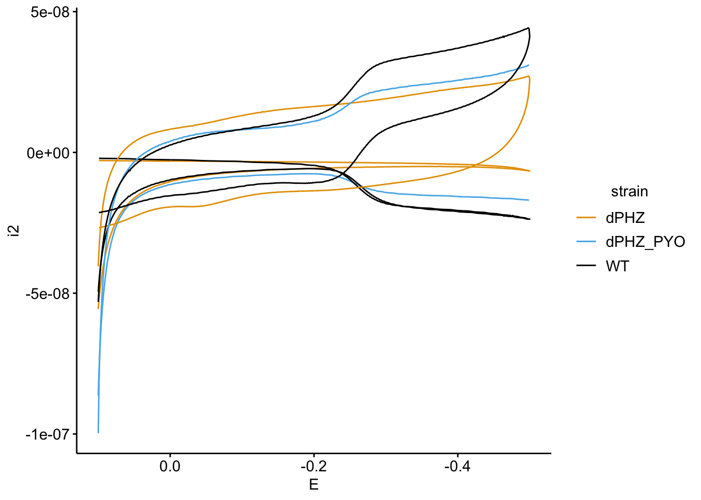
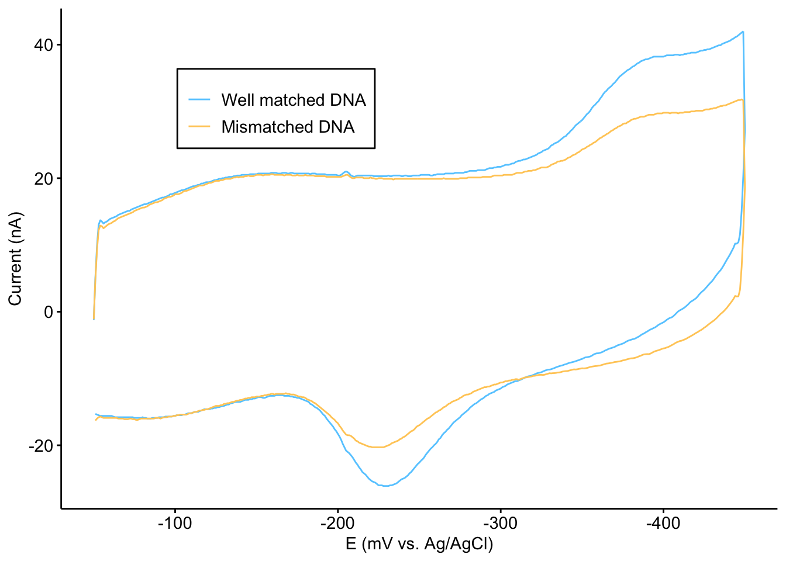
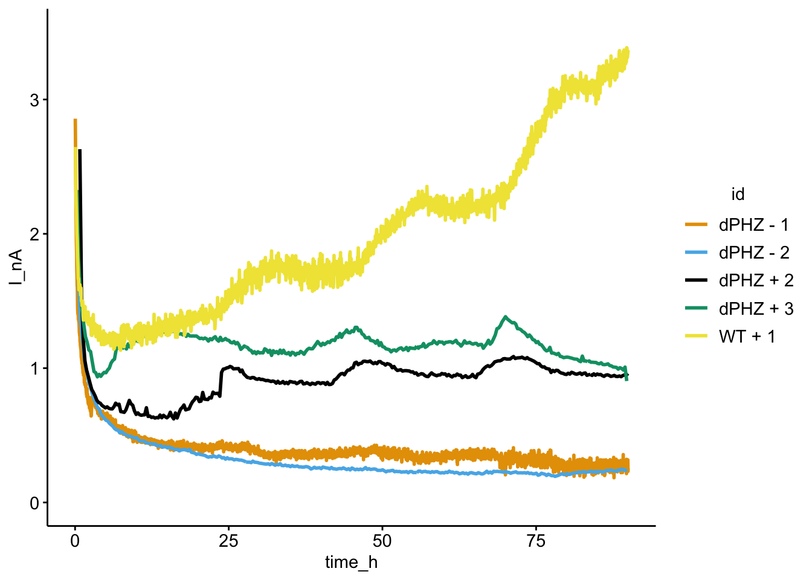
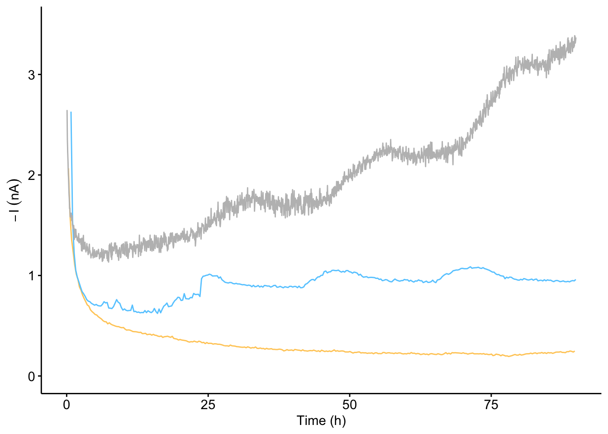
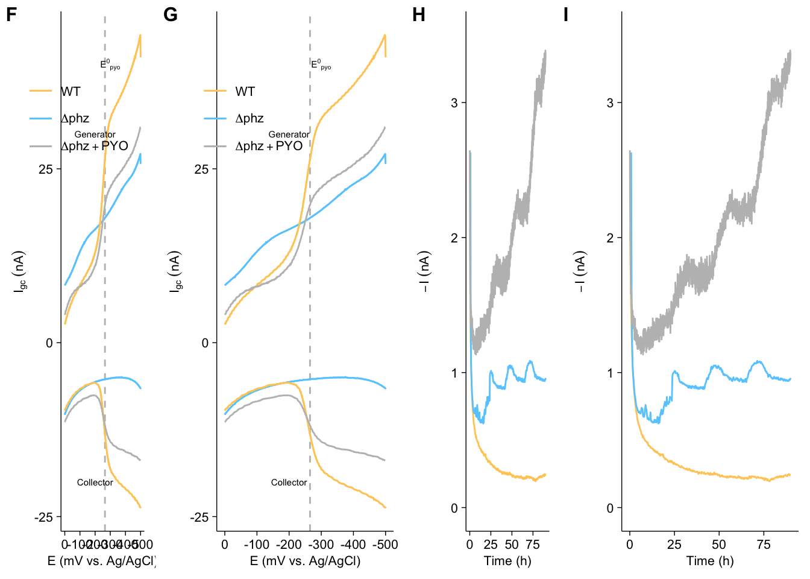

--------

# Notes

Panels A-F and H are images and diagrams. The plots below are repeated as placeholders for the diagrams in panels F and H.

----

Setup packages and plotting for the notebook:


```r
# Check packages
source("../../tools/package_setup.R")

# Load packages
library(tidyverse)
library(cowplot)
library(kableExtra)

# Code display options
knitr::opts_chunk$set(tidy.opts=list(width.cutoff=60),tidy=FALSE, echo = TRUE, message=FALSE, warning=FALSE, fig.align="center", fig.retina = 2)

# Load plotting tools
source("../../tools/plotting_tools.R")


#Modify the plot theme

theme_set(theme_notebook())
```

# Fig. 4G - Generator collector

Let's read in the generator collector data files for the three conditions.


```r
wt_gc <- read_csv("../../../data/Electrochemistry/IDA/WT_newMedia_postEquil_GC.txt", 
                  skip = 21,col_names =c('E', 'i1', 'i2', 't')) %>% mutate(strain='WT')
dphz_gc <- read_csv("../../../data/Electrochemistry/IDA/dPHZ_d3_newMedia_GC_3mVs.txt", 
                    skip = 0,col_names =c('E', 'i1', 'i2', 't') ) %>% mutate(strain = 'dPHZ')
dphz_pyo_gc <- read_csv("../../../data/Electrochemistry/IDA/A_75uM_PYO_GC_2.txt",
                        skip = 21,col_names =c('E', 'i1', 'i2', 't')) %>% mutate(strain = 'dPHZ_PYO')

# combine and extract the first scan by taking the min and max points
basic_gc <- bind_rows(wt_gc,dphz_gc,dphz_pyo_gc) %>% 
  group_by(strain,E) %>% 
  mutate(max_i1 = max(i1)) %>% 
  mutate(min_i2 = min(i2)) 

ggplot(basic_gc , aes(x = E  , color = strain)) + 
  geom_path( aes(y = i2), size = 0.5) + 
  geom_path(aes(y = i1), size = 0.5) + 
  scale_x_reverse()
```



This is a plot of the raw data. To make it clearer for a non-expert audience and to make it consistent with the later GC acquisitions we will only plot the first scan and show potentials less than zero:


```r
basic_gc$strain = fct_relevel(basic_gc$strain, c("dPHZ","WT","dPHZ_PYO"))

# Plot Layout
plot_gcBasic <- ggplot(basic_gc %>% filter(E<=0), aes(x = E  , color = strain)) + 
  geom_vline(xintercept = -0.265, linetype=2, color = 'gray', size = 0.5) + 
  geom_path( aes(y = min_i2), size = 0.5) + 
  geom_path(aes(y = max_i1), size = 0.5)

# Plot Styling
plot_gcBasic_styled <- plot_gcBasic +
  scale_x_reverse(labels = mV_label)+
  scale_y_continuous(labels = nA_label)+
  scale_color_manual(breaks = c("WT","dPHZ","dPHZ_PYO"), 
                     labels = c('WT', expression(Delta*phz), expression(Delta*phz + PYO)), 
                     values = c( "#FFCC66","#66CCFF","gray")) + 
  labs(x = "E (mV vs. Ag/AgCl)", y = expression(I[gc]~(nA)), color = NULL) +
  theme(legend.position = c(0.2,0.8), legend.background = element_blank()) +
  annotate('text', x = -0.2, y = -2e-8, label = 'Collector', size = 2) +
  annotate('text', x = -0.2, y = 3e-8, label = 'Generator', size = 2)+
  annotate('text', x = -0.3, y = 4e-8,label = expression({E^0}[pyo]), size = 2 )


plot_gcBasic_styled
```



# Fig. 4I - Metabolic current

Now let's read in the metabolic current data - aka chronoamperometry. All of the conditions were repeated multiple times. Here's a plot that shows some of the replicates:


```r
ca_data <- read_csv("../../../data/Electrochemistry/IDA/metabolic_current.csv", comment = "#") %>% 
  mutate(Strain = ifelse(Rep==1 & PYO=="+","WT","dPHZ")) %>% 
  mutate(id = paste(Strain,PYO, Rep, sep = " "))

ggplot(ca_data[seq(1,nrow(ca_data), 100),] %>% filter(time_h<90), 
       aes(x = time_h, y = I_nA)) + 
  geom_path(aes(color = id, group = id), size = 1) + 
  ylim(0,3.5)
```



the ∆phz replicates look very similar, so for the final figure we just show one replicate of each condition:


```r
plot_ca_3 <- ggplot(ca_data[seq(1,nrow(ca_data), 100),] %>% filter(time_h<90) %>% filter(id %in% c("dPHZ - 2", "WT + 1", "dPHZ + 2")), 
       aes(x = time_h, y = I_nA)) + 
  geom_path(aes(color = id, group = id), size = 0.5) + 
  ylim(0,3.5)

plot_ca_3_styled <- plot_ca_3+
  scale_color_manual(breaks = c("dPHZ - 2", "WT + 1", "dPHZ + 2"),
                     values = c("#FFCC66","gray","#66CCFF"),
                     labels = c('∆phz - PYO', 'WT','∆phz + PYO'),
                     guide = F) +
  labs(x = 'Time (h)', y = expression(-I~(nA)), color = NULL)
  
plot_ca_3_styled
```



# Create figure


```r
theme_set(theme_figure())

fig_4 <- plot_grid(plot_gcBasic_styled,plot_gcBasic_styled, plot_ca_3_styled,plot_ca_3_styled, 
                   align = 'hv', axis = 'tblr', rel_widths = c(1.25,2,1.25,2), ncol = 4, scale = 1.0, labels = c('F','G','H','I'), label_size = 12)

fig_4
```



```r
save_plot("../../../figures/phz2019_Fig_4.pdf", fig_4, base_width = 7, base_height = 1.5)
```

---


```r
sessionInfo()
```

```
## R version 3.5.3 (2019-03-11)
## Platform: x86_64-apple-darwin15.6.0 (64-bit)
## Running under: macOS  10.15.6
## 
## Matrix products: default
## BLAS: /Library/Frameworks/R.framework/Versions/3.5/Resources/lib/libRblas.0.dylib
## LAPACK: /Library/Frameworks/R.framework/Versions/3.5/Resources/lib/libRlapack.dylib
## 
## locale:
## [1] en_US.UTF-8/en_US.UTF-8/en_US.UTF-8/C/en_US.UTF-8/en_US.UTF-8
## 
## attached base packages:
## [1] stats     graphics  grDevices utils     datasets  methods   base     
## 
## other attached packages:
##  [1] lubridate_1.7.4   hms_0.5.3         modelr_0.1.5     
##  [4] broom_0.5.2       kableExtra_1.1.0  cowplot_0.9.4    
##  [7] viridis_0.5.1     viridisLite_0.3.0 knitr_1.23       
## [10] forcats_0.4.0     stringr_1.4.0     dplyr_0.8.3      
## [13] purrr_0.3.3       readr_1.3.1       tidyr_1.0.0      
## [16] tibble_2.1.3      ggplot2_3.3.0     tidyverse_1.3.0  
## 
## loaded via a namespace (and not attached):
##  [1] tidyselect_0.2.5 xfun_0.7         haven_2.2.0      lattice_0.20-38 
##  [5] colorspace_1.4-1 vctrs_0.3.1      generics_0.0.2   htmltools_0.4.0 
##  [9] yaml_2.2.0       rlang_0.4.6      pillar_1.4.2     glue_1.3.1      
## [13] withr_2.1.2      DBI_1.0.0        dbplyr_1.4.2     readxl_1.3.1    
## [17] lifecycle_0.1.0  munsell_0.5.0    gtable_0.3.0     cellranger_1.1.0
## [21] rvest_0.3.5      evaluate_0.14    labeling_0.3     Rcpp_1.0.2      
## [25] scales_1.0.0     backports_1.1.4  webshot_0.5.1    jsonlite_1.6    
## [29] fs_1.3.1         gridExtra_2.3    digest_0.6.21    stringi_1.4.3   
## [33] grid_3.5.3       cli_1.1.0        tools_3.5.3      magrittr_1.5    
## [37] crayon_1.3.4     pkgconfig_2.0.3  xml2_1.2.2       reprex_0.3.0    
## [41] assertthat_0.2.1 rmarkdown_1.13   httr_1.4.1       rstudioapi_0.10 
## [45] R6_2.4.0         nlme_3.1-137     compiler_3.5.3
```
