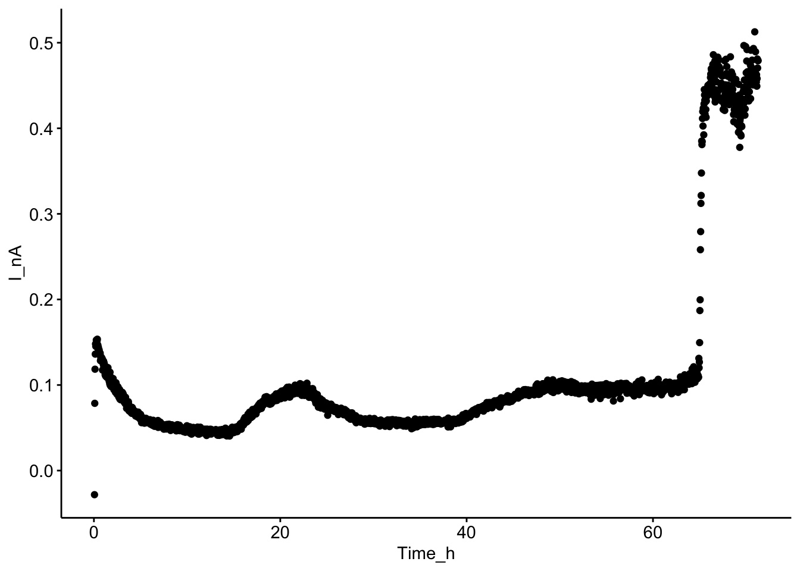
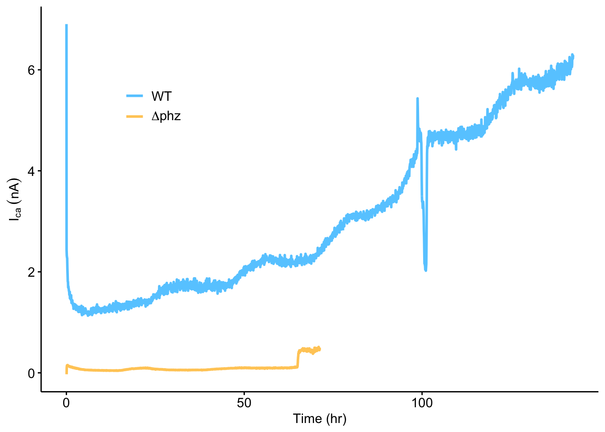
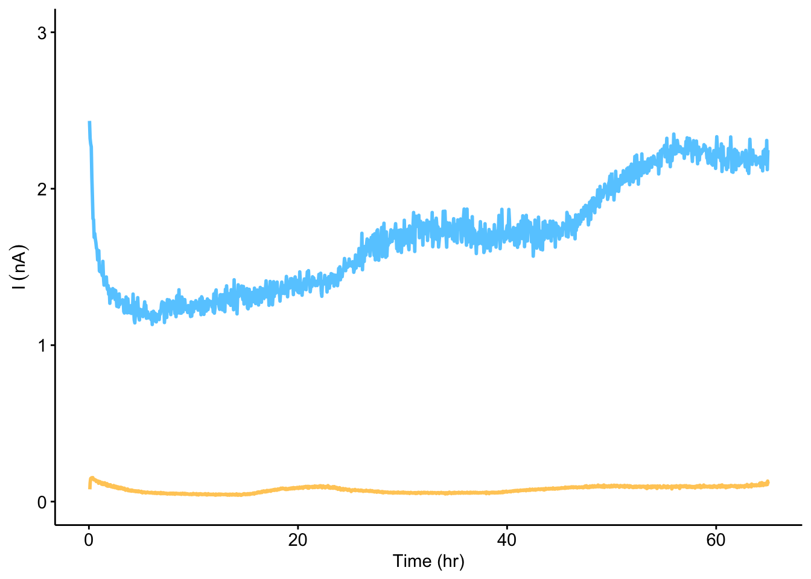
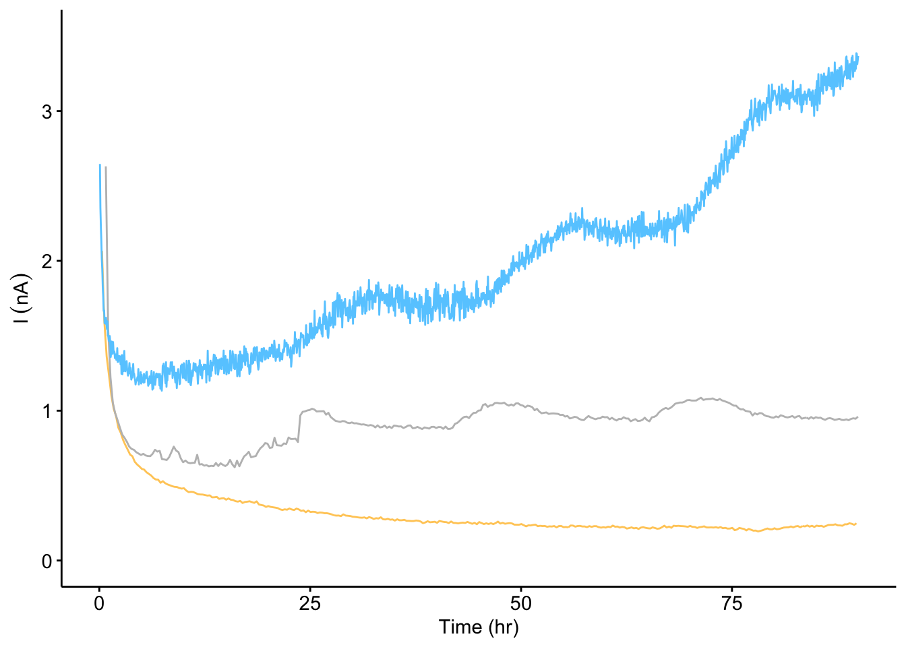

--------

# Notes

Links to IDA processing and to supp figure.

Panel A is a diagram.

----

Setup packages and plotting for the notebook:


```r
# Load packages
library(tidyverse)
library(cowplot)
library(kableExtra)

# Code display options
knitr::opts_chunk$set(tidy.opts=list(width.cutoff=60),tidy=FALSE, echo = TRUE, message=FALSE, warning=FALSE, fig.align="center", fig.retina = 2)

# Load plotting tools
source("../../tools/plotting_tools.R")


#Modify the plot theme

theme_set(theme_notebook())
```

# Fig. 4


```r
wt_ca <- read_csv("../../../data/Electrochemistry/IDA/08_31_18_fernanda_wt_CA.csv") %>% mutate(strain = 'WT')
dPHZ_ca <- read_csv("../../../data/Electrochemistry/IDA/08_31_18_fernanda_dPHZpyo_CA.csv") %>% mutate(strain = 'dPHZ')

df_ca <- bind_rows(wt_ca[seq(1,nrow(wt_ca), 100),],dPHZ_ca[seq(1,nrow(wt_ca), 100),])

ggplot(wt_ca[seq(1,nrow(wt_ca), 100),], aes(x = Time_h, y = I_nA)) + geom_point()
```


```r
ggplot(dPHZ_ca[seq(1,nrow(wt_ca), 100),], aes(x = Time_h, y = I_nA)) + geom_point()
```



```r
# Plot Layout
plot_ca <- ggplot(df_ca, aes(x = Time_h, y = I_nA, color = strain)) + geom_path(size = 1)

plot_ca_2 <- ggplot(df_ca %>% filter(Time_h<65), aes(x = Time_h, y = I_nA, color = strain)) + 
  geom_path(size = 1) + 
  ylim(0, 3)

# Plot Styling
plot_ca_styled <- plot_ca+
  scale_color_manual(breaks = c('WT','dPHZ'), labels = c('WT', expression(Delta*phz)), values = c("#FFCC66","#66CCFF")) +
  labs(x = 'Time (hr)', y = expression(I[ca]~(nA)), color = NULL)+
  theme(legend.position = c(0.2,0.75), legend.background = element_blank()) 

plot_ca_styled
```



```r
plot_ca_2_styled <- plot_ca_2+
  scale_color_manual(breaks = c('WT','dPHZ'), 
                     labels = c('WT', expression(Delta*phz)), 
                     values = c("#FFCC66","#66CCFF"),
                     guide = F) +
  labs(x = 'Time (hr)', y = expression(I~(nA)), color = NULL)+
  theme(legend.position = c(0.2,0.75), legend.background = element_blank()) 

plot_ca_2_styled
```



Updated - 03/11/19 dPHZ biofilms +/- PYO chronoamperometry


```r
ca_data <- read_csv("../../../data/Electrochemistry/IDA/dPHZ_metabolic_current.csv", comment = "#") %>% 
  mutate(Strain = ifelse(Rep==1 & PYO=="+","WT","dPHZ")) %>% 
  mutate(id = paste(Strain,PYO, Rep, sep = " "))

ggplot(ca_data[seq(1,nrow(ca_data), 100),] %>% filter(time_h<90), 
       aes(x = time_h, y = I_nA)) + 
  geom_path(aes(color = id, group = id), size = 1) + 
  ylim(0,3.5)
```


```r
plot_ca_3 <- ggplot(ca_data[seq(1,nrow(ca_data), 100),] %>% filter(time_h<90) %>% filter(id %in% c("dPHZ - 2", "WT + 1", "dPHZ + 2")), 
       aes(x = time_h, y = I_nA)) + 
  geom_path(aes(color = id, group = id), size = 0.5) + 
  ylim(0,3.5)

plot_ca_3_styled <- plot_ca_3+
  scale_color_manual(breaks = c("dPHZ - 2", "WT + 1", "dPHZ + 2"),
                     values = c("#FFCC66","gray","#66CCFF"),
                     labels = c('dPHZ - PYO', 'WT','dPHZ + PYO'),
                     guide = F) +
  labs(x = 'Time (hr)', y = expression(I~(nA)), color = NULL)
  
plot_ca_3_styled
```


1 nA * 75 hrs = 2.7e-4 C = 270uC

assume 2 electrons per PYO = 135u


```r
wt_gc <- read_csv("../../../data/Electrochemistry/IDA/WT_newMedia_postEquil_GC.txt", skip = 21,col_names =c('E', 'i1', 'i2', 't')) %>% mutate(strain='WT')
dphz_gc <- read_csv("../../../data/Electrochemistry/IDA/dPHZ_d3_newMedia_GC_3mVs.txt", skip = 0,col_names =c('E', 'i1', 'i2', 't') ) %>% mutate(strain = 'dPHZ')
dphz_pyo_gc <- read_csv("../../../data/Electrochemistry/IDA/A_75uM_PYO_GC_2.txt",skip = 21,col_names =c('E', 'i1', 'i2', 't')) %>% mutate(strain = 'dPHZ_PYO')

basic_gc <- bind_rows(wt_gc,dphz_gc,dphz_pyo_gc) %>% 
  group_by(strain,E) %>% 
  mutate(max_i1 = max(i1)) %>% 
  mutate(min_i2 = min(i2)) 

basic_gc$strain = fct_relevel(basic_gc$strain, c("dPHZ","WT","dPHZ_PYO"))

# Plot Layout
plot_gcBasic <- ggplot(basic_gc %>% filter(E<=0), aes(x = E , y = min_i2 , color = strain)) + 
  geom_vline(xintercept = -0.265, linetype=2, color = 'gray', size = 0.5) + 
  geom_path( size = 0.5) + 
  geom_path(aes(y = max_i1), size = 0.5)

# Plot Styling
plot_gcBasic_styled <- plot_gcBasic +
  scale_x_reverse(labels = mV_label)+
  scale_y_continuous(labels = nA_label)+
  scale_color_manual(breaks = c("WT","dPHZ","dPHZ_PYO"), 
                     labels = c('WT', expression(Delta*phz), expression(Delta*phz + PYO)), 
                     values = c( "#FFCC66","#66CCFF","gray")) + 
  labs(x = "E (mV vs. Ag/AgCl)", y = expression(I[gc]~(nA)), color = NULL) +
  theme(legend.position = c(0.2,0.8), legend.background = element_blank()) +
  annotate('text', x = -0.2, y = -2e-8, label = 'Collector', size = 2) +
  annotate('text', x = -0.2, y = 3e-8, label = 'Generator', size = 2)+
  annotate('text', x = -0.3, y = 4e-8,label = expression({E^0}[pyo]), size = 2 )


plot_gcBasic_styled
```


```r
theme_set(theme_figure())

fig_4 <- plot_grid(plot_ca_3_styled,plot_ca_3_styled, plot_gcBasic_styled,plot_gcBasic_styled, 
                   align = 'hv', axis = 'tblr', rel_widths = c(1.25,2,1.25,2), ncol = 4, scale = 0.95, labels = c('F','G','H','I'), label_size = 12)

fig_4
```


```r
save_plot("../../../figures/phz2019_Fig_4.pdf", fig_4, base_width = 7, base_height = 1.5)
```

---


```r
sessionInfo()
```

```
## R version 3.5.2 (2018-12-20)
## Platform: x86_64-apple-darwin15.6.0 (64-bit)
## Running under: macOS Mojave 10.14.6
## 
## Matrix products: default
## BLAS: /Library/Frameworks/R.framework/Versions/3.5/Resources/lib/libRblas.0.dylib
## LAPACK: /Library/Frameworks/R.framework/Versions/3.5/Resources/lib/libRlapack.dylib
## 
## locale:
## [1] en_US.UTF-8/en_US.UTF-8/en_US.UTF-8/C/en_US.UTF-8/en_US.UTF-8
## 
## attached base packages:
## [1] stats     graphics  grDevices utils     datasets  methods   base     
## 
## other attached packages:
##  [1] viridis_0.5.1     viridisLite_0.3.0 kableExtra_1.0.1 
##  [4] cowplot_0.9.4     forcats_0.3.0     stringr_1.3.1    
##  [7] dplyr_0.8.1       purrr_0.2.5       readr_1.3.1      
## [10] tidyr_0.8.2       tibble_2.1.3      ggplot2_3.2.0    
## [13] tidyverse_1.2.1  
## 
## loaded via a namespace (and not attached):
##  [1] tidyselect_0.2.5 xfun_0.7         haven_2.0.0      lattice_0.20-38 
##  [5] colorspace_1.4-0 generics_0.0.2   htmltools_0.3.6  yaml_2.2.0      
##  [9] rlang_0.4.0      pillar_1.3.1     glue_1.3.1       withr_2.1.2     
## [13] modelr_0.1.2     readxl_1.2.0     munsell_0.5.0    gtable_0.2.0    
## [17] cellranger_1.1.0 rvest_0.3.2      evaluate_0.14    labeling_0.3    
## [21] knitr_1.23       broom_0.5.1      Rcpp_1.0.1       scales_1.0.0    
## [25] backports_1.1.3  webshot_0.5.1    jsonlite_1.6     gridExtra_2.3   
## [29] hms_0.4.2        digest_0.6.18    stringi_1.2.4    grid_3.5.2      
## [33] cli_1.1.0        tools_3.5.2      magrittr_1.5     lazyeval_0.2.1  
## [37] crayon_1.3.4     pkgconfig_2.0.2  xml2_1.2.0       lubridate_1.7.4 
## [41] assertthat_0.2.1 rmarkdown_1.13   httr_1.4.0       rstudioapi_0.9.0
## [45] R6_2.4.0         nlme_3.1-140     compiler_3.5.2
```
