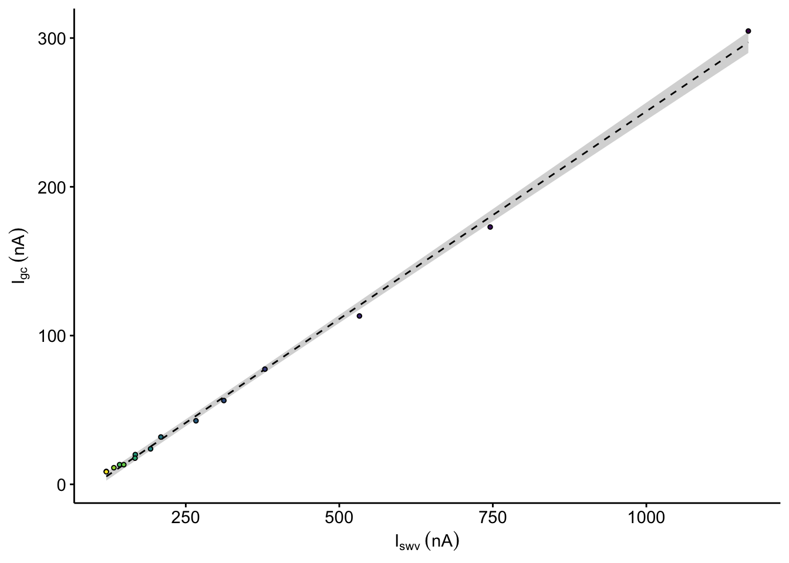

--------

# Notes

Panel A is a diagram.

To see how we got from the raw electrochemical scans to the datasets used here, please see the following processing notebooks:

* [IDA ∆phz biofilm processing](https://scott-saunders.github.io/phz_eDNA_2019/code/processing/IDA_dPHZ/IDA_dPHZ_processing.html)
* [IDA WT biofilm processing](https://scott-saunders.github.io/phz_eDNA_2019/code/processing/IDA_WT/IDA_WT_processing.html)
* [IDA blank processing](https://scott-saunders.github.io/phz_eDNA_2019/code/processing/IDA_blank/IDA_blank_processing.html)

Then see how those data were analyzed in these notebooks for supplemental figures S6 and S7:

* [Fig. S6](https://scott-saunders.github.io/phz_eDNA_2019/code/figures/supplement/Fig_S6/phz2019_Fig_S6.html)
* [Fig. S7](https://scott-saunders.github.io/phz_eDNA_2019/code/figures/supplement/Fig_S7/phz2019_Fig_S7.html)

These supplemental figure notebooks produced model coefficients that are used in this notebook.

----

Setup packages and plotting for the notebook:


```r
# Load packages
library(tidyverse)
library(cowplot)
library(kableExtra)

# Code display options
knitr::opts_chunk$set(tidy.opts=list(width.cutoff=60),tidy=FALSE, echo = TRUE, message=FALSE, warning=FALSE, fig.align="center", fig.retina = 2)

# Load plotting tools
source("../../tools/plotting_tools.R")


#Modify the plot theme

theme_set(theme_notebook())
```

# Fig. 6B

need to read in the model coefficients and grid predictions for these two datasets.


```r
df_dphz_nls_1 <- read_csv("../supplement/Fig_S6/phz2019_dPHZ_Dphys_nls_coefs.csv") %>% 
  filter(exp == 1 & run == 1 & term == 'a')

df_blank_nls_75 <- read_csv("../supplement/Fig_S6/phz2019_blank_Dphys_nls_coefs.csv") %>% 
  filter(PHZadded == '75uM' & term == 'a')

df_dphz_swv_decay <- read_csv("../../processing/processed_data/phz_eDNA_2019_signals_long.csv") %>% 
  filter(echem == 'SWV' & exp == 1 & run == 1 & reactor == 'transfer' & electrode == 'i1') %>% 
  mutate(IDA = 'biofilm', signal = signal - df_dphz_nls_1$estimate) %>% 
  select(time, signal, IDA)

df_blank_decay <- read_csv("../../processing/processed_data/phz_eDNA_2019_swv_blank_tran_time_signals.csv") %>% 
  filter(PHZadded == '75uM') %>% 
  mutate(IDA = 'blank', signal = signal - df_blank_nls_75$estimate) %>%
  select(time, signal, IDA)

df_dphz_preds <- read_csv("../supplement/Fig_S6/phz2019_dPHZ_Dphys_preds.csv") %>% 
  filter(exp == 1 & run == 1) %>% 
  select(time, pred, pred_low, pred_high) %>% 
  mutate(pred = pred - df_dphz_nls_1$estimate,
         pred_low = pred_low - df_dphz_nls_1$estimate, 
         pred_high = pred_high - df_dphz_nls_1$estimate)%>% 
  mutate(IDA = 'biofilm')

df_blank_preds <- read_csv("../supplement/Fig_S6/phz2019_blank_Dphys_preds.csv") %>% 
  filter(PHZadded == '75uM') %>% 
  select(time, pred, pred_low, pred_high) %>% 
  mutate(pred = pred - df_blank_nls_75$estimate,
         pred_low = pred_low - df_blank_nls_75$estimate, 
         pred_high = pred_high - df_blank_nls_75$estimate) %>% 
  mutate(IDA = 'blank')

df_preds <- bind_rows(df_dphz_preds, df_blank_preds)

df_decays <- bind_rows(df_dphz_swv_decay, df_blank_decay)

plot_blank_dphz_decay <- ggplot(df_preds, aes(x = time, y = pred, group = IDA, fill = time)) + geom_ribbon(aes(ymin = pred_low, ymax = pred_high), fill = 'light gray') +
  geom_path(linetype = 2, size = 0.5)+
  geom_point(data =df_decays, aes(x = time, y = signal) , shape = 21, size = 1) + guides(fill = 'none')

plot_blank_dphz_decay_styled <- plot_blank_dphz_decay+
  labs(x = 'Time (min)', y = expression(I[swv]~(nA)), fill = 'Time (min)') +
  scale_fill_viridis(guide = F) +
  scale_y_continuous(labels = nA_label)


plot_blank_dphz_decay_styled
```


Let's subtract the a intercept value of these models so that we can compare the decay.


# Fig. 6C


```r
df_swv <- read_csv("../../processing/processed_data/phz_eDNA_2019_swv_raw_1_1.csv")
df_swv_sig <- read_csv("../../processing/processed_data/phz_eDNA_2019_signals_long.csv") %>% 
  filter(echem == 'SWV' & exp == 1 & run == 1 & electrode == 'i1' & reactor == 'transfer')

# Plot Layout
plot_swv <- ggplot(df_swv %>% filter(E<=0), aes(x = E , y = current )) +
  geom_vline(xintercept = -0.265, linetype=2, color = 'gray', size = 0.5) + 
  geom_path(aes(group = rep, color = rep), size = 0.5) + 
  geom_point(data = df_swv_sig, aes(x = E_from_maxs , y = current_from_maxs , fill = rep), shape = 21,size = 1) 

# Plot Styling
plot_swv_styled <- plot_swv + 
  annotate('text', x = -0.2, y = 3.5e-6,label = expression({E^0}[pyo]), size = 2 )+
  scale_x_reverse(labels = mV_label)+
  scale_y_continuous(labels = nA_label)+
  scale_fill_viridis(guide = F) + 
  scale_color_viridis(guide = F) + 
  labs(x = "E (mV vs. Ag/AgCl)", y = expression(I[swv]~(n*A)), color = "Scan #") + 
  theme(legend.position = c(0.15,0.75), legend.background = element_blank())

plot_swv_styled
```


## Inset

convert to norm time??


```r
# Plot Layout
plot_swv_sig <- ggplot(data = df_swv_sig, aes(x = time, y = signal))+
  geom_point(shape = 21, size = 0.75, aes(fill = time))

# Plot Styling
plot_swv_sig_styled <- plot_swv_sig +
  labs(x = 'Time (min)', y = NULL, fill = 'Time (min)') +
  scale_fill_viridis(guide = F) +
  scale_y_continuous(labels = nA_label)+ xlim(0,NA)

plot_swv_sig_styled
```


# Fig. 6D

need to mod

```r
df_gc <- read_csv("../../processing/processed_data/phz_eDNA_2019_gc_raw_1_1.csv")
df_gc_sig <- read_csv("../../processing/processed_data/phz_eDNA_2019_signals_long.csv") %>% 
  filter(echem == 'GC' & exp == 1 & run == 1 & reactor == 'transfer')


# Plot Layout
plot_gc <- ggplot() + 
  geom_vline(xintercept = -0.265, linetype=2, color = 'gray', size = 0.5) + 
  geom_path(data=df_gc %>% filter(electrode=='i1'), 
            aes(x = E , y = current , group = rep, color = rep), size = 0.5) + 
  geom_path(data=df_gc %>% filter(electrode=='i2'), 
            aes(x = E , y = current, group = rep, color = rep), size = 0.5) +
  geom_point(data = df_gc_sig, 
             aes(x = E_from_maxs , y = -current_from_maxs , fill = rep), shape = 21, size = 1) 

# Plot styling
plot_gc_styled <- plot_gc +
  annotate('text', x = -0.2, y = 3.5e-7,label = expression({E^0}[pyo]),, size = 2 )+
  scale_x_reverse(labels = mV_label)+
  scale_y_continuous(labels = nA_label)+
  scale_fill_viridis(guide=F) + 
  scale_color_viridis(guide=F) + 
  labs(x = "E (mV vs. Ag/AgCl)", y = expression(I[gc]~(nA)), color = "Scan #") + 
  theme(legend.position = c(0.15,0.75), 
        legend.background = element_blank())

plot_gc_styled
```


## Inset

need to mod

```r
# Plot Layout
plot_gc_sig <- ggplot(data = df_gc_sig, aes(x = time, y = signal))+
  geom_point(shape = 21, size = 0.75, aes(fill = time))

# Plot Styling
plot_gc_sig_styled <- plot_gc_sig +
  labs(x = 'Time (min)', y = NULL, fill = 'Time (min)') +
  scale_fill_viridis(guide = F) +
  scale_y_continuous(labels = nA_label) + xlim(0,NA)

plot_gc_sig_styled
```


# Fig. 6E

need to mod

```r
df_swv_gc_sig <- read_csv("../../processing/processed_data/phz_eDNA_2019_swv_gc_signals.csv") %>% filter(exp == 1 & run == 1)

# Plot Layout
plot_swv_gc <- ggplot(df_swv_gc_sig %>% filter(rep>0), 
                           aes(x = signal_SWV, y = signal_GC)) +
  geom_smooth(method = 'lm', se = T, color = 'black', linetype = 2, size = 0.5) +
  geom_point(shape = 21, size = 1, aes(fill = time_SWV))

# Plot Styling
plot_swv_gc_styled <- plot_swv_gc + 
  scale_x_continuous(breaks=c(0,2.5e-7,5.0e-7, 7.5e-7, 1.0e-6), labels = nA_label)+
  scale_y_continuous(labels = nA_label)+
  labs(x = expression(I[swv]~(nA)), y = expression(I[gc]~(nA))) +
  scale_fill_viridis(guide=F)


plot_swv_gc_styled
```



# Fig. 6F

In order to construct figure 5F we must do a few analysis steps using data analysed for Figs S6 and S7. This is somewhat complicated, because to calculate $D_{loss}$ we need the $D_{ap}$ value and the SWV soak value (I0) for each run. Therefore we will do the following:

1. Take biofilm linear models (SWV vs. GC) from fig. S6 and calculate $D_{ap}$.
2. Take blank linear model (SWV vs. GC) from Fig. S7 and calculate $D_{ap}$.
3. Take nonlinear models from fig. S6 and join with $D_{ap}$ values and initial current I0, which is taken to be the peak current from the soak reactors before each run. Then calculate $D_{loss}$ from nonlinear fit coefficient, $D_{ap}$ and I0.

## $D_{ap}$

First let's read in the linear model coefficients from Figs S6 and S7. Recall that this linear model was used to fit the SWV vs. GC data plots and that the slope is proportional to $\sqrt{D_{ap}}$. 


```r
df_dphz_lm <- read_csv("../supplement/Fig_S6/phz2019_dPHZ_Dap_lm_coefs.csv") %>% mutate(IDA = 'biofilm')

df_blank_lm <- read_csv("../supplement/Fig_S7/phz2019_blank_Dap_lm_coefs.csv") %>% mutate(IDA = 'blank')

df_all_lm <- bind_rows(df_dphz_lm, df_blank_lm)

df_all_lm %>% kable() %>% kable_styling() %>% scroll_box(height = '300px')
```

<div style="border: 1px solid #ddd; padding: 5px; overflow-y: scroll; height:300px; "><table class="table" style="margin-left: auto; margin-right: auto;">
 <thead>
  <tr>
   <th style="text-align:left;"> exp_id </th>
   <th style="text-align:left;"> run_id </th>
   <th style="text-align:left;"> term </th>
   <th style="text-align:right;"> estimate </th>
   <th style="text-align:right;"> std.error </th>
   <th style="text-align:right;"> statistic </th>
   <th style="text-align:right;"> p.value </th>
   <th style="text-align:right;"> conf.low </th>
   <th style="text-align:right;"> conf.high </th>
   <th style="text-align:left;"> IDA </th>
  </tr>
 </thead>
<tbody>
  <tr>
   <td style="text-align:left;"> Biofilm 1 </td>
   <td style="text-align:left;"> Rep 1 </td>
   <td style="text-align:left;"> signal_SWV </td>
   <td style="text-align:right;"> 0.1513328 </td>
   <td style="text-align:right;"> 0.0039875 </td>
   <td style="text-align:right;"> 37.951641 </td>
   <td style="text-align:right;"> 0.0000000 </td>
   <td style="text-align:right;"> 0.1427183 </td>
   <td style="text-align:right;"> 0.1599473 </td>
   <td style="text-align:left;"> biofilm </td>
  </tr>
  <tr>
   <td style="text-align:left;"> Biofilm 1 </td>
   <td style="text-align:left;"> Rep 2 </td>
   <td style="text-align:left;"> signal_SWV </td>
   <td style="text-align:right;"> 0.1045085 </td>
   <td style="text-align:right;"> 0.0034865 </td>
   <td style="text-align:right;"> 29.975017 </td>
   <td style="text-align:right;"> 0.0000000 </td>
   <td style="text-align:right;"> 0.0969763 </td>
   <td style="text-align:right;"> 0.1120407 </td>
   <td style="text-align:left;"> biofilm </td>
  </tr>
  <tr>
   <td style="text-align:left;"> Biofilm 1 </td>
   <td style="text-align:left;"> Rep 3 </td>
   <td style="text-align:left;"> signal_SWV </td>
   <td style="text-align:right;"> 0.1203080 </td>
   <td style="text-align:right;"> 0.0079031 </td>
   <td style="text-align:right;"> 15.222956 </td>
   <td style="text-align:right;"> 0.0000000 </td>
   <td style="text-align:right;"> 0.1032345 </td>
   <td style="text-align:right;"> 0.1373816 </td>
   <td style="text-align:left;"> biofilm </td>
  </tr>
  <tr>
   <td style="text-align:left;"> Biofilm 2 </td>
   <td style="text-align:left;"> Rep 1 </td>
   <td style="text-align:left;"> signal_SWV </td>
   <td style="text-align:right;"> 0.2791415 </td>
   <td style="text-align:right;"> 0.0036863 </td>
   <td style="text-align:right;"> 75.723946 </td>
   <td style="text-align:right;"> 0.0000000 </td>
   <td style="text-align:right;"> 0.2711777 </td>
   <td style="text-align:right;"> 0.2871052 </td>
   <td style="text-align:left;"> biofilm </td>
  </tr>
  <tr>
   <td style="text-align:left;"> Biofilm 2 </td>
   <td style="text-align:left;"> Rep 2 </td>
   <td style="text-align:left;"> signal_SWV </td>
   <td style="text-align:right;"> 0.2125194 </td>
   <td style="text-align:right;"> 0.0077260 </td>
   <td style="text-align:right;"> 27.507105 </td>
   <td style="text-align:right;"> 0.0000000 </td>
   <td style="text-align:right;"> 0.1958284 </td>
   <td style="text-align:right;"> 0.2292104 </td>
   <td style="text-align:left;"> biofilm </td>
  </tr>
  <tr>
   <td style="text-align:left;"> Biofilm 2 </td>
   <td style="text-align:left;"> Rep 3 </td>
   <td style="text-align:left;"> signal_SWV </td>
   <td style="text-align:right;"> 0.2230086 </td>
   <td style="text-align:right;"> 0.0077181 </td>
   <td style="text-align:right;"> 28.894223 </td>
   <td style="text-align:right;"> 0.0000000 </td>
   <td style="text-align:right;"> 0.2063346 </td>
   <td style="text-align:right;"> 0.2396825 </td>
   <td style="text-align:left;"> biofilm </td>
  </tr>
  <tr>
   <td style="text-align:left;"> Biofilm 1 </td>
   <td style="text-align:left;"> Rep 1 </td>
   <td style="text-align:left;"> (Intercept) </td>
   <td style="text-align:right;"> 0.0000000 </td>
   <td style="text-align:right;"> 0.0000000 </td>
   <td style="text-align:right;"> -14.499185 </td>
   <td style="text-align:right;"> 0.0000000 </td>
   <td style="text-align:right;"> 0.0000000 </td>
   <td style="text-align:right;"> 0.0000000 </td>
   <td style="text-align:left;"> biofilm </td>
  </tr>
  <tr>
   <td style="text-align:left;"> Biofilm 1 </td>
   <td style="text-align:left;"> Rep 2 </td>
   <td style="text-align:left;"> (Intercept) </td>
   <td style="text-align:right;"> 0.0000000 </td>
   <td style="text-align:right;"> 0.0000000 </td>
   <td style="text-align:right;"> -10.551620 </td>
   <td style="text-align:right;"> 0.0000001 </td>
   <td style="text-align:right;"> 0.0000000 </td>
   <td style="text-align:right;"> 0.0000000 </td>
   <td style="text-align:left;"> biofilm </td>
  </tr>
  <tr>
   <td style="text-align:left;"> Biofilm 1 </td>
   <td style="text-align:left;"> Rep 3 </td>
   <td style="text-align:left;"> (Intercept) </td>
   <td style="text-align:right;"> -0.0000001 </td>
   <td style="text-align:right;"> 0.0000000 </td>
   <td style="text-align:right;"> -9.616970 </td>
   <td style="text-align:right;"> 0.0000003 </td>
   <td style="text-align:right;"> -0.0000001 </td>
   <td style="text-align:right;"> 0.0000000 </td>
   <td style="text-align:left;"> biofilm </td>
  </tr>
  <tr>
   <td style="text-align:left;"> Biofilm 2 </td>
   <td style="text-align:left;"> Rep 1 </td>
   <td style="text-align:left;"> (Intercept) </td>
   <td style="text-align:right;"> 0.0000000 </td>
   <td style="text-align:right;"> 0.0000000 </td>
   <td style="text-align:right;"> -18.031183 </td>
   <td style="text-align:right;"> 0.0000000 </td>
   <td style="text-align:right;"> 0.0000000 </td>
   <td style="text-align:right;"> 0.0000000 </td>
   <td style="text-align:left;"> biofilm </td>
  </tr>
  <tr>
   <td style="text-align:left;"> Biofilm 2 </td>
   <td style="text-align:left;"> Rep 2 </td>
   <td style="text-align:left;"> (Intercept) </td>
   <td style="text-align:right;"> 0.0000000 </td>
   <td style="text-align:right;"> 0.0000000 </td>
   <td style="text-align:right;"> -10.724706 </td>
   <td style="text-align:right;"> 0.0000001 </td>
   <td style="text-align:right;"> 0.0000000 </td>
   <td style="text-align:right;"> 0.0000000 </td>
   <td style="text-align:left;"> biofilm </td>
  </tr>
  <tr>
   <td style="text-align:left;"> Biofilm 2 </td>
   <td style="text-align:left;"> Rep 3 </td>
   <td style="text-align:left;"> (Intercept) </td>
   <td style="text-align:right;"> 0.0000000 </td>
   <td style="text-align:right;"> 0.0000000 </td>
   <td style="text-align:right;"> -9.337288 </td>
   <td style="text-align:right;"> 0.0000004 </td>
   <td style="text-align:right;"> 0.0000000 </td>
   <td style="text-align:right;"> 0.0000000 </td>
   <td style="text-align:left;"> biofilm </td>
  </tr>
  <tr>
   <td style="text-align:left;"> Blank 1 </td>
   <td style="text-align:left;"> Rep 1 </td>
   <td style="text-align:left;"> (Intercept) </td>
   <td style="text-align:right;"> -0.0000002 </td>
   <td style="text-align:right;"> 0.0000000 </td>
   <td style="text-align:right;"> -7.205283 </td>
   <td style="text-align:right;"> 0.0055105 </td>
   <td style="text-align:right;"> -0.0000003 </td>
   <td style="text-align:right;"> -0.0000001 </td>
   <td style="text-align:left;"> blank </td>
  </tr>
  <tr>
   <td style="text-align:left;"> Blank 1 </td>
   <td style="text-align:left;"> Rep 1 </td>
   <td style="text-align:left;"> signal_SWV </td>
   <td style="text-align:right;"> 0.1987799 </td>
   <td style="text-align:right;"> 0.0033905 </td>
   <td style="text-align:right;"> 58.628598 </td>
   <td style="text-align:right;"> 0.0000109 </td>
   <td style="text-align:right;"> 0.1879898 </td>
   <td style="text-align:right;"> 0.2095699 </td>
   <td style="text-align:left;"> blank </td>
  </tr>
</tbody>
</table></div>

<br>

So you can see we have estimated the slopes for each dataset (term 'signal_SWV' 'estimate'), including confidence intervals. Now let's redefine the function we used in [Fig. S7]() to calculate $D_{ap}$ from the slope of the SWV vs. GC line.

Recall that for this type of data:

$$D_{ap} = \frac{1}{\pi t_p} \left( \frac{m A \psi}{S} \right) ^2$$  


```r
dap_from_swvGC <- function(m){
  
  t_p <- 1/(2*300)
  psi <-  0.7
  A <-  0.025 #cm^2
  S <-  18.4 #cm
  
  d_ap <- (m*A*psi)^2 / (S^2 * pi * t_p)
  
  d_ap
}
```

Now we'll convert slope into $D_{ap}$ estimates (with confidence intervals) using our function `dap_from_swvGC()`, and we will go ahead and plot the biofilm and blank values:


```r
df_all_dap <- df_all_lm %>% 
  filter(term=='signal_SWV') %>% 
  mutate(dap=dap_from_swvGC(m = estimate)) %>% 
  mutate(dap_high = dap_from_swvGC(m = conf.high)) %>% 
  mutate(dap_low = dap_from_swvGC(m = conf.low)) %>% 
  
# Add back id variables for matching below  
  mutate(run = case_when(
    run_id == 'Rep 1' ~ 1,
    run_id == 'Rep 2' ~ 2,
    run_id == 'Rep 3' ~ 3
  )) %>% 
    mutate(exp = case_when(
    exp_id == 'Biofilm 1' ~ 1,
    exp_id == 'Biofilm 2' ~ 2,
    exp_id == 'Blank 1' ~ 3
  )) %>% 
  mutate(run = ifelse(exp_id == 'Blank 1',4,run))


ggplot(df_all_dap, aes(x = exp_id, y = dap)) + 
  geom_pointrange(aes(ymin = dap_low, ymax = dap_high), position = position_jitter(width = 0.1, height = 0)) + 
  ylim(2e-7,2e-5)
```


## $D_{loss}$

Now we will calculate $D_{loss}$, so we first need the model coefficients from the SWV decay signals from Fig S6. We also need the peak SWV current from each scan in the soak reactor before it was transferred - this will serve as our value for initial current I0. Lastly, we also need the $D_{ap}$ values calculated above. Below we will read in those data and put them all together in one data frame that we can work with.


```r
# Biofilm SWV decay fits and soak I0's

df_dphz_nls <- read_csv("../supplement/Fig_S6/phz2019_dPHZ_Dphys_nls_coefs.csv")
df_dphz_i0 <- read_csv("../../processing/processed_data/phz_eDNA_2019_swv_signals.csv") %>% 
  filter(reactor == 'soak' & electrode == 'i1') %>% 
  mutate(run = as.double(run)) %>% 
  select(exp, run, i0 = signal)

# Join all biofilm data together

df_dphz_nls_i0 <- left_join(df_dphz_nls, df_dphz_i0, by = c('exp','run')) %>% mutate(IDA = 'biofilm')

# Blank SWV decay fits and soak I0's

df_blank_nls <- read_csv("../supplement/Fig_S6/phz2019_blank_Dphys_nls_coefs.csv")
df_blank_i0 <- read_csv("../../processing/processed_data/phz_eDNA_2019_swv_blank_signals.csv") %>% 
  filter(reactor == 'soak') %>% 
  select(PHZadded, i0 = signal)

# Join all blank data together

df_blank_nls_i0 <- left_join(df_blank_nls, df_blank_i0, by = c('PHZadded')) %>% 
  mutate(exp = 3, IDA = 'blank') %>% 
# Add an ID variable for matching below
  mutate(run = case_when(
    PHZadded == '10uM' ~ 4,
    PHZadded == '25uM' ~ 4,
    PHZadded == '50uM' ~ 4,
    PHZadded == '75uM' ~ 4,
    PHZadded == '100uM' ~ 4
  ))

# Join the biofilm and blank data

df_all_nls_i0 <- bind_rows(df_dphz_nls_i0, df_blank_nls_i0) %>% filter(term == 'b') %>% 
  select(exp, run,b_estimate = estimate, b_low = conf.low, b_high = conf.high, i0, IDA, PHZadded)

# Add the Dap values for the biofilm and blank data

df_all_dap_i0 <- left_join(df_all_nls_i0, df_all_dap %>% select(exp, run, IDA, dap, dap_high, dap_low),
                           by = c('exp','run','IDA'))

df_all_dap_i0 %>% kable() %>% kable_styling() %>% scroll_box(height = '300px')
```

<div style="border: 1px solid #ddd; padding: 5px; overflow-y: scroll; height:300px; "><table class="table" style="margin-left: auto; margin-right: auto;">
 <thead>
  <tr>
   <th style="text-align:right;"> exp </th>
   <th style="text-align:right;"> run </th>
   <th style="text-align:right;"> b_estimate </th>
   <th style="text-align:right;"> b_low </th>
   <th style="text-align:right;"> b_high </th>
   <th style="text-align:right;"> i0 </th>
   <th style="text-align:left;"> IDA </th>
   <th style="text-align:left;"> PHZadded </th>
   <th style="text-align:right;"> dap </th>
   <th style="text-align:right;"> dap_high </th>
   <th style="text-align:right;"> dap_low </th>
  </tr>
 </thead>
<tbody>
  <tr>
   <td style="text-align:right;"> 1 </td>
   <td style="text-align:right;"> 1 </td>
   <td style="text-align:right;"> 2.8e-06 </td>
   <td style="text-align:right;"> 2.8e-06 </td>
   <td style="text-align:right;"> 2.9e-06 </td>
   <td style="text-align:right;"> 3.40e-06 </td>
   <td style="text-align:left;"> biofilm </td>
   <td style="text-align:left;"> NA </td>
   <td style="text-align:right;"> 4.00e-06 </td>
   <td style="text-align:right;"> 4.40e-06 </td>
   <td style="text-align:right;"> 3.50e-06 </td>
  </tr>
  <tr>
   <td style="text-align:right;"> 1 </td>
   <td style="text-align:right;"> 2 </td>
   <td style="text-align:right;"> 1.8e-06 </td>
   <td style="text-align:right;"> 1.8e-06 </td>
   <td style="text-align:right;"> 1.9e-06 </td>
   <td style="text-align:right;"> 3.50e-06 </td>
   <td style="text-align:left;"> biofilm </td>
   <td style="text-align:left;"> NA </td>
   <td style="text-align:right;"> 1.90e-06 </td>
   <td style="text-align:right;"> 2.20e-06 </td>
   <td style="text-align:right;"> 1.60e-06 </td>
  </tr>
  <tr>
   <td style="text-align:right;"> 1 </td>
   <td style="text-align:right;"> 3 </td>
   <td style="text-align:right;"> 2.1e-06 </td>
   <td style="text-align:right;"> 2.0e-06 </td>
   <td style="text-align:right;"> 2.1e-06 </td>
   <td style="text-align:right;"> 3.80e-06 </td>
   <td style="text-align:left;"> biofilm </td>
   <td style="text-align:left;"> NA </td>
   <td style="text-align:right;"> 2.50e-06 </td>
   <td style="text-align:right;"> 3.30e-06 </td>
   <td style="text-align:right;"> 1.80e-06 </td>
  </tr>
  <tr>
   <td style="text-align:right;"> 2 </td>
   <td style="text-align:right;"> 1 </td>
   <td style="text-align:right;"> 2.1e-06 </td>
   <td style="text-align:right;"> 2.1e-06 </td>
   <td style="text-align:right;"> 2.2e-06 </td>
   <td style="text-align:right;"> 6.60e-06 </td>
   <td style="text-align:left;"> biofilm </td>
   <td style="text-align:left;"> NA </td>
   <td style="text-align:right;"> 1.35e-05 </td>
   <td style="text-align:right;"> 1.42e-05 </td>
   <td style="text-align:right;"> 1.27e-05 </td>
  </tr>
  <tr>
   <td style="text-align:right;"> 2 </td>
   <td style="text-align:right;"> 2 </td>
   <td style="text-align:right;"> 4.3e-06 </td>
   <td style="text-align:right;"> 4.1e-06 </td>
   <td style="text-align:right;"> 4.5e-06 </td>
   <td style="text-align:right;"> 6.60e-06 </td>
   <td style="text-align:left;"> biofilm </td>
   <td style="text-align:left;"> NA </td>
   <td style="text-align:right;"> 7.80e-06 </td>
   <td style="text-align:right;"> 9.10e-06 </td>
   <td style="text-align:right;"> 6.60e-06 </td>
  </tr>
  <tr>
   <td style="text-align:right;"> 2 </td>
   <td style="text-align:right;"> 3 </td>
   <td style="text-align:right;"> 2.3e-06 </td>
   <td style="text-align:right;"> 2.2e-06 </td>
   <td style="text-align:right;"> 2.3e-06 </td>
   <td style="text-align:right;"> 5.00e-06 </td>
   <td style="text-align:left;"> biofilm </td>
   <td style="text-align:left;"> NA </td>
   <td style="text-align:right;"> 8.60e-06 </td>
   <td style="text-align:right;"> 9.90e-06 </td>
   <td style="text-align:right;"> 7.40e-06 </td>
  </tr>
  <tr>
   <td style="text-align:right;"> 3 </td>
   <td style="text-align:right;"> 4 </td>
   <td style="text-align:right;"> 3.0e-07 </td>
   <td style="text-align:right;"> 2.0e-07 </td>
   <td style="text-align:right;"> 3.0e-07 </td>
   <td style="text-align:right;"> 3.90e-06 </td>
   <td style="text-align:left;"> blank </td>
   <td style="text-align:left;"> 25uM </td>
   <td style="text-align:right;"> 6.80e-06 </td>
   <td style="text-align:right;"> 7.60e-06 </td>
   <td style="text-align:right;"> 6.10e-06 </td>
  </tr>
  <tr>
   <td style="text-align:right;"> 3 </td>
   <td style="text-align:right;"> 4 </td>
   <td style="text-align:right;"> 7.0e-07 </td>
   <td style="text-align:right;"> 7.0e-07 </td>
   <td style="text-align:right;"> 7.0e-07 </td>
   <td style="text-align:right;"> 6.70e-06 </td>
   <td style="text-align:left;"> blank </td>
   <td style="text-align:left;"> 50uM </td>
   <td style="text-align:right;"> 6.80e-06 </td>
   <td style="text-align:right;"> 7.60e-06 </td>
   <td style="text-align:right;"> 6.10e-06 </td>
  </tr>
  <tr>
   <td style="text-align:right;"> 3 </td>
   <td style="text-align:right;"> 4 </td>
   <td style="text-align:right;"> 7.0e-07 </td>
   <td style="text-align:right;"> 7.0e-07 </td>
   <td style="text-align:right;"> 7.0e-07 </td>
   <td style="text-align:right;"> 9.30e-06 </td>
   <td style="text-align:left;"> blank </td>
   <td style="text-align:left;"> 75uM </td>
   <td style="text-align:right;"> 6.80e-06 </td>
   <td style="text-align:right;"> 7.60e-06 </td>
   <td style="text-align:right;"> 6.10e-06 </td>
  </tr>
  <tr>
   <td style="text-align:right;"> 3 </td>
   <td style="text-align:right;"> 4 </td>
   <td style="text-align:right;"> 1.2e-06 </td>
   <td style="text-align:right;"> 1.1e-06 </td>
   <td style="text-align:right;"> 1.3e-06 </td>
   <td style="text-align:right;"> 1.21e-05 </td>
   <td style="text-align:left;"> blank </td>
   <td style="text-align:left;"> 100uM </td>
   <td style="text-align:right;"> 6.80e-06 </td>
   <td style="text-align:right;"> 7.60e-06 </td>
   <td style="text-align:right;"> 6.10e-06 </td>
  </tr>
</tbody>
</table></div>
<br>

Recall that each of the decays with the expression: 

$$y = b (x)^{-0.5} + a$$ 

So the variable `b` is the model coefficient we will use here. 

As defined in the supplementary text, we can define $D_{loss}$ as follows:

$$D_{loss} = \frac{I_0^2 D_{ap} t_s}{\pi b^2}$$

Now that we have all the required values, we can define a function to calculate $D_{loss}$:


```r
dloss_from_nls <- function(estimate, i0, dap, t_s=0.1){
  
  dloss <- ( i0^2 * dap * t_s ) / (pi* estimate^2)
  
  dloss
}
```

We will calculate $D_{loss}$ using a reasonable guess for the scan time parameter $t_s$, 6ms. The scan time is not a known parameter, so there is uncertainty in this guess.


```r
df_dloss <- df_all_dap_i0 %>% 
  mutate(dloss = dloss_from_nls(estimate = b_estimate, i0 = i0, dap = dap, t_s = 0.006)) %>% 
  mutate(dloss_high = dloss_from_nls(estimate = b_high, i0=i0, dap = dap_high, t_s = 0.006)) %>%
  mutate(dloss_low = dloss_from_nls(estimate = b_low, i0=i0, dap = dap_low, t_s = 0.006))


ggplot(df_dloss, aes(x = IDA, y = dloss)) + 
  geom_pointrange(aes(ymin = dloss_low, ymax = dloss_high, shape = factor(exp)), position = position_jitter(width = 0.1, height = 0)) + 
  scale_y_log10() + scale_shape_manual(values = c(21,22,23), guide = F)
```


Now we can compare $D_{loss}$ and $D_{ap}$ graphically:


```r
df_plot_dap <- df_dloss %>% 
  select(exp, run, IDA, estimate = dap, estimate_high = dap_high, estimate_low = dap_low ) %>% 
  mutate(coef = 'Dap') %>% 
  distinct()

df_plot_dloss <- df_dloss %>% 
  select(exp, run, IDA, estimate = dloss, estimate_high = dloss_high, estimate_low = dloss_low ) %>% 
  mutate(coef = 'Dloss')

df_plot_dap_dloss <- bind_rows(df_plot_dap, df_plot_dloss)

plot_dap_dloss <- ggplot(df_plot_dap_dloss, aes(x = coef, y = estimate, shape = factor(exp))) + 
  geom_hline(yintercept = 7e-6, linetype = 2, color = 'light gray', size= 0.5)+
  geom_pointrange(aes(ymin = estimate_low, ymax = estimate_high), position = position_jitter(width =0.1, height = 0), fatten = 3,stroke = 0.5) + facet_wrap(~IDA, scales = 'free') + 
  scale_y_log10(limits = c(1e-8, 2e-5), labels = scales::trans_format("log10", scales::math_format(10^.x))) 

plot_dap_dloss_styled <- plot_dap_dloss +
  labs(x = NULL, y = expression(D~(cm^2 / sec)))+ 
  scale_shape_manual(values = c(21,22,23), guide = F) + 
  scale_x_discrete(breaks = c('Dap','Dloss'), labels=c(expression(D[ap]),expression(D[loss])))

plot_dap_dloss_styled
```


Let's go ahead and calculate the mean values for $D_{loss}$ and $D_{ap}$ in the biofilm and the blank:


```r
df_dloss %>% group_by(IDA) %>% summarise(mean_dap = mean(dap), mean_dloss = mean(dloss))
```

```
## # A tibble: 2 x 3
##   IDA       mean_dap   mean_dloss
##   <chr>        <dbl>        <dbl>
## 1 biofilm 0.00000637 0.0000000680
## 2 blank   0.00000683 0.00000195
```

Overall, this seems reasonable, but you can see that the blank $D_{loss}$ is lower than the blank $D_{ap}$. We aimed to obtain a conservative estimate of biofilm $D_{loss}$, so given the uncertainty in the scan time, we decided to choose a value that made the blank $D_{loss}$ equal to the blank $D_{ap}$.

Redoing the above analysis with a value of $t_s = 21ms$ yields the following results:


```r
df_dloss <- df_all_dap_i0 %>% 
  mutate(dloss = dloss_from_nls(estimate = b_estimate, i0 = i0, dap = dap, t_s = 0.021)) %>% 
  mutate(dloss_high = dloss_from_nls(estimate = b_high, i0=i0, dap = dap_high, t_s = 0.021)) %>%
  mutate(dloss_low = dloss_from_nls(estimate = b_low, i0=i0, dap = dap_low, t_s = 0.021))

ggplot(df_dloss, aes(x = IDA, y = dloss)) + 
  geom_pointrange(aes(ymin = dloss_low, ymax = dloss_high, shape = factor(exp)), position = position_jitter(width = 0.1, height = 0)) +
  scale_y_log10()+ scale_shape_manual(values = c(21,22,23), guide = F)
```


And comparing $D_{loss}$ and $D_{ap}$ now yields the plot for figure 5F:


```r
df_plot_dap <- df_dloss %>% 
  select(exp, run, IDA, estimate = dap, estimate_high = dap_high, estimate_low = dap_low ) %>% 
  mutate(coef = 'Dap') %>% 
  distinct()

df_plot_dloss <- df_dloss %>% 
  select(exp, run, IDA, estimate = dloss, estimate_high = dloss_high, estimate_low = dloss_low ) %>% 
  mutate(coef = 'Dloss')

df_plot_dap_dloss <- bind_rows(df_plot_dap, df_plot_dloss)

plot_dap_dloss <- ggplot(df_plot_dap_dloss, aes(x = coef, y = estimate, shape = factor(exp))) + 
  geom_hline(yintercept = 7e-6, linetype = 2, color = 'light gray', size= 0.5)+
  geom_pointrange(aes(ymin = estimate_low, ymax = estimate_high), position = position_jitter(width =0.1, height = 0), fatten = 3,stroke = 0.5) + facet_wrap(~IDA, scales = 'free') + 
  scale_y_log10(limits = c(1e-8, 2e-5), labels = scales::trans_format("log10", scales::math_format(10^.x))) 

plot_dap_dloss_styled <- plot_dap_dloss +
  labs(x = NULL, y = expression(D~(cm^2 / sec)))+ 
  scale_shape_manual(values = c(21,22,23), guide = F) + 
  scale_x_discrete(breaks = c('Dap','Dloss'), labels=c(expression(D[ap]),expression(D[loss])))

plot_dap_dloss_styled
```


We can calculate the mean $D_{ap}$ and $D_{loss}$ values:


```r
df_dloss %>% group_by(IDA) %>% summarise(mean_dap = mean(dap), mean_dloss = mean(dloss))
```

```
## # A tibble: 2 x 3
##   IDA       mean_dap  mean_dloss
##   <chr>        <dbl>       <dbl>
## 1 biofilm 0.00000637 0.000000238
## 2 blank   0.00000683 0.00000681
```

And we can see that there is a statistically significant difference between the biofilm $D_{ap}$ and $D_{loss}$ whether we pool all the technical replicates: 


```r
df_dloss %>% group_by(IDA) %>% summarise(conf_int_low = t.test(dap, dloss,  alternative = 'greater')$conf.int[1],
            conf_int_high = t.test(dap,dloss, alternative = 'greater')$conf.int[2],
            p_value = t.test( dap,dloss, alternative = 'greater')$p.value)
```

```
## # A tibble: 2 x 4
##   IDA     conf_int_low conf_int_high p_value
##   <chr>          <dbl>         <dbl>   <dbl>
## 1 biofilm   0.00000248           Inf 0.00969
## 2 blank    -0.00000338           Inf 0.495
```

Or by comparing $D_{ap}$ and $D_{loss}$ within each biological replicate: 


```r
df_dloss %>% group_by(exp, IDA) %>%
  summarise(conf_int_low = t.test(dap, dloss,  alternative = 'greater')$conf.int[1],
            conf_int_high = t.test(dap,dloss, alternative = 'greater')$conf.int[2],
            p_value = t.test( dap,dloss, alternative = 'greater')$p.value)
```

```
## # A tibble: 3 x 5
## # Groups:   exp [3]
##     exp IDA     conf_int_low conf_int_high p_value
##   <dbl> <chr>          <dbl>         <dbl>   <dbl>
## 1     1 biofilm  0.000000943           Inf  0.0234
## 2     2 biofilm  0.00000443            Inf  0.0155
## 3     3 blank   -0.00000338            Inf  0.495
```


# Create figure


```r
theme_set(theme_figure())

fig_6_insets <- plot_grid(NULL, NULL,plot_swv_sig_styled, plot_gc_sig_styled, ncol = 2, rel_heights = c(1,2))

fig_6 <- plot_grid(fig_6_insets, plot_blank_dphz_decay_styled, 
                   plot_swv_styled, plot_gc_styled, 
                   plot_swv_gc_styled, plot_dap_dloss_styled, 
                   ncol = 2, labels = 'AUTO', label_size = 12, scale = 0.95, align = 'hv', axis = 'tblr')

fig_6 <- plot_grid(fig_6_insets, plot_swv_styled, plot_gc_styled, 
                   plot_swv_gc_styled, plot_blank_dphz_decay_styled, plot_dap_dloss_styled, 
                   ncol = 3, labels = 'AUTO', label_size = 12, scale = 0.95, align = 'hv', axis = 'tblr')

fig_6
```


```r
save_plot("../../../figures/phz2019_Fig_5.pdf", fig_6, base_height = 4, base_width = 7)
```

-----


```r
sessionInfo()
```

```
## R version 3.5.2 (2018-12-20)
## Platform: x86_64-apple-darwin15.6.0 (64-bit)
## Running under: macOS Mojave 10.14.6
## 
## Matrix products: default
## BLAS: /Library/Frameworks/R.framework/Versions/3.5/Resources/lib/libRblas.0.dylib
## LAPACK: /Library/Frameworks/R.framework/Versions/3.5/Resources/lib/libRlapack.dylib
## 
## locale:
## [1] en_US.UTF-8/en_US.UTF-8/en_US.UTF-8/C/en_US.UTF-8/en_US.UTF-8
## 
## attached base packages:
## [1] stats     graphics  grDevices utils     datasets  methods   base     
## 
## other attached packages:
##  [1] viridis_0.5.1     viridisLite_0.3.0 kableExtra_1.0.1 
##  [4] cowplot_0.9.4     forcats_0.3.0     stringr_1.3.1    
##  [7] dplyr_0.8.1       purrr_0.2.5       readr_1.3.1      
## [10] tidyr_0.8.2       tibble_2.1.3      ggplot2_3.2.0    
## [13] tidyverse_1.2.1  
## 
## loaded via a namespace (and not attached):
##  [1] tidyselect_0.2.5 xfun_0.7         haven_2.0.0      lattice_0.20-38 
##  [5] colorspace_1.4-0 generics_0.0.2   htmltools_0.3.6  yaml_2.2.0      
##  [9] utf8_1.1.4       rlang_0.4.0      pillar_1.3.1     glue_1.3.1      
## [13] withr_2.1.2      modelr_0.1.2     readxl_1.2.0     munsell_0.5.0   
## [17] gtable_0.2.0     cellranger_1.1.0 rvest_0.3.2      evaluate_0.14   
## [21] labeling_0.3     knitr_1.23       fansi_0.4.0      highr_0.7       
## [25] broom_0.5.1      Rcpp_1.0.1       scales_1.0.0     backports_1.1.3 
## [29] webshot_0.5.1    jsonlite_1.6     gridExtra_2.3    hms_0.4.2       
## [33] digest_0.6.18    stringi_1.2.4    grid_3.5.2       cli_1.1.0       
## [37] tools_3.5.2      magrittr_1.5     lazyeval_0.2.1   crayon_1.3.4    
## [41] pkgconfig_2.0.2  xml2_1.2.0       lubridate_1.7.4  assertthat_0.2.1
## [45] rmarkdown_1.13   httr_1.4.0       rstudioapi_0.9.0 R6_2.4.0        
## [49] nlme_3.1-140     compiler_3.5.2
```

