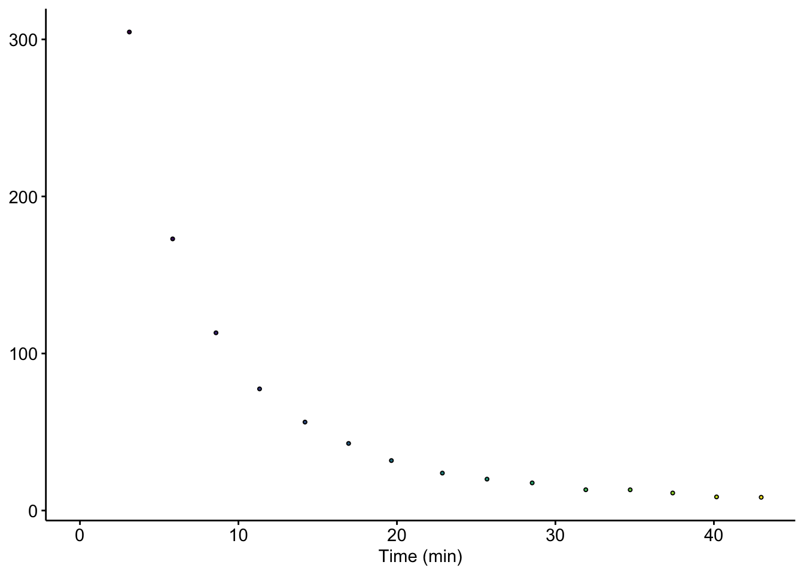

--------

# Notes

Links to IDA processing and to supp figure.

Panel A is a diagram.

----

Setup packages and plotting for the notebook:


```r
# Load packages
library(tidyverse)
library(cowplot)
library(kableExtra)

# Code display options
knitr::opts_chunk$set(tidy.opts=list(width.cutoff=60),tidy=FALSE, echo = TRUE, message=FALSE, warning=FALSE, fig.align="center", fig.retina = 2)

# Load plotting tools
source("../../tools/plotting_tools.R")


#Modify the plot theme
theme_1 <- function () {
  theme_classic( ) %+replace%
    theme(
      axis.line = element_line(color = 'black', size = 0.25),
      axis.ticks = element_line(color = 'black', size =0.25),
      axis.text = element_text( size=6),
      axis.title=element_text(size=6),
      strip.text = element_text(size = 6),
      strip.background = element_blank(),
      legend.background = element_blank(),
      legend.title=element_text(size=6),
      legend.text=element_text(size=6),
      legend.text.align=0,
      panel.spacing = unit(0,'cm'),
      plot.margin = margin(t=0.25, b = 0.25, l = 0.25, r = 0.25, unit = 'cm')
    )
}

theme_set(theme_1())
```

# Fig. 6B


# Fig. 6C


```r
df_swv <- read_csv("../../processing/data/phz_eDNA_2019_swv_raw_1_1.csv")
df_swv_sig <- read_csv("../../processing/data/phz_eDNA_2019_signals_long.csv") %>% 
  filter(echem == 'SWV' & exp == 1 & run == 1 & electrode == 'i1' & reactor == 'transfer')

# Plot Layout
plot_swv <- ggplot(df_swv %>% filter(E<=0), aes(x = E , y = current )) +
  geom_vline(xintercept = -0.265, linetype=2, color = 'gray') + 
  geom_path(aes(group = rep, color = rep)) + 
  geom_point(data = df_swv_sig, aes(x = E_from_maxs , y = current_from_maxs , fill = rep), shape = 21,size = 2) 

# Plot Styling
plot_swv_styled <- plot_swv + 
  annotate('text', x = -0.2, y = 3.5e-6,label = expression({E^0}[pyo]) )+
  scale_x_reverse(labels = mV_label)+
  scale_y_continuous(labels = nA_label)+
  scale_fill_viridis(guide = F) + 
  scale_color_viridis(guide = F) + 
  labs(x = "E (mV vs. Ag/AgCl)", y = expression(I[swv]~(n*A)), color = "Scan #") + 
  theme(legend.position = c(0.15,0.75), legend.background = element_blank())

plot_swv_styled
```


## Inset

convert to norm time??


```r
# Plot Layout
plot_swv_sig <- ggplot(data = df_swv_sig, aes(x = time, y = signal))+
  geom_point(shape = 21, size = 1, aes(fill = time))

# Plot Styling
plot_swv_sig_styled <- plot_swv_sig +
  labs(x = 'Time (min)', y = expression(I[swv]~(nA)), fill = 'Time (min)') +
  scale_fill_viridis(guide = F) +
  scale_y_continuous(labels = nA_label)+
  theme(axis.text = element_text(size = 6), axis.title = element_text(size = 8))

plot_swv_sig_styled
```


# Fig. 6D

need to mod

```r
df_gc <- read_csv("../../processing/data/phz_eDNA_2019_gc_raw_1_1.csv")
df_gc_sig <- read_csv("../../processing/data/phz_eDNA_2019_signals_long.csv") %>% 
  filter(echem == 'GC' & exp == 1 & run == 1 & reactor == 'transfer')


# Plot Layout
plot_gc <- ggplot() + 
  geom_vline(xintercept = -0.265, linetype=2, color = 'gray') + 
  geom_path(data=df_gc %>% filter(electrode=='i1'), 
            aes(x = E , y = current , group = rep, color = rep)) + 
  geom_path(data=df_gc %>% filter(electrode=='i2'), 
            aes(x = E , y = current, group = rep, color = rep)) +
  geom_point(data = df_gc_sig, 
             aes(x = E_from_maxs , y = -current_from_maxs , fill = rep), shape = 21, size = 2) 

# Plot styling
plot_gc_styled <- plot_gc +
  annotate('text', x = -0.2, y = 3.5e-7,label = expression({E^0}[pyo]) )+
  scale_x_reverse(labels = mV_label)+
  scale_y_continuous(labels = nA_label)+
  scale_fill_viridis(guide=F) + 
  scale_color_viridis(guide=F) + 
  labs(x = "E (mV vs. Ag/AgCl)", y = expression(I[gc]~(nA)), color = "Scan #") + 
  theme(legend.position = c(0.15,0.75), 
        legend.background = element_blank())

plot_gc_styled
```


## Inset

need to mod

```r
# Plot Layout
plot_gc_sig <- ggplot(data = df_gc_sig, aes(x = time, y = signal))+
  geom_point(shape = 21, size = 1, aes(fill = time))

# Plot Styling
plot_gc_sig_styled <- plot_gc_sig +
  labs(x = 'Time (min)', y = expression(I[swv]~(nA)), fill = 'Time (min)') +
  scale_fill_viridis(guide = F) +
  scale_y_continuous(labels = nA_label)+
  theme(axis.text = element_text(size = 6), axis.title = element_text(size = 8))

plot_gc_sig_styled
```


# Fig. 6E

need to mod

```r
df_swv_gc_sig <- read_csv("../../processing/data/phz_eDNA_2019_swv_gc_signals.csv") %>% filter(exp == 1 & run == 1)

# Plot Layout
plot_swv_gc <- ggplot(df_swv_gc_sig %>% filter(rep>0), 
                           aes(x = signal_SWV, y = signal_GC)) +
  geom_smooth(method = 'lm', se = T, color = 'black', linetype = 2) +
  geom_point(shape = 21, size = 2, aes(fill = time_SWV))

# Plot Styling
plot_swv_gc_styled <- plot_swv_gc + 
  scale_x_continuous(breaks=c(0,2.5e-7,5.0e-7, 7.5e-7, 1.0e-6), labels = nA_label)+
  scale_y_continuous(labels = nA_label)+
  labs(x = expression(I[swv]~(nA)), y = expression(I[gc]~(nA))) +
  scale_fill_viridis(guide=F)


plot_swv_gc_styled
```



# Fig. 6F

Need to do this analysis in supp figure notebook first.

-----


```r
sessionInfo()
```

```
## R version 3.5.3 (2019-03-11)
## Platform: x86_64-apple-darwin15.6.0 (64-bit)
## Running under: macOS Mojave 10.14.6
## 
## Matrix products: default
## BLAS: /Library/Frameworks/R.framework/Versions/3.5/Resources/lib/libRblas.0.dylib
## LAPACK: /Library/Frameworks/R.framework/Versions/3.5/Resources/lib/libRlapack.dylib
## 
## locale:
## [1] en_US.UTF-8/en_US.UTF-8/en_US.UTF-8/C/en_US.UTF-8/en_US.UTF-8
## 
## attached base packages:
## [1] stats     graphics  grDevices utils     datasets  methods   base     
## 
## other attached packages:
##  [1] viridis_0.5.1     viridisLite_0.3.0 kableExtra_1.1.0 
##  [4] cowplot_0.9.4     forcats_0.4.0     stringr_1.4.0    
##  [7] dplyr_0.8.1       purrr_0.3.2       readr_1.3.1      
## [10] tidyr_0.8.3       tibble_2.1.3      ggplot2_3.2.1    
## [13] tidyverse_1.2.1  
## 
## loaded via a namespace (and not attached):
##  [1] tidyselect_0.2.5 xfun_0.7         haven_2.1.0      lattice_0.20-38 
##  [5] colorspace_1.4-1 generics_0.0.2   htmltools_0.3.6  yaml_2.2.0      
##  [9] rlang_0.4.0      pillar_1.4.2     glue_1.3.1       withr_2.1.2     
## [13] modelr_0.1.4     readxl_1.3.1     munsell_0.5.0    gtable_0.3.0    
## [17] cellranger_1.1.0 rvest_0.3.4      evaluate_0.14    labeling_0.3    
## [21] knitr_1.23       broom_0.5.2      Rcpp_1.0.2       scales_1.0.0    
## [25] backports_1.1.4  webshot_0.5.1    jsonlite_1.6     gridExtra_2.3   
## [29] hms_0.4.2        digest_0.6.21    stringi_1.4.3    grid_3.5.3      
## [33] cli_1.1.0        tools_3.5.3      magrittr_1.5     lazyeval_0.2.2  
## [37] crayon_1.3.4     pkgconfig_2.0.3  xml2_1.2.0       lubridate_1.7.4 
## [41] assertthat_0.2.1 rmarkdown_1.13   httr_1.4.0       rstudioapi_0.10 
## [45] R6_2.4.0         nlme_3.1-137     compiler_3.5.3
```

