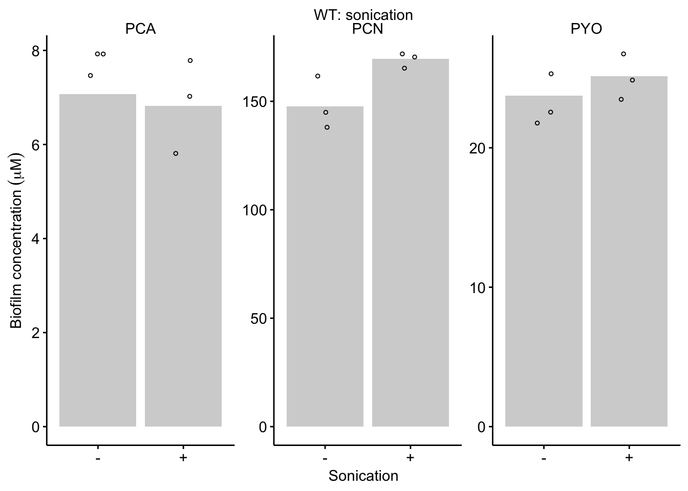

--------

# Notes

Fig S1A is a set of images.

----

Setup packages and plotting for the notebook:


```r
# Load packages
library(tidyverse)
library(cowplot)
library(kableExtra)
library(broom)
library(modelr)

# Code display options
knitr::opts_chunk$set(tidy.opts=list(width.cutoff=60),tidy=FALSE, echo = TRUE, message=FALSE, warning=FALSE, fig.align="center", fig.retina = 2)

# Load plotting tools
source("../../../tools/plotting_tools.R")


#Modify the plot theme
theme_set(theme_notebook())
```

# Fig. S1B


```r
df <- read_csv('../../../../data/LC-MS/WT_noMem_HPLC_03_08_18.csv')

#assumes colonies were ~200uL in size, resuspended in 3mL. 
df_corrected <- df %>% 
  mutate(phzConc=ifelse(Material=='biofilm',Amount * (3000 / 200), Amount * (8 / 5))) %>% 
  group_by(Material, Name) %>% 
  mutate(mean = ifelse(Replicate==1,mean(phzConc),NA))

noMem_plot <- ggplot(df_corrected,aes(x=Material,y=phzConc))+
  geom_col(aes(y = mean, fill = Material)) + 
  geom_jitter(height = 0, width = 0.1, shape = 21) +
  facet_wrap(~Name, scales = 'free')

#Plot styling
noMem_plot_styled <- noMem_plot +
  labs(x = NULL, y = expression("Phenazine concentration" ~ ( mu*M )), title = 'WT: no membrane') + 
  theme(axis.title.x = element_text(size = 14)) + 
  scale_fill_manual(guide = F, values = c("#66CCFF","#FFCC66"))
    
noMem_plot_styled     
```


# Fig. S1C


```r
wtSon_pdaMan <- read_csv("../../../../data/LC-MS/WTsonication_PDAmanual_08_29_18.csv") %>% 
  mutate(calcConc = Amount*2*(800 / 62)) %>% #Dilution factor
  group_by(measured_phenazine, Condition) %>% 
  mutate(mean = ifelse(Rep==1,mean(calcConc),NA))

# Plot layout
wtSon_pdaMan_plot <- ggplot(wtSon_pdaMan, aes(x = Condition, y = calcConc)) +
  geom_col(aes(y = mean), fill = 'light gray')+
  geom_jitter(shape = 21, height = 1, width = 0.1) + 
  facet_wrap(~measured_phenazine, scales = 'free') + 
  ylim(0,NA)

#Plot styling
wtSon_pdaMan_plot_styled <- wtSon_pdaMan_plot +
  labs(x = NULL, y = expression("Biofilm concentration" ~ ( mu*M )), title = 'WT: sonication') + 
  theme(axis.title.x = element_text(size = 14)) + 
  scale_fill_manual(guide = F, values = c("#66CCFF","#FFCC66")) + 
  scale_x_discrete(breaks = c('noSon','withSon'), 
                   labels=c("-","+"))
    
wtSon_pdaMan_plot_styled     
```




```r
wtSon_pdaMan %>% 
  spread(Condition,calcConc) %>% 
  group_by(measured_phenazine) %>% 
  summarise(conf_int_low = t.test(noSon, withSon,  alternative = 'less')$conf.int[1],
            conf_int_high = t.test(noSon,withSon, alternative = 'less')$conf.int[2],
            p_value = t.test( noSon,withSon, alternative = 'less')$p.value)
```

```
## # A tibble: 3 x 4
##   measured_phenazine conf_int_low conf_int_high p_value
##   <chr>                     <dbl>         <dbl>   <dbl>
## 1 PCA                        -Inf          1.12  0.733 
## 2 PCN                        -Inf         -2.96  0.0378
## 3 PYO                        -Inf          1.26  0.161
```


# Create figure


```r
theme_set(theme_figure())

fig_s1 <- plot_grid(noMem_plot_styled, wtSon_pdaMan_plot_styled, labels = c('B','C'), label_size = 12, align = 'hv', axis = 'tblr')

fig_s1
```


```r
save_plot("../../../../figures/supplement/phz2019_Fig_S1.pdf", fig_s1,base_width = 7, base_height = 3)
```

-------


```r
sessionInfo()
```

```
## R version 3.5.2 (2018-12-20)
## Platform: x86_64-apple-darwin15.6.0 (64-bit)
## Running under: macOS Mojave 10.14.6
## 
## Matrix products: default
## BLAS: /Library/Frameworks/R.framework/Versions/3.5/Resources/lib/libRblas.0.dylib
## LAPACK: /Library/Frameworks/R.framework/Versions/3.5/Resources/lib/libRlapack.dylib
## 
## locale:
## [1] en_US.UTF-8/en_US.UTF-8/en_US.UTF-8/C/en_US.UTF-8/en_US.UTF-8
## 
## attached base packages:
## [1] stats     graphics  grDevices utils     datasets  methods   base     
## 
## other attached packages:
##  [1] viridis_0.5.1     viridisLite_0.3.0 modelr_0.1.2     
##  [4] broom_0.5.1       kableExtra_1.0.1  cowplot_0.9.4    
##  [7] forcats_0.3.0     stringr_1.3.1     dplyr_0.8.1      
## [10] purrr_0.2.5       readr_1.3.1       tidyr_0.8.2      
## [13] tibble_2.1.3      ggplot2_3.2.0     tidyverse_1.2.1  
## 
## loaded via a namespace (and not attached):
##  [1] tidyselect_0.2.5 xfun_0.7         haven_2.0.0      lattice_0.20-38 
##  [5] colorspace_1.4-0 generics_0.0.2   htmltools_0.3.6  yaml_2.2.0      
##  [9] utf8_1.1.4       rlang_0.4.0      pillar_1.3.1     glue_1.3.1      
## [13] withr_2.1.2      readxl_1.2.0     munsell_0.5.0    gtable_0.2.0    
## [17] cellranger_1.1.0 rvest_0.3.2      evaluate_0.14    labeling_0.3    
## [21] knitr_1.23       fansi_0.4.0      Rcpp_1.0.1       scales_1.0.0    
## [25] backports_1.1.3  webshot_0.5.1    jsonlite_1.6     gridExtra_2.3   
## [29] hms_0.4.2        digest_0.6.18    stringi_1.2.4    grid_3.5.2      
## [33] cli_1.1.0        tools_3.5.2      magrittr_1.5     lazyeval_0.2.1  
## [37] crayon_1.3.4     pkgconfig_2.0.2  xml2_1.2.0       lubridate_1.7.4 
## [41] assertthat_0.2.1 rmarkdown_1.13   httr_1.4.0       rstudioapi_0.9.0
## [45] R6_2.4.0         nlme_3.1-140     compiler_3.5.2
```
