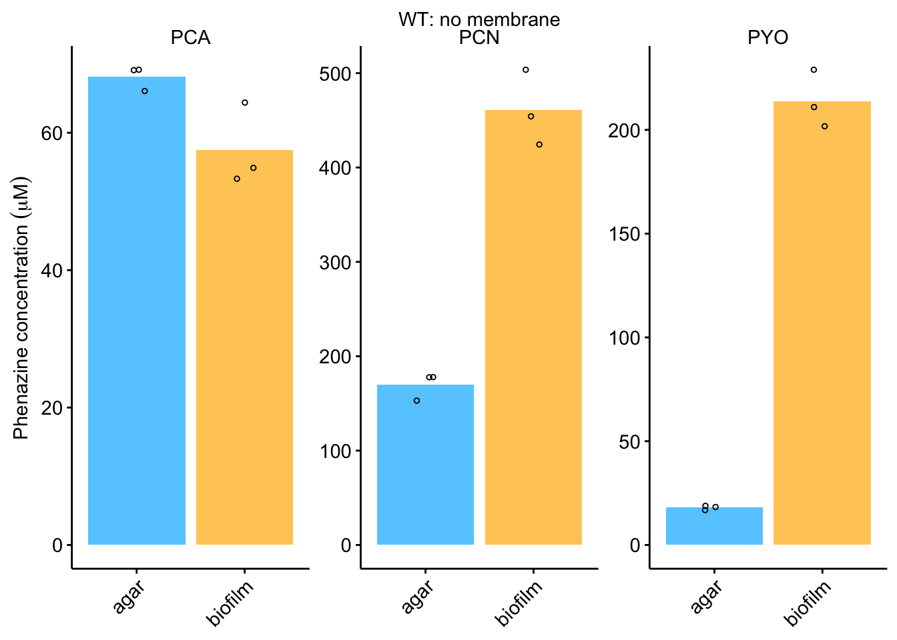

--------

# Notes

Fig S1A and S1B are a sets of images.

----

Setup packages and plotting for the notebook:


```r
# Check packages
source("../../../tools/package_setup.R")

# Load packages
library(tidyverse)
library(cowplot)
library(kableExtra)
library(broom)
library(modelr)

# Code display options
knitr::opts_chunk$set(tidy.opts=list(width.cutoff=60),tidy=FALSE, echo = TRUE, message=FALSE, warning=FALSE, fig.align="center", fig.retina = 2)

# Load plotting tools
source("../../../tools/plotting_tools.R")


#Modify the plot theme
theme_set(theme_notebook())
```

# Fig. S1C - Biofilms without membrane

Let's read in the data and we will calculate the biofilm concentration by assuming the colony was about 200 µL in size and resuspended in 3 mL, while the agar is the same as elsewhere (5 mL volume with 3 mL PBS added = 8 mL total).


```r
df <- read_csv('../../../../data/LC-MS/WT_noMem_HPLC_03_08_18.csv')

#assumes colonies were ~200uL in size, resuspended in 3mL. 
df_corrected <- df %>% 
  mutate(phzConc=ifelse(Material=='biofilm',Amount * (3000 / 200), Amount * (8 / 5))) %>% 
  group_by(Material, Name) %>% 
  mutate(mean = ifelse(Replicate==1,mean(phzConc),NA))

noMem_plot <- ggplot(df_corrected,aes(x=Material,y=phzConc))+
  geom_col(aes(y = mean, fill = Material)) + 
  geom_jitter(height = 0, width = 0.1, shape = 21, size =1) +
  facet_wrap(~Name, scales = 'free')

#Plot styling
noMem_plot_styled <- noMem_plot +
  labs(x = NULL, y = expression("Phenazine concentration" ~ ( mu*M )), title = 'WT: no membrane') + 
  scale_fill_manual(guide = F, values = c("#66CCFF","#FFCC66")) + theme(axis.text.x = element_text(angle = 45, hjust = 1))
    
noMem_plot_styled     
```



# Fig. S1D - Biofilms with sonication

Let's read in the +/- sonication data and calculate the concentration as done in Fig. 1:

```r
wtSon_pdaMan <- read_csv("../../../../data/LC-MS/WTsonication_PDAmanual_08_29_18.csv") %>% 
  mutate(calcConc = Amount*2*(800 / 62)) %>% #Dilution factor
  group_by(measured_phenazine, Condition) %>% 
  mutate(mean = ifelse(Rep==1,mean(calcConc),NA))

# Plot layout
wtSon_pdaMan_plot <- ggplot(wtSon_pdaMan, aes(x = Condition, y = calcConc)) +
  geom_col(aes(y = mean), fill = 'light gray')+
  geom_jitter(shape = 21, height = 1, width = 0.1, size =1) + 
  facet_wrap(~measured_phenazine, scales = 'free') + 
  ylim(0,NA)

#Plot styling
wtSon_pdaMan_plot_styled <- wtSon_pdaMan_plot +
  labs(x = 'Sonication', y = expression("Biofilm concentration" ~ ( mu*M )), title = 'WT: sonication') + 
  scale_x_discrete(breaks = c('noSon','withSon'), 
                   labels=c("-","+"))
    
wtSon_pdaMan_plot_styled     
```


It looks like there may be a slightly higher biofilm concentration upon sonication. Let's perform a statistical test:


```r
wtSon_pdaMan %>% 
  spread(Condition,calcConc) %>% 
  group_by(measured_phenazine) %>% 
  summarise(conf_int_low = t.test(withSon,noSon,   alternative = 'greater')$conf.int[1],
            conf_int_high = t.test(withSon, noSon,alternative = 'greater')$conf.int[2],
            p_value = t.test( withSon,noSon, alternative = 'greater')$p.value)
```

```
## # A tibble: 3 x 4
##   measured_phenazine conf_int_low conf_int_high p_value
##   <chr>                     <dbl>         <dbl>   <dbl>
## 1 PCA                       -1.12           Inf  0.733 
## 2 PCN                        2.96           Inf  0.0378
## 3 PYO                       -1.26           Inf  0.161
```

It appears there is a statistically significant difference for PCN at p<0.05.

# Fig. S1E - ∆phz* retention

Let's read in the ∆phz* retention data.

```r
pdaMan_data <- read_csv("../../../../data/LC-MS/dPHZstar_PDAmanual_PHZretention_08_29_18.csv") %>% 
  mutate(calcConc = Amount * 2 *(800 / 62) ) %>% 
  group_by(Condition,Day,measured_phenazine) %>% 
  mutate(mean = ifelse(Rep==1,mean(calcConc),NA))
```

Here's a plot of the data for all 3 phenazines incubated simultaneously:

```r
dphz_ret_pdaMan_plot <- ggplot(pdaMan_data %>% filter(Condition =='PHZ'), aes(x = Day, y = calcConc, )) + 
  geom_col(aes(y = mean,fill = Day))+
  geom_jitter(height = 0, width = 0.1, shape = 21) +
  facet_wrap(~measured_phenazine, scales = 'free') + 
  ylim(0,NA)

#Plot styling
dphz_ret_pdaMan_plot_styled <- dphz_ret_pdaMan_plot +
  labs(x = NULL, y = "Phenazine Concentration") + 
  theme(axis.title.x = element_text(size = 14)) + 
  scale_fill_manual(guide = F, values = c("#66CCFF","#FFCC66")) + 
  scale_x_discrete(breaks = c('D3','D4'), 
                   labels=c("Day 3","Day 4"))

dphz_ret_pdaMan_plot_styled
```


And here is the final plot where ∆phz* biofilms were incubated with individual phenazines:


```r
pdaMan_indPhz_plot <- ggplot(pdaMan_data %>% filter(Condition == measured_phenazine), aes(x = Day, y = calcConc, )) + 
  geom_col(aes(y = mean), fill='light gray')+
  geom_jitter(height = 0, width = 0.1, shape = 21, size = 1) +
  facet_wrap(~measured_phenazine, scales = 'free') + 
  ylim(0,NA)

#Plot styling
pdaMan_indPhz_plot_styled <- pdaMan_indPhz_plot +
  labs(x = NULL, y = expression("Biofilm concentration" ~ (mu*M )), title = '∆phz*') + 
  theme(axis.title.x = element_text(size = 14),axis.text.x = element_text(angle = 45, hjust = 1)) + 
  scale_fill_manual(guide = F, values = c("#66CCFF","#FFCC66")) + 
  scale_x_discrete(breaks = c('D3','D4'), labels=c("Day 3","Day 4"))

pdaMan_indPhz_plot_styled
```


# Create figure


```r
theme_set(theme_figure())

fig_s1 <- plot_grid(noMem_plot_styled, wtSon_pdaMan_plot_styled, pdaMan_indPhz_plot_styled, 
                    labels = c('C','D','E'), ncol = 3, label_size = 12, scale = 0.95)

fig_s1
```


```r
save_plot("../../../../figures/supplement/phz2019_Fig_S1.pdf", fig_s1,base_width = 7, base_height = 2)
```

-------


```r
sessionInfo()
```

```
## R version 3.5.3 (2019-03-11)
## Platform: x86_64-apple-darwin15.6.0 (64-bit)
## Running under: macOS  10.15.6
## 
## Matrix products: default
## BLAS: /Library/Frameworks/R.framework/Versions/3.5/Resources/lib/libRblas.0.dylib
## LAPACK: /Library/Frameworks/R.framework/Versions/3.5/Resources/lib/libRlapack.dylib
## 
## locale:
## [1] en_US.UTF-8/en_US.UTF-8/en_US.UTF-8/C/en_US.UTF-8/en_US.UTF-8
## 
## attached base packages:
## [1] stats     graphics  grDevices utils     datasets  methods   base     
## 
## other attached packages:
##  [1] lubridate_1.7.4   hms_0.5.3         modelr_0.1.5     
##  [4] broom_0.5.2       kableExtra_1.1.0  cowplot_0.9.4    
##  [7] viridis_0.5.1     viridisLite_0.3.0 knitr_1.23       
## [10] forcats_0.4.0     stringr_1.4.0     dplyr_0.8.3      
## [13] purrr_0.3.3       readr_1.3.1       tidyr_1.0.0      
## [16] tibble_2.1.3      ggplot2_3.3.0     tidyverse_1.3.0  
## 
## loaded via a namespace (and not attached):
##  [1] tidyselect_0.2.5 xfun_0.7         haven_2.2.0      lattice_0.20-38 
##  [5] colorspace_1.4-1 vctrs_0.3.1      generics_0.0.2   htmltools_0.4.0 
##  [9] yaml_2.2.0       utf8_1.1.4       rlang_0.4.6      pillar_1.4.2    
## [13] glue_1.3.1       withr_2.1.2      DBI_1.0.0        dbplyr_1.4.2    
## [17] readxl_1.3.1     lifecycle_0.1.0  munsell_0.5.0    gtable_0.3.0    
## [21] cellranger_1.1.0 rvest_0.3.5      evaluate_0.14    labeling_0.3    
## [25] fansi_0.4.0      Rcpp_1.0.2       scales_1.0.0     backports_1.1.4 
## [29] webshot_0.5.1    jsonlite_1.6     fs_1.3.1         gridExtra_2.3   
## [33] digest_0.6.21    stringi_1.4.3    grid_3.5.3       cli_1.1.0       
## [37] tools_3.5.3      magrittr_1.5     crayon_1.3.4     pkgconfig_2.0.3 
## [41] xml2_1.2.2       reprex_0.3.0     assertthat_0.2.1 rmarkdown_1.13  
## [45] httr_1.4.1       rstudioapi_0.10  R6_2.4.0         nlme_3.1-137    
## [49] compiler_3.5.3
```
