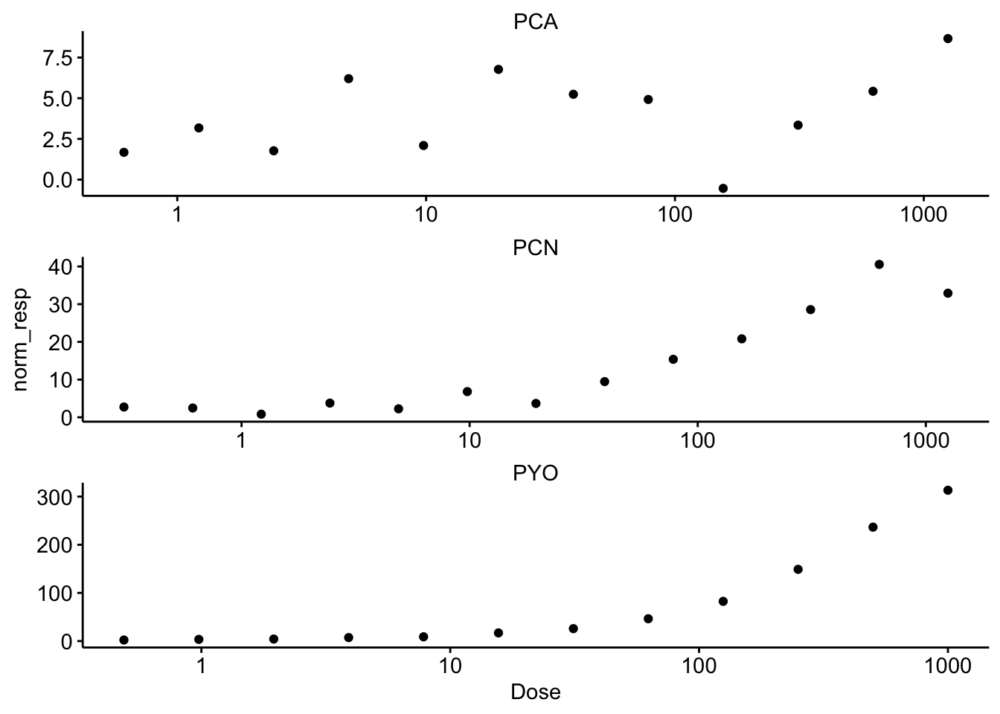
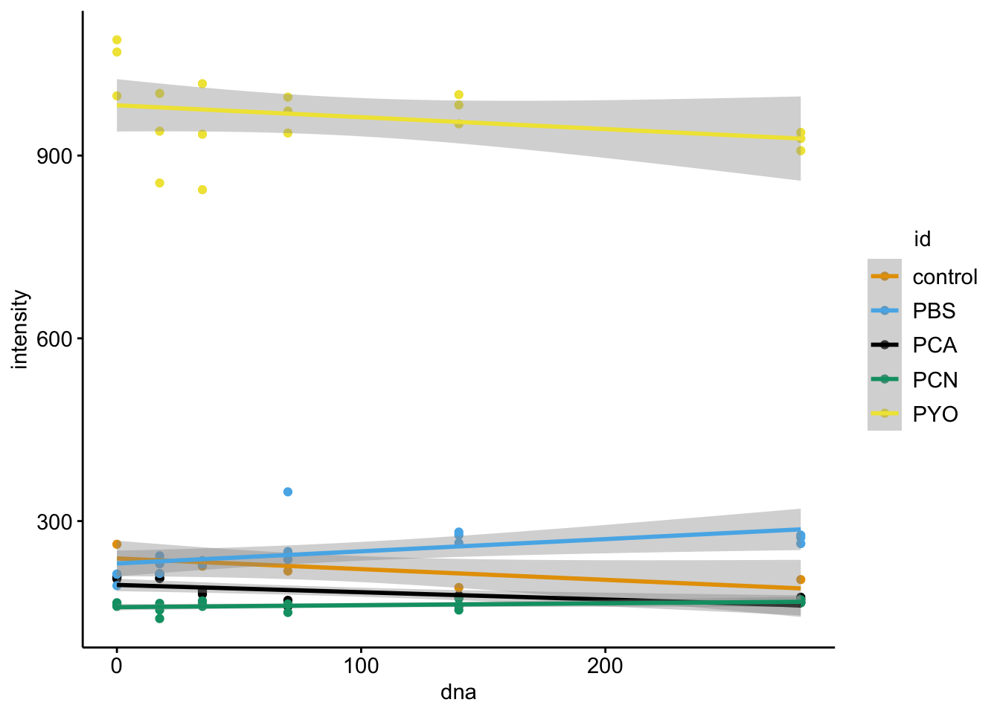
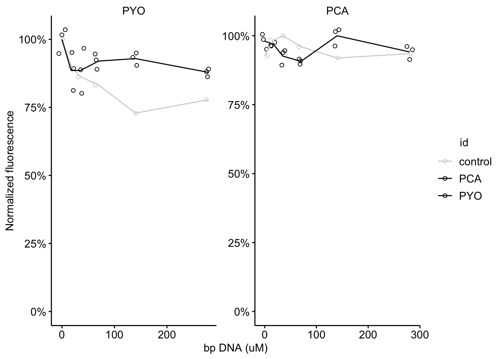

--------

# Notes


----

Setup packages and plotting for the notebook:


```r
# Load packages
library(tidyverse)
library(cowplot)
library(kableExtra)
library(broom)
library(modelr)

# Code display options
knitr::opts_chunk$set(tidy.opts=list(width.cutoff=60),tidy=FALSE, echo = TRUE, message=FALSE, warning=FALSE, fig.align="center", fig.retina = 2)

# Load plotting tools
source("../../../tools/plotting_tools.R")


#Modify the plot theme
theme_set(theme_notebook())
```

# Fig. S2A - EtBr binding


```r
etbr_data <- read_csv("../../../../data/Spectroscopy/phz_etbr_competitive_binding.csv") %>% 
  gather(key = 'rep', value = 'fluor', -phz_conc, -phz_mol)

# Plot layout
etbr_plot <- ggplot(etbr_data %>% filter(phz_conc>0), aes(x = phz_conc, y = fluor)) + 
  geom_point(shape = 21) + 
  geom_smooth(color = 'black', linetype = 2) + 
  facet_wrap(~phz_mol, scales = 'free', ncol = 1) + 
  ylim(0,2000)

# Plot styling
etbr_plot_styled <- etbr_plot +
  labs(x = expression("Added phenazine"~(mu*M)), y = 'Ethidium Fluorescence') + 
  scale_x_log10(breaks = c(0.1, 1, 10, 100, 1000), labels = c("0.1", "1", "10", "100", "1000"))
  
etbr_plot_styled
```


```r
etbr_data %>% group_by(phz_mol, phz_conc) %>% summarise(mean_fluor = mean(fluor)) 
```

```
## # A tibble: 30 x 3
## # Groups:   phz_mol [3]
##    phz_mol phz_conc mean_fluor
##    <chr>      <dbl>      <dbl>
##  1 PCA          0        1117.
##  2 PCA          0.1       840.
##  3 PCA          1         833.
##  4 PCA          5         808.
##  5 PCA         10         733.
##  6 PCA         50         874.
##  7 PCA        100         665.
##  8 PCA        500         986.
##  9 PCA        750        1173.
## 10 PCA       1000        1310.
## # … with 20 more rows
```


```r
etbr_model_pyo <- nls(data = etbr_data %>% 
                        filter(phz_conc>0 & phz_mol=='PYO'), 
                      formula = fluor~max - (max*(phz_conc^hill)/((ic50^hill)+(phz_conc^hill))),
                      start=c(max=1500,hill=1,ic50=300))

etbr_model_pyo_CI <- tidy(etbr_model_pyo, conf.int = T) %>% filter(term=='ic50')


etbr_model_pcn <- nls(data = etbr_data %>% 
                        filter(phz_conc>0 & phz_mol=='PCN'), 
                      formula = fluor~max - (max*(phz_conc^hill)/((ic50^hill)+(phz_conc^hill))),
                      start=c(max=1500,hill=1,ic50=300))

#confint(etbr_model_pcn)

summary(etbr_model_pyo)
```

```
## 
## Formula: fluor ~ max - (max * (phz_conc^hill)/((ic50^hill) + (phz_conc^hill)))
## 
## Parameters:
##       Estimate Std. Error t value Pr(>|t|)    
## max  1500.3331    35.0905  42.756  < 2e-16 ***
## hill    2.1260     0.3267   6.507 7.40e-08 ***
## ic50  275.0070    36.2560   7.585 2.14e-09 ***
## ---
## Signif. codes:  0 '***' 0.001 '**' 0.01 '*' 0.05 '.' 0.1 ' ' 1
## 
## Residual standard error: 164.2 on 42 degrees of freedom
## 
## Number of iterations to convergence: 5 
## Achieved convergence tolerance: 3.408e-06
```

```r
etbr_model_pcn_CI <- tidy(etbr_model_pcn) %>% filter(term=='ic50') %>% 
  mutate(conf.low = estimate - (1.96 * std.error)) %>% 
  mutate(conf.high = estimate + (1.96 * std.error))

etbr_pred_pyo <- etbr_data %>% filter(phz_mol=='PYO') %>% add_predictions(etbr_model_pyo)

etbr_pred_pyo <- etbr_data %>% filter(phz_mol=='PYO') %>% 
  mutate(max = coef(etbr_model_pyo)[1], hill = coef(etbr_model_pyo)[2], ic50 = coef(etbr_model_pyo)[3]) %>% 
  mutate(ic50_high = etbr_model_pyo_CI$conf.high,ic50_low = etbr_model_pyo_CI$conf.low) %>% 
  mutate(pred = max - (max*(phz_conc^hill)/((ic50^hill)+(phz_conc^hill)))) %>% 
  mutate(pred_high = max - (max*(phz_conc^hill)/((ic50_high^hill)+(phz_conc^hill)))) %>% 
  mutate(pred_low = max - (max*(phz_conc^hill)/((ic50_low^hill)+(phz_conc^hill))))

etbr_pred_pcn <- etbr_data %>% filter(phz_mol=='PCN') %>% 
  mutate(max = coef(etbr_model_pcn)[1], hill = coef(etbr_model_pcn)[2], ic50 = coef(etbr_model_pcn)[3]) %>% 
  mutate(ic50_high = etbr_model_pcn_CI$conf.high,ic50_low = etbr_model_pcn_CI$conf.low) %>% 
  mutate(pred = max - (max*(phz_conc^hill)/((ic50^hill)+(phz_conc^hill)))) %>% 
  mutate(pred_high = max - (max*(phz_conc^hill)/((ic50_high^hill)+(phz_conc^hill)))) %>% 
  mutate(pred_low = max - (max*(phz_conc^hill)/((ic50_low^hill)+(phz_conc^hill))))

#etbr_pred_pcn <- etbr_data %>% filter(phz_mol=='PCN') %>% add_predictions(etbr_model_pcn)

ggplot(etbr_pred_pyo, aes(x = phz_conc, y = fluor)) + 
  geom_ribbon(aes(ymin = pred_low, ymax = pred_high), fill = 'light gray')+
  geom_line(aes(y = pred), linetype = 2) + 
  geom_point(shape = 21) + 
  scale_x_log10()
```


```r
ggplot(etbr_pred_pcn, aes(x = phz_conc, y = fluor)) + 
  geom_ribbon(aes(ymin = pred_low, ymax = pred_high), fill = 'light gray')+
  geom_line(aes(y = pred), linetype = 2) + 
  geom_point(shape = 21) + 
  scale_x_log10()
```


```r
ggplot(etbr_data %>% filter(phz_conc>0 & phz_mol=='PYO') %>% mutate(norm_fluor = -fluor + 1500), 
       aes(x = phz_conc, y = norm_fluor)) + 
  geom_point(shape = 21) + 
  scale_x_log10()
```


```r
etbr_preds = bind_rows(etbr_pred_pyo, etbr_pred_pcn, etbr_data %>% filter(phz_mol=='PCA'))

etbr_plot <- ggplot(etbr_preds %>% filter(phz_conc>=1), aes(x = phz_conc, y = fluor)) + 
  geom_ribbon(aes(ymin = pred_low, ymax = pred_high), fill = 'light gray')+
  geom_line(aes(y = pred), linetype = 2, size = 0.5) + 
  geom_point(shape = 21, size = 1) + 
  facet_wrap(~phz_mol, scales = 'free', ncol = 1)

etbr_plot_styled <- etbr_plot +
  labs(x = expression("Added phenazine"~(mu*M)), y = 'Ethidium Fluorescence') + 
  scale_x_log10(breaks = c(0.1, 1, 10, 100, 1000), labels = c("0.1", "1", "10", "100", "1000"))
  
etbr_plot_styled
```


```r
etbr_kd = 1 #uM

etbr_conc = 5 #uM 
```

$$K_i = \frac{IC_{50}}{1+\frac{[EtBr]}{K_d}}$$

$$K_i = \frac{IC_{50}}{6}$$

For PCN Ki = 612 / 6 = 102uM
PCN low Ki = 450 / 6 = 75
PCN high Ki = 774 / 6 = 129

For PYO Ki = 275 / 6 = 45.8 uM
PYO low Ki = 214 / 6 = 35.8
PYO high Ki = 364 / 6 = 60.7


```r
#save_plot("../figures/03_14_19_fig_supp_etbr.pdf", etbr_plot_styled ,base_width = 4, base_height = 6 )
```

# Fig. S2B - MST data


```r
mst_data <- read_csv("../../../../data/Spectroscopy/MST_data_phz_DNA.csv") %>% 
  mutate(norm_resp = Response - 640)

ggplot(mst_data, aes(x = Dose, y = norm_resp)) + 
  geom_point() + 
  geom_smooth(method='nls',
              formula=y~max*(x^hill)/((Kd^hill)+(x^hill)),
              method.args=list(start=c(max=400,hill=1,Kd=100)),
              se=F, color = 'black', linetype = 'dashed', size = 0.5) +
  facet_wrap(~phz_mol, scales = 'free', ncol=1)
```


```r
model_pyo <- nls(data = mst_data %>% filter(phz_mol=='PYO') ,formula = norm_resp~max*(Dose^hill)/((Kd^hill)+(Dose^hill)),start=c(max=400,hill=1,Kd=100) )
  
model_pcn <- nls(data = mst_data %>% filter(phz_mol=='PCN') ,formula = norm_resp~max*(Dose^hill)/((Kd^hill)+(Dose^hill)),start=c(max=400,hill=1,Kd=100) )

confint_pyo <- tidy(model_pyo, conf.int = T) %>% filter(term=='Kd')

summary(model_pcn)
```

```
## 
## Formula: norm_resp ~ max * (Dose^hill)/((Kd^hill) + (Dose^hill))
## 
## Parameters:
##      Estimate Std. Error t value Pr(>|t|)    
## max   41.8984     6.5341   6.412 7.71e-05 ***
## hill   0.9454     0.2421   3.905  0.00294 ** 
## Kd   133.6391    62.5762   2.136  0.05846 .  
## ---
## Signif. codes:  0 '***' 0.001 '**' 0.01 '*' 0.05 '.' 0.1 ' ' 1
## 
## Residual standard error: 3.22 on 10 degrees of freedom
## 
## Number of iterations to convergence: 10 
## Achieved convergence tolerance: 3.571e-06
```

```r
confint_pcn <- tidy(model_pcn) %>% filter(term=='Kd') %>% 
  mutate(conf.low = estimate - (1.96*std.error), conf.high = estimate + (1.96*std.error))
  
pred_pyo <- mst_data %>% filter(phz_mol=='PYO') %>% 
  mutate(max = coef(model_pyo)[1], hill = coef(model_pyo)[2], kd = coef(model_pyo)[3]) %>% 
  mutate(kd_low = confint_pyo$conf.low,kd_high = confint_pyo$conf.high ) %>% 
  mutate(pred = max*(Dose^hill)/((kd^hill)+(Dose^hill))) %>% 
  mutate(pred_low = max*(Dose^hill)/((kd_low^hill)+(Dose^hill))) %>% 
  mutate(pred_high = max*(Dose^hill)/((kd_high^hill)+(Dose^hill))) 

pred_pcn <- mst_data %>% filter(phz_mol=='PCN') %>% 
  mutate(max = coef(model_pcn)[1], hill = coef(model_pcn)[2], kd = coef(model_pcn)[3]) %>% 
  mutate(kd_low = confint_pcn$conf.low,kd_high = confint_pcn$conf.high ) %>% 
  mutate(pred = max*(Dose^hill)/((kd^hill)+(Dose^hill))) %>% 
  mutate(pred_low = max*(Dose^hill)/((kd_low^hill)+(Dose^hill))) %>% 
  mutate(pred_high = max*(Dose^hill)/((kd_high^hill)+(Dose^hill))) 

preds <- bind_rows(pred_pyo,pred_pcn,mst_data %>% filter(phz_mol=='PCA'))

# Plot layout
mst_plot <- ggplot(preds, aes(x = Dose, y = norm_resp)) + 
  geom_ribbon(aes(ymin = pred_low, ymax = pred_high), fill = 'light gray')+
  geom_line(aes(y = pred), linetype = 2, size = 0.5) +
  geom_point(shape = 21, size = 1) + 
  facet_wrap(~phz_mol, scales = 'free',ncol=1)+ 
  scale_x_log10()

# Plot styling
mst_plot_styled <- mst_plot +
  labs(x = expression("Added phenazine"~(mu*M)), y = "Thermophoresis response")

mst_plot_styled
```


Kd for PCN = 133.6 uM
Kd for PYO = 536.4 uM (but doesn't saturate)

# Fig. S2C - PHZred binding


## Import data


```r
df_360 <- read_csv("../../../../data/Spectroscopy/2019_10_09_PHZred_top_360-460.csv") %>% 
  gather(key = 'column', value = 'intensity', -row)

df_485 <- read_csv("../../../../data/Spectroscopy/2019_10_09_PHZred_top_485-528.csv") %>% 
  gather(key = 'column', value = 'intensity', -row)

df_meta <- read_csv("../../../../data/Spectroscopy/2019_10_09_PHZred_well_metadata.csv") %>% 
  gather(key = 'column', value = 'id', -row)

df_360_meta <- left_join(df_360, df_meta, by = c('row','column')) %>% 
  mutate(dna = case_when(
    column %in% c(1,7) ~ 0,
    column %in% c(2,8) ~ 17.5,
    column %in% c(3,9) ~ 35,
    column %in% c(4,10) ~ 70,
    column %in% c(5,11) ~ 140,
    column %in% c(6,12) ~ 280,
  ))

df_485_meta <- left_join(df_485, df_meta, by = c('row','column')) %>% 
    mutate(dna = case_when(
    column %in% c(1,7) ~ 0,
    column %in% c(2,8) ~ 17.5,
    column %in% c(3,9) ~ 35,
    column %in% c(4,10) ~ 70,
    column %in% c(5,11) ~ 140,
    column %in% c(6,12) ~ 280,
  ))
```


## 360nm ex


```r
ggplot(df_360_meta %>% filter(id %in% c('control','PBS','PCA','PCN','PYO')), aes(x = dna, y = intensity)) + geom_point() + facet_wrap(~id, scales = 'free')
```



```r
ggplot(df_360_meta %>% filter(id %in% c('control','PBS','PCA','PCN','PYO')), aes(x = dna, y = intensity, color = id)) + geom_point() + geom_smooth(method = 'lm')
```




```r
#ggplot(df_360_meta %>% filter(id=='empty'), aes(x = as.integer(column), y = intensity, color = row)) + geom_point()

#ggplot(df_360_meta %>% filter(id=='PBS'), aes(x = as.integer(column), y = intensity, color = row)) + geom_point()

#ggplot(df_360_meta %>% filter(id %in% c('empty','PBS')), aes(x = as.integer(column), y = intensity, color = id)) + geom_point()
```


```r
ggplot(df_360_meta %>% filter(id %in% c('control','PBS','PCA')), aes(x = as.integer(column), y = intensity, color = id)) + geom_point()
```


```r
ggplot(df_360_meta %>% filter(id %in% c('empty','PBS','PCN')), aes(x = as.integer(column), y = intensity, color = id)) + geom_point()
```


```r
ggplot(df_360_meta %>% filter(id %in% c('control','PBS','PYO')), aes(x = as.integer(column), y = intensity, color = id)) + geom_point()
```


```r
#ggplot(df_360_meta %>% filter(id %in% c('PYO')), aes(x = dna, y = intensity, color = id)) + geom_point()

#ggplot(df_360_meta %>% filter(id %in% c('PBS')), aes(x = dna, y = intensity, color = id)) + geom_jitter(shape = 21)
```

## 485nm ex


```r
ggplot(df_485_meta %>% filter(id %in% c('control','empty','PBS','PCA','PCN','PYO')), aes(x = dna, y = intensity)) + geom_point() + facet_wrap(~id, scales = 'free')
```


```r
ggplot(df_485_meta %>% filter(id %in% c('control','empty','PBS','PCA','PCN','PYO')), aes(x = dna, y = intensity, color = id)) + geom_point() + geom_smooth(method = 'lm')
```


## Figure 


```r
df_fig <- bind_rows(df_360_meta %>% group_by(id, dna) %>% mutate(mean = mean(intensity)) %>% filter(id %in% c('PYO','PBS','control')) %>% mutate(ex = '360'),
          df_485_meta %>% group_by(id, dna) %>% mutate(mean = mean(intensity)) %>% filter(id %in% c('PCA','PBS','control')) %>% mutate(ex = '485')
          )

df_fig <- df_fig %>% group_by(id,ex) %>% mutate(max = max(mean)) %>% mutate(norm_int = intensity / max, norm_mean = mean / max)

#ggplot(df_fig, aes(x = dna, y = norm_int, color = id, shape = ex)) + geom_point()

#ggplot(df_fig, aes(x = dna, y = norm_mean, color = id, shape = ex)) + geom_point()

#ggplot(df_fig, aes(x = dna, y = norm_mean, color = id, shape = ex, linetype = ex)) + geom_point(aes(y = norm_int)) + geom_line() + ylim(0,NA)

ggplot(df_fig, aes(x = dna, y = norm_mean, color = id)) + geom_point(aes(y = norm_int)) + geom_line() + ylim(0,NA) + facet_wrap(~ex)
```


```r
#ggplot(df_fig %>% filter(id != 'PBS'), aes(x = dna, y = norm_mean, color = id)) + geom_jitter(aes(y = norm_int)) + geom_line() + ylim(0,NA)

facet_names <- list(
  '360'="PYO",
  '485'="PCA"
)

facet_labeller <- function(variable,value){
  return(facet_names[value])
}

ggplot(df_fig %>% filter(id != 'PBS'), aes(x = dna, y = norm_mean, color = id)) + geom_jitter(aes(y = norm_int), shape = 21) + geom_line() + 
  facet_wrap(~ex, labeller = facet_labeller, scales = 'free') + 
  scale_color_manual(values = c('light gray','black','black')) + scale_y_continuous(labels = scales::percent, limits = c(0,NA)) + 
  labs(x = 'bp DNA (uM)', y = 'Normalized fluorescence')
```



Trying to make figure to match etbr and mst data:


```r
df_fig_2 <- bind_rows(df_360_meta %>% group_by(id, dna) %>% mutate(mean = mean(intensity)) %>% filter(id %in% c('PYO','control')) %>% mutate(ex = '360_PYO'),
          df_485_meta %>% group_by(id, dna) %>% mutate(mean = mean(intensity)) %>% filter(id %in% c('PCA','control')) %>% mutate(ex = '485_PCA'),
          df_485_meta %>% group_by(id, dna) %>% mutate(mean = mean(intensity)) %>% filter(id %in% c('PCN','PBS')) %>% mutate(ex = '485_PCN')
          )

df_fig_2 <- df_fig_2 %>% group_by(id,ex) %>% mutate(max = max(mean)) %>% mutate(norm_int = intensity / max, norm_mean = mean / max) %>% 
  ungroup() %>% 
  mutate(ex = fct_relevel(ex,'485_PCA','485_PCN','360_PYO' ))

facet_names <- list(
    '485_PCA'="PCA",'485_PCN'="PCN",'360_PYO'="PYO"
)

facet_labeller <- function(variable,value){
  return(facet_names[value])
}

#df_fig_2$ex = factor(df_fig_2$ex, levels=c('485_PCA','485_PCN','360_PYO'))

#scale_color_manual(values = c('light gray','black','black')) + 

plot_phz_red <- ggplot(df_fig_2, aes(x = dna, y = norm_mean, color = id)) + geom_point(aes(y = norm_int), shape = 21, size = 1) + geom_line(size = 0.5) + 
  facet_wrap(~ex, scales = 'free', ncol = 3) + 
  scale_y_continuous(labels = scales::percent, limits = c(0,1.25)) + 
  labs(x = 'bp DNA (uM)', y = 'Normalized fluorescence') + scale_color_manual(values = c('light gray','light gray','black','black','black')) + guides(color = F) + xlim(0,300)

plot_phz_red <- ggplot(df_fig_2, aes(x = dna, y = mean, color = id)) + geom_point(aes(y = intensity), shape = 21, size = 1) + geom_line(size = 0.5) + 
  facet_wrap(~ex, scales = 'free', ncol = 3) + 
  labs(x = 'bp DNA (uM)', y = 'Normalized fluorescence') + scale_color_manual(values = c('light gray','light gray','black','black','black')) + guides(color = F) + xlim(0,300)


plot_phz_red
```


```r
ggplot(df_fig_2 %>% filter(id != 'control'), aes(x = dna, y = mean, color = id)) + geom_point(aes(y = intensity), shape = 21, size = 1) + geom_line(size = 0.5) + 
  labs(x = 'bp DNA (uM)', y = 'Fluorescence (A.U.)')  + xlim(0,300)
```


Conclusions: does not seem to be signficant fluorescence change compared to empty wells. Note that there is nonzero variation between wells in plate reader. Reduced phenazines do not bind strongly to DNA.

Caveats: 90uM phenazine may be well below the Kd, so this only provides some evidence that there's no binding at this concentration of phenazine.

# Create Figure


```r
binding_plots <- plot_grid(etbr_plot_styled,mst_plot_styled, ncol=2, scale = 0.95, align = 'hv', axis = 'tblr', labels = c("A","B"))

bottom_plot <- plot_grid(plot_phz_red, ncol=1, align = 'hv', axis = 'tblr', labels = c('C'), scale = 0.95)

fig_s2 <- plot_grid(binding_plots,bottom_plot, ncol=1, align = 'hv', axis = 'tblr', rel_heights = c(2,1))

fig_s2
```


```r
save_plot("../../../../figures/supplement/phz2019_Fig_S2.pdf", fig_s2, base_width = 7, base_height = 6)
```

----


```r
sessionInfo()
```

```
## R version 3.5.2 (2018-12-20)
## Platform: x86_64-apple-darwin15.6.0 (64-bit)
## Running under: macOS Mojave 10.14.6
## 
## Matrix products: default
## BLAS: /Library/Frameworks/R.framework/Versions/3.5/Resources/lib/libRblas.0.dylib
## LAPACK: /Library/Frameworks/R.framework/Versions/3.5/Resources/lib/libRlapack.dylib
## 
## locale:
## [1] en_US.UTF-8/en_US.UTF-8/en_US.UTF-8/C/en_US.UTF-8/en_US.UTF-8
## 
## attached base packages:
## [1] stats     graphics  grDevices utils     datasets  methods   base     
## 
## other attached packages:
##  [1] viridis_0.5.1     viridisLite_0.3.0 modelr_0.1.2     
##  [4] broom_0.5.1       kableExtra_1.0.1  cowplot_0.9.4    
##  [7] forcats_0.3.0     stringr_1.3.1     dplyr_0.8.1      
## [10] purrr_0.2.5       readr_1.3.1       tidyr_0.8.2      
## [13] tibble_2.1.3      ggplot2_3.2.0     tidyverse_1.2.1  
## 
## loaded via a namespace (and not attached):
##  [1] tidyselect_0.2.5 xfun_0.7         haven_2.0.0      lattice_0.20-38 
##  [5] colorspace_1.4-0 generics_0.0.2   htmltools_0.3.6  yaml_2.2.0      
##  [9] utf8_1.1.4       rlang_0.4.0      pillar_1.3.1     glue_1.3.1      
## [13] withr_2.1.2      readxl_1.2.0     munsell_0.5.0    gtable_0.2.0    
## [17] cellranger_1.1.0 rvest_0.3.2      evaluate_0.14    labeling_0.3    
## [21] knitr_1.23       fansi_0.4.0      Rcpp_1.0.1       scales_1.0.0    
## [25] backports_1.1.3  webshot_0.5.1    jsonlite_1.6     gridExtra_2.3   
## [29] hms_0.4.2        digest_0.6.18    stringi_1.2.4    grid_3.5.2      
## [33] cli_1.1.0        tools_3.5.2      magrittr_1.5     lazyeval_0.2.1  
## [37] crayon_1.3.4     pkgconfig_2.0.2  MASS_7.3-51.1    xml2_1.2.0      
## [41] lubridate_1.7.4  assertthat_0.2.1 rmarkdown_1.13   httr_1.4.0      
## [45] rstudioapi_0.9.0 R6_2.4.0         nlme_3.1-140     compiler_3.5.2
```
