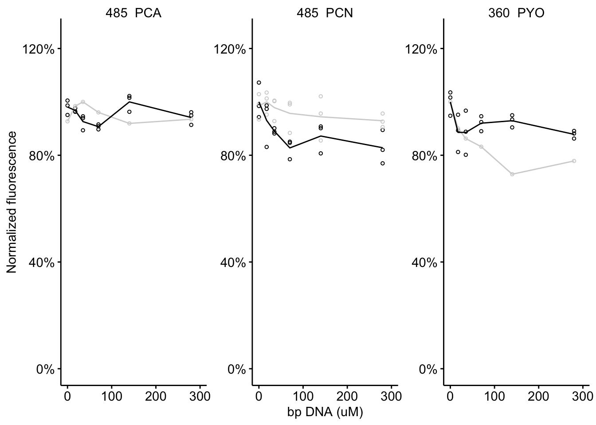

--------


Setup packages and plotting for the notebook:


```r
# Check packages
source("../../../tools/package_setup.R")

# Load packages
library(tidyverse)
library(cowplot)
library(kableExtra)
library(broom)
library(modelr)

# Code display options
knitr::opts_chunk$set(tidy.opts=list(width.cutoff=60),tidy=FALSE, echo = TRUE, message=FALSE, warning=FALSE, fig.align="center", fig.retina = 2)

# Load plotting tools
source("../../../tools/plotting_tools.R")


#Modify the plot theme
theme_set(theme_notebook())
```

# Fig. S2A - EtBr binding

Let's read in the EtBr data and take a look:

```r
etbr_data <- read_csv("../../../../data/Spectroscopy/phz_etbr_competitive_binding.csv") %>% 
  gather(key = 'rep', value = 'fluor', -phz_conc, -phz_mol)


etbr_data %>% group_by(phz_mol, phz_conc) %>% summarise(mean_fluor = mean(fluor)) 
```

```
## # A tibble: 30 x 3
## # Groups:   phz_mol [3]
##    phz_mol phz_conc mean_fluor
##    <chr>      <dbl>      <dbl>
##  1 PCA          0        1117.
##  2 PCA          0.1       840.
##  3 PCA          1         833.
##  4 PCA          5         808.
##  5 PCA         10         733.
##  6 PCA         50         874.
##  7 PCA        100         665.
##  8 PCA        500         986.
##  9 PCA        750        1173.
## 10 PCA       1000        1310.
## # … with 20 more rows
```

Let's plot the data, and we will add a smoothed trendline just to visualize the pattern.


```r
# Plot layout
etbr_plot <- ggplot(etbr_data %>% filter(phz_conc>0), aes(x = phz_conc, y = fluor)) + 
  geom_point(shape = 21) + 
  geom_smooth(color = 'black', linetype = 2) + 
  facet_wrap(~phz_mol, scales = 'free', ncol = 1) + 
  ylim(0,2000)

# Plot styling
etbr_plot_styled <- etbr_plot +
  labs(x = expression("Added phenazine"~(mu*M)), y = 'Ethidium Fluorescence') + 
  scale_x_log10(breaks = c(0.1, 1, 10, 100, 1000), labels = c("0.1", "1", "10", "100", "1000"))
  
etbr_plot_styled
```


When PCN and PYO are added the ethidium fluorescence goes down, as expected. For PCA it remains relatively unchanged or perhaps slightly higher. This pattern is not consistent with the binding model, so we will only fit models to PCN and PYO data.

First let's fit PYO with a hill model to calculate the IC50 using the `nls()` function.


```r
etbr_model_pyo <- nls(data = etbr_data %>% 
                        filter(phz_conc>0 & phz_mol=='PYO'), 
                      formula = fluor~max - (max*(phz_conc^hill)/((ic50^hill)+(phz_conc^hill))),
                      start=c(max=1500,hill=1,ic50=300))

etbr_model_pyo_CI <- tidy(etbr_model_pyo, conf.int = T) %>% filter(term=='ic50')

summary(etbr_model_pyo)
```

```
## 
## Formula: fluor ~ max - (max * (phz_conc^hill)/((ic50^hill) + (phz_conc^hill)))
## 
## Parameters:
##       Estimate Std. Error t value Pr(>|t|)    
## max  1500.3331    35.0905  42.756  < 2e-16 ***
## hill    2.1260     0.3267   6.507 7.40e-08 ***
## ic50  275.0070    36.2560   7.585 2.14e-09 ***
## ---
## Signif. codes:  0 '***' 0.001 '**' 0.01 '*' 0.05 '.' 0.1 ' ' 1
## 
## Residual standard error: 164.2 on 42 degrees of freedom
## 
## Number of iterations to convergence: 5 
## Achieved convergence tolerance: 3.408e-06
```

Now let's fit the PCN data:


```r
etbr_model_pcn <- nls(data = etbr_data %>% 
                        filter(phz_conc>0 & phz_mol=='PCN'), 
                      formula = fluor~max - (max*(phz_conc^hill)/((ic50^hill)+(phz_conc^hill))),
                      start=c(max=1500,hill=1,ic50=300))


etbr_model_pcn_CI <- tidy(etbr_model_pcn) %>% filter(term=='ic50') %>% 
  mutate(conf.low = estimate - (1.96 * std.error)) %>% 
  mutate(conf.high = estimate + (1.96 * std.error))

summary(etbr_model_pcn)
```

```
## 
## Formula: fluor ~ max - (max * (phz_conc^hill)/((ic50^hill) + (phz_conc^hill)))
## 
## Parameters:
##       Estimate Std. Error t value Pr(>|t|)    
## max  1426.1498    46.5735  30.621  < 2e-16 ***
## hill    1.3793     0.3901   3.536  0.00101 ** 
## ic50  611.7656    82.5799   7.408 3.81e-09 ***
## ---
## Signif. codes:  0 '***' 0.001 '**' 0.01 '*' 0.05 '.' 0.1 ' ' 1
## 
## Residual standard error: 213.9 on 42 degrees of freedom
## 
## Number of iterations to convergence: 6 
## Achieved convergence tolerance: 1.926e-06
```

With the models we can now predict the best fit lines with confidence intervals:


```r
etbr_pred_pyo <- etbr_data %>% filter(phz_mol=='PYO') %>% 
  mutate(max = coef(etbr_model_pyo)[1], hill = coef(etbr_model_pyo)[2], ic50 = coef(etbr_model_pyo)[3]) %>% 
  mutate(ic50_high = etbr_model_pyo_CI$conf.high,ic50_low = etbr_model_pyo_CI$conf.low) %>% 
  mutate(pred = max - (max*(phz_conc^hill)/((ic50^hill)+(phz_conc^hill)))) %>% 
  mutate(pred_high = max - (max*(phz_conc^hill)/((ic50_high^hill)+(phz_conc^hill)))) %>% 
  mutate(pred_low = max - (max*(phz_conc^hill)/((ic50_low^hill)+(phz_conc^hill))))

etbr_pred_pcn <- etbr_data %>% filter(phz_mol=='PCN') %>% 
  mutate(max = coef(etbr_model_pcn)[1], hill = coef(etbr_model_pcn)[2], ic50 = coef(etbr_model_pcn)[3]) %>% 
  mutate(ic50_high = etbr_model_pcn_CI$conf.high,ic50_low = etbr_model_pcn_CI$conf.low) %>% 
  mutate(pred = max - (max*(phz_conc^hill)/((ic50^hill)+(phz_conc^hill)))) %>% 
  mutate(pred_high = max - (max*(phz_conc^hill)/((ic50_high^hill)+(phz_conc^hill)))) %>% 
  mutate(pred_low = max - (max*(phz_conc^hill)/((ic50_low^hill)+(phz_conc^hill))))
```

And now we can make the final plots:


```r
etbr_preds = bind_rows(etbr_pred_pyo, etbr_pred_pcn, etbr_data %>% filter(phz_mol=='PCA'))

etbr_plot <- ggplot(etbr_preds %>% filter(phz_conc>=1), aes(x = phz_conc, y = fluor)) + 
  geom_ribbon(aes(ymin = pred_low, ymax = pred_high), fill = 'light gray')+
  geom_line(aes(y = pred), linetype = 2, size = 0.5) + 
  geom_point(shape = 21, size = 1) + 
  facet_wrap(~phz_mol, scales = 'free', ncol = 1)

etbr_plot_styled <- etbr_plot +
  labs(x = expression("Added phenazine"~(mu*M)), y = 'Ethidium Fluorescence') + 
  scale_x_log10(breaks = c(0.1, 1, 10, 100, 1000), labels = c("0.1", "1", "10", "100", "1000"))
  
etbr_plot_styled
```


We can calculate the binding affinity of the phenazines from the IC50 according to the following formula:

$$K_i = \frac{IC_{50}}{1+\frac{[EtBr]}{K_d}}$$

Under these conditions the Kd of ethidium bromide is ~1 µM and the assay used 5 µM EtBr, which gives:

$$K_i = \frac{IC_{50}}{6}$$

So calculating the $K_i$ from the IC50 values for the high, low and best estimates for PYO and PCN yields:


```r
etbr_kd = 1 #uM

etbr_conc = 5 #uM 

etrbr_model_phz_CI <- bind_rows(etbr_model_pcn_CI  %>%  select(estimate, conf.low, conf.high)%>% mutate(PHZ = 'PCN'),
          etbr_model_pyo_CI  %>%  select(estimate, conf.low, conf.high)%>% mutate(PHZ = 'PYO'))


etrbr_model_phz_CI %>% 
  pivot_longer(cols = c(estimate, conf.low, conf.high), names_to = "pred_level", values_to = "IC_50") %>% 
  mutate(K_i = IC_50 / (1 + (etbr_conc / etbr_kd)))
```

```
## # A tibble: 6 x 4
##   PHZ   pred_level IC_50   K_i
##   <chr> <chr>      <dbl> <dbl>
## 1 PCN   estimate    612. 102. 
## 2 PCN   conf.low    450.  75.0
## 3 PCN   conf.high   774. 129. 
## 4 PYO   estimate    275.  45.8
## 5 PYO   conf.low    214.  35.7
## 6 PYO   conf.high   364.  60.7
```

# Fig. S2B - MST data

Let's read in the data and take a look at the plot:


```r
mst_data <- read_csv("../../../../data/Spectroscopy/MST_data_phz_DNA.csv") %>% 
  mutate(norm_resp = Response - 640)

ggplot(mst_data, aes(x = Dose, y = norm_resp)) + 
  geom_point() + 
  facet_wrap(~phz_mol, scales = 'free', ncol=1) + scale_x_log10()
```


The PCA data shows no obvious binding, so we will only fit PYO and PCN data with a hill model. Let's start with PYO:

```r
model_pyo <- nls(data = mst_data %>% filter(phz_mol=='PYO') ,formula = norm_resp~max*(Dose^hill)/((Kd^hill)+(Dose^hill)),start=c(max=400,hill=1,Kd=100) )

confint_pyo <- tidy(model_pyo, conf.int = T) %>% filter(term=='Kd')

summary(model_pyo)
```

```
## 
## Formula: norm_resp ~ max * (Dose^hill)/((Kd^hill) + (Dose^hill))
## 
## Parameters:
##       Estimate Std. Error t value Pr(>|t|)    
## max  480.79588   32.18363   14.94 1.17e-07 ***
## hill   1.03339    0.05033   20.53 7.20e-09 ***
## Kd   536.36673   76.40755    7.02 6.19e-05 ***
## ---
## Signif. codes:  0 '***' 0.001 '**' 0.01 '*' 0.05 '.' 0.1 ' ' 1
## 
## Residual standard error: 3.733 on 9 degrees of freedom
## 
## Number of iterations to convergence: 12 
## Achieved convergence tolerance: 2.293e-06
```


Next let's fit the model to the PCN data:

```r
model_pcn <- nls(data = mst_data %>% filter(phz_mol=='PCN') ,formula = norm_resp~max*(Dose^hill)/((Kd^hill)+(Dose^hill)),start=c(max=400,hill=1,Kd=100) )


confint_pcn <- tidy(model_pcn) %>% filter(term=='Kd') %>% 
  mutate(conf.low = estimate - (1.96*std.error), conf.high = estimate + (1.96*std.error))

summary(model_pcn)
```

```
## 
## Formula: norm_resp ~ max * (Dose^hill)/((Kd^hill) + (Dose^hill))
## 
## Parameters:
##      Estimate Std. Error t value Pr(>|t|)    
## max   41.8984     6.5341   6.412 7.71e-05 ***
## hill   0.9454     0.2421   3.905  0.00294 ** 
## Kd   133.6391    62.5762   2.136  0.05846 .  
## ---
## Signif. codes:  0 '***' 0.001 '**' 0.01 '*' 0.05 '.' 0.1 ' ' 1
## 
## Residual standard error: 3.22 on 10 degrees of freedom
## 
## Number of iterations to convergence: 10 
## Achieved convergence tolerance: 3.571e-06
```

From those models we can predict the best fit lines with confidence intervals:

```r
pred_pyo <- mst_data %>% filter(phz_mol=='PYO') %>% 
  mutate(max = coef(model_pyo)[1], hill = coef(model_pyo)[2], kd = coef(model_pyo)[3]) %>% 
  mutate(kd_low = confint_pyo$conf.low,kd_high = confint_pyo$conf.high ) %>% 
  mutate(pred = max*(Dose^hill)/((kd^hill)+(Dose^hill))) %>% 
  mutate(pred_low = max*(Dose^hill)/((kd_low^hill)+(Dose^hill))) %>% 
  mutate(pred_high = max*(Dose^hill)/((kd_high^hill)+(Dose^hill))) 

pred_pcn <- mst_data %>% filter(phz_mol=='PCN') %>% 
  mutate(max = coef(model_pcn)[1], hill = coef(model_pcn)[2], kd = coef(model_pcn)[3]) %>% 
  mutate(kd_low = confint_pcn$conf.low,kd_high = confint_pcn$conf.high ) %>% 
  mutate(pred = max*(Dose^hill)/((kd^hill)+(Dose^hill))) %>% 
  mutate(pred_low = max*(Dose^hill)/((kd_low^hill)+(Dose^hill))) %>% 
  mutate(pred_high = max*(Dose^hill)/((kd_high^hill)+(Dose^hill))) 

preds <- bind_rows(pred_pyo,pred_pcn,mst_data %>% filter(phz_mol=='PCA'))
```

And we can construct the final plot:


```r
# Plot layout
mst_plot <- ggplot(preds, aes(x = Dose, y = norm_resp)) + 
  geom_ribbon(aes(ymin = pred_low, ymax = pred_high), fill = 'light gray')+
  geom_line(aes(y = pred), linetype = 2, size = 0.5) +
  geom_point(shape = 21, size = 1) + 
  facet_wrap(~phz_mol, scales = 'free',ncol=1)+ 
  scale_x_log10()

# Plot styling
mst_plot_styled <- mst_plot +
  labs(x = expression("Added phenazine"~(mu*M)), y = "Thermophoresis response")

mst_plot_styled
```


# Fig. S2C - Reduced phenazine DNA binding


Let's import the data and add the DNA concentrations:


```r
df_360 <- read_csv("../../../../data/Spectroscopy/2019_10_09_PHZred_top_360-460.csv") %>% 
  gather(key = 'column', value = 'intensity', -row)

df_485 <- read_csv("../../../../data/Spectroscopy/2019_10_09_PHZred_top_485-528.csv") %>% 
  gather(key = 'column', value = 'intensity', -row)

df_meta <- read_csv("../../../../data/Spectroscopy/2019_10_09_PHZred_well_metadata.csv") %>% 
  gather(key = 'column', value = 'id', -row)

df_360_meta <- left_join(df_360, df_meta, by = c('row','column')) %>% 
  mutate(dna = case_when(
    column %in% c(1,7) ~ 0,
    column %in% c(2,8) ~ 17.5,
    column %in% c(3,9) ~ 35,
    column %in% c(4,10) ~ 70,
    column %in% c(5,11) ~ 140,
    column %in% c(6,12) ~ 280,
  ))

df_485_meta <- left_join(df_485, df_meta, by = c('row','column')) %>% 
    mutate(dna = case_when(
    column %in% c(1,7) ~ 0,
    column %in% c(2,8) ~ 17.5,
    column %in% c(3,9) ~ 35,
    column %in% c(4,10) ~ 70,
    column %in% c(5,11) ~ 140,
    column %in% c(6,12) ~ 280,
  ))
```

We'll examine the fluorescence emission wavelength characteristic for each phenazine - 360nm for PYO, 485nm for PCA and 485nm for PCN (although PCN does not have measureable fluorescence).

First let's organize the data and standardize the intensities to the no DNA well:


```r
df_fig_2 <- bind_rows(df_360_meta %>% group_by(id, dna) %>% mutate(mean = mean(intensity)) %>% filter(id %in% c('PYO','control')) %>% mutate(ex = '360_PYO'),
          df_485_meta %>% group_by(id, dna) %>% mutate(mean = mean(intensity)) %>% filter(id %in% c('PCA','control')) %>% mutate(ex = '485_PCA'),
          df_485_meta %>% group_by(id, dna) %>% mutate(mean = mean(intensity)) %>% filter(id %in% c('PCN','PBS')) %>% mutate(ex = '485_PCN')
          )

df_fig_2 <- df_fig_2 %>% group_by(id,ex) %>% mutate(max = max(mean)) %>% mutate(norm_int = intensity / max, norm_mean = mean / max) %>% 
  ungroup() %>% 
  mutate(ex = fct_relevel(ex,'485_PCA','485_PCN','360_PYO' ))


ggplot(df_fig_2, aes(x = dna, y = norm_mean, color = id)) + geom_point(aes(y = norm_int), shape = 21, size = 1) + geom_line(size = 0.5) + 
  facet_wrap(~ex, scales = 'free', ncol = 3) + 
  scale_y_continuous(labels = scales::percent, limits = c(0,1.25)) + 
  labs(x = 'bp DNA (uM)', y = 'Normalized fluorescence') + scale_color_manual(values = c('light gray','light gray','black','black','black')) + guides(color = F) + xlim(0,300)
```



As a percentage of the no DNA well you can see there is no clear difference between the phenazine sample and the buffer only control in gray.

The final plot we show in the figure has the raw intensity values:


```r
plot_phz_red <- ggplot(df_fig_2, aes(x = dna, y = mean, color = id)) + geom_point(aes(y = intensity), shape = 21, size = 1) + geom_line(size = 0.5) + 
  facet_wrap(~ex, scales = 'free', ncol = 3) + 
  labs(x = 'bp DNA (uM)', y = 'Normalized fluorescence') + scale_color_manual(values = c('light gray','light gray','black','black','black')) + guides(color = F) + xlim(0,300)


plot_phz_red
```


# Create Figure


```r
theme_set(theme_figure())

binding_plots <- plot_grid(etbr_plot_styled,mst_plot_styled, 
                           ncol=2, scale = 0.95, align = 'hv', axis = 'tblr', labels = c("A","B"))

bottom_plot <- plot_grid(plot_phz_red, ncol=1, align = 'hv', axis = 'tblr', labels = c('C'), scale = 0.95)

fig_s2 <- plot_grid(binding_plots,bottom_plot, ncol=1, align = 'hv', axis = 'tblr', rel_heights = c(2,1))

fig_s2
```


```r
save_plot("../../../../figures/supplement/phz2019_Fig_S2.pdf", fig_s2, base_width = 7, base_height = 6)
```

----


```r
sessionInfo()
```

```
## R version 3.5.3 (2019-03-11)
## Platform: x86_64-apple-darwin15.6.0 (64-bit)
## Running under: macOS  10.15.6
## 
## Matrix products: default
## BLAS: /Library/Frameworks/R.framework/Versions/3.5/Resources/lib/libRblas.0.dylib
## LAPACK: /Library/Frameworks/R.framework/Versions/3.5/Resources/lib/libRlapack.dylib
## 
## locale:
## [1] en_US.UTF-8/en_US.UTF-8/en_US.UTF-8/C/en_US.UTF-8/en_US.UTF-8
## 
## attached base packages:
## [1] stats     graphics  grDevices utils     datasets  methods   base     
## 
## other attached packages:
##  [1] lubridate_1.7.4   hms_0.5.3         modelr_0.1.5     
##  [4] broom_0.5.2       kableExtra_1.1.0  cowplot_0.9.4    
##  [7] viridis_0.5.1     viridisLite_0.3.0 knitr_1.23       
## [10] forcats_0.4.0     stringr_1.4.0     dplyr_0.8.3      
## [13] purrr_0.3.3       readr_1.3.1       tidyr_1.0.0      
## [16] tibble_2.1.3      ggplot2_3.3.0     tidyverse_1.3.0  
## 
## loaded via a namespace (and not attached):
##  [1] Rcpp_1.0.2       lattice_0.20-38  assertthat_0.2.1 digest_0.6.21   
##  [5] utf8_1.1.4       R6_2.4.0         cellranger_1.1.0 backports_1.1.4 
##  [9] reprex_0.3.0     evaluate_0.14    httr_1.4.1       pillar_1.4.2    
## [13] rlang_0.4.6      readxl_1.3.1     rstudioapi_0.10  Matrix_1.2-15   
## [17] rmarkdown_1.13   labeling_0.3     splines_3.5.3    webshot_0.5.1   
## [21] munsell_0.5.0    compiler_3.5.3   xfun_0.7         pkgconfig_2.0.3 
## [25] mgcv_1.8-27      htmltools_0.4.0  tidyselect_0.2.5 gridExtra_2.3   
## [29] fansi_0.4.0      crayon_1.3.4     dbplyr_1.4.2     withr_2.1.2     
## [33] MASS_7.3-51.1    grid_3.5.3       nlme_3.1-137     jsonlite_1.6    
## [37] gtable_0.3.0     lifecycle_0.1.0  DBI_1.0.0        magrittr_1.5    
## [41] scales_1.0.0     cli_1.1.0        stringi_1.4.3    fs_1.3.1        
## [45] xml2_1.2.2       ellipsis_0.3.0   generics_0.0.2   vctrs_0.3.1     
## [49] tools_3.5.3      glue_1.3.1       yaml_2.2.0       colorspace_1.4-1
## [53] rvest_0.3.5      haven_2.2.0
```
