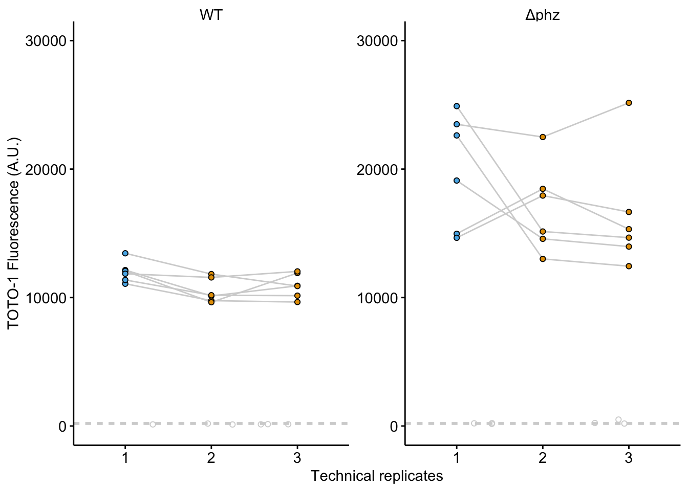

--------

# Notes

Fig S3A,B and D are images.

----

Setup packages and plotting for the notebook:


```r
# Load packages
library(tidyverse)
library(cowplot)
library(kableExtra)
library(broom)
library(modelr)

# Code display options
knitr::opts_chunk$set(tidy.opts=list(width.cutoff=60),tidy=FALSE, echo = TRUE, message=FALSE, warning=FALSE, fig.align="center", fig.retina = 2)

# Load plotting tools
source("../../../tools/plotting_tools.R")


#Modify the plot theme
theme_set(theme_notebook())
```

# Fig. S3C


```r
pRdata <- read_csv('../../../../data/Spectroscopy/TOTO_DAPI_extracts.csv') %>% rename(TOTO=`1uM_TOTO_avg_(535nm)`,DAPI=`1uM_DAPI_avg_(445nm)`) %>%  
  gather(key='dye',value='fluor',TOTO, DAPI) %>% 
  separate(X1,sep=' ',c('added','Treatment','Replicate')) %>% 
  mutate(id=paste(added,Treatment,dye,sep = " ")) %>% 
  group_by(id) %>% 
  mutate(mean = ifelse(Replicate=='1',mean(fluor),NA))

# Plot layout
toto_plot <- ggplot(pRdata %>% filter(dye=='TOTO') %>% filter(id!="with ctDNA TOTO"),aes(x=id,y=fluor))+
  geom_col(aes(y=mean), fill = "light gray") +
  geom_jitter(height=0,width=0.1,shape =21, size = 1)

# Plot styling 
toto_plot_styled <- toto_plot +
  labs(x = NULL, y = 'TOTO-1 Fluorescence (A.U.)') + 
  scale_x_discrete(breaks = c('no ctDNA TOTO','no DNase TOTO','with DNase TOTO'), 
                   labels=c("-","+ buffer", "+ buffer\n+ DNase"))
    
toto_plot_styled     
```


# Fig. S3E


```r
df_biofilms <- read_csv("../../../../data/Spectroscopy/2019_11_22_std_wt_dphz_postCTdna.csv") %>%  gather(key = "well", value = "FluorInt", -wavelength)

df_meta <- read_csv("../../../../data/Spectroscopy/2019_11_22_well_metadata.csv")

df_toto <- left_join(df_biofilms, df_meta, by = c('well')) %>% filter(wavelength == 535)

df_toto %>% kable() %>% kable_styling(bootstrap_options = 'condensed') %>%
    scroll_box(width = "100%", height = "400px")
```

<div style="border: 1px solid #ddd; padding: 5px; overflow-y: scroll; height:400px; overflow-x: scroll; width:100%; "><table class="table table-condensed" style="margin-left: auto; margin-right: auto;">
 <thead>
  <tr>
   <th style="text-align:right;"> wavelength </th>
   <th style="text-align:left;"> well </th>
   <th style="text-align:right;"> FluorInt </th>
   <th style="text-align:left;"> strain </th>
   <th style="text-align:left;"> toto_added </th>
   <th style="text-align:left;"> ctDNA_added </th>
   <th style="text-align:right;"> well_std_conc </th>
   <th style="text-align:right;"> bio_rep </th>
   <th style="text-align:right;"> tech_rep </th>
  </tr>
 </thead>
<tbody>
  <tr>
   <td style="text-align:right;"> 535 </td>
   <td style="text-align:left;"> A1 </td>
   <td style="text-align:right;"> 37448 </td>
   <td style="text-align:left;"> std </td>
   <td style="text-align:left;"> TRUE </td>
   <td style="text-align:left;"> TRUE </td>
   <td style="text-align:right;"> 50.0000000 </td>
   <td style="text-align:right;"> 1 </td>
   <td style="text-align:right;"> 1 </td>
  </tr>
  <tr>
   <td style="text-align:right;"> 535 </td>
   <td style="text-align:left;"> A2 </td>
   <td style="text-align:right;"> 36204 </td>
   <td style="text-align:left;"> std </td>
   <td style="text-align:left;"> TRUE </td>
   <td style="text-align:left;"> TRUE </td>
   <td style="text-align:right;"> 25.0000000 </td>
   <td style="text-align:right;"> 1 </td>
   <td style="text-align:right;"> 1 </td>
  </tr>
  <tr>
   <td style="text-align:right;"> 535 </td>
   <td style="text-align:left;"> A3 </td>
   <td style="text-align:right;"> 35944 </td>
   <td style="text-align:left;"> std </td>
   <td style="text-align:left;"> TRUE </td>
   <td style="text-align:left;"> TRUE </td>
   <td style="text-align:right;"> 12.5000000 </td>
   <td style="text-align:right;"> 1 </td>
   <td style="text-align:right;"> 1 </td>
  </tr>
  <tr>
   <td style="text-align:right;"> 535 </td>
   <td style="text-align:left;"> A4 </td>
   <td style="text-align:right;"> 32623 </td>
   <td style="text-align:left;"> std </td>
   <td style="text-align:left;"> TRUE </td>
   <td style="text-align:left;"> TRUE </td>
   <td style="text-align:right;"> 6.2500000 </td>
   <td style="text-align:right;"> 1 </td>
   <td style="text-align:right;"> 1 </td>
  </tr>
  <tr>
   <td style="text-align:right;"> 535 </td>
   <td style="text-align:left;"> A5 </td>
   <td style="text-align:right;"> 23778 </td>
   <td style="text-align:left;"> std </td>
   <td style="text-align:left;"> TRUE </td>
   <td style="text-align:left;"> TRUE </td>
   <td style="text-align:right;"> 3.1250000 </td>
   <td style="text-align:right;"> 1 </td>
   <td style="text-align:right;"> 1 </td>
  </tr>
  <tr>
   <td style="text-align:right;"> 535 </td>
   <td style="text-align:left;"> A6 </td>
   <td style="text-align:right;"> 15091 </td>
   <td style="text-align:left;"> std </td>
   <td style="text-align:left;"> TRUE </td>
   <td style="text-align:left;"> TRUE </td>
   <td style="text-align:right;"> 1.5625000 </td>
   <td style="text-align:right;"> 1 </td>
   <td style="text-align:right;"> 1 </td>
  </tr>
  <tr>
   <td style="text-align:right;"> 535 </td>
   <td style="text-align:left;"> A7 </td>
   <td style="text-align:right;"> 9899 </td>
   <td style="text-align:left;"> std </td>
   <td style="text-align:left;"> TRUE </td>
   <td style="text-align:left;"> TRUE </td>
   <td style="text-align:right;"> 0.7812500 </td>
   <td style="text-align:right;"> 1 </td>
   <td style="text-align:right;"> 1 </td>
  </tr>
  <tr>
   <td style="text-align:right;"> 535 </td>
   <td style="text-align:left;"> A8 </td>
   <td style="text-align:right;"> 7085 </td>
   <td style="text-align:left;"> std </td>
   <td style="text-align:left;"> TRUE </td>
   <td style="text-align:left;"> TRUE </td>
   <td style="text-align:right;"> 0.3906250 </td>
   <td style="text-align:right;"> 1 </td>
   <td style="text-align:right;"> 1 </td>
  </tr>
  <tr>
   <td style="text-align:right;"> 535 </td>
   <td style="text-align:left;"> A9 </td>
   <td style="text-align:right;"> 6164 </td>
   <td style="text-align:left;"> std </td>
   <td style="text-align:left;"> TRUE </td>
   <td style="text-align:left;"> TRUE </td>
   <td style="text-align:right;"> 0.1953125 </td>
   <td style="text-align:right;"> 1 </td>
   <td style="text-align:right;"> 1 </td>
  </tr>
  <tr>
   <td style="text-align:right;"> 535 </td>
   <td style="text-align:left;"> A10 </td>
   <td style="text-align:right;"> 3926 </td>
   <td style="text-align:left;"> std </td>
   <td style="text-align:left;"> TRUE </td>
   <td style="text-align:left;"> TRUE </td>
   <td style="text-align:right;"> 0.0976562 </td>
   <td style="text-align:right;"> 1 </td>
   <td style="text-align:right;"> 1 </td>
  </tr>
  <tr>
   <td style="text-align:right;"> 535 </td>
   <td style="text-align:left;"> A11 </td>
   <td style="text-align:right;"> 4527 </td>
   <td style="text-align:left;"> std </td>
   <td style="text-align:left;"> TRUE </td>
   <td style="text-align:left;"> TRUE </td>
   <td style="text-align:right;"> 0.0488281 </td>
   <td style="text-align:right;"> 1 </td>
   <td style="text-align:right;"> 1 </td>
  </tr>
  <tr>
   <td style="text-align:right;"> 535 </td>
   <td style="text-align:left;"> A12 </td>
   <td style="text-align:right;"> 3075 </td>
   <td style="text-align:left;"> std </td>
   <td style="text-align:left;"> TRUE </td>
   <td style="text-align:left;"> TRUE </td>
   <td style="text-align:right;"> 0.0244141 </td>
   <td style="text-align:right;"> 1 </td>
   <td style="text-align:right;"> 1 </td>
  </tr>
  <tr>
   <td style="text-align:right;"> 535 </td>
   <td style="text-align:left;"> B1 </td>
   <td style="text-align:right;"> 12139 </td>
   <td style="text-align:left;"> WT </td>
   <td style="text-align:left;"> TRUE </td>
   <td style="text-align:left;"> TRUE </td>
   <td style="text-align:right;"> NA </td>
   <td style="text-align:right;"> 1 </td>
   <td style="text-align:right;"> 1 </td>
  </tr>
  <tr>
   <td style="text-align:right;"> 535 </td>
   <td style="text-align:left;"> B2 </td>
   <td style="text-align:right;"> 13446 </td>
   <td style="text-align:left;"> WT </td>
   <td style="text-align:left;"> TRUE </td>
   <td style="text-align:left;"> TRUE </td>
   <td style="text-align:right;"> NA </td>
   <td style="text-align:right;"> 2 </td>
   <td style="text-align:right;"> 1 </td>
  </tr>
  <tr>
   <td style="text-align:right;"> 535 </td>
   <td style="text-align:left;"> B3 </td>
   <td style="text-align:right;"> 11074 </td>
   <td style="text-align:left;"> WT </td>
   <td style="text-align:left;"> TRUE </td>
   <td style="text-align:left;"> TRUE </td>
   <td style="text-align:right;"> NA </td>
   <td style="text-align:right;"> 3 </td>
   <td style="text-align:right;"> 1 </td>
  </tr>
  <tr>
   <td style="text-align:right;"> 535 </td>
   <td style="text-align:left;"> B4 </td>
   <td style="text-align:right;"> 11370 </td>
   <td style="text-align:left;"> WT </td>
   <td style="text-align:left;"> TRUE </td>
   <td style="text-align:left;"> TRUE </td>
   <td style="text-align:right;"> NA </td>
   <td style="text-align:right;"> 4 </td>
   <td style="text-align:right;"> 1 </td>
  </tr>
  <tr>
   <td style="text-align:right;"> 535 </td>
   <td style="text-align:left;"> B5 </td>
   <td style="text-align:right;"> 12068 </td>
   <td style="text-align:left;"> WT </td>
   <td style="text-align:left;"> TRUE </td>
   <td style="text-align:left;"> TRUE </td>
   <td style="text-align:right;"> NA </td>
   <td style="text-align:right;"> 5 </td>
   <td style="text-align:right;"> 1 </td>
  </tr>
  <tr>
   <td style="text-align:right;"> 535 </td>
   <td style="text-align:left;"> B6 </td>
   <td style="text-align:right;"> 11855 </td>
   <td style="text-align:left;"> WT </td>
   <td style="text-align:left;"> TRUE </td>
   <td style="text-align:left;"> TRUE </td>
   <td style="text-align:right;"> NA </td>
   <td style="text-align:right;"> 6 </td>
   <td style="text-align:right;"> 1 </td>
  </tr>
  <tr>
   <td style="text-align:right;"> 535 </td>
   <td style="text-align:left;"> B7 </td>
   <td style="text-align:right;"> 10123 </td>
   <td style="text-align:left;"> WT </td>
   <td style="text-align:left;"> TRUE </td>
   <td style="text-align:left;"> FALSE </td>
   <td style="text-align:right;"> NA </td>
   <td style="text-align:right;"> 1 </td>
   <td style="text-align:right;"> 2 </td>
  </tr>
  <tr>
   <td style="text-align:right;"> 535 </td>
   <td style="text-align:left;"> B8 </td>
   <td style="text-align:right;"> 11827 </td>
   <td style="text-align:left;"> WT </td>
   <td style="text-align:left;"> TRUE </td>
   <td style="text-align:left;"> FALSE </td>
   <td style="text-align:right;"> NA </td>
   <td style="text-align:right;"> 2 </td>
   <td style="text-align:right;"> 2 </td>
  </tr>
  <tr>
   <td style="text-align:right;"> 535 </td>
   <td style="text-align:left;"> B9 </td>
   <td style="text-align:right;"> 9761 </td>
   <td style="text-align:left;"> WT </td>
   <td style="text-align:left;"> TRUE </td>
   <td style="text-align:left;"> FALSE </td>
   <td style="text-align:right;"> NA </td>
   <td style="text-align:right;"> 3 </td>
   <td style="text-align:right;"> 2 </td>
  </tr>
  <tr>
   <td style="text-align:right;"> 535 </td>
   <td style="text-align:left;"> B10 </td>
   <td style="text-align:right;"> 10182 </td>
   <td style="text-align:left;"> WT </td>
   <td style="text-align:left;"> TRUE </td>
   <td style="text-align:left;"> FALSE </td>
   <td style="text-align:right;"> NA </td>
   <td style="text-align:right;"> 4 </td>
   <td style="text-align:right;"> 2 </td>
  </tr>
  <tr>
   <td style="text-align:right;"> 535 </td>
   <td style="text-align:left;"> B11 </td>
   <td style="text-align:right;"> 9634 </td>
   <td style="text-align:left;"> WT </td>
   <td style="text-align:left;"> TRUE </td>
   <td style="text-align:left;"> FALSE </td>
   <td style="text-align:right;"> NA </td>
   <td style="text-align:right;"> 5 </td>
   <td style="text-align:right;"> 2 </td>
  </tr>
  <tr>
   <td style="text-align:right;"> 535 </td>
   <td style="text-align:left;"> B12 </td>
   <td style="text-align:right;"> 11566 </td>
   <td style="text-align:left;"> WT </td>
   <td style="text-align:left;"> TRUE </td>
   <td style="text-align:left;"> FALSE </td>
   <td style="text-align:right;"> NA </td>
   <td style="text-align:right;"> 6 </td>
   <td style="text-align:right;"> 2 </td>
  </tr>
  <tr>
   <td style="text-align:right;"> 535 </td>
   <td style="text-align:left;"> C1 </td>
   <td style="text-align:right;"> 10915 </td>
   <td style="text-align:left;"> WT </td>
   <td style="text-align:left;"> TRUE </td>
   <td style="text-align:left;"> FALSE </td>
   <td style="text-align:right;"> NA </td>
   <td style="text-align:right;"> 1 </td>
   <td style="text-align:right;"> 3 </td>
  </tr>
  <tr>
   <td style="text-align:right;"> 535 </td>
   <td style="text-align:left;"> C2 </td>
   <td style="text-align:right;"> 10894 </td>
   <td style="text-align:left;"> WT </td>
   <td style="text-align:left;"> TRUE </td>
   <td style="text-align:left;"> FALSE </td>
   <td style="text-align:right;"> NA </td>
   <td style="text-align:right;"> 2 </td>
   <td style="text-align:right;"> 3 </td>
  </tr>
  <tr>
   <td style="text-align:right;"> 535 </td>
   <td style="text-align:left;"> C3 </td>
   <td style="text-align:right;"> 9651 </td>
   <td style="text-align:left;"> WT </td>
   <td style="text-align:left;"> TRUE </td>
   <td style="text-align:left;"> FALSE </td>
   <td style="text-align:right;"> NA </td>
   <td style="text-align:right;"> 3 </td>
   <td style="text-align:right;"> 3 </td>
  </tr>
  <tr>
   <td style="text-align:right;"> 535 </td>
   <td style="text-align:left;"> C4 </td>
   <td style="text-align:right;"> 10147 </td>
   <td style="text-align:left;"> WT </td>
   <td style="text-align:left;"> TRUE </td>
   <td style="text-align:left;"> FALSE </td>
   <td style="text-align:right;"> NA </td>
   <td style="text-align:right;"> 4 </td>
   <td style="text-align:right;"> 3 </td>
  </tr>
  <tr>
   <td style="text-align:right;"> 535 </td>
   <td style="text-align:left;"> C5 </td>
   <td style="text-align:right;"> 11910 </td>
   <td style="text-align:left;"> WT </td>
   <td style="text-align:left;"> TRUE </td>
   <td style="text-align:left;"> FALSE </td>
   <td style="text-align:right;"> NA </td>
   <td style="text-align:right;"> 5 </td>
   <td style="text-align:right;"> 3 </td>
  </tr>
  <tr>
   <td style="text-align:right;"> 535 </td>
   <td style="text-align:left;"> C6 </td>
   <td style="text-align:right;"> 12036 </td>
   <td style="text-align:left;"> WT </td>
   <td style="text-align:left;"> TRUE </td>
   <td style="text-align:left;"> FALSE </td>
   <td style="text-align:right;"> NA </td>
   <td style="text-align:right;"> 6 </td>
   <td style="text-align:right;"> 3 </td>
  </tr>
  <tr>
   <td style="text-align:right;"> 535 </td>
   <td style="text-align:left;"> C7 </td>
   <td style="text-align:right;"> 130 </td>
   <td style="text-align:left;"> WT </td>
   <td style="text-align:left;"> FALSE </td>
   <td style="text-align:left;"> FALSE </td>
   <td style="text-align:right;"> NA </td>
   <td style="text-align:right;"> 1 </td>
   <td style="text-align:right;"> 4 </td>
  </tr>
  <tr>
   <td style="text-align:right;"> 535 </td>
   <td style="text-align:left;"> C8 </td>
   <td style="text-align:right;"> 190 </td>
   <td style="text-align:left;"> WT </td>
   <td style="text-align:left;"> FALSE </td>
   <td style="text-align:left;"> FALSE </td>
   <td style="text-align:right;"> NA </td>
   <td style="text-align:right;"> 2 </td>
   <td style="text-align:right;"> 4 </td>
  </tr>
  <tr>
   <td style="text-align:right;"> 535 </td>
   <td style="text-align:left;"> C9 </td>
   <td style="text-align:right;"> 119 </td>
   <td style="text-align:left;"> WT </td>
   <td style="text-align:left;"> FALSE </td>
   <td style="text-align:left;"> FALSE </td>
   <td style="text-align:right;"> NA </td>
   <td style="text-align:right;"> 3 </td>
   <td style="text-align:right;"> 4 </td>
  </tr>
  <tr>
   <td style="text-align:right;"> 535 </td>
   <td style="text-align:left;"> C10 </td>
   <td style="text-align:right;"> 124 </td>
   <td style="text-align:left;"> WT </td>
   <td style="text-align:left;"> FALSE </td>
   <td style="text-align:left;"> FALSE </td>
   <td style="text-align:right;"> NA </td>
   <td style="text-align:right;"> 4 </td>
   <td style="text-align:right;"> 4 </td>
  </tr>
  <tr>
   <td style="text-align:right;"> 535 </td>
   <td style="text-align:left;"> C11 </td>
   <td style="text-align:right;"> 144 </td>
   <td style="text-align:left;"> WT </td>
   <td style="text-align:left;"> FALSE </td>
   <td style="text-align:left;"> FALSE </td>
   <td style="text-align:right;"> NA </td>
   <td style="text-align:right;"> 5 </td>
   <td style="text-align:right;"> 4 </td>
  </tr>
  <tr>
   <td style="text-align:right;"> 535 </td>
   <td style="text-align:left;"> C12 </td>
   <td style="text-align:right;"> 138 </td>
   <td style="text-align:left;"> WT </td>
   <td style="text-align:left;"> FALSE </td>
   <td style="text-align:left;"> FALSE </td>
   <td style="text-align:right;"> NA </td>
   <td style="text-align:right;"> 6 </td>
   <td style="text-align:right;"> 4 </td>
  </tr>
  <tr>
   <td style="text-align:right;"> 535 </td>
   <td style="text-align:left;"> E1 </td>
   <td style="text-align:right;"> 23490 </td>
   <td style="text-align:left;"> dPHZ </td>
   <td style="text-align:left;"> TRUE </td>
   <td style="text-align:left;"> TRUE </td>
   <td style="text-align:right;"> NA </td>
   <td style="text-align:right;"> 1 </td>
   <td style="text-align:right;"> 1 </td>
  </tr>
  <tr>
   <td style="text-align:right;"> 535 </td>
   <td style="text-align:left;"> E2 </td>
   <td style="text-align:right;"> 22622 </td>
   <td style="text-align:left;"> dPHZ </td>
   <td style="text-align:left;"> TRUE </td>
   <td style="text-align:left;"> TRUE </td>
   <td style="text-align:right;"> NA </td>
   <td style="text-align:right;"> 2 </td>
   <td style="text-align:right;"> 1 </td>
  </tr>
  <tr>
   <td style="text-align:right;"> 535 </td>
   <td style="text-align:left;"> E3 </td>
   <td style="text-align:right;"> 24901 </td>
   <td style="text-align:left;"> dPHZ </td>
   <td style="text-align:left;"> TRUE </td>
   <td style="text-align:left;"> TRUE </td>
   <td style="text-align:right;"> NA </td>
   <td style="text-align:right;"> 3 </td>
   <td style="text-align:right;"> 1 </td>
  </tr>
  <tr>
   <td style="text-align:right;"> 535 </td>
   <td style="text-align:left;"> E4 </td>
   <td style="text-align:right;"> 14964 </td>
   <td style="text-align:left;"> dPHZ </td>
   <td style="text-align:left;"> TRUE </td>
   <td style="text-align:left;"> TRUE </td>
   <td style="text-align:right;"> NA </td>
   <td style="text-align:right;"> 4 </td>
   <td style="text-align:right;"> 1 </td>
  </tr>
  <tr>
   <td style="text-align:right;"> 535 </td>
   <td style="text-align:left;"> E5 </td>
   <td style="text-align:right;"> 19109 </td>
   <td style="text-align:left;"> dPHZ </td>
   <td style="text-align:left;"> TRUE </td>
   <td style="text-align:left;"> TRUE </td>
   <td style="text-align:right;"> NA </td>
   <td style="text-align:right;"> 5 </td>
   <td style="text-align:right;"> 1 </td>
  </tr>
  <tr>
   <td style="text-align:right;"> 535 </td>
   <td style="text-align:left;"> E6 </td>
   <td style="text-align:right;"> 14650 </td>
   <td style="text-align:left;"> dPHZ </td>
   <td style="text-align:left;"> TRUE </td>
   <td style="text-align:left;"> TRUE </td>
   <td style="text-align:right;"> NA </td>
   <td style="text-align:right;"> 6 </td>
   <td style="text-align:right;"> 1 </td>
  </tr>
  <tr>
   <td style="text-align:right;"> 535 </td>
   <td style="text-align:left;"> F1 </td>
   <td style="text-align:right;"> 22498 </td>
   <td style="text-align:left;"> dPHZ </td>
   <td style="text-align:left;"> TRUE </td>
   <td style="text-align:left;"> FALSE </td>
   <td style="text-align:right;"> NA </td>
   <td style="text-align:right;"> 1 </td>
   <td style="text-align:right;"> 2 </td>
  </tr>
  <tr>
   <td style="text-align:right;"> 535 </td>
   <td style="text-align:left;"> F2 </td>
   <td style="text-align:right;"> 13008 </td>
   <td style="text-align:left;"> dPHZ </td>
   <td style="text-align:left;"> TRUE </td>
   <td style="text-align:left;"> FALSE </td>
   <td style="text-align:right;"> NA </td>
   <td style="text-align:right;"> 2 </td>
   <td style="text-align:right;"> 2 </td>
  </tr>
  <tr>
   <td style="text-align:right;"> 535 </td>
   <td style="text-align:left;"> F3 </td>
   <td style="text-align:right;"> 15141 </td>
   <td style="text-align:left;"> dPHZ </td>
   <td style="text-align:left;"> TRUE </td>
   <td style="text-align:left;"> FALSE </td>
   <td style="text-align:right;"> NA </td>
   <td style="text-align:right;"> 3 </td>
   <td style="text-align:right;"> 2 </td>
  </tr>
  <tr>
   <td style="text-align:right;"> 535 </td>
   <td style="text-align:left;"> F4 </td>
   <td style="text-align:right;"> 18463 </td>
   <td style="text-align:left;"> dPHZ </td>
   <td style="text-align:left;"> TRUE </td>
   <td style="text-align:left;"> FALSE </td>
   <td style="text-align:right;"> NA </td>
   <td style="text-align:right;"> 4 </td>
   <td style="text-align:right;"> 2 </td>
  </tr>
  <tr>
   <td style="text-align:right;"> 535 </td>
   <td style="text-align:left;"> F5 </td>
   <td style="text-align:right;"> 14572 </td>
   <td style="text-align:left;"> dPHZ </td>
   <td style="text-align:left;"> TRUE </td>
   <td style="text-align:left;"> FALSE </td>
   <td style="text-align:right;"> NA </td>
   <td style="text-align:right;"> 5 </td>
   <td style="text-align:right;"> 2 </td>
  </tr>
  <tr>
   <td style="text-align:right;"> 535 </td>
   <td style="text-align:left;"> F6 </td>
   <td style="text-align:right;"> 17939 </td>
   <td style="text-align:left;"> dPHZ </td>
   <td style="text-align:left;"> TRUE </td>
   <td style="text-align:left;"> FALSE </td>
   <td style="text-align:right;"> NA </td>
   <td style="text-align:right;"> 6 </td>
   <td style="text-align:right;"> 2 </td>
  </tr>
  <tr>
   <td style="text-align:right;"> 535 </td>
   <td style="text-align:left;"> G1 </td>
   <td style="text-align:right;"> 25159 </td>
   <td style="text-align:left;"> dPHZ </td>
   <td style="text-align:left;"> TRUE </td>
   <td style="text-align:left;"> FALSE </td>
   <td style="text-align:right;"> NA </td>
   <td style="text-align:right;"> 1 </td>
   <td style="text-align:right;"> 3 </td>
  </tr>
  <tr>
   <td style="text-align:right;"> 535 </td>
   <td style="text-align:left;"> G2 </td>
   <td style="text-align:right;"> 12442 </td>
   <td style="text-align:left;"> dPHZ </td>
   <td style="text-align:left;"> TRUE </td>
   <td style="text-align:left;"> FALSE </td>
   <td style="text-align:right;"> NA </td>
   <td style="text-align:right;"> 2 </td>
   <td style="text-align:right;"> 3 </td>
  </tr>
  <tr>
   <td style="text-align:right;"> 535 </td>
   <td style="text-align:left;"> G3 </td>
   <td style="text-align:right;"> 14663 </td>
   <td style="text-align:left;"> dPHZ </td>
   <td style="text-align:left;"> TRUE </td>
   <td style="text-align:left;"> FALSE </td>
   <td style="text-align:right;"> NA </td>
   <td style="text-align:right;"> 3 </td>
   <td style="text-align:right;"> 3 </td>
  </tr>
  <tr>
   <td style="text-align:right;"> 535 </td>
   <td style="text-align:left;"> G4 </td>
   <td style="text-align:right;"> 15324 </td>
   <td style="text-align:left;"> dPHZ </td>
   <td style="text-align:left;"> TRUE </td>
   <td style="text-align:left;"> FALSE </td>
   <td style="text-align:right;"> NA </td>
   <td style="text-align:right;"> 4 </td>
   <td style="text-align:right;"> 3 </td>
  </tr>
  <tr>
   <td style="text-align:right;"> 535 </td>
   <td style="text-align:left;"> G5 </td>
   <td style="text-align:right;"> 13968 </td>
   <td style="text-align:left;"> dPHZ </td>
   <td style="text-align:left;"> TRUE </td>
   <td style="text-align:left;"> FALSE </td>
   <td style="text-align:right;"> NA </td>
   <td style="text-align:right;"> 5 </td>
   <td style="text-align:right;"> 3 </td>
  </tr>
  <tr>
   <td style="text-align:right;"> 535 </td>
   <td style="text-align:left;"> G6 </td>
   <td style="text-align:right;"> 16661 </td>
   <td style="text-align:left;"> dPHZ </td>
   <td style="text-align:left;"> TRUE </td>
   <td style="text-align:left;"> FALSE </td>
   <td style="text-align:right;"> NA </td>
   <td style="text-align:right;"> 6 </td>
   <td style="text-align:right;"> 3 </td>
  </tr>
  <tr>
   <td style="text-align:right;"> 535 </td>
   <td style="text-align:left;"> H1 </td>
   <td style="text-align:right;"> 235 </td>
   <td style="text-align:left;"> dPHZ </td>
   <td style="text-align:left;"> FALSE </td>
   <td style="text-align:left;"> FALSE </td>
   <td style="text-align:right;"> NA </td>
   <td style="text-align:right;"> 1 </td>
   <td style="text-align:right;"> 4 </td>
  </tr>
  <tr>
   <td style="text-align:right;"> 535 </td>
   <td style="text-align:left;"> H2 </td>
   <td style="text-align:right;"> 164 </td>
   <td style="text-align:left;"> dPHZ </td>
   <td style="text-align:left;"> FALSE </td>
   <td style="text-align:left;"> FALSE </td>
   <td style="text-align:right;"> NA </td>
   <td style="text-align:right;"> 2 </td>
   <td style="text-align:right;"> 4 </td>
  </tr>
  <tr>
   <td style="text-align:right;"> 535 </td>
   <td style="text-align:left;"> H3 </td>
   <td style="text-align:right;"> 500 </td>
   <td style="text-align:left;"> dPHZ </td>
   <td style="text-align:left;"> FALSE </td>
   <td style="text-align:left;"> FALSE </td>
   <td style="text-align:right;"> NA </td>
   <td style="text-align:right;"> 3 </td>
   <td style="text-align:right;"> 4 </td>
  </tr>
  <tr>
   <td style="text-align:right;"> 535 </td>
   <td style="text-align:left;"> H4 </td>
   <td style="text-align:right;"> 191 </td>
   <td style="text-align:left;"> dPHZ </td>
   <td style="text-align:left;"> FALSE </td>
   <td style="text-align:left;"> FALSE </td>
   <td style="text-align:right;"> NA </td>
   <td style="text-align:right;"> 4 </td>
   <td style="text-align:right;"> 4 </td>
  </tr>
  <tr>
   <td style="text-align:right;"> 535 </td>
   <td style="text-align:left;"> H5 </td>
   <td style="text-align:right;"> 208 </td>
   <td style="text-align:left;"> dPHZ </td>
   <td style="text-align:left;"> FALSE </td>
   <td style="text-align:left;"> FALSE </td>
   <td style="text-align:right;"> NA </td>
   <td style="text-align:right;"> 5 </td>
   <td style="text-align:right;"> 4 </td>
  </tr>
  <tr>
   <td style="text-align:right;"> 535 </td>
   <td style="text-align:left;"> H6 </td>
   <td style="text-align:right;"> 221 </td>
   <td style="text-align:left;"> dPHZ </td>
   <td style="text-align:left;"> FALSE </td>
   <td style="text-align:left;"> FALSE </td>
   <td style="text-align:right;"> NA </td>
   <td style="text-align:right;"> 6 </td>
   <td style="text-align:right;"> 4 </td>
  </tr>
</tbody>
</table></div>


```r
bg_means <- df_toto %>% filter(strain != 'std' & tech_rep == 4) %>% group_by(strain) %>% summarise(mean = mean(FluorInt))

plot_eDNA <- ggplot(df_toto %>% filter(strain != 'std') %>% mutate(facet_labels = ifelse(strain =='dPHZ', paste0('\u0394','phz'), strain)), 
       aes(x = factor(tech_rep), y = FluorInt)) + 
  geom_line(data = . %>% filter(tech_rep<4), aes(group = bio_rep), color = 'light gray')+
  geom_hline(data = bg_means, aes(yintercept = mean), linetype = 2, color = 'light gray') +
  geom_point(data = . %>% filter(tech_rep<4), aes(fill = factor(ctDNA_added)), shape = 21) + 
  geom_jitter(data = . %>% filter(tech_rep==4), aes(x = 2), width = 1, shape = 21, color = 'light gray')+
  facet_wrap(~facet_labels, scales = 'free') + ylim(0, 30000) + guides(fill = F)

'\u0394'
```

```
## [1] "Δ"
```

```r
# Plot styling

plot_eDNA_styled <- plot_eDNA + 
  labs(x = 'Technical replicates', y = 'TOTO-1 Fluorescence (A.U.)')

plot_eDNA_styled
```




# Create Figure


```r
theme_set(theme_figure())

fig_s3 <- plot_grid( toto_plot_styled,plot_eDNA_styled, align = 'hv', axis = 'tblr', ncol = 2, rel_widths = c(1,2), scale = 0.95, labels = c('C','E'), label_size = 12)

fig_s3
```


```r
save_plot("../../../../figures/supplement/phz2019_Fig_S3.pdf", fig_s3, base_width = 7, base_height = 2)
```

----


```r
sessionInfo()
```

```
## R version 3.5.2 (2018-12-20)
## Platform: x86_64-apple-darwin15.6.0 (64-bit)
## Running under: macOS Mojave 10.14.6
## 
## Matrix products: default
## BLAS: /Library/Frameworks/R.framework/Versions/3.5/Resources/lib/libRblas.0.dylib
## LAPACK: /Library/Frameworks/R.framework/Versions/3.5/Resources/lib/libRlapack.dylib
## 
## locale:
## [1] en_US.UTF-8/en_US.UTF-8/en_US.UTF-8/C/en_US.UTF-8/en_US.UTF-8
## 
## attached base packages:
## [1] stats     graphics  grDevices utils     datasets  methods   base     
## 
## other attached packages:
##  [1] viridis_0.5.1     viridisLite_0.3.0 modelr_0.1.2     
##  [4] broom_0.5.1       kableExtra_1.0.1  cowplot_0.9.4    
##  [7] forcats_0.3.0     stringr_1.3.1     dplyr_0.8.1      
## [10] purrr_0.2.5       readr_1.3.1       tidyr_0.8.2      
## [13] tibble_2.1.3      ggplot2_3.2.0     tidyverse_1.2.1  
## 
## loaded via a namespace (and not attached):
##  [1] tidyselect_0.2.5 xfun_0.7         haven_2.0.0      lattice_0.20-38 
##  [5] colorspace_1.4-0 generics_0.0.2   htmltools_0.3.6  yaml_2.2.0      
##  [9] rlang_0.4.0      pillar_1.3.1     glue_1.3.1       withr_2.1.2     
## [13] readxl_1.2.0     munsell_0.5.0    gtable_0.2.0     cellranger_1.1.0
## [17] rvest_0.3.2      evaluate_0.14    labeling_0.3     knitr_1.23      
## [21] highr_0.7        Rcpp_1.0.1       scales_1.0.0     backports_1.1.3 
## [25] webshot_0.5.1    jsonlite_1.6     gridExtra_2.3    hms_0.4.2       
## [29] digest_0.6.18    stringi_1.2.4    grid_3.5.2       cli_1.1.0       
## [33] tools_3.5.2      magrittr_1.5     lazyeval_0.2.1   crayon_1.3.4    
## [37] pkgconfig_2.0.2  xml2_1.2.0       lubridate_1.7.4  assertthat_0.2.1
## [41] rmarkdown_1.13   httr_1.4.0       rstudioapi_0.9.0 R6_2.4.0        
## [45] nlme_3.1-140     compiler_3.5.2
```
