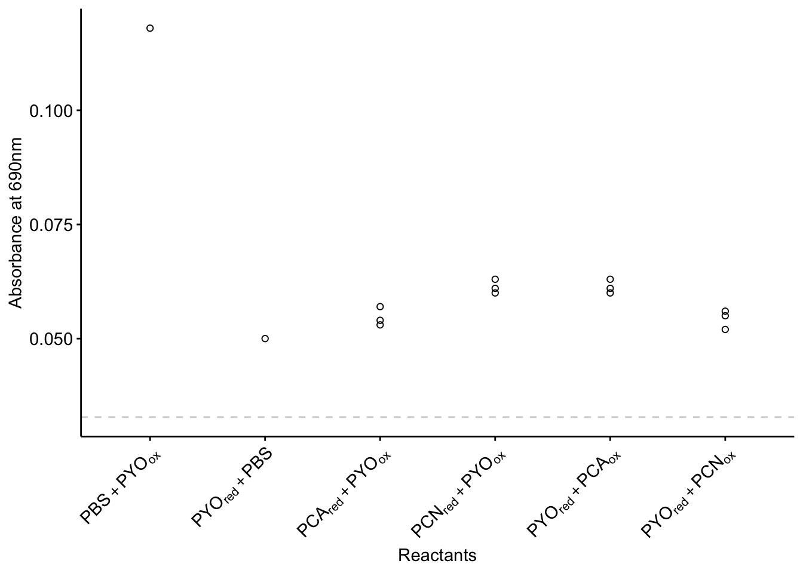
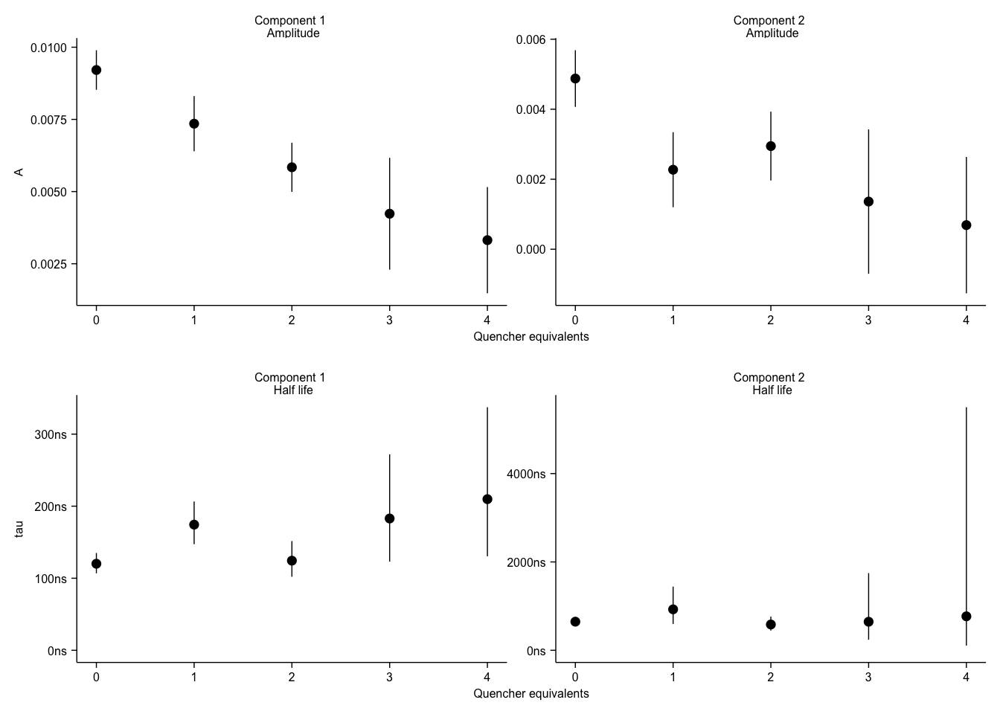

--------

# Notes

Fig. S4B-G were made outside of R.

----

Setup packages and plotting for the notebook:


```r
# Load packages
library(tidyverse)
library(cowplot)
library(kableExtra)
library(broom)
library(modelr)

# Code display options
knitr::opts_chunk$set(tidy.opts=list(width.cutoff=60),tidy=FALSE, echo = TRUE, message=FALSE, warning=FALSE, fig.align="center", fig.retina = 2)

# Load plotting tools
source("../../../tools/plotting_tools.R")


#Modify the plot theme
theme_set(theme_notebook())
```

# Fig. S4A


```r
df_meta <- read_csv("../../../../data/Spectroscopy/2019_09_17_solution_ET_well_metadata.csv")

df_spectra <- read_csv("../../../../data/Spectroscopy/2019_09_17_solution_ET_abs_spectra_1.csv", skip = 1) %>% gather(key = 'well', value = 'abs',-Wavelength)

df_phzET <- left_join(df_spectra, df_meta, by = 'well') %>% filter(Wavelength == 690)

ggplot(df_phzET %>% filter(red == 'PYO' | ox == 'PYO'), aes(x = red_ox, y = abs)) + geom_point(shape = 21)
```


```r
df_phzET %>% filter(red != 'PYO' & ox != 'PYO') %>% summarise(mean = mean(abs))
```

```
## # A tibble: 1 x 1
##     mean
##    <dbl>
## 1 0.0328
```

```r
df_phzET_PYO <- df_phzET %>% filter(red == 'PYO' | ox == 'PYO')

levels(factor(df_phzET_PYO$red_ox))
```

```
## [1] "PBS_PYO" "PCA_PYO" "PCN_PYO" "PYO_PBS" "PYO_PCA" "PYO_PCN"
```

```r
df_phzET_PYO$red_ox <- factor(df_phzET_PYO$red_ox, levels = c("PBS_PYO","PYO_PBS","PCA_PYO", "PCN_PYO","PYO_PCA", "PYO_PCN"))

ggplot(df_phzET_PYO, aes(x = red_ox, y = abs)) + geom_point(shape = 21)
```


```r
labels = c('PBS + PYO[ox]','PYO[red] + PBS','PCA[red] + PYO[ox]','PCN[red] + PYO[ox]', 'PYO[red] + PCA[ox]', 'PYO[red] + PCN[ox]')


plot_phzET_PYO <- ggplot(df_phzET_PYO, aes(x = red_ox, y = abs)) +  
  geom_hline(yintercept = 0.0328, linetype = 2, color = 'light gray')+
  geom_point(shape = 21)+
  scale_x_discrete(labels = parse(text = labels )) + 
  labs(x = 'Reactants', y = 'Absorbance at 690nm', color = NULL) + 
  theme(axis.text.x = element_text(angle = 45, hjust = 1), legend.position = c(0.5,1)) + scale_shape_manual(values = c(21,22))

plot_phzET_PYO
```



# Fig. S4H - Biexponential fits


```r
df_biexp <- read_csv("../../Fig_3/phz2019_dna_ct_spec_biexp_fits.csv")
```


```r
#background_ests

ggplot(df_biexp, aes(x = quencher_eq, y = estimate)) + 
  geom_pointrange(aes(ymin = estimate - 2*std.error, ymax = estimate + 2*std.error)) +
  facet_wrap(~term, scales = 'free')
```


```r
plot_spec_A <- ggplot(df_biexp %>% filter(term %in% c('A1','A2')), aes(x = quencher_eq, y = estimate)) + 
  geom_pointrange(aes(ymin = estimate - 2*std.error, ymax = estimate + 2*std.error), size = 0.25) +
  facet_wrap(~term, scales = 'free',labeller = labeller(term = c(A1 = 'Component 1 \n Amplitude', A2 = 'Component 2 \n Amplitude'))) + labs(x = 'Quencher equivalents', y = 'A')
plot_spec_A
```


```r
df_biexp_tau <- df_biexp %>% filter(term %in% c('lrc1','lrc2')) %>% mutate(tau = 1/exp(estimate)) %>% mutate(tau_low = 1/exp(estimate + 2*std.error), tau_high = 1/exp(estimate - 2*std.error))


#background_spec_tau <- df_spec_tau %>% filter(is.na(quencher_eq))

#background_ests

plot_spec_tau <- ggplot(df_biexp_tau, aes(x = quencher_eq, y = tau)) + 
  geom_pointrange(aes(ymin = tau_low, ymax = tau_high), size = 0.25) +
  facet_wrap(~term, scales = 'free', labeller = labeller(term = c(lrc1 = 'Component 1 \n Half life', lrc2 = 'Component 2 \n Half life'))) + 
  scale_y_continuous(labels = ns_label, limits = c(0,NA)) + labs(x = 'Quencher equivalents')

plot_spec_tau
```


# Create Figure


```r
theme_set(theme_figure())

biexp_grid <- plot_grid(plot_spec_A, plot_spec_tau, ncol = 1, align = 'hv', axis = 'tblr')

biexp_grid
```




```r
fig_s4 <- plot_grid(plot_phzET_PYO, NULL, NULL, biexp_grid, scale = 0.95, labels = c('A','','', 'I'), ncol = 2, rel_widths = c(1,1.5),rel_heights = c(1,1.5), label_size = 12)

fig_s4
```


```r
save_plot("../../../../figures/supplement/phz2019_Fig_S4.pdf", fig_s4, base_width = 7, base_height = 5)
```


----


```r
sessionInfo()
```

```
## R version 3.5.2 (2018-12-20)
## Platform: x86_64-apple-darwin15.6.0 (64-bit)
## Running under: macOS Mojave 10.14.6
## 
## Matrix products: default
## BLAS: /Library/Frameworks/R.framework/Versions/3.5/Resources/lib/libRblas.0.dylib
## LAPACK: /Library/Frameworks/R.framework/Versions/3.5/Resources/lib/libRlapack.dylib
## 
## locale:
## [1] en_US.UTF-8/en_US.UTF-8/en_US.UTF-8/C/en_US.UTF-8/en_US.UTF-8
## 
## attached base packages:
## [1] stats     graphics  grDevices utils     datasets  methods   base     
## 
## other attached packages:
##  [1] viridis_0.5.1     viridisLite_0.3.0 modelr_0.1.2     
##  [4] broom_0.5.1       kableExtra_1.0.1  cowplot_0.9.4    
##  [7] forcats_0.3.0     stringr_1.3.1     dplyr_0.8.1      
## [10] purrr_0.2.5       readr_1.3.1       tidyr_0.8.2      
## [13] tibble_2.1.3      ggplot2_3.2.0     tidyverse_1.2.1  
## 
## loaded via a namespace (and not attached):
##  [1] tidyselect_0.2.5 xfun_0.7         haven_2.0.0      lattice_0.20-38 
##  [5] colorspace_1.4-0 generics_0.0.2   htmltools_0.3.6  yaml_2.2.0      
##  [9] utf8_1.1.4       rlang_0.4.0      pillar_1.3.1     glue_1.3.1      
## [13] withr_2.1.2      readxl_1.2.0     munsell_0.5.0    gtable_0.2.0    
## [17] cellranger_1.1.0 rvest_0.3.2      evaluate_0.14    labeling_0.3    
## [21] knitr_1.23       fansi_0.4.0      Rcpp_1.0.1       scales_1.0.0    
## [25] backports_1.1.3  webshot_0.5.1    jsonlite_1.6     gridExtra_2.3   
## [29] hms_0.4.2        digest_0.6.18    stringi_1.2.4    grid_3.5.2      
## [33] cli_1.1.0        tools_3.5.2      magrittr_1.5     lazyeval_0.2.1  
## [37] crayon_1.3.4     pkgconfig_2.0.2  xml2_1.2.0       lubridate_1.7.4 
## [41] assertthat_0.2.1 rmarkdown_1.13   httr_1.4.0       rstudioapi_0.9.0
## [45] R6_2.4.0         nlme_3.1-140     compiler_3.5.2
```
