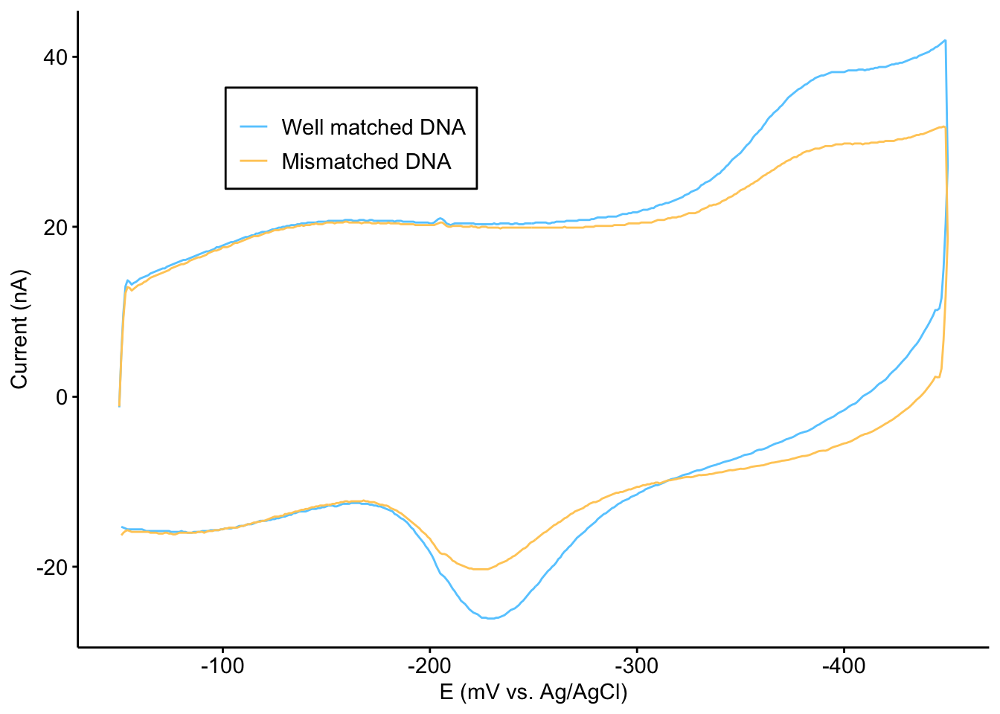
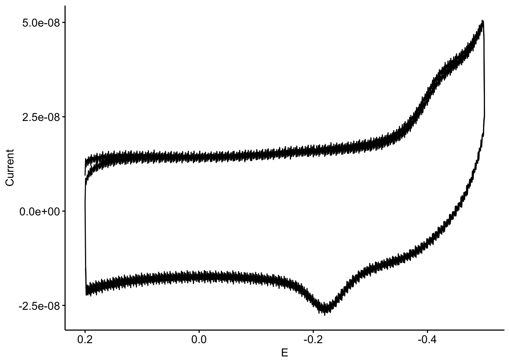

--------

# Notes

This notebook contains figures made to address reviewer comments as well as Fig. S4 of the manuscript. Fig. S4B-G were made outside of R.

Please see the [Fig. 3 notebook](https://dkn-lab.github.io/phz_eDNA_2019/code/figures/Fig_3/phz2019_Fig_3.html) for the biexponential fits of the time resolved spectroscopy data.

----

Setup packages and plotting for the notebook:


```r
# Check packages
source("../../../tools/package_setup.R")

# Load packages
library(tidyverse)
library(cowplot)
library(kableExtra)
library(broom)
library(modelr)

# Code display options
knitr::opts_chunk$set(tidy.opts=list(width.cutoff=60),tidy=FALSE, echo = TRUE, message=FALSE, warning=FALSE, fig.align="center", fig.retina = 2)

# Load plotting tools
source("../../../tools/plotting_tools.R")


#Modify the plot theme
theme_set(theme_notebook())
```

# Revisions

Solution PCN at unmodified electrode compared to PCN-DNA modified electrode. 

First let's read in the data currently in main figure 3 and reproduce the main plot. 


```r
df_noO2 <- read_csv('../../../../data/Electrochemistry/DNA_modified_electrode_noO2.csv',comment = "#") %>% 
  mutate(Construct=fct_relevel(Construct,'wm','mm'))


plot_dnaCT_noO2 <- ggplot(df_noO2,aes(x=E,y=Current, color = Construct))+
  geom_path()

plot_dnaCT_noO2_styled <- plot_dnaCT_noO2 +
  scale_x_reverse(labels = mV_label)+
  scale_y_continuous(labels = nA_label)+
  scale_color_manual(breaks = c('wm','mm'), labels=c("Well matched DNA","Mismatched DNA"), values = c("#66CCFF","#FFCC66")) +
  labs(x='E (mV vs. Ag/AgCl)',y='Current (nA)')+
  theme(legend.position = c(0.3, 0.8),
        legend.title = element_blank(),
        legend.background = element_rect(fill=NA))

plot_dnaCT_noO2_styled
```



Now let's read in the file for 1µM PCN solution at an unmodified gold electrode. 

```r
df_sol_pcn <- read_csv('../../../../data/Electrochemistry/1uM_PCN_noO2.txt', 
                       skip = 19, col_names = c('E','Current','time')) %>% 
  mutate(Construct = 'solution PCN')

ggplot(df_sol_pcn, aes(x = E, y = Current)) + geom_path() + scale_x_reverse()
```




And now we'll combine:


```r
df_compare <- bind_rows(df_noO2, df_sol_pcn)

plot_compare <- ggplot(df_compare,aes(x=E,y=Current, color = Construct))+
  geom_path()

plot_compare_styled <- plot_compare +
  scale_x_reverse(labels = mV_label)+
  scale_y_continuous(labels = nA_label)+
  labs(x='E (mV vs. Ag/AgCl)',y='Current (nA)')+
  theme(legend.position = c(0.3, 0.8),
        legend.title = element_blank(),
        legend.background = element_rect(fill=NA))

plot_compare_styled
```


Now let's read in the file for the blank DNA modified electrode


```r
df_no_pcn <- read_csv('../../../../data/Electrochemistry/DNA_modified_electrode_wO2.csv', comment = '#') %>% 
  filter(PCN == F) %>% 
  mutate(PCN = 'no PCN')

df_compare_2 <- bind_rows(df_noO2 %>% filter(Construct == 'wm') %>% mutate(PCN = 'PCN'), df_no_pcn)

plot_compare_2 <- ggplot(df_compare_2,aes(x=E,y=Current, color = PCN))+
  geom_path()

plot_compare_styled_2 <- plot_compare_2 +
  scale_x_reverse(labels = mV_label)+
  scale_y_continuous(labels = nA_label)+
  labs(x='E (mV vs. Ag/AgCl)',y='Current (nA)')+
  theme(legend.position = c(0.3, 0.8),
        legend.title = element_blank(),
        legend.background = element_rect(fill=NA))

plot_compare_styled_2
```


And let's look at a background only scan with a DNA modified electrode and no PCN:

```r
df_no_pcn_2 <- read_csv('../../../../data/Electrochemistry/DNA_mod_electrode_noPCN_noO2.txt', skip = 19, 
                        col_names = c('E','Current','time')) %>% 
  filter(time>5)

plot_no_pcn <- ggplot(df_no_pcn_2,aes(x=E,y=Current))+
  geom_path()

plot_no_pcn_styled <- plot_no_pcn +
  scale_x_reverse(labels = mV_label)+
  scale_y_continuous(labels = nA_label)+
  labs(x='E (mV vs. Ag/AgCl)',y='Current (nA)')+
  theme(legend.position = c(0.3, 0.8),
        legend.title = element_blank(),
        legend.background = element_rect(fill=NA))

plot_no_pcn_styled
```


And let's compare a DNA modified electrode with a 10µM solution of PCN to an unmodified electrode with a 10µM solution of PCN:


```r
df_wmDNA <- read_csv('../../../../data/Electrochemistry/10uM_PCN_wmDNA.txt', 
                       skip = 19, col_names = c('E','Current','time')) %>% 
  mutate(Construct = 'wm DNA') 

df_noDNA <- read_csv('../../../../data/Electrochemistry/10uM_PCN_noDNA.txt', 
                       skip = 19, col_names = c('E','Current','time')) %>% 
  mutate(Construct = 'no DNA') 

df_dna_mod <- bind_rows(df_wmDNA, df_noDNA)

plot_dna_mod <- ggplot(df_dna_mod,aes(x=E,y=Current, color = Construct))+
  geom_path()

plot_dna_mod_styled <- plot_dna_mod +
  scale_x_reverse(labels = mV_label)+
  scale_y_continuous(labels = nA_label)+
  labs(x='E (mV vs. Ag/AgCl)',y='Current (nA)')+
  theme(legend.position = c(0.3, 0.8),
        legend.title = element_blank(),
        legend.background = element_rect(fill=NA))

plot_dna_mod_styled
```


# Fig. S4A

Let's read in the absorbance data and look at the 690nm wavelength:


```r
df_meta <- read_csv("../../../../data/Spectroscopy/2019_09_17_solution_ET_well_metadata.csv")

df_spectra <- read_csv("../../../../data/Spectroscopy/2019_09_17_solution_ET_abs_spectra_1.csv", skip = 1) %>% gather(key = 'well', value = 'abs',-Wavelength)

df_phzET <- left_join(df_spectra, df_meta, by = 'well') %>% filter(Wavelength == 690)
```

Now let's make the nicely labeled plot:


```r
df_phzET_PYO <- df_phzET %>% filter(red == 'PYO' | ox == 'PYO')


df_phzET_PYO$red_ox <- factor(df_phzET_PYO$red_ox, levels = c("PBS_PYO","PYO_PBS","PCA_PYO", "PCN_PYO","PYO_PCA", "PYO_PCN"))

labels = c('PBS + PYO[ox]','PYO[red] + PBS','PCA[red] + PYO[ox]','PCN[red] + PYO[ox]', 'PYO[red] + PCA[ox]', 'PYO[red] + PCN[ox]')


plot_phzET_PYO <- ggplot(df_phzET_PYO, aes(x = red_ox, y = abs)) +  
  geom_hline(yintercept = 0.0328, linetype = 2, color = 'light gray')+
  geom_point(shape = 21)+
  scale_x_discrete(labels = parse(text = labels )) + 
  labs(x = 'Reactants', y = 'Absorbance at 690nm', color = NULL) + 
  theme(axis.text.x = element_text(angle = 45, hjust = 1), legend.position = c(0.5,1)) + scale_shape_manual(values = c(21,22))

plot_phzET_PYO
```


# Fig. S4H - Biexponential fits of time resolved spectroscopy

Let's read in the biexponential fits of the data performed in the main Fig. 3 notebook:


```r
df_biexp <- read_csv("../../Fig_3/phz2019_dna_ct_spec_biexp_fits.csv")
```

Let's take a look. 


```r
#background_ests

ggplot(df_biexp, aes(x = quencher_eq, y = estimate)) + 
  geom_pointrange(aes(ymin = estimate - 2*std.error, ymax = estimate + 2*std.error)) +
  facet_wrap(~term, scales = 'free')
```


Recall that these fits used the self starting non-linear least squares biexponential function, `SSbiexp()`. This function is parameterized in the following way:

`output = A1*exp(-exp(lrc1)*input) + A2*exp(-exp(lrc2)*input)`

Where input is our time vector and output is the background subtracted intensity vector. A is the multiplier of the first (A1) and second (A2) exponential. Lrc is the natural log of the rate constant for the first (lrc1) and second (lrc2) exponential.

For figure S4, lrc parameters are converted into tau half lives `tau = 1/exp(lrc)`. 

Therefore let's first make the plots for the amplitude (A).


```r
plot_spec_A <- ggplot(df_biexp %>% filter(term %in% c('A1','A2')), aes(x = quencher_eq, y = estimate)) + 
  geom_pointrange(aes(ymin = estimate - 2*std.error, ymax = estimate + 2*std.error), size = 0.25) +
  facet_wrap(~term, scales = 'free',labeller = labeller(term = c(A1 = 'Component 1 \n Amplitude', A2 = 'Component 2 \n Amplitude'))) + labs(x = 'Quencher equivalents', y = 'A')
plot_spec_A
```


Now let's convert lrc into tau and make the tau parameter plots:


```r
df_biexp_tau <- df_biexp %>% filter(term %in% c('lrc1','lrc2')) %>% mutate(tau = 1/exp(estimate)) %>% mutate(tau_low = 1/exp(estimate + 2*std.error), tau_high = 1/exp(estimate - 2*std.error))


#background_spec_tau <- df_spec_tau %>% filter(is.na(quencher_eq))

#background_ests

plot_spec_tau <- ggplot(df_biexp_tau, aes(x = quencher_eq, y = tau)) + 
  geom_pointrange(aes(ymin = tau_low, ymax = tau_high), size = 0.25) +
  facet_wrap(~term, scales = 'free', labeller = labeller(term = c(lrc1 = 'Component 1 \n Half life', lrc2 = 'Component 2 \n Half life'))) + 
  scale_y_continuous(labels = ns_label, limits = c(0,NA)) + labs(x = 'Quencher equivalents')

plot_spec_tau
```


# Create Figure


```r
theme_set(theme_figure())

biexp_grid <- plot_grid(plot_spec_A, plot_spec_tau, ncol = 1, align = 'hv', axis = 'tblr')

biexp_grid
```


```r
fig_s4 <- plot_grid(plot_phzET_PYO, NULL, NULL, biexp_grid, scale = 0.95, 
                    labels = c('A','','', 'H'), ncol = 2, 
                    rel_widths = c(1,1.5),rel_heights = c(1,1.5), 
                    label_size = 12)

fig_s4
```


```r
save_plot("../../../../figures/supplement/phz2019_Fig_S4.pdf", fig_s4, base_width = 7, base_height = 5)
```


----


```r
sessionInfo()
```

```
## R version 3.5.3 (2019-03-11)
## Platform: x86_64-apple-darwin15.6.0 (64-bit)
## Running under: macOS  10.15.6
## 
## Matrix products: default
## BLAS: /Library/Frameworks/R.framework/Versions/3.5/Resources/lib/libRblas.0.dylib
## LAPACK: /Library/Frameworks/R.framework/Versions/3.5/Resources/lib/libRlapack.dylib
## 
## locale:
## [1] en_US.UTF-8/en_US.UTF-8/en_US.UTF-8/C/en_US.UTF-8/en_US.UTF-8
## 
## attached base packages:
## [1] stats     graphics  grDevices utils     datasets  methods   base     
## 
## other attached packages:
##  [1] lubridate_1.7.4   hms_0.5.3         modelr_0.1.5     
##  [4] broom_0.5.2       kableExtra_1.1.0  cowplot_0.9.4    
##  [7] viridis_0.5.1     viridisLite_0.3.0 knitr_1.23       
## [10] forcats_0.4.0     stringr_1.4.0     dplyr_0.8.3      
## [13] purrr_0.3.3       readr_1.3.1       tidyr_1.0.0      
## [16] tibble_2.1.3      ggplot2_3.3.0     tidyverse_1.3.0  
## 
## loaded via a namespace (and not attached):
##  [1] tidyselect_0.2.5 xfun_0.7         haven_2.2.0      lattice_0.20-38 
##  [5] colorspace_1.4-1 vctrs_0.3.1      generics_0.0.2   htmltools_0.4.0 
##  [9] yaml_2.2.0       rlang_0.4.6      pillar_1.4.2     glue_1.3.1      
## [13] withr_2.1.2      DBI_1.0.0        dbplyr_1.4.2     readxl_1.3.1    
## [17] lifecycle_0.1.0  munsell_0.5.0    gtable_0.3.0     cellranger_1.1.0
## [21] rvest_0.3.5      evaluate_0.14    labeling_0.3     Rcpp_1.0.2      
## [25] scales_1.0.0     backports_1.1.4  webshot_0.5.1    jsonlite_1.6    
## [29] fs_1.3.1         gridExtra_2.3    digest_0.6.21    stringi_1.4.3   
## [33] grid_3.5.3       cli_1.1.0        tools_3.5.3      magrittr_1.5    
## [37] crayon_1.3.4     pkgconfig_2.0.3  ellipsis_0.3.0   xml2_1.2.2      
## [41] reprex_0.3.0     assertthat_0.2.1 rmarkdown_1.13   httr_1.4.1      
## [45] rstudioapi_0.10  R6_2.4.0         nlme_3.1-137     compiler_3.5.3
```
