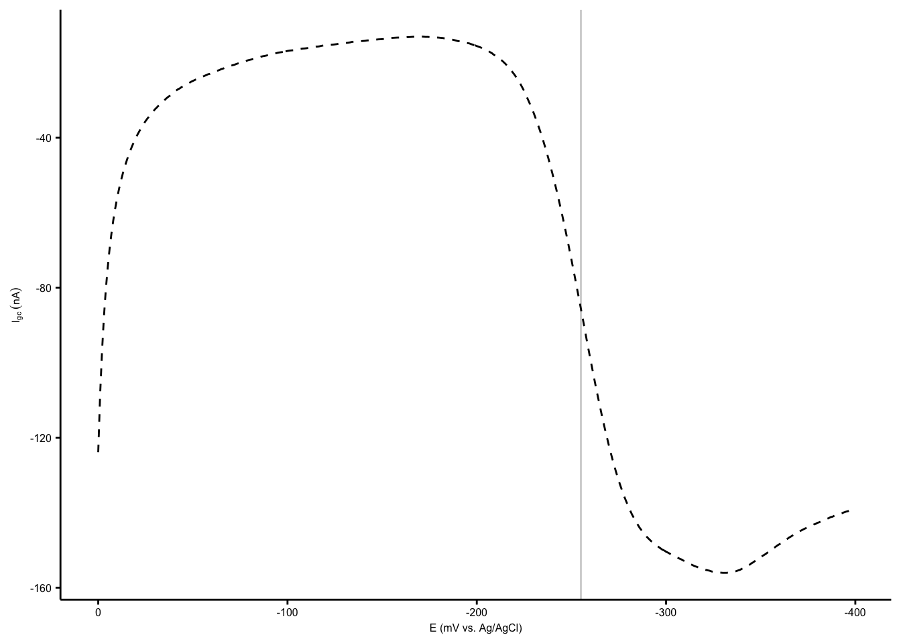

--------

# Notes

Fig S5A - B is a set of images.

----

Setup packages and plotting for the notebook:


```r
# Load packages
library(tidyverse)
library(cowplot)
library(kableExtra)
library(broom)
library(modelr)

# Code display options
knitr::opts_chunk$set(tidy.opts=list(width.cutoff=60),tidy=FALSE, echo = TRUE, message=FALSE, warning=FALSE, fig.align="center", fig.retina = 2)

# Load plotting tools
source("../../../tools/plotting_tools.R")


#Modify the plot theme
theme_set(theme_notebook())
```

# Fig. S5C 


```r
ida_phz <- tibble(
  Day = c(1,2,3),
  PYO = c(79.86,115.4,88.6),
  PCA = c(10.4, 18.1,29.3),
  PCN = c(0.254, 0.51, 0.61)
) %>% 
  gather(key = phenazine, value = amount, -Day) %>% 
  group_by(phenazine) %>% 
  mutate(mean = ifelse(Day==1,mean(amount),NA))

plot_ida_phz <- ggplot(ida_phz, aes(x = phenazine, y = amount, shape = factor(Day))) + 
  geom_col(aes(y = mean), fill = 'light gray') + 
  geom_jitter(width = 0.1, height = 0, size = 1) + scale_shape_manual(values = c(21,22,23), guide = F)

plot_ida_phz_styled <- plot_ida_phz+
  labs(x='', y = expression(Concentration ~(mu*M)))

plot_ida_phz_styled
```


# Fig. S5D


```r
pyo_soak_gc <- read_csv('../../../../data/Electrochemistry/IDA/75uM_control_soak_3_GC_1.txt',skip = 21, col_names = c('E','i1','i2')) %>% 
  gather(key = 'electrode', value = 'current', i1, i2) %>% 
  mutate(reactor = 'soak')

pyo_tran1_gc <- read_csv('../../../../data/Electrochemistry/IDA/75uM_control_transfer_3_GC_1.txt',skip = 21, col_names = c('E','i1','i2')) %>% 
  gather(key = 'electrode', value = 'current', i1, i2) %>% 
  mutate(reactor = 'transfer')

pyo_gc <- bind_rows(pyo_soak_gc, pyo_tran1_gc)

pyo_plot <- ggplot() + 
  geom_vline(xintercept = -0.255, color = 'light gray', size = 0.5)+
  geom_path(data = pyo_gc %>% filter(electrode=='i1'), aes(x = E, y =current, linetype = reactor), size = 0.5)+
  geom_path(data = pyo_gc %>% filter(electrode=='i2'), aes(x = E, y =current, linetype = reactor), size = 0.5)+
  scale_x_reverse(labels = mV_label)+
  scale_y_continuous(labels = nA_label)+
  labs(x = "E (mV vs. Ag/AgCl)", y = expression(I[gc]~(nA)), title = 'PYO')+
  theme(legend.position = c(0.15,0.75), legend.background = element_blank(), plot.title = element_text(hjust = 0.5)) 

pyo_plot
```


```r
ggplot(pyo_tran1_gc, aes(x = E, y =current)) + geom_point()+
  scale_x_reverse()
```


# Fig. S5E


```r
pca_soak_gc <- read_csv("../../../../data/Electrochemistry/IDA/75uM_PCA_dPHZstar_GC_1.txt", skip = 21, col_names = c('E','i1','i2')) %>% 
  gather(key = 'electrode', value = 'current', i1, i2) %>% 
  mutate(reactor = 'soak')

pca_tran1_gc <- read_csv("../../../../data/Electrochemistry/IDA/gc_1.txt", skip = 21, col_names = c('E','i1','i2')) %>% 
  gather(key = 'electrode', value = 'current', i1, i2)%>% 
  mutate(reactor = 'transfer')

pca_gc <- bind_rows(pca_soak_gc, pca_tran1_gc)

pca_plot <- ggplot() + 
  geom_vline(xintercept = -0.375, color = 'light gray', size = 0.5)+
  geom_path(data = pca_gc %>% filter(electrode=='i1'), aes(x = E, y =current, linetype = reactor), size = 0.5)+
  geom_path(data = pca_gc %>% filter(electrode=='i2'), aes(x = E, y =current, linetype = reactor), size = 0.5)+
  scale_x_reverse(labels = mV_label)+
  scale_y_continuous(labels = nA_label)+
  labs(x = "E (mV vs. Ag/AgCl)", y = expression(I[gc]~(nA)), title = 'PCA')+
  theme(legend.position = c(0.15,0.75), legend.background = element_blank(),  plot.title = element_text(hjust = 0.5))
  

pca_plot
```


```r
ggplot(pca_soak_gc, aes(x = E, y =current)) + geom_point()+
  geom_point(data = pca_tran1_gc, color = 'red')+
  scale_x_reverse()+ylim(-1e-8,+1e-8)
```


```r
pyo_plot_zoom <- ggplot(data = pyo_gc %>% filter(electrode=='i2' & reactor=='transfer'), aes(x = E, y =current)) + 
  geom_vline(xintercept = -0.255, color = 'light gray', size = 0.5)+
  geom_path(linetype = 'dashed', size = 0.5)+
  scale_x_reverse(labels = mV_label)+
  scale_y_continuous(labels = nA_label)+
  labs(x = "E (mV vs. Ag/AgCl)", y = expression(I[gc]~(nA)))

pyo_plot_zoom
```



```r
pca_plot_zoom <- ggplot(data = pca_gc %>% filter(electrode=='i2' & reactor=='transfer'), aes(x = E, y =current)) + 
  geom_vline(xintercept = -0.375, color = 'light gray', size = 0.5)+
  geom_path(linetype = 'dashed', size = 0.5)+
  scale_x_reverse(labels = mV_label)+
  scale_y_continuous(labels = nA_label)+
  labs(x = "E (mV vs. Ag/AgCl)", y = expression(I[gc]~(nA)))

pca_plot_zoom
```


```r
theme_set(theme_figure())

inset <- plot_grid(NULL, pyo_plot_zoom,NULL,  pca_plot_zoom, ncol = 2, align = 'hv', axis = 'tblr', rel_widths = c(0.2,1))

fig_s5 <- plot_grid(plot_ida_phz_styled, pyo_plot, pca_plot ,inset , ncol = 3, align = 'hv', axis = 'tblr', labels = c('C','D','E',''), label_size = 12, scale = 0.95, rel_heights = c(1,1.25))

fig_s5
```


```r
save_plot("../../../../figures/supplement/phz2019_Fig_S5.pdf", fig_s5, base_width = 7, base_height = 4.5)
```

-----


```r
sessionInfo()
```

```
## R version 3.5.2 (2018-12-20)
## Platform: x86_64-apple-darwin15.6.0 (64-bit)
## Running under: macOS Mojave 10.14.6
## 
## Matrix products: default
## BLAS: /Library/Frameworks/R.framework/Versions/3.5/Resources/lib/libRblas.0.dylib
## LAPACK: /Library/Frameworks/R.framework/Versions/3.5/Resources/lib/libRlapack.dylib
## 
## locale:
## [1] en_US.UTF-8/en_US.UTF-8/en_US.UTF-8/C/en_US.UTF-8/en_US.UTF-8
## 
## attached base packages:
## [1] stats     graphics  grDevices utils     datasets  methods   base     
## 
## other attached packages:
##  [1] viridis_0.5.1     viridisLite_0.3.0 modelr_0.1.2     
##  [4] broom_0.5.1       kableExtra_1.0.1  cowplot_0.9.4    
##  [7] forcats_0.3.0     stringr_1.3.1     dplyr_0.8.1      
## [10] purrr_0.2.5       readr_1.3.1       tidyr_0.8.2      
## [13] tibble_2.1.3      ggplot2_3.2.0     tidyverse_1.2.1  
## 
## loaded via a namespace (and not attached):
##  [1] tidyselect_0.2.5 xfun_0.7         haven_2.0.0      lattice_0.20-38 
##  [5] colorspace_1.4-0 generics_0.0.2   htmltools_0.3.6  yaml_2.2.0      
##  [9] rlang_0.4.0      pillar_1.3.1     glue_1.3.1       withr_2.1.2     
## [13] readxl_1.2.0     munsell_0.5.0    gtable_0.2.0     cellranger_1.1.0
## [17] rvest_0.3.2      evaluate_0.14    labeling_0.3     knitr_1.23      
## [21] Rcpp_1.0.1       scales_1.0.0     backports_1.1.3  webshot_0.5.1   
## [25] jsonlite_1.6     gridExtra_2.3    hms_0.4.2        digest_0.6.18   
## [29] stringi_1.2.4    grid_3.5.2       cli_1.1.0        tools_3.5.2     
## [33] magrittr_1.5     lazyeval_0.2.1   crayon_1.3.4     pkgconfig_2.0.2 
## [37] xml2_1.2.0       lubridate_1.7.4  assertthat_0.2.1 rmarkdown_1.13  
## [41] httr_1.4.0       rstudioapi_0.9.0 R6_2.4.0         nlme_3.1-140    
## [45] compiler_3.5.2
```
