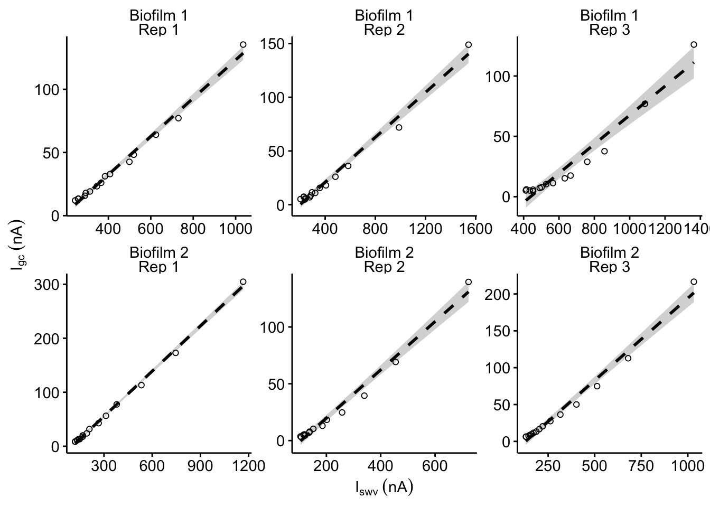
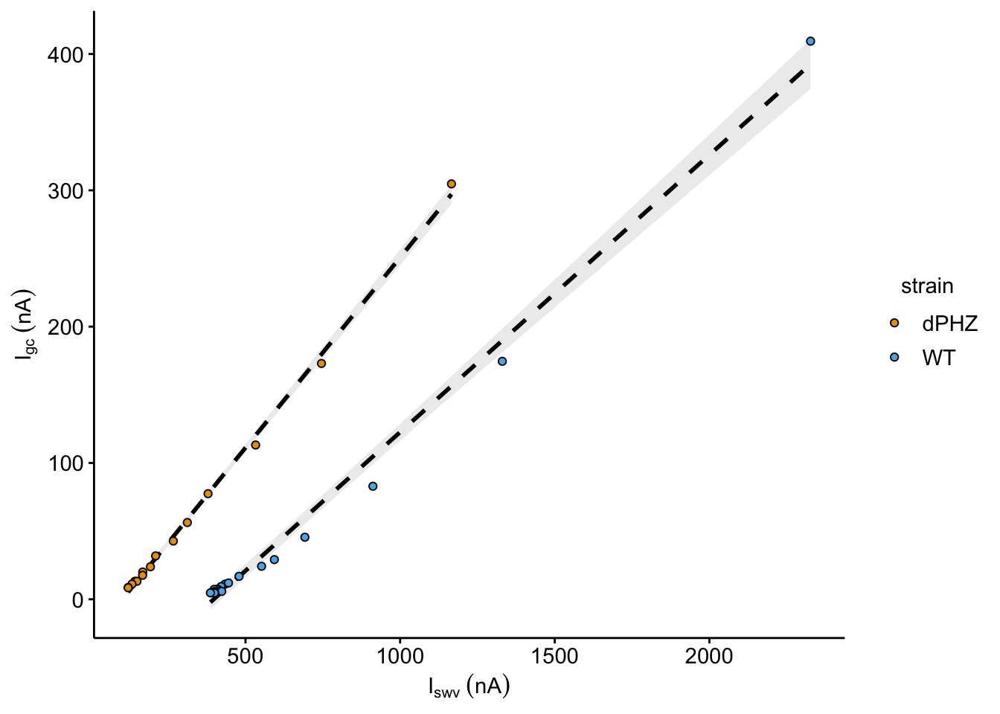
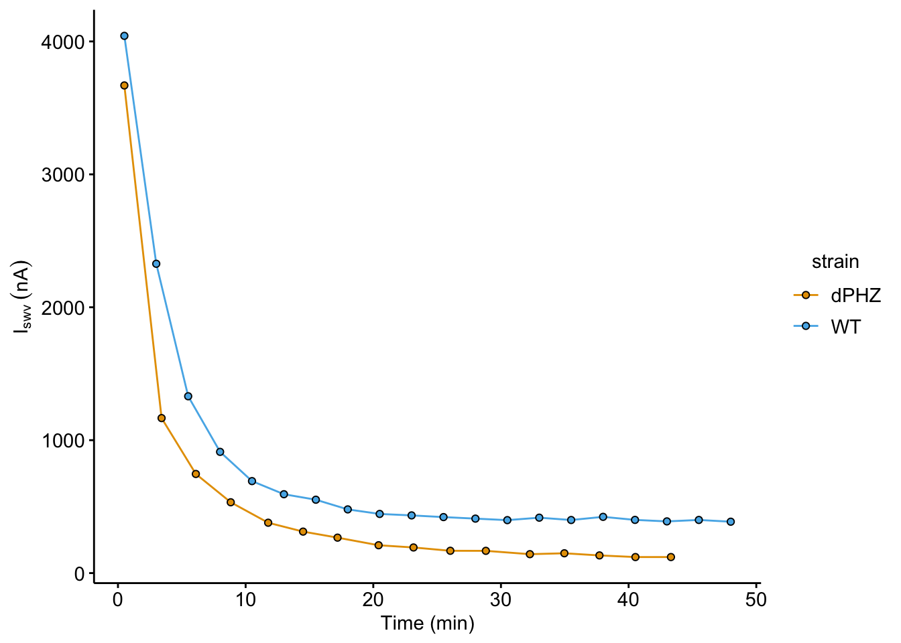
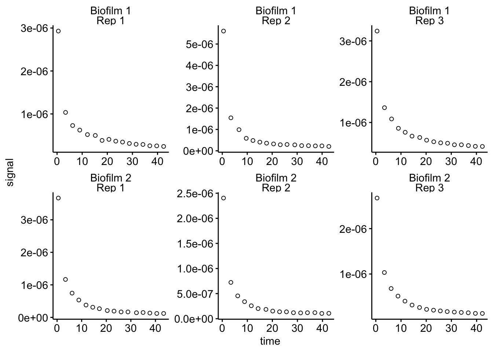
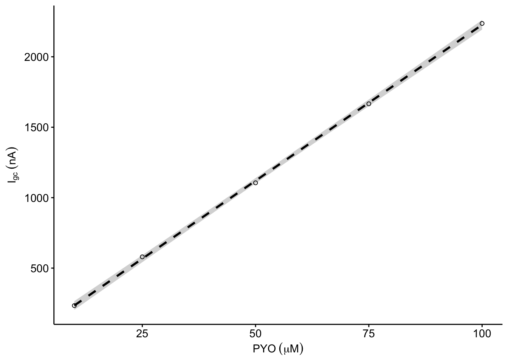
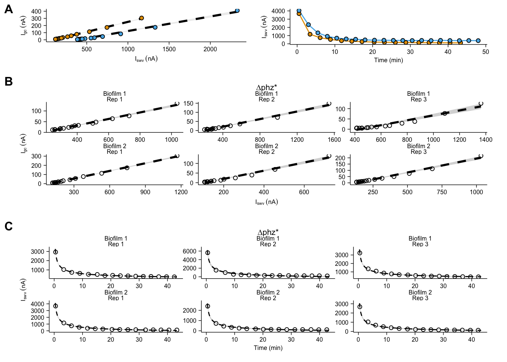

--------

# Notes

To see how we got from the raw electrochemical scans to the datasets used here, please see the following notebooks:

* [IDA ∆phz biofilm processing](https://scott-saunders.github.io/phz_eDNA_2019/code/processing/IDA_dPHZ/IDA_dPHZ_processing.html)
* [IDA WT biofilm processing](https://scott-saunders.github.io/phz_eDNA_2019/code/processing/IDA_WT/IDA_WT_processing.html)
* [IDA blank processing](https://scott-saunders.github.io/phz_eDNA_2019/code/processing/IDA_blank/IDA_blank_processing.html)

This supplemental figure and notebook underlies some of the data in main figure 6, particularly the final panel. Specifically the model coefficients for $D_{ap}$ and $D_{phys}$ are calculated in the Fig. S6B-D sections. These data are saved as .csv files in the directory containing this notebook.


----

Setup packages and plotting for the notebook:


```r
# Load packages
library(tidyverse)
library(cowplot)
library(kableExtra)
library(broom)
library(modelr)

# Code display options
knitr::opts_chunk$set(tidy.opts=list(width.cutoff=60),tidy=FALSE, echo = TRUE, message=FALSE, warning=FALSE, fig.align="center", fig.retina = 2)

# Load plotting tools
source("../../../tools/plotting_tools.R")


#Modify the plot theme
theme_set(theme_notebook())
```

# Fig. S6A

Let's compare WT and ∆phz* + PYO biofilms. We'll go ahead and read in some of the processed data from the WT and ∆phz processing notebooks. First we will look at the decays of the SWV peak currents:


```r
df_WT <- read_csv("../../../processing/processed_data/phz_eDNA_2019_swv_gc_WT_signals.csv") %>% 
  mutate(strain = 'WT')

df_dphz_1 <- read_csv("../../../processing/processed_data/phz_eDNA_2019_swv_gc_signals.csv") %>% 
  filter(reactor == 'transfer' & exp == 1 & run == 1) %>%
  mutate(strain = 'dPHZ')

df_combined <- bind_rows(df_dphz_1, df_WT)


plot_decay_combo <- ggplot(df_combined, aes(x = time_SWV, y = signal_SWV, fill = strain, color = strain)) + 
  geom_line() + geom_point(shape = 21, color = 'black') 

plot_decay_combo_styled <- plot_decay_combo + 
  scale_y_continuous(labels = nA_label) +  
  labs(y = expression(I[swv]~(nA)), x = 'Time (min)')
  
plot_decay_combo_styled
```



Now let's plot the SWV vs. GC plots that we use to calculate $D_{ap}$:


```r
plot_dap_combo <- ggplot(df_combined %>% filter(rep>0), aes(x = signal_SWV, y = signal_GC, fill = strain)) + 
  geom_smooth(method = 'lm', color = 'black', fill = 'light gray',linetype = 2, aes(group = strain)) + 
  geom_point(shape = 21)  
plot_dap_combo_styled <- plot_dap_combo+
  scale_x_continuous(labels = nA_label) + 
  scale_y_continuous(labels = nA_label) + 
  labs(x = expression(I[swv]~(nA)), y = expression(I[gc]~(nA)))

plot_dap_combo_styled
```



# Fig. S6B

First, we will read in the paired SWV and GC signals that were generated from the processing notebook. Then we can plot the SWV vs. GC signals for both biofilms and technical replicates. Each dataset is fit with a linear model shaded with a 95% confidence interval.


```r
df_swv_gc <- read_csv("../../../processing/processed_data/phz_eDNA_2019_swv_gc_signals.csv") %>% 
  mutate(exp_id = ifelse(exp =='2', 'Biofilm 1', 'Biofilm 2')) %>% 
  mutate(run_id = paste('Rep ',run, sep = ''))

plot_swv_gc_dphz <- ggplot(df_swv_gc %>% filter(reactor == 'transfer' & rep>0), 
       aes(x = signal_SWV, y = signal_GC)) + 
  geom_smooth(method='lm', linetype = 2, color = 'black')+
  geom_point(shape = 21) + 
  facet_wrap(exp_id~run_id,scales='free')+
  scale_color_viridis(discrete = T)

plot_swv_gc_dphz_styled <- plot_swv_gc_dphz + 
  scale_x_continuous(labels = nA_label) + 
  scale_y_continuous(labels = nA_label) + 
  labs(x = expression(I[swv]~(nA)), y = expression(I[gc]~(nA)), title = '∆phz*')

plot_swv_gc_dphz_styled
```



Above we generated the linear models on the fly for plotting, but let's actually generate those models so that we can look at the quality of each fit. These R squared values will be added to each panel in illustrator.


```r
mods_swv_gc <- df_swv_gc %>% 
  filter(reactor == 'transfer' & rep>0) %>% 
  group_by(exp_id, run_id) %>% 
  do(fit = lm(signal_GC~signal_SWV,data = .))

mods_swv_gc_glance <- glance(mods_swv_gc, fit) %>% 
  select(exp_id,run_id,r.squared,adj.r.squared, p.value)

mods_swv_gc_glance %>% kable(digits = 20) %>%  kable_styling() %>% scroll_box(height = '300px')
```

<div style="border: 1px solid #ddd; padding: 5px; overflow-y: scroll; height:300px; "><table class="table" style="margin-left: auto; margin-right: auto;">
 <thead>
  <tr>
   <th style="text-align:left;"> exp_id </th>
   <th style="text-align:left;"> run_id </th>
   <th style="text-align:right;"> r.squared </th>
   <th style="text-align:right;"> adj.r.squared </th>
   <th style="text-align:right;"> p.value </th>
  </tr>
 </thead>
<tbody>
  <tr>
   <td style="text-align:left;"> Biofilm 1 </td>
   <td style="text-align:left;"> Rep 1 </td>
   <td style="text-align:right;"> 0.9910550 </td>
   <td style="text-align:right;"> 0.9903669 </td>
   <td style="text-align:right;"> 1.055808e-14 </td>
  </tr>
  <tr>
   <td style="text-align:left;"> Biofilm 1 </td>
   <td style="text-align:left;"> Rep 2 </td>
   <td style="text-align:right;"> 0.9857378 </td>
   <td style="text-align:right;"> 0.9846407 </td>
   <td style="text-align:right;"> 2.195505e-13 </td>
  </tr>
  <tr>
   <td style="text-align:left;"> Biofilm 1 </td>
   <td style="text-align:left;"> Rep 3 </td>
   <td style="text-align:right;"> 0.9468821 </td>
   <td style="text-align:right;"> 0.9427961 </td>
   <td style="text-align:right;"> 1.150624e-09 </td>
  </tr>
  <tr>
   <td style="text-align:left;"> Biofilm 2 </td>
   <td style="text-align:left;"> Rep 1 </td>
   <td style="text-align:right;"> 0.9977380 </td>
   <td style="text-align:right;"> 0.9975640 </td>
   <td style="text-align:right;"> 1.380000e-18 </td>
  </tr>
  <tr>
   <td style="text-align:left;"> Biofilm 2 </td>
   <td style="text-align:left;"> Rep 2 </td>
   <td style="text-align:right;"> 0.9831090 </td>
   <td style="text-align:right;"> 0.9818097 </td>
   <td style="text-align:right;"> 6.600651e-13 </td>
  </tr>
  <tr>
   <td style="text-align:left;"> Biofilm 2 </td>
   <td style="text-align:left;"> Rep 3 </td>
   <td style="text-align:right;"> 0.9846676 </td>
   <td style="text-align:right;"> 0.9834882 </td>
   <td style="text-align:right;"> 3.515615e-13 </td>
  </tr>
</tbody>
</table></div>

<br>

Here are the actual coefficients from those models, including 95% confidence intervals. We will use these coefficients to calculate Dap in Fig. 6. We will write this dataframe to a csv for later use.


```r
mods_swv_gc_tidy <- tidy(mods_swv_gc, fit, conf.int=T) %>% arrange(desc(term))

write_csv(mods_swv_gc_tidy, "phz2019_dPHZ_Dap_lm_coefs.csv")

mods_swv_gc_tidy %>% kable() %>%  kable_styling() %>% scroll_box(height = '300px')
```

<div style="border: 1px solid #ddd; padding: 5px; overflow-y: scroll; height:300px; "><table class="table" style="margin-left: auto; margin-right: auto;">
 <thead>
  <tr>
   <th style="text-align:left;"> exp_id </th>
   <th style="text-align:left;"> run_id </th>
   <th style="text-align:left;"> term </th>
   <th style="text-align:right;"> estimate </th>
   <th style="text-align:right;"> std.error </th>
   <th style="text-align:right;"> statistic </th>
   <th style="text-align:right;"> p.value </th>
   <th style="text-align:right;"> conf.low </th>
   <th style="text-align:right;"> conf.high </th>
  </tr>
 </thead>
<tbody>
  <tr>
   <td style="text-align:left;"> Biofilm 1 </td>
   <td style="text-align:left;"> Rep 1 </td>
   <td style="text-align:left;"> signal_SWV </td>
   <td style="text-align:right;"> 0.1513328 </td>
   <td style="text-align:right;"> 0.0039875 </td>
   <td style="text-align:right;"> 37.951641 </td>
   <td style="text-align:right;"> 0e+00 </td>
   <td style="text-align:right;"> 0.1427183 </td>
   <td style="text-align:right;"> 0.1599473 </td>
  </tr>
  <tr>
   <td style="text-align:left;"> Biofilm 1 </td>
   <td style="text-align:left;"> Rep 2 </td>
   <td style="text-align:left;"> signal_SWV </td>
   <td style="text-align:right;"> 0.1045085 </td>
   <td style="text-align:right;"> 0.0034865 </td>
   <td style="text-align:right;"> 29.975017 </td>
   <td style="text-align:right;"> 0e+00 </td>
   <td style="text-align:right;"> 0.0969763 </td>
   <td style="text-align:right;"> 0.1120407 </td>
  </tr>
  <tr>
   <td style="text-align:left;"> Biofilm 1 </td>
   <td style="text-align:left;"> Rep 3 </td>
   <td style="text-align:left;"> signal_SWV </td>
   <td style="text-align:right;"> 0.1203080 </td>
   <td style="text-align:right;"> 0.0079031 </td>
   <td style="text-align:right;"> 15.222956 </td>
   <td style="text-align:right;"> 0e+00 </td>
   <td style="text-align:right;"> 0.1032345 </td>
   <td style="text-align:right;"> 0.1373816 </td>
  </tr>
  <tr>
   <td style="text-align:left;"> Biofilm 2 </td>
   <td style="text-align:left;"> Rep 1 </td>
   <td style="text-align:left;"> signal_SWV </td>
   <td style="text-align:right;"> 0.2791415 </td>
   <td style="text-align:right;"> 0.0036863 </td>
   <td style="text-align:right;"> 75.723946 </td>
   <td style="text-align:right;"> 0e+00 </td>
   <td style="text-align:right;"> 0.2711777 </td>
   <td style="text-align:right;"> 0.2871052 </td>
  </tr>
  <tr>
   <td style="text-align:left;"> Biofilm 2 </td>
   <td style="text-align:left;"> Rep 2 </td>
   <td style="text-align:left;"> signal_SWV </td>
   <td style="text-align:right;"> 0.2125194 </td>
   <td style="text-align:right;"> 0.0077260 </td>
   <td style="text-align:right;"> 27.507105 </td>
   <td style="text-align:right;"> 0e+00 </td>
   <td style="text-align:right;"> 0.1958284 </td>
   <td style="text-align:right;"> 0.2292104 </td>
  </tr>
  <tr>
   <td style="text-align:left;"> Biofilm 2 </td>
   <td style="text-align:left;"> Rep 3 </td>
   <td style="text-align:left;"> signal_SWV </td>
   <td style="text-align:right;"> 0.2230086 </td>
   <td style="text-align:right;"> 0.0077181 </td>
   <td style="text-align:right;"> 28.894223 </td>
   <td style="text-align:right;"> 0e+00 </td>
   <td style="text-align:right;"> 0.2063346 </td>
   <td style="text-align:right;"> 0.2396825 </td>
  </tr>
  <tr>
   <td style="text-align:left;"> Biofilm 1 </td>
   <td style="text-align:left;"> Rep 1 </td>
   <td style="text-align:left;"> (Intercept) </td>
   <td style="text-align:right;"> 0.0000000 </td>
   <td style="text-align:right;"> 0.0000000 </td>
   <td style="text-align:right;"> -14.499185 </td>
   <td style="text-align:right;"> 0e+00 </td>
   <td style="text-align:right;"> 0.0000000 </td>
   <td style="text-align:right;"> 0.0000000 </td>
  </tr>
  <tr>
   <td style="text-align:left;"> Biofilm 1 </td>
   <td style="text-align:left;"> Rep 2 </td>
   <td style="text-align:left;"> (Intercept) </td>
   <td style="text-align:right;"> 0.0000000 </td>
   <td style="text-align:right;"> 0.0000000 </td>
   <td style="text-align:right;"> -10.551620 </td>
   <td style="text-align:right;"> 1e-07 </td>
   <td style="text-align:right;"> 0.0000000 </td>
   <td style="text-align:right;"> 0.0000000 </td>
  </tr>
  <tr>
   <td style="text-align:left;"> Biofilm 1 </td>
   <td style="text-align:left;"> Rep 3 </td>
   <td style="text-align:left;"> (Intercept) </td>
   <td style="text-align:right;"> -0.0000001 </td>
   <td style="text-align:right;"> 0.0000000 </td>
   <td style="text-align:right;"> -9.616970 </td>
   <td style="text-align:right;"> 3e-07 </td>
   <td style="text-align:right;"> -0.0000001 </td>
   <td style="text-align:right;"> 0.0000000 </td>
  </tr>
  <tr>
   <td style="text-align:left;"> Biofilm 2 </td>
   <td style="text-align:left;"> Rep 1 </td>
   <td style="text-align:left;"> (Intercept) </td>
   <td style="text-align:right;"> 0.0000000 </td>
   <td style="text-align:right;"> 0.0000000 </td>
   <td style="text-align:right;"> -18.031183 </td>
   <td style="text-align:right;"> 0e+00 </td>
   <td style="text-align:right;"> 0.0000000 </td>
   <td style="text-align:right;"> 0.0000000 </td>
  </tr>
  <tr>
   <td style="text-align:left;"> Biofilm 2 </td>
   <td style="text-align:left;"> Rep 2 </td>
   <td style="text-align:left;"> (Intercept) </td>
   <td style="text-align:right;"> 0.0000000 </td>
   <td style="text-align:right;"> 0.0000000 </td>
   <td style="text-align:right;"> -10.724706 </td>
   <td style="text-align:right;"> 1e-07 </td>
   <td style="text-align:right;"> 0.0000000 </td>
   <td style="text-align:right;"> 0.0000000 </td>
  </tr>
  <tr>
   <td style="text-align:left;"> Biofilm 2 </td>
   <td style="text-align:left;"> Rep 3 </td>
   <td style="text-align:left;"> (Intercept) </td>
   <td style="text-align:right;"> 0.0000000 </td>
   <td style="text-align:right;"> 0.0000000 </td>
   <td style="text-align:right;"> -9.337288 </td>
   <td style="text-align:right;"> 4e-07 </td>
   <td style="text-align:right;"> 0.0000000 </td>
   <td style="text-align:right;"> 0.0000000 </td>
  </tr>
</tbody>
</table></div>

<br>

# Fig. S6C

First let's read in the data, which are the peak SWV current signals over time from the ∆phz* biofilms:


```r
df_dphz_swv <- read_csv("../../../processing/processed_data/phz_eDNA_2019_signals_long.csv") %>% 
  filter(echem == 'SWV') %>% 
  filter(electrode == 'i1' & reactor %in% c('transfer','soak')) %>% 
  mutate(exp_id = ifelse(exp =='2', 'Biofilm 1', 'Biofilm 2')) %>% 
  mutate(run_id = paste('Rep ',run, sep = ''))

ggplot(df_dphz_swv %>% filter(reactor == 'transfer'), aes(x = time, y = signal)) + 
  geom_point(shape = 21) + facet_wrap(exp_id~run_id, scales = 'free')
```



Now we will fit each of these decays with the expression: 
$$y = b (x)^{-0.5} + a$$ 

We will fit using a nonlinear least squares method, the `nls()` function. Here you can see the model coefficient estimates and confidence intervals for each data set. We will go ahead and save these coefficients as a csv, so that we can use them to calculate $D_{phys}$ values in main figure 6.


```r
dphz_nls <- df_dphz_swv %>% filter(reactor == 'transfer') %>%
  group_by(exp, run) %>% 
  do(
    tidy(
      nls(data = ., formula =  signal ~ b * (time)^-0.5 + a, start = c(b = 0.1, a = 1e-07) ),
      conf.int = T
    )
  ) %>% 
  arrange(desc(term))

# write results to csv for fig 6.
write_csv(dphz_nls, "phz2019_dPHZ_Dphys_nls_coefs.csv")

# print results here
dphz_nls %>% kable(digits = 10) %>% kable_styling() %>% scroll_box(height = '300px')
```

<div style="border: 1px solid #ddd; padding: 5px; overflow-y: scroll; height:300px; "><table class="table" style="margin-left: auto; margin-right: auto;">
 <thead>
  <tr>
   <th style="text-align:right;"> exp </th>
   <th style="text-align:left;"> run </th>
   <th style="text-align:left;"> term </th>
   <th style="text-align:right;"> estimate </th>
   <th style="text-align:right;"> std.error </th>
   <th style="text-align:right;"> statistic </th>
   <th style="text-align:right;"> p.value </th>
   <th style="text-align:right;"> conf.low </th>
   <th style="text-align:right;"> conf.high </th>
  </tr>
 </thead>
<tbody>
  <tr>
   <td style="text-align:right;"> 1 </td>
   <td style="text-align:left;"> 1 </td>
   <td style="text-align:left;"> b </td>
   <td style="text-align:right;"> 2.8459e-06 </td>
   <td style="text-align:right;"> 3.730e-08 </td>
   <td style="text-align:right;"> 76.37392 </td>
   <td style="text-align:right;"> 0.0000e+00 </td>
   <td style="text-align:right;"> 2.7660e-06 </td>
   <td style="text-align:right;"> 2.9259e-06 </td>
  </tr>
  <tr>
   <td style="text-align:right;"> 1 </td>
   <td style="text-align:left;"> 2 </td>
   <td style="text-align:left;"> b </td>
   <td style="text-align:right;"> 1.8397e-06 </td>
   <td style="text-align:right;"> 3.440e-08 </td>
   <td style="text-align:right;"> 53.54277 </td>
   <td style="text-align:right;"> 0.0000e+00 </td>
   <td style="text-align:right;"> 1.7660e-06 </td>
   <td style="text-align:right;"> 1.9134e-06 </td>
  </tr>
  <tr>
   <td style="text-align:right;"> 1 </td>
   <td style="text-align:left;"> 3 </td>
   <td style="text-align:left;"> b </td>
   <td style="text-align:right;"> 2.0603e-06 </td>
   <td style="text-align:right;"> 3.320e-08 </td>
   <td style="text-align:right;"> 62.03742 </td>
   <td style="text-align:right;"> 0.0000e+00 </td>
   <td style="text-align:right;"> 1.9891e-06 </td>
   <td style="text-align:right;"> 2.1316e-06 </td>
  </tr>
  <tr>
   <td style="text-align:right;"> 2 </td>
   <td style="text-align:left;"> 1 </td>
   <td style="text-align:left;"> b </td>
   <td style="text-align:right;"> 2.1195e-06 </td>
   <td style="text-align:right;"> 1.800e-08 </td>
   <td style="text-align:right;"> 117.66825 </td>
   <td style="text-align:right;"> 0.0000e+00 </td>
   <td style="text-align:right;"> 2.0808e-06 </td>
   <td style="text-align:right;"> 2.1581e-06 </td>
  </tr>
  <tr>
   <td style="text-align:right;"> 2 </td>
   <td style="text-align:left;"> 2 </td>
   <td style="text-align:left;"> b </td>
   <td style="text-align:right;"> 4.3024e-06 </td>
   <td style="text-align:right;"> 1.032e-07 </td>
   <td style="text-align:right;"> 41.68772 </td>
   <td style="text-align:right;"> 0.0000e+00 </td>
   <td style="text-align:right;"> 4.0810e-06 </td>
   <td style="text-align:right;"> 4.5238e-06 </td>
  </tr>
  <tr>
   <td style="text-align:right;"> 2 </td>
   <td style="text-align:left;"> 3 </td>
   <td style="text-align:left;"> b </td>
   <td style="text-align:right;"> 2.2664e-06 </td>
   <td style="text-align:right;"> 3.250e-08 </td>
   <td style="text-align:right;"> 69.81429 </td>
   <td style="text-align:right;"> 0.0000e+00 </td>
   <td style="text-align:right;"> 2.1968e-06 </td>
   <td style="text-align:right;"> 2.3360e-06 </td>
  </tr>
  <tr>
   <td style="text-align:right;"> 1 </td>
   <td style="text-align:left;"> 1 </td>
   <td style="text-align:left;"> a </td>
   <td style="text-align:right;"> -3.8110e-07 </td>
   <td style="text-align:right;"> 1.640e-08 </td>
   <td style="text-align:right;"> -23.30704 </td>
   <td style="text-align:right;"> 0.0000e+00 </td>
   <td style="text-align:right;"> -4.1620e-07 </td>
   <td style="text-align:right;"> -3.4600e-07 </td>
  </tr>
  <tr>
   <td style="text-align:right;"> 1 </td>
   <td style="text-align:left;"> 2 </td>
   <td style="text-align:left;"> a </td>
   <td style="text-align:right;"> -2.3510e-07 </td>
   <td style="text-align:right;"> 1.510e-08 </td>
   <td style="text-align:right;"> -15.58687 </td>
   <td style="text-align:right;"> 3.0000e-10 </td>
   <td style="text-align:right;"> -2.6750e-07 </td>
   <td style="text-align:right;"> -2.0280e-07 </td>
  </tr>
  <tr>
   <td style="text-align:right;"> 1 </td>
   <td style="text-align:left;"> 3 </td>
   <td style="text-align:left;"> a </td>
   <td style="text-align:right;"> -2.0100e-07 </td>
   <td style="text-align:right;"> 1.460e-08 </td>
   <td style="text-align:right;"> -13.76958 </td>
   <td style="text-align:right;"> 1.6000e-09 </td>
   <td style="text-align:right;"> -2.3230e-07 </td>
   <td style="text-align:right;"> -1.6970e-07 </td>
  </tr>
  <tr>
   <td style="text-align:right;"> 2 </td>
   <td style="text-align:left;"> 1 </td>
   <td style="text-align:left;"> a </td>
   <td style="text-align:right;"> -8.3000e-08 </td>
   <td style="text-align:right;"> 7.900e-09 </td>
   <td style="text-align:right;"> -10.51260 </td>
   <td style="text-align:right;"> 5.0100e-08 </td>
   <td style="text-align:right;"> -9.9900e-08 </td>
   <td style="text-align:right;"> -6.6100e-08 </td>
  </tr>
  <tr>
   <td style="text-align:right;"> 2 </td>
   <td style="text-align:left;"> 2 </td>
   <td style="text-align:left;"> a </td>
   <td style="text-align:right;"> -5.9640e-07 </td>
   <td style="text-align:right;"> 4.500e-08 </td>
   <td style="text-align:right;"> -13.24111 </td>
   <td style="text-align:right;"> 2.6000e-09 </td>
   <td style="text-align:right;"> -6.9300e-07 </td>
   <td style="text-align:right;"> -4.9980e-07 </td>
  </tr>
  <tr>
   <td style="text-align:right;"> 2 </td>
   <td style="text-align:left;"> 3 </td>
   <td style="text-align:left;"> a </td>
   <td style="text-align:right;"> 7.8100e-08 </td>
   <td style="text-align:right;"> 1.420e-08 </td>
   <td style="text-align:right;"> 5.48665 </td>
   <td style="text-align:right;"> 8.0121e-05 </td>
   <td style="text-align:right;"> 4.7600e-08 </td>
   <td style="text-align:right;"> 1.0860e-07 </td>
  </tr>
</tbody>
</table></div>
<br>

Now we are going to take those coefficient estimates and predict datapoints that those values would generate at 1000 timepoints in the window our data is in. Essentially, we are going to generate the best fit line from those parameters and the 95% confidence interval so that we can plot it with the original datapoints.


```r
dphz_grid <- tibble(time = seq(0.4, max(df_dphz_swv$time), length.out = 1000))

dphz_coefs <- left_join(dphz_nls %>% filter(term == 'b'),
                      dphz_nls %>% filter(term == 'a'), 
                      by = c('exp','run'), suffix = c('_b','_a'))

dphz_grid <- left_join(df_dphz_swv %>% filter(reactor == 'transfer') %>% group_by(reactor, exp, run, exp_id, run_id) %>% summarise(),
                       dphz_grid %>% mutate(reactor = 'transfer'), by = c('reactor'))

dphz_grid_coef <- left_join(dphz_grid, dphz_coefs, by  = c('exp','run'))

dphz_preds <- dphz_grid_coef %>% 
  mutate(pred = estimate_b * (time^-0.5) + estimate_a) %>% 
  mutate(pred_low = conf.low_b* (time^-0.5) + conf.low_a) %>% 
  mutate(pred_high = conf.high_b* (time^-0.5) + conf.high_a) 

write_csv(dphz_preds, "phz2019_dPHZ_Dphys_preds.csv")

# print simple results here
dphz_preds %>% 
  select(reactor,exp, run, time, pred, pred_high, pred_low, estimate_b, 
         conf.low_b, conf.high_b, estimate_a, conf.low_a, conf.high_a) %>% 
  head() %>% kable(digits = 10) %>% kable_styling() %>% scroll_box(height = '300px')
```

<div style="border: 1px solid #ddd; padding: 5px; overflow-y: scroll; height:300px; "><table class="table" style="margin-left: auto; margin-right: auto;">
 <thead>
  <tr>
   <th style="text-align:left;"> exp_id </th>
   <th style="text-align:left;"> reactor </th>
   <th style="text-align:right;"> exp </th>
   <th style="text-align:left;"> run </th>
   <th style="text-align:right;"> time </th>
   <th style="text-align:right;"> pred </th>
   <th style="text-align:right;"> pred_high </th>
   <th style="text-align:right;"> pred_low </th>
   <th style="text-align:right;"> estimate_b </th>
   <th style="text-align:right;"> conf.low_b </th>
   <th style="text-align:right;"> conf.high_b </th>
   <th style="text-align:right;"> estimate_a </th>
   <th style="text-align:right;"> conf.low_a </th>
   <th style="text-align:right;"> conf.high_a </th>
  </tr>
 </thead>
<tbody>
  <tr>
   <td style="text-align:left;"> Biofilm 2 </td>
   <td style="text-align:left;"> transfer </td>
   <td style="text-align:right;"> 1 </td>
   <td style="text-align:left;"> 1 </td>
   <td style="text-align:right;"> 0.4000000 </td>
   <td style="text-align:right;"> 4.1187e-06 </td>
   <td style="text-align:right;"> 4.2801e-06 </td>
   <td style="text-align:right;"> 3.9573e-06 </td>
   <td style="text-align:right;"> 2.8459e-06 </td>
   <td style="text-align:right;"> 2.766e-06 </td>
   <td style="text-align:right;"> 2.9259e-06 </td>
   <td style="text-align:right;"> -3.811e-07 </td>
   <td style="text-align:right;"> -4.162e-07 </td>
   <td style="text-align:right;"> -3.46e-07 </td>
  </tr>
  <tr>
   <td style="text-align:left;"> Biofilm 2 </td>
   <td style="text-align:left;"> transfer </td>
   <td style="text-align:right;"> 1 </td>
   <td style="text-align:left;"> 1 </td>
   <td style="text-align:right;"> 0.4429596 </td>
   <td style="text-align:right;"> 3.8949e-06 </td>
   <td style="text-align:right;"> 4.0501e-06 </td>
   <td style="text-align:right;"> 3.7398e-06 </td>
   <td style="text-align:right;"> 2.8459e-06 </td>
   <td style="text-align:right;"> 2.766e-06 </td>
   <td style="text-align:right;"> 2.9259e-06 </td>
   <td style="text-align:right;"> -3.811e-07 </td>
   <td style="text-align:right;"> -4.162e-07 </td>
   <td style="text-align:right;"> -3.46e-07 </td>
  </tr>
  <tr>
   <td style="text-align:left;"> Biofilm 2 </td>
   <td style="text-align:left;"> transfer </td>
   <td style="text-align:right;"> 1 </td>
   <td style="text-align:left;"> 1 </td>
   <td style="text-align:right;"> 0.4859193 </td>
   <td style="text-align:right;"> 3.7015e-06 </td>
   <td style="text-align:right;"> 3.8513e-06 </td>
   <td style="text-align:right;"> 3.5518e-06 </td>
   <td style="text-align:right;"> 2.8459e-06 </td>
   <td style="text-align:right;"> 2.766e-06 </td>
   <td style="text-align:right;"> 2.9259e-06 </td>
   <td style="text-align:right;"> -3.811e-07 </td>
   <td style="text-align:right;"> -4.162e-07 </td>
   <td style="text-align:right;"> -3.46e-07 </td>
  </tr>
  <tr>
   <td style="text-align:left;"> Biofilm 2 </td>
   <td style="text-align:left;"> transfer </td>
   <td style="text-align:right;"> 1 </td>
   <td style="text-align:left;"> 1 </td>
   <td style="text-align:right;"> 0.5288789 </td>
   <td style="text-align:right;"> 3.5322e-06 </td>
   <td style="text-align:right;"> 3.6772e-06 </td>
   <td style="text-align:right;"> 3.3872e-06 </td>
   <td style="text-align:right;"> 2.8459e-06 </td>
   <td style="text-align:right;"> 2.766e-06 </td>
   <td style="text-align:right;"> 2.9259e-06 </td>
   <td style="text-align:right;"> -3.811e-07 </td>
   <td style="text-align:right;"> -4.162e-07 </td>
   <td style="text-align:right;"> -3.46e-07 </td>
  </tr>
  <tr>
   <td style="text-align:left;"> Biofilm 2 </td>
   <td style="text-align:left;"> transfer </td>
   <td style="text-align:right;"> 1 </td>
   <td style="text-align:left;"> 1 </td>
   <td style="text-align:right;"> 0.5718385 </td>
   <td style="text-align:right;"> 3.3824e-06 </td>
   <td style="text-align:right;"> 3.5231e-06 </td>
   <td style="text-align:right;"> 3.2416e-06 </td>
   <td style="text-align:right;"> 2.8459e-06 </td>
   <td style="text-align:right;"> 2.766e-06 </td>
   <td style="text-align:right;"> 2.9259e-06 </td>
   <td style="text-align:right;"> -3.811e-07 </td>
   <td style="text-align:right;"> -4.162e-07 </td>
   <td style="text-align:right;"> -3.46e-07 </td>
  </tr>
  <tr>
   <td style="text-align:left;"> Biofilm 2 </td>
   <td style="text-align:left;"> transfer </td>
   <td style="text-align:right;"> 1 </td>
   <td style="text-align:left;"> 1 </td>
   <td style="text-align:right;"> 0.6147981 </td>
   <td style="text-align:right;"> 3.2485e-06 </td>
   <td style="text-align:right;"> 3.3855e-06 </td>
   <td style="text-align:right;"> 3.1115e-06 </td>
   <td style="text-align:right;"> 2.8459e-06 </td>
   <td style="text-align:right;"> 2.766e-06 </td>
   <td style="text-align:right;"> 2.9259e-06 </td>
   <td style="text-align:right;"> -3.811e-07 </td>
   <td style="text-align:right;"> -4.162e-07 </td>
   <td style="text-align:right;"> -3.46e-07 </td>
  </tr>
</tbody>
</table></div>
<br>

Now they we have those predictions we can plot everything together:


```r
plot_decays_dphz <- ggplot(dphz_preds, aes(x = time, y = pred)) + 
  geom_ribbon(aes(ymin = pred_low, ymax = pred_high), fill = 'light gray') +
  geom_path(linetype = 2)+
  geom_point(data =df_dphz_swv %>% filter(reactor == 'transfer'), aes(x = time, y = signal) , shape = 21)+
  facet_wrap(exp_id~run_id, scale = 'free')

plot_decays_dphz_styled <- plot_decays_dphz + 
  scale_y_continuous(labels = nA_label) +  
  labs(y = expression(I[swv]~(nA)), x = 'Time (min)', title = '∆phz*')

plot_decays_dphz_styled
```




# Create figure


```r
theme_set(theme_figure())

top_panel <- plot_grid(plot_dap_combo_styled + guides(fill = F), plot_decay_combo_styled + guides(fill = F, color= F))

fig_s6 <- plot_grid(top_panel,plot_swv_gc_dphz_styled, plot_decays_dphz_styled, 
                    ncol = 1, rel_heights = c(0.5, 1,1), labels = 'AUTO', label_size = 12, scale = 0.95)

fig_s6
```



```r
save_plot("../../../../figures/supplement/phz2019_Fig_S6.pdf", fig_s6, base_height = 8, base_width = 7)
```

-----


```r
sessionInfo()
```

```
## R version 3.5.2 (2018-12-20)
## Platform: x86_64-apple-darwin15.6.0 (64-bit)
## Running under: macOS Mojave 10.14.6
## 
## Matrix products: default
## BLAS: /Library/Frameworks/R.framework/Versions/3.5/Resources/lib/libRblas.0.dylib
## LAPACK: /Library/Frameworks/R.framework/Versions/3.5/Resources/lib/libRlapack.dylib
## 
## locale:
## [1] en_US.UTF-8/en_US.UTF-8/en_US.UTF-8/C/en_US.UTF-8/en_US.UTF-8
## 
## attached base packages:
## [1] stats     graphics  grDevices utils     datasets  methods   base     
## 
## other attached packages:
##  [1] viridis_0.5.1     viridisLite_0.3.0 modelr_0.1.2     
##  [4] broom_0.5.1       kableExtra_1.0.1  cowplot_0.9.4    
##  [7] forcats_0.3.0     stringr_1.3.1     dplyr_0.8.1      
## [10] purrr_0.2.5       readr_1.3.1       tidyr_0.8.2      
## [13] tibble_2.1.3      ggplot2_3.2.0     tidyverse_1.2.1  
## 
## loaded via a namespace (and not attached):
##  [1] tidyselect_0.2.5 xfun_0.7         haven_2.0.0      lattice_0.20-38 
##  [5] colorspace_1.4-0 generics_0.0.2   htmltools_0.3.6  yaml_2.2.0      
##  [9] rlang_0.4.0      pillar_1.3.1     glue_1.3.1       withr_2.1.2     
## [13] readxl_1.2.0     munsell_0.5.0    gtable_0.2.0     cellranger_1.1.0
## [17] rvest_0.3.2      evaluate_0.14    labeling_0.3     knitr_1.23      
## [21] highr_0.7        Rcpp_1.0.1       scales_1.0.0     backports_1.1.3 
## [25] webshot_0.5.1    jsonlite_1.6     gridExtra_2.3    hms_0.4.2       
## [29] digest_0.6.18    stringi_1.2.4    grid_3.5.2       cli_1.1.0       
## [33] tools_3.5.2      magrittr_1.5     lazyeval_0.2.1   crayon_1.3.4    
## [37] pkgconfig_2.0.2  MASS_7.3-51.1    xml2_1.2.0       lubridate_1.7.4 
## [41] assertthat_0.2.1 rmarkdown_1.13   httr_1.4.0       rstudioapi_0.9.0
## [45] R6_2.4.0         nlme_3.1-140     compiler_3.5.2
```
