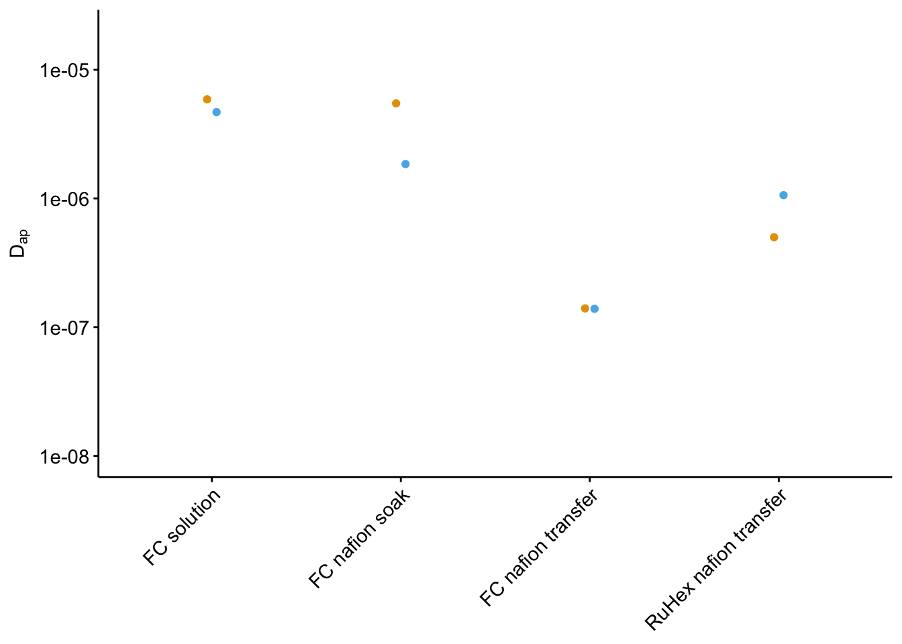

--------

# Notes

To see how we got from the raw electrochemical scans to the datasets used here, please see the following notebooks:

* [IDA ∆phz biofilm processing](https://dkn-lab.github.io/phz_eDNA_2019/code/processing/IDA_dPHZ/IDA_dPHZ_processing.html)
* [IDA WT biofilm processing](https://dkn-lab.github.io/phz_eDNA_2019/code/processing/IDA_WT/IDA_WT_processing.html)
* [IDA blank processing](https://dkn-lab.github.io/phz_eDNA_2019/code/processing/IDA_blank/IDA_blank_processing.html)

This supplemental figure and notebook underlies some of the data in main figure 5, particularly the final panel. Specifically the model coefficients for $D_{ap}$ are calculated in the Fig. S6C and S6F sections. These data are saved as .csv files in the directory containing this notebook.


----

Setup packages and plotting for the notebook:


```r
# Load packages
library(tidyverse)
library(cowplot)
library(kableExtra)
library(broom)
library(modelr)

# Code display options
knitr::opts_chunk$set(tidy.opts=list(width.cutoff=60),tidy=FALSE, echo = TRUE, message=FALSE, warning=FALSE, fig.align="center", fig.retina = 2)

# Load plotting tools
source("../../../tools/plotting_tools.R")


#Modify the plot theme
theme_set(theme_notebook())
```

# Fig. S6A - WT & ∆phz SWV vs. GC

Let's compare WT and ∆phz* + PYO biofilms. We'll go ahead and read in some of the processed data from the WT and ∆phz processing notebooks. First we will look at the decays of the SWV peak currents:


```r
df_WT <- read_csv("../../../processing/processed_data/phz_eDNA_2019_swv_gc_WT_signals.csv") %>% 
  mutate(strain = 'WT')

df_dphz_1 <- read_csv("../../../processing/processed_data/phz_eDNA_2019_swv_gc_signals.csv") %>% 
  filter(reactor == 'transfer' & exp == 1 & run == 1) %>%
  mutate(strain = 'dPHZ')

df_combined <- bind_rows(df_dphz_1, df_WT)
```


```r
plot_dap_combo <- ggplot(df_combined %>% filter(rep>0), aes(x = signal_SWV, y = signal_GC, fill = strain)) + 
  geom_smooth(method = 'lm', color = 'black', fill = 'light gray',linetype = 2, aes(group = strain)) + 
  geom_point(shape = 21)  
plot_dap_combo_styled <- plot_dap_combo+
  scale_x_continuous(labels = nA_label) + 
  scale_y_continuous(labels = nA_label) + 
  labs(x = expression(I[swv]~(nA)), y = expression(I[gc]~(nA)))

plot_dap_combo_styled
```


# Fig. S6B - WT and ∆phz signal decay


```r
plot_decay_combo <- ggplot(df_combined, aes(x = time_SWV, y = signal_SWV, fill = strain, color = strain)) + 
  geom_line() + geom_point(shape = 21, color = 'black') 

plot_decay_combo_styled <- plot_decay_combo + 
  scale_y_continuous(labels = nA_label) +  
  labs(y = expression(I[swv]~(nA)), x = 'Time (min)')
  
plot_decay_combo_styled
```


Now let's plot the SWV vs. GC plots that we use to calculate $D_{ap}$:


```r
plot_dap_combo <- ggplot(df_combined %>% filter(rep>0), aes(x = signal_SWV, y = signal_GC, fill = strain)) + 
  geom_smooth(method = 'lm', color = 'black', fill = 'light gray',linetype = 2, aes(group = strain)) + 
  geom_point(shape = 21)  
plot_dap_combo_styled <- plot_dap_combo+
  scale_x_continuous(labels = nA_label) + 
  scale_y_continuous(labels = nA_label) + 
  labs(x = expression(I[swv]~(nA)), y = expression(I[gc]~(nA)))

plot_dap_combo_styled
```


# Fig. S6C - ∆phz + PYO $D_{ap}$ fits

First, we will read in the paired SWV and GC signals that were generated from the processing notebook. Then we can plot the SWV vs. GC signals for both biofilms and technical replicates. Each dataset is fit with a linear model shaded with a 95% confidence interval.


```r
df_swv_gc <- read_csv("../../../processing/processed_data/phz_eDNA_2019_swv_gc_signals.csv") %>% 
  mutate(exp_id = ifelse(exp =='2', 'Biofilm 1', 'Biofilm 2')) %>% 
  mutate(run_id = paste('Rep ',run, sep = ''))

plot_swv_gc_dphz <- ggplot(df_swv_gc %>% filter(reactor == 'transfer' & rep>0), 
       aes(x = signal_SWV, y = signal_GC)) + 
  geom_smooth(method='lm', linetype = 2, color = 'black')+
  geom_point(shape = 21) + 
  facet_wrap(exp_id~run_id,scales='free')+
  scale_color_viridis(discrete = T)

plot_swv_gc_dphz_styled <- plot_swv_gc_dphz + 
  scale_x_continuous(labels = nA_label) + 
  scale_y_continuous(labels = nA_label) + 
  labs(x = expression(I[swv]~(nA)), y = expression(I[gc]~(nA)), title = '∆phz*')

plot_swv_gc_dphz_styled
```


Above we generated the linear models on the fly for plotting, but let's actually generate those models so that we can look at the quality of each fit. These R squared values will be added to each panel in illustrator.


```r
mods_swv_gc <- df_swv_gc %>% 
  filter(reactor == 'transfer' & rep>0) %>% 
  group_by(exp_id, run_id) %>% 
  do(fit = lm(signal_GC~signal_SWV,data = .))

mods_swv_gc_glance <- glance(mods_swv_gc, fit) %>% 
  select(exp_id,run_id,r.squared,adj.r.squared, p.value)

mods_swv_gc_glance %>% kable(digits = 20) %>%  kable_styling() %>% scroll_box(height = '300px')
```

<div style="border: 1px solid #ddd; padding: 0px; overflow-y: scroll; height:300px; "><table class="table" style="margin-left: auto; margin-right: auto;">
 <thead>
  <tr>
   <th style="text-align:left;position: sticky; top:0; background-color: #FFFFFF;"> exp_id </th>
   <th style="text-align:left;position: sticky; top:0; background-color: #FFFFFF;"> run_id </th>
   <th style="text-align:right;position: sticky; top:0; background-color: #FFFFFF;"> r.squared </th>
   <th style="text-align:right;position: sticky; top:0; background-color: #FFFFFF;"> adj.r.squared </th>
   <th style="text-align:right;position: sticky; top:0; background-color: #FFFFFF;"> p.value </th>
  </tr>
 </thead>
<tbody>
  <tr>
   <td style="text-align:left;"> Biofilm 1 </td>
   <td style="text-align:left;"> Rep 1 </td>
   <td style="text-align:right;"> 0.9910550 </td>
   <td style="text-align:right;"> 0.9903669 </td>
   <td style="text-align:right;"> 1.055808e-14 </td>
  </tr>
  <tr>
   <td style="text-align:left;"> Biofilm 1 </td>
   <td style="text-align:left;"> Rep 2 </td>
   <td style="text-align:right;"> 0.9857378 </td>
   <td style="text-align:right;"> 0.9846407 </td>
   <td style="text-align:right;"> 2.195505e-13 </td>
  </tr>
  <tr>
   <td style="text-align:left;"> Biofilm 1 </td>
   <td style="text-align:left;"> Rep 3 </td>
   <td style="text-align:right;"> 0.9468821 </td>
   <td style="text-align:right;"> 0.9427961 </td>
   <td style="text-align:right;"> 1.150624e-09 </td>
  </tr>
  <tr>
   <td style="text-align:left;"> Biofilm 2 </td>
   <td style="text-align:left;"> Rep 1 </td>
   <td style="text-align:right;"> 0.9977380 </td>
   <td style="text-align:right;"> 0.9975640 </td>
   <td style="text-align:right;"> 1.380000e-18 </td>
  </tr>
  <tr>
   <td style="text-align:left;"> Biofilm 2 </td>
   <td style="text-align:left;"> Rep 2 </td>
   <td style="text-align:right;"> 0.9831090 </td>
   <td style="text-align:right;"> 0.9818097 </td>
   <td style="text-align:right;"> 6.600651e-13 </td>
  </tr>
  <tr>
   <td style="text-align:left;"> Biofilm 2 </td>
   <td style="text-align:left;"> Rep 3 </td>
   <td style="text-align:right;"> 0.9846676 </td>
   <td style="text-align:right;"> 0.9834882 </td>
   <td style="text-align:right;"> 3.515615e-13 </td>
  </tr>
</tbody>
</table></div>

<br>

Here are the actual coefficients from those models, including 95% confidence intervals. We will use these coefficients to calculate Dap in Fig. 6. We will write this dataframe to a csv for later use.


```r
mods_swv_gc_tidy <- tidy(mods_swv_gc, fit, conf.int=T) %>% arrange(desc(term))

write_csv(mods_swv_gc_tidy, "phz2019_dPHZ_Dap_lm_coefs.csv")

mods_swv_gc_tidy %>% kable() %>%  kable_styling() %>% scroll_box(height = '300px')
```

<div style="border: 1px solid #ddd; padding: 0px; overflow-y: scroll; height:300px; "><table class="table" style="margin-left: auto; margin-right: auto;">
 <thead>
  <tr>
   <th style="text-align:left;position: sticky; top:0; background-color: #FFFFFF;"> exp_id </th>
   <th style="text-align:left;position: sticky; top:0; background-color: #FFFFFF;"> run_id </th>
   <th style="text-align:left;position: sticky; top:0; background-color: #FFFFFF;"> term </th>
   <th style="text-align:right;position: sticky; top:0; background-color: #FFFFFF;"> estimate </th>
   <th style="text-align:right;position: sticky; top:0; background-color: #FFFFFF;"> std.error </th>
   <th style="text-align:right;position: sticky; top:0; background-color: #FFFFFF;"> statistic </th>
   <th style="text-align:right;position: sticky; top:0; background-color: #FFFFFF;"> p.value </th>
   <th style="text-align:right;position: sticky; top:0; background-color: #FFFFFF;"> conf.low </th>
   <th style="text-align:right;position: sticky; top:0; background-color: #FFFFFF;"> conf.high </th>
  </tr>
 </thead>
<tbody>
  <tr>
   <td style="text-align:left;"> Biofilm 1 </td>
   <td style="text-align:left;"> Rep 1 </td>
   <td style="text-align:left;"> signal_SWV </td>
   <td style="text-align:right;"> 0.1513328 </td>
   <td style="text-align:right;"> 0.0039875 </td>
   <td style="text-align:right;"> 37.951641 </td>
   <td style="text-align:right;"> 0e+00 </td>
   <td style="text-align:right;"> 0.1427183 </td>
   <td style="text-align:right;"> 0.1599473 </td>
  </tr>
  <tr>
   <td style="text-align:left;"> Biofilm 1 </td>
   <td style="text-align:left;"> Rep 2 </td>
   <td style="text-align:left;"> signal_SWV </td>
   <td style="text-align:right;"> 0.1045085 </td>
   <td style="text-align:right;"> 0.0034865 </td>
   <td style="text-align:right;"> 29.975017 </td>
   <td style="text-align:right;"> 0e+00 </td>
   <td style="text-align:right;"> 0.0969763 </td>
   <td style="text-align:right;"> 0.1120407 </td>
  </tr>
  <tr>
   <td style="text-align:left;"> Biofilm 1 </td>
   <td style="text-align:left;"> Rep 3 </td>
   <td style="text-align:left;"> signal_SWV </td>
   <td style="text-align:right;"> 0.1203080 </td>
   <td style="text-align:right;"> 0.0079031 </td>
   <td style="text-align:right;"> 15.222956 </td>
   <td style="text-align:right;"> 0e+00 </td>
   <td style="text-align:right;"> 0.1032345 </td>
   <td style="text-align:right;"> 0.1373816 </td>
  </tr>
  <tr>
   <td style="text-align:left;"> Biofilm 2 </td>
   <td style="text-align:left;"> Rep 1 </td>
   <td style="text-align:left;"> signal_SWV </td>
   <td style="text-align:right;"> 0.2791415 </td>
   <td style="text-align:right;"> 0.0036863 </td>
   <td style="text-align:right;"> 75.723946 </td>
   <td style="text-align:right;"> 0e+00 </td>
   <td style="text-align:right;"> 0.2711777 </td>
   <td style="text-align:right;"> 0.2871052 </td>
  </tr>
  <tr>
   <td style="text-align:left;"> Biofilm 2 </td>
   <td style="text-align:left;"> Rep 2 </td>
   <td style="text-align:left;"> signal_SWV </td>
   <td style="text-align:right;"> 0.2125194 </td>
   <td style="text-align:right;"> 0.0077260 </td>
   <td style="text-align:right;"> 27.507105 </td>
   <td style="text-align:right;"> 0e+00 </td>
   <td style="text-align:right;"> 0.1958284 </td>
   <td style="text-align:right;"> 0.2292104 </td>
  </tr>
  <tr>
   <td style="text-align:left;"> Biofilm 2 </td>
   <td style="text-align:left;"> Rep 3 </td>
   <td style="text-align:left;"> signal_SWV </td>
   <td style="text-align:right;"> 0.2230086 </td>
   <td style="text-align:right;"> 0.0077181 </td>
   <td style="text-align:right;"> 28.894223 </td>
   <td style="text-align:right;"> 0e+00 </td>
   <td style="text-align:right;"> 0.2063346 </td>
   <td style="text-align:right;"> 0.2396825 </td>
  </tr>
  <tr>
   <td style="text-align:left;"> Biofilm 1 </td>
   <td style="text-align:left;"> Rep 1 </td>
   <td style="text-align:left;"> (Intercept) </td>
   <td style="text-align:right;"> 0.0000000 </td>
   <td style="text-align:right;"> 0.0000000 </td>
   <td style="text-align:right;"> -14.499185 </td>
   <td style="text-align:right;"> 0e+00 </td>
   <td style="text-align:right;"> 0.0000000 </td>
   <td style="text-align:right;"> 0.0000000 </td>
  </tr>
  <tr>
   <td style="text-align:left;"> Biofilm 1 </td>
   <td style="text-align:left;"> Rep 2 </td>
   <td style="text-align:left;"> (Intercept) </td>
   <td style="text-align:right;"> 0.0000000 </td>
   <td style="text-align:right;"> 0.0000000 </td>
   <td style="text-align:right;"> -10.551620 </td>
   <td style="text-align:right;"> 1e-07 </td>
   <td style="text-align:right;"> 0.0000000 </td>
   <td style="text-align:right;"> 0.0000000 </td>
  </tr>
  <tr>
   <td style="text-align:left;"> Biofilm 1 </td>
   <td style="text-align:left;"> Rep 3 </td>
   <td style="text-align:left;"> (Intercept) </td>
   <td style="text-align:right;"> -0.0000001 </td>
   <td style="text-align:right;"> 0.0000000 </td>
   <td style="text-align:right;"> -9.616970 </td>
   <td style="text-align:right;"> 3e-07 </td>
   <td style="text-align:right;"> -0.0000001 </td>
   <td style="text-align:right;"> 0.0000000 </td>
  </tr>
  <tr>
   <td style="text-align:left;"> Biofilm 2 </td>
   <td style="text-align:left;"> Rep 1 </td>
   <td style="text-align:left;"> (Intercept) </td>
   <td style="text-align:right;"> 0.0000000 </td>
   <td style="text-align:right;"> 0.0000000 </td>
   <td style="text-align:right;"> -18.031183 </td>
   <td style="text-align:right;"> 0e+00 </td>
   <td style="text-align:right;"> 0.0000000 </td>
   <td style="text-align:right;"> 0.0000000 </td>
  </tr>
  <tr>
   <td style="text-align:left;"> Biofilm 2 </td>
   <td style="text-align:left;"> Rep 2 </td>
   <td style="text-align:left;"> (Intercept) </td>
   <td style="text-align:right;"> 0.0000000 </td>
   <td style="text-align:right;"> 0.0000000 </td>
   <td style="text-align:right;"> -10.724706 </td>
   <td style="text-align:right;"> 1e-07 </td>
   <td style="text-align:right;"> 0.0000000 </td>
   <td style="text-align:right;"> 0.0000000 </td>
  </tr>
  <tr>
   <td style="text-align:left;"> Biofilm 2 </td>
   <td style="text-align:left;"> Rep 3 </td>
   <td style="text-align:left;"> (Intercept) </td>
   <td style="text-align:right;"> 0.0000000 </td>
   <td style="text-align:right;"> 0.0000000 </td>
   <td style="text-align:right;"> -9.337288 </td>
   <td style="text-align:right;"> 4e-07 </td>
   <td style="text-align:right;"> 0.0000000 </td>
   <td style="text-align:right;"> 0.0000000 </td>
  </tr>
</tbody>
</table></div>

<br>

# Fig. S6D - GC vs. [PYO]

Let's import the blank IDA data. This data was processed from [this notebook](https://scott-saunders.github.io/phz_eDNA_2019/code/processing/IDA_blank/IDA_blank_processing.html), and includes SWV and GC scans taken with a blank IDA in solutions of known concentrations of PYO.

Let's read in the data and convert the µM units to $mol / cm^3$, which will be important to calculate $D_{ap}$ in correct units.


```r
df_soak <- read_csv("../../../processing/processed_data/phz_eDNA_2019_swv_gc_soak_blank.csv") %>% 
  mutate(PHZaddedInt = case_when(
    PHZadded == '100uM' ~ 100,
    PHZadded == '10uM' ~ 10,
    PHZadded == '25uM' ~ 25,
    PHZadded == '50uM' ~ 50,
    PHZadded == '75uM' ~ 75
  )) %>% 
  mutate(C_mol_cm3 = PHZaddedInt*(10^-9))
```

Here is the relationship between GC peak current and concentration:


```r
plot_GC <- ggplot(df_soak, aes(x = C_mol_cm3, y = signal_GC)) +    
  geom_smooth(method='lm', linetype = 2, color = 'black') + geom_point(shape = 21)

plot_GC_styled <- plot_GC+  
  scale_x_continuous(labels = nA_label) + 
  scale_y_continuous(labels = nA_label) + 
  labs(x = expression(PYO~(mu*M)), y = expression(I[gc]~(nA)))
  
plot_GC_styled
```


$I_{GC}$ is simply $I = nFSDC$, so $D_{ap}$ is:

$$D_{ap} = \frac{m}{n F S}$$

We can define a simple function to calculate this $D_{ap}$ from the slope of the line in the above plot.


```r
dap_from_GC <- function(m){
  
  n=1.8
  S <-  18.4 #cm
  F_C = 96485.332
  
  d_ap <- m / (n * F_C * S)
  
  d_ap
}
```

Fitting the linear model and calculating $D_{ap}$ gives these values: 


```r
lm_GC <- tidy(lm(signal_GC~C_mol_cm3, data = df_soak), conf.int = T) %>% 
  filter(term=='C_mol_cm3') %>% 
  mutate(dap=dap_from_GC(m = estimate)) %>% 
  mutate(dap_high = dap_from_GC(m = conf.high)) %>% 
  mutate(dap_low = dap_from_GC(m = conf.low)) %>% 
  mutate(dataset = 'GC')

lm_GC %>% 
  kable() %>% 
  kable_styling()
```

<table class="table" style="margin-left: auto; margin-right: auto;">
 <thead>
  <tr>
   <th style="text-align:left;"> term </th>
   <th style="text-align:right;"> estimate </th>
   <th style="text-align:right;"> std.error </th>
   <th style="text-align:right;"> statistic </th>
   <th style="text-align:right;"> p.value </th>
   <th style="text-align:right;"> conf.low </th>
   <th style="text-align:right;"> conf.high </th>
   <th style="text-align:right;"> dap </th>
   <th style="text-align:right;"> dap_high </th>
   <th style="text-align:right;"> dap_low </th>
   <th style="text-align:left;"> dataset </th>
  </tr>
 </thead>
<tbody>
  <tr>
   <td style="text-align:left;"> C_mol_cm3 </td>
   <td style="text-align:right;"> 22.13434 </td>
   <td style="text-align:right;"> 0.1841017 </td>
   <td style="text-align:right;"> 120.2289 </td>
   <td style="text-align:right;"> 1.3e-06 </td>
   <td style="text-align:right;"> 21.54844 </td>
   <td style="text-align:right;"> 22.72023 </td>
   <td style="text-align:right;"> 6.9e-06 </td>
   <td style="text-align:right;"> 7.1e-06 </td>
   <td style="text-align:right;"> 6.7e-06 </td>
   <td style="text-align:left;"> GC </td>
  </tr>
</tbody>
</table>

<br>

# Fig. S6E - SWV vs. [PYO]

Now we will look at the relationship between concentration and peak SWV current.


```r
plot_SWV <- ggplot(df_soak, aes(x = C_mol_cm3, y = signal_SWV)) +
    geom_smooth(method='lm', linetype = 2, color = 'black') + geom_point(shape = 21)

plot_SWV_styled <- plot_SWV+  
  scale_x_continuous(labels = nA_label) + 
  scale_y_continuous(labels = nA_label) + 
  labs(x = expression(PYO~(mu*M)), y = expression(I[swv]~(nA)))
  
plot_SWV_styled
```


For a plot of $I_{SWV}$ vs. $C$, the slope can be defined in terms of the parameters for $I_{SWV}$ other than concentration. This yields an expression for $D_{ap}$:

$$D_{ap} = \pi t_p \left( \frac{m}{\psi n F A} \right) ^2 $$

So we'll again define the function to calculate it:


```r
dap_from_SWV <- function(m, t_p=1/(2*300)){
  
  n=1.8
  psi <-  0.7
  A <-  0.025 #cm^2
  F_C = 96485.332
  
  d_ap <- pi * t_p * (m / (psi * n * F_C * A))^2
  
  d_ap
}
```

The linear model of this data gives the following:


```r
lm_SWV <- tidy(lm(signal_SWV~C_mol_cm3, data = df_soak), conf.int = T) %>% 
  filter(term=='C_mol_cm3') %>% 
  mutate(dap=dap_from_SWV(m = estimate)) %>% 
  mutate(dap_high = dap_from_SWV(m = conf.high)) %>% 
  mutate(dap_low = dap_from_SWV(m = conf.low)) %>% 
  mutate(dataset = 'SWV')

#glance(lm(signal_from_swv~C_mol_cm3, data = df_cal))

lm_SWV %>% 
  kable() %>% 
  kable_styling()
```

<table class="table" style="margin-left: auto; margin-right: auto;">
 <thead>
  <tr>
   <th style="text-align:left;"> term </th>
   <th style="text-align:right;"> estimate </th>
   <th style="text-align:right;"> std.error </th>
   <th style="text-align:right;"> statistic </th>
   <th style="text-align:right;"> p.value </th>
   <th style="text-align:right;"> conf.low </th>
   <th style="text-align:right;"> conf.high </th>
   <th style="text-align:right;"> dap </th>
   <th style="text-align:right;"> dap_high </th>
   <th style="text-align:right;"> dap_low </th>
   <th style="text-align:left;"> dataset </th>
  </tr>
 </thead>
<tbody>
  <tr>
   <td style="text-align:left;"> C_mol_cm3 </td>
   <td style="text-align:right;"> 111.2799 </td>
   <td style="text-align:right;"> 1.590469 </td>
   <td style="text-align:right;"> 69.96673 </td>
   <td style="text-align:right;"> 6.4e-06 </td>
   <td style="text-align:right;"> 106.2183 </td>
   <td style="text-align:right;"> 116.3415 </td>
   <td style="text-align:right;"> 7e-06 </td>
   <td style="text-align:right;"> 7.7e-06 </td>
   <td style="text-align:right;"> 6.4e-06 </td>
   <td style="text-align:left;"> SWV </td>
  </tr>
</tbody>
</table>

<br>

# Fig. S6F - SWV vs. GC

Finally, we will examine the peak SWV current vs. the peak GC current, which is not dependent on the known PYO concentrations.


```r
plot_swvGC <- ggplot(df_soak, aes(x = signal_SWV, y = signal_GC)) + 
  geom_smooth(method='lm', linetype = 2, color = 'black') + geom_point(shape = 21)

plot_swvGC_styled <- plot_swvGC+  
  scale_x_continuous(labels = nA_label) + 
  scale_y_continuous(labels = nA_label) + 
  labs(x = expression(I[swv]~(nA)), y = expression(I[gc]~(nA)))
  
plot_swvGC_styled
```


Recall that for this type of data:

$$D_{ap} = \frac{1}{\pi t_p} \left( \frac{m A \psi}{S} \right) ^2$$  

So, here's a function that will calculate $D_{ap}$ from the slope of this data:


```r
dap_from_swvGC <- function(m, t_p=1/(2*300)){
  
  psi <-  0.7
  A <-  0.025 #cm^2
  S <-  18.4 #cm
  
  d_ap <- (m*A*psi)^2 / (S^2 * pi * t_p)
  
  d_ap
}
```

And now, we'll fit a linear model and calculate a $D_{ap}$. We'll go ahead and save a csv of this result for use in main figure 6F.


```r
output_lm_swv_gc <- tidy(lm(signal_GC~signal_SWV, data = df_soak), conf.int = T) %>% 
  mutate(exp_id = 'Blank 1', run_id = 'Rep 1')

write_csv(output_lm_swv_gc, "phz2019_blank_Dap_lm_coefs.csv")

lm_swvGC <- tidy(lm(signal_GC~signal_SWV, data = df_soak), conf.int = T) %>% 
  filter(term=='signal_SWV') %>% 
  mutate(dap=dap_from_swvGC(m = estimate)) %>% 
  mutate(dap_high = dap_from_swvGC(m = conf.high)) %>% 
  mutate(dap_low = dap_from_swvGC(m = conf.low)) %>% 
  mutate(dataset = 'SWVvsGC')

lm_swvGC %>% 
  kable() %>% 
  kable_styling()
```

<table class="table" style="margin-left: auto; margin-right: auto;">
 <thead>
  <tr>
   <th style="text-align:left;"> term </th>
   <th style="text-align:right;"> estimate </th>
   <th style="text-align:right;"> std.error </th>
   <th style="text-align:right;"> statistic </th>
   <th style="text-align:right;"> p.value </th>
   <th style="text-align:right;"> conf.low </th>
   <th style="text-align:right;"> conf.high </th>
   <th style="text-align:right;"> dap </th>
   <th style="text-align:right;"> dap_high </th>
   <th style="text-align:right;"> dap_low </th>
   <th style="text-align:left;"> dataset </th>
  </tr>
 </thead>
<tbody>
  <tr>
   <td style="text-align:left;"> signal_SWV </td>
   <td style="text-align:right;"> 0.1987799 </td>
   <td style="text-align:right;"> 0.0033905 </td>
   <td style="text-align:right;"> 58.6286 </td>
   <td style="text-align:right;"> 1.09e-05 </td>
   <td style="text-align:right;"> 0.1879898 </td>
   <td style="text-align:right;"> 0.2095699 </td>
   <td style="text-align:right;"> 6.8e-06 </td>
   <td style="text-align:right;"> 7.6e-06 </td>
   <td style="text-align:right;"> 6.1e-06 </td>
   <td style="text-align:left;"> SWVvsGC </td>
  </tr>
</tbody>
</table>

<br>

# Fig. S6G - $D_{ap}$ estimates (Blank + PYO)

Now let's compare the estimates from each subset of the data:


```r
lms <- bind_rows(lm_swvGC,lm_SWV,lm_GC) %>% 
  select(dataset, term, dap, dap_low, dap_high)

plot_cal_dap <- ggplot(lms, aes(x = dataset, y = dap)) + 
  geom_pointrange(aes(ymin = dap_low, ymax = dap_high), size = 0.25) + 
  ylim(0, 1e-5)

plot_cal_dap_styled <- plot_cal_dap+
  labs(x = 'Dataset', y = expression(D[ap]~(cm^2 / sec)))+
  scale_x_discrete(breaks = c('GC','SWV', 'SWVvsGC'), labels=c('GC vs.\n[PYO]', 'SWV vs.\n[PYO]', 'GC vs.\nSWV'))

plot_cal_dap_styled
```


# Fig. S6H - Nafion $D_{ap}$ estimates


```r
df_nafion <- tibble(molecule = c('fc','fc','fc','ruHex','fc','fc','fc','ruHex'),
                    method = c('chrono','chrono','chrono','chrono','swvGC','swvGC','swvGC','swvGC'),
                    condition = c(1,2,3,4,1,2,3,4),
                    Dap = c(5.89e-6, 5.48e-6, 1.4e-7, 5.e-7, 4.69e-6, 1.85e-6, 1.39e-7, 1.06e-6)
)

labels = c('FC solution','FC nafion soak','FC nafion transfer','RuHex nafion transfer')

plot_nafion <- ggplot(df_nafion %>% filter(method != 'swvGC_2'), aes(x = condition, y = Dap, color = method)) + geom_point(position = position_dodge(width = 0.1)) + scale_y_log10(limits = c(1e-8, 2e-5))+
  scale_x_discrete(limits = c(1,2,3,4),labels = labels ) +
  theme(axis.text.x = element_text(angle = 45, hjust = 1), legend.position = 'right') + labs(y = expression(D[ap]), x = NULL) + guides(color = F)

plot_nafion
```



# Create figure


```r
theme_figure <- function () {
  theme_classic( ) %+replace%
    theme(
      axis.line = element_line(color = 'black', size = 0.25),
      axis.ticks = element_line(color = 'black', size =0.25),
      axis.text = element_text(color = 'black', size=8),
      axis.title=element_text(color = 'black', size=8),
      strip.text = element_text(color = 'black', size = 8),
      strip.background = element_blank(),
      legend.background = element_blank(),
      legend.title=element_text(color = 'black',size=8),
      legend.text=element_text(color = 'black',size=8),
      legend.text.align=0,
      panel.spacing = unit(0,'cm'),
      plot.margin = margin(t=0.25, b = 0.25, l = 0.25, r = 0.25, unit = 'cm'),
      plot.title = element_text(hjust = 0.5, color = 'black', size = 8)
    )
}

theme_set(theme_figure())

fig_s6_top <- plot_grid(plot_dap_combo_styled + guides(fill = F), plot_decay_combo_styled + guides(fill = F, color= F), labels = c('A','B'), label_size = 12)

fig_s6_blank <- plot_grid(plot_GC_styled, plot_SWV_styled, plot_swvGC_styled, plot_cal_dap_styled, plot_nafion,
          align = 'v', axis = 'lr',scale = 0.95, labels = c('D','E','F','G','H'), label_size = 12, ncol = 3 )

#fig_s6_dap_nafion <- plot_grid(plot_cal_dap_styled, plot_nafion,
#          align = 'v', axis = 'lr',scale = 0.95, labels = 'AUTO', label_size = 12, ncol = 2)


fig_s6 <- plot_grid(fig_s6_top, plot_swv_gc_dphz_styled, fig_s6_blank,
                    ncol = 1, rel_heights = c(1, 2,2.5), label_size = 12, labels = c('','C',''))

fig_s6
```


```r
save_plot("../../../../figures/supplement/phz2019_Fig_S6.pdf", fig_s6, base_height = 8, base_width = 7)
```

-----


```r
sessionInfo()
```

```
## R version 3.5.3 (2019-03-11)
## Platform: x86_64-apple-darwin15.6.0 (64-bit)
## Running under: macOS  10.15.6
## 
## Matrix products: default
## BLAS: /Library/Frameworks/R.framework/Versions/3.5/Resources/lib/libRblas.0.dylib
## LAPACK: /Library/Frameworks/R.framework/Versions/3.5/Resources/lib/libRlapack.dylib
## 
## locale:
## [1] en_US.UTF-8/en_US.UTF-8/en_US.UTF-8/C/en_US.UTF-8/en_US.UTF-8
## 
## attached base packages:
## [1] stats     graphics  grDevices utils     datasets  methods   base     
## 
## other attached packages:
##  [1] viridis_0.5.1     viridisLite_0.3.0 modelr_0.1.5     
##  [4] broom_0.5.2       kableExtra_1.1.0  cowplot_0.9.4    
##  [7] forcats_0.4.0     stringr_1.4.0     dplyr_0.8.3      
## [10] purrr_0.3.3       readr_1.3.1       tidyr_1.0.0      
## [13] tibble_2.1.3      ggplot2_3.3.0     tidyverse_1.3.0  
## 
## loaded via a namespace (and not attached):
##  [1] tidyselect_0.2.5 xfun_0.7         splines_3.5.3    haven_2.2.0     
##  [5] lattice_0.20-38  colorspace_1.4-1 vctrs_0.3.1      generics_0.0.2  
##  [9] htmltools_0.4.0  mgcv_1.8-27      yaml_2.2.0       rlang_0.4.6     
## [13] pillar_1.4.2     glue_1.3.1       withr_2.1.2      DBI_1.0.0       
## [17] dbplyr_1.4.2     readxl_1.3.1     lifecycle_0.1.0  munsell_0.5.0   
## [21] gtable_0.3.0     cellranger_1.1.0 rvest_0.3.5      evaluate_0.14   
## [25] labeling_0.3     knitr_1.23       highr_0.8        Rcpp_1.0.2      
## [29] scales_1.0.0     backports_1.1.4  webshot_0.5.1    jsonlite_1.6    
## [33] fs_1.3.1         gridExtra_2.3    hms_0.5.3        digest_0.6.21   
## [37] stringi_1.4.3    grid_3.5.3       cli_1.1.0        tools_3.5.3     
## [41] magrittr_1.5     crayon_1.3.4     pkgconfig_2.0.3  Matrix_1.2-15   
## [45] xml2_1.2.2       reprex_0.3.0     lubridate_1.7.4  assertthat_0.2.1
## [49] rmarkdown_1.13   httr_1.4.1       rstudioapi_0.10  R6_2.4.0        
## [53] nlme_3.1-137     compiler_3.5.3
```
