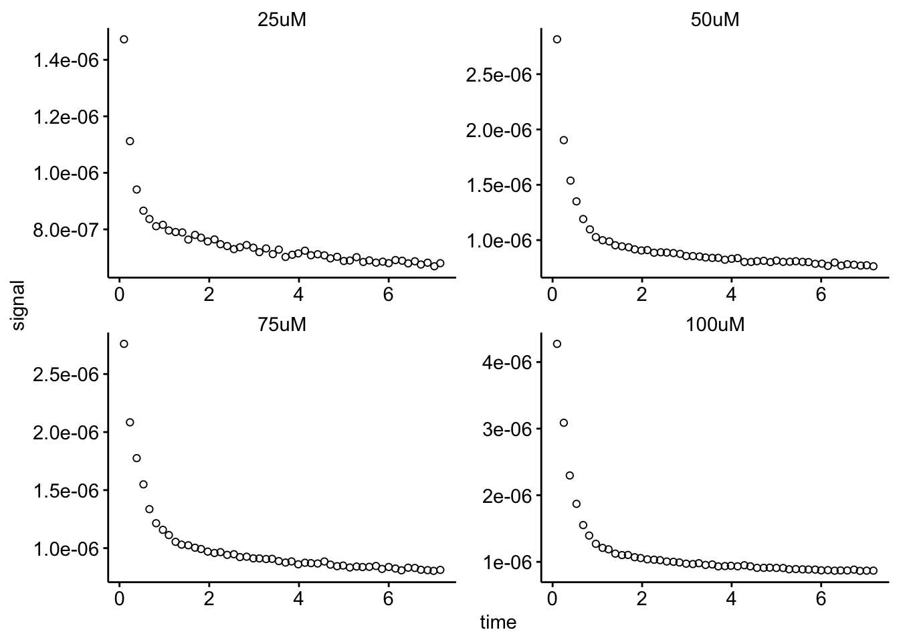
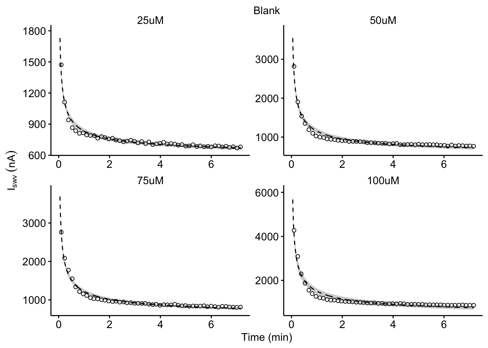
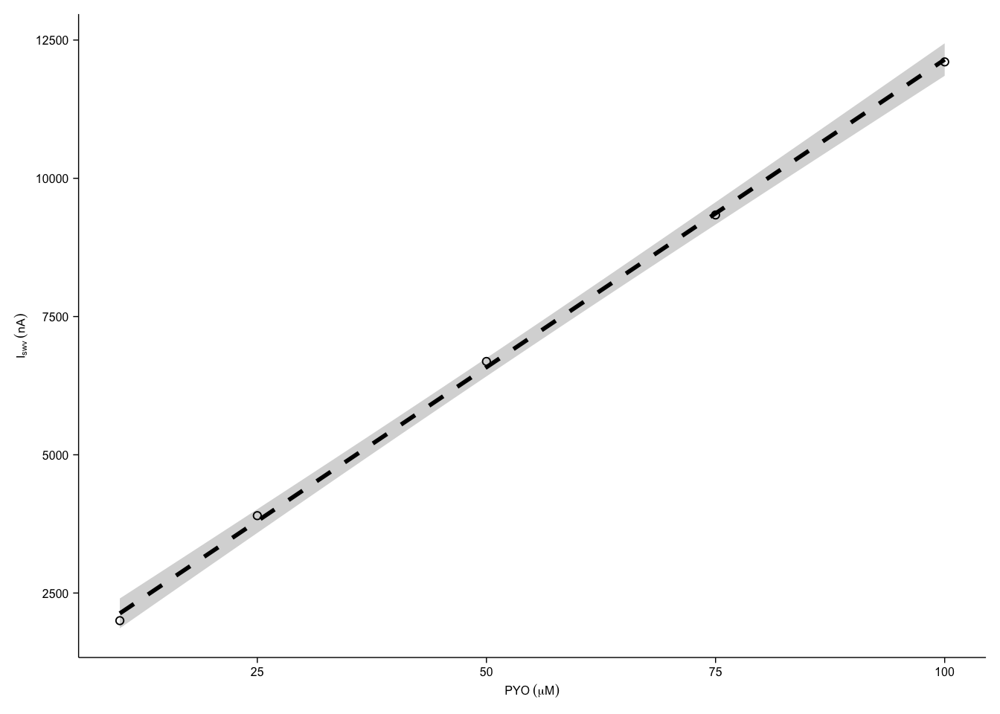
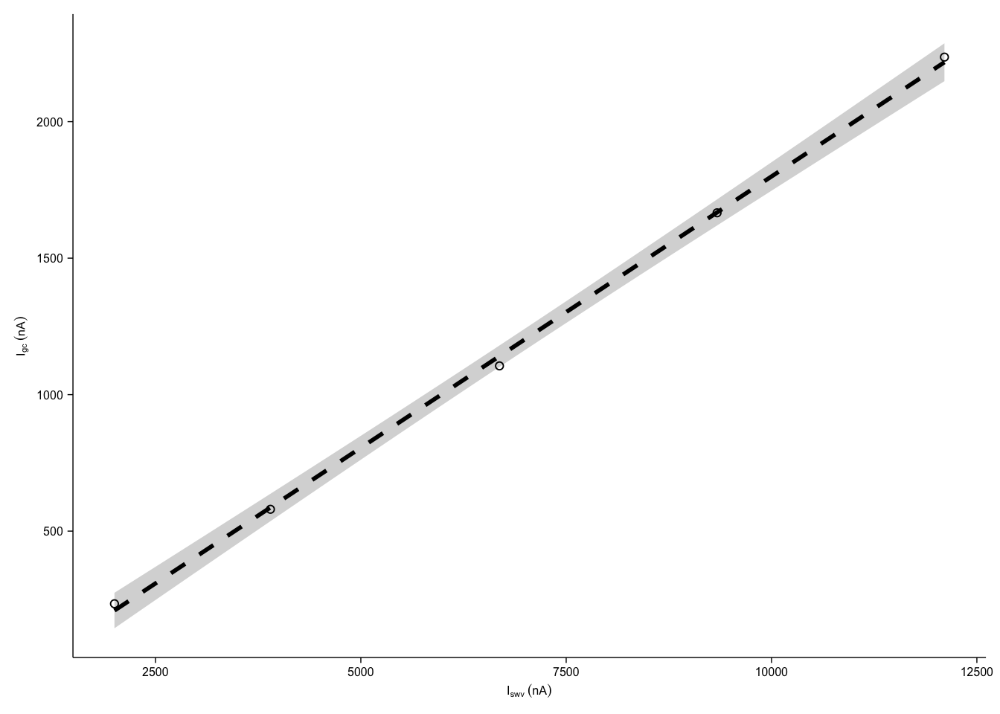
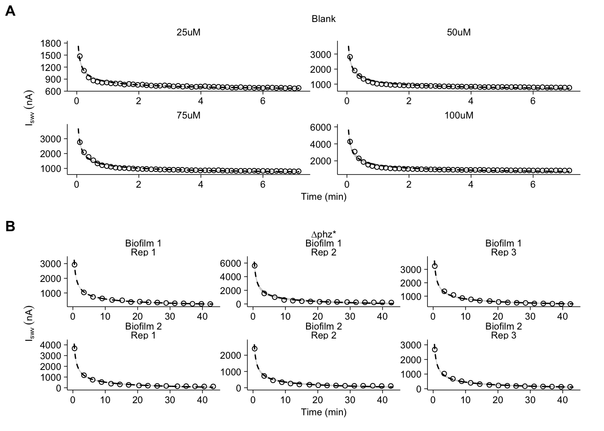

--------

# Notes

To see how we got from the raw electrochemical scans to the datasets used here, please see the following notebooks:

* [IDA ∆phz biofilm processing](https://dkn-lab.github.io/phz_eDNA_2019/code/processing/IDA_dPHZ/IDA_dPHZ_processing.html)
* [IDA blank processing](https://dkn-lab.github.io/phz_eDNA_2019/code/processing/IDA_blank/IDA_blank_processing.html)

This supplemental figure and notebook underlies some of the data in main figure 6, particularly the final panel. Specifically the model coefficients for $D_{loss}$. These data are saved as .csv files in the directory containing this notebook.

----

Setup packages and plotting for the notebook:


```r
# Load packages
library(tidyverse)
library(cowplot)
library(kableExtra)
library(broom)

# Code display options
knitr::opts_chunk$set(tidy.opts=list(width.cutoff=60),tidy=FALSE, echo = TRUE, message=FALSE, warning=FALSE, fig.align="center", fig.retina = 2)

# Load plotting tools
source("../../../tools/plotting_tools.R")


#Modify the plot theme
theme_set(theme_notebook())
```

# Fig. S7A

Now let's plot the SWV peak current decays for the blank IDA. This data comes from the blank IDA processing notebook.


```r
df_blank_swv <- read_csv("../../../processing/processed_data/phz_eDNA_2019_swv_blank_tran_time_signals.csv") %>% 
  filter(reactor == 'transfer' & PHZadded != '10uM') %>% 
  mutate(PHZadded = fct_relevel(PHZadded, c('25uM','50uM','75uM','100uM') ))

ggplot(df_blank_swv, aes(x = time, y = signal)) + 
  geom_point(shape = 21) + facet_wrap(~PHZadded, scales = 'free')
```



Now we will fit each of these decays. We will go ahead and save these coefficients as a csv, so that we can use them to calculate Dphys values in main figure 6.


```r
blank_nls <- df_blank_swv%>%
  group_by(PHZadded) %>% 
  do(
    tidy(
      nls(data = ., formula =  signal ~ b * (time)^-0.5 + a, start = c(b = 0.1, a = 1e-07) ),
      conf.int = T
    )
  ) %>% 
  arrange(desc(term))

# write results to csv for fig 6.
write_csv(blank_nls, "phz2019_blank_Dphys_nls_coefs.csv")

# print results here
blank_nls %>% kable(digits = 10) %>% kable_styling() %>% scroll_box(height = '300px')
```

<div style="border: 1px solid #ddd; padding: 0px; overflow-y: scroll; height:300px; "><table class="table" style="margin-left: auto; margin-right: auto;">
 <thead>
  <tr>
   <th style="text-align:left;position: sticky; top:0; background-color: #FFFFFF;"> PHZadded </th>
   <th style="text-align:left;position: sticky; top:0; background-color: #FFFFFF;"> term </th>
   <th style="text-align:right;position: sticky; top:0; background-color: #FFFFFF;"> estimate </th>
   <th style="text-align:right;position: sticky; top:0; background-color: #FFFFFF;"> std.error </th>
   <th style="text-align:right;position: sticky; top:0; background-color: #FFFFFF;"> statistic </th>
   <th style="text-align:right;position: sticky; top:0; background-color: #FFFFFF;"> p.value </th>
   <th style="text-align:right;position: sticky; top:0; background-color: #FFFFFF;"> conf.low </th>
   <th style="text-align:right;position: sticky; top:0; background-color: #FFFFFF;"> conf.high </th>
  </tr>
 </thead>
<tbody>
  <tr>
   <td style="text-align:left;"> 25uM </td>
   <td style="text-align:left;"> b </td>
   <td style="text-align:right;"> 2.5820e-07 </td>
   <td style="text-align:right;"> 6.40e-09 </td>
   <td style="text-align:right;"> 40.21524 </td>
   <td style="text-align:right;"> 0 </td>
   <td style="text-align:right;"> 2.4530e-07 </td>
   <td style="text-align:right;"> 2.7110e-07 </td>
  </tr>
  <tr>
   <td style="text-align:left;"> 50uM </td>
   <td style="text-align:left;"> b </td>
   <td style="text-align:right;"> 6.8810e-07 </td>
   <td style="text-align:right;"> 1.72e-08 </td>
   <td style="text-align:right;"> 39.94904 </td>
   <td style="text-align:right;"> 0 </td>
   <td style="text-align:right;"> 6.5350e-07 </td>
   <td style="text-align:right;"> 7.2280e-07 </td>
  </tr>
  <tr>
   <td style="text-align:left;"> 75uM </td>
   <td style="text-align:left;"> b </td>
   <td style="text-align:right;"> 7.1070e-07 </td>
   <td style="text-align:right;"> 1.29e-08 </td>
   <td style="text-align:right;"> 54.90900 </td>
   <td style="text-align:right;"> 0 </td>
   <td style="text-align:right;"> 6.8470e-07 </td>
   <td style="text-align:right;"> 7.3670e-07 </td>
  </tr>
  <tr>
   <td style="text-align:left;"> 100uM </td>
   <td style="text-align:left;"> b </td>
   <td style="text-align:right;"> 1.2004e-06 </td>
   <td style="text-align:right;"> 3.57e-08 </td>
   <td style="text-align:right;"> 33.60837 </td>
   <td style="text-align:right;"> 0 </td>
   <td style="text-align:right;"> 1.1286e-06 </td>
   <td style="text-align:right;"> 1.2722e-06 </td>
  </tr>
  <tr>
   <td style="text-align:left;"> 25uM </td>
   <td style="text-align:left;"> a </td>
   <td style="text-align:right;"> 5.7510e-07 </td>
   <td style="text-align:right;"> 5.50e-09 </td>
   <td style="text-align:right;"> 105.50380 </td>
   <td style="text-align:right;"> 0 </td>
   <td style="text-align:right;"> 5.6410e-07 </td>
   <td style="text-align:right;"> 5.8600e-07 </td>
  </tr>
  <tr>
   <td style="text-align:left;"> 50uM </td>
   <td style="text-align:left;"> a </td>
   <td style="text-align:right;"> 4.6600e-07 </td>
   <td style="text-align:right;"> 1.45e-08 </td>
   <td style="text-align:right;"> 32.10654 </td>
   <td style="text-align:right;"> 0 </td>
   <td style="text-align:right;"> 4.3690e-07 </td>
   <td style="text-align:right;"> 4.9520e-07 </td>
  </tr>
  <tr>
   <td style="text-align:left;"> 75uM </td>
   <td style="text-align:left;"> a </td>
   <td style="text-align:right;"> 5.1180e-07 </td>
   <td style="text-align:right;"> 1.10e-08 </td>
   <td style="text-align:right;"> 46.57613 </td>
   <td style="text-align:right;"> 0 </td>
   <td style="text-align:right;"> 4.8970e-07 </td>
   <td style="text-align:right;"> 5.3390e-07 </td>
  </tr>
  <tr>
   <td style="text-align:left;"> 100uM </td>
   <td style="text-align:left;"> a </td>
   <td style="text-align:right;"> 3.0720e-07 </td>
   <td style="text-align:right;"> 3.02e-08 </td>
   <td style="text-align:right;"> 10.18376 </td>
   <td style="text-align:right;"> 0 </td>
   <td style="text-align:right;"> 2.4660e-07 </td>
   <td style="text-align:right;"> 3.6790e-07 </td>
  </tr>
</tbody>
</table></div>
<br>

Now we are going to take those coefficient estimates and predict datapoints that those values would generate at 1000 timepoints in the window our data is in. Essentially, we are going to generate the best fit line from those parameters and the 95% confidence interval so that we can plot it with the original datapoints.


```r
blank_grid <- tibble(time = seq(0.05, max(df_blank_swv$time), length.out = 1000))

blank_coefs <- left_join(blank_nls %>% filter(term == 'b'),
                      blank_nls %>% filter(term == 'a'), 
                      by = c('PHZadded'), suffix = c('_b','_a'))

blank_grid <- left_join(df_blank_swv %>% group_by(reactor, PHZadded) %>% summarise(),
                       blank_grid %>% mutate(reactor = 'transfer'), by = c('reactor'))

blank_grid_coef <- left_join(blank_grid, blank_coefs, by  = c('PHZadded'))

blank_preds <- blank_grid_coef %>% 
  mutate(pred = estimate_b * (time^-0.5) + estimate_a) %>% 
  mutate(pred_low = conf.low_b* (time^-0.5) + conf.low_a) %>% 
  mutate(pred_high = conf.high_b* (time^-0.5) + conf.high_a) 

write_csv(blank_preds, "phz2019_blank_Dphys_preds.csv")

# print simple results here
blank_preds %>% 
  select(reactor,PHZadded, time, pred, pred_high, pred_low, estimate_b, 
         conf.low_b, conf.high_b, estimate_a, conf.low_a, conf.high_a) %>% 
  head() %>% kable(digits = 7) %>% kable_styling() %>% scroll_box(height = '300px')
```

<div style="border: 1px solid #ddd; padding: 0px; overflow-y: scroll; height:300px; "><table class="table" style="margin-left: auto; margin-right: auto;">
 <thead>
  <tr>
   <th style="text-align:left;position: sticky; top:0; background-color: #FFFFFF;"> reactor </th>
   <th style="text-align:left;position: sticky; top:0; background-color: #FFFFFF;"> PHZadded </th>
   <th style="text-align:right;position: sticky; top:0; background-color: #FFFFFF;"> time </th>
   <th style="text-align:right;position: sticky; top:0; background-color: #FFFFFF;"> pred </th>
   <th style="text-align:right;position: sticky; top:0; background-color: #FFFFFF;"> pred_high </th>
   <th style="text-align:right;position: sticky; top:0; background-color: #FFFFFF;"> pred_low </th>
   <th style="text-align:right;position: sticky; top:0; background-color: #FFFFFF;"> estimate_b </th>
   <th style="text-align:right;position: sticky; top:0; background-color: #FFFFFF;"> conf.low_b </th>
   <th style="text-align:right;position: sticky; top:0; background-color: #FFFFFF;"> conf.high_b </th>
   <th style="text-align:right;position: sticky; top:0; background-color: #FFFFFF;"> estimate_a </th>
   <th style="text-align:right;position: sticky; top:0; background-color: #FFFFFF;"> conf.low_a </th>
   <th style="text-align:right;position: sticky; top:0; background-color: #FFFFFF;"> conf.high_a </th>
  </tr>
 </thead>
<tbody>
  <tr>
   <td style="text-align:left;"> transfer </td>
   <td style="text-align:left;"> 25uM </td>
   <td style="text-align:right;"> 0.0500000 </td>
   <td style="text-align:right;"> 1.7e-06 </td>
   <td style="text-align:right;"> 1.8e-06 </td>
   <td style="text-align:right;"> 1.7e-06 </td>
   <td style="text-align:right;"> 3e-07 </td>
   <td style="text-align:right;"> 2e-07 </td>
   <td style="text-align:right;"> 3e-07 </td>
   <td style="text-align:right;"> 6e-07 </td>
   <td style="text-align:right;"> 6e-07 </td>
   <td style="text-align:right;"> 6e-07 </td>
  </tr>
  <tr>
   <td style="text-align:left;"> transfer </td>
   <td style="text-align:left;"> 25uM </td>
   <td style="text-align:right;"> 0.0571238 </td>
   <td style="text-align:right;"> 1.7e-06 </td>
   <td style="text-align:right;"> 1.7e-06 </td>
   <td style="text-align:right;"> 1.6e-06 </td>
   <td style="text-align:right;"> 3e-07 </td>
   <td style="text-align:right;"> 2e-07 </td>
   <td style="text-align:right;"> 3e-07 </td>
   <td style="text-align:right;"> 6e-07 </td>
   <td style="text-align:right;"> 6e-07 </td>
   <td style="text-align:right;"> 6e-07 </td>
  </tr>
  <tr>
   <td style="text-align:left;"> transfer </td>
   <td style="text-align:left;"> 25uM </td>
   <td style="text-align:right;"> 0.0642476 </td>
   <td style="text-align:right;"> 1.6e-06 </td>
   <td style="text-align:right;"> 1.7e-06 </td>
   <td style="text-align:right;"> 1.5e-06 </td>
   <td style="text-align:right;"> 3e-07 </td>
   <td style="text-align:right;"> 2e-07 </td>
   <td style="text-align:right;"> 3e-07 </td>
   <td style="text-align:right;"> 6e-07 </td>
   <td style="text-align:right;"> 6e-07 </td>
   <td style="text-align:right;"> 6e-07 </td>
  </tr>
  <tr>
   <td style="text-align:left;"> transfer </td>
   <td style="text-align:left;"> 25uM </td>
   <td style="text-align:right;"> 0.0713714 </td>
   <td style="text-align:right;"> 1.5e-06 </td>
   <td style="text-align:right;"> 1.6e-06 </td>
   <td style="text-align:right;"> 1.5e-06 </td>
   <td style="text-align:right;"> 3e-07 </td>
   <td style="text-align:right;"> 2e-07 </td>
   <td style="text-align:right;"> 3e-07 </td>
   <td style="text-align:right;"> 6e-07 </td>
   <td style="text-align:right;"> 6e-07 </td>
   <td style="text-align:right;"> 6e-07 </td>
  </tr>
  <tr>
   <td style="text-align:left;"> transfer </td>
   <td style="text-align:left;"> 25uM </td>
   <td style="text-align:right;"> 0.0784952 </td>
   <td style="text-align:right;"> 1.5e-06 </td>
   <td style="text-align:right;"> 1.6e-06 </td>
   <td style="text-align:right;"> 1.4e-06 </td>
   <td style="text-align:right;"> 3e-07 </td>
   <td style="text-align:right;"> 2e-07 </td>
   <td style="text-align:right;"> 3e-07 </td>
   <td style="text-align:right;"> 6e-07 </td>
   <td style="text-align:right;"> 6e-07 </td>
   <td style="text-align:right;"> 6e-07 </td>
  </tr>
  <tr>
   <td style="text-align:left;"> transfer </td>
   <td style="text-align:left;"> 25uM </td>
   <td style="text-align:right;"> 0.0856190 </td>
   <td style="text-align:right;"> 1.5e-06 </td>
   <td style="text-align:right;"> 1.5e-06 </td>
   <td style="text-align:right;"> 1.4e-06 </td>
   <td style="text-align:right;"> 3e-07 </td>
   <td style="text-align:right;"> 2e-07 </td>
   <td style="text-align:right;"> 3e-07 </td>
   <td style="text-align:right;"> 6e-07 </td>
   <td style="text-align:right;"> 6e-07 </td>
   <td style="text-align:right;"> 6e-07 </td>
  </tr>
</tbody>
</table></div>
<br>

Now they we have those predictions we can plot everything together:


```r
plot_decays_blank <- ggplot(blank_preds, aes(x = time, y = pred)) + 
  geom_ribbon(aes(ymin = pred_low, ymax = pred_high), fill = 'light gray') +
  geom_path(linetype = 2)+
  geom_point(data =df_blank_swv, aes(x = time, y = signal) , shape = 21)+
  facet_wrap(~PHZadded, scale = 'free')

plot_decays_blank_styled <- plot_decays_blank+
    scale_y_continuous(labels = nA_label) +  
  labs(y = expression(I[swv]~(nA)), x = 'Time (min)', title = 'Blank')

plot_decays_blank_styled
```




# Fig. S7B

First let's read in the data, which are the peak SWV current signals over time from the ∆phz* biofilms:


```r
df_dphz_swv <- read_csv("../../../processing/processed_data/phz_eDNA_2019_signals_long.csv") %>% 
  filter(echem == 'SWV') %>% 
  filter(electrode == 'i1' & reactor %in% c('transfer','soak')) %>% 
  mutate(exp_id = ifelse(exp =='2', 'Biofilm 1', 'Biofilm 2')) %>% 
  mutate(run_id = paste('Rep ',run, sep = ''))

ggplot(df_dphz_swv %>% filter(reactor == 'transfer'), aes(x = time, y = signal)) + 
  geom_point(shape = 21) + facet_wrap(exp_id~run_id, scales = 'free')
```



Now we will fit each of these decays with the expression: 

$$y = b (x)^{-0.5} + a$$ 

We will fit using a nonlinear least squares method, the `nls()` function. Here you can see the model coefficient estimates and confidence intervals for each data set. We will go ahead and save these coefficients as a csv, so that we can use them to calculate $D_{phys}$ values in main figure 6.


```r
dphz_nls <- df_dphz_swv %>% filter(reactor == 'transfer') %>%
  group_by(exp, run) %>% 
  do(
    tidy(
      nls(data = ., formula =  signal ~ b * (time)^-0.5 + a, start = c(b = 0.1, a = 1e-07) ),
      conf.int = T
    )
  ) %>% 
  arrange(desc(term))

# write results to csv for fig 6.
write_csv(dphz_nls, "phz2019_dPHZ_Dphys_nls_coefs.csv")

# print results here
dphz_nls %>% kable(digits = 10) %>% kable_styling() %>% scroll_box(height = '300px')
```

<div style="border: 1px solid #ddd; padding: 0px; overflow-y: scroll; height:300px; "><table class="table" style="margin-left: auto; margin-right: auto;">
 <thead>
  <tr>
   <th style="text-align:right;position: sticky; top:0; background-color: #FFFFFF;"> exp </th>
   <th style="text-align:left;position: sticky; top:0; background-color: #FFFFFF;"> run </th>
   <th style="text-align:left;position: sticky; top:0; background-color: #FFFFFF;"> term </th>
   <th style="text-align:right;position: sticky; top:0; background-color: #FFFFFF;"> estimate </th>
   <th style="text-align:right;position: sticky; top:0; background-color: #FFFFFF;"> std.error </th>
   <th style="text-align:right;position: sticky; top:0; background-color: #FFFFFF;"> statistic </th>
   <th style="text-align:right;position: sticky; top:0; background-color: #FFFFFF;"> p.value </th>
   <th style="text-align:right;position: sticky; top:0; background-color: #FFFFFF;"> conf.low </th>
   <th style="text-align:right;position: sticky; top:0; background-color: #FFFFFF;"> conf.high </th>
  </tr>
 </thead>
<tbody>
  <tr>
   <td style="text-align:right;"> 1 </td>
   <td style="text-align:left;"> 1 </td>
   <td style="text-align:left;"> b </td>
   <td style="text-align:right;"> 2.8459e-06 </td>
   <td style="text-align:right;"> 3.730e-08 </td>
   <td style="text-align:right;"> 76.37392 </td>
   <td style="text-align:right;"> 0.0000e+00 </td>
   <td style="text-align:right;"> 2.7660e-06 </td>
   <td style="text-align:right;"> 2.9259e-06 </td>
  </tr>
  <tr>
   <td style="text-align:right;"> 1 </td>
   <td style="text-align:left;"> 2 </td>
   <td style="text-align:left;"> b </td>
   <td style="text-align:right;"> 1.8397e-06 </td>
   <td style="text-align:right;"> 3.440e-08 </td>
   <td style="text-align:right;"> 53.54277 </td>
   <td style="text-align:right;"> 0.0000e+00 </td>
   <td style="text-align:right;"> 1.7660e-06 </td>
   <td style="text-align:right;"> 1.9134e-06 </td>
  </tr>
  <tr>
   <td style="text-align:right;"> 1 </td>
   <td style="text-align:left;"> 3 </td>
   <td style="text-align:left;"> b </td>
   <td style="text-align:right;"> 2.0603e-06 </td>
   <td style="text-align:right;"> 3.320e-08 </td>
   <td style="text-align:right;"> 62.03742 </td>
   <td style="text-align:right;"> 0.0000e+00 </td>
   <td style="text-align:right;"> 1.9891e-06 </td>
   <td style="text-align:right;"> 2.1316e-06 </td>
  </tr>
  <tr>
   <td style="text-align:right;"> 2 </td>
   <td style="text-align:left;"> 1 </td>
   <td style="text-align:left;"> b </td>
   <td style="text-align:right;"> 2.1195e-06 </td>
   <td style="text-align:right;"> 1.800e-08 </td>
   <td style="text-align:right;"> 117.66825 </td>
   <td style="text-align:right;"> 0.0000e+00 </td>
   <td style="text-align:right;"> 2.0808e-06 </td>
   <td style="text-align:right;"> 2.1581e-06 </td>
  </tr>
  <tr>
   <td style="text-align:right;"> 2 </td>
   <td style="text-align:left;"> 2 </td>
   <td style="text-align:left;"> b </td>
   <td style="text-align:right;"> 4.3024e-06 </td>
   <td style="text-align:right;"> 1.032e-07 </td>
   <td style="text-align:right;"> 41.68772 </td>
   <td style="text-align:right;"> 0.0000e+00 </td>
   <td style="text-align:right;"> 4.0810e-06 </td>
   <td style="text-align:right;"> 4.5238e-06 </td>
  </tr>
  <tr>
   <td style="text-align:right;"> 2 </td>
   <td style="text-align:left;"> 3 </td>
   <td style="text-align:left;"> b </td>
   <td style="text-align:right;"> 2.2664e-06 </td>
   <td style="text-align:right;"> 3.250e-08 </td>
   <td style="text-align:right;"> 69.81429 </td>
   <td style="text-align:right;"> 0.0000e+00 </td>
   <td style="text-align:right;"> 2.1968e-06 </td>
   <td style="text-align:right;"> 2.3360e-06 </td>
  </tr>
  <tr>
   <td style="text-align:right;"> 1 </td>
   <td style="text-align:left;"> 1 </td>
   <td style="text-align:left;"> a </td>
   <td style="text-align:right;"> -3.8110e-07 </td>
   <td style="text-align:right;"> 1.640e-08 </td>
   <td style="text-align:right;"> -23.30704 </td>
   <td style="text-align:right;"> 0.0000e+00 </td>
   <td style="text-align:right;"> -4.1620e-07 </td>
   <td style="text-align:right;"> -3.4600e-07 </td>
  </tr>
  <tr>
   <td style="text-align:right;"> 1 </td>
   <td style="text-align:left;"> 2 </td>
   <td style="text-align:left;"> a </td>
   <td style="text-align:right;"> -2.3510e-07 </td>
   <td style="text-align:right;"> 1.510e-08 </td>
   <td style="text-align:right;"> -15.58687 </td>
   <td style="text-align:right;"> 3.0000e-10 </td>
   <td style="text-align:right;"> -2.6750e-07 </td>
   <td style="text-align:right;"> -2.0280e-07 </td>
  </tr>
  <tr>
   <td style="text-align:right;"> 1 </td>
   <td style="text-align:left;"> 3 </td>
   <td style="text-align:left;"> a </td>
   <td style="text-align:right;"> -2.0100e-07 </td>
   <td style="text-align:right;"> 1.460e-08 </td>
   <td style="text-align:right;"> -13.76958 </td>
   <td style="text-align:right;"> 1.6000e-09 </td>
   <td style="text-align:right;"> -2.3230e-07 </td>
   <td style="text-align:right;"> -1.6970e-07 </td>
  </tr>
  <tr>
   <td style="text-align:right;"> 2 </td>
   <td style="text-align:left;"> 1 </td>
   <td style="text-align:left;"> a </td>
   <td style="text-align:right;"> -8.3000e-08 </td>
   <td style="text-align:right;"> 7.900e-09 </td>
   <td style="text-align:right;"> -10.51260 </td>
   <td style="text-align:right;"> 5.0100e-08 </td>
   <td style="text-align:right;"> -9.9900e-08 </td>
   <td style="text-align:right;"> -6.6100e-08 </td>
  </tr>
  <tr>
   <td style="text-align:right;"> 2 </td>
   <td style="text-align:left;"> 2 </td>
   <td style="text-align:left;"> a </td>
   <td style="text-align:right;"> -5.9640e-07 </td>
   <td style="text-align:right;"> 4.500e-08 </td>
   <td style="text-align:right;"> -13.24111 </td>
   <td style="text-align:right;"> 2.6000e-09 </td>
   <td style="text-align:right;"> -6.9300e-07 </td>
   <td style="text-align:right;"> -4.9980e-07 </td>
  </tr>
  <tr>
   <td style="text-align:right;"> 2 </td>
   <td style="text-align:left;"> 3 </td>
   <td style="text-align:left;"> a </td>
   <td style="text-align:right;"> 7.8100e-08 </td>
   <td style="text-align:right;"> 1.420e-08 </td>
   <td style="text-align:right;"> 5.48665 </td>
   <td style="text-align:right;"> 8.0121e-05 </td>
   <td style="text-align:right;"> 4.7600e-08 </td>
   <td style="text-align:right;"> 1.0860e-07 </td>
  </tr>
</tbody>
</table></div>
<br>

Now we are going to take those coefficient estimates and predict datapoints that those values would generate at 1000 timepoints in the window our data is in. Essentially, we are going to generate the best fit line from those parameters and the 95% confidence interval so that we can plot it with the original datapoints.


```r
dphz_grid <- tibble(time = seq(0.4, max(df_dphz_swv$time), length.out = 1000))

dphz_coefs <- left_join(dphz_nls %>% filter(term == 'b'),
                      dphz_nls %>% filter(term == 'a'), 
                      by = c('exp','run'), suffix = c('_b','_a'))

dphz_grid <- left_join(df_dphz_swv %>% filter(reactor == 'transfer') %>% group_by(reactor, exp, run, exp_id, run_id) %>% summarise(),
                       dphz_grid %>% mutate(reactor = 'transfer'), by = c('reactor'))

dphz_grid_coef <- left_join(dphz_grid, dphz_coefs, by  = c('exp','run'))

dphz_preds <- dphz_grid_coef %>% 
  mutate(pred = estimate_b * (time^-0.5) + estimate_a) %>% 
  mutate(pred_low = conf.low_b* (time^-0.5) + conf.low_a) %>% 
  mutate(pred_high = conf.high_b* (time^-0.5) + conf.high_a) 

write_csv(dphz_preds, "phz2019_dPHZ_Dphys_preds.csv")

# print simple results here
dphz_preds %>% 
  select(reactor,exp, run, time, pred, pred_high, pred_low, estimate_b, 
         conf.low_b, conf.high_b, estimate_a, conf.low_a, conf.high_a) %>% 
  head() %>% kable(digits = 10) %>% kable_styling() %>% scroll_box(height = '300px')
```

<div style="border: 1px solid #ddd; padding: 0px; overflow-y: scroll; height:300px; "><table class="table" style="margin-left: auto; margin-right: auto;">
 <thead>
  <tr>
   <th style="text-align:left;position: sticky; top:0; background-color: #FFFFFF;"> exp_id </th>
   <th style="text-align:left;position: sticky; top:0; background-color: #FFFFFF;"> reactor </th>
   <th style="text-align:right;position: sticky; top:0; background-color: #FFFFFF;"> exp </th>
   <th style="text-align:left;position: sticky; top:0; background-color: #FFFFFF;"> run </th>
   <th style="text-align:right;position: sticky; top:0; background-color: #FFFFFF;"> time </th>
   <th style="text-align:right;position: sticky; top:0; background-color: #FFFFFF;"> pred </th>
   <th style="text-align:right;position: sticky; top:0; background-color: #FFFFFF;"> pred_high </th>
   <th style="text-align:right;position: sticky; top:0; background-color: #FFFFFF;"> pred_low </th>
   <th style="text-align:right;position: sticky; top:0; background-color: #FFFFFF;"> estimate_b </th>
   <th style="text-align:right;position: sticky; top:0; background-color: #FFFFFF;"> conf.low_b </th>
   <th style="text-align:right;position: sticky; top:0; background-color: #FFFFFF;"> conf.high_b </th>
   <th style="text-align:right;position: sticky; top:0; background-color: #FFFFFF;"> estimate_a </th>
   <th style="text-align:right;position: sticky; top:0; background-color: #FFFFFF;"> conf.low_a </th>
   <th style="text-align:right;position: sticky; top:0; background-color: #FFFFFF;"> conf.high_a </th>
  </tr>
 </thead>
<tbody>
  <tr>
   <td style="text-align:left;"> Biofilm 2 </td>
   <td style="text-align:left;"> transfer </td>
   <td style="text-align:right;"> 1 </td>
   <td style="text-align:left;"> 1 </td>
   <td style="text-align:right;"> 0.4000000 </td>
   <td style="text-align:right;"> 4.1187e-06 </td>
   <td style="text-align:right;"> 4.2801e-06 </td>
   <td style="text-align:right;"> 3.9573e-06 </td>
   <td style="text-align:right;"> 2.8459e-06 </td>
   <td style="text-align:right;"> 2.766e-06 </td>
   <td style="text-align:right;"> 2.9259e-06 </td>
   <td style="text-align:right;"> -3.811e-07 </td>
   <td style="text-align:right;"> -4.162e-07 </td>
   <td style="text-align:right;"> -3.46e-07 </td>
  </tr>
  <tr>
   <td style="text-align:left;"> Biofilm 2 </td>
   <td style="text-align:left;"> transfer </td>
   <td style="text-align:right;"> 1 </td>
   <td style="text-align:left;"> 1 </td>
   <td style="text-align:right;"> 0.4429596 </td>
   <td style="text-align:right;"> 3.8949e-06 </td>
   <td style="text-align:right;"> 4.0501e-06 </td>
   <td style="text-align:right;"> 3.7398e-06 </td>
   <td style="text-align:right;"> 2.8459e-06 </td>
   <td style="text-align:right;"> 2.766e-06 </td>
   <td style="text-align:right;"> 2.9259e-06 </td>
   <td style="text-align:right;"> -3.811e-07 </td>
   <td style="text-align:right;"> -4.162e-07 </td>
   <td style="text-align:right;"> -3.46e-07 </td>
  </tr>
  <tr>
   <td style="text-align:left;"> Biofilm 2 </td>
   <td style="text-align:left;"> transfer </td>
   <td style="text-align:right;"> 1 </td>
   <td style="text-align:left;"> 1 </td>
   <td style="text-align:right;"> 0.4859193 </td>
   <td style="text-align:right;"> 3.7015e-06 </td>
   <td style="text-align:right;"> 3.8513e-06 </td>
   <td style="text-align:right;"> 3.5518e-06 </td>
   <td style="text-align:right;"> 2.8459e-06 </td>
   <td style="text-align:right;"> 2.766e-06 </td>
   <td style="text-align:right;"> 2.9259e-06 </td>
   <td style="text-align:right;"> -3.811e-07 </td>
   <td style="text-align:right;"> -4.162e-07 </td>
   <td style="text-align:right;"> -3.46e-07 </td>
  </tr>
  <tr>
   <td style="text-align:left;"> Biofilm 2 </td>
   <td style="text-align:left;"> transfer </td>
   <td style="text-align:right;"> 1 </td>
   <td style="text-align:left;"> 1 </td>
   <td style="text-align:right;"> 0.5288789 </td>
   <td style="text-align:right;"> 3.5322e-06 </td>
   <td style="text-align:right;"> 3.6772e-06 </td>
   <td style="text-align:right;"> 3.3872e-06 </td>
   <td style="text-align:right;"> 2.8459e-06 </td>
   <td style="text-align:right;"> 2.766e-06 </td>
   <td style="text-align:right;"> 2.9259e-06 </td>
   <td style="text-align:right;"> -3.811e-07 </td>
   <td style="text-align:right;"> -4.162e-07 </td>
   <td style="text-align:right;"> -3.46e-07 </td>
  </tr>
  <tr>
   <td style="text-align:left;"> Biofilm 2 </td>
   <td style="text-align:left;"> transfer </td>
   <td style="text-align:right;"> 1 </td>
   <td style="text-align:left;"> 1 </td>
   <td style="text-align:right;"> 0.5718385 </td>
   <td style="text-align:right;"> 3.3824e-06 </td>
   <td style="text-align:right;"> 3.5231e-06 </td>
   <td style="text-align:right;"> 3.2416e-06 </td>
   <td style="text-align:right;"> 2.8459e-06 </td>
   <td style="text-align:right;"> 2.766e-06 </td>
   <td style="text-align:right;"> 2.9259e-06 </td>
   <td style="text-align:right;"> -3.811e-07 </td>
   <td style="text-align:right;"> -4.162e-07 </td>
   <td style="text-align:right;"> -3.46e-07 </td>
  </tr>
  <tr>
   <td style="text-align:left;"> Biofilm 2 </td>
   <td style="text-align:left;"> transfer </td>
   <td style="text-align:right;"> 1 </td>
   <td style="text-align:left;"> 1 </td>
   <td style="text-align:right;"> 0.6147981 </td>
   <td style="text-align:right;"> 3.2485e-06 </td>
   <td style="text-align:right;"> 3.3855e-06 </td>
   <td style="text-align:right;"> 3.1115e-06 </td>
   <td style="text-align:right;"> 2.8459e-06 </td>
   <td style="text-align:right;"> 2.766e-06 </td>
   <td style="text-align:right;"> 2.9259e-06 </td>
   <td style="text-align:right;"> -3.811e-07 </td>
   <td style="text-align:right;"> -4.162e-07 </td>
   <td style="text-align:right;"> -3.46e-07 </td>
  </tr>
</tbody>
</table></div>
<br>

Now they we have those predictions we can plot everything together:


```r
plot_decays_dphz <- ggplot(dphz_preds, aes(x = time, y = pred)) + 
  geom_ribbon(aes(ymin = pred_low, ymax = pred_high), fill = 'light gray') +
  geom_path(linetype = 2)+
  geom_point(data =df_dphz_swv %>% filter(reactor == 'transfer'), aes(x = time, y = signal) , shape = 21)+
  facet_wrap(exp_id~run_id, scale = 'free')

plot_decays_dphz_styled <- plot_decays_dphz + 
  scale_y_continuous(labels = nA_label) +  
  labs(y = expression(I[swv]~(nA)), x = 'Time (min)', title = '∆phz*')

plot_decays_dphz_styled
```




# Create figure


```r
theme_figure <- function () {
  theme_classic( ) %+replace%
    theme(
      axis.line = element_line(color = 'black', size = 0.25),
      axis.ticks = element_line(color = 'black', size =0.25),
      axis.text = element_text(color = 'black', size=8),
      axis.title=element_text(color = 'black', size=8),
      strip.text = element_text(color = 'black', size = 8),
      strip.background = element_blank(),
      legend.background = element_blank(),
      legend.title=element_text(color = 'black',size=8),
      legend.text=element_text(color = 'black',size=8),
      legend.text.align=0,
      panel.spacing = unit(0,'cm'),
      plot.margin = margin(t=0.25, b = 0.25, l = 0.25, r = 0.25, unit = 'cm'),
      plot.title = element_text(hjust = 0.5, color = 'black', size = 8)
    )
}

theme_set(theme_figure())


fig_s7 <- plot_grid(plot_decays_blank_styled,plot_decays_dphz_styled,
          ncol = 1, align = 'hv', axis = 'tblr',scale = 0.95, labels = c('A','B'), label_size = 12)

fig_s7
```



```r
save_plot("../../../../figures/supplement/phz2019_Fig_S7.pdf", fig_s7, base_height = 6, base_width = 5)
```

-----


```r
sessionInfo()
```

```
## R version 3.5.3 (2019-03-11)
## Platform: x86_64-apple-darwin15.6.0 (64-bit)
## Running under: macOS  10.15.6
## 
## Matrix products: default
## BLAS: /Library/Frameworks/R.framework/Versions/3.5/Resources/lib/libRblas.0.dylib
## LAPACK: /Library/Frameworks/R.framework/Versions/3.5/Resources/lib/libRlapack.dylib
## 
## locale:
## [1] en_US.UTF-8/en_US.UTF-8/en_US.UTF-8/C/en_US.UTF-8/en_US.UTF-8
## 
## attached base packages:
## [1] stats     graphics  grDevices utils     datasets  methods   base     
## 
## other attached packages:
##  [1] viridis_0.5.1     viridisLite_0.3.0 broom_0.5.2      
##  [4] kableExtra_1.1.0  cowplot_0.9.4     forcats_0.4.0    
##  [7] stringr_1.4.0     dplyr_0.8.3       purrr_0.3.3      
## [10] readr_1.3.1       tidyr_1.0.0       tibble_2.1.3     
## [13] ggplot2_3.3.0     tidyverse_1.3.0  
## 
## loaded via a namespace (and not attached):
##  [1] tidyselect_0.2.5 xfun_0.7         haven_2.2.0      lattice_0.20-38 
##  [5] colorspace_1.4-1 vctrs_0.3.1      generics_0.0.2   htmltools_0.4.0 
##  [9] yaml_2.2.0       rlang_0.4.6      pillar_1.4.2     glue_1.3.1      
## [13] withr_2.1.2      DBI_1.0.0        dbplyr_1.4.2     modelr_0.1.5    
## [17] readxl_1.3.1     lifecycle_0.1.0  munsell_0.5.0    gtable_0.3.0    
## [21] cellranger_1.1.0 rvest_0.3.5      evaluate_0.14    labeling_0.3    
## [25] knitr_1.23       highr_0.8        Rcpp_1.0.2       scales_1.0.0    
## [29] backports_1.1.4  webshot_0.5.1    jsonlite_1.6     fs_1.3.1        
## [33] gridExtra_2.3    hms_0.5.3        digest_0.6.21    stringi_1.4.3   
## [37] grid_3.5.3       cli_1.1.0        tools_3.5.3      magrittr_1.5    
## [41] crayon_1.3.4     pkgconfig_2.0.3  MASS_7.3-51.1    xml2_1.2.2      
## [45] reprex_0.3.0     lubridate_1.7.4  assertthat_0.2.1 rmarkdown_1.13  
## [49] httr_1.4.1       rstudioapi_0.10  R6_2.4.0         nlme_3.1-137    
## [53] compiler_3.5.3
```
