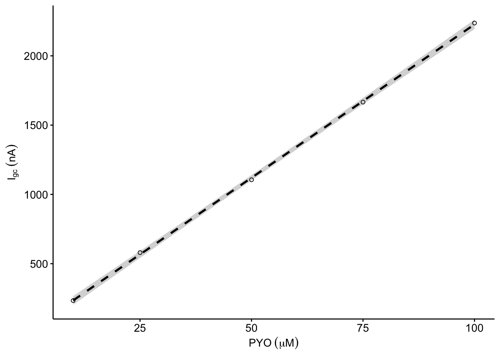
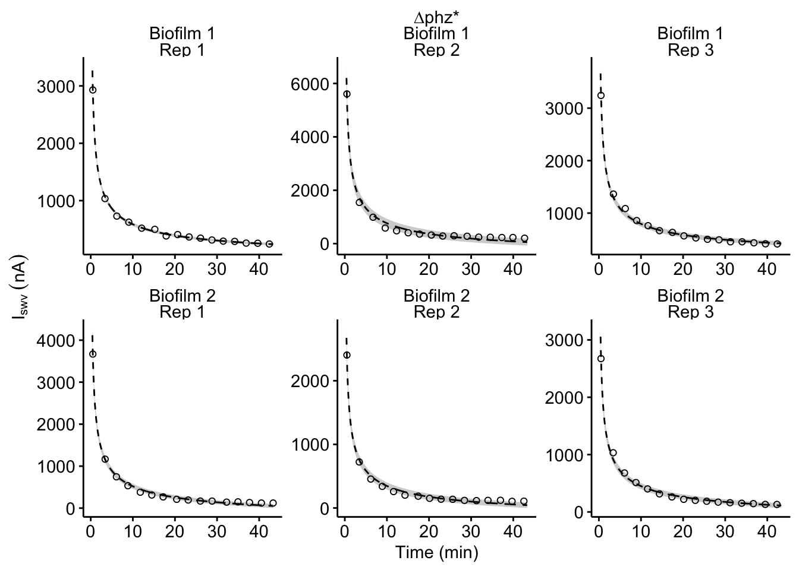

--------

# Notes

Links to IDA processing and to supp figure.

Panel A is a diagram.

----

Setup packages and plotting for the notebook:


```r
# Load packages
library(tidyverse)
library(cowplot)
library(kableExtra)
library(broom)

# Code display options
knitr::opts_chunk$set(tidy.opts=list(width.cutoff=60),tidy=FALSE, echo = TRUE, message=FALSE, warning=FALSE, fig.align="center", fig.retina = 2)

# Load plotting tools
source("../../../tools/plotting_tools.R")


#Modify the plot theme
theme_set(theme_notebook())
```


# Fig. S7A

First we will import the blank IDA data that will be used for panels A-D. This data was processed from [this notebook](https://scott-saunders.github.io/phz_eDNA_2019/code/processing/IDA_blank_processing.html), and includes SWV and GC scans taken with a blank IDA in solutions of known concentrations of PYO.

Let's read in the data and convert the µM units to $mol / cm^3$, which will be important to calculate $D_{ap}$ in correct units.


```r
df_soak <- read_csv("../../../processing/processed_data/phz_eDNA_2019_swv_gc_soak_blank.csv") %>% 
  mutate(PHZaddedInt = case_when(
    PHZadded == '100uM' ~ 100,
    PHZadded == '10uM' ~ 10,
    PHZadded == '25uM' ~ 25,
    PHZadded == '50uM' ~ 50,
    PHZadded == '75uM' ~ 75
  )) %>% 
  mutate(C_mol_cm3 = PHZaddedInt*(10^-9))
```

Here is the relationship between GC peak current and concentration:


```r
plot_GC <- ggplot(df_soak, aes(x = C_mol_cm3, y = signal_GC)) +    
  geom_smooth(method='lm', linetype = 2, color = 'black') + geom_point(shape = 21)

plot_GC_styled <- plot_GC+  
  scale_x_continuous(labels = nA_label) + 
  scale_y_continuous(labels = nA_label) + 
  labs(x = expression(PYO~(mu*M)), y = expression(I[gc]~(nA)))
  
plot_GC_styled
```



$I_{GC}$ is simply $I = nFSDC$, so $D_{ap}$ is:

$$D_{ap} = \frac{m}{n F S}$$

We can define a simple function to calculate this $D_{ap}$ from the slope of the line in the above plot.


```r
dap_from_GC <- function(m){
  
  n=1.8
  S <-  18.4 #cm
  F_C = 96485.332
  
  d_ap <- m / (n * F_C * S)
  
  d_ap
}
```

Fitting the linear model and calculating $D_{ap}$ gives these values: 


```r
lm_GC <- tidy(lm(signal_GC~C_mol_cm3, data = df_soak), conf.int = T) %>% 
  filter(term=='C_mol_cm3') %>% 
  mutate(dap=dap_from_GC(m = estimate)) %>% 
  mutate(dap_high = dap_from_GC(m = conf.high)) %>% 
  mutate(dap_low = dap_from_GC(m = conf.low)) %>% 
  mutate(dataset = 'GC')

lm_GC %>% 
  kable() %>% 
  kable_styling()
```

<table class="table" style="margin-left: auto; margin-right: auto;">
 <thead>
  <tr>
   <th style="text-align:left;"> term </th>
   <th style="text-align:right;"> estimate </th>
   <th style="text-align:right;"> std.error </th>
   <th style="text-align:right;"> statistic </th>
   <th style="text-align:right;"> p.value </th>
   <th style="text-align:right;"> conf.low </th>
   <th style="text-align:right;"> conf.high </th>
   <th style="text-align:right;"> dap </th>
   <th style="text-align:right;"> dap_high </th>
   <th style="text-align:right;"> dap_low </th>
   <th style="text-align:left;"> dataset </th>
  </tr>
 </thead>
<tbody>
  <tr>
   <td style="text-align:left;"> C_mol_cm3 </td>
   <td style="text-align:right;"> 22.13434 </td>
   <td style="text-align:right;"> 0.1841017 </td>
   <td style="text-align:right;"> 120.2289 </td>
   <td style="text-align:right;"> 1.3e-06 </td>
   <td style="text-align:right;"> 21.54844 </td>
   <td style="text-align:right;"> 22.72023 </td>
   <td style="text-align:right;"> 6.9e-06 </td>
   <td style="text-align:right;"> 7.1e-06 </td>
   <td style="text-align:right;"> 6.7e-06 </td>
   <td style="text-align:left;"> GC </td>
  </tr>
</tbody>
</table>

<br>

# Fig. S7B

Now we will look at the relationship between concentration and peak SWV current.


```r
plot_SWV <- ggplot(df_soak, aes(x = C_mol_cm3, y = signal_SWV)) +
    geom_smooth(method='lm', linetype = 2, color = 'black') + geom_point(shape = 21)

plot_SWV_styled <- plot_SWV+  
  scale_x_continuous(labels = nA_label) + 
  scale_y_continuous(labels = nA_label) + 
  labs(x = expression(PYO~(mu*M)), y = expression(I[swv]~(nA)))
  
plot_SWV_styled
```


For a plot of $I_{SWV}$ vs. $C$, the slope can be defined in terms of the parameters for $I_{SWV}$ other than concentration. This yields an expression for $D_{ap}$:

$$D_{ap} = \pi t_p \left( \frac{m}{\psi n F A} \right) ^2 $$

So we'll again define the function to calculate it:


```r
dap_from_SWV <- function(m, t_p=1/(2*300)){
  
  n=1.8
  psi <-  0.7
  A <-  0.025 #cm^2
  F_C = 96485.332
  
  d_ap <- pi * t_p * (m / (psi * n * F_C * A))^2
  
  d_ap
}
```

The linear model of this data gives the following:


```r
lm_SWV <- tidy(lm(signal_SWV~C_mol_cm3, data = df_soak), conf.int = T) %>% 
  filter(term=='C_mol_cm3') %>% 
  mutate(dap=dap_from_SWV(m = estimate)) %>% 
  mutate(dap_high = dap_from_SWV(m = conf.high)) %>% 
  mutate(dap_low = dap_from_SWV(m = conf.low)) %>% 
  mutate(dataset = 'SWV')

#glance(lm(signal_from_swv~C_mol_cm3, data = df_cal))

lm_SWV %>% 
  kable() %>% 
  kable_styling()
```

<table class="table" style="margin-left: auto; margin-right: auto;">
 <thead>
  <tr>
   <th style="text-align:left;"> term </th>
   <th style="text-align:right;"> estimate </th>
   <th style="text-align:right;"> std.error </th>
   <th style="text-align:right;"> statistic </th>
   <th style="text-align:right;"> p.value </th>
   <th style="text-align:right;"> conf.low </th>
   <th style="text-align:right;"> conf.high </th>
   <th style="text-align:right;"> dap </th>
   <th style="text-align:right;"> dap_high </th>
   <th style="text-align:right;"> dap_low </th>
   <th style="text-align:left;"> dataset </th>
  </tr>
 </thead>
<tbody>
  <tr>
   <td style="text-align:left;"> C_mol_cm3 </td>
   <td style="text-align:right;"> 111.2799 </td>
   <td style="text-align:right;"> 1.590469 </td>
   <td style="text-align:right;"> 69.96673 </td>
   <td style="text-align:right;"> 6.4e-06 </td>
   <td style="text-align:right;"> 106.2183 </td>
   <td style="text-align:right;"> 116.3415 </td>
   <td style="text-align:right;"> 7e-06 </td>
   <td style="text-align:right;"> 7.7e-06 </td>
   <td style="text-align:right;"> 6.4e-06 </td>
   <td style="text-align:left;"> SWV </td>
  </tr>
</tbody>
</table>

<br>

# Fig. S7C

Finally, we will examine the peak SWV current vs. the peak GC current, which is not dependent on the known PYO concentrations.


```r
plot_swvGC <- ggplot(df_soak, aes(x = signal_SWV, y = signal_GC)) + 
  geom_smooth(method='lm', linetype = 2, color = 'black') + geom_point(shape = 21)

plot_swvGC_styled <- plot_swvGC+  
  scale_x_continuous(labels = nA_label) + 
  scale_y_continuous(labels = nA_label) + 
  labs(x = expression(I[swv]~(nA)), y = expression(I[gc]~(nA)))
  
plot_swvGC_styled
```



Recall that for this type of data:

$$D_{ap} = \frac{1}{\pi t_p} \left( \frac{m A \psi}{S} \right) ^2$$  

So, here's a function that will calculate $D_{ap}$ from the slope of this data:


```r
dap_from_swvGC <- function(m, t_p=1/(2*300)){
  
  psi <-  0.7
  A <-  0.025 #cm^2
  S <-  18.4 #cm
  
  d_ap <- (m*A*psi)^2 / (S^2 * pi * t_p)
  
  d_ap
}
```

And now, we'll fit a linear model and calculate a $D_{ap}$. We'll go ahead and save a csv of this result for use in main figure 6F.


```r
output_lm_swv_gc <- tidy(lm(signal_GC~signal_SWV, data = df_soak), conf.int = T) %>% 
  mutate(exp_id = 'Blank 1', run_id = 'Rep 1')

write_csv(output_lm_swv_gc, "phz2019_blank_Dap_lm_coefs.csv")

lm_swvGC <- tidy(lm(signal_GC~signal_SWV, data = df_soak), conf.int = T) %>% 
  filter(term=='signal_SWV') %>% 
  mutate(dap=dap_from_swvGC(m = estimate)) %>% 
  mutate(dap_high = dap_from_swvGC(m = conf.high)) %>% 
  mutate(dap_low = dap_from_swvGC(m = conf.low)) %>% 
  mutate(dataset = 'SWVvsGC')

lm_swvGC %>% 
  kable() %>% 
  kable_styling()
```

<table class="table" style="margin-left: auto; margin-right: auto;">
 <thead>
  <tr>
   <th style="text-align:left;"> term </th>
   <th style="text-align:right;"> estimate </th>
   <th style="text-align:right;"> std.error </th>
   <th style="text-align:right;"> statistic </th>
   <th style="text-align:right;"> p.value </th>
   <th style="text-align:right;"> conf.low </th>
   <th style="text-align:right;"> conf.high </th>
   <th style="text-align:right;"> dap </th>
   <th style="text-align:right;"> dap_high </th>
   <th style="text-align:right;"> dap_low </th>
   <th style="text-align:left;"> dataset </th>
  </tr>
 </thead>
<tbody>
  <tr>
   <td style="text-align:left;"> signal_SWV </td>
   <td style="text-align:right;"> 0.1987799 </td>
   <td style="text-align:right;"> 0.0033905 </td>
   <td style="text-align:right;"> 58.6286 </td>
   <td style="text-align:right;"> 1.09e-05 </td>
   <td style="text-align:right;"> 0.1879898 </td>
   <td style="text-align:right;"> 0.2095699 </td>
   <td style="text-align:right;"> 6.8e-06 </td>
   <td style="text-align:right;"> 7.6e-06 </td>
   <td style="text-align:right;"> 6.1e-06 </td>
   <td style="text-align:left;"> SWVvsGC </td>
  </tr>
</tbody>
</table>

<br>

# Fig. S7D

Now let's compare the estimates from each subset of the data:


```r
lms <- bind_rows(lm_swvGC,lm_SWV,lm_GC) %>% 
  select(dataset, term, dap, dap_low, dap_high)

plot_cal_dap <- ggplot(lms, aes(x = dataset, y = dap)) + 
  geom_pointrange(aes(ymin = dap_low, ymax = dap_high)) + 
  ylim(0, 1e-5)

plot_cal_dap_styled <- plot_cal_dap+
  labs(x = 'Dataset', y = expression(D[ap]~(cm^2 / sec)))+
  scale_x_discrete(breaks = c('GC','SWV', 'SWVvsGC'), labels=c('GC vs.\n[PYO]', 'SWV vs.\n[PYO]', 'GC vs.\nSWV'))

plot_cal_dap_styled
```


# Create figure


```r
theme_set(theme_figure())
```

-----


```r
sessionInfo()
```

```
## R version 3.5.2 (2018-12-20)
## Platform: x86_64-apple-darwin15.6.0 (64-bit)
## Running under: macOS Mojave 10.14.6
## 
## Matrix products: default
## BLAS: /Library/Frameworks/R.framework/Versions/3.5/Resources/lib/libRblas.0.dylib
## LAPACK: /Library/Frameworks/R.framework/Versions/3.5/Resources/lib/libRlapack.dylib
## 
## locale:
## [1] en_US.UTF-8/en_US.UTF-8/en_US.UTF-8/C/en_US.UTF-8/en_US.UTF-8
## 
## attached base packages:
## [1] stats     graphics  grDevices utils     datasets  methods   base     
## 
## other attached packages:
##  [1] viridis_0.5.1     viridisLite_0.3.0 broom_0.5.1      
##  [4] kableExtra_1.0.1  cowplot_0.9.4     forcats_0.3.0    
##  [7] stringr_1.3.1     dplyr_0.8.1       purrr_0.2.5      
## [10] readr_1.3.1       tidyr_0.8.2       tibble_2.1.3     
## [13] ggplot2_3.2.0     tidyverse_1.2.1  
## 
## loaded via a namespace (and not attached):
##  [1] tidyselect_0.2.5 xfun_0.7         haven_2.0.0      lattice_0.20-38 
##  [5] colorspace_1.4-0 generics_0.0.2   htmltools_0.3.6  yaml_2.2.0      
##  [9] rlang_0.4.0      pillar_1.3.1     glue_1.3.1       withr_2.1.2     
## [13] modelr_0.1.2     readxl_1.2.0     munsell_0.5.0    gtable_0.2.0    
## [17] cellranger_1.1.0 rvest_0.3.2      evaluate_0.14    labeling_0.3    
## [21] knitr_1.23       highr_0.7        Rcpp_1.0.1       scales_1.0.0    
## [25] backports_1.1.3  webshot_0.5.1    jsonlite_1.6     gridExtra_2.3   
## [29] hms_0.4.2        digest_0.6.18    stringi_1.2.4    grid_3.5.2      
## [33] cli_1.1.0        tools_3.5.2      magrittr_1.5     lazyeval_0.2.1  
## [37] crayon_1.3.4     pkgconfig_2.0.2  xml2_1.2.0       lubridate_1.7.4 
## [41] assertthat_0.2.1 rmarkdown_1.13   httr_1.4.0       rstudioapi_0.9.0
## [45] R6_2.4.0         nlme_3.1-140     compiler_3.5.2
```
