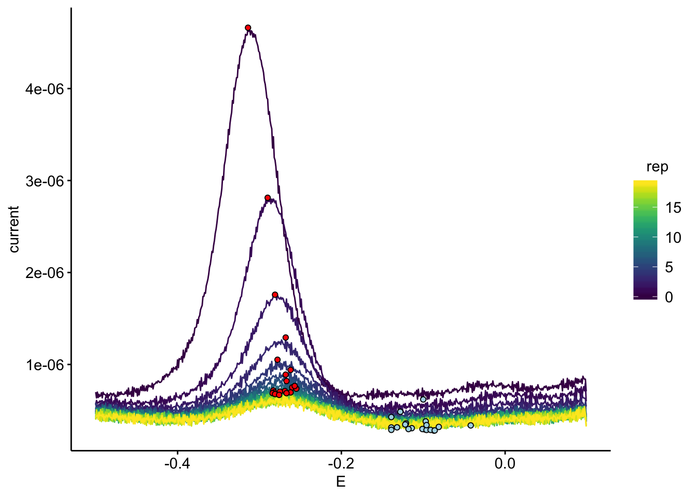

--------

# Notes

This notebook shows how raw electrochemical data from a CH Instruments potentiostat was processed for data vizualization and downstream analysis.

----

Setup packages and plotting for the notebook:


```r
# Load packages
library(tidyverse)
library(cowplot)
library(kableExtra)
library(modelr)
library(broom)

# Code display options
knitr::opts_chunk$set(tidy.opts=list(width.cutoff=60),tidy=FALSE, echo = TRUE, message=FALSE, warning=FALSE, fig.align="center", fig.retina = 2)

# Load plotting tools
source("../../tools/plotting_tools.R")

#Modify the plot theme
theme_set(theme_notebook())
```

-----


```r
# Load echem processing tools

source("../../tools/echem_processing_tools.R")
```

## SWV data

First, let's import all of the SWV files.


```r
# file names and paths
swv_file_paths <-  dir(path='../../../data/Electrochemistry/IDA/WT_biofilm/', pattern = "[swv]+.+[txt]$", recursive = T, full.names = T)

swv_filenames <- basename(swv_file_paths)

# data columns in each file
swv_data_cols <-  c('E','i1','i2')

# metadata in each file name
filename_cols = c('echem','rep')

# skip the header that contains detailed information from the potentiostat
swv_skip_rows=18

# Use the function `echem_import_to_df()` from the echem tools to import
swv_data <- echem_import_to_df(filenames = swv_filenames, 
                                       file_paths = swv_file_paths, 
                                       data_cols = swv_data_cols, 
                                       skip_rows = swv_skip_rows,
                                       filename_cols = filename_cols,
                                       rep = T, PHZadded = F) %>% 
  mutate(rep=rep-1) 

# Change the rep (acquisition number) for the SWVs because the first SWV should be 0.
# This is used to match SWV and GC by number later on.
# We also add an experimental id of 1.
```

Let's look at the data frame we have generated:


```r
swv_data %>% head() %>%  kable(digits = 10) %>% kable_styling() %>% scroll_box(height = '300px')
```

<div style="border: 1px solid #ddd; padding: 0px; overflow-y: scroll; height:300px; "><table class="table" style="margin-left: auto; margin-right: auto;">
 <thead>
  <tr>
   <th style="text-align:left;position: sticky; top:0; background-color: #FFFFFF;"> echem </th>
   <th style="text-align:right;position: sticky; top:0; background-color: #FFFFFF;"> rep </th>
   <th style="text-align:right;position: sticky; top:0; background-color: #FFFFFF;"> minutes </th>
   <th style="text-align:right;position: sticky; top:0; background-color: #FFFFFF;"> E </th>
   <th style="text-align:left;position: sticky; top:0; background-color: #FFFFFF;"> electrode </th>
   <th style="text-align:right;position: sticky; top:0; background-color: #FFFFFF;"> current </th>
  </tr>
 </thead>
<tbody>
  <tr>
   <td style="text-align:left;"> swv </td>
   <td style="text-align:right;"> 0 </td>
   <td style="text-align:right;"> 976.6167 </td>
   <td style="text-align:right;"> 0.099 </td>
   <td style="text-align:left;"> i1 </td>
   <td style="text-align:right;"> 7.084e-07 </td>
  </tr>
  <tr>
   <td style="text-align:left;"> swv </td>
   <td style="text-align:right;"> 0 </td>
   <td style="text-align:right;"> 976.6167 </td>
   <td style="text-align:right;"> 0.098 </td>
   <td style="text-align:left;"> i1 </td>
   <td style="text-align:right;"> 8.403e-07 </td>
  </tr>
  <tr>
   <td style="text-align:left;"> swv </td>
   <td style="text-align:right;"> 0 </td>
   <td style="text-align:right;"> 976.6167 </td>
   <td style="text-align:right;"> 0.097 </td>
   <td style="text-align:left;"> i1 </td>
   <td style="text-align:right;"> 8.398e-07 </td>
  </tr>
  <tr>
   <td style="text-align:left;"> swv </td>
   <td style="text-align:right;"> 0 </td>
   <td style="text-align:right;"> 976.6167 </td>
   <td style="text-align:right;"> 0.096 </td>
   <td style="text-align:left;"> i1 </td>
   <td style="text-align:right;"> 8.506e-07 </td>
  </tr>
  <tr>
   <td style="text-align:left;"> swv </td>
   <td style="text-align:right;"> 0 </td>
   <td style="text-align:right;"> 976.6167 </td>
   <td style="text-align:right;"> 0.095 </td>
   <td style="text-align:left;"> i1 </td>
   <td style="text-align:right;"> 8.717e-07 </td>
  </tr>
  <tr>
   <td style="text-align:left;"> swv </td>
   <td style="text-align:right;"> 0 </td>
   <td style="text-align:right;"> 976.6167 </td>
   <td style="text-align:right;"> 0.094 </td>
   <td style="text-align:left;"> i1 </td>
   <td style="text-align:right;"> 7.924e-07 </td>
  </tr>
</tbody>
</table></div>

<br>

We can now plot all of these data. This plot will show the data from the biofilm as it equilibrated in the transfer reactor.


```r
ggplot(swv_data %>% filter(electrode == 'i1'), aes(x = E , y = current )) +
  geom_path(aes(group = rep, color = rep))
```


## GC data

Now, we will repeat the import for the GC data. 


```r
gc_file_paths <-  dir(path='../../../data/Electrochemistry/IDA/WT_biofilm/', pattern = "[gc]+.+[txt]$",recursive = T,full.names = T)

gc_filenames <- basename(gc_file_paths)

gc_data_cols <-  c('E','i1','i2')

filename_cols = c('echem','rep')

gc_skip_rows=21
  

gc_data <- echem_import_to_df(filenames = gc_filenames, 
                                       file_paths = gc_file_paths, 
                                       data_cols = gc_data_cols, 
                                       skip_rows = gc_skip_rows,
                                       filename_cols = filename_cols,
                                       rep = T, PHZadded = F)
```

Here's the GC data plotted:


```r
ggplot(gc_data) + 
  geom_path(data=. %>% filter(electrode=='i1'), aes(x = E, y = current, color = rep, group = rep)) + 
  geom_path(data=. %>% filter(electrode=='i2'), aes(x = E, y = current, color = rep, group = rep)) +
  scale_x_reverse()
```


# Signal quantification

Now that all of the files have been read into convenient data frames we can quantify the peak currents, which are the signals we will use for the analysis later on. 

## SWV

To do this we will use another function from the echem tools to find the min and max points within a specified potential window in each scan. Let's take a look at the output:


```r
# ID columns for function below
unique_id_cols = c('echem','rep','minutes','electrode')

# Use `echem_signal()` from echem tools to find min/max points in each scan
swv_signals <- echem_signal(df = swv_data, 
                            unique_id_cols = unique_id_cols,
                            max_interval = c(-0.2,-0.4), 
                            min_interval = c(0.0,-0.4)) 

swv_signals %>% kable(digits = 10) %>% kable_styling() %>% scroll_box(height = '300px')
```

<div style="border: 1px solid #ddd; padding: 0px; overflow-y: scroll; height:300px; "><table class="table" style="margin-left: auto; margin-right: auto;">
 <thead>
  <tr>
   <th style="text-align:left;position: sticky; top:0; background-color: #FFFFFF;"> echem </th>
   <th style="text-align:right;position: sticky; top:0; background-color: #FFFFFF;"> rep </th>
   <th style="text-align:right;position: sticky; top:0; background-color: #FFFFFF;"> minutes </th>
   <th style="text-align:right;position: sticky; top:0; background-color: #FFFFFF;"> E_from_maxs </th>
   <th style="text-align:left;position: sticky; top:0; background-color: #FFFFFF;"> electrode </th>
   <th style="text-align:right;position: sticky; top:0; background-color: #FFFFFF;"> current_from_maxs </th>
   <th style="text-align:right;position: sticky; top:0; background-color: #FFFFFF;"> max_current </th>
   <th style="text-align:right;position: sticky; top:0; background-color: #FFFFFF;"> E_from_mins </th>
   <th style="text-align:right;position: sticky; top:0; background-color: #FFFFFF;"> current_from_mins </th>
   <th style="text-align:right;position: sticky; top:0; background-color: #FFFFFF;"> min_current </th>
   <th style="text-align:right;position: sticky; top:0; background-color: #FFFFFF;"> signal </th>
  </tr>
 </thead>
<tbody>
  <tr>
   <td style="text-align:left;"> swv </td>
   <td style="text-align:right;"> 0 </td>
   <td style="text-align:right;"> 976.6167 </td>
   <td style="text-align:right;"> -0.314 </td>
   <td style="text-align:left;"> i1 </td>
   <td style="text-align:right;"> 4.6618e-06 </td>
   <td style="text-align:right;"> 4.6618e-06 </td>
   <td style="text-align:right;"> -0.100 </td>
   <td style="text-align:right;"> 6.197e-07 </td>
   <td style="text-align:right;"> 6.197e-07 </td>
   <td style="text-align:right;"> 4.0420e-06 </td>
  </tr>
  <tr>
   <td style="text-align:left;"> swv </td>
   <td style="text-align:right;"> 9 </td>
   <td style="text-align:right;"> 999.1167 </td>
   <td style="text-align:right;"> -0.260 </td>
   <td style="text-align:left;"> i1 </td>
   <td style="text-align:right;"> 7.5030e-07 </td>
   <td style="text-align:right;"> 7.5030e-07 </td>
   <td style="text-align:right;"> -0.132 </td>
   <td style="text-align:right;"> 3.163e-07 </td>
   <td style="text-align:right;"> 3.163e-07 </td>
   <td style="text-align:right;"> 4.3400e-07 </td>
  </tr>
  <tr>
   <td style="text-align:left;"> swv </td>
   <td style="text-align:right;"> 10 </td>
   <td style="text-align:right;"> 1001.6167 </td>
   <td style="text-align:right;"> -0.255 </td>
   <td style="text-align:left;"> i1 </td>
   <td style="text-align:right;"> 7.3630e-07 </td>
   <td style="text-align:right;"> 7.3630e-07 </td>
   <td style="text-align:right;"> -0.139 </td>
   <td style="text-align:right;"> 3.150e-07 </td>
   <td style="text-align:right;"> 3.150e-07 </td>
   <td style="text-align:right;"> 4.2130e-07 </td>
  </tr>
  <tr>
   <td style="text-align:left;"> swv </td>
   <td style="text-align:right;"> 11 </td>
   <td style="text-align:right;"> 1004.1167 </td>
   <td style="text-align:right;"> -0.283 </td>
   <td style="text-align:left;"> i1 </td>
   <td style="text-align:right;"> 7.1720e-07 </td>
   <td style="text-align:right;"> 7.1720e-07 </td>
   <td style="text-align:right;"> -0.114 </td>
   <td style="text-align:right;"> 3.074e-07 </td>
   <td style="text-align:right;"> 3.074e-07 </td>
   <td style="text-align:right;"> 4.0980e-07 </td>
  </tr>
  <tr>
   <td style="text-align:left;"> swv </td>
   <td style="text-align:right;"> 12 </td>
   <td style="text-align:right;"> 1006.6167 </td>
   <td style="text-align:right;"> -0.262 </td>
   <td style="text-align:left;"> i1 </td>
   <td style="text-align:right;"> 6.9610e-07 </td>
   <td style="text-align:right;"> 6.9610e-07 </td>
   <td style="text-align:right;"> -0.118 </td>
   <td style="text-align:right;"> 2.977e-07 </td>
   <td style="text-align:right;"> 2.977e-07 </td>
   <td style="text-align:right;"> 3.9840e-07 </td>
  </tr>
  <tr>
   <td style="text-align:left;"> swv </td>
   <td style="text-align:right;"> 13 </td>
   <td style="text-align:right;"> 1009.1167 </td>
   <td style="text-align:right;"> -0.269 </td>
   <td style="text-align:left;"> i1 </td>
   <td style="text-align:right;"> 7.1100e-07 </td>
   <td style="text-align:right;"> 7.1100e-07 </td>
   <td style="text-align:right;"> -0.098 </td>
   <td style="text-align:right;"> 2.940e-07 </td>
   <td style="text-align:right;"> 2.940e-07 </td>
   <td style="text-align:right;"> 4.1690e-07 </td>
  </tr>
  <tr>
   <td style="text-align:left;"> swv </td>
   <td style="text-align:right;"> 14 </td>
   <td style="text-align:right;"> 1011.6167 </td>
   <td style="text-align:right;"> -0.282 </td>
   <td style="text-align:left;"> i1 </td>
   <td style="text-align:right;"> 6.9730e-07 </td>
   <td style="text-align:right;"> 6.9730e-07 </td>
   <td style="text-align:right;"> -0.101 </td>
   <td style="text-align:right;"> 2.980e-07 </td>
   <td style="text-align:right;"> 2.980e-07 </td>
   <td style="text-align:right;"> 3.9930e-07 </td>
  </tr>
  <tr>
   <td style="text-align:left;"> swv </td>
   <td style="text-align:right;"> 15 </td>
   <td style="text-align:right;"> 1014.1167 </td>
   <td style="text-align:right;"> -0.275 </td>
   <td style="text-align:left;"> i1 </td>
   <td style="text-align:right;"> 7.0430e-07 </td>
   <td style="text-align:right;"> 7.0430e-07 </td>
   <td style="text-align:right;"> -0.087 </td>
   <td style="text-align:right;"> 2.812e-07 </td>
   <td style="text-align:right;"> 2.812e-07 </td>
   <td style="text-align:right;"> 4.2310e-07 </td>
  </tr>
  <tr>
   <td style="text-align:left;"> swv </td>
   <td style="text-align:right;"> 16 </td>
   <td style="text-align:right;"> 1016.6167 </td>
   <td style="text-align:right;"> -0.284 </td>
   <td style="text-align:left;"> i1 </td>
   <td style="text-align:right;"> 6.8830e-07 </td>
   <td style="text-align:right;"> 6.8830e-07 </td>
   <td style="text-align:right;"> -0.096 </td>
   <td style="text-align:right;"> 2.881e-07 </td>
   <td style="text-align:right;"> 2.881e-07 </td>
   <td style="text-align:right;"> 4.0020e-07 </td>
  </tr>
  <tr>
   <td style="text-align:left;"> swv </td>
   <td style="text-align:right;"> 17 </td>
   <td style="text-align:right;"> 1019.1167 </td>
   <td style="text-align:right;"> -0.281 </td>
   <td style="text-align:left;"> i1 </td>
   <td style="text-align:right;"> 6.7780e-07 </td>
   <td style="text-align:right;"> 6.7780e-07 </td>
   <td style="text-align:right;"> -0.139 </td>
   <td style="text-align:right;"> 2.889e-07 </td>
   <td style="text-align:right;"> 2.889e-07 </td>
   <td style="text-align:right;"> 3.8900e-07 </td>
  </tr>
  <tr>
   <td style="text-align:left;"> swv </td>
   <td style="text-align:right;"> 18 </td>
   <td style="text-align:right;"> 1021.6167 </td>
   <td style="text-align:right;"> -0.267 </td>
   <td style="text-align:left;"> i1 </td>
   <td style="text-align:right;"> 6.8810e-07 </td>
   <td style="text-align:right;"> 6.8810e-07 </td>
   <td style="text-align:right;"> -0.091 </td>
   <td style="text-align:right;"> 2.883e-07 </td>
   <td style="text-align:right;"> 2.883e-07 </td>
   <td style="text-align:right;"> 3.9980e-07 </td>
  </tr>
  <tr>
   <td style="text-align:left;"> swv </td>
   <td style="text-align:right;"> 1 </td>
   <td style="text-align:right;"> 979.1167 </td>
   <td style="text-align:right;"> -0.290 </td>
   <td style="text-align:left;"> i1 </td>
   <td style="text-align:right;"> 2.8127e-06 </td>
   <td style="text-align:right;"> 2.8127e-06 </td>
   <td style="text-align:right;"> -0.128 </td>
   <td style="text-align:right;"> 4.856e-07 </td>
   <td style="text-align:right;"> 4.856e-07 </td>
   <td style="text-align:right;"> 2.3272e-06 </td>
  </tr>
  <tr>
   <td style="text-align:left;"> swv </td>
   <td style="text-align:right;"> 19 </td>
   <td style="text-align:right;"> 1024.1167 </td>
   <td style="text-align:right;"> -0.276 </td>
   <td style="text-align:left;"> i1 </td>
   <td style="text-align:right;"> 6.6910e-07 </td>
   <td style="text-align:right;"> 6.6910e-07 </td>
   <td style="text-align:right;"> -0.086 </td>
   <td style="text-align:right;"> 2.826e-07 </td>
   <td style="text-align:right;"> 2.826e-07 </td>
   <td style="text-align:right;"> 3.8660e-07 </td>
  </tr>
  <tr>
   <td style="text-align:left;"> swv </td>
   <td style="text-align:right;"> 2 </td>
   <td style="text-align:right;"> 981.6167 </td>
   <td style="text-align:right;"> -0.281 </td>
   <td style="text-align:left;"> i1 </td>
   <td style="text-align:right;"> 1.7585e-06 </td>
   <td style="text-align:right;"> 1.7585e-06 </td>
   <td style="text-align:right;"> -0.139 </td>
   <td style="text-align:right;"> 4.282e-07 </td>
   <td style="text-align:right;"> 4.282e-07 </td>
   <td style="text-align:right;"> 1.3304e-06 </td>
  </tr>
  <tr>
   <td style="text-align:left;"> swv </td>
   <td style="text-align:right;"> 3 </td>
   <td style="text-align:right;"> 984.1167 </td>
   <td style="text-align:right;"> -0.268 </td>
   <td style="text-align:left;"> i1 </td>
   <td style="text-align:right;"> 1.2929e-06 </td>
   <td style="text-align:right;"> 1.2929e-06 </td>
   <td style="text-align:right;"> -0.097 </td>
   <td style="text-align:right;"> 3.808e-07 </td>
   <td style="text-align:right;"> 3.808e-07 </td>
   <td style="text-align:right;"> 9.1200e-07 </td>
  </tr>
  <tr>
   <td style="text-align:left;"> swv </td>
   <td style="text-align:right;"> 4 </td>
   <td style="text-align:right;"> 986.6167 </td>
   <td style="text-align:right;"> -0.278 </td>
   <td style="text-align:left;"> i1 </td>
   <td style="text-align:right;"> 1.0515e-06 </td>
   <td style="text-align:right;"> 1.0515e-06 </td>
   <td style="text-align:right;"> -0.121 </td>
   <td style="text-align:right;"> 3.595e-07 </td>
   <td style="text-align:right;"> 3.595e-07 </td>
   <td style="text-align:right;"> 6.9200e-07 </td>
  </tr>
  <tr>
   <td style="text-align:left;"> swv </td>
   <td style="text-align:right;"> 5 </td>
   <td style="text-align:right;"> 989.1167 </td>
   <td style="text-align:right;"> -0.262 </td>
   <td style="text-align:left;"> i1 </td>
   <td style="text-align:right;"> 9.4090e-07 </td>
   <td style="text-align:right;"> 9.4090e-07 </td>
   <td style="text-align:right;"> -0.122 </td>
   <td style="text-align:right;"> 3.476e-07 </td>
   <td style="text-align:right;"> 3.476e-07 </td>
   <td style="text-align:right;"> 5.9330e-07 </td>
  </tr>
  <tr>
   <td style="text-align:left;"> swv </td>
   <td style="text-align:right;"> 6 </td>
   <td style="text-align:right;"> 991.6167 </td>
   <td style="text-align:right;"> -0.268 </td>
   <td style="text-align:left;"> i1 </td>
   <td style="text-align:right;"> 8.8940e-07 </td>
   <td style="text-align:right;"> 8.8940e-07 </td>
   <td style="text-align:right;"> -0.042 </td>
   <td style="text-align:right;"> 3.373e-07 </td>
   <td style="text-align:right;"> 3.373e-07 </td>
   <td style="text-align:right;"> 5.5200e-07 </td>
  </tr>
  <tr>
   <td style="text-align:left;"> swv </td>
   <td style="text-align:right;"> 7 </td>
   <td style="text-align:right;"> 994.1167 </td>
   <td style="text-align:right;"> -0.267 </td>
   <td style="text-align:left;"> i1 </td>
   <td style="text-align:right;"> 8.1970e-07 </td>
   <td style="text-align:right;"> 8.1970e-07 </td>
   <td style="text-align:right;"> -0.096 </td>
   <td style="text-align:right;"> 3.405e-07 </td>
   <td style="text-align:right;"> 3.405e-07 </td>
   <td style="text-align:right;"> 4.7920e-07 </td>
  </tr>
  <tr>
   <td style="text-align:left;"> swv </td>
   <td style="text-align:right;"> 8 </td>
   <td style="text-align:right;"> 996.6167 </td>
   <td style="text-align:right;"> -0.257 </td>
   <td style="text-align:left;"> i1 </td>
   <td style="text-align:right;"> 7.6600e-07 </td>
   <td style="text-align:right;"> 7.6600e-07 </td>
   <td style="text-align:right;"> -0.081 </td>
   <td style="text-align:right;"> 3.210e-07 </td>
   <td style="text-align:right;"> 3.210e-07 </td>
   <td style="text-align:right;"> 4.4500e-07 </td>
  </tr>
  <tr>
   <td style="text-align:left;"> swv </td>
   <td style="text-align:right;"> 0 </td>
   <td style="text-align:right;"> 976.6167 </td>
   <td style="text-align:right;"> -0.314 </td>
   <td style="text-align:left;"> i2 </td>
   <td style="text-align:right;"> 4.2504e-06 </td>
   <td style="text-align:right;"> 4.2504e-06 </td>
   <td style="text-align:right;"> -0.143 </td>
   <td style="text-align:right;"> 4.427e-07 </td>
   <td style="text-align:right;"> 4.427e-07 </td>
   <td style="text-align:right;"> 3.8077e-06 </td>
  </tr>
  <tr>
   <td style="text-align:left;"> swv </td>
   <td style="text-align:right;"> 9 </td>
   <td style="text-align:right;"> 999.1167 </td>
   <td style="text-align:right;"> -0.277 </td>
   <td style="text-align:left;"> i2 </td>
   <td style="text-align:right;"> 6.7760e-07 </td>
   <td style="text-align:right;"> 6.7760e-07 </td>
   <td style="text-align:right;"> -0.101 </td>
   <td style="text-align:right;"> 1.590e-07 </td>
   <td style="text-align:right;"> 1.590e-07 </td>
   <td style="text-align:right;"> 5.1860e-07 </td>
  </tr>
  <tr>
   <td style="text-align:left;"> swv </td>
   <td style="text-align:right;"> 10 </td>
   <td style="text-align:right;"> 1001.6167 </td>
   <td style="text-align:right;"> -0.286 </td>
   <td style="text-align:left;"> i2 </td>
   <td style="text-align:right;"> 6.6530e-07 </td>
   <td style="text-align:right;"> 6.6530e-07 </td>
   <td style="text-align:right;"> -0.005 </td>
   <td style="text-align:right;"> 1.831e-07 </td>
   <td style="text-align:right;"> 1.831e-07 </td>
   <td style="text-align:right;"> 4.8210e-07 </td>
  </tr>
  <tr>
   <td style="text-align:left;"> swv </td>
   <td style="text-align:right;"> 11 </td>
   <td style="text-align:right;"> 1004.1167 </td>
   <td style="text-align:right;"> -0.297 </td>
   <td style="text-align:left;"> i2 </td>
   <td style="text-align:right;"> 6.7400e-07 </td>
   <td style="text-align:right;"> 6.7400e-07 </td>
   <td style="text-align:right;"> -0.095 </td>
   <td style="text-align:right;"> 1.815e-07 </td>
   <td style="text-align:right;"> 1.815e-07 </td>
   <td style="text-align:right;"> 4.9250e-07 </td>
  </tr>
  <tr>
   <td style="text-align:left;"> swv </td>
   <td style="text-align:right;"> 12 </td>
   <td style="text-align:right;"> 1006.6167 </td>
   <td style="text-align:right;"> -0.277 </td>
   <td style="text-align:left;"> i2 </td>
   <td style="text-align:right;"> 6.6480e-07 </td>
   <td style="text-align:right;"> 6.6480e-07 </td>
   <td style="text-align:right;"> -0.039 </td>
   <td style="text-align:right;"> 1.510e-07 </td>
   <td style="text-align:right;"> 1.510e-07 </td>
   <td style="text-align:right;"> 5.1380e-07 </td>
  </tr>
  <tr>
   <td style="text-align:left;"> swv </td>
   <td style="text-align:right;"> 13 </td>
   <td style="text-align:right;"> 1009.1167 </td>
   <td style="text-align:right;"> -0.277 </td>
   <td style="text-align:left;"> i2 </td>
   <td style="text-align:right;"> 6.4880e-07 </td>
   <td style="text-align:right;"> 6.4880e-07 </td>
   <td style="text-align:right;"> -0.026 </td>
   <td style="text-align:right;"> 1.747e-07 </td>
   <td style="text-align:right;"> 1.747e-07 </td>
   <td style="text-align:right;"> 4.7410e-07 </td>
  </tr>
  <tr>
   <td style="text-align:left;"> swv </td>
   <td style="text-align:right;"> 14 </td>
   <td style="text-align:right;"> 1011.6167 </td>
   <td style="text-align:right;"> -0.272 </td>
   <td style="text-align:left;"> i2 </td>
   <td style="text-align:right;"> 6.6290e-07 </td>
   <td style="text-align:right;"> 6.6290e-07 </td>
   <td style="text-align:right;"> -0.067 </td>
   <td style="text-align:right;"> 1.789e-07 </td>
   <td style="text-align:right;"> 1.789e-07 </td>
   <td style="text-align:right;"> 4.8400e-07 </td>
  </tr>
  <tr>
   <td style="text-align:left;"> swv </td>
   <td style="text-align:right;"> 15 </td>
   <td style="text-align:right;"> 1014.1167 </td>
   <td style="text-align:right;"> -0.291 </td>
   <td style="text-align:left;"> i2 </td>
   <td style="text-align:right;"> 6.3890e-07 </td>
   <td style="text-align:right;"> 6.3890e-07 </td>
   <td style="text-align:right;"> -0.130 </td>
   <td style="text-align:right;"> 1.703e-07 </td>
   <td style="text-align:right;"> 1.703e-07 </td>
   <td style="text-align:right;"> 4.6850e-07 </td>
  </tr>
  <tr>
   <td style="text-align:left;"> swv </td>
   <td style="text-align:right;"> 16 </td>
   <td style="text-align:right;"> 1016.6167 </td>
   <td style="text-align:right;"> -0.292 </td>
   <td style="text-align:left;"> i2 </td>
   <td style="text-align:right;"> 6.2290e-07 </td>
   <td style="text-align:right;"> 6.2290e-07 </td>
   <td style="text-align:right;"> -0.038 </td>
   <td style="text-align:right;"> 1.516e-07 </td>
   <td style="text-align:right;"> 1.516e-07 </td>
   <td style="text-align:right;"> 4.7140e-07 </td>
  </tr>
  <tr>
   <td style="text-align:left;"> swv </td>
   <td style="text-align:right;"> 17 </td>
   <td style="text-align:right;"> 1019.1167 </td>
   <td style="text-align:right;"> -0.283 </td>
   <td style="text-align:left;"> i2 </td>
   <td style="text-align:right;"> 6.2390e-07 </td>
   <td style="text-align:right;"> 6.2390e-07 </td>
   <td style="text-align:right;"> -0.013 </td>
   <td style="text-align:right;"> 1.683e-07 </td>
   <td style="text-align:right;"> 1.683e-07 </td>
   <td style="text-align:right;"> 4.5560e-07 </td>
  </tr>
  <tr>
   <td style="text-align:left;"> swv </td>
   <td style="text-align:right;"> 18 </td>
   <td style="text-align:right;"> 1021.6167 </td>
   <td style="text-align:right;"> -0.291 </td>
   <td style="text-align:left;"> i2 </td>
   <td style="text-align:right;"> 6.2480e-07 </td>
   <td style="text-align:right;"> 6.2480e-07 </td>
   <td style="text-align:right;"> -0.065 </td>
   <td style="text-align:right;"> 1.555e-07 </td>
   <td style="text-align:right;"> 1.555e-07 </td>
   <td style="text-align:right;"> 4.6930e-07 </td>
  </tr>
  <tr>
   <td style="text-align:left;"> swv </td>
   <td style="text-align:right;"> 1 </td>
   <td style="text-align:right;"> 979.1167 </td>
   <td style="text-align:right;"> -0.285 </td>
   <td style="text-align:left;"> i2 </td>
   <td style="text-align:right;"> 2.5031e-06 </td>
   <td style="text-align:right;"> 2.5031e-06 </td>
   <td style="text-align:right;"> -0.059 </td>
   <td style="text-align:right;"> 3.078e-07 </td>
   <td style="text-align:right;"> 3.078e-07 </td>
   <td style="text-align:right;"> 2.1953e-06 </td>
  </tr>
  <tr>
   <td style="text-align:left;"> swv </td>
   <td style="text-align:right;"> 19 </td>
   <td style="text-align:right;"> 1024.1167 </td>
   <td style="text-align:right;"> -0.304 </td>
   <td style="text-align:left;"> i2 </td>
   <td style="text-align:right;"> 5.8840e-07 </td>
   <td style="text-align:right;"> 5.8840e-07 </td>
   <td style="text-align:right;"> -0.062 </td>
   <td style="text-align:right;"> 1.411e-07 </td>
   <td style="text-align:right;"> 1.411e-07 </td>
   <td style="text-align:right;"> 4.4720e-07 </td>
  </tr>
  <tr>
   <td style="text-align:left;"> swv </td>
   <td style="text-align:right;"> 2 </td>
   <td style="text-align:right;"> 981.6167 </td>
   <td style="text-align:right;"> -0.277 </td>
   <td style="text-align:left;"> i2 </td>
   <td style="text-align:right;"> 1.5243e-06 </td>
   <td style="text-align:right;"> 1.5243e-06 </td>
   <td style="text-align:right;"> -0.077 </td>
   <td style="text-align:right;"> 2.396e-07 </td>
   <td style="text-align:right;"> 2.396e-07 </td>
   <td style="text-align:right;"> 1.2847e-06 </td>
  </tr>
  <tr>
   <td style="text-align:left;"> swv </td>
   <td style="text-align:right;"> 3 </td>
   <td style="text-align:right;"> 984.1167 </td>
   <td style="text-align:right;"> -0.270 </td>
   <td style="text-align:left;"> i2 </td>
   <td style="text-align:right;"> 1.0867e-06 </td>
   <td style="text-align:right;"> 1.0867e-06 </td>
   <td style="text-align:right;"> -0.071 </td>
   <td style="text-align:right;"> 2.176e-07 </td>
   <td style="text-align:right;"> 2.176e-07 </td>
   <td style="text-align:right;"> 8.6910e-07 </td>
  </tr>
  <tr>
   <td style="text-align:left;"> swv </td>
   <td style="text-align:right;"> 4 </td>
   <td style="text-align:right;"> 986.6167 </td>
   <td style="text-align:right;"> -0.275 </td>
   <td style="text-align:left;"> i2 </td>
   <td style="text-align:right;"> 9.0090e-07 </td>
   <td style="text-align:right;"> 9.0090e-07 </td>
   <td style="text-align:right;"> -0.049 </td>
   <td style="text-align:right;"> 1.991e-07 </td>
   <td style="text-align:right;"> 1.991e-07 </td>
   <td style="text-align:right;"> 7.0190e-07 </td>
  </tr>
  <tr>
   <td style="text-align:left;"> swv </td>
   <td style="text-align:right;"> 5 </td>
   <td style="text-align:right;"> 989.1167 </td>
   <td style="text-align:right;"> -0.286 </td>
   <td style="text-align:left;"> i2 </td>
   <td style="text-align:right;"> 7.9830e-07 </td>
   <td style="text-align:right;"> 7.9830e-07 </td>
   <td style="text-align:right;"> -0.074 </td>
   <td style="text-align:right;"> 2.135e-07 </td>
   <td style="text-align:right;"> 2.135e-07 </td>
   <td style="text-align:right;"> 5.8480e-07 </td>
  </tr>
  <tr>
   <td style="text-align:left;"> swv </td>
   <td style="text-align:right;"> 6 </td>
   <td style="text-align:right;"> 991.6167 </td>
   <td style="text-align:right;"> -0.299 </td>
   <td style="text-align:left;"> i2 </td>
   <td style="text-align:right;"> 7.6350e-07 </td>
   <td style="text-align:right;"> 7.6350e-07 </td>
   <td style="text-align:right;"> -0.080 </td>
   <td style="text-align:right;"> 2.106e-07 </td>
   <td style="text-align:right;"> 2.106e-07 </td>
   <td style="text-align:right;"> 5.5290e-07 </td>
  </tr>
  <tr>
   <td style="text-align:left;"> swv </td>
   <td style="text-align:right;"> 7 </td>
   <td style="text-align:right;"> 994.1167 </td>
   <td style="text-align:right;"> -0.303 </td>
   <td style="text-align:left;"> i2 </td>
   <td style="text-align:right;"> 7.1840e-07 </td>
   <td style="text-align:right;"> 7.1840e-07 </td>
   <td style="text-align:right;"> -0.079 </td>
   <td style="text-align:right;"> 1.772e-07 </td>
   <td style="text-align:right;"> 1.772e-07 </td>
   <td style="text-align:right;"> 5.4120e-07 </td>
  </tr>
  <tr>
   <td style="text-align:left;"> swv </td>
   <td style="text-align:right;"> 8 </td>
   <td style="text-align:right;"> 996.6167 </td>
   <td style="text-align:right;"> -0.295 </td>
   <td style="text-align:left;"> i2 </td>
   <td style="text-align:right;"> 7.2560e-07 </td>
   <td style="text-align:right;"> 7.2560e-07 </td>
   <td style="text-align:right;"> -0.055 </td>
   <td style="text-align:right;"> 1.669e-07 </td>
   <td style="text-align:right;"> 1.669e-07 </td>
   <td style="text-align:right;"> 5.5870e-07 </td>
  </tr>
</tbody>
</table></div>
<br>

Here we will plot all of the transfer SWV data with the min/max points we found:
 

```r
ggplot(swv_data %>% filter(electrode == 'i1'), aes(x = E , y = current )) +
  geom_path(aes(group = rep, color = rep)) + 
  geom_point(data = swv_signals %>% filter(electrode == 'i1'), aes(x = E_from_mins, y = current_from_mins), shape = 21, fill = 'light blue') + 
  geom_point(data = swv_signals %>% filter(electrode == 'i1'), aes(x = E_from_maxs, y = current_from_maxs), shape = 21, fill = 'red')
```



The function we used above `echem_signal()` went ahead and quantified the difference between the max and min points. We called this value signal, and it effectively background subtracts the peak current from any persistent background current. We also quantified the peak currents for the soak reactor, before the biofilms were transferred, so we will plot those values on top. Let's see how the signal decays over the acquired scans:


```r
ggplot(data = swv_signals %>% filter(electrode == 'i1'), aes(x = rep, y = signal)) + 
  geom_line() + 
  geom_point(shape = 21, color = 'black') 
```


## GC

Let's repeat a similar process for the GC data. First we will quantify using `echem_signal()`. For GC data we only take the last point (~ -0.4V), since that point is the closest in time to the following SWV. Later we will pair these datasets, so that's important.


```r
unique_id_cols = c('echem','rep','minutes','electrode')

gc_signals <- echem_signal(df = gc_data %>% filter(electrode == 'i2') %>% mutate(current = - current), 
                            unique_id_cols = unique_id_cols,
                            max_interval = c(-0.399,-0.399), 
                            min_interval = c(0.0,-0.4))
```

Now we can plot the GC scans and the min / max points.


```r
ggplot(gc_data) + 
  geom_path(data=. %>% filter(electrode=='i1'), aes(x = E, y = current, color = rep, group = rep)) + 
  geom_path(data=. %>% filter(electrode=='i2'), aes(x = E, y = current, color = rep, group = rep)) +
  geom_point(data = gc_signals, aes(x = E_from_mins, y = -current_from_mins), shape = 21, fill = 'light blue')+
  geom_point(data = gc_signals, aes(x = E_from_maxs, y = -current_from_maxs), shape = 21, fill = 'red')+
  scale_x_reverse() 
```


Note we always quantify from the negative collector current. Now, let's look at the background subtracted GC peak currents over time:


```r
ggplot(data = gc_signals, aes(x = rep, y = signal)) + 
  geom_line() + 
  geom_point(shape = 21, color = 'black')
```


# Timing and SWV / GC matching

Now we will convert `rep` into an actual time:


```r
df_signals <- bind_rows(swv_signals %>% filter(electrode == 'i1'), gc_signals) %>% 
  group_by() %>% 
  mutate(min_time = min(minutes)) %>% 
  mutate(time = minutes - min_time + 0.5)

ggplot(data = df_signals, aes(x = time, y = signal)) + 
  geom_line() + 
  geom_point(shape = 21, color = 'black') + facet_wrap(~echem, scales = 'free')
```


And we will join the SWV and GC by `rep`, allowing us to plot the signals against each other:


```r
df_swv_gc <- left_join(df_signals %>% filter(echem == 'swv'), df_signals %>% filter(echem == 'gc'),
                       by = c('rep'), suffix = c('_SWV','_GC'))

ggplot(data = df_swv_gc %>% filter(rep >0), 
       aes(x = signal_SWV, y = signal_GC, fill = rep)) + 
  geom_line() + geom_point(shape = 21, color = 'black') + geom_smooth(method = 'lm')
```


# Output

Let's write our swv and gc signal dataframes to csv files to be used for further analysis.


```r
write_csv(df_swv_gc, "../processed_data/phz_eDNA_2019_swv_gc_WT_signals.csv")
```

-------


```r
sessionInfo()
```

```
## R version 3.5.3 (2019-03-11)
## Platform: x86_64-apple-darwin15.6.0 (64-bit)
## Running under: macOS Mojave 10.14.6
## 
## Matrix products: default
## BLAS: /Library/Frameworks/R.framework/Versions/3.5/Resources/lib/libRblas.0.dylib
## LAPACK: /Library/Frameworks/R.framework/Versions/3.5/Resources/lib/libRlapack.dylib
## 
## locale:
## [1] en_US.UTF-8/en_US.UTF-8/en_US.UTF-8/C/en_US.UTF-8/en_US.UTF-8
## 
## attached base packages:
## [1] stats     graphics  grDevices utils     datasets  methods   base     
## 
## other attached packages:
##  [1] lubridate_1.7.4   hms_0.4.2         viridis_0.5.1    
##  [4] viridisLite_0.3.0 broom_0.5.2       modelr_0.1.4     
##  [7] kableExtra_1.1.0  cowplot_0.9.4     forcats_0.4.0    
## [10] stringr_1.4.0     dplyr_0.8.1       purrr_0.3.2      
## [13] readr_1.3.1       tidyr_0.8.3       tibble_2.1.3     
## [16] ggplot2_3.2.1     tidyverse_1.2.1  
## 
## loaded via a namespace (and not attached):
##  [1] tidyselect_0.2.5 xfun_0.7         haven_2.1.0      lattice_0.20-38 
##  [5] colorspace_1.4-1 generics_0.0.2   htmltools_0.3.6  yaml_2.2.0      
##  [9] rlang_0.4.0      pillar_1.4.2     glue_1.3.1       withr_2.1.2     
## [13] readxl_1.3.1     munsell_0.5.0    gtable_0.3.0     cellranger_1.1.0
## [17] rvest_0.3.4      evaluate_0.14    labeling_0.3     knitr_1.23      
## [21] highr_0.8        Rcpp_1.0.2       scales_1.0.0     backports_1.1.4 
## [25] webshot_0.5.1    jsonlite_1.6     gridExtra_2.3    digest_0.6.21   
## [29] stringi_1.4.3    grid_3.5.3       cli_1.1.0        tools_3.5.3     
## [33] magrittr_1.5     lazyeval_0.2.2   crayon_1.3.4     pkgconfig_2.0.3 
## [37] xml2_1.2.0       assertthat_0.2.1 rmarkdown_1.13   httr_1.4.0      
## [41] rstudioapi_0.10  R6_2.4.0         nlme_3.1-137     compiler_3.5.3
```
