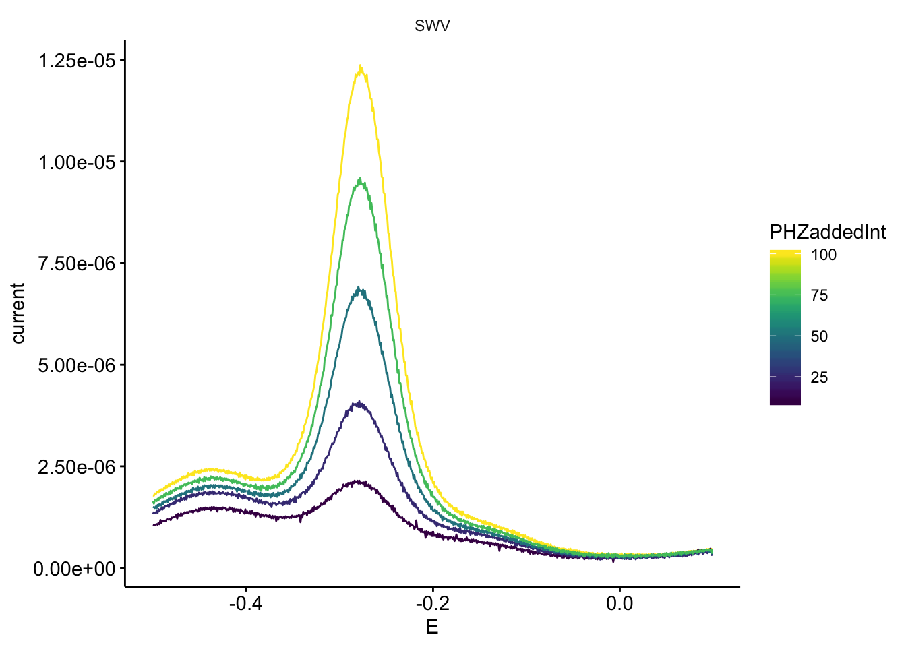
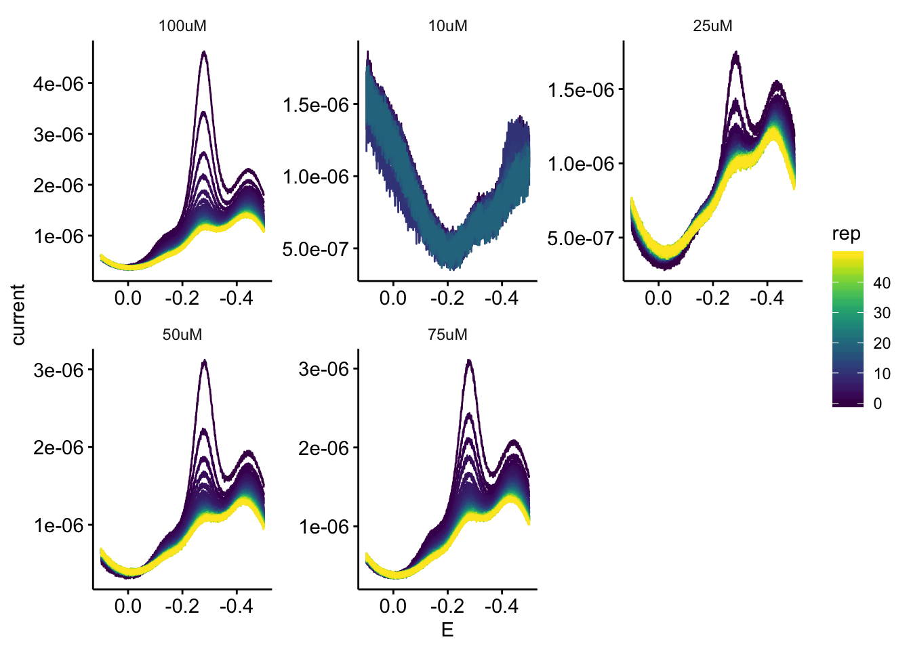
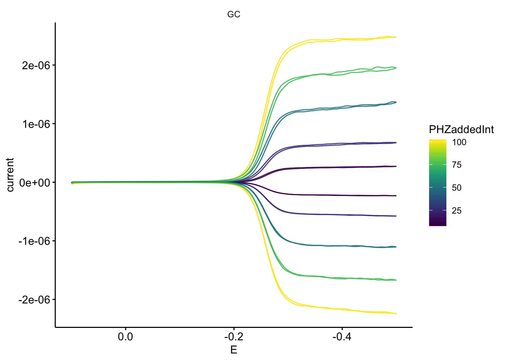
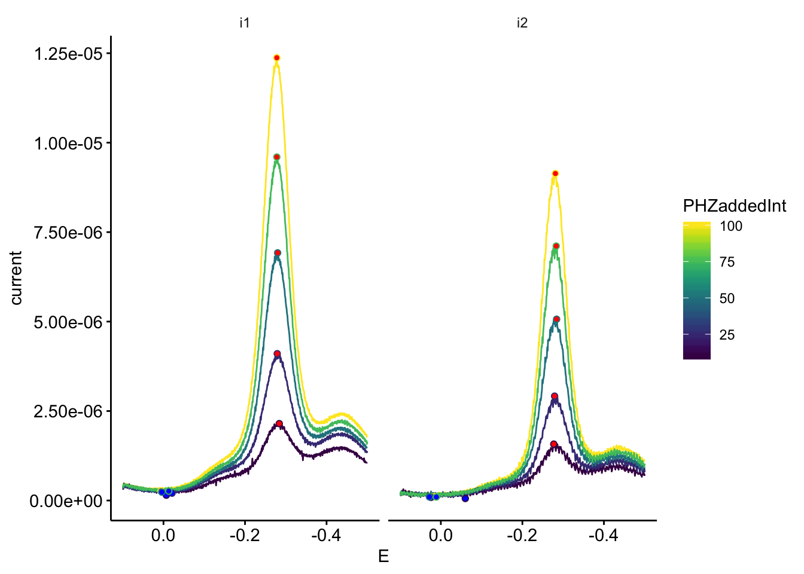
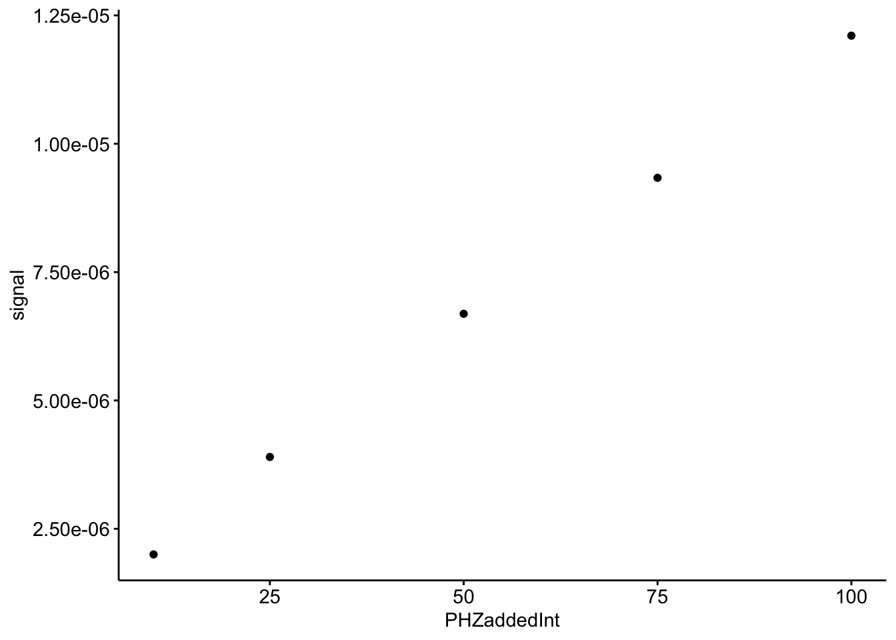
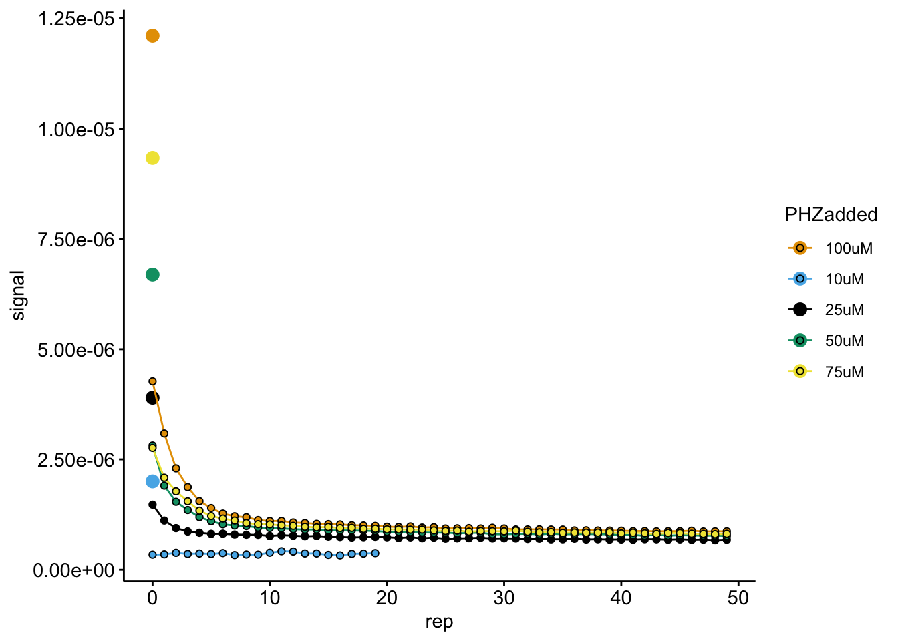
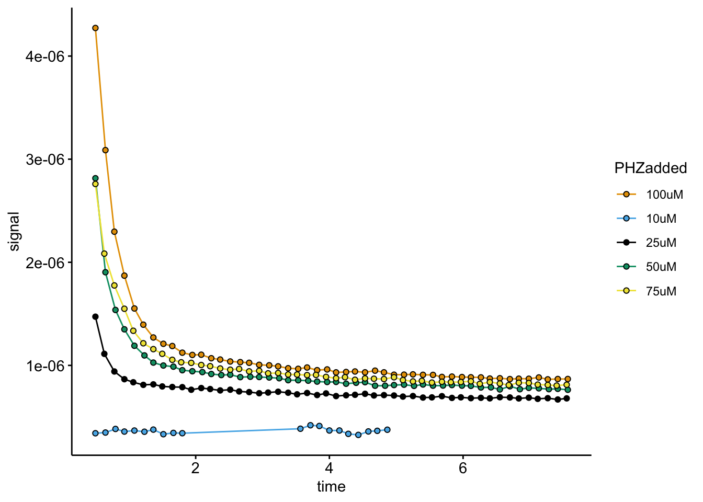
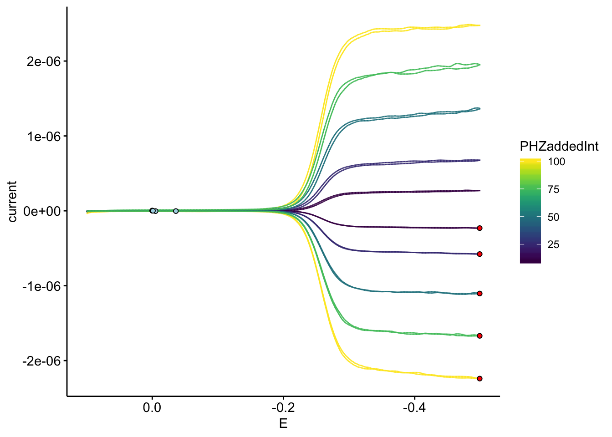
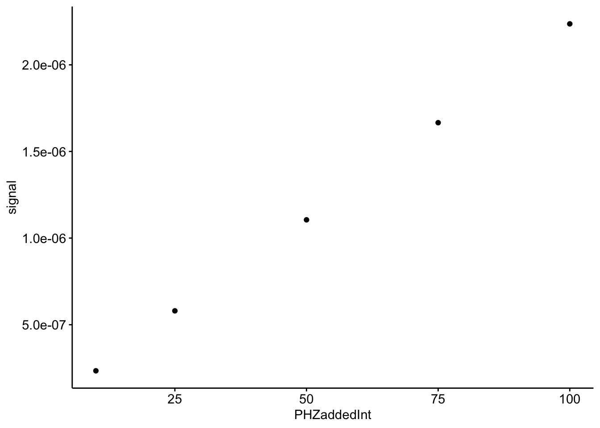
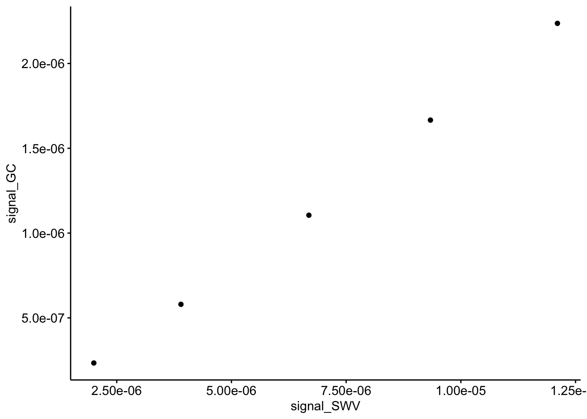

--------

# Notes

This notebook shows how raw electrochemical data from a CH Instruments potentiostat was processed for data vizualization and downstream analysis.

----

Setup packages and plotting for the notebook:


```r
# Load packages
library(tidyverse)
library(cowplot)
library(kableExtra)

# Code display options
knitr::opts_chunk$set(tidy.opts=list(width.cutoff=60),tidy=FALSE, echo = TRUE, message=FALSE, warning=FALSE, fig.align="center", fig.retina = 2)

# Load plotting tools
source("../../tools/plotting_tools.R")

#Modify the plot theme
theme_1 <- function () {
  theme_classic( ) %+replace%
    theme(
      strip.background = element_blank(),
      legend.background = element_blank(),
      axis.line = element_line(color = 'black'),
      axis.ticks = element_line(color = 'black'),
      axis.text = element_text(color = 'black')
    )
}


theme_set(theme_1())
```

# Import

In the folder `data/Electrochemistry/IDA/` there are the raw data output to text files from the CH Instruments potentiostat software. There are files from two different biofilms, each containing three technical replicates. 

We will use a set of simple tools developed to quickly import these files into data frames with metadata that we can work with. Basically, we will specifify a directory, the structure of the file names and the structure of the underlying data, and a function will import the files (~180 files for this notebook). Please see the the `echem_processing_tools` in the folder `code/tools/` for details.


```r
# Load echem processing tools

source("../../tools/echem_processing_tools.R")
```

## SWV data

First, let's import all of the SWV files for the first ∆phz* biofilm.


```r
# file names and paths
swv_file_paths <-  dir(path='../../../data/Electrochemistry/IDA/blank/', pattern = "[SWV]+.+[txt]$", recursive = T, full.names = T)

swv_filenames <- basename(swv_file_paths)

# data columns in each file
swv_data_cols <-  c('E','i1','i2')

# metadata in each file name
filename_cols = c('PHZadded','PYO','reactor','echem','rep')

# skip the header that contains detailed information from the potentiostat
swv_skip_rows=18

# Use the function `echem_import_to_df()` from the echem tools to import
swv_data <- echem_import_to_df(filenames = swv_filenames, 
                                       file_paths = swv_file_paths, 
                                       data_cols = swv_data_cols, 
                                       skip_rows = swv_skip_rows,
                                       filename_cols = filename_cols,
                                       rep = T, PHZadded = T) %>% 
  mutate(rep=rep-1) 

# Change the rep (acquisition number) for the SWVs because the first SWV should be 0.
# This is used to match SWV and GC by number later on.
# We also add an experimental id of 1.
```


```r
ggplot(swv_data %>% filter(electrode == 'i1' & reactor == 'soak'), aes(x = E, y = current, color = PHZaddedInt, group = PHZadded)) + geom_path() + facet_wrap(~echem)
```



```r
ggplot(swv_data %>% filter(electrode == 'i1' & reactor == 'transfer'), aes(x = E, y = current, color = rep, group = rep)) + geom_path() + facet_wrap(~PHZadded, scales = 'free') + scale_x_reverse()
```



## GC data

Now, we will repeat the import for the GC data. 


```r
gc_file_paths <-  dir(path='../../../data/Electrochemistry/IDA/blank/', pattern = "[GC]+.+[txt]$",recursive = T,full.names = T)

gc_filenames <- basename(gc_file_paths)

gc_data_cols <-  c('E','i1','i2','t')

filename_cols = c('PHZadded','PYO','reactor','echem','rep')

gc_skip_rows=21
  

gc_data <- echem_import_to_df(filenames = gc_filenames, 
                                       file_paths = gc_file_paths,
                                       data_cols = gc_data_cols, 
                                       skip_rows = gc_skip_rows,
                                       filename_cols = filename_cols,
                                       rep = T, PHZadded = T)
```


```r
ggplot(gc_data, aes(x = E, y = current, color = PHZaddedInt)) + geom_path() + facet_wrap(~echem) + scale_x_reverse()
```



# Signal quantification

Now that all of the files have been read into convenient data frames we can quantify the peak currents, which are the signals we will use for the analysis later on. 

## SWV

To do this we will use another function from the echem tools to find the min and max points within a specified potential window in each scan. Let's take a look at the output:


```r
unique_cols <- c('PHZadded','PYO','reactor','echem','minutes','PHZaddedInt','electrode','rep')

swv_signals <- echem_signal(swv_data,
                               unique_cols,                                     
                               max_interval = c(-0.2,-0.3),
                               min_interval=c(0.1,-0.2)) 

ggplot(swv_data %>% filter(reactor == 'soak'),aes(x=E,y=current,color=PHZaddedInt, group = PHZadded)) + geom_path() +
  geom_point(data=swv_signals %>% filter(reactor == 'soak'), aes(x = E_from_mins, y = min_current),fill='blue', shape = 21)+
  geom_point(data=swv_signals %>% filter(reactor == 'soak'), aes(x = E_from_maxs, y = max_current),fill='red', shape = 21)+
  scale_x_reverse()+
  facet_wrap(~electrode)
```




```r
ggplot(swv_signals %>% filter(reactor == 'soak' & electrode == 'i1'), aes(x = PHZaddedInt, y = signal)) + geom_point()
```




```r
ggplot(swv_data %>% filter(reactor == 'transfer' & electrode == 'i1'), aes(x=E,y=current)) + geom_path(aes(color=rep, group = rep)) +
  geom_point(data=swv_signals %>% filter(reactor == 'transfer'& electrode == 'i1'), aes(x = E_from_mins, y = min_current), fill='blue', shape = 21)+
  geom_point(data=swv_signals %>% filter(reactor == 'transfer'& electrode == 'i1'), aes(x = E_from_maxs, y = max_current), fill='red', shape = 21)+
  scale_x_reverse()+
  facet_wrap(~PHZadded, scales = 'free')
```


```r
ggplot(data = swv_signals %>% filter(electrode == 'i1' & reactor == 'transfer'), aes(x = rep, y = signal, color = PHZadded, fill =PHZadded)) + 
  geom_point(data = swv_signals %>% filter(electrode == 'i1' & reactor == 'soak'), size = 3)+
  geom_line() + 
  geom_point(shape = 21, color = 'black')
```



Add timing to SWV transfer:


```r
swv_tran_time <- swv_signals %>% 
  filter(reactor == 'transfer' & electrode == 'i1') %>% 
  group_by(PHZadded) %>% 
  mutate(min_time = min(minutes)) %>% 
  mutate(time = minutes - min_time + 0.5)

ggplot(data = swv_tran_time, aes(x = time, y = signal, color = PHZadded, fill =PHZadded)) + 
  geom_line() + 
  geom_point(shape = 21, color = 'black')
```




## GC


```r
unique_id_cols = c('reactor','PHZadded','PHZaddedInt','echem','rep','minutes','PYO')

gc_signals <- echem_signal(df = gc_data %>% filter(electrode == 'i2') %>% mutate(current = - current), 
                            unique_id_cols = unique_id_cols,
                            max_interval = c(-0.499,-0.499), 
                            min_interval = c(0.0,-0.4))
```

Now we can plot the GC scans and the min / max points.


```r
ggplot(gc_data) + 
  geom_path(data=. %>% filter(electrode=='i1'), aes(x = E, y = current, color = PHZaddedInt, group = rep)) + 
  geom_path(data=. %>% filter(electrode=='i2'), aes(x = E, y = current, color = PHZaddedInt, group = rep)) +
  geom_point(data = gc_signals, aes(x = E_from_mins, y = -current_from_mins), shape = 21, fill = 'light blue')+
  geom_point(data = gc_signals, aes(x = E_from_maxs, y = -current_from_maxs), shape = 21, fill = 'red')+
  scale_x_reverse()
```




```r
ggplot(gc_signals, aes(x = PHZaddedInt, y = signal)) + geom_point()
```



## Join SWV and GC soak data


```r
swv_gc_soak <- left_join(swv_signals %>% filter(reactor == 'soak' & electrode == 'i1'), gc_signals, by = c('PHZadded','PYO','PHZaddedInt','reactor'), suffix = c('_SWV','_GC'))

ggplot(swv_gc_soak, aes(x = signal_SWV, y = signal_GC)) + geom_point()
```



# Output


```r
write_csv(swv_gc_soak,"../processed_data/phz_eDNA_2019_swv_gc_soak_blank.csv")

write_csv(swv_signals %>% filter(electrode == 'i1'), "../processed_data/phz_eDNA_2019_swv_transfer_blank.csv")
```

-------


```r
sessionInfo()
```

```
## R version 3.5.3 (2019-03-11)
## Platform: x86_64-apple-darwin15.6.0 (64-bit)
## Running under: macOS Mojave 10.14.6
## 
## Matrix products: default
## BLAS: /Library/Frameworks/R.framework/Versions/3.5/Resources/lib/libRblas.0.dylib
## LAPACK: /Library/Frameworks/R.framework/Versions/3.5/Resources/lib/libRlapack.dylib
## 
## locale:
## [1] en_US.UTF-8/en_US.UTF-8/en_US.UTF-8/C/en_US.UTF-8/en_US.UTF-8
## 
## attached base packages:
## [1] stats     graphics  grDevices utils     datasets  methods   base     
## 
## other attached packages:
##  [1] lubridate_1.7.4   hms_0.4.2         viridis_0.5.1    
##  [4] viridisLite_0.3.0 kableExtra_1.1.0  cowplot_0.9.4    
##  [7] forcats_0.4.0     stringr_1.4.0     dplyr_0.8.1      
## [10] purrr_0.3.2       readr_1.3.1       tidyr_0.8.3      
## [13] tibble_2.1.3      ggplot2_3.2.1     tidyverse_1.2.1  
## 
## loaded via a namespace (and not attached):
##  [1] tidyselect_0.2.5 xfun_0.7         haven_2.1.0      lattice_0.20-38 
##  [5] colorspace_1.4-1 generics_0.0.2   htmltools_0.3.6  yaml_2.2.0      
##  [9] rlang_0.4.0      pillar_1.4.2     glue_1.3.1       withr_2.1.2     
## [13] modelr_0.1.4     readxl_1.3.1     munsell_0.5.0    gtable_0.3.0    
## [17] cellranger_1.1.0 rvest_0.3.4      evaluate_0.14    labeling_0.3    
## [21] knitr_1.23       broom_0.5.2      Rcpp_1.0.2       scales_1.0.0    
## [25] backports_1.1.4  webshot_0.5.1    jsonlite_1.6     gridExtra_2.3   
## [29] digest_0.6.21    stringi_1.4.3    grid_3.5.3       cli_1.1.0       
## [33] tools_3.5.3      magrittr_1.5     lazyeval_0.2.2   crayon_1.3.4    
## [37] pkgconfig_2.0.3  xml2_1.2.0       assertthat_0.2.1 rmarkdown_1.13  
## [41] httr_1.4.0       rstudioapi_0.10  R6_2.4.0         nlme_3.1-137    
## [45] compiler_3.5.3
```
