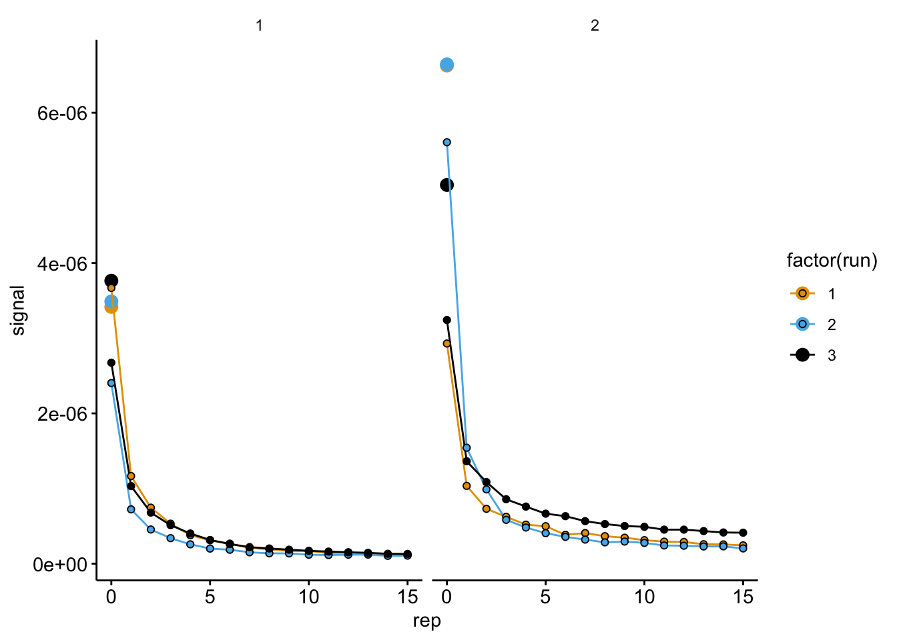
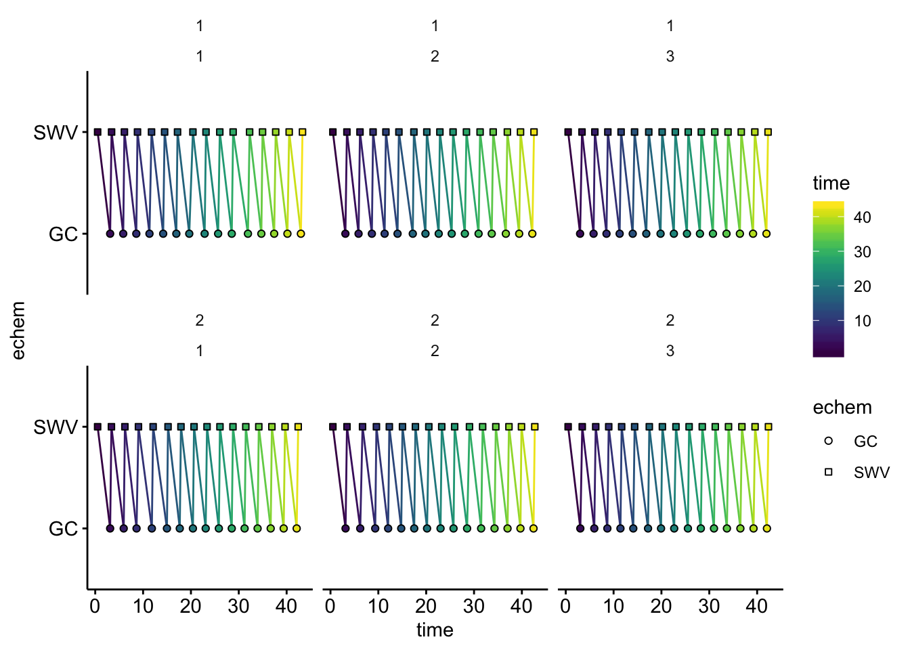

--------

# Notes

This notebook shows how raw electrochemical data from a CH Instruments potentiostat was processed for data vizualization and downstream analysis.

----

Setup packages and plotting for the notebook:


```r
# Load packages
library(tidyverse)
library(cowplot)
library(kableExtra)

# Code display options
knitr::opts_chunk$set(tidy.opts=list(width.cutoff=60),tidy=FALSE, echo = TRUE, message=FALSE, warning=FALSE, fig.align="center", fig.retina = 2)

# Load plotting tools
source("../tools/plotting_tools.R")

#Modify the plot theme
theme_1 <- function () {
  theme_classic( ) %+replace%
    theme(
      strip.background = element_blank(),
      legend.background = element_blank(),
      axis.line = element_line(color = 'black'),
      axis.ticks = element_line(color = 'black'),
      axis.text = element_text(color = 'black')
    )
}


theme_set(theme_1())
```

# Import

In the folder `data/Electrochemistry/IDA/` there are the raw data output to text files from the CH Instruments potentiostat software. There are files from two different biofilms, each containing three technical replicates. 

We will use a set of simple tools developed to quickly import these files into data frames with metadata that we can work with. Basically, we will specifify a directory, the structure of the file names and the structure of the underlying data, and a function will import the files (~180 files for this notebook). Please see the the `echem_processing_tools` in the folder `code/tools/` for details.


```r
# Load echem processing tools

source("../tools/echem_processing_tools.R")
```

## SWV data

First, let's import all of the SWV files for the first ∆phz* biofilm.


```r
# file names and paths
swv_file_paths_1 <-  dir(path='../../data/Electrochemistry/IDA/dPHZ_biofilm_1/', pattern = "[SWV]+.+[txt]$", recursive = T, full.names = T)

swv_filenames_1 <- basename(swv_file_paths_1)

# data columns in each file
swv_data_cols <-  c('E','i1','i2')

# metadata in each file name
filename_cols = c('reactor','run','echem','rep')

# skip the header that contains detailed information from the potentiostat
swv_skip_rows=18

# Use the function `echem_import_to_df()` from the echem tools to import
swv_data_1 <- echem_import_to_df(filenames = swv_filenames_1, 
                                       file_paths = swv_file_paths_1, 
                                       data_cols = swv_data_cols, 
                                       skip_rows = swv_skip_rows,
                                       filename_cols = filename_cols,
                                       rep = T, PHZadded = F) %>% 
  mutate(rep=rep-1, exp = 1) 

# Change the rep (acquisition number) for the SWVs because the first SWV should be 0.
# This is used to match SWV and GC by number later on.
# We also add an experimental id of 1.
```

Let's look at the data frame we have generated:


```r
swv_data_1 %>% head() %>%  kable(digits = 10) %>% kable_styling() %>% scroll_box(height = '300px')
```

<div style="border: 1px solid #ddd; padding: 0px; overflow-y: scroll; height:300px; "><table class="table" style="margin-left: auto; margin-right: auto;">
 <thead>
  <tr>
   <th style="text-align:left;position: sticky; top:0; background-color: #FFFFFF;"> reactor </th>
   <th style="text-align:left;position: sticky; top:0; background-color: #FFFFFF;"> run </th>
   <th style="text-align:left;position: sticky; top:0; background-color: #FFFFFF;"> echem </th>
   <th style="text-align:right;position: sticky; top:0; background-color: #FFFFFF;"> rep </th>
   <th style="text-align:right;position: sticky; top:0; background-color: #FFFFFF;"> minutes </th>
   <th style="text-align:right;position: sticky; top:0; background-color: #FFFFFF;"> E </th>
   <th style="text-align:left;position: sticky; top:0; background-color: #FFFFFF;"> electrode </th>
   <th style="text-align:right;position: sticky; top:0; background-color: #FFFFFF;"> current </th>
   <th style="text-align:right;position: sticky; top:0; background-color: #FFFFFF;"> exp </th>
  </tr>
 </thead>
<tbody>
  <tr>
   <td style="text-align:left;"> soak </td>
   <td style="text-align:left;"> 1 </td>
   <td style="text-align:left;"> SWV </td>
   <td style="text-align:right;"> 0 </td>
   <td style="text-align:right;"> 941.1833 </td>
   <td style="text-align:right;"> 0.099 </td>
   <td style="text-align:left;"> i1 </td>
   <td style="text-align:right;"> 1.263e-07 </td>
   <td style="text-align:right;"> 1 </td>
  </tr>
  <tr>
   <td style="text-align:left;"> soak </td>
   <td style="text-align:left;"> 1 </td>
   <td style="text-align:left;"> SWV </td>
   <td style="text-align:right;"> 0 </td>
   <td style="text-align:right;"> 941.1833 </td>
   <td style="text-align:right;"> 0.098 </td>
   <td style="text-align:left;"> i1 </td>
   <td style="text-align:right;"> 1.435e-07 </td>
   <td style="text-align:right;"> 1 </td>
  </tr>
  <tr>
   <td style="text-align:left;"> soak </td>
   <td style="text-align:left;"> 1 </td>
   <td style="text-align:left;"> SWV </td>
   <td style="text-align:right;"> 0 </td>
   <td style="text-align:right;"> 941.1833 </td>
   <td style="text-align:right;"> 0.097 </td>
   <td style="text-align:left;"> i1 </td>
   <td style="text-align:right;"> 1.456e-07 </td>
   <td style="text-align:right;"> 1 </td>
  </tr>
  <tr>
   <td style="text-align:left;"> soak </td>
   <td style="text-align:left;"> 1 </td>
   <td style="text-align:left;"> SWV </td>
   <td style="text-align:right;"> 0 </td>
   <td style="text-align:right;"> 941.1833 </td>
   <td style="text-align:right;"> 0.096 </td>
   <td style="text-align:left;"> i1 </td>
   <td style="text-align:right;"> 1.492e-07 </td>
   <td style="text-align:right;"> 1 </td>
  </tr>
  <tr>
   <td style="text-align:left;"> soak </td>
   <td style="text-align:left;"> 1 </td>
   <td style="text-align:left;"> SWV </td>
   <td style="text-align:right;"> 0 </td>
   <td style="text-align:right;"> 941.1833 </td>
   <td style="text-align:right;"> 0.095 </td>
   <td style="text-align:left;"> i1 </td>
   <td style="text-align:right;"> 1.315e-07 </td>
   <td style="text-align:right;"> 1 </td>
  </tr>
  <tr>
   <td style="text-align:left;"> soak </td>
   <td style="text-align:left;"> 1 </td>
   <td style="text-align:left;"> SWV </td>
   <td style="text-align:right;"> 0 </td>
   <td style="text-align:right;"> 941.1833 </td>
   <td style="text-align:right;"> 0.094 </td>
   <td style="text-align:left;"> i1 </td>
   <td style="text-align:right;"> 1.513e-07 </td>
   <td style="text-align:right;"> 1 </td>
  </tr>
</tbody>
</table></div>

<br>

We can now plot all of these data. This plot will show the data from the first biofilm as it equilibrated in the transfer reactor and the data are separated for each technical replicate.


```r
ggplot(swv_data_1 %>% filter(electrode == 'i1' & reactor == 'transfer'), aes(x = E , y = current )) +
  geom_path(aes(group = rep, color = rep)) + facet_wrap(~run)
```


Now let's read in the SWV data for the second biofilm.


```r
swv_file_paths_2 <-  dir(path='../../data/Electrochemistry/IDA/dPHZ_biofilm_2/', pattern = "[SWV]+.+[txt]$",recursive = T,full.names = T)

swv_filenames_2 <- basename(swv_file_paths_2)
  
swv_data_2 <- echem_import_to_df(filenames = swv_filenames_2, 
                                 file_paths = swv_file_paths_2, 
                                 data_cols = swv_data_cols, 
                                 skip_rows = swv_skip_rows,
                                 filename_cols = filename_cols, 
                                 rep = T, 
                                 PHZadded = F) %>% 
  mutate(rep=rep-1, exp = 2)
```

Here is the second dataset plotted:


```r
ggplot(swv_data_2 %>% filter(electrode == 'i1' & reactor == 'transfer'), aes(x = E , y = current )) +
  geom_path(aes(group = rep, color = rep)) + facet_wrap(~run)
```


## GC data

Now, we will repeat the import for the GC data. 


```r
gc_file_paths_1 <-  dir(path='../../data/Electrochemistry/IDA/dPHZ_biofilm_1/', pattern = "[GC]+.+[txt]$",recursive = T,full.names = T)

gc_filenames_1 <- basename(gc_file_paths_1)

gc_data_cols <-  c('E','i1','i2','t')

filename_cols = c('reactor','run','echem','rep')

gc_skip_rows=21
  

gc_data_1 <- echem_import_to_df(filenames = gc_filenames_1, 
                                       file_paths = gc_file_paths_1, 
                                       data_cols = gc_data_cols, 
                                       skip_rows = gc_skip_rows,
                                       filename_cols = filename_cols,
                                       rep = T, PHZadded = F) %>% 
  mutate(exp = 1)
```

Here's the GC data plotted from the first biofilm:


```r
ggplot(gc_data_1 %>% filter(reactor == 'transfer')) + 
  geom_path(data=. %>% filter(electrode=='i1'), aes(x = E, y = current, color = rep, group = rep)) + 
  geom_path(data=. %>% filter(electrode=='i2'), aes(x = E, y = current, color = rep, group = rep)) +
  scale_x_reverse() + facet_wrap(~run)
```


And now for the second biofilm.


```r
gc_file_paths_2 <-  dir(path='../../data/Electrochemistry/IDA/dPHZ_biofilm_2/', pattern = "[GC]+.+[txt]$",recursive = T,full.names = T)

gc_filenames_2 <- basename(gc_file_paths_2)

gc_data_cols <-  c('E','i1','i2','t')

filename_cols = c('reactor','run','echem','rep')

gc_skip_rows=21
  

gc_data_2 <- echem_import_to_df(filenames = gc_filenames_2, 
                                       file_paths = gc_file_paths_2, 
                                       data_cols = gc_data_cols, 
                                       skip_rows = gc_skip_rows,
                                       filename_cols = filename_cols,
                                       rep = T, PHZadded = F) %>% 
  mutate(exp = 2)
```

Here's the GC data plotted from the second biofilm:


```r
ggplot(gc_data_2 %>% filter(reactor == 'transfer')) + 
  geom_path(data=. %>% filter(electrode=='i1'), aes(x = E, y = current, color = rep, group = rep)) + 
  geom_path(data=. %>% filter(electrode=='i2'), aes(x = E, y = current, color = rep, group = rep)) +
  scale_x_reverse() + facet_wrap(~run)
```


# Signal quantification

Now that all of the files have been read into convenient data frames we can quantify the peak currents, which are the signals we will use for the analysis later on. 

## SWV

To do this we will use another function from the echem tools to find the min and max points within a specified potential window in each scan. Let's take a look at the output:


```r
# combine swv data sets
swv_data <- bind_rows(swv_data_1, swv_data_2) 

# ID columns for function below
unique_id_cols = c('reactor','run','echem','rep','rep','minutes','electrode', 'exp')

# Use `echem_signal()` from echem tools to find min/max points in each scan
swv_signals <- echem_signal(df = swv_data, 
                            unique_id_cols = unique_id_cols,
                            max_interval = c(-0.2,-0.4), 
                            min_interval = c(0.0,-0.4)) 

swv_signals %>% kable(digits = 10) %>% kable_styling() %>% scroll_box(height = '300px')
```

<div style="border: 1px solid #ddd; padding: 0px; overflow-y: scroll; height:300px; "><table class="table" style="margin-left: auto; margin-right: auto;">
 <thead>
  <tr>
   <th style="text-align:left;position: sticky; top:0; background-color: #FFFFFF;"> reactor </th>
   <th style="text-align:left;position: sticky; top:0; background-color: #FFFFFF;"> run </th>
   <th style="text-align:left;position: sticky; top:0; background-color: #FFFFFF;"> echem </th>
   <th style="text-align:right;position: sticky; top:0; background-color: #FFFFFF;"> rep </th>
   <th style="text-align:right;position: sticky; top:0; background-color: #FFFFFF;"> minutes </th>
   <th style="text-align:right;position: sticky; top:0; background-color: #FFFFFF;"> E_from_maxs </th>
   <th style="text-align:left;position: sticky; top:0; background-color: #FFFFFF;"> electrode </th>
   <th style="text-align:right;position: sticky; top:0; background-color: #FFFFFF;"> current_from_maxs </th>
   <th style="text-align:right;position: sticky; top:0; background-color: #FFFFFF;"> exp </th>
   <th style="text-align:right;position: sticky; top:0; background-color: #FFFFFF;"> max_current </th>
   <th style="text-align:right;position: sticky; top:0; background-color: #FFFFFF;"> E_from_mins </th>
   <th style="text-align:right;position: sticky; top:0; background-color: #FFFFFF;"> current_from_mins </th>
   <th style="text-align:right;position: sticky; top:0; background-color: #FFFFFF;"> min_current </th>
   <th style="text-align:right;position: sticky; top:0; background-color: #FFFFFF;"> signal </th>
  </tr>
 </thead>
<tbody>
  <tr>
   <td style="text-align:left;"> soak </td>
   <td style="text-align:left;"> 1 </td>
   <td style="text-align:left;"> SWV </td>
   <td style="text-align:right;"> 0 </td>
   <td style="text-align:right;"> 941.1833 </td>
   <td style="text-align:right;"> -0.267 </td>
   <td style="text-align:left;"> i1 </td>
   <td style="text-align:right;"> 3.5177e-06 </td>
   <td style="text-align:right;"> 1 </td>
   <td style="text-align:right;"> 3.5177e-06 </td>
   <td style="text-align:right;"> -0.082 </td>
   <td style="text-align:right;"> 1.0070e-07 </td>
   <td style="text-align:right;"> 1.0070e-07 </td>
   <td style="text-align:right;"> 3.4170e-06 </td>
  </tr>
  <tr>
   <td style="text-align:left;"> transfer </td>
   <td style="text-align:left;"> 1 </td>
   <td style="text-align:left;"> SWV </td>
   <td style="text-align:right;"> 0 </td>
   <td style="text-align:right;"> 951.7500 </td>
   <td style="text-align:right;"> -0.268 </td>
   <td style="text-align:left;"> i1 </td>
   <td style="text-align:right;"> 3.7691e-06 </td>
   <td style="text-align:right;"> 1 </td>
   <td style="text-align:right;"> 3.7691e-06 </td>
   <td style="text-align:right;"> -0.095 </td>
   <td style="text-align:right;"> 1.0010e-07 </td>
   <td style="text-align:right;"> 1.0010e-07 </td>
   <td style="text-align:right;"> 3.6690e-06 </td>
  </tr>
  <tr>
   <td style="text-align:left;"> transfer </td>
   <td style="text-align:left;"> 1 </td>
   <td style="text-align:left;"> SWV </td>
   <td style="text-align:right;"> 9 </td>
   <td style="text-align:right;"> 977.2833 </td>
   <td style="text-align:right;"> -0.268 </td>
   <td style="text-align:left;"> i1 </td>
   <td style="text-align:right;"> 2.6130e-07 </td>
   <td style="text-align:right;"> 1 </td>
   <td style="text-align:right;"> 2.6130e-07 </td>
   <td style="text-align:right;"> -0.057 </td>
   <td style="text-align:right;"> 9.3500e-08 </td>
   <td style="text-align:right;"> 9.3500e-08 </td>
   <td style="text-align:right;"> 1.6780e-07 </td>
  </tr>
  <tr>
   <td style="text-align:left;"> transfer </td>
   <td style="text-align:left;"> 1 </td>
   <td style="text-align:left;"> SWV </td>
   <td style="text-align:right;"> 10 </td>
   <td style="text-align:right;"> 980.0667 </td>
   <td style="text-align:right;"> -0.272 </td>
   <td style="text-align:left;"> i1 </td>
   <td style="text-align:right;"> 2.5670e-07 </td>
   <td style="text-align:right;"> 1 </td>
   <td style="text-align:right;"> 2.5670e-07 </td>
   <td style="text-align:right;"> -0.127 </td>
   <td style="text-align:right;"> 8.9300e-08 </td>
   <td style="text-align:right;"> 8.9300e-08 </td>
   <td style="text-align:right;"> 1.6740e-07 </td>
  </tr>
  <tr>
   <td style="text-align:left;"> transfer </td>
   <td style="text-align:left;"> 1 </td>
   <td style="text-align:left;"> SWV </td>
   <td style="text-align:right;"> 11 </td>
   <td style="text-align:right;"> 983.5167 </td>
   <td style="text-align:right;"> -0.271 </td>
   <td style="text-align:left;"> i1 </td>
   <td style="text-align:right;"> 2.3200e-07 </td>
   <td style="text-align:right;"> 1 </td>
   <td style="text-align:right;"> 2.3200e-07 </td>
   <td style="text-align:right;"> -0.088 </td>
   <td style="text-align:right;"> 8.9700e-08 </td>
   <td style="text-align:right;"> 8.9700e-08 </td>
   <td style="text-align:right;"> 1.4230e-07 </td>
  </tr>
  <tr>
   <td style="text-align:left;"> transfer </td>
   <td style="text-align:left;"> 1 </td>
   <td style="text-align:left;"> SWV </td>
   <td style="text-align:right;"> 12 </td>
   <td style="text-align:right;"> 986.2167 </td>
   <td style="text-align:right;"> -0.264 </td>
   <td style="text-align:left;"> i1 </td>
   <td style="text-align:right;"> 2.3760e-07 </td>
   <td style="text-align:right;"> 1 </td>
   <td style="text-align:right;"> 2.3760e-07 </td>
   <td style="text-align:right;"> -0.115 </td>
   <td style="text-align:right;"> 8.8600e-08 </td>
   <td style="text-align:right;"> 8.8600e-08 </td>
   <td style="text-align:right;"> 1.4910e-07 </td>
  </tr>
  <tr>
   <td style="text-align:left;"> transfer </td>
   <td style="text-align:left;"> 1 </td>
   <td style="text-align:left;"> SWV </td>
   <td style="text-align:right;"> 13 </td>
   <td style="text-align:right;"> 988.9667 </td>
   <td style="text-align:right;"> -0.274 </td>
   <td style="text-align:left;"> i1 </td>
   <td style="text-align:right;"> 2.2280e-07 </td>
   <td style="text-align:right;"> 1 </td>
   <td style="text-align:right;"> 2.2280e-07 </td>
   <td style="text-align:right;"> -0.072 </td>
   <td style="text-align:right;"> 8.9800e-08 </td>
   <td style="text-align:right;"> 8.9800e-08 </td>
   <td style="text-align:right;"> 1.3290e-07 </td>
  </tr>
  <tr>
   <td style="text-align:left;"> transfer </td>
   <td style="text-align:left;"> 1 </td>
   <td style="text-align:left;"> SWV </td>
   <td style="text-align:right;"> 14 </td>
   <td style="text-align:right;"> 991.7833 </td>
   <td style="text-align:right;"> -0.260 </td>
   <td style="text-align:left;"> i1 </td>
   <td style="text-align:right;"> 2.1190e-07 </td>
   <td style="text-align:right;"> 1 </td>
   <td style="text-align:right;"> 2.1190e-07 </td>
   <td style="text-align:right;"> -0.072 </td>
   <td style="text-align:right;"> 9.1300e-08 </td>
   <td style="text-align:right;"> 9.1300e-08 </td>
   <td style="text-align:right;"> 1.2060e-07 </td>
  </tr>
  <tr>
   <td style="text-align:left;"> transfer </td>
   <td style="text-align:left;"> 1 </td>
   <td style="text-align:left;"> SWV </td>
   <td style="text-align:right;"> 15 </td>
   <td style="text-align:right;"> 994.5667 </td>
   <td style="text-align:right;"> -0.275 </td>
   <td style="text-align:left;"> i1 </td>
   <td style="text-align:right;"> 2.1320e-07 </td>
   <td style="text-align:right;"> 1 </td>
   <td style="text-align:right;"> 2.1320e-07 </td>
   <td style="text-align:right;"> -0.123 </td>
   <td style="text-align:right;"> 9.2600e-08 </td>
   <td style="text-align:right;"> 9.2600e-08 </td>
   <td style="text-align:right;"> 1.2060e-07 </td>
  </tr>
  <tr>
   <td style="text-align:left;"> transfer </td>
   <td style="text-align:left;"> 1 </td>
   <td style="text-align:left;"> SWV </td>
   <td style="text-align:right;"> 1 </td>
   <td style="text-align:right;"> 954.6667 </td>
   <td style="text-align:right;"> -0.266 </td>
   <td style="text-align:left;"> i1 </td>
   <td style="text-align:right;"> 1.2638e-06 </td>
   <td style="text-align:right;"> 1 </td>
   <td style="text-align:right;"> 1.2638e-06 </td>
   <td style="text-align:right;"> -0.040 </td>
   <td style="text-align:right;"> 9.7700e-08 </td>
   <td style="text-align:right;"> 9.7700e-08 </td>
   <td style="text-align:right;"> 1.1660e-06 </td>
  </tr>
  <tr>
   <td style="text-align:left;"> transfer </td>
   <td style="text-align:left;"> 1 </td>
   <td style="text-align:left;"> SWV </td>
   <td style="text-align:right;"> 2 </td>
   <td style="text-align:right;"> 957.3500 </td>
   <td style="text-align:right;"> -0.265 </td>
   <td style="text-align:left;"> i1 </td>
   <td style="text-align:right;"> 8.4360e-07 </td>
   <td style="text-align:right;"> 1 </td>
   <td style="text-align:right;"> 8.4360e-07 </td>
   <td style="text-align:right;"> -0.034 </td>
   <td style="text-align:right;"> 9.7800e-08 </td>
   <td style="text-align:right;"> 9.7800e-08 </td>
   <td style="text-align:right;"> 7.4570e-07 </td>
  </tr>
  <tr>
   <td style="text-align:left;"> transfer </td>
   <td style="text-align:left;"> 1 </td>
   <td style="text-align:left;"> SWV </td>
   <td style="text-align:right;"> 3 </td>
   <td style="text-align:right;"> 960.0833 </td>
   <td style="text-align:right;"> -0.266 </td>
   <td style="text-align:left;"> i1 </td>
   <td style="text-align:right;"> 6.2500e-07 </td>
   <td style="text-align:right;"> 1 </td>
   <td style="text-align:right;"> 6.2500e-07 </td>
   <td style="text-align:right;"> -0.073 </td>
   <td style="text-align:right;"> 9.2200e-08 </td>
   <td style="text-align:right;"> 9.2200e-08 </td>
   <td style="text-align:right;"> 5.3280e-07 </td>
  </tr>
  <tr>
   <td style="text-align:left;"> transfer </td>
   <td style="text-align:left;"> 1 </td>
   <td style="text-align:left;"> SWV </td>
   <td style="text-align:right;"> 4 </td>
   <td style="text-align:right;"> 963.0167 </td>
   <td style="text-align:right;"> -0.268 </td>
   <td style="text-align:left;"> i1 </td>
   <td style="text-align:right;"> 4.7340e-07 </td>
   <td style="text-align:right;"> 1 </td>
   <td style="text-align:right;"> 4.7340e-07 </td>
   <td style="text-align:right;"> -0.085 </td>
   <td style="text-align:right;"> 9.4500e-08 </td>
   <td style="text-align:right;"> 9.4500e-08 </td>
   <td style="text-align:right;"> 3.7890e-07 </td>
  </tr>
  <tr>
   <td style="text-align:left;"> transfer </td>
   <td style="text-align:left;"> 1 </td>
   <td style="text-align:left;"> SWV </td>
   <td style="text-align:right;"> 5 </td>
   <td style="text-align:right;"> 965.7500 </td>
   <td style="text-align:right;"> -0.266 </td>
   <td style="text-align:left;"> i1 </td>
   <td style="text-align:right;"> 4.0450e-07 </td>
   <td style="text-align:right;"> 1 </td>
   <td style="text-align:right;"> 4.0450e-07 </td>
   <td style="text-align:right;"> -0.078 </td>
   <td style="text-align:right;"> 9.2500e-08 </td>
   <td style="text-align:right;"> 9.2500e-08 </td>
   <td style="text-align:right;"> 3.1200e-07 </td>
  </tr>
  <tr>
   <td style="text-align:left;"> transfer </td>
   <td style="text-align:left;"> 1 </td>
   <td style="text-align:left;"> SWV </td>
   <td style="text-align:right;"> 6 </td>
   <td style="text-align:right;"> 968.4500 </td>
   <td style="text-align:right;"> -0.268 </td>
   <td style="text-align:left;"> i1 </td>
   <td style="text-align:right;"> 3.5850e-07 </td>
   <td style="text-align:right;"> 1 </td>
   <td style="text-align:right;"> 3.5850e-07 </td>
   <td style="text-align:right;"> -0.111 </td>
   <td style="text-align:right;"> 9.1900e-08 </td>
   <td style="text-align:right;"> 9.1900e-08 </td>
   <td style="text-align:right;"> 2.6670e-07 </td>
  </tr>
  <tr>
   <td style="text-align:left;"> transfer </td>
   <td style="text-align:left;"> 1 </td>
   <td style="text-align:left;"> SWV </td>
   <td style="text-align:right;"> 7 </td>
   <td style="text-align:right;"> 971.6667 </td>
   <td style="text-align:right;"> -0.264 </td>
   <td style="text-align:left;"> i1 </td>
   <td style="text-align:right;"> 3.0000e-07 </td>
   <td style="text-align:right;"> 1 </td>
   <td style="text-align:right;"> 3.0000e-07 </td>
   <td style="text-align:right;"> -0.088 </td>
   <td style="text-align:right;"> 9.0500e-08 </td>
   <td style="text-align:right;"> 9.0500e-08 </td>
   <td style="text-align:right;"> 2.0950e-07 </td>
  </tr>
  <tr>
   <td style="text-align:left;"> transfer </td>
   <td style="text-align:left;"> 1 </td>
   <td style="text-align:left;"> SWV </td>
   <td style="text-align:right;"> 8 </td>
   <td style="text-align:right;"> 974.4000 </td>
   <td style="text-align:right;"> -0.265 </td>
   <td style="text-align:left;"> i1 </td>
   <td style="text-align:right;"> 2.8310e-07 </td>
   <td style="text-align:right;"> 1 </td>
   <td style="text-align:right;"> 2.8310e-07 </td>
   <td style="text-align:right;"> -0.072 </td>
   <td style="text-align:right;"> 9.0400e-08 </td>
   <td style="text-align:right;"> 9.0400e-08 </td>
   <td style="text-align:right;"> 1.9270e-07 </td>
  </tr>
  <tr>
   <td style="text-align:left;"> soak </td>
   <td style="text-align:left;"> 2 </td>
   <td style="text-align:left;"> SWV </td>
   <td style="text-align:right;"> 0 </td>
   <td style="text-align:right;"> 1009.4000 </td>
   <td style="text-align:right;"> -0.270 </td>
   <td style="text-align:left;"> i1 </td>
   <td style="text-align:right;"> 3.5581e-06 </td>
   <td style="text-align:right;"> 1 </td>
   <td style="text-align:right;"> 3.5581e-06 </td>
   <td style="text-align:right;"> -0.058 </td>
   <td style="text-align:right;"> 6.8800e-08 </td>
   <td style="text-align:right;"> 6.8800e-08 </td>
   <td style="text-align:right;"> 3.4892e-06 </td>
  </tr>
  <tr>
   <td style="text-align:left;"> transfer </td>
   <td style="text-align:left;"> 2 </td>
   <td style="text-align:left;"> SWV </td>
   <td style="text-align:right;"> 0 </td>
   <td style="text-align:right;"> 1017.4667 </td>
   <td style="text-align:right;"> -0.270 </td>
   <td style="text-align:left;"> i1 </td>
   <td style="text-align:right;"> 2.4957e-06 </td>
   <td style="text-align:right;"> 1 </td>
   <td style="text-align:right;"> 2.4957e-06 </td>
   <td style="text-align:right;"> -0.087 </td>
   <td style="text-align:right;"> 9.1900e-08 </td>
   <td style="text-align:right;"> 9.1900e-08 </td>
   <td style="text-align:right;"> 2.4039e-06 </td>
  </tr>
  <tr>
   <td style="text-align:left;"> transfer </td>
   <td style="text-align:left;"> 2 </td>
   <td style="text-align:left;"> SWV </td>
   <td style="text-align:right;"> 9 </td>
   <td style="text-align:right;"> 1042.5833 </td>
   <td style="text-align:right;"> -0.270 </td>
   <td style="text-align:left;"> i1 </td>
   <td style="text-align:right;"> 2.1930e-07 </td>
   <td style="text-align:right;"> 1 </td>
   <td style="text-align:right;"> 2.1930e-07 </td>
   <td style="text-align:right;"> -0.094 </td>
   <td style="text-align:right;"> 8.2300e-08 </td>
   <td style="text-align:right;"> 8.2300e-08 </td>
   <td style="text-align:right;"> 1.3700e-07 </td>
  </tr>
  <tr>
   <td style="text-align:left;"> transfer </td>
   <td style="text-align:left;"> 2 </td>
   <td style="text-align:left;"> SWV </td>
   <td style="text-align:right;"> 10 </td>
   <td style="text-align:right;"> 1045.3833 </td>
   <td style="text-align:right;"> -0.280 </td>
   <td style="text-align:left;"> i1 </td>
   <td style="text-align:right;"> 2.0490e-07 </td>
   <td style="text-align:right;"> 1 </td>
   <td style="text-align:right;"> 2.0490e-07 </td>
   <td style="text-align:right;"> -0.121 </td>
   <td style="text-align:right;"> 8.5300e-08 </td>
   <td style="text-align:right;"> 8.5300e-08 </td>
   <td style="text-align:right;"> 1.1970e-07 </td>
  </tr>
  <tr>
   <td style="text-align:left;"> transfer </td>
   <td style="text-align:left;"> 2 </td>
   <td style="text-align:left;"> SWV </td>
   <td style="text-align:right;"> 11 </td>
   <td style="text-align:right;"> 1048.2333 </td>
   <td style="text-align:right;"> -0.261 </td>
   <td style="text-align:left;"> i1 </td>
   <td style="text-align:right;"> 1.9960e-07 </td>
   <td style="text-align:right;"> 1 </td>
   <td style="text-align:right;"> 1.9960e-07 </td>
   <td style="text-align:right;"> -0.083 </td>
   <td style="text-align:right;"> 8.3900e-08 </td>
   <td style="text-align:right;"> 8.3900e-08 </td>
   <td style="text-align:right;"> 1.1570e-07 </td>
  </tr>
  <tr>
   <td style="text-align:left;"> transfer </td>
   <td style="text-align:left;"> 2 </td>
   <td style="text-align:left;"> SWV </td>
   <td style="text-align:right;"> 12 </td>
   <td style="text-align:right;"> 1050.9667 </td>
   <td style="text-align:right;"> -0.263 </td>
   <td style="text-align:left;"> i1 </td>
   <td style="text-align:right;"> 2.0580e-07 </td>
   <td style="text-align:right;"> 1 </td>
   <td style="text-align:right;"> 2.0580e-07 </td>
   <td style="text-align:right;"> -0.104 </td>
   <td style="text-align:right;"> 8.5800e-08 </td>
   <td style="text-align:right;"> 8.5800e-08 </td>
   <td style="text-align:right;"> 1.1990e-07 </td>
  </tr>
  <tr>
   <td style="text-align:left;"> transfer </td>
   <td style="text-align:left;"> 2 </td>
   <td style="text-align:left;"> SWV </td>
   <td style="text-align:right;"> 13 </td>
   <td style="text-align:right;"> 1053.9333 </td>
   <td style="text-align:right;"> -0.288 </td>
   <td style="text-align:left;"> i1 </td>
   <td style="text-align:right;"> 2.0020e-07 </td>
   <td style="text-align:right;"> 1 </td>
   <td style="text-align:right;"> 2.0020e-07 </td>
   <td style="text-align:right;"> -0.093 </td>
   <td style="text-align:right;"> 7.9200e-08 </td>
   <td style="text-align:right;"> 7.9200e-08 </td>
   <td style="text-align:right;"> 1.2100e-07 </td>
  </tr>
  <tr>
   <td style="text-align:left;"> transfer </td>
   <td style="text-align:left;"> 2 </td>
   <td style="text-align:left;"> SWV </td>
   <td style="text-align:right;"> 14 </td>
   <td style="text-align:right;"> 1056.6833 </td>
   <td style="text-align:right;"> -0.284 </td>
   <td style="text-align:left;"> i1 </td>
   <td style="text-align:right;"> 1.9220e-07 </td>
   <td style="text-align:right;"> 1 </td>
   <td style="text-align:right;"> 1.9220e-07 </td>
   <td style="text-align:right;"> -0.144 </td>
   <td style="text-align:right;"> 8.7500e-08 </td>
   <td style="text-align:right;"> 8.7500e-08 </td>
   <td style="text-align:right;"> 1.0480e-07 </td>
  </tr>
  <tr>
   <td style="text-align:left;"> transfer </td>
   <td style="text-align:left;"> 2 </td>
   <td style="text-align:left;"> SWV </td>
   <td style="text-align:right;"> 15 </td>
   <td style="text-align:right;"> 1059.5000 </td>
   <td style="text-align:right;"> -0.280 </td>
   <td style="text-align:left;"> i1 </td>
   <td style="text-align:right;"> 1.9030e-07 </td>
   <td style="text-align:right;"> 1 </td>
   <td style="text-align:right;"> 1.9030e-07 </td>
   <td style="text-align:right;"> -0.099 </td>
   <td style="text-align:right;"> 8.2800e-08 </td>
   <td style="text-align:right;"> 8.2800e-08 </td>
   <td style="text-align:right;"> 1.0740e-07 </td>
  </tr>
  <tr>
   <td style="text-align:left;"> transfer </td>
   <td style="text-align:left;"> 2 </td>
   <td style="text-align:left;"> SWV </td>
   <td style="text-align:right;"> 1 </td>
   <td style="text-align:right;"> 1020.4000 </td>
   <td style="text-align:right;"> -0.275 </td>
   <td style="text-align:left;"> i1 </td>
   <td style="text-align:right;"> 8.1170e-07 </td>
   <td style="text-align:right;"> 1 </td>
   <td style="text-align:right;"> 8.1170e-07 </td>
   <td style="text-align:right;"> -0.075 </td>
   <td style="text-align:right;"> 8.8600e-08 </td>
   <td style="text-align:right;"> 8.8600e-08 </td>
   <td style="text-align:right;"> 7.2310e-07 </td>
  </tr>
  <tr>
   <td style="text-align:left;"> transfer </td>
   <td style="text-align:left;"> 2 </td>
   <td style="text-align:left;"> SWV </td>
   <td style="text-align:right;"> 2 </td>
   <td style="text-align:right;"> 1023.1333 </td>
   <td style="text-align:right;"> -0.265 </td>
   <td style="text-align:left;"> i1 </td>
   <td style="text-align:right;"> 5.3740e-07 </td>
   <td style="text-align:right;"> 1 </td>
   <td style="text-align:right;"> 5.3740e-07 </td>
   <td style="text-align:right;"> -0.063 </td>
   <td style="text-align:right;"> 8.2500e-08 </td>
   <td style="text-align:right;"> 8.2500e-08 </td>
   <td style="text-align:right;"> 4.5490e-07 </td>
  </tr>
  <tr>
   <td style="text-align:left;"> transfer </td>
   <td style="text-align:left;"> 2 </td>
   <td style="text-align:left;"> SWV </td>
   <td style="text-align:right;"> 3 </td>
   <td style="text-align:right;"> 1025.8667 </td>
   <td style="text-align:right;"> -0.271 </td>
   <td style="text-align:left;"> i1 </td>
   <td style="text-align:right;"> 4.1680e-07 </td>
   <td style="text-align:right;"> 1 </td>
   <td style="text-align:right;"> 4.1680e-07 </td>
   <td style="text-align:right;"> -0.064 </td>
   <td style="text-align:right;"> 7.7000e-08 </td>
   <td style="text-align:right;"> 7.7000e-08 </td>
   <td style="text-align:right;"> 3.3980e-07 </td>
  </tr>
  <tr>
   <td style="text-align:left;"> transfer </td>
   <td style="text-align:left;"> 2 </td>
   <td style="text-align:left;"> SWV </td>
   <td style="text-align:right;"> 4 </td>
   <td style="text-align:right;"> 1028.5500 </td>
   <td style="text-align:right;"> -0.271 </td>
   <td style="text-align:left;"> i1 </td>
   <td style="text-align:right;"> 3.4370e-07 </td>
   <td style="text-align:right;"> 1 </td>
   <td style="text-align:right;"> 3.4370e-07 </td>
   <td style="text-align:right;"> -0.143 </td>
   <td style="text-align:right;"> 8.5800e-08 </td>
   <td style="text-align:right;"> 8.5800e-08 </td>
   <td style="text-align:right;"> 2.5790e-07 </td>
  </tr>
  <tr>
   <td style="text-align:left;"> transfer </td>
   <td style="text-align:left;"> 2 </td>
   <td style="text-align:left;"> SWV </td>
   <td style="text-align:right;"> 5 </td>
   <td style="text-align:right;"> 1031.2667 </td>
   <td style="text-align:right;"> -0.271 </td>
   <td style="text-align:left;"> i1 </td>
   <td style="text-align:right;"> 2.8750e-07 </td>
   <td style="text-align:right;"> 1 </td>
   <td style="text-align:right;"> 2.8750e-07 </td>
   <td style="text-align:right;"> -0.129 </td>
   <td style="text-align:right;"> 8.6000e-08 </td>
   <td style="text-align:right;"> 8.6000e-08 </td>
   <td style="text-align:right;"> 2.0160e-07 </td>
  </tr>
  <tr>
   <td style="text-align:left;"> transfer </td>
   <td style="text-align:left;"> 2 </td>
   <td style="text-align:left;"> SWV </td>
   <td style="text-align:right;"> 6 </td>
   <td style="text-align:right;"> 1034.4000 </td>
   <td style="text-align:right;"> -0.273 </td>
   <td style="text-align:left;"> i1 </td>
   <td style="text-align:right;"> 2.6500e-07 </td>
   <td style="text-align:right;"> 1 </td>
   <td style="text-align:right;"> 2.6500e-07 </td>
   <td style="text-align:right;"> -0.090 </td>
   <td style="text-align:right;"> 7.9400e-08 </td>
   <td style="text-align:right;"> 7.9400e-08 </td>
   <td style="text-align:right;"> 1.8560e-07 </td>
  </tr>
  <tr>
   <td style="text-align:left;"> transfer </td>
   <td style="text-align:left;"> 2 </td>
   <td style="text-align:left;"> SWV </td>
   <td style="text-align:right;"> 7 </td>
   <td style="text-align:right;"> 1037.1000 </td>
   <td style="text-align:right;"> -0.272 </td>
   <td style="text-align:left;"> i1 </td>
   <td style="text-align:right;"> 2.4030e-07 </td>
   <td style="text-align:right;"> 1 </td>
   <td style="text-align:right;"> 2.4030e-07 </td>
   <td style="text-align:right;"> -0.151 </td>
   <td style="text-align:right;"> 8.8400e-08 </td>
   <td style="text-align:right;"> 8.8400e-08 </td>
   <td style="text-align:right;"> 1.5190e-07 </td>
  </tr>
  <tr>
   <td style="text-align:left;"> transfer </td>
   <td style="text-align:left;"> 2 </td>
   <td style="text-align:left;"> SWV </td>
   <td style="text-align:right;"> 8 </td>
   <td style="text-align:right;"> 1039.8333 </td>
   <td style="text-align:right;"> -0.268 </td>
   <td style="text-align:left;"> i1 </td>
   <td style="text-align:right;"> 2.2170e-07 </td>
   <td style="text-align:right;"> 1 </td>
   <td style="text-align:right;"> 2.2170e-07 </td>
   <td style="text-align:right;"> -0.080 </td>
   <td style="text-align:right;"> 8.3700e-08 </td>
   <td style="text-align:right;"> 8.3700e-08 </td>
   <td style="text-align:right;"> 1.3800e-07 </td>
  </tr>
  <tr>
   <td style="text-align:left;"> soak </td>
   <td style="text-align:left;"> 3 </td>
   <td style="text-align:left;"> SWV </td>
   <td style="text-align:right;"> 0 </td>
   <td style="text-align:right;"> 1102.1500 </td>
   <td style="text-align:right;"> -0.268 </td>
   <td style="text-align:left;"> i1 </td>
   <td style="text-align:right;"> 3.8687e-06 </td>
   <td style="text-align:right;"> 1 </td>
   <td style="text-align:right;"> 3.8687e-06 </td>
   <td style="text-align:right;"> -0.049 </td>
   <td style="text-align:right;"> 1.0430e-07 </td>
   <td style="text-align:right;"> 1.0430e-07 </td>
   <td style="text-align:right;"> 3.7644e-06 </td>
  </tr>
  <tr>
   <td style="text-align:left;"> transfer </td>
   <td style="text-align:left;"> 3 </td>
   <td style="text-align:left;"> SWV </td>
   <td style="text-align:right;"> 0 </td>
   <td style="text-align:right;"> 1108.9833 </td>
   <td style="text-align:right;"> -0.270 </td>
   <td style="text-align:left;"> i1 </td>
   <td style="text-align:right;"> 2.7714e-06 </td>
   <td style="text-align:right;"> 1 </td>
   <td style="text-align:right;"> 2.7714e-06 </td>
   <td style="text-align:right;"> -0.075 </td>
   <td style="text-align:right;"> 9.7100e-08 </td>
   <td style="text-align:right;"> 9.7100e-08 </td>
   <td style="text-align:right;"> 2.6742e-06 </td>
  </tr>
  <tr>
   <td style="text-align:left;"> transfer </td>
   <td style="text-align:left;"> 3 </td>
   <td style="text-align:left;"> SWV </td>
   <td style="text-align:right;"> 9 </td>
   <td style="text-align:right;"> 1134.0833 </td>
   <td style="text-align:right;"> -0.268 </td>
   <td style="text-align:left;"> i1 </td>
   <td style="text-align:right;"> 2.7990e-07 </td>
   <td style="text-align:right;"> 1 </td>
   <td style="text-align:right;"> 2.7990e-07 </td>
   <td style="text-align:right;"> -0.092 </td>
   <td style="text-align:right;"> 9.3300e-08 </td>
   <td style="text-align:right;"> 9.3300e-08 </td>
   <td style="text-align:right;"> 1.8660e-07 </td>
  </tr>
  <tr>
   <td style="text-align:left;"> transfer </td>
   <td style="text-align:left;"> 3 </td>
   <td style="text-align:left;"> SWV </td>
   <td style="text-align:right;"> 10 </td>
   <td style="text-align:right;"> 1136.8167 </td>
   <td style="text-align:right;"> -0.265 </td>
   <td style="text-align:left;"> i1 </td>
   <td style="text-align:right;"> 2.6430e-07 </td>
   <td style="text-align:right;"> 1 </td>
   <td style="text-align:right;"> 2.6430e-07 </td>
   <td style="text-align:right;"> -0.080 </td>
   <td style="text-align:right;"> 9.3000e-08 </td>
   <td style="text-align:right;"> 9.3000e-08 </td>
   <td style="text-align:right;"> 1.7130e-07 </td>
  </tr>
  <tr>
   <td style="text-align:left;"> transfer </td>
   <td style="text-align:left;"> 3 </td>
   <td style="text-align:left;"> SWV </td>
   <td style="text-align:right;"> 11 </td>
   <td style="text-align:right;"> 1139.6333 </td>
   <td style="text-align:right;"> -0.264 </td>
   <td style="text-align:left;"> i1 </td>
   <td style="text-align:right;"> 2.5480e-07 </td>
   <td style="text-align:right;"> 1 </td>
   <td style="text-align:right;"> 2.5480e-07 </td>
   <td style="text-align:right;"> -0.117 </td>
   <td style="text-align:right;"> 9.3500e-08 </td>
   <td style="text-align:right;"> 9.3500e-08 </td>
   <td style="text-align:right;"> 1.6130e-07 </td>
  </tr>
  <tr>
   <td style="text-align:left;"> transfer </td>
   <td style="text-align:left;"> 3 </td>
   <td style="text-align:left;"> SWV </td>
   <td style="text-align:right;"> 12 </td>
   <td style="text-align:right;"> 1142.4000 </td>
   <td style="text-align:right;"> -0.278 </td>
   <td style="text-align:left;"> i1 </td>
   <td style="text-align:right;"> 2.4080e-07 </td>
   <td style="text-align:right;"> 1 </td>
   <td style="text-align:right;"> 2.4080e-07 </td>
   <td style="text-align:right;"> -0.071 </td>
   <td style="text-align:right;"> 8.8800e-08 </td>
   <td style="text-align:right;"> 8.8800e-08 </td>
   <td style="text-align:right;"> 1.5200e-07 </td>
  </tr>
  <tr>
   <td style="text-align:left;"> transfer </td>
   <td style="text-align:left;"> 3 </td>
   <td style="text-align:left;"> SWV </td>
   <td style="text-align:right;"> 13 </td>
   <td style="text-align:right;"> 1145.1667 </td>
   <td style="text-align:right;"> -0.278 </td>
   <td style="text-align:left;"> i1 </td>
   <td style="text-align:right;"> 2.3190e-07 </td>
   <td style="text-align:right;"> 1 </td>
   <td style="text-align:right;"> 2.3190e-07 </td>
   <td style="text-align:right;"> -0.097 </td>
   <td style="text-align:right;"> 8.6900e-08 </td>
   <td style="text-align:right;"> 8.6900e-08 </td>
   <td style="text-align:right;"> 1.4500e-07 </td>
  </tr>
  <tr>
   <td style="text-align:left;"> transfer </td>
   <td style="text-align:left;"> 3 </td>
   <td style="text-align:left;"> SWV </td>
   <td style="text-align:right;"> 14 </td>
   <td style="text-align:right;"> 1148.0000 </td>
   <td style="text-align:right;"> -0.265 </td>
   <td style="text-align:left;"> i1 </td>
   <td style="text-align:right;"> 2.2370e-07 </td>
   <td style="text-align:right;"> 1 </td>
   <td style="text-align:right;"> 2.2370e-07 </td>
   <td style="text-align:right;"> -0.084 </td>
   <td style="text-align:right;"> 9.1900e-08 </td>
   <td style="text-align:right;"> 9.1900e-08 </td>
   <td style="text-align:right;"> 1.3180e-07 </td>
  </tr>
  <tr>
   <td style="text-align:left;"> transfer </td>
   <td style="text-align:left;"> 3 </td>
   <td style="text-align:left;"> SWV </td>
   <td style="text-align:right;"> 15 </td>
   <td style="text-align:right;"> 1150.7667 </td>
   <td style="text-align:right;"> -0.268 </td>
   <td style="text-align:left;"> i1 </td>
   <td style="text-align:right;"> 2.2250e-07 </td>
   <td style="text-align:right;"> 1 </td>
   <td style="text-align:right;"> 2.2250e-07 </td>
   <td style="text-align:right;"> -0.092 </td>
   <td style="text-align:right;"> 9.2200e-08 </td>
   <td style="text-align:right;"> 9.2200e-08 </td>
   <td style="text-align:right;"> 1.3030e-07 </td>
  </tr>
  <tr>
   <td style="text-align:left;"> transfer </td>
   <td style="text-align:left;"> 3 </td>
   <td style="text-align:left;"> SWV </td>
   <td style="text-align:right;"> 1 </td>
   <td style="text-align:right;"> 1111.8833 </td>
   <td style="text-align:right;"> -0.272 </td>
   <td style="text-align:left;"> i1 </td>
   <td style="text-align:right;"> 1.1313e-06 </td>
   <td style="text-align:right;"> 1 </td>
   <td style="text-align:right;"> 1.1313e-06 </td>
   <td style="text-align:right;"> -0.058 </td>
   <td style="text-align:right;"> 9.8700e-08 </td>
   <td style="text-align:right;"> 9.8700e-08 </td>
   <td style="text-align:right;"> 1.0326e-06 </td>
  </tr>
  <tr>
   <td style="text-align:left;"> transfer </td>
   <td style="text-align:left;"> 3 </td>
   <td style="text-align:left;"> SWV </td>
   <td style="text-align:right;"> 2 </td>
   <td style="text-align:right;"> 1114.5667 </td>
   <td style="text-align:right;"> -0.269 </td>
   <td style="text-align:left;"> i1 </td>
   <td style="text-align:right;"> 7.7210e-07 </td>
   <td style="text-align:right;"> 1 </td>
   <td style="text-align:right;"> 7.7210e-07 </td>
   <td style="text-align:right;"> -0.112 </td>
   <td style="text-align:right;"> 9.2400e-08 </td>
   <td style="text-align:right;"> 9.2400e-08 </td>
   <td style="text-align:right;"> 6.7970e-07 </td>
  </tr>
  <tr>
   <td style="text-align:left;"> transfer </td>
   <td style="text-align:left;"> 3 </td>
   <td style="text-align:left;"> SWV </td>
   <td style="text-align:right;"> 3 </td>
   <td style="text-align:right;"> 1117.2833 </td>
   <td style="text-align:right;"> -0.270 </td>
   <td style="text-align:left;"> i1 </td>
   <td style="text-align:right;"> 6.0710e-07 </td>
   <td style="text-align:right;"> 1 </td>
   <td style="text-align:right;"> 6.0710e-07 </td>
   <td style="text-align:right;"> -0.056 </td>
   <td style="text-align:right;"> 9.4300e-08 </td>
   <td style="text-align:right;"> 9.4300e-08 </td>
   <td style="text-align:right;"> 5.1280e-07 </td>
  </tr>
  <tr>
   <td style="text-align:left;"> transfer </td>
   <td style="text-align:left;"> 3 </td>
   <td style="text-align:left;"> SWV </td>
   <td style="text-align:right;"> 4 </td>
   <td style="text-align:right;"> 1120.0500 </td>
   <td style="text-align:right;"> -0.270 </td>
   <td style="text-align:left;"> i1 </td>
   <td style="text-align:right;"> 4.9510e-07 </td>
   <td style="text-align:right;"> 1 </td>
   <td style="text-align:right;"> 4.9510e-07 </td>
   <td style="text-align:right;"> -0.092 </td>
   <td style="text-align:right;"> 9.3200e-08 </td>
   <td style="text-align:right;"> 9.3200e-08 </td>
   <td style="text-align:right;"> 4.0190e-07 </td>
  </tr>
  <tr>
   <td style="text-align:left;"> transfer </td>
   <td style="text-align:left;"> 3 </td>
   <td style="text-align:left;"> SWV </td>
   <td style="text-align:right;"> 5 </td>
   <td style="text-align:right;"> 1122.8667 </td>
   <td style="text-align:right;"> -0.274 </td>
   <td style="text-align:left;"> i1 </td>
   <td style="text-align:right;"> 4.1170e-07 </td>
   <td style="text-align:right;"> 1 </td>
   <td style="text-align:right;"> 4.1170e-07 </td>
   <td style="text-align:right;"> -0.088 </td>
   <td style="text-align:right;"> 9.6200e-08 </td>
   <td style="text-align:right;"> 9.6200e-08 </td>
   <td style="text-align:right;"> 3.1550e-07 </td>
  </tr>
  <tr>
   <td style="text-align:left;"> transfer </td>
   <td style="text-align:left;"> 3 </td>
   <td style="text-align:left;"> SWV </td>
   <td style="text-align:right;"> 6 </td>
   <td style="text-align:right;"> 1125.8333 </td>
   <td style="text-align:right;"> -0.269 </td>
   <td style="text-align:left;"> i1 </td>
   <td style="text-align:right;"> 3.5500e-07 </td>
   <td style="text-align:right;"> 1 </td>
   <td style="text-align:right;"> 3.5500e-07 </td>
   <td style="text-align:right;"> -0.107 </td>
   <td style="text-align:right;"> 9.3100e-08 </td>
   <td style="text-align:right;"> 9.3100e-08 </td>
   <td style="text-align:right;"> 2.6190e-07 </td>
  </tr>
  <tr>
   <td style="text-align:left;"> transfer </td>
   <td style="text-align:left;"> 3 </td>
   <td style="text-align:left;"> SWV </td>
   <td style="text-align:right;"> 7 </td>
   <td style="text-align:right;"> 1128.6333 </td>
   <td style="text-align:right;"> -0.275 </td>
   <td style="text-align:left;"> i1 </td>
   <td style="text-align:right;"> 3.1730e-07 </td>
   <td style="text-align:right;"> 1 </td>
   <td style="text-align:right;"> 3.1730e-07 </td>
   <td style="text-align:right;"> -0.118 </td>
   <td style="text-align:right;"> 9.6700e-08 </td>
   <td style="text-align:right;"> 9.6700e-08 </td>
   <td style="text-align:right;"> 2.2060e-07 </td>
  </tr>
  <tr>
   <td style="text-align:left;"> transfer </td>
   <td style="text-align:left;"> 3 </td>
   <td style="text-align:left;"> SWV </td>
   <td style="text-align:right;"> 8 </td>
   <td style="text-align:right;"> 1131.3833 </td>
   <td style="text-align:right;"> -0.275 </td>
   <td style="text-align:left;"> i1 </td>
   <td style="text-align:right;"> 2.9510e-07 </td>
   <td style="text-align:right;"> 1 </td>
   <td style="text-align:right;"> 2.9510e-07 </td>
   <td style="text-align:right;"> -0.135 </td>
   <td style="text-align:right;"> 9.2700e-08 </td>
   <td style="text-align:right;"> 9.2700e-08 </td>
   <td style="text-align:right;"> 2.0240e-07 </td>
  </tr>
  <tr>
   <td style="text-align:left;"> control </td>
   <td style="text-align:left;"> transfer </td>
   <td style="text-align:left;"> 0 </td>
   <td style="text-align:right;"> NA </td>
   <td style="text-align:right;"> 920.3333 </td>
   <td style="text-align:right;"> -0.399 </td>
   <td style="text-align:left;"> i1 </td>
   <td style="text-align:right;"> 1.6330e-07 </td>
   <td style="text-align:right;"> 1 </td>
   <td style="text-align:right;"> 1.6330e-07 </td>
   <td style="text-align:right;"> -0.096 </td>
   <td style="text-align:right;"> 6.9200e-08 </td>
   <td style="text-align:right;"> 6.9200e-08 </td>
   <td style="text-align:right;"> 9.4100e-08 </td>
  </tr>
  <tr>
   <td style="text-align:left;"> soak </td>
   <td style="text-align:left;"> 1 </td>
   <td style="text-align:left;"> SWV </td>
   <td style="text-align:right;"> 0 </td>
   <td style="text-align:right;"> 941.1833 </td>
   <td style="text-align:right;"> -0.270 </td>
   <td style="text-align:left;"> i2 </td>
   <td style="text-align:right;"> 3.3946e-06 </td>
   <td style="text-align:right;"> 1 </td>
   <td style="text-align:right;"> 3.3946e-06 </td>
   <td style="text-align:right;"> -0.068 </td>
   <td style="text-align:right;"> 5.6000e-08 </td>
   <td style="text-align:right;"> 5.6000e-08 </td>
   <td style="text-align:right;"> 3.3386e-06 </td>
  </tr>
  <tr>
   <td style="text-align:left;"> transfer </td>
   <td style="text-align:left;"> 1 </td>
   <td style="text-align:left;"> SWV </td>
   <td style="text-align:right;"> 0 </td>
   <td style="text-align:right;"> 951.7500 </td>
   <td style="text-align:right;"> -0.267 </td>
   <td style="text-align:left;"> i2 </td>
   <td style="text-align:right;"> 3.5699e-06 </td>
   <td style="text-align:right;"> 1 </td>
   <td style="text-align:right;"> 3.5699e-06 </td>
   <td style="text-align:right;"> -0.005 </td>
   <td style="text-align:right;"> 6.9500e-08 </td>
   <td style="text-align:right;"> 6.9500e-08 </td>
   <td style="text-align:right;"> 3.5004e-06 </td>
  </tr>
  <tr>
   <td style="text-align:left;"> transfer </td>
   <td style="text-align:left;"> 1 </td>
   <td style="text-align:left;"> SWV </td>
   <td style="text-align:right;"> 9 </td>
   <td style="text-align:right;"> 977.2833 </td>
   <td style="text-align:right;"> -0.355 </td>
   <td style="text-align:left;"> i2 </td>
   <td style="text-align:right;"> 2.0089e-06 </td>
   <td style="text-align:right;"> 1 </td>
   <td style="text-align:right;"> 2.0089e-06 </td>
   <td style="text-align:right;"> -0.035 </td>
   <td style="text-align:right;"> 7.0500e-08 </td>
   <td style="text-align:right;"> 7.0500e-08 </td>
   <td style="text-align:right;"> 1.9384e-06 </td>
  </tr>
  <tr>
   <td style="text-align:left;"> transfer </td>
   <td style="text-align:left;"> 1 </td>
   <td style="text-align:left;"> SWV </td>
   <td style="text-align:right;"> 10 </td>
   <td style="text-align:right;"> 980.0667 </td>
   <td style="text-align:right;"> -0.354 </td>
   <td style="text-align:left;"> i2 </td>
   <td style="text-align:right;"> 2.0260e-06 </td>
   <td style="text-align:right;"> 1 </td>
   <td style="text-align:right;"> 2.0260e-06 </td>
   <td style="text-align:right;"> -0.008 </td>
   <td style="text-align:right;"> 6.7800e-08 </td>
   <td style="text-align:right;"> 6.7800e-08 </td>
   <td style="text-align:right;"> 1.9582e-06 </td>
  </tr>
  <tr>
   <td style="text-align:left;"> transfer </td>
   <td style="text-align:left;"> 1 </td>
   <td style="text-align:left;"> SWV </td>
   <td style="text-align:right;"> 11 </td>
   <td style="text-align:right;"> 983.5167 </td>
   <td style="text-align:right;"> -0.351 </td>
   <td style="text-align:left;"> i2 </td>
   <td style="text-align:right;"> 2.2120e-06 </td>
   <td style="text-align:right;"> 1 </td>
   <td style="text-align:right;"> 2.2120e-06 </td>
   <td style="text-align:right;"> -0.028 </td>
   <td style="text-align:right;"> 6.9200e-08 </td>
   <td style="text-align:right;"> 6.9200e-08 </td>
   <td style="text-align:right;"> 2.1428e-06 </td>
  </tr>
  <tr>
   <td style="text-align:left;"> transfer </td>
   <td style="text-align:left;"> 1 </td>
   <td style="text-align:left;"> SWV </td>
   <td style="text-align:right;"> 12 </td>
   <td style="text-align:right;"> 986.2167 </td>
   <td style="text-align:right;"> -0.345 </td>
   <td style="text-align:left;"> i2 </td>
   <td style="text-align:right;"> 2.0547e-06 </td>
   <td style="text-align:right;"> 1 </td>
   <td style="text-align:right;"> 2.0547e-06 </td>
   <td style="text-align:right;"> -0.004 </td>
   <td style="text-align:right;"> 5.9400e-08 </td>
   <td style="text-align:right;"> 5.9400e-08 </td>
   <td style="text-align:right;"> 1.9954e-06 </td>
  </tr>
  <tr>
   <td style="text-align:left;"> transfer </td>
   <td style="text-align:left;"> 1 </td>
   <td style="text-align:left;"> SWV </td>
   <td style="text-align:right;"> 13 </td>
   <td style="text-align:right;"> 988.9667 </td>
   <td style="text-align:right;"> -0.347 </td>
   <td style="text-align:left;"> i2 </td>
   <td style="text-align:right;"> 2.0217e-06 </td>
   <td style="text-align:right;"> 1 </td>
   <td style="text-align:right;"> 2.0217e-06 </td>
   <td style="text-align:right;"> -0.027 </td>
   <td style="text-align:right;"> 6.4100e-08 </td>
   <td style="text-align:right;"> 6.4100e-08 </td>
   <td style="text-align:right;"> 1.9576e-06 </td>
  </tr>
  <tr>
   <td style="text-align:left;"> transfer </td>
   <td style="text-align:left;"> 1 </td>
   <td style="text-align:left;"> SWV </td>
   <td style="text-align:right;"> 14 </td>
   <td style="text-align:right;"> 991.7833 </td>
   <td style="text-align:right;"> -0.346 </td>
   <td style="text-align:left;"> i2 </td>
   <td style="text-align:right;"> 1.9977e-06 </td>
   <td style="text-align:right;"> 1 </td>
   <td style="text-align:right;"> 1.9977e-06 </td>
   <td style="text-align:right;"> -0.024 </td>
   <td style="text-align:right;"> 5.7800e-08 </td>
   <td style="text-align:right;"> 5.7800e-08 </td>
   <td style="text-align:right;"> 1.9399e-06 </td>
  </tr>
  <tr>
   <td style="text-align:left;"> transfer </td>
   <td style="text-align:left;"> 1 </td>
   <td style="text-align:left;"> SWV </td>
   <td style="text-align:right;"> 15 </td>
   <td style="text-align:right;"> 994.5667 </td>
   <td style="text-align:right;"> -0.352 </td>
   <td style="text-align:left;"> i2 </td>
   <td style="text-align:right;"> 1.9885e-06 </td>
   <td style="text-align:right;"> 1 </td>
   <td style="text-align:right;"> 1.9885e-06 </td>
   <td style="text-align:right;"> -0.028 </td>
   <td style="text-align:right;"> 6.6000e-08 </td>
   <td style="text-align:right;"> 6.6000e-08 </td>
   <td style="text-align:right;"> 1.9225e-06 </td>
  </tr>
  <tr>
   <td style="text-align:left;"> transfer </td>
   <td style="text-align:left;"> 1 </td>
   <td style="text-align:left;"> SWV </td>
   <td style="text-align:right;"> 1 </td>
   <td style="text-align:right;"> 954.6667 </td>
   <td style="text-align:right;"> -0.272 </td>
   <td style="text-align:left;"> i2 </td>
   <td style="text-align:right;"> 1.3404e-06 </td>
   <td style="text-align:right;"> 1 </td>
   <td style="text-align:right;"> 1.3404e-06 </td>
   <td style="text-align:right;"> -0.059 </td>
   <td style="text-align:right;"> 7.8300e-08 </td>
   <td style="text-align:right;"> 7.8300e-08 </td>
   <td style="text-align:right;"> 1.2621e-06 </td>
  </tr>
  <tr>
   <td style="text-align:left;"> transfer </td>
   <td style="text-align:left;"> 1 </td>
   <td style="text-align:left;"> SWV </td>
   <td style="text-align:right;"> 2 </td>
   <td style="text-align:right;"> 957.3500 </td>
   <td style="text-align:right;"> -0.366 </td>
   <td style="text-align:left;"> i2 </td>
   <td style="text-align:right;"> 1.7225e-06 </td>
   <td style="text-align:right;"> 1 </td>
   <td style="text-align:right;"> 1.7225e-06 </td>
   <td style="text-align:right;"> -0.018 </td>
   <td style="text-align:right;"> 8.7200e-08 </td>
   <td style="text-align:right;"> 8.7200e-08 </td>
   <td style="text-align:right;"> 1.6353e-06 </td>
  </tr>
  <tr>
   <td style="text-align:left;"> transfer </td>
   <td style="text-align:left;"> 1 </td>
   <td style="text-align:left;"> SWV </td>
   <td style="text-align:right;"> 3 </td>
   <td style="text-align:right;"> 960.0833 </td>
   <td style="text-align:right;"> -0.358 </td>
   <td style="text-align:left;"> i2 </td>
   <td style="text-align:right;"> 1.9747e-06 </td>
   <td style="text-align:right;"> 1 </td>
   <td style="text-align:right;"> 1.9747e-06 </td>
   <td style="text-align:right;"> -0.023 </td>
   <td style="text-align:right;"> 7.8100e-08 </td>
   <td style="text-align:right;"> 7.8100e-08 </td>
   <td style="text-align:right;"> 1.8966e-06 </td>
  </tr>
  <tr>
   <td style="text-align:left;"> transfer </td>
   <td style="text-align:left;"> 1 </td>
   <td style="text-align:left;"> SWV </td>
   <td style="text-align:right;"> 4 </td>
   <td style="text-align:right;"> 963.0167 </td>
   <td style="text-align:right;"> -0.362 </td>
   <td style="text-align:left;"> i2 </td>
   <td style="text-align:right;"> 1.8410e-06 </td>
   <td style="text-align:right;"> 1 </td>
   <td style="text-align:right;"> 1.8410e-06 </td>
   <td style="text-align:right;"> -0.028 </td>
   <td style="text-align:right;"> 8.3400e-08 </td>
   <td style="text-align:right;"> 8.3400e-08 </td>
   <td style="text-align:right;"> 1.7576e-06 </td>
  </tr>
  <tr>
   <td style="text-align:left;"> transfer </td>
   <td style="text-align:left;"> 1 </td>
   <td style="text-align:left;"> SWV </td>
   <td style="text-align:right;"> 5 </td>
   <td style="text-align:right;"> 965.7500 </td>
   <td style="text-align:right;"> -0.348 </td>
   <td style="text-align:left;"> i2 </td>
   <td style="text-align:right;"> 2.0658e-06 </td>
   <td style="text-align:right;"> 1 </td>
   <td style="text-align:right;"> 2.0658e-06 </td>
   <td style="text-align:right;"> -0.021 </td>
   <td style="text-align:right;"> 7.0000e-08 </td>
   <td style="text-align:right;"> 7.0000e-08 </td>
   <td style="text-align:right;"> 1.9958e-06 </td>
  </tr>
  <tr>
   <td style="text-align:left;"> transfer </td>
   <td style="text-align:left;"> 1 </td>
   <td style="text-align:left;"> SWV </td>
   <td style="text-align:right;"> 6 </td>
   <td style="text-align:right;"> 968.4500 </td>
   <td style="text-align:right;"> -0.353 </td>
   <td style="text-align:left;"> i2 </td>
   <td style="text-align:right;"> 2.0898e-06 </td>
   <td style="text-align:right;"> 1 </td>
   <td style="text-align:right;"> 2.0898e-06 </td>
   <td style="text-align:right;"> -0.023 </td>
   <td style="text-align:right;"> 7.3500e-08 </td>
   <td style="text-align:right;"> 7.3500e-08 </td>
   <td style="text-align:right;"> 2.0163e-06 </td>
  </tr>
  <tr>
   <td style="text-align:left;"> transfer </td>
   <td style="text-align:left;"> 1 </td>
   <td style="text-align:left;"> SWV </td>
   <td style="text-align:right;"> 7 </td>
   <td style="text-align:right;"> 971.6667 </td>
   <td style="text-align:right;"> -0.354 </td>
   <td style="text-align:left;"> i2 </td>
   <td style="text-align:right;"> 1.7706e-06 </td>
   <td style="text-align:right;"> 1 </td>
   <td style="text-align:right;"> 1.7706e-06 </td>
   <td style="text-align:right;"> -0.027 </td>
   <td style="text-align:right;"> 7.6100e-08 </td>
   <td style="text-align:right;"> 7.6100e-08 </td>
   <td style="text-align:right;"> 1.6945e-06 </td>
  </tr>
  <tr>
   <td style="text-align:left;"> transfer </td>
   <td style="text-align:left;"> 1 </td>
   <td style="text-align:left;"> SWV </td>
   <td style="text-align:right;"> 8 </td>
   <td style="text-align:right;"> 974.4000 </td>
   <td style="text-align:right;"> -0.343 </td>
   <td style="text-align:left;"> i2 </td>
   <td style="text-align:right;"> 2.0422e-06 </td>
   <td style="text-align:right;"> 1 </td>
   <td style="text-align:right;"> 2.0422e-06 </td>
   <td style="text-align:right;"> -0.003 </td>
   <td style="text-align:right;"> 6.9700e-08 </td>
   <td style="text-align:right;"> 6.9700e-08 </td>
   <td style="text-align:right;"> 1.9725e-06 </td>
  </tr>
  <tr>
   <td style="text-align:left;"> soak </td>
   <td style="text-align:left;"> 2 </td>
   <td style="text-align:left;"> SWV </td>
   <td style="text-align:right;"> 0 </td>
   <td style="text-align:right;"> 1009.4000 </td>
   <td style="text-align:right;"> -0.265 </td>
   <td style="text-align:left;"> i2 </td>
   <td style="text-align:right;"> 2.8249e-06 </td>
   <td style="text-align:right;"> 1 </td>
   <td style="text-align:right;"> 2.8249e-06 </td>
   <td style="text-align:right;"> -0.088 </td>
   <td style="text-align:right;"> 8.0400e-08 </td>
   <td style="text-align:right;"> 8.0400e-08 </td>
   <td style="text-align:right;"> 2.7445e-06 </td>
  </tr>
  <tr>
   <td style="text-align:left;"> transfer </td>
   <td style="text-align:left;"> 2 </td>
   <td style="text-align:left;"> SWV </td>
   <td style="text-align:right;"> 0 </td>
   <td style="text-align:right;"> 1017.4667 </td>
   <td style="text-align:right;"> -0.273 </td>
   <td style="text-align:left;"> i2 </td>
   <td style="text-align:right;"> 1.4632e-06 </td>
   <td style="text-align:right;"> 1 </td>
   <td style="text-align:right;"> 1.4632e-06 </td>
   <td style="text-align:right;"> -0.023 </td>
   <td style="text-align:right;"> 8.1400e-08 </td>
   <td style="text-align:right;"> 8.1400e-08 </td>
   <td style="text-align:right;"> 1.3818e-06 </td>
  </tr>
  <tr>
   <td style="text-align:left;"> transfer </td>
   <td style="text-align:left;"> 2 </td>
   <td style="text-align:left;"> SWV </td>
   <td style="text-align:right;"> 9 </td>
   <td style="text-align:right;"> 1042.5833 </td>
   <td style="text-align:right;"> -0.354 </td>
   <td style="text-align:left;"> i2 </td>
   <td style="text-align:right;"> 2.0766e-06 </td>
   <td style="text-align:right;"> 1 </td>
   <td style="text-align:right;"> 2.0766e-06 </td>
   <td style="text-align:right;"> -0.008 </td>
   <td style="text-align:right;"> 7.5800e-08 </td>
   <td style="text-align:right;"> 7.5800e-08 </td>
   <td style="text-align:right;"> 2.0008e-06 </td>
  </tr>
  <tr>
   <td style="text-align:left;"> transfer </td>
   <td style="text-align:left;"> 2 </td>
   <td style="text-align:left;"> SWV </td>
   <td style="text-align:right;"> 10 </td>
   <td style="text-align:right;"> 1045.3833 </td>
   <td style="text-align:right;"> -0.350 </td>
   <td style="text-align:left;"> i2 </td>
   <td style="text-align:right;"> 2.0518e-06 </td>
   <td style="text-align:right;"> 1 </td>
   <td style="text-align:right;"> 2.0518e-06 </td>
   <td style="text-align:right;"> -0.002 </td>
   <td style="text-align:right;"> 7.1800e-08 </td>
   <td style="text-align:right;"> 7.1800e-08 </td>
   <td style="text-align:right;"> 1.9800e-06 </td>
  </tr>
  <tr>
   <td style="text-align:left;"> transfer </td>
   <td style="text-align:left;"> 2 </td>
   <td style="text-align:left;"> SWV </td>
   <td style="text-align:right;"> 11 </td>
   <td style="text-align:right;"> 1048.2333 </td>
   <td style="text-align:right;"> -0.352 </td>
   <td style="text-align:left;"> i2 </td>
   <td style="text-align:right;"> 1.9909e-06 </td>
   <td style="text-align:right;"> 1 </td>
   <td style="text-align:right;"> 1.9909e-06 </td>
   <td style="text-align:right;"> -0.016 </td>
   <td style="text-align:right;"> 7.3300e-08 </td>
   <td style="text-align:right;"> 7.3300e-08 </td>
   <td style="text-align:right;"> 1.9176e-06 </td>
  </tr>
  <tr>
   <td style="text-align:left;"> transfer </td>
   <td style="text-align:left;"> 2 </td>
   <td style="text-align:left;"> SWV </td>
   <td style="text-align:right;"> 12 </td>
   <td style="text-align:right;"> 1050.9667 </td>
   <td style="text-align:right;"> -0.357 </td>
   <td style="text-align:left;"> i2 </td>
   <td style="text-align:right;"> 1.9685e-06 </td>
   <td style="text-align:right;"> 1 </td>
   <td style="text-align:right;"> 1.9685e-06 </td>
   <td style="text-align:right;"> -0.016 </td>
   <td style="text-align:right;"> 7.5300e-08 </td>
   <td style="text-align:right;"> 7.5300e-08 </td>
   <td style="text-align:right;"> 1.8932e-06 </td>
  </tr>
  <tr>
   <td style="text-align:left;"> transfer </td>
   <td style="text-align:left;"> 2 </td>
   <td style="text-align:left;"> SWV </td>
   <td style="text-align:right;"> 13 </td>
   <td style="text-align:right;"> 1053.9333 </td>
   <td style="text-align:right;"> -0.355 </td>
   <td style="text-align:left;"> i2 </td>
   <td style="text-align:right;"> 1.9090e-06 </td>
   <td style="text-align:right;"> 1 </td>
   <td style="text-align:right;"> 1.9090e-06 </td>
   <td style="text-align:right;"> -0.062 </td>
   <td style="text-align:right;"> 8.0000e-08 </td>
   <td style="text-align:right;"> 8.0000e-08 </td>
   <td style="text-align:right;"> 1.8290e-06 </td>
  </tr>
  <tr>
   <td style="text-align:left;"> transfer </td>
   <td style="text-align:left;"> 2 </td>
   <td style="text-align:left;"> SWV </td>
   <td style="text-align:right;"> 14 </td>
   <td style="text-align:right;"> 1056.6833 </td>
   <td style="text-align:right;"> -0.359 </td>
   <td style="text-align:left;"> i2 </td>
   <td style="text-align:right;"> 1.9162e-06 </td>
   <td style="text-align:right;"> 1 </td>
   <td style="text-align:right;"> 1.9162e-06 </td>
   <td style="text-align:right;"> -0.001 </td>
   <td style="text-align:right;"> 7.1700e-08 </td>
   <td style="text-align:right;"> 7.1700e-08 </td>
   <td style="text-align:right;"> 1.8445e-06 </td>
  </tr>
  <tr>
   <td style="text-align:left;"> transfer </td>
   <td style="text-align:left;"> 2 </td>
   <td style="text-align:left;"> SWV </td>
   <td style="text-align:right;"> 15 </td>
   <td style="text-align:right;"> 1059.5000 </td>
   <td style="text-align:right;"> -0.352 </td>
   <td style="text-align:left;"> i2 </td>
   <td style="text-align:right;"> 1.8706e-06 </td>
   <td style="text-align:right;"> 1 </td>
   <td style="text-align:right;"> 1.8706e-06 </td>
   <td style="text-align:right;"> -0.003 </td>
   <td style="text-align:right;"> 7.4500e-08 </td>
   <td style="text-align:right;"> 7.4500e-08 </td>
   <td style="text-align:right;"> 1.7961e-06 </td>
  </tr>
  <tr>
   <td style="text-align:left;"> transfer </td>
   <td style="text-align:left;"> 2 </td>
   <td style="text-align:left;"> SWV </td>
   <td style="text-align:right;"> 1 </td>
   <td style="text-align:right;"> 1020.4000 </td>
   <td style="text-align:right;"> -0.364 </td>
   <td style="text-align:left;"> i2 </td>
   <td style="text-align:right;"> 1.9663e-06 </td>
   <td style="text-align:right;"> 1 </td>
   <td style="text-align:right;"> 1.9663e-06 </td>
   <td style="text-align:right;"> -0.015 </td>
   <td style="text-align:right;"> 8.0800e-08 </td>
   <td style="text-align:right;"> 8.0800e-08 </td>
   <td style="text-align:right;"> 1.8855e-06 </td>
  </tr>
  <tr>
   <td style="text-align:left;"> transfer </td>
   <td style="text-align:left;"> 2 </td>
   <td style="text-align:left;"> SWV </td>
   <td style="text-align:right;"> 2 </td>
   <td style="text-align:right;"> 1023.1333 </td>
   <td style="text-align:right;"> -0.359 </td>
   <td style="text-align:left;"> i2 </td>
   <td style="text-align:right;"> 2.2607e-06 </td>
   <td style="text-align:right;"> 1 </td>
   <td style="text-align:right;"> 2.2607e-06 </td>
   <td style="text-align:right;"> -0.011 </td>
   <td style="text-align:right;"> 8.8200e-08 </td>
   <td style="text-align:right;"> 8.8200e-08 </td>
   <td style="text-align:right;"> 2.1725e-06 </td>
  </tr>
  <tr>
   <td style="text-align:left;"> transfer </td>
   <td style="text-align:left;"> 2 </td>
   <td style="text-align:left;"> SWV </td>
   <td style="text-align:right;"> 3 </td>
   <td style="text-align:right;"> 1025.8667 </td>
   <td style="text-align:right;"> -0.348 </td>
   <td style="text-align:left;"> i2 </td>
   <td style="text-align:right;"> 2.3238e-06 </td>
   <td style="text-align:right;"> 1 </td>
   <td style="text-align:right;"> 2.3238e-06 </td>
   <td style="text-align:right;"> -0.016 </td>
   <td style="text-align:right;"> 8.8700e-08 </td>
   <td style="text-align:right;"> 8.8700e-08 </td>
   <td style="text-align:right;"> 2.2351e-06 </td>
  </tr>
  <tr>
   <td style="text-align:left;"> transfer </td>
   <td style="text-align:left;"> 2 </td>
   <td style="text-align:left;"> SWV </td>
   <td style="text-align:right;"> 4 </td>
   <td style="text-align:right;"> 1028.5500 </td>
   <td style="text-align:right;"> -0.348 </td>
   <td style="text-align:left;"> i2 </td>
   <td style="text-align:right;"> 2.2620e-06 </td>
   <td style="text-align:right;"> 1 </td>
   <td style="text-align:right;"> 2.2620e-06 </td>
   <td style="text-align:right;"> -0.026 </td>
   <td style="text-align:right;"> 9.3600e-08 </td>
   <td style="text-align:right;"> 9.3600e-08 </td>
   <td style="text-align:right;"> 2.1684e-06 </td>
  </tr>
  <tr>
   <td style="text-align:left;"> transfer </td>
   <td style="text-align:left;"> 2 </td>
   <td style="text-align:left;"> SWV </td>
   <td style="text-align:right;"> 5 </td>
   <td style="text-align:right;"> 1031.2667 </td>
   <td style="text-align:right;"> -0.350 </td>
   <td style="text-align:left;"> i2 </td>
   <td style="text-align:right;"> 2.2219e-06 </td>
   <td style="text-align:right;"> 1 </td>
   <td style="text-align:right;"> 2.2219e-06 </td>
   <td style="text-align:right;"> -0.007 </td>
   <td style="text-align:right;"> 8.4400e-08 </td>
   <td style="text-align:right;"> 8.4400e-08 </td>
   <td style="text-align:right;"> 2.1375e-06 </td>
  </tr>
  <tr>
   <td style="text-align:left;"> transfer </td>
   <td style="text-align:left;"> 2 </td>
   <td style="text-align:left;"> SWV </td>
   <td style="text-align:right;"> 6 </td>
   <td style="text-align:right;"> 1034.4000 </td>
   <td style="text-align:right;"> -0.355 </td>
   <td style="text-align:left;"> i2 </td>
   <td style="text-align:right;"> 2.2272e-06 </td>
   <td style="text-align:right;"> 1 </td>
   <td style="text-align:right;"> 2.2272e-06 </td>
   <td style="text-align:right;"> -0.002 </td>
   <td style="text-align:right;"> 7.8800e-08 </td>
   <td style="text-align:right;"> 7.8800e-08 </td>
   <td style="text-align:right;"> 2.1485e-06 </td>
  </tr>
  <tr>
   <td style="text-align:left;"> transfer </td>
   <td style="text-align:left;"> 2 </td>
   <td style="text-align:left;"> SWV </td>
   <td style="text-align:right;"> 7 </td>
   <td style="text-align:right;"> 1037.1000 </td>
   <td style="text-align:right;"> -0.349 </td>
   <td style="text-align:left;"> i2 </td>
   <td style="text-align:right;"> 2.1625e-06 </td>
   <td style="text-align:right;"> 1 </td>
   <td style="text-align:right;"> 2.1625e-06 </td>
   <td style="text-align:right;"> -0.008 </td>
   <td style="text-align:right;"> 8.2400e-08 </td>
   <td style="text-align:right;"> 8.2400e-08 </td>
   <td style="text-align:right;"> 2.0801e-06 </td>
  </tr>
  <tr>
   <td style="text-align:left;"> transfer </td>
   <td style="text-align:left;"> 2 </td>
   <td style="text-align:left;"> SWV </td>
   <td style="text-align:right;"> 8 </td>
   <td style="text-align:right;"> 1039.8333 </td>
   <td style="text-align:right;"> -0.350 </td>
   <td style="text-align:left;"> i2 </td>
   <td style="text-align:right;"> 2.1140e-06 </td>
   <td style="text-align:right;"> 1 </td>
   <td style="text-align:right;"> 2.1140e-06 </td>
   <td style="text-align:right;"> -0.011 </td>
   <td style="text-align:right;"> 6.8400e-08 </td>
   <td style="text-align:right;"> 6.8400e-08 </td>
   <td style="text-align:right;"> 2.0457e-06 </td>
  </tr>
  <tr>
   <td style="text-align:left;"> soak </td>
   <td style="text-align:left;"> 3 </td>
   <td style="text-align:left;"> SWV </td>
   <td style="text-align:right;"> 0 </td>
   <td style="text-align:right;"> 1102.1500 </td>
   <td style="text-align:right;"> -0.273 </td>
   <td style="text-align:left;"> i2 </td>
   <td style="text-align:right;"> 3.6313e-06 </td>
   <td style="text-align:right;"> 1 </td>
   <td style="text-align:right;"> 3.6313e-06 </td>
   <td style="text-align:right;"> -0.059 </td>
   <td style="text-align:right;"> 8.3300e-08 </td>
   <td style="text-align:right;"> 8.3300e-08 </td>
   <td style="text-align:right;"> 3.5479e-06 </td>
  </tr>
  <tr>
   <td style="text-align:left;"> transfer </td>
   <td style="text-align:left;"> 3 </td>
   <td style="text-align:left;"> SWV </td>
   <td style="text-align:right;"> 0 </td>
   <td style="text-align:right;"> 1108.9833 </td>
   <td style="text-align:right;"> -0.273 </td>
   <td style="text-align:left;"> i2 </td>
   <td style="text-align:right;"> 2.3450e-06 </td>
   <td style="text-align:right;"> 1 </td>
   <td style="text-align:right;"> 2.3450e-06 </td>
   <td style="text-align:right;"> -0.032 </td>
   <td style="text-align:right;"> 8.2100e-08 </td>
   <td style="text-align:right;"> 8.2100e-08 </td>
   <td style="text-align:right;"> 2.2628e-06 </td>
  </tr>
  <tr>
   <td style="text-align:left;"> transfer </td>
   <td style="text-align:left;"> 3 </td>
   <td style="text-align:left;"> SWV </td>
   <td style="text-align:right;"> 9 </td>
   <td style="text-align:right;"> 1134.0833 </td>
   <td style="text-align:right;"> -0.361 </td>
   <td style="text-align:left;"> i2 </td>
   <td style="text-align:right;"> 2.4196e-06 </td>
   <td style="text-align:right;"> 1 </td>
   <td style="text-align:right;"> 2.4196e-06 </td>
   <td style="text-align:right;"> -0.028 </td>
   <td style="text-align:right;"> 8.4800e-08 </td>
   <td style="text-align:right;"> 8.4800e-08 </td>
   <td style="text-align:right;"> 2.3349e-06 </td>
  </tr>
  <tr>
   <td style="text-align:left;"> transfer </td>
   <td style="text-align:left;"> 3 </td>
   <td style="text-align:left;"> SWV </td>
   <td style="text-align:right;"> 10 </td>
   <td style="text-align:right;"> 1136.8167 </td>
   <td style="text-align:right;"> -0.355 </td>
   <td style="text-align:left;"> i2 </td>
   <td style="text-align:right;"> 2.4342e-06 </td>
   <td style="text-align:right;"> 1 </td>
   <td style="text-align:right;"> 2.4342e-06 </td>
   <td style="text-align:right;"> -0.008 </td>
   <td style="text-align:right;"> 6.9900e-08 </td>
   <td style="text-align:right;"> 6.9900e-08 </td>
   <td style="text-align:right;"> 2.3643e-06 </td>
  </tr>
  <tr>
   <td style="text-align:left;"> transfer </td>
   <td style="text-align:left;"> 3 </td>
   <td style="text-align:left;"> SWV </td>
   <td style="text-align:right;"> 11 </td>
   <td style="text-align:right;"> 1139.6333 </td>
   <td style="text-align:right;"> -0.361 </td>
   <td style="text-align:left;"> i2 </td>
   <td style="text-align:right;"> 2.3941e-06 </td>
   <td style="text-align:right;"> 1 </td>
   <td style="text-align:right;"> 2.3941e-06 </td>
   <td style="text-align:right;"> -0.053 </td>
   <td style="text-align:right;"> 7.1200e-08 </td>
   <td style="text-align:right;"> 7.1200e-08 </td>
   <td style="text-align:right;"> 2.3229e-06 </td>
  </tr>
  <tr>
   <td style="text-align:left;"> transfer </td>
   <td style="text-align:left;"> 3 </td>
   <td style="text-align:left;"> SWV </td>
   <td style="text-align:right;"> 12 </td>
   <td style="text-align:right;"> 1142.4000 </td>
   <td style="text-align:right;"> -0.355 </td>
   <td style="text-align:left;"> i2 </td>
   <td style="text-align:right;"> 2.3792e-06 </td>
   <td style="text-align:right;"> 1 </td>
   <td style="text-align:right;"> 2.3792e-06 </td>
   <td style="text-align:right;"> -0.015 </td>
   <td style="text-align:right;"> 6.8000e-08 </td>
   <td style="text-align:right;"> 6.8000e-08 </td>
   <td style="text-align:right;"> 2.3112e-06 </td>
  </tr>
  <tr>
   <td style="text-align:left;"> transfer </td>
   <td style="text-align:left;"> 3 </td>
   <td style="text-align:left;"> SWV </td>
   <td style="text-align:right;"> 13 </td>
   <td style="text-align:right;"> 1145.1667 </td>
   <td style="text-align:right;"> -0.362 </td>
   <td style="text-align:left;"> i2 </td>
   <td style="text-align:right;"> 2.3192e-06 </td>
   <td style="text-align:right;"> 1 </td>
   <td style="text-align:right;"> 2.3192e-06 </td>
   <td style="text-align:right;"> -0.016 </td>
   <td style="text-align:right;"> 8.0500e-08 </td>
   <td style="text-align:right;"> 8.0500e-08 </td>
   <td style="text-align:right;"> 2.2387e-06 </td>
  </tr>
  <tr>
   <td style="text-align:left;"> transfer </td>
   <td style="text-align:left;"> 3 </td>
   <td style="text-align:left;"> SWV </td>
   <td style="text-align:right;"> 14 </td>
   <td style="text-align:right;"> 1148.0000 </td>
   <td style="text-align:right;"> -0.349 </td>
   <td style="text-align:left;"> i2 </td>
   <td style="text-align:right;"> 2.3054e-06 </td>
   <td style="text-align:right;"> 1 </td>
   <td style="text-align:right;"> 2.3054e-06 </td>
   <td style="text-align:right;"> -0.001 </td>
   <td style="text-align:right;"> 7.5900e-08 </td>
   <td style="text-align:right;"> 7.5900e-08 </td>
   <td style="text-align:right;"> 2.2295e-06 </td>
  </tr>
  <tr>
   <td style="text-align:left;"> transfer </td>
   <td style="text-align:left;"> 3 </td>
   <td style="text-align:left;"> SWV </td>
   <td style="text-align:right;"> 15 </td>
   <td style="text-align:right;"> 1150.7667 </td>
   <td style="text-align:right;"> -0.350 </td>
   <td style="text-align:left;"> i2 </td>
   <td style="text-align:right;"> 2.2571e-06 </td>
   <td style="text-align:right;"> 1 </td>
   <td style="text-align:right;"> 2.2571e-06 </td>
   <td style="text-align:right;"> -0.013 </td>
   <td style="text-align:right;"> 7.3800e-08 </td>
   <td style="text-align:right;"> 7.3800e-08 </td>
   <td style="text-align:right;"> 2.1833e-06 </td>
  </tr>
  <tr>
   <td style="text-align:left;"> transfer </td>
   <td style="text-align:left;"> 3 </td>
   <td style="text-align:left;"> SWV </td>
   <td style="text-align:right;"> 1 </td>
   <td style="text-align:right;"> 1111.8833 </td>
   <td style="text-align:right;"> -0.378 </td>
   <td style="text-align:left;"> i2 </td>
   <td style="text-align:right;"> 2.1250e-06 </td>
   <td style="text-align:right;"> 1 </td>
   <td style="text-align:right;"> 2.1250e-06 </td>
   <td style="text-align:right;"> -0.018 </td>
   <td style="text-align:right;"> 9.6500e-08 </td>
   <td style="text-align:right;"> 9.6500e-08 </td>
   <td style="text-align:right;"> 2.0285e-06 </td>
  </tr>
  <tr>
   <td style="text-align:left;"> transfer </td>
   <td style="text-align:left;"> 3 </td>
   <td style="text-align:left;"> SWV </td>
   <td style="text-align:right;"> 2 </td>
   <td style="text-align:right;"> 1114.5667 </td>
   <td style="text-align:right;"> -0.370 </td>
   <td style="text-align:left;"> i2 </td>
   <td style="text-align:right;"> 2.7684e-06 </td>
   <td style="text-align:right;"> 1 </td>
   <td style="text-align:right;"> 2.7684e-06 </td>
   <td style="text-align:right;"> -0.029 </td>
   <td style="text-align:right;"> 1.0520e-07 </td>
   <td style="text-align:right;"> 1.0520e-07 </td>
   <td style="text-align:right;"> 2.6633e-06 </td>
  </tr>
  <tr>
   <td style="text-align:left;"> transfer </td>
   <td style="text-align:left;"> 3 </td>
   <td style="text-align:left;"> SWV </td>
   <td style="text-align:right;"> 3 </td>
   <td style="text-align:right;"> 1117.2833 </td>
   <td style="text-align:right;"> -0.352 </td>
   <td style="text-align:left;"> i2 </td>
   <td style="text-align:right;"> 2.6156e-06 </td>
   <td style="text-align:right;"> 1 </td>
   <td style="text-align:right;"> 2.6156e-06 </td>
   <td style="text-align:right;"> -0.059 </td>
   <td style="text-align:right;"> 9.0400e-08 </td>
   <td style="text-align:right;"> 9.0400e-08 </td>
   <td style="text-align:right;"> 2.5251e-06 </td>
  </tr>
  <tr>
   <td style="text-align:left;"> transfer </td>
   <td style="text-align:left;"> 3 </td>
   <td style="text-align:left;"> SWV </td>
   <td style="text-align:right;"> 4 </td>
   <td style="text-align:right;"> 1120.0500 </td>
   <td style="text-align:right;"> -0.359 </td>
   <td style="text-align:left;"> i2 </td>
   <td style="text-align:right;"> 2.5171e-06 </td>
   <td style="text-align:right;"> 1 </td>
   <td style="text-align:right;"> 2.5171e-06 </td>
   <td style="text-align:right;"> -0.021 </td>
   <td style="text-align:right;"> 7.8200e-08 </td>
   <td style="text-align:right;"> 7.8200e-08 </td>
   <td style="text-align:right;"> 2.4389e-06 </td>
  </tr>
  <tr>
   <td style="text-align:left;"> transfer </td>
   <td style="text-align:left;"> 3 </td>
   <td style="text-align:left;"> SWV </td>
   <td style="text-align:right;"> 5 </td>
   <td style="text-align:right;"> 1122.8667 </td>
   <td style="text-align:right;"> -0.359 </td>
   <td style="text-align:left;"> i2 </td>
   <td style="text-align:right;"> 2.4083e-06 </td>
   <td style="text-align:right;"> 1 </td>
   <td style="text-align:right;"> 2.4083e-06 </td>
   <td style="text-align:right;"> -0.010 </td>
   <td style="text-align:right;"> 8.9200e-08 </td>
   <td style="text-align:right;"> 8.9200e-08 </td>
   <td style="text-align:right;"> 2.3191e-06 </td>
  </tr>
  <tr>
   <td style="text-align:left;"> transfer </td>
   <td style="text-align:left;"> 3 </td>
   <td style="text-align:left;"> SWV </td>
   <td style="text-align:right;"> 6 </td>
   <td style="text-align:right;"> 1125.8333 </td>
   <td style="text-align:right;"> -0.362 </td>
   <td style="text-align:left;"> i2 </td>
   <td style="text-align:right;"> 2.3480e-06 </td>
   <td style="text-align:right;"> 1 </td>
   <td style="text-align:right;"> 2.3480e-06 </td>
   <td style="text-align:right;"> -0.002 </td>
   <td style="text-align:right;"> 7.4600e-08 </td>
   <td style="text-align:right;"> 7.4600e-08 </td>
   <td style="text-align:right;"> 2.2734e-06 </td>
  </tr>
  <tr>
   <td style="text-align:left;"> transfer </td>
   <td style="text-align:left;"> 3 </td>
   <td style="text-align:left;"> SWV </td>
   <td style="text-align:right;"> 7 </td>
   <td style="text-align:right;"> 1128.6333 </td>
   <td style="text-align:right;"> -0.356 </td>
   <td style="text-align:left;"> i2 </td>
   <td style="text-align:right;"> 2.4414e-06 </td>
   <td style="text-align:right;"> 1 </td>
   <td style="text-align:right;"> 2.4414e-06 </td>
   <td style="text-align:right;"> -0.035 </td>
   <td style="text-align:right;"> 9.2700e-08 </td>
   <td style="text-align:right;"> 9.2700e-08 </td>
   <td style="text-align:right;"> 2.3487e-06 </td>
  </tr>
  <tr>
   <td style="text-align:left;"> transfer </td>
   <td style="text-align:left;"> 3 </td>
   <td style="text-align:left;"> SWV </td>
   <td style="text-align:right;"> 8 </td>
   <td style="text-align:right;"> 1131.3833 </td>
   <td style="text-align:right;"> -0.350 </td>
   <td style="text-align:left;"> i2 </td>
   <td style="text-align:right;"> 2.4390e-06 </td>
   <td style="text-align:right;"> 1 </td>
   <td style="text-align:right;"> 2.4390e-06 </td>
   <td style="text-align:right;"> -0.044 </td>
   <td style="text-align:right;"> 8.9600e-08 </td>
   <td style="text-align:right;"> 8.9600e-08 </td>
   <td style="text-align:right;"> 2.3494e-06 </td>
  </tr>
  <tr>
   <td style="text-align:left;"> control </td>
   <td style="text-align:left;"> transfer </td>
   <td style="text-align:left;"> 0 </td>
   <td style="text-align:right;"> NA </td>
   <td style="text-align:right;"> 920.3333 </td>
   <td style="text-align:right;"> -0.396 </td>
   <td style="text-align:left;"> i2 </td>
   <td style="text-align:right;"> 1.7150e-07 </td>
   <td style="text-align:right;"> 1 </td>
   <td style="text-align:right;"> 1.7150e-07 </td>
   <td style="text-align:right;"> -0.180 </td>
   <td style="text-align:right;"> 3.9200e-08 </td>
   <td style="text-align:right;"> 3.9200e-08 </td>
   <td style="text-align:right;"> 1.3230e-07 </td>
  </tr>
  <tr>
   <td style="text-align:left;"> soak </td>
   <td style="text-align:left;"> 1 </td>
   <td style="text-align:left;"> SWV </td>
   <td style="text-align:right;"> 0 </td>
   <td style="text-align:right;"> 919.7833 </td>
   <td style="text-align:right;"> -0.222 </td>
   <td style="text-align:left;"> i1 </td>
   <td style="text-align:right;"> 7.7034e-06 </td>
   <td style="text-align:right;"> 2 </td>
   <td style="text-align:right;"> 7.7034e-06 </td>
   <td style="text-align:right;"> -0.009 </td>
   <td style="text-align:right;"> 1.0750e-06 </td>
   <td style="text-align:right;"> 1.0750e-06 </td>
   <td style="text-align:right;"> 6.6284e-06 </td>
  </tr>
  <tr>
   <td style="text-align:left;"> transfer </td>
   <td style="text-align:left;"> 1 </td>
   <td style="text-align:left;"> SWV </td>
   <td style="text-align:right;"> 0 </td>
   <td style="text-align:right;"> 922.9167 </td>
   <td style="text-align:right;"> -0.219 </td>
   <td style="text-align:left;"> i1 </td>
   <td style="text-align:right;"> 4.0279e-06 </td>
   <td style="text-align:right;"> 2 </td>
   <td style="text-align:right;"> 4.0279e-06 </td>
   <td style="text-align:right;"> -0.011 </td>
   <td style="text-align:right;"> 1.0984e-06 </td>
   <td style="text-align:right;"> 1.0984e-06 </td>
   <td style="text-align:right;"> 2.9295e-06 </td>
  </tr>
  <tr>
   <td style="text-align:left;"> transfer </td>
   <td style="text-align:left;"> 1 </td>
   <td style="text-align:left;"> SWV </td>
   <td style="text-align:right;"> 9 </td>
   <td style="text-align:right;"> 948.4833 </td>
   <td style="text-align:right;"> -0.219 </td>
   <td style="text-align:left;"> i1 </td>
   <td style="text-align:right;"> 1.4279e-06 </td>
   <td style="text-align:right;"> 2 </td>
   <td style="text-align:right;"> 1.4279e-06 </td>
   <td style="text-align:right;"> -0.036 </td>
   <td style="text-align:right;"> 1.0820e-06 </td>
   <td style="text-align:right;"> 1.0820e-06 </td>
   <td style="text-align:right;"> 3.4600e-07 </td>
  </tr>
  <tr>
   <td style="text-align:left;"> transfer </td>
   <td style="text-align:left;"> 1 </td>
   <td style="text-align:left;"> SWV </td>
   <td style="text-align:right;"> 10 </td>
   <td style="text-align:right;"> 951.2000 </td>
   <td style="text-align:right;"> -0.216 </td>
   <td style="text-align:left;"> i1 </td>
   <td style="text-align:right;"> 1.3988e-06 </td>
   <td style="text-align:right;"> 2 </td>
   <td style="text-align:right;"> 1.3988e-06 </td>
   <td style="text-align:right;"> -0.058 </td>
   <td style="text-align:right;"> 1.0856e-06 </td>
   <td style="text-align:right;"> 1.0856e-06 </td>
   <td style="text-align:right;"> 3.1320e-07 </td>
  </tr>
  <tr>
   <td style="text-align:left;"> transfer </td>
   <td style="text-align:left;"> 1 </td>
   <td style="text-align:left;"> SWV </td>
   <td style="text-align:right;"> 11 </td>
   <td style="text-align:right;"> 953.8833 </td>
   <td style="text-align:right;"> -0.212 </td>
   <td style="text-align:left;"> i1 </td>
   <td style="text-align:right;"> 1.3803e-06 </td>
   <td style="text-align:right;"> 2 </td>
   <td style="text-align:right;"> 1.3803e-06 </td>
   <td style="text-align:right;"> -0.044 </td>
   <td style="text-align:right;"> 1.0866e-06 </td>
   <td style="text-align:right;"> 1.0866e-06 </td>
   <td style="text-align:right;"> 2.9370e-07 </td>
  </tr>
  <tr>
   <td style="text-align:left;"> transfer </td>
   <td style="text-align:left;"> 1 </td>
   <td style="text-align:left;"> SWV </td>
   <td style="text-align:right;"> 12 </td>
   <td style="text-align:right;"> 956.6000 </td>
   <td style="text-align:right;"> -0.218 </td>
   <td style="text-align:left;"> i1 </td>
   <td style="text-align:right;"> 1.3744e-06 </td>
   <td style="text-align:right;"> 2 </td>
   <td style="text-align:right;"> 1.3744e-06 </td>
   <td style="text-align:right;"> -0.062 </td>
   <td style="text-align:right;"> 1.0852e-06 </td>
   <td style="text-align:right;"> 1.0852e-06 </td>
   <td style="text-align:right;"> 2.8920e-07 </td>
  </tr>
  <tr>
   <td style="text-align:left;"> transfer </td>
   <td style="text-align:left;"> 1 </td>
   <td style="text-align:left;"> SWV </td>
   <td style="text-align:right;"> 13 </td>
   <td style="text-align:right;"> 959.3333 </td>
   <td style="text-align:right;"> -0.222 </td>
   <td style="text-align:left;"> i1 </td>
   <td style="text-align:right;"> 1.3461e-06 </td>
   <td style="text-align:right;"> 2 </td>
   <td style="text-align:right;"> 1.3461e-06 </td>
   <td style="text-align:right;"> -0.059 </td>
   <td style="text-align:right;"> 1.0871e-06 </td>
   <td style="text-align:right;"> 1.0871e-06 </td>
   <td style="text-align:right;"> 2.5900e-07 </td>
  </tr>
  <tr>
   <td style="text-align:left;"> transfer </td>
   <td style="text-align:left;"> 1 </td>
   <td style="text-align:left;"> SWV </td>
   <td style="text-align:right;"> 14 </td>
   <td style="text-align:right;"> 962.0833 </td>
   <td style="text-align:right;"> -0.214 </td>
   <td style="text-align:left;"> i1 </td>
   <td style="text-align:right;"> 1.3448e-06 </td>
   <td style="text-align:right;"> 2 </td>
   <td style="text-align:right;"> 1.3448e-06 </td>
   <td style="text-align:right;"> -0.056 </td>
   <td style="text-align:right;"> 1.0879e-06 </td>
   <td style="text-align:right;"> 1.0879e-06 </td>
   <td style="text-align:right;"> 2.5690e-07 </td>
  </tr>
  <tr>
   <td style="text-align:left;"> transfer </td>
   <td style="text-align:left;"> 1 </td>
   <td style="text-align:left;"> SWV </td>
   <td style="text-align:right;"> 15 </td>
   <td style="text-align:right;"> 964.8333 </td>
   <td style="text-align:right;"> -0.214 </td>
   <td style="text-align:left;"> i1 </td>
   <td style="text-align:right;"> 1.3270e-06 </td>
   <td style="text-align:right;"> 2 </td>
   <td style="text-align:right;"> 1.3270e-06 </td>
   <td style="text-align:right;"> -0.047 </td>
   <td style="text-align:right;"> 1.0835e-06 </td>
   <td style="text-align:right;"> 1.0835e-06 </td>
   <td style="text-align:right;"> 2.4350e-07 </td>
  </tr>
  <tr>
   <td style="text-align:left;"> transfer </td>
   <td style="text-align:left;"> 1 </td>
   <td style="text-align:left;"> SWV </td>
   <td style="text-align:right;"> 1 </td>
   <td style="text-align:right;"> 925.8000 </td>
   <td style="text-align:right;"> -0.219 </td>
   <td style="text-align:left;"> i1 </td>
   <td style="text-align:right;"> 2.1303e-06 </td>
   <td style="text-align:right;"> 2 </td>
   <td style="text-align:right;"> 2.1303e-06 </td>
   <td style="text-align:right;"> -0.035 </td>
   <td style="text-align:right;"> 1.0948e-06 </td>
   <td style="text-align:right;"> 1.0948e-06 </td>
   <td style="text-align:right;"> 1.0355e-06 </td>
  </tr>
  <tr>
   <td style="text-align:left;"> transfer </td>
   <td style="text-align:left;"> 1 </td>
   <td style="text-align:left;"> SWV </td>
   <td style="text-align:right;"> 2 </td>
   <td style="text-align:right;"> 928.6167 </td>
   <td style="text-align:right;"> -0.219 </td>
   <td style="text-align:left;"> i1 </td>
   <td style="text-align:right;"> 1.8181e-06 </td>
   <td style="text-align:right;"> 2 </td>
   <td style="text-align:right;"> 1.8181e-06 </td>
   <td style="text-align:right;"> -0.051 </td>
   <td style="text-align:right;"> 1.0878e-06 </td>
   <td style="text-align:right;"> 1.0878e-06 </td>
   <td style="text-align:right;"> 7.3020e-07 </td>
  </tr>
  <tr>
   <td style="text-align:left;"> transfer </td>
   <td style="text-align:left;"> 1 </td>
   <td style="text-align:left;"> SWV </td>
   <td style="text-align:right;"> 3 </td>
   <td style="text-align:right;"> 931.4500 </td>
   <td style="text-align:right;"> -0.218 </td>
   <td style="text-align:left;"> i1 </td>
   <td style="text-align:right;"> 1.7092e-06 </td>
   <td style="text-align:right;"> 2 </td>
   <td style="text-align:right;"> 1.7092e-06 </td>
   <td style="text-align:right;"> -0.047 </td>
   <td style="text-align:right;"> 1.0850e-06 </td>
   <td style="text-align:right;"> 1.0850e-06 </td>
   <td style="text-align:right;"> 6.2420e-07 </td>
  </tr>
  <tr>
   <td style="text-align:left;"> transfer </td>
   <td style="text-align:left;"> 1 </td>
   <td style="text-align:left;"> SWV </td>
   <td style="text-align:right;"> 4 </td>
   <td style="text-align:right;"> 934.5167 </td>
   <td style="text-align:right;"> -0.216 </td>
   <td style="text-align:left;"> i1 </td>
   <td style="text-align:right;"> 1.6060e-06 </td>
   <td style="text-align:right;"> 2 </td>
   <td style="text-align:right;"> 1.6060e-06 </td>
   <td style="text-align:right;"> -0.028 </td>
   <td style="text-align:right;"> 1.0865e-06 </td>
   <td style="text-align:right;"> 1.0865e-06 </td>
   <td style="text-align:right;"> 5.1960e-07 </td>
  </tr>
  <tr>
   <td style="text-align:left;"> transfer </td>
   <td style="text-align:left;"> 1 </td>
   <td style="text-align:left;"> SWV </td>
   <td style="text-align:right;"> 5 </td>
   <td style="text-align:right;"> 937.6333 </td>
   <td style="text-align:right;"> -0.214 </td>
   <td style="text-align:left;"> i1 </td>
   <td style="text-align:right;"> 1.5858e-06 </td>
   <td style="text-align:right;"> 2 </td>
   <td style="text-align:right;"> 1.5858e-06 </td>
   <td style="text-align:right;"> -0.031 </td>
   <td style="text-align:right;"> 1.0866e-06 </td>
   <td style="text-align:right;"> 1.0866e-06 </td>
   <td style="text-align:right;"> 4.9920e-07 </td>
  </tr>
  <tr>
   <td style="text-align:left;"> transfer </td>
   <td style="text-align:left;"> 1 </td>
   <td style="text-align:left;"> SWV </td>
   <td style="text-align:right;"> 6 </td>
   <td style="text-align:right;"> 940.3333 </td>
   <td style="text-align:right;"> -0.217 </td>
   <td style="text-align:left;"> i1 </td>
   <td style="text-align:right;"> 1.4680e-06 </td>
   <td style="text-align:right;"> 2 </td>
   <td style="text-align:right;"> 1.4680e-06 </td>
   <td style="text-align:right;"> -0.038 </td>
   <td style="text-align:right;"> 1.0838e-06 </td>
   <td style="text-align:right;"> 1.0838e-06 </td>
   <td style="text-align:right;"> 3.8420e-07 </td>
  </tr>
  <tr>
   <td style="text-align:left;"> transfer </td>
   <td style="text-align:left;"> 1 </td>
   <td style="text-align:left;"> SWV </td>
   <td style="text-align:right;"> 7 </td>
   <td style="text-align:right;"> 943.0667 </td>
   <td style="text-align:right;"> -0.218 </td>
   <td style="text-align:left;"> i1 </td>
   <td style="text-align:right;"> 1.4932e-06 </td>
   <td style="text-align:right;"> 2 </td>
   <td style="text-align:right;"> 1.4932e-06 </td>
   <td style="text-align:right;"> -0.050 </td>
   <td style="text-align:right;"> 1.0853e-06 </td>
   <td style="text-align:right;"> 1.0853e-06 </td>
   <td style="text-align:right;"> 4.0790e-07 </td>
  </tr>
  <tr>
   <td style="text-align:left;"> transfer </td>
   <td style="text-align:left;"> 1 </td>
   <td style="text-align:left;"> SWV </td>
   <td style="text-align:right;"> 8 </td>
   <td style="text-align:right;"> 945.7833 </td>
   <td style="text-align:right;"> -0.221 </td>
   <td style="text-align:left;"> i1 </td>
   <td style="text-align:right;"> 1.4511e-06 </td>
   <td style="text-align:right;"> 2 </td>
   <td style="text-align:right;"> 1.4511e-06 </td>
   <td style="text-align:right;"> -0.043 </td>
   <td style="text-align:right;"> 1.0850e-06 </td>
   <td style="text-align:right;"> 1.0850e-06 </td>
   <td style="text-align:right;"> 3.6600e-07 </td>
  </tr>
  <tr>
   <td style="text-align:left;"> soak </td>
   <td style="text-align:left;"> 2 </td>
   <td style="text-align:left;"> SWV </td>
   <td style="text-align:right;"> 0 </td>
   <td style="text-align:right;"> 987.4833 </td>
   <td style="text-align:right;"> -0.223 </td>
   <td style="text-align:left;"> i1 </td>
   <td style="text-align:right;"> 7.7170e-06 </td>
   <td style="text-align:right;"> 2 </td>
   <td style="text-align:right;"> 7.7170e-06 </td>
   <td style="text-align:right;"> -0.015 </td>
   <td style="text-align:right;"> 1.0737e-06 </td>
   <td style="text-align:right;"> 1.0737e-06 </td>
   <td style="text-align:right;"> 6.6433e-06 </td>
  </tr>
  <tr>
   <td style="text-align:left;"> transfer </td>
   <td style="text-align:left;"> 2 </td>
   <td style="text-align:left;"> SWV </td>
   <td style="text-align:right;"> 0 </td>
   <td style="text-align:right;"> 991.1667 </td>
   <td style="text-align:right;"> -0.222 </td>
   <td style="text-align:left;"> i1 </td>
   <td style="text-align:right;"> 6.7434e-06 </td>
   <td style="text-align:right;"> 2 </td>
   <td style="text-align:right;"> 6.7434e-06 </td>
   <td style="text-align:right;"> -0.036 </td>
   <td style="text-align:right;"> 1.1358e-06 </td>
   <td style="text-align:right;"> 1.1358e-06 </td>
   <td style="text-align:right;"> 5.6076e-06 </td>
  </tr>
  <tr>
   <td style="text-align:left;"> transfer </td>
   <td style="text-align:left;"> 2 </td>
   <td style="text-align:left;"> SWV </td>
   <td style="text-align:right;"> 9 </td>
   <td style="text-align:right;"> 1016.6167 </td>
   <td style="text-align:right;"> -0.218 </td>
   <td style="text-align:left;"> i1 </td>
   <td style="text-align:right;"> 1.4338e-06 </td>
   <td style="text-align:right;"> 2 </td>
   <td style="text-align:right;"> 1.4338e-06 </td>
   <td style="text-align:right;"> -0.044 </td>
   <td style="text-align:right;"> 1.1391e-06 </td>
   <td style="text-align:right;"> 1.1391e-06 </td>
   <td style="text-align:right;"> 2.9470e-07 </td>
  </tr>
  <tr>
   <td style="text-align:left;"> transfer </td>
   <td style="text-align:left;"> 2 </td>
   <td style="text-align:left;"> SWV </td>
   <td style="text-align:right;"> 10 </td>
   <td style="text-align:right;"> 1019.7167 </td>
   <td style="text-align:right;"> -0.218 </td>
   <td style="text-align:left;"> i1 </td>
   <td style="text-align:right;"> 1.4017e-06 </td>
   <td style="text-align:right;"> 2 </td>
   <td style="text-align:right;"> 1.4017e-06 </td>
   <td style="text-align:right;"> -0.067 </td>
   <td style="text-align:right;"> 1.1250e-06 </td>
   <td style="text-align:right;"> 1.1250e-06 </td>
   <td style="text-align:right;"> 2.7670e-07 </td>
  </tr>
  <tr>
   <td style="text-align:left;"> transfer </td>
   <td style="text-align:left;"> 2 </td>
   <td style="text-align:left;"> SWV </td>
   <td style="text-align:right;"> 11 </td>
   <td style="text-align:right;"> 1022.4667 </td>
   <td style="text-align:right;"> -0.220 </td>
   <td style="text-align:left;"> i1 </td>
   <td style="text-align:right;"> 1.3688e-06 </td>
   <td style="text-align:right;"> 2 </td>
   <td style="text-align:right;"> 1.3688e-06 </td>
   <td style="text-align:right;"> -0.064 </td>
   <td style="text-align:right;"> 1.1263e-06 </td>
   <td style="text-align:right;"> 1.1263e-06 </td>
   <td style="text-align:right;"> 2.4260e-07 </td>
  </tr>
  <tr>
   <td style="text-align:left;"> transfer </td>
   <td style="text-align:left;"> 2 </td>
   <td style="text-align:left;"> SWV </td>
   <td style="text-align:right;"> 12 </td>
   <td style="text-align:right;"> 1025.2167 </td>
   <td style="text-align:right;"> -0.216 </td>
   <td style="text-align:left;"> i1 </td>
   <td style="text-align:right;"> 1.3633e-06 </td>
   <td style="text-align:right;"> 2 </td>
   <td style="text-align:right;"> 1.3633e-06 </td>
   <td style="text-align:right;"> -0.059 </td>
   <td style="text-align:right;"> 1.1241e-06 </td>
   <td style="text-align:right;"> 1.1241e-06 </td>
   <td style="text-align:right;"> 2.3920e-07 </td>
  </tr>
  <tr>
   <td style="text-align:left;"> transfer </td>
   <td style="text-align:left;"> 2 </td>
   <td style="text-align:left;"> SWV </td>
   <td style="text-align:right;"> 13 </td>
   <td style="text-align:right;"> 1027.9667 </td>
   <td style="text-align:right;"> -0.214 </td>
   <td style="text-align:left;"> i1 </td>
   <td style="text-align:right;"> 1.3571e-06 </td>
   <td style="text-align:right;"> 2 </td>
   <td style="text-align:right;"> 1.3571e-06 </td>
   <td style="text-align:right;"> -0.051 </td>
   <td style="text-align:right;"> 1.1280e-06 </td>
   <td style="text-align:right;"> 1.1280e-06 </td>
   <td style="text-align:right;"> 2.2920e-07 </td>
  </tr>
  <tr>
   <td style="text-align:left;"> transfer </td>
   <td style="text-align:left;"> 2 </td>
   <td style="text-align:left;"> SWV </td>
   <td style="text-align:right;"> 14 </td>
   <td style="text-align:right;"> 1030.5833 </td>
   <td style="text-align:right;"> -0.218 </td>
   <td style="text-align:left;"> i1 </td>
   <td style="text-align:right;"> 1.3527e-06 </td>
   <td style="text-align:right;"> 2 </td>
   <td style="text-align:right;"> 1.3527e-06 </td>
   <td style="text-align:right;"> -0.057 </td>
   <td style="text-align:right;"> 1.1222e-06 </td>
   <td style="text-align:right;"> 1.1222e-06 </td>
   <td style="text-align:right;"> 2.3050e-07 </td>
  </tr>
  <tr>
   <td style="text-align:left;"> transfer </td>
   <td style="text-align:left;"> 2 </td>
   <td style="text-align:left;"> SWV </td>
   <td style="text-align:right;"> 15 </td>
   <td style="text-align:right;"> 1033.3667 </td>
   <td style="text-align:right;"> -0.220 </td>
   <td style="text-align:left;"> i1 </td>
   <td style="text-align:right;"> 1.3292e-06 </td>
   <td style="text-align:right;"> 2 </td>
   <td style="text-align:right;"> 1.3292e-06 </td>
   <td style="text-align:right;"> -0.057 </td>
   <td style="text-align:right;"> 1.1258e-06 </td>
   <td style="text-align:right;"> 1.1258e-06 </td>
   <td style="text-align:right;"> 2.0340e-07 </td>
  </tr>
  <tr>
   <td style="text-align:left;"> transfer </td>
   <td style="text-align:left;"> 2 </td>
   <td style="text-align:left;"> SWV </td>
   <td style="text-align:right;"> 1 </td>
   <td style="text-align:right;"> 994.1167 </td>
   <td style="text-align:right;"> -0.220 </td>
   <td style="text-align:left;"> i1 </td>
   <td style="text-align:right;"> 2.7772e-06 </td>
   <td style="text-align:right;"> 2 </td>
   <td style="text-align:right;"> 2.7772e-06 </td>
   <td style="text-align:right;"> -0.047 </td>
   <td style="text-align:right;"> 1.2342e-06 </td>
   <td style="text-align:right;"> 1.2342e-06 </td>
   <td style="text-align:right;"> 1.5430e-06 </td>
  </tr>
  <tr>
   <td style="text-align:left;"> transfer </td>
   <td style="text-align:left;"> 2 </td>
   <td style="text-align:left;"> SWV </td>
   <td style="text-align:right;"> 2 </td>
   <td style="text-align:right;"> 997.3667 </td>
   <td style="text-align:right;"> -0.221 </td>
   <td style="text-align:left;"> i1 </td>
   <td style="text-align:right;"> 2.2016e-06 </td>
   <td style="text-align:right;"> 2 </td>
   <td style="text-align:right;"> 2.2016e-06 </td>
   <td style="text-align:right;"> -0.034 </td>
   <td style="text-align:right;"> 1.2130e-06 </td>
   <td style="text-align:right;"> 1.2130e-06 </td>
   <td style="text-align:right;"> 9.8870e-07 </td>
  </tr>
  <tr>
   <td style="text-align:left;"> transfer </td>
   <td style="text-align:left;"> 2 </td>
   <td style="text-align:left;"> SWV </td>
   <td style="text-align:right;"> 3 </td>
   <td style="text-align:right;"> 1000.2667 </td>
   <td style="text-align:right;"> -0.221 </td>
   <td style="text-align:left;"> i1 </td>
   <td style="text-align:right;"> 1.7946e-06 </td>
   <td style="text-align:right;"> 2 </td>
   <td style="text-align:right;"> 1.7946e-06 </td>
   <td style="text-align:right;"> -0.033 </td>
   <td style="text-align:right;"> 1.2112e-06 </td>
   <td style="text-align:right;"> 1.2112e-06 </td>
   <td style="text-align:right;"> 5.8340e-07 </td>
  </tr>
  <tr>
   <td style="text-align:left;"> transfer </td>
   <td style="text-align:left;"> 2 </td>
   <td style="text-align:left;"> SWV </td>
   <td style="text-align:right;"> 4 </td>
   <td style="text-align:right;"> 1002.9667 </td>
   <td style="text-align:right;"> -0.220 </td>
   <td style="text-align:left;"> i1 </td>
   <td style="text-align:right;"> 1.6608e-06 </td>
   <td style="text-align:right;"> 2 </td>
   <td style="text-align:right;"> 1.6608e-06 </td>
   <td style="text-align:right;"> -0.029 </td>
   <td style="text-align:right;"> 1.1791e-06 </td>
   <td style="text-align:right;"> 1.1791e-06 </td>
   <td style="text-align:right;"> 4.8160e-07 </td>
  </tr>
  <tr>
   <td style="text-align:left;"> transfer </td>
   <td style="text-align:left;"> 2 </td>
   <td style="text-align:left;"> SWV </td>
   <td style="text-align:right;"> 5 </td>
   <td style="text-align:right;"> 1005.7167 </td>
   <td style="text-align:right;"> -0.223 </td>
   <td style="text-align:left;"> i1 </td>
   <td style="text-align:right;"> 1.5741e-06 </td>
   <td style="text-align:right;"> 2 </td>
   <td style="text-align:right;"> 1.5741e-06 </td>
   <td style="text-align:right;"> -0.046 </td>
   <td style="text-align:right;"> 1.1677e-06 </td>
   <td style="text-align:right;"> 1.1677e-06 </td>
   <td style="text-align:right;"> 4.0640e-07 </td>
  </tr>
  <tr>
   <td style="text-align:left;"> transfer </td>
   <td style="text-align:left;"> 2 </td>
   <td style="text-align:left;"> SWV </td>
   <td style="text-align:right;"> 6 </td>
   <td style="text-align:right;"> 1008.4167 </td>
   <td style="text-align:right;"> -0.214 </td>
   <td style="text-align:left;"> i1 </td>
   <td style="text-align:right;"> 1.5215e-06 </td>
   <td style="text-align:right;"> 2 </td>
   <td style="text-align:right;"> 1.5215e-06 </td>
   <td style="text-align:right;"> -0.041 </td>
   <td style="text-align:right;"> 1.1644e-06 </td>
   <td style="text-align:right;"> 1.1644e-06 </td>
   <td style="text-align:right;"> 3.5720e-07 </td>
  </tr>
  <tr>
   <td style="text-align:left;"> transfer </td>
   <td style="text-align:left;"> 2 </td>
   <td style="text-align:left;"> SWV </td>
   <td style="text-align:right;"> 7 </td>
   <td style="text-align:right;"> 1011.2167 </td>
   <td style="text-align:right;"> -0.222 </td>
   <td style="text-align:left;"> i1 </td>
   <td style="text-align:right;"> 1.4713e-06 </td>
   <td style="text-align:right;"> 2 </td>
   <td style="text-align:right;"> 1.4713e-06 </td>
   <td style="text-align:right;"> -0.046 </td>
   <td style="text-align:right;"> 1.1506e-06 </td>
   <td style="text-align:right;"> 1.1506e-06 </td>
   <td style="text-align:right;"> 3.2070e-07 </td>
  </tr>
  <tr>
   <td style="text-align:left;"> transfer </td>
   <td style="text-align:left;"> 2 </td>
   <td style="text-align:left;"> SWV </td>
   <td style="text-align:right;"> 8 </td>
   <td style="text-align:right;"> 1013.9167 </td>
   <td style="text-align:right;"> -0.217 </td>
   <td style="text-align:left;"> i1 </td>
   <td style="text-align:right;"> 1.4300e-06 </td>
   <td style="text-align:right;"> 2 </td>
   <td style="text-align:right;"> 1.4300e-06 </td>
   <td style="text-align:right;"> -0.049 </td>
   <td style="text-align:right;"> 1.1460e-06 </td>
   <td style="text-align:right;"> 1.1460e-06 </td>
   <td style="text-align:right;"> 2.8400e-07 </td>
  </tr>
  <tr>
   <td style="text-align:left;"> soak </td>
   <td style="text-align:left;"> 3 </td>
   <td style="text-align:left;"> SWV </td>
   <td style="text-align:right;"> 0 </td>
   <td style="text-align:right;"> 1131.2167 </td>
   <td style="text-align:right;"> -0.269 </td>
   <td style="text-align:left;"> i1 </td>
   <td style="text-align:right;"> 6.8982e-06 </td>
   <td style="text-align:right;"> 2 </td>
   <td style="text-align:right;"> 6.8982e-06 </td>
   <td style="text-align:right;"> -0.011 </td>
   <td style="text-align:right;"> 1.8591e-06 </td>
   <td style="text-align:right;"> 1.8591e-06 </td>
   <td style="text-align:right;"> 5.0391e-06 </td>
  </tr>
  <tr>
   <td style="text-align:left;"> transfer </td>
   <td style="text-align:left;"> 3 </td>
   <td style="text-align:left;"> SWV </td>
   <td style="text-align:right;"> 0 </td>
   <td style="text-align:right;"> 1134.1500 </td>
   <td style="text-align:right;"> -0.265 </td>
   <td style="text-align:left;"> i1 </td>
   <td style="text-align:right;"> 4.9629e-06 </td>
   <td style="text-align:right;"> 2 </td>
   <td style="text-align:right;"> 4.9629e-06 </td>
   <td style="text-align:right;"> -0.397 </td>
   <td style="text-align:right;"> 1.7208e-06 </td>
   <td style="text-align:right;"> 1.7208e-06 </td>
   <td style="text-align:right;"> 3.2420e-06 </td>
  </tr>
  <tr>
   <td style="text-align:left;"> transfer </td>
   <td style="text-align:left;"> 3 </td>
   <td style="text-align:left;"> SWV </td>
   <td style="text-align:right;"> 9 </td>
   <td style="text-align:right;"> 1159.4333 </td>
   <td style="text-align:right;"> -0.237 </td>
   <td style="text-align:left;"> i1 </td>
   <td style="text-align:right;"> 1.8881e-06 </td>
   <td style="text-align:right;"> 2 </td>
   <td style="text-align:right;"> 1.8881e-06 </td>
   <td style="text-align:right;"> -0.398 </td>
   <td style="text-align:right;"> 1.3868e-06 </td>
   <td style="text-align:right;"> 1.3868e-06 </td>
   <td style="text-align:right;"> 5.0130e-07 </td>
  </tr>
  <tr>
   <td style="text-align:left;"> transfer </td>
   <td style="text-align:left;"> 3 </td>
   <td style="text-align:left;"> SWV </td>
   <td style="text-align:right;"> 10 </td>
   <td style="text-align:right;"> 1162.1833 </td>
   <td style="text-align:right;"> -0.245 </td>
   <td style="text-align:left;"> i1 </td>
   <td style="text-align:right;"> 1.8611e-06 </td>
   <td style="text-align:right;"> 2 </td>
   <td style="text-align:right;"> 1.8611e-06 </td>
   <td style="text-align:right;"> -0.399 </td>
   <td style="text-align:right;"> 1.3701e-06 </td>
   <td style="text-align:right;"> 1.3701e-06 </td>
   <td style="text-align:right;"> 4.9100e-07 </td>
  </tr>
  <tr>
   <td style="text-align:left;"> transfer </td>
   <td style="text-align:left;"> 3 </td>
   <td style="text-align:left;"> SWV </td>
   <td style="text-align:right;"> 11 </td>
   <td style="text-align:right;"> 1164.9000 </td>
   <td style="text-align:right;"> -0.210 </td>
   <td style="text-align:left;"> i1 </td>
   <td style="text-align:right;"> 1.8206e-06 </td>
   <td style="text-align:right;"> 2 </td>
   <td style="text-align:right;"> 1.8206e-06 </td>
   <td style="text-align:right;"> -0.390 </td>
   <td style="text-align:right;"> 1.3670e-06 </td>
   <td style="text-align:right;"> 1.3670e-06 </td>
   <td style="text-align:right;"> 4.5350e-07 </td>
  </tr>
  <tr>
   <td style="text-align:left;"> transfer </td>
   <td style="text-align:left;"> 3 </td>
   <td style="text-align:left;"> SWV </td>
   <td style="text-align:right;"> 12 </td>
   <td style="text-align:right;"> 1167.6667 </td>
   <td style="text-align:right;"> -0.244 </td>
   <td style="text-align:left;"> i1 </td>
   <td style="text-align:right;"> 1.7996e-06 </td>
   <td style="text-align:right;"> 2 </td>
   <td style="text-align:right;"> 1.7996e-06 </td>
   <td style="text-align:right;"> -0.400 </td>
   <td style="text-align:right;"> 1.3463e-06 </td>
   <td style="text-align:right;"> 1.3463e-06 </td>
   <td style="text-align:right;"> 4.5330e-07 </td>
  </tr>
  <tr>
   <td style="text-align:left;"> transfer </td>
   <td style="text-align:left;"> 3 </td>
   <td style="text-align:left;"> SWV </td>
   <td style="text-align:right;"> 13 </td>
   <td style="text-align:right;"> 1170.4667 </td>
   <td style="text-align:right;"> -0.206 </td>
   <td style="text-align:left;"> i1 </td>
   <td style="text-align:right;"> 1.7712e-06 </td>
   <td style="text-align:right;"> 2 </td>
   <td style="text-align:right;"> 1.7712e-06 </td>
   <td style="text-align:right;"> -0.399 </td>
   <td style="text-align:right;"> 1.3370e-06 </td>
   <td style="text-align:right;"> 1.3370e-06 </td>
   <td style="text-align:right;"> 4.3420e-07 </td>
  </tr>
  <tr>
   <td style="text-align:left;"> transfer </td>
   <td style="text-align:left;"> 3 </td>
   <td style="text-align:left;"> SWV </td>
   <td style="text-align:right;"> 14 </td>
   <td style="text-align:right;"> 1173.2167 </td>
   <td style="text-align:right;"> -0.226 </td>
   <td style="text-align:left;"> i1 </td>
   <td style="text-align:right;"> 1.7533e-06 </td>
   <td style="text-align:right;"> 2 </td>
   <td style="text-align:right;"> 1.7533e-06 </td>
   <td style="text-align:right;"> -0.385 </td>
   <td style="text-align:right;"> 1.3379e-06 </td>
   <td style="text-align:right;"> 1.3379e-06 </td>
   <td style="text-align:right;"> 4.1540e-07 </td>
  </tr>
  <tr>
   <td style="text-align:left;"> transfer </td>
   <td style="text-align:left;"> 3 </td>
   <td style="text-align:left;"> SWV </td>
   <td style="text-align:right;"> 15 </td>
   <td style="text-align:right;"> 1176.0167 </td>
   <td style="text-align:right;"> -0.211 </td>
   <td style="text-align:left;"> i1 </td>
   <td style="text-align:right;"> 1.7311e-06 </td>
   <td style="text-align:right;"> 2 </td>
   <td style="text-align:right;"> 1.7311e-06 </td>
   <td style="text-align:right;"> -0.396 </td>
   <td style="text-align:right;"> 1.3185e-06 </td>
   <td style="text-align:right;"> 1.3185e-06 </td>
   <td style="text-align:right;"> 4.1250e-07 </td>
  </tr>
  <tr>
   <td style="text-align:left;"> transfer </td>
   <td style="text-align:left;"> 3 </td>
   <td style="text-align:left;"> SWV </td>
   <td style="text-align:right;"> 1 </td>
   <td style="text-align:right;"> 1137.1000 </td>
   <td style="text-align:right;"> -0.266 </td>
   <td style="text-align:left;"> i1 </td>
   <td style="text-align:right;"> 2.9531e-06 </td>
   <td style="text-align:right;"> 2 </td>
   <td style="text-align:right;"> 2.9531e-06 </td>
   <td style="text-align:right;"> -0.398 </td>
   <td style="text-align:right;"> 1.5899e-06 </td>
   <td style="text-align:right;"> 1.5899e-06 </td>
   <td style="text-align:right;"> 1.3632e-06 </td>
  </tr>
  <tr>
   <td style="text-align:left;"> transfer </td>
   <td style="text-align:left;"> 3 </td>
   <td style="text-align:left;"> SWV </td>
   <td style="text-align:right;"> 2 </td>
   <td style="text-align:right;"> 1139.9167 </td>
   <td style="text-align:right;"> -0.257 </td>
   <td style="text-align:left;"> i1 </td>
   <td style="text-align:right;"> 2.6293e-06 </td>
   <td style="text-align:right;"> 2 </td>
   <td style="text-align:right;"> 2.6293e-06 </td>
   <td style="text-align:right;"> -0.399 </td>
   <td style="text-align:right;"> 1.5429e-06 </td>
   <td style="text-align:right;"> 1.5429e-06 </td>
   <td style="text-align:right;"> 1.0864e-06 </td>
  </tr>
  <tr>
   <td style="text-align:left;"> transfer </td>
   <td style="text-align:left;"> 3 </td>
   <td style="text-align:left;"> SWV </td>
   <td style="text-align:right;"> 3 </td>
   <td style="text-align:right;"> 1142.6333 </td>
   <td style="text-align:right;"> -0.258 </td>
   <td style="text-align:left;"> i1 </td>
   <td style="text-align:right;"> 2.3587e-06 </td>
   <td style="text-align:right;"> 2 </td>
   <td style="text-align:right;"> 2.3587e-06 </td>
   <td style="text-align:right;"> -0.398 </td>
   <td style="text-align:right;"> 1.5011e-06 </td>
   <td style="text-align:right;"> 1.5011e-06 </td>
   <td style="text-align:right;"> 8.5760e-07 </td>
  </tr>
  <tr>
   <td style="text-align:left;"> transfer </td>
   <td style="text-align:left;"> 3 </td>
   <td style="text-align:left;"> SWV </td>
   <td style="text-align:right;"> 4 </td>
   <td style="text-align:right;"> 1145.3333 </td>
   <td style="text-align:right;"> -0.256 </td>
   <td style="text-align:left;"> i1 </td>
   <td style="text-align:right;"> 2.2311e-06 </td>
   <td style="text-align:right;"> 2 </td>
   <td style="text-align:right;"> 2.2311e-06 </td>
   <td style="text-align:right;"> -0.396 </td>
   <td style="text-align:right;"> 1.4712e-06 </td>
   <td style="text-align:right;"> 1.4712e-06 </td>
   <td style="text-align:right;"> 7.5990e-07 </td>
  </tr>
  <tr>
   <td style="text-align:left;"> transfer </td>
   <td style="text-align:left;"> 3 </td>
   <td style="text-align:left;"> SWV </td>
   <td style="text-align:right;"> 5 </td>
   <td style="text-align:right;"> 1148.0500 </td>
   <td style="text-align:right;"> -0.249 </td>
   <td style="text-align:left;"> i1 </td>
   <td style="text-align:right;"> 2.1086e-06 </td>
   <td style="text-align:right;"> 2 </td>
   <td style="text-align:right;"> 2.1086e-06 </td>
   <td style="text-align:right;"> -0.399 </td>
   <td style="text-align:right;"> 1.4430e-06 </td>
   <td style="text-align:right;"> 1.4430e-06 </td>
   <td style="text-align:right;"> 6.6560e-07 </td>
  </tr>
  <tr>
   <td style="text-align:left;"> transfer </td>
   <td style="text-align:left;"> 3 </td>
   <td style="text-align:left;"> SWV </td>
   <td style="text-align:right;"> 6 </td>
   <td style="text-align:right;"> 1151.1167 </td>
   <td style="text-align:right;"> -0.243 </td>
   <td style="text-align:left;"> i1 </td>
   <td style="text-align:right;"> 2.0436e-06 </td>
   <td style="text-align:right;"> 2 </td>
   <td style="text-align:right;"> 2.0436e-06 </td>
   <td style="text-align:right;"> -0.399 </td>
   <td style="text-align:right;"> 1.4110e-06 </td>
   <td style="text-align:right;"> 1.4110e-06 </td>
   <td style="text-align:right;"> 6.3260e-07 </td>
  </tr>
  <tr>
   <td style="text-align:left;"> transfer </td>
   <td style="text-align:left;"> 3 </td>
   <td style="text-align:left;"> SWV </td>
   <td style="text-align:right;"> 7 </td>
   <td style="text-align:right;"> 1153.8500 </td>
   <td style="text-align:right;"> -0.239 </td>
   <td style="text-align:left;"> i1 </td>
   <td style="text-align:right;"> 1.9839e-06 </td>
   <td style="text-align:right;"> 2 </td>
   <td style="text-align:right;"> 1.9839e-06 </td>
   <td style="text-align:right;"> -0.398 </td>
   <td style="text-align:right;"> 1.4177e-06 </td>
   <td style="text-align:right;"> 1.4177e-06 </td>
   <td style="text-align:right;"> 5.6620e-07 </td>
  </tr>
  <tr>
   <td style="text-align:left;"> transfer </td>
   <td style="text-align:left;"> 3 </td>
   <td style="text-align:left;"> SWV </td>
   <td style="text-align:right;"> 8 </td>
   <td style="text-align:right;"> 1156.6833 </td>
   <td style="text-align:right;"> -0.233 </td>
   <td style="text-align:left;"> i1 </td>
   <td style="text-align:right;"> 1.9280e-06 </td>
   <td style="text-align:right;"> 2 </td>
   <td style="text-align:right;"> 1.9280e-06 </td>
   <td style="text-align:right;"> -0.389 </td>
   <td style="text-align:right;"> 1.4003e-06 </td>
   <td style="text-align:right;"> 1.4003e-06 </td>
   <td style="text-align:right;"> 5.2770e-07 </td>
  </tr>
  <tr>
   <td style="text-align:left;"> control </td>
   <td style="text-align:left;"> transfer </td>
   <td style="text-align:left;"> 0 </td>
   <td style="text-align:right;"> NA </td>
   <td style="text-align:right;"> 890.3500 </td>
   <td style="text-align:right;"> -0.400 </td>
   <td style="text-align:left;"> i1 </td>
   <td style="text-align:right;"> 1.2746e-06 </td>
   <td style="text-align:right;"> 2 </td>
   <td style="text-align:right;"> 1.2746e-06 </td>
   <td style="text-align:right;"> -0.072 </td>
   <td style="text-align:right;"> 1.0262e-06 </td>
   <td style="text-align:right;"> 1.0262e-06 </td>
   <td style="text-align:right;"> 2.4840e-07 </td>
  </tr>
  <tr>
   <td style="text-align:left;"> soak </td>
   <td style="text-align:left;"> 1 </td>
   <td style="text-align:left;"> SWV </td>
   <td style="text-align:right;"> 0 </td>
   <td style="text-align:right;"> 919.7833 </td>
   <td style="text-align:right;"> -0.222 </td>
   <td style="text-align:left;"> i2 </td>
   <td style="text-align:right;"> 6.8384e-06 </td>
   <td style="text-align:right;"> 2 </td>
   <td style="text-align:right;"> 6.8384e-06 </td>
   <td style="text-align:right;"> -0.009 </td>
   <td style="text-align:right;"> 6.5530e-07 </td>
   <td style="text-align:right;"> 6.5530e-07 </td>
   <td style="text-align:right;"> 6.1830e-06 </td>
  </tr>
  <tr>
   <td style="text-align:left;"> transfer </td>
   <td style="text-align:left;"> 1 </td>
   <td style="text-align:left;"> SWV </td>
   <td style="text-align:right;"> 0 </td>
   <td style="text-align:right;"> 922.9167 </td>
   <td style="text-align:right;"> -0.216 </td>
   <td style="text-align:left;"> i2 </td>
   <td style="text-align:right;"> 3.3522e-06 </td>
   <td style="text-align:right;"> 2 </td>
   <td style="text-align:right;"> 3.3522e-06 </td>
   <td style="text-align:right;"> -0.003 </td>
   <td style="text-align:right;"> 6.6470e-07 </td>
   <td style="text-align:right;"> 6.6470e-07 </td>
   <td style="text-align:right;"> 2.6875e-06 </td>
  </tr>
  <tr>
   <td style="text-align:left;"> transfer </td>
   <td style="text-align:left;"> 1 </td>
   <td style="text-align:left;"> SWV </td>
   <td style="text-align:right;"> 9 </td>
   <td style="text-align:right;"> 948.4833 </td>
   <td style="text-align:right;"> -0.319 </td>
   <td style="text-align:left;"> i2 </td>
   <td style="text-align:right;"> 3.3897e-06 </td>
   <td style="text-align:right;"> 2 </td>
   <td style="text-align:right;"> 3.3897e-06 </td>
   <td style="text-align:right;"> -0.001 </td>
   <td style="text-align:right;"> 6.6360e-07 </td>
   <td style="text-align:right;"> 6.6360e-07 </td>
   <td style="text-align:right;"> 2.7261e-06 </td>
  </tr>
  <tr>
   <td style="text-align:left;"> transfer </td>
   <td style="text-align:left;"> 1 </td>
   <td style="text-align:left;"> SWV </td>
   <td style="text-align:right;"> 10 </td>
   <td style="text-align:right;"> 951.2000 </td>
   <td style="text-align:right;"> -0.316 </td>
   <td style="text-align:left;"> i2 </td>
   <td style="text-align:right;"> 3.3823e-06 </td>
   <td style="text-align:right;"> 2 </td>
   <td style="text-align:right;"> 3.3823e-06 </td>
   <td style="text-align:right;"> -0.002 </td>
   <td style="text-align:right;"> 6.5840e-07 </td>
   <td style="text-align:right;"> 6.5840e-07 </td>
   <td style="text-align:right;"> 2.7239e-06 </td>
  </tr>
  <tr>
   <td style="text-align:left;"> transfer </td>
   <td style="text-align:left;"> 1 </td>
   <td style="text-align:left;"> SWV </td>
   <td style="text-align:right;"> 11 </td>
   <td style="text-align:right;"> 953.8833 </td>
   <td style="text-align:right;"> -0.318 </td>
   <td style="text-align:left;"> i2 </td>
   <td style="text-align:right;"> 3.3901e-06 </td>
   <td style="text-align:right;"> 2 </td>
   <td style="text-align:right;"> 3.3901e-06 </td>
   <td style="text-align:right;"> 0.000 </td>
   <td style="text-align:right;"> 6.5710e-07 </td>
   <td style="text-align:right;"> 6.5710e-07 </td>
   <td style="text-align:right;"> 2.7330e-06 </td>
  </tr>
  <tr>
   <td style="text-align:left;"> transfer </td>
   <td style="text-align:left;"> 1 </td>
   <td style="text-align:left;"> SWV </td>
   <td style="text-align:right;"> 12 </td>
   <td style="text-align:right;"> 956.6000 </td>
   <td style="text-align:right;"> -0.314 </td>
   <td style="text-align:left;"> i2 </td>
   <td style="text-align:right;"> 3.3285e-06 </td>
   <td style="text-align:right;"> 2 </td>
   <td style="text-align:right;"> 3.3285e-06 </td>
   <td style="text-align:right;"> -0.002 </td>
   <td style="text-align:right;"> 6.6040e-07 </td>
   <td style="text-align:right;"> 6.6040e-07 </td>
   <td style="text-align:right;"> 2.6681e-06 </td>
  </tr>
  <tr>
   <td style="text-align:left;"> transfer </td>
   <td style="text-align:left;"> 1 </td>
   <td style="text-align:left;"> SWV </td>
   <td style="text-align:right;"> 13 </td>
   <td style="text-align:right;"> 959.3333 </td>
   <td style="text-align:right;"> -0.314 </td>
   <td style="text-align:left;"> i2 </td>
   <td style="text-align:right;"> 3.3073e-06 </td>
   <td style="text-align:right;"> 2 </td>
   <td style="text-align:right;"> 3.3073e-06 </td>
   <td style="text-align:right;"> 0.000 </td>
   <td style="text-align:right;"> 6.5440e-07 </td>
   <td style="text-align:right;"> 6.5440e-07 </td>
   <td style="text-align:right;"> 2.6529e-06 </td>
  </tr>
  <tr>
   <td style="text-align:left;"> transfer </td>
   <td style="text-align:left;"> 1 </td>
   <td style="text-align:left;"> SWV </td>
   <td style="text-align:right;"> 14 </td>
   <td style="text-align:right;"> 962.0833 </td>
   <td style="text-align:right;"> -0.316 </td>
   <td style="text-align:left;"> i2 </td>
   <td style="text-align:right;"> 3.2964e-06 </td>
   <td style="text-align:right;"> 2 </td>
   <td style="text-align:right;"> 3.2964e-06 </td>
   <td style="text-align:right;"> -0.002 </td>
   <td style="text-align:right;"> 6.5040e-07 </td>
   <td style="text-align:right;"> 6.5040e-07 </td>
   <td style="text-align:right;"> 2.6459e-06 </td>
  </tr>
  <tr>
   <td style="text-align:left;"> transfer </td>
   <td style="text-align:left;"> 1 </td>
   <td style="text-align:left;"> SWV </td>
   <td style="text-align:right;"> 15 </td>
   <td style="text-align:right;"> 964.8333 </td>
   <td style="text-align:right;"> -0.316 </td>
   <td style="text-align:left;"> i2 </td>
   <td style="text-align:right;"> 3.3063e-06 </td>
   <td style="text-align:right;"> 2 </td>
   <td style="text-align:right;"> 3.3063e-06 </td>
   <td style="text-align:right;"> -0.001 </td>
   <td style="text-align:right;"> 6.5870e-07 </td>
   <td style="text-align:right;"> 6.5870e-07 </td>
   <td style="text-align:right;"> 2.6476e-06 </td>
  </tr>
  <tr>
   <td style="text-align:left;"> transfer </td>
   <td style="text-align:left;"> 1 </td>
   <td style="text-align:left;"> SWV </td>
   <td style="text-align:right;"> 1 </td>
   <td style="text-align:right;"> 925.8000 </td>
   <td style="text-align:right;"> -0.324 </td>
   <td style="text-align:left;"> i2 </td>
   <td style="text-align:right;"> 2.2237e-06 </td>
   <td style="text-align:right;"> 2 </td>
   <td style="text-align:right;"> 2.2237e-06 </td>
   <td style="text-align:right;"> -0.002 </td>
   <td style="text-align:right;"> 6.7600e-07 </td>
   <td style="text-align:right;"> 6.7600e-07 </td>
   <td style="text-align:right;"> 1.5477e-06 </td>
  </tr>
  <tr>
   <td style="text-align:left;"> transfer </td>
   <td style="text-align:left;"> 1 </td>
   <td style="text-align:left;"> SWV </td>
   <td style="text-align:right;"> 2 </td>
   <td style="text-align:right;"> 928.6167 </td>
   <td style="text-align:right;"> -0.324 </td>
   <td style="text-align:left;"> i2 </td>
   <td style="text-align:right;"> 3.0412e-06 </td>
   <td style="text-align:right;"> 2 </td>
   <td style="text-align:right;"> 3.0412e-06 </td>
   <td style="text-align:right;"> -0.002 </td>
   <td style="text-align:right;"> 6.8280e-07 </td>
   <td style="text-align:right;"> 6.8280e-07 </td>
   <td style="text-align:right;"> 2.3584e-06 </td>
  </tr>
  <tr>
   <td style="text-align:left;"> transfer </td>
   <td style="text-align:left;"> 1 </td>
   <td style="text-align:left;"> SWV </td>
   <td style="text-align:right;"> 3 </td>
   <td style="text-align:right;"> 931.4500 </td>
   <td style="text-align:right;"> -0.331 </td>
   <td style="text-align:left;"> i2 </td>
   <td style="text-align:right;"> 3.0777e-06 </td>
   <td style="text-align:right;"> 2 </td>
   <td style="text-align:right;"> 3.0777e-06 </td>
   <td style="text-align:right;"> -0.003 </td>
   <td style="text-align:right;"> 6.9130e-07 </td>
   <td style="text-align:right;"> 6.9130e-07 </td>
   <td style="text-align:right;"> 2.3864e-06 </td>
  </tr>
  <tr>
   <td style="text-align:left;"> transfer </td>
   <td style="text-align:left;"> 1 </td>
   <td style="text-align:left;"> SWV </td>
   <td style="text-align:right;"> 4 </td>
   <td style="text-align:right;"> 934.5167 </td>
   <td style="text-align:right;"> -0.322 </td>
   <td style="text-align:left;"> i2 </td>
   <td style="text-align:right;"> 3.3478e-06 </td>
   <td style="text-align:right;"> 2 </td>
   <td style="text-align:right;"> 3.3478e-06 </td>
   <td style="text-align:right;"> -0.004 </td>
   <td style="text-align:right;"> 6.7740e-07 </td>
   <td style="text-align:right;"> 6.7740e-07 </td>
   <td style="text-align:right;"> 2.6704e-06 </td>
  </tr>
  <tr>
   <td style="text-align:left;"> transfer </td>
   <td style="text-align:left;"> 1 </td>
   <td style="text-align:left;"> SWV </td>
   <td style="text-align:right;"> 5 </td>
   <td style="text-align:right;"> 937.6333 </td>
   <td style="text-align:right;"> -0.319 </td>
   <td style="text-align:left;"> i2 </td>
   <td style="text-align:right;"> 3.5109e-06 </td>
   <td style="text-align:right;"> 2 </td>
   <td style="text-align:right;"> 3.5109e-06 </td>
   <td style="text-align:right;"> 0.000 </td>
   <td style="text-align:right;"> 6.7400e-07 </td>
   <td style="text-align:right;"> 6.7400e-07 </td>
   <td style="text-align:right;"> 2.8370e-06 </td>
  </tr>
  <tr>
   <td style="text-align:left;"> transfer </td>
   <td style="text-align:left;"> 1 </td>
   <td style="text-align:left;"> SWV </td>
   <td style="text-align:right;"> 6 </td>
   <td style="text-align:right;"> 940.3333 </td>
   <td style="text-align:right;"> -0.318 </td>
   <td style="text-align:left;"> i2 </td>
   <td style="text-align:right;"> 3.5161e-06 </td>
   <td style="text-align:right;"> 2 </td>
   <td style="text-align:right;"> 3.5161e-06 </td>
   <td style="text-align:right;"> 0.000 </td>
   <td style="text-align:right;"> 6.6840e-07 </td>
   <td style="text-align:right;"> 6.6840e-07 </td>
   <td style="text-align:right;"> 2.8477e-06 </td>
  </tr>
  <tr>
   <td style="text-align:left;"> transfer </td>
   <td style="text-align:left;"> 1 </td>
   <td style="text-align:left;"> SWV </td>
   <td style="text-align:right;"> 7 </td>
   <td style="text-align:right;"> 943.0667 </td>
   <td style="text-align:right;"> -0.319 </td>
   <td style="text-align:left;"> i2 </td>
   <td style="text-align:right;"> 3.3623e-06 </td>
   <td style="text-align:right;"> 2 </td>
   <td style="text-align:right;"> 3.3623e-06 </td>
   <td style="text-align:right;"> -0.001 </td>
   <td style="text-align:right;"> 6.6870e-07 </td>
   <td style="text-align:right;"> 6.6870e-07 </td>
   <td style="text-align:right;"> 2.6935e-06 </td>
  </tr>
  <tr>
   <td style="text-align:left;"> transfer </td>
   <td style="text-align:left;"> 1 </td>
   <td style="text-align:left;"> SWV </td>
   <td style="text-align:right;"> 8 </td>
   <td style="text-align:right;"> 945.7833 </td>
   <td style="text-align:right;"> -0.321 </td>
   <td style="text-align:left;"> i2 </td>
   <td style="text-align:right;"> 3.4088e-06 </td>
   <td style="text-align:right;"> 2 </td>
   <td style="text-align:right;"> 3.4088e-06 </td>
   <td style="text-align:right;"> -0.009 </td>
   <td style="text-align:right;"> 6.6370e-07 </td>
   <td style="text-align:right;"> 6.6370e-07 </td>
   <td style="text-align:right;"> 2.7450e-06 </td>
  </tr>
  <tr>
   <td style="text-align:left;"> soak </td>
   <td style="text-align:left;"> 2 </td>
   <td style="text-align:left;"> SWV </td>
   <td style="text-align:right;"> 0 </td>
   <td style="text-align:right;"> 987.4833 </td>
   <td style="text-align:right;"> -0.223 </td>
   <td style="text-align:left;"> i2 </td>
   <td style="text-align:right;"> 6.2230e-06 </td>
   <td style="text-align:right;"> 2 </td>
   <td style="text-align:right;"> 6.2230e-06 </td>
   <td style="text-align:right;"> -0.015 </td>
   <td style="text-align:right;"> 6.6650e-07 </td>
   <td style="text-align:right;"> 6.6650e-07 </td>
   <td style="text-align:right;"> 5.5565e-06 </td>
  </tr>
  <tr>
   <td style="text-align:left;"> transfer </td>
   <td style="text-align:left;"> 2 </td>
   <td style="text-align:left;"> SWV </td>
   <td style="text-align:right;"> 0 </td>
   <td style="text-align:right;"> 991.1667 </td>
   <td style="text-align:right;"> -0.218 </td>
   <td style="text-align:left;"> i2 </td>
   <td style="text-align:right;"> 4.8109e-06 </td>
   <td style="text-align:right;"> 2 </td>
   <td style="text-align:right;"> 4.8109e-06 </td>
   <td style="text-align:right;"> -0.012 </td>
   <td style="text-align:right;"> 6.6020e-07 </td>
   <td style="text-align:right;"> 6.6020e-07 </td>
   <td style="text-align:right;"> 4.1507e-06 </td>
  </tr>
  <tr>
   <td style="text-align:left;"> transfer </td>
   <td style="text-align:left;"> 2 </td>
   <td style="text-align:left;"> SWV </td>
   <td style="text-align:right;"> 9 </td>
   <td style="text-align:right;"> 1016.6167 </td>
   <td style="text-align:right;"> -0.319 </td>
   <td style="text-align:left;"> i2 </td>
   <td style="text-align:right;"> 2.9128e-06 </td>
   <td style="text-align:right;"> 2 </td>
   <td style="text-align:right;"> 2.9128e-06 </td>
   <td style="text-align:right;"> -0.006 </td>
   <td style="text-align:right;"> 6.5870e-07 </td>
   <td style="text-align:right;"> 6.5870e-07 </td>
   <td style="text-align:right;"> 2.2541e-06 </td>
  </tr>
  <tr>
   <td style="text-align:left;"> transfer </td>
   <td style="text-align:left;"> 2 </td>
   <td style="text-align:left;"> SWV </td>
   <td style="text-align:right;"> 10 </td>
   <td style="text-align:right;"> 1019.7167 </td>
   <td style="text-align:right;"> -0.322 </td>
   <td style="text-align:left;"> i2 </td>
   <td style="text-align:right;"> 2.9085e-06 </td>
   <td style="text-align:right;"> 2 </td>
   <td style="text-align:right;"> 2.9085e-06 </td>
   <td style="text-align:right;"> -0.002 </td>
   <td style="text-align:right;"> 6.6580e-07 </td>
   <td style="text-align:right;"> 6.6580e-07 </td>
   <td style="text-align:right;"> 2.2427e-06 </td>
  </tr>
  <tr>
   <td style="text-align:left;"> transfer </td>
   <td style="text-align:left;"> 2 </td>
   <td style="text-align:left;"> SWV </td>
   <td style="text-align:right;"> 11 </td>
   <td style="text-align:right;"> 1022.4667 </td>
   <td style="text-align:right;"> -0.317 </td>
   <td style="text-align:left;"> i2 </td>
   <td style="text-align:right;"> 2.8586e-06 </td>
   <td style="text-align:right;"> 2 </td>
   <td style="text-align:right;"> 2.8586e-06 </td>
   <td style="text-align:right;"> -0.009 </td>
   <td style="text-align:right;"> 6.6060e-07 </td>
   <td style="text-align:right;"> 6.6060e-07 </td>
   <td style="text-align:right;"> 2.1980e-06 </td>
  </tr>
  <tr>
   <td style="text-align:left;"> transfer </td>
   <td style="text-align:left;"> 2 </td>
   <td style="text-align:left;"> SWV </td>
   <td style="text-align:right;"> 12 </td>
   <td style="text-align:right;"> 1025.2167 </td>
   <td style="text-align:right;"> -0.317 </td>
   <td style="text-align:left;"> i2 </td>
   <td style="text-align:right;"> 2.7375e-06 </td>
   <td style="text-align:right;"> 2 </td>
   <td style="text-align:right;"> 2.7375e-06 </td>
   <td style="text-align:right;"> -0.003 </td>
   <td style="text-align:right;"> 6.6440e-07 </td>
   <td style="text-align:right;"> 6.6440e-07 </td>
   <td style="text-align:right;"> 2.0731e-06 </td>
  </tr>
  <tr>
   <td style="text-align:left;"> transfer </td>
   <td style="text-align:left;"> 2 </td>
   <td style="text-align:left;"> SWV </td>
   <td style="text-align:right;"> 13 </td>
   <td style="text-align:right;"> 1027.9667 </td>
   <td style="text-align:right;"> -0.318 </td>
   <td style="text-align:left;"> i2 </td>
   <td style="text-align:right;"> 2.7128e-06 </td>
   <td style="text-align:right;"> 2 </td>
   <td style="text-align:right;"> 2.7128e-06 </td>
   <td style="text-align:right;"> -0.011 </td>
   <td style="text-align:right;"> 6.5630e-07 </td>
   <td style="text-align:right;"> 6.5630e-07 </td>
   <td style="text-align:right;"> 2.0565e-06 </td>
  </tr>
  <tr>
   <td style="text-align:left;"> transfer </td>
   <td style="text-align:left;"> 2 </td>
   <td style="text-align:left;"> SWV </td>
   <td style="text-align:right;"> 14 </td>
   <td style="text-align:right;"> 1030.5833 </td>
   <td style="text-align:right;"> -0.315 </td>
   <td style="text-align:left;"> i2 </td>
   <td style="text-align:right;"> 2.6909e-06 </td>
   <td style="text-align:right;"> 2 </td>
   <td style="text-align:right;"> 2.6909e-06 </td>
   <td style="text-align:right;"> -0.012 </td>
   <td style="text-align:right;"> 6.6280e-07 </td>
   <td style="text-align:right;"> 6.6280e-07 </td>
   <td style="text-align:right;"> 2.0281e-06 </td>
  </tr>
  <tr>
   <td style="text-align:left;"> transfer </td>
   <td style="text-align:left;"> 2 </td>
   <td style="text-align:left;"> SWV </td>
   <td style="text-align:right;"> 15 </td>
   <td style="text-align:right;"> 1033.3667 </td>
   <td style="text-align:right;"> -0.316 </td>
   <td style="text-align:left;"> i2 </td>
   <td style="text-align:right;"> 2.6739e-06 </td>
   <td style="text-align:right;"> 2 </td>
   <td style="text-align:right;"> 2.6739e-06 </td>
   <td style="text-align:right;"> -0.003 </td>
   <td style="text-align:right;"> 6.5260e-07 </td>
   <td style="text-align:right;"> 6.5260e-07 </td>
   <td style="text-align:right;"> 2.0214e-06 </td>
  </tr>
  <tr>
   <td style="text-align:left;"> transfer </td>
   <td style="text-align:left;"> 2 </td>
   <td style="text-align:left;"> SWV </td>
   <td style="text-align:right;"> 1 </td>
   <td style="text-align:right;"> 994.1167 </td>
   <td style="text-align:right;"> -0.315 </td>
   <td style="text-align:left;"> i2 </td>
   <td style="text-align:right;"> 2.8788e-06 </td>
   <td style="text-align:right;"> 2 </td>
   <td style="text-align:right;"> 2.8788e-06 </td>
   <td style="text-align:right;"> -0.003 </td>
   <td style="text-align:right;"> 6.6730e-07 </td>
   <td style="text-align:right;"> 6.6730e-07 </td>
   <td style="text-align:right;"> 2.2115e-06 </td>
  </tr>
  <tr>
   <td style="text-align:left;"> transfer </td>
   <td style="text-align:left;"> 2 </td>
   <td style="text-align:left;"> SWV </td>
   <td style="text-align:right;"> 2 </td>
   <td style="text-align:right;"> 997.3667 </td>
   <td style="text-align:right;"> -0.322 </td>
   <td style="text-align:left;"> i2 </td>
   <td style="text-align:right;"> 3.1477e-06 </td>
   <td style="text-align:right;"> 2 </td>
   <td style="text-align:right;"> 3.1477e-06 </td>
   <td style="text-align:right;"> -0.003 </td>
   <td style="text-align:right;"> 6.7310e-07 </td>
   <td style="text-align:right;"> 6.7310e-07 </td>
   <td style="text-align:right;"> 2.4746e-06 </td>
  </tr>
  <tr>
   <td style="text-align:left;"> transfer </td>
   <td style="text-align:left;"> 2 </td>
   <td style="text-align:left;"> SWV </td>
   <td style="text-align:right;"> 3 </td>
   <td style="text-align:right;"> 1000.2667 </td>
   <td style="text-align:right;"> -0.320 </td>
   <td style="text-align:left;"> i2 </td>
   <td style="text-align:right;"> 2.9949e-06 </td>
   <td style="text-align:right;"> 2 </td>
   <td style="text-align:right;"> 2.9949e-06 </td>
   <td style="text-align:right;"> -0.004 </td>
   <td style="text-align:right;"> 6.6030e-07 </td>
   <td style="text-align:right;"> 6.6030e-07 </td>
   <td style="text-align:right;"> 2.3347e-06 </td>
  </tr>
  <tr>
   <td style="text-align:left;"> transfer </td>
   <td style="text-align:left;"> 2 </td>
   <td style="text-align:left;"> SWV </td>
   <td style="text-align:right;"> 4 </td>
   <td style="text-align:right;"> 1002.9667 </td>
   <td style="text-align:right;"> -0.322 </td>
   <td style="text-align:left;"> i2 </td>
   <td style="text-align:right;"> 2.9523e-06 </td>
   <td style="text-align:right;"> 2 </td>
   <td style="text-align:right;"> 2.9523e-06 </td>
   <td style="text-align:right;"> -0.029 </td>
   <td style="text-align:right;"> 6.6940e-07 </td>
   <td style="text-align:right;"> 6.6940e-07 </td>
   <td style="text-align:right;"> 2.2829e-06 </td>
  </tr>
  <tr>
   <td style="text-align:left;"> transfer </td>
   <td style="text-align:left;"> 2 </td>
   <td style="text-align:left;"> SWV </td>
   <td style="text-align:right;"> 5 </td>
   <td style="text-align:right;"> 1005.7167 </td>
   <td style="text-align:right;"> -0.319 </td>
   <td style="text-align:left;"> i2 </td>
   <td style="text-align:right;"> 2.9082e-06 </td>
   <td style="text-align:right;"> 2 </td>
   <td style="text-align:right;"> 2.9082e-06 </td>
   <td style="text-align:right;"> -0.011 </td>
   <td style="text-align:right;"> 6.6900e-07 </td>
   <td style="text-align:right;"> 6.6900e-07 </td>
   <td style="text-align:right;"> 2.2393e-06 </td>
  </tr>
  <tr>
   <td style="text-align:left;"> transfer </td>
   <td style="text-align:left;"> 2 </td>
   <td style="text-align:left;"> SWV </td>
   <td style="text-align:right;"> 6 </td>
   <td style="text-align:right;"> 1008.4167 </td>
   <td style="text-align:right;"> -0.320 </td>
   <td style="text-align:left;"> i2 </td>
   <td style="text-align:right;"> 2.9235e-06 </td>
   <td style="text-align:right;"> 2 </td>
   <td style="text-align:right;"> 2.9235e-06 </td>
   <td style="text-align:right;"> -0.002 </td>
   <td style="text-align:right;"> 6.5820e-07 </td>
   <td style="text-align:right;"> 6.5820e-07 </td>
   <td style="text-align:right;"> 2.2654e-06 </td>
  </tr>
  <tr>
   <td style="text-align:left;"> transfer </td>
   <td style="text-align:left;"> 2 </td>
   <td style="text-align:left;"> SWV </td>
   <td style="text-align:right;"> 7 </td>
   <td style="text-align:right;"> 1011.2167 </td>
   <td style="text-align:right;"> -0.318 </td>
   <td style="text-align:left;"> i2 </td>
   <td style="text-align:right;"> 2.9802e-06 </td>
   <td style="text-align:right;"> 2 </td>
   <td style="text-align:right;"> 2.9802e-06 </td>
   <td style="text-align:right;"> -0.005 </td>
   <td style="text-align:right;"> 6.6600e-07 </td>
   <td style="text-align:right;"> 6.6600e-07 </td>
   <td style="text-align:right;"> 2.3142e-06 </td>
  </tr>
  <tr>
   <td style="text-align:left;"> transfer </td>
   <td style="text-align:left;"> 2 </td>
   <td style="text-align:left;"> SWV </td>
   <td style="text-align:right;"> 8 </td>
   <td style="text-align:right;"> 1013.9167 </td>
   <td style="text-align:right;"> -0.318 </td>
   <td style="text-align:left;"> i2 </td>
   <td style="text-align:right;"> 2.9239e-06 </td>
   <td style="text-align:right;"> 2 </td>
   <td style="text-align:right;"> 2.9239e-06 </td>
   <td style="text-align:right;"> -0.005 </td>
   <td style="text-align:right;"> 6.5960e-07 </td>
   <td style="text-align:right;"> 6.5960e-07 </td>
   <td style="text-align:right;"> 2.2643e-06 </td>
  </tr>
  <tr>
   <td style="text-align:left;"> soak </td>
   <td style="text-align:left;"> 3 </td>
   <td style="text-align:left;"> SWV </td>
   <td style="text-align:right;"> 0 </td>
   <td style="text-align:right;"> 1131.2167 </td>
   <td style="text-align:right;"> -0.273 </td>
   <td style="text-align:left;"> i2 </td>
   <td style="text-align:right;"> 7.5976e-06 </td>
   <td style="text-align:right;"> 2 </td>
   <td style="text-align:right;"> 7.5976e-06 </td>
   <td style="text-align:right;"> -0.007 </td>
   <td style="text-align:right;"> 1.0987e-06 </td>
   <td style="text-align:right;"> 1.0987e-06 </td>
   <td style="text-align:right;"> 6.4989e-06 </td>
  </tr>
  <tr>
   <td style="text-align:left;"> transfer </td>
   <td style="text-align:left;"> 3 </td>
   <td style="text-align:left;"> SWV </td>
   <td style="text-align:right;"> 0 </td>
   <td style="text-align:right;"> 1134.1500 </td>
   <td style="text-align:right;"> -0.270 </td>
   <td style="text-align:left;"> i2 </td>
   <td style="text-align:right;"> 5.4946e-06 </td>
   <td style="text-align:right;"> 2 </td>
   <td style="text-align:right;"> 5.4946e-06 </td>
   <td style="text-align:right;"> -0.007 </td>
   <td style="text-align:right;"> 1.0555e-06 </td>
   <td style="text-align:right;"> 1.0555e-06 </td>
   <td style="text-align:right;"> 4.4391e-06 </td>
  </tr>
  <tr>
   <td style="text-align:left;"> transfer </td>
   <td style="text-align:left;"> 3 </td>
   <td style="text-align:left;"> SWV </td>
   <td style="text-align:right;"> 9 </td>
   <td style="text-align:right;"> 1159.4333 </td>
   <td style="text-align:right;"> -0.348 </td>
   <td style="text-align:left;"> i2 </td>
   <td style="text-align:right;"> 2.9933e-06 </td>
   <td style="text-align:right;"> 2 </td>
   <td style="text-align:right;"> 2.9933e-06 </td>
   <td style="text-align:right;"> -0.038 </td>
   <td style="text-align:right;"> 9.1610e-07 </td>
   <td style="text-align:right;"> 9.1610e-07 </td>
   <td style="text-align:right;"> 2.0773e-06 </td>
  </tr>
  <tr>
   <td style="text-align:left;"> transfer </td>
   <td style="text-align:left;"> 3 </td>
   <td style="text-align:left;"> SWV </td>
   <td style="text-align:right;"> 10 </td>
   <td style="text-align:right;"> 1162.1833 </td>
   <td style="text-align:right;"> -0.348 </td>
   <td style="text-align:left;"> i2 </td>
   <td style="text-align:right;"> 2.9912e-06 </td>
   <td style="text-align:right;"> 2 </td>
   <td style="text-align:right;"> 2.9912e-06 </td>
   <td style="text-align:right;"> -0.046 </td>
   <td style="text-align:right;"> 9.0220e-07 </td>
   <td style="text-align:right;"> 9.0220e-07 </td>
   <td style="text-align:right;"> 2.0890e-06 </td>
  </tr>
  <tr>
   <td style="text-align:left;"> transfer </td>
   <td style="text-align:left;"> 3 </td>
   <td style="text-align:left;"> SWV </td>
   <td style="text-align:right;"> 11 </td>
   <td style="text-align:right;"> 1164.9000 </td>
   <td style="text-align:right;"> -0.348 </td>
   <td style="text-align:left;"> i2 </td>
   <td style="text-align:right;"> 2.9073e-06 </td>
   <td style="text-align:right;"> 2 </td>
   <td style="text-align:right;"> 2.9073e-06 </td>
   <td style="text-align:right;"> -0.031 </td>
   <td style="text-align:right;"> 9.0600e-07 </td>
   <td style="text-align:right;"> 9.0600e-07 </td>
   <td style="text-align:right;"> 2.0013e-06 </td>
  </tr>
  <tr>
   <td style="text-align:left;"> transfer </td>
   <td style="text-align:left;"> 3 </td>
   <td style="text-align:left;"> SWV </td>
   <td style="text-align:right;"> 12 </td>
   <td style="text-align:right;"> 1167.6667 </td>
   <td style="text-align:right;"> -0.359 </td>
   <td style="text-align:left;"> i2 </td>
   <td style="text-align:right;"> 2.8769e-06 </td>
   <td style="text-align:right;"> 2 </td>
   <td style="text-align:right;"> 2.8769e-06 </td>
   <td style="text-align:right;"> -0.070 </td>
   <td style="text-align:right;"> 9.1440e-07 </td>
   <td style="text-align:right;"> 9.1440e-07 </td>
   <td style="text-align:right;"> 1.9625e-06 </td>
  </tr>
  <tr>
   <td style="text-align:left;"> transfer </td>
   <td style="text-align:left;"> 3 </td>
   <td style="text-align:left;"> SWV </td>
   <td style="text-align:right;"> 13 </td>
   <td style="text-align:right;"> 1170.4667 </td>
   <td style="text-align:right;"> -0.343 </td>
   <td style="text-align:left;"> i2 </td>
   <td style="text-align:right;"> 2.8264e-06 </td>
   <td style="text-align:right;"> 2 </td>
   <td style="text-align:right;"> 2.8264e-06 </td>
   <td style="text-align:right;"> -0.042 </td>
   <td style="text-align:right;"> 8.8580e-07 </td>
   <td style="text-align:right;"> 8.8580e-07 </td>
   <td style="text-align:right;"> 1.9406e-06 </td>
  </tr>
  <tr>
   <td style="text-align:left;"> transfer </td>
   <td style="text-align:left;"> 3 </td>
   <td style="text-align:left;"> SWV </td>
   <td style="text-align:right;"> 14 </td>
   <td style="text-align:right;"> 1173.2167 </td>
   <td style="text-align:right;"> -0.347 </td>
   <td style="text-align:left;"> i2 </td>
   <td style="text-align:right;"> 2.7728e-06 </td>
   <td style="text-align:right;"> 2 </td>
   <td style="text-align:right;"> 2.7728e-06 </td>
   <td style="text-align:right;"> -0.062 </td>
   <td style="text-align:right;"> 8.9810e-07 </td>
   <td style="text-align:right;"> 8.9810e-07 </td>
   <td style="text-align:right;"> 1.8748e-06 </td>
  </tr>
  <tr>
   <td style="text-align:left;"> transfer </td>
   <td style="text-align:left;"> 3 </td>
   <td style="text-align:left;"> SWV </td>
   <td style="text-align:right;"> 15 </td>
   <td style="text-align:right;"> 1176.0167 </td>
   <td style="text-align:right;"> -0.334 </td>
   <td style="text-align:left;"> i2 </td>
   <td style="text-align:right;"> 2.6854e-06 </td>
   <td style="text-align:right;"> 2 </td>
   <td style="text-align:right;"> 2.6854e-06 </td>
   <td style="text-align:right;"> -0.060 </td>
   <td style="text-align:right;"> 9.1930e-07 </td>
   <td style="text-align:right;"> 9.1930e-07 </td>
   <td style="text-align:right;"> 1.7661e-06 </td>
  </tr>
  <tr>
   <td style="text-align:left;"> transfer </td>
   <td style="text-align:left;"> 3 </td>
   <td style="text-align:left;"> SWV </td>
   <td style="text-align:right;"> 1 </td>
   <td style="text-align:right;"> 1137.1000 </td>
   <td style="text-align:right;"> -0.278 </td>
   <td style="text-align:left;"> i2 </td>
   <td style="text-align:right;"> 3.7941e-06 </td>
   <td style="text-align:right;"> 2 </td>
   <td style="text-align:right;"> 3.7941e-06 </td>
   <td style="text-align:right;"> -0.020 </td>
   <td style="text-align:right;"> 1.0836e-06 </td>
   <td style="text-align:right;"> 1.0836e-06 </td>
   <td style="text-align:right;"> 2.7105e-06 </td>
  </tr>
  <tr>
   <td style="text-align:left;"> transfer </td>
   <td style="text-align:left;"> 3 </td>
   <td style="text-align:left;"> SWV </td>
   <td style="text-align:right;"> 2 </td>
   <td style="text-align:right;"> 1139.9167 </td>
   <td style="text-align:right;"> -0.274 </td>
   <td style="text-align:left;"> i2 </td>
   <td style="text-align:right;"> 3.8284e-06 </td>
   <td style="text-align:right;"> 2 </td>
   <td style="text-align:right;"> 3.8284e-06 </td>
   <td style="text-align:right;"> -0.021 </td>
   <td style="text-align:right;"> 9.7720e-07 </td>
   <td style="text-align:right;"> 9.7720e-07 </td>
   <td style="text-align:right;"> 2.8511e-06 </td>
  </tr>
  <tr>
   <td style="text-align:left;"> transfer </td>
   <td style="text-align:left;"> 3 </td>
   <td style="text-align:left;"> SWV </td>
   <td style="text-align:right;"> 3 </td>
   <td style="text-align:right;"> 1142.6333 </td>
   <td style="text-align:right;"> -0.328 </td>
   <td style="text-align:left;"> i2 </td>
   <td style="text-align:right;"> 3.6774e-06 </td>
   <td style="text-align:right;"> 2 </td>
   <td style="text-align:right;"> 3.6774e-06 </td>
   <td style="text-align:right;"> -0.017 </td>
   <td style="text-align:right;"> 9.7290e-07 </td>
   <td style="text-align:right;"> 9.7290e-07 </td>
   <td style="text-align:right;"> 2.7045e-06 </td>
  </tr>
  <tr>
   <td style="text-align:left;"> transfer </td>
   <td style="text-align:left;"> 3 </td>
   <td style="text-align:left;"> SWV </td>
   <td style="text-align:right;"> 4 </td>
   <td style="text-align:right;"> 1145.3333 </td>
   <td style="text-align:right;"> -0.330 </td>
   <td style="text-align:left;"> i2 </td>
   <td style="text-align:right;"> 3.5755e-06 </td>
   <td style="text-align:right;"> 2 </td>
   <td style="text-align:right;"> 3.5755e-06 </td>
   <td style="text-align:right;"> -0.059 </td>
   <td style="text-align:right;"> 9.0010e-07 </td>
   <td style="text-align:right;"> 9.0010e-07 </td>
   <td style="text-align:right;"> 2.6753e-06 </td>
  </tr>
  <tr>
   <td style="text-align:left;"> transfer </td>
   <td style="text-align:left;"> 3 </td>
   <td style="text-align:left;"> SWV </td>
   <td style="text-align:right;"> 5 </td>
   <td style="text-align:right;"> 1148.0500 </td>
   <td style="text-align:right;"> -0.324 </td>
   <td style="text-align:left;"> i2 </td>
   <td style="text-align:right;"> 3.3699e-06 </td>
   <td style="text-align:right;"> 2 </td>
   <td style="text-align:right;"> 3.3699e-06 </td>
   <td style="text-align:right;"> -0.007 </td>
   <td style="text-align:right;"> 9.0400e-07 </td>
   <td style="text-align:right;"> 9.0400e-07 </td>
   <td style="text-align:right;"> 2.4659e-06 </td>
  </tr>
  <tr>
   <td style="text-align:left;"> transfer </td>
   <td style="text-align:left;"> 3 </td>
   <td style="text-align:left;"> SWV </td>
   <td style="text-align:right;"> 6 </td>
   <td style="text-align:right;"> 1151.1167 </td>
   <td style="text-align:right;"> -0.322 </td>
   <td style="text-align:left;"> i2 </td>
   <td style="text-align:right;"> 3.2455e-06 </td>
   <td style="text-align:right;"> 2 </td>
   <td style="text-align:right;"> 3.2455e-06 </td>
   <td style="text-align:right;"> -0.028 </td>
   <td style="text-align:right;"> 9.0890e-07 </td>
   <td style="text-align:right;"> 9.0890e-07 </td>
   <td style="text-align:right;"> 2.3365e-06 </td>
  </tr>
  <tr>
   <td style="text-align:left;"> transfer </td>
   <td style="text-align:left;"> 3 </td>
   <td style="text-align:left;"> SWV </td>
   <td style="text-align:right;"> 7 </td>
   <td style="text-align:right;"> 1153.8500 </td>
   <td style="text-align:right;"> -0.318 </td>
   <td style="text-align:left;"> i2 </td>
   <td style="text-align:right;"> 3.1531e-06 </td>
   <td style="text-align:right;"> 2 </td>
   <td style="text-align:right;"> 3.1531e-06 </td>
   <td style="text-align:right;"> -0.047 </td>
   <td style="text-align:right;"> 9.4640e-07 </td>
   <td style="text-align:right;"> 9.4640e-07 </td>
   <td style="text-align:right;"> 2.2067e-06 </td>
  </tr>
  <tr>
   <td style="text-align:left;"> transfer </td>
   <td style="text-align:left;"> 3 </td>
   <td style="text-align:left;"> SWV </td>
   <td style="text-align:right;"> 8 </td>
   <td style="text-align:right;"> 1156.6833 </td>
   <td style="text-align:right;"> -0.340 </td>
   <td style="text-align:left;"> i2 </td>
   <td style="text-align:right;"> 3.0887e-06 </td>
   <td style="text-align:right;"> 2 </td>
   <td style="text-align:right;"> 3.0887e-06 </td>
   <td style="text-align:right;"> -0.070 </td>
   <td style="text-align:right;"> 9.2910e-07 </td>
   <td style="text-align:right;"> 9.2910e-07 </td>
   <td style="text-align:right;"> 2.1596e-06 </td>
  </tr>
  <tr>
   <td style="text-align:left;"> control </td>
   <td style="text-align:left;"> transfer </td>
   <td style="text-align:left;"> 0 </td>
   <td style="text-align:right;"> NA </td>
   <td style="text-align:right;"> 890.3500 </td>
   <td style="text-align:right;"> -0.400 </td>
   <td style="text-align:left;"> i2 </td>
   <td style="text-align:right;"> 8.4660e-07 </td>
   <td style="text-align:right;"> 2 </td>
   <td style="text-align:right;"> 8.4660e-07 </td>
   <td style="text-align:right;"> -0.018 </td>
   <td style="text-align:right;"> 6.2330e-07 </td>
   <td style="text-align:right;"> 6.2330e-07 </td>
   <td style="text-align:right;"> 2.2330e-07 </td>
  </tr>
</tbody>
</table></div>
<br>

Here we will plot all of the transfer SWV data with the min/max points we found:
 

```r
ggplot(swv_data %>% filter(electrode == 'i1' & reactor == 'transfer'), aes(x = E , y = current )) +
  geom_path(aes(group = rep, color = rep)) + facet_wrap(exp~run, scales = 'free') + 
  geom_point(data = swv_signals %>% filter(electrode == 'i1' & reactor == 'transfer'), aes(x = E_from_mins, y = current_from_mins), shape = 21, fill = 'light blue') + 
  geom_point(data = swv_signals %>% filter(electrode == 'i1' & reactor == 'transfer'), aes(x = E_from_maxs, y = current_from_maxs), shape = 21, fill = 'red')
```


The function we used above `echem_signal()` went ahead and quantified the difference between the max and min points. We called this value signal, and it effectively background subtracts the peak current from any persistent background current. We also quantified the peak currents for the soak reactor, before the biofilms were transferred, so we will plot those values on top. Let's see how the signal decays over the acquired scans:


```r
ggplot(data = swv_signals %>% filter(electrode == 'i1' & reactor == 'transfer'), aes(x = rep, y = signal, color = factor(run), fill =factor(run))) + 
  geom_point(data = swv_signals %>% filter(electrode == 'i1' & reactor == 'soak'), size = 3)+
  geom_line() + 
  geom_point(shape = 21, color = 'black') +
  facet_wrap(~exp)
```




## GC

Let's repeat a similar process for the GC data. First we will quantify using `echem_signal()`. For GC data we only take the last point (~ -0.4V), since that point is the closest in time to the following SWV. Later we will pair these datasets, so that's important.


```r
gc_data <- bind_rows(gc_data_1, gc_data_2)  

unique_id_cols = c('reactor','run','echem','rep','rep','minutes','electrode', 'exp')

gc_signals <- echem_signal(df = gc_data %>% filter(electrode == 'i2') %>% mutate(current = - current), 
                            unique_id_cols = unique_id_cols,
                            max_interval = c(-0.399,-0.399), 
                            min_interval = c(0.0,-0.4))
```

Now we can plot the GC scans and the min / max points.


```r
ggplot(gc_data %>% filter(reactor == 'transfer')) + 
  geom_path(data=. %>% filter(electrode=='i1'), aes(x = E, y = current, color = rep, group = rep)) + 
  geom_path(data=. %>% filter(electrode=='i2'), aes(x = E, y = current, color = rep, group = rep)) +
  geom_point(data = gc_signals %>% filter(reactor == 'transfer'), aes(x = E_from_mins, y = -current_from_mins), shape = 21, fill = 'light blue')+
  geom_point(data = gc_signals %>% filter(reactor == 'transfer'), aes(x = E_from_maxs, y = -current_from_maxs), shape = 21, fill = 'red')+
  scale_x_reverse() + facet_wrap(exp~run)
```


Note we always quantify from the negative collector current. Now, let's look at the background subtracted GC peak currents over time:


```r
ggplot(data = gc_signals %>% filter(reactor == 'transfer'), aes(x = rep, y = signal, color = factor(run), fill =factor(run) )) + 
  geom_line() + 
  geom_point(shape = 21, color = 'black') +
  facet_wrap(~exp)
```


# Timing and matching SWV / GC

The last thing we need to do is convert `rep` into a time. The function `echem_import_to_df()` actually read the first line of each file that contains a date and time stamp and converted it into `minutes`, which is a variable that we have carried through up to this point.

We will simply find the minimum time within each run (e.g. technical replicate) and then subtract that value from all the `minutes` values. Let's vizualize the acquisition of the SWVs and GCs together:


```r
df_signals <- bind_rows(swv_signals %>% filter(electrode == 'i1'), gc_signals) %>% 
  group_by(reactor, run, exp) %>% 
  mutate(min_time = min(minutes)) %>% 
  mutate(time = minutes - min_time + 0.5)
  
# add 30 seconds to account for transfer time

ggplot(df_signals %>% filter(reactor == 'transfer'), 
       aes(x = time, y = echem, color = time, fill = time, shape = echem)) + 
  geom_line(aes(group = run))+geom_point(color = 'black') + 
  facet_wrap(exp~run) +scale_shape_manual(values = c(21,22))
```



The timestamps are generated when each file is saved (immediately following acquisition), so the long diagonals in time are the relatively slow GC acquisitions (~3min) which are followed by almost vertical lines, because of the relatively short SWV acquisitions (~5 seconds). This pattern looks perfect as if it were generated by a computer, but these scans were actually taken manually. We can see this by looking at one acquisitions rep # vs. time:


```r
ggplot(df_signals %>% filter(reactor == 'transfer' & exp == 1 & run ==1), 
       aes(x = rep, y =time, color = echem, group = run)) + 
  geom_smooth(method = 'lm', se = F, color = 'black')+geom_point(shape =21, size = 4, stroke = 1 ) + facet_wrap(exp~run)
```


You can see that the blue SWV circles are always slightly above the orange GC dots in time, but there are very slight differences in the acquisition intervals. 

Now that we can see the GC and SWV match very well in time by `rep`, we can go ahead and join the SWV and GC signals by `rep` so that we can actually plot those values against each other. This will be used in downstream analysis:


```r
df_swv_gc <- left_join(df_signals %>% filter(echem == 'SWV'), df_signals %>% filter(echem == 'GC'),
                       by = c('reactor','exp','run','rep'), suffix = c('_SWV','_GC'))

ggplot(data = df_swv_gc %>% filter(reactor == 'transfer' & rep >0), 
       aes(x = signal_SWV, y = signal_GC, linetype = factor(run), fill = rep)) + 
  geom_line() + geom_point(shape = 21, color = 'black') +
  facet_wrap(~exp, scales = 'free')
```


<br>

# Output

Let's write our swv and gc signal dataframes to csv files to be used for further analysis.


```r
write_csv(df_signals, "data/phz_eDNA_2019_signals_long.csv")

write_csv(df_swv_gc, "data/phz_eDNA_2019_swv_gc_signals.csv")
```

Let's also write the raw data from the first biofilm, first technical replicate transfer to use as representative data in figure 6.


```r
write_csv(swv_data %>% filter(exp == 1, run ==1, reactor == 'transfer', electrode == 'i1'), "data/phz_eDNA_2019_swv_raw_1_1.csv")

write_csv(gc_data %>% filter(exp == 1, run ==1, reactor == 'transfer'), "data/phz_eDNA_2019_gc_raw_1_1.csv")
```


-----


```r
sessionInfo()
```

```
## R version 3.5.3 (2019-03-11)
## Platform: x86_64-apple-darwin15.6.0 (64-bit)
## Running under: macOS Mojave 10.14.6
## 
## Matrix products: default
## BLAS: /Library/Frameworks/R.framework/Versions/3.5/Resources/lib/libRblas.0.dylib
## LAPACK: /Library/Frameworks/R.framework/Versions/3.5/Resources/lib/libRlapack.dylib
## 
## locale:
## [1] en_US.UTF-8/en_US.UTF-8/en_US.UTF-8/C/en_US.UTF-8/en_US.UTF-8
## 
## attached base packages:
## [1] stats     graphics  grDevices utils     datasets  methods   base     
## 
## other attached packages:
##  [1] lubridate_1.7.4   hms_0.4.2         viridis_0.5.1    
##  [4] viridisLite_0.3.0 kableExtra_1.1.0  cowplot_0.9.4    
##  [7] forcats_0.4.0     stringr_1.4.0     dplyr_0.8.1      
## [10] purrr_0.3.2       readr_1.3.1       tidyr_0.8.3      
## [13] tibble_2.1.3      ggplot2_3.2.1     tidyverse_1.2.1  
## 
## loaded via a namespace (and not attached):
##  [1] tidyselect_0.2.5 xfun_0.7         haven_2.1.0      lattice_0.20-38 
##  [5] colorspace_1.4-1 generics_0.0.2   htmltools_0.3.6  yaml_2.2.0      
##  [9] rlang_0.4.0      pillar_1.4.2     glue_1.3.1       withr_2.1.2     
## [13] modelr_0.1.4     readxl_1.3.1     munsell_0.5.0    gtable_0.3.0    
## [17] cellranger_1.1.0 rvest_0.3.4      evaluate_0.14    labeling_0.3    
## [21] knitr_1.23       highr_0.8        broom_0.5.2      Rcpp_1.0.2      
## [25] scales_1.0.0     backports_1.1.4  webshot_0.5.1    jsonlite_1.6    
## [29] gridExtra_2.3    digest_0.6.21    stringi_1.4.3    grid_3.5.3      
## [33] cli_1.1.0        tools_3.5.3      magrittr_1.5     lazyeval_0.2.2  
## [37] crayon_1.3.4     pkgconfig_2.0.3  xml2_1.2.0       assertthat_0.2.1
## [41] rmarkdown_1.13   httr_1.4.0       rstudioapi_0.10  R6_2.4.0        
## [45] nlme_3.1-137     compiler_3.5.3
```
