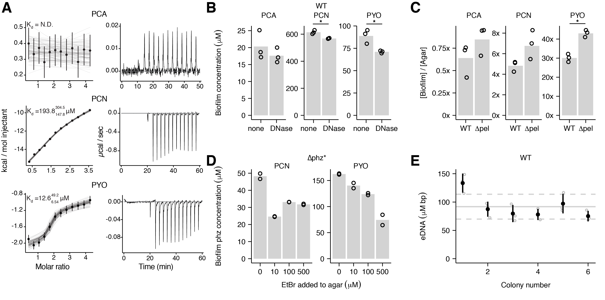

```{r setup, echo = F, message = F, warning = F}
knitr::opts_chunk$set(tidy.opts=list(width.cutoff=60),tidy=TRUE, echo = F, message=FALSE, warning=FALSE, fig.align="center", fig.retina = 2)

library(tidyverse)
library(knitr)
```

<br>

# Abstract

---

Extracellular electron transfer (EET) enables metabolic activity by microorganisms, particularly under oxidant-limited conditions that occur in biofilm communities. Although different mechanisms underpin this process in select organisms, a widespread strategy involves extracellular electron shuttles (EES), redox-active metabolites that are secreted and recycled by diverse bacteria. How EES catalyze electron transfer within biofilms has been a long-standing question. Here, we describe studies of phenazine EES and how they mediate efficient EET in Pseudomonas aeruginosa biofilms, which are important in nature and disease. We find that phenazine retention in the biofilm matrix is facilitated by extracellular DNA (eDNA). In vitro studies reveal that eDNA binds the phenazines pyocyanin (PYO) and phenazine carboxamide (PCN), and that PCN participates in DNA charge-transfer reactions. Electrochemical measurements of biofilms indicate that eDNA-retained-PYO experiences slow physical diffusion within the biofilm yet supports rapid EET. Taken together, these results suggest that eDNA may play a hitherto unrecognized role in coordinating and stimulating metabolic processes in diverse biofilm systems.

<br>

# Authors

---

* [Scott H. Saunders](https://scott-saunders.github.io/labwork/), Graduate student, Caltech BBE, Pasadena, CA
* [Jacqueline K. Barton](http://www.its.caltech.edu/~jkbgrp/)
* [Leonard M. Tender](NRL), Scientist, Navy Research Lab
* [Dianne K. Newman](http://dknweb.caltech.edu/Newman_Lab.html), Professor, Caltech BBE & GPS, Pasadena, CA

<br>

# Summary {.tabset}

----

We have found a few things merp derp:

## 1

Put simple explanatory figures here with short narratives. E.g. the phenazine biofilm cycle or other illustrator generated diagrams.

Colony biofilms retain certain phenazines. Some more text here. Test

```{r}

```

## 2

Phenazines bind extracellular DNA

[some more data]

## 3

Electron transfer can occur in three ways

1. Solution ET
2. Self-exchange
3. DNA mediated self-exchange

## 4

Growing biofilms on electrodes

[some more data]

## 5

Electron transfer mechanisms in vivo

[merp]

## 6

A model

[merp]

# {.toc-ignore}
<br>

# Computational notebooks

----

These are notebooks generated in R. They fully reproduce the figures in the paper from the underlying raw data. These links will bring you to rendered html versions of the notebooks, but you are free to download the data and code from the [github repository]() and run the notebooks on your own computer (given that you have R).

## Main figures

* [Figure 1.](https://scott-saunders.github.io/phz_eDNA_2019/code/figures/Fig_1/phz2019_Fig_1_colony_retention.html) Description here ;laksdjf.

* [Figure 2.](https://scott-saunders.github.io/phz_eDNA_2019/code/figures/Fig_2/phz2019_Fig_2_PYO_eDNA.html) Description here ;laksdjf.

* [Figure 3.](https://scott-saunders.github.io/phz_eDNA_2019/code/figures/Fig_3/phz2019_Fig_3_phz_ET_invitro.html) Description here ;laksdjf.

* [Figure 4.](https://scott-saunders.github.io/phz_eDNA_2019/code/figures/Fig_4/phz2019_Fig_4.html) Description here ;laksdjf.

* [Figure 5.](https://scott-saunders.github.io/phz_eDNA_2019/code/figures/Fig_6/phz2019_Fig_6.html) description here

## Supplemental figures

* [Figure S6.](https://scott-saunders.github.io/phz_eDNA_2019/code/figures/supplement/phz_eDNA_2019_Fig_S6.html)

## Data processing

* [IDA data](https://scott-saunders.github.io/phz_eDNA_2019/code/processing/IDA_dPHZ/IDA_dPHZ_processing.html) description here
