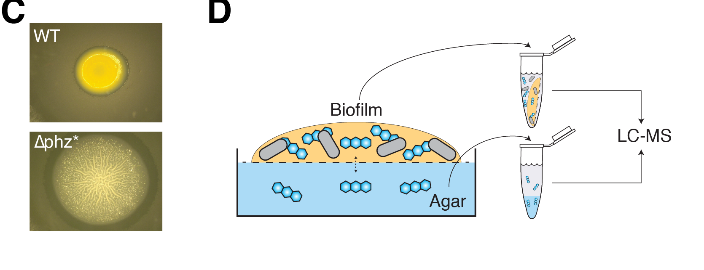

```{r setup, echo = F, message = F, warning = F}
knitr::opts_chunk$set(tidy.opts=list(width.cutoff=60),tidy=TRUE, echo = F, message=FALSE, warning=FALSE, fig.align="center", fig.retina = 2)

library(tidyverse)
library(knitr)
```

<br>

# Abstract

---

Extracellular electron transfer (EET), the process whereby cells access electron acceptors or donors that reside many cell lengths away, enables metabolic activity by microorganisms, particularly under oxidant-limited conditions that occur in multicellular bacterial biofilms. Although different mechanisms underpin this process in select organisms, a widespread strategy involves extracellular electron shuttles, redox-active metabolites that are secreted and recycled by diverse bacteria. How these shuttles catalyze electron transfer within biofilms without being lost to the environment has been a long-standing question. Here, we show that phenazine electron shuttles mediate efficient EET through interactions with extracellular DNA (eDNA) in *Pseudomonas aeruginosa* biofilms, which are important in nature and disease. Retention of pyocyanin (PYO) and phenazine carboxamide in the biofilm matrix is facilitated by binding to eDNA. In vitro, different phenazines can exchange electrons in the presence or absence of DNA and phenazines can participate directly in redox reactions through DNA; the biofilm eDNA can also support rapid ET between intercalators. Electrochemical measurements of biofilms indicate that retained PYO supports an efficient redox cycle with rapid EET and slow loss from the biofilm. Together, these results establish that eDNA plays a previously unrecognized role facilitating phenazine metabolic processes in P. aeruginosa biofilms, suggesting a model for how extracellular electron shuttles achieve retention and efficient EET in biofilms. 

<br>

# Authors

---

* [Scott H. Saunders](https://scott-saunders.github.io/labwork/), Graduate student, Caltech BBE, Pasadena, CA
* [Edmund Tse](https://et-lab-hku.weebly.com/), Assistant Professor, University of Hong Kong, Hong Kong
* [Matthew Yates](https://scholar.google.com/citations?user=QjVhIr0AAAAJ&hl=en), Research Biologist, Naval Research Laboratory, Washington, D.C.
* [Fernanda Jimenéz Otero](http://orcid.org/0000-0003-1583-6495), Post-Doc, Naval Research Laboratory, Washington, D.C.
* [Scott Trammell](https://scholar.google.com/citations?user=KgxbIM8AAAAJ&hl=en), Scientist, Naval Research Laboratory, Washington, D.C.
* [Eric Stemp](https://www.msmu.edu/resources-culture/faculty-directory/faculty-members/stemp-eric.php), Professor, Mount St. Mary's, Los Angeles, CA
* [Jacqueline K. Barton](http://www.its.caltech.edu/~jkbgrp/), Professor, Caltech CCE, Pasadena, CA
* [Leonard M. Tender](https://scholar.google.com/citations?user=Rd6gIBUAAAAJ&hl=en), Scientist, Naval Research Laboratory, Washington, D.C.
* [Dianne K. Newman](http://dknweb.caltech.edu/Newman_Lab.html), Professor, Caltech BBE & GPS, Pasadena, CA

<br>

# Summary {.tabset}

----

[Motivation statement here]

## 1

### *Pseudomonas aeruginosa* and phenazines {.toc-ignore}

*Pseudomonas aeruginosa* is a bacterium that makes special redox active metabolites (electron carriers), called phenazines. These phenazines come in a few different forms that are shown below (PCA, PCN, PYO). This organism tends to live as "biofilms", dense groups of cells attached to surfaces. These structures are so dense that the cells on the outside of the biofilm consume oxygen faster than it can diffuse to the inside of the group. These cells respire oxygen (use as a terminal electron acceptor), just like animals do, so the cells in the interior of the biofilm could suffocate without oxygen. However, these interior cells are able to actually use their phenazine molecules to transport electrons to the oxygen at the edge of the biofilm. This is an amazing strategy, but many aspects of this phenazine metabolism remain poorly understood. Specifically, we set out to answer X, Y, Z.


```{r out.width='75%'}

```

## 2

### Colony biofilms retain certain phenazines {.toc-ignore}


```{r out.width='75%'}

```

## 3

### PYO binds extracellular DNA in the biofilm {.toc-ignore}

[image of eDNA in biofilm]

## 4

### Phenazines support electron transfer in vitro {.toc-ignore}

[inter phz diagram] 
[DNA CT diagram]

## 5

### Biofilms grow on electrodes and support phenazine electron transfer {.toc-ignore}

[IDA image / diagrams]

## 6

### An updated picture of phenazine ET {.toc-ignore}

[fig 6 diagram]

# {.toc-ignore}
<br>

# Computational notebooks

----

These are notebooks generated in R. They fully reproduce the figures in the paper from the underlying raw data. These links will bring you to rendered html versions of the notebooks, but you are free to download the data and code from the [github repository]() and run the notebooks on your own computer (given that you have R).

## Main figures

* [Figure 1.](https://scott-saunders.github.io/phz_eDNA_2019/code/figures/Fig_1/phz2019_Fig_1.html) Colony biofilms retain PYO and PCN, but not PCA.

* [Figure 2.](https://scott-saunders.github.io/phz_eDNA_2019/code/figures/Fig_2/phz2019_Fig_2.html) Phenazines bind extracellular DNA in vitro and in vivo.

* [Figure 3.](https://scott-saunders.github.io/phz_eDNA_2019/code/figures/Fig_3/phz2019_Fig_3.html) Constraints on phenazine electron transfer in vitro.

* [Figure 4.](https://scott-saunders.github.io/phz_eDNA_2019/code/figures/Fig_4/phz2019_Fig_4.html) Electrode grown biofilms exhibit PYO dependent electron transfer.

* [Figure 5.](https://scott-saunders.github.io/phz_eDNA_2019/code/figures/Fig_5/phz2019_Fig_5.html) PYO mediated electron transfer is faster than PYO loss from the biofilm.


## Supplemental figures

* [Figure S1.](https://scott-saunders.github.io/phz_eDNA_2019/code/figures/supplement/Fig_S1/phz2019_Fig_S1.html) Colony biofilm images and controls.

* [Figure S2.](https://scott-saunders.github.io/phz_eDNA_2019/code/figures/supplement/Fig_S2/phz2019_Fig_S2.html) Phenazine - DNA binding assays.

* [Figure S3.](https://scott-saunders.github.io/phz_eDNA_2019/code/figures/supplement/Fig_S3/phz2019_Fig_S3.html) eDNA in colony biofilms.

* [Figure S4.](https://scott-saunders.github.io/phz_eDNA_2019/code/figures/supplement/Fig_S4/phz2019_Fig_S4.html) Phenazine electron transfer and time resolved spectroscopy.

* [Figure S5.](https://scott-saunders.github.io/phz_eDNA_2019/code/figures/supplement/Fig_S4/phz2019_Fig_S4.html) IDA biofilm phenazine production and retention.

* [Figure S6.](https://scott-saunders.github.io/phz_eDNA_2019/code/figures/supplement/Fig_S6/phz2019_Fig_S6.html) IDA Dap measurements.

* [Figure S7.](https://scott-saunders.github.io/phz_eDNA_2019/code/figures/supplement/Fig_S7/phz2019_Fig_S7.html) IDA Dloss measurements. 

## Data processing

* [IDA ∆phz data](https://scott-saunders.github.io/phz_eDNA_2019/code/processing/IDA_dPHZ/IDA_dPHZ_processing.html)

* [IDA WT data](https://scott-saunders.github.io/phz_eDNA_2019/code/processing/IDA_WT/IDA_WT_processing.html)

* [IDA blank data](https://scott-saunders.github.io/phz_eDNA_2019/code/processing/IDA_blank/IDA_blank_processing.html)

